# 构建推荐引擎

在本章中，我们将介绍以下食谱：

+   构建数据处理的功能组合

+   构建机器学习管道

+   寻找最近邻

+   构建 k 最近邻分类器

+   构建 k 最近邻回归器

+   计算欧几里得距离得分

+   计算皮尔逊相关得分

+   在数据集中寻找相似用户

+   生成电影推荐

+   实现排名算法

+   使用 TensorFlow 构建过滤模型

# 技术要求

为了处理本章中的食谱，你需要以下文件（这些文件可在 GitHub 上找到）：

+   `function_composition.py`

+   `pipeline.py`

+   `knn.py`

+   `nn_classification.py`

+   `nn_regression.py`

+   `euclidean_score.py`

+   `pearson_score.py`

+   `find_similar_users.py`

+   `movie_recommendations.py`

+   `LambdaMARTModel.py`

+   `train.txt`

+   `vali.txt`

+   `test.txt`

+   `TensorFilter.py`

# 介绍推荐引擎

推荐引擎是一个可以预测用户可能感兴趣的内容的模型。当我们将其应用于电影等场景时，这变成了电影推荐引擎。我们通过预测当前用户可能会如何评分来过滤数据库中的项目。这有助于我们将用户与数据集中的正确内容相连接。这有什么相关性？如果你有一个庞大的目录，那么用户可能或可能找不到所有与他们相关的所有内容。通过推荐正确的内容，你可以增加消费。像 Netflix 这样的公司严重依赖推荐来保持用户的参与度。

推荐引擎通常使用协同过滤或基于内容的过滤来生成一组推荐。两种方法之间的区别在于推荐挖掘的方式。协同过滤从当前用户的过去行为以及其他用户的评分构建模型。然后我们使用这个模型来预测这个用户可能会感兴趣的内容。另一方面，基于内容的过滤使用项目本身的特征来向用户推荐更多项目。项目之间的相似性是这里的驱动力。在本章中，我们将重点介绍协同过滤。

# 构建数据处理的功能组合

任何机器学习系统的主要部分之一是数据处理管道。在数据被输入到机器学习算法进行训练之前，我们需要以不同的方式对其进行处理，使其适合该算法。拥有一个健壮的数据处理管道对于构建准确和可扩展的机器学习系统至关重要。有很多基本功能可用，数据处理管道通常是由这些功能的组合构成的。与其以嵌套或循环的方式调用这些函数，不如使用函数式编程范式来构建组合。

# 准备工作

让我们看看如何将这些基本函数组合成一个可重用的函数组合。在这个菜谱中，我们将创建三个基本函数，并查看如何构建一个管道。

# 如何做...

让我们看看如何构建数据处理的功能组合：

1.  创建一个新的 Python 文件，并添加以下行（完整的代码在提供的`function_composition.py`文件中）：

```py
import numpy as np
from functools import reduce 
```

1.  让我们定义一个函数，将`3`加到数组的每个元素上：

```py
def add3(input_array): 
    return map(lambda x: x+3, input_array) 
```

1.  现在，让我们定义第二个函数，将`2`乘以数组的每个元素：

```py
def mul2(input_array): return map(lambda x: x*2, input_array) 
```

1.  现在，让我们再定义一个函数，从数组的每个元素中减去`5`：

```py
def sub5(input_array): 
    return map(lambda x: x-5, input_array)
```

1.  让我们定义一个函数组合器，它接受函数作为输入参数，并返回一个组合函数。这个组合函数基本上是一个按顺序应用所有输入函数的函数：

```py
def function_composer(*args): 
    return reduce(lambda f, g: lambda x: f(g(x)), args) 
```

我们使用`reduce`函数通过依次应用序列中的函数来组合所有输入函数。

1.  现在，我们已经准备好使用这个函数组合器了。让我们定义一些数据和一系列操作：

```py
if __name__=='__main__': 
    arr = np.array([2,5,4,7]) 

    print("Operation: add3(mul2(sub5(arr)))") 
```

1.  如果我们使用常规方法，我们会依次应用，如下所示：

```py
    arr1 = add3(arr) 
    arr2 = mul2(arr1) 
    arr3 = sub5(arr2) 
    print("Output using the lengthy way:", list(arr3)) 
```

1.  现在，让我们使用函数组合器在单行中实现相同的功能：

```py
    func_composed = function_composer(sub5, mul2, add3) 
    print("Output using function composition:", list(func_composed(arr)))  
```

1.  我们也可以用前一种方法在单行中做同样的事情，但符号会变得非常嵌套和难以阅读。此外，它不可重用；如果你想重用这个操作序列，你必须再次写下整个内容：

```py
    print("Operation: sub5(add3(mul2(sub5(mul2(arr)))))\nOutput:", \
            list(function_composer(mul2, sub5, mul2, add3, sub5)(arr)))
```

1.  如果你运行此代码，你将在终端上得到以下输出：

```py
Operation: add3(mul2(sub5(arr)))
Output using the lengthy way: [5, 11, 9, 15]
Output using function composition: [5, 11, 9, 15]
Operation: sub5(add3(mul2(sub5(mul2(arr)))))
Output: [-10, 2, -2, 10]
```

# 它是如何工作的...

在这个菜谱中，我们创建了三个基本函数，并学习了如何组合一个管道。为此，我们使用了`reduce()`函数。这个函数接受一个函数和一个序列，并返回一个单一值。

`reduce()`函数计算返回值，如下所示：

+   首先，函数通过使用序列的前两个元素来计算结果。

+   接下来，函数使用上一步得到的结果和序列中的下一个值。

+   这个过程会一直重复，直到序列的末尾。

# 还有更多...

在菜谱开头使用的三个基本函数利用了`map()`函数。这个函数用于将一个函数应用于特定值的所有元素。结果返回一个 map 对象；这个对象是一个迭代器，因此我们可以遍历其元素。为了打印这个对象，我们将 map 对象转换为序列对象，即列表。

# 参见

+   参考 Python 官方文档中的`map()`函数：[`docs.python.org/3/library/functions.html#map`](https://docs.python.org/3/library/functions.html#map)

+   参考 Python 官方文档中的`reduce()`函数：[`docs.python.org/3/library/functools.html?highlight=reduce#functools.reduce`](https://docs.python.org/3/library/functools.html?highlight=reduce#functools.reduce)

# 构建机器学习管道

` scikit-learn`库用于构建机器学习管道。当我们定义函数时，库将构建一个组合对象，使数据通过整个管道。这个管道可以包括函数，如预处理、特征选择、监督学习和无监督学习。

# 准备工作

在这个菜谱中，我们将构建一个管道，用于获取输入特征向量，选择前* k* 个特征，然后使用随机森林分类器进行分类。

# 如何做到这一点...

让我们看看如何构建机器学习管道：

1.  创建一个新的 Python 文件并导入以下包（完整的代码在您已经提供的` pipeline.py`文件中）：

```py
from sklearn.datasets import samples_generator 
from sklearn.ensemble import RandomForestClassifier 
from sklearn.feature_selection import SelectKBest, f_regression 
from sklearn.pipeline import Pipeline 
```

1.  让我们生成一些样本数据来玩耍，如下所示：

```py
# generate sample data 
X, y = samples_generator.make_classification( 
        n_informative=4, n_features=20, n_redundant=0, random_state=5) 
```

这行生成了` 20` 维的特征向量，因为这是默认值。您可以使用上一行中的` n_features`参数来更改它。

1.  我们管道的第一步是在数据点进一步使用之前选择* k* 个最佳特征。在这种情况下，让我们将` k` 设置为` 10`：

```py
# Feature selector  
selector_k_best = SelectKBest(f_regression, k=10)
```

1.  下一步是使用随机森林分类器方法对数据进行分类：

```py
# Random forest classifier 
classifier = RandomForestClassifier(n_estimators=50, max_depth=4)
```

1.  现在，我们已经准备好构建管道。` Pipeline()`方法允许我们使用预定义的对象来构建管道：

```py
# Build the machine learning pipeline 
pipeline_classifier = Pipeline([('selector', selector_k_best), ('rf', classifier)]) 
```

我们还可以为管道中的块分配名称。在上行中，我们将` selector` 名称分配给我们的特征选择器，将` rf`分配给我们的随机森林分类器。您可以使用任何其他随机名称！

1.  我们还可以在过程中更新这些参数。我们可以使用之前步骤中分配的名称来设置参数。例如，如果我们想在特征选择器中将` k` 设置为` 6`，在随机森林分类器中将` n_estimators`设置为` 25`，我们可以像以下代码所示那样做。请注意，这些是之前步骤中给出的变量名称：

```py
pipeline_classifier.set_params(selector__k=6,  
        rf__n_estimators=25) 
```

1.  让我们继续训练分类器：

```py
# Training the classifier 
pipeline_classifier.fit(X, y) 
```

1.  现在让我们预测训练数据的输出，如下所示：

```py
# Predict the output prediction = pipeline_classifier.predict(X) print("Predictions:\n", prediction) 
```

1.  现在，让我们估计这个分类器的性能，如下所示：

```py
# Print score 
print("Score:", pipeline_classifier.score(X, y))                         
```

1.  我们还可以查看哪些特征将被选择，所以让我们继续并打印它们：

```py
# Print the selected features chosen by the selector features_status = pipeline_classifier.named_steps['selector'].get_support() selected_features = [] for count, item in enumerate(features_status): if item: selected_features.append(count) print("Selected features (0-indexed):", ', '.join([str(x) for x in selected_features]))
```

1.  如果您运行此代码，您将在您的终端上得到以下输出：

```py
Predictions:
 [1 1 0 1 0 0 0 0 1 1 1 1 0 1 1 0 0 1 0 0 0 0 0 1 0 1 0 0 1 1 0 0 0 1 0 0 1
 1 1 1 1 1 1 1 1 0 0 1 1 0 1 1 0 1 0 1 1 0 0 0 1 1 1 0 0 1 0 0 0 1 1 0 0 1
 1 1 0 0 0 1 0 1 0 1 0 0 1 1 1 0 1 0 1 1 1 0 1 1 0 1]
Score: 0.95
Selected features (0-indexed): 0, 5, 9, 10, 11, 15
```

# 它是如何工作的...

选择* k* 个最佳特征的优势在于我们将能够处理低维数据。这有助于减少计算复杂性。我们选择* k* 个最佳特征的方式基于单变量特征选择。这执行单变量统计测试，然后从特征向量中提取表现最好的特征。单变量统计测试是指只涉及一个变量的分析技术。

# 更多内容...

一旦进行这些测试，特征向量中的每个特征都会被分配一个分数。基于这些分数，我们选择前*k*个特征。我们将此作为分类器管道中的预处理步骤。一旦我们提取了前*k*个特征，就形成了一个 k 维特征向量，我们将其用作随机森林分类器的输入训练数据。

# 参考信息

+   请参阅`sklearn.ensemble.RandomForestClassifier()`函数的官方文档：[`scikit-learn.org/stable/modules/generated/sklearn.ensemble.RandomForestClassifier.html`](https://scikit-learn.org/stable/modules/generated/sklearn.ensemble.RandomForestClassifier.html)

+   请参阅`sklearn.feature_selection.SelectKBest()`函数的官方文档：[`scikit-learn.org/stable/modules/generated/sklearn.feature_selection.SelectKBest.html`](https://scikit-learn.org/stable/modules/generated/sklearn.feature_selection.SelectKBest.html)

+   请参阅`sklearn.pipeline.Pipeline()`函数的官方文档：[`scikit-learn.org/stable/modules/generated/sklearn.pipeline.Pipeline.html`](https://scikit-learn.org/stable/modules/generated/sklearn.pipeline.Pipeline.html)

+   请参阅`sklearn.feature_selection.f_regression()`函数的官方文档：[`scikit-learn.org/stable/modules/generated/sklearn.feature_selection.f_regression.html`](https://scikit-learn.org/stable/modules/generated/sklearn.feature_selection.f_regression.html)

# 寻找最近邻

最近邻模型指的是一类旨在根据训练数据集中最近邻的数量做出决策的算法。最近邻方法包括找到与新的点距离相近的预定义数量的训练样本，并预测标签。样本的数量可以是用户定义的、一致的或不同的，这取决于点的局部密度。距离可以用任何度量标准来计算——标准欧几里得距离是最常见的选项。基于邻居的方法只是简单地记住所有训练数据。

# 准备工作

在本菜谱中，我们将使用笛卡尔平面上的一系列点来寻找最近邻。

# 如何做到这一点...

让我们看看如何找到最近邻，如下所示：

1.  创建一个新的 Python 文件，并导入以下包（完整的代码已包含在您提供的`knn.py`文件中）：

```py
import numpy as np 
import matplotlib.pyplot as plt 
from sklearn.neighbors import NearestNeighbors 
```

1.  让我们创建一些二维样本数据：

```py
# Input data 
X = np.array([[1, 1], [1, 3], [2, 2], [2.5, 5], [3, 1],  
        [4, 2], [2, 3.5], [3, 3], [3.5, 4]])
```

1.  我们的目标是找到任何给定点的三个最近邻，所以让我们定义这个参数：

```py
# Number of neighbors we want to find 
num_neighbors = 3 
```

1.  让我们定义一个不在输入数据中的随机数据点：

```py
# Input point 
input_point = [2.6, 1.7] 
```

1.  我们需要看看这些数据看起来像什么；让我们按如下方式绘制它：

```py
# Plot datapoints 
plt.figure() 
plt.scatter(X[:,0], X[:,1], marker='o', s=25, color='k') 
```

1.  为了找到最近邻，我们需要定义具有正确参数的`NearestNeighbors`对象，并在输入数据上对其进行训练：

```py
# Build nearest neighbors model 
knn = NearestNeighbors(n_neighbors=num_neighbors, algorithm='ball_tree').fit(X) 
```

1.  我们现在可以找到输入点到输入数据中所有点的`distances`参数：

```py
distances, indices = knn.kneighbors(input_point) 
```

1.  我们可以打印`k 最近邻`，如下所示：

```py
# Print the 'k' nearest neighbors 
print("k nearest neighbors")
for rank, index in enumerate(indices[0][:num_neighbors]):
    print(str(rank+1) + " -->", X[index])
```

`indices`数组已经排序，所以我们只需要解析它并打印数据点。

1.  现在，让我们绘制输入数据点和突出显示 k 个最近邻：

```py
# Plot the nearest neighbors  
plt.figure() 
plt.scatter(X[:,0], X[:,1], marker='o', s=25, color='k') 
plt.scatter(X[indices][0][:][:,0], X[indices][0][:][:,1],  
        marker='o', s=150, color='k', facecolors='none') 
plt.scatter(input_point[0], input_point[1], 
        marker='x', s=150, color='k', facecolors='none') 

plt.show() 
```

1.  如果你运行此代码，你将在你的终端上得到以下输出：

```py
k nearest neighbors
1 --> [2\. 2.]
2 --> [3\. 1.]
3 --> [3\. 3.]
```

这是输入数据点的图示：

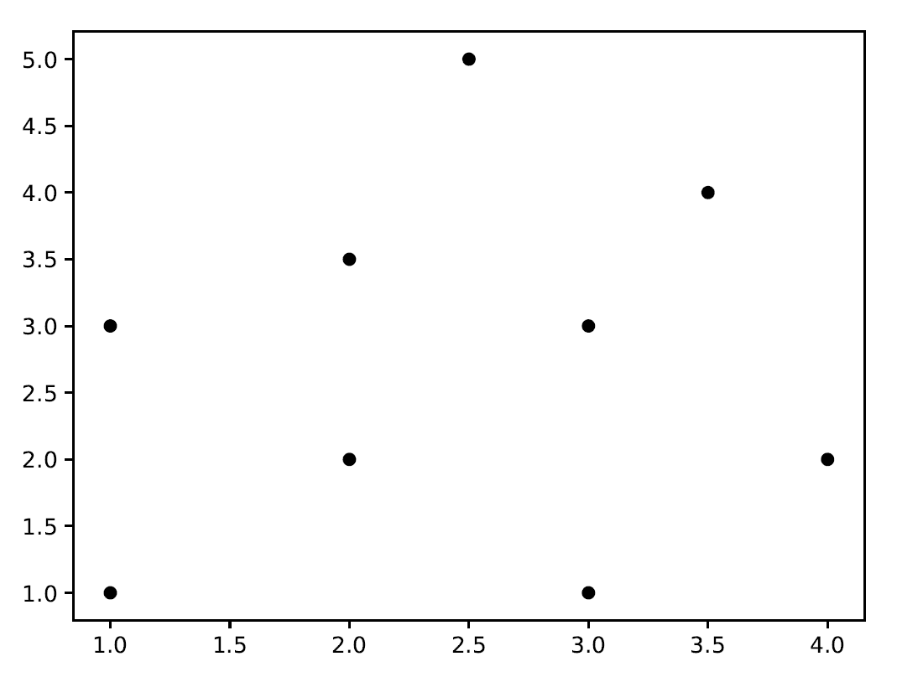

第二个输出图显示了测试数据点的位置和三个最近邻，如下面的截图所示：

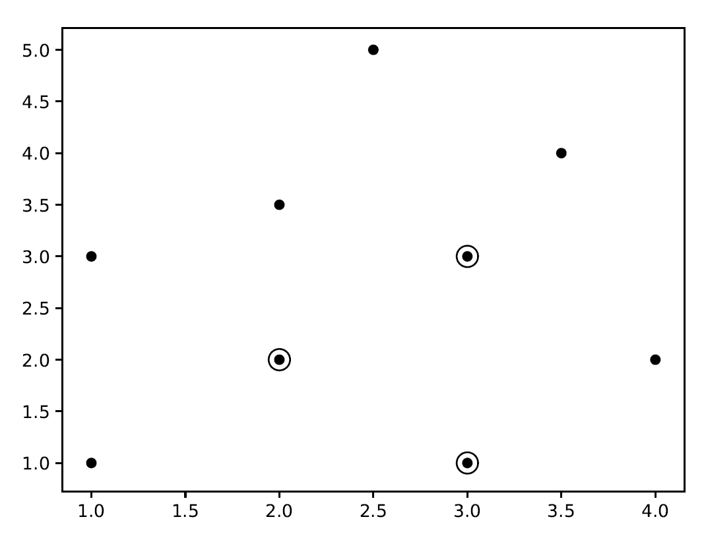

# 它是如何工作的...

在这个菜谱中，我们通过使用笛卡尔平面上的点来寻找最近邻。为此，根据训练对象的位置和特征将空间划分为区域。即使它不是初始条件所明确要求的，这也可以被认为是算法的训练集。为了计算距离，对象通过多维空间中的位置向量来表示。最后，如果一个点是最接近被考察对象的 k 个例子中最频繁的，则将其分配到某个类别。邻近性是通过点之间的距离来衡量的。邻居是从一组已知正确分类的对象中选取的。

# 更多内容...

为了构建最近邻模型，使用了`BallTree`算法。`BallTree`是一种在多维空间中组织点的数据结构。该算法之所以得名，是因为它将数据点划分为一系列嵌套的超球体，称为**球体**。它在许多应用中很有用，尤其是最近邻搜索。

# 参考以下内容

+   参考官方文档中的`sklearn.neighbors.NearestNeighbors()`函数：[`scikit-learn.org/stable/modules/generated/sklearn.neighbors.NearestNeighbors.html`](https://scikit-learn.org/stable/modules/generated/sklearn.neighbors.NearestNeighbors.html)

+   参考官方文档中的`sklearn.neighbors.BallTree()`函数：[`scikit-learn.org/stable/modules/generated/sklearn.neighbors.BallTree.html#sklearn.neighbors.BallTree`](https://scikit-learn.org/stable/modules/generated/sklearn.neighbors.BallTree.html#sklearn.neighbors.BallTree)

+   参考来自德克萨斯 A&M 大学工程学院的*最近邻*（[`www.nada.kth.se/~stefanc/DATORSEENDE_AK/l8.pdf`](https://www.nada.kth.se/~stefanc/DATORSEENDE_AK/l8.pdf)）

# 构建 k 最近邻分类器

k 最近邻算法是一种使用训练数据集中的 k 个最近邻来寻找未知对象类别的算法。当我们想要找到未知点所属的类别时，我们找到 k 个最近邻并进行多数投票。

# 准备工作

在这个菜谱中，我们将从包含一系列在笛卡尔平面上排列的点输入数据开始创建一个 k 最近邻分类器，这些点显示了三个区域内的分组。

# 如何做到这一点...

让我们看看如何构建 k-最近邻分类器：

1.  创建一个新的 Python 文件并导入以下包（完整的代码在已为你提供的`nn_classification.py`文件中）：

```py
import numpy as np 
import matplotlib.pyplot as plt 
import matplotlib.cm as cm 
from sklearn import neighbors, datasets 

from utilities import load_data 
```

1.  我们将使用`data_nn_classifier.txt`文件作为输入数据。让我们加载这个输入数据：

```py
# Load input data 
input_file = 'data_nn_classifier.txt' 
data = load_data(input_file) 
X, y = data[:,:-1], data[:,-1].astype(np.int) 
```

前两列包含输入数据，最后一列包含标签。因此，我们将它们分离成`X`和`y`，如前述代码所示。

1.  现在，让我们可视化输入数据，如下所示：

```py
# Plot input data 
plt.figure() 
plt.title('Input datapoints') 
markers = '^sov<>hp' 
mapper = np.array([markers[i] for i in y]) 
for i in range(X.shape[0]): 
    plt.scatter(X[i, 0], X[i, 1], marker=mapper[i],  
            s=50, edgecolors='black', facecolors='none') 
```

我们遍历所有数据点，并使用适当的标记来区分类别。

1.  为了构建分类器，我们需要指定我们想要考虑的最近邻数量。让我们定义这个参数：

```py
# Number of nearest neighbors to consider 
num_neighbors = 10
```

1.  为了可视化边界，我们需要定义一个网格并在该网格上评估分类器。让我们定义步长：

```py
# step size of the grid 
h = 0.01   
```

1.  我们现在准备好构建 k-最近邻分类器。让我们定义它并训练它，如下所示：

```py
# Create a K-Neighbours Classifier model and train it 
classifier = neighbors.KNeighborsClassifier(num_neighbors, weights='distance') 
classifier.fit(X, y)
```

1.  我们需要创建一个网格来绘制边界。让我们定义如下：

```py
# Create the mesh to plot the boundaries 
x_min, x_max = X[:, 0].min() - 1, X[:, 0].max() + 1 
y_min, y_max = X[:, 1].min() - 1, X[:, 1].max() + 1 
x_grid, y_grid = np.meshgrid(np.arange(x_min, x_max, h), np.arange(y_min, y_max, h)) 
```

1.  现在，让我们评估所有点的`classifier`输出：

```py
# Compute the outputs for all the points on the mesh 
predicted_values = classifier.predict(np.c_[x_grid.ravel(), y_grid.ravel()]) 
```

1.  让我们绘制它，如下所示：

```py
# Put the computed results on the map 
predicted_values = predicted_values.reshape(x_grid.shape) 
plt.figure() 
plt.pcolormesh(x_grid, y_grid, predicted_values, cmap=cm.Pastel1) 
```

1.  现在我们已经绘制了颜色网格，让我们叠加训练数据点以查看它们相对于边界的位置：

```py
# Overlay the training points on the map 
for i in range(X.shape[0]): 
    plt.scatter(X[i, 0], X[i, 1], marker=mapper[i],  
            s=50, edgecolors='black', facecolors='none') 

plt.xlim(x_grid.min(), x_grid.max()) 
plt.ylim(y_grid.min(), y_grid.max()) 
plt.title('k nearest neighbors classifier boundaries')
```

1.  现在，我们可以考虑一个测试数据点并查看分类器是否表现正确。让我们定义它并绘制它，如下所示：

```py
# Test input datapoint 
test_datapoint = [4.5, 3.6] 
plt.figure() 
plt.title('Test datapoint') 
for i in range(X.shape[0]): 
    plt.scatter(X[i, 0], X[i, 1], marker=mapper[i],  
            s=50, edgecolors='black', facecolors='none') 

plt.scatter(test_datapoint[0], test_datapoint[1], marker='x',  
        linewidth=3, s=200, facecolors='black') 
```

1.  我们需要使用以下模型提取 k-最近邻分类器：

```py
# Extract k nearest neighbors 
dist, indices = classifier.kneighbors(test_datapoint) 
```

1.  让我们绘制 k-最近邻分类器并突出显示它：

```py
# Plot k nearest neighbors 
plt.figure() 
plt.title('k nearest neighbors') 

for i in indices: 
    plt.scatter(X[i, 0], X[i, 1], marker='o',  
            linewidth=3, s=100, facecolors='black') 

plt.scatter(test_datapoint[0], test_datapoint[1], marker='x',  
        linewidth=3, s=200, facecolors='black') 

for i in range(X.shape[0]): 
    plt.scatter(X[i, 0], X[i, 1], marker=mapper[i],  
            s=50, edgecolors='black', facecolors='none') 

plt.show() 
```

1.  现在，让我们在终端上打印`classifier`输出：

```py
print("Predicted output:", classifier.predict(test_datapoint)[0])
```

打印出以下结果：

```py
Predicted output: 2
```

此外，展示了一系列图表。第一个输出图表描述了输入数据点的分布：

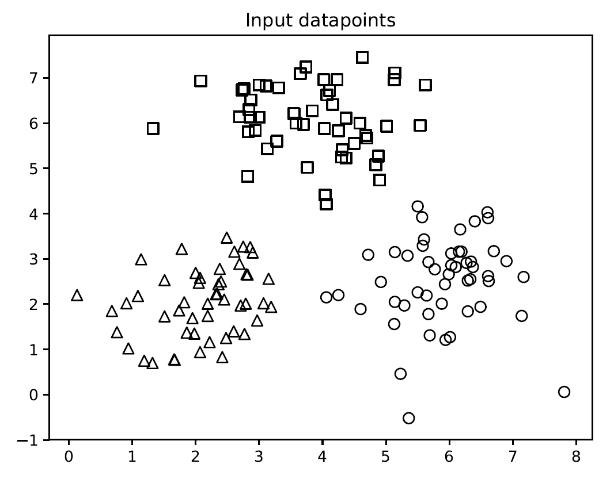

第二个输出图表描述了使用`k-最近邻`分类器获得的边界：

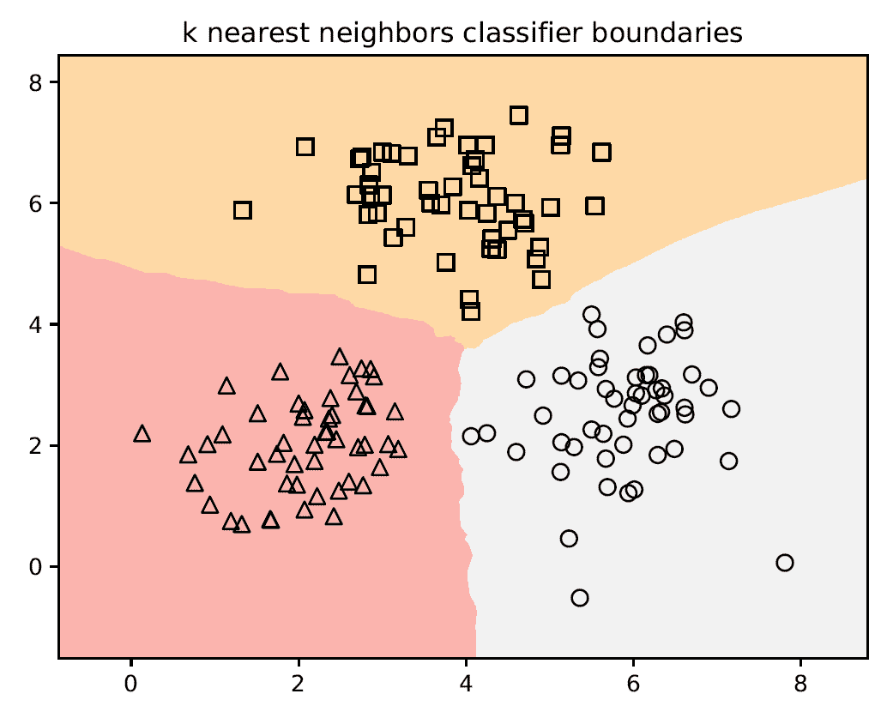

第三个输出图表描述了测试数据点的位置：

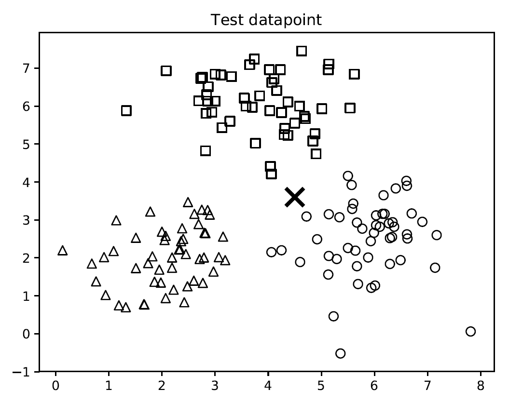

第四个输出图表描述了 10 个最近邻的位置：

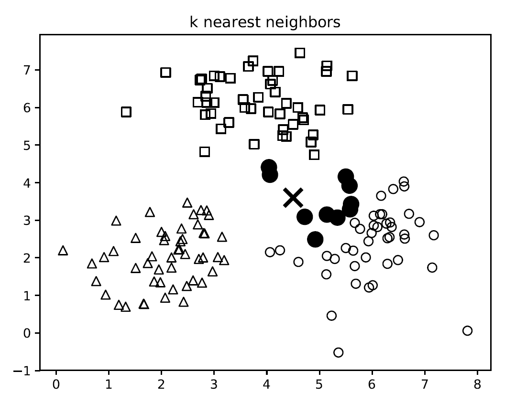

# 它是如何工作的...

k-最近邻分类器存储所有可用的数据点，并根据相似性度量对新数据点进行分类。这个相似性度量通常以距离函数的形式出现。这个算法是一种非参数技术，这意味着在制定之前不需要找出任何潜在参数。我们只需要选择一个对我们来说合适的`k`值。

一旦我们找到了 k 近邻分类器，我们就进行多数投票。新的数据点通过 k 近邻分类器的多数投票进行分类。这个数据点被分配给其 k 个最近邻中最常见的类别。如果我们把`k`的值设为`1`，那么这仅仅是一个最近邻分类器的案例，我们只需将数据点分配给训练数据集中其最近邻的类别。

# 更多内容...

k 近邻算法基于通过考虑训练集最接近的 k 个样本的类别来对未知样本进行分类的概念。新的样本将被分配给大多数 k 个最近样本所属的类别。因此，k 的选择对于将样本分配到正确的类别非常重要。如果 k 太小，分类可能对噪声敏感；如果 k 太大，分类可能计算成本高，并且邻域可能包括属于其他类别的样本。

# 参考以下内容

+   参考以下内容（来自阿姆斯特丹大学人文学院）：[`www.fon.hum.uva.nl/praat/manual/kNN_classifiers_1__What_is_a_kNN_classifier_.html`](http://www.fon.hum.uva.nl/praat/manual/kNN_classifiers_1__What_is_a_kNN_classifier_.html)

+   参考官方文档中的`sklearn.neighbors()`模块：[`scikit-learn.org/stable/modules/classes.html#module-sklearn.neighbors`](https://scikit-learn.org/stable/modules/classes.html#module-sklearn.neighbors)

+   参考以下内容（来自纽约大学）：[`people.csail.mit.edu/dsontag/courses/ml13/slides/lecture11.pdf`](http://people.csail.mit.edu/dsontag/courses/ml13/slides/lecture11.pdf)

+   参考官方文档中的`sklearn.neighbors.KNeighborsClassifier()`函数：[`scikit-learn.org/stable/modules/generated/sklearn.neighbors.KNeighborsClassifier.html`](https://scikit-learn.org/stable/modules/generated/sklearn.neighbors.KNeighborsClassifier.html)

# 构建一个 k 近邻回归器

我们学习了如何使用 k 近邻算法构建分类器。好事是，我们也可以将此算法用作回归器。对象的输出由其属性值表示，这是其 k 个最近邻的值的平均值。

# 准备工作

在这个菜谱中，我们将看到如何使用 k 近邻算法构建回归器。

# 如何操作...

让我们看看如何构建一个 k 近邻回归器：

1.  创建一个新的 Python 文件并导入以下包（完整的代码在提供的`nn_regression.py`文件中）： 

```py
import numpy as np 
import matplotlib.pyplot as plt 
from sklearn import neighbors 
```

1.  让我们生成一些样本高斯分布数据：

```py
# Generate sample data 
amplitude = 10 
num_points = 100 
X = amplitude * np.random.rand(num_points, 1) - 0.5 * amplitude 
```

1.  我们需要向数据中添加一些噪声，以引入一些随机性。添加噪声的目的是看看我们的算法是否能够克服它，并且仍然以鲁棒的方式运行：

```py
# Compute target and add noise 
y = np.sinc(X).ravel()  
y += 0.2 * (0.5 - np.random.rand(y.size))
```

1.  现在，让我们可视化它，如下所示：

```py
# Plot input data 
plt.figure() 
plt.scatter(X, y, s=40, c='k', facecolors='none') 
plt.title('Input data') 
```

1.  我们刚刚生成了一些数据，并在所有这些点上评估了一个连续值函数。让我们定义一个更密集的点网格：

```py
# Create the 1D grid with 10 times the density of the input data 
x_values = np.linspace(-0.5*amplitude, 0.5*amplitude, 10*num_points)[:, np.newaxis] 
```

我们定义这个更密集的网格是因为我们想要评估我们的回归器在这些所有点上，并查看它如何近似我们的函数。

1.  现在我们定义我们想要考虑的最近邻的数量：

```py
# Number of neighbors to consider  
n_neighbors = 8 
```

1.  让我们使用之前定义的参数初始化并训练 k 近邻回归器：

```py
# Define and train the regressor 
knn_regressor = neighbors.KNeighborsRegressor(n_neighbors, weights='distance') 
y_values = knn_regressor.fit(X, y).predict(x_values) 
```

1.  让我们通过将输入和输出数据重叠在一起来查看回归器的表现：

```py
plt.figure() 
plt.scatter(X, y, s=40, c='k', facecolors='none', label='input data') 
plt.plot(x_values, y_values, c='k', linestyle='--', label='predicted values') 
plt.xlim(X.min() - 1, X.max() + 1) 
plt.ylim(y.min() - 0.2, y.max() + 0.2) 
plt.axis('tight') 
plt.legend() 
plt.title('K Nearest Neighbors Regressor') 

plt.show()
```

1.  如果你运行此代码，第一个图表描述了输入数据点：

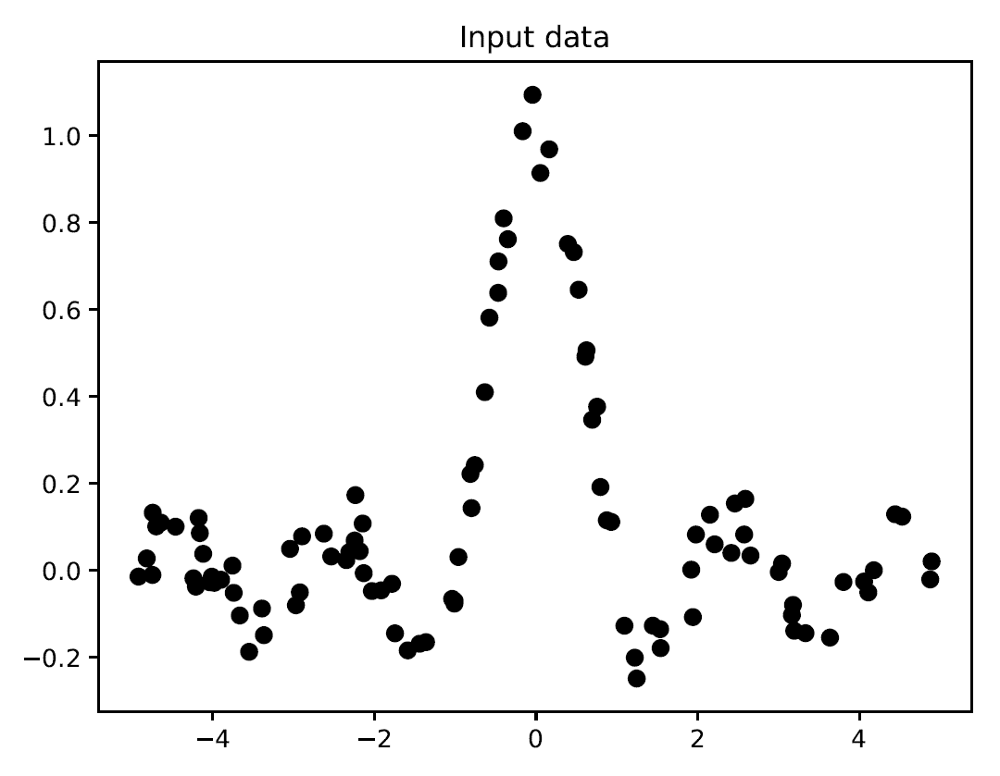

第二个图表展示了回归器预测的值：

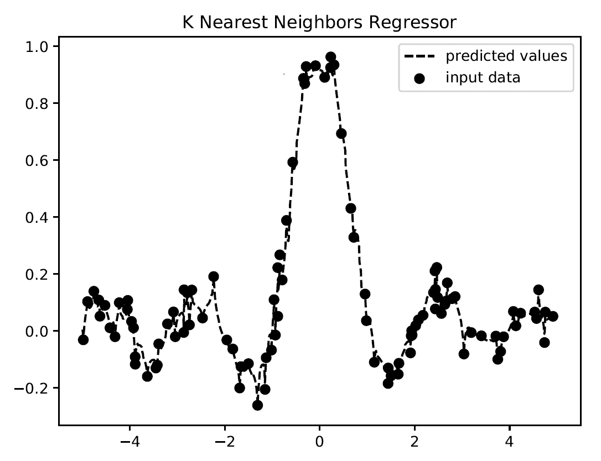

# 它是如何工作的...

回归器的目标是预测连续值输出。在这种情况下，我们没有固定数量的输出类别。我们只有一组实值输出值，我们希望我们的回归器预测未知数据点的输出值。在这种情况下，我们使用 `sinc` 函数来演示 k 近邻回归器。这也被称为 **卡丹尔正弦函数**。`sinc` 函数由以下方程定义：

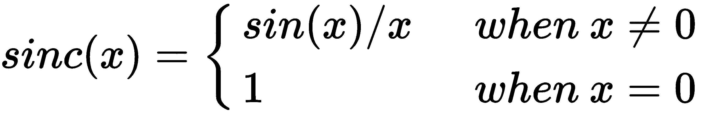

当 `x` 为 `0` 时，*sin(x)/x* 取得不定形 *0/0*。因此，我们必须计算当 `x` 趋近于 `0` 时该函数的极限。我们使用一组值进行训练，并为测试定义了一个更密集的网格。如图所示，输出曲线接近训练输出。

# 还有更多...

这种方法的主要优点是它不需要学习或构建模型；它可以以任意方式调整其决策边界，产生最灵活的模型表示；并且它还保证了增加训练集的可能性。然而，此算法也有许多缺点，包括易受数据噪声的影响、对无关特征的敏感，以及需要相似度度量来评估邻近性。

# 参考信息

+   参考官方文档的 `sklearn.neighbors.KNeighborsRegressor()` 函数：[`scikit-learn.org/stable/modules/generated/sklearn.neighbors.KNeighborsRegressor.html`](https://scikit-learn.org/stable/modules/generated/sklearn.neighbors.KNeighborsRegressor.html)

+   参考书籍 *使用 R 进行回归分析*，作者 Giuseppe Ciaburro，Packt 出版

+   参考杜克大学的 *线性回归与 K 近邻比较*（[`www2.stat.duke.edu/~rcs46/lectures_2017/03-lr/03-knn.pdf`](http://www2.stat.duke.edu/~rcs46/lectures_2017/03-lr/03-knn.pdf)）

# 计算欧几里得距离得分

现在我们已经对机器学习管道和最近邻分类器有了足够的背景知识，让我们开始讨论推荐引擎。为了构建推荐引擎，我们需要定义一个相似性度量，这样我们就可以找到与给定用户相似的数据库中的用户。欧几里得距离得分就是这样一种度量，我们可以用它来计算数据点之间的距离。我们将讨论转向电影推荐引擎。

# 准备工作

在这个菜谱中，我们将了解如何计算两个用户之间的欧几里得得分。

# 如何操作...

让我们看看如何计算欧几里得距离得分：

1.  创建一个新的 Python 文件并导入以下包（完整的代码在已经为你提供的`euclidean_score.py`文件中）：

```py
import json 
import numpy as np 
```

1.  我们现在将定义一个函数来计算两个用户之间的欧几里得得分。第一步是检查用户是否存在于数据库中：

```py
# Returns the Euclidean distance score between user1 and user2  
def euclidean_score(dataset, user1, user2): 
    if user1 not in dataset: 
        raise TypeError('User ' + user1 + ' not present in the dataset') 

    if user2 not in dataset: 
        raise TypeError('User ' + user2 + ' not present in the dataset') 
```

1.  为了计算得分，我们需要提取两个用户都评价过的电影：

```py
    # Movies rated by both user1 and user2 
    rated_by_both = {}  

    for item in dataset[user1]: 
        if item in dataset[user2]: 
            rated_by_both[item] = 1 
```

1.  如果没有共同的电影，那么用户之间没有相似性（或者至少，根据数据库中的评分我们无法计算它）：

```py
    # If there are no common movies, the score is 0  
    if len(rated_by_both) == 0: 
        return 0 
```

1.  对于每个共同评分，我们只计算平方差的和的平方根并归一化，使得得分在 0 到 1 之间：

```py
    squared_differences = []  

    for item in dataset[user1]: 
        if item in dataset[user2]: 
            squared_differences.append(np.square(dataset[user1][item] - dataset[user2][item])) 

    return 1 / (1 + np.sqrt(np.sum(squared_differences)))  
```

如果评分相似，则平方差的和将非常低。因此，得分将变得很高，这正是我们想要的这个度量标准。

1.  我们将使用`movie_ratings.json`文件作为我们的数据文件。让我们按照以下方式加载它：

```py
if __name__=='__main__': 
    data_file = 'movie_ratings.json' 

    with open(data_file, 'r') as f: 
        data = json.loads(f.read()) 
```

1.  让我们考虑两个随机用户并计算欧几里得距离得分：

```py
    user1 = 'John Carson' 
    user2 = 'Michelle Peterson' 

    print("Euclidean score:")
    print(euclidean_score(data, user1, user2)) 
```

1.  当你运行此代码时，你将在终端上看到以下欧几里得距离得分：

```py
0.29429805508554946
```

# 工作原理...

在大多数情况下，最近邻算法中使用的距离定义为两个点之间的欧几里得距离

根据以下公式计算点数：

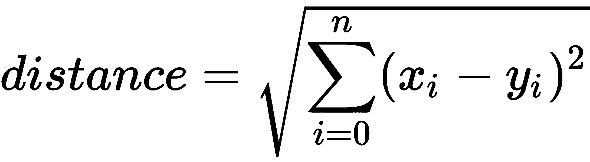

在二维平面上，欧几里得距离表示两点之间的最小距离，因此是连接两点的直线。这个距离是两个向量元素平方差的和的平方根，如前一个公式所示。

# 还有更多...

有其他类型的度量用于计算距离。所有这些类型通常试图避免平方根，因为它们在计算上很昂贵，并且是几个错误的原因。度量包括**闵可夫斯基**、**曼哈顿**和**余弦**距离。

# 参考信息

+   参考书籍《MATLAB for Machine Learning》，作者 Giuseppe Ciaburro，Packt Publishing 出版社

+   参考来自约克大学的《相似性、距离和流形学习》: [`simbad-fp7.eu/images/tutorial/02-ECCV2012Tutorial.pdf`](http://simbad-fp7.eu/images/tutorial/02-ECCV2012Tutorial.pdf)

+   参考来自维基百科的*欧几里得距离*：[`en.wikipedia.org/wiki/Euclidean_distance`](https://en.wikipedia.org/wiki/Euclidean_distance)

# 计算皮尔逊相关系数

欧几里得距离得分是一个好的度量标准，但它有一些缺点。因此，皮尔逊相关系数在推荐引擎中经常被使用。两个统计变量之间的皮尔逊相关系数是一个指数，表示它们之间可能存在的线性关系。它衡量两个数值变量同时变化的趋势。

# 准备工作

在这个菜谱中，我们将看到如何计算皮尔逊相关系数。

# 如何做...

让我们看看如何计算皮尔逊相关系数：

1.  创建一个新的 Python 文件并导入以下包（完整的代码已包含在为你提供的`pearson_score.py`文件中）：

```py
import json 
import numpy as np 
```

1.  我们将定义一个函数来计算数据库中两个用户之间的皮尔逊相关系数。我们的第一步是确认这些用户存在于数据库中：

```py
# Returns the Pearson correlation score between user1 and user2  
def pearson_score(dataset, user1, user2): 
    if user1 not in dataset: 
        raise TypeError('User ' + user1 + ' not present in the dataset') 

    if user2 not in dataset: 
        raise TypeError('User ' + user2 + ' not present in the dataset') 
```

1.  下一步是获取这两位用户都评分的电影：

```py
    # Movies rated by both user1 and user2 
    rated_by_both = {} 

    for item in dataset[user1]: 
        if item in dataset[user2]: 
            rated_by_both[item] = 1 

    num_ratings = len(rated_by_both)  
```

1.  如果没有共同的电影，那么这些用户之间没有可识别的相似性；因此，我们返回`0`：

```py
    # If there are no common movies, the score is 0  
    if num_ratings == 0: 
        return 0
```

1.  我们需要计算共同电影评分的平方值之和：

```py
    # Compute the sum of ratings of all the common preferences  
    user1_sum = np.sum([dataset[user1][item] for item in rated_by_both]) 
    user2_sum = np.sum([dataset[user2][item] for item in rated_by_both]) 
```

1.  现在，让我们计算所有共同电影评分的平方值之和：

```py
    # Compute the sum of squared ratings of all the common preferences  
    user1_squared_sum = np.sum([np.square(dataset[user1][item]) for item in rated_by_both]) 
    user2_squared_sum = np.sum([np.square(dataset[user2][item]) for item in rated_by_both]) 
```

1.  现在让我们计算乘积之和：

```py
    # Compute the sum of products of the common ratings  
    product_sum = np.sum([dataset[user1][item] * dataset[user2][item] for item in rated_by_both]) 
```

1.  我们现在准备计算计算皮尔逊相关系数所需的各种元素：

```py
    # Compute the Pearson correlation 
    Sxy = product_sum - (user1_sum * user2_sum / num_ratings) 
    Sxx = user1_squared_sum - np.square(user1_sum) / num_ratings 
    Syy = user2_squared_sum - np.square(user2_sum) / num_ratings 
```

1.  我们需要处理分母变为`0`的情况：

```py
    if Sxx * Syy == 0: 
        return 0 
```

1.  如果一切正常，我们`返回`皮尔逊相关系数，如下所示：

```py
    return Sxy / np.sqrt(Sxx * Syy) 
```

1.  现在让我们定义`main`函数并计算两个用户之间的皮尔逊相关系数：

```py
if __name__=='__main__': 
    data_file = 'movie_ratings.json' 

    with open(data_file, 'r') as f: 
        data = json.loads(f.read()) 

    user1 = 'John Carson' 
    user2 = 'Michelle Peterson' 

    print("Pearson score:")
    print(pearson_score(data, user1, user2)) 
```

1.  如果你运行此代码，你将在终端上看到以下皮尔逊相关系数：

```py
Pearson score:
0.39605901719066977
```

# 它是如何工作的...

皮尔逊相关系数的*r*系数衡量的是变量在间隔或等效比率之间的相关性。它由两个变量的标准化分数的乘积之和（z[x] * z[y]）除以受试者（或观察）的数量得出，如下所示：

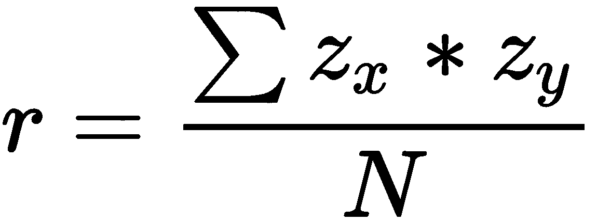

这个系数可以取介于-1.00（两个变量之间存在完美的负相关）和+1.00（两个变量之间存在完美的正相关）之间的值。相关性为 0 表示两个变量之间没有关系。

# 还有更多...

必须记住，皮尔逊公式与线性关系相关，因此，所有不同形式的关系都可能产生异常结果。

# 参考资料还包括

+   参考 Giuseppe Ciaburro 的《使用 R 进行回归分析》，Packt 出版社

+   参考来自肯特州立大学的*皮尔逊相关*：[`libguides.library.kent.edu/spss/pearsoncorr`](https://libguides.library.kent.edu/spss/pearsoncorr)

# 在数据集中找到相似的用户

在构建推荐引擎时，最重要的任务之一是找到相似的用户。这在创建提供给这些用户的推荐时非常有用。

# 准备工作

在这个菜谱中，我们将看到如何构建一个模型来查找相似用户。

# 如何操作...

让我们看看如何在数据集中查找相似用户：

1.  创建一个新的 Python 文件并导入以下包（完整的代码在已为你提供的 `find_similar_users.py` 文件中）：

```py
import json 
import numpy as np 

from pearson_score import pearson_score 
```

1.  让我们定义一个函数来查找与输入用户相似的用户。它接受三个输入参数：数据库、输入用户以及我们正在寻找的相似用户数量。我们的第一步是检查用户是否存在于数据库中。如果用户存在，我们需要计算该用户与数据库中所有其他用户的皮尔逊相关得分：

```py
# Finds a specified number of users who are similar to the input user 
def find_similar_users(dataset, user, num_users): 
    if user not in dataset: 
        raise TypeError('User ' + user + ' not present in the dataset') 

    # Compute Pearson scores for all the users 
    scores = np.array([[x, pearson_score(dataset, user, x)] for x in dataset if user != x]) 
```

1.  下一步是将这些分数按降序排列：

```py
    # Sort the scores based on second column 
    scores_sorted = np.argsort(scores[:, 1]) 

    # Sort the scores in decreasing order (highest score first)  
    scored_sorted_dec = scores_sorted[::-1] 
```

1.  现在我们提取 *k* 个最高得分并返回它们：

```py
    # Extract top 'k' indices 
    top_k = scored_sorted_dec[0:num_users]  

    return scores[top_k]  
```

1.  现在我们定义主函数并加载输入数据库：

```py
if __name__=='__main__': 
    data_file = 'movie_ratings.json' 

    with open(data_file, 'r') as f: 
        data = json.loads(f.read()) 
```

1.  我们想找到与 `John Carson` 相似的三个用户。我们通过以下步骤来完成：

```py
    user = 'John Carson'
    print("Users similar to " + user + ":\n")
    similar_users = find_similar_users(data, user, 3) 
    print("User\t\t\tSimilarity score\n")
    for item in similar_users:
        print(item[0], '\t\t', round(float(item[1]), 2))
```

1.  如果你运行此代码，你将在你的终端上看到以下输出：

```py
Users similar to John Carson:

User               Similarity score
Michael Henry                  0.99
Alex Roberts                   0.75
Melissa Jones                  0.59
```

# 它是如何工作的...

在这个菜谱中，我们正在寻找与输入用户相似的用户。给定数据库、输入用户以及我们正在寻找的相似用户数量，我们首先检查用户是否存在于数据库中。如果用户存在，计算该用户与数据库中所有其他用户的皮尔逊相关得分。

# 还有更多...

为了计算皮尔逊相关得分，使用了 `pearson_score()` 函数。这个函数在之前的 *计算皮尔逊相关得分* 菜谱中定义。

# 相关内容

+   参考来自西英格兰大学的 *皮尔逊相关系数*（[`learntech.uwe.ac.uk/da/default.aspx?pageid=1442`](http://learntech.uwe.ac.uk/da/default.aspx?pageid=1442)）

+   参考来自维基百科的 *皮尔逊相关系数*（[`en.wikipedia.org/wiki/Pearson_correlation_coefficient`](https://en.wikipedia.org/wiki/Pearson_correlation_coefficient)）

# 生成电影推荐

在这个菜谱中，我们将生成电影推荐。

# 准备工作

在这个菜谱中，我们将使用之前菜谱中构建的所有功能来构建一个电影推荐引擎。让我们看看如何构建它。

# 如何操作...

让我们看看如何生成电影推荐：

1.  创建一个新的 Python 文件并导入以下包（完整的代码在已为你提供的 `movie_recommendations.py` 文件中）：

```py
import json 
import numpy as np 

from pearson_score import pearson_score 
```

1.  我们将定义一个函数来为给定用户生成电影推荐。第一步是检查该用户是否存在于数据集中：

```py
# Generate recommendations for a given user 
def generate_recommendations(dataset, user): 
    if user not in dataset: 
        raise TypeError('User ' + user + ' not present in the dataset') 
```

1.  现在我们来计算该用户与数据集中所有其他用户的皮尔逊得分：

```py
    total_scores = {} 
    similarity_sums = {} 

    for u in [x for x in dataset if x != user]: 
        similarity_score = pearson_score(dataset, user, u) 

        if similarity_score <= 0: 
            continue 
```

1.  我们需要找到该用户尚未评分的电影：

```py
        for item in [x for x in dataset[u] if x not in dataset[user] or dataset[user][x] == 0]: 
            total_scores.update({item: dataset[u][item] * similarity_score}) 
            similarity_sums.update({item: similarity_score}) 
```

1.  如果用户观看了数据库中的每一部电影，那么我们无法为该用户推荐任何内容。让我们处理这个条件：

```py
    if len(total_scores) == 0: 
        return ['No recommendations possible'] 
```

1.  现在我们有了这些分数的列表。让我们创建一个电影排名的归一化列表：

```py
    # Create the normalized list 
    movie_ranks = np.array([[total/similarity_sums[item], item]  
            for item, total in total_scores.items()]) 
```

1.  我们需要根据分数按降序对列表进行排序：

```py
    # Sort in decreasing order based on the first column 
    movie_ranks = movie_ranks[np.argsort(movie_ranks[:, 0])[::-1]] 
```

1.  我们终于准备好提取电影推荐了：

```py
    # Extract the recommended movies 
    recommendations = [movie for _, movie in movie_ranks] 

    return recommendations
```

1.  现在，让我们定义`main`函数并加载数据集：

```py
if __name__=='__main__': 
    data_file = 'movie_ratings.json' 

    with open(data_file, 'r') as f: 
        data = json.loads(f.read()) 
```

1.  现在，让我们为`Michael Henry`生成推荐，如下所示：

```py
    user = 'Michael Henry'
    print("Recommendations for " + user + ":")
    movies = generate_recommendations(data, user) 
    for i, movie in enumerate(movies):
        print(str(i+1) + '. ' + movie)
```

1.  `John Carson`用户观看了所有电影。因此，如果我们尝试为他生成推荐，应该显示 0 个推荐。让我们看看这是否会发生，如下所示：

```py
    user = 'John Carson' 
    print("Recommendations for " + user + ":")
    movies = generate_recommendations(data, user) 
    for i, movie in enumerate(movies):
        print(str(i+1) + '. ' + movie)
```

1.  如果你运行此代码，你将在你的终端上看到以下输出：

```py
Recommendations for Michael Henry:
1\. Jerry Maguire
2\. Inception
3\. Anger Management
Recommendations for John Carson:
1\. No recommendations possible
```

# 它是如何工作的...

在这个菜谱中，我们已经构建了一个电影推荐引擎。要为特定用户生成推荐，将执行以下步骤：

1.  首先，我们检查用户是否存在于数据库中

1.  然后，我们计算皮尔逊相关系数

1.  然后，我们创建归一化列表

1.  然后，我们根据第一列按降序排序这个列表

1.  最后，我们提取推荐的电影

# 更多内容...

要构建电影推荐引擎，使用了`pearson_score()`函数。该函数在之前的*计算皮尔逊相关系数评分*菜谱中定义。

# 参考信息

+   参考*相关性和回归分析导论*（来自波士顿大学公共卫生学院）：[`sphweb.bumc.bu.edu/otlt/mph-modules/bs/bs704_multivariable/bs704_multivariable5.html`](http://sphweb.bumc.bu.edu/otlt/mph-modules/bs/bs704_multivariable/bs704_multivariable5.html)

+   参考*皮尔逊相关系数 r*（来自宾夕法尼亚州立大学）：[`newonlinecourses.science.psu.edu/stat501/node/256/`](https://newonlinecourses.science.psu.edu/stat501/node/256/)

+   参考*相关性与因果关系*（来自澳大利亚统计局）：[`www.abs.gov.au/websitedbs/a3121120.nsf/home/statistical+language+-+correlation+and+causation`](http://www.abs.gov.au/websitedbs/a3121120.nsf/home/statistical+language+-+correlation+and+causation)

# 实现排名算法

**学习排名**（LTR）是一种用于构建信息检索系统分类模型的方法。训练数据由包含诱导部分顺序的文章列表组成，该顺序为每篇文章提供一个数值或序数评分，或一个二元判断。模型的目的是根据从文章中获得的判断来考虑的评分，将元素重新排序到新的列表中。

# 准备工作

在这个菜谱中，我们将使用`pyltr`包，这是一个 Python LTR 工具包，包含排名模型、评估指标和数据整理助手。

# 如何做...

让我们看看如何实现排名算法：

1.  创建一个新的 Python 文件并导入以下包（完整代码在已提供的`LambdaMARTModel.py`文件中）：

```py
import pyltr
```

1.  我们将加载 Letor 数据集中包含的数据（`train.txt`，`vali.txt`和`test.txt`）：

```py
with open('train.txt') as trainfile, \
        open('vali.txt') as valifile, \
        open('test.txt') as testfile:
    TrainX, Trainy, Trainqids, _ = pyltr.data.letor.read_dataset(trainfile)
    ValX, Valy, Valqids, _ = pyltr.data.letor.read_dataset(valifile)
    TestX, Testy, Testqids, _ = pyltr.data.letor.read_dataset(testfile)
    metric = pyltr.metrics.NDCG(k=10)
```

1.  现在我们对数据进行验证：

```py
    monitor = pyltr.models.monitors.ValidationMonitor(
                ValX, Valy, Valqids, metric=metric, stop_after=250)
```

1.  我们将按照以下步骤构建模型：

```py
 model = pyltr.models.LambdaMART(
    metric=metric,
    n_estimators=1000,
    learning_rate=0.02,
    max_features=0.5,
    query_subsample=0.5,
    max_leaf_nodes=10,
    min_samples_leaf=64,
    verbose=1,
)
```

1.  现在，我们可以使用文本数据来拟合模型：

```py
model.fit(TestX, Testy, Testqids, monitor=monitor)
```

1.  接下来，我们可以按照以下方式预测数据：

```py
Testpred = model.predict(TestX)
```

1.  最后，我们按照以下方式打印结果：

```py
print('Random ranking:', metric.calc_mean_random(Testqids, Testy))
print('Our model:', metric.calc_mean(Testqids, Testy, Testpred))
```

以下结果将被打印：

```py
Early termination at iteration 480
Random ranking: 0.27258472902087394
Our model: 0.5487673789992693
```

# 它是如何工作的...

LambdaMART 是 LambdaRank 的增强树版本，而 LambdaRank 又是基于 RankNet 的。RankNet、LambdaRank 和 LambdaMART 是用于解决许多上下文中的分类问题的算法。RankNet、LambdaRank 和 LambdaMART 是由微软研究小组的 Chris Burges 及其团队开发的。RankNet 是第一个被开发的，随后是 LambdaRank，然后是 LambdaMART。

RankNet 基于神经网络的使用，但其底层模型并不仅限于神经网络。RankNet 的成本函数旨在最小化排序中的反转次数。RankNet 使用随机梯度下降来优化成本函数。

研究人员发现，在 RankNet 训练过程中，不需要成本，只需要与模型分数相比的成本梯度（λ）。你可以将这些梯度想象成附加在分类列表中每个文档上的小箭头，指示我们可以移动这些文档的方向。LambdaRank 基于这个假设。

# 还有更多...

最后，LambdaMART 结合了 LambdaRank 中的方法和**多重回归加性树**（**MART**）中的方法。虽然 MART 使用增强梯度的决策树进行预测，但 LambdaMART 使用来自 LambdaRank 的成本函数的增强梯度决策树来解决排序任务。LambdaMART 证明比 LambdaRank 和原始 RankNet 更有效。

# 参考信息

+   参考文档：*使用梯度下降进行排序学习*：[`www.microsoft.com/en-us/research/wp-content/uploads/2005/08/icml_ranking.pdf`](https://www.microsoft.com/en-us/research/wp-content/uploads/2005/08/icml_ranking.pdf)

+   参考 Python LTR 工具包：[`github.com/jma127/pyltr`](https://github.com/jma127/pyltr)

+   参考文档：*LETOR：信息检索中的排序学习*：[`www.microsoft.com/en-us/research/project/letor-learning-rank-information-retrieval/?from=http%3A%2F%2Fresearch.microsoft.com%2Fen-us%2Fum%2Fbeijing%2Fprojects%2Fletor%2F`](https://www.microsoft.com/en-us/research/project/letor-learning-rank-information-retrieval/?from=http%3A%2F%2Fresearch.microsoft.com%2Fen-us%2Fum%2Fbeijing%2Fprojects%2Fletor%2F)

# 使用 TensorFlow 构建过滤模型

协同过滤是指一类工具和机制，它允许从大量未区分的知识中检索有关给定用户兴趣的预测信息。协同过滤在推荐系统环境中被广泛使用。协同算法的一个知名类别是矩阵分解。

协同过滤概念背后的基本假设是，每个表现出一定偏好集合的用户将继续在未来表现出这些偏好。协同过滤的一个流行例子是从给定用户的基本口味和偏好知识开始的电影推荐系统。应注意的是，尽管这些信息是针对单个用户的，但他们是从整个用户系统中处理过的知识中推导出来的。

# 准备工作

在这个菜谱中，我们将看到如何使用 TensorFlow 构建用于个性化推荐的协同过滤模型。我们将使用 MovieLens 1M 数据集，该数据集包含大约 6,000 名用户对大约 4,000 部电影的大约 100 万条评分。

# 如何做到这一点...

让我们看看如何使用 TensorFlow 构建过滤模型：

1.  创建一个新的 Python 文件并导入以下包（完整的代码在您已经提供的`TensorFilter.py`文件中）：

```py
import numpy as np
import pandas as pd
import tensorflow as tf
```

1.  我们将加载您已经提供的 MovieLens 1M 数据集中包含的数据（`ratings.csv`）：

```py
Data = pd.read_csv('ratings.csv', sep=';', names=['user', 'item', 'rating', 'timestamp'], header=None)

Data = Data.iloc[:,0:3]

NumItems = Data.item.nunique() 
NumUsers = Data.user.nunique()

print('Item: ', NumItems)
print('Users: ', NumUsers)
```

以下返回结果：

```py
Item: 3706
Users: 6040
```

1.  现在，让我们进行数据缩放，如下所示：

```py
from sklearn.preprocessing import MinMaxScaler
scaler = MinMaxScaler()
Data['rating'] = Data['rating'].values.astype(float)
DataScaled = pd.DataFrame(scaler.fit_transform(Data['rating'].values.reshape(-1,1)))
Data['rating'] = DataScaled
```

1.  我们将构建用户物品矩阵，如下所示：

```py
UserItemMatrix = Data.pivot(index='user', columns='item', values='rating')
UserItemMatrix.fillna(0, inplace=True)

Users = UserItemMatrix.index.tolist()
Items = UserItemMatrix.columns.tolist()

UserItemMatrix = UserItemMatrix.as_matrix()
```

1.  现在，我们可以设置一些网络参数，如下所示：

```py
NumInput = NumItems
NumHidden1 = 10
NumHidden2 = 5
```

1.  现在，我们将初始化 TensorFlow 占位符。然后，`权重`和`偏置`被随机初始化：

```py
X = tf.placeholder(tf.float64, [None, NumInput])

weights = {
    'EncoderH1': tf.Variable(tf.random_normal([NumInput, NumHidden1], dtype=tf.float64)),
    'EncoderH2': tf.Variable(tf.random_normal([NumHidden1, NumHidden2], dtype=tf.float64)),
    'DecoderH1': tf.Variable(tf.random_normal([NumHidden2, NumHidden1], dtype=tf.float64)),
    'DecoderH2': tf.Variable(tf.random_normal([NumHidden1, NumInput], dtype=tf.float64)),
}

biases = {
    'EncoderB1': tf.Variable(tf.random_normal([NumHidden1], dtype=tf.float64)),
    'EncoderB2': tf.Variable(tf.random_normal([NumHidden2], dtype=tf.float64)),
    'DecoderB1': tf.Variable(tf.random_normal([NumHidden1], dtype=tf.float64)),
    'DecoderB2': tf.Variable(tf.random_normal([NumInput], dtype=tf.float64)),
}
```

1.  现在，我们可以构建编码器和解码器模型，如下所示：

```py
def encoder(x):
    Layer1 = tf.nn.sigmoid(tf.add(tf.matmul(x, weights['EncoderH1']), biases['EncoderB1']))
    Layer2 = tf.nn.sigmoid(tf.add(tf.matmul(Layer1, weights['EncoderH2']), biases['EncoderB2']))
    return Layer2

def decoder(x):
    Layer1 = tf.nn.sigmoid(tf.add(tf.matmul(x, weights['DecoderH1']), biases['DecoderB1']))
    Layer2 = tf.nn.sigmoid(tf.add(tf.matmul(Layer1, weights['DecoderH2']), biases['DecoderB2']))
    return Layer2
```

1.  我们将构建模型并预测值，如下所示：

```py
EncoderOp = encoder(X)
DecoderOp = decoder(EncoderOp)

YPred = DecoderOp

YTrue = X
```

1.  现在，我们将定义`损失`和`优化器`，并最小化平方误差和评估指标：

```py
loss = tf.losses.mean_squared_error(YTrue, YPred)
Optimizer = tf.train.RMSPropOptimizer(0.03).minimize(loss)
EvalX = tf.placeholder(tf.int32, )
EvalY = tf.placeholder(tf.int32, )
Pre, PreOp = tf.metrics.precision(labels=EvalX, predictions=EvalY)
```

1.  让我们现在初始化变量，如下所示：

```py
Init = tf.global_variables_initializer()
LocalInit = tf.local_variables_initializer()
PredData = pd.DataFrame()
```

1.  最后，我们可以开始训练我们的模型：

```py
with tf.Session() as session:
    Epochs = 120
    BatchSize = 200

    session.run(Init)
    session.run(LocalInit)

    NumBatches = int(UserItemMatrix.shape[0] / BatchSize)
    UserItemMatrix = np.array_split(UserItemMatrix, NumBatches)

    for i in range(Epochs):

        AvgCost = 0

        for batch in UserItemMatrix:
            _, l = session.run([Optimizer, loss], feed_dict={X: batch})
            AvgCost += l

        AvgCost /= NumBatches

        print("Epoch: {} Loss: {}".format(i + 1, AvgCost))

    UserItemMatrix = np.concatenate(UserItemMatrix, axis=0)

    Preds = session.run(DecoderOp, feed_dict={X: UserItemMatrix})

    PredData = PredData.append(pd.DataFrame(Preds))

    PredData = PredData.stack().reset_index(name='rating')
    PredData.columns = ['user', 'item', 'rating']
    PredData['user'] = PredData['user'].map(lambda value: Users[value])
    PredData['item'] = PredData['item'].map(lambda value: Items[value])

    keys = ['user', 'item']
    Index1 = PredData.set_index(keys).index
    Index2 = Data.set_index(keys).index

    TopTenRanked = PredData[~Index1.isin(Index2)]
    TopTenRanked = TopTenRanked.sort_values(['user', 'rating'], ascending=[True, False])
    TopTenRanked = TopTenRanked.groupby('user').head(10)

    print(TopTenRanked.head(n=10))
```

以下结果返回：

```py

 user item rating
2651 1 2858 0.295800
1106 1 1196 0.278715
1120 1 1210 0.251717
2203 1 2396 0.227491
1108 1 1198 0.213989
579  1 593  0.201507
802  1 858  0.196411
2374 1 2571 0.195712
309  1 318  0.191919
2785 1 2997 0.188679
```

这是针对`1`个用户的 top 10 结果。

# 它是如何工作的...

协同过滤方法侧重于寻找对相同对象做出相似判断的用户，从而在用户之间建立联系，向他们推荐两个用户中任何一个都正面评价或与之互动的对象。这样，我们寻找的是用户之间的关联，而不是对象之间的关联。

# 还有更多...

用户物品矩阵代表用户对某个对象的偏好，但如果按列读取，则突出显示某个电影是被喜欢还是不喜欢的。这样，你可以看到两个对象之间的相似性也可以通过观察喜欢相同电影的同一群人，以某种方式相似地表达出来。

# 相关内容

+   参考德克萨斯大学达拉斯分校的*协同过滤*：[`www.utdallas.edu/~nrr150130/cs6375/2015fa/lects/Lecture_23_CF.pdf`](https://www.utdallas.edu/~nrr150130/cs6375/2015fa/lects/Lecture_23_CF.pdf)

+   参考卡内基梅隆大学的*矩阵分解与协同过滤*：[`www.cs.cmu.edu/~mgormley/courses/10601-s17/slides/lecture25-mf.pdf`](https://www.cs.cmu.edu/~mgormley/courses/10601-s17/slides/lecture25-mf.pdf)

+   参考斯坦福大学的*TensorFlow 教程*：[`cs224d.stanford.edu/lectures/CS224d-Lecture7.pdf`](https://cs224d.stanford.edu/lectures/CS224d-Lecture7.pdf)
