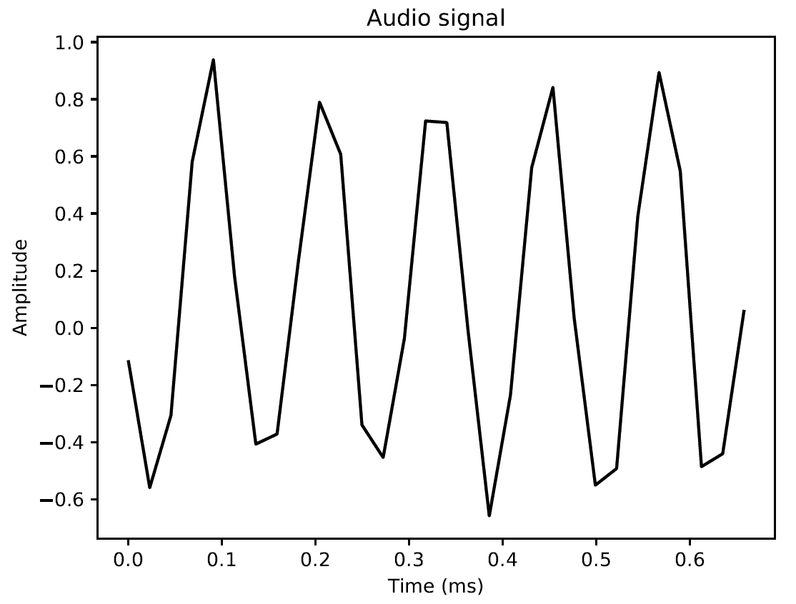
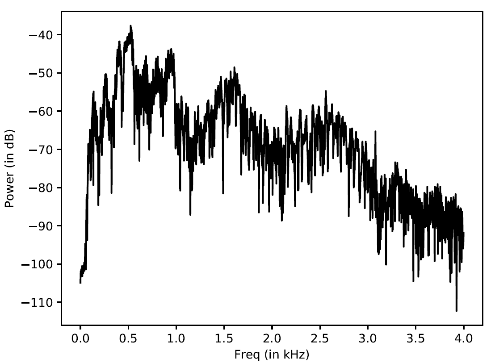
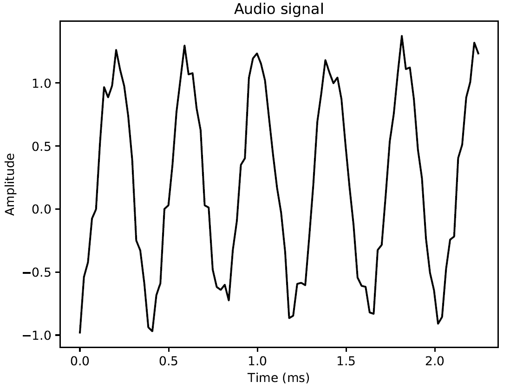
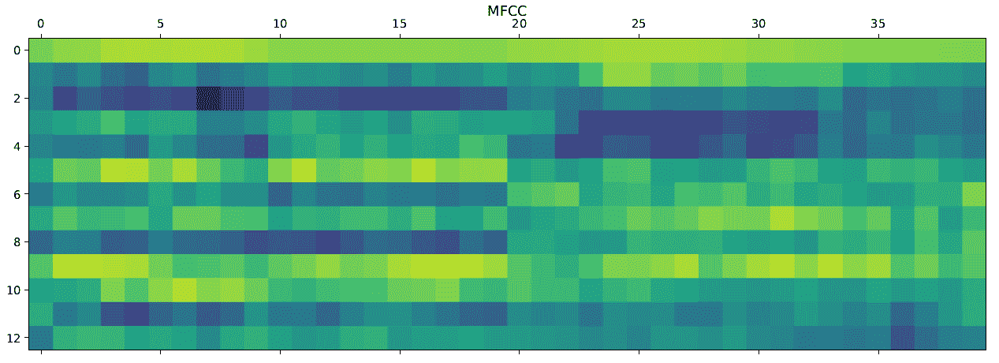
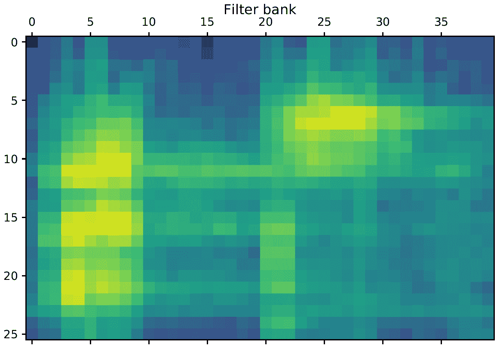

# 语音识别

在本章中，我们将介绍以下食谱：

+   读取和绘制音频数据

+   将音频信号转换到频域

+   使用自定义参数生成音频信号

+   合成音乐

+   提取频域特征

+   构建**隐马尔可夫模型**（**HMMs**）

+   构建语音识别器

+   构建一个**文本到语音**（**TTS**）系统

# 技术要求

为了处理本章中的食谱，你需要以下文件（可在 GitHub 上找到）：

+   `read_plot.py`

+   `input_read.wav`

+   `freq_transform.py`

+   `input_freq.wav`

+   `generate.py`

+   `synthesize_music.py`

+   `extract_freq_features.py`

+   `input_freq.wav`

+   `speech_recognizer.py`

+   `tts.py`

# 介绍语音识别

**语音识别**指的是识别和理解口语的过程。输入以音频数据的形式出现，语音识别器将处理这些数据以从中提取有意义的信息。这有很多实际应用，例如语音控制设备、将口语转录成文字以及安全系统。

语音信号在本质上非常灵活。同一种语言中有许多不同的语音变体。语音有许多不同的元素，如语言、情感、音调、噪声和口音。严格定义一组可以构成语音的规则是困难的。即使有所有这些变化，人类也非常擅长相对轻松地理解所有这些。因此，我们需要机器以同样的方式理解语音。

在过去的几十年里，研究人员一直在研究语音的各个方面，例如识别说话者、理解单词、识别口音和翻译语音。在这些任务中，自动语音识别一直是许多研究人员的焦点。在本章中，我们将学习如何构建一个**语音识别器**。

# 读取和绘制音频数据

让我们看看如何读取音频文件并可视化信号。这将是一个好的起点，并将使我们更好地理解音频信号的基本结构。在我们开始之前，我们需要理解音频文件是实际音频信号的数字化版本。实际的音频信号是复杂的、连续值的波。为了保存数字版本，我们采样信号并将其转换为数字。例如，语音通常以 44,100 Hz 的频率采样。这意味着信号的每一秒被分解成 44,100 个部分，并且在这些时间戳处的值被存储。换句话说，你每 1/44,100 秒存储一个值。由于采样率很高，当我们通过媒体播放器听信号时，我们会感觉到信号是连续的。

# 准备工作

在这个食谱中，我们将使用`wavfile`包从`.wav`输入文件中读取音频文件。因此，我们将用图表绘制信号。

# 如何操作...

我们将使用以下步骤使用`wavfile`包读取和绘制音频：

1.  创建一个新的 Python 文件并导入以下包（完整的代码在已提供的`read_plot.py`文件中）：

```py
import numpy as np 
import matplotlib.pyplot as plt 
from scipy.io import wavfile 
```

1.  我们将使用`wavfile`包从已提供的`input_read.wav`输入文件中读取音频文件：

```py
# Read the input file 
sampling_freq, audio = wavfile.read('input_read.wav') 
```

1.  让我们打印出这个信号的参数：

```py
# Print the params 
print('Shape:', audio.shape)
print('Datatype:', audio.dtype)
print('Duration:', round(audio.shape[0] / float(sampling_freq), 3), 'seconds')
```

1.  音频信号以 16 位有符号整数数据存储；我们需要归一化这些值：

```py
# Normalize the values 
audio = audio / (2.**15) 
```

1.  现在，让我们提取前 30 个值以进行绘图，如下所示：

```py
# Extract first 30 values for plotting 
audio = audio[:30] 
```

1.  *x*轴是**时间轴**。让我们考虑它应该使用采样频率因子进行缩放的事实来构建这个轴：

```py
# Build the time axis 
x_values = np.arange(0, len(audio), 1) / float(sampling_freq) 
```

1.  将单位转换为秒，如下所示：

```py
# Convert to seconds 
x_values *= 1000
```

1.  现在我们按照以下方式绘制：

```py
# Plotting the chopped audio signal 
plt.plot(x_values, audio, color='black') 
plt.xlabel('Time (ms)') 
plt.ylabel('Amplitude') 
plt.title('Audio signal') 
plt.show() 
```

1.  完整的代码在`read_plot.py`文件中。如果您运行此代码，您将看到以下信号：



您还将在您的终端上看到以下输出打印：

```py
Shape: (132300,)
Datatype: int16
Duration: 3.0 seconds
```

# 它是如何工作的...

波形音频文件是不压缩的文件。该格式在 Windows 3.1 中引入，作为多媒体应用中使用的声音的标准格式。其技术规范和描述可以在*多媒体编程接口和数据规范 1.0*文档中找到（[`www.aelius.com/njh/wavemetatools/doc/riffmci.pdf`](https://www.aelius.com/njh/wavemetatools/doc/riffmci.pdf)）。它基于 1991 年引入的**资源交换文件格式**（**RIFF**）规范，构成了在 Windows 环境中运行的多媒体文件的元格式。RIFF 结构将数据块组织在称为块段的区域中，每个块段描述 WAV 文件的一个特征（如采样率、比特率和音频通道数），或包含样本的值（在这种情况下，我们指的是块数据）。块是 32 位（有一些例外）。

# 还有更多...

为了读取 WAV 文件，使用了`scipy.io.wavfile.read()`函数。此函数从 WAV 文件返回数据以及采样率。返回的采样率是一个 Python 整数，数据以与文件对应的 NumPy 数组形式返回。

# 参见

+   请参考`scipy.io.wavfile.read()`函数的官方文档：[`docs.scipy.org/doc/scipy-0.14.0/reference/generated/scipy.io.wavfile.read.html`](https://docs.scipy.org/doc/scipy-0.14.0/reference/generated/scipy.io.wavfile.read.html)

+   请参考*WAV*（来自维基百科）：[`en.wikipedia.org/wiki/WAV`](https://en.wikipedia.org/wiki/WAV)

# 将音频信号转换为频域

音频信号由不同频率、幅度和相位的正弦波复杂混合而成。正弦波也被称为**正弦波**。音频信号的频率内容中隐藏着大量信息。事实上，音频信号在很大程度上由其频率内容来表征。整个语音和音乐的世界都基于这一事实。在继续之前，你需要了解一些关于**傅里叶变换**的知识。

# 准备工作

在这个菜谱中，我们将看到如何将音频信号转换到频域。为此，我们使用`numpy.fft.fft()`函数。此函数使用高效的**快速傅里叶变换**（**FFT**）算法计算一维**n**点**离散傅里叶变换**（**DFT**）。

# 如何操作...

让我们看看如何将音频信号转换到频域：

1.  创建一个新的 Python 文件，并导入以下包（完整的代码在提供的`freq_transform.py`文件中）：

```py
import numpy as np 
from scipy.io import wavfile 
import matplotlib.pyplot as plt 
```

1.  读取提供的`input_freq.wav`文件：

```py
# Read the input file 
sampling_freq, audio = wavfile.read('input_freq.wav') 
```

1.  按以下方式归一化信号：

```py
# Normalize the values 
audio = audio / (2.**15) 
```

1.  音频信号只是一个 NumPy 数组。因此，你可以使用以下代码提取长度：

```py
# Extract length 
len_audio = len(audio)
```

1.  让我们应用傅里叶变换。傅里叶变换后的信号沿中心对称，所以我们只需要取变换信号的半个部分。我们的最终目标是提取功率信号，因此我们需要在准备阶段对信号中的值进行平方：

```py
# Apply Fourier transform 
transformed_signal = np.fft.fft(audio) 
half_length = np.ceil((len_audio + 1) / 2.0) 
transformed_signal = abs(transformed_signal[0:int(half_length)]) 
transformed_signal /= float(len_audio) 
transformed_signal **= 2
```

1.  按以下方式提取信号的长度：

```py
# Extract length of transformed signal 
len_ts = len(transformed_signal) 
```

1.  我们需要根据信号的长度将信号加倍：

```py
# Take care of even/odd cases 
if len_audio % 2: 
    transformed_signal[1:len_ts] *= 2 
else: 
    transformed_signal[1:len_ts-1] *= 2 
```

1.  使用以下公式提取功率信号：

```py
# Extract power in dB 
power = 10 * np.log10(transformed_signal) 
```

1.  *x* 轴是时间轴；我们需要根据采样频率对其进行缩放，然后将其转换为秒：

```py
# Build the time axis 
x_values = np.arange(0, half_length, 1) * (sampling_freq / len_audio) / 1000.0 
```

1.  按以下方式绘制信号：

```py
# Plot the figure 
plt.figure() 
plt.plot(x_values, power, color='black') 
plt.xlabel('Freq (in kHz)') 
plt.ylabel('Power (in dB)') 
plt.show()
```

1.  如果你运行这段代码，你将看到以下输出：



# 它是如何工作的...

声音频谱是声音水平的图形表示，通常以**分贝**（**dB**）为单位，取决于频率（Hz）。如果要分析的声音是所谓的纯音（随时间恒定的单一频率信号），例如，一个完美的正弦波，信号频谱将在正弦波频率处有一个单一成分，并有一定水平的 dB。在现实中，任何真实信号都由大量幅度随时间连续变化的正弦波成分组成。对于这些信号，由于信号能量中总有难以用正弦波表示的部分，因此无法分析纯音。事实上，根据傅里叶变换定理，将信号表示为正弦谐波成分之和，仅对平稳信号有效，而平稳信号通常并不对应于真实声音。

# 更多内容...

声音的频率分析基于傅里叶变换定理。也就是说，任何周期性信号都可以通过将具有多个整频的周期性信号的正弦波（称为谐波）相加来生成，这些整频是周期性信号频率的倍数（称为基频）。

# 参考内容

+   参考官方文档中的`numpy.fft.fft()`函数：[`docs.scipy.org/doc/numpy-1.15.1/reference/generated/numpy.fft.fft.html`](https://docs.scipy.org/doc/numpy-1.15.1/reference/generated/numpy.fft.fft.html)

+   参考四阶变换：[`www.thefouriertransform.com/`](http://www.thefouriertransform.com/)

+   参考来自阿尔托大学的**时频表示**（[`mycourses.aalto.fi/pluginfile.php/145214/mod_resource/content/3/slides_05_time-frequency_representations.pdf`](https://mycourses.aalto.fi/pluginfile.php/145214/mod_resource/content/3/slides_05_time-frequency_representations.pdf)）

# 使用自定义参数生成音频信号

声音是一种特殊的波，其中由振动体（即声源）引起的压力变化在周围介质（通常是空气）中传播。以下是一些声源的例子：

+   乐器中，振动部分可以是击打的弦（如吉他），或者用弓拉（如小提琴）。

+   我们的声音是由从肺部出来的空气振动我们的声带而产生的。

+   任何导致空气移动的现象（如鸟的拍打翅膀、突破音障的飞机、爆炸的炸弹或锤子敲打砧子）都具有适当的物理特性。

为了通过电子设备再现声音，必须将其转换成模拟声音，即由将声波的机械能转换为电能的转换产生的电流。为了能够使用计算机中的声音信号，必须将模拟信号转换成由将模拟声音转换为表示为 0 和 1（比特）流的音频信号。

# 准备工作

在这个菜谱中，我们将使用 NumPy 生成音频信号。正如我们之前讨论的，音频信号是正弦波的复杂混合。因此，在生成我们自己的音频信号时，我们要牢记这一点。

# 如何操作...

让我们看看如何使用自定义参数生成音频信号：

1.  创建一个新的 Python 文件，并导入以下包（完整的代码已包含在您提供的`generate.py`文件中）：

```py
import numpy as np 
import matplotlib.pyplot as plt 
from scipy.io.wavfile import write 
```

1.  我们需要定义输出文件，生成的音频将存储在该文件中：

```py
# File where the output will be saved 
output_file = 'output_generated.wav' 
```

1.  现在让我们指定音频生成参数。我们想要生成一个 3 秒长的信号，采样频率为 44,100Hz，音调频率为 587Hz。时间轴上的值将从*-2*pi*到*2*pi*：

```py
# Specify audio parameters 
duration = 3  # seconds 
sampling_freq = 44100  # Hz 
tone_freq = 587 
min_val = -2 * np.pi 
max_val = 2 * np.pi 
```

1.  让我们生成时间轴和音频信号。音频信号是一个具有之前提到的参数的简单正弦波：

```py
# Generate audio 
t = np.linspace(min_val, max_val, duration * sampling_freq) 
audio = np.sin(2 * np.pi * tone_freq * t)
```

1.  现在，让我们向信号添加一些噪声：

```py
# Add some noise 
noise = 0.4 * np.random.rand(duration * sampling_freq) 
audio += noise
```

1.  在存储之前，我们需要将值缩放到 16 位整数：

```py
# Scale it to 16-bit integer values 
scaling_factor = pow(2,15) - 1 
audio_normalized = audio / np.max(np.abs(audio)) 
audio_scaled = np.int16(audio_normalized * scaling_factor)
```

1.  将此信号写入输出文件：

```py
# Write to output file 
write(output_file, sampling_freq, audio_scaled) 
```

1.  使用前 100 个值绘制信号：

```py
# Extract first 100 values for plotting 
audio = audio[:100] 
```

1.  按如下方式生成时间轴：

```py
# Build the time axis 
x_values = np.arange(0, len(audio), 1) / float(sampling_freq) 
```

1.  将时间轴转换为秒：

```py
# Convert to seconds 
x_values *= 1000 
```

1.  按如下方式绘制信号：

```py
# Plotting the chopped audio signal 
plt.plot(x_values, audio, color='black') 
plt.xlabel('Time (ms)') 
plt.ylabel('Amplitude') 
plt.title('Audio signal') 
plt.show()
```

1.  如果您运行此代码，您将得到以下输出：



# 它是如何工作的...

在这个菜谱中，我们使用了 NumPy 库来生成音频信号。我们已经看到数字声音是一系列数字，因此生成声音只需要构建一个表示音乐音调的数组。首先，我们将文件名设置为输出保存的位置。然后，我们指定了音频参数。因此，我们使用正弦波生成了音频。然后我们添加了一些噪声，所以我们将它们缩放到 16 位整数值。最后，我们将信号写入输出文件。

# 更多...

在信号的编码中，分配给单个样本的每个值都用位表示。每个位对应于 6 dB 的动态范围。使用的位数越多，单个样本可以表示的 dB 范围就越高。

一些典型值如下：

+   每个样本 8 位对应于 256 个级别。

+   每个样本 16 位（CD 使用的数量）对应于 65,536 个级别。

# 参见

+   参考 NumPy 库的官方文档：[`www.numpy.org/`](http://www.numpy.org/)

+   参考来自维基百科的**正弦波**：[`en.wikipedia.org/wiki/Sine_wave`](https://en.wikipedia.org/wiki/Sine_wave)

# 音乐合成

在传统乐器中，声音是通过机械部件的振动产生的。在合成乐器中，振动是通过时间函数描述的，称为信号，它们表达了声压随时间的变化。声音合成是一个允许您人工生成声音的过程。确定声音音色的参数根据所使用的合成类型而有所不同，可以直接由作曲家提供，或者通过适当的输入设备上的操作，或者从现有声音的分析中得出。

# 准备工作

在这个菜谱中，我们将看到如何合成一些音乐。为此，我们将使用各种音符，如**A**、**G**和**D**，以及它们相应的频率，来生成一些简单的音乐。

# 如何做到这一点...

让我们看看如何合成一些音乐：

1.  创建一个新的 Python 文件并导入以下包（完整的代码已包含在您提供的`synthesize_music.py`文件中）：

```py
import json 
import numpy as np 
from scipy.io.wavfile import write 
```

1.  定义一个基于输入参数（如幅度和频率）合成音调的函数：

```py
# Synthesize tone 
def synthesizer(freq, duration, amp=1.0, sampling_freq=44100):
```

1.  构建时间轴值：

```py
    # Build the time axis 
    t = np.linspace(0, duration, round(duration * sampling_freq)) 
```

1.  使用输入参数（如幅度和频率）构建音频样本：

```py
    # Construct the audio signal 
    audio = amp * np.sin(2 * np.pi * freq * t) 

    return audio.astype(np.int16)  
```

1.  让我们定义主函数。您已经提供了一个名为`tone_freq_map.json`的 JSON 文件，其中包含一些音符及其频率：

```py
if __name__=='__main__': 
    tone_map_file = 'tone_freq_map.json' 
```

1.  按照以下方式加载该文件：

```py
    # Read the frequency map 
    with open(tone_map_file, 'r') as f: 
        tone_freq_map = json.loads(f.read()) 
```

1.  现在，假设我们想要生成一个持续两秒的`G`音符：

```py
    # Set input parameters to generate 'G' tone 
    input_tone = 'G' 
    duration = 2     # seconds 
    amplitude = 10000 
    sampling_freq = 44100    # Hz 
```

1.  使用以下参数调用该函数：

```py
    # Generate the tone 
    synthesized_tone = synthesizer(tone_freq_map[input_tone], duration, amplitude, sampling_freq) 
```

1.  将生成的信号写入输出文件，如下所示：

```py
    # Write to the output file 
    write('output_tone.wav', sampling_freq, synthesized_tone)
```

生成单个音调的`.wav`文件（`output_tone.wav`）。在媒体播放器中打开此文件并聆听。这就是*G*音符！

1.  现在，让我们做一些更有趣的事情。让我们按顺序生成一些音符，以赋予它音乐感。定义一个音符序列及其持续时间（以秒为单位）：

```py
    # Tone-duration sequence 
    tone_seq = [('D', 0.3), ('G', 0.6), ('C', 0.5), ('A', 0.3), ('Asharp', 0.7)] 
```

1.  遍历此列表并对每个元素调用合成器函数：

```py
    # Construct the audio signal based on the chord sequence 
    output = np.array([]) 
    for item in tone_seq: 
        input_tone = item[0] 
        duration = item[1] 
        synthesized_tone = synthesizer(tone_freq_map[input_tone], duration, amplitude, sampling_freq) 
        output = np.append(output, synthesized_tone, axis=0) 
    output = output.astype(np.int16)
```

1.  将信号写入输出文件：

```py
    # Write to the output file 
    write('output_tone_seq.wav', sampling_freq, output) 
```

1.  您现在可以在媒体播放器中打开`output_tone_seq.wav`文件并聆听。您可以感受到音乐的魅力！

# 它是如何工作的...

音乐是一种难以简而言之的独创性和创造性的作品。音乐家阅读乐谱时，会识别出音符在乐谱上的位置。通过类比，我们可以将声音的合成视为已知音符特征频率的序列。在这个配方中，我们已经使用这个程序来合成一系列音符。

# 更多内容...

要人工生成音乐，使用合成器。所有合成器都有以下基本组件，它们协同工作以产生声音：

+   生成波形并改变音调的振荡器

+   一个滤波器用于在波形中去除某些频率以改变音色

+   一个放大器用于控制信号的音量

+   一个调制器用于创建效果

# 参考以下内容

+   请参考 NumPy 库的官方文档：[`www.numpy.org/`](http://www.numpy.org/)

+   请参考`scipy.io.wavfile.write()`函数的官方文档：[`docs.scipy.org/doc/scipy-0.14.0/reference/generated/scipy.io.wavfile.write.html`](https://docs.scipy.org/doc/scipy/reference/generated/scipy.io.wavfile.write.html)

+   请参考*音乐音符频率*（来自密歇根理工大学）：[`pages.mtu.edu/~suits/notefreqs.html`](http://pages.mtu.edu/~suits/notefreqs.html)

+   请参考*声音合成原理*（来自萨福克大学）：[`www.acoustics.salford.ac.uk/acoustics_info/sound_synthesis/`](http://www.acoustics.salford.ac.uk/acoustics_info/sound_synthesis/)

# 提取频域特征

在*将音频信号转换为频域*的配方中，我们讨论了如何将信号转换为频域。在大多数现代语音识别系统中，人们使用频域特征。在将信号转换为频域后，你需要将其转换为可用的形式。**梅尔频率倒谱系数**（**MFCC**）是这样做的好方法。MFCC 取信号的功率谱，然后使用滤波器组和**离散余弦变换**（**DCT**）的组合来提取特征。

# 准备中

在这个配方中，我们将看到如何使用`python_speech_features`包来提取频域特征。你可以在[`python-speech-features.readthedocs.org/en/latest`](http://python-speech-features.readthedocs.org/en/latest)找到安装说明。所以，让我们看看如何提取 MFCC 特征。

# 如何操作...

让我们看看如何提取频域特征：

1.  创建一个新的 Python 文件，并导入以下包（完整的代码在提供的`extract_freq_features.py`文件中，已经为你准备好了）：

```py
import numpy as np 
import matplotlib.pyplot as plt 
from scipy.io import wavfile  
from python_speech_features import mfcc, logfbank 
```

1.  读取提供的`input_freq.wav`输入文件：

```py
# Read input sound file 
sampling_freq, audio = wavfile.read("input_freq.wav") 
```

1.  按如下方式提取 MFCC 和滤波器组特征：

```py
# Extract MFCC and Filter bank features 
mfcc_features = mfcc(audio, sampling_freq) 
filterbank_features = logfbank(audio, sampling_freq) 
```

1.  打印参数以查看生成了多少个窗口：

```py
# Print parameters 
print('MFCC:\nNumber of windows =', mfcc_features.shape[0])
print('Length of each feature =', mfcc_features.shape[1])
print('\nFilter bank:\nNumber of windows =', filterbank_features.shape[0])
print('Length of each feature =', filterbank_features.shape[1])
```

1.  现在，让我们可视化 MFCC 特征。我们需要转换矩阵，以便时域是水平的：

```py
# Plot the features 
mfcc_features = mfcc_features.T 
plt.matshow(mfcc_features) 
plt.title('MFCC') 
```

1.  现在，让我们可视化滤波器组特征。同样，我们需要转换矩阵，以便时域是水平的：

```py
filterbank_features = filterbank_features.T 
plt.matshow(filterbank_features) 
plt.title('Filter bank') 
plt.show() 
```

1.  如果你运行此代码，你将在以下输出中看到 MFCC 特征：



滤波器组特征将如下所示：



你将在你的终端上看到以下输出：

```py
MFCC:
Number of windows = 40
Length of each feature = 13

Filter bank:
Number of windows = 40
Length of each feature = 26
```

# 它是如何工作的...

**倒谱**是对信号的 dB 频谱应用傅里叶变换的结果。其名称来源于单词**spectrum**的前四个字母的倒置。它由 Bogert 等人于 1963 年定义。因此，信号的倒谱是信号傅里叶变换的对数值的傅里叶变换。

脉冲谱图用于分析信号频谱内容的变化率。最初，它是为了分析地震、爆炸和对雷达信号的响应而发明的。目前，它是音乐信息学中区分人声的非常有效的工具。对于这些应用，频谱首先通过梅尔尺度上的频带来转换。结果是梅尔频谱系数，或 MFCC。它用于语音识别和音高检测算法。

# 还有更多...

频谱分析用于将包含激励信息的信号部分与喉部执行的传递函数分离。提升作用（频域中的滤波）的目标是将激励信号从传递函数中分离出来。

# 参见

+   参考官方的`python_speech_features`包文档：[`python-speech-features.readthedocs.io/en/latest/`](https://python-speech-features.readthedocs.io/en/latest/)

+   参考 MFCC 教程：[`practicalcryptography.com/miscellaneous/machine-learning/guide-mel-frequency-cepstral-coefficients-mfccs/`](http://practicalcryptography.com/miscellaneous/machine-learning/guide-mel-frequency-cepstral-coefficients-mfccs/)

# 构建 HMM

现在，我们已经准备好讨论语音识别了。我们将使用 HMM 进行语音识别；HMM 在建模时间序列数据方面非常出色。由于音频信号是一种时间序列信号，HMM 非常适合我们的需求。HMM 是一个表示观察序列概率分布的模型。我们假设输出是由隐藏状态生成的。因此，我们的目标是找到这些隐藏状态，以便我们可以建模信号。

# 准备工作

在这个菜谱中，我们将看到如何使用`hmmlearn`包构建一个 HMM。在继续之前，您需要安装`hmmlearn`包。让我们看看如何构建 HMM。

# 如何做到这一点...

让我们看看如何构建 HMM：

1.  创建一个新的 Python 文件并定义一个类来建模 HMM（完整的代码在您已经提供的`speech_recognizer.py`文件中）：

```py
# Class to handle all HMM related processing 
class HMMTrainer(object): 
```

1.  让我们初始化类；我们将使用高斯 HMM 来建模我们的数据。`n_components`参数定义了隐藏状态的数量。`cov_type`定义了传递矩阵中的协方差类型，而`n_iter`表示在停止训练之前它将进行的迭代次数：

```py
    def __init__(self, model_name='GaussianHMM', n_components=4, cov_type='diag', n_iter=1000): 
```

前述参数的选择取决于具体问题。您需要了解您的数据，以便以明智的方式选择这些参数。

1.  初始化变量，如下所示：

```py
        self.model_name = model_name 
        self.n_components = n_components 
        self.cov_type = cov_type 
        self.n_iter = n_iter 
        self.models = [] 
```

1.  使用以下参数定义模型：

```py
        if self.model_name == 'GaussianHMM': 
            self.model = hmm.GaussianHMM(n_components=self.n_components,  
                    covariance_type=self.cov_type, n_iter=self.n_iter) 
        else: 
            raise TypeError('Invalid model type') 
```

1.  输入数据是一个 NumPy 数组，其中每个元素都是一个由*k*个维度组成的特征向量：

```py
    # X is a 2D numpy array where each row is 13D 
    def train(self, X): 
        np.seterr(all='ignore') 
        self.models.append(self.model.fit(X))
```

1.  定义一个基于模型提取分数的方法：

```py
    # Run the model on input data 
    def get_score(self, input_data): 
        return self.model.score(input_data) 
```

1.  我们构建了一个类来处理 HMM 训练和预测，但我们需要一些数据来看到它的实际应用。我们将在下一个菜谱中使用它来构建一个语音识别器。

# 它是如何工作的...

HMM 是一个模型，其中系统被假定为具有不可观察状态的马尔可夫过程。一个随机过程被称为马尔可夫过程，当选择一个特定的*t*实例进行观察时，该过程的演变，从*t*开始，只依赖于*t*，而不依赖于任何以前的实例。因此，一个过程是马尔可夫的，当给定观察时刻时，只有特定的实例决定了过程的未来演变，而这种演变不依赖于过去。

# 还有更多...

因此，HMM 是一种马尔可夫链，其中状态是不可直接观察的。更确切地说，可以理解为以下内容：

+   该链有多个状态

+   状态根据马尔可夫链演变

+   每个状态都根据一定的概率分布生成一个事件，这个概率分布只依赖于状态

+   事件是可观察的，但状态是不可观察的

HMMs 特别以其在语音演讲、手写、纹理识别和生物信息学中识别时间模式的应用而闻名。

# 参考以下内容

+   参考以下`hmmlearn`包的官方文档：[`hmmlearn.readthedocs.io/en/latest/`](https://hmmlearn.readthedocs.io/en/latest/)

+   参考以下教程：*《隐马尔可夫模型教程》（由劳伦斯·R·拉比纳尔编写）*：[`www.robots.ox.ac.uk/~vgg/rg/slides/hmm.pdf`](https://www.robots.ox.ac.uk/~vgg/rg/slides/hmm.pdf)

# 构建语音识别器

语音识别是通过计算机识别人类口语的过程，随后通过计算机或更具体地说，通过专门的语音识别系统进行处理。语音识别系统用于电话应用（如自动呼叫中心）的自动语音应用、允许将演讲口述到计算机的听写系统、导航系统卫星的控制系统或汽车的语音命令电话。

# 准备工作

我们需要一个语音文件数据库来构建我们的语音识别器。我们将使用在[`code.google.com/archive/p/hmm-speech-recognition/downloads`](https://code.google.com/archive/p/hmm-speech-recognition/downloads)可用的数据库。该数据库包含 7 个不同的单词，每个单词都与 15 个音频文件相关联。下载 ZIP 文件并解压包含 Python 文件的文件夹（将包含数据的文件夹重命名为`data`）。这是一个小型数据集，但足以理解如何构建一个可以识别 7 个不同单词的语音识别器。我们需要为每个类别构建一个 HMM 模型。当我们想要识别新输入文件中的单词时，我们需要在该文件上运行所有模型并选择得分最高的模型。我们将使用我们在前面的配方中构建的 HMM 类。

# 如何做到这一点...

让我们看看如何构建一个语音识别器：

1.  创建一个新的 Python 文件并导入以下包（完整代码已在提供的`speech_recognizer.py`文件中）：（完整代码位于提供的`speech_recognizer.py`文件中）

```py
import os 
import argparse  

import numpy as np 
from scipy.io import wavfile  
from hmmlearn import hmm 
from python_speech_features import mfcc 
```

1.  定义一个函数来解析命令行中的输入参数：

```py
# Function to parse input arguments 
def build_arg_parser():
    parser = argparse.ArgumentParser(description='Trains the HMM classifier')
    parser.add_argument("--input-folder", dest="input_folder", required=True,
            help="Input folder containing the audio files in subfolders")
    return parser
```

1.  让我们使用在之前的*构建 HMM*菜谱中定义的`HMMTrainer`类：

```py
class HMMTrainer(object):
 def __init__(self, model_name='GaussianHMM', n_components=4, cov_type='diag', n_iter=1000):
 self.model_name = model_name
 self.n_components = n_components
 self.cov_type = cov_type
 self.n_iter = n_iter
 self.models = []

if self.model_name == 'GaussianHMM':
 self.model = hmm.GaussianHMM(n_components=self.n_components, 
 covariance_type=self.cov_type, n_iter=self.n_iter)
 else:
 raise TypeError('Invalid model type')

# X is a 2D numpy array where each row is 13D
 def train(self, X):
 np.seterr(all='ignore')
 self.models.append(self.model.fit(X))

# Run the model on input data
 def get_score(self, input_data):
 return self.model.score(input_data)
```

1.  定义主函数，并解析输入参数：

```py
if __name__=='__main__': 
    args = build_arg_parser().parse_args() 
    input_folder = args.input_folder 
```

1.  初始化将保存所有 HMM 模型的变量：

```py
    hmm_models = [] 
```

1.  解析包含所有数据库音频文件的输入目录：

```py
    # Parse the input directory 
    for dirname in os.listdir(input_folder):
```

1.  提取子文件夹的名称：

```py
        # Get the name of the subfolder  
        subfolder = os.path.join(input_folder, dirname) 

        if not os.path.isdir(subfolder):  
            continue 
```

1.  子文件夹的名称是此类别的标签；使用以下代码提取它：

```py
        # Extract the label 
        label = subfolder[subfolder.rfind('/') + 1:] 
```

1.  初始化训练变量：

```py
        # Initialize variables 
        X = np.array([]) 
        y_words = [] 
```

1.  遍历每个子文件夹中的音频文件列表：

```py
        # Iterate through the audio files (leaving 1 file for testing in each class) 
        for filename in [x for x in os.listdir(subfolder) if x.endswith('.wav')][:-1]: 
```

1.  按照以下方式读取每个音频文件：

```py
            # Read the input file 
            filepath = os.path.join(subfolder, filename) 
            sampling_freq, audio = wavfile.read(filepath) 
```

1.  按照以下方式提取 MFCC 特征：

```py
            # Extract MFCC features 
            mfcc_features = mfcc(audio, sampling_freq) 
```

1.  按照以下方式将此内容追加到`X`变量中：

```py
            # Append to the variable X 
            if len(X) == 0: 
                X = mfcc_features 
            else: 
                X = np.append(X, mfcc_features, axis=0)
```

1.  按照以下方式附加相应的标签：

```py
            # Append the label 
            y_words.append(label)    
```

1.  一旦从当前类中的所有文件中提取了特征，就训练并保存 HMM 模型。由于 HMM 是无监督学习的一个生成模型，我们不需要为每个类别构建 HMM 模型。我们明确假设将为每个类别构建单独的 HMM 模型：

```py
        # Train and save HMM model 
        hmm_trainer = HMMTrainer() 
        hmm_trainer.train(X) 
        hmm_models.append((hmm_trainer, label)) 
        hmm_trainer = None 
```

1.  获取未用于训练的测试文件列表：

```py
    # Test files 
    input_files = [ 
            'data/pineapple/pineapple15.wav', 
            'data/orange/orange15.wav', 
            'data/apple/apple15.wav', 
            'data/kiwi/kiwi15.wav' 
            ] 
```

1.  按照以下方式解析输入文件：

```py
    # Classify input data 
    for input_file in input_files: 
```

1.  按照以下方式读取每个音频文件：

```py
        # Read input file 
        sampling_freq, audio = wavfile.read(input_file) 
```

1.  按照以下方式提取 MFCC 特征：

```py
        # Extract MFCC features 
        mfcc_features = mfcc(audio, sampling_freq) 
```

1.  定义存储最大分数和输出标签的变量：

```py
        # Define variables 
        max_score = float('-inf')
        output_label = None
```

1.  遍历所有模型并将输入文件通过每个模型运行：

```py
        # Iterate through all HMM models and pick  
        # the one with the highest score 
        for item in hmm_models: 
            hmm_model, label = item 
```

1.  提取分数并存储最大分数：

```py
            score = hmm_model.get_score(mfcc_features) 
            if score > max_score: 
                max_score = score 
                output_label = label 
```

1.  打印真实标签和预测标签：

```py
         # Print the output
        print("True:", input_file[input_file.find('/')+1:input_file.rfind('/')])
        print("Predicted:", output_label)
```

1.  完整代码在`speech_recognizer.py`文件中。使用以下命令运行此文件：

```py
$ python speech_recognizer.py --input-folder data
```

以下结果将在您的终端返回：

```py
True: pineapple
Predicted: data\pineapple
True: orange
Predicted: data\orange
True: apple
Predicted: data\apple
True: kiwi
Predicted: data\kiwi
```

# 工作原理...

在这个菜谱中，我们使用 HMM 创建了一个语音识别系统。为此，我们首先创建了一个分析输入参数的函数。然后，使用一个类来处理所有与 HMM 相关的处理。因此，我们已对输入数据进行分类，并预测了测试数据的标签。最后，我们打印了结果。

# 还有更多...

语音识别系统基于对适当处理的输入音频与系统训练期间创建的数据库的比较。在实践中，软件应用程序试图识别说话者所说的单词，在数据库中寻找相似的声音，并检查哪个单词对应。这自然是一个非常复杂的操作。此外，它不是在整词上进行的，而是在构成它们的音素上进行的。

# 参见

+   参考以下`hmmlearn`包的官方文档：[`hmmlearn.readthedocs.io/en/latest/`](https://hmmlearn.readthedocs.io/en/latest/)

+   参考以下`python_speech_features`包的官方文档：[`python-speech-features.readthedocs.io/en/latest/`](https://python-speech-features.readthedocs.io/en/latest/)

+   参考以下*Argparse 教程*：[`docs.python.org/3/howto/argparse.html`](https://docs.python.org/3/howto/argparse.html)

+   参考来自密西西比州立大学的《语音识别基础：短期课程》(*Fundamentals of Speech Recognition: A Short Course*)：[`www.iitg.ac.in/samudravijaya/tutorials/fundamentalOfASR_picone96.pdf`](http://www.iitg.ac.in/samudravijaya/tutorials/fundamentalOfASR_picone96.pdf)

# 构建语音合成系统

语音合成是用于人工再现人类声音的技术。用于此目的的系统称为语音合成器，可以通过软件或硬件实现。由于它们能够将文本转换为语音，语音合成系统也被称为 TTS 系统。还有一些系统可以将音标转换为语音。

语音合成可以通过连接存储在数据库中的声音录音来实现。不同的语音合成系统根据存储的语音样本的大小而有所不同。也就是说，存储单个音素或双音素的系统可以在牺牲整体清晰度的前提下获得最大数量的组合，而其他为特定用途设计的系统会重复自己，记录整个单词或整个句子，以达到高质量的结果。

合成器可以使用声音特性和其他人类特征创建一个完全合成的声音。语音合成器的质量是根据其与人类声音的相似程度和可理解性水平来评估的。性能良好的语音转换程序在可访问性方面可以发挥重要作用；例如，允许视力受损或阅读障碍的人收听计算机上编写的文档。对于这类应用（自 1980 年代初以来），许多操作系统都包括了语音合成功能。

# 准备工作

在这个菜谱中，我们将介绍一个 Python 库，它允许我们创建语音合成系统。我们将运行`pyttsx`跨平台语音合成包装库。

# 如何操作...

让我们看看如何构建一个语音合成系统：

1.  首先，我们必须为 Python 3 库安装`pyttsx`（Python 3 的离线 TTS）及其相关依赖项：

```py
$ pip install pyttsx3
```

1.  为了避免可能的错误，还需要安装`pypiwin32`库：

```py
$ pip install pypiwin32
```

1.  创建一个新的 Python 文件并导入`pyttsx3`包（完整的代码已包含在您提供的`tts.py`文件中）：

```py
import pyttsx3;
```

1.  我们创建一个将使用指定驱动程序的引擎实例：

```py
engine = pyttsx3.init();
```

1.  要更改语速，请使用以下命令：

```py
rate = engine.getProperty('rate')
engine.setProperty('rate', rate-50)
```

1.  要更改说话者的声音，请使用以下命令：

```py
voices = engine.getProperty('voices')
engine.setProperty('voice', 'TTS_MS_EN-US_ZIRA_11.0')
```

1.  现在，我们将使用`say`方法来排队一个命令，以朗读一个语音。语音输出将根据队列中此命令之前设置的属性：

```py
engine.say("You are reading the Python Machine Learning Cookbook");
engine.say("I hope you like it.");
```

1.  最后，我们将调用`runAndWait()`方法。此方法在处理所有当前排队的命令时将阻塞，并适当地调用引擎通知的回调。当在此调用之前排队的所有命令从队列中清空时，它将返回：

```py
engine.runAndWait();
```

在这个阶段，将会有不同的声音来朗读我们提供的文本。

# 它是如何工作的...

语音合成系统或引擎由两部分组成：前端和后端。前端部分负责将文本转换为音标符号，而后端部分则解释这些音标符号并将它们朗读出来，从而将它们转换成人工语音。前端有两个关键功能；首先，它对书面文本进行分析，将所有数字、缩写和缩写词转换成全词。这一预处理步骤被称为分词。第二个功能包括将每个单词转换成其对应的音标符号，并对修改后的文本进行语言分析，将其细分为韵律单位，即介词、句子和句号。将音标转录分配给单词的过程被称为从文本到音素的转换，或从图形到音素的转换。

# 更多内容...

经典 TTS 系统的演变被称为`WaveNet`，它似乎知道如何说话，能够准确发音，并能流畅地朗读整个句子。WaveNet 是一个生成原始音频的深度神经网络。它是由位于伦敦的人工智能公司 DeepMind 的研究人员创建的。WaveNet 使用一个深度生成模型来模拟声波，可以模仿任何人类的语音。WaveNet 朗读的句子听起来比更先进的 TTS 更接近人类语音，相似度提高了 50%。为了证明这一点，创建了英语和普通话的样本，并使用**平均意见评分**（**MOS**）系统，这是音频评估的标准，将人工智能生成的样本与正常 TTS、参数化 TTS 以及真实语音的样本进行了比较。

# 参考以下内容

+   参考官方的`pyttsx3`包文档：[`pyttsx3.readthedocs.io/en/latest/index.html`](https://pyttsx3.readthedocs.io/en/latest/index.html)

+   参考由 D. Sasirekha 和 E. Chandra 编写的《*文本到语音：简单教程*》([`pdfs.semanticscholar.org/e7ad/2a63458653ac965fe349fe375eb8e2b70b02.pdf`](https://pdfs.semanticscholar.org/e7ad/2a63458653ac965fe349fe375eb8e2b70b02.pdf))

+   参考来自谷歌 DeepMind 的《*WaveNet：原始音频的生成模型*》([`deepmind.com/blog/wavenet-generative-model-raw-audio/`](https://deepmind.com/blog/wavenet-generative-model-raw-audio/))
