# 第九章：解构时间序列和顺序数据

在本章中，我们将介绍以下食谱：

+   将数据转换为时间序列格式

+   切分时间序列数据

+   对时间序列数据进行操作

+   从时间序列数据中提取统计数据

+   为顺序数据构建 HMM

+   为顺序文本数据构建 CRF

+   分析股票市场数据

+   使用 RNN 预测时间序列数据

# 技术要求

为了处理本章中的食谱，你需要以下文件（可在 GitHub 上找到）：

+   `convert_to_timeseries.py`

+   `data_timeseries.txt`

+   `slicing_data.py`

+   `operating_on_data.py`

+   `extract_stats.py`

+   `hmm.py`

+   `` `data_hmm.txt` ``

+   `crf.py`

+   `AmazonStock.py`

+   `AMZN.csv`

+   `LSTMstock.py`

# 介绍时间序列

时间序列数据基本上是一系列随时间收集的测量值。这些测量值是在预定变量和固定时间间隔下进行的。时间序列数据的一个主要特征是顺序很重要！

我们收集的观察结果列表按时间线排序，它们出现的顺序在很大程度上揭示了潜在的规律。如果你改变顺序，这将会完全改变数据的意义。顺序数据是一个广义的概念，包括任何以顺序形式出现的数据，包括时间序列数据。

我们的目标是构建一个描述时间序列或任何一般序列模式的模型。这些模型用于描述时间序列模式的重要特征。我们可以使用这些模型来解释过去如何影响未来。我们还可以使用它们来查看两个数据集如何相关联，预测未来的值，或者控制基于某些指标的给定变量。

为了可视化时间序列数据，我们倾向于使用折线图或条形图来绘制。时间序列数据分析常用于金融、信号处理、天气预报、轨迹预测、预测地震或任何需要处理时间数据的领域。我们在时间序列和顺序数据分析中构建的模型应考虑数据的顺序并提取邻居之间的关系。让我们继续查看一些食谱，以分析 Python 中的时间序列和顺序数据。

# 将数据转换为时间序列格式

**时间序列**构成了一系列现象的观察结果，这些观察是在连续的瞬间或时间间隔内进行的，通常（即使不是必然的）是均匀分布或长度相同。因此，时间是时间序列分析中的一个基本参数。因此，我们首先必须对代表某种现象长期观察的数据进行操作有一定的信心。

# 准备工作

我们将首先了解如何将一系列观察结果转换为时间序列数据并可视化它。我们将使用一个名为`pandas`的库来分析时间序列数据。在继续之前，请确保你已经安装了`pandas`。你可以在以下链接找到`pandas`的安装说明：[`pandas.pydata.org/pandas-docs/stable/install.html`](http://pandas.pydata.org/pandas-docs/stable/install.html)。

# 如何操作...

让我们看看如何将数据转换为时间序列格式：

1.  创建一个新的 Python 文件（完整的代码在提供的`convert_to_timeseries.py`文件中），并导入以下包：

```py
import numpy as np 
import pandas as pd 
import matplotlib.pyplot as plt 
```

1.  让我们定义一个函数，该函数读取输入文件并将顺序观察结果转换为时间索引数据：

```py
def convert_data_to_timeseries(input_file, column, verbose=False): 
```

1.  我们将使用一个包含四个列的文本文件。第一列表示年份，第二列表示月份，第三和第四列表示数据。让我们将其加载到一个 NumPy 数组中：

```py
    # Load the input file 
    data = np.loadtxt(input_file, delimiter=',') 
```

1.  由于这是按时间顺序排列的，第一行包含开始日期，最后一行包含结束日期。让我们提取这个数据集的开始和结束日期：

```py
    # Extract the start and end dates 
    start_date = str(int(data[0,0])) + '-' + str(int(data[0,1])) 
    end_date = str(int(data[-1,0] + 1)) + '-' + str(int(data[-1,1] % 12 + 1)) 
```

1.  此函数还有一个`verbose`模式。因此，如果将其设置为`true`，它将打印一些信息。让我们打印出开始和结束日期：

```py
    if verbose: 
        print("Start date =", start_date)
        print("End date =", end_date) 
```

1.  让我们创建一个包含每月间隔日期序列的`pandas`变量：

```py
    # Create a date sequence with monthly intervals 
    dates = pd.date_range(start_date, end_date, freq='M') 
```

1.  我们的下一步是将给定的列转换为时间序列数据。你可以使用月份和年份（而不是索引）来访问此数据：

```py
    # Convert the data into time series data 
    data_timeseries = pd.Series(data[:,column], index=dates) 
```

1.  使用`verbose`模式打印出前 10 个元素：

```py
    if verbose: 
        print("Time series data:\n", data_timeseries[:10]) 
```

1.  返回时间索引变量，如下所示：

```py
    return data_timeseries 
```

1.  定义主函数，如下所示：

```py
if __name__=='__main__': 
```

1.  我们将使用已经提供给你的`data_timeseries.txt`文件：

```py
    # Input file containing data 
    input_file = 'data_timeseries.txt' 
```

1.  从这个文本文件中加载第三列并将其转换为时间序列数据：

```py
    # Load input data 
    column_num = 2 
    data_timeseries = convert_data_to_timeseries(input_file, column_num) 
```

1.  `pandas`库提供了一个很好的绘图函数，可以直接在变量上运行：

```py
    # Plot the time series data 
    data_timeseries.plot() 
    plt.title('Input data') 

    plt.show() 
```

如果你运行代码，你将看到以下输出：

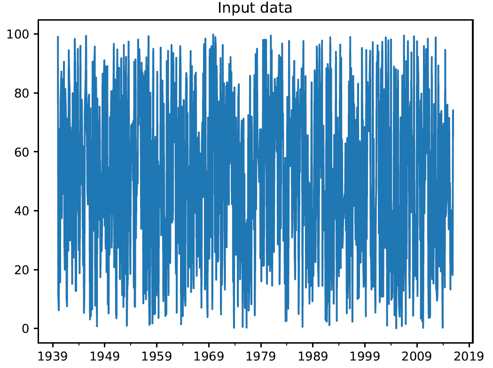

# 工作原理...

在这个菜谱中，我们学习了如何将一系列观察结果转换为时间序列数据并显示它。为此，我们首先以`.txt`格式加载了输入文件，因此我们提取了开始和结束日期。然后，我们创建了一个按月间隔的日期序列，并将数据转换为时间序列数据。最后，我们绘制了时间序列数据。

# 更多内容...

`pandas`库特别适合处理所有领域的时间序列数据，这得益于其广泛的特性和功能。这些特性利用了 NumPy 的`datetime64`和`timedelta64`变量，以及来自其他 Python 库（如`scikits.timeseries`）的大量功能。这些特性使得`pandas`在处理时间序列数据时特别高效。

# 相关内容

+   参考官方的 `pandas` 时间序列和日期功能文档：[`pandas.pydata.org/pandas-docs/stable/user_guide/timeseries.html`](https://pandas.pydata.org/pandas-docs/stable/user_guide/timeseries.html)

+   *时间序列基础*（来自宾夕法尼亚州立大学）: [`newonlinecourses.science.psu.edu/stat510/node/41/`](https://newonlinecourses.science.psu.edu/stat510/node/41/)

# 切片时间序列数据

**切片**和**切块**是两个指代数据集的术语，意味着将大的 DataFrame 划分成更小的部分或从不同的角度检查它们以更好地理解。这个术语来自烹饪术语，描述了每个厨师都必须掌握的两种刀工。切片意味着切割，而切块意味着将食物切成非常小且均匀的部分，这两个动作通常按顺序执行。在数据分析中，**切片和切块**术语通常涉及系统地减少大型数据集以提取更多信息。

# 准备工作

在这个菜谱中，我们将学习如何切片时间序列数据。这将帮助你从时间序列数据的不同区间中提取信息。我们将学习如何使用日期来处理我们数据的子集。

# 如何操作...

让我们看看如何执行切片时间序列数据：

1.  创建一个新的 Python 文件并导入以下包（完整的代码在提供的 `slicing_data.py` 文件中给出）：

```py
import numpy as np 
from convert_to_timeseries import convert_data_to_timeseries 
```

在这里，`convert_to_timeseries` 是我们在前一个菜谱 *将数据转换成时间序列格式* 中定义的函数，它读取输入文件并将顺序观测值转换为时间索引数据。

1.  我们将使用与前一个菜谱中相同的文本文件（`data_timeseries.txt`）来切片和切块数据：

```py
# Input file containing data 
input_file = 'data_timeseries.txt' 
```

1.  我们将只提取第三列：

```py
# Load data 
column_num = 2 
data_timeseries = convert_data_to_timeseries(input_file, column_num) 
```

1.  假设我们想要提取给定 `start` 和 `end` 年份之间的数据。让我们定义如下：

```py
# Plot within a certain year range 
start = '2000' 
end = '2015' 
```

1.  在给定的年份范围内绘制数据：

```py
plt.figure() 
data_timeseries[start:end].plot() 
plt.title('Data from ' + start + ' to ' + end) 
```

1.  我们也可以根据一定的月份范围来切片数据：

```py
# Plot within a certain range of dates 
start = '2008-1' 
end = '2008-12' 
```

1.  按以下方式绘制数据：

```py
plt.figure() 
data_timeseries[start:end].plot() 
plt.title('Data from ' + start + ' to ' + end) 
plt.show() 
```

如果你运行代码，你会看到以下截图：

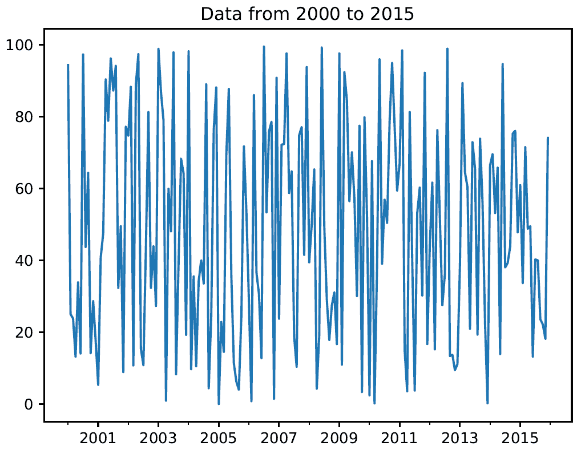

以下截图显示了一个较小的时间框架；因此，它看起来像是我们将其放大了：

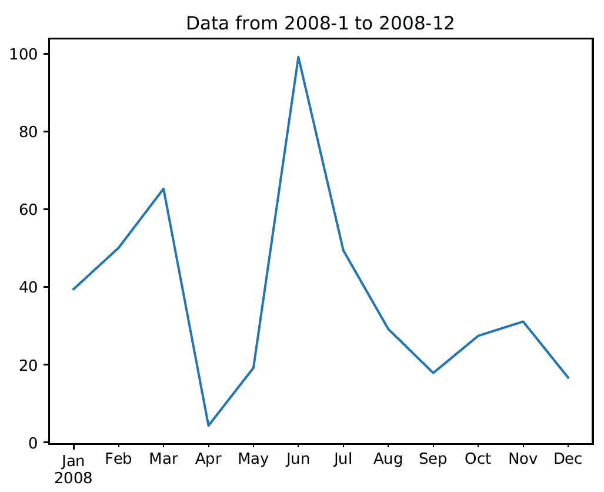

# 工作原理...

在这个菜谱中，我们学习了如何分解时间序列数据。首先，我们导入了包含在 `.txt` 文件中的数据。这些数据使用我们在前一个菜谱中定义的函数转换成了时间序列格式。因此，我们首先在一定的年份范围内绘制了数据，然后在一定的日期范围内绘制了数据。

# 更多内容...

为了将数据转换成时间序列格式，我们使用了 `pandas` 库。这个库在处理时间序列数据方面特别高效。

# 相关内容

+   请参考 pandas 时间序列和日期功能的官方文档：[`pandas.pydata.org/pandas-docs/stable/user_guide/timeseries.html`](https://pandas.pydata.org/pandas-docs/stable/user_guide/timeseries.html)

+   *时间序列*（由牛津大学的 Gesine Reinert 教授撰写）：[`www.stats.ox.ac.uk/~reinert/time/notesht10short.pdf`](http://www.stats.ox.ac.uk/~reinert/time/notesht10short.pdf)

# 对时间序列数据进行操作

现在我们知道了如何切片数据和提取各种子集，让我们讨论如何对时间序列数据进行操作。您可以通过许多不同的方式过滤数据。`pandas` 库允许您以任何您想要的方式对时间序列数据进行操作。

# 准备工作

在这个菜谱中，我们将使用 `.txt` 文件中的数据并加载它。然后，我们将使用某个阈值过滤数据，以提取仅满足特定要求的起始数据集的一部分。

# 如何操作...

让我们看看我们如何对时间序列数据进行操作：

1.  创建一个新的 Python 文件并导入以下包（完整的代码在提供的 `operating_on_data.py` 文件中给出）：

```py
import pandas as pd 
import matplotlib.pyplot as plt 
from convert_to_timeseries import convert_data_to_timeseries 
```

在这里，`convert_to_timeseries` 是我们在上一个菜谱中定义的函数，*将数据转换为时间序列格式*，该函数读取输入文件并将顺序观测值转换为时间索引数据。

1.  我们将使用与之前菜谱中相同的文本文件（记住，Python 从位置 0 开始列出数据，因此第三列和第四列的索引是 2 和 3）：

```py
# Input file containing data 
input_file = 'data_timeseries.txt' 
```

1.  在这个 `.txt` 文件中，我们将使用第三列和第四列（记住，Python 从位置 0 开始列出数据，所以第三列和第四列的索引是 2 和 3）：

```py
# Load data 
data1 = convert_data_to_timeseries(input_file, 2) 
data2 = convert_data_to_timeseries(input_file, 3) 
```

1.  将数据转换为 `pandas` DataFrame：

```py
dataframe = pd.DataFrame({'first': data1, 'second': data2}) 
```

1.  在给定年份范围内绘制数据：

```py
# Plot data 
dataframe['1952':'1955'].plot() 
plt.title('Data overlapped on top of each other') 
```

1.  假设我们想绘制给定年份范围内两列之间的差异。我们可以使用以下行来完成此操作：

```py
# Plot the difference 
plt.figure() 
difference = dataframe['1952':'1955']['first'] - dataframe['1952':'1955']['second'] 
difference.plot() 
plt.title('Difference (first - second)') 
```

1.  如果我们想根据第一列和第二列的不同条件过滤数据，我们只需指定这些条件并绘制如下：

```py
# When 'first' is greater than a certain threshold 
# and 'second' is smaller than a certain threshold 
dataframe[(dataframe['first'] > 60) & (dataframe['second'] < 20)].plot(style='o') 
plt.title('first > 60 and second < 20') 

plt.show() 
```

如果您运行前面的代码，第一个输出将如下所示：


第二张输出截图表示差异，如下所示：

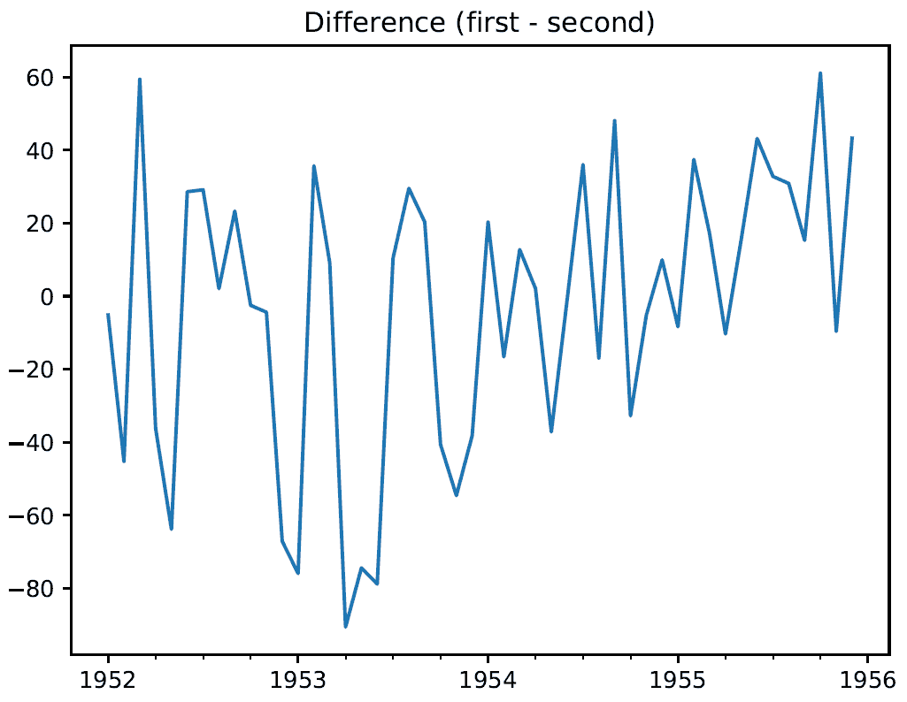

第三张输出截图表示过滤后的数据，如下所示：

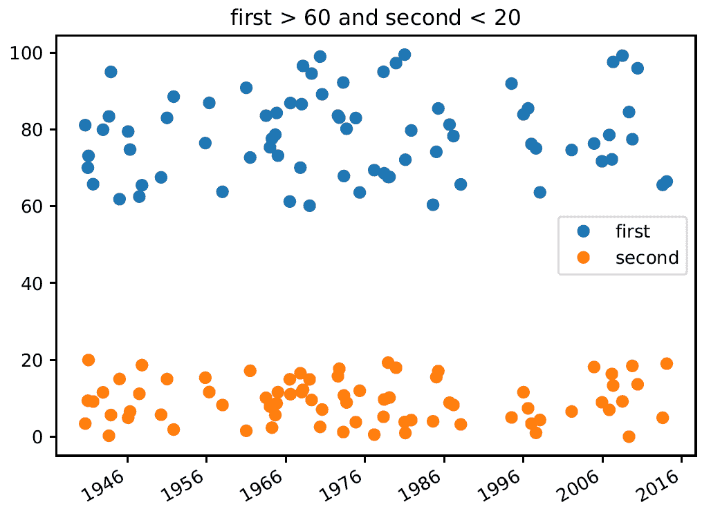

# 工作原理...

在这个菜谱中，我们学习了如何过滤时间序列中的数据。首先，我们在两个年份之间（从 1952 年到 1955 年）绘制了数据。然后，我们在特定时间间隔内（从 1952 年到 1955 年）绘制了两个列中包含的数据之间的差异。最后，我们使用某个阈值绘制数据，以提取仅满足特定要求的起始数据集的一部分——特别是当第一列大于 60 且第二列小于 20 时。

# 还有更多...

要同时进行两列过滤，使用了`&`运算符。`&`（与）运算符是两个命题之间的逻辑运算符（布尔运算符），表示逻辑合取。给定两个命题，A 和 B，逻辑合取确定第三个命题，C*，*，只有当两个命题都为真时，该命题才为真。

# 参见

+   请参阅*时间序列分析的基本概念*讲座（来自洛桑大学）：[`math.unice.fr/~frapetti/CorsoP/chapitre_1_part_1_IMEA_1.pdf`](https://math.unice.fr/~frapetti/CorsoP/chapitre_1_part_1_IMEA_1.pdf)

# 从时间序列数据中提取统计数据

我们想要分析时间序列数据的主要原因是从中提取有趣的统计数据。这提供了有关数据性质的大量信息。

# 准备工作

在本食谱中，我们将探讨如何提取一些统计数据。

# 如何操作...

让我们看看如何从时间序列数据中提取统计数据：

1.  创建一个新的 Python 文件并导入以下包（完整的代码在提供的`extract_stats.py`文件中给出）：

```py
import pandas as pd 
import matplotlib.pyplot as plt 
from convert_to_timeseries import convert_data_to_timeseries 
```

`convert_to_timeseries`函数是我们之前在*将数据转换为时间序列格式*食谱中定义的函数，它读取输入文件并将顺序观测值转换为时间索引数据。

1.  我们将使用之前食谱中用于分析的相同文本文件（`data_timeseries.txt`）：

```py
# Input file containing data 
input_file = 'data_timeseries.txt' 
```

1.  加载数据的列（第三和第四列）：

```py
# Load data 
data1 = convert_data_to_timeseries(input_file, 2) 
data2 = convert_data_to_timeseries(input_file, 3) 
```

1.  创建一个`pandas`数据结构来存储这些数据。这个 DataFrame 就像一个有键和值的字典：

```py
dataframe = pd.DataFrame({'first': data1, 'second': data2}) 
```

1.  现在让我们开始提取一些统计数据。要提取最大值和最小值，请使用以下代码：

```py
# Print max and min 
print('Maximum:\n', dataframe.max())
print('Minimum:\n', dataframe.min())
```

1.  要打印数据的平均值或仅打印行平均值，请使用以下代码：

```py
# Print mean 
print('Mean:\n', dataframe.mean())
print('Mean row-wise:\n', dataframe.mean(1)[:10])
```

1.  滚动平均值是时间序列处理中常用的重要统计量。最著名的应用之一是平滑信号以去除噪声。“滚动平均值”指的是在时间尺度上滑动窗口中信号的均值计算。让我们考虑窗口大小为`24`并绘制如下：

```py
# Plot rolling mean 
DFMean = dataframe.rolling(window=24).mean()
plt.plot(DFMean) 
```

1.  相关系数在理解数据性质方面很有用，如下所示：

```py
# Print correlation coefficients 
print('Correlation coefficients:\n', dataframe.corr()) 
```

1.  让我们使用窗口大小为`60`来绘制这个：

```py
# Plot rolling correlation 
plt.figure()
DFCorr= dataframe.rolling(window=60).corr(pairwise=False)
plt.plot(DFCorr)
plt.show()
```

如果运行前面的代码，滚动平均值将如下所示：

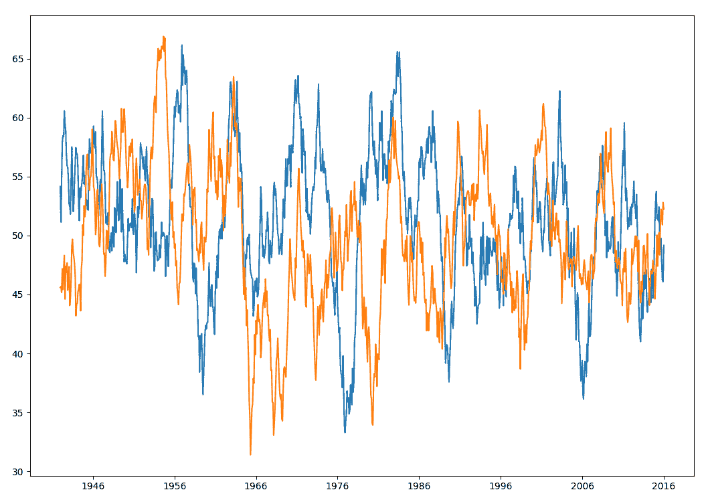

第二个输出指示滚动相关性（以下输出是在`matplotlib`窗口中执行缩放矩形操作的结果）：

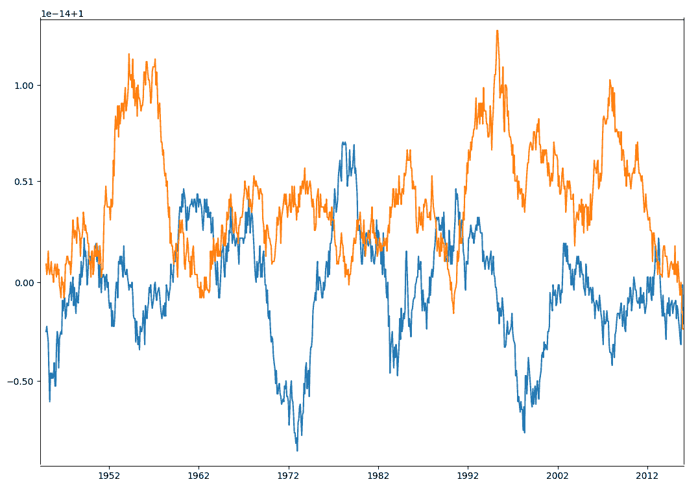

1.  在终端的上半部分，您将看到打印出的最大值、最小值和平均值，如下所示：

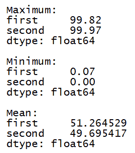

1.  在终端的下半部分，您将看到打印出行平均值统计和相关性系数，如下所示：

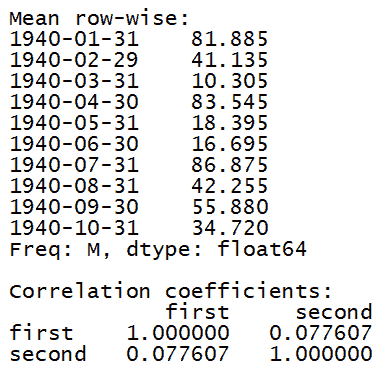

# 工作原理...

在这个菜谱中，我们学习了如何提取一些统计数据。我们首先计算了从数据集中提取的两个列的最小值、最大值和平均值。然后，我们计算了 DataFrame 前 10 行的每一行的平均值。最后，我们对两个特征进行了相关性分析。

# 更多内容...

为了进行相关性分析，使用了`pandas.DataFrame.corr`函数。此函数计算列之间的成对相关性，排除 N/A 或空值。以下方法可用：

+   `pearson`：这是标准的相关系数

+   `kendall`：这是**肯德尔 tau**相关系数

+   `spearman`：这是**斯皮尔曼秩**相关系数

# 相关内容

+   参考官方文档中的`pandas.DataFrame.corr`函数：[`pandas.pydata.org/pandas-docs/stable/reference/api/pandas.DataFrame.corr.html`](https://pandas.pydata.org/pandas-docs/stable/reference/api/pandas.DataFrame.corr.html)

+   *相关性*（来自 SRM 大学）：[`www.srmuniv.ac.in/sites/default/files/downloads/CORRELATION.pdf`](http://www.srmuniv.ac.in/sites/default/files/downloads/CORRELATION.pdf)

# 为序列数据构建 HMMs

**隐藏马尔可夫模型**（**HMMs**）特别适合于序列数据分析问题。它们在语音分析、金融、词序列、天气预报等领域得到广泛应用。

任何产生输出序列的数据源都可以产生模式。请注意，HMMs 是生成模型，这意味着一旦它们学会了底层结构，它们就可以生成数据。HMMs 在其基本形式中不能区分类别。这与可以学习区分类别但不能生成数据的判别模型形成对比。

# 准备工作

假设我们想要预测明天的天气是晴朗、寒冷还是雨天。为此，我们查看所有参数，如温度、压力等，而底层状态是隐藏的。在这里，底层状态指的是三个可用的选项：晴朗、寒冷或雨天。

# 如何操作...

让我们看看如何为序列数据构建 HMMs：

1.  创建一个新的 Python 文件并导入以下包（完整的代码在提供的`hmm.py`文件中给出）：

```py
import numpy as np
import matplotlib.pyplot as plt 
from hmmlearn.hmm import GaussianHMM 
```

1.  我们将使用名为`data_hmm.txt`的文件中的数据，该文件已经提供给你。该文件包含逗号分隔的行。每行包含三个值：一个年份、一个月和一段浮点数据。让我们将其加载到一个 NumPy 数组中：

```py
# Load data from input file 
input_file = 'data_hmm.txt' 
data = np.loadtxt(input_file, delimiter=',') 
```

1.  让我们将数据列堆叠起来进行分析。实际上我们不需要技术上列堆叠，因为这只有一个列。然而，如果你有多个列要分析，可以使用以下结构：

```py
# Arrange data for training  
X = np.column_stack([data[:,2]]) 
```

1.  使用四个组件创建和训练 HMM。组件的数量是一个超参数，我们必须选择。在这里，通过选择四个，我们说数据正在使用四个潜在状态生成。我们将看到性能如何随着这个参数的变化而变化：

```py
# Create and train Gaussian HMM  
print("Training HMM....") 
num_components = 4 
model = GaussianHMM(n_components=num_components, covariance_type="diag", n_iter=1000) 
model.fit(X) 
```

1.  运行预测器以获取隐藏状态：

```py
# Predict the hidden states of HMM  
hidden_states = model.predict(X) 
```

1.  计算隐藏状态的均值和方差：

```py
print("Means and variances of hidden states:")
for i in range(model.n_components):
    print("Hidden state", i+1)
    print("Mean =", round(model.means_[i][0], 3))
    print("Variance =", round(np.diag(model.covars_[i])[0], 3))
```

1.  如我们之前讨论的，HMMs 是生成模型。所以，让我们生成，例如，`1000`个样本并绘制这个：

```py
# Generate data using model 
num_samples = 1000 
samples, _ = model.sample(num_samples)  
plt.plot(np.arange(num_samples), samples[:,0], c='black') 
plt.title('Number of components = ' + str(num_components)) 
plt.show() 
```

完整的代码在提供的`hmm.py`文件中给出。如果你运行前面的代码，你会看到以下输出：

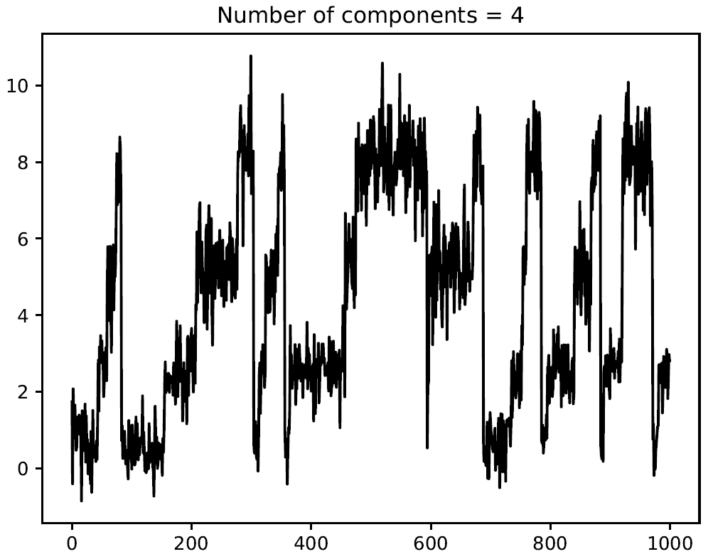

1.  你可以通过实验`n_components`参数来观察随着它的增加曲线如何变得更加平滑。你基本上可以给它更多的自由度来训练和定制，允许更多的隐藏状态。如果你将其增加到`8`，你会看到以下输出：

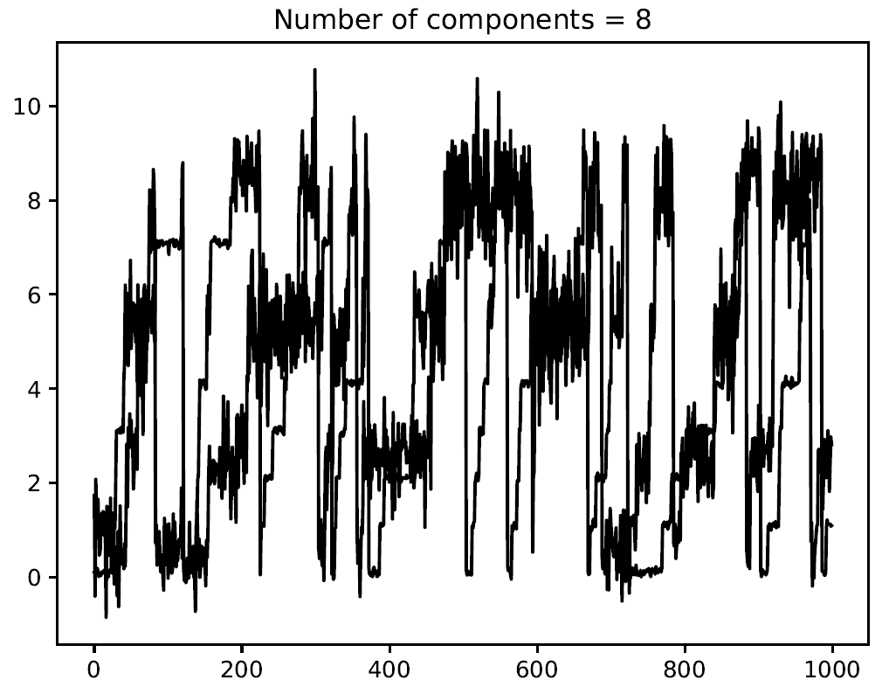

1.  如果你将其增加到`12`，它将变得更加平滑：

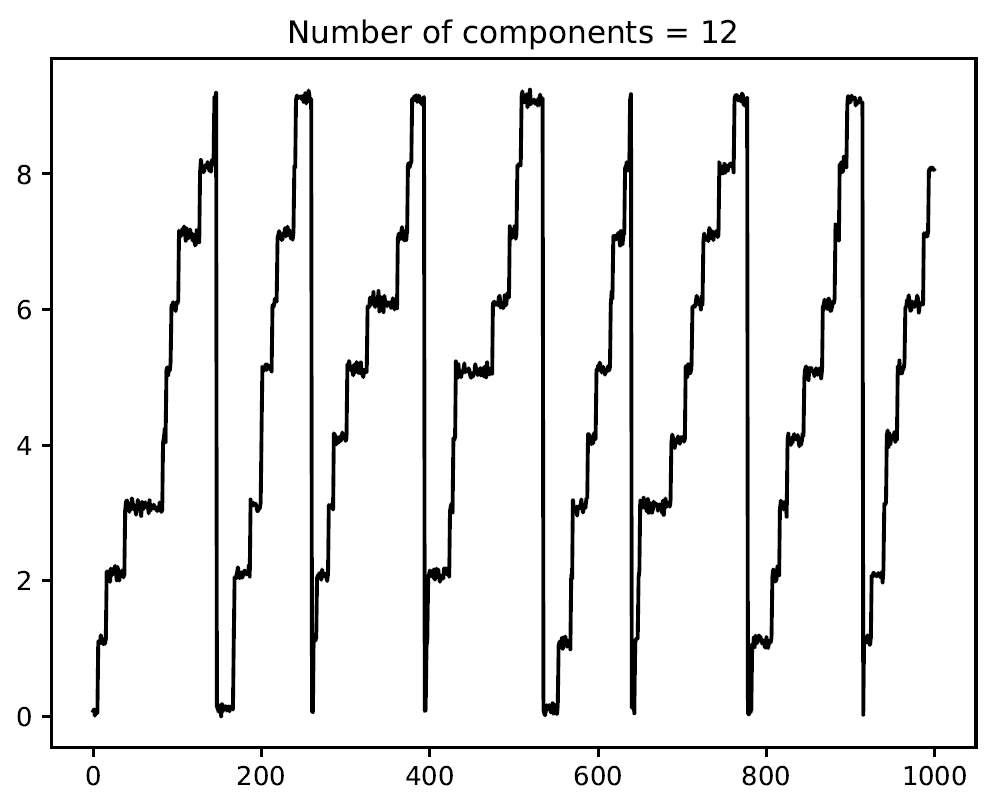

在终端中，你会得到以下输出：

```py
Training HMM....
Means and variances of hidden states:
Hidden state 1
Mean = 5.592
Variance = 0.253
Hidden state 2
Mean = 1.098
Variance = 0.004
Hidden state 3
Mean = 7.102
Variance = 0.003
Hidden state 4
Mean = 3.098
Variance = 0.003
Hidden state 5
Mean = 4.104
Variance = 0.003
```

# 它是如何工作的...

HMM 是一种模型，其中被建模的系统被假定为具有未观察状态的马尔可夫过程。一个随机过程被称为马尔可夫的，当在观察中选择了某个特定的*t*实例后，该过程的演变，从*t*开始，只依赖于*t*，而不以任何方式依赖于之前的实例。因此，一个过程是马尔可夫的，当给定观察时刻时，只有这个实例决定了过程的未来演变，而这一演变不依赖于过去。在这个菜谱中，我们学习了如何使用 HMMs 生成时间序列。

# 还有更多…

在这个菜谱中，我们使用了`hmmlearn`来构建和训练 HMMs，它实现了 HMMs。HMM 是一种生成概率模型，其中使用一系列隐藏内部状态计算一系列可观察变量。隐藏状态不能直接观察到。

# 参见

+   更多信息请参考`hmmlearn`库的官方文档：[`hmmlearn.readthedocs.io/en/latest/`](https://hmmlearn.readthedocs.io/en/latest/)

+   *《隐藏马尔可夫模型教程》*（由牛津大学的劳伦斯·R·拉比纳尔编写）：[`www.robots.ox.ac.uk/~vgg/rg/slides/hmm.pdf`](https://www.robots.ox.ac.uk/~vgg/rg/slides/hmm.pdf)

# 构建用于序列文本数据的 CRFs

**条件随机场**（**CRFs**）是用于分析结构化数据的概率模型。它们通常用于标记和分割序列数据。与生成模型 HMMs 相比，CRFs 是判别模型。CRFs 被广泛用于分析序列、股票、语音、单词等。在这些模型中，给定一个特定的标记观察序列，我们定义这个序列的条件概率分布。这与 HMMs 不同，在 HMMs 中，我们定义标签和观察序列的联合分布。

# 准备工作

在这个菜谱中，我们将使用一个名为`pystruct`的库来构建和训练 CRFs。确保你在继续之前安装它。你可以找到安装说明在[`pystruct.github.io/installation.html`](https://pystruct.github.io/installation.html)。

# 如何做到这一点...

让我们看看我们如何为序列文本数据构建 CRFs：

1.  创建一个新的 Python 文件并导入以下包（完整的代码在提供的`crf.py`文件中给出）：

```py
import argparse 
import numpy as np
from pystruct.datasets import load_letters
from pystruct.models import ChainCRF
from pystruct.learners import FrankWolfeSSVM
```

1.  定义一个参数解析器以接受`C`值作为输入参数。在这里，`C`是一个超参数，它控制你希望你的模型有多具体，同时不失泛化能力：

```py
def build_arg_parser():
    parser = argparse.ArgumentParser(description='Trains the CRF classifier')
    parser.add_argument("--c-value", dest="c_value", required=False, type=float,
            default=1.0, help="The C value that will be used for training")
    return parser
```

1.  定义一个`class`来处理所有与 CRF 相关的处理：

```py
class CRFTrainer(object): 
```

1.  定义一个`init`函数来初始化值：

```py
    def __init__(self, c_value, classifier_name='ChainCRF'): 
        self.c_value = c_value 
        self.classifier_name = classifier_name 
```

1.  我们将使用`ChainCRF`来分析数据。我们需要添加一个错误检查，如下所示：

```py
        if self.classifier_name == 'ChainCRF': 
            model = ChainCRF() 
```

1.  定义我们将与 CRF 模型一起使用的分类器。我们将使用一种 SVM 类型来实现这一点：

```py
            self.clf = FrankWolfeSSVM(model=model, C=self.c_value, max_iter=50)  
        else: 
            raise TypeError('Invalid classifier type') 
```

1.  加载`letters`数据集。这个数据集包括分割后的字母及其相关的特征向量。我们不会分析图像，因为我们已经有了特征向量。每个单词的第一个字母已经被移除，所以我们只剩下小写字母：

```py
    def load_data(self): 
        letters = load_letters() 
```

1.  将数据和标签加载到各自的变量中：

```py
        X, y, folds = letters['data'], letters['labels'], letters['folds'] 
        X, y = np.array(X), np.array(y) 
        return X, y, folds 
```

1.  定义一种训练方法，如下所示：

```py
    # X is a numpy array of samples where each sample 
    # has the shape (n_letters, n_features)  
    def train(self, X_train, y_train): 
        self.clf.fit(X_train, y_train) 
```

1.  定义一个方法来评估模型的表现：

```py
    def evaluate(self, X_test, y_test): 
        return self.clf.score(X_test, y_test) 
```

1.  定义一个方法来分类新数据：

```py
    # Run the classifier on input data 
    def classify(self, input_data): 
        return self.clf.predict(input_data)[0] 
```

1.  字母被索引在一个编号数组中。为了检查输出并使其可读，我们需要将这些数字转换成字母。定义一个函数来做这件事：

```py
def decoder(arr): 
    alphabets = 'abcdefghijklmnopqrstuvwxyz' 
    output = '' 
    for i in arr: 
        output += alphabets[i]  

    return output 
```

1.  定义主函数并解析输入参数：

```py
if __name__=='__main__': 
    args = build_arg_parser().parse_args() 
    c_value = args.c_value 
```

1.  使用类和`C`值初始化变量：

```py
    crf = CRFTrainer(c_value) 
```

1.  加载`letters`数据：

```py
    X, y, folds = crf.load_data() 
```

1.  将数据分为训练集和测试集：

```py
    X_train, X_test = X[folds == 1], X[folds != 1] 
    y_train, y_test = y[folds == 1], y[folds != 1] 
```

1.  按照以下方式训练 CRF 模型：

```py
    print("Training the CRF model...")
    crf.train(X_train, y_train) 
```

1.  评估 CRF 模型的表现：

```py
    score = crf.evaluate(X_test, y_test) 
    print("Accuracy score =", str(round(score*100, 2)) + '%') 
```

1.  让我们随机取一个测试向量并使用模型进行预测：

```py
    print("True label =", decoder(y_test[0]))
    predicted_output = crf.classify([X_test[0]])
    print("Predicted output =", decoder(predicted_output))
```

1.  如果你运行前面的代码，你将在你的终端上得到以下输出。正如我们所见，单词应该是`commanding`。CRF 在预测所有字母方面做得相当不错：

```py
Training the CRF model...
Accuracy score = 77.93%
True label = ommanding
Predicted output = ommanging
```

# 它是如何工作的...

HMMs 假设当前输出在统计上与先前输出独立。这是 HMMs 确保推理以稳健方式工作所必需的。然而，这个假设并不总是必须成立的！在时间序列设置中，当前输出往往依赖于先前输出。CRFs 相对于 HMMs 的主要优势之一是它们本质上是有条件的，这意味着我们不会假设输出观测之间有任何独立性。使用 CRFs 而不是 HMMs 还有其他一些优势。CRFs 在许多应用中往往优于 HMMs，例如语言学、生物信息学、语音分析和如此等等。在这个菜谱中，我们将学习如何使用 CRFs 来分析字母序列。

# 还有更多...

PyStruct 是一个易于使用的机器学习算法的结构化库。它实现了最大间隔和感知器方法。PyStruct 中实现的算法示例包括 CRFs、**最大间隔马尔可夫** **随机字段**（**M3Ns**）和结构化 SVMs。

# 参见

+   更多信息请参考`pystruct`库的官方文档：[`pystruct.github.io/`](https://pystruct.github.io/)

+   查看来自圣母大学的*条件随机字段*讲座（[`www3.nd.edu/~dchiang/teaching/nlp/2015/notes/chapter8v1.pdf`](https://www3.nd.edu/~dchiang/teaching/nlp/2015/notes/chapter8v1.pdf)）

# 分析股票市场数据

股票市场一直是一个非常热门的话题；这是因为股票市场趋势涉及真正令人印象深刻的交易量。这个话题引起的兴趣显然与通过股票市场标题的良好预测获得财富的机会有关。购买股票价格与卖出股票价格之间的正差价意味着投资者获得了收益。但是，正如我们所知，股票市场的表现取决于多个因素。

# 准备工作

在这个菜谱中，我们将探讨如何分析一家非常流行的公司的股票价格：我指的是亚马逊，一家位于华盛顿州西雅图的美国电子商务公司，它是世界上最大的互联网公司。

# 如何操作...

让我们看看我们如何分析股票市场数据：

1.  创建一个新的 Python 文件并导入以下包（完整的代码在提供的`AmazonStock.py`文件中）：

```py
import numpy as np
import pandas as pd
import matplotlib.pyplot as plt
from random import seed
```

1.  从提供的`AMZN.csv`文件中获取股票报价：

```py
seed(0)
Data = pd.read_csv('AMZN.csv',header=0, usecols=['Date', 'Close'],parse_dates=True,index_col='Date')
```

1.  要提取导入数据集的初步信息，我们可以调用`info()`函数：

```py
print(Data.info())
```

返回以下结果：

```py
<class 'pandas.core.frame.DataFrame'>
DatetimeIndex: 4529 entries, 2000-11-21 to 2018-11-21
Data columns (total 1 columns):
Close 4529 non-null float64
dtypes: float64(1)
memory usage: 70.8 KB
None
```

此函数打印有关 DataFrame 的信息，包括索引和`dtypes`列、`non-null`值和`memory usage`。

1.  要显示导入的 DataFrame 的前五行，我们可以使用`head()`函数，如下所示：

```py
print(Data.head())
```

此函数根据位置返回对象的前 *n* 行。这对于快速测试对象中是否包含正确的数据类型很有用。默认情况下（如果省略 *n*），显示前五行。以下结果被返回：

```py
 Close
Date 
2000-11-21 24.2500
2000-11-22 25.1875
2000-11-24 28.9375
2000-11-27 28.0000
2000-11-28 25.0312
```

1.  要预览其中包含的数据，我们可以计算一系列基本统计量。为此，我们将使用以下方式的 `describe()` 函数：

```py
print(Data.describe())
```

`describe()` 函数生成描述性统计量，总结数据集的中心趋势、离散程度和分布形式，排除 `NaN` 值。此函数分析数值和对象序列，以及混合数据类型的 DataFrame 列集。以下结果被返回：

```py
 Close
count      4529.000000
mean        290.353723
std         407.211585
min           5.970000
25%          39.849998
50%         117.889999
75%         327.440002
max        2039.510010
```

1.  现在，我们将对时间序列进行初步的视觉探索性分析：

```py
plt.figure(figsize=(10,5))
plt.plot(Data)
plt.show()
```

在以下图表中，显示了从 2000 年 11 月 21 日到 2018 年 11 月 21 日的亚马逊股票价格：

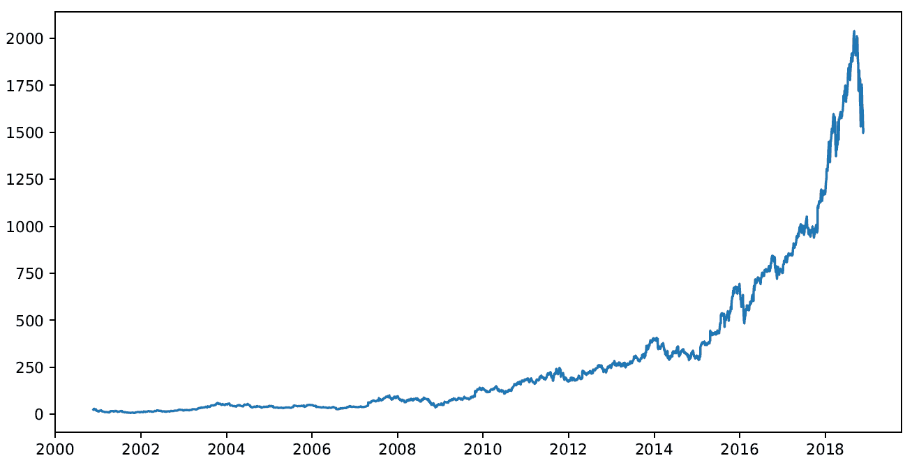

从先前图表的分析中，我们可以看到价格随着时间的推移显著增加。特别是，从 2015 年开始，这种增长显示出指数趋势。

1.  现在，让我们尝试更深入地了解亚马逊股票随时间记录的变化。为了在 Python 中计算百分比变化，我们将使用 `pct_change()` 函数。此函数返回给定数量的期间的百分比变化：

```py
DataPCh = Data.pct_change()
```

我们刚刚计算的结果与回报的概念相符。

1.  要计算回报的对数，我们将使用来自 `numpy` 的 `log()` 函数：

```py
LogReturns = np.log(1 + DataPCh) 
print(LogReturns.tail(10))
```

`tail()` 函数根据位置从对象返回最后 *n* 行。这对于快速验证数据很有用——例如，在排序或追加行之后。以下值被返回（`LogReturns` 对象的最后 10 行）：

```py
 Close
Date 
2018-11-08     -0.000330
2018-11-09     -0.024504
2018-11-12     -0.045140
2018-11-13     -0.003476
2018-11-14     -0.019913
2018-11-15      0.012696
2018-11-16     -0.016204
2018-11-19     -0.052251
2018-11-20     -0.011191
2018-11-21      0.014123
```

1.  现在，我们将绘制我们计算出的回报对数的图表：

```py
plt.figure(figsize=(10,5))
plt.plot(LogReturns)
plt.show()
```

如我们之前所做的那样，我们首先设置图表的维度，然后我们将绘制图表，最后我们将可视化它。以下图表显示了回报的对数：

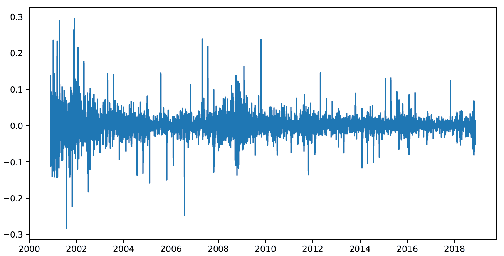

# 它是如何工作的...

要研究一个现象的演变，仅有一个时间序列图是不够的；我们需要比较不同时间点的现象强度，即计算从一个时期到另一个时期的强度变化。此外，分析相邻时间段内现象变化的趋势可能也很有趣。我们用 Y1,..., Yt,..., Yn 表示时间序列。时间序列是变量的实验观察的按时间顺序记录，例如价格趋势、股票市场指数、价差和失业率。因此，它是一系列按时间顺序排列的数据，我们希望从中提取信息以表征观察到的现象，并预测未来的值。

两个不同时间之间发生的变化（让我们用 *t* 和 *t + 1* 来表示）可以使用以下比率来衡量：

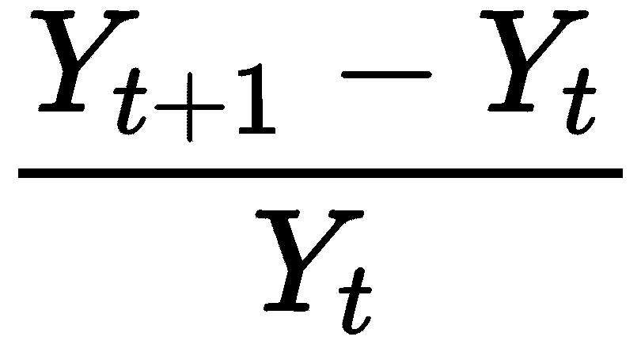

此指数是一个百分比比率，称为**百分比变化**。特别是，这是现象 *Y* 在时间 *t + 1* 相对于之前时间 *t* 的百分比变化率。这种方法提供了关于数据随时间变化更详细的解释。使用这种技术，我们可以追踪个别股票和大型市场指数的价格，以及比较不同货币的价值。

# 更多内容...

与价格相比，使用回报的优势在于标准化，这使得我们能够以可比较的指标来衡量所有变量，从而允许评估两个或更多变量之间的分析关系。

# 参见

+   参考官方文档的`pandas.DataFrame.pct_change`函数：[`pandas.pydata.org/pandas-docs/stable/reference/api/pandas.DataFrame.pct_change.html`](https://pandas.pydata.org/pandas-docs/stable/reference/api/pandas.DataFrame.pct_change.html)

# 使用 RNN 预测时序数据

**长短期记忆**（**LSTM**）是**循环神经网络**（**RNNs**）的一种特定架构。RNNs 基于对过去事件记忆的需求；这种行为在普通网络中是不可能的，这就是为什么 RNNs 被用于经典网络无法产生结果的领域，例如预测与先前数据相关的时序数据（天气、报价等）。

LSTM 网络由相互连接的细胞（LSTM 块）组成。每个细胞反过来又由三种类型的端口组成：输入门、输出门和遗忘门。它们分别对细胞内存执行写入、读取和重置功能，因此 LSTM 模块能够调节存储和删除的内容。这得益于存在各种称为**门**的元素，这些门由一个 sigmoid 神经网络层和一个逐点乘积组成。每个门的输出在（0，1）范围内，表示其中流动的信息百分比。

# 准备工作

在这个菜谱中，我们将探讨如何将 LSTM 模型应用于预测一家非常受欢迎的公司的未来股价：我指的是总部位于华盛顿州西雅图的美国电子商务公司亚马逊，它是世界上最大的互联网公司。

# 如何操作...

让我们看看如何使用 RNN 来预测时序数据：

1.  创建一个新的 Python 文件并导入以下包（完整的代码在提供的`LSTMstock.py`文件中给出）。文件的前一部分在之前的菜谱中已经处理过，*分析股票市场数据*。我们只报告它以完整算法：

```py
import numpy as np
import pandas as pd
import matplotlib.pyplot as plt
from random import seed

seed(0)

Data = pd.read_csv('AMZN.csv',header=0, usecols=['Date', 'Close'],parse_dates=True,index_col='Date')
```

1.  在训练 LSTM 算法之前对数据进行缩放是一种良好的实践。通过缩放，消除了数据单位，这使得你可以轻松地比较来自不同位置的数据。在这个例子中，我们将使用最小-最大方法（通常称为**特征缩放**）来获取所有缩放数据在[0, 1]范围内的数据。为了执行特征缩放，我们可以使用`sklearn`库中可用的预处理包：

```py
from sklearn.preprocessing import MinMaxScaler
scaler = MinMaxScaler()
DataScaled = scaler.fit_transform(Data)
```

1.  现在，让我们将数据分为训练和测试模型两部分。训练和测试模型是进一步使用模型进行预测性分析的基础。给定一个包含 4,529 行数据的数据集，我们将其按方便的比例（例如 70:30）分割，并将 3,170 行分配给训练，1,359 行分配给测试：

```py
np.random.seed(7)
TrainLen = int(len(DataScaled) * 0.70)
TestLen = len(DataScaled) - TrainLen
TrainData = DataScaled[0:TrainLen,:] 
TestData = DataScaled[TrainLen:len(DataScaled),:]

print(len(TrainData), len(TestData))
```

以下结果被返回：

```py
3170 1359
```

1.  现在，我们需要输入和输出以训练和测试我们的网络。很明显，输入由数据集中现有的数据表示。因此，我们必须构建我们的输出；我们将通过假设我们想要预测时间*t + 1*的亚马逊股价相对于时间*t*存储的值来做到这一点。一个循环网络具有记忆，这是通过固定所谓的步长来维持的。步长是关于反向传播在计算权重更新时的梯度时回溯多长时间的问题。这样，我们设置`TimeStep=1`。然后，我们定义一个函数，它接受一个数据集和一个时间步长，然后返回输入和输出数据：

```py
def DatasetCreation(dataset, TimeStep=1):
  DataX, DataY = [], []
  for i in range(len(dataset)-TimeStep-1):
    a = dataset[i:(i+TimeStep), 0]
    DataX.append(a)
    DataY.append(dataset[i + TimeStep, 0])
  return np.array(DataX), np.array(DataY)
```

在这个函数中，`dataX = Input = data(t)`是输入变量，`DataY = output = data(t + 1)`是下一个时间段的预测值。

1.  让我们使用这个函数来设置我们在下一阶段（网络建模）中将要使用的训练和测试数据集：

```py
TimeStep = 1
TrainX, TrainY = DatasetCreation(TrainData, TimeStep)
TestX, TestY = DatasetCreation(TestData, TimeStep)
```

在 LSTM/RNN 网络中，每个 LSTM 层的输入必须包含以下信息：

+   **观测数**：收集到的观测数

+   **时间步长**：时间步长是样本中的观测点

+   **特征**：每步一个特征

因此，有必要为那些经典网络预见的添加一个时间维度。因此，输入形状如下：

(*观测数，时间步数，每步特征数*)

这样，每个 LSTM 层的输入就变成了三维的。

1.  为了将输入数据集转换为 3D 形式，我们将使用`np.reshape()`函数，如下所示：

```py
TrainX = np.reshape(TrainX, (TrainX.shape[0], 1, TrainX.shape[1]))
TestX = np.reshape(TestX, (TestX.shape[0], 1, TestX.shape[1]))
```

1.  现在数据已经处于正确的格式，是时候创建模型了。让我们先导入库：

```py
from keras.models import Sequential
from keras.layers import LSTM
from keras.layers import Dense
```

1.  我们将使用`Sequential`模型，即层的一个线性堆叠。为了创建一个序列模型，我们必须将一个层实例的列表传递给构造函数。我们也可以通过`add()`方法简单地添加层：

```py
model = Sequential()
model.add(LSTM(256, input_shape=(1, TimeStep)))
model.add(Dense(1, activation='sigmoid'))
model.compile(loss='mean_squared_error', optimizer='adam',metrics=['accuracy'])
model.fit(TrainX, TrainY, epochs=100, batch_size=1, verbose=1)
model.summary()
```

以下结果被打印出来：

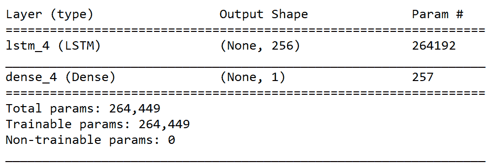

1.  为了评估我们刚刚调整的模型的表现，我们可以使用`evaluate()`函数，如下所示：

```py
score = model.evaluate(TrainX, TrainY, verbose=0)
print('Keras Model Loss = ',score[0])
print('Keras Model Accuracy = ',score[1])
```

前面的函数在测试模式下显示模型的损失值和指标值。这是分批计算的。以下结果被返回：

```py
Keras Model Loss = 2.4628453362992094e-06
Keras Model Accuracy = 0.0003156565656565657
```

1.  模型现在已准备好使用。因此，我们可以用它来执行我们的预测：

```py
TrainPred = model.predict(TrainX)
TestPred = model.predict(TestX)
```

1.  预测必须以原始形式报告，以便可以与实际值进行比较：

```py
TrainPred = scaler.inverse_transform(TrainPred)
TrainY = scaler.inverse_transform([TrainY])
TestPred = scaler.inverse_transform(TestPred)
TestY = scaler.inverse_transform([TestY])
```

1.  为了验证数据的正确预测，我们现在可以通过绘制适当的图表来可视化结果。为了正确显示时间序列，需要预测偏移。这个操作必须在训练集和测试集上执行：

```py
TrainPredictPlot = np.empty_like(DataScaled)
TrainPredictPlot[:, :] = np.nan
TrainPredictPlot[1:len(TrainPred)+1, :] = TrainPred
```

1.  如我们之前所述，然后必须在测试集上执行相同的操作：

```py
TestPredictPlot = np.empty_like(DataScaled)
TestPredictPlot[:, :] = np.nan
TestPredictPlot[len(TrainPred)+(1*2)+1:len(DataScaled)-1, :] = TestPred
```

1.  最后，我们必须绘制实际数据和预测结果：

```py
plt.figure(figsize=(10,5))
plt.plot(scaler.inverse_transform(DataScaled))
plt.plot(TrainPredictPlot)
plt.plot(TestPredictPlot)
plt.show()
```

下面的截图显示了实际数据和预测结果：

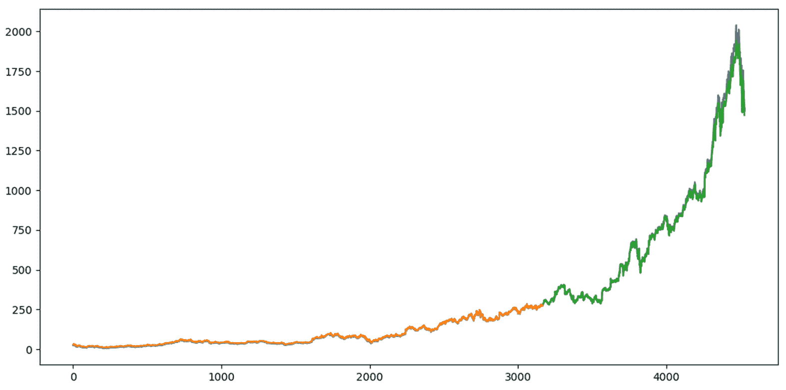

# 它是如何工作的...

在本食谱的开头，我们说 LSTM 模块能够调节存储和删除的内容。这要归功于存在各种称为门的元素，它们由一个 sigmoid 神经网络层和一个逐点乘积组成。LSTM 模块的第一部分决定从单元格中删除哪些信息。门接收输入并为每个单元格状态返回一个介于 0 和 1 之间的值。门输出可以取两个值：

+   `0`：完全重置单元格状态

+   `1`：单元格值的总存储

数据存储分为两个阶段：

+   第一部分委托给一个名为**输入门层**的 sigmoid 层；它执行一个操作，确定哪些值需要更新。

+   第二阶段则委托给一个`tanh`层，该层创建一个待更新的值向量。为了创建一个更新的值集，将两个层的输出结合起来。

最后，结果将由一个 sigmoid 层给出，该层确定哪些单元格部分将对输出做出贡献，并从当前单元格状态中，通过`tanh`函数过滤，以获得-1 到 1 的范围。此操作的输出乘以 sigmoid 层的值，以便只给出所需的输出。

# 更多内容...

RNN 是一种神经网络，其中存在信息双向流动。换句话说，在前馈网络中，信号的传播只在单一方向上连续进行，从输入到输出，而循环网络则不同。在循环网络中，这种传播也可以发生在前一个神经层之后的神经层之间，属于同一层的神经元之间，甚至是一个神经元与其自身之间。

# 参见

+   请参阅 Keras 库的官方文档：[`keras.io/`](https://keras.io/)

+   请参阅耶鲁大学的*循环神经网络*（[`euler.stat.yale.edu/~tba3/stat665/lectures/lec21/lecture21.pdf`](http://euler.stat.yale.edu/~tba3/stat665/lectures/lec21/lecture21.pdf)）

+   参考来自威斯康星大学麦迪逊分校的 *长短期记忆*（[`pages.cs.wisc.edu/~shavlik/cs638/lectureNotes/Long%20Short-Term%20Memory%20Networks.pdf`](http://pages.cs.wisc.edu/~shavlik/cs638/lectureNotes/Long%20Short-Term%20Memory%20Networks.pdf)）
