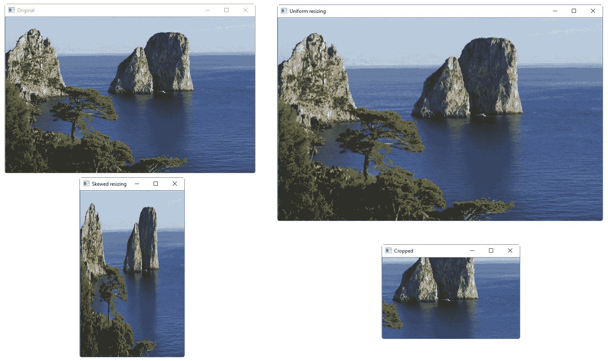
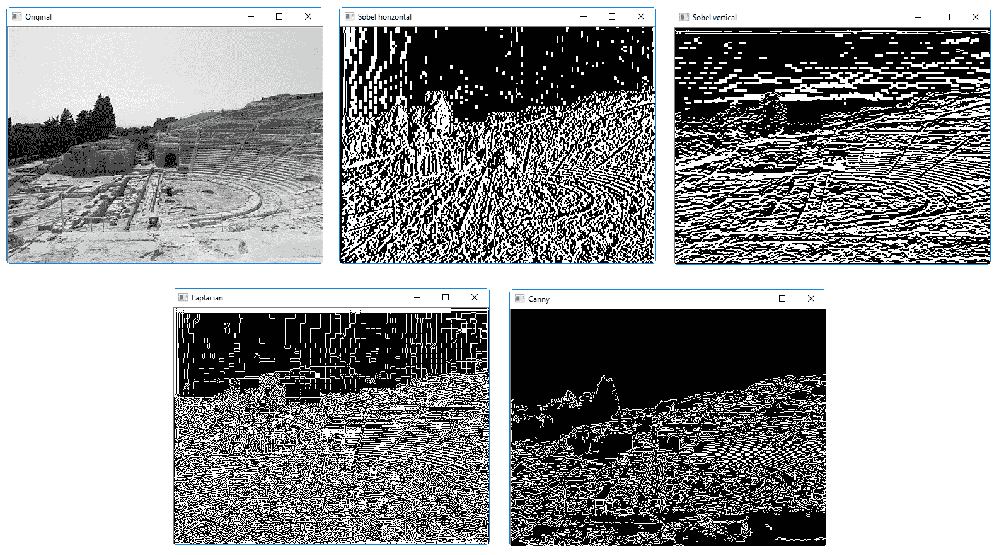
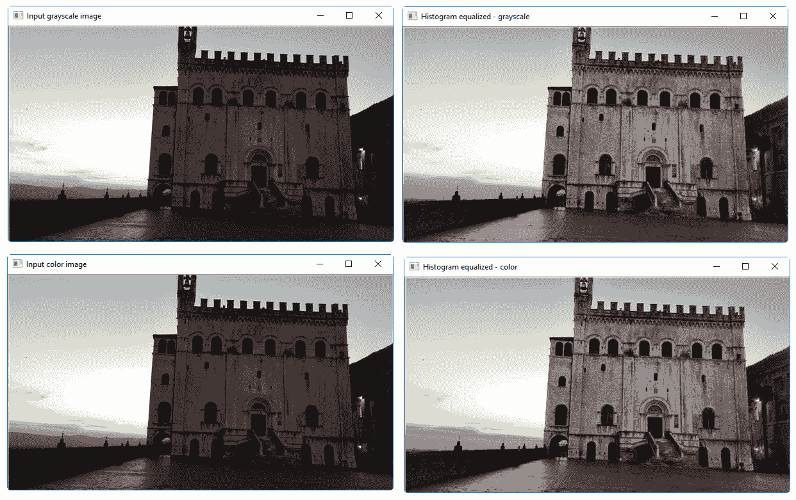
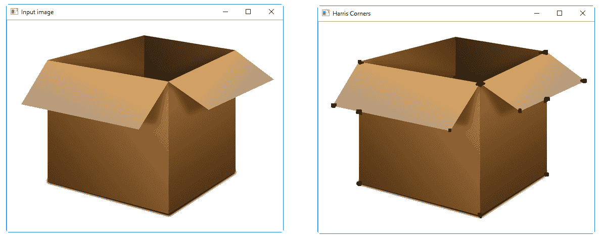
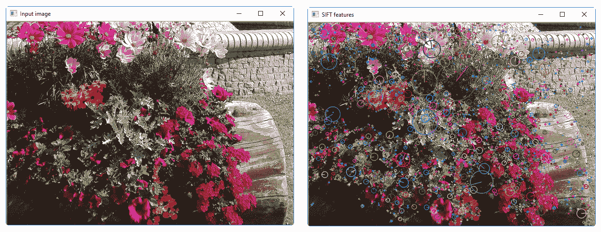
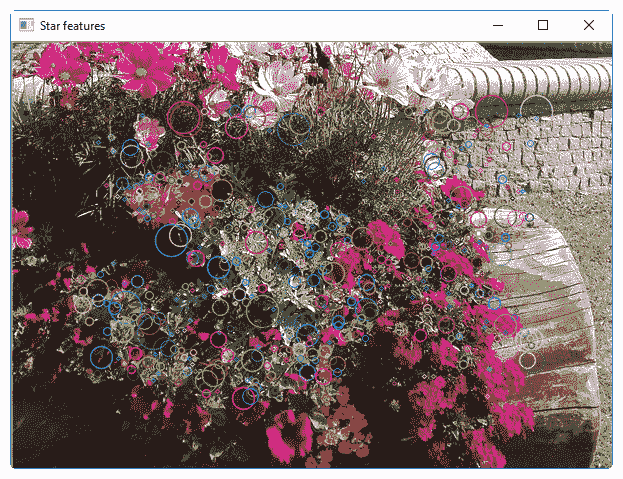

# 第十章：分析图像内容

本章我们将涵盖以下食谱：

+   使用 OpenCV-Python 操作图像

+   检测边缘

+   直方图均衡化

+   检测角点

+   检测 SIFT 特征点

+   构建星特征检测器

+   使用视觉代码簿和向量量化创建特征

+   使用超随机森林训练图像分类器

+   构建物体识别器

+   使用 LightGBM 进行图像分类

# 技术要求

要浏览本章的食谱，你需要以下文件（可在 GitHub 上找到）：

+   `operating_on_images.py`

+   `capri.jpg`

+   `edge_detector.py`

+   `chair.jpg`

+   `histogram_equalizer.py`

+   `sunrise.jpg`

+   `corner_detector.py`

+   `box.png`

+   `feature_detector.py`

+   `table.jpg`

+   `star_detector.py`

+   `trainer.py`

+   `object_recognizer.py`

+   `LightgbmClassifier.py`

# 介绍计算机视觉

**计算机视觉**是一个研究如何处理、分析和理解视觉数据内容的领域。在图像内容分析中，我们使用大量的计算机视觉算法来构建我们对图像中对象的了解。计算机视觉涵盖了图像分析的各个方面，如物体识别、形状分析、姿态估计、3D 建模、视觉搜索等。人类在识别和识别周围事物方面非常出色！计算机视觉的最终目标是使用计算机准确模拟人类的视觉系统。

计算机视觉包括多个分析层次。在低级视觉中，我们处理像素处理任务，例如**边缘检测**、**形态处理**和**光流**。在中级和高级视觉中，我们处理诸如**物体识别**、**3D 建模**、**运动分析**以及视觉数据的各个方面。随着层次的提高，我们倾向于深入探讨视觉系统的概念性方面，并尝试根据活动和意图提取视觉数据的描述。需要注意的是，高级层次往往依赖于低级层次的输出进行分析。

这里最常见的问题之一是：计算机视觉与图像处理有何不同？**图像处理**研究像素级别的图像变换。图像处理系统的输入和输出都是图像。一些常见的例子包括边缘检测、**直方图均衡化**和**图像压缩**。计算机视觉算法在很大程度上依赖于图像处理算法来执行其任务。在计算机视觉中，我们处理更复杂的事情，包括在概念层面上理解视觉数据。这样做的原因是我们想要构建图像中对象的具有意义的描述。计算机视觉系统的输出是对给定图像中 3D 场景的解释。这种解释可以以各种形式出现，具体取决于任务。

# 使用 OpenCV-Python 操作图像

在本章中，我们将使用一个名为**开源计算机视觉库**（**OpenCV**）的库来分析图像。OpenCV 是世界上最受欢迎的计算机视觉库。由于它针对许多不同的平台进行了高度优化，因此已成为行业中的事实标准。在继续之前，请确保您已安装具有 Python 支持的库。您可以从[`opencv.org`](http://opencv.org)下载并安装 OpenCV。有关各种操作系统的详细安装说明，您可以参考网站上的文档部分。

# 准备工作

在本食谱中，我们将探讨如何使用 OpenCV-Python 操作图像。在本食谱中，我们将查看如何加载和显示图像。我们还将查看如何裁剪、调整大小并将图像保存到输出文件中。

# 如何做到这一点...

让我们看看如何使用 OpenCV-Python 操作图像：

1.  创建一个新的 Python 文件，并导入以下包（完整的代码在提供的`operating_on_images.py`文件中给出）：

```py
import sys 
import cv2 
```

1.  将输入图像指定为文件的第一个参数，并使用图像读取函数读取它。我们将使用您提供的`forest.jpg`文件，如下所示：

```py
# Load and display an image -- 'forest.jpg' 
input_file = sys.argv[1] 
img = cv2.imread(input_file) 
```

1.  按以下方式显示输入图像：

```py
cv2.imshow('Original', img)
```

1.  我们现在将裁剪此图像。提取输入图像的高度和宽度，然后指定边界：

```py
# Cropping an image 
h, w = img.shape[:2] 
start_row, end_row = int(0.21*h), int(0.73*h) 
start_col, end_col= int(0.37*w), int(0.92*w) 
```

1.  使用 NumPy 风格的切片裁剪图像并显示：

```py
img_cropped = img[start_row:end_row, start_col:end_col] 
cv2.imshow('Cropped', img_cropped) 
```

1.  将图像调整到原始大小的`1.3`倍并显示：

```py
# Resizing an image 
scaling_factor = 1.3 
img_scaled = cv2.resize(img, None, fx=scaling_factor,               fy=scaling_factor,  
interpolation=cv2.INTER_LINEAR) 
cv2.imshow('Uniform resizing', img_scaled) 
```

1.  之前的方法将在两个维度上均匀缩放图像。假设我们想要根据特定的输出维度扭曲图像。我们将使用以下代码：

```py
img_scaled = cv2.resize(img, (250, 400), interpolation=cv2.INTER_AREA) 
cv2.imshow('Skewed resizing', img_scaled) 
```

1.  将图像保存到输出文件中：

```py
# Save an image 
output_file = input_file[:-4] + '_cropped.jpg' 
cv2.imwrite(output_file, img_cropped) 

cv2.waitKey() 
```

`waitKey()`函数将显示图像，直到你在键盘上按下一个键。

1.  我们将在终端窗口中运行此代码：

```py
$ python operating_on_images.py capri.jpg
```

你将在屏幕上看到以下四幅图像（*意大利卡普里岛的法拉乔尼*）：



# 它是如何工作的...

在本食谱中，我们学习了如何使用 OpenCV-Python 库操作图像。以下任务被执行：

+   加载和显示图像

+   裁剪图像

+   调整图像大小

+   保存图像

# 更多内容...

OpenCV 是一个由英特尔和俄罗斯下诺夫哥罗德研究中心最初开发的免费软件库。后来，它由 Willow Garage 维护，现在由 Itseez 维护。主要用于与该库一起开发的编程语言是 C++，但也可以通过 C、Python 和 Java 进行接口。

# 参见

+   请参阅 OpenCV 库的官方文档[`opencv.org`](http://opencv.org)

+   请参阅 OpenCV 教程[`docs.opencv.org/2.4/opencv_tutorials.pdf`](https://docs.opencv.org/2.4/opencv_tutorials.pdf)

# 检测边缘

**边缘检测**是计算机视觉中最受欢迎的技术之一。它被用作许多应用的前处理步骤。通过边缘检测，你可以在数字图像中标记光强度突然变化的位置。图像属性的突然变化旨在突出重要的物理世界事件或变化，这些图像是这些事件或变化的表示。这些变化确定了，例如，表面方向不连续性、深度不连续性等。

# 准备中

在这个菜谱中，我们将学习如何使用不同的边缘检测器来检测输入图像中的边缘。

# 如何做...

让我们看看如何检测边缘：

1.  创建一个新的 Python 文件，并导入以下包（完整的代码在提供的`edge_detector.py`文件中给出）：

```py
import sys 
import cv2 
```

1.  加载输入图像。我们将使用`chair.jpg`：

```py
# Load the input image -- 'chair.jpg' 
# Convert it to grayscale  
input_file = sys.argv[1] 
img = cv2.imread(input_file, cv2.IMREAD_GRAYSCALE)
```

1.  提取图像的高度和宽度：

```py
h, w = img.shape 
```

1.  **索贝尔滤波器**是一种边缘检测器，它使用一个 3 x 3 核分别检测水平和垂直边缘：

```py
sobel_horizontal = cv2.Sobel(img, cv2.CV_64F, 1, 0, ksize=5) 
```

1.  运行垂直索贝尔检测器：

```py
sobel_vertical = cv2.Sobel(img, cv2.CV_64F, 0, 1, ksize=5) 
```

1.  **拉普拉斯边缘检测器**可以在两个方向上检测边缘。我们使用它如下：

```py
laplacian = cv2.Laplacian(img, cv2.CV_64F) 
```

1.  尽管拉普拉斯解决了索贝尔的不足，但输出仍然非常嘈杂。**Canny 边缘检测器**由于处理问题的方法而优于所有这些，它是一个多阶段过程，并使用滞后性来得到干净的边缘：

```py
canny = cv2.Canny(img, 50, 240) 
```

1.  显示所有输出图像：

```py
cv2.imshow('Original', img) 
cv2.imshow('Sobel horizontal', sobel_horizontal) 
cv2.imshow('Sobel vertical', sobel_vertical) 
cv2.imshow('Laplacian', laplacian) 
cv2.imshow('Canny', canny) 

cv2.waitKey() 
```

1.  我们将在终端窗口中使用以下命令运行代码：

```py
$ python edge_detector.py siracusa.jpg
```

你将在屏幕上看到以下五张图像（*意大利西西里岛的古代剧院*）：



截图顶部是原始图像、水平索贝尔边缘检测器输出和垂直索贝尔边缘检测器输出。注意检测到的线条倾向于垂直。这是因为它是一个水平边缘检测器，并且倾向于检测这个方向的变化。截图底部是拉普拉斯边缘检测器输出和 Canny 边缘检测器，它很好地检测到了所有边缘。

# 它是如何工作的...

索贝尔算子是一个微分算子，它计算表示图像亮度的函数梯度的近似值。在图像的每个点上，索贝尔算子可以对应于梯度向量或该向量的范数。索贝尔算子使用的算法是基于图像与一个分离的、整数值的滤波器的卷积，这个滤波器在垂直和水平方向上应用，因此在计算能力方面是经济的。

拉普拉斯边缘检测器是零交叉方法的一部分，它寻找二阶导数穿过零的点，这通常是拉普拉斯函数或非线性函数的微分表达式。

# 更多...

Canny 算法使用多阶段计算方法来寻找真实图像中通常存在的许多类型的轮廓。为此，算法必须尽可能多地识别和标记图像中的良好位置。此外，标记的轮廓必须尽可能接近图像的真实轮廓。最后，给定的图像轮廓只能标记一次，并且如果可能的话，图像中存在的噪声不应导致检测到错误的轮廓。

# 参见

+   *Sobel 算子*：[`www.tutorialspoint.com/dip/sobel_operator.htm`](http://www.tutorialspoint.com/dip/sobel_operator.htm)

+   *拉普拉斯边缘检测器*：[`homepages.inf.ed.ac.uk/rbf/HIPR2/log.htm`](http://homepages.inf.ed.ac.uk/rbf/HIPR2/log.htm)

+   *Canny 边缘检测器*：[`homepages.inf.ed.ac.uk/rbf/HIPR2/canny.htm`](http://homepages.inf.ed.ac.uk/rbf/HIPR2/canny.htm)

+   *最常见的边缘检测器*（来自明尼苏达大学）：[`me.umn.edu/courses/me5286/vision/Notes/2015/ME5286-Lecture7.pdf`](http://me.umn.edu/courses/me5286/vision/Notes/2015/ME5286-Lecture7.pdf)

# 直方图均衡化

**直方图均衡化**是修改图像像素强度以增强图像对比度的过程。人眼喜欢对比度！这就是为什么几乎所有的相机系统都使用直方图均衡化来使图像看起来很棒。

# 准备工作

有趣的是，直方图均衡化过程对于灰度图像和彩色图像是不同的。处理彩色图像时有一个陷阱，我们将在本食谱中看到它。让我们看看如何做到这一点。

# 如何做到这一点...

让我们看看我们如何执行直方图均衡化：

1.  创建一个新的 Python 文件并导入以下包（完整的代码在提供的`histogram_equalizer.py`文件中给出）：

```py
import sys 
import cv2   
```

1.  加载输入图像。我们将使用`sunrise.jpg`图像：

```py
# Load input image -- 'sunrise.jpg' 
input_file = sys.argv[1] 
img = cv2.imread(input_file) 
```

1.  将图像转换为`灰度`并显示：

```py
# Convert it to grayscale 
img_gray = cv2.cvtColor(img, cv2.COLOR_BGR2GRAY) 
cv2.imshow('Input grayscale image', img_gray) 
```

1.  均衡`灰度`图像的直方图并显示：

```py
# Equalize the histogram 
img_gray_histeq = cv2.equalizeHist(img_gray) 
cv2.imshow('Histogram equalized - grayscale', img_gray_histeq) 
```

1.  OpenCV 默认以`BGR`格式加载图像，所以让我们首先将其从`BGR`转换为`YUV`：

```py
# Histogram equalization of color images 
img_yuv = cv2.cvtColor(img, cv2.COLOR_BGR2YUV) 
```

1.  按如下方式均衡 Y 通道：

```py
img_yuv[:,:,0] = cv2.equalizeHist(img_yuv[:,:,0]) 
```

1.  将其转换回`BGR`：

```py
img_histeq = cv2.cvtColor(img_yuv, cv2.COLOR_YUV2BGR) 
```

1.  显示输入和输出图像：

```py
cv2.imshow('Input color image', img) 
cv2.imshow('Histogram equalized - color', img_histeq) 

cv2.waitKey()
```

1.  我们将在终端窗口中运行代码：

```py
$ python histogram_equalizer.py gubbio.jpg
```

您将在屏幕上看到以下四幅图像（*意大利古比奥的中世纪城市*）：



# 它是如何工作的...

直方图均衡化是一种数字图像处理方法，您可以使用图像直方图来校准对比度。直方图均衡化增加了许多图像的总体对比度，尤其是在可用图像数据由非常接近的强度值表示时。通过这种适应，强度可以在直方图上更好地分布。这样，局部对比度低的区域可以获得更大的对比度。直方图均衡是通过扩展频繁强度的大多数值来实现的。

# 还有更多…

为了均衡彩色图像的直方图，我们需要遵循不同的步骤。直方图均衡化仅适用于强度通道。RGB 图像由三个颜色通道组成，我们不能单独对这些通道应用直方图均衡化过程。在我们做任何事情之前，我们需要将强度信息从颜色信息中分离出来。因此，我们首先将其转换为 YUV 颜色空间，然后均衡 Y 通道，最后将其转换回 RGB 以获得输出。

# 参见

+   *对比度增强*（来自布鲁克林理工学院）：[`eeweb.poly.edu/~yao/EL5123/lecture3_contrast_enhancement.pdf`](http://eeweb.poly.edu/~yao/EL5123/lecture3_contrast_enhancement.pdf)

+   *YUV 颜色空间*：[`softpixel.com/~cwright/programming/colorspace/yuv/`](http://softpixel.com/~cwright/programming/colorspace/yuv/)

# 检测角点

**角点检测**是计算机视觉中的一个重要过程。它帮助我们识别图像中的显著点。这是最早用于开发图像分析系统的特征提取技术之一。

# 准备工作

在这个菜谱中，我们将学习如何通过在识别的点放置标记来检测盒子的角点。

# 如何做到这一点...

让我们看看我们如何检测角点：

1.  创建一个新的 Python 文件并导入以下包（完整的代码在提供的`corner_detector.py`文件中给出）：

```py
import sys 
import cv2 
import numpy as np
```

1.  加载输入图像。我们将使用`box.png`：

```py
# Load input image -- 'box.png' 
input_file = sys.argv[1] 
img = cv2.imread(input_file) 
cv2.imshow('Input image', img) 
```

1.  将图像转换为`灰度`并转换为浮点值。我们需要浮点值以便角点检测器工作：

```py
img_gray = cv2.cvtColor(img, cv2.COLOR_BGR2GRAY) 
img_gray = np.float32(img_gray) 
```

1.  在`灰度`图像上运行`Harris 角点检测器`函数：

```py
# Harris corner detector  
img_harris = cv2.cornerHarris(img_gray, 7, 5, 0.04) 
```

1.  为了标记角点，我们需要膨胀图像，如下所示：

```py
# Resultant image is dilated to mark the corners 
img_harris = cv2.dilate(img_harris, None) 
```

1.  让我们阈值化图像以显示重要点：

```py
# Threshold the image  
img[img_harris > 0.01 * img_harris.max()] = [0, 0, 0] 
```

1.  显示输出图像：

```py
cv2.imshow('Harris Corners', img) 
cv2.waitKey() 
```

1.  我们将在终端窗口中运行代码：

```py
$ python corner_detector.py box.png
```

你将在屏幕上看到以下两个图像：



# 它是如何工作的...

角点检测是计算机视觉中用于提取特征类型并推断图像内容的方法。它常用于运动检测、图像记录、视频跟踪、图像拼接、图像全景创建、3D 建模和物体识别。它是一个与兴趣点检测类似的话题。

# 更多内容...

角点检测方法可以分为两组：

+   基于提取轮廓和随后识别对应于最大曲率或边缘段相交点的技术的技巧

+   直接从图像像素的灰度强度中搜索角点的算法

# 参见

+   *Harris 角点检测器*（来自宾夕法尼亚州立大学）：[`www.cse.psu.edu/~rtc12/CSE486/lecture06.pdf`](http://www.cse.psu.edu/~rtc12/CSE486/lecture06.pdf)

+   Harris 角检测器的官方文档：[`docs.opencv.org/3.0-beta/doc/py_tutorials/py_feature2d/py_features_harris/py_features_harris.html`](https://docs.opencv.org/3.0-beta/doc/py_tutorials/py_feature2d/py_features_harris/py_features_harris.html)

# 检测 SIFT 特征点

**尺度不变特征变换**（**SIFT**）是计算机视觉领域最受欢迎的特征之一。David Lowe 在他的开创性论文中首次提出了这一概念。它已经成为用于图像识别和内容分析的最有效的特征之一。它对尺度、方向、强度等因素具有鲁棒性。这构成了我们物体识别系统的基础。

# 准备工作

在这个菜谱中，我们将学习如何检测 SIFT 特征点。

# 如何操作...

让我们看看如何检测 SIFT 特征点：

1.  创建一个新的 Python 文件并导入以下包（完整的代码在提供的`feature_detector.py`文件中给出）：

```py
import sys 
import cv2 
import numpy as np  
```

1.  加载输入图像。我们将使用`table.jpg`：

```py
# Load input image -- 'table.jpg' 
input_file = sys.argv[1] 
img = cv2.imread(input_file)
```

1.  将此图像转换为灰度：

```py
img_gray = cv2.cvtColor(img, cv2.COLOR_BGR2GRAY) 
```

1.  初始化 SIFT 检测器对象并提取关键点：

```py
sift = cv2.xfeatures2d.SIFT_create() 
keypoints = sift.detect(img_gray, None) 
```

1.  关键点是显著点，但它们不是特征。这基本上给出了显著点的位置。SIFT 还充当一个非常有效的特征提取器。

1.  按如下方式在输入图像上绘制关键点：

```py
img_sift = np.copy(img) 
cv2.drawKeypoints(img, keypoints, img_sift, flags=cv2.DRAW_MATCHES_FLAGS_DRAW_RICH_KEYPOINTS) 
```

1.  显示输入和输出图像：

```py
cv2.imshow('Input image', img) 
cv2.imshow('SIFT features', img_sift) 
cv2.waitKey() 
```

1.  我们将在终端窗口中运行此代码：

```py
$ python feature_detector.py flowers.jpg
```

你将在屏幕上看到以下两个图像：



# 它是如何工作的...

对于图像中的每个对象，都会提取一些有趣的点来描述对象的特点。这个从训练图像中获得的特征，用于在包含许多其他对象的测试图像中定位对象时识别对象。为了获得可靠的识别，从训练图像中提取的特征必须可检测，即使存在尺度变化、噪声和光照。这些点通常放置在图像的高对比度区域，如对象轮廓。

# 还有更多...

在 Lowe 的方法中，SIFT 对象的特征点在第一阶段从一组参考图像中提取出来，然后它们被存储在数据库中。在新的图像中识别对象是通过将新图像的每个特征与之前获得的数据库中的特征逐一比较，并基于特征向量的欧几里得距离寻找特征来实现的。从新图像中的完整匹配集中，识别出与对象及其位置、尺度、方向一致的关键点子集，以过滤出最佳匹配。

# 参见

+   *SIFT（尺度不变特征变换）简介*：[`docs.opencv.org/3.4/d5/d3c/classcv_1_1xfeatures2d_1_1SIFT.html`](https://docs.opencv.org/3.4/d5/d3c/classcv_1_1xfeatures2d_1_1SIFT.html)

+   `OpenCV.xfeatures2d.SIFT` 函数的官方文档：[`docs.opencv.org/3.4/d5/d3c/classcv_1_1xfeatures2d_1_1SIFT.html`](https://docs.opencv.org/3.4/d5/d3c/classcv_1_1xfeatures2d_1_1SIFT.html)

+   *从尺度不变关键点中提取的显著图像特征*（由不列颠哥伦比亚大学的 David G Lowe 撰写）：[`www.cs.ubc.ca/~lowe/papers/ijcv04.pdf`](https://www.cs.ubc.ca/~lowe/papers/ijcv04.pdf)

# 构建星形特征检测器

SIFT 特征检测器在许多情况下都很好。然而，当我们构建对象识别系统时，我们可能在提取 SIFT 特征之前想要使用不同的特征检测器。这将给我们提供灵活性，以级联不同的块以获得最佳性能。

# 准备工作

在这个菜谱中，我们将使用**S****tar** **特征检测器**从图像中检测特征。

# 如何操作...

让我们看看我们如何构建一个星形特征检测器：

1.  创建一个新的 Python 文件并导入以下包（完整的代码在提供的`star_detector.py`文件中给出）：

```py
import sys 
import cv2  
```

1.  定义一个类来处理与星形特征检测相关的所有函数：

```py
class StarFeatureDetector(object): 
    def __init__(self): 
        self.detector = cv2.xfeatures2d.StarDetector_create() 
```

1.  定义一个函数来在输入图像上运行检测器：

```py
    def detect(self, img): 
        return self.detector.detect(img) 
```

1.  在`main`函数中加载输入图像。我们将使用`table.jpg`：

```py
if __name__=='__main__': 
    # Load input image -- 'table.jpg' 
    input_file = sys.argv[1] 
    input_img = cv2.imread(input_file) 
```

1.  将图像转换为灰度：

```py
    # Convert to grayscale 
    img_gray = cv2.cvtColor(input_img, cv2.COLOR_BGR2GRAY) 
```

1.  使用星形特征检测器检测特征：

```py
    # Detect features using Star feature detector 
    keypoints = StarFeatureDetector().detect(input_img)
```

1.  在输入图像上绘制关键点：

```py
    cv2.drawKeypoints(input_img, keypoints, input_img,  
               flags=cv2.DRAW_MATCHES_FLAGS_DRAW_RICH_KEYPOINTS) 
```

1.  显示输出图像：

```py
    cv2.imshow('Star features', input_img) 
    cv2.waitKey() 
```

1.  我们将在终端窗口中运行代码：

```py
$ python star_detector.py table.jpg
```

你将在屏幕上看到以下图像：



# 它是如何工作的...

在这个菜谱中，我们学习了如何使用 OpenCV-Python 库构建星形特征检测器。以下任务被执行了：

+   加载图像

+   转换为灰度

+   使用星形特征检测器检测特征

+   绘制关键点和显示图像

# 更多内容...

**Star 函数检测器**基于**CenSurE**（**中心周围极值**）。两个检测器之间的区别在于多边形的选取：

+   CenSurE 使用正方形、六边形和八边形作为圆形的替代品

+   星形通过两个叠加的正方形来近似圆形：一个垂直和一个旋转 45 度

# 参考内容

+   OpenCV 的官方文档：[`docs.opencv.org/2.4/modules/features2d/doc/common_interfaces_of_feature_detectors.html?highlight=fast%20feature#StarFeatureDetector%20:%20public%20FeatureDetector`](https://docs.opencv.org/2.4/modules/features2d/doc/common_interfaces_of_feature_detectors.html?highlight=fast%20feature#StarFeatureDetector%20:%20public%20FeatureDetector)

+   *CenSurE：用于实时特征检测和匹配的中心周围极值*，在计算机视觉–ECCV 2008（第 102-115 页）。Springer Berlin Heidelberg：[`citeseerx.ist.psu.edu/viewdoc/download?doi=10.1.1.465.1117&rep=rep1&type=pdf`](http://citeseerx.ist.psu.edu/viewdoc/download?doi=10.1.1.465.1117&rep=rep1&type=pdf)

# 使用视觉代码簿和向量量化创建特征

要构建一个目标识别系统，我们需要从每张图片中提取特征向量。每张图片都需要一个可以用于匹配的签名。我们使用一个叫做**V**isual Codebook 的概念来构建图像签名。这个 codebook 基本上是我们用来为训练数据集中的图像签名提供表示的字典。我们使用**向量量化**来聚类许多特征点并得出**质心**。这些质心将作为我们 Visual Codebook 的元素。

# 准备工作

在这个菜谱中，我们将使用 Visual Codebook 和向量量化来创建特征。为了构建一个健壮的目标识别系统，你需要成千上万张图片。有一个叫做`Caltech256`的数据集在这个领域非常受欢迎！它包含 256 类图片，每类包含数千个样本。

# 如何操作…

让我们看看如何使用 Visual Codebook 和向量量化来创建特征：

1.  这是一个篇幅较长的菜谱，所以我们只看重要的函数。完整的代码在提供的`build_features.py`文件中给出。让我们看看定义用于提取特征的类：

```py
class FeatureBuilder(object): 
```

1.  定义一个从输入图像中提取特征的方法。我们将使用 Star 检测器来获取关键点，然后使用 SIFT 从这些位置提取描述符：

```py
    def extract_ features(self, img): 
        keypoints = StarFeatureDetector().detect(img) 
        keypoints, feature_vectors = compute_sift_features(img, keypoints) 
        return feature_vectors 
```

1.  我们需要从所有描述符中提取质心：

```py
    def get_codewords(self, input_map, scaling_size, max_samples=12): 
        keypoints_all = [] 

        count = 0 
        cur_label = '' 
```

1.  每张图片都会产生大量的描述符。我们只需使用少量图片，因为质心在此之后不会变化太多：

```py
        for item in input_map: 
            if count >= max_samples: 
                if cur_class != item['object_class']: 
                    count = 0 
            else: 
                continue 

        count += 1 
```

1.  打印进度如下：

```py
        if count == max_samples: 
            print("Built centroids for", item['object_class']) 
```

1.  提取当前标签：

```py
        cur_class = item['object_class'] 
```

1.  读取图片并调整大小：

```py
        img = cv2.imread(item['image_path']) 
        img = resize_image(img, scaling_size) 
```

1.  提取特征：

```py
        feature_vectors = self.extract_image_features(img) 
        keypoints_all.extend(feature_vectors)  
```

1.  使用向量量化对特征点进行量化。向量量化是**N**维度的舍入：

```py
        kmeans, centroids = BagOfWords().cluster(keypoints_all) 
        return kmeans, centroids 
```

1.  定义一个处理词袋模型和向量量化的类：

```py
class BagOfWords(object): 
    def __init__(self, num_clusters=32): 
        self.num_dims = 128 
        self.num_clusters = num_clusters 
        self.num_retries = 10
```

1.  定义一个量化数据点的函数。我们将使用**k-means 聚类**来实现这一点：

```py
def cluster(self, datapoints): 
    kmeans = KMeans(self.num_clusters,  
        n_init=max(self.num_retries, 1), 
        max_iter=10, tol=1.0) 
```

1.  提取质心，如下所示：

```py
    res = kmeans.fit(datapoints) 
    centroids = res.cluster_centers_ 
    return kmeans, centroids 
```

1.  定义一个数据归一化的方法：

```py
def normalize(self, input_data): 
    sum_input = np.sum(input_data) 

    if sum_input > 0: 
        return input_data / sum_input 
    else: 
        return input_data 
```

1.  定义一个获取特征向量的方法：

```py
def construct_feature(self, img, kmeans, centroids): 
    keypoints = StarFeatureDetector().detect(img) 
    keypoints, feature_vectors = compute_sift_features(img, keypoints) 
    labels = kmeans.predict(feature_vectors) 
    feature_vector = np.zeros(self.num_clusters) 
```

1.  构建直方图并对其进行归一化：

```py
    for i, item in enumerate(feature_vectors): 
        feature_vector[labels[i]] += 1 

        feature_vector_img = np.reshape(feature_vector,  
((1, feature_vector.shape[0]))) 
        return self.normalize(feature_vector_img) 
```

1.  定义一个方法，然后提取 SIFT 特征：

```py
# Extract SIFT features 
def compute_sift_features(img, keypoints): 
    if img is None: 
        raise TypeError('Invalid input image') 

    img_gray = cv2.cvtColor(img, cv2.COLOR_BGR2GRAY) 
    keypoints, descriptors = cv2.xfeatures2d.SIFT_create().compute(img_gray, keypoints) 
    return keypoints, descriptors 
```

如我们之前提到的，请参考`build_features.py`以获取完整的代码。你应该按照以下方式运行代码：

```py
$ python build_features.py --data-folder /path/to/training_images/ --codebook-file codebook.pkl --feature-map-file feature_map.pkl

```

这将生成两个文件，分别叫做`codebook.pkl`和`feature_map.pkl`。我们将在下一个菜谱中使用这些文件。

# 它是如何工作的...

在这个菜谱中，我们使用了一个视觉教科书作为字典，然后我们使用它来为图像签名创建表示，这些图像签名包含在训练集中。因此，我们使用向量量化来分组许多特征点并创建质心。这些质心作为我们视觉教科书的元素。

# 还有更多…

我们从图像的各个点提取特征，计算提取特征的值频率，并根据找到的频率对图像进行分类，这是一种类似于在向量空间中表示文档的技术。这是一个向量量化过程，我用它创建一个字典来离散化特征空间的可能值。

# 参见

+   *视觉代码簿*（由 Tae-Kyun Kim，来自西德尼·萨塞克斯学院）：[`mi.eng.cam.ac.uk/~cipolla/lectures/PartIB/old/IB-visualcodebook.pdf`](http://mi.eng.cam.ac.uk/~cipolla/lectures/PartIB/old/IB-visualcodebook.pdf)

+   *加州理工学院 Caltech-256 图像库*（来自加州理工学院）：[`www.vision.caltech.edu/Image_Datasets/Caltech256/`](http://www.vision.caltech.edu/Image_Datasets/Caltech256/)

+   *向量量化概述*（来自宾汉顿大学）: [`www.ws.binghamton.edu/fowler/fowler%20personal%20page/EE523_files/Ch_10_1%20VQ%20Description%20(PPT).pdf`](http://www.ws.binghamton.edu/fowler/fowler%20personal%20page/EE523_files/Ch_10_1%20VQ%20Description%20(PPT).pdf)

# 使用极端随机森林训练图像分类器

一个物体识别系统使用图像分类器将图像分类到已知类别。**极端随机森林**（**ERFs**）在机器学习领域非常受欢迎，因为它们的速度和准确性。该算法基于决策树。与经典决策树相比，它们的区别在于树分割点的选择。通过为随机选择的每个特征创建随机子划分，并选择这些子划分之间的最佳分割，来完成将节点样本分割成两组的最佳分割。

# 准备工作

在这个菜谱中，我们将使用 ERFs 来训练我们的图像分类器。我们基本上基于我们的图像特征构建决策树，然后训练森林以做出正确的决策。

# 如何操作...

让我们看看如何使用 ERFs 训练图像分类器：

1.  创建一个新的 Python 文件并导入以下包（完整的代码在提供的`trainer.py`文件中给出）：

```py
import argparse 
import _pickle as pickle

import numpy as np
from sklearn.ensemble import ExtraTreesClassifier
from sklearn import preprocessing
```

1.  定义一个参数解析器：

```py
def build_arg_parser():
    parser = argparse.ArgumentParser(description='Trains the classifier')
    parser.add_argument("--feature-map-file", dest="feature_map_file", required=True,
            help="Input pickle file containing the feature map")
    parser.add_argument("--model-file", dest="model_file", required=False,
            help="Output file where the trained model will be stored")
    return parser
```

1.  定义一个类来处理 ERF 训练。我们将使用标签编码器来编码我们的训练标签：

```py
class ERFTrainer(object):
    def __init__(self, X, label_words):
        self.le = preprocessing.LabelEncoder() 
        self.clf = ExtraTreesClassifier(n_estimators=100, 
                max_depth=16, random_state=0) 
```

1.  对标签进行编码并训练分类器：

```py
        y = self.encode_labels(label_words) 
        self.clf.fit(np.asarray(X), y) 
```

1.  定义一个函数来编码标签：

```py
def encode_labels(self, label_words): 
    self.le.fit(label_words)  
    return np.array(self.le.transform(label_words), dtype=np.float32) 
```

1.  定义一个函数来分类未知数据点：

```py
def classify(self, X): 
    label_nums = self.clf.predict(np.asarray(X)) 
    label_words = self.le.inverse_transform([int(x) for x in label_nums])  
    return label_words 
```

1.  定义`main`函数并解析输入参数：

```py
if __name__=='__main__': 
    args = build_arg_parser().parse_args() 
    feature_map_file = args.feature_map_file 
    model_file = args.model_file
```

1.  加载我们在上一个菜谱中创建的特征图：

```py
    # Load the feature map 
    with open(feature_map_file, 'rb') as f: 
        feature_map = pickle.load(f) 
```

1.  提取特征向量：

```py
    # Extract feature vectors and the labels
    label_words = [x['object_class'] for x in feature_map]
    dim_size = feature_map[0]['feature_vector'].shape[1] 
    X = [np.reshape(x['feature_vector'], (dim_size,)) for x in feature_map]
```

1.  基于训练数据训练 ERF：

```py
    # Train the Extremely Random Forests classifier 
    erf = ERFTrainer(X, label_words)  
```

1.  按如下方式保存训练好的 ERF 模型：

```py
    if args.model_file: 
        with open(args.model_file, 'wb') as f: 
            pickle.dump(erf, f) 
```

1.  现在，你应该在终端中运行代码：

```py
    $ python trainer.py --feature-map-file feature_map.pkl 
    --model-file erf.pkl
```

这将生成一个名为`erf.pkl`的文件。我们将在下一个菜谱中使用此文件。

# 它是如何工作的...

在这个菜谱中，我们使用了 ERFs 来训练我们的图像分类器。首先，我们定义了一个参数解析器函数和一个处理 ERF 训练的类。我们使用标签编码器来编码我们的训练标签。然后，我们加载了在*使用视觉代码簿和矢量量化创建特征*菜谱中获得的特征图。因此，我们提取了特征向量和标签，最后我们训练了 ERF 分类器。

# 更多内容…

为了训练图像分类器，使用了`sklearn.ensemble.ExtraTreesClassifier`函数。此函数构建了一个超随机树分类器。

# 相关内容

+   `sklearn.ensemble.ExtraTreesClassifier`函数的官方文档：[`scikit-learn.org/stable/modules/generated/sklearn.tree.ExtraTreeClassifier.html#sklearn.tree.ExtraTreeClassifier`](https://scikit-learn.org/stable/modules/generated/sklearn.tree.ExtraTreeClassifier.html#sklearn.tree.ExtraTreeClassifier)

+   *随机森林*（由 Leo Breiman 和 Adele Cutler 撰写，来自加州大学伯克利分校)：[`www.stat.berkeley.edu/~breiman/RandomForests/cc_home.htm`](https://www.stat.berkeley.edu/~breiman/RandomForests/cc_home.htm)

+   *超随机树*（由 Pierre Geurts、Damien Ernst 和 Louis Wehenkel 撰写，来自*机器学习杂志 - 斯普林格)*：[`link.springer.com/content/pdf/10.1007/s10994-006-6226-1.pdf`](https://link.springer.com/content/pdf/10.1007/s10994-006-6226-1.pdf)

# 构建对象识别器

在之前的菜谱*使用超随机森林训练图像分类器*中，我们使用了 ERFs 来训练我们的图像分类器。现在我们已经训练了一个 ERF 模型，让我们继续构建一个能够识别未知图像内容的对象识别器。

# 准备工作

在这个菜谱中，我们将学习如何使用训练好的 ERF 模型来识别未知图像的内容。

# 如何操作...

让我们看看如何构建对象识别器：

1.  创建一个新的 Python 文件并导入以下包（完整的代码在提供的`object_recognizer.py`文件中）： 

```py
import argparse 
import _pickle as pickle

import cv2

import build_features as bf
from trainer import ERFTrainer
```

1.  定义参数解析器：

```py
def build_arg_parser():
    parser = argparse.ArgumentParser(description='Extracts features \
            from each line and classifies the data')
    parser.add_argument("--input-image", dest="input_image", required=True,
            help="Input image to be classified")
    parser.add_argument("--model-file", dest="model_file", required=True,
            help="Input file containing the trained model")
    parser.add_argument("--codebook-file", dest="codebook_file", 
            required=True, help="Input file containing the codebook")
    return parser
```

1.  定义一个类来处理图像标签提取函数：

```py
class ImageTagExtractor(object):
    def __init__(self, model_file, codebook_file):
        with open(model_file, 'rb') as f:
            self.erf = pickle.load(f)

        with open(codebook_file, 'rb') as f:
            self.kmeans, self.centroids = pickle.load(f)
```

1.  定义一个函数，使用训练好的 ERF 模型来预测输出：

```py
    def predict(self, img, scaling_size):
        img = bf.resize_image(img, scaling_size)
        feature_vector = bf.BagOfWords().construct_feature(
                img, self.kmeans, self.centroids)
        image_tag = self.erf.classify(feature_vector)[0]
        return image_tag
```

1.  定义`main`函数并加载输入图像：

```py
if __name__=='__main__':
    args = build_arg_parser().parse_args()
    model_file = args.model_file
    codebook_file = args.codebook_file
    input_image = cv2.imread(args.input_image)
```

1.  适当缩放图像，如下所示：

```py
    scaling_size = 200 
```

1.  在终端上打印输出：

```py
    print("Output:", ImageTagExtractor(model_file, 
            codebook_file).predict(input_image, scaling_size))
```

1.  现在，你应该按照以下方式运行代码：

```py
$ python object_recognizer.py --input-image imagefile.jpg --model-file erf.pkl --codebook-file codebook.pkl
```

# 工作原理...

在这个菜谱中，我们使用了一个训练好的 ERF 模型来识别未知图像的内容。为此，我们使用了前两个菜谱中讨论的算法，即*使用视觉代码簿和矢量量化创建特征*和*使用超随机森林训练图像分类器*。

# 更多内容…

**随机森林**是一个由许多决策树组成的聚合分类器，输出与单个树类输出相对应的类别。随机森林的诱导算法由 Leo Breiman 和 Adele Cutler 开发。它基于创建一组广泛的分类树，每棵树都旨在对单个植物进行分类，该植物任何性质的特征都已被评估。比较森林中每棵树提供的分类建议，将植物归类的类别是获得最多指示或投票的类别。

# 参见

+   *随机森林简介*（由加州州立大学长滩分校的 Anthony Anh Quoc Doan 编写）：[`web.csulb.edu/~tebert/teaching/lectures/551/random_forest.pdf`](https://web.csulb.edu/~tebert/teaching/lectures/551/random_forest.pdf)

# 使用 Light GBM 进行图像分类

梯度提升在回归和分类问题中用于生成一系列弱预测模型的预测模型，通常是决策树。这种方法类似于提升方法，并对其进行了推广，允许优化任意可微分的`loss`函数。

**轻量梯度提升机**（**LightGBM**）是梯度提升的一种特定变体，经过一些修改使其特别有利。它基于分类树，但在每一步选择分割叶子节点的方式更为有效。

# 准备工作

在这个菜谱中，我们将学习如何使用 LightGBM 对手写数字进行分类。为此，我们将使用**修改后的国家标准与技术研究院**（**MNIST**）数据集。这是一个包含大量手写数字的大型数据库。它包含 70,000 个数据示例。它是 NIST 更大数据集的一个子集。这些数字具有 28 x 28 像素的分辨率，并存储在一个 70,000 行和 785 列的矩阵中；784 列形成 28 x 28 矩阵中每个像素的值，一个值是实际的数字。这些数字已被尺寸归一化并居中在固定大小的图像中。

# 如何做...

让我们看看如何使用 LightGBM 进行图像分类：

1.  创建一个新的 Python 文件并导入以下包（完整的代码在提供的`LightgbmClassifier.py`文件中给出）：

```py
import numpy as np
import lightgbm as lgb
from sklearn.metrics import mean_squared_error
from keras.datasets import mnist
from sklearn.metrics import confusion_matrix
from sklearn.metrics import accuracy_score
```

1.  要导入`mnist`数据集，必须使用以下代码：

```py
(XTrain, YTrain), (XTest, YTest) = mnist.load_data()
```

返回以下元组：

+   `XTrain`，`XTest`：一个形状为（`num_samples`，`28`，`28`）的灰度图像数据的`uint8`数组

+   `YTrain`，`YTest`：一个形状为（`num_samples`）的数字标签（0-9 范围内的整数）的`uint8`数组

1.  因此，每个样本图像由一个 28 x 28 的矩阵组成。为了降低维度，我们将 28 x 28 的图像展平成大小为 784 的向量：

```py
XTrain = XTrain.reshape((len(XTrain), np.prod(XTrain.shape[1:])))
XTest = XTest.reshape((len(XTest), np.prod(XTest.shape[1:]))) 
```

1.  现在，我们将从包含 0 到 9 数字的数据集中提取，但只提取前两个（0 和 1），因为我们想构建一个二元分类器。为此，我们将使用`numpy.where`函数：

```py
TrainFilter = np.where((YTrain == 0 ) | (YTrain == 1))
TestFilter = np.where((YTest == 0) | (YTest == 1))

XTrain, YTrain = XTrain[TrainFilter], YTrain[TrainFilter]
XTest, YTest = XTest[TestFilter], YTest[TestFilter]
```

1.  我们为`lightgbm`创建了一个数据集：

```py
LgbTrain = lgb.Dataset(XTrain, YTrain)
LgbEval = lgb.Dataset(XTest, YTest, reference=LgbTrain)
```

1.  现在，我们必须将模型参数指定为字典：

```py
Parameters = {
    'boosting_type': 'gbdt',
    'objective': 'binary',
    'metric': 'binary_logloss',
    'num_leaves': 31,
    'learning_rate': 0.05,
    'feature_fraction': 0.9,
    'bagging_fraction': 0.8,
    'bagging_freq': 5,
    'verbose': 0
}
```

1.  让我们训练模型：

```py
gbm = lgb.train(Parameters,
                LgbTrain,
                num_boost_round=10,
                valid_sets=LgbTrain)
```

1.  我们的模式现在准备好了，我们可以用它来自动分类手写数字。为此，我们将使用`predict()`方法：

```py
YPred = gbm.predict(XTest, num_iteration=gbm.best_iteration)
YPred = np.round(YPred)
YPred = YPred.astype(int)
```

1.  现在，我们可以评估模型：

```py
print('Rmse of the model is:', mean_squared_error(YTest, YPred) ** 0.5)
```

返回以下结果：

```py
Rmse of the model is: 0.05752992848417943
```

1.  要更详细地分析二分类中犯的错误，我们需要计算混淆矩阵：

```py
ConfMatrix = confusion_matrix(YTest, YPred)
print(ConfMatrix)
```

返回以下结果：

```py
[[ 978 2]
 [ 5 1130]]
```

1.  最后，我们将计算模型的准确率：

```py
print(accuracy_score(YTest, YPred))
```

返回以下结果：

```py
0.9966903073286052
```

因此，该模型能够以高精度对手写数字的图像进行分类。

# 它是如何工作的...

在这个食谱中，我们使用了 LightGBM 来分类手写数字。LightGBM 是梯度提升的一种特定变体，经过一些修改使其特别有利。它基于分类树，但在每一步选择分裂叶子节点的方式更为有效。

当提升操作在深度上生长树时，LightGBM 通过结合两个标准来做出这个选择：

+   基于梯度下降的优化

+   为了避免过拟合问题，设置了最大深度的限制

这种增长方式被称为**叶式**。

# 还有更多...

Light GBM 有许多优点：

+   所展示的过程平均比类似算法快一个数量级。这是因为它没有完全生长树，而且还利用了变量的分箱（将变量分成子组的过程，既为了加快计算速度，也是一种正则化方法）。

+   更经济的内存使用：分箱过程涉及较少的内存使用。

+   与常规提升算法相比，准确率更高：因为它使用叶式过程，得到的树更复杂。同时，为了避免过拟合，对最大深度进行了限制。

+   该算法易于并行化。

# 参见

+   `LightGBM`库的官方文档：[`lightgbm.readthedocs.io/en/latest/`](https://lightgbm.readthedocs.io/en/latest/)

+   *《梯度提升的温和介绍》*（来自东北大学）：[`www.ccs.neu.edu/home/vip/teach/MLcourse/4_boosting/slides/gradient_boosting.pdf`](http://www.ccs.neu.edu/home/vip/teach/MLcourse/4_boosting/slides/gradient_boosting.pdf)

+   *《LightGBM：高效的梯度提升决策树》*（由 Guolin Ke 等人撰写）：[`papers.nips.cc/paper/6907-lightgbm-a-highly-efficient-gradient-boosting-decision-tree.pdf`](https://papers.nips.cc/paper/6907-lightgbm-a-highly-efficient-gradient-boosting-decision-tree.pdf)
