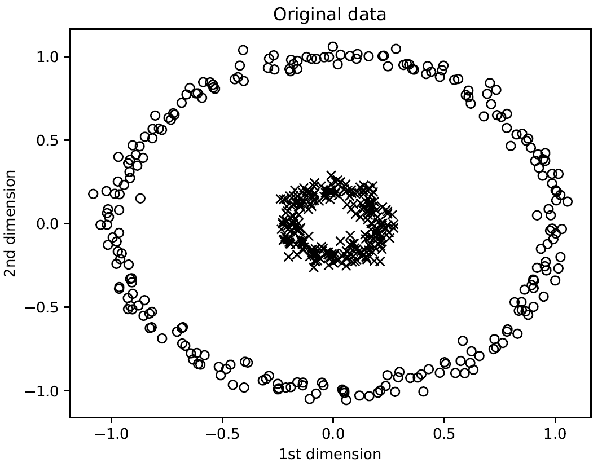
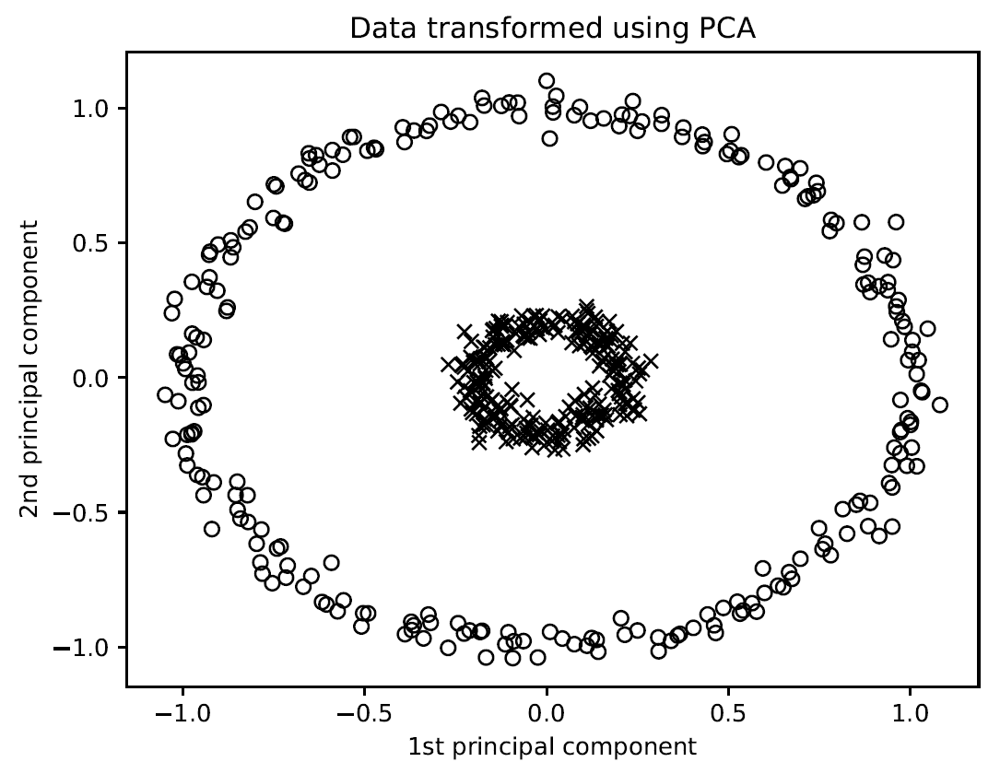
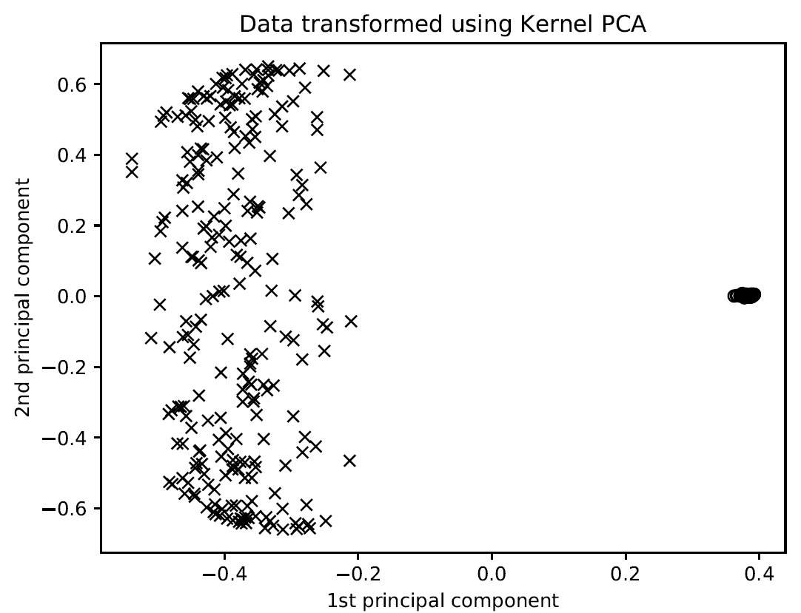
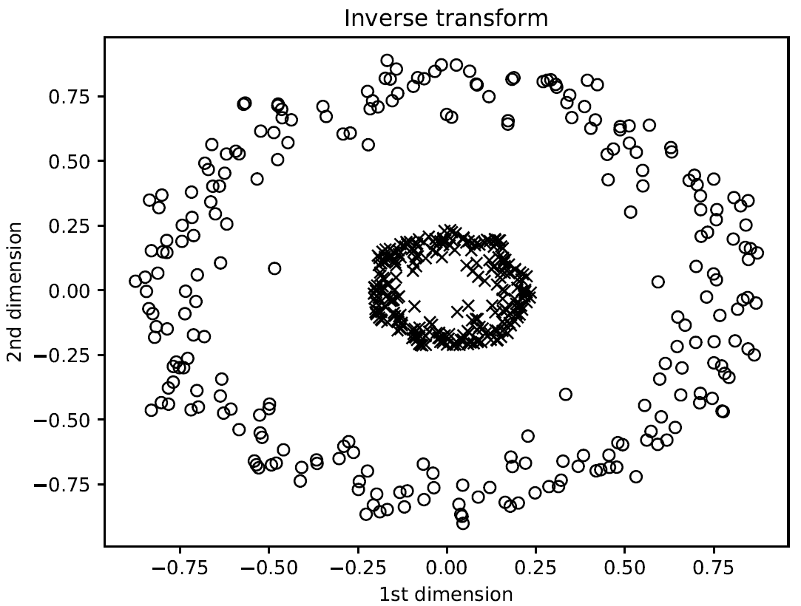
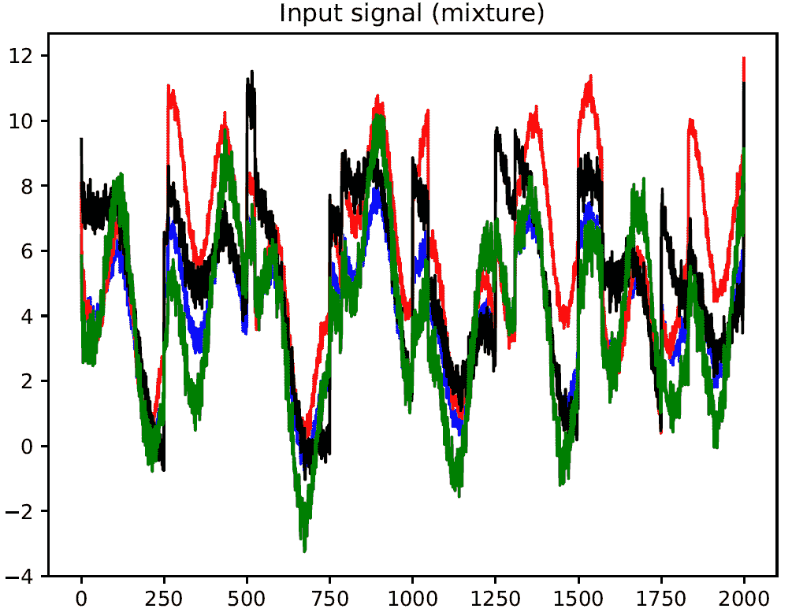
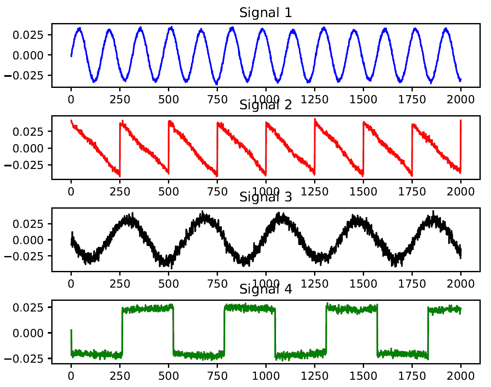
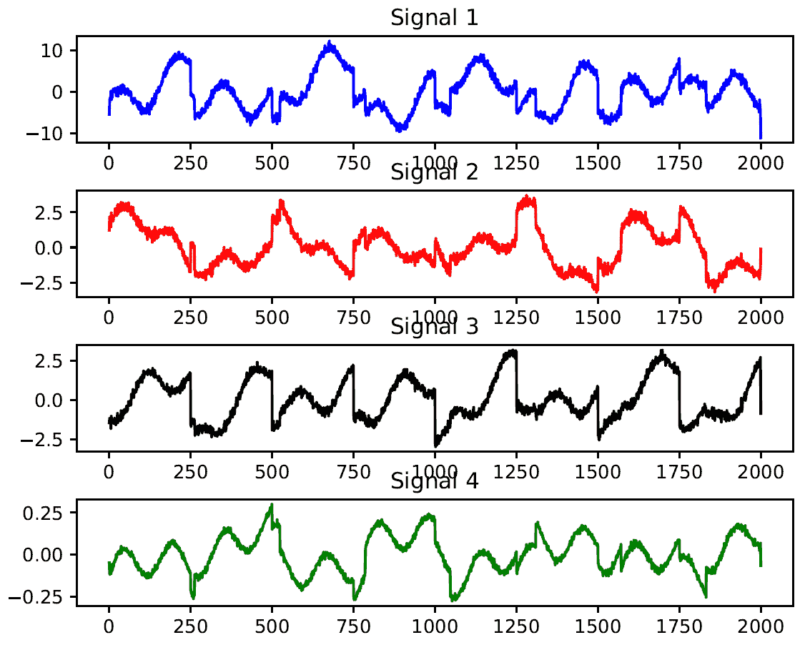
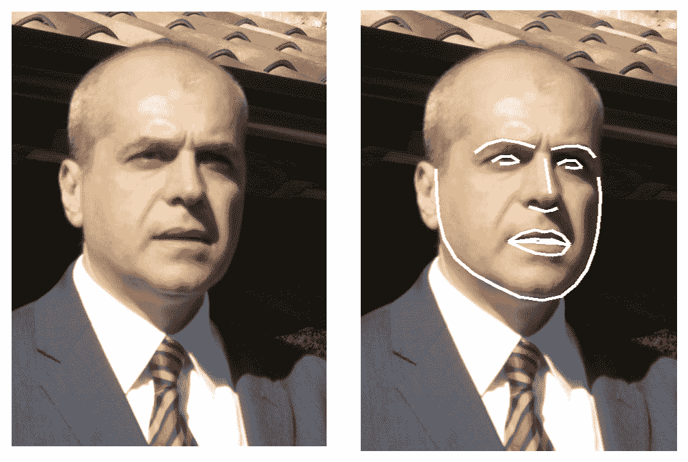
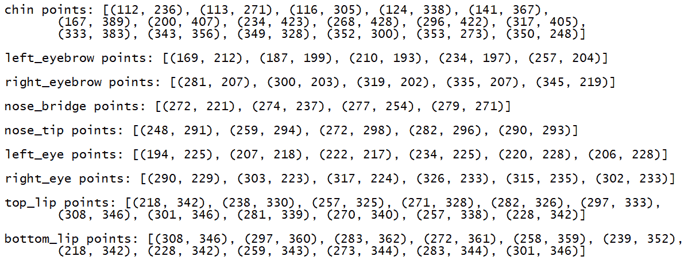

# 生物识别人脸识别

在本章中，我们将涵盖以下食谱：

+   从网络摄像头捕获和处理视频

+   使用 Haar 级联构建人脸检测器

+   构建眼鼻检测器

+   执行主成分分析

+   执行核主成分分析

+   执行盲源分离

+   使用局部二值模式直方图构建人脸识别器

+   使用基于 HOG 的模型识别人脸

+   面部特征点识别

+   通过人脸识别进行用户身份验证

# 技术要求

为了处理本章中的食谱，你需要以下文件（可在 GitHub 上找到）：

+   `video_capture.py`

+   `face_detector.py`

+   `eye_nose_detector.py`

+   `pca.py`

+   `kpca.py`

+   `blind_source_separation.py`

+   `mixture_of_signals.txt`

+   `face_recognizer.py`

+   `FaceRecognition.py`

+   `FaceLandmarks.py`

+   `UserAuthentification.py`

# 简介

**人脸识别**指的是在给定图像中识别一个人的任务。这与人脸检测不同，人脸检测是在给定图像中定位人脸。在人脸检测过程中，我们不在乎这个人是谁；我们只是识别包含人脸的图像区域。因此，在典型的生物识别人脸识别系统中，在识别之前，我们需要确定人脸的位置。

人脸识别对人类来说非常容易。我们似乎毫不费力地就能做到，而且我们一直在做！我们如何让机器做到同样的事情呢？我们需要了解我们可以用哪些面部特征来唯一地识别一个人。我们的大脑似乎有一种内部结构，能够对特定的特征做出反应，例如边缘、角点、运动等。人类视觉皮层将这些特征组合成一个单一的连贯推理。如果我们想让我们的机器以准确率识别人脸，我们需要以类似的方式制定问题。我们需要从输入图像中提取特征，并将它们转换为有意义的表示。

# 从网络摄像头捕获和处理视频

网络摄像头当然不是一项创新技术；它们的出现可以追溯到 20 世纪 90 年代初，从那时起，由于视频聊天程序、街景摄像头和宽带互联网连接的普及，它们越来越受欢迎。目前，网络摄像头是每个人的对象，并且几乎总是集成在显示器框架中，如台式机、上网本和笔记本电脑。网络摄像头最常用的用途是传输视频流和录制。

在第一种情况下，网络摄像头用于视频聊天程序、电视广播和街景摄像头——这些摄像头拍摄特定位置的固定点。在第二种情况下，网络摄像头用于创建可以上传到互联网的照片和视频，例如 YouTube 或社交网站。这些类型网络摄像头的优点是，它们可以取代更传统的相机使用方式，即使它们的视频质量较差。

# 准备工作

在这个菜谱中，我们将使用网络摄像头来捕获视频数据。让我们看看如何使用 OpenCV-Python 从网络摄像头捕获视频片段。

# 如何做到这一点...

让我们看看如何按照以下步骤捕获和处理网络摄像头的视频：

1.  创建一个新的 Python 文件并导入以下包（完整的代码在提供的`video_capture.py`文件中给出）：

```py
import cv2 
```

1.  OpenCV 提供了一个可以用来从网络摄像头捕获图像的视频捕获对象。`0`输入参数指定了网络摄像头的 ID。如果你连接了一个 USB 摄像头，那么它将有一个不同的 ID：

```py
# Initialize video capture object 
cap = cv2.VideoCapture(0) 
```

1.  定义使用网络摄像头捕获的帧的缩放因子。

```py
scaling_factor = 0.5 
```

1.  启动一个无限循环并持续捕获帧，直到你按下*Esc*键。从网络摄像头读取帧：

```py
# Loop until you hit the Esc key 
while True: 
    # Capture the current frame 
    ret, frame = cap.read() 
```

1.  调整帧大小是可选的，但在你的代码中仍然是一个有用的功能：

```py
    frame = cv2.resize(frame, None, fx=scaling_factor, fy=scaling_factor,  
            interpolation=cv2.INTER_AREA) 
```

1.  显示帧：

```py
    cv2.imshow('Webcam', frame)
```

1.  在捕获下一帧之前等待 1 毫秒：

```py
    c = cv2.waitKey(1) 
    if c == 27: 
        break 
```

1.  释放视频捕获对象：

```py
cap.release() 
```

1.  在退出代码之前关闭所有活动窗口：

```py
cv2.destroyAllWindows() 
```

如果你运行此代码，你将看到网络摄像头的视频。

# 它是如何工作的...

在这个菜谱中，我们使用了网络摄像头通过 OpenCV-Python 捕获视频数据。为此，执行了以下操作：

1.  初始化视频捕获对象。

1.  定义图像大小缩放因子。

1.  循环直到你按下*Esc*键：

    1.  捕获当前帧。

    1.  调整帧大小。

    1.  显示图像。

    1.  检测是否按下了*Esc*键。

1.  释放视频捕获对象。

1.  关闭所有活动窗口。

# 更多内容...

OpenCV 提供了一个非常简单的接口来捕获网络摄像头的实时流。要捕获视频，你需要创建一个`VideoCapture`对象。它的参数可以是设备索引或视频文件的名称。然后我们可以逐帧获取它们。然而，我们不要忘记释放捕获。

# 参见

+   OpenCV 库的官方文档：[`docs.opencv.org/2.4/modules/highgui/doc/reading_and_writing_images_and_video.html`](https://docs.opencv.org/2.4/modules/highgui/doc/reading_and_writing_images_and_video.html)

# 使用 Haar 级联构建人脸检测器

正如我们之前讨论的，人脸检测是确定输入图像中人脸位置的过程。在这个菜谱中，我们将使用**Haar 级联**进行人脸检测。这是通过在多个尺度上从图像中提取许多简单特征来实现的。这些简单特征是边缘、线和矩形特征，它们很容易计算。然后通过创建简单分类器的级联来训练它们。

# 准备工作

在这个菜谱中，我们将学习如何确定由我们的网络摄像头捕获的视频帧中人脸的位置。这个过程使用了**自适应增强**技术来提高其鲁棒性。

# 如何做到这一点...

让我们看看如何使用 Haar 级联构建人脸检测器：

1.  创建一个新的 Python 文件并导入以下包（完整的代码在提供的`face_detector.py`文件中给出）：

```py
import cv2 
import numpy as np  
```

1.  加载人脸检测器级联文件。这是一个我们可以用作检测器的训练模型：

```py
face_cascade = cv2.CascadeClassifier('cascade_files/haarcascade_frontalface_alt.xml')
```

1.  检查级联文件是否正确加载：

```py
if face_cascade.empty(): 
    raise IOError('Unable to load the face cascade classifier xml file')
```

1.  创建视频捕获对象：

```py
cap = cv2.VideoCapture(0) 
```

1.  定义图像下采样的缩放因子：

```py
scaling_factor = 0.5 
```

1.  继续循环，直到按下*Esc*键：

```py
# Loop until you hit the Esc key 
while True: 
    # Capture the current frame and resize it 
    ret, frame = cap.read() 
```

1.  调整帧大小：

```py
    frame = cv2.resize(frame, None, fx=scaling_factor, fy=scaling_factor,  
            interpolation=cv2.INTER_AREA) 
```

1.  将图像转换为灰度图。我们需要灰度图像来运行人脸检测器：

```py
    gray = cv2.cvtColor(frame, cv2.COLOR_BGR2GRAY) 
```

1.  在灰度图像上运行人脸检测器。`1.3`参数指的是每个阶段的缩放乘数。`5`参数指的是每个候选矩形应该具有的最小邻居数，以便我们保留它。这个候选矩形基本上是一个可能检测到人脸的潜在区域：

```py
    face_rects = face_cascade.detectMultiScale(gray, 1.3, 5) 
```

1.  在每个检测到的人脸区域周围绘制矩形：

```py
    for (x,y,w,h) in face_rects: 
        cv2.rectangle(frame, (x,y), (x+w,y+h), (0,255,0), 3) 
```

1.  显示输出图像：

```py
    cv2.imshow('Face Detector', frame)
```

1.  在进行下一次迭代之前等待 1 毫秒。如果用户按下 Esc 键，则跳出循环：

```py
    c = cv2.waitKey(1) 
    if c == 27: 
        break
```

1.  在退出代码之前释放和销毁对象：

```py
cap.release() 
cv2.destroyAllWindows() 
```

如果你运行此代码，你将在摄像头视频中看到被检测到的人脸。

# 它是如何工作的...

在这个配方中，我们学习了如何确定由摄像头捕获的视频帧中的人脸位置。为此，执行了以下操作：

1.  加载人脸级联文件。

1.  检查人脸级联文件是否已加载。

1.  初始化视频捕获对象。

1.  定义缩放因子。

1.  循环直到按下*Esc*键：

    1.  捕获当前帧并调整其大小。

    1.  转换为灰度图。

    1.  在灰度图像上运行人脸检测器。

    1.  在图像上绘制矩形。

    1.  显示图像。

    1.  检查是否按下了*Esc*键。

1.  释放视频捕获对象并关闭所有窗口。

# 还有更多...

Haar 级联是一种基于机器学习的方法，其中通过许多正负图像训练级联函数。然后，它被用来检测其他图像中的对象。

# 参见

+   *使用 Haar 级联进行人脸检测*：[`docs.opencv.org/3.1.0/d7/d8b/tutorial_py_face_detection.html#gsc.tab=0`](https://docs.opencv.org/3.1.0/d7/d8b/tutorial_py_face_detection.html#gsc.tab=0)

+   *使用简单特征的增强级联快速对象检测*：[`www.cs.cmu.edu/~efros/courses/LBMV07/Papers/viola-cvpr-01.pdf`](https://www.cs.cmu.edu/~efros/courses/LBMV07/Papers/viola-cvpr-01.pdf)

# 构建眼睛和鼻子检测器

在之前的配方中，*使用 Haar 级联构建人脸检测器*，我们使用了 Haar 级联方法来检测由摄像头捕获的视频帧中的人脸位置。这种方法可以扩展到检测所有类型的对象。这正是我们将在这里讨论的内容。

# 准备工作

在这个配方中，我们将看到如何使用 Haar 级联方法来检测输入视频中的人脸的眼睛和鼻子。

# 如何做到这一点...

让我们看看我们如何构建眼睛和鼻子检测器：

1.  创建一个新的 Python 文件并导入以下包（完整的代码在提供的`eye_nose_detector.py`文件中给出）：

```py
import cv2 
import numpy as np 
```

1.  加载人脸、眼睛和鼻子级联文件：

```py
# Load face, eye, and nose cascade files 
face_cascade = cv2.CascadeClassifier('cascade_files/haarcascade_frontalface_alt.xml') 
eye_cascade = cv2.CascadeClassifier('cascade_files/haarcascade_eye.xml') 
nose_cascade = cv2.CascadeClassifier('cascade_files/haarcascade_mcs_nose.xml')
```

1.  检查文件是否正确加载：

```py
# Check if face cascade file has been loaded 
if face_cascade.empty(): 
    raise IOError('Unable to load the face cascade classifier xml file') 

# Check if eye cascade file has been loaded 
if eye_cascade.empty(): 
    raise IOError('Unable to load the eye cascade classifier xml file') 

# Check if nose cascade file has been loaded 
if nose_cascade.empty(): 
    raise IOError('Unable to load the nose cascade classifier xml file') 
```

1.  初始化视频捕获对象：

```py
# Initialize video capture object and define scaling factor 
cap = cv2.VideoCapture(0) 
```

1.  定义缩放因子：

```py
scaling_factor = 0.5 
```

1.  保持循环，直到用户按下*Esc*键：

```py
while True: 
    # Read current frame, resize it, and convert it to grayscale 
    ret, frame = cap.read() 
```

1.  调整帧大小：

```py
    frame = cv2.resize(frame, None, fx=scaling_factor, fy=scaling_factor,  
            interpolation=cv2.INTER_AREA) 
```

1.  将图像转换为灰度：

```py
    gray = cv2.cvtColor(frame, cv2.COLOR_BGR2GRAY) 
```

1.  在灰度图像上运行人脸检测器：

```py
    # Run face detector on the grayscale image 
    faces = face_cascade.detectMultiScale(gray, 1.3, 5)
```

1.  由于我们知道面孔总是有眼睛和鼻子，我们只能在面部区域运行这些检测器：

```py
    # Run eye and nose detectors within each face rectangle 
    for (x,y,w,h) in faces: 
```

1.  提取面部 ROI：

```py
        # Grab the current ROI in both color and grayscale images 
        roi_gray = gray[y:y+h, x:x+w] 
        roi_color = frame[y:y+h, x:x+w] 
```

1.  运行眼睛检测器：

```py
        # Run eye detector in the grayscale ROI 
        eye_rects = eye_cascade.detectMultiScale(roi_gray) 
```

1.  运行鼻子检测器：

```py
        # Run nose detector in the grayscale ROI 
        nose_rects = nose_cascade.detectMultiScale(roi_gray, 1.3, 5) 
```

1.  在眼睛周围画圆圈：

```py
        # Draw green circles around the eyes 
        for (x_eye, y_eye, w_eye, h_eye) in eye_rects: 
            center = (int(x_eye + 0.5*w_eye), int(y_eye + 0.5*h_eye)) 
            radius = int(0.3 * (w_eye + h_eye)) 
            color = (0, 255, 0) 
            thickness = 3 
            cv2.circle(roi_color, center, radius, color, thickness) 
```

1.  在鼻子上画一个矩形：

```py
        for (x_nose, y_nose, w_nose, h_nose) in nose_rects: 
            cv2.rectangle(roi_color, (x_nose, y_nose), (x_nose+w_nose,  
                y_nose+h_nose), (0,255,0), 3) 
            break 
```

1.  显示图像：

```py
    # Display the image 
    cv2.imshow('Eye and nose detector', frame)
```

1.  在进行下一次迭代之前等待 1 毫秒。如果用户按下*Esc*键，则中断循环：

```py
    # Check if Esc key has been pressed 
    c = cv2.waitKey(1) 
    if c == 27: 
        break 
```

1.  在退出代码之前释放和销毁对象：

```py
# Release video capture object and close all windows 
cap.release() 
cv2.destroyAllWindows() 
```

如果你运行此代码，你将看到网络摄像头视频中检测到的人的眼睛和鼻子。

# 工作原理…

在这个菜谱中，我们学习了如何在输入视频中检测人的眼睛和鼻子。为此，已经执行了以下操作：

1.  加载面部、眼睛和鼻子级联文件。

1.  检查面部、眼睛和鼻子级联文件是否已加载。

1.  初始化视频捕获对象并定义缩放因子。

1.  在帧上循环：

    1.  读取当前帧，调整大小，并将其转换为灰度。

    1.  在灰度图像上运行人脸检测器。

    1.  在每个面部矩形内运行眼睛和鼻子检测器。

    1.  显示图像。

    1.  检查是否按下了*Esc*键。

1.  释放视频捕获对象并关闭所有窗口。

# 更多内容…

在网络摄像头中识别面部元素对于识别主题可能很有用。全局视觉信息和局部特征（眼睛和鼻子的形态）在面部感知和识别中是基本的。事实上，关于面部识别的研究表明，男性更容易识别具有突出特征的面孔，如鹰钩鼻、眯眼等。

# 相关内容

+   分类案例研究 - *Viola-Jones 人脸检测器*：[`www.cse.psu.edu/~rtc12/CSE586/lectures/violaJonesDetector.pdf`](http://www.cse.psu.edu/~rtc12/CSE586/lectures/violaJonesDetector.pdf)

# 执行主成分分析

**主成分分析**（PCA）是一种常用于计算机视觉和机器学习的降维技术。当我们处理具有高维度的特征时，训练机器学习系统变得过于昂贵。因此，在训练系统之前，我们需要降低数据的维度。然而，当我们降低维度时，我们不想丢失数据中存在的信息。这就是 PCA 发挥作用的地方！PCA 识别数据的重要成分，并按重要性顺序排列。

# 准备工作

在这个菜谱中，我们将看到如何对输入数据进行主成分分析（PCA）。

# 如何操作…

让我们看看如何对一些输入数据进行 PCA：

1.  创建一个新的 Python 文件并导入以下包（完整的代码在提供的`pca.py`文件中给出）：

```py
import numpy as np 
from sklearn import decomposition  
```

1.  让我们为我们的输入数据定义五个维度。前两个维度将是独立的，但接下来的三个维度将依赖于前两个维度。这基本上意味着我们可以没有最后三个维度，因为它们不会给我们提供任何新的信息：

```py
# Define individual features 
x1 = np.random.normal(size=250) 
x2 = np.random.normal(size=250) 
x3 = 3*x1 + 2*x2
x4 = 6*x1 - 2*x2
x5 = 3*x3 + x4
```

1.  让我们创建具有这些特征的数据库：

```py
# Create dataset with the above features 
X = np.c_[x1, x3, x2, x5, x4] 
```

1.  创建一个 PCA 对象：

```py
# Perform Principal Component Analysis 
pca = decomposition.PCA() 
```

1.  在输入数据上拟合 PCA 模型：

```py
pca.fit(X) 
```

1.  打印维度的方差：

```py
# Print variances 
variances = pca.explained_variance_ 
print('Variances in decreasing order:\n', variances)
```

1.  如果某个维度是有用的，那么它将为方差提供一个有意义的值。让我们设置一个阈值并识别重要的维度：

```py
# Find the number of useful dimensions 
thresh_variance = 0.8 
num_useful_dims = len(np.where(variances > thresh_variance)[0]) 
print('Number of useful dimensions:', num_useful_dims)
```

1.  正如我们之前讨论的那样，PCA 已经确定在这个数据集中只有两个维度是重要的：

```py
# As we can see, only the 2 first components are useful 
pca.n_components = num_useful_dims 
```

1.  让我们将数据集从五维集转换为二维集：

```py
XNew = pca.fit_transform(X)
print('Shape before:', X.shape)
print('Shape after:', XNew.shape)
```

1.  如果你运行这段代码，你将在你的终端上看到以下内容：

```py
Variances in decreasing order:
[2.77392134e+02 1.51557851e+01 9.54279881e-30 7.73588070e-32 9.89435444e-33]
 Number of useful dimensions: 2
Shape before: (250, 5)
Shape after: (250, 2) 
```

如我们所见，前两个成分包含了模型的所有方差。

# 它是如何工作的...

PCA 生成了一组新的变量，其中包含不相关的变量，也称为主成分。每个主成分是原始变量的线性组合。所有主成分都是相互正交的，因此没有冗余信息。

主成分作为一个整体构成了数据空间的正交基。PCA 的目标是用最少的几个主成分解释最大的方差。PCA 是一种多维缩放，其中变量被线性变换到低维空间，从而保留关于变量的最大信息量。因此，主成分是原始变量经过线性变换后的组合。

# 还有更多…

方差衡量一组数字从它们的平均值偏离的程度。它表示各个值从算术平均值偏差的平方的平均值。

# 参见

+   `sklearn.decomposition.PCA`函数的官方文档: [`scikit-learn.org/stable/modules/generated/sklearn.decomposition.PCA.html`](https://scikit-learn.org/stable/modules/generated/sklearn.decomposition.PCA.html)

+   *主成分分析*（由斯坦福大学的 Andrew Ng 提供）：[`cs229.stanford.edu/notes/cs229-notes10.pdf`](http://cs229.stanford.edu/notes/cs229-notes10.pdf)

+   *主成分分析*（来自印第安纳大学）: [`scholarwiki.indiana.edu/Z604/slides/week4-PCA.pdf`](http://scholarwiki.indiana.edu/Z604/slides/week4-PCA.pdf)

# 执行核主成分分析

PCA 擅长减少维度数量，但它以线性方式工作。如果数据不是以线性方式组织的，PCA 将无法完成所需的工作。这就是核 PCA 出现的地方。

# 准备工作

在这个菜谱中，我们将看到如何对输入数据进行核 PCA，并将结果与 PCA 在相同数据上的表现进行比较。

# 如何操作...

让我们看看我们如何执行核 PCA：

1.  创建一个新的 Python 文件并导入以下包（完整的代码在提供的`kpca.py`文件中给出）：

```py
import numpy as np 
import matplotlib.pyplot as plt 

from sklearn.decomposition import PCA, KernelPCA 
from sklearn.datasets import make_circles 
```

1.  定义随机数生成器的`seed`值。这是生成分析数据样本所需的：

```py
# Set the seed for random number generator 
np.random.seed(7) 
```

1.  生成分布在内切圆中的数据以展示 PCA 在这种情况下不起作用：

```py
# Generate samples 
X, y = make_circles(n_samples=500, factor=0.2, noise=0.04)
```

1.  对这些数据进行 PCA 分析：

```py
# Perform PCA 
pca = PCA() 
X_pca = pca.fit_transform(X) 
```

1.  对这些数据进行核 PCA 分析：

```py
# Perform Kernel PCA 
kernel_pca = KernelPCA(kernel="rbf", fit_inverse_transform=True, gamma=10) 
X_kernel_pca = kernel_pca.fit_transform(X) 
X_inverse = kernel_pca.inverse_transform(X_kernel_pca) 
```

1.  绘制原始输入数据：

```py
# Plot original data 
class_0 = np.where(y == 0) 
class_1 = np.where(y == 1) 
plt.figure() 
plt.title("Original data") 
plt.plot(X[class_0, 0], X[class_0, 1], "ko", mfc='none') 
plt.plot(X[class_1, 0], X[class_1, 1], "kx") 
plt.xlabel("1st dimension") 
plt.ylabel("2nd dimension") 
```

1.  绘制 PCA 转换后的数据：

```py
# Plot PCA projection of the data 
plt.figure() 
plt.plot(X_pca[class_0, 0], X_pca[class_0, 1], "ko", mfc='none') 
plt.plot(X_pca[class_1, 0], X_pca[class_1, 1], "kx") 
plt.title("Data transformed using PCA") 
plt.xlabel("1st principal component") 
plt.ylabel("2nd principal component") 
```

1.  绘制核 PCA 转换后的数据：

```py
# Plot Kernel PCA projection of the data 
plt.figure() 
plt.plot(X_kernel_pca[class_0, 0], X_kernel_pca[class_0, 1], "ko", mfc='none') 
plt.plot(X_kernel_pca[class_1, 0], X_kernel_pca[class_1, 1], "kx") 
plt.title("Data transformed using Kernel PCA") 
plt.xlabel("1st principal component") 
plt.ylabel("2nd principal component")
```

1.  使用核方法将数据转换回原始空间，以显示逆变换是保持不变的：

```py
# Transform the data back to original space 
plt.figure() 
plt.plot(X_inverse[class_0, 0], X_inverse[class_0, 1], "ko", mfc='none') 
plt.plot(X_inverse[class_1, 0], X_inverse[class_1, 1], "kx") 
plt.title("Inverse transform") 
plt.xlabel("1st dimension") 
plt.ylabel("2nd dimension") 

plt.show() 
```

1.  完整的代码在提供的`kpca.py`文件中给出，供您参考。如果您运行此代码，您将看到四个图。第一个图是原始数据：



第二个图展示了使用 PCA 转换后的数据：



第三个图展示了使用核 PCA 转换后的数据。注意图中点在右侧是如何聚集的：



第四个图展示了数据逆变换回原始空间：



# 它是如何工作的...

**核主成分分析**（**核 PCA**）基于 PCA，同时使用核方法的技术。在 PCA 中，原始的线性 PCA 操作是在再生核 Hilbert 空间中执行的。

核方法是一类用于分析和模式方案的算法，其中最著名的元素是 SVMs。核方法通过将数据映射到多维特征空间来解决一个问题，在这个空间中，每个坐标对应于元素数据的特征，将数据转换为一组欧几里得空间点。由于映射可以是通用的（例如，不一定是线性的），因此以这种方式找到的关系因此非常通用。

# 还有更多...

核方法以核函数命名，核函数用于在特征空间上操作，而不必在空间中计算数据坐标，而是通过在函数空间中计算所有数据副本的图像之间的内积。核方法通常比显式计算坐标的计算成本低。核技巧将这种方法称为**问题解决**。

# 参考内容

+   `sklearn.decomposition.KernelPCA`函数的官方文档：[`scikit-learn.org/stable/modules/generated/sklearn.decomposition.KernelPCA.html`](https://scikit-learn.org/stable/modules/generated/sklearn.decomposition.KernelPCA.html)

+   *核主成分分析*（由多伦多大学的 Max Welling 提出）：[`www.ics.uci.edu/~welling/classnotes/papers_class/Kernel-PCA.pdf`](https://www.ics.uci.edu/~welling/classnotes/papers_class/Kernel-PCA.pdf)

+   *核 PCA*（由海法大学的 Rita Osadchy 提供）：[`www.cs.haifa.ac.il/~rita/uml_course/lectures/KPCA.pdf`](http://www.cs.haifa.ac.il/~rita/uml_course/lectures/KPCA.pdf)

# 进行盲源分离

**盲源分离**指的是从混合信号中分离信号的过程。假设有一组不同的信号发生器生成信号，一个共同的接收器接收所有这些信号。现在，我们的任务是利用这些信号的特性，从混合中分离这些信号。我们将使用**独立成分分析**（**ICA**）来实现这一点。

# 准备工作

在这个菜谱中，我们将使用`.txt`文件中的数据，使用**ICA**来分离其中的信号。

# 如何操作...

让我们看看我们如何进行盲源分离：

1.  创建一个新的 Python 文件并导入以下包（完整的代码在提供的`blind_source_separation.py`文件中）：

```py
import numpy as np 
import matplotlib.pyplot as plt 
from sklearn.decomposition import PCA, FastICA  
```

1.  我们将使用提供的`mixture_of_signals.txt`文件中的数据。让我们加载数据：

```py
# Load data 
input_file = 'mixture_of_signals.txt' 
X = np.loadtxt(input_file) 
```

1.  创建 ICA 对象：

```py
# Compute ICA 
ica = FastICA(n_components=4) 
```

1.  根据 ICA 重建信号：

```py
# Reconstruct the signals 
signals_ica = ica.fit_transform(X) 
```

1.  提取混合矩阵：

```py
# Get estimated mixing matrix 
mixing_mat = ica.mixing_   
```

1.  进行 PCA 比较：

```py
# Perform PCA  
pca = PCA(n_components=4) 
# Reconstruct signals based on orthogonal components 
signals_pca = pca.fit_transform(X)
```

1.  定义一个信号列表以绘制它们：

```py
# Specify parameters for output plots  
models = [X, signals_ica, signals_pca] 
```

1.  指定图表的颜色：

```py
colors = ['blue', 'red', 'black', 'green'] 
```

1.  绘制输入信号：

```py
# Plotting input signal 
plt.figure() 
plt.title('Input signal (mixture)') 
for i, (sig, color) in enumerate(zip(X.T, colors), 1): 
    plt.plot(sig, color=color) 
```

1.  绘制 ICA 分离的信号：

```py
# Plotting ICA signals  
plt.figure() 
plt.title('ICA separated signals') 
plt.subplots_adjust(left=0.1, bottom=0.05, right=0.94,  
        top=0.94, wspace=0.25, hspace=0.45) 
```

1.  使用不同颜色的子图绘制：

```py
for i, (sig, color) in enumerate(zip(signals_ica.T, colors), 1): 
    plt.subplot(4, 1, i) 
    plt.title('Signal ' + str(i)) 
    plt.plot(sig, color=color) 
```

1.  绘制 PCA 分离的信号：

```py
# Plotting PCA signals   
plt.figure() 
plt.title('PCA separated signals') 
plt.subplots_adjust(left=0.1, bottom=0.05, right=0.94,  
        top=0.94, wspace=0.25, hspace=0.45) 
```

1.  在每个子图中使用不同的颜色：

```py
for i, (sig, color) in enumerate(zip(signals_pca.T, colors), 1): 
    plt.subplot(4, 1, i) 
    plt.title('Signal ' + str(i)) 
    plt.plot(sig, color=color) 

plt.show() 
```

如果你运行此代码，你会看到三个图表。第一个图表展示了输入，它是由信号混合而成的：



第二个图表展示了使用 ICA 分离的信号：



第三张图展示了使用 PCA 分离的信号：



# 它是如何工作的...

ICA 是一种计算处理方法，用于将多变量信号分离成其加性子分量，假设非高斯信号的来源之间存在相互的统计独立性。这是盲源分离的一个特例。该方法通过最大化估计组件的统计独立性来找到独立成分。

# 更多内容...

ICA 算法的应用示例在**脑电图**（**EEG**）领域，但它也被广泛用于从`mother.ICA`技术中分离出胎儿的**心电图**（**ECG**）。这可以扩展到对非物理数据的分析，这些数据可以是语义的或语言的。例如，ICA 已被应用于使计算机理解一组新闻列表存档中的讨论主题。

# 相关内容

+   `sklearn.decomposition.FastICA`函数的官方文档：[`scikit-learn.org/stable/modules/generated/sklearn.decomposition.FastICA.html`](https://scikit-learn.org/stable/modules/generated/sklearn.decomposition.FastICA.html)

+   *盲源分离：主成分分析和独立成分分析原理*（来自麻省理工学院）：[`www.mit.edu/~gari/teaching/6.555/LECTURE_NOTES/ch15_bss.pdf`](http://www.mit.edu/~gari/teaching/6.555/LECTURE_NOTES/ch15_bss.pdf)

# 使用局部二值模式直方图构建人脸识别器

我们现在准备好构建人脸识别器了。我们需要一个用于训练的人脸数据集，所以我们提供了一个名为`faces_dataset`的文件夹，其中包含足够用于训练的一小部分图像。这个数据集是[`www.vision.caltech.edu/Image_Datasets/faces/faces.tar`](http://www.vision.caltech.edu/Image_Datasets/faces/faces.tar)中可用数据集的一个子集。这个数据集包含足够多的图像，我们可以用它们来训练一个人脸识别系统。

我们将使用**局部二值模式直方图**来构建我们的人脸识别系统。在我们的数据集中，你会看到不同的人。我们的任务是构建一个能够学会将这些人区分开来的系统。当我们看到一张未知图像时，我们的系统会将其分配到现有的某个类别中。

# 准备工作

在这个菜谱中，我们将看到如何使用**局部二值模式直方图**构建人脸识别器，并使用人脸数据集来训练模型。

# 如何做到这一点...

让我们看看如何使用局部二值模式直方图构建人脸识别器：

1.  创建一个新的 Python 文件并导入以下包（完整的代码在提供的`face_recognizer.py`文件中给出）：

```py
import os 

import cv2 
import numpy as np 
from sklearn import preprocessing  
```

1.  让我们定义一个类来处理与标签编码相关的所有任务：

```py
# Class to handle tasks related to label encoding 
class LabelEncoder(object): 
```

1.  定义一个方法来编码标签。在输入训练数据中，标签由单词表示。然而，我们需要数字来训练我们的系统。此方法将定义一个预处理对象，该对象可以通过维护正向和反向映射以有组织的方式将单词转换为数字：

```py
    # Method to encode labels from words to numbers 
    def encode_labels(self, label_words): 
        self.le = preprocessing.LabelEncoder() 
        self.le.fit(label_words) 
```

1.  定义一个方法将单词转换为数字：

```py
    # Convert input label from word to number 
    def word_to_num(self, label_word): 
        return int(self.le.transform([label_word])[0]) 
```

1.  定义一个方法将数字转换回原始单词：

```py
    # Convert input label from number to word 
    def num_to_word(self, label_num): 
        return self.le.inverse_transform([label_num])[0] 
```

1.  定义一个方法从输入文件夹中提取图像和标签：

```py
# Extract images and labels from input path 
def get_images_and_labels(input_path): 
    label_words = [] 
```

1.  递归遍历输入文件夹并提取所有图像路径：

```py
    # Iterate through the input path and append files 
    for root, dirs, files in os.walk(input_path): 
        for filename in (x for x in files if x.endswith('.jpg')): 
            filepath = os.path.join(root, filename) 
            label_words.append(filepath.split('/')[-2])
```

1.  初始化变量：

```py
    # Initialize variables 
    images = [] 
    le = LabelEncoder() 
    le.encode_labels(label_words) 
    labels = [] 
```

1.  解析输入目录以进行训练：

```py
    # Parse the input directory 
    for root, dirs, files in os.walk(input_path): 
        for filename in (x for x in files if x.endswith('.jpg')): 
            filepath = os.path.join(root, filename) 
```

1.  以灰度格式读取当前图像：

```py
            # Read the image in grayscale format 
            image = cv2.imread(filepath, 0)  
```

1.  从文件夹路径中提取标签：

```py
            # Extract the label 
            name = filepath.split('/')[-2] 
```

1.  在此图像上执行人脸检测：

```py
            # Perform face detection 
            faces = faceCascade.detectMultiScale(image, 1.1, 2, minSize=(100,100)) 
```

1.  提取 ROI 并返回它们，以及标签编码器：

```py
            # Iterate through face rectangles 
            for (x, y, w, h) in faces: 
                images.append(image[y:y+h, x:x+w]) 
                labels.append(le.word_to_num(name)) 

    return images, labels, le 
```

1.  定义主函数和面部级联文件的路径：

```py
if __name__=='__main__': 
    cascade_path = "cascade_files/haarcascade_frontalface_alt.xml" 
    path_train = 'faces_dataset/train' 
    path_test = 'faces_dataset/test'
```

1.  加载人脸级联文件：

```py
    # Load face cascade file 
    faceCascade = cv2.CascadeClassifier(cascade_path) 
```

1.  为人脸识别器对象创建局部二值模式直方图：

```py
    # Initialize Local Binary Patterns Histogram face recognizer 
    recognizer = cv2.face.createLBPHFaceRecognizer() 
```

1.  提取此输入路径的图像、标签和标签编码器：

```py
    # Extract images, labels, and label encoder from training dataset 
    images, labels, le = get_images_and_labels(path_train) 
```

1.  使用我们提取的数据训练人脸识别器：

```py
    # Train the face recognizer  
    print "\nTraining..." 
    recognizer.train(images, np.array(labels)) 
```

1.  在未知数据上测试人脸识别器：

```py
    # Test the recognizer on unknown images 
    print '\nPerforming prediction on test images...' 
    stop_flag = False 
    for root, dirs, files in os.walk(path_test): 
        for filename in (x for x in files if x.endswith('.jpg')): 
            filepath = os.path.join(root, filename) 
```

1.  加载图像：

```py
            # Read the image 
            predict_image = cv2.imread(filepath, 0) 
```

1.  使用人脸检测器确定人脸的位置：

```py
            # Detect faces 
            faces = faceCascade.detectMultiScale(predict_image, 1.1,  
                    2, minSize=(100,100)) 
```

1.  对于每个面部 ROI，运行人脸识别器：

```py
            # Iterate through face rectangles 
            for (x, y, w, h) in faces: 
                # Predict the output 
                predicted_index, conf = recognizer.predict( 
                        predict_image[y:y+h, x:x+w])
```

1.  将标签转换为单词：

```py
                # Convert to word label 
                predicted_person = le.num_to_word(predicted_index) 
```

1.  在输出图像上叠加文本并显示：

```py
                # Overlay text on the output image and display it 
                cv2.putText(predict_image, 'Prediction: ' + predicted_person,  
                        (10,60), cv2.FONT_HERSHEY_SIMPLEX, 2, (255,255,255), 6) 
                cv2.imshow("Recognizing face", predict_image) 
```

1.  检查用户是否按下了*Esc*键。如果是，则跳出循环：

```py
            c = cv2.waitKey(0) 
            if c == 27: 
                stop_flag = True 
                break 

        if stop_flag: 
            break 
```

如果你运行此代码，你将得到一个输出窗口，显示测试图像的预测输出。你可以按*空格*按钮以保持循环。测试图像中有三个人。

# 它是如何工作的...

本地二值模式直方图算法基于一个非参数算子，该算子综合了图像的局部结构。在特定的像素点，LBP 算子将该像素与属于考虑的邻域像素之间的颜色强度比较的有序二进制序列关联起来。特别是，如果中心像素的强度大于或等于相邻像素的强度，则分配一个值为 1。否则，分配 0。因此，对于 8 像素的邻域，例如，将有 2⁸种可能的组合。

# 还有更多...

要将此算子应用于面部识别问题，想法是将图像划分为*m*个局部区域，并从每个区域中提取直方图。要提取的特征向量由这些局部直方图的连接组成。

# 参见

+   *本地二值模式* *直方图*：[`docs.opencv.org/2.4/modules/contrib/doc/facerec/facerec_tutorial.html#local-binary-patterns-histograms`](http://docs.opencv.org/2.4/modules/contrib/doc/facerec/facerec_tutorial.html#local-binary-patterns-histograms)

# 使用基于 HOG 的模型进行面部识别

通过面部识别，我们指的是返回图像中存在的人脸位置的过程。在*使用 Haar 级联构建面部检测器*的配方中，我们已经讨论了这个问题。在这个配方中，我们将使用`face_recognition`库对这些面部执行一系列操作。

面部识别的主要目标是检测面部特征，忽略围绕它的所有其他内容。这是许多商业设备上的一个特性，它允许你确定何时以及如何在一个图像中应用焦点，以便你可以捕捉到它。在计算机视觉的世界里，通常将面部检测算法家族分为两大类。这两个类别之间的区别在于它们对信息的不同使用，这些信息来自对面部结构和特性的先验知识：

+   第一类包括基于提取规格特征的算法

+   第二类采用全局方法进行图像分析

# 准备中

在这个菜谱中，我们将了解如何使用`face_recognition`库从复杂图像中执行面部识别。在继续之前，请安装`face_recognition`库。这个库基于`dlib`库，我们必须在继续之前安装它。`dlib`是一个现代的 C++工具包，它包含机器学习算法和用于在 C++中创建复杂软件以解决现实世界问题的工具。您可以在[`pypi.org/project/face_recognition/`](https://pypi.org/project/face_recognition/)找到有关安装该包的信息。

# 如何做到这一点...

让我们看看如何使用基于 HOG 的模型来识别面部：

1.  创建一个新的 Python 文件并导入以下包（完整的代码在提供的`FaceRecognition.py`文件中给出）：

```py
from PIL import Image
import face_recognition
```

**Python 图像库**（**PIL**）是 Python 编程语言的免费库，它增加了打开、操作和保存许多不同图像文件格式的支持。`face_recognition`是一个 Python 库，可以从 Python 脚本或命令行中识别和操作面部。

1.  让我们将`family.jpg`文件加载到 NumPy 数组中：

```py
image = face_recognition.load_image_file("family.jpg")
```

1.  我们现在将使用默认的基于 HOG 的模型在图像中找到所有的面部：

```py
face_locations = face_recognition.face_locations(image) 
```

1.  定义一种将单词转换为数字的方法：

```py
print("Number {} face(s) recognized in this image.".format(len(face_locations)))
```

1.  打印图像中每个面部位置：

```py
for face_location in face_locations:

    top, right, bottom, left = face_location
    print("Face location Top: {}, Left: {}, Bottom: {}, Right: {}".format(top, left, bottom, right))
```

1.  最后，我们需要访问实际的面部本身：

```py
    face_image = image[top:bottom, left:right]
    pil_image = Image.fromarray(face_image)
    pil_image.show()
```

将返回每个识别出的面部的缩略图。

# 它是如何工作的...

**方向梯度直方图**（**HOG**）是一种用于物体识别的特征描述符。该算法计算图像局部区域中梯度方向的出现的次数。与其他用于相同目的的技术（尺度不变特征变换、边缘方向直方图、形状上下文）不同，因为它使用均匀分布的密集网格单元，并使用局部叠加归一化来提高准确性。

# 还有更多...

首次介绍这项技术的是 Navneet Dalal 和 Bill Triggs（2005），他们是**国家信息与自动化研究所**（**INRIA**）的研究员，当时他们正在研究静态图像中行人检测的问题。

# 参见

+   `face_recognition`库的官方文档：[`github.com/ageitgey/face_recognition`](https://github.com/ageitgey/face_recognition)

+   *面向人类检测的定向梯度直方图*（由 INRIA 的 Navneet Dalal 和 Bill Triggs 编写）：[`lear.inrialpes.fr/people/triggs/pubs/Dalal-cvpr05.pdf`](https://lear.inrialpes.fr/people/triggs/pubs/Dalal-cvpr05.pdf)

# 面部特征点识别

由于其方向性，面部识别也很复杂。同一个面部，从观察者的不同方向看去，可能会让算法将其识别为不同的面部。为了解决这个问题，我们可以使用面部特征点，这些点位于面部上的特定位置，如眼睛、眉毛、嘴唇、鼻子等。通过使用这种技术，你可以在任何面部上识别多达 68 个点。

# 准备工作

在这个菜谱中，我们将看到如何提取面部特征作为面部特征点。

# 如何做到这一点...

让我们看看如何执行面部特征点识别：

1.  创建一个新的 Python 文件并导入以下包（完整的代码在提供的`FaceLandmarks.py`文件中给出）：

```py
from PIL import Image, ImageDraw
import face_recognition
```

1.  让我们将`ciaburro.jpg`文件加载到 NumPy 数组中：

```py
image = face_recognition.load_image_file("ciaburro.jpg")
```

1.  让我们在图像中的所有面部中找到所有面部特征：

```py
FaceLandmarksList = face_recognition.face_landmarks(image)
```

1.  打印图像中识别到的面部数量：

```py
print("Number {} face(s) recognized in this image.".format(len(FaceLandmarksList)))
```

返回以下结果：

```py
Number 1 face(s) recognized in this image
```

1.  创建一个 PIL imagedraw 对象，以便我们可以在图片上绘制：

```py
PilImage = Image.fromarray(image)
DrawPilImage = ImageDraw.Draw(PilImage)
```

1.  在这一点上，我们将插入一个循环，返回列表中每个面部特征的点位置，并在图像上绘制线条：

```py
for face_landmarks in FaceLandmarksList:
```

1.  首先，我们打印出此图像中每个面部特征的位置：

```py
    for facial_feature in face_landmarks.keys():
        print("{} points: {}".format(facial_feature, face_landmarks[facial_feature]))
```

1.  然后我们用线条在图像中追踪每个面部特征：

```py
    for facial_feature in face_landmarks.keys():
        DrawPilImage.line(face_landmarks[facial_feature], width=5)
```

1.  最后，我们绘制带有突出显示特征点的图像：

```py
PilImage.show()
```

在以下图像中，我们可以看到输入图像和带有突出显示特征点的图像：



此外，特征点的位置如下打印：



# 它是如何工作的...

在这个菜谱中，我们学习了如何从图像中提取面部特征点，以及如何在同一图像上绘制这些点。以下特征点被检测到：

+   `下巴`

+   `左眉毛`

+   `右眉毛`

+   `鼻梁`

+   `鼻尖`

+   `左眼`

+   `右眼`

+   `上嘴唇`

+   `下嘴唇`

对于检测到的每个特征，连接检测点的线条被绘制出来以显示轮廓。

# 更多内容...

为了提取面部特征点，使用了`face_recognition`库。这个库通过使用 Vahid Kazemi 和 Josephine Sullivan 在以下论文中介绍的方法来完成这项任务：*One Millisecond Face Alignment with an Ensemble of Regression Trees*。为了估计面部特征点的位置，使用了一个回归树集成。

# 参见

+   `face_recognition`库的官方文档：[`github.com/ageitgey/face_recognition`](https://github.com/ageitgey/face_recognition)

+   *One Millisecond Face Alignment with an Ensemble of Regression Trees*（由 Vahid Kazemi 和 Josephine Sullivan）：[`www.csc.kth.se/~vahidk/papers/KazemiCVPR14.pdf`](http://www.csc.kth.se/~vahidk/papers/KazemiCVPR14.pdf)

# 通过面部识别进行用户身份验证

基于面部识别的认证技术已经是一个巩固的现实了几十年。如果我们如此体贴地经常更换它，我们不再需要携带口袋卡，存储在手机上，或使用记忆术来记住每次都不同的一个。我们需要做的是验证我们已有的东西。为此，我们只需看看我们的网络摄像头。基于面部识别的识别系统试图通过将刚刚获取的面部图像与数据库中现有的图像进行比较来识别一个人，以找到可能的对应关系。这会导致允许或禁止访问。

# 准备工作

在这个菜谱中，我们将看到如何使用`face_recognition`库构建基于面部识别的识别系统。

# 如何做...

让我们看看如何通过使用面部识别来执行用户认证：

1.  创建一个新的 Python 文件并导入以下包（完整的代码在提供的`UserAuthentification.py`文件中给出）：

```py
import face_recognition
```

1.  让我们将所有图像文件加载到 NumPy 数组中：

```py
Image1 = face_recognition.load_image_file("giuseppe.jpg")
Image2 = face_recognition.load_image_file("tiziana.jpg")
UnknownImage = face_recognition.load_image_file("tiziana2.jpg")
```

已加载三张图像：前两张图像指的是我们之前看到的面孔，而第三张是要比较的图像（`tiziana`）。

1.  获取每个图像文件中每个面孔的面部编码：

```py
try:
    Image1Encoding = face_recognition.face_encodings(Image1)[0]
    Image2Encoding = face_recognition.face_encodings(Image2)[0]
    UnknownImageEncoding = face_recognition.face_encodings(UnknownImage)[0]
except IndexError:
    print("Any face was located. Check the image files..")
    quit()
```

1.  让我们定义已知的面孔：

```py
known_faces = [
    Image1Encoding,
    Image2Encoding
]
```

1.  让我们比较已知面孔与我们刚刚加载的未知面孔：

```py
results = face_recognition.compare_faces(known_faces, UnknownImageEncoding)
```

1.  最后，我们将打印比较的结果：

```py
print("Is the unknown face a picture of Giuseppe? {}".format(results[0]))
print("Is the unknown face a picture of Tiziana? {}".format(results[1]))
print("Is the unknown face a new person that we've never seen before? {}".format(not True in results))
```

返回以下结果：

```py
Is the unknown face a picture of Giuseppe? False
Is the unknown face a picture of Tiziana? True
Is the unknown face a new person that we've never seen before? False
```

如我们所见，认证系统识别用户为 Tiziana。

# 它是如何工作的...

在这个菜谱中，我们学习了如何构建基于面部识别的识别系统。为此，我们从已知数据库中的每个面孔中提取了一些基本度量。通过这样做，我们能够将这些基本度量与其他需要认证的面孔的基本度量进行比较。

这些度量是使用深度卷积神经网络进行的。学习过程通过同时分析三张图像来工作：

+   包含已知人员面孔的图像（锚点）

+   同一已知人员的另一张图像（正面）

+   一个完全不同的人的图像（负面）

在这个阶段，算法会检查为这三张图像各自生成的度量。然后它调整神经网络的权重，以确保为面孔 1 和 2 生成的度量稍微接近一些，而面孔 2 和 3 的度量稍微远一些。这种技术被称为`Triplet Loss`。

# 更多...

到目前为止，我们说过，基于机器学习的算法成功的关键在于学习阶段使用的示例数量。数量越多，模型的准确性就越高。在我们本章处理的情况中，这不能被认为是有效的。这是因为，在面部识别算法中，我们可用的示例非常有限。

因此，典型的卷积神经网络的结构和形成将不会工作，因为它无法使用现有数据量学习所需的功能。在这些情况下，我们采用**单次学习**方法，其中我们构建一个相似度函数，该函数比较两个图像并告诉你是否存在匹配。

# 参见

+   `face_recognition` 库的官方文档：[`github.com/ageitgey/face_recognition`](https://github.com/ageitgey/face_recognition)

+   **单次学习**（来自维基百科）：[`en.wikipedia.org/wiki/One-shot_learning`](https://en.wikipedia.org/wiki/One-shot_learning)

+   **简单视觉概念的单次学习**（来自麻省理工学院）：[`web.mit.edu/jgross/Public/lake_etal_cogsci2011.pdf`](https://web.mit.edu/jgross/Public/lake_etal_cogsci2011.pdf)

+   **Siamese/Triplet 网络**（来自弗吉尼亚理工大学）：[`filebox.ece.vt.edu/~jbhuang/teaching/ece6554/sp17/lectures/Lecture_08_Siamese_Triplet_Networks.pdf`](https://filebox.ece.vt.edu/~jbhuang/teaching/ece6554/sp17/lectures/Lecture_08_Siamese_Triplet_Networks.pdf)
