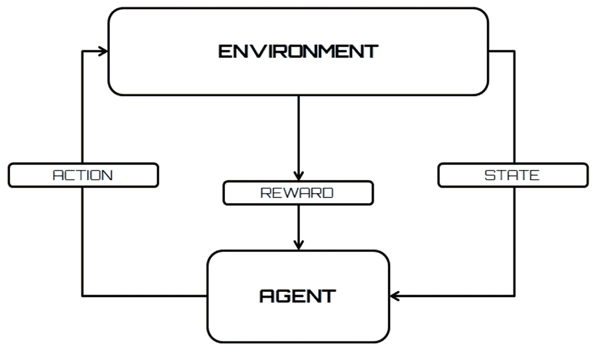
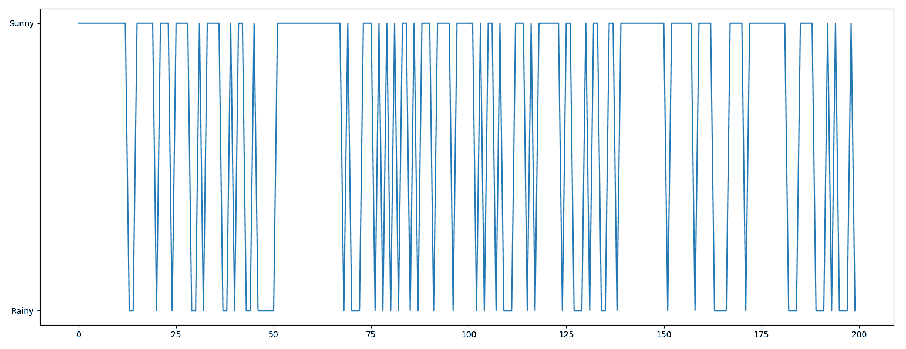
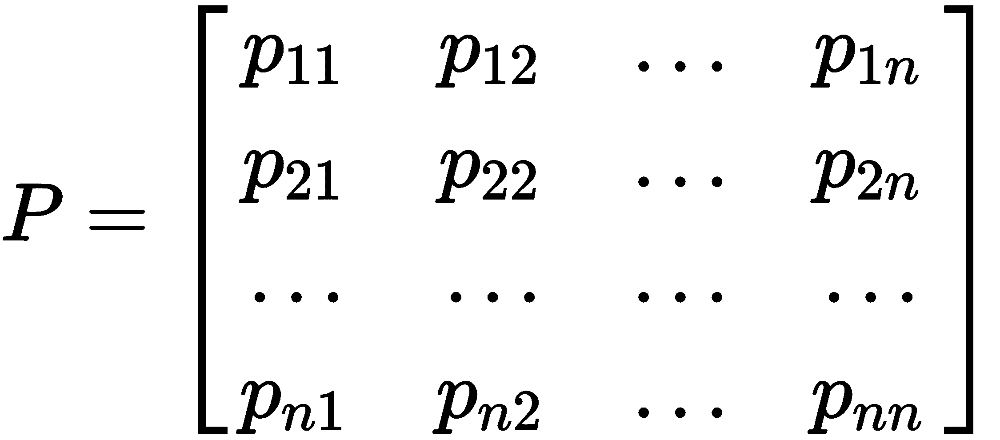
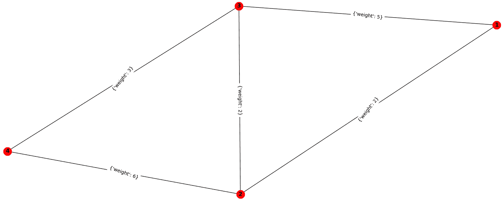
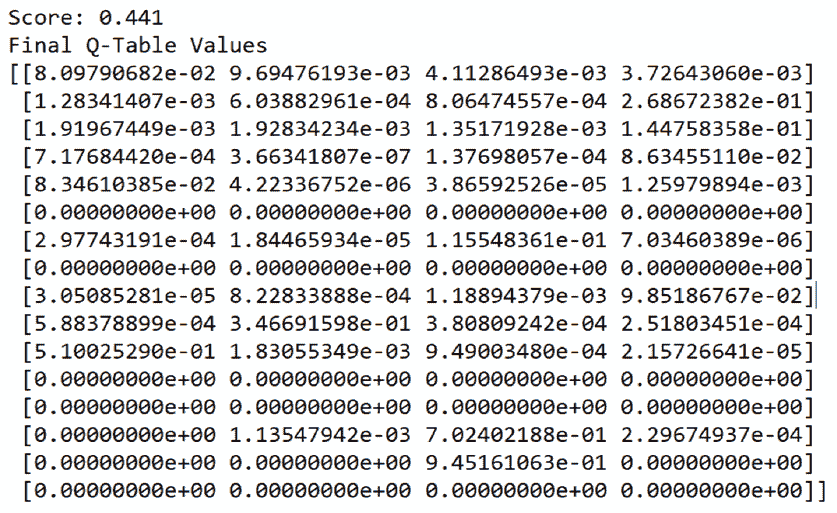

# 强化学习技术

在本章中，我们将涵盖以下食谱：

+   使用 MDP 进行天气预报

+   使用 DP 优化金融投资组合

+   寻找最短路径

+   使用 Q 学习决定折现因子

+   实现深度 Q 学习算法

+   开发基于 AI 的动态建模系统

+   基于 Double Q 学习的深度强化学习

+   带有对抗性 Q 学习的深度 Q 网络算法

# 技术要求

为了处理本章中的食谱，你需要以下文件（可在 GitHub 上找到）：

+   `MarkovChain.py`

+   `KPDP.py`

+   `DijkstraNX.py`

+   `FrozenQlearning.py`

+   `FrozenDeepQLearning.py`

+   `dqn_cartpole.py`

+   `DoubleDQNCartpole.py`

+   `DuelingDQNCartpole.py`

# 简介

强化学习代表了一类能够学习和适应环境变化的算法。它基于算法选择的外部刺激的概念。正确的选择将导致奖励，而错误的选择将导致惩罚。系统的目标是实现最佳结果。

在监督学习中，正确的输出是明确指定的（有教师指导的学习）。但并非总是可能这样做。通常，我们只有定性信息。可用的信息被称为**强化信号**。在这些情况下，系统不会提供有关如何更新智能体行为的任何信息（例如，权重）。无法定义成本函数或梯度。系统的目标是创建能够从经验中学习的智能体。

在下面的屏幕截图中，我们可以看到一个流程图，显示了强化学习与环境之间的交互：



下面是正确应用强化学习算法的步骤：

1.  智能体的准备

1.  环境观察

1.  选择最优策略

1.  执行动作

1.  计算相应的奖励（或惩罚）

1.  更新策略的开发（如有必要）

1.  重复步骤 2 到 5，直到智能体学习到最优策略

强化学习试图最大化执行动作或动作集以实现目标所获得的奖励。

# 使用 MDP 进行天气预报

为了避免负载问题和计算困难，将智能体-环境交互视为一个**马尔可夫决策过程**（**MDP**）。MDP 是一个离散时间随机控制过程。

**随机过程**是用于研究遵循随机或概率定律的现象演化的数学模型。众所周知，在所有自然现象中，无论是由于其本质还是由于观测误差，都存在一个随机或偶然的成分。

这个组件导致以下情况：在*t*的每一个实例中，对现象的观察结果是随机数或随机变量，*st*。不可能确定结果会是什么；你只能声明它将取几个可能值中的一个，每个值都有给定的概率。

当观察到一个特定的*t*实例时，如果随机过程的演变，从*t*开始，只依赖于*t*而不依赖于任何先前的实例，则称该随机过程为**马尔可夫**。因此，当给定观察时刻时，只有这个实例决定了过程的未来演变，而这种演变不依赖于过去。

# 准备工作

在这个菜谱中，我们想要构建一个统计模型来预测天气。为了简化模型，我们假设只有两种状态：晴天和雨天。让我们进一步假设我们已经进行了一些计算，并发现明天的时刻某种程度上基于今天的时间。

# 如何操作...

让我们看看如何使用 MDP 进行天气预报：

1.  我们将使用已经为你提供的`MarkovChain.py`文件作为参考。首先，我们导入`numpy`、`time`和`matplotlib.pyplot`包：

```py
import numpy as np
import time
from matplotlib import pyplot
```

1.  让我们设置随机数生成器的种子和天气状态：

```py
np.random.seed(1)
states = ["Sunny","Rainy"]
```

1.  在这一点上，我们必须定义天气条件的可能转移：

```py
TransStates = [["SuSu","SuRa"],["RaRa","RaSu"]]
TransnMatrix = [[0.75,0.25],[0.30,0.70]]
```

1.  然后，我们插入以下检查以验证我们没有在定义转移矩阵时出错：

```py
if sum(TransnMatrix[0])+sum(TransnMatrix[1]) != 2:
     print("Warning! Probabilities MUST ADD TO 1\. Wrong transition matrix!!")
     raise ValueError("Probabilities MUST ADD TO 1")
```

1.  让我们设置初始条件：

```py
WT = list()
NumberDays = 200
WeatherToday = states[0]
print("Weather initial condition =",WeatherToday)
```

1.  现在，我们可以预测`NumberDays`变量设置的每一天的天气条件。为此，我们将使用以下`while`循环：

```py
i = 0
while i < NumberDays:
    if WeatherToday == "Sunny":
    TransWeather = np.random.choice(TransStates[0],replace=True,p=TransnMatrix[0])
        if TransWeather == "SuSu":
            pass
        else:
            WeatherToday = "Rainy"
    elif WeatherToday == "Rainy":
        TransWeather = np.random.choice(TransStates[1],replace=True,p=TransnMatrix[1])
        if TransWeather == "RaRa":
            pass
        else:
            WeatherToday = "Sunny"
    print(WeatherToday)
    WT.append(WeatherToday)
    i += 1    
    time.sleep(0.2)
```

它由一个控制条件和循环体组成。在循环的入口处以及每次执行循环体内的所有指令后，都要验证控制条件的有效性。当由布尔表达式组成的条件返回`false`时，循环结束。

1.  在这一点上，我们已经为未来 200 天生成了预报。让我们使用以下代码绘制图表：

```py
pyplot.plot(WT)
pyplot.show()
```

下面的图显示了从晴天开始的未来 200 天的天气条件：



初看之下，似乎晴天比雨天多。

# 它是如何工作的...

马尔可夫链是随机现象的数学模型，该现象随时间演变，过去只通过现在影响未来。换句话说，随机模型描述了一系列可能的事件，其中每个事件的概率只依赖于前一个事件达到的状态。因此，马尔可夫链具有无记忆性。

因此，马尔可夫链的结构完全由以下转移矩阵表示：



转移概率矩阵的性质直接来源于组成它们的元素的本质。

# 还有更多…

将马尔可夫链通过转移矩阵描述的一个非常直观的替代方法是将其与一个有向图（转移图）关联。转移矩阵和转移图提供了关于同一马尔可夫链的相同信息。

# 参见

+   *Keras 强化学习项目*，Giuseppe Ciaburro，Packt 出版社

+   *马尔可夫模型导论*（来自克莱姆森大学）: [`cecas.clemson.edu/~ahoover/ece854/refs/Ramos-Intro-HMM.pdf`](http://cecas.clemson.edu/~ahoover/ece854/refs/Ramos-Intro-HMM.pdf)

+   *马尔可夫决策过程*（来自卡内基梅隆大学）: [`egon.cheme.cmu.edu/ewo/docs/SchaeferMDP.pdf`](http://egon.cheme.cmu.edu/ewo/docs/SchaeferMDP.pdf)

# 使用动态规划优化金融投资组合

金融投资组合的管理是一种旨在以最能代表投资者需求的方式组合金融产品的活动。这需要评估各种特征的整体评估，例如风险偏好、预期回报和投资者消费，以及未来回报和风险的估计。**动态规划**（**DP**）代表了一组算法，可以在形式为 MDP 的环境完美模型下计算最优策略。DP 的基本思想，以及强化学习的一般思想，是使用状态值和动作来寻找好的策略。

# 准备工作

在这个菜谱中，我们将解决**背包问题**：一个小偷进入一栋房子，想要偷走贵重物品。他们将它们放入背包中，但受到重量的限制。每个对象都有自己的价值和重量。他们必须选择有价值但重量不过重的对象。小偷不能超过背包的重量限制，同时，他们必须优化他们的收益。

# 如何做到这一点…

让我们看看我们如何使用动态规划优化金融投资组合：

1.  我们将使用已经为你提供的`KPDP.py`文件作为参考。此算法从定义一个`KnapSackTable()`函数开始，该函数将选择满足问题所提出的两个约束条件的对象的最优组合：对象的总重量等于 10，以及所选对象的最大值，如下面的代码所示：

```py
def KnapSackTable(weight, value, P, n):
T = [[0 for w in range(P + 1)]
for i in range(n + 1)]
```

1.  然后，我们在所有对象和所有重量值上设置一个迭代循环，如下所示：

```py
for i in range(n + 1):
    for w in range(P + 1):
        if i == 0 or w == 0:
            T[i][w] = 0
        elif weight[i - 1] <= w:
            T[i][w] = max(value[i - 1]
                + T[i - 1][w - weight[i - 1]],
                        T[i - 1][w])
        else:
            T[i][w] = T[i - 1][w]
```

1.  现在，我们可以记住获得的结果，这代表了可以装入背包的对象的最大价值，如下所示：

```py
res = T[n][P]
print("Total value: " ,res)
```

1.  我们迄今为止遵循的程序并没有表明哪个子集提供了最优解。我们必须使用一种集合程序来提取这个信息：

```py
w = P
totweight=0
for i in range(n, 0, -1):
    if res <= 0:
        break
```

1.  如果当前元素与上一个元素相同，我们将继续下一个，如下所示：

```py
if res == T[i - 1][w]:
    continue
```

1.  如果它们不相同，那么当前对象将被包含在背包中，并将打印出此项目，如下所示：

```py
else:
    print("Item selected: ",weight[i - 1],value[i - 1])
    totweight += weight[i - 1]
    res = res - value[i - 1]
    w = w - weight[i – 1]
```

1.  最后，打印出包含的总重量，如下所示：

```py
print("Total weight: ",totweight)
```

这样，我们就定义了一个函数，允许我们构建表格。

1.  现在，我们必须定义输入变量并将它们传递给函数，如下所示：

```py
objects = [(5, 18),(2, 9), (4, 12), (6,25)]
print("Items available: ",objects)
print("***********************************")
```

1.  在这一点上，我们需要从对象中提取权重和变量值。我们将它们放入一个单独的数组中，以便更好地理解步骤，如下所示：

```py
value = []
weight = []
for item in objects:
    weight.append(item[0])
    value.append(item[1])
```

1.  最后，设置背包可以携带的总重量和可用物品的数量，如下所示：

```py
P = 10
n = len(value)
```

1.  最后，我们打印出结果：

```py
KnapSackTable(weight, value, P, n)
The following results are returned:
Items available: [(5, 18), (2, 9), (4, 12), (6, 25)]
*********************************
Total value: 37
Item selected: 6 25
Item selected: 4 12
Total weight: 10
```

动态规划算法使我们能够获得最优解，从而节省了计算成本。

# 它是如何工作的...

例如，考虑找到连接两个位置的最佳路径的问题。最优性原理指出，它包含的每个子路径，在任意中间位置和最终位置之间，必须依次是最优的。基于这个原理，动态规划通过一次做出一个决策来解决问题。在每一步，都会确定未来的最佳策略，而不考虑过去的决策（它是一个马尔可夫过程），假设后者也是最优的。

# 还有更多...

动态规划是一种更有效地解决递归问题的技术。为什么是这样呢？在递归过程中，我们通常会反复解决子问题。在动态规划中，这种情况不会发生：我们记住这些子问题的解决方案，这样我们就不必再次解决它们。这被称为**备忘录化**。如果变量的值在给定步骤上依赖于先前计算的结果，并且如果相同的计算反复进行，那么存储中间结果以避免重复计算昂贵的计算是有利的。

# 参考以下内容

+   参考 Giuseppe Ciaburro 所著的《Keras 强化学习项目》，Packt 出版社

+   参考斯坦福大学的*动态规划*：[`web.stanford.edu/class/cs97si/04-dynamic-programming.pdf`](https://web.stanford.edu/class/cs97si/04-dynamic-programming.pdf)

+   参考蒂尔堡大学的*背包问题*：[`www.es.ele.tue.nl/education/5MC10/Solutions/knapsack.pdf`](http://www.es.ele.tue.nl/education/5MC10/Solutions/knapsack.pdf)

+   参考拉德福德大学的*备忘录化*：[`www.radford.edu/~nokie/classes/360/dp-memoized.html`](https://www.radford.edu/~nokie/classes/360/dp-memoized.html)

# 寻找最短路径

给定一个加权图和一个指定的顶点 *X*，我们通常会需要找到从 *X* 到图中每个其他顶点的路径。识别连接图中的两个或多个节点的路径在许多其他离散优化问题中表现为子问题，并且在现实世界中也有许多应用。

# 准备工作

在本食谱中，我们将使用**Dijkstra**算法找到两点之间的最短路径。我们还将使用`networkx`包在 Python 中表示图。

# 如何做到这一点…

让我们看看我们如何找到最短路径：

1.  我们将使用已经提供的`DijkstraNX.py`文件作为参考。首先，我们导入我们将在这里使用的库：

```py
import networkx as nx
import matplotlib.pyplot as plt
```

1.  然后，创建了一个图对象并添加了顶点：

```py
G = nx.Graph()
G.add_node(1)
G.add_node(2)
G.add_node(3)
G.add_node(4)
```

1.  随后，添加了加权边：

```py
G.add_edge(1, 2, weight=2)
G.add_edge(2, 3, weight=2)
G.add_edge(3, 4, weight=3)
G.add_edge(1, 3, weight=5)
G.add_edge(2, 4, weight=6)
```

1.  在这一点上，我们已经通过给边添加带有权重指示的标签来绘制了图：

```py
pos = nx.spring_layout(G, scale=3)
nx.draw(G, pos,with_labels=True, font_weight='bold')
edge_labels = nx.get_edge_attributes(G,'r')
nx.draw_networkx_edge_labels(G, pos, labels = edge_labels)
plt.show()
```

为了做到这一点，使用了`draw_networkx_edge_labels`函数。以下图表显示了这一结果：



1.  最后，计算从节点一到四的最短路径：

```py
print(nx.shortest_path(G,1,4,weight='weight'))
```

1.  `shortest_path`函数计算图中节点之间的最短路径和路径长度。以下结果是：

```py
[1, 2, 3, 4]
```

1.  最后，计算了最短路径的长度：

```py
print(nx.nx.shortest_path_length(G,1,4,weight='weight'))
```

以下结果是：

```py
7
```

如我们所验证的，我们已经获得了相同的结果。

# 它是如何工作的…

Dijkstra 算法能够解决从源点`s`到所有节点的最短路径问题。算法维护一个标签*d(i)*到节点，表示节点 i 的最短路径长度的上界。

在每一步中，算法将节点集*V*划分为两个集合：永久标记节点的集合和仍然临时标记的节点的集合。永久标记节点的距离代表从源点到这些节点的最短路径距离，而临时标签包含一个可以大于或等于最短路径长度的值。

# 还有更多…

算法的基本思想是从源点开始，尝试永久标记后续节点。一开始，算法将源点的距离值设为零，并将其他距离初始化为任意高值（按照惯例，我们将距离的初始值设为：*d[i] = + ∞, ∀i ∈* *V*）。

在每次迭代中，节点标签 i 是包含除了 i 之外只有永久标记节点的源点到路径上的最小距离的值。算法选择标签值最低的临时标记节点，将其永久标记，并更新其相邻节点的所有标签。当所有节点都被永久标记时，算法终止。

# 参考以下内容

+   查看书籍《Keras 强化学习项目》，作者 Giuseppe Ciaburro，出版社 Packt Publishing

+   查看书籍《解决最短路径问题：Dijkstra 算法》（来自伊利诺伊大学）：[`www.ifp.illinois.edu/~angelia/ge330fall09_dijkstra_l18.pdf`](http://www.ifp.illinois.edu/~angelia/ge330fall09_dijkstra_l18.pdf)

+   查看书籍《图论教程》（来自田纳西大学马丁分校）：[`primes.utm.edu/graph/index.html`](https://primes.utm.edu/graph/index.html)

# 使用 Q 学习决定折扣因子

**Q 学习**是使用最广泛的强化学习算法之一。这得益于它能够比较可用动作的预期效用，而无需环境模型。多亏了这项技术，我们可以在完成 MDP 的每个给定状态下找到最优动作。

强化学习问题的一般解决方案是通过学习过程估计一个评估函数。这个函数必须能够通过奖励的总和来评估特定策略的便利性或不利性。实际上，Q 学习试图最大化 Q 函数（动作值函数）的值，它表示当我们执行动作*a*在状态*s*时，最大化的折现未来奖励。

# 准备工作

在这个菜谱中，我们将通过提供一个基于 Q 学习的第一个解决方案来处理在网格世界中控制角色移动的问题。

# 如何做到这一点...

让我们看看我们如何使用 Q 学习来决定折扣因子：

1.  我们将使用已经提供的`FrozenQlearning.py`文件作为参考。让我们先导入库：

```py
import gym
import numpy as np
```

1.  然后，我们将继续创建环境，通过调用`make`方法：

```py
env = gym.make('FrozenLake-v0')
```

此方法创建我们的智能体将运行的 环境。

1.  现在，让我们初始化参数，从`QTable`开始：

```py
QTable = np.zeros([env.observation_space.n,env.action_space.n])
```

1.  让我们定义一些参数：

```py
alpha = .80
gamma = .95
NumEpisodes = 2000
```

在这里，`alpha`是学习率，`gamma`是折扣因子，`NumEpisodes`是剧集数。

1.  现在，我们将创建一个列表来包含总奖励：

```py
RewardsList = []
```

1.  在这一点上，在设置参数后，可以开始 Q 学习周期：

```py
for i in range(NumEpisodes):
    CState = env.reset()
    SumReward = 0
    d = False
    j = 0
    while j < 99:
        j+=1
        Action = np.argmax(QTable[CState,:] + np.random.randn(1,env.action_space.n)*(1./(i+1)))
        NState,Rewards,d,_ = env.step(Action)
        QTable[CState,Action] = QTable[CState,Action] + alpha*(Rewards + gamma*np.max(QTable[NState,:]) - QTable[CState,Action])
        SumReward += Rewards
        CState = NState
        if d == True:
            break

    RewardsList.append(SumReward)
```

在每个剧集结束时，奖励列表将增加一个新值。

1.  最后，我们打印结果：

```py
print ("Score: " +  str(sum(RewardsList)/NumEpisodes))
print ("Final Q-Table Values")
print (QTable)
```

下面的截图显示了最终的 Q 表：



为了提高结果，需要调整配置参数的回退。

# 它是如何工作的…

`FrozenLake`环境是一个 4 × 4 的网格，包含四个可能区域：**安全**（**S**）、**冰冻**（**F**）、**洞**（**H**）和**目标**（**G**）。智能体控制网格世界中角色的移动，并在网格中移动直到达到目标或洞。网格中的一些方格是可通行的，而其他方格会导致智能体掉入水中。如果掉入洞中，它必须从头开始，并得到 0 的奖励。此外，智能体将移动的方向是不确定的，并且仅部分取决于所选方向。如果智能体找到一个可通行的路径到达目标方格，它将得到奖励。智能体有四种可能的移动：上、下、左和右。这个过程会持续进行，直到它从每个错误中学习并达到目标。

# 更多内容...

Q-learning 通过增量估计函数值 *q(s, a)*，在环境的每个步骤中更新状态-动作对的值，遵循更新时间差分方法估计值的一般公式的逻辑。Q-learning 具有离线策略特性；也就是说，虽然策略是根据 *q(s, a)* 估计的值来改进的，但值函数会根据一个严格贪婪的次级策略来更新估计：给定一个状态，选择的行为总是最大化 *max q(s, a)* 值的那个行为。然而，π 策略在估计值方面起着重要作用，因为通过它确定了要访问和更新的状态-动作对。

# 参考以下内容

+   查看《Keras 强化学习项目》，作者 Giuseppe Ciaburro，Packt 出版

+   参考《强化学习：教程》（多伦多大学）：[`www.cs.toronto.edu/~zemel/documents/411/rltutorial.pdf`](http://www.cs.toronto.edu/~zemel/documents/411/rltutorial.pdf)

+   查看 gym 库的官方网站：[`gym.openai.com/`](https://gym.openai.com/)

+   查看 FrozenLake-v0 环境：[`gym.openai.com/envs/FrozenLake-v0/`](https://gym.openai.com/envs/FrozenLake-v0/)

# 实现深度 Q-learning 算法

**深度 Q-learning** 代表了基本 Q-learning 方法的演变。状态-动作被神经网络所取代，目的是逼近最优值函数。与 Q-learning 方法相比，它被用来构建网络以请求输入和动作，并提供其期望回报，深度 Q-learning 革新了结构，只请求环境的状态，并提供尽可能多的状态-动作值，这些值对应于环境中可以执行的动作数量。

# 准备工作

在这个菜谱中，我们将使用深度 Q-learning 方法来控制网格世界中角色的移动。在这个菜谱中，将使用 `keras-rl` 库；要了解更多信息，请参考《开发基于 AI 的动态建模系统》菜谱。

# 如何操作...

让我们看看如何实现深度 Q-learning 算法：

1.  我们将使用提供的 `FrozenDeepQLearning.py` 文件作为参考。让我们首先导入库：

```py
import gym
import numpy as np
from keras.models import Sequential
from keras.layers.core import Dense, Reshape
from keras.layers.embeddings import Embedding
from keras.optimizers import Adam
from rl.agents.dqn import DQNAgent
from rl.policy import BoltzmannQPolicy
from rl.memory import SequentialMemory
```

1.  然后，我们将定义环境和设置种子：

```py
ENV_NAME = 'FrozenLake-v0'
env = gym.make(ENV_NAME)
np.random.seed(1)
env.seed(1)
```

1.  现在，我们将提取智能体可用的动作：

```py
Actions = env.action_space.n
```

`Actions` 变量现在包含在所选环境中可用的所有动作。Gym 不会总是告诉你这些动作的含义，但只会告诉你哪些动作是可用的。

1.  现在，我们将使用 `keras` 库构建一个简单的神经网络模型：

```py
model = Sequential()
model.add(Embedding(16, 4, input_length=1))
model.add(Reshape((4,)))
print(model.summary())
```

现在，神经网络模型已经准备好使用，所以让我们配置和编译我们的智能体。使用 DQN 的问题之一是，算法中使用的神经网络倾向于忘记先前的经验，因为它用新的经验覆盖了它们。

1.  因此，我们需要一个包含先前经验和观察结果列表来用先前经验重新构建模型。为此，定义了一个将包含先前经验的内存变量，并设置了一个策略：

```py
memory = SequentialMemory(limit=10000, window_length=1)
policy = BoltzmannQPolicy()
```

1.  我们只需要定义智能体：

```py
Dqn = DQNAgent(model=model, nb_actions=Actions,
               memory=memory, nb_steps_warmup=500,
               target_model_update=1e-2, policy=policy,
               enable_double_dqn=False, batch_size=512
               )
```

1.  让我们继续编译和拟合模型：

```py
Dqn.compile(Adam())
Dqn.fit(env, nb_steps=1e5, visualize=False, verbose=1, log_interval=10000)
```

1.  训练结束时，有必要保存获得的权重：

```py
Dqn.save_weights('dqn_{}_weights.h5f'.format(ENV_NAME), overwrite=True)
```

1.  最后，我们将对算法进行 20 个回合的评估：

```py
Dqn.test(env, nb_episodes=20, visualize=False)
```

我们的智能体现在能够识别出通往目标的路径。

# 它是如何工作的…

强化学习问题的一般解决方案是，通过学习过程估计一个评估函数。这个函数必须能够通过奖励的总和来评估特定策略的便利性或不利性。实际上，Q 学习试图最大化`Q`函数（动作值函数）的值，它表示在状态`s`中执行动作`a`时的最大折现未来奖励。DQN 代表了基本 Q 学习方法的演变，其中状态-动作被神经网络取代，目的是逼近最优值函数。

# 还有更多…

OpenAI Gym 是一个帮助我们实现基于强化学习算法的库。它包括一个不断增长的基准问题集合，这些问题提供了一个公共接口，以及一个网站，人们可以在那里分享他们的结果并比较算法性能。

OpenAI Gym 专注于强化学习的回合设置。换句话说，智能体的经验被划分为一系列回合。智能体的初始状态由一个分布随机采样，交互过程一直进行，直到环境达到终端状态。这个程序在每个回合中重复进行，目的是最大化每个回合的总奖励期望，并在尽可能少的回合内达到高水平的表现。

# 参考以下内容

+   请参考 *Keras 强化学习项目*，作者 Giuseppe Ciaburro，Packt Publishing

+   请参考 *使用深度强化学习学习 2048*（来自滑铁卢大学）：[`cs.uwaterloo.ca/~mli/zalevine-dqn-2048.pdf`](https://cs.uwaterloo.ca/~mli/zalevine-dqn-2048.pdf)

+   请参考 *深度强化学习中的 Q 函数*（来自加州大学伯克利分校）：[`rail.eecs.berkeley.edu/deeprlcourse/static/slides/lec-8.pdf`](http://rail.eecs.berkeley.edu/deeprlcourse/static/slides/lec-8.pdf)

# 开发基于 AI 的动态建模系统

**Segway**是一种利用计算机科学、电子学和机械学创新组合的个人交通工具。它作为身体的延伸；就像舞伴一样，能够预测每一个动作。其工作原理基于**反向摆**系统。反向摆系统是控制理论和研究文献中常见的例子。它的流行部分原因在于它没有控制是不稳定的，并且具有非线性动态，但更重要的是，它有多个实际应用，例如控制火箭的起飞或 Segway。

# 准备工作

在这个配方中，我们将分析由连接到车上的刚性杆组成的物理系统的功能，使用不同的方法来模拟系统。杆通过一个铰链连接到车架上，可以自由地围绕它旋转。这个被称为反向摆的机械系统是控制理论中的经典问题。

# 如何做…

让我们看看我们如何开发一个基于 AI 的动态建模系统：

1.  我们将使用已经为你提供的`dqn_cartpole.py`文件作为参考。让我们先导入库：

```py
import numpy as np
import gym
from keras.models import Sequential
from keras.layers import Dense, Activation, Flatten
from keras.optimizers import Adam
from rl.agents.dqn import DQNAgent
from rl.policy import BoltzmannQPolicy
from rl.memory import SequentialMemory
```

1.  现在，我们将定义和加载环境：

```py
ENV_NAME = 'CartPole-v0'
env = gym.make(ENV_NAME)
```

1.  为了设置`seed`值，使用了 NumPy 库的`random.seed()`函数，如下所示：

```py
np.random.seed(123)
env.seed(123)
```

1.  现在，我们将提取代理可用的动作：

```py
nb_actions = env.action_space.n
```

1.  我们将使用`keras`库构建一个简单的神经网络模型：

```py
model = Sequential()
model.add(Flatten(input_shape=(1,) + env.observation_space.shape))
model.add(Dense(16))
model.add(Activation('relu'))
model.add(Dense(16))
model.add(Activation('relu'))
model.add(Dense(16))
model.add(Activation('relu'))
model.add(Dense(nb_actions))
model.add(Activation('linear'))
print(model.summary())
```

1.  将设置一个`memory`变量和一个`policy`：

```py
memory = SequentialMemory(limit=50000, window_length=1)
policy = BoltzmannQPolicy()
```

1.  我们只需要定义代理：

```py
dqn = DQNAgent(model=model, nb_actions=nb_actions, memory=memory, nb_steps_warmup=10,
               target_model_update=1e-2, policy=policy)
```

1.  让我们继续编译和拟合模型：

```py
dqn.compile(Adam(lr=1e-3), metrics=['mae'])
dqn.fit(env, nb_steps=1000, visualize=True, verbose=2)
```

1.  在训练结束时，有必要保存获得的权重：

```py
dqn.save_weights('dqn_{}_weights.h5f'.format(ENV_NAME), overwrite=True)
```

网络或整个结构的权重保存发生在`HDF5`文件中，这是一个高效且灵活的存储系统，支持复杂的多维数据集。

1.  最后，我们将对算法进行 10 个回合的评估：

```py
dqn.test(env, nb_episodes=5, visualize=True)
```

# 它是如何工作的…

在这个配方中，我们使用了`keras–rl`包来开发一个基于 AI 的动态建模系统。这个包在 Python 中实现了某些深度强化学习算法，并且与 Keras 的深度学习库无缝集成。

此外，`keras-rl`可以立即与 OpenAI Gym 一起工作。OpenAI Gym 包括一个不断增长的基准问题集合，展示了通用的接口和网站，人们可以在那里分享他们的结果并比较算法性能。这个库将在下一章中适当介绍——现在，我们将限制自己使用它。

# 还有更多…

这些选择并不限制`keras-rl`包的使用，从`keras-rl`的使用可以很容易地适应我们的需求。你可以使用内置的 Keras 回调和指标，或者定义其他的。因此，通过扩展一些简单的抽象类，很容易实现自己的环境，甚至算法。

# 参考以下内容

+   查看《Keras 强化学习项目》，作者 Giuseppe Ciaburro，Packt Publishing 出版社

+   查看教程：《深度强化学习》（来自 Google DeepMind）：[`icml.cc/2016/tutorials/deep_rl_tutorial.pdf`](https://icml.cc/2016/tutorials/deep_rl_tutorial.pdf)

+   参考书籍《深度强化学习》（作者徐王）：[`pure.tue.nl/ws/files/46933213/844320-1.pdf`](https://pure.tue.nl/ws/files/46933213/844320-1.pdf)

# 双 Q-learning 的深度强化学习

在 Q-learning 算法中，使用与当前股票选择策略相同的 Q 函数评估未来的最大近似动作值。在某些情况下，这可能会高估动作值，从而减慢学习速度。DeepMind 研究人员在以下论文中提出了一个名为**Double Q-learning**的变体：*Deep reinforcement learning with Double Q-learning*，H van Hasselt，A Guez，和 D Silver，2016 年 3 月，在第三十届 AAAI 人工智能会议上。作为解决这个问题的方案，作者们提出了修改 Bellman 更新的方法。

# 准备就绪

在这个菜谱中，我们将使用 Double Q-learning 算法控制一个倒立摆系统。

# 如何做…

让我们看看如何使用 Double Q-learning 进行深度强化学习：

1.  我们将使用已经为你提供的`DoubleDQNCartpole.py`文件作为参考。让我们首先导入库：

```py
import numpy as np
import gym
from keras.models import Sequential
from keras.layers import Dense, Activation, Flatten
from keras.optimizers import Adam
from rl.agents.dqn import DQNAgent
from rl.policy import BoltzmannQPolicy
from rl.memory import SequentialMemory
```

1.  现在，我们将定义和加载环境：

```py
ENV_NAME = 'CartPole-v0'
env = gym.make(ENV_NAME)
```

1.  要设置`seed`值，使用 NumPy 库的`random.seed()`函数，如下所示：

```py
np.random.seed(1)
env.seed(1)
```

1.  现在，我们将提取代理可用的动作：

```py
nb_actions = env.action_space.n
```

1.  我们将使用`keras`库构建一个简单的神经网络模型：

```py
model = Sequential()
model.add(Flatten(input_shape=(1,) + env.observation_space.shape))
model.add(Dense(16))
model.add(Activation('relu'))
model.add(Dense(16))
model.add(Activation('relu'))
model.add(Dense(16))
model.add(Activation('relu'))
model.add(Dense(nb_actions))
model.add(Activation('linear'))
print(model.summary())
```

1.  将设置一个`memory`变量和一个`policy`：

```py
memory = SequentialMemory(limit=50000, window_length=1)
policy = BoltzmannQPolicy()
```

1.  我们只需要定义代理：

```py
dqn = DQNAgent(model=model, nb_actions=nb_actions, memory=memory,   
               nb_steps_warmup=10, enable_double_dqn=True,  
               target_model_update=1e-2,policy=policy)
```

要启用双网络，我们必须将`enable_double_dqn`选项设置为`True`。

1.  让我们继续编译和拟合模型：

```py
dqn.compile(Adam(lr=1e-3), metrics=['mae'])
dqn.fit(env, nb_steps=1000, visualize=True, verbose=2)
```

1.  在训练结束时，有必要保存获得的权重：

```py
dqn.save_weights('dqn_{}_weights.h5f'.format(ENV_NAME), overwrite=True)
```

网络或整个结构的权重保存发生在`HDF5`文件中，这是一个高效且灵活的存储系统，支持复杂的多元数据集。

1.  最后，我们将对算法进行 10 个回合的评估：

```py
dqn.test(env, nb_episodes=5, visualize=True)
```

# 它是如何工作的…

动作值的高估是由于在 Bellman 方程中使用的最大运算符。最大运算符在选择和评估动作时使用相同的值。现在，如果我们选择具有最大值的最佳动作，我们最终会选择一个次优动作（错误地假设了最大值）而不是最佳动作。我们可以通过有两个独立的 Q 函数来解决这个问题，每个 Q 函数都独立学习。一个 Q1 函数用于选择动作，另一个 Q2 函数用于评估动作。为此，只需更改目标函数。

# 还有更多…

实质上，以下两个网络被使用：

+   DQN 网络用于选择在下一个状态中采取的最佳动作（具有最高 Q 值的动作）

+   目标网络，用于计算在下一个状态下执行该动作的目标 Q 值

# 参见

+   查看*Keras 强化学习项目*，作者 Giuseppe Ciaburro，Packt Publishing

+   参考文献请见*使用双重 Q 学习的深度强化学习*：[`www.aaai.org/ocs/index.php/AAAI/AAAI16/paper/download/12389/11847`](https://www.aaai.org/ocs/index.php/AAAI/AAAI16/paper/download/12389/11847)

# 深度 Q 网络算法与对抗 Q 学习

为了通过使我们的网络架构更接近强化学习的最后挑战之一来提高收敛速度，王等人提出了以下论文中 DQN 模型性能的明显改进：*对抗网络架构用于深度强化学习，Z Wang, T Schaul, M Hessel, H van Hasselt, M Lanctot, and N de Freitas, 2015, arXiv 预印本 arXiv:1511.06581。

# 准备工作

在这个菜谱中，我们将使用对抗 Q 学习算法控制一个倒立摆系统。

# 如何做…

让我们看看如何使用对抗 Q 学习执行深度 Q 网络算法：

1.  我们将使用已提供的`DuelingDQNCartpole.py`文件作为参考。让我们首先导入库：

```py
import numpy as np
import gym
from keras.models import Sequential
from keras.layers import Dense, Activation, Flatten
from keras.optimizers import Adam
from rl.agents.dqn import DQNAgent
from rl.policy import BoltzmannQPolicy
from rl.memory import SequentialMemory
```

1.  现在，我们将定义和加载环境：

```py
ENV_NAME = 'CartPole-v0'
env = gym.make(ENV_NAME)
```

1.  要设置`seed`值，使用 NumPy 库的`random.seed()`函数，如下所示：

```py
np.random.seed(2)
env.seed(2)
```

1.  现在，我们将提取智能体可用的动作：

```py
nb_actions = env.action_space.n
```

1.  我们将使用 Keras 库构建一个简单的神经网络模型：

```py
model = Sequential()
model.add(Flatten(input_shape=(1,) + env.observation_space.shape))
model.add(Dense(16))
model.add(Activation('relu'))
model.add(Dense(16))
model.add(Activation('relu'))
model.add(Dense(16))
model.add(Activation('relu'))
model.add(Dense(nb_actions))
model.add(Activation('linear'))
print(model.summary())
```

1.  将设置一个`memory`变量和一个`policy`：

```py
memory = SequentialMemory(limit=50000, window_length=1)
policy = BoltzmannQPolicy()
```

我们只需定义智能体：

```py
dqn = DQNAgent(model=model, nb_actions=nb_actions, memory=memory,
               nb_steps_warmup=10, enable_dueling_network=True,  
               dueling_type='avg',target_model_update=1e-2,
               policy=policy)
```

为了启用对抗网络，我们必须指定`dueling_type`为以下之一：`'avg'`、`'max'`或`'naive'`。

1.  让我们继续编译和拟合模型：

```py
dqn.compile(Adam(lr=1e-3), metrics=['mae'])
dqn.fit(env, nb_steps=1000, visualize=True, verbose=2)
```

1.  训练结束时，有必要保存获得的权重：

```py
dqn.save_weights('dqn_{}_weights.h5f'.format(ENV_NAME), overwrite=True)
```

网络或整个结构的权重保存发生在`HDF5`文件中，这是一个高效且灵活的存储系统，支持复杂的多元数据集。

1.  最后，我们将对算法进行 10 个回合的评估：

```py
dqn.test(env, nb_episodes=5, visualize=True)
```

# 它是如何工作的…

在强化学习中，函数 Q 和值函数扮演着基本角色：

+   Q 函数指定了智能体在状态`s`中执行动作的好坏

+   值函数指定了智能体处于状态`s`时的好坏

为了进一步提高 DQN 的性能，我们引入了一个新的函数，称为`advantage`函数，它可以定义为`value`函数和`benefit`函数之间的差异。`benefit`函数指定了智能体在执行动作方面相对于其他动作的好坏。

因此，`价值`函数指定了状态的好坏，而`优势`函数指定了动作的好坏。然后，这两个函数的组合告诉我们代理在某个状态下执行动作的好坏，这就是我们的`Q`函数。因此，我们可以将我们的`Q`函数定义为`价值`函数和`优势`函数的总和。

对抗式 DQN 本质上是一个 DQN，其中完全连接的最终层被分为两个流：

+   一个计算`价值`函数

+   另一个计算`优势`函数

最后，使用聚合级别将两个流合并以获得`Q`函数。

# 还有更多…

通过神经网络对`价值`函数的近似远非稳定。为了实现收敛，基本算法应通过引入避免振荡和发散的技术进行修改。

最重要的技术称为`经验重放`。在剧集期间，在每一步，代理的经验被存储在一个数据集中，称为`重放记忆`。在算法的内部循环中，不是基于刚刚执行的唯一转换在网络上进行训练，而是从重放记忆中随机选择转换的一个子集，并根据这个转换子集计算出的损失进行训练。

`重放`技术的经验，即从`重放记忆`中随机选择转换，消除了连续转换之间的相关性问题，并减少了不同更新之间的方差。

# 参见

+   查看 Giuseppe Ciaburro 的《Keras 强化学习项目》，Packt Publishing

+   更多信息请参阅 *《深度强化学习的对抗网络架构》*：[`arxiv.org/abs/1511.06581`](https://arxiv.org/abs/1511.06581)
