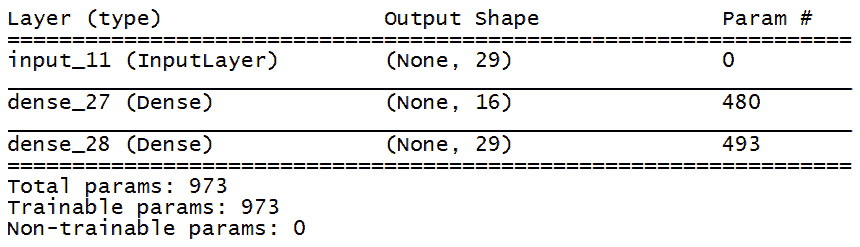
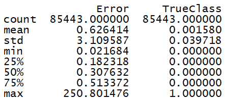
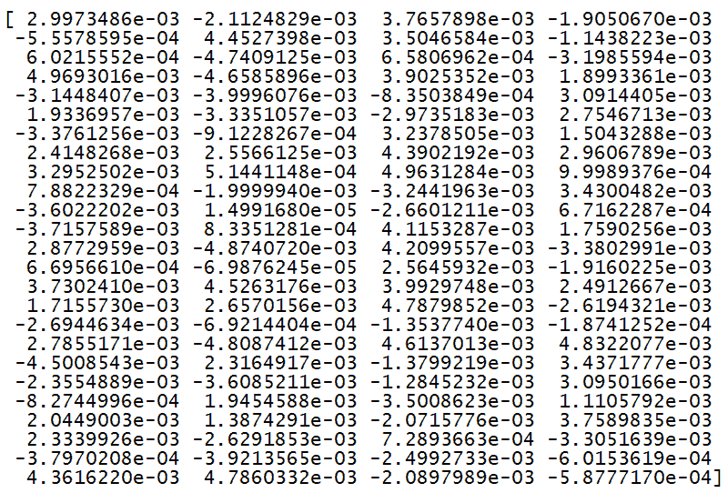
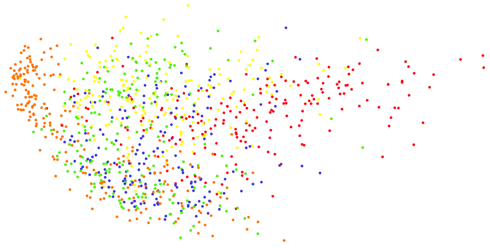
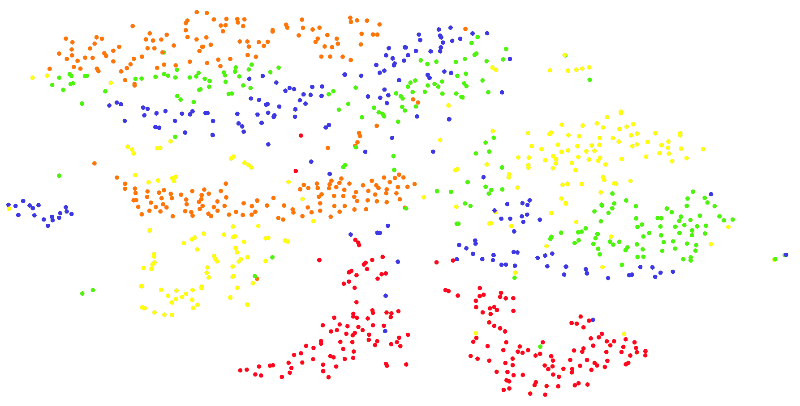
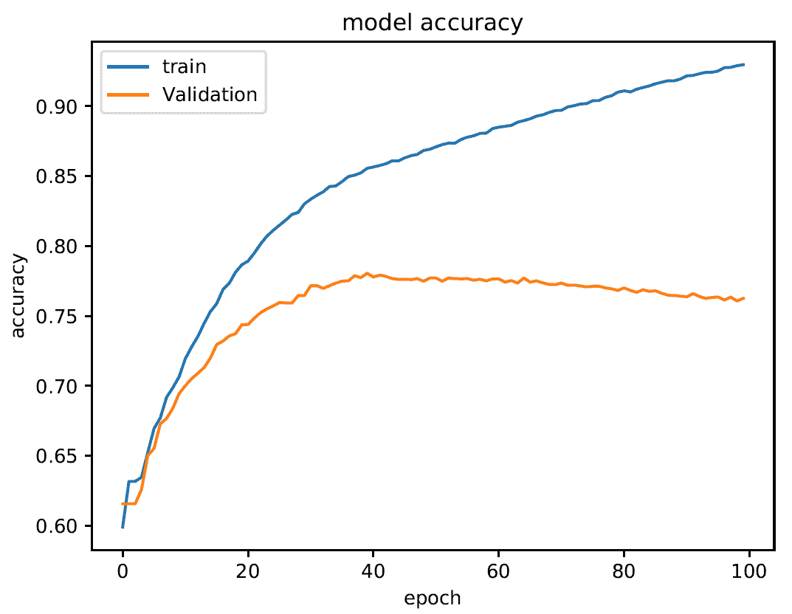
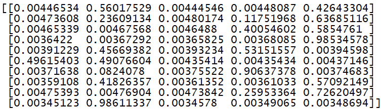
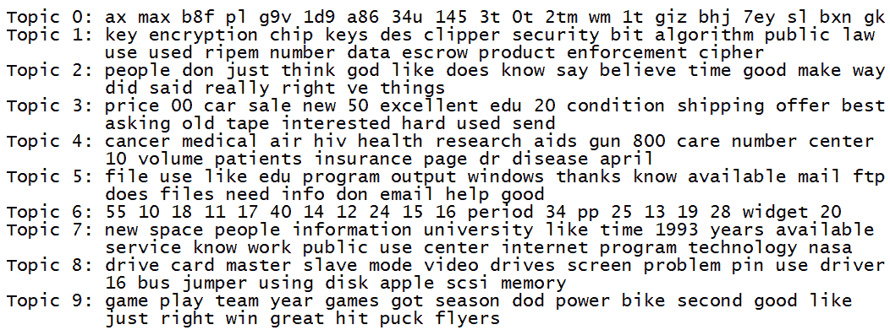

# 无监督表示学习

在本章中，我们将涵盖以下食谱：

+   使用降噪自编码器检测欺诈交易

+   使用 CBOW 或 skipgram 表示生成词嵌入

+   使用 PCA 和 t-SNE 可视化 MNIST 数据集

+   使用词向量进行 Twitter 情感分析

+   使用 scikit-learn 实现 LDA

+   使用 LDA 对文本文档进行分类

+   为 LDA 准备数据

# 技术要求

为了处理本章中的食谱，你需要以下文件（可在 GitHub 上找到）：

+   `CreditCardFraud.py`

+   `creditcard.csv`

+   `WordEmbeddings.py`

+   `MnistTSNE.py`

+   `TweetEmbeddings.py`

+   `Tweets.csv`

+   `LDA.py`

+   `TopicModellingLDA.py`

+   `PrepDataLDA.py`

# 简介

在第四章《无监督学习聚类》中，我们已经讨论了无监督学习。我们说无监督学习是机器学习中的一个范例，我们在其中构建模型而不依赖于标记的训练数据。为什么回到这个话题？在这种情况下，我们将以无监督的方式讨论学习图像、视频和自然语言语料库等数据的表示问题。

# 使用降噪自编码器检测欺诈交易

在第四章《无监督学习聚类》中，我们处理了**自编码器**的主题。在*自编码器重建手写数字图像*食谱中，有一个神经网络，其目的是将其输入编码为小维度，并得到的结果能够重建输入本身。自编码器的目的不仅仅是执行一种输入的压缩或寻找身份函数的近似；还有一些技术可以让我们将模型（从减少维度的隐藏层开始）引导到给予某些数据属性更多的重要性。

# 准备工作

在这个食谱中，我们将以无监督模式训练一个自编码器来检测信用卡交易数据中的异常。为此，将使用信用卡欺诈检测数据集。这是一个包含标记为欺诈或真实的匿名信用卡交易的数据集。列出了 2013 年 9 月欧洲持卡人用信用卡进行的交易。该数据集中有 492 笔交易被标记为欺诈，占 284,807 笔交易中的 0.172%。该数据集高度不平衡，因为正类（欺诈）占所有交易的 0.172%。该数据集可在以下 URL 的 Kabble 上找到：[`www.kaggle.com/mlg-ulb/creditcardfraud`](https://www.kaggle.com/mlg-ulb/creditcardfraud)。

# 如何做到这一点…

让我们看看如何使用降噪自编码器来检测欺诈交易：

1.  创建一个新的 Python 文件，并导入以下包（完整的代码在已经提供给你的`CreditCardFraud.py`文件中）：

```py
import pandas as pd
import numpy as np
import matplotlib.pyplot as plt
from sklearn.model_selection import train_test_split
from keras.models import Model
from keras.layers import Input, Dense
from keras import regularizers
```

1.  为了使实验可重复，即在每次重复时提供相同的结果，有必要设置种子：

```py
SetSeed = 1
```

1.  如前所述，我们将使用已经提供给你的信用卡欺诈检测数据集（`creditcard.csv`）：

```py
CreditCardData = pd.read_csv("creditcard.csv")
```

1.  让我们计算两个类别（`fraud`= `1`；`normal`=`0`）的出现次数：

```py
CountClasses = pd.value_counts(CreditCardData['Class'], sort = True)
print(CountClasses)
```

返回以下结果：

```py
0 284315
1 492
```

如预期，数据集高度不平衡——正类（`frauds`）有`492`个，而总共有`284315`个。

1.  在可用的变量中，交易金额（`Amount`）是最有趣的一个。让我们计算一些统计数据：

```py
print(CreditCardData.Amount.describe())
```

返回以下结果：

```py
count 284807.000000
mean      88.349619
std      250.120109
min        0.000000
25%        5.600000
50%       22.000000
75%       77.165000
max    25691.160000
```

1.  如我们所见，这些值差异很大，标准差很高。建议对数据进行缩放。记住，在训练机器学习算法之前重新缩放数据是一个好的实践。通过缩放，消除了数据单位，使得你可以轻松地比较来自不同位置的数据。为此，我们将使用`sklearn`的`StandardScaler()`函数。此函数移除了平均值并将值缩放到单位方差：

```py
from sklearn.preprocessing import StandardScaler

Data = CreditCardData.drop(['Time'], axis=1)
Data['Amount'] = StandardScaler().fit_transform(Data['Amount'].values.reshape(-1, 1))

print(Data.Amount.describe())
```

返回以下结果：

```py
count   2.848070e+05
mean    2.913952e-17
std     1.000002e+00
min    -3.532294e-01
25%    -3.308401e-01
50%    -2.652715e-01
75%    -4.471707e-02
max     1.023622e+02
```

因此，我们已经确认现在数据具有`mean=0`和单位方差。

1.  现在，我们将起始数据分为两个集合：训练集（70%）和测试集（30%）。训练集将用于训练分类模型，测试集将用于测试模型性能：

```py
XTrain, XTest = train_test_split(Data, test_size=0.3, random_state=SetSeed)
XTrain = XTrain[XTrain.Class == 0]
XTrain = XTrain.drop(['Class'], axis=1)

YTest = XTest['Class']
XTest = XTest.drop(['Class'], axis=1)

XTrain = XTrain.values
XTest = XTest.values 
```

1.  我们可以按照以下方式构建 Keras 模型：

```py
InputDim = XTrain.shape[1]

InputModel = Input(shape=(InputDim,))
EncodedLayer = Dense(16, activation='relu')(InputModel)
DecodedLayer = Dense(InputDim, activation='sigmoid')(EncodedLayer)
AutoencoderModel = Model(InputModel, DecodedLayer)
AutoencoderModel.summary()
```

下图显示了模型架构：



1.  因此，我们必须为训练配置模型。为此，我们将使用`compile()`方法，如下所示：

```py
NumEpoch = 100
BatchSize = 32
AutoencoderModel.compile(optimizer='adam', 
                        loss='mean_squared_error', 
                             metrics=['accuracy'])
```

1.  到这一点，我们可以训练模型：

```py
history = AutoencoderModel.fit(XTrain, XTrain,
                    epochs=NumEpoch,
                    batch_size=BatchSize,
                    shuffle=True,
                    validation_data=(XTest, XTest),
                    verbose=1,
                    ).history
```

1.  现在，我们可以绘制损失历史记录来评估模型收敛性：

```py
plt.plot(history['loss'])
plt.plot(history['val_loss'])
plt.title('model loss')
plt.ylabel('loss')
plt.xlabel('epoch')
plt.legend(['train', 'test'], loc='upper right');
```

1.  到这一点，我们使用模型来重建交易的预测结果：

```py
PredData = AutoencoderModel.predict(XTest)
mse = np.mean(np.power(XTest - PredData, 2), axis=1)
ErrorCreditCardData = pd.DataFrame({'Error': mse,
                        'TrueClass': YTest})
ErrorCreditCardData.describe()
```

为了评估预测的质量，我们使用了**均方误差**（**MSE**）损失函数。MSE 衡量误差平方的平均值——即估计值与实际估计值之间的平均平方差。MSE 是估计质量的一个度量——它总是非负的，并且值接近零。因此，我们计算了一些与误差和真实值相关的统计数据。以下结果如下：



1.  现在，我们可以比较分类结果与实际值。最好的方法是使用**混淆矩阵**。在混淆矩阵中，我们比较我们的结果与真实数据。混淆矩阵的好处是它确定了分类错误的性质以及它们的数量。在这个矩阵中，对角线单元格显示了正确分类的案例数量；所有其他单元格显示了错误分类的案例。为了计算混淆矩阵，我们可以使用包含在`sklearn.metrics`包中的`confusion_matrix()`函数，如下所示：

```py
from sklearn.metrics import confusion_matrix

threshold = 3.
YPred = [1 if e > threshold else 0 for e in ErrorCreditCardData.Error.values]
ConfMatrix = confusion_matrix(ErrorCreditCardData.TrueClass, YPred)
print(ConfMatrix)
```

返回以下混淆矩阵：

```py
[[83641  1667]
 [ 28     107]]
```

1.  最后，我们将计算模型的准确度：

```py
from sklearn.metrics import accuracy_score

print(accuracy_score(ErrorCreditCardData.TrueClass, YPred))
```

以下为获得的准确度：

```py
0.9801622134054282
```

结果看起来很棒，但不幸的是，输入数据集高度不平衡。如果我们只评估欺诈交易的准确度，这些数据将显著减少。

# 它是如何工作的...

可用的自动编码器类型不同：

+   **香草自动编码器**：这是最简单的形式，其特征是一个三层网络，即只有一个隐藏层的神经网络。输入和输出是相同的。

+   **多层自动编码器**：如果只有一个隐藏层不够，我们可以沿着深度维度扩展自动编码器。例如，使用三个隐藏层以获得更好的泛化能力，但我们也必须使用中间层构建对称网络。

+   **卷积自动编码器**：使用三维向量而不是一维向量。输入图像被采样以获得潜在表示，即降维，从而迫使自动编码器从图像的压缩版本中学习。

+   **正则化自动编码器**：正则化自动编码器不是通过维持浅层的编码器和解码器架构以及强制减少来限制模型的能力，而是使用损失函数来鼓励模型假设一些超出简单复制输入到输出的能力的属性。

# 更多内容...

实际上，我们发现有两种不同类型：

+   **稀疏自动编码器**：这通常用于分类。通过训练自动编码器，中间层的隐藏单元被激活得太频繁。为了避免这种情况，我们需要通过将其限制为训练数据的一部分来降低它们的激活率。这种约束称为**稀疏性约束**，因为每个单元只被预定义类型的一种输入激活。

+   **去噪自动编码器**：我们不是对损失函数添加惩罚，而是让对象发生变化，向输入图像添加噪声，并让自动编码器自主地学习去除它。这意味着网络将只提取最相关的信息，并从数据的一个鲁棒表示中学习。

# 参考内容

+   参考 Keras 库的官方文档：[`keras.io/`](https://keras.io/)

+   参考来自斯坦福大学的*自动编码器*教程：[`ufldl.stanford.edu/tutorial/unsupervised/Autoencoders/`](http://ufldl.stanford.edu/tutorial/unsupervised/Autoencoders/)

# 使用 CBOW 和 skipgram 表示生成词嵌入

在第七章“分析文本数据”中，我们已经处理了这个主题。在*使用 gensim 的 Word2Vec*配方中，我们使用了`gensim`库来构建 word2vec 模型。现在，我们将深入探讨这个主题。**词嵌入**允许计算机从未知语料库开始记住单词的语义和句法信息，并构建一个向量空间，其中单词的向量如果它们在相同的语言环境中出现，即如果它们被认为是语义上更相似的话，则彼此更接近。**Word2vec**是一组模板，用于生成词嵌入。

# 准备工作

在这个配方中，我们将使用`gensim`库生成词嵌入。我们还将分析两种实现此目的的技术：CBOW 和 skip gram 表示。

# 如何做...

让我们看看如何使用 CBOW 和 skip gram 表示来生成词嵌入：

1.  创建一个新的 Python 文件，并导入以下包（完整代码在已提供的`WordEmbeddings.py`文件中）：

```py
import gensim
```

1.  让我们定义训练数据：

```py
sentences = [['my', 'first', 'book', 'with', 'Packt', 'is', 'on','Matlab'],
      ['my', 'second', 'book', 'with', 'Packt', 'is', 'on','R'],
      ['my', 'third', 'book', 'with', 'Packt', 'is', 'on','Python'],
      ['one', 'more', 'book'],
      ['is', 'on', 'Python', 'too']]
```

1.  现在，我们可以训练第一个模型：

```py
Model1 = gensim.models.Word2Vec(sentences, min_count=1, sg=0)
```

使用了三个参数：

+   `sentences`: 训练数据

+   `min_count=1`: 训练模型时考虑的单词的最小计数

+   `sg=0`: 训练算法，CBOW（0）或 skip gram（1）

1.  让我们打印出模型的摘要：

```py
print(Model1)
```

返回以下结果：

```py
Word2Vec(vocab=15, size=100, alpha=0.025)
```

1.  让我们列出并打印词汇表的摘要：

```py
wordsM1 = list(Model1.wv.vocab)
print(wordsM1)
```

返回以下结果：

```py
['my', 'first', 'book', 'with', 'Packt', 'is', 'on', 'Matlab', 'second', 'R', 'third', 'Python', 'one', 'more', 'too']
```

1.  最后，我们将访问一个单词的向量（`book`）：

```py
print(Model1.wv['book'])
```

返回以下结果：



1.  要使用`skipgram`算法，我们需要执行类似的步骤，但我们将参数`sg`设置为 1，如下所示：

```py
Model2 = gensim.models.Word2Vec(sentences, min_count=1, sg=1)
```

# 它是如何工作的...

Word2vec 使用**连续词袋**（**CBOW**）和 skip gram 进行词嵌入。在 CBOW 算法中，模型从周围上下文词的窗口中预测当前词。上下文词的顺序不影响预测。在 skip gram 算法中，模型使用当前词来预测周围窗口的上下文词。

# 还有更多…

根据作者的说法，CBOW 和 skip-gram 都是好的，但对于不常见的单词来说，skip-gram 做得更好。

# 参见

+   参考官方的`gensim`库文档：[`radimrehurek.com/gensim/`](https://radimrehurek.com/gensim/)

+   参考由 Tomas Mikolov 等人撰写的《在向量空间中高效估计词表示》([`arxiv.org/abs/1301.3781`](https://arxiv.org/abs/1301.3781))

# 使用 PCA 和 t-SNE 可视化 MNIST 数据集

在重要维度的数据集中，数据先前被转换成一系列表示函数的简化序列。将输入数据转换成一组功能的过程称为**特征提取**。这是因为特征提取是从一系列初始测量数据开始的，并产生导出的值，这些值可以保留原始数据集中的信息，但释放了冗余数据。

这样，后续的学习和泛化阶段将得到简化，在某些情况下，这会导致更好的解释。这是一个从原始特征中提取新特征的过程，从而降低了特征测量的成本，提高了分类器的效率。如果特征选择得当，假设特征集将以减少的表示形式运行所需的任务，而不是全尺寸的输入。

# 准备工作

在这个菜谱中，我们将使用**主成分分析**（**PCA**）和**t-分布随机邻域嵌入方法**（**t-SNE**）来执行特征提取过程。这样，我们将能够可视化一个非常大的数据集（如 MNIST）的不同元素是如何组合在一起的。

# 如何做到这一点...

让我们看看如何使用 PCA 和 t-SNE 可视化 MNIST 数据集：

1.  创建一个新的 Python 文件，并导入以下包（完整代码在已提供的`MnistTSNE.py`文件中）：

```py
import numpy as np
import matplotlib.pyplot as plt
from keras.datasets import mnist
```

1.  要导入`mnist`数据集，必须使用以下代码：

```py
(XTrain, YTrain), (XTest, YTest) = mnist.load_data()
```

返回以下元组：

+   `XTrain`，`XTest`：一个形状为（`num_samples`，28，28）的灰度图像数据的`uint8`数组

+   `YTrain`，`YTest`：一个形状为（`num_samples`）的数字标签（0-9 范围内的整数）的`uint8`数组

1.  为了降低维度，我们将 28 x 28 的图像展平成大小为 784 的向量：

```py
XTrain = XTrain.reshape((len(XTrain), np.prod(XTrain.shape[1:])))
XTest = XTest.reshape((len(XTest), np.prod(XTest.shape[1:])))
```

1.  我们只从这个大数据集中提取一部分数据以获得更好的可视化（仅 1,000 条记录）：

```py
from sklearn.utils import shuffle
XTrain, YTrain = shuffle(XTrain, YTrain)
XTrain, YTrain = XTrain[:1000], YTrain[:1000] 
```

1.  让我们进行`pca`分析：

```py
from sklearn.decomposition import PCA
pca = PCA(n_components=2)
XPCATransformed = pca.fit_transform(XTrain)
```

1.  我们显示新计划中可用的数据：

```py
fig, plot = plt.subplots()
fig.set_size_inches(70, 50)
plt.prism()
plot.scatter(XPCATransformed[:, 0], XPCATransformed[:, 1], c=YTrain)
plot.legend()
plot.set_xticks(())
plot.set_yticks(())
plt.tight_layout()
```

返回以下结果：



1.  在这一点上，我们将使用 t-SNE 方法重复该过程：

```py
from sklearn.manifold import TSNE
TSNEModel = TSNE(n_components=2)
XTSNETransformed = TSNEModel.fit_transform(XTrain)
```

1.  我们显示新计划中可用的数据：

```py
fig, plot = plt.subplots()
fig.set_size_inches(70, 50)
plt.prism()
plot.scatter(XTSNETransformed[:, 0], XTSNETransformed[:, 1], c=YTrain)
plot.set_xticks(())
plot.set_yticks(())
plt.tight_layout()
plt.show()
```

返回以下结果：



比较获得的两个结果，很明显，第二种方法使我们能够更详细地识别代表不同数字的组。

# 它是如何工作的...

PCA 创建了一组新的变量，即主成分。每个主成分是原始变量的线性组合。所有主成分彼此正交，因此没有冗余信息。整体而言，主成分构成了数据空间的正交基。PCA 的目标是使用最少的几个主成分来解释最大的方差。PCA 是一种多维缩放技术。它将变量转换到一个低维空间，保留变量最多的细节。因此，主成分是原始变量经过线性变换后的组合。

t-SNE 是由 Geoffrey Hinton 和 Laurens van der Maaten 开发的一种降维算法，在许多研究领域被广泛用作自动学习工具。它是一种非线性降维技术，特别适合将高维数据集嵌入到二维或三维空间中，通过散点图进行可视化。该算法对点进行建模，使得原始空间中邻近的对象在降维后彼此靠近，而远离的对象则相隔较远，试图保留局部结构。

# 更多内容...

t-SNE 算法分为两个主要阶段。在第一阶段，构建一个概率分布，使得原始高维空间中的每对点，如果两点相似，则赋予高概率值，如果不相似，则赋予低概率值。然后，在小型空间中定义第二个类似的概率分布。算法随后通过下降梯度，最小化两个分布的 Kullback-Leibler 散度，重新组织小型空间中的点。

# 参见

+   参考官方文档中的 `sklearn.decomposition.PCA` 函数：[`scikit-learn.org/stable/modules/generated/sklearn.decomposition.PCA.html`](https://scikit-learn.org/stable/modules/generated/sklearn.decomposition.PCA.html)

+   `sklearn.manifold.TSNE` 函数的官方文档：[`scikit-learn.org/stable/modules/generated/sklearn.manifold.TSNE.htm`](https://scikit-learn.org/stable/modules/generated/sklearn.manifold.TSNE.html)

# 使用词嵌入进行 Twitter 情感分析

在 第七章，*分析文本数据* 中，我们已经处理了情感分析。在 *分析句子情感* 的配方中，我们使用 `movie_reviews` 语料库中的数据，通过朴素贝叶斯分类器分析了句子的情感。当时，我们说情感分析是 NLP 最受欢迎的应用之一。*情感分析* 指的是确定给定文本片段是正面还是负面的过程。在某些变体中，我们将 "中性" 作为第三个选项。

# 准备工作

在这个菜谱中，我们将使用词嵌入方法来分析一些美国航空公司的客户 Twitter 帖子的情感。Twitter 数据是根据一些贡献者的意见进行分类的。他们首先被要求对正面、负面和中性的帖子进行分类，然后对负面帖子进行分类。数据集可在以下链接获取：[`www.kaggle.com/crowdflower/twitter-airline-sentiment`](https://www.kaggle.com/crowdflower/twitter-airline-sentiment)。

# 如何做到这一点…

让我们看看如何使用词嵌入进行 Twitter 情感分析：

1.  创建一个新的 Python 文件，并导入以下包（完整的代码在您已提供的`TweetEmbeddings.py`文件中）：

```py
import pandas as pd
import numpy as np
import matplotlib.pyplot as plt
from sklearn.model_selection import train_test_split
from keras.preprocessing.text import Tokenizer
from keras.preprocessing.sequence import pad_sequences
from keras.utils.np_utils import to_categorical
from sklearn.preprocessing import LabelEncoder
from keras import models
from keras import layers
```

1.  要导入`Tweets`数据集（您已提供的`Tweets.csv`文件），必须使用以下代码：

```py
TweetData = pd.read_csv('Tweets.csv')
TweetData = TweetData.reindex(np.random.permutation(TweetData.index))
TweetData = TweetData[['text', 'airline_sentiment']]
```

只提取了两列：

+   `text`：Twitter 帖子

+   `airline_sentiment`：正面、中性或负面的分类

1.  现在，我们将起始数据分为两个集合：训练集（70%）和测试集（30%）。训练集将用于训练分类模型，测试集将用于测试模型性能：

```py
XTrain, XTest, YTrain, YTest = train_test_split(TweetData.text, TweetData.airline_sentiment, test_size=0.3, random_state=11)
```

1.  现在，我们将单词转换为数字：

```py
TkData = Tokenizer(num_words=1000,
                 filters='!"#$%&()*+,-./:;<=>?@[\]^_`{"}~\t\n',lower=True, split=" ")
TkData.fit_on_texts(XTrain)
XTrainSeq = TkData.texts_to_sequences(XTrain)
XTestSeq = TkData.texts_to_sequences(XTest)
```

要做到这一点并对`XTrain`数据集进行分词，使用了`fit_on_texts`和`texts_to_sequences`方法。

1.  为了将输入数据转换为与 Keras 兼容的格式，将使用`pad_sequences`模型。该方法将序列（标量列表）转换为二维 NumPy 数组，如下所示：

```py
XTrainSeqTrunc = pad_sequences(XTrainSeq, maxlen=24)
XTestSeqTrunc = pad_sequences(XTestSeq, maxlen=24)
```

1.  因此，我们将目标类别转换为数字：

```py
LabelEnc = LabelEncoder()
YTrainLabelEnc = LabelEnc.fit_transform(YTrain)
YTestLabelEnc = LabelEnc.transform(YTest)
YTrainLabelEncCat = to_categorical(YTrainLabelEnc)
YTestLabelEncCat = to_categorical(YTestLabelEnc)
```

1.  现在，我们将构建 Keras 模型：

```py
EmbModel = models.Sequential()
EmbModel.add(layers.Embedding(1000, 8, input_length=24))
EmbModel.add(layers.Flatten())
EmbModel.add(layers.Dense(3, activation='softmax'))
```

嵌入层接受一个形状为（`batch_size`，`sequence_length`）的二维张量作为输入，其中每个条目都是一个整数序列。返回一个形状为（`batch_size`，`sequence_length`，`output_dim`）的三维张量。

1.  现在，我们将编译和拟合创建的模型：

```py
EmbModel.compile(optimizer='rmsprop'
                 , loss='categorical_crossentropy'
                 , metrics=['accuracy'])

EmbHistory = EmbModel.fit(XTrainSeqTrunc
                 , YTrainLabelEncCat
                 , epochs=100
                 , batch_size=512
                 , validation_data=(XTestSeqTrunc, YTestLabelEncCat)
                 , verbose=1)
```

1.  为了评估模型性能，让我们打印准确率：

```py
print('Train Accuracy: ', EmbHistory.history['acc'][-1])
print('Validation Accuracy: ', EmbHistory.history['val_acc'][-1])
```

返回以下结果：

```py
Train Accuracy: 0.9295472287275566
Validation Accuracy: 0.7625227688874486
```

1.  最后，我们将绘制模型历史：

```py
plt.plot(EmbHistory.history['acc'])
plt.plot(EmbHistory.history['val_acc'])
plt.title('model accuracy')
plt.ylabel('accuracy')
plt.xlabel('epoch')
plt.legend(['train', 'Validation'], loc='upper left')
plt.show()
```

返回以下图表：



分析验证损失的进展，我们发现模型过拟合了。为了处理过拟合，正如我们在第一章中学习到的*Building a ridge regressor*菜谱中，*The Realm of Supervised Learning*，我们需要使用正则化方法。

# 它是如何工作的...

术语**情感分析**指的是使用自然语言处理技术、文本分析和计算语言学来识别和提取书面或口头文本来源中的主观信息。情感分析可以通过不同的方法来解决。最常用的方法可以分为四个宏观类别（Collomb A, Costea C, Joyeux D, Hasan O, 和 Brunie L 的 2014 年论文《*A Study and Comparison of Sentiment Analysis Methods for Reputation Evaluation*》）：

+   **基于词典的方法**：这些方法检测情感关键词，并为可能代表特定情感的任意单词分配亲和力。

+   **基于规则的方法**：这些方法根据情感词（如*快乐*、*悲伤*和*无聊*）的存在使用情感类别对文本进行分类。

+   **统计方法**：在这里，我们试图识别情感的所有者，即主体是谁，以及目标，即情感所感受到的对象。为了在上下文中衡量观点并找到被评判的特征，我们检查文本中单词之间的语法关系。这是通过对文本进行彻底扫描获得的。

+   **机器学习方法**：这些方法使用不同的学习算法通过使数据集分类（监督方法）来确定情感。学习过程不是即时的；事实上，必须构建将极性关联到不同类型评论的模型，以及必要时用于分析目的的主题。

# 还有更多…

**正则化**方法涉及修改性能函数，通常选择为训练集上回归误差平方和。当有大量变量可用时，线性模型的平方估计通常具有较低的偏差，但相对于变量较少的模型具有较高的方差。在这些条件下，存在过拟合问题。为了通过允许更大的偏差但较小的方差来提高预测精度，我们可以使用变量选择方法和降维，但这些方法在第一种情况下可能因计算负担而不吸引人，或者在另一种情况下可能难以解释。

# 相关内容

+   参考 Keras 库的官方文档：[`keras.io/`](https://keras.io/)

+   参考斯坦福大学的*情感分析*（[`web.stanford.edu/class/cs124/lec/sentiment.pdf`](https://web.stanford.edu/class/cs124/lec/sentiment.pdf)）

# 使用 scikit-learn 实现 LDA

**潜在狄利克雷分配**（**LDA**）是一种生成模型，用于自然语言研究，它允许您从一组源文档中提取论点，并对文档各个部分的相似性提供逻辑解释。每个文档被视为一组单词，当它们结合在一起时，形成一个或多个潜在主题的子集。每个主题由特定术语分布的特征所表征。

# 准备工作

在这个菜谱中，我们将使用`sklearn.decomposition.LatentDirichletAllocation`函数生成一个标记计数特征矩阵，类似于`CountVectorizer`函数（在第七章的*构建词袋模型*菜谱中已使用）在文本上产生的结果。

# 如何操作…

让我们看看如何使用 scikit-learn 实现 LDA：

1.  创建一个新的 Python 文件，并导入以下包（完整代码在已提供的`LDA.py`文件中）：

```py
from sklearn.decomposition import LatentDirichletAllocation
from sklearn.datasets import make_multilabel_classification
```

1.  为了生成输入数据，我们将使用`sklearn.datasets.make_multilabel_classification`函数。此函数生成一个随机的多标签分类问题，如下所示：

```py
X, Y = make_multilabel_classification(n_samples=100, n_features=20, n_classes=5, n_labels=2, random_state=1)
```

返回以下数据：

+   `X`：生成的样本，是一个形状为`[n_samples, n_features]`的数组

+   `Y`：标签集，是一个形状为`[n_samples, n_classes]`的数组或稀疏 CSR 矩阵

在我们的情况下，`Y`变量将不会为我们服务，因为我们将使用一种无监督方法，正如我们所知，这种方法不需要对数据标签的先验知识。

1.  现在，我们可以构建`LatentDirichletAllocation()`模型（使用在线变分贝叶斯算法）：

```py
LDAModel = LatentDirichletAllocation(n_components=5, random_state=1)
```

只传递了两个参数：

+   `n_components=5`：这是主题的数量，`5`，因为我们使用了一个基于五个组构建的输入数据集。

+   `random_state=1`：这是随机数生成器使用的种子。

1.  现在，我们将使用变分贝叶斯方法对数据`X`进行模型训练：

```py
LDAModel.fit(X) 
```

1.  最后，我们将获取`X`数据集最后 10 个样本的主题：

```py
print(LDAModel.transform(X[-10:]))
```

返回以下结果：



对于提供的每个输入示例，返回一个包含五个值的序列，表示该主题属于该组的概率。显然，最接近 1 的值代表最佳概率。

# 它是如何工作的...

LDA 算法的生成过程基于对文本中包含的数据的分析。将词组合视为随机变量。LDA 算法可以以下方式进行执行：

+   每个主题都与一个词分布相关联

+   每个文档都位于一个主题分布中

+   对于文档中的每个单词，验证其归属到文档主题和主题的词分布

# 更多内容...

根据推理类型，LDA 算法允许我们在时间和空间复杂度方面达到一定水平的效果和成本（效率）。LDA 模型首次于 2003 年由 David Blei、Andrew Ng 和 Michael Jordan 在发表的一篇论文中提出。

# 参见

+   请参考`sklearn.decomposition.LatentDirichletAllocation`函数的官方文档：[`scikit-learn.org/stable/modules/generated/sklearn.decomposition.LatentDirichletAllocation.html`](https://scikit-learn.org/stable/modules/generated/sklearn.decomposition.LatentDirichletAllocation.html)

+   请参考*潜在狄利克雷分配*（由 David Blei、Andrew Ng 和 Michael Jordan 所著）：[`www.jmlr.org/papers/volume3/blei03a/blei03a.pdf`](http://www.jmlr.org/papers/volume3/blei03a/blei03a.pdf)

+   请参考第七章，*分析文本数据*

# 使用 LDA 对文本文档进行分类

LDA 是一种自然语言分析模型，它通过分析文档中术语分布与特定主题（主题）或实体分布的相似性，来理解文本的语义意义。最近，LDA 在语义 SEO 领域也因其可能是谷歌搜索引擎的排名因素而声名鹊起。

# 准备工作

在这个配方中，我们将使用`sklearn.decomposition.LatentDirichletAllocation`函数进行主题建模分析。

# 如何操作…

让我们看看如何使用 LDA 对文本文档进行分类：

1.  创建一个新的 Python 文件，并导入以下包（完整的代码在您已提供的`TopicModellingLDA.py`文件中）：

```py
from sklearn.feature_extraction.text import CountVectorizer
from sklearn.decomposition import LatentDirichletAllocation
from sklearn.datasets import fetch_20newsgroups
```

1.  为了导入数据，我们将使用`sklearn`库中的`fetch_20newsgroups`数据集：

```py
NGData = fetch_20newsgroups(shuffle=True, random_state=7,
                             remove=('headers', 'footers', 'quotes'))
```

这是一个大约有 20,000 篇新闻组文档的集合，分为 20 个不同的新闻组。该数据集特别适用于处理文本分类问题。

1.  现在，我们将打印可用的新闻组名称：

```py
print(list(NGData.target_names))
```

以下结果返回：

```py
['alt.atheism', 'comp.graphics', 'comp.os.ms-windows.misc', 'comp.sys.ibm.pc.hardware', 'comp.sys.mac.hardware', 'comp.windows.x', 'misc.forsale', 'rec.autos', 'rec.motorcycles', 'rec.sport.baseball', 'rec.sport.hockey', 'sci.crypt', 'sci.electronics', 'sci.med', 'sci.space', 'soc.religion.christian', 'talk.politics.guns', 'talk.politics.mideast', 'talk.politics.misc', 'talk.religion.misc']
```

1.  数据中有 11,314 个样本。我们将只提取 2,000 个：

```py
NGData = NGData.data[:2000]
```

1.  现在，我们将提取一个文档词频矩阵。这基本上是一个计数文档中每个单词出现次数的矩阵。因此，我们将定义对象，并提取文档词频矩阵：

```py
NGDataVect = CountVectorizer(max_df=0.93, min_df=2,
                                max_features=1000,
                                stop_words='english')

NGDataVectModel = NGDataVect.fit_transform(NGData)
```

1.  现在，我们可以构建 LDA 模型（使用在线变分贝叶斯算法）：

```py
LDAModel = LatentDirichletAllocation(n_components=10, max_iter=5,
                                learning_method='online',
                                learning_offset=50.,
                                random_state=0)
```

1.  我们将使用变分贝叶斯方法对`NGDataVectModel`数据进行模型训练：

```py
LDAModel.fit(NGDataVectModel)
```

1.  最后，我们将打印提取的主题：

```py
NGDataVectModelFeatureNames = NGDataVect.get_feature_names()

for topic_idx, topic in enumerate(LDAModel.components_):
     message = "Topic #%d: " % topic_idx
     message += " ".join([NGDataVectModelFeatureNames[i]
     for i in topic.argsort()[:-20 - 1:-1]])
     print(message)
```

以下结果返回：



# 工作原理…

**主题建模**指的是在文本数据中识别隐藏模式的过程。目标是揭示文档集合中的一些隐藏主题结构。这将帮助我们更好地组织文档，以便我们可以用于分析。这是 NLP 研究的一个活跃领域。

LDA 分析自动允许通过与参考**知识库**（**KB**）的共现关联，回溯到短语的议题，而无需解释句子的含义。

# 更多内容…

在这里，**德·芬蒂定理**表明，任何可变随机变量的集合都可以表示为分布的混合，因此如果您想要有可交换的单词和文档表示，就必须考虑同时捕捉两者可交换性的混合。LDA 模型思想方法的基础就是这种方法的根源。

# 参考以下内容

+   参考官方文档的`sklearn.decomposition.LatentDirichletAllocation`函数：[`scikit-learn.org/stable/modules/generated/sklearn.decomposition.LatentDirichletAllocation.html`](https://scikit-learn.org/stable/modules/generated/sklearn.decomposition.LatentDirichletAllocation.html)

+   请参阅第七章，*分析文本数据*

+   参考牛津大学的*交换性和 de Finetti 定理*（[`www.stats.ox.ac.uk/~steffen/teaching/grad/definetti.pdf`](http://www.stats.ox.ac.uk/~steffen/teaching/grad/definetti.pdf)）

# 准备 LDA 数据

在之前的配方中，“使用 LDA 对文本文档进行分类”，我们看到了如何使用 LDA 算法进行主题建模。我们了解到，在构建算法之前，数据集必须经过适当的处理，以便将数据准备成与 LDA 模型提供的输入格式兼容的形式。在这个配方中，我们将详细分析这些程序。

# 准备工作

在这个配方中，我们将分析将特定数据集中包含的数据进行转换所需的程序。然后，这些数据将被用作基于 LDA 方法的算法的输入。

# 如何做...

让我们看看如何为 LDA 准备数据：

1.  创建一个新的 Python 文件，并导入以下包（完整的代码在已经提供给你的`PrepDataLDA.py`文件中）：

```py
from nltk.tokenize import RegexpTokenizer
from stop_words import get_stop_words
from nltk.stem.porter import PorterStemmer
from gensim import corpora, models
```

1.  我们定义了一系列我们想要从中提取主题的句子：

```py
Doc1 = "Some doctors say that pizza is good for your health."
Doc2 = "The pizza is good to eat, my sister likes to eat a good pizza, but not to my brother."
Doc3 = "Doctors suggest that walking can cause a decrease in blood pressure."
Doc4 = "My brother likes to walk, but my sister don't like to walk."
Doc5 = "When my sister is forced to walk for a long time she feels an increase in blood pressure."
Doc6 = "When my brother eats pizza, he has health problems."
```

在我们刚刚定义的句子中，有一些主题以不同的含义重复出现。很难在这些主题之间建立联系。

1.  我们将这些句子插入到一个列表中：

```py
DocList = [Doc1, Doc2, Doc3, Doc4, Doc5, Doc6]
```

1.  我们设置了在转换过程中将使用的元素：

```py
Tokenizer = RegexpTokenizer(r'\w+')
EnStop = get_stop_words('en')
PStemmer = PorterStemmer()
Texts = []
```

1.  要对所有短语进行转换，需要设置一个循环，只需遍历列表：

```py
for i in DocList:
```

1.  现在，我们可以开始准备数据。**分词**是将文本分割成一组有意义的片段的过程。这些片段被称为**标记**。例如，我们可以将一大块文本分割成单词，或者我们可以将其分割成句子。让我们从句子分词开始：

```py
    raw = i.lower()
    Tokens = Tokenizer.tokenize(raw)
```

1.  让我们继续到移除无意义词语。在典型的英语句子中，有些词对于主题模型的建设并不具有显著意义。例如，连词和冠词并不能帮助识别主题。这些术语被称为**停用词**，必须从我们的标记列表中移除。这些术语（停用词）根据我们操作的环境而变化。让我们移除停用词：

```py
    StoppedTokens = [i for i in Tokens if not i in EnStop]
```

1.  数据准备的最后阶段是词干提取。词干提取的目标是将这些不同形式归入一个共同的基形式。这使用一种启发式过程来截断词尾以提取基形式。让我们进行词干提取：

```py
StemmedTokens = [PStemmer.stem(i) for i in StoppedTokens]
```

1.  我们只需将获得的元素添加到文本列表中：

```py
Texts.append(StemmedTokens)
```

1.  到目前为止，我们必须将我们的标记列表转换成字典：

```py
Dictionary = corpora.Dictionary(Texts)
```

1.  因此，让我们使用标记文档构建一个文档-词矩阵：

```py
CorpusMat = [Dictionary.doc2bow(text) for text in Texts]
```

1.  最后，我们构建了一个 LDA 模型并打印出提取的主题：

```py
LDAModel = models.ldamodel.LdaModel(CorpusMat, num_topics=3, id2word = Dictionary, passes=20)
print(LDAModel.print_topics(num_topics=3, num_words=3))
```

返回以下结果：

```py
[(0, '0.079*"walk" + 0.079*"blood" + 0.079*"pressur"'), 
 (1, '0.120*"like" + 0.119*"eat" + 0.119*"brother"'), 
 (2, '0.101*"doctor" + 0.099*"health" + 0.070*"pizza"')]
```

# 它是如何工作的...

数据准备对于创建主题模型至关重要。数据准备要经过以下程序：

+   **分词**：将文档转换为它的原子元素

+   **停用词**：移除无意义的词

+   **词干提取**：意义等效词的融合

# 还有更多...

数据准备取决于我们处理文本的类型。在某些情况下，在将数据提交给 LDA 算法之前，执行进一步操作是必要的。例如，可以包括去除标点符号，以及去除特殊字符。

# 参考以下内容

+   参考斯坦福大学 NLP 小组的*分词*：[`nlp.stanford.edu/IR-book/html/htmledition/tokenization-1.html`](https://nlp.stanford.edu/IR-book/html/htmledition/tokenization-1.html)

+   参考斯坦福大学的*词干提取和词形还原*：[`nlp.stanford.edu/IR-book/html/htmledition/stemming-and-lemmatization-1.html`](https://nlp.stanford.edu/IR-book/html/htmledition/stemming-and-lemmatization-1.html)

+   参考斯坦福大学的*去除常见术语：停用词*：[`nlp.stanford.edu/IR-book/html/htmledition/dropping-common-terms-stop-words-1.html`](https://nlp.stanford.edu/IR-book/html/htmledition/dropping-common-terms-stop-words-1.html)
