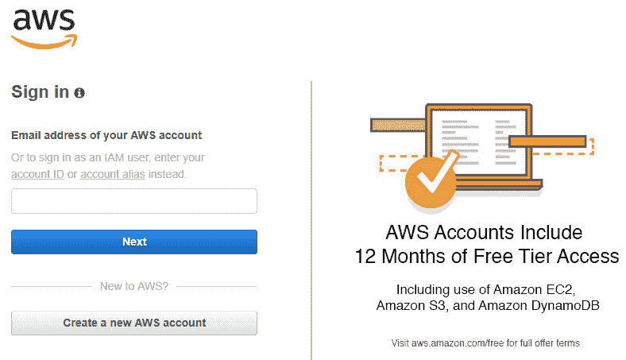
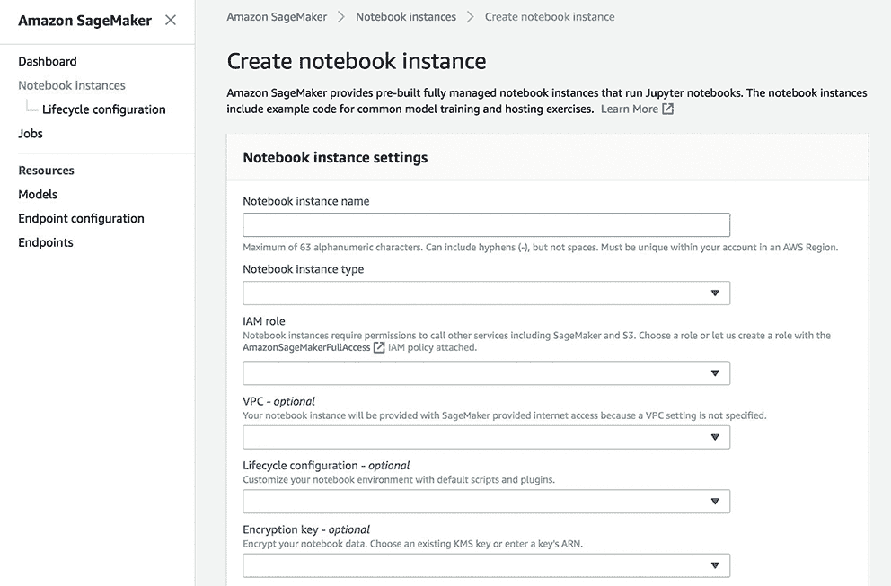
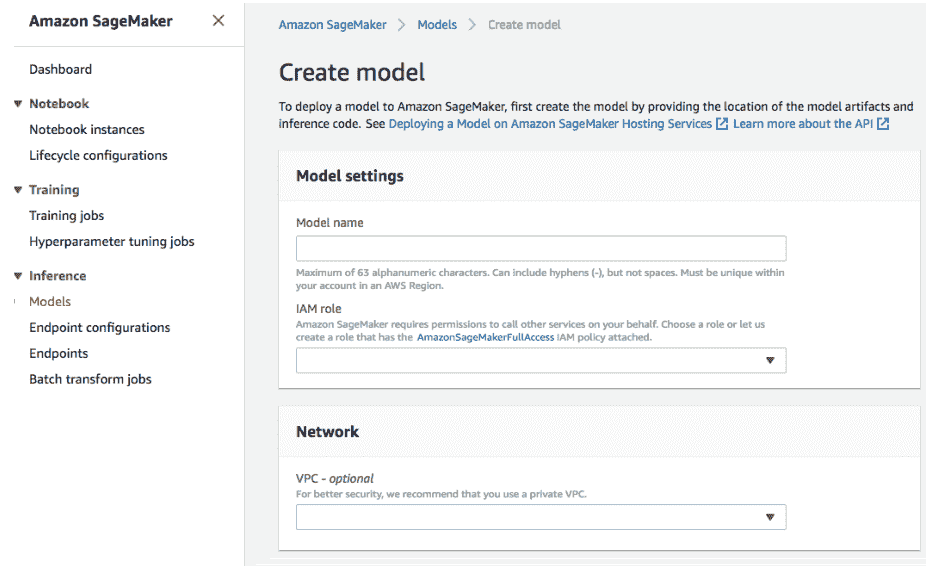
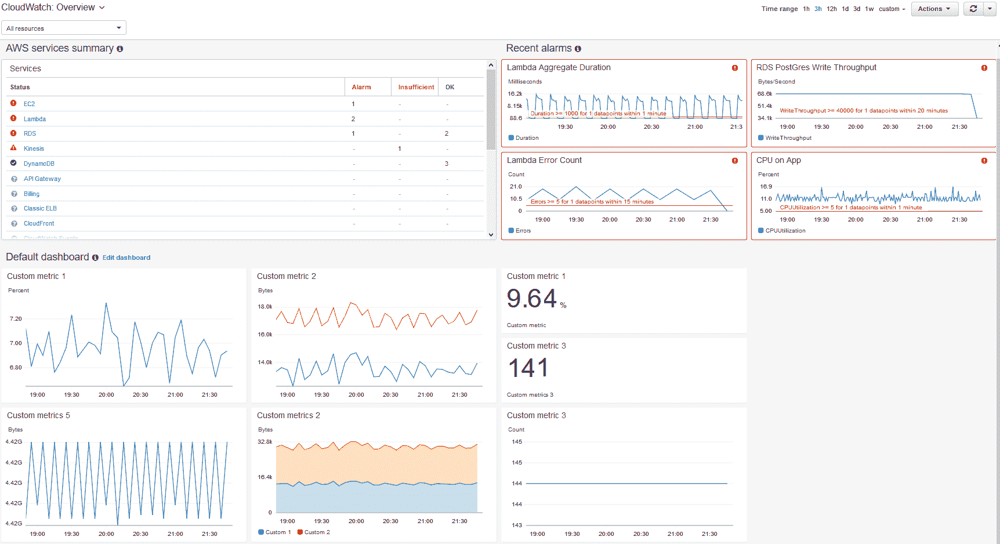
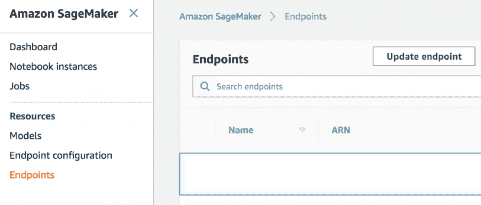

# 第十六章：解锁生产问题

在本章中，我们将介绍以下菜谱：

+   处理非结构化数据

+   部署机器学习模型

+   跟踪生产中的更改

+   跟踪准确性以优化模型缩放

# 技术要求

为了处理本章中的菜谱，你需要以下文件（可在 GitHub 上找到）：

+   `UNData.py`

+   `TextFile.txt`

# 简介

在前面的章节中，我们已经广泛介绍了机器学习中使用的算法。我们看到了 Python 程序员可以使用的许多工具，以及他们如何构建能够预测或分类特定信息的算法。下一步是创建可以用于生产和随后营销的软件。

考虑到将软件用于营销需要解决包括硬件和软件方面的相当多的问题，这并不是一个小挑战。事实上，我们首先必须确定哪些类型的设备将托管该软件，然后选择最适合那种技术的编程平台。

# 处理非结构化数据

到目前为止，我们已经强调了在基于自动学习的模型创建中输入数据的重要性。特别是，我们已经看到在将数据提供给我们的算法之前，适当处理这些数据是多么重要。在我们开始生产工作之前，我们必须面对的另一个挑战是学习如何处理非结构化数据。非结构化数据是指没有任何方案的存储数据。一个例子是包含由最流行的文本编辑软件或多媒体文件生成的文本的文件，但这些非结构化数据也可以是电子邮件、PDF 等。非结构化数据与数据库的不同之处在于，它们可能有不规则性，这不允许你将它们编目或以特定过程存储。

# 准备工作

作为来源，我使用了马克·吐温的小说《哈克贝利·费恩历险记》中的一段，可以在 GitHub 上查看。

如您所见，这是一段非结构化文本。我们将在将结果以结构化形式保存之前处理此文本并删除不必要的元素。

# 如何做...

在这个菜谱中，我们将学习如何处理非结构化数据。按照以下步骤开始：

1.  创建一个新的 Python 文件并导入以下包（完整的代码已在提供的`UNData.py`文件中）：

```py
import re
```

1.  让我们定义输入文件名：

```py
input_file = 'TextFile.txt'
```

1.  我们需要初始化包含数据的字典：

```py
data = {}
```

1.  现在，我们可以加载并打印数据：

```py
data['Twain'] = open(input_file,'r').read()
print(data['Twain'])
```

1.  让我们将数据转换为小写：

```py
for k in data:
    data[k] = data[k].lower()
```

1.  让我们删除任何标点符号：

```py
for k in data:
   data[k] = re.sub(r'[-./?!,":;()\']',' ',data[k])
```

1.  让我们删除数字：

```py
for k in data:
    data[k] = re.sub('[-|0-9]',' ',data[k])
```

1.  让我们删除任何额外的空白字符：

```py
for k in data:
    data[k] = re.sub(' +',' ',data[k]) 
```

1.  最后，我们将打印并将结果保存到`.csv`文件中：

```py
print('###########################')
print(data['Twain'])

with open('Twain.csv', 'w') as f:
    for key in data.keys():
        f.write("%s,%s\n"%(key,data[key]))

f.close()
```

以下截图显示了输入文件（左侧）和获得的结果（右侧）：


# 它是如何工作的...

在本食谱中，我们学习了如何处理非结构化数据。为此，使用了马克·吐温小说中的一段文字。在加载文本后，去除了标点符号、数字和额外的空白空间。此外，所有文本都被转换成了小写。最后，结果存储在一个`.csv`文件中。

# 更多内容...

在本食谱中，我们解决了文本分析的问题，这代表了将非结构化文本转换为后续分析阶段有意义数据的过程。可以用于文本分析的技术有很多，我们在第七章分析文本数据，*分析文本数据*中处理了其中的一些。

# 相关内容

+   参考第七章 分析文本数据，*分析文本数据*

+   参考斯坦福大学提供的*非结构化数据*：[`web.stanford.edu/class/cs102/lecturenotes/UnstructuredData.pdf`](https://web.stanford.edu/class/cs102/lecturenotes/UnstructuredData.pdf)

# 部署机器学习模型

将基于机器学习的项目投入生产并不容易。实际上，只有少数公司设法做到了，至少对于大型项目来说是这样。困难在于人工智能不是通过成品软件生产的。需要一个起始平台来实现自己的软件模型，遇到的问题与开发者通常遇到的问题不相似。软件工程的经典方法导致抽象，从而得到可以修改和改进的简单代码。不幸的是，在机器学习应用中很难追求抽象，就像很难控制机器学习的复杂性一样。最好的办法是关注一个具有所需功能的平台，同时允许您从机器学习的数学基础中退出。在本食谱中，我们将介绍 Amazon SageMaker 平台。

# 准备工作

Amazon SageMaker 是一项付费服务，但多亏了 AWS 免费使用计划，您可以在注册后的前两个月内免费使用 Amazon SageMaker。有关可用计费计划的更多信息，请查看以下链接：[`aws.amazon.com`](https://aws.amazon.com)。

# 如何操作...

让我们看看如何利用 Amazon SageMaker：

1.  首先，您需要登录到控制台：



1.  使用以下示例笔记本之一启动笔记本实例：



1.  通过连接到自定义数据源来更改该实例。

1.  按照示例创建、形成和验证模型：



1.  最后，按照屏幕上的步骤在生产环境中分发结果。

# 它是如何工作的...

Amazon SageMaker 是一个用于创建、训练和分发基于机器学习模型的完全托管服务。Amazon SageMaker 包含三个模块——**构建**、**训练**和**部署**。构建模块允许我们处理数据，实验算法，并查看输出。训练模块在大型规模上训练模型并优化它。最后，是部署模块，它允许我们以低延迟轻松测试模型的推理。

# 还有更多…

Amazon SageMaker 允许我们创建用于智能和预测应用的机器学习模型。从安全角度来看，Amazon SageMaker 加密了所有基于机器学习的脚本。对 API 和 Amazon SageMaker 控制台的请求通过**安全连接**（**SSL**）转发。我们可以使用 AWS 身份和访问管理自动分配训练和分发资源的访问权限。我们还可以使用 Bucket S3、Amazon SageMaker KMS 密钥来加密笔记本训练过程和端点的存储卷。

# 参见

+   参考 Amazon SageMaker 的官方文档：[`docs.aws.amazon.com/en_us/sagemaker/latest/dg/whatis.html`](https://docs.aws.amazon.com/en_us/sagemaker/latest/dg/whatis.html)

# 跟踪生产中的变更

模型的分布不是终点——这只是开始。真正的问题从这里开始。我们无法控制真实环境中的数据。可能会发生变更，我们必须准备好在模型过时之前检测和更新我们的模型。监控对于确保我们的机器学习应用程序的可靠性、可用性和性能至关重要。在本食谱中，我们将讨论一些我们可以用来跟踪模型中发生变化的工具。

# 如何操作...

以下工具可用于监控 Amazon SageMaker 应用程序：

+   **Amazon CloudWatch**：这个工具在 AWS 中可用，监控实时运行的资源和应用。可以收集和跟踪参数，可以创建自定义控制面板，并可以设置警报，当指定的参数达到指定的阈值时通知或采取行动。以下截图显示了 Amazon CloudWatch 的概述：



+   **Amazon CloudWatch Logs**：这个工具在 AWS 中可用，允许您监控、存储和访问来自 EC2、AWS CloudTrail 实例和其他来源的日志文件。CloudWatch 日志监控日志文件中的信息，并在达到某些阈值时发送通知。

+   **AWS CloudTrail**：这个工具在 AWS 中可用，检索由我们的账户创建的 API 调用和相关事件，并将日志文件返回到指定的 Amazon S3 存储桶。我们还可以检索有关调用服务的用户和账户的有用信息，并可以追踪调用发生的 IP 地址和时间。

# 它是如何工作的...

要监控 Amazon SageMaker，我们可以使用 Amazon CloudWatch，它实时收集原始数据并将其转换为可读的参数。这些统计数据保留 15 个月，以便您可以访问历史信息，并从更好的角度了解服务或 Web 应用程序的性能。然而，Amazon CloudWatch 控制台将搜索限制在最近两周内已更新的参数。这种限制允许您查看命名空间中最新的过程。还可以设置警报，控制某些阈值，并在达到这些阈值时发送通知或采取行动。

# 更多内容...

机器学习模型基于一组具有各种属性的输入训练数据。因此，检查模型训练所用的输入数据是否仍然适用于实际环境中的数据非常重要。数据变化可能是突然的，也可能是随着时间的推移逐渐变化。因此，识别变化模式并在事先纠正模型是至关重要的。一旦模型在生产环境中分发，就需要遵循下一道菜谱中提到的步骤，以保持我们的模型健康，并使其对最终用户有用。

# 参见

+   参考 Amazon CloudWatch 的官方文档：[`docs.aws.amazon.com/cloudwatch/index.html`](https://docs.aws.amazon.com/cloudwatch/index.html)

+   参考 Amazon CloudWatch Logs 的官方文档：[`docs.aws.amazon.com/en_us/AmazonCloudWatch/latest/logs/WhatIsCloudWatchLogs.html`](https://docs.aws.amazon.com/en_us/AmazonCloudWatch/latest/logs/WhatIsCloudWatchLogs.html)

+   参考 Amazon CloudTrail 的官方文档：[`docs.aws.amazon.com/cloudtrail/index.html`](https://docs.aws.amazon.com/cloudtrail/index.html)

# 跟踪准确性以优化模型扩展

正如我们在第十五章，“自动化机器学习和迁移学习”中看到的，大多数机器学习算法使用一系列参数来控制底层算法的功能。这些参数通常被称为超参数；它们的值影响训练模型的质量。自动模型优化是寻找算法一组超参数的过程，这些超参数提供最优模型。在本菜谱中，我们将学习如何使用 Amazon SageMaker 工具自动优化我们的模型。

# 如何操作...

要自动优化我们的模型，请按照以下步骤操作：

1.  打开 Amazon SageMaker 控制台。

1.  在左下角的导航面板中选择“端点”项目。



1.  从可用的端点中选择您想要配置的端点。

1.  选择您想要配置的变体并配置自动扩展。对于端点运行时设置，也要这样做。

1.  输入每个实例每分钟的调用平均次数。为此，针对目标值进行操作。

1.  输入每个冷却周期的秒数。

1.  为了防止缩放策略删除变体实例，请选择禁用缩放选项。

1.  点击 保存。

# 它是如何工作的...

超参数优化过程代表了回归的一个特殊情况。这个问题可以这样表述：有一组输入特征可用，然后这个过程优化一个针对采用参数的模型。只要它是由我们使用的算法定义的，参数的选择就是自由的。在亚马逊超参数优化过程中，SageMaker 试图找出哪些超参数组合更有可能产生最佳结果，并尝试执行训练过程来测试这些尝试。为此，首先测试这些超参数的第一组值，然后该过程使用回归来选择下一组要测试的值。

# 还有更多...

当你选择下一次训练过程的最佳超参数时，超参数优化会考虑你到目前为止对该问题的所有了解。在某些情况下，超参数优化过程可以选择一个点，该点可以产生迄今为止找到的最佳结果的增量改进。这样，该过程使用已知的结果。在其他情况下，你可以选择一组远离你已经测试过的超参数。这样，该过程探索空间并寻找尚未完全分析的新区域。在许多机器学习问题中，探索和利用之间的权衡是常见的。

# 参见

+   参考文档：*自动缩放 Amazon SageMaker 模型*：[`docs.aws.amazon.com/en_us/sagemaker/latest/dg/endpoint-auto-scaling.html`](https://docs.aws.amazon.com/en_us/sagemaker/latest/dg/endpoint-auto-scaling.html)
