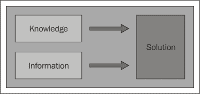
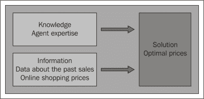
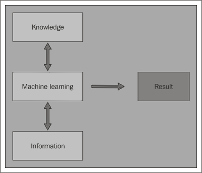
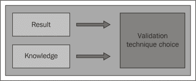
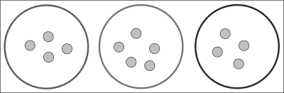

# 第一章. 将数据转化为行动

面对商业问题，我们需要知识和专业知识来找到解决方案。此外，我们还需要相关的数据，这些数据将有助于确定解决方案。本章展示了新技术如何使我们能够构建强大的机器，这些机器可以从数据中学习，为商业决策提供支持。

本章将涵盖以下主题：

+   处理商业问题的一般思路

+   与数字技术相关的新挑战

+   新工具如何帮助使用信息

+   工具如何识别不明显的信息

+   工具如何估计未来事件的结果

+   为什么选择 R？

# 商业决策中的数据驱动方法

专业知识和信息在商业决策中扮演着重要角色。本节展示了数据驱动技术如何改变面对挑战的方法并改进解决方案。

## 商业决策来源于知识和专业知识

随着时间的推移，处理商业问题的总体思路并没有改变，它结合了知识和信息。在采用数字技术之前，知识来源于以往经验和他人提供的专业知识。至于信息，它涉及分析当前情况并将其与过去事件进行比较。

一个简单的例子是一位水果商希望为其商品定价。产品的价格应该最大化利润，这取决于销售量和价格本身。这位经销商开始工作时与他的父亲一起工作，他的父亲为他们提供了所有的知识。因此，他们已经知道不同水果的价格。此外，在每天结束时，他们可以观察到每种水果的销售量。基于这一点，他们可以提高销售很好的水果的价格，降低未售出水果的价格。这个简单的例子展示了水果商如何结合领域知识和信息来解决他们的问题，如下面的图所示：

这个简单的例子展示了简单挑战需要知识和数据的结合。

## 数字时代提供了更多的数据和专业知识

尽管处理商业问题的总体思路没有改变，但数字技术为我们提供了新的强大工具。

互联网允许人们相互连接并分享他们的专业知识，这样每个人都能访问到大量信息。在互联网之前，知识来源于可信赖的人和书籍。现在，信息的传播使得人们能够找到来自世界各地不同人的书籍和文章。此外，网站和论坛允许用户相互连接，以便分享专业知识并找到快速答案。

数字技术跟踪不同的活动并产生大量相关数据。我们谈论数据时指的是信息集——可以是定量的或定性的，可以被机器处理。因此，面对商业问题时，我们可以使用来自不同来源的大量数据。一些信息可能不太相关，但即使移除它们，我们通常仍然拥有大量数据。因此，我们在结果上有很多改进的潜力。

来自数字技术的变化涉及获取专业知识的过程和数据性质。因此，解决问题的方法提出了新的挑战。

面对商业问题的公司的一个简单例子是汽车经销商，他们销售不同品牌的二手车，并希望设定最相关的价格。汽车经销商应根据车型、年龄和其他特征来确定价格。这个例子旨在说明一种可能的情况，并不一定与真实问题相关。

汽车经销商需要确定每辆车的最佳价格，以便最大化收入。与水果商类似，如果汽车价格过高，汽车经销商在短时间内不会出售它，因此会产生额外的存储成本，汽车的价值也会下降。这会导致额外成本和利润下降，从而损害业务。另一方面，如果价格过低，公司会立即出售汽车。尽管存储成本较低，但公司并没有获得最佳利润。为了出售汽车并最大化利润，公司希望找出最佳价格。

让我们看看帮助找到解决方案的专业知识和信息。公司可以使用：

+   已售出不同汽车的代理商的知识

+   来自互联网的信息

+   历史销售数据

代理商可以利用他们的过往经验，因此他们的知识有助于确定最佳价格。然而，当市场变化迅速时，仅凭经验设定价格是不够的。

互联网为我们提供了大量信息，因为有许多在线购物网站显示二手车的价格。在线购物与实体市场不同，但专家代理商可以查看网站并比较价格。这样，代理商可以将他们的专业知识与在线信息相结合，以良好的方式确定正确的价格。

这种方法可以取得良好的结果，但仍然不是最优的。查看不同的网站会耗费时间，尤其是当有众多汽车类别时，每天检查价格可能很困难，甚至不可能。另一个问题是可能存在许多网站，使得一个人无法处理所有信息。通过自动化我们的网络研究和更系统地使用数据，我们可以更快地获取信息。

要获取信息，数据来源是公司销售和在线市场，一个好的汽车定价解决方案应该考虑所有这些来源。公司销售数据显示了客户过去对其价格的反应。例如，我们知道过去每辆汽车的销售所需时间。如果时间过长，价格可能过高。这个标准是客观的，专家代理可以使用这些信息来识别当前错误的价格。

来自在线购物网站的数据显示汽车价格，我们可以使用能够存储价格和销售历史记录的工具。尽管这些信息与问题的相关性较低，但可以像处理公司销售数据一样进行处理，从而提高结果准确性，如下图所示：

这个例子展示了拥有更多信息和专业知识的好处。这里的挑战是如何以最合适的方式使用信息来改进解决方案。一般来说，我们使用的信息越多，潜在的结果越准确。在最坏的情况下，我们有很多不相关信息，但我们可以识别并使用其中一小部分相关部分。

## 技术连接数据和商业

只要数据能够被人类理解，一个人就可以通过结合数据和专业知识来解决商业问题。由于数字技术的发展，数据量的增长改变了处理问题的方法，因为更多的数据需要新的工具才能使用。此外，新设备使我们能够执行 10 年前在个人电脑上不可能进行的数据分析。

这个事实不仅改变了处理数据的方式，也改变了制定商业决策的整体流程。

有几种方法可以用来使用数据中的信息。例如，互联网电影流媒体提供商 Netflix 使用一个根据你的兴趣生成个性化电影推荐的工具。**机器学习**指的是从数据中学习以提供洞察和行动的工具，它是**人工智能**的一个子领域。机器学习技术不仅处理数据，而且连接数据和商业。这种信息和知识之间的交互至关重要，并影响构建解决方案的几乎每个步骤。

知识在构建识别解决方案的工具中仍然发挥着重要作用。由于有许多处理相同问题的机器学习工具，你可以利用你的专业知识来选择最相关的工具。此外，大多数工具都有一些参数，因此有必要了解问题来设置它们，如下图所示：

机器学习技术确定结果后，我们可以使用信息和专业知识来验证其性能。例如，在汽车经销商的例子中，我们可以构建一个工具，该工具可以自动识别最佳价格并预测每辆车的销售所需时间。从以前的数据开始，我们可以使用这个工具来估计销售汽车所需的时间，并将估计时间与实际时间进行比较。此外，我们可以识别当前价格，并使用知识和专业知识来判断它们是否合理。这样，我们可以比较机器学习方法与现实之间的相似性。

验证有助于比较不同的技术并选择表现最佳的技术。此外，技术通常需要设置不同的选项，而验证有助于选择最合适的选项，如下面的图示所述：

总结来说，机器学习与商业之间的互动极其重要，并且贯穿于构建解决方案的每个环节。

# 识别隐藏模式

数据显示了一些明显的信息，它还包含大量更隐含的信息。有时，解决商业问题需要一些不那么明显的信息，这些信息可能部分是主观的。本节展示了某些机器学习技术如何从数据中发现隐藏的结构和模式。

## 数据包含隐藏信息

跟踪活动的数据包含与技术设备相关的信息。例如，在超市中，收银机跟踪购买行为。因此，可以获取有关每个商品过去销售的一些信息。可用的信息是**销售点**（**POS**）数据，它通过以下属性显示交易：

+   项目 ID

+   已售出单位数量

+   商品价格

+   购买日期和时间

+   收银机的 ID

+   客户 ID（适用于使用 Nectar 卡的客户）

通过分析数据，一些信息会显现出来，并且很容易获取，而另一些信息则隐藏起来。从交易开始，很容易确定过去销售的总金额。例如，我们可以计算一天内销售了多少个产品单位。这样做非常简单：

1.  根据产品 ID 和日期选择交易。

1.  添加单位数量。

仍然可以获取一些稍微详细一些的信息。我们可以将商品分为部门，并且根据每个部门上一年销售的总单位数，我们可以：

1.  为每个部门生成产品 ID 列表。

1.  对于每个部门，选择上一年的交易和该部门的商品 ID。

1.  添加单位数量。

有可能提取关于过去整体销售的任何其他类型的信息。如果分析的目标是顾客而不是销售呢？

我们可以使用客户 ID 来跟踪每位顾客的购买情况。例如，给定一个单独的客户 ID，我们可以确定他们购买的总单位数。这些数据仍然容易获得，所以我们不能谈论隐藏模式。然而，关于顾客的信息仍然有很多不能直接显示。

一些顾客有相似的客户习惯。客户类别的例子包括：

+   学生

+   家庭主妇

+   老年人

每个人群都表现出一些特定的购买习惯，如下所示：

+   可用的资金

+   顾客感兴趣的 产品

+   购买日期和时间

例如，学生平均可支配的资金比其他人少。妈妈们更愿意购买杂货和家居产品。学生更可能在放学后去超市；老年人几乎在任何时间都会去。

数据没有显示哪些顾客 ID 与每个顾客类别相关联，即使它包含一些关于他们行为的信息。然而，要识别哪些顾客相似以执行简单的分析操作是很困难的。此外，为了识别群体，我们需要对顾客类别有一个初始猜测。

## 商业问题需要隐藏信息

一个商业问题可能需要一些隐藏信息。在超市的例子中，我们希望针对某些顾客群体进行临时的营销和折扣活动。

营销活动的选项决定了以下内容：

+   哪些商品做广告

+   哪些商品打折

+   折扣

+   哪些工作日受到促销的影响

如果超市非常小，就有可能提取每位顾客的数据，并因此针对他们进行特定的营销活动。然而，超市很大，顾客众多，所以如果不使用数据处理，将无法单独考虑每一位顾客。

一种可能性是定义一种自动读取每位顾客数据并相应选择营销活动的方法。这种方法需要以下条件：

+   组织数据和选定的信息

+   数据建模

+   定义行为

这种方法有效，尽管它有一些缺点。关于营销活动的决策需要关于客户基础的总体情况。在理解了顾客行为模式之后，可以定义一种方法，从顾客行为出发选择营销活动。因此，这种方法需要一些前期分析。

另一种解决方案是识别具有相似习惯的顾客群体。一旦定义了这些群体，就可以单独分析每个群体，以了解其共同的购买行为。

下面的图表显示了由小圆圈表示的一些顾客，其中大圆圈代表顾客的同质群体：

这样，超市对每个群体都有一些信息，有助于他们通过结合以下信息来识别正确的营销活动：

+   关于该群体顾客的一些汇总信息

+   一些业务知识，使他们能够定义适当的营销活动

假设每个顾客在未来的习惯将相同，至少在短期内，可以识别每个顾客群体的购买行为和兴趣，并相应地对它们进行相同的营销活动。

## 重新塑造数据

从 POS 数据开始，我们想要模拟超市顾客的购买习惯，以便识别同质群体。尽管 POS 数据不直接显示顾客行为，但它包含顾客 ID。每个顾客的行为可以通过测量他们的习惯来模拟。例如，我们可以测量他们在过去几年中购买的单位总数。同样，我们可以定义一些其他**关键绩效指标（KPIs**），这些指标是描述行为不同方面的值。在提取与顾客相关的所有交易后，我们可以定义以下 KPIs：

+   他们上一年购买的单位总数

+   他们上一年度的总消费金额

+   在晚上 6 点至 7 点之间购买的单位百分比

+   在特定商品部门的总消费金额

+   在夏季花费的百分比

选择 KPIs 有不同的选项，并且它们应该与问题相关。在我们的例子中，我们想要确定顾客可能对哪些产品感兴趣。

与问题相关的某些关键绩效指标（KPIs）如下：

+   上一年度的总消费金额，以确定顾客可能花费的最大金额

+   在不同商品部门的消费百分比，以确定顾客的兴趣所在

+   早上和上午早些时候购买的百分比，以确定家庭主妇和退休人员

对于一小群顾客，通过观察数据很容易识别同质群体。然而，如果我们有众多顾客和/或 KPIs，我们需要计算工具来揭示数据中的隐藏模式。

## 使用无监督学习识别模式

有些机器学习算法可以识别隐藏的结构，这一技术分支被称为“无监督学习”。从数据开始，无监督学习算法识别出没有直接显示的模式和标签。

在我们的例子中，我们使用一组适当的 KPIs 来模拟客户，这些 KPIs 描述了他们的购买行为。我们的目标是识别具有相似 KPIs 值的群体。

为了关联客户，第一步是衡量他们之间的相似度。观察两位客户的资料，我们可以看到，如果他们的关键绩效指标（KPIs）值相似，那么他们就是相似的。由于客户众多，我们无法手动观察数据，因此我们需要定义一个标准。这个标准是一个函数，它接受两个客户的 KPIs 作为输入，并计算一个*距离*，这是一个表示值之间差异的数字。这样，就有了一个客观的方式来陈述两个客户是如何*相似*的。

我们通过*对象*来模拟客户，其*相似性*可以衡量。有几种机器学习算法可以将*相似*的对象分组，它们被称为**聚类技术**。这些技术将相似的客户分组在一起，从而识别出同质群体。

根据以下因素，有不同选项来分组客户：

+   希望的聚类数量

+   每个 KPI 的相关性

+   识别聚类的途径

聚类有多种选择，大多数算法都包含一些参数。为了选择合适的技术和设置，我们需要探索数据以理解商业问题。

本章仅是一个介绍性章节，聚类只是无监督学习的一个例子。

## 使用无监督学习进行商业决策

聚类技术使我们能够识别同质客户群体。对于每个聚类，超市必须定义一个针对其客户的营销活动，使用促销和折扣。

对于每个聚类，可以定义一个总结表，显示平均客户的行为。结合这些信息以及一些商业专业知识，超市可以最大化活动的积极影响。

总之，聚类使我们能够将大量数据转换为少量相关信息。然后，商业专家可以阅读和理解聚类结果，以做出最佳决策。

这个例子展示了数据和专业知识是如何紧密相连的。机器学习算法需要使用商业专业知识定义的 KPIs。在算法处理完数据后，商业专业知识是必要的，以确定正确的行动。

# 估计行动的影响

当商业决策包括在多个选项之间进行选择时，解决方案需要估计每个选项的影响。本章展示了机器学习技术如何根据选项预测未来事件，以及我们如何衡量准确性。

## 商业问题需要预测未来事件

如果我们必须在多个选项之间做出选择，我们将评估每个替代方案的影响，并选择最佳方案。为了说明这一点，例子是一个计划开始销售新商品的超市，其商业决策包括选择其价格。

为了选择最佳价格，公司需要知道：

+   价格选项

+   每个价格选项对商品销售的影响

+   每个价格选项对其他商品销售的影响

理想解决方案是最大化短期和长期的整体收入影响。就商品本身而言，如果其价格过高，公司不会销售它，从而错失潜在利润。另一方面，如果价格过低，公司将以较差的收入销售不同数量的商品。

此外，新商品的价格将对类似商品的销售产生影响。例如，如果超市正在销售一种新谷物，所有其他谷物产品的销售都将受到影响。如果新价格过低，一些购买其他商品的顾客可能会想省钱，从而购买新商品。这样，一些顾客将花费更少的钱，整体收入将下降。相反，如果新商品定价过高，顾客可能会认为其他商品太便宜，从而认为其质量较低。

有不同的影响，一个选项是在第一步中定义商品的最低价和最高价，以避免对相关商品销售的负面影响。然后，我们可以选择新价格，最大化商品本身的收入。

## 收集数据以从中学习

假设我们已经为新商品定义了最低价和最高价。目标是利用数据来发现允许我们最大化商品收入的信息。收入取决于：

+   商品的定价

+   下一个月将要售出的单位数量

为了最大化收入，我们希望根据价格进行估计，并选择最大化收入的价格。如果我们可以根据价格估计销售量，我们就可以相应地估计收入。

数据显示了过去交易的信息，包括：

+   商品编号

+   日期

+   在一天内售出的单位数量

+   商品的定价

还有其他映射商品的数据，包括一些特征。为了简化问题，所有特征都是分类的，因此它们显示的是类别而不是数字。以下是一些特征的例子：

+   部门名称

+   产品名称

+   品牌名称

+   定义商品的其他分类特征

我们没有关于新物品销售的数据，因此我们需要使用一些相似物品的数据来估计客户行为。我们假设：

+   未来客户的消费行为与过去相似

+   相似物品间的客户行为相似

+   新物品的销售不受其是新上市产品这一事实的影响

由于我们想要估计新物品的销售量，起点是相似物品的销售量。对于每个物品，我们提取其上个月的交易数据，并计算：

+   上个月的总单位数量

+   上个月最常见的价格

此外，对于每个物品，我们都有定义其特征的数据。每个物品的数据是估计收入的基础。

## 使用监督学习预测未来结果

在我们的问题中，机器学习算法的目标是根据物品的价格预测其销售量。从数据中学习以预测未来事件的技术的分支被称为**监督学习**。算法的起点是一个包含已知事件的对象的训练数据集。算法识别描述对象和事件的数据之间的关系。然后，它们构建一个定义这种关系的模型，并使用该模型对其他对象上的事件进行预测。监督学习和无监督学习之间的区别在于，监督学习技术使用已知事件的训练，而无监督学习技术识别隐藏的模式。

例如，我们有一个新物品，其价格可以是 2 美元、3 美元或 4 美元。为了确定最佳价格，我们需要估计未来的收入。

数据显示了任何物品的销售量，这取决于其价格和特征。估计新物品销售量的方法，根据其价格，是使用定义数量(*k*)的最多相似物品的销售量。对于每个价格，步骤如下：

1.  定义哪些是具有最多相似度的*k*个物品，给定新物品的特征和价格。

1.  定义如何使用相似物品的数据来估计新物品的销售量。

为了识别最相似的物品，我们必须决定什么是“相似”以及如何衡量“相似”。为了做到这一点，我们可以定义一种方法来衡量任何两个物品之间的相似度，这取决于特征和价格。相似度可以通过距离函数来衡量，考虑以下特征：

+   价格差异

+   同一产品

+   同一品牌

+   同一部门

+   其他相似特征

一种简单的方法是将距离测量为特征之间的不相似性之和。例如，一个非常简单的不相似性可以是价格差异加上显示不同值的分类特征的数目。一种稍微更有优势的方法是根据其相关性为每个特征赋予不同的权重。例如，不属于同一部门的两项非常不相似，而属于同一产品但品牌不同的两项则非常相似。

在定义了距离函数之后，我们希望根据价格识别最相似的 *k* 个对象。对于每个价格点，我们定义一个具有新物品特征和所选价格的项目。然后，对于超市中的每个项目，我们计算项目与新物品之间的距离。这样，我们可以选择距离最低的 *k* 个项目。

在确定了最相似的 *k* 项之后，我们需要确定如何利用这些信息来估算新的体积。一种简单的方法是计算 *k* 项的销售量的平均值。一种更高级的方法是给予更相似的项目更高的权重。

依赖于过去数据的未来事件估计技术被称为监督学习技术。所展示的算法是**k 近邻**（**KNN**）算法，它是最基本的监督学习技术之一。

# 摘要

本章展示了如何通过结合专业知识和信息来面对商业问题。您看到了数字技术如何导致信息量的增加，并为我们提供了面对挑战的新技术。您对机器学习技术的两个最重要的分支有了概述：无监督学习和监督学习。无监督学习技术识别数据中隐藏的一些结构，而监督学习技术则使用数据来估计未知情况。

下一章将展示与机器学习问题相关的挑战，并定义识别其解决方案的软件的要求。然后，该章节介绍了本书中将使用的软件，并提供了一个简要教程。
