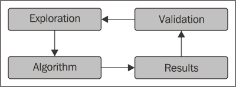

# 第二章. R – 开发机器学习算法的强大工具

在使用机器学习技术之前，我们需要选择合适的软件。有许多编程语言和软件类型为用户提供机器学习工具。实际上，最重要的部分是知道使用哪些技术以及如何构建新的技术，而软件只是工具。然而，选择正确的软件可以使你构建更快、更准确的解决方案。

在本章中，你将学习：

+   构建机器学习解决方案的软件要求

+   如何 R，结合 RStudio，有助于开发机器学习解决方案

+   R 的结构

+   R 的工具

+   一些重要的 R 包

# 为什么选择 R

理解开发机器学习解决方案的挑战有助于选择能够以最简单和最有效的方式面对这些挑战的软件。本章说明了软件要求并解释了为什么我们将使用 R。

## 机器学习的交互式方法

开发机器学习解决方案包括具有不同要求的步骤。此外，一个步骤的结果有助于改进之前的步骤，因此通常需要返回修改它。

在面对问题并构建其机器学习解决方案之前，我们希望尽可能多地了解挑战和可用资源。实际上，为了定义通往解决方案的正确路径，拥有所有可能的信息非常重要。为此，从数据开始，我们使用统计和机器学习工具从数据中提取业务洞察和模式。

一个简单的例子是一个大型超市推出针对一些特定顾客的新营销活动。可用的数据是过去销售的交易记录。在构建任何机器学习技术之前，我们需要一些基本信息，例如前一年的总客户数量和总销售额。在知道总客户数量后，我们希望确定平均客户的年度支出。然后，下一步可以是根据同质购买习惯将客户分组，并计算每个组的平均客户年度支出。

在提取一些基本信息之后，我们对问题的概述将更加详细，并且经常会提出新的问题。因此，我们需要通过应用其他统计和机器学习模型来识别新的模式和提取新的洞察。这个过程将持续进行，直到信息使我们能够确定最终的机器学习解决方案。

对于问题的解决方案，通常有多种选择。为了选择最合适的一个，我们可以构建其中的一些并比较它们的结果。此外，大多数算法都可以调整以提高其性能，而调整取决于结果。

总之，构建机器学习解决方案包括与彼此紧密相关的不同步骤。新步骤的目标基于对前一步的分析，有时，一个步骤会根据后续结果进行修改。没有一条从起点到终点的明确路径，软件应允许这一点。



## 机器学习软件的期望

对于机器学习软件，有多种选择，本节展示了我们对选择的期望。软件应同时为用户提供机器学习工具，并允许构建特定的解决方案。

最重要的机器学习技术由不同类型的软件和包提供。然而，使用尖端技术可以改进解决方案。大多数机器学习算法都是由学术界开发的，用于研究，因此它们进入商业领域需要时间。此外，除了少数例外，公司没有足够的资源来开发先进的技术。因此，软件应允许用户访问学术界开发的工具。在免费和开源软件的情况下，通常有一个国际社区为用户提供包含尖端工具的许多包。

另一个软件需求是允许用户开发快速有效的解决方案。解决机器学习问题需要大量的交互，即用户经常根据结果修改解决方案。一个良好的用户友好的图形包对于探索每一步的结果并确定下一步要做什么非常重要。因此，该工具应允许用户快速构建可重用的组件，用于数据探索、处理和可视化。

总之，软件需求包括：

+   机器学习工具

+   图形包

+   组件的可重用性

## R 和 RStudio

我们将使用的软件是 R，本小节解释了原因。

**R**是一种专为数据分析和学习设计的编程语言。它是一种解释型语言，因为它直接执行命令，所以比其他编程语言更易于使用。尽管与一些商业软件相比，它的学习曲线更陡峭，但与其他编程语言相比，R 更容易学习。

R 是最受欢迎的统计编程语言，有一个庞大的国际社区支持它。它的存储库（CRAN）包含超过 5000 个包含统计和机器学习工具的包。这样，我们可以使用其国际社区提供的最尖端工具。

其他有用的 R 工具是其图形包，它允许仅使用几行代码就生成漂亮且专业的图表。这样，在解决方案开发过程中探索数据和结果变得非常容易。

R 的另一个优点是**RStudio**，这是一个为 R 项目设计的 IDE。RStudio 包括交互式控制台和用于访问 R 帮助、可视化/保存图表以及调试的工具。R 与 RStudio 结合使用，使用户能够相对快速地开发强大的机器学习解决方案。

# R 教程

我假设你已经熟悉一种编程语言，尽管不一定是 R。本节包含一个简短的 R 教程，展示了构建机器学习解决方案时有用的工具。由于对 R 的适当介绍需要整本书，这个教程只关注一些相关主题。

如果你已经熟悉 R，你可以快速阅读这一部分。如果你是 R 的新手，我建议你结合这个部分和一个交互式在线教程，以获得更全面的了解。此外，玩转这些工具以获得更多熟悉感将非常有用。

在开始教程之前，我们需要安装 R 和 RStudio。这两种软件都是开源的，并且支持大多数操作系统。阅读 RStudio 教程以了解如何使用这个强大的 IDE 也是很有用的。

我的建议是在 RStudio 环境中生成一个新的 R 脚本，并将代码复制粘贴到脚本中。你可以通过转到特定的命令行并按*Ctrl* + *Enter*来运行命令。

## R 的基本工具

R 的基本结构非常简单。任何类型的变量都存储在可以通过输入其名称来可视化的对象中。让我们开始定义一些数字：

```py
n1 <- 2
n2 <- 3
```

我们可以通过输入其名称来可视化一个对象，如下所示：

```py
n1
[1] 2

```

我们可以在对象上执行一些基本操作：

```py
n1 + n2
[1] 5
n1 * n2
[1] 6

```

任何操作的输出都可以存储在另一个对象中：

```py
nSum <- n1 + n2
nProd <- n1 * n2
nSum
[1] 5

```

添加注释到代码的标准语法是在行首加上一个井号，如下所示：

```py
# we performed some basic operations on the numbers
```

我们可以将 R 函数应用于对象，并且语法很简单，因为参数始终在括号内：`result <- functionName(argument1, argument2, …)`。

例如，我们可以使用`sum`来计算数值变量的总和：

```py
sum(2, 3)
[1] 5
sum(2, 3, 4)
[1] 9

```

同样，对于运算符，我们可以将函数的输出存储到另一个对象中，如下所示：

```py
s1 <- sum(2, 3)
s2 <- sum(2, 3, 4)
```

还有打印控制台消息的函数。例如，对于任何对象，`print`都会以相同的方式显示其内容，即只需输入对象名称：

```py
print(s1)
[1] 5

```

定义新函数所使用的语法很简单。例如，我们可以定义一个函数`funProd`，它计算其两个参数的乘积：

```py
funProd <- function(n1, n2)
{
  n <- n1 * n2
  return(n)
}
```

`n1`和`n2`输入在括号内定义，操作包含在大括号内。`return`方法终止函数，并将结果作为输出。我们只需输入其名称即可在任意函数中可视化代码。

为了跟踪函数的执行情况，我们可以在函数执行时打印变量，如下所示：

```py
funProdPrint <- function(n1, n2){
  n <- n1 * n2
  print(n1)
  print(n2)
  print(n)
  return(n)
}
prod <- funProdPrint(n1 = 2, n2 = 3)
[1] 2
[1] 3
[1] 6

```

### 提示

**下载示例代码**

您可以从您在[`www.packtpub.com`](http://www.packtpub.com)的账户下载示例代码文件，以获取您购买的所有 Packt Publishing 书籍。如果您在其他地方购买了这本书，您可以访问[`www.packtpub.com/support`](http://www.packtpub.com/support)并注册，以便将文件直接通过电子邮件发送给您。

与文档相关联的不同 R 函数。我们可以使用`help`来显示它们的描述，如下所示：

```py
help(sum)
```

另一个选项是使用`sum`，但就我个人而言，我更喜欢使用`help`，以便使用与其他 R 函数相同的括号语法。

为了执行基本的 R 操作，我们必须将数据存储在向量中，这些向量是包含值排序集合的对象。我们可以使用`c`定义一个新的向量，这是一个将输入连接起来的函数，如下所示：

```py
a1 <- c(1, 2, 3)
a1
[1] 1 2 3

```

我们可以使用方括号提取向量的一个元素。将`1`放在方括号内可以提取第一个元素。请注意，R 的索引与其他编程语言（如 Python）不同，Python 中第一个元素的索引为`0`，而不是`1`，如下所示：

```py
a1[1]
[1] 1

```

我们可以通过在方括号内放置一个向量来同时提取多个元素，如下所示：

```py
a1[c(1, 2)]
[1] 1 2

```

我们也可以对向量执行一些基本操作：

```py
a sPaste <- paste(s1, s2, sep = '_')
1 + 1
[1] 2 3 4
a2 <- c(1, 2, 3)
a1 + a2
[1] 2 4 6

```

如果我们要定义一个包含整数序列的向量，我们可以使用此表示法：

```py
a3 <- 1:10
a3
[1]  1  2  3  4  5  6  7  8  9 10

```

向量可以包含未定义的值，在 R 中为`NA`：

```py
a4 <- c(1, NA, 2)
```

如果我们对`NA`值执行操作，输出将是`NA`。

另一个重要的数据元素是布尔值。布尔变量使用`TRUE`和`FALSE`定义，基本运算符是`&`或`&&`（AND）、`|`或`||`（OR），以及`!`（NOT）。布尔元素可以是单个元素或向量。在向量的情况下，短形式（`&`和`|`）比较每个元素，而长形式（`&&`和`||`）仅评估每个向量的第一个元素，如下所示：

```py
bool1 <- TRUE
bool2 <- FALSE
bool3 <- bool1 & bool2
bool4 <- bool1 | bool2
bool5 <- !bool1
bool3
[1] FALSE
bool4
[1] TRUE
bool5
[1] FALSE

```

我们可以使用关系运算符定义布尔变量，如`==`（等于）、`!=`（不等于）、`<=`（小于或等于）、`>=`、`<`和`>`：

```py
x1 <- 1
x2 <- 2
bool5 <- x1 == x2
bool6 <- x1 != x2
bool7 <- x1 <= x2
bool5
[1] FALSE
bool6
[1] TRUE
bool7
[1] FALSE

```

布尔变量可以包含在由`if`定义的`if`语句中，其语法与函数类似。我们将条件放在括号内，操作放在花括号内，如下所示：

```py
if(bool5){
  x <- 1
}else{
  x <- 2
}
x
[1] 2

```

我们可以使用`for`和它们的语法定义`for`循环，与`if`的语法相同。括号包含变量名和值向量，花括号包含操作，如下所示：

```py
vectorI <- c(1, 2, 5)
x <- 0
for(i in vectorI)
{
  if(i > 1)
  {
    x <- x + i
  }
}
x
[1] 7

```

如果我们要对一个操作进行固定次数的重复，我们可以定义一个包含前*n*个整数的向量：

```py
nIter <- 10
vectorIter <- 1:nIter
total <- 0
for(i in vectorIter){
  total <- total + 1
}
total
[1] 10

```

本小节展示了 R 的一些基本组件。下一小节将介绍用于分析数据的 R 对象。

## 理解基本的 R 对象

有不同种类的对象，我们已经看到了其中的一些：`numeric`、`function`、`boolean`和`vector`。我们可以轻松地识别前例中使用的对象的类别。

考虑以下示例：

```py
class(n1)
[1] "numeric"
class(funProd)
[1] "function"
class(bool5)
[1] "logical"
class(a1)
[1] "numeric"

```

`a1`向量属于`numeric`类别，因为它的所有元素都是数值。同样，一个包含逻辑元素的向量属于`logical`。

字符串使用单引号或双引号定义，如下所示：

```py
s1 <- 'string1'
s2 <- "string2"
```

有不同的字符串函数，如`paste`，它连接两个字符串，以及`substring`，它从字符串中提取子集，如下所示：

```py
sPaste <- paste(s1, s2, sep = '_')
sPaste
[1] "string1_string2"
sSub <- substring(sPaste, 2, 5)
sSub
[1] "trin"

```

可以像定义`numeric`或`logical`一样定义一个`string`向量：

```py
vectorStrings <- c(s1, s2, sPaste, sSub)
vectorStrings
[1] "string1"         "string2"         "string1_string2" "trin"
class(vectorStrings)
[1] "character"

```

一个向量可以包含任何类型的对象（甚至可能是函数）。如果我们定义一个包含字符串和数字的向量会发生什么？

```py
vectorStringsNum <- c(s1, s2, 10, 1.3)
vectorStringsNum
[1] "string1" "string2" "10"      "1.3" 
class(vectorStringsNum)
[1] "character"

```

如前述代码所示，R 将数字转换为字符，以便有一个同质的向量。然而，还有其他数据结构允许我们存储异质对象。

如果我们有分类变量，我们可以使用字符串来存储它们，但还有一个选项：`factors`。这个 R 对象包含一个变量，其值属于一个已定义的值集合，称为`levels`。每个层级都与一个整数相关联，数据可以被视为整数或字符，以获得相同的结果。因子还可以帮助创建有序变量。

从一个字符串开始，我们可以使用`factor`生成因子：

```py
vectorString <- c('a', 'a', 'b', 'c')
vectorFactor <- factor(vectorString)
class(vectorFactor)
[1] "factor"

```

使用层级，我们可以识别可能的值：

```py
levels(vectorFactor)
```

另一个有用的函数，尽管不一定与因子相关，是`table`，它计算每个层级的出现次数：

```py
table(vectorFactor)
vectorFactor
a b c 
2 1 1 

```

另一个有用的数据元素是`Date`，它是 R 中用于存储日期的选项之一。我们开始构建一个如`'2013-01-01'`的字符串，并在另一个字符串中定义年、月和日的位置，如下所示：

```py
stringDate <- '2013-01-01'
formatDate <- '%Y-%m-%d'
```

现在，使用`as.Date`，我们可以生成日期对象：

```py
date1 <- as.Date(stringDate, format = formatDate)
class(date1)
[1] "Date"
date1
[1] "2013-01-01"

```

我们可以在日期上应用简单的操作，例如添加一定数量的天数：

```py
date2 <- date1 + 10
date2
[1] "2013-01-11"

```

我们还可以使用布尔运算符来匹配两个日期：

```py
date1 > date2
[1] FALSE

```

另一种数据类型是`list`，它定义了一个有序的异质数据元素集合：

```py
l1 <- list(1, a1, sPaste)
l1
[[1]]
[1] 1

[[2]]
[1] 1 2 3

[[3]]
[1] "string1_string2"

```

每个对象都可以与一个键相关联，这允许我们访问它：

```py
l2 <- list(elNumber = 1, elvector = a1, elString = sPaste)
l2
$elNumber
[1] 1

$elVector
[1] 1 2 3

$elString
[1] "string1_string2"

```

在这两种情况下，我们可以使用双方括号和元素的索引从列表中提取一个元素，如下所示：

```py
l1[[1]]
[1] 1
l2[[1]]
[1] 1

```

在`l2`的情况下，我们已定义其键，因此我们可以使用`$`运算符来访问其元素：

```py
l2$elNumber
[1] 1

```

我们可以使用`names`来可视化所有键名：

```py
names(l2)
[1] "elNumber" "elVector"  "elString"

```

还可以定义或更改键名：

```py
names(l1) <- c('el1', 'el2', 'el3')
names(l1)
[1] "el1" "el2" "el3"

```

为了从一个列表中提取子列表，我们可以使用单方括号，类似于向量：

```py
l3 <- l2[1]
l3
$elNumber
[1] 1
l4 <- l2[c(1, 2)]
l4
$elNumber
[1] 1

$elVector
[1] 1 2 3

```

一个允许你存储表格数据的 R 对象是`matrix`。要生成一个新的矩阵，将所有值放入一个向量中，并使用`matrix`，如下所示：

```py
vectorMatrix <- c(1, 2, 3, 11, 12, 13)
matrix1 <- matrix(vectorMatrix, ncol = 2)
matrix1
 [,1] [,2]
[1,]    1   11
[2,]    2   12
[3,]    3   13

```

使用`t`，我们可以转置矩阵，这意味着我们可以交换行和列：

```py
matrix2 <- t(matrix1)
matrix2
 [,1] [,2] [,3]
[1,]    1    2    3
[2,]   11   12   13

```

如前述代码所示，`matrix1` 和 `matrix2` 只包含数值数据。使用 `cbind`，我们可以添加另一列。如果我们添加一个字符列会发生什么？

```py
vector3 <- c('a', 'b', 'c')
matrix3 <- cbind(matrix1, vector3)
matrix3
```

R 将数字转换为字符。原因是矩阵，就像向量一样，只能包含同质数据。

矩阵可以具有行和列名，我们可以使用 `rownames` 和 `colnames` 来显示它们：

```py
rownames(matrix3)
NULL
colnames(matrix3)
[1] ""       ""       "vector3"

```

我们通过向 `matrix3` 添加一列来定义 `matrix3`。它的列名和 R 自动将最后一列名设置为向量名，即 `vector3`。使用相同的函数，我们可以手动设置行和列名，如下所示：

```py
rownames(matrix3) <- c('row1', 'row2', 'row3')
colnames(matrix3) <- c('col1', 'col2', 'col3')
matrix3
 col1 col2 col3
row1 "1"  "11" "a" 
row2 "2"  "12" "b" 
row3 "3"  "13" "c" 

```

我们可以使用 `View` 来可视化数据框：

```py
View(df2)
```

### 小贴士

对于数据框，请参阅本章的脚本。

有一些函数允许对向量、矩阵或列表的每个元素执行相同的操作。这些函数如下：

+   `apply`：对矩阵的每一行、列或元素应用函数

+   `sapply`：对向量的每个元素应用函数

+   `lapply`：对列表的每个元素应用函数

`sapply` 函数是最简单的，因此我们可以从它开始。我们可以定义一个向量 `x1`，包含介于 `1` 和 `10` 之间的整数，以及一个函数 `func1`，该函数返回输入的平方：

```py
x1 <- 1:10
func1 <- function(el){
  result <- el ^ 2
  return(result)
}
```

现在，我们可以通过指定参数来使用 `sapply`：`X`—数组，`FUN`—函数：

```py
sapply(X = x1, FUN = func1)
[1]   1   4   9  16  25  36  49  64  81 100

```

类似地，我们可以使用 `lapply`：

```py
l1 <- list(a = 1, b = 2, c = 3)
lapply(X = l1, FUN = func1)
$a
[1] 1

$b
[1] 4

$c
[1] 9

```

执行矩阵操作的函数是 `apply`。它可以用来对每一行应用相同的函数。让我们首先定义一个矩阵：

```py
matrix4 <- matrix(1:9, nrow = 3)
matrix4
 [,1] [,2] [,3]
[1,]    1    4    7
[2,]    2    5    8
[3,]    3    6    9

```

为了将 `sum` 函数应用于每一行，我们使用 `apply`，定义 `MARGIN` 输入等于 `1`，指定我们在每一行上执行操作：

```py
apply(X = matrix4, MARGIN = 1, FUN = sum)
[1] 12 15 18

```

定义 `MARGIN = 2`，我们对每一列执行操作：

```py
apply(X = matrix4, MARGIN = 2, FUN = sum)
[1]  6 15 24

```

我们可以使用 `MARGIN = c(1, 2)` 将函数应用于矩阵的每个元素：

```py
apply(X = matrix4, MARGIN = c(1, 2), FUN = func1)
 [,1] [,2] [,3]
[1,]    1   16   49
[2,]    4   25   64
[3,]    9   36   81

```

本节展示了与机器学习分析相关的某些 R 对象和工具。然而，它们仍然只是基础知识。

## R 的标准是什么？

有一些风格规则可以使代码干净、标准化，本小节展示了其中的一些。

与其他编程语言不同，R 不需要任何缩进。然而，缩进代码可以使代码更易读、更整洁。R 的标准是使用两个空格，RStudio 自动定义这种缩进。

分配变量的标准是使用 `<-` 操作符，即使可以使用 `=` 来使 R 更接近其他编程语言。然而，如果在使用函数输入时使用，这两个操作符有不同的含义。

标识符有不同的选项，并且我个人喜欢小驼峰命名法：

```py
lowerCamelCase
```

然而，R 社区非常大，有不同的惯例。

每个操作符都应该由空格包围，并且在函数输入中，应该在逗号后始终有一个空格：

```py
x <- 1
sum(1, 2)
```

有一些其他的样式规则，你可以在[`google-styleguide.googlecode.com/svn/trunk/Rguide.xml`](https://google-styleguide.googlecode.com/svn/trunk/Rguide.xml)找到它们。

# 一些有用的 R 包

有不同的 R 包为用户提供通用函数和特定技术。本章介绍了两个强大的通用包：`data.table`和`plyr`。

一些包已经安装在了 R 的基本版本中。然而，为了使用`data.table`和`plyr`，我们需要从官方 CRAN 仓库使用`install.packages`下载它们。让我们从`data.table`开始，这是一个提供用于处理数据框的额外工具的包：

```py
install.packages('data.table')
```

如果命令不起作用，你可以指定仓库：

```py
install.packages(
  pkgs = 'data.table',
  repos = 'http://cran.us.r-project.org'
)
```

在安装包之后，我们需要加载它才能使用其函数。不幸的是，R 会在不使用命名空间的情况下导入包中的所有函数，有时可能会在不同包之间出现名称冲突：

```py
library(data.table)
```

包含了一个名为`data.table`的新类，它继承自`data.frame`。继承意味着如果未被覆盖，数据表可以使用所有数据框工具，以及其他工具。

为了使用这个包，起点是我们将要分析的 dataset。R 为用户提供了一些 datasets，我们可以使用`data`查看它们的列表和描述：

```py
data()
```

我们将要使用的数据集是`iris`。尽管它是一个非常标准的教程数据集，但我决定使用它，因为它很好地展示了数据表工具。我保证在接下来的章节中我会选择更有趣的主题。首先，让我们读取数据描述：

```py
help(iris)
```

数据集包含了关于三种鸢尾花物种的数据：`setosa`、`versicolor`和`virginica`。数据显示了每个花朵的萼片和花瓣的长度和宽度。

`iris`数据集是一个数据框。首先，让我们使用`data.table`将其转换为数据表：

```py
class(iris)
[1] "data.frame"
dtIris <- data.table(iris)
class(dtIris)
[1] "data.table" "data.frame"

```

`dtIris`对象属于`data.table`和`data.frame`类，因为继承。在分析数据之前，我们可以使用`str`快速探索其结构：

```py
str(dtIris)
Classes 'data.table' and 'data.frame':  150 obs. of  5 variables:
 $ Sepal.Length: num  5.1 4.9 4.7 4.6 5 5.4 4.6 5 4.4 4.9 ...
 $ Sepal.Width : num  3.5 3 3.2 3.1 3.6 3.9 3.4 3.4 2.9 3.1 ...
 $ Petal.Length: num  1.4 1.4 1.3 1.5 1.4 1.7 1.4 1.5 1.4 1.5 ...
 $ Petal.Width : num  0.2 0.2 0.2 0.2 0.2 0.4 0.3 0.2 0.2 0.1 ...
 $ Species     : Factor w/ 3 levels "setosa","versicolor",..: 1 1 1 1 1 1 1 1 1 1 ...
 - attr(*, ".internal.selfref")=<externalptr> 

```

如我们所见，有四个显示花朵属性的数值列和一个显示物种的因子列。现在，使用`print`，我们可以显示`dtIris`中包含的数据：

```py
print(dtIris)
 Sepal.Length Sepal.Width Petal.Length Petal.Width   Species
 1:          5.1         3.5          1.4         0.2    setosa
 2:          4.9         3.0          1.4         0.2    setosa
 3:          4.7         3.2          1.3         0.2    setosa
 4:          4.6         3.1          1.5         0.2    setosa
 5:          5.0         3.6          1.4         0.2    setosa
 --- 
146:          6.7         3.0          5.2         2.3 virginica
147:          6.3         2.5          5.0         1.9 virginica
148:          6.5         3.0          5.2         2.0 virginica
149:          6.2         3.4          5.4         2.3 virginica
150:          5.9         3.0          5.1         1.8 virginica

```

现在，我们可以看到前五行和最后五行。为了看到整个表，我们可以使用`View`：

```py
View(dtIris)
```

在查看数据之后，让我们看看基本操作。方括号允许我们执行一系列操作。例如，通过在方括号中放入一个数字，我们可以提取相关的行：

```py
dtIris[1]
 Sepal.Length Sepal.Width Petal.Length Petal.Width Species
1:          5.1         3.5          1.4         0.2  setosa

```

通过放入一个向量，我们可以提取更多的行：

```py
dtIris[1:3]
 Sepal.Length Sepal.Width Petal.Length Petal.Width Species
1:          5.1         3.5          1.4         0.2  setosa
2:          4.9         3.0          1.4         0.2  setosa
3:          4.7         3.2          1.3         0.2  setosa

```

如果我们要提取一个列，我们将列名作为第二个参数插入：

```py
dtIris[, Species]
[1] setosa     setosa     setosa     setosa     setosa     setosa 
…
[145] virginica  virginica  virginica  virginica  virginica  virginica 
Levels: setosa versicolor virginica

```

而不是使用列名，我们也可以使用列的位置编号，在这个例子中是 5。我们也可以同时提取行和列：

```py
dtIris[1:3, Species]
[1] setosa setosa setosa
Levels: setosa versicolor virginica

```

如果我们想要定义一个只包含前三个列的数据表，我们可以使用类似的表示法，包括将`Species`作为字符串，并在第三个参数中添加`with = F`：

```py
dtIris[1:3, 'Species', with = F]
 Species
1:  setosa
2:  setosa
3:  setosa

```

我们也可以从`dtIris`中提取包含两个或更多列的数据表：

```py
dtIris[1:3, c(5, 1, 2), with = F]
 Species Sepal.Length Sepal.Width
1:  setosa          5.1         3.5
2:  setosa          4.9         3.0
3:  setosa          4.7         3.2

```

我们在第一个参数中放入一个向量以选择行。像数据框和矩阵一样，我们可以选择定义逻辑向量的行，例如`dtIris$Sepal.Length > 7`。在数据表的情况下，我们可以直接访问列而不使用`$`运算符。然后，我们只需要将`Sepal.Length > 7`作为第一个参数包含进去：

```py
dtIris[Sepal.Length > 7]
 Sepal.Length Sepal.Width Petal.Length Petal.Width   Species
 1:          7.1         3.0          5.9         2.1 virginica
 2:          7.6         3.0          6.6         2.1 virginica
 3:          7.3         2.9          6.3         1.8 virginica
 4:          7.2         3.6          6.1         2.5 virginica
 5:          7.7         3.8          6.7         2.2 virginica
 6:          7.7         2.6          6.9         2.3 virginica
 7:          7.7         2.8          6.7         2.0 virginica
 8:          7.2         3.2          6.0         1.8 virginica
 9:          7.2         3.0          5.8         1.6 virginica
10:          7.4         2.8          6.1         1.9 virginica
11:          7.9         3.8          6.4         2.0 virginica
12:          7.7         3.0          6.1         2.3 virginica

```

要定义一个新列，我们可以在第二个方括号参数中使用`:=`运算符。我们可以通过直接输入它们的名称来访问其他列。例如，我们可以将`Sepal.Area`定义为`Sepal.Length * Sepal.Width`的乘积：

```py
dtIris[, Sepal.Area := Sepal.Length * Sepal.Width]
dtIris[1:6]
 Sepal.Length Sepal.Width Petal.Length Petal.Width Species Sepal.Area
1:          5.1         3.5          1.4         0.2  setosa      17.85
2:          4.9         3.0          1.4         0.2  setosa      14.70
3:          4.7         3.2          1.3         0.2  setosa      15.04
4:          4.6         3.1          1.5         0.2  setosa      14.26
5:          5.0         3.6          1.4         0.2  setosa      18.00
6:          5.4         3.9          1.7         0.4  setosa      21.06

```

如果我们想要计算平均`Sepal.Area`，我们可以在方括号中的第二个参数内执行操作：

```py
dtIris[, mean(Sepal.Area)]
[1] 17.82287

```

如果我们想知道每个物种的平均花瓣面积，语法相同；我们在第三个参数中包含`by = 'Species'`：

```py
dtIris[, mean(Sepal.Area), by = 'Species']
 Species      V1
1:     setosa 17.2578
2: versicolor 16.5262
3:  virginica 19.6846

```

我们同时计算更多的统计数据。例如，我们可以确定每个物种的最大和最小花瓣面积。在这种情况下，语法类似，只是在第二个参数中添加了`list`：

```py
dtIris[
     , list(areaMin = min(Sepal.Area), areaMax = max(Sepal.Area)),
     by = 'Species'
     ]
 Species areaMin areaMax
1:     setosa   10.35   25.08
2: versicolor   10.00   22.40
3:  virginic
a   12.25   30.02

```

另一个有用的包是`plyr`，它包含一些类似于`apply`的函数，并且适用于不同的上下文。让我们首先安装并加载这个包：

```py
install.packages('plyr')
library('plyr')
```

一个有用的函数是`dlply`，它将数据框分割成块，对每个块应用一个函数，并定义一个包含函数输出的列表。输入类型如下所示：

+   `.data`: 这是一个数据框。

+   `.variables`: 这是定义分割的变量。每个块对应于变量的一个可能值。

+   `.fun`: 这是应用于每个块的函数。

例如，从`iris`数据框开始，我们可以计算每个物种的平均花瓣长度。首先，我们可以通过计算平均花瓣长度来定义`funcDl`：

```py
funcDl <- function(dtChunk){
  result <- mean(dtIris$Sepal.Length)
  return(result)
}
```

现在，我们可以使用`dlply`将`funcDl`应用于每个物种：

```py
dlply(
  .data = iris,
  .variables = 'Species',
  .fun = funcDl
)
$setosa
[1] 5.843333

$versicolor
[1] 5.843333

$virginica
[1] 5.843333

```

让我们探索列表中包含的数据：

```py
names(listIris)
```

列表中的每个元素都有对应物种的名称。让我们看看其中一个元素：

```py
listIris$setosa
```

`dlply`函数从一个数据框生成一个列表，在名称中，`d`代表数据框，`l`代表列表。还有其他`ply`函数，选项如下：

+   `a`: 数组

+   `d`: 数据框

+   `l`: 列表

例如，`adply`从一个数组定义数据框，而`laply`从一个列表定义数组。

本节介绍了两个有用的包。CRAN 存储库中有超过 5,000 个包，我们将在接下来的章节中看到其中的一些。

# 摘要

在本章中，您了解了开发机器学习解决方案所需的软件。您看到了为什么 R 结合 RStudio 是帮助您克服机器学习挑战的好工具。

您学习了 R 的基础知识以及一些最重要的数据类型和函数。您还看到了`data.table`和`plyr`等包。

下一章将向您展示一个使用探索性数据分析与机器学习可以面临的挑战的简单示例。您将看到使用 R 工具构建图表和使用机器学习算法。
