# 第三章。简单的机器学习分析

本章展示了探索性数据分析与机器学习技术的示例。R 为我们提供了不同的数据集，可以用来实验这些工具。在本章中，我们将使用关于泰坦尼克号乘客的有趣数据集。

在泰坦尼克号事件中发生了一些事实，例如优先救助妇女和儿童的政策以及第一社会阶层的特权。为了调查发生了什么，我们可以使用与事件相关的数据。R 数据集是关于一些乘客的，它显示了他们的个人数据和谁幸存。首先，我们可以探索一些数据以了解发生了什么。然后，从其他乘客的个人数据出发，机器学习模型的目标是预测哪些新乘客会幸存。

在本章中，我们将涵盖以下主题：

+   探索数据

+   使用简单图表可视化数据

+   使用机器学习技术探索数据

+   使用机器学习技术预测结果

# 交互式探索数据

本节展示了如何使用简单技术可视化数据。我们使用`data.table`包处理数据，并使用基本的 R 图表可视化信息。一个优秀的绘图包是`ggplot2`，它允许你创建漂亮的图表。不幸的是，它的语法比基本的 R 图表复杂，所以在这本书中没有足够的空间介绍它。

R 为我们提供了一个包含一些乘客生存统计数据的`Titanic`数据集。在开始分析数据之前，让我们使用以下代码查看它们的文档：

```py
help(Titanic)
```

文档显示，乘客根据他们的社会阶层、性别和年龄被分成不同的组。对于每个组，数据集显示了幸存人数和未幸存人数。我们可以使用`class`查看数据的格式：

```py
class(Titanic)
[1] "table"

```

对象`Titanic`属于`table`类，因此它显示了分类变量组合的计数，如下所示：

```py
Titanic
, , Age = Child, Survived = No

 Sex
Class  Male Female
 1st     0      0
 2nd     0      0
 3rd    35     17
 Crew    0      0
...

```

表格显示了频率，即每个变量组合（包括个人数据和幸存者数据）的乘客数量。

## 定义包含数据的表格

在本小节中，我们将把数据转换成更方便的格式。第一步是定义一个数据框：

```py
dfTitanic <- data.frame(Titanic)
```

我们可以使用`str`查看`dfTitanic`的结构：

```py
str(dfTitanic)
'data.frame':   32 obs. of  5 variables:
 $ Class   : Factor w/ 4 levels "1st","2nd","3rd",..: 1 2 3 4 1 2 3 4 1 2 ...
 $ Sex     : Factor w/ 2 levels "Male","Female": 1 1 1 1 2 2 2 2 1 1 ...
 $ Age     : Factor w/ 2 levels "Child","Adult": 1 1 1 1 1 1 1 1 2 2 ...
 $ Survived: Factor w/ 2 levels "No","Yes": 1 1 1 1 1 1 1 1 1 1 ...
 $ Freq    : num  0 0 35 0 0 0 17 0 118 154 ...

```

有四个因素代表乘客的属性，`Freq`显示每个属性组合的乘客数量。为了使用强大的数据处理工具，我们将`dfTitanic`转换成数据表：

```py
library(data.table)
dtTitanic <- data.table(dfTitanic)
```

我们可以使用`head`查看表的顶部行：

```py
head(dtTitanic)
 Class    Sex   Age Survived Freq
1:   1st   Male Child       No    0
2:   2nd   Male Child       No    0
3:   3rd   Male Child       No   35
4:  Crew   Male Child       No    0
5:   1st Female Child       No    0
6:   2nd Female Child       No    0

```

在这里，`Class`（等级）、`Sex`（性别）、`Age`（年龄）和`Survived`（是否存活）代表属性，而`Freq`显示每个组合的乘客数量。例如，有 35 名男性三等舱儿童幸存。其他五个特征组合没有乘客。

要开始分析，我们可以定义包含乘客总数的`nTot`：

```py
nTot <- dtTitanic[, sum(Freq)]
nTot
[1] 2201

```

有`2201`名乘客。其中有多少幸存？我们可以使用简单的数据表聚合来计算幸存和未幸存的乘客数量。我们需要指定以下内容：

+   **操作**：为了计算乘客数量，我们求和`Freq`列，所以操作是`n=sum(Freq)`

+   **聚合**：我们按`Survived`列的每个可能值计算乘客数量，因此我们需要指定我们按`Survived`聚合

这是数据表语法。我们使用方括号，并且三个参数是：

+   **选择行**：我们使用所有表格，所以参数为空

+   **操作**：这包含一个包含操作的列表，即`n=sum(Freq)`

+   **聚合**：我们指定我们按`Survived`聚合

考虑以下代码：

```py
dtSurvived <- dtTitanic[, list(n=sum(Freq)), by='Survived']
dtSurvived
 Survived    n
1:       No 1490
2:      Yes  711

```

## 通过直方图可视化数据

我们可以通过构建直方图来可视化`dtSurvived`，R 函数是`barplot`：

```py
help(barplot)
```

在我们这个例子中，我们需要的是`height`和`names.arg`参数，指定条形的高度和标签。在这两种情况下，参数都需要一个向量。让我们看看我们如何构建图表。按照以下步骤：

1.  定义包含乘客数量的高度向量：

    ```py
    vectorHeight <- dtSurvived[, n]
    ```

1.  定义包含幸存乘客数量的名称向量：

    ```py
    vectorNames <- dtSurvived[, Survived]
    ```

1.  构建图表：

    ```py
    barplot(height=vectorHeight, names.arg=vectorNames)
    ```

直方图如下：

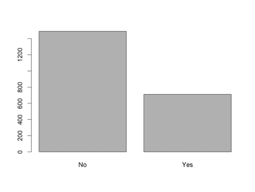

直方图显示了幸存或未幸存的乘客数量。每个条形的高度等于乘客数量，标签显示了条形代表的内容。我们可以只用一行代码构建相同的图表：

```py
barplot(height=dtSurvived[, n], names.arg=dtSurvived[, Survived])
```

此图表显示了乘客总数。如果我们想可视化百分比呢？让我们看看以下步骤：

1.  定义包含乘客数量除以乘客总数的`percentage`列。我们可以使用数据表操作`:=`定义新列。此列将是`height`参数：

    ```py
    dtSurvived[, percentage := n / sum(n)]
    ```

1.  定义包含蓝色和红色以供可视化的`colorPlot`列。我们使用`ifelse`函数指定，如果`Survived == 'Yes'`，颜色为`blue`，否则为红色。此列将是`col`参数：

    ```py
    dtSurvived[, colorPlot := ifelse(Survived == 'Yes', 'blue', 'red')]
    ```

1.  构建图表，并预期包括`col`参数，定义`color`向量。此外，百分比范围在 0 到 1 之间，因此我们可以指定图表区域将在 0 到 1 之间，添加`ylim`参数等于`c(0, 1)`：

    ```py
    barplot(
      height=dtSurvived[, percentage],
      names.arg=dtSurvived[, Survived],
      col=dtSurvived[, colorPlot],
      ylim=c(0, 1)
    )
    ```

直方图如下：

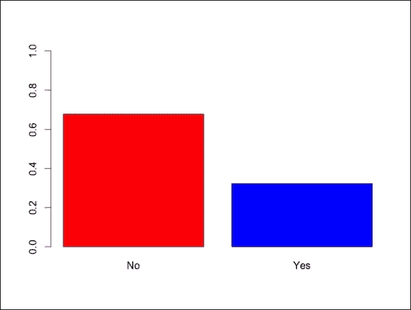

我们可以向图表添加标题和图例；按照以下步骤：

1.  定义包含百分比的`textPercentage`列，例如，对于 0.323035 的百分比，我们在图例中显示 32%：

    ```py
    dtSurvived[, textPercentage := paste(round(percentage * 100), '%', sep='')]
    ```

1.  定义图表标题：

    ```py
    plotTitle <- 'Proportion of passengers surviving or not'
    ```

1.  定义*y*轴标签：

    ```py
    ylabel <- 'percentage'
    ```

1.  构建图表：

    ```py
    barplot(
      height=dtSurvived[, percentage],
      names.arg=dtSurvived[, Survived],
      col=dtSurvived[, colorPlot],
      ylim=c(0, 1),
      legend.text=dtSurvived[, textPercentage],
      ylab=ylabel,
      main=plotTitle
    )
    ```

直方图如下：

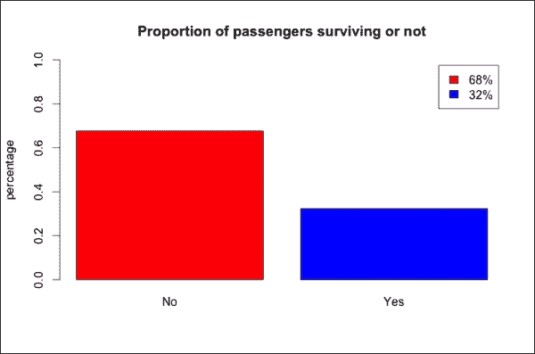

总体生存率为**32%**，尽管它在不同的属性组合中有所变化。下一小节将向您展示如何可视化属性的影响。

## 可视化特征的影响

在本小节中，我们确定性别对生存率的影响。首先，我们可以定义`dtGender`，显示每个性别中幸存或未幸存的乘客数量。操作是`n=sum(Freq)`，并且对`Survived`和`Sex`的每个组合进行操作。类似于上一节，我们执行简单的数据表聚合，指定以下内容：

+   **选择行**：我们使用整个表，因此参数为空

+   **操作**：这是一个包含操作的列表，即`n=sum(Freq)`

+   **聚合**：我们通过两列进行聚合，因此我们定义`by=c('Survived', 'Sex')`

考虑以下代码：

```py
dtGender <- dtTitanic[, list(n=sum(Freq)), by=c('Survived', 'Sex')]
dtGender
 Survived    Sex    n
1:       No   Male 1364
2:       No Female  126
3:      Yes   Male  367
4:      Yes Female  344

```

现在，我们可以通过直方图可视化新的数据表，就像我们之前看到的那样。步骤如下：

1.  添加`percentage`列，通过将`n`除以该性别的乘客总数来计算。操作是`n / sum(n)`，并且按性别进行。然后，我们使用`:=`操作指定我们计算`by='Sex'`的总和：

    ```py
    dtGender[, percentage := n / sum(n), by='Sex']
    ```

1.  定义绘图颜色：

    ```py
    dtGender[, colorPlot := ifelse(Survived == 'Yes', 'blue', 'red')]
    ```

1.  定义*Y*轴标签：

    ```py
    dtGender[, textPercentage := paste(round(percentage * 100), '%', sep='')]
    ```

1.  提取包含男性生存统计数据的表：

    ```py
    dtGenderMale <- dtGender[Sex == 'Male']
    ```

1.  为男性构建直方图：

    ```py
    barplot(
      height=dtGenderMale[, percentage],
      names.arg=dtGenderMale[, Survived],
      col=dtGenderMale[, colorPlot],
      ylim=c(0, 1),
      legend.text=dtGenderMale[, textPercentage],
      ylab='percentage',
      main='Survival rate for the males'
    )
    ```

1.  我们可以直接在提取向量时添加`Sex == 'Male'`来构建图表，而不是提取`dtGenderMale`。我们可以以类似的方式为女性构建相同的直方图：

    ```py
    barplot(
      height=dtGender[Sex == 'Female', percentage],
      names.arg=dtGender[Sex == 'Female', Survived],
      col=dtGender[Sex == 'Female', colorPlot],
      ylim=c(0, 1),
      legend.text=dtGender[Sex == 'Female', textPercentage],
      ylab='percentage',
      main='Survival rate for the females'
    )
    ```

让我们显示我们构建的图表：

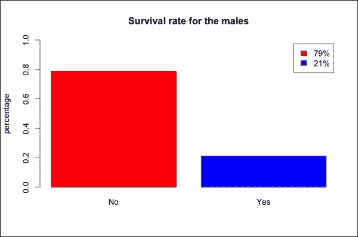

与 32%的幸存乘客相比，男性的生存率仅为**21%**。

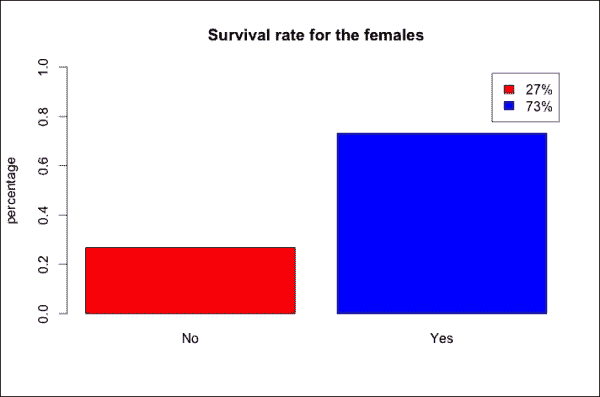

如预期的那样，女性的生存率显著高于平均水平。

我们可以在同一张图表中比较两个性别，只显示生存率，即`Yes`列。我们可以使用相同的命令构建绘图，并包括`Survived == 'Yes'`条件。唯一的区别是`col`参数，在这种情况下是`Sex`列，它是一个有两个级别的因子。在这种情况下，`barplot`自动定义两种颜色，即黑色和红色：

```py
barplot(
  height=dtGender[Survived == 'Yes', percentage],
  names.arg=dtGender[Survived == 'Yes', Sex],
  col=dtGender[Survived == 'Yes', Sex],
  ylim=c(0, 1),
  legend.text=dtGender[Survived == 'Yes', textPercentage],
  ylab='percentage',
  main='Survival rate by gender'
)
```

直方图如下所示：

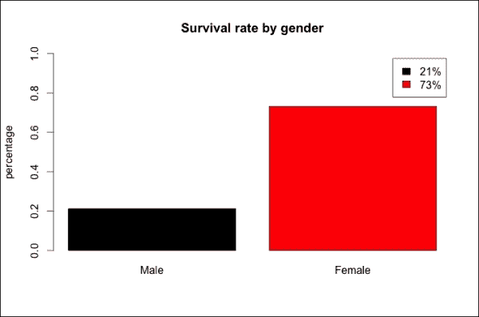

该图表使我们能够可视化差异，图例显示生存率。正如预期的那样，差异很大。

## 可视化两个特征结合的影响

在本章中，我们研究另一个特征的影响：等级。乘客的不同等级的生存率是如何变化的？首先，我们可以通过以下步骤构建与性别相同的生存率图表：

1.  定义包含每个等级的乘客是否幸存或未幸存的`dtClass`：

    ```py
    dtClass <- dtTitanic[, list(n=sum(Freq)), by=c('Survived', 'Class')]
    ```

1.  定义每个等级中幸存或未幸存的乘客的百分比：

    ```py
    dtClass[, percentage := n / sum(n), by='Class']
    ```

1.  定义百分比文本：

    ```py
    dtClass[, textPercentage := paste(round(percentage * 100), '%', sep='')]
    ```

1.  构建直方图：

    ```py
    barplot(
      height=dtClass[Survived == 'Yes', percentage],
      names.arg=dtClass[Survived == 'Yes', Class],
      col=dtClass[Survived == 'Yes', Class],
      ylim=c(0, 1),
      legend.text=dtClass[Survived == 'Yes', textPercentage],
      ylab='survival rate',
      main='Survival rate by class'
    )
    ```

直方图如下所示：

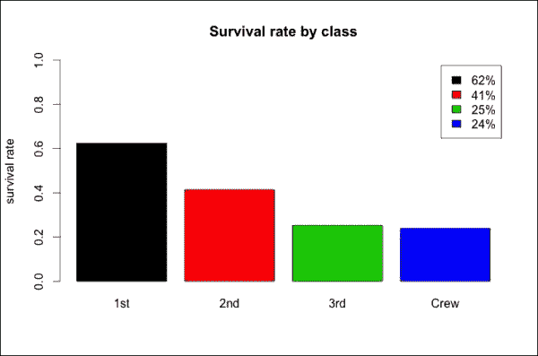

生存率在各个等级之间差异很大。我们可以注意到，属于较高等级的乘客更有可能幸存，而船员的生存率与三等舱相似。我们能得出结论说等级对生存率有重大影响吗？

该图表显示了每个等级的整体生存率。然而，考虑到女性更有可能幸存，女性与男性的比例较高的等级可能具有更高的生存率。如果较高的生存率仅由性别解释，那么属于不同等级的事实根本没有任何影响。

为了了解生存率之间的差异是否取决于每个等级中女性的百分比，我们可以通过等级可视化性别比例。图表是一个直方图，显示了每个社会等级中女性的百分比，命令与之前类似：

```py
dtGenderFreq <- dtTitanic[, list(n=sum(Freq)), by=c('Sex', 'Class')]
dtGenderFreq[, percentage := n / sum(n), by='Class']
dtGenderFreq <- dtGenderFreq[Sex == 'Female']
dtGenderFreq[, textPercentage := paste(round(percentage * 100), '%', sep='')]
barplot(
  height=dtGenderFreq[, percentage],
  names.arg=dtGenderFreq[, Class],
  col=dtGenderFreq[, Class],
  ylim=c(0, 1),
  legend.text=dtGenderFreq[, textPercentage],
  ylab='survival rate',
  main='Percentage of females'
)
```

直方图如下所示：

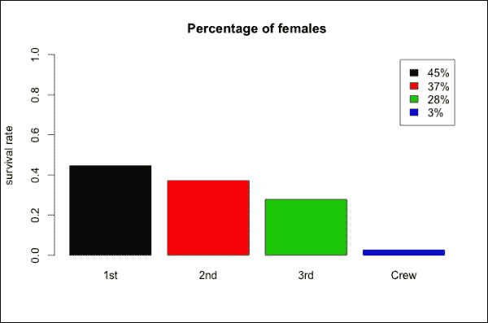

性别比例在不同等级之间差异很大，因为顶级等级中女性的百分比较高，而船员中几乎没有女性。因此，女性的百分比可能已经通过等级影响了生存率。为了更好地理解两个属性对生存率的影响，我们需要同时考虑性别和等级。为此，我们可以计算这两个特征的每个组合的生存率。使用以下步骤构建图表：

1.  计算每个`Survived`、`Sex`和`Class`组合的乘客总数。现在`by`参数包括三个列名：

    ```py
    dtGenderClass <- dtTitanic[, list(n=sum(Freq)), by=c('Survived', 'Sex', 'Class')]
    ```

1.  添加指定每个特征组合的乘客总数的`nTot`列（不包括`Survived`）。`by`参数包括两个特征：

    ```py
    dtGenderClass[, nTot := sum(n), by=c('Sex', 'Class')]
    ```

1.  添加`percentage`列。`by`参数包括两个特征：

    ```py
    dtGenderClass[, percentage := n / sum(n), by=c('Sex', 'Class')]
    ```

1.  使用`Survived == 'Yes'`条件提取包含生存率的列：

    ```py
    dtGenderClass <- dtGenderClass[Survived == 'Yes']
    ```

1.  添加`textPercentage`列：

    ```py
    dtGenderClass[, textPercentage := paste(round(percentage * 100), '%', sep='')]
    ```

1.  添加`colorPlot`列。`rainbow`函数构建一个包含定义数量的彩虹颜色的向量。在这种情况下，我们为每一行定义一个列，因此我们使用`rainbow(nrow(dtGenderClass))`：

    ```py
    dtGenderClass[, colorPlot := rainbow(nrow(dtGenderClass))]
    ```

1.  定义要包含在标签中的组名。由于直方图将显示每个特征组合的生存率，我们使用`paste`将每个组的名称设置为性别和等级的组合。为了将名称适应到图表中，我们定义了包含性别缩写的`SexAbbr`：

    ```py
    dtGenderClass[, SexAbbr := ifelse(Sex == 'Male', 'M', 'F')]
    dtGenderClass[, barName := paste(Class, SexAbbr, sep='')]
    ```

1.  定义包含绘图名称和组内乘客数量的标签。由于我们希望在不同行中显示名称和数量，我们使用`\n`（在字符串中定义新行的符号）将它们分开：

    ```py
    dtGenderClass[, barLabel := paste(barName, nTot, sep='\n')]
    ```

1.  生成直方图。与`ylim`类似，`xlim`参数定义了要可视化的*x*区域。在这种情况下，我们使用`xlim`来避免图例和图表重叠：

    ```py
    barplot(
      height=dtGenderClass[, percentage],
      names.arg=dtGenderClass[, barLabel],
      col=dtGenderClass[, colorPlot],
      xlim=c(0, 11),
      ylim=c(0, 1),
      ylab='survival rate',
      legend.text=dtGenderClass[, textPercentage]
    )
    ```

生成的直方图如下：

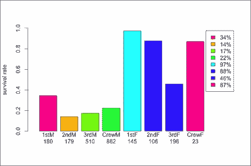

我们可以在其列下找到该组的乘客数量。除了女性船员外，每个条形图至少包含 100 名乘客，因此我们可以假设结果是具有意义的。为了衡量意义，我们本可以使用诸如置信区间或假设检验之类的统计技术，但这不是本书的主题。

班级以不同的方式影响着男性和女性。在男性方面，尽管头等舱的生存率显著较高，但生存率非常低。在女性方面，除了第三班外，每个班级的生存率都接近 100%。

我们也可以从相反的角度来看图表，以了解性别对同一班级乘客的影响。在所有情况下，生存率都显著较高，尽管对于某些特定班级的差异要大得多。性别和班级的影响是相关的，因此如果我们想了解它们的影响，我们需要同时考虑这两个特征。

我们还没有探索年龄。我们可以可视化所有特征的每个组合的生存率。准备和绘制表的代码与之前类似。在这种情况下，我们只需直接对`dtTitanic`应用操作。步骤如下：

1.  计算每个三个特征的组合中生存或未生存的人的百分比：

    ```py
    dtTitanic[, nTot := sum(Freq), by=c('Sex', 'Class', 'Age')]
    ```

1.  添加每个属性组合中生存的乘客的百分比：

    ```py
    dtTitanic[, percentage := Freq / nTot]
    ```

1.  使用`Survived == 'Yes'`条件提取生存率：

    ```py
    dtAll <- dtTitanic[Survived == 'Yes', ]
    ```

1.  添加包括所有三个特征缩写的图例文本。对于班级，我们使用子字符串函数，这是一个提取字符串一部分的函数。在我们的情况下，我们提取第一个字符，因此我们指定使用`substring(Class, 1, 1)`提取`1`和`1`之间的元素：

    ```py
    dtAll[, ClassAbbr := substring(Class, 1, 1)]
    dtAll[, SexAbbr := ifelse(Sex == 'Male', 'M', 'F')]
    dtAll[, AgeAbbr := ifelse(Age == 'Child', 'C', 'A')]
    dtAll[, textLegend := paste(ClassAbbr, SexAbbr, AgeAbbr, sep='')];
    ```

1.  添加绘图颜色：

    ```py
    dtAll[, colorPlot := rainbow(nrow(dtAll))]
    ```

1.  添加要显示在标签中的百分比：

    ```py
    dtAll[, labelPerc := paste(round(percentage * 100), '%', sep='')]
    ```

1.  添加包含百分比和总数的标签：

    ```py
    dtAll[, label := paste(labelPerc, nTot, sep='\n')]
    ```

1.  生成绘图。由于我们比之前有更多的组，因此布局不同，以便可视化所有相关信息。`xlim`参数为图例留出一些空间，而`cex.names`参数减小了标签文本的大小：

    ```py
    barplot(
      height=dtAll[, percentage],
      names.arg=dtAll[, label],
      col=dtAll[, colorPlot],
      xlim=c(0, 23),
      legend.text=dtAll[, textLegend],
      cex.names=0.5
    )
    ```

直方图如下：

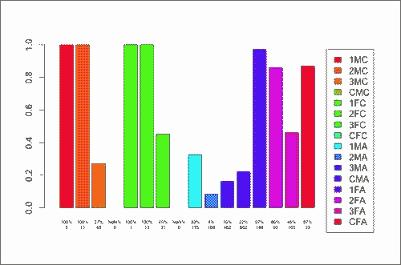

图例显示了特征的缩写组合。例如，**1MC**代表一等舱、男性、儿童。在没有任何乘客的组合情况下，我们没有关于百分比的任何信息，因此条形标签显示**NaN%**。

由于我们结合了三个特征，一些组非常小。例如，我们只有五位一等舱男性儿童。还有其他完全没有乘客的组（例如，船员中的儿童）。因此，这种方法有一些局限性。

# 使用机器学习模型探索数据

可视化每个乘客组的生存率为我们提供了数据的概览。我们了解不同的特征如何与生存率以及彼此相互作用。例如，我们知道社会阶层对生存率的影响取决于性别。但哪两个特征的影响最大？每个特征的影响有多大？我们还没有定义特征的排名或量化它们的影响。一些机器学习技术允许我们进一步调查，回答我们的问题。

## 使用决策树探索数据

我们有三个特征（类别、性别和年龄），并希望根据这些特征将乘客分成不同的组。由于某些组（例如一等舱的女童）的数据量不足，我们无法为每个特征组合定义一个组。一种解决方案是将乘客分成组，使得每个组都有足够的数据。一个组由一些关于特征的约束条件定义，例如男性不属于一等舱。这些组应该覆盖所有可能的情况，且不重叠。一种识别足够大组的机器学习技术是决策树学习。

有一位新乘客，我们知道他是一位二等舱的男童。我们不知道这位乘客是否会幸存，我们想要预测这一点。我们如何使用这些数据？我们可以检查这位乘客是男性还是女性。根据我们之前的数据探索，他作为男性，幸存的可能性为 21%。考虑到社会阶层，我们可以说他幸存的可能性为 14%。有 179 位二等舱男性乘客，所以这个结果是有意义的。然后，知道他是一位儿童，我们可以查看二等舱男性儿童的生存率，这是 100%。说他会以 100%的概率幸存合理吗？只有 11 位乘客是二等舱男性儿童，所以我们没有足够的数据来做出准确的预测。我们应该使用二等舱男性的生存率吗？如果我们使用所有男性儿童的生存率呢？或者二等舱儿童的生存率呢？不同的选择会导致不同的结果。

一种解决方案是识别关键特征，并且只考虑它们。例如，如果性别和舱位是两个最重要的特征，我们可以使用它们来进行预测。然而，在第三等舱男性儿童的情况下，我们拥有的数据比第一等舱男性儿童多得多。如果我们只在第三等舱男性中考虑年龄会怎样？我们想要包含的特征数量取决于我们考虑的组。

我们不仅可以选择两个最重要的特征，还可以定义一个标准，只有当分组足够大时才进行分割，我们可以通过决策树可视化这个原则。假设一开始所有乘客都属于同一个组。我们可以根据性别将他们分成两组。然后，我们可以将男性分成两组：一边是一等舱，另一边是所有其他舱位。对于女性，最有意义的分割可能是一个不同的：一边是儿童，另一边是成人。

决策树学习技术从数据中学习以识别最有意义的分割，并且可以用来探索数据。树继续分割数据，直到由树叶定义的组变得太小。然后，对于每个组，我们使用相关的数据来定义一个属性，该属性可以是：

+   **Categoric**：这是一个其值属于类别的属性。在这种情况下，类别是**Survived**和**Not survived**。树执行分类。

+   **Numeric**：这是一个可以测量的属性，在这种情况下，它是生存率。树执行回归。

我们可以使用`rpart`包在 R 中构建决策树。此外，我们可以使用另一个名为`rpart.plot`的包来可视化树。为了使用这些包，我们需要安装并加载它们。如果遇到安装问题，可以在`install.packages`函数的参数中指定仓库：

```py
install.packages('rpart')
install.packages('rpart.plot')
```

安装完成后，我们可以加载以下两个包：

```py
library('rpart')
library('rpart.plot')
```

起始点是`dtTitanic`，它包含每个特征组合的一行。在构建决策树之前，我们需要将数据转换成另一种格式。我们需要为每位乘客创建一行，除了`Freq`之外，其他列保持不变。为了生成新格式的新的表格，我们使用`data.table`操作与`list`和`by`。

对于`dtTitanic`的每一行，我们希望生成一个具有与`Freq`相同的行数的表格。每一行对应于`Survived`、`Sex`、`Age`和`Class`之间的组合，因此`by`参数包含一个包含四个特征的向量。

在新的表中，每一行包含一个乘客，所以 `Freq` 等于 `1`。然后，对于 `dtTitanic` 的每一行，我们需要定义一个包含 `Freq` 个 `1` 的向量。为了做到这一点，我们使用 `rep` 函数，它是一个复制元素一定次数的函数。在我们的例子中，我们使用 `rep(1, Freq))`。其他列复制 `by` 中定义的元素，即 `Survived`、`Sex`、`Age` 和 `Class`，所以我们不需要重新定义它们：

```py
dtLong <- dtTitanic[
  , list(Freq = rep(1, Freq)),
  by=c('Survived', 'Sex', 'Age', 'Class')
  ]
```

`Freq` 对于每一行都是 `1`，所以我们不再需要它，可以删除它：

```py
dtLong[, Freq := NULL]
```

为了构建显示生存率的决策树，我们需要更改 `Survived` 的格式。我们希望将 `No` 和 `Yes` 分别改为 `0` 和 `1`。要修改列，我们可以使用 `ifelse`：

```py
dtLong[, Survived := ifelse(Survived == 'Yes', 1, 0)]
```

让我们使用 `head` 查看一下 `DtLong` 的前六行：

```py
head(dtLong)
 Survived  Sex   Age Class
1:        0 Male Child   3rd
2:        0 Male Child   3rd
3:        0 Male Child   3rd
4:        0 Male Child   3rd
5:        0 Male Child   3rd
6:        0 Male Child   3rd

```

前六行显示了六名未幸存的男性儿童。

`dtLong` 对象包含决策树算法的标准输入，我们可以使用 `rpart` 来构建模型。我们的目标是定义一组乘客，关于他们，我们能够估计生存率：

```py
help(rpart)
```

必要的参数是：

+   `formula`：这是一个公式对象，定义了要预测的属性和用于预测的特征。公式由一个字符串定义，例如 `outcome ~ feature1 + feature2 + feature3`。

+   `data`：这是数据框或数据表，在我们的例子中是 `dtLong`。

我们需要从 `Survived ~ Sex + Age + Class` 字符串开始定义公式：

```py
formulaRpart <- formula('Survived ~ Sex + Age + Class')
```

现在我们可以构建包含决策树的 `treeRegr`。由于 `Survived` 是数值型的，函数会自动构建一个回归树：

```py
treeRegr <- rpart(
  formula=formulaRpart,
  data=dtLong
)
```

`treeRegr` 对象包含决策树，我们可以使用 `prp(treeRegr)` 来可视化它：

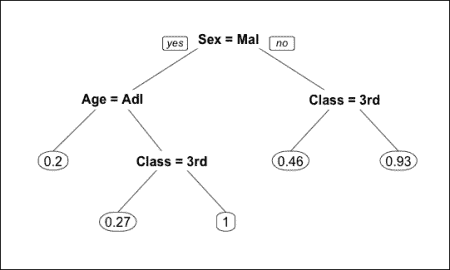

让我们看看这棵树。每个内部节点都标记了一个条件，该条件将数据分成两部分。例如，顶部的节点将乘客分为男性和女性。左边的分支对应满足条件的乘客（在这种情况下，男性乘客），右边的分支对应其他人（女性）。每个叶子定义了该组的生存率。例如，右边的叶子表明不属于第三类的女性的生存率为 93%。

由于数据不足，这棵树不包含所有可能的特征组合。例如，在女性的情况下，只有 45 个孩子，她们属于不同的社会阶层，因此这棵树不会根据她们的年龄来划分女性。

假设我们有一个新的乘客，她是女性、儿童、二等舱。我们如何预测她是否会生存？她是一个不属于第三类的女性，所以她的预期生存率为 93%。因此，我们可以说她很可能会生存。

树定义了一个表示为数字的生存率。如果我们想预测乘客是否存活？我们可以通过向`rpart`添加`method='class'`输入来构建一个分类树：

```py
treeClass = rpart(
    formula='Survived ~ Sex + Age + Class',
    data=dtLong,
    method='class'
)
prp(treeClass)
```

树的表示如下：

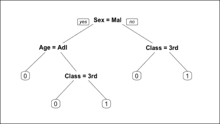

这棵树预测只有女性和三等舱外的儿童乘客会存活。这个结果对于探索数据是有用的。下一步是使用机器学习模型来预测结果。我们可以用这棵树来达到这个目的，尽管它只定义了 16 种可能特征组合中的五个乘客组，所以它可能不是最合适的技术。还有更高级的算法，在下一章我们将看到其中之一。

# 预测新的结果

给定一个新乘客以及他们的个人信息，我们想要预测他们是否会存活。我们至今探索的选项都是基于将乘客分为组并确定每个组的生存率。对于某些特征组合，例如头等舱女性儿童，我们没有足够的数据，因此我们必须使用更大组（如不属于三等舱的女性）的生存率。我们忽略了某些细节，例如他们是儿童的事实，这样我们就丢失了信息。有没有一种方法可以估计任何特征组合的生存率，而不管我们有多少乘客？

有许多机器学习算法会同时考虑所有特征。在本章中，我们将看到一个非常流行的算法，即**随机森林**算法。在这个上下文中，它并不是最佳选择，因为当有更多特征时，它的表现会更好，但它对于说明一般方法是有益的。

## 构建机器学习模型

如其名所示，随机森林算法基于许多随机决策树。算法通过重复以下步骤来构建`ntree`个树：

1.  通过从数据中选择一个随机的行（在我们的案例中，即`dtLong`）`sampsize`次来生成构建树的数据。每一行可以选择多次，最终我们得到一个包含`sampsize`个随机行的表格。

1.  随机选择一个`mtry`数量的特征（不幸的是，在我们的案例中我们没有很多特征，但仍然可以选择它们的子集）。

1.  基于采样数据，仅考虑所选特征来构建决策树。

随机森林模型由`ntree`个决策树组成。在我们的上下文中，给定一个新乘客，模型使用每个树来预测他们的生存率。最终的预测值是生存率的平均值。在算法的另一种变体中，我们使用众数而不是平均值。

随机森林是一个流行的算法，它由`randomForest`包提供。让我们安装并加载它：

```py
install.packages('randomForest')
library('randomForest')
```

与简单的决策树学习一样，随机森林的特征可以是分类的或数值的。

在我们的案例中，所有特征都是分类的，每个特征有两个到四个可能的值。我们可以将特征转换为数值格式。例如，在`Sex`的情况下，可能的值是`Male`和`Female`。我们可以定义一个数值特征，当性别为`Male`时为`1`，否则为`0`。新的特征以不同的方式展示了相同的信息。以这种方式从分类特征派生出的数值特征被称为虚拟变量。在具有两个以上类别的分类特征的情况下，我们可以为每个类别（除了一个）定义一个虚拟变量。这样，通过查看虚拟变量，如果其中一个等于`1`，我们就知道哪个组。如果它们都等于`0`，我们就知道还有一个组剩下。

我们可以通过以下步骤定义一个包含虚拟变量的新表：

1.  构建分类特征表的副本：

    ```py
    dtDummy <- copy(dtLong)
    ```

1.  将`Sex`转换为虚拟变量：

    ```py
    dtDummy[, Male := Sex == 'Male']
    dtDummy[, Sex := NULL]
    ```

1.  将`Age`转换为虚拟变量：

    ```py
    dtDummy[, Child := Age == 'Child']
    dtDummy[, Age := NULL]
    ```

1.  将`Class`转换为三个虚拟变量：

    ```py
    dtDummy[, Class1 := Class == '1st']
    dtDummy[, Class2 := Class == '2nd']
    dtDummy[, Class3 := Class == '3rd']
    dtDummy[, Class := NULL]
    ```

1.  定义`formulaRf`公式：

    ```py
    formulaRf <- formula('Survived ~ Male + Child + Class1 + Class2 + Class3')
    ```

1.  构建`forest`，包含随机森林模型。所有参数都保留为它们的默认值：

    ```py
    forest <- randomForest(
      formula=formulaRf,
      data=dtDummy
    )
    ```

我们将随机森林模型存储在名为`forest`的列表中，该列表包含机器学习模型、所有相关参数和信息。我们可以通过观察列表的元素来探索模型。例如，模型构建的树的数量包含在`ntree`元素中：

```py
forest$ntree
[1] 500

```

另一个参数是`mtry`，它定义了每次迭代中使用的变量数量：

```py
forest$mtry
[1] 1

```

树的数量已默认设置为 500。

算法一次只选择一个特征。原因是随机森林旨在与许多特征一起工作，因此在这种环境中表现不佳。

另一个参数是`type`，它定义了算法的输出。随机森林可以用于不同的目的，在我们的案例中，我们想要估计生存率，因此我们想要将其用于回归：

```py
forest$type
[1] "regression"

```

如预期的那样，`forest`正在执行回归。

如果我们想更改一些参数，我们可以在参数中定义它们。在本章中，我们没有定义一个标准来设置参数，所以我们只是分配另一个值。例如，我们可以使用三个随机特征和每个`1500`行随机数据构建`1000`棵树。我们可以通过更改参数来重建`forest`：

```py
forest <- randomForest(
  formula=formulaRf,
  data=dtDummy,
  ntree=1000,
  mtry=3,
  sampsize=1500
)
```

我们构建了一个随机`forest`模型，下一个小节将展示如何使用它。

## 使用模型预测新的结果

现在我们已经构建了模型，我们可以使用它来进行一些预测。如果我们有一个新的乘客，他们的生存率是多少？首先，让我们提取一个随机乘客：

```py
rowRandom <- dtDummy[100]
rowRandom
 Survived Freq Male Child Class1 Class2 Class3
1:       No    1 TRUE FALSE   TRUE  FALSE  FALSE

```

随机乘客是一位一等舱的成年男性。我们可以使用`forest`模型来估计他的生存率。`predict`函数允许我们将模型应用于新数据，从而获得预测：

```py
predict(forest, rowRandom)
 1 
0.3830159

```

估计的生存率约为 38%，因此乘客不太可能幸存。我们可以使用相同的方法来预测所有乘客的生存率。然而，这意味着要使用构建模型所用的相同数据来应用模型。这种方法不适合测试模型，因为预测值将与初始数据相关。考虑到这个结果不能使用，我们可以用它来比较预测与实际数据：

```py
prediction = predict(forest, dtDummy)
```

我们可以使用`sample`查看六行随机数据的预测：

```py
sample(prediction, 6)
 1895       448       967      1553      1683         4 
0.6934046 0.2260507 0.2499303 0.3830159 0.2260507 0.2974706

```

我们为每个乘客定义了一个生存率。让我们将估计的生存率添加到`dtDummy`表中：

```py
dtDummy[, SurvivalRatePred := predict(forest, dtDummy)]
```

现在，我们可以预测如果乘客的生存率高于一个阈值，例如 50%，乘客将幸存。我们可以定义一个新的列名`SurvivedPred`，包含我们的预测：

```py
dtDummy[, SurvivedPred := ifelse(SurvivalRatePred > 0.5, 1, 0)]
```

现在，我们可以比较预测的生存率与初始数据。为了评估两个值匹配的次数，我们可以定义一个`error`列，如果值不匹配则为`TRUE`：

```py
dtDummy[, error := SurvivedPred != Survived]
```

从错误列开始，我们可以计算总体误差，即我们做出错误预测的乘客百分比。我们需要将错误数量除以乘客数量。我们可以通过将错误求和来得到错误数量，因为布尔变量的向量之和等于`TRUE`值的数量。总乘客数由`.N`定义，在`data.table`表示法中等于行数：

```py
percError <- dtDummy[, sum(error) / .N]
percError
[1] 0.2094502

```

模型在 21%的情况下预测了错误的结果，因此我们的准确率为 79%。无论如何，这个结果没有任何意义，因为我们正在对构建模型所用的相同数据进行预测。此外，如果我们知道有多少乘客幸存，我们只需猜测每个乘客最常见的结果。如果其中超过一半的乘客幸存，我们可以将`SurvivedPred`设置为`TRUE`，并猜测超过一半。让我们计算幸存的整体概率。总体生存率低于 50%，因此每个乘客不太可能幸存。然后，在没有其他信息的情况下，我们可以预测没有人会幸存：

```py
dtTitanic[Survived == 'No', sum(Freq)] / dtTitanic[, sum(Freq)]
[1] 0.676965

```

即使不考虑任何特征，我们也能达到超过 65%的准确率，所以 79%只是高出 15%。此外，正如之前所说，这个准确率不能使用，因为我们正在将模型应用于构建模型所用的相同数据。

## 验证模型

为了评估模型的实际准确率，我们可以使用数据的一部分来构建模型，例如 80%的乘客。然后，我们可以将模型应用于剩余的 20%数据。我们用来构建模型的数据称为**训练集**，而其他数据称为**测试集**。

我们可以将每行以 80%的概率分配到训练集中。这样，训练集将包括大约 80%的数据。为了定义哪些行应该包含在训练集中，我们可以定义一个逻辑向量，称为`indexTrain`，对于属于训练集的每一行，它都是`TRUE`。我们可以使用`sample`函数生成这个向量，其参数为：

+   `x`：这代表可能的值；在这种情况下，`TRUE`和`FALSE`

+   `size`：这代表向量长度；在这种情况下，它等于`dtDummy`中的行数

+   `replace`：如果值为`TRUE`，每个值（`TRUE`或`FALSE`）可以被采样多次

+   `prob`：这是一个包含采样`x`值概率的向量；在这种情况下，它是`c(0.8, 0.2)`

考虑以下代码：

```py
indexTrain <- sample(
  x=c(TRUE, FALSE),
  size=nrow(dtDummy),
  replace=TRUE,
  prob=c(0.8, 0.2)
)
```

现在，我们可以提取`indexTrain`等于`TRUE`的行：

```py
dtTrain <- dtDummy[indexTrain]
```

同样地，我们提取测试集的行。`!`运算符表示`NOT`，它允许提取`indexTrain`等于`FALSE`的行：

```py
dtTest <- dtDummy[!indexTrain]
```

现在，我们可以使用之前相同的参数来构建模型。知道我们数据较少，我们可以只减少定义每个树使用的数据的`sampsize`参数：

```py
forest <- randomForest(
  formula=formulaRf,
  data=dtTrain,
  ntree=1000,
  mtry=3,
  sampsize=1200
)
```

我们构建了一个模型，没有考虑到`dtTest`，因此我们可以用它来预测`dtTest`。和之前一样，我们预测如果乘客的生存率高于 50%，他们将会幸存。预测之后，我们可以使用和之前相同的 R 命令来估计误差：

```py
dtTest[, SurvivalRatePred := predict(forest, dtTest)]
dtTest[, SurvivedPred := ifelse(SurvivalRatePred > 0.5, 1, 0)]
dtTest[, error := SurvivedPred != Survived]
percError <- dtTest[, sum(error) / .N]
percError
[1] 0.2416107

```

估计误差`percError`取决于我们如何分割数据，所以每次定义新的随机训练/测试分割时它都不同。然而，我们可以重复这些步骤多次并计算平均误差。这种方法称为交叉验证，它是一种非常有用的工具，用于估计准确性。

本章展示了一种通用的构建和验证机器学习模型的方法。使用这种方法，我们可以预测一个属性并估计预测的准确性。

# 摘要

在本章中，我们学习了如何使用数据表操作处理数据，并构建了一些简单的 R 图表进行探索性数据分析。我们学习了如何使用决策树找到有用的见解并构建机器学习模型（随机森林）进行预测。我们看到了如何更改模型的参数以及如何验证它。

接下来的三章将详细介绍本章介绍的方法。第四章，*步骤 1 - 数据探索和特征工程*，深入介绍了机器学习的第一步，即数据探索和特征工程。
