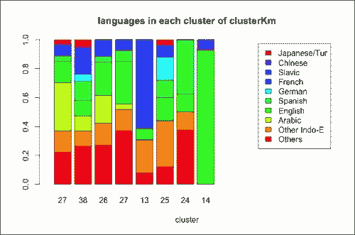
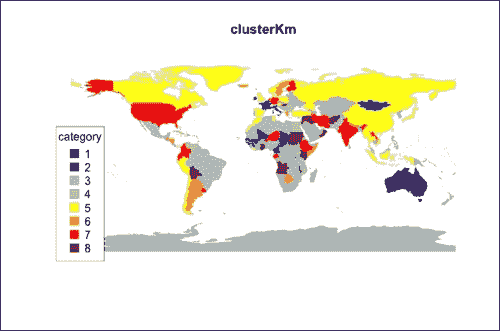
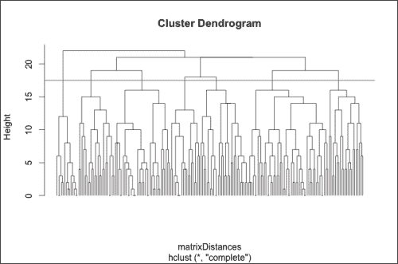
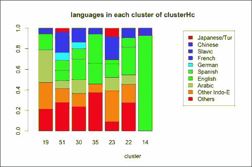
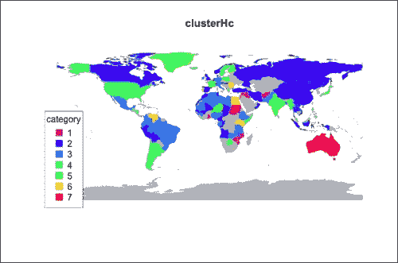
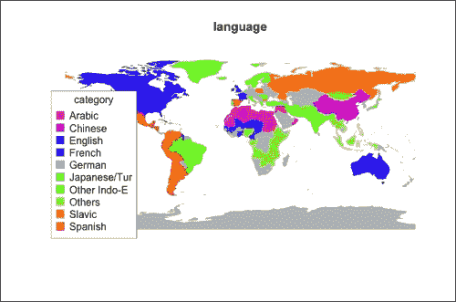
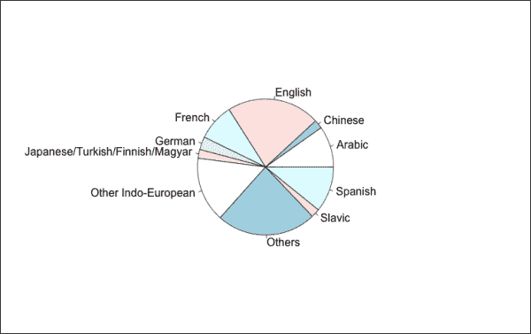
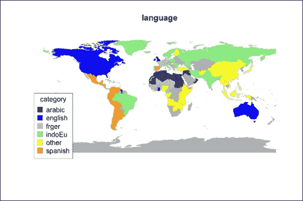
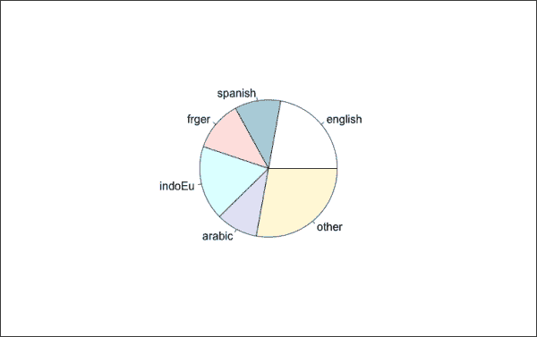

# 第五章。步骤 2 – 应用机器学习技术

本章重点在于应用机器学习算法，这是开发解决方案的核心。有不同类型的从数据中学习的技巧。根据我们的目标，我们可以使用数据来识别对象之间的相似性或对新对象估计属性。

为了展示机器学习技术，我们从上一章中处理过的旗帜数据开始。然而，阅读本章不需要你了解前面的内容，尽管了解数据来源是推荐的。

在本章中，你将学习到：

+   识别项目的一致性组

+   探索和可视化项目组

+   估计一个新国家的语言

+   设置机器学习技术的配置

# 识别项目的一致性组

我们的数据描述了每个国家旗帜。有没有办法识别具有类似旗帜属性的国家组？我们可以使用一些聚类技术，这些是机器学习算法，它们使用数据定义同质集群。

从上一章的旗帜属性开始，我们构建了一个特征表并将其存储到`dtFeatures.txt`文件中。为了将文件加载到 R 中，第一步是使用`setwd`定义包含文件的目录。然后，我们可以使用`read.table`将文件加载到`dfFeatures`数据框中，并将其转换为`dtFeatures`数据表，如下所示：

```py
# load the flag features
setwd('<INSER YOUR DIRECTORY/PATH>")
dfFeatures <- read.table(file = 'dtFeatures.txt')
library("data.table")
dtFeatures <- data.table(dfFeatures)
```

让我们来看看数据，使用`str`，类似于前面的章节：

```py
# explore the features
str(dtFeatures)
Classes 'data.table' and 'data.frame':	194 obs. of  38 variables:
 $ language     : Factor w/ 10 levels "Arabic","Chinese",..: 8 7 1 3 7 8 3 3 10 10 ...
 $ red          : Factor w/ 2 levels "no","yes": 2 2 2 2 2 2 1 2 1 1 ...
 $ green        : Factor w/ 2 levels "no","yes": 2 1 2 1 1 1 1 1 1 1 ...
 $ blue         : Factor w/ 2 levels "no","yes": 1 1 1 2 2 1 2 2 2 2 ...

```

语言列是一个因素，有 10 种语言，称为该因素的`级别`。所有其他列都包含描述旗帜的特征，它们是具有两个级别的因素：`是`和`否`。特征如下：

+   如果旗帜包含颜色，则`colors`特征（例如，`red`）具有`是`级别

+   如果旗帜包含图案，则`patterns`特征（例如，`circle`）具有`是`级别

+   后跟数字的`nBars`/`nStrp`/`nCol`特征（例如，`nBars3`）如果旗帜有 3 条横线，则具有`是`级别

+   后跟颜色的`topleft`/`botright`/`mainhue`特征（例如，`topleftblue`）如果左上部分是蓝色，则具有`是`级别

## 使用 k-means 识别组

我们的目标是识别类似旗帜的组。为此，我们可以开始使用基本的聚类算法，即**k-means**。

k-means 的目标是识别*k*（例如，八个）同质标志聚类。想象一下将所有标志分成八个聚类。其中一个包含 10 个标志，其中 7 个包含红色。假设我们有一个`red`属性，如果标志包含红色则为`1`，否则为`0`。我们可以说这个聚类的`average flag`包含红色的概率为 70%，因此其`red`属性为 0.7。对每个其他属性做同样的处理，我们可以定义`average flag`，其属性是组内的平均值。每个聚类都有一个平均标志，我们可以使用相同的方法来确定。

k-means 算法基于一个称为聚类中心的平均对象。一开始，算法将标志分为 8 个随机组并确定它们的 8 个中心。然后，k-means 将每个标志重新分配到中心最相似的组。这样，聚类更加同质化，算法可以重新计算它们的中心。经过几次迭代后，我们就有 8 个包含同质标志的组。

k-means 算法是一个非常流行的技术，R 为我们提供了`kmeans`函数。为了使用它，我们可以查看其帮助信息：

```py
# K-MEANS
# see the function documentation
help(kmeans)
```

我们需要两个输入：

+   `x`：数值数据矩阵

+   `centers`：聚类数量（或开始时的聚类中心）

从`dtFeatures`开始，我们需要构建一个数值特征矩阵`dtFeaturesKm`。首先，我们可以将特征名称放入`arrayFeatures`中，并生成包含所有特征的`dtFeaturesKm`数据表。执行以下步骤：

1.  定义包含特征名称的`arrayFeatures`向量。`dtFeatures`方法包含第一列的属性和其余列的特征，因此我们提取除第一列之外的所有列名：

    ```py
    arrayFeatures <- names(dtFeatures)[-1]
    ```

1.  定义包含特征的`dtFeaturesKm`：

    ```py
    dtFeaturesKm <- dtFeatures[, arrayFeatures, with=F]
    ```

1.  将通用列（例如，`red`）转换为数值格式。我们可以使用`as.numeric`将列格式从因子转换为数值：

    ```py
    dtFeaturesKm[, as.numeric(red)]
    ```

1.  新向量包含`1`如果值是`no`，如果是`yes`则包含`2`。为了与我们的 k-means 描述使用相同的标准，我们更愿意将`no`属性设置为`0`，将`yes`属性设置为`1`。这样，当我们计算组内的平均属性时，它将是一个介于 0 和 1 之间的数字，可以看作是属性为`yes`的标志部分的百分比。然后，为了得到 0 和 1，我们可以使用`as.numeric(red) – 1`：

    ```py
    dtFeaturesKm[, as.numeric(red) - 1]
    ```

    或者，我们也可以使用 ifelse 函数完成同样的操作。

1.  我们需要将每个列格式转换为 0-1。`arrayFeatures`数据表包含所有特征的名称，我们可以使用`for`循环处理每个特征。如果我们想转换包含在`nameCol`中的列名，我们需要使用`eval`-`get`表示法。使用`eval(nameCol) :=`我们重新定义列，使用`get(nameCol)`我们使用列的当前值，如下所示：

    ```py
    for(nameCol in arrayFeatures)
      dtFeaturesKm[
        , eval(nameCol) := as.numeric(get(nameCol)) - 1
        ]
    ```

1.  现在将所有特征转换为 0-1 格式。让我们可视化它：

    ```py
    View(dtFeaturesKm)
    ```

1.  `kmeans`函数需要数据以矩阵形式。为了将`dtFeaturesKm`转换为矩阵，我们可以使用`as.matrix`：

    ```py
    matrixFeatures <- as.matrix(dtFeaturesKm)
    ```

`matrixFeatures`数据表包含构建 k-means 算法的数据，其他`kmeans`输入是参数。k-means 算法不会自动检测集群数量，因此我们需要通过`centers`输入来指定它。给定对象集，我们可以从中识别出任意数量的集群。哪个数字最能反映数据？有一些技术允许我们定义它，但它们超出了本章的范围。我们可以定义一个合理的中心数量，例如，8：

```py
# cluster the data using the k-means
nCenters <- 8
modelKm <- kmeans(
  x = matrixFeatures,
  centers = nCenters
  )
```

`modelKm`函数是一个包含不同模型组件的列表。`kmeans`的帮助提供了关于输出的详细描述，我们可以使用`names`来获取元素名称。让我们看看组件：

```py
names(modelKm)
[1] "cluster"      "centers"      "totss"        "withinss" 
[5] "tot.withinss" "betweenss"    "size"         "iter" 
[9] "ifault" 

```

我们可以可视化包含在`centers`中的集群中心，如下所示：

```py
View(modelKm$centers)
```

每行定义一个中心，每列显示一个属性。所有属性都在 0 到 1 之间，它们代表具有属性等于`1`的集群中旗帜的百分比。例如，如果`red`是`0.5`，这意味着一半的旗帜包含红色。

我们将使用的是`cluster`元素，它包含一个标签，指定每个旗帜的集群。例如，如果一个集群的第一个元素是`3`，这意味着`matrixFeatures`（以及`dtFeatures`）中的第一个旗帜属于第三个集群。

### 探索集群

我们可以查看每个集群，以探索其旗帜。为了做到这一点，我们可以在定义`clusterKm`列时将集群添加到初始表中，如下所示：

```py
# add the cluster to the data table
dtFeatures[, clusterKm := modelKm$cluster]
```

为了探索一个集群，我们可以确定其国家中有多少个国家使用每种语言。从`dtFeatures`开始，我们可以使用数据表聚合来总结每个集群的数据。首先，让我们定义包含集群的列：

```py
# aggregate the data by cluster
nameCluster <- 'clusterKm'
```

我们想确定每个集群中有多少行。允许我们确定行数的表格命令是`.N`，如下所示：

```py
dtFeatures[, list(.N), by=nameCluster]
```

如果我们想为集群大小指定不同的列名，我们可以在列表中指定它，如下所示：

```py
dtFeatures[, list(nCountries=.N), by=nameCluster]
```

为了确定每种语言有多少个国家，我们可以使用`table`：

```py
dtFeatures[, table(language)]
```

为了在聚合中使用`table`，输出应该是列表。为此，我们可以使用`as.list`将表转换为列表，如下所示：

```py
dtFeatures[, as.list(table(language))]
```

现在，我们可以使用`by`对每个组应用此操作，如下所示：

```py
dtFeatures[, as.list(table(language)), by=nameCluster]
```

如果我们想可视化说每种语言的国家百分比？我们可以将表中的每个值除以集群中的国家数量，如下所示：

```py
dtFeatures[, as.list(table(language) / .N), by=nameCluster]
```

我们希望生成包含每个组国家数量和每种语言百分比的`dtClusters`。为了做到这一点，我们可以使用我们刚刚看到的命令生成两个列表。为了合并这两个列表，我们只需使用`c(list1, list2)`，如下所示：

```py
dtClusters <- dtFeatures[
  , c(list(nCountries=.N), as.list(table(language) / .N)),
  by=nameCluster
  ]
```

`dtClusters`的每一行代表一个聚类。`nCountries`列显示聚类中的国家数量，所有其他列显示每种语言的百分比。为了可视化这些数据，我们可以为每个聚类构建一个条形图。每个条形被分割成代表说每种语言的国家数量的段。`barplot`函数允许我们构建所需的图表，如果我们提供矩阵作为输入。每个矩阵列对应一个条形，每行定义条形分割的块。

我们需要定义一个包含语言百分比的矩阵。这可以通过执行以下步骤来完成：

1.  定义包含`dtClusters`语言列名称的`arrayLanguages`：

    ```py
    arrayLanguages <- dtFeatures[, unique(language)]
    ```

1.  构建`dtBarplot`包含语言列：

    ```py
    dtBarplot <- dtClusters[, arrayLanguages, with=F]
    ```

1.  使用`as.matrix`将`dtBarplot`转换为矩阵。为了构建图表，我们需要使用 R 函数`t`转置矩阵（反转行和列）：

    ```py
    matrixBarplot <- t(as.matrix(dtBarplot))
    ```

1.  定义一个包含聚类大小的向量，即国家数量。我们将在列下显示这些数字：

    ```py
    nBarplot <- dtClusters[, nCountries]
    ```

1.  将图例名称定义为国家名称：

    ```py
    namesLegend <- names(dtBarplot)
    ```

1.  减少图例名称的长度，以避免图例与图表重叠。使用`substring`，我们将名称限制为 12 个字符，如下所示：

    ```py
    help(substring)
    namesLegend <- substring(namesLegend, 1, 12)
    ```

1.  使用`rainbow`定义颜色。我们需要为`namesLegend`的每个元素定义一个颜色，因此颜色的数量是`length(namesLegend)`，如下所示：

    ```py
    arrayColors <- rainbow(length(namesLegend))
    ```

1.  使用`paste`定义图表标题：

    ```py
    plotTitle <- paste('languages in each cluster of', nameCluster)
    ```

现在我们有了所有`barplot`输入，因此我们可以构建图表。为了确保图例不与条形重叠，我们包括`xlim`参数，该参数指定绘图边界，如下所示：

```py
# build the histogram
barplot(
  height = matrixBarplot,
  names.arg = nBarplot,
  col = arrayColors,
  legend.text = namesLegend,
  xlim = c(0, ncol(matrixBarplot) * 2),
  main = plotTitle,
  xlab = 'cluster'
)
```

得到的图表如下：



K-means 算法从通过随机分割数据定义的初始聚类开始执行一系列步骤。最终输出取决于每次运行算法时不同的初始随机分割。因此，如果我们多次运行 k-means，可能会得到不同的结果。然而，这个图表帮助我们识别语言组内的某些模式。例如，在第八个聚类中，几乎所有国家都说英语，因此我们可以推断出有一些使用类似国旗的英语国家。在第五个聚类中，超过一半的国家说法语，因此我们可以得出同样的结论。一些不太相关的结果是，阿拉伯语在第一个聚类中占有很高的比例，西班牙语在第七个聚类中相当相关。

我们正在使用其他聚类算法，并将以类似的方式可视化结果。为了使代码干净且紧凑，我们可以定义`plotCluster`函数。输入是`dtFeatures`特征数据表和聚类列名`nameCluster`。代码几乎与前面的相同，如下所示：

```py
# define a function to build the histogram
plotCluster <- function(
  dtFeatures, # data table with the features
  nameCluster # name of the column defining the cluster
){
  # aggregate the data by cluster
  dtClusters <- dtFeatures[
    , c(list(nCountries=.N), as.list(table(language) / .N)),
    by=nameCluster]

  # prepare the histogram inputs
  arrayLanguages <- dtFeatures[, unique(language)]
  dtBarplot <- dtClusters[, arrayLanguages, with=F]
  matrixBarplot <- t(as.matrix(dtBarplot))
  nBarplot <- dtClusters[, nCountries]
  namesLegend <- names(dtBarplot)
  namesLegend <- substring(namesLegend, 1, 12)
  arrayColors <- rainbow(length(namesLegend))

  # build the histogram
  barplot(
    height = matrixBarplot,
    names.arg = nBarplot,
    col = arrayColors,
    legend.text = namesLegend,
    xlim=c(0, ncol(matrixBarplot) * 2),
    main = paste('languages in each cluster of', nameCluster),
    xlab = 'cluster'
  )

}
```

此函数应构建与上一个相同的直方图。让我们使用以下代码来检查它：

```py
# visualize the histogram using the functions
plotCluster(dtFeatures, nameCluster)
```

另一种可视化聚类的方法是使用不同颜色为每个聚类构建世界地图。此外，我们还可以可视化语言的世界地图。

为了构建地图，我们需要安装和加载`rworldmap`包，如下所示：

```py
# define a function for visualizing the world map
install.packages('rworldmap')
library(rworldmap)
```

此包从国家名称开始构建世界地图，即在我们的案例中是`dfFeatures`行的名称。我们可以将`country`列添加到`dtFeatures`中，如下所示：

```py
dtFeatures[, country := rownames(dfFeatures)]
```

我们的数据相当旧，所以德国仍然分为两部分。为了在地图上可视化它，我们可以将`Germany-FRG`转换为`Germany`。同样，我们可以将`USSR`转换为`Russia`，如下所示：

```py
dtFeatures[country == 'Germany-FRG', country := 'Germany']
dtFeatures[country == 'USSR', country := 'Russia']
```

现在，我们可以定义一个函数来构建显示聚类的世界地图。输入是`dtFeatures`数据表和要可视化的特征`colPlot`列名（例如，`clusterKm`）。另一个参数是`colourPalette`，它决定了地图中使用的颜色。有关更多信息，请参阅`help(mapCountryData)`，如下所示：

```py
plotMap <- function(
  dtFeatures, # data table with the countries
  colPlot # feature to visualize
  colourPalette = 'negpos8' # colors
){
  # function for visualizing a feature on the world map
```

我们定义了包含要可视化的聚类的`colPlot`列。在字符串的情况下，我们只使用前 12 个字符，如下所示：

```py
  # define the column to plot
  dtFeatures[, colPlot := NULL]
  dtFeatures[, colPlot := substring(get(colPlot), 1, 12)]
```

我们构建了包含我们构建图表所需数据的`mapFeatures`。有关更多信息，请参阅`help(joinCountryData2Map)`。`joinCode = 'NAME'`输入指定国家由其名称定义，而不是缩写。`nameJoinColumn`指定我们拥有国家名称的列，如下所示：

```py
  # prepare the data to plot
  mapFeatures <- joinCountryData2Map(
    dtFeatures[, c('country', 'colPlot'), with=F],
    joinCode = 'NAME',
    nameJoinColumn = 'country'
  )
```

我们可以使用`mapCountryData`构建图表。我们指定使用彩虹的颜色，并且缺失数据的该国将以灰色显示，如下面的代码所示：

```py
  # build the chart
  mapCountryData(
    mapFeatures,
    nameColumnToPlot='colPlot',
    catMethod = 'categorical',
    colourPalette = colourPalette,
    missingCountryCol = 'gray',
    mapTitle = colPlot
  )

}
```

现在，我们可以使用`plotMap`在地图上可视化 k-means 聚类，如下所示：

```py
plotMap(dtFeatures, colPlot = 'clusterKm')
```



我们可以看到许多亚洲国家属于第五个聚类。此外，我们可以观察到意大利、法国和爱尔兰属于同一个聚类，因为它们的旗帜相似。除此之外，很难识别出其他任何模式。

## 识别聚类的层次结构

识别同质群体的其他技术是层次聚类算法。这些技术通过迭代合并对象来构建聚类。一开始，我们为每个国家都有一个聚类。我们定义了两个聚类如何相似的一个度量，并在每一步中，我们识别出旗帜最相似的两组聚类并将它们合并成一个唯一的聚类。最后，我们有一个包含所有国家的聚类。

执行层次聚类的 R 函数是 `hclust`。让我们看看它的 `help` 函数：

```py
# HIERARCHIC CLUSTERING
# function for hierarchic clustering
help(hclust)
```

第一个输入是 `d`，文档解释说它是一个差异结构，即包含所有对象之间距离的矩阵。如文档建议，我们可以使用 `dist` 函数来构建输入，如下所示：

```py
# build the distance matrix
help(dist)
```

`dist` 的输入是一个描述旗帜的数值矩阵。我们已为 k-means 算法构建了 `matrixDistances`，因此我们可以重用它。另一个相关输入是 `method`，它指定了 `dist` 如何测量两个旗帜之间的距离。我们应该使用哪种方法？所有特征都是二进制的，因为它们有两种可能的输出，即 `0` 和 `1`。因此，距离可以是具有不同值的属性的数量。以这种方式确定距离的 `method` 对象是 `manhattan`，如下所示：

```py
matrixDistances <- dist(matrixFeatures, method = 'manhattan')
```

`matrixDistances` 函数包含任何两个旗帜之间的差异。另一个输入是 `method`，它指定了聚合方法。在我们的情况下，我们将方法设置为 `complete`。`method` 有其他选项，它们定义了连接，即计算簇之间距离的方式，如下所示：

```py
# build the hierarchic clustering model
modelHc <- hclust(d = matrixDistances, method = 'complete')
```

`modelHc` 方法包含聚类模型，我们可以使用 `plot` 来可视化簇。你可以查阅 `hclust` 的帮助来了解 `plot` 参数，如下所示：

```py
# visualize the hierarchic clustering model
plot(modelHc, labels = FALSE, hang = -1)
```



此图表显示了算法过程。在底部，我们有所有国家，每个旗帜属于不同的簇。每条线代表一个簇，当算法合并簇时，线会汇聚。在图表的左侧，你可以看到一个表示旗帜之间距离的刻度，在每一级，算法合并彼此距离特定的簇。在顶部，所有旗帜都属于同一个簇。这个图表被称为**树状图**。考虑以下代码：

```py
# define the clusters
heightCut <- 17.5
abline(h=heightCut, col='red')
```

我们想要识别的簇是红色线以上的簇。从 `modelHc` 开始识别簇的函数是 `cutree`，我们可以在 `h` 参数中指定水平线的高度，如下所示：

```py
cutree(modelHc, h = heightCut)
```

现在，我们可以将簇添加到 `dtFeatures` 中，如下所示：

```py
dcFeatures[, clusterHc := cutree(modelHc, h = heightCut)]
```

如前所述，我们可以看到每个簇中使用的语言。我们可以重用 `plotCluster` 和 `plotMap`：

```py
# visualize the clusters
plotCluster(dtFeatures, nameCluster = 'clusterHc')
```



在第八个簇中，英语是主要语言。除此之外，阿拉伯语只在第一个簇中相关，法语和德语如果一起考虑，在第二个和第三个簇中相关，西班牙语在第三个簇中相关。

我们还可以用簇可视化世界地图，如下所示：

```py
plotMap(dtFeatures, colPlot = 'clusterHc')
```

得到的图表如下：



与 k-means 类似，唯一有一个主要簇的大陆是亚洲。

本节描述了两种识别同质旗帜集群的流行聚类技术。它们都允许我们理解不同旗帜之间的相似性，我们可以利用这些信息作为支持来解决一些问题。

# 应用 k 最近邻算法

本节展示了如何使用一种简单的监督学习技术——**k 最近邻**（**KNN**），从其旗帜开始估计一个新国家的语言。在这种情况下，我们估计的是语言，这是一个`categoric`属性，所以我们使用分类技术。如果属性是数值的，我们会使用回归技术。我选择 KNN 的原因是它易于解释，并且有一些选项可以修改其参数以提高结果的准确性。

让我们看看 KNN 是如何工作的。我们知道 150 个国家的旗帜和语言，我们想要根据其旗帜确定一个新国家的语言。首先，我们确定与新的旗帜最相似的 10 个国家。其中，有六个西班牙语国家，两个英语国家，一个法语国家和一个阿拉伯语国家。

在这 10 个国家中，最常见的语言是西班牙语，因此我们可以预期新的旗帜属于一个讲西班牙语的国家。

KNN 基于这种方法。为了估计一个新国家的语言，我们确定旗帜最相似的*K*个国家。然后，我们估计新国家说的是他们中最常见的语言。

我们有一个表格，通过 37 个二进制属性描述了 194 个旗帜，这些属性可以是`Yes`或`No`。例如，`mainhuegreen`属性是`yes`，如果旗帜的主要颜色是绿色，否则是`no`。所有属性都描述了旗帜的颜色和图案。

与上一节类似，在修改`dtFeatures`之前，我们定义了包含特征名称的`arrayFeatures`。由于我们向`dtFeatures`添加了一些列，所以我们从`dfFeatures`中提取特征名称。然后，我们添加了包含来自`dfFeatures`的国家名称的`country`列，如下所示：

```py
# define the feature names
arrayFeatures <- names(dfFeatures)[-1]
# add the country to dtFeatures
dtFeatures[, country := rownames(dfFeatures)]
dtFeatures[country == 'Germany-FRG', country := 'Germany']
dtFeatures[country == 'USSR', country := 'Russia']
```

从`dtFeatures`开始，我们可以应用 KNN。给定一个新的旗帜，我们如何确定最相似的 10 个旗帜？对于任何两个旗帜，我们可以测量它们之间的相似度。最简单的方法是计算两个旗帜中有多少特征值相同。它们共有的属性越多，它们就越相似。

在上一章中，我们已经探索并转换了特征，因此我们不需要处理它们。然而，我们还没有探索语言列。对于每种语言，我们可以使用`table`来确定说这种语言的国家数量，如下所示：

```py
dtFeatures[, table(language)]
```

不同语言的国家数量差异很大。最受欢迎的语言是`英语`，有 43 个国家，还有一些语言只有四个国家。为了对所有语言有一个概览，我们可以通过构建图表来可视化表格。在前一节中，我们定义了`plotMap`，它显示了世界地图上的群体。我们可以用它来显示说每种语言的国家，如下所示：

```py
plotMap(dtFeatures, colPlot = 'language', colourPalette = 'rainbow')
```

得到的图表如下：



看到一张显示说每种语言的国家地图是件好事，但它仍然有点难以理解群体的大小。更好的选择是生成一个饼图，其切片与每个群体中的国家数量成比例。R 函数是`pie`，如下所示：

```py
# visualize the languages
help(pie)
```

`pie`函数需要一个输入，即包含每种语言说国家数量的向量。如果输入向量的字段有名称，它将在图表中显示。我们可以使用`table`构建所需的向量，如下所示：

```py
arrayTable <- dtFeatures[, table(language)]
```

幸运的是，`pie`不需要任何其他参数：

```py
pie(arrayTable)
```

得到的图表如下：



有些语言只在少数几个国家说。例如，只有 4 个斯拉夫国家。给定一个新国家，我们想要从其国旗开始确定其语言。让我们假设我们不知道这 4 个斯拉夫国家中有一个国家说的是哪种语言。如果我们考虑其 10 个最近的邻居，其中不可能有超过 3 个其他斯拉夫国家。如果在其 10 个邻居中有 4 个说英语的国家呢？尽管在其附近还有其他斯拉夫国家，但由于英语群体更大，所以算法会估计这个国家说的是英语。同样，我们也会遇到任何其他小群体的问题。像几乎所有的机器学习算法一样，KNN 无法对属于任何其他更小群体的国家进行分类。

在处理任何分类问题时，如果某些群体很小，我们就没有足够的相关信息。在这种情况下，即使是一个很好的技术也无法对属于小群体的新对象进行分类。此外，给定一个属于中等大小群体的新国家，它很可能有很多属于大群体的邻居。因此，说这些语言之一的新国家可能会被分配到大型群体中。

通过了解模型限制，我们可以定义一个可行的机器学习问题。为了避免存在小群体，我们可以合并一些群体。聚类技术使我们能够识别哪些语言群体定义得更好，相应地，我们可以将这些群体中的语言分开：`英语`、`西班牙语`、`法语和德语`、`斯拉夫语和其他印欧语系`、`阿拉伯语`和`其他`。

我们可以定义语言组来构建`listGroups`，其元素包含组说的语言。例如，我们可以定义包含`Slavic`和`Other Indo-European`语言的`indoEu`组，如下所示：

```py
# reduce the number of groups
listGroups <- list(
  english = 'English',
  spanish = 'Spanish',
  frger = c('French', 'German'),
  indoEu = c('Slavic', 'Other Indo-European'),
  arabic = 'Arabic',
  other = c(
    'Japanese/Turkish/Finnish/Magyar', 'Chinese', 'Others'
    )
  )
```

现在，我们可以重新定义包含语言组的`language`列。对于`listGroups`的每个元素，我们将所有语言转换为元素名称。例如，我们将`Slavic`和`Other Indo-European`转换为`indoEu`。

我们可以在`for`循环内执行此操作。所有的组名都包含在`names(listGroups)`列表中，因此我们可以遍历`names(listGroups)`的元素，如下所示：

```py
for(nameGroup in names(listGroups)){
```

在这里，`nameGroup`定义了一个组名，`listGroups[[nameGroup]]`包含其语言。我们可以使用`language %in% listGroups[[nameGroup]]`提取说任何组语言的`dtFeatures`的行。然后，我们可以使用`:=`数据表符号将语言列重新分配给`nameGroup`组名，如下所示：

```py
  dtFeatures[
    language %in% listGroups[[nameGroup]],
    language := nameGroup
    ]
}
```

我们重新定义了`language`列，按语言进行分组。让我们看看它：

```py
dtFeatures[, language]
```

在这里，`language`是一个因子，并且只有六个可能的级别，即我们的语言组。然而，你可以看到 R 在控制台打印了`16 Levels: Arabic Chinese English French ... Other`。原因是`language`列的格式是`factor`，它跟踪前 10 个初始值。为了只显示六个语言组，我们可以使用`factor`重新定义`language`列，如下所示：

```py
dtFeatures[, language := factor(language)]
dtFeatures[, language]
```

现在我们只有六个级别。就像我们之前做的那样，我们可以使用`plotMap`可视化组大小数据，如下所示：

```py
# visualize the language groups
plotMap(dtFeatures, colPlot = 'language')
```

得到的地图如下：



我们可以看到，每个类别的国家在地理上彼此相邻。

为了可视化新的组大小，我们可以使用`pie`，如下所示：

```py
pie(dtFeatures[, table(language)])
```

得到的图表如下：



所有的六个组都有足够的国家。**英语**和**其他**组比其他组稍大，但大小是可比的。

现在我们可以构建 KNN 模型。R 为我们提供了包含 KNN 算法的`kknn`包。让我们按照以下步骤安装和加载包：

```py
# install and load the package
install.packages("kknn")
library(kknn)
```

构建 KNN 的函数称为`kknn`，例如在包中。让我们看看它的帮助函数：

```py
help(kknn)
```

第一个输入是公式，它定义了特征和输出。然后，我们必须定义一个训练集，包含用于构建模型的数据，以及一个测试集，包含应用模型的数据。我们使用训练集的所有信息，假装不知道测试集国家的语言。还有其他一些可选输入定义了一些模型参数。

所有的特征名称都包含在`arrayFeatures`中。为了定义输出如何依赖于特征，我们需要构建一个格式为`output ~ feature1 + feature2 + …`的字符串。执行以下步骤：

1.  定义字符串的第一部分：`output ~`：

    ```py
    formulaKnn <- 'language ~'
    ```

1.  对于每个特征，使用`paste`添加`+ feature`：

    ```py
    for(nameFeature in arrayFeatures){
      formulaKnn <- paste(formulaKnn, '+', nameFeature)
    }
    ```

1.  将字符串转换为`formula`格式：

    ```py
    formulaKnn <- formula(formulaKnn)
    ```

我们构建了包含要放入`kknn`中的关系的`formulaKnn`。

现在，我们需要从`dtFeatures`开始定义训练集和测试集。一个公平的分割是将 80%的数据放入训练集。为此，我们可以以 80%的概率将每个国家添加到训练集中，否则添加到测试集中。我们可以定义长度等于`dtFeatures`中行数的`indexTrain`向量。R 函数是`sample`，如下所示：

```py
help(sample)
```

参数包括：

+   `x`：要放入向量的值，在这种情况下为`TRUE`和`FALSE`。

+   `size`：向量长度，即在我们的情况下`dtFeatures`中的行数。

+   `replace`：为了多次采样值，设置为`TRUE`。

+   `prob`：选择`x`中元素的概率。在我们的情况下，我们以 80%的概率选择`TRUE`，以 20%的概率选择`FALSE`。

使用我们的论点，我们可以构建`indexTrain`，如下所示：

```py
# split the dataset into training and test set
indexTrain <- sample(
  x=c(TRUE, FALSE),
  size=nrow(dtFeatures),
  replace=TRUE,
  prob=c(0.8, 0.2)
)
```

现在，我们需要将`indexTrain`为`TRUE`的行添加到训练集中，将剩余的行添加到测试集中。我们使用简单的数据表操作提取所有`indexTrain`为`TRUE`的行，如下所示：

```py
dtTrain <- dtFeatures[indexTrain]
```

为了提取测试行，我们必须使用 R 中的`NOT`运算符切换`TRUE`和`FALSE`，如下所示：

```py
dtTest <- dtFeatures[!indexTrain]
```

现在我们有了使用`kknn`的所有基本参数。我们设置的其它参数是：

+   `k`：邻居的数量是`10`。

+   `kernel`：KNN 有选项为特征分配不同的相关性，但我们目前不使用此功能。将`kernel`参数设置为`rectangular`，我们使用基本的 KNN。

+   `distance`：我们想要计算两个标志之间的距离，即它们没有的共同属性的数量（类似于上一章）。为了做到这一点，我们将距离参数设置为`1`。有关更多信息，您可以了解**闵可夫斯基距离**。

让我们构建 KNN 模型：

```py
# build the model
modelKnn <- kknn(
  formula = formulaKnn,
  train = dtTrain,
  test = dtTest,
  k = 10,
  kernel = 'rectangular',
  distance = 1
)
```

模型已从`dtTrain`中学习并估计了`dtTest`中国家的语言。正如我们在`kknn`的帮助中看到的那样，`modelKnn`是一个包含模型描述的列表。显示预测语言的组件是`fitted.valued`，如下所示：

```py
# extract the fitted values
modelKnn$fitted.values
```

我们可以将预测的语言添加到`dtTest`中，以便与实际语言进行比较：

```py
# add the estimated language to dtTest
dtTest[, languagePred := modelKnn$fitted.values]
```

对于`dtTest`中的国家，我们知道实际和预测的语言。我们可以使用`sum(language == languagePred)`来计算它们相同的次数。我们可以通过将正确预测的数量除以总数来衡量模型精度，即`.N`（行数），如下所示：

```py
# evaluate the model
percCorrect <- dtTest[, sum(language == languagePred) / .N]
percCorrect
```

在这里，`percCorrect`根据训练/测试数据集分割有很大的变化。由于我们有不同的语言组，`percCorrect`并不特别高。

# 优化 k 最近邻算法

我们使用 37 个具有不同相关性的语言特征构建了我们的 KNN 模型。给定一个新的标志，其邻居是具有许多属性共享的标志，无论它们的相关性如何。如果一个标志具有与语言无关的不同共同属性，我们将错误地将其包括在邻域中。另一方面，如果一个标志共享一些高度相关的属性，它将不会被包括。

KNN 在存在无关属性的情况下表现较差。这个事实被称为维度诅咒，这在机器学习算法中相当常见。解决维度诅咒的一种方法是根据特征的相关性对特征进行排序，并选择最相关的。另一种在本章中不会看到的选择是使用降维技术。

在上一章的 *使用过滤器或降维对特征进行排序* 部分，我们使用信息增益比来衡量特征的相关性。现在，我们可以从 `dtTrain` 开始计算 `dtGains` 表，类似于上一章，从 `dtTrain` 开始。我们不能使用整个 `dtFeatures`，因为我们假装不知道测试集国家的语言。如果你想看看 `information.gain` 是如何工作的，你可以看看第四章，*步骤 1 – 数据探索和特征工程*。考虑以下示例：

```py
# compute the information gain ratio
library('FSelector')
formulaFeat <- paste(arrayFeatures, collapse = ' + ')
formulaGain <- formula(paste('language', formulaFeat, sep = ' ~ '))
dfGains <- information.gain(language~., dtTrain)
dfGains$feature <- row.names(dfGains)
dtGains <- data.table(dfGains)
dtGains <- dtGains[order(attr_importance, decreasing = T)]
View(dtGains)
```

`feature` 列包含特征名称，`attr_importance` 列显示特征增益，它表示其相关性。为了选择最相关的特征，我们可以首先使用排序后的特征重建 `arrayFeatures`。然后，我们将能够选择顶部，如下所示：

```py
# re-define the feature vector
arrayFeatures <- dtGains[, feature]
```

从 `arrayFeatures` 开始，给定一个 `nFeatures` 数量，我们想要使用前 `nFeatures` 个特征构建公式。为了能够为任何 `nFeatures` 执行此操作，我们可以定义一个构建公式的函数，如下所示：

```py
# define a function for building the formula
buildFormula <- function(
  arrayFeatures, # feature vector
  nFeatures # number of features to include
){
```

步骤如下：

1.  提取前 `nFeatures` 个特征并将它们放入 `arrayFeaturesTop`：

    ```py
    arrayFeaturesTop <- arrayFeatures[1:nFeatures]
    ```

1.  构建公式字符串的第一部分：

    ```py
    formulaKnn <- paste('language', '~')
    ```

1.  将特征添加到公式中：

    ```py
    for(nameFeature in arrayFeaturesTop){
      formulaKnn <- paste(formulaKnn, '+', nameFeature)
    }
    ```

1.  将 `formulaKnn` 转换为 `formula` 格式：

    ```py
    formulaKnn <- formula(formulaKnn)
    ```

1.  返回输出：

    ```py
      return(formulaKnn)
    }
    ```

    ```py
    formulaKnnTop <- buildFormula(arrayFeatures, nFeatures = 10)
    formulaKnnTop
    ```

使用我们的函数，我们可以使用前 10 个特征构建 `formulaKnnTop`，如下所示：

现在，我们可以使用与之前相同的输入构建模型，除了 `formula input` 现在包含 `formulaKnnTop`，如下所示：

```py
# build the model
modelKnn <- kknn(
  formula = formulaKnnTop,
  train = dtTrain,
  test = dtTest,
  k = 10,
  kernel = 'rectangular',
  distance = 1
)
```

如前所述，我们可以在名为 `languagePred10` 的新列中向 `dtTest` 添加预测的语言：

```py
# add the output to dtTest
dtTest[, languagePredTop := modelKnn$fitted.values]
```

我们可以计算我们正确识别的语言的百分比：

```py
# evaluate the model
percCorrectTop <- dtTest[, sum(language == languagePredTop) / .N]
percCorrectTop
```

通过选择顶部特征，我们是否取得了任何改进？为了确定哪个模型最准确，我们可以比较 `percCorrect10` 和 `percCorrect`，并确定哪个是最高的。我们随机定义了 `dtTrain` 和 `dtTest` 之间的分割，所以每次运行算法时结果都会变化。

避免维度灾难的另一个选项。旗帜由 37 个不同相关性的特征描述，我们选择了其中最相关的 10 个。这样，相似性取决于在排名前 10 的特征中共同的特征数量。如果我们有两个旗帜，只有两个排名前 10 的特征和 20 个剩余特征是共同的，它们是否比两个共同拥有三个排名前 10 的特征的旗帜相似度低？我们不是忽略其他 27 个特征，而是可以给它们一个较低的相关性，并使用它们。

有一种 KNN 的变体，称为**加权 KNN**，它识别每个特征的相关性并根据此构建 KNN。有不同版本的 KNN，`kknn`函数允许我们使用其中的一些，指定`kernel`参数。在我们的情况下，我们可以设置`kernel = 'optimal'`，如下所示：

```py
# build the weighted knn model
modelKnn <- kknn(
  formula = formulaKnn,
  train = dtTrain,
  test = dtTest,
  k = 10,
  kernel = 'optimal',
  distance = 1
)
```

如前所述，我们可以测量准确性：

```py
# add the estimated language to dtTest
dtTest[, languagePredWeighted := modelKnn$fitted.values]
percCorrectWeighted <- dtTest[
  , sum(language == languagePredWeighted) / .N
  ]
```

根据训练/测试分割，`percCorrectWeighted`可以高于或低于`percCorrect`。

我们看到了构建监督机器学习模型的不同选项。为了确定哪个表现最好，我们需要评估每个选项并优化参数。

# 摘要

在本章中，你学习了如何识别同质聚类并可视化聚类过程和结果。你定义了一个可行的监督机器学习问题，并使用 KNN 解决了它。你评估了模型、准确性和修改了其参数。你还对特征进行了排序并选择了最相关的。

在下一章中，你将看到一种更好的方法来评估监督学习模型的准确性。你将看到一种结构化的方法来优化模型参数和选择最相关的特征。
