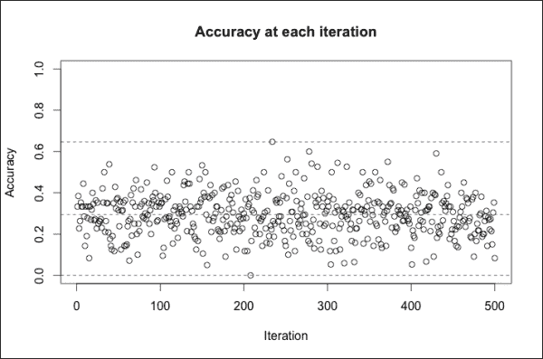
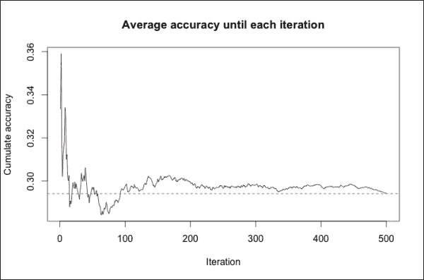
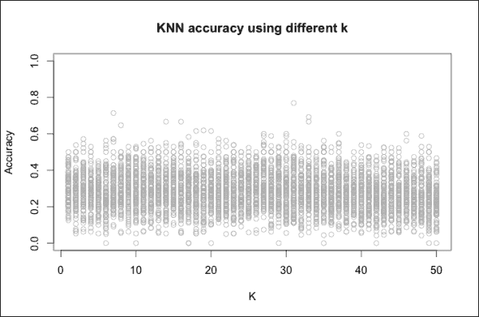
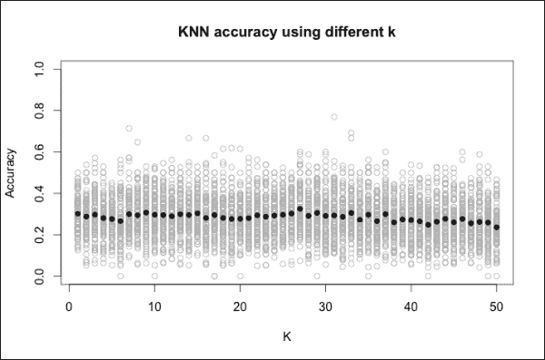
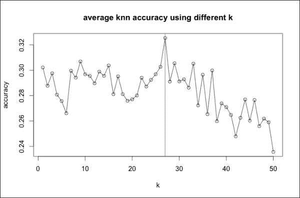
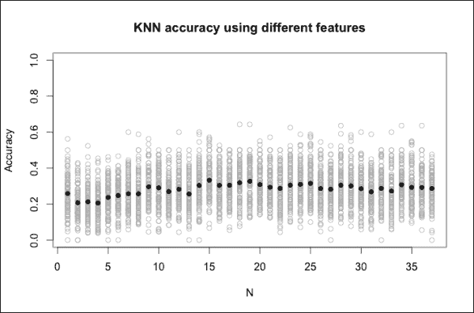
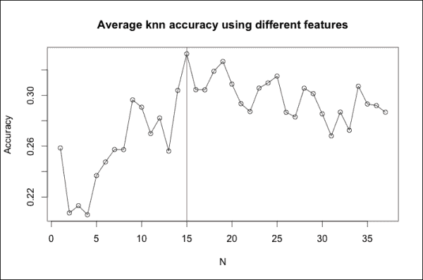
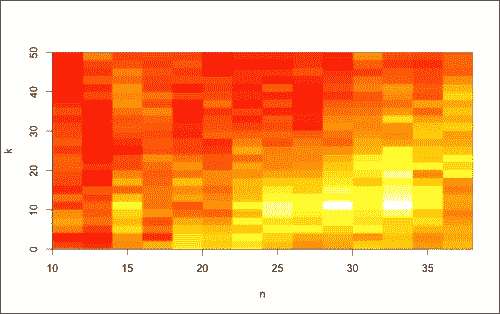

# 第六章 第 3 步 – 验证结果

在上一章中，我们从新国家的国旗开始估计其语言。为此，我们使用了 KNN 算法，这是一种监督学习算法。我们构建了 KNN 并通过对估计的语言进行交叉验证来测量其准确性。在本章中，我们将了解如何以更可靠的方式测量准确性，并将调整 KNN 参数以提高其性能。为了能够完成本章的任务，你不需要阅读上一章，尽管这样做是推荐的，这样你可以理解 KNN 算法是如何工作的。

在本章中，你将学习如何：

+   验证算法的准确性

+   调整算法参数

+   选择最相关的数据特征

+   优化参数和特征

# 验证机器学习模型

从描述国家、国旗及其语言的表格开始，KNN 根据国旗属性估计新国家的语言。在本章中，我们将评估 KNN 的性能。

## 测量算法的准确性

我们已经通过交叉验证估计的语言来评估了算法的准确性。首先，我们将数据分为两部分，即训练集和测试集。然后，我们使用训练集构建 KNN 算法来估计测试集国家的语言。计算估计语言正确的次数，我们定义了一个准确度指数，即正确猜测的百分比。准确度取决于我们放入测试集的数据。由于我们随机定义了训练集国家，每次重复交叉验证时准确度都会改变。因此，这种方法的结果不可靠。

本章的目标是使用一种可靠的技术来评估 KNN，即准确性在验证同一模型两次时不会改变。重复进行训练/测试集分割和验证多次，几乎每个国家至少会在训练集和测试集中出现一次。我们可以计算平均准确性，并将考虑训练集和测试集中的所有国家。经过几次迭代后，平均准确性将变得可靠，因为增加迭代次数不会显著改变它。

在评估 KNN 之前，我们需要加载`kknn`和`data.table`包：

```py
# load the packages
library('kknn')
library('data.table')
```

我们可以定义一个函数，构建和交叉验证 KNN，使用一组定义好的参数和数据，这样我们可以快速评估任何配置的算法。由于 R 命令与上一章类似，我们将快速浏览它们。函数的输入是：

+   包含数据的表格

+   包含我们使用的特征名称的向量

+   KNN 参数

步骤如下：

1.  定义哪些行属于训练集和测试集。我们构建`indexTrain`，这是一个向量，指定哪些行将包含在训练集中。我们将测试集的标志设置为 10%的概率。在第五章中，*步骤 2 – 应用机器学习技术*，我们将概率设置为 20%，但在这章中我们将多次重复验证，所以 10%就足够了。

1.  从`indexTrain`开始，提取进入`dtTrain`和`dtTest`的行。

1.  定义定义特征和预测属性的公式。

1.  使用输入参数构建 KNN。

1.  定义包含测试集估计语言的`languageFitted`向量。

1.  计算多少次`languageFitted`与真实语言相同。

1.  计算准确率指数，即预测语言和实际语言匹配的次数除以测试集中国家的数量。

这是构建函数的 R 代码。注释反映了编号的要点，如下所示：

```py
validateKnn <- function(
  dtFeatures, # data table with the features
  arrayFeatures, # feature names array
  k = 10, # knn parameter
  kernel = 'rectangular', # knn parameter
  distance = 1 # knn parameter
){

  # 1 define the training/test set rows
  indexTrain <- sample(
    x=c(TRUE, FALSE),
    size=nrow(dtFeatures),
    replace=TRUE,
    prob=c(0.9, 0.1)
  )

  # 2 define the training/test set
  dtTrain <- dtFeatures[indexTrain]
  dtTest <- dtFeatures[!indexTrain]

  # 3 define the formula
  formulaOutput <- 'language ~'
  formulaFeatures <- paste(arrayFeatures, collapse = ' + ')
  formulaKnn <- paste(formulaOutput, formulaFeatures)
  formulaKnn <- formula(formulaKnn)

  # 4 build the KNN model
  modelKnn <- kknn(
    formula = formulaKnn,
    train = dtTrain,
    test = dtTest,
    k = k,
    kernel = kernel,
    distance = distance
  )

  # 5 defining the predicted language
  languageFitted <- modelKnn$fitted.values

  # 6 count the corrected predictions and the total
  languageReal <- dtTest[, language]
  nRows <- length(languageReal)

  # 7 define the accuracy index
  percCorrect <- sum(languageFitted == languageReal) / nRows

  return(percCorrect)
}
```

在这里，`validateKnn`是验证 KNN 算法的起点。

## 定义平均准确率

为了使用`validateKnn`，我们需要定义输入，如下所示：

+   特征的数据表，如下所示：

    ```py
    setwd('<INSER/YOUR/DIRECTORY/PATH>")
    dfFeatures <- read.table(file = 'dtFeatures.txt')
    ```

+   包含所有可能包含在 KNN 中的特征的向量：

    ```py
    arrayFeatures <- names(dfFeatures)
    arrayFeatures <- arrayFeatures[arrayFeatures != 'language']
    ```

+   KNN 参数可以是设置的，也可以保留为默认值。

现在，我们有了使用`validateKnn`所需的所有元素。我们可以使用它们的随机子集，例如，前 10 个特征。至于参数，我们可以将它们全部保留为默认值，除了`k`等于`8`，如下所示：

```py
# evaluate a model accuracy
validateKnn(
  dtFeatures = dtFeatures,
  arrayFeatures = arrayFeatures[1:10],
  k = 8
)
[1] 0.3571429

```

多次运行`validateKnn`，我们可以注意到每次的结果都不同，这是预期的。然而，现在我们可以定义另一个函数，该函数运行`validateKnn`多次。然后，我们计算准确率平均值，并将其用作可靠的性能指标。我们的新函数称为`cvKnn`，因为它交叉验证 KNN 定义的次数。

`cvKnn`参数是数据表、迭代次数、特征名称和 KNN 参数。让我们开始定义数据表和迭代次数。所有其他输入与`validateKnn`相同。为了使代码清晰紧凑，我们可以使用省略号(...)指定我们可以添加其他参数。然后，我们可以再次使用省略号将这些参数传递给任何函数。这意味着当我们调用`validateKnn`时，我们可以使用`validateKnn(...)`来指定`cvKnn`的任何额外参数都将作为`validateKnn`的输入。

函数步骤如下：

1.  定义一个空的向量`arrayPercCorrect`，它将包含准确率。

1.  运行`validateKnn`并定义`arrayPercCorrect`，它包含准确率。

1.  将准确率`arrayPercCorrect`添加到`arrayPercCorrect`中。

这是构建函数的代码：

```py
cvKnn <- function(
  dtFeatures, # data table with the features
  nIterations=10, # number of iterations
  ... # feature names array and knn parameters
){

  # 1 initialize the accuracy array
  arrayPercCorrect <- c()

  for(iIteration in 1:nIterations){

    # 2 build and validate the knn
    percCorrect <- validateKnn(dtFeatures, ...)

    # 3 add the accuracy to the array
    arrayPercCorrect <- c(arrayPercCorrect, percCorrect)
  }

  return(arrayPercCorrect)
}
```

现在，我们可以使用`cvKnn`构建和验证 KNN 500 次。然后，我们计算平均准确率作为 KNN 性能指标：

```py
# determine the accuracies
arrayPercCorrect = cvKnn(
  dtFeatures, nIterations=500,
  arrayFeatures=arrayFeatures
)
# compute the average accuracy
percCorrectMean <- mean(arrayPercCorrect)
percCorrectMean
[1] 0.2941644

```

我们定义`percCorrectMean`，它可以作为准确率指标。

## 可视化平均准确率计算

为了看到结果在任意迭代时的变化程度，我们可以将每个步骤的准确率与平均值进行比较。首先，我们使用`plot`构建一个包含准确率的图表，参数如下：

+   `x`：这是我们想要绘制的向量（`arrayPercCorrect`）。

+   `ylim`：这是介于 0 和 1 之间的准确率。通过`ylim = c(0, 1)`，我们指定可视化的区域在 0 和 1 之间。

+   `xlab`和`ylab`：这是坐标轴标签。

+   `main`：这是标题。

代码如下：

```py
# plot the accuracy at each iteration
plot(
  x = arrayPercCorrect,
  ylim = c(0, 1),
  xlab = 'Iteration', ylab = 'Accuracy',
  main = 'Accuracy at each iteration'
)
```

为了将准确率与平均值进行比较，我们可以通过绘制一条红色的虚线水平线来显示平均值，如下所示：

```py
help(abline)
abline(h=percCorrectMean, col='red', lty='dashed')
```

我们可以通过为最小值和最大值范围绘制水平线来可视化值的范围，如下所示：

```py
abline(h=min(arrayPercCorrect), col='blue', lty='dashed')
abline(h=max(arrayPercCorrect), col='blue', lty='dashed')
```

得到的图表如下：



准确率从一个迭代到另一个迭代变化很大，范围在 0%到 70%之间。正如预期的那样，单个准确率是完全不可靠的。500 次迭代中的平均值怎么样？我们需要多少次迭代才能得到一个稳定的结果？

我们可以可视化第一次迭代的准确率指标，然后是前两次迭代的平均值，然后是前三次迭代的平均值，依此类推。如果在任何点上平均值不再变化，我们就不需要再继续了。通过构建图表，我们可以观察到达到稳定平均值所需的迭代次数。

首先，让我们定义包含累积平均值的`arrayCumulate`，这是直到每个迭代的局部平均值，如下所示：

```py
# plot the average accuracy until each iteration
arrayCumulate <- c()
for(nIter in 1:length(arrayPercCorrect)){
  cumulateAccuracy <- mean(arrayPercCorrect[1:nIter])
  arrayCumulate <- c(arrayCumulate, cumulateAccuracy)
}
```

使用与之前相同的命令，我们构建一个新的图表。唯一的新的参数是`type='l'`，它指定我们显示的是线而不是点。为了放大平均值所在的区域，我们移除了`ylim`参数，如下所示：

```py
plot(
  x = arrayCumulate,
  type = 'l',
  xlab = 'Iteration', ylab = 'Cumulate accuracy',
  main = 'Average accuracy until each iteration'
)
abline(h = percCorrectMean, col = 'red', lty = 'dashed')
```

得到的图表如下：



我们可以注意到，准确率在 100 次迭代后几乎保持稳定。假设它不会因不同的参数配置而变化太多，我们可以使用 100 次迭代来验证 KNN 算法。

在本节中，我们看到了如何使用一组特定的特征和一些定义的参数自动评估模型性能。在接下来的章节中，我们将使用这个函数来优化模型性能。

# 调整参数

本节向您展示如何通过调整参数来提高 KNN 的性能。我们处理的是定义邻居数量的*k*参数。使用以下步骤来识别表现最佳的*k*参数：

1.  定义我们将测试的 *k* 值。KNN 在本地工作，也就是说，给定一个新的国家国旗，它只识别几个相似的国旗。我们最多应该使用多少个？由于总共有不到 200 个国旗，我们不希望使用超过 50 个国旗。然后，我们应该测试 1 到 50 之间的每个 *k*，并可以定义包含选项的 `arrayK`：

    ```py
    # define the k to test
    arrayK <- 1:50
    ```

1.  定义迭代次数。对于 `arrayK` 中的每个 *k*，我们需要构建和验证 KNN，次数足够高，由 `nIterations` 定义。在前一章中，我们了解到我们需要至少 100 次迭代才能得到有意义的 KNN 准确性：

    ```py
    nIterations <- 100
    ```

1.  评估每个 *k* 的准确性。

1.  选择最大化准确性的 *k*。

最后两个步骤更详细，我们将深入探讨。

为了测量每个 *k* 的准确性，我们定义 `dtAccuracyK` 为一个空的数据表，它将包含准确性。然后，我们使用 `for` 循环运行每个 `arrayK` 中的 *k* 的 KNN 并添加新结果。步骤如下：

1.  使用 `cvKnn` 运行和验证 KNN。

1.  定义要添加到 `dtAccuracyK` 的行，包含准确性和 *k*。

1.  使用 `rbind` 将新行添加到 `dtAccuracyK`：

    ```py
    # validate the knn with different k
    dtAccuracyK <- data.table()
    for(k in arrayK)
    {

      # run the KNN and compute the accuracies
      arrayAccuracy <- cvKnn(
        dtFeatures,
        nIterations=nIterations,
        arrayFeatures = arrayFeatures,
        k = k
      )
      # define the new data table rows
      rowsAccuracyK <- data.table(
        accuracy = arrayAccuracy,
        k = k
      )
      # add the new rows to the accuracy table
      dtAccuracyK <- rbind(
        dtAccuracyK,
        rowsAccuracyK
        )
    }
    ```

现在，让我们看看 `result.head(dtAccuracyK)`：

```py
 accuracy k
1: 0.3636364 1
2: 0.4545455 1
3: 0.4000000 1
4: 0.2727273 1
5: 0.3000000 1
6: 0.2500000 1

```

`dtAccuracyK` 的每一行都包含 KNN 的一个迭代。第一列显示准确性，第二列显示迭代中使用的 *k*。

为了可视化结果，我们可以使用 `plot`。我们想要可视化的两个维度是 *k* 和准确性。输入如下：

+   `x`，`y`：这些是图表维度，分别是 `k` 和 `accuracy` 列

+   `xlab`，`ylab`：这些是轴标签，分别是 `k` 和 `accuracy`

+   `main`：这是图表标题

+   `ylim`：这些是 *y* 区域限制，分别是 `0` 和 `1`

+   `col`：这是点的颜色，为灰色，以便强调我们稍后要添加的黑点

代码如下：

```py
# plot all the accuracies
plot(
  x = dtAccuracyK[, k],
  y = dtAccuracyK[, accuracy],
  xlab = 'K', ylab = 'Accuracy',
  main = 'KNN accuracy using different k',
  ylim = c(0, 1),
  col = 'grey'
)
```

得到的图表如下：



### 小贴士

您也可以使用 `type = 'str(dtCvK)'` 而不是 `type = 'o'`。

我们无法注意到任何与 *k* 相关的差异。原因是准确性从一个迭代到另一个迭代变化很大。为了识别表现更好的 *k*，我们可以计算每个 *k* 的平均性能。我们称新的数据表为 `dtCvK`，因为我们正在交叉验证模型，如下所示：

```py
# compute the average accuracy
dtCvK <- dtAccuracyK[
  , list(accuracy = mean(accuracy)),
  by='k'
  ]
View(dtCvK)
```

在这里，`dtCvK` 包含每个 *k* 的平均准确性。我们可以使用添加新点到当前图表的函数将它们添加到图表中。为了使点更明显，我们使用 `pch = 16` 显示完整点，如下所示：

```py
# add the average accuracy to the chart
help(points)
points(
  x = dtCvK[, k],
  y = dtCvK[, accuracy],
  pch = 16
)
```

图表如下：



平均准确性随 *k* 变化，但很难注意到差异，因为它始终在 0.3 到 0.4 之间。为了更清楚地看到差异，我们可以只绘制平均值而不可视化 *y* 限制，如下所示：

```py
# plot the average accuracy
plot(
  x = dtCvK[, k],
  y = dtCvK[, accuracy],
  xlab = 'k', ylab = 'accuracy',
  main = 'average knn accuracy using different k',
  type = 'o'
)
```

### 小贴士

您也可以使用 `type = 'str(dtCvK)'` 而不是 `type = 'o'`。

我们可以识别表现最佳的 *k* 并使用 `abline` 将其添加到图表中：

```py
# identify the k performing best
kOpt <- dtCvK[accuracy == max(accuracy), k]
abline(v = kOpt, col = 'red')
```

### 小贴士

您也可以使用 `kOpt <- 27` 而不是 `kOpt <- dtCvK[accuracy == max(accuracy), k]`。

得到的图如下：



最佳 *k* 值为 27，如果 *k* 在 22 到 30 的范围内，KNN 的表现非常好。

在本章中，我们确定了表现最佳的 *k*。然而，还有一些其他参数我们没有优化，例如距离方法。此外，我们可以通过选择要包含的特征来改进算法，我们将在下一节中探讨。

# 选择要包含在模型中的数据特征

在上一节中，我们设置了一个最大化性能的 KNN 参数。另一个调整选项是定义我们用于构建模型的数据。我们的表格描述了使用 37 个特征的标志，并将它们全部包含在模型中。然而，KNN 可能仅包括其中的一小部分时表现更好。

选择特征的最简单方法是使用过滤器（如在第四章的 *使用过滤器或降维对特征进行排序* 部分中预期的那样，第四章，*步骤 1 – 数据探索和特征工程*），该过滤器估计每个特征的影响，并仅包含最相关的特征。在根据相关性对所有特征进行排序后，我们可以定义 `n` 参数，指定我们在模型中包含多少个这样的特征。然后，我们可以根据 `n` 最大化准确性，使用与上一节类似的方法。

第一步是定义如何对特征进行排序。我们可以使用信息增益率过滤器来估计每个特征的影响，同时忽略其他特征。我们已讨论过信息增益率及其局限性（请参阅第四章的 *使用过滤器或降维对特征进行排序* 部分，第四章，*步骤 1 – 数据探索和特征工程*），我们将使用相同的 R 命令，如下所示：

```py
# rank the features
library('FSelector')
dfGains <- information.gain(
  language~., dtFeatures
  )
dfGains$feature <- row.names(dfGains)
dtGains <- data.table(dfGains)
dtGains <- dtGains[order(attr_importance, decreasing = T)]
arrayFeatures <- dtGains[, feature]
```

在这里，`arrayFeatures` 包含按相关性排序的特征。现在，我们可以通过选择前 *n* 个特征来构建模型。*n* 的选项是介于 `1` 和特征总数之间的数字，我们定义 `arrayN` 来包含它们，如下所示：

```py
# define the number of features to test
arrayN <- 1:length(arrayFeatures)
```

为了存储每次迭代的准确性，我们定义 `dtAccuracyN` 为一个空数据表，并使用 `for` 循环迭代地添加行。步骤如下：

1.  使用 `cvKnn` 验证 KNN 并将准确性存储在 `arrayAccuracy` 中。我们将 *k* 参数设置为 `kOpt (27)`，即上一节中定义的最佳 *k*。

1.  定义包含要添加行的 `rowsAccuracyN` 数据表。

1.  使用 `rbind` 将新行添加到 `dtAccuracyN`。

这是生成 `for` 循环的代码：

```py
for(n in arrayN)
{
  # 1 run the KNN and compute the accuracies
  arrayAccuracy <- cvKnn(
    dtFeatures,
    nIterations = nIterations,
    arrayFeatures = arrayFeatures[1:n],
    k = kOpt
  )

  # 2 define the new data table rows
  rowsAccuracyN <- data.table(
    accuracy = arrayAccuracy,
    n = n
  )

  # 3 add the new rows to the accuracy table
  dtAccuracyN <- rbind(
    dtAccuracyN,
    rowsAccuracyN
  )
}
```

在这里，`dtAccuracyN`包含每个迭代的准确率，取决于*n*。我们可以通过以下步骤构建一个包含所有准确率和它们在不同*n*值上的平均值的图表：

1.  建立一个显示每次迭代的准确率的图表：

    ```py
    plot(
      x = dtAccuracyN[, n],
      y = dtAccuracyN[, accuracy],
      xlab = 'N', ylab = 'Accuracy',
      main = 'KNN accuracy using different features',
      ylim = c(0, 1),
      col = 'grey'
    )
    ```

1.  从`dtAccuracyN`开始，计算每个迭代的平均准确率：

    ```py
    dtCvN <- dtAccuracyN[
      , list(accuracy = mean(accuracy)),
      by='n'
      ]
    ```

1.  将平均准确率的点添加到图表中：

    ```py
    Points(
      x = dtCvN[, n],
      y = dtCvN[, accuracy],
      xlab = 'n', ylab = 'accuracy',
      pch = 16
    )
    ```

得到的图如下：



图表显示，我们使用高值的*n*实现了最佳准确率。为了确定最佳的*n*，我们可以仅绘制它们的平均值。然后，我们定义`nOpt`，即表现最佳的*n*，并添加一个对应的红色垂直线，如图所示：

```py
# plot the average accuracy
plot(
  x = dtCvN[, n],
  y = dtCvN[, accuracy],
  xlab = 'N', ylab = 'Accuracy',
  main = 'Average knn accuracy using different features',
  type = 'o'
)

# identify the n performing best
nOpt <- dtCvN[accuracy == max(accuracy), n]
abline(v = nOpt, col = 'red')
```

得到的图如下：



表现最好的特征数量是**15**，在此之后性能缓慢下降。

在图表中，我们可以注意到有些点在添加新特征时准确率会大幅下降（例如，**3**，**11**，**13**）。在这些点上，我们添加的特征降低了性能。如果我们决定不包含它会怎样呢？我们可以仅使用最相关的特征来构建模型，然后添加第二个最相关的特征。如果性能有所提高，我们保留第二个特征；否则，我们丢弃它。之后，我们用同样的方法处理第三个特征，并重复此过程，直到我们添加或丢弃了每个特征。这种方法被称为包装器，它允许我们定义比过滤器更好的特征集。

在本节中，我们确定了最佳的*n*和最佳的*k*，因此我们使用它们来构建具有良好性能的 KNN。

# 一起调整特征和参数

在前两个部分中，我们使用所有特征（`n=37`）确定了最佳*k*。然后，使用最佳的*k*，我们确定了最佳的*n*。如果算法在`k=30`和`n=25`时表现更好，会怎样呢？我们还没有充分探索这个组合以及许多其他选项，所以可能存在比`k=27`和`n=15`表现更好的组合。

为了确定最佳选项，最简单的方法是测试所有备选方案。然而，如果变量之间存在太多的可能组合，我们可能没有足够的计算能力来测试所有这些组合。在这种情况下，我们可以使用梯度下降等优化算法来确定最佳参数。

幸运的是，在我们的案例中，我们只需要调整两个参数，并且可以测试它们可能值的一部分。例如，如果我们选择 20 个*n*的值和 20 个*k*的值，我们就有 400 种组合。为了做到这一点，我们执行以下步骤：

1.  定义 *k* 的选项。包括所有特征，KNN 在 `k=26` 时表现最佳，之后 `40` 就表现不佳。然而，设置较低的 *n*，情况可能会改变，因此我们需要测试所有可能的 *k*。为了限制选项数量，我们可以将测试限制在奇数。让我们使用 `seq` 生成 1 到 49 之间的所有奇数。`from` 和 `to` 参数定义序列的开始和结束。`by` 参数定义增量，为 2 以生成奇数。使用 `seq`，我们构建包含所有 *k* 选项的 `arrayK`，如下所示：

    ```py
    arrayK <- seq(from = 1, to =  49, by = 2)
    ```

1.  定义 *n* 的选项。我们已经看到，算法仅使用少量特征集时表现非常糟糕，因此我们可以测试 *n* 的值在 10 到特征总数之间，即 37。与 *k* 类似，我们只包括奇数：

    ```py
    arrayN <- seq(from = 11, to = 37, by = 2)
    ```

1.  生成 *k* 和 *n* 之间所有可能的组合。为此，我们可以使用 `expand.grid`。给定两个或多个向量，`expand.grid` 生成一个包含它们所有可能组合的数据框。在我们的情况下，我们生成一个从 `arrayK` 开始的 `k` 列和一个从 `arrayN` 开始的 `n` 列，如下所示：

    ```py
    dfParameters <- expand.grid(k=arrayK, n=arrayN)
    ```

1.  将 `dfParameters` 转换为数据表：

    ```py
    dtParameters <- data.table(dfParameters)
    ```

现在，我们可以使用 `head` 查看 `dtParameters`：

```py
head(dtParameters)
 k  n
1:  1 11
2:  3 11
3:  5 11
4:  7 11
5:  9 11
6: 11 11

```

在这里，`dtParameters` 包含每个 350 种组合的行。我们需要确定准确度并将它们存储在一个名为 `accuracy` 的新列中。为了做到这一点，我们使用一个遍历行的 `for` 循环。`iConfig` 变量是行索引，定义为介于 1 和 `nrow(dtParameters)` 行数之间的数字。存在不同的组合，因此这部分代码可能需要一段时间才能运行。在每次迭代后，我们使用行中包含的参数构建模型：

+   **k**：这具有 `dtParameters[iConfig, k]` 参数

+   **n**：这具有 `dtParameters[iConfig, n]` 参数

考虑以下代码：

```py
# validate the knn with different k and nFeatures
for(iConfig in 1:nrow(dtParameters)){  

  arrayAccuracy <- cvKnn(
    dtFeatures, nIterations = nIterations,
    arrayFeatures = arrayFeatures[1:dtParameters[iConfig, n]],
    k = dtParameters[iConfig, k]
  )
```

现在，我们可以计算 `arrayAccuracy` 平均值并将其添加到 `dtParameters`：

```py
  # add the average accuracy to dtParameters
  dtParameters[iConfig, accuracy := mean(arrayAccuracy)]
}
```

`dtParameters` 的每一行包含一个参数集及其相关的准确度。为了更方便地查看准确度，我们可以构建一个矩阵，其行对应于 `n`，列对应于 `k`。矩阵的每个元素显示准确度。为了构建矩阵，我们可以使用 `reshape`，如下所示：

```py
# reshape dtParameters into a matrix
help(reshape)
```

`reshape` 语法相当复杂。在我们的情况下，我们想要构建的矩阵是 `wide` 格式，因此我们需要指定 `direction = "wide"`。其他参数定义我们使用的列，它们是：

+   `v.names`：此列定义矩阵值（准确度）

+   `idvar`：此列定义矩阵行（`n` 的值）

+   `timevar`：此列定义矩阵列（`k` 的值）

使用 `reshape`，我们可以构建如所示的 `dfAccuracy` 数据框：

```py
dfAccuracy <- reshape(
  data = dtParameters,
  direction = "wide",
  v.names = "accuracy",
  idvar = "n",
  timevar = "k"
)
View(dfAccuracy)
```

`n` 列包含 *n* 参数，我们将其删除以获得仅包含准确度的数据框。然后，我们将数据框转换为矩阵，如下所示：

```py
dfAccuracy$n <- NULL
matrixAccuracy <- as.matrix(dfAccuracy)
```

现在，我们可以将 `n` 和 `k` 分别指定为行名和列名，如下所示：

```py
rownames(matrixAccuracy) <- arrayN
colnames(matrixAccuracy) <- arrayK
View(matrixAccuracy)
```

为了可视化参数的准确率，我们可以构建一个热图，这是一个表示矩阵的图表。两个图表维度是 `k` 和 `n`，颜色代表值。我们可以使用 `image` 构建这个图表：

```py
# plot the performance depending on k and n
help(image)
```

我们使用的参数是：

+   `z`：这是一个矩阵

+   `x` 和 `y`：这些是维度名称，包含在 `arrayN` 和 `arrayK` 中

+   `xLab` 和 `yLab`：这些是坐标轴标签

+   `col`：这是我们显示的颜色向量（我们可以使用 `heat.colors` 函数）

考虑以下代码：

```py
image(
  x = arrayN, y = arrayK, z = matrixAccuracy,
  xlab = 'n', ylab = 'k',
  col = heat.colors(100)
)
```

得到的图如下：



高准确率用浅黄色表示，低准确率用红色表示。我们可以注意到，我们在 `k` 在 9 到 19 范围内和 `n` 在 29 到 33 范围内达到了最佳准确率。最差性能发生在 `n` 低而 `k` 高的情况下。

让我们看看最佳性能组合是什么。考虑以下代码：

```py
# identify the best k-n combination
kOpt <- dtParameters[accuracy == max(accuracy), k]
nOpt <- dtParameters[accuracy == max(accuracy), n]
```

最佳组合是 `k=11` 和 `n=33`，我们无法通过单独最大化参数来识别它。原因是，只有当我们不包括所有特征时，KNN 才会在 `k=11` 时表现良好。

在本节中，我们看到了一种优化两个参数的简单方法。在其他情况下，我们需要更高级的技术。

这种方法的局限性在于我们只调整了两个参数。我们可以通过调整其他 KNN 参数（如距离方法）来达到更好的性能。

# 摘要

在本章中，我们学习了如何将模型的性能评估为预测的平均准确率。我们了解了如何确定表示准确率的准确交叉验证指数。从交叉验证指数开始，我们调整了参数。此外，我们还学习了如何使用过滤器或 frapper 选择特征，以及如何同时调整特征和参数。本章描述了构建机器学习解决方案的最后部分，下一章将概述一些最重要的机器学习技术。
