# 第八章：适用于商业的机器学习示例

本章的目的是向您展示机器学习如何帮助解决商业问题。大多数技术已在上一章中探讨过，因此本章的节奏很快。技术涉及无监督学习和监督学习。无监督算法从数据中提取隐藏结构，监督技术预测属性。本章使用两个分支的技术解决商业挑战。

在本章中，你将学习如何：

+   将机器学习方法应用于商业问题

+   对银行的客户群进行细分

+   识别营销活动的目标

+   选择表现更好的技术

# 问题概述

一家葡萄牙银行机构发起了一项电话营销活动。该机构资源有限，因此需要选择目标客户。从过去活动的数据开始，我们可以使用机器学习技术为公司提供一些支持。数据显示了客户的个人细节以及以前营销活动的信息。机器学习算法的目标是识别更有可能订阅的客户。从数据开始，算法需要理解如何使用新客户的数据来预测每个客户订阅的可能性。

## 数据概述

数据包括大约超过 2,500 名受营销活动影响的客户，该活动包括一个或多个电话呼叫。我们有一些关于客户的信息，并且我们知道谁已经订阅。

表格的每一行对应一个客户，其中有一列显示输出，如果客户已订阅则显示`yes`，否则显示`no`。其他列是描述客户的特征，它们是：

+   **个人详情**：这包括诸如年龄、工作、婚姻状况、教育、信用违约、平均年度余额、住房和个人贷款等详细信息。

+   **与公司的沟通**：这包括诸如联系方式、最后联系月份和星期几、最后通话时长和联系次数等详细信息。

+   **以前的营销活动**：这包括诸如上次营销活动前的天数、过去联系次数和过去结果等详细信息。

这是表格的一个示例。`y`列显示预测属性，如果客户已订阅则显示`yes`，否则显示`no`。

| 年龄 | 工作 | 婚姻状况 | ... | 联系方式 | … | y |
| --- | --- | --- | --- | --- | --- | --- |
| 30 | services | married |   | cellular |   | no |
| 33 | management | single |   | telephone |   | yes |
| 41 | blue-collar | single |   | unknown |   | no |
| 35 | self-employed | married |   | telephone |   | no |

数据存储在`bank.csv`文件中，我们可以通过在 R 中构建数据表来加载它们。`sep=';'`字段指定文件中的字段由分号分隔，如下所示：

```py
library(data.table)
dtBank <- data.table(read.csv('bank.csv', sep=';'))
```

`duration`特征显示最终通话的秒数。我们分析的目标是定义哪些客户需要联系，我们在联系客户之前无法知道通话时长。此外，在知道通话时长后，我们已经知道客户是否订阅了，因此使用此属性来预测结果是没有意义的。因此，我们移除了`duration`特征，如下所示：

```py
# remove the duration
dtBank[, duration := NULL]
```

下一步是探索数据以了解上下文。

## 探索输出

在本小节中，我们快速探索并转换数据。

`y`输出是分类的，可能的输出结果为`yes`和`no`，我们的目标是可视化比例。为此，我们可以使用以下步骤构建饼图：

1.  使用`table`统计订阅和未订阅的客户数量：

    ```py
    dtBank[, table(y)]
    y
     no  yes
    4000  521

    ```

1.  确定订阅和未订阅客户的百分比：

    ```py
    dtBank[, table(y) / .N]
    y
     no     yes 
    0.88476 0.11524

    ```

1.  从比例开始构建一个确定百分比的函数：

    ```py
    DefPercentage <- function(frequency)
    {
      percentage = frequency / sum(frequency)
      percentage = round(percentage * 100)
      percentage = paste(percentage, '%')
      return(percentage)
    }
    ```

1.  确定百分比：

    ```py
    defPercentage(dtBank[, table(y) / .N])
    [1] "88 %" "12 %"

    ```

1.  查看 R 函数`barplot`的帮助，该函数用于构建条形图：

    ```py
    help(barplot)
    ```

1.  定义条形图输入：

    ```py
    tableOutput <- dtBank[, table(y)]
    colPlot <- rainbow(length(tableOutput))
    percOutput <- defPercentage(tableOutput)
    ```

1.  构建条形图：

    ```py
    barplot(
      height = tableOutput,
      names.arg = percOutput,
      col = colPlot,
      legend.text = names(tableOutput),
      xlab = 'Subscribing'
      ylab = 'Number of clients',
      main = 'Proportion of clients subscribing'
    )
    ```

获得的图表如下：

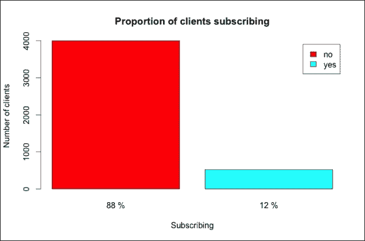

只有 12%的客户订阅了，因此输出值分布不均。下一步是探索所有数据。

## 探索和转换特征

与输出类似，我们可以构建一些图表来探索特征。让我们首先使用`str`查看它们：

```py
str(dtBank)
Classes 'data.table' and 'data.frame':    4521 obs. of  16 variables:
 $ age      : int  30 33 35 30 59 35 36 39 41 43 ...
 $ job      : Factor w/ 12 levels "admin.","blue-collar",..: 11 8 5 5 2 5 7 10 3 8 ...
 $ marital  : Factor w/ 3 levels "divorced","married",..: 2 2 3 2 2 3 2 2 2 2 ...
...

```

特征属于两种数据类型：

+   **分类**：这种数据类型以因子格式存储特征

+   **数值**：这种数据类型以整数格式存储特征

对于分类特征和数值特征的图表是不同的，因此我们需要将特征分为两组。我们可以通过以下步骤定义一个包含分类特征的向量以及一个包含数值特征的向量：

1.  使用`lapply`定义每一列的类：

    ```py
    classFeatures <- lapply(dtBank, class)
    ```

1.  移除包含输出的`y`列：

    ```py
    classFeatures <- classFeatures[names(classFeatures) != 'y']
    ```

1.  确定分类特征：

    ```py
    featCategoric <- names(classFeatures)[
      classFeatures == 'factor'
      ]
    ```

1.  确定数值特征：

    ```py
    featNumeric <- names(classFeatures)[
      classFeatures == 'integer'
      ]
    ```

与输出类似，我们可以为九个分类特征中的每一个构建饼图。为了避免图表过多，我们可以将三个饼图放在同一个图表中。R 函数是`par`，它允许定义图表网格：

```py
help(par)
```

我们需要的输入是：

+   `mfcol`：这是一个包含列数和行数的向量。对于每个特征，我们构建一个饼图和一个包含其图例的图表。我们将饼图放在底部行，图例放在顶部。然后，我们有两行三列。

+   `mar`：这是一个定义图表边距的向量：

    ```py
    par(mfcol = c(2, 3), mar = c(3, 4, 1, 2))
    ```

现在，我们可以使用`for`循环构建直方图：

```py
for(feature in featCategoric){
```

在`for`循环内执行以下步骤：

1.  定义饼图输入：

    ```py
      TableFeature <- dtBank[, table(get(feature))]
      rainbCol <- rainbow(length(tableFeature))
      percFeature <- defPercentage(tableFeature)
    ```

1.  定义一个新的图表，其图例由特征名称与其颜色匹配组成。我们将特征名称作为图例标题：

    ```py
       plot.new()
       legend(
         'top', names(tableFeature),
         col = rainbCol, pch = 16,
         title = feature
       )
    ```

1.  构建将在底部行显示的直方图：

    ```py
      barplot(
        height = tableFeature,
        names.arg = percFeature,
        col = colPlot,
        xlab = feature,
        ylab = 'Number of clients'
      )
    }
    ```

我们构建了包含三个分类特征的三个图表。让我们看看第一个：

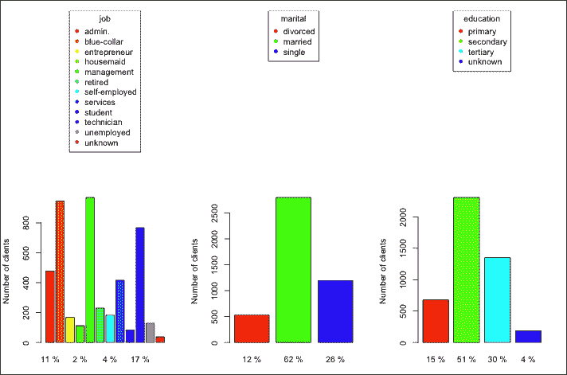

`job` 属性有不同的级别，其中一些级别拥有大量的客户。然后，我们可以为每个相关的职位定义一个虚拟变量，并忽略其他职位。为了确定最相关的职位，我们计算属于每个级别的百分比。然后，我们设置一个阈值，并忽略所有低于阈值的级别。在这种情况下，阈值是 0.08，即 8%。在定义新的虚拟列之后，我们移除 `job`：

```py
percJob <- dtBank[, table(job) / .N]
colRelevant <- names(percJob)[percJob > 0.08]
for(nameCol in colRelevant){
  newCol <- paste('job', nameCol, sep='_')
  dtBank[, eval(newCol) := ifelse(job == nameCol, 1, 0)]
}
dtBank[, job := NULL]
```

在这里，`marital`，定义婚姻状况，有三个级别，其中 `divorced` 和 `single` 占有较小的，尽管是显著的，部分。我们可以定义两个虚拟变量来定义三个级别：

```py
dtBank[, single := ifelse(marital == 'single', 1, 0)]
dtBank[, divorced := ifelse(marital == 'divorced', 1, 0)]
dtBank[, marital := NULL]
```

关于 `education`，超过一半的客户接受了中等教育，因此我们可以假设 `unknown` 的 4% 是 `secondary`。然后，我们有三个属性，我们可以定义两个虚拟变量：

```py
dtBank[, edu_primary := ifelse(education == 'primary', 1, 0)]
dtBank[, edu_tertiary := ifelse(education == 'tertiary', 1, 0)]
dtBank[, education := NULL]
```

得到的图如下：

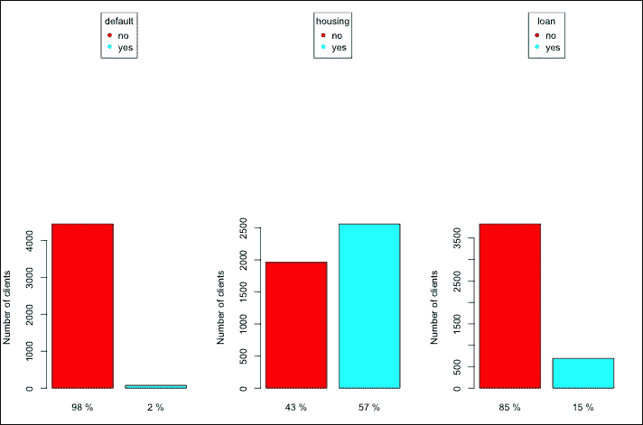

**默认**、**住房**和**贷款**属性有两个不同的级别，因此可以使用 `as.numeric` 将它们转换为数值形式。为了在属性为 `no` 时得到 `0`，在属性为 `yes` 时得到 `1`，我们减去 `1`，如下所示：

```py
dtBank[, housing := as.numeric(housing) - 1]
dtBank[, default := as.numeric(default) - 1]
dtBank[, loan := as.numeric(loan) - 1]
```

得到的直方图如下：

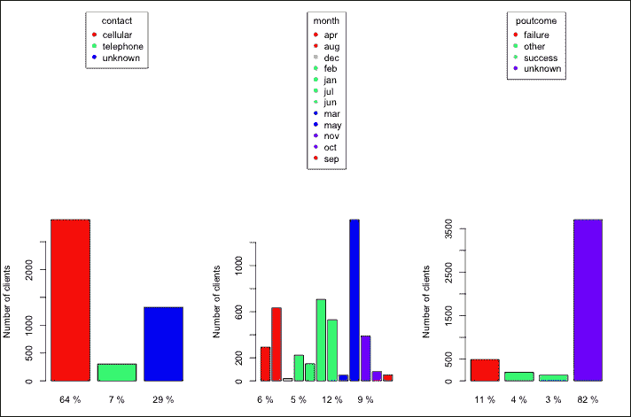

在这里，**contact** 有三个选项，其中一个是 **unknown**。所有选项都有一个显著的份额，因此我们可以定义两个虚拟变量，如下所示：

```py
dtBank[, cellular := ifelse(contact == 'cellular', 1, 0)]
dtBank[, telephone := ifelse(contact == 'telephone', 1, 0)]
dtBank[, contact := NULL]
```

我们可以将 `month` 转换为一个数值变量，其中一月对应于 `1`，十二月对应于 `12`。特征值是月份名称的缩写，不带大写字母，例如，`jan` 对应于 `January`。为了定义数值特征，我们定义一个向量，其第一个元素是 `jan`，第二个元素是 `feb`，依此类推。然后，使用 `which`，我们可以识别向量中的对应元素。例如，`apr` 是向量的第四个元素，因此使用 `which` 我们得到 `4`。为了构建有序月份名称的向量，我们使用包含缩写月份名称的 `month.abb` 和 `tolower` 来取消首字母大写，如下所示：

```py
Months <- tolower(month.abb)
months <- c(
    'jan', 'feb', 'mar', 'apr', 'may', 'jun',
    'jul', 'aug', 'sep', 'oct', 'nov', 'dec'
)
dtBank[
  , month := which(month == months),
  by=1:nrow(dtBank)
  ]
```

在 `poutcome` 中，`success` 和 `failure` 占有少量客户。然而，它们非常相关，因此我们定义了两个虚拟变量：

```py
dtBank[, past_success := ifelse(poutcome == 'success', 1, 0)]
dtBank[, past_failure := ifelse(poutcome == 'failure', 1, 0)]
dtBank[, poutcome := NULL]
```

我们将所有分类特征转换为数值格式。下一步是探索数值特征并在必要时进行转换。

有六个数值特征，我们可以为每个特征构建一个图表。图表是一个直方图，显示特征值的分布。为了在同一图表中可视化所有图形，我们可以使用 `par` 将它们放在一个 3 x 2 的网格中。参数如下：

+   `mfrow`：与`mfcol`类似，它定义了一个图形网格。区别只是我们将图形添加到网格的顺序。

+   `mar`：我们将边距设置为默认值，即`c(5, 4, 4, 2) + 0.1`，如下所示：

    ```py
    par(mfrow=c(3, 2), mar=c(5, 4, 4, 2) + 0.1)
    ```

我们可以使用`hist`构建直方图。输入如下：

+   `x`：这是包含数据的向量

+   `main`：这是图表标题

+   `xlab`：这是 x 轴下的标签

我们可以直接在数据表方括号内使用`hist`。为了一步构建所有图表，我们使用一个`for`循环：

```py
for(feature in featNumeric){
  dtBank[, hist(x = get(feature), main=feature, xlab = feature)]
}
```

获得的直方图如下：

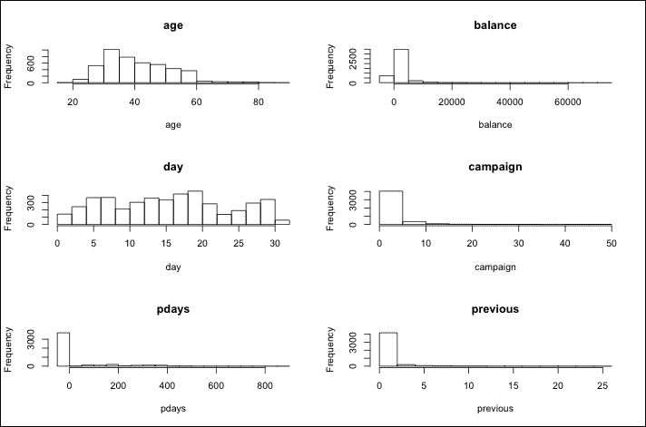

在这里，**年龄**和**天数**在其可能值上是均匀分布的，因此它们不需要任何处理。其余特征集中在较小的值上，因此我们需要对它们进行转换。我们用来定义转换特征的函数是对数，它允许我们拥有更分散的值。对数适用于具有大于 0 值的特征，因此我们需要从特征中移除负值。

为了避免零值，在计算对数之前将特征加`1`。

根据数据描述，如果机构之前没有联系过客户，则`pdays`等于`-1`。为了识别首次联系的客户，我们可以定义一个新的虚拟变量，如果`pdays`等于`-1`，则该变量为`1`。然后，我们将所有负值替换为`0`，如下所示：

```py
dtBank[, not_contacted := ifelse(pdays == -1, 1, 0)]
dtBank[pdays == -1, pdays := 0]
```

`balance`特征表示过去的余额，我们可以定义一个虚拟变量，如果余额为负，则该变量为`1`。然后，我们将负余额替换为`0`：

```py
dtBank[, balance_negative := ifelse(balance < 0, 1, 0)]
dtBank[balance < 0, balance := 0]
```

现在，我们可以计算所有特征的对数。由于对数的输入必须是正数，而一些特征等于`0`，我们在计算对数之前将每个特征加`1`：

```py
dtBank[, pdays := log(pdays + 1)]
dtBank[, balance := log(balance + 1)]
dtBank[, campaign := log(campaign + 1)]
dtBank[, previous := log(previous + 1)]
```

我们已经将所有特征转换为数值格式。现在，我们可以看一下新的特征表：

```py
str(dtBank)
View(dtBank)
```

唯一不是数值或整数的列是输出`y`。我们可以将其转换为数值格式，并将其名称更改为 output：

```py
dtBank[, output := as.numeric(y) – 1]
dtBank[, y := NULL]
```

我们已加载数据并进行了清理。现在我们准备构建机器学习模型。

# 聚类客户

为了应对下一场营销活动，我们需要识别更有可能订阅的客户。由于难以逐个评估客户，我们可以确定同质客户群体，并识别最有希望的群体。

从历史数据开始，我们根据客户的个人详细信息对客户进行聚类。然后，给定一个新客户，我们识别最相似的群体并将新客户关联到该群体。我们没有新客户客户行为的信息，因此聚类仅基于个人属性。

有不同的技术执行聚类，在本节中我们使用一个相关的算法，即层次聚类。层次聚类的参数之一是链接，它是计算两组之间距离的方式。主要选项包括：

+   **单链接**：这是第一组中的一个对象与第二组中的一个对象之间的最小距离

+   **完全链接**：这是第一组中的一个对象与第二组中的一个对象之间的最大距离

+   **平均链接**：这是第一组中的一个对象与第二组中的一个对象之间的平均距离

在我们的案例中，我们选择了平均链接，这个选择来自于测试三个选项。

我们定义`dtPers`只包含个人特征，如下所示：

```py
featPers <- c(
  'age', 'default', 'balance', 'balance_negative',
  'housing', 'loan',
  'job_admin.', 'job_blue-collar',	'job_management',
  'job_services', 'job_technician',
  'single', 'divorced', 'edu_primary', 'edu_tertiary'
)
dtPers <- dtBank[, featPers, with=F]
```

现在，我们可以应用层次聚类，步骤如下：

1.  定义距离矩阵：

    ```py
    d <- dist(dtPers, method = 'euclidean')
    ```

1.  构建层次聚类模型：

    ```py
    hcOut <- hclust(d, method = 'average')
    ```

1.  可视化树状图。`par`方法定义了绘图布局，在这种情况下，它只包含一个图表，而`plot`包含一个改进外观的参数。`labels`和`hang`功能避免了底部图表的杂乱，其他参数指定了图表标题和坐标轴标签，如下所示：

    ```py
    par(mfrow = c(1, 1))
    plot(
      hcOut,
      labels = FALSE,
      hang = -1,
      main = 'Dendrogram',
      xlab = 'Client clusters',
      ylab = 'Agglomeration distance'
    )
    ```

得到的直方图如下：

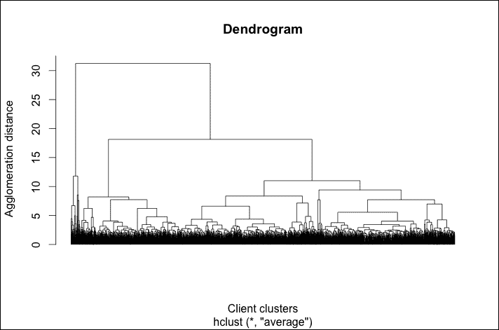

我们可以在树状图的高度**40**处切割树状图来识别三个集群。还有另一种选择，即在较低的水平（约 18）切割树状图，识别七个集群。我们可以探索这两种选择，并使用`rect.hclust`在树状图上可视化这两个分割，如下所示：

```py
k1 <- 3
k2 <- 7
par(mfrow=c(1, 1))
rect.hclust(hcOut, k = k1)
rect.hclust(hcOut, k = k2)
```

得到的直方图如下：

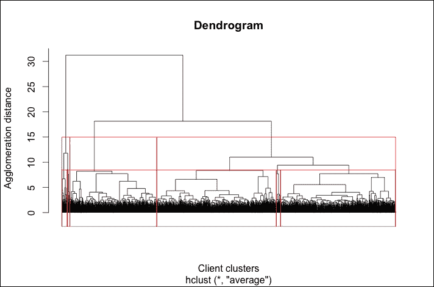

为了确定最成功的集群，我们可以使用饼图显示订阅客户的比例，并在饼图的标题中放置集群中的客户数量。让我们看看第一次分割的三个集群的图表。构建饼图的步骤与我们之前执行的步骤类似：

1.  定义包含输出属性的数据表：

    ```py
    dtClust <- dtBank[, 'output', with = F]
    ```

1.  在数据表中添加定义集群的两列。每一列对应不同的集群数量：

    ```py
    dtClust[, clusterHc1 := cutree(hclOut, k = k1)]
    dtClust[, clusterHc2 := cutree(hclOut, k = k2)]
    ```

1.  定义一个包含一行三列的绘图布局。`oma`参数定义了外部边距：

    ```py
    par(mfrow = c(1, 3), oma = c(0, 0, 10, 0))
    ```

1.  使用与数据探索类似的命令，构建三个直方图，显示每个集群订阅或不订阅客户的百分比：

    ```py
    for(iCluster in 1:k1){
      tableClust <- dtClust[
        clusterHc1 == iCluster,
        table(output)
        ]
      sizeCluster <- dtClust[, sum(clusterHc1 == iCluster)]
      titlePie <- paste(sizeCluster, 'clients')
      barplot(
        height = tableClust,
        names.arg = defPercentage(tableClust),
        legend.text = c('no', 'yes'),
        col = c('blue', 'red'),
        main = titlePie
      )
    }
    ```

1.  添加图表的标题：

    ```py
    mtext(
      text = 'Hierarchic clustering, n = 3',
      outer = TRUE, line = 1, cex = 2
    )
    ```

得到的直方图如下：

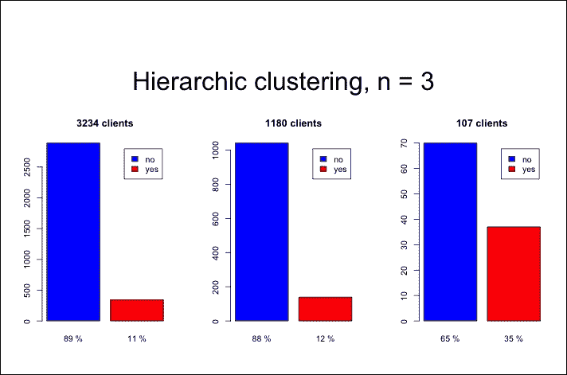

第一和第二集群包含大多数客户，并且在这两个集群上的活动并没有特别成功。第三集群较小，其客户订阅的比例显著更高。然后，我们可以开始针对与第三集群类似的新客户的营销活动。

使用相同的 R 命令，我们可以可视化由第二次分割确定的七个簇的相同图表，如下所示：

1.  定义具有两行四列的绘图布局：

    ```py
    par(mfrow = c(2, 4), oma = c(0, 0, 10, 0))
    ```

1.  构建直方图：

    ```py
    for(iCluster in 1:k2){
      tableClust <- dtClust[
        clusterHc2 == iCluster,
        table(output)
        ]
      sizeCluster <- dtClust[, sum(clusterHc2 == iCluster)]
      titlePie <- paste(sizeCluster, 'clients')
      barplot(
        height = tableClust,
        names.arg = defPercentage(tableClust),
        col = c('blue', 'red'),
        main = titlePie
      )
    }
    ```

1.  添加图表标题：

    ```py
    mtext(
      text = 'Hierarchic clustering, n = 7',
      outer = TRUE, line = 1, cex = 2
    )
    ```

获得的直方图如下：

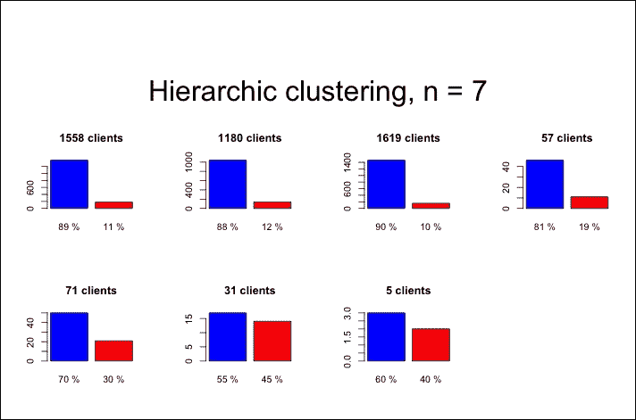

前三个簇包含大多数客户，营销活动对它们的成效并不特别显著。第四和第五簇的订阅客户百分比显著更高。最后两个簇虽然规模很小，但非常成功。营销活动将开始针对与最后两个簇相似的所有新客户，并将针对第四和第五簇的一部分客户。

总之，使用聚类，我们识别出一些小客户群体，在这些群体上营销活动非常成功。然而，大多数客户属于一个大簇，我们对其了解不足。原因是营销活动在具有特定特征的少数客户上取得了成功。

# 预测输出

过去的营销活动针对了一部分客户群。在 1000 名客户中，我们如何识别出那些更愿意订阅的 100 名客户？我们可以构建一个从数据中学习并估计哪些客户与之前营销活动中订阅的客户更相似的模型。对于每个客户，模型估计一个分数，如果客户更有可能订阅，则分数更高。有不同机器学习模型确定分数，我们使用两种表现良好的技术，如下所示：

+   **逻辑回归**：这是线性回归的一种变体，用于预测二元输出

+   **随机森林**：这是一种基于决策树的集成方法，在存在许多特征的情况下表现良好

最后，我们需要从两种技术中选择一种。有一些交叉验证方法允许我们估计模型精度（见第六章，*步骤 3 – 验证结果*）。从那时起，我们可以测量两种选项的精度，并选择表现更好的一个。

在选择最合适的机器学习算法后，我们可以使用交叉验证来优化它。然而，为了避免过度复杂化模型构建，我们不执行任何特征选择或参数优化。

这些是构建和评估模型的步骤：

1.  加载包含随机森林算法的 `randomForest` 包：

    ```py
    library('randomForest')
    ```

1.  定义输出和变量名的公式。公式格式为 `output ~ feature1 + feature2 + ...`：

    ```py
    arrayFeatures <- names(dtBank)
    arrayFeatures <- arrayFeatures[arrayFeatures != 'output']
    formulaAll <- paste('output', '~')
    formulaAll <- paste(formulaAll, arrayFeatures[1])
    for(nameFeature in arrayFeatures[-1]){
      formulaAll <- paste(formulaAll, '+', nameFeature)
    }
    formulaAll <- formula(formulaAll)
    ```

1.  初始化包含所有测试集的表格：

    ```py
    dtTestBinded <- data.table()
    ```

1.  定义迭代次数：

    ```py
    nIter <- 10
    ```

1.  开始一个 `for` 循环：

    ```py
    for(iIter in 1:nIter)
    {
    ```

1.  定义训练集和测试集：

    ```py
    indexTrain <- sample(
      x = c(TRUE, FALSE),
      size = nrow(dtBank),
      replace = T,
      prob = c(0.8, 0.2)
    )
    dtTrain <- dtBank[indexTrain]
    dtTest <- dtBank[!indexTrain]
    ```

1.  从测试集中选择一个子集，使得我们有相同数量的`output == 0`和`output == 1`。首先，根据输出将`dtTest`分成两部分（`dtTest0`和`dtTest1`），并计算每部分的行数（`n0`和`n1`）。然后，由于`dtTest0`有更多的行，我们随机选择`n1`行。最后，我们重新定义`dtTest`，将`dtTest0`和`dtTest1`绑定，如下所示：

    ```py
      dtTest1 <- dtTest[output == 1]
      dtTest0 <- dtTest[output == 0]
      n0 <- nrow(dtTest0)
      n1 <- nrow(dtTest1)
      dtTest0 <- dtTest0[sample(x = 1:n0, size = n1)]
      dtTest <- rbind(dtTest0, dtTest1)
    ```

1.  使用`randomForest`构建随机森林模型。公式参数定义了变量与数据之间的关系，数据参数定义了训练数据集。为了避免模型过于复杂，所有其他参数都保留为默认值：

    ```py
    modelRf <- randomForest(
      formula = formulaAll,
      data = dtTrain
    )
    ```

1.  使用`glm`构建逻辑回归模型，这是一个用于构建**广义线性模型**（**GLM**）的函数。GLMs 是线性回归的推广，允许定义一个将线性预测器与输出连接的链接函数。输入与随机森林相同，增加`family = binomial(logit)`定义回归为逻辑回归：

    ```py
    modelLr <- glm(
      formula = formulaAll,
      data = dtTest,
      family = binomial(logit)
    )
    ```

1.  使用`predict`函数预测随机森林的输出。该函数的主要参数是`object`定义模型和`newdata`定义测试集，如下所示：

    ```py
    dtTest[, outputRf := predict(
      object = modelRf, newdata = dtTest, type='response'
      )]
    ```

1.  使用`predict`函数预测逻辑回归的输出，类似于随机森林。另一个参数是`type='response'`，在逻辑回归的情况下是必要的：

    ```py
    dtTest[, outputLr := predict(
      object = modelLr, newdata = dtTest, type='response'
      )]
    ```

1.  将新的测试集添加到`dtTestBinded`：

    ```py
    dtTestBinded <- rbind(dtTestBinded, dtTest)
    ```

1.  结束`for`循环：

    ```py
    }
    ```

我们构建了包含`output`列的`dtTestBinded`，该列定义了哪些客户订阅以及模型估计的得分。通过比较得分与实际输出，我们可以验证模型性能：

为了探索`dtTestBinded`，我们可以构建一个图表，显示非订阅客户得分的分布情况。然后，我们将订阅客户的分布添加到图表中，并进行比较。这样，我们可以看到两组得分之间的差异。由于我们使用相同的图表进行随机森林和逻辑回归，我们定义了一个按照给定步骤构建图表的函数：

1.  定义函数及其输入，包括数据表和得分列的名称：

    ```py
    plotDistributions <- function(dtTestBinded, colPred)
    {
    ```

1.  计算未订阅客户的分布密度。当`output == 0`时，我们提取未订阅的客户，并使用`density`定义一个`density`对象。调整参数定义了从数据开始构建曲线的平滑带宽，带宽可以理解为细节级别：

    ```py
      densityLr0 <- dtTestBinded[
        output == 0,
        density(get(colPred), adjust = 0.5)
        ]
    ```

1.  计算已订阅客户的分布密度：

    ```py
      densityLr1 <- dtTestBinded[
        output == 1,
        density(get(colPred), adjust = 0.5)
        ]
    ```

1.  使用`rgb`定义图表中的颜色。颜色是透明的红色和透明的蓝色：

    ```py
      col0 <- rgb(1, 0, 0, 0.3)
      col1 <- rgb(0, 0, 1, 0.3)
    ```

1.  使用`polygon`函数构建显示未订阅客户得分分布的密度图。在这里，`polygon`函数用于向图表添加面积：

    ```py
      plot(densityLr0, xlim = c(0, 1), main = 'density')
      polygon(densityLr0, col = col0, border = 'black')
    ```

1.  将已订阅的客户添加到图表中：

    ```py
      polygon(densityLr1, col = col1, border = 'black')
    ```

1.  添加图例：

    ```py
      legend(
        'top',
        c('0', '1'),
        pch = 16,
        col = c(col0, col1)
      )
    ```

1.  结束函数：

    ```py
      return()
    }
    ```

现在，我们可以使用`plotDistributions`在随机森林输出上：

```py
par(mfrow = c(1, 1))
plotDistributions(dtTestBinded, 'outputRf')
```

获得的直方图如下：

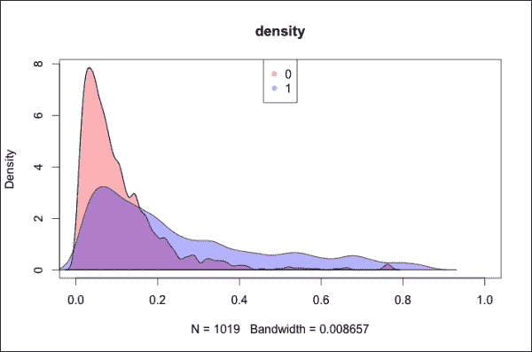

x 轴代表得分，y 轴代表与订阅了相似得分的客户数量成比例的密度。由于我们并没有每个可能得分的客户，假设细节级别为 0.01，密度曲线在意义上是平滑的，即每个得分的密度是相似得分数据的平均值。

红色和蓝色区域分别代表未订阅和订阅客户。很容易注意到，紫色区域来自两条曲线的叠加。对于每个得分，我们可以识别哪个密度更高。如果最高曲线是红色，客户更有可能订阅，反之亦然。

对于随机森林，大多数未订阅客户的得分在`0`到`0.2`之间，密度峰值在`0.05`左右。订阅客户的得分分布更广，尽管更高，但峰值在`0.1`左右。两个分布重叠很多，因此很难从得分开始识别哪些客户会订阅。然而，如果营销活动针对得分高于 0.3 的所有客户，他们很可能属于蓝色簇。总之，使用随机森林，我们能够识别出一小部分很可能订阅的客户。

为了进行比较，我们可以构建关于逻辑回归输出的相同图表，如下所示：

```py
plotDistributions(dtTestBinded, 'outputLr')
```

获得的直方图如下：

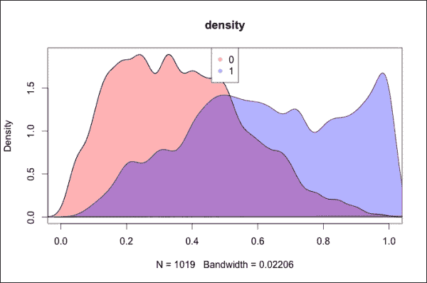

对于逻辑回归，两个分布略有重叠，但它们明显覆盖了两个不同的区域，并且它们的峰值相距很远。得分高于 0.8 的客户很可能订阅，因此我们可以选择一小部分客户。如果我们选择得分高于 0.5 或 0.6 的客户，我们也能够识别出一大批可能订阅的客户。

总结来说，逻辑回归似乎表现更好。然而，分布图仅用于探索性能，并不能提供明确的评估。下一步是定义如何使用指标来评估模型。

我们将使用的验证指标是 AUC，它依赖于另一个图表，即**接收者操作特征**（**ROC**）。在构建分类模型后，我们定义一个阈值，并假设得分高于阈值的客户将订阅。ROC 显示了模型精度随阈值的变化。曲线维度为：

+   **真正率**：此指标显示在订阅客户中，有多少百分比的客户得分高于阈值。此指标应尽可能高。

+   **假正率**：此指标显示在非订阅客户中，有多少百分比的客户得分高于阈值。此指标应尽可能低。

**曲线下面积**（**AUC**）是 ROC 曲线下的面积。给定一个订阅了服务的随机客户和另一个未订阅的随机客户，AUC 表示订阅客户的得分高于其他客户的概率。

我们可以定义一个函数来构建图表并计算 AUC 指数：

1.  加载包含用于交叉验证模型的函数的`ROCR`包：

    ```py
    library('ROCR')
    ```

1.  定义函数及其输入，包括数据表和得分列的名称：

    ```py
    plotPerformance <- function(dtTestBinded, colPred)
    {
    ```

1.  定义一个预测对象，它是构建 ROC 图表的起点。该函数是`prediction`，由`ROCR`包提供：

    ```py
      pred <- dtTestBinded[, prediction(get(colPred), output)]
    ```

1.  构建 ROC 图表。由`ROCR`包提供的函数是`performance`，它允许以不同的方式评估预测。在这种情况下，我们想要构建一个包含`true`和`false`正率的图表，因此输入是**真正率**（**tpr**）和**假正率**（**fpr**）：

    ```py
      perfRates <- performance(pred, 'tpr', 'fpr')
      plot(perfRates)
    ```

1.  使用`performance`计算 AUC 指数。输入是`auc`，它定义了我们在计算 AUC 指数：

    ```py
      perfAuc <- performance(pred, 'auc')
      auc <- perfAuc@y.values[[1]]
    ```

1.  将 AUC 指数作为函数输出：

    ```py
      return(auc)
    }
    ```

使用`plotPerformance`，我们可以构建关于随机森林的图表，并计算存储在`aucRf`中的`auc`指数：

```py
aucRf <- plotPerformance(dtTestBinded, 'outputRf')
```

获得的直方图如下：

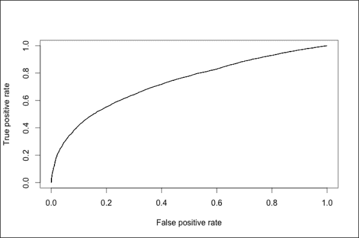

如预期，图表显示了 tpr 和 fpr。当阈值是`1`时，没有客户的比率高于它，因此没有正例（预测为订阅的客户）。在这种情况下，我们处于右上角，两个指数都等于 100%。随着阈值的降低，我们有更多的正客户，因此 tpr 和 fpr 降低。最后，当阈值是`0`时，tpr 和 fpr 都等于`0`，我们处于左下角。在一个理想的情况下，tpr 等于`1`，fpr 等于`0`（左上角）。然后，曲线越接近左上角，越好。

与随机森林类似，我们构建图表并计算逻辑回归的 AUC 指数：

```py
aucLr <- plotPerformance(dtTestBinded, 'outputLr')
```

获得的直方图如下：

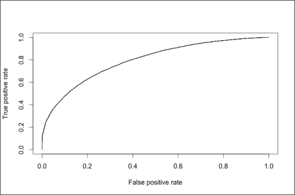

逻辑回归的图表与随机森林的图表相似。观察细节，我们可以注意到左下角的曲线更陡峭，右上角的曲线则不那么陡峭，因此定义 AUC 的曲线下面积更大。

交叉验证包含一个随机成分，因此 AUC 指数可能会有所变化。设置`nIter = 100`，我上次执行脚本时，随机森林的 AUC 大约为 73%，逻辑回归的 AUC 大约为 79%。我们可以得出结论，逻辑回归表现更好，因此我们应该使用它来构建模型。

在本节中，我们学习了如何构建一个为顾客提供评分的模型。此算法允许公司识别出更有可能订阅的客户，并且还可以估计其准确性。本章的延续将是选择特征子集和优化参数，以实现更好的性能。

# 摘要

在本章中，你学习了如何探索和转换与商业问题相关的数据。你使用聚类技术来细分银行的客户群，并使用监督学习技术来识别对客户进行评分的排名。在构建机器学习模型后，你能够通过可视化 ROC 曲线和计算 AUC 指数来交叉验证它。这样，你就有能力选择最合适的技巧。

本书展示了机器学习模型如何解决商业问题。这本书不仅仅是一个教程，它是一条道路，展示了机器学习的重要性，如何开发解决方案，以及如何使用这些技术来解决商业问题。我希望这本书不仅传达了机器学习概念，还传达了对一个既有价值又迷人的领域的热情。我想感谢你跟随这条道路。我希望这只是美好旅程的开始。

如果你有任何疑问，请随时联系我。
