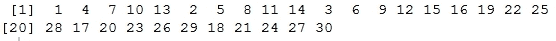

## 向量

```py
seq family of functions to initialize vectors in different ways.
```

```py
> c(2.5:4.5, 6, 7, c(8, 9, 10), c(12:15))
 [1]  2.5  3.5  4.5  6.0  7.0  8.0  9.0 10.0 12.0 13.0 14.0 15.0
> vector("numeric", 5)
[1] 0 0 0 0 0
> vector("logical", 5)
[1] FALSE FALSE FALSE FALSE FALSE
> logical(5)
[1] FALSE FALSE FALSE FALSE FALSE
> # seq is a function which creates sequences
> seq.int(1,10)
 [1]  1  2  3  4  5  6  7  8  9 10
> seq.int(1,10,2)
[1] 1 3 5 7 9
> seq_len(10)
 [1]  1  2  3  4  5  6  7  8  9 10

```

### 向量的索引和命名

我们可以在向量上执行的最重要操作之一涉及子集和索引向量以访问特定元素，这在只想在特定数据点上运行代码时非常有用。以下示例展示了我们可以如何索引和子集向量：

```py
> vec <- c("R", "Python", "Julia", "Haskell", "Java", "Scala")
> vec[1]
[1] "R"
> vec[2:4]
[1] "Python"  "Julia"   "Haskell"
> vec[c(1, 3, 5)]
[1] "R"     "Julia" "Java" 
> nums <- c(5, 8, 10, NA, 3, 11)
> nums
[1]  5  8 10 NA  3 11
> which.min(nums)   # index of the minimum element
[1] 5
> which.max(nums)   # index of the maximum element
[1] 6
> nums[which.min(nums)]  # the actual minimum element
[1] 3
> nums[which.max(nums)]  # the actual maximum element
[1] 11

```

现在，我们来看看如何命名向量。这基本上是 R 中的一个巧妙功能，您可以为向量中的每个元素添加标签，使其更易于阅读或解释。这可以通过两种方式完成，以下示例展示了这些方法：

```py
> c(first=1, second=2, third=3, fourth=4, fifth=5)

```

**输出：**


```py
> positions <- c(1, 2, 3, 4, 5)
> names(positions) 
NULL
> names(positions) <- c("first", "second", "third", "fourth", "fifth")
> positions

```

**输出：**


```py
> names(positions)
[1] "first"  "second" "third"  "fourth" "fifth"
> positions[c("second", "fourth")]

```

**输出：**


因此，您可以看到，有时注释和命名向量变得非常有用，我们也可以使用元素名称而不是值来子集和切片向量。

## 数组和矩阵

向量是一维数据结构，这意味着它们只有一个维度，我们可以使用`length`属性来获取它们的元素数量。请记住，在其它编程语言中，数组可能也有类似的意义，但在 R 中，它们的意义略有不同。基本上，R 中的数组是包含多维数据的结构。矩阵是具有两个维度的通用数组的特例，由`rows`和`columns`属性表示。让我们在下面的代码片段中查看一些示例。

### 创建数组和矩阵

首先，我们将创建一个三维数组。现在在屏幕上表示两个维度很容易，但要增加一个维度，R 有一些特殊的方法来转换数据。以下示例展示了 R 如何在每个维度中填充数据（列优先）以及一个 4x3x3 数组的最终输出：

```py
> three.dim.array <- array(
+     1:32,    # input data
+     dim = c(4, 3, 3),   # dimensions
+     dimnames = list(    # names of dimensions
+         c("row1", "row2", "row3", "row4"),
+         c("col1", "col2", "col3"),
+         c("first.set", "second.set", "third.set")
+     )
+ )
> three.dim.array

```

**输出：**


就像我之前提到的，矩阵只是数组的特例。我们可以使用`matrix`函数创建矩阵，以下示例将详细介绍。请注意，我们使用`byrow`参数在矩阵中以行方式填充数据，而不是 R 中任何数组或矩阵的默认列方式填充。`ncol`和`nrow`参数分别代表列数和行数。

```py
> mat <- matrix(
+     1:24,   # data
+     nrow = 6,  # num of rows
+     ncol = 4,  # num of columns
+     byrow = TRUE,  # fill the elements row-wise
+ )
> mat

```

**输出：**


### 名称和维度

就像我们命名向量和访问元素名称一样，在下面的代码片段中我们将执行类似的操作。您已经在前面的示例中看到了`dimnames`参数的使用。让我们看看以下更多的示例：

```py
> dimnames(three.dim.array)

```

**输出：**


```py
> rownames(three.dim.array)
[1] "row1" "row2" "row3" "row4"
> colnames(three.dim.array)
[1] "col1" "col2" "col3"
> dimnames(mat)
NULL
> rownames(mat)
NULL
> rownames(mat) <- c("r1", "r2", "r3", "r4", "r5", "r6")
> colnames(mat) <- c("c1", "c2", "c3", "c4")
> dimnames(mat)

```

**输出：**


```py
> mat

```

**输出：**


要访问与数组和矩阵相关的维度细节，有一些特殊函数。以下示例展示了相同的内容：

```py
> dim(three.dim.array)
[1] 4 3 3
> nrow(three.dim.array)
[1] 4
> ncol(three.dim.array)
[1] 3
> length(three.dim.array)  # product of dimensions
[1] 36
> dim(mat)
[1] 6 4
> nrow(mat)
[1] 6
> ncol(mat)
[1] 4
> length(mat)
[1] 24

```

### 矩阵运算

许多机器学习和优化算法都处理矩阵作为它们的输入数据。在下一节中，我们将探讨矩阵上最常见的运算的一些例子。

我们首先初始化两个矩阵，然后探讨使用诸如`c`函数（返回一个向量）、`rbind`函数（按行组合矩阵）和`cbind`函数（按列组合矩阵）等函数组合这两个矩阵的方法。

```py
> mat1 <- matrix(
+     1:15,
+     nrow = 5,
+     ncol = 3,
+     byrow = TRUE,
+     dimnames = list(
+         c("M1.r1", "M1.r2", "M1.r3", "M1.r4", "M1.r5")
+         ,c("M1.c1", "M1.c2", "M1.c3")
+     )
+ )
> mat1

```

**输出：**


```py
> mat2 <- matrix(
+     16:30,
+     nrow = 5,
+     ncol = 3,
+     byrow = TRUE,
+     dimnames = list(
+         c("M2.r1", "M2.r2", "M2.r3", "M2.r4", "M2.r5"),
+         c("M2.c1", "M2.c2", "M2.c3")
+     )
+ )
> mat2

```

**输出：**


```py
> rbind(mat1, mat2)

```

**输出：**


```py
> cbind(mat1, mat2)

```

**输出：**


```py
> c(mat1, mat2)

```

**输出：**



现在我们来看看在矩阵上可以执行的一些重要的算术运算。大多数运算从下面的语法中可以很容易地理解：

```py
> mat1 + mat2   # matrix addition

```

**输出：**


```py
> mat1 * mat2  # element-wise multiplication

```

**输出：**


```py
> tmat2 <- t(mat2)  # transpose
> tmat2

```

**输出：**


```py
> mat1 %*% tmat2   # matrix inner product

```

**输出：**


```py
> m <- matrix(c(5, -3, 2, 4, 12, -1, 9, 14, 7), nrow = 3, ncol = 3)
> m

```

**输出：**


```py
> inv.m <- solve(m)  # matrix inverse
> inv.m

```

**输出：**


```py
> round(m %*% inv.m) # matrix * matrix_inverse = identity matrix

```

**输出：**


之前提到的算术运算只是众多可以应用于矩阵的函数和运算符中的一部分。这在诸如线性优化等领域非常有用。

## 列表

列表是向量的特例，其中向量的每个元素可以是不同类型的数据结构，甚至可以是简单的数据类型。在某些方面，它与 Python 编程语言中的列表相似，如果您之前使用过它，那么列表表示可以具有不同类型的元素，并且每个元素在列表中都有一个特定的索引。在 R 中，列表的每个元素可以像单个元素一样简单，也可以像整个矩阵、函数或字符串向量一样复杂。

### 创建和索引列表

在下面的例子中，我们将开始查看一些创建和初始化列表的常见方法。此外，我们还将探讨如何访问这些列表元素以进行进一步的计算。请记住，列表中的每个元素可以是一个简单的原始数据类型，甚至可以是复杂的数据结构或函数。

```py
> list.sample <- list(
+     1:5,

+     c("first", "second", "third"),
+     c(TRUE, FALSE, TRUE, TRUE),
+     cos,
+     matrix(1:9, nrow = 3, ncol = 3)
+ )
> list.sample

```

**输出：**


```py
> list.with.names <- list(
+     even.nums = seq.int(2,10,2),
+     odd.nums  = seq.int(1,10,2),
+     languages = c("R", "Python", "Julia", "Java"),
+     cosine.func = cos
+ )
> list.with.names

```

**输出：**


```py
> list.with.names$cosine.func
function (x)  .Primitive("cos")
> list.with.names$cosine.func(pi)
[1] -1
>
> list.sample[[4]]
function (x)  .Primitive("cos")
> list.sample[[4]](pi)
[1] -1
>
> list.with.names$odd.nums
[1] 1 3 5 7 9
> list.sample[[1]]
[1] 1 2 3 4 5
> list.sample[[3]]
[1]  TRUE FALSE  TRUE  TRUE

```

您可以从前面的例子中看到，访问列表中的任何元素并用于进一步计算（如`cos`函数）是多么容易。

### 合并和转换列表

在下面的例子中，我们将看看如何将几个列表组合成一个单一的列表：

```py
> l1 <- list(
+     nums = 1:5,
+     chars = c("a", "b", "c", "d", "e"),
+     cosine = cos
+ )
> l2 <- list(
+     languages = c("R", "Python", "Java"),
+     months = c("Jan", "Feb", "Mar", "Apr"),
+     sine = sin
+ )
> # combining the lists now
> l3 <- c(l1, l2)
> l3

```

**输出：**


将列表转换为向量以及相反的操作非常简单。以下例子展示了我们可以实现这一点的常见方法：

```py
> l1 <- 1:5
> class(l1)
[1] "integer"
> list.l1 <- as.list(l1)
> class(list.l1)
[1] "list"
> list.l1

```

**输出：**


```py
> unlist(list.l1)
[1] 1 2 3 4 5

```

## 数据框

数据框是特殊的数据结构，通常用于存储数据表或以电子表格形式的数据，其中每一列表示一个特定的属性或字段，而每一行包含这些列的特定值。这种数据结构在处理通常具有许多字段和属性的集合时非常有用。

### 创建数据框

我们可以使用 `data.frame` 函数轻松地创建数据框。我们将通过一些流行的超级英雄的示例来展示这一点。

```py
> df <- data.frame(
+     real.name = c("Bruce Wayne", "Clark Kent", "Slade Wilson", "Tony Stark", "Steve Rogers"),
+     superhero.name = c("Batman", "Superman", "Deathstroke", "Iron Man", "Capt. America"),
+     franchise = c("DC", "DC", "DC", "Marvel", "Marvel"),
+     team = c("JLA", "JLA", "Suicide Squad", "Avengers", "Avengers"),
+     origin.year = c(1939, 1938, 1980, 1963, 1941)
+ )
> df

```

**输出：**


```py
> class(df)
[1] "data.frame"
> str(df)

```

**输出：**


```py
> rownames(df)
[1] "1" "2" "3" "4" "5"
> colnames(df)

```

**输出：**


```py
> dim(df)
[1] 5 5

```

`str` 函数详细说明了数据框的结构，其中我们可以看到数据框中每个列中数据的详细信息。R 基础中有很多现成的数据集可以直接加载并开始使用。下面展示的是其中之一。`mtcars` 数据集包含有关各种汽车的信息，这些信息是从 1974 年的《Motor Trend U.S. Magazine》中提取的。

```py
> head(mtcars)   # one of the datasets readily available in R

```

**输出：**


### 操作数据框

我们可以在数据框上执行许多操作，例如合并、组合、切片和转置数据框。在接下来的示例中，我们将查看一些重要的数据框操作。

使用单索引和如 `subset` 函数之类的函数，在数据框中索引和子集特定数据非常容易。

```py
> df[2:4,]

```

**输出：**


```py
> df[2:4, 1:2]

```

**输出：**


```py
> subset(df, team=="JLA", c(real.name, superhero.name, franchise))

```

**输出：**


```py
> subset(df, team %in% c("Avengers","Suicide Squad"), c(real.name, superhero.name, franchise))

```

**输出：**


我们现在将查看一些更复杂的操作，例如合并和合并数据框。

```py
> df1 <- data.frame(
+     id = c('emp001', 'emp003', 'emp007'),
+     name = c('Harvey Dent', 'Dick Grayson', 'James Bond'),
+     alias = c('TwoFace', 'Nightwing', 'Agent 007')
+ )
> 
> df2 <- data.frame(
+     id = c('emp001', 'emp003', 'emp007'),
+     location = c('Gotham City', 'Gotham City', 'London'),
+     speciality = c('Split Persona', 'Expert Acrobat', 'Gadget Master')
+ )
> df1

```

**输出：**


```py
> df2

```

**输出：**


```py
> rbind(df1, df2)   # not possible since column names don't match
Error in match.names(clabs, names(xi)) : 
 names do not match previous names
> cbind(df1, df2)

```

**输出：**


```py
> merge(df1, df2, by="id")

```

**输出：**


从前面的操作中可以看出，`rbind` 和 `cbind` 的工作方式与我们之前看到的数组矩阵相同。然而，`merge` 允许你以与在关系数据库中连接各种表相同的方式合并数据框。

# 使用函数

接下来，我们将探讨函数，这是一种技术或方法，可以轻松地构建和模块化你的代码，特别是执行特定任务的代码行，这样你就可以在需要时执行它们，而无需再次编写。在 R 中，函数基本上被视为另一种数据类型，你可以分配函数，根据需要操作它们，并将它们作为参数传递给其他函数。我们将在下一节中探讨所有这些内容。

## 内置函数

R 包含了几个在 R-base 包中可用的函数，并且随着您安装更多的包，您将获得更多的功能，这些功能以函数的形式提供。在以下示例中，我们将查看一些内置函数：

```py
> sqrt(5)
[1] 2.236068
> sqrt(c(1,2,3,4,5,6,7,8,9,10))
[1] 1.000000 1.414214 1.732051 2.000000 2.236068 2.449490 2.645751     [8] 2.828427 3.000000 3.162278
> # aggregating functions
> mean(c(1,2,3,4,5,6,7,8,9,10))
[1] 5.5
> median(c(1,2,3,4,5,6,7,8,9,10))
[1] 5.5

```

您可以从前面的示例中看到，例如 `mean`、`median` 和 `sqrt` 这样的函数是内置的，并且可以在您启动 R 时随时使用，无需加载任何其他包或显式定义函数。

## 用户定义的函数

真正的力量在于能够根据您想要在数据上执行的不同操作和计算来定义自己的函数，并让 R 以您期望的方式执行这些函数。以下是一些示例：

```py
square <- function(data){
 return (data²)
}
> square(5)
[1] 25
> square(c(1,2,3,4,5))
[1]  1  4  9 16 25
point <- function(xval, yval){
 return (c(x=xval,y=yval))
}
> p1 <- point(5,6)
> p2 <- point(2,3)
> 
> p1
x y 
5 6 
> p2
x y 
2 3

```

```py
square which computes the square of a single number or even a vector of numbers using the same code. Functions such as point are useful to represent specific entities which represent points in the two-dimensional co-ordinate space. Now we will be looking at how to use the preceding functions together.
```

## 将函数作为参数传递

当您定义任何函数时，如果您打算在函数内部使用它们来执行一些复杂的计算，您也可以将其作为参数传递给函数。这减少了代码的复杂性和冗余。以下示例使用之前定义的 `square` 函数计算两点之间的欧几里得距离，该函数作为参数传递：

```py
> # defining the function
euclidean.distance <- function(point1, point2, square.func){
 distance <- sqrt(
 as.integer(
 square.func(point1['x'] - point2['x'])
 ) +
 as.integer(
 square.func(point1['y'] - point2['y'])
 )
 )
 return (c(distance=distance))
}
> # executing the function, passing square as argument
> euclidean.distance(point1 = p1, point2 = p2, square.func = square)
distance 
4.242641 
> euclidean.distance(point1 = p2, point2 = p1, square.func = square)
distance 
4.242641 
> euclidean.distance(point1 = point(10, 3), point2 = point(-4, 8), square.func = square)
distance
14.86607

```

因此，您可以看到，使用函数，您可以定义一个特定的函数一次，并且根据需要执行多次。

# 控制代码流

本节涵盖了与控制代码执行相关的领域。使用特定的构造，如 `if-else` 和 `switch`，您可以有条件地执行代码。例如，`for`、`while` 和 `repeat` 以及 `help` 在执行相同代码多次时也称为循环。我们将在下一节中探讨所有这些构造。

## 使用 if、if-else 和 ifelse

有几种构造可以帮助我们在代码执行时进行条件判断。这在我们不希望按顺序依次执行一系列语句，而只想在满足或未满足特定条件时执行代码时特别有用。以下示例说明了相同的内容：

```py
> num = 5
> if (num == 5){
+     cat('The number was 5')
+ }
The number was 5
> 
> num = 7
> 
> if (num == 5){
+     cat('The number was 5')
+ } else{
+     cat('The number was not 5')
+ }
The number was not 5
>
> if (num == 5){
+     cat('The number was 5')
+ } else if (num == 7){
+     cat('The number was 7')
+ } else{
+     cat('No match found')
+ }
The number was 7
> ifelse(num == 5, "Number was 5", "Number was not 5")
[1] "Number was not 5"

```

## 使用 switch

`switch` 函数在您必须将表达式或参数与多个条件匹配并且只有在存在特定匹配时才执行时特别有用。当使用 `if-else` 构造时，这会变得非常混乱，但使用 `switch` 函数则更加优雅，正如我们接下来将要看到的：

```py
> switch(
+ "first",
+ first = "1st",
+ second = "2nd",
+ third = "3rd",
+ "No position"
+ )
[1] "1st"
> 
> switch(
+ "third",
+ first = "1st",
+ second = "2nd",
+ third = "3rd",
+ "No position"
+ )
[1] "3rd"
> # when no match, default statement executes
> switch(
+ "fifth",
+ first = "1st",
+ second = "2nd",
+ third = "3rd",
+ "No position"
+ )
[1] "No position"

```

## 循环

循环是在需要时重复执行代码段的一种极好方式。然而，对于处理大型数据集，向量化构造比循环更优化，但我们将在本章的后面看到这一点。现在，您应该记住，R 中有三种类型的循环，即 `for`、`while` 和 `repeat`。我们将在以下示例中查看所有这些：

```py
> # for loop
> for (i in 1:10){
+     cat(paste(i," "))
+ }
1  2  3  4  5  6  7  8  9  10 
> 
> sum = 0
> for (i in 1:10){
+     sum <- sum + i
+ }
> sum
[1] 55
> 
> # while loop
> count <- 1
> while (count <= 10){
+     cat(paste(count, " "))
+     count <- count + 1
+ }
1  2  3  4  5  6  7  8  9  10 
> 
> # repeat infinite loop 
> count = 1
> repeat{
+     cat(paste(count, " "))
+     if (count >= 10){
+         break  # break off from the infinite loop
+     }
+     count <- count + 1
+ }
1  2  3  4  5  6  7  8  9  10 

```

# 高级构造

当我们谈论在不使用循环的情况下对向量进行操作时，我们之前听到了 **向量化** 这个术语。虽然循环是遍历向量并执行计算的好方法，但当处理所谓的 **大数据** 时，它并不非常高效。在这种情况下，R 提供了一些高级构造，我们将在本节中查看这些构造。我们将涵盖以下函数：

+   `lapply`：遍历列表并对每个元素评估一个函数

+   `sapply`：`lapply` 的简化版本

+   `apply`：在数组的边界或边缘上评估一个函数

+   `tapply`：在向量的子集上评估一个函数

+   `mapply`：`lapply` 的多元版本

## lapply 和 sapply

如我们之前提到的，`lapply` 函数接受一个列表和一个函数作为输入，并在列表的每个元素上评估该函数。如果输入列表不是一个列表，则在返回输出之前，使用 `as.list` 函数将其转换为列表。它比普通循环快得多，因为实际的循环是通过内部使用 C 语言代码来完成的。我们将在下面的代码片段中查看其实现和示例：

```py
> # lapply function definition
> lapply
function (X, FUN, ...) 
{
 FUN <- match.fun(FUN)
 if (!is.vector(X) || is.object(X)) 
 X <- as.list(X)
 .Internal(lapply(X, FUN))
}
<bytecode: 0x00000000003e4f68>
<environment: namespace:base>
> # example
> nums <- list(l1=c(1,2,3,4,5,6,7,8,9,10), l2=1000:1020)
> lapply(nums, mean)

```

**输出：**


接下来是 `sapply`，它与 `lapply` 类似，但它在可能的情况下尝试简化结果。例如，如果最终结果中每个元素长度都是 `1`，则返回一个向量；如果结果中每个元素的长度相同但超过 `1`，则返回一个矩阵；如果它无法简化结果，则我们得到与 `lapply` 相同的结果。我们将在以下示例中展示同样的内容：

```py
> data <- list(l1=1:10, l2=runif(10), l3=rnorm(10,2))
> data

```

**输出：**


```py
> 
> lapply(data, mean)

```

**输出：**


```py
> sapply(data, mean)

```

**输出：**


## apply

`apply` 函数用于在数组的边缘或边界上评估一个函数；例如，在数组的行或列上应用聚合函数。`rowSums`、`rowMeans`、`colSums` 和 `colMeans` 函数也内部使用 `apply`，但它们在操作大型数组时更加优化和有用。我们将在以下示例中看到所有这些先前的构造：

```py
> mat <- matrix(rnorm(20), nrow=5, ncol=4)
> mat

```

**输出：**


```py
> # row sums
> apply(mat, 1, sum)
[1]  0.79786959  0.53900665 -2.36486927 -1.28221227  0.06701519
> rowSums(mat)
[1]  0.79786959  0.53900665 -2.36486927 -1.28221227  0.06701519
> # row means
> apply(mat, 1, mean)
[1]  0.1994674  0.1347517 -0.5912173 -0.3205531  0.0167538
> rowMeans(mat)
[1]  0.1994674  0.1347517 -0.5912173 -0.3205531  0.0167538
>
> # col sums
> apply(mat, 2, sum)
[1] -0.6341087  0.3321890 -2.1345245  0.1932540
> colSums(mat)
[1] -0.6341087  0.3321890 -2.1345245  0.1932540
> apply(mat, 2, mean)
[1] -0.12682173  0.06643781 -0.42690489  0.03865079
> colMeans(mat)
[1] -0.12682173  0.06643781 -0.42690489  0.03865079
>
> # row quantiles
> apply(mat, 1, quantile, probs=c(0.25, 0.5, 0.75))

```

**输出：**


因此，您可以看到如何在完全不使用循环的情况下轻松地应用各种统计函数。

## tapply

函数 `tapply` 用于在向量的子集上评估一个函数。如果您熟悉使用关系数据库，这类似于在 SQL 中应用 `GROUP BY` 构造。我们将在以下示例中展示同样的内容：

```py
> data <- c(1:10, rnorm(10,2), runif(10))
> data

```

**输出：**


```py
> groups <- gl(3,10)
> groups
 [1] 1 1 1 1 1 1 1 1 1 1 2 2 2 2 2 2 2 2 2 2 3 3 3 3 3 3 3 3 3 3
Levels: 1 2 3
> tapply(data, groups, mean)

```

**输出：**


```py
> tapply(data, groups, mean, simplify = FALSE)

```

**输出：**


```py
> tapply(data, groups, range)

```

**输出：**


## mapply

`mapply` 函数是 `lapply` 的多元版本，用于在参数集上并行评估函数。一个简单的例子是，如果我们必须使用 `rep` 函数构建一个向量列表，我们必须多次编写它。然而，使用 `mapply` 我们可以以更优雅的方式实现相同的功能，如下所示：

```py
> list(rep(1,4), rep(2,3), rep(3,2), rep(4,1))

```

**输出：**


```py
> mapply(rep, 1:4, 4:1)

```

**输出：**


# 使用 R 的下一步

在我们深入机器学习之前，暂停片刻，深呼吸，思考一下你迄今为止学到了什么，这将很有用。这个关于 R 的快速而详细的复习将有助于你在接下来的章节中。然而，还有两件事我们必须快速了解。它们是如何在 R 中获取帮助以及如何在 R 中处理各种包。

## 获取帮助

到目前为止，你必须已经意识到 R 中有成千上万的函数和结构，不可能记住每个函数实际上做什么，你也不必这么做！R 提供了许多直观的方式来获取有关任何函数、包或数据结构的帮助。首先，你可以在 `R` 命令提示符中运行 `help.start()` 函数，这将启动一个手册浏览器。在这里，你可以获取有关 R 的详细信息，包括手册、参考和其他材料。以下命令显示了 `help.start()` 的内容，如命令后面的截图所示，你可以使用它来进一步导航并获得更多帮助：

```py
> help.start()

```

如果没有发生任何事情，你应该自己打开 `http://127.0.0.1:31850/doc/html/index.html`。


要获取 R 中任何特定函数或结构的帮助，如果你知道函数的名称，你可以使用帮助函数或与函数名称结合的 `?` 操作符来获取帮助。例如，如果你想获取有关 `apply` 函数的帮助，只需键入 `help("apply")` 或 `?apply` 以获取有关 `apply` 函数的详细信息。这种在 R 中获取帮助的简单机制提高了你的生产力，并使使用 R 变得愉快。通常，你可能不会完全记得你打算使用的函数的确切名称，但你可能对其名称有一个模糊的概念。R 也为此目的提供了一个帮助功能，你可以使用 `help.search` 函数或与函数名称结合的 `??` 操作符。例如，你可以使用 `??apply` 来获取有关 `apply` 函数的更多信息。

## 处理包

在**CRAN（综合 R 存档网络**）上，有数千个包含各种功能的包可用，这是一个托管所有这些包的仓库。要从 CRAN 下载任何包，你只需要运行`install.packages`函数，将包名作为参数传递，例如`install.packages("caret")`。一旦包下载并安装，你可以使用`library`函数将其加载到当前的 R 会话中。要加载`caret`包，只需键入`library(caret)`，它应该可以立即用于使用。`require`函数具有类似的功能来加载特定的包，并且在类似的方式中特别用于函数内部，通过键入`require(caret)`来加载`caret`包。`require`和`library`之间的唯一区别是，如果找不到特定的包，`library`将显示错误，而`require`将不会显示任何错误继续执行代码。然而，如果代码中有对该包的依赖调用，则你的代码肯定会抛出错误。

# 机器学习基础

既然你已经刷新了你对 R 的记忆，我们将讨论机器学习的基本概念，它是如何被使用的，以及机器学习内部的主要领域。本节旨在提供一个机器学习的概述，这将有助于为下一章的深入探讨铺平道路。

## 机器学习——它究竟意味着什么？

机器学习并没有一个明确的教科书定义，因为它是一个涵盖并借鉴了计算机科学中其他几个领域概念和技术的领域。它也被作为一门大学课程进行教授，并且最近获得了更多的关注，机器学习和数据科学以在线教育视频、课程和培训的形式被广泛采用。机器学习基本上是计算机科学、统计学和数学领域的元素交叉，它使用人工智能、模式检测、优化和学习理论的概念来开发算法和技术，这些算法和技术可以从数据中学习并做出预测，而无需进行明确的编程。

这里的学习指的是根据我们提供给计算机或机器的数据和算法，使它们变得智能的能力，以便它们可以从提供的数据中开始检测模式和洞察力。这种学习确保机器可以在不每次都进行显式编程的情况下，从输入的数据中检测模式。最初的数据或观察结果被输入到机器中，机器学习算法处理这些数据以生成一些输出，这些输出可以是预测、假设，甚至是某些数值结果。基于这个输出，可以对我们机器学习算法进行反馈机制以改进我们的结果。整个系统形成一个机器学习模型，可以直接应用于全新的数据或观察结果，从中获取结果，而无需再次编写任何单独的算法来处理这些数据。

## 机器学习——它在世界上是如何被使用的？

你可能想知道，究竟如何将某些算法或代码应用于现实世界。实际上，它们被广泛应用于不同领域的各种用例。以下是一些例子：

+   **零售**：机器学习在零售和电子商务领域被广泛使用，每个商店都希望超越其竞争对手。

    +   **定价分析**：机器学习算法用于比较不同商店中商品的价格，以便商店以最具竞争力的价格销售商品。

    +   **市场篮子分析**：用于分析客户购物趋势，并推荐购买的产品，我们将在第三章，*使用市场篮子分析预测客户购物趋势*中详细讨论。

    +   **推荐引擎**：用于分析客户购买、评分和满意度，并向各种用户推荐产品。我们将在第四章，*构建产品推荐系统*中构建一些我们自己的推荐系统。

+   **广告**：广告行业高度依赖机器学习来推广并向消费者展示正确的广告，以实现最大化的转化率。

    +   **网站分析**：分析网站流量

    +   **客户流失分析**：预测客户流失率

    +   **广告点击率预测**：用于预测广告对消费者的影响效果，以便他们点击广告购买相关产品

+   **医疗保健**：机器学习算法在医疗保健领域被广泛用于更有效地治疗患者。

    +   **疾病检测与预测**：用于根据患者的病历检测和预测疾病发生的可能性。

    +   研究复杂结构，如人脑和 DNA，以更好地理解人体功能，从而实现更有效的治疗。

+   检测和过滤垃圾邮件和消息。

+   预测选举结果。

+   欺诈检测和预测。我们将在第五章和第六章中尝试解决最关键的欺诈检测问题之一，即*信用风险检测和预测 – 描述性分析*和*信用风险检测和预测 – 预测分析*。

+   在消息应用中的文本预测。

+   自动驾驶汽车、飞机和其他车辆。

+   天气、交通和犯罪活动预测和预报。

+   情感和情绪分析，我们将在第八章中介绍，*Twitter 数据情感分析*。

上述例子只是触及了机器学习真正能做什么的皮毛，到现在我相信你已经对机器学习被广泛应用的各个领域有了很好的了解。

## 机器学习算法的类型

如我们之前所讨论的，要让机器学习，你需要机器学习算法。机器学习算法是一类特殊的算法，它们在数据上工作并从中获取洞察。其想法是结合数据和算法构建一个模型，然后可以使用这个模型来处理新数据并得出可操作的见解。

每个机器学习算法都取决于它可以处理的数据类型和我们要解决的问题类型。你可能想学习几个算法，然后尝试将它们应用到你所面临的所有问题上。请记住，没有一种通用的机器学习算法可以适用于所有问题。机器学习算法的主要输入是数据，这些数据由特征组成，其中每个特征都可以描述为数据集的属性，例如如果我们处理的是与人类相关的数据，那么你的身高、体重等都可以是特征。机器学习算法可以分为两大类，即监督学习和无监督学习算法。

### 监督式机器学习算法

监督学习算法是机器学习算法家族的一个子集，主要用于预测建模。预测模型基本上是由机器学习算法和训练数据中的特征或属性构建的模型，这样我们就可以使用从输入数据中获得的其它值来预测一个值。监督学习算法试图模拟目标预测输出和输入特征之间的关系和依赖性，以便我们可以根据从先前数据集中学习到的关系预测新数据的输出值。主要的监督学习算法类型包括：

+   **分类算法**：这些算法从具有特征和类别标签的训练数据中构建预测模型。这些预测模型反过来使用从训练数据中学习到的特征对新数据（之前未见过的数据）进行预测，以预测其类别标签。输出类别是离散的。分类算法的类型包括决策树、随机森林、支持向量机等，还有很多。我们将在第二章、*让我们帮助机器学习*、第六章、*信用风险检测与预测 - 预测分析*和第八章、*推特数据情感分析*中使用这些算法中的几个。

+   **回归算法**：这些算法用于根据从数据中获得的某些输入特征预测输出值。为此，算法基于训练数据的特征和输出值构建一个模型，并使用此模型来预测新数据的值。在这种情况下，输出值是连续的，而不是离散的。回归算法的类型包括线性回归、多元回归、回归树和 lasso 回归等，还有很多。我们在第二章、*让我们帮助机器学习*中探讨了其中的一些。

### 无监督机器学习算法

无监督学习算法是主要用于模式检测和描述性建模的机器学习算法家族。描述性模型基本上是由无监督机器学习算法和与监督学习过程类似的输入数据特征构建的模型。然而，这里没有基于算法尝试建模关系的输出类别或标签。这些算法试图使用输入数据上的技术来挖掘规则、检测模式、总结和分组数据点，这些数据点有助于推导出有意义的见解并更好地向用户描述数据。由于我们没有特定的关系映射，我们只是试图从我们试图分析的数据中获得有用的见解和描述，因此这里没有特定的训练或测试数据概念。无监督学习算法的主要类型包括：

+   **聚类算法**：这些算法的主要目标是仅使用从输入数据中提取的特征，而不使用任何其他外部信息，将输入数据点聚类或分组到不同的类别或类别中。与分类不同，聚类中的输出标签事先是未知的。构建聚类模型有不同的方法，例如使用均值、类中心、层次结构等。一些流行的聚类算法包括 k-means、k-medoids 和层次聚类。我们将在第二章、“让我们帮助机器学习”和第七章、“社交媒体分析 – 分析 Twitter 数据”中探讨一些聚类算法。

+   **关联规则学习算法**：这些算法用于从数据集中挖掘和提取规则和模式。这些规则解释了不同变量和属性之间的关系，并描述了数据中出现的频繁项集和模式。这些规则反过来又帮助从任何企业或组织的庞大数据存储库中发现有用的见解。流行的算法包括 Apriori 和 FP Growth。我们将在第二章、“让我们帮助机器学习”和第三章、“使用市场篮子分析预测客户购物趋势”中使用一些这些算法。

### R 中流行的机器学习包

在简要概述了机器学习基础和算法类型之后，你一定对如何使用 R 将这些算法应用于解决现实世界问题感到好奇。结果是，R 中有许多专门用于解决机器学习问题的包。这些包包含经过优化的算法，可以直接用于解决问题。我们将列出几个 R 中流行的机器学习包，以便你了解你可能需要的工具，并在后续章节中使用这些包时更加熟悉。根据使用和功能，以下 R 包在解决机器学习问题方面相当受欢迎：

+   `caret`: 这个包（简称分类和回归训练）包含用于构建预测模型的几个机器学习算法

+   `randomForest`: 这个包处理随机森林算法的分类和回归实现

+   `rpart`: 这个包专注于递归分割和决策树

+   `glmnet`: 这个包的主要重点是 lasso 和弹性网络正则化回归模型

+   `e1071`: 它涉及傅里叶变换、聚类、支持向量机以及许多其他监督和非监督算法

+   `party`: 它涉及递归分割

+   `arules`: 这个包用于关联规则学习算法

+   `recommenderlab`: 这是一个用于构建推荐引擎的库

+   `nnet`: 这个包使使用神经网络进行预测建模成为可能

+   `h2o`: 这是目前数据科学中最受欢迎的包之一，提供了包括梯度提升和深度学习在内的快速和可扩展的算法

除了上述库之外，还有许多其他与 R 中的机器学习相关的包。重要的是根据手头的数据和问题选择正确的算法和模型。

# 摘要

在本章中，我们简要地讨论了我们将要进入的机器学习和 R 的世界之旅。我们讨论了 R 的基础知识，并建立了 R 中使用的核心构造和数据结构的基础。然后，我们通过查看一些概念和算法以及它们在解决现实世界问题中的应用，深入了解了机器学习的世界。最后，我们快速浏览了一些 R 中最受欢迎的机器学习包，以便我们熟悉一些机器学习工具箱中的实用工具！

在下一章中，我们将深入探讨机器学习概念和算法，这将帮助我们让机器学习到一些东西！
