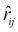

# 第四章。构建产品推荐系统

数字世界让一切都可以一键获取。随着一切转向线上，在线购物或电子商务已经成为一大趋势。从杂货到电子产品，甚至汽车，一切都可以在亚马逊、Flipkart 和 eBay 等全球平台找到。这个不断扩大的数字市场正是数据科学展示其魔力的理想场所。

电子商务的在线革命不仅赋予了顾客权力，还让他们因选择过多而感到不知所措。选择不仅限于产品或类别，还包括不同的电子商务平台。在这个高度竞争的市场中，作为一家电子商务公司确实非常困难。脱颖而出是一个挑战，而数据再次发挥了救星的作用。

正如我们在第三章中看到的，“使用市场篮子分析预测客户购物趋势”，购买模式可以提供关于购物行为的很多见解。我们利用此类数据来找到关联规则，不仅帮助客户快速找到合适的产品，还帮助零售商增加收入（参见第三章，“使用市场篮子分析预测客户购物趋势”）。对于关联规则，其粒度位于交易层面。它们使用交易作为中心实体，因此不提供特定于用户的见解。

在本章中，我们也将继续在电子商务领域进行我们的项目工作。在这里，我们将解决个性化的问题。我们将使用机器学习算法提供特定于用户的推荐。

通过本章，我们将了解：

+   推荐系统及其类型

+   推荐系统的问题

+   协同过滤器

+   基于矩阵分解从头开始构建推荐系统

+   利用高度优化的 R 包构建一个生产就绪的推荐引擎并评估其推荐

在本章的整个过程中，我们将交替使用术语**推荐引擎**和**推荐系统**。

# 理解推荐系统

*每个人都是独一无二的*，我们做事的方式定义了我们独特的个性。我们吃饭、走路、说话，甚至购物都有非常独特的方式。由于本章的重点是电子商务，我们将主要关注我们的购物行为。我们将利用每位客户的独特行为来提供个性化的购物体验。

为了完成提供个性化购物体验的任务，我们需要一个系统来理解和模拟我们的客户。推荐引擎是学习客户偏好、选择等信息的系统，以推荐更接近用户可能自己购买的新产品，从而提供个性化体验。这些系统提供的选项有很大的可能性会被客户购买。

让我们尝试正式定义一个推荐系统。

**推荐系统**（或**推荐引擎**）是一类信息过滤系统，它们分析输入数据以预测用户的偏好，就像他们为自己做的那样。

与信息过滤系统不同，后者会删除或过滤信息，推荐引擎会添加或重新排列流向用户的信息，使其与当前上下文更相关。

推荐引擎并不是一个新概念。在互联网出现之前，它们就已经存在了。它们以我们的朋友和家人的形式存在，他们曾经向我们推荐购买的东西，因为他们理解我们的选择。这些就是，并且仍然是某种**离线推荐引擎**。网络上充满了**在线推荐引擎**。从 Twitter 上的**关注推荐**到 Netflix 上的**你可能喜欢的其他电影**，再到 LinkedIn 上的**你可能感兴趣的工作**，推荐引擎无处不在，而不仅仅是电子商务平台。

现在我们已经了解了推荐引擎是什么，让我们来看看它们的不同类型：

+   **基于用户的推荐引擎**：正如其名所示，这些系统以用户为中心实体。通过分析用户的活跃度、偏好或行为来预测他们可能喜欢的东西，这取决于他们与其他类似用户的相似性。由于这些推荐引擎广泛使用协同过滤器，因此它们通常被称为基于用户的协同过滤器。

+   **基于内容的推荐引擎**：正如其名所示，这些引擎以内容或项目为中心实体。这些项目被分析以提取特征；同时，也建立用户档案以将用户偏好映射到项目类型。然后，这些引擎使用这些信息来预测与用户过去喜欢的项目相似的项目。这类推荐引擎也被称为**基于项目的协同过滤器**，其根源在于信息检索理论。

+   **混合推荐引擎**：这些系统结合了两种方法的优点，以改进预测结果。两种纯类型可以同时使用，然后合并它们的结果；它们可以通过向基于内容的系统添加协同过滤功能或甚至将两种方法统一到一个单一模型中来实现。已经进行了多项研究来证明混合方法比简单方法更好。混合推荐引擎在解决一般推荐引擎面临的难题方面也更为出色。

在我们深入探讨这些算法的复杂性之前，让我们看看影响推荐系统的问题。

# 推荐系统的问题

推荐引擎主要受以下两个问题的影响：

+   **稀疏性问题**：推荐引擎根据用户偏好（或根据应用的不同，对不同项目的评分）来预测或推荐产品。通常评分是在某个选定的尺度上给出的，但用户可能选择不对他/她未购买或查看的项目进行评分。对于这种情况，评分是空白或零。因此，评分矩阵 R 的元素形式如下：

    

    对于任何现实世界应用，例如电子商务平台，由于平台上可用的用户和项目数量庞大，这样的评分矩阵的大小是巨大的。尽管在这样一个平台上收集了大量的用户相关信息，但评分矩阵本身可能仍然相当稀疏，即矩阵可能有大量空白（或零）元素。这个问题通常被称为**稀疏性问题**。稀疏性问题使得推荐引擎的预测无效，因为算法无法正确推断出由于空白或缺失评分而产生的相关性。在最坏的情况下，算法可能会将两个用户视为不相关，而实际上他们有高度相似的选择偏好。稀疏性问题通常影响协同过滤算法。

+   **冷启动问题**：稀疏问题的特殊情况是冷启动问题。如前所述，当评分矩阵包含稀疏元素（或评分）时，推荐引擎无法返回有效的推荐。冷启动问题在两种特定情况下发生。首先，假设一个新用户被添加到系统中。在这种情况下，代表该用户的行将包含零（大多数情况下）。由于缺乏与用户偏好相关的信息，向此类用户推荐项目几乎是不可能的。第二种情况是当新项目被添加到系统中。由于新添加的项目不会有任何用户评分，因此推荐此类项目对推荐系统来说将是困难的。因此，这两个场景代表了所谓的冷启动问题。与稀疏问题非常相似，冷启动问题也困扰着协同过滤器。

# 协同过滤器

推荐系统和协同过滤器有着悠久的历史。从早期使用特定分类和硬编码结果的原始推荐引擎，到当前各种电子商务平台上的复杂推荐引擎，推荐引擎一直使用协同过滤器。它们不仅易于理解，而且同样易于实现。在我们深入了解实现细节之前，让我们利用这个机会更多地了解协同过滤器。

### 注意

**趣味事实**

推荐引擎无疑已经过时了任何已知的电子商务平台！1979 年开发的 Grundy 是一个虚拟图书管理员。它是一个向用户推荐书籍的系统。它根据某些预定义的刻板印象来模拟用户，并为每个此类类别推荐已知列表中的书籍。

## 核心概念和定义

**协同过滤器**（以下简称**CF**）和一般的推荐引擎使用某些术语和定义来正式定义和解决该问题。

推荐引擎的问题领域围绕着用户和他们感兴趣的项目。一个**用户**是任何与系统互动并在**项目**（例如购买或查看它）上执行某些操作的人。同样，一个**评分**定义了用户对考虑中的项目的偏好。通常，这个三元组表示为`(用户，项目，评分)`元组。由于评分量化了用户的偏好，评分可以根据应用的不同以不同的方式定义。应用将评分定义为从*0-5*等整数刻度，而其他可能定义实值刻度。某些应用可能使用*喜欢/不喜欢*或*购买/未购买*等值的二进制刻度。因此，每个应用都使用评分尺度来满足其用户的偏好。

现在我们已经知道了涉及的关键角色，下一步是数学上表示这些核心概念。一个`(用户, 项目, 评分)`元组通常以稀疏矩阵的形式表示，称为**评分矩阵**。每一行代表一个用户，而列表示项目。这个评分矩阵的每个元素都指代用户对项目的评分或偏好。由于并非所有项目都会被每个用户评分，因此这些未评分的项目将包含空值或空白值。使用 0-5 评分尺度（未评分/缺失评分用`?`表示）的评分矩阵如下所示，显示了三个用户对不同笔记本电脑型号的偏好：


一个示例评分矩阵

推荐引擎被赋予执行两个主要操作的任务：**预测**和**推荐**。预测操作针对给定的用户和项目，以确定用户对所考虑项目的可能偏好。对于评分矩阵（如前面所示），预测就像识别缺失值（在先前的例子中用`?`表示）。

推荐操作在预测完成后进行。给定一个用户，推荐操作会根据用户的偏好生成一个包含前*N*个项目的列表。

### 注意

注意，在推荐引擎的上下文中，用于预测和推荐任务的用户被称为**活跃用户**。

## 协同过滤算法

协同过滤算法是一组流行的算法，在众多应用中被广泛使用。众所周知，协同过滤算法利用类似用户的行为来预测和为活跃用户推荐项目。这些算法基于一个简单的假设，即类似用户会表现出类似的行为。更正式地说，算法假设系统中其他用户的偏好或评分可以用来为活跃用户提供合理的预测。

**基于邻居的**协同过滤，也称为**用户-用户协同过滤**或**kNN 协同过滤**，是协同过滤算法家族中最早和最广泛使用的算法之一。kNN 协同过滤算法基于用户具有类似偏好的用户之间类似行为的核心假设。该算法利用相似度度量（在第二章中讨论，*让我们帮助机器学习*），来预测和为活跃用户推荐项目。该算法遵循两步方法，首先计算预测，然后进行推荐。接下来讨论该算法的三个主要组成部分。

### 预测

kNN CF 的第一步是利用评分矩阵（通常表示为 `R`）来计算预测。由于我们关注的是用户-用户 CF，因此需要考虑活跃用户（考虑中的用户）的邻域，表示为 `u`。

设 `U` 为系统中所有可用用户的集合，`N` 表示所需的邻域 。然后算法使用一个相似度度量，例如 `s`，来计算 `u` 的邻居。一旦确定了 `N`（`u` 的邻域），就会汇总相邻用户的评分来计算 `u` 对当前项目的偏好。最常用的汇总偏好的方法是使用 `N` 个相邻用户的 **加权平均**。

从数学上讲，活跃用户 `u` 对项目 `i` 的预测偏好，表示为 `p[ui]`，如下所示：


其中：

+    是活跃用户 `u` 的平均评分

+    是活跃用户 `u` 和相邻用户  之间的相似度度量

在前面的公式中，我们从相邻用户的平均评分中减去活跃用户评分的均值 ，以消除用户评分的偏差（一些用户给出极高或极低的评分，因此他们可能会影响整体预测评分）。一个有偏差的推荐引擎可能会阻碍更好的用户-产品匹配，偏向于受欢迎的产品或反对不太受欢迎的产品。我们可以通过使用标准差来规范化用户的评分，以控制评分在均值周围的分布，从而进一步提高预测的准确性。为了简化问题，我们将使用之前提到的公式。以下图像展示了活跃用户的最近邻：


最近邻（*K=3*）

现在出现的问题是，为什么只使用加权平均来预测评分，以及最优的邻居数量（`N`）是多少。使用加权平均的原因是，它是有助于生成一致结果的一种度量方法。多年来，不同的系统使用了各种方法，例如 *多元回归*（BellCore 系统用于视频推荐）、*未加权平均*（Ringo 用于音乐推荐）等等，但在实践中加权平均表现相当好。

### 注意

更多信息，请参阅 W. Hill, L. Stead, M. Rosenstein, 和 G. Furnas 的论文，*在虚拟使用社区中推荐和评估选择*，发表于 ACM CHI '95，第 194–201 页，ACM Press/Addison-Wesley 出版公司，1995 年。

接下来是关于最优邻居数量的第二个问题，这非常依赖于具体的应用。我们在第二章中看到，“让我们帮助机器学习”，邻居的数量如何改变算法的结果（参见*K-最近邻* (*KNN*)），同样，`N`的值也会影响推荐引擎的结果。一般来说，限制邻居用户数量有助于通过移除与活跃用户相关性低的用户来减少噪声。但再次强调，`N`的值依赖于具体应用，并且需要数据科学家进行适当的尽职调查。

### 推荐

一旦对*活跃用户*进行了预测，可以通过按预测排名对项目进行排序来生成推荐列表。这个推荐列表可以通过应用某些最小阈值和其他用户特定特征（如对颜色、尺寸、价格敏感度等）进一步微调。因此，这一步生成了一份可能的项目列表，用户更有可能根据个人偏好购买这些项目。我们将在下一节“构建推荐引擎”中详细介绍这一点。

### 相似度

相似度度量是我们基于协同过滤的推荐引擎算法的一个重要组成部分。有各种相似度度量可供使用。其中最常见的是**余弦相似度**度量。这种方法将每个用户表示为一个`n`维度的评分向量，相似度通过计算两个此类用户向量之间的余弦距离来衡量。

从数学上讲，余弦相似度表示为：


其中，和是每个评分向量的**L2**或**欧几里得**范数。

**皮尔逊** **相关系数**和**斯皮尔曼秩相关系数**是两种广泛使用的统计相似度度量。

现在我们已经了解了协同过滤和一般概念的基础，我们准备着手处理实现细节。让我们从构建推荐系统，一块一块地开始！

# 构建推荐引擎

如前所述，协同过滤是一种简单而非常有效的预测和推荐项目给用户的方法。如果我们仔细观察，算法是针对输入数据工作的，这实际上只是不同产品用户评分的矩阵表示。

从数学角度来说，**矩阵分解**是一种操纵矩阵并从矩阵表示的数据中识别潜在或隐藏特征的技术。基于同样的概念，让我们使用矩阵分解作为预测用户尚未评分的项目评分的基础。

## 矩阵分解

矩阵分解指的是识别两个或多个矩阵，当这些矩阵相乘时，我们得到原始矩阵。如前所述，矩阵分解可以用来发现两种不同实体之间的潜在特征。随着我们为电子商务平台准备推荐引擎，我们将理解和使用矩阵分解的概念。

由于我们当前项目的目标是个性化购物体验并为电子商务平台推荐产品评分，我们的输入数据包含网站上各种产品的用户评分。我们处理输入数据，将其转换为矩阵表示，以便使用矩阵分解进行分析。输入数据看起来像这样：


用户评分矩阵

如您所见，输入数据是一个矩阵，其中每一行代表特定用户对不同项目（在列中表示）的评分。对于当前情况，表示项目的列是不同的手机，如 iPhone 4、iPhone 5s、Nexus 5 等。每一行包含由八个不同用户给出的这些手机的评分。评分范围从 1 到 5，1 为最低，5 为最高。评分为 0 表示未评分的项目或缺失的评分。

我们推荐引擎的任务将是预测输入矩阵中缺失的正确评分。然后我们可以使用预测的评分来推荐用户最希望得到的物品。

在这里的前提是，如果两个用户喜欢类似的产品或物品特征，他们会对该产品或物品进行相似的评分。由于我们当前的数据与不同手机的用户评分相关，人们可能会根据硬件配置、价格、操作系统等因素对手机进行评分。因此，矩阵分解试图识别这些潜在特征，以预测特定用户和特定产品的评分。

在尝试识别这些潜在特征时，我们基于一个基本假设进行操作，即这些特征的数目少于考虑中的项目总数。这个假设是有意义的，因为如果是这样的话，那么每个用户都会有一个与他自己/她自己（以及类似地对于产品）相关的特定特征。这反过来会使推荐变得毫无意义，因为没有任何用户会对其他用户评分的项目感兴趣（这通常不是情况）。

现在让我们深入了解矩阵分解和我们的推荐引擎的数学细节。

由于我们处理的是不同产品的用户评分，让我们假设`U`是一个表示用户偏好的矩阵，同样地，一个矩阵`P`表示我们对其有评分的产品。然后评分矩阵`R`将被定义为。

假设这个过程帮助我们识别出 `K` 个潜在特征，我们的目标是找到两个矩阵 `X` 和 `Y`，使得它们的乘积（矩阵乘法）近似于 `R`。


其中，`X` 是与用户相关的矩阵，它表示用户和潜在特征之间的关联。另一方面，`Y` 是与产品相关的矩阵，它表示产品和潜在特征之间的关联。

预测用户 `u[i]` 对产品 `p[j]` 的评分  的任务是通过计算对应于 `p[j]` 的向量（即用户向量 Y）和 `u[i]` 的向量（即产品向量 X）的点积来完成的。


现在，为了找到矩阵 `X` 和 `Y`，我们利用一种称为 **梯度下降** 的技术。简单来说，梯度下降试图找到一个函数的局部最小值；它是一种优化技术。在当前上下文中，我们使用梯度下降来迭代地最小化预测评分和实际评分之间的差异。首先，我们随机初始化矩阵 `X` 和 `Y`，然后计算它们的乘积与实际评分矩阵 `R` 的差异。

预测值和实际值之间的差异被称为 **误差**。对于我们的问题，我们将考虑 **平方误差**，其计算方式如下：


在这里，`r[ij]` 是用户 `i` 对产品 `j` 的实际评分，而  是相同评分的预测值。

为了最小化误差，我们需要找到正确的方向或梯度来改变我们的值。为了获得变量 `x` 和 `y` 的梯度，我们分别对它们进行微分：


因此，找到 `x[ik]` 和 `y[kj]` 的方程可以表示为：


其中，`α` 是表示 **下降率** 或接近最小值的速率的常数（也称为学习率）。`α` 的值定义了我们在两个方向上采取的步长的大小。较大的值可能导致振荡，因为我们可能会每次都超过最小值。通常的做法是选择非常小的 `α` 值，大约为 `10^(-4)`。 和  是梯度下降每次迭代后 `x[ik]` 和 `y[kj]` 的更新值。

如第二章中所述，在《让我们帮助机器学习》中，机器学习算法可能会出现过拟合问题。为了避免过拟合，除了控制矩阵`X`和`Y`中的极端或大值外，我们引入了正则化的概念。正式来说，**正则化**是指引入额外信息以防止过拟合的过程。正则化会惩罚具有极端值的模型。

为了防止我们的模型过拟合，我们引入了正则化常数`β`。引入`β`后，方程更新如下：


此外，


由于我们已经有评分矩阵`R`，并使用它来确定我们的预测值与实际值之间的距离，矩阵分解变成了一个监督学习问题。对于这个监督问题，正如我们在第二章中看到的，《让我们帮助机器学习》，我们使用一些行作为我们的训练样本。设`S`为我们的训练集，其元素为形式为`(u[i], p[j], r[ij])`的元组。因此，我们的任务是使训练集`S`中每个元组`(u[i], p[j], r[ij])`的误差(`e[ij]`)最小化。

总体误差（例如`E`）可以计算如下：


## 实现

既然我们已经研究了矩阵分解的数学原理，让我们将算法转换为代码，并为之前讨论的移动电话评分数据集准备推荐引擎。

如*矩阵分解*部分所示，输入数据集是一个矩阵，其中每一行代表用户对列中提到的产品的评分。评分范围从 1 到 5，0 代表缺失值。

为了将我们的算法转换为可工作的代码，我们需要完成以下任务：

+   加载输入数据并将其转换为评分矩阵表示

+   准备基于矩阵分解的推荐模型

+   预测并向用户推荐产品

+   解释和评估模型

加载并将输入数据转换为矩阵表示很简单。如前所述，R 为我们提供了易于使用的实用函数来完成这项任务。

```py
# load raw ratings from csv
raw_ratings <- read.csv(<file_name>)

# convert columnar data to sparse ratings matrix
ratings_matrix <- data.matrix(raw_ratings)

```

现在我们已经将数据加载到`R`矩阵中，我们继续准备用户潜在特征矩阵`X`和项目潜在特征矩阵`Y`。我们使用`runif`函数从均匀分布中初始化这两个矩阵。

```py
# number of rows in ratings
rows <- nrow(ratings_matrix)

# number of columns in ratings matrix
columns <- ncol(ratings_matrix)

# latent features
K <- 2

# User-Feature Matrix
X <- matrix(runif(rows*K), nrow=rows, byrow=TRUE)

# Item-Feature Matrix
Y <- matrix(runif(columns*K), nrow=columns, byrow=TRUE)

```

主要组成部分是矩阵分解函数本身。让我们将任务分为两部分，计算梯度以及随后计算总体误差。

梯度计算的涉及评分矩阵 `R` 和两个因子矩阵 `X` 和 `Y`，以及常数 `α` 和 `β`。由于我们处理的是矩阵操作（特别是乘法），我们在开始任何进一步的计算之前将 `Y` 转置。以下代码行将之前讨论的算法转换为 R 语法。所有变量都遵循与算法相似的命名约定，以便于理解。

```py
for (i in seq(nrow(ratings_matrix))){

 for (j in seq(length(ratings_matrix[i, ]))){

 if (ratings_matrix[i, j] > 0){

 # error 
 eij = ratings_matrix[i, j] - as.numeric(X[i, ] %*% Y[, j])

 # gradient calculation 

 for (k in seq(K)){
 X[i, k] = X[i, k] + alpha * (2 * eij * Y[k, j]/
 - beta * X[i, k])

 Y[k, j] = Y[k, j] + alpha * (2 * eij * X[i, k]/
 - beta * Y[k, j])
 }
 }
 }
 }

```

算法的下一部分是计算整体误差；我们再次使用相似的变量名以保持一致性：

```py
# Overall Squared Error Calculation

e = 0

for (i in seq(nrow(ratings_matrix))){

 for (j in seq(length(ratings_matrix[i, ]))){

 if (ratings_matrix[i, j] > 0){

 e = e + (ratings_matrix[i, j] - /
 as.numeric(X[i, ] %*% Y[, j]))²

 for (k in seq(K)){
 e = e + (beta/2) * (X[i, k]² + Y[k, j]²)
 }
 }
 }
}

```

作为最后一部分，我们多次迭代这些计算以减轻冷启动和稀疏性的风险。我们将控制多次启动的变量称为**epoch**。一旦整体误差下降到某个阈值以下，我们也会停止计算。

此外，由于我们从均匀分布初始化了 `X` 和 `Y`，预测值将是实数。在返回预测矩阵之前，我们将最终输出四舍五入。

注意，这是一个非常简单的实现，为了便于理解，省略了很多复杂性。因此，预测矩阵中可能包含大于 5 的值。对于当前场景，可以安全地假设超过 5 的最大刻度值等同于 5（同样适用于小于 0 的值）。我们鼓励读者调整代码以处理此类情况。

将 `α` 设置为 `0.0002`，`β` 设置为 `0.02`，`K`（即潜在特征）设置为 `2`，并将 `epoch` 设置为 `1000`，让我们看看我们的代码的一个样本运行，整体误差阈值设置为 `0.001`：

```py
# load raw ratings from csv
raw_ratings <- read.csv("product_ratings.csv")

# convert columnar data to sparse ratings matrix
ratings_matrix <- data.matrix(raw_ratings)

# number of rows in ratings
rows <- nrow(ratings_matrix)

# number of columns in ratings matrix
columns <- ncol(ratings_matrix)

# latent features
K <- 2

# User-Feature Matrix
X <- matrix(runif(rows*K), nrow=rows, byrow=TRUE)

# Item-Feature Matrix
Y <- matrix(runif(columns*K), nrow=columns, byrow=TRUE)

# iterations
epoch <- 10000

# rate of descent
alpha <- 0.0002

# regularization constant
beta <- 0.02

pred.matrix <- mf_based_ucf(ratings_matrix, X, Y, K, epoch = epoch)

# setting column names
colnames(pred.matrix)<-c("iPhone.4","iPhone.5s","Nexus.5","Moto.X","Moto.G","Nexus.6",/"One.Plus.One")

```

上述代码行利用前面解释过的函数来准备推荐模型。预测评分或输出矩阵看起来如下：


预测评分矩阵

## 结果解释

让我们快速进行视觉检查，看看我们的预测做得有多好或有多差。以用户 1 和用户 3 作为我们的训练样本。从输入数据集中，我们可以清楚地看到用户 1 对 iPhone 给出了高评分，而用户 3 对基于 Android 的手机也做了同样的操作。以下并排比较显示了我们的算法预测的值与实际值非常接近：


用户 1 的评分

让我们查看以下截图中的用户 3 的评分：


用户 3 的评分

现在我们有了更新值的评分矩阵，我们准备向用户推荐产品。只显示用户尚未评分的产品是常识。正确的推荐集也将使卖家能够推销那些有较高概率被用户购买的产品。

常规做法是返回每个用户未评分产品列表中排名前*N*的项目列表。考虑的用户通常被称为**活跃用户**。让我们以用户 6 作为我们的活跃用户。这位用户只按以下顺序对 Nexus 6、One Plus One、Nexus 5 和 iPhone4 进行了评分，即 Nexus 6 评分很高，而 iPhone4 评分最低。使用我们的算法为这样的客户提供*Top 2*推荐手机的结果将是 Moto X 和 Moto G（确实非常正确，你明白为什么吗？）。

因此，我们构建了一个足够智能的推荐引擎，能够为安卓爱好者推荐合适的手机，并拯救了世界免于又一次灾难！

*数据拯救！*

使用矩阵分解的简单推荐引擎实现让我们领略了此类系统实际运作的方式。接下来，让我们通过使用推荐引擎来进入一些实际操作。

# 适用于生产的推荐引擎

到目前为止，我们已经详细了解了推荐引擎，甚至从头开始开发了一个（使用矩阵分解）。通过所有这些，我们可以清楚地看到此类系统的应用范围是多么广泛。

电子商务网站（或者更确切地说，任何流行的技术平台）今天都提供了大量的内容。不仅如此，用户数量也非常庞大。在这种场景下，当成千上万的用户在全球范围内同时浏览/购买商品时，为他们提供推荐本身就是一项任务。更复杂的是，良好的用户体验（例如响应时间）可以在两个竞争对手之间产生巨大差异。这些都是处理数百万客户日复一日生产的实时系统实例。

### 注意

**有趣的事实**

Amazon.com 是电子商务领域最大的名字之一，拥有 2.44 亿活跃客户。想象一下，为了向如此庞大的客户群提供推荐，需要处理多少数据！

来源：[`www.amazon.com/b?ie=UTF8&node=8445211011`](http://www.amazon.com/b?ie=UTF8&node=8445211011)

为了在这些平台上提供无缝的使用能力，我们需要高度优化的库和硬件。对于一个推荐引擎来说，要同时处理每秒成千上万的用户，R 语言有一个强大且可靠的框架，称为**recommenderlab**。

Recommenderlab 是一个广泛使用的 R 扩展，旨在为推荐引擎提供一个稳健的基础。该库的重点是提供高效的数据处理、标准算法的可用性和评估能力。在本节中，我们将使用 recommenderlab 处理一个相当大的数据集，为用户推荐项目。我们还将使用 recommenderlab 的评估函数来查看我们的推荐系统是好是坏。这些功能将帮助我们构建一个生产就绪的推荐系统，类似于（或者至少更接近）许多在线应用程序，如亚马逊或 Netflix 所使用的系统。

本节使用的数据集包含 100 个物品的评分，由 5000 个用户进行评分。数据已被匿名化，产品名称已被产品 ID 替换。使用的评分范围是 0 到 5，其中 1 是最差的，5 是最佳的，0 表示未评分的项目或缺失的评分。

要使用 recommenderlab 为生产就绪的系统构建推荐引擎，需要执行以下步骤：

1.  提取、转换和分析数据。

1.  准备推荐模型并生成推荐。

1.  评估推荐模型。

我们将在以下子节中查看所有这些步骤。

## 提取、转换和分析

就像任何数据密集型（尤其是机器学习）应用程序一样，首要步骤是获取数据，理解/探索它，然后将其转换为适合当前应用程序的算法所需的格式。对于使用 recommenderlab 包的推荐引擎，我们首先从上一节中描述的 csv 文件加载数据，然后使用各种 R 函数对其进行探索。

```py
# Load recommenderlab library
library("recommenderlab")

# Read dataset from csv file
raw_data <- read.csv("product_ratings_data.csv")

# Create rating matrix from data 
ratings_matrix<- as(raw_data, "realRatingMatrix")

#view transformed data
image(ratings_matrix[1:6,1:10])

```

代码的前一节加载了 recommenderlab 包，然后使用标准实用工具函数读取 `product_ratings_data.csv` 文件。为了探索以及进一步的步骤，我们需要将数据转换为用户-项目评分矩阵格式（如 *核心概念和定义* 节中所述）。

`as(<data>,<type>)` 实用工具将 `csv` 转换为所需的评分矩阵格式。

`csv` 文件包含以下截图所示格式的数据。每一行包含一个用户对特定产品的评分。列标题是自解释的。


产品评分数据

`realRatingMatrix` 转换将数据转换为以下图像所示的矩阵。用户表示为行，而列表示产品。评分使用渐变尺度表示，其中白色表示缺失/未评分的评分，而黑色表示 5 分/最佳评分。


我们数据评分矩阵表示

现在我们已经将数据放入我们的环境中，让我们探索一些其特征，看看我们是否能解码一些关键模式。

首先，我们从主数据集中提取一个代表性样本（参见图 *产品评分数据*）并对其进行分析，以了解：

+   我们用户群体的平均评分分数

+   用户群体中项目评分的分布/扩散

+   每个用户评分的项目数量

以下代码行帮助我们探索数据集样本并分析之前提到的点：

```py
# Extract a sample from ratings matrix
sample_ratings <-sample(ratings_matrix,1000)

# Get the mean product ratings as given by first user
rowMeans(sample_ratings[1,])

# Get distribution of item ratings
hist(getRatings(sample_ratings), breaks=100,/
 xlab = "Product Ratings",main = " Histogram of Product Ratings")

# Get distribution of normalized item ratings
hist(getRatings(normalize(sample_ratings)),breaks=100,/
 xlab = "Normalized Product Ratings",main = /
 " Histogram of Normalized Product Ratings")

# Number of items rated per user
hist(rowCounts(sample_ratings),breaks=50,/
 xlab = "Number of Products",main =/
 " Histogram of Product Count Distribution")

```

我们从数据集中提取了 1,000 个用户的样本用于探索目的。用户评分的平均值，即用户评分样本的第一行给出的`2.055`，告诉我们这个用户要么没有看到/评分很多产品，要么通常评分很低。为了更好地了解用户如何评分产品，我们生成了一个项目评分分布的直方图。这个分布峰值在中间，即`3`。直方图如下所示：


评分分布的直方图

直方图显示评分围绕平均值正常分布，对于评分非常高或非常低的产品计数较低。

最后，我们检查用户评分产品数量的分布。我们准备了一个直方图来显示这种分布：


评分数量的直方图

前面的直方图显示有许多用户评分了`70`个或更多的产品，同样也有许多用户评分了所有`100`个产品。

探索步骤帮助我们了解我们的数据是什么样的。我们还对用户通常如何评分产品以及有多少产品被评分有了了解。

## 模型准备和预测

我们的数据已经在我们转换成评分矩阵格式的 R 环境中。在本节中，我们感兴趣的是基于用户协同过滤准备推荐引擎。我们将使用与之前章节中描述的类似术语。Recommenderlab 提供了直观的实用工具来学习和准备构建推荐引擎的模型。

我们基于仅 1,000 个用户的样本来准备我们的模型。这样，我们可以使用这个模型来预测评分矩阵中其余用户的缺失评分。以下代码行利用前 1,000 行来学习模型：

```py
# Create 'User Based collaborative filtering' model 
ubcf_recommender <- Recommender(ratings_matrix[1:1000],"UBCF")

```

代码中的"`UBCF`"代表基于用户的协同过滤。Recommenderlab 还提供了其他算法，例如**IBCF**或**基于项目的协同过滤**，**PCA**或**主成分分析**，以及其他算法。

在准备模型之后，我们使用它来预测系统中第 1,010 个和第 1,011 个用户的评分。Recommenderlab 还要求我们提及要推荐给用户的物品数量（当然按照偏好顺序）。对于当前情况，我们提到推荐 5 个物品。

```py
# Predict list of product which can be recommended to given users
recommendations <- predict(ubcf_recommender,/
 ratings_matrix[1010:1011], n=5)

# show recommendation in form of the list
as(recommendations, "list")

```

前面的代码生成了两个列表，每个列表对应一个用户。这些列表中的每个元素都是推荐的产品。模型预测，对于用户 1,010，应该推荐产品 `prod_93` 作为最推荐的产品，其次是 `prod_79`，依此类推。

```py
# output generated by the model
[[1]]
[1] "prod_93" "prod_79" "prod_80" "prod_83" "prod_89"

[[2]]
[1] "prod_80" "prod_85" "prod_87" "prod_75" "prod_79"

```

Recommenderlab 是一个健壮的平台，经过优化以处理大型数据集。我们只需几行代码就能加载数据，学习模型，甚至在几乎没有任何时间的情况下向用户推荐产品。与使用矩阵分解开发的简单推荐引擎相比（与 recommenderlab 相比，代码行数很多），除了明显的性能差异之外，这也有很大的不同。

## 模型评估

我们已经成功准备了一个模型，并使用它来预测和向系统中的用户推荐产品。但我们对我们模型的准确性了解多少？为了评估准备好的模型，recommenderlab 提供了方便易用的工具。由于我们需要评估我们的模型，我们需要将其分为训练数据和测试数据集。此外，recommenderlab 要求我们说明用于测试的物品数量（它使用其余部分来计算误差）。

对于当前案例，我们将使用 500 个用户来准备一个评估模型。该模型将基于 90-10 的训练-测试数据集分割，其中 15 个项目用于测试集。

```py
# Evaluation scheme
eval_scheme <- evaluationScheme(ratings_matrix[1:500],/
 method="split",train=0.9,given=15)

# View the evaluation scheme
eval_scheme

# Training model
training_recommender <- Recommender(getData(eval_scheme,/
 "train"), "UBCF")

# Preditions on the test dataset
test_rating <- predict(training_recommender,/
 getData(eval_scheme, "known"), type="ratings")

#Error 
error <- calcPredictionAccuracy(test_rating,/
 getData(eval_scheme, "unknown"))

error

```

我们使用基于 *UBCF* 算法的评估方案来训练我们的模型。从训练数据集中准备好的模型用于预测给定项目的评分。我们最终使用 `calcPredictionAccuracy` 方法来计算测试集中已知和未知成分预测评分之间的误差。对于我们的案例，我们得到以下输出：


生成的输出提到了 **RMSE**（均方根误差）、**MSE**（均方误差）和 **MAE**（平均绝对误差）的值。特别是对于 RMSE，其值与正确值相差 `1.162`（请注意，由于采样、迭代等各种因素，值可能略有偏差）。当将不同 CF 算法的输出进行比较时，这种评估将更有意义。

为了评估 UBCF，我们使用 IBCF 作为比较。以下几行代码帮助我们准备一个基于 IBCF 的模型并测试评分，然后可以使用 `calcPredictionAccuracy` 工具进行比较：

```py
# Training model using IBCF
training_recommender_2 <- Recommender(getData(eval_scheme,/
 "train"), "IBCF")

# Preditions on the test dataset
test_rating_2 <- predict(training_recommender_2,/
 getData(eval_scheme, "known"),/
 type="ratings")

error_compare <- rbind(calcPredictionAccuracy(test_rating,/
 getData(eval_scheme, "unknown")),/
 calcPredictionAccuracy(test_rating_2,/
 getData(eval_scheme, "unknown")))

rownames(error_compare) <- c("User Based CF","Item Based CF")

```

比较输出显示，UBCF 在 RMSE、MSE 和 MAE 的值方面优于 IBCF。


同样，我们可以使用 recommenderlab 中可用的其他算法来测试/评估我们的模型。我们鼓励用户尝试更多，看看哪个算法在预测评分中的误差最小。

# 摘要

在本章中，我们继续追求在电子商务领域应用机器学习以提升销售和整体用户体验。上一章讨论了基于交易日志的推荐；在本章中，我们考虑了人为因素，并探讨了基于用户行为的推荐引擎。

我们首先理解了推荐系统及其分类为基于用户、基于内容和混合推荐系统。我们简要提到了与推荐引擎相关的一般性问题。然后我们深入探讨了协同过滤的具体细节，并讨论了预测和相似度度量的数学原理。在弄清楚基础知识后，我们从头开始构建自己的推荐引擎。我们使用矩阵分解，通过一个小型虚拟数据集逐步构建推荐引擎。然后我们转向使用 R 语言中流行的库 recommenderlab 来构建一个生产就绪的推荐引擎。我们使用基于用户的 CF 作为核心算法，在一个包含 5,000 个用户对 100 个产品进行评分的大数据集上构建推荐模型。我们通过使用 recommenderlab 的实用方法来评估我们的推荐模型来结束我们的讨论。

接下来的几章将从电子商务领域转向金融领域，并利用机器学习来处理一些更有趣的应用场景。
