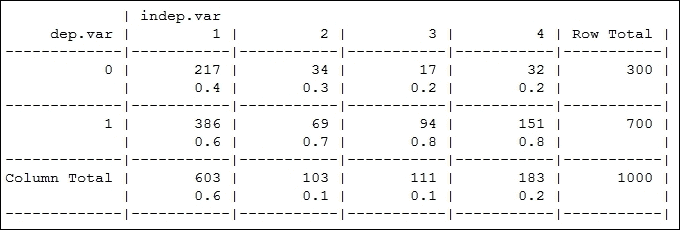

# 第五章. 信用风险检测与预测 – 描述性分析

在最后两章中，你看到了一些围绕零售和电子商务领域的问题。你现在知道如何从购物模式中检测和预测购物趋势，以及如何构建推荐系统。如果你还记得第一章，*使用 R 和机器学习入门*，机器学习的应用是多样化的，我们可以将相同的概念和技术应用于解决现实世界中广泛的各种问题。在这里，我们将解决一个全新的问题，但请记住你所学到的知识，因为你在之前学到的几个概念很快就会派上用场！

在接下来的几章中，我们将探讨与金融领域相关的新问题。我们将研究一家特定德国银行的客户，根据之前收集的一些数据，这些客户可能是银行的信用风险。我们将对数据进行描述性和探索性分析，以突出数据集中不同的潜在特征，并查看它们与信用风险的关系。在下一步，我们将使用机器学习算法和数据特征来构建预测模型，以检测和预测可能成为潜在信用风险的客户。你可能还记得，为了进行这项分析并保持不变，我们需要的是数据和算法。

你可能会惊讶地发现，风险分析是金融机构，包括银行、投资公司、保险公司和经纪公司等，最关注的领域之一。这些机构中的每一个通常都有专门的团队来解决围绕风险分析的问题。经常分析的风险例子包括信用风险、销售风险、与欺诈相关的风险等等。

在本章中，我们将重点关注以下主题：

+   信用风险数据集的描述性分析

+   信用风险问题的领域知识

+   数据集特征的详细分析

+   数据的探索性分析

+   各种数据特征的可视化

+   用于确定特征重要性的统计测试

总是记住，在解决任何机器学习问题之前，领域知识是必不可少的，否则我们可能会盲目地应用随机算法和技术，这可能导致结果不正确。

# 分析类型

在我们开始解决下一个挑战之前，了解不同类型的分析将非常有用，这些分析大致涵盖了数据科学领域。我们使用各种数据挖掘和机器学习技术来解决不同的数据问题。然而，根据技术的机制和最终结果，我们可以将分析大致分为四种不同类型，以下将进行解释：

+   **描述性分析**：这是我们分析一些数据时使用的。我们从查看数据的各种属性开始，提取有意义的特征，并使用统计和可视化来了解已经发生的事情。描述性分析的主要目的是获得我们处理的数据类型的大致概念，并总结过去发生的事情。几乎超过 80%的商业分析都是描述性的。

+   **诊断分析**：这有时与描述性分析结合在一起。这里的主要目标是深入数据以寻找特定的模式并回答诸如为什么发生这种情况等问题。通常，它涉及根本原因分析，以找到事情发生的原因以及在其发生过程中涉及的主要因素。有时回归建模等技术有助于实现这一点。

+   **预测分析**：这是任何分析流程中的最后一步。一旦你构建了具有良好数据流且稳定的预测模型，你就可以构建利用这些模型并开始制定可能采取的行动以改善业务的系统。请记住，预测模型只能预测未来可能发生的事情，因为所有模型本质上都是概率性的，没有任何事情是 100%确定的。

+   **规范性分析**：如果你处于构建了具有良好数据流且一致的预测模型，能够预测未来可能发生的事情的阶段，那么这是任何分析流程中的最后一步。然后你可以构建利用这些模型并开始制定可能采取的行动以改善业务的系统。请记住，你需要具有良好数据的运行预测模型和出色的反馈机制才能实现这一点。

大多数组织进行大量的描述性分析以及一定程度的预测分析。然而，由于不断变化的商业条件和数据流以及与之相关的问题，实施规范性分析非常困难，其中最常见的问题是数据清洗问题。在本章中，我们将先讨论描述性分析，然后再在下一章中转向预测分析，以解决与信用风险分析相关的问题。

# 我们接下来的挑战

在过去的几章中，我们已经处理了一些电子商务领域机器学习的有趣应用。对于接下来的两章，我们的主要挑战将是在金融领域。我们将使用数据分析与机器学习技术来分析一家德国银行的财务数据。这些数据将包含大量关于该银行客户的信息。我们将分两个阶段分析这些数据，包括描述性和预测性分析。

+   **描述性**：在这里，我们将仔细研究数据和其各种属性。我们将进行描述性分析和可视化，以了解我们正在处理什么样的特征以及它们可能与信用风险有何关联。我们在这里处理的数据已经标记，我们将能够看到有多少客户是信用风险，有多少不是。我们还将仔细研究数据中的每个特征，了解其重要性，这将在下一步中很有用。

+   **预测性**：在这里，我们将更多地关注用于预测建模的机器学习算法，利用我们在上一步中已经获取的数据来构建预测模型。我们将使用各种机器学习算法，并在预测客户是否可能成为潜在的信用风险时测试模型的准确性。我们将使用标记数据来训练模型，然后在几个数据实例上测试模型，将我们的预测结果与实际结果进行比较，以查看我们的模型表现如何。

预测信用风险的重要性对金融机构来说非常有用，例如经常处理客户贷款申请的银行。他们必须根据他们关于客户的信息来决定批准或拒绝贷款。如果他们有一个强大的机器学习系统已经建立，可以分析客户数据并指出哪些客户可能是信用风险，那么他们可以通过不批准这些客户的贷款来防止他们的业务遭受损失。

# 什么是信用风险？

我们从本章开始就一直在使用这个术语**信用风险**，你们中的许多人可能想知道这究竟是什么意思，即使你在阅读了上一节之后可能已经猜到了。在这里，我们将清楚地解释这个术语，以便你们在后续章节分析数据时，对数据和其特征的理解不会有任何问题。

信用风险的标准定义是因借款人未能按时偿还债务而产生的违约风险。这种风险由贷款人承担，因为贷款人将遭受本金及其利息的损失。

在我们的案例中，我们将处理一家作为金融组织向申请贷款的客户发放贷款的银行。因此，可能无法按时偿还贷款的客户将成为银行的信用风险。通过分析客户数据并在其上应用机器学习算法，银行将能够提前预测哪些客户可能是潜在的信用风险。这将有助于风险缓解，并通过不向可能成为银行信用风险的客户发放贷款来最小化损失。

# 获取数据

我们数据分析流程的第一步是获取数据集。我们实际上已经清理了数据，并为数据属性提供了有意义的名称，您可以通过打开`german_credit_dataset.csv`文件来检查这一点。您还可以从以下 URL 获取实际数据集，该数据集来自慕尼黑大学统计学系：[`www.statistik.lmu.de/service/datenarchiv/kredit/kredit_e.html`](http://www.statistik.lmu.de/service/datenarchiv/kredit/kredit_e.html)。

您可以下载数据，然后在同一目录下启动 R 并运行以下命令，以了解以下章节中我们将要处理的数据：

```py
> # load in the data and attach the data frame
> credit.df <- read.csv("german_credit_dataset.csv", header = TRUE, sep = ",") 
> # class should be data.frame
> class(credit.df)
[1] "data.frame"
> 
> # get a quick peek at the data
> head(credit.df)

```

下图显示了数据的头六行。每一列表示数据集的一个属性。我们将在稍后更详细地关注每个属性。


要获取有关数据集及其属性的详细信息，您可以使用以下代码片段：

```py
> # get dataset detailed info
> str(credit.df)

```

上述代码将使您能够快速查看您正在处理的数据点的总数，这包括记录数、属性数以及每个属性的详细信息，例如属性名称、类型和一些属性值的样本，正如您可以在以下屏幕截图中所见。利用这一点，我们可以对不同的属性及其数据类型有一个很好的了解，以便我们知道对它们应用哪些转换，以及在描述性分析期间使用哪些统计方法。


从前面的输出中，您可以看到我们的数据集共有 1000 条记录，其中每条记录处理与一位银行客户相关的数据点。每条记录都有各种数据点或属性来描述数据，我们为每条记录有 21 个属性。每个属性的数据类型和样本值也在之前的图像中显示。

### 注意

请注意，默认情况下，R 根据其值将`int`数据类型分配给变量，但我们在数据预处理阶段将根据它们的实际语义更改其中一些。

# 数据预处理

在本节中，我们将重点关注数据预处理，包括数据清理、转换以及如果需要的话进行归一化。基本上，我们在开始对数据进行任何分析之前执行操作以使数据准备就绪。

## 处理缺失值

当您处理的数据将包含缺失值时，这些缺失值通常在 R 中表示为`NA`。有几种方法可以检测它们，我们将在下面展示几种方法。请注意，您可以通过多种方式完成此操作。

```py
> # check if data frame contains NA values
> sum(is.na(credit.df))
[1] 0
> 
> # check if total records reduced after removing rows with NA 
> # values
> sum(complete.cases(credit.df))
[1] 1000

```

`is.na` 函数非常有用，因为它有助于找出数据集中是否有任何元素具有 `NA` 值。还有另一种方法可以做到这一点，即使用 `complete.cases` 函数，它本质上返回一个逻辑向量，表示行是否完整以及是否有任何 `NA` 值。你可以检查与原始数据集相比总记录数是否减少，这样你就会知道数据集中有一些缺失值。幸运的是，在我们的案例中，我们没有缺失值。然而，在未来如果你处理缺失值，有各种方法可以处理。其中一些包括使用 `complete.cases` 等函数删除具有缺失值的行，或者用最频繁的值或平均值等填充它们。这也被称为缺失值插补，它取决于变量的属性和你要处理的领域。因此，我们不会在这个领域过多关注。

## 数据类型转换

我们之前提到，默认情况下，数据集的所有属性都已声明为 `int`，这是 R 中的数值类型，但在这个案例中并非如此，我们必须根据变量语义和值来更改它。如果你已经上过基础的统计学课程，你可能知道我们通常处理两种类型的变量：

+   **数值变量**：这些变量的值具有某种数学意义。这意味着你可以对它们执行数学运算，例如加法、减法等。一些例子可以是人的年龄、体重等。

+   **分类变量**：这些变量的值没有任何数学意义，你不能对它们执行任何数学运算。这个变量中的每个值都属于一个特定的类别或类别。一些例子可以是人的性别、工作等。

由于我们数据集中的所有变量默认都已转换为数值类型，我们只需要将分类变量从数值数据类型转换为因子，这是在 R 中表示分类变量的好方法。

我们数据集中的数值变量包括 `credit.duration.months`、`credit.amount` 和年龄，我们不需要进行任何转换。然而，剩余的 18 个变量都是分类变量，我们将使用以下实用函数来转换它们的数据类型：

```py
# data transformation
to.factors <- function(df, variables){
 for (variable in variables){
 df[[variable]] <- as.factor(df[[variable]])
 }
 return(df)
}

```

此函数将用于我们的现有数据框 `credit.df`，如下所示，以转换变量数据类型：

```py
> # select variables for data transformation
> categorical.vars <- c('credit.rating', 'account.balance', 
+                       'previous.credit.payment.status',
+                       'credit.purpose', 'savings', 
+                       'employment.duration', 'installment.rate',
+                       'marital.status', 'guarantor', 
+                       'residence.duration', 'current.assets',
+                       'other.credits', 'apartment.type', 
+                       'bank.credits', 'occupation', 
+                       'dependents', 'telephone', 
+                       'foreign.worker')
> 
> # transform data types
> credit.df <- to.factors(df = credit.df, 
+                         variables=categorical.vars)
> 
> # verify transformation in data frame details
> str(credit.df)

```

现在，我们可以看到以下输出中转换后的数据类型所选分类变量的属性细节。你会注意到，在数据集的 21 个变量/属性中，有 18 个已经成功转换为分类变量。


这标志着数据预处理步骤的结束，我们将现在深入分析我们的数据集。

### 注意

请注意，我们的一些数据集属性/特征有很多类别或类别，我们将在分析阶段进行更多的数据转换和特征工程，以防止我们的预测模型过度拟合，我们将在后面讨论这一点。

# 数据分析和转换

现在我们已经处理了我们的数据，它已准备好进行分析。我们将进行描述性和探索性分析，如前所述。我们将分析不同的数据集属性，并讨论它们的显著性、语义以及与信用风险属性的关系。我们将使用统计函数、列联表和可视化来描述所有这些。

除了这个，我们还将对我们数据集中的某些特征进行数据转换，特别是分类变量。我们将这样做是为了合并具有相似语义的类别，并通过与相似类别合并来删除比例非常小的类别。这样做的一些原因包括防止我们将在第六章中构建的预测模型过度拟合，即“信用风险检测与预测 – 预测分析”，将语义相似的类别联系起来，以及因为像逻辑回归这样的建模技术并不擅长处理具有大量类别的分类变量。我们首先将分析数据集中的每个特征/变量，然后根据需要执行任何转换。

## 构建分析工具

在我们开始分析之前，我们将开发一些实用函数，我们将使用这些函数来分析数据集特征。请注意，所有实用函数都定义在一个单独的`.R`文件中，称为`descriptive_analytics_utils.R`。您可以通过使用命令`source('descriptive_analytics_utils.R')`将所有函数加载到内存中或任何其他 R 脚本文件中，然后开始使用它们。我们现在将讨论这些实用函数。

现在，我们将讨论我们使用过的各种包。我们使用了一些包，如`pastecs`和`gmodels`来获取特征的摘要统计信息以及构建列联表。`gridExtra`和`ggplot2`包被用于网格布局和构建可视化。如果您尚未安装它们，可以使用`install.packages`命令进行安装。接下来，按照以下代码片段加载这些包：

```py
# load dependencies
library(gridExtra) # grid layouts
library(pastecs) # details summary stats
library(ggplot2) # visualizations
library(gmodels) # build contingency tables

```

```py
stat.desc and summary functions for getting detailed and condensed summary statistics about the variable. The conventions for independent variables and dependent variables are denoted by indep.var and dep.var in the code segments that follow and in other functions later on.
```

```py
# summary statistics
get.numeric.variable.stats <- function(indep.var, detailed=FALSE){
 options(scipen=100)
 options(digits=2)
 if (detailed){
 var.stats <- stat.desc(indep.var)
 }else{
 var.stats <- summary(indep.var)
 }

 df <- data.frame(round(as.numeric(var.stats),2))
 colnames(df) <- deparse(substitute(indep.var))
 rownames(df) <- names(var.stats)

 if (names(dev.cur()) != "null device"){
 dev.off()
 }
 grid.table(t(df))
}

```

接下来，我们将构建一些用于可视化数值变量的函数。我们将通过使用`直方图/密度图`和`箱线图`来描述属性分布来完成这项工作。

```py
# visualizations
# histograms\density
visualize.distribution <- function(indep.var){
 pl1 <- qplot(indep.var, geom="histogram", 
 fill=I('gray'), binwidth=5,
 col=I('black'))+ theme_bw()
 pl2 <- qplot(age, geom="density",
 fill=I('gray'), binwidth=5, 
 col=I('black'))+ theme_bw()

 grid.arrange(pl1,pl2, ncol=2)
}

# box plots
visualize.boxplot <- function(indep.var, dep.var){
 pl1 <- qplot(factor(0),indep.var, geom="boxplot", 
 xlab = deparse(substitute(indep.var)), 
 ylab="values") + theme_bw()
 pl2 <- qplot(dep.var,indep.var,geom="boxplot",
 xlab = deparse(substitute(dep.var)),
 ylab = deparse(substitute(indep.var))) + theme_bw()

 grid.arrange(pl1,pl2, ncol=2)
}

```

我们使用了`ggplot2`包中的`qplot`函数来构建我们将看到的可视化。现在，我们将把注意力转向`分类变量`。我们将从一个函数开始，该函数用于获取任何`分类变量`的汇总统计信息。

```py
# summary statistics
get.categorical.variable.stats <- function(indep.var){

 feature.name = deparse(substitute(indep.var))
 df1 <- data.frame(table(indep.var))
 colnames(df1) <- c(feature.name, "Frequency")
 df2 <- data.frame(prop.table(table(indep.var)))
 colnames(df2) <- c(feature.name, "Proportion")

 df <- merge(
 df1, df2, by = feature.name
 )
 ndf <- df[order(-df$Frequency),]
 if (names(dev.cur()) != "null device"){
 dev.off()
 }
 grid.table(ndf)
}

```

前面的函数将总结分类变量，并讨论其中有多少类别或类别以及一些其他细节，如频率和比例。如果你还记得，我们之前提到我们还将展示分类变量与类/依赖变量`credit.risk`的关系。以下函数将帮助我们以列联表的形式实现相同的目标：

```py
# generate contingency table
get.contingency.table <- function(dep.var, indep.var, 
 stat.tests=F){
 if(stat.tests == F){
 CrossTable(dep.var, indep.var, digits=1, 
 prop.r=F, prop.t=F, prop.chisq=F)
 }else{
 CrossTable(dep.var, indep.var, digits=1, 
 prop.r=F, prop.t=F, prop.chisq=F,
 chisq=T, fisher=T)
 }
}

```

我们还将构建一些用于展示可视化的函数。我们将使用以下函数通过条形图可视化`分类变量`的分布：

```py
# visualizations
# barcharts
visualize.barchart <- function(indep.var){
 qplot(indep.var, geom="bar", 
 fill=I('gray'), col=I('black'),
 xlab = deparse(substitute(indep.var))) + theme_bw()
}

```

我们将使用 mosaic 图来展示之前提到的列联表的可视化，使用以下函数：

```py
# mosaic plots
visualize.contingency.table <- function(dep.var, indep.var){
 if (names(dev.cur()) != "null device"){
 dev.off()
 }
 mosaicplot(dep.var ~ indep.var, color=T, 
 main = "Contingency table plot")
}

```

现在我们已经构建了所有必要的工具，接下来我们将开始分析数据，并在下一节进行详细说明。

## 分析数据集

在本节中，我们将分析数据集的每个特征，并在必要时以汇总统计、关系、统计检验和可视化的形式展示我们的分析。我们将用表格表示对每个变量进行的必要分析。需要记住的一个重要点是，代码中用`dep.var`表示的依赖特征始终是`credit.rating`，因为这是依赖于其他特征的变量；这些特征是独立变量，在表格和图中通常用`indep.var`表示。

我们将对一些重要特征进行详细分析和转换，这些特征具有很大的意义，特别是具有大量类别的数据特征，这样我们可以清楚地理解数据分布以及它们在数据转换时的变化。对于剩余的特征，我们不会过多关注汇总统计，而更强调通过转换和它们与依赖变量`credit.rating`的关系来进行特征工程。

现在，我们将附加数据框，以便我们可以轻松访问单个特征。你可以使用以下代码片段来完成：

```py
> # access dataset features directly
> attach(credit.df)

```

现在，我们将从依赖变量`credit.risk`开始分析，也称为数据集中的类变量，我们将在下一章尝试预测它。

以下代码片段帮助我们获取该特征的所需汇总统计信息：

```py
> # credit.rating stats
> get.categorical.variable.stats(credit.rating)
> # credit.rating visualizations
> visualize.barchart(credit.rating)

```

以下可视化告诉我们`credit.rating`有两个类别，`1`和`0`，并提供了必要的统计数据。基本上，信用评分为`1`的客户是可信赖的，而评分为`0`的客户是不可信赖的。我们还从条形图中观察到，在银行中，有信用评级的客户比例相对于其他客户来说显著较高。


接下来，我们将分析`account.balance`特征。基本上，这个属性表示客户当前账户的余额。

我们将首先使用以下代码片段获取摘要统计信息并绘制条形图。为了更好地理解，我们将一起包含输出结果。

```py
> # account.balance stats and bar chart
> get.categorical.variable.stats(account.balance)
> visualize.barchart(account.balance)

```

从以下可视化中，你可以看到`account.balance`有四个不同的类别，并且每个类别都有一些特定的语义，我们将在下面讨论。


从前面的输出中，你可以看到`account.balance`有四个不同的类别，并且每个类别都有一些语义，如下定义。货币 DM 表示德国的旧货币名称——德国马克。

这四个类别表示以下主要语义或至少持有一年以上的支票账户：

+   **1**: 没有运行中的银行账户

+   **2**: 没有余额或借记

+   **3**: 余额小于`200` DM

+   **4**: 余额`>=200` DM

货币 DM 表示德国马克，德国的旧货币名称。在这里，我们将进行一些特征工程，并将类别 3 和 4 合并在一起，以表示账户中有正余额的客户。我们这样做是因为类别 3 的比例相对于其他类别来说很小，我们不希望在不必要的情况下为每个特征保留太多的类别，除非它们是关键的。我们将通过以下代码片段实现这一点。

首先，我们将加载进行此操作所需的包。如果你还没有安装该包，请使用命令`install.packages("car")`进行安装。

```py
> #load dependencies
> library(car)

```

现在，我们将重新编码必要的类别，如下所示：

```py
> # recode classes and update data frame
> new.account.balance <- recode(account.balance,
+                           "1=1;2=2;3=3;4=3")
> credit.df$account.balance <- new.account.balance

```

现在，我们将使用之前讨论的列联表来查看`new.account.balance`和`credit.rating`之间的关系，并使用以下代码片段通过 mosaic plot 进行可视化。我们还将进行一些统计测试，我将在稍后简要解释。

```py
> # contingency table and mosaic plot 
> get.contingency.table(credit.rating, new.account.balance, 
 stat.tests=T)
> visualize.contingency.table(credit.rating, new.account.balance)

```

在以下图中，你现在可以看到`account.balance`的各个类别与`credit.rating`在表格和图中的分布情况。一个有趣的现象是，90%的账户有资金的客户不是潜在的信用风险，这听起来是合理的。


我们在这里还执行了两个统计测试：卡方测试和费舍尔测试，这两个测试都是列联表中广泛用于假设检验的相关测试。详细讨论这些测试中涉及的统计计算超出了本章的范围。我将用一种易于理解的方式来说明。通常，我们从一个零假设开始，即之前描绘的两个变量之间不存在关联或关系，以及一个备择假设，即两个变量之间存在关联或关系的可能性。如果从测试中获得 p 值小于或等于`0.05`，那么我们才能拒绝零假设，接受备择假设。在这种情况下，您可以清楚地看到，这两个测试都给出了`< 0.05`的 p 值，这肯定有利于备择假设，即`credit.rating`和`account.balance`之间存在某种关联。这类测试在构建统计模型时非常有用。您可以在互联网或任何统计学书籍中查找前面的测试，以深入了解 p 值的意义及其工作原理。

### 注意

请注意，从现在开始，我们将只展示每个特征最重要的分析结果。然而，您始终可以使用我们之前解释过的函数尝试获取各种分析技术的相关信息。对于列联表，使用`get.contingency.table()`函数。可以通过在`get.contingency.table()`函数中将`stat.tests`参数设置为`TRUE`来执行统计测试。您还可以使用`visualize.contingency.table()`函数来查看错综图。

现在我们将查看`credit.duration.months`，这表示信用期限（按月）。这是一个数值变量，分析将与其他分类变量略有不同。

```py
> # credit.duration.months analysis
> get.numeric.variable.stats(credit.duration.months)

```

我们可以从以下图中看到相同的内容：


我们看到的值是按月计算的，我们得到这个特征的典型汇总统计量，包括平均值、中位数和四分位数。我们现在将使用`histograms/density`图和`boxplots`来可视化这个特征的值分布。

```py
> # histogram\density plot
> visualize.distribution(credit.duration.months)

```

我们现在以箱线图的形式可视化相同的内容，包括显示与`credit.rating`相关的下一个。

```py
> # box plot
> visualize.boxplot(credit.duration.months, credit.rating)

```

有趣的是，从下面的图中我们可以看到，信用评级差的客户的平均信用期限高于信用评级好的客户。如果我们假设许多信用期限长的客户违约了，这似乎是合理的。


接下来，我们将查看下一个变量`previous.credit.payment.status`，这表示客户在支付其先前信用时的状态。这是一个`分类变量`，我们得到如下的统计数据：

```py
> # previous.credit.payment.status stats and bar chart
> get.categorical.variable.stats(previous.credit.payment.status)
> visualize.barchart(previous.credit.payment.status)

```

这给我们以下表格和条形图，展示了数据分布：


这些类别表示以下主要语义：

+   **0**: 犹豫不决的支付

+   **1**: 运行账户有问题

+   **2**: 没有剩余的先前信用

+   **3**: 这家银行的当前信用额度没有问题

+   **4**: 在这家银行还清了之前的信用

我们将对这个功能应用以下变换，因此新的语义将是：

+   **1**: 支付存在一些问题

+   **2**: 所有信用已支付

+   **3**: 没有问题，并且只在银行支付了信用

我们将在以下代码片段中执行变换：

```py
> # recode classes and update data frame
> new.previous.credit.payment.status <- 
 recode(previous.credit.payment.status,
+                                           "0=1;1=1;2=2;3=3;4=3")
> credit.df$previous.credit.payment.status <- 
 new.previous.credit.payment.status

```

变换后特征的列联表如下获得：

```py
> # contingency table
> get.contingency.table(credit.rating,
 new.previous.credit.payment.status)

```

从以下表格中我们可以观察到，拥有良好信用评级的最大人数已经没有问题地支付了之前的信用，而没有良好信用评级的人则支付上存在一些问题，这是有道理的！


我们接下来要分析的功能是 `credit.purpose`，它表示信用金额的目的。这也是一个分类变量，我们得到其摘要统计信息，并绘制以下条形图来显示其各种类别的频率：

```py
> # credit.purpose stats and bar chart
> get.categorical.variable.stats(credit.purpose)
> visualize.barchart(credit.purpose)

```

这给我们以下表格和条形图，展示了数据分布：


我们观察到，仅针对这个功能就有惊人的 11 个类别。除此之外，我们还观察到，与前 5 个类别相比，有几个类别的比例极低，而且类别**标签 7**甚至没有出现在数据集中！这正是我们需要通过将一些这些类别分组在一起进行特征工程的原因，就像我们之前做的那样。

这些类别表示以下主要语义：

+   **0**: 其他

+   **1**: 新车

+   **2**: 二手车

+   **3**: 家具物品

+   **4**: 收音机或电视

+   **5**: 家用电器

+   **6**: 维修

+   **7**: 教育

+   **8**: 假期

+   **9**: 再培训

+   **10**: 商业

我们将通过结合一些现有的类和变换后的新语义来转换这个功能，变换后的语义如下：

+   **1**: 新车

+   **2**: 二手车

+   **3**: 与家庭相关的物品

+   **4**: 其他

我们将通过以下代码片段来完成这项工作：

```py
> # recode classes and update data frame
> new.credit.purpose <- recode(credit.purpose,"0=4;1=1;2=2;3=3;
+                                              4=3;5=3;6=3;7=4;
+                                              8=4;9=4;10=4")
> credit.df$credit.purpose <- new.credit.purpose

```

通过以下代码片段获得变换后特征的列联表：

```py
> # contingency table
> get.contingency.table(credit.rating, new.credit.purpose)

```

根据以下表格，我们看到拥有家庭相关物品或其他物品信用目的的客户在不良信用评级类别中的比例似乎最高：


我们接下来要分析的功能是 `credit.amount`，它基本上表示客户从银行请求的信用金额。这是一个数值变量，我们使用以下代码来获取摘要统计信息：

```py
> # credit.amount analysis
> get.numeric.variable.stats(credit.amount)

```


我们可以看到一些正常统计量，例如平均信贷金额为 3270 DM，中位数约为 3270 DM。现在我们将使用直方图和密度图来可视化前面数据的分布，如下所示：

```py
> # histogram\density plot
> visualize.distribution(credit.amount)

```

这将为我们提供`credit.amount`的直方图和密度图，您可以在以下图中看到它是一个右偏分布：


接下来，我们将使用以下代码片段使用箱线图来可视化数据，以查看数据分布及其与 `credit.rating` 的关系：

```py
> # box plot
> visualize.boxplot(credit.amount, credit.rating)

```

这生成了以下箱线图，您可以在箱线图中清楚地看到分布的右偏，由箱线中的许多点表示。我们还发现了一个有趣的见解，即对于要求更高信贷金额的客户，其信贷评分的中位数是差的，这在许多客户可能未能支付所需全部还款以偿还信贷金额的情况下似乎很合理。


现在您已经了解了如何对分类和数值变量进行描述性分析，从现在开始，我们将不会展示每个特征的所有不同分析技术的输出。如果您有兴趣深入了解数据，请随意使用我们之前使用的函数对剩余变量进行实验，以获取汇总统计量和可视化结果！

下一个特征是储蓄，它是一个具有以下五个类别语义的分类变量：

+   **1**: 没有储蓄

+   **2**: `< 100` DM

+   **3**: 在 `[100, 499]` DM 之间

+   **4**: 在 `[500, 999]` DM 之间

+   **5**: `>= 1000` DM

该特征表示客户拥有的平均储蓄/股票金额。我们将将其转换为以下四个类别标签：

+   **1**: 没有储蓄

+   **2**: `< 100` DM

+   **3**: 在 `[100, 999]` DM 之间

+   **4**: `>= 1000` DM

我们将使用以下代码片段：

```py
> # feature: savings - recode classes and update data frame
> new.savings <- recode(savings,"1=1;2=2;3=3;
+                                4=3;5=4")
> credit.df$savings <- new.savings

```

现在我们将使用以下代码分析储蓄与 `credit.rating` 之间的关系，以生成列联表：

```py
> # contingency table
> get.contingency.table(credit.rating, new.savings)

```

这生成了以下列联表。观察表值后，很明显，在具有不良信贷评分的客户中，没有储蓄的人的比例最高，这并不令人惊讶！这个数字对于具有良好信贷评分的客户来说也很高，因为与不良信贷评分的总记录数相比，良好信贷评分的总记录数也较高。然而，我们还可以看到，具有 `> 1000` DM 和良好信贷评分的人的比例相对于在储蓄账户中同时具有不良信贷评分和 `> 1000` DM 的人的比例相当高。



现在，我们将查看名为 `employment.duration` 的特征，它是一个表示客户至今为止被雇佣时间的分类变量。该特征的五个类别语义如下：

+   **1**: 失业

+   **2**: `< 1` 年

+   **3**: 在 `[1, 4]` 年之间

+   **4**: 在 `[4, 7]` 年之间

+   **5**: `>= 7`年

我们将将其转换为以下四个类别：

+   **1**: 未就业或`< 1`年

+   **2**: 在 `[1,4]` 年之间

+   **3**: 在 `[4,7]` 年之间

+   **4**: `>= 7`年

我们将使用以下代码：

```py
> # feature: employment.duration - recode classes and update data frame
> new.employment.duration <- recode(employment.duration,
+                                   "1=1;2=1;3=2;4=3;5=4")
> credit.df$employment.duration <- new.employment.duration

```

现在我们使用列联表分析其关系，如下所示：

```py
> # contingency table
> get.contingency.table(credit.rating, new.employment.duration)

```

从以下表中我们可以观察到，没有或显著低就业年数和不良信用评级的客户比例远高于具有良好信用评级的类似客户。在`employment.duration`特征中，值 1 表示失业或就业时间少于`1`年的人。在 300 人中有 93 人具有不良信用评级，这给出了 31%的比例，与具有良好信用评级的客户相同指标相比，这一比例要高得多，后者为 700 客户中的 141 人，或 20%。


我们现在继续分析下一个特征，名为`installment.rate`，这是一个具有以下语义的分类变量：

+   **1**: `>=35%`

+   **2**: 在 `[25, 35]%` 之间

+   **3**: 在 `[20, 25]%` 之间

+   **4**: 四个类别的`< 20%`

对于这个属性的原始元数据中信息不多，因此存在一些歧义，但我们假设它表示客户工资中用于支付信用贷款月度分期付款的百分比。我们在这里不会进行任何转换，所以我们将直接进入关系分析。

```py
> # feature: installment.rate - contingency table and statistical tests
> get.contingency.table(credit.rating, installment.rate, 
+                      stat.tests=TRUE)

```

```py
> 0.05, thus ruling the null hypothesis in favor of the alternative. This tells us that these two variables do not have a significant association between them and this feature might not be one to consider when we make feature sets for our predictive models. We will look at feature selection in more detail in the next chapter.
```


我们接下来要分析的是`marital.status`变量，它表示客户的婚姻状况，是一个分类变量。它有四个类别，具有以下语义：

+   **1**: 男性离婚

+   **2**: 男性单身

+   **3**: 男性已婚/丧偶

+   **4**: 女性

我们将根据以下语义将其转换为三个类别：

+   **1**: 男性离婚/单身

+   **2**: 男性已婚/丧偶

+   **3**: 女性

我们将使用以下代码：

```py
> # feature: marital.status - recode classes and update data frame
> new.marital.status <- recode(marital.status, "1=1;2=1;3=2;4=3")
> credit.df$marital.status <- new.marital.status

```

我们现在通过以下代码片段构建一个列联表来观察`marital.status`和`credit.rating`之间的关系：

```py
> # contingency table
> get.contingency.table(credit.rating, new.marital.status)

```

从以下表中，我们注意到，对于信用评级良好的客户，单身男性与已婚男性的比例为**1:2**，而对于信用评级较差的客户，这一比例接近**1:1**。这意味着也许已婚男性更倾向于按时偿还信用债务？这可能是一个可能性，但请记住，相关性并不总是意味着因果关系。


统计测试的 p 值给出了`0.01`的值，这表明特征之间可能存在某种关联。

下一个特征是担保人，这表示客户是否有任何其他债务人或担保人。这是一个有三个类别的分类变量，具有以下语义：

+   **1**: 无

+   **2**: 共同借款人

+   **3**: 担保人

我们将它们转换成以下语义的两个变量：

+   **1**: 否

+   **2**: 是

对于转换，我们使用以下代码片段：

```py
> # feature: guarantor - recode classes and update data frame
> new.guarantor <- recode(guarantor, "1=1;2=2;3=2")
> credit.df$guarantor <- new.guarantor

```

对此结果进行统计分析得到 p 值为 `1`，这个值远大于 `0.05`，因此拒绝零假设，暗示担保人与 `credit.rating` 之间可能没有关联。

### 提示

您也可以使用直接函数而不是每次都调用 `get.contingency.table(…)` 函数来运行统计分析。对于费舍尔精确检验，调用 `fisher.test(credit.rating, guarantor)`，对于皮尔逊卡方检验，调用 `chisq.test(credit,rating, guarantor)`。您可以将担保人替换为任何其他独立变量以执行这些测试。

下一个特征是 `residence.duration`，表示客户在其当前地址居住的时间。

这是一个分类变量，以下是对四个类别的语义描述：

+   **1**: `< 1` 年

+   **2**: 在 `[1,4]` 年之间

+   **3**: 在 `[4,7]` 年之间

+   **4**: `>= 7` 年

我们将不对这些数据进行转换，而是直接进行统计分析，以查看该特征是否与 `credit,rating` 有任何关联。根据之前的提示，使用 `fisher.test` 和 `chisq.test` 函数都给出了 p 值为 `0.9`，这个值显著大于 `0.05`，因此它们之间没有显著关系。我们将在这里展示这两个统计测试的输出，以便您了解它们所描述的内容。

```py
> # perform statistical tests for residence.duration
> fisher.test(credit.rating, residence.duration)
> chisq.test(credit.rating, residence.duration)

```

您可以从以下输出中看到，我们从之前提到的两个测试中都得到了相同的 p 值：


我们现在将重点转向 `current.assets`，这是一个分类变量，以下是对四个类别的语义描述：

+   **1**: 没有资产

+   **2**: 汽车/其他

+   **3**: 人寿保险/储蓄合同

+   **4**: 房地产/土地所有权

我们将不对这些数据进行转换，而是直接运行相同的统计分析，以检查它是否与 `credit.rating` 有任何关联。我们得到的 p 值为 `3 x 10-5`，这个值显然小于 `0.05`，因此我们可以得出结论，备择假设成立，即变量之间存在某种关联。

我们将要分析的下一个变量是 `age`。这是一个数值变量，我们将如下获取其摘要统计信息：

```py
> # age analysis
> get.numeric.variable.stats(age)

```

**输出**：


我们可以观察到，客户平均年龄为 35.5 岁，中位数为 33 岁。为了查看特征分布，我们将使用以下代码片段使用直方图和密度图进行可视化：

```py
> # histogram\density plot
> visualize.distribution(age)

```

从以下图表中我们可以观察到，分布是右偏分布，大多数客户年龄在 25 至 45 岁之间：


我们现在将通过箱线图可视化来观察 `age` 和 `credit.rating` 之间的关系，如下所示：

```py
> # box plot
> visualize.boxplot(age, credit.rating)

```

从以下图表中可以看出，右偏斜在箱线图中通过我们在极端端点看到的点簇明显可辨。从右边的图表中我们可以得出的有趣观察是，信用评级差的客户的平均年龄低于信用评级好的客户。


这种关联的一个原因可能是，一些年轻人由于尚未稳定就业而未能偿还他们从银行借取的信用贷款。但，再次强调，这只是一个假设，除非我们查看每个客户的完整背景，否则我们无法验证。

接下来，我们将查看特征 `other.credits`，它具有以下三个类别的语义：

+   **1**: 在其他银行

+   **2**: 在商店

+   **3**: 没有更多信用

这个特征表示客户是否在其他地方有任何其他待处理的信用。我们将将其转换为两个类别，具有以下语义：

+   **1**: 是

+   **2**: 否

我们将使用以下代码片段：

```py
> # feature: other.credits - recode classes and update data frame
> new.other.credits <- recode(other.credits, "1=1;2=1;3=2")
> credit.df$other.credits <- new.other.credits

```

对新转换的特征进行统计分析，我们得到一个 p 值为 `0.0005`，这 `< 0.05`，因此支持备择假设而非零假设，表明这个特征与 `credit.rating` 之间存在某种关联，假设没有其他因素的影响。

下一个特征 `apartment.type` 是一个具有以下语义的三个类别的类别变量：

+   **1**: 免费公寓

+   **2**: 租赁公寓

+   **3**: 拥有并居住的公寓

这个特征基本上表示客户居住的公寓类型。我们不会对这个变量进行任何转换，并将直接进行统计分析。这两个测试都给出了 p 值 `< 0.05`，这表明 `apartment.type` 和 `credit.rating` 之间存在某种关联，假设没有其他因素影响。

现在我们将查看特征 `bank.credits`，这是一个具有以下语义的类别变量，对于四个类别：

+   **1**: 一个

+   **2**: 两个/三个

+   **3**: 四个/五个

+   **4**: 六个或更多

这个特征表示客户从该银行（包括当前的一个）借取的信用贷款总数。我们将将其转换为一个二元特征，具有以下两个类别的语义：

+   **1**: 一个

+   **2**: 超过一个

我们将使用以下代码：

```py
> # feature: bank.credits - recode classes and update data frame
> new.bank.credits <- recode(bank.credits, "1=1;2=2;3=2;4=2")
> credit.df$bank.credits <- new.bank.credits

```

对这个转换后的特征进行统计分析，我们得到一个 p 值为 `0.2`，这比 `0.05` 大得多，因此我们知道零假设仍然有效，即 `bank.credits` 和 `credit.rating` 之间没有显著的关联。有趣的是，如果你使用 `bank.credits` 的未转换版本进行统计分析，你会得到一个更高的 p 值为 `0.4`，这表明没有显著的关联。

下一个特征是`occupation`，显然表示客户的当前工作。这是一个分类变量，其四个类别具有以下语义：

+   **1**: 失业且无永久居留权

+   **2**: 无技能且拥有永久居留权

+   **3**: 技能工人/次要公务员

+   **4**: 执行/自雇/高级公务员

我们不会对这个特征应用任何转换，因为每个类别在特征上都有其独特的特点。因此，我们将直接进行统计分析，这两个测试得到的 p 值为`0.6`，这肯定大于`0.05`，因此零假设成立，即两个特征之间没有显著的关系。

我们现在将查看下一个特征`dependents`，这是一个具有以下语义的两个类别标签的分类变量：

+   **1**: 零到两个

+   **2**: 三或更多

这个特征表示作为客户依赖者的总人数。我们不会对这个特征应用任何转换，因为它已经是一个二进制变量。对这个特征进行统计分析得到的 p 值为`1`，这告诉我们这个特征与`credit.rating`没有显著的关系。

接下来是特征`telephone`，这是一个具有两个类别的二进制分类变量，以下语义表示客户是否有电话：

+   **1**: 否

+   **2**: 是

由于这是一个二进制变量，我们在这里不需要进行任何进一步的转换。因此，我们继续进行统计分析，得到的 p 值为`0.3`，这大于`0.05`，因此零假设被拒绝，表明电话与`credit.rating`之间没有显著的关联。

数据集中的最后一个特征是`foreign.worker`，这是一个具有两个类别的二进制分类变量，以下语义表示客户是否是外国工人：

+   **1**: 是

+   **2**: 否

我们没有进行任何转换，因为这个变量已经是二进制变量，具有两个不同的类别，所以我们继续进行统计分析。这两个测试都给出了小于 0.05 的 p 值，这可能表明这个变量与`credit.rating`有显著的关系。

通过这一点，我们完成了对数据集的数据分析阶段。

## 保存转换后的数据集

我们已经对多个分类变量进行了大量的特征工程，使用数据转换，由于我们将在转换后的特征集上构建预测模型，我们需要将这个数据集单独存储到磁盘上。我们使用以下代码片段来完成同样的任务：

```py
> ## Save the transformed dataset
> write.csv(file='credit_dataset_final.csv', x = credit.df, 
+           row.names = F)

```

下次开始构建预测模型时，我们可以直接将上述文件加载到 R 中，我们将在下一章中介绍这一点。

# 下一步

我们已经分析了我们的数据集，进行了必要的特征工程和统计测试，构建了可视化，并获得了关于信用风险分析和银行在分析客户时考虑哪些特征的大量领域知识。我们详细分析数据集中每个特征的原因是为了让你了解银行在分析客户信用评级时考虑的每个特征。这是为了让你对领域知识有良好的理解，并帮助你熟悉未来对任何数据集进行探索性和描述性分析的技术。那么接下来是什么？现在真正有趣的部分来了；从这些数据中构建特征集，并将它们输入到预测模型中，以预测哪些客户可能是潜在的信用风险，哪些不是。如前所述，这有两个步骤：数据和算法。实际上，我们将更进一步，说有特征集和算法将帮助我们实现主要目标。

## 特征集

数据集基本上是一个包含多个观测记录的文件，其中每个元组或记录代表一组完整的观测，而列则是该观测中特定的属性或特征，它们讨论了特定的特性。在预测分析中，通常数据集中有一个属性或特征，其类别或类别需要被预测。这个变量在我们的数据集中是`credit.rating`，也称为因变量。所有其他依赖这些特征的变量都是自变量。这些特征的组合形成了一个特征向量，也常被称为特征集。确定我们应该考虑哪些特征集用于预测模型有多种方法，并且你将会看到，对于任何数据集，都没有一个固定的特征集。它根据特征工程、我们构建的预测模型类型以及基于统计测试的特征的重要性而不断变化。

特征集中的每个属性被称为特征或属性，在统计学中它们也被称为独立变量或解释变量。特征可以是各种类型，正如我们在数据集中所看到的。我们可以有具有多个类别的分类特征，具有两个类别的二元特征，有序特征，它们基本上是分类特征，但具有内在的某种顺序（例如，低、中、高），以及可能是整数或实数值的数值特征。特征在构建预测模型中非常重要，而且往往数据科学家会花费大量时间构建完美的特征集，以极大地提高预测模型的准确性。这就是为什么除了了解机器学习算法之外，领域知识也非常重要。

## 机器学习算法

一旦我们准备好了特征集，我们就可以开始使用预测模型来使用它们，并开始根据客户特征预测客户的信用评级。要记住的一个重要的事情是，这是一个迭代过程，我们必须根据从预测模型获得的输出和反馈来不断修改我们的特征集，以进一步提高它们。在本节中简要解释了与我们场景相关的几种方法，它们属于监督机器学习算法的类别。

+   **线性分类算法**：这些算法通过线性函数进行分类，通过执行特征集和与之相关的某些权重的点积为每个类别分配分数。预测的类别是得分最高的类别。特征集的最优权重以各种方式确定，并且根据所选算法而有所不同。一些算法的例子包括逻辑回归、支持向量机和感知器。

+   **决策树**：在这里，我们使用决策树作为预测模型，将数据点中的各种观察结果映射到我们要预测的记录的观察类别。决策树就像一个流程图结构，其中每个内部非叶节点表示对特征的检查，每个分支代表该检查的结果，每个终端叶节点包含一个我们最终预测的类别标签。

+   **集成学习方法**：这包括使用多个机器学习算法来获得更好的预测模型。一个例子是随机森林分类算法，它在模型训练阶段使用决策树的集成，并在每个阶段从决策树的集成中获取多数输出决策作为其输出。这倾向于减少过度拟合，这在使用决策树时经常发生。

+   **提升算法**：这也是监督学习算法家族中的一种集成学习技术。它由训练多个弱分类模型并从它们中学习的过程组成，然后再将它们添加到一个比它们更强的最终分类器中。在添加分类器时遵循一种加权的做法，这基于它们的准确性。未来的弱分类器更多地关注先前被错误分类的记录。

+   **神经网络**：这些算法受到生物神经网络的启发，生物神经网络由相互连接的神经元系统组成，它们相互交换信息。在预测建模中，我们处理人工神经网络，它由相互连接的节点组组成。每个节点包含一个函数，通常是一个数学函数（即，Sigmoid 函数），并且与它相关联的权重是自适应的，根据输入到节点的数据不断变化，并在多次迭代（也称为**时期**）中不断检查从输出获得的错误。

在下一章构建预测模型时，我们将介绍这些算法中的几个。

# 摘要

恭喜你坚持看到本章的结尾！到目前为止，你已经通过本章学习到了一些重要内容。你现在对金融领域最重要的一个领域有了概念，那就是信用风险分析。除此之外，你还获得了关于银行如何分析客户以确定其信用评级以及他们考虑的哪些属性和特征的显著领域知识。对数据集的描述性和探索性分析也让你了解了当你只有一个问题要解决和一个数据集时，如何从头开始工作！你现在知道如何进行特征工程，使用`ggplot2`构建精美的出版物质量可视化，以及进行统计测试以检查特征关联。最后，我们通过讨论特征集来结束我们的讨论，并对几个监督机器学习算法进行了简要介绍，这些算法将帮助我们下一步预测信用风险。最有趣的部分还在后面，所以请继续关注！
