# 第七章：社交媒体分析 – 分析 Twitter 数据

“连接”是描述 21 世纪生活的词汇。尽管有许多因素促成了这个术语，但有一个方面发挥了关键作用。那就是网络。网络使距离变得无关紧要，模糊了社会经济界限，它本身就是一个世界，我们都是其中的一部分。特别是网络或互联网在这个数据驱动革命中是一个核心实体。正如我们在前面的章节中看到的，对于大多数现代问题，网络/互联网（以下将互换使用）是数据来源。无论是电子商务平台还是金融领域，互联网每秒都为我们提供大量数据。在这个虚拟世界中，还有另一个数据海洋，它以非常个人化的方式触及我们的生活。社交网络，或社交媒体，是信息巨无霸，也是本章的主题。

在上一章中，我们讨论了金融领域，在那里我们分析了并预测了某家银行客户的信用风险。我们现在转换方向，进入社交媒体领域，看看机器学习和 R 如何使我们能够从这个数据海洋中揭示洞察力。

在本章中，我们将涵盖以下主题：

+   社交网络的数据挖掘具体方法

+   不同数据可视化的重要性和用途

+   如何连接和收集 Twitter 数据的概述

+   利用 Twitter 数据揭示惊人的洞察力

+   看看社交网络如何对数据挖掘过程提出新的挑战

# 社交网络（Twitter）

我们每天都使用社交网络。有无数社交网络迎合各种意识形态和哲学，但 Facebook 和 Twitter（除少数几个外）已经成为社交网络本身的同义词。这两个社交网络之所以受欢迎，不仅因为它们的独特性和服务质量，还因为它们使我们能够以非常直观的方式互动。正如我们在电子商务网站中使用的推荐引擎（见第四章）所看到的，“建立产品推荐系统”，社交网络在 Facebook、Twitter 甚至互联网出现之前就已经存在。

社交网络对科学家和数学家都产生了兴趣。这是一个跨学科的话题，它跨越但不限于社会学、心理学、生物学、经济学、传播学和信息科学。已经发展出各种理论来分析社交网络及其对人类生活的影响，这些影响以影响经济、人口统计、健康、语言、读写能力、犯罪等因素的形式出现。

早在 19 世纪末进行的研究构成了我们今天所说的社会网络的基础。正如其词本身所表明的，社会网络是节点或实体之间的一种连接/网络，这些节点或实体由人类和影响社会生活的元素所代表。更正式地说，它是一个描绘关系和互动的网络。因此，看到各种图理论和算法被用来理解社会网络并不令人惊讶。在 19 世纪和 20 世纪，这些理论仅限于理论模型和艰苦的社会实验，而 21 世纪的技术为这些理论的测试、微调和建模打开了大门，以帮助理解社会互动的动态。尽管通过某些社会网络（称为社会实验）测试这些理论引起了争议，但这些话题超出了本书的范围。我们将限制自己在算法/数据科学领域，并将争议留给专家讨论。

### 备注

米尔格拉姆实验，或称为小世界实验，是在 20 世纪 60 年代末进行的，旨在考察美国人的平均路径长度。作为该实验的一部分，随机挑选的人被选为邮件链的起点。这些随机挑选的人被要求将邮件发送给下一个人，以便邮件更接近其目的地（波士顿某地），依此类推。这个著名实验记录的平均跳数是六步。都市传说表明，“六度分隔”这个短语起源于这个实验，尽管米尔格拉姆博士本人从未使用过这个术语！他进行了许多更多的实验；去搜索并惊叹吧。

来源：

[`www.simplypsychology.org/milgram.html`](http://www.simplypsychology.org/milgram.html)

在我们深入具体内容之前，让我们尝试理解选择 Twitter 作为本章节和下一章节分析点的理由。让我们从了解 Twitter 是什么以及为什么它对终端用户和数据科学家都如此受欢迎开始。

如我们所知，Twitter 是一个社交网络/微博服务，它允许用户发送和接收最多 140 个字符的推文。但使 Twitter 如此受欢迎的是它满足基本的人类本能的方式。我们人类是好奇的生物，有着不断被听到的需求。对我们来说，有一个地方或某个人可以表达我们的观点是很重要的。我们喜欢分享我们的经历、成就、失败和想法。在某种程度上，我们也想知道我们的同龄人在做什么，名人忙于什么，或者新闻上有什么。Twitter 正是解决了这些问题。

在 Twitter 出现之前，就已经存在多个社交网络，Twitter 并没有取代其他服务。在我们看来，是 Twitter 组织信息和用户的方式吸引了人们的注意。其独特的*关注*关系模型满足了我们对好奇心的渴望，而其简短、免费、高速的通信平台使用户能够发声并被全球听到。通过允许用户关注感兴趣的人或实体，它使我们能够跟上他们的最新动态，而无需其他用户反过来关注我们。*关注*模型使 Twitter 的关系更倾向于兴趣图谱，而不是像 Facebook 这样的社交网络中通常发现的友谊模式。

Twitter 因其信息（以及谣言）的超级快速传播而闻名并被全球使用。在某些以前无法想象的情况下，它被创新地使用，例如在地震或台风等自然灾害时期寻找人们。它被用来传播信息，范围之广，深度之深，以至于达到了病毒般的规模。不对称的关系和高速度的信息交换有助于使 Twitter 成为一个如此动态的实体。如果我们仔细分析和研究这个社交网络的数据和动态，我们可以揭示许多见解。因此，它是本章的主题。

### 注意

**有趣的链接**:

[`www.technologyreview.com/s/419368/how-twitter-helps-in-a-disaster/`](https://www.technologyreview.com/s/419368/how-twitter-helps-in-a-disaster/)

[`www.citylab.com/tech/2015/04/how-twitter-maps-can-be-useful-during-disasters/391436/`](http://www.citylab.com/tech/2015/04/how-twitter-maps-can-be-useful-during-disasters/391436/)

[`www.researchgate.net/publication/282150020_A_Systematic_Literature_Review_of_Twitter_Research_from_a_Socio-Political_Revolution_Perspective?channel=doi&linkId=56050b3f08ae5e8e3f3125cb&showFulltext=true`](https://www.researchgate.net/publication/282150020_A_Systematic_Literature_Review_of_Twitter_Research_from_a_Socio-Political_Revolution_Perspective?channel=doi&linkId=56050b3f08ae5e8e3f3125cb&showFulltext=true)

[`www.tandfonline.com/doi/abs/10.1080/1369118X.2012.696123`](http://www.tandfonline.com/doi/abs/10.1080/1369118X.2012.696123)

[`www.psmag.com/nature-and-technology/how-to-use-social-media-usefully`](http://www.psmag.com/nature-and-technology/how-to-use-social-media-usefully)

让我们用#RMachineLearningByExample!来对推文应用一些数据科学！

# 数据挖掘 @社交网络

我们已经通过这本书的章节走过了很长的路，理解了各种概念，并学习了一些令人惊叹的算法。我们甚至参与了在我们的日常生活中有应用的项目。简而言之，我们已经在没有明确使用术语的情况下进行了数据挖掘。现在，让我们抓住这个机会，正式定义数据挖掘。

在传统意义上，采矿指的是从地球中提取有用的矿物（如煤矿开采）。将这一概念置于信息时代的大背景下，采矿则指的是从大量数据中提取有用的信息。因此，如果我们仔细观察，**知识挖掘**或**从数据中发现知识**（KDD）似乎比“数据挖掘”这个术语更能准确地表达。正如许多关键词一样，简洁明了往往能吸引人的注意。因此，你可能会在很多地方看到“从数据中发现知识”和“数据挖掘”这两个术语被交替使用，这是完全正确的。数据挖掘的过程，类似于采矿，包括以下步骤：

1.  数据清洗以去除噪声和不需要的数据

1.  数据转换以将数据转换为适合分析的相关形式

1.  数据/模式评估以揭示有趣的洞察

1.  数据展示以可视化有用的知识形式

### 注意

数据挖掘并不是使用搜索引擎获取信息，比如关于蛇的信息。相反，它涉及到揭示隐藏的洞察，比如蛇是唯一一种在除南极洲以外的每个大陆都能找到的生物！

如果我们花点时间理解前面的步骤，我们就可以看到我们在所有项目中使用了完全相同的过程。请记住，我们只是将我们在章节中一直遵循的过程进行了形式化和展示，并没有遗漏或修改之前章节中完成的任何步骤。

## 采矿社交网络数据

现在我们已经正式定义了数据挖掘，并看到了将数据转换为知识所涉及的步骤，让我们专注于社交网络的数据。虽然数据挖掘方法与数据来源无关，但有一些需要注意的事项，这可能导致更好的处理和改进的结果。

就像采矿任何其他类型的数据一样，领域知识对于采矿社交网络数据来说绝对是一个加分项。尽管社交网络分析是一个跨学科的主题（如前所述），但它主要涉及分析与用户或实体及其互动相关的数据。

在前面的章节中，我们看到了来自电子商务平台、银行以及与花卉特征相关的各种数据。我们所看到的数据具有不同的属性和特征。但如果我们仔细观察，这些数据都是某种测量或事件捕获的结果。

进入社交网络的领域，游戏场域略有不同，如果不是完全不同。与我们所看到的不同，社交媒体平台的数据极其动态。当我们说动态时，我们指的是数据点的实际内容，而不是其结构。数据点本身可能（也可能不）是结构化的，但内容本身不是。

让我们具体谈谈包含在推文中的数据。一个样本推文可能看起来像这样：


图片来源：[`twitter.com/POTUS/status/680464195993911296`](https://twitter.com/POTUS/status/680464195993911296)

如我们所知，推文是一个 140 个字符的消息。由于消息是由用户（通常）生成的，实际消息的长度、语言可能不同，或者可能包含图片、链接、视频等。因此，推文是一个包含用户名（`@POTUS`）、用户名（`奥巴马总统`）、消息（`来自奥巴马家族...`）以及与推文时间（`2015 年 12 月 26 日`）、点赞数和转发数相关的结构化数据点。推文还可能包含嵌入在消息中的标签、超链接、图片和视频。正如我们将在接下来的章节中看到的，推文除了前面讨论的属性外，还包含大量的元数据（关于数据的数据）。同样，其他社交网络的数据也包含比肉眼所见多得多的信息。

单条推文就能产生如此多的信息，再加上全球范围内每秒有数百万用户疯狂地发推，这产生了大量具有有趣模式的数据，等待被发现。

在其真正意义上，Twitter 的数据（以及社交网络的一般数据）很好地代表了大数据的 3V（体积、种类和速度）。

### 注意

2013 年 8 月 3 日，日本播出电影《天空之城》期间，每秒产生了 143,199 条推文，这是记录下的一个记录。平均每秒的推文数量通常约为 5700；这个记录是它的 25 倍！更多关于这个记录的信息可以在 Twitter 博客上阅读：[`blog.twitter.com/2013/new-tweets-per-second-record-and-how`](https://blog.twitter.com/2013/new-tweets-per-second-record-and-how)

因此，从社交网络中挖掘数据涉及理解数据点的结构，社交网络（如 Twitter 用于快速交换信息，而 LinkedIn 用于专业网络）的潜在哲学或用途，生成数据的速度和数量，以及数据科学家的大脑。

在本章的结尾，我们还将探讨社交网络对传统挖掘方法提出的挑战。

## 数据和可视化

当数据量每分钟以指数级增长时，数据挖掘活动的结果必须能够使决策者快速识别行动点。结果应该是无噪声/多余信息的，同时足够清晰和完整，以便可以使用。

将信息以最便捷和可用的形式呈现给目标受众（可能是不懂技术的受众），以便他们轻松消费，这是数据挖掘过程中的一个重要方面。到目前为止，在这本书中，我们已经分析了数据，并利用了折线图、条形图、直方图和散点图来揭示和展示洞察。在我们使用本章中的这些以及一些更多的可视化/图表之前，让我们先尝试理解它们的重要性，并明智地使用它们。

在处理数据挖掘作业时，我们通常会如此专注于数据、其复杂性、算法等，以至于我们往往会忽视我们需要使结果易于消费而不是难以阅读的数字和术语表格的部分。除了确保最终报告/文档包含正确和经过验证的数字外，我们还需要确保这些数字以易于最终用户使用的方式呈现。为了使信息/知识易于消费，我们借助不同的可视化。

由于这不是一本关于可视化的书，所以我们有选择性地跳过了通常的折线图、条形图、饼图、直方图和其他细节。在我们接下来使用这些可视化之前，让我们先了解一些非传统但广为人知/使用的可视化。

### 词云

社交网络以不同的形式和格式生成数据。这些平台上的数据可能被创建、共享、修改、引用或以各种不同的方式使用。为了表示复杂的关系，社交网络数据最广泛使用的可视化之一是**标签云**或**词云**。例如，这些平台上的文本、图像、视频和博客等对象通常会被频繁标记。因此，标签云/词云代表了用户生成标签的统计数据。这些标签可能代表单词使用的相对频率或它们在多个对象中的存在。使用不同的字体大小和颜色来区分单词/标签，以表示选择的统计数据（通常是频率）。

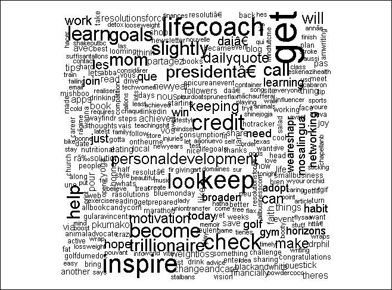

展示一组推文中常用词汇的词云

### 树状图

为了表示高维数据，通常不可能同时可视化所有维度。树状图就是这样一种可视化类型，它将所有维度划分为子集，并以分层的方式呈现。具体来说，树状图将维度划分为一组嵌套的矩形。树状图最常引用的例子之一是新闻地图，它可视化由谷歌新闻聚合的新闻，并以不同颜色显示不同的类别；颜色渐变表示文章的出现（在时间尺度上），而矩形的大小表示新闻条目的流行度。


展示由谷歌新闻聚合的新闻的树状图

图片来源：[`newsmap.jp/`](http://newsmap.jp/)

### 像素导向地图

可视化不仅使结果更容易理解，而且非常实用。大多数时候，分析过程的结果是多维的。要在二维屏幕/纸张上图形化地表示这些数据是一个挑战。这就是像素导向可视化出现的地方。对于一个 n 维数据集，像素导向可视化将每个 n 维数据点映射到 n 个不同的子窗口中的单个像素。因此，每个数据点被分散在 n 个窗口中，每个窗口对应一个维度。这些帮助我们在一个可视化中映射大量数据。像素导向可视化看起来是这样的：


样本像素导向地图

图片来源：[`bib.dbvis.de/uploadedFiles/163.pdf`](http://bib.dbvis.de/uploadedFiles/163.pdf)

### 其他可视化

除了已经提到的可视化之外，还有许多其他有趣的可视化，这些可视化在不同的用例中非常有用。例如，箱线图等可视化对于理解数据分布和异常检测非常有用。同样，还有 Chernoff 面孔、散点图、网络图等可视化，它们各有其优点和用例。

请注意，可视化本身就是一个研究领域，本节只是试图触及冰山一角。我们鼓励读者阅读章节“参考文献”部分中分享的书籍/在线内容，以了解更多相关信息。

# 开始使用 Twitter API

Twitter 对于使用 Twitter 发推文的 tweple（人们）和数据科学家来说都同样令人愉悦。API 和文档都得到了很好的更新，易于使用。让我们从 API 开始吧。

## 概述

Twitter 拥有最简单但最强大的 API 集合之一，这是任何社交网络都有的。这些 API 已被 Twitter 本身和数据科学家用来理解 Twitter 世界的动态。Twitter API 使用四个不同的对象，即：

+   **推文**: 推文是定义 Twitter 本身的中心实体。正如前文所述，推文包含的信息（元数据）远不止推文的内容/信息。

+   **用户**: 任何可以发推文、关注或执行 Twitter 任何操作的任何人或事物都是用户。Twitter 在用户定义上具有独特性，不一定是人类。`@MarsCuriosity`就是这样一种非人类流行的 Twitter 账号，拥有超过 200 万粉丝！

+   **实体**: 这些是从推文对象本身提取的结构化信息片段。这可能包括有关 URL、标签、用户提及等信息。这些对象使处理更快，无需解析推文文本。

+   **地点**：一条推文也可能附有位置信息。这些信息可能用于各种目的，例如显示“您附近的趋势话题”或定向营销。

Twitter API 中的前述对象已在网站[`dev.twitter.com/`](https://dev.twitter.com/)上进行了详细解释。我们敦促读者阅读以更好地理解对象和 API。

Twitter 在所有主要编程语言/平台上都有可用的库。我们将使用 TwitteR，即 Twitter 为 R 提供的库。

### 小贴士

**Twitter 最佳实践**

Twitter 在其开发者网站[`dev.twitter.com/`](https://dev.twitter.com/)上明确指定了一套**最佳实践**和一系列的“可以做”和“不可以做”的事项，其中讨论了安全性/身份验证、隐私等。由于 Twitter 支持庞大的客户群并具有高可用性，它还跟踪其 API 的使用情况，以保持其系统健康。对 API 查询次数有明确的速率限制。请阅读最佳实践，并成为一个`#gooddeveloper`！

## 注册应用程序

现在我们对 Twitter 及其 API 对象有了足够的背景知识，让我们动手实践。开始使用 API 的第一步是通知 Twitter 关于您的应用程序。Twitter 使用标准的**开放认证**（**OAuth**）协议来授权第三方应用程序。OAuth 使用应用程序的消费者密钥、消费者密钥、访问令牌和访问令牌密钥，允许它使用连接服务的 API 和数据。

以下快速步骤将为我们设置游戏做好准备：

1.  前往 Twitter 的应用管理控制台[`apps.twitter.com/`](https://apps.twitter.com/)，使用您的凭据登录或如果您还没有账户，则创建一个账户。

1.  点击**创建新应用**并填写应用的名称、网站等详细信息。在我们的用途中，我们将命名我们的应用为`TwitterAnalysis_rmre`。对于回调 URL，请使用`http://127.0.0.1:1410`指向您的本地系统。您也可以选择其他端口号。

1.  点击**创建您的 Twitter 应用程序**以完成流程。您的应用程序管理控制台将类似于以下截图：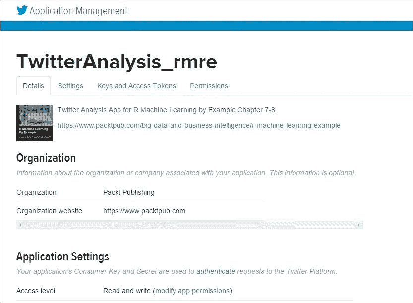

    Twitter 应用程序页面

恭喜，您的应用程序已创建并注册到 Twitter。但在我们能够使用它之前，还有一件事情要做。我们需要创建访问令牌，为此我们需要执行以下步骤。

1.  前往 Twitter 应用详情页面上的**密钥和访问令牌**链接。

1.  滚动并点击**创建我的访问令牌**以为您个人资料生成访问令牌。

1.  在完成前述步骤后，**密钥和访问令牌**页面将类似于以下截图：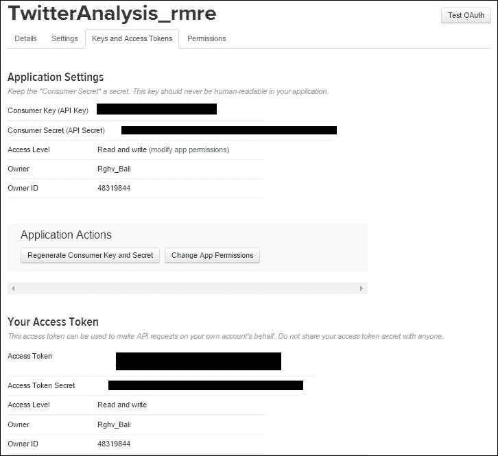

    应用密钥和访问令牌

我们将使用与下一章相同的同一个应用。请记住消费者密钥、消费者秘密、访问令牌和访问秘密；我们将在我们的应用中需要这些。

### 注意

为 OAuth 生成的密钥和秘密是敏感信息。它们使您的应用能够访问 Twitter 的数据。请像保管您的密码（甚至更安全）一样保管它们。`#安全第一`。

## 连接/认证

现在我们已经在 Twitter 端准备好了所有东西，让我们在 R 端也设置一下。在我们开始处理 Twitter 的数据之前，第一步将是使用我们刚刚创建的应用通过 R 进行连接和认证。

我们将利用 Jeff Gentry 的 R 的 TwitteR 库。这个库或客户端允许我们通过 R 使用 Twitter 的 Web API。我们将使用`setup_twitter_oauth()`方法使用我们的应用凭证（密钥和访问令牌）连接到 Twitter。请将以下代码中的`XXXX`替换为您在之前步骤中生成的访问密钥/令牌：

```py
> # load library
> library(twitteR)
> # set credentials
> consumerSecret = "XXXXXXXXXXXXX"
> consumerKey = "XXXXXXXXXXXXXXXXXXXXXXXXXx"

```

```py
No to it:
```

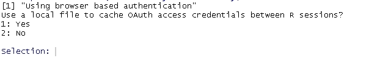

这将打开您的浏览器，并要求您使用 Twitter 凭证登录并授权此应用，如下面的截图所示：

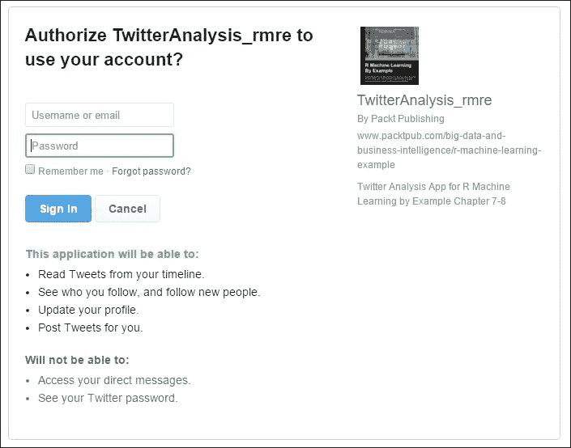

授权应用以获取数据

一旦授权，浏览器将重定向到我们在 Twitter 上创建应用时提到的回调 URL。您也可以为用户使用一个更具信息量的 URL。

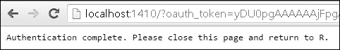

恭喜，您现在已连接到推文的海洋。

## 提取样本推文

现在我们已通过 R 连接到 Twitter，是时候提取一些最新的推文并分析我们得到的结果了。为了提取推文，我们将使用 Twitter 账号 001（Twitter 的创始人及第一位用户）Jack Dorsey 的账号`@jack`。以下代码片段将从他那里提取最新的 300 条推文：

```py
> twitterUser <- getUser("jack")
> # extract jack's tweets
> tweets <- userTimeline(twitterUser, n = 300)
> tweets

```

由于 Twitter 内容丰富，输出包含文本、不可打印的字符和 URL。我们将在稍后查看推文的元数据，但在那之前，提取的信息看起来如下：

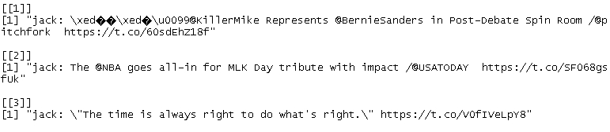

样本推文

要查看可用于分析和操作每条推文的属性和函数，请使用以下`getClass`方法：

```py
> # get tweet attributes
> tweets[[1]]$getClass()
>
> # get retweets count
> tweets[[1]]$retweetCount
>
> # get favourite count
> tweets[[1]]$favoriteCount

```

将生成以下输出：

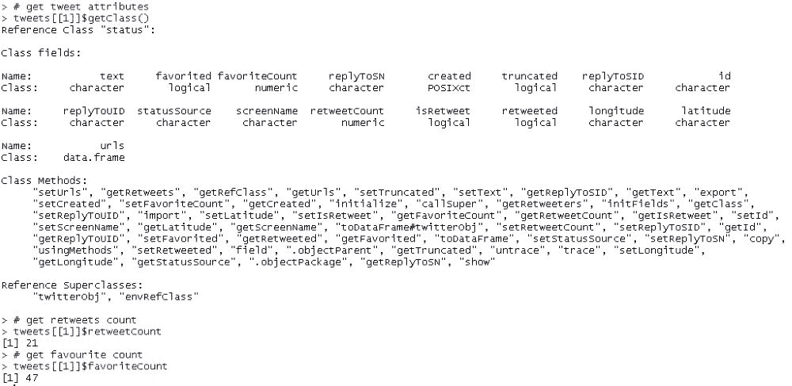

# Twitter 数据挖掘

现在我们已经测试了我们的工具、库和与 Twitter API 的连接，是时候开始寻找 Twitter 领域的隐藏宝藏了。让我们戴上数据挖掘者的帽子，开始挖掘吧！

在本节中，我们将处理从搜索关键词（或 Twitter 词汇中的标签）和用户时间线收集的 Twitter 数据。使用这些数据，我们将通过使用 TwitteR 和其他 R 包的不同函数和实用工具来揭示一些有趣的见解。

### 注意

请注意，我们的过程将隐式遵循数据挖掘中概述的步骤。为了简洁起见，我们可能不会明确提及每个步骤。我们正在挖掘一些“镀金”的见解；请放心，没有任何步骤被遗漏！

每年，我们都带着新的热情去实现伟大的成就，并改进我们的不足。我们大多数人会以新年决心的形式给自己许下承诺。让我们来看看 2016 年用户是如何处理他们的决心的！

### 注意

**注意**：Twitter 数据变化非常快，你的结果/图表可能与本章中描述的不同。

我们将使用相同的应用程序及其凭证来连接并获取 Twitter 数据。以下代码与我们在上一节中提取样本推文的方式完全相同：

```py
library(twitteR)
library(ggplot2)
library(stringr)
library(tm)
library(wordcloud)

consumerSecret = "XXXXXXXXX"
consumerKey = "XXXXXXXXXXXXXXXXXXXXXXXXXXXXXX"

setup_twitter_oauth(consumer_key = consumerKey,consumer_secret = consumerSecret)

```

除了连接到 Twitter，我们还加载了所需的包，如`ggplot`、`stringr`、`tm`和`wordcloud`。随着我们的进展，我们将看到这些包在哪里以及如何有用。

一旦连接到我们的数据源，我们就可以开始收集所需的数据。由于我们计划了解用户及其新年决心，我们将提取`#ResolutionsFor2016`标签的数据。我们也可以使用任何标签，例如`#NewYearResolutions`、`#2016Resolutions`或标签的组合来获取相关的推文。以下代码不仅提取推文，还将推文/状态对象的列表转换为 R 数据框。我们还把每条推文转换为 UTF-8 格式，以处理不同语言的文本。

### 注意

**惊人事实**：Twitter 有 48 种不同的语言，并且还在不断增加！

```py
# trending tweets
trendingTweets = searchTwitter("#ResolutionsFor2016",n=1000)
trendingTweets.df = twListToDF(trendingTweets)
trendingTweets.df$text <- sapply(trendingTweets.df$text,function(x) iconv(x,to='UTF-8'))

```

正如我们在上一节中看到的，一条推文包含的信息远不止文本本身。众多属性之一是状态源。状态源表示发布推文的设备。它可能是一部手机、平板电脑等等。在我们应用主要转换和清理推文对象之前，我们首先对状态源进行快速转换，将其转换为有意义的格式：

```py
trendingTweets.df$tweetSource = sapply(trendingTweets.df$statusSource,function(sourceSystem) enodeSource(sourceSystem))

```

上述代码将`statusSource`从类似`<a href=\"http://twitter.com/download/android\" rel=\"nofollow\">Twitter for Android</a>`的值转换为简单的“Android”，并将其分配给一个名为`tweetSource`的新属性。

一旦我们有了数据，数据挖掘过程中的下一步就是清理数据。我们使用文本挖掘包`tm`来进行转换和清理。特别是`Corpus`函数帮助我们将推文/状态对象作为文档集合来处理。然后我们使用来自同一包的`tm_map`实用工具来应用/映射转换，例如将所有文本转换为小写，删除标点符号、数字和停用词。停用词是一系列最常用的词，如 a、an、the 等，在分析文本时可以安全地删除，而不会失去意义。

```py
# transformations
tweetCorpus <- Corpus(VectorSource(trendingTweets.df$text))
tweetCorpus <- tm_map(tweetCorpus, tolower)
tweetCorpus <- tm_map(tweetCorpus, removePunctuation)
tweetCorpus <- tm_map(tweetCorpus, removeNumbers)

# remove URLs
removeURL <- function(x) gsub("http[[:alnum:]]*", "", x)
tweetCorpus <- tm_map(tweetCorpus, removeURL) 

# remove stop words
twtrStopWords <- c(stopwords("english"),'resolution','resolutions','resolutionsfor','resolutionsfor2016','2016','new','year','years','newyearresolution')
tweetCorpus <- tm_map(tweetCorpus, removeWords, twtrStopWords)

tweetCorpus <- tm_map(tweetCorpus, PlainTextDocument)

```

在我们进行下一步分析数据以寻找隐藏的模式/见解之前，最后的转换是一个术语-文档矩阵。正如其名所示，术语-文档矩阵是一种矩阵表示，其中术语作为行，而列则代表文档。矩阵中的每个条目表示一个术语在给定文档中的出现次数。更正式地说，术语-文档矩阵是一种描述文档集中术语频率的矩阵表示。这种表示在自然语言处理应用中非常有用。它是一种优化的数据结构，能够实现快速搜索、主题建模等。以下是一个简单示例，说明了如何使用这种数据结构，其中我们有两个文本文档，**TD1**和**TD2**：

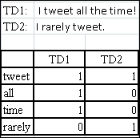

样本术语-文档矩阵

tm 包为我们提供了一个易于使用的实用工具，称为术语-文档矩阵（`TermDocumentMatrix`也是可用的），我们使用它将我们的`Corpus`对象转换为所需的形式：

```py
# Term Document Matrix
> twtrTermDocMatrix <- TermDocumentMatrix(tweetCorpus, control = list(minWordLength = 1))

```

## 常用词汇和关联

因此准备好的术语-文档矩阵包含每个推文（在清理和转换之后）中的词汇作为行，而列则代表推文本身。

作为快速检查，让我们看看在我们的数据集中哪些词汇使用得最频繁。将阈值设置为`30`次或更多。我们使用 apply 实用工具迭代术语-文档矩阵中的每个术语并计算其出现次数。该函数帮助我们过滤掉出现 30 次或更多的术语。

```py
# Terms occuring in more than 30 times
> which(apply(twtrTermDocMatrix,1,sum)>=30)

```

结果将如以下截图所示：

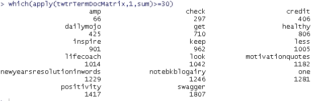

在推文中出现 30 次或更多的术语

如前一个截图所示，诸如健康、启发和积极等词汇出现在 30 次或更多出现的词汇列表中。说到年度目标，我们大家有很多共同之处，不是吗？

前面的操作是一个快速检查，看看我们是否真的有可以帮助我们了解新年愿望的推文。现在让我们采取正式的方法，并识别数据集中的频繁术语。我们还将尝试以创新且易于理解的方式呈现信息。为了获取数据集中最频繁的术语，我们再次使用`tm`包中的`findFreqTerms`函数。此函数为我们提供了一个比之前使用的快速修复更高级的抽象。`findFreqTerms`还允许我们设置术语频率的最小和最大阈值。在我们的情况下，我们只提到下限并查看结果：

```py
# print the frequent terms from termdocmatrix
> (frequentTerms<-findFreqTerms(twtrTermDocMatrix,lowfreq = 10))

```

结果看起来像以下截图：

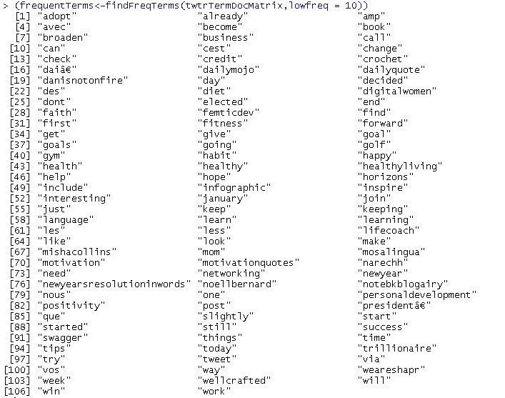

我们得到大约 107 个术语，最小出现次数为 10。如果你仔细看，我们看到的至少 30 次频率的术语也出现在这个列表中，这是理所当然的。

现在我们确定确实有一些术语/单词的频率超过 10 次，让我们创建一个数据框，并按照我们之前决定的方式绘制术语与其频率的关系图。我们使用`rowSums`函数计算每个术语/单词的总出现次数。然后我们选择出现次数超过 10 次的术语子集，并使用`ggplot`进行绘图：

```py
# calculate frequency of each term
term.freq <- rowSums(as.matrix(twtrTermDocMatrix))

# picking only a subset
subsetterm.freq <- subset(term.freq, term.freq >= 10)

# create data frame from subset of terms
frequentTermsSubsetDF <- data.frame(term = names(subsetterm.freq), freq = subsetterm.freq)

# create data frame with all terms
frequentTermsDF <- data.frame(term = names(term.freq), freq = term.freq)

# sort by subset DataFrame frequency
frequentTermsSubsetDF <- frequentTermsSubsetDF[with(frequentTermsSubsetDF, order(-frequentTermsSubsetDF$freq)), ]

# sort by complete DataFrame frequency
frequentTermsDF <- frequentTermsDF[with(frequentTermsDF, order(-frequentTermsDF$freq)), ]

# words by frequency from subset data frame
ggplot(frequentTermsSubsetDF, aes(x = reorder(term,freq), y = freq)) + geom_bar(stat = "identity") +xlab("Terms") + ylab("Frequency") + coord_flip()

```

以下代码块生成了以下频率图：

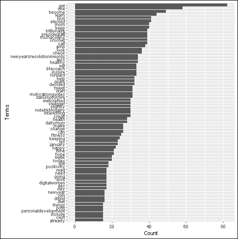

分析前面的图表后，我们可以迅速得到一些有趣的点：

+   **妈妈**、**当选**、**总统**和**亿万富翁**这些词出现在前十位。这个组合很奇怪，但很有趣。关于这一点，我们稍后再详细讨论。

+   健康在列表中排名很高，但并未进入前十。因此，看起来健康是势在必行，但并不是特别突出。**健身**和**饮食**也是如此。

+   列表中的大多数单词在本质上都是积极的。例如，**快乐**、**希望**、**积极**、**改变**等单词都指向了乐观的情绪，在迎接新年决心时！

尽管前面的图表以很好的布局方式为我们提供了很多关于单词及其频率的信息，但它仍然没有展示出完整的画面。记住，我们在生成这个图表之前，故意从数据集中提取了一个子集？我们这样做是有目的的，否则图表会变得过长，频率较低的单词会使得整个图表显得杂乱。这个图表遗漏的另一个点是频率之间的相对差异。

如果我们的目标是看到频率之间的相对差异，我们需要一种不同的可视化方式。这时，词云就派上用场了。使用`wordcloud`库，我们可以轻松地从数据框中生成词云，只需一行代码：

```py
# wordcloud
> wordcloud(words=frequentTermsDF$term, freq=frequentTermsDF$freq,random.order=FALSE)

```

使用完整数据集生成的词云看起来大致如下：


前面的词云按照频率递减的顺序显示单词。每个单词的大小强调其频率。你可以尝试使用`wordcloud`函数生成一些有趣的视觉或艺术作品！

前面的图表中出现了很多单词，但看到**亿万富翁**这个词出现在前十位，难道不是很有趣吗？这背后的原因是什么？是机器人发出的垃圾邮件，还是某个名人爆红的推文，或者是完全不同的事情？让我们查看这个列表中的顶级推文，看看它是否包含**亿万富翁**这个词：

```py
# top retweets
> head(subset(trendingTweets.df$text, grepl("trillionaire",trendingTweets.df$text) ),n=1)

```

以下截图是您会得到的结果：

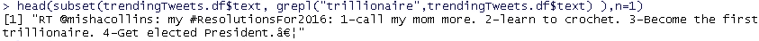

结果证明我们的猜测是正确的。这是一条名人发布的、迅速走红的新年决心推文。在 Twitter 上快速搜索，我们发现这条推文：

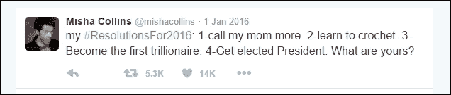

图片来源：[`twitter.com/mishacollins?lang=en`](https://twitter.com/mishacollins?lang=en)

进一步搜索发现，Misha Collins 是电视剧《超自然力量》中的著名演员。我们还可以看到，上述决议被转发惊人的 5k 次！值得注意的是，点赞数达到 14k，超过了转发数。我们能推断出推友们更喜欢点赞/心形符号而不是转发吗？我们还可以看到，诸如 mom、learn、trillionaire、elected 和 President 等词汇无疑都是最常见的词汇。间接地，我们也可以推断出《超自然力量》在 Twitter 上拥有庞大的粉丝群，而 Castiel（Misha 在电视剧中的角色）是该剧中一个受欢迎的角色。他决定学习钩针，这有点令人惊讶吗？

从超自然的事物转移到健身辩论。健身对我们大多数人来说都很重要。像锻炼或去健身房这样的活动在年初的头几个月/几周会激增。让我们看看 Twitter 上的朋友们有多注重健康！

由于许多词汇如健康、饮食、健身、健身房等都与健康的生活方式相关，让我们尝试找到与“健身”一词本身相关的词汇。`findAssocs`是一个方便的函数，它可以帮助我们从词-文档矩阵中找到与给定词汇至少有指定程度相关性的词汇。我们将使用该函数的输出结果，使用`ggplot`准备一个词-关联（相关性）图。这个过程与准备前面的频率图类似：

```py
# Associatons
(fitness.associations <- findAssocs(twtrTermDocMatrix,"fitness",0.25))

fitnessTerm.freq <- rowSums(as.matrix(fitness.associations$fitness))

fitnessDF <- data.frame(term=names(fitnessTerm.freq),freq=fitnessTerm.freq)

fitnessDF <- fitnessDF[with(fitnessDF, order(-fitnessDF$freq)), ]
ggplot(fitnessDF,aes(x=reorder(term,freq),y=freq))
+geom_bar(stat = "identity") +xlab("Terms")
+ ylab("Associations")
+ coord_flip()

```

与“健康”一词最密切相关的词汇如下：

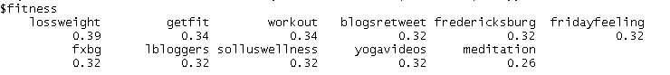

同样的数据以图形形式更易于阅读，如下所示：

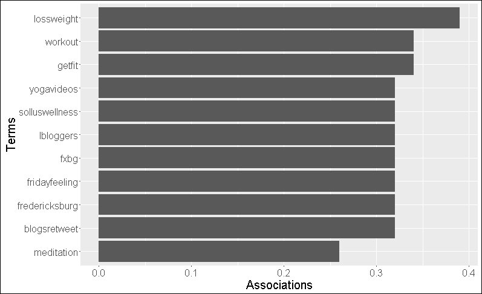

如前图所示，诸如**减肥**、**锻炼**、**getfit**等术语证明了我们的观点，即推友们对健康的关注程度与我们一样。值得注意的是，列表中出现了“yogavideos”这个术语。看起来在 2016 年，瑜伽似乎正在赶上其他保持健康的技术。列表中还有**冥想**。

## 流行设备

到目前为止，我们已经处理了推文的可见组件，如文本、转发次数等，并且能够提取许多有趣的见解。让我们拿出我们的精确工具，更深入地挖掘我们的数据。

如上几节所提到的几次，一条推文所包含的信息远比表面所见的多。其中一条信息就是关于推文的来源。Twitter 诞生于短信时代，其许多特征，如 140 个字符的字数限制，都让人联想到那个时代。了解人们如何使用 Twitter，即经常用来访问和发布推文的设备，将会很有趣。尽管世界已经远离了短信时代，但手机无处不在。为了获取这些信息，我们将利用我们的数据框`trendingTweets.df`中的属性`tweetSource`。我们是从`tweet`对象中已经存在的`statusSource`属性创建了这个附加属性（参见本节开头快速回顾）。

为了清晰起见，我们将使用基于转发次数的`trendingTweets.df`数据框的子集。我们再次使用`ggplot`来可视化我们的结果。

```py
# Source by retweet count
trendingTweetsSubset.df <- subset(trendingTweets.df, trendingTweets.df$retweetCount >= 5000 )

ggplot(trendingTweetsSubset.df, aes(x =tweetSource, y =retweetCount/100)) + geom_bar(stat = "identity") +xlab("Source") + ylab("Retweet Count")

```

下面的图表是您的结果：

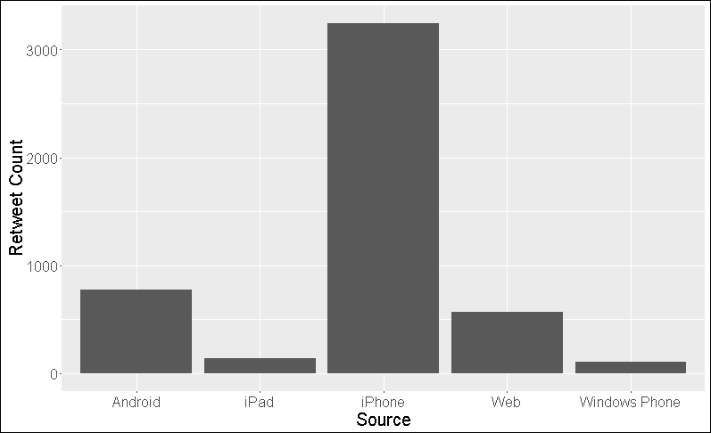

毫无疑问，iPhone 是最受欢迎的设备，其次是 Android 和网页。有趣的是，人们使用网页/网站转发推文的次数比 iPad 还要多！Windows Phone 显然在这里有一些严重的问题需要解决。我们也可以推断 iPhone 是 tweeples 的首选设备吗？或者 iPhone 为 Twitter 提供了比其他设备更好的体验？或者我们甚至可以更进一步，说 iPhone 上的 Twitter 比任何其他设备都有一个更容易访问的“转发”按钮。这样的推断还有很多，但所有这些都蕴含着大量的知识/潜力，可以被管理层、用户体验团队等用来改进和改变事物。

## 层次聚类

我们在之前的章节中已经看到了聚类和分类（参见第二章，*让我们帮助机器学习*)，并揭示了关于手头数据的某些有趣事实。对于我们的当前用例，尽管我们的推文都与 2016 年的决心有关，但我们永远无法确定 tweeples 会做出什么样的决心。这使得层次聚类成为一个非常合适的用例。与需要预先设置集群数量的 k-means 或其他聚类算法不同，层次聚类算法在计算时不依赖于它。

在我们将层次聚类应用于我们的数据之前，让我们抓住这个机会来理解层次聚类。层次聚类，就像任何其他聚类算法一样，帮助我们将相似的项目分组在一起。这个算法的一般细节可以解释如下：

+   **初始化**：这是第一步，其中每个元素被分配到它自己的集群中。对于一个包含*n*个元素的集合，算法创建了*n*个不同的集群，每个集群中有一个元素。在这一步决定了一个距离/相似度度量。

+   **合并**：在此步骤中，根据选择的距离/相似性度量，识别最近的簇对并将它们合并成一个簇。这一步骤的结果是比迄今为止的总簇数少一个簇。

+   **计算**/**重新计算**：我们计算/重新计算在合并步骤中形成的新簇与现有簇之间的距离/相似性。

**合并**和**计算**步骤会重复进行，直到我们只剩下一个包含所有*n*个项目的单个簇。正如其名所示，此算法生成一个层次结构，叶子表示基于相似性/距离结合的个体元素簇，随着我们向树根靠近。输出树通常被称为**树状图**。

合并步骤是此算法存在变体的地方。有几种方法可以识别最近的簇。从简单的方法，如单链，它考虑两个簇中任何两个元素之间的最短距离作为距离度量，到复杂的方法，如 Ward 的方法，它使用方差来找到最紧凑的簇，有几种方法可以根据用例采用。

回到 Twitter 世界，让我们使用层次聚类来查看哪些术语/推文是最接近的。对于我们的当前用例，我们将使用单一方法作为合并标准。您可以尝试不同的算法并观察差异。

为了执行层次聚类，我们首先处理我们的数据集以去除稀疏术语，以便于清晰。为此，`removeSparseTerms`函数帮助我们删除具有低于指定限制的稀疏性的数据行。然后我们使用`hclust`实用程序来形成簇。此实用程序输出的结果可以直接绘制。让我们为此编写一些代码：

```py
# remove sparse terms
twtrTermDocMatrix2 <- removeSparseTerms(twtrTermDocMatrix, sparse = 0.98)

tweet_matrix <- as.matrix(twtrTermDocMatrix2)

# cluster terms
distMatrix <- dist(scale(tweet_matrix))

fit <- hclust(distMatrix,method="single")
plot(fit)

```

输出的**树状图**非常简单易懂：

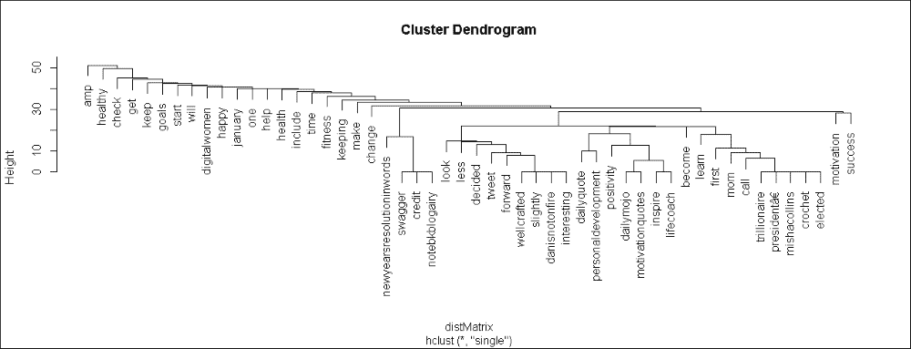

如果您观察右侧第二个簇，它包含术语**万亿富翁**、**当选**、**妈妈**、**打电话**等等。将这些术语映射回 Mischa Collins 的顶转发推文，所有这些术语都在那条推文中被提及，并且我们的算法正确地将它们聚类在一起。聪明，不是吗？作为一个小练习，观察其他簇并看看这些术语在包含它们的推文中是如何出现的。在这里的一个重要观察是，**树状图**正确地将所有频繁术语映射到单个根下，这再次证实了所有这些术语都指向我们 2016 年决议的中心主题！

## 主题建模

到目前为止，我们的分析主要关于来自世界各地的用户有关新年决心的推文。我们已经分析了与我们选择的主题相关的推文。忽略垃圾邮件和其他噪声推文，我们的数据大致符合一个单一的主题。这个主题本身构成了一组单词（如健康、亿万富翁、健身、饮食、妈妈等），这些单词广泛描述了不同的决心。为了拓宽我们的分析范围并发现更多见解，让我们来谈谈主题建模的概念。

主题建模是一个发现未标记文本语料库中模式的过程，它代表了语料库的精髓。一个主题本身可以描述为一组共同出现的单词，用来描述大量文本。

在一次关于主题建模的会议期间提到的另一个定义：

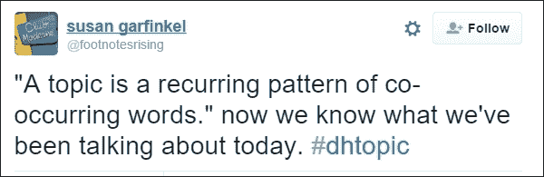

图片来源：[`twitter.com/footnotesrising/status/264823621799780353`](https://twitter.com/footnotesrising/status/264823621799780353)

主题建模的目的是自动识别语料库的潜在主题，因此对于需要基于主题进行信息检索的应用程序（但在没有已知关键词的情况下）是有用的。例如，通过使用“一国与另一国的关系”这样的主题而不是搜索关键词然后跟随链接，从报纸档案中了解两个国家之间的关系，这不是很令人惊讶吗？请注意，通过跟随链接来发现信息同样强大，但它还有很多不足之处。

执行主题建模的一种方式是通过**潜在狄利克雷分配**（**LDA**）；它是功能最强大且应用最广泛的模型之一。

LDA 由 David M Blie 在 2003 年的论文《概率主题模型导论》中提出。正如他的论文所说，LDA 可以被定义为一个生成模型，它允许通过未观察到的组来解释一组观察结果，这些组解释了为什么数据的一些部分是相似的。LDA 基于这样的假设，即文档表现出多个主题。

LDA 是一个概率模型，其数学相当复杂，超出了本书的范围。以非数学的方式，LDA 可以被解释为一个模型/过程，它有助于识别导致一组文档生成的主题。

### 注意

对于进一步阅读，请参阅 Blei 的论文。

[`www.cs.princeton.edu/~blei/papers/Blei2011.pdf`](https://www.cs.princeton.edu/~blei/papers/Blei2011.pdf)

一篇用简单语言解释一切的博客：

[`tedunderwood.com/2012/04/07/topic-modeling-made-just-simple-enough/`](http://tedunderwood.com/2012/04/07/topic-modeling-made-just-simple-enough/)

对于我们的目的/用例，我们可以假设 LDA 是一个模型/过程，它帮助我们从一个未标记文本的语料库中识别潜在（隐藏/潜在）主题。幸运的是，R 将大部分数学细节以名为`topicmodels`的库的形式抽象出来。

为了进行主题建模，我们将使用一组新的推文。国际空间站（**ISS**）有多个 Twitter 账号，其中之一是`@ISS_Research`，它特别针对来自 ISS 的研究相关推文。让我们通过分析其时间线上的推文来探索`@ISS_Research`最近在忙些什么。我们将分析这些推文，以识别 ISS 研究背后的主题。为此，我们将使用与之前相同的过程提取推文并进行转换/清理。以下代码片段就是这样做的：

```py
# set user handle
atISS <- getUser("ISS_Research")

# extract iss_research tweets
tweets <- userTimeline(atISS, n = 1000)

tweets.df=twListToDF(tweets)

tweets.df$text <- sapply(tweets.df$text,function(x) iconv(x,to='UTF-8'))

#Document Term Matrix
twtrDTM <- DocumentTermMatrix(twtrCorpus, control = list(minWordLength = 1))

```

```py
document-term matrix, unlike last time where we prepared a *term-document matrix*.
```

一旦我们有了所需格式的推文，`topicmodels`包中的`LDA`实用程序帮助我们揭示隐藏的主题/模式。LDA 实用程序需要输入主题数量以及文档-术语矩阵。我们现在将尝试八个主题。以下代码使用`LDA`为八个主题中的每一个提取六个术语：

```py
#topic modeling

# find 8 topics
ldaTopics <- LDA(twtrDTM, k = 8) 

#first 6 terms of every topic
ldaTerms <- terms(ldaTopics, 6) 

# concatenate terms
(ldaTerms <- apply(ldaTerms, MARGIN = 2, paste, collapse = ", "))

```

使用 LDA 生成的主题列表如下：

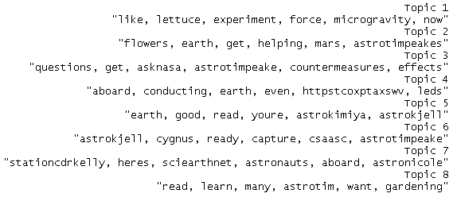

一个视觉表示将更容易理解。我们可以利用`qplot`快速在面积图上按时间绘制主题，如下所示：

```py
# first topic identified for every tweet
firstTopic <- topics(ldaTopics, 1)

topics <- data.frame(date=as.Date(tweets.df$created), firstTopic)

qplot(date, ..count.., data=topics, geom="density",fill=ldaTerms[firstTopic], position="stack")+scale_fill_grey()

```

生成的图表看起来如下截图所示：

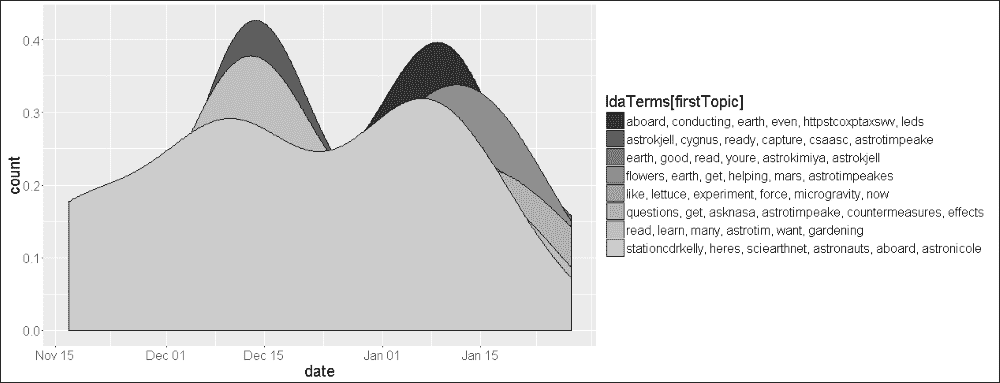

让我们现在分析输出结果。LDA 生成的每个主题的术语列表似乎给我们提供了对 ISS 上正在进行的工作/研究的一些很好的洞察。诸如火星、微重力、花朵、Cygnus 等术语告诉我们主要的研究领域或至少科学家/宇航员在 ISS 上讨论的主题。诸如 stationcdrkelly 和 astrotimpeake 之类的术语看起来更像是 Twitter 账号。

### 注意

一个快速练习是使用当前的`@ISS_Research`时间线数据，挖掘如`stationcdrkelly`这样的处理，以发现更多信息。谁知道呢，这可能会变成一个很好的宇航员名单来关注！

`qplot`输出为我们的普通主题列表添加了时间维度。分析时间维度上的主题有助于我们了解特定研究主题何时被讨论，或者何时宣布了令人惊叹的事情。列表中的第二个主题，或者图例顶部的第四个主题包含单词 flower。由于科学家最近在太空中成功培育了一些橙色花朵，上面的图表帮助我们得出结论，新闻最早在 1 月 15 日左右在 Twitter 上发布。快速查看 Twitter/新闻网站确认，新闻是在 2016 年 1 月 18 日通过推文发布的……非常接近！

### 提示

**彩色面积图**

尝试从`qplot`中移除`scale_fill_grey()`选项，以获得一些比纯灰色更容易阅读的美丽图表。

因此，我们最终学习了使用 LDA 在 ISS 数据上进行的主题建模，并发现了科学家和宇航员在太空中所做的一些令人惊叹的事情。

# 社会网络数据挖掘的挑战

在我们结束这一章之前，让我们看看社交网络对数据挖掘过程提出的不同挑战。以下是一些论点、问题和挑战：

+   毫无疑问，社交网络生成数据在各个方面都归类为大数据。它具有所有体积、速度和多样性，足以压倒任何系统。然而，有趣的是，如此庞大的数据源所面临的挑战是足够细粒度数据的可用性。如果我们放大我们的数据集，并尝试基于每个用户使用数据，我们会发现没有足够的数据来完成一些最常见的工作，比如做出推荐！

+   如 Twitter 这样的社交网络每秒处理数百万用户创建和分享的大量数据。为了确保他们的系统始终运行，他们会对通过 API 获取的数据量设置限制（安全性也是这些限制背后的一个主要原因）。这些限制使数据科学工作陷入困境，因为很难获得足够的数据样本来正确/完整地代表总体。样本不足可能会导致错误的模式或完全错过模式。

+   社会网络分析中的预处理和结果评估也是一个挑战。在预处理数据时，我们会移除噪声内容。由于数据以各种形状和大小涌入，确定噪声内容比简单地移除停用词更具挑战性。由于大多数情况下没有可用的基准事实，以及由于此处和其它方面的限制，评估结果也是一个挑战，很难有信心确定结果的可靠性。

上文提出的论点/挑战要求数据科学家设计出创新和创造性的方法，这也是他们的工作有趣且极具回报性的原因。

# 参考文献

一些关于可视化的知名书籍如下：

+   [`www.amazon.in/Information-Dashboard-Design-At-Glance/dp/1938377001`](http://www.amazon.in/Information-Dashboard-Design-At-Glance/dp/1938377001)

+   [`www.amazon.com/Visual-Display-Quantitative-Information/dp/096139210X`](http://www.amazon.com/Visual-Display-Quantitative-Information/dp/096139210X)

+   [`www.amazon.com/Information-Visualization-Second-Interactive-Technologies/dp/1558608192`](http://www.amazon.com/Information-Visualization-Second-Interactive-Technologies/dp/1558608192)

关于这个主题的一些知名博客如下：

+   **Tableau** **特定**：[`www.jewelloree.com/`](http://www.jewelloree.com/)

+   [`flowingdata.com/`](http://flowingdata.com/)

+   [`www.informationisbeautiful.net/`](http://www.informationisbeautiful.net/)

+   [`infosthetics.com/`](http://infosthetics.com/)

+   [`www.visualisingdata.com/`](http://www.visualisingdata.com/)

+   [`eagereyes.org/`](https://eagereyes.org/)

+   [`thedailyviz.com/`](http://thedailyviz.com/)

+   **D3**: [`d3js.org/`](https://d3js.org/)

# 摘要

社交网络分析是数据科学领域的一个热门话题。正如我们在本章中看到的，这些平台不仅为我们提供了连接的方式，而且也为我们提供了一个独特的机会来研究全球范围内的人类动态。通过本章，我们学习了一些有趣的技术。我们首先从理解社交网络环境中的数据挖掘开始，接着讨论了可视化的重要性。我们专注于 Twitter，并了解了不同的对象和 API 来操作它们。我们使用了 R 的各种包，如`TwitteR`和`TM`，来连接、收集和操作我们的分析数据。我们使用 Twitter 的数据来了解频率分布。最后，我们展示了社交网络词汇和关联、推特用户常用的流行设备、层次聚类甚至触及了主题建模所提出的挑战。我们使用了`ggplot2`和`wordcloud`来可视化我们的结果，以及数据挖掘过程。在总结本章时，我们确信你现在可以欣赏到这些平台背后的惊人动态以及 R 分析这些动态的能力。我们还没有结束对`@Twitter`的分析，请继续关注你的`#sentiments`！
