# 第八章。Twitter 数据的情感分析

|   | *"他塑造了公众舆论...使得制定法律和决策成为可能或不可能。" |   |
| --- | --- | --- |
|   | --*亚伯拉罕·林肯* |

人们的想法不仅对政治家和名人很重要，对我们大多数社会人也是如此。这种了解自己观点的需求影响了人们很长时间，并被前面的著名引言恰当地总结。意见的困扰不仅影响我们的观点，还影响我们使用产品和服务的方式。正如在学习市场篮子分析和推荐引擎时讨论的那样（参见第三章，*使用市场篮子分析预测客户购物趋势*和第四章，*构建产品推荐系统*分别），我们的行为可以通过观察具有类似特征（如价格敏感度、颜色偏好、品牌忠诚度等）的一组人的行为来近似或预测。我们在前面的章节中也讨论了，长期以来，我们在做出下一个重大购买决策之前，会向我们的朋友和亲戚征求他们的意见。虽然这些意见对我们个人来说很重要，但我们可以从这样的信息中得出更多有价值的见解。

仅仅说万维网的到来只是加速和扩大了我们的社交圈，这还不足以表达其影响。无需重复，值得一提的是，网络为分析人类行为开启了新的途径。

在上一章中，社交网络是讨论的主题。我们不仅使用社交网络作为工具来获取洞察，还讨论了这些平台满足我们天生的好奇心，想知道别人在想什么或做什么。社交网络为我们提供了一个平台，我们可以表达自己的观点并被人听到。其中“被人听到”这一方面定义和操作起来有些棘手。例如，我们对这些平台上某人或某事的观点和反馈（假设它们是真实的）肯定会直接或间接地被我们圈子中的人听到，但它们可能或可能不会被它们旨在影响的人或组织听到。尽管如此，这样的观点或反馈确实会影响与之相关的人及其随后的行为。这种观点的影响以及我们对人们想法的一般好奇心，加上更多这样的用例，正是本章的动机。

在本章中，我们将：

+   了解情感分析及其关键概念

+   探讨情感分析的应用和挑战

+   理解执行意见挖掘的不同方法

+   在 Twitter 数据上应用情感分析的概念

# 理解情感分析

互联网公司及其首席执行官作为全球经济体中最有利可图的实体之一，这充分说明了世界是如何被技术和互联网所驱动的，以及是如何被塑造的。与其他任何媒介不同，互联网已经无处不在，渗透到我们生活的方方面面。我们使用和依赖互联网以及基于互联网的解决方案来获取建议和推荐，这并不奇怪，除了用于许多其他目的之外。

正如我们在前几章所看到的，互联网与电子商务和金融机构等领域的联系非常深远。但我们对在线世界的使用和信任并不仅限于此。无论是预订你邻里的新餐厅的桌子，还是决定今晚要看哪部电影，我们都会在做出最终决定之前，从互联网上获取他人的意见或分享的内容。正如我们稍后将看到的，这样的决策辅助工具不仅限于商业平台，还适用于许多其他领域。

意见挖掘或情感分析（正如它被广泛且可互换地称呼）是使用自然语言处理、文本分析和计算语言学自动识别文本中主观性的过程。情感分析旨在使用这些技术识别说话者的正面、负面或中性意见、情感或态度。情感分析（以下简称情感挖掘）在从商业到服务领域的全球范围内都有应用。

## 情感分析的关键概念

现在，我们将探讨与情感分析相关的关键术语和概念。这些术语和概念将帮助我们使接下来的讨论更加规范化。

### 主观性

意见或情感是个人对观点和信念的表达。此外，主观性（或主观文本）表达了我们对于产品、人物、政府等实体的情感。例如，一个主观句子可能是“我喜欢使用 Twitter”，这表明一个人对某个特定社交网络的喜爱，而一个客观句子则是“Twitter 是一个社交网络”，第二个例子只是陈述了一个事实。情感分析围绕主观文本或主观性分类展开。同样重要的是要理解并非所有主观文本都表达情感。例如，“我刚创建了 Twitter 账户”。

### 情感极性

一旦我们有一段主观性（并表达某种情感）的文本，接下来的任务就是将其分类为正面或负面情感类别之一（有时也考虑中性）。这项任务还可能涉及将文本的情感放置在连续（或离散）的极性尺度上，从而定义积极程度（或情感极性）。情感极性分类可能根据上下文处理不同的类别。例如，在电影评分系统中，情感极性可能被定义为喜欢与不喜欢，或在辩论中观点可能被分类为支持与反对。

### 意见总结

从一段文本中提取观点或情感是情感分析过程中的一个重要任务。这通常随后是对情感的总结。为了从与同一主题（例如，某部电影的评论）相关的不同文本中得出见解或结论，将情感汇总（或总结）成可消费的形式以得出结论（电影是票房大作还是失败之作）是很重要的。这可能涉及到使用可视化来推断整体情感。

### 特征提取

如我们在各章节中看到的，特征识别和提取是使机器学习算法成功或失败的关键。它是在数据本身之后最重要的因素。让我们看看在解决情感分析问题中使用的某些特征集：

+   **TF-IDF**：信息检索大量使用**词频-逆文档频率**（**tf-idf**）来实现快速的信息检索和分析。在 tf-idf 的上下文中，一段文本被表示为一个包含单词作为其组成部分的特征向量。最近的研究也表明，在情感分析的上下文中，与单词的频率相比，单词的存在可以提高性能和准确性。

    ### 注意

    **来源**：

    Bo Pang, Lillian Lee, 和 Shivakumar Vaithyanathan. Thumbs up? Sentiment classification using machine learning techniques. In Proceedings of the Conference on **Empirical Methods in Natural Language Processing** (**EMNLP**), pages 79–86, 2002.

    TF-IDF 表示为：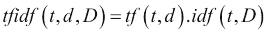

    其中，

    `tf(t,d)` 是文档 `d` 中术语 `t` 的词频。

    `idf(t,D)` 是文档集 `D` 中术语 `t` 的逆文档频率。

    例如，我们有以下两个文档及其术语和相应频率的截图：

    

    在其最简单的形式中，术语 `Twitter` 的 `TF-IDF` 可以表示为：

    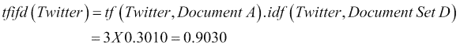

    可以使用不同的权重方案来计算 `tfidf`；前面的例子使用以 10 为底的对数来计算 `idf`。

+   `n-Grams`：计算语言学和概率将文本语料库视为连续的术语序列，这些术语可以是音素、字母、单词等。基于 n-gram 的建模技术源于信息理论，其中下一个字符或单词的可能性基于前*n*个术语。根据`n`的值，特征向量或模型被称为单语（对于`n=1`）、双语（对于`n=2`）、三元语（对于`n=3`）等等。n-grams 对于处理词汇表外的单词和近似匹配特别有用。例如，考虑一个单词序列，一个像*A chapter on sentiment analysis*这样的句子会有诸如*a chapter*、*chapter on*、*on sentiment*、*sentiment analysis*等双语。

    ### 注意

    Google 关于使用 n-grams 的有趣工作：[`googleresearch.blogspot.in/2006/08/all-our-n-gram-are-belong-to-you.html`](http://googleresearch.blogspot.in/2006/08/all-our-n-gram-are-belong-to-you.html)。

+   **词性**（**POS**）：理解和利用语言的基本结构进行分析具有明显的优势。词性是用于创建句子、段落和文档的语言规则。在其最简单的形式中，形容词通常是主观性的良好指标（尽管并非总是如此）。许多方法在分类主观文本时利用了形容词的极性。使用包含形容词的短语已被证明可以进一步提高性能。对使用其他词性（如动词和名词）的研究，以及与形容词一起使用，也显示出积极的结果。

    ### 注意

    **参考文献**：

    Peter Turney. Thumbs up or thumbs down? Semantic orientation applied to unsupervised classification of reviews. In Proceedings of the **Association for Computational Linguistics** (**ACL**), pages 417–424, 2002.

    以下示例显示了在样本句子中标记的词性（形容词、名词等），例如，*We saw the yellow dog*：

    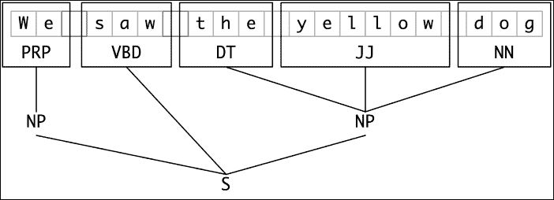

    来源：[`www.nltk.org/`](http://www.nltk.org/)

+   **否定**：在情感分析的情况下，否定起着重要的作用。例如，像*I like oranges*和*I don't like oranges*这样的句子，它们之间的区别仅在于单词*don't*，但否定词翻转了句子的极性到相反的类别（分别是正极和负极）。否定可以作为次要特征集使用，其中原始特征向量按原样生成，但后来根据否定词翻转极性。还有其他变体，与不考虑否定影响的方法相比，它们在结果上有所改进。

+   **主题特定特征**：主题在设置上下文中起着重要作用。由于情感分析涉及说话者的观点，因此主观性受到所讨论主题的影响。在分析主题与文本语料库情感之间的关系方面进行了大量研究。

### 注意

**参考文献**：

Tony Mullen 和 Nigel Collier. 使用支持向量机和多种信息源进行情感分析。在自然语言处理实证方法会议（**EMNLP**）论文集中，第 412–418 页，2004 年 7 月。海报论文。

## 方法

现在我们已经对情感分析领域的核心概念有了基本的了解，让我们来看看解决这个问题的不同方法。

情感分析主要在以下两个抽象级别上进行：

+   **文档级别**：在这个抽象级别，任务是分析给定的文档，以确定其整体情感是积极、消极（或在某些情况下是中性的）。基本假设是整个文档表达了对单个实体的意见。例如，给定一个产品评论，系统会分析它以确定评论是积极的还是消极的。

+   **句子级别**：句子级别分析是情感分析的一种更细粒度的形式。这种粒度级别抵消了这样一个事实，即文档中的所有句子并不都是主观的，因此更好地利用主观性分类来确定每句话的情感。

与其他机器学习技术类似，情感分析也可以使用监督和无监督方法来解决：

+   **监督方法**：情感分析的研究已经进行了很长时间。虽然早期研究受限于标记数据集的可用性，并且进行了相当浅的分析，但现代监督学习方法在情感分析方面取得了显著进展，无论是在利用这些技术的系统数量上，还是在由于标记数据集的可用性而导致的系统整体性能上。例如，WordNet、SentiWordNet、SenticNet、新闻稿、Epinions 等数据集极大地帮助研究人员通过提供包含极性词汇、分类文档、用户意见等数据集来改进监督算法。**朴素贝叶斯**、**支持向量机**（**SVM**）等算法，如第六章（part0046_split_000.html#1BRPS1-973e731d75c2419489ee73e3a0cf4be8 "第六章. 信用风险检测和预测 – 预测分析"）中讨论的，以及基于最大熵的分类算法，是监督学习方法的经典例子。

+   **无监督方法（Unsupervised Approach）**: 无监督情感分析算法通常从构建或学习情感词典开始，然后确定文本输入的极性。词典生成是通过诸如语言启发式、自举等技术完成的。Turney 在他的 2002 年论文中详细描述了一种著名的方法，其中他使用一些基于词性（POS）的固定句法模式进行无监督情感分析。

    ### **注意**:

    **参考**:

    **语言启发式（Linguistic heuristics）**: Vasileios Hatzivassiloglou 和 Kathleen McKeown. 预测形容词的语义方向。在联合 ACL/EACL 会议论文集中，第 174-181 页，1997 年。

    **自举（Bootstrapping）**: Ellen Riloff 和 Janyce Wiebe. 学习主观表达式的提取模式。在自然语言处理实证方法会议（**EMNLP**）论文集中，2003 年。

    **Turney**: Peter Turney. 点赞还是踩？语义方向在无监督分类评论中的应用。在计算语言学协会（**ACL**）会议论文集中，第 417-424 页，2002 年。

## **应用**:

正如我们一直在讨论的，我们对在线意见的依赖是一种惊喜。在购买产品、下载软件、选择应用程序或选择餐厅之前，我们有意或无意地检查这些意见或受其影响。情感分析或意见挖掘在许多领域都有应用；它们可以概括为以下广泛类别：

+   **在线和离线商业（Online and Offline Commerce）**: 顾客的偏好可以在一瞬间决定品牌的命运。要使产品成为热销商品，包括定价、包装和营销在内的所有方面都必须完美无缺。顾客会对与产品相关的所有方面形成看法，从而影响其销售。这不仅适用于在线商业，顾客在购买前会在多个网站或博客上查看产品评论，而且口碑和其他类似因素也会影响离线商业中的顾客意见。因此，情感分析成为品牌或公司跟踪和分析以保持领先地位的重要因素。对社交媒体内容，如推文、Facebook 帖子、博客等的分析为品牌提供了洞察顾客如何看待其产品的见解。在某些情况下，品牌会推出特定的营销活动来设定关于产品的普遍情绪或炒作。

+   **治理（Governance）**: 在大多数活动都有在线对应物的世界中，政府也不例外。全球各国政府都开展了利用情感分析在政策制定和安全（通过分析和监控任何敌意或负面通信的增加）方面的问题的项目。分析人员还使用情感分析来确定或预测选举的结果。例如，*eRuleMaking* 等工具将情感分析作为关键组成部分。

除了上述两个类别之外，意见挖掘在推荐引擎和通用预测系统等领域的应用中充当一种增强技术。例如，意见挖掘可以与推荐引擎结合使用，排除那些意见或情感低于某些阈值的产品的推荐列表。情感分析也可能在预测即将上映的电影是否会成为票房炸弹方面找到创新的应用，这基于与明星阵容、制作公司、电影主题等相关联的情感。

## 挑战

理解他人的观点和/或情感是一个固有的困难任务。能够以算法方式处理这样的问题同样困难。以下是在执行情感分析时面临的一些挑战：

+   **理解和建模自然语言结构**：情感分析本质上是一个自然语言处理（NLP）问题，尽管是受限的。尽管情感分析是一种受限的自然语言处理形式，涉及对积极、消极或中性的分类，但它仍然面临诸如指称消解、词义消歧和否定处理等问题。近年来，自然语言处理以及情感分析方面的进步在一定程度上帮助解决了这些问题，但在我们能够完美地模拟自然语言的规则之前，还有很长的路要走。

+   **讽刺**：情感可以通过相当微妙的方式表达。这不仅仅是负面情感；积极的情感也可以在讽刺的句子中巧妙地隐藏。由于理解讽刺是一种只有少数人能够掌握的技巧，因此很难对讽刺进行建模并正确识别情感。例如，评论“这样一个简单易用的产品，你只需要阅读手册中的 300 页”，虽然只包含积极的词汇，但带有一种不易建模的负面味道。

+   **评审和评审质量**：每个人的观点都不尽相同。我们中的一些人可能会非常强烈地表达自己的观点，而其他人可能不会。另一个问题是，无论是否了解某个主题，每个人都有自己的观点。这导致了评审和评审质量的问题，可能会影响整体分析。例如，一个普通读者可能不是最合适的人选来评审一本新书。同样，让一位新作者的书被评论家评审可能也不太合适。这两种极端情况可能会导致结果有偏见或得出错误的见解。

+   **意见数据规模和偏差**：网络上有大量的博客和网站为用户提供了一个平台，让他们可以就地球上以及更远的地方的任何可能的事情发表和分享意见。然而，在细粒度层面上，意见数据仍然是一个问题。正如我们在上一章讨论的那样，与特定上下文（比如一个品牌或一个人）相关的数据量非常有限，这影响了整体分析。此外，由于偏见、错误的事实或谣言，可用的数据有时会偏向（或反对）某些实体。

# 对推文的情感分析

既然我们已经掌握了情感分析领域的核心术语和概念，让我们将我们的理论付诸实践。我们已经看到了情感分析的一些主要应用领域以及一般面临的挑战。在本节中，我们将进行情感分析，分为以下类别：

+   **极性分析**：这将涉及使用标记的正面和负面词汇列表对情感极性进行评分和汇总。

+   **基于分类的分析**：在这种方法中，我们将利用 R 丰富的库来执行基于可供公众使用的标记推文的分类。我们还将讨论它们的性能和准确性。

R 有一个非常强大的库，名为`TwitteR`，用于从 Twitter 中提取和操作信息。正如我们在上一章所看到的，在我们能够使用`TwitteR`或任何其他用于情感分析的库之前，我们首先需要使用 Twitter 的应用程序管理控制台创建一个应用程序。对于本章，我们将重用上一章中的应用程序（请妥善保管您的应用程序密钥和密码）。此外，在接下来的章节中，我们将以前几章中的代码为基础，以更结构化的格式使用我们的代码，以便重用并遵循`#bestCodingPractices`。

在我们开始分析之前，让我们首先重构我们现有的代码并编写一些辅助函数，这些函数将在以后派上用场。正如我们所知，可以使用搜索词或从用户的时序中提取 Twitter 的数据。以下两个辅助函数帮助我们以可重用的方式完成相同的任务：

```py
#extract search tweets
extractTweets <- function(searchTerm,tweetCount){
 # search term tweets
 tweets = searchTwitter(searchTerm,n=tweetCount)
 tweets.df = twListToDF(tweets)
 tweets.df$text <- sapply(tweets.df$text,function(x) iconv(x,to='UTF-8'))

 return(tweets.df)
}

#extract timeline tweets
extractTimelineTweets <- function(username,tweetCount){
 # timeline tweets
 twitterUser <- getUser(username)
 tweets = userTimeline(twitterUser,n=tweetCount)
 tweets.df = twListToDF(tweets)
 tweets.df$text <- sapply(tweets.df$text,function(x) iconv(x,to='UTF-8'))

 return(tweets.df)
}

```

函数`extractTweets`接受`search`词和要提取的推文数量作为输入，并返回一个包含转换为 UTF8 编码的文本的数据框。同样，函数`extractTimelineTweets`接受用户名和推文数量作为输入，并返回一个包含转换为 UTF8 编码的文本的数据框。因此，前两个函数将帮助我们多次提取推文（基于不同的`search`词或用户），而无需反复重写相同的代码行。

继续同一主题，我们将编写另一个辅助函数来清理和转换我们的数据集。正如我们在上一章中看到的，R 的 `tm` 库为我们提供了各种实用函数，可以快速清理和转换文本语料库。在这个函数中，我们将使用 `tm_map` 来转换我们的推文：

```py
# clean and transform tweets
transformTweets <- function(tweetDF){
 tweetCorpus <- Corpus(VectorSource(tweetDF$text))
 tweetCorpus <- tm_map(tweetCorpus, tolower)
 tweetCorpus <- tm_map(tweetCorpus, removePunctuation)
 tweetCorpus <- tm_map(tweetCorpus, removeNumbers)

 # remove URLs
 removeURL <- function(x) gsub("http://[[:alnum:]]*", "", x)
 tweetCorpus <- tm_map(tweetCorpus, removeURL) 

 # remove stop words
 twtrStopWords <- c(stopwords("english"),'rt','http','https')
 tweetCorpus <- tm_map(tweetCorpus, removeWords, twtrStopWords)

 tweetCorpus <- tm_map(tweetCorpus, PlainTextDocument)

 #convert back to dataframe
 tweetDataframe <- data.frame(text=unlist(sapply(tweetCorpus, 
 ``, "content")), stringsAsFactors=F)

 #split each doc into words
 splitText <- function(x) {
 word.list = str_split(x, '\\s+')
 words = unlist(word.list)
 }

 # attach list of words to the data frame
 tweetDataframe$wordList = sapply(
 tweetDataframe$text,
 function(text) splitText(text))

 return (tweetDataframe)
}

```

除了常见的转换，例如去除停用词、转换为小写、去除标点符号等，函数 `transformTweets` 在单词级别对每条推文进行分词，并将每条推文中的单词列表附加到对象上。此外，该函数返回一个数据框中的转换后的推文，以便进行进一步的操作。

## 极性分析

如在 *关键概念* 部分所述，极性是对考虑中的文本片段的正、负或中性分类。类标签可能根据上下文（喜欢与不喜欢或有利与不利）而变化。极性也可能附有一个程度，将分析文本放置在极性（或离散）的连续（或离散）尺度上（例如从 `-5` 到 `5`）。这种极性程度有助于我们分析文本中积极（或消极）的程度（或程度）。这在比较研究中特别有用，因为我们有机会参考某些基准来查看分析文本。

在本节中，我们将分析推文并根据每条推文中确定的极性词对它们进行评分。简单的易于编码的算法概述如下步骤：

1.  根据选定的搜索词或推特用户名提取推文。

1.  清理和转换推文，使其适合分析，将推文分词成单词列表。

1.  加载用于极性词识别的正面和负面词列表。

1.  对于每条推文，计算与前一步骤 3 中获得的正面和负面词列表匹配的正面和负面词的数量。

1.  根据前一步中正负匹配的差异，为每条推文分配一个极性分数。

前面的步骤可以用以下图示表示：

![极性分析

一旦数据集中的每条推文都被评分，我们可以汇总这些评分来了解与搜索词或推特用户名相关的整体情感分布。正值定义了积极情感；更大的数字表示更积极的程度，对于消极情感也是如此。中立立场由分数为 0 表示。例如，*这辆车速度惊人，非常漂亮* 的积极程度高于 *这是一辆好车*，尽管两者都是积极的句子。

让我们使用这个算法通过搜索词和 Twitter 用户名来分析情感。如前所述，情感挖掘不仅对品牌至关重要，对政府也是如此。每个实体都希望了解其目标受众对其及其倡议的看法，政府也不例外。最近，印度政府有效地利用了 Twitter 和其他社交媒体平台来接触其受众，并让他们了解其倡议和政策。其中一个这样的倡议是最近推出的“印度制造”倡议。考虑这样一个场景，一个人被要求分析此类倡议的有效性和公众意见。为了分析随时间动态变化的公众意见，Twitter 是一个不错的选择。因此，为了分析“印度制造”倡议的情感，让我们分析一些推文。

如前所述，我们首先连接到 Twitter，提取与搜索词*印度制造*相关的推文。这之后是预处理步骤，其中我们删除停用词、URL 等，将推文转换为可用的格式。我们还对每个推文进行分词，将其分解成构成词列表，用于后续步骤。一旦我们的数据集准备就绪，并以可消费的格式存在，我们就加载预编译的正面和负面词列表。该列表可在[`www.cs.uic.edu/~liub/FBS/sentiment-analysis.html`](https://www.cs.uic.edu/~liub/FBS/sentiment-analysis.html)找到。

我们首先编写一个可重用的`analyzeTrendSentiments`函数，该函数接受搜索词和要提取的推文数量作为输入。它利用`extractTweets`和`transformTweets`函数来完成工作：

```py
analyzeTrendSentiments <- function(search,tweetCount){ 

 #extract tweets
 tweetsDF <- extractTweets(search,tweetCount)

 # transformations
 transformedTweetsDF <- transformTweets(tweetsDF)

 #score the words 
 transformedTweetsDF$sentiScore = sapply(transformedTweetsDF$wordList,function(wordList) scoreTweet(wordList))

 transformedTweetsDF$search <- search

 return(transformedTweetsDF) 
}

```

然后，我们使用`analyzeTrendSentiments`函数获取一个包含使用预编译的极性词列表评分的推文的 DataFrame。我们同时使用`twitteR`、`ggplot2`、`stringr`和`tm`库：

```py
library(twitteR)
library(stringr)
library(tm)
library(ggplot2)

consumerSecret = "XXXXXXXXXX"
consumerKey = "XXXXXXXXXXXXXXXXXXXXXXXXX"

setup_twitter_oauth(consumer_key = consumerKey,consumer_secret = consumerSecret)

# list of positive/negative words from opinion lexicon
pos.words = scan(file= 'positive-words.txt', what='character', comment.char=';')

neg.words = scan(file= 'negative-words.txt', what='character', comment.char=';')

#extract 1500 tweets on the given topic
makeInIndiaSentiments <- analyzeTrendSentiments("makeinindia",1500)

#plot the aggregated scores on a histogram
qplot(makeInIndiaSentiments $sentiScore)

```

在上一章中，我们学习了使用不同的可视化来掌握分析中隐藏的洞察力。继续同样的思考过程，我们生成一个聚合得分的直方图。可视化看起来是这样的：

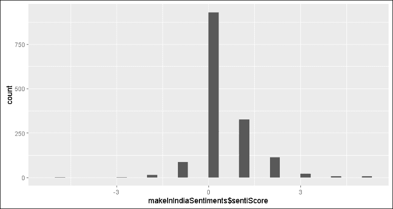

直方图易于解释。它在 x 轴上显示了推文在极性尺度上的分布，在 y 轴上显示了推文的频率。结果显示为正态分布，整体倾向于正方向。这似乎表明该倡议得到了其受众的积极反响。

在分析本身深入一些，让我们分析相同搜索词的情感，看看意见是如何随时间变化的。

### 注意

用于此分析的所有推文都是在该倡议启动当天以及之后一天提取的。由于推特动态性的特点，您可能会观察到结果有所不同。您可能会在本章的其他示例中观察到结果差异。我们敦促您发挥创意，在处理本章的示例时尝试其他热门话题。

输出看起来像这样：

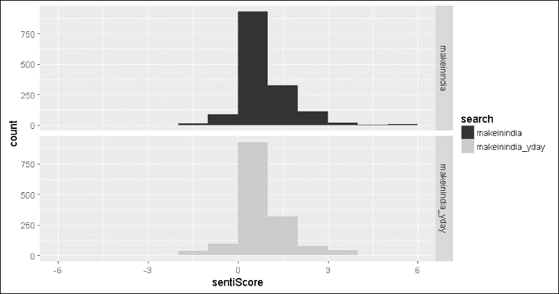

前两个直方图显示了两天内观点的变化。如果你当时在关注新闻，在这个倡议的一个事件中突然发生了火灾，整个舞台被烧毁。顶部的图表是基于火灾发生后发布的推文，而标记为**makeinindia_yday**的图表则指的是前一天发布的推文。尽管情感的变化并不剧烈，但很明显，变化更多地偏向于正面（一些推文的得分甚至达到了 6+）。这会不会是因为推文作者开始赞扬紧急救援队伍和警察的快速行动，防止了伤亡？嗯，看起来推特不仅仅是人们随意发泄的地方！

### 注意

**世界领袖**

推特吸引了名人和政治家的狂热。作为一个快速练习，尝试分析来自世界领袖的推特账号，如`@potus`、`@pmoindia`和`@number10gov`的推文，看看我们的领导人在推特上传达了什么样的观点。如果他们的时间线是中性的，请不要感到惊讶……哦，外交啊！

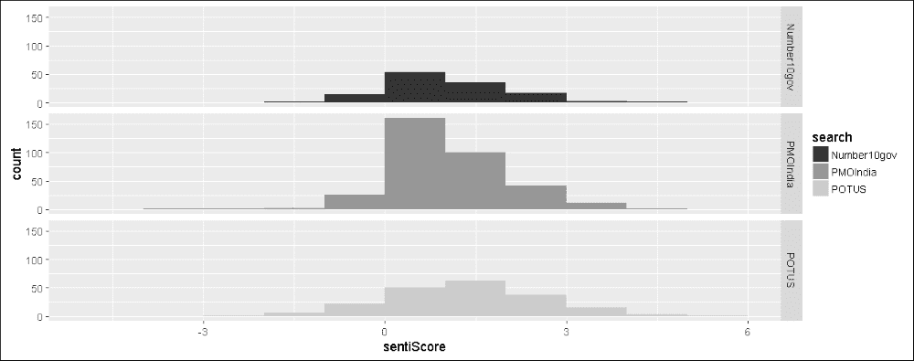

## 基于分类的算法

分类问题需要根据每个类别的定义特征对输入数据进行标记，以便将其归类到所需的类别中（有关详细信息，请参阅第二章，*让我们帮助机器学习*）。在情感分析的情况下，类别是正面和负面（或在某些情况下是中性）。在前几章中，我们已经学习了不同的分类算法，并看到了它们如何被用于各个领域来解决分类和分类问题，而情感分析又是这些算法高度有用的另一个领域。

在本节中，我们将使用 SVM 和提升等分类算法进行观点挖掘。我们还将简要介绍集成方法，看看它们如何帮助提高性能。请注意，对于本节，我们将仅集中讨论正面和负面极性，但这种方法足够通用，可以轻松扩展以包括中性极性。

### 标记数据集

由于这是一个监督学习方法，我们需要标记数据来训练和测试算法的性能。为了本章的目的，我们将利用来自[`www.sentiment140.com/`](http://www.sentiment140.com/)的标记数据集。它包含标记为 0、2 和 4 的推文，分别代表负面、中性和正面情感。除了情感标签之外，还有各种属性，如`tweet ID`、`date`、`search query`、`username`和`tweet text`。在我们的案例中，我们只考虑推文文本及其相应的标签。

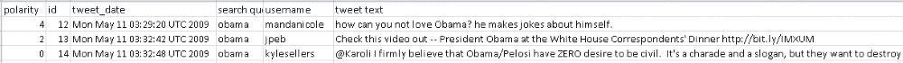

### 注意

另一个标记推文的来源是[`github.com/guyz/twitter-sentiment-dataset`](https://github.com/guyz/twitter-sentiment-dataset)。这个来源使用 Python 脚本下载大约 5000 条标记推文，同时考虑到 Twitter API 指南。

在我们深入算法的特定细节之前，让我们先查看标记数据集，并执行收集和将我们的数据转换为所需形式的初始步骤。我们将使用`caret`和`RTextTools`等库来完成这些步骤。

如前所述，数据集包含标记为 0、2 和 4 的极性，分别代表负面、中性和正面。我们将使用 R 加载`csv`文件，并快速转换标签为正面和负面。一旦极性被转换为可理解的名字，我们将过滤掉包含中性情感的数据行。此外，我们只保留极性和推文文本的列，并删除其余部分。

```py
# load labeled dataset
labeledDSFilePath = "labeled_tweets.csv"
labeledDataset = read.csv(labeledDSFilePath, header = FALSE)

# transform polarity labels
labeledDataset$V1 = sapply(labeledDataset$V1, 
 function(x) 
 if(x==4) 
 x <- "positive" 
 else if(x==0) 
 x<-"negative" 
 else x<- "none")

#select required columns only
requiredColumns <- c("V1","V6")

# extract only positive/negative labeled tweets 
tweets<-as.matrix(labeledDataset[labeledDataset$V1 
 %in% c("positive","negative")
 ,requiredColumns])

```

`tweets`对象现在作为一个矩阵可用，其中每一行代表一条推文，列则分别指代极性和推文文本。在我们将这个矩阵转换为分类算法所需的格式之前，我们需要将我们的数据分为训练集和测试集（参见第二章，*让我们帮助机器学习*，了解更多相关信息）。由于训练集和测试集都应该包含足够好的所有类别的样本分布，以便进行训练和测试，我们使用`caret`包中提供的`createDataPartition`函数。对于我们的用例，我们将数据分为 70/30 的训练集和测试集：

```py
indexes <- createDataPartition(tweets[,1], p=0.7, list = FALSE)

train.data <- tweets[indexes,]
test.data <- tweets[-indexes,]

```

我们快速检查了原始数据集中正负类别以及训练集和测试集的数据分布情况，结果将在下面的屏幕截图中展示：

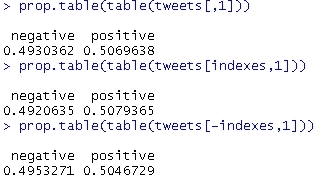

如我们所见，`createDataPartition`在训练集和测试集之间保持了相似的极性分布。

接下来是文档词矩阵转换。正如我们在第七章, *社交媒体分析 – 分析 Twitter 数据*中看到的，文档词矩阵将给定的数据集转换为表示文档的行和表示术语（单词/句子）的列。与上一章不同，我们使用了`tm`库的`DocumentTermMatrix`函数进行转换，并使用`tm_map`应用了各种转换，对于当前的使用案例，我们将使用`RTextTools`库中的`create_matrix`函数。这个函数是`tm`对应函数的抽象。我们还将使用`tfidf`作为特征为每个术语分配权重。`create_matrix`方法还帮助我们处理将句子拆分为单词、去除停用词和数字，以及词干提取。以下是操作步骤：

```py
train.dtMatrix <- create_matrix(train.data[,2], 
 language="english" , 
 removeStopwords=TRUE, 
 removeNumbers=TRUE,
 stemWords=TRUE,
 weighting = tm::weightTfIdf)

test.dtMatrix <- create_matrix(test.data[,2], 
 language="english" , 
 removeStopwords=TRUE, 
 removeNumbers=TRUE,
 stemWords=TRUE,
 weighting = tm::weightTfIdf,
 originalMatrix=train.dtMatrix)

test.data.size <- nrow(test.data)

```

### 注意

`RTextTools v1.4.2`中的`create_matrix`方法有一个小错误，使用`originalMatrix`选项时阻止了权重分配。以下这个小技巧可以用来修复问题，直到库更新：

```py
>  trace("create_matrix",edit=T) 

```

滚动到第 42 行，并将缩写更新为缩写。

查看以下链接以获取更多详细信息以及处理此问题的其他方法：

[`github.com/timjurka/RTextTools/issues/4`](https://github.com/timjurka/RTextTools/issues/4)

[`stackoverflow.com/questions/16630627/recreate-same-document-term-matrix-with-new-data`](http://stackoverflow.com/questions/16630627/recreate-same-document-term-matrix-with-new-data)

现在我们已经有了训练集和测试集，都是以`DocumentTermMatrix`格式，我们可以继续进行分类算法，让我们的机器学习并构建情感分类器！

### 支持向量机

**支持向量机**，或通常所说的**SVM**，是分类中最灵活的监督学习算法之一。SVM 以这种方式构建模型，即不同类别的数据点被一个清晰的间隙分开，这个间隙被优化到最大可能的分离距离。边缘上的样本被称为支持向量，它们被一个超平面分开（详见第六章, *信用风险检测与预测 – 预测分析*了解更多细节）。

```py
sentiment classifier using the default values and then prints a confusion matrix, along with other statistics for evaluation, as shown in the following code snippet:
```

```py
svm.model <- svm(train.dtMatrix, as.factor(train.data[,1]))

## view inital model details
summary(svm.model)

## predict and evaluate results
svm.predictions <- predict(svm.model, test.dtMatrix)

true.labels <- as.factor(test.data[,1])

confusionMatrix(data=svm.predictions, reference=true.labels, positive="positive")

```

如下生成的混淆矩阵显示，分类器的准确率仅为**50**%，这和掷硬币一样糟糕，完全没有对负面情绪进行预测！看起来分类器无法从训练数据集中推断或学习到很多东西。

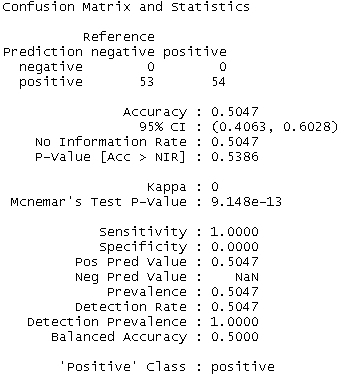

为了构建性能更好的模型，我们现在将深入底层并调整一些参数。`e1071`中的`svm`实现提供了一个名为`tune`的出色实用工具，通过在给定的参数范围内进行网格搜索来获得超参数的优化值：

```py
## hyperparameter optimizations

# run grid search
cost.weights <- c(0.1, 10, 100)
gamma.weights <- c(0.01, 0.25, 0.5, 1)
tuning.results <- tune(svm, train.dtMatrix, as.factor(train.data[,1]), kernel="radial", 
 ranges=list(cost=cost.weights, gamma=gamma.weights))

# view optimization results
print(tuning.results)

# plot results
plot(tuning.results, cex.main=0.6, cex.lab=0.8,xaxs="i", yaxs="i")

```

### 注意

```py
radial bias kernel (or rbf for short) for hyperparameter optimization. The motivation for using rbf was due to its better performance with respect to *specificity* and *sensitivity* even though the overall accuracy was comparable to *linear* kernels. We urge our readers to try out linear kernels and observe the difference in the overall results. Please note that, for text classification, linear kernels usually perform better than other kernels, not only in terms of accuracy but in performance as well
```

参数调整导致超参数`cost`和`gamma`的优化值分别为`10`和`0.01`；以下图表证实了这一点（最暗的区域对应最佳值）。

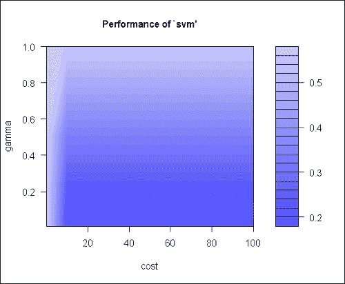

以下代码片段使用最佳模型进行预测并准备混淆矩阵，如下所示：

```py
# get best model and evaluate predictions
svm.model.best = tuning.results$best.model

svm.predictions.best <- predict(svm.model.best, test.dtMatrix)

confusionMatrix(data=svm.predictions.best, reference=true.labels, positive="positive")

```

以下混淆矩阵显示了从改进后的模型中得出的预测。从仅仅 50%的准确率到舒适的 80%以上是一个很大的飞跃。让我们检查此模型的 ROC 曲线，以确认准确率确实足够好：

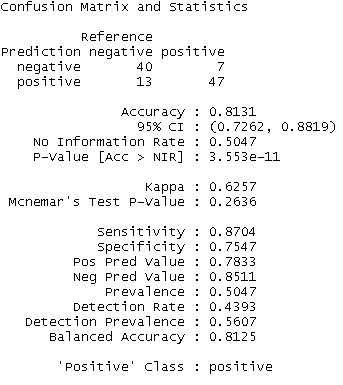

为了准备 ROC 曲线，我们将重用我们的实用脚本`performance_plot_utils.R`，来自第六章，*信用风险检测和预测 – 预测分析*，并将优化模型的预测传递给它：

```py
# plot best model evaluation metric curves
svm.predictions.best <- predict(svm.model.best, test.dtMatrix, decision.values = T)

svm.prediction.values <- attributes(svm.predictions.best)
$decision.values

predictions <- prediction(svm.prediction.values, true.labels)

par(mfrow=c(1,2))
plot.roc.curve(predictions, title.text="SVM ROC Curve")
plot.pr.curve(predictions, title.text="SVM Precision/Recall Curve")

```

ROC 曲线也证实了一个学习良好的模型，其 AUC 为 0.89。因此，我们可以使用此模型将推文分类为正面或负面类别。我们鼓励读者尝试基于 ROC 的优化，并观察模型是否还有进一步的改进。

### 集成学习方法

简而言之，监督式机器学习算法是关于学习底层函数或模式，这些函数或模式帮助我们根据历史数据准确预测（在一定的范围内）。在本书的整个过程中，我们遇到了许多这样的算法，尽管 R 使得编码和测试这些算法变得容易，但值得一提的是，学习一个高度准确的功能或模式并不是一件容易的事情。构建高度复杂的模型会导致过拟合和欠拟合等问题。在所有这些混乱中，值得注意的是，学习简单的规则和函数总是很容易的。

例如，为了将一封电子邮件分类为垃圾邮件或非垃圾邮件，机器学习算法需要学习多个规则，例如：

+   包含类似“现在购买”等文本的电子邮件是垃圾邮件

+   包含五个以上超链接的电子邮件是垃圾邮件

+   地址簿中的联系人发送的电子邮件不是垃圾邮件

以及许多类似的规则。给定一个训练数据集，比如说`T`个标记的电子邮件，机器学习算法（特别是分类算法）将生成一个分类器`C`，这是一个底层函数或模式的假设。然后我们使用这个分类器`C`来预测新电子邮件的标签。

另一方面，分类器集成被定义为输出以某种方式组合以对新示例进行分类的分类器集合。在基于机器学习的集成领域的主要发现是，集成比它们所组成的单个分类器表现得更好。

集成优于其组成部分的必要且充分条件是它们应该是*准确*和*多样*的。如果一个分类器的预测比随机猜测更好，则称其为*准确*（参见弱学习者）。而如果两个分类器在相同的数据点上做出不同的错误，则称它们为*多样*。

我们可以将**弱学习者**定义为预测和决策至少比随机猜测更好的学习者。弱学习者也被称为基学习器或元学习器。

以下框图可视化了集成分类器的概念：

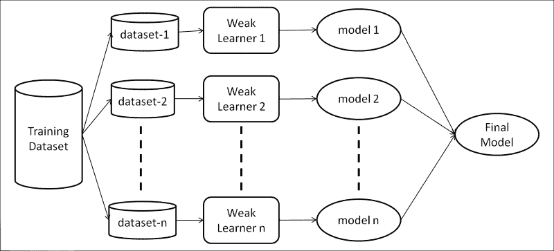

如前述框图所示，训练数据集被分成 *n* 个数据集（这种数据集的分割或生成取决于集成方法），弱学习器（相同的或不同的弱学习器，同样取决于集成方法）在这些数据集上建立模型。然后根据加权或无权投票将这些模型组合起来，以准备一个最终模型，该模型用于分类。集成为何有效力的数学证明相当复杂，超出了本书的范围。

#### 提升法

构建集成分类器（或回归器）的方法有很多，提升法就是其中之一。提升法作为罗伯特·沙皮雷在 1990 年发表的开拓性论文《弱学习能力的力量》中的答案出现，这篇论文的标题是《弱学习能力的力量》，他在其中优雅地描述了提升集成，同时回答了凯尔斯和瓦利亚恩在 1989 年发表的论文中提出的问题，该论文讨论了能够创建单个强学习者的多个弱学习者。

### 注意

*《弱学习能力的力量》*：[`www.cs.princeton.edu/~schapire/papers/strengthofweak.pdf`](http://www.cs.princeton.edu/~schapire/papers/strengthofweak.pdf)。

**凯尔斯和瓦利亚恩**：关于学习布尔学习和有限自动机的密码学限制：[`dl.acm.org/citation.cfm?id=73049`](http://dl.acm.org/citation.cfm?id=73049)

提升法的原始算法由弗里德和沙皮雷修订，并命名为**AdaBoost**或**自适应****提升法**。这个算法是实际可实现的，并且经验上提高了泛化性能。该算法可以如下数学表示：

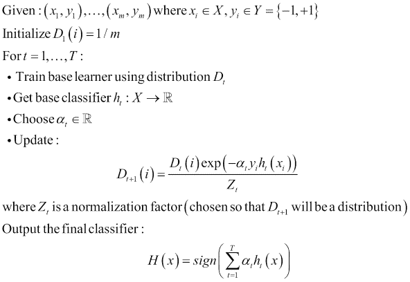

来源：[`www.cs.princeton.edu/picasso/mats/schapire02boosting_schapire.pdf`](https://www.cs.princeton.edu/picasso/mats/schapire02boosting_schapire.pdf)

这里：

+   **X** 是训练集

+   **Y** 是标签集

+   **Dt** 是在第 **t** 次迭代中对训练示例 **i** 的权重分布

+   **h[t]** 是在第 **t** 次迭代中获得的分类器

+   **α** 是强度参数或 **h[t]** 的权重

+   **H** 是最终的或组合分类器。

简而言之，提升（Boosting）通常从最初对所有训练样本分配相同的权重开始。然后，它在假设空间中迭代，以学习加权样本上的假设 **h[t]**。在每个这样的假设学习之后，权重以这种方式进行调整，即正确分类的样本的权重减少。这种权重的更新有助于弱学习者在后续迭代中更多地关注错误分类的数据点。最后，将每个学习的假设通过加权投票来得到最终的模型，**H**。

现在我们已经对集成方法和提升有了概述，让我们使用 R 中的 `RTextTools` 库提供的提升实现来对推文进行正面或负面分类。

我们将重用为基于 SVM 的分类创建的训练-测试文档项矩阵 `train.dtMatrix` 和 `test.dtMatrix`，以及容器对象 `train.container` 和 `test.container`。

为了构建基于提升集成的分类器，`RTextTools` 提供了一个易于使用的实用函数 `train_model`。它内部使用 *LogitBoosting* 来构建分类器。我们为构建我们的提升集成使用 `500` 次迭代。

```py
boosting.model <- train_model(train.container, "BOOSTING"
 , maxitboost=500)
boosting.classify <- classify_model(test.container, boosting.model)

```

然后，我们准备一个混淆矩阵来查看我们的分类器在测试数据集上的表现。

```py
predicted.labels <- boosting.classify[,1]
true.labels <- as.factor(test.data[,1])

confusionMatrix(data = predicted.labels, 
 reference = true.labels, 
 positive = "positive")

```

下面的混淆矩阵显示，我们的基于提升的分类器以 78.5%的准确率工作，考虑到我们没有进行任何性能调整，这是一个相当不错的成绩。将其与 SVM 的初始迭代进行比较，我们得到的准确率仅为 50%多。

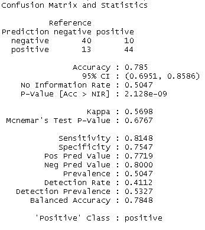

如前所述，集成方法（特别是提升）提高了泛化性能，也就是说，它们有助于在不过度拟合训练数据的情况下实现接近 0 的训练错误。为了理解和评估我们的提升分类器在这些参数上，我们将使用一种称为 **交叉验证** 的模型评估技术。

#### 交叉验证

交叉验证是一种模型评估技术，用于评估模型的泛化性能。它也被称为 **旋转估计**。与残差方法相比，交叉验证是验证模型泛化性能的更好指标，因为对于传统的验证技术，训练集和测试集的错误（如 **均方根误差**/**RMSE**）并不能正确地表示模型的表现。交叉验证可以通过以下方式执行：

+   **保留法**：最简单的交叉验证技术。数据被分为训练集和测试集。模型在训练集上拟合，然后使用测试集（模型之前未见过）来计算平均绝对测试误差。这个累积误差用于评估模型。这种技术由于依赖于训练-测试划分的方式，因此具有高方差。

+   **K 折交叉验证方法**：这是对保留法的一种改进。数据集被分为*k*个子集，然后使用*k*个子集中的一个作为测试集，其余的*k-1*个子集作为训练集，重复使用保留法*k*次。由于每个数据点至少有一次进入测试集，而有*k-1*次进入训练集，这种方法具有较低的方差。缺点是由于迭代次数较多，需要更多的计算时间。K 折交叉验证的一种极端形式是留一法交叉验证，其中除了一个数据点外，所有数据点都用于训练。这个过程重复*N*（数据集大小）次。

我们可以使用`cross_validate`函数轻松地在我们的提升分类器上执行 K 折交叉验证。通常使用 10 折交叉验证：

```py
# Cross validation
N=10
set.seed(42)
cross_validate(train.container,N,"BOOSTING"
 , maxitboost=500)

```

结果表明，分类器已经很好地泛化，整体平均准确率为 97.8%。

提升法是构建基于弱学习者的集成分类器的一种方法。例如，袋装法、贝叶斯最优分类器、桶装法和堆叠法等都是一些具有各自优缺点的变体。

### 注意

**构建集成**

`RTextTools`是一个健壮的库，它提供了`train_models`和`classify_models`等函数，通过结合各种基学习器来准备集成。它还提供了生成分析的工具，以非常详细的方式评估此类集成的性能。请参阅[`journal.r-project.org/archive/2013-1/collingwood-jurka-boydstun-etal.pdf`](https://journal.r-project.org/archive/2013-1/collingwood-jurka-boydstun-etal.pdf)的详细说明。

# 摘要

Twitter 是数据科学的一个宝库，其中有趣的模式和见解遍布其中。其用户生成内容的持续流动，加上基于兴趣的独特关系，为近距离理解人类动态提供了机会。情感分析就是这样一个领域，Twitter 提供了理解我们如何表达和分享对产品、品牌、人物等观点的合适成分。

在本章中，我们探讨了情感分析的基础、关键术语以及应用领域。我们还探讨了在执行情感分析时遇到的各项挑战。我们研究了各种常用的特征提取方法，如 tf-idf、Ngrams、POS、否定等，用于执行情感分析（或一般文本分析）。我们基于上一章的代码库，对可重用的实用函数进行了简化和结构化。我们使用 Twitter 搜索词进行了极性分析，并看到了公众对某些活动的看法如何被轻松追踪和分析。然后，我们转向监督学习算法进行分类，其中我们使用了 SVM 和 Boosting，利用`caret`、`RTextTools`、`ROCR`、`e1071`等库构建情感分类器。在结束最后一章之前，我们还简要介绍了高度研究和广泛使用的集成方法领域，以及基于交叉验证的模型评估。

还有许多其他算法和分析技术可以应用于从 Twitter 和其他互联网来源中提取更多有趣的见解。在本章（以及本书）中，我们仅仅尝试触及这个巨大冰山的一角！数据科学不仅仅是将算法应用于解决问题或得出见解。它需要创造性思维和大量的尽职调查，除了领域理解、特征工程和收集数据来尝试解决尚未知的问题之外。

总结一下，思考一下唐纳德·拉姆斯菲尔德的这句话：

> *"已知已知的事物。这些是我们知道我们知道的。已知未知的事物。也就是说，有些事情我们知道我们不知道。但还有未知未知的事物。有些事情我们不知道我们不知道。"*

数据科学是一个学习已知事物和探索未知未知事物的旅程，而机器学习是帮助实现这一目标的强大工具。`#KeepMining`！
