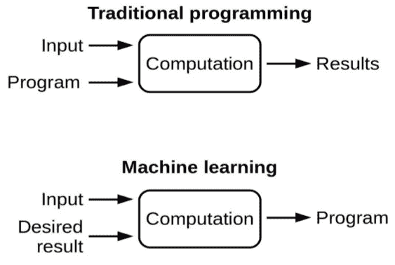
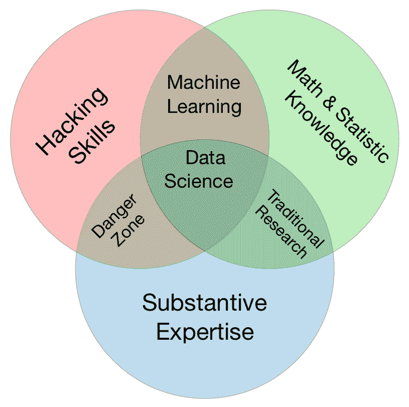
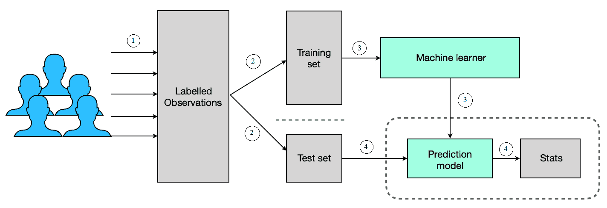
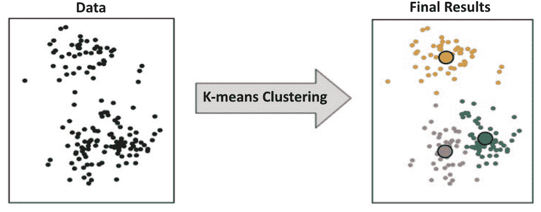
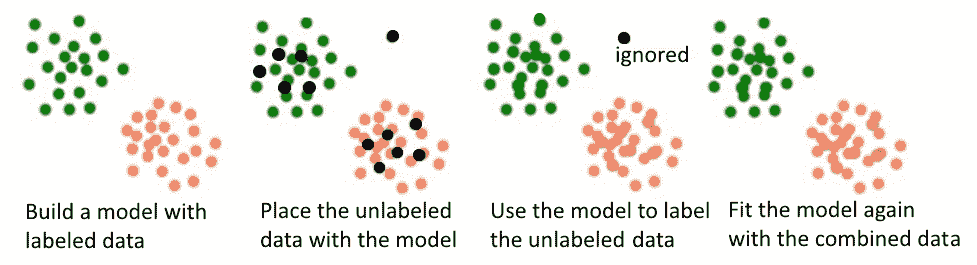
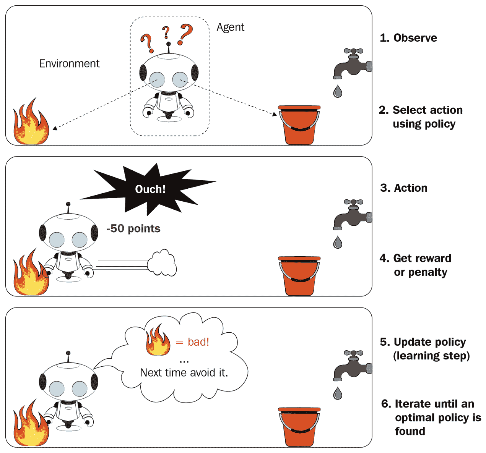
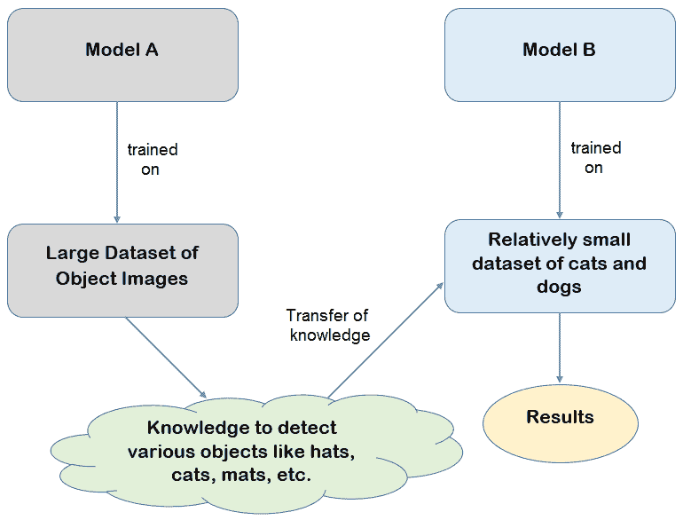
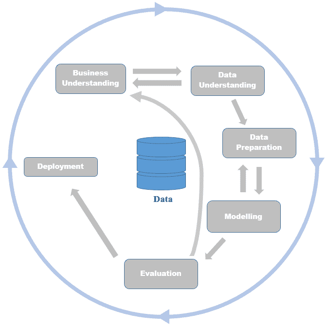

# 探索机器学习领域

**机器学习**（**ML**）是**人工智能**（**AI**）的一个令人惊叹的子领域，它试图模仿人类的认知学习行为。类似于婴儿通过观察遇到的例子来学习的方式，机器学习算法通过观察作为输入提供的数据点来学习未来事件的结果或响应。

在本章中，我们将涵盖以下主题：

+   机器学习与软件工程

+   机器学习方法的类型

+   机器学习术语——快速回顾

+   机器学习项目流程

+   学习范式

+   数据集

# 机器学习与软件工程

随着大多数人从传统的软件工程实践转向机器学习，理解这两个领域之间的潜在差异非常重要。表面上，这两个领域似乎都生成某种代码以执行特定任务。一个有趣的事实是，与软件工程中程序员根据几个条件明确编写程序不同，机器学习算法通过观察输入示例来推断游戏的规则。学到的规则随后被用于当向系统提供新的输入数据时进行更好的决策。

正如你可以在以下图表中观察到的，在没有人工干预的情况下自动从数据中推断动作是机器学习与传统编程之间的关键区别：

机器学习与传统编程的另一个关键区别是，通过机器学习获得的知识能够通过成功解释算法以前从未见过的数据来推广到训练样本之外，而用传统编程编写的程序只能执行代码中包含的响应。

另一个区别是，在软件工程中，有解决手头问题的特定方法。给定基于某些输入假设和包含条件的算法，你将能够保证在给定输入的情况下获得输出。在机器学习世界中，无法对算法获得的输出提供此类保证。在机器学习世界中，要确认某种技术是否优于另一种技术，而不实际在处理问题的数据集上尝试这两种技术，也是非常困难的。

机器学习与软件工程不同！机器学习项目可能涉及一些软件工程，但机器学习不能被视为与软件工程相同。

虽然存在多个关于机器学习的正式定义，以下是一些经常遇到的关键定义：

"机器学习是让计算机在没有明确编程的情况下行动的科学。"

—斯坦福

"机器学习基于可以无规则编程依赖从数据中学习的算法。"

—麦肯锡公司

随着数据成为未来动力的兴起，行业从业者将 AI、ML、数据挖掘、数据科学和数据分析这些术语互换使用。理解这些术语之间的关键区别以避免混淆是很重要的。

虽然 AI、ML、数据挖掘、数据科学和数据分析这些术语被互换使用，但它们并不相同！

让我们来看看以下术语：

+   **AI**：AI 是一种范式，其中机器能够以智能的方式执行任务。在 AI 的定义中，并没有指定机器的智能是手动实现还是自动实现。因此，可以安全地假设，即使是一个用几个`if...else`或`switch...case`语句编写的程序，如果它被注入了机器来执行任务，也可以被认为是 AI。

+   **ML**：另一方面，ML 是通过从提供作为输入的数据中学习来实现机器智能的一种方式，因此我们有一个智能机器在执行任务。可以观察到，ML 实现了与 AI 相同的目标，只是智能是通过自动实现的。因此，可以得出结论，ML 仅仅是实现 AI 的一种方式。

+   **数据挖掘**：数据挖掘是一个专注于发现数据集未知属性的特定领域。数据挖掘的主要目标是提取从大量输入数据中得出的规则，而在机器学习中，算法不仅从数据输入中推断规则，还使用这些规则对任何新的、传入的数据进行预测。

+   **数据分析**：数据分析是一个涵盖执行基本描述性统计、数据可视化和数据点沟通以得出结论的领域。数据分析可以被认为是数据科学的一个基本层次。从业者对数据挖掘或机器学习练习提供的输入数据进行数据分析是正常的。这种数据分析通常被称为**探索性数据分析（EDA）**。

+   **数据科学**：数据科学是一个包括数据分析和数据挖掘、机器学习以及与工作领域相关的任何特定领域专长的总称。数据科学是一个涉及处理数据的多个方面的概念，例如从一个或多个来源获取数据、数据清洗、数据准备以及根据现有数据创建新的数据点。它包括执行数据分析。它还包括在数据上使用一个或多个数据挖掘或机器学习技术来推断知识，以创建一个在未见数据上执行任务的算法。这个概念还包括以使其在未来执行指定任务有用的方式部署算法。

以下是一个维恩图，展示了在数据科学领域工作的专业人士所需具备的技能。它有三个圆圈，每个圆圈定义了数据科学专业人士应具备的特定技能：

让我们探索前面图表中提到的以下技能：

+   **数学与统计知识**：这项技能是分析数据的统计属性所必需的。

+   **黑客技能**：编程技能在快速处理数据中起着关键作用。机器学习算法被应用于创建输出，该输出将对未见数据进行预测。

+   **实质性专业知识**：这项技能指的是对当前问题领域领域专业知识。它帮助专业人士能够向系统提供适当的输入，以便从中学习，并评估输入和获得的结果的适当性。

要成为一名成功的数据科学专业人士，你需要具备数学、编程技能以及对商业领域的了解。

如我们所见，人工智能、数据科学、数据分析、数据挖掘和机器学习都是相互关联的。所有这些领域目前都是行业中最热门的领域。结合正确的技能集和实际经验，将引领你在这些当前趋势领域拥有强大的职业生涯。由于机器学习构成了领先领域的基础，下一节将探讨可能应用于多个实际问题的各种机器学习方法。

机器学习无处不在！大多数时候，我们可能在使用基于机器学习的东西，但并没有意识到它的存在或它对我们生活的影响！让我们一起探索一些我们每天都能体验到的非常流行的设备或应用程序，它们由机器学习驱动：

+   **虚拟个人助理**（**VPAs**）如**Google Allo**、**Alexa**、**Google Now**、**Google Home**、**Siri**等等

+   显示你起点和终点交通预测的智能地图

+   在 Uber 或类似交通服务中基于需求的价格上涨

+   机场、火车站和其他公共场所的自动视频监控

+   在社交媒体网站如 Facebook 上发布的图片中的人脸识别

+   在 Facebook 上为你提供的个性化新闻推送

+   在 YouTube 上为你提供的广告

+   Facebook 和其他类似网站上你可能认识的人的建议

+   根据你的个人资料在 LinkedIn 上的工作推荐

+   在 Google Mail 上的自动回复

+   在在线客户支持论坛中与你交谈的聊天机器人

+   搜索引擎结果过滤

+   邮件垃圾邮件过滤

当然，这个列表并没有结束。前面提到的应用只是基本的一些，它们展示了机器学习对我们今天生活的影响。引用没有哪个学科领域机器学习没有触及，这并不令人惊讶！

本节中的主题绝不是机器学习的详尽描述，而只是为了让我们开始探索之旅的一个快速接触点。现在我们已经对机器学习是什么以及它可以在哪里应用有了基本的了解，让我们在下一节中深入探讨其他机器学习相关主题。

# 机器学习方法的类型

机器学习可以解决多种旨在解决现实世界问题的任务。一般来说，机器学习方法意味着一组特定的算法，这些算法适合解决特定类型的问题，并且该方法解决了问题带来的任何约束。例如，特定问题的约束可能是可用于作为学习算法输入的有标签数据的可用性。

从本质上讲，流行的机器学习方法是监督学习、无监督学习、半监督学习、强化学习和迁移学习。本节其余部分将详细说明这些方法。

# 监督学习

当一个人对需要从问题中实现的结果非常清楚，但对影响输出的数据之间的关系不确定时，就会应用监督学习算法。我们希望我们应用在数据上的机器学习算法能够感知不同数据元素之间的关系，以便实现预期的输出。

这个概念可以通过一个例子来更好地解释——在银行，在发放贷款之前，他们希望预测贷款申请人是否会偿还贷款。在这种情况下，问题非常明确。如果向潜在客户 X 发放贷款，有两种可能性：X 会成功偿还贷款或 X 不会偿还贷款。银行希望使用机器学习来识别客户 X 所属的类别；即，成功的贷款偿还者或违约的贷款偿还者。

虽然要解决的问题定义是清晰的，但请注意，对客户将有助于成功偿还或未偿还贷款的特征并不明确，这是我们希望机器学习算法通过观察数据中的模式来学习的东西。

这里的主要挑战是我们需要提供代表成功偿还贷款的客户和未能偿还贷款的客户的数据。银行可以简单地查看历史数据以获取两类客户的记录，然后根据适当的情况将每条记录标记为已支付或未支付类别。

因此标记的记录现在成为监督学习算法的输入，以便它可以学习两类客户的模式。从标记数据中学习的过程称为**训练**，学习过程中获得（算法）输出称为**模型**。理想情况下，银行会从训练数据中保留一部分标记数据，以便能够测试创建的模型，这种数据被称为**测试数据**。应该不会令人惊讶的是，用于训练模型的标记数据被称为**训练数据**。

一旦模型建立，通过用测试数据测试模型来获取测量结果，以确保模型达到令人满意的性能水平，否则进行模型构建迭代，直到获得所需的模型性能。在测试数据上达到所需性能的模型可以由银行用来推断任何新的贷款申请人是否会成为未来的违约者，如果是的话，就可以在向该申请人提供贷款方面做出更好的决策。

简而言之，当目标非常明确且作为算法学习模式的输入有标签数据时，会使用监督机器学习算法。以下图表总结了监督学习过程：

监督学习可以进一步分为两类，即**分类**和**回归**。本节中解释的银行贷款违约者预测是一个分类的例子，它旨在预测一个名义类型的标签，如是或否。另一方面，也可以预测数值（连续值），这种预测称为回归。回归的一个例子是根据该地区的房屋需求、卧室数量、房屋尺寸和公共交通的可达性来预测城市黄金地段房屋的月租金。

存在多种监督学习算法，该领域一些广为人知的算法包括**分类和回归树**（**CART**）、逻辑回归、线性回归、朴素贝叶斯、神经网络、**k-最近邻**（**KNN**）和**支持向量机**（**SVM**）。

# 无监督学习

标签数据的可用性并不常见，手动标注数据也不便宜。这就是无监督学习发挥作用的情况。

例如，一家小型精品公司想要向在其 Facebook 页面上注册的客户推出促销活动。虽然业务目标很明确——需要向客户推出促销活动——但不清楚哪些客户属于哪个群体。与监督学习方法中存在关于不良债务人和良好债务人的先验知识不同，在这种情况下没有这样的线索。

当将客户信息作为输入提供给无监督学习算法时，它试图识别数据中的模式，从而将具有相似属性的客户数据进行分组。

同类鸟儿聚在一起，这是在无监督学习中客户分组的原理。

这些有机群体形成的推理可能不是非常直观。可能需要一些研究来识别导致一组客户聚集在群体中的因素。大多数时候，这项研究是手动的，每个群体中的数据点需要验证。这项研究可能成为确定特定促销活动需要推出的群体的基础。这种无监督学习的应用称为**聚类**。以下图表显示了无监督机器学习在聚类数据点中的应用：

有许多聚类算法。然而，最受欢迎的包括 k-means 聚类、k-modes 聚类、层次聚类、模糊聚类等。

其他形式的无监督学习确实存在。例如，在零售行业，一种称为**关联规则挖掘**的无监督学习方法被应用于客户购买行为，以识别一起购买的物品。在这种情况下，与监督学习不同，根本不需要标签。所涉及的任务只需要机器学习算法识别客户一起计费的产品之间的潜在关联。从关联规则挖掘中获得的信息有助于零售商将一起购买的产品放置在附近。其理念是，可以直观地鼓励顾客购买额外的产品。

在现有的执行关联规则挖掘的算法中，**等价类转换**（**Eclat**）和**频率模式增长**（**FPG**）是流行的算法。

另一种形式的无监督学习是异常检测或离群点检测。该练习的目标是识别不属于无监督学习算法输入的其他元素的点。与关联规则挖掘类似，由于问题的性质，算法不需要使用标签来实现目标。

欺诈检测是信用卡行业中异常检测的重要应用。信用卡交易实时监控，任何可疑的交易模式都会立即标记，以避免信用卡用户和信用卡提供商遭受损失。监控的不寻常模式可能是在外币中进行的巨额交易，而不是特定客户通常交易的正常货币。这可能是同一天在两个不同大陆的实体店中的交易。一般想法是能够标记出偏离常规的模式。

K-means 聚类和单类 SVM 是两种著名的无监督机器学习算法，用于观察人群中的异常情况。

总体来说，可以理解，无监督学习无疑是非常重要的一种方法，考虑到用于训练的标记数据是一种稀缺资源。

# 半监督学习

半监督学习是监督和无监督方法的混合体。机器学习需要大量的数据用于训练。大多数时候，观察到模型训练所使用的数据量与模型性能之间存在直接的正比关系。

在如医学成像等利基领域，有大量的图像数据（MRI、X 光、CT 扫描）可用。然而，合格的放射科医生的时间和可用性来标记这些图像是稀缺的。在这种情况下，我们可能只能获得少数由放射科医生标记的图像。

半监督学习通过构建一个初始模型来利用少量标记图像，该模型用于标记领域中存在的大量未标记数据。一旦有大量标记数据可用，可以使用监督机器学习算法来训练和创建一个用于在未见数据上的预测任务的最终模型。以下图表说明了半监督学习涉及到的步骤：

语音分析、蛋白质合成和网页内容分类是某些领域，在这些领域中，存在大量未标记的数据和较少的标记数据。在这些领域应用半监督学习取得了成功的结果。

**生成对抗网络**（**GANs**）、**半监督支持向量机**（**S3VMs**）、基于图的方法和**马尔可夫**链方法是半监督机器学习领域中众所周知的方法。

# 强化学习

**强化学习**（**RL**）是一种既不是监督学习也不是无监督学习的机器学习方法。在这种方法中，一开始就向这种学习算法提供奖励定义作为输入。由于算法没有提供用于训练的标记数据，这种学习算法不能归类为监督学习。另一方面，它也不归类为无监督学习，因为算法被提供了关于奖励定义的信息，这些信息指导算法通过采取解决问题的步骤。

强化学习旨在通过依赖收到的反馈来不断改进解决任何问题的策略。目标是最大化奖励，同时采取解决问题的步骤。获得的奖励由算法本身根据奖励和惩罚定义来计算。其理念是实现最优步骤，以最大化奖励来解决当前问题。

以下图表展示了通过强化学习方法在火灾特定情境下自动确定理想行为的机器人：

一台机器在 Atari 视频游戏中超越人类被称为强化学习最显著的成功故事之一。为了实现这一壮举，将大量人类玩过的示例游戏作为输入提供给算法，该算法学习了采取最大化奖励的步骤。在这种情况下，奖励是最终得分。算法在从示例输入中学习后，仅模拟了游戏中每个步骤的模式，最终最大化了获得的分数。

虽然强化学习可能看起来只能应用于游戏场景，但在工业界也有许多这种方法的应用案例。以下提到的例子是其中三个这样的案例：

+   基于自发的供需关系动态定价商品和服务，以实现利润最大化，是通过强化学习的一种变体**Q 学习**来实现的。

+   在仓库中有效利用空间是库存管理专业人士面临的关键挑战。市场需求波动、大量库存的可用性和库存补充的延迟是影响空间利用的关键约束。强化学习算法用于优化采购库存的时间以及从仓库中检索商品的时间，从而直接影响到被称为库存管理领域的空间管理问题。

+   在医学科学中，为了治疗如癌症等疾病，需要长期治疗和差异化的药物管理。治疗高度个性化，基于患者的特征。治疗通常涉及在各个阶段的治疗策略的变化。这种治疗计划通常被称为**动态治疗制度**（**DTR**）。强化学习有助于处理临床试验数据，根据输入到强化学习算法的患者特征，提出适当的个性化 DTR。

有四种非常流行的强化学习算法，分别是 Q 学习、**状态-动作-奖励-状态-动作**（**SARSA**）、**深度 Q 网络**（**DQN**）和**深度确定性策略梯度**（**DDPG**）。

# 迁移学习

代码的可重用性是**面向对象编程**（**OOP**）的基本概念之一，在软件工程领域非常流行。同样，迁移学习涉及重用为完成特定任务而构建的模型来解决另一个相关任务。

要达到更好的性能测量，机器学习模型需要在大量标记数据上进行训练是理所当然的。数据量较少意味着训练较少，结果是性能次优的模型。

迁移学习试图通过重用不同相关模型获得的知识来解决数据量较少时出现的问题。拥有较少的数据点来训练模型不应该阻碍构建更好的模型，这是迁移学习的核心概念。以下图表展示了迁移学习在图像识别任务中的目的，该任务用于分类狗和猫的图像：

在这个任务中，一个神经网络模型涉及到在第一层中检测边缘、颜色块检测等。只有在渐进层（可能在最后几层）中，模型才会尝试识别狗或猫的面部特征，以便将它们分类为目标之一（狗或猫）。

可能会观察到，识别边缘和颜色块的任务并不特定于猫和狗的图像。即使模型是在非狗或非猫的图像上训练的，也可能一般地推断出边缘或颜色块的知识。最终，如果将这种知识结合从推断猫脸与狗脸中得出的知识，即使数量较少，我们也将拥有比在较少图像上训练得到的次优模型更好的模型。

在狗-猫分类器的情况下，首先，在一个大型图像集上训练一个模型，这些图像不仅限于猫和狗的图像。然后，将模型取来，在狗和猫的脸上重新训练最后几层。因此获得的模型经过测试并使用后，证明了性能测量结果是令人满意的。

迁移学习的概念不仅用于图像相关任务。另一个例子是它在**自然语言处理**（**NLP**）中的应用，它可以对文本数据进行情感分析。

假设有一家公司推出了一款前所未有的新产品（比如说，现在是一架飞行汽车）。任务是分析与新产品质量相关的推文，并将每一条推文识别为正面、负面或中性情感。可能会观察到，在飞行汽车领域，之前标记的推文是不可用的。在这种情况下，我们可以使用基于多个产品和领域通用产品评论标记数据的模型。我们可以通过补充飞行汽车领域特定的术语来重用该模型，从而获得一个新的模型。这个新模型最终将用于测试和部署，以分析关于新推出的飞行汽车的推文中的情感。

可以通过以下两种方式实现迁移学习：

+   通过重用自己训练的模型

+   通过重用预训练模型

预训练模型是由各种组织或个人作为其研究工作或作为比赛的一部分构建的模型。这些模型通常非常复杂，并且在大量的数据上进行了训练。它们也被优化以高精度执行其任务。这些模型在现代硬件上训练可能需要几天或几周的时间。组织或个人通常会以许可许可证的形式发布这些模型以供重用。通过迁移学习范式可以下载并重用这些预训练模型。这将有效地利用预训练模型所拥有的大量现有知识，这对于有限的硬件资源和数据量的个人来说可能难以获得。

有多个预训练模型由不同的机构提供。以下描述的是一些流行的预训练模型：

+   **Inception-V3 模型**：这个模型作为大型视觉识别挑战的一部分在 ImageNet 上进行了训练。比赛要求参与者将给定的图像分类为 1000 个类别之一。其中一些类别包括动物名称和物体名称。

+   **MobileNet**：这个预训练模型是由谷歌构建的，旨在使用 ImageNet 数据库进行目标检测。其架构是为移动设备设计的。

+   **VCG Face**：这是一个为面部识别构建的预训练模型。

+   **VCG 16**：这是一个在**MS COCO**数据集上训练的预训练模型。这个模型实现了图像描述；也就是说，给定一个输入图像，它生成一个描述图像内容的字幕。

+   **谷歌的 Word2Vec 模型和斯坦福的 GloVe 模型**：这些预训练模型以文本作为输入，并生成单词向量作为输出。分布式单词向量是表示文档的一种形式，用于自然语言处理（NLP）或机器学习（ML）应用。

现在我们对各种可能的机器学习方法有了基本的了解，在下一节中，我们将快速回顾机器学习中使用的核心术语。

# 机器学习术语 – 快速回顾

在本节中，我们回顾了流行的机器学习术语。这个非详尽的回顾将帮助我们快速复习，并使我们能够顺利地跟随本书涵盖的项目。

# 深度学习

这是一个革命性的趋势，在最近的机器学习（ML）世界中已经成为一个超级热门的话题。它是一类使用具有多个隐藏层神经元的**人工神经网络**（**ANNs**）来解决问题的机器学习算法。

通过将深度学习应用于几个现实世界问题，可以获得优越的结果。**卷积神经网络**（**CNNs**）、**循环神经网络**（**RNNs**）、**自编码器**（**AEs**）、**生成对抗网络**（**GANs**）和**深度信念网络**（**DBNs**）是一些流行的深度学习方法。

# 大数据

这个术语指的是大量数据，这些数据结合了结构化数据类型（类似于表格的行和列）和非结构化数据类型（文本文档、语音录音、图像数据等）。由于数据量很大，它不适合机器学习算法需要执行的主存储器。需要单独的策略来处理这些大量数据。数据分布式处理和结果合并（通常称为**MapReduce**）是一种策略。也有可能每次只处理足够的数据，使其能够适应主存储器，并将结果存储在硬盘上的某个地方；我们需要重复这个过程，直到完全处理完所有数据。数据处理后，需要将结果合并，以获得所有已处理数据的最终结果。

要在大数据上执行机器学习，需要特殊技术，如 Hadoop 和 Spark。不用说，你需要磨练专门技能，以便成功地将这些技术应用于大数据上的机器学习算法。

# 自然语言处理

这是机器学习的一个应用领域，旨在使计算机理解人类语言，如英语、法语和普通话。自然语言处理应用允许用户使用口语与计算机交互。

聊天机器人、语音合成、机器翻译、文本分类和聚类、文本生成和文本摘要是一些流行的自然语言处理应用。

# 计算机视觉

这个机器学习领域试图模仿人类的视觉。目标是使计算机能够看到、处理和确定图像或视频中的对象。深度学习和强大硬件的可用性导致了该领域机器学习非常强大应用的出现。

自动驾驶汽车等自动驾驶汽车、物体识别、物体跟踪、运动分析和图像恢复是计算机视觉的一些应用。

# 成本函数

成本函数、损失函数或误差函数在实践中可以互换使用。每个都用于定义和衡量模型的误差。机器学习算法的目标是最小化数据集中的损失。

成本函数的一些例子包括用于线性回归的平方损失、用于支持向量机的 hinge 损失以及用于分类算法中准确度测量的 0/1 损失。

# 模型准确度

准确度是用于衡量机器学习模型性能的流行指标之一。这个测量方法易于理解，并有助于从业者非常容易地向其商业用户传达模型的良好性能。

通常，这个指标用于分类问题。准确度是通过正确预测的数量除以总预测数量来衡量的。

# 混淆矩阵

这是一个描述分类模型性能的表格。它是一个 *n* 行 *n* 列的矩阵，其中 *n* 代表分类模型预测的类别数量。它通过记录模型在比较实际标签时的正确和错误预测数量而形成。

混淆矩阵可以通过一个例子更好地解释——假设数据集中有 100 张图片，其中包含 50 张狗图片和 50 张猫图片。一个旨在将图像分类为猫图像或狗图像的模型被给出这个数据集。模型的输出显示，40 张狗图片被正确分类，20 张猫图片被正确预测。以下表格是模型预测输出的混淆矩阵构建：

| 模型预测标签 | **实际标签** |
| --- | --- |
|  | 猫 | 狗 |
| 猫 | 20 | 30 |
| 狗 | 10 | 40 |

# 预测变量

这些变量也被称为**独立变量**或**x 值**。这些是帮助预测因变量或目标或响应变量的输入变量。

在房屋租赁预测用例中，房屋的面积（平方英尺）、卧室数量、该地区空置房屋的数量、距离公共交通的远近、以及医院和学校等设施的可达性都是一些预测变量，它们决定了房屋的租金。

# 响应变量

实践者将因变量或目标或 y 值互换地用作**响应变量**的替代词。这是模型根据作为模型输入的独立变量预测的输出变量。

在房屋租赁预测用例中，预测的租金是响应变量。

# 降维

特征减少（或特征选择）或降维是将独立变量的输入集减少到所需变量数量更少的过程，这些变量是模型预测目标所需的。

在某些情况下，可以通过组合多个因变量来表示它们，而不会丢失太多信息。例如，与其有两个独立变量，如矩形的长度和矩形的宽度，不如用一个称为面积的单个变量来表示这些维度，该变量代表矩形的长度和宽度。

以下是我们需要对给定输入数据集执行降维的多个原因：

+   为了帮助数据压缩，因此适应更小的磁盘空间。

+   使用更少的维度来表示数据时，数据处理的时间会减少。

+   它从数据集中移除了冗余特征。冗余特征通常在数据中被称为**多重共线性**。

+   将数据减少到更少的维度有助于通过图表和图表可视化数据。

+   降维从数据集中移除噪声特征，从而提高模型性能。

在数据集中实现降维有许多方法。使用过滤器，例如信息增益过滤器和对称属性评估过滤器，是一种方法。基于遗传算法的选择和**主成分分析**（**PCA**）是其他流行的技术，用于实现降维。存在混合方法来实现特征选择。

# 类不平衡问题

假设需要构建一个分类器，用于识别猫和狗的图像。这个问题有两个类别，即猫和狗。如果训练一个分类模型，则需要训练数据。在这种情况下，训练数据是基于作为输入提供的狗和猫的图像，以便监督学习模型可以学习狗与猫的特征。

可能会出现这样的情况：如果数据集中有 100 张用于训练的图像，其中 95 张是狗的图片，5 张是猫的图片。这种不同类别在训练数据集中的不平等表示被称为类不平衡问题。

大多数机器学习技术在工作时，每个类别的示例数量大致相等时效果最好。可以采用某些技术来应对数据中的类不平衡问题。一种技术是减少多数类（狗的图像）样本，使它们与少数类（猫的图像）相等。在这种情况下，会有信息损失，因为许多狗的图像未被使用。另一种选择是生成与少数类（猫的图像）数据相似的人工数据，以便使数据样本的数量与多数类相等。**合成少数过采样技术**（**SMOTE**）是生成人工数据的一种非常流行的技术。

应注意，准确率不是评估训练数据集存在类不平衡问题时模型性能的好指标。假设基于类不平衡数据集构建的模型预测任何测试样本为多数类。在这种情况下，得到 95%的准确率，因为测试数据集中大约 95%的图像是狗的图像。但这个性能只能被称为骗局，因为模型没有任何区分能力——它只是预测任何需要预测的图像为狗的类别。在这种情况下，所有图像都被预测为狗，但模型仍然以非常高的准确率逃脱，这表明它是一个很好的模型，无论它是否真的是这样！

在存在类不平衡问题时，有几种其他性能指标可供使用，F1 分数和**受试者工作特征曲线下面积**（**AUCROC**）是一些流行的指标。

# 模型偏差和方差

虽然有几种机器学习算法可以构建模型，但可以根据模型产生的偏差和方差误差来选择模型。

偏差误差发生在模型从提供给它的数据集中学习真实信号的能力有限时。一个高度偏差的模型本质上意味着模型在平均情况下是一致的但不够准确。

方差误差发生在模型对其训练数据集过于敏感时。一个模型具有高方差本质上意味着训练好的模型在平均情况下对任何测试数据集都会产生高精度，但它们的预测结果不一致。

# 欠拟合与过拟合

欠拟合与过拟合是与偏差和方差密切相关的概念。这两个是模型表现不佳的最大原因，因此，在构建机器学习模型时，从业者必须非常关注这些问题。

当模型在训练数据和测试数据上表现都不好时，这种情况被称为欠拟合。这种情况可以通过观察高训练误差和高测试误差来检测。存在欠拟合问题意味着用于拟合模型的机器学习算法不适合对训练数据的特征进行建模。因此，唯一的补救措施是尝试其他类型的机器学习算法来建模数据。

过拟合是一种情况，其中模型对训练数据的特征学习得如此之好，以至于它无法泛化到其他未见数据。在过拟合模型中，模型将训练数据中的噪声或随机波动视为真实信号，并在未见数据中也寻找这些模式，因此影响了模型的表现。

过拟合在非参数和非线性模型中更为普遍，如决策树和神经网络。剪枝是克服这一问题的补救措施之一。另一种补救措施是称为**dropout**的技术，其中从模型中随机丢弃一些学习到的特征，从而使模型对未见数据更具泛化能力。正则化是解决过拟合问题的另一种技术。这是通过对模型系数进行惩罚来实现的，从而使模型更好地泛化。L1 惩罚和 L2 惩罚是正则化在回归场景中可以执行的类型。

对于从业者来说，目标是确保模型既不过拟合也不欠拟合。为了实现这一点，学习何时停止训练机器学习数据至关重要。可以在图表上绘制训练误差和验证误差（在一个小部分训练数据集上测量的误差，这部分数据被保留），并确定训练数据持续下降，而验证误差开始上升的点。

有时，在训练数据上获得性能度量并期望在未见过的数据上获得相似度量可能不起作用。通过采用称为 k 折交叉验证的数据重采样技术，可以从模型中获得更现实的训练和测试性能估计。k 折交叉验证中的*k*代表一个数字；例如，包括 3 折交叉验证、5 折交叉验证和 10 折交叉验证。**k 折交叉验证**技术涉及将训练数据分成*k*部分，并运行训练过程*k*+1 次。在每次迭代中，训练在数据*k* - 1 个分区上进行，而*k*^(th)分区则专门用于测试。需要注意的是，在每次迭代中，用于测试的*k*^(th)分区和用于训练的*k* - 1 个分区都会进行洗牌，因此训练数据和测试数据在每个迭代中都不会保持不变。这种方法使得能够获得对未来未见数据中模型可预期的性能的悲观度量。

在实践中，使用 10 折交叉验证和 10 次运行来获得模型性能被认为是对模型性能的黄金标准估计。在工业设置和关键机器学习应用中，始终推荐以这种方式估计模型性能。

# 数据预处理

这实际上是在机器学习项目管道的早期阶段采用的一个步骤。数据预处理涉及将原始数据转换为机器学习算法可接受的输入格式。

特征哈希、缺失值插补、将变量从数值型转换为名义型以及相反操作，是数据预处理阶段众多可执行操作中的几个步骤。

将原始文本文档转换为词向量是数据预处理的一个例子。因此获得的词向量可以输入到机器学习算法中，以实现文档分类或文档聚类。

# 保留样本

在处理训练数据集时，会保留一小部分数据用于测试模型的性能。这部分小数据是未见数据（未用于训练），因此可以依赖为此数据获得的度量。获得的度量可以用来调整模型的参数，或者只是报告模型的性能，以便设定期望，即从模型中可以期望达到何种性能水平。

可能需要注意的是，基于保留样本的性能测量并不像 k 折交叉验证估计那样稳健。这是因为，在从原始数据集中随机分割保留集的过程中，可能存在一些未知的偏差。此外，也没有保证保留数据集代表了训练数据集中涉及的所有类别。如果我们需要在保留数据集中代表所有类别，那么需要应用一种称为**分层保留样本**的特殊技术。这确保了在保留数据集中有所有类别的代表。显然，从分层保留样本中获得的表现测量比从非分层保留样本中获得的表现测量更准确。

70%-30%，80%-20%，和 90%-10%通常是机器学习项目中观察到的训练数据-保留数据分割的集合。

# 超参数调整

机器学习或深度学习算法在训练模型之前将超参数作为输入。每个算法都附带其自己的超参数集，并且某些算法可能没有超参数。

超参数调整是模型构建的重要步骤。每个机器学习算法都附带一些默认的超参数值，通常用于构建初始模型，除非从业者手动覆盖超参数。为模型设置正确的超参数组合和正确的超参数值在大多数情况下可以极大地提高模型的表现。因此，强烈建议将超参数调整作为机器学习模型构建的一部分。搜索可能的超参数值宇宙是一个非常耗时的工作。

k-means 聚类和 k-最近邻分类中的*k*，随机森林中的树的数量和树的深度，以及 XGBoost 中的*eta*都是超参数的例子。

**网格搜索**和基于**贝叶斯**优化的超参数调整是实践中两种流行的超参数调整方法。

# 性能指标

模型需要在未见过的数据上进行评估以评估其好坏。好坏可以用几种方式表达，这些方式被称为模型性能指标。

存在多个指标来报告模型的性能。准确率、精确度、召回率、F 分数、灵敏度、特异性、AUROC 曲线、**均方根误差**（**RMSE**）、汉明损失和**均方误差**（**MSE**）是其他指标中一些流行的模型性能指标。

# 特征工程

特征工程是从数据集中的现有数据或通过从外部数据源获取额外数据来创建新特征的艺术。这是出于添加额外特征以提高模型性能的目的。特征工程通常需要领域专业知识和对业务问题的深入理解。

让我们来看一个特征工程的例子——对于一个正在从事贷款违约预测项目的银行，从过去几个月的区域失业趋势信息中获取和补充训练数据集可能会提高模型的性能。

# 模型可解释性

通常，在商业环境中，当构建机器学习模型时，仅仅报告获得的性能度量以确认模型的良好性可能是不够的。利益相关者通常渴望了解模型的“为什么”，即是什么因素导致了模型的性能？换句话说，利益相关者希望了解影响的原因。本质上，利益相关者的期望是了解模型中各种特征的重要性以及每个变量对模型影响的方向。

例如，数据集中每天锻炼时间这一特征对癌症预测模型的预测是否有任何影响？如果有，那么每天锻炼时间会推动预测向负面方向还是正面方向？

虽然这个例子听起来很简单，可以生成答案，但在现实世界的机器学习项目中，由于变量之间的复杂关系，模型的可解释性并不那么简单。很少有一个特征在孤立的情况下对预测产生任何方向的影响。实际上，是特征的**组合**影响了预测结果。因此，解释特征对预测影响程度就更加困难。

线性模型通常更容易解释，即使是对于商业用户来说也是如此。这是因为通过线性算法进行模型训练后，我们获得了各种特征的权重。这些权重是特征对模型预测贡献的直接指标。毕竟，在线性模型中，预测是模型权重和通过函数传递的特征的线性组合。需要注意的是，现实世界中的变量之间的交互并不一定是线性的。因此，试图模拟具有非线性关系的潜在数据的线性模型可能没有很好的预测能力。因此，虽然线性模型的解释性很好，但它是以模型性能为代价的。

相反，非线性和非参数模型往往很难解释。在大多数情况下，即使是构建模型的人也可能不清楚是什么因素在驱动预测以及预测的方向。这仅仅是因为预测结果是变量复杂非线性组合的结果。众所周知，与线性模型相比，一般而言非线性模型是性能更好的模型。因此，需要在模型可解释性和模型性能之间进行权衡。

虽然模型可解释性的目标难以实现，但完成这一目标还是有其价值的。它有助于回顾被认为表现良好的模型，并确认用于模型构建和测试的数据中不存在意外噪声。显然，以噪声作为特征模型的泛化能力会失败。模型可解释性有助于确保没有噪声作为特征渗入模型。此外，它还有助于建立与最终将成为模型输出消费者的业务用户的信任。毕竟，构建一个输出不会被消费的模型是没有意义的！

非参数、非线性模型难以解释，甚至可能无法解释。现在有专门的机器学习方法可以帮助解释黑盒模型的可解释性。**部分依赖图**（**PDP**）、**局部可解释模型无关解释**（**LIME**）和**Shapley 加性解释**（**SHAP**），也称为 Sharpley 的，是一些从业者用来解析黑盒模型内部结构的流行方法。

现在我们已经很好地理解了机器学习各种基本术语，我们的下一步是探索机器学习项目流程的细节。下一节中讨论的这次旅行有助于我们了解构建机器学习项目、部署它以及获取用于商业用途的预测的过程。

# 机器学习项目流程

大多数关于机器学习项目的现有内容，无论是通过书籍、博客还是教程，都是以这种方式解释机器学习的机制，即将可用的数据集分为训练集、验证集和测试集。模型使用训练集构建，并通过验证数据进行迭代超参数调整来改进模型。一旦构建并改进到可接受的程度，就用未见过的测试数据进行测试，并报告测试结果。大多数公开内容在这一点上就结束了。

在实际情况下，业务环境中的 ML 项目不仅限于这一步骤。我们可能会观察到，如果只停留在测试和报告构建模型的性能，那么在预测未来数据方面，模型实际上并没有真正的用途。我们还需要意识到，构建模型的想法是能够在生产环境中部署模型，并基于新数据进行预测，以便企业可以采取适当的行动。

简而言之，模型需要被保存并重复使用。这也意味着，需要对需要做出预测的新数据进行预处理，其方式与训练数据相同。这确保了新数据具有与训练数据相同数量的列，以及相同的列类型。在实验室中构建的模型的生产化部分在教学中完全被忽视。本节涵盖了从数据预处理到在实验室中构建模型再到模型生产化的端到端流水线。

ML 流水线描述了从原始数据获取到对未见数据进行预测结果后处理的整个流程，以便使其可用于业务采取某种行动。可能的情况是，流水线可以在一般化层面上进行描述，或者以非常细粒度的方式进行描述。本节重点描述一个通用的流水线，该流水线可以应用于任何 ML 项目。图 1.8 显示了 ML 项目流水线的各个组成部分，也称为**跨行业数据挖掘标准流程**（**CRISP-DM**）。

# 业务理解

一旦使用 ML 解决的问题描述得非常明确，ML 流水线的第一步就是确定该问题是否与业务相关，以及项目目标是否明确无误。还应该明智地检查当前的问题是否可以作为一个 ML 问题来解决。这些是在业务理解步骤中通常涵盖的各个方面。

# 理解和获取数据

下一步是确定所有与当前业务问题相关的数据来源。组织将有一个或多个系统，例如人力资源管理系统、会计系统和库存管理系统。根据问题的性质，我们可能需要从多个来源获取数据。此外，通过数据获取步骤获得的数据不一定总是以表格数据的形式存在；它可能是非结构化数据，例如电子邮件、录音文件和图像。

在具有一定规模的 corporate organizations 中，ML 专业人士可能无法独自完成从各种系统中获取数据的任务。为了成功完成流水线这一步骤，可能需要与其他组织内的专业人士进行紧密合作：

# 准备数据

数据准备使 ML 算法能够创建输入数据。我们从数据源获得的数据通常不是很干净。有时，数据不能直接融合到 ML 算法中以创建模型。我们需要确保原始数据得到清理，并且以 ML 算法可以接受的格式准备。

EDA（探索性数据分析）是创建输入数据过程的一个子步骤。它是一个使用视觉和定量辅助工具来理解数据而不带有数据内容偏见的过程。EDA 使我们能够更深入地了解手头的数据。它帮助我们理解所需的数据准备步骤。在 EDA 过程中，我们可以获得的一些见解包括数据中存在异常值、数据中存在缺失值以及数据的重复。所有这些问题都在数据清洗过程中得到解决，这是数据准备过程中的另一个子步骤。在数据清洗过程中可以采用几种技术，以下是一些流行的技术：

+   删除异常值记录。

+   删除数据中的冗余列和不相关列。

+   缺失值插补——用特殊值 NA 或空白、中位数、平均值或众数或回归值填充缺失值。

+   对数据进行缩放。

+   从非结构化文本数据中移除停用词，如*a*、*and*和*how*。

+   使用诸如词干提取和词形还原等技术对非结构化文本文档中的单词进行归一化。

+   消除文本数据中的非词典词。

+   在文本文档中对拼写错误的单词进行拼写纠正。

+   将文本中的不可识别的领域特定缩写词替换为实际单词描述。

+   图像数据的旋转、缩放和平移。

将非结构化数据表示为向量，如果手头的问题需要通过监督学习来处理，则为记录提供标签，处理数据中的类别不平衡问题，进行特征工程，通过诸如对数变换、最小-最大变换、平方根变换和立方变换等变换函数转换数据，这些都是数据准备过程的一部分。

数据准备步骤的输出是表格数据，可以轻松地适应 ML 算法作为输入以创建模型。

在数据准备过程中通常执行的一个附加子步骤是将数据集划分为训练数据、验证数据和测试数据。这些不同的数据集在模型构建步骤中用于特定的目的。

# 模型构建和评估。

一旦数据准备就绪，在创建模型之前，我们需要从可用的特征列表中选择和选择特征。这可以通过几种现成的特征选择技术来完成。一些 ML 算法（例如 XGBoost）在算法中内置了特征选择，因此在进行建模活动之前，我们不需要显式执行特征选择。

有一系列机器学习算法可供尝试，并在数据上创建模型。此外，还可以通过集成技术创建模型。需要选择算法（们）并使用训练数据集创建模型，然后使用验证数据集调整模型的超参数。最后，可以使用测试数据集对创建的模型进行测试。在模型构建步骤中，需要处理的问题包括选择合适的指标来评估模型性能、过拟合、欠拟合以及可接受的性能阈值。所有这些问题都需要在模型构建步骤中加以注意。需要注意的是，如果我们没有在模型上获得可接受的性能，就需要回到之前的步骤，获取更多数据或创建额外的特征，然后再次重复模型构建步骤，以检查模型性能是否有所改善。这可能需要多次重复，直到模型达到所需的性能水平。

在模型构建步骤结束时，我们可能会得到一系列模型，每个模型都有其在未见测试数据上的性能度量。表现最好的模型可以被选中用于生产。

# 模型部署

下一步是将最终模型保存下来，以便将来使用。有几种方法可以将模型保存为对象。一旦保存，模型可以在任何时候重新加载，并用于对新数据的评分。将模型保存为对象是一个简单的任务，Python 和 R 中都有许多库可以实现这一点。由于保存了模型，模型对象会持久化到磁盘上，形成`.sav`文件、`.pkl`文件或`.pmml`对象，具体取决于所使用的库。然后可以将对象加载到内存中，以对未见数据进行评分。

最终选定的用于生产的模型可以部署到以下两种模式中进行未见数据的评分：

+   **批量模式**：批量模式评分是指将需要评分的未见数据累积到一个文件中，然后在预定时间运行一个批量作业（这只是另一个可执行脚本）来进行评分。作业将模型对象从磁盘加载到内存中，并对需要评分的文件中的每条记录运行。输出将按照批量作业脚本中的指示写入到指定位置的其他文件中。需要注意的是，要评分的记录应该具有与训练数据相同的列数，列的类型也应该符合训练数据。应确保因素列（名义类型数据）的级别数与训练数据相匹配。

+   **实时模式**：有时业务需要模型评分即时发生。在这种情况下，与批量模式不同，数据不会累积，我们也不会等待批量作业运行进行评分。预期是，当数据记录可用于评分时，应该由模型进行评分。评分的结果应该几乎瞬间对业务用户可用。在这种情况下，需要将模型部署为一个可以处理任何请求的 Web 服务。要评分的记录可以通过简单的 API 调用传递给 Web 服务，该调用反过来返回可以由下游应用程序消费的评分结果。再次强调，通过 API 调用传递的未评分数据记录应遵守训练数据记录的格式。

另一种实现近似实时结果的方法是每天多次以非常频繁的间隔运行模型作业在微批次数据上。数据在间隔期间累积，直到模型作业启动。模型作业对累积的数据进行评分并输出结果，类似于批量模式。业务用户可以在微批次作业执行完成后立即看到评分结果。与微批次处理与批量处理相比的唯一区别是，与批量模式不同，业务用户不需要等到下一个工作日才能获得评分结果。

尽管模型构建管道以成功部署 ML 模型并使其可用于评分而结束，但在现实世界的业务场景中，工作并没有在这里结束。当然，成功者会涌入，但需要在某个时间点（可能在部署后的几个月）再次审视模型。如果一个模型没有定期维护，则不太可能被业务使用得很好。

为了避免模型过时且不被业务用户使用，重要的是在一段时间内收集关于模型性能的反馈，并捕捉是否需要将任何改进纳入模型。未见数据没有标签，因此将模型输出与业务期望的输出进行比较是一项手动操作。在这种情况下，与业务用户合作是获取反馈的强烈要求。

如果对模型有持续的业务需求，并且如果现有模型在评分的未见数据上的性能未达到标准，则需要调查以确定根本原因。可能发生的情况是，与模型最初训练的数据相比，在一段时间内评分的数据中发生了许多变化。在这种情况下，强烈需要重新校准模型，并且从头开始再次开始是一个非常好的主意！

现在本书已经涵盖了机器学习的所有基本要素和项目流程，接下来要讨论的主题是学习范式，这将帮助我们学习几个机器学习算法。

# 学习范式

在其他关于机器学习（ML）的书籍或内容中，大多数遵循的学习范式采用自下而上的方法。这种方法从底层开始，逐步向上推进。首先覆盖理论元素，例如算法的数学介绍、算法的演变、变体以及算法所采用的参数，然后深入到针对特定数据集的机器学习算法的应用。这可能是一个好的方法；然而，真正看到算法产生的结果需要更长的时间。学习者需要极大的耐心和毅力，等待算法的实际应用被涵盖。在大多数情况下，从事机器学习的工作者和某些行业专业人士对实际方面非常感兴趣，他们希望体验算法的力量。对于这些人来说，重点不是算法的理论基础，而是实际应用。在这种情况下，自下而上的方法适得其反。

本书在教授几种机器学习算法时遵循的学习范式与自下而上的方法相反。它更倾向于遵循一个非常实用的自上而下的方法。这种方法的重点是**通过编码学习**。

书的每一章都将专注于学习特定类别的机器学习算法。首先，章节将关注如何在各种情况下使用算法，以及如何在实践中从算法中获得结果。一旦使用代码和数据集演示了算法的实际应用，章节的其余部分将逐渐揭示到目前为止章节中体验到的算法的理论细节/概念。所有理论细节都将确保只涵盖理解代码和在任何新的数据集上应用算法所必需的详细程度。这确保了我们能够学习算法的专注应用领域，而不是在机器学习世界中不那么重要的、不希望出现的理论方面。

# 数据集

书中的每一章都描述了一个机器学习项目，该项目使用机器学习算法或一组算法来解决商业问题，这些算法是我们试图在特定章节中学习的。考虑的项目来自不同的领域，从医疗保健到银行和金融，再到机器人。在接下来的章节中解决的商业问题被精心挑选，以展示解决接近现实世界的商业用例。用于问题的数据集是流行的公开数据集。这将帮助我们不仅探索本书中涵盖的解决方案，还可以检查为该问题开发的其它解决方案。每一章中解决的问题通过在各个领域应用机器学习算法来丰富我们的经验，并帮助我们理解如何成功解决各个领域的商业问题。

# 摘要

哇！到目前为止，我们已经一起学到了很多，现在我们已经到达了这一章的结尾。在这一章中，我们涵盖了所有与机器学习（ML）相关的内容，包括术语和项目流程。我们还讨论了学习范式、数据集以及每一章将要涉及的所有主题和项目。

在下一章中，我们将开始着手处理机器学习集成，以预测员工流失。
