# 第三章：实现笑话推荐引擎

我相信这也是你经历过的事情：在亚马逊上购买手机时，你也会看到一些手机配件的推荐，如屏幕保护膜和手机壳。不出所料，我们大多数人最终都会购买这些推荐中的一个或多个！电子商务网站上的推荐引擎的主要目的是吸引买家从供应商那里购买更多商品。当然，这与销售人员试图在实体店向客户推销或交叉销售并无不同。

你可能记得在亚马逊（或任何电子商务网站）上看到的“购买此商品的用户还购买了此商品”的标题，其中显示了推荐。这些推荐的目的是让你不仅仅购买一个产品，而是购买一个产品组合，从而推动销售额向上增长。亚马逊的推荐非常成功，麦肯锡估计，亚马逊总销售额中有高达 35%是由于他们的推荐！

在本章中，我们将学习关于推荐引擎的理论和实现，以向用户推荐笑话。为此，我们使用 R 的`recommenderlab`库中可用的 Jester 笑话数据集。我们将涵盖以下主要主题：

+   推荐引擎的基本方面

+   理解笑话推荐问题和数据集

+   使用基于物品的协同过滤技术的推荐系统

+   使用基于用户的协同过滤技术的推荐系统

+   使用关联规则挖掘技术的推荐系统

+   基于内容的推荐引擎

+   混合笑话推荐系统

# 推荐引擎的基本方面

虽然显示推荐的基本意图是推动销售，但它们实际上服务的概念远不止于此。高度个性化的内容是推荐引擎能够提供的东西。这本质上意味着零售平台（如亚马逊）上的推荐引擎能够通过正确的渠道在正确的时间向正确的客户提供正确的内容。提供个性化内容是有意义的；毕竟，向客户展示无关的产品是没有意义的。此外，随着客户注意力集中时间的缩短，企业希望通过展示正确的产品并鼓励他们购买正确的产品来最大化他们的销售机会。在人工智能中，个性化内容推荐可以通过以下几种方式实现：

+   **映射一起购买的产品**：让我们以一个在购物网站上搜索书包的在线购物者为例。购物者很可能在购买书包时还会购买其他与学校相关的物品。因此，将书包与笔记本、铅笔、钢笔和笔盒一起展示，可以确保更高的额外销售概率。

+   **基于客户人口统计的推荐**：向保守的中产阶级客户推荐高端手机和时尚的手机配件作为推荐产品，他们通常寻找划算的交易，可能不会大幅提升推荐产品的销售额。相反，这样的客户可能会觉得这些不相关的推荐令人烦恼，从而影响他们的忠诚度。

+   **基于客户之间相似性的推荐**：向客户推荐的产品是基于其他类似客户购买或喜欢的产品。例如，向居住在城市的年轻女性推荐新到的化妆品产品。在这种情况下，推荐不仅仅是因为客户的属性，还因为类似类型的其他客户购买了这款产品。随着该产品在类似个体中的流行，该产品被选为推荐的产品。

+   **基于产品相似性的推荐**：如果您搜索特定品牌的笔记本电脑背包，除了搜索结果外，还会显示其他品牌笔记本电脑背包的推荐。这种推荐完全基于产品之间的相似性。

+   **基于客户历史购买档案的推荐**：如果客户一直购买某个品牌的牛仔裤，他们会看到该品牌他们倾向于购买的牛仔裤的新品种的推荐。这些推荐完全基于客户的历史购买。

+   **混合推荐**：可能可以将一个或多个推荐方法结合起来，为顾客提供最佳的推荐。例如，可以通过使用从历史数据中推断出的客户偏好以及客户的人口统计信息来生成推荐列表。

在线零售行业中，推荐系统的一些应用包括回购活动、新闻通讯推荐、重新绑定被遗弃购物车的销售额、定制折扣和优惠，以及电子商务网站的流畅浏览体验。

由于存在几个常见的用例，可能会给人一种印象，即推荐系统仅在电子商务行业中使用。然而，事实并非如此。以下是一些推荐系统在非电子商务领域的用例：

+   在制药行业中，推荐系统被应用于识别具有特定特征的药物，这些药物对患者的治疗效果会更好

+   股票推荐是基于一组成功人士的股票选择进行的

+   YouTube 和在线媒体使用推荐引擎为用户当前观看的内容提供相似的内容

+   旅游推荐是基于用户或类似用户访问过的旅游景点

+   识别未来员工在不同角色中的技能和个性特征

+   在烹饪科学中，可以通过应用推荐系统来探索可以搭配的菜肴。

由于推荐系统的用例几乎存在于每个领域，因此这个列表可以增长到巨大的规模。

现在我们对推荐系统的概念及其对商业的价值有了基本的了解，我们可以进入下一部分，尝试理解 Jester's Jokes 推荐数据集以及构建推荐引擎可能解决的问题。

# 推荐引擎类别

在实施我们的第一个推荐系统之前，让我们详细探讨推荐系统的类型。以下图表显示了推荐系统的广泛类别：

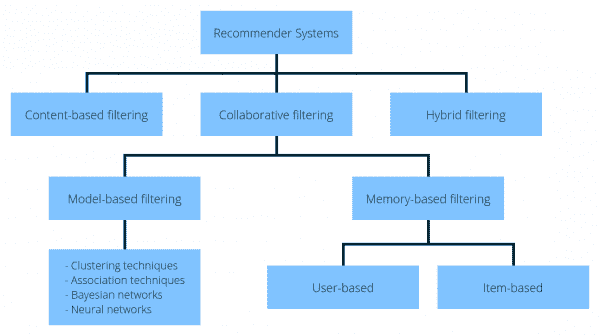

推荐系统类别

图表中展示的每种技术都可以用来构建一个能够向用户推荐笑话的推荐系统模型。让我们简要地探讨各种推荐引擎类别。

# 基于内容的过滤

认知过滤，或基于内容的过滤，通过比较产品属性和客户档案属性来推荐物品。每个产品的属性表示为一组标签或术语——通常是出现在产品描述文档中的单词。客户档案用相同的术语表示，并通过分析客户查看或评分过的产品内容来构建。

# 协同过滤

社会过滤，或称为协同过滤，通过使用其他人的推荐来过滤信息。协同过滤背后的原理是，过去欣赏过相同物品的客户在未来也有很高的可能性表现出相似的兴趣。

我们通常在观看电影之前向朋友寻求评论和推荐。朋友的推荐比其他人的推荐更容易被接受，因为我们与朋友有共同兴趣。这就是协同过滤工作的相同原理。

协同过滤可以进一步分为基于记忆和基于模型两种，如下所示：

+   **基于记忆**：在此方法中，使用用户评分信息来计算用户或物品之间的相似度。然后使用这种计算出的相似度来提出推荐。

+   **基于模型**：数据挖掘方法被应用于识别数据中的模式，然后使用学习到的模式来生成推荐。

# 混合过滤

在这类推荐系统中，我们结合了多种类型的推荐系统来得出最终的推荐。

# 开始

要开始，您需要从 GitHub 链接下载支持文件。

# 理解笑话推荐问题和数据集

肯·戈德堡博士及其同事，特蕾莎·罗德、德鲁夫·古普塔和克里斯·珀金斯，通过他们的论文《Eigentaste：一种常数时间协同过滤算法》向世界介绍了一个数据集，这篇论文在推荐系统领域相当受欢迎。这个数据集被称为 Jester 笑话数据集。为了创建它，向许多用户展示了几个笑话，并要求他们进行评分。用户提供的各种笑话的评分构成了数据集。该数据集的数据收集于 1999 年 4 月至 2003 年 5 月之间。以下是该数据集的属性：

+   来自 79,681 个用户的 150 个笑话的超过 11,000,000 个评分

+   每一行代表一个用户（行 1 = 用户 #1）

+   每一列代表一个笑话（列 1 = 笑话 #1）

+   评分以从 -10.00 到 +10.00 的实数值给出；-10 是最低可能的评分，10 是最高评分

+   99 代表空评分

R 中的 `recommenderlab` 包提供了由肯·戈德堡博士小组提供的原始数据集的一个子集。我们将利用这个子集来完成本章中涉及的项目。

`recommenderlab` 库中提供的 `Jester5k` 数据集包含一个 5,000 x 100 的评分矩阵（5,000 个用户和 100 个笑话），评分介于 -10.00 到 +10.00 之间。所有选定的用户都评了 36 个或更多的笑话。该数据集以 `realRatingMatrix` 格式存在。这是 `recommenderlab` 预期数据应采用的特殊矩阵格式，以便应用库中打包的各种函数。

如我们所知，**探索性数据分析**（**EDA**）是任何数据科学项目的第一步。根据这一原则，让我们首先读取数据，然后对数据集进行 EDA 步骤：

```py
# including the required libraries
library(data.table)
library(recommenderlab)
# setting the seed so as to reproduce the results
set.seed(54)
# reading the data to a variable
library(recommenderlab)
data(Jester5k)
str(Jester5k)
```

这将产生以下输出：

```py
Formal class 'realRatingMatrix' [package "recommenderlab"] with 2 slots
  ..@ data     :Formal class 'dgCMatrix' [package "Matrix"] with 6 slots
  .. .. ..@ i       : int [1:362106] 0 1 2 3 4 5 6 7 8 9 ...
  .. .. ..@ p       : int [1:101] 0 3314 6962 10300 13442 18440 22513 27512 32512 35685 ...
  .. .. ..@ Dim     : int [1:2] 5000 100
  .. .. ..@ Dimnames:List of 2
  .. .. .. ..$ : chr [1:5000] "u2841" "u15547" "u15221" "u15573" ...
  .. .. .. ..$ : chr [1:100] "j1" "j2" "j3" "j4" ...
  .. .. ..@ x       : num [1:362106] 7.91 -3.2 -1.7 -7.38 0.1 0.83 2.91 -2.77 -3.35 -1.99 ...
  .. .. ..@ factors : list()
  ..@ normalize: NULL
```

数据结构输出相当直观，我们看到它为我们已经讨论过的细节提供了经验证据。让我们继续我们的 EDA：

```py
# Viewing the first 5 records in the dataset
head(getRatingMatrix(Jester5k),5)
```

这将产生以下输出：

```py
2.5 x 100 sparse Matrix of class "dgCMatrix"
   [[ suppressing 100 column names ‘j1’, ‘j2’, ‘j3’ ... ]]                                                                                                           
u2841   7.91  9.17  5.34  8.16 -8.74  7.14  8.88 -8.25  5.87  6.21  7.72  6.12 -0.73  7.77 -5.83 -8.88  8.98
u15547 -3.20 -3.50 -9.56 -8.74 -6.36 -3.30  0.78  2.18 -8.40 -8.79 -7.04 -6.02  3.35 -4.61  3.64 -6.41 -4.13
u15221 -1.70  1.21  1.55  2.77  5.58  3.06  2.72 -4.66  4.51 -3.06  2.33  3.93  0.05  2.38 -3.64 -7.72  0.97
u15573 -7.38 -8.93 -3.88 -7.23 -4.90  4.13  2.57  3.83  4.37  3.16 -4.90 -5.78 -5.83  2.52 -5.24  4.51  4.37
u21505  0.10  4.17  4.90  1.55  5.53  1.50 -3.79  1.94  3.59  4.81 -0.68 -0.97 -6.46 -0.34 -2.14 -2.04 -2.57                                
u2841  -9.32 -9.08 -9.13 7.77  8.59  5.29  8.25  6.02  5.24  7.82  7.96 -8.88  8.25  3.64 -0.73  8.25  5.34 -7.77
u15547 -0.15 -1.84 -1.84 1.84 -1.21 -8.59 -5.19 -2.18  0.19  2.57 -5.78  1.07 -8.79  3.01  2.67 -9.22 -9.32  3.69
u15221  2.04  1.94  4.42 1.17  0.10 -5.10 -3.25  3.35  3.30 -1.70  3.16 -0.29  1.36  3.54  6.17 -2.72  3.11  4.81
u15573  4.95  5.49 -0.49 3.40 -2.14  5.29 -3.11 -4.56 -5.44 -6.89 -0.24 -5.15 -3.59 -8.20  2.18  0.39 -1.21 -2.62
u21505 -0.15  2.43  3.16 1.50  4.37 -0.10 -2.14  3.98  2.38  6.84 -0.68  0.87  3.30  6.21  5.78 -6.21 -0.78 -1.36
## number of ratings
print(nratings(Jester5k))
```

这将产生以下输出：

```py
362106## number of ratings per user
```

我们将使用以下命令打印数据集的摘要：

```py
print(summary(rowCounts(Jester5k)))
```

这将产生以下输出：

```py
   Min. 1st Qu.  Median    Mean 3rd Qu.    Max.
  36.00   53.00   72.00   72.42  100.00  100.00
```

现在，我们将绘制直方图：

```py
## rating distribution
hist(getRatings(Jester5k), main="Distribution of ratings")
```

这将产生以下输出：

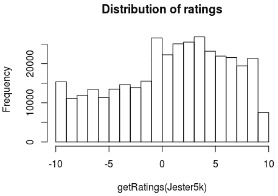

从输出中，我们可以看到一种相对正常的分布。我们还可以看到，正面评分的数量超过了负面评分的数量。

The `Jester5K` dataset also provides a character vector called `JesterJokes`. The vector is of length 100\. These are the actual 100 jokes among others that were shown to the users to get the ratings. We could examine the jokes with the following command:

```py
head(JesterJokes,5)
```

这将产生以下输出：

```py
j1 "A man visits the doctor. The doctor says \"I have bad news for you.You have cancer and Alzheimer's disease\". The man replies \"Well,thank God I don't have cancer!\""
j2 "This couple had an excellent relationship going until one day he came home from work to find his girlfriend packing. He asked her why she was leaving him and she told him that she had heard awful things about him. \"What could they possibly have said to make you move out?\" \"They told me that you were a pedophile.\" He replied, \"That's an awfully big word for a ten year old.\""
j3  "Q. What's 200 feet long and has 4 teeth? A. The front row at a Willie Nelson Concert."
j4 "Q. What's the difference between a man and a toilet? A. A toilet doesn't follow you around after you use it."
j5 "Q. What's O. J. Simpson's Internet address? A. Slash, slash, backslash, slash, slash, escape."
```

基于我们拥有的 5,000 个用户评分，我们可以进行额外的 EDA 来识别用户评分最高的笑话。这可以通过以下代码完成：

```py
## 'best' joke with highest average rating
best <- which.max(colMeans(Jester5k))
cat(JesterJokes[best])
```

这将产生以下输出：

```py
A guy goes into confession and says to the priest, "Father, I'm 80 years old, widower, with 11 grandchildren. Last night I met two beautiful flight attendants. They took me home and I made love to both of them. Twice." The priest said: "Well, my son, when was the last time you were in confession?" "Never Father, I'm Jewish." "So then, why are you telling me?" "I'm telling everybody."
```

我们可以执行额外的 EDA（探索性数据分析）来可视化单变量和多变量分析。这次探索将帮助我们详细了解每个变量以及它们之间的关系。虽然我们不会深入探讨这些方面的每一个，但以下是一些可以探索的想法：

+   探索总是对大多数笑话给出高评分的用户

+   对笑话提供的评分之间的相关性

+   识别非常挑剔的用户

+   探索最受欢迎或最不受欢迎的笑话

+   识别评分最少的笑话以及它们之间的关联

# 转换 DataFrame

我们将在本章中使用名为 `recommenderlab` 的 R 库中的函数来构建推荐引擎项目。无论我们实现哪种推荐系统类别，数据集都需要满足一些先决条件，以便能够应用 `recommenderlab` 函数。用于协同过滤的预构建 `recommenderlab` 函数期望输入 `realRatingMatrix`。在我们的案例中，`Jester5k` 数据集已经处于这种格式，因此，我们可以直接使用这个矩阵来应用 `recommenderlab` 函数。

如果我们的数据以 R DataFrame 的形式存在，并且我们打算将其转换为 `realRatingMatrix`，则可以执行以下步骤：

1.  将 DataFrame 转换为 R 矩阵，如下所示：

```py
# convert the df dataframe to a matrix
r_mat <- as.matrix(df)
```

1.  使用 `as()` 函数将结果矩阵转换为 `realRatingMatrix`，如下所示：

```py
# convert r_mat matrix to a recommenderlab realRatingMatrix
r_real_mat <- as(r_mat,"realRatingMatrix")
```

在这里，我们假设 DataFrame 的名称为 `df`，代码将将其转换为 `realRatingMatrix`，这可以作为 `recommenderlab` 函数的输入。

# 划分 DataFrame

另一个先决条件是将数据集划分为训练集和测试集。这些子集将在后续部分用于实现我们的推荐系统并衡量性能。`recommenderlab` 库中的 `evaluationScheme()` 函数可以用来将数据集划分为训练集和测试集。可以向此函数传递多个用户指定的参数。在下面的代码中，`realRatingMatrix` 根据一个 80/20 的训练/测试分割进行分割，每个用户最多推荐 20 项。此外，我们指定任何大于 `0` 的评分应被视为正面评分，符合预定义的 `[-10, 10]` 评分范围。《Jester5k》数据集可以通过以下代码划分为训练集和测试集：

```py
# split the data into the training and the test set
Jester5k_es <- evaluationScheme(Jester5k, method="split", train=0.8, given=20, goodRating=0)
# verifying if the train - test was done successfully
print(Jester5k_es)
```

这将产生以下输出：

```py
Evaluation scheme with 20 items given
Method: ‘split’ with 1 run(s).
Training set proportion: 0.800
Good ratings: >=0.000000
Data set: 5000 x 100 rating matrix of class ‘realRatingMatrix’ with 362106 ratings.
```

从 `evaluationScheme()` 函数的输出中，我们可以观察到该函数生成了一个包含训练集和测试集的单一 R 对象。这个对象将被用来定义和评估各种推荐模型。

# 使用基于项目的协同过滤技术构建推荐系统

R 的`recommenderlab`包提供了**基于物品的协同过滤**（**ITCF**）选项来构建推荐系统。这是一个非常直接的方法，只需要我们调用函数并提供必要的参数。通常，这些参数将对模型的表现产生很大影响；因此，测试每个参数组合是获得最佳推荐模型的关键。以下是可以传递给`Recommender`函数的参数：

+   **数据归一化**：归一化评分矩阵是准备数据以供推荐引擎使用的关键步骤。归一化过程通过消除评分偏差来处理矩阵中的评分。此参数的可能值是`NULL`、`Center`和`Z-Score`。

+   **距离**：这表示模型中要使用的相似度度量类型。此参数的可能值是余弦相似度、欧几里得距离和皮尔逊相关系数。

使用这些参数组合，我们可以构建和测试 3x3 的 ITCF 模型。ITCF 背后的基本直觉是，如果一个人喜欢物品 A，那么他们也很可能喜欢物品 B，只要 A 和 B 是相似的。这里的“相似”一词并不表示基于物品属性的相似性，而是指用户偏好的相似性，例如，喜欢物品 A 的一组人也喜欢物品 B。以下图显示了 ITCF 的工作原理：


示例显示基于物品的协同过滤的工作原理

让我们更详细地探索一下这个图。在 ITCF 中，西瓜和葡萄将形成相似物品的邻域，这意味着无论用户是谁，等效的不同物品都将形成一个邻域。所以当用户 X 喜欢西瓜时，来自同一邻域的其他物品，即葡萄，将由基于物品的协同过滤推荐系统推荐。

ITCF 涉及以下三个步骤：

1.  **通过距离度量计算基于物品的相似度**：这涉及到计算物品之间的距离。距离可以通过多种距离度量之一来计算，例如余弦相似度、欧几里得距离、曼哈顿距离或 Jaccard 指数。这一步骤的输出是获得一个相似度矩阵，其中每个单元格对应于单元格行上指定的物品与单元格列上指定的物品之间的相似度。

1.  **预测特定用户的目标物品评分**：评分是通过计算对与目标物品非常相似的物品所做的评分的加权总和得出的。

1.  **推荐前 N 个最佳物品**：一旦所有物品都被预测出来，我们就推荐前*N*个物品。

现在，让我们构建每个 ITCF 模型，并使用测试数据集来衡量其性能。以下代码使用几个参数组合训练 ITCF 模型：

```py
type = "IBCF"
##train ITCF cosine similarity models
# non-normalized
ITCF_N_C <- Recommender(getData(Jester5k_es, "train"), type,
                        param=list(normalize = NULL, method="Cosine"))
# centered
ITCF_C_C <- Recommender(getData(Jester5k_es, "train"), type,
                        param=list(normalize = "center",method="Cosine"))
# Z-score normalization
ITCF_Z_C <- Recommender(getData(Jester5k_es, "train"), type,
                        param=list(normalize = "Z-score",method="Cosine"))
##train ITCF Euclidean Distance models
# non-normalized
ITCF_N_E <- Recommender(getData(Jester5k_es, "train"), type,
                        param=list(normalize = NULL, method="Euclidean"))
# centered
ITCF_C_E <- Recommender(getData(Jester5k_es, "train"), type,
                        param=list(normalize = "center",method="Euclidean"))
# Z-score normalization
ITCF_Z_E <- Recommender(getData(Jester5k_es, "train"), type,
                        param=list(normalize = "Z-score",method="Euclidean"))
#train ITCF pearson correlation models
# non-normalized
ITCF_N_P <- Recommender(getData(Jester5k_es, "train"), type,
                        param=list(normalize = NULL, method="pearson"))
# centered
ITCF_C_P <- Recommender(getData(Jester5k_es, "train"), type,
                        param=list(normalize = "center",method="pearson"))
# Z-score normalization
ITCF_Z_P <- Recommender(getData(Jester5k_es, "train"), type,
                        param=list(normalize = "Z-score",method="pearson"))
```

我们现在有了 ITCF 模型，所以让我们计算我们创建的每个模型在测试数据上的性能。目标是确定适用于此数据集的最佳性能 ITCF 模型。以下代码在测试数据集上获取所有九个模型的性能测量结果：

```py
# compute predicted ratings from each of the 9 models on the test dataset
pred1 <- predict(ITCF_N_C, getData(Jester5k_es, "known"), type="ratings")
pred2 <- predict(ITCF_C_C, getData(Jester5k_es, "known"), type="ratings")
pred3 <- predict(ITCF_Z_C, getData(Jester5k_es, "known"), type="ratings")
pred4 <- predict(ITCF_N_E, getData(Jester5k_es, "known"), type="ratings")
pred5 <- predict(ITCF_C_E, getData(Jester5k_es, "known"), type="ratings")
pred6 <- predict(ITCF_Z_E, getData(Jester5k_es, "known"), type="ratings")
pred7 <- predict(ITCF_N_P, getData(Jester5k_es, "known"), type="ratings")
pred8 <- predict(ITCF_C_P, getData(Jester5k_es, "known"), type="ratings")
pred9 <- predict(ITCF_Z_P, getData(Jester5k_es, "known"), type="ratings")
# set all predictions that fall outside the valid range to the boundary values
pred1@data@x[pred1@data@x[] < -10] <- -10
pred1@data@x[pred1@data@x[] > 10] <- 10
pred2@data@x[pred2@data@x[] < -10] <- -10
pred2@data@x[pred2@data@x[] > 10] <- 10
pred3@data@x[pred3@data@x[] < -10] <- -10
pred3@data@x[pred3@data@x[] > 10] <- 10
pred4@data@x[pred4@data@x[] < -10] <- -10
pred4@data@x[pred4@data@x[] > 10] <- 10
pred5@data@x[pred5@data@x[] < -10] <- -10
pred5@data@x[pred5@data@x[] > 10] <- 10
pred6@data@x[pred6@data@x[] < -10] <- -10
pred6@data@x[pred6@data@x[] > 10] <- 10
pred7@data@x[pred7@data@x[] < -10] <- -10
pred7@data@x[pred7@data@x[] > 10] <- 10
pred8@data@x[pred8@data@x[] < -10] <- -10
pred8@data@x[pred8@data@x[] > 10] <- 10
pred9@data@x[pred9@data@x[] < -10] <- -10
pred9@data@x[pred9@data@x[] > 10] <- 10
# aggregate the performance measurements obtained from all the models
error_ITCF <- rbind(
  ITCF_N_C = calcPredictionAccuracy(pred1, getData(Jester5k_es, "unknown")),
  ITCF_C_C = calcPredictionAccuracy(pred2, getData(Jester5k_es, "unknown")),
  ITCF_Z_C = calcPredictionAccuracy(pred3, getData(Jester5k_es, "unknown")),
  ITCF_N_E = calcPredictionAccuracy(pred4, getData(Jester5k_es, "unknown")),
  ITCF_C_E = calcPredictionAccuracy(pred5, getData(Jester5k_es, "unknown")),
  ITCF_Z_E = calcPredictionAccuracy(pred6, getData(Jester5k_es, "unknown")),
  ITCF_N_P = calcPredictionAccuracy(pred7, getData(Jester5k_es, "unknown")),
  ITCF_C_P = calcPredictionAccuracy(pred8, getData(Jester5k_es, "unknown")),
  ITCF_Z_P = calcPredictionAccuracy(pred9, getData(Jester5k_es, "unknown"))
)
library(knitr)
kable(error_ITCF)
```

这将产生以下输出：

```py
|         |     RMSE|      MSE|      MAE|
|:--------|--------:|--------:|--------:|
|ITCF_N_C | 4.533455| 20.55221| 3.460860|
|ITCF_C_C | 5.082643| 25.83326| 4.012391|
|ITCF_Z_C | 5.089552| 25.90354| 4.021435|
|ITCF_N_E | 4.520893| 20.43848| 3.462490|
|ITCF_C_E | 4.519783| 20.42844| 3.462271|
|ITCF_Z_E | 4.527953| 20.50236| 3.472080|
|ITCF_N_P | 4.582121| 20.99583| 3.522113|
|ITCF_C_P | 4.545966| 20.66581| 3.510830|
|ITCF_Z_P | 4.569294| 20.87845| 3.536400|
```

我们看到，在具有欧几里得距离的数据上运行的 ITCF 推荐应用产生了最佳的性能测量结果。

# 基于用户协同过滤技术构建推荐系统

我们之前构建的基于项目的过滤器的笑话推荐系统，使用了 R 中可用的强大`recommenderlab`库。在这个**基于用户的协同过滤**（**UBCF**）方法的实现中，我们使用了相同的库。

以下图表显示了 UBCF 的工作原理：

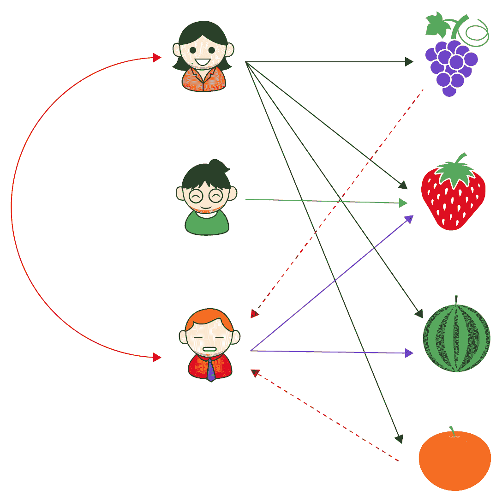

展示用户基于协同过滤器工作原理的示例

为了更好地理解这个概念，让我们详细讨论前面的图表。假设有三个用户：X、Y 和 Z。在 UBCF 中，用户 X 和 Z 非常相似，因为他们都喜欢草莓和西瓜。用户 X 还喜欢葡萄和橙子。因此，基于用户的协同过滤器向用户 Z 推荐葡萄和橙子。这个想法是，相似的人倾向于喜欢相似的事物。

用户协同过滤器和项目协同过滤器之间的主要区别可以通过以下在线零售网站上常见的推荐标题来展示：

+   **ITCF**：购买此商品的用户还购买了

+   **UBCF**：与您相似的用户购买了

基于以下三个关键步骤构建用户协同过滤器：

1.  使用相似性函数*w*测量用户*x*与每个用户对之间的距离，找到**k 个最近邻**（**KNN**）：

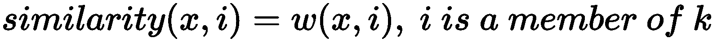

1.  预测用户*x*将对 KNN 已评分但*x*未评分的所有项目提供的评分。

1.  向用户*x*推荐的*N*个项目是具有最佳预测评分的前*N*个项目。

简而言之，在 UBCF 过程中构建了用户-项目矩阵，并根据相似用户预测用户的未查看项目的评分。在预测中获得最高评分的项目构成了最终的推荐列表。

该项目的实现与 ITCF 非常相似，因为我们使用了相同的库。代码中唯一需要更改的是将 IBCF 方法更改为使用 UBCF。以下代码块是使用 UBCF 的项目实现的全代码：

```py
library(recommenderlab)
data(Jester5k)
# split the data into the training and the test set
Jester5k_es <- evaluationScheme(Jester5k, method="split", train=0.8, given=20, goodRating=0)
print(Jester5k_es)
type = "UBCF"
#train UBCF cosine similarity models
# non-normalized
UBCF_N_C <- Recommender(getData(Jester5k_es, "train"), type,
                        param=list(normalize = NULL, method="Cosine"))
# centered
UBCF_C_C <- Recommender(getData(Jester5k_es, "train"), type,
                        param=list(normalize = "center",method="Cosine"))
# Z-score normalization
UBCF_Z_C <- Recommender(getData(Jester5k_es, "train"), type,
                        param=list(normalize = "Z-score",method="Cosine"))
#train UBCF Euclidean Distance models
# non-normalized
UBCF_N_E <- Recommender(getData(Jester5k_es, "train"), type,
                        param=list(normalize = NULL, method="Euclidean"))
# centered
UBCF_C_E <- Recommender(getData(Jester5k_es, "train"), type,
                        param=list(normalize = "center",method="Euclidean"))
# Z-score normalization
UBCF_Z_E <- Recommender(getData(Jester5k_es, "train"), type,
                        param=list(normalize = "Z-score",method="Euclidean"))
#train UBCF pearson correlation models
# non-normalized
UBCF_N_P <- Recommender(getData(Jester5k_es, "train"), type,
                        param=list(normalize = NULL, method="pearson"))
# centered
UBCF_C_P <- Recommender(getData(Jester5k_es, "train"), type,
                        param=list(normalize = "center",method="pearson"))
# Z-score normalization
UBCF_Z_P <- Recommender(getData(Jester5k_es, "train"), type,
                        param=list(normalize = "Z-score",method="pearson"))
# compute predicted ratings from each of the 9 models on the test dataset
pred1 <- predict(UBCF_N_C, getData(Jester5k_es, "known"), type="ratings")
pred2 <- predict(UBCF_C_C, getData(Jester5k_es, "known"), type="ratings")
pred3 <- predict(UBCF_Z_C, getData(Jester5k_es, "known"), type="ratings")
pred4 <- predict(UBCF_N_E, getData(Jester5k_es, "known"), type="ratings")
pred5 <- predict(UBCF_C_E, getData(Jester5k_es, "known"), type="ratings")
pred6 <- predict(UBCF_Z_E, getData(Jester5k_es, "known"), type="ratings")
pred7 <- predict(UBCF_N_P, getData(Jester5k_es, "known"), type="ratings")
pred8 <- predict(UBCF_C_P, getData(Jester5k_es, "known"), type="ratings")
pred9 <- predict(UBCF_Z_P, getData(Jester5k_es, "known"), type="ratings")
# set all predictions that fall outside the valid range to the boundary values
pred1@data@x[pred1@data@x[] < -10] <- -10
pred1@data@x[pred1@data@x[] > 10] <- 10
pred2@data@x[pred2@data@x[] < -10] <- -10
pred2@data@x[pred2@data@x[] > 10] <- 10
pred3@data@x[pred3@data@x[] < -10] <- -10
pred3@data@x[pred3@data@x[] > 10] <- 10
pred4@data@x[pred4@data@x[] < -10] <- -10
pred4@data@x[pred4@data@x[] > 10] <- 10
pred5@data@x[pred5@data@x[] < -10] <- -10
pred5@data@x[pred5@data@x[] > 10] <- 10
pred6@data@x[pred6@data@x[] < -10] <- -10
pred6@data@x[pred6@data@x[] > 10] <- 10
pred7@data@x[pred7@data@x[] < -10] <- -10
pred7@data@x[pred7@data@x[] > 10] <- 10
pred8@data@x[pred8@data@x[] < -10] <- -10
pred8@data@x[pred8@data@x[] > 10] <- 10
pred9@data@x[pred9@data@x[] < -10] <- -10
pred9@data@x[pred9@data@x[] > 10] <- 10
# aggregate the performance statistics
error_UBCF <- rbind(
  UBCF_N_C = calcPredictionAccuracy(pred1, getData(Jester5k_es, "unknown")),
  UBCF_C_C = calcPredictionAccuracy(pred2, getData(Jester5k_es, "unknown")),
  UBCF_Z_C = calcPredictionAccuracy(pred3, getData(Jester5k_es, "unknown")),
  UBCF_N_E = calcPredictionAccuracy(pred4, getData(Jester5k_es, "unknown")),
  UBCF_C_E = calcPredictionAccuracy(pred5, getData(Jester5k_es, "unknown")),
  UBCF_Z_E = calcPredictionAccuracy(pred6, getData(Jester5k_es, "unknown")),
  UBCF_N_P = calcPredictionAccuracy(pred7, getData(Jester5k_es, "unknown")),
  UBCF_C_P = calcPredictionAccuracy(pred8, getData(Jester5k_es, "unknown")),
  UBCF_Z_P = calcPredictionAccuracy(pred9, getData(Jester5k_es, "unknown"))
)
library(knitr)
print(kable(error_UBCF))
```

这将产生以下输出：

```py
|         |     RMSE|      MSE|      MAE|
|:--------|--------:|--------:|--------:|
|UBCF_N_C | 4.877935| 23.79425| 3.986170|
|UBCF_C_C | 4.518210| 20.41422| 3.578551|
|UBCF_Z_C | 4.517669| 20.40933| 3.552120|
|UBCF_N_E | 4.644877| 21.57488| 3.778046|
|UBCF_C_E | 4.489157| 20.15253| 3.552543|
|UBCF_Z_E | 4.496185| 20.21568| 3.528534|
|UBCF_N_P | 4.927442| 24.27968| 4.074879|
|UBCF_C_P | 4.487073| 20.13382| 3.553429|
|UBCF_Z_P | 4.484986| 20.11510| 3.525356|
```

根据 UBCF 输出，我们观察到使用皮尔逊相关系数作为距离的 Z 分数归一化数据产生了最佳性能度量。此外，如果我们愿意，可以比较 UBCF 和 ITCF 的结果（需要在同一测试数据集上进行测试），以得出接受为最终推荐引擎部署构建的 18 个模型中最佳模型的结论。

在代码中需要注意的关键点是传递给`method`参数的`UBCF`值。在先前的项目中，我们构建了一个基于项目的协同过滤器；我们只需要将传递给`method`参数的值替换为 IBCF。

# 基于关联规则挖掘技术构建推荐系统

关联规则挖掘，或市场篮子分析，是一种在零售业中用于识别需要放在一起以鼓励交叉销售的产品的高度流行数据挖掘技术。这个算法的一个有趣方面是，通过挖掘历史发票来识别一起购买的产品。

有几种现成的算法可用于执行市场篮子分析。其中一些是 Apriori，**等价类转换**（**ECLAT**），和**频繁模式增长**（**FP-growth**）。我们将通过在 Jester 笑话数据集上应用 Apriori 算法来学习如何通过推荐笑话给用户来解决问题。我们现在将学习支撑 Apriori 算法的理论方面。

# Apriori 算法

算法的构建块是任何给定事务中找到的项目。每个事务可能包含一个或多个项目。形成事务的项目称为项目集。一个事务的例子是发票。

给定事务数据集，目标是找到数据中相互关联的项目。关联性通过项目在相同上下文中的出现频率来衡量。例如，在购买另一个产品时购买一个产品代表一个关联规则。关联规则检测项目的共同使用情况。

更正式地说，我们可以将关联规则挖掘定义为，给定一个项目集 I = {I1, I2, .., Im}和事务数据库 D = {t1, t2, .., tn}，其中 ti = {Ii1, Ii2, .., Iim}，其中 Iik 是 I 的元素，一个关联是 X->Y 的蕴涵，其中 X 和 Y 是 I 的子集，且 X 和 Y 的交集是φ。简而言之，关联表达了从 X->Y 的蕴涵，其中 X 和 Y 是项目集。

通过一个例子可以更好地理解算法。所以，让我们考虑以下表格，它显示了超市中代表性样本事务的列表：

| **事务** | **项目** |
| --- | --- |
| 1 | 牛奶，酸奶，巧克力 |
| 2 | 面包，黄油 |
| 3 | 可乐，果酱 |
| 4 | 面包，牛奶，黄油，可乐 |
| 5 | 面包，牛奶，黄油，果酱 |

超市中的样本事务

让我们尝试探索一些基本概念，这将帮助我们理解 Apriori 算法是如何工作的：

+   **项**：任何单个产品，它是每个交易的一部分。例如，牛奶、可乐和黄油都被称为项。

+   **项集**：一个或多个项目的集合。例如，*{butter, milk, coke}, {butter, milk}*。

+   **支持计数**：项集出现的频率。例如，支持计数或 *σ {butter, bread, milk} = 2*。

+   **支持**：包含项集的交易的比例。例如，*s = {butter, bread, milk} = 2/5*。

+   **频繁项集**：支持度大于最小阈值的项集。

+   **在上下文中项集的支持度**：同时包含 *X* 和 *Y* 的上下文的比例：

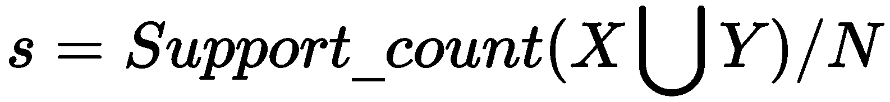

因此，*s* 对于 *{milk, butter} -> {bread}* 将是 s = σ {milk, butter, bread}/N = 2/5 = 0.4

+   **置信度**：衡量规则强度，而支持度衡量它在数据库中应该出现的频率。它通过以下公式计算 *Y* 中项目在包含 *X* 中的出现频率：

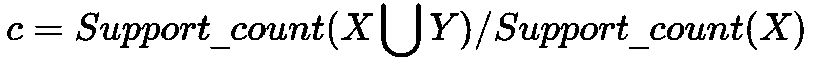

例如：对于 {bread} -> {butter}

*c 或 α = σ {butter, bread} / σ {bread} = 3/3 = 1*

让我们考虑另一个例子，*{curd} -> {bread}* 的置信度：

*c 或 α = σ {curd,bread} / σ {bread} = 0/3 = 0*

Apriori 算法旨在从项目的列表中生成所有可能的项集组合，然后剪枝那些已经达到预定义支持度和置信度参数值的项集。因此，可以理解 Apriori 算法是一个两步算法：

1.  从项目生成项集

1.  基于预定义的支持度和置信度评估和剪枝项集

让我们详细讨论第一步。假设集合中有 *n* 个项目。可以创建的项集数量是 2^*n*，所有这些都需要在第二步中进行评估，以便得出最终结果。即使只考虑 100 个不同的项目，生成的项集数量也是 1.27e+30！巨大的项集数量提出了严重的计算挑战。

Apriori 算法通过预先排除那些通常很少见或不重要的项集来克服这一挑战。Apriori 原则指出，*如果一个项集是频繁的，那么它的所有子集也必须是频繁的*。这意味着如果一个项没有达到预定义的支持度阈值，那么这样的项就不会参与项集的创建。因此，Apriori 算法提出了有限数量的项集，这些项集可以在不遇到计算挑战的情况下进行评估。

算法的第一步本质上是迭代的。在第一次迭代中，它考虑所有长度为 1 的项集，也就是说，每个项集只包含一个项目。然后每个项目都会被评估以排除那些被发现没有达到预设支持阈值的项集。第一次迭代的结果是所有满足所需支持的长度的 1 项集。这成为第二次迭代的输入，现在使用第一次迭代中输出的最终项集形成长度为 2 的项集。在第二步中形成的每个项集都会再次检查支持阈值；如果没有达到，这样的项集就会被排除。迭代会一直持续到无法再创建新的项集。项集的过程在以下图中说明：

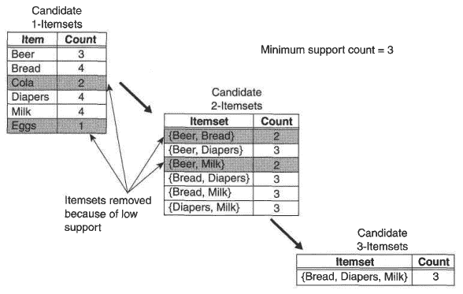

展示 Apriori 算法中项集创建的插图

一旦我们完成了算法的第一步的所有迭代后的所有项集，第二步就开始了。生成的每个项集都会被测试，以检查它是否满足预定义的置信度值。如果它没有达到阈值，这样的项集就会被从最终输出中排除。

在所有迭代都完成并且最终规则是 Apriori 的输出时，我们使用一个称为提升度的指标来从最终输出中消耗相关的规则。提升度定义了在已知另一个项目或项集已被购买的情况下，一个项目或项集相对于其典型购买率购买的可能性有多大。对于每个项集，我们使用以下公式来获取提升度测量值：


让我们更深入地了解提升度指标。假设在一个超市里，牛奶和面包偶然一起被购买。在这种情况下，预计会有大量的交易涵盖购买的牛奶和面包。提升度（牛奶 -> 面包）超过 1 意味着这些商品比这些商品偶然一起购买的情况更频繁地一起被发现。在评估规则以评估其在商业中的有用性时，我们通常会寻找大于 1 的提升度值。高于 1 的提升度值表明生成的项集非常强大，因此值得考虑实施。

现在，让我们使用 Apriori 算法来实现推荐系统：

```py
# load the required libraries
library(data.table)
library(arules)
library(recommenderlab)
# set the seed so that the results are replicable
set.seed(42)
# reading the Jester5k data
data(Jester5k)
class(Jester5k)
```

这将产生以下输出：

```py
[1] "realRatingMatrix"
attr(,"package")
[1] "recommenderlab"
```

从输出中我们可以看到，`recommenderlab`库中的`Jester5k`数据是`realRatingsMatrix`格式。我们也知道这个矩阵中的单元格包含用户为各种笑话提供的评分，并且我们知道评分范围在-10 到+10 之间。

在 `Jester5k` 数据集上应用 Apriori 算法为我们理解笑话之间的关联提供了机会。然而，在应用 Apriori 算法之前，我们需要将数据集转换为二进制值，其中 1 代表正面评分，0 代表负面评分或无评分。`recommenderlab` 库提供了 `binarize()` 函数，它可以为我们执行所需的操作。以下代码将评分矩阵二值化：

```py
# binarizing the Jester ratings
Jester5k_bin <- binarize(Jester5k, minRating=1)
# let us verify the binarized object
class(Jester5k_bin)
```

这将导致以下输出：

```py
[1] "binaryRatingMatrix"
attr(,"package")
[1] "recommenderlab"
```

从输出中我们可以观察到，`realRatingsMatrix` 已成功转换为 `binaryRatingMatrix`。挖掘关联的 Apriori 算法期望输入一个矩阵而不是 `binaryRatingMatrix`。我们可以非常容易地将 `Jester5k_bin` 对象转换为矩阵格式，以下代码可以完成此操作：

```py
# converting the binaryratingsmatrix to matrix format
Jester5k_bin_mat <- as(Jester5k_bin,"matrix")
# visualizing the matrix object
View(Jester5k_bin_mat)
```

这将导致以下输出：

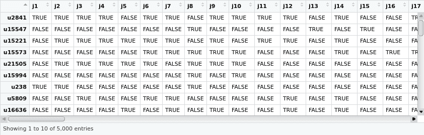

从输出中我们可以看到，矩阵的所有单元格都表示为 `TRUE` 和 `FALSE`，但 Apriori 预期单元格应该是数字的。现在让我们使用以下代码将单元格转换为 `1` 和 `0`，分别代表 `TRUE` 和 `FALSE`：

```py
# converting the cell values to 1 and 0
Jester5k_bin_mat_num <- 1*Jester5k_bin_mat
# viewing the matrix
View(Jester5k_bin_mat_num)
```

这将导致以下输出：

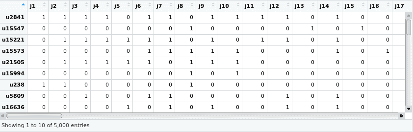

现在我们已经准备好在数据集上应用 Apriori 算法。我们需要向算法传递两个参数，即 `support` 和 `confidence`。算法根据这两个参数值挖掘数据集。我们将 `0.5` 作为支持值的输入，将 `0.8` 作为置信值的输入。以下代码行提取了存在于我们 Jester 笑话数据集中的笑话关联：

```py
rules <- apriori(data = Jester5k_bin_mat_num, parameter = list(supp = 0.005, conf = 0.8))
```

这将导致以下输出：

```py
Apriori
Parameter specification:
 confidence minval smax arem  aval originalSupport maxtime support minlen maxlen target   ext
        0.8    0.1    1 none FALSE            TRUE       5     0.5      1     10  rules FALSE
Algorithmic control:
 filter tree heap memopt load sort verbose
    0.1 TRUE TRUE  FALSE TRUE    2    TRUE
Absolute minimum support count: 2500
set item appearances ...[0 item(s)] done [0.00s].
set transactions ...[100 item(s), 5000 transaction(s)] done [0.02s].
sorting and recoding items ... [29 item(s)] done [0.00s].
creating transaction tree ... done [0.00s].
checking subsets of size 1 2 3 done [0.01s].
writing ... [78 rule(s)] done [0.00s].
creating S4 object  ... done [0.00s].
```

从执行 Apriori 算法创建的 `rules` 对象现在包含了从数据集中提取和挖掘的所有笑话关联。从输出中我们可以看到，总共提取了 `78` 个笑话关联。我们可以使用以下代码行来检查这些规则：

```py
inspect(rules)
```

这将导致以下输出：

```py
     lhs          rhs   support confidence lift     count
[1]  {j48}     => {j50} 0.5068  0.8376860  1.084523 2534
[2]  {j56}     => {j36} 0.5036  0.8310231  1.105672 2518
[3]  {j56}     => {j50} 0.5246  0.8656766  1.120762 2623
[4]  {j42}     => {j50} 0.5150  0.8475971  1.097355 2575
[5]  {j31}     => {j27} 0.5196  0.8255481  1.146276 2598
```

展示的输出只是列表中 78 条规则中的五条。读取每条规则的方式是，左侧列（`lhs`）中显示的笑话导致右侧列（`rhs`）中的笑话；也就是说，喜欢规则左侧 `lhs` 中笑话的用户通常也倾向于喜欢右侧 `rhs` 中显示的笑话。例如，在第一条规则中，如果一个用户喜欢了笑话 `j48`，那么他们很可能也会喜欢 `j50`，因此值得向只阅读了笑话 `j48` 的用户推荐笑话 `j50`。

虽然 Apriori 算法生成了多条规则，但每条规则的强度由一个称为`提升度`的指标来指定。这是一个描述规则在商业环境中价值的指标。请注意，要使规则被认为是通用的，其提升度必须小于或等于`1`。大于 1 的提升度值表示在商业中实施更好的规则。以下代码行旨在将这样的强规则置于列表顶部：

```py
# converting the rules object into a dataframe
rulesdf <- as(rules, "data.frame")
# employing quick sort on the rules dataframe. lift and confidence are
# used as keys to sort the dataframe. - in the command indicates that we
# want lift and confidence to be sorted in descending order
rulesdf[order(-rulesdf$lift, -rulesdf$confidence), ]
```

这将产生以下输出：

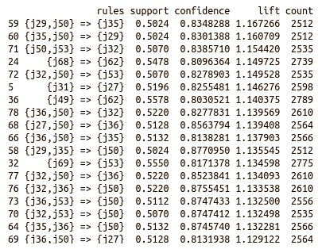

可以观察到，显示的输出只是规则输出的子集。第一条规则表明`j35`是一个可以推荐给已经阅读过笑话`j29`和`j50`的用户笑话。

同样，我们也可以编写一个脚本来搜索用户已经阅读的所有笑话，并将其与规则的左侧进行匹配；如果找到匹配项，则可以将规则的对应右侧推荐给用户作为笑话。

# 基于内容的推荐引擎

仅基于从客户那里收到的显式或隐式反馈的推荐引擎被称为**基于内容的推荐系统**。显式反馈是客户通过填写关于偏好的调查问卷、对感兴趣的笑话进行评分或选择与笑话相关的通讯录、将笑话添加到观察列表等方式表达的兴趣。隐式反馈则是一种更为温和的方法，例如客户访问一个页面、点击笑话链接，或者在电子商务页面上阅读笑话评论所花费的时间。根据收到的反馈，向客户推荐类似的笑话。需要注意的是，基于内容的推荐不考虑系统中其他客户的偏好和反馈；相反，它完全基于特定客户的个性化反馈。

在推荐过程中，系统会识别出客户已经对某些产品给予好评的产品，以及客户尚未评价的产品，并寻找等效产品。与好评产品相似的产品会被推荐给客户。在这个模型中，客户的偏好和行为在逐步微调推荐中起着重要作用——也就是说，每次推荐后，根据客户是否对推荐做出响应，系统会逐步学习以提供不同的推荐。以下图表展示了基于内容的推荐系统是如何工作的：

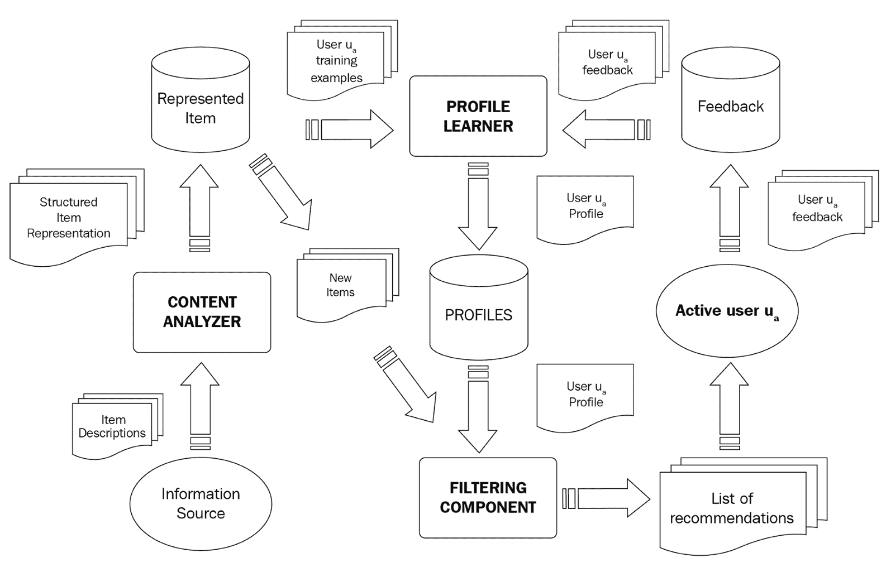

基于内容的推荐系统的工作原理

在我们的愚人笑话数据集中，我们包含了用户对各种笑话的评分以及笑话本身的内容。请记住，`JesterJokes`字符向量包含了笑话本身存在的文本。笑话中存在的文本相似性可以用作向用户推荐笑话的一种方法。假设是，如果一个人喜欢笑话中的内容，并且如果还有另一个笑话的内容非常相似，那么推荐这个后者的笑话可能会被用户喜欢。

Jester 笑话数据集中没有提供与笑话相关的额外元数据，然而，可以从笑话的内容中创建这样的元数据。例如，笑话的长度、笑话中名词的数量、笑话中出现的幽默词汇数量以及笑话的中心主题。文本处理不仅仅是推荐领域，它还涉及到使用 NLP 技术。由于我们将在不同的章节中介绍 NLP，因此我们在这里不会涉及它。

# 区分基于 ITCF 和基于内容的推荐

可能看起来基于项目的协同推荐和基于内容的推荐是相同的。实际上，它们并不相同。让我们谈谈它们之间的区别。

ITCF 完全基于用户-项目排名。当我们计算项目之间的相似度时，我们不包含项目属性，只是基于所有顾客的评分来计算项目的相似度。因此，项目的相似度是基于评分而不是项目本身的元数据来计算的。

在基于内容的推荐中，我们使用用户和项目的相关内容。通常，我们使用共享属性空间的内容来构建用户配置文件和项目配置文件。例如，对于一部电影，我们可以用其中的演员和类型（例如使用二进制编码）来表示它。对于用户配置文件，我们可以根据用户进行同样的操作，例如一些演员/类型。然后可以使用余弦相似度等方法计算用户和项目的相似度。这种余弦度量导致推荐的产生。

基于内容的过滤通过识别每个产品上分配的标签来识别相似的产品。每个产品根据每个标签的词频和逆文档频率分配权重。之后，计算用户喜欢产品的概率，以便得出最终的推荐列表。

尽管基于内容的推荐系统非常高效且个性化，但这种模型存在一个固有的问题。让我们通过一个例子来了解基于内容的推荐中过度专业化的难题。

假设有以下五种电影类型：

+   喜剧

+   惊悚片

+   科幻

+   动作

+   爱情

有这样一个客户，杰克，他通常观看惊悚片和科幻电影。基于这个偏好，基于内容的推荐引擎只会推荐与这些类型相关的电影，并且永远不会推荐其他类别的电影。这个问题是由于基于内容的推荐引擎仅依赖于用户的过去行为和偏好来确定推荐。

与基于内容的推荐系统不同，在 ITCF 推荐中，基于顾客的积极偏好构建相似产品的邻域。因此，系统会生成可能被顾客偏好的邻域中的产品推荐。ITCF 通过利用不同用户给出的评分之间的相关性来实现这一点，而协同过滤则依赖于用户过去的偏好或评分相关性，它能够从顾客的兴趣领域生成相似产品的推荐。如果产品不受欢迎且很少用户对其给出反馈，这种技术可能导致不良预测。

# 为笑话推荐构建混合推荐系统

我们可以看到，基于内容的过滤和协同过滤都有其优点和缺点。为了克服这些问题，组织构建了结合两种或更多技术的推荐系统，这些系统被称为混合推荐模型。一个例子是结合基于内容、IBCF、UBCF 和基于模型的推荐引擎。这考虑了所有可能影响为用户做出最相关推荐的方面。以下图表展示了混合推荐引擎中遵循的示例方法：

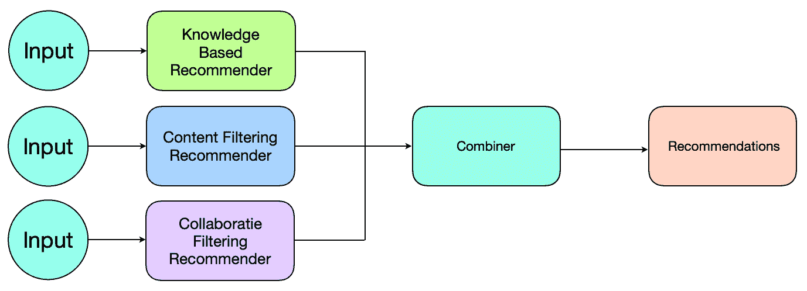

混合推荐引擎的示例方法

我们需要注意到，实现混合推荐引擎没有标准的方法。为了结合推荐，以下是一些建议的策略：

+   **投票**：对从各个推荐系统中获得的推荐输出进行投票。

+   **基于规则的选取**：我们可以制定规则，建议对从各个推荐系统中获得的推荐输出进行加权。在这种情况下，获得更高权重的推荐系统的输出将占主导地位，并对最终推荐结果产生更大的影响。

+   **组合**：将所有推荐引擎的推荐结果一起展示。最终的推荐列表只是从各个推荐系统中获得的所有推荐输出的并集。

+   **属性集成**：从所有推荐系统中提取元数据，将其作为输入提供给另一个推荐系统。

再次强调，对某个问题有效的方法可能对另一个问题不一定适用，因此这些策略在提出最终推荐策略之前需要单独进行测试。

`recommenderlab`库提供了`HybridRecommender`函数，允许用户一次性在相同的数据集上训练多个推荐器引擎并组合预测。该函数有一个权重参数，提供了一种指定将用于组合单个预测以到达最终推荐预测（针对未见数据）的每个模型的权重的途径。实现基于混合推荐引擎的项目非常简单，与我们在基于项目的协同过滤或基于用户的协同过滤项目中学习到的代码没有太大区别。无论如何，让我们编写代码并构建一个针对`Jester5k`数据集的混合推荐引擎：

```py
# including the required libraries
library(recommenderlab)
# accessing the Jester5k dataset that is a part of recommenderlab library
data(Jester5k)
# split the data into the training and the test set
Jester5k_es <- evaluationScheme(Jester5k, method="split", train=0.8, given=20, goodRating=0)
```

之前的代码是用来训练混合推荐器的。这就是它与我们所构建的`ITCF`或`UBCF`推荐器不同的地方。从代码中我们可以观察到，我们使用了四种不同的推荐器方法，这些方法将构成混合推荐器。让我们逐一讨论这些方法：

+   流行推荐方法简单地推荐流行的笑话（由收到的评分数量决定）给用户。

+   我们使用的第二种推荐器方法是基于项目的协同过滤方法，使用非归一化数据，但通过余弦相似度计算项目之间的距离。

+   在`Z-score`归一化的数据上基于用户进行基于`Z-score`的协同过滤，用户之间的距离通过欧几里得距离来计算。

+   一种随机推荐方法，为用户提供随机推荐。

我们绝不认为这四种推荐器方法的组合是此问题的最佳混合。这个项目的目的是展示混合推荐器的实现。涉及的方法的选择完全是任意的。在现实中，我们可能需要尝试多种组合来识别最佳混合。混合分类器使用以下代码构建：

```py
#train a hybrid recommender model
hybrid_recom <- HybridRecommender(
  Recommender(getData(Jester5k_es, "train"), method = "POPULAR"),
  Recommender(getData(Jester5k_es, "train"), method="IBCF",
              param=list(normalize = NULL, method="Cosine")),
  Recommender(getData(Jester5k_es, "train"), method="UBCF",
                          param=list(normalize = "Z-score",method="Euclidean")),
  Recommender(getData(Jester5k_es, "train"), method = "RANDOM"),
  weights = c(.2, .3, .3,.2)
)
# Observe the model that is built
print (getModel(hybrid_recom)
```

这将产生以下输出：

```py
$recommender
$recommender[[1]]
Recommender of type ‘POPULAR’ for ‘realRatingMatrix’
learned using 4000 users.
$recommender[[2]]
Recommender of type ‘IBCF’ for ‘realRatingMatrix’
learned using 4000 users.
$recommender[[3]]
Recommender of type ‘UBCF’ for ‘realRatingMatrix’
learned using 4000 users.
$recommender[[4]]
Recommender of type ‘RANDOM’ for ‘realRatingMatrix’
learned using 4000 users.
$weights
[1] 0.2 0.3 0.3 0.2
```

观察混合模型中的权重分配。我们看到流行和随机推荐器各分配了 20%的权重，而前一个混合中涉及的`ITCF`和`UBCF`方法各分配了 30%的权重。在构建混合推荐器时设置权重不是强制性的，在这种情况下，混合推荐器中涉及的方法将分配相等的权重。现在我们的模型已经准备好了，让我们使用以下代码进行预测并评估性能：

```py
# making predictions
pred <- predict(hybrid_recom, getData(Jester5k_es, "known"), type="ratings")
# # set the predictions that fall outside the valid range to the boundary values
pred@data@x[pred@data@x[] < -10] <- -10
pred@data@x[pred@data@x[] > 10] <- 10
# calculating performance measurements
hybrid_recom_pred = calcPredictionAccuracy(pred, getData(Jester5k_es, "unknown"))
# printing the performance measurements
library(knitr)
print(kable(hybrid_recom_pred))
```

这将产生以下输出：

```py
|     |         x|
|:----|---------:|
|RMSE |  4.468849|
|MSE  | 19.970611|
|MAE  |  3.493577|
```

# 摘要

在本章中，我们广泛使用了`recommenderlab`库来构建基于 Jester 笑话数据集的各种类型的笑话推荐引擎。我们还了解了这些方法背后的理论概念。

推荐系统是一个独立的机器学习领域。这个主题非常广泛，无法仅在一章中涵盖。存在多种类型的推荐系统，并且它们可以应用于特定场景的数据集。矩阵分解、奇异值分解近似、最流行项和 SlopeOne 是一些可能用于构建推荐系统的技术。这些技术超出了本章的范围，因为这些技术很少在商业环境中用于构建推荐系统，而本章的目的是介绍更多流行的技术。关于推荐引擎的进一步学习可以是在探索和研究这些很少使用的技术，并将它们应用于现实世界问题的方向。

下一章将专注于自然语言处理技术。我们将使用几种流行的技术来实现亚马逊产品评论的情感分析引擎。我们将探索语义和句法方法来分析文本，然后将它们应用于亚马逊评论语料库。我已经准备好翻过这一页，进入下一章。你呢？

# 参考文献

虽然`recommenderlab`库在 R 社区中非常受欢迎，但这并不是构建推荐系统的唯一选择。以下是一些你可能依赖的其他流行库来实现推荐引擎：

+   `rrecsys`：有几个流行的推荐系统，如全局/项目/用户平均基线、基于项目的 KNN、FunkSVD、BPR 和加权 ALS 用于快速原型设计。有关更多信息，请参阅[`cran.r-project.org/web/packages/rrecsys/index.htmlImplementations`](https://cran.r-project.org/web/packages/rrecsys/index.htmlImplementations)。

+   `recosystem`：这是`libmf`库的 R 语言包装器，用于矩阵分解的推荐系统（[`www.csie.ntu.edu.tw/~cjlin/libmf/`](http://www.csie.ntu.edu.tw/~cjlin/libmf/)）。它通常用于通过潜在空间中两个矩阵的乘积来近似一个不完整的矩阵。这项任务的常见名称还包括协同过滤、矩阵补全和矩阵恢复。此包支持高性能的多核并行计算。

+   `rectools`：这是一个高级推荐系统包，用于结合用户和项目协变量信息，包括具有并行计算的项类别偏好，统计潜在因子模型的创新变化，焦点小组发现者，NMF，方差分析和余弦模型。
