# 使用 NLP 进行亚马逊评论的情感分析

每天我们都会从电子邮件、博客、社交媒体评论等在线帖子中生成数据。说非结构化文本数据比任何组织数据库中存在的表格数据大得多并不令人惊讶。对于组织来说，从与组织相关的文本数据中获得有用的见解非常重要。由于与数据库中的数据相比，文本数据具有不同的性质，因此需要采用不同的方法来理解文本数据。在本章中，我们将学习许多自然语言处理（NLP）的关键技术，这些技术帮助我们处理文本数据。

NLP 的常见定义如下：计算机科学和人工智能的一个领域，处理计算机与人类（自然）语言之间的交互；特别是，如何编程计算机以有效地处理大量自然语言数据。

从一般意义上讲，NLP 处理的是理解人类语言的自然表达。它帮助机器阅读和理解“文本”。

人类语言非常复杂，需要解决多个歧义才能正确理解口语或书面文本。在自然语言处理领域，应用了多种技术来处理这些歧义，包括词性标注器、术语消歧、实体提取、关系提取、关键词识别等。

为了自然语言系统能够成功工作，一个一致的知识库，如详细的同义词词典、词汇表、语言和语法规则的数据集、本体和最新的实体，是先决条件。

可以指出，自然语言处理（NLP）不仅关注从句法角度理解文本，还关注从语义角度理解文本。类似于人类，目标是让机器能够感知说话背后的潜在信息，而不仅仅是句子中词语的结构。NLP 有众多应用领域，以下只是其中的一小部分：

+   语音识别系统

+   问答系统

+   机器翻译

+   文本摘要

+   虚拟代理或聊天机器人

+   文本分类

+   主题分段

由于自然语言处理本身是一个非常大的领域，不可能在一个章节中涵盖所有领域。因此，我们将专注于本章的“文本分类”。我们通过实施一个项目来实现，该项目对亚马逊.com 客户表达的评论进行情感分析。情感分析是一种文本分类任务，我们将每个文档（评论）分类到可能的类别之一。可能的类别可以是正面、负面或中性，或者可以是正面、负面或 1 到 10 的评分。

需要分类的文本文档不能直接输入到机器学习算法中。每个文档都需要以机器学习算法可以接受的格式表示。在本章中，我们将探讨、实现和理解**词袋模型（BoW**）词嵌入方法。这些方法中，文本可以表示。

随着本章的进展，我们将涵盖以下主题：

+   情感分析问题

+   理解亚马逊评论数据集

+   使用 BoW 方法构建文本情感分类器

+   理解词嵌入方法

+   基于路透社新闻语料库的预训练 Word2Vec 词嵌入构建文本情感分类器

+   使用 GloVe 词嵌入构建文本情感分类器

+   使用 fastText 构建文本情感分类器

# 情感分析问题

情感分析是最通用的文本分类应用之一。其目的是分析用户评论、员工反馈等消息，以确定潜在的情感是积极的、消极的还是中性的。

分析和报告文本中的情感允许企业快速获得综合的高层次洞察，而无需阅读收到的每一条评论。

虽然可以根据收到的总体评论生成整体情感，但还有一个扩展领域，称为**基于方面的情感分析**。它侧重于根据服务的每个方面推导情感。例如，一位在撰写评论时访问过餐厅的客户通常会涵盖环境、食品质量、服务质量、价格等方面。尽管关于每个方面的反馈可能不会在特定的标题下引用，但评论中的句子自然会涵盖客户对其中一个或多个这些方面的看法。基于方面的情感分析试图识别每个方面的评论中的句子，然后确定情感是积极的、消极的还是中性的。按每个方面提供情感有助于企业快速识别其薄弱环节。

在本章中，我们将讨论和实现旨在从评论文本中识别整体情感的方法。这个任务可以通过多种方式实现，从简单的词典方法到复杂的词嵌入方法。

**词库**方法实际上并不是一种机器学习方法。它更是一种基于预定义的正负词字典的规则方法。该方法涉及查找每个评论中的正词和负词的数量。如果评论中正词的数量多于负词的数量，则该评论被标记为正面，否则被标记为负面。如果正词和负词的数量相等，则评论被标记为中性。由于实现此方法很简单，并且它需要一个预定义的字典，因此我们不会在本章中介绍词库方法的实现。

虽然将情感分析问题视为无监督聚类问题是可能的，但在本章中，我们将它视为监督分类问题。这是因为我们有亚马逊评论标记数据集可用。我们可以利用这些标签来构建分类模型，因此，使用监督算法。

# 入门

数据集可在以下 URL 下载和使用：

[`drive.google.com/drive/u/0/folders/0Bz8a_Dbh9Qhbfll6bVpmNUtUcFdjYmF2SEpmZUZUcVNiMUw1TWN6RDV3a0JHT3kxLVhVR2M`](https://drive.google.com/drive/u/0/folders/0Bz8a_Dbh9Qhbfll6bVpmNUtUcFdjYmF2SEpmZUZUcVNiMUw1TWN6RDV3a0JHT3kxLVhVR2M) .

# 理解亚马逊评论数据集

我们在本章的各个项目中使用亚马逊产品评论极性数据集。这是一个由张翔构建并公开的数据集。它被用作论文《Character-level Convolutional Networks for Text Classification》和《Advances in Neural Information Processing Systems》28 中的文本分类基准，作者为张翔、赵军波、杨立昆**（NIPS 2015）**。

亚马逊评论极性数据集是通过将评分 1 和 2 视为负面，4 和 5 视为正面来构建的。评分 3 的样本被忽略。在数据集中，类别 1 是负面，类别 2 是正面。该数据集有 1,800,000 个训练样本和 200,000 个测试样本。

`train.csv`和`test.csv`文件包含所有样本，以逗号分隔值的形式存在。它们包含三列，分别对应类别索引（1 或 2）、评论标题和评论文本。评论标题和文本使用双引号（"）进行转义，任何内部的引号通过两个双引号（"")进行转义。换行符通过反斜杠后跟一个“n”字符进行转义，即"\n"。

为了确保我们能够运行我们的项目，即使是在最基本的基础设施下，让我们将我们的数据集中要考虑的记录数限制为仅 1,000 条。当然，我们在项目中使用的代码可以扩展到任意数量的记录，只要硬件基础设施支持即可。让我们首先读取数据，并使用以下代码可视化记录：

```py
# reading first 1000 reviews
reviews_text<-readLines('/home/sunil/Desktop/sentiment_analysis/amazon _reviews_polarity.csv', n = 1000)
# converting the reviews_text character vector to a dataframe
reviews_text<-data.frame(reviews_text)
# visualizing the dataframe
View(reviews_text)
```

这将产生以下输出：

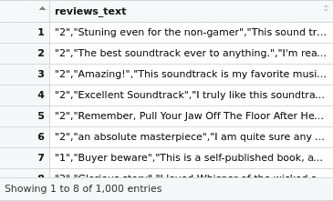

阅读完文件后，我们可以看到数据集中只有一列，而这列包含了评论文本和情感成分。为了在本章中使用涉及 BoW、Word2vec 和 GloVe 方法的情感分析项目，我们将稍微修改数据集的格式。让我们用以下代码修改数据集的格式：

```py
# separating the sentiment and the review text
# post separation the first column will have the first 4 characters
# second column will have the rest of the characters
# first column should be named "Sentiment"
# second column to be named "SentimentText"
library(tidyr)
reviews_text<-separate(data = reviews_text, col = reviews_text, into = c("Sentiment", "SentimentText"), sep = 4)
# viewing the dataset post the column split
View(reviews_text)
```

这将产生以下输出：

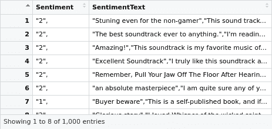

现在我们数据集中有两列。然而，这两列中都存在可能引起进一步处理数据集问题的多余标点符号。让我们尝试用以下代码删除标点符号：

```py
# Retaining only alphanumeric values in the sentiment column
reviews_text$Sentiment<-gsub("[^[:alnum:] ]","",reviews_text$Sentiment)
# Retaining only alphanumeric values in the sentiment text
reviews_text$SentimentText<-gsub("[^[:alnum:] ]"," ",reviews_text$SentimentText)
# Replacing multiple spaces in the text with single space
reviews_text$SentimentText<-gsub("(?<=[\\s])\\s*|^\\s+|\\s+$", "", reviews_text$SentimentText, perl=TRUE)
# Viewing the dataset
View(reviews_text)
# Writing the output to a file that can be consumed in other projects
write.table(reviews_text,file = "/home/sunil/Desktop/sentiment_analysis/Sentiment Analysis Dataset.csv",row.names = F,col.names = T,sep=',')
```

这将产生以下输出：

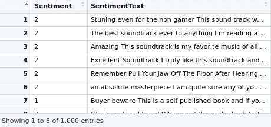

从前面的输出中，我们看到我们有一个干净的数据集，可以立即使用。此外，我们还已将输出写入文件。当我们构建情感分析器时，我们可以直接从`Sentiment Analysis Dataset.csv`文件中读取数据集。

fastText 算法期望数据集以不同的格式。fastText 的数据输入应遵守以下格式：

```py
__label__<X>  <Text>
```

在这个例子中，`X`是类名。Text 是导致该类下指定评分的实际评论文本。评分和文本应放在同一行上，无需引号。类是`__label__1`和`__label__2`，每行应只有一个类。让我们用以下代码块完成`fastText`库所需的格式：

```py
# reading the first 1000 reviews from the dataset
reviews_text<-readLines('/home/sunil/Desktop/sentiment_analysis/amazon _reviews_polarity.csv', n = 1000)
# basic EDA to confirm that the data is read correctly
print(class(reviews_text))
print(length(reviews_text))
print(head(reviews_text,2))
# replacing the positive sentiment value 2 with __label__2
reviews_text<-gsub("\\\"2\\\",","__label__2 ",reviews_text)
# replacing the negative sentiment value 1 with __label__1
reviews_text<-gsub("\\\"1\\\",","__label__1 ",reviews_text)
# removing the unnecessary \" characters
reviews_text<-gsub("\\\""," ",reviews_text)
# replacing multiple spaces in the text with single space
reviews_text<-gsub("(?<=[\\s])\\s*|^\\s+|\\s+$", "", reviews_text, perl=TRUE)
# Basic EDA post the required processing to confirm input is as desired
print("EDA POST PROCESSING")
print(class(reviews_text))
print(length(reviews_text))
print(head(reviews_text,2))
# writing the revamped file to the directory so we could use it with
# fastText sentiment analyzer project
fileConn<-file("/home/sunil/Desktop/sentiment_analysis/Sentiment Analysis Dataset_ft.txt")
writeLines(reviews_text, fileConn)
close(fileConn)
```

这将产生以下输出：

```py
[1] "EDA PRIOR TO PROCESSING"
[1] "character"
[1] 1000
[1] "\"2\",\"Stuning even for the non-gamer\",\"This sound track was beautiful! It paints the senery in your mind so well I would recomend it even to people who hate vid. game music! I have played the game Chrono Cross but out of all of the games I have ever played it has the best music! It backs away from crude keyboarding and takes a fresher step with grate guitars and soulful orchestras. It would impress anyone who cares to listen! ^_^\""                                                                                  
[2] "\"2\",\"The best soundtrack ever to anything.\",\"I'm reading a lot of reviews saying that this is the best 'game soundtrack' and I figured that I'd write a review to disagree a bit. This in my opinino is Yasunori Mitsuda's ultimate masterpiece. The music is timeless and I'm been listening to it for years now and its beauty simply refuses to fade.The price tag on this is pretty staggering I must say, but if you are going to buy any cd for this much money, this is the only one that I feel would be worth every penny.\""
[1] "EDA POST PROCESSING"
[1] "character"
[1] 1000\
[1] "__label__2 Stuning even for the non-gamer , This sound track was beautiful! It paints the senery in your mind so well I would recommend it even to people who hate vid. game music! I have played the game Chrono Cross but out of all of the games I have ever played it has the best music! It backs away from crude keyboarding and takes a fresher step with grate guitars and soulful orchestras. It would impress anyone who cares to listen! ^_^"                                                                                   
[2] "__label__2 The best soundtrack ever to anything. , I'm reading a lot of reviews saying that this is the best 'game soundtrack' and I figured that I'd write a review to disagree a bit. This in my opinino is Yasunori Mitsuda's ultimate masterpiece. The music is timeless and I'm been listening to it for years now and its beauty simply refuses to fade. The price tag on this is pretty staggering I must say, but if you are going to buy any cd for this much money, this is the only one that I feel would be worth every penny."
```

从基本的 EDA 代码输出中，我们可以看到数据集已经处于所需格式，因此我们可以继续到下一个部分，使用 BoW 方法实现情感分析引擎。在实现的同时，我们将深入研究该方法背后的概念，并探索该方法中可以用来获得更好结果的一些子技术。

# 使用 BoW 方法构建文本情感分类器

BoW 方法的目的是将提供的评论文本转换为矩阵形式。它通过忽略单词的顺序和意义，将文档表示为一组不同的单词。矩阵的每一行代表每个评论（在 NLP 中通常称为文档），列代表所有评论中存在的通用单词集。对于每个文档和每个单词，记录该单词在该特定文档中的存在或单词出现的频率。最后，从单词频率向量创建的矩阵表示文档集。这种方法用于创建训练模型所需的输入数据集，以及准备需要由训练模型使用的测试数据集以执行文本分类。现在我们了解了 BoW 的动机，让我们跳入实现基于此方法的情感分析分类器步骤，如下面的代码块所示：

```py
# including the required libraries
library(SnowballC)
library(tm)
# setting the working directory where the text reviews dataset is located
# recollect that we pre-processed and transformed the raw dataset format
setwd('/home/sunil/Desktop/sentiment_analysis/')
# reading the transformed file as a dataframe
text <- read.table(file='Sentiment Analysis Dataset.csv', sep=',',header = TRUE)
# checking the dataframe to confirm everything is in tact
print(dim(text))
View(text)
```

这将导致以下输出：

```py
> print(dim(text))
[1] 1000 2
> View(text)
```

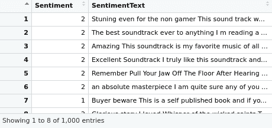

处理文本数据的第一个步骤是创建一个*语料库*，这是一个文本文档的集合。`tm`包中的`VCorpus`函数可以将数据框中的评论评论列转换为不稳定的语料库。这可以通过以下代码实现：

```py
# transforming the text into volatile corpus
train_corp = VCorpus(VectorSource(text$SentimentText))
print(train_corp)
```

这将导致以下输出：

```py
> print(train_corp)
<<VCorpus>>
Metadata:  corpus specific: 0, document level (indexed): 0
Content:  documents: 1000
```

从不稳定的语料库中，我们创建一个**文档-词矩阵**（**DTM**）。DTM 是使用`tm`库的`DocumentTermMatrix`函数创建的稀疏矩阵。矩阵的行表示文档，列表示特征，即单词。该矩阵是稀疏的，因为数据集中的所有唯一单语元集都成为 DTM 的列，并且由于每个评论评论没有单语元集的所有元素，大多数单元格将有一个 0，表示不存在单语元。

虽然在 BoW（词袋）方法中可以提取 n-gram（单语元、双语元、三元语元等）作为一部分，但可以将 tokenize 参数设置为控制列表的一部分，并在`DocumentTermMatrix`函数中传递以在 DTM（文档-词矩阵）中实现 n-gram。必须注意的是，将 n-gram 作为 DTM 的一部分会创建 DTM 中非常高的列数。这是 BoW 方法的一个缺点，在某些情况下，由于内存限制，它可能会阻碍项目的执行。鉴于我们的特定案例也受硬件基础设施的限制，我们在这个项目中仅包括 DTM 中的单语元。除了仅生成单语元之外，我们还通过对`tm`库的`DocumentTermMatrix`函数中的控制列表传递参数，对评论文本文档进行一些额外的处理。在创建 DTM 期间对评论文本文档进行的处理如下：

1.  将文本的字母大小写改为小写。

1.  移除任何数字。

1.  使用 Snowball 词干提取项目的英语语言停用词表来移除停用词。停用词是一些常见的单词，如 a、an、in 和 the，它们在根据评论内容判断情感时并不增加价值。

1.  移除标点符号。

1.  进行词干提取，其目的是将单词还原为单词的基本形式，即从名词中去除复数*s*，从动词中去除*ing*，或去除其他前缀。词干是一组具有相等或非常相似意义的自然词组。在词干提取过程之后，每个单词都由其词干表示。《SnowballC》库提供了获取评论评论中每个单词根的能力。

现在让我们使用以下代码块从易变语料库创建 DTM 并进行文本预处理：

```py
# creating document term matrix
dtm_train <- DocumentTermMatrix(train_corp, control = list(
  tolower = TRUE,removeNumbers = TRUE,
  stopwords = TRUE,
  removePunctuation = TRUE,
  stemming = TRUE
))
# Basic EDA on dtm
inspect(dtm_train)
```

这将产生以下输出：

```py
> inspect(dtm_train)
<<DocumentTermMatrix (documents: 1000, terms: 5794)>>
Non-/sparse entries: 34494/5759506
Sparsity           : 99%
Maximal term length: 21
Weighting          : term frequency (tf)
Sample             :
     Terms
Docs  book can get great just like love one read time
  111    0   3   2     0    0    0    2   1    0    2
  162    4   1   0     0    0    1    0   0    1    0
  190    0   0   0     0    0    0    0   0    0    0
  230    0   1   1     0    0    0    1   0    0    0
  304    0   0   0     0    0    3    0   2    0    0
  399    0   0   0     0    0    0    0   0    0    0
  431    9   1   0     0    0    1    2   0    0    1
  456    1   0   0     0    0    0    0   1    2    0
  618    0   2   3     1    4    1    3   1    0    1
  72     0   0   1     0    2    0    0   1    0    1
```

从输出中我们可以看到，有 1,000 个文档被处理并形成矩阵的行。有 5,794 列代表经过额外文本处理后的独特单语素。我们还看到 DTM 有 99%的稀疏性，并且仅在 34,494 个单元格中有非零条目。非零单元格代表单词在 DTM 行对应的文档中的出现频率。权重是通过默认的“词频”权重进行的，因为我们没有在提供给`DocumentTermMatrix`函数的控制列表中指定任何权重参数。通过在控制列表中传递适当的权重参数到`DocumentTermMatrix`函数，也可以实现其他形式的权重，例如**词频-逆文档频率**（**TFIDF**）。现在，我们将坚持基于词频的权重，这是默认的。我们还从`inspect`函数中看到，一些样本文档以及这些文档中的词频被输出。

DTM（文档-词矩阵）往往变得非常大，即使是正常大小的数据集也是如此。移除稀疏项，即仅出现在极少数文档中的项，是一种可以尝试的技术，可以在不丢失矩阵固有的显著关系的情况下减小矩阵的大小。让我们从矩阵中移除稀疏列。我们将尝试使用以下代码行移除至少有 99%稀疏元素的术语：

```py
# Removing sparse terms
dtm_train= removeSparseTerms(dtm_train, 0.99)
inspect(dtm_train)
```

这将产生以下输出：

```py
> inspect(dtm_train)
<<DocumentTermMatrix (documents: 1000, terms: 686)>>
Non-/sparse entries: 23204/662796
Sparsity           : 97%
Maximal term length: 10
Weighting          : term frequency (tf)
Sample             :
     Terms
Docs  book can get great just like love one read time
  174    0   0   1     1    1    2    0   2    0    1
  304    0   0   0     0    0    3    0   2    0    0
  355    3   0   0     0    1    1    2   3    1    0
  380    4   1   0     0    1    0    0   1    0    2
  465    5   0   1     1    0    0    0   2    6    0
  618    0   2   3     1    4    1    3   1    0    1
  72     0   0   1     0    2    0    0   1    0    1
  836    1   0   0     0    0    3    0   0    5    1
  866    8   0   1     0    0    1    0   0    4    0
  959    0   0   2     1    1    0    0   2    0    1
```

现在我们从`inspect`函数的输出中看到，矩阵的稀疏性降低到 97%，单语素（矩阵的列）的数量减少到`686`。我们现在已经准备好可以使用任何机器学习分类算法进行训练的 DTM。在接下来的几行代码中，让我们尝试将我们的 DTM 划分为训练集和测试集：

```py
# splitting the train and test DTM
dtm_train_train <- dtm_train[1:800, ]
dtm_train_test <- dtm_train[801:1000, ]
dtm_train_train_labels <- as.factor(as.character(text[1:800, ]$Sentiment))
dtm_train_test_labels <- as.factor(as.character(text[801:1000, ]$Sentiment))
```

我们将使用一种名为**朴素贝叶斯**的机器学习算法来创建模型。朴素贝叶斯通常在具有名义特征的 数据上训练。我们可以观察到我们的 DTM（词袋模型）中的单元格是数值型的，因此需要将其转换为名义型，以便将数据集作为输入提供给朴素贝叶斯模型进行创建。由于每个单元格表示评论中的单词频率，并且单词在评论中使用的次数不会影响情感，让我们编写一个函数将具有非零值的单元格值转换为`Y`，在值为零的情况下，将其转换为`N`，以下是一段代码：

```py
cellconvert<- function(x) {
x <- ifelse(x > 0, "Y", "N")
}
```

现在，让我们应用函数到训练数据集和测试数据集的所有行上，这些数据集是我们在这个项目中之前创建的，以下是一段代码：

```py
# applying the function to rows in training and test datasets
dtm_train_train <- apply(dtm_train_train, MARGIN = 2,cellconvert)
dtm_train_test <- apply(dtm_train_test, MARGIN = 2,cellconvert)
# inspecting the train dtm to confirm all is in tact
View(dtm_train_train)
```

这将产生以下输出：

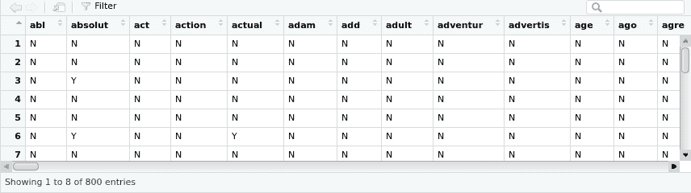

从输出中我们可以看到，训练和测试 DTM 中的所有单元格现在都已转换为名义值。因此，让我们继续使用`e1071`库中的朴素贝叶斯算法构建文本情感分析分类器，如下所示：

```py
# training the naive bayes classifier on the training dtm
library(e1071)
nb_senti_classifier=naiveBayes(dtm_train_train,dtm_train_train_labels)
# printing the summary of the model created
summary(nb_senti_classifier)
```

这将产生以下输出：

```py
> summary(nb_senti_classifier)
        Length Class  Mode    
apriori   2    table  numeric 
tables  686    -none- list    
levels    2    -none- character
call      3    -none- call  
```

前面的摘要输出显示，`nb_senti_classifier`对象已成功从训练 DTM 创建。现在让我们使用模型对象在测试数据 DTM 上预测情感。在以下代码块中，我们指示预测应该是类别而不是预测概率：

```py
# making predictions on the test data dtm
nb_predicts<-predict(nb_senti_classifier, dtm_train_test,type="class")
# printing the predictions from the model
print(nb_predicts)
```

这将产生以下输出：

```py
[1] 1 1 2 1 1 1 1 1 1 2 2 1 2 2 2 2 1 2 1 1 2 1 2 1 1 1 2 2 1 2 2 2 2 1 2 1 1 1 1 2 2 2 2 1 2 1 1 1 1 1 1 1 1 1 1 1 1 2 1 1 1 2 1 1 1 1 1 1 1 2 1 1 2 2 1 2 2 2 2 1 2 2 1 1 1 1 1 2 1 1 2 1 1 1 1 1 2 2 2 2 2 2 1 2 2 1 2 1 1 1 1 2 2 2 2 2 1 1 1 2 2 2 1 1 1 1 1 2 1 2 1 1 1 1 1 1 1 1 2 1 1 1 1 1 1 2 1 1 1 1 1 1 2 1 1 1 1 1 1 2 2 2 2 2 1 2 2 1 2 2 1 1 2 2 1 1 2 2 2 2 2 2 2 2 2 2 2 1 1 2 1 2 1 2 2 1 1 1 1 2
Levels: 1 2
```

使用以下代码，我们现在使用`rminer`库中的`mmetric`函数计算模型的准确率：

```py
# computing accuracy of the model
library(rminer)
print(mmetric(nb_predicts, dtm_train_test_labels, c("ACC")))
```

这将产生以下输出：

```py
[1] 79
```

我们仅使用一个非常快速和基本的 BoW 模型就实现了 79%的准确率。可以通过参数调整、词干提取、创建新特征等技术进一步提高模型。

# BoW（词袋）方法的优缺点

现在我们已经了解了 BoW（词袋）方法的原理和实现，让我们来分析一下这种方法的优势和劣势。在优势方面，BoW 方法非常简单易懂且易于实现，因此为任何文本数据集的定制化提供了很大的灵活性。可以观察到，当只考虑单词时，BoW 方法并不保留单词的顺序。这个问题通常通过在 DTM（词袋矩阵）中保留 n-gram 来解决。然而，这需要更大的基础设施来处理文本和构建分类器。该方法的另一个严重缺点是它不尊重单词的语义。例如，“汽车”和“汽车”这两个词在相同的上下文中经常被使用。基于 BoW 构建的模型将句子“购买二手汽车”和“购买旧汽车”视为非常不同的句子。尽管这些句子是相同的，但 BoW 模型不会将这些句子分类为相同，因为这些句子中的单词并不匹配。使用称为词嵌入的方法可以考虑到句子中单词的语义。这是我们将在下一节中探讨的内容。

# 理解词嵌入

我们在前面章节中讨论的 BoW 模型存在一个问题，即它们没有捕捉到关于单词意义或上下文的信息。这意味着潜在的关联，如上下文邻近性，在单词集合中没有被捕捉到。例如，这种方法无法捕捉简单的关联，例如确定“汽车”和“公交车”这两个词都指的是经常在交通上下文中讨论的车辆。通过词嵌入，我们可以克服 BoW 方法中遇到的问题，词嵌入是一种改进的映射语义相似单词的方法。

词向量将单词表示为多维连续的浮点数，其中语义相似的单词在几何空间中被映射到邻近的点。例如，“水果”和“叶子”这两个词会有相似的词向量，“树”。这是由于它们意义的相似性，而“电视”这个词在几何空间中则相对较远。换句话说，在相似上下文中使用的单词将被映射到邻近的向量空间。

词向量可以是*n*维的，*n*可以是用户创建时输入的任何数字（例如 10、70、500）。这些维度是隐含的，因为对人类来说，这些维度在现实中代表什么可能并不明显。有如**连续词袋**（**CBOW**）和**跳字模型**（**Skip-Gram**）等方法，可以从提供的文本作为训练输入到词嵌入算法中构思词向量。此外，词向量中的单个数字代表单词在各个维度上的分布权重。在一般意义上，每个维度代表一个潜在的意义，而单词在该维度上的数值权重捕捉了它与该意义的关联程度。因此，单词的语义嵌入在向量的维度中。

尽管词向量是多维的，无法直接可视化，但可以通过使用如 t-SNE 降维技术等将它们投影到二维空间，从而可视化学习到的向量。以下图表显示了国家首都、动词时态和性别关系在二维空间中的学习词向量：

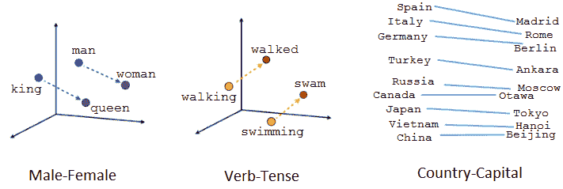

在二维空间中可视化词嵌入

当我们观察词嵌入的可视化时，我们可以感知到向量捕捉了关于单词及其相互之间的一些通用、实际上非常有用的语义信息。有了这个，文本中的每个单词现在都可以表示为矩阵中的一行，类似于 BoW 方法，但与 BoW 方法不同，它捕捉了单词之间的关系。

将单词表示为向量的优点是它们适用于数学运算。例如，我们可以对向量进行加法和减法。这里的典型例子是展示通过使用词向量，我们可以确定以下内容：

*国王 - 男人 + 女人 = 女王*

在给定的例子中，我们从国王的词向量中减去了性别（男人），并添加了另一个性别（女人），从而通过操作（*国王 - 男人 + 女人*）获得了一个新的词向量，该向量与女王的词向量映射最为接近。

下面展示了可以在词向量上实现的更多数学运算的惊人例子：

+   给定两个单词，我们可以确定它们之间的相似度：

```py
model.similarity('woman','man')
```

输出如下：

```py
0.73723527
```

+   从给定的单词集中找出不同类的一个：

```py
model.doesnt_match('breakfast cereal dinner lunch';.split())
```

不同类的单词如下所示：

```py
'cereal'
```

+   推导类比，例如：

```py
model.most_similar(positive=['woman','king'],negative=['man'],topn=1)
```

输出如下：

```py
queen: 0.508
```

现在，这一切对我们意味着，机器能够识别句子中给出的语义相似的单词。以下图表是关于词嵌入的一个让我笑的笑话，但这个笑话确实传达了词嵌入应用的力量，否则使用 BoW 类型的文本表示是不可能实现的：

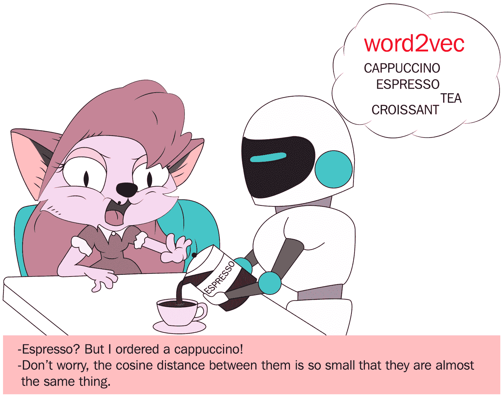

一个展示词嵌入应用能力的笑话

有几种技术可以从文本数据中学习词嵌入。Word2vec、GloVe 和 fastText 是一些流行的技术。这些技术中的每一种都允许我们从我们拥有的文本数据中训练自己的词嵌入，或者使用现成的预训练向量。

这种学习我们自己的词嵌入的方法需要大量的训练数据，可能会很慢，但这个选项将学习一个既针对特定文本数据又针对当前 NLP 任务的嵌入。

预训练词嵌入向量是在大量文本数据（通常为数十亿单词）上训练的向量，这些数据通常来自维基百科等来源。这些通常是谷歌或 Facebook 等公司提供的高质量词嵌入向量。我们可以下载这些预训练向量文件，并使用它们来获取我们想要分类或聚类的文本中单词的词向量。

# 基于路透社新闻语料库，使用预训练的 word2vec 词嵌入构建文本情感分类器

Word2vec 是由 Tomas Mikolov 等人于 2013 年在谷歌开发的，作为使基于神经网络的嵌入训练更高效的回应，从那时起，它已经成为开发预训练词嵌入的事实标准。

Word2vec 引入了以下两种不同的学习模型来学习词嵌入：

+   **CBOW**: 通过预测当前词的上下文来学习嵌入。

+   **连续 Skip-Gram**: 连续 Skip-Gram 模型通过预测给定当前词的周围词来学习。

CBOW 和 Skip-Gram 学习方法都专注于根据局部使用上下文学习单词，其中单词的上下文由一个邻近单词的窗口定义。这个窗口是模型的可配置参数。

R 中的`softmaxreg`库提供了预训练的`word2vec`词嵌入，可用于构建针对亚马逊评论数据的情感分析引擎。预训练的向量是使用`word2vec`模型构建的，并且基于`Reuter_50_50`数据集，UCI 机器学习仓库([`archive.ics.uci.edu/ml/datasets/Reuter_50_50`](https://archive.ics.uci.edu/ml/datasets/Reuter_50_50))。

不加任何延迟，让我们进入代码并回顾一下这个代码中采用的方法：

```py
# including the required library
library(softmaxreg)
# importing the word2vec pretrained vector into memory
data(word2vec)
```

让我们检查`word2vec`预训练嵌入。它只是一个数据框，因此可以通过常规的`dim`和`View`命令进行审查，如下所示：

```py
View(word2vec)
```

这将导致以下输出：

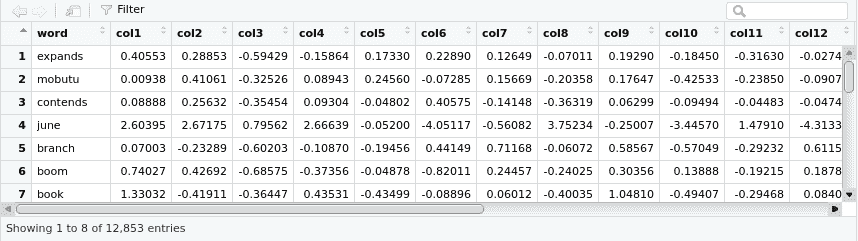

这里，让我们使用以下 `dim` 命令：

```py
dim(word2vec)
```

这将导致以下输出：

```py
[1] 12853 21
```

从前面的输出中，我们可以观察到有`12853`个单词在预训练向量中获得了单词向量。每个单词都是使用 20 个维度定义的，这些维度定义了单词的上下文。在下一步中，我们可以查找评论中每个单词的单词向量。由于预训练的单词嵌入中只有 12,853 个单词，我们可能会遇到一个不在预训练嵌入中的单词。在这种情况下，未识别的单词用一个填充有零的 20 维向量表示。

我们还需要理解，单词向量仅在单词级别上可用，因此为了解码整个评论，我们取构成评论的所有单词的单词向量的平均值。让我们通过一个例子来回顾从单个单词向量获取句子单词向量的概念。

假设我们想要获取单词向量的句子是，“今天早上非常明亮且阳光明媚”。构成句子的单个单词是“it”、“is”、“very”、“bright”、“and”、“sunny”、“this”和“morning”。

现在，我们可以在预训练向量中查找这些单词，并获取以下表格中所示的相应单词向量：

| **词** | **dim1** | **dim2** | **dim3** | **.....** | **....** | **dim19** | **dim20** |  |
| --- | --- | --- | --- | --- | --- | --- | --- | --- |
| `it` | -2.25 | 0.75 | 1.75 | -1.25 | -0.25 | -3.25 | -2.25 |  |
| `is` | 0.75 | 1.75 | 1.75 | -2.25 | -2.25 | 0.75 | -0.25 |  |
| `very` | -2.25 | 2.75 | 1.75 | -0.25 | 0.75 | 0.75 | -2.25 |  |
| `bright` | -3.25 | -3.25 | -2.25 | -1.25 | 0.75 | 1.75 | -0.25 |  |
| `and` | -0.25 | -1.25 | -2.25 | 2.75 | -3.25 | -0.25 | 1.75 |  |
| `sunny` | 0 | 0 | 0 | 0 | 0 | 0 | 0 |  |
| `this` | -2.25 | -3.25 | 2.75 | 0.75 | -0.25 | -0.25 | -0.25 |  |
| `morning` | -0.25 | -3.25 | -2.25 | 1.75 | 0.75 | 2.75 | 2.75 |  |

现在，我们有了构成句子的单词向量。请注意，这些并不是实际的单词向量值，只是为了演示方法而编造的。此外，观察单词`sunny`在所有维度上用零表示，以表示该单词未在预训练的单词嵌入中找到。为了获取句子的单词向量，我们只需计算每个维度的平均值。得到的向量是一个 1 x 20 的向量，代表句子，如下所示：

| 句子 | -1.21875 | -0.71875 | 0.15625 | 0.03125 | -0.46875 | 0.28125 | -0.09375 |
| --- | --- | --- | --- | --- | --- | --- | --- |

`softmaxreg`库提供了`wordEmbed`函数，我们可以传递一个句子并要求它计算句子的`mean`词向量。以下是一个自定义函数，用于将`wordEmbed`函数应用于我们手头的每个亚马逊评论。在将此函数应用于评论数据集之后，我们期望得到一个*n* x 20 的矩阵，这是我们评论的词向量表示。*n*在*n* x 20 中代表行数，20 是通过每个评论表示的维度数，如下所示：

```py
# function to get word vector for each review
docVectors = function(x)
{
  wordEmbed(x, word2vec, meanVec = TRUE)
}
# setting the working directory and reading the reviews dataset
setwd('/home/sunil/Desktop/sentiment_analysis/')
text = read.csv(file='Sentiment Analysis Dataset.csv', header = TRUE)
# applying the docVector function on each of the reviews
# storing the matrix of word vectors as temp
temp=t(sapply(text$SentimentText, docVectors))
# visualizing the word vectors output
View(temp)
```

这将导致以下输出：

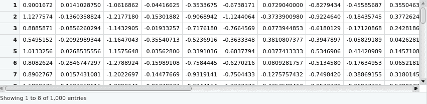

然后我们使用`dim`命令来审查`temp`，如下所示：

```py
dim(temp)
```

这将导致以下输出：

```py
1000 20
```

从输出中我们可以看到，我们为语料库中的每个评论创建了词向量。现在可以使用这个数据框通过机器学习算法构建分类模型。以下用于分类的代码与用于 BoW 方法的代码没有不同：

```py
# splitting the dataset into train and test
temp_train=temp[1:800,]
temp_test=temp[801:1000,]
labels_train=as.factor(as.character(text[1:800,]$Sentiment))
labels_test=as.factor(as.character(text[801:1000,]$Sentiment))
# including the random forest library
library(randomForest)
# training a model using random forest classifier with training dataset
# observe that we are using 20 trees to create the model
rf_senti_classifier=randomForest(temp_train, labels_train,ntree=20)
print(rf_senti_classifier)
```

这将导致以下输出：

```py
randomForest(x = temp_train, y = labels_train, ntree = 20)
               Type of random forest: classification
                     Number of trees: 20
No. of variables tried at each split: 4
        OOB estimate of  error rate: 44.25%
Confusion matrix:
    1   2 class.error
1 238 172   0.4195122
2 182 208   0.4666667
```

上述输出显示，随机森林模型对象已成功创建。当然，模型可以进一步改进；然而，我们在这里不会这么做，因为重点是展示如何利用词嵌入，而不是获得最佳性能的分类器。

接下来，我们使用以下代码利用随机森林模型对测试数据进行预测，并报告性能：

```py
# making predictions on the dataset
rf_predicts<-predict(rf_senti_classifier, temp_test)
library(rminer)
print(mmetric(rf_predicts, labels_test, c("ACC")))
```

这将导致以下输出：

```py
[1] 62.5
```

我们看到，使用从路透社新闻组数据集制作的预训练`word2vec`嵌入，我们得到了 62%的准确率。

# 使用 GloVe 词嵌入构建文本情感分类器

斯坦福大学的 Pennington 等人开发了一种`word2vec`方法的扩展，称为**全局词表示**（**GloVe**），用于高效地学习词向量。

GloVe 结合了矩阵分解技术的全局统计，如 LSA，以及`word2vec`中的基于局部上下文的学习。与`word2vec`不同，GloVe 不是使用窗口来定义局部上下文，而是通过整个文本语料库的统计来构建一个显式的词上下文或词共现矩阵。因此，学习模型产生了通常更好的词嵌入。

R 中的`text2vec`库有一个 GloVe 实现，我们可以用它来训练，从自己的训练语料库中获得词嵌入。或者，可以下载预训练的 GloVe 词嵌入并重复使用，就像我们在上一节中提到的早期`word2vec`预训练嵌入项目中所做的那样。

以下代码块展示了如何创建和使用 GloVe 词嵌入进行情感分析，或者，实际上，任何文本分类任务。我们不会明确讨论涉及的步骤，因为代码已经对每个步骤进行了详细的注释：

```py
# including the required library
library(text2vec)
# setting the working directory
setwd('/home/sunil/Desktop/sentiment_analysis/')
# reading the dataset
text = read.csv(file='Sentiment Analysis Dataset.csv', header = TRUE)
# subsetting only the review text so as to create Glove word embedding
wiki = as.character(text$SentimentText)
# Create iterator over tokens
tokens = space_tokenizer(wiki)
# Create vocabulary. Terms will be unigrams (simple words).
it = itoken(tokens, progressbar = FALSE)
vocab = create_vocabulary(it)
# consider a term in the vocabulary if and only if the term has appeared aleast three times in the dataset
vocab = prune_vocabulary(vocab, term_count_min = 3L)
# Use the filtered vocabulary
vectorizer = vocab_vectorizer(vocab)
# use window of 5 for context words and create a term co-occurance matrix
tcm = create_tcm(it, vectorizer, skip_grams_window = 5L)
# create the glove embedding for each each in the vocab and
# the dimension of the word embedding should set to 50
# x_max is the maximum number of co-occurrences to use in the weighting
# function
# note that training the word embedding is time consuming - be patient
glove = GlobalVectors$new(word_vectors_size = 50, vocabulary = vocab, x_max = 100)
wv_main = glove$fit_transform(tcm, n_iter = 10, convergence_tol = 0.01)
```

这将导致以下输出：

```py
INFO [2018-10-30 06:58:14] 2018-10-30 06:58:14 - epoch 1, expected cost 0.0231
INFO [2018-10-30 06:58:15] 2018-10-30 06:58:15 - epoch 2, expected cost 0.0139
INFO [2018-10-30 06:58:15] 2018-10-30 06:58:15 - epoch 3, expected cost 0.0114
INFO [2018-10-30 06:58:15] 2018-10-30 06:58:15 - epoch 4, expected cost 0.0100
INFO [2018-10-30 06:58:15] 2018-10-30 06:58:15 - epoch 5, expected cost 0.0091
INFO [2018-10-30 06:58:15] 2018-10-30 06:58:15 - epoch 6, expected cost 0.0084
INFO [2018-10-30 06:58:16] 2018-10-30 06:58:16 - epoch 7, expected cost 0.0079
INFO [2018-10-30 06:58:16] 2018-10-30 06:58:16 - epoch 8, expected cost 0.0074
INFO [2018-10-30 06:58:16] 2018-10-30 06:58:16 - epoch 9, expected cost 0.0071
INFO [2018-10-30 06:58:16] 2018-10-30 06:58:16 - epoch 10, expected cost 0.0068
```

以下使用`glove`模型来获取组合词向量：

```py
# Glove model learns two sets of word vectors - main and context.
# both matrices may be added to get the combined word vector
wv_context = glove$components
word_vectors = wv_main + t(wv_context)
# converting the word_vector to a dataframe for visualization
word_vectors=data.frame(word_vectors)
# the word for each embedding is set as row name by default
# using the tibble library rownames_to_column function, the rownames is copied as first column of the dataframe
# we also name the first column of the dataframe as words
library(tibble)
word_vectors=rownames_to_column(word_vectors, var = "words")
View(word_vectors)
```

这将导致以下输出：

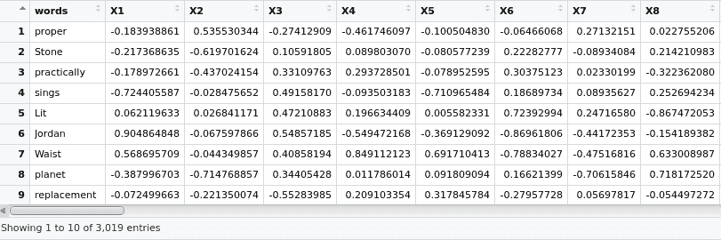

我们使用`softmaxreg`库来获取每个评论的平均词向量。这与我们在上一节中使用的`word2vec`预训练嵌入类似。注意，我们将我们自己的训练词嵌入`word_vectors`传递给`wordEmbed()`函数，如下所示：

```py
library(softmaxreg)
docVectors = function(x)
{
  wordEmbed(x, word_vectors, meanVec = TRUE)
}
# applying the function docVectors function on the entire reviews dataset
# this will result in word embedding representation of the entire reviews # dataset
temp=t(sapply(text$SentimentText, docVectors))
View(temp)
```

这将导致以下输出：

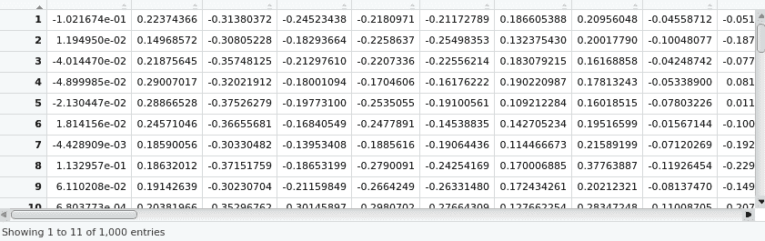

现在，我们将数据集分成训练和测试部分，并使用`randomforest`库构建一个模型进行训练，如下面的代码行所示：

```py
# splitting the dataset into train and test portions
temp_train=temp[1:800,]
temp_test=temp[801:1000,]
labels_train=as.factor(as.character(text[1:800,]$Sentiment))
labels_test=as.factor(as.character(text[801:1000,]$Sentiment))
# using randomforest to build a model on train data
library(randomForest)
rf_senti_classifier=randomForest(temp_train, labels_train,ntree=20)
print(rf_senti_classifier)
```

这将导致以下输出：

```py
Call:
 randomForest(x = temp_train, y = labels_train, ntree = 20)
               Type of random forest: classification
                     Number of trees: 20
No. of variables tried at each split: 7

        OOB estimate of  error rate: 42.12%
Confusion matrix:
    1   2 class.error
1 250 160   0.3902439
2 177 213   0.4538462
```

然后，我们使用创建的随机森林模型来预测标签，如下所示：

```py
# predicting labels using the randomforest model created
rf_predicts<-predict(rf_senti_classifier, temp_test)
# estimating the accuracy from the predictions
library(rminer)
print(mmetric(rf_predicts, labels_test, c("ACC")))
```

这将导致以下输出：

```py
[1] 66.5
```

使用这种方法，我们获得了 66%的准确率。尽管词嵌入是从仅 1,000 个文本样本中的词获得的，但模型可能通过使用预训练嵌入进一步改进。使用预训练嵌入的整体框架与我们在上一节中`word2vec`项目中使用的相同。

# 使用 fastText 构建文本情感分类器

`fastText`是一个库，是`word2vec`的词表示扩展。它由 Facebook 研究团队在 2016 年创建。虽然 Word2vec 和 GloVe 方法将词作为训练的最小单元，但 fastText 将词分解成多个 n-gram，即子词。例如，单词 apple 的三元组是 app、ppl 和 ple。单词 apple 的词嵌入是所有词 n-gram 的总和。由于算法嵌入生成的性质，fastText 更占用资源，并且需要额外的时间来训练。`fastText`的一些优点如下：

+   它为罕见词（包括拼写错误的词）生成更好的词嵌入。

+   对于不在词汇表中的词，fastText 可以从其字符 n-gram 中构建一个词的向量，即使这个词没有出现在训练语料库中。Word2vec 和 GloVe 都不具备这种可能性。

`fastTextR`库为 fastText 提供了一个接口。让我们利用`fastTextR`库在我们的项目中构建一个基于亚马逊评论的情感分析引擎。虽然我们可以下载预训练的 fastText 词嵌入并用于我们的项目，但让我们尝试根据我们手头的评论数据集训练一个词嵌入。需要注意的是，使用 fastText 预训练词嵌入的方法与我们之前处理过的基于`word2vec`的项目中采用的方法相似。

与前一小节中介绍的项目类似，代码中包含内联注释。这些注释解释了每一行，指出了在本项目中构建亚马逊评论情感分析器所采取的方法。现在让我们看看以下代码：

```py
# loading the required libary
library(fastTextR)
# setting the working directory
setwd('/home/sunil/Desktop/sentiment_analysis/')
# reading the input reviews file
# recollect that fastText needs the file in a specific format and we created one compatiable file in
# "Understanding the Amazon Reviews Dataset" section of this chaptertext = readLines("Sentiment Analysis Dataset_ft.txt")
# Viewing the text vector for conformation
View(text)
```

这将产生以下输出：

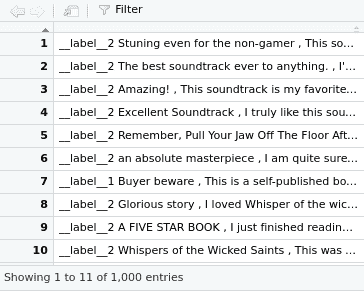

现在，让我们将评论分为训练和测试数据集，并使用以下代码行查看它们：

```py
# dividing the reviews into training and test
temp_train=text[1:800]temp_test=text[801:1000]
# Viewing the train datasets for confirmation
View(temp_train)
```

这将给出以下输出：

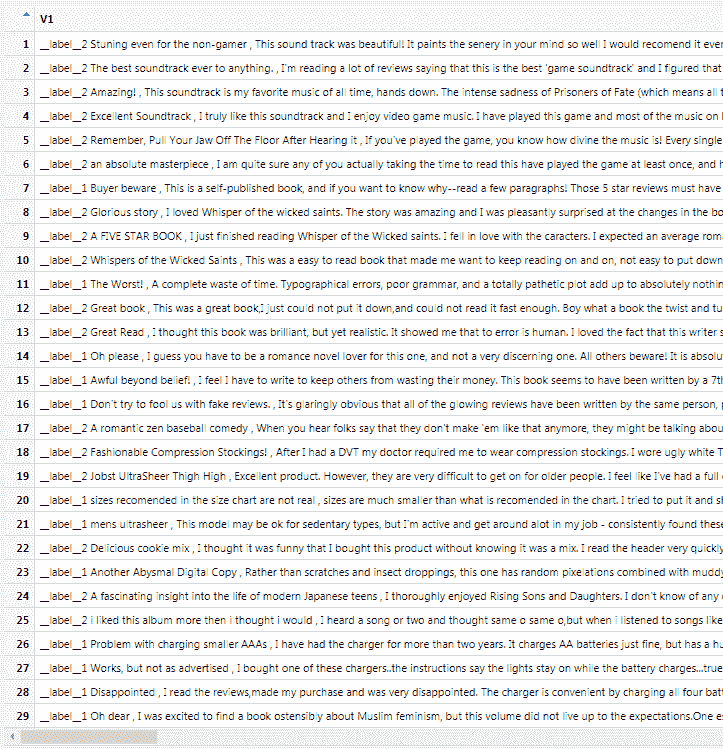

使用以下代码查看测试数据集：

```py
View(temp_test)
```

这将给出以下输出：

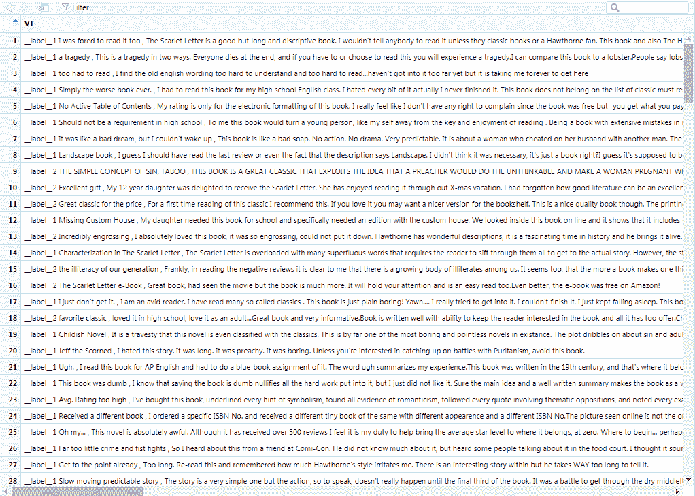

我们现在将使用以下代码为训练和测试数据集创建一个`.txt`文件：

```py
# creating txt file for train and test dataset
# the fasttext function expects files to be passed for training and testing
fileConn<-file("/home/sunil/Desktop/sentiment_analysis/train.ft.txt")
writeLines(temp_train, fileConn)
close(fileConn)
fileConn<-file("/home/sunil/Desktop/sentiment_analysis/test.ft.txt")
writeLines(temp_test, fileConn)
close(fileConn)
# creating a test file with no labels
# recollect the original test dataset has labels in it
# as the dataset is just a subset obtained from full dataset
temp_test_nolabel<- gsub("__label__1", "", temp_test, perl=TRUE)
temp_test_nolabel<- gsub("__label__2", "", temp_test_nolabel, perl=TRUE)
```

现在，我们将使用以下命令确认没有标签的测试数据集：

```py
View(temp_test_nolabel)
```

这将产生以下输出：

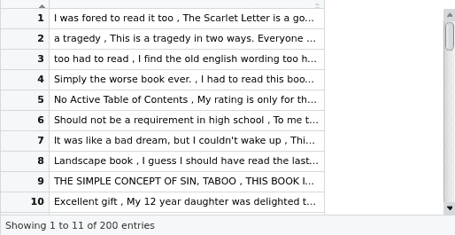

现在，我们将没有标签的测试数据集写入文件，以便我们可以用它进行测试，如下所示：

```py
fileConn<-file("/home/sunil/Desktop/sentiment_analysis/test_nolabel.ft.txt")
writeLines(temp_test_nolabel, fileConn)
close(fileConn)
# training a supervised classification model with training dataset file
model<-fasttext("/home/sunil/Desktop/sentiment_analysis/train.ft.txt",
method = "supervised", control = ft.control(nthreads = 3L))
# Obtain all the words from a previously trained model=
words<-get_words(model)
# viewing the words for confirmation. These are the set of words present  # in our training data
View(words)
```

这将产生以下输出：

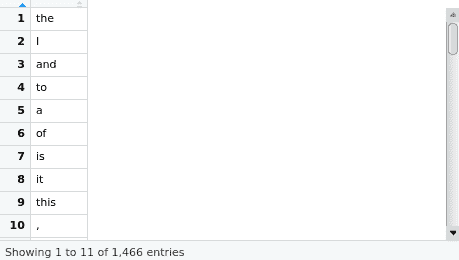

现在，我们将从先前训练的模型中获取词向量，并查看训练数据集中每个词的词向量，如下所示：

```py
# Obtain word vectors from a previously trained model.
word_vec<-get_word_vectors(model, words)
# Viewing the word vectors for each word in our training dataset
# observe that the word embedding dimension is 5
View(word_vec)
```

这将产生以下输出：

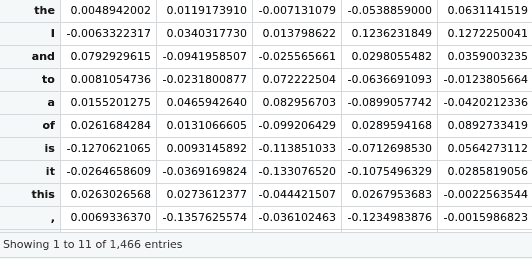

我们将在没有标签的测试数据集上预测评论的标签，并将其写入文件以供将来参考。然后，我们将预测结果放入数据框中，以计算性能并使用以下代码行查看准确率的估计：

```py
# predicting the labels for the reviews in the no labels test dataset
# and writing it to a file for future reference
predict(model, newdata_file= "/home/sunil/Desktop/sentiment_analysis/test_nolabel.ft.txt",result_file="/home/sunil/Desktop/sentiment_analysis/fasttext_result.txt")
# getting the predictions into a dataframe so as to compute performance   # measurementft_preds<-predict(model, newdata_file= "/home/sunil/Desktop/sentiment_analysis/test_nolabel.ft.txt")
# reading the test file to extract the actual labels
reviewstestfile<
readLines("/home/sunil/Desktop/sentiment_analysis/test.ft.txt")
# extracting just the labels frm each line
library(stringi)
actlabels<-stri_extract_first(reviewstestfile, regex="\\w+")
# converting the actual labels and predicted labels into factors
actlabels<-as.factor(as.character(actlabels))
ft_preds<-as.factor(as.character(ft_preds))
# getting the estimate of the accuracy
library(rminer)
print(mmetric(actlabels, ft_preds, c("ACC")))
```

这将产生以下输出：

```py
[1] 58
```

我们在评论数据上使用`fastText`方法达到了 58%的准确率。作为下一步，我们可以检查是否可以通过使用预训练的 fastText 词嵌入来进一步提高准确率。正如我们已经知道的，通过使用预训练嵌入来实现项目与我们在本章早期部分描述的`word2vec`项目中的实现并没有太大区别。区别仅仅在于，获得词嵌入的训练步骤需要被丢弃，本项目代码中的模型变量应该用预训练的词嵌入来初始化。

# 摘要

在本章中，我们学习了各种自然语言处理技术，包括 BoW、Word2vec、GloVe 和 fastText。我们构建了涉及这些技术的项目，以对亚马逊评论数据集进行情感分析。所构建的项目涉及两种方法，一种是利用预训练的词嵌入，另一种是从我们自己的数据集中构建词嵌入。我们尝试了这两种方法来表示文本，以便可以被机器学习算法消费，从而产生了能够执行情感分析的能力的模型。

在下一章中，我们将通过利用批发数据集来学习客户细分。我们将把客户细分视为一个无监督问题，并使用各种技术构建项目，以识别电子商务公司客户群内的固有群体。来吧，让我们一起探索使用机器学习构建电子商务客户细分引擎的世界！
