# 使用批发数据进行的客户细分

在当今竞争激烈的世界里，一个组织的成功在很大程度上取决于它对其客户行为的理解程度。为了更好地调整组织努力以适应个人需求，理解每个客户都是一项非常昂贵的任务。根据组织的大小，这项任务可能也非常具有挑战性。作为替代方案，组织依赖于一种称为**细分**的方法，该方法试图根据已识别的相似性将客户分类到不同的群体中。客户细分的关键方面允许组织将其努力扩展到各种客户子集的个人需求（如果不仅仅是满足个人需求），从而获得更大的收益。

在本章中，我们将学习客户细分的概念和重要性。然后，我们将深入了解学习基于客户特征的客户子群体识别的各种**机器学习**（**ML**）方法。我们将使用批发数据集实施几个项目，以了解细分技术的机器学习技术。在下一节中，我们将从学习客户细分的基础和实现细分所需的机器学习技术的基础开始。随着我们的进展，我们将涵盖以下主题：

+   理解客户细分

+   理解批发客户数据集和细分问题

+   使用 DIANA 在批发客户数据中识别客户细分

+   使用 AGNES 在批发客户数据中识别客户细分

# 理解客户细分

在基本层面上，客户细分或市场细分是将特定市场中的广泛潜在客户划分为特定的客户子群体，其中每个子群体都包含具有某些相似性的客户。以下图表展示了客户细分的正式定义，其中客户被划分为三个群体：


描述客户细分定义的插图

客户细分需要组织收集有关客户的数据并分析它，以识别可用于确定子群体的模式。客户的细分可以通过与客户相关的多个数据点来实现。以下是一些数据点：

+   **人口统计学**：这个数据点包括种族、民族、年龄、性别、宗教、教育水平、收入、生活阶段、婚姻状况、职业

+   **心理统计学**：这个数据点包括生活方式、价值观、社会经济地位、个性

+   **行为学**：这个数据点包括产品使用、忠诚度、意识、场合、知识、喜好和购买模式

在世界上有数十亿人口的情况下，有效地利用客户细分可以帮助组织缩小范围，仅针对对其业务有意义的客户群体，最终推动转化和收入。以下是一些组织通过识别客户细分所试图实现的具体目标：

+   识别销售团队能够追求的更高比例的机会

+   识别对产品有更高兴趣的客户群体，并根据高兴趣客户的需要定制产品

+   开发针对特定客户群体的非常专注的营销信息，以推动对产品的更高质量的外部兴趣

+   选择最适合各个细分市场的沟通渠道，这可能包括电子邮件、社交媒体、广播或其他方法，具体取决于细分市场

+   专注于最有利可图的客户

+   推销和交叉销售其他产品和服务

+   测试定价选项

+   识别新产品或服务的机会

当一个组织需要执行细分时，它通常可以寻找共同的特征，例如共享需求、共同兴趣、相似的生活方式，甚至相似的人口统计特征，并在客户数据中制定细分。不幸的是，创建细分并不那么简单。随着大数据的出现，组织现在可以查看数百个客户特征，以便制定细分。一个人或组织中的少数人去处理数百种类型的数据，找出它们之间的关系，然后根据每个数据点的不同值建立细分是不切实际的。这就是无监督机器学习，称为**聚类**，发挥作用的地方。

聚类是使用机器学习算法识别不同类型数据之间关系的机制，从而基于这些关系产生新的细分。简单来说，聚类找到数据点之间的关系，以便它们可以被细分。

术语**聚类分析**和**客户细分**在机器学习从业者中密切相关，并且可以互换使用。然而，这两个术语之间存在一个重要的区别。

聚类是一种帮助组织根据相似性和统计关系整理数据的工具。聚类在指导开发合适的客户细分方面非常有帮助。它还提供了潜在目标客户的 useful 统计指标。虽然组织的目的是从数据中识别有效的客户细分，但仅仅在数据上应用聚类技术并将数据进行分组本身可能或可能不会提供有效的客户细分。这本质上意味着聚类得到的输出，即**聚类**，需要进一步分析以了解每个聚类的含义，然后确定哪些聚类可以用于下游活动，例如商业促销。以下是一个流程图，有助于我们理解聚类在客户细分过程中的作用：

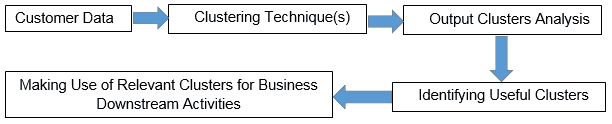

聚类在客户细分中的作用

现在我们已经了解到聚类是进行客户细分的基础，在本章的剩余部分，我们将讨论各种聚类技术，并围绕这些技术实施项目以创建客户细分。对于我们的项目，我们使用批发客户数据集。在深入项目之前，让我们了解数据集并执行**探索性数据分析**（**EDA**）以更好地理解数据。

# 理解批发客户数据集和细分问题

UCI 机器学习仓库在[`archive.ics.uci.edu/ml/datasets/wholesale+customers`](https://archive.ics.uci.edu/ml/datasets/wholesale+customers)提供了批发客户数据集。该数据集指的是批发分销商的客户。它包括各种产品类别的年度支出，以**货币单位**（**m.u.**）表示。这些项目的目标是应用聚类技术来识别与某些商业活动相关的细分市场，例如推出营销活动。在我们实际使用聚类算法获取聚类之前，让我们首先读取数据并执行一些 EDA，以下代码块将帮助我们理解数据：

```py
# setting the working directory to a folder where dataset is located
setwd('/home/sunil/Desktop/chapter5/')
# reading the dataset to cust_data dataframe
cust_data = read.csv(file='Wholesale_customers_ data.csv', header = TRUE)
# knowing the dimensions of the dataframe
print(dim(cust_data))
Output : 
440 8
# printing the data structure
print(str(cust_data))
'data.frame': 440 obs. of 8 variables:
 $ Channel : int 2 2 2 1 2 2 2 2 1 2 ...
 $ Region : int 3 3 3 3 3 3 3 3 3 3 ...
 $ Fresh : int 12669 7057 6353 13265 22615 9413 12126 7579...
 $ Milk : int 9656 9810 8808 1196 5410 8259 3199 4956...
 $ Grocery : int 7561 9568 7684 4221 7198 5126 6975 9426...
 $ Frozen : int 214 1762 2405 6404 3915 666 480 1669...
 $ Detergents_Paper: int 2674 3293 3516 507 1777 1795 3140 3321...
 $ Delicassen : int 1338 1776 7844 1788 5185 1451 545 2566...
# Viewing the data to get an intuition of the data 
View(cust_data)
```

这将给出以下输出：

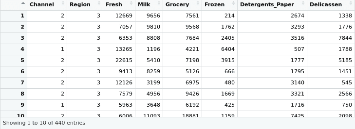

现在我们来检查数据集中是否有任何缺失字段的条目：

```py
# checking if there are any NAs in data
print(apply(cust_data, 2, function (x) sum(is.na(x))))
Output :
Channel Region Fresh Milk 
0 0 0 0 
Grocery Frozen Detergents_Paper Delicassen
```

```py

0 0 0 0 
# printing the summary of the dataset 
print(summary(cust_data))
```

这将给出以下输出：

```py
Channel Region Fresh Milk 
 Min. :1.000 Min. :1.000 Min. : 3 Min. : 55 
 1st Qu.:1.000 1st Qu.:2.000 1st Qu.: 3128 1st Qu.: 1533 
 Median :1.000 Median :3.000 Median : 8504 Median : 3627 
 Mean :1.323 Mean :2.543 Mean : 12000 Mean : 5796 
 3rd Qu.:2.000 3rd Qu.:3.000 3rd Qu.: 16934 3rd Qu.: 7190 
 Max. :2.000 Max. :3.000 Max. :112151 Max. :73498 
 Grocery Frozen Detergents_Paper Delicassen 
 Min. : 3.0 Min. : 3.0 Min. : 3 Min. : 25.0 
 1st Qu.: 256.8 1st Qu.: 408.2 1st Qu.: 2153 1st Qu.: 742.2
 Median : 816.5 Median : 965.5 Median : 4756 Median : 1526.0
 Mean : 2881.5 Mean : 1524.9 Mean : 7951 Mean : 3071.9
 3rd Qu.: 3922.0 3rd Qu.: 1820.2 3rd Qu.:10656 3rd Qu.: 3554.2
 Max. :40827.0 Max. :47943.0 Max. :92780 Max. :60869.0
```

从 EDA 中，我们看到这个数据集中有 `440` 个观测值，并且有八个变量。数据集没有任何缺失值。尽管最后六个变量是批发商从批发商那里带来的商品，但前两个变量是因素（分类变量），代表购买的位置和渠道。在我们的项目中，我们打算根据不同产品的销售来识别细分市场，因此，数据中的位置和渠道变量并不很有用。让我们使用以下代码从数据集中删除它们：

```py
# excluding the non-useful columns from the dataset
cust_data<-cust_data[,c(-1,-2)]
# verifying the dataset post columns deletion
dim(cust_data)
```

这给出了以下输出：

```py
440 6
```

我们可以看到只保留了六列，这证实了非必需列的删除是成功的。从 EDA 代码的总结输出中，我们还可以观察到所有保留列的尺度是相同的，因此我们不需要显式地归一化数据。

可能需要注意的是，大多数聚类算法都涉及某种形式的距离计算（例如欧几里得、曼哈顿、Grower）。确保数据集列之间的尺度是一致的是非常重要的，以防止某个变量因为尺度较高而在距离计算中成为主导变量。在数据列中观察到不同尺度的情况下，我们将依赖诸如 Z 变换或 min-max 变换等技术。对数据进行这些技术之一的应用确保了数据集列的适当缩放，因此在使用聚类算法时，数据集中没有主导变量。

聚类算法强制在输入数据集中识别子组，即使没有集群存在。为了确保我们从聚类算法中获得有意义的集群输出，检查数据中是否存在集群是非常重要的。**聚类趋势**，或聚类分析的可行性，是识别数据集中是否存在集群的过程。给定一个输入数据集，这个过程确定它是否具有非随机或非均匀的数据结构分布，这将导致有意义的集群。Hopkins 统计量用于确定聚类趋势。它取值在 0 到 1 之间，如果 Hopkins 统计量的值接近 0（远低于 0.5），则表明数据集中存在有效的集群。接近 1 的 Hopkins 值表明数据集中存在随机结构。

`factoextra` 库有一个内置的 `get_clust_tendency()` 函数，该函数在输入数据集上计算 Hopkins 统计量。让我们将此函数应用于我们的批发数据集，以确定数据集是否适用于聚类。以下代码完成了 Hopkins 统计量的计算：

```py
# setting the working directory to a folder where dataset is located
setwd('/home/sunil/Desktop/chapter5/')
# reading the dataset to cust_data dataframe
cust_data = read.csv(file='Wholesale_customers_ data.csv', header = TRUE)
# removing the non-required columns
cust_data<-cust_data[,c(-1,-2)]
# inlcuding the facto extra library 
library(factoextra)
# computing and printing the hopikins statistic
print(get_clust_tendency(cust_data, graph=FALSE,n=50,seed = 123))
```

这将给出以下输出：

```py
$hopkins_stat
[1] 0.06354846
```

我们数据集的 Hopkins 统计输出非常接近 0，因此我们可以得出结论，我们有一个适合聚类练习的数据集。

# 聚类算法的分类

R 中现成的聚类算法有很多。然而，所有这些算法都可以分为以下两类：

+   **平面或划分算法**：这些算法依赖于一个输入参数，该参数定义了在数据集中要识别的聚类数量。输入参数有时直接来自业务，或者可以通过某些统计方法建立。例如，**肘部法**。

+   **层次算法**：在这些算法中，聚类不是在单一步骤中确定的。它们涉及多个步骤，从包含所有数据点的单个聚类开始，到包含单个数据点的*n*个聚类。层次算法可以进一步分为以下两种类型：

    +   **划分类型**：一种自上而下的聚类方法，其中所有点最初被分配到一个单个聚类中。在下一步中，聚类被分割成两个最不相似的聚类。分割聚类的过程递归进行，直到每个点都有自己的聚类，例如，**DIvisive ANAlysis**（DIANA）聚类算法。

    +   **聚合类型**：一种自下而上的方法，在初始运行中，数据集中的每个点被分配*n*个独特的聚类，其中*n*等于数据集中的观测数。在下一个迭代中，最相似的聚类被合并（基于聚类之间的距离）。合并聚类的递归过程继续进行，直到我们只剩下一个聚类，例如，**聚合嵌套**（AGNES）算法。

如前所述，有众多聚类算法可供选择，我们将专注于使用每种聚类类型的一个算法来实现项目。我们将使用 k-means 算法来实现项目，它是一种平面或划分类型的聚类算法。然后我们将使用 DIANA 和 AGNES 进行客户细分，DIANA 和 AGNES 分别是划分和聚合类型的算法。

# 使用 k-means 聚类在批发客户数据中识别客户细分

k-means 算法可能是从划分聚类类型中最受欢迎和最常用的聚类方法。尽管我们通常称之为 k-means 聚类算法，但这个算法有多个实现，包括**MacQueen**、**Lloyd 和 Forgy**以及**Hartigan-Wong**算法。研究表明，在大多数情况下，Hartigan-Wong 算法的性能优于其他两种算法。R 中的 k-means 默认使用 Hartigan-Wong 实现。

k 均值算法需要将 k 值作为参数传递。该参数表示要使用输入数据创建的簇数。对于从业者来说，确定最佳 k 值通常是一个挑战。有时，我们可以去一家企业询问他们预计数据中有多少簇。企业的回答将直接转换为要输入算法的*k*参数值。然而，在大多数情况下，企业对簇数一无所知。在这种情况下，责任将落在机器学习从业者身上，他们需要确定 k 值。幸运的是，有几种方法可以确定这个值。这些方法可以分为以下两类：

+   **直接方法**：这些方法依赖于优化一个标准，例如*簇内平方和*或*平均轮廓*。这种方法包括**V 肘方法**和**V 轮廓方法**。

+   **测试方法**：这些方法包括将证据与零假设进行比较。差距统计是这种方法的一个流行例子。

除了肘方法、轮廓方法和差距统计方法之外，还有 30 多种其他指数和方法被发表出来用于确定最佳簇数。我们不会深入探讨这些方法的理论细节，因为在一个章节中涵盖 30 种方法是不切实际的。然而，R 提供了一个名为`NbClust`的出色库函数，使我们能够一次性实现所有这些方法。`NbClust`函数功能强大，它通过改变簇数、距离度量以及聚类方法的全部组合来确定最佳簇数！一旦库函数计算了所有 30 个指数，就会在输出上应用*多数规则*来确定最佳簇数，即作为算法输入的 k 值。让我们使用以下代码块为我们的批发数据集实现`NbClust`以确定最佳 k 值：

```py
# setting the working directory to a folder where dataset is located
setwd('/home/sunil/Desktop/chapter5/')
# reading the dataset to cust_data dataframe
cust_data = read.csv(file='Wholesale_customers_ data.csv', header = TRUE)
# removing the non-required columns
cust_data<-cust_data[,c(-1,-2)]
# including the NbClust library
library(NbClust)
# Computing the optimal number of clusters through the NbClust function with distance as euclidean and using kmeans 
NbClust(cust_data,distance="euclidean", method="kmeans")
```

这将给出以下输出：

```py
******************************************************************* 
* Among all indices: 
* 1 proposed 2 as the best number of clusters 
* 11 proposed 3 as the best number of clusters 
* 2 proposed 4 as the best number of clusters 
* 1 proposed 5 as the best number of clusters 
* 4 proposed 8 as the best number of clusters 
* 1 proposed 10 as the best number of clusters 
* 1 proposed 12 as the best number of clusters 
* 1 proposed 14 as the best number of clusters 
* 1 proposed 15 as the best number of clusters 
                   ***** Conclusion ***** 
* According to the majority rule, the best number of clusters is 3 
******************************************************************* 
```

根据结论，我们看到可能用于我们问题的 k 值是`3`。此外，通过将 k 均值解中的簇数与组内总平方和绘制肘曲线可以帮助确定最佳簇数。k 均值由目标函数定义，该函数试图最小化所有簇内所有平方距离的总和（簇内距离）。在肘曲线绘制方法中，我们使用不同的 k 值计算簇内距离，并将不同 k 值的簇内距离绘制成图表。肘曲线的弯曲处表明了对于数据集而言的 k 值是最佳的。在 R 中，可以使用以下代码块获得肘曲线：

```py
# computing the the intra-cluster distance with Ks ranging from 2 to 10
library(purrr)
tot_withinss <- map_dbl(2:10, function(k){
  model <- kmeans(cust_data, centers = k, nstart = 50)
  model$tot.withinss
})
# converting the Ks and computed intra-cluster distances to a dataframe
screeplot_df <- data.frame(k = 2:10,
```

```py

                           tot_withinss = tot_withinss)
# plotting the elbow curve
library(ggplot2)
print( ggplot(screeplot_df, aes(x = k, y = tot_withinss)) + 
         geom_line() + 
         scale_x_continuous(breaks = 1:10) + 
         labs(x = "k", y = "Within Cluster Sum of Squares") + 
         ggtitle("Total Within Cluster Sum of Squares by # of Clusters (k)") +
         geom_point(data = screeplot_df[2,], aes(x = k, y = tot_withinss),
                    col = "red2", pch = 4, size = 7))
```

这将给出以下输出：

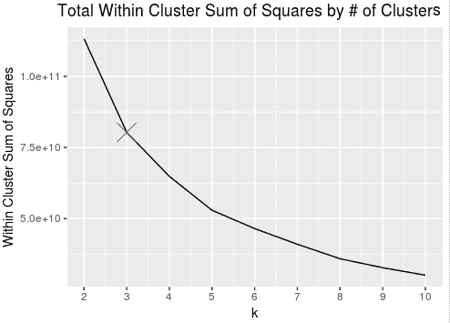

即使是肘部曲线法输出的结果，我们也可以看到，我们数据集的最佳聚类数量是`3`。

从`NbClust`函数中我们可以看到，我们使用了欧几里得距离作为距离。在`NbClust`函数中，我们可以使用多种距离类型（`euclidean`、`maximum`、`manhattan`、`canberra`、`binary`、`minkowski`）作为距离参数的值。让我们理解这个距离实际上意味着什么。我们已经知道，我们数据集中的每个观察值是由表示特征的值组成的。这本质上意味着我们数据集中的每个观察值都可以表示为多维空间中的点。如果我们说两个观察值相似，我们期望这两个点在多维空间中的距离较低，即这两个点在多维空间中彼此靠近。两点之间的高距离值表明它们非常不相似。

欧几里得、曼哈顿以及其他类型的距离度量是多维空间中两点之间距离度量的各种方式。每种距离度量都涉及一种特定的技术来计算两点之间的距离。曼哈顿和欧几里得中涉及的技术以及它们度量的区别在下图中展示：

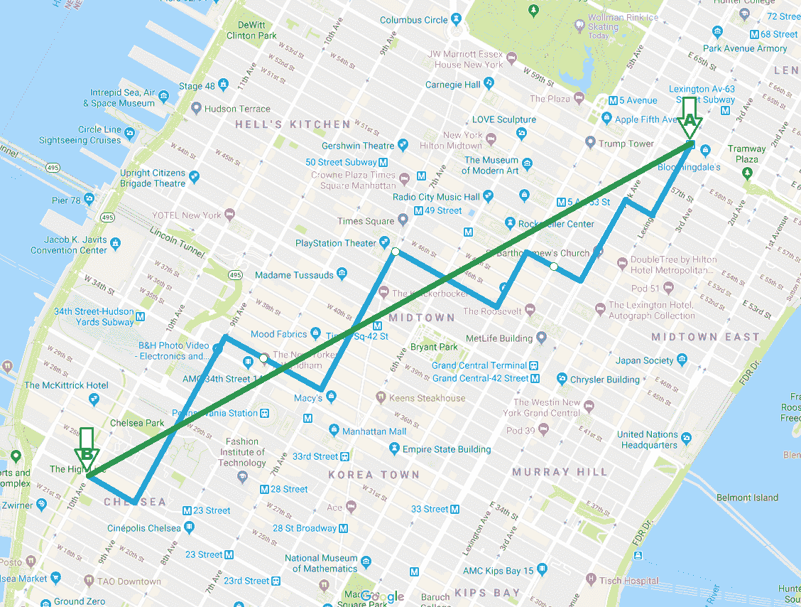

曼哈顿距离与欧几里得距离度量的区别

欧几里得距离度量平面上的最短距离，而曼哈顿度量是在允许水平或垂直移动的情况下最短路径。

例如，如果`a`和`b`是两个点，其中`a= (0,0)`，`b = (3,4)`，那么看看以下内容：

+   `dist_euclid (a,b) = sqrt(3²+4²) = 5`

+   `dist_manhattan(a,b) = 3+4 = 7`

+   `a=(a1,...,an), b=(b1,...,bn)`（在*n*维度和点）

+   `dist_euclid (a,b) = sqrt((a1-b1)² + ... + (an-bn)²)`

+   `dist_manhattan(a,b) = sum(abs(a1-b1) + ... + abs(an-bn))`

这两种度量都测量最短路径，但欧几里得度量没有任何限制，而曼哈顿度量只允许除了一个维度外所有维度都保持恒定的路径。

同样，其他距离度量也涉及某种独特的方法来度量给定点之间的相似性。在本章中，我们不会详细讲解每种技术，但需要理解的是，距离度量基本上定义了给定观察之间的相似程度。需要注意的是，距离度量不仅用于`NbClust`，还用于多个机器学习算法，包括 k-means。

现在我们已经学习了识别 k 值的各种方法，并将它们应用于识别批发数据集的最佳聚类数量，接下来让我们用以下代码实现 k-means 算法：

```py
library(cluster)
# runing kmeans in cust_data dataset to obtain 3 clusters
kmeansout <- kmeans(cust_data, centers = 3, nstart = 50) 
print (kmeansout)
```

这将产生以下输出：

```py
> kmeansout
K-means clustering with 3 clusters of sizes 330, 50, 60
Cluster means:
     Fresh Milk Grocery Frozen Detergents_Paper Delicassen
1 8253.47 3824.603 5280.455 2572.661 1773.058 1137.497
2 8000.04 18511.420 27573.900 1996.680 12407.360 2252.020
3 35941.40 6044.450 6288.617 6713.967 1039.667 3049.467
Clustering vector:
  [1] 1 1 1 1 3 1 1 1 1 2 1 1 3 1 3 1 1 1 1 1 1 1 3 2 3 1 1 1 2 3 1 1 1 3 1 1 3 1 2 3 3 1 1 2 1 2 2 2 1 2 1 1 3 1
 [55] 3 1 2 1 1 1 1 2 1 1 1 2 1 1 1 1 1 1 1 1 1 1 1 2 1 1 1 1 1 1 1 2 2 3 1 3 1 1 2 1 1 1 1 1 1 1 1 1 1 3 1 1 1 1
[109] 1 2 1 2 1 1 1 1 1 1 1 1 1 1 1 1 3 3 1 1 1 3 1 1 1 1 1 1 1 1 1 1 1 3 3 1 1 2 1 1 1 3 1 1 1 1 1 2 1 1 1 1 1 1
[163] 1 2 1 2 1 1 1 1 1 2 1 2 1 1 3 1 1 1 1 3 1 3 1 1 1 1 1 1 1 1 1 1 1 1 3 1 1 1 2 2 3 1 1 2 1 1 1 2 1 2 1 1 1 1
```

```py
[217] 2 1 1 1 1 1 1 1 1 1 1 1 1 1 1 1 3 1 1 1 1 1 1 3 3 3 1 1 1 1 1 1 1 1 1 2 1 3 1 3 1 1 3 3 1 1 3 1 1 2 2 1 2 1
[271] 1 1 1 3 1 1 3 1 1 1 1 1 3 3 3 3 1 1 1 3 1 1 1 1 1 1 1 1 1 1 1 2 1 1 2 1 2 1 1 2 1 3 2 1 1 1 1 1 1 2 1 1 1 1
[325] 3 3 1 1 1 1 1 2 1 2 1 3 1 1 1 1 1 1 1 2 1 1 1 3 1 2 1 2 1 2 1 1 1 1 1 1 1 1 1 1 1 1 1 1 1 1 3 1 1 1 1 1 1 3
[379] 1 1 3 1 3 1 2 1 1 1 1 1 1 1 1 3 1 1 1 1 1 1 1 3 3 3 1 1 3 2 1 1 1 1 1 1 1 1 1 1 2 1 1 1 3 1 1 1 1 3 1 1 1 1
[433] 1 1 1 3 3 2 1 1
```

从 k-means 的输出中，我们可以观察和推断关于输出聚类的几个方面。显然，形成了三个聚类，这与我们传递给算法的 k 参数一致。我们看到第一个聚类中有 330 个观测值，而第二个和第三个聚类较小，只有 50 和 60 个观测值。k-means 输出还为我们提供了聚类中心。**中心点**是特定聚类中所有点的代表。由于不可能研究分配给每个聚类的每个单独的观测值并确定聚类的业务特征，因此聚类中心可以用来代表聚类中的点。聚类中心帮助我们快速得出关于聚类内容定义的结论。k-means 输出还产生了每个观测值的聚类分配。我们批发数据集中的每个观测值都被分配到三个聚类中的一个（1，2，3）。

可以通过使用 `factoextra` 库中的 `fviz_cluster()` 函数来查看聚类结果。该函数提供了聚类的一个良好说明。如果有超过两个维度（变量），`fviz_cluster` 将执行 **主成分分析** (**PCA**) 并根据解释大部分方差的前两个主成分来绘制观测值。可以通过以下代码创建聚类可视化：

```py
library(factoextra)
fviz_cluster(kmout,data=cust_data)
```

这将生成以下图形作为输出：

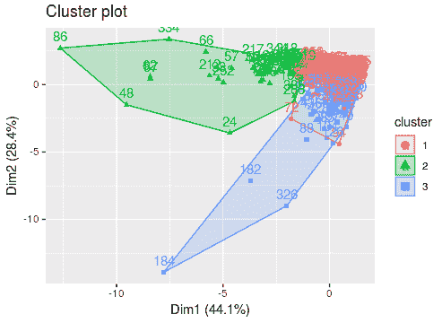

# k-means 算法的工作原理

k-means 算法的执行涉及以下步骤：

1.  从数据集中随机选择 *k* 个观测值作为初始聚类中心。

1.  对于数据集中的每个观测值，执行以下操作：

    1.  计算观测值与每个聚类中心之间的距离。

    1.  识别与观测值距离最小的聚类中心。

    1.  将观测值分配到最近的中心。

1.  将所有点分配给其中一个聚类中心后，计算新的聚类中心。这可以通过计算分配给聚类的所有点的平均值来完成。

1.  重复执行 *步骤 2* 和 *步骤 3*，直到聚类中心（均值）不再改变或达到用户定义的迭代次数。

在 k-means 中需要注意的一个关键问题是，初始步骤中簇质心的选择是随机的，簇分配是基于实际观测值与随机选择的簇质心之间的距离进行的。这本质上意味着，如果我们最初选择除所选观测值之外的观测值作为簇质心，我们将获得与我们所获得的簇不同的簇。在技术术语中，这被称为**非全局最优解**或**局部最优解**。`cluster`库的 k-means 函数具有`nstart`选项，它可以解决 k-means 算法中遇到的非全局最优解问题。

`nstart`选项使算法能够通过从数据集中抽取多个中心观测值来尝试多个随机起始点（而不是只有一个），然后检查簇的平方和，并继续使用最佳起始点，从而得到更稳定的输出。在我们的案例中，我们将`nstart`值设置为`50`，因此通过 50 个随机初始簇质心集来检查后，选择最佳起始点。以下图表描述了 k-means 聚类算法中涉及的高级步骤：

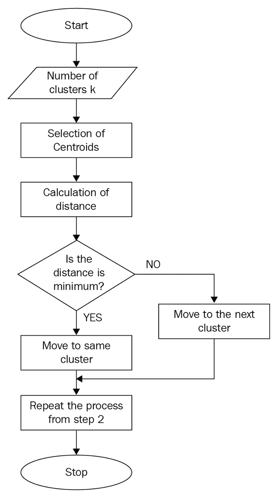

k-means 聚类步骤

在监督机器学习（ML）方法中，例如分类，我们有真实标签，因此我们可以将我们的预测与真实标签进行比较，并报告我们分类的性能。与监督机器学习方法不同，在聚类中，我们没有真实标签。因此，根据聚类计算性能度量是一个挑战。

作为性能度量的替代，我们使用一个称为**簇质量**的伪度量。簇质量通常通过称为簇内距离和簇间距离的度量来计算，这些度量在以下图表中说明：

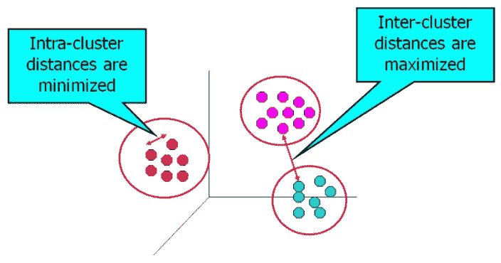

已定义簇内距离和簇间距离

聚类任务的目的是获得高质量的簇。如果观测值之间的距离最小且簇之间的距离最大，则簇被称为**高质量簇**。

存在多种测量簇间和簇内距离的方法：

+   **簇内距离**：这个距离可以测量为簇中所有点对之间的（绝对/平方）距离的（总和、最小值、最大值或平均值），或者为（直径）——两个最远的点，或者为质心与簇中所有点之间的距离。

+   **簇间距离**：这个距离是通过所有簇对之间的（平方）距离的总和来测量的，其中两个簇之间的距离是通过以下方式之一计算的：

    +   质心之间的距离

    +   最远点对之间的距离

    +   属于簇的最接近一对点的距离

不幸的是，我们无法精确地确定簇间距离和簇内距离的偏好值。**轮廓指数**是一个基于簇间距离和簇内距离的指标，可以轻松计算并易于解释。

轮廓指数是通过计算每个参与聚类练习的观测值的平均簇内距离 *a* 和平均最近簇距离 *b* 来计算的。一个观测值的轮廓指数由以下公式给出：

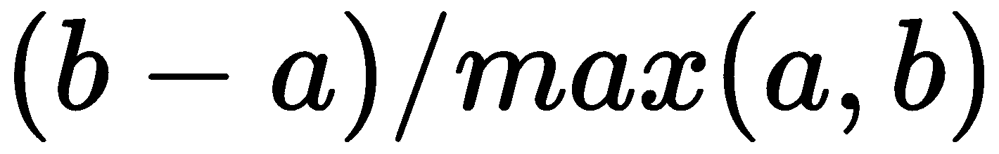

在这里，*b* 是一个观测值与其不属于的最近簇之间的距离。

轮廓指数的值介于 [-1, 1] 之间。对于一个观测值，+1 的值表示该观测值远离其邻近簇，并且非常接近其分配到的簇。同样，-1 的值告诉我们该观测值比其分配到的簇更接近其邻近簇。0 的值表示它位于两个簇之间的距离边界上。+1 是理想的值，而 -1 是最不受欢迎的值。因此，值越高，簇的质量越好。

`cluster` 库提供了轮廓函数，可以轻松地应用于我们的 k-means 聚类输出，以了解形成簇的质量。以下代码计算了我们的三个簇的轮廓指数：

```py
# computing the silhouette index for the clusters
si <- silhouette(kmout$cluster, dist(cust_data, "euclidean"))
# printing the summary of the computed silhouette index 
print(summary(si))
```

这将给出以下输出：

```py
Silhouette of 440 units in 3 clusters from silhouette.default(x = kmout$cluster, dist = dist(cust_data, from "euclidean")) :
 Cluster sizes and average silhouette widths:
       60 50 330 
0.2524346 0.1800059 0.5646307 
Individual silhouette widths:
   Min. 1st Qu. Median Mean 3rd Qu. Max. 
-0.1544 0.3338 0.5320 0.4784 0.6743 0.7329 
```

正如我们所见，轮廓指数可以从 -1 到 +1 变化，后者更受欢迎。从输出结果来看，这些簇都是高质量的簇，因为平均宽度是一个接近 1 的正数，比 -1 更接近 1。

事实上，轮廓指数不仅可以用来衡量形成簇的质量，还可以用来计算 k 值。类似于肘部方法，我们可以遍历多个 k 值，然后识别出在整个簇中产生最大轮廓指数值的 k。然后可以使用识别出的 k 进行聚类。

文献中描述了大量的簇质量度量。轮廓指数只是我们在本章中介绍的一个度量，因为它在机器学习社区中非常受欢迎。`clusterCrit` 库提供了广泛的指标来衡量簇的质量。我们不会在这里探索其他簇质量指标，但感兴趣的读者应参考此库以获取有关如何计算簇质量的更多信息。

到目前为止，我们已经介绍了 k-means 聚类算法来识别聚类，但最初开始的原始细分任务并没有结束。细分进一步扩展到理解从聚类练习中形成的每个聚类对业务意味着什么。例如，我们使用从 k-means 获得的聚类质心，并尝试识别这些是什么：

```py
Fresh Milk Grocery Frozen Detergents_Paper Delicatessen
1 8253.47 3824.603 5280.455 2572.661 1773.058 1137.497
2 8000.04 18511.420 27573.900 1996.680 12407.360 2252.020
3 35941.40 6044.450 6288.617 6713.967 1039.667 3049.467
```

这里是每个聚类的几个示例洞察：

+   聚类 1 是低消费群体（平均消费：22,841.744），大部分消费分配到新鲜类别

+   聚类 2 是高消费群体（平均消费：70,741.42），大部分消费在杂货类别

+   聚类 3 是中等消费群体（平均消费：59,077.568），大部分消费在新鲜类别

现在，根据业务目标，可以选择一个或多个聚类进行目标定位。例如，如果目标是让高消费群体消费更多，可以推出针对在`冷冻`和`熟食店`产品上的消费低于质心值（即`冷冻`：`1,996.680`和`熟食店`：`2,252.020`）的聚类 2 个人的促销活动。

# 使用 DIANA 在批发客户数据中识别客户细分

当数据中不一定有圆形（或超球体）聚类时，层次聚类算法是一个很好的选择，并且我们事先也不知道聚类的数量。与平面或划分算法不同，使用层次聚类算法时，不需要在将算法应用于数据集之前决定并传递要形成的聚类数量。

层次聚类会产生一个树状图（树形图），可以直观地验证以轻松确定聚类数量。直观验证使我们能够在树状图上合适的位置进行切割。

这种聚类算法产生的结果具有可重复性，因为算法对距离度量的选择不敏感。换句话说，无论选择哪种距离度量，我们都会得到相同的结果。这种聚类也适用于更复杂的（二次）数据集，特别是用于探索聚类之间存在的层次关系。

分裂层次聚类，也称为**DIvisive ANAlysis**（**DIANA**），是一种层次聚类算法，它采用自上而下的方法来识别给定数据集中的聚类。以下是 DIANA 识别聚类的步骤：

1.  所有数据集的观测值都被分配到根节点，因此在初始步骤中只形成一个单一聚类。

1.  在每次迭代中，最异质的聚类被分割成两个。

1.  **步骤 2**重复进行，直到所有观测值都在它们自己的聚类中：

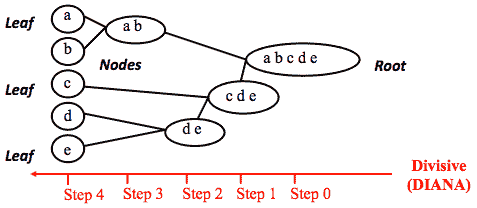

分裂层次聚类算法的工作原理

一个明显的问题就是关于算法用来将簇分割成两个的技术。答案是它根据某些（不）相似性度量来执行。欧几里得距离用于测量两个给定点之间的距离。该算法通过基于所有数据点成对距离的最远距离度量来分割数据。链接定义了数据点距离的具体细节。下一图展示了 DIANA 在分割簇时考虑的各种链接方式。以下是一些考虑用于分割组的一些距离：

+   **单链接法**: 最近距离或单链接

+   **完全链接法**: 最远距离或完全链接

+   **平均链接法**: 平均距离或平均链接

+   **重心链接法**: 重心距离

+   **Ward 方法**: 最小化平方欧几里得距离和

看看以下图表以更好地理解前面的距离：

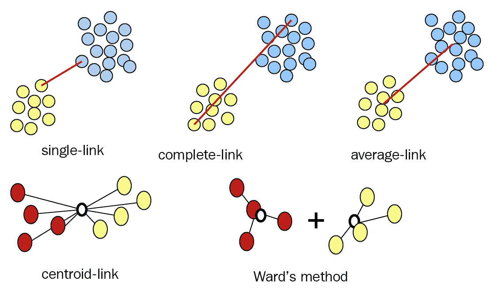

展示 DIANA 使用的各种链接类型的示意图

通常，要使用的链接类型作为参数传递给聚类算法。`cluster`库提供了`diana`函数来执行聚类。让我们用以下代码在我们的批发数据集上应用它：

```py
# setting the working directory to a folder where dataset is located
setwd('/home/sunil/Desktop/chapter5/')
# reading the dataset to cust_data dataframe
cust_data = read.csv(file='Wholesale_customers_ data.csv', header = TRUE)
# removing the non-required columns
cust_data<-cust_data[,c(-1,-2)]
# including the cluster library so as to make use of diana function
library(cluster)
# Compute diana()
cust_data_diana<-diana(cust_data, metric = "euclidean",stand = FALSE)
# plotting the dendogram from diana output
pltree(cust_data_diana, cex = 0.6, hang = -1,
       main = "Dendrogram of diana")
# Divise coefficient; amount of clustering structure found
print(cust_data_diana$dc)
```

这将给出以下输出：

```py
> print(cust_data_diana$dc)
[1] 0.9633628
```

看看以下输出：

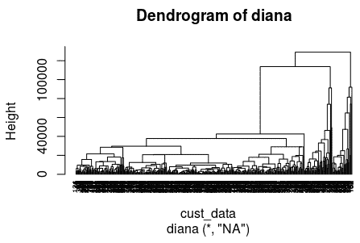

`plot.hclust()`和`plot.dendrogram()`函数也可以用于 DIANA 聚类输出。`plot.dendrogram()`生成的树状图遵循 DIANA 算法执行的分割的自然结构。使用以下代码生成树状图：

```py
plot(as.dendrogram(cust_data_diana), cex = 0.6,horiz = TRUE)
```

这将给出以下输出：

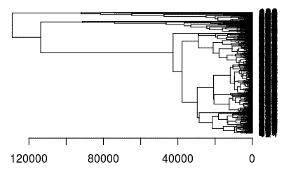

在树状图输出中，每个出现在右侧的叶子都与数据集中的每个观测相关。当我们从右向左遍历时，相似的观测被分组到一个分支中，这些分支本身在更高的级别上融合。

水平轴上提供的融合级别表示两个观测之间的相似性。融合级别越高，观测之间的相似性就越大。需要注意的是，关于两个观测之间接近性的结论只能基于包含这两个观测的分支首次融合的级别得出。为了识别簇，我们可以在树状图的一定级别处进行切割。切割所进行的级别定义了获得的簇的数量。

我们可以使用`cutree()`函数来获取数据集中每个观测的簇分配。执行以下代码以获取簇并审查聚类输出：

```py
# obtain the clusters through cuttree
# Cut tree into 3 groups
grp <- cutree(cust_data_diana, k = 3)
# Number of members in each cluster
table(grp)
# Get the observations of cluster 1
rownames(cust_data)[grp == 1]
```

这将给出以下输出：

```py
> table(grp)
grp
  1 2 3 
364 44 32 
> rownames(cust_data)[grp == 1]
  [1] "1" "2" "3" "4" "5" "6" "7" "8" "9" "11" "12" "13" "14" "15" "16"
```

```py
"17" "18" "19" 
 [19] "20" "21" "22" "25" "26" "27" "28" "31" "32" "33" "34" "35" "36" "37" "38" "41" "42" "43" 
 [37] "45" "49" "51" "52" "54" "55" "56" "58" "59" "60" "61" "63" "64" "65" "67" "68" "69" "70" 
 [55] "71" "72" "73" "74" "75" "76" "77" "79" "80" "81" "82" "83" "84" "85" "89" "90" "91" "92" 
 [73] "94" "95" "96" "97" "98" "99" "100" "101" "102" "103" "105" "106" "107" "108" "109" "111" "112" "113"
 [91] "114" "115" "116" "117" "118" "119" "120" "121" "122" "123" "124" "127" "128" "129" "131" "132" "133" "134"
[109] "135" "136" "137" "138" "139" "140" "141" "142" "144" "145" "147" "148" "149" "151" "152" "153" "154" "155"
[127] "157" "158" "159" "160" "161" "162" "163" "165" "167" "168" "169" "170" "171" "173" "175" "176" "178" "179"
[145] "180" "181" "183" "185" "186" "187" "188" "189" "190" "191" "192" "193" "194" "195" "196" "198" "199" "200"
[163] "203" "204" "205" "207" "208" "209" "211" "213" "214" "215" "216" "218" "219" "220" "221" "222" "223" "224"
[181] "225" "226" "227" "228" "229" "230" "231" "232" "233" "234" "235" "236" "237" "238" "239" "241" "242" "243"
[199] "244" "245" "246" "247" "248" "249" "250" "251" "253" "254" "255" "257" "258" "261" "262" "263" "264" "265"
[217] "266" "268" "269" "270" "271" "272" "273" "275" "276" "277" "278" "279" "280" "281" "282" "284" "287" "288"
[235] "289" "291" "292" "293" "294" "295" "296" "297" "298" "299" "300" "301" "303" "304" "306" "308" "309" "311"
[253] "312" "314" "315" "316" "317" "318" "319" "321" "322" "323" "324" "325" "327" "328" "329" "330" "331" "333"
[271] "335" "336" "337" "338" "339" "340" "341" "342" "343" "345" "346" "347" "348" "349" "351" "353" "355" "356"
[289] "357" "358" "359" "360" "361" "362" "363" "364" "365" "366" "367" "368" "369" "370" "372" "373" "374" "375"
[307] "376" "377" "379" "380" "381" "382" "384" "385" "386" "387" "388" "389" "390" "391" "392" "393" "394" "395"
[325] "396" "397" "398" "399" "400" "401" "402" "403" "404" "405" "406" "407" "409" "410" "411" "412" "413" "414"
[343] "415" "416" "417" "418" "420" "421" "422" "423" "424" "425" "426" "427" "429" "430" "431" "432" "433" "434"
[361] "435" "436" "439" "440"
```

我们还可以通过`factoextra`库中的`fviz_cluster`函数可视化聚类输出。使用以下代码获取所需的可视化：

```py
library(factoextra)
fviz_cluster(list(data = cust_data, cluster = grp))
```

这将给出以下输出：

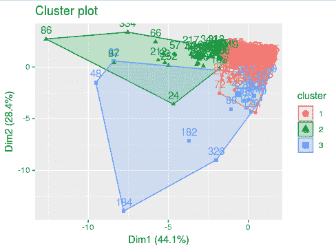

还可以在树状图中本身对簇进行着色编码。这可以通过以下代码实现：

```py
plot(as.hclust(cust_data_diana))
rect.hclust(cust_data_diana, k = 4, border = 2:5)
```

这将给出以下输出：

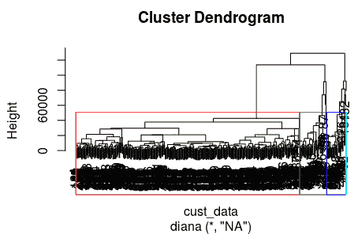

现在簇已经识别，我们讨论的评估簇质量（通过轮廓指数）的步骤也适用于此处。因为我们已经在 k-means 聚类算法下讨论了这一主题，所以我们不会在这里重复步骤。代码和输出解释与 k-means 下讨论的内容相同。

如前所述，簇的输出并不是我们手头上的客户细分练习的最终点。类似于我们在 k-means 算法下进行的讨论，我们可以分析 DIANA 簇的输出以识别有意义的细分，以便将这些业务目标推广到特定识别的细分中。

# 使用 AGNES 在批发客户数据中识别客户细分

AGNES 在聚类数据集时遵循自下而上的方法，与 DIANA 相反。以下图解说明了 AGNES 算法的聚类工作原理：

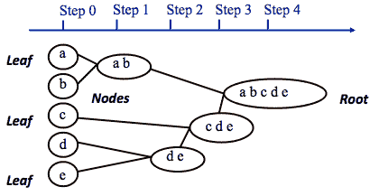

聚类层次聚类算法的工作原理

除了 AGNES 遵循的从下而上的方法之外，算法背后的实现细节与 DIANA 相同；因此，我们在这里不会重复讨论概念。以下代码块使用 AGNES 将我们的批发数据集聚类成三个簇；它还创建了所形成的簇的可视化：

```py
# setting the working directory to a folder where dataset is located
setwd('/home/sunil/Desktop/chapter5/')
# reading the dataset to cust_data dataframe
cust_data = read.csv(file='Wholesale_customers_ data.csv', header = TRUE)
# removing the non-required columns
cust_data<-cust_data[,c(-1,-2)]
# including the cluster library so as to make use of agnes function
library(cluster)
# Compute agnes()
cust_data_agnes<-agnes(cust_data, metric = "euclidean",stand = FALSE)
# plotting the dendogram from agnes output
pltree(cust_data_agnes, cex = 0.6, hang = -1,
       main = "Dendrogram of agnes")
# agglomerative coefficient; amount of clustering structure found
print(cust_data_agnes$ac)
plot(as.dendrogram(cust_data_agnes), cex = 0.6,horiz = TRUE)
# obtain the clusters through cuttree
# Cut tree into 3 groups
grp <- cutree(cust_data_agnes, k = 3)
# Number of members in each cluster
table(grp)
# Get the observations of cluster 1
rownames(cust_data)[grp == 1]
# visualization of clusters
library(factoextra)
fviz_cluster(list(data = cust_data, cluster = grp))
library(factoextra)
fviz_cluster(list(data = cust_data, cluster = grp))
plot(as.hclust(cust_data_agnes))
rect.hclust(cust_data_agnes, k = 3, border = 2:5)
```

这是你将获得的输出：

```py
[1] 0.9602911
> plot(as.dendrogram(cust_data_agnes), cex = 0.6,horiz = FALSE)
```

查看以下屏幕截图：

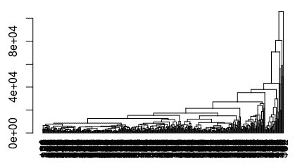

查看以下代码块：

```py
> grp <- cutree(cust_data_agnes, k = 3)
> # Number of members in each cluster
> table(grp)
grp
  1 2 3
434 5 1 
> rownames(cust_data)[grp == 1]
  [1] "1" "2" "3" "4" "5" "6" "7" "8" "9" "10" "11" "12" "13" "14" "15" "16" "17" "18" 
 [19] "19" "20" "21" "22" "23" "24" "25" "26" "27" "28" "29" "30" "31" "32" "33" "34" "35" "36" 
 [37] "37" "38" "39" "40" "41" "42" "43" "44" "45" "46" "47" "49" "50" "51" "52" "53" "54" "55" 
 [55] "56" "57" "58" "59" "60" "61" "63" "64" "65" "66" "67" "68" "69" "70" "71" "72" "73" "74" 
 [73] "75" "76" "77" "78" "79" "80" "81" "82" "83" "84" "85" "88" "89" "90" "91" "92" "93" "94" 
 [91] "95" "96" "97" "98" "99" "100" "101" "102" "103" "104" "105" "106" "107" "108" "109" "110" "111" "112"
[109] "113" "114" "115" "116" "117" "118" "119" "120" "121" "122" "123" "124" "125" "126" "127" "128" "129" "130"
[127] "131" "132" "133" "134" "135" "136" "137" "138" "139" "140" "141" "142" "143" "144" "145" "146" "147" "148"
[145] "149" "150" "151" "152" "153" "154" "155" "156" "157" "158" "159" "160" "161" "162" "163" "164" "165" "166"
[163] "167" "168" "169" "170" "171" "172" "173" "174" "175" "176" "177" "178" "179" "180" "181" "183" "184" "185"
[181] "186" "187" "188" "189" "190" "191" "192" "193" "194" "195" "196" "197" "198" "199" "200" "201" "202" "203"
```

```py
[199] "204" "205" "206" "207" "208" "209" "210" "211" "212" "213" "214" "215" "216" "217" "218" "219" "220" "221"
[217] "222" "223" "224" "225" "226" "227" "228" "229" "230" "231" "232" "233" "234" "235" "236" "237" "238" "239"
[235] "240" "241" "242" "243" "244" "245" "246" "247" "248" "249" "250" "251" "252" "253" "254" "255" "256" "257"
[253] "258" "259" "260" "261" "262" "263" "264" "265" "266" "267" "268" "269" "270" "271" "272" "273" "274" "275"
[271] "276" "277" "278" "279" "280" "281" "282" "283" "284" "285" "286" "287" "288" "289" "290" "291" "292" "293"
[289] "294" "295" "296" "297" "298" "299" "300" "301" "302" "303" "304" "305" "306" "307" "308" "309" "310" "311"
[307] "312" "313" "314" "315" "316" "317" "318" "319" "320" "321" "322" "323" "324" "325" "326" "327" "328" "329"
[325] "330" "331" "332" "333" "335" "336" "337" "338" "339" "340" "341" "342" "343" "344" "345" "346" "347" "348"
[343] "349" "350" "351" "352" "353" "354" "355" "356" "357" "358" "359" "360" "361" "362" "363" "364" "365" "366"
[361] "367" "368" "369" "370" "371" "372" "373" "374" "375" "376" "377" "378" "379" "380" "381" "382" "383" "384"
[379] "385" "386" "387" "388" "389" "390" "391" "392" "393" "394" "395" "396" "397" "398" "399" "400" "401" "402"
[397] "403" "404" "405" "406" "407" "408" "409" "410" "411" "412" "413" "414" "415" "416" "417" "418" "419" "420"
[415] "421" "422" "423" "424" "425" "426" "427" "428" "429" "430" "431" "432" "433" "434" "435" "436" "437" "438"
[433] "439" "440"
```

执行以下命令：

```py
> fviz_cluster(list(data = cust_data, cluster = grp))
```

上述命令生成了以下输出：

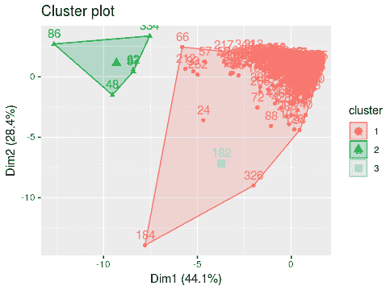

查看以下命令：

```py
> plot(as.hclust(cust_data_agnes))
> rect.hclust(cust_data_agnes, k = 3, border = 2:5)
```

上述命令生成了以下输出：

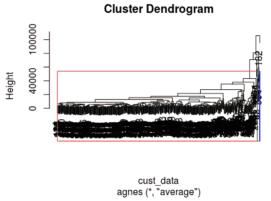

从 AGNES 聚类输出中我们可以看到，数据集的大量观测值被分配到一个簇中，而分配到其他簇的观测值非常少。这对于我们的细分下游练习来说并不是一个好的输出。为了获得更好的簇分配，你可以尝试使用除了 AGNES 算法当前使用的默认平均链接方法之外的其他簇链接方法。

# 摘要

在本章中，我们学习了分割的概念及其与聚类的关系，聚类是一种机器学习无监督学习技术。我们使用了从 UCI 仓库可用的批发数据集，并实现了使用 k-means、DIANA 和 AGNES 算法进行聚类。在本章的过程中，我们还研究了与聚类相关的各个方面，例如聚类的趋势、距离、链接度量以及确定正确聚类数量的方法，以及测量聚类输出的方法。我们还探讨了如何利用聚类输出进行客户细分。

计算机能否像人类一样看到并识别物体和生物？让我们在下一章中探索这个问题的答案。
