# 第六章：使用深度神经网络进行图像识别

在 1966 年，麻省理工学院的 Seymour Papert 教授构想了一个名为*夏季视觉项目*的雄心勃勃的夏季项目。对于研究生来说，任务是*将摄像头连接到计算机上，并使其能够理解它所看到的内容*！我相信研究生完成这个项目会非常困难，因为即使今天，这个任务仍然只完成了一半。

当人类向外看时，能够识别他们所看到的物体。他们无需思考，就能将一只猫归类为猫，一只狗归类为狗，一株植物归类为植物，一个动物归类为动物——这是因为人类大脑从其广泛的先验学习数据库中提取知识。毕竟，作为人类，我们有数百万年的进化背景，使我们能够从我们所看到的事物中得出推论。计算机视觉处理的是复制人类视觉过程，以便将其传递给机器并自动化它们。

本章全部关于通过机器学习（**ML**）学习计算机视觉的理论和实现。我们将构建一个前馈深度学习网络和**LeNet**以实现手写数字识别。我们还将构建一个使用预训练的 Inception-BatchNorm 网络来识别图像中对象的工程项目。随着我们在本章的进展，我们将涵盖以下主题：

+   理解计算机视觉

+   通过深度学习实现计算机视觉

+   MNIST 数据集简介

+   实现用于手写数字识别的深度学习网络

+   使用预训练模型实现计算机视觉

# 技术要求

对于本章涵盖的项目，我们将使用一个非常流行的开源数据集 MNIST。我们将使用**Apache MXNet**，这是一个现代开源深度学习软件框架，用于训练和部署所需的深度神经网络。

# 理解计算机视觉

在当今世界，我们拥有先进的摄像头，它们在模仿人眼捕捉光和色彩方面非常成功；但在整个图像理解方面，正确地捕捉图像仅仅是第一步。在图像捕捉之后，我们需要启用能够解释所捕捉内容并围绕其构建上下文的技术。这就是人类大脑在眼睛看到某物时所做的事情。接下来是巨大的挑战：我们都知道，计算机将图像视为代表一系列颜色范围内强度的整数值的巨大堆叠，当然，计算机与图像本身没有关联的上下文。这就是机器学习（ML）发挥作用的地方。机器学习使我们能够为数据集训练一个上下文，这样它就能使计算机理解某些数字序列实际上代表什么对象。

计算机视觉是机器学习应用中新兴的领域之一。它可以在多个领域用于多种目的，包括医疗保健、农业、保险和汽车行业。以下是一些其最流行的应用：

+   从医学图像中检测疾病，如 CT 扫描/MRI 扫描图像

+   识别作物疾病和土壤质量以支持更好的作物产量

+   从卫星图像中识别石油储备

+   自动驾驶汽车

+   监控和管理银屑病患者的皮肤状况

+   区分杂草和作物

+   面部识别

+   从个人文件中提取信息，例如护照和身份证

+   为无人机和飞机检测地形

+   生物识别

+   公共监控

+   组织个人照片

+   回答视觉问题

这只是冰山一角。说没有哪个领域我们不能找到计算机视觉的应用，并不夸张。因此，计算机视觉是机器学习从业者需要关注的重点领域。

# 利用深度学习实现计算机视觉

首先，让我们了解术语**深度学习**。它简单地说就是**多层神经网络**。多层使得深度学习成为神经网络的一种增强和强大的形式。**人工神经网络**（**ANNs**）自 20 世纪 50 年代以来一直存在。它们一直被设计为两层；然而，深度学习模型是构建在多个隐藏层之上的。以下图表展示了一个假设的深度学习模型：

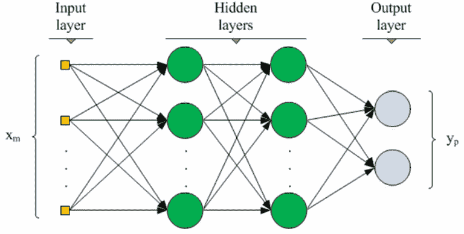

深度学习模型—高级架构

神经网络在计算上很重，因此能够启用最多 22 个核心的**中央处理器**（**CPU**）通常被认为是一个基础设施瓶颈，直到最近。这种基础设施限制也限制了神经网络解决现实世界问题的使用。然而，最近，具有数千个核心的**图形处理单元**（**GPU**）的可用性，与 CPU 相比，提供了指数级强大的计算可能性。这极大地推动了深度学习模型的使用。

数据以多种形式存在，如表格、声音、HTML 文件、TXT 文件和图像。线性模型通常无法从非线性数据中学习。非线性算法，如决策树和梯度提升机，也无法很好地从这类数据中学习。另一方面，创建特征之间非线性交互的深度学习模型，在处理非线性数据时能提供更好的解决方案，因此它们已成为机器学习社区中首选的模型。

深度学习模型由一系列相互连接的神经元组成，这些神经元创建了神经网络架构。任何深度学习模型都将有一个输入层、两个或更多隐藏层（中间层）和一个输出层。输入层由与数据中输入变量数量相等的神经元组成。用户可以决定深度学习网络应该有多少个神经元和隐藏层。通常，这是通过用户通过交叉验证策略构建网络来优化的。神经元数量和隐藏层数量的选择代表了研究者的挑战。输出层中的神经元数量基于问题的结果来决定。例如，如果是回归问题，则只有一个输出神经元；对于分类问题，输出神经元等于涉及问题的类别数量。

# 卷积神经网络

深度学习算法有多种类型，我们在计算机视觉中一般使用的一种称为**卷积神经网络**（**CNN**）。CNNs 将图像分解成像素的小组，然后通过应用过滤器对这些像素进行计算。然后将结果与它们已经了解的像素矩阵进行比较。这有助于 CNNs 为图像属于已知类别之一提供概率。

在前几层中，CNN 识别形状，如曲线和粗糙边缘，但经过几次卷积后，它们能够识别动物、汽车和人类等物体。

当 CNN 首次为可用数据构建时，网络的滤波器值是随机初始化的，因此它产生的预测大多是错误的。但是，然后它不断将其在标记数据集上的预测与实际值进行比较，更新滤波器值，并在每次迭代中提高 CNN 的性能。

# CNNs 的层

一个 CNN 由一个输入层和一个输出层组成；它还有各种隐藏层。以下是一个 CNN 中的各种隐藏层：

+   **卷积**：假设我们有一个以像素表示的图像，在深度学习中，卷积通常是一个 3 x 3 的小矩阵，我们将矩阵的每个元素与图像的 3 x 3 部分的每个元素相乘，然后将它们全部加起来，得到该点卷积的结果。以下图表说明了卷积在像素上的过程：

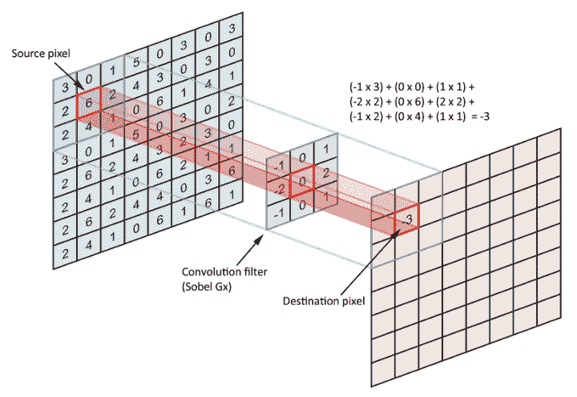

在图像上的卷积应用

+   **ReLU（修正线性单元）**：一个非线性激活，它丢弃输入矩阵中的负数。例如，假设我们有一个 3 x 3 的矩阵，其值在矩阵的单元格中为负数、零和正数。将此矩阵作为 ReLU 的输入，它将矩阵中的所有负数转换为零并返回 3 x 3 矩阵。ReLU 是一个可以作为 CNN 架构一部分定义的激活函数。以下图表展示了 ReLU 在 CNN 中的功能：

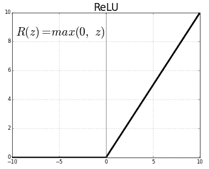

CNN 中的 ReLU

+   **最大池化**：最大池化可以在 CNN 架构中设置为一个层。它允许识别特定特征是否存在于前一层。它将输入矩阵中的最高值替换为最大值并给出输出。让我们考虑一个例子，给定一个 2 x 2 的最大池化层，输入一个 4 x 4 的矩阵，最大池化层将输入矩阵中的每个 2 x 2 替换为四个单元格中的最高值。因此获得的输出矩阵是非重叠的，它是一个具有降低分辨率的图像表示。以下图表说明了 CNN 中最大池化的功能：

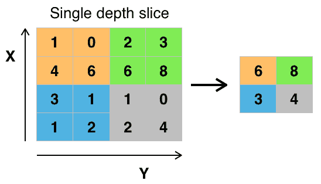

CNN 中最大池化层的功能

应用最大池化的原因有很多，例如减少参数数量和计算负载，消除过拟合，最重要的是，迫使神经网络看到更大的图景，因为在之前的层中，它专注于看到图像的片段。

+   **全连接层**：也称为**密集层**，它涉及对层的输入向量进行线性操作。该层确保每个输入都通过权重与每个输出相连接。

+   **Softmax**：通常应用于深度神经网络最后一层的激活函数。在多类分类问题中，我们需要深度学习网络的全连接输出被解释为概率。数据中特定观察的总概率（对于所有类别）应加起来为 1，并且观察属于每个类别的概率应在 0 到 1 之间。因此，我们将全连接层的每个输出转换为总和中的一部分。然而，我们不是简单地做标准比例，而是出于一个非常具体的原因应用这个非线性指数函数：我们希望将最高输出尽可能接近 1，将较低输出尽可能接近 0。Softmax 通过将真实线性比例推向 1 或 0 来实现这一点。

以下图表说明了 softmax 激活函数：

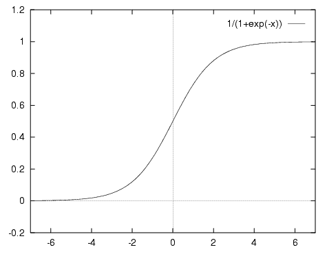

Softmax 激活函数

+   **Sigmoid**：这与 softmax 类似，但应用于二分类，例如猫与狗。使用这种激活函数，观察所属的类别被分配比其他类别更高的概率。与 softmax 不同，概率不需要加起来等于 1。

# MXNet 框架简介

MXNet 是一个功能强大的开源深度学习框架，旨在简化深度学习算法的开发。它用于定义、训练和部署深度神经网络。MXNet 轻量级、灵活且超可扩展，即它允许快速模型训练并支持多种语言的灵活编程模型。现有深度学习框架（如 Torch7、Theano 和 Caffe）的问题在于，用户需要学习另一个系统或不同的编程风格。

然而，MXNet 通过支持多种语言（如 C++、Python、R、Julia 和 Perl）解决了这个问题，从而消除了用户学习新语言的需求；因此，他们可以使用该框架并简化网络定义。MXNet 模型能够适应小量的内存，并且可以轻松地在 CPU、GPU 以及多台机器上训练。`mxnet`包对 R 语言来说已经可用，安装详情可以在[Apache 孵化器](https://mxnet.incubator.apache.org)中查阅。

# 理解 MNIST 数据集

**修改后的国家标准与技术研究院**（**MNIST**）是一个包含手写数字图像的数据集。这个数据集在机器学习社区中非常流行，用于实现和测试计算机视觉算法。MNIST 数据集是一个由 Yann LeCun 教授提供的开源数据集[`yann.lecun.com/exdb/mnist/`](http://yann.lecun.com/exdb/mnist/)，其中提供了表示训练集和测试集的单独文件。测试集和训练集的标签也作为单独的文件提供。训练集有 60,000 个样本，测试集有 10,000 个样本。

下图显示了 MNIST 数据集的一些样本图像。每个图像还附带一个标签，指示以下截图中显示的数字：

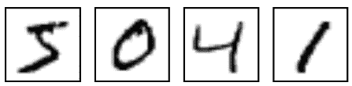

MNIST 数据集的样本图像

前一图中显示的图像标签是**5**、**0**、**4**和**1**。数据集中的每个图像都是灰度图像，并以 28 x 28 像素表示。以下截图显示了以像素表示的样本图像：

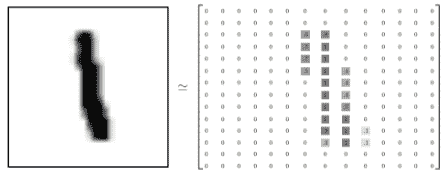

MNIST 数据集的样本图像，以 28 * 28 像素表示

可以将 28 x 28 像素矩阵展平，表示为 784 个像素值的向量。本质上，训练数据集是一个 60,000 x 784 的矩阵，可以与 ML 算法一起使用。测试数据集是一个 10,000 x 784 的矩阵。可以使用以下代码从源下载训练和测试数据集：

```py
# setting the working directory where the files need to be downloaded
setwd('/home/sunil/Desktop/book/chapter 6/MNIST')
# download the training and testing dataset from source
download.file("http://yann.lecun.com/exdb/mnist/train-images-idx3-ubyte.gz","train-images-idx3-ubyte.gz")
download.file("http://yann.lecun.com/exdb/mnist/train-labels-idx1-ubyte.gz","train-labels-idx1-ubyte.gz")
download.file("http://yann.lecun.com/exdb/mnist/t10k-images-idx3-ubyte.gz","t10k-images-idx3-ubyte.gz")
download.file("http://yann.lecun.com/exdb/mnist/t10k-labels-idx1-ubyte.gz","t10k-labels-idx1-ubyte.gz")
# unzip the training and test zip files that are downloaded
R.utils::gunzip("train-images-idx3-ubyte.gz")
R.utils::gunzip("train-labels-idx1-ubyte.gz")
R.utils::gunzip("t10k-images-idx3-ubyte.gz")
R.utils::gunzip("t10k-labels-idx1-ubyte.gz")
```

一旦数据下载并解压，我们将在工作目录中看到文件。然而，这些文件是二进制格式，不能通过常规的 `read.csv` 命令直接加载。以下自定义函数代码有助于从二进制文件中读取训练和测试数据：

```py
# function to load the image files
load_image_file = function(filename) {
  ret = list()
  # opening the binary file in read mode 
  f = file(filename, 'rb')
  # reading the binary file into a matrix called x
 readBin(f, 'integer', n = 1, size = 4, endian = 'big')
 n = readBin(f, 'integer', n = 1, size = 4, endian = 'big')
 nrow = readBin(f, 'integer', n = 1, size = 4, endian = 'big')
 ncol = readBin(f, 'integer', n = 1, size = 4, endian = 'big')
 x = readBin(f, 'integer', n = n * nrow * ncol, size = 1, signed = FALSE)
  # closing the file
  close(f)
  # converting the matrix and returning the dataframe
  data.frame(matrix(x, ncol = nrow * ncol, byrow = TRUE))
}
# function to load label files
load_label_file = function(filename) {
  # reading the binary file in read mode
  f = file(filename, 'rb')
  # reading the labels binary file into y vector 
  readBin(f, 'integer', n = 1, size = 4, endian = 'big')
  n = readBin(f, 'integer', n = 1, size = 4, endian = 'big')
  y = readBin(f, 'integer', n = n, size = 1, signed = FALSE)
  # closing the file
  close(f)
  # returning the y vector
  y
}
```

可以使用以下代码调用这些函数：

```py
# load training images data through the load_image_file custom function
train = load_image_file("train-images-idx3-ubyte")
# load  test data through the load_image_file custom function
test  = load_image_file("t10k-images-idx3-ubyte")
# load the train dataset labels
train.y = load_label_file("train-labels-idx1-ubyte")
# load the test dataset labels
test.y  = load_label_file("t10k-labels-idx1-ubyte")
```

在 RStudio 中，当我们执行代码时，我们可以在环境标签下看到 `train`、`test`、`train.y` 和 `test.y`。这证实了数据集已成功加载，并且相应的数据框已创建，如下面的截图所示：

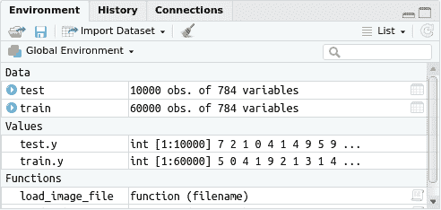

一旦图像数据被加载到数据框中，它就变成了代表像素值的数字序列。以下是一个辅助函数，它将像素数据可视化为 RStudio 中的图像：

```py
# helper function to visualize image given a record of pixels
show_digit = function(arr784, col = gray(12:1 / 12), ...) {
  image(matrix(as.matrix(arr784), nrow = 28)[, 28:1], col = col, ...)
}
```

`show_digit()` 函数可以像任何其他 R 函数一样调用，以数据框记录号作为参数。例如，以下代码块中的函数有助于将训练数据集中的 `3` 记录可视化为 RStudio 中的图像：

```py
# viewing image corresponding to record 3 in the train dataset
show_digit(train[3, ])
```

这将给出以下输出：

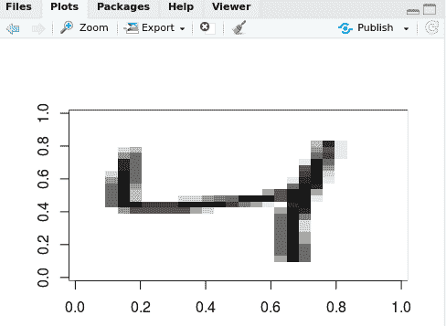

大卫·罗宾逊博士在他的博客 *探索手写数字分类：MNIST 数据集的整洁分析* ([`varianceexplained.org/r/digit-eda/`](http://varianceexplained.org/r/digit-eda/)) 中，对 MNIST 数据集进行了美丽的探索性数据分析，这将帮助您更好地理解数据集。

# 实现手写数字识别的深度学习网络

`mxnet` 库提供了几个函数，使我们能够定义构成深度学习网络的层和激活。层的定义、激活函数的使用以及每个隐藏层中要使用的神经元数量通常被称为**网络架构**。决定网络架构更多的是一种艺术而非科学。通常，可能需要多次实验迭代来决定适合该问题的正确架构。我们称之为艺术，因为没有找到理想架构的精确规则。层的数量、这些层中的神经元类型以及层的类型很大程度上是通过试错来决定的。

在本节中，我们将构建一个具有三个隐藏层的简单深度学习网络。以下是我们的网络的一般架构：

1.  输入层被定义为网络中的初始层。`mx.symbol.Variable` MXNet 函数定义了输入层。

1.  在网络中定义了一个全连接层，也称为密集层，作为第一个隐藏层，具有 128 个神经元。这可以通过`mx.symbol.FullyConnected` MXNet 函数实现。

1.  ReLU 激活函数作为网络的一部分被定义。`mx.symbol.Activation`函数帮助我们定义网络中的 ReLU 激活函数。

1.  定义第二个隐藏层；它是一个具有 64 个神经元的另一个密集层。这可以通过`mx.symbol.FullyConnected`函数实现，类似于第一个隐藏层。

1.  在第二个隐藏层的输出上应用 ReLU 激活函数。这可以通过`mx.symbol.Activation`函数实现。

1.  我们网络中的最后一个隐藏层也是一个全连接层，但只有十个输出（等于类别的数量）。这也可以通过`mx.symbol.FullyConnected`函数实现。

1.  输出层需要被定义，并且这应该是每个类别的预测概率；因此，我们在输出层应用 softmax。`mx.symbol.SoftmaxOutput`函数使我们能够配置输出中的 softmax。

我们并不是说这是针对该问题的最佳网络架构，但这是我们打算构建以展示使用 MXNet 实现深度学习网络架构的架构。

现在我们已经有了蓝图，让我们深入编写以下代码块来构建网络：

```py
# setting the working directory
setwd('/home/sunil/Desktop/book/chapter 6/MNIST')
# function to load image files
load_image_file = function(filename) {
  ret = list()
  f = file(filename, 'rb')
  readBin(f, 'integer', n = 1, size = 4, endian = 'big')
  n    = readBin(f, 'integer', n = 1, size = 4, endian = 'big')
  nrow = readBin(f, 'integer', n = 1, size = 4, endian = 'big')
  ncol = readBin(f, 'integer', n = 1, size = 4, endian = 'big')
  x = readBin(f, 'integer', n = n * nrow * ncol, size = 1, signed
= FALSE)
  close(f)
  data.frame(matrix(x, ncol = nrow * ncol, byrow = TRUE))
}
# function to load the label files
load_label_file = function(filename) {
  f = file(filename, 'rb')
  readBin(f, 'integer', n = 1, size = 4, endian = 'big')
  n = readBin(f, 'integer', n = 1, size = 4, endian = 'big')
  y = readBin(f, 'integer', n = n, size = 1, signed = FALSE)
  close(f)
  y }
# loading the image files
train = load_image_file("train-images-idx3-ubyte")
test  = load_image_file("t10k-images-idx3-ubyte")
# loading the labels
train.y = load_label_file("train-labels-idx1-ubyte")
test.y  = load_label_file("t10k-labels-idx1-ubyte")
# lineaerly transforming the grey scale image i.e. between 0 and 255 to # 0 and 1
train.x <- data.matrix(train/255)
test <- data.matrix(test/255)
# verifying the distribution of the digit labels in train dataset
print(table(train.y))
# verifying the distribution of the digit labels in test dataset
print(table(test.y))
```

这将给出以下输出：

```py
train.y
   0    1    2   3    4    5    6    7    8    9 
5923 6742 5958 6131 5842 5421 5918 6265 5851 5949 

test.y
   0    1    2    3    4    5    6    7    8    9 
 980 1135 1032 1010  982  892  958 1028  974 1009 
```

现在，定义三个层并开始训练网络以获得类别概率，并确保使用以下代码块可重现结果：

```py
# including the required mxnet library 
library(mxnet)
# defining the input layer in the network architecture
data <- mx.symbol.Variable("data")
# defining the first hidden layer with 128 neurons and also naming the # layer as fc1
# passing the input data layer as input to the fc1 layer
fc1 <- mx.symbol.FullyConnected(data, name="fc1", num_hidden=128)
# defining the ReLU activation function on the fc1 output and also # naming the layer as ReLU1
act1 <- mx.symbol.Activation(fc1, name="ReLU1", act_type="relu")
# defining the second hidden layer with 64 neurons and also naming the # layer as fc2
# passing the previous activation layer output as input to the
fc2 layer
fc2 <- mx.symbol.FullyConnected(act1, name="fc2", num_hidden=64)
# defining the ReLU activation function on the fc2 output and also 
# naming the layer as ReLU2
act2 <- mx.symbol.Activation(fc2, name="ReLU2", act_type="relu")
# defining the third and final hidden layer in our network with 10 
# neurons and also naming the layer as fc3
# passing the previous activation layer output as input to the
fc3 layer
fc3 <- mx.symbol.FullyConnected(act2, name="fc3", num_hidden=10)
# defining the output layer with softmax activation function to obtain # class probabilities 
softmax <- mx.symbol.SoftmaxOutput(fc3, name="sm")
# defining that the experiment should run on cpu
devices <- mx.cpu()
# setting the seed for the experiment so as to ensure that the results # are reproducible
mx.set.seed(0)
# building the model with the network architecture defined above
model <- mx.model.FeedForward.create(softmax, X=train.x, y=train.y,
ctx=devices, num.round=10, array.batch.size=100,array.layout ="rowmajor",
learning.rate=0.07, momentum=0.9,  eval.metric=mx.metric.accuracy,
initializer=mx.init.uniform(0.07), 
epoch.end.callback=mx.callback.log.train.metric(100))
```

这将给出以下输出：

```py
Start training with 1 devices
[1] Train-accuracy=0.885783334343384
[2] Train-accuracy=0.963616671562195
[3] Train-accuracy=0.97510000983874
[4] Train-accuracy=0.980016676982244
[5] Train-accuracy=0.984233343303204
[6] Train-accuracy=0.986883342464765
[7] Train-accuracy=0.98848334223032
[8] Train-accuracy=0.990800007780393
[9] Train-accuracy=0.991300007204215
[10] Train-accuracy=0.991516673564911
```

要在测试数据集上进行预测并获取测试数据集中每个观察的标签，请使用以下代码块：

```py
# making predictions on the test dataset
preds <- predict(model, test)
# verifying the predicted output
print(dim(preds))
# getting the label for each observation in test dataset; the
# predicted class is the one with highest probability
pred.label <- max.col(t(preds)) - 1
# observing the distribution of predicted labels in the test dataset
print(table(pred.label))
```

这将给出以下输出：

```py
[1]    10 10000
pred.label
   0    1    2    3    4    5    6    7    8    9 
 980 1149 1030 1021 1001  869  960 1001  964 1025 
```

让我们使用以下代码检查模型的性能：

```py
# obtaining the performance of the model
print(accuracy(pred.label,test.y))
```

这将给出以下输出：

```py
Accuracy (PCC): 97.73% 
Cohen's Kappa: 0.9748 
Users accuracy: 
   0    1    2    3    4    5    6    7    8    9 
98.8 99.6 98.0 97.7 98.3 96.1 97.9 96.3 96.6 97.7 
Producers accuracy: 
   0    1    2    3    4    5    6    7    8    9 
98.8 98.3 98.2 96.7 96.4 98.6 97.7 98.9 97.6 96.2 
Confusion matrix 
   y
x      0    1    2    3    4    5    6    7    8    9
  0  968    0    1    1    1    2    3    1    2    1
  1    1 1130    3    0    0    1    3    8    1    2
  2    0    1 1011    2    2    0    0   11    3    0
  3    1    2    6  987    0   14    2    2    4    3
  4    1    0    2    1  965    2   10    3    6   11
  5    1    0    0    4    0  857    2    0    3    2
  6    5    2    3    0    4    5  938    0    3    0
  7    0    0    2    2    1    1    0  990    3    2
  8    1    0    4    8    0    5    0    3  941    2
  9    2    0    0    5    9    5    0   10    8  986
```

要可视化网络架构，请使用以下代码：

```py
# Visualizing the network architecture
graph.viz(model$symbol)
```

这将给出以下输出：

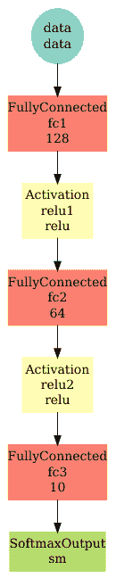

在基于 CPU 的笔记本电脑上运行简单的架构几分钟，并且付出最小的努力，我们能够在测试数据集上实现`97.7%`的准确率。深度学习网络能够通过观察它提供的输入图像来学习解释数字。通过改变架构或增加迭代次数，可以进一步提高系统的准确率。值得注意的是，在早期实验中，我们运行了 10 次迭代。

在模型构建过程中，可以通过`num.round`参数简单地修改迭代次数。关于最佳迭代次数，也没有硬性规定，所以这也是需要通过试错来确定的事情。让我们构建一个包含 50 次迭代的模型，并观察其对性能的影响。代码将与早期项目相同，只是在模型构建代码中进行了以下修改：

```py
model <- mx.model.FeedForward.create(softmax, X=train.x, y=train.y,
ctx=devices, num.round=50, array.batch.size=100,array.layout ="rowmajor",
learning.rate=0.07, momentum=0.9,  eval.metric=mx.metric.accuracy,
initializer=mx.init.uniform(0.07), 
epoch.end.callback=mx.callback.log.train.metric(100))
```

注意到`num.round`参数现在设置为`50`，而不是之前的`10`。

这将给出以下输出：

```py
[35] Train-accuracy=0.999933333396912
[36] Train-accuracy=1
[37] Train-accuracy=1
[38] Train-accuracy=1
[39] Train-accuracy=1
[40] Train-accuracy=1
[41] Train-accuracy=1
[42] Train-accuracy=1
[43] Train-accuracy=1
[44] Train-accuracy=1
[45] Train-accuracy=1
[46] Train-accuracy=1
[47] Train-accuracy=1
[48] Train-accuracy=1
[49] Train-accuracy=1
[50] Train-accuracy=1
[1]    10 10000
pred.label
   0    1    2    3    4    5    6    7    8    9 
 992 1139 1029 1017  983  877  953 1021  972 1017 
Accuracy (PCC): 98.21% 
Cohen's Kappa: 0.9801 
Users accuracy: 
   0    1    2    3    4    5    6    7    8    9 
99.3 99.5 98.2 98.2 98.1 97.1 98.0 97.7 98.0 97.8 
Producers accuracy: 
   0    1    2    3    4    5    6    7    8    9 
98.1 99.1 98.4 97.5 98.0 98.7 98.5 98.3 98.3 97.1 
Confusion matrix 
   y
x      0    1    2    3    4    5    6    7    8    9
  0  973    0    2    2    1    3    5    1    3    2
  1    1 1129    0    0    1    1    3    2    0    2
  2    1    0 1013    1    3    0    0    9    2    0
  3    0    1    5  992    0   10    1    1    3    4
  4    0    0    2    0  963    2    7    1    1    7
  5    0    0    0    4    1  866    2    0    2    2
  6    2    2    1    0    3    5  939    0    1    0
  7    0    1    6    3    1    1    0 1004    2    3
  8    1    1    3    4    0    2    1    3  955    2
  9    2    1    0    4    9    2    0    7    5  987
```

我们可以从输出中观察到，训练数据集达到了 100%的准确率。然而，在测试数据集上，我们观察到的准确率为 98%。本质上，我们的模型在训练和测试数据集上都应该表现出相同的性能，才能被称为一个好的模型。不幸的是，在这种情况下，我们遇到了一种称为**过拟合**的情况，这意味着我们创建的模型泛化能力不好。换句话说，模型用太多的参数进行了训练，或者训练时间过长，仅针对训练数据集的数据变得过于专业化；结果，它在新数据上表现不佳。模型泛化是我们应该特别追求的目标。有一种称为**dropout**的技术可以帮助我们克服过拟合问题。

# 实现 dropout 以避免过拟合

Dropout 是在激活层之后的网络架构中定义的，它会随机将激活值设置为 0。换句话说，dropout 随机删除了神经网络的一部分，这使我们能够防止过拟合。当我们持续丢弃在过程中学习到的信息时，我们无法完全过拟合我们的训练数据。这允许我们的神经网络更好地学习泛化。

在 MXNet 中，可以使用`mx.symbol.Dropout`函数轻松地将 dropout 定义为网络架构的一部分。例如，以下代码定义了在第一个 ReLU 激活（`act1`）和第二个 ReLU 激活（`act2`）之后的 dropout：

```py
dropout1 <- mx.symbol.Dropout(data = act1, p = 0.5)
dropout2 <- mx.symbol.Dropout(data = act2, p = 0.3)
```

`data`参数指定了 dropout 所接受的输入和`p`的值指定了要执行的 dropout 量。在`dropout1`的情况下，我们指定要丢弃 50%的权重。再次强调，关于应该包含多少 dropout 以及在哪一层，并没有硬性规定。这是需要通过试错来确定的事情。带有 dropout 的代码几乎与早期项目相同，只是现在包括了激活层之后的 dropout：

```py
# code to read the dataset and transform it to train.x and train.y remains # same as earlier project, therefore that code is not shown here
# including the required mxnet library 
library(mxnet)
# defining the input layer in the network architecture
data <- mx.symbol.Variable("data")
# defining the first hidden layer with 128 neurons and also naming the # layer as fc1
# passing the input data layer as input to the fc1 layer
fc1 <- mx.symbol.FullyConnected(data, name="fc1", num_hidden=128)
# defining the ReLU activation function on the fc1 output and also naming the layer as ReLU1
act1 <- mx.symbol.Activation(fc1, name="ReLU1", act_type="relu")
# defining a 50% dropout of weights learnt
dropout1 <- mx.symbol.Dropout(data = act1, p = 0.5)
# defining the second hidden layer with 64 neurons and also naming the layer as fc2
# passing the previous dropout output as input to the fc2 layer
fc2 <- mx.symbol.FullyConnected(dropout1, name="fc2", num_hidden=64)
# defining the ReLU activation function on the fc2 output and also naming the layer as ReLU2
act2 <- mx.symbol.Activation(fc2, name="ReLU2", act_type="relu")
# defining a dropout with 30% weight drop
dropout2 <- mx.symbol.Dropout(data = act2, p = 0.3)
# defining the third and final hidden layer in our network with 10 neurons and also naming the layer as fc3
# passing the previous dropout output as input to the fc3 layer
fc3 <- mx.symbol.FullyConnected(dropout2, name="fc3", num_hidden=10)
# defining the output layer with softmax activation function to
obtain class probabilities 
softmax <- mx.symbol.SoftmaxOutput(fc3, name="sm")
# defining that the experiment should run on cpu
devices <- mx.cpu()
# setting the seed for the experiment so as to ensure that the results are reproducible
mx.set.seed(0)
# building the model with the network architecture defined above
model <- mx.model.FeedForward.create(softmax, X=train.x, y=train.y, ctx=devices, num.round=50, array.batch.size=100,array.layout = "rowmajor", learning.rate=0.07, momentum=0.9,  eval.metric=mx.metric.accuracy, initializer=mx.init.uniform(0.07), epoch.end.callback=mx.callback.log.train.metric(100))
# making predictions on the test dataset
preds <- predict(model, test)
# verifying the predicted output
print(dim(preds))
# getting the label for each observation in test dataset; the predicted class is the one with highest probability
pred.label <- max.col(t(preds)) - 1
# observing the distribution of predicted labels in the test
dataset
print(table(pred.label))
# including the rfUtilities library so as to use accuracy function
library(rfUtilities)
# obtaining the performance of the model
print(accuracy(pred.label,test.y))
# printing the network architecture
graph.viz(model$symbol) 
```

这将给出以下输出和可视化的网络架构：

```py
[35] Train-accuracy=0.958950003186862
[36] Train-accuracy=0.958983335793018
[37] Train-accuracy=0.958083337446054
[38] Train-accuracy=0.959683336317539
[39] Train-accuracy=0.95990000406901
[40] Train-accuracy=0.959433337251345
[41] Train-accuracy=0.959066670437654
[42] Train-accuracy=0.960250004529953
[43] Train-accuracy=0.959983337720235
[44] Train-accuracy=0.960450003842513
[45] Train-accuracy=0.960150004227956
[46] Train-accuracy=0.960533337096373
[47] Train-accuracy=0.962033336758614
[48] Train-accuracy=0.96005000303189
[49] Train-accuracy=0.961366670827071
[50] Train-accuracy=0.961350003282229
[1]    10 10000
pred.label
   0    1    2    3    4    5    6    7    8    9 
 984 1143 1042 1022  996  902  954 1042  936  979 
Accuracy (PCC): 97.3% 
Cohen's Kappa: 0.97 
Users accuracy: 
   0    1    2    3    4    5    6    7    8    9 
98.7 98.9 98.1 97.6 98.2 97.3 97.6 97.4 94.3 94.7 
Producers accuracy: 
   0    1    2    3    4    5    6    7    8    9 
98.3 98.3 97.1 96.5 96.8 96.2 98.0 96.1 98.1 97.7 
Confusion matrix 
   y
x      0    1    2    3    4    5    6    7    8    9
  0  967    0    0    0    0    2    5    1    6    3
  1    0 1123    3    0    1    1    3    5    2    5
  2    1    2 1012    4    3    0    0   14    4    2
  3    2    1    4  986    0    6    1    3   12    7
  4    0    0    3    0  964    2    5    0    5   17
  5    2    3    0    9    0  868    7    0    9    4
  6    3    2    0    0    5    3  935    0    6    0
  7    4    1    9    4    3    3    0 1001    6   11
  8    1    3    1    2    1    3    2    1  918    4
  9    0    0    0    5    5    4    0    3    6  956
```

看一下下面的图：

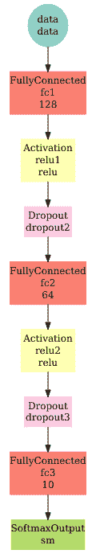

从输出中我们可以看到，dropout 现在被包含在网络架构中。我们还观察到，与我们的初始项目相比，这个网络架构在测试数据集上的准确率更低。一个可能的原因是我们包含的 dropout 百分比（50%和 30%）太高。我们可以调整这些百分比，并重新构建模型以确定准确率是否会提高。然而，这个想法是演示 dropout 作为正则化技术的作用，以避免深度神经网络过拟合。

除了 dropout 之外，还有其他技术可以用来避免过拟合的情况：

+   **增加数据**：添加更多训练数据。

+   **数据增强**：通过应用翻转、扭曲、添加随机噪声和旋转等技术，合成地创建额外的数据。以下截图显示了应用数据增强后生成的样本图像：

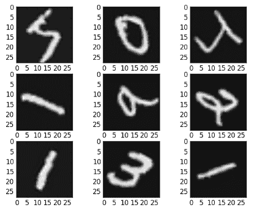

应用数据增强的样本图像

+   **降低网络架构的复杂性**：更少的层、更少的 epoch 等。

+   **批量归一化**：确保网络中生成的权重不会推得太高或太低的过程。这通常是通过从每一层的每个权重中减去该层所有权重的平均值并除以标准差来实现的。它能够防止过拟合，执行正则化，并显著提高训练速度。`mx.sym.batchnorm()`函数使我们能够在激活后定义批量归一化。

我们不会专注于开发另一个使用批量归一化的项目，因为在项目中使用此函数与我们之前项目中使用的其他函数非常相似。到目前为止，我们一直专注于通过增加 epoch 来提高模型的性能，另一个选择是尝试不同的架构，并评估它是否提高了测试数据集上的准确率。关于这一点，让我们探索 LeNet，它专门设计用于文档的光学字符识别。

# 使用 MXNet 库实现 LeNet 架构

在他们 1998 年的论文《基于梯度的学习应用于文档识别》中，LeCun 等人介绍了 LeNet 架构。

LeNet 架构由两套卷积、激活和池化层组成，随后是一个全连接层、激活、另一个全连接层，最后是一个 softmax 分类器。以下图表说明了 LeNet 架构：

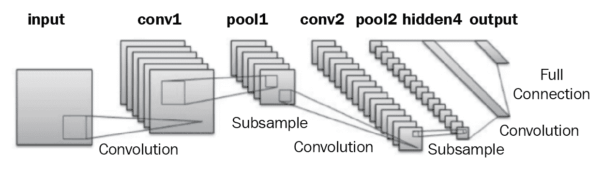

LeNet 架构

现在，让我们使用以下代码块在我们的项目中使用`mxnet`库实现 LeNet 架构：

```py
## setting the working directory
setwd('/home/sunil/Desktop/book/chapter 6/MNIST')
# function to load image files
load_image_file = function(filename) {
  ret = list()
  f = file(filename, 'rb')
  readBin(f, 'integer', n = 1, size = 4, endian = 'big')
  n    = readBin(f, 'integer', n = 1, size = 4, endian = 'big')
  nrow = readBin(f, 'integer', n = 1, size = 4, endian = 'big')
  ncol = readBin(f, 'integer', n = 1, size = 4, endian = 'big')
  x = readBin(f, 'integer', n = n * nrow * ncol, size = 1, signed
= FALSE)
  close(f)
  data.frame(matrix(x, ncol = nrow * ncol, byrow = TRUE))
}
# function to load label files
load_label_file = function(filename) {
  f = file(filename, 'rb')
  readBin(f, 'integer', n = 1, size = 4, endian = 'big')
  n = readBin(f, 'integer', n = 1, size = 4, endian = 'big')
  y = readBin(f, 'integer', n = n, size = 1, signed = FALSE)
  close(f)
  y
}
# load images
train = load_image_file("train-images-idx3-ubyte")
test  = load_image_file("t10k-images-idx3-ubyte")
# converting the train and test data into a format as required by LeNet
train.x <- t(data.matrix(train))
test <- t(data.matrix(test))
# loading the labels
train.y = load_label_file("train-labels-idx1-ubyte")
test.y  = load_label_file("t10k-labels-idx1-ubyte")
# linearly transforming the grey scale image i.e. between 0 and 255 to # 0 and 1
train.x <- train.x/255
test <- test/255
# including the required mxnet library 
library(mxnet)
# input
data <- mx.symbol.Variable('data')
# first convolution layer
conv1 <- mx.symbol.Convolution(data=data, kernel=c(5,5), num_filter=20)
# applying the tanh activation function
tanh1 <- mx.symbol.Activation(data=conv1, act_type="tanh")
# applying max pooling 
pool1 <- mx.symbol.Pooling(data=tanh1, pool_type="max", kernel=c(2,2), stride=c(2,2))
# second conv
conv2 <- mx.symbol.Convolution(data=pool1, kernel=c(5,5), num_filter=50)
# applying the tanh activation function again
tanh2 <- mx.symbol.Activation(data=conv2, act_type="tanh")
#performing max pooling again
pool2 <- mx.symbol.Pooling(data=tanh2, pool_type="max",
                           kernel=c(2,2), stride=c(2,2))
# flattening the data
flatten <- mx.symbol.Flatten(data=pool2)
# first fullconnected later
fc1 <- mx.symbol.FullyConnected(data=flatten, num_hidden=500)
# applying the tanh activation function
tanh3 <- mx.symbol.Activation(data=fc1, act_type="tanh")
# second fullconnected layer
fc2 <- mx.symbol.FullyConnected(data=tanh3, num_hidden=10)
# defining the output layer with softmax activation function to obtain # class probabilities 
lenet <- mx.symbol.SoftmaxOutput(data=fc2)
# transforming the train and test dataset into a format required by 
# MxNet functions
train.array <- train.x
dim(train.array) <- c(28, 28, 1, ncol(train.x))
test.array <- test
dim(test.array) <- c(28, 28, 1, ncol(test))
# setting the seed for the experiment so as to ensure that the
# results are reproducible
mx.set.seed(0)
# defining that the experiment should run on cpu
devices <- mx.cpu()
# building the model with the network architecture defined above
model <- mx.model.FeedForward.create(lenet, X=train.array, y=train.y,
ctx=devices, num.round=3, array.batch.size=100, learning.rate=0.05, 
momentum=0.9, wd=0.00001, eval.metric=mx.metric.accuracy, 
           epoch.end.callback=mx.callback.log.train.metric(100))
# making predictions on the test dataset
preds <- predict(model, test.array)
# getting the label for each observation in test dataset; the
# predicted class is the one with highest probability
pred.label <- max.col(t(preds)) - 1
# including the rfUtilities library so as to use accuracy
function
library(rfUtilities)
# obtaining the performance of the model
print(accuracy(pred.label,test.y))
# printing the network architecture
graph.viz(model$symbol,direction="LR")
```

这将给出以下输出和可视化的网络架构：

```py
Start training with 1 devices
[1] Train-accuracy=0.678916669438283
[2] Train-accuracy=0.978666676680247
[3] Train-accuracy=0.98676667680343
Accuracy (PCC): 98.54% 
Cohen's Kappa: 0.9838 
Users accuracy: 
    0     1     2     3     4     5     6     7     8     9 
 99.8 100.0  97.0  98.4  98.9  98.2  98.2  98.7  98.2  97.8 
Producers accuracy: 
   0    1    2    3    4    5    6    7    8    9 
98.0 96.9 99.1 99.3 99.0 99.3 99.6 97.7 98.7 98.3  
Confusion matrix 
   y
x      0    1    2    3    4    5    6    7    8    9
  0  978    0    2    2    1    3    7    0    4    1
  1    0 1135   15    2    1    0    5    7    1    5
  2    0    0 1001    2    1    1    0    3    2    0
  3    0    0    0  994    0    5    0    1    1    0
  4    0    0    1    0  971    0    1    0    0    8
  5    0    0    0    3    0  876    2    0    1    0
  6    0    0    0    0    2    1  941    0    1    0
  7    1    0    7    1    3    1    0 1015    3    8
  8    1    0    6    1    1    1    2    1  956    0
  9    0    0    0    5    2    4    0    1    5  987
```

看一下以下图表：

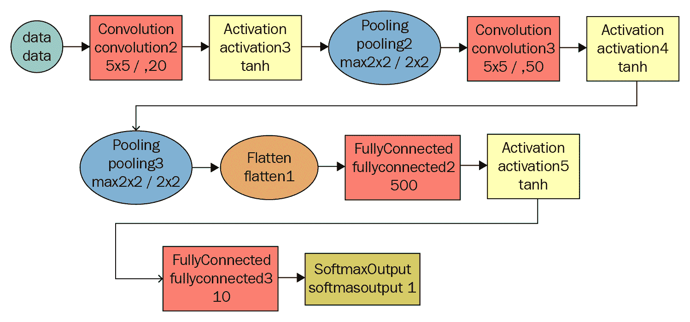

在我的 4 核 CPU 盒子上，代码运行时间不到 5 分钟，但仍然在测试数据集上仅用三个训练轮次就达到了 98%的准确率。我们还可以看到，在训练和测试数据集上我们都获得了 98%的准确率，这证实了没有过拟合。

我们看到`tanh`被用作激活函数；让我们实验一下，看看如果我们将其更改为 ReLU，它是否有任何影响。项目的代码将与之前的项目相同，只是我们需要找到并替换`tanh`为 ReLU。我们不会重复代码，因为只有以下几行与早期项目不同：

```py
ReLU1 <- mx.symbol.Activation(data=conv1, act_type="relu")
pool1 <- mx.symbol.Pooling(data=ReLU1, pool_type="max",
                           kernel=c(2,2), stride=c(2,2))
ReLU2 <- mx.symbol.Activation(data=conv1, act_type="relu")
pool2 <- mx.symbol.Pooling(data=ReLU2, pool_type="max",
                           kernel=c(2,2), stride=c(2,2))
ReLU3 <- mx.symbol.Activation(data=conv1, act_type="relu")
fc2 <- mx.symbol.FullyConnected(data=ReLU3, num_hidden=10)
```

当你使用 ReLU 作为激活函数运行代码时，将得到以下输出：

```py
Start training with 1 devices
[1] Train-accuracy=0.627283334874858
[2] Train-accuracy=0.979916676084201
[3] Train-accuracy=0.987366676231225
Accuracy (PCC): 98.36% 
Cohen's Kappa: 0.9818 
Users accuracy: 
   0    1    2    3    4    5    6    7    8    9 
99.8 99.7 97.9 99.4 98.6 96.5 97.7 98.2 97.4 97.9 
Producers accuracy: 
   0    1    2    3    4    5    6    7    8    9 
97.5 97.2 99.6 95.6 99.7 99.2 99.7 98.0 99.6 98.2 
Confusion matrix 
   y
x      0    1    2    3    4    5    6    7    8    9
  0  978    0    3    1    1    2   12    0    5    1
  1    1 1132    6    0    2    1    5   11    1    6
  2    0    0 1010    1    0    0    0    1    2    0
  3    0    2    4 1004    0   23    1    3    9    4
  4    0    0    1    0  968    0    1    0    0    1
  5    0    1    0    1    0  861    2    0    3    0
  6    0    0    0    0    0    3  936    0    0    0
  7    1    0    6    3    0    1    0 1010    1    9
  8    0    0    2    0    1    0    1    0  949    0
  9    0    0    0    0   10    1    0    3    4  988
```

使用 ReLU 作为激活函数时，我们没有看到准确率有显著提高。它保持在 98%，这与使用`tanh`激活函数获得的结果相同。

作为下一步，我们可以尝试通过增加额外的训练轮次来重建模型，看看是否可以提高准确率。或者，我们可以尝试调整卷积层中过滤器的数量和大小，看看会发生什么！进一步的实验还可以包括添加更多种类的层。除非我们进行实验，否则我们不知道结果会是什么！

# 使用预训练模型实现计算机视觉

在第一章《探索机器学习领域》中，我们提到了一个名为**迁移学习**的概念。其想法是将模型中学到的知识应用到另一个相关任务中。现在几乎所有的计算机视觉任务都使用了迁移学习。除非有大量的标记数据集可用于训练，否则很少从头开始训练模型。

通常情况下，在计算机视觉中，卷积神经网络（CNNs）试图在早期层检测边缘，在中层层检测形状，并在后期层检测一些特定任务的特征。无论 CNNs 要检测的图像是什么，早期和中层层的功能保持不变，这使得我们可以利用预训练模型获得的知识。通过迁移学习，我们可以重用早期和中层层，只需重新训练后期层。这有助于我们利用最初训练任务上的标记数据。

迁移学习提供了两个主要优势：它节省了我们的训练时间，并确保即使我们拥有的标记训练数据很少，我们也能有一个好的模型。

`Xception`、`VGG16`、`VGG19`、`ResNet50`、`InceptionV3`、`InceptionResNetV2`、`MobileNet`、`DenseNet`、`NASNet`、`MobileNetV2`、`QuocNet`、`AlexNet`、`Inception`（GoogLeNet）和`BN-Inception-v2`是一些广泛使用的预训练模型。虽然我们不会深入探讨这些预训练模型的细节，但本节的想法是通过 MXNet 利用预训练模型来实施一个检测图像（输入）内容的项目。

在本节中展示的代码中，我们使用了预训练的 Inception-BatchNorm 网络来预测图像的类别。在运行代码之前，需要将预训练模型下载到工作目录。模型可以从[`data.mxnet.io/mxnet/data/Inception.zip`](http://data.mxnet.io/mxnet/data/Inception.zip)下载。让我们探索以下代码，使用`inception_bn`预训练模型标记一些测试图像：

```py
# loading the required libraries
library(mxnet)
library(imager)
# loading the inception_bn model to memory
model = mx.model.load("/home/sunil/Desktop/book/chapter 6/Inception/Inception_BN", iteration=39)
# loading the mean image
mean.img = as.array(mx.nd.load("/home/sunil/Desktop/book/chapter 6/Inception/mean_224.nd")[["mean_img"]])
# loading the image that need to be classified
im <- load.image("/home/sunil/Desktop/book/chapter 6/image1.jpeg")
# displaying the image
plot(im)
```

这将产生以下输出：

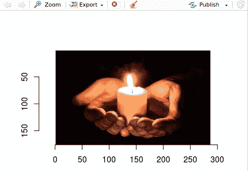

为了使用预训练模型处理图像并预测具有最高概率的图像 ID，我们使用以下代码：

```py
# function to pre-process the image so as to be consumed by predict function that is using inception_bn model
preproc.image <- function(im, mean.image) {
  # crop the image
  shape <- dim(im)
  short.edge <- min(shape[1:2])
  xx <- floor((shape[1] - short.edge) / 2)
  yy <- floor((shape[2] - short.edge) / 2)
  cropped <- crop.borders(im, xx, yy)
  # resize to 224 x 224, needed by input of the model.
  resized <- resize(cropped, 224, 224)
  # convert to array (x, y, channel)
  arr <- as.array(resized) * 255
  dim(arr) <- c(224, 224, 3)
  # subtract the mean
  normed <- arr - mean.img
  # Reshape to format needed by mxnet (width, height, channel,
num)
  dim(normed) <- c(224, 224, 3, 1)
  return(normed)
}
# calling the image pre-processing function on the image to be classified
normed <- preproc.image(im, mean.img)
# predicting the probabilties of labels for the image using the pre-trained model
prob <- predict(model, X=normed)
# sorting and filtering the top three labels with highest
probabilities
max.idx <- order(prob[,1], decreasing = TRUE)[1:3]
# printing the ids with highest probabilities
print(max.idx)
```

这将产生以下输出，其中包含最高概率的 ID：

```py
[1] 471 627 863
```

让我们使用以下代码打印出与最高概率预测 ID 对应的标签：

```py
# loading the pre-trained labels from inception_bn model 
synsets <- readLines("/home/sunil/Desktop/book/chapter
6/Inception/synset.txt")
# printing the english labels corresponding to the top 3 ids with highest probabilities
print(paste0("Predicted Top-classes: ", synsets[max.idx]))
```

这将给出以下输出：

```py
[1] "Predicted Top-classes: n02948072 candle, taper, wax light"        
[2] "Predicted Top-classes: n03666591 lighter, light, igniter, ignitor"
[3] "Predicted Top-classes: n04456115 torch"      
```

从输出结果中，我们可以看到它已经正确地标记了作为输入传递的图像。我们可以使用以下代码测试更多图像，以确认分类是否正确：

```py
im2 <- load.image("/home/sunil/Desktop/book/chapter 6/image2.jpeg")
plot(im2)
normed <- preproc.image(im2, mean.img)
prob <- predict(model, X=normed)
max.idx <- order(prob[,1], decreasing = TRUE)[1:3]
print(paste0("Predicted Top-classes: ", synsets[max.idx]))
```

这将给出以下输出：

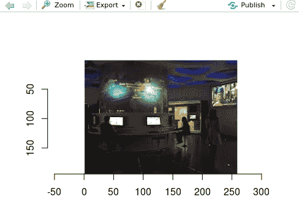

看看以下代码：

```py
[1] "Predicted Top-classes: n03529860 home theater, home theatre"   
[2] "Predicted Top-classes: n03290653 entertainment center"         [3] "Predicted Top-classes: n04404412 television, television system"
```

同样，我们可以使用以下代码尝试第三张图像：

```py
# getting the labels for third image
im3 <- load.image("/home/sunil/Desktop/book/chapter
6/image3.jpeg")
plot(im3)
normed <- preproc.image(im3, mean.img)
prob <- predict(model, X=normed)
max.idx <- order(prob[,1], decreasing = TRUE)[1:3]
print(paste0("Predicted Top-classes: ", synsets[max.idx]))
```

这将给出以下输出：

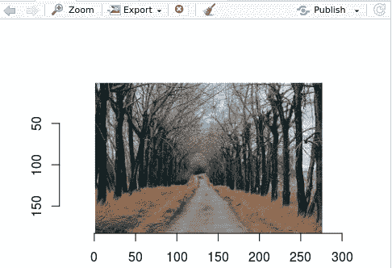

看看以下输出：

```py
[1] "Predicted Top-classes: n04326547 stone wall" 
[2] "Predicted Top-classes: n03891251 park bench" 
[3] "Predicted Top-classes: n04604644 worm fence, snake fence, snake-rail fence, Virginia fence"
```

# 摘要

在本章中，我们学习了计算机视觉及其与深度学习的关联。我们探索了一种特定的深度学习算法，即计算机视觉中广泛使用的卷积神经网络（CNNs）。我们研究了名为 MXNet 的开源深度学习框架。在详细讨论 MNIST 数据集之后，我们使用各种网络架构构建了模型，并成功地对 MNIST 数据集中的手写数字进行了分类。在本章的结尾，我们深入探讨了迁移学习概念及其与计算机视觉的关联。本章最后一个项目使用 Inception-BatchNorm 预训练模型对图像进行了分类。

在下一章中，我们将探索一种称为自动编码器神经网络的非监督学习算法。我非常期待实现一个使用自动编码器捕获信用卡欺诈的项目。你准备好了吗？让我们出发吧！
