# 使用自编码器进行信用卡欺诈检测

欺诈管理一直被银行和金融公司视为一个非常痛苦的问题。与卡片相关的欺诈已被证明对公司的对抗特别困难。芯片和 PIN 等技术已经可用，并被大多数信用卡系统供应商，如 Visa 和 MasterCard 所使用。然而，现有技术无法遏制 100%的信用卡欺诈。不幸的是，骗子想出了新的钓鱼方式来从信用卡用户那里获取密码。此外，像读卡器这样的设备使窃取信用卡数据变得轻而易举！

尽管有一些技术能力可以用来对抗信用卡欺诈，但*《尼尔森报告》*，这是一份覆盖全球支付系统的领先出版物，估计信用卡欺诈将在 2020 年激增至 320 亿美元([`nilsonreport.com/upload/content_promo/The_Nilson_Report_10-17-2017.pdf`](https://nilsonreport.com/upload/content_promo/The_Nilson_Report_10-17-2017.pdf))。为了了解估计的损失，这超过了可口可乐（20 亿美元）、沃伦·巴菲特的大都会公司（240 亿美元）和摩根大通（235 亿美元）最近公布的利润！

虽然提供信用卡芯片技术的公司一直在大量投资以推进技术以应对信用卡欺诈，但在本章中，我们将探讨机器学习是否以及如何帮助解决信用卡欺诈问题。随着我们进入本章，我们将涵盖以下主题：

+   信用卡欺诈检测中的机器学习

+   自编码器和各种类型

+   信用卡欺诈数据集

+   在 R 中使用 H2O 库构建 AE

+   使用自编码器进行信用卡欺诈检测的实施

# 信用卡欺诈检测中的机器学习

欺诈检测的任务通常归结为异常检测，其中数据集被验证以寻找数据中的潜在异常。传统上，这项任务被认为是一项手动任务，风险专家会手动检查所有交易。尽管存在技术层，但它纯粹基于基于规则的系统，该系统扫描每一笔交易，然后将列为可疑的交易提交人工审查以对交易做出最终决定。然而，这个系统存在一些主要的缺点：

+   组织需要为人工审查人员设立大量的欺诈管理预算。

+   对作为人工审查人员工作的员工进行广泛的培训是必要的。

+   培训人员手动审查交易既耗时又昂贵。

+   即使是最受培训的人工审查人员也携带某些偏见，因此使整个审查系统不准确。

+   人工审查增加了完成交易所需的时间。顾客可能会因为通过信用卡交易所需的长等待时间而感到沮丧。这可能会影响顾客的忠诚度。

+   人工审查可能会导致假阳性。假阳性不仅会影响过程中的销售，还会影响客户产生的终身价值。

幸运的是，随着**机器学习**（**ML**）、**人工智能**（**AI**）和深度学习的兴起，在很大程度上自动化了人工信用卡交易审查过程成为可能。这不仅节省了大量劳动力，而且还能更好地检测信用卡欺诈，否则由于人工审查者携带的偏见，欺诈检测可能会受到影响。

基于机器学习的欺诈检测策略通常可以使用监督机器学习和无监督机器学习技术来完成。

当有大量标记为**真实**或**欺诈**的交易数据可用时，通常使用监督机器学习模型。模型在标记的数据集上训练，然后使用得到的模型将任何新的信用卡交易分类到两个可能的类别之一。

在大多数组织中，问题在于标记的数据不可用，或者可用的标记数据非常少。这使得监督学习模型不太可行。这就是无监督模型发挥作用的地方。它们被设计用来在交易中识别异常行为，并且它们不需要显式的预标记数据来识别异常行为。在无监督欺诈检测中的基本思想是通过识别不符合大多数交易的交易来检测行为异常。

另一点需要记住的是，欺诈事件是罕见的，并不像真实交易那样普遍。由于欺诈的罕见性，数据集中可能会出现严重的类别不平衡问题。换句话说，人们会观察到数据集中 95%或更多的数据是真实交易，而少于 5%的数据属于欺诈交易。此外，即使你今天了解到了一个欺诈交易，模型明天可能也会因为不同的特征而面临异常。因此，真实交易的问题空间是众所周知的，并且几乎是停滞不前的；然而，欺诈交易的问题空间并不为人所知，并且不是恒定的。由于这些原因，用无监督学习而不是监督学习来处理欺诈检测问题是有意义的。

异常检测是一种无监督学习算法，也被称为**单类分类**算法。它区分**正常**和**异常**观察。算法建立的关键原则是异常观察不符合数据集中其他常见观察的预期模式。因为它学习真实交易的模式，任何不符合这一模式的都被称为**异常**，因此也被视为**欺诈交易**。以下图示展示了在二维空间中的异常检测：

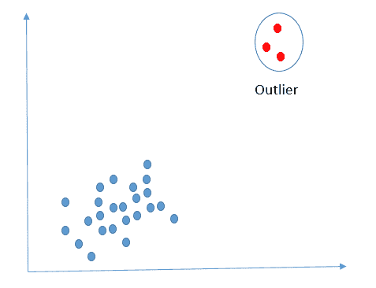

在 2D 空间中展示的异常检测

异常的一个简单例子是识别时间序列中离均值（标准差）太远的点。以下图展示了在时间序列中被识别为异常的数据点：

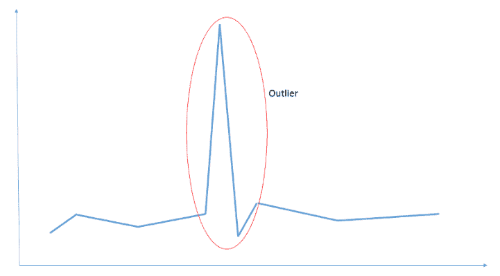

通过标准差识别的时间序列中的异常

在本章中，我们将集中精力研究一种称为**AEs**的无监督深度学习应用类型。

# 自动编码器解释

**自动编码器**（**AEs**）是前馈和非循环类型的神经网络。它们的目标是将给定的输入复制到输出。自动编码器通过将输入压缩到低维摘要来工作。这个摘要通常被称为潜在空间表示。自动编码器试图从潜在空间表示中重建输出。**编码器**、**潜在空间表示**和**解码器**是构成自动编码器的三个部分。以下图展示了在从 MNIST 数据集样本中选取的样本上应用自动编码器的示例：

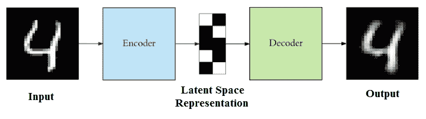

在 MNIST 数据集样本上的自动编码器应用

自动编码器（AE）的编码器和解码器组件是完全连接的前馈网络。潜在空间表示中的神经元数量是一个需要作为构建 AE 的一部分传递的超参数。在潜在语义空间中决定的神经元或节点数量决定了在将实际输入图像压缩到潜在空间表示时获得的压缩量。自动编码器的一般架构如下所示：

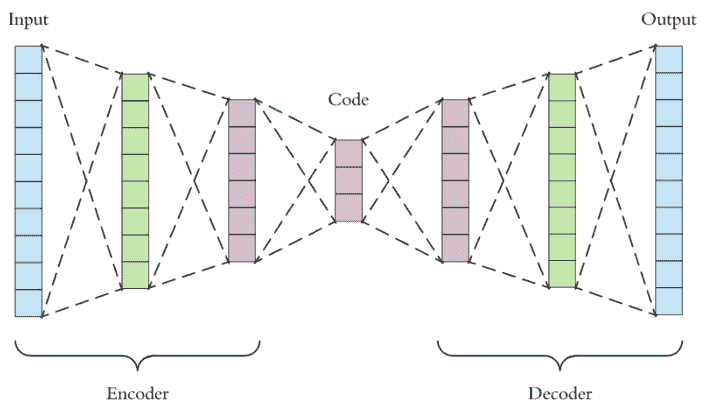

自动编码器的一般架构

给定的输入首先通过一个**编码器**，这是一个全连接的**人工神经网络**（**ANN**）。**编码器**作用于**输入**并减少其维度，如超参数所指定。**解码器**是另一个全连接的 ANN，它拾取这个减少的**输入**（潜在空间表示）然后重建**输出**。目标是使**输出**与**输入**相同。一般来说，**编码器**和**解码器**的架构是镜像的。尽管没有这样的要求强制**编码器**和**解码器**的架构必须相同，但通常是这样实践的。实际上，自动编码器（AE）的唯一要求是从给定的输入中获得相同的输出。任何介于两者之间的都可以根据构建 AE 的个人喜好和想法进行定制。

从数学上讲，编码器可以表示为：

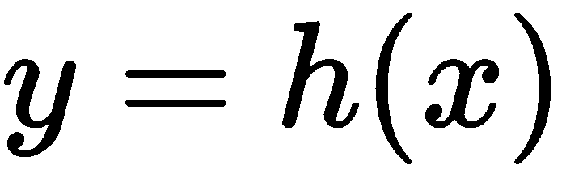

其中 *x* 是输入，*h* 是作用于输入以将其表示为简洁摘要格式的函数。另一方面，解码器可以表示为：

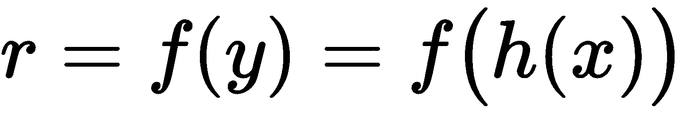。

虽然期望得到，但这并不总是如此，因为重建是从紧凑的摘要表示中完成的；因此，会出现某些错误。错误 *e* 是从原始输入 *x* 和重建输出 *r* 计算得出的，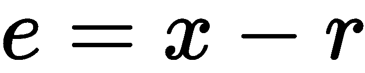。

然后，自动编码器网络通过减少**均方误差**（**MSE**）来学习，错误被传播回隐藏层进行调整。解码器和编码器的权重是彼此的转置，这使得学习训练参数更快。编码器和解码器的镜像架构使得学习训练参数更快成为可能。在不同的架构中，权重不能简单地转置；因此，计算时间会增加。这就是为什么保持编码器和解码器的镜像架构的原因。

# 基于隐藏层的自动编码器类型

根据隐藏层的大小，自动编码器可以分为两种类型，**欠完备的自动编码器**和**过度完备的自动编码器**：

+   **欠完备的自动编码器**：如果自动编码器只是学习将输入复制到输出，那么它就没有用了。想法是产生一个简洁的表示作为编码器的输出，这个简洁的表示应该包含输入的最有用特征。输入层达到的简洁程度由我们在潜在空间表示中使用的神经元或节点数量控制。这可以在构建自动编码器时作为一个参数设置。如果神经元的数量设置为比输入特征更少的维度，那么自动编码器被迫学习输入数据的大部分关键特征。潜在空间中神经元数量少于输入维度的架构称为欠完备的自动编码器。

+   **过度完备的自动编码器**：在潜在空间中，神经元的数量可以等于或超过输入维度。这种架构被称为过度完备的自动编码器。在这种情况下，自动编码器不学习任何东西，只是将输入复制到潜在空间，然后通过解码器传播。

除了潜在空间中神经元的数量外，以下是一些可以在自动编码器（AE）架构中使用的其他参数：

+   **编码器和解码器中的层数**：编码器和解码器的深度可以设置为任何数字。通常，在编码器和解码器的镜像架构中，层数设置为相同的数字。最后一张图展示了编码器和解码器中，除了输入和输出之外，都有两层自动编码器的示意图。

+   **编码器和解码器每层的神经元数量**：在编码器中，每层的神经元数量随着层数的减少而减少，在解码器中，每层的神经元数量随着层数的增加而增加。编码器和解码器层的神经元是对称的。

+   **损失函数**：自动编码器在反向传播过程中使用如均方误差（MSE）或交叉熵等损失函数来学习权重。如果输入范围在（0,1）之间，则使用交叉熵作为度量标准，否则使用均方误差。

# 基于约束的自动编码器类型

根据对损失的约束，自动编码器可以分为以下类型：

+   **简单自动编码器**：这是可能的最简单的自动编码器架构，其中编码器和解码器都是全连接神经网络层。

+   **稀疏自动编码器**：稀疏自动编码器是引入信息瓶颈的替代方法，无需减少我们隐藏层中的节点数量。而不是偏好欠完备的自动编码器，损失函数被构建成惩罚层内激活的方式。对于任何给定的观察值，网络被鼓励学习编码和解码，这仅依赖于激活少量神经元。

+   **去噪自动编码器**：这是一种过完备的自动编码器，存在学习**恒等函数**或**零函数**的风险。本质上，自动编码器学习到的输出等于输入，因此使自动编码器变得无用。去噪自动编码器通过随机初始化一些输入为 0 来避免学习恒等函数的问题。在损失函数的计算过程中，不考虑噪声引起的输入；因此，网络仍然学习正确的权重，而不存在学习恒等函数的风险。同时，自动编码器被训练学习从损坏的输入中重建输出。

以下图示是 MNIST 数据集样本图像上的去噪自动编码器的示例：

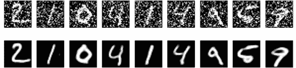

在 MNIST 样本上应用去噪自动编码器

+   **卷积自动编码器**：当处理图像作为输入时，可以使用卷积层作为编码器和解码器网络的一部分。这类使用卷积层的自动编码器被称为**卷积自动编码器**。以下图示展示了在自动编码器中使用卷积的示例：

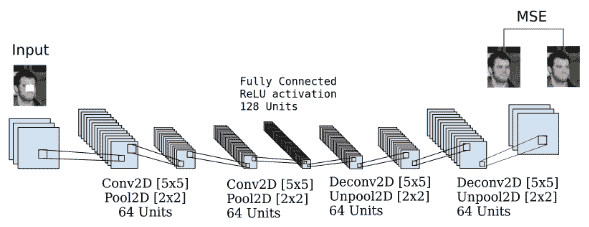

卷积自动编码器

+   **堆叠自动编码器**：堆叠自动编码器是在编码器和解码器中都有多层的一种自动编码器。你可以参考自动编码器的一般架构作为堆叠自动编码器架构的示例说明，其中编码器和解码器都有两层（不包括输入和输出层）。

    +   **变分自动编码器**：**变分自动编码器**（**VAE**），而不是构建一个输出单个

+   e 值来描述每个潜在状态属性，为每个潜在属性描述一个概率分布。这使得设计复杂的数据生成模型和生成虚构名人图像以及数字艺术品成为可能。以下图示展示了 VAE 中数据的表示：

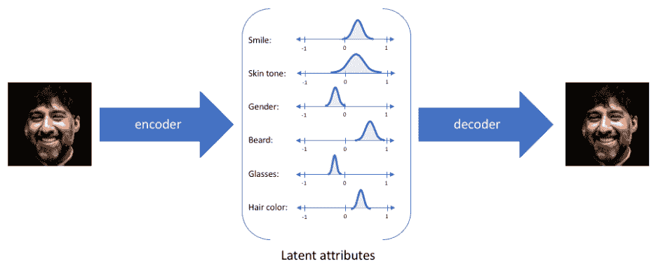

在变分自动编码器（VAE）中，编码器模型有时被称为识别模型，而解码器模型有时被称为生成模型。编码器输出一系列关于潜在特征的统计分布。这些特征是随机采样的，并由解码器用于重建输入。对于任何潜在分布的采样，解码器都应能够准确地重建输入。因此，在潜在空间中彼此靠近的值应该对应于非常相似的重建。

# 自动编码器的应用

以下是一些自动编码器可能被使用的实际应用：

+   **图像着色**：给定一个灰度图像作为输入，自动编码器可以自动着色图像，并以彩色图像作为输出。

+   **噪声去除**：去噪自动编码器能够从图像中去除噪声，并在无噪声的情况下重建图像。例如，可以从视频和图像中去除水印的任务也可以完成。

+   **降维**：自动编码器以压缩形式表示输入数据，但只关注关键特征。因此，像图像这样的东西可以用减少的像素表示，在图像重建过程中信息损失不大。

+   **图像搜索**：这是根据给定的输入识别相似图像。

+   **信息检索**：在从语料库检索信息时，自动编码器可以用来将属于给定输入的所有文档分组在一起。

+   **主题建模**：变分自动编码器用于近似后验分布，并且已经成为推断文本文档潜在主题分布的有希望的替代方案。

我们已经涵盖了理解自动编码器及其应用所需的基本知识。让我们从高层次上了解我们将要使用自动编码器在信用卡欺诈检测问题上的解决方案。

# 信用卡欺诈数据集

通常在一个欺诈数据集中，我们对于负类（非欺诈/真实交易）有足够的数据，而对于正类（欺诈交易）则非常少或没有数据。这在机器学习领域被称为**类别不平衡问题**。我们在非欺诈数据上训练一个自动编码器（AE），并使用编码器学习特征。然后使用解码器在训练集上计算重建误差以找到阈值。这个阈值将用于未见过的数据（测试数据集或其他）。我们使用这个阈值来识别那些测试实例中值大于阈值的欺诈实例。

在本章的项目中，我们将使用以下 URL 源的数据集：[`essentials.togaware.com/data/`](https://essentials.togaware.com/data/)。这是一个公开的信用卡交易数据集。该数据集最初通过研究论文 *Calibrating Probability with Undersampling for Unbalanced Classification*，A. Dal Pozzolo, O. Caelen, R. A Johnson 和 G. Bontempi，IEEE **Symposium Series on Computational Intelligence** (**SSCI**)，南非开普敦，2015 年提供。数据集也可在此 URL 上找到：[`www.ulb.ac.be/di/map/adalpozz/data/creditcard.Rdata`](http://www.ulb.ac.be/di/map/adalpozz/data/creditcard.Rdata)。该数据集是在 Worldline 和 ULB（Université Libre de Bruxelles）机器学习组（[`mlg.ulb.ac.be`](http://mlg.ulb.ac.be/)）在大数据挖掘和欺诈检测研究合作期间收集和分析的。

以下是数据集的特征：

+   论文将数据集以 Rdata 文件的形式提供。该数据集的 CSV 转换版本也可在 Kaggle 以及其他网站上找到。

+   它包含 2013 年 9 月欧洲持卡人用信用卡进行的交易。

+   记录并呈现为数据集的是两天内发生的交易。

+   数据集中总共有 284,807 笔交易。

+   该数据集存在严重的类别不平衡问题。所有交易中只有 0.172% 是欺诈交易（492 笔欺诈交易）。

+   数据集中总共有三十个特征，即 `V1`, `V2`, ..., `V28`, `Time`, 和 `Amount`。

+   变量 `V1`, `V2`, ..., `V28` 是从原始变量集中通过主成分分析（PCA）获得的。

+   由于保密性，产生主成分的原始变量集没有公开。

+   `Time` 特征包含每个交易与数据集中第一个交易之间的秒数。

+   `Amount` 特征是交易金额。

+   因变量名为 `Class`。欺诈交易在类别中表示为 1，真实交易表示为 0。

我们现在将进入使用自动编码器（AE）进行信用卡欺诈检测。

# 在 R 中使用 H2O 库构建自动编码器（AE）。

我们将使用 H2O 中可用的自动编码器实现来执行我们的项目。H2O 是一个完全开源、分布式、内存中的机器学习平台，具有线性可扩展性。它提供了一些最广泛使用的机器学习算法的并行化实现。它支持易于使用的、无监督的、非线性的自动编码器，作为其深度学习模型的一部分。H2O 的深度学习自动编码器基于多层神经网络架构，整个网络一起训练，而不是逐层堆叠。

可以使用以下命令在 R 中安装 `h2o` 包：

```py
install.packages("h2o")
```

关于 H2O 在 R 中的安装和依赖的详细信息，可在以下 URL 找到：[`cran.r-project.org/web/packages/h2o/index.html`](https://cran.r-project.org/web/packages/h2o/index.html)。

一旦成功安装了包，`h2o`包提供的函数，包括 AE，可以通过在 R 代码中包含以下行简单使用：

```py
library(h2o)
```

在使用自动编码器（AE）编码我们的信用卡欺诈检测系统之前，我们需要做的一切。不再等待，让我们开始构建我们的代码来探索和准备我们的数据集，以及实现捕获欺诈性信用卡交易的 AE。

# 信用卡欺诈检测的自动编码器代码实现

如同所有其他项目一样，让我们首先将数据加载到 R 数据框中，然后执行 EDA 以更好地了解数据集。请注意，在代码中包含`h2o`以及`doParallel`库。这些包含使我们能够使用`h2o`库中的 AE，以及利用笔记本电脑/台式机上的多个 CPU 核心，如下所示：

```py
# including the required libraries
library(tidyverse)
library(h2o)
library(rio)
library(doParallel)
library(viridis)
library(RColorBrewer)
library(ggthemes)
library(knitr)
library(caret)
library(caretEnsemble)
library(plotly)
library(lime)
library(plotROC)
library(pROC)
```

在本地主机上的端口`54321`初始化 H2O 集群。`nthreads`定义要使用的线程池数量，这接近要使用的 CPU 数量。在我们的情况下，我们说的是使用所有 CPU，我们还指定 H2O 集群使用的最大内存为`8G`：

```py
localH2O = h2o.init(ip = 'localhost', port = 54321, nthreads = -1,max_mem_size = "8G")
# Detecting the available number of cores
no_cores <- detectCores() - 1
# utilizing all available cores
cl<-makeCluster(no_cores)
registerDoParallel(cl)
```

你将得到与以下代码块中所示类似的输出：

```py
H2O is not running yet, starting it now...
Note:  In case of errors look at the following log files:
    /tmp/RtmpKZvQ3m/h2o_sunil_started_from_r.out
    /tmp/RtmpKZvQ3m/h2o_sunil_started_from_r.err
java version "1.8.0_191"
Java(TM) SE Runtime Environment (build 1.8.0_191-b12)
Java HotSpot(TM) 64-Bit Server VM (build 25.191-b12, mixed mode)
Starting H2O JVM and connecting: ..... Connection successful!
R is connected to the H2O cluster:
    H2O cluster uptime:         4 seconds 583 milliseconds
    H2O cluster timezone:       Asia/Kolkata
    H2O data parsing timezone:  UTC
    H2O cluster version:        3.20.0.8
    H2O cluster version age:    2 months and 27 days 
    H2O cluster name:           H2O_started_from_R_sunil_jgw200
    H2O cluster total nodes:    1
    H2O cluster total memory:   7.11 GB
    H2O cluster total cores:    4
    H2O cluster allowed cores:  4
    H2O cluster healthy:        TRUE
    H2O Connection ip:          localhost
    H2O Connection port:        54321
    H2O Connection proxy:       NA
    H2O Internal Security:      FALSE
    H2O API Extensions:         XGBoost, Algos, AutoML, Core V3, Core V4
    R Version:                  R version 3.5.1 (2018-07-02)
```

现在，为了设置数据文件位置的当前工作目录，加载 Rdata 并将其读入数据框，并使用以下代码查看数据框：

```py
# setting the working directory where the data file is location
setwd("/home/sunil/Desktop/book/chapter 7")
# loading the Rdata file and reading it into the dataframe called cc_fraud
cc_fraud<-get(load("creditcard.Rdata"))
# performing basic EDA on the dataset
# Viewing the dataframe to confirm successful load of the dataset
View(cc_fraud)
```

这将给出以下输出：

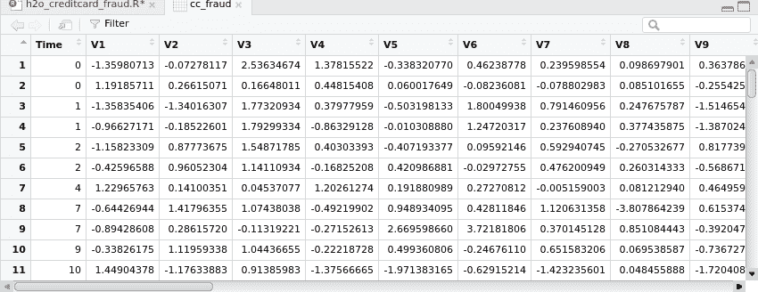

现在，让我们使用以下代码打印数据框结构：

```py
print(str(cc_fraud))
```

这将给出以下输出：

```py
'data.frame':     284807 obs. of  31 variables:
 $ Time  : num  0 0 1 1 2 2 4 7 7 9 ...
 $ V1    : num  -1.36 1.192 -1.358 -0.966 -1.158 ...
 $ V2    : num  -0.0728 0.2662 -1.3402 -0.1852 0.8777 ...
 $ V3    : num  2.536 0.166 1.773 1.793 1.549 ...
 $ V4    : num  1.378 0.448 0.38 -0.863 0.403 ...
 $ V5    : num  -0.3383 0.06 -0.5032 -0.0103 -0.4072 ...
 $ V6    : num  0.4624 -0.0824 1.8005 1.2472 0.0959 ...
 $ V7    : num  0.2396 -0.0788 0.7915 0.2376 0.5929 ...
 $ V8    : num  0.0987 0.0851 0.2477 0.3774 -0.2705 ...
 $ V9    : num  0.364 -0.255 -1.515 -1.387 0.818 ...
 $ V10   : num  0.0908 -0.167 0.2076 -0.055 0.7531 ...
 $ V11   : num  -0.552 1.613 0.625 -0.226 -0.823 ...
 $ V12   : num  -0.6178 1.0652 0.0661 0.1782 0.5382 ...
 $ V13   : num  -0.991 0.489 0.717 0.508 1.346 ...
 $ V14   : num  -0.311 -0.144 -0.166 -0.288 -1.12 ...
 $ V15   : num  1.468 0.636 2.346 -0.631 0.175 ...
 $ V16   : num  -0.47 0.464 -2.89 -1.06 -0.451 ...
 $ V17   : num  0.208 -0.115 1.11 -0.684 -0.237 ...
 $ V18   : num  0.0258 -0.1834 -0.1214 1.9658 -0.0382 ...
 $ V19   : num  0.404 -0.146 -2.262 -1.233 0.803 ...
 $ V20   : num  0.2514 -0.0691 0.525 -0.208 0.4085 ...
 $ V21   : num  -0.01831 -0.22578 0.248 -0.1083 -0.00943 ...
 $ V22   : num  0.27784 -0.63867 0.77168 0.00527 0.79828 ...
 $ V23   : num  -0.11 0.101 0.909 -0.19 -0.137 ...
 $ V24   : num  0.0669 -0.3398 -0.6893 -1.1756 0.1413 ...
 $ V25   : num  0.129 0.167 -0.328 0.647 -0.206 ...
 $ V26   : num  -0.189 0.126 -0.139 -0.222 0.502 ...
 $ V27   : num  0.13356 -0.00898 -0.05535 0.06272 0.21942 ...
 $ V28   : num  -0.0211 0.0147 -0.0598 0.0615 0.2152 ...
 $ Amount: num  149.62 2.69 378.66 123.5 69.99 ...
 $ Class : Factor w/ 2 levels "0","1": 1 1 1 1 1 1 1 1 1 1 ...
```

现在，要查看类别分布，请使用以下代码：

```py
print(table(cc_fraud$Class))
```

你将得到以下输出：

```py
     0      1
284315    492
```

要查看`V1`和`Class`变量之间的关系，请使用以下代码：

```py
# Printing the Histograms for Multivariate analysis
theme_set(theme_economist_white())
# visualization showing the relationship between variable V1 and the class
ggplot(cc_fraud,aes(x="",y=V1,fill=Class))+geom_boxplot()+labs(x="V1",y="")
```

这将给出以下输出：

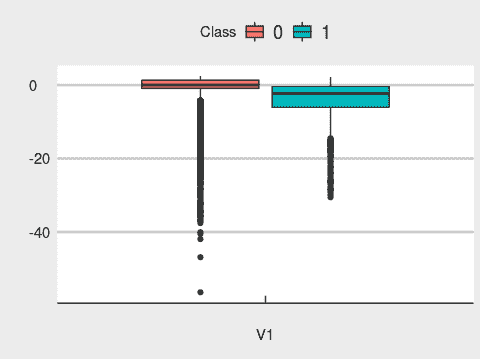

要可视化交易金额相对于类别的分布，请使用以下代码：

```py
# visualization showing the distribution of transaction amount with
# respect to the class, it may be observed that the amount are discretized
# into 50 bins for plotting purposes
ggplot(cc_fraud,aes(x = Amount)) + geom_histogram(color = "#D53E4F", fill = "#D53E4F", bins = 50) + facet_wrap( ~ Class, scales = "free", ncol = 2)
```

这将给出以下输出：

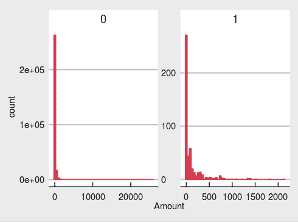

要可视化交易时间相对于类别的分布，请使用以下代码：

```py
ggplot(cc_fraud, aes(x =Time,fill = Class))+ geom_histogram(bins = 30)+
  facet_wrap( ~ Class, scales = "free", ncol = 2)
```

这将给出以下输出：

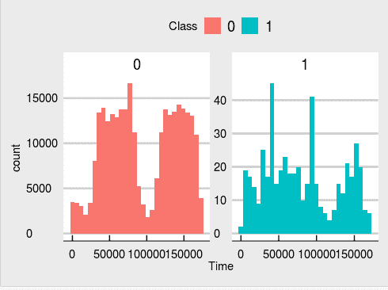

使用以下代码可视化`V2`变量相对于`Class`：

```py
ggplot(cc_fraud, aes(x =V2, fill=Class))+ geom_histogram(bins = 30)+
  facet_wrap( ~ Class, scales = "free", ncol = 2)
```

你将得到以下输出：

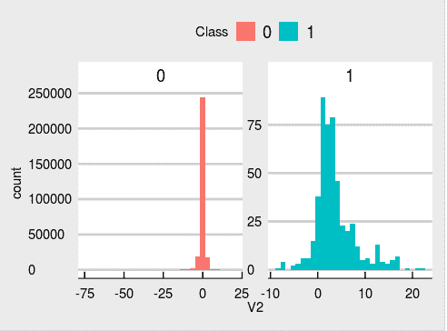

使用以下代码来可视化`V3`相对于`Class`：

```py
ggplot(cc_fraud, aes(x =V3, fill=Class))+ geom_histogram(bins = 30)+
  facet_wrap( ~ Class, scales = "free", ncol = 2)
```

以下图表是结果输出：

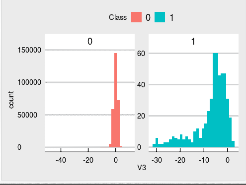

要可视化`V3`变量相对于`Class`，请使用以下代码：

```py
ggplot(cc_fraud, aes(x =V4,fill=Class))+ geom_histogram(bins = 30)+
  facet_wrap( ~ Class, scales = "free", ncol = 2)
```

以下图表是结果输出：

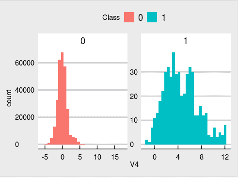

使用以下代码来可视化`V6`变量相对于`类别`：

```py
ggplot(cc_fraud, aes(x=V6, fill=Class)) + geom_density(alpha=1/3) + scale_fill_hue()
```

以下图表是结果输出：

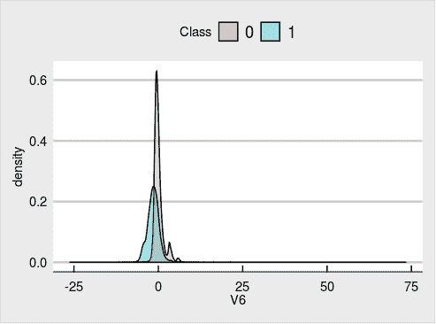

使用以下代码来可视化`V7`变量相对于`类别`：

```py
ggplot(cc_fraud, aes(x=V7, fill=Class)) + geom_density(alpha=1/3) + scale_fill_hue()
```

以下图表是结果输出：

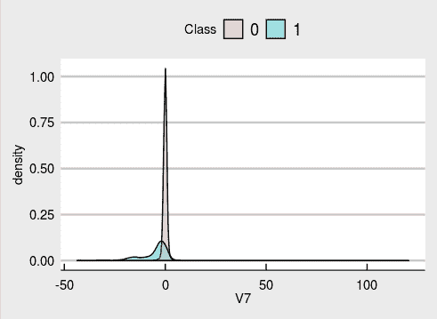

使用以下代码来可视化`V8`变量相对于`类别`：

```py
ggplot(cc_fraud, aes(x=V8, fill=Class)) + geom_density(alpha=1/3) + scale_fill_hue()
```

以下图表是结果输出：

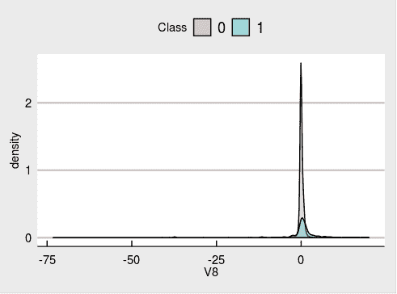

要可视化`V9`变量相对于`类别`，请使用以下代码：

```py
# visualizationshowing the V7 variable with respect to the class
ggplot(cc_fraud, aes(x=V9, fill=Class)) + geom_density(alpha=1/3) + scale_fill_hue()
```

以下图表是结果输出：

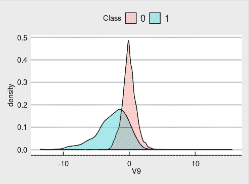

要可视化`V10`变量相对于`类别`，请使用以下代码：

```py
# observe we are plotting the data quantiles
ggplot(cc_fraud, aes(x ="",y=V10, fill=Class))+ geom_violin(adjust = .5,draw_quantiles = c(0.25, 0.5, 0.75))+labs(x="V10",y="")
```

以下图表是结果输出：

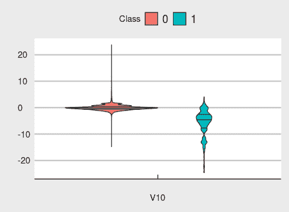

从与类别相关的变量的所有可视化中，我们可以推断出大多数主成分都集中在`0`上。现在，为了绘制数据中类别的分布，请使用以下代码：

```py
cc_fraud %>%
  ggplot(aes(x = Class)) +
  geom_bar(color = "chocolate", fill = "chocolate", width = 0.2) +
  theme_bw()
```

以下条形图是结果输出：

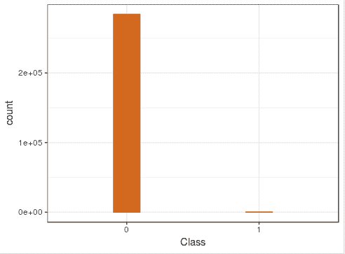

我们观察到类别的分布非常不平衡。与少数类（欺诈交易：`1`）相比，数据集中代表主要类（非欺诈交易，表示为`0`）的表示过于密集。在传统的监督机器学习处理这类问题时，我们会用如**合成少数类过采样技术**（**SMORT**）等技术来处理类别不平衡问题。然而，在使用自编码器（AE）时，我们不在数据预处理阶段处理类别不平衡；相反，我们将数据原样输入到 AE 中进行学习。实际上，AE 正在从多数类学习数据的阈值和特征；这就是我们称之为单类分类问题的原因。

在训练我们的自编码器（AE）之前，我们需要做一些特征工程。让我们首先关注数据中的`时间`变量。目前，它是以秒为单位的格式，但我们可以更好地将其表示为天数。运行以下代码以查看数据集中时间的当前形式：

```py
print(summary(cc_fraud$Time))
```

你将得到以下输出：

```py
   Min. 1st Qu.  Median    Mean 3rd Qu.    Max.
      0   54202   84692   94814  139320  172792
```

我们知道，给定的一天中有 86,400 秒（每分钟 60 秒，每小时 60 分钟，每天 24 小时）。我们将`时间`变量转换为`天数`，考虑到`时间`中的值，如果秒数小于或等于 86,400，则表示为`day1`，超过 86,400 的任何值变为`day2`。由于从摘要中我们可以看到，时间变量的最大值表示为`172792`秒，因此只有两种可能的天数：

```py
# creating a new variable called day based on the seconds 
# represented in Time variable
 cc_fraud=cc_fraud %>% mutate(Day = case_when(.$Time > 3600 * 24 ~ "day2",.$Time < 3600 * 24 ~ "day1"))
#visualizing the dataset post creating the new variable
View(cc_fraud%>%head())
```

以下是转换后的前六行的结果输出：

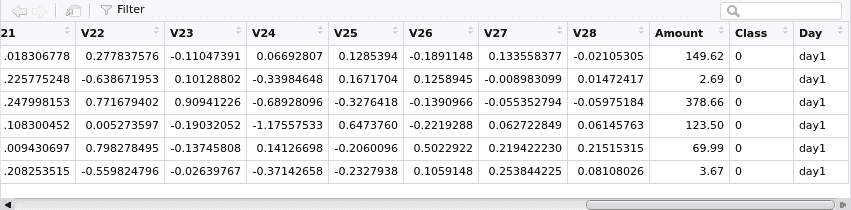

现在，使用以下代码来查看最后六行：

```py
View(cc_fraud%>%tail())
```

转换后的最后六行的结果是以下内容：

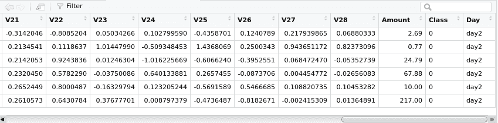

现在，让我们使用以下代码打印交易按交易发生的日期的分布：

```py
print(table(cc_fraud[,"Day"]))
```

你将得到以下输出：

```py
  day1   day2
144786 140020
```

让我们根据`Time`变量中的秒数创建一个新的变量`Time_day`，并使用以下代码根据`Day`对`Time_day`变量进行汇总：

```py
cc_fraud$Time_day <- if_else(cc_fraud$Day == "day2", cc_fraud$Time - 86400, cc_fraud$Time)
print(tapply(cc_fraud$Time_day,cc_fraud$Day,summary,simplify = FALSE))
```

我们得到以下结果输出：

```py
$day1
   Min. 1st Qu.  Median    Mean 3rd Qu.    Max.
      0   38432   54689   52948   70976   86398

$day2
   Min. 1st Qu.  Median    Mean 3rd Qu.    Max.
      1   37843   53425   51705   68182   86392
```

使用以下代码将数据集中的所有字符变量转换为因子：

```py
cc_fraud<-cc_fraud%>%mutate_if(is.character,as.factor)
```

我们可以通过将变量转换为因子来进一步微调`Time_day`变量。因子代表交易发生的时间，例如，“上午”、“下午”、“傍晚”和“夜间”。我们可以使用以下代码创建一个名为`Time_Group`的新变量，基于一天中的不同时间段：

```py
cc_fraud=cc_fraud %>% 
  mutate(Time_Group = case_when(.$Time_day <= 38138~ "morning" ,
                                .$Time_day <= 52327~  "afternoon",
                                .$Time_day <= 69580~"evening",
                                .$Time_day > 69580~"night"))
#Visualizing the data post creating the new variable
View(head(cc_fraud))
```

转换后的前六行的结果是以下内容：

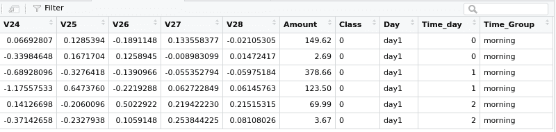

使用以下代码查看并确认最后六行：

```py
View(tail(cc_fraud))
```

这将给出以下输出，我们看到我们已经成功地将表示一天中各种时间的交易数据转换过来：

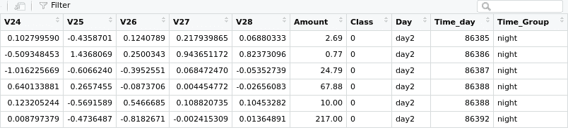

看看以下代码：

```py
#visualizing the transaction count by day
cc_fraud %>%drop_na()%>%
  ggplot(aes(x = Day)) +
  geom_bar(fill = "chocolate",width = 0.3,color="chocolate") +
  theme_economist_white()
```

上述代码将生成以下输出：

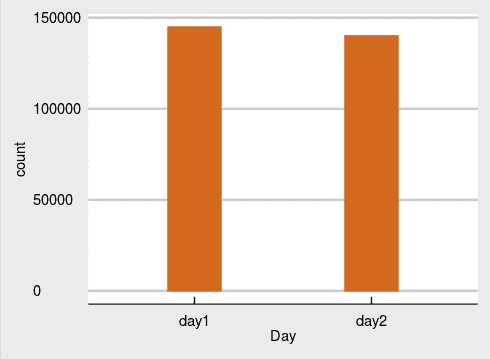

从可视化中我们可以推断，第一天和第二天发生的交易数量没有差异。两者都接近 15 万笔交易。

现在我们将`Class`变量转换为因子，然后使用以下代码通过`Time_Group`变量可视化数据：

```py
cc_fraud$Class <- factor(cc_fraud$Class)
cc_fraud %>%drop_na()%>%
  ggplot(aes(x = Time_Group)) +
  geom_bar(color = "#238B45", fill = "#238B45") +
  theme_bw() +
  facet_wrap( ~ Class, scales = "free", ncol = 2)
```

这将生成以下输出：

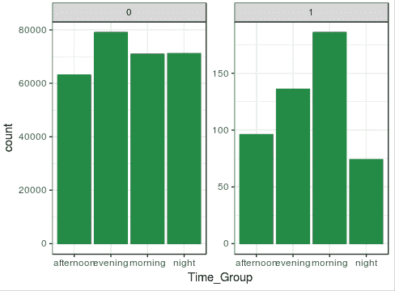

从这个可视化中得到的推断是，非欺诈交易的数量在一天中的所有时间段几乎保持不变，而我们在上午`Time`组中看到欺诈交易数量的巨大增长。

让我们对交易金额与类别进行最后的探索：

```py
# getting the summary of amount with respect to the class
print(tapply(cc_fraud$Amount  ,cc_fraud$Class,summary))
```

上述代码将生成以下输出：

```py
$`0`
    Min.  1st Qu.   Median     Mean  3rd Qu.     Max.
    0.00     5.65    22.00    88.29    77.05 25691.16
$`1`
   Min. 1st Qu.  Median    Mean 3rd Qu.    Max.
   0.00    1.00    9.25  122.21 105.89 2125.87
```

从摘要中得出的一个有趣见解是，欺诈交易的平均金额比真实交易要高。然而，我们在欺诈交易中看到的最大交易金额远低于真实交易。还可以看出，真实交易的中位数金额更高。

现在，让我们将我们的 R 数据框转换为 H2O 数据框，以便对其应用 AE。这是使用`h2o`库中的函数的一个要求：

```py
# converting R dataframe to H2O dataframe
cc_fraud_h2o <- as.h2o(cc_fraud)
#splitting the data into 60%, 20%, 20% chunks to use them as training,
#vaidation and test datasets
splits <- h2o.splitFrame(cc_fraud_h2o,ratios = c(0.6, 0.2), seed = 148)  
# creating new train, validation and test h2o dataframes
train <- splits[[1]]
validation <- splits[[2]]
test <- splits[[3]]
# getting the target and features name in vectors
target <- "Class"
features <- setdiff(colnames(train), target)
```

`tanh`激活函数是一个缩放和移动的对数函数。`h2o`库还提供了其他函数，如 ReLu 和 Maxout，也可以使用。在第一个 AE 模型中，让我们使用`tanh`激活函数。这个选择是任意的，也可以根据需要尝试其他激活函数。

`h2o.deeplearning`函数有一个参数 AE，应该将其设置为`TRUE`以训练一个 AE 模型。现在让我们构建我们的 AE 模型：

```py
model_one = h2o.deeplearning(x = features, training_frame = train,
                             AE = TRUE,
                             reproducible = TRUE,
                             seed = 148,
                             hidden = c(10,10,10), epochs = 100,
 activation = "Tanh",
                             validation_frame = test)
```

上述代码生成以下输出：

```py
 |===========================================================================================================================| 100%
```

我们将保存模型，这样我们就不必一次又一次地重新训练。然后加载磁盘上持久化的模型，并使用以下代码打印模型以验证 AE 学习：

```py
h2o.saveModel(model_one, path="model_one", force = TRUE)
model_one<-h2o.loadModel("/home/sunil/model_one/DeepLearning_model_R_1544970545051_1")
print(model_one)
```

这将生成以下输出：

```py
Model Details:
==============
H2OAutoEncoderModel: deeplearning
Model ID:  DeepLearning_model_R_1544970545051_1
Status of Neuron Layers: auto-encoder, gaussian distribution, Quadratic loss, 944 weights/biases, 20.1 KB, 2,739,472 training samples, mini-batch size 1
  layer units  type dropout       l1       l2 mean_rate rate_rms momentum mean_weight weight_rms mean_bias bias_rms
1     1    34 Input  0.00 %       NA       NA        NA       NA       NA          NA         NA        NA       NA
2     2    10  Tanh  0.00 % 0.000000 0.000000  0.610547 0.305915 0.000000   -0.000347   0.309377 -0.028166 0.148318
3     3    10  Tanh  0.00 % 0.000000 0.000000  0.181705 0.103598 0.000000    0.022774   0.262611 -0.056455 0.099918
4     4    10  Tanh  0.00 % 0.000000 0.000000  0.133090 0.079663 0.000000    0.000808   0.337259  0.032588 0.101952
5     5    34  Tanh      NA 0.000000 0.000000  0.116252 0.129859 0.000000    0.006941   0.357547  0.167973 0.688510
H2OAutoEncoderMetrics: deeplearning
 Reported on training data. Training Set Metrics:
=====================
MSE: (Extract with `h2o.mse`) 0.0003654009
RMSE: (Extract with `h2o.rmse`) 0.01911546
H2OAutoEncoderMetrics: deeplearning
 Reported on validation data. Validation Set Metrics:
=====================
MSE: (Extract with `h2o.mse`) 0.0003508435
RMSE: (Extract with `h2o.rmse`) 0.01873082
```

我们现在将使用构建的 AE 模型在测试数据集上进行预测，使用以下代码：

```py
test_autoencoder <- h2o.predict(model_one, test)
```

这将生成以下输出：

```py
|===========================================================================================================================| 100%
```

通过`h2o.deepfeatures`函数，我们可以在内部层以有意识的方式可视化表示数据的编码器。让我们尝试可视化第二层中的降维数据：

```py
train_features <- h2o.deepfeatures(model_one, train, layer = 2) %>%
  as.data.frame() %>%
  mutate(Class = as.vector(train[, 31]))
# printing the reduced data represented in layer2
print(train_features%>%head(3))
```

上述代码将生成以下输出：

```py
DF.L2.C1  DF.L2.C2     DF.L2.C3    DF.L2.C4   DF.L2.C5 
-0.12899115 0.1312075  0.115971952 -0.12997648 0.23081912
-0.10437942 0.1832959  0.006427409 -0.08018725 0.05575977
-0.07135827 0.1705700 -0.023808057 -0.11383244 0.10800857
DF.L2.C6   DF.L2.C7    DF.L2.C8  DF.L2.C9  DF.L2.C10  Class0.1791547 0.10325721  0.05589069 0.5607497 -0.9038150     0
0.1588236 0.11009450 -0.04071038 0.5895413 -0.8949729     0
0.1676358 0.10703990 -0.03263755 0.5762191 -0.8989759     0
```

现在我们使用以下代码绘制`DF.L2.C1`相对于`DF.L2.C2`的数据，以验证编码器是否检测到了欺诈交易：

```py
ggplot(train_features, aes(x = DF.L2.C1, y = DF.L2.C2, color = Class)) +
  geom_point(alpha = 0.1,size=1.5)+theme_bw()+
  scale_fill_brewer(palette = "Accent")
```

这将生成以下输出：

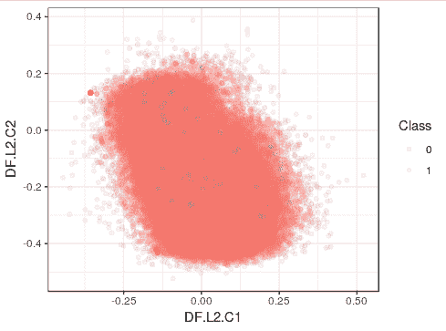

再次，我们绘制`DF.L2.C3`相对于`DF.L2.C4`的数据，以验证编码器是否检测到了任何欺诈交易，使用以下代码：

```py
ggplot(train_features, aes(x = DF.L2.C3, y = DF.L2.C4, color = Class)) +
  geom_point(alpha = 0.1,size=1.5)+theme_bw()+
  scale_fill_brewer(palette = "Accent")
```

上述代码将生成以下输出：

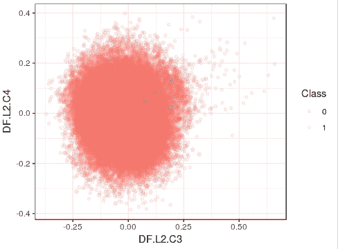

从两个可视化图中我们可以看出，通过我们的 AE 模型进行降维处理确实检测到了欺诈交易。那些散布的点（用`1`表示）描绘了被检测到的欺诈交易。我们也可以使用我们的第一个模型来训练一个新的模型，使用其他隐藏层。这会产生 10 列，因为第三层有 10 个节点。我们只是在尝试切出一层，在这一层中已经进行了一定程度的降维，并使用它来构建一个新的模型：

```py
# let's consider the third hidden layer. This is again a random choice
# in fact we could have taken any layer among the 10 inner layers
train_features <- h2o.deepfeatures(model_one, validation, layer = 3) %>%
  as.data.frame() %>%
  mutate(Class = as.factor(as.vector(validation[, 31]))) %>%
  as.h2o()
```

上述代码将生成以下输出：

```py
|===========================================================================================================================| 100% |===========================================================================================================================| 100%
```

如我们所见，训练模型和数据已成功创建。我们现在将继续训练新的模型，保存它并打印它。首先，我们将从切片编码器层获取特征名称：

```py
features_two <- setdiff(colnames(train_features), target)
```

然后，我们将训练一个新的模型：

```py
model_two <- h2o.deeplearning(y = target,
                              x = features_two,
                              training_frame = train_features,
                              reproducible = TRUE,
                              balance_classes = TRUE,
                              ignore_const_cols = FALSE,
                              seed = 148,
                              hidden = c(10, 5, 10),
                              epochs = 100,
                              activation = "Tanh")
```

然后，我们将保存模型以避免再次重新训练，然后使用以下代码检索模型并打印它：

```py
h2o.saveModel(model_two, path="model_two", force = TRUE)
model_two <- h2o.loadModel("/home/sunil/model_two/DeepLearning_model_R_1544970545051_2")
print(model_two)
```

这将生成以下输出：

```py
Model Details:
==============
H2OBinomialModel: deeplearning
Model ID:  DeepLearning_model_R_1544970545051_2
Status of Neuron Layers: predicting Class, 2-class classification, bernoulli distribution, CrossEntropy loss, 247 weights/biases, 8.0 KB, 2,383,962 training samples, mini-batch size 1
  layer units    type dropout       l1       l2 mean_rate rate_rms momentum mean_weight weight_rms mean_bias bias_rms
1     1    10   Input  0.00 %       NA       NA        NA       NA       NA          NA         NA        NA       NA
2     2    10    Tanh  0.00 % 0.000000 0.000000  0.001515 0.001883 0.000000   -0.149216   0.768610 -0.038682 0.891455
3     3     5    Tanh  0.00 % 0.000000 0.000000  0.003293 0.004916 0.000000   -0.251950   0.885017 -0.307971 0.531144
4     4    10    Tanh  0.00 % 0.000000 0.000000  0.002252 0.001780 0.000000    0.073398   1.217405 -0.354956 0.887678
5     5     2 Softmax      NA 0.000000 0.000000  0.007459 0.007915 0.000000   -0.095975   3.579932  0.223286 1.172508
H2OBinomialMetrics: deeplearning
 Reported on training data.
  Metrics reported on temporary training frame with 9892 samples MSE:  0.1129424
RMSE:  0.336069
LogLoss:  0.336795
Mean Per-Class Error:  0.006234916
AUC:  0.9983688
Gini:  0.9967377
Confusion Matrix (vertical: actual; across: predicted) for F1-optimal threshold:
          0    1    Error      Rate
0      4910   62 0.012470  =62/4972
1         0 4920 0.000000   =0/4920
Totals 4910 4982 0.006268  =62/9892
Maximum Metrics: Maximum metrics at their respective thresholds
                        metric threshold    value idx
1                       max f1  0.009908 0.993739 153
2                       max f2  0.009908 0.997486 153
3                 max f0point5  0.019214 0.990107 142
4                 max accuracy  0.009908 0.993732 153
5                max precision  1.000000 1.000000   0
6                   max recall  0.009908 1.000000 153
7              max specificity  1.000000 1.000000   0
8             max absolute_mcc  0.009908 0.987543 153
9   max min_per_class_accuracy  0.019214 0.989541 142
10 max mean_per_class_accuracy  0.009908 0.993765 153
Gains/Lift Table: Extract with `h2o.gainsLift(<model>, <data>)` or `h2o.gainsLift(<model>, valid=<T/F>, xval=<T/F>)
```

为了测量模型在测试数据上的性能，我们需要将测试数据转换为与训练数据相同的降维维度：

```py
test_3 <- h2o.deepfeatures(model_one, test, layer = 3)
print(test_3%>%head())
```

上述代码将生成以下输出：

```py
|===========================================================================================================================| 100%
```

我们可以看到，数据已经成功转换。现在，为了使用`model_two`在测试数据集上进行预测，我们将使用以下代码：

```py
test_pred=h2o.predict(model_two, test_3,type="response")%>%
  as.data.frame() %>%
  mutate(actual = as.vector(test[, 31]))
```

这将生成以下输出：

```py
|===========================================================================================================================| 100%
```

如我们所见，从输出中，预测已成功完成，现在让我们使用以下代码可视化预测结果：

```py
test_pred%>%head()
  predict        p0           p1 actual
1       0 1.0000000 1.468655e-23      0
2       0 1.0000000 2.354664e-23      0
3       0 1.0000000 5.987218e-09      0
4       0 1.0000000 2.888583e-23      0
5       0 0.9999988 1.226122e-06      0
6       0 1.0000000 2.927614e-23      0
# summarizing the predictions
print(h2o.predict(model_two, test_3) %>%
  as.data.frame() %>%
  dplyr::mutate(actual = as.vector(test[, 31])) %>%
  group_by(actual, predict) %>%
  dplyr::summarise(n = n()) %>%
  mutate(freq = n / sum(n)))
```

这将生成以下输出：

```py
|===========================================================================================================================| 100%
# A tibble: 4 x 4
# Groups:   actual [2]
  actual predict     n   freq
  <chr>  <fct>   <int>  <dbl>
1 0      0       55811 0.986
2 0      1         817 0.0144
3 1      0          41 0.414
4 1      1          58 0.586
```

我们可以看到，我们的 AE 能够以 98%的准确率正确预测非欺诈交易，这是好的。然而，在预测欺诈交易时，它只产生了 58%的准确率。这确实是一个需要关注的问题。我们的模型需要一些改进，这可以通过以下选项实现：

+   使用其他层的潜在空间表示作为输入来构建`model_two`（记住我们目前使用的是第 3 层的表示）

+   使用 ReLu 或 Maxout 激活函数而不是`Tanh`

+   通过`h2o.anomaly`函数检查被错误分类的实例，并增加或减少截止阈值 MSE 值，这些值将欺诈交易与非欺诈交易区分开来

+   在编码器和解码器中尝试更复杂的架构

我们在本章中不会尝试这些选项，因为它们具有实验性质。然而，感兴趣的读者可以尝试这些选项来提高模型的准确性。

最后，一个最佳实践是明确关闭`h2o`集群。这可以通过以下命令完成：

```py
h2o.shutdown()
```

# 摘要

在本章中，我们了解了一种无监督的深度学习技术，称为 AEs。我们涵盖了 AEs 的定义、工作原理、类型和应用。我们探讨了 H2O，这是一个开源库，使我们能够创建深度学习模型，包括 AEs。然后我们讨论了一个信用卡欺诈公开数据集，并使用 AE 实现了一个项目来检测欺诈信用卡交易。

深度神经网络能否帮助完成创意任务，如散文生成、故事写作、图像标题生成和诗歌创作？不确定吗？！让我们在下一章探索 RNNs，这是一种特殊的深度神经网络，使我们能够完成创意任务。翻到下一页，探索用于散文生成的 RNNs 世界。
