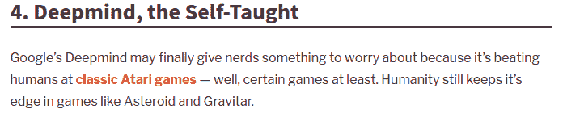

# 使用强化学习赢得赌场老虎机

如果你一直在关注**机器学习**（**ML**）新闻，我敢肯定你一定遇到过这样的标题：*计算机在多种游戏中表现优于世界冠军*。如果你还没有，以下是我快速谷歌搜索的一些新闻片段，值得花时间阅读以了解情况：

+   看看这个：[`www.theverge.com/2017/10/18/16495548/deepmind-ai-go-alphago-zero-self-taught/`](https://www.theverge.com/2017/10/18/16495548/deepmind-ai-go-alphago-zero-self-taught/):


+   看这个：[`www.makeuseof.com/tag/ais-winning-5-times-computers-beat-humans/`](https://www.makeuseof.com/tag/ais-winning-5-times-computers-beat-humans/):



**强化学习**（**RL**）是**人工智能**（**AI**）的一个子领域，它使计算机系统在诸如 Atari Breakout 和围棋等游戏中表现出比人类玩家更好的性能。

在本章中，我们将探讨以下主题：

+   强化学习的概念

+   多臂老虎机问题

+   解决多臂老虎机问题的方法

+   强化学习的实际应用

+   使用强化学习技术实施一个项目，以最大化我们在多臂老虎机机器上获胜的机会

# 理解强化学习

强化学习是一个非常重要的领域，但有时从业者会忽视它来解决复杂、现实世界的问题。遗憾的是，甚至大多数机器学习教科书只关注监督学习和无监督学习，而完全忽略了强化学习。

作为一个领域，强化学习近年来势头强劲；然而，其起源可以追溯到 1980 年。它是由 Rich Sutton 和 Andrew Barto 发明的，Rich 的博士论文导师。即使在 1980 年代，它也被认为过时。然而，Rich 相信强化学习和它的承诺，坚持认为它最终会被认可。

使用 RL 术语进行快速谷歌搜索显示，RL 方法通常用于游戏，如跳棋和国际象棋。游戏问题是需要采取行动以找到动态问题的长期最优解的问题。它们是动态的，因为条件不断变化，有时是对其他代理的响应，这可能是对抗性的。

尽管强化学习在游戏领域的成功得到了证明，但它也是一个新兴领域，正越来越多地应用于其他领域，如金融、经济学和其他跨学科领域。在强化学习领域有许多方法，它们在人工智能和运筹学社区中独立发展。因此，这是一个机器学习从业者需要了解的关键领域。

简而言之，强化学习是一个主要关注创建从错误中学习的模型的领域。想象一下，一个人被置于一个新环境中。起初，他们会犯错误，但他们会从中学习，这样当相同的情况在未来再次出现时，他们就不会再犯同样的错误。强化学习使用以下技术来训练模型：

环境 ----------> 尝试并失败 -----------> 从失败中学习 ----------> 达成目标

从历史上看，你不能使用机器学习来让一个算法学会如何在某项任务上比人类做得更好。所能做的只是模仿人类的行为，也许计算机可以更快地运行它们。然而，强化学习（RL）使得创建比人类在执行某些任务上更好的模型成为可能。

SYBBIO 的 CEO 和联合创始人 Isaac Abhadu 在 Quora 上给出了一个精彩的解释，详细说明了强化学习与监督学习的区别。他指出，简而言之，强化学习框架与监督学习非常相似。

假设我们试图让一个算法在乒乓球游戏中表现出色。我们将输入帧通过模型运行，使其产生一些随机输出动作，就像在监督学习设置中做的那样。然而，在强化学习的情况下，我们自己并不知道目标标签是什么，因此我们不会告诉机器在每种特定情况下应该做什么。相反，我们应用一种称为**策略梯度**的方法。

因此，我们从一个随机网络开始，向它输入一个输入帧，使其产生一个随机输出动作来响应该帧。这个动作随后被发送回游戏引擎，使其产生另一个帧。这个循环不断重复。它唯一会提供的反馈是游戏的计分板。每当我们的代理做对了——也就是说，它产生了一些成功的序列——它将获得一分，通常被称为**奖励**。每当它产生一个失败的序列，它将失去一分——这被称为**惩罚**。

代理追求的最终目标是不断更新其策略，以获得尽可能多的奖励。因此，随着时间的推移，它将找出如何在这款游戏中战胜人类。

强化学习不是一件快速的事情。代理最初会输很多。但我们会继续给它输入帧，使其不断产生随机输出动作，并最终发现成功的动作。它将不断积累关于哪些动作是成功的知识，经过一段时间后，将变得不可战胜。

# 强化学习与其他机器学习算法的比较

强化学习涉及一个**环境**，即要解决的问题集，以及一个**智能体**，它简单地说就是人工智能算法。智能体将执行某个动作，该动作的结果将导致智能体状态的改变。这种改变导致智能体获得奖励，这是一种积极的奖励，或者是一种惩罚，这是一种由于执行了错误动作而产生的负面奖励。通过重复动作和奖励过程，智能体学习环境。它理解各种状态和期望的以及不期望的各种动作。执行动作并从奖励中学习的过程就是强化学习。以下图示展示了强化学习中智能体和环境之间的关系：


强化学习中智能体和环境之间的关系

强化学习（RL）、**深度学习（DL**）和机器学习（ML）都以某种方式支持自动化。它们都涉及从给定数据中学习。然而，RL 与其他技术的区别在于，RL 通过试错来学习正确的动作，而其他技术则专注于通过在现有数据中寻找模式来学习。另一个关键区别是，为了使深度学习和机器学习算法更好地学习，我们需要向它们提供大量的标记数据集，而强化学习则不需要这样做。

通过将训练家中的宠物作为类比，让我们更好地理解强化学习。想象一下，我们正在教我们的宠物狗，桑迪，一些新的技巧。不幸的是，桑迪不懂英语；因此，我们需要找到一种替代方法来训练他。我们模拟一个情境，桑迪尝试以许多不同的方式做出回应。对于任何期望的回应，我们都会用骨头奖励桑迪。这使宠物狗明白，下次他遇到类似的情况时，他会执行期望的行为，因为他知道有奖励。所以，这是从积极回应中学习；如果他受到负面回应，比如皱眉，他将会被劝阻进行不期望的行为。

# 强化学习术语

让我们通过宠物狗训练的类比来理解强化学习的关键术语——智能体、环境、状态、策略、奖励和惩罚：

+   我们的宠物狗桑迪是暴露在环境中的智能体。

+   环境是一个房子或游乐区，这取决于我们想要教给桑迪什么。

+   每个遇到的情况都称为状态。例如，桑迪爬到床下或奔跑可以被解释为状态。

+   智能体桑迪通过执行动作来改变从一个状态到另一个状态。

+   在状态改变后，我们根据执行的动作给予智能体奖励或惩罚。

+   策略指的是选择动作以找到更好结果的战略。

既然我们已经理解了每个强化学习（RL）术语，让我们更正式地定义这些术语，并在下面的图中可视化智能体的行为：

+   **状态**：世界的完整描述被称为状态。我们不会抽象掉世界上存在的任何信息。状态可以是位置、常数或动态的。状态通常记录在数组、矩阵或更高阶的张量中。

+   **动作**：环境通常定义可能的动作；也就是说，不同的环境根据智能体导致不同的动作。智能体的有效动作记录在一个称为动作空间的空间中。环境中可能的有效动作数量是有限的。

+   **环境**：这是智能体生活和与之交互的空间。对于不同类型的环境，我们使用不同的奖励和政策。

+   **奖励和回报**：奖励函数是强化学习中必须始终跟踪的函数。它在调整、优化算法和停止算法训练中起着至关重要的作用。奖励是根据当前世界状态、刚刚采取的动作和下一个世界状态计算的。

+   **策略**：在强化学习中，策略是智能体用于选择下一个动作的规则；策略也被称为智能体的大脑。

看看下面的流程图，以更好地理解这个过程：


强化学习中的智能体行为

在每个步骤，*t*，智能体执行以下任务：

1.  执行动作 *a[t]*

1.  接收观察结果 *s[t]*

1.  接收标量奖励 *r[t]*

环境执行以下任务：

1.  行动 *a[t]* 的变化

1.  发出观察结果 *s[t+1]*

1.  发出标量奖励 *r[t+1]*

时间步长 *t* 在每次迭代后增加。

# 多臂老虎机问题

让我用一个类比来更好地理解这个话题。你喜欢披萨吗？我非常喜欢！我在班加罗尔的最喜欢的餐厅提供美味的披萨。每次我想吃披萨时，我都会去这个地方，而且我几乎可以肯定我会得到最好的披萨。然而，每次都去同一家餐厅让我担心我错过了镇上其他地方更好吃的披萨！

一个可用的替代方案是逐一尝试餐厅并品尝那里的披萨，但这意味着我最终可能会吃到不太好的披萨的概率非常高。然而，这是我发现比我所知道的餐厅提供更好披萨的唯一方法。我知道你一定在想，为什么我要谈论披萨，而我应该谈论强化学习。让我切入正题。

这个任务中的困境源于信息不完整。换句话说，要解决这个问题，必须收集足够的信息来制定最佳的整体策略，然后探索新的行动。这最终将导致总体不良体验的最小化。这种情况也可以被称为**探索**与**利用**的困境：


探索与利用的困境

上述图表恰当地总结了最好的披萨问题。

**多臂老虎机问题**（**MABP**）是披萨类比的一个简化形式。它用来表示类似的问题，并且找到解决这些问题的良好策略已经在很大程度上帮助了许多行业。

**老虎机**被定义为偷你钱的人！单臂老虎机是一种简单的老虎机。我们在赌场中找到这种机器：你将硬币投入老虎机，拉动杠杆，并向幸运之神祈祷以获得即时奖励。但百万美元的问题是为什么老虎机被称为老虎机？结果证明，所有赌场都这样配置老虎机，使得所有赌徒最终都会输钱！

多臂老虎机是一个假设但复杂的老虎机，其中我们有一排排列的多台老虎机。赌徒可以拉动几个杠杆，每个杠杆给出不同的回报。以下图表描述了对应奖励的概率分布，这些奖励对于每一层都是不同的，并且对赌徒来说是未知的：


多臂老虎机

给定这些老虎机和一系列初始试验后，任务是确定拉动哪个杠杆以获得最大奖励。换句话说，拉动任何一个臂都会给我们一个随机奖励，要么 R=+1 表示成功，要么 R=0 表示失败；这被称为**即时奖励**。发出 1 或 0 奖励的多臂老虎机被称为**伯努利**。目标是按顺序拉动臂，同时收集信息以最大化长期总回报。形式上，伯努利 MABP 可以描述为 (A,R) 的元组，其中以下适用：

+   我们有 K 台机器，具有奖励概率 {θ1,…,θK}。

+   在每个时间步 *t*，我们选择一台老虎机的动作 *a* 并获得奖励 *r*。

+   *A* 是一组动作，每个动作都指代与一台老虎机的交互。动作 *a* 的值是期望奖励，![]。如果时间步 *t* 中的动作 *a* 在第 *i* 台机器上，那么 ![]。Q(a) 通常被称为动作值函数。

+   *R* 是一个奖励函数。在伯努利老虎机的情况下，我们以随机的方式观察到奖励 *r*。在时间步 *t*，![] 可能以概率 ![，] 返回奖励 1，否则为 0。

我们可以用多种策略解决 MABP。我们将在本节中简要回顾一些策略。为了确定最佳策略并比较不同的策略，我们需要一个定量方法。一种方法是在一定预定义的试验次数后直接计算累积奖励。比较每种策略的累积奖励为我们提供了识别问题最佳策略的机会。

有时，我们可能已经知道给定老虎机问题的最佳动作。在这些情况下，研究后悔的概念可能很有趣。

让我们想象一下，我们已知给定老虎机问题的最佳拉动臂的详细信息。假设通过反复拉动这个最佳臂，我们可以获得最大的期望奖励，这在下图的水平线上表示：


通过拉动最佳臂在 MABP 中获得的最大奖励

根据问题描述，我们需要通过拉动多臂老虎机的不同臂进行重复试验，直到我们大致确定在时间 *t* 时拉动哪个臂可以获得最大的平均回报。在探索和决定最佳臂的过程中涉及到许多轮次。这些轮次，通常称为 **试验**，也会产生一些损失，这被称为 **后悔**。换句话说，我们希望在学习的阶段也最大化奖励。后悔可以概括为衡量我们没有选择最优臂的后悔程度。

下图展示了由于尝试找到最佳臂而产生的后悔：


MAB 中的后悔概念

# 解决 MABP 的策略

根据探索的方式，解决 MABP 的策略可以分为以下几种类型：

+   无探索

+   随机探索

+   智能探索，优先考虑不确定性

让我们深入了解属于每种策略类型的某些算法的细节。

让我们考虑一个非常简单的方法，即长时间只玩一台老虎机。在这里，我们不做任何探索，只是随机选择一个臂并反复拉动以最大化长期奖励。你一定想知道这是怎么工作的！让我们来探究一下。

在概率论中，大数定律是一个描述进行相同实验大量次的结果的定理。根据这个定律，从大量试验中获得的结果的平均值应该接近期望值，并且随着试验次数的增加而越来越接近。

我们可以只玩一台机器进行大量轮次，以便最终根据大数定律估计真实的奖励概率。

然而，这种策略存在一些问题。首先，我们不知道大量轮次的价值。其次，重复玩相同的插槽需要超级资源密集。最重要的是，我们无法保证使用这种策略将获得最佳长期奖励。

# ε-贪婪算法

强化学习中的贪婪算法是一个完全的利用算法，它不考虑探索。贪婪算法总是选择具有最高估计动作值的动作。动作值是根据过去经验通过平均迄今为止观察到的与目标动作相关的奖励来估计的。

然而，如果我们能够成功地将动作值估计为期望的动作值；如果我们知道真实的分布，我们就可以直接选择最佳的动作。ε-贪婪算法是贪婪和随机方法的简单组合。

ε有助于进行这种估计。它将探索作为贪婪算法的一部分。为了对抗总是根据估计的动作值选择最佳动作的逻辑，偶尔，ε概率会为了探索而选择一个随机动作；其余时间，它表现得像原始的贪婪算法，选择已知的最佳动作。

在此算法中，ε是一个可调整的参数，它决定了采取随机行动而不是基于原则行动的概率。在训练过程中，也可以调整ε的值。通常，在训练过程的开始，ε的值通常初始化为一个较大的概率。由于环境未知，较大的ε值鼓励探索。然后，该值逐渐减少到一个小的常数（通常设置为 0.1）。这将增加利用选择的速率。

由于算法的简单性，这种方法已成为最近大多数强化学习算法的事实上的技术。

尽管该算法被广泛使用，但这种方法远非最优，因为它只考虑了动作是否最有利。

# 鲍尔兹曼或 softmax 探索

鲍尔兹曼探索也称为**softmax 探索**。与始终采取最佳动作或始终采取随机动作相反，这种探索通过加权概率同时偏好这两种方法。这是通过对网络对每个动作的值估计进行 softmax 操作来实现的。在这种情况下，尽管不能保证，但代理估计为最佳的动作最有可能被选择。

拉普拉斯探索相较于ε贪婪算法具有最大的优势。这种方法了解其他动作可能值的概率。换句话说，让我们想象一个智能体有五个可用的动作。通常，在ε贪婪方法中，四个动作被估计为非最优，并且它们都被同等考虑。然而，在拉普拉斯探索中，这四个次优选择根据它们的相对价值进行权衡。这使得智能体能够忽略估计为很大程度上次优的动作，并更多地关注可能具有潜力的、但不一定是理想的动作。

温度参数(*τ*)控制 softmax 分布的扩散，使得在训练开始时所有动作都被同等考虑，而在训练结束时动作分布变得稀疏。该参数随时间衰减。

# 衰减的ε贪婪

ε的值对于确定ε贪婪算法在给定问题上的表现至关重要。我们不必在开始时设置此值然后逐渐减小，而是可以使ε依赖于时间。例如，ε可以保持为 1 / log(t + 0.00001)。随着时间的推移，ε的值将不断减少。这种方法有效，因为随着时间的推移ε的减少，我们对最优动作的信心增强，探索的需求减少。

随机选择动作的问题在于，经过足够的时间步数后，即使我们知道某些臂是坏的，此算法仍会以概率*epsilon/n*继续选择它。本质上，我们正在探索一个坏动作，这听起来并不很高效。绕过这一问题的方法可能是优先探索具有强大潜力的臂，以获得最优值。

# 上置信界算法

**上置信界**(**UCB**)算法是 MABP 最流行和最广泛使用的解决方案。该算法基于面对不确定性的乐观原则。这本质上意味着，我们对臂的不确定性越小，探索该臂的重要性就越大。

假设我们有两个可以尝试的臂。如果我们已经尝试了第一个臂 100 次，但第二个臂只尝试了一次，那么我们对第一个臂的回报可能相当有信心。然而，我们对第二个臂的回报非常不确定。这导致了 UCB 算法系列的产生。这可以通过以下图表进一步解释：


解释上置信界算法的插图

在前面的图表中，每个条形代表不同的臂或动作。红色点代表真实的期望奖励，条形的中心代表观察到的平均奖励。条形的宽度代表置信区间。我们已经知道，根据大数定律，我们拥有的样本越多，观察到的平均数就越接近真实平均数，条形就越缩小。

UCB 算法背后的思想是始终选择具有最高上界的臂或动作，即观察到的平均数和置信区间单侧宽度的总和。这平衡了对尚未尝试很多次的臂的探索和对已经尝试过的臂的利用。

# Thompson 采样

Thompson 采样是 MABP（多臂老虎机）中最古老的启发式算法之一。它是一种基于贝叶斯思想的随机算法，在几项研究表明它比其他方法具有更好的经验性能后，最近引起了极大的兴趣。

我在[`stats.stackexchange.com/questions/187059/could-anyone-explain-thompson-sampling-in-simplest-terms`](https://stats.stackexchange.com/questions/187059/could-anyone-explain-thompson-sampling-in-simplest-terms)上找到了一个美丽的解释。我认为我无法比这个更好地解释 Thompson 采样。您可以参考这个链接以获取更多信息。

# 多臂老虎机——现实世界用例

在现实世界中，我们遇到了许多与本章中我们回顾的 MABP 类似的情况。我们可以将这些 RL 策略应用于所有这些情况。以下是一些与 MABP 类似的现实世界用例：

+   在众多替代方案中找到最佳药物/药品

+   在可能的产品中确定推出最佳产品

+   决定为每个网站分配的流量（用户）数量

+   确定推出产品的最佳营销策略

+   确定最佳股票组合以最大化利润

+   找出最佳投资股票

+   在给定的地图上找出最短路径

+   广告和文章的点击率预测

+   根据文章内容预测在路由器上缓存的最有益内容

+   为组织不同部门分配资金

+   在有限的时间和任意选择阈值下，从一群学生中挑选出表现最佳的运动员

到目前为止，我们已经涵盖了几乎所有我们需要知道的基本细节，以便将 RL（强化学习）应用到 MABP（多臂老虎机）的实际实现中。让我们在下一节中开始编写解决 MABP 的代码解决方案。

# 使用 UCB 和 Thompson 采样算法解决 MABP 问题

在这个项目中，我们将使用上置信限和 Thompson 采样算法来解决 MABP 问题。我们将比较它们在三种不同情况下的性能和策略——标准奖励、标准但更波动的奖励以及有些混乱的奖励。让我们准备模拟数据，一旦数据准备就绪，我们将使用以下代码查看模拟数据：

```py
# loading the required packages
library(ggplot2)
library(reshape2)
# distribution of arms or actions having normally distributed
# rewards with small variance
# The data represents a standard, ideal situation i.e.
# normally distributed rewards, well seperated from each other.
mean_reward = c(5, 7.5, 10, 12.5, 15, 17.5, 20, 22.5, 25, 26)
reward_dist = c(function(n) rnorm(n = n, mean = mean_reward[1], sd = 2.5),
                function(n) rnorm(n = n, mean = mean_reward[2], sd = 2.5),
                function(n) rnorm(n = n, mean = mean_reward[3], sd = 2.5),
                function(n) rnorm(n = n, mean = mean_reward[4], sd = 2.5),
                function(n) rnorm(n = n, mean = mean_reward[5], sd = 2.5),
                function(n) rnorm(n = n, mean = mean_reward[6], sd = 2.5),
                function(n) rnorm(n = n, mean = mean_reward[7], sd = 2.5),
                function(n) rnorm(n = n, mean = mean_reward[8], sd = 2.5),
                function(n) rnorm(n = n, mean = mean_reward[9], sd = 2.5),
                function(n) rnorm(n= n, mean = mean_reward[10], sd = 2.5))
#preparing simulation data
dataset = matrix(nrow = 10000, ncol = 10)
for(i in 1:10){
  dataset[, i] = reward_dist[[i]](n = 10000)
}
# assigning column names
colnames(dataset) <- 1:10
# viewing the dataset that is just created with simulated data
View(dataset)
```

这将给出以下输出：


现在，创建一个包含臂和奖励组合的熔化数据集，然后使用以下代码将臂列转换为名义类型：

```py
# creating a melted dataset with arm and reward combination
dataset_p = melt(dataset)[, 2:3]
colnames(dataset_p) <- c("Bandit", "Reward")
# converting the arms column in the dataset to nominal type
dataset_p$Bandit = as.factor(dataset_p$Bandit)
# viewing the dataset that is just melted
View(dataset_p)
```

这将给出以下输出：


现在，使用以下代码绘制带奖机的奖励分布：

```py
#ploting the distributions of rewards from bandits
ggplot(dataset_p, aes(x = Reward, col = Bandit, fill = Bandit)) +
  geom_density(alpha = 0.3) +
  labs(title = "Reward from different bandits")
```

这将给出以下输出：


现在，让我们使用以下代码在假设的手臂上实现 UCB 算法，该手臂具有正态分布：

```py
# implementing upper confidence bound algorithm
UCB <- function(N = 1000, reward_data){
  d = ncol(reward_data)
  bandit_selected = integer(0)
  numbers_of_selections = integer(d)
  sums_of_rewards = integer(d)
  total_reward = 0
  for (n in 1:N) {
    max_upper_bound = 0
    for (i in 1:d) {
      if (numbers_of_selections[i] > 0){
        average_reward = sums_of_rewards[i] / numbers_of_selections[i]
        delta_i = sqrt(2 * log(1 + n * log(n)²) /
numbers_of_selections[i])
        upper_bound = average_reward + delta_i
      } else {
        upper_bound = 1e400
      }
      if (upper_bound > max_upper_bound){
        max_upper_bound = upper_bound
        bandit = i
      }
    }
    bandit_selected = append(bandit_selected, bandit)
    numbers_of_selections[bandit] = numbers_of_selections[bandit] + 1
    reward = reward_data[n, bandit]
    sums_of_rewards[bandit] = sums_of_rewards[bandit] + reward
    total_reward = total_reward + reward
  }
  return(list(total_reward = total_reward, bandit_selected bandit_selected, numbers_of_selections = numbers_of_selections, sums_of_rewards = sums_of_rewards))
}
# running the UCB algorithm on our
# hypothesized arms with normal distributions
UCB(N = 1000, reward_data = dataset)
```

您将得到以下结果：

```py
$total_reward
       1
25836.91
$numbers_of_selections
 [1]   1   1   1   1   1   1   2   1  23 968
$sums_of_rewards
 [1]     4.149238    10.874230     5.998070    11.951624    18.151797    21.004781    44.266832    19.370479   563.001692
[10] 25138.139942
```

接下来，我们将使用**正态-伽马**先验和正态似然函数实现 Thompson 抽样算法，以以下代码估计后验分布：

```py
# Thompson sampling algorithm
rnormgamma <- function(n, mu, lambda, alpha, beta){
  if(length(n) > 1)
    n <- length(n)
  tau <- rgamma(n, alpha, beta)
  x <- rnorm(n, mu, 1 / (lambda * tau))
  data.frame(tau = tau, x = x)
}
T.samp <- function(N = 500, reward_data, mu0 = 0, v = 1, alpha = 2,
beta = 6){
  d = ncol(reward_data)
  bandit_selected = integer(0)
  numbers_of_selections = integer(d)
  sums_of_rewards = integer(d)
  total_reward = 0
  reward_history = vector("list", d)
  for (n in 1:N){
    max_random = -1e400
    for (i in 1:d){
      if(numbers_of_selections[i] >= 1){
        rand = rnormgamma(1,
                          (v * mu0 + numbers_of_selections[i] * mean(reward_history[[i]])) / (v + numbers_of_selections[i]),
                          v + numbers_of_selections[i],
                          alpha + numbers_of_selections[i] / 2,
                          beta + (sum(reward_history[[i]] - mean(reward_history[[i]])) ^ 2) / 2 + ((numbers_of_selections[i] * v) / (v + numbers_of_selections[i])) * (mean(reward_history[[i]]) - mu0) ^ 2 / 2)$x
      }else {
        rand = rnormgamma(1, mu0, v, alpha, beta)$x
      }
      if(rand > max_random){
        max_random = rand
        bandit = i
      }
    }
    bandit_selected = append(bandit_selected, bandit)
    numbers_of_selections[bandit] = numbers_of_selections[bandit] + 1
    reward = reward_data[n, bandit]
    sums_of_rewards[bandit] = sums_of_rewards[bandit] + reward
    total_reward = total_reward + reward
    reward_history[[bandit]] = append(reward_history[[bandit]], reward)
  }
  return(list(total_reward = total_reward, bandit_selected = bandit_selected, numbers_of_selections = numbers_of_selections, sums_of_rewards = sums_of_rewards))
}
# Applying Thompson sampling using normal-gamma prior and Normal likelihood to estimate posterior distributions
T.samp(N = 1000, reward_data = dataset, mu0 = 40)
```

您将得到以下结果：

```py
$total_reward
      10
24434.24
$numbers_of_selections
 [1]  16  15  15  14  14  17  16  19  29 845
$sums_of_rewards
 [1]    80.22713   110.09657   141.14346   171.41301   212.86899   293.30138   311.12230   423.93256   713.54105 21976.59855
```

从结果中，我们可以推断出 UCB 算法迅速识别出第 10 个手臂产生最多的奖励。我们还观察到，Thompson 抽样在找到最佳选择之前尝试了更多次最差的带奖机。

现在，让我们使用以下代码模拟具有大方差正态分布奖励的带奖机数据，并绘制奖励分布：

```py
# Distribution of bandits / actions having normally distributed rewards with large variance
# This data represents an ideal but more unstable situation: normally distributed rewards with much larger variance,
# thus not well separated from each other.
mean_reward = c(5, 7.5, 10, 12.5, 15, 17.5, 20, 22.5, 25, 26)
reward_dist = c(function(n) rnorm(n = n, mean = mean_reward[1], sd = 20),
                function(n) rnorm(n = n, mean = mean_reward[2], sd = 20),
                function(n) rnorm(n = n, mean = mean_reward[3], sd = 20),
                function(n) rnorm(n = n, mean = mean_reward[4], sd = 20),
                function(n) rnorm(n = n, mean = mean_reward[5], sd = 20),
                function(n) rnorm(n = n, mean = mean_reward[6], sd = 20),
                function(n) rnorm(n = n, mean = mean_reward[7], sd = 20),]
                function(n) rnorm(n = n, mean = mean_reward[8], sd = 20),
                function(n) rnorm(n = n, mean = mean_reward[9], sd = 20),
                function(n) rnorm(n = n, mean = mean_reward[10], sd = 20))
#preparing simulation data
dataset = matrix(nrow = 10000, ncol = 10)
for(i in 1:10){
  dataset[, i] = reward_dist[[i]](n = 10000)
}
colnames(dataset) <- 1:10
dataset_p = melt(dataset)[, 2:3]
colnames(dataset_p) <- c("Bandit", "Reward")
dataset_p$Bandit = as.factor(dataset_p$Bandit)
#plotting the distributions of rewards from bandits
ggplot(dataset_p, aes(x = Reward, col = Bandit, fill = Bandit)) +
  geom_density(alpha = 0.3) +
  labs(title = "Reward from different bandits")
```

您将得到以下结果图：


使用以下代码对具有更高方差的奖励应用 UCB：

```py
# Applying UCB on rewards with higher variance
UCB(N = 1000, reward_data = dataset)
```

您将得到以下输出：

```py
$total_reward
       1
25321.39
$numbers_of_selections
 [1]   1   1   1   3   1   1   2   6 903  81
$sums_of_rewards
 [1]     2.309649    -6.982907   -24.654597    49.186498     8.367174   -16.211632    31.243270   104.190075 23559.216706  1614.725305
```

接下来，使用以下代码对具有更高方差的奖励应用 Thompson 抽样：

```py
# Applying Thompson sampling on rewards with higher variance
T.samp(N = 1000, reward_data = dataset, mu0 = 40)
```

您将得到以下输出：

```py
$total_reward
       2
24120.94
$numbers_of_selections
 [1]  16  15  14  15  15  17  20  21 849  18
$sums_of_rewards
 [1]    94.27878    81.42390   212.00717   181.46489   140.43908   249.82014   368.52864   397.07629 22090.20740 305.69191
```

从结果中，我们可以推断出，当奖励的波动性更大时，UCB 算法更容易陷入次优选择，并且永远找不到最优的带奖机。Thompson 抽样通常更稳健，能够在各种情况下找到最优的带奖机。

现在，让我们通过以下代码模拟更混乱的分布型带奖机数据，并绘制带奖机的奖励分布：

```py
# Distribution of bandits / actions with rewards of different distributions
# This data represents an more chaotic (possibly more realistic) situation:
# rewards with different distribution and different variance.
mean_reward = c(5, 7.5, 10, 12.5, 15, 17.5, 20, 22.5, 25, 26)
reward_dist = c(function(n) rnorm(n = n, mean = mean_reward[1], sd = 20),
                function(n) rgamma(n = n, shape = mean_reward[2] / 2, rate
                 = 0.5),
                function(n) rpois(n = n, lambda = mean_reward[3]),
                function(n) runif(n = n, min = mean_reward[4] - 20, max = mean_reward[4] + 20),
                function(n) rlnorm(n = n, meanlog = log(mean_reward[5]) - 0.25, sdlog = 0.5),
                function(n) rnorm(n = n, mean = mean_reward[6], sd = 20),
                function(n) rexp(n = n, rate = 1 / mean_reward[7]),
                function(n) rbinom(n = n, size = mean_reward[8] / 0.5, prob = 0.5),
                function(n) rnorm(n = n, mean = mean_reward[9], sd = 20),
                function(n) rnorm(n = n, mean = mean_reward[10], sd = 20))
#preparing simulation data
dataset = matrix(nrow = 10000, ncol = 10)
for(i in 1:10){
  dataset[, i] = reward_dist[[i]](n = 10000)
}
colnames(dataset) <- 1:10
dataset_p = melt(dataset)[, 2:3]
colnames(dataset_p) <- c("Bandit", "Reward")
dataset_p$Bandit = as.factor(dataset_p$Bandit)
#plotting the distributions of rewards from bandits
ggplot(dataset_p, aes(x = Reward, col = Bandit, fill = Bandit)) +
  geom_density(alpha = 0.3) +
  labs(title = "Reward from different bandits")
```

您将得到以下结果图：


使用以下代码通过 UCB 对具有不同分布的奖励应用：

```py
# Applying UCB on rewards with different distributions
UCB(N = 1000, reward_data = dataset)
```

您将得到以下输出：

```py
$total_reward
       1
22254.18
$numbers_of_selections
 [1]   1   1   1   1   1   1   1 926  61   6
$sums_of_rewards
 [1]     6.810026     3.373098     8.000000    12.783859    12.858791    11.835287     1.616978 20755.000000 1324.564987   117.335467
```

接下来，使用以下代码对具有不同分布的奖励应用 Thompson 抽样：

```py
# Applying Thompson sampling on rewards with different distributions
T.samp(N = 1000, reward_data = dataset, mu0 = 40)
```

您将得到以下结果：

```py
$total_reward
       2
24014.36
$numbers_of_selections
 [1]  16  14  14  14  14  15  14  51 214 634
$sums_of_rewards
 [1]    44.37095   127.57153   128.00000   142.66207   191.44695   169.10430   150.19486  1168.00000  5201.69130 16691.32118
```

从前面的结果中，我们看到两种算法的性能相似。Thompson 抽样算法在选择它认为最好的带奖机之前尝试所有带奖机多次的主要原因是我们在这个项目中选择了一个具有相对较高均值的先验分布。由于先验具有更大的均值，算法在开始时更倾向于**探索而非利用**。只有当算法非常确信它已经找到了最佳选择时，它才会将利用的价值置于探索之上。如果我们降低先验的均值，利用的价值就会更高，算法就会更快地停止探索。通过改变使用的先验分布，您可以调整探索与利用的相对重要性，以适应具体问题。这是更多证据，突出了 Thompson 抽样算法的灵活性。

# 摘要

在本章中，我们学习了强化学习（RL）。我们首先定义了 RL 及其与其他机器学习（ML）技术的区别。然后，我们回顾了多臂老虎机问题（MABP）的细节，并探讨了可以用来解决此问题的各种策略。讨论了与 MABP 类似的用例。最后，通过使用 UCB 和 Thompson 抽样算法，在三个不同的模拟数据集上实现了项目来解决 MABP。

我们几乎到达了这本书的结尾。本书的附录*未来之路*，正如其名所示，是一个指导章节，建议从现在开始如何成为更好的 R 数据科学家。我非常兴奋，我已经到达了 R 项目之旅的最后阶段。你们也和我一起吗？
