# 1

# 使用 Raspberry Pi Pico 规划机器人

当你进行规划时，你为任务的成功创造了最佳机会。我们希望以可实现的方式构建机器人。让我们带着一个计划开始！我们将使用这个计划来探讨为什么 **Raspberry Pi Pico** 是一个非常适合的选择，并制作购物清单！

在本章中，你将了解 Raspberry Pi Pico 的功能。你将发现 **CircuitPython** 并了解为什么它是一种非常适合 Raspberry Pi Pico 的语言。此外，我们还将规划一个机器人设计，并了解在项目早期做出选择时需要权衡的内容。我们将检查我们的机器人是否组装得当，确定所需的零件和工具，并提供如何获取它们的建议。

在本章结束时，你将有一个计划，并且零部件也将到达，这样你就可以准备好组装机器人了。此外，你还将有一个制作其他机器人的起始过程，并为自己与它们一起取得成功做好准备。

在本章中，我们将涵盖以下主要主题：

+   Raspberry Pi Pico 是什么，为什么它适合机器人？

+   什么是 CircuitPython？

+   规划 Raspberry Pi Pico 机器人

+   测试组装 Raspberry Pi Pico 机器人

+   机器人基础推荐的购物清单

# 技术要求

随着本章的进一步深入，我们将详细介绍所需的硬件和购物清单。因此，在本节中，我们将只关注你开始时所需的物理物品和电脑上的内容。

你将需要以下物品：

+   一些薄纸板

+   尺子、铅笔和剪刀

+   一个好的网络浏览器，并且可以访问互联网

# Raspberry Pi Pico 是什么，为什么它适合机器人？

每个机器人的核心都是一个**控制器**。通常，这是一个负责运行机器人执行任务和行为的代码的计算设备。选择控制器是机器人设计中的一个关键选择。你可以从“我有这个控制器，我能用它做什么？”的角度出发，或者从“哪些控制器具有我想要为特定机器人使用的功能？”的角度出发。

在本节中，我们将更详细地了解 Raspberry Pi Pico 作为控制器所能提供的内容及其权衡。我们将探讨为什么它适合机器人，以及为什么它也可以成为更大、更有趣系统的一部分。

此外，我们还将深入了解其接口的细节以及它们将如何对我们有用。

## 运行 Python 的微控制器

让我们先看看 Raspberry Pi Pico，并发现它有什么。以下照片显示了 Raspberry Pi Pico：

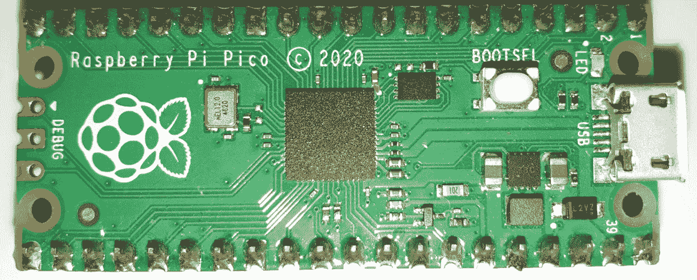

图 1.1 – Raspberry Pi Pico

如*图 1.1*所示，树莓派 Pico 是一款安装在树莓派设计板上的**RP2040**微控制器。这个**微控制器**是一个小型计算设备，旨在与硬件紧密接口。它右侧有一个 USB 连接，用于在计算机上供电或编程。LED 对于调试很有用。此外，边缘周围有许多**输入/输出**（**IO**）引脚，可以连接各种设备。当涉及到控制机器人时，正是通过这些 IO 引脚发生魔法！

控制器使用 IO 引脚从连接的硬件中写入和读取。它们可以将引脚分组为总线（我们将在后面更详细地介绍），以与其他设备交换数据。此外，它们可以在输出上创建波形，以控制电机和 LED。

这听起来很像其他**树莓派**型号。然而，这是一个不同的计算机类别。**树莓派 Pico**与**Arduino**板有更多共同之处。让我们通过以下图表更详细地看看这种差异意味着什么：

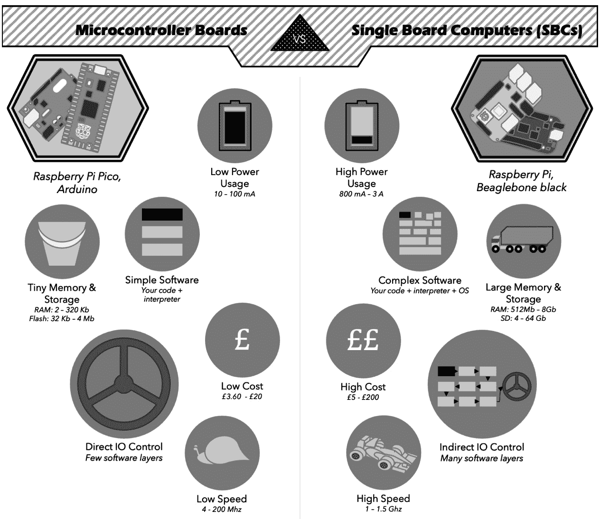

图 1.2 – 微控制器板与单板计算机对比

*图 1.2*显示，虽然像树莓派 Pico 和 Arduino 这样的微控制器板可能看起来与像树莓派 4 或 BeagleBone 这样的**单板计算机**（**SBC**）相似，但它们在关键区域有所不同。例如，它们在存储、CPU 速度、成本大小、软件复杂性和软件与硬件的紧密程度方面存在差异。

虽然树莓派 Pico 非常适合控制硬件，如机器人，但它并不适合高内存或 CPU 任务，如 AI 或视觉识别。有一种名为**马和骑手**的机器人系统，它将用于复杂处理的 SBC（例如，树莓派 4）与用于控制硬件的微控制器（例如，Pico）结合起来。

低复杂性意味着微控制器上的代码几乎没有任何启动时间，这意味着你的代码不需要与操作系统中的其他软件共存。看看以下块图：

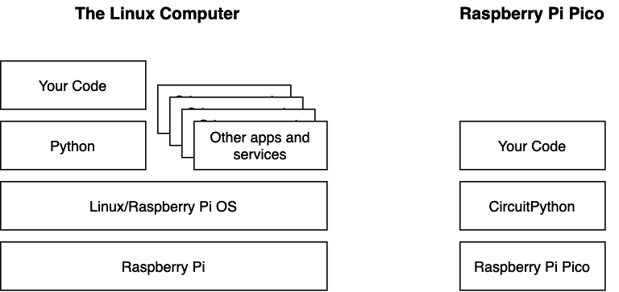

图 1.3 – 在树莓派与 Pico 上运行你的代码

此前图展示了在树莓派和树莓派 Pico 之间的软件架构对比。它展示了 Linux 计算机，例如树莓派，拥有额外的软件层，以及与你的代码并行运行的竞争性应用程序。

此外，控制器还有**中断**。它们可以通知代码某些事情已经改变，例如 IO 引脚的状态。你会在其他树莓派型号上找到这个功能，但它们再次受那个讨厌的操作系统控制。在 Pico 和其他微控制器上，你可以获得更多控制权，了解 IO 引脚上发生的事情或何时发生变化，从而实现响应性代码和可预测的时间。

那么，Raspberry Pi Pico 与 Arduino Uno 相比如何？以下表格显示了它们的规格和数据表中的详细信息：

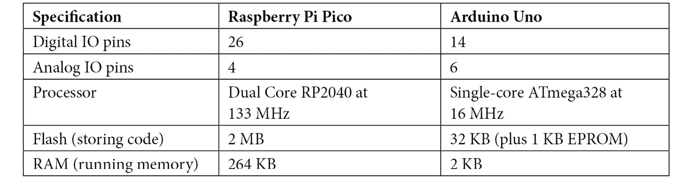

表 1.1 – 比较 Pico 与 Arduino Uno

前面的表格显示，Raspberry Pi Pico 具有更快的多核处理器，以及更多的存储和数字 IO 引脚。此外，Raspberry Pi Pico 还有一个独特的**可编程 IO**（**PIO**）系统，用于在组织数据到和从这些引脚时提供极大的灵活性。官方 Pico 板也比官方 Arduino 板便宜。

Raspberry Pi Pico 在 Python（CircuitPython 或 MicroPython）的使用上与 Arduino 相比也有优势。许多微控制器，如 Arduino，需要 C/C++进行编程，这对初学者来说可能很困难。Python 更容易理解，允许使用复杂和有趣的数据结构，并且还可以访问许多代码库。

简而言之，Raspberry Pi Pico 的关键特性如下：

+   一个微控制器——这提供了低功耗，与 SBC 相比体积小。

+   它具有责任感和灵活的 IO 选项。

+   与许多微控制器板和大多数 SBC 相比，它的成本较低。

+   它可以用 Python 编程。

我归因于 Raspberry Pi Pico 的一些特性是由于*RP2040*——为 Pico 供电的芯片，并且除了 Raspberry Pi Pico 外还有其他形式。

IO 灵活性是 Raspberry Pi Pico 最有趣的特点，所以让我们接下来看看这一点。

## Raspberry Pi Pico 的传感器和设备接口

Raspberry Pi Pico 具有许多接口用于连接硬件，以及其独特的 PIO 系统。在本节中，我们将查看每种类型的接口。

**数字 IO 引脚**是 Raspberry Pi Pico 的基本 IO 系统。输出可以是开或关，这对于打开或关闭 LED 很好，但你无法控制它们的亮度。同样，输入也可以检测开或关状态。Raspberry Pi Pico 有 26 个这样的引脚。

**脉冲宽度调制**（**PWM**）是用于控制 LED 和电机等输出的波形——包括直流电机、步进电机和伺服电机。PWM 引脚输出方波脉冲，具有变化的（调制的）开关比（脉冲宽度）。改变脉冲宽度会导致 LED 亮度、电机速度或伺服电机位置的变化。Raspberry Pi Pico 有 16 个 PWM 通道，使其能够同时控制许多此类设备。这些 PWM 引脚仍然需要一个电源控制设备来驱动电机。

**模拟**输入引脚检测**地**（**GND**）和 3.3V 之间的电压级别。这对于与简单的传感器接口很好，例如光传感器、摇杆、滑动/旋钮控制、温度传感器以及测量电流（使用一些额外的电路）。Raspberry Pi Pico 有三个这样的输入。

**通用异步收发传输器**（**UART**）控制串行端口。它可以使用两个引脚发送和接收数据流：一个 **TX 发送**引脚和一个 **RX 接收**引脚。有了这个，它能够发送/接收比仅仅变化电平更复杂的数据。Raspberry Pi Pico 有两个独立的 UART 接口。

Pico 有两个 **串行外设接口**（**SPI**）总线控制器。SPI 使用四个引脚，如下面的图所示：

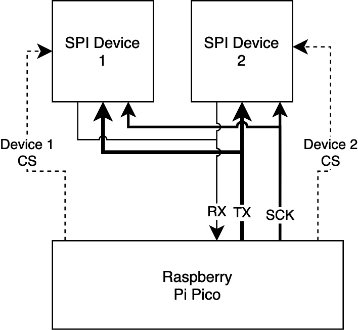

图 1.4 – Raspberry Pi Pico SPI 总线使用

前面的图显示了 Raspberry Pi Pico 使用 SPI 总线连接到两个设备——例如，显示屏或传感器。总线有 **发送**（**TX**），也称为 **控制器输出/外围设备输入**（**COPI**）或 **微控制器输出/传感器输入**（**MOSI**），用于从控制器发送数据，**接收**（**RX**），也称为 **控制器输入/外围设备输出**（**CIPO**）或 **微控制器输入/传感器输出**（**MISO**），用于将数据接收回控制器，**SCK**（用于定时信号的时钟），以及 **芯片选择**（**CSEL/CS**）每个外围设备的芯片选择引脚。SPI 使用芯片选择来启用与多个设备的通信，如 **设备 1 CS** 和 **设备 2 CS** 的虚线所示。有关当前 SPI 缩略语的详细信息，请参阅 [`makezine.com/article/maker-news/mosi-miso-and-140-years-of-wrong/`](https://makezine.com/article/maker-news/mosi-miso-and-140-years-of-wrong/)。

**互集成电路**（**I2C**）是一种为传感器、存储设备、输出设备等集成电路之间通信而设计的总线。I2C 总线有一个数据引脚（通常称为 *SDA – 串行数据*）和一个时钟引脚（通常称为 *SCL – 串行时钟*），用于保持事物同步。多个设备通过发送/接收带有地址的数据来共享 I2C 总线，如下面的图所示：

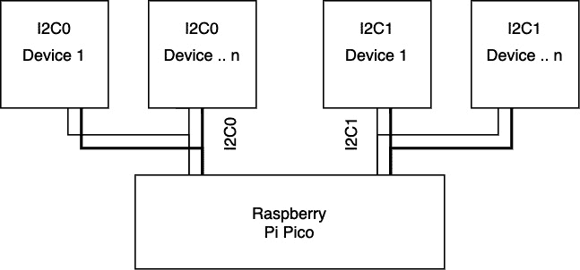

图 1.5 – Raspberry Pi Pico 上的 I2C 总线

*图 1.5* 展示了通过两个独立的 I2C 总线连接到 Pico 的某些子外围设备，这些总线可以分配到不同的引脚配置，一些设备具有相同的地址但不同的 I2C 连接。此外，I2C 可以寻址设备内的寄存器（如存储位置）。我们将在后面使用 I2C 与传感器通信。

最后，Raspberry Pi Pico 有 PIO。PIO 是 Pico 独有的功能。PIO 由两个包含四个 *状态机* 的块组成。每个块可以独立于主 CPU 运行简单的代码，并控制一个或多个引脚以发送或接收数据。如果对代码有用，单个状态机可以控制所有引脚。此外，每个状态机都带有缓冲区，用于在数据可以传输之前存储数据。以下是一个 PIO 系统的示例框图：

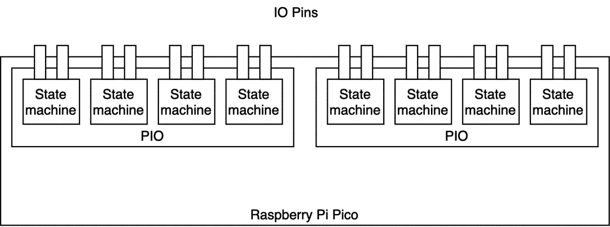

图 1.6 – Raspberry Pi Pico 的 PIO 系统

上述图示显示了 Pico 内部的两个 PIO 设备。每个设备都有代码存储内存，因此你可以拥有两个独立的功能。在每个 PIO 设备中，都有可以独立运行该本地内存中代码的状态机。

由于 PIO 状态机独立运行，并且它们的指令是关于将数据从/到引脚移动，因此它们可以为许多类型的硬件创建接口。例如，有一个奇怪的协议设备吗？使用 PIO。你需要独立于主 CPU 的快速计数吗？使用 PIO。人们已经使用 PIO 制作了 **视频图形阵列** (**VGA**) 输出，因此它能够快速处理复杂的数据。此外，你还可以从 PIO 获取中断，告诉你何时发生了某些事情。

这里有相当多的 IO 系统。让我们将它们总结到表中，如下所示：

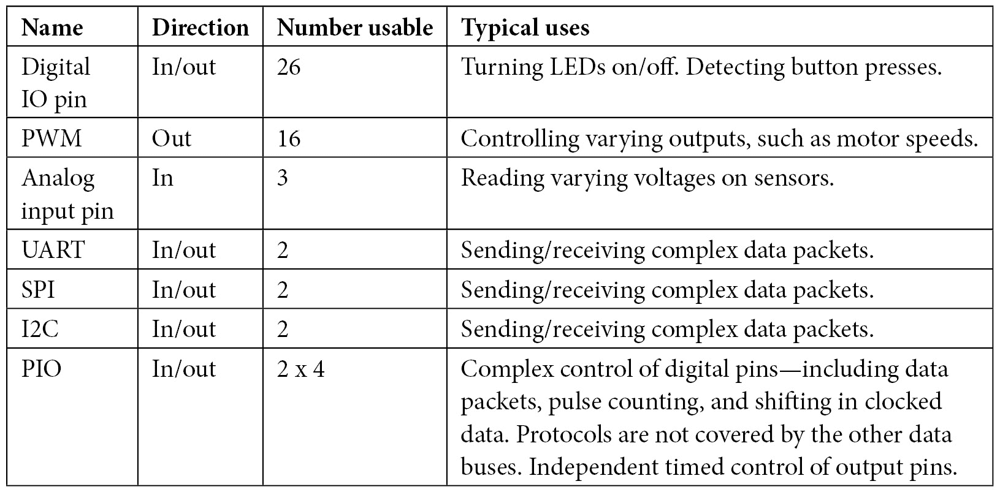

表 1.2 – Raspberry Pi Pico 的 IO 系统

这些协议共享引脚，因此使用 I2C 总线会从 26 引脚池中占用 2 个引脚。

现在，我们已经游览了 Raspberry Pi Pico 的功能和接口，让我们看看在这本书中我们将如何编程它，使用 **CircuitPython**。

# 什么是 CircuitPython？

许多微控制器需要 C/C++ 或汇编语言来编程——例如，流行的 Arduino 生态系统。然而，在机器人技术中，Python 正迅速成为事实上的语言。它用于人工智能和数据科学，并且非常适合快速尝试新想法。让我们看看为什么它很方便，特别是为什么我选择了 **CircuitPython** 来编写这本书。

Python 不需要编译步骤。它能够快速提供代码反馈和 Python 的 **读取-评估-打印循环** (**REPL**) 允许你立即开始输入和实验代码。REPL 允许你在将想法用于代码之前看到它们是否有效。以下是一个 CircuitPython 的 REPL 会话：

```py
Adafruit CircuitPython 6.2.0 on 2021-04-05; Raspberry Pi Pico with rp2040
>>> print("Hello, world!")
Hello, world!
```

上述会话显示了在 Raspberry Pi Pico 的 REPL 中运行的打印操作。我们将探讨如何使用 REPL 进行一些 Pico 实验。它甚至内置了辅助功能；然而，由于大小原因，Pico 上并非所有帮助都保留在内。

Python 有其他帮助功能，例如能够从函数中直接返回多个值。Python 有类似于 C++ 的函数调用和类，但函数可以用作数据，并且它们的引用可以存储在变量中。此外，Python 还具有函数式编程元素，允许程序员将工具链在一起以处理数据流。

Python 使用异常来处理错误，允许你选择如何响应它们或观察它们的输出，这直接引导你到问题所在。

MicroPython 是将 Python 语言移植到运行在小内存设备上，如微控制器上的原始版本。它有一个正在工作的社区，CircuitPython 是基于它构建的。

在 CircuitPython 中，Raspberry Pi Pico 作为 USB 存储设备安装，因此你可以直接将你的代码和代码使用的库复制到 Pico 上。这使得从多个库或第三方使用代码变得简单。只需正确命名并复制代码，当 Raspberry Pi Pico 再次通电时，就可以运行该代码。

CircuitPython 有一个庞大的设备支持库，包括 Neopixel LED、蓝牙、许多传感器、显示屏和其他设备。这个库不仅与 Pico 兼容，还运行在许多 CircuitPython 控制器上，因此熟悉这些库组件将有助于你在使用其他控制器时工作。

既然我们已经选择了语言和本书中我们将构建机器人的控制器，现在是时候开始规划一个机器人了！

# 规划 Raspberry Pi Pico 机器人

我们一直在为我们的机器人构建任务进行实地考察。在我们开始机器人构建之旅之前，我们将制定一个粗略的计划，确定我们想要做什么，然后进行细化。我们将做出重要的决定，随着我们开始构建机器人，我们可以进一步探讨这些决定。

## 机器人规划的概述

在规划机器人时，我们需要考虑几个方面：

+   我们希望这个机器人做什么？它是用来做什么的？

+   什么类型的机器人是合适的？

+   我们需要哪些类型的传感器或输出？

+   它将是什么粗糙的形状和大小？

一旦我们回答了这些问题，我们就可以进一步决定我们要构建什么。这些不需要太多细节。机器人领域充满了有趣的分心事物，这使得人们容易在想法之间跳跃。通过制定一个受限制的计划并按照它工作，你可以保持构建机器人的步伐，将分心和酷炫的想法留到下一个或几个机器人上！

### 我们希望这个机器人做什么？它是用来做什么的？

机器人将解决什么问题，清洁厨房，探索空间，递送包裹，在会议中给客人留下深刻印象，还是在机器人竞赛中竞争？

本书我们将构建的机器人有几个用途：

+   探索 Raspberry Pi Pico 及其功能

+   尝试传感器

+   以机器人竞赛中的挑战为指导编写算法

+   在已知空间中导航

+   构建一个可适应未来想法的自定义底盘

+   保持简单以开始

在这些目标指导下，我们可以查看具体细节。

### 什么类型的机器人是合适的？

机器人有很多种风格。我们应该选择一种，可能是最简单的一种来满足我们的目标。请看以下图表，了解不同机器人风格的选项：

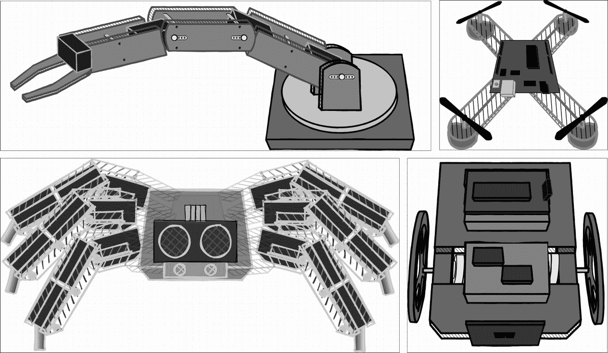

图 1.7 – 不同的机器人风格

第一种机器人风格是工业中使用的机器人臂。这些机器人既迷人又有趣构建。然而，它们并不满足我们构建机器人底盘以测试传感器的目标。

下一个面板展示的是四旋翼无人机——**无人驾驶飞行器**（**UAV**）。这些无人机的构建和编程比较复杂，所以它们不符合我们保持简单化的目标。

第三面板展示了一个行走机器人——六足机器人。这些机器人需要控制许多伺服电机。它们的功耗和复杂性使它们成为一个不适合但令人兴奋的后续机器人选项！

第四面板展示了一个带轮子的机器人。带轮子的机器人可以是简单的**两轮驱动**（**2WD**）机器人，如这个例子所示。这种 2WD 漫游平台满足我们构建底盘和了解传感器和算法的目标。它们可以后来通过添加履带、梅卡诺轮、摇臂悬挂或独立转向轮变得更有趣，从而使它们也能满足适应性目标。

我建议我们在整本书中继续使用 2WD 漫游车，但也要记住其他变体，以备后续的机器人构建！

### 我们需要哪些类型的传感器或输出？

我们的目标之一是尝试不同的传感器。一个用于导航空间的机器人将影响我们将使用的传感器。它们都为定位机器人做出贡献。

适用于此的传感器包括以下内容：

+   **距离传感器**：机器人前方有什么？最近的对象有多远？我们可能需要不止一个这样的设备。

+   **编码器**：机器人是如何移动的？它走了多远？

+   **惯性测量单元**（**IMU**）：机器人是否已经转向？它的位置相对于北方的方向是什么？

除了这些传感器，我们还可以有简单的输出——我们用它们驱动轮子的电机。作为一个后续的扩展，我们还可以添加蓝牙来给我们一些关于机器人状态的反馈。我们不需要现在就计划所有这些，但要留出空间，以便我们可以在以后扩展机器人。

### 它将大致是什么形状和大小？

现在，我们对 2WD 机器人有一个明确的想法。我们知道它可能需要支持以下功能：

+   Raspberry Pi Pico

+   一对带轮子和万向节的电机

+   许多传感器，以及后来的蓝牙

+   系统的电源，包括电池和电压转换

+   用于连接所有这些的面包板

虽然我们不希望机器人太大，但我们仍需要一些空间来玩耍。让我们先做一个粗略估计，150 mm x 200 mm。

因此，我们已经回答了一些关于我们想要什么的问题。接下来，我们将使用接下来的几个部分来深入探讨这个机器人的规划，查看规划的不同方面以及我们将做出的选择。首先是考虑权衡。

## 关于权衡的一个注意事项

所有设计都会做出权衡。事实是，没有一种设计适合所有情况，通常，没有一种设计是完美的，但它在工作得当的方面足够好。我们需要做出决定，并阅读零件的数据表来帮助我们。

一个例子是尺寸和重量——我们之前提到过，我们不希望机器人太大。毕竟，我们的工作台空间有限，大型机器人需要更多的功率、更大的电机和更大的电池。此外，我们还需要处理更坚固的——可能更难切割的材料。对于不同的环境和目标，可能一个大型、重型的机器人会更合适。因此，第一个权衡是要保持机器人小，但不要太小——也就是说，要简单。

我们建议使用树莓派 Pico，以及从树莓派那里权衡的选项，例如更轻的重量、降低的成本和功耗。

但传感器权衡如何？每个传感器都有多种类型，我们将在各自的章节中深入探讨。它们在价格、功能和复杂性方面有所不同。

在许多方面，我们可以用减少重量或成本或更多功能来换取更高的成本。

## 选择机器人底盘

我们为我们的 2WD 机器人底盘提供了许多选择。同样，这取决于我们想要学习或实现的目标。我们已声明我们的目标是构建一个灵活的底盘。以下是一些实现这一目标的良好选择：

+   购买底盘套件

+   改装午餐盒或玩具

+   手动搭建底盘

+   3D 打印或激光切割底盘

底盘套件是一个简单的选择，但灵活性有限。许多套件包含电机、轮子、电池，甚至为特定主控制器设计的电机驱动器。这样，它们可以节省时间和金钱，让你能够完全专注于代码和传感器，但它们提供了较少的学习设计方面的机会。通常很难找到形状和尺寸合适的底盘套件，而且随着尺寸的增大，它们的价格会迅速上升。

你还可以将午餐盒改装成机器人底盘——为电机、传感器、板和其他部件切割安装孔可以是一个学习设计技能的好地方。然而，你需要在一个受限的空间内安装你的机器人电子和硬件。请注意，午餐盒的曲面可能会使事情变得复杂。

自行搭建底盘提供了极大的灵活性。你可以学习如何在 CAD 中设计以及如何使用手工工具。此外，你还需要在材料类型和厚度上做出选择，通过这样做，你将能够更多地了解制作坚固机器人的方法。如果你遇到空间紧张的情况，你将学习如何安装传感器并扩展你的机器人。这比套件需要更多的时间和耐心，但回报是巨大的。

3D 打印和激光切割需要精确的设计，以及昂贵和专业的工具或服务。随着你进一步深入机器人领域，并超越简单的 2WD 机器人，创建更有趣的形状和传感器支架，这很可能是重要的探索领域。如果你不擅长手工工具，为相同部件找到激光切割服务可以达到良好的效果，但这可能成本高昂。

在这本书中，为了让你在接触设计和手工工具的同时，还能给我们提供很多灵活性，我们将选择从零开始构建。我们将学习可转移到 3D 打印的 CAD 技能。我们将学习如何切割和钻孔零件，并查看一些预制零件以节省时间。此外，我们将设计尺寸约为 150 毫米 x 200 毫米，并在需要时进行修改。但电机怎么办？

### 选择电机

这个 2WD 电机需要两个主要的驱动电机。我们可以考虑步进电机，每次脉冲时它们会移动一点，尽管这些会带来一些额外的复杂性——也许是一个稍后考虑的想法。直流电机在供电时持续旋转，看起来是正确的选择。它们需要通过齿轮减速，以便有足够的动力移动机器人，同时不会太快且难以控制。

我们应该保持这些电机小且电压低。由于我们不太可能想要构建额外的变速箱，因此带齿轮的电机是明智的选择。在这个尺寸范围内有一些选择。首先是带有塑料齿轮的黄色*TT*电机——然而，这些电机的质量并不高，而且占用相当多的空间。另一个选择是使用适用于连续旋转的伺服电机——然而，这些可能会稍微昂贵一些。

一种小型、常见、高质量但价格低廉的选项是 N20 或微型金属齿轮电机。为了节省空间和努力，这些电机中有一些是预先安装了编码器的。我们可以使用类似常见的塑料支架将它们固定到我们的机器人上。这使得它们使用起来也很方便。

### 机器人轮子

对于 2WD 机器人，有几种方式可以布置轮子。一种可能性是使用两个驱动轮和两个惰轮（即不带电的轮子）。然而，这些轮子可能会拖动，使得机器人转向更困难。一种常见的方式是使用第三个轮子作为万向轮——要么是一个可以朝任何方向滚动的球，要么是一个像购物车那样的可旋转轮子。由于机器人的尺寸，球型万向轮似乎是个好主意。

轮子本身应该有一个与我们所选择的电机兼容的轮毂。一对直径为 60-100 毫米的 N20 轮子应该是合适的。

因此，我们有了机器人的大致尺寸，并且我们知道控制器、电机和一些传感器。接下来要选择的是电源系统。

## 选择电源系统

没有独立电源的机器人乐趣不多——我的意思是它不需要插上墙上的电源就能有自己的电源。通常，这意味着电池。然后它需要提供电源给控制电子设备、传感器、外部板和电机。请看以下图表了解 2WD 机器人的电源分配概述：

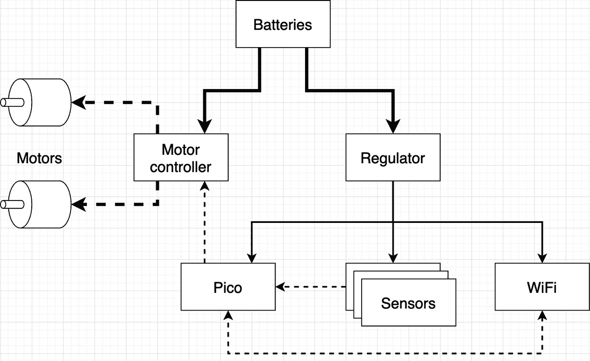

图 1.8 – 2WD 机器人的电源分配

在*图 1**.8 中，较粗的线条表示原始电池电源连接。一个两轮驱动底盘需要至少驱动两个电机，这些是耗电设备，需要电池连接。

这个机器人需要为 Raspberry Pi Pico 和其他传感器供电。由于我们打算添加蓝牙，我们应该为它预留电源。因此，另一条粗线连接到这些设备的稳压器，使这些系统的电源更加易于接受——原始电池电压可能会损坏它们。较细的实线表示稳压电源。

Pico 将发送/接收电子控制信号，这些信号由前面图中细虚线表示。这些信号也连接到电机控制器。电机控制器将从电池向电机提供 PWM 控制的电源，这些电源由 Pico 发送给它们的信号调制。电机电源通过左侧电机上的粗虚线表示。

在这里，我们有几个需要考虑的因素。我们需要一个适合电机和驱动稳压器的输入电压。我们需要一个能够处理 Pico、传感器和蓝牙的功率容量需求的稳压器，并且我们需要能够为它们提供足够电流的电池。

### 计算功率需求

让我们从已知信息开始——5V 是稳压器的一个良好输出电压，在需要的情况下，Pico 可以进一步调节至 3.3V。5V 稳压器可能需要 7V 或更高的电压。

重要注意事项

电压衡量的是电气压力。电流衡量的是电气能量流动的速度。将两者结合起来显示系统功率使用情况。当已知电压时，安培或毫安培的电流可以用作瓦特的替代来衡量功率。

让我们查找 N20 齿轮电机的规格。在网上搜索 N20 电机数据表。你将寻找一个 PDF 文档。通常，这些文档包含产品的图片或图表，随后是规格和特性表。如果你寻找*额定电压*，它们会说 6V；然而，在表格的下方，通常有一个与电机速度电压相关的表格。基于电机和稳压器的基本原理，7V-12V 的输入电压是合理的。

我们的电子产品不仅仅依赖于电压运行，还需要电流来操作。因此，稳压器需要处理最小电流需求。我们需要查看一些其他部件的数据表和规格。我们将包括传感器。对于蓝牙，我们将包括一个低功耗的**蓝牙低功耗（BLE**）板，使用来自[`learn.adafruit.com/introducing-the-adafruit-bluefruit-le-uart-friend/current-measurements`](https://learn.adafruit.com/introducing-the-adafruit-bluefruit-le-uart-friend/current-measurements)的最高电流测量值。

我们将基于最坏情况值来计算，以便我们可以处理它们。让我们先查看数据表，并将数字汇总到以下表格中：

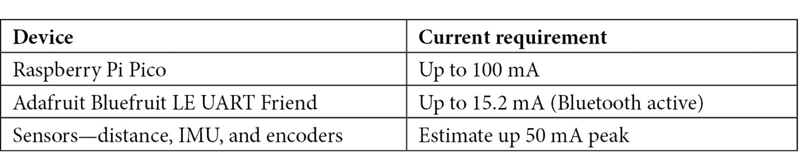

表 1.3 – 设备功率需求

*第三章*的 Raspberry Pi Pico 数据表（可在[`datasheets.raspberrypi.com/pico/pico-datasheet.pdf`](https://datasheets.raspberrypi.com/pico/pico-datasheet.pdf)找到）显示了电气规格，峰值电流略低于 92 mA（毫安——电流的度量）。我们将将其四舍五入到 100 mA 作为余量。

Adafruit 蓝牙板在完全激活时仅消耗 15.2 mA，但我们可以将其四舍五入到 20 mA 以示慷慨。传感器可能需要额外的 50 mA 空间来容纳它们。

我们可以将这些估计值相加，以建议一个最小电流规格。基于这些数据表和估计，任何能够提供超过 400 mA 的稳压器都将是足够的。

### 选择一个稳压器

电机控制和电源可以完全分开考虑，这提供了很大的灵活性，但可能会占用更多空间。有一些专为 Raspberry Pi Pico 设计的电路板，允许你在为 Raspberry Pi Pico 供电的同时控制电机。然而，它们能提供 400 mA 的电流吗？

Kitronik 有一些整洁的 Raspberry Pi Pico 电机板——仅有一个小电机，以及一个带有伺服电机输出和原型设计区域的更大型的机器人板。然而，机器人板数据表上 Pico 的供电为 100 mA，这不会工作。

现在，我们明白我们需要一个能够输出 5V、至少 400 mA 的稳压器。我们想要一个小巧简单的设备。适用于此的设备是**通用电池消除电路**（**UBEC**）。这些可以处理 3 A。我们将通过 Pico 的 VSYS 引脚连接这个设备。

### 选择一个电机控制器

建议的电机较小。电机有一个堵转电流——即它们在试图移动并阻止逻辑最大值时吸取的功率。对于 N20s，它们的数据表建议在 6V 下为 350 mA。可能略高，可能是 550 mA。电机控制器需要处理略高于每个通道的峰值——无法处理电机负载的电机控制器往往会冒烟！看看以下两个常见的简单电机控制器：

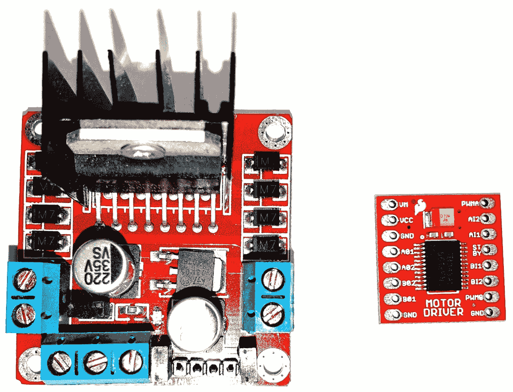

图 1.9 – L298N 电机控制器旁边是 TB6612fng

在**图 1.9**的左侧，你可以看到非常常见的**L298N**——网络搜索表明每个通道可以处理 2 A。它们体积小，价格低廉，易于找到。然而，这是一个 5V 逻辑设备。Raspberry Pi Pico 输出 3.3V 逻辑，可能需要逻辑电平转换才能与这个控制器正常工作。

右侧还有一个不错的选择，**东芝 TB6612fng**。这些每通道可以处理 1.2 A，比之前显示的略少，但仍然足够好。它可以处理高达 15V 的电压来控制电机和从 3V 到 5V 的逻辑电压，因此不需要为 Raspberry Pi Pico 使用电平转换器。SparkFun 有一个模块可以配合 Pico 使用，足够小，可以放在面包板旁边。

此外，我们还应计划在面包板上从电池到电机控制器和调节器之间有一个电源开关。说到电池，我们仍然需要选择它们。

### 选择电池

我们还需要一些东西通过电源调节器——电池。

虽然我们可以（并且应该在更高级的阶段考虑）考虑锂离子电池，这种在**遥控车**中使用的电池类型，但最简单的选择是 AA 电池。对于我们的电机和调节器选择，8 个 AA 电池提供 12V。这些电池容易购买和更换，但它们的功率输出需要占用大量空间。我们的电机不需要太多电流，所以它们将足够好。

现在我们已经检查了我们的电源需求和一些解决方案，我们将查看我们的 Raspberry Pi Pico 上正在使用的引脚，并确保我们的硬件计划不会发生冲突。

## 引脚使用

我们的 Raspberry Pi Pico 有很多 IO 引脚，但我们需要考虑我们打算连接到它的所有项目是否能够同时连接。

让我们重新审视 Pico 的规格，请参阅[`www.raspberrypi.com/documentation/microcontrollers/raspberry-pi-pico.html`](https://www.raspberrypi.com/documentation/microcontrollers/raspberry-pi-pico.html)：

+   26 个**通用输入/输出**（**GPIO**）引脚

+   2 个 UART，2 个 SPI，和 2 个 SPI

电机控制器将每个电机消耗两个引脚，我们知道这些电机带有编码器，每个编码器还需要两个引脚。这意味着到目前为止，我们已经使用了 26 个 IO 引脚中的 8 个。这应该给我们留下足够的空间进行扩展。

现在我们已经检查了我们的基本概念，我们将继续进行测试装配——这是我们对如何构建机器人的近似。

# 测试装配 Raspberry Pi Pico 机器人

现在我们已经检查了我们可以为系统供电，我们需要确保所有东西都能适合在机器人上。在这个步骤中，你可以大致了解物品将放在哪里，你的底盘是否足够大，以及机器人设计是否可能工作。

测试装配的关键是它不是详细的。使用最简单的方法来检查物品是否适合，无论是滑动切割的纸张矩形还是使用简单的软件。

让我们制作一些简单的纸张或卡片部件。对于本节，你需要卡片、一支铅笔、一把尺子和剪刀。来自谷物箱的卡片非常适合这个用途，但纸张也可以。

为了测试安装，矩形通常就足够了。目的是确定什么可以放入空间并放置物品。细节不是必要的。对于大型机器人，你可能需要制作一个比例模型。由于这个机器人很小，你可以以 1:1 的比例制作零件。这有一个额外的优势——如果你已经拥有零件，你可以使用它们。

## 创建你的第一个测试安装零件

你将再次需要你的设备的规格表——这次是为了开始查看物品的机械尺寸。为了测试安装，你只需要为物品创建边界框，确保有足够的空间。

让我们从面包板和 Pico 开始。由于 Pico 在面包板上，你只需模拟面包板的尺寸。我推荐使用 400 针面包板，也称为半加。使用搜索引擎查找`半加面包板尺寸`，并点击图片面板。你正在寻找的是显示板外尺寸的平面图，如下所示：

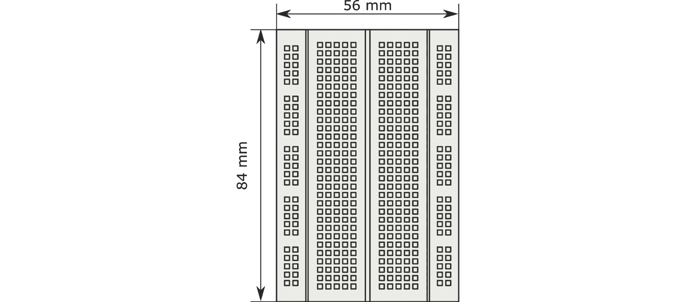

图 1.10 – 面板尺寸

上述图表显示了在尺寸方面的绘图/图片预期，在这种情况下是面包板。它沿顶部测量 84 毫米，沿右侧测量 56 毫米。在这里需要注意的是，我在整本书中都在使用毫米，如果需要，我会从其他单位转换。在机器人设计中坚持使用一个测量系统！

我们可以用纸张或卡片画一个 84 毫米乘以 56 毫米的矩形。这不需要太精确——最接近的 5 毫米就足够了。以下照片显示了这一点：

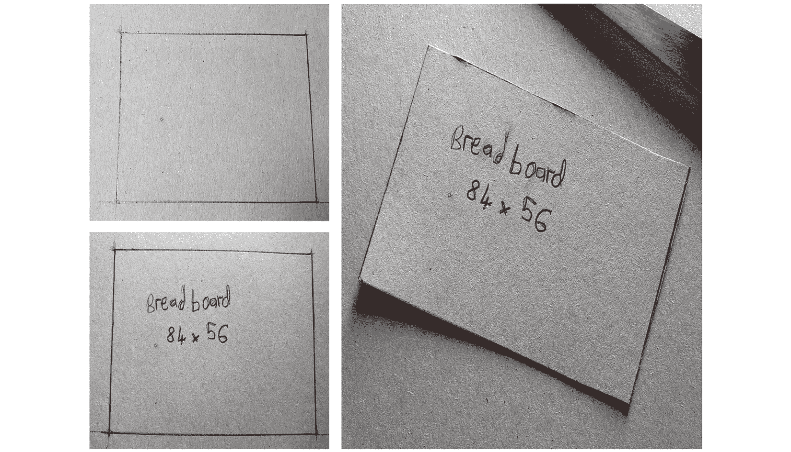

图 1.11 – 制作面包板测试安装零件

如前照片所示，你只需画出来。此外，为了我们以后能识别它，在零件上写上*breadboard*，以及其尺寸*84 x 56*。把它们放在手边，以便以后作为参考。

然后，你可以用剪刀剪下来。我倾向于先做一个宽的粗糙切割，然后进行第二次更精细的切割。

这个简单的矩形，有正确的尺寸，是我们第一个测试安装零件。接下来，我们需要电机零件。

## 电机

我们使用的电机是 N20 电机。如果我们将它们放在机器人的底部，这与这些设计很常见，我们仍然需要考虑它们的电线如何穿过底盘。将它们放在上面更容易，这样电机电线就可以向上面对。

我们可以在网上搜索 N20 电机支架。在图片标签中查找图纸，这样我们可以得到正确的尺寸，并在电机后面添加额外的布线空间。以下照片显示了我制作这些测试零件：

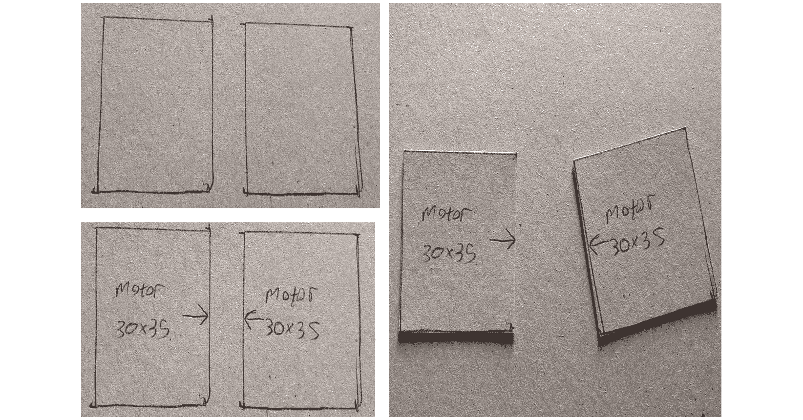

图 1.12 – 制作纸板电机测试安装零件

对于这部分，如前照片所示，我们想要两个 30 mm x 35 mm 的矩形。给它们贴上标签。在每个部件的一个较长的边缘上，添加一个箭头以表明这是车轮将放置的位置。

我们有电机和面包板。接下来，我们需要为它们制作替代的电源部件。

## 电力系统

UBEC 占用的空间不多，所以我们可以忽略它。我们选择的控制器可以与 Pico 一起安装在面包板上，所以它已经考虑在内了。我们需要考虑电池。

我们有几种 8 x AA 电池盒的变体——平板式，它占用更多空间但附带安装螺丝，或者 4 x 2 式。这些使用垂直空间。另一种节省空间的方法是将电池放在底盘的底部。

在这个阶段，我们将使用平板支架，因为它更容易。你可以查找它们的大小，并为它们创建一个带标签的矩形。我的电池盒尺寸为 93 mm x 57 mm：

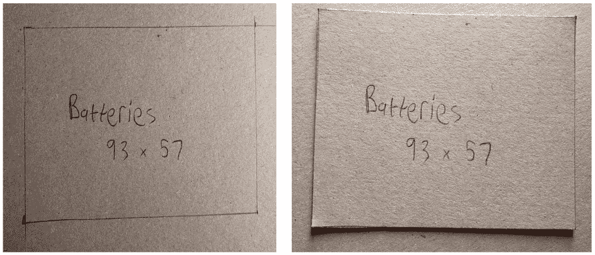

图 1.13 – 纸板电池盒

前面的照片显示了一个由纸板制成的电池盒。现在，我们有了一堆要放在底盘上的部件。接下来，我们需要表示底盘本身。

## 创建一个粗略的底盘

我们之前建议底盘的大小应该是大约 150 mm x 200 mm。按照以下方式在纸板上创建这个矩形：

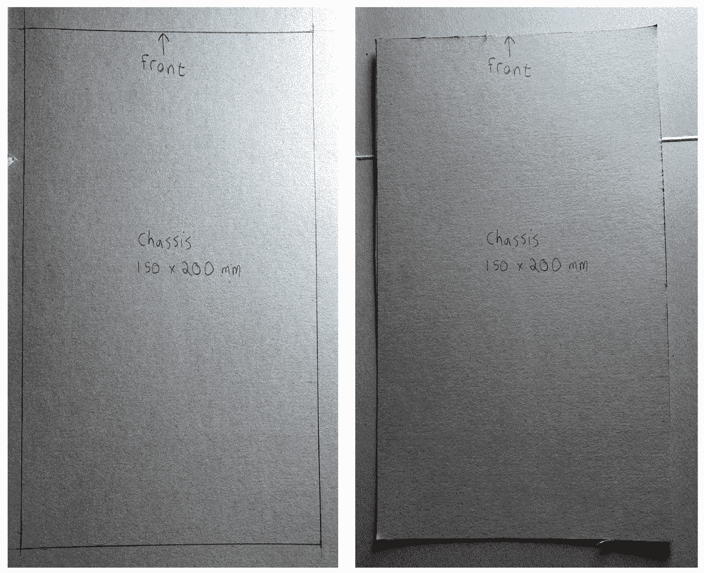

图 1.14 – 纸板底盘

如前照片所示，这并不是——完全——为了达到完美的整洁切割。它只是意味着足够好，以便看到东西可能需要放置的位置。就像我们之前对其他部件所做的那样，给底盘贴上标签。此外，我们还可以将底盘部件的一个较短的边缘标记为前面。

这是最后需要测试安装的部件。让我们开始安排这些部件。

## 安排测试安装部件

现在，你应该有一组代表不同部分的矩形。以下照片显示了这些部分以及我们如何安排它们：

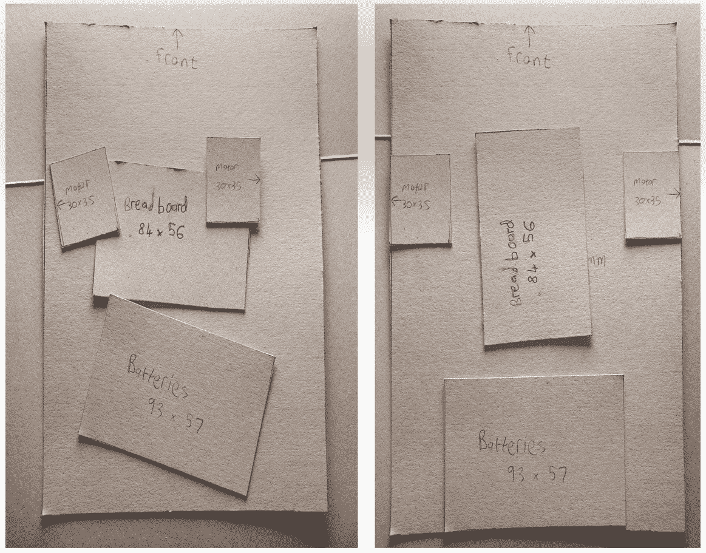

图 1.15 – 我们在纸板上的测试安装部件

图 1.15 左侧的方框是比例正确的部件，并且已经放置在一个大致的位置。然而，它们还没有正确布局。右侧显示了一个可能的布局。

如果我们将面包板旋转，使其垂直而不是水平，那么在面包板周围安装电机会更方便。电池位于机器人的后面，中间位置，然后我们在它们前面放置面包板，沿着中间位置。请注意，电池和面包板之间存在间隙——我们不希望任何部件过于靠近。

我们已经将电机放在面包板的两侧，前面留出空间以扩展我们的机器人设计。

我们已经考虑了机器人的主要部分，包括计算、电源和电机。同时，也留有足够的空间用于扩展。随着我们对设计的深入了解，我们将在之后调整这些组合，但这一点显示了我们的组合是可行的。

现在我们有了我们的机器人设计，是时候购买工具和材料了！

# 机器人基础推荐的购物清单

我们有一个计划——进行测试组装，确定底盘的制作方法，对板上的处理做出决策，以及如何为这个设备供电。现在，我们需要购买必要的零件和工具来实现这一点。

让我们从零件开始。

## 机器人零件及其购买地点

在许多地方可以找到机器人零件，而且这些零件在不同制造商那里有不同的名称。我将尝试提供足够的信息关于这些零件，以便它们可以在许多国家轻松找到。

### 零件购物清单

我们将从初始机器人底盘的零件清单开始。对于每个零件，在必要时，我们将展示搜索词、同义词和制造商编号。您可以尝试这些术语的组合来找到零件——我不建议一次使用所有术语，而是逐步细化它们，直到找到其他东西。然后，我们可以讨论购买它们的地点：

+   **Raspberry Pi Pico**：这是开始时最重要的零件。其他基于 RP2040 的板可能也适用；然而，由于不同的外形和引脚，您在布线时需要发挥创意。注意那些暴露引脚较少的零件，并确保它们是*RP2040*板。*替代零件*：带引脚头的 Pico，Pimoroni Pico LiPo，Adafruit Feather *RP2040*，*SparkFun Pro Micro RP2040*，*RP2040* Plus。

+   **USB 微型电缆**：您可能已经为您的手机配备了这样的电缆，但手机已经有一段时间在配备 USB-C 电缆了。具体来说，我指的是 USB-A 到 USB-Micro 电缆。然而，一些笔记本电脑有 USB-C 端口——对于这些情况，考虑使用 USB-C 到 USB-Micro 电缆。

+   **引脚头**：您需要将引脚头焊接在 Raspberry Pi Pico 和电机控制器上。未来的传感器也将需要它们。这些的搜索词包括*雄性断开式条带和单排 PCB 通孔引脚头*。确保您选择 2.54 毫米或 0.1 英寸间距的引脚头。

+   **无焊面包板**：我建议使用迷你/半尺寸加 400 个接线点的面包板，自粘式。标准 0.1 英寸（或 2.54 毫米）间距，列之间有分隔通道。

+   **布线**：您需要在面包板上的组件之间进行布线。为此，我建议使用预切割的面包板跳线套件。这些应该是 U 型无焊类型——绝缘电缆，两端裸露。它们将具有不同颜色编码的长度，并且可以弯曲成形状以适应面包板连接。

+   **Drv8833 或 TB6612fng 电机控制器或电机驱动器**：我推荐 SparkFun 或 Adafruit 的型号；然而，其他型号也可以工作。坚持使用这个芯片，并确保它是一个模块/分线板，而不仅仅是裸片。板上应该有一个带有电容器的方形设备。我推荐购买一个上面印有引脚功能的型号。替代品包括 L9110S、效率较低的 L298n 板或 L293 芯片，可能需要额外的空间。

+   **5V 3A UBEC 或 5V UBEC（DC/DC 降压转换器）**：寻找至少能处理 3A 电流的型号。更大的型号也可以。寻找输出为 5V 的型号。如果它们也允许 6V，只需确保将跳线设置为 5V。寻找那些带有裸露输入电缆和引脚端子的型号。其他降压转换器模块可能也适用，但请检查其 3A 电流容量，并确保输出为 5V。

+   **8 x AA 电池夹或电池盒**：寻找带有集成开关的平板式型号。有些型号带有圆形柱状插头而不是裸露端子——在这种情况下，可以使用 2.1 毫米插头将端子块固定好。

+   **1N5817 肖特基二极管**：这些在许多电子商店都很常见。

+   **电机**：带有编码器的 N20 微型金属齿轮电机。298:1 比例的电机具有合适的速度和扭矩组合。Adafruit 有这些型号，型号为 ADA4640。带有编码器的小型直流齿轮电机也可以替代，但请注意，较大的电机可能需要机器人及其功率需求一起升级。

+   **球型万向轮**：16-30 毫米的万向轮应该足够。大多数型号都适用。只需记住稍后使用它们的安装孔图纸。

+   **40-90 毫米的轮子，带有 N20 d 孔或通用轮毂**：确保它们是为 N20 电机设计的。

+   **3 毫米或 0.118 英寸厚的聚苯乙烯卡片纸/板**：选择 A4，200 x 150 毫米或更大的尺寸。它们应该是坚固、平坦的纸张——不是泡沫或中空的，理想情况下，不要有纹理。可能的搜索词包括 Plasticard、聚苯乙烯板、Evergreen 和 Plastruct。ABS 板也适用，但丙烯酸板不适用，因为这种材料可能较脆。

+   **部件安装套件**：可能的搜索词包括支架和安装套件。最好它们是金属的，但尼龙也可以。如果可能的话，它们应该是 M2、M2.5 或 M3。M2.5 将覆盖大多数情况。它们应该有支架、螺栓（包括机螺丝和桁架螺丝）和螺母。

这份部件和搜索词列表将帮助您找到构建这个机器人所需的所有建议部件。以下是一个有用的购买部件地点列表。这不是详尽的，您所在国家可能还有其他卖家可以提供帮助。

对于电子部件、轮子、电机和模块，以下商店可全球发货：

+   [ThePiHut.com](https://ThePiHut.com), [pimoroni.com](https://pimoroni.com), [adafruit.com](https://adafruit.com), [Robu.in](https://Robu.in), 和 [mouser.com](https://mouser.com). 对于某些物品，[Pololu.com](https://Pololu.com) 和 [Sparkfun.com](https://Sparkfun.com) 可能会提供。

+   Adafruit 和 Pimoroni 都有列出他们各种分销商的网页：[`www.adafruit.com/distributors`](https://www.adafruit.com/distributors) 和 [`shop.pimoroni.com/pages/worldwide-distributors`](https://shop.pimoroni.com/pages/worldwide-distributors)。它们是可靠的参考资料来源。

+   在线市场如 eBay、AliExpress 和 Alibaba 可以使用——但买家要小心。这些平台上的卖家可能没有良好的支持或退货政策。零件也可能是便宜的替代品，并且可能需要很长时间才能发货。

对于聚苯乙烯板，模型用品店是个不错的选择。Evergreen 等品牌广泛分布。Hobbycraft、AliExpress、Alibaba 和 Amazon 都有销售。在那里，我建议购买聚苯乙烯角条和方形管，以备将来机器人升级使用。

## 机器人工作坊和创客空间

这本书与工作坊和手工具有关。你可以自己购买或使用创客空间。让我们从你需要访问的工具开始。

### 工具清单

这本书所需的工具在许多工作坊中都很常见。此外，学校、大学 DT 教室、创客空间和许多工作坊商店都会销售它们：

+   **塑料切割器**：带有可更换刀片的类型。我们将切割聚苯乙烯，这可能会迅速使刀片变钝。亚麻地板切割刀片在这里也是一个有用的替代品。

+   一个切割垫来保护你的工作表面。

+   你需要一个三角板，最好是金属的。

+   **一把尺子**：这应该至少有 200 毫米长。由于这本书使用公制单位，我建议使用公制刻度。

+   **砂纸**：你需要至少 400、600 和 1000 目或类似的砂纸。

+   **焊锡枪和支架**：你将需要焊接一些零件，所以焊锡枪是必不可少的。不要在没有支架的情况下使用焊锡枪！许多焊锡枪都配有支架。我推荐使用温度控制的焊锡枪。此外，还需要一块黄铜羊毛清洁器和一些焊锡。我们将使用无铅焊锡芯焊丝。

+   10-20 毫米的钩子和粘扣自粘圆盘。

+   一个带有 2 毫米和 3 毫米钻头的电钻。这应该是一个小型的电钻，最好是无线式的。这些是小零件，所以精度比功率更重要。

+   你需要一个铅笔来绘制草图线。我个人喜欢机械铅笔。

+   当你钻孔或切割时，我建议使用安全眼镜。购买一副舒适的好眼镜——便宜的不舒适的眼镜可能会戴在头上而不是覆盖你的眼睛，而且不会保护你。

+   对于钻孔和切割，一个爱好者的台虎钳或夹具可以保持零件静止并保护你的手。一个小型台虎钳是合适的。

+   你需要一个平坦的工作区域，并且光线充足。

+   **螺丝刀**：您需要一个螺丝刀套装。它应该包括菲利普斯（PH0 和 PH1）和平口（2 毫米和 3 毫米）螺丝刀。

+   使用公制单位的扳手或扳手。精度套装将很有用。

您可以从电子产品、爱好、DIY 和工具店购买这些物品和工具。AliExpress、Alibaba、eBay 和 Amazon 也会提供这些。然而，如果您没有所有这些工具，感觉像是有很多东西。

购买所有这些工具的替代方案是找到你附近的创客空间或黑客空间。它们将拥有大多数，如果不是所有这些工具。创客空间是由社区运营的空间，拥有工具收藏，甚至可能拥有正好类型的聚苯乙烯废料。此外，它们还有其他创客，他们可以在你遇到机器人项目困难时帮助你。

全球大多数城市都有创客空间。它们可以在搜索引擎和社交媒体上轻松找到。如果你的地区没有创客空间，通过社交媒体联系其他创客可能会帮助你找到一个类似的项目社区。全球创客空间目录在 [`makerspaces.make.co/`](https://makerspaces.make.co/)。

# 摘要

在本章中，你了解了 Raspberry Pi Pico，为什么它是一个围绕机器人构建的好控制器，以及为什么我们将使用 CircuitPython 来编程它。你发现了机器人的规划过程，为其选择部件，然后测试装配以确保我们的计划可能成功。你对数据表有了了解，并发现了一些关于部件尺寸和电气特性的信息。你还参观了你需要购买的部件和与之一起工作的工具。最后，你了解了创客空间作为寻找工具和其他创客的场所。

我们有一个粗略的机器人计划。然而，要开始构建东西，我们需要采取一些实际步骤来为 Raspberry Pi Pico 准备用于机器人。我们将在下一章中了解如何做到这一点。

# 练习

为了让你熟悉本章的内容，以下附加练习将尝试测试你所学的知识，并为你后面的章节做准备：

+   找到 Bluefruit LE UART Friend 的数据表。找到设备使用的电流，以及它的宽度和高度以便安装。

+   我们打算在我们的机器人上添加一块蓝牙板。使用数据表中的尺寸在你的测试装配图中制作一个部件。

+   在机器人上找到一个空间，这个空间不与其他部件重叠。

+   查看之前提到的商店的网站。看看你是否能找到可以购买这个部件的地方。

# 进一步阅读

请参考以下资源以获取更多信息：

+   要了解更多关于 CircuitPython 的信息，[`circuitpython.readthedocs.io/`](https://circuitpython.readthedocs.io/) 网站是一个极好的资源。

+   要详细了解微控制器上的 Python，请参阅由*Marwan Alsabbagh*和*Packt Publishing*出版的*MicroPython Cookbook*。这本书包含了关于 CircuitPython 和 MicroPython 的一般章节。

+   *嵌入式系统架构*，由*Daniele Lacamera*和*Packt Publishing*出版，深入探讨了 I2C 和 SPI 总线接口。

+   另一种关于创客空间的观点来自*Progression of a Maker*，可以在[`hub.packtpub.com/progression-maker/`](https://hub.packtpub.com/progression-maker/)找到。
