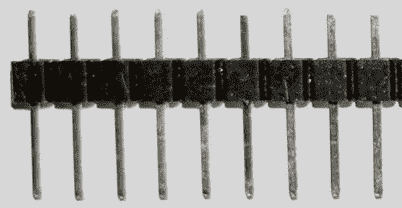

# 2

# 准备 Raspberry Pi Pico

纯粹的**Raspberry Pi Pico**可以运行代码，但在我们能够使用它之前，我们需要做一些准备工作。在本章中，您将了解如何启动**CircuitPython**并开始编程 Pico 的第一步。然后，您将学习**焊接**，这样您就可以将引脚添加到 Pico 上——让您可以将其插入其他设备。

在本章结束时，您将拥有一个准备运行代码的 Pico，带有准备添加其他硬件的引脚，并且您的笔记本电脑或计算机已准备好向 Pico 发送代码。此外，如果您是新手，您还将获得一些焊接经验。

在本章中，我们将涵盖以下主要主题：

+   将 CircuitPython 安装到 Raspberry Pi Pico 上

+   为 Pico 准备 CircuitPython 库

+   在 Pico 上编码——第一步

+   将焊锡引脚焊接在 Raspberry Pi Pico 上

# 技术要求

要开始本节，您需要以下内容：

+   1 Raspberry Pi Pico

+   一根*USB Micro 线*（根据您的计算机，可以是*A 到 Micro*或*C 到 Micro*）

+   运行 Windows/Linux 或 macOS 的计算机/笔记本电脑

+   **Mu**编辑器——我们将向您展示如何获取它

+   一把焊锡枪和耐热支架

+   一个明亮、通风良好的空间

+   护目镜

+   焊锡

+   焊锡吸球

+   一个面包板

+   一些公头断开式引脚

本例的所有代码示例都可以在 GitHub 上找到，地址为[`github.com/PacktPublishing/Robotics-at-Home-with-Raspberry-Pi-Pico/tree/main/ch-02`](https://github.com/PacktPublishing/Robotics-at-Home-with-Raspberry-Pi-Pico/tree/main/ch-02)。

# 将 CircuitPython 安装到 Raspberry Pi Pico 上

为了让我们开始编写 Raspberry Pi Pico 的代码，我们需要在它上面安装 CircuitPython 解释器，或者“*闪存*”CircuitPython。

首先，您可以在[`circuitpython.org/downloads`](https://circuitpython.org/downloads)找到 CircuitPython 的下载。这个页面展示了支持 CircuitPython 的不同电路板数量——尽管它们可能不支持 Pico 的一些独特硬件功能（例如 PIO），但这意味着您在这本书中学到的许多技能以及您编写的代码可以直接应用于大量其他电路板！

点击**Pico (By Raspberry Pi**)，在右侧是当前**稳定版**的 CircuitPython 下载。这里可以选择多种语言，您可以选择带有您语言错误信息的*CircuitPython*。点击**现在下载.uf2**按钮。注意您下载的版本号。

将 USB 线的一端插入您的笔记本电脑。观察 Pico，它上面有一个微小的按钮：


图 2.1 – Raspberry Pi Pico BOOTSEL 按钮

如*图 2.1*所示的这个按钮，标记为**BOOTSEL**。当您将 USB 线插入计算机时，请按住此按钮。这会将 Pico 置于向其闪存固件的模式。

你应该在电脑上看到一个名为 `RPI-RP2` 的新驱动器出现。这是 Raspberry Pi Pico。将你的下载中的 Adafruit CircuitPython `uf2` 文件复制到该文件夹。简单的拖放文件复制在这里就可以工作。

Raspberry Pi Pico 将重新启动，驱动器将暂时消失。然后它将以 `CIRCUITPY` 的形式回来。

你已经下载并烧录了 Pico 上的 CircuitPython。这个 Raspberry Pi Pico 正在运行 CircuitPython，并准备好编程。接下来，我们将下载它的库。

# 准备 Pico 的 CircuitPython 库

CircuitPython 是一个良好的起点——它为你提供了我们将要使用的基础知识——但我们还将与其他硬件进行接口。**CircuitPython 库**，在具有相同版本 Pico 的许多设备上统一，创建了一个你可以携带到其他微控制器的接口，如果你想要尝试其他设备的话。

让我们使用以下步骤从库中准备一个模块：

1.  在你的电脑上打开 `CIRCUITPY` 驱动器，并找到一个名为 `lib` 的文件夹。这是库的目标文件夹。

1.  从 [`circuitpython.org/libraries`](https://circuitpython.org/libraries) 下载 CircuitPython 库捆绑包。你下载的版本应该与你之前下载的 CircuitPython 版本相匹配。

1.  这会为你提供一个 ZIP 文件。展开 ZIP 文件的内容，你应该会得到一个包含 `README`、示例和一个 `lib` 文件的文件夹。我们将保留这个文件夹。当我们需要从这里获取库时，我们会将它们复制到 Pico 上。

1.  整个库太大，无法一次性全部放入单个 Pico 中，但既然你无法同时使用所有那些硬件外围设备，你只会复制所需的文件。

1.  在 `Adafruit Library` 文件夹中打开 `lib` 文件夹，你应该会看到 `adafruit_vl53l0x.mpy` 文件。将（拖放）此文件复制到 `CIRCUITPY/lib` 文件夹。这就是为该设备安装库的全部操作——一些设备需要复制一组文件。

你现在已经有了一个 CircuitPython 库的副本，并看到了如何在 Pico 上安装库中的模块。我们将稍后使用这个库。我们有了 CircuitPython 和一个库。现在是时候在 Pico 上尝试一些代码了。

# 在 Pico 上编码——第一步

使用方便的工具 **Mu**，在 Pico 上编写和测试代码变得更容易。我们将帮助你启动并运行 Pico **REPL**。然后我们将编写一些代码到文件中，并上传该程序，以便在 Raspberry Pi Pico 启动时运行。我们如何获取 Mu？让我们在下一节中找出答案。

## 下载 Mu 编辑器

Mu 编辑器提供了对 CircuitPython REPL 的便捷访问。它还有一个 Python 编辑器，允许你一起查看代码和结果。它体积小，支持其他硬件导向的 Python 平台。

下载它，请按照以下步骤操作：

1.  前往 [`codewith.mu/`](https://codewith.mu/)。使用 **下载** 按钮获取适合你电脑的正确版本并安装它。

1.  启动 Mu 编辑器，当它运行时，点击 **模式** 按钮。从那里，选择 **CircuitPython**。查看以下截图：


图 2.2 – Mu 编辑器按钮

上一张截图显示了中间的工具栏，点击其上方的 **模式** 按钮的结果，以及点击其下方的 **串行** 按钮的结果。

1.  你需要启用 **串行** 来查看和与 Pico 上的 Python 交互，所以点击如图 2**.2*** 所示的 **串行** 按钮。**串行** 允许你通过 USB 线缆从 Raspberry Pi Pico 发送和接收文本。

1.  要直接与 Pico 交互，点击如图 2**.2*** 所示的 **串行** 按钮下方的 **串行** 窗口。当你在这里输入或按键时，它们会直接发送到 Pico。Pico 正在等待你与之交互。

1.  在你的键盘上，按任意键以启动 REPL。你将看到 Adafruit CircuitPython 消息，如图 2**.2*** 下方所示。我们可以在这里开始输入代码。

你已经加载了 Mu 编辑器并将其连接到 Raspberry Pi Pico 上的 CircuitPython。通过加载 **串行** 监视器并在此处按任意键，你已经进入了可以输入代码并立即看到其评估结果的 REPL。接下来，我们将探索在这个 REPL 中我们可以做些什么。

## 使用 CircuitPython 点亮 Pico LED

此处的控制台正在运行 CircuitPython，它位于 Raspberry Pi Pico 上。你可以在其中输入代码。我们能做的最简单的事情是输入一个 `"Hello, world!"`。输入粗体文本，它应该会做出如下响应：

```py
>>> print("Hello, world!")
Hello, World!
>>>
```

干得好——这是第一段可以工作的 CircuitPython 代码。然而，这涉及到硬件，所以我们将点亮一个 LED。在 REPL 中输入以下代码：

```py
>>> import board
>>> import digitalio
>>> led = digitalio.DigitalInOut(board.LED)
>>> led.direction = digitalio.Direction.OUTPUT
>>> led.value = True
```

要与硬件通信，我们首先导入一些库。

`board` 库存储了板接口的详细信息——在设备上命名和映射引脚。这个库的酷之处在于，如果你拿起不同的板并在其上安装 CircuitPython，那么在某种程度上，像 `board.LED` 这样的命名引脚也会在那里工作。

`digitalio` 库提供了读取和写入 IO 引脚的基本功能，将它们定义为 **数字引脚**（与其他你可以使用 Pico 引脚的方式相比），然后设置它们的方向。

我们然后使用 `board.LED` 初始化一个数字引脚。这使用了内置的 LED。该 LED 位于 *GPIO 引脚 25*。你也可以使用 `board.GP25` 来达到相同的效果。我们将此引脚的方向设置为 `OUTPUT`；否则，不允许设置其值。

最后，在这段代码中，我们将 `led.value` 设置为 `True`，从而点亮 LED：


图 2.3 – Raspberry Pi Pico 上点亮的 LED

此时你应该看到 LED 点亮。当我们完成时应该将其关闭：

```py
>>> led.value = False
```

你已经有一个可以点亮的 LED——一些硬件交互。你可以将此值从 `False` 切换到 `True` 再切换回来，以打开和关闭 LED。

你可以通过这种方式将任何引脚设置为`True`或`False`来控制简单的硬件，你已经使用 REPL 来尝试一些东西。然而，我们并不真的想手动操作——那么，我们能否让它更自动化？

## 用代码闪烁 LED

第一个自动行为将是使 LED 闪烁。在硬件领域，这段代码被称为*闪烁*，对于微控制器来说，它相当于`"Hello, World"`。这次，我们不是在 REPL 中输入这段代码，而是要在编辑器中编写它并将其上传到 Pico。这样，我们可以调整它并再次发送代码。

首先在代码区域点击：


图 2.4 – 点击此处开始编码

如框所示，我们可以在那里编写代码。要闪烁 LED，基本思路是打开它，等待一会儿，关闭它，等待一会儿，然后重复。让我们在代码中看看这个：

```py
import time
import board
import digitalio
led = digitalio.DigitalInOut(board.LED)
led.direction = digitalio.Direction.OUTPUT
while True:
    led.value = True
    time.sleep(0.5)
    led.value = False
    time.sleep(0.5)
```

这段代码以导入`time`开始，它让我们可以控制时间！好吧——它让我们可以用`sleep`等待一段时间。

我们导入`board`和`digitalio`，并像以前一样设置引脚及其方向。

为了让 LED 持续闪烁，我们将其放入一个`while True`循环中，这将重复其下缩进的代码，直到我们（硬或软）重置 Pico。

在`while`循环内部，首先我们打开 LED，然后休眠半秒钟。这里的时间以十进制数字表示——它总是以秒为单位，我们想要少于 1 秒。

我们再次关闭 LED，再次休眠，代码将循环。

将此代码保存到 Raspberry Pi Pico（名为`CIRCUITPY`的 USB 驱动器）中作为`code.py`。它将自动运行名为`code.py`的文件——LED 现在应该开始闪烁。

虽然这看起来很简单，但改变数字 IO 引脚和休眠也是控制电机的基础。在本节中，你已经编写了代码来自动闪烁灯光，并看到了如何使用时间和如何将文件上传到 Raspberry Pi Pico 而不是在 REPL 中输入所有内容。接下来，我们需要通过焊接引脚头来为 Raspberry Pi Pico 连接其他硬件做准备。

# 焊接引脚头到 Raspberry Pi Pico

Raspberry Pi Pico 可以运行一些有趣的代码，它可以闪烁 LED，你可以让它输入东西，并在串行控制台上打印。但如果我们开始将其连接到其他设备，那就更有趣了！为了做到这一点，它需要焊接上**引脚头**。**焊接**可能一开始看起来有些令人畏惧，但通过练习，它将成为你在机器人制作中反复使用的技能。

我们将要焊接引脚头到 Raspberry Pi Pico 上。这些是断开式引脚头：



图 2.5 – 断开式引脚头

引脚头将允许我们将 Pico 插入到面包板上，这样我们就可以将其连接到其他电子设备，或者使用 Pico 与雌性电缆连接到传感器。还有其他类型的——雌性类型的，对面包板来说不太有用——你可以得到双排引脚头，你会在其他 Raspberry Pi 型号中看到。

为了得到正确的引脚数量，我们需要测量并断开它们：


图 2.6 – 断开引脚

这种断开引脚的部件是成条设计的，可以断开。一种简单的方法是，而不是一个个数，将引脚的短端松散地放入 Pico 中，如图*图 2.6*所示，然后在稍远处的接合处断开。你可以用刀切或者斜着拉掉它们。它们很容易分开。我们想要两套这样的。

Raspberry Pi Pico 带有两排引脚，我们可以利用这一点。将 Pico 和引脚组件推入面包板：


图 2.7 – Raspberry Pi Pico 放置在引脚上

当你焊接时，你不想让引脚在插座中晃动——你希望它们保持静止。图*图 2.7*中所示的面包板和引脚将支撑 Pico 并阻止其移动。

对于这项工作，我推荐使用凿形尖端烙铁。凿形尖端有很好的表面积，可以加热焊点，并且很常见。

你应该准备一个烙铁、一个支架、一个尖端清洁器（我更喜欢黄铜线）和一些焊锡。我也推荐使用安全眼镜。你还应该在明亮、通风良好的空间里工作——如果可能的话，使用焊锡烟雾吸收器；你不应该吸入这些烟雾。

现在是时候加热烙铁了。让烙铁加热——这可能需要几分钟。

重要提示

当烙铁加热时，只能用手握住塑料手柄。你绝对不能触摸金属部件或尖端，因为这些会导致严重的烧伤。当你放下烙铁时，总是把它放回支架上。

你可以通过在烙铁上接触一些焊锡来测试烙铁是否加热——当足够热时，它应该会熔化并*湿润*烙铁尖端。这被称为**上锡**，确保烙铁和要焊接的物品之间有良好的热传递。如果有少量焊锡滴落，使用黄铜线尖端清洁器将其擦掉。你应该留下的是围绕烙铁尖端的一层薄薄的焊锡。一个上锡且干净的尖端会比干燥或脏的尖端制作出更好的焊点！

看下一张图了解如何制作焊点：


图 2.8 – 制作焊点

*图 2.8*中的图表显示了制作良好焊点的步骤。按照图表中的点进行操作：

1.  这里展示的是一个针穿过电路板和焊盘（电路板上的金属部分）。使用烙铁尖端加热焊盘和电路板。我们希望它们都足够热，可以接受焊锡。

1.  当焊盘和引脚变热时，将焊料推入焊盘和引脚，而不是烙铁。为了得到好的焊接点，重要的是要加热焊盘和引脚，然后将焊料带到它们那里——这意味着焊料会熔化在焊盘和引脚上，而不是烙铁上，这将导致良好的电学和机械连接。你不需要用烙铁施加任何压力，在适当的温度下，焊料会流动——它也不需要任何压力。

1.  焊料开始流动，应该流向焊盘并围绕引脚流动。你在这里不希望有太多的焊料！使用足够的焊料来形成这里显示的圆锥形状。一旦足够的焊料流出，就立即移除焊料。将烙铁从焊接点拉离。

1.  一个好的形状应该是一个像这样的闪亮的圆锥体，接触焊盘和引脚。如果你在这里得到一个球，再次加热焊料、焊盘和引脚——熔化的焊料只会粘在热的东西上。如果有大滴，可以使用焊料吸球去除多余的焊料。

我们可以更仔细地看看这如何在 Raspberry Pi Pico 的现实中呈现：


图 2.9 – Raspberry Pi Pico 上的焊点

你焊接的顺序很重要。*图 2.9*中的面板显示了开始焊接的位置：

1.  从一个角落开始。在这张照片中，我首先加热焊盘和引脚。确保当焊料冷却时，引脚头和 Raspberry Pi Pico 相对于彼此不移动。它将很快冷却，但这里的任何移动都会导致焊接质量差。这里使用的面包板固定策略应该足以防止大多数移动。

1.  然后，移动到对角角落。这两个焊接点将 Pico 固定在面包板上，使板在夹具中移动的可能性更小。在照片中，我正在向焊接点添加焊料。

1.  完成两个对角角落后，焊接剩余的角落，然后你可以开始填充其余的引脚。好的光亮的焊接点应该看起来像这些。总共有 40 个，但一旦完成前几个，你就会进入节奏。

1.  在引脚之间，偶尔清洁尖端是个好主意。使用黄铜尖端清洁器（将烙铁戳进去）清除烙铁尖端的多余焊料。

在焊接过程中，你可能会意外地将两个引脚桥接起来——也就是说，在它们之间连接。这必须得到纠正，否则当你插入 Pico 时可能会损坏它。请参阅以下图表了解如何清除：


图 2.10 – 清除焊桥

要清除**焊桥**，首先，清洁烙铁尖端，然后按照*图 2.10*中的步骤进行：

1.  这就是焊桥。焊料意外地在两个本不应相连的引脚之间形成了连接。

1.  将烙铁放在引脚之间，当焊料融化时，将烙铁从它们之间拉过。焊料应该环绕着两个引脚流动。

1.  当焊桥被清除后，引脚应该看起来有点像这样。

现在你已经制作了关节，检查它们以确保它们都是圆锥形帐篷，没有一个是桥梁，也没有遗漏。如果是这样，你就完成了这个焊接工作。别忘了关掉烙铁！

在引脚焊接完成后，这款 Raspberry Pi Pico 就准备好连接到机器人了。

# 摘要

在本章中，我们对 Raspberry Pi Pico 进行了深入的考察。我们在板上安装了 CircuitPython，并准备了一些库，以便在需要时复制。我们还下载了一个可以与 Raspberry Pi Pico 的串行 REPL 通信的编辑器，并编写了上传到 Pico 的代码。在这个过程中，我们得到了可以进行一些基本数字输出的硬件。

我们还在 Pico 上焊接了引脚，这样我们就可以开始围绕它构建机器人了。

在下一章中，我们将设计围绕它构建的机器人，使用 CAD 并对我们的测试装配进行更严格的检查，以便我们可以开始切割材料。

# 练习

尝试以下练习来更好地了解 Pico：

+   在 blink 代码中调整时间设置。你应该可以通过改变`sleep`语句中的秒数来使灯光更快或更慢地闪烁。

+   你能将灯光以不规则的模式闪烁吗？你可以使用一系列的时间设置。在 CircuitPython 中稍作研究，你可以使用一个值列表并通过循环遍历它们。

+   探索使用 REPL 进行其他 Python 代码。

+   我们还需要在电机板上使用引脚。使用与第 Soldering headers to Raspberry Pi Pico 部分中介绍的技术，将引脚焊接进电机驱动板。

# 进一步阅读

请参考以下资源获取更多信息：

+   在这个阶段，手头备有 Raspberry Pi Pico 的数据表会很有帮助，可在[`datasheets.raspberrypi.org/pico/pico-datasheet.pdf`](https://datasheets.raspberrypi.org/pico/pico-datasheet.pdf)找到。它在*第 5 页*上有有用的引脚参考。

+   CircuitPython 还有一个参考指南，可在[`docs.circuitpython.org/en/7.3.x/docs/index.html`](https://docs.circuitpython.org/en/7.3.x/docs/index.html)找到。*核心模块*部分将有助于在此环境中进行进一步的实验。
