# 4

# 围绕 Pico 构建机器人

构建机器人涉及在车间中运用一些实用技能——切割、钻孔，最重要的是测量。它还需要组装零件并保持它们的位置。机器人平台将成为我们 Raspberry Pi Pico 机器人实验的基础，因为我们想在现实世界中尝试我们的 FreeCAD 设计。

从聚苯乙烯切割和拼装是一种在许多情况下由模型制作人员和机器人构建人员使用的车间技术——在材料方面既便宜又方便，但需要一些耐心和实践。你能 3D 打印、CNC 铣削或激光切割这些零件吗？几乎肯定可以——然而，并非每个人都能接触到这些工具，了解拼装技术以补充它们将使你作为一个工作台大师更加灵活。

在本章的后面部分，我们将探讨如何布线我们的机器人并连接电子设备，以便机器人准备好供我们编码。

到本章结束时，你将构建一个以 Raspberry Pi Pico 为核心的基础机器人平台，并且它将被组装和布线。

在本章中，我们将涵盖以下主要主题：

+   切割聚苯乙烯底盘

+   钻孔

+   组装机器人底盘

+   布线 Raspberry Pi Pico 机器人

# 技术要求

本章使用各种工具和材料。你需要拥有正确的工具并能够安全地工作。你可以在第一章的购物清单中找到这些设备。

你将需要以下材料：

+   3 mm 聚苯乙烯板——A4 或更大

+   焊接好的 Raspberry Pi Pico

+   无焊面包板

+   预切割跳线套件

+   带有焊接好的引脚的电机控制器

+   5V 3A UBEC

+   8 x AA 电池仓，带开关

+   带编码器的 N20 微型金属齿轮电机

+   3/4 英寸球型万向轮，带 4 x M2 螺母——2 x M2 x 6 mm

+   吸盘和魔术贴/尼龙搭扣点

+   带有 N20 d 孔轴的轮子

+   1n5817 或等效肖特基二极管

+   一个支撑件或带有 M2 支撑件、螺栓和螺母的安装套件

你需要以下工具：

+   塑料切割刀

+   一把剪刀

+   至少 250 mm 长的金属直尺

+   砂纸——400、600 和 1,200 目

+   带有 0.5 mm、1 mm、2 mm 和 2.5 mm **高速钢**（**HSS**）/螺旋刀片的针式钻头

+   安全眼镜

+   一个平坦的工作区域，光线充足，无干扰或被推挤

+   一块切割垫

+   用于螺栓的适当端子的螺丝刀

+   M2 和 M3 扳手用于拧紧螺栓和支撑件

+   万用表

# 切割聚苯乙烯零件

聚苯乙烯是构建机器人的绝佳材料。它很容易找到，可以切割和粘贴，并且有多种形式。我们将使用板材和棒材。在本节中，我们将探讨如何切割这种材料，从将我们的 CAD 测量值转移到材料开始。首先，我们来看看如何做出良好的切割并细化零件，使它们光滑。

## 将 CAD 测量值转移到塑料板上

在我们切割之前，我们需要做标记，以便我们知道在哪里切割。在上一章中，我们制作了一个纸模板，并确保我们在一张 A4 纸上以 1:1 的比例打印出来。你需要那个，还有一些工具，如下面的图所示：

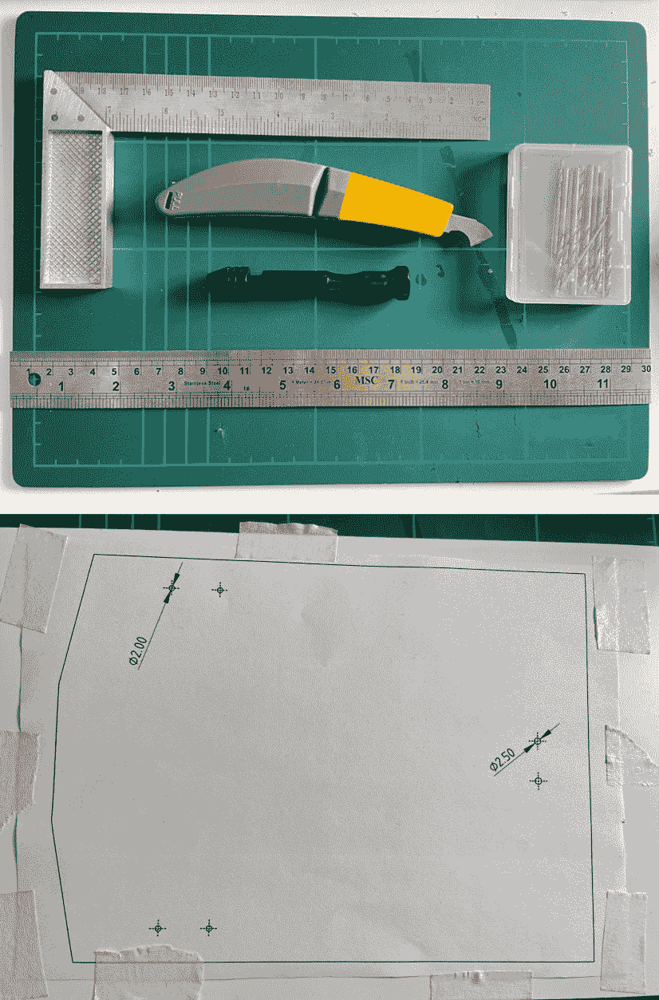

图 4.1 – 转移图纸所需的部件

上一张图显示了我们将需要的工具，摆放整齐并准备好使用，随后是贴在塑料板上的图纸。准备以下内容：

+   剪刀

+   螺丝夹和钻头

+   金属直尺

+   塑料切割器

+   切割垫

+   塑料板

+   纸模板

+   胶带

你首先需要做的是在纸模板上的图纸周围切割。然后，你需要将这个模板牢固地贴在塑料板上。尽量不要让任何边缘卷曲 – 越是贴得牢固，结果就越好。

我们将使用这个模板在我们的塑料上画一些点。以下图显示了这一点：

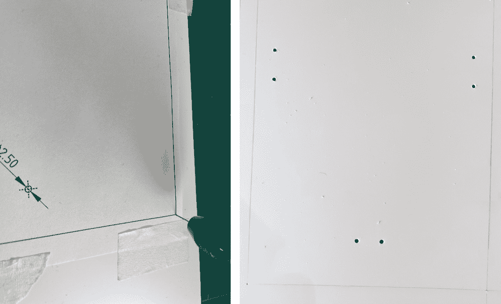

图 4.2 – 用点标记塑料

在这里，你可以看到我使用螺丝夹和钻头在每个角落和孔上画点。右边显示了钻好的孔。按照以下步骤操作：

1.  使用螺丝夹和一个小钻头，可能大约 0.5 毫米。

1.  将螺丝夹放在你的图纸的一个角上，并通过纸张在塑料上做标记。

1.  对所有角落重复此操作。底盘有六个角落。

1.  现在，对孔中心做同样的处理。底盘板上共有六个孔。

1.  然后，我们可以使用更大的钻头来钻孔 – 一个 2 毫米的钻头和一个 2.5 毫米的钻头。让模板指导你确定尺寸。

在制作标记孔和螺栓孔时，重要的是要慢慢来，用力要小。准确性很重要。在废木料或切割垫上做这个。

现在我们已经画出了轮廓，我们就可以开始从塑料板上切割部件了。

## 切割塑料板

切割需要耐心。慢慢来，以准确性为目标；切割没有橡皮擦！

重要提示

你的手指或肢体绝对不能在刀片路径上！不要割伤自己。当你拿着直尺时，保持你的指尖在中间。

确保塑料切割器锋利，并且有新刀片。钝刀片切割效果不佳，使用更多压力是危险的，并可能导致部件损坏。

让我们开始切割。看看下面的图：

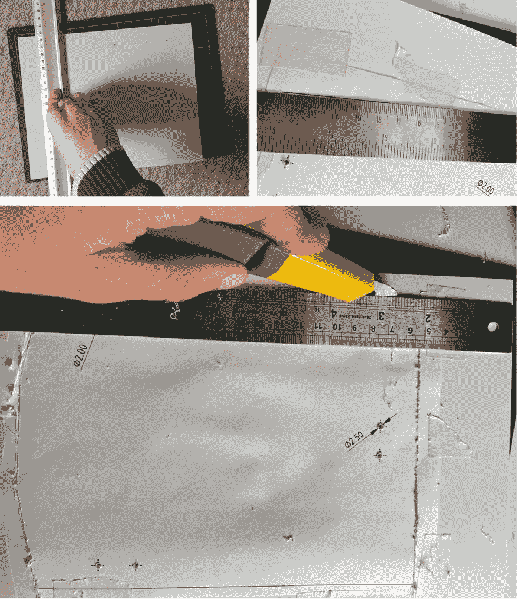

图 4.3 – 切割部件

上一张照片显示我在塑料板上做切割。左上角是我对齐金属边缘以进行后部切割，右上角是我设置前部斜切。下面的图纸显示了正在进行的切割。我有切割这些部件的过程：

1.  将尺子与一对孔和模板对齐，使切割边缘朝向你要保留的材料的外侧。这意味着刀片的任何偏差都不会损坏零件。紧紧握住尺子，以确保它不会移动。

1.  使用切割工具时，您将使用钩子的尖端。

1.  将钩子放在孔洞稍远处（以免钩住它）。用轻微的压力，沿着尺子到下一个点的方向划片。不要试图切得太深——只需划片。不要用力——不要损坏尺子，并专注于保持切割直线。

1.  我们的目标是切到大约一半深。为了进行干净的切割，确保你慢慢来。当你到达末端时，保持尺子位置不变，返回并跟随现有的划痕。当你进行几次往返时，你会看到钩子拾取更多的材料。这很繁琐，但会导致良好的完成效果。

1.  如果刀片粘上了胶，请清理它；如果它变钝了，请更换它。

1.  要有耐心；如果你太快或用力过大，那么你可能会偏离轨道并损坏零件，更糟糕的是，可能会从你身上割下一块。

1.  对你绘制的所有线条重复此过程。

1.  将零件和尺子旋转以获得一个适合您的良好切割边缘。不要以不自然的姿势弯腰。

到目前为止，你应该已经划出了所有零件的线条，但它们仍然大部分在塑料板上。因此，让我们看看我们如何将它们取出：

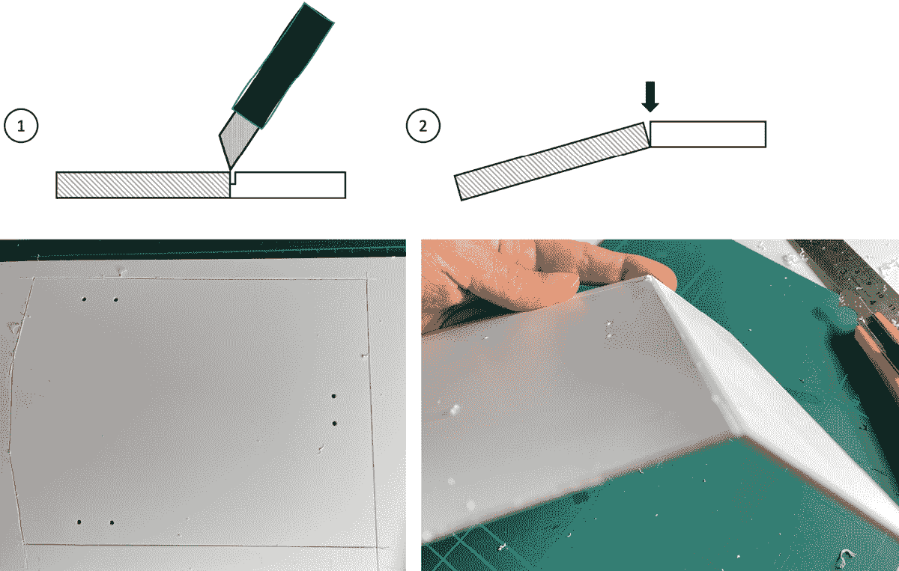

图 4.4 – 推出零件

前面的图结合了两个图表和两张照片。推出零件的过程取决于你是否已经进行了足够的往返，以至于你有足够深的刀痕，如图**1**所示。你之前进行的刀痕往返越多，这就会越容易。

**2**项显示了正在进行的事情；我们在划痕线上的塑料处弯曲，直到它断裂。左下角的图片显示了在板上深深划痕的所有线条，右下角显示了在弯曲以释放该零件的板。这个过程非常令人满意！

一旦你推出了零件，你应该有主要的底盘板：

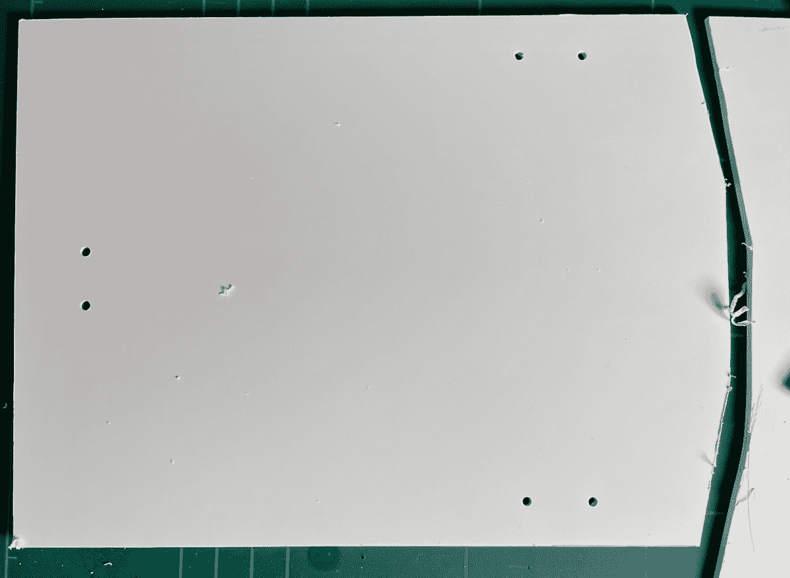

图 4.5 – 切割出的板

前面的图显示了底盘板在切割垫上的位置。尽管如此，它看起来有点粗糙，孔洞和边缘上都有毛刺。我们将在下一节中修复这个问题。

## 完成和打磨底盘板

我们首先清理的是孔洞。毛刺是钻孔后留下的尖锐的脊状物。它们可能很锋利，会钩住你的手指，也可能阻止零件良好组装。让我们学习如何去除它们：

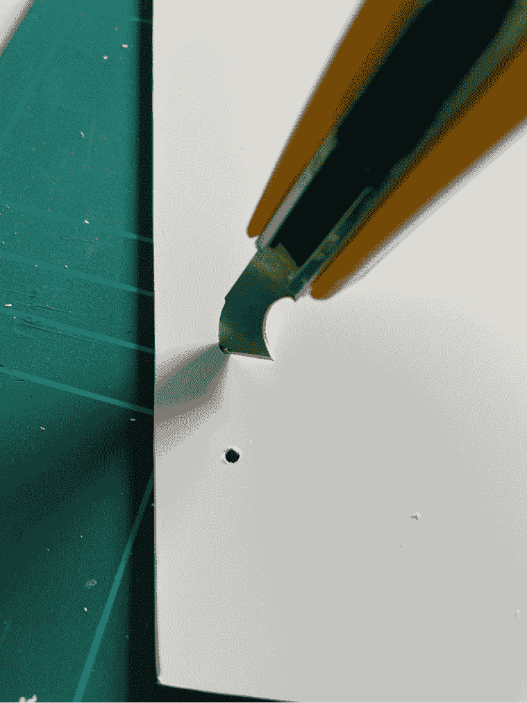

图 4.6 – 清理孔洞

第一面板显示两个孔 - 一个有毛刺可见，另一个毛刺已被去除。为此，使用工匠刀在孔内轻轻画一个圆圈；这将仅去除毛刺而不会将其扩大。再次，这里不要用力；让刀片完成工作。

对所有孔重复此操作。如果你需要清洁刀片，请使用纸巾，但永远不要将手指放在刀片路径上！

### 打磨部件

以下图示显示了如何打磨这个部件，使其准备好使用：

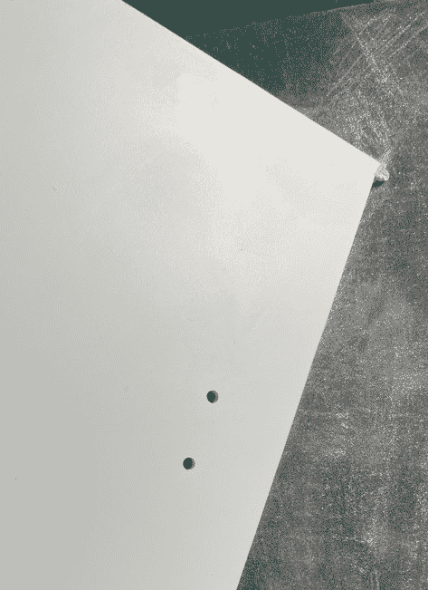

图 4.7 – 打磨板

前面的图示显示了如何打磨车架。以下提示将有所帮助：

1.  将砂纸放在桌子上，将部件擦拭在其上。

1.  从最粗糙的砂纸（400 或 600 粒度）开始。

1.  平滑边缘并去除切割留下的任何凸起。以 30 到 45 度的角度进入有助于。

1.  对于长边，一只手握住板，用砂纸擦拭它们。保持轻柔，并支撑纸张与部件接触的地方。

1.  现在，从低粒度砂纸（800-1,000）过渡到中粒度砂纸，然后到高粒度砂纸（1,200），以最轻的触感进行。

现在部件的边缘应该光滑，触摸时不尖锐。

这样，你已经设计、切割和打磨了车架底座。当然，从形状、强度和扩展到三维或更多维度来说，可能会更有趣，但你现在有了增强这些功能的能力。然而，车架底座对于机器人来说是不够的，所以我们在下一节中将开始将机器人部件安装到这个底座上！

# 组装机器人车架

车架是我们机器人的基础。我们已经切割了所需的部件，为其使用做准备。在本节中，我们将安装滚轮电池盒和电机。

## 安装滚轮和电池盒

电池盒安装在滚轮上方。因此，我们必须从滚轮开始；以下图示显示了如何：

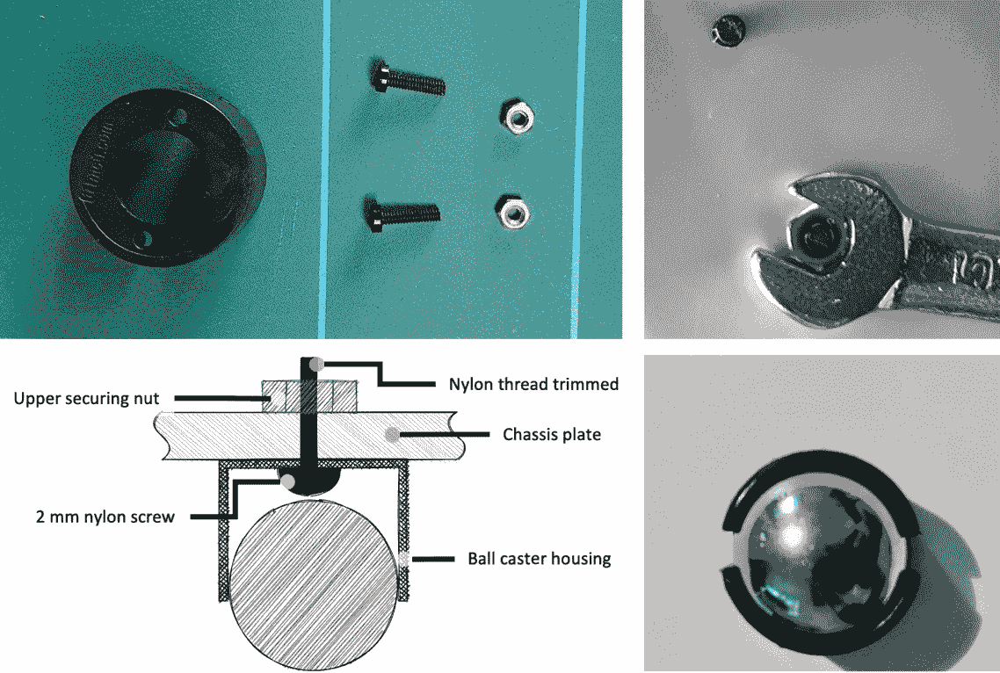

图 4.8 – 将滚轮球安装到车架上

前面的图示显示了我将球型滚轮安装到车架上的过程。让我们更详细地看看：

1.  底部左边的较大插图显示了这将如何呈现的横截面。注意，尼龙螺丝必须穿过球型滚轮外壳的底部，穿过车架板，然后是一个上方的固定螺母。

1.  左上角的图示显示了组装所需的部件。我们有球型滚轮外壳（球已分离）、2 x M2 长尼龙螺丝和 2 x M2 螺母。此外，准备合适的螺丝刀、扳手和线/侧切钳。

1.  在将两个下间距螺母拧紧到位后，将突出的螺纹推过车架板底部的相应孔中。

1.  使用扳手拧紧固定螺母。

1.  为了完成，修剪螺纹，使其高出固定螺母 1 毫米或更少，以确保它们不会阻碍电池盒底部。使用平口钳/侧切钳是一种不破坏螺纹的好方法。

1.  插入滚轮。检查滚轮是否能自由移动，并且没有卡在螺丝上。

到目前为止，滚轮已经固定好。我们现在可以像这里所示的那样安装电池盒：

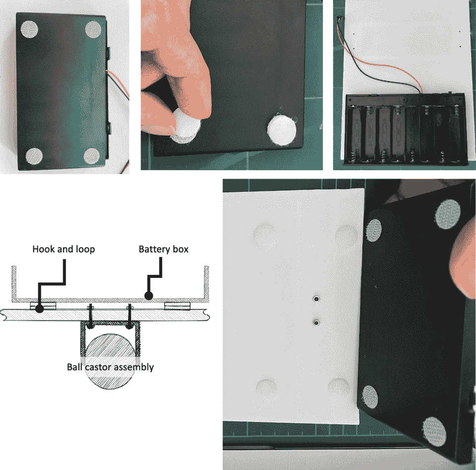

图 4.9 – 安装电池盒

*图 4.9* 展示了如何安装电池盒。左上角显示了钩子和搭扣盘被粘贴在电池盒的四个角落。接下来，我们在它们上面添加相反的盘片。然后我们将电池盒对准底盘，并紧紧按下，使底部的盘片粘附在底盘上。留置几分钟以确保良好的粘合。

左下角显示了一个横截面，其中显示了电池盒组件和底下的滚轮之间的关系。最右下角的最终面板显示，一旦钩子和搭扣盘粘合，您应该能够轻松地将电池盒从钩子和搭扣上取下，以便更容易更换电池。

现在，让我们转向机器人的前方，这里是添加电机的地方。

## 安装电机和轮子

现在，让我们将电机固定好，并将它们的轮子安装到位。以下图示显示了必要的步骤：

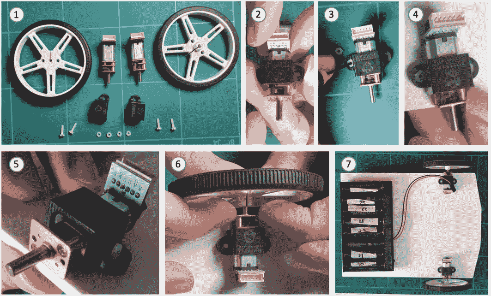

图 4.10 – 安装电机和轮子

上一图显示了如何安装电机和轮子：

1.  左上角的面板显示了所需的零件——两个轮子、两个电机、两个 N20 电机支架、四个尼龙螺栓和四个螺母（这些应该随 N20 电机支架一起提供）。

1.  调整电机支架，使其覆盖中间的变速箱板和部分电机。

1.  将螺母插入侧耳——这里一个小型的珠宝螺丝刀会有所帮助。

1.  电机将与孔对齐。可能需要先将螺丝插入一边，然后将电机套在螺丝上。

1.  将螺丝拧入电机支架上的螺母。对另一个电机重复*步骤 4*和*步骤 5*。

1.  将轮胎安装到轮子上——这些通常是分开的。小心地将轮子推到电机轴上。确保对电机施加压力，但尽量不要弯曲底盘。

1.  我们现在已经组装好了机器人底盘，除了电子元件之外。

我们已经组装好底盘，使其能够站立在轮子上。它有一个电池盒和电机，但没有指令告诉电机何时移动。在下一节中，我们将为机器人连接电子元件，以便我们准备好运行必要的代码。

# 连接 Raspberry Pi Pico 机器人

在本节中，我们将探讨如何通过我们在 *第一章* 中选择的电机控制器将 Raspberry Pi Pico 连接到电机，*规划使用 Raspberry Pi Pico 的机器人*。我们将添加电源电路，并推荐一些机器人布线的技巧。尽管面包板可以粘附在底盘上，但我倾向于在必要时才使用粘合剂——有时在没有面包板的情况下布线和更改更容易。

## 将 Pico 和电机控制器连接到面包板上

在规划阶段我们建议的电机控制器是 TB6612-FNG。我使用了 SparkFun 板。以下表格显示了该模块的引脚：

| **引脚名称** | **类型** | **功能** |
| --- | --- | --- |
| GND | 电源 | 地 – 将电源连接回电池。 |
| VM | 电源 | 电机电压 – 高于系统其他部分。 |
| VCC | 电源 | 逻辑电压应为 3.3v，与 Pico 相同。 |
| AIN1/2 和 BIN1/2 | 输入 | 这些是电机控制输入引脚。Raspberry Pi Pico 将通过这些引脚控制电机。A 和 B 表示电机输出集。 |
| PWMA/B | 输入 | 这些可以通过脉冲开/关来控制电机。我们将将其连接到 VCC 电压，这样只需要 AIN/BIN 引脚。 |
| STBY | 输入 | 将此引脚连接到高电平（VCC）以启用电机。 |
| AO1/2 和 BO1/2 | 输出 | 这些是电机输出引脚，可以直接连接到每个电机。 |

表 4.1 – TB6612-FNG 引脚功能

上述表格描述了每个引脚、其总体类型及其功能。

在考虑我们将使用的引脚时，我们还应使用 Pico 引脚图的数据表，请参阅 [`datasheets.raspberrypi.org/pico/Pico-R3-A4-Pinout.pdf`](https://datasheets.raspberrypi.org/pico/Pico-R3-A4-Pinout.pdf)。以下图示显示了我们将如何布线此控制器：

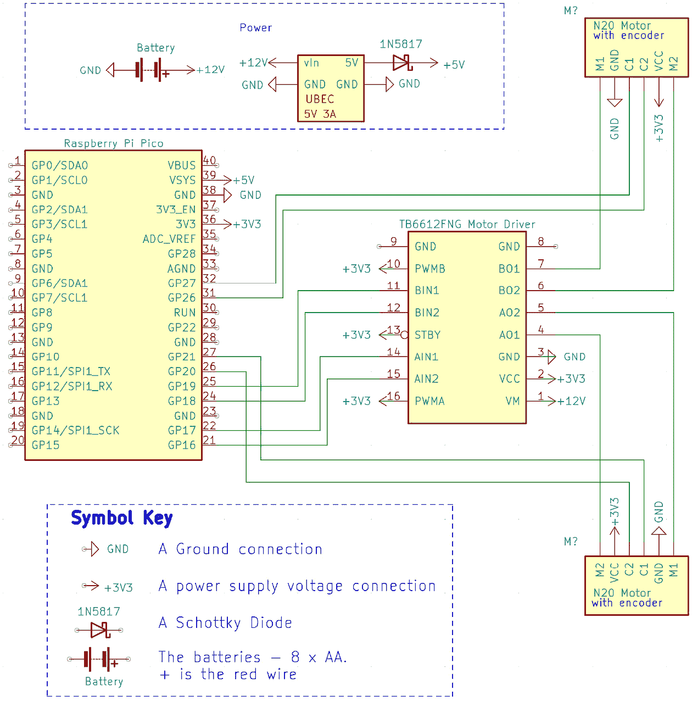

图 4.11 – 机器人布线图

此布线图（在 KiCad 中制作）显示了本章中我们将使用的布线。底部框中显示了符号键。

专注于 Raspberry Pi Pico 和电机模块之间的连接，您会看到用于控制 AIN 和 BIN 引脚的 **通用输入/输出**（**GPIO**）引脚。前面的图示显示了 Raspberry Pi Pico 3v3 引脚连接到 +3v3 电源线，我们还将它连接到电机控制器的 VCC、PWMA/B 和 STBY 引脚。

我们将在面包板上构建我们的电路。使用预切割跳线，您可以将线的裸露金属端推入面包板孔中以建立连接。顶部和底部有电源轨，用于连接电源和地。中间部分有 30 行，每行有 2 个连接的行，每行有 5 个引脚。

我们如何将其安装在单个面包板上？让我们看看以下图示：

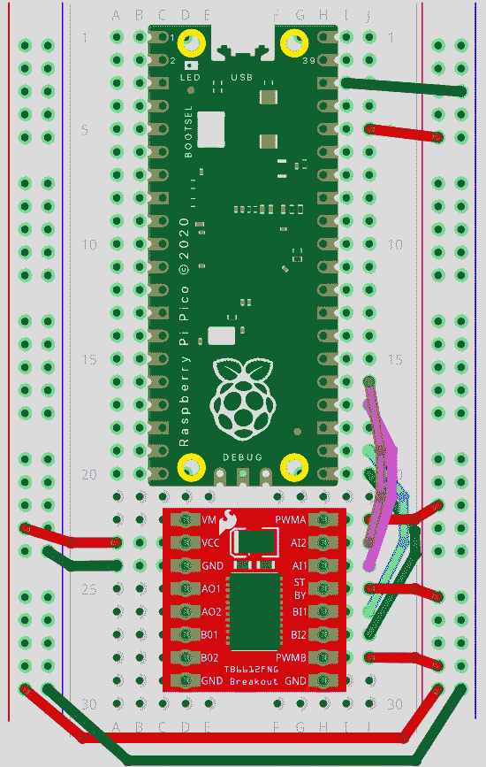

图 4.12 – 在面包板上布线电机连接

上述图示显示了一个建议的面包板布局。首先，我们必须插入 Raspberry Pi Pico 和电机模块，Pico 的 USB 连接器应朝远离电机板的方向。接下来，我们必须准备电源轨，将黑色轨连接到 GND，将红色轨连接到 3.3V – 使用较长的电线这样做，以免阻塞 USB 端口。我们还必须将电机板的 PWM 和 STBY 引脚连接到红色轨。最后，我们必须在 Pico 的 GPIO 引脚和电机控制器的输入引脚之间建立四个连接。注意 Pico 末端的间隙 – 这里有一个备用地线引脚。

使用预先切割的跳线进行连接。优先考虑使其易于检查和更换，而不是紧密和紧凑的布线。

我们已经布线了电机控制器，但这个板需要电源 – 我们将在下一节中探讨这个问题。

## 添加电池

我们正在为此机器人布线三个主要电源组件 – 一个电池盒，一个将电池输出转换为 Raspberry Pi Pico 所需的 5V 输入的 UBEC，以及一个二极管来阻止 USB 和 UBEC 电源相互干扰。

上一节中*图 4**.11 的顶部显示了 UBEC 和二极管。我们如何添加这些？让我们看看一个建议的面包板布局：

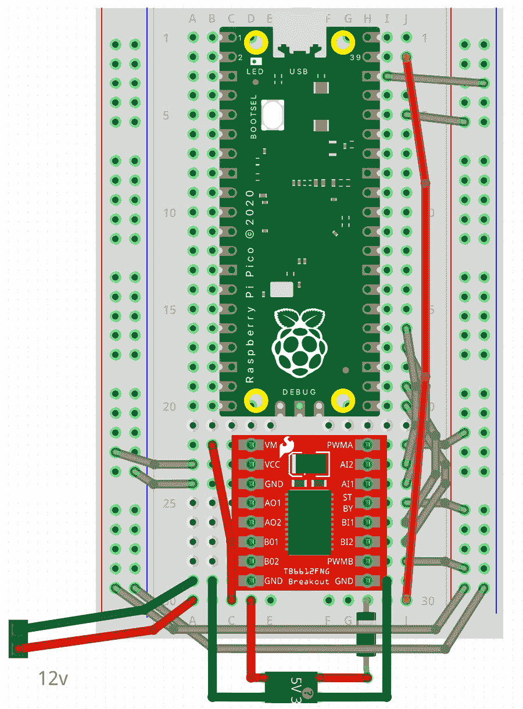

图 4.13 – 电池、UBEC 和二极管的建议板布局

这个面包板布局是在上一个布局的基础上构建的，新的布线被挑选出来。标记为 12v 的连接是为 8 x AA 电池盒准备的。UBEC（底部）的*输入*端来自电池和电机板地线，5V *输出*端通过二极管进入 Pico VSys 引脚。此外，请注意从电池输出到 VM 的电线 – 这是为了电机板上的电机电压。在电池进入的地方，我建议使用记号笔或标签来标记这一点，因为重新连接到其他地方可能会损坏 Pico 或 UBEC。

这些部分可能难以布线，因为 UBEC 的一端通常有非常粗的电线，而电池盒的电线往往是多股的，不适合面包板。然而，这里你有两种选择：

+   将两套公排针插入面包板，并在其上焊接电线。

+   对于一个更整洁但更困难的选项，你可以在电池盒和 UBEC 输入端的末端压接 DuPont/Mini-PV 公接头。我建议在遵循[`mschoeffler.com/2017/11/02/tutorial-how-to-crimp-dupontmini-pv-connectors-engineer-pa-09-connector-pliers/`](https://mschoeffler.com/2017/11/02/tutorial-how-to-crimp-dupontmini-pv-connectors-engineer-pa-09-connector-pliers/)指南的同时进行压接。

UBEC 的输出端通常是雌性。因此，我在面包板上使用了预先切割的跳线，分别连接 5V 和地。

重要提示

面板的红轨正在运行来自 Pico 的 3.3V 电源输出。因此，不要将 UBEC 的 5V 输出或 12V 输入电源连接到这个红轨！

我们的机器人有电源电路，这意味着它可以自行供电。在下一节中，我们将为电机接线。

## 电机和编码器的接线

我们选择的电机每个使用六根线。我们需要清楚这些连接的含义。根据 Adafruit 为 TB6612FNG 设备提供的资料表，以下表格将帮助您进行这些连接：

| **电机引脚** | **线颜色** | **用途** |
| --- | --- | --- |
| 1 – M1 | 白色 | 电机 1 – 电机电源/控制 |
| 2 – GND | 蓝色 | 编码器地 |
| 3 – C1 | 绿色 | 编码器信号 1 |
| 4 – C2 | 黄色 | 编码器信号 2 |
| 5 – VCC | 黑色 | 编码器电源 – 3v3 |
| 6 – M2 | 红色 | 电机 2 – 电机电源/控制 |

表 4.2 – 带编码器的 N20 电机连接

如果您购买了不同的设备，请使用其数据表。

线的颜色与这些电机附带的线缆连接器相匹配。请仔细将这些连接器插入电机，如图所示：

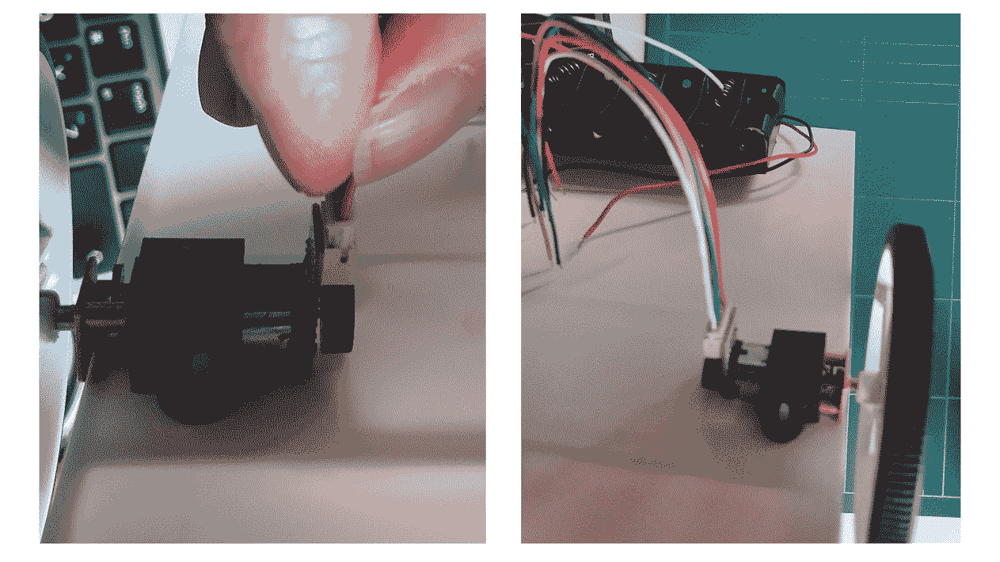

图 4.14 – 插入电机电缆

前面的图显示了我将电线插入电机插座的过程。这些电线带有特定的颜色组合。请注意，这里的线颜色并不对应传统的黑色/红色配色，并且我在*表 4.2*中指定了颜色。

现在，我们可以继续接线。请参考*图 4.11*查看整体电路图。我们已经将电机电源/控制线连接到电机控制器。我们需要将电机控制器连接到电机，并将编码器信号连接到 Raspberry Pi Pico。请注意，白色和红色电缆 – 电机上的 M1/M2 – 插入了电机控制器的 AO/BO 点。接下来，我们必须将黄色和绿色编码器电缆连接到 Raspberry Pi Pico。

电机线足够硬，可以直接插入面包板；然而，如果您还压接这些电缆，连接将更加牢固。我为每个电机分成了三对：

+   M1/M2 电机控制引脚

+   绿/黄编码器引脚

+   蓝色/黑色编码器电源引脚

将它们配对会使它们更容易插入机器人预定位置。

这样，我们已经完成了这个机器人第一阶段的所有接线工作。在下一节中，我们将探讨如何为其供电。

## 为机器人供电

机器人有必要的连接来完成这一阶段。以下图显示了它们的形状：

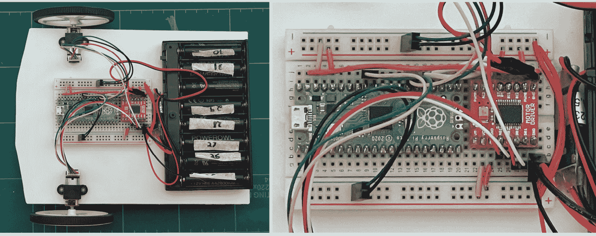

图 4.15 – 完全接线的机器人

前面的图显示了完全接线的面包板。

现在，仔细检查接线，特别注意电源连接，寻找任何电压到地或其他电压轨的潜在短路。

将八节新的 AA 电池放入电池盒并打开它。你应该能看到 Raspberry Pi Pico 上的灯亮起。如果没有，请迅速关闭并检查连接。如果有什么东西变热，这通常是一个短路或连接错误的表现。如果没有东西变热，请确认连接没有松动。

如果没有松散的连接，我建议在这里使用万用表检查电线——在通断测试模式下。我建议参考 Adafruit 的指南[`learn.adafruit.com/multimeters`](https://learn.adafruit.com/multimeters)，它解释了如何使用万用表。我会检查任何压接的电线，以及 UBEC 的输入和输出电压。

如果你发现压接的电线不通电，我建议更换压接。在压接处加一点焊锡可能有用，但这可能会导致压接更脆弱。你应该能够尝试再次给系统供电。

到目前为止，你应该能够打开机器人并看到 Raspberry Pi Pico 上的 LED 灯亮起（以及可能还有 UBEC）。

# 摘要

有了这些，你已经根据提供的方案构建了你的机器人。你学习了如何从 CAD 设计中测量图案到塑料上，然后切割和钻孔。此外，你现在有将电机、轮子、万向节和电池盒连接到机器人的经验。

你在遵循电路图和推荐的面包板布局构建时为机器人布线。然后，你给机器人供电并进行了故障排除（如果它没有点亮）。

然而，机器人目前还不能移动，因为我们还没有实现任何代码。在下一章中，我们将添加代码，以便我们可以移动机器人并控制它的轮子。然后，我们将学习如何使用它们进行转弯和以不同的速度行驶。

# 练习

以下练习将有助于提高你的机器人技能并练习你的技能：

+   这个机器人相当扁平。考虑一下你如何添加其他层或增加它的深度。

+   面板目前还没有附着在机器人上；也许搭扣和粘扣带能有所帮助？

+   熟悉机器人的布线是一个好主意。为自己画一张图，显示 Raspberry Pi Pico 和电机之间的路径。

# 进一步阅读

要了解更多关于本章所涉及主题的信息，请查看以下资源：

+   Spruce Crafts 有一个关于使用苯乙烯模型制作的详细介绍[`www.thesprucecrafts.com/modeling-with-styrene-plastic-2382537`](https://www.thesprucecrafts.com/modeling-with-styrene-plastic-2382537)。

+   [`www.youtube.com/watch?v=p3gabIJ3Ono`](https://www.youtube.com/watch?v=p3gabIJ3Ono)上的*苯乙烯工作的基础知识*，由 Hawkins Screamer 提供，也有关于使用苯乙烯建造的宝贵建议。

+   [`www.packtpub.com/product/kicad-like-a-pro-video/9781788629997`](https://www.packtpub.com/product/kicad-like-a-pro-video/9781788629997)上的 Packt 视频课程*KiCad Like a Pro*，展示了如何设计电路，就像我们在本章中创建的那样。

+   压接的一个好指南是：[`mschoeffler.com/2017/11/02/tutorial-how-to-crimp-dupontmini-pv-connectors-engineer-pa-09-connector-pliers/`](https://mschoeffler.com/2017/11/02/tutorial-how-to-crimp-dupontmini-pv-connectors-engineer-pa-09-connector-pliers/)。

+   以下 Adafruit Collin’s Lab 的压接视频可能对您也有帮助：[`youtu.be/_zl28E2urEU`](https://youtu.be/_zl28E2urEU)。
