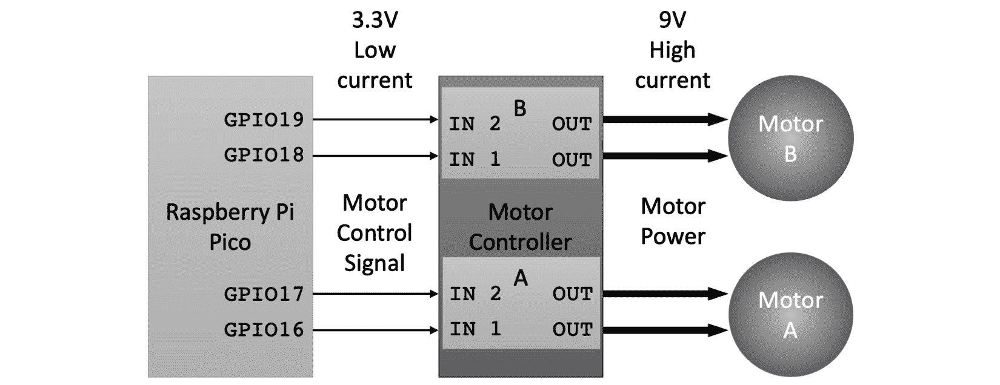
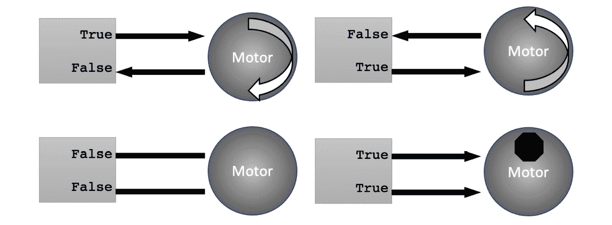
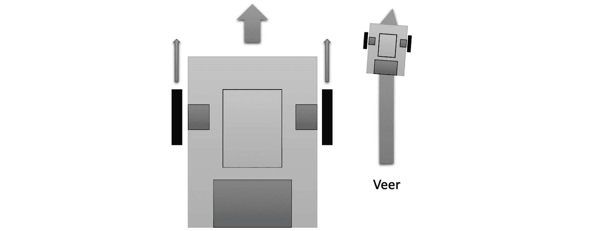
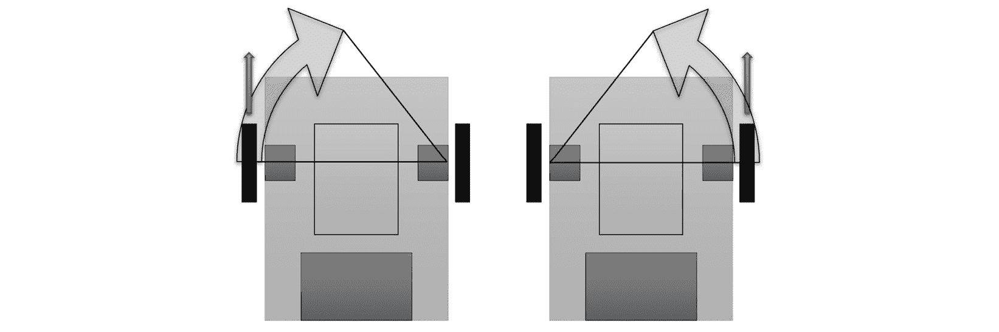
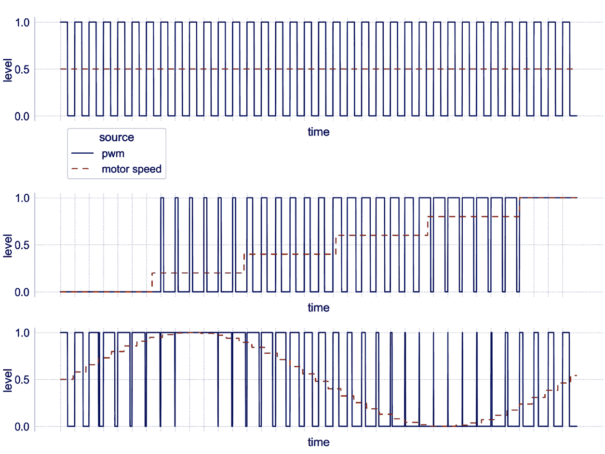
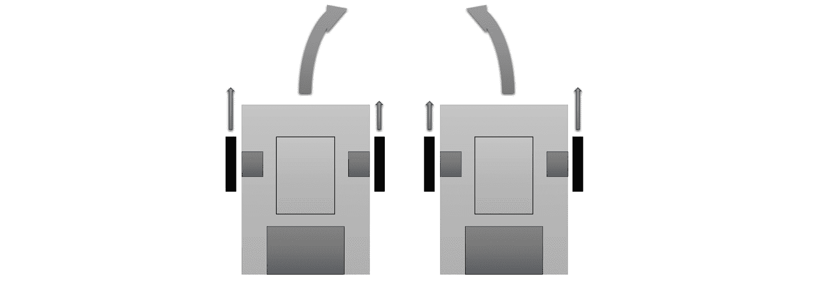
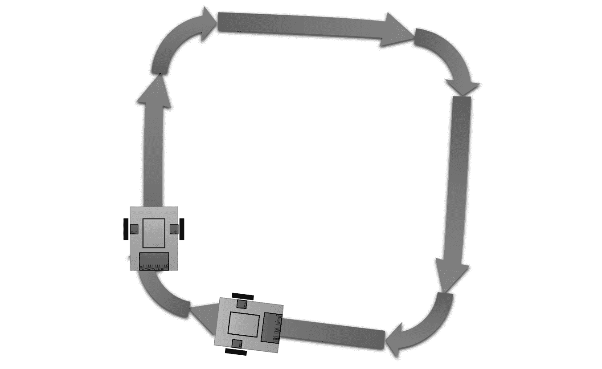

# 第五章：使用 Raspberry Pi Pico 驱动电机

我们的机器人看起来已经准备好运行了。机器人底盘的第一个实际测试是让它的电机开始驱动。本章将使机器人复活，测试线路和电机，使用 Raspberry Pi Pico 上的**CircuitPython**。我们将从每个电机的简单测试开始，然后一起使用它们来制造动作。最后，我们将学习更复杂的代码来控制它们的速度，并在本章结束时制作一条路径。

在本章中，我们将涵盖以下主要主题：

+   前进和后退驾驶

+   使用两个电机转向

+   PWM 速度控制简介

+   沿着规划好的路径驾驶

# 技术要求

对于本章，你需要以下内容：

+   首先是之前章节中制作的机器人

+   6 节新的 AA 电池

+   一台带有 USB 微型电缆的 PC 或笔记本电脑

+   Mu 软件用于编写代码和上传

+   清理地面空间，每个方向大约一米，以测试机器人

所有代码示例都在 GitHub 上，网址为[`github.com/PacktPublishing/Robotics-at-Home-with-Raspberry-Pi-Pico/tree/main/ch-05`](https://github.com/PacktPublishing/Robotics-at-Home-with-Raspberry-Pi-Pico/tree/main/ch-05)。

# 前进和后退驾驶

电机已经安装，机器人看起来已经准备好供电。首先，我们将使用 CircuitPython 来制作测试代码，依次尝试每个电机。然后，当我们证明了电机可以运行时，我们将编写简单的代码来使电机直线前进和后退。

## 使用 CircuitPython 测试每个电机

我们将通过以下图中的连接来开始驾驶我们的机器人：



图 5.1 – Raspberry Pi Pico 的电机连接

*图 5*.1 展示了机器人电机连接的更详细视图。在左边是 Raspberry Pi Pico，它与电机控制器有四个连接。它们位于 GPIO 16、17、18 和 19。这些连接导致电机控制器通过电机线中的一根线为电机供电。测试 Pico 的每个引脚应该会导致电机做出某种动作。

让我们用一些代码来尝试，设置一个电机，并使其单向行驶。这个例子叫做 `motors_test_1_pin.py`：

```py
import time
import board
import digitalio
motor_A1 = digitalio.DigitalInOut(board.GP17)
motor_A1.direction = digitalio.Direction.OUTPUT
motor_A1.value = True
time.sleep(0.3)
motor_A1.value = False
```

这段代码看起来与*第二章*中的 LED 代码非常相似，*准备 Raspberry Pi Pico*。我们将`board.GP17`，连接到电机控制器上的`AIN1`引脚，设置为数字输出。

代码将`GP17`设置为`True`，打开它，然后等待 0.3 秒，将电机引脚设置为`False`来关闭它。

将此代码输入到`Mu`中，并保存到`CIRCUITPY`。为此测试，将机器人支撑起来，使车轮不接触任何东西。要启动此文件，还需要创建一个`code.py`模块：

```py
import motors_test_1_pin
```

如果你还记得从*第二章*，*准备 Raspberry Pi Pico*，当机器人启动或你在`CIRCUITPY`上更改文件时，Raspberry Pi Pico 将运行`code.py`中的内容。

当你启动此代码时，一个电机短暂移动然后停止。电机应该向前运行。如果不是，请交换这侧的电机输出引脚。用`GP18`重复此练习并检查另一个电机是否也向前运行。

### 你该如何测试这个？

对于本章中剩余的所有示例，请使用以下步骤：

1.  在 Pico（`CIRCUITPY`驱动器）上，确保`code.py`文件为空；否则，它将重新运行旧程序，直到你更新它。

1.  在你的电脑上编写程序并保存。你不想丢失它！

1.  将程序（以及已更改的辅助文件；我们很快将添加`robot.py`）复制到 Pico 上。

1.  确保电源开关开启且已安装电池。

1.  让机器人靠在某个东西上，这样轮子就不会接触到任何东西。

1.  更新`code.py`以导入你的程序名称，不包含`.py`扩展名。

1.  代码的第一个测试是看到它以这种方式运行。

1.  要实际运行它，请断开 Pico 并关闭电源。

1.  然后，将机器人放在一个开阔的空间（地毯或地板上）并开启电源。

1.  准备好如果它做了意想不到的事情就捡起来并关闭它——如果机器人没有停止就撞到障碍物，它可能会损坏自己。

1.  你也可以在任何时候从 REPL 中按*Ctrl* + *C*来停止一个正在运行的程序。

### 故障排除

这可能出错的方式有很多。让我们在这里检查几个：

+   如果`code.py`中的`import`和你的`motors_test_1_pin`文件名不匹配，你很可能会在 REPL 中遇到错误，什么都不会发生。

+   如果机器人的 UBEC 连接了但电池未供电，机器人可能会从 USB 端口获取过多的电流。如果你打算测试电机，确保机器人已开启电源。如果不是，可能最好断开 UBEC。

+   如果仍然没有任何动作，请断开机器人连接，关闭它，并彻底检查线路——机器人中不应该有任何过热的部件。

现在你已经知道如何测试你的代码并使一个简单的示例工作，你就可以准备更复杂的示例了。

### 测试多个引脚

让我们将此代码扩展到测试`motors_test_all_pins.py`中的所有电机引脚：

```py
import time
import board
import digitalio
motor_A1 = digitalio.DigitalInOut(board.GP17)
motor_A2 = digitalio.DigitalInOut(board.GP16)
motor_B1 = digitalio.DigitalInOut(board.GP18)
motor_B2 = digitalio.DigitalInOut(board.GP19)
motor_A1.direction = digitalio.Direction.OUTPUT
motor_A2.direction = digitalio.Direction.OUTPUT
motor_B1.direction = digitalio.Direction.OUTPUT
motor_B2.direction = digitalio.Direction.OUTPUT
motor_A1.value = True
time.sleep(0.3)
motor_A1.value = False
time.sleep(0.3)
motor_A2.value = True
time.sleep(0.3)
motor_A2.value = False
time.sleep(0.3)
motor_B1.value = True
time.sleep(0.3)
motor_B1.value = False
time.sleep(0.3)
motor_B2.value = True
time.sleep(0.3)
motor_B2.value = False
```

此代码扩展了第一个代码示例以测试所有电机引脚。更新`code.py`以导入此代码，你应该看到每个轮子先朝一个方向转动，然后朝另一个方向转动。如果你没有看到这样的动作，请关闭电源/断开机器人连接，并返回到*第四章*，*围绕 Pico 构建机器人*，仔细检查线路。

我们将大量使用这些电机。为了节省我们每次都复制所有设置代码的时间，我们可以将其放入一个名为`robot.py`的新文件中：

```py
import board
import digitalio
motor_A1 = digitalio.DigitalInOut(board.GP17)
motor_A2 = digitalio.DigitalInOut(board.GP16)
motor_B1 = digitalio.DigitalInOut(board.GP18)
motor_B2 = digitalio.DigitalInOut(board.GP19)
motor_A1.direction = digitalio.Direction.OUTPUT
motor_A2.direction = digitalio.Direction.OUTPUT
motor_B1.direction = digitalio.Direction.OUTPUT
motor_B2.direction = digitalio.Direction.OUTPUT
```

现在，你不必再输入它了。我们可以重写`motors_test_1_pin.py`：

```py
import time
import robot
robot.motor_A1.value = True
time.sleep(0.3)
robot.motor_A1.value = False
```

你可以运行这个（记得更改`code.py`）并将相同的更改应用到`motors_test_all_pins.py`。

这段代码演示了我们可以移动电机，但我们如何一起使用它们呢？

## 直线行驶的驱动轮

在电机方向方面，每个电机引脚控制这一点。看看下面的图：



图 5.2 – 控制电机方向

上述图示显示了一个代表电机及其引脚的方框。每个旁边都有**True**或**False**，表示在 Raspberry Pi Pico 上控制引脚的状态。箭头显示了电力的传统电流方向。当一个引脚为高时，电流从该引脚流出；如果它是低的，电流回流。当我们设置电机引脚为相反值时，电流将在电机控制器输出和电机之间流动，电机转动。如果电机引脚都是低的，则没有电流，电机关闭并可以滑行。如果它们都是高的，电机将停止，就像刹车一样。

重要提示

在电子学中，我们以两种方式描述电流。**传统电流**描述的是从电源的正极流向负极的电流。然而，实际的物理现象显示负电荷的电子是相反方向流动的。我们将坚持使用传统电流以避免混淆。

我们可以利用这一点来直线行驶。当我们同时驱动两个电机时，机器人可以向前或向后直线行驶。例如，看看下面的图：



图 5.3 – 直线行驶

*图 5.3*显示了每个轮子都有一个指向前的箭头，表示电机正在向前行驶。轮子的组合运动导致机器人向前行驶——由机器人前面的宽箭头所示。

线条并不完全笔直，因为电机略有不同，所以会有轻微的偏离；我们称这为**偏航**。我们将在本书的后面部分看到如何纠正这一点。

让我们编写代码来驱动前进——`motors_forward.py`：

```py
import time
import robot
robot.motor_A1.value = True
robot.motor_B1.value = True
time.sleep(0.3)
robot.motor_A1.value = False
robot.motor_B1.value = False
```

这段代码通过启用（设置为`True`）`A1`和`B1`引脚来使两个电机向前。它等待 0.3 秒（300 毫秒），然后停止两个电机。如果要行驶更长的时间，可以增加时间。不过，使用时间来大致控制距离并不非常准确。

向后行驶意味着使用`A2`和`B2`引脚代替（`motors_backward.py`）：

```py
import time
import robot
robot.motor_A2.value = True
robot.motor_B2.value = True
time.sleep(0.3)
robot.motor_A2.value = False
robot.motor_B2.value = False
```

除了更改引脚外，此代码与之前相同。

我们现在可以前进和后退，但我们如何转弯呢？

# 使用两个电机转向

如果我们移动一个电机而不移动另一个，机器人会转向不动的轮子。例如，看看下面的图示：



图 5.4 – 使用电机转向机器人

*图 5.4* 展示了两个转弯机器人。在第一个面板中，左轮上方有一个向前箭头，表示该轮子正在驱动前进。右轮停止。一个透明的箭头叠加在这个箭头上，显示了转弯方向以及这次转弯以右轮为支点。右边的机器人显示了相反的转弯。机器人可以通过反转单个电机以相同的方式向后转弯。

由于我们将更多地使用电机，我们将扩展 `robot.py` 以便我们可以停止它们。在 `robot.py` 的末尾添加此代码：

```py
def stop():
    motor_A1.value = False
    motor_A2.value = False
    motor_B1.value = False
    motor_B2.value = False
```

确保将此新版本复制到 Pico 上。

我们现在可以在一些代码中使用我们的转弯原理——`motors_1_motor_turn.py`：

```py
import time
import robot
robot.motor_A1.value = True
time.sleep(0.3)
robot.stop()
```

此代码示例与单引脚电机测试非常相似。只有 `stop()` 命令是新的。我们通过计时大致控制转动的角度。虽然很棘手，但可以实现 90 度的转弯，但它们不会非常精确。使用不同的引脚，我们可以使用另一侧的电机进行转弯，或者使用相同的原则反转当前电机的电流。

那么使用两个电机呢？如果我们驱动一个电机向前，另一个电机向后，我们可以进行更快、更紧密的转弯，并在原地旋转。看看下面的图：


图 5.5 – 使用两个电机旋转

*图 5.5* 展示了机器人，一个箭头从一个电机向前，另一个电机向后。我在两个轮子之间包含了一个旋转箭头，显示了这次转弯的支点。让我们看看代码实现；我建议将其命名为 `motors_2_motor_turn.py`：

```py
import time
import robot
robot.motor_A1.value = True
robot.motor_B2.value = True
time.sleep(0.3)
robot.stop()
```

此代码将两个引脚设置为高电平，`A1` 和 `B2` ——你可以说是对角线相对的配对。驱动 `A2` 和 `B1` 将会以相反方向旋转。同样，时间控制角度，然后我们停止所有电机。

我们现在可以移动我们的电机，但它们只是开或关。然而，我们并没有控制速度，我们似乎只能进行一次电机转动或完整旋转——那么柔和的扫转呢？下一节将介绍脉冲宽度调制以及它是如何控制电机速度的。

# 脉冲宽度调制速度控制简介

**脉冲宽度调制**（**PWM**）是我们从数字控制系统控制电机速度的方式。我们不是改变供给电机的电压，而是使用脉冲来控制它。脉冲通常是固定频率的，但开启时间和关闭时间的比例会变化。我们称之为**占空比**。控制信号在每个周期内开启和关闭的时间将控制到达电机的功率。如果脉冲开启时间更长，电机将运行得更快。如果脉冲开启时间更短，电机将运行得更慢。因此，在 50% 的开启时间内，电机将大约是其最大速度的 50%。

以下图表展示了这一点的视觉示例：



图 5.6 – PWM 信号

前面的图表显示了 PWM 信号的图形。顶部是驱动电机以半速的信号。开关脉冲的持续时间相同。*X*轴是级别，*Y*轴是时间，实线是 PWM 信号，虚线是电机接收的功率。这个面板显示了半速的信号，占空比在周期的一半时开启。

第二个图表显示了控制信号，范围从 0 到完全开启。当没有脉冲时，这相当于 0。当它完全开启且没有中断时，这相当于 100%。

PWM 可以是细粒度的，底部图表显示了正弦波以及相应的 PWM 信号。然而，它并不平滑，因为它只能在有新脉冲时改变，并且级别也有分辨率。

## 驱动快和慢

我们可以利用这个 PWM 系统来驱动机器人以不同的速度运行。让我们看看在`motors_pwm_drive_slower.py`中的单个轮子上是如何工作的：

```py
import time
import board
import pwmio
A1_PWM = pwmio.PWMOut(board.GP17)
A1_PWM.duty_cycle = 2**16-1
time.sleep(0.3)
A1_PWM.duty_cycle = 2**15
time.sleep(0.3)
A1_PWM.duty_cycle = 0
```

在这个例子中，我们回到了设置板上的引脚，但这次使用`pwmio.PWMOut`而不是`DigitalIO`。我们正在使用电机`A1`引脚。

然后，我们将`duty_cycle`设置为最高值。它是一个 16 位值，所以我们使用 2 的 16 次方减去 1——我们不需要自己进行这个计算，可以让计算机来做。这个值将使电机以前的速度运行。

代码暂停，然后将`duty_cycle`设置为 2 的 15 次方，这是我们之前值的一半。在这里，电机将以 50%的速度运行。

我们让它运行了 0.3 秒，然后将`duty_cycle`设置为 0，这将关闭电机。你可以尝试不同的值，但可能会发现电机在低于半速的值时会出现卡住（不移动）并发出蜂鸣声。

### 调整机器人库

我们需要将更改应用到我们的机器人库中，其中我们将电机引脚设置为`DigitalIO`引脚。我们现在需要使用`PWMOut`来设置引脚。下面是新的`robot.py`：

```py
import board
import pwmio
motor_A1 = pwmio.PWMOut(board.GP17)
motor_A2 = pwmio.PWMOut(board.GP16)
motor_B1 = pwmio.PWMOut(board.GP18)
motor_B2 = pwmio.PWMOut(board.GP19)
def stop():
    motor_A1.duty_cycle = 0
    motor_A2.duty_cycle = 0
    motor_B1.duty_cycle = 0
    motor_B2.duty_cycle = 0
```

这段代码交换了我们之前使用的`Digital IO`设置，并使用`PWMOut`。现在，`stop`函数将引脚的`duty_cycle`设置为零以停止所有电机引脚。

我们现在可以使用这个来在`motors_convert_speed.py`中演示机器人移动：

```py
import time
import robot
max_speed = 2**16-1
robot.motor_A1.duty_cycle = int(0.8 * max_speed)
time.sleep(0.3)
robot.stop()
```

在这个演示中，我们使用我们更新的`robot`类来设置一些东西。首先，我们设置一个`max_speed`变量来保存最大值。

有`max_speed`会使事情更加方便，因为我们可以将其乘以介于 0 和 1 之间的分数来得到一个占空比值——在这里，我们将电机设置为 80%的速度运行 0.3 秒然后停止。我们必须使用`int()`函数将结果转换为整数（整数）。

我们可以将这个乘法提升到机器人库中。在`robot.py`中的电机引脚之后添加此代码：

```py
max_speed = 2**16-1
right_motor = motor_A1, motor_A2
left_motor = motor_B1, motor_B2
```

首先，有最大速度，就像之前看到的那样，然后有两个变量来分组我们的引脚作为相应的电机。这意味着我们可以使用下一页所示的引脚对：

```py
def set_speed(motor, speed):
    if speed < 0:
        direction = motor[1], motor[0]
        speed = -speed
    else:
        direction = motor
    speed = min(speed, 1) # limit to 1.0
    direction[0].duty_cycle = int(max_speed * speed)
    direction[1].duty_cycle = 0
```

此函数将接受之前定义的电机（或一对引脚）以及一个介于`-1`（反向行驶）和`1`（正向行驶）之间的速度。

它检查速度是否为负数，如果是，则将电机引脚交换并设置`direction`变量为正速度；否则，它只是将当前的电机引脚作为一对存储在`direction`中。

下一条线使用`min()`函数，该函数返回两个值中的最小值。将`speed`和`1`放入其中将限制速度不超过`1.0`。

然后，我们使用存储在`direction`变量中的引脚，将第一个引脚的`duty_cycle`设置为转换后的速度，而另一个引脚设置为`0`。

我们可以在`robot.py`上添加两个更多函数，使其更加方便：

```py
def set_left(speed):
    set_speed(left_motor, speed)
def set_right(speed):
    set_speed(right_motor, speed)
```

这些函数封装了`set_speed`函数，现在你可以使用如`robot.set_left(1.0)`和`robot.set_right(0.8)`这样的调用在你的代码中使用。

让我们使用这些功能，并在`motors_pwm_multispeed.py`中尝试几种不同的速度：

```py
import time
import robot
try:
    for speed in range(5, 10):
        robot.set_left(speed/10)
        robot.set_right(speed/10)
        time.sleep(0.3)
finally:
    robot.stop()
```

之前的示例使用了一个`for`循环，循环遍历 5 到 10 的数字。这意味着我们得到每个循环中的`speed`变量。我们将其除以 10，因此现在我们得到 0.5 到 1.0，并使用`robot.set_...`方法将两个电机都设置为这个`speed`。然后程序暂停 0.3 秒，并循环到下一个项目。

它被`try…finally`结构包裹，这样即使我们的循环中发生错误，程序也会始终调用`robot.stop()`；这确保了电机不会持续驱动。

当你运行这个示例时，机器人会慢慢启动，然后加速，最后停止。

我们可以使用可变电机速度来做出柔和的、大范围的转向。让我们在下一节中看看如何实现。

## 在移动中转向

我们可以通过向每个电机发送不同的 PWM 速度来做出柔和的、大范围的转向。例如，看看下面的图示：



图 5.7 – 机器人进行大范围转向

*图 5.7*显示了机器人向右和向左做出柔和的、大范围的转向。转向轴的电机控制速度之间的差异。速度越接近，转向半径越宽。这可以在`motors_pwm_gentle_turn.py`中演示：

```py
import time
import robot
try:
    robot.set_left(1.0)
    robot.set_right(0.5)
    time.sleep(1)
finally:
    robot.stop()
```

此示例使用与之前相同的`try…finally`结构。它将左电机设置为全速，右电机设置为半速，向右画出一个宽弧，持续半秒钟。然后机器人停止。

我们现在已经看到了如何使用 PWM 控制机器人的电机速度并做出不同的转向。最后，我们准备将这些结合起来，使机器人在地板上按照预定的路径行驶。

# 沿预定路径行驶

我们可以使用我们的直线行驶动作和曲线转向，在地板上形成一个几乎正方形的路径。我们可以使用我们制作的辅助函数来简化这个过程。

## 将直线和转向动作结合起来

我们将把我们的学习成果结合起来，制作一个简单的正方形图案，如下面的图示所示：


图 5.8 – 驾驶正方形路径

该图显示了一个由四条直线和四个转弯组成的正方形。这八条指令是直线和转弯的四组重复。我们将必须调整转弯的时间，使其接近 90 度。

我们从`pwm_drive_square.py`中的运动辅助代码开始：

```py
import time
import robot
def straight(speed, duration):
    robot.set_left(speed)
    robot.set_right(speed)
    time.sleep(duration)
def left(speed, duration):
    robot.set_left(0)
    robot.set_right(speed)
    time.sleep(duration)
```

`straight()`函数只是让两个电机在指定时间内向前（或向后）行驶。`left()`函数停止一个电机，并以速度驱动另一个电机。

然后，我们可以使用这些在主`for`循环中获取四个转弯：

```py
try:
    for n in range(0, 4):
        straight(0.6, 1.0)
        left(0.6, 1.0)
finally:
    robot.stop()
```

我们使用`range()`函数计数四次。然后我们使用带有速度和持续时间的`straight`和`left`函数。

注意，这个性能会因电池的新鲜程度和所驾驶的表面而大不相同——摩擦会减慢电机的速度。你可能需要调整`straight`和`left`函数使用的相对时间，以尝试获得一个正方形。

## 这种驾驶方式的缺陷

你会发现我们计划的路径并不完全是我们得到的计划。即使调整了一段时间，你可能得到的路径如下：



图 5.9 – 你的路径可能看起来

*图 5.9* 显示了你可能得到的夸张版本。即使经过很多调整，机器人可能仍然会在 90 度以上或以下轻微转弯。机器人也可能在绘制直线时稍微偏离。在下一章中，我们将选择我们的第一个传感器，编码器，它可以用于更精确的转向和纠正偏离。

当你改变表面或电池退化时，机器人会偏离路线更远。绘制这样的路径是一个开始，但在本书的后面，我们将看到如何使用传感器来提高这种运动的精度。

# 概述

在本章中，我们学习了如何使用像 Raspberry Pi Pico 这样的控制器使用电机控制器来驱动电机。我们看到了如何控制电机方向以直线（大致）行驶或使机器人转向。

然后，我们学习了 PWM 控制以及如何调整电机速度，在这个过程中创建了一个方便的`robot` Python 库，用于我们的机器人。接下来，我们使用这个库制作了扫帚曲线，并使用我们的机器人构建了一个多步骤路径示例。然而，这段路径代码确实暴露了一些精度不足的问题。

我们已经使用时间来估计我们移动电机多少。然而，电机不会立即启动，有时它们可能会卡住。此外，一些电机的速度比其他电机慢。因此，我们只使用近似值。在下一章中，我们将探讨如何测量电机的转动量以获得对机器人运动的更准确估计。

# 练习

现在，你已经尝试了驾驶机器人电机，也许你可以通过以下挑战来练习你的技能：

+   你能用这种方法制作其他形状吗，比如三角形，或者通过轻微转弯，在圆形中行驶？

+   在两个电机上，机器人卡住之前最低的 PWM 值是多少？

+   前面的值是否在一个电机上改变？

+   机器人在不同表面上的行驶行为如何，例如地毯或木头？

# 进一步阅读

这些额外的资源将帮助您了解本章涵盖的概念：

+   Afrotechmods 制作的一个优秀的 YouTube 视频展示了更多关于 PWM 的内容：[`www.youtube.com/watch?v=YmPziPfaByw`](https://www.youtube.com/watch?v=YmPziPfaByw)。

+   Sparkfun 在 [`learn.sparkfun.com/tutorials/pulse-width-modulation/all`](https://learn.sparkfun.com/tutorials/pulse-width-modulation/all) 提供了 PWM 的解释，其中除了介绍其在电机和伺服电机中的应用外，还展示了如何使用这项技术来控制 LED 亮度。

+   创建了 CircuitPython 的 Adafruit 团队提供了一个 PWM 编程教程，链接为 [`learn.adafruit.com/circuitpython-essentials/circuitpython-pwm`](https://learn.adafruit.com/circuitpython-essentials/circuitpython-pwm)。

+   我的书 *《学习机器人编程，第二版》*，由 Packt 出版，其中有一章涵盖了电机转向机制，包括这里看到的，以及用于 Raspberry Pi 的 Python 代码。

# 第二部分：使用简单传感器和输出与 Raspberry Pi Pico 接口

在这部分，我们将基于基本的 Raspberry Pi Pico 知识，添加更复杂的设备和代码来与之接口。我们将看到传感器如何使我们的机器人与真实世界更加紧密地连接。我们将添加蓝牙低功耗（BLE）来与电脑连接。

本部分包含以下章节：

+   *第六章*，*使用 Raspberry Pi Pico 上的编码器测量运动*

+   *第七章*，*规划和采购更多设备*

+   *第八章*，*使用 Pico 检测距离以检测物体*

+   *第九章*，*使用蓝牙低功耗（BLE）远程控制 Raspberry Pi Pico 机器人*
