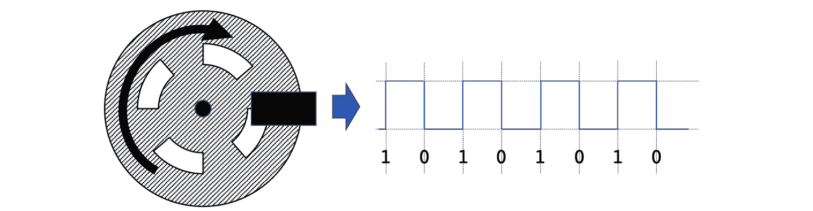
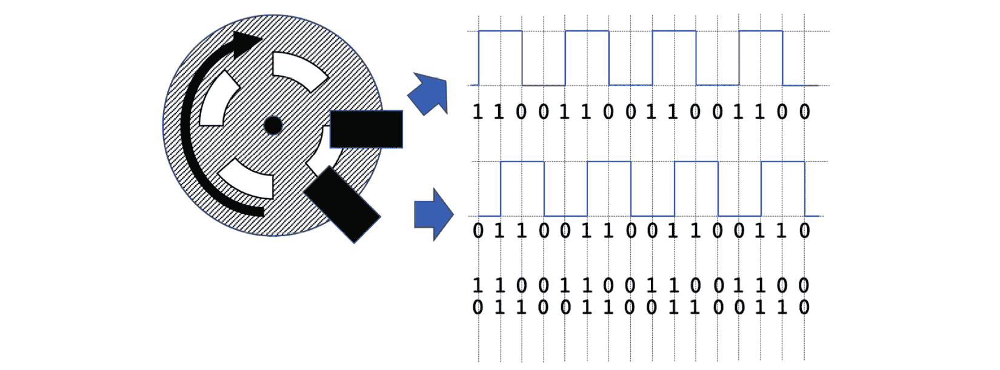
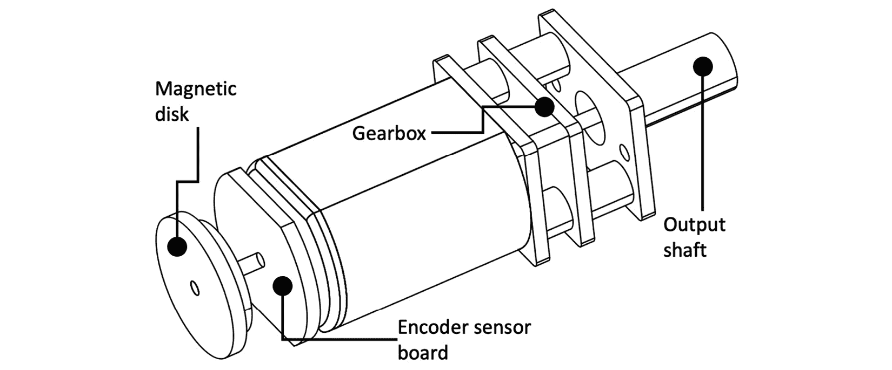
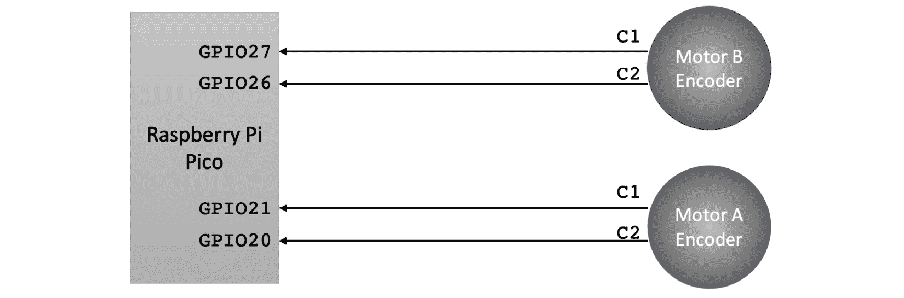
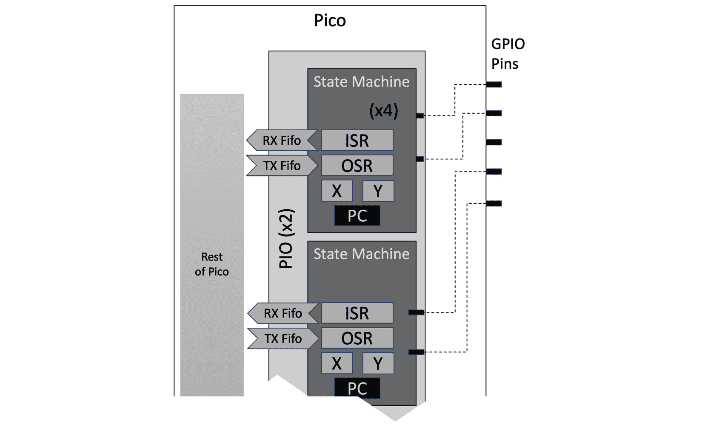
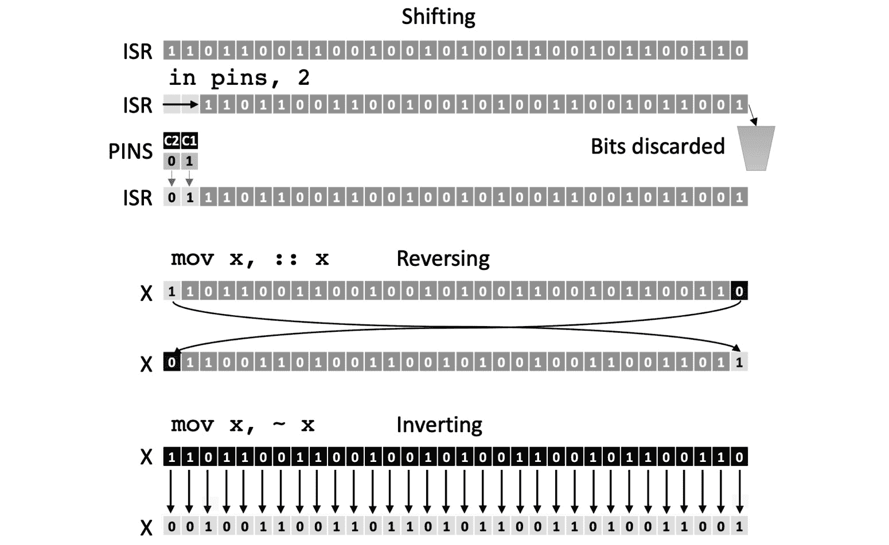
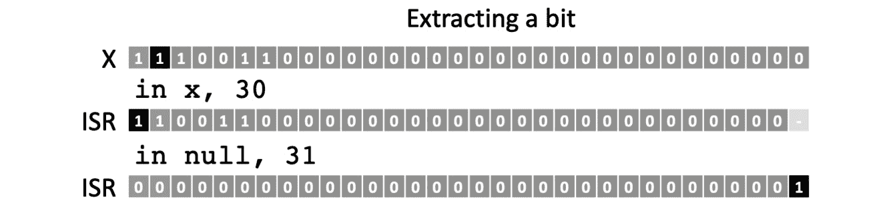

# 第六章：在 Raspberry Pi Pico 上使用编码器测量运动

机器人不会盲目地运行代码；它们需要传感器。我们首先添加哪些传感器？我们的机器人已经有一些传感器，在本章中，我们将了解如何使用它们。

在完成上一章时，我们注意到时间并不是确定机器人运动最准确的方法。那么，让我们看看我们的第一个传感器——编码器，如何改进这一点。编码器是获取机器人精确运动和位置估计的第一步。我们还将学习 Raspberry Pi Pico 的一个优秀特性——**可编程** **IO** (**PIO**)。

我们将深入研究运动基础、里程计和编码，查看 CircuitPython 中的 Raspberry Pi Pico PIO，并使用它从我们的机器人上的编码器获取数据。

在本章中，我们将涵盖以下主要主题：

+   关于编码器和里程计

+   在 Raspberry Pi Pico 机器人上编码器布线

+   编程 Raspberry Pi Pico PIO

+   测量编码器计数以确定运动

# 技术要求

对于本章，你需要以下内容：

+   首先是之前章节中构建的机器人

+   6 节新的 AA 电池

+   一台带有 USB 微型电缆的 PC 或笔记本电脑

+   使用 Mu 软件编写我们的代码并将其上传

+   在每个方向上留出大约一米的空旷地面以测试机器人

所有代码示例均可在 GitHub 上找到：https://github.com/PacktPublishing/Robotics-at-Home-with-Raspberry-Pi-Pico/tree/main/ch-06.

# 关于编码器和里程计

**里程计**是测量位置随时间变化的方法。我们可以结合测量和估计来确定你在路线上的位置。**编码器**是一种设计用来测量通过轮子转动所行驶距离的传感器。它们类似于**转速表**，但编码器测量位置，而转速表只测量速度。结合时间，它们也可以进行速度测量。

## 绝对和相对传感

机器人位置传感器主要有两种形式。具体如下：

+   **绝对传感器**将位置编码为可重复的位置。它们有一个有限的范围或分辨率，例如在已知线上编码位置。例如，GPS 传感器具有精确的位置定位和低分辨率，适用于米而不是毫米。

+   **相对传感器**通常更便宜。然而，它们产生的是相对位置变化，需要结合之前的状态来获得绝对估计——这意味着误差可能会累积。相对编码器是相对传感器的一个例子，也称为**增量编码器**。

如果一个传感器告诉你某个东西在哪里**是**，那么它是绝对的。如果它告诉你某个东西移动了多少**由**，那么它是相对的。

## 编码器的类型

大多数编码器设计是通过在传感器上传递标记或代码来计数或解码脉冲来工作的。

编码器有多种形式。以下是一些示例类型：

+   通过测量电阻，电位计或**可变电阻**可以感知绝对编码器的位置。伺服电机使用它们。然而，电位计不适合连续旋转，如车轮，因为它们的轨迹长度限制了它们。此外，常规运动会使它们磨损，因为它们在相互之间移动触点。

+   **机械编码器**通过相互传递电触点，产生开和关的脉冲。它们容易磨损，所以我并不推荐使用它们。

+   **光编码器**通过带有槽的圆盘或条带照射光线，并检测光传感器前通过的槽。它们可以是绝对和相对的。它们可能容易受到光源或灰尘的干扰。

+   **磁编码器**使用**霍尔效应传感器**检测圆盘中磁铁的运动。灰尘、光干扰和物理磨损对它们的影响不大。霍尔效应传感器根据磁场产生电压 - 编码器模块从这个电压产生脉冲。

我们选择的电机作为套餐的一部分，以方便和紧凑的格式提供了旋转磁编码器。它们是增量编码器。

## 编码器脉冲数据

通过观察编码器输出的脉冲，我们可以更好地理解编码器。相对编码器通常输出数字脉冲链，1 和 0。最简单的方式就是通过检测传感器通过的标记来计数脉冲边缘，如下面的图所示：



图 6.1 – 简单脉冲编码

在 *图 6.1* 的左侧是一个带有旋转箭头的圆盘。圆盘上有四个白色标记，代表通过传感器的标记。黑色矩形物体是检测标记的传感器。当传感器没有检测到标记时，它产生 0 的值，当检测到标记时，它产生 1 的值，从而产生一系列脉冲或一系列值为 1 或 0 的二进制位。

我们可以通过计数脉冲来了解车轮转动了多远。我们将高脉冲计为 1，低脉冲计为 0。我们还可以计数**边缘**，即从 0 到 1 和从 1 到 0 的变化。计数边缘给我们每个车轮转动八步。以下图的右侧显示了这些脉冲。

我们可能希望增加灵敏度并检测车轮的运动方向。为了做到这一点，我们在同一车轮上添加第二个传感器，如下面的图所示：



图 6.2 – 正交脉冲编码

*图 6.2* 添加了一个第二个传感器，在第一个传感器略微不同的时间捕捉标记，产生不同步的脉冲；这意味着我们有两个脉冲流。

在右上角是第一个传感器的脉冲图，我们读取的脉冲之间的数字被加在一起，显示了相同周期内的 16 位脉冲序列。

中间的图表显示了额外的传感器，以及 16 位脉冲列的相位差。在图表下方，每个时间点上的两个状态以**格雷码**的形式结合，提供了 2 位信息，表示我们相对于最后位置的位置。我们有了两倍多的边缘，增加了传感器的分辨率，同时也编码了车轮的方向。如果我们反转车轮，这个序列也会反转。这个系统被称为**正交编码**。

在下一节中，让我们看看我们机器人上的编码器。

# 在 Raspberry Pi Pico 机器人上布线编码器

我们的机器人已经配备了编码器，并且我们已经将它们连接好了。我们可以更仔细地看看电机以及它们是如何连接到 Raspberry Pi Pico 的 GPIO 引脚上的，以便更好地了解机器人。

## 检查电机

我们使用带编码器的 N20 齿轮电机。以下图表标注了电机部件：



图 6.3 – N20 电机部件

*图 6.3*展示了我们所使用的电机的图纸。上面标记了影响我们使用编码器的一些基本特征。在左边是一个带有标记的磁盘，这个磁盘附着在电机的驱动轴上，并由编码器传感器板检测。在右边是变速箱和电机输出轴。

驱动轴穿过变速箱，因此输出轴的旋转次数不会与磁盘相同——齿轮比将决定这种关系。因此，输出轮的一圈可以计数多个脉冲；这为我们提供了高分辨率。

请查阅电机的数据表。可能有一些中文字符，但重要数字通常用英文表示。在这里，你可能需要使用内置在网页搜索引擎中的翻译服务。数据表和产品页面有两个重要数字，即每圈磁盘的编码器计数和齿轮比。数据表可能会将每圈磁盘的计数称为极数。

在我的情况下，齿轮比是 298:1，极数是 14。解释这些事实意味着我的编码器轮每转一圈输出轮转 298 圈。每个编码器转一圈在每个传感器（两个传感器）上产生 14 个极，因此我们得到 28 个边缘。将传感器脉冲数乘以齿轮比，得到每转 8344 个边缘。

## 检查布线

我们在*第四章* *“围绕 Pico 构建机器人”*的*图 4.20*中看到了我们机器人的布线。然而，为了更好地说明编码器的连接，这里有一个只关注编码器连接到 Pico 的布线图：



图 6.4 – 连接到 Raspberry Pi Pico 的编码器

上一图更详细地检查了机器人编码器连接图的数据连接。在左边是 Raspberry Pi Pico；它有来自编码器的四个连接，这些连接在 GPIO 20、21、26 和 27 上。这些都可以设置为输入引脚，以读取编码器引脚的状态。

如果我们只是读取编码器，我们可以编写代码按顺序检查每个引脚。然而，这样做可能会使事情变得复杂。如果我们能让 Pico 的组件监控这些引脚和脉冲链，那么我们就可以在需要时只读取计数器，会怎么样呢？

# Raspberry Pi Pico PIO 编程

我们在*第一章*中看到了 PIO 系统。我们可以在 Pico 的中央核心上用 Python 读取编码器；然而，我们可以让 PIO 负责监控编码器，让这些中央核心去做其他事情。PIO 系统可以读取和解码编码器发出的格雷码。本节将展示如何用汇编语言编程 PIO 并用 CircuitPython 加载程序。

## PIO 编程简介

正如我们在*第一章*中看到的，Pico 有两个 PIO 设备，每个设备有四个状态机。我们用汇编语言编程 PIO。指令命令 PIO 执行操作，如操作 IO 引脚、寄存器和**先进先出**（**FIFO**）队列。以下图是状态机的简化表示：



图 6.5 – Raspberry Pi Pico 的 PIO 状态机

上述图显示了 Raspberry Pi Pico 的 PIO 状态机，突出了寄存器和其他功能。它显示了两个 PIO 设备以及它们中的状态机。

**寄存器**就像一个变量；它们有固定的名称，每个核心只有几个。PIO 寄存器是 32 位的，并且针对每个状态机是特定的。我们使用一个基本子集：**输入移位寄存器**（**ISR**）、**输出移位寄存器**（**OSR**）和 *X* 和 *Y*（临时寄存器）。它们可以存储一个数字或二进制模式。通常将 32 位称为**字**。

每个状态机独立运行程序，所以相同的代码运行四次，有独立的寄存器。此外，映射（以虚线表示）将状态机连接到 IO 引脚——那些小矩形。代码可以配置哪些状态机使用哪些引脚，一个状态机可以读取/写入多个引脚。

状态机也有 FIFO 队列。放入 FIFO 队列的数据以相同的顺序出来。每个可以存储 4 x 32 位字。这些允许 PIO 从或向 Pico 内的其他设备**传输**（**TX**）数据或**接收**（**RX**）数据。我们可以以多种方式配置 FIFO 队列。对于本章，我们将使用 RX FIFO 队列从 PIO 接收数据。

每个 PIO 块可以运行一个独立的程序，包含 32 条指令——每条大约相当于一行代码。但我们如何编写和使用这些程序呢？

## 介绍 PIOASM

在 CircuitPython 中，我们使用 Adafruit CircuitPython 的 `PIOASM` 库来汇编 PIO 代码。它在 Pico 上运行，将字符串形式的汇编代码转换为包含代码的字节序列。

我们需要将这个 `PIOASM` 库安装到 Raspberry Pi Pico 上：

1.  首先，在你的计算机上找到 `CIRCUITPY` 卷。

1.  从 Adafruit CircuitPython 库（如第 *2 章* 中讨论的），将 `lib/adafruit_pioasm.mpy` 复制到 `CIRCUITPY` 上的 `lib` 文件夹中。

在此基础上，我们可以编写第一个基于 PIO 的程序。这是 `pio_led_test.py`：

```py
import time
import board
import rp2pio
import adafruit_pioasm
```

前四行是导入语句。你之前已经见过 `time` 和 `board`。`rp2pio` 库让我们与 PIO 块通信，启动代码并与状态机交互。`adafruit_pioasm` 库将汇编代码转换为 PIO 状态机可以运行的字节码。现在，让我们进入汇编代码：

```py
led_flash = """
    pull
    out pins, 1
"""
```

上述代码将一些 PIO 汇编代码放入 `led_flash` 字符串中。Python 中的三引号声明了一个长多行字符串。

汇编代码以 `pull` 指令开始；这从 TX FIFO 队列中获取一个字（移除它）并将其存储在 OSR 中。`out pins, 1` 指令将 OSR 中的 1 位数据放到配置的引脚上——设置单个引脚的状态。代码在循环中回绕以在第一个指令处运行。我们需要汇编这段代码：

```py
assembled = adafruit_pioasm.assemble(led_flash)
```

`adafruit_pioasm.assemble` 函数生成字节码，我们将其存储在 `assembled` 变量中。我们可以运行此代码：

```py
sm = rp2pio.StateMachine(
    assembled,
    frequency=2000,
    first_out_pin=board.LED,
)
```

`rp2pio.StateMachine` 请求一个状态机来运行此代码，告诉它运行速度和哪个输出引脚要映射——在这种情况下，`board.LED`。我们的代码将在 PIO 上运行，但我们没有数据在 FIFO 队列中，所以它将等待我们向它写入内容。

我们可以在程序中使用循环来写入数据：

```py
while True:
    sm.write(bytes([1]))
    time.sleep(0.5)
    sm.write(bytes([0]))
    time.sleep(0.5)
```

此循环将 1 和 0 写入状态机（在 `sm` 变量中）。由于 FIFO 队列可以存储多个数据元素作为 `bytes` 类型，因此必须将数据作为列表包装起来。

将此代码发送到 Raspberry Pi Pico，LED 将会闪烁。让我们确保这能正常工作。

### 故障排除 PIO 代码

编写汇编代码第一次可能会有些棘手——这些技巧可以帮助你开始：

+   此代码使用 Python 的三引号 `"""` 来表示多行字符串。确保在汇编部分的两侧都使用三个引号，否则你会看到错误。

+   如果 Pico 无法加载 `adafruit_pioasm`，请确保你已经遵循了设置步骤，将 `mpy` 文件复制到 Pico 上的 `lib` 文件夹中。

+   注意，在 `sm.write` 语句之后必须有两个闭合括号。

+   如果 Pico 没有运行你的代码，请记住将你的代码导入到 `code.py` 文件中。

这些技巧应该能帮助你开始运行。

现在我们有了第一个 PIO 代码，我们可以尝试从 I/O 引脚读取数据。

## 使用 PIO 检测输入

从 PIO 获取输入就像将引脚状态放入寄存器并将它推送到 RX FIFO 队列以供 Python 代码获取一样简单。创建一个名为 `pio_read_1_pin.py` 的文件。我们将添加一个额外的导入来读取 PIO 数据：

```py
import board
import time 
import rp2pio
import adafruit_pioasm
import array
```

汇编部分看起来是这样的：

```py
pio_input = """
.program pio_input
    in pins, 1      ; read in pin (into ISR)
    push noblock    ; put this into input FIFO
"""
assembled = adafruit_pioasm.assemble(pio_input)
sm = rp2pio.StateMachine(
    assembled,
    frequency=2000,
    first_in_pin=board.GP20
)
```

`in pins,` `1`指令将从 1 个输入引脚读取 1 位数据并将其存储在 ISR 中。接下来是一个以`;`字符开始的注释，供人类阅读。空格是可选的，并且存在以帮助可读性，通过对齐注释。你还可以添加一个`.program`行——实际上它是一个注释。

下一条指令是`push noblock`，它将 ISR 寄存器作为字推送到 RX FIFO 队列。`noblock`确保它不会等待 FIFO 队列为空——注意，如果 FIFO 队列已满，则不会将数据写入 FIFO 队列。

然后，我们将此代码组装并加载到状态机中，将`first_in_pin`传递以将我们的编码器引脚之一映射为输入。接下来，我们需要一个缓冲区来读取我们的 FIFO 队列数据，Python 代码可以使用它：

```py
buffer = array.array('I', [0])
```

数组类型在内存中创建固定大小的数据结构。它指定了一个无符号 32 位整数，使用`'I'`。我们将其大小设置为 1 个元素，并初始化为`0`。

`main`循环将数据读入缓冲区并打印它：

```py
while True:
    sm.readinto(buffer)
    print(f"{buffer[0]:032b}")
    time.sleep(0.1)
```

`sm.readinto` Python 函数将从 FIFO 队列中拉取数据到等待的缓冲区。如果没有新数据要获取，它将等待。

然后，我们使用一个花哨的打印来输出我们的数据。Python 的`f`字符串（以 f 开头）允许你在字符串中使用变量——在这种情况下，提取`buffer`的唯一元素。`:032b`格式说明符告诉 Python 将数据格式化为 32 位二进制，前面的空位用 0 填充。

当你运行它时，你会看到一个重复的输出，有两种状态之一：

+   `10000000000000000000000000000000`，表示编码器引脚处于高电平

+   `00000000000000000000000000000000`，表示编码器引脚处于低电平

慢慢转动机器人的轮子。其中之一将使引脚改变状态。可能会令人惊讶的是，1 位数据在数据开始处（在我们发送它之前，在 ISR 中也会在那里）。

我们可以轻松扩展此代码以使用两个引脚。将此代码复制到`pio_read_2_pins.py`并做出以下修改：

```py
pio_input = """
.program pio_input
    in pins, 2      ; read in two pins (into ISR)
    push noblock    ; put ISR into input FIFO
"""
```

其他代码保持不变，除了当我们运行它来慢慢转动轮子时，输出现在将显示编码器的 2 位，以下四种状态：

```py
11000000000000000000000000000000
01000000000000000000000000000000 
10000000000000000000000000000000 
00000000000000000000000000000000 
```

这些是之前讨论过的四倍数编码的位！

### 故障排除

这部分是我们第一次尝试从编码器获取信息，可能会出现问题。尝试以下步骤：

1.  如果数据值没有变化，请仔细检查布线。

1.  如果只有 1 位在变化，1 个编码器线可能是不正确的。

我们有数据，但 PIO 可以更努力地解码它并为我们计数。接下来，让我们看看这些 PIO 指令以及它们如何与寄存器交互。

## PIO 指令和寄存器

理解寄存器如何被 PIO 指令改变和操作对于编写和理解 PIO 代码至关重要。PIO 有九种指令类型；然而，它们有几种模式，使得它们的使用变得微妙且复杂。Raspberry Pi 的*RP2040 数据手册*的*第三章*提供了一个全面的参考。我们可以在这些地方熟悉更多。

### 寄存器调试

下一个示例展示了如何将值存储在寄存器中并将其暴露给代码以进行打印。我们保持之前的导入。将此文件命名为`pio_debugging_registers.py`：

```py
program = """
    set y, 21 
    mov isr, y 
    push noblock 
"""
assembled = adafruit_pioasm.assemble(program)
```

这段代码使用`set`指令，可以将小于 32（5 位）的任何值放入寄存器。在示例中，我们将其存储在`y`寄存器中。

以下行是`mov isr, y`，它将右（`y`）寄存器的数据复制到 ISR 中。我们必须在`push`语句中存储一个值，将其放入 FIFO 队列中。

我们将这个汇编代码发送到状态机：

```py
sm = rp2pio.StateMachine(assembled, frequency=2000)
```

然后，我们可以从 FIFO 队列中提取这些数据，并以十进制和二进制形式检查其内容：

```py
buffer = array.array('I', [0])
sm.readinto(buffer)
print("{0} 0b{0:032b}".format(buffer[0]))
```

这段代码将运行并通过系统传递数字 21。因为我知道这个值是低的，所以我用 32 个前导 0 进行了格式化。因此，输出应该看起来像这样：

```py
code.py output:
21 0b00000000000000000000000000010101
Code done running.
```

这个特性很方便，我们可以使用这个代码作为模板与不同的汇编器一起测试 PIO 汇编技术。我们可以从查看寄存器中的位操作开始。

### 位操作

在处理寄存器时，我们可能想要操作它们的内容。例如，我们可能想要移动位、移位它们、反转它们的顺序或全部翻转。以下图表显示了这些操作：



图 6.6 – PIO 位操作

*图 6**.6*以图表形式展示了这些频繁的操作。表格显示了寄存器的位状态，寄存器名称在左侧。图表显示了汇编指令及其对位的影响突出显示。

我们已经讨论了很多关于位移动到中断服务例程（ISR）的内容。当我们使用`in`指令时，它会为要移动的位数腾出空间，丢弃末尾的位。然后，它将新位复制到这个空间中。代码可以通过`StateMachine`参数改变这个移动方向，但操作本质上是相同的。移位示例使用`in`来读取我们的编码器的`C1`和`C2`引脚。然而，除了引脚之外，源还可以是其他寄存器或空（null）以复制零。这个操作不会改变源。

我们可以在`mov`中使用`::`操作；这可以用来访问另一端的位。以下汇编器演示了这一点：

```py
    set y, 21
    mov isr, :: y
    push noblock
```

你可以使用这个示例在前面调试寄存器示例中显示的相同 Python 代码中。注意，我们将`y`寄存器直接反转到 ISR 中。随着代码变得更加复杂，结合这种操作将是关键的，因为只有 32 条指令，每条指令都很重要！该代码的输出如下所示：

```py
2818572288 0b10101000000000000000000000000000
```

`not`操作。它将每个位替换为其逻辑相反数 - 1 变成 0，0 变成 1。如果我们用 32 位字表示有符号数，这将使它们变成负数。尝试以下汇编代码：

```py
    set y, 21 
    mov isr, ~ y 
    push noblock
```

这段代码与前面的例子完全一样，产生反转的结果：

```py
4294967274 0b11111111111111111111111111101010
```

我们可以修改我们的缓冲区来查看一个值如何变成负数。将数组格式更改为小写的`i`：

```py
buffer = array.array('i', [0])
```

当运行这个程序时，我们可以看到输出是什么样的：

```py
-22 0b-0000000000000000000000000010110
```

二进制代码不太容易理解，但我们可以看到十进制数是负数加一。再次取反会回到原始数字。

### 提取单个位的值

还有一件事要做，就是组合操作，这样我们就可以通过几个位移动来提取一个特定的位。以下图表显示了操作：



图 6.7 – 提取一个位

让我们假设我们的值从`x`开始；我已经将我们想要的位比其他位阴影更深。这个汇编代码片段如下：

```py
  in x, 30
  in null, 31
```

第一条指令将位向上移动到我们想要的位到 ISR 中。图表显示我们想要的位现在在 ISR 的最左边。然而，由于我们不希望在这个位右边有任何东西，我们使用`in`指令从`null`中移入 31 个零。这个位移将所有其他位推走 - 因此我们只有 0 和想要的位。

我们将使用 OSR 来实际应用这个。将以下代码放入`extract_a_bit.py`。我们首先导入一些内容和一个变量来调整行为：

```py
import rp2pio
import adafruit_pioasm
import array
bit_to_extract = 30
```

记住，我们存储汇编代码在 Python 字符串中，因此我们可以使用 f-string 对其进行 Python 字符串格式化：

```py
program = f"""
    pull block
    in osr, {bit_to_extract}
    in null, 31
    push noblock
"""
```

由于我们不能使用大于 5 位的`set`指令，所以我们首先拉取数据以读取，这些数据进入 OSR。

然后，我们使用`in`将位向上移动到我们想要提取的位，使用 f-string 在这里替换变量。要提取的位必须是 32 位或更少。结果在 ISR 中。我们从`null`执行进一步的`in`操作，使用 0 来丢弃除了我们想要的位之外的所有位。由于这个结果已经在 ISR 中，我们可以使用`push`将其发送到 FIFO 队列。

剩余的代码处理组装、发送数据和打印结果：

```py
assembled = adafruit_pioasm.assemble(program)
sm = rp2pio.StateMachine(assembled, frequency=2000)
sm.write(array.array('I',
  [0b01101000_00000000_00000000_00000000]))
buffer = array.array('I', [0])
sm.readinto(buffer)
print("{0} 0b{0:032b}".format(buffer[0]))
```

运行此代码的结果应该是以下内容：

```py
1 0b00000000000000000000000000000001
```

如果我们想用这个数据来做条件逻辑，我们可以使用`jmp`指令，这需要我们使用`mov`指令将数据移动到`x`或`y`临时寄存器。

## 使用 PIO 制作计数器

计数需要我们能够从寄存器中添加或减去。我们将从向下计数开始，因为这更容易。

乍一看，数据表显示 PIO 指令集中没有算术指令。那么我们如何进行加法或减法？尽管我们还没有使用它，但 PIO 汇编器中的`jmp`指令通常跳转到汇编指令中的某个标签。然而，它有一个技巧——它可以从临时寄存器中减去。我们可以利用这个副作用为我们执行简单的算术。使用`pio_debugging_registers.py`作为模板，尝试将汇编器替换为以下代码：

```py
    set y, 21
    jmp y--, fake
fake:
    mov isr, y
    push noblock
```

我将这个与模板一起放在`pio_counting_down.py`中。

将其发送到 Pico 并运行，得到以下输出：

```py
20 0b00010100
```

欢呼——我们可以减法了！我们使用`fake:`标签进行减法，因为我们不想跳转到任何地方，只想执行算术运算。

那么增加呢？这有点棘手，但如果你记得位反转，数字从正数变成了负数。我们可以通过减去 1 并再次反转来利用这一点。

使用此汇编器（在`pio_counting_up.py`）：

```py
    set y, 21
    mov y, ~ y
    jmp y--, fake
fake:
    mov isr, ~ y
    push noblock
```

我们仍然有我们的假标签，但首先将`y`值翻转成自身，然后在将其放入 ISR 时再次翻转。运行此代码的输出如下：

```py
22 0b00010110
```

你已经看到了处理 PIO 的技术，如何从引脚读取数据，从中提取信息，以及执行算术。我们有构建块。接下来的部分将展示我们如何使用它们将编码器引脚的信息解码成计数器。

# 测量编码器计数以检测移动

我们知道我们的编码器预期的序列，并且我们对 PIO 汇编器有了一定的了解。因此，我们可以将这些结合起来创建计数器。不过，我们先从简单开始；让我们看看如何检测系统何时发生变化。

## 创建一个简单的 PIO 变化检测循环

正如在读取两个引脚的例子中看到的，当我们在一个紧密的循环中输出系统的状态时，它会淹没任何有趣的东西。我们感兴趣的是状态变化，这是向完整解码器迈出的一步。在`pio_one_encoder_when_changed.py`文件中，我们直接从导入进入汇编器：

```py
import board
import rp2pio
import adafruit_pioasm
import array
```

我们首先清除`y –`；我们将使用`y`来存储用于比较的引脚值：

```py
program = """
    set y, 0
```

以下代码创建了一个`read`标签；我们可以循环到这个点以获取新的引脚读取。它将旧的`y`存储在`x`中，这样我们就可以得到一个新的值。将`in null, 32`移位将 ISR 填充为零，清除它。然后我们可以在 ISR 中获取两个引脚：

```py
read:
    mov x, y 
    in null, 32 
    in pins, 2
```

我们想在 ISR 中比较我们的新值与现在的旧值`x`。然而，`jmp`不能使用 ISR 进行比较，所以我们首先将 ISR 复制到`y`。

```py
    mov y, isr
    jmp x!=y different
    jmp read
```

如代码所示，现在当寄存器值不同时，我们可以使用`jmp x!=y`跳转到其他地方——到名为`different`的标签处。如果我们没有找到它们不同，我们将通过无条件`jmp`回到`read`标签以尝试从引脚获取新的样本。

让我们看看`different`标签中的代码：

```py
different:
    push noblock
    jmp read
"""
```

尽管我们已将中断服务例程（ISR）复制到 `y`，但它仍然在 ISR 中，这样我们就可以将这个值，新的变化值，推送到 Python 代码中，然后跳转回读取它。所以，总的效果是它将旋转读取值，如果它们不同，就将它们推送到 Python 代码中，然后回到 `read` 循环中的旋转。

让我们继续 Python 代码：

```py
assembled = adafruit_pioasm.assemble(program)
sm = rp2pio.StateMachine(
    assembled,
    frequency=20000,
    first_in_pin=board.GP20,
    in_pin_count=2
)
buffer = array.array('I', [0])
while True:
    sm.readinto(buffer)
    print("{:032b}".format(buffer[0]))
```

最后一半将我们的代码汇编起来，并使用它创建一个状态机，使用更高的频率。它将状态机设置为使用 GP20 作为第一个输入引脚。然后，它使用 `in_pin_count` 设置两个输入引脚的范围，匹配一个编码器。然后它将数据读入缓冲区并在循环中打印。`sm.readinto` 方法等待直到有数据，所以 Python 代码只有在有变化时才会打印。尝试慢慢旋转轮子，你应该看到输出变化：

```py
00000000000000000000000000000000
01000000000000000000000000000000
11000000000000000000000000000000
10000000000000000000000000000000
00000000000000000000000000000000
01000000000000000000000000000000
11000000000000000000000000000000
10000000000000000000000000000000
00000000000000000000000000000000
```

我们可以看到编码器的输出，并且只有在它发生变化时。我们本可以简单地计数变化，但我们的系统应该根据轮子的运动方向进行不同的计数。让我们编写代码来检查这一点。

## 使用 PIO 制作双向计数器

我们可以检测我们的传感器是否处于新的状态，并将其存储在 `y` 中，用 `x` 中的旧状态进行比较。我们还需要存储一个计数器，由于我们未使用它，OSR 就足够了。我们将直接进入汇编器，因为导入没有变化：

```py
program = """
    set y, 0            ; clear y
    mov osr, y          ; and clear osr
read:
    mov x, y
    in null, 32
    in pins, 2
    mov y, isr
    jmp x!=y, different
    jmp read
```

如你所见，除了设置 OSR 之外，这与前面的例子一样开始。然而，在有所不同之处，我们需要更有创新性。在汇编器中比较前两个位与后两个位是棘手的，我们有一个 32 条指令的限制。我们试图评估的是以下图中的序列：


图 6.8 – 正交编码序列

*图 6.8* 展示了编码器信号的序列。每一对数字表示传感器的状态。从 **00** 到 **10** 的跳跃表明编码器正在顺时针旋转，而从 **00** 到 **01** 是逆时针；我们可以沿着序列在任意方向跟踪。

我们可以使用以下条件评估旧读数和新读数：

+   如果旧读数的第一个位是 0

    +   并且当前第二个位是 1

        +   然后，它正在逆时针旋转

    +   否则，当前第二个位是 0

        +   它正在顺时针旋转

+   如果旧读数的第一个位是 1

    +   并且当前第二个位是 1

        +   它正在顺时针旋转

    +   否则，当前第二个位是 0

        +   它正在逆时针旋转

这种逻辑可以简化为汇编器中的几个指令。首先，我们可以将 `x` 寄存器（旧读数）中我们想要的位隔离出来，并将其与零进行比较，根据结果跳转：

```py
different:
    in x, 31
    in null, 31
    mov x, isr
    jmp !x, c1_old_zero
```

注意，这使用了前面的位提取方法；位 31 将是第一个读取的引脚（`C1`）。我们现在有 `x` 中的旧 `C1` 值，用 0 填充。如果 `x` 寄存器为零，`jmp !x` 指令将跳转到 `c1_old_zero` 标签。否则，它将直接通过。

为了清晰起见，我们将 fall-through 部分从 `c1_old_non_zero` 标签开始；这只是一个注释，尽管如此：

```py
c1_old_not_zero:
	jmp pin, count_up
	jmp count_down
```

在这一点上，我们测试一个引脚。我们稍后会看到，在创建状态机时可以设置 `jmp_pin`，我们将它设置为编码器的 `C2` 引脚，所以它将包含当前的第二个引脚。`jmp pin, count_up` 指令将在引脚当前状态为 1 时跳转到 `count_up` 标签。否则，我们将无条件跳转到 `count_down`。

当 `C1` 为零时的代码是相反的：

```py
c1_old_zero:
	jmp pin, count_down
	; fall through
```

然而，我在这里有点狡猾——不是无条件跳转，下一个代码部分将是 `count_up`，这样我们就可以跳过它并节省一条指令。`count_up` 是加 1，就像我们之前看到的，但是有一个变化，原始值在 OSR 中：

```py
count_up:
    mov x, ~ osr 
    jmp x--, fake
fake:
    mov x, ~ x
    jmp send
```

我们将 OSR 反转为 `x`，使用 jmp 跳转到假标签，从 `x` 中减去 1，然后再次反转 `x`。最后，这段代码跳转到发送数据，此时新的计数现在在 `x` 中。

`count_down` 稍微简单一些：

```py
count_down:
    mov x, osr 
    jmp x--, send
```

这段代码将 OSR 放入 `x` 并从它减去 1，然后直接跳转到发送。无论 `x` 的值如何，`send` 部分都会将标签放在下一条指令上。

`send` 部分只是将所有这些推回并存储在 OSR 中的新值：

```py
send:
    mov isr, x 
    push noblock 
    mov osr, x 
    jmp read
"""
```

最后一条指令会循环回 `read` 以重新检查传感器。其他 PIO 语言的 `wrap` 指令可以在这里节省一条指令；然而，CircuitPython PIOASM 在编写时没有实现这一点。

这有很多汇编语言。这个例子在章节仓库中作为 `pio_encoder_counting.py`。

我们需要更多的 Python 代码来组装指令，运行它，并获取数据：

```py
assembled = adafruit_pioasm.assemble(program)
left_enc = rp2pio.StateMachine(
    assembled,
    frequency=0,
    first_in_pin=board.GP20,
    jmp_pin=board.GP21,
    in_pin_count=2
)
right_enc = rp2pio.StateMachine(
    assembled,
    frequency=0,
    first_in_pin=board.GP26,
    jmp_pin=board.GP27,
    in_pin_count=2
)
```

在这里，我们使用相同的代码创建了两个状态机！我们将 `C1` 作为第一个输入引脚传递给状态机，将 `C2` 作为 `jmp_pin` 传递给状态机，对于每个编码器基于 *图 6**.4*。我们还设置了 `frequency=0`，这告诉状态机以全速运行。

我们仍然可以使用一个缓冲区交替读取两个状态机。然而，这个缓冲区需要是类型 `i`（小写）才能使用有符号数字并负数计数。我们还将创建两个变量来保存左右轮的状态：

```py
buffer = array.array('i', [0])
left_data = 0
right_data = 0
```

在我们的主循环中，我们可以从左侧传感器开始，使用 `.in_waiting` 检查 RX FIFO 队列中是否有等待的数据，如果有，就打印两边：

```py
while True:
    if left_enc.in_waiting:
        left_enc.readinto(buffer)
        left_data = buffer[0]
        print(left_data, right_data)
```

注意，目前没有特殊的格式；我们只是打印原始计数数量。右侧也是一样的：

```py
    if right_enc.in_waiting:
        right_enc.readinto(buffer)
        right_data = buffer[0]
        print(left_data, right_data)
```

如果你运行这个，你应该能够转动任意一个轮子并看到如下输出：

```py
36   77
36   78
36   79
36   80
36   81
36   82
```

现在，我们可以为两个轮子计数脉冲。所以，如果你使轮子完成一次完整的旋转，你应该会接近加减 8344——证明我们之前的计算。

你会看到一个轮子会使计数倒退。每个电机从编码器的角度来看实际上是以相反的方向转动。我们稍后会考虑这一点。

### 故障排除

这个例子有很多代码，可能会以各种方式出错：

+   如果代码随机上下计数而不是持续计数，你可能需要将`jmp_pin`更改为另一个输入引脚。

+   这也可能意味着你在发送之前遗漏了在`isr`中放置`x`。

+   与 git 源代码进行核对。

现在，你应该已经启动并运行，并且正在获取计数。

## 制作可重用编码器代码

因为我们会重复使用它，所以我们将它放入一个模块中，并在我们的`robot.py`中调用它。然后我们将使用这个来制作一个演示程序。

让我们把之前制作的代码放入一个名为`pio_encoder.py`的模块中。以下代码应该都很熟悉：

```py
import rp2pio
import adafruit_pioasm
import array
program = """
    set y, 0
    mov osr, y
read:
    mov x, y
    in null, 32
    in pins, 2
    mov y, isr
    jmp x!=y, different
    jmp read
different:
    in x, 31
    in null, 31
    mov x, isr
    jmp !x, c1_old_zero
c1_old_not_zero:
    jmp pin, count_up
    jmp count_down
c1_old_zero:
    jmp pin, count_down
    ; fall through
count_up:
    mov x, ~ osr
    jmp x--, fake
fake:
    mov x, ~ x
    jmp send
count_down:
    mov x, osr
    jmp x--, send
send:
    mov isr, x
    push noblock
    mov osr, x
    jmp read
"""
assembled = adafruit_pioasm.assemble(program)
```

我们需要一种方法来创建具有其参数的状态机，以及一个用于获取数据的包装器。Python 类是完成这个任务的绝佳方式：

```py
class QuadratureEncoder:
  def __init__(self, first_pin, second_pin, reversed=False):
    """Encoder with 2 pins. Must use sequential pins on the board"""
    self.sm = rp2pio.StateMachine(
        assembled,
        frequency=0,
        first_in_pin=first_pin,
        jmp_pin=second_pin,
        in_pin_count=2
    )
    self.reversed = reversed
    self._buffer = array.array('i', [0])
```

我们将其称为`QuadratureEncoder`，因为它应该与这些类型一起工作，而不管机制如何。在类中有一个`__init__`函数，它告诉 Python 如何创建编码器对象——它接受两个引脚作为参数并使用它们来创建状态机。该对象还创建一个缓冲区来存储最新的返回值。请注意，两个引脚必须按顺序排列。

还有一个反向参数；这样我们就可以考虑一个电机反向转动的情况。我们在这里不能简单地交换引脚，因为`in`指令要求引脚按顺序排列。

接下来，我们需要一个方法来从编码器读取或如果没有变化则读取旧值：

```py
  def read(self):
    while self.sm.in_waiting:
      self.sm.readinto(self._buffer)
    if self.reversed:
      return -self._buffer[0]
    else:
      return self._buffer[0]
```

通过检查`in_waiting`状态，这个读取不会阻塞，并且只有当有新的读取时才会更新缓冲区；这是一个`while`循环，因为我们只想获取最新的 FIFO 数据。它返回缓冲区中的元素，如果电机反向则返回负值。

我们现在可以将这些编码器添加到从*第五章*，“使用 Raspberry Pi Pico 驱动电机”的末尾的`robot.py`库中。让我们在导入中添加编码器：

```py
import board
import pwmio
import pio_encoder
```

新的代码被突出显示。我们还可以设置两个编码器。在电机后面添加粗体代码：

```py
right_motor = motor_A1, motor_A2
left_motor = motor_B1, motor_B2
right_encoder = pio_encoder.QuadratureEncoder(board.GP20, board.GP21, reversed=True)
left_encoder = pio_encoder.QuadratureEncoder(board.GP26, board.GP27)
```

当我们使用我们的机器人时，现在我们可以使用`robot.left_encoder.read()`以及右编码器的等效命令来获取编码器读数，我们将在演示中使用它。

## 测量已知时间的计数

我们将把这个变成一个演示，看看在驾驶一秒钟时计数是多少。因为我们已经投入了精力来准备我们的`robot.py`，所以这段代码很简单。将以下代码放入`measure_fixed_time.py`中：

```py
import time 
import robot
robot.set_left(0.8)
robot.set_right(0.8)
time.sleep(1)
robot.stop()
print(robot.left_encoder.read(), robot.right_encoder.read())
```

此代码加载`time`库和`robot`辅助库。它以 0.8 的速度向前行驶 1 秒钟。然后停止并打印每个编码器的读数。当此代码休眠时，编码器代码仍在运行。

使编码器如此简单易用意味着我们可以将其与更复杂的行为集成；这对于大多数传感器来说是一个好的策略。

要运行此代码，请确保发送`pio_encoders.py`库、更新的`robot.py`和`measure_fixed_time.py`。记得更新`code.py`以加载它，你应该会看到以下内容：

```py
code.py output:
4443 4522
```

你已经开始从你的机器人读取传感器读数，并在学习 PIO 的过程中！

# 摘要

在本章中，你学习了如何使用编码器测量行驶距离，包括不同类型的编码器。

你看到了四倍频编码器产生的输出，以及如何将其解释为转向方向。

你被介绍到了 Pico 内部强大的 PIO 状态机，并看到了如何将处理编码器等任务分配给它们。

你将这些知识结合起来创建了一个可重用的编码器处理器，我们进行了演示以观察其工作情况。

在下一章中，我们将计划和购买更多设备用于我们的机器人，这将导致更多的传感和远程控制。

# 练习

这些练习可以提高你的机器人性能，并让你练习你的技能：

+   你已经能够获取在固定时间内行驶时每个轮子的读数和计数。你如何编写代码在固定数量的计数后停止电机？你可能需要定期在循环中检查编码器读数。

+   你可能已经注意到了计数的不平衡——这是正常的，是由于电机和车轮的差异造成的。你可以通过设计并制作一个带有聚苯乙烯棒的面包板支架来改善这种情况，这样它就不会在平台上滑动。

+   你能编写代码来减慢一个在计数中被另一个超过的电机吗？

# 进一步阅读

这些进一步阅读材料将帮助你继续你的学习：

+   Raspberry Pi 在其数据表中的 **第三章 中提供了使用 PIO 及其架构的权威参考：[`datasheets.raspberrypi.com/rp2040/rp2040-datasheet.pdf`](https://datasheets.raspberrypi.com/rp2040/rp2040-datasheet.pdf)。他们还在其 C SDK 文档的 **第三章** 中提供了 PIO 代码示例（包括 MicroPython 但不包括 CircuitPython 样本）：[`datasheets.raspberrypi.com/pico/raspberry-pi-pico-c-sdk.pdf`](https://datasheets.raspberrypi.com/pico/raspberry-pi-pico-c-sdk.pdf)。

+   Adafruit 的 `rp2pio` 文档位于 [`circuitpython.readthedocs.io/en/latest/shared-bindings/rp2pio/`](https://circuitpython.readthedocs.io/en/latest/shared-bindings/rp2pio/)，并且在使用方面值得参考，还有他们的 *CircuitPython RP2040 PIO 简介* 在 [`learn.adafruit.com/intro-to-rp2040-pio-with-circuitpython`](https://learn.adafruit.com/intro-to-rp2040-pio-with-circuitpython)。

+   YouTube 用户 StackSmasher 有一段关于 PIO、其架构和编程的深入视频，可以在 [`youtu.be/yYnQYF_Xa8g`](https://youtu.be/yYnQYF_Xa8g) 上找到。
