# 第七章：规划和购买更多设备

我们现在有一个初学者机器人平台已经启动并运行。机器人可以四处移动，我们已经有了一对已经布线的传感器。然而，如果我们添加其他传感器和设备——也许还可以远程控制机器人——它就会变得更有趣和有用！

在本章中，我们将探讨我们将要使用的一些设备和它们的类型，更深入地了解机器人传感器。然后，我们将查看实际设备零件编号，并计划在机器人上放置设备的位置，以及它们的空间，并进行测试安装。接下来，我们将查看购买清单来构建这个。最后，我们将为我们的机器人制作一个传感器支架。

在本章中，我们将涵盖以下主要主题：

+   介绍传感器

+   选择设备类型

+   规划要添加的内容和位置

+   购物清单——零件和寻找它们的地方

+   准备机器人

# 技术要求

本章需要以下软件和计算机设置：

+   一台联网的电脑

+   一台打印机

+   FreeCAD

以下是需要以下机器人相关硬件：

+   由前几章构建的机器人和一个 Micro USB 线

+   一把锋利或新刀片的塑料切割器

+   一把金属直尺

+   配有 0.5 毫米、2 毫米和 3 毫米 **高速钢**（**HSS**）/螺旋钻头的针孔钻床

+   安全眼镜

+   一个平坦的工作区域，光线充足，无干扰或被推挤

+   配有 M2 和 M3 支架、螺栓和螺母的支架或安装套件

+   用于螺栓的适当端子的螺丝刀

+   M2 和 M3 扳手用于拧紧螺栓和支架

你可以在 GitHub 上找到所有 FreeCAD 设计，以及本章的可打印模板，网址为 [`github.com/PacktPublishing/Robotics-at-Home-with-Raspberry-Pi-Pico/tree/main/ch-07`](https://github.com/PacktPublishing/Robotics-at-Home-with-Raspberry-Pi-Pico/tree/main/ch-07)。

# 介绍传感器

传感器是我们机器人收集信息的方式。你已经看到并使用了一个——编码器。你还介绍了绝对传感器与相对传感器在 *第六章*，*使用 Raspberry Pi Pico 上的编码器测量运动*，那么我们可以考虑哪些额外的传感器？我们如何与它们接口？

传感器从机器人上的设备收集信息，形成闭环控制反馈。传感器还可以收集关于机器人周围世界的信息，那里有什么，或者它如何响应机器人的运动而发生变化。

## 模拟传感器类型

我们在 *第一章* 中简要介绍了模拟和数字。模拟传感器产生变化的电压，而数字传感器仅输出 1s 和 0s——二进制——使用两个固定电压。

Raspberry Pi Pico 有一个 12 位 **模数转换器**（**ADC**）支持连接到 4 个引脚的模拟传感器。模拟输入适合简单的光传感器和可变电阻作为输入。然而，模拟传感器不如数字传感器可重复，通常一个引脚等于一个传感器。

## 定时脉冲

传感器可以通过使用定时来连续变化。例如，HC-SR04 超声波距离传感器根据检测到的距离输出脉冲。测量这个脉冲提供读数。这些通常需要专用引脚。这些脉冲可以使用我们在上一章中看到的 PIO 系统进行测量。这些是数字的，因为它们只使用二进制输入。

## 数据总线传感器

数字引脚的组可以形成总线，对许多设备进行寻址和读取，包括传感器。它们有复杂性成本，但允许有更多有趣的数据。这些有自己的控制器，通常包含校准数据以补偿传感器制造中的变化。此外，控制器执行一些传感器解码和处理，减少了您需要的代码。示例总线包括 USB、I2C、串行和 SPI。

## 机器人框图

我们可以使用一个框图来了解我们的机器人，以及我们将连接到它的是什么。

它看起来可能像布线图，但它显示的是事物之间的逻辑关系，而不是物理连接或位置。以下图显示了在添加更多传感器之前机器人的当前位置：

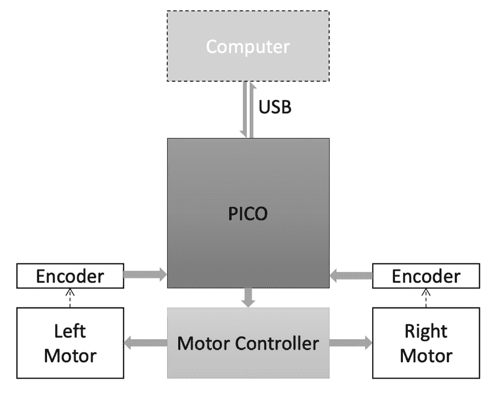

图 7.1 – 机器人框图

前面的图显示了我们的机器人以框图形式。在中间，以较深的色调，是 Raspberry Pi Pico，这是这个机器人的中央控制器。Pico 连接到电机控制器，它驱动电机。电机通过虚线连接到编码器，因为它们间接影响它们，而编码器反过来将数据发送回 Pico，形成一个反馈回路。最后，在图的最上方以虚线轮廓显示的是您的计算机，通过 USB 连接。这里用虚线表示，因为这是一个临时连接——注意这里有一个双向箭头。

随着我们增强我们的机器人，我们将向这个图添加更多模块。让我们看看我们将添加的设备。

# 选择设备类型

我们将添加其他传感器和蓝牙来与我们的机器人通信。我们将在后面的章节中深入了解每个部分，但我们应该知道足够的信息来考虑我们将购买哪些。本节将涉及简要概述，进行一些权衡，并选择要使用的部件。

## 距离传感器

在*第一章*中简要提到的距离传感器，让机器人感知其状况和周围环境，以避免或跟随障碍物。有些类型只有在距离超过阈值时才返回，但更合适的类型返回一个感知到的距离值。我们将专注于后一种类型。

大多数距离传感器从物体反射光束并测量其返回时间或角度来确定距离。例如，在一个宽敞的开放空间中对着墙拍手，你会听到你的回声需要多长时间返回。如果你离墙更远，返回时间会更长。

这些分为两大类：基于声音的和基于光的。每一类都有其优缺点。让我们看看一些常见的类型：

图 7.2 – 距离传感器类型

前图中的第一个传感器是 VL53L1X，一个光传感器。这些传感器比声音传感器轻且速度快得多，并使用不可见红外光。然而，一些传感器可能会被其他红外光源所混淆，包括强烈的阳光。

右侧的传感器是一个基于声音的距离传感器，HC-SR04，可以通过两个罐子识别。它使用超出人类听觉正常范围的超声波。声音传感器可能会被二次声音、振动和一些表面（例如织物）所混淆。

下表比较了它们的属性：

| **传感器类型** | **HC-SR04+ 超声波** | **VL53L1X 红外光** |
| --- | --- | --- |
| **模块尺寸** | 45 mm x 20 mm x 12 mm | 19 mm x 19 mm x 3.2 mm |
| **重量** | 8-10 克 | 3-5 克 |
| **引脚使用** | 每个设备 2 个，不可共享，特定 | 2 个 I2C 引脚，可与其他 I2C 设备共享 |
| **速度** | 慢 | 快 |
| **最大范围** | 4 m | 1.2 m |

表 7.1 – 距离传感器比较

根据表中的属性，基于光的传感器由于体积小、重量轻且能够共享 I2C 总线，更适合我们的 Raspberry Pi Pico 机器人。我们将使用两个这样的传感器，分别面向两侧，以确定最近物体的位置并避开它。

距离传感器使机器人对其周围环境有意识，但机器人的定向怎么办？我们将在下一节中看到一个用于此目的的传感器。

## 惯性测量单元

**惯性测量单元**（**IMU**）使我们能够检测机器人的定向。它可以提供绝对定向，通常结合三个传感器：

+   陀螺仪 – 测量相对旋转

+   加速度计 – 测量加速度，利用重力确定哪个方向是向下

+   磁力计 – 测量磁场，寻找磁极

代码可以将这些传感器的数据结合起来，创建相对于重力和磁北的定向。一些传感器还包含温度传感器。我们用**自由度**（**DOF**）来描述 IMU 传感器的数量。每个方向和测量类型的组合都是一个 DOF – 例如，x 轴上的加速度是一个，x 轴上的旋转是另一个。拥有所有三个传感器被称为 9-DOF，因此我们应该坚持使用这些类型。

IMU 设备通常使用 I2C 总线，并且可以与其他设备共享，包括之前显示的距离传感器。

有效使用 IMU 需要**传感器融合**，将多个传感器的校准读数组合成有用的形式 – 在这种情况下，是机器人的绝对定向。一些传感器模块具有板载的这种能力。您希望这可以减轻 Raspberry Pi Pico 的处理负担，并且您不需要为此融合编写代码。

BNO055 是一个很好的选择；它很常见，并为 CircuitPython 和一些方便的接口提供了库，板载处理器为你完成传感器融合。

我们现在已经考虑了几种传感器，但控制方面呢？接下来我们将要查看的设备是蓝牙。

## 蓝牙设备

我们一直将机器人连接到电脑上以启动程序和获取反馈；这并不是理想的做法。然而，我们可以给 Raspberry Pi Pico 添加蓝牙功能，并通过电脑或甚至智能手机无线地与之通信。

在*第九章*，“使用蓝牙 LE 远程操作 Raspberry Pi Pico 机器人”，我们将考虑其他选项和我们可以做出的权衡，讨论蓝牙**低功耗**（**LE**）的替代解决方案。虽然这不是唯一的选择，但 AdaFruit Bluefruit LE UART Friend ADA 2479 模块在复杂性和成本之间取得了平衡，适用于本项目。

此模块使用两个引脚进行通信，可选引脚用于扩展功能。我们将使用两个引脚作为串行端口，也称为**通用异步收发传输器**（**UART**）。这使得我们能够轻松地发送和接收数据。

它将在*第九章*，“使用蓝牙远程操作 Raspberry Pi Pico 机器人”中使用，用于蓝牙远程驾驶和传感器监控。

## 设备引脚使用总结

我们需要为所有这些设备提供 2 个 I2C 总线 – 每个设备 4 个引脚，用于 IMU 和距离传感器，以及 1 个 UART，2 个引脚用于蓝牙，总共消耗了 10 个引脚。我们现有的电机每个使用 4 个引脚，总共 8 个引脚。我们已经从 Raspberry Pi Pico 的潜在 30 个引脚中使用了 18 个，这意味着你有足够的引脚来扩展这个机器人。

由于我们有远程操作和传感器的想法，我们可以考虑将它们添加到我们的机器人中。

# 规划要添加的内容及其位置

这些设备的产品页面通常包括它们的尺寸。根据你购买的特定分线器，你可能需要调整这些设计。让我们使用一些已知模型，进行粗略的测试适配，以将其转化为设计。

## 蓝牙和 IMU 安装计划

蓝牙和 IMU 应该位于机器人其他部分之上。IMU 的磁性传感器不应靠近电机和编码器。将蓝牙放置得更高可以提高信号。这个粗糙的草图显示了计划：

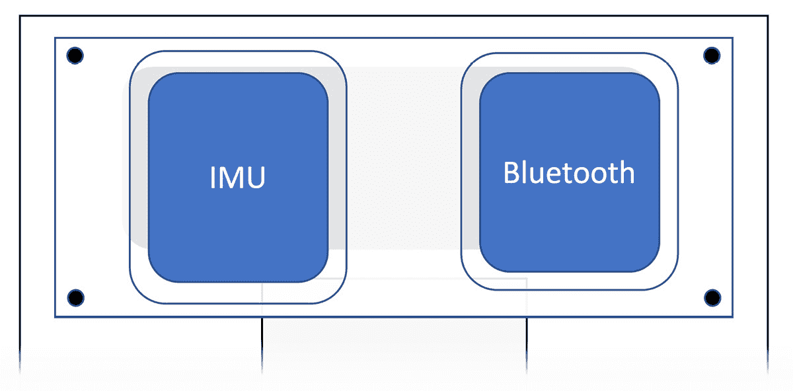

图 7.3 – 架子的粗略草图

如图中较深的方框所示，蓝牙和 IMU 可以放置在架子上，以避免与电机发生干扰。这个架子在上一张图中以透明白色显示，它安装在支架上，支架上显示为较深的螺栓孔。这个粗糙的部分叠加在 FreeCAD 草图上，以显示其位置。

在我们开发这个机器人期间，我们可能会比更换电池更频繁地更换线路，因此我们可以使用我们已购买的支架套件在电池上方安装架子。

接下来，我们需要规划距离传感器的安装。

## 距离传感器安装计划

距离传感器应该位于机器人的前方。以下粗略草图显示了它们可能的安装方式：

图 7.4 – 车架上的距离传感器的粗略草图

我们可以使用支架安装两个朝前的传感器，如图 *图 7**.4* 所示。我们可以通过从直角盖装饰条中锯下部分来制作这些支架。我们将使用螺栓将传感器固定在支架上，并将支架固定在机器人上。我们还可以为引脚头添加槽口。

距离传感器的引脚是公头，我们有一个带有母孔的面包板。为了连接这些，我们需要比预切割的电线更多。公对母跳线应该可以用于此。

架子和支架比之前的聚苯乙烯棒结构要复杂一些。我们将在下面看看如何将它们组装在一起 – 但首先，让我们去购物。

# 购物清单 – 部件和购买地点

我们已经收集了足够的信息来购买我们需要的部件。让我们看看我具体推荐了哪些部件。

你在*第一章*中购买了部件，并在前面的章节中使用了一些这些物品。然而，你仍然应该有以下物品的库存：

+   聚苯乙烯 3 毫米薄片 – 这些通常以几包的形式出售，所以你会有一些

+   带有 2 毫米、2.5 毫米和 3 毫米支架、螺栓和螺钉的支架套件

+   2.54 毫米间距直插单排引脚头

我然后推荐以下额外的部件：

+   Adafruit 2742 BNO055 IMU

+   Adafruit Bluefruit LE UART Friend ADA 2479 模块

+   2 x Pimoroni PIM373 VL53L1X **飞行时间** (**ToF**) 传感器模块

+   男性到女性扩展跳线

+   30 毫米 PVC 直角盖装饰条

随着我们制作更有趣的部件，我们还需要一些额外的工具：

+   一把中等锯或楔形锯来切割装饰条。

+   一个夹具，用于在锯切塑料时固定。

+   一套用于制作布线槽的针文件。

+   可选，一些侧切钳可能会使制作槽口更容易。

+   用于在小空间中进行更精确测量的数字卡尺。

+   大约 200 毫米长的木条，大约 30 毫米宽、20 毫米高，用于辅助切割装饰条。一块下脚料也行，但必须是直的。

你可以使用*第一章*中提到的相同供应商，即 *使用 Raspberry Pi Pico 计划机器人*，来购买部件和工具。现在我们知道了要买什么，我们需要更详细地规划如何安装。

# 准备机器人

我们已经有了部件和一些关于如何安装传感器的初步想法。

使用在*第三章*，*在 FreeCAD 中设计机器人底盘*中学到的技术，我们可以在 FreeCAD 中建模这些支架和货架。您也可以从 GitHub 在[`github.com/PacktPublishing/Robotics-at-Home-with-Raspberry-Pi-Pico/tree/main/ch-07`](https://github.com/PacktPublishing/Robotics-at-Home-with-Raspberry-Pi-Pico/tree/main/ch-07)获取这些设计。

以下图像展示了在 FreeCAD 3D 视图中其外观：

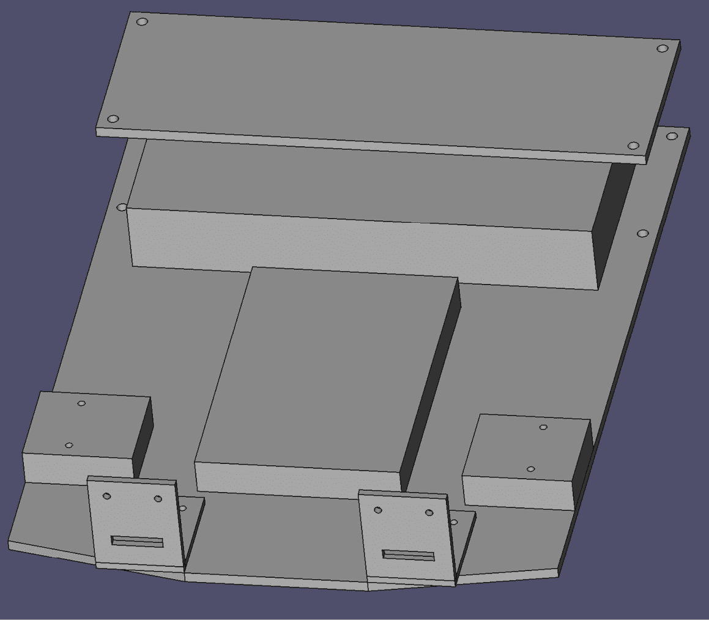

图 7.5 – 带有传感器安装的底盘

在前面的图中，有一个 FreeCAD 中机器人的 3D 视图。在电池上方，后部有一个用于蓝牙和 IMU 的货架。底盘下有螺栓孔。

图像的前部是两个用于距离传感器的支架，带有传感器的安装孔和用于连接头穿过的槽口。

让我们仔细看看每个传感器安装设计。

## 设计货架

我们将使用聚苯乙烯制作货架。以下图示展示了货架层的建议尺寸：

图 7.6 – 后货架图纸

此图显示了货架。底盘下部的宽度决定了顶部 150 mm 的尺寸。侧面尺寸应该足够让部件放置，但如果稍微小一些，你可以基于从*第四章*，*围绕 Pico 构建机器人*中剩下的废料聚苯乙烯材料，只要确保螺栓孔与货架和底盘匹配。我们可以将它们建模为单个部件。

你可以在**XY**平面的**Sketch Main**中绘制这个部分。使用**底盘轮廓**作为外部几何形状的指南。确保支撑不会干扰电池盒。口袋由 IMU 和蓝牙模块的尺寸定义，如产品页面所示，并额外留出一些毫米作为活动空间。

这个货架需要比底盘高出 30 mm。以下图示展示了如何做到：

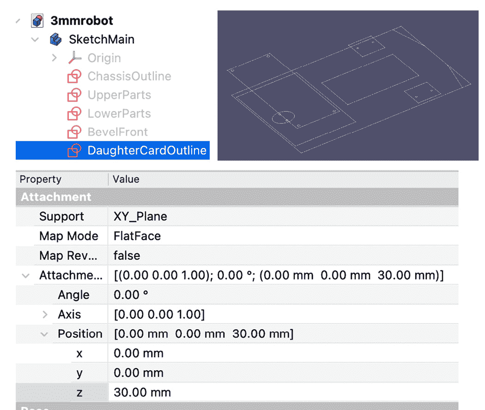

图 7.7 – 货架草图

选择货架轮廓草图（`30.00 mm`。此值将货架放置在底盘和电池上方。

这个草图可以使用之前讨论过的相同 ShapeBinder 和填充技术填充成 3D。以下图示展示了其外观：

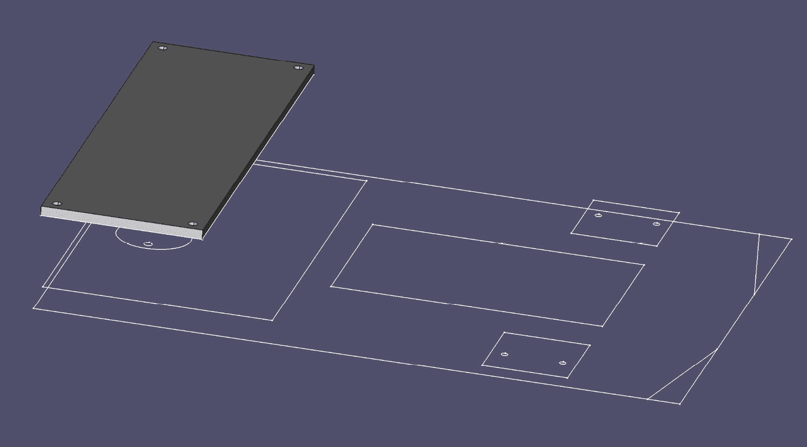

图 7.8 – 3D 填充货架

这张图像显示了 3D 中填充到 3 mm 的货架。

不要忘记使用 ShapeBinders 和口袋在`ChassisPlate`部分切割孔洞。

让我们看看如何从这些设计中构建货架部分。

## 切割货架

我们可以使用*第四章*，*围绕 Pico 构建机器人*中的技术来切割这部分。让我们先创建一个 FreeCAD 图纸作为模板。以下图示展示了图纸及其使用方法来制作部件：

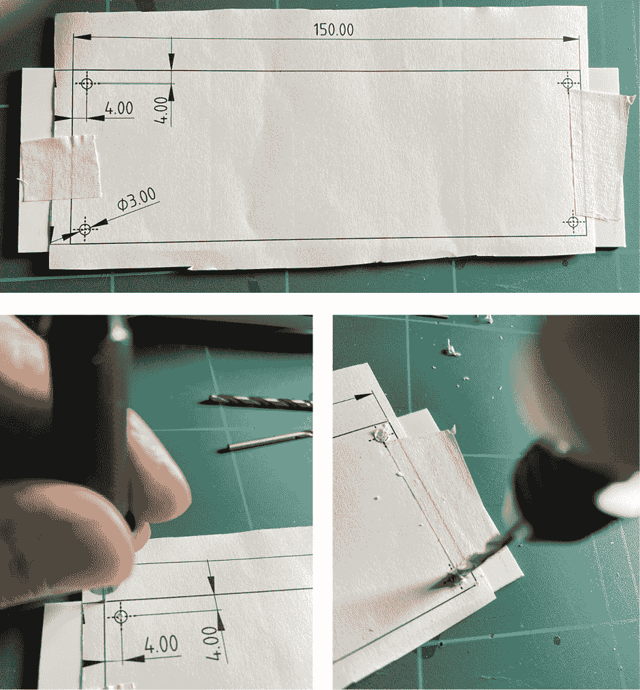

图 7.9 – 打孔架

上一张图的左侧部分显示了仔细贴在部件上的图纸。如果胶带滑落，尝试使用胶棒代替。确保你已经将纸张模板固定在塑料上，并且可以在以后再次取下。

正如我们在*第四章*，*围绕 Pico 构建机器人*中做的那样，使用一个小钻头在这些矩形的角落打点。我们通过纸张钻孔轮廓点，然后用手钻跟进钻孔（3 毫米），保持纸张位置不变。在下面放一些旧木头可以防止你在切割垫上留下孔洞。

这些孔为我们提供了指导。以下图示展示了我们应该如何切割它：

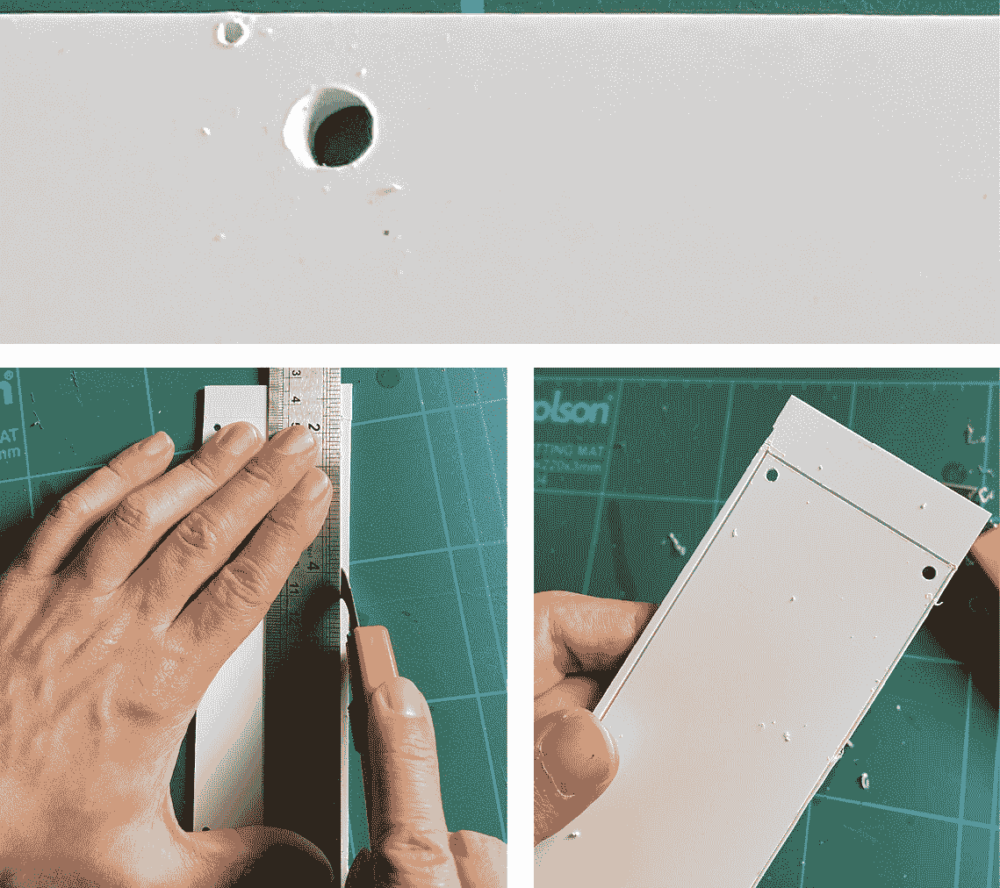

图 7.10 – 切割架

*图 7.10*的顶部显示了切割边沿的点和更大的 3 毫米孔。我们已经移除了纸张，因为当使用废料时，一些线条将非常接近边缘。这些切割没有纸张会更容易。

接下来，如图 7.10 左下角所示，将金属直尺与两个点对齐以形成边缘 – 例如，左内侧口袋的顶部线条 – 并使用一把新鲜、锋利的刀片，让刀片的尖端找到左上角的小孔。然后你应该能够沿着直尺和线条几乎 – 但不是完全 – 到达另一个孔。同样，这个切口是一个轻度的划痕，我们将从两侧进行多次切割，以保持它在角落之间。

切割直到划痕几乎贯穿整个厚度。以下图示展示了如何从板材中取出它并完成这一部分：

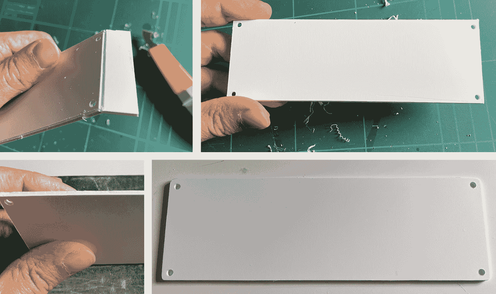

图 7.11 – 完成架

*图 7.11*展示了完成部件的各个阶段。在左上角面板中，弯曲面板时断裂了一部分 – 当划痕很深时，它会非常整齐地断裂。更靠近边缘的部分可能需要你用刀片切开。

右上角面板显示了这部分完全从板材中取出。它有点锋利，有一些毛刺，所以我们按照右下角所示进行打磨。低粒度（600）应该足够去除大部分毛刺并使角落圆润，以获得更好的外观。

你最终应该得到一个类似于右下角的板。那里的架子看起来已经准备好了可以使用。

现在你已经准备好了后架，可以组装，我们可以看看如何设计前传感器支架。

## 设计前传感器支架

使用我们的粗略设计和直角修剪的尺寸，我们可以将这些计划转化为更正式的设计和图纸。以下图示显示了带有尺寸的传感器支架的特写：

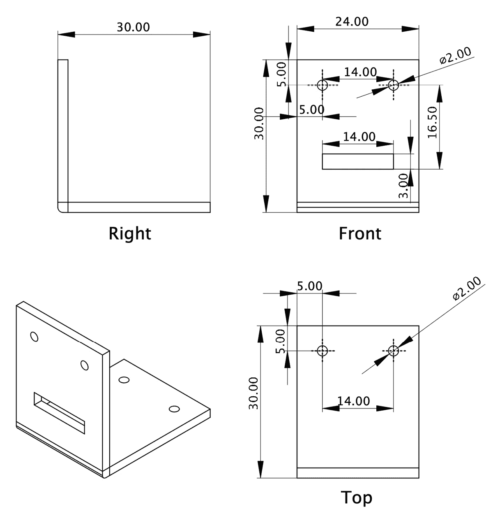

图 7.12 – 传感器支架的图纸

该图显示了支架的侧面、前面和顶视图。两侧都有 M2 螺栓孔，前面有一个矩形槽，以便通过接头连接。支架的高度和长度取决于直角修剪尺寸。支架长 24 毫米，以容纳 Pimoroni 距离传感器。我使用卡尺测量了 Pimoroni 传感器上的孔，以便绘制此图。

我建议在底盘板上绘制俯视图，包括一个矩形和孔之间的构造镜像线——这样，你可以为支架的底部制作形状夹具。我已经将这些夹具的前部与底盘的前线对齐，并填充了支架的底部。接下来，为`ChassisPlate`和支架上的孔制作凹槽。

按照您为电机所做的对称绘制这些支架，并使它们相隔 42 毫米。然后，在**XZ**平面上为支架的前部创建一个草图（向前 100 毫米）。接下来，将高部分从底部向上填充 30 毫米，并使用 XZ 草图来切割凹槽。以下图片显示了支架在底盘板上的 2D 视图以及它在 3D 中的样子：

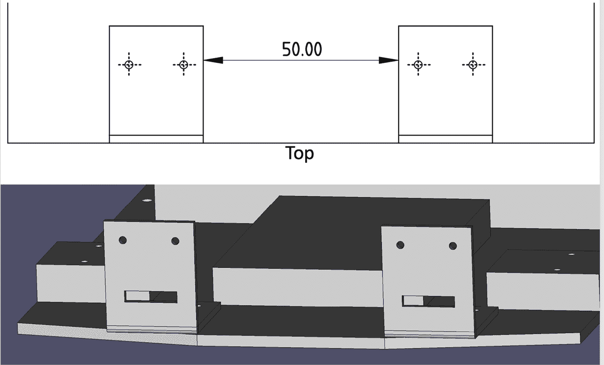

图 7.13 – 底盘上的支架设计

图纸的上部分显示了在`ChassisPlate`上尺寸和排列的支架图纸。下部分显示了这些部件在模型上的 3D 视图。

此设计足以创建图 7.13 中所示的图纸，在下一节中，我们将使用它来制作这个部件。

## 切割传感器支架

我们现在可以将这个设计带到车间，并切割这些部件。

下一个图示显示了如何标记前两个切口：

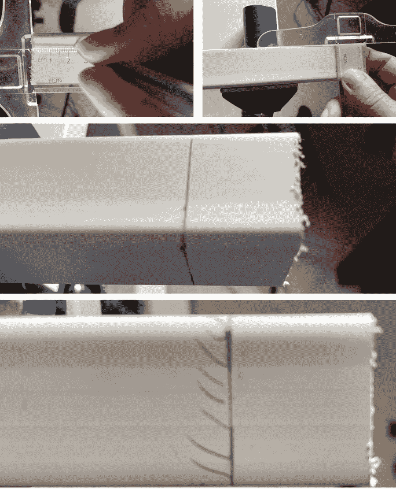

图 7.14 – 标记支架切口

图纸开始时使用直尺标记支架宽度为 24 毫米。我正在使用夹具来保持角度修剪就位。然后，用直角尺得到一条直线。中间的图片显示了这条线绕着部件走。

最后一张图片显示了废料侧被阴影覆盖，这样您就知道在哪里切割。切口不是 0 毫米，所以宁大勿小。查看以下图示以获取有关切割的信息：

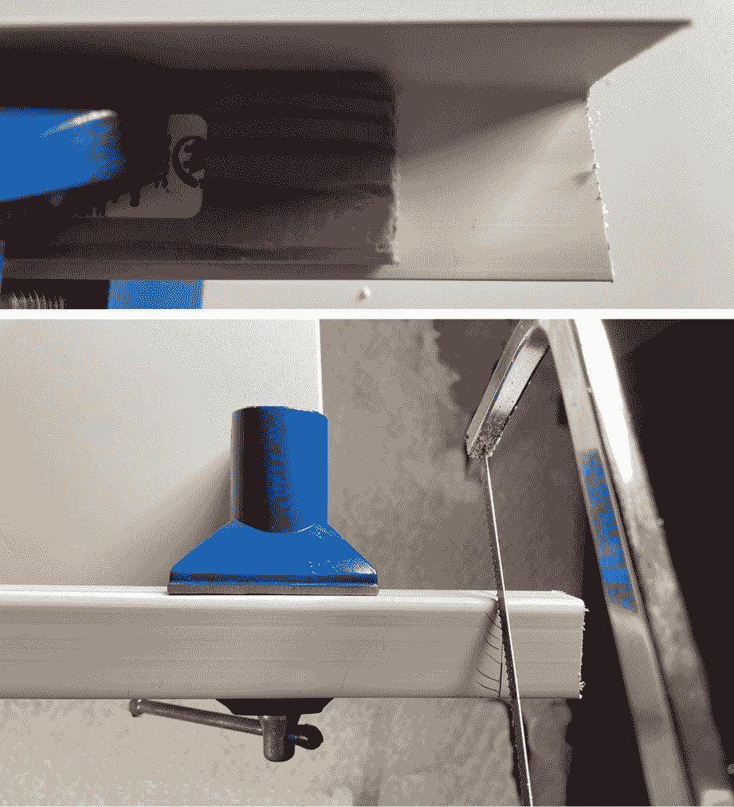

图 7.15 – 切割传感器支架

前一个图的上部分显示了用条木支撑的直角修剪夹紧的情况。这块木头应该在您切割的线之前停止，并在切割时支撑角度修剪。

底部面板显示我在右角弯曲处进行切割，这比沿着边缘切割要容易。

当你到达末端并切穿一侧时，材料会弯曲。你需要支撑另一端，并在这种情况下减慢锯切动作。

切割 2 个 24 毫米长度的部件。这些部件将很粗糙，需要用砂纸进行打磨，如图所示：

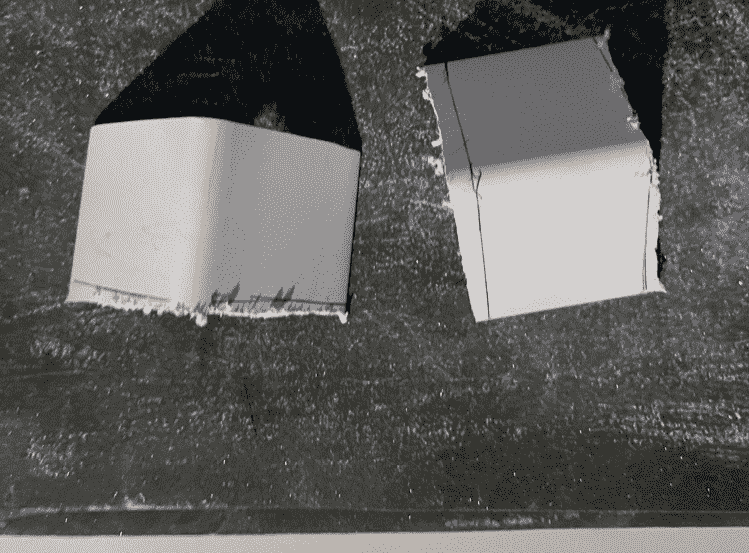

图 7.16 – 准备平滑的部件

如前一个图所示，部件边缘非常粗糙。你需要使用多个级别的砂纸进行多次打磨，以平滑如图所示的支架。为了得到更好的效果，你可以将角落打磨圆滑。

我们将需要钻出以下图所示的孔：

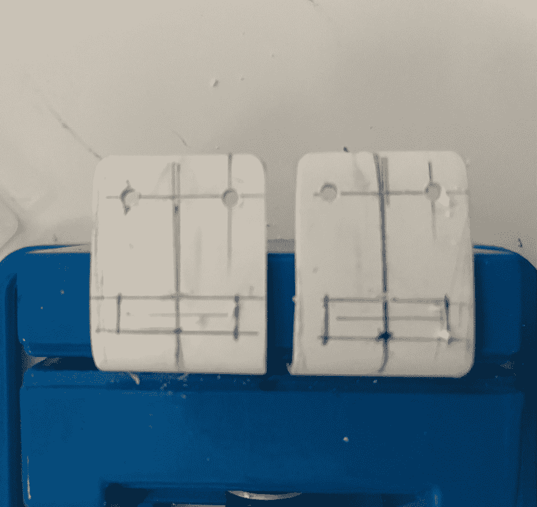

图 7.17 – 在传感器支架上钻孔

*图 7**.17* 展示了夹具中的部件，并带有图案以辅助钻孔——中间有一条中线，两侧有孔。我使用卡尺来做这个；然而，我的图纸并不完美，你的也不需要完美。

用较小的钻头开始每个孔，然后扩大到 2 毫米。这种材料，uPVC，比苯乙烯更坚固，需要更多的努力才能穿透。在这个支架的前面和底部有钻孔。在继续到槽位之前，先做这些孔。

最困难的部分将是钻出槽位。以下图显示了如何切割这个槽位：

图 7.18 – 切割和锉削槽位

前一个图中的左上角面板显示我使用 3 毫米钻头钻孔。沿着槽的长度钻出孔，如右上角面板所示。它们不需要在槽内完美定位，但应靠近槽内。

如左下角面板所示，选择一个带角（角形）轮廓的针状锉，并将其推入孔中以扩大孔径。你可以选择性地使用侧剪钳来连接孔。然后，当你连接好孔后，将槽锉削成矩形。最后，当你制作出更宽的形状时，使用宽平针状锉制作成信箱形状。

右下角显示孔只需要足够大，以容纳塑料插针头体。在那个点上，你可以停止锉削。

我们现在已经制造了搁板和支架。然而，我们仍然需要修改底盘板并安装它们。

## 准备底盘板

底盘板需要八个额外的孔来容纳新的配件。你应该能够使用你的 FreeCAD 设计来获取以下图纸：

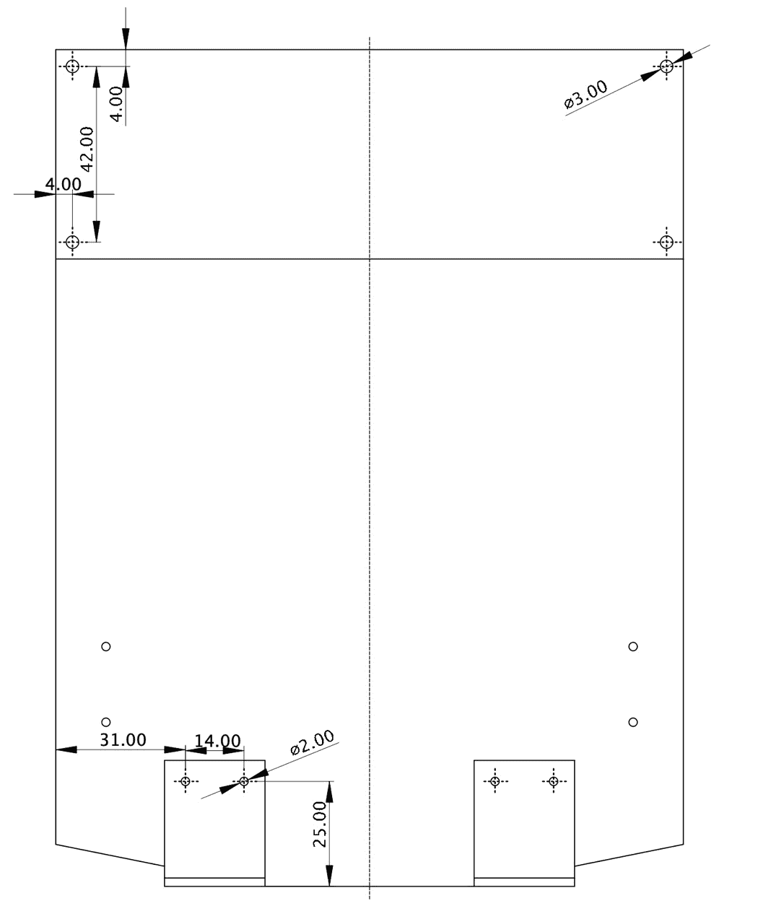

图 7.19 – 底盘板带传感器安装孔的图纸

在这张图的顶部，代表机器人的后面，是架子，需要钻四个额外的 3 毫米孔，两侧各两个，用于放入架子支架。

在图示底部（机器人的前方）底盘前方有四个额外的孔，2 毫米宽，用于螺栓固定支架。

对于这部分，我们在图纸上标出了尺寸，并在钻孔之前将使用卡尺标记这些孔，如图所示：

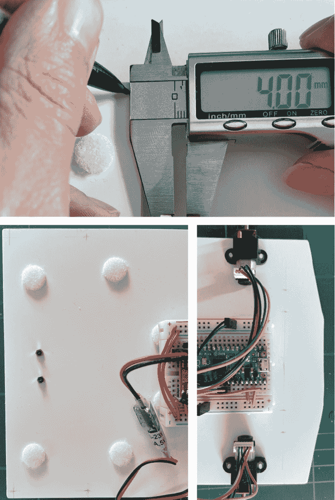

**图 7.20** – 测量和标记底盘板孔

在**图 7.20**的上面板中，我使用卡尺顶部的直边在离边缘 4 毫米处标记了一个后支架孔。左下角的面板显示了以这种方式标记的后支架孔，右下角显示了支架的孔。

虽然不是必需的，但在移除上层甲板部件和车轮后标记和钻孔底盘板会更容易。完成这些步骤后，请确保按照前面章节中指定的方式将它们放回原位。

你可以像通常一样钻孔，从较小的直径钻头开始，然后制作支架孔为 2 毫米，架子孔为 3 毫米。在钻孔 uPVC 后，你会注意到它们钻孔容易多了！

我们现在可以再次组装机器人了。

## 组装机器人

现在，我们可以开始添加新部分，从下面的图示中的架子开始：

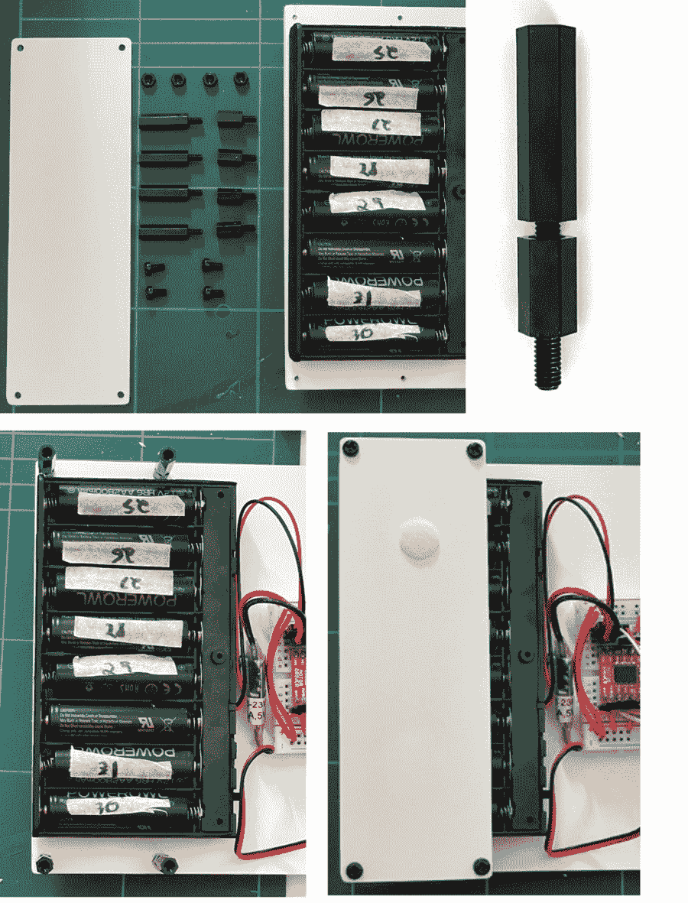

**图 7.21** – 组装蓝牙和 IMU 架子

前面的图示中左上角的面板显示了机器人与架子面板和一套支架并排。如图示右上角所示，你可能需要连接两个支架以清除电池盒。

如底板所示，然后你需要将支架螺栓拧入机器人底座，并在下面使用螺母支撑它们。将架子层放在支架上面；这应该看起来像右下角的面板。我还为蓝牙模块添加了一个钩扣点。我们将把 IMU 侧留出来添加支架。

现在，我们只需要添加传感器面向前方的支架，如图所示：

**图 7.22** – 组装面向前方的支架

如**图 7.22**所示顶部，每个支架需要一个 M2 螺栓和螺母。将这些螺栓拧入底盘前部的孔中。

现在，底盘看起来像底板。这个机器人现在可以开始进行传感器实验了。我们暂时不会将传感器螺栓固定，因为我们还需要为它们布线，这将在接下来的章节中介绍。

# 摘要

在本章中，我们学习了更多传感器和设备类型。然后我们回顾了我们的机器人，计划在哪里添加这些传感器。

本章展示了这些部件的购物清单，然后使用这些部件的产品页面上的尺寸来制作 CAD 图纸。这些 CAD 图纸让我们能够可视化我们想要的 3D 模型。接下来，我们从这些图纸中制造部件。

我们重新审视了部件的制造，并使用模板技术的变体来制作支架。

最后，我们组装了所有这些部件，现在有一个准备添加传感器的机器人底盘。我们将在接下来的章节中连接并编程这些传感器，首先是距离传感器。

# 练习

这些练习将有助于进一步发展本章学到的技能。由于我们没有将开关连接到底盘上，我们可以用它来练习这些技能：

+   传感器支架正直接朝前。如果你将传感器与倾斜的前端对齐，机器人将拥有更好的传感器覆盖范围，外观也会更好。这可能会需要使用其他 FreeCAD 约束或技巧。

+   货架是平的，并使用搭扣来固定设备。使用 FreeCAD，你能设计一个带有凹槽的额外层来放置外围板吗？然后你能使用在这里学到的技能来构建它吗？你可能需要一把曲线锯来完成这个任务。

# 进一步阅读

我们在文本中引用了以下数据表和产品页面：

+   Adafruit Bluefruit UART LE Friend 产品页面及尺寸信息 - [`www.adafruit.com/product/2479`](https://www.adafruit.com/product/2479) 和 [`learn.adafruit.com/introducing-the-adafruit-bluefruit-le-uart-friend/downloads`](https://learn.adafruit.com/introducing-the-adafruit-bluefruit-le-uart-friend/downloads)

+   Adafruit BNO055 扩展板页面及尺寸信息 - [`www.adafruit.com/product/2472`](https://www.adafruit.com/product/2472)

+   Pimoroni VL53L1 扩展板页面及尺寸信息 - [`shop.pimoroni.com/products/vl53l1x-breakout`](https://shop.pimoroni.com/products/vl53l1x-breakout)

关于蓝牙低功耗（Bluetooth LE）的更多信息，请考虑阅读穆罕默德·乌萨马·宾·阿夫塔布（Muhammad Usama bin Aftab）所著的《Building Bluetooth Low Energy Systems》。这本书深入探讨了适用于物联网（**IoT**）的无线网络通信系统的细节。物联网的概念很好地转化为机器人技术。

要了解更多关于锯切的信息，请查看以下指南：

+   安迪·克拉克（Andy Clarke）所著的《A Little Saw – A Workshopshed Guide to Cutting Tools》提供了关于如何有效切割不同材料的优秀信息。这本小书展示了合适的锯子以及正确使用它们的方法。
