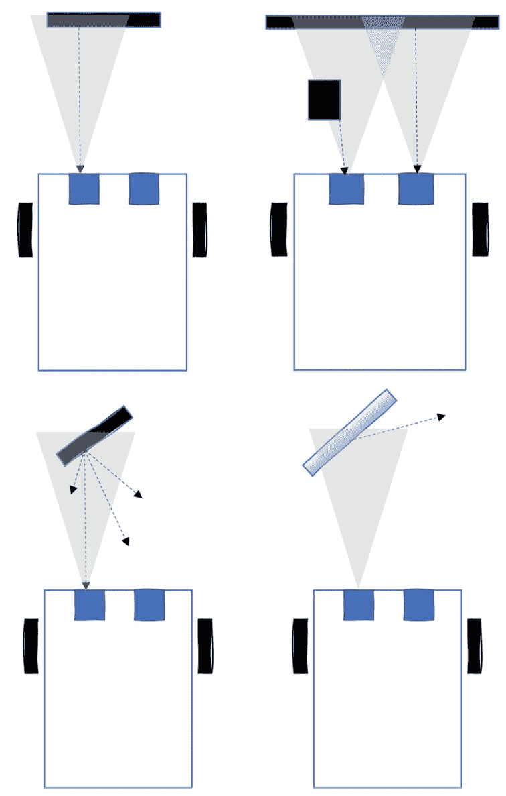
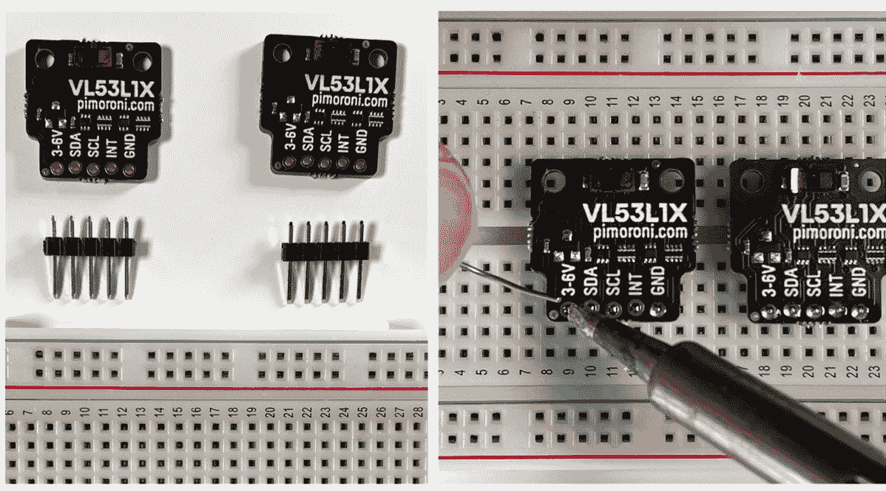
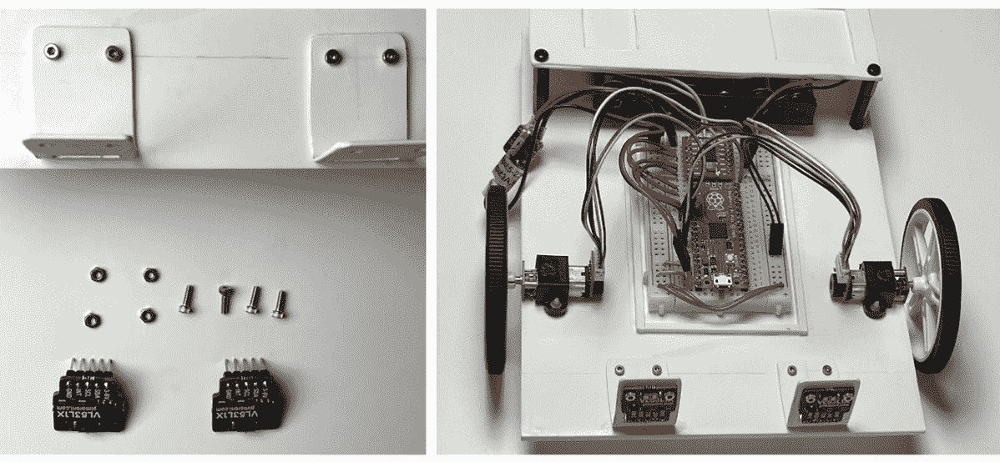
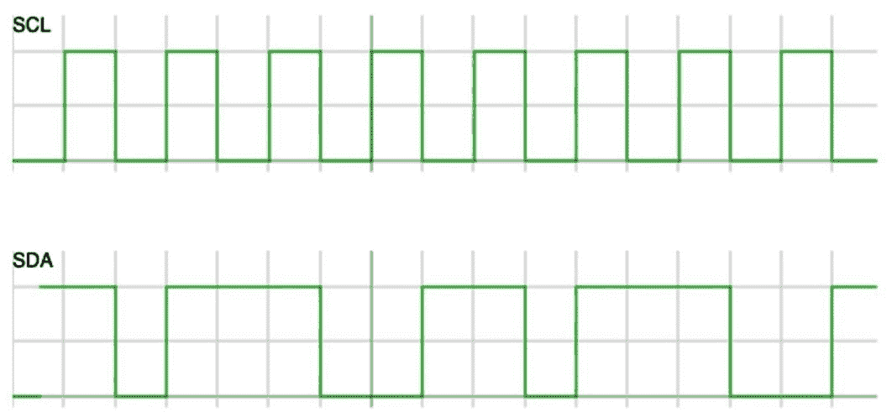
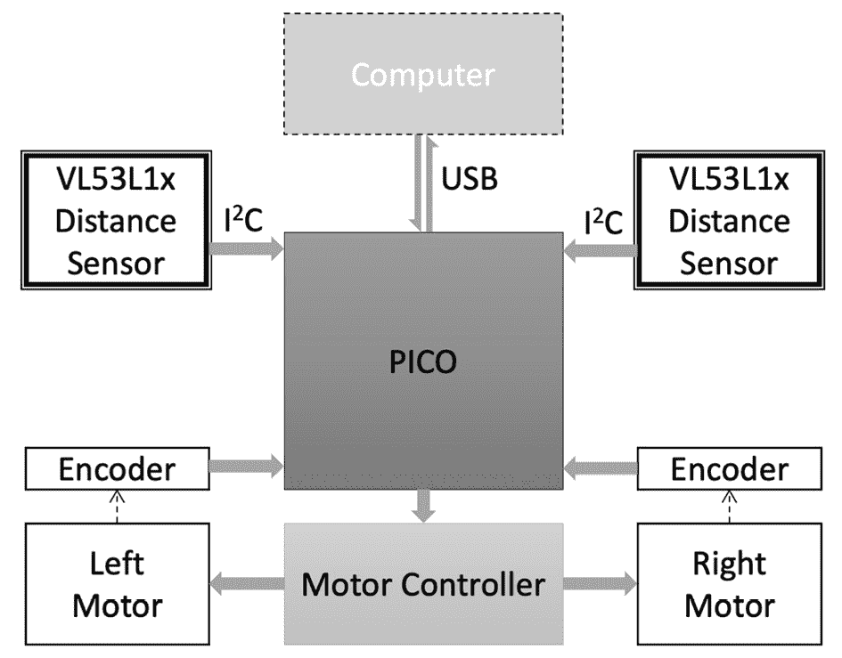
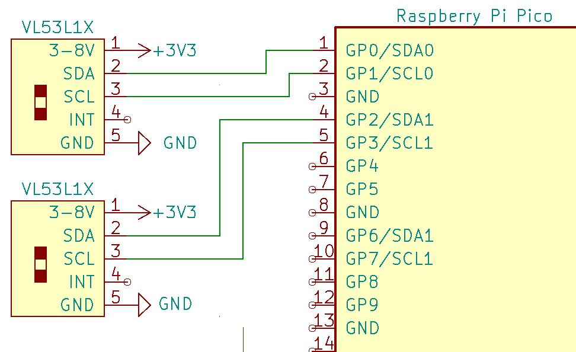
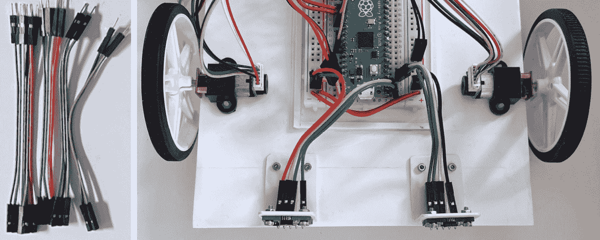
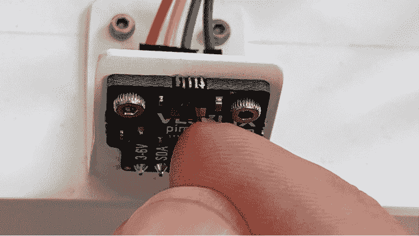
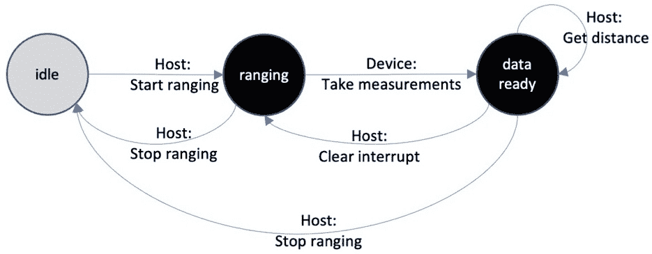
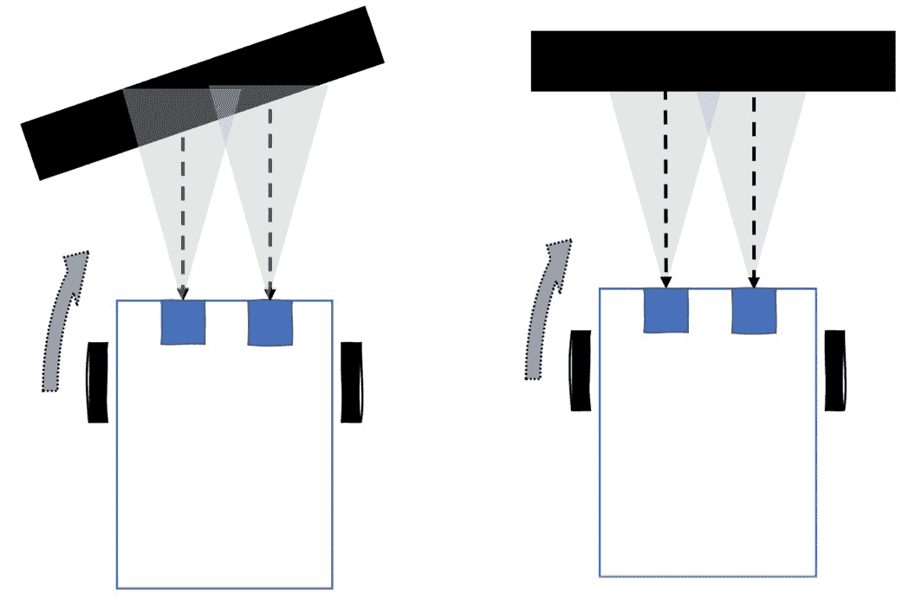

# 8

# 使用 Pico 感测距离以检测物体

我们的机器人开始独立移动。我们在上一章中准备了安装点以添加传感器，包括距离传感器。我们可以使用这些传感器来检测物体与机器人之间的距离，通过添加多个传感器，我们可以看到哪个方向最近。这种感知能力将使机器人能够对现实世界做出反应，并在没有太多手动控制的情况下在房间内行驶。

在本章中，我们将更多地了解这些传感器及其局限性。然后，我们将传感器连接到机器人上，并了解用于与它们通信的通信协议。接下来，我们将传感器连接到 Raspberry Pi Pico 并获取数据。最后，我们将多个传感器与电机控制结合在一起，使机器人在行驶时能够避开障碍物。

在本章中，我们将涵盖以下主要主题：

+   距离传感的工作原理

+   焊接引脚并将其连接到机器人上

+   I2C 通信简介

+   与单个距离传感器通信

+   连接两个距离传感器

+   使用 Raspberry Pi Pico 构建避障器

# 技术要求

本章需要以下内容：

+   从前几章构建的机器人

+   2 个 Pimoroni VL53L1X 距离传感器模块

+   2 个五向单排 2.54 毫米（包含在模块中）

+   8 根带有 2.54 毫米 DuPont 连接器的公对母跳线

+   2 个 M2 螺母和 M2 x 6 毫米螺栓

+   适合拧紧螺栓的螺丝刀，以及用于夹紧螺母的扳手

+   一个带有烙铁、焊料、烙铁头清洁黄铜和烙铁支架的焊接站

+   一个平坦的工作区域，光线充足，无干扰或被推挤

+   前几章的代码

+   一个 Raspberry Pi Pico 代码编辑器，如 Mu 或 Thonny

+   一条 USB 微型线

您可以在[`github.com/PacktPublishing/Robotics-at-Home-with-Raspberry-Pi-Pico/tree/main/ch-08`](https://github.com/PacktPublishing/Robotics-at-Home-with-Raspberry-Pi-Pico/tree/main/ch-08)找到本章的代码。

# 距离传感的工作原理

在深入连接和编程距离传感器之前，我们应该检查它们的工作原理。*第七章*，*为更多设备规划和购物*，评估了选项并选择了基于光学的距离传感器。在本章的剩余部分，我们将专注于这种类型。

许多距离传感器使用称为**飞行时间**的原理进行操作。以下图表展示了这一点：



图 8.1 – 光学距离传感器工作原理

上述图表显示了带有传感器和返回光线的机器人的图片。在左上角，发射了一束光（显示为圆锥形），击中了一个物体，其反射（显示为虚线）击中了传感器（蓝色方块），并检测到了它。发射光线和接收响应之间的时间是飞行时间，用于计算距离。在图表的右上角，两个传感器都处于活动状态。然而，左边的传感器在其光束中检测到一个更近的物体，返回的值低于右边的传感器，后者只检测到物体后面的墙壁。

对于大多数材料，光线以向所有方向扩散的方式反射，如图表的左下角所示，这些飞行时间传感器将检测它们的返回。然而，就像图表右下角所示的镜子一样，有些材料不会扩散它们的反射光线，而是以入射角反射出去。因此，这些物体可能不会被检测到，或者会混淆系统。它甚至可能检测到在镜子中反射的物体，就像在镜子后面一样。

注意，这些传感器的读数略有不稳定，因此它们会进行多次读数并将它们结合起来以产生更准确的读数。传感器使用时间预算进行多次读数。VL53L1X 设备进行这种采样和平均。

环境光线条件可能会影响这些传感器，非常明亮的光线可能会使光线变淡。然而，在大多数条件下它们都能正常工作，虽然精度会降低，距离也会略微减少，但并不会变得无法使用。在我们的情境中，机器人主要需要检测迎面而来的障碍物，因此精度的降低是可以接受的。

我们现在已经了解了传感器的运作方式。在下一节中，我们将把它们连接到机器人上。

# 焊接引脚并将其连接到机器人上

在我们开始使用或布线传感器之前，我们需要将引脚焊接在它们上面，然后将它们螺栓固定，使它们面向机器人的前方。

## 焊接引脚

我建议使用一个备用的面包板来焊接这些引脚，就像你在*第四章*“围绕 Pico 构建机器人”中使用的 Raspberry Pi Pico 和电机控制器一样。以下照片显示了我正在焊接它们：



图 8.2 – 焊接距离传感器引脚

上述图表左边的照片显示了传感器、引脚和面包板，以帮助焊接。将引脚的长针插入面包板的孔中，将传感器放在上面。Pimoroni 设计了这些传感器模块，以便在引脚上固定板子，以便于焊接。

在右边的照片中，一个传感器已经焊接了引脚，我正在焊接另一个。引脚应该朝向传感器后方，这样布线就不会在传感器光束中。

引脚焊接完成后，你就可以将传感器安装到机器人上了。

## 安装传感器

在前几章中，我们为安装传感器做了大量的准备工作，并创建了支架来安装它们。以下照片显示了这些传感器已经固定到位：



图 8.3 – 安装的光学距离传感器

在前一张照片的左侧是机器人的前方、传感器以及 M2 螺母和螺栓。我们将传感器的引脚穿过插槽并固定到位。注意，插槽周围可能会有轻微的紧绷。如果是这样，可以稍微修整引脚空间以适应。修整后，擦拭或吹走任何灰尘。右侧显示了传感器已经固定在机器人的前方。

我们将通过 I2C 连接这些传感器。但首先，让我们更仔细地看看 I2C 是如何用来与这类传感器通信的。

# I2C 通信简介

你在早期章节中遇到了 I2C 通信。*第一章*讨论了 I2C 是一个数据总线，它携带地址信息，允许主设备如 Raspberry Pi Pico 在单个总线上访问多个设备。我们当时了解到 Raspberry Pi Pico 有两个硬件 I2C 总线。**I2C**（或**I**2**C**）是**Inter-Integrated Circuit**的缩写。

在*第七章*中，*规划和采购更多设备*，我们看到了我们将如何使用 I2C 设备，包括 VL53L1X 距离传感器和 IMU。

这个总线究竟是如何工作的？*第一章*也提到了 I2C 有两条线 – 一条**串行时钟**线（**SCL**）和一条**串行数据**线（**SDA**）。以下图片显示了设备如何通过它们发送信号：



图 8.4 – 线上的 I2C 信号

上述图表显示了代表 I2C 信号的两个图表。水平轴是时间，垂直轴上高电平代表逻辑 1，低电平代表逻辑 0。如图表顶部所示，时钟产生一系列脉冲，一个方波。伴随的数据线发送与时钟脉冲同步的数据。这个时钟意味着总线上的设备是同步的。

线路通常保持高电平（逻辑高），当设备希望通信时被拉低。设备在停止通信后保持线路高电平，以便其他设备可以控制总线。在大多数情况下，中央控制器会向设备发送请求，设备将做出响应。

如*第一章*所述，I2C 总线上的设备有一个地址。然而，这些 VL53L1X 设备都拥有相同的地址。幸运的是，在 Raspberry Pi Pico 上我们可以使用两个 I2C 总线。

好消息是，我们不需要手动控制太多。CircuitPython 有一个`busio`（总线输入输出）库，用于处理数据总线上的 I/O 操作，我们将使用它来控制这些设备。

我们需要为每个传感器连接 SDA 和 SCL，然后编写代码将它们连接起来。在下一节中，我们将讨论如何连接和与单个传感器通信。

# 与单个距离传感器通信

每个距离传感器只需要四根线；然而，我们还将改进电源系统。然后我们将进入读取系统数据的代码。

## 连接距离传感器

我们从查看我们机器人的框图开始我们的接线，就像我们在*第七章*中看到的那样。看看以下图表：



图 8.5 – 带距离传感器的机器人框图

前面的图表显示了通过 I2C 连接到 Raspberry Pi Pico 的带有额外 VL53L1x 距离传感器的机器人框图。新部件有一个粗的双轮廓。

我们需要电路图来了解连接的细节，如下面的图所示：



图 8.6 – 带距离传感器的电路图

在前一张图中，我展示了连接到 Raspberry Pi Pico 的距离传感器的近距离电路图。我们为每个 I2C 总线连接一个传感器，以及 3v3 电源和地线连接。

右侧的传感器将 SDA 连接到`GPIO0`，将 SCL 连接到`GPIO1`。左侧的传感器将 SDA 连接到`GPIO2`，将 SCL 连接到`GPIO3`。

以下照片显示了传感器接线：



图 8.7 – 将距离传感器连接到机器人

前一张照片显示了使用公对母跳线连接传感器的机器人。请记住，您并没有将传感器的`INT`引脚连接到任何东西，所以这里可能会有一个空隙。此外，请务必检查电源和地线的连接，因为反转这些连接可能会损坏设备。I2C 中意外交换 SDA 和 SCL 线也是常见的故障排除问题。

一旦完成接线，请按照以下步骤小心地移除传感器的保护盖：



图 8.8 – 移除保护胶带

如前一张照片所示，如果您的传感器仍然有保护性覆盖胶带，请在使用前小心地使用指甲或镊子去除此胶带。去除后，请小心不要触摸传感器的光学部件。

连接好这些线路后，让我们在下一节中看看传感器是如何工作的。

## VL53LX 工作原理

这些传感器有一个特定的操作周期。我们可以将其用作编写代码的指南。以下图表显示了 VL53L1X 的状态：



图 8.9 – VL53L1X 工作状态

上述状态图是此设备状态的简化视图。节点是状态，它们之间的线条是导致状态变化的事件/信号。首先，传感器从左侧以空闲模式开始。这种模式在我们要测量距离之前节省电量。然后，主机（Pico）发送开始测距信号，设备进入测距模式，进行主动测量。接下来，当设备根据时间预算进行了足够的测量后，它会进入数据就绪状态。在此状态下，主机可以读取测量的距离。

然而，设备不会进行新的测量，直到主机发送清除中断信号，将其放回测距状态。

最后，当我们不再需要测距时，主机应该发送停止测距信号，这将设备放回空闲状态并减少功耗。

我们需要在我们的代码中考虑这些状态变化，我们将在下一节中介绍。

## 在 CircuitPython 中读取单个距离传感器

当读取传感器时，我们将使用 Adafruit VL53L1X 库。将`adafruit_vl53l1x.mpy`从 Adafruit CircuitPython 库复制到`CIRCUITPY`卷上的`lib`文件夹。我们也可以根据他们的文档示例编写代码。与任何新设备通信时，使用相关库的示例代码始终是一个好开始。我们将对其进行一些调整以适应 Raspberry Pi Pico。

我们在`read_1_sensor.py`文件中开始代码的导入：

```py
import time
import board
import busio
import adafruit_vl53l1x
```

在这里我们有两个新的导入。除了 vl53l1x 库之外，`busio`库使用 Pico 引脚形成数据总线，如`I2C`。

接下来，我们需要设置`I2C`总线和设备：

```py
i2c = busio.I2C(sda=board.GP2, scl=board.GP3)
vl53 = adafruit_vl53l1x.VL53L1X(i2c)
```

这第一行使用 GP0 和 GP1 引脚形成`I2C`总线，对应左边的传感器。Pico 对可用于`I2C`总线 SDA 和 SCL 线的引脚有些挑剔。然后我们使用这个`I2C`总线创建 VL53L1X 设备。在下一节代码中，我们向设备发送一些设置：

```py
vl53.distance_mode = 1
vl53.timing_budget = 100
```

设备有多个距离模式；距离模式 1 是短距离模式——用于近距离物体。我们设置了一个 100 毫秒的时间预算，控制传感器允许测量多长时间。它限制了最大距离和用于平滑数据的测量次数。

让我们开始设备：

```py
vl53.start_ranging()
```

我们现在已将设备从空闲状态移动到测距状态。我们现在可以等待测量准备就绪。我们现在可以编写`main`循环的代码：

```py
while True:
    if vl53.data_ready:
        print("Distance: {} cm".format(vl53.distance))
        vl53.clear_interrupt()
    time.sleep(0.05)
```

这个循环首先检查设备是否有准备好的数据读取。当它有`data_ready`时，我们可以使用`vl53.distance`读取数据并打印出来。这个距离是以厘米为单位的。

读取数据后，我们需要发送一个`clear_interrupt`信号，这样传感器就会回到其测距模式进行新的读取。

无论是否有数据，系统都会等待 50 毫秒后循环并再次检查。

将此文件上传到 Pico，并更新`code.py`以导入`read_1_sensor.py`。然后，当你运行它并连接 REPL 时，你应该看到如下输出：

```py
code.py output:
Distance: 35.1 cm
Distance: 34.4 cm
Distance: 33.8 cm
Distance: 35.2 cm
```

在我们继续之前，让我们检查一些事情以确保一切正常工作。

## 故障排除

如果这个示例代码不起作用，以下故障排除步骤将有所帮助：

+   如果你收到“在 SDA 或 SCL 上未找到上拉；检查你的布线”警告，这表明布线可能不正确或线可能松动。关闭电源并检查布线。

+   “在地址 29 上没有 I2C 设备”警告可能意味着你反接了 SDA 和 SCL。交换它们并再次尝试。

+   电路的任何部分，包括电线、电池、传感器或 Pico，都不能有热量——这将造成损坏，应该关闭电源并仔细检查布线。

+   有时，传感器可能在测试运行之间卡住，导致结果缓慢或不规律，或者传感器显示没有错误但数据始终未准备好。我建议关闭整个机器人的电源。

+   尝试在各个阶段之间添加如`print("i2c set up")`之类的行，以查看问题所在。

+   如果你看到`不支持的操作`或`未知距离模式`，请检查电源布线，确保每个传感器都连接良好。

注意，关闭电源意味着关闭电池电源（如果你已经打开了它）并拔掉电脑。在重新布线时，永远不要让电脑插上电源。

我们应该能够从单个传感器可靠地读取数据。然而，我们的机器人有两个传感器，所以让我们在下一节中读取两个传感器的数据。

# 连接两个距离传感器

我们已经布线了两个传感器，每个传感器都连接到一组不同的引脚。创建`read_2_sensors.py`文件。导入看起来相同：

```py
import time
import board
import busio
import adafruit_vl53l1x
```

当我们设置传感器时，我们首先需要在不同的引脚上设置两个`I2C`总线，然后使用它们：

```py
i2c0 = busio.I2C(sda=board.GP0, scl=board.GP1)
i2c1 = busio.I2C(sda=board.GP2, scl=board.GP3)
vl53_l = adafruit_vl53l1x.VL53L1X(i2c0)
vl53_r = adafruit_vl53l1x.VL53L1X(i2c1)
```

我们也可以为两个传感器应用相同的配置设置：

```py
vl53_l.distance_mode = 1
vl53_l.timing_budget = 100
vl53_r.distance_mode = 1
vl53_r.timing_budget = 100
```

主循环以相同的方式开始，两个传感器进入测距模式：

```py
vl53_l.start_ranging()
vl53_r.start_ranging()
while True:
```

在这种情况下，我们在打印之前将检查两个传感器的就绪数据：

```py
    if vl53_l.data_ready and vl53_r.data_ready:
        print("Left: {} cm, Right: {} cm".format(vl53_l.distance, vl53_r.distance))
        vl53_l.clear_interrupt()
        vl53_r.clear_interrupt()
    time.sleep(0.05)
```

当上传并运行在 Pico 上时，此代码现在将输出两个传感器的数据，如下所示：

```py
Left: 39.2 cm, Right: 37.4 cm
Left: 38.8 cm, Right: 37.4 cm
Left: 39.0 cm, Right: 37.4 cm
Left: 38.8 cm, Right: 37.6 cm
Left: 39.1 cm, Right: 37.6 cm
```

在我们使用两个传感器实现更智能的行为之前，我们将先解决这里的问题。

## 故障排除

添加第二个传感器仍然可能导致奇怪的行为：

+   首先，单传感器布线注意事项适用。

+   如果你已经在代码中两次使用了相同的 I2C 总线，你可能会得到一些奇怪的行为或两个传感器的相同读数。检查代码以确认这一点。

现在我们有了两个传感器的数据，在下一节中，我们将使用这些数据使机器人避开物体。

# 使用 Raspberry Pi Pico 构建避障器

两个距离传感器和一些代码中的独立电机控制是避免障碍物的必要成分。让我们首先将距离传感器放入共享的机器人库中。

## 准备机器人库

就像我们在机器人的其他方面所做的那样，我们将从在 `robot.py` 文件中设置距离传感器开始。在此文件的顶部，导入现在包括 `busio` 和 `adafruit_vl53l1x` 库：

```py
import board
import pwmio
import pio_encoder
import busio
import adafruit_vl53l1x
```

我们可以设置我们的左右距离传感器。在编码器设置下方和 `stop` 函数上方插入以下内容：

```py
i2c0 = busio.I2C(sda=board.GP0, scl=board.GP1)
i2c1 = busio.I2C(sda=board.GP2, scl=board.GP3)
left_distance = adafruit_vl53l1x.VL53L1X(i2c0)
right_distance = adafruit_vl53l1x.VL53L1X(i2c1)
```

保存此文件，并确保将其上传到 `CIRCUITPY` 卷。

我们将在避障器代码中使用 `robot.py`。接下来，我们必须考虑避障行为如何操作。

## 避障器操作理论

我们需要考虑两个传感器的数据来避免墙壁。以下图表显示了我们将如何做到这一点：



图 8.10 – 使用两个传感器避免墙壁

在前面的图表中，一个草图机器人面对墙壁。它已经检测到墙壁，但物体比右侧传感器更靠近左侧；虚线箭头显示来自物体的反射。这意味着机器人应该向右转以避开这个物体，由机器人左侧的弯曲箭头表示。我们将通过反转右侧电机直到它清除障碍物来完成转弯。

有一个特殊情况，两个传感器检测到墙壁距离相等。为了确保机器人决定避开平坦的障碍物，我们将稍微偏置（加权一侧）通过首先检查一个传感器并根据它进行转弯。

我们已经有了所有需要的部分。所以，让我们开始编写这段代码。

## 距离传感器墙壁避障器代码

此代码使用机器人库中的距离传感器。将其放入 `avoid_walls.py`。让我们从熟悉的导入和设置传感器配置开始：

```py
import robot
import time
robot.left_distance.distance_mode = 1
robot.right_distance.distance_mode = 1
```

我们将保持传感器的默认时间预算。然后我们有我们避障器的配置：

```py
too_close_cm = 30
speed = 0.9
```

`too_close_cm` 变量设置了当机器人应该转弯以避开墙壁时的阈值。我们可以在 `speed` 变量中设置此行为的整体机器人速度。我们可以调整这两个变量以确保机器人在时间上避开墙壁。让我们开始传感器测距：

```py
robot.left_distance.start_ranging()
robot.right_distance.start_ranging()
```

我们将开始让机器人移动；然而，我们想确保如果出现任何问题，机器人停止移动并停止传感器测距，所以我们用 `try` 将主循环包裹起来：

```py
try:
  robot.set_left(speed)
  robot.set_right(speed)
  while True:
```

在主循环下方将伴随 `try` 的 `finally` 语句。接下来，我们检查是否有传感器数据准备好：

```py
    if robot.left_distance.data_ready and robot.right_distance.data_ready:
      left_dist = robot.left_distance.distance
      right_dist = robot.right_distance.distance
```

我们存储读取的距离，以便在整个处理过程中使用。请注意，虽然 `robot.left_distance.distance` 看起来像是一个变量，但它是一个属性，在我们使用它时主动读取传感器。

由于我们有两个值，我们应该检查是否有一侧太近。请注意，超时将导致 `0` 值，因此我们也应该检查值是否高于这个值。通过偏向一侧，我们稍微偏置机器人到那一侧，这应该阻止机器人如果两个传感器都检测到近处的障碍物时犹豫不决：

```py
      if 0 < right_dist < too_close_cm:
        print("Obstacle detected - Left: {} cm, Right: {} cm".format(left_dist, right_dist))
        robot.set_left(-speed)
```

我们检查右边的距离传感器是否比阈值更近。如果是这样，我们打印一行调试信息，显示我们已经检测到障碍物和两个传感器的读数。然后我们将左电机设置为向后行驶，这将导致机器人向左偏离障碍物。

我们现在可以处理其他情况：

```py
      else:
        robot.set_left(speed)
        if 0 < left_dist < too_close_cm:
          print("Obstacle detected - Left: {} cm, Right: {} cm".format(left_dist, right_dist))
          robot.set_right(-speed)
        else:
          robot.set_right(speed)
```

如果我们没有向左转，我们确保左电机向前行驶。然后我们检查左边的距离传感器，如果太近，我们就向右转。最后，我们设置右电机向前，这样如果它检测到没有太近的物体，两个电机都会向前行驶。

将左距离检查放在`else`中意味着机器人不会同时设置两个电机向后行驶，并且会优先在直接面对障碍物时向左转。

我们需要通过清除中断（这样传感器就可以再次进行测量）来完成循环，并留出一点时间让它们再次感应：

```py
      robot.left_distance.clear_interrupt()
      robot.right_distance.clear_interrupt()
      time.sleep(0.1)
```

现在，我们需要处理发生的任何错误。如果你还记得，我们把这个代码包裹在一个`try`块中。`finally`块停止并清理一切：

```py
finally:
  robot.stop()
  robot.left_distance.clear_interrupt()
  robot.right_distance.clear_interrupt()
  robot.left_distance.stop_ranging()
  robot.right_distance.stop_ranging()
```

我们在这里做的第一件事是停止电机。如果发生任何错误，比如传感器或代码的错误，我们不希望机器人撞到墙壁。然后我们清除传感器中断并停止传感器，将它们放回空闲模式。

这个示例已经完整，你可以将它连同更新的`robot.py`一起发送给机器人。最初请保持电池电源关闭，并测试它是否能检测到障碍物。你应该会看到以下输出：

```py
Obstacle detected - Left: 29.6 cm, Right: 42.2 cm
Obstacle detected - Left: 17.2 cm, Right: 39.6 cm
Obstacle detected - Left: 10.4 cm, Right: 39.1 cm
Obstacle detected - Left: 5.2 cm, Right: 42.6 cm
Obstacle detected - Left: 6.7 cm, Right: 42.3 cm
Obstacle detected - Left: 18.4 cm, Right: 27.6 cm
```

一旦你看到它工作并检测到障碍物，你就可以打开电池电源，这将启用电机并允许机器人行驶——无论是使用长 USB 线还是如果它运行良好，可以独立运行。让我们检查是否有任何问题，并进行一些故障排除。

# 故障排除

如果你有任何问题，以下步骤应该能帮助你启动：

+   如果机器人抱怨导入模块，请确保你已经上传了本章及之前章节的代码和库。

+   如果机器人在转弯前太靠近，尝试增加`too_close`变量。

+   在使用任何涉及电机的行为时，确保电池电量充足。低电量可能导致电机停滞和传感器故障。

+   传感器无法检测到在它们上方或下方的障碍物。这种限制意味着机器人可能会驶入并卡在低障碍物上或在高障碍物下。

你的机器人现在可以避开墙壁和物体。

# 摘要

在本章中，我们学习了距离传感器。我们了解了传感器的运作方式以及如何将它们连接起来。

我们更多地了解了`I2C`总线，然后了解了如何将这些 VL53L1X 距离传感器进行电气连接。

我们接着研究了 VL53L1X 传感器的操作模式，并编写了从其中一个传感器获取读数的代码。最后，我们完成了使用该传感器避开墙壁的行为。

在下一章中，我们将通过添加蓝牙来获得对机器人的远程控制。

# 练习

你可以使用这些练习来练习本章学到的更多概念：

+   你能编写代码来保持一个物体在固定距离吗？如果它离得远，你能让它向前行驶，如果它太近，就稍微后退一点吗？

+   在机器人前方尝试不同的材料，例如玻璃、黑色布料、薄纸和厚纸。观察哪些被检测到以及它们如何影响检测到的距离。例如，如果你将机器人对准镜子会发生什么？

+   尝试在不同光照条件下观察距离测量，例如室内灯光、黑暗和全阳光。

# 额外阅读

以下额外阅读资源可以加深你对这些传感器的理解：

+   [`github.com/adafruit/Adafruit_CircuitPython_VL53L1X`](https://github.com/adafruit/Adafruit_CircuitPython_VL53L1X) 包含了驱动设备的库和示例代码。

+   [`www.ti.com/lit/an/sbau305b/sbau305b.pdf`](https://www.ti.com/lit/an/sbau305b/sbau305b.pdf) 是一款不同品牌的光学传感器的数据表。然而，它提供了关于反射率和材料如何影响距离传感的极好信息。

+   [`www.st.com/en/imaging-and-photonics-solutions/vl53l1x.html#documentation`](https://www.st.com/en/imaging-and-photonics-solutions/vl53l1x.html#documentation) 包含了完整的产品文档。特别感兴趣的是产品规格和 API 用户手册。

对于使用超声波距离传感器的替代技术，请参阅**丹尼·斯特普尔**所著的《学习机器人编程——第二版》。
