# 10

# 使用 PID 算法跟随墙壁

我们构建了一个具有多个传感器的机器人，并在*第八章*，*使用 Pico 感测距离以检测物体*中使用了距离传感器。我们可以使用更智能的算法来使这些传感器的行为更平滑。

在本章中，我们将研究 PID 算法，将其阶段构建成能够跟随物体的东西，然后将其转化为能够跟随墙壁的东西。我们将使用我们通过蓝牙绘图的新能力来调整设置并获得平滑的结果。

在本章中，我们将涵盖以下主要主题：

+   介绍 PID 算法

+   使用 PID 跟随墙壁

+   PID 调节 – 使用图表调节 PID

# 技术要求

您需要以下物品来完成本章：

+   机器人与代码来自*第九章*，*使用蓝牙 LE 远程操作 Raspberry Pi Pico 机器人*

+   一个有足够空间移动的开放空间，以及适合跟随的对象

+   配有 Bluefruit 应用的 Android/iOS 设备

+   一个带有 2 毫米螺钉的螺丝刀

+   数显卡尺

+   一支铅笔

您可以在[`github.com/PacktPublishing/Robotics-at-Home-with-Raspberry-Pi-Pico/tree/main/ch-10`](https://github.com/PacktPublishing/Robotics-at-Home-with-Raspberry-Pi-Pico/tree/main/ch-10)找到本章的代码。

# 介绍 PID 算法

在本节中，我们将介绍 PID 算法的不同部分，同时基于您已经看到的内容进行构建。

## 控制和反馈

控制机器人系统通常依赖于如下所示的反馈回路：

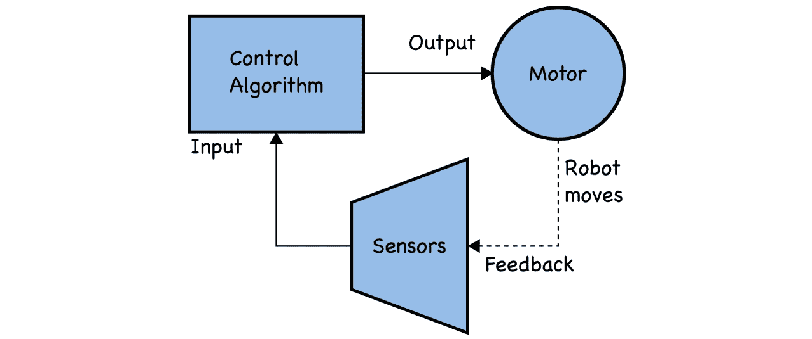

图 10.1 – 控制和反馈回路

前面的图显示了传感器数据进入控制算法。该算法以电机控制作为其输出。电机将使机器人移动。这种移动导致反馈回路，因为传感器读数发生变化并再次通过循环。这个概念被称为**闭环控制**。

这个闭环系统使机器人能够与真实世界互动，调整其行为以产生所需的结果。

我们为我们的距离传感器构建了一个类似的简单系统。我们将在下一节更详细地研究那个系统。

## 震荡控制

在*第八章*，*使用 Pico 感测距离以检测物体*提供的示例中，系统将我们的机器人上的距离传感器与阈值进行比较。例如，看看以下图表：

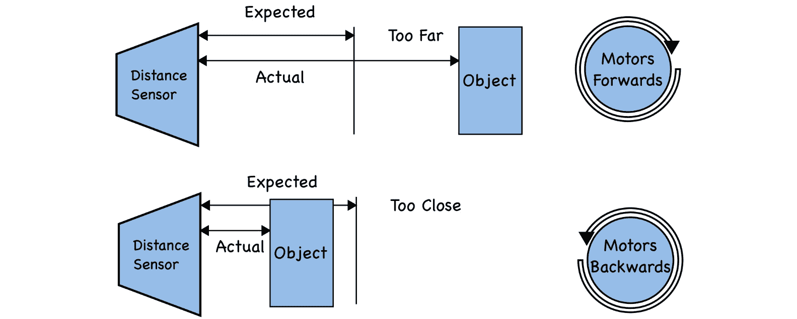

图 10.2 – 震荡电机控制

*图 10.2* 总结了**bang-bang 控制**。这个控制系统有两个模式。如果实际测量值高于预期值且距离太远，它将前进；否则，它假设它低于该值且太近，将后退。它将始终朝一个方向以固定的电机功率行驶。仅用固定功率进行控制被称为**恒定校正**。

这种方法简单且在某些情况下适用，但有时需要更平滑的处理。如果我们希望机器人的电机功率根据其与物体的距离变化，该怎么办？我们需要计算一个误差值，如下面的图所示：

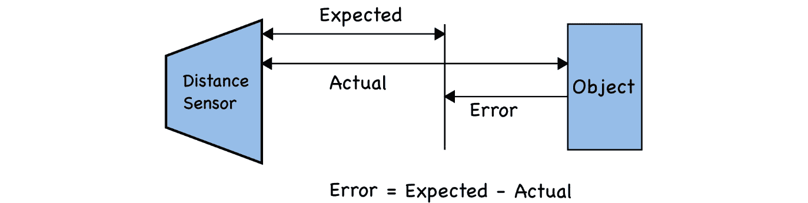

图 10.3 – 计算误差值

*图 10.3* 展示了如何计算误差值。通过从预期值减去实际值，我们将得到误差。这个误差将根据事物之间的差异程度改变大小，并根据实际测量值落在预期测量的哪一侧改变方向。

如果我们将这个误差乘以某个值，这可以转化为电机速度，使得较大的误差幅度将导致更大的电机运动。这个过程将形成这里所示的反馈控制回路：

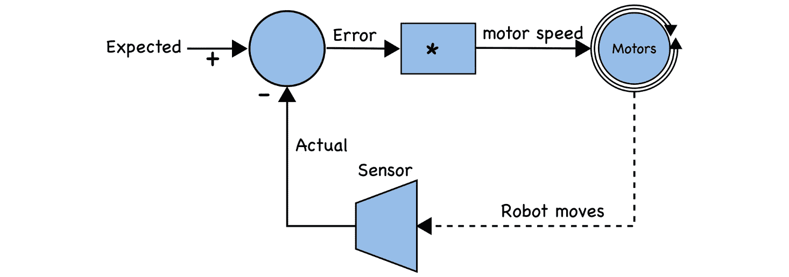

图 10.4 – 比例反馈回路

*图 10.4* 基于 *图 10.1*，通过乘法器（或增益）传递误差值来计算电机速度，从而移动机器人。机器人运动反馈改变传感器的读数。通过合适的增益值，这个机器人在接近物体时会减速。

将误差值乘以以这种方式控制输出被称为**比例控制**，这是我们正在构建的系统的一部分。我们乘以误差的量被称为**比例增益**。

到目前为止，我认为我们已经准备好编写这段代码了。

## 比例控制距离感应

在本节中，我们将编写代码来接近一个物体并保持与物体的预期距离。在主机上创建一个名为 `proportional-distance-control` 的文件夹。我们将把这个文件夹的内容复制到 Pico 的顶级目录中。我们也可以将机器人和 `pio_encoder` 文件复制到那里。

添加一个 `code.py` 文件，从导入和启用 UART 开始：

```py
import time
import board
import busio
import robot
uart = busio.UART(board.GP12, board.GP13, baudrate=9600)
```

现在，我们可以将我们的比例控制器作为一个类添加：

```py
class PController:
    def __init__(self, kp):
        self.kp = kp
   def calculate(self, error):
        return self.kp * error
```

这段代码让我们可以创建具有比例增益 `kp` 的比例控制器 (`PController`) 对象。我们可以使用误差值调用 `calculate` 方法来获取控制值。

让我们设置一个传感器：

```py
robot.right_distance.distance_mode = 1
robot.right_distance.start_ranging()
distance_set_point = 10
distance_controller = PController(-0.1)
```

我们将预期距离的设定点设为 10 厘米。然后，我们有我们的 `distance_controller`，它使用 `PController` 对象。

当我们的机器人距离更远时，我们需要向前行驶，因此我们需要使用负比例增益。电机速度在-1 和 1 之间，所以-0.1 将减少十分之一的距离并取反。

主循环仅在有新的距离读取时才会检查`PController`：

```py
while True:
  if robot.right_distance.data_ready:
    distance = robot.right_distance.distance
```

我们可以使用这个设置点来计算误差，并将其输入到比例控制器中：

```py
    error = distance_set_point – distance
    speed = distance_controller.calculate(error)
    uart.write(f"{error},{speed}\n".encode())
```

当我们在这里时，我们可以将这些数字发送到 UART（这样我们就可以绘制它们）。我们有一个来自误差的速度。现在，我们可以将这个速度发送到两个电机：

```py
    robot.set_left(speed)
    robot.set_right(speed)
```

最后，我们必须重置传感器以进行另一次读取并稍微延迟：

```py
    robot.right_distance.clear_interrupt()
    time.sleep(0.05)
```

将此代码发送到机器人。如果您在机器人前方放置一个物体，它将找到并保持距离物体大约 10 厘米的位置。您也应该能够绘制输出。

这里的电机可能会频繁发出蜂鸣声；这对它们来说不好，并且会使它们变热。我们可以使用代码来建立一个**死区**，在这个区域内，我们期望控制输出对电机来说太小，以至于无法响应，并关闭它们。

在速度计算后添加以下代码以停止蜂鸣声：

```py
    if abs(speed) < 0.3:
      speed = 0
```

此代码使用`abs`仅获取速度的大小。如果大小低于 0.3，它将发送一个`0`。我在实验中找到了`0.3`，但这可能因机器人而异。

在继续之前，您应该在机器人上测试此功能，并在此行为没有尝试找到物体距离的情况下检查下一节。

## 故障排除

如果您没有得到以下行为正常工作，以下是一些可以尝试的解决方案：

+   首先，使用*第八章*的代码检查距离传感器的功能。然后，验证传感器和电机连接。

+   如果机器人行驶方向错误，请反转比例常数。

存在一个问题，这个机器人可能接近正确位置，但留下小距离的间隙。结果，它可能不会产生足够大的速度来移动电机。在下一节中，我们将看到原因。

## 使用积分处理小距离

下面的图表显示了活动后剩余的小误差：

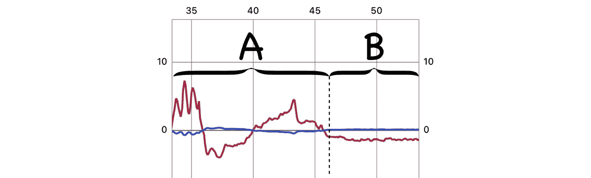

图 10.5 – 剩余的小误差

前面的图显示了误差和电机输出随时间变化的图表。误差线变化幅度达 10 个单位。电机图更平坦。这条线在 0 到 1 之间，与预期的比例实验相反。图表分为两部分。部分 A 显示了当我们移动一个物体靠近和远离时，机器人移动，电机响应。在部分 B 中，我们逐渐移动物体，产生一个小的-1 误差。这个小的误差导致速度为 0.1，不足以移动。

我们得到的是一个**稳态误差**。系统尚未收敛到设置点，并且不会进一步采取行动来减少误差。

这种情况下，积分元素是有用的。**积分**相当于图表下的一个面积。看看下面的图表作为例子：

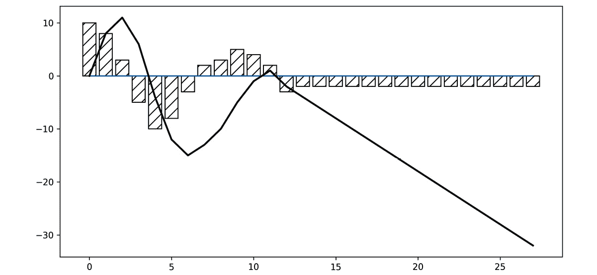

图 10.6 – 绘制积分

这个图表有两个元素。柱状图代表前一个图表中的误差值，近似为离散的时间步。然后，还有覆盖在这个上面的粗线，代表积分。虽然图表在变化，但积分可能稍后变化。然而，当它达到稳态时，图表开始持续向下拉动。

如果我们将这个值乘以另一个小的常数，我们可以使电机稍微移动以消除稳态误差。我们称之为`ki`。以下图示显示了包含积分项的控制系统：

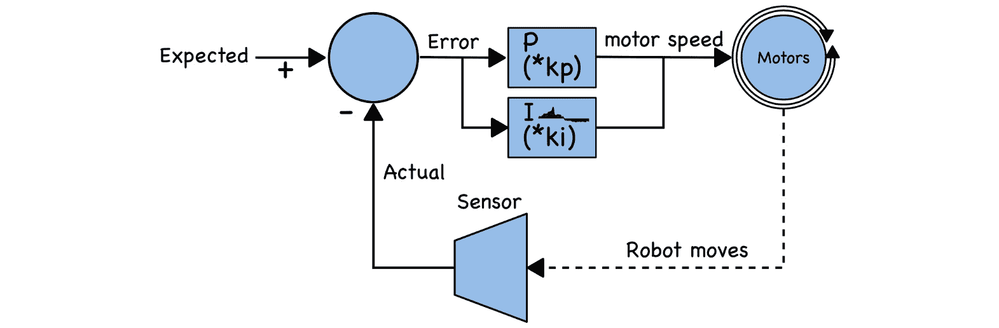

图 10.7 – 带积分的反馈回路

前面的图示显示了添加了积分的反馈回路控制系统 – 这个框显示了*I * ki*，积分乘以积分增益。它输入到电机速度中，并添加到比例输出中。积分被赋予了与比例元素相同的误差项。

积分将存储到目前为止看到的误差图面积。这将是图表下的面积。我们如何计算面积？我们可以将每个误差乘以它产生的持续时间。将这些加到运行总和中，代表面积的良好近似。

以下代码扩展了前面的例子。

让我们更新`PController`代码，使其成为`PIController`类：

```py
class PIController:
    def __init__(self, kp, ki):
        self.kp = kp
        self.ki = ki
        self.integral = 0
```

在前面的代码中，我们添加了`ki`作为积分增益来缩放我们的积分。我们还存储了一个积分总和，从`0`开始。

重要提示

在 PID 算法中将像这样的增益常数用*k*前缀表示，是因为它们被视为*常数*，但外部代码可以调整这些值。所以，从数学上讲，这是一个常数，但在代码中并不是一个常数。

然后，我们必须更改`calculate`方法：

```py
    def calculate(self, error, dt):
        self.integral += error * dt
        return self.kp * error + self.ki * self.integral
```

`calculate`现在将误差添加到积分中，这意味着积分将继续在误差方向上移动。然而，我们将乘以经过的时间（或时间差，`dt`），这样较长的测量间隔将导致更大的面积。最后一行将当前积分乘以积分增益。

当我们创建控制器时，我们需要设置积分常数：

```py
distance_controller = PIController(-0.19, -0.005) 
```

`–0.19`和`–0.005`的值适用于我的机器人。我们将在本章后面学习如何调整这些值。在这种情况下，积分常数应该是负的且较小。较大的值会导致超调，系统会来回移动（振荡）。

现在，我们可以修改主循环：

```py
prev_time = time.monotonic()
while True:
  if robot.right_distance.data_ready:
    distance = robot.right_distance.distance
    error = distance_set_point – distance
    current_time = time.monotonic()
    speed = distance_controller.calculate(error, current_time - prev_time)
    prev_time = current_time
    if abs(speed) < 0.3:
      speed = 0
    uart.write(f"{error},{speed},"
      f"{distance_controller.integral}\n".encode())
    robot.set_left(speed)
    robot.set_right(speed)
    robot.right_distance.clear_interrupt()
    time.sleep(0.05)
```

突出的变化始于时间差计算。我们保留上一个时间（`prev_time`），以便稍后从`current_time`中减去，并将这个时间差与误差一起输入控制器。接下来，我们将`current_time`存储在`prev_time`中，以便我们为下一个循环做好准备。`time.monotonic`函数提供了一个带有分数的秒数时间，保证后续调用不会返回更低的值。

我们还将当前积分值发送到 UART 以进行绘图。将此代码发送到机器人：

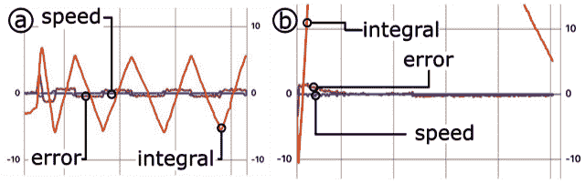

图 10.8 – 振荡与较小的积分

在*图 10.8（a）*的屏幕截图显示了一个具有大积分增益的误差。这种上升使得电机移动并继续工作，直到系统超调，直到积分反向翻转——这导致振荡。在*图 10.8（b）*中，积分增益要低得多，因此积分必须达到更高的值才能产生变化。电机首先对比例变化做出反应，但积分稍后进行轻微调整。这种设置可能仍然会有微小的振荡，但振荡会缓慢而微妙。

注意，当机器人纠正稳态并使误差达到零时，这并不会减少积分。

重要提示

如果车轮/电机没有使机器人向前移动，请停止代码（或机器人），当车轮接触地面或电机开启（它们仅使用电池供电）时，重新启动代码。否则，系统可能会积累大量的积分，并将撞到其前面的下一个物体。这个问题被称为**积分风车效应**，如果不加以考虑，可能会成为一个大问题。

这里的一些超调是不可避免的，但系统正在对稳态误差做出反应。这个 PID 控制器将工作，但如果快速移动目标物体，你仍然可能能够引起振荡。我们如何在下一节中减弱它？我们将看到。

## 使用导数处理振荡

由于状态突然变化，产生了大量的反应输出，这可能导致状态在相反方向上发生大幅变化。这种情况可能在设定点的两侧重复发生。状态变化相当于图表上任意点的斜率。

下面的图表显示了变化值，并在几个点上标出了斜率：

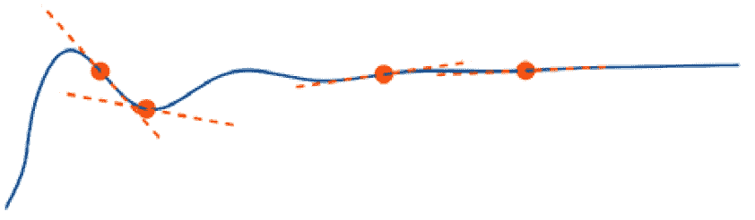

图 10.9 – 图表上的斜率

前面的图表显示了误差 PID 响应的稳定。在图表上，有一些点，虚线显示了斜率。导数代表任意点的这个斜率。

关键因素是当误差有急剧变化时，其斜率也会更陡。这个斜率值就是**导数**。它代表我们系统中变化的速度。使用这个值与增益结合可以减少超调，抑制系统。因此，我们可以添加这个值以及 PI 元件，稍微抑制运动。

然而，在我们这样做之前，还有一个问题：距离传感器的输出有点噪声。以下放大视图显示了当机器人不移动时传感器上的噪声：

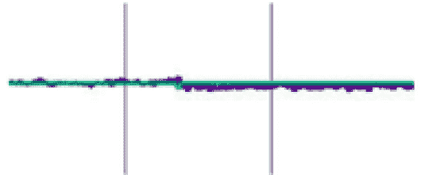

图 10.10 – 传感器的噪声

以下截图放大以显示传感器数据噪声。其中一条线经常高于或低于该线。这种噪声很小，但会使斜率发生许多快速变化。

直接使用导数与这种噪声结合可能会导致我们的机器人产生大幅度的运动。为了减少这种情况，我们将在积分之前使用一个**低通滤波器**。这仅允许持续的误差运动进入，过滤掉噪声的恒定抖动。

让我们将其视为一个反馈控制图：

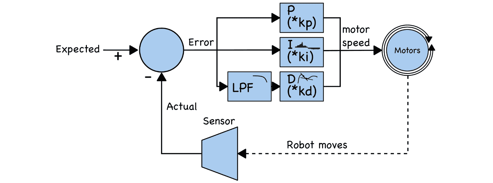

图 10.11 – PID 控制器的反馈流程

*图 10.11* 通过添加两个额外的模块扩展了 *图 10.7*。首先，误差通过一个标记为 LPF 的模块，这是一个低通滤波器，其风格化的频率图显示了对于更高频率的衰减。LPF 模块输入到下一个模块 – 导数乘以 `kd` 导数增益。这个模块有一个风格化的图表显示了斜率线。然后，导数输出被添加到其他 PI 输出，以生成电机速度信号。

现在我们已经看到了它是如何工作的，让我们修改代码，从 PID 类开始：

```py
class PIDController:
    def __init__(self, kp, ki, kd, d_filter_gain=0.1):
        self.kp = kp
        self.ki = ki
        self.kd = kd
        self.d_filter_gain = d_filter_gain
        self.integral = 0
        self.error_prev = 0
```

在这里，我们向 `PIDController` 类添加了两个额外的构造参数 – 一个导数增益，`kd`，和一个导数滤波器增益。我们还存储一个之前的误差来计算当前误差的差值。`calculate` 函数也发生了变化：

```py
    def calculate(self, error, dt):
        self.integral += error * dt
        difference = (error - self.error_prev) * self.d_filter_gain
        self.error_prev += difference
        self.derivative = difference / dt
        return self.kp * error + self.ki * self.integral + self.kd * self.derivative
```

我们需要当前误差与之前误差之间的差值。我们将这个差值乘以滤波器增益，并将其加到之前的误差上。这意味着误差以平滑的量变化，为我们进行下一次计算做好准备。

下一行将这个差值除以时间的变化，以得到变化率。我们将这个值存储在 `self.derivative` 中，以便我们可以在以后绘制这个项。最后，我们将 `self.derivative` 乘以 `d` 增益（`kd`）并将其添加到计算中。

PID 控制器现在已完成。我们可以通过将 `PIDController` 类移动到 `pid_controller.py` 文件中来使其可重用。

`code.py` 文件可以这样使用 `pid_controller`：

```py
import time
import board
import busio
import robot
from pid_controller import PIDController
uart = busio.UART(board.GP12, board.GP13, baudrate=9600)
robot.right_distance.distance_mode = 1
robot.right_distance.start_ranging()
distance_set_point = 10
distance_controller = PIDController(-0.19, -0.008, -0.2)
prev_time = time.monotonic()
while True:
  if robot.right_distance.data_ready:
    distance = robot.right_distance.distance
    error = distance_set_point – distance
    current_time = time.monotonic()
    speed = distance_controller.calculate(error, current_time - prev_time)
    prev_time = current_time
    if abs(speed) < 0.35:
      speed = 0
    uart.write(f"{error},{speed}, {distance_controller.integral}, {distance_controller.derivative}\n".encode())
    robot.set_left(speed)
    robot.set_right(speed)
    robot.right_distance.clear_interrupt()
    time.sleep(0.05)
```

代码中高亮的部分展示了如何从之前的`code.py`示例中做出改变。首先，我们导入了`PIDController`类。然后，我们将`PIController`的使用替换为`PIDController`。随着我们对这段代码的扩展，PID 调整参数将被调整。添加额外的项，如导数，将使得调整其他参数成为必要。

我们将误差和时间差发送到控制器计算中，以获取速度，然后将导数发送到 UART，以查看我们的机器人正在做什么并调整参数。

通过这样，我们已经构建了一个 PID 控制器，并使用它来保持与物体的特定距离。我们将在下一节将其变成一个更动态的例子。

# 使用 PID 跟随墙壁

使用 PID 算法沿墙壁行驶需要更多的协调。让我们用一个图表来可视化这个问题：

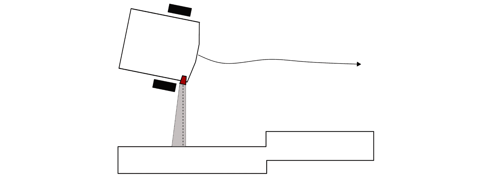

图 10.12 – 机器人跟随墙壁

*图 10**.12* 展示了我们的机器人如何跟随墙壁。首先，机器人沿着由实线箭头指示的方向前进。我们将传感器向外转动，以便它能在其锥形区域内检测到墙壁（这些距离传感器覆盖大约 20 度）。根据接近物体的返回值（以虚线表示），机器人将调整其航向以尝试保持恒定的距离。当机器人面对墙壁时，它会向外弯曲，可能会超出预定距离，但墙壁上有一个阶跃变化，因此机器人将调整其路径并直行。

我们有几个问题。首先，我们将电机放置得有点靠前，并且使用当前的位置转动传感器会使轮子进入传感器的路径，所以我们需要将它们向后移动。然后，我们需要进行 90 度的传感器转向。之后，我们需要使用 PID 来确定在机器人前进时需要调整机器人航向的程度，即偏转，作为机器人前进的一部分。

让我们先做一些改动来移动传感器。

## 改变传感器的位置

我们需要对我们的 CAD 草图做一些改动，然后使用绘图来钻一些孔。注意，在 CAD 草图上，机器人面向下方时，草图左侧对应于机器人的右侧。

以下 FreeCAD 截图显示了如何进行 CAD 更改：

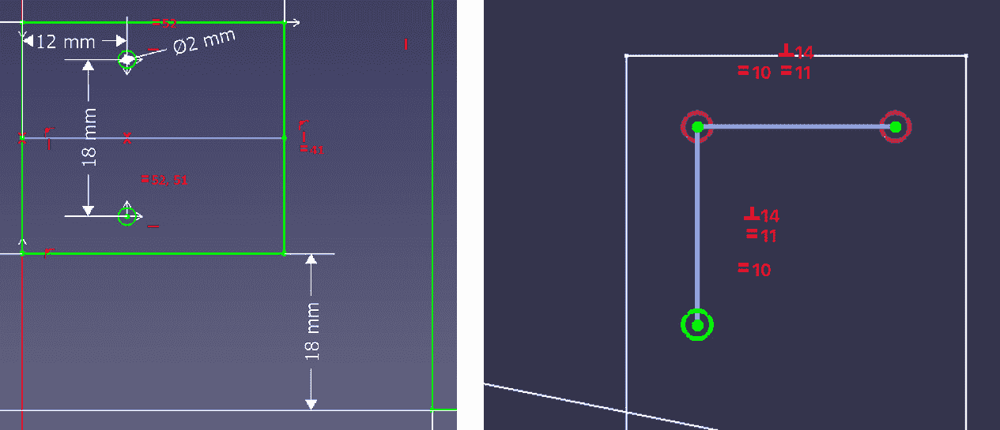

图 10.13 – 将传感器侧置的 FreeCAD 草图

*图 10.13* 的左侧截图显示了我们在 `UpperParts` 绘图中如何将电机向后移动。首先，删除电机底部角落（如图左侧所示）和面包板之间的水平约束。然后，在这两个相同点之间添加一个 18 毫米的垂直尺寸。将电机向后移动 18 毫米为传感器提供了足够的空间，但这也意味着我们可以重用其中一个现有的孔，因为它们之间的距离是 18 毫米。此外，两个电机有对称约束，这样它们就会一起移动。现在，你可以关闭这个草图。

*图 10.13* 的右侧是草图截图，显示了一个额外的 90 度前传感器孔。将现有的距离传感器孔作为外部几何形状导入。然后，使用构造线约束这个孔和顶部外侧孔之间的距离，使其等于初始距离传感器孔之间的距离。在圆上添加等距约束，在线之间添加垂直约束。你可以在另一侧做类似的圆，尽管我们在这个演示中只会使用一个传感器。

下图显示了 CAD 绘图和机器人上新的位置安装的部件：

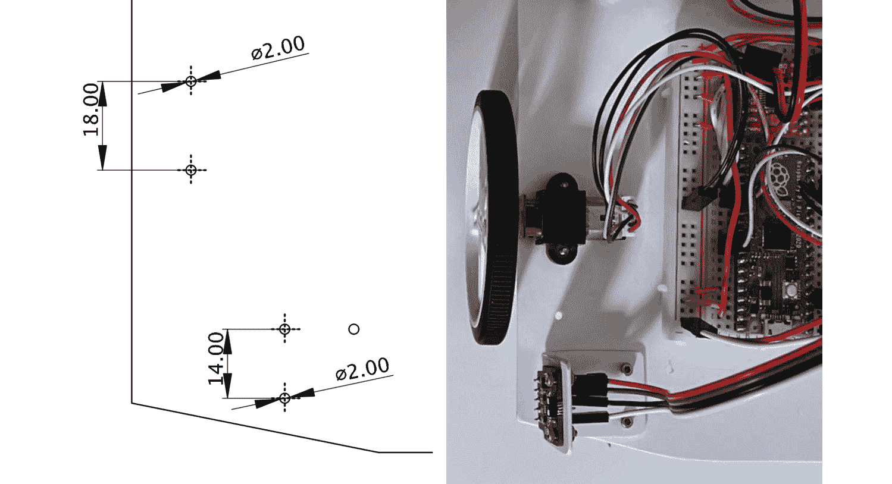

图 10.14 – 机器人变化的绘图和结果

前一张图的左侧显示了绘图。我已用现有的孔作为参考标记了新的孔。你需要拆卸电机和传感器来完成这项工作——卸下螺栓，但保持电线连接，并小心地将它们放在一边。在移除电机后，安装电机支架的一侧，并使用支架另一侧的孔来标记新的孔。

使用距离传感器，卸下内六角螺栓，然后将其旋转 90 度朝外。然后，你可以使用内六角螺栓孔来标记钻孔的位置。

前一张图的右侧显示了电机和传感器已经移动到正确的位置。请确保连接仍然正确。

这个机器人已经准备好供我们编写墙面跟随代码。让我们看看如何。

## 墙面跟随代码

墙面跟随是我们在之前已经工作的代码的一个扩展，有一些关键的不同之处。首先，我们的机器人将以恒定的速度行驶，但根据传感器的反馈，它将更靠近/远离墙壁。它可以通过向一侧的速度添加 PID 输出，并从另一侧减去它来实现这一点。

首先，复制之前的代码示例。我们将对 `code.py` 进行修改。导入和设置保持不变：

```py
import time
import board
import busio
import robot
from pid_controller import PIDController
uart = busio.UART(board.GP12, board.GP13, baudrate=9600)
robot.right_distance.distance_mode = 1
robot.right_distance.start_ranging()
```

然而，除了其他设置之外，我们必须为机器人添加一个基本速度。距离设定点也应该更远：

```py
speed = 0.7
distance_set_point = 15
distance_controller = PIDController(0.05, 0.0, 0.0)
```

我们在这里设置了 PID，这样你就可以调整其设置。

主循环以相同的方式获取传感器数据和错误：

```py
prev_time = time.monotonic()
while True:
  if robot.right_distance.data_ready:
    distance = robot.right_distance.distance
    error = distance_set_point - distance
```

当我们计算 PID 时，我们现在将其存储在 `deflection` 中，描述我们将如何快速转向：

```py
    current_time = time.monotonic()
    deflection = distance_controller.calculate(error, current_time - prev_time)
    prev_time = current_time
```

我们将其写入 UART，以便我们可以绘制和调试它：

```py
    uart.write(f"{error},{deflection}\n".encode())
```

代码通过将其添加到右侧电机速度中并从中减去左侧来使用这种偏转。这种偏转应该在我们向前行驶时将我们拉向设定点，即离墙壁的距离：

```py
    robot.set_left(speed - deflection)
    robot.set_right(speed + deflection)
```

最后，通过重置传感器并在循环之前稍微休息来完成：

```py
    robot.right_distance.clear_interrupt()
    time.sleep(0.05)
```

你可以将这个指令发送给机器人，并在靠近墙壁的地方启动它，它可能会尝试跟随它。我发现房间中间的几个箱子很好，因为它可以绕着它们行驶；然而，它可能很难处理任何凹形物体。

这种结果可能是不稳定的，因此我们需要调整这个 PID。然而，即使不稳定，它也应该尝试跟随墙壁，即使它发生碰撞。

## 故障排除

如果机器人不跟随或启动，请尝试以下步骤：

+   首先，检查距离传感器的接线；现在你已经移动了它，线可能已经被松动了。*第八章*，*使用 Pico 检测物体距离的感应*，其中包含有关传感器接线的指南，如果你需要检查这一点。

+   确保你有全新的电池组 – 在低电量下这不会很好地工作。

+   如果机器人正在旋转，请将其靠近墙壁，如果它反应过于激烈，请降低 P 值。我们将在稍后调整它。

现在，你应该有一个机器人，它有点在跟随墙壁，但可能非常不稳定或有时会撞到。为了使它工作得更好，我们需要调整 PID。

# PID 调节 – 使用图表来调整 PID

PID 算法对于响应传感器输入、调整恒定误差以及通过导数来抑制过度补偿是非常好的。唯一的问题是正确获取这三个值是棘手的。如何调整 PID 取决于系统。在我们的案例中，对于跟随墙壁，这很大程度上取决于机器人在这种情况下的感觉。这种方法适用于小型机器人，但还有一些需要系统数学模型的形式化方法。

根据情况，我们可能只使用一个常数，但为了这个目的，我们将尝试使用所有三个。同时，一次只更改一个增益常数也是一个好的实践。

我们已经在手机上为我们的系统有了图表。当我们开始时，我们只会显示错误和响应；根据需要我们可以添加其他组件。导数和积分组件可能会使比例组件相形见绌，而 Bluefruit 应用程序不允许在同一图表上使用不同比例的绘图。

我们还将添加一些除了图表之外的控件。否则，你将需要经常插上机器人来重新编程！所以，让我们从一些基本控件开始。

## 控制电机速度

首先，我们需要能够启动和停止我们的电机。目前，我们的系统以电机开启和运行的状态启动。关闭电机或减慢速度将使调整变得不那么令人沮丧。

电机速度由 PWM 系统控制。我们机器人的当前 PWM 设置频率为 500 Hz。这对直流电机来说有点高，这意味着它们在低速时可能会卡住（停止）。因此，我们将降低电机 PWM 频率。在`robot.py`中，对匹配的行进行高亮显示的更改：

```py
motor_A1 = pwmio.PWMOut(board.GP17, frequency=100)
motor_A2 = pwmio.PWMOut(board.GP16, frequency=100)
motor_B1 = pwmio.PWMOut(board.GP18, frequency=100)
motor_B2 = pwmio.PWMOut(board.GP19, frequency=100)
```

在`code.py`中，我们将修改我们的系统以允许关闭电机：

```py
prev_time = time.monotonic()
motors_active = False
while True:
  if robot.right_distance.data_ready:
    distance = robot.right_distance.distance
    error = distance_set_point - distance
    current_time = time.monotonic()
    deflection = distance_controller.calculate(error, current_time - prev_time)
    prev_time = current_time
    uart.write(f"{error},{deflection}\n".encode())
    if motors_active:
      robot.set_left(speed - deflection)
      robot.set_right(speed + deflection)
    robot.right_distance.clear_interrupt()
    time.sleep(0.05)
```

然后，我们将想要添加 UART 控制：

```py
  if uart.in_waiting:
    command = uart.readline().decode().strip() 
```

`if`检查等待的命令；如果有，我们读取一行输入并对其进行解码。`strip`移除行尾字符。

现在，我们可以开始检查命令：

```py
    if command.startswith("M"):
      speed = float(command[1:])
```

这段代码意味着我们可以通过 Bluefruit UART 应用向机器人发送指令，例如`M0.7`，并且直线电机速度将为 0.7。

我们还希望能够激活/停用电机：

```py
    elif command == "G":
      motors_active = not motors_active
      robot.set_left(0)
      robot.set_right(0)
      distance_controller.integral = 0
```

我们可以通过向机器人发送`G`指令来停止或启动电机。这个处理程序切换`motors_active`变量。它将始终停止电机。在下一次循环周期中，只有当它处于活动状态时，才会打开它们，确保它们停止。

最后，这会将积分重置，以避免在电机不运行时积分累积。当机器人无法采取行动来抵消它时，运行积分被称为**积分累积**，可能会引起大问题。

我们可以使用现有的比例控制来测试这个功能，并将其发送到机器人。你应该能够在 Bluefruit 应用中的 UART 面板上测试指令：

+   `G` -> 启用/停用机器人电机：想想前进/停止。

+   `M<速度>` -> 设置电机速度：这应该在 0.3 和 1.0 之间。它可能不会在 0.3 以下移动。在负速度下，它将表现不正确，并且电机代码会截断大于 1.0 的值。

现在你已经控制了机器人，让我们来看看如何调整比例组件。

## 比例组件

比例增益常数，`pk`，是起点，通常在系统中占主导地位。将误差乘以`pk`将对传感器产生最直接的反应。

我们可以从添加代码来更改比例常数开始：

```py
    elif command.startswith("P"):
      distance_controller.kp = float(command[1:])
```

这段代码检查输入，`P<比例增益>`，并以与电机速度相同的方式使用它。当你输入一个值时，比例常数将被更新。所以，让我们通过添加一个指令来检查机器人的状态：

```py
    elif command.startswith("?"):
      uart.write(f"P{distance_controller.kp:.3f}\n".encode())
      uart.write(f"I{distance_controller.ki:.3f}\n".encode())
      uart.write(f"D{distance_controller.kd:.3f}\n".encode())
      uart.write(f"M{speed:.1f}\n".encode())
      time.sleep(3)
```

这个处理程序用于`?`，将打印 PID 常数和速度设置。`.3f`注解将值编码为带有 3 位小数的数字。因为机器人通常通过 UART 输出图形值，所以我们在这里暂停 3 秒钟。不要在电机运行时使用此命令。

当我们向机器人发送这个指令时，我们有两个额外的控制能力：

+   `P0.045` -> 将比例增益值设置为`0.045`。

+   `?` -> 打印当前状态：

```py
P0.045
I0.000
D0.000
M0.7
```

将此发送到机器人。在我们启动电机（`G`）之前，让我们考虑一个良好的比例值。对于这个例子，我们期望误差在 5 到-5 之间，给我们 10 厘米的范围。角落会超出这个范围并设置全转向（饱和，最大值）。以 0.7 的速度，要反转，我们需要-1.4 的输出。我们可以将 1.4 除以 10，得到一个起始猜测值 0.14。发送`P0.14`来设置这个值，并使用`G`来启动机器人移动。

这个设置正在响应但有一些振荡。使用`G`来停止它。我们将通过减半 P 值并再次尝试来使用试错法。我们可以测试这一点并使用两条规则：

+   如果机器人振荡得太厉害，将值除以 2。

+   如果机器人响应得太慢，乘以 1.5（这里的值与上一个值之间较高）。

这种方法让我们能够聚焦到一个值。当你找到你喜欢的值时，你可以把它们放回`code.py`中以便稍后使用。使用`?`来查看你最后的`P`设置。

下面的截图显示了这在图表输出中的样子：

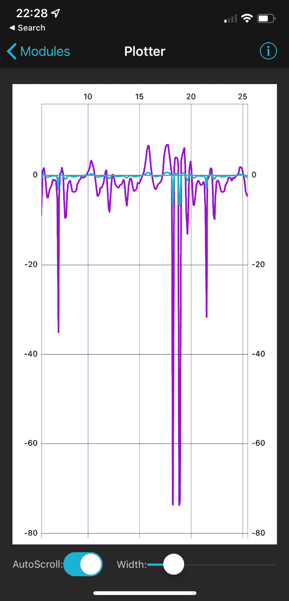

图 10.15 – 比例响应

之前的电话截图显示了一个只有比例响应的图表。X 轴指定秒数。Y 轴是厘米单位的误差距离，但对于输出值来说更为任意。误差在几十厘米的范围内有更高的范围。机器人正在绕一些障碍物行驶。当它到达一个角落并绕过它时，会有巨大的摆动。蓝色线显示 PID 输出和偏转。偏转刻度通常在 1 以下，但大摆动会超过这个值。电机速度被限制在-1.0 和 1.0 之间，所以那些大角落会使电机饱和，使机器人原地转动。

总结来说，高的比例增益会使系统快速响应，但它会超调，甚至可能开始振荡。太低，它将不会足够快地响应。

当有较大的变化时，只有比例的系统可能会过度转向。我们希望将其抑制。我们将调整*D*组件来处理这个问题。

## 调整导数增益

导数组件允许机器人处理误差的大变化，并通过增加或减少力度来反应，例如在突然变化时，如过度转向、墙角（角落）或找到墙的阶跃变化。

让我们修改我们的代码，使其更容易处理导数。在`code.py`中，在计算偏转后，在`uart.write`行后添加`,{distance_controller.derivative}`：

```py
    deflection = distance_controller.calculate(error, current_time - prev_time)
    prev_time = current_time
    uart.write(f"{error},{deflection},"
      f"{distance_controller.derivative}\n".encode())
```

我们还需要控制导数。在`P`命令处理程序之后添加以下内容：

```py
    elif command.startswith("D"):
      distance_controller.kd = float(command[1:])
```

如您所见，这设置了一个简单的模式，与`P`相同。

现在，我们可以用一半的 P 值，`D0.035`，来启动它，这会导致碰撞减少，偶尔弹跳。下面的截图显示了机器人绕盒子行驶：

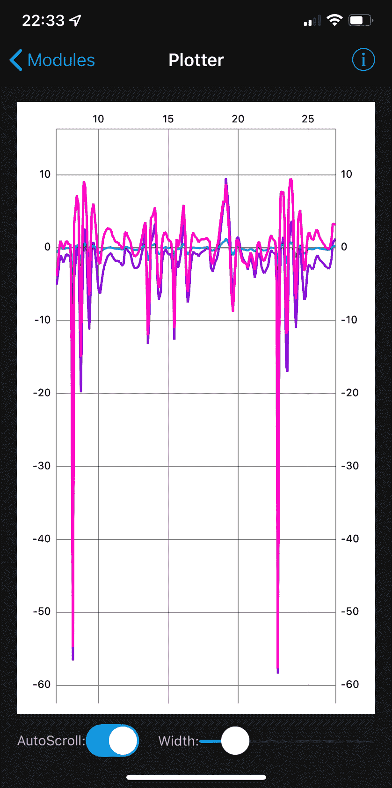

图 10.16 – 初始导数图

前面的图表显示了橙色中的导数，叠加在红色中的误差上，以及蓝色中的输出。请注意，导数尖峰非常大，但有时可以是误差的相反符号，允许它抑制变化。最大的尖峰仍然是墙壁。在 10 到 15 秒之间，导数抑制了比例输出。

突然的距离增加，例如墙壁的尽头，可以导致强烈的振荡，如下面的图表所示：

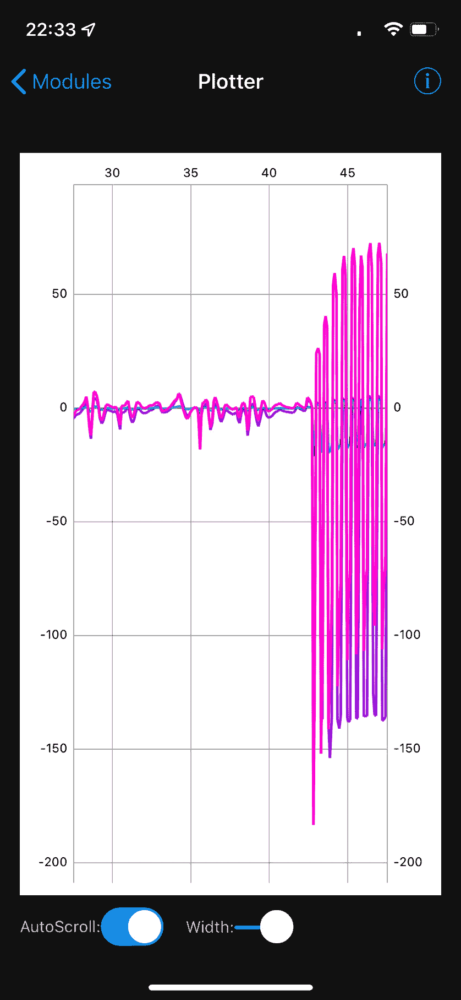

图 10.17 – 强烈的导数振荡

在前面的屏幕截图，大约 42 秒时，机器人遇到了一个凹形台阶。这个台阶导致导数超调，将机器人推到了右边。然而，这使传感器超出了障碍物，检测到了长距离，从太近到太远快速变化。导数强烈地向另一边摆动 – 是时候用`G`停止了。

我们可以将值再次减半到`0.017`进行另一次尝试，但它仍然会有同样的问题。我们需要比`P`更积极地减少`D`。我们可以将比例常数除以 10（`0.0035`）以获得更稳定的机器人。结果图如下所示：

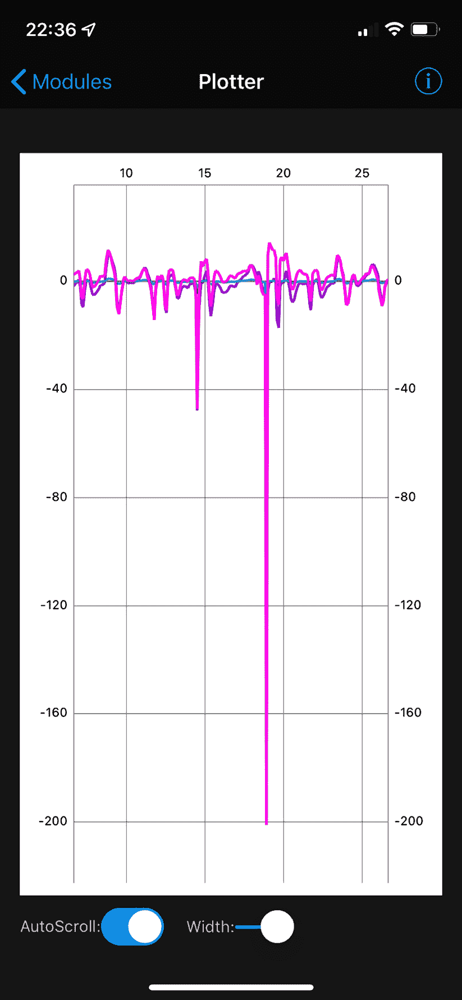

图 10.18 – 调整后的导数图

前面的屏幕截图显示了一个与*图 10.17*具有相同特性的图表，但使用了`0.0035`设置。虽然角落仍然显示为大的尖峰，但蓝色输出图现在更平静，导数抑制了输出。现在机器人将驾驶得相当平稳。

我们可能需要一个稍微不同的场景来调整积分。

## 调整积分

在具有许多阶跃变化的环境中，例如在房间中绕盒子驾驶，积分将不会扮演那么大的角色。不是每个问题都需要 PID 的所有三个部分，在这种情况下，积分可能不太合适。让我们将其设置得既好又慢，并找到一个长直墙。我不得不使用花园小径来做这个（并改变一些值以适应）。

首先，让我们将积分控制和输出添加到`code.py`文件中。输出行中将`{distance_controller.derivative}`替换为`{distance_controller.integral}`。

我们也可以将其添加到控制处理中：

```py
    elif command.startswith("I"):
      distance_controller.ki = float(command[1:])
```

这将接受一个如`I0.001`的命令来设置积分。这也是一个好的起始值。我们现在有一个全面的控制系统。

发送`M0.35`以降低速度。我们可以发送一半的`P`和`D`值以匹配，使用`?`查看它们的值。发送`I0.001`然后`G`以启动机器人对抗一堵长直墙。

当`P`和`D`项稳定下来时，你应该会看到一些大的调整；然后，`I`项将更慢地稳定。在驾驶时观察图表。

对于这个术语，我使用的策略是在一个小的值上稳定下来，如果对恒定误差的反应太慢，就慢慢增加它。和其他术语一样，如果起点`0.001`使系统不稳定，就将其除以 10，并慢慢增加那个值。

你现在有了在机器人上调整 PID 值的方法，以及一个用于此目的的控制系统。

## 调整的结束语

调整 PID 需要时间。可以使用 Ziegler-Nichols 等算法通过数学建模来解决这个问题，并在某些情况下有效。

另一点需要注意的是，系统响应的变化，如转弯半径，会改变事情。例如，在地毯上驾驶机器人会在轮子上产生阻力，使转弯变慢。如果 PID 调整得很好，在木地板上放置相同的机器人可能会导致它过度转向，因为其转向努力导致更大的变化。为特定环境中的特定行为调整 PID。

# 摘要

PID 控制器是构建能够根据传感器输入调整的机器人行为的一种好方法。在本章中，你学习了 PID 控制器及其组件是什么，包括低通滤波器如何使其表现更好。

PID 控制器允许动态响应，但需要大量调整才能正确设置。你已经看到了如何添加无线控制方法，这对于调整 PID 至关重要。你也观察了 PID 系统的图表，了解了它们如何与它们的操作和调整相关。

在下一章中，我们将使用 PID 控制器并与编码器一起使用，以直线行驶。

# 练习

这些练习将加深你对本章讨论主题的理解，并使机器人代码更加完善：

+   增强设置代码，以便可以以相同的方式调整设定点。`S<设定点>`可能是一个好主意。

+   修改设置 PID 值的命令处理程序，以便在更改这些值时停止电机并重置积分。

+   尝试将控制代码调整回本章早期使用的距离控制应用。

+   尝试在完全不同的表面上驾驶机器人，并调整 PID 值以实现平滑的墙壁跟随。

# 进一步阅读

这些学习辅助工具将帮助你继续阅读并深入了解 PID 算法及其特性：

+   YouTube 上的 Christopher Lam 有一个出色的控制理论视频课程：[`www.youtube.com/playlist?list=PLxdnSsBqCrrF9KOQRB9ByfB0EUMwnLO9o`](https://www.youtube.com/playlist?list=PLxdnSsBqCrrF9KOQRB9ByfB0EUMwnLO9o)。这个课程使用 MATLAB，详细介绍了 PID 等控制系统，包括它们的调整、问题、建模和分析。内容至少有 30 小时，采用非常数学的方法。

+   若要深入了解 PID 控制系统，可以考虑 Elektor Electronics 出版的《*基于 PID 的实用数字控制：使用 Raspberry Pi 和 Arduino Uno*》。这本书讨论了控制理论、变换函数和 PID 调整，同时提供了代码和实际示例。

+   《*PID 控制基础*》，作者 Jens Graf，由 CreateSpace 出版，全面探讨了 PID 控制系统。它提供了对每个组件的更多细节，以及构建 PI、PD 和完整 PID 算法控制系统的方法。
