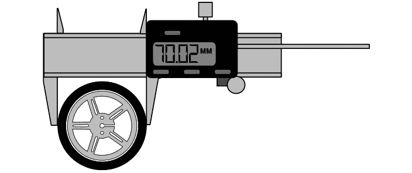
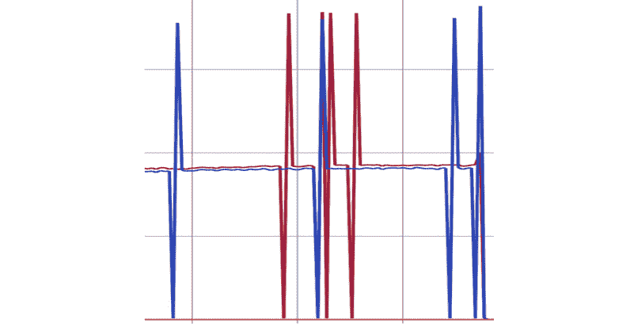
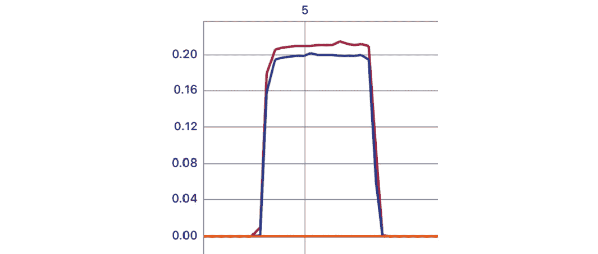
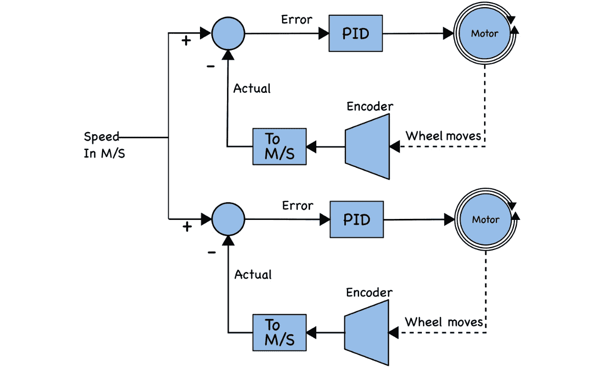
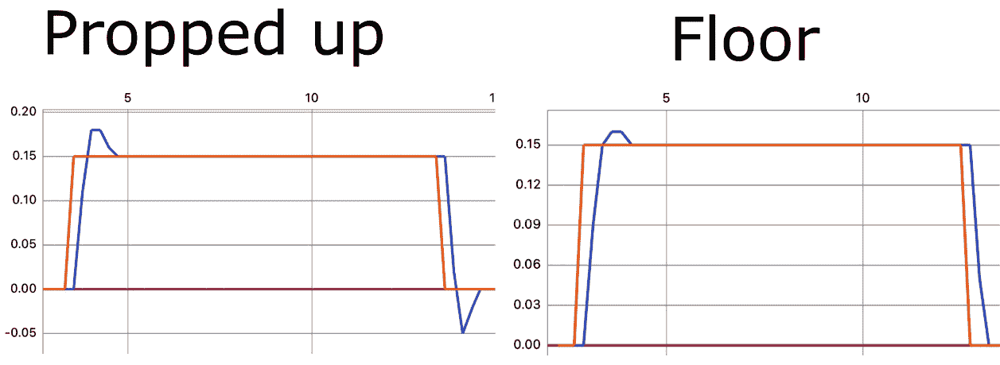
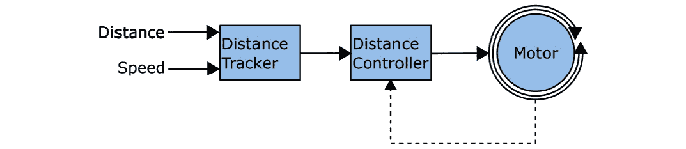
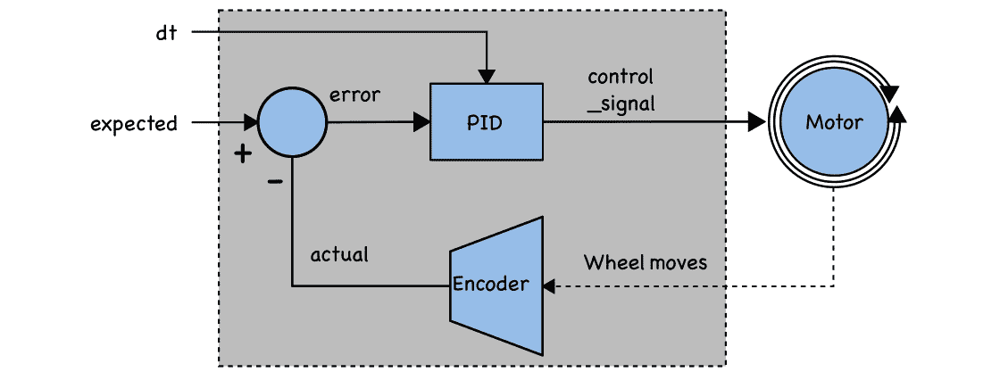

# 第十一章：使用 Raspberry Pi Pico 上的编码器控制运动

到目前为止，在这本书中，我们已经为我们的机器人添加了传感器，可以跟踪车轮转动时的计数。我们还研究了 PID 算法来关闭机器人控制回路。我们可以将这些概念结合起来，更精确地控制我们的电机和车轮。

这种组合将使我们能够在每个电机上保持已知速度，并校正它们的相对速度以保持直线。具有某些几何形状的编码器将使我们能够驱动机器人行驶预定的距离。

在本章中，我们将涵盖以下主要主题：

+   将编码器计数转换为速度

+   使用 PID 保持速度和直线

+   驱动已知距离

# 技术要求

对于本章，你需要以下内容：

+   机器人来自*第十章*，*使用 PID 算法来* *跟随墙壁*

+   机器人、编码器和 PID 代码来自*第十章*

+   大约 2 平方米的地面来测试机器人

+   数字卡尺

+   一台装有 Python 3 的 PC 或笔记本电脑

+   一部带有蓝牙 LE 的 Android/iOS 智能手机

你可以在[`github.com/PacktPublishing/Robotics-at-Home-with-Raspberry-Pi-Pico/tree/main/ch-11`](https://github.com/PacktPublishing/Robotics-at-Home-with-Raspberry-Pi-Pico/tree/main/ch-11)找到本章的代码。

# 将编码器计数转换为速度

在*第六章*，*使用 Raspberry Pi Pico 上的编码器测量运动*中，我们使用了 PIO 从电机编码传感器中检索计数。我们在那一章结束时测量了运动并计数了编码器转换一段时间。

在本节中，我们将车轮几何形状与编码器联系起来。然后，我们将使用它将编码器计数转换为速度或距离。

## 松动的螺栓和螺母

振动有时会导致螺母脱落——在螺母和螺纹上滴一点指甲油可以减少这种情况。

## 机器人车轮几何形状

计算车轮行驶的距离需要其圆周。让我们先测量车轮的直径，如下所示：



图 11.1 – 使用卡尺测量车轮

上一张图显示了如何使用数字卡尺测量车轮直径。直径可以直接用于我们的代码中。在`robot.py`中，添加你的测量值，四舍五入到最近的 0.1 毫米：

```py
import math
wheel_diameter_mm = 70
wheel_circumference_mm = math.pi * wheel_diameter_mm
```

上一段代码根据直径计算圆周。每次车轮完成一次完整转动，它都会沿着该方向移动车轮的圆周，因此我们已可以将车轮的转数和距离进行转换。接下来，我们需要了解编码器的详细信息。

## 编码器几何形状

在*第六章*中，*在 Raspberry Pi Pico 上使用编码器测量运动*，我们找到了编码器的极数和每转编码器转数。N20 内置磁性编码器为每个编码器盘转产生 28 个边缘或状态变化。然后我们乘以齿轮比 298:1。

我们可以将这些计算（使用你的电机齿轮比）添加到`robot.py`中：

```py
gear_ratio = 298
encoder_poles = 28
ticks_per_revolution = encoder_poles * gear_ratio
ticks_to_m = (wheel_circumference_mm / ticks_per_revolution) / 1000
```

我们使用 m 和 m/s，因为这把距离和速度放在与电机速度相同的顺序中。

现在，我们可以使用这些几何测量来获取速度。

## 测量每个轮子的速度

我们将使用物理中的速度三角形来计算每个轮子的速度：


图 11.2 – 速度三角形

前面的图中的三角形显示了距离与速度和时间的关系。我们想要速度，所以我们通过覆盖速度来获取距离。我们还可以看到 m/s。在我们的代码中，我们需要将编码器脉冲的差异转换为 m 的距离，然后除以这个差异覆盖的时间：

```py
speed = robot.ticks_to_m * (new_position – last_position) / time
```

我们可以在应用程序中使用这个计算来展示原理。

### 规划一个速度测量应用程序

我们可以构建一个应用程序来展示这一点，并尝试不同的速度。使用 UART 命令系统将使其交互式。

我们将使用`asyncio` – 异步输入/输出构建应用程序。`asyncio`允许我们在机器人上同时运行几个任务。大多数任务在事件之间休眠，而 CircuitPython 可以在那时运行另一个任务。应用程序必须执行以下任务：

+   测量编码器，将它们转换为速度值，并将此值发送到 UART。

+   接受控制命令以更改设置或驱动一段时间。

+   在特定时间后停止机器人。

我们希望为这个机器人使用的命令处理器如下：

+   `M0.7`: 将电机速度设置为 0.7

+   `T0.3`: 将测量时间间隔更改为 0.3

+   `G3.0`: 向前移动 3 秒，然后停止

+   `G`: 立即停止机器人移动

设计创建后，让我们构建应用程序。

### 速度测量应用程序

我们将使用 Adafruit `asyncio`库，以下为命令：

```py
circup install asyncio
```

首先，我们将 UART 移动到`robot.py`文件中。在导入部分添加以下内容：

```py
import busio
uart = busio.UART(board.GP12, board.GP13, baudrate=9600)
```

这样，UART 已经为后续示例设置好了。我们还会在`robot.py`的末尾添加一个便利函数：

```py
def send_line(message):
    uart.write(f"{message}\n".encode())
```

这包括了在 UART 上添加新行并将消息编码成字节的常规交互。

在一个新的文件夹`measuring_wheel_speeds`中，创建一个新的`code.py`文件，从以下导入开始：

```py
import asyncio
import robot
```

这些导入是熟悉的；然而，我们不是导入`time`，而是导入`asyncio`。

我们可以创建一个`Settings`类来存储当前设置，如下所示：

```py
class Settings:
  speed = 0.7
  time_interval = 0.2
```

这组成了设置；不同的任务可以访问它们。`speed`是电机速度，而`time_interval`是代码读取编码器的频率。

让我们学习如何处理编码器：

```py
async def motor_speed_loop():
  left_last, right_last = robot.left_encoder.read(), robot.right_encoder.read() 
```

我们使用 `async def` 将函数转换为异步任务。我们在计算编码器差异时，保留最后一个值。我们从这个当前的编码器读取开始。

接下来，我们进入传感器读取循环，该循环使用 `sleep` 来保持该时间间隔：

```py
  while True:
    await asyncio.sleep(Settings.time_interval)
```

此代码执行异步睡眠，允许其他任务运行。我们必须再次读取两个传感器，获取新值：

```py
    left_new, right_new = robot.left_encoder.read(), robot.right_encoder.read()
    left_speed = robot.ticks_to_m * (left_new - left_last) / Settings.time_interval
    left_last = left_new
```

我们通过从新值中减去最后一个值来获取速度。然后，我们将这个值转换为米，并除以时间间隔，以获得每秒米数。

我们还必须记得更新最后一个值。我们可以为右侧传感器重复此操作：

```py
    right_speed = robot.ticks_to_m * (right_new - right_last) / Settings.time_interval
    right_last = right_new
```

我们可以通过将速度打印到 UART 来完成电机速度循环：

```py
    robot.send_line(f"{left_speed:.2f},{right_speed:.2f},0")
```

注意 UART 输出末尾的 `,0`。我们必须添加这个来将图表锚定在 0，以便图表显示相对于零的速度。

我们接下来需要的组件是电机停止任务：

```py
async def stop_motors_after(seconds):
  await asyncio.sleep(seconds)
  robot.stop()
```

这个任务将简单地等待给定的秒数并停止机器人的电机。

我们还需要在异步任务中一个 UART 命令处理器：

```py
async def command_handler():
  while True:
    if robot.uart.in_waiting:
      command = robot.uart.readline().decode().strip()
      if command.startswith("M"):
        Settings.speed = float(command[1:])
      elif command.startswith("T"):
        Settings.time_interval = float(command[1:])
      elif command == "G":
        robot.stop()
      elif command.startswith("G"):
        await asyncio.sleep(5)
        robot.set_left(Settings.speed)
        robot.set_right(Settings.speed)
        asyncio.create_task(
          stop_motors_after(float(command[1:]))
        )
```

发送 `G3.0` 指示机器人等待 5 秒，行驶 3 秒后停止。这 5 秒的等待允许用户在机器人开始移动之前启动图表标签页。

现在的睡眠命令使用 `asyncio.sleep`。我们还使用 `asyncio.sleep(0)` 来让其他任务在等待 UART 输入时运行。

最后，我们启动电机速度循环和命令处理器，如下所示：

```py
asyncio.create_task(motor_speed_loop())
asyncio.run(command_handler())
```

这是否是多线程的？

异步代码不是多线程的。相反，当使用 `asyncio.sleep` 时，控制权传递给另一个等待运行的异步块。因此，异步代码任务不会同时访问变量。

将所有这些发送到机器人。现在，让我们看看这是如何工作的，并进行测试。

### 测试速度测量应用程序

我建议在第一次测试时将机器人放在箱子上，这样它的轮子就不会接触任何东西。

使用 Bluefruit LE Connect 应用程序连接到机器人，并使用 UART 菜单项。你应该看到零。发送 `G20`，这将启动电机移动，然后按返回按钮并选择图表模式。你会看到一个像下面的图表：



图 11.3 – 带故障的编码器速度

之前的图表显示了从我们的机器人中速度与时间的关系。*y* 轴是速度，而 *x* 轴是秒数。有一个清晰的 0 线。图表接着显示了两个电机的速度。存在一些故障 - 速度降至零然后加倍。

## 修复编码器故障

这些故障是由于我们的读取循环和编码器之间的交互引起的。在 UART 上绘制图表使 0.2 秒（每秒 5 次）成为一个好的时间基准。然而，我们的 PIO 以编码器变化的速度输出编码器计数。这些计数输出到 RX FIFO 队列 - 见 *第六章*，*在 Raspberry Pi Pico 上使用编码器测量运动*。

当 FIFO 队列满时，PIO `push nowait` 指令将不再写入更多数据，但编码器代码会继续计数脉冲。我们可以使用另一个 `asyncio` 任务从 FIFO 队列中更频繁地读取数据。在 `pio_encoder.py` 顶部的导入中添加以下内容：

```py
import asyncio
```

在 `QuadratureEncoder` 下的某个位置添加以下方法：

```py
    async def poll_loop(self):
        while True:
            await asyncio.sleep(0)
            while self.sm.in_waiting:
                self.sm.readinto(self._buffer)
```

一旦启动，它将尽可能频繁地将数据读入缓冲区。

现在，我们必须修改 `QuadratureEncoder.__init__` 方法来创建一个任务。添加以下高亮显示的行：

```py
        self._buffer = array.array("i", [0])
        asyncio.create_task(self.poll_loop())
```

`read` 方法可以返回缓冲区中的最新项：

```py
    def read(self):
        if self.reversed:
            return -self._buffer[0]
        else:
            return self._buffer[0]
```

我们现在可以在我们的异步代码中使用这个编码器代码。

重新上传 `pio_encoder.py` 文件，以便我们可以再次尝试。用 `G5` 启动电机，切换到绘图屏幕；你应该看到这样的图表：



图 11.4 – 无故障的速度测量

图表现在显示了两个电机无故障的速度。它有点嘈杂，一条线略高于另一条。其中一个电机也更快。机器人以大约 0.2 m/s 的速度移动。电池的新鲜度会影响速度。

如果你没有看到这个，请检查编码器是否与提供的示例正确报告，例如在 *第六章* 中，*使用编码器在 Raspberry Pi Pico 上测量运动*。

我们可以使用这个测量值来驱动已知距离，但现在很明显，机器人不会像这样直线行驶。因此，在下一节中，我们将纠正电机之间的差异。

# 使用 PID 来维持速度和直线行驶

在本节中，我们将学习如何将电机距离测量与每个电机的 PID 控制器结合起来，以特定速度移动，并保持机器人直线行驶。让我们首先理解这个系统。

## 速度控制系统

我们可以为机器人设置每秒米的目标速度，并将其与转换后的轮速进行比较。

以下图示显示了我们将如何调节机器人的驾驶速度：



图 11.5 – 控制两个电机的速度

上述图示显示了控制系统。它从左侧开始，从一个设定速度开始，并将其与实际速度进行比较。实际速度来自编码器，它们的脉冲被转换为 m/s。误差是速度之间的差异。

误差进入 PID 控制器，然后为电机 PWM 产生加速度。对于正的控制信号，电机功率会增加，对于负的控制信号，电机功率会减少。这个控制系统为每个轮子重复进行。

我们正在构建在之前使用的定时器控制的基础上电机启动/停止。然而，使用 PID 控制器，这可能会导致积分积累错误。让我们扩展 `PIDController` 类在 `pid_controller.py` 中，以便我们可以重置它。进行以下高亮显示的更改：

```py
class PIDController:
    def __init__(self, kp, ki, kd, d_filter_gain=0.1):
        self.kp = kp
        self.ki = ki
        self.kd = kd
        self.d_filter_gain = d_filter_gain
        self.reset()
    def reset(self):
        self.integral = 0
        self.error_prev = 0
        self.derivative = 0
```

我们已经将初始值设置移到了一个 `reset` 方法中，我们现在在 `__init__` 方法中使用它。

现在我们已经理解了这个概念，我们可以构建代码。

## 速度控制代码

让我们构建我们的速度控制器代码。在一个新的文件夹 `speed_control` 中，添加一个新的 `code.py` 文件。我们将从常规导入开始：

```py
import asyncio
import time
import robot
import pid_controller
```

我们将添加一些设置，我们可以在程序运行时调整以控制系统：

```py
class Settings:
  speed = 0.17
  time_interval = 0.2
  motors_enabled = False
```

我们有一个 `speed` 以 m/s 为单位。这应该接近你之前测量的速度。我们还为循环添加了一个 `time_interval` 并指定了电机是否应该当前驱动。

接下来，我们必须添加一个 `SpeedController` 类，我们可以用它来为每个轮子系统使用：

```py
class SpeedController:
  def __init__(self, encoder, motor_fn):
    self.encoder = encoder
    self.motor_fn = motor_fn
    self.pid = pid_controller.PIDController(3, 0, 1)
    self.reset()
```

我们为每个 `SpeedController` 系统提供一个编码器来读取和一个应用控制信号的电机函数 (`motor_fn`)。`SpeedController` 创建一个 `PIDController`。每个轮子将得到一个独立的 `PIDController`。然后它调用一个 `reset` 函数：

```py
  def reset(self):
    self.last_ticks = self.encoder.read()
    self.pwm = 0
    self.actual_speed = 0
    self.pid.reset()
```

这段代码将第一次读取的编码器值放入 `last_ticks`，我们将在获取读数时更新它。`pwm` 是我们将给予电机的功率。我们跟踪 `actual_speed` 以便稍后可以将此值打印到 UART。我们还重置了 PID，以便任何存储的积分都会消失。

现在，我们需要一个方法来更新这个控制系统：

```py
  def update(self, dt):
    current_ticks = self.encoder.read()
    speed_in_ticks = (current_ticks - self.last_ticks) / dt
    self.last_ticks = current_ticks
    self.actual_speed = robot.ticks_to_m * speed_in_ticks
```

这个 `update` 方法接受一个以秒为单位的 delta time。虽然这可能与 `time_interval` 很接近，但在计算速度或更新 PID 时我们需要准确。

该方法读取当前的编码器值，并从之前的编码器读数中减去以得到编码器脉冲的距离。为了将这个距离转换为速度，我们必须除以时间。在这里我们必须更新 `self.last_ticks` 以便下一次循环。速度对我们来说更有用，以 m/s 为单位，所以我们使用 `ticks_to_m` 进行转换。

我们现在可以使用这个来更新 PID 并控制电机：

```py
    error = Settings.speed - self.actual_speed
    control_signal = self.pid.calculate(error, dt)
    self.pwm += control_signal
    self.motor_fn(self.pwm * Settings.motors_enabled)
```

我们将 `pwm` 输出设置与 `enabled` 标志相乘，这样如果电机被禁用，电机将会停止。我们从实际速度中减去这部分以得到 `error` 值。

代码从 PID 计算中获取 `control_signal`，其中包含 `error` 和时间差。然后我们使用这个信号来加速/减速 `pwm`，这将被输入到电机函数中。

我们使用这个系统来控制两个电机：

```py
left = SpeedController(robot.left_encoder, robot.set_left)
right = SpeedController(robot.right_encoder, robot.set_right)
```

现在，我们需要一个异步循环来驱动系统：

```py
async def motor_speed_loop():
  last_time = time.monotonic()
  while True:
    await asyncio.sleep(Settings.time_interval)
    current_time = time.monotonic()
    dt = current_time - last_time
    last_time = current_time
```

到目前为止，这个循环会在每个间隔中休眠并更新时间，因此我们有一个准确的 delta time (`dt`) 值。我们可以使用这个值来更新两边：

```py
    left.update(dt)
    right.update(dt)
    robot.send_line(f" {left.actual_speed:.2f},{Settings.speed * Settings.motors_enabled:.2f},0")
```

更新完两边后，我们可以通过 UART 发送预期的速度与实际速度进行比较。

接下来，我们将添加一个修改后的 `stop_motors_after` 异步函数来更新 `motors_enabled` 标志；它将不会调用 `stop` 函数：

```py
async def stop_motors_after(seconds):
  await asyncio.sleep(seconds)
  Settings.motors_enabled = False
```

我们希望能够与之交互。我们需要从速度测量应用程序中获取`command_handler`函数，并注意以下差异：

```py
async def command_handler():
  while True:
    if robot.uart.in_waiting:
      command = robot.uart.readline().decode().strip()
      if command.startswith("M"):
        Settings.speed = float(command[1:])
      elif command.startswith("T"):
        Settings.time_interval = float(command[1:])
      elif command == "G":
        Settings.motors_enabled = False
      elif command.startswith("G"):
        await asyncio.sleep(5)
asyncio.create_task(stop_motors_after(float(command[1:])))
        Settings.motors_enabled = True
        left.reset()
        right.reset()
      elif command.startswith("?"):
        robot.send_line(f"M{Settings.speed:.1f}")
        robot.send_line(f"T{Settings.time_interval:.1f}")
        await asyncio.sleep(3)
    await asyncio.sleep(0)
```

当我们发送`G<n>`命令使机器人移动时，我们会重置左右，重置先前的编码器值和 PID 积分。否则，我们可能有一个旧的编码器设置，积分可能仍然保留先前的移动值。

剩下的就是启动这一切：

```py
try:
  motors_task = asyncio.create_task(motor_speed_loop())
  asyncio.run(command_handler())
finally:
  motors_task.cancel()
  robot.stop()
```

这被包裹在一个额外的`try`/`finally`块中，确保在发生错误时停止移动任务和机器人。

这段代码已经完成。将其与`robot.py`、`pid_controller.py`和`pio_encoder.py`一起发送到机器人。

确保电机已开启，并使用 Bluefruit Connect 应用程序发送`G10`序列，以便机器人开始移动。我支撑起机器人，使其轮子可以转动而不移动它，以最初测试这段代码。这个测试还让我可以通过 USB 保持连接，以查看任何代码错误。

## 速度控制器 PID 调整

PID 值可能需要调整。在我的实验中，工作值是`P`: 3, `I`: 0, 和 `D`:1。只要存在差异，`P`因子就会继续加速，而`D`值会抑制任何突然的变化。

我可以从一个较低的`P`值开始，并使用图表调整向上，如果超调不是太严重。以下图表显示了该系统的响应：



图 11.6 – 速度控制器响应图

前面的图表显示了速度控制器系统。有两个图表——一个是在机器人支撑起来，使其轮子没有负载的情况下，另一个是在机器人放在地板上的情况下。橙色线表示设定点，代码将其提高到 0.15 m/s。蓝色线是在一个电机上测量的实际速度。系统在地板上运行时调校得更好。

增加微分项`D`以抑制超调。由于我们正在控制该系统的加速度，不需要持续值来保持其移动，因此积分项`I`可以保持在 0。

可能存在一些关于电机和编码器连接的故障排除问题，你可以通过回到前面的示例来解决。

现在，你可以在练习 PID 调整时同时控制两个电机的速度，并获得一条直线。我们现在可以在此基础上驱动一段已知距离和预期速度的直线。

# 驾驶已知距离

我们需要结合一些之前的技术来完成这个任务。然后，我们将构建速度控制器的一个变体——距离控制器，这样我们就可以更新距离，并让电机 PID 达到它。这个应用程序将使用与上一个示例类似的架构，包括控制和异步任务。

## 操作原理

以下图表显示了该行为的操作原理：



图 11.7 – 控制距离和速度

前面的图表示出了这个系统的概览。距离跟踪器在给定的速度下跟踪距离随时间的变化，距离控制器直接控制电机以尝试匹配距离。注意电机反馈到距离控制器。我们将为每个电机有一个这样的组件。

让我们更仔细地看看距离跟踪器：


图 11.8 – 距离跟踪器

前一个图表的左侧重复了速度、时间和距离三角形。我们有距离和速度；要得到时间，我们需要将距离除以速度。右侧显示了这个距离跟踪系统。

跟踪系统必须首先使用距离除以速度将距离转换为`total_time`。我们还必须将米单位的距离转换为`total_distance_in_ticks`。这两个值将在我们设置新的速度或距离之前保持不变。这个较轻的部分只有在更新速度或重置距离时才需要运行。

如果我们希望多次运行系统，我们需要跟踪当前位置，这样我们每次就不会从 0 的位置开始计数。

当系统运行时，灰色部分将循环运行，并更新自系统上次重置以来的`elapsed_time`。将`elapsed_time`除以`total_time`得到`time_proportion`的比例，这个比例将在 0.0 和 1.0 之间变化。我们将其乘以`total_distance_in_ticks`以得到`expected_distance_in_ticks`，跟踪机器人在任何时间应该移动的刻度数。由于这个组件正在跟踪时间，它还将传递一个时间增量(`dt`)给下一个组件。

下一个组件是距离控制器。让我们更仔细地看看这个：



图 11.9 – 距离控制器

前面的图表示出了`DistanceController`类的更新方法。`control_signal`直接驱动电机。`update`方法有两个输入 – `dt`和预期的刻度距离。我们从编码器刻度的实际距离中减去预期的距离以得到`error`值，该值与`dt`一起用于更新`PID`。输出应该导致如果它落后于预期的刻度数，轮子/电机转速加快；如果它领先，转速减慢。

我们将使用与之前相同的绘图和控制程序，但我们将修改`G`控制处理程序，以指定米单位的距离而不是秒单位的时间 – 因此，`G0.5`将指示机器人以当前速度行驶半米，然后停止。

现在，我们有了足够的信息来更新代码。

## 控制距离和速度的代码

让我们从上一例代码的副本开始。我们将更新具体的更改程序。

首先，我们需要在`robot.py`中添加另一个数字：

```py
m_to_ticks = 1 / ticks_to_m
```

这让我们能够以不同的方式转换，以便我们可以从脉冲中得到`m`。让我们创建一个新的`code.py`文件，使用熟悉的导入：

```py
import asyncio
import time
import robot
import pid_controller
```

现在，让我们添加`DistanceController`类：

```py
class DistanceController:
  def __init__(self, encoder, motor_fn):
    self.encoder = encoder
    self.motor_fn = motor_fn
    self.pid = pid_controller.PIDController(3.25, 0.5, 0.5, d_filter_gain=1)
    self.start_ticks = self.encoder.read()
    self.pwm = 0
    self.error = 0
```

在这里，我们初始化了`PID`控制器，并将`last_ticks`重命名为`start_ticks`——编码器在我们开始这个行为时的脉冲数。我们保留了`error`，这样我们就可以绘制它。代码将导数滤波器增益设置为`1`，这样导数就不会太慢地赶上。

接下来，我们需要一个`update`方法：

```py
  def update(self, dt, expected):
    self.actual = self.encoder.read() - self.start_ticks
    self.error = (expected - self.actual) / robot.ticks_per_revolution
    control_signal = self.pid.calculate(self.error, dt)
    self.motor_fn(control_signal)
```

首先，我们有一个额外的`expected`参数（以脉冲为单位）。我们通过从当前编码器的读数中减去`start_ticks`来得到一个`actual`值（以移动的脉冲为单位）。我们将其存储为`self.actual`，这样我们就可以绘制这个值。

`error`要简单得多；通过从`expected`中减去`actual`，我们得到我们短缺或超出编码器脉冲的数量。然而，为了缩小这个比例，我们必须除以每转脉冲数。这会进入 PID 计算，以及`dt`。

我们使用 PID 的输出来控制电机。

我们已经完成了`DistanceController`代码。接下来，我们需要创建`DistanceTracker`类。我们首先存储控制器的设置：

```py
class DistanceTracker:
  def __init__(self):
    self.speed = 0.17
    self.time_interval = 0.2
    self.start_time = time.monotonic()
    self.current_position = 0
    self.total_distance_in_ticks = 0
    self.total_time = 0.1
```

在设置`speed`和`time_interval`字段后，我们存储一个`start_time`来计算经过的时间。我们还为`current_position`、`total_distance_in_ticks`和`total_time`设置了初始值。注意，`total_time`不能为零，因为我们会在除法中使用它。

当我们更新距离时，我们需要设置这些值：

```py
  def set_distance(self, new_distance):
    self.current_position += self.total_distance_in_ticks
    self.total_distance_in_ticks = robot.m_to_ticks * new_distance
    self.total_time = max(0.1, abs(new_distance / self.speed))
    self.start_time = time.monotonic()
```

我们必须做的第一件事是将任何之前的移动添加到`current_position`。这意味着我们跟踪预期的位置，以便系统不会积累过多的错误。

然后，我们必须计算总距离，将米转换为脉冲，转换为`total_distance_in_ticks`。代码通过将`new_distance`除以`speed`来计算总时间。然而，由于向后移动会是负速度，我们使用`abs`函数来只得到正值。此外，为了避免除以零，我们将这个值限制在 0.1 秒以上。

最后，这会重置到一个新的`start_time`，从这`total_time`将是相对的。

现在，我们可以构建`DistanceTracker`循环：

```py
  async def loop(self):
    left = DistanceController(robot.left_encoder, robot.set_left)
    right = DistanceController(robot.right_encoder, robot.set_right)
    last_time = time.monotonic()
```

这段代码创建了两个`DistanceController`实例，并存储了一个用于`dt`计算的`last_time`值。代码的下一部分全部关于时间：

```py
    while True:
      await asyncio.sleep(self.time_interval)
      current_time = time.monotonic()
      dt = current_time - last_time
      last_time = current_time
      elapsed_time = current_time - self.start_time
      time_proportion = min(1, elapsed_time / self.total_time)
```

首先，我们睡眠`time_interval`时间，然后获取`current_time`。从这，我们可以计算出`dt`和`elapsed_time`。我们通过将`current_time`除以`total_time`来计算一个介于 0 和 1 之间的`time_proportion`。这个`time_proportion`让我们能够跟踪当前运动中的位置。注意，我们将这个值限制在 1 以内，以防止时间比率乘以一个比预期距离更大的值。

然后，我们可以将`time_proportion`乘以`total_distance_in_ticks`以获得机器人的相对刻度位置。由于这是一个相对预期的位置，我们再次添加`current_position`。`expected`值是从我们开始代码时的绝对位置：

```py
      expected = time_proportion * self.total_distance_in_ticks + self.current_position
      left.update(dt, expected)
      right.update(dt, expected)
      robot.send_line(f"{expected:.2f},{left.actual:.2f},0")
```

现在，我们必须更新两个`DistanceController`实例并将数据写入 UART 进行绘图。

我们可以通过创建`DistanceTracker`的一个实例来启动这个系统的一部分：

```py
distance_tracker = DistanceTracker()
```

我们可以通过创建一个 UART 命令处理程序来完成这个行为：

```py
async def command_handler():
  while True:
    if robot.uart.in_waiting:
      command = robot.uart.readline().decode().strip()
      if command.startswith("M"):
        distance_tracker.speed = float(command[1:])
      elif command.startswith("T"):
        distance_tracker.time_interval = float(command[1:])
      elif command == "G":
        distance_tracker.set_distance(0)
      elif command.startswith("G"):
        await asyncio.sleep(5)
        distance_tracker.set_distance(float(command[1:]))
    await asyncio.sleep(0)
```

`G<number>`命令现在更新距离而不是时间；停止机器人将设置新的零距离。

剩下的就是启动异步任务并处理错误：

```py
try:
  motors_task = asyncio.create_task(distance_tracker.loop())
  asyncio.run(command_handler())
finally:
  motors_task.cancel()
  robot.stop()
```

现在，我们有了跟踪给定速度下距离的代码；然而，你可能会需要调整 PID。`DistanceController`需要提供足够的`control_signal`以跟上不断变化的`expected`位置。如果未完成动作，`update`方法中将有非零的`error`值。这个 PID 系统将主要呈比例，以便电机跟上预期的位置。[`pidexplained.com/how-to-tune-a-pid-controller/`](https://pidexplained.com/how-to-tune-a-pid-controller/)上的提示有助于调整。

注意，如果您更改了电机、地板类型或时间基准，可能需要再次调整此系统。

您现在应该有一个调整好的系统，可以在特定速度下驱动特定距离。

# 概述

在本章中，你学习了如何更有效地使用编码器。你了解了如何使用轮子几何形状将编码器脉冲转换为公制测量，然后使用这些测量来测量速度。

一旦我们可以测量速度，我们就可以使用 PID 来控制每个轮子的速度，并看到显著减少的偏航。

我们可以将这个概念提升到下一个层次，在特定速度下驱动特定距离，提供完全受控的运动。

在下一章中，我们将把 IMU 连接到我们的机器人上，这样我们就可以测量罗盘航向并控制机器人的方向。

# 练习

这些练习将加深你对本章所涵盖主题的理解，并使机器人的代码更加完善：

+   所有的前述示例都可以从 PID 修改和 UART 命令处理器的打印菜单中受益——考虑将其添加到它们中。

+   在距离控制中，我们将导数滤波器增益设置为 1，禁用它。这个系统在其他滤波器增益值下表现如何？

+   不同于用手机应用启动动作，您能否将这些动作链在一起？或者甚至修改手机的 G 指令，通过单个命令序列完成几个动作？

# 进一步阅读

这些进一步的学习辅助工具将帮助你学习更多，并更深入地了解使用编码器控制机器人运动：

+   在《学习机器人编程 第二版》的 *第十一章*“使用 Python 编程编码器”中，我使用了更简单的编码器，但深入研究了使用可适应 Pico 的编码器进行特定转向所需的计算。

+   在 [`circuitdigest.com/microcontroller-projects/arduino-based-encoder-motor-using-pid-controller`](https://circuitdigest.com/microcontroller-projects/arduino-based-encoder-motor-using-pid-controller) 的基于 Arduino 的教程中，展示了如何使用 PID 控制器。

+   来自 Pimoroni 的这个 Python 文件位于 [`github.com/pimoroni/pimoroni-pico/blob/main/micropython/examples/inventor2040w/motors/position_control.py`](https://github.com/pimoroni/pimoroni-pico/blob/main/micropython/examples/inventor2040w/motors/position_control.py)，展示了在 MicroPython 中针对 Pico 的类似 Python 方法。
