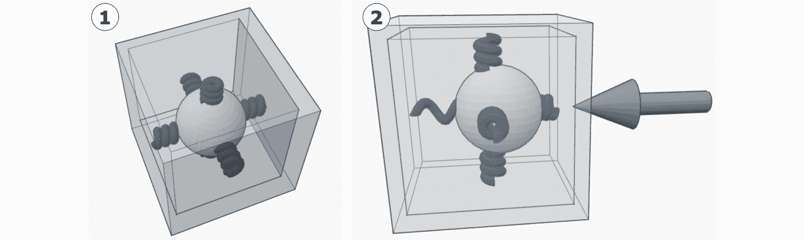
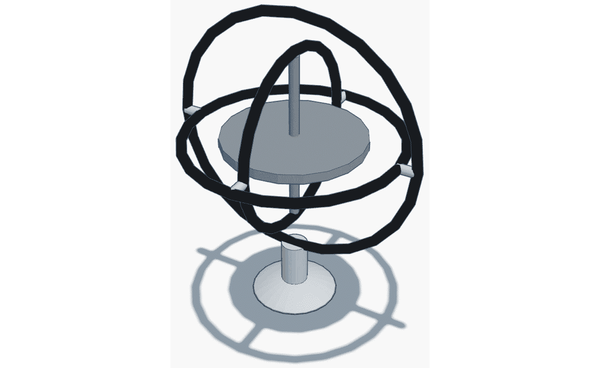
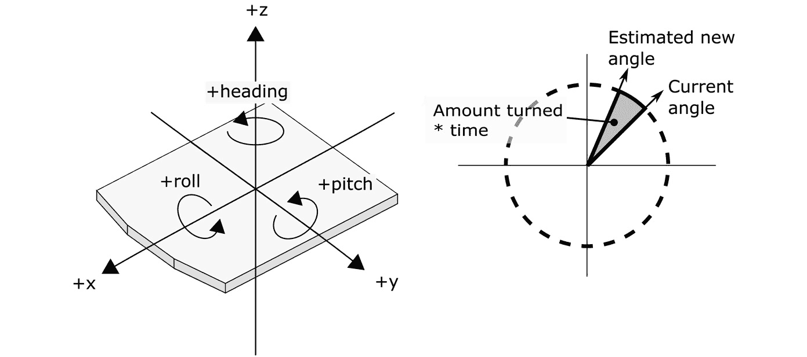
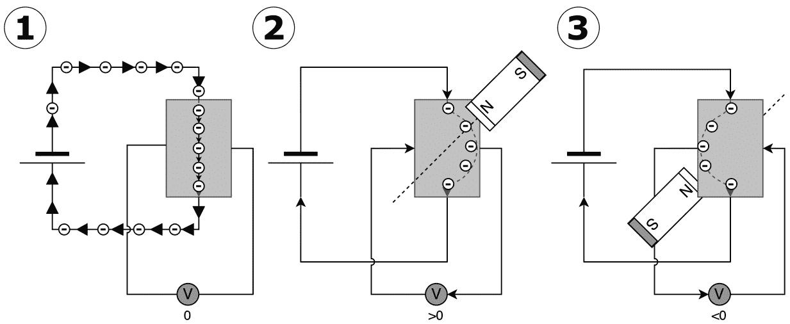
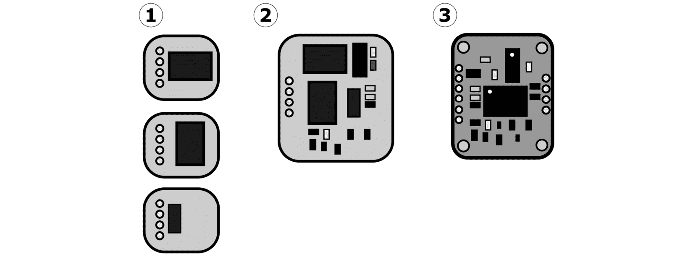
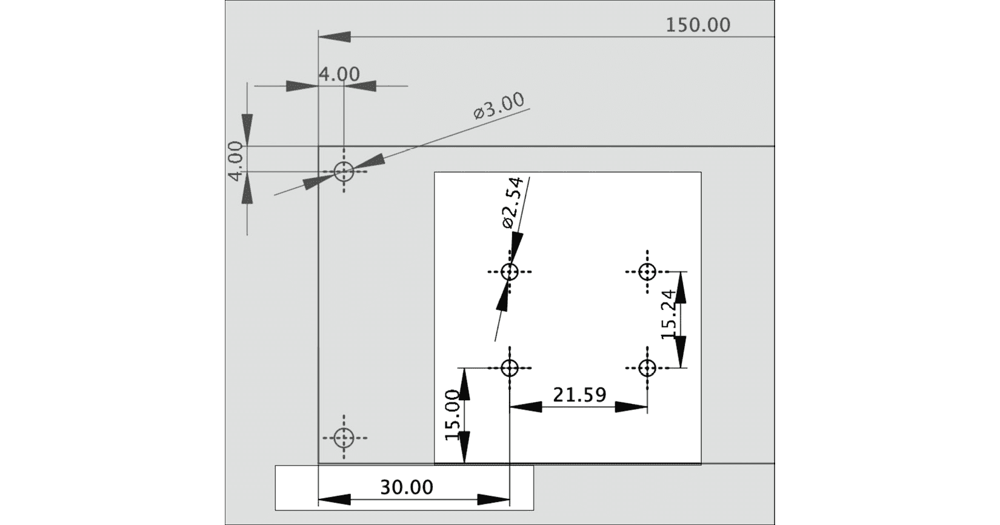
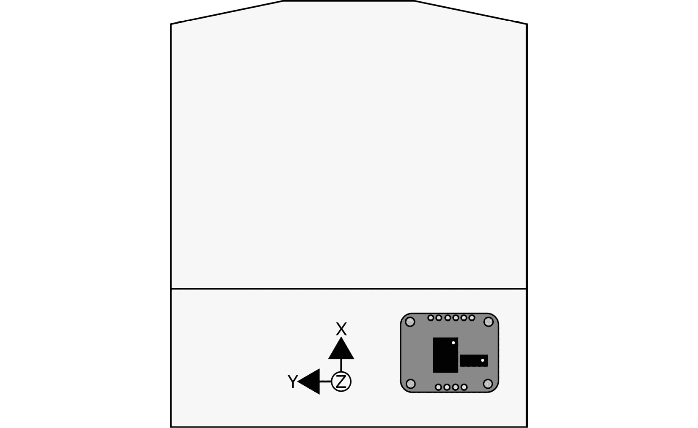
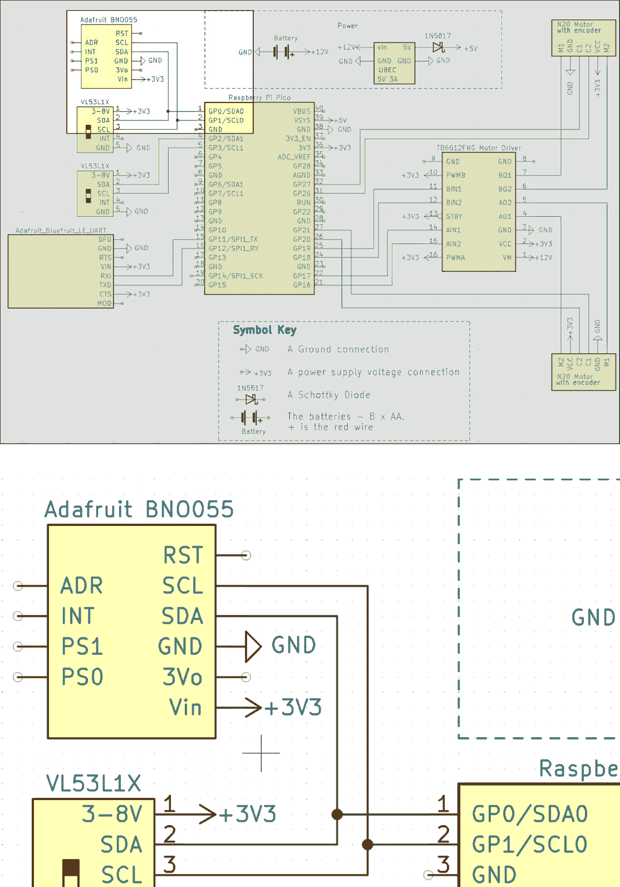
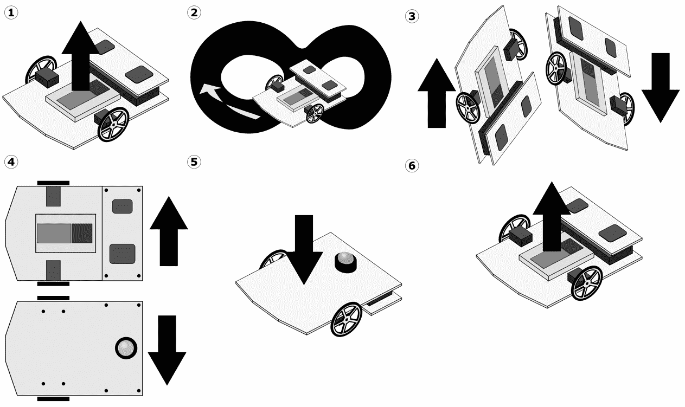
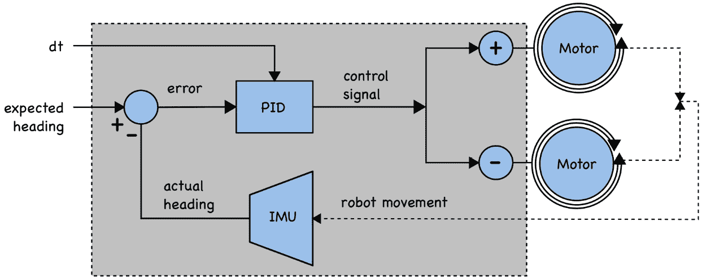

# 第十二章：使用 Raspberry Pi Pico 上的 IMU 检测方向

我们的机器人可以跟踪它移动的距离，但机器人面向哪个方向？或者它转了多少度？在本章中，我们将学习关于**惯性测量单元**（**IMU**），这是一种可以跟踪机器人相对于重力和地球磁场的运动的设备。

我们将探讨如何选择这些设备之一，将其连接起来，然后使用 PID 控制器编写代码，在机器人上使用 IMU 数据来控制机器人的方向。

在本章中，我们将涵盖以下主要内容：

+   什么是 IMU 以及如何选择一个

+   将 IMU 连接到机器人

+   校准和读取数据

+   总是面向北方的行为

+   制作已知的转动行为

# 技术要求

对于本章，你需要以下设备：

+   来自*第十一章*，*使用 Raspberry Pi Pico 上的编码器控制运动*的机器人

+   来自*第十一章*，*使用 Raspberry Pi Pico 上的编码器控制运动*的机器人、编码器和 PID 代码

+   螺丝刀、螺栓和支架

+   Dupont 跳线

+   一个可以避免强磁铁的空间

+   个人电脑或笔记本电脑

+   带有蓝牙 LE 和 Bluefruit LE Connect 应用程序的 Android/iOS 智能手机

你可以在[`github.com/PacktPublishing/Robotics-at-Home-with-Raspberry-Pi-Pico/tree/main/ch-12`](https://github.com/PacktPublishing/Robotics-at-Home-with-Raspberry-Pi-Pico/tree/main/ch-12)找到本章的代码。

# 什么是 IMU 以及如何选择一个

在本节中，我们将探讨 IMU 的组件以及我们选择用于本机器人的标准。

## IMU 的组件

IMU 是一个可以测量运动的模块。它使用多个传感器来实现这一点。在本节中，我们将简要地看看每个传感器以及它们如何对整个测量做出贡献。

这些传感器是使用**微机电系统**（**MEMS**）工艺制造的。它们在芯片中嵌入有微小的活动部件。我们可以从机械上模拟它们来理解它们。这些部件通过它们的磁场感知部件的运动并放大微小的信号。让我们看看这些组件。

### 温度计

IMU 的机械组件会根据其温度改变尺寸。这些微小的变化可能足以改变信号，使得 IMU 控制器可以使用温度测量来补偿这一点。

### 加速度计

**加速度计**测量加速度力。它将其测量为一个矢量——一个方向和大小。这种测量的方式有点像带有悬挂质量的盒子，如下面的图所示：



图 12.1 – 将加速度计模拟为带有弹簧的质量

前面的图示展示了一个通过弹簧悬挂在盒子中的质块。当作用在盒子上的力时，质块保持其惯性并压缩与力方向相反的弹簧。MEMS 加速度计使用微小的硅弹簧和质块，并测量当质块移动时电场的变化。

在地球上，重力将质量向下拉。这个系统表现得像一个力，将盒子向上推，因此加速度计会记录一个向上的力。我们可以使用这个测量来确定向下方向是什么，并感知机器人的倾斜。

加速度计矢量是向上的绝对方向（参见*第六章*中的*绝对和相对传感*部分，*在 Raspberry Pi Pico 上使用编码器测量运动*），然而，其他运动会导致噪声，因此通常通过低通滤波器进行处理，只改变实际变化的百分比。这个滤波器使得输出变慢但更稳定。

控制器可以将这些数据与其他传感器结合，以获得更快、更稳定的测量，例如使用陀螺仪。

### 陀螺仪

**陀螺仪**测量系统的旋转速度，通常是在每个轴周围的角速度，以每秒度或弧度表示。以下所示的一个物理陀螺仪模型可以用来帮助说明其作用：



图 12.2 – 陀螺仪模型

前面的图示展示了一个传统的陀螺仪。这个陀螺仪中间有一个旋转的质块轮，与同心的环形相连——每个环形在一个方向上旋转——x、y 或*z*。总体效果是当你移动把手时，旋转的盘保持其方向。放置在支点处的传感器会检测系统在每个方向上旋转了多少。

MEMS 版本使用一个在单一方向来回移动的小质量。如果方向改变，质量将继续在原始方向上振动，这将改变传感器检测到的电场。这种在原始方向上的运动看起来像是一种称为**科里奥利力**的力。陀螺仪可以测量这种力的强度。

理解陀螺仪的方向以及测量如何与时间相关是至关重要的。参见以下图示：



图 12.3 – 陀螺仪方向和积分问题

前面图表的左侧显示了三个陀螺仪旋转和 IMU 使用的坐标系。这个坐标系考虑了机器人。传统上，机器人的前方是正 X 方向。直上是正 Z，机器人左侧是正 Y。绕 z 轴的旋转被称为**航向**（也称为偏航），绕 y 轴的旋转是俯仰，绕 x 轴的旋转是滚转。这三个角度的组合用来确定方向被称为**欧拉**（发音为 *oil-er* 角度）。

图表的右侧显示了控制器如何使用陀螺仪数据——它表示角度或角度变化速度随时间的变化相对变化。我们可以将其转换为新的角度，但这只是估计。将此乘以时间并将它们相加可以给出相对于起始位置的整体旋转，但这将放大任何估计或读数错误。

控制器应该将此与其他传感器结合使用，其中陀螺仪可以提供快速的相关测量，而其他传感器可以提供较慢的绝对测量。然而，加速度计无法测量航向。为此，我们需要磁力计。

### 磁力计

**磁力计**对磁场敏感。它通过一个材料传递电流，当暴露在磁场中时，该材料会产生电流，如图所示：



图 12.4 – 横效应传感器的示意图

前面的图显示了检测磁场作用的一个例子：

1.  电路从源通过一个导电板（灰色矩形）传递电流。箭头显示了电子（负电荷载体）从板的顶部向下移动的流动。带有 V 的小圆圈测量板侧面的电流。目前，这读数为`0`，因为电流是直线下行的。

1.  当我们在板子上方放置磁铁时，它会将电子偏转到一侧。这种偏转在测量电路中产生微小的电流，并在传感器上显示高于`0`的读数。

1.  当我们在板子下方放置磁铁时，这会使电子偏转到另一侧，在另一方向上产生微小的传感器电流，并显示低于 0 的读数。

这种传感器方法被称为**霍尔效应**。通过测量三个板，你可以感知三维空间中的磁场。

了不起的是，我们可以使用它来感知地球的磁场和磁北极，尽管它可能被磁力计周围的物体中的磁铁所偏转。能够感知磁北极使其成为感知航向的一种很好的方式。

由于它受到其他磁铁的影响，可能会产生噪声，可能需要低通滤波器，但你可以像加速度计配对一样与陀螺仪配对。

现在你已经看到了进入 IMU 的四种传感器类型，我们可以看看我们如何选择一个。

## 选择 IMU 模块

市场上有多款 IMU（惯性测量单元）设备。首先要注意的是，你想要的是一个模块或分线板，而不是裸芯片（至少目前不是）。

IMU 系统可以感知的方向/动作数量被称为**自由度**，或**DOF**。拥有所有三种类型传感器的系统被称为 9-DOF，因为每种传感器都可以产生三个轴的信息。温度传感器通常不计入这个自由度计数中。

这些模块有多种类型。以下图表说明了这些类型：



图 12.5 – IMU 模块集成级别

以下图表显示了三种不同的 IMU 模块集成级别。具体如下：

1.  最简单的是只有一个传感器，你需要购买三个才能获得完整的方向。此外，它们没有多少辅助电路。

1.  一些模块集成了三到四个独立的传感器芯片，以提供完整的 9-DOF，可能适合使用。这些模块有一些支持电路，但可能没有控制器。

1.  我们将关注的设备是基于单个芯片的传感器组合。这些作为模块提供，集成了电源和任何其他所需组件（如小型电阻和电容器）。这些模块具有板载控制器。

它们还可以使用几种不同的数据总线进行通信。UART 和 SPI 会占用一整套引脚；然而，I2C 允许设备与其他传感器共享总线，因此我们将优先考虑 I2C 设备。

集成中的下一个因素是设备控制器可以执行多少计算（如果有）。结合所有三个传感器、考虑校准以及温度的算法很复杂。一些设备可以在板上执行此操作，而一些则需要在其他控制器上执行或在另一个控制器上上传专门的代码以激活计算（例如 MPU 和 ICM TDK 系列）。我们还将优先考虑可以在板上进行计算的模块。

BNO055 模块非常适合这些要求。BNO055 集成了所有 9-DOF、温度传感器，通过 I2C 工作，并在板上进行计算和校准，这样我们就不需要在 Raspberry Pi Pico 上编写那段代码了。它们也非常容易获得，Adafruit 以两种变体出售它们，并且有直接的 CircuitPython 支持。

让我们看看如何使用 BNO055 模块与我们的机器人配合。

# 将 IMU 连接到机器人

安装 BNO055 需要执行几个步骤。在本节中，我们将准备模块，将其牢固地连接到机器人上，将部分电路连接到电路中，然后使用一些简单的代码来测试它是否响应。

## 准备 BNO055

Adafruit 提供的 BNO055 没有附带引脚。你需要像我们之前做的那样焊接引脚。Adafruit 有一个指南[`learn.adafruit.com/adafruit-bno055-absolute-orientation-sensor/assembly`](https://learn.adafruit.com/adafruit-bno055-absolute-orientation-sensor/assembly)。

对于这个机器人，你应该将这部分焊接在从元件侧向上的引脚上。

## 固定 BNO055

要将部件固定到机器人上，请参阅以下图示：



图 12.6 – 带有 BNO055 模块额外孔的货架绘图

你需要将 IMU 牢固地固定在机器人上，因此魔术贴垫不足以固定。支架将是一个合适的附件。前面的图显示了在突出区域打一些 2.5 毫米孔的位置。你可以插入 M2（或如果你有 M2.5 的话）支架来固定它。你可以使用支架在 IMU 和机器人的金属或磁性部件之间获得一些间隔。

你可能需要根据你拥有的 BNO 断路器进行适配。以下图显示了我在使用的部件及其应该处于的朝向：



图 12.7 – BNO055 部件的朝向

我已经打好了孔，以便它们适合前面图中显示的部件。这张图显示了带有机器人底盘的部件，并用箭头标出了 x、y 和 z 轴。圆圈中的 z 表示它穿过这张图，向上方向为正。

我们将 BNO055 安装得使其 x 轴面向机器人的前方。这是因为 BNO055 默认为 Android 手机方向 – 这是该模块配置的一个小怪癖。

虽然这个部件的朝向很重要，但可以在代码中进行补偿。

让我们看看如何连接这部分。

## 将 BNO055 连接到 Raspberry Pi Pico

我们将使用 I2C 连接 BNO055。有关详细信息，请参阅以下电路图：



图 12.8 – BNO055 I2C 连接

前面图的顶部显示了整个电路图。由于这里发生了很多事情，下面的突出区域已经放大，显示了具体的连接。BNO055 只需要连接四个引脚。它有 GND 和 Vin 的电源连接，来自 3V3 线。SCL 和 SDA 连接到 I2C0，与一个距离传感器共享 I2C 总线。

现在 BNO055 已经连接好了，让我们试着与之通信。

## 设置软件和连接

CircuitPython 库包含一个`adafruit_BNO055`模块，用于与该设备一起使用。复制或使用`adafruit_bus_device`和`adafruit_register`模块进行安装。

你现在可以编写一些代码来检查我们是否能从设备获取数据。我建议将以下代码放入`bno_connect/code.py`：

```py
import adafruit_bno055
import board
import busio
i2c = busio.I2C(sda=board.GP0, scl=board.GP1)
sensor = adafruit_bno055.BNO055_I2C(i2c)
print("Temperature: {} degrees C".format(sensor.temperature))
```

代码从导入开始。然后使用正确的引脚创建一个 I2C 总线，并在该总线上构建传感器控制对象。

最后一行从传感器获取温度并将其打印到串行端口。

将此作为`code.py`发送到 Raspberry Pi Pico；它应该在串行端口上显示温度，如下所示：

```py
code.py output:
Temperature: 21 degrees C
```

太好了！你现在已经从 IMU 获取了数据。在探索更多可用功能之前，让我们排查任何问题。

## 故障排除

如果你没有看到温度输出（或者看到错误），请仔细检查连接。首先关闭机器人的电源，并仔细检查电源是否连接到 3V3，然后检查 GND 是否连接到地。

如果这些看起来是正确的，请验证 SCL 和 SDA 线 - 交换这些线是一个常见问题。然后你可以再次给机器人供电，你应该能够读取温度。

这样，你就已经连接到了 IMU。现在，让我们学习如何从该传感器获取机器人姿态信息。

# 校准和获取读数

当你使用带有控制器的 IMU 模块启动代码时，传感器将无法获得正确的读数。因此，IMU 模块需要确定传感器的灵敏度和正确状态，这个过程称为**校准**。首先，我们需要一些代码；然后，我们需要让机器人进行一些动作以执行此操作。

## 校准代码

让我们从代码开始。在一个名为`imu_calibration/code.py`的文件中，添加以下内容：

```py
import adafruit_bno055
import board
import busio
import time
i2c = busio.I2C(sda=board.GP0, scl=board.GP1)
sensor = adafruit_bno055.BNO055_I2C(i2c)
```

此代码处理导入模块和设置。我们还导入`time`，以便我们可以在循环中使用它。

接下来，我们必须检查模块的校准状态：

```py
def check_status():
  sys_status, gyro, accel, mag = imu.calibration_status
  print(f"Sys: {sys_status}, Gyro: {gyro}, Accel: {accel}, Mag: {mag}")
  return sys_status == 3
```

此代码将打印 BNO055 每个部分的校准状态。BNO055 在开启时可以自我校准；然而，用户需要使用它进行动作以帮助。`calibration_status`寄存器保存了您已校准的系统部分。系统状态对我们来说很重要，但每个设备都有自己的状态。每个设备可以从状态`0`（未校准）到状态`3`（完全校准）。当你校准它们后，系统就准备好使用了。此代码将打印它们。我们将使用它来执行校准过程动作。

我们可以在循环中检查：

```py
while not check_status():
  time.sleep(0.1)
```

一旦校准完成，我们就可以检查所有传感器和控制器本身的数据：

```py
while True:
  data = {"temperature": sensor.temperature, 
          "acceleration": sensor.acceleration, 
          "magnetic": sensor.magnetic, 
          "gyro": sensor.gyro,
          "euler": sensor.euler}
  print(data)
  time.sleep(0.1)
```

此代码将拉取所有传感器数据，并要求控制器将加速度计、磁力计和陀螺仪数据转换为**欧拉**绝对姿态。代码将这些数据放入字典中，以便当我们打印时，它们将带有标签。

我们可以上传此代码并开始校准过程，观察校准状态的数字。让我们用它来校准。

## 校准过程

以下动作可能看起来很奇怪，但 IMU 模块正在尝试确定每个传感器的相对运动。然后，通过保持姿势，它正在观察绝对状态。由于机器人上的金属，磁力计会有偏移和扭曲。传感器寻找磁场的变化和每个方向的程度，它可以利用这些来补偿扭曲。

小心在强磁场附近校准，如笔记本电脑 – 它们可以使磁力计校准不正确。

使用以下图示帮助 IMU 完成校准：



图 12.9 – IMU 校准步骤

前面的图示显示了校准步骤。以下步骤至少保持 2 秒的保持时间，并缓慢移动：

1.  从机器人放在平坦表面上并保持开始。这个位置将设置陀螺仪。

1.  做几次小的、缓慢的 8 字形运动来校准磁力计。

1.  将机器人放在背部，然后放在前方。

1.  然后，将机器人放在左侧，然后放在右侧。

1.  将机器人倒置；你应该能看到加速度计状态达到 3。

1.  现在，将其放回正确的方向。你应该能看到系统状态达到 3。

这种校准可能需要几次尝试，有时可能会卡在加速度计上；然而，如果系统状态达到 3 而没有加速度计，实验也可以继续。

当系统状态达到 3 时，演示将开始打印来自所有四个传感器的数据，并将传感器数据组合成欧拉角。当机器人站立时，滚转和俯仰应该为`0`。将机器人转向面向北方也应将航向设置为`0`。

我们现在可以使用 PID 控制器使机器人始终面向北方。

# 总是面向北方行为

我们将构建一个行为，其中航向作为 PID 的设定点，IMU 欧拉航向作为反馈。这些之间的误差值将表示机器人相对于北方航向偏离的角度。例如，航向为`0`应该是北方 – 注意，你可以根据需要选择另一个航向。我们将使用 PID 输出控制电机运动，输出加到某个电机的速度上，从另一个电机中减去，产生转向。

让我们看看这作为一个块图看起来如何：



图 12.10 – 面向北方行为块图

前面的图示展示了数据的流向。`dt`（时间增量）是 PID 的输入。PID 的输出，即**控制信号**，对一个电机是加法，对另一个电机是减法。电机随后导致机器人移动，这会引起 IMU 航向的变化，并反馈到误差值中。

我们现在可以使用这个块图来构建这个行为的代码。

## 面向北方行为的 CircuitPython 代码

我们现在可以构建这个行为的代码。我们将从在`robot.py`中放置 IMU 初始化开始。在`robot.py`顶部的导入中添加以下内容：

```py
import adafruit_bno055
```

由于距离传感器已经使用了 I2C 总线，我们可以使用相同的初始化 I2C 总线来为 BNO055 服务：

```py
left_distance = adafruit_vl53l1x.VL53L1X(i2c0)
right_distance = adafruit_vl53l1x.VL53L1X(i2c1)
imu = adafruit_bno055.BNO055_I2C(i2c0)
```

一旦加载，IMU 将从`robot.py`中可用。我们还可以将`check_status`校准函数添加到`robot.py`中，以便在其他行为中使用：

```py
def check_imu_status():
  sys_status, gyro, accel, mag = imu.calibration_status
  uart.write(f"Sys: {sys_status}, Gyro: {gyro}, Accel: {accel}, Mag: {mag}\n".encode())
  return sys_status == 3
```

对于这一部分，对`robot.py`的更改已完成。

我们需要一个新文件来存放这个行为，我建议将其放在`face_north/code.py`中。我们将从导入开始：

```py
import robot
import pid_controller
import asyncio
import time
```

然后，我们将创建一个始终面向北方的控制器类。它首先将目标定义为`0`（北方）并设置 PID 控制器：

```py
class FaceNorthController:
    def __init__(self):
        self.pid = pid_controller.PIDController(0.01, 0.010, 0)
        self.target = 0
    def update(self, dt, angle):
        error = self.target - angle
        if error > 180:
            error -= 360
        elif error < -180:
            error += 360
        control_signal = self.pid.calculate(error, dt)
        robot.set_left(control_signal)
        robot.set_right(-control_signal)
```

这里代码调用了一个带有`angle`和 delta 时间(`dt`)的`update`方法。首先，它会计算角度误差。然后，该方法会检查误差是否在-180 到 180 度的范围内。否则，一个在 359 度（北方向北 1 度）的机器人将转一圈来自我调整，任何超调都会导致不可用的行为。

然后，我们将`error`和`dt`传递给 PID 的`calculate`方法，并将产生的控制信号发送到电机。

我们现在可以有一个`async`任务来管理这个控制器并在循环中读取传感器数据：

```py
async def control_loop():
  controller = FaceNorthController()
  last_time = time.monotonic()
  while True:
    await asyncio.sleep(0.1)
    next_time = time.monotonic()
    dt = next_time - last_time
    last_time = next_time
    angle = robot.imu.euler[0]
    controller.update(dt, angle)
    robot.uart.write(f"{angle}, 0\n".encode())
```

`control_loop`创建了一个之前显示的`FaceNorthController`实例。它休眠并管理 delta 时间`dt`。接下来，它从传感器的`euler`数据中读取角度并将其传递给`update`方法。最后，该方法通过蓝牙记录角度，以便我们可以绘制它。

现在，我们可以创建我们的`main`异步函数：

```py
async def main():
  while not robot.check_imu_status():
    await asyncio.sleep(0.1)
  robot.uart.write("Ready to go!\n".encode())
```

这部分将启动校准/状态循环，并在机器人准备就绪时通过蓝牙打印出来。因为我们不希望机器人试图从你的手中开走，所以我们将让它等待蓝牙的启动信号：

```py
  while True:
    if robot.uart.in_waiting:
      command = robot.uart.readline().decode().strip()
      if command == "start":
        break
    await asyncio.sleep(0.1)
  await control_loop()
```

用户将看到`start`来使机器人移动。然后代码启动`control_loop`部分。

最后，我们可以通过启动`main`任务来启动一切：

```py
asyncio.run(main())
```

你应该能够将其发送到机器人并对其进行校准。然后，当你指示它开始时，机器人将转向面向北方。

## 故障排除

机器人可能正在转向一个不是北方的角度。这种情况的常见原因是测试或校准机器人的地方存在强烈的磁场。在某些情况下，我发现我不得不将传感器旋转 90 度才能使其工作。

如果机器人超调，尝试减小`P`值。如果它需要一段时间才能找到实际值，可以稍微增加`I`值。我发现在这种情况下`D`值没有帮助。

现在我们知道了如何面向一个方向，我们能否使用这个方法在任何方向上创建一个固定的转向？让我们看看。

# 创建已知的转向行为

已知转向行为是始终面向北方行为的变体。想法是在转向开始时测量角度，然后将设定点设置为新的预期角度。

我们将使整个应用程序接受预期角度的差异，偏移最后一个预期角度，整个应用程序基于机器人的当前航向开始。用户可以发送`+30`来转向 30 度，发送`-90`来旋转 90 度回转。

块图与之前完全相同，因为我们只需要操纵期望的航向。在名为`known_turn`的文件夹中复制`face_north`。让我们将控制器重命名为`IMUTurnController`：

```py
class IMUTurnController:
    def __init__(self):
        self.pid = pid_controller.PIDController(0.01, 0.008, 0)
        self.target = 0
```

`update` 方法没有改变，如下所示：

```py
    def update(self, dt, angle):
        error = self.target – angle
        if error > 180:
            error -= 360
        elif error < -180:
            error += 360
        control_signal = self.pid.calculate(error, dt)
        robot.set_left(control_signal)
        robot.set_right(-control_signal)
```

我们需要一个额外的蓝牙`command_handler`来接受用户输入的预期角度。添加以下代码：

```py
async def command_handler(turn_controller):
  while True:
    if robot.uart.in_waiting:
      command = robot.uart.readline().decode().strip()
      if command.startswith("-"):
        turn_controller.target -= int(command.lstrip('-'))
      elif command.startswith("+"):
        turn_controller.target += int(command.lstrip('+'))
    await asyncio.sleep(0)
```

此处理程序设置`turn_controller`的目标（设定点）以处理正负数设置。

我们现在可以将这些集成到修改后的`control_loop`中：

```py
async def control_loop():
  controller = IMUTurnController()
  controller.target = robot.imu.euler[0]
  asyncio.create_task(command_handler(controller))
  last_time = time.monotonic()
  while True:
    await asyncio.sleep(0.1)
    next_time = time.monotonic()
    dt = next_time - last_time
    last_time = next_time
    angle = robot.imu.euler[0]
    controller.update(dt, angle)
    robot.uart.write(f"{angle}, 0\n".encode())
```

此控制循环将控制器目标设置为当前机器人的航向而不是`0`。它还将创建一个带有控制器作为参数的命令处理程序异步任务。

循环与之前看到的一样。

对于这个`main`方法来说，它将变得更加简单，因为机器人将不会移动，直到我们要求它这样做：

```py
async def main():
  while not robot.check_imu_status():
    await asyncio.sleep(0.1)
  robot.uart.write("Ready to go!\n".encode())
  await control_loop()
asyncio.run(main())
```

将此发送到机器人并对其进行校准。然后，当你在蓝牙上看到**Ready to go**时，你可以发送一个角度来进行转向。

与之前相同的故障排除步骤适用。

尝试`30`、`45`、`60`和`90`，或者像`5`和`10`度这样的小值。不要超过`179`或`-179`，因为这可能导致机器人旋转直到关闭。你可以添加代码来限制这一点。

将错误存储在`IMUTurnController`（作为`self.error`）中并绘制这些数据，而不是角度来调整 PID，可能会有所帮助。

你现在可以进行已知转向。

# 摘要

在本章中，我们研究了 IMU 以及我们如何使用它来控制机器人的航向。我们学习了如何连接设备并对其进行校准。

然后，我们通过将传感器数据与 PID 控制器相结合来面对北方。最后，我们在此基础上构建，使其可以从当前航向转向指定的角度。

在下一章中，我们将为机器人构建一个小型竞技场，并探讨我们如何将编码器和距离传感器结合起来，以估计机器人在竞技场内的位置，并在其移动过程中提高其估计。

# 练习

这些练习将加深你对本章所涵盖主题的理解，并使机器人代码更好：

+   将前面的行为与我们在前几章中看到的 UART 菜单系统相结合，将允许你在机器人运行时调整 PID。

+   你能否使用已知的转向行为和直线行为，从*第五章*，*使用 Raspberry Pi Pico 驱动电机*编写一个更好的路径规划程序版本？

+   尝试实验欧拉航向读数 - 在校准后，看看当您将机器人靠近如笔记本电脑或厨房电器等物体时，读数如何变化。这个实验将展示这类传感器的一个弱点。

+   一个高级实验将是提取四元数（而不是欧拉数据）并将其写入 UART。

# 进一步阅读

这些进一步的学习辅助工具将帮助您学习更多，并深入了解 PID 算法及其特性：

+   Adafruit CircuitPython API 指南针对 BNO055 展示了您可以使用此传感器做什么：[`docs.circuitpython.org/projects/bno055/en/latest/api.html`](https://docs.circuitpython.org/projects/bno055/en/latest/api.html) - BNO055。

+   *学习机器人编程* 提供了将 Raspberry Pi 设备与不同的 IMU 芯片 ICM90248 进行接口的指南，并编写代码计算欧拉角，以及一些有趣的可视化方法。它还展示了如何使用编码器来实现已知的转向，例如当物体扭曲磁力计读数时。

+   Paul McWhorter 在一个密集的视频系列中进行了 Arduino 实验，使用相同的 BNO055 传感器：[`toptechboy.com/arduino-based-9-axis-inertial-measurement-unit-imu-based-on-bno055-sensor/`](https://toptechboy.com/arduino-based-9-axis-inertial-measurement-unit-imu-based-on-bno055-sensor/)。
