# 第二章：简单线性回归的接近方法

在设置好所有工作工具（直接安装 Python 和 IPython 或使用科学发行版）之后，你现在准备好开始使用线性模型将新能力融入你计划构建的软件中，特别是预测能力。到目前为止，你开发的软件解决方案是基于你定义的某些规范（或其他人交给你的规范）。你的方法始终是通过编写代码，仔细地将每个情况映射到特定的、预先确定的响应，来调整程序的响应以适应特定的输入。回顾一下，通过这样做，你只是结合了从经验中学到的实践。

然而，世界是复杂的，有时你的经验并不足以让你的软件足够智能，在竞争激烈的企业或具有许多不同和可变面的挑战性问题中产生差异。

在本章中，我们将开始探索一种不同于手动编程的方法。我们将提出一种使软件能够自我学习特定输入的正确答案的方法，前提是你能够用数据和目标响应来定义问题，并且你可以在过程中结合一些你的领域专业知识——例如，选择正确的预测特征。因此，当涉及到创建你的软件时，你的经验将继续至关重要，尽管是以从数据中学习的形式。实际上，你的软件将根据你的规格从数据中学习。我们还将说明如何通过求助于从数据中推导知识的最简单方法之一：线性模型来实现这一点。

具体来说，在本章中，我们将讨论以下主题：

+   理解机器学习可以解决的问题

+   回归模型可以解决哪些问题

+   相关性的优缺点

+   如何将相关性扩展到简单的回归模型

+   回归模型的何时、何事和为何

+   梯度下降背后的基本数学

在这个过程中，我们将使用一些统计术语和概念，以便在统计学的更大框架中为您提供线性回归的前景，尽管我们的方法将保持实用，为您提供使用 Python 开始构建线性模型所需的工具和提示，从而丰富您的软件开发。

# 定义回归问题

多亏了机器学习算法，从数据中推导知识成为可能。机器学习有着坚实的根基，源于多年的研究：它实际上是从五十年代末期以来的一段漫长旅程，当时亚瑟·塞缪尔将机器学习明确界定为“一个研究领域，它赋予计算机在没有明确编程的情况下学习的能力。”

数据爆炸（以前未记录的大量数据的可用性）使得最近和经典的机器学习技术得到广泛应用，并使它们成为高性能技术。如今，如果你可以通过语音与你的手机交谈并期望它能够正确地回应你，充当你的秘书（如 Siri 或 Google Now），这完全是由于机器学习。同样，对于基于机器学习的每个应用也是如此，如人脸识别、搜索引擎、垃圾邮件过滤器、书籍/音乐/电影的推荐系统、手写识别和自动语言翻译。

机器学习算法的一些其他实际用途可能不那么明显，但同样重要且有利可图，如信用评级和欺诈检测、算法交易、网络上的广告定位和健康诊断。

一般而言，机器学习算法可以通过三种方式学习：

+   **监督学习**：这是我们提供标记示例以从中学习的情况。例如，当我们想要在房地产市场中提前预测房屋的售价时，我们可以获取房屋的历史价格，并让监督学习算法成功地找出如何将价格与房屋特征相关联。

+   **无监督学习**：这是我们提供没有任何提示的示例，将其留给算法来创建标签的情况。例如，当我们需要根据客户数据库中各组的特征和行为将它们划分为相似段时。

+   **强化学习**：这是当我们提供没有标签的示例时，就像无监督学习一样，但会从环境中获得反馈，以确定标签猜测是否正确。例如，当我们需要软件在竞争环境中成功行动时，如电子游戏或股市，我们可以使用强化学习。在这种情况下，软件将开始在环境中行动，并直接从其错误中学习，直到找到确保其成功的一组规则。

## 线性模型和监督学习

无监督学习在机器人视觉和自动特征创建中有着重要的应用，而强化学习对于开发自主人工智能（例如，在机器人技术中，但也在创建智能软件代理）至关重要；然而，监督学习在数据科学中最为重要，因为它使我们能够实现人类种族长期以来一直渴望实现的目标：预测。

**预测**在商业和一般用途中都有应用，它使我们能够采取最佳行动，因为我们从预测中得知了某种情况的可能结果。预测可以使我们在决策和行动中取得成功，并且自古以来就与魔法或大智慧联系在一起。

监督学习根本不是魔法，尽管它可能对某些人来说看起来像是魔法，正如亚瑟·查尔斯·克拉克爵士所说，“任何足够先进的技术都与魔法无法区分。”基于人类在数学和统计学方面的成就，监督学习有助于利用人类经验和观察，并以一种任何人类心智都无法实现的方式将它们转化为精确的预测。然而，监督学习只能在某些有利条件下进行预测。拥有过去的事例至关重要，我们可以从中提取规则和线索，以支持在给定某些前提的情况下做出高度可能的预测。

无论机器学习算法的确切公式如何，其想法是你可以预测结果，因为观察到的过去中存在某些前提，导致了特定的结论。

在数学形式化中，我们称我们想要预测的结果为响应变量或目标变量，我们通常使用小写字母 *y* 来标记它。

前提被称为 **预测** 变量，或者简单地称为属性或特征，如果只有一个，则用小写 *x* 标记，如果有多个，则用大写 *X* 标记。使用大写字母 *X*，我们的意图是使用矩阵符号，因为我们也可以将 *y* 视为一个响应向量（技术上是一个列向量），将 *X* 视为一个包含所有特征向量值的矩阵，每个特征向量都排列在矩阵的单独一列中。

同时，始终注意 *X* 和 *y* 的维度也很重要；因此，按照惯例，我们可以将 *n* 称为观测值的数量，将 *p* 称为变量的数量。因此，我们的 *X* 将是一个大小为 (*n*, *p*) 的矩阵，而我们的 *y* 将始终是一个大小为 *n* 的向量。

### 小贴士

在整本书中，我们还将使用统计符号，这实际上要明确和冗长得多。一个统计公式试图给出公式中所有预测变量的概念（我们将在稍后展示一个例子），而矩阵符号则更为隐晦。

我们可以肯定，当我们以监督方式从数据中学习预测时，我们实际上是在构建一个可以回答关于 *X* 如何暗示 *y* 的函数的问题。

使用这些新的矩阵符号表示，我们可以定义一个函数，一个将 *X* 值转换为 *y* 的函数映射，可以无误差或在一个可接受的误差范围内进行转换。我们可以肯定，我们所有的努力都是为了确定以下类型的函数：

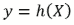

当函数被指定，并且我们心中有一个带有特定参数的算法以及由某些数据组成的 *X* 矩阵时，我们通常可以将其称为一个假设。这个术语是合适的，因为我们可以将我们的函数视为一个准备好的假设，设置好所有参数，以便测试它在预测目标 *y* 时工作得是否好坏。

在讨论函数（执行所有魔法的监督算法）之前，我们首先应该花些时间思考一下是什么在喂养这个算法本身。我们已经介绍了矩阵 *X*，预测变量，以及向量 *y*，目标答案变量；现在，我们需要解释如何从我们的数据中提取它们，以及它们在学习算法中的确切作用。

### 反思预测变量

在监督算法中反思你的预测变量的作用，在整个书籍的说明中，你必须牢记一些注意事项，是的，它们非常重要且具有决定性。

为了存储预测变量，我们使用一个矩阵，通常称为 *X* 矩阵：


在这个例子中，我们的 *X* 只包含一个变量，它包含 *n* 个案例（或观察）。

### 小贴士

如果你想知道何时使用一个变量或特征，只需考虑在机器学习中，*特征* 和 *属性* 是比 *变量* 更受青睐的术语，*变量* 具有明确的统计味道，暗示着某种变化。根据上下文和受众，你可以有效地使用其中一个。

在 Python 代码中，你可以通过输入以下代码来构建一个一列的矩阵结构：

```py
In: import numpy as np
 vector = np.array([1,2,3,4,5])
 row_vector = vector.reshape((5,1))
 column_vector = vector.reshape((1,5))
 single_feature_matrix = vector.reshape((1,5))

```

使用 NumPy 的 `array`，我们可以快速推导出一个向量和矩阵。如果你从一个 Python 列表开始，你会得到一个向量（实际上既不是行向量也不是列向量）。通过使用 `reshape` 方法，你可以根据你的要求将其转换成一个行向量或列向量。

现实世界的数据通常需要更复杂的矩阵，现实世界的矩阵包含无数不同的数据列（大数据的多样性元素）。很可能会出现，标准的 *X* 矩阵会有更多的列，因此我们将引用的符号是：

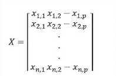

现在，我们的矩阵有更多的变量，所有 *p* 个变量，因此其大小是 *n* x *p*。在 Python 中，有两种方法可以构建这样的数据矩阵：

```py
In:  multiple_feature_matrix = np.array([[1,2,3,4,5],[6,7,8,9,10],[11,12,13,14,15]])

```

你只需要使用 `array` 函数将一个列表的列表转换，其中每个内部列表都是一个行矩阵；或者你可以创建一个包含你的数据的向量，然后将其重塑成你想要的矩阵形状：

```py
In: multiple_feature_matrix = \
np.array([[1,2,3,4,5],[6,7,8,9,10],[11,12,13,14,15]])

```

### 小贴士

在 NumPy 中，也有用于快速创建全一和全零矩阵的特殊函数。作为参数，只需在元组中指定预期的 (`x`, `y`) 形状即可：

`all_zeros = np.zeros((5,3))`

`all_ones = np.ones((5,3))`

我们正在使用的作为 *X* 的过去观察集的信息可以深刻地影响我们如何建立 *X* 和 *y* 之间的联系。

事实上，通常情况下，我们并不知道 *X* 和 *y* 之间可能存在的全部关联范围，因为：

+   我们刚刚观察到某个 *X*，因此我们对给定 *X* 的 *y* 经验是有偏见的，这是一种抽样偏差，因为在彩票中，我们只抽取了游戏中的某些数字，而不是所有可用的数字

+   我们从未观察到某些 *(X, y)* 关联（请注意括号中的表述，表示 *X* 和 *y* 之间的相互关系），因为它们以前从未发生过，但这并不意味着它们将来不会发生（顺便说一句，我们正在努力预测未来）

与第二个问题关系不大，（我们只能通过过去指出的方向来预测未来），但你实际上可以检查你使用的数据有多新。如果你试图在一个非常容易变化且每天都会变化的背景下进行预测，你必须记住你的数据可能会很快过时，你可能无法预测新的趋势。一个需要不断更新模型的可变环境例子是广告行业（那里的竞争环境脆弱且不断变化）。因此，你需要不断地收集更新的数据，这可能会让你构建一个更有效的监督算法。

至于第一个问题，你可以通过使用来自不同来源的越来越多的情况来解决它。你抽取的样本越多，你的 *X* 集合就越有可能类似于 *X* 与 *y* 可能和真实关联的完整集合。这可以通过概率和统计学中的一个重要思想来理解：大数定律。

大数定律表明，随着你实验数量的增加，其结果平均值代表真实值的可能性（即实验本身试图弄清楚的价值）也会增加。

监督算法通过从大型数据存储库（如数据库或数据湖）一次性获取的历史数据的大量样本进行学习，称为**批次**。或者，它们也可以自行选择对学习最有用的示例，并忽略大量数据（这被称为**主动学习**，它是一种半监督学习，我们在这里不会讨论）。

如果我们的环境节奏快，它们也可以像数据可用时一样实时流数据，持续适应预测变量和响应之间的任何新关联（这被称为在线学习，我们将在第七章中讨论，*在线和批量学习*）。

预测 *X* 矩阵的另一个重要方面是，到目前为止，我们假设我们可以确定性推导出响应 *y*，使用矩阵 *X* 中的信息。不幸的是，在现实世界中并不总是如此，而且你实际上试图使用一组完全错误的预测 *X* 来确定你的响应 *y* 的情况并不少见。在这种情况下，你必须意识到你实际上在浪费时间试图在 *X* 和 *y* 之间拟合某种工作关系，你应该寻找一些不同的 *X*（在更多变量的意义上，即更多的数据）。

根据所使用的模型，从不同角度来看，拥有更多的变量和案例通常是有益的。更多的案例减少了从有偏见和有限的观察集中学习的可能性。许多算法如果使用大量观察集进行训练，可以更好地估计其内部参数（并产生更准确的预测）。此外，拥有更多的变量在手也可能有益，但这种益处在于它增加了使用解释性特征进行机器学习的机会。实际上，许多算法对特征中存在的冗余信息和噪声很敏感，因此需要一些特征选择来减少模型中涉及的预测因子。这在线性回归中尤为如此，它当然可以利用更多的案例进行训练，但它也应该接收到一个简约且高效的特性集，以发挥其最佳性能。关于 *X* 矩阵的另一个重要方面是，它应该仅由数字组成。因此，你正在处理的内容真的很重要。你可以处理以下内容：

+   物理测量值，因为它们自然是数字（例如，身高）

+   人类测量值，虽然稍微差一些，但如果有一定的顺序（即，我们根据判断给出的所有数字），仍然是可以接受的，因此它们可以被转换为排名数字（例如，第一、第二和第三值分别为 1、2 和 3，依此类推）

我们称这样的值为定量测量。我们期望定量测量是连续的，这意味着定量变量可以取任何有效的正数或负数作为值。人类测量值通常只有正数，从零或一开始，因此将它们视为定量测量是合理的。

在统计学中，对于物理测量值，我们区分区间变量和比例变量。区别在于比例变量有一个自然的零点，而在区间数据中，零点是任意的。一个很好的例子是温度；事实上，除非你使用开尔文温标，其零点是绝对的，否则华氏和摄氏都有任意的刻度。主要影响在于比率（如果零是任意的，比率也是任意的）。

数值的人类测量被称为**有序变量**。与区间数据不同，有序数据没有自然零点。此外，区间尺度上每个值之间的间隔是相等且规则的；然而，在有序尺度上，尽管值之间的距离相同，但它们的实际距离可能非常不同。让我们考虑一个由三个文本值组成的尺度：好、平均和坏。接下来，让我们随意决定好是 3，平均是 2，坏是 1。我们称这种随意的值赋为有序编码。现在，从数学的角度来看，尽管 3 和 2 之间的间隔与 2 和 1 之间的间隔相同（即一个点），但我们真的确定好和平均之间的实际距离与平均和坏之间的距离相同吗？例如，从客户满意度的角度来看，从差到平均再到优秀的努力是否花费相同的精力？

定性测量（例如，如好、平均或坏这样的价值判断，或如红色、绿色或蓝色这样的属性）需要进行一些工作，一些巧妙的数据操作，但它们仍然可以通过适当的转换成为我们的 *X* 矩阵的一部分。甚至更无结构的定性信息（如文本、声音或绘图）也可以转换并减少到数字池中，并可以摄入到 *X* 矩阵中。

定性变量可以存储为单值向量中的数字，或者每个类别都有一个向量。在这种情况下，我们谈论的是二元变量（在统计语言中也称为虚拟变量）。

我们将在第五章数据准备中更详细地讨论如何将手头的数据（特别是如果其类型是定性数据）转换成适合监督学习的输入矩阵。

在实际处理数据之前，有必要质疑以下问题：

+   数据的质量——也就是说，可用的数据是否真的能代表提取 *X*-*y* 规则的正确信息池

+   数据的数量——也就是说，检查有多少数据可用，记住，为了构建稳健的机器学习解决方案，拥有大量不同变量和案例更安全（至少当你处理数千个示例时）

+   数据在时间上的扩展——也就是说，检查数据在过去覆盖了多少时间（因为我们是从过去学习的）

### 反思响应变量

反思响应变量的作用，我们首先应该关注的是我们将要预测的变量类型，因为这将区分要解决的监督问题的类型。

如果我们的响应变量是一个定量变量，即一个数值，我们的问题将是回归问题。有序变量可以作为回归问题来解决，特别是如果它们包含许多不同的不同值。回归监督算法的输出是一个可以直接使用并与其他预测值以及用于学习的真实响应值进行比较的值。

例如，作为一个回归问题的例子，在房地产行业中，一个回归模型可以仅根据一些关于其位置和特性的信息来预测房屋的价值，这使得我们可以通过使用模型的预测作为公平事实估计的指标来立即发现市场价格是否过于便宜或昂贵（如果我们可以通过模型重建价格，那么它肯定是由我们用作预测者的可测量特性的价值所充分证明的）。

如果我们的响应变量是一个定性变量，我们的问题就是分类问题。如果我们只需要在两个类别之间进行猜测，那么我们的问题被称为**二元分类**；否则，如果涉及更多类别，则称为多标签分类问题。

例如，如果我们想要猜测两支足球队之间的比赛胜者，我们面临的是一个二元分类问题，因为我们只需要知道第一支队伍是否会获胜（两类是*队伍获胜*，*队伍失败*）。相反，我们可以使用多标签分类来预测在特定数量的足球队中哪支队伍会获胜（因此，在我们的预测中，要猜测的类别是球队）。

如果有序变量不包含很多不同的值，它们可以被视为多标签分类问题。例如，如果你必须猜测一支足球队在足球锦标赛中的最终排名，你可以尝试预测它在排行榜上的最终位置作为一个类别。因此，在这个有序问题中，你必须猜测与锦标赛中不同位置相对应的多个类别：类别 1 可以代表第一位置，类别 2 代表第二位置，依此类推。总之，你可以将一支球队的最终排名视为可能性最大的获胜位置类别。

至于输出，分类算法可以提供对精确类别的分类以及属于任何手头类别的概率估计。

继续以房地产行业为例，一个分类模型可以预测一栋房子是否可以成为一笔划算的交易，或者根据其位置和特性是否能够增值，从而允许进行谨慎的投资选择。

响应变量最明显的问题是其精确性。回归问题中的测量误差和分类问题中的误分类可以通过提供不准确的信息来损害模型在真实数据上的表现能力。此外，偏颇的信息（例如，当你只提供某个类别的案例而不是所有可用的案例时）可能会损害模型在现实生活中的预测能力，因为它会导致模型从非现实的角度看待数据。响应变量的不准确比特征问题对模型更困难、更危险。

对于单个预测变量，结果变量 *y* 也是一个向量。在 NumPy 中，你只需将其设置为通用向量或列向量：

```py
In: y = np.array([1,2,3,4,5]).reshape((5,1))

```

## 线性模型家族

线性模型家族之所以得名，是因为指定 *X*（预测变量）、*y*（目标变量）之间关系的函数是 *X* 值的线性组合。线性组合实际上就是一个求和，其中每个加数都经过一个权重的调整。因此，线性模型仅仅是求和的一种更智能的形式。

当然，在这个求和中有一个技巧，使得预测变量在预测答案值时表现得像它们那样。正如我们之前提到的，预测变量应该告诉我们一些信息，它们应该给我们一些关于答案变量的提示；否则，任何机器学习算法都无法正常工作。我们可以预测我们的响应，因为关于答案的信息已经存在于特征中，可能分散、扭曲或转换，但它确实在那里。机器学习只是收集和重建这样的信息。

在线性模型中，这种内部信息通过用于求和的权重变得明显并被提取出来。如果你实际上有一些有意义的预测变量，权重将只做所有繁重的工作来提取和转换它，形成一个适当且精确的答案。

由于 *X* 矩阵是一个数值矩阵，其元素之和将得到一个数值本身。因此，线性模型是解决任何回归问题的正确工具，但它们不仅限于猜测实数。通过响应变量的转换，它们可以预测计数（正整数）和相对于属于某个特定组或类的概率（或不）。

在统计学中，线性模型家族被称为**广义线性模型**（**GLM**）。通过特殊的链接函数、对答案变量的适当转换、对权重适当的约束以及不同的优化过程（学习过程），GLM 可以解决非常广泛的各类问题。在这本书中，我们的论述不会超出统计领域所必需的内容。然而，我们将提出 GLM 大家族中的一些模型，即线性回归和逻辑回归；这两种方法都适合解决数据科学中最基本的两个问题：回归和分类。

由于线性回归不需要对答案变量进行任何特定的转换，并且它在概念上是线性模型的真实基础，因此我们将首先了解它是如何工作的。为了使事情更容易理解，我们将从一个仅使用单个预测变量的线性模型案例开始，即所谓的**简单线性回归**。与同时使用许多预测变量的多重形式相比，简单线性回归的预测能力非常有限。然而，它更容易理解和弄清楚其工作原理。

## 准备发现简单的线性回归

我们在整本书中提供了一些 Python 的实际示例，并且不会将各种回归模型仅停留在纯粹的理论层面上的解释。相反，我们将一起探索一些示例数据集，并系统地向您展示实现工作回归模型、解释其结构和部署预测应用的必要命令。

### 小贴士

数据集是一个包含预测变量有时还包括响应变量的数据结构。在机器学习方面，它可以被结构化或半结构化为矩阵形式，呈现为具有行和列的表格。

对于线性回归简单版本（仅使用一个预测变量来预测响应变量）的初始介绍，我们选择了一些与房地产评估相关的数据集。

房地产是一个非常适合自动预测模型的有趣话题，因为从人口普查中可以获取大量免费数据，而且作为一个开放的市场，还可以从监控市场和其提供的网站中抓取更多数据。此外，由于租房或买房对许多个人来说是一个相当重要的经济决策，因此帮助收集和整理大量可用信息的在线服务确实是一个很好的商业模式想法。

第一个数据集是一个非常历史性的数据集。它来自 Harrison, D. 和 Rubinfeld, D.L. 的论文 *Hedonic Housing Prices and the Demand for Clean Air*（J. Environ. Economics & Management，vol.5，81-102，1978），该数据集可以在许多分析包中找到，并存在于 UCI 机器学习存储库中（[`archive.ics.uci.edu/ml/datasets/Housing`](https://archive.ics.uci.edu/ml/datasets/Housing)）。

该数据集由 1970 年人口普查中的波士顿 506 个街区组成，并包含 21 个可能影响房地产价值的变量。目标变量是房屋的中位货币价值，以千美元为单位表示。在可用的特征中，有一些相当明显，例如房间数量、建筑物的年龄和社区的犯罪水平，还有一些不那么明显的特征，例如污染浓度、附近学校的可用性、通往高速公路的通道以及就业中心的距离。

卡内基梅隆大学 Statlib 存储库的第二个数据集（[`archive.ics.uci.edu/ml/datasets/Housing`](https://archive.ics.uci.edu/ml/datasets/Housing)）包含从 1990 年美国人口普查中得出的 20,640 个观测值。每个观测值是一系列统计数据（9 个预测变量），涉及一个街区组——即大约 1,425 个居住在地理上紧凑区域的人。目标变量是该街区房屋价值的指标（技术上说是普查时中位房屋价值的自然对数）。预测变量基本上是中位收入。

该数据集已被 Pace 和 Barry (1997) 在 *Sparse Spatial Autoregressions*，*Statistics and Probability Letters* 中使用，[`www.spatial-statistics.com/pace_manuscripts/spletters_ms_dir/statistics_prob_lets/pdf/fin_stat_letters.pdf`](http://www.spatial-statistics.com/pace_manuscripts/spletters_ms_dir/statistics_prob_lets/pdf/fin_stat_letters.pdf)），这是一篇关于包括空间变量的回归分析的论文（分析中关于位置的信息，包括它们在分析中的位置或与其他地点的邻近程度）。该数据集背后的想法是，房屋价值的变异性可以通过代表人口、建筑密度和按区域汇总的人口富裕程度的内生变量（即，房屋本身之外）来解释。

下载数据的代码如下：

```py
In: from sklearn.datasets import fetch_california_housing
 from sklearn.datasets import load_boston
 boston = load_boston()
 california = fetch_california_housing()

```

### 小贴士

```py
boston and california variables available for analysis.
```

# 从基础知识开始

我们将开始探索第一个数据集，波士顿数据集，但在深入数字之前，我们将上传一系列将在本章剩余部分使用的有用包：

```py
In: import numpy as np
 import pandas as pd
 import matplotlib.pyplot as plt
 import matplotlib as mpl

```

如果你正在使用 IPython Notebook，可以在单元格中运行以下命令来指示 Notebook 在其自身中显示任何图形输出（如果你不在 IPython 中工作，只需忽略此命令，因为它在 Python 的 IDLE 或 Spyder 等 IDE 中无法工作）：

```py
In: %matplotlib inline
 # If you are using IPython, this will make the images available in the Notebook

```

为了立即选择我们需要的变量，我们只需将所有可用的数据框架成一个 Pandas 数据结构，即`DataFrame`。

受到 R 统计语言中存在的类似数据结构的启发，`DataFrame`使得在同一数据集变量下处理不同类型的数据向量变得容易，同时提供了处理缺失值和操作数据的许多便利功能：

```py
In: dataset = pd.DataFrame(boston.data, columns=boston.feature_names)
 dataset['target'] = boston.target

```

到目前为止，我们已经准备好构建我们的第一个回归模型，直接从我们的 Pandas DataFrame 中的数据学习。

正如我们提到的，线性回归只是一个简单的求和，但它确实不是可能的最简单模型。最简单的是统计均值。实际上，你可以简单地通过始终使用相同的常数来猜测，而均值很好地承担了这样的角色，因为它是一个强大的数据总结描述数。

均值与正态分布数据配合得非常好，但通常对于不同的分布也非常适用。一个正态分布的曲线是数据分布，它是对称的，并且具有关于其形状的某些特性（一定的高度和分布）。

正态分布的特性由公式定义，并且有适当的统计测试来确定你的变量是否为正态分布，因为许多其他分布与正态分布的钟形相似，并且许多不同的正态分布是由不同的均值和方差参数生成的。

理解一个分布是否为正态分布的关键是**概率密度函数**（**PDF**），这是一个描述分布中值概率的函数。

在正态分布的情况下，概率密度函数（PDF）如下：

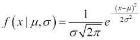

在这种表述中，符号*µ*代表均值（与中位数和众数相同）和符号*σ*代表方差。基于不同的均值和方差，我们可以计算不同的值分布，如下面的代码所示并进行可视化：

```py
In: import matplotlib.pyplot as plt
import numpy as np
import matplotlib.mlab as mlab
import math
x = np.linspace(-4,4,100)
for mean, variance in [(0,0.7),(0,1),(1,1.5),(-2,0.5)]:
 plt.plot(x,mlab.normpdf(x,mean,variance))
plt.show()

```

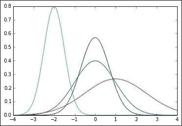

由于其性质，正态分布是统计学中的一个基本分布，因为所有统计模型都涉及对正态变量的处理。特别是，当均值为零且方差为 1（单位方差）时，在这种条件下称为标准正态分布的正态分布，对于统计模型具有更加有利的特性。

不管怎样，在现实世界中，正态分布的变量是罕见的。因此，验证我们正在工作的实际分布是否与理想的正态分布相差不远是很重要的，否则它可能会在你的预期结果中引起问题。正态分布变量是统计模型（如平均值和，在某种程度上，线性回归）的重要要求。相反，机器学习模型不依赖于任何关于你的数据应该如何分布的先验假设。但事实上，即使机器学习模型在数据具有某些特征时也能很好地工作，因此，与正态分布变量一起工作比其他分布更可取。在整本书中，我们将提供有关在构建和应用机器学习解决方案时应该寻找和检查的内容的警告。

对于平均值的计算，如果分布不是对称的，或者存在极端情况，可能会出现相关的问题。在这种情况下，极端情况往往会将平均值估计值拉向它们，从而导致与大量数据不匹配。那么，让我们计算一下波士顿 506 个地块的价值的平均值：

```py
In: mean_expected_value = dataset['target'].mean()

```

在这种情况下，我们使用 Pandas DataFrame 中可用的方法计算了平均值；然而，也可以调用 NumPy 函数`mean`从数据数组中计算平均值：

```py
In: np.mean(dataset['target'])

```

从数学公式来说，我们可以将这个简单的解决方案表达如下：

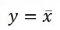

我们现在可以通过测量预测真实*y*值时产生的误差来评估结果。统计学表明，为了衡量预测值和真实值之间的差异，我们应该将差异平方，然后将它们全部相加。这被称为**误差平方和**：

```py
In: Squared_errors = pd.Series(mean_expected_value -\
 dataset['target'])**2
 SSE = np.sum(Squared_errors)
 print ('Sum of Squared Errors (SSE): %01.f' % SSE)

```

现在我们已经计算出来了，我们可以将其可视化为误差分布：

```py
In: density_plot = Squared_errors.plot('hist')

```

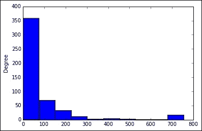

图表显示了某些错误值出现的频率。因此，你将立即注意到，大多数错误都围绕零（该值周围有很高的密度）。这种情况可以被认为是一个好情况，因为在大多数情况下，平均值是一个很好的近似值，但一些错误确实非常远离零，并且可以达到相当大的值（别忘了，错误是平方的，所以效果被强调）。当试图找出这样的值时，你的方法肯定会引导到一个相关的错误，我们应该找到一种更复杂的方法来最小化它。

## 线性关系的度量

显然，均值不是某些值的良好代表，但它确实是一个良好的起点。当然，均值的一个重要问题是它是固定的，而目标变量是可变的。然而，如果我们假设目标变量是由于我们正在测量的某些其他变量的影响而变化的，那么我们可以根据原因的变化调整均值。

对我们之前的方法的一个改进可能是构建一个基于另一个变量（甚至更多）的某些值（实际上与我们的目标相关）的均值，其变化在某种程度上类似于目标变量的变化。

直观地说，如果我们知道我们想要用我们的模型预测的动态，我们可以尝试寻找我们知道可以影响答案值的变量。

在房地产业务中，我们实际上知道通常房子越大，价格越贵；然而，这个规则只是故事的一部分，价格还受到许多其他因素的影响。目前，我们将保持简单，并假设房屋的扩建是一个正影响价格的因子，因此，更多的空间意味着更高的成本（更多的土地、更多的建筑材料、更多的工作，以及因此更高的价格）。

现在，我们有一个我们知道应该随着我们的目标变量变化的变量，我们只需要测量它，并基于常数值扩展我们的初始公式。

在统计学中，有一个度量可以帮助衡量两个变量如何（在多大程度上以及朝哪个方向）相互关联：**相关性**。

在相关性分析中，需要考虑几个步骤。首先，你的变量必须标准化（否则你的结果将不是相关性而是协变，这是一种受你正在处理的变量规模影响的关联度量的指标）。

在统计的 *Z* 分数标准化中，你需要从每个变量中减去其均值，然后将结果除以标准差。得到的转换后的变量将具有均值为 0 和标准差为 1（或单位方差，因为方差是标准差的平方）。

标准化一个变量的公式如下：

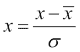

这可以通过使用 Python 中的一个简单函数来实现：

```py
In: def standardize(x):
 return (x-np.mean(x))/np.std(x)

```

标准化后，你比较每个变量的平方差与其自身均值的平方差。如果这两个差值在符号上相同，它们的乘积将是正的（表明它们具有相同的方向性）；然而，如果它们不同，乘积将变为负的。通过将所有平方差之间的乘积相加，并将它们除以观察次数，你最终将得到一个介于 -1 到 1 之间的相关系数。

相关系的绝对值将向您提供两个比较变量之间关系的强度，1 表示完美匹配，而 0 表示它们之间完全独立（它们之间没有任何关系）。相反，符号将暗示比例；正号是直接的（当一个增长时，另一个也增长），负号是间接的（当一个增长时，另一个缩小）。

协方差可以表示如下：

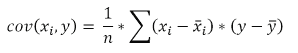

而皮尔逊相关系数可以表示如下：

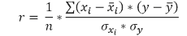

让我们直接在 Python 中检查这些公式。如您所注意到的，皮尔逊相关系数实际上是标准化的变量上的协方差，因此我们将`correlation`函数定义为`covariance`和`standardize`函数的包装器（您可以从`Scipy`导入所有这些函数；我们在这里实际上是在重新创建它们，只是为了帮助您理解它们是如何工作的）：

```py
In: 
def covariance(variable_1, variable_2, bias=0):
 observations = float(len(variable_1))
 return np.sum((variable_1 - np.mean(variable_1)) * \
 (variable_2 - np.mean(variable_2)))/(observations-min(bias,1))

 def standardize(variable):
 return (variable - np.mean(variable)) / np.std(variable)

 def correlation(var1,var2,bias=0):
 return covariance(standardize(var1), standardize(var2),bias)

 from scipy.stats.stats import pearsonr
 print ('Our correlation estimation: %0.5f' % (correlation(dataset['RM'], dataset['target'])))
 print ('Correlation from Scipy pearsonr estimation: %0.5f' % pearsonr(dataset['RM'], dataset['target'])[0])

Out: Our correlation estimation: 0.69536
 Correlation from Scipy pearsonr estimation: 0.69536

```

我们对目标变量值与该区域房屋平均房间数之间关系的相关估计值为 0.695，这是一个正的相关性，并且非常显著，因为相关性的最大正值是 1.0。

### 小贴士

为了估计一个相关性是否相关，只需将其平方；结果将表示两个变量共享的方差百分比。

让我们绘制当我们对两个变量进行相关性分析时会发生什么。使用**散点图**，我们可以轻松地可视化两个涉及的变量。散点图是一种图表，其中两个变量的值被视为笛卡尔坐标；因此，对于每个(*x*, *y*)值，图上都有一个点表示：

```py
In: x_range = [dataset['RM'].min(),dataset['RM'].max()]
 y_range = [dataset['target'].min(),dataset['target'].max()]
 scatter_plot = dataset.plot(kind='scatter', x='RM', y='target',\xlim=x_range, ylim=y_range)
 meanY = scatter_plot.plot(x_range, [dataset['target'].mean(),\  dataset['target'].mean()], '--' , color='red', linewidth=1)
 meanX = scatter_plot.plot([dataset['RM'].mean(),\dataset['RM'].mean()], y_range, '--', color='red', linewidth=1)

```

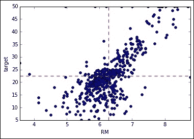

散点图还绘制了目标和预测变量的平均值作为虚线。这把图表分成四个象限。如果我们将其与先前的协方差和相关性公式进行比较，我们可以理解为什么相关性值接近 1：在右下角和左上角象限中，只有少数不匹配的点，其中一个变量高于其平均值，而另一个变量低于其平均值。

完美匹配（相关性值为 1 或-1）仅在点位于一条直线上（因此所有点都集中在右上角和左下角象限）时才可能。因此，相关性是线性关联的度量，是您的点接近直线的程度。理想情况下，所有点都在一条直线上有利于将预测变量完美映射到目标变量。

# 扩展到线性回归

线性回归试图通过一组给定的点拟合一条线，选择最佳拟合。最佳拟合是使由线决定的 *x* 的值与其对应的 *y* 值之间的平方差之和最小的线。（这是在检查均值作为预测指标的好坏时遇到的相同平方误差的优化。）

由于线性回归是一条线；在二维空间（*x*，*y*）中，它采用笛卡尔平面上经典线的公式形式：*y = mx + q*，其中 *m* 是角度系数（表示线与 *x* 轴之间的角度）和 *q* 是线与 *x* 轴之间的截距。

形式上，机器学习将线性回归的正确表达式表示如下：

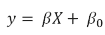

这里再次，*X* 是预测变量的矩阵，*β* 是系数矩阵，而 *β[0]* 是一个称为 **偏差** 的常数值（它与笛卡尔公式相同，只是符号不同）。

我们可以通过使用 Python 看到它的实际运行机制来更好地理解其工作原理，首先使用 `StatsModels` 包，然后使用 Scikit-learn 包。

## 使用 Statsmodels 进行回归

Statsmodels 是一个考虑到统计分析的包；因此，它的函数提供了相当丰富的统计检查和信息输出。可扩展性对该包来说不是问题；因此，它确实是学习的良好起点，但如果你必须处理相当大的数据集（甚至大数据）时，由于其优化算法，它肯定不是最佳解决方案。

有两种不同的方法（两个模块）使用 Statsmodels 进行线性回归：

+   `statsmodels.api`：这适用于不同的预测变量和答案变量，并要求你定义预测变量上的任何变量转换，包括添加截距

+   `statsmodels.formula.api`：这类似于 R，允许你指定一个函数形式（预测变量求和的公式）

我们将使用 `statsModels.api` 展示我们的示例；然而，我们还将展示使用 `statsmodels.formula.api` 的另一种方法。

作为第一步，让我们上传 Statsmodels 的两个模块，按照包文档中的惯例命名：

```py
In: import statsmodels.api as sm
 import statsmodels.formula.api as smf

```

作为第二步，有必要定义 *y* 和 *X* 变量：

```py
In: y = dataset['target']
 X = dataset['RM']
 X = sm.add_constant(X)

```

*X* 变量需要通过一个常数值 `()` 进行扩展；偏差将相应地计算。实际上，正如你记得的那样，线性回归的公式如下：

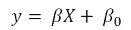

然而，使用 `StatsModels.api`，公式实际上变成了以下形式：

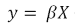

这可以解释为 *X* 中变量的组合，乘以其对应的 *β* 值。

因此，预测变量*X*现在既包含预测变量又包含一个单位常数。此外，*β*不再是一个单一的系数，而是一系列系数。

让我们通过使用`head`方法查看 Pandas DataFrame 的第一个值来验证这一点：

```py
In: X.head()

```

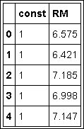

在这一点上，我们只需要设置线性回归计算的初始化：

```py
In: linear_regression = sm.OLS(y,X)

```

此外，我们还需要请求回归系数的估计，即*β*向量：

```py
In: fitted_model = linear_regression.fit()

```

如果我们想要使用`StatsModels.formula.api`来管理相同的结果，我们应该输入以下内容：

```py
In: linear_regression = smf.ols(formula='target ~ RM', data=dataset)
 fitted_model = linear_regression.fit()

```

前两条代码行同时包含了两个步骤，无需进行任何特定的变量准备，因为偏差是自动包含的。实际上，关于线性回归应该如何工作的规范被包含在字符串`target ~ RM`中，其中波浪号(`~`)左侧的变量名表示答案变量，右侧的变量名（或名称，在多重回归分析的情况下）表示预测变量。

实际上，`smf.ols`期望的输入与`sm.OLS`相当不同，因为它可以接受我们的整个原始数据集（它通过提供的公式选择要使用的变量），而`sm.OLS`期望一个仅包含用于预测的特征的矩阵。因此，在使用这两种截然不同的方法时必须谨慎行事。

一个总结（拟合模型的某种方法）可以快速告诉你关于回归分析所需了解的所有内容。如果你尝试过`statsmodesl.formula.api`，我们也重新使用`StatsModels.api`初始化线性回归，因为它们不是在相同的*X*上工作，而我们的后续代码依赖于`sm.OLS`规范：

```py
In: linear_regression = sm.OLS(y,X)
 fitted_model = linear_regression.fit()
 fitted_model.summary()

```

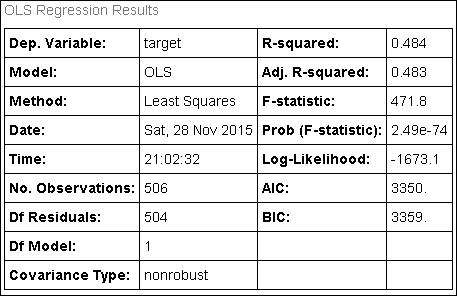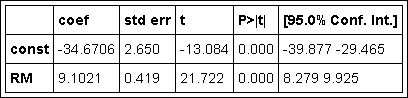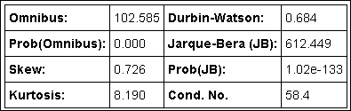

你将收到一系列相当长的表格，包含许多统计测试和信息。虽然一开始可能相当令人畏惧，但实际上你不需要所有这些输出，除非你的分析目的是统计性的。数据科学主要关注的是实际模型在预测真实数据上的工作，而不是在统计问题的形式化规范上。尽管如此，其中一些输出对于成功构建模型仍然很有用，我们将为你提供对主要数字的洞察。

在解释输出之前，我们首先需要从拟合模型中提取两个元素：系数和基于我们构建模型的数据的预测。它们在接下来的解释中都将非常有用：

```py
In: print (fitted_model.params)
 betas = np.array(fitted_model.params)
 fitted_values = fitted_model.predict(X)

```

## 决定系数

让我们从第一个结果表开始。第一个表分为两列。第一列包含拟合模型的描述：

+   **因变量**: 这只是提醒你目标变量是什么

+   **模型**: 这是您已拟合的模型的另一个提醒，OLS 是普通最小二乘法，也是线性回归的另一种说法

+   **方法**: 参数拟合方法（在这种情况下是最小二乘法，经典计算方法）

+   **观测数**: 已使用的观测值数量

+   **残差 DF**: 残差的自由度，即观测值数量减去参数数量

+   **模型 DF**: 模型中估计的参数数量（不包括常数项）

第二张表提供了一个更有趣的图景，重点关注线性回归模型的拟合程度，并指出模型可能存在的问题：

+   **R 平方**: 这是决定系数，衡量回归相对于简单平均的效果。

+   **调整 R 平方**: 这是基于模型中的参数数量和帮助构建它的观测值数量的决定系数的调整值。

+   **F 统计量**: 这是一个衡量指标，告诉你从统计学的角度来看，除了偏差之外，所有系数加在一起是否与零不同。简单来说，它告诉你你的回归是否真的比简单平均更好。

+   **F 统计量的概率**: 这是你仅仅因为使用了观测值而得到那个 F 统计量的概率（这种概率实际上被称为 F 统计量的**p 值**）。如果它足够低，你可以有信心你的回归确实比简单平均更好。通常在统计学和科学中，测试概率必须等于或低于 0.05（统计显著性的传统标准）才能有这种信心。

+   **AIC**: 这是赤池信息准则。AIC 是根据观测值数量和模型本身的复杂性来评估模型的分数。AIC 分数越低，越好。它对于比较不同模型和进行统计变量选择非常有用。

+   **BIC**: 这是贝叶斯信息准则。它像 AIC 一样工作，但它对参数更多的模型施加更高的惩罚。

当我们处理多个预测变量时，大多数这些统计数据都是有意义的，因此它们将在下一章中进行讨论。因此，目前，由于我们正在处理简单的线性回归，值得仔细检查的两个度量标准是 F 统计量和 R 平方。实际上，F 统计量是一个测试，如果你有足够的观测值并且可以依赖一个最小相关性的预测变量，它不会告诉你太多。通常，在数据科学项目中，这不应该是一个很大的问题。

R 平方更有趣，因为它告诉你你的回归模型与单个均值相比有多好。它是通过提供一个百分比来做到这一点的，即均值的未解释方差，实际上你的模型能够解释。

如果你想自己计算这个度量，你只需要计算目标变量均值的平方误差和。这就是你的未解释方差的基础线（在我们例子中，我们希望通过模型来解释的房价的变异性）。如果你从这个基础线中减去回归模型的平方误差和，你将得到残差平方误差和，可以通过除以基础线来比较：

```py
In: mean_sum_squared_errors = np.sum((dataset['target']-\dataset['target'].mean())**2)
 regr_sum_squared_errors = np.sum((dataset['target']-\fitted_values)**2)
 (mean_sum_squared_errors-\regr_sum_squared_errors) / mean_sum_squared_errors

Out: 0.48352545599133412

```

### 小贴士

当处理浮点数时，可能会出现舍入误差，所以如果你的计算中某些小数位不匹配，不要害怕；如果它们匹配到第 8 位小数，你可以相当自信地认为结果是相同的。

理想情况下，如果你能将回归的平方误差和减少到零，你将得到最大的解释方差百分比——即得分为 1。

R 平方度量也可以与你的预测变量和目标变量之间相关性的平方所获得的百分比进行比较。

在我们的例子中，它是 0.484，这实际上正好是我们的 R 平方相关系数：

```py
In: (pearsonr(dataset['RM'], dataset['target'])[0])**2

Out: 0.4835254559913339

```

正如我们所见，R 平方与线性回归试图最小化的平方误差完全一致；因此，更好的 R 平方意味着更好的模型。然而，当同时处理多个预测变量时，这个度量（以及线性回归本身）存在一些问题。再次强调，我们必须等到我们同时建模多个预测变量；因此，对于简单的线性回归来说，更好的 R 平方应该暗示着更好的模型。

## 系数的意义和重要性

第二个输出表告诉我们关于系数的信息，并提供了一系列测试。这些测试可以让我们确信，我们没有因为分析基础中的几个极端观察值或某些其他问题而被误导：

+   **coef**：估计的系数

+   **std err**：系数估计的标准误差；它越大，系数的估计就越不确定

+   **t**：t 统计量值，一个衡量系数真实值是否与零不同的指标

+   **P > |t|**：表示系数不同于零的概率的 p 值，仅通过偶然性

+   **[95.0% 置信区间]**：考虑所有可能的不同观察值和因此不同的估计系数的 95%的所有机会，系数的下限和上限值

从数据科学的角度来看，t 检验和置信区间并不是非常有用，因为我们主要感兴趣的是验证我们的回归在预测答案变量时是否有效。因此，我们将只关注`coef`值（估计系数）及其标准误差。

系数是我们从回归模型中可以获得的最重要输出，因为它们允许我们重新创建加权求和，从而预测我们的结果。

在我们的例子中，我们的系数对于偏差（也称为**截距**，回忆一下笛卡尔空间中线的公式）是*−34.6706*，对于`RM`变量是*9.1021*。回忆我们的公式，我们可以将我们获得的数字代入：

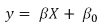

现在，如果你用估计的系数替换贝塔和*x*，用变量的名称替换*−34.6706*和*9.1021*，一切就变成了以下内容：

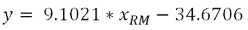

现在，如果你知道波士顿某个地区的平均房间数量，你可以快速估计期望值。例如，*x[RM]*是`4.55`：

```py
In: 9.1021*4.55-34.6706

Out: 6.743955

```

我们必须注意两个点。首先，在这种公式中，每个变量的贝塔成为其*单位变化*的度量，这对应于变量增加一个单位时结果将经历的变化。在我们的例子中，我们的平均房间空间变为`5.55`：

```py
In: 9.1021*5.55-34.6706

Out: 15.846055

```

*x[RM]*单位变化引起的增加对应于结果的变化，相当于*β[RM]*。另一个需要注意的点是我们平均房间空间变为 1 或 2 时，我们的估计值将变为负数，这是完全不现实的。这是因为预测变量和目标变量之间的映射发生在预测变量值的限定范围内：

```py
In: (np.min(dataset['RM']),np.max(dataset['RM']))
Out: (3.5609999999999999, 8.7799999999999994)

```

无论何时我们尝试使用一个*x*（或一组*x*）来估计答案值，而这个*x*（或一组*x*）超出了我们用于拟合模型的边界，我们都有可能得到一个线性回归计算根本未进行优化的响应。换一种说法，线性回归可以学习它所看到的东西，除非预测变量和目标变量之间存在清晰的线性函数形式（它们可以真正表示为一条线），否则当预测变量具有不寻常的值时，你可能会得到奇怪的估计。换句话说，线性回归总是在它从中学到的值范围内工作（这被称为**插值**），但只有在某些条件下才能为其学习边界提供正确的值（这被称为**外推**）。

### 小贴士

正如我们之前提到的，用于拟合模型的观测数对于获得一个稳健且可靠的线性回归模型至关重要。观测数越多，模型在生产运行中遇到异常值的可能性就越小。

标准误差则非常重要，因为它们表明预测变量与答案之间关系薄弱或不明确。你可以通过将标准误差除以其 beta 值来注意到这一点。如果比率是 0.5 或更大，那么这是一个明显的信号，表明模型对其提供的正确系数估计几乎没有信心。拥有更多案例总是解决方案，因为它可以减少系数的标准误差并提高我们的估计；然而，也有其他方法可以减少误差，例如通过主成分分析去除特征之间的冗余方差，或者通过贪婪选择选择一个简约的预测变量集。所有这些主题将在我们处理多个预测变量时讨论；在本书的这一部分，我们将说明解决此类问题的方法。

## 评估拟合值

最后一张表处理的是回归残差的分解。残差是目标值与预测拟合值之间的差异：

+   **偏度**：这是衡量残差围绕平均值对称性的指标。对于对称分布的残差，其值应接近零。正值表示右侧有长尾；负值表示左侧有长尾。

+   **峰度**：这是衡量残差分布形状的指标。钟形分布的测量值为零。负值指向过于平坦的分布；正值表示峰度过高。

+   **Omnibus D'Angostino 测试**：这是一个针对偏度和峰度的组合统计测试。

+   **Omnibus 概率**：这是将 Omnibus 统计量转换为概率。

+   **Jarque-Bera 统计量**：这是对偏度和峰度的另一种测试。

+   **JB 概率**：这是 JB 统计量转换为概率。

+   **Durbin-Watson 统计量**：这是对残差之间相关性的测试（在分析基于时间的数据时相关）。

+   **条件数**：这是对多重共线性（当处理多个预测变量时，我们将讨论多重共线性的概念）的测试。

在统计实践中，对残差进行密切分析相当重要，因为它可以突出回归分析中存在严重问题的迹象。当处理单个变量时，有趣的是通过视觉检查其残差，以确定是否存在异常案例或残差是否随机分布。特别是，重要的是要密切关注以下三个问题中的任何一个出现：

1.  过于偏离平均值的值。大的标准化残差暗示在建模此类观察值时存在严重困难。此外，在学习这些值的过程中，回归系数可能已经被扭曲。

1.  预测变量值的方差不同。如果线性回归是基于预测变量的平均条件，则异方差性表明当预测变量具有某些值时，回归工作不正常。

1.  在残差点的云层中出现的奇异形状可能表明，你需要为正在分析的数据使用一个更复杂的模型。

在我们的案例中，我们可以通过从答案变量中减去拟合值来轻松计算残差，然后在一个图表中绘制结果的标准残差：

```py
In: residuals = dataset['target']-fitted_values
 normalized_residuals = standardize(residuals)

In: residual_scatter_plot = plt.plot(dataset['RM'], normalized_residuals,'bp')
mean_residual = plt.plot([int(x_range[0]),round(x_range[1],0)], [0,0], '-', color='red', linewidth=2)
upper_bound = plt.plot([int(x_range[0]),round(x_range[1],0)], [3,3], '--', color='red', linewidth=1)
lower_bound = plt.plot([int(x_range[0]),round(x_range[1],0)], [-3,-3], '--', color='red', linewidth=1)
plt.grid()

```

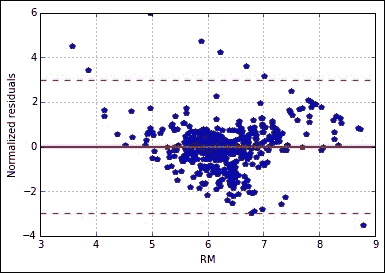

结果的散点图表明，残差显示出我们之前作为警告指出的一些问题，即你的回归分析中可能存在问题。首先，有一些点位于由标准化残差值-3 和+3 之间的两条虚线所界定的带状区域之外（如果残差呈正态分布，理论上应该覆盖 99.7%的值）。这些肯定是具有大误差的显著点，它们实际上可能会使整个线性回归表现不佳。我们将在下一章讨论异常值时讨论此问题的可能解决方案。

然后，点云并非完全随机分布，它在预测变量的不同值（**横轴**）上显示出不同的方差，你可以发现意外的模式（直线上的点或以某种 U 形排列的核心点）。

我们并不感到惊讶；平均房间数可能是一个很好的预测变量，但它不是唯一的原因，或者它必须被重新考虑为直接原因（房间数表示更大的房子，但如果是平均以下的房间呢？）。这使我们讨论一个强烈的关联是否真的使变量成为线性关系的良好候选者。

## 相关性不等于因果关系

实际上，看到你的预测变量和目标变量之间存在相关性，并且能够成功地使用线性回归对其进行建模，这并不意味着两者之间真的存在因果关系（尽管你的回归可能非常有效，甚至是最优的）。

虽然使用数据科学方法而不是统计方法可以保证你的模型具有一定的有效性，但在不知道为什么目标变量与预测变量相关时，很容易陷入一些错误。

我们将告诉你六个不同的原因，并提供一个警示词，帮助你轻松处理这样的预测变量：

+   **直接因果关系**：*x* 导致 *y*；例如，在房地产业务中，价值与房屋的平方米数成正比。

+   **相互影响**：*x* 导致 *y*，但它也受到 *y* 的影响。这在许多宏观经济动态中很典型，政策的效果会增强或减弱其效果。例如，在房地产领域，一个地区的犯罪率可能会降低其价格，但低价意味着该地区可能会迅速变得更加恶化且危险。

+   **虚假因果关系**：这发生在真实原因实际上是*z*，它同时导致*x*和*y*；因此，它只是一个错误的错觉，即*x*意味着*y*，因为背后是*z*。例如，昂贵艺术品商店和画廊的存在似乎与房价相关；实际上，两者都是由富裕居民的存在决定的。

+   **间接因果关系**：实际上*x*并没有导致*y*，而是导致其他事物，然后这些事物又导致*y*。一个优秀的市政府在提高税收后投资基础设施可以间接影响房价，因为该地区变得更加宜居，从而吸引更多需求。更高的税收，因此更多的投资，间接影响房价。

+   **条件效应**：在另一个变量*z*的值方面，*x*导致*y*；例如，当*z*具有某些值时，*x*不会影响*y*，但当*z*取特定值时，*x*开始影响*y*。我们也将这种情况称为交互。例如，当犯罪率低时，一个地区的学校存在可以成为一个吸引点，因此它只会在犯罪性很少时影响房价。

+   **随机效应**：任何记录的*x*和*y*之间的相关性都是由于幸运的抽样选择；实际上，与*y*之间根本不存在任何关系。

理想的情况是您有一个直接的因果关系；那么，您的模型中将有预测因子，它将始终为您提供最佳值以推导出您的响应。

在其他情况下，目标变量与不完美因果关系可能导致更嘈杂的估计，尤其是在生产中，您将不得不处理模型之前未见过的数据。

互为因果关系在计量经济学模型中更为典型。它们需要特殊类型的回归分析。将它们包含在您的回归分析中可能会改进您的模型；然而，它们的作用可能被低估。

虚假和间接原因会给您的*x*和*y*关系添加一些噪声；这可能导致更嘈杂的估计（更大的标准误差）。通常，解决方案是为您的分析获取更多观测值。

如果没有被发现，条件效应可能会限制您模型产生准确估计的能力。如果您对任何这些都不了解，根据您对问题的领域知识，使用一些自动程序检查可能的变量间交互是一个好步骤。

随机效应可能是您模型可能遇到的最糟糕的事情，但如果您遵循我们在第六章中将要描述的数据科学程序，即*实现泛化*，当我们处理验证您模型结果所需的所有必要行动时，它们是容易避免的。

## 使用回归模型进行预测

当我们将系数代入回归公式时，预测只是将新数据应用于系数向量进行矩阵乘法的问题。

首先，你可以通过提供一个包含新案例数组的数组来依赖拟合模型。在以下示例中，你可以看到，给定单个新案例的`Xp`变量，使用拟合模型的`predict`方法可以轻松预测：

```py
In: RM = 5
 Xp = np.array([1,RM])
 print ("Our model predicts if RM = %01.f the answer value \is %0.1f" % (RM, fitted_model.predict(Xp)))

Out:  Our model predicts if RM = 5 the answer value is 10.8

```

`predict`方法的一个很好的用法是将拟合预测投影到我们之前的散点图上，以便我们可以可视化与我们的预测变量，平均房间数量相关的价格动态：

```py
In: x_range = [dataset['RM'].min(),dataset['RM'].max()]
 y_range = [dataset['target'].min(),dataset['target'].max()]
 scatter_plot = dataset.plot(kind='scatter', x='RM', y='target',\xlim=x_range, ylim=y_range)
 meanY = scatter_plot.plot(x_range,\[dataset['target'].mean(),dataset['target'].mean()], '--',\color='red', linewidth=1)
 meanX =scatter_plot.plot([dataset['RM'].mean(),\dataset['RM'].mean()], y_range, '--', color='red', linewidth=1)
 regression_line = scatter_plot.plot(dataset['RM'], fitted_values,\'-', color='orange', linewidth=1)

```

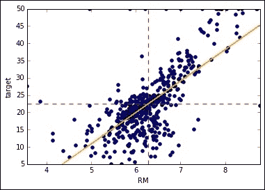

```py
x and *y* averages.
```

除了`predict`方法外，通过仅使用`NumPy`中的`dot`函数，生成预测相当简单。在准备一个包含变量数据和偏差（一列）的*X*矩阵以及系数向量后，你所要做的就是将矩阵乘以向量。结果本身将是一个长度等于观测数数量的向量：

```py
In: predictions_by_dot_product = np.dot(X,betas)
 print ("Using the prediction method: %s" % fitted_values[:10])
 print ("Using betas and a dot product: %s" % 
predictions_by_dot_product[:10])

Out: Using the prediction method: [ 25.17574577  23.77402099  30.72803225  29.02593787  30.38215211
 23.85593997  20.05125842  21.50759586  16.5833549   19.97844155]
Using betas and a dot product: [ 25.17574577  23.77402099  30.72803225  29.02593787  30.38215211
 23.85593997  20.05125842  21.50759586  16.5833549   19.97844155]

```

通过`predict`方法和这种简单乘法获得的结果比较将揭示完美匹配。因为从线性回归进行预测很简单，如果需要，你甚至可以在不同于 Python 的语言中实现这种乘法。在这种情况下，你只需要找到一个矩阵计算库或自己编写一个函数。据我们所知，你甚至可以在 SQL 脚本语言中轻松编写这样的函数。

## 使用 Scikit-learn 进行回归

正如我们在使用`StatsModels`包时所见，可以使用更面向机器学习的包，如 Scikit-learn 来构建线性模型。使用`linear_model`模块，我们可以设置一个线性回归模型，指定预测变量不应归一化，并且我们的模型应该有偏差：

```py
In: from sklearn import linear_model
 linear_regression = \linear_model.LinearRegression(normalize=False,\fit_intercept=True)

```

数据准备，相反，需要计算观测值并仔细准备预测数组以指定其两个维度（如果保留为向量，拟合过程将引发错误）：

```py
In: observations = len(dataset)
X = dataset['RM'].values.reshape((observations,1)) 
# X should be always a matrix, never a vector
y = dataset['target'].values # y can be a vector

```

完成所有前面的步骤后，我们可以使用`fit`方法拟合模型：

```py
In: linear_regression.fit(X,y)

```

Scikit-learn 包的一个非常方便的特性是，所有模型，无论其复杂度类型如何，都共享相同的方法。`fit`方法始终用于拟合，并期望一个*X*和一个*y*（当模型是监督模型时）。相反，两个常见的用于精确预测（总是用于回归）及其概率（当模型是概率模型时）的方法分别是`predict`和`predict_proba`。

拟合模型后，我们可以检查系数向量和偏差常数：

```py
In: print (linear_regression.coef_)
 print (linear_regression.intercept_)

Out: [ 9.10210898]
 -34.6706207764

```

使用`predict`方法和结果列表的前 10 个元素进行切片，我们输出前 10 个预测值：

```py
In: print (linear_regression.predict(X)[:10])

Out: [ 25.17574577  23.77402099  30.72803225  29.02593787  30.38215211
 23.85593997  20.05125842  21.50759586  16.5833549   19.97844155]

```

如前所述，如果我们准备一个新的矩阵并添加一个常数，我们可以通过简单的矩阵-向量乘法自行计算结果：

```py
In: Xp = np.column_stack((X,np.ones(observations)))
 v_coef = list(linear_regression.coef_) +\[linear_regression.intercept_]

```

如预期的那样，乘积的结果为我们提供了与`predict`方法相同的估计：

```py
In: np.dot(Xp,v_coef)[:10]

Out: array([ 25.17574577,  23.77402099,  30.72803225,  29.02593787,
 30.38215211,  23.85593997,  20.05125842,  21.50759586,
 16.5833549 ,  19.97844155])

```

在这一点上，质疑这种`linear_model`模块的使用是很自然的。与 Statsmodels 之前提供的函数相比，Scikit-learn 似乎提供的统计输出很少，而且看起来很多线性回归功能都被移除了。实际上，它提供了数据科学中所需的一切，并且在处理大型数据集时性能非常出色。

如果你正在使用 IPython，只需尝试以下简单的测试来生成一个大型数据集并检查两种线性回归版本的性能：

```py
In: from sklearn.datasets import make_regression
 HX, Hy = make_regression(n_samples=10000000, n_features=1,\n_targets=1, random_state=101)

```

在生成一百万个单一变量的观测值之后，首先使用 IPython 的`%%time`魔术函数来测量。这个魔术函数会自动计算在 IPython 单元格中完成计算所需的时间：

```py
In: %%time
 sk_linear_regression = linear_model.LinearRegression(\normalize=False,fit_intercept=True)
 sk_linear_regression.fit(HX,Hy)

Out: Wall time: 647 ms

```

现在，轮到 Statsmodels 包登场了：

```py
In: %%time
 sm_linear_regression = sm.OLS(Hy,sm.add_constant(HX))
 sm_linear_regression.fit()

Out: Wall time: 2.13 s

```

虽然模型中只涉及一个变量，但 Statsmodels 的默认算法证明比 Scikit-learn 慢三倍。我们将在下一章重复这个测试，当一次使用更多的预测变量和其他不同的`fit`方法时。

# 最小化成本函数

线性回归的核心是寻找一条直线的方程，该方程能够最小化直线*y*值与原始值之间差异的平方和。作为提醒，让我们假设我们的回归函数被称为`h`，其预测为`h(X)`，如下所示：

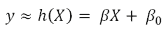

因此，我们要最小化的成本函数如下：

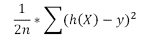

有很多方法可以最小化它，其中一些在大数据量下表现优于其他方法。在表现较好的方法中，最重要的是**伪逆**（你可以在统计学的书籍中找到它）、**QR 分解**和**梯度下降**。

## 解释使用平方误差的原因

查看线性回归分析的内部机制，一开始可能会令人困惑，因为我们正在努力最小化我们的估计值与构建模型的数据之间的平方差。平方差不如绝对差（不带符号的差）直观易懂。

例如，如果你需要预测一个货币价值，比如股票价格或广告活动的回报，你更感兴趣的是知道你的绝对误差，而不是你的 R 平方值，这可能会被误解（因为平方会放大更大的损失）。

正如我们之前提到的，线性回归从统计知识领域吸取了步骤，实际上在统计学中有很多原因使得最小化平方误差比最小化绝对误差更可取。

不幸的是，这样的理由相当复杂，过于技术化，因此超出了这本书的实际范围；然而，从高层次的角度来看，一个良好合理的解释是，平方很好地实现了两个非常重要的目标：

+   它消除了负值；因此，当求和时，相反的误差不会相互抵消

+   它强调了更大的差异，因为当它们被平方时，与简单求和绝对值相比，它们将成比例地增加误差总和

使用估计值最小化平方差异使我们使用平均值（正如我们之前所建议的，作为一个基本模型，没有提供任何理由）。

让我们一起用 Python 来检查，而不需要开发所有公式。让我们定义一个包含值的`x`向量：

```py
In: import numpy as np
 x = np.array([9.5, 8.5, 8.0, 7.0, 6.0])

```

让我们也定义一个返回成本函数（平方差异）的函数：

```py
In: def squared_cost(v,e):
 return np.sum((v-e)**2)

```

使用`scipy`包提供的`fmin`最小化过程，我们试图找出一个向量（这将是我们的`x`向量），其值使得平方和最小：

```py
In: from scipy.optimize import fmin
 xopt = fmin(squared_cost, x0=0, xtol=1e-8, args=(x,))

Out: Optimization terminated successfully.
 Current function value: 7.300000
 Iterations: 44
 Function evaluations: 88

```

我们只输出我们最好的`e`值，并验证它是否确实是`x`向量的平均值：

```py
In: print ('The result of optimization is %0.1f' % (xopt[0]))
 print ('The mean is %0.1f' % (np.mean(x)))

Out: The result of optimization is 78.0
 The mean is 78.0

```

如果我们尝试找出什么最小化了绝对误差的总和：

```py
In: def absolute_cost(v,e):
 return np.sum(np.abs(v-e))

In: xopt = fmin(absolute_cost, x0=0, xtol=1e-8, args=(x,))

Out: Optimization terminated successfully.
 Current function value: 5.000000
 Iterations: 44
 Function evaluations: 88

In: print ('The result of optimization is %0.1f' % (xopt[0]))
 print ('The median is %0.1f' % (np.median(x)))

Out: The result of optimization is 8.0
 The median is 8.0

```

我们会发现它是中位数，而不是平均值。不幸的是，中位数并不具备与平均值相同的统计特性。

## 伪逆和其他优化方法

存在一种解析公式可以用于解决回归分析，并从数据中得到系数向量，最小化成本函数：

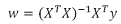

展示这个方程超出了这本书的实用范围，但我们可以利用 Python 编程的力量来测试它。

因此，我们可以直接通过使用`NumPy`的`np.linalg.inv`来求解矩阵的逆，或者使用其他方法，如求解线性方程中的`w`，这些方程被称为正规方程：

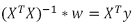

在这里，函数`np.linalg.solve`可以为我们完成所有计算：

```py
In: observations = len(dataset)
 X  = dataset['RM'].values.reshape((observations,1)) # X should be always a matrix, never a vector
 Xb = np.column_stack((X,np.ones(observations))) # We add the bias
 y  = dataset['target'].values # y can be a vector

 def matrix_inverse(X,y, pseudo=False):
 if pseudo:
 return np.dot(np.linalg.pinv(np.dot(X.T,X)),np.dot(X.T,y))
 else:
 return np.dot(np.linalg.inv(np.dot(X.T, X)),np.dot(X.T,y))

 def normal_equations(X,y):
 return np.linalg.solve(np.dot(X.T,X), np.dot(X.T,y))

 print (matrix_inverse(Xb, y))
 print (matrix_inverse(Xb, y, pseudo=True))
 print (normal_equations(Xb, y))

Out:
 [  9.10210898 -34.67062078]
 [  9.10210898 -34.67062078]
 [  9.10210898 -34.67062078]

```

使用这些方法解决线性回归的唯一问题是复杂性，可能是在直接使用`np.linalg.inv`计算逆时，计算精度可能有所损失，以及，当然，*X^TX*乘积必须是可逆的（有时当使用相互之间高度相关的多个变量时，它可能不是可逆的）。

即使使用另一个算法（QR 分解，Statsmodels 的核心算法，可以克服一些之前引用的数值问题），最坏的性能可以估计为*O(n³)*；即，立方复杂度。

使用伪逆（在 NumPy 中，`np.linalg.pinv`）可以帮助实现 *O(n^m)* 的复杂度，其中 *m* 估计小于 2.37（大约是二次的）。

这实际上可能是一个很大的限制，限制了快速估计线性回归分析的能力。事实上，如果你正在处理 *10³* 个观测值，这在统计分析中是一个可行的观测值数量，最坏情况下需要 *10⁹* 次计算；然而，当处理数据科学项目时，这些项目很容易达到 *10⁶* 个观测值，找到回归问题解决方案所需的计算次数可能会激增到 *10¹⁸*。

## 梯度下降在工作

作为传统经典优化算法的替代方案，梯度下降技术能够通过远少的计算量来最小化线性回归分析的代价函数。梯度下降的复杂度以 *O(n*p)* 的顺序排列，因此即使在出现大量 *n*（代表观测数）和大量 *p*（变量数）的情况下，学习回归系数也是可行的。

该方法通过利用一个简单的启发式方法，从随机点开始逐渐收敛到最优解。简单来说，它类似于在山中盲目行走。如果你想下降到最低的山谷，即使你不知道并且看不到路径，你也可以通过先下山一段时间，然后停下来，然后再下山，如此循环，始终在每个阶段都朝着地表下降的方向前进，直到你到达一个不能再下降的点。希望在那个点上，你将到达目的地。

在这种情况下，你唯一的风险是发生在中间的山谷（例如，那里有一片树林或一个湖泊）并错误地将其视为你期望的到达地，因为土地在那里停止下降。

在一个优化过程中，这种情况被定义为局部最小值（而你的目标是全局最小值，即可能的最小值），这是你在最小化所工作的函数过程中可能出现的可能结果。好消息是，在任何情况下，线性模型家族的误差函数都是碗状的（技术上我们的代价函数是凹的），如果你正确下降，你不太可能被困在任何地方。

在给定一组系数（向量 *w*）的代价函数的情况下，描述基于梯度下降的解决方案的必要步骤是很容易的：

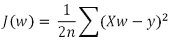

我们首先通过选择一个随机的 *w* 的初始化值开始，通过选择一些随机数（例如，从标准正态曲线中取出的，具有零均值和单位方差）。

然后，我们开始重复更新 *w* 的值（恰当地使用梯度下降计算），直到从上一个 *J(w)* 的边际改进足够小，以至于我们可以确定我们已经最终达到了一个最优的最小值。

我们可以通过从每个系数中减去成本函数的偏导数的一部分 alpha（*α*，学习率）来适时地更新我们的系数，一个接一个：

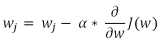

在我们的公式中，*w[j]*应被视为一个单独的系数（我们正在迭代它们）。在解决偏导数之后，最终的解形式如下：

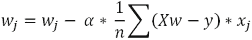

简化一切，我们的*x*系数的梯度只是我们的预测值的平均值乘以它们各自的*x*值。

Alpha，被称为**学习率**，在过程中非常重要，因为，如果它太大，可能会导致优化偏离并失败。你必须把每个梯度看作是一次跳跃或是在一个方向上的奔跑。如果你完全接受它，你可能会错过最优的最小值，最终落在另一个上升的斜坡上。过多的连续长步骤甚至可能迫使你爬上成本斜坡，使你的初始位置（由成本函数给出，其总和的平方是整体适应度分数的损失）变得更糟。

使用较小的 alpha 值，梯度下降不会跳过解，但它可能需要更长的时间才能达到期望的最小值。如何选择合适的 alpha 是一个试错的问题；无论如何，根据我们在许多优化问题中的经验，从一个如 0.01 的 alpha 值开始永远不是一个坏的选择。

自然地，给定相同的 alpha，随着你接近解，梯度在任何情况下都会产生更短的步骤。在图表中可视化这些步骤可以真正给你一个关于梯度下降是否在找到解的提示。

虽然在概念上相当简单（它基于一种直觉，我们肯定已经应用于逐步移动，指导我们如何优化结果），但在处理真实数据时，梯度下降非常有效，并且确实具有可扩展性。这些有趣的特征使其成为机器学习中的核心优化算法；它不仅限于线性模型家族，还可以扩展，例如，用于反向传播过程的神经网络，以最小化训练错误。令人惊讶的是，梯度下降也是另一个复杂机器学习算法的核心，即梯度提升树集成，其中我们有一个迭代过程，使用一个更简单的学习算法（所谓的**弱学习器**，因为它受到高偏差的限制）来进步优化。

这里是 Python 的一个初步实现。我们将在下一章中对其进行轻微修改，使其能够有效地处理多于一个预测因子：

```py
In: observations = len(dataset)
 X  = dataset['RM'].values.reshape((observations,1))
 # X should be always a matrix, never a vector
 X = np.column_stack((X,np.ones(observations))) # We add the bias
 y  = dataset['target'].values # y can be a vector

```

现在，在定义了响应变量，选择了我们的预测变量（每栋住宅的平均房间数 `RM` 特征），并添加了偏差（常数 `1`）之后，我们就可以在下面的代码中定义我们优化过程中的所有函数了：

```py
In: import random

 def random_w( p ):
 return np.array([np.random.normal() for j in range(p)])

 def hypothesis(X,w):
 return np.dot(X,w)

 def loss(X,w,y):
 return hypothesis(X,w) - y

 def squared_loss(X,w,y):
 return loss(X,w,y)**2

 def gradient(X,w,y):
 gradients = list()
 n = float(len( y ))
 for j in range(len(w)):
 gradients.append(np.sum(loss(X,w,y) * X[:,j]) / n)
 return gradients

 def update(X,w,y, alpha=0.01):
 return [t - alpha*g for t, g in zip(w, gradient(X,w,y))]

 def optimize(X,y, alpha=0.01, eta = 10**-12, iterations = 1000):
 w = random_w(X.shape[1])
 path = list()
 for k in range(iterations):
 SSL = np.sum(squared_loss(X,w,y))
 new_w = update(X,w,y, alpha=alpha)
 new_SSL = np.sum(squared_loss(X,new_w,y))
 w = new_w
 if k>=5 and (new_SSL - SSL <= eta and \new_SSL - SSL >= -eta):
 path.append(new_SSL)
 return w, path
 if k % (iterations / 20) == 0:
 path.append(new_SSL)
 return w, path

```

在最终定义了所有必要的函数以使梯度下降工作之后，我们可以开始优化它以解决我们的单个回归问题：

```py
IN: alpha = 0.048
 w, path = optimize(X,y,alpha, eta = 10**-12, iterations = 25000)
 print ("These are our final coefficients: %s" % w)
 print ("Obtained walking on this path of squared loss %s" % path)

Out: These are our final coefficients: [9.1021032698295059,\-34.670584445862119]
 Obtained walking on this path of squared loss [369171.02494038735,   23714.645148620271, 22452.194702610999, 22154.055704515144,   22083.647505550518, 22067.019977742671, 22063.093237887566,   22062.165903044533, 22061.946904602359, 22061.895186155631,   22061.882972380481, 22061.880087987909, 22061.879406812728,   22061.879245947097, 22061.879207957238, 22061.879198985589,   22061.879196866852, 22061.879196366495, 22061.879196248334,   22061.879196220427, 22061.879196220034]

```

Scikit-learn 的 `linear_regression`（以及线性方法模块中存在的其他线性模型）实际上是由梯度下降驱动的，这使得 Scikit-learn 成为我们在数据科学项目中处理大型和大数据时的首选选择。

# 摘要

在本章中，我们介绍了线性回归作为一种监督机器学习算法。我们解释了它的函数形式，它与均值和相关性统计量之间的关系，并尝试在波士顿房价数据上构建一个简单的线性回归模型。在完成这些之后，我们最终通过提出其关键数学公式及其转换为 Python 代码来简要介绍了回归是如何在底层工作的。

在下一章中，我们将继续讨论线性回归，将我们的预测变量扩展到多个变量，并继续我们在使用单个变量进行初步说明时暂停的解释。我们还将指出你可以应用到的最有用的数据转换，使数据适合由线性回归算法处理。
