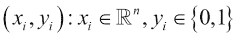

# 第四章. 逻辑回归

在本章中，介绍了另一种监督方法：分类。我们将介绍最简单的分类器，逻辑回归，它与线性回归有相同的基础，但针对分类问题。

在下一章中，你会找到：

+   对分类问题（包括二分类和多分类问题）的正式和数学定义

+   如何评估分类器的性能——即它们的指标

+   逻辑回归背后的数学

+   为逻辑回归专门构建的 SGD 重访公式

+   多分类情况，使用多分类逻辑回归

# 定义分类问题

虽然逻辑回归这个名字暗示了回归操作，但逻辑回归的目标是分类。在一个非常严谨的世界，比如统计学，为什么这个技术会有歧义的名字？简单地说，这个名字根本没错，它完全合理：它只需要一点介绍和调查。之后，你就会完全理解为什么它被称为逻辑回归，你也不再认为这个名字是错误的。

首先，让我们介绍什么是分类问题，什么是分类器，它是如何运作的，以及它的输出是什么。

在上一章中，我们将回归描述为在目标变量中估计一个连续值的操作；从数学上讲，预测变量是在范围(*−∞*, *+∞*)内的一个实数。相反，分类预测一个类别，即一个有限类别集合中的索引。最简单的情况称为二分类，输出通常是布尔值（`true`/`false`）。如果类别是`true`，则该样本通常被称为*正样本*；否则，它是一个*负样本*。

为了举一些例子，以下是一些涉及二分类问题的疑问：

+   这封电子邮件是垃圾邮件吗？

+   我的房子价值至少 20 万美元吗？

+   用户是否点击/打开横幅/电子邮件？

+   这份文档是关于金融的吗？

+   图像中有人吗？是男性还是女性？

### 小贴士

在回归问题的输出上设置一个阈值，以确定该值是否大于或小于一个固定的阈值，实际上是一个二分类问题。

当输出可以有多个值时（即预测标签是分类变量），这种分类被称为多分类。通常，可能的标签被称为级别或类别，它们的列表应该是有限的，并且事先已知（否则它将是一个无监督问题，而不是监督问题）。

多分类分类问题的例子包括：

+   这是什么花？

+   这个网页页面的主要主题是什么？

+   我正在经历哪种类型的网络攻击？

+   图像中画的是哪个数字/字母？

## 问题的形式化：二分类

让我们从最简单的分类类型开始：**二元分类**。不要担心；在接下来的几页中，当我们专注于多类分类时，事情将会变得更加复杂。

形式上，一般观测是一个 *n*- 维特征向量 (*x[i]*) 与其标签配对：一般 *i*- 维可以写成：



分类器底下的模型是一个函数，被称为**分类函数**，它可以是线性的或非线性的。函数的形式如下：


在预测任务期间，分类函数应用于新的特征向量，分类器的输出代表输入样本被分类到的类别，即预测标签。一个完美的分类器对每个可能的输入都预测正确的类别 `y`。

特征向量 *x* 应该包含数字。如果你处理的是分类特征（例如性别、成员资格和单词），你应该能够将那个变量转换为一个或多个数字变量（通常是二进制）。我们将在本书后面的第五章中看到更多关于这一点，该章节专门讨论将变量准备成回归最合适形式的数据准备。

为了有一个直观的理解，让我们考虑一个二元分类问题，其中每个特征都有两个维度（一个二维问题）。让我们首先定义输入数据集；在这里，Scikit-learn 库的`make_classifier`方法非常有用。它通过提供类别数量、问题维度和观测数量作为参数来创建一个用于分类的虚拟数据集。此外，您应指定每个特征都是信息性的（并且没有冗余），并且每个类别由一个点的单一簇组成：

```py
In:
%matplotlib inline

import matplotlib.pyplot as plt
from sklearn.datasets import make_classification

X, y = make_classification(n_samples=100, n_features=2,
 n_informative=2, n_redundant=0,
 n_clusters_per_class=1,
 class_sep = 2.0, random_state=101)

plt.scatter(X[:, 0], X[:, 1], marker='o', c=y,
 linewidth=0, edgecolor=None)
plt.xlabel('Feature 1')
plt.ylabel('Feature 2')
plt.show()
Out:

```


## 评估分类器的性能

为了理解一个分类器是否是一个好的分类器，或者等价地，为了在分类任务中识别具有最佳性能的分类器，我们需要定义一些指标。由于分类目标可以不同——例如，定义标签的正确性或完整性、最小化错误分类的数量、根据拥有某个标签的可能性进行正确的排序，以及许多其他指标——因此没有单一的指标。所有这些指标都可以在应用成本矩阵后从分类矩阵中推导出来：结果突出了哪些错误更昂贵，哪些错误不那么昂贵。

这里公开的度量标准可以用于二进制和多类分类。尽管这不是性能的度量标准，但让我们从混淆矩阵开始，这是最简单的度量标准，它给我们提供了正确分类和每个类别的误分类错误的视觉影响。在行中有真实标签，在列中有预测标签。让我们也为以下实验创建一个虚拟标签集和预测集。在我们的例子中，原始标签是六个 `0` 和四个 `1`；分类器误分类的条目是两个 `0` 和一个 `1`：

```py
In:
y_orig = [0,0,0,0,0,0,1,1,1,1]
y_pred = [0,0,0,0,1,1,1,1,1,0]

```

让我们现在为这个实验创建混淆矩阵：

```py
In:
from sklearn.metrics import confusion_matrix
confusion_matrix(y_orig, y_pred)
Out:
array([[4, 2],
 [1, 3]])

```

从这个矩阵中我们可以提取一些证据：

+   样本数量为 `10`（整个矩阵的总和）。

+   原始数据中标记为 `0` 的样本数量为 `6`；`1` 的数量为 `4`（线的总和）。这些数字被称为支持。

+   预测数据集中标记为 `0` 的样本数量为 `5`；`1` 的数量为 `5`（列的总和）。

+   正确分类的数量为 `7`（对角线元素的总和）。

+   误分类的数量为 `3`（所有不在对角线上的数字的总和）。

一个完美的分类示例应该是在对角线上有所有数字，其他地方都是 `0`。

这个矩阵也可以用热图来图形化表示。这是一种非常有影响力的表示方式，尤其是在处理多类问题时：

```py
In:
plt.matshow(confusion_matrix(y_orig, y_pred))
plt.title('Confusion matrix')
plt.colorbar()
plt.ylabel('True label')
plt.xlabel('Predicted label')
plt.show()
Out:

```


我们将要探索的第一个度量标准来评估分类器的性能是准确度。准确度是正确分类的百分比，占总样本数的比例。你可以直接从混淆矩阵中推导出这个错误度量，通过将对角线上的总和除以矩阵中元素的总和。最佳准确度为 `1.0`，最差为 `0.0`。在先前的例子中，准确度为 *7/10 = 0.7*。

使用 Python，这会变成：

```py
In:
from sklearn.metrics import accuracy_score
accuracy_score(y_orig, y_pred)
Out:
0.69999999999999996

```

另一个非常流行的度量标准是精确度。它只考虑一个标签，并计算在该标签上正确分类的百分比。当我们考虑标签“1”时，精确度就是混淆矩阵右下角的数字除以第二列元素的总和——即 *3/5=0.6*。值介于 0 和 1 之间，其中 1 是最佳结果，0 是最差结果。

注意，Scikit-learn 中的这个函数期望二进制输入，其中只有被检查的类别被标记为 `true`（有时被称为 *类别指示器*）。为了提取每个标签的精确度分数，你应该将每个类别转换为二进制向量：

```py
In:
from sklearn.metrics import precision_score
precision_score(y_orig, y_pred)
Out:
0.59999999999999998

```

与精确度经常相伴的另一个错误度量是召回率。精确度关乎你得到的结果的质量（即，标记为`1`的结果的质量），而召回率关乎你能得到的结果的质量——即，你正确提取的`1`的实例数量。此外，这里的度量是基于类别的，要计算类别`1`的召回率分数，你应该将混淆矩阵右下角的数字除以第二行的总和，即*3/4=0.75*。召回率的范围是`0`到`1`；最佳分数是`1`，意味着原始数据集中所有`1`的实例都被正确分类为`1`；分数等于`0`意味着没有`1`被正确分类：

```py
In:
from sklearn.metrics import recall_score
recall_score(y_orig, y_pred)
Out:
0.75

```

精确度和召回率是两个指标，表明分类器在某个类别上的表现如何。将它们的分数合并，使用调和平均数，你将得到全面的 f1 分数，帮助你一眼看出在两个错误度量上的表现。

数学上：


在 Python 中这更容易：

```py
In:
from sklearn.metrics import f1_score
f1_score(y_orig, y_pred)
Out:
0.66666666666666652

```

总之，如果有这么多错误分数，哪个是最好的？解决方案并不简单，通常最好是拥有并评估所有这些分类器。我们如何做到这一点？这是一个需要写很长的函数吗？不，Scikit-learn 在这里帮助我们，提供了一个方法来计算每个类别的所有这些分数（这真的很有用）。以下是它是如何工作的：

```py
In:
from sklearn.metrics import classification_report
print(classification_report(y_orig, y_pred))
Out:

```


# 定义基于概率的方法

让我们逐步介绍逻辑回归是如何工作的。我们说它是一个分类器，但它的名字让人联想到回归器。我们需要将各个部分连接起来的元素是概率解释。

在二元分类问题中，输出可以是`0`或`1`。如果我们检查标签属于类别`1`的概率呢？更具体地说，一个分类问题可以看作：给定特征向量，找到最大化条件概率的类别（要么是 0，要么是 1）：


这里是联系：如果我们计算一个概率，分类问题看起来就像回归问题。此外，在二元分类问题中，我们只需要计算属于类别`1`的成员概率，因此它看起来像是一个定义良好的回归问题。在回归问题中，类别不再是`1`或`0`（作为字符串），而是 1.0 和 0.0（作为属于类别`1`的概率）。

现在我们尝试使用概率解释来拟合一个多重线性回归器在虚拟分类问题上。我们重用本章早期创建的相同数据集，但首先我们将数据集分为训练集和测试集，并将`y`向量转换为浮点值：

```py
In:
from sklearn.cross_validation import train_test_split

X_train, X_test, y_train, \y_test = train_test_split(X, y.astype(float),\test_size=0.33, random_state=101)

In:
y_test.dtype
Out:
dtype('float64')
In:
y_test
Out:

```


这里，我们使用这些方法中的几种，将数据集分为两个部分（训练集和测试集），并将*y*数组中的所有数字转换为浮点数。在最后一个单元格中，我们有效地检查了操作。现在，如果*y = 1.0*，这意味着相对观察结果是 100%属于类别“1”；*y = 0.0*表示观察结果是 0%属于类别“1”。由于这是一个二元分类任务，这也意味着它是 100%属于类别“0”（注意，这里的百分比指的是概率）。

现在，让我们继续进行回归：

```py
In:
from sklearn.linear_model import LinearRegression
regr = LinearRegression()
regr.fit(X_train, y_train)
regr.predict(X_test)
Out:

```


输出——即回归器的预测——应该是属于类别 1 的概率。正如你在最后一个单元格的输出中看到的，这不是一个合适的概率，因为它包含小于 0 和大于 1 的值。这里最简单的方法是将结果裁剪到 0 和 1 之间，并将阈值设置为`0.5`：如果值大于*0.5*，则预测的类别是“1”；否则预测的类别是“0”。

这个过程是有效的，但我们可以做得更好。我们已经看到从分类问题过渡到回归问题很容易，然后再用预测值回到预测类别。考虑到这个过程，我们再次开始分析，深入其核心算法的同时引入一些变化。

在我们的假设问题中，我们应用了线性回归模型来估计观察结果属于类别“1”的概率。回归模型如下（如我们在上一章中看到的）：


现在，我们已经看到输出不是一个合适的概率。要成为一个概率，我们需要做以下事情：

1.  将输出限制在 0.0 和 1.0 之间（裁剪）。

1.  如果预测等于阈值（我们之前选择了 0.5），则概率应该是 0.5（对称性）。

为了同时满足这两个条件`true`，我们最好的办法是将回归器的输出通过一个 sigmoid 曲线，或者 S 形曲线。sigmoid 函数通常将实数域 R 中的值映射到[0,1]范围内的值，并且当映射`0`时，其值为`0.5`。

在这样的假设基础上，我们现在可以（第一次）写下逻辑回归算法下面的公式。


还要注意，权重`W[0]`（偏差权重）将负责 sigmoid 的中心点与阈值的错位（它在 0，而阈值在 0.5）。

就这些了。这就是逻辑回归算法。只是还缺了一点：为什么是逻辑？*σ*函数是什么？

好吧，这两个问题的答案都很简单：标准的选择是 sigma 函数，也称为逆对数函数：


虽然有无限多个函数满足 sigmoid 约束，但选择逻辑函数是因为它是连续的，易于微分，并且计算速度快。如果结果不满意，始终考虑通过引入几个参数，你可以改变函数的陡度和中心。

现在快速绘制 sigmoid 函数：

```py
In:
import numpy as np

def model(x):
 return 1 / (1 + np.exp(-x))

X_vals = np.linspace(-10, 10, 1000)
plt.plot(X_vals, model(X_vals), color='blue', linewidth=3)
plt.ylabel('sigma(t)')
plt.xlabel('t')

plt.show()
Out:

```


你可以立即看到，对于非常低的 **t**，函数趋向于 **0**；对于非常高的 **t**，函数趋向于 **1**，而在中心，**t** 为 **0** 时，函数是 **0.5**。这正是我们寻找的 sigmoid 函数。

## 更多关于逻辑和 logit 函数的信息

现在，为什么我们使用 logit 函数的逆函数？难道没有比这更好的方法吗？这个问题的答案来自统计学：我们处理的是概率，而 logit 函数是一个很好的匹配。在统计学中，logit 函数应用于概率，返回对数几率：


这个函数将范围 `[0,1]` 内的数字转换为 (*−∞*, *+∞*) 范围内的数字。

现在，让我们看看你是否可以直观地理解选择逆 logit 函数作为逻辑回归的 sigmoid 函数的逻辑。让我们首先写下两个类别的概率，根据这个逻辑回归方程：


让我们现在计算对数几率：


然而，不出所料，这也是 **logit** 函数，应用于得到“1”的概率：


我们推理的链条最终闭合了，这就是为什么逻辑回归基于，正如定义所暗示的，逻辑函数。实际上，逻辑回归是广义线性模型（GLM）的大类别中的一个模型：广义线性模型。每个模型都有不同的函数，不同的公式，不同的操作假设，并且不出所料，不同的目标。

## 让我们看看一些代码

首先，我们从本章开头创建的虚拟数据集开始。创建和拟合逻辑回归分类器非常简单：多亏了 Scikit-learn，这只需要几行 Python 代码。对于回归器，要训练模型，你需要调用 `fit` 方法，而对于预测类别，你只需要调用 `predict` 方法：

```py
In:
from sklearn.linear_model import LogisticRegression

clf = LogisticRegression()
clf.fit(X_train, y_train.astype(int))
y_clf = clf.predict(X_test)

print(classification_report(y_test, y_clf))
Out:

```


注意，这里我们并没有进行回归操作；这就是为什么标签向量必须包含整数（或类别索引）。底部显示的报告显示了一个非常准确的预测：所有类别的分数都接近 1。由于测试集中有 `33` 个样本，`0.97` 意味着只有一个案例被错误分类。在这个示例中这几乎是完美的！

现在，让我们更深入地探索一下。首先，我们想检查分类器的决策边界：二维空间中哪些部分被分类为“1”；“0”在哪里？让我们看看你如何在这里直观地看到决策边界：

```py
In:
# Example based on:
# Code source: Gaël Varoquaux, Modified for documentation by Jaques Grobler, License: BSD 3 clause

h = .02  # step size in the mesh

# Plot the decision boundary. For that, we will assign a color to each
# point in the mesh [x_min, m_max]x[y_min, y_max].
x_min, x_max = X[:, 0].min() - .5, X[:, 0].max() + .5
y_min, y_max = X[:, 1].min() - .5, X[:, 1].max() + .5
xx, yy = np.meshgrid(np.arange(x_min, x_max, h), np.arange(y_min, y_max, h))
Z = clf.predict(np.c_[xx.ravel(), yy.ravel()])

# Put the result into a color plot
Z = Z.reshape(xx.shape)
plt.pcolormesh(xx, yy, Z, cmap=plt.cm.autumn)

# Plot also the training points
plt.scatter(X[:, 0], X[:, 1], c=y, edgecolors='k', linewidth=0, cmap=plt.cm.Paired)

plt.xlim(xx.min(), xx.max())
plt.ylim(yy.min(), yy.max())
plt.xticks(())
plt.yticks(())

plt.show()
Out:

```


分隔几乎垂直。数字“1”在左侧（黄色）一侧；“0”在右侧（红色）一侧。从早期的截图，你可以立即感知到误分类：它非常接近边界。因此，它属于类别“1”的概率将非常接近 0.5。

现在让我们看看裸概率和权重向量。要计算概率，你需要使用分类器的`predict_proba`方法。它为每个观测值返回两个值：第一个是该观测值属于类别“0”的概率；第二个是类别“1”的概率。由于我们感兴趣的是类别“1”，因此我们只选择所有观测值的第二个值：

```py
In:
Z = clf.predict_proba(np.c_[xx.ravel(), yy.ravel()])[:,1]
Z = Z.reshape(xx.shape)
plt.pcolormesh(xx, yy, Z, cmap=plt.cm.autumn)

ax = plt.axes()
ax.arrow(0, 0, clf.coef_[0][0], clf.coef_[0][1], head_width=0.5, 
head_length=0.5, fc='k', ec='k')
plt.scatter(0, 0, marker='o', c='k')

plt.xlim(xx.min(), xx.max())
plt.ylim(yy.min(), yy.max())

plt.show()
Out:

```


在截图上，纯黄色和纯红色是预测概率非常接近 1 和 0 的地方。黑色点是笛卡尔二维空间的起点 *(0,0)*，箭头是分类器权重向量的表示。正如你所见，它与决策边界正交，并且它是指向“1”类别的。权重向量实际上是模型本身：如果你需要将其存储在文件中，请考虑它只是几个浮点数，没有其他东西。

最后，我想关注一下速度。现在让我们看看分类器训练和预测标签需要多少时间：

```py
In:
%timeit clf.fit(X, y)
Out:
1000 loops, best of 3: 291 µs per loop
In:
%timeit clf.predict(X)
Out:
10000 loops, best of 3: 45.5 µs per loop
In:
%timeit clf.predict_proba(X)
Out:
10000 loops, best of 3: 74.4 µs per loop

```

虽然时间取决于计算机（在这里我们使用完整的 100 点数据集进行训练和预测），但你可以看到逻辑回归在训练和预测类别以及所有类别的概率时都非常快。

## 逻辑回归的优缺点

逻辑回归之所以非常流行，是因为以下原因：

+   它是线性的：它是分类中线性回归的等价物。

+   它非常容易理解，输出可以是最可能的类别，或者成员的概率。

+   训练很简单：它具有非常少的系数（每个特征一个系数，加上一个偏置）。这使得模型非常小，便于存储（你只需要存储一个权重向量）。

+   它在计算上效率很高：使用一些特殊的技巧（本章后面将介绍），它可以非常快地训练。

+   它有用于多类别分类的扩展。

很遗憾，它不是一个完美的分类器，存在一些缺点：

+   与大多数高级算法相比，它通常表现不佳，因为它往往欠拟合（没有灵活性：边界必须是一条线或超平面）

+   它是线性的：如果问题是非线性的，就没有办法将这个分类器适当地拟合到数据集上

# 回顾梯度下降

在上一章中，我们介绍了梯度下降技术来加速处理。正如我们在线性回归中看到的，模型的拟合可以通过两种方式完成：闭式或迭代式。闭式在一步内给出最佳可能解（但这是一个非常复杂且耗时的一步）；相反，迭代算法通过逐步计算每个更新的少量计算来达到最小值，并且可以在任何时候停止。

梯度下降是拟合逻辑回归模型的一个非常流行的选择；然而，它与牛顿方法共享其流行度。由于逻辑回归是迭代优化的基础，并且我们已经介绍了它，因此我们将重点放在这一节上。不用担心，没有赢家或任何最佳算法：它们最终都可以达到完全相同的模型，只是在系数空间中遵循不同的路径。

首先，我们应该计算损失函数的导数。让我们让它更长一些，并开始推导逻辑函数：


它的一阶导数如下：


这也是逻辑回归使用逻辑函数的另一个原因：它的导数计算量小。现在，假设训练观察值是独立的。关于权重的似然计算如下：


注意，在最后一行，我们使用了一个基于事实的技巧，即 *y[i]* 可以是 0 或 1。如果 *y[i]=1*，则只计算乘法的第一因子；否则是第二因子。

现在，让我们计算对数似然：这将使事情变得更容易：


现在，我们有两点需要考虑。首先：SGD 一次只处理一个点；因此，对数似然，逐步，只是单个点的函数。因此，我们可以移除对所有点的求和，并将 *(x,y)* 命名为观察点。其次，我们需要最大化似然：为了做到这一点，我们需要提取其对 *W* 的通用 *k*-th 系数的偏导数。

这里的数学变得有些复杂；因此我们只写最后的结果（这是我们将在模型中使用的思考）。推导和理解中间的方程留给读者作为作业：


由于我们试图最大化似然（及其对数版本），更新权重的正确公式是随机梯度上升：


这是通用的公式。在我们的情况下，组成 *W* 的每个系数的更新步骤如下：


这里，*(x,y)* 是为更新步骤和学习步骤选择的（随机）随机观察值。

要查看 SGD 产生的真实示例，请查看本章的最后部分。

# 多类逻辑回归

将逻辑回归扩展到分类超过两个类别的多类逻辑回归。其基础实际上是一种通用方法：它不仅适用于逻辑回归器，还适用于其他二分类器。基本算法命名为**One-vs-rest**，或**One-vs-all**，它简单易懂且易于应用。

让我们用一个例子来描述它：我们必须对三种花卉进行分类，并且给定一些特征，可能的输出是三个类别：`f1`、`f2`和`f3`。这并不是我们之前看到的；事实上，这并不是一个二元分类问题。相反，这个问题似乎很容易分解成三个更简单的问题：

+   **问题 #1**：正例（即被标记为“1”的例子）是`f1`；负例是所有其他例子

+   **问题 #2**：正例是`f2`；负例是`f1`和`f3`

+   **问题 #3**：正例是`f3`；负例是`f1`和`f2`

对于所有三个问题，我们可以使用二分类器，如逻辑回归器，并且不出所料，第一个分类器将输出*P(y = f1|x)*；第二个和第三个将分别输出*P(y = f2|x)和 P(y = f3|x)*。

为了做出最终预测，我们只需要选择发出最高概率的分类器。训练了三个分类器后，特征空间不是分为两个子平面，而是根据三个分类器的决策边界来划分。

One-vs-all 方法非常方便，事实上：

+   需要拟合的分类器数量正好等于类别的数量。因此，模型将由*N*（其中*N*是类别的数量）权重向量组成。

+   此外，这个操作是令人尴尬的并行，*N*个分类器的训练可以同时进行，使用多个线程（最多*N*个线程）。

+   如果类别平衡，每个分类器的训练时间相似，预测时间也相同（即使对于不平衡的类别）。

为了更好地理解，让我们通过一个多类分类的例子来说明，创建一个虚拟的三类数据集，将其分为训练集和测试集，训练一个多类逻辑回归器，将其应用于训练集，并最终可视化边界：

```py
In:
%reset -f
In:
%matplotlib inline

import matplotlib.pyplot as plt
from sklearn.datasets import make_classification

X, y = make_classification(n_samples=200, n_features=2,
 n_classes=3, n_informative=2,
 n_redundant=0, n_clusters_per_class=1,
 class_sep = 2.0, random_state=101)

plt.scatter(X[:, 0], X[:, 1], marker='o', c=y, linewidth=0, edgecolor=None)
plt.show()
Out:

```


```py
In:
from sklearn.cross_validation import train_test_split

X_train, X_test, y_train, y_test = train_test_split(X, y.astype(float),
 test_size=0.33, random_state=101)
In:
from sklearn.linear_model import LogisticRegression

clf = LogisticRegression()
clf.fit(X_train, y_train.astype(int))
y_clf = clf.predict(X_test)
In:
from sklearn.metrics import classification_report
print(classification_report(y_test, y_clf))
Out:

```


```py
In:
import numpy as np

h = .02  # step size in the mesh

x_min, x_max = X[:, 0].min() - .5, X[:, 0].max() + .5
y_min, y_max = X[:, 1].min() - .5, X[:, 1].max() + .5
xx, yy = np.meshgrid(np.arange(x_min, x_max, h), np.arange(y_min, y_max, h))
Z = clf.predict(np.c_[xx.ravel(), yy.ravel()])

# Put the result into a color plot
Z = Z.reshape(xx.shape)
plt.pcolormesh(xx, yy, Z, cmap=plt.cm.autumn)

# Plot also the training points
plt.scatter(X[:, 0], X[:, 1], c=y, edgecolors='k', cmap=plt.cm.Paired)
plt.xlim(xx.min(), xx.max())
plt.ylim(yy.min(), yy.max())
plt.xticks(())
plt.yticks(())

plt.show()
Out:

```


在这个虚拟数据集上，分类器实现了完美的分类（精确度、召回率和 f1 分数都是 1.0）。在最后一张图片中，你可以看到决策边界定义了三个区域，并创建了一个非线性划分。

最后，让我们观察第一个特征向量、其原始标签和其预测标签（都报告为类别“0”）：

```py
In:
print(X_test[0])
print(y_test[0])
print(y_clf[0])
Out:
[ 0.73255032  1.19639333]
0.0
0

```

要得到属于三个类别中每一个的概率，你可以简单地应用`predict_proba`方法（与二分类情况完全相同），分类器将输出三个概率。当然，它们的总和是 1.0，自然，对于类别“0”的最高值是 1。

```py
In:
clf.predict_proba(X_test[0])
Out:
array([[ 0.72797056,  0.06275109,  0.20927835]])

```

# 一个例子

我们现在来看一个实际例子，其中包含了本章到目前为止所看到的内容。

我们的数据集是一个人工创建的，由 10,000 个观测值和 10 个特征组成，所有这些特征都是信息性的（也就是说，没有冗余的），标签为“0”和“1”（二元分类）。在机器学习中拥有所有信息性特征不是一个不切实际的假设，因为通常特征选择或特征减少操作会选择非相关特征。

```py
In:
X, y = make_classification(n_samples=10000, n_features=10,
 n_informative=10, n_redundant=0,
 random_state=101)

```

现在，我们将向您展示如何使用不同的库和不同的模块来执行分类任务，使用逻辑回归。我们不会关注如何衡量性能，而是关注系数如何构成模型（我们在前几章中命名过）。

作为第一步，我们将使用 Statsmodel。在加载正确的模块后，我们需要向输入集添加一个额外的特征，以便有偏置权重`W[0]`。之后，训练模型就非常简单了：我们只需要实例化一个`logit`对象并使用其`fit`方法。Statsmodel 将训练模型，并显示它是否能够训练一个模型（*优化成功终止*）或失败：

```py
In:
import statsmodels.api as sm
import statsmodels.formula.api as smf
In:
Xc = sm.add_constant(X)
logistic_regression = sm.Logit(y,Xc)
fitted_model = logistic_regression.fit()
Out:
Optimization terminated successfully.
 Current function value: 0.438685
 Iterations 7

```

要深入了解模型，请使用 summary 方法：

```py
In:
fitted_model.summary()
Out:

```


返回了两个表格：第一个关于数据集和模型性能；第二个关于模型的权重。Statsmodel 提供了关于模型的大量信息；其中一些已经在第二章中展示过，*接近简单线性回归*，关于一个训练好的回归器。在这里，我们简要描述了对于分类器显示的信息：

+   **收敛**：这表明分类模型在训练过程中是否已达到收敛。只有当此参数为`true`时，才使用该模型。

+   **对数似然**：这是似然的对数。这是我们之前命名的。

+   **LL-Null**：这是仅使用截距作为预测因子时的对数似然。

+   **LLR p 值**：这是得到一个统计上大于 LLR 的对数似然比的概率。基本上，它显示了模型相对于使用常数猜测的优越性。LLR 是对数似然比，即零模型（仅截距）的似然的对数除以备择模型（完整模型）的似然。

+   **伪 R 平方**：这可以看作是模型未解释的总变异的比例。它计算为*1-Log-似然/LL-Null*。

至于系数表，每行对应一个系数：`const`是与截距项（即偏差权重）关联的权重；`x1`、`x2`、… `x10`是与模型中组成的 10 个特征关联的权重。对于每个权重，都有一些值：

+   **系数**: 这是与该特征关联的模型中的权重。

+   **标准误差**: 这是系数的标准误差，即其（预测的）标准差（在所有观测值中）除以样本大小的平方根。

+   **Z**: 这是标准误差与系数之间的比率（即统计 t 值）。

+   **P>|z|**: 这是从同一总体中采样时获得大于 z 的 t 值的概率。

+   **[95.0% 置信区间]**: 这是一个区间，在这个区间内，我们有 95%的信心认为系数的真实值就在这里。它是通过计算 *系数 +/- 1.96 * 标准误差* 得出的。

获取相同结果的另一种方法（通常在模型包含少量特征时使用）是写下回归中涉及的公式。这得益于 Statsmodel 公式 API，它使得拟合操作类似于你在 R 中使用的操作。我们首先需要命名特征，然后写下公式（使用我们设定的名称），最后拟合模型。使用这种方法，截距项会自动添加到模型中。因此，其输出与前面的输出相同：

```py
In:
import pandas as pd

Xd = pd.DataFrame(X)
Xd.columns = ['VAR'+str(i+1) for i in range(10)]
Xd['response'] = y

logistic_regression = smf.logit(formula = 
 'response ~ VAR1+ VAR2 + VAR3 + VAR4 + \
 VAR5 + VAR6 + VAR7 + VAR8 + VAR9 + VAR10', data=Xd)

fitted_model = logistic_regression.fit()
fitted_model.summary()
Out:
[same output as above]

```

让我们改变我们的方法，现在完全实现随机梯度下降公式。公式中的每一部分都有一个函数，而`main`函数是优化。与线性回归相比，这里的主要区别是`loss`函数，即逻辑函数（即 Sigmoid）：

```py
In:
from sklearn.preprocessing import StandardScaler
import numpy as np
observations = len(X)
variables = ['VAR'+str(i+1) for i in range(10)]
In:
import random

def random_w( p ):
 return np.array([np.random.normal() for j in range(p)])

def sigmoid(X,w):
 return 1./(1.+np.exp(-np.dot(X,w)))

def hypothesis(X,w):
 return np.dot(X,w)

def loss(X,w,y):
 return hypothesis(X,w) - y

def logit_loss(X,w,y):
 return sigmoid(X,w) - y

def squared_loss(X,w,y):
 return loss(X,w,y)**2

def gradient(X,w,y,loss_type=squared_loss):
 gradients = list()
 n = float(len( y ))
 for j in range(len(w)):
 gradients.append(np.sum(loss_type(X,w,y) * X[:,j]) / n)
 return gradients

def update(X,w,y, alpha=0.01, loss_type=squared_loss):
 return [t - alpha*g for t, g in zip(w, gradient(X,w,y,loss_type))]

def optimize(X,y, alpha=0.01, eta = 10**-12, loss_type=squared_loss, iterations = 1000):
 standardization = StandardScaler()
 Xst = standardization.fit_transform(X)
 original_means, originanal_stds = standardization.mean_, standardization.std_
 Xst = np.column_stack((Xst,np.ones(observations)))
 w = random_w(Xst.shape[1])
 path = list()
 for k in range(iterations):
 SSL = np.sum(squared_loss(Xst,w,y))
 new_w = update(Xst,w,y, alpha=alpha, loss_type=logit_loss)
 new_SSL = np.sum(squared_loss(Xst,new_w,y))
 w = new_w
 if k>=5 and (new_SSL - SSL <= eta and new_SSL - SSL >= -eta):
 path.append(new_SSL)
 break
 if k % (iterations / 20) == 0:
 path.append(new_SSL)
 unstandardized_betas = w[:-1] / originanal_stds
 unstandardized_bias = w[-1]-np.sum((original_means / 
originanal_stds) * w[:-1])
return np.insert(unstandardized_betas, 0, unstandardized_bias), 
path,k

alpha = 0.5
w, path, iterations = optimize(X, y, alpha, eta = 10**-5, loss_type=logit_loss, iterations = 100000)
print ("These are our final standardized coefficients: %s" % w)
print ("Reached after %i iterations" % (iterations+1))
Out:
These are our final standardized coefficients: [ 0.42991407  0.0670771  -0.78279578  0.12208733  0.28410285  0.14689341
 -0.34143436  0.05031078 -0.1393206   0.11267402 -0.47916908]
Reached after 868 iterations 

```

使用随机梯度下降法产生的系数与 Statsmodels 之前推导出的系数相同。如之前所见，代码实现并未进行最佳优化；尽管在求解解决方案方面相当高效，但它仅仅是一种了解随机梯度下降在逻辑回归任务中底层工作原理的指导性方法。尝试调整迭代次数、alpha、eta 和最终结果之间的关系：你会理解这些参数是如何相互关联的，以及如何选择最佳设置。

最后，我们转向 Scikit-learn 库及其逻辑回归的实现。Scikit-learn 有两种实现：一种基于逻辑回归优化的*经典*解决方案，另一种基于快速随机梯度下降的实现。我们将探索这两种方法。

首先，我们从经典的逻辑回归实现开始。训练过程非常简单，只需要几个参数。我们将将其参数设置到极端，以便解决方案不受正则化（C 值非常高）和容忍度停止标准的限制。我们在本例中这样做是为了获得模型中的相同权重；在真实实验中，这些参数将指导超参数优化。有关正则化的更多信息，请参阅第六章，*实现泛化*：

```py
In:
from sklearn.linear_model import LogisticRegression

clf = LogisticRegression(C=1E4, tol=1E-25, random_state=101)
clf.fit(X,y)
Out:
LogisticRegression(C=10000.0, class_weight=None, dual=False,
 fit_intercept=True, intercept_scaling=1, max_iter=100,
 multi_class='ovr', penalty='l2', random_state=101,
 solver='liblinear', tol=1e-25, verbose=0)
In:
coeffs = [clf.intercept_[0]]
coeffs.extend(clf.coef_[0])
coeffs
Out:

```


作为最后一个模型，我们尝试了 Scikit-learn 的 SGD 实现。由于模型非常复杂，获得相同的权重非常困难，因为参数应该针对性能进行优化，而不是为了获得与闭式方法相同的结果。因此，使用本例来理解模型中的系数，而不是用于训练真实世界的模型：

```py
In:
from sklearn.linear_model import SGDClassifier

clf = SGDClassifier(loss='log', alpha=1E-4, n_iter=1E2, random_state=101)
clf.fit(X,y)
Out:
SGDClassifier(alpha=0.0001, average=False, class_weight=None,
 epsilon=0.1, eta0=0.0, fit_intercept=True, l1_ratio=0.15,
 learning_rate='optimal', loss='log', n_iter=100.0,
 n_jobs=1, penalty='l2', power_t=0.5, random_state=101,
 shuffle=True, verbose=0, warm_start=False)
In:
coeffs = [clf.intercept_[0]]
coeffs.extend(clf.coef_[0])
coeffs
Out:

```


# 摘要

我们在本章中看到了如何基于线性回归和对数函数构建二元分类器。它速度快，体积小，非常有效，可以使用基于 SGD 的增量技术进行训练。此外，只需付出很少的努力（使用一对一余方法），二元逻辑回归器就可以变成多类。

在下一章中，我们将重点关注如何准备数据：为了从监督算法中获得最大效果，输入数据集必须经过仔细的清洗和归一化。实际上，现实世界的数据集可能存在缺失数据、错误和异常值，变量可以是分类的，并且具有不同的值范围。幸运的是，一些流行的算法可以处理这些问题，以最佳方式转换数据集，使其适合机器学习算法。
