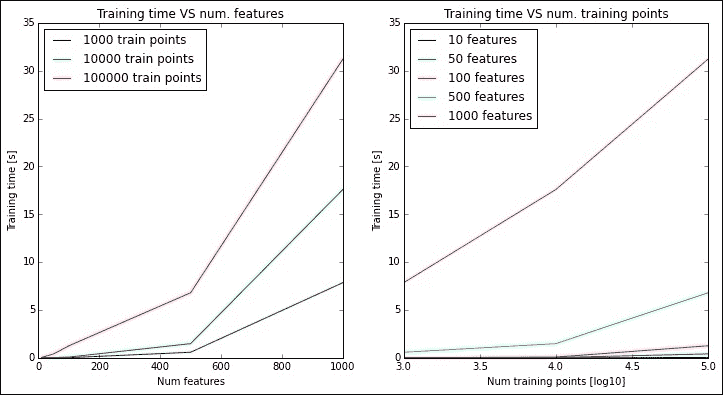
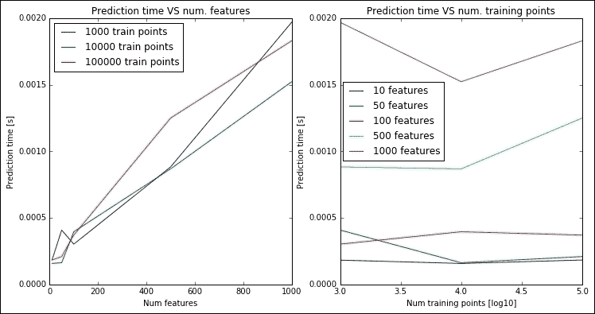
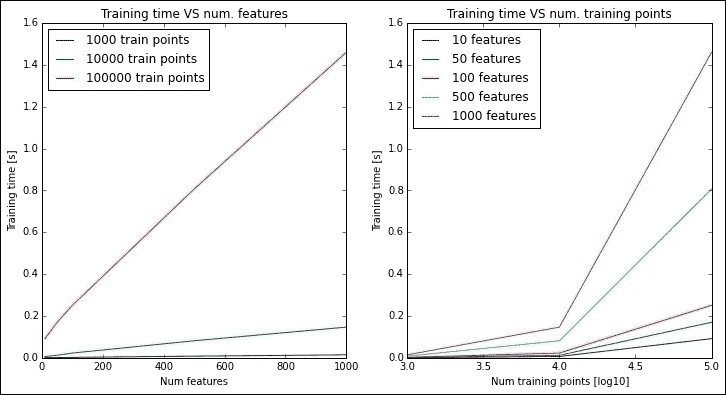
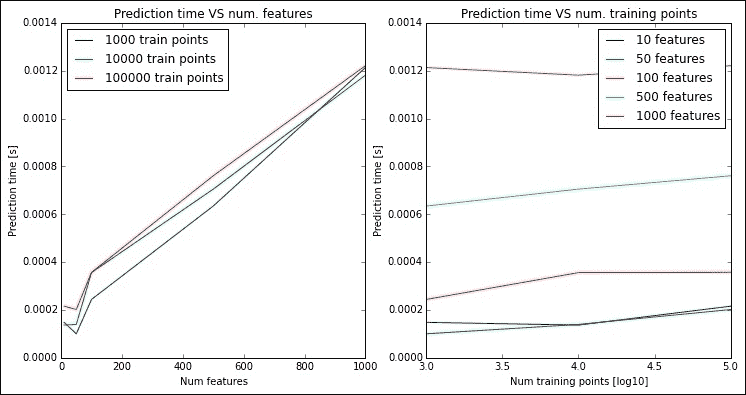
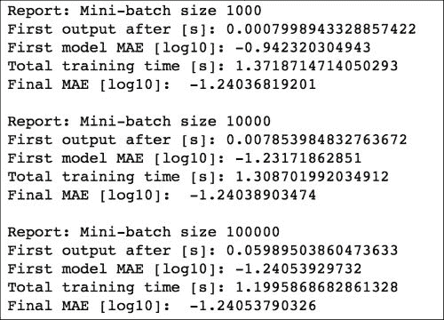
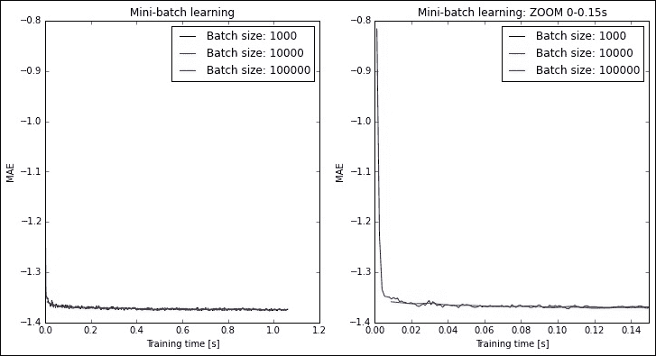
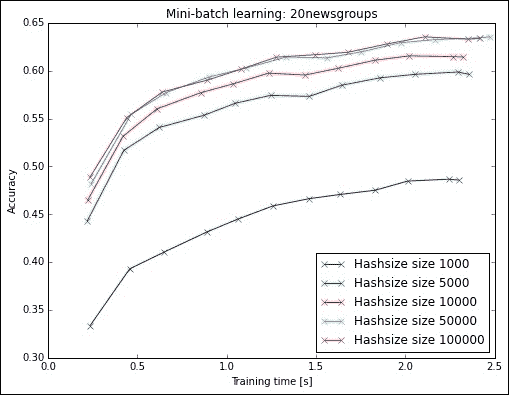

# 第七章。在线和批量学习

在本章中，您将了解在大数据上训练分类器的最佳实践。在接下来的几页中公开的新方法既可扩展又通用，使其非常适合具有大量观测值的数据集。此外，这种方法还可以让您处理流数据集——即观测值在飞行中传输且不是同时可用的数据集。此外，这种方法通过在训练过程中输入更多数据来提高精度。

与书中迄今为止看到的经典方法（批量学习）相比，这种新的方法不出所料地被称为在线学习。在线学习的核心是 *divide et impera*（分而治之）原则，即数据的小批量中的每一步都作为训练和改进分类器的输入。

在本章中，我们将首先关注批量学习及其局限性，然后介绍在线学习。最后，我们将提供一个大数据的例子，展示结合在线学习和哈希技巧的好处。

# 批量学习

当监督任务开始时数据集完全可用，并且不超过您机器上的 RAM 数量时，您可以使用批量学习来训练分类器或回归。如前几章所见，在学习过程中，学习器会扫描整个数据集。这也发生在使用基于 **随机梯度下降**（SGD）的方法时（见第二章，*接近简单线性回归*和第三章，*实际中的多重回归*)。现在让我们比较训练线性回归器所需的时间，并将其性能与数据集中的观测值数量（即特征矩阵 *X* 的行数）和特征数量（即 *X* 的列数）联系起来。在这个第一个实验中，我们将使用 Scikit-learn 提供的普通`LinearRegression()`和`SGDRegressor()`类，并且我们将存储拟合分类器实际花费的时间，而不进行任何并行化。

让我们首先创建一个函数来创建假数据集：它接受训练点的数量和特征的数目（以及可选的噪声方差）作为参数，并返回归一化的训练和测试特征矩阵以及标签。请注意，*X* 矩阵中的所有特征都是数值型的：

```py
In:
import matplotlib.pyplot as plt
import matplotlib.pylab as pylab
%matplotlib inline

In:
from sklearn.preprocessing import StandardScaler
from sklearn.datasets.samples_generator import make_regression
import numpy as np

def generate_dataset(n_train, n_test, n_features, noise=0.1):
    X, y = make_regression(n_samples=int(n_train + n_test),
                           n_features=int(n_features), noise=noise, 
                           random_state=101)

    X_train = X[:n_train]
    X_test = X[n_train:]

    y_train = y[:n_train]
    y_test = y[n_train:]

    X_scaler = StandardScaler()
    X_train = X_scaler.fit_transform(X_train)
    X_test = X_scaler.transform(X_test)

    y_scaler = StandardScaler()
    y_train = y_scaler.fit_transform(y_train)
    y_test = y_scaler.transform(y_test)

    return X_train, X_test, y_train, y_test
```

现在让我们存储训练和测试学习者在所有这些配置组合中所需的时间：

+   两个分类器：`LinearRegression()` 和 `SGDRegressor()`

+   观测值数量：`1000`，`10000` 和 `100000`

+   特征数量：`10`，`50`，`100`，`500` 和 `1000`

为了平均结果，每个训练操作执行五次。测试数据集始终包含 1000 个观察值：

```py
In:
from sklearn.linear_model import LinearRegression, SGDRegressor
import time

In:

n_test = 1000

n_train_v = (1000, 10000, 100000)
n_features_v = (10, 50, 100, 500, 1000)
regr_v = {'LR': LinearRegression(), 'SGD': SGDRegressor(random_state=101)}
results = {}

for regr_name, regr in regr_v.items():

    results[regr_name] = {}

    for n_train in n_train_v:
        for n_features in n_features_v:

            results[regr_name][(n_train, n_features)] = {'train': [], 'pred': []}

            for n_repetition in range(5):

                X_train, X_test, y_train, y_test = \
                generate_dataset(n_train, n_test, n_features)

                tick = time.time()
                regr.fit(X_train, y_train)
                train_time = time.time() - tick

                pred = regr.predict(X_test)
                predict_time = time.time() - tick - train_time

                results[regr_name][(n_train, n_features)]['train'].append(train_time)
                results[regr_name][(n_train, n_features)]['pred'].append(predict_time)
```

最后，让我们绘制结果。在下面的屏幕截图中，左边的图表显示了 `LogisticRegressor` 算法的训练时间与特征数量的关系，而右边的图表显示了时间与观察数量的关系：

```py
In:
pylab.rcParams['figure.figsize'] = 12, 6
plt.subplot(1, 2, 1)

for n_train in n_train_v:
    X = n_features_v
    y = [np.mean(results['LR'][(n_train, n_features)]['train']) 
         for n_features in n_features_v]
    plt.plot(X, y, label=str(n_train) + " train points")

plt.title('Training time VS num. features')
plt.xlabel('Num features')
plt.ylabel('Training time [s]')
plt.legend(loc=0)

plt.subplot(1, 2, 2)

for n_features in n_features_v:
    X = np.log10(n_train_v)
    y = [np.mean(results['LR'][(n_train, n_features)]['train']) 
         for n_train in n_train_v]
    plt.plot(X, y, label=str(n_features) + " features")

plt.title('Training time VS num. training points')
plt.xlabel('Num training points [log10]')
plt.ylabel('Training time [s]')
plt.legend(loc=0)
plt.show()

Out:
```



在图表中，你可以看到，对于小数据集，分类器表现相当不错，具有少量特征和观察值。而在处理最大的 *X* 矩阵时，1,000 个特征和 100,000 个观察值（包含 1 亿条记录），训练时间仅为 30 秒以上：这也是回归器不再可扩展的极限。

现在我们来看看测试时间的情况：

```py
In:
plt.subplot(1, 2, 1)

for n_train in n_train_v:
    X = n_features_v
    y = [np.mean(results['LR'][(n_train, n_features)]['pred']) 
         for n_features in n_features_v]

    plt.plot(X, y, label=str(n_train) + " train points")

plt.title('Prediction time VS num. features')
plt.xlabel('Num features')
plt.ylabel('Prediction time [s]')
plt.legend(loc=0)

plt.subplot(1, 2, 2)

for n_features in n_features_v:
    X = np.log10(n_train_v)
    y = [np.mean(results['LR'][(n_train, n_features)]['pred']) 
         for n_train in n_train_v]

    plt.plot(X, y, label=str(n_features) + " features")

plt.title('Prediction time VS num. training points')
plt.xlabel('Num training points [log10]')
plt.ylabel('Prediction time [s]')
plt.legend(loc=0)
plt.show()
Out:
```



测试时间随着特征数量的增加而线性增加，并且与特征数量无关。幸运的是，在大数据中应用线性方法似乎并不是一个大问题。

现在我们来看看线性回归的 SGD 实现会发生什么：

```py
In:
plt.subplot(1, 2, 1)

for n_train in n_train_v:
    X = n_features_v
    y = [np.mean(results['SGD'][(n_train, n_features)]['train']) 
         for n_features in n_features_v]
    plt.plot(X, y, label=str(n_train) + " train points")

plt.title('Training time VS num. features')
plt.xlabel('Num features')
plt.ylabel('Training time [s]')
plt.legend(loc=0)

plt.subplot(1, 2, 2)

for n_features in n_features_v:
    X = np.log10(n_train_v)
    y = [np.mean(results['SGD'][(n_train, n_features)]['train']) 
         for n_train in n_train_v]
    plt.plot(X, y, label=str(n_features) + " features")

plt.title('Training time VS num. training points')
plt.xlabel('Num training points [log10]')
plt.ylabel('Training time [s]')
plt.legend(loc=0)
plt.show()
Out:
```



与之前的回归器相比，结果发生了巨大变化：在最大的矩阵上，这个学习者大约需要 1.5 秒。似乎训练 SGD 回归器所需的时间与特征数量和训练点的数量呈线性关系。现在让我们验证它在测试中的表现：

```py
In:
plt.subplot(1, 2, 1)

for n_train in n_train_v:
    X = n_features_v
    y = [np.mean(results['SGD'][(n_train, n_features)]['pred']) 
         for n_features in n_features_v]

    plt.plot(X, y, label=str(n_train) + " train points")

plt.title('Prediction time VS num. features')
plt.xlabel('Num features')
plt.ylabel('Prediction time [s]')
plt.legend(loc=0)

plt.subplot(1, 2, 2)

for n_features in n_features_v:
    X = np.log10(n_train_v)
    y = [np.mean(results['SGD'][(n_train, n_features)]['pred']) 
         for n_train in n_train_v]

    plt.plot(X, y, label=str(n_features) + " features")

plt.title('Prediction time VS num. training points')
plt.xlabel('Num training points [log10]')
plt.ylabel('Prediction time [s]')
plt.legend(loc=0)
plt.show()
Out:
```



在测试数据集上应用基于 SGD 的学习者所需的时间与其他实现方式大致相同。在这里，同样，当在大数据集上扩展解决方案时，实际上并没有真正的问题。

# 在线小批量学习

从上一节中，我们学到了一个有趣的教训：对于大数据，始终使用基于 SGD 的学习者，因为它们更快，并且可以扩展。

现在，在本节中，让我们考虑这个回归数据集：

+   观察数量巨大：200 万

+   特征数量众多：100

+   噪声数据集

`X_train` 矩阵由 2 亿个元素组成，可能无法完全适应内存（在 4GB RAM 的机器上）；测试集由 10,000 个观察值组成。

让我们先创建数据集，并打印出最大的数据集的内存占用：

```py
In:
# Let's generate a 1M dataset
X_train, X_test, y_train, y_test = generate_dataset(2000000, 10000, 100, 10.0)
print("Size of X_train is [GB]:", X_train.size * X_train[0,0].itemsize/1E9)

Out:
Size of X_train is [GB]: 1.6
```

`X_train` 矩阵本身就有 1.6GB 的数据；我们可以将其视为大数据的起点。现在让我们尝试使用上一节中得到的最佳模型 `SGDRegressor()` 来对其进行分类。为了评估其性能，我们使用 MAE，即平均绝对误差（对于误差评估，越低越好）。

```py
In:
from sklearn.metrics import mean_absolute_error

regr = SGDRegressor(random_state=101)
tick = time.time()
regr.fit(X_train, y_train)
print("With SGD, after", time.time() - tick ,"seconds")
pred = regr.predict(X_test)
print("the MAE is [log10]:", np.log10(mean_absolute_error(y_test, pred)))

Out:
With SGD, after 5.958770098299116 seconds
the MAE is [log10]: -1.2422451189257
```

在我们的电脑上（配备 Mac OS 和 4GB 的 RAM），这个操作大约需要 6 秒钟，最终的 MAE 是 10^(-1.24)。

我们能做得更好吗？是的，通过小批量学习和在线学习。在我们看到这些实际应用之前，让我们介绍一下 SGD 如何与小批量一起工作。

1.  将`X_train`矩阵分成*N*观测的批次。由于我们使用 SGD，如果可能的话，最好对观测进行洗牌，因为该方法强烈依赖于输入向量的顺序。此时，每个小批量有*N*行和*M*列（其中*M*是特征的数量）。

1.  我们使用小批量来训练学习器。SGD 系数的初始化是随机的，如前所述。

1.  我们使用另一个小批量来训练学习器。SGD 系数的初始化是前一步的输出（使用`partial_fit`方法）。

1.  重复步骤 3，直到使用完所有的小批量。在每一步中，根据输入，SGD 模型的系数都会被细化并修改。

这显然是一个明智的方法，并且实现起来不会花费太多时间。你只需要为每个新批量设置每个系数的初始值，并在小批量上训练学习器。

现在，从性能的角度来看，我们使用在线学习能得到什么？

+   我们有一种增量训练模型的方法。由于在每一步我们都可以测试模型，我们可以在我们认为足够好的任何一点停止。

+   我们不需要将整个`X_train`矩阵保存在内存中；我们只需要将小批量保存在 RAM 中。这也意味着消耗的 RAM 是恒定的。

+   我们有一种控制学习的方法：我们可以有小的或大的小批量。

现在我们来看看它如何表现，通过改变批量大小（即每个观测的观测数）：

```py
In:
def get_minibatch(X, y, batch_size):
    # We will shuffle consistently the training observations
    from sklearn.utils import resample
    X, y = resample(X, y, replace=False, random_state=101)
    n_cols = y.shape[0]
    for i in range(int(n_cols/batch_size)):
        yield (X[i*batch_size:(i+1)*batch_size, :], y[i*batch_size:(i+1)*batch_size])

    if n_cols % batch_size > 0:
        res_rows = n_cols % batch_size
        yield (X[-res_rows:, :], y[-res_rows:])

plot_x = []
plot_y = []
plot_labels = []

for batch_size in (1000, 10000, 100000):
    regr = SGDRegressor(random_state=101)
    training_time = 0.0

    X = []
    y = []

    for dataset in get_minibatch(X_train, y_train, batch_size):
        tick = time.time()
        regr.partial_fit(dataset[0], dataset[1])
        training_time += (time.time() - tick)
        pred = regr.predict(X_test)
        X.append(training_time)
        y.append(np.log10(mean_absolute_error(y_test, pred)))

    print("Report: Mini-batch size", batch_size)
    print("First output after [s]:", X[0])
    print("First model MAE [log10]:", y[0])
    print("Total training time [s]:", X[-1])
    print("Final MAE [log10]: ", y[-1])
    print()

    plot_x.append(X)
    plot_y.append(y)
    plot_labels.append("Batch size: "+str(batch_size))

Out:
```



最后，最终的 MAE 总是相同的；也就是说，当两者都在整个训练集上训练时，批量学习和在线学习最终会提供相同的结果。

我们还看到，通过使用小批量（1,000 个观测），我们只需 1 毫秒就能得到一个工作模型。当然，这不是一个完美的解决方案，因为它的 MAE 仅为 10^(-0.94)，但我们现在有一个合理的工作模型。

现在，让我们比较一下完全训练模型所需的时间。使用小批量，总时间大约为 1.2 秒；使用批量则超过 5 秒。MAEs 大致相等——为什么时间上有这么大的差异？因为数据集并没有全部适合 RAM，系统一直在与存储内存交换数据。

现在，让我们关注一下小批量大小：小批量是否总是更好？实际上，它将更早地产生输出，但总体上会花费更多时间。

这里是使用不同小批量大小训练学习器时，训练时间和 MAE 的图表：

```py
In:
plt.subplot(1,2,1)
for i in range(len(plot_x)):
    plt.plot(plot_x[i], plot_y[i], label=plot_labels[i])
plt.title('Mini-batch learning')
plt.xlabel('Training time [s]')
plt.ylabel('MAE')
plt.legend(loc=0)

plt.subplot(1,2,2)
for i in range(len(plot_x)):
    plt.plot(plot_x[i], plot_y[i], label=plot_labels[i])
plt.title('Mini-batch learning: ZOOM 0-0.15s')
plt.xlabel('Training time [s]')
plt.ylabel('MAE')
plt.xlim([0, 0.15])
plt.legend(loc=0)

plt.show()
Out:
```



## 一个真实示例

现在，让我们结合特征哈希（见第五章，*数据准备*)、批量学习和 SGD。根据我们迄今为止所看到的，这应该是处理大数据的最佳方式，因为：

1.  特征的数量是恒定的（特征哈希）。

1.  每批次的观测数是恒定的（批量学习）。

1.  它允许流式数据集。

1.  算法是随机的（SGD）。

所有这些点加在一起将确保一些后果：

1.  我们可以非常快速地得到一个模型（在第一个小批量之后），该模型会随着时间的推移而改进。

1.  RAM 消耗是恒定的（因为每个小批量的大小完全相同）。

1.  理想情况下，我们可以处理我们想要的任意多的观察值。

在现实世界的例子中，让我们使用文本输入：二十个新闻组数据集。这个数据集包含从 20 个不同的新闻组中提取的 20,000 条消息（文本内容），每个新闻组都涉及不同的主题。项目的网页是：[`archive.ics.uci.edu/ml/datasets/Twenty+Newsgroups`](https://archive.ics.uci.edu/ml/datasets/Twenty+Newsgroups)。

目标是将每个文档分类到可能的标签之一（这是一个分类任务）。让我们首先加载它，并将其分为训练集和测试集。为了使其更真实，我们将从数据集中删除标题、页脚和引用的电子邮件：

```py
In:
from sklearn.datasets import fetch_20newsgroups
from sklearn.feature_extraction.text import HashingVectorizer

to_remove = ('headers', 'footers', 'quotes')

data_train = fetch_20newsgroups(subset='train', random_state=101,
                                remove=to_remove)

data_test = fetch_20newsgroups(subset='test', random_state=101,
                                remove=to_remove)

labels = data_train.target_names
targets = np.unique(data_train.target)
```

现在让我们创建一个函数，该函数可以生成数据集的小批量：

```py
In:
def get_minibatch_docs(docs, targets, batch_size):
    n_docs = len(docs)
    for i in range(int(n_docs/batch_size)):
       yield (docs[i*batch_size:(i+1)*batch_size], 
              targets[i*batch_size:(i+1)*batch_size])

    if n_docs % batch_size > 0:
        res_rows = n_docs % batch_size
        yield (docs[-res_rows:], targets[-res_rows:])
```

现在，核心任务仅仅是分类文档。我们首先通过`HashingVectorizer`类应用特征哈希，其输出连接到一个`SGDClassifier`（另一个具有`partial_fit`方法的类）。这一事实将确保一个额外的优势：由于`HashingVectorizer`的输出非常稀疏，因此使用稀疏表示，使得内存中的小批量大小更加紧凑。

要了解最佳哈希大小是多少，我们可以尝试使用`1000`、`5000`、`10000`、`50000`和`100000`的大小进行全搜索，然后测量每个学习者的准确度：

```py
In: 
from sklearn.linear_model import SGDClassifier
from sklearn.metrics import accuracy_score
import sys

minibatch_size = 1000
values_to_plot = {}

for hash_table_size in (1000, 5000, 10000, 50000, 100000):

    values_to_plot[hash_table_size] = {'time': [], 'score': []}

    vectorizer = HashingVectorizer(stop_words='english',
   non_negative=True, n_features=hash_table_size,
   ngram_range=(1, 1))

    X_test = vectorizer.transform(data_test.data)
    y_test = data_test.target

    clf = SGDClassifier(loss='log')
    timings = []

    for minibatch in get_minibatch_docs(data_train.data, data_train.target, minibatch_size):
        y_train = minibatch[1]

        tick = time.time()
        X_train = vectorizer.transform(minibatch[0])
        clf.partial_fit(X_train, y_train, targets)

        timings.append(time.time() - tick)

        pred = clf.predict(X_test)

        values_to_plot[hash_table_size]['score'].append(accuracy_score(y_test, pred))

    values_to_plot[hash_table_size]['time'] = np.cumsum(timings)
```

最后，我们在表示每个哈希大小的时间准确性的图表上绘制我们的结果。图表上的*X*符号是当分类器输出模型时的实例（和相关准确度）：

```py
In:
for k,v in sorted(values_to_plot.items()):
    plt.plot(v['time'], v['score'], 'x-', label='Hashsize size '+str(k))
plt.title('Mini-batch learning: 20newsgroups')
plt.xlabel('Training time [s]')
plt.ylabel('Accuracy')
plt.legend(loc=0)

plt.show()
Out:
```



从获得的结果来看，使用大于 10,000 个元素的哈希表可以让我们达到最佳性能。在这个练习中，小批量大小被固定为 1,000 个观察值；这意味着每个小批量都是一个包含 10 M 个元素的矩阵，以稀疏方式表示。这也意味着，对于每个小批量，使用的内存高达 80 MB 的 RAM。

## 无测试集的流式场景

在许多实际情况下，测试数据集是不可用的。我们能做什么？最佳实践将是：

1.  持续获取数据，直到达到特定的批量大小；比如说 10 个观察值。

1.  打乱观察值，并将其中 8 个存储在训练集中，2 个存储在测试集中（用于 80/20 的验证）。

1.  在训练集上训练分类器，在测试集上测试。

1.  返回步骤 1。随着每个小批量的到来，训练集将增加 10 个观察值，测试集增加 2 个。

我们刚刚描述了经典方法，该方法在数据一致且数据集不是很大时使用。如果特征在整个流中发生变化，并且你需要构建一个必须适应特征统计快速变化的学习者，那么就简单地不要使用测试集，并遵循此算法。此外，这是从大数据中学习的首选方式：

1.  获取数据，直到达到小批量大小；比如说 10 个观察结果。不要打乱顺序，并使用所有观察结果来训练学习者。

1.  等到你获取到另一个小批量数据。在这些观察结果上测试分类器。

1.  使用上一步中接收到的那个小批量更新分类器。

1.  返回到步骤 2。

这个算法的好处是，你只需要在内存中保留模型和当前的小批量数据；这些首先用于测试学习者，然后用于更新它。

# 摘要

在本章中，我们介绍了批量和在线学习概念，这对于能够快速且可扩展地处理大数据集（大数据）是必要的。

在下一章中，我们将探讨一些机器学习的先进技术，这些技术将为一些已知问题类别产生很好的结果。
