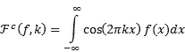
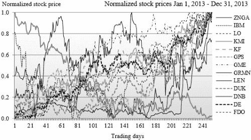
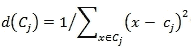
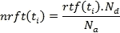
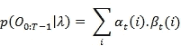
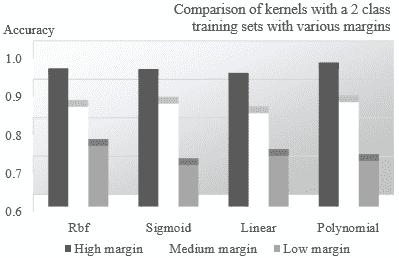
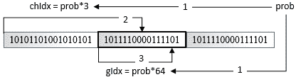

# 第二部分。模块 2

> **Scala 机器学习**
> 
> *利用 Scala 和机器学习构建和研究可以从数据中学习系统的系统*

# 第一章。入门

对于任何计算机科学家来说，理解不同类别的机器学习算法并能够选择与其专业领域和数据集相关的算法至关重要。然而，这些算法的应用只是从输入数据中提取准确和性能良好的模型所需整体努力的一小部分。常见的数据挖掘工作流程包括以下顺序步骤：

1.  定义要解决的问题。

1.  加载数据。

1.  预处理、分析和过滤输入数据。

1.  发现模式、亲和力、簇和类（如果需要）。

1.  选择模型特征和合适的机器学习算法（们）。

1.  精炼和验证模型。

1.  提高实现的计算性能。

在这本书中，过程的每个阶段对于构建 *正确* 的模型都是至关重要的。

### 提示

在一本书中详细描述关键机器学习算法及其实现是不可能的。信息量和 Scala 代码的量甚至会让最热心的读者感到压倒。每一章都专注于理解该主题绝对必要的数学和代码。鼓励开发者浏览以下内容：

+   书中使用的 Scala 编码约定和标准在附录 A 中，*基本概念*。

+   API Scala 文档

+   可在线获取的完整文档源代码

这第一章向您介绍了机器学习算法的分类、本书中使用的工具和框架，以及一个简单的逻辑回归应用，让您入门。

# 数学符号的趣味

每一章都包含一个小节，专门针对对机器学习科学与艺术背后的数学概念感兴趣的人，阐述算法的公式。这些部分是可选的，并定义在提示框中。例如，提示框中提到的变量 *X* 的均值和方差的数学表达式如下：

### 提示

**约定和符号**

本书在数学公式中使用数据集的零基索引。

M1：一组 *N* 个观测值表示为 *{xi} = x[0], x[1], … , x[N-1]*，以 *xi* 为值的随机值的算术平均值定义为：


# 为什么是机器学习？

数字设备的数量激增，产生了越来越多的数据。我能找到的最佳类比来描述从大型数据集中提取知识的需求、愿望和紧迫性，就是从矿山中提取贵金属的过程，在某些情况下，是从石头中提取血液。

知识通常被定义为一种可以随着新数据的到来而不断更新或调整的模型。模型显然是特定领域的，从信用风险评估、人脸识别、服务质量最大化、疾病病理症状分类、计算机网络优化、安全入侵检测，到客户的在线行为和购买历史。

机器学习问题被分为分类、预测、优化和回归。

## 分类

分类的目的是从历史数据中提取知识。例如，可以构建一个分类器来从一组症状中识别疾病。科学家收集有关体温（连续变量）、拥堵（离散变量 *HIGH*、*MEDIUM* 和 *LOW*）和实际诊断（流感）的信息。这个数据集用于创建一个模型，例如 *IF temperature > 102 AND congestion = HIGH THEN patient has the flu (probability 0.72)*，医生可以使用这个模型进行诊断。

## 预测

一旦模型使用历史观察数据训练并经过历史观察数据验证后，它就可以用来预测某些结果。医生收集患者的症状，如体温和鼻塞，并预测其健康状况。

## 优化

一些全局优化问题使用传统的线性和非线性优化方法难以解决。机器学习技术提高了优化方法收敛到解决方案（智能搜索）的机会。你可以想象，对抗新病毒的传播需要优化一个可能随着更多症状和病例的发现而演变的流程。

## 回归

回归是一种特别适合连续模型的分类技术。线性（最小二乘法）、多项式和逻辑回归是最常用的技术之一，用于拟合参数模型或函数 *y= f (x), x={x[i]}* 到数据集。回归有时被视为分类的特殊情况，其中输出变量是连续的而不是分类的。

# 为什么选择 Scala？

与大多数函数式语言一样，Scala 为开发人员和科学家提供了一个工具箱，用于实现可以轻松编织成连贯数据流的迭代计算。在一定程度上，Scala 可以被视为流行的 MapReduce 模型在分布式计算大量数据方面的扩展。在语言的功能中，以下特性被认为是机器学习和统计分析中的基本特性。

## 抽象

**函子**和**单子**是函数式编程中的重要概念。单子是从范畴论和群论中派生出来的，允许开发者创建如 **Scalaz**、Twitter 的 **Algebird** 或 Google 的 **Breeze Scala** 库中所示的高级抽象。更多关于这些库的信息可以在以下链接中找到：

+   [`github.com/scalaz`](https://github.com/scalaz)

+   [`github.com/twitter/algebird`](https://github.com/twitter/algebird)

+   [`github.com/dlwh/breeze`](https://github.com/dlwh/breeze)

在数学中，一个范畴 **M** 是一个由以下定义的结构：

+   某些类型的对象：*{x* *ϵ* *X, y* *ϵ* *Y, z* *ϵ* *Z, …}*

+   应用到这些对象上的态射或映射：*x* *ϵ* *X, y* *ϵ* *Y, f: x -› y*

+   模态的复合：*f: x -› y, g: y -› z => g o f: x -› z*

**协变函子**、**逆变函子**和**双函子**是代数拓扑中理解良好的概念，与流形和向量丛相关。它们在微分几何和非线性模型的数据生成中常用。

### 高阶投影

科学家将观测定义为特征集或向量。分类问题依赖于观测向量之间相似性的估计。一种技术是通过计算归一化内积来比较两个向量。**协变向量**被定义为将向量映射到内积（域）的线性映射 α。

### 提示

**内积**

M1：内积和 α 协变向量的定义如下：


让我们定义一个向量为一个从任何 `_ => Vector[_]` 域（或 `Function1[_, Vector]`）构造函数。协变向量随后被定义为将向量映射到其 `Vector[_] => _` 域（或 `Function1[Vector, _]`）的映射函数。

让我们定义一个二维（两种类型或域）的高阶结构 `Hom`，它可以被定义为向量或协变向量，通过固定两种类型之一：

```py
type Hom[T] = {
  type Right[X] = Function1[X,T] // Co-vector
  type Left[X] = Function1[T,X]   // Vector
 }
```

### 注意

**张量和流形**

向量和协变向量是张量（逆变和协变）的类。张量（域）用于非线性模型的学习和核函数的生成。流形在 第四章 的 *降维* 部分的 *流形* 简要介绍，*无监督学习*。张量场和流形学习的话题超出了本书的范围。

高阶投影的投影，`Hom` 到 `Right` 或 `Left` 单参数类型被称为函子，如下所示：

+   一个针对 `right` 投影的协变函子

+   一个针对 `left` 投影的逆变函子。

### 向量的协变函子

变量上的一个**协变函子**是一个映射 *F: C => C*，使得：

+   如果 *f: x -› y* 是 *C* 上的态射，那么 *F(x) -› F(y)* 也是 *C* 上的态射

+   如果 *id: x -› x* 是 *C* 上的恒等态射，那么 *F(id)* 也是 *C* 上的恒等态射

+   如果 *g: y -› z* 也是 *C* 上的一个形态，那么 *F(g o f) = F(g) o F(f)*

Scala 中`F[U => V] := F[U] => F[V]`协变函子的定义如下：

```py
trait Functor[M[_]] {
  def mapU,V(f: U =>V): M[V]
}
```

例如，让我们考虑一个定义为`T`类型的`n`维向量的观察，`Obs[T]`。观察的构造函数可以表示为`Function1[T,Obs]`。它的`ObsFunctor`函子实现如下：

```py
trait ObsFunctor[T] extends Functor[(Hom[T])#Left] { self =>
  override def mapU,V(f: U =>V): 
    Function1[T,V] = f.compose(vu)
}
```

由于形态应用于`Obs`元素的返回类型`Function1[T, Obs]`，该函子被指定为**协变函子**。两个参数类型的`Hom`投影实现为`(Hom[T])#Left`。

### 逆变函子用于协变向量

一个一变量的逆变函子是一个映射 *F: C => C*，使得：

+   如果 *f: x -› y* 是 *C* 上的一个形态，那么 *F(y) -> F(x)* 也是 *C* 上的一个形态

+   如果 *id: x -› x* 是 *C* 上的恒等形态，那么 *F(id)* 也是 *C* 上的恒等形态

+   如果 *g: y -› z* 也是 *C* 上的一个形态，那么 *F(g o f) = F(f) o F(g)*

Scala 中`F[U => V] := F[V] => F[U]`逆变函子的定义如下：

```py
trait CoFunctor[M[_]] {
  def mapU,V(f: V =>U): M[V]
}
```

注意，在`f`形态中的输入和输出类型与协变函子的定义相反。协变向量的构造函数可以表示为`Function1[Obs,T]`。它的`CoObsFunctor`函子实现如下：

```py
trait CoObsFunctor[T] extends CoFunctor[(Hom[T])#Right] {
  self =>
    override def mapU,V(f: V =>U): 
       Function1[V,T] = f.andThen(vu)
}
```

### Monads

Monads 是代数拓扑中的结构，与范畴论相关。Monads 扩展了函子的概念，允许在单个类型上执行称为**单子组合**的形态组合。它们使计算能够链式或编织成一系列步骤或管道。Scala 标准库中捆绑的集合（`List`、`Map`等）被构建为 Monads [1:1]。

Monads 提供了以下功能的能力：

+   创建集合

+   转换集合的元素

+   展平嵌套集合

以下是一个例子：

```py
trait Monad[M[_]] {
  def unitT: M[T]
  def mapU,V(f U =>V): M[V]
  def flatMapU,V(f: U =>M[V]): M[V]
}
```

因此，在机器学习中，Monads 至关重要，因为它们允许你将多个数据转换函数组合成一个序列或工作流程。这种属性适用于任何类型的复杂科学计算 [1:2]。

### 注意

**核函数的单子组合**

在第八章的“核函数”部分的“核单调组合”部分中，Monads 用于核函数的组合，*核模型和支持向量机*。

## 可伸缩性

如前所述，通过利用 Scala 的高阶方法，functors 和 monads 可以实现数据处理函数的并行化和链式操作。在实现方面，**演员**是使 Scala 可扩展的核心元素之一。演员为 Scala 开发者提供了构建可扩展、分布式和并发应用程序的高级抽象。演员隐藏了并发和底层线程池管理的繁琐实现细节。演员通过异步不可变消息进行通信。例如 **Akka** 或 **Apache Spark** 这样的分布式计算 Scala 框架扩展了 Scala 标准库的功能，以支持在非常大的数据集上进行计算。Akka 和 Apache Spark 在本书的最后一章中进行了详细描述 [1:3]。

简而言之，工作流被实现为一串活动或计算任务。这些任务包括 `flatMap`、`map`、`fold`、`reduce`、`collect`、`join` 或 `filter` 等高阶 Scala 方法，它们应用于大量观测数据。Scala 为开发者提供了将数据集分区并通过演员集群执行任务的工具。Scala 还支持在本地和远程演员之间进行消息调度和路由。开发者可以决定以很少的代码更改将工作流部署在本地或多个 CPU 核心和服务器上。


将模型训练工作流作为分布式计算进行部署

在前面的图中，一个控制器，即主节点，管理着任务**1**到**4**的顺序，类似于调度器。这些任务实际上是在多个工作节点上执行的，这些节点由演员实现。主节点或演员与工作者交换消息以管理工作流程执行的状 态以及其可靠性，如第十二章的*使用演员的可扩展性*部分所示，*可扩展框架*。通过监督演员的层次结构实现了这些任务的高可用性。

## 可配置性

Scala 支持使用抽象变量、自引用组合和可堆叠特质组合来**依赖注入**。最常用的依赖注入模式之一，即**蛋糕模式**，在第二章的*组合混入构建工作流*部分进行了描述，*Hello World!*

## 可维护性

Scala 本地嵌入**领域特定语言**（**DSL**）。DSL 是建立在 Scala 本地库之上的语法层。DSL 允许软件开发者用科学家容易理解的方式来抽象计算。最著名的 DSL 应用是定义 MATLAB 程序中使用的语法的仿真，这是数据科学家所熟悉的。

## 按需计算

**懒惰**的方法和价值观允许开发者根据需要执行函数和分配计算资源。Spark 框架依赖于懒惰变量和方法来链式处理**弹性分布式数据集**（**RDD**）。

# 模型分类

一个模型可以是预测性的、描述性的或自适应的。

**预测性**模型在历史数据中发现模式，并提取因素（或特征）之间的基本趋势和关系。它们用于预测和分类未来的事件或观察。预测分析在包括市场营销、保险和制药在内的各种领域中使用。预测模型通过使用预选的训练集进行监督学习来创建。

**描述性**模型试图通过将观察结果分组到具有相似属性的聚类中，在数据中找到异常模式或亲和力。这些模型定义了知识发现的第一步和重要步骤。它们通过无监督学习生成。

第三类模型，称为**自适应建模**，是通过**强化学习**创建的。强化学习包括一个或多个决策代理，它们在尝试解决问题、优化目标函数或解决约束条件的过程中推荐并可能执行动作。

# 机器学习算法分类法

机器学习的目的是教会计算机在没有人类干预的情况下执行任务。越来越多的应用，如基因组学、社交网络、广告或风险评估，产生了大量可以分析或挖掘以提取知识或洞察过程、客户或组织的数据。最终，机器学习算法包括通过使用历史、现在和未来的数据来识别和验证模型，以优化性能标准[1:4]。

数据挖掘是从数据集中提取或识别模式的过程。

## 无监督学习

**无监督学习**的目标是在一组观察中发现规律性和不规则性的模式。这个过程在统计学中被称为密度估计，可以分为两大类：数据聚类发现和潜在因素发现。该方法包括处理输入数据以理解与婴儿或动物自然学习过程相似的规律。无监督学习不需要标记数据（或预期值），因此易于实现和执行，因为不需要专业知识来验证输出。然而，可以对聚类算法的输出进行标记，并将其用于未来的分类。

### 聚类

**数据聚类**的目的是将一组数据划分为若干个簇或数据段。实际上，聚类算法通过最小化簇内观测值之间的距离和最大化簇间观测值之间的距离来组织观测值到簇中。聚类算法包括以下步骤：

1.  通过对输入数据做出假设来创建模型。

1.  选择聚类的目标函数或目标。

1.  评估一个或多个算法以优化目标函数。

数据聚类也称为**数据分段**或**数据划分**。

### 维度缩减

**维度缩减**技术旨在找到构建可靠模型所需的最小但最相关的特征集。在模型中减少特征或参数的数量有很多原因，从避免过拟合到降低计算成本。

使用无监督学习从数据中提取知识的不同技术有很多种分类方法。以下分类法根据其目的对这些技术进行了细分，尽管这个列表远非详尽，如下面的图所示：


无监督学习算法分类法

## 监督学习

监督学习的最佳类比是**函数逼近**或**曲线拟合**。在其最简单形式中，监督学习试图使用训练集 *{x, y}* 找到一个关系或函数 *f: x → y*。只要输入（标记数据）可用且可靠，监督学习比任何其他学习策略都要准确。缺点是可能需要一个领域专家来标记（或标记）数据作为训练集。

监督机器学习算法可以分为两大类：

+   生成模型

+   判别模型

### 生成模型

为了简化统计公式的描述，我们采用以下简化：事件 *X* 的概率与离散随机变量 *X* 取值 *x* 的概率相同：*p(X) = p(X=x)*。

联合概率的表示为 *p(X,Y) = p(X=x,Y=y)*。

条件概率的表示为 *p(X|Y) = p(X=x|Y=y)*。

生成模型试图拟合两个 *X* 和 *Y* 事件（或随机变量）的联合概率分布，*p(X,Y)*，代表两组观察到的和隐藏的 *x* 和 *y* 变量。判别模型计算隐藏变量 *y* 的一个事件或随机变量 *Y* 的条件概率，*p(Y|X)*，给定观察变量 *x* 的一个事件或随机变量 *X*。生成模型通常通过贝叶斯定理引入。给定 *X* 事件的 *Y* 事件的条件概率是通过 *X* 事件在 *Y* 事件给定的条件概率与 *X* 事件概率通过 *Y* 事件概率归一化的乘积来计算的 [1:5]。

### 注意

**贝叶斯定理**

独立随机变量 *X=x* 和 *Y=y* 的联合概率如下：


随机变量 *Y = y* 在给定 *X = x* 的条件概率如下：


贝叶斯公式如下：


贝叶斯定理是朴素贝叶斯分类器的基础，如第五章中“介绍多项式朴素贝叶斯”部分所述，*朴素贝叶斯分类器*。

### 判别模型

与生成模型相反，判别模型直接计算条件概率 *p(Y|X)*，使用相同的算法进行训练和分类。

生成模型和判别模型各有其优势和劣势。新手数据科学家通过实验学习将适当的算法匹配到每个问题。以下是一个简要的指南，描述了根据项目的目标或标准，哪种类型的模型是有意义的：

| 目标 | 生成模型 | 判别模型 |
| --- | --- | --- |
| 准确性 | 高度依赖于训练集。 | 这取决于训练集和算法配置（即核函数） |
| 建模需求 | 需要建模观察到的和隐藏的变量，这需要大量的训练。 | 训练集的质量不必像生成模型那样严格。 |
| 计算成本 | 这通常很低。例如，任何从贝叶斯定理导出的图形方法都有很低的开销。 | 大多数算法依赖于优化具有显著性能开销的凸函数。 |
| 约束 | 这些模型假设模型特征之间存在某种程度的独立性。 | 大多数判别算法可以适应特征之间的依赖关系。 |

我们可以通过将生成模型的顺序和随机变量任意分离，并将判别方法分解为应用于连续过程（回归）和离散过程（分类）来进一步细化监督学习算法的分类：


监督学习算法的分类

## 半监督学习

半监督学习用于从带有不完整标签的数据集构建模型。流形学习和信息几何算法通常应用于部分标记的大数据集。半监督学习技术的描述超出了本书的范围。

## 强化学习

强化学习在机器人或游戏策略领域之外，不如监督学习和无监督学习那样被充分理解。然而，自 90 年代以来，基于遗传算法的分类器在解决需要与领域专家协作的问题上变得越来越受欢迎。对于某些类型的应用，强化学习算法输出一系列推荐的动作供自适应系统执行。在最简单的形式中，这些算法估计最佳的行动方案。大多数基于强化学习的复杂系统都会建立和更新政策，如果需要，专家可以否决。强化学习系统的开发者面临的最主要挑战是，推荐的动作或政策可能取决于部分可观察的状态。

遗传算法通常不被认为是强化学习工具箱的一部分。然而，一些高级模型，如学习分类系统，使用遗传算法来分类和奖励表现最佳规则和政策。

与前两种学习策略一样，强化学习模型可以分为马尔可夫或进化模型：


强化学习算法的分类

这是对机器学习算法的简要概述，提供了一个建议的、近似的分类法。介绍机器学习的方法几乎和数据和计算机科学家一样多。我们鼓励您浏览本书末尾的参考文献列表，以找到适合您兴趣和理解水平的文档。

# 不要重新发明轮子！

有许多稳健、准确和高效的 Java 库用于数学、线性代数或优化，这些库多年来被广泛使用：

+   JBlas/Linpack ([`github.com/mikiobraun/jblas`](https://github.com/mikiobraun/jblas))

+   Parallel Colt ([`github.com/rwl/ParallelColt`](https://github.com/rwl/ParallelColt))

+   Apache Commons Math ([`commons.apache.org/proper/commons-math`](http://commons.apache.org/proper/commons-math))

完全没有必要在 Scala 中重新编写、调试和测试这些组件。开发者应考虑创建一个包装器或接口，以便使用他们最喜欢的和可靠的 Java 库。本书利用 Apache Commons Math 库来处理一些特定的线性代数算法。

# 工具和框架

在动手实践之前，您需要下载和部署一组最小化的工具和库；毕竟，没有必要重新发明轮子。为了编译和运行本书中描述的源代码，必须安装一些关键组件。我们专注于开源和常见库，尽管您被邀请尝试您选择的等效工具。这里描述的框架的学习曲线非常平缓。

## Java

本书描述的代码已在 Windows x64 和 Mac OS X x64 上使用 JDK 1.7.0_45 和 JDK 1.8.0_25 进行了测试。如果您尚未安装，则需要安装 Java 开发工具包。最后，必须相应地更新`JAVA_HOME`、`PATH`和`CLASSPATH`环境变量。

## Scala

代码已在 Scala 2.10.4 和 2.11.4 上进行了测试。我们建议您使用 Scala 版本 2.10.4 或更高版本与 SBT 0.13 或更高版本一起使用。假设 Scala 运行时（REPL）和库已经正确安装，并且`SCALA_HOME`和`PATH`环境变量已经更新。

[Eclipse 的 Scala 插件](https://scala-ide.org/docs/user/gettingstarted.html)（版本 4.0 或更高）的描述和安装说明可在[`scala-ide.org/docs/user/gettingstarted.html`](http://scala-ide.org/docs/user/gettingstarted.html)找到。您还可以从 JetBrains 网站下载[**IntelliJ IDEA 的 Scala 插件**](http://confluence.jetbrains.com/display/SCA/)（版本 13 或更高）。

无处不在的**简单构建工具**（**SBT**）将是我们的主要构建引擎。构建文件`sbt/build.sbt`的语法符合版本 0.13，并用于编译和组装本书中展示的源代码。SBT 可以作为 Typesafe activator 的一部分下载，或者直接从[`www.scala-sbt.org/download.html`](http://www.scala-sbt.org/download.html)下载。

## Apache Commons Math

Apache Commons Math 是一个用于数值处理、代数、统计学和优化的 Java 库[1:6]。

### 描述

这是一个轻量级库，为开发者提供了一组小型、现成的 Java 类，这些类可以轻松地编织到机器学习问题中。本书中使用的示例需要版本 3.5 或更高。

数学库支持以下内容：

+   函数、微分和积分及常微分方程

+   统计分布

+   线性和非线性优化

+   稠密和稀疏向量和矩阵

+   曲线拟合、相关性分析和回归

更多信息，请访问[`commons.apache.org/proper/commons-math`](http://commons.apache.org/proper/commons-math)。

### 许可证

我们需要 Apache 公共许可证 2.0；条款可在[`www.apache.org/licenses/LICENSE-2.0`](http://www.apache.org/licenses/LICENSE-2.0)找到。

### 安装

Apache Commons Math 库的安装和部署相当简单。步骤如下：

1.  请访问[下载页面](http://commons.apache.org/proper/commons-math/download_math.cgi)。

1.  将最新的`.jar`文件下载到二进制部分，例如`commons-math3-3.5-bin.zip`（针对 3.5 版本）。

1.  解压并安装`.jar`文件。

1.  按以下步骤将`commons-math3-3.5.jar`添加到类路径中：

    +   **对于 Mac OS X**：`export CLASSPATH=$CLASSPATH:/Commons_Math_path/commons-math3-3.5.jar`

    +   **对于 Windows 系统**：转到系统**属性** | **高级系统设置** | **高级** | **环境变量**，然后编辑`CLASSPATH`变量

1.  如有必要，将`commons-math3-3.5.jar`文件添加到您的 IDE 环境（例如，对于 Eclipse，请转到**项目** | **属性** | **Java 构建路径** | **库** | **添加外部 JARs**，对于 IntelliJ IDEA，请转到**文件** | **项目结构** | **项目设置** | **库**）。

您还可以从**源**部分下载`commons-math3-3.5-src.zip`。

## JFreeChart

JFreeChart 是一个开源的图表和绘图 Java 库，在 Java 程序员社区中广泛使用。它最初由 David Gilbert [1:7]创建。

### 描述

该库支持多种可配置的图表和图形（散点图、仪表盘、饼图、面积图、条形图、箱线图、堆叠图和 3D 图）。我们使用 JFreeChart 在整本书中显示数据处理和算法的输出，但鼓励您在时间允许的情况下自行探索这个优秀的库。

### 许可证

它根据 GNU **较小通用公共许可证**（**LGPL**）的条款分发，允许其在专有应用程序中使用。

### 安装

要安装和部署 JFreeChart，请执行以下步骤：

1.  访问[`www.jfree.org/jfreechart/`](http://www.jfree.org/jfreechart/)。

1.  从 Source Forge 下载最新版本[`sourceforge.net/projects/jfreechart/files`](http://sourceforge.net/projects/jfreechart/files)。

1.  解压并部署`.jar`文件。

1.  按以下步骤将`jfreechart-1.0.17.jar`（针对 1.0.17 版本）添加到类路径中：

    +   **对于 Mac OS X**：`export CLASSPATH=$CLASSPATH:/JFreeChart_path/jfreechart-1.0.17.jar`

    +   **对于 Windows 系统**：转到系统**属性** | **高级系统设置** | **高级** | **环境变量**，然后编辑`CLASSPATH`变量

1.  如有必要，将`jfreechart-1.0.17.jar`文件添加到您的 IDE 环境

## 其他库和框架

每章特有的库和工具将与主题一起介绍。可扩展的框架在最后一章中介绍，并附有下载说明。与条件随机字段和支持向量机相关的库在各自的章节中描述。

### 注意

**为什么不使用 Scala 代数和数值库呢？**

如 Breeze、ScalaNLP 和 Algebird 等库是线性代数、数值分析和机器学习的有趣 Scala 框架。它们为经验丰富的 Scala 程序员提供了高质量的抽象层。然而，本书设计为一个教程，允许开发者使用现有的或遗留的 Java 库从头开始编写算法 [1:8]。

# 源代码

本书使用 Scala 编程语言来实现和评估《Scala for Machine Learning》中涵盖的机器学习技术。然而，源代码片段被缩减到理解书中讨论的机器学习算法所必需的最小范围。这些算法的正式实现可以在 Packt Publishing 的网站上找到（[`www.packtpub.com`](http://www.packtpub.com)）。

### 小贴士

**下载示例代码**

您可以从您在 [`www.packtpub.com`](http://www.packtpub.com) 的账户中下载您购买的所有 Packt 书籍的示例代码文件。如果您在其他地方购买了这本书，您可以访问 [`www.packtpub.com/support`](http://www.packtpub.com/support) 并注册，以便将文件直接通过电子邮件发送给您。

## 上下文与视图边界

书中讨论的大多数 Scala 类都是使用与离散/分类值（`Int`）或连续值（`Double`）关联的类型参数化的。上下文边界要求客户端代码中使用的任何类型都必须有 `Int` 或 `Double` 作为上界：

```py
class AT <: Int
class BT <: Double
```

这样的设计对客户端施加了从简单类型继承并处理容器类型的协变和逆协变的约束 [1:9]。

对于本书，**视图边界**被用于代替上下文边界，因为它们只需要定义参数化类型的隐式转换：

```py
class AT <: AnyVal(implicit f: T => Int)
class CT < : AnyVal(implicit f: T => Float)
```

### 注意

**视图边界弃用**

视图边界的表示法 `T <% Double` 在 Scala 2.11 及更高版本中被弃用。`class A[T <% Float]` 声明是 `class AT` 的简写形式。

## 展示

为了提高算法实现的可读性，所有非必需代码，如错误检查、注释、异常或导入都被省略。书中展示的代码片段中省略了以下代码元素：

+   代码文档：

    ```py
    // …..
    /* … */
    ```

+   类参数和方法参数的验证：

    ```py
    require( Math.abs(x) < EPS, " …")
    ```

+   类限定符和作用域声明：

    ```py
    final protected class SVM { … }
    private[this] val lsError = …
    ```

+   方法限定符：

    ```py
    final protected def dot: = …
    ```

+   异常：

    ```py
    try {
       correlate …
    } catch {
       case e: MathException => ….
    }
    Try {    .. } match {
      case Success(res) =>
      case Failure(e => ..
    }
    ```

+   日志和调试代码：

    ```py
    private val logger = Logger.getLogger("..")
    logger.info( … )
    ```

+   非必需注解：

    ```py
    @inline def main = ….
    @throw(classOf[IllegalStateException])
    ```

+   非必需方法

本书代码片段中省略的 Scala 代码元素完整列表可以在 附录 A 的 *代码片段格式* 部分找到，*基本概念*。

## 原始类型和隐式转换

本书所展示的算法共享相同的原始类型、泛型操作符和隐式转换。

### 原始类型

为了提高代码的可读性，以下原始类型将被使用：

```py
type DblPair = (Double, Double)
type DblArray = Array[Double]
type DblMatrix = Array[DblArray]
type DblVector = Vector[Double]
type XSeries[T] = Vector[T]         // One dimensional vector
type XVSeries[T] = Vector[Array[T]] // multi-dimensional vector
```

在第三章“Scala 中的时间序列”部分介绍的时间序列作为参数化类型`T`的`XSeries[T]`或`XVSeries[T]`实现。

### 注意

记住这六种类型；它们在本书中都有使用。

### 类型转换

隐式转换是 Scala 编程语言的一个重要特性。它允许开发者在单个位置为整个库指定类型转换。以下是本书中使用的几个隐式类型转换：

```py
object Types {
  Object ScalaMl {  
   implicit def double2Array(x: Double): DblArray = 
      ArrayDouble
   implicit def dblPair2Vector(x: DblPair): Vector[DblPair] = 
      VectorDblPair
   ...
  }
}
```

### 注意

**库特定转换**

这里列出的原始类型与特定库（如 Apache Commons Math 库）中引入的类型之间的转换在相关章节中描述。

## 不可变性

通常，减少对象的状态数量是一个好主意。方法调用将对象从一个状态转换到另一个状态。方法或状态的数量越多，测试过程就越繁琐。

创建未定义（训练）的模型是没有意义的。因此，将模型的训练作为其实现的类的构造函数的一部分是非常有意义的。因此，机器学习算法的唯一公共方法如下：

+   分类或预测

+   验证

+   如果需要，检索模型参数（权重、潜在变量、隐藏状态等）

## Scala 迭代器的性能

Scala 高阶迭代方法性能的评估超出了本书的范围。然而，了解每种方法的权衡是很重要的。

`for`构造不应作为计数迭代器使用。它旨在实现 for-comprehensive monad（`map`和`flatMap`）。本书中展示的源代码使用高阶`foreach`方法。

# 让我们试试水

本节最后介绍了训练和分类工作流程的关键元素。使用简单的逻辑回归作为测试案例来展示计算工作流程的每一步。

## 计算工作流程概述

在最简单的情况下，执行数据集运行时处理的计算工作流程由以下阶段组成：

1.  从文件、数据库或任何流式设备中加载数据集。

1.  将数据集分割以进行并行数据处理。

1.  使用过滤技术、方差分析和在必要时应用惩罚及归一化函数进行数据预处理。

1.  应用模型——无论是聚类集还是类别集——以对新数据进行分类。

1.  评估模型的品质。

使用类似的任务序列从训练数据集中提取模型：

1.  从文件、数据库或任何流式设备中加载数据集。

1.  将数据集分割以进行并行数据处理。

1.  在必要时，将过滤技术、方差分析和惩罚及归一化函数应用于原始数据集。

1.  从清洗后的输入数据中选择训练集、测试集和验证集。

1.  使用聚类技术或监督学习算法提取关键特征，并在一组相似观测之间建立亲和力。

1.  将特征数量减少到可管理的属性集，以避免过度拟合训练集。

1.  通过迭代步骤 5、6 和 7 直到错误满足预定义的收敛标准来验证模型并调整模型。

1.  将模型存储在文件或数据库中，以便可以应用于未来的观测。

数据聚类和数据分类可以独立进行，或者作为使用聚类技术在监督学习算法训练阶段预处理阶段的工作流程的一部分进行。数据聚类不需要从训练集中提取模型，而分类只能在从训练集构建了模型后才能执行。以下图像给出了训练、分类和验证的概述：


训练和运行模型的通用数据流

上述图表是典型数据挖掘处理流程的概述。第一阶段包括通过聚类或监督学习算法的训练提取模型。然后，该模型与测试数据进行验证，其来源与训练集相同，但观测不同。一旦模型创建并验证，就可以用于分类实时数据或预测未来行为。现实世界的工作流程更为复杂，需要动态配置以允许不同模型的实验。可以使用几种不同的分类器来执行回归，并根据原始数据中的潜在噪声应用不同的过滤算法。

## 编写一个简单的工作流程

本书依赖于金融数据来实验不同的学习策略。练习的目标是构建一个模型，能够区分股票或商品的波动和非波动交易时段。对于第一个例子，我们选择简化版的二项式逻辑回归作为我们的分类器，因为我们把股价-成交量行为视为连续或准连续过程。

### 注意

**逻辑回归简介**

逻辑回归在第六章的*逻辑回归*部分进行了深入解释，*回归和正则化*。本例中处理的是针对二维观测的简单二项式逻辑回归分类器。

根据交易时段的波动性和成交量对交易时段进行分类的步骤如下：

1.  确定问题范围

1.  加载数据

1.  预处理原始数据

1.  在可能的情况下发现模式

1.  实现分类器

1.  评估模型

### 第 1 步 – 确定问题范围

目标是创建一个使用其每日交易量和波动性的股票价格模型。在整本书中，我们将依靠财务数据来评估和讨论不同数据处理和机器学习方法的优点。在这个例子中，数据使用 CSV 格式从**Yahoo Finances**中提取，以下字段：

+   日期

+   开盘价

+   会话中的最高价

+   会话中的最低价

+   会话结束时的价格

+   成交量

+   在会话结束时调整价格

`YahooFinancials` 枚举器从雅虎财经网站提取历史每日交易信息：

```py
type Fields = Array[String]
object YahooFinancials extends Enumeration {
   type YahooFinancials = Value
   val DATE, OPEN, HIGH, LOW, CLOSE, VOLUME, ADJ_CLOSE = Value

   def toDouble(v: Value): Fields => Double =   //1
   (s: Fields) => s(v.id).toDouble
   def toDblArray(vs: Array[Value]): Fields => DblArray = //2
       (s: Fields) => vs.map(v => s(v.id).toDouble)
  …
}
```

`toDouble` 方法将字符串数组转换为单个值（行`1`），而`toDblArray`将字符串数组转换为值数组（行`2`）。`YahooFinancials` 枚举器在附录 A 的*数据来源*部分以及*基本概念*中详细描述。

让我们创建一个简单的程序，该程序加载文件内容，执行一些简单的预处理函数，并创建一个简单的模型。我们选择了 2012 年 1 月 1 日至 2013 年 12 月 1 日之间的 CSCO 股票价格作为我们的数据输入。

让我们考虑以下截图中的两个变量，*价格*和*成交量*。顶部图表显示了思科股票价格随时间的变化，底部柱状图表示思科股票随时间的每日交易量：


2012-2013 年思科股票的价格-成交量动作

### 步骤 2 – 加载数据

第二步是从本地或远程数据存储加载数据集。通常，大型数据集是从数据库或如**Hadoop 分布式文件系统**（**HDFS**）这样的分布式文件系统中加载的。`load` 方法接受绝对路径名，`extract`，并将输入数据从文件转换为`Vector[DblPair]`类型的时间序列：

```py
def load(fileName: String): Try[Vector[DblPair]] = Try {
   val src =  Source.fromFile(fileName)  //3
   val data = extract(src.getLines.map(_.split(",")).drop(1)) //4
   src.close //5
   data
 }
```

数据文件通过调用`Source.fromFile`静态方法（行`3`）提取，然后在移除标题（文件中的第一行）之前通过`drop`提取字段。必须关闭文件以避免文件句柄泄漏（行`5`）。

### 备注

**数据提取**

`Source.fromFile.getLines.map` 调用管道方法返回一个只能遍历一次的迭代器。

`extract` 方法的目的是生成两个变量（*相对股票波动性*和*相对股票每日交易量*）的时间序列：

```py
def extract(cols: Iterator[Array[String]]): XVSeries[Double]= {
  val features = ArrayYahooFinancials //6
  val conversion = YahooFinancials.toDblArray(features)  //7
  cols.map(c => conversion(c)).toVector   
      .map(x => ArrayDouble/x(1), x(2)))  //8
}
```

`extract` 方法的唯一目的是将原始文本数据转换为二维时间序列。第一步包括选择要提取的三个特征 `LOW`（会话中的最低股价）、`HIGH`（会话中的最高价）和 `VOLUME`（会话的交易量）（行 `6`）。这个特征集用于将字段行转换为相应的三个值集（行 `7`）。最后，特征集被缩减为以下两个变量（行 `8`）：

+   会话中股价的相对波动：*1.0 – LOW/HIGH*

+   会话中该股票的交易量：*VOLUME*

### 注意

**代码可读性**

一系列长的 Scala 高阶方法使得代码及其底层代码难以阅读。建议您分解长链式的方法调用，例如以下内容：

```py
val cols = Source.fromFile.getLines.map(_.split(",")).toArray.drop(1)
```

我们可以将方法调用分解为以下几个步骤：

```py
val lines = Source.fromFile.getLines
val fields = lines.map(_.split(",")).toArray
val cols = fields.drop(1)
```

我们强烈建议您查阅由 Twitter 的 Marius Eriksen 编写的优秀指南 *Effective Scala*。这绝对是对任何 Scala 开发者必读的[1:10]。

### 第 3 步 - 数据预处理

下一步是将数据归一化到*[0.0, 1.0]*范围，以便由二项式逻辑回归进行训练。是时候引入一个不可变且灵活的归一化类了。

#### 不可变归一化

逻辑回归依赖于 sigmoid 曲线或逻辑函数，这在第六章的*逻辑函数*部分有描述，*回归和正则化*。逻辑函数用于将训练数据分类。逻辑函数的输出值范围从 *x = - INFINITY* 的 0 到 *x = + INFINITY* 的 1。因此，对输入数据或观测进行[0, 1]归一化是有意义的。

### 注意

**归一化还是不归一化？**

数据归一化的目的是为所有特征施加一个单一的范围，这样模型就不会偏袒任何特定的特征。归一化技术包括线性归一化和 Z 分数。归一化是一个昂贵的操作，并不总是需要的。

归一化是原始数据的线性变换，可以推广到任何范围 *[l, h]*。

### 注意

**线性归一化**

M2: [0, 1] 归一化特征 *{x[i]}* 的最小值 *x[min]* 和最大值 *x[max]*:


M3: [l, h] 归一化特征 *{xi}*:


监督学习中输入数据的归一化有特定的要求：对新观测的分类和预测必须使用从训练集中提取的归一化参数（*min* 和 *max*），因此所有观测共享相同的缩放因子。

让我们定义`MinMax`归一化类。该类是不可变的：最小值`min`和最大值`max`在构造函数中计算。该类接受参数化类型`T`的时间序列和值作为参数（第 8 行）。归一化过程的步骤定义如下：

1.  在实例化时初始化给定时间序列的最小值（第 9 行）。

1.  计算归一化参数（第 10 行）并归一化输入数据（第 11 行）。

1.  重新使用归一化参数归一化任何新的数据点（第 14 行）：

    ```py
    class MinMaxT <: AnyVal (f : T => Double) { //8
      val zero = (Double.MaxValue, -Double.MaxValue)
      val minMax = values./:(zero)((mM, x) => { //9
        val min = mM._1
        val max = mM._2
       (if(x < min) x else min, if(x > max) x else max)
      })
      case class ScaleFactors(low:Double ,high:Double, ratio: Double)
      var scaleFactors: Option[ScaleFactors] = None //10

      def min = minMax._1
      def max = minMax._2
      def normalize(low: Double, high: Double): DblVector //11
      def normalize(value: Double): Double
    }
    ```

类构造函数使用折叠（第 9 行）计算最小值和最大值的元组`minMax`。`scaleFactors`缩放参数在时间序列归一化期间计算（第 11 行），具体描述如下。`normalize`方法在归一化输入数据之前初始化缩放因子参数（第 12 行）：

```py
def normalize(low: Double, high: Double): DblVector = 
  setScaleFactors(low, high).map( scale => { //12
    values.map(x =>(x - min)*scale.ratio + scale.low) //13
  }).getOrElse(/* … */)

def setScaleFactors(l: Double, h: Double): Option[ScaleFactors]={
    // .. error handling code
   Some(ScaleFactors(l, h, (h - l)/(max - min))
}
```

后续观察使用从`normalize`中提取的相同缩放因子（第 14 行）：

```py
def normalize(value: Double):Double = setScaleFactors.map(scale => 
   if(value < min) scale.low
   else if (value > max) scale.high
   else (value - min)* scale.high + scale.low
).getOrElse( /* … */)
```

`MinMax`类对单变量观测值进行归一化。

### 注意

**统计学类**

从*数据概览*部分介绍的`Stats`数据集中提取基本统计信息的类，在第二章的*Hello World!*中继承自`MinMax`类。

使用多项式逻辑回归的测试用例通过`MinMaxVector`类实现了多变量归一化，该类将`XVSeries[Double]`类型的观测值作为输入：

```py
class MinMaxVector(series: XVSeries[Double]) {
  val minMaxVector: Vector[MinMax[Double]] = //15
      series.transpose.map(new MinMaxDouble)
  def normalize(low: Double, high: Double): XVSeries[Double]
}
```

`MinMaxVector`类的构造函数将观测值的数组向量转置，以便计算每个维度的最小值和最大值（第 15 行）。

### 第 4 步 – 发现模式

价格行为图表有一个非常有趣的特性。

#### 分析数据

仔细观察，价格突然变动和交易量增加大约每三个月发生一次。经验丰富的投资者无疑会认识到这些价格-交易量模式与思科公司季度收益的发布有关。这种规律但不可预测的模式，如果风险得到适当管理，可能成为担忧或机会的来源。股票价格对公司收益发布的强烈反应可能会吓到一些长期投资者，同时吸引日交易者。

下面的图表展示了突然的价格变动（波动性）和大量交易量之间的潜在相关性：


思科股票 2012-2013 年的价格-交易量相关性

下一节对于理解测试用例不是必需的。它展示了 JFreeChart 作为一个简单的可视化和绘图库的能力。

#### 数据绘图

虽然图表绘制不是本书的主要目标，但我们认为您将受益于对 JFreeChart 的简要介绍。

### 注意

**绘图类**

本节展示了 JFreeChart Java 类的一个简单 Scala 接口。阅读本节内容对于理解机器学习不是必需的。计算结果的可视化超出了本书的范围。

在可视化中使用的某些类在附录 A 中进行了描述，*基本概念*。

将数据集（波动性和成交量）转换为 JFreeChart 内部数据结构。`ScatterPlot`类实现了一个简单的可配置散点图，具有以下参数：

+   `config`：这包括图表的信息、标签、字体等。

+   `theme`：这是图表的预定义主题（黑色、白色背景等）。

代码如下：

```py
class ScatterPlot(config: PlotInfo, theme: PlotTheme) { //16
  def display(xy: Vector[DblPair], width: Int, height) //17
  def display(xt: XVSeries[Double], width: Int, height)
  // ….
}
```

`PlotTheme`类定义了图表的特定主题或预配置（第 16 行）。该类提供了一套`display`方法，以适应广泛的数据结构和配置（第 17 行）。

### 注意

**可视化**

JFreeChart 库被介绍为一个健壮的图表工具。为了使代码片段简洁并专注于机器学习，本书省略了与绘图和图表相关的代码。在少数情况下，输出数据格式化为 CSV 文件，以便导入电子表格。

`ScatterPlot.display`方法用于显示在二项式逻辑回归中使用的标准化输入数据，如下所示：

```py
val plot = new ScatterPlot(("CSCO 2012-2013", 
   "Session High - Low", "Session Volume"), new BlackPlotTheme)
plot.display(volatility_vol, 250, 340)
```


2012-2013 年思科股票的波动性和成交量散点图

散点图显示了时段交易量和时段波动性之间的相关性水平，并证实了股票价格和成交量图表中的初步发现。我们可以利用这些信息根据波动性和成交量对交易时段进行分类。下一步是通过将训练集、观察值和期望值加载到我们的逻辑回归算法中，创建一个双分类模型。类别由散点图上绘制的**决策边界**（也称为超平面）分隔。

可视化标签——选择交易时段开盘价和收盘价之间股票价格的标准化变化作为此分类器的标签。

### 第 5 步 – 实现分类器

本次训练的目的是构建一个能够区分波动性和非波动性交易时段的模型。为了练习，将时段波动性定义为时段最高价与最低价之间的相对差异。时段内的总交易量构成模型的第二个参数。交易时段内的相对价格变动（即*收盘价/开盘价 - 1*）是我们期望的值或标签。

逻辑回归在统计学推断中常用。

### 提示

M4：**逻辑回归模型**


第一个权重 *w[0]* 被称为截距。二项式逻辑回归在 第六章 的 *逻辑回归* 部分中详细描述，*回归和正则化*。

以下二项式逻辑回归分类器的实现公开了一个单一的 `classify` 方法，以满足我们减少复杂性和对象生命周期的方法。模型 `weights` 参数在实例化 `LogBinRegression` 类/模型时计算。如前所述，省略了代码中与理解算法无关的部分。

`LogBinRegression` 构造函数有五个参数（第 `18` 行）：

+   `obsSet`：这些是表示体积和波动的向量观测值

+   `expected`：这是一个预期值的向量

+   `maxIters`：这是优化器在训练期间提取回归权重允许的最大迭代次数

+   `eta`：这是学习或训练速率

+   `eps`：这是模型有效的最大误差值（*预测值—预期值*）

代码如下：

```py
class LogBinRegression(
     obsSet: Vector[DblArray], 
     expected: Vector[Int],
     maxIters: Int, 
     eta: Double, 
     eps: Double) {  //18

   val model: LogBinRegressionModel = train  //19
   def classify(obs: DblArray): Try[(Int, Double)]   //20
   def train: LogBinRegressionModel
   def intercept(weights: DblArray): Double
   …
}
```

`LogBinRegressionModel` 模型是在实例化 `LogBinRegression` 逻辑回归类（第 `19` 行）时通过训练生成的：

```py
case class LogBinRegressionModel(val weights: DblArray)
```

模型完全由其权重定义，如数学公式 **M3** 所述。`weights(0)` 截距表示变量为零的观测值的预测平均值。对于大多数情况，截距没有特定的含义，并且不一定可计算。

### 注意

**是否包含截距？**

截距对应于观测值为空值时的权重值。在可能的情况下，独立于模型斜率的最小化误差函数来估计二项式线性或逻辑回归的截距是一种常见做法。多项式回归模型将截距或权重 *w[0]* 视为回归模型的一部分，如 第六章 的 *普通最小二乘回归* 部分所述，*回归和正则化*。

代码如下：

```py
def intercept(weights: DblArray): Double = {
  val zeroObs = obsSet.filter(!_.exists( _ > 0.01))
  if( zeroObs.size > 0)
    zeroObs.aggregate(0.0)((s,z) => s + dot(z, weights), 
       _ + _ )/zeroObs.size
  else 0.0
}
```

`classify` 方法接受新的观测值作为输入，并计算观测值所属的类别索引（0 或 1）以及实际的似然值（第 `20` 行）。

#### 选择优化器

使用预期值训练模型的目标是计算最优权重，以最小化 **误差** 或 **成本函数**。我们选择 **批量梯度下降** 算法来最小化预测值和预期值之间所有观测值的累积误差。尽管有相当多的替代优化器，但梯度下降对于本章来说足够稳健且简单。该算法通过最小化成本来更新回归模型的权重 *w[i]*。

### 注意

**代价函数**

M5：代价（或 *复合误差 = 预测值 - 预期值*）：


M6：更新模型权重 *w[i]* 的批量梯度下降方法如下：


对于那些对学习优化技术感兴趣的人来说，附录 A 中的“优化技术总结”部分，*基本概念*部分概述了最常用的优化器。批量下降梯度法也用于多层感知器的训练（参见第九章下的*训练周期*部分，*人工神经网络*）。

批量梯度下降算法的执行遵循以下步骤：

1.  初始化回归模型的权重。

1.  打乱观测值和预期值的顺序。

1.  聚合整个观测集的代价或误差。

1.  使用代价作为目标函数来更新模型权重。

1.  从步骤 2 重复，直到达到最大迭代次数或代价的增量更新接近零。

在迭代之间**打乱**观测顺序的目的是为了避免代价最小化达到局部最小值。

### 小贴士

**批量和随机梯度下降**

随机梯度下降是梯度下降的一种变体，它在计算每个观测的误差后更新模型权重。尽管随机梯度下降需要更高的计算努力来处理每个观测，但在经过少量迭代后，它相当快地收敛到权重的最优值。然而，随机梯度下降对权重的初始值和学习率的选取非常敏感，学习率通常由自适应公式定义。

#### 训练模型

`train` 方法通过简单的梯度下降法迭代计算权重。该方法计算 `weights` 并返回一个 `LogBinRegressionModel` 模型实例：

```py
def train: LogBinRegressionModel = {
  val nWeights = obsSet.head.length + 1  //21
  val init = Array.fill(nWeights)(Random.nextDouble )  //22
  val weights = gradientDescent(obsSet.zip(expected),0.0,0,init)
  new LogBinRegressionModel(weights)   //23
}
```

`train` 方法提取回归模型的权重数量 `nWeights` 作为 *每个观测变量的数量 + 1*（行 `21`）。该方法使用 [0, 1] 范围内的随机值初始化 `weights`（行 `22`）。权重通过尾递归的 `gradientDescent` 方法计算，该方法返回二元逻辑回归的新模型（行 `23`）。

### 小贴士

**从 Try 中解包值**

通常不建议对 `Try` 值调用 `get` 方法，除非它被包含在 `Try` 语句中。最佳做法是执行以下操作：

1\. 使用 `match{ case Success(m) => ..case Failure(e) =>}` 捕获失败

2\. 安全地提取 `getOrElse( /* … */ )` 的结果

3\. 将结果作为 `Try` 类型的 `map( _.m)` 传播

让我们看看 `gradientDescent` 方法中通过最小化成本函数来计算 `weights` 的过程：

```py
type LabelObs = Vector[(DblArray, Int)]

@tailrec
def gradientDescent(
      obsAndLbl: LabelObs, 
      cost: Double, 
      nIters: Int, 
      weights: DblArray): DblArray = {  //24

  if(nIters >= maxIters) 
       throw new IllegalStateException("..")//25
  val shuffled = shuffle(obsAndLbl)   //26
  val errorGrad = shuffled.map{ case(x, y) => {  //27
      val error = sigmoid(dot(x, weights)) - y
      (error, x.map( _ * error))  //28
   }}.unzip

   val scale = 0.5/obsAndLbl.size
   val newCost = errorGrad._1   //29
.aggregate(0.0)((s,c) =>s + c*c, _ + _ )*scale
   val relativeError = cost/newCost - 1.0

   if( Math.abs(relativeError) < eps)  weights  //30
   else {
     val derivatives = VectorDouble ++ 
                 errorGrad._2.transpose.map(_.sum) //31
     val newWeights = weights.zip(derivatives)
                       .map{ case (w, df) => w - eta*df)  //32
     newWeights.copyToArray(weights)
     gradientDescent(shuffled, newCost, nIters+1, newWeights)//33
   }
}
```

`gradientDescent` 方法递归于包含观察和预期值的向量 `obsAndLbl`，`cost` 和模型 `weights`（第 `24` 行）。如果达到允许的优化最大迭代次数，则抛出异常（第 `25` 行）。在计算每个权重的成本 `errorGrad` 导数之前（第 `27` 行），它会打乱观察的顺序（第 `26` 行）。成本导数（或 *error = 预测值 - 预期值*）的计算（公式 **M5**）使用公式返回累积成本和导数值（第 `28` 行）。

接下来，该方法使用公式 **M4** (第 `29` 行) 计算整体复合成本，将其转换为相对增量 `relativeError` 成本，并与 `eps` 收敛标准（第 `30` 行）进行比较。该方法通过转置误差矩阵来提取成本关于权重的 `derivatives`，然后将偏置 `1.0` 值添加到数组中，以匹配权重数组（第 `31` 行）。

### 注意

**偏置值**

偏置值的目的是在向量中添加 `1.0`，以便可以直接与权重（例如，压缩和点积）进行处理。例如，对于二维观察（x，y）的回归模型（*w[0]，w[1]，w[2]*）具有三个权重。偏置值 +1 添加到观察中，以计算预测值 1.0：*w[0] + x.w[1]，+ y.w[2]*。

这种技术在多层感知器的激活函数计算中得到了应用，如 第九章 中 *多层感知器* 部分所述，*人工神经网络*。

公式 **M6** 在调用带有新权重、成本和迭代计数的函数之前（第 `33` 行）更新下一次迭代的权重（第 `32` 行）。

让我们通过随机序列生成器来查看观察顺序的打乱。以下实现是 Scala 标准库方法 `scala.util.Random.shuffle` 对集合元素进行打乱的替代方案。目的是在迭代之间改变观察和标签的顺序，以防止优化器达到局部最小值。`shuffle` 方法通过将 `labelObs` 观察向量划分为随机大小的段并反转其他段的顺序来重新排列观察的 `labelObs` 向量：

```py
val SPAN = 5
def shuffle(labelObs: LabelObs): LabelObs = { 
  shuffle(new ArrayBuffer[Int],0,0).map(labelObs( _ )) //34
}
```

一旦更新了观察的顺序，通过映射（第 `34` 行）可以轻松构建（观察，标签）对的向量。实际的索引打乱是在下面的 `shuffle` 递归函数中执行的：

```py
val maxChunkSize = Random.nextInt(SPAN)+2  //35

@tailrec
def shuffle(indices: ArrayBuffer[Int], count: Int, start: Int): 
      Array[Int] = {
  val end = start + Random.nextInt(maxChunkSize) //36
  val isOdd = ((count & 0x01) != 0x01)
  if(end >= sz) 
    indices.toArray ++ slice(isOdd, start, sz) //37
  else 
    shuffle(indices ++ slice(isOdd, start, end), count+1, end)
}
```

`maxChunkSize`向量观察值的最大分区大小是随机计算的（第 35 行）。该方法提取下一个切片（`start`，`end`）（第 36 行）。该切片要么在所有观察值都打乱后添加到现有的索引向量中并返回，要么传递给下一次调用。

`slice`方法返回一个索引数组，该数组覆盖范围（`start`，`end`），如果处理的段数是奇数，则按正确顺序返回，如果是偶数，则按相反顺序返回：

```py
def slice(isOdd: Boolean, start: Int, end: Int): Array[Int] = {
  val r = Range(start, end).toArray
  (if(isOdd) r else r.reverse)
}
```

### 注意

**迭代与尾递归计算**

Scala 中的尾递归是迭代算法的一个非常高效的替代方案。尾递归避免了为方法每次调用创建新的栈帧的需要。它应用于本书中提出的许多机器学习算法的实现。

为了训练模型，我们需要标记输入数据。标记过程包括将一个会话期间的相对价格变动（收盘价/开盘价 - 1）与以下两种配置之一相关联：

+   交易量高、波动性高的交易时段

+   交易量低、波动性低的交易时段

在前一个部分中绘制的散点图上的决策边界将两类训练观察值隔离开。标记过程通常相当繁琐，应尽可能自动化。

### 注意

**自动标记**

虽然非常方便，但自动创建训练标签并非没有风险，因为它可能会错误地标记单个观察值。这种技术在本次测试中出于方便而使用，但除非领域专家手动审查标签，否则不建议使用。

#### 对观察进行分类

一旦通过训练成功创建模型，它就可以用于对新观察值进行分类。通过`classify`方法实现的二项逻辑回归的观察值运行时分类如下：

```py
def classify(obs: DblArray): Try[(Int, Double)] = 
  val linear = dot(obs, model.weights)  //37
  val prediction = sigmoid(linear)
  (if(linear > 0.0) 1 else 0, prediction) //38
})
```

该方法将逻辑函数应用于模型的新`obs`和`weights`观察值的线性内积`linear`（第 37 行）。该方法返回一个元组（观察的预测类别{0, 1}，预测值），其中类别是通过将预测值与边界值`0.0`（第 38 行）进行比较来定义的。

权重和观察值的点积计算使用偏差值如下：

```py
def dot(obs: DblArray, weights: DblArray): Double =
   weights.zip(ArrayDouble ++ obs)
          .aggregate(0.0){case (s, (w,x)) => s + w*x, _ + _ }
```

权重和观察值的点积的替代实现是提取第一个`w.head`权重：

```py
def dot(x: DblArray, w: DblArray): Double = 
  x.zip(w.drop(1)).map {case (_x,_w) => _x*_w}.sum + w.head
```

在`classify`方法中使用`dot`方法。

### 第 6 步 – 评估模型

第一步是定义测试的配置参数：最大迭代次数`NITERS`，收敛标准`EPS`，学习率`ETA`，用于标记`BOUNDARY`训练观察值的决策边界，以及训练集和测试集的路径：

```py
val NITERS = 800; val EPS = 0.02; val ETA = 0.0001
val path_training = "resources/data/chap1/CSCO.csv"
val path_test = "resources/data/chap1/CSCO2.csv"
```

创建和测试模型的各种活动，包括加载数据、归一化数据、训练模型、加载数据和分类测试数据，是通过使用`Try`类的单子组合作为一个工作流程组织的：

```py
for {
  volatilityVol <- load(path_training)    //39
  minMaxVec <- Try(new MinMaxVector(volatilityVol))    //40
  normVolatilityVol <- Try(minMaxVec.normalize(0.0,1.0))//41
  classifier <- logRegr(normVolatilityVol)    //42
  testValues <- load(path_test)    //43
  normTestValue0 <- minMaxVec.normalize(testValues(0))  //44
  class0 <- classifier.classify(normTestValue0)   //45
  normTestValue1 <- minMaxVec.normalize(testValues(1))    
  class1 <- classifier.classify(normTestValues1)
} yield {
   val modelStr = model.toString
   …
}
```

首先，从文件中加载`volatilityVol`股票价格的每日交易波动性和成交量（第`39`行）。工作流程初始化多维`MinMaxVec`归一化器（第`40`行），并使用它来归一化训练集（第`41`行）。`logRegr`方法实例化了二项式`classifier`逻辑回归（第`42`行）。从文件中加载`testValues`测试数据（第`43`行），使用已应用于训练数据的`MinMaxVec`进行归一化（第`44`行），并进行分类（第`45`行）。

`load`方法从文件中提取`XVSeries[Double]`类型的`data`（观测值）。繁重的工作由`extract`方法（第`46`行）完成，然后在返回原始观测值向量之前关闭文件句柄（第`47`行）：

```py
def load(fileName: String): Try[XVSeries[Double], XSeries[Double]] =  {
  val src =  Source.fromFile(fileName)
  val data = extract(src.getLines.map( _.split(",")).drop(1)) //46
  src.close; data //47
}
```

私有的`logRegr`方法有两个目的：

+   自动标记`obs`观测值以生成`expected`值（第`48`行）

+   初始化（实例化和训练）二项式逻辑回归（第`49`行）

代码如下：

```py
def logRegr(obs: XVSeries[Double]): Try[LogBinRegression] = Try {
    val expected = normalize(labels._2).get  //48
    new LogBinRegression(obs, expected, NITERS, ETA, EPS)  //49
}
```

该方法通过评估观测值是否属于由`BOUNDARY`条件定义的两个类别之一来标记观测值，如图中前一个部分的散点图所示。

### 注意

**验证**

在这个测试案例中提供的简单分类是为了说明模型的运行时应用。这无论如何都不能构成对模型的验证。下一章将深入研究验证方法（请参阅第二章中的*评估模型*部分，*Hello World!*）

训练运行使用三个不同的学习率值进行。以下图表说明了不同学习率值下批量梯度下降在成本最小化过程中的收敛：


学习率对批量梯度下降在成本（误差）收敛中的影响

如预期的那样，使用较高学习率的优化器在成本函数中产生了最陡的下降。

测试执行产生了以下模型：

**迭代次数 = 495**

**权重：0.859-3.6177923,-64.927832**

**输入（0.0088，4.10E7）归一化（0.063，0.061）类别 1 预测 0.515**

**输入（0.0694，3.68E8）归一化（0.517，0.641）类别 0 预测 0.001**

### 注意

**了解更多关于回归模型**

二项式逻辑回归仅用于说明训练和预测的概念。它在第六章的*逻辑回归*部分，*回归和正则化*中进行了详细描述。

# 摘要

希望你喜欢这篇机器学习的介绍。你学习了如何利用 Scala 编程技能创建一个简单的逻辑回归程序来预测股价/量价走势。以下是本章的要点：

+   从单调组合和高阶集合方法用于并行化到可配置性和重用模式，Scala 是实施大规模项目中的数据挖掘和机器学习算法的完美选择。

+   创建和部署机器学习模型有许多逻辑步骤。

+   作为测试用例一部分呈现的二项逻辑回归分类器的实现足够简单，足以鼓励你学习如何编写和应用更高级的机器学习算法。

让 Scala 编程爱好者感到高兴的是，下一章将深入探讨通过利用单调数据转换和可堆叠特性来构建灵活的工作流程。

# 第二章。你好，世界！

在第一章中，你熟悉了一些关于数据处理、聚类和分类的基本概念。本章致力于创建和维护一个灵活的端到端工作流程来训练和分类数据。本章的第一节介绍了一种以数据为中心（函数式）的方法来创建数据处理应用。

你将学习如何：

+   将单调设计概念应用于创建动态工作流程

+   利用 Scala 的一些高级模式，如蛋糕模式，来构建可移植的计算工作流程

+   在选择模型时考虑偏差-方差权衡

+   克服建模中的过拟合问题

+   将数据分解为训练集、测试集和验证集

+   使用精确度、召回率和 F 分数在 Scala 中实现模型验证

# 建模

数据是任何科学家的生命线，选择数据提供者对于开发或评估任何统计推断或机器学习算法至关重要。

## 任何名称的模型

我们在第一章的*模型分类*部分简要介绍了**模型**的概念，*入门*。

什么是模型？维基百科为科学家理解的模型提供了一个相当好的定义 [2:1]：

> *科学模型旨在以逻辑和客观的方式表示经验对象、现象和物理过程。*
> 
> …
> 
> *在软件中呈现的模型允许科学家利用计算能力来模拟、可视化、操作并获取对所表示实体、现象或过程的直观理解。*

在统计学和概率论中，模型描述了从系统可能观察到的数据，以表达任何形式的不确定性和噪声。模型使我们能够推断规则、做出预测并从数据中学习。

一个模型由**特征**组成，也称为**属性**或**变量**，以及这些特征之间的一组关系。例如，由函数 *f(x, y) = x.sin(2y)* 表示的模型有两个特征，*x* 和 *y*，以及一个关系，*f*。这两个特征被认为是独立的。如果模型受到如 *f(x, y) < 20* 这样的约束，那么**条件独立性**就不再有效。

一个敏锐的 Scala 程序员会将一个模型与一个幺半群关联起来，其中集合是一组观测值，运算符是实现模型的函数。

模型有多种形状和形式：

+   **参数化**：这包括函数和方程（例如，*y = sin(2t + w)*）

+   **微分**：这包括常微分方程和偏微分方程（例如，*dy = 2x.dx*）

+   **概率论**：这包括概率分布（例如，*p(x|c) = exp (k.logx – x)/x!*)

+   **图形表示**：这包括抽象变量之间条件独立性的图（例如，*p(x,y|c) = p(x|c).p(y|c)*）

+   **有向图**：这包括时间和空间关系（例如，一个调度器）

+   **数值方法**：这包括有限差分、有限元或牛顿-拉夫森等计算方法

+   **化学**：这包括公式和成分（例如，*H[2]O, Fe + C[12] = FeC[13]*，等等）

+   **分类学**：这包括概念的含义和关系（例如，*APG/Eudicots/Rosids/Huaceae/Malvales*）

+   **语法和词汇**：这包括文档的句法表示（例如，Scala 编程语言）

+   **推理逻辑**：这包括规则（例如，*IF (stock vol > 1.5 * average) AND rsi > 80 THEN …*）

## 模型与设计

在计算机科学中，模型和设计的混淆相当常见，原因在于这些术语对不同的人来说有不同的含义，这取决于主题。以下隐喻应该有助于您理解这两个概念：

+   **建模**：这描述了您所知道的东西。一个模型做出假设，如果得到证实，则成为断言（例如，美国人口，*p*，每年增加 1.2%，*dp/dt = 1.012*）。

+   **设计**：这操作未知事物的表示。设计可以被视为建模的探索阶段（例如，哪些特征有助于美国人口的增长？出生率？移民？经济条件？社会政策？）。

## 选择特征

选择模型特征的过程是发现和记录构建模型所需的最小变量集。科学家们假设数据包含许多冗余或不相关的特征。冗余特征不提供已由所选特征提供的信息，而不相关的特征不提供任何有用的信息。

**特征选择**包括两个连续的步骤：

1.  寻找新的特征子集。

1.  使用评分机制评估这些特征子集。

对于大型数据集，评估每个可能的特征子集以找到最大化目标函数或最小化错误率的进程在计算上是不可行的。具有*n*个特征的模型需要*2^n-1*次评估。

## 提取特征

**观测**是一组对隐藏的、也称为潜在变量的间接测量，这些变量可能是有噪声的或包含高度的相关性和冗余。在分类任务中使用原始观测可能会导致不准确的结果。在每个观测中使用所有特征也会产生很高的计算成本。

**特征提取**的目的是通过消除冗余或不相关的特征来减少模型中的变量或维度数量。特征提取是通过将原始观测集转换为更小的集合来进行的，这可能会丢失原始集合中嵌入的一些重要信息。

# 定义一个方法

数据科学家在选择和实现分类或聚类算法时有很多选择。

首先，需要选择一个数学或统计模型来从原始输入数据或数据上游转换的输出中提取知识。模型的选择受到以下参数的限制：

+   商业需求，例如结果准确性或计算时间

+   训练数据、算法和库的可用性

+   如果需要，访问领域或主题专家

其次，工程师必须选择一个适合处理的数据量的计算和部署框架。计算环境将由以下参数定义：

+   可用资源，例如机器、CPU、内存或 I/O 带宽

+   一种实现策略，例如迭代计算或缓存

+   对整体过程响应性的要求，例如计算持续时间或显示中间结果

第三，领域专家必须标记或标注观测，以便生成准确的分类器。

最后，模型必须与可靠的测试数据集进行验证。

以下图表说明了创建工作流程的选择过程：


机器学习应用中的统计和计算建模

### 注意

**领域专业知识、数据科学和软件工程**

领域或主题专家是在特定领域或主题上具有权威或认可的专业知识的人。化学家是化学领域的专家，可能是相关领域。

数据科学家在生物科学、医疗保健、营销或金融等众多领域解决与数据相关的问题。数据挖掘、信号处理、统计分析以及使用机器学习算法进行建模是数据科学家执行的一些活动。

软件开发者执行与创建软件应用程序相关的所有任务，包括分析、设计、编码、测试和部署。

数据转换的参数可能需要根据上游数据转换的输出重新配置。Scala 的高阶函数特别适合实现可配置的数据转换。

# 单子数据转换

第一步是定义一个特性和方法，描述工作流程的计算单元对数据的转换。数据转换是任何处理和分类数据集、训练和验证模型以及显示结果的工作流程的基础。

定义数据处理或数据转换时使用了两种符号模型：

+   **显式模型**：开发者从一组配置参数显式创建模型。大多数确定性算法和无监督学习技术使用显式模型。

+   **隐式模型**：开发者提供一组标记观察（具有预期结果的观察）的训练集。分类器通过训练集提取模型。监督学习技术依赖于从标记数据隐式生成的模型。

## 错误处理

数据转换的最简单形式是两种类型`U`和`V`之间的**同态**。数据转换强制执行一个*契约*，用于验证输入并返回值或错误。从现在开始，我们使用以下约定：

+   **输入值**：验证通过返回数据转换的`PartialFunction`类型部分函数实现。如果输入值不符合所需条件（契约），则抛出`MatchErr`错误。

+   **输出值**：返回值的类型为`Try[V]`，在发生错误时返回异常。

### 注意

**部分函数的可重用性**

可重用性是部分函数的另一个好处，以下代码片段展示了这一点：

```py
class F { 
  def f: PartialFunction[Int, Try[Double]] { case n: Int … 
  }
}
val pfn = (new F).f
pfn(4)
pfn(10)
```

部分函数允许开发者实现针对最常见（主要）用例的方法，这些用例的输入值已经过测试。所有其他非平凡用例（或输入值）都会生成`MatchErr`异常。在开发周期的后期，开发者可以实施代码来处理较少见的用例。

### 注意

**部分函数的运行时验证**

验证一个部分函数是否为特定参数值定义是一个好的实践：

```py
for {
  pfn.isDefinedAt(input)
  value <- pfn(input)
} yield { … }
```

这种先发制人的方法允许开发者选择一个替代方法或完整功能。这是捕获`MathErr`异常的有效替代方案。为了清晰起见，本书中省略了对部分函数的验证。

因此，数据转换的签名被定义为如下：

```py
def |> : PartialFunction[U, Try[V]]
```

### 注意

**F#语言参考**

作为转换签名的`|>`符号是从 F#语言[2:2]借用的。

## 显式模型

目标是定义不同类型数据的符号表示，而不暴露实现数据转换的算法的内部状态。数据集上的转换是通过用户完全定义的模型或配置来执行的，如下面的图示所示：


显式模型的可视化

显式配置或模型`config`的转换被定义为`ETransform`抽象类的一个参数化类型`T`：

```py
abstract class ETransformT { //explicit model
  type U   // type of input
  type V   // type of output
  def |> : PartialFunction[U, Try[V]]  // data transformation
}
```

输入`U`类型和输出`V`类型必须在`ETransform`的子类中定义。`|>`转换运算符返回一个部分函数，可以用于不同的输入值。

创建一个实现特定转换的显式配置的类相当简单：你所需要的就是定义一个输入/输出`U`/`V`类型以及实现`|>`转换方法。

让我们考虑从金融数据源`DataSource`中提取数据，该数据源接受一个将某些文本字段`Fields`转换为`Double`值的函数列表作为输入，并产生一个`XSeries[Double]`类型的观察列表。提取参数在`DataSourceConfig`类中定义：

```py
class DataSource(
  config: DataSourceConfig,   //1
  srcFilter: Option[Fields => Boolean]= None)
        extends ETransformDataSourceConfig { //2
  type U = List[Fields => Double]   //3
  type V = List[XSeries[Double]]     //4
  override def |> : PartialFunction[U, Try[V]] = { //5
    case u: U if(!u.isEmpty) => … 
  }
}
```

`DataSourceConfig`配置作为`DataSource`构造函数的参数显式提供（行`1`）。构造函数实现了与显式模型相关的基本类型和数据转换（行`2`）。该类定义了输入值的`U`类型（行`3`），输出值的`V`类型（行`4`），以及返回部分函数的`|>`转换方法（行`5`）。

### 注意

**`DataSource`类**

附录 A 中的*数据提取*部分，*基本概念*描述了`DataSource`类的功能。本书中使用了`DataSource`类。

使用显式模型或配置进行数据转换构成一个具有单调运算的类别。与`ETransform`类子类关联的单子继承自高阶单子的定义`_Monad`：

```py
private val eTransformMonad = new _Monad[ETransform] {
  override def unitT = eTransform(t)   //6
  override def mapT,U     //7
      (f: T => U): ETransform[U] = eTransform( f(m.config) )
  override def flatMapT,U  //8
      (f: T =>ETransform[U]): ETransform[U] = f(m.config)
}
```

单例`eTransformMonad`实现了在第一章中*抽象*部分的*Monads*节下引入的以下基本单调运算符，*入门*：

+   `unit`方法用于实例化`ETransform`（行`6`）

+   使用`map`通过变形其元素（第`7`行）来转换一个`ETransform`对象。

+   使用`flatMap`通过实例化其元素（第`8`行）来转换一个`ETransform`对象。

为了实际应用，创建了一个隐式类，将`ETransform`对象转换为相关的单子，允许透明访问`unit`、`map`和`flatMap`方法：

```py
implicit class eTransform2MonadT {
  def unit(t: T) = eTransformMonad.unit(t)
  final def mapU: ETransform[U] = 
      eTransformMonad.map(fct)(f)
  final def flatMapU: ETransform[U] =
      eTransformMonad.flatMap(fct)(f)
}
```

## 隐式模型

监督学习模型是从训练集中提取的。如分类或回归等转换使用隐式模型来处理输入数据，如下面的图所示：


隐式模型的可视化

从训练数据隐式提取的模型的转换定义为由观察类型`T`、`xt`参数化的抽象`ITransform`类：

```py
abstract class ITransformT { //Model input
   type V   // type of output
   def |> : PartialFunction[T, Try[V]]  // data transformation
}
```

数据集合的类型是`Vector`，它是一个不可变且有效的容器。通过定义观察的`T`类型、数据转换的`V`输出以及实现转换的`|>`方法（通常是一个分类或回归）来创建`ITransform`类型。让我们以支持向量机算法`SVM`为例，说明使用隐式模型实现数据转换的实现方式：

```py
class SVMT <: AnyVal(implicit f: T => Double)
  extends ITransform[Array[T]](xt) {//10

 type V = Double  //11
 override def |> : PartialFunction[Array[T], Try[V]] = { //12
     case x: Array[T] if(x.length == data.size) => ...
  }
```

支持向量机是一种在第八章《核模型与支持向量机》中描述的判别式监督学习算法。支持向量机（`SVM`）通过配置和训练集实例化：`xt`观察数据和`expected`数据（第`9`行）。与显式模型相反，`config`配置不定义用于数据转换的模型；模型是从`xt`输入数据的训练集和`expected`值中隐式生成的。通过指定`V`输出类型（第`11`行）并覆盖`|>`转换方法（第`12`行），创建了一个`ITransform`实例。

`|>`分类方法产生一个部分函数，它接受一个`x`观察值作为输入，并返回一个`Double`类型的预测值。

与显式转换类似，我们通过覆盖`unit`（第`13`行）、`map`（第`14`行）和`flatMap`（第`15`行）方法来定义`ITransform`的单子操作：

```py
private val iTransformMonad = new _Monad[ITransform] {
  override def unitT = iTransform(VectorT)  //13

  override def mapT,U(f: T => U): 
ITransform[U] = iTransform( m.xt.map(f) )   //14

  override def flatMapT,U  
    (f: T=>ITransform[U]): ITransform[U] = 
 iTransform(m.xt.flatMap(t => f(t).xt)) //15
}
```

最后，让我们创建一个隐式类，自动将`ITransform`对象转换为相关的单子，以便它可以透明地访问`unit`、`map`和`flatMap`单子方法：

```py
implicit class iTransform2MonadT {
   def unit(t: T) = iTransformMonad.unit(t)

   final def mapU: ITransform[U] = 
      iTransformMonad.map(fct)(f)
   final def flatMapU: ITransform[U] = 
      iTransformMonad.flatMap(fct)(f)
   def filter(p: T =>Boolean): ITransform[T] =  //16
      iTransform(fct.xt.filter(p))
}
```

`filter` 方法严格来说不是单子的运算符（行 `16`）。然而，它通常被包含以约束（或保护）一系列变换（例如，用于理解闭包）。如 第一章 的 *源代码* 部分的 *演示* 部分所述，*入门*，与异常、错误检查和参数验证相关的代码被省略。

### 注意

**不可变变换**

数据变换（或处理单元或分类器）类的模型应该是不可变的。任何修改都将改变模型或用于处理数据的参数的完整性。为了确保在整个变换的生命周期中始终使用相同的模型来处理输入数据，我们执行以下操作：

+   `ETransform` 的模型定义为构造函数的参数。

+   `ITransform` 的构造函数从给定的训练集中生成模型。如果模型提供不正确的结果或预测，则必须从训练集中重新构建模型（而不是修改）。

模型由分类器或数据变换类的构造函数创建，以确保其不可变性。不可变变换的设计在 附录 A 的 *Scala 编程* 部分的 *不可变分类器设计模板* 部分中描述，*基本概念*。

# 工作流计算模型

单子对于使用隐式配置或显式模型操作和链式数据变换非常有用。然而，它们被限制为单个形态 `T => U` 类型。更复杂和灵活的工作流程需要使用通用工厂模式编织不同类型变换。

传统的工厂模式依赖于组合和继承的组合，并且不向开发者提供与可堆叠特质相同级别的灵活性。

在本节中，我们向您介绍使用混入和蛋糕模式变体进行建模的概念，以提供一个具有三个配置级别的流程。

## 支持数学抽象

可堆叠特质使开发者能够在 Scala 中实现模型时遵循严格的数学形式主义。科学家使用一个普遍接受的模板来解决数学问题：

1.  声明与问题相关的变量。

1.  定义一个模型（方程、算法、公式等）作为问题的解决方案。

1.  实例化变量并执行模型以解决问题。

让我们考虑核函数的概念示例（在第八章的 *核函数* 部分中描述，第八章，*核模型和支持向量机*），这是一个由两个数学函数的组合及其在 Scala 中的潜在实现的模型。

### 第 1 步 – 变量声明

实现包括将两个函数包装（作用域）到特质中，并将这些函数定义为抽象值。

数学正式性如下：


Scala 实现如下：

```py
type V = Vector[Double]
trait F { val f: V => V}
trait G { val g: V => Double }
```

### 步骤 2 – 模型定义

模型定义为两个函数的组合。`G`和`F`特质栈描述了可以使用自引用的`self: G with F`约束组合的兼容函数类型。

正式性将是 *h = f o g*。

Scala 实现如下：

```py
class H {self: G with F => def apply(v:V): Double =g(f(v))}
```

### 步骤 3 – 实例化

模型在`f`和`g`变量实例化后执行。

正式性如下：


Scala 实现如下：

```py
val h = new H with G with F {
  val f: V => V = (v: V) => v.map(Math.exp(_))
  val g: V => Double = (v: V) => v.sum
}
```

### 注意

**懒值触发器**

在前面的例子中，*h(v) = g(f(v))* 的值可以在 *g* 和 *f* 初始化后自动计算，通过将 *h* 声明为懒值。

显然，Scala 保留了数学模型的正式性，这使得科学家和开发者更容易将用科学导向语言编写的现有项目迁移到 Scala。

### 注意

**R 的模拟**

大多数数据科学家使用 R 语言创建模型并应用学习策略。在某些情况下，他们可能会将 Scala 视为 R 的替代品，因为 Scala 保留了在 R 中实现的模型所使用的数学正式性。

让我们将数学正式性的概念扩展到使用特质动态创建工作流程。下一节中描述的设计模式有时被称为 **Cake 模式**。

## 通过组合 mixins 构建工作流程

本节介绍了 Cake 模式背后的关键构造。由可配置数据转换组成的流程需要动态模块化（替换）工作流程的不同阶段。

### 注意

**特质和 mixins**

Mixins 是堆叠在类上的特质。本节中描述的 mixin 组合和 Cake 模式对于定义数据转换的序列很重要，但这个主题与机器学习没有直接关系，因此您可以跳过这一节。

Cake 模式是一种高级类组合模式，它使用 mixin 特质来满足可配置计算工作流程的需求。它也被称为可堆叠修改特质 [2:4]。

这不是对 Scala 中的 **可堆叠特质注入** 和 **自引用** 的深入分析。有一些关于依赖注入的有趣文章值得一看 [2:5]。

Java 依赖于与目录结构紧密耦合的包，并使用前缀来模块化代码库。Scala 为开发者提供了一种灵活且可重用的方法来创建和组织模块：特质。特质可以嵌套、与类混合、堆叠和继承。

### 理解问题

依赖注入是一个用于反向查找和绑定依赖关系的花哨名称。让我们考虑一个需要数据预处理、分类和验证的简单应用程序。使用特质的简单实现如下：

```py
val app = new Classification with Validation with PreProcessing { 
   val filter = .. 
}
```

如果在后续阶段需要使用无监督聚类算法而不是分类器，那么应用程序必须重新布线：

```py
val app = new Clustering with Validation with PreProcessing { 
    val filter = ..  
}
```

这种方法会导致代码重复和缺乏灵活性。此外，`filter` 类成员需要为应用程序组合中的每个新类重新定义。当组合中使用的特性之间存在依赖关系时，问题就出现了。让我们考虑这样一个案例，其中 `filter` 依赖于 `validation` 方法。

### 注意

**混合函数的线性化** [2:6]

混合函数之间的线性化或方法调用遵循从右到左和基类到子类的模式：

+   特性 *B* 扩展 *A*

+   特性 *C* 扩展 *A*

+   类 *M* 扩展 *N*、*C* 和 *B*

Scala 编译器将线性化实现为 *A => B => C => N*。

尽管你可以将 `filter` 定义为一个抽象值，但它仍然需要在引入新的验证类型时重新定义。解决方案是在新组成的 `PreProcessingWithValidation` 特质的定义中使用 `self` 类型：

```py
trait PreProcessiongWithValidation extends PreProcessing {
   self: Validation => val filter = ..
}
```

应用程序是通过将 `PreProcessingWithValidation` 混合函数堆叠到 `Classification` 类上来构建的：

```py
val app = new Classification with PreProcessingWithValidation {
   val validation: Validation
}
```

### 注意

**用 val 覆盖 def**

用具有相同签名的值声明覆盖方法声明是有利的。与在实例化期间一次性分配给所有值的值不同，方法可以为每次调用返回不同的值。一个 **def** 是一个可以重新定义为 **def**、**val** 或 **lazy val** 的 **proc**。因此，你不应该用具有相同签名的值声明覆盖方法：

```py
trait Validator { val g = (n: Int) =>  }trait MyValidator extends Validator { def g(n: Int) = …} //WRONG 

```

让我们调整并推广这个模式，构建一个样板模板，以便创建动态计算工作流程。

### 定义模块

第一步是生成不同的模块来封装不同类型的数据转换。

### 注意

**描述蛋糕模式的用例**

使用书中后面介绍过的类和算法构建一个真实世界工作流程的示例很困难。以下简单的示例足以说明蛋糕模式的不同组件：

让我们定义一个由三个参数化模块组成的序列，每个模块都使用 `Etransform` 类型的显式配置来定义特定的数据转换：

+   `采样`：这用于从原始数据中提取样本

+   `归一化`：这用于将样本数据归一化到 [0, 1] 范围内

+   `聚合`：这用于聚合或减少数据

代码如下：

```py
trait Sampling[T,A,B] { 
  val sampler: ETransform[T] { type U = A; type V = B }
}
trait Normalization[T,A,B] { 
  val normalizer: ETransform[T] { type U = A; type V = B }
  }
trait Aggregation[T,A,B] { 
  val aggregator: ETransform[T] { type U = A; type V = B }
}
```

模块包含一个抽象值。蛋糕模式的一个特点是通过对模块中封装的类型初始化抽象值来强制执行严格的模块化。构建框架的一个目标是在不依赖任何工作流程的情况下允许开发者独立创建数据转换（从`ETransform`继承）。

### 注意

**Scala 特性和 Java 包**

在模块化方面，Scala 和 Java 之间存在重大差异。Java 包将开发者约束在遵循严格的语法中，例如，源文件必须与包含的类同名。基于可堆叠特质的 Scala 模块要灵活得多。

### 实例化工作流程

下一步是将不同的模块写入工作流程。这是通过使用前一个部分中定义的三个特质的`self`引用到栈中实现的：

```py
class Workflow[T,U,V,W,Z] {
  self: Sampling[T,U,V] with 
         Normalization[T,V,W] with 
           Aggregation[T,W,Z] =>
    def |> (u: U): Try[Z] = for {
      v <- sampler |> u
      w <- normalizer |> v
      z <- aggregator |> w
    } yield z
}
```

一图胜千言；以下 UML 类图说明了工作流程工厂（或蛋糕）设计模式：


工作流程工厂的 UML 类图

最后，通过动态初始化转换的`sampler`、`normalizer`和`aggregator`抽象值，只要签名（输入和输出类型）与每个模块中定义的参数化类型匹配（行`1`）来实例化工作流程：

```py
type Dbl_F = Function1[Double, Double]
val samples = 100; val normRatio = 10; val splits = 4

val workflow = new Workflow[Int, Dbl_F, DblVector, DblVector,Int] 
      with Sampling[Int, Dbl_F, DblVector] 
         with Normalization[Int, DblVector, DblVector] 
            with Aggregation[Int, DblVector, Int] {
    val sampler = new ETransformInt { /* .. */} //1
    val normalizer = new ETransformInt { /*  .. */}
    val aggregator = new ETransformInt {/*  .. */}
}
```

让我们通过为抽象值分配转换来实现每个三个模块/特性的数据转换函数。

第一个转换，`sampler`，在区间[0, 1]上以频率*1/samples*采样`f`函数。第二个转换，`normalizer`，使用下一章中引入的`Stats`类在范围[0, 1]内归一化数据。最后一个转换，`aggregator`，提取大样本的索引（值 1.0）：

```py
val sampler = new ETransformInt { //2
  type U = Dbl_F  //3
  type V = DblVector  //4
  override def |> : PartialFunction[U, Try[V]] = { 
    case f: U => 
     Try(Vector.tabulate(samples)(n =>f(1.0*n/samples))) //5
  }
}
```

`sampler`转换使用单个模型或配置参数，`sample`（行`2`）。输入的`U`类型定义为`Double => Double`（行`3`），输出的`V`类型定义为浮点值向量，`DblVector`（行`4`）。在这种情况下，转换包括将输入的`f`函数应用于递增归一化值的向量（行`5`）。

`normalizer`和`aggregator`转换遵循与`sampler`相同的模式：

```py
val normalizer = new ETransformInt {
  type U = DblVector;  type V = DblVector
  override def |> : PartialFunction[U, Try[V]] = { case x: U 
    if(x.size >0) => Try((StatsDouble).normalize)
  }
}
val aggregator = new ETransformInt {
  type U = DblVector; type V = Int
  override def |> : PartialFunction[U, Try[V]] = case x: U 
    if(x.size > 0) => Try(Range(0,x.size).find(x(_)==1.0).get)
  }
}
```

转换函数的实例化遵循本章中“显式模型”部分中描述的模板。

工作流程现在可以处理任何函数作为输入：

```py
val g = (x: Double) => Math.log(x+1.0) + Random.nextDouble
Try( workflow |> g )  //6

```

工作流程通过向第一个`sampler`混合提供输入`g`函数来执行（行`6`）。

Scala 的强类型检查在编译时捕捉任何不一致的数据类型。它减少了开发周期，因为运行时错误更难追踪。

### 注意

**ITransform 的混合组成**

我们任意选择了一个使用显式 `ETransform` 配置的数据转换来展示混入（mixins）组合的概念。相同的模式也适用于隐式 `ITransform` 数据转换。

## 模块化

最后一步是工作流程的模块化。对于复杂的科学计算，你需要能够做到以下几步：

1.  根据执行目标（回归、分类、聚类等）选择适当的 *工作流程* 作为模块或任务的序列。

1.  根据数据（噪声数据、不完整的训练集等）选择完成任务的适当 *算法*。

1.  根据环境（具有高延迟网络的分布式、单个主机等）选择算法的适当 *实现*。

    从模块/特性动态创建工作流程的示例

让我们考虑一个在 `PreprocessingModule` 模块中定义的简单预处理任务。该模块（或任务）被声明为一个特性，以隐藏其内部工作原理对其他模块的可见性。预处理任务由 `Preprocessor` 类型的预处理程序执行。我们任意列出两个算法：`ExpMovingAverage` 类型的指数移动平均和 `DFTFilter` 类型的离散傅里叶变换低通滤波器作为潜在的预处理程序：

```py
trait PreprocessingModule[T] {
  trait Preprocessor[T] { //7
    def execute(x: Vector[T]): Try[DblVector] 
  } 
  val preprocessor: Preprocessor[T]//8

  class ExpMovingAverageT <: AnyVal
      (implicit num: Numeric[T], f: T =>Double) 
    extends Preprocessor[T] {

    val expMovingAvg = filtering.ExpMovingAverageT //10
    val pfn = expMovingAvg |>  //11
    override def execute(x: Vector[T]): Try[DblVector] = 
      pfn(x).map(_.toVector)
  }

   class DFTFilterT <: AnyVal
    (g: (Double,Double) =>Double) 
     (implicit f : T => Double)
   extends Preprocessor[T] { //12

     val filter = filtering.DFTFirT
     val pfn = filter |>
     override def execute(x: Vector[T]): Try[DblVector]=
        pfn(x).map(_.toVector)
   }
}
```

通用预处理特性 `Preprocessor` 声明了一个单一的 `execute` 方法，其目的是过滤 `x` 输入向量中 `T` 类型的元素以去除噪声（第 `7` 行）。预处理器的实例被声明为一个抽象类，以便作为过滤算法之一进行实例化（第 `8` 行）。

`ExpMovingAverage` 类型的第一个过滤算法实现了 `Preprocessor` 特性并覆盖了 `execute` 方法（第 `9` 行）。该类声明了算法，但其实现委托给具有相同 `org.scalaml.filtering.ExpMovingAverage` 签名的类（第 `10` 行）。从 `|>` 方法返回的偏函数被实例化为 `pfn` 值，因此它可以被多次应用（第 `11` 行）。相同的设计模式也用于离散傅里叶变换滤波器（第 `12` 行）。

根据输入数据的配置或特性选择过滤算法（`ExpMovingAverage` 或 `DFTFir`）。其在 `org.scalaml.filtering` 包中的实现取决于环境（单个主机、集群、Apache spark 等）。

### 注意

**过滤算法**

在 Cake 模式背景下，用于展示模块化概念的过滤算法在 第三章 *数据预处理* 中详细描述。

# 配置文件数据

预处理、聚类或分类算法的选择高度依赖于输入数据（观察值和预期值，如果可用）的质量和特征。在第一章中，“让我们试试轮胎”下的“第 3 步 - 预处理数据”部分介绍了`MinMax`类，用于使用最小值和最大值归一化数据集。

## 不可变统计

均值和标准差是最常用的统计量。

### 注意

**均值和方差**

算术平均数定义为：


方差定义为：


考虑到抽样偏差的方差调整定义为：


让我们使用`Stats`扩展`MinMax`类以获得一些基本的统计功能：

```py
class StatsT < : AnyVal(implicit f ; T => Double)
  extends MinMaxT {

  val zero = (0.0\. 0.0)
  val sums = values./:(zero)((s,x) =>(s._1 +x, s._2 + x*x)) //1

  lazy val mean = sums._1/values.size  //2
  lazy val variance = 
         (sums._2 - mean*mean*values.size)/(values.size-1)
  lazy val stdDev = Math.sqrt(variance)
  …
}
```

`Stats`类实现了**不可变统计**。其构造函数计算`values`的总和以及平方值的总和`sums`（行`1`）。如`mean`和`variance`之类的统计量在需要时通过将这些值声明为懒加载（行`2`）来一次性计算。`Stats`类继承了`MinMax`的归一化函数。

## Z 分数与高斯

输入数据的高斯分布是通过`Stats`类的`gauss`方法实现的。

### 注意

**高斯分布**

M1：对于均值μ和标准差σ的变换，高斯定义为：


代码如下：

```py
def gauss(mu: Double, sigma: Double, x: Double): Double = {
   val y = (x - mu)/sigma
   INV_SQRT_2PI*Math.exp(-0.5*y*y)/sigma
}
val normal = gauss(1.0, 0.0, _: Double)
```

正态分布的计算作为一个部分应用函数。Z 分数是通过考虑标准差对原始数据进行归一化计算得出的。

### 注意

**Z 分数归一化**

M2：对于均值μ和标准差σ的 Z 分数定义为：


Z 分数的计算是通过`Stats`类的`zScore`方法实现的：

```py
def zScore: DblVector = values.map(x => (x - mean)/stdDev )
```

以下图表说明了`zScore`归一化和正态变换的相对行为：


线性、高斯和 Z 分数归一化的比较分析

# 评估模型

评估模型是工作流程的一个基本部分。如果你没有评估其质量的工具，创建最复杂的模型也没有意义。验证过程包括定义一些定量可靠性标准，设置策略，如**K 折交叉验证**方案，并选择适当的有标签数据。

## 验证

本节的目的在于创建一个可重用的 Scala 类来验证模型。首先，验证过程依赖于一组指标来量化通过训练生成的模型的适用性。

### 关键质量指标

让我们考虑一个简单的具有两个类别的分类模型，正类（相对于负类）用黑色（相对于白色）在以下图中表示。数据科学家使用以下术语：

+   **真阳性**（**TP**）：这些是被正确标记为属于正类的观察值（在深色背景上的白色点）

+   **真阴性**（**TN**）：这些是被正确标记为属于负类的观察值（浅色背景上的黑色点）

+   **假阳性**（**FP**）：这些是不正确标记为属于正类的观察值（深色背景上的白色点）

+   **假阴性**（**FN**）：这些是不正确标记为属于负类的观察值（浅色背景上的深色点）

    验证结果分类

这种简单的表示可以扩展到涉及两个以上类别的分类问题。例如，假阳性被定义为不正确标记为属于任何其他类别的观察值。这四个因素用于评估准确度、精确度、召回率和 F 及 G 度量，如下所示：

+   **准确度**：这是正确分类的观察值的百分比，用 *ac* 表示。

+   **精确度**：这是在分类器声明为正的组中正确分类为正的观察值的百分比。用 *p* 表示。

+   **回忆率**：这是被标记为正的观察值中正确分类的比例，用 *r* 表示。

+   **F[1]度量或 F[1]分数**：这个度量在精确度和召回率之间取得平衡。它是精确度和召回率的调和平均数，分数范围在 0（最差分数）到 1（最佳分数）之间。用 *F[1]* 表示。

+   **F[n]分数**：这是具有任意 *n* 次方的通用 F 分数方法。用 *F[n]* 表示。

+   **G 度量**：这与 F 度量类似，但它是精确度 *p* 和召回率 *r* 的几何平均数。用 *G* 表示。

### 注意

**验证指标**

M3：准确度 *ac*、精确度 *p*、召回率 *r*、*F[1]*、*F[n]* 和 *G* 分数定义如下：


精确度、召回率和 F[1] 分数的计算取决于分类器中使用的类别数量。我们将考虑以下实现：

+   二项式（两个类别）分类的 F 分数验证（即正负结果）

+   多项式（多于两个类别）分类的 F 分数验证

### 二项式分类的 F 分数

二项式 F 验证计算正类的精确度、召回率和 F 分数。

让我们实现 F 分数或 F 度量作为以下特殊验证：

```py
trait Validation { def score: Double }
```

`BinFValidation`类封装了*F[n]*分数以及精确度和召回率的计算，通过计数*TP*、*TN*、*FP*和*FN*值来实现。它实现了**M3**公式。在 Scala 编程的传统中，该类是不可变的；它在类实例化时计算*TP*、*TN*、*FP*和*FN*的计数器。该类接受以下三个参数：

+   对于负结果为`0`值和正结果为`1`值的`expected`值

+   观测值集`xt`用于验证模型

+   预测的`predict`函数对观测值进行分类（行`1`）

代码如下：

```py
class BinFValidationT <: AnyVal
     (predict: Array[T] => Int)(implicit f: T => Double) 
  extends Validation { //1

  val counters = {
    val predicted = xt.map( predict(_))
    expected.zip(predicted)
      .aggregate(new Counter[Label])((cnt, ap) => 
         cnt + classify(ap._1, ap._2), _ ++ _) //2
  }

  override def score: Double = f1   //3
  lazy val f1 = 2.0*precision*recall/(precision + recall)
  lazy val precision = compute(FP)  //4
  lazy val recall = compute(FN) 

  def compute(n: Label): Double = {
    val denom = counters(TP) + counters(n)
    counters(TP).toDouble/denom
  }
  def classify(predicted: Int, expected: Int): Label = //5
    if(expected == predicted) if(expected == POSITIVE) TP else TN
    else if(expected == POSITIVE) FN else FP 
}
```

构造函数计算每个四个结果（*TP*、*TN*、*FP*和*FN*）的出现次数（行`2`）。`precision`、`recall`和`f1`值被定义为懒值，因此它们仅在直接访问或调用`score`方法时计算（行`4`）。F[1]度量是验证分类器最常用的评分值，因此它是默认评分（行`3`）。`classify`私有方法从预期值和预测值中提取限定符（行`5`）。

`BinFValidation`类与分类器类型、训练、标记过程和观测类型无关。

与 Java 不同，Java 将枚举定义为类型类，Scala 要求枚举必须是单例。枚举扩展了`scala.Enumeration`抽象类：

```py
object Label extends Enumeration {
  type Label = Value
  val TP, TN, FP, FN = Value
}
```

具有更高基数（F[n]）的 F 分数公式（n > 1）优先考虑精确度而不是召回率，这在以下图表中显示：


对给定召回率下精确度对 F1、F2 和 F3 分数影响的比较分析

### 注意

**多类评分**

我们实现的二项式验证计算仅对正类进行精确度、召回率和 F[1]分数。下一节中介绍的通用多项式验证类计算正类和负类的这些质量指标。

### 多项式分类的 F 分数

验证指标由**M3**公式定义。其思想非常简单：计算所有类别的精确度和召回率值，然后取平均值以产生整个模型的单个精确度和召回率值。整个模型的精确度和召回率利用了上一节中引入的*TP*、*FP*、*FN*和*TN*的计数。

有两组常用的公式用于计算模型的精确度和召回率：

+   **宏**：此方法计算每个类的精确度和召回率，然后求和并取平均值。

+   **微**：此方法在计算精确度和召回率之前，对所有类别的精确度和召回率的分子和分母进行求和。

从现在开始，我们将使用宏公式。

### 注意

**多项式精确度和召回率的宏公式**

M4：对于*c*个类别的模型，精确率*p*和召回率*r*的宏版本计算如下：


对于具有两个以上类别的分类器，计算精确率和召回率因子需要提取和操作**混淆矩阵**。我们使用以下约定：*预期值定义为列，预测值定义为行*。


六类分类的混淆矩阵

`MultiFValidation`多项式验证类接受以下四个参数：

+   `expected`类别索引，对于负结果值为`0`，对于正结果值为`1`

+   使用观测集`xt`来验证模型

+   模型中的`classes`数量

+   `predict`预测函数对观测值进行分类（第 7 行）

代码如下：

```py
class MultiFValidationT <: AnyVal
    (predict: Array[T] => Int)(implicit f : T => Double)
  extends Validation { //7

  val confusionMatrix: Matrix[Int] = //8
  labeled./:(MatrixInt){case (m, (x,n)) => 
    m + (n, predict(x), 1)}  //9

 val macroStats: DblPair = { //10
   val pr= Range(0, classes)./:(0.0,0.0)((s, n) => {
     val tp = confusionMatrix(n, n)   //11
     val fn = confusionMatrix.col(n).sum – tp  //12
     val fp = confusionMatrix.row(n).sum – tp  //13
     (s._1 + tp.toDouble/(tp + fp), s._2 +tp.toDouble/(tp + fn))
   })
   (pr._1/classes, pr._2/classes)
 }
 lazy val precision: Double = macroStats._1
 lazy val recall: Double = macroStats._1
 def score: Double = 2.0*precision*recall/(precision+recall)
 }
```

多类验证的核心元素是混淆矩阵，`confusionMatrix`（第 8 行）。其元素在索引*(i, j) = (观测值的预期类别索引，相同观测值的预测类别索引)*处计算，使用每个类别的预期和预测结果（第 9 行）。

如本节引言所述，我们使用宏定义的精确率和召回率（第 10 行）。每个类别的真阳性`tp`计数对应于混淆矩阵的对角元素（第 11 行）。一个类别的假阴性`fn`计数是所有预测类别计数之和（列值），给定一个预期类别（除了真阳性类别）（第 12 行）。一个类别的假阳性`fp`计数是所有预期类别计数之和（行值），给定一个预测类别（除了真阳性类别）（第 13 行）。

计算 F[1]分数的公式与二项式验证中使用的公式相同。

## 交叉验证

对于科学家可用的标记数据集（观测值加上预期结果），通常不是很大。解决方案是将原始标记数据集分成*K*组数据。

### 单折交叉验证

单折交叉验证是从标记数据集中提取训练集和验证集所使用的最简单方案，如下图中所述：


单折验证集生成的示意图

单折交叉验证方法包括以下三个步骤：

1.  选择训练集大小与验证集大小的比例。

1.  随机选择用于验证阶段的标记观测值。

1.  将剩余的标记观测值创建为训练集。

单折交叉验证是通过`OneFoldXValidation`类实现的。它接受以下三个参数：观测值的`xt`向量，预期类别的`expected`向量，以及训练集大小与验证集大小的`ratio`（第`14`行）：

```py
type ValidationType[T] = Vector[(Array[T], Int)]
class OneFoldXValidationT <: AnyVal(implicit f : T => Double) {  //14
  val datasSet: (ValidationType[T], ValidationType[T]) //15
  def trainingSet: ValidationType[T] = datasSet._1
  def validationSet: ValidationType[T] = datasSet._1
}
```

`OneFoldXValidation`类的构造函数从观测值和预期类别的集合中生成分离的训练集和验证集（第`15`行）：

```py
val datasSet: (Vector[LabeledData[T]],Vector[LabeledData[T]]) = { 
  val labeledData = xt.drop(1).zip(expected)  //16
  val trainingSize = (ratio*expected.size).floor.toInt //17

  val valSz = labeledData.size - trainingSize
  val adjSz = if(valSz < 2) 1 
          else if(valSz >= labeledData.size)  labeledData.size -1 
          else valSz  //18
  val iter = labeledData.grouped(adjSz )  //18
  val ordLabeledData = labeledData
      .map( (_, Random.nextDouble) )  //19
      .sortWith( _._2 < _._2).unzip._1 //20

  (ordlabeledData.takeRight(adjValSz),   
   ordlabeledData.dropRight(adjValSz))  //21
}
```

`OneFoldXValidation`类的初始化通过将观测值和预期结果进行压缩来创建标记观测值的`labeledData`向量（第`16`行）。训练`ratio`值用于计算训练集（第`17`行）和验证集（第`18`行）的相应大小。

为了随机创建训练集和验证集，我们将标记的数据集与随机生成器进行压缩（第`19`行），然后通过排序随机值对标记的数据集进行重新排序（第`20`行）。最后，该方法返回训练集和验证集的成对（第`21`行）。

### K 折交叉验证

数据科学家通过选择一个组作为验证集，然后将所有剩余的组合并成一个训练集来创建*K*个训练-验证数据集，如图所示。这个过程被称为**K 折交叉验证** [2:7]。


以下图示了 K 折交叉验证集的生成

第三部分用作验证数据，除了 S3 之外的所有数据集部分合并成一个单独的训练集。这个过程应用于原始标记数据集的每个部分。

## 偏差-方差分解

挑战在于创建一个模型，该模型既能拟合训练集，也能在验证阶段正确分类后续的观测值。

如果模型紧密地拟合了用于训练的观测值，那么新观测值可能无法被正确分类。这通常发生在模型复杂的情况下。这种模型的特点是具有低偏差和高方差。这种场景可以归因于科学家过度自信地认为她/他选择的用于训练的观测值代表了现实世界。

当选定的模型对训练集的拟合较为宽松时，新观测值被分类为正类别的概率会增加。在这种情况下，该模型的特点是具有高偏差和低方差。

分布的**偏差**、**方差**和**均方误差**（MSE）的数学定义由以下公式给出：

### 注意

M5: 对于真实模型θ，其方差和偏差定义为：


M6: 均方误差定义为：


让我们通过一个例子来说明偏差、方差和均方误差的概念。在这个阶段，你还没有接触到大多数机器学习技术。因此，我们创建了一个模拟器来展示分类器的偏差和方差之间的关系。模拟的组成部分如下：

+   训练集，`training`

+   从训练集中提取的`target: Double => Double`类型的模拟`target`模型

+   一组可能的`models`用于评估

完全匹配训练数据的模型会过拟合目标模型。近似目标模型的模型很可能会欠拟合。本例中的模型由单变量函数定义。

这些模型与验证数据集进行比较。`BiasVariance`类接受目标模型`target`和验证测试的`nValues`大小作为参数（行`22`）。它仅实现了计算每个模型的偏差和方差的公式：

```py
type Dbl_F = Double => Double 
class BiasVarianceT
     (implicit f: T => Double) {//22
  def fit(models: List[Dbl_F]): List[DblPair] = { //23
    models.map(accumulate(_, models.size)) //24
  }
}
```

`fit`方法计算每个`models`模型相对于`target`模型的方差和偏差（行`23`）。它在`accumulate`方法中计算均值、方差和偏差（行`24`）：

```py
def accumulate(f: Dbl_F, y:Double, numModels: Int): DblPair = 
  Range(0, nValues)./:(0.0, 0.0){ case((s,t) x) => { 
    val diff = (f(x) - y)/numModels
    (s + diff*diff, t + Math.abs(f(x)-target(x))) //25
  }}
```

训练数据由具有噪声成分*r[1]*和*r[2]*的单变量函数生成：


`accumulate`方法为每个模型返回一个元组（方差，偏差）*f*（行`25`）。模型候选者由以下单变量函数族定义，对于值*n = 1, 2, 和 4*：


`target`模型（行`26`）和`models`（行`27`）属于同一类单变量函数：

```py
val template = (x: Double, n : Int) => 
                        0.2*x*(1.0 + Math.sin(x*0.1)/n) 
val training = (x: Double) => {
  val r1 = 0.45*(Random.nextDouble-0.5)
  val r2 = 38.0*(Random.nextDouble - 0.5) + Math.sin(x*0.3)
  0.2*x*(1.0 + Math.sin(x*0.1 + r1)) + r2
}
Val target = (x: Double) => template(x, 1) //26
val models = List[(Dbl_F, String)] (  //27
  ((x: Double) => template(x, 4), "Underfit1"),  
  ((x: Double) => template(x, 2), "Underfit2"),
  ((x : Double) => training(x), "Overfit")
  (target, "target"),
)
val evaluator = new BiasVarianceDouble
evaluator.fit(models.map( _._1)) match { /* … */ }
```

使用**JFreeChart**库显示训练数据集和模型：


将模型拟合到数据集

复制训练数据的模型会过拟合。对`template`函数的正弦分量使用较低振幅进行平滑的模型会欠拟合。不同模型和训练数据的**偏差-方差权衡**在以下散点图中展示：


四个模型的偏差-方差权衡的散点图，其中一个复制了训练集

每个平滑或近似模型的方差都低于训练集的方差。正如预期的那样，目标模型*0.2.x.(1+sin(x/10))*没有偏差和方差。训练集具有非常高的方差，因为它对任何目标模型都过拟合。最后一张图表比较了每个模型、训练集和目标模型之间的均方误差：


四个模型的比较均方误差

### 注意

**评估偏差和方差**

该节使用一个虚构的目标模型和训练集来说明模型的偏差和方差的概念。机器学习模型的偏差和方差实际上是通过验证数据来估计的。

## 过度拟合

你可以将示例中提出的方法应用于任何分类和回归模型。具有低方差模型的列表包括常数函数和与训练集无关的模型。高次多项式、复杂函数和深度神经网络具有高方差。应用于线性数据的线性回归具有低偏差，而应用于非线性数据的线性回归具有更高的偏差 [2:8]。

过度拟合对建模过程的各个方面都有负面影响，例如：

+   它使得调试变得困难

+   它使模型过于依赖微小的波动（长尾）和噪声数据

+   它可能会发现观测特征和潜在特征之间不相关的关系

+   它导致预测性能不佳

然而，有一些经过充分验证的解决方案可以减少过度拟合 [2:9]：

+   在可能的情况下增加训练集的大小

+   使用平滑和过滤技术减少标记观察中的噪声

+   使用主成分分析等技术减少特征数量，如第四章[主成分分析](https://wiki.example.org/part0178#aid-59O442 "第四章. 无监督学习")中所述，*无监督学习*

+   使用卡尔曼或自回归模型对可观测和潜在噪声数据进行建模，如第三章[数据预处理](https://wiki.example.org/part0172#aid-5410O2 "第三章. 数据预处理")中所述，*数据预处理*

+   通过应用交叉验证减少训练集中的归纳偏差

+   使用正则化技术惩罚模型的一些特征中的极端值，如第六章[正则化](https://wiki.example.org/part0188#aid-5J99O2 "第六章. 回归和正则化")中所述，*回归和正则化*

# 摘要

在本章中，我们为本书中将要介绍的不同数据处理单元建立了框架。在本书中早期探讨模型验证和过度拟合的话题有很好的理由。如果我们没有一种方法来评估它们的相对优点，那么构建模型和选择算法就没有意义。

在本章中，你被介绍了以下内容：

+   隐式和显式模型的单子变换概念

+   Scala 中 Cake 模式及其 mixins 组合的灵活性和简洁性，作为数据处理的有效脚手架工具

+   一种稳健的方法来验证机器学习模型

+   将模型拟合到训练数据和现实世界数据中的挑战

下一章将通过识别异常值和减少数据中的噪声来解决这个问题，即过度拟合。

# 第三章 数据预处理

实际数据通常是有噪声的，并且与缺失观察不一致。没有任何分类、回归或聚类模型可以从原始数据中提取相关信息。

数据预处理包括使用统计方法对原始观察数据进行清理、过滤、转换和归一化，以便关联特征或特征组，识别趋势和模型，并过滤掉噪声。清理原始数据的目的如下：

+   从原始数据集中提取一些基本知识

+   评估数据质量并生成用于无监督或监督学习的干净数据集

你不应低估传统统计分析方法从文本或非结构化数据中推断和分类信息的能力。

在本章中，你将学习如何：

+   将常用的移动平均技术应用于时间序列以检测长期趋势

+   使用离散傅里叶级数识别市场和行业周期

+   利用离散卡尔曼滤波器从不完全和有噪声的观察中提取线性动态系统的状态

# Scala 中的时间序列

本书用于说明不同机器算法的大多数示例都涉及时间序列或按时间顺序排列的观察数据集。

## 类型和方法

在第一章中“源代码”部分的“原始类型”部分介绍了单个`XSeries[T]`变量和多个`XVSeries[T]`变量时间序列的类型。

观察的时间序列是以下类型的观察元素向量（一个`Vector`类型）：

+   对于单个变量/特征观察，使用`T`类型。

+   对于具有多个变量/特征的观察，使用`Array[T]`类型

标签或预期值的时间序列是一个单一变量向量，其元素可以是用于分类的原始`Int`类型和用于回归的`Double`类型。

标记观察的时间序列是一对观察向量与标签向量：


单个特征和多特征观察的可视化

从现在起，将使用两个通用的`XSeries`和`XVSeries`类型作为输入数据的主要类，用于时间序列。

### 注意

**标记观察的结构**

在整本书中，标记观察被定义为观察向量和标签/预期值向量的对，或者是一对{观察，标签/预期值}的向量。

在第二章中“数据概要”部分介绍的`Stats`类，实现了对单个变量观察的一些基本统计和归一化。让我们创建一个`XTSeries`单例来计算统计信息和归一化多维观察：

```py
object XTSeries { 
  def zipWithShiftT: Vector[(T, T)] = 
     xv.drop(n).zip(xv.view.dropRight(n))  //1

  def zipWithShift1T: Vector[(T, T)] = 
     xv.zip(xv.view.drop(n))

  def statisticsT <: AnyVal
       (implicit f: T =>: Double): Vector[Stats[T]] = 
    xt.transpose.map( StatsT)  //2

  def normalizeT <: AnyVal 
      (implicit ordering: Ordering[T], 
          f: T => Double): Try[DblVector] = 
    Try (StatsT.normalize(low, high) )
   ...
}
```

`XTSeries`单例的第一个方法通过将时间序列的最后`size – n`个元素与它的第一个`size – n`个元素进行连接来生成一对元素的向量（行`1`）。`statistics`（行`2`）和`normalize`（行`3`）方法作用于单变量和多变量观测。这三个方法是`XTSeries`中实现的功能的子集。

通过将两个`x`和`y`向量进行连接并转换成数组来创建一个`XVSeries[T]`类型的时间序列：

```py
def zipToSeriesT: ClassTag: XVSeries[T]
```

将单维或多维时间序列`xv`在索引*n*处分割成两个时间序列：

```py
def splitAtT: (XSeries[T], XSeries[T])
```

对单维时间序列应用`zScore`转换：

```py
def zScoreT <: AnyVal
    (implicit f: T => Double): Try[DblVector]
```

对多维时间序列应用`zScore`转换：

```py
def zScoresT <: AnyVal
    (implicit f: T => Double): Try[XVSeries[Double]] 
```

将单维时间序列`x`转换成一个新的时间序列，其元素为*x(n) – x(n-1)*：

```py
def delta(x: DblVector): DblVector
```

将单维时间序列`x`转换成一个新的时间序列，其元素为*(x(n) – x(n-1) > 0.0) 1 else 0*：

```py
def binaryDelta(x: DblVector): Vector[Int]
```

计算两个`x`和`z`数组之间平方误差的和：

```py
def sseT <: AnyVal
   (implicit f: T => Double): Double
```

计算两个`x`和`z`数组之间的均方误差：

```py
def mseT <: AnyVal
    (implicit f: T => Double): Double
```

计算两个`x`和`z`向量之间的均方误差：

```py
def mse(x: DblVector, z: DblVector): Double
```

计算多维时间序列每个特征的统计数据：

```py
def statisticsT <: AnyVal
    (implicit f: T => Double): Vector[Stats[T]]
```

对`XVSeries`类型的两个多维向量对应用`f`函数：

```py
def zipToVectorT
  (f: (Array[T], Array[T]) =>Double): XSeries[Double] = 
  x.zip(y.view).map{ case (x, y) => f(x,y)}
```

## 磁场模式

实现为`XTSeries`方法的某些时间序列操作可能有多种输入和输出类型。Scala 和 Java 支持方法重载，但有以下限制：

+   它不能防止由 JVM 中的擦除类型引起的类型冲突

+   它不允许提升到单个通用函数

+   它不能完全减少代码冗余

### 转置算子

让我们考虑任何类型的多维时间序列的转置算子。转置算子可以对象化为`Transpose`特质：

```py
sealed trait Transpose {
  type Result   //4
  def apply(): Result  //5
}
```

特质有一个抽象的`Result`类型（行`4`）和一个抽象的`apply()`构造函数（行`5`），这允许我们创建一个具有任何输入和输出类型组合的通用`transpose`方法。`transpose`方法的输入和输出类型的转换类型定义为`implicit`：

```py
implicit def xvSeries2MatrixT: ClassTag = 
  new Transpose { type Result = Array[Array[T]]  //6
    def apply(): Result =  from.toArray.transpose
}
implicit def list2MatrixT: ClassTag = 
  new Transpose { type Result = Array[Array[T]]  //7
   def apply(): Result =  from.toArray.transpose
}
…
```

第一个`xvSeries2Matrix`隐式地将`XVSeries[T]`类型的时间序列转换为元素类型为`T`的矩阵（行`6`）。`list2Matrix`隐式地将`List[Array[T]]`类型的时间序列转换为元素类型为`T`的矩阵（行`7`）。

通用`transpose`方法编写如下：

```py
def transpose(tpose: Transpose): tpose.Result = tpose()
```

### 微分算子

磁场模式的第二个候选是计算时间序列的微分。目的是从一个时间序列`{x[t]}`生成时间序列`{x[t+1] – x[t]}`：

```py
sealed trait Difference[T] {
  type Result
  def apply(f: (Double, Double) => T): Result
}
```

`Difference`特性允许我们计算任意元素类型的时间序列的差分。例如，`Double`类型一维向量的差分由以下隐式转换定义：

```py
implicit def vector2DoubleT = new Difference[T] {
  type Result = Vector[T]
  def apply(f: (Double, Double) => T): Result =  //8
    zipWithShift(x, 1).collect{case(next,prev) =>f(prev,next)}
}
```

`apply()`构造函数接受一个参数：用户定义的`f`函数，该函数计算时间序列中连续两个元素的差（第`8`行）。通用的差分方法如下：

```py
def differenceT => T): diff.Result = diff(f)
```

这里是一些时间序列预定义的差分算子，其输出类型为`Double`（第`9`行），`Int`（第`10`行）和`Boolean`（第`11`行）：

```py
val diffDouble = (x: Double,y: Double) => y –x //9
val diffInt = (x: Double,y: Double) => if(y > x) 1 else 0 //10
val diffBoolean = (x: Double,y: Double) => (y > x) //11

```

差分算子用于实现`labeledData`方法，从具有两个特征和目标（标签）数据集的观测值生成标签数据：

```py
def differentialDataT =>T): Try[(XVSeries[Double],Vector[T])] = 
  Try((zipToSeries(x,y), difference(target, f)))
```

标签数据的结构是观测值和目标值差分的配对。

## 懒惰视图

Scala 中的视图是一个代理集合，它代表一个集合，但以懒加载的方式实现数据转换或高阶方法。视图的元素被定义为懒值，它们在需要时才被实例化。

视图相较于一个**严格**（或完全分配）的集合的一个重要优点是减少了内存消耗。

让我们看看在第二章中“工作流计算模型”下的“实例化工作流”部分引入的`aggregator`数据转换，*Hello World!*。不需要分配整个`x.size`的元素集合：高阶`find`方法可能只读取了几个元素后就会退出（第`12`行）：

```py
val aggregator = new ETransformInt { 
  override def |> : PartialFunction[U, Try[V]] = { 
    case x: U if(!x.isEmpty) => 
      Try( Range(0, x.size).view.find(x(_) == 1.0).get) //12
   }
}
```

### 注意

**视图、迭代器和流**

视图、迭代器和流具有相同的构建按需元素的目标。然而，它们之间有一些主要区别：

+   迭代器不会持久化集合的元素（只读一次）

+   流允许对具有未定义大小的集合执行操作

# 移动平均

移动平均为数据分析师和科学家提供了一个基本的预测模型。尽管其简单，移动平均法在各个领域都得到了广泛应用，如市场调查、消费者行为或体育统计。交易者使用移动平均法来识别给定证券价格的不同支撑和阻力水平。

### 注意

**平均减少函数**

让我们考虑时间序列*x[t] = x(t)*和函数*f(x[t-p-1],…, x[t])*，它将最后*p*个观测值减少到一个值或平均值。在*t*处的观测值估计由以下公式定义：


这里，*f*是来自之前*p*个数据点的平均减少函数。

## 简单移动平均

简单移动平均是移动平均算法的最简单形式 [3:1]。周期为 *p* 的简单移动平均通过以下公式估计时间 *t* 的值：

### 注意

**简单移动平均**

M1：时间序列 *{x[t]}* 的周期为 *p* 的简单移动平均是通过计算最后 *p* 个观测值的平均值来得到的：


M2：计算通过以下公式迭代实现：


在这里， 是时间 *t* 的估计值或简单移动平均值。

让我们构建一个移动平均算法的类层次结构，其中参数化的 `MovingAverage` 特性作为其根：

```py
trait MovingAverage[T]
```

我们使用通用的 `XSeries[T]` 类型以及 `ETransform` 显式配置的数据转换，该配置在 第二章 下 *Monadic 数据转换* 的 *显式模型* 部分中介绍，用于实现简单移动平均，`SimpleMovingAverage`：

```py
class SimpleMovingAverageT <: AnyVal
     (implicit num: Numeric[T], f: T => Double) //1
  extends EtransformInt with MovingAverage[T] {

  type U = XSeries[T]  //2
  type V = DblVector   //3

  val zeros = Vector.fill(0.0)(period-1) 
  override def |> : PartialFunction[U, Try[V]] = {
    case xt: U if( xt.size >= period ) => {
      val splits = xt.splitAt(period)
      val slider = xt.take(xt.size - period).zip(splits._2)  //4

      val zero = splits._1.sum/period //5
      Try( zeros ++ slider.scanLeft(zero) {
         case (s, (x,y)) => s + (x - y)/period }) //7
  }
}
```

该类针对输入时间序列的 `T` 类型元素进行参数化；*我们无法对输入数据的类型做出任何假设*。输出时间序列的元素类型为 `Double`。`sum` 和 `/` 算术运算符需要 `Numeric[T]` 类的隐式实例化（行 `1`）。简单移动平均通过定义输入的抽象 `U` 类型（行 `2`）和输出为 `V` 的类型（行 `3`）作为时间序列 `DblVector` 来实现 `ETransform`。

实现有几个有趣的元素。首先，观测值集被复制，并在与原始数据合并到包含一对 `slider` 值的数组之前，将索引在结果克隆实例中移动 `p` 个观测值（行 `4`）：


计算移动平均的滑动算法

平均值初始化为第一个 `period` 数据点的平均值（行 `5`）。趋势的第一个 `period` 值初始化为零（行 `6`）。该方法通过连接初始空值和计算出的平均值来实现 **M2** 公式（行 `7`）。

## 加权移动平均

加权移动平均方法是通过计算最后 *p* 个观测值的加权平均值来扩展简单移动平均的 [3:2]。权重 *α[j]* 被分配给最后 *p* 个数据点 *x[j]*，并通过权重的总和进行归一化。

### 注意

**加权移动平均**

M3：具有周期 *p* 和归一化权重分布 *{α[j]}* 的序列 *{x[t]}* 的加权移动平均由以下公式给出：


在这里，*x[t]* 是时间 *t* 的估计值或简单移动平均值。

`WeightedMovingAverage` 类的实现需要计算最后 *p* (`weights.size`) 个数据点。没有简单的迭代公式可以用来在时间 *t + 1* 时使用时间 *t* 时刻的移动平均来计算加权移动平均：

```py
class WeightedMovingAverage@specialized(Double) T <: AnyVal
    (implicit num: Numeric[T], f: T => Double) 
  extends SimpleMovingAverageT {  //8

  override def |> : PartialFunction[U, Try[V]] = {
    case xt: U if(xt.size >= weights.length ) => {
      val smoothed =  (config to xt.size).map( i => 
       xt.slice(i- config, i).zip(weights) //9
             .map { case(x, w) => x*w).sum  //10
      )
      Try(zeros ++ smoothed) //11
    }
  }
}
```

加权移动平均的计算比简单移动平均复杂一些。因此，我们使用专门的注解指定为 `Double` 类型生成专用字节码。加权移动平均继承自 `SimpleMovingAverage` 类，因此，实现了配置权重时的 `ETransform` 显式转换，输入观测类型为 `XSeries[T]`，输出观测类型为 `DblVector`。**M3** 公式的实现通过切片（第 `9` 行）输入时间序列并计算权重与时间序列切片的内积（第 `10` 行）来生成平滑的时间序列。

与简单移动平均一样，输出是初始 `weights.size` 个空值、`zeros` 和 `smoothed` 数据（第 `11` 行）的连接。

## 指数移动平均

指数移动平均在金融分析和市场调查中被广泛使用，因为它倾向于最新的值。值越老，对时间 *t* 时刻的移动平均值的冲击就越小 [3:3]。

### 注意

**指数移动平均**

M4：计算序列 *{x[t]}* 的指数移动平均和平滑因子 *α* 的迭代公式如下：


这里， 是在 *t* 时刻的指数平均值。

`ExpMovingAverage` 类的实现相当简单。构造函数有一个单一的 `α` 参数（衰减率）（第 `12` 行）：

```py
class ExpMovingAverage@specialized(Double) T <: AnyVal    //12
    (implicit f: T => Double) 
  extends ETransformDouble with MovingAverage[T]{ //13

  type U = XSeries[T]    //14
  type V = DblVector    //15

  override def |> : PartialFunction[U, Try[V]] = {
    case xt: U if( xt.size > 0) => {
      val alpha_1 = 1-alpha
      var y: Double = data(0)
      Try( xt.view.map(x => {
        val z = x*alpha + y*alpha_1; y = z; z})) //16
    }
}
}
```

指数移动平均通过定义输入（第 `14` 行）的抽象 `U` 类型为时间序列 `XSeries[T]` 和输出（第 `15` 行）的 `V` 类型为时间序列 `DblVector` 来实现 `ETransform`（第 `13` 行）。`|>` 方法在 `map`（第 `16` 行）中对时间序列的所有观测值应用 **M4** 公式。

使用 `p` 期来计算 *alpha = 1/(p+1)* 的构造函数版本是通过 Scala 的 `apply` 方法实现的：

```py
def applyT <: AnyVal
     (implicit f: T => Double): ExpMovingAverage[T] = 
  new ExpMovingAverageT)
```

让我们比较从这三种移动平均方法生成的结果与原始价格。我们使用一个数据源，`DataSource`，从美国银行（BAC）的历史每日收盘价中加载和提取值，这些数据可在雅虎财经页面找到。`DataSink` 类负责格式化和将结果保存到 CSV 文件中，以供进一步分析。`DataSource` 和 `DataSink` 类在 附录 A 的 *数据提取* 部分中详细描述，*基本概念*：

```py
import YahooFinancials._
val hp = p >>1
val w = Array.tabulate(p)(n => 
       if(n == hp) 1.0 else 1.0/(Math.abs(n - hp)+1)) //17
val sum = w.sum
val weights = w.map { _ / sum }                          //18

val dataSrc = DataSource(s"$RESOURCE_PATH$symbol.csv", false)//19
val pfnSMvAve = SimpleMovingAverageDouble |>         //20   
val pfnWMvAve = WeightedMovingAverageDouble |>  
val pfnEMvAve = ExpMovingAverageDouble |>

for {
   price <- dataSrc.get(adjClose)   //21
   if(pfnSMvSve.isDefinedAt(price) )
   sMvOut <- pfnSMvAve(price)         //22
   if(pfnWMvSve.isDefinedAt(price)
   eMvOut <- pfnWMvAve(price)
  if(pfnEMvSve.isDefinedAt(price)
   wMvOut <- pfnEMvAve(price)
} yield {
  val dataSink = DataSinkDouble
  val results = ListDblSeries
  dataSink |> results  //23
}
```

### 注意

**isDefinedAt**

每个部分函数通过调用`isDefinedAt`进行验证。从现在起，为了清晰起见，本书中将省略部分函数的验证。

加权移动平均的系数是在（行`17`）生成的，并在（行`18`）进行归一化。关于股票代码 BAC 的交易数据是从 Yahoo Finances CSV 文件（行`19`），`YahooFinancials`，使用`adjClose`提取器（行`20`）提取的。下一步是初始化与每个移动平均相关的`pfnSMvAve`、`pfnWMvAve`和`pfnEMvAve`部分函数（行`21`）。以`price`作为参数调用部分函数生成三个平滑的时间序列（行`22`）。

最后，`DataSink`实例格式化并将结果输出到文件（行`23`）。

### 注意

隐式后缀操作

实例化`filter |>`部分函数需要通过导入`scala.language.postfixOps`使后缀操作`postfixOps`可见。

加权移动平均方法依赖于通过将函数作为参数传递给通用`tabulate`方法计算出的归一化权重的对称分布。请注意，如果无法计算特定的移动平均之一，则显示原始的价格时间序列。以下图形是加权移动平均的对称滤波器示例：


加权移动平均的对称滤波器示例

三种移动平均技术应用于美国银行（BAC）股票在 200 个交易日内的价格。简单移动平均和加权移动平均都使用 11 个交易日的周期。指数移动平均方法使用缩放因子*2/(11+1) = 0.1667*：


美国银行历史股票价格 11 天的移动平均

这三种技术从原始的历史价格时间序列中滤除了噪声。尽管平滑因子较低，指数移动平均对突然的价格波动反应敏感。如果您将周期增加到 51 个交易日（相当于两个日历月），简单移动平均和加权移动平均产生的时间序列比具有*alpha = 2/(p+1) = 0.038*的指数移动平均更平滑：


美国银行历史股票价格 51 天的移动平均

欢迎您进一步实验不同的平滑因子和权重分布。您将能够确认以下基本规则：随着移动平均周期的增加，频率逐渐降低的噪声被消除。换句话说，允许的频率窗口正在缩小。移动平均充当一个**低通滤波器**，仅保留低频。

微调平滑因子的周期是耗时的。频谱分析，或更具体地说，傅里叶分析将时间序列转换为一个频率序列，为统计学家提供了一个更强大的频谱分析工具。

### 注意

**多维时间序列上的移动平均**

为了简化起见，移动平均技术被用于单个特征或变量时间序列。多维时间序列上的移动平均是通过使用`XTSeries`的`transform`方法对每个特征执行单个变量的移动平均来计算的，这在第一节中已介绍。例如，应用于多维时间序列`xt`的简单移动平均，其平滑值计算如下：

```py
   val pfnMv = SimpleMovingAverageDouble |>
   val smoothed = transform(xt, pfnMv)
```

# 傅里叶分析

**谱密度估计**的目的是根据其频率测量信号或时间序列的幅度 [3:4]。目标是通过对数据集中的周期性进行检测来估计谱密度。通过分析其谐波，科学家可以更好地理解信号或时间序列。

### 注意

**谱理论**

时间序列的频谱分析不应与谱理论混淆，谱理论是线性代数的一个子集，研究希尔伯特和巴拿赫空间上的特征函数。事实上，调和分析和傅里叶分析被视为谱理论的一部分。

让我们探讨离散傅里叶级数的概念以及其在金融市场中的应用优势。**傅里叶分析**将任何通用函数近似为三角函数（正弦和余弦函数）的和。

### 注意

**复数傅里叶变换**

本节重点介绍实值离散傅里叶级数。通用的傅里叶变换适用于复数值 [3:5]。

在基本三角函数分解过程中，分解称为 **傅里叶变换** [3:6]。

## 离散傅里叶变换

时间序列 *{x[k]}* 可以表示为一个离散的实时域函数 *f, x = f(t)*。在 18 世纪，让-巴蒂斯特-约瑟夫·傅里叶证明了任何连续周期函数 *f* 都可以表示为正弦和余弦函数的线性组合。**离散傅里叶变换**（**DFT**）是一种线性变换，它将时间序列转换为一个有限组合的复数或实数三角函数的系数列表，按其频率排序。

每个三角函数的频率 *ω* 定义了信号的谐波之一。表示信号幅度与频率关系的空间被称为 **频域**。通用的快速傅里叶变换（DFT）将时间序列转换为一个由复数 *a + j.φ (j² = -1)* 定义的频率序列，其中 *a* 是频率的幅度，*φ* 是相位。

本节专门介绍将时间序列转换为具有实数值的有序频率序列的实数 DFT。

### 注意

**实数离散傅里叶变换**

M5：周期函数 *f* 可以表示为正弦和余弦函数的无限组合：


M6：函数 *f* 的傅里叶余弦变换定义为：



M7：函数 *f(-x) = f(x)* 的离散实数余弦级数定义为：


M8：函数的傅里叶正弦变换定义为：


M9：函数 *f(-x) = f(x)* 的离散实数正弦级数定义为：


傅里叶三角级数的计算耗时，其渐近时间复杂度为 *O(n²)*。科学家和数学家一直在努力使计算尽可能有效。用于计算傅里叶级数最常用的数值算法是由 J.W. 库利和 J. 图基创建的 **快速傅里叶变换**（**FFT**）[3:7]。

Radix-2 版本的算法递归地将时间序列的傅里叶变换分解为任何组合的 *N[1]* 和 *N[2]* 大小的段，例如 *N = N[1] N[2]*。最终，离散傅里叶变换应用于更深层次的段。

### 提示

**库利-图基算法**

我鼓励你使用 Scala 的尾递归实现 Radix-2 库利-图基算法。

Radix-2 实现要求数据点的数量为 *N=2^n*，对于偶函数（正弦函数）和 *N=2^n+1*，对于余弦函数。有两种方法来满足这个约束：

+   将实际点数减少到下一个较低的基数，*2^n* *< N*

+   通过用 0 填充到下一个更高的基数，扩展原始时间序列，*N < 2^n**+1*

填充时间序列是首选选项，因为它不会影响原始的观测集。

让我们为任何离散傅里叶变换的变体定义一个 `DTransform` 特性。第一步是将 Apache Commons Math 库中使用的默认配置参数封装到一个 `Config` 单例中：

```py
trait DTransform {
  object Config {
     final val FORWARD = TransformType.FORWARD
     final val INVERSE = TransformType.INVERSE
     final val SINE = DstNormalization.STANDARD_DST_I
     final val COSINE = DctNormalization.STANDARD_DCT_I
   }
   …
}
```

`DTransform` 特性的主要目的是用零值填充 `vec` 时间序列：

```py
def pad(vec: DblVector, 
    even: Boolean = true)(implicit f: T =>Double): DblArray = {
  val newSize = padSize(vec.size, even)   //1
  val arr: DblVector = vec.map(_.toDouble)
  if( newSize > 0) arr ++ Array.fill(newSize)(0.0) else arr //2
}

def padSize(xtSz: Int, even: Boolean= true): Int = {
  val sz = if( even ) xtSz else xtSz-1  //3
  if( (sz & (sz-1)) == 0) 0
  else {
    var bitPos = 0
    do { bitPos += 1 } while( (sz >> bitPos) > 0) //4
    (if(even) (1<<bitPos) else (1<<bitPos)+1) - xtSz
  }
}
```

`pad` 方法通过调用 `padSize` 方法（行 `1`）计算频率向量的最佳大小为 *2^N*。然后，它将填充与原始时间序列或观测向量连接（行 `2`）。`padSize` 方法根据时间序列最初是否有偶数个观测值调整数据的大小（行 `3`）。它依赖于位操作来找到下一个基数，*N*（行 `4`）。

### 注意

**while 循环**

Scala 开发者更喜欢使用 Scala 高阶方法来对集合进行迭代计算。然而，如果可读性或性能是一个问题，你仍然可以使用传统的 `while` 或 `do {…} while` 循环。

填充方法 `pad` 的快速实现包括检测 *N* 个观测值作为 2 的幂（下一个最高的基数）。该方法在将值 *N* 中的位数移动后评估 *N* 和 *(N-1)* 是否为零。代码展示了在 `pad` 方法中有效使用隐式转换以使代码可读的示例：

```py
 val arr: DblVector = vec.map(_.toDouble)
```

下一步是编写 `DFT` 类，用于实正弦和余弦离散变换，通过继承 `DTransform` 实现。该类在必要时依赖于 `DTransform` 中实现的填充机制：

```py
class DFT@specialized(Double) T <: AnyVal(implicit f: T => Double)
    extends ETransformDouble with DTransform { //5
  type U = XSeries[T]   //6
  type V = DblVector

  override def |> : PartialFunction[U, Try[V]] = { //7
    case xv: U if(xv.size >= 2) => fwrd(xv).map(_._2.toVector) 
  }
}
```

我们将离散傅里叶变换视为使用显式 `ETransform` 配置对时间序列进行变换（行 `5`）。输入的 `U` 数据类型和输出的 `V` 类型必须定义（行 `6`）。`|>` 变换函数将计算委托给 `fwrd` 方法（行 `7`）：

```py
def fwrd(xv: U): Try[(RealTransformer, DblArray)] = {
  val rdt = if(Math.abs(xv.head) < config)  //8
      new FastSineTransformer(SINE)  //9
  else  new FastCosineTransformer(COSINE)  //10

  val padded = pad(xv.map(_.toDouble), xv.head == 0.0).toArray
  Try( (rdt, rdt.transform(padded, FORWARD)) )
}
```

如果时间序列的第一个值是 0.0，则 `fwrd` 方法选择离散傅里叶正弦级数；否则，它选择离散余弦级数。此实现通过评估 `xt.head`（行 `8`）来自动选择适当的序列。变换调用 Apache Commons Math 库中的 `FastSineTransformer`（行 `9`）和 `FastCosineTransformer`（行 `10`）类，这些类在第一章中介绍 [3:8]。

此示例使用由 `COSINE` 参数定义的余弦和正弦变换的标准公式。通过将频率通过一个因子 *1/sqrt(2(N-1))* 进行归一化，其中 *N* 是时间序列的大小，生成一个更干净的频率谱，但计算成本更高。

### 注意

**@specialized 注解**

`@specialized(Double)` 注解用于指示 Scala 编译器为 `Double` 类型生成一个专门且更高效的类版本。专化的缺点是字节码的重复，因为专门版本与参数化类共存 [3:9]。

为了说明 DFT 背后的不同概念，让我们考虑由正弦函数的 `h` 序列生成的时间序列的情况：

```py
val F = ArrayDouble
val A = ArrayDouble

def harmonic(x: Double, n: Int): Double =  
      A(n)*Math.cos(Math.PI*F(n)*x)
val h = (x: Double) => 
    Range(0, A.size).aggregate(0.0)((s, i) => 
          s + harmonic(x, i), _ + _)
```

由于信号是合成的，我们可以选择时间序列的大小以避免填充。时间序列的第一个值不为空，因此观测值的数量是 *2^n+1*。由 `h` 函数生成的数据如下所示：


正弦时间序列的示例

让我们提取由 `h` 函数生成的时间序列的频率谱。数据点是通过表格化 `h` 函数创建的。频率谱是通过简单调用 `DFT` 类的显式 `|>` 数据变换来计算的：

```py
val OUTPUT1 = "output/chap3/simulated.csv"
val OUTPUT2 = "output/chap3/smoothed.csv"
val FREQ_SIZE = 1025; val INV_FREQ = 1.0/FREQ_SIZE

val pfnDFT = DFT[Double] |> //11
for {
  values <- Try(Vector.tabulate(FREQ_SIZE)
               (n => h(n*INV_FREQ))) //12
  output1 <- DataSinkDouble.write(values)
  spectrum <- pfnDFT(values)
  output2 <- DataSinkDouble.write(spectrum) //13
} yield {
  val results = format(spectrum.take(DISPLAY_SIZE), 
"x/1025", SHORT)
  show(s"$DISPLAY_SIZE frequencies: ${results}")
}
```

数据模拟器的执行遵循以下步骤：

1.  使用 3 阶谐波的 `h` 函数生成原始数据（行 `12`）。

1.  实例化由变换生成的部分函数（行 `11`）。

1.  将结果频率存储在数据接收器（文件系统）中（行 `13`）。

### 注意

**数据接收器和电子表格**

在这个特定的情况下，离散傅里叶变换的结果被输出到一个 CSV 文件中，以便它可以被加载到电子表格中。一些电子表格支持一组过滤技术，可以用来验证示例的结果。一个更简单的替代方案是使用 JFreeChart。

时间序列的频率谱，对于前 32 个点进行绘图，清楚地显示了在 *k = 2*、*5* 和 *15* 处的三个频率。这个结果是预期的，因为原始信号由三个正弦函数组成。这些频率的幅度分别是 1024/1、1024/2 和 1024/6。以下图表表示时间序列的前 32 个谐波：


三频率正弦波的频谱

下一步是使用频率谱通过 DFT 创建一个低通滤波器。在时域中实现低通或带通滤波器的算法有很多，从自回归模型到巴特沃斯算法。然而，离散傅里叶变换仍然是一种非常流行的技术，用于平滑信号和识别趋势。

### 注意

**大数据**

对大型时间序列进行 DFT 可能非常计算密集。一个选项是将时间序列视为连续信号，并使用 **奈奎斯特** 频率对其进行采样。奈奎斯特频率是连续信号采样率的一半。

## 基于 DFT 的过滤

本节的目的在于介绍、描述和实现一个利用离散傅里叶变换的噪声过滤机制。这个想法相当简单：正向和逆向傅里叶级数依次使用，将原始数据从时域转换为频域再转换回时域。您唯一需要提供的是函数 *g*，该函数修改频率序列。这种操作称为滤波器 *g* 与频率谱的卷积。

在频域中，卷积类似于两个时间序列的内积。数学上，卷积定义为以下内容：

### 注意

**卷积**

M10：两个函数 *f* 和 *g* 的卷积定义为：


M11：时间序列 *x = (x[i]}* 与频率谱 *ω^x* 和频域中的滤波器 *f* 的卷积 *F* 定义为：


让我们将卷积应用于我们的过滤问题。使用离散傅里叶变换的过滤算法包括五个步骤：

1.  填充时间序列以启用离散正弦或余弦变换。

1.  使用正向变换 *F* 生成频率的有序序列。

1.  在频域中选择滤波函数 *G* 和截止频率。

1.  将频率序列与滤波函数 *G* 进行卷积。

1.  通过对卷积频率应用逆 DFT 变换，在时域中生成滤波后的信号。

    离散傅里叶滤波器的示意图

最常用的低通滤波函数被称为 `sinc` 和 `sinc2` 函数，分别定义为矩形函数和三角形函数。这些函数是从通用 `convol` 方法派生出的部分应用函数。最简单的 `sinc` 函数在截止频率 `fC` 以下返回 `1`，如果频率更高则返回 `0`：

```py
val convol = (n: Int, f: Double, fC: Double) => 
     if( Math.pow(f, n) < fC) 1.0 else 0.0
val sinc = convol(1, _: Double, _:Double)
val sinc2 = convol(2, _: Double, _:Double)
val sinc4 = convol(4, _: Double, _:Double)
```

### 注意

**部分应用函数与部分函数**

部分函数和部分应用函数实际上并不相关。

部分函数 *f'* 是应用于输入空间 *X* 的子集 *X'* 的函数。它不会执行所有可能的输入值：


部分应用函数 *f"* 是用户为其中一个或多个参数提供值的函数值。投影减少了输入空间的维度 *(X, Z)*：


`DFTFilter` 类从 `DFT` 类继承，以便重用 `fwrd` 正向变换函数。`g` 频率域函数是滤波器的一个属性。`g` 函数将 `fC` 频率截止值作为第二个参数（第 `14` 行）。上一节中定义的两个 `sinc` 和 `sinc2` 滤波器是滤波函数的例子：

```py
class DFTFilter@specialized(Double) T <: AnyVal
    (g: (Double, Double) =>Double)(implicit f: T => Double)
  extends DFTT { //14

  override def |> : PartialFunction[U, Try[V]] = {
    case xt: U if( xt.size >= 2 ) => {
      fwrd(xt).map{ case(trf, freq) => {  //15
        val cutOff = fC*freq.size
        val filtered = freq.zipWithIndex
                     .map{ case(x, n) => x*g(n, cutOff) } //16
        trf.transform(filtered, INVERSE).toVector }) //17
    }
  }
}
```

滤波过程分为三个步骤：

1.  计算 `fwrd` 离散傅里叶正向变换（正弦或余弦）（第 `15` 行）。

1.  通过 Scala 的 `map` 方法（第 `16` 行）应用滤波函数（公式 **M11**）。

1.  对频率应用逆变换（第 `17` 行）。

让我们评估截止值对滤波数据的影响。测试程序的实现包括从文件中加载数据（第 `19` 行），然后调用 `pfnDFTfilter` 部分函数的 `DFTFilter`（第 `19` 行）：

```py
import YahooFinancials._

val inputFile = s"$RESOURCE_PATH$symbol.csv"
val src = DataSource(input, false, true, 1)
val CUTOFF = 0.005
val pfnDFTfilter = DFTFilterDouble(sinc) |>
for {
  price <- src.get(adjClose)  //18
  filtered <- pfnDFTfilter(price)  //19
} 
yield { /* ... */ }
```

通过选择介于三个谐波之间的截止值来过滤噪声，这三个谐波的频率分别为 2、5 和 15。原始数据和两个滤波后的时间序列将在以下图表中展示：


基于离散傅里叶滤波器的平滑绘图

如您所预期，截止值为 12 的低通滤波器消除了最高频率的噪声。截止值为 4 的滤波器消除了第二个谐波（低频噪声），只留下了主要趋势周期。

## 市场周期的检测

使用离散傅里叶变换生成周期性时间序列的频率谱是容易的。然而，对于现实世界中的信号，例如代表股票历史价格的时序，该怎么办呢？

下一个练习的目的是通过将 2009 年 1 月 1 日至 2013 年 12 月 31 日标准普尔 500 指数的报价应用离散傅里叶变换，检测整体股市是否存在长期周期（s），如图所示：


历史标准普尔 500 指数价格

第一步是应用 DFT 以提取标准普尔 500 历史价格的频率谱，如图所示，包括前 32 个谐波：


历史标准普尔指数的频率谱

频率域图突出了关于标准普尔 500 历史价格的一些有趣特征：

+   正负振幅都存在，正如你在具有复数值的时间序列中预期的那样。余弦级数对正振幅有贡献，而正弦级数影响正负振幅，*(cos(x+π) = sin(x))*。

+   沿频率的振幅衰减足够陡峭，足以保证对第一谐波（代表历史股价的主要趋势）之外进行进一步分析。下一步是对标准普尔 500 历史数据进行带通滤波器技术处理，以识别具有较低周期的短期趋势。

限带通滤波器用于减少或消除原始数据中的噪声。在这种情况下，使用频率范围或窗口的带通滤波器是合适的，以隔离表征特定周期的频率或频率组。在上一节中引入的`sinc`函数，用于实现低通滤波器，被修改为在窗口*[w[1], w[2]]*内强制执行带通滤波器，如下所示：

```py
def sinc(f: Double, w: (Double, Double)): Double = 
    if(f > w._1 && f < w._2) 1.0 else 0.0
```

让我们定义一个基于 DFT 的带通滤波器，窗口宽度为 4，*w=(i, i+4)*，其中*i*的范围在 2 到 20 之间。应用窗口*[4, 8]*可以隔离第二个谐波对价格的影响。随着我们消除小于 4 的频率的主上升趋势，所有过滤后的数据相对于主趋势都在一个相对较短的范围内变化。以下图形显示了该滤波器的输出：


历史标准普尔指数上的带通 DFT 滤波器输出范围 4-8

在这种情况下，我们使用第三组谐波（频率范围从 18 到 22）对标准普尔 500 指数进行滤波；信号被转换成熟悉的正弦函数，如图所示：


历史标准普尔指数的带通 DFT 滤波器输出范围 18-22

对于通过频率为 20 的带通滤波器过滤的标准普尔 500 数据，存在一个可能的合理解释，如图所示。标准普尔 500 历史数据图显示，上升趋势（交易时段 620 至 770）中间的波动频率显著增加。

这种现象可以通过以下事实来解释：当现有的上升趋势被打破时，标准普尔 500 指数在交易时段 545 左右达到阻力位。多头和空头之间开始了一场拉锯战，多头押注市场会小幅上涨，而空头则预期会有修正。当标准普尔 500 指数突破阻力位并恢复到具有高振幅低频率的强劲上升趋势时，交易者的拉锯战结束，如下面的图表所示：


历史标准普尔 500 指数价格支撑和阻力水平的示意图

使用基于离散傅立叶的滤波器清理数据的一个局限性是，它要求数据科学家定期提取频率谱并修改滤波器，因为他或她永远无法确定最新的数据批次不会引入不同频率的噪声。卡尔曼滤波器解决了这一局限性。

# 离散卡尔曼滤波器

卡尔曼滤波器是一个数学模型，它提供了一种准确且递归的计算方法来估计过程的先前状态并预测未来状态，其中某些变量可能未知。R.E. 卡尔曼在 20 世纪 60 年代初引入它来模拟动态系统并在航空航天领域预测轨迹[3:10]。今天，卡尔曼滤波器用于发现两个可能或可能不与其他隐藏变量相关联的观测变量之间的关系。在这方面，卡尔曼滤波器与第七章中描述的*隐藏马尔可夫模型*部分中所述的*顺序数据模型*有一些相似之处[3:11]。

卡尔曼滤波器被用作：

+   从当前观测值预测下一个数据点

+   通过处理最后两个观测值来消除噪声的滤波器

+   从观测历史中识别趋势的平滑模型

### 注意

**平滑与滤波**

平滑是一种从时间序列或信号中去除高频波动的操作。滤波包括选择一系列频率来处理数据。在这方面，平滑与低通滤波有些相似。唯一的区别是低通滤波通常通过线性方法实现。

从概念上讲，卡尔曼滤波器通过噪声观测估计系统的状态。卡尔曼滤波器有两个特点：

+   **递归**：使用先前状态输入预测并校正新状态

+   **最优**：这是一个最优估计器，因为它最小化了估计参数的均方误差（与实际值相比）

卡尔曼滤波器是自适应控制中使用的随机模型之一[3:12]。

### 注意

**卡尔曼与非线性系统**

卡尔曼滤波器估计线性动态系统的内部状态。然而，它可以通过使用线性或二次近似函数扩展到非线性状态空间模型。这些滤波器被称为，你可能已经猜到了，**扩展卡尔曼滤波器**（**EKF**），其理论超出了本书的范围。

下一节专门介绍用于金融工程的线性系统的离散卡尔曼滤波器。连续信号可以使用奈奎斯特频率转换为时间序列。

## 状态空间估计

卡尔曼滤波器模型由动态系统的两个核心元素组成：生成数据的过程和收集数据的测量。这些元素被称为状态空间模型。从数学上讲，状态空间模型由两个方程组成：

+   **转换方程**：这描述了系统的动力学，包括未观察到的变量

+   **测量方程**：这描述了观察到的和未观察到的变量之间的关系

### 转换方程

让我们考虑一个具有线性状态 *x[t]* 的 *n* 个变量的系统和控制输入向量 *u[t]*。在时间 *t* 的状态预测是通过一个线性随机方程（**M12**）计算的：


+   *A^t* 是一个 *n* 维度的方阵，它表示从时间 *t-1* 的状态 *x[t-1]* 到时间 *t* 的状态 *x[t]* 的转换。这个矩阵是考虑的动态系统固有的。

+   *B[t]* 是一个 *n by n* 矩阵，它描述了控制输入模型（对系统或模型的外部作用）。它应用于控制向量，*u[t]*。

+   *w[t]* 代表系统产生的噪声，或者从概率的角度来看，它代表模型的不确定性。它被称为过程白噪声。

控制输入向量表示系统状态的外部输入（或控制）。大多数系统，包括本章后面的金融示例，都没有外部输入到模型状态。

### 注意

**白噪声和高斯噪声**

白噪声是高斯噪声，遵循均值为零的正态分布。

### 测量方程

系统状态的 *m* 个值 *z[t]* 的测量由以下方程定义（M13）：


+   *H[t]* 是一个 *m by n* 矩阵，它模拟了测量与系统状态之间的依赖关系。

+   *v[t]* 是测量设备引入的白噪声。与过程噪声类似，*v* 遵循均值为零、方差为 *R* 的高斯分布，称为**测量噪声协方差**。

### 注意

**时间依赖性模型**

我们不能假设广义离散卡尔曼滤波器的参数，如状态转换 *A[t]*、控制输入 *B[t]* 和观测矩阵（或测量依赖性）*H[t]* 与时间无关。然而，在大多数实际应用中，这些参数是恒定的。

## 递归算法

离散卡尔曼滤波器的方程组被实现为具有两个不同步骤的递归计算：

+   算法使用转换方程来估计下一个观测值

+   估计是通过此观测的实际测量值创建的

递归在以下图中得到可视化：


递归卡尔曼算法的概述图

让我们在过滤金融数据的情况下，以类似于移动平均和傅里叶变换的方式说明预测和校正阶段。目标是提取 10 年期国债收益的趋势和暂时性成分。卡尔曼滤波器特别适合分析利率，原因有两个：

+   收益是多个因素的结果，其中一些因素是不可直接观察的。

+   收益受美联储政策的影响，该政策可以通过控制矩阵轻松建模。

10 年期国债的交易量高于期限更长的债券，这使得利率的趋势更加可靠 [3:13]。

将卡尔曼滤波器应用于清洗原始数据需要您定义一个包含观测和非观测状态的模型。在趋势分析的情况下，我们可以安全地创建我们的模型，具有两个变量状态：当前收益 *x[t]* 和前一个收益 *x[t-1]*。

### 注意

**动态系统的状态**

“状态”一词指的是所考虑的动态系统的状态，而不是算法执行的状态。

此卡尔曼滤波器的实现使用了 Apache Commons Math 库。因此，我们需要指定从我们在第一章的“原始和隐式”部分中引入的原始类型到 `RealMatrix`、`RealVector`、`Array2DRowRealMatrix` 和 `ArrayRealVector` Apache Commons Math 类型的隐式转换：

```py
implicit def double2RealMatrix(x: DblMatrix): RealMatrix = 
    new Array2DRowRealMatrix(x)
implicit def double2RealRow(x: DblVector): RealMatrix = 
    new Array2DRowRealMatrix(x)
implicit def double2RealVector(x: DblVector): RealVector = 
    new ArrayRealVector(x)
```

客户端代码必须在其作用域内导入隐式转换函数。

卡尔曼模型假设过程噪声和测量噪声遵循高斯分布，也称为白噪声。为了便于维护，白噪声的生成被封装在具有以下参数的 `QRNoise` 类中（行 `1`）：

+   `qr`：这是过程噪声矩阵 *Q* 和测量噪声 *R* 的尺度因子元组的表示

+   `profile`：这是默认为正态分布的噪声配置文件

两个 `noiseQ` 和 `noiseR` 方法生成两个独立的白噪声元素数组（行 `2`）：

```py
val normal = Stats.normal(_)
class QRNoise(qr: DblPair,profile: Double=>Double = normal){ //1 
  def q = profile(qr._1)
  def r = profile(qr._2)
  lazy val noiseQ = ArrayDouble   //2
  lazy val noiseR = ArrayDouble
}
```

### 注意

**尝试不同的噪声分布**

虽然离散卡尔曼滤波假设噪声分布遵循正态分布，但`QRNoise`类允许用户尝试不同的噪声分布。

管理递归中使用的矩阵和向量的最简单方法是将它们定义为`kalmanConfig`配置类的参数。配置的参数遵循数学公式中定义的命名约定：`A`是状态转换矩阵，`B`是控制矩阵，`H`是定义测量与系统状态之间依赖关系的观测矩阵，`P`是协方差误差矩阵：

```py
case class KalmanConfig(A: DblMatrix, B: DblMatrix, 
    H: DblMatrix, P: DblMatrix)
```

让我们在具有预定义`KalmanConfig`配置的时间序列上实现卡尔曼滤波作为`ETransform`类型的`DKalman`转换：

```py
class DKalman(config: KalmanConfig)(implicit qrNoise: QRNoise) 
            extends ETransformKalmanConfig {
  type U = Vector[DblPair]  //3
  type V = Vector[DblPair]  //4
  type KRState = (KalmanFilter, RealVector)  //5
  override def |> : PartialFunction[U, Try[V]]
   ...
}
```

与任何明确的数据转换一样，我们需要指定`U`和`V`的类型（第`3`和`4`行），它们是相同的。卡尔曼滤波不改变数据的结构，它只改变值。我们通过创建一个包含两个`KalmanFilter`和`RealVector`（第`5`行）Apache Commons Math 类型的元组来定义`KRState`卡尔曼计算的内部状态。

现在滤波器的关键元素已经就位，是时候实现卡尔曼算法的预测-校正循环部分了。

### 预测

预测阶段包括使用转换方程估计*x*状态（国库券的收益）。我们假设美联储对利率没有实质性影响，使得控制输入矩阵*B*为空。转换方程可以通过对矩阵进行简单运算轻松解决：


卡尔曼滤波转换方程的可视化

本练习的目的是评估转换矩阵*A*的不同参数对平滑度的影响。

### 注意

**控制输入矩阵 B**

在本例中，控制矩阵*B*为空，因为没有已知的外部行动对 10 年期国库券收益产生影响。然而，收益可能受到我们表示为隐藏变量的未知参数的影响。例如，矩阵*B*可以用来模拟美联储关于资产购买和联邦基金利率的决定。

卡尔曼滤波背后的数学作为 Scala 实现参考，使用相同的矩阵和向量符号。这绝对不是理解卡尔曼滤波及其在下一节中的实现的前提条件。如果你对线性代数有自然的倾向，以下描述了预测步骤的两个方程。

### 注意

**预测步骤**

M14：在时间*t*的状态预测是通过外推状态估计来计算的：


+   *A*是维度为*n*的平方矩阵，代表从时间*t-1*的状态*x*到时间*t*的状态*x*的转换

+   *x'[t]* 是基于当前状态和模型 *A* 预测的系统状态

+   *B* 是一个描述状态输入的 *n* 维向量

M15：要最小化的均方误差矩阵 *P*，使用以下公式更新：


+   *A^T* 是状态转换矩阵的转置

+   *Q* 是过程白噪声，描述为零均值和方差 *Q* 的高斯分布，称为噪声协方差

状态转换矩阵使用 Apache Commons Math 库中包含的矩阵和向量类实现。矩阵和向量的类型自动转换为 `RealMatrix` 和 `RealVector` 类。

方程 **M14** 的实现如下：

```py
x = A.operate(x).add(qrNoise.create(0.03, 0.1))
```

新状态被预测（或估计），然后用作校正步骤的输入。

### 校正

递归卡尔曼算法的第二步是校正 10 年期国债收益的实际收益。在这个例子中，测量白噪声可以忽略不计。测量方程很简单，因为状态由当前和前一个收益及其测量值 *z* 表示：


卡尔曼滤波器测量方程的可视化

校正阶段的数学方程序列包括使用实际值 *z* 更新状态 *x* 的估计，并计算卡尔曼增益 *K*。

### 注意

**校正步骤**

M16：系统状态 *x* 使用以下公式从实际测量 *z* 中估计：


+   *r[t]* 是预测测量值和实际测量值之间的残差

+   *K[t]* 是校正因子的卡尔曼增益

M17：卡尔曼增益的计算如下：


这里，*H^T* 是 *H* 的矩阵转置，*P[t]'* 是误差协方差的估计。

### 卡尔曼平滑

是时候检验我们对状态和测量方程的知识了。Apache Commons Math 库定义了两个 `DefaultProcessModel` 和 `DefaultMeasurementModel` 类来封装矩阵和向量的组件。10 年期国债收益的历史值通过 `DataSource` 方法加载，并映射到滤波器的输出平滑序列：

```py
  override def |> : PartialFunction[U, Try[V]] = {
    case xt: U if( !xt.isEmpty) => Try( 
      xt.map { case(current, prev) => {
        val models = initialize(current, prev) //6
        val nState = newState(models) //7
        (nState(0), nState(1))  //8
      }}
    ) 
   }
```

卡尔曼滤波器的数据转换在私有 `initialize` 方法（行 `6`）中初始化每个数据点的过程和测量模型，在 `newState` 方法（行 `7`）中迭代地使用转换和校正方程更新状态，并返回成对的值滤波序列（行 `8`）。

### 注意

**异常处理**

书中省略了捕获和处理由 Apache Commons Math 库抛出的异常的代码，这是标准做法。就卡尔曼滤波的执行而言，必须处理以下异常：

+   `NonSquareMatrixException`

+   `DimensionMismatchException`

+   `MatrixDimensionMismatchException`

`initialize`方法封装了`pModel`过程模型（第 9 行）和`mModel`测量（观测）模型（第 10 行）的初始化，这些模型在 Apache Commons Math 库中定义：

```py
def initialize(current: Double, prev: Double): KRState = {  
  val pModel = new DefaultProcessModel(config.A, config.B, 
                Q, input, config.P) //9
  val mModel = new DefaultMeasurementModel(config.H, R) //10
  val in = ArrayDouble
  (new KalmanFilter(pModel,mModel), new ArrayRealVector(in))
}
```

Apache Commons Math API 抛出的异常被捕获并通过`Try`单子进行处理。通过`newState`方法实现 10 年期国债平滑收益的迭代预测和校正。该方法通过以下步骤迭代：

1.  通过调用实现**M14**公式（第 11 行）的 Apache Commons Math `KalmanFilter.predict`方法来估计新的状态值。

1.  将**M12**公式应用于时间 t 的新状态*x*（第 12 行）。

1.  使用**M13**公式（第 13 行）计算时间 t 的测量值*z*。

1.  调用 Apache Commons Math 的`KalmanFilter.correct`方法来实现**M16**公式（第 14 行）。

1.  通过调用 Apache Commons Math 的`KalmanFilter.getStateEstimation`方法（第 15 行）返回状态*x*的估计值。

代码如下：

```py
def newState(state: KRState): DblArray = {
  state._1.predict  //11
  val x = config.A.operate(state._2).add(qrNoise.noisyQ) //12
  val z = config.H.operate(x).add(qrNoise.noisyR) //13
  state._1.correct(z)  //14
  state._1.getStateEstimation  //15
}
```

### 注意

**退出条件**

在`newState`方法的代码片段中，当达到最大迭代次数时，特定数据点的迭代会退出。更详细实现包括在每个迭代中评估矩阵*P*或估计收敛到预定义范围内。

### 固定滞后平滑

到目前为止，我们已经学习了卡尔曼滤波算法。我们需要将其适应于时间序列的平滑处理。**固定滞后平滑**技术包括向后纠正先前数据点，并考虑最新的实际值。

N 滞后平滑器定义输入为向量*X = {x[t-N-1], x[t-N-2], …, x[t]}*，其中*x[t-N-j]*的值在考虑*x[t]*的当前值时被纠正。

该策略与隐藏马尔可夫模型的前向和后向传递相当相似（参见第七章下*隐藏马尔可夫模型*中的*评估 – CF-1*部分，*顺序数据模型*）。

### 注意

**滞后平滑的复杂策略**

有许多公式或方法可以实现精确的固定滞后平滑策略并纠正预测观测值。这些策略超出了本书的范围。

### 实验

目标是使用**两步滞后平滑**算法来平滑 10 年期国债的收益。

### 注意

**两步滞后平滑**

M18：使用单个平滑因子*α*对状态*St*定义的两步滞后平滑算法如下：


状态方程使用先前的状态*[x[t], x[t-1]]*更新状态值，其中*x[t]*代表时间*t*的 10 年期国债收益率。这是通过使用 drop 方法将原始时间序列*{x[0] … x[n-1]}*的值向右移动 1 来实现的，*X[1]* *={x[1], …, x[n-1]}*，创建一个不包含最后一个元素的原始时间序列的副本*X[2]={x[0], …, x[n-2]}*，然后将*X[1]*和*X[2]*进行 zip 操作。这个过程是通过`zipWithShift`方法实现的，该方法在第一部分中介绍。

状态向量序列*S[k] = [x[k], x[k-1]]^T*由卡尔曼算法处理，如下面的代码所示：

```py
Import YahooFinancials._ 
val RESOURCE_DIR = "resources/data/chap3/"
implicit val qrNoise = new QRNoise((0.7, 0.3)) //16

val H: DblMatrix = ((0.9, 0.0), (0.0, 0.1))    //17
val P0: DblMatrix = ((0.4, 0.3), (0.5, 0.4))   //18
val ALPHA1 = 0.5; val ALPHA2 = 0.8
val src = DataSource(s"${RESOURCE_DIR}${symbol}.csv", false)

(src.get(adjClose)).map(zt => {  //19
   twoStepLagSmoother(zt, ALPHA1)     //20
   twoStepLagSmoother(zt, ALPHA2)
})
```

### 注意

**隐式噪声实例**

对于过程和测量的噪声被定义为`DKalman`卡尔曼滤波的隐式参数，以下两个原因：

+   噪声的轮廓特定于评估的过程或系统及其测量；它与`A`、`B`和`H`卡尔曼配置参数无关。因此，它不能是`KalmanConfig`类的一个成员。

+   如果需要，应与其他替代滤波技术共享相同的噪声特性。

过程和测量的白噪声被隐式地初始化为`qrNoise`值（第 16 行）。代码初始化了测量对状态的依赖矩阵`H`（第 17 行）和包含初始协方差错误的`P0`（第 18 行）。输入数据是从包含每日 Yahoo 金融数据的 CSV 文件中提取的（第 19 行）。最后，该方法使用两个不同的`ALPHA1`和`ALPHA2` alpha 参数值执行`twoStepLagSmoother`两步滞后平滑算法（第 20 行）。

让我们看看`twoStepLagSmoother`方法：

```py
def twoStepLagSmoother(zSeries: DblVector,alpha: Double): Int = { 
  val A: DblMatrix = ((alpha, 1.0-alpha), (1.0, 0.0))  //21
  val xt = zipWithShift(1)  //22
  val pfnKalman = DKalman(A, H, P0) |>    //23
  pfnKalman(xt).map(filtered =>          //24
    display(zSeries, filtered.map(_._1), alpha) )
}
```

`twoStepLagSmoother`方法接受两个参数：

+   一个`zSeries`单变量时间序列

+   一个`alpha`状态转换参数

它使用`alpha`指数移动平均衰减参数（第 21 行）初始化状态转换矩阵`A`。它使用`zipWithShift`方法（第 22 行）创建了两个步骤的滞后时间序列`xt`。它提取了`pfnKalman`部分函数（第 23 行），进行处理，最后显示两个步骤的滞后时间序列（第 24 行）。

### 注意

**建模状态转换和噪声**

状态转换和与过程相关的噪声必须仔细选择。状态方程的分辨率依赖于**Cholesky**（QR）分解，它需要一个非负定矩阵。如果违反了这一原则，Apache Commons Math 库的实现将抛出`NonPositiveDefiniteMatrixException`异常。

平滑后的收益率如下绘制在原始数据上：


对于 10 年期国债历史价格的卡尔曼滤波输出

卡尔曼滤波器能够平滑 10 年期国债的历史收益率，同时保留尖峰和低频噪声。让我们分析一个较短的时间段内的数据，在这个时间段内噪声最强，即在第 190 天和第 275 天的交易日之间：


卡尔曼滤波器对 10 年期国债价格的输出为 0.8-.02

在不取消实际尖峰的情况下，高频噪声已显著降低。分布（0.8，0.2）考虑了先前状态并倾向于预测值。相反，一个使用状态转移矩阵 *A* [0.2，0.8，0.0，1.0] 且倾向于最新测量的运行将保留噪声，如下图中所示：


卡尔曼滤波器对 10 年期国债价格的输出为 0.2-0.8

### 优点和缺点

卡尔曼滤波器是一个非常有用且强大的工具，用于帮助您理解过程和观测之间的噪声分布。与基于离散傅里叶变换的低通或带通滤波器不同，卡尔曼滤波器不需要计算频率谱或假设噪声的频率范围。

然而，线性离散卡尔曼滤波器有其局限性，如下所述：

+   由过程和测量产生的噪声必须是高斯分布的。具有非高斯噪声的过程可以使用高斯和滤波器或自适应高斯混合[3:14]等技术进行建模。

+   它要求底层过程是线性的。然而，研究人员已经能够制定卡尔曼滤波器的扩展，称为**扩展卡尔曼滤波器**（**EKF**），以从非线性动态系统中过滤信号，但这会带来显著的计算复杂性。

    ### 注意

    **连续时间卡尔曼滤波器**

    卡尔曼滤波器不仅限于具有离散状态 *x* 的动态系统。对于连续状态-时间的情况，通过修改状态转移方程来处理，因此估计的状态是计算为导数 *dx/dt*。

# 不同的预处理技术

为了节省空间和您的宝贵时间，本章介绍了并应用了三种滤波和光滑算法类别。移动平均、傅里叶级数和卡尔曼滤波器远非清理原始数据所使用的唯一技术。其他技术可以归类为以下类别：

+   自回归模型包括**自回归移动平均**（**ARMA**）、**自回归积分移动平均**（**ARIMA**）、**广义自回归条件异方差**（**GARCH**）以及依赖于某种自相关函数的 Box-Jenkins。

+   **曲线拟合**算法包括多项式和几何拟合使用普通最小二乘法，非线性最小二乘使用**Levenberg-Marquardt**优化器，以及概率分布拟合。

+   具有高斯噪声的非线性动态系统，例如**粒子滤波器**。

+   如第七章的*隐藏马尔可夫模型*部分所述的**隐藏马尔可夫模型**，*序列数据模型*。

# 摘要

这完成了对最常用数据过滤和平滑技术的概述。还有其他类型的数据预处理算法，如标准化、分析和方差减少；识别缺失值对于避免许多使用机器学习进行回归或分类的项目所面临的**垃圾输入垃圾输出**难题也是至关重要的。

Scala 可以有效地用于使代码易于理解，并避免在方法中使用不必要的参数。

本章中介绍的三种技术，从最简单的移动平均和傅里叶变换到更复杂的卡尔曼滤波，对于为下一章介绍的概念设置数据大有裨益：无监督学习和更具体地说，聚类。

# 第四章 无监督学习

为分类或回归标记一组观测值可能是一项艰巨的任务，尤其是在特征集很大的情况下。在某些情况下，标记的观测值可能不可用或无法创建。为了尝试从观测值中提取一些隐藏的关联或结构，数据科学家依赖于无监督学习技术来检测数据中的模式或相似性。

无监督学习的目标是发现一组观测值中的规律性和不规则性模式。这些技术也应用于减少解或特征空间。

有许多无监督算法；一些更适合处理相关特征，而另一些则在隐藏特征的情况下生成亲和组[4:1]。在本章中，你将学习三种最常见的无监督学习算法：

+   **K-means**：这是用于聚类观测特征

+   **期望最大化**（**EM**）：这是用于聚类观测和潜在特征

+   **主成分分析**（**PCA**）：这是用来降低模型维度

这些算法中的任何一个都可以应用于技术分析或基本面分析。在附录 A 的*Finances 101*下的*技术分析*部分讨论了财务比率的**基本面分析**和价格走势的**技术分析**。K-means 算法在 Scala 中完全实现，而期望最大化（expectation-maximization）和主成分分析（Principal Components Analysis）则利用了 Apache Commons Math 库。

本章以非线性模型降维技术的简要概述结束。

# 聚类

对于大型数据集，涉及大量特征的问题很快就会变得难以处理，并且很难评估特征之间的独立性。任何需要一定程度的优化和至少计算一阶导数的计算都需要大量的计算能力来操作高维矩阵。与许多工程领域一样，将非常大的数据集分类的分割和征服方法非常有效。目标是把非常大的观测集减少到一小组具有一些共同属性的观测。


数据聚类的可视化

这种方法被称为向量量化。向量量化是一种将一组观测分为相似大小组的方法。向量量化的主要好处是，使用每个组的代表进行的分析远比分析整个数据集简单得多 [4:2]。

**聚类**，也称为**聚类分析**，是一种基于距离或相似性的概念来生成称为聚类的组的向量量化形式。

### 注意

**学习向量量化（LVQ**）

向量化不应与**学习向量量化**混淆；学习向量量化是人工神经网络的一个特殊情况，它依赖于赢家通吃的学习策略来压缩信号、图像或视频。

本章介绍了两种最常用的聚类算法：

+   **K-means**：这是用于定量类型，给定聚类数量和距离公式，最小化总误差（称为重建误差）。

+   **期望最大化**（**EM**）：这是一种两步概率方法，最大化一组参数的似然估计。EM 特别适合处理缺失数据。

## K-means 聚类

K-means 是一种流行的聚类算法，它可以迭代或递归地实现。每个聚类的代表是计算为该聚类的中心，称为**质心**。单个聚类内观测之间的相似性依赖于观测之间的距离（或相似性）概念。

### 测量相似性

测量观测之间的相似性的方法有很多。最合适的度量必须直观且避免计算复杂性。本节回顾了三种相似性度量：

+   曼哈顿距离

+   欧几里得距离

+   归一化内积或点积

曼哈顿距离定义为两个相同大小的变量或向量（*{x[i]}* 和 *{y[i]}*）之间的绝对距离（M1）：


实现足够通用，可以计算不同类型元素的两个向量的距离，只要已经定义了这些类型之间的隐式转换为 `Double` 值，如下所示：

```py
def manhattanT <: AnyVal, U <: AnyVal(implicit f: T => Double): Double = 
 (x,y).zipped.map{case (u,v) => Math.abs(u-v)}.sum
```

同大小两个向量，*{x[i]}* 和 *{y[i]}*，之间的普遍欧几里得距离由以下公式定义（M2）：


代码将如下所示：

```py
def euclideanT <: AnyVal, U <: AnyVal(implicit f: T => Double): Double = 
  Math.sqrt((x,y).zipped.map{case (u,v) =>u-v}.map(sqr(_)).sum)
```

两个向量，*{x[i]}* 和 *{y[i]}*，之间的归一化内积或余弦距离由以下公式定义（M3）：


在此实现中，使用`fold`方法中的元组同时计算每个数据集的点积和范数：

```py
def cosine[T <: AnyVal, U < : AnyVal] (
     x: Array[T], 
     y: Array[U])(implicit f : T => Double): Double = {
  val norms = (x,y).zipped
          .map{ case (u,v) => ArrayDouble}
          ./:(Array.fill(3)(0.0))((s, t) => s ++ t) 
  norms(0)/Math.sqrt(norms(1)*norms(2))
}
```

### 注意

**zip 和 zipped 的性能**

两个向量的标量积是最常见的操作之一。使用通用的`zip`方法实现点积很有诱惑力：

```py
 def dot(x:Array[Double], y:Array[Double]): Array[Double] = x.zip(y).map{case(x, y) => f(x,y) )
```

一种功能替代方法是使用`Tuple2.zipped`方法：

```py
 def dot(x:Array[Double], y:Array[Double]): Array[Double] = (x, y).zipped map ( _ * _)
```

如果可读性不是主要问题，你总是可以使用`while`循环实现`dot`方法，这可以防止你使用普遍的`while`循环。

### 定义算法

K-means 算法的主要优势（以及其受欢迎的原因）是其简单性[4:3]。

### 注意

**K-means 目标**

M4：让我们考虑 K 个簇，*{C[k]}*，具有均值或质心，*{m[k]}*。K-means 算法实际上是一个优化问题，其目标是使重建或总误差最小化，定义为距离的总和：


K-means 算法的四个步骤如下：

1.  簇配置（初始化 K 个簇的质心或均值 *m[k]*）。

1.  簇分配（根据质心 *m[k]* 将观测值分配给最近的簇）。

1.  错误最小化（计算总重建误差）：

    1.  计算质心 *m[k]* 以最小化当前分配的总重建误差。

    1.  根据新的质心 *m[k]* 重新分配观测值。

    1.  重复计算总重建误差，直到没有观测值被重新分配。

1.  通过将观测值分配给最近的簇来对新观测值进行分类。

在实现算法之前，我们需要在 Scala 中定义 K-means 的组件。

### 步骤 1 – 簇配置

让我们创建 K-means 算法的两个主要组件：观测值的簇和 K-means 算法的实现。

#### 定义簇

第一步是定义一个簇。簇由以下参数定义：

+   质心（`center`）（行`1`）

+   属于此簇的观测值的索引（成员）（行`2`）

代码将如下所示：

```py
class ClusterT <: AnyVal
     (implicit f: T => Double) {  //1
  type DistanceFunc[T] = (DblArray, Array[T])=> Double
  val members = new ListBuffer[Int]    //2
  def moveCenter(xt: XVSeries[T]): Cluster[T] 
  ...
}
```

簇负责在任何迭代计算 K-means 算法的点中管理其成员（数据点）。假设簇永远不会包含相同的数据点两次。`Cluster`类中的两个关键方法如下：

+   `moveCenter`：这重新计算簇的质心

+   `stdDev`：这计算所有观测成员与质心之间的距离的标准差

`Cluster` 类的构造函数是通过伴随对象的 `apply` 方法实现的。为了方便，请参考 附录 A 中的 *类构造函数模板* 部分，*基本概念*：

```py
object Cluster {
  def applyT <: AnyVal
      (implicit f: T => Double): Cluster[T] = 
     new ClusterT
}
```

让我们看看 `moveCenter` 方法。它通过现有成员和新的中心点创建一个新的聚类。计算中心点值需要将观测矩阵按特征转置为按观测特征矩阵（第 `3` 行）。新的中心点通过将所有观测中每个特征的求和除以数据点的数量进行归一化计算（第 `4` 行）：

```py
def moveCenter(xt: XVSeries[T])
       (implicit m: Manifest[T], num: Numeric[T])
       : Cluster[T] = {  
  val sum = transpose(members.map( xt(_)).toList)
             .map(_.sum)  //3
  ClusterT.toArray) //4
}
```

`stdDev` 方法计算相对于其中心的聚类中所有观测的标准差。通过映射调用提取每个成员与中心点之间的 `distance` 值（第 `5` 行）。然后将其加载到统计实例中以计算标准差（第 `6` 行）。计算中心点与观测之间距离的函数是方法的一个参数。默认距离是 `euclidean`：

```py
def stdDev(xt: XVSeries[T], distance: DistanceFunc): Double = {
  val ts = members.map(xt( _)).map(distance(center,_)) //5
  StatsDouble.stdDev  //6
}
```

### 备注

**聚类选择**

在重新分配观测（更新其成员资格）时，选择最合适的聚类有不同的方法。在本实现中，我们将选择具有较大分散度或最低密度的聚类。另一种选择是选择具有最大成员资格的聚类。

#### 初始化聚类

确保 K-means 算法快速收敛，聚类中心的初始化非常重要。解决方案范围从简单的随机生成中心点到应用遗传算法来评估中心点候选者的适应性。我们选择了一个由 M. Agha 和 W. Ashour 开发的既高效又快速的初始化算法 [4:4]。

初始化步骤如下：

1.  计算观测集的标准差。

1.  计算具有最大标准差的特征索引 *{x[k,0], x[k,1] … x[k,n]}*。

1.  按照维度 *k* 的标准差递增值对观测进行排序。

1.  将排序后的观测集平均分成 *K* 个集合 *{S[m]}*。

1.  找到中值大小的 *size(S[m])/2*。

1.  使用得到的观测作为初始中心点。

让我们分解 `initialize` 方法中 Agha-Ashour 算法的实现：

```py
def initialize(xt: U): V = {
  val stats = statistics(xt)  //7
  val maxSDevVar = Range(0,stats.size)  //8
                   .maxBy(stats( _ ).stdDev )

  val rankedObs = xt.zipWithIndex
                .map{case (x, n) => (x(maxSDevVar), n)}
                .sortWith( _._1  < _._1)  //9

  val halfSegSize = ((rankedObs.size>>1)/_config.K)
                  .floor.toInt //10
  val centroids = rankedObs
     .filter(isContained( _, halfSegSize, rankedObs.size))
     .map{ case(x, n) => xt(n)} //11
  centroids.aggregate(List[Cluster[T]]())((xs, c) => 
        ClusterT :: xs, _ ::: _)  //12
}
```

`XVSeries` 类型的时间序列的 `statistics` 方法在 第三章 的 *时间序列在 Scala 中* 部分定义，*数据预处理*（第 `7` 行）。使用 `maxBy` 方法在 `Stats` 实例上计算具有 `maxSDevVar` 最大方差或标准差的特征维度（或特征）（第 `8` 行）。然后，根据 `rankedObs` 标准差的递增值对观测进行排序（第 `9` 行）。

然后将有序的观测值序列分割成`xt.size/_config.K`个段（第 10 行），并使用`isContained`过滤条件（第 11 行）选择这些段的索引作为中点（或中位数）观测值：

```py
def isContained(t: (T,Int), hSz: Int, dim: Int): Boolean = 
    (t._2 % hSz == 0) && (t._2 %(hSz<<1) != 0)
```

最后，通过在质心集合上调用`aggregate`来生成簇列表（第 12 行）。

### 第 2 步 – 簇分配

K-means 算法的第二步是在第 1 步初始化质心后的簇中分配观测值。这一壮举是通过私有的`assignToClusters`方法完成的：

```py
def assignToClusters(xt: U, clusters: V, 
     members: Array[Int]): Int =  {

  xt.zipWithIndex.filter{ case(x, n) => {  //13
    val nearestCluster = getNearestCluster(clusters, x) //14
    val reassigned = nearestCluster != members(n) 

    clusters(nearestCluster) += n //15
    members(n) = nearestCluster //16
    reassigned
  }}.size
}
```

观测值分配到每个簇的核心是对时间序列的过滤（第 13 行）。过滤计算最近簇的索引，并检查观测值是否需要重新分配（第 14 行）。在`n`索引处的观测值被添加到最近的簇`clusters(nearestCluster)`（第 15 行）。然后更新观测值的当前成员资格（第 16 行）。

通过私有的`getNearestCluster`方法计算与观测值数据最近的簇，如下所示：

```py
def getNearestCluster(clusters: V, x: Array[T]): Int = 
  clusters.zipWithIndex./:((Double.MaxValue, 0)){
    case (p, (c, n) ) => { 
     val measure = distance(c.center, x) //17
     if( measure < p._1) (measure, n)  else p
  }}._2
```

使用 K-means 构造函数中定义的距离度量（第 17 行），通过折叠提取与`x`观测值最近的簇列表中的簇。

与其他数据处理单元一样，K-means 簇的提取封装在数据转换中，以便可以将聚类集成到工作流程中，使用第二章中*组合 mixins 以构建工作流程*部分描述的 mixins 组合。

### 注意

**K-means 算法退出条件**

在一些罕见的情况下，算法可能会在簇之间重新分配相同的一些观测值，这会阻止其在合理的时间内收敛到解决方案。因此，建议您添加一个最大迭代次数作为退出条件。如果 K-means 在最大迭代次数后没有收敛，那么需要重新初始化簇质心，并重新启动迭代（或递归）执行。

`|>`转换要求在`stdDev`方法中计算与质心`c`相关的观测值距离的标准差：

```py
type KMeansModel[T} = List[Cluster[T]] 
def stdDevT: DblVector = 
 clusters.map( _.stdDev(xt, distance)).toVector
```

### 注意

**质心与均值**

中心点和均值指的是同一实体：簇的中心。本章使用这两个术语互换。

### 第 3 步 – 重建/误差最小化

簇的成员初始化为预定义的观测值集合。算法通过最小化总重建误差来更新每个簇的成员资格。执行 K-means 算法有两种有效策略：

+   尾递归执行

+   迭代执行

#### 创建 K-means 组件

让我们声明 K-means 算法类，`KMeans`，并定义其公共方法。`KMeans`通过从训练集中提取的隐式模型实现一个`ITransform`数据转换，并在第二章的*单态数据转换*部分进行描述，*Hello World!*（行`18`）。`KMeansConfig`类型的配置由元组（`K`，`maxIters`）组成，其中`K`是簇的数量，`maxIters`是算法收敛允许的最大迭代次数：

```py
case class KMeansConfig(val K: Int, maxIters: Int)
```

`KMeans`类接受以下三个参数：

+   `config`：这是用于算法执行的配置

+   `distance`：这是用于计算任何观测值与簇质心之间距离的函数

+   `xt`：这是训练集

`T`类型到`Double`的隐式转换实现为一个视图边界。`KMeans`类的实例化初始化了一个从 K-means 输出的`V`类型，作为`Cluster[T]`（行`20`）。`Numeric`类的`num`实例必须作为类参数隐式传递，因为它在`initialize`中的`sortWith`调用、`maxBy`方法和`Cluster.moveCenter`方法（行`19`）中是必需的。`Manifest`用于在 JVM 中保留`Array[T]`的擦除类型：

```py
class KMeansT <: AnyVal
    (implicit m: Manifest[T], num: Numeric[T], f: T=>Double) //19
  extends ITransform[Array[T]](xt) with Monitor[T] { 

  type V = Cluster[T]     //20
  val model: Option[KMeansModel[T]] = train
  def train: Option[KMeansModel[T]]
  override def |> : PartialFunction[U, Try[V]]
  ...
}
```

`KMeansModel`模型定义为通过训练提取的簇列表。

#### 尾递归实现

通过`train`训练方法实现转换或聚类函数，该方法创建一个以`XVSeries[T]`作为输入和`KMeansModel[T]`作为输出的部分函数：

```py
def train: Option[KMeansModel[T]] = Try {
         // STEP 1
  val clusters =initialize(xt) //21
  if( clusters.isEmpty)  /* ...  */
  else  {
         // STEP 2
    val members = Array.fill(xt.size)(0)
    assignToClusters(xt, clusters, members) //22
    var iters = 0

    // Declaration of the tail recursion def update      
    if( iters >= _config.maxIters )
      throw new IllegalStateException( /* .. */)
         // STEP 3
    update(clusters, xt, members)  //23
  } 
} match {
   case Success(clusters) => Some(clusters)
   case Failure(e) => /* … */
}
```

K-means 训练算法通过以下三个步骤实现：

1.  使用`initialize`方法初始化簇的质心（行`21`）。

1.  使用`assignToClusters`方法（行`22`）将观测值分配给每个簇。

1.  使用`update`递归方法（行`23`）重新计算总误差重建。

总误差重建的计算实现为一个尾递归方法，`update`，如下所示：

```py
@tailrec
def update(clusters: KMeansModel[T], xt: U, 
       members: Array[Int]): KMeansModel[T] = {  //24

  val newClusters = clusters.map( c => {         
      if( c.size > 0) c.moveCenter(xt) //25
    else clusters.filter( _.size >0)
          .maxBy(_.stdDev(xt, distance)) //26
  }) 
  iters += 1
  if(iters >= config.maxIters ||       //27
      assignToClusters(xt, newClusters, members) ==0) 
    newClusters
  else 
    update(newClusters, xt, membership)   //28
}
```

递归接受以下三个参数（行`24`）：

+   在递归过程中更新的当前`clusters`列表

+   `xt`输入时间序列

+   簇的成员索引，`members`

通过重新计算每个簇不为空时的每个质心（行`25`）或评估每个观测值相对于每个质心的距离的标准差（行`26`）来计算新的簇列表，`newClusters`。当达到`maxIters`的最大递归调用次数或没有更多的观测值被重新分配到不同的簇时（行`27`），执行退出。否则，方法使用更新的簇列表调用自身（行`28`）。

#### 迭代实现

为了信息目的，展示了迭代执行的实现。它遵循与递归实现相同的调用序列。新的聚类被计算（第`29`行），当达到允许的最大迭代次数（第`30`行）或没有更多的观测值被重新分配到不同的聚类（第`31`行）时，执行退出：

```py
val members = Array.fill(xt.size)(0)
assignToClusters(xt, clusters, members) 
var newClusters: KMeansModel[T] = List.empty[Cluster[T]]
Range(0,  maxIters).find( _ => {  //29
  newClusters = clusters.map( c => {   //30
    if( c.size > 0)  c.moveCenter(xt) 
    else clusters.filter( _.size > 0)
           .maxBy(_.stdDev(xt, distance))
  }) 
  assignToClusters(xt, newClusters, members) > 0  //31
}).map(_ => newClusters)
```

聚类密度在`KMeans`类中按以下方式计算：

```py
def density: Option[DblVector] = 
  model.map( _.map( c => 
    c.getMembers.map(xt(_)).map( distance(c.center, _)).sum)
```

### 第 4 步 – 分类

分类目标是把一个观测值分配到与最近质心最接近的聚类：

```py
override def |> : PartialFunction[Array[T], Try[V]] = {
  case x: Array[T] if( x.length == dimension(xt) 
                     && model != None) => 
  Try (model.map( _.minBy(c => distance(c.center,x))).get )
}
```

最合适的聚类是通过选择`c`聚类，其`中心`与`x`观测值最接近的聚类来计算的，使用`minBy`高阶方法。

### 维度诅咒

具有大量特征（高维度）的模型需要更多的观测值来提取相关和可靠的聚类。具有非常小数据集（< 50）的 K-means 聚类会产生具有高偏差和有限聚类数量的模型，这些聚类受到观测值顺序的影响[4:5]。我一直在使用以下简单的经验法则来为大小为*n*的训练集、预期的*K*个聚类和*N*个特征：*n < K.N*。

### 注意

维度和训练集的大小

在给定模型维度的情况下确定训练集大小的问题并不仅限于无监督学习算法。所有监督学习技术都面临着设置可行的训练计划的相同挑战。

无论遵循哪种经验规则，这种限制对于使用历史报价分析股票尤其成问题。让我们考虑我们的例子，使用技术分析根据股票在 1 年（或大约 250 个交易日）内的价格行为对股票进行分类。问题维度是 250（250 个日收盘价）。股票数量（观测值）将超过数百个！


K-means 聚类的价格模型

有选项可以绕过这种限制并减少观测数的数量，如下所示：

+   在不丢失原始数据中大量信息的情况下采样交易数据，假设观测值的分布遵循已知的概率密度函数。

+   对数据进行平滑以去除第三章中看到的噪声，假设噪声是高斯分布的。在我们的测试中，平滑技术将去除每只股票的价格异常值，从而减少特征数（交易会话）。这种方法与第一种（采样）技术不同，因为它不需要假设数据集遵循已知的密度函数。另一方面，特征的减少将不那么显著。

这些方法充其量是权宜之计，仅用于本教程。在将这些技术应用于实际商业应用之前，您需要考虑数据的质量。本章最后一段介绍的原理成分分析是最可靠的降维技术之一。

### 设置评估

目标是从 2013 年 1 月 1 日至 12 月 31 日之间的某个时间段内的一组股票价格行为中提取簇作为特征。为此测试，从标准普尔 500 指数中随机选择了 127 只股票。以下图表可视化了一组这些 127 只股票中正常化价格的行为：



用于 K-means 聚类的股票篮子的价格行为

关键是在聚类之前选择合适的特征以及操作的时间窗口。考虑 252 个交易日的整个历史价格作为特征是有意义的。然而，观测值（股票）的数量太少，无法使用整个价格范围。观测值是第 80^(th)和第 130^(th)个交易日之间的每个交易日的股票收盘价。调整后的每日收盘价使用它们各自的最小值和最大值进行归一化。

首先，让我们创建一个简单的方法来计算簇的密度：

```py
val MAX_ITERS = 150
def density(K: Int, obs: XVSeries[Double]): DblVector = 
  KMeansDouble).density.get //32

```

`density`方法调用了第 3 步中描述的`KMeans.density`。让我们使用`DataSource`类从 CSV 文件加载数据，如附录 A 中*数据提取*部分所述附录 A，*基本概念*：

```py
import YahooFinancials.) 
val START_INDEX = 80; val NUM_SAMPLES = 50  //33
val PATH = "resources/data/chap4/"

type INPUT = Array[String] => Double
val extractor = adjClose :: List[INPUT]() //34
val symbolFiles = DataSource.listSymbolFiles(PATH) //35

for {
  prices <- getPrices  //36
  values <- Try(getPricesRange(prices))  //37
  stdDev <- Try(ks.map( density(_, values.toVector))) //38
  pfnKmeans <- Try { 
    KMeansDouble,values.toVector) |> 
  }   //39
  predict <- pfnKmeans(values.head)   //40
} yield {
  val results = s"""Daily prices ${prices.size} stocks")
     | \nClusters density ${stdDev.mkString(", ")}"""
  .stripMargin
  show(results)
}
```

如前所述，聚类分析应用于第 80^(th)和第 130^(th)个交易日之间的收盘价范围（第`33`行）。`extractor`函数从`YahooFinancials`中检索股票的调整后收盘价（第`34`行）。股票的标记（或符号）列表被提取为位于`path`中的 CSV 文件名列表（第`35`行）。例如，通用电气公司的标记符号是 GE，交易数据位于`GE.csv`。

执行提取了 50 个每日价格，然后使用`filter`（第`36`行）过滤掉格式不正确的数据：

```py
type XVSeriesSet = Array[XVSeries[Double]]
def getPrices: Try[XVSeriesSet] = Try {
   symbolFiles.map( DataSource(_, path) |> extractor )
   .filter( _.isSuccess ).map( _.get)
}
```

第 80^(th)和第 130^(th)天之间的交易日的历史股票价格由`getPricesRange`闭包生成（第`37`行）：

```py
def getPricesRange(prices: XVSeriesSet) = 
   prices.view.map(_.head.toArray)
    .map( _.drop(START_INDEX).take(NUM_SAMPLES))
```

它通过调用每个簇数`ks`值的`density`方法来计算簇的密度（第`38`行）。

创建了一个用于 5 簇的`pfnKmeans`部分分类函数，它是基于`KMeans`（第`39`行），然后用于对其中一个观测值进行分类（第`40`行）。

### 评估结果

第一次测试运行使用*K=3*簇。每个簇的均值（或质心）向量如下绘制：


使用 K-means K=3 的簇均值图表

三个聚类的均值向量非常独特。图表中顶部和底部的均值 **1** 和 **2** 分别具有 0.34 和 0.27 的标准差，并且具有非常相似的图案。**1** 和 **2** 聚类均值向量之间的元素差异几乎恒定：0.37。具有均值向量 **3** 的聚类代表在时间周期开始时像聚类 **2** 中的股票，而在时间周期结束时像聚类 **1** 中的股票的股票群体。

这种行为可以通过以下事实轻松解释：时间窗口或交易期，第 80 天至第 130 天的交易日，对应于联邦储备关于量化宽松计划的货币政策转变。以下是每个聚类（其质心值在图表上显示）的股票部分列表：

| **聚类 1** | AET, AHS, BBBY, BRCM, C, CB, CL, CLX, COH, CVX, CYH, DE, … |
| --- | --- |
| **聚类 2** | AA, AAPL, ADBE, ADSK, AFAM, AMZN, AU, BHI, BTU, CAT, CCL, … |
| **聚类 3** | ADM, ADP, AXP, BA, BBT, BEN, BK, BSX, CA, CBS, CCE, CELG, CHK, … |

让我们评估聚类数量 *K* 对每个聚类特征的影响。

### 调整聚类数量

我们重复之前的测试，在 127 只股票和相同的时间窗口上，聚类数量从 2 到 15 变化。

对于 *K = 2* 的每个聚类的均值（或质心）向量如下所示：


使用 K-means K=2 的聚类均值图表

2 个聚类的 K-means 算法结果图表显示，标记为 **2** 的聚类均值向量与 *K = 5* 图表中标记为 **3** 的均值向量相似。然而，具有均值向量 **1** 的聚类在一定程度上反映了图表 *K = 5* 中聚类 **1** 和 **3** 均值向量的聚合或求和。聚合效应解释了为什么聚类 **1**（0.55）的标准差是聚类 **2**（0.28）标准差的两倍。

对于 *K = 5* 的每个聚类的均值（或质心）向量如下所示：


使用 K-means K=5 的聚类均值图表

在此图表中，我们可以评估聚类 **1**（具有最高的均值）、**2**（具有最低的均值）和 **3** 与 *K = 3* 图表中具有相同标签的聚类非常相似。具有均值向量 **4** 的聚类包含行为与聚类 **3** 非常相似的股票，但方向相反。换句话说，聚类 **3** 和 **4** 的股票在货币政策变化公告后反应相反。

在 *K* 值较高的测试中，不同聚类之间的区别变得模糊，如下图中 *K = 10* 所示：


使用 K-means K=10 的簇均值的图表

在第一个图表中，对于 *K = 2* 的情况，可以看到簇 **1**、**2** 和 **3** 的均值。有理由假设这些可能是最可靠的簇。这些簇恰好具有低标准差或高密度。

让我们定义具有质心 *c[j]* 的簇的密度，*C[j]*，为每个簇的所有成员与其均值（或质心）之间的欧几里得距离的倒数（M6）：



簇的密度与簇的数量（从 *K = 1* 到 *K = 13*）的关系图被绘制出来：


K = 1 到 13 的平均簇密度的条形图

如预期的那样，随着 *K* 的增加，每个簇的平均密度增加。从这个实验中，我们可以得出一个简单的结论：在 *K = 5* 及以上的测试运行中，每个簇的密度并没有显著增加。你可能观察到，随着簇数量的增加，密度并不总是增加（*K = 6* 和 *K = 11*）。这种异常可以通过以下三个因素来解释：

+   原始数据有噪声

+   模型在一定程度上依赖于质心的初始化

+   退出条件过于宽松

### 验证

有几种方法可以验证 K-means 算法的输出，从纯度到互信息 [4:6]。验证聚类算法输出的一个有效方法是为每个簇标记，并将这些簇通过一批新的标记观测值运行。例如，如果在这些测试之一中，你发现其中一个簇，*CC*，包含大部分与商品相关的股票，那么你可以选择另一个与商品相关的股票，*SC*，它不是第一批的一部分，并再次运行整个聚类算法。如果 *SC* 是 *CC* 的子集，那么 K-means 已经按预期执行。如果是这种情况，你应该运行一个新的股票集，其中一些与商品相关，并测量真正阳性、真正阴性、假阳性、假阴性的数量。在 第二章 中 *评估模型* 部分引入的精确度、召回率和 F[1] 分数的值，*Hello World!* 确认你为簇选择的调整参数和标签是否确实正确。

### 注意

**K-means 的 F1 验证**

簇的质量，通过 F[1] 分数来衡量，取决于用于标记观测值（即，将簇标记为包含簇中股票相对百分比最高的行业）的规则、策略或公式。这个过程相当主观。验证一个方法的唯一可靠方式是评估几个标记方案，并选择产生最高 F[1] 分数的方案。

一种测量观测值分布在不同簇之间同质性的替代方法是计算统计熵。低熵值表明簇的杂质水平较低。熵可以用来找到最佳簇数 *K*。

我们回顾了一些影响 K-means 聚类结果质量的调整参数，如下所示：

+   初始选择质心

+   *K* 簇的数量

在某些情况下，相似性标准（即欧几里得距离或余弦距离）可能会影响聚类簇的**纯净度**或密度。

最后和重要的考虑因素是 K-means 算法的计算复杂性。本章的前几节描述了 K-means 的一些性能问题及其可能的补救措施。

尽管 K-means 算法有许多优点，但它并不擅长处理缺失数据或未观测到的特征。实际上，相互依赖的特征可能依赖于一个共同的隐藏（也称为潜在）特征。下一节中描述的期望最大化算法解决了这些局限性之一。

## 期望最大化算法

期望最大化算法最初被引入来估计不完整数据情况下的最大似然[4:7]。它是一种迭代方法，用于计算最大化观测值可能估计的模型特征，同时考虑未观测值。

迭代算法包括计算以下内容：

+   通过推断潜在值来估计观测数据的最大似然期望 *E*（E 步）

+   模型特征最大化期望 *E*（M 步）

期望最大化算法通过假设每个潜在变量遵循正态或高斯分布来解决聚类问题。这与 K-means 算法类似，其中每个数据点到每个簇中心的距离遵循高斯分布[4:8]。因此，一组潜在变量是高斯分布的混合。

### 高斯混合模型

潜在变量，*Z[i]*，可以被视为模型（观测）*X*的行为（或症状），其中 *Z* 是行为的原因：


观测和潜在特征的可视化

潜在值，*Z*，遵循高斯分布。对于我们中的统计学家，混合模型的数学描述如下：

### 注意

**最大化对数似然**

M7：如果 *x = {x[i]}* 是与潜在特征 *z = {z[i]}* 相关的观测特征集，则给定模型参数 *θ*，观测 *x* 中特征 *x[i]* 的概率定义为：


M8：目标是最大化似然，*L(θ)*，如下所示：


### EM 概述

在实现方面，期望最大化算法可以分为三个阶段：

1.  在给定一些潜在变量（初始步骤）的情况下，计算模型特征的日志似然。

1.  在迭代 *t* 时计算对数似然期望（E 步）。

1.  在迭代 *t* 时最大化期望（M 步）。

### 注意

**E 步**

M9: 模型参数 *θ[n]* 在迭代 *n* 时，完整数据日志似然期望值 *Q* 的计算使用潜在变量 *z* 的后验分布 *p(z|x, θ)* 和观测值与潜在变量的联合概率：


**M 步**

M10: 为了计算下一次迭代的模型参数 *θ[n+1]*，期望函数 *Q* 对模型特征 *θ* 进行最大化：


S. Borman 的教程 [4:9] 中可以找到 EM 算法的正式、详细但简短的数学公式。

### 实现

让我们在 Scala 中实现三个步骤（初始步骤、E 步和 M 步）。EM 算法的内部计算相当复杂且令人困惑。您可能不会从特定实现的细节中获得太多好处，例如计算期望对数似然的协方差矩阵的特征值。此实现使用 Apache Commons Math 库包隐藏了一些复杂性 [4:10]。

### 注意

**EM 算法的内部工作原理**

如果您需要了解抛出异常的条件，可以下载 Apache Commons Math 库中 EM 算法实现的源代码。

`MultivariateEM` 类型的期望最大化算法实现为一个 `ITransform` 类型的数据转换，如 第二章 中 *Monadic 数据转换* 部分所述，*Hello World!*。构造函数的两个参数是 `K` 个聚类（或高斯分布）的数量和 `xt` 训练集（第 `1` 行）。构造函数将输出 `V` 类型的初始化为 `EMCluster`（第 `2` 行）：

```py
class MultivariateEMT <: AnyVal(implicit f: T => Double)
  extends ITransform[Array[T]](xt) with Monitor[T] {  //1
  type V = EMCluster  //2
  val model: Option[EMModel ] = train //3
  override def |> : PartialFunction[U, Try[V]]
}
```

多变量期望最大化类有一个由 `EMCluster` 类型的 EM 聚类列表组成的模型。`Monitor` 特性用于在训练过程中收集配置文件信息（请参阅 附录 A 中 *Utility 类* 下的 *Monitor* 部分，*基本概念*）。

EM 聚类 `EMCluster` 的信息由 `key`（质心或 `means` 值）和聚类的 `density`（密度）定义，即所有数据点到均值的距离的标准差（第 `4` 行）：

```py
case class EMCluster(key: Double, val means: DblArray, 
      val density: DblArray)   //4
type EMModel = List[EMCluster]
```

在 `train` 方法中实现 EM 算法时，使用 Apache Commons Math 的 `MultivariateNormalMixture` 用于高斯混合模型和 `MultivariateNormalMixtureExpectationMaximization` 用于 EM 算法：

```py
  def train: Option[EMModel ] = Try {
  val data: DblMatrix = xt  //5
  val multivariateEM = new EM(data)
  multivariateEM.fit( estimate(data, K) ) //6

  val newMixture = multivariateEM.getFittedModel  //7
  val components = newMixture.getComponents.toList  //8
  components.map(p =>EMCluster(p.getKey, p.getValue.getMeans, 
                      p.getValue.getStandardDeviations)) //9
} match {/* … */}
```

让我们看看`MultivariateEM`包装类的主要`train`方法。第一步是将时间序列转换为以观测/历史报价为行、股票符号为列的原始`Double`矩阵。

`XVSeries[T]`类型的`xt`时间序列通过诱导的隐式转换（行`5`）转换为`DblMatrix`。

高斯分布的初始混合可以通过用户提供或从`estimate`数据集中提取（行`6`）。调用`getFittedModel`触发 M 步骤（行`7`）。

### 注意

**Java 和 Scala 集合的转换**

使用`import scala.collection.JavaConversions`包将 Java 原语转换为 Scala 类型。例如，通过调用`WrapAsScala`类的`asScalaIterator`方法，将`java.util.List`转换为`scala.collection.immutable.List`，这是`JavaConversions`的基本特质之一。

Apache Commons Math 的`getComponents`方法返回一个`java.util.List`，通过调用`toList`方法（行`8`）将其转换为`scala.collection.immutable.List`。最后，数据转换返回一个`EMCluster`类型的聚类信息列表（行`9`）。

### 注意

**第三方库异常**

Scala 不强制在方法签名中声明异常。因此，不能保证会捕获所有类型的异常。当第三方库在两种情况下抛出异常时，会出现这个问题：

+   API 文档没有列出所有异常类型

+   库已更新，并在一个方法中添加了新的异常类型

一个简单的解决方案是利用 Scala 的异常处理机制：

```py
Try {
     ..
} match {
    case Success(results) => …
    case Failure(exception)  => ...
}
```

### 分类

新观测或数据点的分类是通过`|>`方法实现的：

```py
override def |> : PartialFunction[Array[T], Try[V]] = {
  case x: Array[T] 
    if(isModel && x.length == dimension(xt)) => 
  Try( model.map(_.minBy(c => euclidean(c.means,x))).get)
}
```

`|>`方法类似于`KMeans.|>`分类器。

### 测试

让我们将`MultivariateEM`类应用于评估 K-means 算法时使用的相同 127 只股票的聚类。

如在*维度诅咒*部分所述，要分析的股票数量（127）限制了 EM 算法可用的观察数量。一个简单的选项是过滤掉股票价格的一些噪声，并应用简单的采样方法。最大采样率受历史价格中不同类型噪声频谱的限制。

### 注意

**过滤和采样**

在聚类之前，使用简单移动平均和固定间隔采样对数据进行预处理，在这个例子中非常基础。例如，我们不能假设所有股票的历史价格具有相同的噪声特征。动量股票和交易活跃的股票的报价噪声模式肯定与具有强大所有权的蓝筹股不同，而这些股票由大型共同基金持有。

采样率应考虑噪声频率的范围。它应设置为至少是最低频率噪声频率的两倍。

测试的目标是评估采样率`samplingRate`和 EM 算法中使用的`K`簇数量的影响：

```py
val K = 4; val period = 8
val smAve = SimpleMovingAverageDouble  //10
val pfnSmAve = smAve |>    //11

val obs = symbolFiles.map(sym => (
  for {
    xs <- DataSource(sym, path, true, 1) |>extractor //12
    values <- pfnSmAve(xs.head)  //13
    y <- Try {   
        values.view.zipWithIndex.drop(period+1).toVector
          .filter( _._2 % samplingRate == 0)
          .map( _._1).toArray //14
    }
  } yield y).get) 

em(K, obs)  //15

```

第一步是创建一个具有预定义周期的简单移动平均，如第三章中“简单移动平均”部分所述，在[数据预处理]中描述。测试代码实例化了实现移动平均计算的`pfnSmAve`部分函数（第 11 行）。考虑的股票的符号是从路径目录中文件的名称中提取的。历史数据包含在名为`path/STOCK_NAME.csv`的 CSV 文件中（第 12 行）。

移动平均（第 13 行）的执行生成了一组平滑值，该值根据采样率`samplingRate`（第 14 行）进行采样。最后，在`em`方法中实例化期望最大化算法以聚类采样数据（第 15 行）：

```py
def em(K: Int, obs: DblMatrix): Int = {
  val em = MultivariateEMDouble //16
  show(s"${em.toString}")  //17
}
```

`em`方法实例化了具有特定簇数`K`的 EM 算法（第 16 行）。通过调用`MultivariateEM.toString`显示模型的内容。结果被汇总，然后在标准输出上以文本格式显示（第 17 行）。

第一次测试是执行具有 3 个簇和 10 个采样周期的 EM 算法，数据是通过 8 个周期的简单移动平均平滑的。2013 年 1 月 1 日至 2013 年 12 月 31 日之间 127 只股票的历史价格以 0.1 赫兹的频率采样，产生 24 个数据点。以下图表显示了每个簇的平均值：


使用 EM K=3 的每个簇标准化均值图表

簇 2 和簇 3 的均值向量具有相似的图案，这可能表明一组三个簇足以提供对股票群体内部相似性的初步了解。以下是一个使用 EM 方法且 K=3 时每个簇标准化标准差的图表：


使用 EM K=3 的每个簇标准化标准差图表

每个簇的标准差分布以及均值向量可以由以下事实解释：几个行业的股票价格协同下降，而其他股票则作为一个半同质群体随着美联储宣布，作为量化宽松计划的一部分，未来几个月购买的债券数量将减少而上涨。

### 注意

**与 K-means 的关系**

你可能会想知道 EM 和 K-means 之间有什么关系，因为这两种技术都解决了相同的问题。K-means 算法将每个观测值唯一地分配给一个且仅一个簇。EM 算法根据后验概率分配观测值。K-means 是 EM 在高斯混合模型中的特例[4:11]。

### 在线 EM 算法

在处理非常大的数据集时，在线学习是训练聚类模型的一个强大策略。最近，这种方法又引起了科学家的兴趣。在线 EM 算法的描述超出了本教程的范围。然而，如果你必须处理大型数据集，你可能需要知道有几个在线 EM 算法可供选择，例如批量 EM、逐步 EM、增量 EM 和蒙特卡洛 EM [4:12]。

# 减维

在没有对问题领域有先验知识的情况下，数据科学家会在他们的第一次尝试中包括所有可能的特征来创建分类、预测或回归模型。毕竟，做出假设是减少搜索空间的一个糟糕且危险的方法。一个模型使用数百个特征并不罕见，这增加了构建和验证模型的复杂性和显著的计算成本。

噪声过滤技术降低了模型对与偶发行为相关的特征的敏感性。然而，这些与噪声相关的特征在训练阶段之前是未知的，因此不能完全丢弃。因此，模型的训练变得非常繁琐且耗时。

过拟合是另一个可能由大量特征集引起的障碍。有限大小的训练集不允许你使用大量特征创建一个准确的模型。

减维技术通过检测对整体模型行为影响较小的特征来缓解这些问题。

降低模型中特征数量的三种方法：

+   对于较小的特征集，可以使用如方差分析等统计分析解决方案

+   在第六章的“正则化”部分中介绍的正规化和收缩技术，*回归和正则化*

+   通过变换协方差矩阵来最大化数据集方差的算法

下一节介绍了第三类中最常用的算法之一：主成分分析。

## 主成分分析

主成分分析的目的是通过降低方差顺序将原始特征集转换成一个新的有序特征集。原始观测值被转换成一组相关性较低的新变量。让我们考虑一个具有两个特征*{x, y}*和一组观测值*{x[i], y[i]}*的模型，这些观测值在以下图表中绘制：


二维模型的主成分分析可视化

将 *x* 和 *y* 特征转换为两个 *X* 和 *Y* 变量（即旋转），以适当地匹配观察值的分布。具有最高方差的变量称为第一个主成分。具有第 n 个最高方差的变量称为第 n 个主成分。

### 算法

我强烈推荐您阅读 Lindsay Smith 的教程[4:13]，该教程以非常具体和简单的方式使用二维模型描述了 PCA 算法。

### 注意

**PCA 和协方差矩阵**

M11：两个 *X* 和 *Y* 特征与观察集 *{x[i]，y[i]}* 及其各自平均值之间的协方差定义为：


在这里， 和  分别是观察值 *x* 和 *y* 的各自平均值。

M12：协方差是从每个观察值的 Z 分数计算的：


M13：对于具有 *n* 个特征的模型，*x[i]*，协方差矩阵定义为：


M14：将 *x* 转换为 *X* 的转换包括计算协方差矩阵的特征值：


M15：特征值按其方差递减的顺序排序。最后，累积方差超过预定义阈值（矩阵迹的百分比）的前 *m* 个特征值是主成分：


算法分为五个步骤：

1.  通过标准化均值和标准差计算观察值的 Z 分数。

1.  计算原始观察集的协方差矩阵 *Σ*。

1.  通过提取特征值和特征向量，为具有转换特征的观察值计算新的协方差矩阵 *Σ'*。

1.  通过降低方差顺序将矩阵转换为秩特征值。有序的特征值是主成分。

1.  通过将新协方差矩阵迹的百分比作为阈值，选择总方差超过阈值的特征值。

通过对协方差矩阵 *Σ* 进行对角化提取主成分的过程在以下图中进行了可视化。用于表示协方差值的灰色阴影从白色（最低值）到黑色（最高值）变化：


PCA 中提取特征值的可视化

特征值（*X* 的方差）按其值递减的顺序排序。当最后一个特征值的累积值（对角矩阵的右下角部分）变得不显著时，PCA 算法成功。

### 实现

可以使用 Apache Commons Math 库中计算特征值和特征向量的方法轻松实现主成分分析。`PCA`类定义为`ITransform`类型的数据转换，如第二章中*单调数据转换*部分所述，第二章，*Hello World！*

`PCA`类有一个单一参数：`xt`训练集（第 1 行）。输出类型为`Double`，用于投影观测值和特征向量（第 2 行）。构造函数定义了 Z 分数`norm`函数（第 3 行）：

```py
class PCA@specialized(Double) T <: AnyVal(implicit f: T => Double) 
  extends ITransform[Array[T]](xt) with Monitor[T] { //1
  type V = Double    //2

  val norm = (xv: XVSeries[T]) =>  zScores(xv) //3
  val model: Option[PCAModel] = train //4
  override def |> : PartialFunction[U, Try[V]]
}
```

PCA 算法的模型由`PCAModel`案例类定义（第 4 行）。

### 注意

**触发隐式转换**

可以通过向完全声明的变量赋值来调用隐式转换。例如，通过声明目标变量的类型来调用从`XVSeries[T]`到`XVseries[Double]`的转换：`val z: XVSeries[Double] = xv`（第 4 行）。

PCA 算法的模型`PCAModel`由公式**M11**中定义的协方差矩阵`covariance`和公式**M16**中计算的特征值数组组成：

```py
case class PCAModel(val covariance: DblMatrix, 
   val eigenvalues: DblArray)
```

`|>`转换方法实现了主成分的计算（即特征向量和特征值）：

```py
def train: Option[PCAModel] = zScores(xt).map(x => { //5
  val obs: DblMatrix = x.toArray
  val cov = new Covariance(obs).getCovarianceMatrix //6

  val transform = new EigenDecomposition(cov) //7
  val eigenVectors = transform.getV  //8
    val eigenValues = 
           new ArrayRealVector(transform.getRealEigenvalues)

  val covariance = obs.multiply(eigenVectors).getData  //9
  PCAModel(covariance, eigenValues.toArray)   //10
}) match {/* … */}
```

标准化函数`zScores`执行 Z 分数转换（公式**M12**）（第 5 行）。接下来，该方法从标准化数据中计算协方差矩阵（第 6 行）。计算了特征向量`eigenVectors`（第 7 行），然后使用 Apache Commons Math `EigenDecomposition`类的`getV`方法检索（第 8 行）。该方法从特征向量计算对角线转换后的协方差矩阵（第 9 行）。最后，数据转换返回 PCA 模型的一个实例（第 10 行）。

`|>`预测方法包括将观测值投影到主成分上：

```py
override def |> : PartialFunction[Array[T], Try[V]] = {
  case x: Array[T] 
     if(isModel && x.length == dimension(xt)) => 
        Try( inner(x, model.get.eigenvalues) )
}
```

`XTSeries`对象的`inner`方法计算值`x`和特征值模型的点积。

### 测试用例

让我们将 PCA 算法应用于提取代表 34 家标准普尔 500 公司部分财务指标比率的特征子集。考虑的指标如下：

+   跟踪市盈率（PE）

+   市销率（PS）

+   市净率（PB）

+   净资产收益率（ROE）

+   运营利润率（OM）

财务指标在附录 A 中*金融 101*的*术语*部分进行描述，*基本概念*。

输入数据以以下格式指定为一个元组（一个股票代码和一个包含五个财务比率（市盈率 PE、市销率 PS、市净率 PB、净资产收益率 ROE 和运营利润率 OM）的数组）：

```py
val data = Array[(String, DblVector)] (
  // Ticker              PE     PS     PB   ROE    OM
  ("QCOM", ArrayDouble),
  ("IBM",  ArrayDouble), 
   …
)
```

执行 PCA 算法的客户端代码定义如下：

```py
val dim = data.head._2.size
val input = data.map( _._2.take(dim)) 
val pca = new PCADouble //11
show(s"PCA model: ${pca.toString}")  //12

```

使用`input`数据实例化 PCA，然后以文本格式显示（第 12 行）。

### 评估

对 34 个财务比率的第一项测试使用了一个具有五个维度的模型。正如预期的那样，算法产生了一个五个有序的特征值列表：

*2.5321, 1.0350, 0.7438, 0.5218, 0.3284*

让我们在下面的柱状图中绘制特征值的相对值（即每个特征的相对重要性）：


PCA 中 5 维度的特征值分布

图显示，五个特征中有三个特征占到了总方差的 85%（变换后协方差矩阵的迹）。我邀请你尝试这些特征的不同组合。选择现有特征子集的操作就像应用 Scala 的`take`或`drop`方法一样简单：

```py
data.map( _._2.take(dim))
```

让我们绘制三个不同模型配置的累积特征值：

+   **五个特征**：PE、PS、PB、ROE 和 OM

+   **四个特征**：PE、PS、PB 和 ROE

+   **三个特征**：PE、PS 和 PB

图将如下所示：


PCA 中 3、4 和 5 个特征的特征值分布

图显示了变换后特征的方差的特征值的累积值。如果我们对累积方差应用 90%的阈值，那么每个测试模型的特征值数量如下：

+   **{PE, PS, PB}**: 2

+   **{PE, PS, PB, ROE}**: 3

+   **{PE, PS, PB, ROE, OM}**: 3

总之，PCA 算法将三特征模型降低了 33%，四特征模型降低了 25%，五特征模型降低了 40%，阈值为 90%。

### 注意

**PCA 交叉验证**

像任何其他无监督学习技术一样，得到的特征值必须通过使用回归估计量（如**偏最小二乘回归**（PLSR）或**预测残差误差平方和**（PRESS））进行一或 K 折交叉验证的方法来验证。对于那些不怕统计的人来说，我建议你阅读 S. Engelen 和 M. Hubert 的*《快速鲁棒 PCA 交叉验证》* [4:14]。你需要意识到这些回归估计量的实现并不简单。PCA 的验证超出了本书的范围。

主成分分析是更一般性因子分析的一个特例。后者类别的算法不需要将协方差矩阵转换成正交矩阵。

## 非线性模型

主成分分析技术要求模型是线性的。尽管这类算法的研究超出了本书的范围，但值得提及两种扩展 PCA 以用于非线性模型的方法：

+   核 PCA

+   流形学习

### 核 PCA

主成分分析（PCA）从一组相关值数组中提取一组正交线性投影，*X = {x[i]}*。核 PCA 算法包括从内积矩阵*X^TX*中提取相似的正交投影集。通过应用核函数到内积，支持非线性。核函数在第八章的*核函数*部分中描述，*核模型和支持向量机*。核 PCA 是尝试从原始观测空间中提取一个低维特征集（或流形）。线性 PCA 是流形切空间上的投影。

### 流形

流形的概念借鉴自微分几何。**流形**将二维空间中的曲线或三维空间中的曲面推广到更高维度。非线性模型与度量是切空间上的内积*X^TX*的黎曼流形相关联。流形代表一个低维特征空间，它嵌入到原始观测空间中。想法是使用指数映射将线性切空间的主成分投影到流形上。这一壮举是通过使用从局部线性嵌入和密度保持映射到拉普拉斯特征映射等众多技术实现的 [4:15]。

观测向量不能直接用于流形上，因为诸如范数或内积等度量依赖于向量应用到的流形的定位。在流形上的计算依赖于诸如逆变和协变向量之类的张量。张量代数由协变和逆变函子支持，这在第一章的*抽象*部分中介绍，*入门*。

使用可微流形的技巧被称为谱降维。

### 注意

**替代降维技术**

这里有一些更多的替代技术，列作参考文献：因子分析、主因子分析、最大似然因子分析、独立成分分析、随机投影、非线性 ICA、Kohonen 的自组织映射、神经网络和多维尺度，仅举几例 [4:16]。

流形学习方法，如分类器和降维技术，与半监督学习相关联。

# 性能考虑

这三种无监督学习技术具有相同的局限性——高计算复杂度。

## K-means

K-means 的计算复杂度为*O(iKnm)*，其中*i*是迭代次数（或递归次数），*K*是簇的数量，*n*是观测的数量，*m*是特征的数量。以下是针对 K-means 算法性能不佳的一些补救措施：

+   通过使用如本章开头所述的通过对初始簇的方差进行排序的初始化技术来播种质心，以减少平均迭代次数

+   利用 Hadoop 或 Spark 等大规模框架并行实现 K-means

+   通过使用离散傅里叶变换或卡尔曼滤波等平滑算法过滤噪声来减少异常值和特征的数量

+   通过两步过程降低模型的维度：

    1.  使用较少的聚类数*K*和/或关于数据点重新分配的宽松退出条件执行第一次遍历。接近每个质心的数据点被汇总为一个单独的观察结果。

    1.  对汇总观察结果执行第二次遍历。

## EM

期望最大化算法每轮迭代（E + M 步骤）的计算复杂度为*O(m²n)*，其中*m*是隐藏或潜在变量的数量，*n*是观察数。

建议的性能改进的部分列表包括：

+   对原始数据进行过滤以去除噪声和异常值

+   在大型特征集上使用稀疏矩阵以降低协方差矩阵的复杂性，如果可能的话

+   在可能的情况下应用高斯混合模型——高斯分布的假设简化了似然对数的计算

+   使用 Apache Hadoop 或 Spark 等并行数据处理框架，如第十二章中*Apache Spark*部分所述，*可扩展框架*

+   在 E 步骤中使用核函数来降低协方差的估计

## PCA

提取主成分的计算复杂度为*O(m²n + n³)*，其中*m*是特征数，*n*是观察数。第一项表示计算协方差矩阵的计算复杂度。第二项反映了特征值分解的计算复杂度。

PCA 的潜在性能改进或替代解决方案的列表包括以下内容：

+   假设方差是高斯分布

+   使用稀疏矩阵计算具有大型特征集和缺失数据的特征值

+   调查 PCA 的替代方案以降低模型维度，例如**离散傅里叶变换**（**DFT**）或**奇异值分解**（**SVD**）[4:17]

+   在研究阶段结合 PCA 和 EM（期望最大化算法）

+   在 Apache Hadoop 或 Spark 等并行数据处理框架上部署数据集，如第十二章中*Apache Spark*部分所述，*可扩展框架*

# 摘要

这完成了对三种最常用的无监督学习技术的概述：

+   K-means 用于聚类具有合理维度的模型的全观测特征

+   预测聚类中观察到的和潜在特征的期望最大化

+   主成分分析用于转换和提取线性模型中关于方差的最重要的特征

非线性模型的多维学习是一个技术上有挑战性但具有巨大潜力的领域，特别是在动态对象识别方面[4:18]。

要记住的关键点是，无监督学习技术被用于：

+   通过自身从未标记的观察中提取结构和关联

+   作为监督学习在训练阶段之前减少特征数量的预处理阶段

无监督学习和监督学习之间的区别并不像你想象的那样严格。例如，K-means 算法可以被增强以支持分类。

在下一章中，我们将解决第二个用例，并从生成模型开始介绍监督学习技术。

# 第五章。朴素贝叶斯分类器

本章介绍了最常见和最简单的生成分类器——朴素贝叶斯。如前所述，生成分类器是监督学习算法，试图拟合两个事件 X 和 Y 的联合概率分布 p(X,Y)，代表两组观察到的和隐藏（或潜在）变量 x 和 y。

在本章中，你将学习，并希望你能欣赏，通过一个具体的例子来展示朴素贝叶斯技术的简单性。然后，你将学习如何构建一个朴素贝叶斯分类器，根据金融市场分析中的一些先验技术指标来预测股价走势。

最后，你将学习如何通过使用金融新闻和新闻稿来预测股价，将朴素贝叶斯应用于文本挖掘。

# 概率图模型

让我们从基础统计学复习开始。

给定两个事件或观察 X 和 Y，X 和 Y 的联合概率定义为*p(X,Y) = p(X∩Y)*。如果观察 X 和 Y 不相关，那么有一个被称为条件独立性的假设，则*p(X,Y) = p(X).p(Y)*。事件 Y 在 X 条件下的条件概率定义为*p(Y|X) = p(X,Y)/p(X)*。

这两个定义相当简单。然而，在大量变量和条件概率序列的情况下，**概率推理**可能难以阅读。正如一图胜千言，研究人员引入了**图模型**来描述随机变量之间的概率关系[5:1]。

有两种类型的图，因此，图模型，如下所示：

+   如贝叶斯网络这样的有向图

+   如条件随机字段（参考第七章中的*条件随机字段*部分，*序列数据模型*），无向图

**有向图模型**是有向无环图，已被引入用于：

+   提供一种简单的方式来可视化概率模型

+   描述变量之间的条件依赖关系

+   用图形对象之间的连接来表示统计推理

贝叶斯网络是一种有向图模型，它定义了一组变量上的联合概率[5:2]。

两个联合概率 *p(X,Y)* 和 *p(X,Y,Z)* 可以使用贝叶斯网络进行图形建模，如下所示：


概率图形模型的例子

条件概率 *p(Y|X)* 由从输出（或症状）*Y* 到输入（或原因）*X* 的箭头表示。详细模型可以描述为变量之间的大型有向图。

### 注

**图形模型的隐喻**

从软件工程的角度来看，图形模型以与 UML 类图以相同的方式可视化概率方程。

这里是一个真实世界贝叶斯网络的例子；烟雾探测器的功能：

1.  火灾可能会产生烟雾。

1.  烟雾可能会触发警报。

1.  空电池可能会触发警报。

1.  警报可能会通知房主。

1.  警报可能会通知消防部门。

流程图如下：


烟雾探测器的贝叶斯网络

这种表示可能有点反直觉，因为顶点是从症状（或输出）指向原因（或输入）。除了贝叶斯网络外，有向图模型还用于许多不同的模型[5:3]。

### 注

**板模型**

除了有向无环图之外，概率模型还有几种不同的表示方式，例如常用的**潜在狄利克雷分配**（**LDA**）的板模型[5:4]。

朴素贝叶斯模型是基于贝叶斯定理的概率模型，在特征独立性的假设下，如第一章中“监督学习”下的“生成模型”部分所述，*入门*。

# 朴素贝叶斯分类器

*X* 特征之间的条件独立性是朴素贝叶斯分类器的一个基本要求。它也限制了其适用性。通过简单和具体的例子可以更好地理解朴素贝叶斯分类[5:5]。

## 介绍多项式朴素贝叶斯

让我们考虑如何预测利率变化的问题。

第一步是列出可能触发或导致利率增加或减少的因素。为了说明朴素贝叶斯，我们将选择**消费者价格指数**（**CPI**）和改变**联邦基金利率**（**FDF**）以及**国内生产总值**（**GDP**），作为第一组特征。术语在附录 A 中“金融 101”下的“术语”部分进行了描述，*基本概念*。

该用例用于预测 1 年期国债收益率（**1yTB**）的变化方向，同时考虑当前 CPI、FDF 和 GDP 的变化。因此，目标是创建一个预测模型，结合这三个特征。

假设没有可用的金融投资专家能够提供规则或政策来预测利率。因此，该模型高度依赖于历史数据。直观上，如果一个特征在 1 年期国债收益率增加时总是增加，那么我们可以得出结论，这些特征与利率输出变化之间存在强烈的因果关系。


预测 1 年期 T-bill 收益率变化的朴素贝叶斯模型

相关性（或因果关系）是从历史数据中得出的。该方法包括计算每个特征增加（**上升**）或减少（**下降**）的次数，并记录相应的预期结果，如下表所示：

| ID | GDP | FDF | CPI | 1y-TB |
| --- | --- | --- | --- | --- |
| **1** | 上升 | 下降 | 上升 | 上升 |
| **2** | 上升 | 上升 | 上升 | 上升 |
| **3** | 下降 | 上升 | 下降 | 下降 |
| **4** | 上升 | 下降 | 下降 | 下降 |
| … |
| **256** | 下降 | 下降 | 上升 | 下降 |

首先，让我们列出三个特征和输出值（1 年期国债收益率变化的方向）的每个变化（**上升**和**下降**）的次数：

| 数量 | GDP | FDF | CPI | 1yTB |
| --- | --- | --- | --- | --- |
| 上升 | 169 | 184 | 175 | 159 |
| 下降 | 97 | 72 | 81 | 97 |
| 总计 | 256 | 256 | 256 | 256 |
| 总/上升 | 0.66 | 0.72 | 0.68 | **0.625** |

接下来，让我们计算当 1 年期国债收益率增加时（共发生 159 次）每个特征的正面方向数量：

| 数量 | GDP | 联邦基金 | CPI |
| --- | --- | --- | --- |
| 上升 | 110 | 136 | 127 |
| 下降 | 49 | 23 | 32 |
| 总计 | 159 | 159 | 159 |
| 总/上升 | 0.69 | 0.85 | **0.80** |

从前表可以得出结论，当 GDP 增加时（69%的时间），联邦基金利率增加（85%的时间），以及 CPI 增加（80%的时间），1 年期国债收益率会增加。

在将这些发现转化为概率模型之前，让我们将朴素贝叶斯模型形式化。

### 形式化

让我们先明确贝叶斯模型中使用的术语：

+   **类先验概率或类先验**：这是一个类的概率

+   **似然**：这是在给定一个类的情况下观察到一个值或事件的概率，也称为给定一个类的预测概率

+   **证据**：这是发生观察到的概率，也称为预测者的先验概率

+   **后验概率**：这是观测 *x* 在给定类别中的概率

没有模型可以比这更简单！通常使用对数似然率 *log p(x[i]|C[j])* 而不是似然率，以减少具有低似然率的特征 *x[i]* 的影响。

新观测的朴素贝叶斯分类的目标是计算具有最高对数似然率的类别。朴素贝叶斯模型的数学符号也很简单。

### 注意

**朴素贝叶斯分类**

M1：后验概率 *p(C[j]|x)* 定义为：


在这里，*x = {x[i]} (0, n-1)* 是一组 *n* 个特征。*{C[j]}* 是一组具有其类别先验 *p(C[j])* 的类别。*x = {x[i]} (0, n-1)* 是一组具有 *n* 个特征的。*p(x|C[j])* 是每个特征的概率

M2：通过假设特征的条件独立性，后验概率 *p(C[j]| x)* 的计算被简化。


在这里，*x[i]* 是独立的，并且概率已归一化，证据 *p(x) = 1*。

M3：**最大似然估计**（**MLE**）定义为：


M4：类别 *C[m]* 的观测 *x* 的朴素贝叶斯分类定义为：


这个特定的用例有一个主要的缺点——GDP 统计数据是按季度提供的，而 CPI 数据每月提供一次，FDF 利率的变化相对较少。

### 经验主义视角

计算后验概率的能力取决于使用历史数据对似然率的公式化。一个简单的解决方案是计算每个类别的观测发生次数并计算频率。

让我们考虑第一个例子，预测 1 年期国债收益率的变动方向，给定 GDP、FDF 和 CPI 的变化。

结果用简单的概率公式和有向图模型表示：

```py
P(GDP=UP|1yTB=UP) = 110/159
P(1yTB=UP) = num occurrences (1yTB=UP)/total num of occurrences=159/256
p(1yTB=UP|GDP=UP,FDF=UP,CPI=UP) = p(GDP=UP|1yTB=UP) x
                                  p(FDF=UP|1yTB=UP) x
                                  p(CPI=UP|1yTB=UP) x
                                  p(1yTB=UP) = 0.69 x 0.85 x 0.80 x 0.625
```


预测 1 年期国债收益率变化的贝叶斯网络

### 注意

**过拟合**

如果观测的数量相对于特征的数量不足，朴素贝叶斯模型不会免疫过拟合。解决这个问题的方法之一是使用互信息排除法进行特征选择[5:6]。

这个问题不适合作为贝叶斯分类的候选者，以下有两个原因：

+   训练集不够大，无法计算准确的先验概率并生成稳定的模型。需要数十年的季度 GDP 数据来训练和验证模型。

+   特征有不同的变化率，这主要有利于频率最高的特征；在这种情况下，是 CPI。

让我们选择另一个具有大量可用历史数据并可自动标记的用例。

### 预测模型

预测模型是第二个用例，它包括预测股票收盘价变化方向，*pr[t+1] = {UP, DOWN}*，在交易日 *t + 1*，给定其价格、成交量、波动率的历史记录，*pr[i]* 对于 *i = 0* 到 *i = t*。体积和波动率特征已在 第一章 的 *编写简单工作流* 部分中使用，*入门*。

因此，考虑的三个特征如下：

+   最后一个交易会话，*t*，的收盘价 *pr[t]* 高于或低于过去 *n* 个交易日平均收盘价，*[t-n, t]*。

+   最后一个交易日的成交量 *vl[t]* 高于或低于过去 *n* 个交易日平均成交量。

+   最后一个交易日的波动率 *vt[t]* 高于或低于过去 *n* 个交易日平均波动率。

有向图形模型可以使用一个输出变量（第 *t + 1* 个会话的价格高于第 *t* 个会话的价格）和三个特征来表示：价格条件（1）、成交量条件（2）和波动率条件（3）。


预测股价未来方向的贝叶斯模型

该模型基于以下假设：每个特征和期望值至少有一个观测值，理想情况下观测值很少。

### 零频率问题

可能训练集不包含任何特定标签或类别的特征的实际观测数据。在这种情况下，平均值为 *0/N = 0*，因此，似然值为空，使得分类不可行。对于给定类别中特征观测值很少的情况也是一个问题，因为它会扭曲似然值。

对于未观测特征或出现次数较少的特征，存在一些校正或平滑公式来解决这个问题，例如**拉普拉斯**和**利德斯顿**平滑公式。

### 注意

**计数器的平滑因子**

M5：维度为 *n* 的特征 *N* 个观测值中平均 *k/N* 的拉普拉斯平滑公式定义为：


M6：具有因子 *α* 的利德斯顿平滑公式定义为：


这两个公式在自然语言处理应用中常用，其中特定单词或标签的出现是一个特征 [5:7]。

## 实现

我认为现在是时候写一些 Scala 代码，并尝试使用朴素贝叶斯。让我们从软件组件的概述开始。

### 设计

我们实现的朴素贝叶斯分类器使用了以下组件：

+   `Model` 类型的通用模型，`NaiveBayesModel`，在类实例化过程中通过训练初始化。

+   `BinNaiveBayesModel`二项式分类模型的模型，它是`NaiveBayesModel`的子类。该模型由一对正负`Likelihood`类实例组成。

+   `MultiNaiveBayesModel`多项式分类的模型。

+   `NaiveBayes`分类器类有四个参数：一个平滑函数，如拉普拉斯，以及一组`XVSeries`类型的观察值，一组`DblVector`类型的标签，一个`LogDensity`类型的对数密度函数，以及类的数量。

应用于分类器实现的软件架构原则在附录 A 的*不可变分类器设计模板*部分中描述，*基本概念*。

Naïve Bayes 分类器的关键软件组件在以下 UML 类图中描述：


Naïve Bayes 分类器的 UML 类图

UML 图省略了`Monitor`或 Apache Commons Math 组件等辅助特性或类。

### 训练

训练阶段的目标是构建一个模型，该模型由每个特征的似然和类先验组成。一个特征的似然被识别如下：

+   对于二进制特征或计数器，在*N > k*个观察值中此特征的*出现次数*k

+   对于数值或连续特征，此特征的所有观察值的平均值

为了这个测试案例，假设特征，即技术分析指标，如价格、体积和波动性是条件独立的。这个假设实际上并不正确。

### 备注

**条件依赖**

近期模型，被称为**隐式朴素贝叶斯**（**HNB**），放宽了特征之间独立性的限制。HNB 算法使用条件互信息来描述某些特征之间的相互依赖性[5:8]。

让我们编写代码来训练二项式和多项式朴素贝叶斯。

#### 类似然

第一步是使用历史数据为每个特征定义类似然。`Likelihood`类具有以下属性（行`1`）：

+   `label`观察值的标签

+   元组拉普拉斯或 Lidstone 平滑均值和标准差的数组，`muSigma`

+   `prior`类的先验概率

与本书中展示的任何代码片段一样，为了保持代码的可读性，省略了类参数和方法参数的验证：

```py
class LikelihoodT <: AnyVal(implicit f: T => Double)  {  //1

  def score(obs: Array[T], logDensity: LogDensity): Double = //2
    (obs, muSigma).zipped
     .map{ case(x, (mu,sig)) => (x, mu, sig)}
     ./:(0.0)((prob, entry) => {
         val x = entry._1
         val mean = entry._2
         val stdDev = entry._3
         val logLikelihood = logDensity(mean, stdDev, x) //3
         val adjLogLikelihood = if(logLikelihood <MINLOGARG)
                     MINLOGVALUE else logLikelihood)
         prob + Math.log(adjLogLikelihood) //4
   }) + Math.log(prior)
}
```

参数化的`Likelihood`类有两个目的：

+   定义关于类*C[k]*的统计信息：其标签、其均值和标准差，以及先验概率*p(C[k])*。

+   计算新观察值的分数以进行其运行时分类（第 `2` 行）。计算似然的对数使用 `LogDensity` 类的 `logDensity` 方法（第 `3` 行）。如下一节所示，对数密度可以是高斯分布或伯努利分布。`score` 方法使用 Scala 的 `zipped` 方法将观察值与标记值合并，并实现了 **M3** 公式（第 `4` 行）。

高斯混合模型特别适合于建模特征具有大量离散值或连续变量的数据集。特征 *x* 的条件概率由正态概率密度函数 [5:9] 描述。

### 注意

**使用高斯密度的对数似然**

M7：对于 Lidstone 或 Laplace 平滑的均值 *µ* 和标准差 *σ*，高斯分布的后验概率的对数似然定义为：


高斯的对数 `logGauss` 和正态分布的对数 `logNormal` 在 `stats` 类中定义，该类在 第二章 的 *数据概要* 节中介绍，*Hello World!*：

```py
def logGauss(mean: Double, stdDev: Double, x: Double): Double ={
  val y = (x - mean)/stdDev
  -LOG_2PI - Math.log(stdDev) - 0.5*y*y
}
val logNormal = logGauss(0.0, 1.0, _: Double)
```

`logNormal` 的计算实现为一个部分应用函数。

`LogDensity` 类的函数计算每个特征的概率密度（第 `5` 行）：

```py
type LogDensity = (Double*) => Double
```

#### 二项式模型

下一步是定义用于双类分类方案的 `BinNaiveBayesModel` 模型。双类模型由两个 `Likelihood` 实例组成：`positives` 用于标签 UP（值 `1`）和 `negatives` 用于标签 DOWN（值 `0`）。

为了使模型通用，我们创建了一个 `NaiveBayesModel` 特质，可以根据需要扩展以支持二项式和多项式朴素贝叶斯模型，如下所示：

```py
trait NaiveBayesModel[T]  {
  def classify(x: Array[T], logDensity: LogDensity): Int //5
}
```

`classify` 方法使用训练好的模型对给定 `logDensity` 概率密度函数的 `Array[T]` 类型的多变量观察值 `x` 进行分类（第 `5` 行）。该方法返回观察值所属的类别。

让我们从实现二项式朴素贝叶斯 `BinNaiveBayesModel` 类的定义开始：

```py
class BinNaiveBayesModelT <: AnyVal(implicit f: T => Double)
  extends NaiveBayesModel[T] { //6

  override def classify(x: Array[T], logDensity: logDensity): Int = //7
   if(pos.score(x,density) > neg.score(x,density)) 1 else 0
  ...
}
```

`BinNaiveBayesModel` 类的构造函数接受两个参数：

+   `pos`: 正面结果的观察值的类别似然

+   `neg`: 负面结果的观察值的类别似然（第 `6` 行）

`classify` 方法在朴素贝叶斯分类器中通过 `|>` 操作符被调用。如果观察值 `x` 与包含正例的 `Likelihood` 类匹配，则返回 `1`，否则返回 `0`（第 `7` 行）。

### 注意

**模型验证**

Naïve Bayes 模型（似然）的参数通过训练计算得出，无论在此示例中模型是否实际经过验证，`model`值都会实例化。商业应用需要使用如 K 折验证和 F1 度量等方法验证模型，如附录 A 中“不可变分类器设计模板”部分所述，*基本概念*。

#### 多项式模型

由`MultiNaiveBayesModel`类定义的多项式朴素贝叶斯模型与`BinNaiveBayesModel`非常相似：

```py
class MultiNaiveBayesModel[T <: AnyVal(   //8
   likelihoodSet: Seq[Likelihood[T]])(implicit f: T => Double)
  extends NaiveBayesModel[T]{

  override def classify(x: Array[T], logDensity: LogDensity): Int = {
    val <<< = (p1: Likelihood[T], p2: Likelihood[T]) => 
              p1.score(x, density) > p1.score(x, density) //9
    likelihoodSet.sortWith(<<<).head.label  //10
  }
  ...
}
```

多项式朴素贝叶斯模型与其二项式对应模型的不同之处如下：

+   其构造函数需要一个类似然序列`likelihoodSet`（第 8 行）。

+   `classify`运行时分类方法使用`<<<`函数按分数（后验概率）对类似然进行排序（第 9 行）。该方法返回具有最高对数似然值的类 ID（第 10 行）。

#### 分类器组件

朴素贝叶斯算法作为数据转换实现，使用从`ITransform`类型训练集隐式提取的模型，如第二章中“单态数据转换”部分所述，*Hello World!*。

多项式朴素贝叶斯属性如下：

+   平滑公式（拉普拉斯、Lidstone 等），`smoothing`

+   定义为`xt`的多变量观测值集合

+   与一组观测值相关联的期望值（或标签），`expected`

+   概率密度函数的对数，`logDensity`

+   类的数量——对于二项式朴素贝叶斯和`BinNaiveBayesModel`类型为两个，对于多项式朴素贝叶斯和`MultiNaiveBayesModel`类型则更多（第 11 行）

代码如下：

```py
class NaiveBayesT <: AnyVal(implicit f: T => Double) 
  extends ITransform[Array[T]](xt) 
    with Supervised[T, Array[T]] with Monitor[Double] { //11
  type V = Int  //12
  val model: Option[NaiveBayesModel[T]]  //13
  def train(expected: Int): Likelihood[T]
  …
}
```

`Monitor`特质定义了各种日志和显示函数。

`ITransform`类型的数据转换需要指定输出类型`V`（第 12 行）。朴素贝叶斯输出是观测值所属类的索引。模型的`model`类型可以是`BinNaiveBayesModel`（用于两个类）或`MultiNaiveBayesModel`（用于多项式模型）（第 13 行）：

```py
val model: Option[NaiveBayesModel[T]] = Try {
  if(classes == 2) 
    BinNaiveBayesModelT, train(0))
  else 
    MultiNaiveBayesModelT( train(_)))
} match {
  case Success(_model) => Some(_model)
  case Failure(e) => /* … */
}
```

### 注意

**训练和类实例化**

允许在训练时仅实例化一次 Naïve Bayes 模型具有几个优点。它防止客户端代码在未训练或部分训练的模型上调用算法，并减少了模型的状态数量（未训练、部分训练、训练、验证等）。这是一种优雅的方式，将模型训练的细节隐藏给用户。

`train`方法应用于每个类。它接受类的索引或标签，并生成其对数似然数据（第 14 行）：

```py
def train(index: Int): Likelihood[T] = {   //14
  val xv: XVSeries[Double] = xt
  val values = xv.zip(expected) //15
               .filter( _._2 == index).map(_._1) //16
  if( values.isEmpty )
     throw new IllegalStateException( /* ... */)

  val dim = dimension(xt)
  val meanStd = statistics(values).map(stat => 
         (stat.lidstoneMean(smoothing, dim), stat.stdDev)) //17
  Likelihood(index, meanStd, values.size.toDouble/xv.size) //18
}
```

训练集通过将观测的 `xt` 向量与预期类别 `expected` 进行压缩生成（行 `15`）。该方法过滤掉标签与该类别不对应的观测（行 `16`）。使用 Lidstone 平滑因子计算 `meanStd` 对（均值和标准差）（行 `17`）。最后，训练方法返回与索引 `label` 对应的类别似然（行 `18`）。

`NaiveBayes` 类还定义了 `|>` 运行时分类方法和 F[1] 验证方法。这两种方法将在下一节中描述。

### 注意

**处理缺失数据**

朴素贝叶斯在处理缺失数据方面采用无废话的方法。你只需忽略观测中值缺失的属性。在这种情况下，这些观测的特定属性的先验不进行计算。这种解决方案显然是由于特征之间的条件独立性而成为可能的。

`NaiveBayes` 的 `apply` 构造函数返回 `NaiveBayes` 类型：

```py
object NaiveBayes {
  def applyT <: AnyVal (implicit f: T => Double): NaiveBayes[T] = 
    new NaiveBayesT
   …
}
```

### 分类

通过训练计算出的似然和类先验用于验证模型和分类新观测。

该分数代表似然估计的对数（或后验概率），它是通过使用从训练阶段提取的均值和标准差计算的高斯分布的对数之和以及类似然的对数。

使用高斯分布的朴素贝叶斯分类通过两个 *C[1]* 和 *C[2]* 类别以及具有两个特征 (*x* 和 *y*) 的模型进行说明：


使用二维模型说明高斯朴素贝叶斯

`|>` 方法返回部分函数，该函数使用其中一个朴素贝叶斯模型对新的 `x` 观测进行运行时分类。`model` 和 `logDensity` 函数用于将 `x` 观测分配到适当的类别（行 `19`）：

```py
override def |> : PartialFunction[Array[T], Try[V]] = {
  case x: Array[T] if(x.length >0 && model != None) => 
    Try( model.map(_.classify(x, logDensity)).get)  //19
}
```

### F1 验证

最后，朴素贝叶斯分类器通过 `NaiveBayes` 类实现。它使用朴素贝叶斯公式实现训练和运行时分类。为了强制开发者为任何新的监督学习技术定义验证，该类从声明 `validate` 验证方法的 `Supervised` 特性继承：

```py
trait Supervised[T, V] {
  self: ITransform[V] =>  //20
    def validate(xt: XVSeries[T], 
      expected: Vector[V]): Try[Double]  //21
}
```

模型的验证仅适用于 `ITransform` 类型的数据转换（行 `20`）。

`validate` 方法接受以下参数（行 `21`）：

+   多维观测的 `xt` 时间序列

+   预期类值的 `expected` 向量

默认情况下，`validate` 方法返回模型的 F[1] 分数，如 第二章 中 *评估模型* 一节所述，*Hello World!*

让我们实现朴素贝叶斯分类器的 `Supervised` 特性的关键功能：

```py
override def validate(
    xt: XVSeries[T], 
    expected: Vector[V]): Try[Double] =  Try {   //22
  val predict = model.get.classify(_:Array[Int],logDensity) //23
  MultiFValidation(expected, xt, classes)(predict).score  //24
}
```

通过将预测类别分配给新的`x`观测值（第`23`行），创建预测`predict`部分应用函数，然后将预测和类别的索引加载到`MultiFValidation`类中，以计算 F[1]分数（第`24`行）。

### 特征提取

监督学习算法训练中最关键的因素是创建标记数据。幸运的是，在这种情况下，标签（或预期类别）可以自动生成。目标是预测下一个交易日股票价格的方向，考虑到过去*n*天的移动平均价格、成交量和波动性。

特征提取遵循以下六个步骤：

1.  提取每个特征的历 史交易数据（即价格、成交量波动性）。

1.  计算每个特征的简单移动平均。

1.  计算每个特征的值和移动平均之间的差异。

1.  通过将正值赋值为 1，负值赋值为 0 来归一化差异。

1.  生成股票收盘价与前一交易日收盘价之间的差异的时间序列。

1.  通过将正值赋值为 1，负值赋值为 0 来归一化差异。

以下图表说明了步骤 1 到 4 的特征提取：


差异值的二进制量化——移动平均

第一步是提取每个股票在 2000 年 1 月 1 日至 2014 年 12 月 31 日期间的平均价格、成交量波动性（即*1 – 低/高*），使用每日和每周收盘价。让我们使用简单移动平均来计算*[t-n, t]*窗口的平均值。

`extractor`变量定义了从金融数据源中提取的特征列表，如附录 A 中*数据提取*和*数据源*部分所述，*基本概念*：

```py
val extractor = toDouble(CLOSE)  // stock closing price
               :: ratio(HIGH, LOW) //volatility(HIGH-LOW)/HIGH
               :: toDouble(VOLUME)  // daily stock trading volume
               :: List[Array[String] =>Double]()
```

交易数据和度量名称约定在附录 A 中*技术分析*下的*交易数据*部分描述，*基本概念*。

使用单子组合实现二项朴素贝叶斯的训练和验证：

```py
val trainRatio = 0.8  //25
val period = 4
val symbol ="IBM"
val path = "resources/chap5"
val pfnMv = SimpleMovingAverageDouble |> //26
val pfnSrc = DataSource(symbol, path, true, 1) |>  //27

for {
  obs <- pfnSrc(extractor)  //28
  (x, delta) <- computeDeltas(obs) //29
  expected <- Try{difference(x.head.toVector, diffInt)}//30
  features <- Try { transpose(delta) } //31
  labeled <- //32
     OneFoldXValidationInt 
  nb <- NaiveBayesInt //33
  f1Score <- nb.validate(labeled.validationSet) //34
}
yield {
  val labels = ArrayString
  show(s"\nModel: ${nb.toString(labels)}")
}
```

第一步是将观测值分布在训练集和验证集之间。`trainRatio`值（第`25`行）定义了要包含在训练集中的原始观测集的比例。简单移动平均值由`pfnMv`部分函数（第`26`行）生成。用于生成三个交易时间序列（价格、波动性和成交量）的提取`pfnSrc`部分函数（第`27`行）。

下一步是应用`pfnMv`简单移动平均到`obs`多维时间序列（第`29`行），使用`computeRatios`方法：

```py
type LabeledPairs = (XVSeries[Double], Vector[Array[Int]])

def computeDeltas(obs: XVSeries[Double]): Try[LabeledPairs] =
Try{
  val sm = obs.map(_.toVector).map( pfnMv(_).get.toArray) //35
  val x = obs.map(_.drop(period-1) )
  (x, x.zip(sm).map{ case(x,y) => x.zip(y).map(delta(_)) })//36
}
```

`computeDeltas`方法计算了使用简单移动平均平滑的`sm`观察值的时序（第 35 行）。该方法为`xs`观察集和`sm`平滑数据集中的每个三个特征生成一个 0 和 1 的时序（第 36 行）。

接下来，调用`difference`微分计算生成标签（0 和 1），代表在连续两个交易日之间证券价格的变动方向：如果价格下降则为 0，如果价格上升则为 1（第 30 行）（参考第三章中*Scala 中的时间序列*部分的*微分算子*，*数据预处理*）。

Naïve Bayes 模型的训练特征是从这些比率中提取的，通过在`XTSeries`单例的`transpose`方法中转置比率-时间序列矩阵（第 31 行）。

接下来，使用`OneFoldXValidation`类从`features`集中提取训练集和验证集，该类在第二章中*交叉验证*部分的*单折交叉验证*中介绍，*Hello World!*（第 32 行）。

### 备注

**选择训练数据**

在我们的例子中，训练集是简单地第一个`trainRatio`乘以数据集观察的大小。实际应用使用 K 折交叉验证技术来验证模型，如第二章中*评估模型*部分的*K 折交叉验证*中所述，*Hello World!*。一个更简单的替代方案是通过随机选择观察值来创建训练集，并使用剩余的数据进行验证。

工作流程的最后两个阶段包括通过实例化`NaiveBayes`类（第 33 行）并计算应用于股票价格、波动性和成交量的简单移动平均平滑系数的不同值的 F[1]分数来训练 Naive Bayes 模型（第 34 行）。

### 备注

**隐式转换**

`NaiveBayes`类操作`Int`和`Double`类型的元素，因此假设存在`Int`和`Double`之间的转换（查看有界）。Scala 编译器可能会生成警告，因为`Int`到`Double`的转换尚未定义。尽管 Scala 依赖于其自己的转换函数，但我建议您显式定义并控制您的转换函数：

```py
implicit def intToDouble(n: Int): Double = n.toDouble
```

### 测试

下一个图表绘制了使用价格、成交量波动以及过去 *n* 个交易日的数据，来预测 IBM 股票方向的预测器 F[1]值的图表，其中 *n* 的范围从 1 到 12 个交易日：


Naive Bayes 模型的验证 F1 度量图

前面的图表说明了平均周期（交易天数）的值对多项式朴素贝叶斯预测质量的影响，使用的是股票价格、波动性和成交量相对于平均周期的值。

从这个实验中，我们得出以下结论：

+   使用平均价格、成交量波动预测股票走势并不很好。使用每周（相对于每日）收盘价的模型 F[1]分数在 0.68 到 0.74 之间变化（相对于 0.56 和 0.66）。

+   使用每周收盘价进行的预测比使用每日收盘价进行的预测更准确。在这个特定的例子中，每周收盘价的分布比每日价格的分布更能反映中期趋势。

+   预测与用于平均特征的周期多少有些独立。

# 多变量伯努利分类

之前的例子使用高斯分布来表示本质上为二元的特征（*UP = 1*和*DOWN = 0*），以表示价值的变动。均值计算为*x[i] = UP*的观察次数与总观察次数的比率。

如第一部分所述，高斯分布对于非常大的标记数据集的连续特征或二元特征更为合适。该示例是**伯努利**模型的理想候选。

## 模型

伯努利模型与朴素贝叶斯分类器不同，它对没有观察到的特征*x*进行惩罚；朴素贝叶斯分类器忽略它[5:10]。

### 注意

**伯努利混合模型**

M8：对于特征函数*f[k]*，当*f[k]*等于 1 时，如果特征被观察到，否则为 0，观察到特征*x[k]*属于类别*C[j]*的概率*p*，后验概率计算如下：


## 实现

伯努利模型的实现包括在`Likelihood`类中使用伯努利密度方法`bernoulli`修改`score`函数，该方法定义在`Stats`对象中：

```py
object Stats {
  def bernoulli(mean: Double, p: Int): Double = 
     mean*p + (1-mean)*(1-p)
def bernoulli(x: Double*): Double = bernoulli(x(0), x(1).toInt)
…
```

伯努利算法的第一个版本是直接实现**M8**数学公式。第二个版本使用`Density (Double*) => Double`类型的签名。

均值与高斯密度函数中的相同。二元特征以`Int`类型实现，值为*UP = 1*（相对于*DOWN = 0*），表示向上（相对于向下）的金融技术指标方向。

# 朴素贝叶斯与文本挖掘

多项式朴素贝叶斯分类器特别适合于**文本挖掘**。朴素贝叶斯公式在分类以下实体时非常有效：

+   电子邮件垃圾邮件

+   商业新闻故事

+   电影评论

+   按专业领域划分的技术论文

这第三个用例包括根据财务新闻预测股票的方向。有两种类型的新闻会影响特定公司的股票：

+   **宏观趋势**：如冲突、经济趋势或劳动力市场统计等经济或社会新闻

+   **微观更新**：与特定公司相关的财务或市场新闻，如收益、所有权变更或新闻稿

与特定公司相关的宏观经济新闻有可能影响投资者对公司的情绪，并可能导致其股价突然变动。另一个重要特征是投资者对新闻做出反应并影响股价的平均时间。

+   长期投资者可能在几天或几周内做出反应

+   短期交易者会在几小时内调整他们的头寸，有时甚至在同一交易时段内

市场对一家公司重大财务新闻的平均反应时间在以下图表中展示：


新闻发布后投资者对股票价格的反应示意图

市场反应的延迟只有在反应时间的方差显著时才是一个相关特征。对于任何有关 TSLA 的新闻文章，市场反应延迟的频率分布相当恒定。这表明在 82%的情况下，股价在同一天内做出反应，如下面的条形图所示：


投资者对股票价格的反应频率分布，在新闻发布后

市场反应延迟 1.75 天的频率峰值可以解释为，有些新闻在周末发布，投资者必须等到下周一才能推动股价上涨或下跌。另一个挑战是在考虑某些新闻可能重复、混淆或同时发生的情况下，将任何股价变动归因于特定的新闻发布。

因此，预测股票价格 *pr[t+1]* 的模型特征是某个术语 *T[i]* 在时间窗口 *[t-n, t]* 内出现的相对频率 *f[i]*，其中 *t* 和 *n* 是交易日。

以下图形模型正式描述了两个连续交易日 *t* 和 *t + 1* 之间股票价格相对变化的因果关系或条件依赖性，给定媒体中某些关键术语出现的相对频率：


根据财务新闻预测股票走势的贝叶斯模型

对于这个练习，观测集是最著名的金融新闻机构发布的新闻和文章的语料库，例如彭博社或 CNBC。第一步是制定一种方法来提取和选择与特定股票相关的最相关术语。

## 信息检索基础

信息检索和文本挖掘的全面讨论超出了本书的范围 [5:11]。为了简化，模型将依赖于一个非常简单的方案来提取相关术语并计算它们的相对频率。以下 10 个步骤的序列描述了从语料库中提取最相关术语的多种方法之一：

1.  为每篇新闻文章创建或提取时间戳。

1.  使用马尔可夫分类器提取每篇文章的标题、段落和句子。

1.  使用正则表达式从每个句子中提取术语。

1.  使用字典和度量标准（如 **Levenstein** 距离）更正错别字。

1.  移除停用词。

1.  进行 **词干提取** 和 **词形还原**。

1.  提取词袋并生成 **n-gram**（*n* 个术语的序列）列表。

1.  应用使用最大熵或条件随机字段构建的 **标记模型** 来提取名词和形容词（例如，*NN*，*NNP* 等）。

1.  将术语与支持词义、下位词和同义词的字典相匹配，例如 **WordNet**。

1.  使用维基百科的存储库 **DBpedia** [5:12] 来消除词义歧义。

### 注意

**从网络中提取文本**

本节讨论的方法不包括从网络中搜索和提取新闻和文章的过程，这需要额外的步骤，如搜索、爬取和抓取 [5:13]。

## 实现

让我们将文本挖掘方法论模板应用于预测基于金融新闻的股票走势。该算法依赖于一系列七个简单的步骤：

1.  搜索和加载与给定公司和其股票相关的新闻文章，作为 `Document` 类的 *Ɗ[t]* 文档。

1.  使用正则表达式提取文章的 `date: T` 时间戳。

1.  按时间戳对 *Ɗ[t]* 文档进行排序。

1.  从每个 *Ɗ**t* 文档的内容中提取 *{T[i,D]}* 项。

1.  聚合所有具有相同发布日期 *t* 的 *Ɗ[t]* 文档的 *{T[t,D]}* 项。

1.  计算每个 *{T[i,D]}* 项在日期 *t* 上的 *rtf* 相对频率，即其在所有在 *t* 日期发布的文章中出现的次数与整个语料库中该术语出现总次数的比率。

1.  将相对频率标准化为平均每天文章数，*nrtf*。

### 注意

**文本分析指标**

M9：在文章 *a* 中，术语（或关键词）*t[i]* 的相对频率定义为 *n[i]^a* 次出现与文章中所有术语出现的总次数的比率。


M10：术语 *t[i]* 的出现频率相对于每天平均文章数进行归一化，其中 *N[a]* 是文章总数，*N[d]* 是调查的天数，其定义为以下：



新闻文章是具有时间戳、标题和内容的 *极简主义* 文档，由 `Document` 类实现：

```py
case class DocumentT <: AnyVal
(implicit f: T => Double)   
```

`date`时间戳的类型限制为`Long`类型，因此`T`可以转换为 JVM 的当前时间（行`1`）的毫秒数。

### 分析文档

本节专门用于实现简单的文本分析器。其目的是将一组`Document`类型的文档；在我们的案例中，是新闻文章，转换为关键词的相对频率分布。

`TextAnalyzer`类实现了`ETransform`类型的数据转换，如第二章中*单调数据转换*部分所述，*Hello World!*。它将文档序列转换为相对频率分布序列。

`TextAnalyzer`类有以下两个参数（行`4`）：

+   一个简单的文本解析器`parser`，从每篇新闻文章的标题和内容中提取关键词数组（行`2`）。

+   一个`lexicon`类型，列出了用于监控与公司相关的新闻及其同义词的关键词。与每个关键词语义相似的同义词或术语定义在一个不可变映射中。

代码将如下所示：

```py
type TermsRF = Map[String, Double]  
type TextParser = String => Array[String] //2
type Lexicon = immutable.Map[String, String]  //3
type Corpus[T] = Seq[Document[T]]

class TextAnalyzerT <: AnyVal(implicit f: T => Double)
  extends ETransformLexicon {

  type U = Corpus[T]    //5
  type V = Seq[TermsRF] //6

  override def |> : PartialFunction[U, Try[V]] = {
     case docs: U => Try( score(docs) )
  }

  def score(corpus: Corpus[T]): Seq[TermsRF]  //7
  def quantize(termsRFSeq: Seq[TermsRF]): //8
          Try[(Array[String], XVSeries[Double])]
  def count(term: String): Counter[String] //9
}
```

输入到数据转换`|>`中的`U`类型是语料库或新闻文章的序列（行`5`）。数据转换输出的`V`类型是`TermsRF`类型的相对频率分布序列（行`6`）。

`score`私有方法为类执行繁重的工作（行`7`）。`quantize`方法创建一个同质化的观察特征集（行`8`），而`count`方法计算具有相同发布日期的文档或新闻文章中术语或关键词的出现次数（行`9`）。

下面的图描述了文本挖掘过程的不同组件：


文本挖掘过程组件的说明

### 提取相对术语的频率

让我们深入了解`score`方法：

```py
def score(corpus: Corpus[T]): Seq[TermsRF] = {
  val termsCount = corpus.map(doc =>  //10
      (doc.date, count(doc.content))) //Seq[(T, Counter[String])]

  val termsCountMap = termsCount.groupBy( _._1).map{ 
     case (t, seq) => (t, seq.aggregate(new Counter[String])
                         ((s, cnt) => s ++ cnt._2, _ ++ _)) //11
  }
  val termsCountPerDate = termsCountMap.toSeq
         .sortWith( _._1 < _._1).unzip._2  //12
  val allTermsCounts = termsCountPerDate
          .aggregate(new Counter[String])((s, cnt) => 
                               s ++ cnt, _ ++ _) //13

  termsCountPerDate.map( _ /allTermsCounts).map(_.toMap) //14
}
```

执行`score`方法的第一个步骤是计算每个文档/新闻文章中`lexicon`类型关键词的出现次数（行`10`）。出现次数的计算是通过`count`方法实现的：

```py
def count(term: String): Counter[String] = 
   parser(term)./:(new Counter[String])((cnt, w) =>   //16
   if(lexicon.contains(w)) cnt + lexicon(w) else cnt)
```

该方法依赖于`Counter`计数类，它继承自`mutable.Map[String, Int]`，如附录 A 中*Scala 编程*下的*Counter*部分所述，*基本概念*。它使用折叠来更新与关键词相关的每个术语的计数（行`16`）。整个语料库的`count`术语是通过聚合所有文档的术语计数来计算的（行`11`）。

下一步是对每个时间戳在整个文档中关键词的计数进行汇总。通过调用`groupBy`高阶方法（第 11 行）生成以日期为键、关键词计数器为值的`termsCountMap`映射。接下来，`score`方法提取关键词计数的排序序列，`termsCountPerDate`（第 12 行）。使用整个语料库`allTermsCounts`中每个关键词的总计数来计算相对或归一化的关键词频率（公式**M9**和**M10**）（第 14 行）。

### 生成特征

没有保证所有与特定出版日期相关的新闻文章都被用于模型中。`quantize`方法为缺失的新闻文章中的关键词分配相对频率**0.0**，如下表所示：


按出版日期列出的关键词相对频率表

`quantize`方法将术语相对频率序列转换为关键词和观察值的对：

```py
def quantize(termsRFSeq: Seq[TermsRF]): 
             Try[(Array[String], XVSeries[Double])] = Try {
  val keywords = lexicon.values.toArray.distinct //15
  val relFrequencies = 
      termsRFSeq.map( tf =>  //16
          keywords.map(key => 
              if(tf.contains(key)) tf.get(key).get else 0.0))
  (keywords, relFrequencies.toVector) //17
}
```

`quantize`方法从词典中提取关键词数组（第 15 行）。通过为在特定日期发布的新闻文章中未检测到的关键词分配相对`0.0`关键词频率，生成特征向量`relFrequencies`（第 16 行）。最后，在行 17 中生成（关键词和相对关键词频率）键值对。

### 注意

**稀疏相对频率向量**

文本分析和自然语言处理处理非常大的特征集，可能有数十万个特征或关键词。如果不是因为大多数关键词在每个文档中都不存在，这样的计算几乎是不可能的。使用稀疏向量和稀疏矩阵来减少训练期间的内存消耗是一种常见的做法。

## 测试

为了测试目的，让我们选择在 2 个月期间提及特斯拉汽车及其股票代码 TSLA 的新闻文章。

### 获取文本信息

让我们从实现和定义`TextAnalyzer`的两个组件开始：`parsing`函数和`lexicon`变量：

```py
val pathLexicon = "resources/text/lexicon.txt"
val LEXICON = loadLexicon  //18

def parse(content: String): Array[String] = {
  val regExpr = "['|,|.|?|!|:|\"]"
  content.trim.toLowerCase.replace(regExpr," ") //19
  .split(" ") //20
  .filter( _.length > 2) //21
}
```

词典从文件中加载（第 18 行）。`parse`方法使用简单的`regExpr`正则表达式将任何标点符号替换为空格字符（第 19 行），这用作单词分隔符（第 20 行）。所有长度小于三个字符的单词都被忽略（第 21 行）。

让我们描述加载、解析和分析与公司特斯拉公司及其股票（股票代码 TSLA）相关的新闻文章的工作流程。

第一步是加载和清理在`pathCorpus`目录中定义的所有文章（语料库）（第 22 行）。这项任务由`DocumentsSource`类执行，如附录 A 中在*Scala 编程*部分下的*数据提取*部分所述，*基本概念*：

```py
val pathCorpus = "resources/text/chap5/"   //22
val dateFormat = new SimpleDateFormat("MM.dd.yyyy")
val pfnDocs = DocumentsSource(dateFormat, pathCorpus) |>  //23

val textAnalyzer = TextAnalyzerLong
val pfnText = textAnalyzer |>   //24

for {
  corpus <- pfnDocs(None)  //25
  termsFreq <- pfnText(corpus)  //26
  featuresSet <- textAnalyzer.quantize(termsFreq) //27
  expected <- Try(difference(TSLA_QUOTES, diffInt)) //28
  nb <- NaiveBayesDouble)//29
} yield {
  show(s"Naive Bayes model${nb.toString(quantized._1)}")
   …
}
```

文档源由数据输入文件路径和用于时间戳的格式完全定义（第`23`行）。文本分析器和其显式的`pfnText`数据转换被实例化（第`24`行）。文本处理管道由以下步骤定义：

1.  使用`pfnDoc`部分函数（第`25`行）将输入源文件转换为语料库（一系列新闻文章）。

1.  使用`pfnText`部分函数（第`26`行）将语料库转换为一系列`termsFreq`相对关键词频率向量。

1.  使用`quantize`（第`27`行）将一系列相对关键词频率向量转换为`featuresSet`（参考第三章下*时间序列在 Scala*中的*微分算子*部分，*数据预处理*）。

1.  使用对（`featuresSet._2`和`expected`）作为训练数据创建二项式`NaiveBayes`模型（第`29`行）。

从特斯拉汽车的每日股票价格`TSLA_QUOTES`中提取预期的类别值（0，1）。

```py
val TSLA_QUOTES = ArrayDouble
```

### 注意

**语义分析**

本例使用一个非常原始的语义图（词典）来展示多项式朴素贝叶斯算法的益处和内部工作原理。涉及情感分析或主题分析的商用应用需要更深入地理解语义关联，并使用高级生成模型，如潜在狄利克雷分配来提取主题。

### 评估文本挖掘分类器

下图描述了与特斯拉汽车或其股票代码 TSLA 相关的某些关键词出现的频率：


一部分与股票相关的术语相对频率图

下图展示了发布（或新闻文章）后的交易日股票价格预期变化方向：


特斯拉汽车股票价格和走势图

前面的图表显示了股票 TSLA 的历史价格及其方向（上升和下降）。为验证分类器而选择的 15%标记数据的分类中，F[1]得分为 0.71。需要记住的是，没有进行预处理或聚类来隔离最相关的特征/关键词。我们最初根据金融新闻中关键词出现的频率选择关键词。

有理由假设某些关键词对股票价格方向的影响比其他关键词更大。一个简单但有趣的练习是记录只使用具有特定关键词高出现次数的观察值进行验证的 F[1]分数，如下面的图表所示：


表示预测 TSLA 股票走势的主要关键词的条形图

前面的条形图显示，代表中国所有特斯拉汽车在中国活动提及的**中国**，以及涵盖所有充电站引用的**充电器**，对股票方向有显著的积极影响，概率平均达到 75%。**风险**类别下的术语对股票方向的负面影响概率为 68%，或对股票方向有 32%的积极影响。在剩余的八个类别中，有 72%的它们无法作为股票价格方向的预测指标。

这种方法可以用作选择特征，作为使用更复杂的分类器的替代方案，而不是互信息的特征选择。然而，它不应被视为选择特征的主要方法，而应被视为将朴素贝叶斯公式应用于具有非常少量相关特征的模型时的副产品。例如，在第四章中“降维”部分描述的主成分分析等技术，可用于降低问题的维度，使朴素贝叶斯成为一个可行的分类器。

# 优缺点

本章所选的示例并没有充分体现朴素贝叶斯分类器家族的多样性和准确性。

朴素贝叶斯算法是一个简单且健壮的生成分类器，它依赖于先验条件概率从训练数据集中提取模型。朴素贝叶斯模型具有其优点，如以下所述：

+   它易于实现和并行化

+   它的计算复杂度非常低：*O((n+c)*m)*，其中*m*是特征的数量，*C*是类别的数量，而*n*是观察的数量

+   它处理缺失数据

+   它支持增量更新、插入和删除

然而，朴素贝叶斯并不是万能的。它有以下缺点：

+   它需要一个大的训练集才能达到合理的准确性

+   在现实世界中，特征独立性的假设并不实用

+   它需要处理计数器的零频率问题

# 摘要

有一个原因使得朴素贝叶斯模型是机器学习课程中最早教授的有监督学习技术之一：它简单且健壮。实际上，这是当你考虑从标记数据集中创建模型时，首先应该想到的技术，只要特征是条件独立的。

本章还介绍了朴素贝叶斯作为文本挖掘应用的基础知识。

尽管它有诸多优点，但朴素贝叶斯分类器假设特征是条件独立的，这是一个无法总是克服的限制。在文档或新闻发布的分类中，朴素贝叶斯错误地假设术语在语义上是独立的：两个实体的年龄和出生日期高度相关。下一章中描述的判别分类器解决了朴素贝叶斯的一些限制[5:14]。

本章不处理时间依赖性、事件序列或观察到的特征和隐藏特征之间的条件依赖性。这些类型的依赖性需要不同的建模方法，这是第七章“序列数据模型”的主题。

# 第六章。回归与正则化

在第一章中，我们简要介绍了二元逻辑回归（单变量的二项逻辑回归）作为我们的第一个测试案例。其目的是说明判别分类的概念。还有许多更多的回归模型，从无处不在的普通最小二乘线性回归和逻辑回归[6:1]开始。

回归的目的是最小化损失函数，其中**残差平方和**（**RSS**）是常用的一个。在第二章中“评估模型”部分下的“过拟合”章节中描述的过拟合问题可以通过向损失函数中添加**惩罚项**来解决。惩罚项是**正则化**这一更大概念的一个元素。

本章的第一部分将描述并实现线性**最小二乘回归**。第二部分将介绍正则化的概念，并通过**岭回归**的实现来展示。最后，将从分类模型的角度详细回顾逻辑回归。

# 线性回归

线性回归到目前为止是最广泛使用，或者至少是最常见的回归方法。术语通常与将模型拟合到数据的概念相关联，并通过计算平方误差和、残差平方和或最小二乘误差来最小化预期值和预测值之间的误差。

最小二乘问题分为以下两类：

+   普通最小二乘

+   非线性最小二乘

## 单变量线性回归

让我们从最简单的线性回归形式开始，即单变量回归，以便介绍线性回归背后的术语和概念。在最简单的解释中，单变量线性回归包括拟合一条线到一组数据点*{x, y}*。

### 注记

M1：对于模型*f*，其特征*x[j]*的权重为*w[j]*，标签（或预期值）为*y[j]*的单变量线性回归如下公式所示：


在这里，*w[1]* 是斜率，*w[0]* 是截距，*f* 是最小化均方误差（RSS）的线性函数，而 (*x[j], y[j]*) 是一组 *n* 个观测值。

均方误差（RSS）也称为**平方误差之和**（**SSE**）。对于 *n* 个观测值的**均方误差**（**MSE**）定义为 *RSS/n* 的比率。

### 注意

**术语**

科学文献中关于回归的术语有时会有些混乱。回归权重也被称为回归系数或回归参数。在整个章节中，权重被称为 *w*，尽管参考书中也使用了 *β*。

### 实现

让我们创建一个 `SingleLinearRegression` 参数化类来实现 **M1** 公式。线性回归是一种使用从数据隐式导出或构建的模型进行数据转换的方法。因此，简单线性回归实现了在第二章中“单调数据转换”部分所描述的 `ITransform` 特性，*Hello World!*。

`SingleLinearRegression` 类接受以下两个参数：

+   单变量观测值的 `xt` 向量

+   预期值或标签的向量（行 `1`）

代码如下：

```py
class SingleLinearRegressionT <: AnyVal(implicit f: T => Double)
  extends ITransformT with Monitor[Double] {   //1
  type V = Double  //2

  val model: Option[DblPair] = train //3
  def train: Option[DblPair]
  override def |> : PartialFunction[T, Try[V]]
  def slope: Option[Double] = model.map(_._1)
  def intercept: Option[Double] = model.map(_._2)
}
```

`Monitor` 特性用于在训练期间收集配置文件信息（请参阅附录 A 中“实用类”下的*Monitor*部分，*基本概念*）。

该类必须定义 `|>` 预测方法的输出类型，它是一个 `Double`（行 `2`）。

### 注意

**模型实例化**

模型参数是通过训练计算得出的，无论模型是否实际经过验证，模型都会被实例化。商业应用需要使用如 K 折验证等方法来验证模型，正如在附录 A 中“不可变分类器设计模板”部分所描述的，*基本概念*。

训练生成定义为回归权重（斜率和截距）的模型（行 `3`）。如果在训练期间抛出异常，则模型设置为 `None`：

```py
def train: Option[DblPair] = {
   val regr = new SimpleRegression(true) //4
   regr.addData(zipToSeries(xt, expected).toArray)  //5
   Some((regr.getSlope, regr.getIntercept))  //6
}
```

回归权重或系数，即模型元组，使用 Apache Commons Math 库中的`stats.regression`包的`SimpleRegression`类计算得出，使用`true`参数触发截距的计算（行 `4`）。输入时间序列和标签（或预期值）被压缩生成一个包含两个值（输入和预期）的数组（行 `5`）。`model` 使用训练期间计算的斜率和截距进行初始化（行 `6`）。

`XTSeries` 对象的 `zipToSeries` 方法在第三章中“Scala 中的时间序列”部分进行了描述，*数据预处理*。

### 注意

**private 与 private[this]**

一个 `private` 值或变量只能被类的所有实例访问。声明为 `private[this]` 的值只能由 `this` 实例操作。例如，model 值只能由 `SingleLinearRegression` 的 `this` 实例访问。

### 测试用例

对于我们的第一个测试用例，我们计算了铜 ETF（股票代码：CU）在 6 个月（2013 年 1 月 1 日至 2013 年 6 月 30 日）期间的单一变量线性回归。

```py
val path = "resources/data/chap6/CU.csv"
for {
  price <- DataSource(path, false, true, 1) get adjClose //7
  days <- Try(Vector.tabulate(price.size)(_.toDouble)) //8
  linRegr <- SingleLinearRegressionDouble //9
} yield {
  if( linRegr.isModel ) {
    val slope = linRegr.slope.get
    val intercept = linRegr.intercept.get
    val error = mse(days, price, slope, intercept)//10
  }
  …
}
```

ETF CU 的每日收盘价从 CSV 文件中提取（第 `7` 行）作为预期值，使用 `DataSource` 实例，如 附录 A 中 *数据提取和数据源* 部分所述，*基本概念*。x 值 `days` 自动生成为一个线性函数（第 `8` 行）。预期值（`price`）和会话（`days`）是简单线性回归实例化的输入（第 `9` 行）。

一旦模型创建成功，测试代码计算预测值和预期值的 `mse` 均方误差（第 `10` 行）：

```py
def mse(
    predicted: DblVector, 
    expected: DblVector, 
    slope: Double, 
    intercept: Double): Double = {
  val predicted = xt.map( slope*_ + intercept)
  XTSeries.mse(predicted, expected)  //11
}
```

使用 `XTSeries` 的 `mse` 方法计算平均最小二乘误差（第 `11` 行）。原始股价和线性回归方程在下面的图表中绘制：


总最小二乘误差为 0.926。

尽管单变量线性回归很方便，但它仅限于标量时间序列。让我们考虑多变量情况。

## 普通最小二乘回归

普通最小二乘回归通过最小化残差平方和来计算线性函数 *y = f(x[0], x[2] … x[d])* 的参数 *w*。优化问题通过执行向量和矩阵运算（转置、求逆和替换）来解决。

### 注意

M2：损失函数的最小化由以下公式给出：


在这里，*wj* 是回归的权重或参数，*(x[i], y[i])[i:0, n-1]* 是向量 *x* 和预期输出值 *y* 的 *n* 个观测值，*f* 是线性多元函数，*y = f (x0, x1, …,xd)*。

对于线性回归，有几种方法可以最小化残差平方和：

+   使用 *n* 行 *d* 列矩阵的 **QR 分解**来解决具有 *d* 个变量（权重）的 *n* 个方程组，该矩阵表示具有 *n >= d* 的 *d* 维向量 *n* 个观测值的时间序列[6:2]

+   **奇异值分解**在观测-特征矩阵上，在维度 *d* 超过观测数 *n* 的情况下[6:3]

+   **梯度下降** [6:4]

+   **随机** **梯度下降** [6:5]

这些矩阵分解和优化技术的概述可以在 附录 A 的 *线性代数* 和 *优化技术总结* 部分找到，*基本概念*。

QR 分解为最常见的最小二乘问题生成最小的相对误差 MSE。该技术在我们的最小二乘回归实现中得到了应用。

### 设计

最小二乘回归的实现利用了 Apache Commons Math 库对普通最小二乘回归的实现 [6:6]。

本章描述了几种回归算法。定义一个通用的 `Regression` 特质，以定义回归算法的关键元素组件是有意义的。

+   一个 `RegressionModel` 类型的模型（第 `1` 行）

+   两种访问回归模型组件的方法：`weights` 和 `rss`（第 `2` 行和第 `3` 行）

+   一个 `train` 多态方法，实现了此特定回归算法的训练（第 `4` 行）

+   一个将 `train` 包装到 `Try` 单子中的 `training` 受保护方法

代码如下：

```py
trait Regression {
  val model: Option[RegressionModel] = training //1

  def weights: Option[DblArray] = model.map( _.weights)//2
  def rss: Option[Double] = model.map(_.rss) //3
  def isModel: Boolean = model != None

  protected def train: RegressionModel  //4
  def training: Option[RegressionModel] = Try(train) match {
    case Success(_model) => Some(_model)
    case Failure(e) => e match {
      case err: MatchError => { … }        case _ => { … }
    }
  }
}
```

模型简单地由其 `weights` 和残差平方和定义（第 `5` 行）：

```py
case class RegressionModel(  //5
   val weights: DblArray, val rss: Double) extends Model

object RegressionModel {
  def dotT <: AnyVal(implicit f: T => Double): Double = 
     x.zip(weights.drop(1))  
      .map{ case(_x, w) => _x*w}.sum + weights.head //6
}
```

`RegressionModel` 伴生对象实现了 `weights` 回归和观察值 `x` 的 `dot` 内积的计算，`dot` 方法在本章中得到了广泛应用。

让我们创建一个 `MultiLinearRegression` 类，作为一个数据转换，其模型隐式地从输入数据（训练集）推导出来，如 第二章 中 *单调数据转换* 部分所述，*Hello World!*：

```py
class MultiLinearRegressionT <: AnyVal(implicit f: T => Double)
  extends ITransform[Array[T]](xt) with Regression 
       with Monitor[Double] { //7
  type V = Double  //8

  override def train: Option[RegressionModel] //9
  override def |> : PartialFunction[Array[T], Try[V]] //10
}
```

`MultiLinearRegression` 类接受两个参数：`xt` 观察值的多元时间序列和 `expected` 值的向量（第 `7` 行）。该类实现了 `ITransform` 特质，并需要定义预测或回归的输出值类型，`V` 作为 `Double`（第 `8` 行）。`MultiLinearRegression` 的构造函数通过训练创建 `model`（第 `9` 行）。`ITransform` 特质的 `|>` 方法实现了多线性回归的运行时预测（第 `10` 行）。

`Monitor` 特质用于在训练过程中收集配置文件信息（参见 附录 A 下 *实用类* 部分的 *Monitor* 部分，*基本概念*）。

### 注意

**回归模型**

RSS 包含在模型中，因为它向客户端代码提供了有关用于最小化损失函数的底层技术准确性的重要信息。

多线性回归的不同组件之间的关系在以下 UML 类图中描述：


多线性（OLS）回归的 UML 类图

UML 图省略了`Monitor`或 Apache Commons Math 组件等辅助特性和类。

### 实现

训练是在`MultiLinearRegression`类的实例化过程中进行的（参考附录 A 中的*不可变分类器设计模板*部分，*基本概念*）：

```py
def train: RegressionModel = {
  val olsMlr = new MultiLinearRAdapter   //11
  olsMlr.createModel(expected, data)  //12
  RegressionModel(olsMlr.weights, olsMlr.rss) //13
}
```

通过对`MultiLinearRAdapter`适配器类的`olsMlr`引用访问 Apache Commons Math 库中普通最小二乘回归的功能（第`11`行）。

`train`方法通过调用 Apache Commons Math 类的`OLSMultipleLinearRegression`（第`12`行）创建模型，并返回回归模型（第`13`行）。该类的方法通过`MultiLinearRAdapter`适配器类访问：

```py
class MultiLinearRAdapter extends OLSMultipleLinearRegression {
  def createModel(y: DblVector, x: Vector[DblArray]): Unit = 
     super.newSampleData(y.toArray, x.toArray)

  def weights: DblArray = estimateRegressionParameters
  def rss: Double = calculateResidualSumOfSquares
}
```

`createModel`、`weights`和`rss`方法将请求路由到`OLSMultipleLinearRegression`中的相应方法。

为了捕获 Apache Commons Math 库抛出的不同类型的异常，如`MathIllegalArgumentException`、`MathRuntimeException`或`OutOfRangeException`，`train`方法的返回类型使用了 Scala 异常处理单子`Try{}`。

### 注意

**异常处理**

使用`Try {}` Scala 异常处理单子包装第三方方法调用的调用对于几个原因很重要：

+   通过将代码与第三方库分离，这使得调试变得更加容易。

+   当可能时，它允许你的代码通过重新执行具有替代第三方库方法的相同函数来从异常中恢复。

普通最小二乘回归的预测算法通过`|>`数据转换实现。该方法根据模型和输入值`x`预测输出值：

```py
def |> : PartialFunction[Array[T], Try[V]] = {
  case x: Array[T] if isModel && 
       x.length == model.get.size-1  
         => Try( dot(x, model.get) ) //14
}
```

使用在前面本节中引入的`RegressionModel`单例中定义的`dot`方法计算预测值（第`14`行）。

### 测试用例 1 – 趋势

**趋势**包括从时间序列中提取长期运动。使用多元最小二乘回归检测趋势线。这个第一个测试的目的是评估普通最小二乘回归的滤波能力。

回归是在铜 ETF（股票代码：CU）的相对价格变动上进行的。选定的特征是`波动性`和`成交量`，标签或目标变量是两个连续`y`交易会话之间的价格变动。

交易数据和指标命名规范在附录 A 的*技术分析*部分下的*交易数据*章节中描述，*基本概念*。

在以下图表中绘制了 2013 年 1 月 1 日至 2013 年 6 月 30 日之间 CU 的成交量、波动性和价格变动：


铜 ETF 的价格变动、波动性和交易量图表

让我们编写客户端代码来计算多元线性回归，*价格变化 = w[0] + 波动性.w[1] + 体积.w[2]*：

```py
import  YahooFinancials._
val path = "resources/data/chap6/CU.csv"  //15
val src = DataSource(path, true, true, 1)  //16

for {
  price <- src.get(adjClose)  //17
  volatility <- src.get(volatility)  //18
  volume <- src.get(volume)  //19
  (features, expected) <- differentialData(volatility, 
                     volume, price, diffDouble)  //20
  regression <- MultiLinearRegressionDouble  //21
} yield {
  if( regression.isModel ) {
    val trend = features.map(dot(_,regression.weights.get))
    display(expected, trend)  //22
  }
}
```

让我们看看执行测试所需的步骤：它包括收集数据、提取特征和期望值，以及训练多线性回归模型：

1.  定位 CSV 格式的数据源文件（行`15`）。

1.  为交易会话收盘`price`、`volatility`会话和`volume`会话创建一个数据源提取器，`DataSource`，用于 ETF CU（行`16`）。

1.  使用`DataSource`转换提取 ETF 的价格（行`17`）、交易会话内的波动性（行`18`）和会话期间的交易量（行`19`）。

1.  生成标记数据作为特征对（ETF 的相对波动性和相对成交量）和期望结果（0，1）的配对，用于训练模型，其中`1`代表价格上涨，`0`代表价格下跌（行`20`）。`XTSeries`单例的`differentialData`通用方法在第三章的*Scala 中的时间序列*部分中描述，*数据预处理*。

1.  使用`features`集和每日 ETF 价格预期的`expected`变化（行`21`）实例化多线性回归。

1.  使用 JFreeChart 显示期望值和趋势值（行`22`）。

期望值的时间序列和回归预测的数据绘制在以下图表中：


根据波动性和成交量对铜 ETF 的价格变动和最小二乘回归

最小二乘回归模型通过以下线性函数定义来估计价格变动：

*价格(t+1)-价格(t) = -0.01 + 0.014 波动性 – 0.0042 体积*

估计的价格变动（前一个图表中的虚线）代表了过滤掉噪声的长期趋势。换句话说，最小二乘回归作为一种简单的低通滤波器，作为一些过滤技术（如离散傅里叶变换或卡尔曼滤波器）的替代，如第三章的*数据预处理*部分所述 [6:7]。

虽然趋势检测是最小二乘回归的一个有趣应用，但该方法对于时间序列的过滤能力有限 [6:8]：

+   它对异常值敏感

+   需要丢弃第一个和最后几个观测值

+   作为一种确定性方法，它不支持噪声分析（分布、频率等）

### 测试案例 2 – 特征选择

第二个测试案例与特征选择相关。目标是发现哪个初始特征子集能生成最准确的回归模型，即训练集上残差平方和最小的模型。

让我们考虑一个初始特征集*{x[i]}*。目标是使用最小二乘回归估计与观测集最相关的特征子集*{x[id]}*。每个特征子集都与一个*fj*模型相关联：


特征集选择图

当特征集较小时，使用普通最小二乘回归来选择模型参数*w*。对大型原始特征集的每个子集进行回归并不实际。

### 备注

M3：特征选择可以用以下数学公式表示：


在这里，*w[jk]*是回归函数/模型的权重，*(x[i], y[i])[i:0,n-1]*是向量*x*的*n*个观测值和预期输出值*y*，*f*是线性多元函数，*y = f (x[0], x[1], …,x[d])*。

让我们考虑从 2009 年 1 月 1 日到 2013 年 12 月 31 日这段时间内的以下四个金融时间序列：

+   人民币兑美元汇率

+   标普 500 指数

+   黄金现货价格

+   10 年期国债价格

问题是要估计哪个 S&P 500 指数、金价和 10 年期国债价格变量的组合与人民币汇率的相关性最高。出于实际考虑，我们使用交易所交易基金 CYN 作为人民币/美元汇率（类似地，SPY、GLD 和 TLT 分别代表标普 500 指数、现货金价和 10 年期国债价格）的代理。

### 备注

**特征提取自动化**

本节中的代码实现了一个使用任意固定模型集的特征提取。该过程可以使用优化器（梯度下降、遗传算法等）通过将*1/RSS*作为目标函数来轻松自动化。

要评估的模型数量相对较小，因此对每个组合计算 RSS 的临时方法是可以接受的。让我们看一下以下图表：


人民币汇率、金价、10 年期国债价格和标普 500 指数的图表

`getRss`方法实现了给定一组`xt`观测值、`y`预期（平滑）值和`featureLabels`特征标签的 RSS 值的计算，然后返回一个文本结果：

```py
def getRss(
     xt: Vector[DblArray], 
     expected: DblVector, 
     featureLabels: Array[String]): String = {

  val regression = 
         new MultiLinearRAdapterDouble //23
  val modelStr = regression.weights.get.view
        .zipWithIndex.map{ case( w, n) => {
    val weights_str = format(w, emptyString, SHORT)
    if(n == 0 ) s"${featureLabels(n)} = $weights_str"
    else s"${weights_str}.${featureLabels(n)}"
  }}.mkString(" + ")
  s"model: $modelStr\nRSS =${regression.get.rss}" //24
}
```

`getRss`方法仅通过实例化多线性回归类（第 23 行）来训练模型。一旦在`MultiLinearRegression`类的实例化过程中训练了回归模型，回归权重的系数和 RSS 值就会被字符串化（第 24 行）。`getRss`方法被调用于 ETF、GLD、SPY 和 TLT 变量对 CNY 标签的任何组合。

让我们看一下下面的测试代码：

```py
val SMOOTHING_PERIOD: Int = 16  //25
val path = "resources/data/chap6/"
val symbols = ArrayString //26
val movAvg = SimpleMovingAverageDouble //27

for {
  pfnMovAve <- Try(movAvg |>)  //28
  smoothed <- filter(pfnMovAve)  //29
  models <- createModels(smoothed)  //30
  rsses <- Try(getModelsRss(models, smoothed)) //31
  (mses, tss) <- totalSquaresError(models,smoothed.head) //32
} yield {
   s"""${rsses.mkString("\n")}\n${mses.mkString("\n")}
      | \nResidual error= $tss".stripMargin
}
```

数据集很大（1,260 个交易日）且噪声足够，需要使用 16 个交易日的简单移动平均进行过滤（第 `25` 行）。测试的目的是评估四个 ETF（CNY、GLD、SPY 和 TLT）之间可能的相关性。执行测试时实例化了简单移动平均（第 `27` 行），如第三章中 *简单移动平均* 部分所述，第三章，*数据预处理*。

工作流程执行以下步骤：

1.  实例化一个简单的移动平均 `pfnMovAve` 部分函数（第 `28` 行）。

1.  使用 `filter` 函数（第 `29` 行）为 CNY、GLD、SPY 和 TLT ETFs 生成平滑的历史价格：

    ```py
    Type PFNMOVAVE = PartialFunction[DblVector, Try[DblVector]]

    def filter(pfnMovAve: PFNMOVEAVE): Try[Array[DblVector]] = Try {
       symbols.map(s => DataSource(s"$path$s.csv", true, true, 1))
          .map( _.get(adjClose) )
          .map( pfnMovAve(_)).map(_.get)
    ```

1.  使用 `createModels` 方法（第 `30` 行）为每个模型生成特征列表：

    ```py
    type Models = List[(Array[String], DblMatrix)]

    def createModels(smoothed: Array[DblVector]): Try[Models] = 
    Try {
      val features = smoothed.drop(1).map(_.toArray)  //33
      List[(Array[String], DblMatrix)](   //34
       (ArrayString, features.transpose),
       (ArrayString,features.drop(1).transpose),
       (ArrayString,features.take(2).transpose),
       (ArrayString, features.zipWithIndex
                          .filter( _._2 != 1).map( _._1).transpose),
       (ArrayString, features.slice(1,2).transpose)
       )
    }
    ```

    使用 CNY 的平滑值作为预期值。因此，它们被从特征列表中移除（第 `33` 行）。通过向特征列表中添加或删除元素来评估五个模型（第 `34` 行）。

1.  接下来，工作流程使用 `getModelsRss`（第 `31` 行）计算所有模型的残差平方和。该方法对每个模型调用 `getRss`，该函数在本节前面已介绍（第 `35` 行）：

    ```py
    def getModelsRss(
        models: Models, 
        y: Array[DblVector]): List[String] = 
      models.map{ case (labels, m) => 
             s"${getRss(m.toVector, y.head, labels)}" }  //35

    ```

1.  最后，工作流程的最后一个步骤是计算每个模型的 `mses` 平均平方误差和总平方误差（第 `33` 行）：

    ```py
    def totalSquaresError(
        models: Models, 
        expected: DblVector): Try[(List[String], Double)] = Try {

      val errors = models.map{case (labels,m) => 
    rssSum(m, expected)._1}//36
      val mses = models.zip(errors)
               .map{case(f,e) => s"MSE: ${f._1.mkString(" ")} = $e"}
      (mses, Math.sqrt(errors.sum)/models.size)  //37
    }
    ```

`totalSquaresError` 方法通过为每个模型累加 RSS 值 `rssSum` 来计算每个模型的误差（第 `36` 行）。该方法返回一个包含每个模型的平均平方误差数组和总平方误差的数组（第 `37` 行）。

RSS 并不总是能准确展示回归模型的适用性。回归模型的适用性通常通过 **r² 统计量** 来评估。r² 值是一个数字，表示数据与统计模型拟合的程度。

### 注意

M4：RSS 和 r² 统计量由以下公式定义：


r² 统计量的计算实现很简单。对于每个模型 *f[j]*，`rssSum` 方法计算由 **M4** 公式定义的元组（rss 和最小二乘误差）：

```py
def rssSum(xt: DblMatrix, expected: DblVector): DblPair = {
  val regression = 
         MultiLinearRegressionDouble //38
  val pfnRegr = regression |>  //39
  val results = sse(expected.toArray, xt.map(pfnRegr(_).get))
  (regression.rss, results) //40
}
```

`rssSum` 方法实例化 `MultiLinearRegression` 类（第 `38` 行），检索 RSS 值，然后验证 `pfnRegr` 回归模型（第 `39` 行）与预期值（第 `40` 行）的匹配度。测试的输出结果如下截图所示：


输出结果清楚地显示，三个变量回归，*CNY = f (SPY, GLD, TLT)*，是最准确或最合适的模型，其次是 *CNY = f (SPY, TLT)*。因此，特征选择过程生成了特征集，*{SPY, GLD, TLT}*。

让我们绘制模型与原始数据的关系图：


对人民币 ETF（CNY）的普通最小二乘回归

回归模型对原始人民币时间序列进行了平滑处理。它去除了除了最显著的价格变动之外的所有变动。绘制每个模型 r²值的图表证实，三个特征模型*CNY=f (SPY, GLD, TLT)*是最准确的：


### 注意

**一般线性回归**

线性回归的概念不仅限于多项式拟合模型，如*y = w[0] + w[1].x + w[2].x² + …+ w[n]x^n*。回归模型也可以定义为基函数的线性组合，如*ϕ[j]: y = w[0] + w[1].ϕ1 + w[2]ϕ2 + … + w[n].ϕn* [6:9]。

# 正则化

寻找回归参数的普通最小二乘法是最大似然的一个特例。因此，回归模型在过拟合方面面临着与其他任何判别模型相同的挑战。您已经知道，正则化用于减少模型复杂度并避免过拟合，正如在第二章中的*过拟合*部分所述，*Hello World!*。

## L[n]粗糙度惩罚

**正则化**包括向损失函数（或回归分类中的均方误差）中添加一个*J(w)*惩罚函数，以防止模型参数（也称为权重）达到高值。一个非常适合训练集的模型往往具有许多具有相对较大权重的特征变量。这个过程被称为**收缩**。实际上，收缩涉及将一个以模型参数为参数的函数添加到损失函数中（**M5**）：

![L[n]粗糙度惩罚](img/image01396.jpeg)

惩罚函数与训练集*x,y*完全独立。惩罚项通常表示为模型参数（或权重）*w[d]*的范数的函数的幂。对于一个*D*维度的模型，通用的**L[p] -范数**定义为以下（**M6**）：

![L[n]粗糙度惩罚](img/image01397.jpeg)

### 注意

**符号**

正则化适用于与观测值相关的参数或权重。为了与我们的符号一致，*w[0]*是截距值，正则化适用于参数*w[1]…w[d]*。

最常用的两种正则化惩罚函数是 L[1]和 L[2]。

### 注意

**机器学习中的正则化**

正则化技术不仅限于线性或逻辑回归。任何最小化残差平方和的算法，如支持向量机或前馈神经网络，都可以通过向均方误差添加粗糙度惩罚函数来进行正则化。

应用到线性回归的 L[1]正则化被称为**lasso 正则化**。**岭回归**是一种使用 L[2]正则化惩罚的线性回归。

你可能会想知道哪种正则化对给定的训练集有意义。简而言之，L[2] 和 L[1] 正则化在计算效率、估计和特征选择方面有所不同 [6:10] [6:11]：

+   **模型估计**：L[1] 生成的回归参数估计比 L[2] 更稀疏。对于大型非稀疏数据集，L[2] 的估计误差比 L[1] 小。

+   **特征选择**：L[1] 在减少具有较高值的特征回归权重方面比 L[2] 更有效。因此，L1 是一个可靠的特性选择工具。

+   **过拟合**：L[1] 和 L[2] 都能减少过拟合的影响。然而，L[1] 在克服过拟合（或模型过度复杂性）方面具有显著优势；因此，L[1] 更适合于特征选择。

+   **计算**：L[2] 有助于更高效的计算模型。损失函数和 L[2] 惩罚项 *w²* 的和是一个连续且可微的函数，其第一和第二导数可以计算（**凸最小化**）。L1 项是 *|w[i]|* 的和，因此不可微。

### 备注

**术语**

岭回归有时被称为 **惩罚最小二乘回归**。L[2] 正则化也称为 **权重衰减**。

让我们实现岭回归，然后评估 L[2]-范数惩罚因子的影响。

## 岭回归

岭回归是一个具有 L[2]-范数惩罚项的多变量线性回归（**M7**）：


岭回归参数的计算需要解决与线性回归相似的线性方程组。

### 备注

M8：对于输入数据集 *X*、正则化因子 *λ* 和期望值向量 *y* 的岭回归闭式矩阵表示定义为以下（*I* 是单位矩阵）：


M9：矩阵方程通过以下 QR 分解求解：


### 设计

岭回归的实现将 L[2] 正则化项添加到 Apache Commons Math 库的多元线性回归计算中。`RidgeRegression` 方法与它们的普通最小二乘对应方法具有相同的签名，除了 `lambda` L[2] 惩罚项（行 `1`）：

```py
class RidgeRegressionT <: AnyVal(implicit f: T => Double)
   extends ITransform[Array[T]](xt) with Regression 
       with Monitor[Double] { //2

  type V = Double //3
  override def train: Option[RegressionModel]  //4
  override def |> : PartialFunction[Array[T], Try[V]]
}
```

`RidgeRegression` 类被实现为一个 `ITransform` 数据转换，其模型隐式地从输入数据（训练集）中导出，如第二章中 *Monadic 数据转换* 部分所述，*Hello World!*（行 `2`）。`|>` 预测函数的输出 `V` 类型是 `Double`（行 `3`）。模型在类的实例化过程中通过训练创建（行 `4`）。

Ridge 回归的不同组件之间的关系在以下 UML 类图中描述：


Ridge 回归的 UML 类图

UML 图省略了如`Monitor`或 Apache Commons Math 组件等辅助特性和类。

### 实现

让我们看看训练方法`train`：

```py
def train: RegressionModel = {
  val mlr = new RidgeRAdapter(lambda, xt.head.size) //5
  mlr.createModel(data, expected) //6
  RegressionModel(mlr.getWeights, mlr.getRss)  //7
}
```

它相当简单；它初始化并执行了`RidgeRAdapter`类（行`5`）中实现的回归算法，该类作为适配器，适配`org.apache.commons.math3.stat.regression`包中内部 Apache Commons Math 库的`AbstractMultipleLinearRegression`类（行`6`）。该方法返回一个完全初始化的回归模型，类似于普通最小二乘回归（行`7`）。

让我们看看`RidgeRAdapter`适配器类：

```py
class RidgeRAdapter(
    lambda: Double, 
    dim: Int) extends AbstractMultipleLinearRegression {
  var qr: QRDecomposition = _  //8

  def createModel(x: DblMatrix, y: DblVector): Unit ={ //9
    this.newXSampleData(x) //10
    super.newYSampleData(y.toArray)
  }
  def getWeights: DblArray = calculateBeta.toArray //11
  def getRss: Double = rss
}
```

`RidgeRAdapter`类的构造函数接受两个参数：`lambda` L[2]惩罚参数和观察中的特征数量`dim`。`AbstractMultipleLinearRegression`基类中的 QR 分解不处理惩罚项（行`8`）。因此，必须在`createModel`方法（行`9`）中重新定义模型的创建，这需要覆盖`newXSampleData`方法（行`10`）：

```py
override protected def newXSampleData(x: DblMatrix): Unit =  {
  super.newXSampleData(x)    //12
  val r: RealMatrix = getX
  Range(0, dim).foreach(i => 
        r.setEntry(i, i, r.getEntry(i,i) + lambda) ) //13
  qr = new QRDecomposition(r) //14
}
```

`newXSampleData`方法通过向其对角线元素添加`lambda`系数（行`13`）来覆盖默认的观察-特征`r`矩阵（行`12`），然后更新 QR 分解组件（行`14`）。

Ridge 回归模型的权重通过在`calculateBeta`覆盖方法（行`15`）中实现**M6**公式（行`11`）来计算：

```py
override protected def calculateBeta: RealVector =
   qr.getSolver().solve(getY()) //15

```

普通最小二乘回归的预测算法通过`|>`数据转换实现。该方法根据模型和输入的`x`值（行`16`）预测输出值：

```py
def |> : PartialFunction[Array[T], Try[V]] = {
  case x: Array[T] if(isModel && 
      x.length == model.get.size-1) => 
        Try( dot(x, model.get) ) //16
}
```

### 测试案例

测试案例的目标是确定 L[2]惩罚对 RSS 值的影响，然后比较预测值与原始值。

让我们考虑与铜 ETF（符号：CU）每日价格变动回归相关的第一个测试案例，使用股票每日波动性和成交量作为特征。观察提取的实现与上一节中描述的最小二乘回归相同：

```py
val LAMBDA: Double = 0.5
val src = DataSource(path, true, true, 1)  //17

for {
  price <- src.get(adjClose)   //18
  volatility <- src.get(volatility) //19
  volume <- src.get(volume)  //20
  (features, expected) <- differentialData(volatility, 
              volume, price, diffDouble) //21
  regression <- RidgeRegressionDouble  //22
} yield {
  if( regression.isModel ) {
    val trend = features
               .map( dot(_, regression.weights.get) )  //23

    val y1 = predict(0.2, expected, volatility, volume) //24
    val y2 = predict(5.0, expected, volatility, volume)
    val output = (2 until 10 by 2).map( n => 
          predict(n*0.1, expected, volatility, volume) )
  }
}
```

让我们看看执行测试所需的步骤。这些步骤包括收集数据、提取特征和期望值，以及训练 Ridge 回归模型：

1.  使用`DataSource`转换创建 ETF CU 的`价格`交易时段收盘、`波动性`时段和`成交量`时段的数据源提取器（行`17`）。

1.  提取 ETF（交易代码：CU）的收盘`价格`（行`18`），交易时段内的`波动性`（行`19`），以及同一时段内的`成交量`（行`20`）。

1.  生成标记数据作为特征对（ETF 的相对波动性和相对成交量）以及用于训练模型的预期结果 *{0, 1}*，其中`1`代表价格上涨，`0`代表价格下跌（第 21 行）。`XTSeries`单例的`differentialData`通用方法在第三章的*Scala 中的时间序列*部分中描述，*数据预处理*。

1.  使用`features`集和每日股票价格预期的变化（第 22 行）来实例化岭回归。

1.  使用`RegressionModel`单例的`dot`函数计算`trend`值（第 23 行）。

1.  通过`predict`方法实现岭回归的执行（第 24 行）。

代码如下：

```py
def predict(
    lambda: Double, 
    deltaPrice: DblVector, 
    volatility: DblVector, 
    volume: DblVector): DblVector = {

  val observations = zipToSeries(volatility, volume)//25
  val regression = new RidgeRegressionDouble
  val fnRegr = regression |> //26
  observations.map( fnRegr(_).get)  //27
}
```

观察值是从`volatility`和`volume`时间序列中提取的（第 25 行）。将`fnRegr`岭回归的预测方法（第 26 行）应用于每个观察值（第 27 行）。RSS 值，`rss`，以不同λ值绘制，如下面的图表所示：


铜 ETF 的 RSS 与λ的图形

随着λ的增加，残差平方和减少。曲线似乎在λ ≈ 1 附近达到最小值。λ = 0 的情况对应于最小二乘回归。

接下来，让我们绘制λ在 1 到 100 之间变化的 RSS 值图：


铜 ETF 的 RSS 与一个大的 Lambda 值的图形

这次，RSS 值随着λ的增加而增加，在λ > 60 时达到最大值。这种行为与其他发现[6:12]一致。随着λ的增加，过拟合的成本更高，因此 RSS 值增加。

让我们使用不同值的 lambda (*λ*) 来绘制铜 ETF 的预测价格变化图：


岭回归在铜 ETF 价格变化上的图形，λ值可变

铜 ETF 的原价变化 *Δ = price(t + 1) - price(t)*，以λ = 0 绘制。让我们分析不同λ值的预测模型的行为：

+   预测值 *λ = 0.8* 与原始数据非常相似。

+   预测值 *λ = 2* 沿着原始数据模式，但大幅度变化（峰值和低谷）减少。

+   预测值 *λ = 5* 对应于一个平滑的数据集。原始数据模式得以保留，但价格变化的幅度显著降低。

在第一章的*让我们试试看*部分简要介绍的逻辑回归是下一个要讨论的逻辑回归模型。逻辑回归依赖于优化方法。在深入研究逻辑回归之前，让我们先快速复习一下优化课程。

# 数值优化

本节简要介绍了可以应用于最小化损失函数的不同的优化算法，无论是否有惩罚项。这些算法在附录 A 的*优化技术总结*部分有更详细的描述，*基本概念*。

首先，让我们定义**最小二乘问题**。损失函数的最小化包括消除一阶导数，这反过来又生成一个包含 *D* 个方程的系统（也称为梯度方程），其中 *D* 是回归权重（参数）的数量。权重通过使用数值优化算法求解该方程组进行迭代计算。

### 注意

M10：基于最小二乘法的残差 *r[i]*、权重 *w*、模型 *f*、输入数据 *x[i]* 和期望值 *y[i]* 的损失函数定义如下：


M10：在损失函数 *L* 最小化后，生成具有雅可比矩阵 *J* 的梯度方程（参见附录 A 中的*数学*部分，*基本概念*）的定义如下：


M11：使用泰勒级数在模型 *f* 上对权重 *w* 进行 *k* 次迭代的迭代近似定义为以下内容：


逻辑回归是一个非线性函数。因此，它需要最小化平方和的非线性最小化。非线性最小二乘问题的优化算法可以分为两类：

+   **牛顿**（或二阶技术）：这些算法通过计算二阶导数（Hessian 矩阵）来计算消除梯度的回归权重。这一类别中最常见的两种算法是高斯-牛顿法和 Levenberg-Marquardt 方法（参见附录 A 中的*非线性最小二乘最小化*部分，*基本概念*）。这两种算法都包含在 Apache Commons Math 库中。

+   **拟牛顿**（或一阶技术）：一阶算法不计算而是估计从雅可比矩阵中得到的平方残差的一阶导数。这些方法可以最小化任何实值函数，而不仅仅是平方和。这一类算法包括 Davidon-Fletcher-Powell 和 Broyden-Fletcher-Goldfarb-Shannon 方法（参见附录 A 中的*拟牛顿算法*部分，*基本概念*）。

# 逻辑回归

尽管名为“逻辑回归”，但它实际上是一个分类器。事实上，由于它的简单性和能够利用大量优化算法的能力，逻辑回归是最常用的判别学习技术之一。该技术用于量化观察到的目标（或预期）变量 *y* 与它所依赖的一组变量 *x* 之间的关系。一旦模型创建（训练）完成，它就可以用于对实时数据进行分类。

逻辑回归可以是二项分类（两个类别）或多项分类（三个或更多类别）。在二项分类中，观察到的结果被定义为 *{true, false}*, *{0, 1}*, 或 *{-1, +1}*。

## 逻辑函数

线性回归模型中的条件概率是其权重的线性函数[6:13]。逻辑回归模型通过将条件概率的对数定义为参数的线性函数来解决非线性回归问题。

首先，让我们介绍逻辑函数及其导数，它们被定义为以下（M12）：


逻辑函数及其导数在以下图中展示：


逻辑函数及其导数的图形

本节的剩余部分致力于将多元逻辑回归应用于二项分类。

## 二项分类

逻辑回归因其几个原因而广受欢迎；以下是一些原因：

+   它在大多数统计软件包和开源库中都是可用的

+   它的 S 形描述了多个解释变量的综合效应

+   它的值域 [0, 1] 从概率的角度来看是直观的

让我们考虑使用两个类别的分类问题。如第二章中“验证”部分所述[part0165.xhtml#aid-4TBCQ2 "第二章。Hello World!"]，“Hello World!”，即使是最好的分类器也会产生假阳性和假阴性。二项分类的训练过程在以下图中展示：


一个二维数据集的二项分类示意图

训练的目的是计算将观察值分为两类或类别的 **超平面**。从数学上讲，n 维空间（特征数量）中的超平面是 *n - 1* 维的子空间，如第四章 第 4. 无监督学习中的 *流形* 部分所述，*无监督学习*。三维空间中的分隔超平面是一个曲面。二维问题（平面）的分隔超平面是一条线。在我们前面的例子中，超平面将训练集分割成两个非常不同的类别（或组），**类别 1** 和 **类别 2**，试图减少重叠（假阳性和假阴性）。

超平面的方程定义为回归参数（或权重）与特征的点积的逻辑函数。

逻辑函数强调了由超平面分隔的两个训练观察组之间的差异。它 *将观察值推向* 分隔超平面的任一类别。

在两个类别 *c1* 和 *c2* 及其相应概率的情况下，*p(C=c1| X=x[i]|w) = p(x[i]|w)* 和 *p(C=c2 |X= x[i]|w) = 1- p(x[i]|w)*，其中 *w* 是模型参数集或权重，在逻辑回归的情况下。

### 注意

**逻辑回归**

M13：给定回归权重 *w* 的 *N* 个观察值 *x[i]* 的对数似然定义为：


M14：使用逻辑函数对 *N* 个观察值 *x[i]* 和 *d* 个特征 *{x[ij]} [j=0;d-1]* 的条件概率 *p(x|w)* 定义如下：


M15：对于具有权重 *w*、输入值 *x [i]* 和预期二元结果 *y* 的二项式逻辑回归，其平方误差和 *sse* 如下：


M16：通过最大化给定输入数据 *x[i]* 和预期结果（标签）*y[i]* 的对数似然来计算逻辑回归的权重 *w* 定义如下：


让我们使用 Apache Commons Math 库来实现不带正则化的逻辑回归。该库包含几个最小二乘优化器，允许您为逻辑回归类 `LogisticRegression` 中的损失函数指定 `optimizer` 最小化算法。

`LogisticRegression` 类的构造函数遵循一个非常熟悉的模式：它定义了一个 `ITransform` 数据转换，其模型隐式地从输入数据（训练集）中导出，如第二章 第 2. Hello World!中的 *单子数据转换* 部分所述，*Hello World!*（行 `2`）。`|>` 预测器的输出是一个类别 ID，因此输出 `V` 的类型是 `Int`（行 `3`）：

```py
class LogisticRegressionT <: AnyVal  //1
    (implicit f: T => Double)
   extends ITransform[Array[T]](xt) with Regression 
       with Monitor[Double] { //2

  type V = Int //3
    override def train: RegressionModel  //4
  def |> : PartialFunction[Array[T], Try[V]]
}
```

逻辑回归类的参数是多变量 `xt` 时间序列（特征），目标或预期类别 `expected`，以及用于最小化损失函数或残差平方和的 `optimizer`（行 `1`）。在二项式逻辑回归的情况下，`expected` 被分配给一个类为 `1`，另一个类为 `0` 的值。

`Monitor` 特性用于在训练过程中收集配置文件信息（参见 附录 A 中 *实用类* 下的 *Monitor* 部分，*基本概念*）。

训练的目的是确定回归权重，以最小化损失函数，如 **M14** 公式定义以及残差平方和（行 `4`）。

### 注意

**目标值**

对于二项式逻辑回归，没有将两个值分配给观测数据的特定规则：*{-1, +1}*，*{0, 1}*，或 *{false, true}*. 值对 *{0, 1}* 很方便，因为它允许开发者重用用于多项式逻辑回归的代码，并使用归一化类别值。

为了方便，优化器的定义和配置被封装在 `LogisticRegressionOptimizer` 类中。

## 设计

逻辑回归的实现使用了以下组件：

+   `RegressionModel` 模型是 `Model` 类型的，在分类器的实例化过程中通过训练进行初始化。我们重用了在 *线性回归* 部分介绍的 `RegressionModel` 类型。

+   实现了对未来观测预测的 `ITransform` 的 `LogisticRegression` 类

+   一个名为 `RegressionJacobian` 的适配器类，用于计算雅可比矩阵

+   一个名为 `RegressionConvergence` 的适配器类，用于管理平方误差和最小化的收敛标准和退出条件

逻辑回归的关键软件组件在以下 UML 类图中描述：


逻辑回归的 UML 类图

UML 图省略了如 `Monitor` 或 Apache Commons Math 组件之类的辅助特性和类。

## 训练工作流程

我们对逻辑回归模型的训练实现利用了高斯-牛顿或 Levenberg-Marquardt 非线性最小二乘优化器，这些优化器包含在 Apache Commons Math 库中（参见 附录 A 中的 *非线性最小二乘最小化* 部分，*基本概念*）。

逻辑回归的训练是通过 `train` 方法执行的。

### 注意

**处理 Apache Commons Math 库的异常**

使用 Apache Commons Math 库训练逻辑回归需要处理 `ConvergenceException`、`DimensionMismatchException`、`TooManyEvaluationsException`、`TooManyIterationsException` 和 `MathRuntimeException` 异常。通过理解这些异常在 Apache 库源代码中的上下文，调试过程将大大简化。

训练方法 `train` 的实现依赖于以下五个步骤：

1.  选择并配置最小二乘优化器。

1.  定义逻辑函数及其雅可比矩阵。

1.  指定收敛和退出准则。

1.  使用最小二乘问题构建器计算残差。

1.  运行优化器。

下面的流程图可视化了用于训练逻辑回归的工作流程和 Apache Commons Math 类：


使用 Apache Commons Math 库训练逻辑回归的工作流程

前四个步骤是 Apache Commons Math 库在损失函数最小化之前初始化逻辑回归配置所必需的。让我们从最小二乘优化器的配置开始：

```py
def train: RegressionModel = {
  val weights0 = Array.fill(data.head.length +1)(INITIAL_WEIGHT)
  val lrJacobian = new RegressionJacobian(data, weights0) //5
  val exitCheck = new RegressionConvergence(optimizer) //6

  def createBuilder: LeastSquaresProblem  //7
  val optimum = optimizer.optimize(createBuilder) //8
  RegressionModel(optimum.getPoint.toArray, optimum.getRMS)
}
```

`train` 方法实现了回归模型计算的最后四个步骤：

+   计算逻辑值和雅可比矩阵（第 `5` 行）。

+   收敛准则的初始化（第 `6` 行）。

+   定义最小二乘问题（第 `7` 行）。

+   最小化平方误差和（第 `8` 行）。这是由优化器在 `LogisticRegression` 构造函数中作为损失函数最小化的一部分来执行的。

### 第 1 步 – 配置优化器

在这一步，您必须指定用于最小化平方和残差的算法。`LogisticRegressionOptimizer` 类负责配置优化器。该类具有以下两个目的：

+   封装优化器的配置参数

+   调用 Apache Commons Math 库中定义的 `LeastSquaresOptimizer` 接口

代码如下：

```py
class LogisticRegressionOptimizer(
     maxIters: Int, 
     maxEvals: Int,
     eps: Double, 
     lsOptimizer: LeastSquaresOptimizer) {  //9
  def optimize(lsProblem: LeastSquaresProblem): Optimum = 
       lsOptimizer.optimize(lsProblem)
}
```

逻辑回归优化器的配置定义为最大迭代次数 `maxIters`、最大评估次数 `maxEval`（针对逻辑函数及其导数）、残差平方和的收敛标准 `eps` 以及最小二乘问题的实例（第 `9` 行）。

### 第 2 步 – 计算雅可比矩阵

下一步包括通过覆盖 `fitting.leastsquares.MultivariateJacobianFunction` Apache Commons Math 接口的 `value` 方法来计算逻辑函数及其关于权重的第一阶偏导数的值：

```py
class RegressionJacobianT <: AnyVal(implicit f: T => Double) 
  extends MultivariateJacobianFunction {

  type GradientJacobian = Pair[RealVector, RealMatrix]
  override def value(w: RealVector): GradientJacobian = { //11
    val gradient = xv.map( g => { //12
      val f = logistic(dot(g, w))//13
     (f, f*(1.0-f))  //14
   })
   xv.zipWithIndex   //15
    ./:(Array.ofDimDouble) {
     case (j, (x,i)) => {   
       val df = gradient(i)._2
       Range(0, x.size).foreach(n => j(i)(n+1) = x(n)*df)
       j(i)(0) = 1.0; j //16
     }
   }
   (new ArrayRealVector(gradient.map(_._1).toArray), 
      new Array2DRowRealMatrix(jacobian))  //17
  }
}
```

`RegressionJacobian` 类的构造函数需要以下两个参数（第 `10` 行）：

+   观察的 `xv` 时间序列

+   `weights0` 初始回归权重

`value`方法使用在`org.apache.commons.math3.linear` Apache Commons Math 包中定义的原始类型`RealVector`、`RealMatrix`、`ArrayRealVector`和`Array2DRowRealMatrix`（第`11`行）。它将`w`回归权重作为参数，计算每个数据点的逻辑函数的`gradient`（第`12`行），并返回值及其导数（第`14`行）。

雅可比矩阵被填充为逻辑函数的导数值（第`15`行）。雅可比矩阵每一列的第一个元素被设置为`1.0`以考虑截距（第`16`行）。最后，`value`函数使用符合 Apache Commons Math 库中`value`方法签名的类型返回梯度值对和雅可比矩阵（第`17`行）。

### 第 3 步 – 管理优化器的收敛

第 3 步定义了优化器的退出条件。这是通过在`org.apache.commons.math3.optim` Java 包中覆盖参数化`ConvergenceChecker`接口的`converged`方法来实现的：

```py
val exitCheck = new ConvergenceChecker[PointVectorValuePair] {
  override def converged(
      iters: Int, 
      prev: PointVectorValuePair, 
      current:PointVectorValuePair): Boolean =  
   sse(prev.getValue, current.geValue) < optimizer.eps 
           && iters >= optimizer.maxIters //18
}
```

此实现计算收敛或退出条件如下：

+   两次连续迭代权重之间的`sse`平方误差之和小于`eps`收敛标准

+   `iters`值超过了允许的最大迭代次数`maxIters`（第`18`行）

### 第 4 步 – 定义最小二乘问题

Apache Commons Math 最小二乘优化器包要求所有输入到非线性最小二乘求解器的都定义为由`LeastSquareBuilder`工厂类生成的`LeastSquareProblem`实例：

```py
def createBuilder: LeastSquaresProblem = 
   (new LeastSquaresBuilder).model(lrJacobian)    //19
   .weight(MatrixUtils.createRealDiagonalMatrix(
             Array.fill(xt.size)(1.0)))  //20
   .target(expected.toArray) //21
   .checkerPair(exitCheck)  //22
   .maxEvaluations(optimizer.maxEvals)  //23
   .start(weights0)  //24
   .maxIterations(optimizer.maxIters) //25
   .build
```

权重矩阵的对角元素被初始化为`1.0`（第`20`行）。除了使用`lrJacobian`雅可比矩阵初始化模型（第`19`行）之外，方法调用的序列设置了最大评估次数（第`23`行）、最大迭代次数（第`25`行）和退出条件（第`22`行）。

回归权重使用`LogisticRegression`构造函数的`weights0`权重作为参数进行初始化（第`24`行）。最后，预期的或目标值被初始化（第`21`行）。

### 第 5 步 – 最小化平方误差之和

训练通过简单调用`lsp`最小二乘法求解器执行：

```py
val optimum = optimizer.optimize(lsp)
(optimum.getPoint.toArray, optimum.getRMS)
```

回归系数（或权重）以及**残差均方**（**RMS**）是通过在 Apache Commons Math 库的`Optimum`类上调用`getPoint`方法返回的。

### 测试

让我们通过使用前两节中提到的铜 ETF 的价格变动与波动性和成交量示例来测试我们的二项式多元逻辑回归实现。唯一的区别是我们需要将目标值定义为如果 ETF 价格在连续两个交易日之间下降为 0，否则为 1：

```py
import YahooFinancials._ 
val maxIters = 250
val maxEvals = 4500
val eps = 1e-7

val src = DataSource(path, true, true, 1)  //26
val optimizer = new LevenbergMarquardtOptimizer  //27

for {
  price <- src.get(adjClose) //28
  volatility <- src.get(volatility)  //29
  volume <- src.get(volume)  //30
  (features, expected) <- differentialData(volatility, 
volume, price, diffInt) //31
  lsOpt <- LogisticRegressionOptimizer(maxIters, maxEvals, 
                        eps, optimizer) //32
  regr <- LogisticRegressionDouble      
  pfnRegr <- Try(regr |>) //33
} 
yield {
   show(s"${LogisticRegressionEval.toString(regr)}")
   val predicted = features.map(pfnRegr(_))
   val delta = predicted.view.zip(expected.view)
            .map{case(p, e) => if(p.get == e) 1 else 0}.sum
   show(s"Accuracy: ${delta.toDouble/expected.size}")
}
```

让我们看看执行测试所需的步骤，该测试包括收集数据、初始化平方误差最小化参数、训练逻辑回归模型和运行预测：

1.  创建一个`src`数据源以提取市场和交易数据（第`26`行）。

1.  选择`LevenbergMarquardtOptimizer` Levenberg-Marquardt 算法作为`optimizer`（第`27`行）。

1.  加载 ETF 的每日收盘`价格`（第`28`行），交易时段内的`波动性`（第`29`行），以及 ETF 的`成交量`每日交易（第`30`行）。

1.  生成标记数据作为特征对（ETF 的相对波动性和相对成交量）以及`expected`结果*{0, 1}*，用于训练模型，其中`1`表示价格上涨，`0`表示价格下跌（第`31`行）。`XTSeries`单例的`differentialData`通用方法在第三章的*时间序列在 Scala 中*部分进行描述，*数据预处理*）。

1.  实例化`lsOpt`优化器以在训练过程中最小化平方误差之和（第`32`行）。

1.  训练`regr`模型并返回`pfnRegr`预测部分函数（第`33`行）。

有许多可用的替代优化器可以最小化平方误差优化器（请参阅附录 A 中的*非线性最小二乘法*部分，*基本概念*）。

### 注意

**Levenberg-Marquardt 参数**

驱动代码使用默认调整参数配置的`LevenbergMarquardtOptimizer`以保持实现简单。然而，该算法有几个重要的参数，如成本和矩阵求逆的相对容差，对于商业应用来说值得调整（请参阅附录 A 下的*非线性最小二乘法*中的*Levenberg-Marquardt*部分，*基本概念*）。

测试执行产生了以下结果：

+   **残差均方**为 0.497

+   **权重**为截距-0.124，ETF 波动性 0.453，ETF 成交量-0.121

最后一步是对实时数据的分类。

## 分类

如前所述，尽管名为二项式逻辑回归，但实际上它是一个二元分类器。分类方法实现为一个隐式数据转换`|>`：

```py
val HYPERPLANE = - Math.log(1.0/INITIAL_WEIGHT -1)
def |> : PartialFunction[Array[T], Try[V]] = {
  case x: Array[T] if(isModel && 
      model.size-1 == x.length && isModel)  => 
       Try (if(dot(x, model) > HYPERPLANE) 1 else 0 ) //34
}
```

观测`x`与`weights`模型的点积（或内积）与超平面进行比较。如果产生的值超过`HYPERPLANE`，则预测类别为`1`，否则为`0`（第`34`行）。

### 注意

**类别识别**

新数据*x*所属的类别由*dot(x, weights) > 0.5*测试确定，其中*dot*是特征与回归权重（*w[0]+w[1].volatility + w[2].volume*）的乘积。你可能在科学文献中找到不同的分类方案。

铜 ETF 价格变动的方向，*CU price(t+1) – price(t)*，与逻辑回归预测的方向进行比较。如果正确预测了正向或负向，则结果以**成功**值绘制；否则，以**失败**值绘制：


使用逻辑回归预测铜 ETF 价格变动的方向

逻辑回归能够对 121 个交易时段中的 78 个进行分类（准确率达到 65%）。

现在，让我们使用逻辑回归来预测铜 ETF 的正向价格变动，考虑到其波动性和交易量。这种交易或投资策略被称为在市场上*多头*。这个特定的用例忽略了价格要么持平要么下跌的交易时段：


使用逻辑回归预测铜 ETF 价格变动的方向

逻辑回归能够正确预测 64 个交易时段中的 58 个时段的正向价格变动（准确率达到 90.6%）。第一次和第二次测试案例之间的区别是什么？

在第一种情况下，*w[0] + w[1].volatility + w[2].volume*分离超平面方程用于将产生正向或负向价格变动的特征分开。因此，分类的整体准确率受到两个类别特征重叠的负面影响。

在第二种情况下，分类器只需考虑超平面方程的*正侧*的观察结果，而不考虑假阴性。

### 注意

**舍入误差的影响**

在某些情况下，计算雅可比矩阵时产生的舍入误差会影响*w[0] + w[1].volatility + w[2].volume*分离超平面方程的准确性。这降低了预测正向和负向价格变动的准确性。

通过考虑价格的正向变动并使用边缘误差 EPS（*price(t+1) – price(t) > EPS*）来进一步提高二元分类器的准确度。

### 注意

**验证方法**

验证集是通过从原始标记数据集中随机选择观察结果生成的。正式验证需要你使用 K 折验证方法来计算逻辑回归模型的召回率、精确率和 F1 度量。

# 摘要

这就完成了线性回归和逻辑回归以及正则化概念的描述和实现，以减少过拟合。你的第一个使用机器学习的分析项目（或已经涉及）可能涉及某种类型的回归模型。回归模型，连同朴素贝叶斯分类，是那些没有深入了解统计学或机器学习的人最理解的技巧。

在完成本章之后，你可能会希望掌握以下主题：

+   基于线性和非线性最小二乘优化的概念

+   普通最小二乘回归以及逻辑回归的实现

+   正则化的影响，以及岭回归的实现

逻辑回归也是条件随机字段的基础，如第七章中*条件随机字段*部分所述，*序列数据模型*，以及多层感知器，这在第九章中*多层感知器*部分介绍。

与朴素贝叶斯模型（参见第五章，*朴素贝叶斯分类器*）相反，最小二乘法或逻辑回归并不强加条件，即特征必须是独立的。然而，回归模型并没有考虑到时间序列（如资产定价）的序列性质。下一章，即专门针对序列数据模型的章节，介绍了两种考虑时间序列时间依赖性的分类器：隐藏马尔可夫模型和条件随机字段。

# 第七章。序列数据模型

马尔可夫模型的世界是广阔的，包括马尔可夫决策过程、离散马尔可夫、贝叶斯网络的马尔可夫链蒙特卡洛以及隐藏马尔可夫模型等计算概念。

马尔可夫过程，更具体地说，**隐藏马尔可夫模型**（**HMM**），在语音识别、语言翻译、文本分类、文档标记、数据压缩和解码中通常被使用。

本章的第一部分介绍了并描述了使用 Scala 实现隐藏马尔可夫模型的三种经典形式的完整实现。本节涵盖了在隐藏马尔可夫模型的评估、解码和训练中使用的不同动态规划技术。分类器的设计遵循与逻辑回归和线性回归相同的模式，如第六章中所述，*回归和正则化*。

本章的第二部分和最后一部分致力于隐马尔可夫模型的判别性（标签对观察条件）替代方案：条件随机字段。印度理工学院孟买分校的 Sunita Sarawagi 编写的开源 CRF Java 库用于创建使用条件随机字段的预测模型 [7:1]。

# 马尔可夫决策过程

本节还描述了您需要了解的基本概念，以便理解、开发和应用隐马尔可夫模型。马尔可夫宇宙的基础是被称为**马尔可夫性质**的概念。

## 马尔可夫性质

马尔可夫性质是随机过程的特征，其中未来状态的条件概率分布取决于当前状态，而不是其过去状态。在这种情况下，状态之间的转换发生在离散时间，马尔可夫性质被称为**离散马尔可夫链**。

## 第一阶离散马尔可夫链

以下示例摘自 *《机器学习导论》，E. Alpaydin* [7:2]。

让我们考虑以下用例。*N* 个不同颜色的球隐藏在 *N* 个盒子中（每个盒子一个）。球只能有三种颜色（蓝色、红色和绿色）。实验者逐个抽取球。发现过程的状态由从其中一个盒子中抽取的最新球的颜色定义：*S[0] = 蓝色，S[1] = 红色，S[2] = 绿色*。

设 *{π[0], π[1], π[2]}* 为每个盒子中初始颜色集合的初始概率。

用 *q[t]* 表示在时间 *t* 抽取的球的颜色。在时间 *t* 抽取颜色为 *S* *j* 的球之后，在时间 *k* 抽取颜色为 *S[k]* 的球的概率定义为 *p(q[t] = S[k] q[t-1] = S[j]) = a[jk]*。第一次尝试抽取红色球的概率为 *p(q[t0] = S[1]) = π[1]*。第二次尝试抽取蓝色球的概率为 *p(q[0] = S[1]) p(q[1] = S[0]|q[0] = S[1]) = π[1] a[10]*。该过程重复进行，以创建以下概率的状态序列 *{S[t]} = {红色，蓝色，蓝色，绿色，…}*：*p(q[[0]] = S[1]).p(q[1] = S[0]|q[0] = S[1]).p(q[2] = S[0]|q[1] = S[0]).p(q[3] = S[2]|q[2] = S[0])… = π[1].a[10].a[00].a2…*。状态/颜色的序列可以表示如下：


球和盒子示例的插图

让我们使用历史数据（学习阶段）估计概率 *p*：

+   在第一次尝试中抽取红色球（*S[1]*）的概率估计为 *π[1]*，其计算方式为以 *S[1]* （红色）开头的序列数除以球的总数。

+   在第二次尝试中检索蓝色球的概率估计为 *a[10]*，即在红色球之后抽取蓝色球的序列数除以序列总数，依此类推。

### 注意

**N 阶马尔可夫**

马尔可夫属性之所以流行，主要是因为其简单性。当你学习隐藏马尔可夫模型时，你会发现状态仅依赖于前一个状态，这使我们能够应用有效的动态规划技术。然而，一些问题需要超过两个状态之间的依赖关系。这些模型被称为马尔可夫随机场。

虽然离散马尔可夫过程可以应用于试错类型的应用，但其适用性仅限于解决那些观测不依赖于隐藏状态的问题。隐藏马尔可夫模型是解决此类挑战的常用技术。

# 隐藏马尔可夫模型

隐藏马尔可夫模型在语音识别、人脸识别（生物识别）以及图片和视频中的模式识别等方面有众多应用[7:3]。

隐藏马尔可夫模型由一个具有离散时间的观测马尔可夫过程（也称为马尔可夫链）组成。与马尔可夫过程的主要区别在于状态是不可观测的。每次系统或模型的状态改变时，都会以称为发射概率的概率发射一个新的观测。

存在两种随机性的来源，如下所述：

+   状态之间的转换

+   当给定状态时观测的发射

让我们重用盒子与球体的例子。如果盒子是隐藏状态（不可观测的），那么用户抽取的球的颜色是不可见的。发射概率是检索到颜色为*k*的球从隐藏盒子*I*的概率*b[ik] =p(o[t] = colork|q[t] =S[i])*，如下图所示：


球和盒子示例的隐藏马尔可夫模型

在这个例子中，我们不假设所有盒子都包含不同颜色的球。我们不能对由转换*a[ij]*定义的顺序做出任何假设。HMM 不假设颜色（观测）的数量与盒子（状态）的数量相同。

### 注意

**时间不变性**

与卡尔曼滤波器等不同，隐藏马尔可夫模型要求转换元素*a[ji]*与时间无关。这一属性被称为平稳性或齐次性限制。

请记住，在这个例子中，观测（球的颜色）是实验者唯一可用的有形数据。从这个例子中，我们可以得出结论，一个正式的 HMM 有三个组件：

+   一组观测

+   一系列隐藏状态

+   最大化观测和隐藏状态联合概率的模型，称为 Lambda 模型

Lambda 模型，*λ*，由初始概率*π*、由矩阵*A*定义的状态转换概率以及状态发射一个或多个观测的概率组成，如下图所示：


HMM 关键组件的可视化

上述图示说明了，给定一个观察值序列，HMM 处理以下三个被称为规范形式的问题：

+   **CF1 (评估)**：这评估了给定观察序列 *O**t*，在模型 *λ = (π, A, B)* 下的概率

+   **CF2 (训练)**：这识别（或学习）给定观察值集合 *O* 的模型 *λ = (π, A, B)*

+   **CF3 (解码)**：这估计了生成给定观察值集合 *O* 和模型 *λ* 的最高概率的状态序列 *Q*

解决这三个问题的解决方案使用了动态规划技术。然而，在深入隐藏马尔可夫模型的数学基础之前，我们需要明确符号。

## 符号

描述隐藏马尔可夫模型的一个挑战是数学符号有时会因作者而异。从现在开始，我们将使用以下符号：

|   | 描述 | 公式 |
| --- | --- | --- |
| *N* | 隐藏状态的数量 |   |
| *S* | 一个包含 *N* 个隐藏状态的有限集合 | *S = {S[0], S[1], … S[N-1]}* |
| *M* | 观察符号的数量 |   |
| *qt* | 时间或步骤 *t* 的状态 |   |
| *Q* | 状态的时间序列 | *Q = {q[0], q[1], … q[n-1]} = Q[0:n-1]* |
| *T* | 观察值的数量 |   |
| *ot* | 时间 *t* 的观察值 |   |
| *O* | 一个由 *T* 个观察值组成的有限序列 | *O = {o[0], o[1], … o[T-1]} = O[0:T-1]* |
| *A* | 状态转移概率矩阵 | *a[ji] = p(q[t+1]=S[i] | q[t]=S[j])* |
| *B* | 发射概率矩阵 | *b[jk] = p(o[t]=O[k] | q[t]=S[j])* |
| *π* | 初始状态概率向量 | *π[i] = p(q[0]=S[j])* |
| *λ* | 隐藏马尔可夫模型 | *λ = (π, A, B)* |

### 注意

**符号的方差**

一些作者使用符号 *z* 来表示隐藏状态，而不是 *q*，使用 *x* 来表示观察值 *O*。

为了方便起见，让我们使用简化的形式来表示观察值和状态的序列：*p(O[0:T], q[t]| λ) = p(O[0], O[1], … O[T], q[t]| λ)*。用网格状的状态和观察值来可视化隐藏马尔可夫模型是很常见的，这与我们描述的箱子和球例子类似，如下所示：


正式的 HMM 有向图

状态 *Si* 在时间 *t* 被观察到 *O[k]*，然后过渡到状态 *S[j]*，在时间 *t+1* 被观察到 *O[m]*。创建我们的 HMM 的第一步是定义实现 lambda 模型 *λ = (π, A, B)* [7:4] 的类。

## Lambda 模型

隐藏马尔可夫模型的三个规范形式在很大程度上依赖于矩阵和向量的操作。为了方便起见，让我们定义一个 `HMMConfig` 类，它包含 HMM 中使用的维度：

```py
class HMMConfig(val numObs: Int, val numStates: Int, 
    val numSymbols: Int, val maxIters: Int, val eps: Double) 
    extends Config
```

类的输入参数如下：

+   `numObs`：这是观察值的数量

+   `numStates`：这是隐藏状态的数量

+   `numSymbols`：这是观测符号或特征的数量

+   `maxIters`：这是 HMM 训练所需的最大迭代次数

+   `eps`：这是 HMM 训练的收敛标准

### 注意

**与数学符号的一致性**

实现使用 `numObs`（相对于 `numStates` 和 `numSymbols`）来程序化地表示观测数量 `T`（相对于 `N` 个隐藏状态和 `M` 个特征）。一般来说，实现尽可能地重用数学符号。

`HMMConfig` 伴随对象定义了对矩阵行和列索引范围的运算。`foreach`（行 `1`），`foldLeft` (`/:`)（行 `2`），和 `maxBy`（行 `3`）方法在每个三个规范形式中经常使用：

```py
object HMMConfig {
  def foreach(i: Int, f: Int => Unit): Unit =
      Range(0, i).foreach(f)  //1
  def /:(i: Int, f: (Double, Int) => Double, zero: Double) = 
        Range(0, i)./:(zero)(f) //2
  def maxBy(i: Int, f: Int => Double): Int = 
      Range(0,i).maxBy(f)   //3
   … 
}
```

### 注意

**λ 符号**

HMM 中的 *λ* 模型不应与 第六章 中 *L[n]* *粗糙度惩罚* 部分讨论的正则化因子混淆，*回归和正则化*。

如前所述，λ 模型定义为转移概率矩阵 *A*，发射概率矩阵 *B* 和初始概率 *π* 的元组。它可以通过在 附录 A 中定义的 `DMatrix` 类轻松实现为 `HMMModel` 类，如 *实用类* 部分所述，*基本概念*。当状态转移概率矩阵、发射概率矩阵和初始状态已知时，将调用 `HMMModel` 类的最简单构造函数，如下面的代码所示：

```py
class HMMModel( val A: DMatrix, val B: DMatrix, var pi: DblArray, 
    val numObs: Int) {   //4
  val numStates = A.nRows
  val numSymbols = B.nCols

  def setAlpha(obsSeqNum: Vector[Int]): DMatrix
  def getAlphaVal(a: Double, i: Int, obsId: Int): Double
  def getBetaVal(b: Double, i: Int, obsId: Int): Double
  def update(gamma: Gamma, diGamma: DiGamma, 
      obsSeq: Vector[Int])
  def normalize: Unit
}
```

`HMMModel` 类的构造函数有以下四个参数（行 `4`）：

+   `A`：这是状态转移概率矩阵

+   `B`：这是缺失概率矩阵

+   `pi`：这是状态的初始概率

+   `numObs`：这是观测的数量

从矩阵 `A` 和 `B` 的维度中提取了状态和符号的数量。

`HMMModel` 类有几个方法，当它们在执行模型时需要时将详细描述。对于 `pi` 初始状态的概率是未知的，因此，它们使用值 [0, 1] 的随机生成器进行初始化。

### 注意

**归一化**

在我们初始化 `A` 和 `B` 矩阵之前，输入状态和观测数据可能需要归一化并转换为概率。

HMM 的其他两个组成部分是观测序列和隐藏状态序列。

## 设计

HMM 的规范形式通过动态规划技术实现。这些技术依赖于定义 HMM 任何规范形式的执行状态的变量：

+   `Alpha`（正向传递）：在特定状态 `S[i]` 下，观察第一个 *t < T* 观测的概率是 *αt = p(O[0:t], q[t]=S[i]|λ)*

+   `Beta`（反向传递）：对于特定状态，观察序列 *q**t* 的剩余部分的概率是 *βt =p(O[t+1:T-1]|q[t]=S[i],λ)*

+   `Gamma`: 在给定观测序列和模型的情况下，处于特定状态的概率是 *γt =p(q[t]=S[i]|O[0:T-1], λ)*

+   `Delta`: 这是对于特定测试定义的第一个 *i* 个观测的最高概率路径序列，定义为 *δt*

+   `Qstar`: 这是最优状态序列 *q** 的 *Q[0:T-1]*

+   `DiGamma`: 在给定观测序列和模型的情况下，处于特定状态 *t* 和另一个定义状态 *t + 1* 的概率是 *γ*t = p(q[t]=S[i],q[t+1]=S[j]|O[0:T-1], λ)

每个参数都在与每个特定标准形式相关的部分以数学和程序方式描述。在评估标准形式中使用了`Gamma`和`DiGamma`类，并进行了描述。`DiGamma`单例作为维特比算法的一部分进行描述，用于根据给定的 *λ* 模型和一组观测值提取具有最高概率的状态序列。

在任何三种标准形式中使用的与动态规划相关的算法列表通过我们实现 HMM 的类层次结构进行可视化：


HMM 的 Scala 类层次结构（UML 类图）

UML 图省略了`Monitor`或 Apache Commons Math 组件等实用特性类。

*λ* 模型、HMM 状态和观测序列都是实现三种标准情况所需的元素。每个类都在 HMM 三种标准形式的描述中按需进行描述。现在是时候深入研究每种标准形式的具体实现细节了，从评估开始。

任何三种标准形式的执行都依赖于动态规划技术（请参阅附录 A 中的*动态规划概述*部分，*基本概念*）[7:5]。动态规划技术中最简单的是对观测/状态链的单次遍历。

## 评估 – CF-1

目标是计算给定 *λ* 模型观察序列 *O[t]* 的概率（或似然）。使用动态规划技术将观测序列的概率分解为两个概率（**M1**）：


似然是通过对所有隐藏状态 *{S[i]}* [7:6] 进行边缘化来计算的（**M2**）：


如果我们使用前一章中引入的 alpha 和 beta 变量的符号，给定 *λ* 模型观察序列 *O[t]* 的概率可以表示如下（**M3**）：



*α* 和 *β* 概率的乘积可能会下溢。因此，建议您使用概率的对数而不是概率本身。

### Alpha – 前向传递

给定一个隐藏状态序列和一个 *λ* 模型，计算观察特定序列的概率依赖于一个两遍算法。alpha 算法包括以下步骤：

1.  计算初始 alpha 值 [**M4**]。然后通过所有隐藏状态的 alpha 值之和进行归一化 [**M5**]。

1.  依次计算从时间 0 到时间 *t* 的 alpha 值，然后通过所有状态的 alpha 值之和进行归一化 [**M6**]。

1.  最终一步是计算观察序列 [**M7**] 的概率的对数。

### 备注

**性能考虑**

直接计算观察特定序列的概率需要 *2TN[2]* 次乘法。迭代的 alpha 和 beta 类将乘法次数减少到 *N[2]T*。

对于那些对数学有些倾向的人来说，alpha 矩阵的计算定义在以下信息框中。

### 备注

**Alpha（前向传递）**

M4：初始化定义为：


M5：初始值归一化 *N – 1* 定义为：


M6：归一化求和定义为：


M7：给定一个 lambda 模型和状态，观察一个序列的概率定义为：


让我们看看 Scala 中 alpha 类的实现，使用 alpha 类的数学表达式引用编号。alpha 和 beta 值必须归一化 [M3]，因此我们定义了一个 `HMMTreillis` 基类，用于 alpha 和 beta 算法，并实现了归一化：

```py
class HMMTreillis(numObs: Int, numStates: Int){ //5
  var treillis: DMatrix = _   //6
  val ct = Array.fill(numObs)(0.0) 

   def normalize(t: Int): Unit = { //7
     ct.update(t, /:(numStates, (s, n) => s + treillis(t, n)))
     treillis /= (t, ct(t))
   }
   def getTreillis: DMatrix = treillis
}
```

`HMMTreillis` 类有两个配置参数：观察数 `numObs` 和状态数 `numStates`（第 `5` 行）。`treillis` 变量代表在 alpha（或前向）和 beta（或后向）传递中使用的缩放矩阵（第 `6` 行）。

归一化方法 `normalize` 通过重新计算 `ct` 缩放因子（第 `7` 行）实现了 **M6** 公式。

### 备注

**计算效率**

Scala 的 `reduce`、`fold` 和 `foreach` 方法比 `for` 循环更高效的迭代器。你需要记住，Scala 中 `for` 循环的主要目的是 `map` 和 `flatMap` 操作的单一组合。

在 `Alpha` 类中计算 `alpha` 变量的计算流程与在 **M4**、**M5** 和 **M6** 数学表达式中定义的计算流程相同：

```py
class Alpha(lambda: HMMModel, obsSeq: Vector[Int]) //8
    extends HMMTreillis(lambda.numObs, lambda.numStates) {

  val alpha: Double = Try { 
    treillis = lambda.setAlpha(obsSeq) //9
    normalize(0)  //10
    sumUp  //11
  }.getOrElse(Double.NaN)

  override def isInitialized: Boolean = alpha != Double.NaN

  val last = lambda.numObs-1
  def sumUp: Double = {
    foreach(1, lambda.numObs, t => {
      updateAlpha(t) //12
      normalize(t)  //13
    })
    /:(lambda.numStates, (s,k) => s + treillis(last, k))
  }

  def updateAlpha(t: Int): Unit = 
    foreach(lambda.numStates, i => { //14
      val newAlpha = lambda.getAlphaVal(treillis(t-1, i)
      treillis += (t, i, newAlpha, i, obsSeq(t))) 
    })

  def logProb: Double = /:(lambda.numObs, (s,t) => //15
    s + Math.log(ct(t)), Math.log(alpha))
}
```

`Alpha`类有两个参数：`lambda`模型和观测值序列`obsSeq`（行`8`）。缩放因子`alpha`的定义初始化`treillis`缩放矩阵使用`HMMModel.setAlpha`方法（行`9`），通过调用`HMMTreillis.normalize`方法对第一个观测值进行归一化以初始化矩阵的初始值（行`10`），并通过调用`sumUp`来返回缩放因子（行`11`）。

`setAlpha`方法实现了数学表达式**M4**，如下所示：

```py
def setAlpha(obsSeq: Array[Int]): DMatrix = 
  Range(0,numStates)./:(DMatrix(numObs, numStates))((m,j) => 
      m += (0, j, pi(j)*B(j, obsSeq.head)))
}
```

折叠生成了一个`DMatrix`类的实例，正如在附录 A 中*实用类*部分所描述的，*基本概念*。

`sumUp`方法实现了数学表达式**M6**，如下所示：

+   在`updateAlpha`方法中更新缩放因子的`treillis`矩阵（行`12`）

+   标准化所有剩余观测值的缩放因子（行`13`）

`updateAlpha`方法通过计算所有状态的`alpha`因子来更新`treillis`缩放矩阵（行`14`）。`logProb`方法实现了数学表达式**M7**。它计算在给定状态序列和预定义的*λ*模型下观察特定序列的概率的对数（行`15`）。

### 注意

**对数概率**

`logProb`方法计算概率的对数而不是概率本身。概率对数的和比概率的乘积更不容易导致下溢。

### Beta – 反向传播

beta 值的计算类似于`Alpha`类，除了迭代在状态序列上反向执行。

`Beta`的实现与 alpha 类相似：

1.  计算（**M5**）并标准化（**M6**）时间*t = 0*的 beta 值在各个状态之间。

1.  递归地计算并标准化时间*T - 1*到*t*的 beta 值，该值从*t + 1*的值更新（**M7**）。

### 注意

**Beta（反向传播**）

M8: 初始化 beta *βT-1 = 1*。

M9: 初始 beta 值的归一化定义为：


M10: 归一化 beta 值的加和定义为：


`Beta`类的定义与`Alpha`类非常相似：

```py
class Beta(lambda: HMMModel, obsSeq: Vector[Int]) 
     extends HMMTreillis(lambda.numObs, lambda.numStates) {

  val initialized: Boolean  //16

  override def isInitialized: Boolean = initialized
  def sumUp: Unit =   //17
    (lambda.numObs-2 to 0 by -1).foreach(t => { //18
      updateBeta(t)  //19
      normalize(t) 
    })

   def updateBeta(t: Int): Unit =
     foreach(lambda.numStates, i => { 
       val newBeta = lambda.getBetaVal(treillis(t+1, i)
       treillis += (t, i, newBeta, i, obsSeq(t+1))) //20
     })
}
```

与`Alpha`类相反，`Beta`类不生成输出值。`Beta`类有一个`initialized`布尔属性，用来指示构造函数是否成功执行（行`16`）。构造函数通过遍历从最后一个观测值之前到第一个观测值的观测序列来更新和归一化 beta 矩阵：

```py
val initialized: Boolean = Try {
  treillis = DMatrix(lambda.numObs, lambda.numStates)
  treillis += (lambda.numObs-1, 1.0) //21
  normalize(lambda.numObs-1)  //22
  sumUp  //23
}._toBoolean("Beta initialization failed")
```

`DMatrix` 类的 `treillis` beta 缩放矩阵的初始化将值 `1.0` 分配给最后一个观察值（第 21 行），并按 **M8**（第 22 行）中定义的归一化 beta 值。它通过调用 `sumUp` 方法实现数学表达式 **M9** 和 **M10**（第 23 行）。

`sumUp` 方法与 `Alpha.sumUp`（第 17 行）类似。它从观察序列的末尾开始遍历（第 18 行），并更新定义在数学表达式 **M9**（第 19 行）中的 beta 缩放矩阵。`updateBeta` 方法中数学表达式 **M10** 的实现与 alpha 过程类似：它使用在 `lambda` 模型中计算的 `newBeta` 值更新 `treillis` 缩放矩阵（第 20 行）。

### 注意

**构造函数和初始化**

alpha 和 beta 值在各自类的构造函数中计算。客户端代码必须通过调用 `isInitialized` 验证这些实例。

如果一个模型无法创建，它的值是多少？下一个规范形式 CF2 利用动态规划和递归函数提取 *λ* 模型。

## 训练 – CF-2

该规范形式的目标是在给定一组观察值和状态序列的情况下提取 *λ* 模型。它与分类器的训练类似。当前状态对先前状态的简单依赖性使得可以使用迭代过程实现，称为 **Baum-Welch 估计器** 或 **期望最大化**（**EM**）。

### Baum-Welch 估计器（EM）

在其核心，该算法由三个步骤和一个迭代方法组成，类似于评估规范形式：

1.  计算概率 *π*（*t = 0* 时的 gamma 值）（**M11**）。

1.  计算并归一化状态的过渡概率矩阵 *A*（**M12**）。

1.  计算并归一化发射概率矩阵 *B*（**M13**）。

1.  重复步骤 2 和 3，直到似然度的变化不显著。

该算法使用 digamma 和求和 gamma 类。

### 注意

**Baum-Welch 算法**

M11：状态 *q[i]* 在 *t* 时刻和状态 *q[j]* 在 *t+1* 时刻的联合概率（digamma）定义为：


M12：初始概率向量 *N−1* 和所有状态的联合概率之和（gamma）定义为：


M13：过渡概率矩阵的更新定义为：


M14：发射概率矩阵的更新定义为：


Baum-Welch 算法在 `BaumWelchEM` 类中实现，并需要以下两个输入（第 24 行）：

+   从 `config` 配置计算得到的 *λ* 模型

+   观察序列 `obsSeq`（向量）

代码如下：

```py
class BaumWelchEM(config: HMMConfig, obsSeq: Vector[Int]) { //24
  val lambda = HMMModel(config)
  val diGamma = new DiGamma(lambda.numObs,lambda.numStates)//25
  val gamma = new Gamma(lambda.numObs, lambda.numStates) //26
  val maxLikelihood: Option[Double] //27
}
```

`DiGamma`类定义了任何连续状态之间的联合概率（行`25`）：

```py
class DiGamma(numObs: Int, numStates: Int) {
  val diGamma = Array.fill(numObs-1)(DMatrix(numStates))
  def update(alpha: DMatrix, beta: DMatrix, A: DMatrix, 
  B: DMatrix, obsSeq: Array[Int]): Try[Int]
}
```

`diGamma`变量是一个矩阵数组，表示两个连续状态的联合概率。它通过调用`update`方法初始化，该方法实现了数学表达式**M11**。

`Gamma`类计算所有状态之间的联合概率总和（行`26`）：

```py
class Gamma(numObs: Int, numStates: Int) {
  val gamma = DMatrix(numObs, numStates)
  def update(alpha: DMatrix, beta: DMatrix): Unit
}
```

`Gamma`类的`update`方法实现了数学表达式**M12**。

### 注意

**Gamma 和 DiGamma 的源代码**

`Gamma`和`DiGamma`类实现了 Baum-Welch 算法的数学表达式。`update`方法使用简单的线性代数，此处未描述；请参阅文档化的源代码以获取详细信息。

给定现有的 lambda 模型和观察序列（行`27`），使用`getLikelihood`尾递归方法计算状态序列的最大似然`maxLikelihood`，如下所示：

```py
val maxLikelihood: Option[Double] = Try {

  @tailrec
  def getLikelihood(likelihood: Double, index: Int): Double ={
    lambda.update(gamma, diGamma, obsSeq) //28
    val _likelihood = frwrdBckwrdLattice   //29
    val diff = likelihood - _likelihood

    if( diff < config.eps ) _likelihood    //30
    else if (index >= config.maxIters)  //31
      throw new IllegalStateException(" … ")
    else getLikelihood(_likelihood, index+1) 
  }

  val max = getLikelihood(frwrdBckwrdLattice, 0)
  lambda.normalize   //32
  max
}._toOption("BaumWelchEM not initialized", logger)
```

`maxLikelihood`值实现了数学表达式**M13**和**M14**。`getLikelihood`递归方法更新 lambda 模型矩阵*A*和*B*以及初始状态概率*pi*（行`28`）。使用`frwrBckwrdLattice`方法实现的向前向后格算法重新计算状态序列的似然（行`29`）。

### 注意

**lambda 模型的更新**

`HMMModel`对象的`update`方法使用简单的线性代数，此处未描述；请参阅文档化的源代码以获取详细信息。

Baum-Welch 期望最大化算法的核心是迭代地更新时间`t`和`t + 1`之间状态和观察值的格。基于格的迭代计算在以下图中展示：


Baum-Welch 算法的 HMM 图格可视化

代码如下：

```py
def frwrdBckwrdLattice: Double  = {
  val _alpha = Alpha(lambda, obsSeq) //33
  val beta = Beta(lambda, obsSeq).getTreillis //34
  val alphas = _alpha.getTreillis
  gamma.update(alphas, beta) //35
  diGamma.update(alphas, beta, lambda.A, lambda.B, obsSeq)
  _alpha.alpha
}
```

向前向后算法在正向传递中使用`Alpha`类进行`lambda`模型的计算/更新（行`33`），在反向传递中使用`Beta`类更新`lambda`（行`34`）。与联合概率相关的`gamma`和`diGamma`矩阵在每个递归时更新（行`35`），反映了数学表达式**M11**到**M14**的迭代。

如果算法收敛（行`30`），则存在`maxLikelihood`的递归计算。如果超过最大递归次数，则抛出异常（行`31`）。

## 解码 – CF-3

最后这个规范形式包括在给定一组观察值*O[t]*和*λ*模型的情况下，提取最可能的状态序列*{q[t]}*。解决此问题需要再次使用递归算法。

### Viterbi 算法

提取最佳状态序列（具有最高概率的状态序列）非常耗时。一种替代方法是应用动态规划技术通过迭代找到最佳序列*{q[t]}*。这个算法被称为**维特比算法**。给定状态序列*{q[t]}*和观察序列*{o[j]}*，对于状态*S[i]*，定义了任何序列在第一个*T*观察中的最高概率路径的概率*δt* [7:7]。

### 注意

**维特比算法**

M12：delta 函数的定义如下：


M13：delta 的初始化定义为：


M14：delta 的递归计算定义为：


M15：最优状态序列{q}的计算定义为：


`ViterbiPath`类实现了维特比算法，其目的是在给定一组观察和*λ*模型的情况下计算最优状态序列（或路径）。最优状态序列或路径是通过最大化 delta 函数来计算的。

`ViterbiPath`类的构造函数与 forward、backward 和 Baum-Welch 算法的参数相同：`lambda`模型和观察集`obsSeq`：

```py
class ViterbiPath(lambda: HMMModel, obsSeq: Vector[Int]) {
  val nObs = lambda.numObs
  val nStates = lambda.numStates
  val psi = Array.fill(nObs)(Array.fill(nStates)(0)) //35
  val qStar = new QStar(nObs, nStates) //36

  val delta = { //37
    Range(0, nStates)./:(DMatrix(nObs, nStates))((m,n) => {
     psi(0)(n) = 0
     m += (0, n, lambda.pi(n) * lambda.B(n,obsSeq.head))
    })
  val path = HMMPrediction(viterbi(1), qStar()) //38
}
```

如前所述，包含维特比算法数学表达式的信息框中，必须定义以下矩阵：

+   `psi`：这是由*nObs*个观察的索引和*nStates*个状态的索引组成的矩阵（第`35`行）。

+   `qStar`：这是维特比算法每次递归的最优状态序列（第`36`行）。

+   `delta`：这是具有最高概率路径的前*n*个观察序列。它还设置了第一个观察的`psi`值为 0（第`37`行）。

`ViterbiPath`类的所有成员都是私有的，除了定义给定`obsSeq`观察的最优状态序列或路径的`path`（第`38`行）。

使用数学表达式**M13**（第`37`行）初始化定义了给定`lambda`模型和`obsSeq`观察的最大概率`delta`矩阵。预测模型返回路径或最优状态序列作为`HMMPrediction`实例：

```py
case class HMMPrediction(likelihood: Double, states: Array[Int])
```

`likelihood`的第一个参数是通过`viterbi`递归方法计算的。`states`最优序列中状态的下标是通过`QStar`类（第`38`行）计算的。

让我们来看看维特比递归方法的内部结构：

```py
@tailrec
def viterbi(t: Int): Double = {
  Range(0, numStates).foreach( updateMaxDelta(t, _)) //39

  if( t == obsSeq.size-1) {  //40
    val idxMaxDelta = Range(0, numStates)
                .map(i => (i, delta(t, i))).maxBy(_._2) //41
    qStar.update(t+1, idxMaxDelta._1)  //42
    idxMaxDelta._2
  }
  else viterbi(t+1)  //43
}
```

由于`qStar`、`psi`和`delta`参数已经在构造函数中初始化，递归实现从第二个观察开始。递归实现调用`updateMaxDelta`方法来更新`psi`索引矩阵和任何状态的最高概率，如下所示：

```py
def updateMaxDelta(t: Int, j: Int): Unit = {.
   val idxDelta = Range(0, nStates)
        .map(i => (i, delta(t-1, i)*lambda.A(i, j)))
        .maxBy(_._2)   //44
   psi(t)(j) = idxDelta._1
   delta += (t, j, idxDelta._2)  //45
}
```

`updateMaxDelta` 方法实现了数学表达式 **M14**，该表达式提取使 `psi` 最大的状态索引（行 `44`）。相应地更新 `delta` 概率矩阵和 `psi` 索引矩阵（行 `45`）。

`viterbi` 方法对剩余的观察值（除了最后一个）进行递归调用（行 `43`）。在 `obsSeq.size-1` 索引的最后观察值，算法执行 `QStar` 类中实现的数学表达式 **M15**（行 `42`）。

### 注意

**QStar 类**

`QStar` 类及其 `update` 方法使用线性代数，此处未进行描述；请参阅文档化的源代码和 Scaladocs 文件以获取详细信息。

此实现完成了对隐藏马尔可夫模型解码形式的描述及其在 Scala 中的实现。现在，让我们将此知识付诸实践。

## 将所有内容整合在一起

主 `HMM` 类实现了三种规范形式。一个绑定到整数数组的视图用于参数化 `HMM` 类。我们假设连续或准连续值的时间序列被量化为离散符号值。

`@specialized` 注解确保为 `Array[Int]` 原始类型生成字节码，而不执行隐式声明的绑定视图的转换。

有两种模式可以执行隐藏马尔可夫模型的任何三种规范形式：

+   `ViterbiPath` 类：构造函数初始化/训练一个类似于任何其他学习算法的模型，如 附录 A 中 *不可变分类器设计模板* 小节所述，*基本概念*。构造函数通过执行 Baum-Welch 算法生成模型。一旦模型成功创建，就可以用于解码或评估。

+   `ViterbiPath` 对象：伴随对象提供了使用 HMM 对观察序列进行解码和评估的 `decode` 和 `evaluate` 方法。

以下图表描述了两种操作模式：


隐藏马尔可夫模型的计算流程

让我们通过定义其类来完善我们对 HMM 的实现。`HMM` 类被定义为使用从 `xt` 训练集中隐式生成的模型进行数据转换，如第二章 中 *单态数据转换* 小节所述，*Hello World!*（行 `46`）:

```py
class HMM@specialized(Double) T <: AnyVal
    (implicit quantize: Array[T] => Int, f: T => Double) 
  extends ITransform[Array[T]](xt) with Monitor[Double] {//46

  type V = HMMPrediction  //47
  val obsSeq: Vector[Int] = xt.map(quantize(_)) //48

  val model: Option[HMMModel] = train  //49
  override def |> : PartialFunction[U, Try[V]] //50
}
```

`HMM` 构造函数接受以下四个参数（行 `46`）:

+   `config`：这是 `lambda` 模型的维度和执行参数的 HMM 配置

+   `xt`：这是具有 `T` 类型的观察值的多元时间序列

+   `form`：这是在模型生成后（评估或解码）要使用的规范形式

+   `quantize`：这是一个量化函数，将 `Array[T]` 类型的观察转换为 `Int` 类型

+   `f`：这是从 `T` 类型到 `Double` 的隐式转换

构造函数必须覆盖在 `ITransform` 抽象类中声明的输出数据 `V` 类型（`HMMPrediction`）（第 `47` 行）。`HMMPrediction` 类的结构已在上一节中定义。

使用 `Monitor` 特性在训练期间收集配置文件信息（请参阅 附录 A 下的 *Monitor* 部分，在 *实用类* 中，*基本概念*）。

将 `xt` 观察的时间序列通过应用每个观察的 `quantize` 量化函数转换为 `obsSeq` 观察状态的向量（第 `48` 行）。

与任何监督学习技术一样，模型是通过训练创建的（第 `49` 行）。最后，`|>` 多态预测器调用 `decode` 方法或 `evaluate` 方法（第 `50` 行）。

`train` 方法包括执行 Baum-Welch 算法，并返回 `lambda` 模型：

```py
def train: Option[HMMModel] = Try {
  BaumWelchEM(config, obsSeq).lambda }.toOption
```

最后，`|>` 预测器是一个简单的包装器，包装了评估形式（`evaluate`）和解码形式（`decode`）：

```py
override def |> : PartialFunction[U, Try[V]] = {
  case x: Array[T] if(isModel && x.length > 1) => 
  form match {
    case _: EVALUATION => 
      evaluation(model.get, VectorInt)
    case _: DECODING => 
       decoding(model.get, VectorInt)
   }
}
```

`HMM` 伴随对象的受保护 `evaluation` 方法是围绕 `Alpha` 计算的包装器：

```py
def evaluation(model: HMMModel, 
    obsSeq: Vector[Int]): Try[HMMPrediction] = Try {
  HMMPrediction(-Alpha(model,obsSeq).logProb, obsSeq.toArray) 
}
```

`HMM` 对象的 `evaluate` 方法公开了解释规范形式：

```py
def evaluateT <: AnyVal(implicit quantize: Array[T] => Int, 
      f: T => Double): Option[HMMPrediction] =  
  evaluation(model, xt.map(quantize(_))).toOption
```

`decoding` 方法包装了 Viterbi 算法以提取最佳状态序列：

```py
def decoding( model: HMMModel, obsSeq: Vector[Int]): 
     Try[HMMPrediction] = Try { 
  ViterbiPath(model, obsSeq).path
}
```

`HMM` 对象的 `decode` 方法公开了解码规范形式：

```py
def decodeT <: AnyVal(implicit quantize: Array[T] => Int,
    f: T => Double): Option[HMMPrediction] =
  decoding(model, xt.map(quantize(_))).toOption
```

### 注意

**归一化概率输入**

您需要确保用于评估和解码规范形式的 *λ* 模型的输入概率已归一化——对于 *π* 向量和 *A* 和 *B* 矩阵中所有状态的概率之和等于 1。此验证代码在示例代码中省略。

## 测试案例 1 – 训练

我们的第一个测试案例是训练一个 HMM（隐马尔可夫模型）来预测投资者情绪，该情绪是通过**美国个人投资者协会**（**AAII**）每周情绪调查的成员来衡量的[7:8]。目标是计算给定观察和隐藏状态（训练规范形式）的转移概率矩阵 *A*、发射概率矩阵 *B* 和稳态概率分布 *π*。

我们假设投资者情绪的变化与时间无关，这是隐藏马尔可夫模型所要求的。

AAII 情绪调查按百分比评估市场的看涨情绪：


每周 AAII 市场情绪（由 AAII 借鉴）

投资者情绪被认为是股票市场未来方向的逆指标。请参阅 附录 A 中的 *术语* 部分，*基本概念*。

让我们选择投资者上涨百分比与下跌百分比的比例。然后对这个比例进行归一化。以下表格列出了这个比例：

| 时间 | 上涨 | 下跌 | 中性 | 比率 | 标准化比率 |
| --- | --- | --- | --- | --- | --- |
| **t0** | 0.38 | 0.15 | 0.47 | 2.53 | 1.0 |
| **t1** | 0.41 | 0.25 | 0.34 | 1.68 | 0.53 |
| **t2** | 0.25 | 0.35 | 0.40 | 0.71 | 0.0 |
| … | … | … | … | … | …. |

非归一化观察序列（上涨情绪与下跌情绪的比率）定义在 CSV 文件中如下：

```py
val OBS_PATH = "resources/data/chap7/obsprob.csv"
val NUM_SYMBOLS = 6
val NUM_STATES = 5
val EPS = 1e-4
val MAX_ITERS = 150
val observations = VectorDouble

val quantize = (x: DblArray) => 
      (x.head* (NUM_STATES+1)).floor.toInt  //51
val xt = observations.map(ArrayDouble)

val config = HMMConfig(xt.size, NUM_STATES, NUM_SYMBOLS, 
    MAX_ITERS, EPS)
val hmm = HMM[Array[Int]](config,  xt) //52
show(s"Training):\n${hmm.model.toString}")
```

`HMM`类的构造函数需要一个`T => Array[Int]`隐式转换，该转换由`quantize`函数实现（第`51`行）。`hmm.model`模型是通过使用预定义配置和观察状态序列`obsSeq`实例化`HMM`类创建的（第`52`行）。

HMM 的培训生成以下状态转移概率矩阵：

| A | 1 | 2 | 3 | 4 | 5 |
| --- | --- | --- | --- | --- | --- |
| **1** | 0.090 | 0.026 | 0.056 | 0.046 | 0.150 |
| **2** | 0.094 | 0.123 | 0.074 | 0.058 | 0.0 |
| **3** | 0.093 | 0.169 | 0.087 | 0.061 | 0.056 |
| **4** | 0.033 | 0.342 | 0.017 | 0.031 | 0.147 |
| **5** | 0.386 | 0.47 | 0.314 | 0.541 | 0.271 |

发射矩阵如下：

| B | 1 | 2 | 3 | 4 | 5 | 6 |
| --- | --- | --- | --- | --- | --- |
| **1** | 0.203 | 0.313 | 0.511 | 0.722 | 0.264 | 0.307 |
| **2** | 0.149 | 0.729 | 0.258 | 0.389 | 0.324 | 0.471 |
| **3** | 0.305 | 0.617 | 0.427 | 0.596 | 0.189 | 0.186 |
| **4** | 0.207 | 0.312 | 0.351 | 0.653 | 0.358 | 0.442 |
| **5** | 0.674 | 0.520 | 0.248 | 0.294 | 0.259 | 0.03 |

## 测试用例 2 – 评估

评估的目标是计算给定*λ*模型（`A0`、`B0`和`PI0`）的`xt`观察数据的概率：

```py
val A0 = Array[Array[Double]](
  ArrayDouble,
  ArrayDouble,
  …. 
) 
val B0 =  Array[Array[Double]](
  ArrayDouble,
  ArrayDouble,
  …  
)
val PI0 = ArrayDouble

val xt = VectorDouble.map(ArrayDouble)
val max = data.max
val min = data.min
implicit val quantize = (x: DblArray) => 
  ((x.head/(max - min) + min)*(B0.head.length-1)).toInt   //55
val lambda = HMMModel(
  DMatrix(A0), DMatrix(B0), PI0, xt.length) //53
evaluation(lambda, xt).map( _.toString).map(show(_)) //54

```

模型通过将`A0`状态转移概率和`B0`发射概率作为`DMatrix`类型的矩阵直接转换创建（第`53`行）。评估方法生成一个`HMMPrediction`对象，将其转换为字符串，然后显示在标准输出中（第`54`行）。

`quantization`方法包括在`lambda`模型关联的符号（或范围）的数量上归一化输入数据。符号的数量是发射概率矩阵*B*的行的大小。在这种情况下，输入数据的范围是[0.0, 3.0]。使用线性变换*f(x) = x/(max – min) + min*进行归一化，然后根据符号的数量（或状态值）进行调整（第`55`行）。

在调用评估方法之前，必须显式定义`quantize`量化函数。

### 备注

**解码测试用例**

请参考源代码和 API 文档中与解码形式相关的测试用例。

## HMM 作为过滤技术

隐藏马尔可夫模型（HMM）的评估形式非常适合过滤离散状态的数据。与第三章“数据预处理”中介绍的卡尔曼滤波器等时间序列滤波器相反，HMM 要求数据在创建可靠模型时保持平稳。然而，隐藏马尔可夫模型克服了分析时间序列分析的一些局限性。滤波器和平滑技术假设噪声（频率均值、方差和协方差）是已知的，并且通常遵循高斯分布。

隐藏马尔可夫模型没有这样的限制。滤波技术，如移动平均技术、离散傅里叶变换和卡尔曼滤波器，适用于离散和连续状态，而 HMM 则不适用。此外，扩展卡尔曼滤波器可以估计非线性状态。

# 条件随机场

**条件随机场**（**CRF**）是由 John Lafferty、Andrew McCallum 和 Fernando Pereira 在世纪之交引入的一种判别式机器学习算法，作为 HMM 的替代方案。该算法最初是为了为一系列观测序列分配标签而开发的。

让我们考虑一个具体的例子，以理解观测值和标签数据之间的条件关系。

## CRF 简介

让我们考虑在足球比赛中使用视频和音频的组合来检测犯规的问题。目标是协助裁判并分析球员的行为，以确定场上的动作是否危险（红牌）、不适当（黄牌）、有疑问需要回放，或者合法。以下图像是图像处理中视频帧分割的示例：


一个需要机器学习的图像处理问题示例

视频分析包括对每个视频帧进行分割并提取图像特征，如颜色或边缘[7:10]。一个简单的分割方案是将每个视频帧分解成瓦片或像素组，这些像素组按其在屏幕上的坐标索引。然后为每个瓦片 *S[ij]* 创建一个时间序列，如下面的图像所示：


视频帧序列中像素的学习策略

图像分割段 *S[ij]* 是与多个观测值相关联的标签之一。相同的特征提取过程也适用于视频相关的音频。以下模型图展示了视频/图像分割段与足球运动员之间争执的隐藏状态之间的关系：


足球违规检测中 CRF 的无向图表示

CRFs 是判别模型，可以被视为逻辑回归的结构化输出扩展。CRFs 解决对数据序列进行标记的问题，例如为句子中的每个单词分配一个标签。目标是估计输出（观察）值 *Y* 与输入值（特征）*X* 之间的相关性。

输出值与输入值之间的相关性描述为图（也称为**图结构 CRF**）。图结构 CRF 的一个很好的例子是团。团是图中的一组连接节点，其中每个顶点都有一个边连接到团中其他所有顶点。

这样的模型很复杂，其实现具有挑战性。大多数与时间序列或有序数据序列相关的实际问题都可以作为观察线性序列与输入数据线性序列之间的相关性来解决，这与 HMM 类似。这样的模型被称为**线性链结构图 CRF**或简称**线性链 CRF**：


非线性链和线性链 CRF 的示意图

线性链 CRF 的一个主要优点是，可以使用动态规划技术（如 HMM 中使用的 Viterbi 算法）估计最大似然 *p(Y|X, w)*。从现在开始，本节将专门关注线性链 CRF，以保持与上一节中描述的 HMM 的一致性。

## 线性链 CRF

考虑一个随机变量 *X={x[i]}[0:n-1]*，它代表 *n* 个观察值，以及一个随机变量 *Y*，它代表相应的标签序列 *Y={y[j]}[0:n-1]*。隐藏马尔可夫模型估计联合概率 *p(X,Y)*，因为任何生成模型都需要枚举所有观察值序列。

如果 *Y* 的每个元素 *y[j]* 都遵循马尔可夫属性的零阶，那么 *(Y, X)* 是一个 CRF。似然被定义为条件概率 *p(Y|X, w)*，其中 *w* 是模型参数向量。

### 注意

**观察依赖性**

CRF 模型的目的在于估计 *p(Y|X, w)* 的最大似然。因此，不需要 *X* 观察值之间的独立性。

图形模型是一种概率模型，其中图表示随机变量（顶点）之间的条件独立性。随机变量的条件概率和联合概率用边表示。通用条件随机场的图确实可能很复杂。最常见的最简单图是线性链 CRF。

一阶线性链条件随机场可以可视化为一个无向图模型，它说明了在给定一组观察值 *X* 的条件下，标签 *Y[j]* 的条件概率：


一个线性、条件、无向随机场图

马尔可夫属性通过仅考虑相邻标签来简化给定*X*的*Y*的条件概率，即*p(Y[1]|X, Y[j] j ≠1) = p(Y[1]|X, Y[0], Y[2]) 和 p(Y[i]|X, Y[j] j ≠i) = p(Y[i]|X, Y[i-1], Y[i+1])*。

条件随机域引入了一组新的实体和新的术语：

+   **潜在函数** (*f**[i]*): 这些严格为正的实值函数代表了一组对随机变量配置的约束。它们没有明显的概率解释。

+   **恒等潜在函数**：这些是*I(x, t)*潜在函数，如果时间*t*的特征*x*的条件为真，则取值为 1，否则为 0。

+   **转移特征函数**：简称为特征函数，*t[i]*，是接受一系列特征*{X[i]}*、前一个标签*Y[t-1]*、当前标签*Y[t]*和索引*i*的潜在函数。转移特征函数输出一个实值函数。在文本分析中，转移特征函数可以通过一个句子作为观察特征序列、前一个单词、当前单词和句子中单词的位置来定义。每个转移特征函数分配一个权重，类似于逻辑回归中的权重或参数。转移特征函数在 HMM 中的状态转移因子*a[ij]*扮演着类似的角色，但没有直接的概率解释。

+   **状态特征函数** (*s[j]*): 这些是接受特征序列*{X[i]}*、当前标签*Y[i]*和索引*i*的潜在函数。它们在 HMM 中的发射因子扮演着类似的角色。

CRF 定义了在给定观察序列*X*的情况下，特定标签序列*Y*的对数概率，作为转移特征函数和状态特征函数的归一化乘积。换句话说，给定观察特征*X*的特定序列*Y*的似然性是一个逻辑回归。

针对一阶线性链 CRF 计算条件概率的数学符号在以下信息框中描述：

### 注意

**CRF 条件分布**

M1：给定观察*x*，标签序列*y*的对数概率定义为：


M2：转移特征函数定义为：


M3：使用以下符号：


M4：使用马尔可夫属性定义给定*x*的标签*y*的条件分布：


科学论文中有时将权重*w[j]*称为*λ*，这可能会让读者感到困惑；*w*用于避免与*λ*正则化因子混淆。

现在，让我们熟悉条件随机域算法及其由 Sunita Sarawagi 实现的实现。

# 正则化 CRFs 和文本分析

大多数用于展示条件随机字段能力的示例都与文本挖掘、入侵检测或生物信息学相关。尽管这些应用具有很大的商业价值，但它们不适合作为入门测试案例，因为它们通常需要详细描述模型和训练过程。

## 特征函数模型

对于我们的示例，我们将选择一个简单的问题：如何从不同来源和不同格式的不同来源收集和汇总分析师对任何给定股票的推荐。

证券经纪公司和投资基金的分析师通常会发布任何股票的推荐或评级列表。这些分析师使用不同的评级方案，从买入/持有/卖出、A/B/C 评级和星级评级，到市场表现/中性/市场表现不佳评级。对于此示例，评级按以下方式归一化：

+   0 表示强烈卖出（F 或 1 星评级）

+   1 表示卖出（D，2 星，或标记为表现不佳）

+   2 表示中性（C，持有，3 星，市场表现等）

+   3 表示买入（B，4 星，市场表现良好等）

+   4 表示强烈买入（A，5 星，强烈推荐等）

下面是股票分析师推荐的一些示例：

+   *摩根士丹利将 AUY 从中性评级上调为优于市场评级*

+   *雷蒙德·詹姆斯将艾恩斯沃斯木材评为优于市场*

+   *BMO 资本市场将 Bear Creek Mining 升级为优于市场*

+   *高盛将其对 IBM 的信心列入其信心名单*

目标是从发布推荐或评级的金融机构、被评级的股票、如果有的话，前一次评级以及新评级中提取名称。输出可以插入数据库以进行进一步的趋势分析、预测，或者简单地创建报告。

### 备注

**应用范围**

分析师的评级每天通过不同的协议（馈送、电子邮件、博客、网页等）更新。在处理之前，必须从 HTML、JSON、纯文本或 XML 格式中提取数据。在这个练习中，我们假设输入已经使用正则表达式或其他分类器转换为纯文本（ASCII）。

第一步是定义代表评级类别或语义的标签 *Y*。一个段或序列被定义为推荐句子。在审查了不同的推荐后，我们能够指定以下七个标签：

+   推荐来源（高盛等）

+   行动（升级、启动等）

+   股票（公司名称或股票代码）

+   来自（可选的关键词）

+   评级（可选的前一次评级）

+   收件人

+   评级（股票的新评级）

训练集是通过从原始数据中通过*标记*推荐的各个组成部分生成的。股票的第一个（或初始）评级没有前述列表中定义的 4 和 5 的标签。

考虑以下示例：

```py
Citigroup // Y(0) = 1 
upgraded // Y(1) 
Macys // Y(2) 
from // Y(3) 
Buy // Y(4) 
to // Y(5)
Strong Buy //Y(6) = 7
```

### 备注

**标记**

标记作为一个词，其含义可能因上下文而异。在**自然语言处理**（**NLP**）中，标记是指将属性（形容词、代词、动词、专有名词等）分配给句子中一个词的过程[7:11]。

可以在以下无向图中可视化训练序列：


作为 CRF 训练序列的推荐示例

你可能会想知道为什么我们需要在创建训练集时标记*From*和*To*标签。原因是这些关键字可能并不总是被明确指出，并且/或者它们在推荐中的位置可能因来源而异。

## 设计

条件随机字段的实现遵循分类器的模板设计，这在附录 A 中“源代码考虑”部分的*不可变分类器设计模板*一节有所描述，*基本概念*。

其关键组件如下：

+   在分类器的实例化过程中，通过训练初始化了一个`Model`类型的`CrfModel`模型。模型是一个`weights`的数组。

+   预测或分类例程作为`ITransform`类型的隐式数据转换实现。

+   `Crf`条件随机字段分类器有四个参数：标签数（或特征数），`nLabels`，`CrfConfig`类型的配置，`CrfSeqDelimiter`类型的分隔符序列，以及包含标记观察值的文件名`xt`的向量。

+   `CrfAdapter`类与 IITB CRF 库接口。

+   `CrfTagger`类从标记的文件中提取特征。

条件随机字段的以下 UML 类图描述了其关键软件组件：


条件随机字段的 UML 类图

UML 图省略了`Monitor`或 Apache Commons Math 组件等实用特性类。

## 实现

测试案例使用了印度理工学院 Bombay 的 Sunita Sarawagi 提供的 CRF Java 实现。JAR 文件可以从 SourceForge 下载([`sourceforge.net/projects/crf/`](http://sourceforge.net/projects/crf/))。

库以 JAR 文件和源代码的形式提供。一些功能，如选择训练算法，无法通过 API 访问。库的组件（JAR 文件）如下：

+   实现 CRF 算法的 CRF

+   LBFGS 用于凸函数的有限内存 Broyden-Fletcher-Goldfarb-Shanno 非线性优化（用于训练）。

+   CERN Colt 库用于矩阵操作

+   GNU 通用的哈希容器用于索引

### 配置 CRF 分类器

让我们看看实现条件随机字段分类器的`Crf`类。`Crf`类被定义为`ITransform`类型的数据转换，如第二章中的*单调数据转换*部分所述，*Hello World!*（第`2`行）：

```py
class Crf(nLabels: Int, config: CrfConfig, 
    delims: CrfSeqDelimiter, xt: Vector[String])//1
  extends ITransformString with Monitor[Double]{//2

  type V = Double  //3
  val tagsGen = new CrfTagger(nLabels) //4
  val crf = CrfAdapter(nLabels, tagsGen, config.params) //5
  val model: Option[CrfModel] = train //6
  weights: Option[DblArray] = model.map( _.weights)

  override def |> : PartialFunction[String, Try[V]] //7
}
```

`Crf` 构造函数有以下四个参数（第`1`行）：

+   `nLabels`：这些是用于分类的标签数量

+   `config`：这是用于训练`Crf`的配置参数

+   `delims`：这些是在原始和标记文件中使用的分隔符

+   `xt`：这是一个包含原始和标记数据的文件名的向量

### 注意

**原始和标记数据的文件名**

为了简化，原始观测和标记观测的文件名相同，但扩展名不同：`filename.raw`和`filename.tagged`。

`Monitor` 特性用于在训练期间收集配置文件信息（请参阅附录 A 下的*Monitor*部分，*实用类*），*基本概念*）。

`|>` 预测器的输出类型 `V` 被定义为 `Double`（第`3`行）。

CRF 算法的执行由封装在`CrfConfig`配置类中的各种配置参数控制：

```py
class CrfConfig(w0: Double, maxIters: Int, lambda: Double, 
     eps: Double) extends Config { //8
  val params = s"""initValue $w0 maxIters $maxIters
     | lambda $lambda scale true eps $eps""".stripMargin
}
```

为了简化，我们使用默认的`CrfConfig`配置参数来控制学习算法的执行，除了以下四个变量（第`8`行）：

+   `w0` 权重的初始化使用预定义值或 0 到 1 之间的随机值（默认为 0）

+   在学习阶段计算权重时使用的最大迭代次数，`maxIters`（默认 50）

+   用于减少高值观测的 L2 惩罚函数的`lamdba`缩放因子（默认 1.0）

+   用于计算`wj`权重最优值的`eps`收敛标准（默认 1e-4）

### 注意

**L[2]正则化**

本实现的条件随机字段支持 L[2]正则化，如第六章中的*正则化*部分所述，*回归和正则化*。通过将*λ = 0*来关闭正则化。

`CrfSeqDelimiter` 情况类指定以下正则表达式：

+   `obsDelim` 用于解析原始文件中的每个观测

+   `labelsDelim` 用于解析标记文件中的每个标记记录

+   `seqDelim` 用于从原始和标记文件中提取记录

代码如下：

```py
case class CrfSeqDelimiter(obsDelim: String, 
    labelsDelim: String, seqDelim: String)
```

`DEFAULT_SEQ_DELIMITER` 实例是本实现中使用的默认序列分隔符：

```py
val DEFAULT_SEQ_DELIMITER = 
   new CrfSeqDelimiter(",\t/ -():.;'?#`&_", "//", "\n") 
```

`CrfTagger`标签或标记生成器遍历标记文件，并应用`CrfSeqDelimiter`的相关正则表达式来提取用于训练的符号（第`4`行）。

`CrfAdapter` 对象定义了访问 IITB CRF 库的不同接口（第 `5` 行）。CRF 实例的工厂是通过 `apply` 构造函数实现的，如下所示：

```py
object CrfAdapter {
  import iitb.CRF.CRF
    def apply(nLabels: Int, tagger: CrfTagger, 
     config: String): CRF = new CRF(nLabels, tagger, config)
  …
}
```

### 注意

**适配器类到 IITB CRF 库**

对序列进行条件随机字段训练需要定义几个关键接口：

+   `DataSequence` 用于指定访问训练和测试数据中的观测和标签的机制

+   `DataIter` 用于遍历使用 `DataSequence` 接口创建的数据序列

+   `FeatureGenerator` 用于聚合所有特征类型

这些接口在 CRF Java 库 [7:12] 中包含默认实现。每个接口都必须作为适配器类实现：

```py
class CrfTagger(nLabels: Int) extends FeatureGenerator
class CrfDataSeq(nLabels: Int, tags: Vector[String], delim: String) extends DataSequence
class CrfSeqIter(nLabels: Int, input: String, delim: CrfSeqDelimiter) extends DataIter
```

请参阅文档化的源代码和 Scaladocs 文件，以了解这些适配器类的描述和实现。

### 训练 CRF 模型

训练的目标是计算最大化条件对数似然函数的权重 *w[j]*，而不包含 L[2] 惩罚函数。最大化对数似然函数等同于最小化带有 L[2] 惩罚的损失。该函数是凸函数，因此可以迭代地应用任何变体梯度下降（贪婪）算法。

### 注意

M5: 线性链 CRF 训练集 *D = {xi, yi}* 的条件对数似然如下所示：


M6: 损失函数和 L2 惩罚的最大化如下所示：


训练文件由一对文件组成：

+   **原始数据集**：推荐（例如 *Raymond James 将 Gentiva Health Services 从表现不佳提升至市场表现*）

+   **标记数据集**：标记推荐（例如 *Raymond James [1] 提升 [2] Gentiva Health Services [3]，从 [4] 表现不佳 [5] 提升至 [6] 市场表现 [7]*）

### 注意

**标签类型**

在此实现中，标签具有 `Int` 类型。然而，可以使用其他类型，例如枚举或甚至是连续值（即 `Double`）。

训练或计算权重可能相当昂贵。强烈建议您将观测数据和标记观测数据集分散到多个文件中，以便它们可以并行处理：


CRF 权重的计算分布

`train` 方法通过计算 CRF 的 `weights` 创建模型。它由 `Crf` 的构造函数调用：

```py
def train: Option[CrfModel] = Try {
  val weights = if(xt.size == 1)  //9
    computeWeights(xt.head) 
  else {
    val weightsSeries = xt.map( computeWeights(_) )
    statistics(weightsSeries).map(_.mean).toArray //10
  }
  new CrfModel(weights) //11
}._toOption("Crf training failed", logger)
```

我们不能假设只有一个标记的数据集（即单一对`*.raw`和`*.tagged`文件）(第`9`行)。如果只有一对原始和标记文件，用于计算 CRF 权重的`computeWeights`方法将应用于第一个数据集。在存在多个数据集的情况下，`train`方法计算从每个标记数据集中提取的所有权重的平均值（第`10`行）。权重的平均值使用`XTSeries`对象的`statistics`方法计算，该方法在第三章的*Scala 中的时间序列*部分介绍，*数据预处理*。如果成功，`train`方法返回`CrfModel`，否则返回`None`（第`11`行）。

为了提高效率，应该使用`ParVector`类将映射并行化，如下所示：

```py
val parXt = xt.par
val pool = new ForkJoinPool(nTasks)
v.tasksupport = new ForkJoinTaskSupport(pool)
parXt.map(computeWeights(_) )
```

并行集合在第十二章的*Scala*部分的*并行集合*部分有详细描述，*可扩展框架*。

### 注意

**CRF 权重计算**

假设输入标记文件共享相同的标签或符号列表，因此每个数据集产生相同的权重数组。

`computeWeights`方法从每个观测和标记观测文件对中提取权重。它调用`CrfTagger`标记生成器的`train`方法（第`12`行）来准备、归一化和设置训练集，然后在 IITB `CRF`类上调用训练过程（第`13`行）：

```py
def computeWeights(tagsFile: String): DblArray = {
  val seqIter = CrfSeqIter(nLabels, tagsFile, delims)
  tagsGen.train(seqIter)  //12
  crf.train(seqIter)  //13
}
```

### 注意

**IITB CRF Java 库评估范围**

CRF 库已经通过三个简单的文本分析测试案例进行了评估。尽管该库肯定足够健壮，可以说明 CRF 的内部工作原理，但我不能保证其在其他领域（如生物信息学或过程控制）的可扩展性或适用性。

### 应用 CRF 模型

预测方法实现了`|>`数据转换操作符。它接受一个新的观测（分析师对股票的建议）并返回最大似然，如下所示：

```py
override def |> : PartialFunction[String, Try[V]] = {
   case obs: String if( !obs.isEmpty && isModel) => {
     val dataSeq = new CrfDataSeq(nLabels,obs,delims.obsDelim)
     Try (crf.apply(dataSeq)) //14
   }
}
```

`|>`方法仅创建一个`dataSeq`数据序列并调用 IITB `CRF`类的构造函数（第`14`行）。对部分函数的`obs`输入参数的条件相当基础。应该使用正则表达式实现更详细的观测条件。为了可读性，省略了验证类和方法参数的代码以及异常处理程序。

### 注意

**高级 CRF 配置**

**IITB**库的 CRF 模型高度可配置。它允许开发者指定具有任何组合的平坦和嵌套依赖关系的状态-标签无向图。源代码包括几种训练算法，如指数梯度。

## 测试

执行测试的客户端代码包括定义标签数量，`NLABELS`（即推荐的标签数量），`LAMBDA` L2 惩罚因子，允许在损失函数最小化中的最大迭代次数，`MAX_ITERS`，以及`EPS`收敛标准：

```py
val LAMBDA = 0.5
val NLABELS = 9
val MAX_ITERS = 100
val W0 = 0.7
val EPS = 1e-3
val PATH = "resources/data/chap7/rating"
val OBS_DELIM = ",\t/ -():.;'?#`&_"

val config = CrfConfig(W0 , MAX_ITERS, LAMBDA, EPS) //15
val delims = CrfSeqDelimiter(DELIM,"//","\n") //16
val crf = Crf(NLABELS, config, delims, PATH) //17
crf.weights.map( display(_) )
```

三个简单步骤如下：

1.  实例化 CRF 的`config`配置（行`15`）

1.  定义三个`delims`分隔符以提取标记数据（行`16`）

1.  实例化和训练 CRF 分类器，`crf`（行`17`）

对于这些测试，权重的初始值（相对于最大迭代次数以最大化对数似然和收敛标准）设置为 0.7（相对于 100 和 1e-3）。标签序列、观察特征序列和训练集的分隔符针对`rating.raw`和`rating.tagged`输入数据文件的格式进行了定制。

### 训练收敛曲线

第一次训练运行从 34 位分析师的股票推荐中发现了 136 个特征。算法在 21 次迭代后收敛。每个迭代的对数似然值被绘制出来，以说明向最优 *w* 解决方案的收敛：


训练过程中 CRF 的日志条件概率的可视化

训练阶段快速收敛到解决方案。这可以解释为分析师推荐六字段格式变化很小。松散或自由风格的格式在训练期间需要更多的迭代才能收敛。

### 训练集大小的影响

第二次测试评估了训练集大小对训练算法收敛的影响。它包括计算两个连续迭代之间的模型参数（权重）差异 *Δw*：*{w[i]}[t+1]* 和 *{w[i]}[t]*：


测试在 163 个随机选择的推荐中使用相同的模型，但使用两个不同的训练集进行：

+   34 位分析师的股票推荐

+   55 个股票推荐

较大的训练集是 34 个推荐集的超集。以下图表展示了使用 34 和 55 个 CRF 训练序列生成的特征比较：


使用不同大小的训练集的 CRF 权重收敛

使用两种不同大小的训练集进行测试运行之间的差异非常小。这可以很容易地解释为分析师推荐格式之间的小差异。

### L[2]正则化因子的影响

第三次测试评估了 L[2]正则化惩罚对向最优权重/特征收敛的影响。该测试与第一次测试类似，但*λ*的值不同。以下图表绘制了不同*λ = 1/σ2*（0.2、0.5 和 0.8）的*log [p(Y|X, w)]*：


L2 惩罚对 CRF 训练算法收敛的影响

条件概率的对数随着迭代次数的增加而减少或增加。L[2]正则化因子越低，条件概率越高。

训练集中分析师建议的变化很小，这限制了过拟合的风险。自由式建议格式对过拟合会更敏感。

# 比较 CRF 和 HMM

与生成模型相比，判别模型的成本/收益分析适用于条件随机字段与隐马尔可夫模型的比较。

与隐马尔可夫模型不同，条件随机字段不需要观测值相互独立（条件概率）。条件随机字段可以通过扩展转移概率到任意特征函数（这些特征函数可以依赖于输入序列）来被视为 HMM 的推广。HMM 假设转移概率矩阵是常数。

HMM 通过处理更多的训练数据自行学习转移概率*a[ij]*。HMM 可以被视为 CRF 的一个特例，其中状态转移中使用的概率是常数。

# 性能考虑

对*N*个状态和*T*个观测值的隐马尔可夫模型的标准形式的解码和评估时间复杂度为*O(N[2]T)*。使用 Baum-Welch 算法训练 HMM 的时间复杂度为*O(N[2]TM)*，其中*M*是迭代次数的数量。

有几种方法可以提高 HMM 的性能：

+   通过使用稀疏矩阵或跟踪空项来避免在发射概率矩阵中不必要的乘以 0。

+   在训练数据的最相关子集上训练 HMM。在自然语言处理中标记单词或词袋的情况下，这项技术可能特别有效。

线性链条件随机字段的训练使用与 HMM 实现相同的动态规划技术（维特比算法、前向-后向遍历等）。其训练时间复杂度为*O(MTN[2])*，其中*T*是数据序列的数量，*N*是标签（或预期结果）的数量，*M*是权重/特征*λ*的数量。

通过使用如 Akka 或 Apache Spark 等框架，可以将对数似然和梯度的计算分布到多个节点上，从而降低 CRF 训练的时间复杂度，如第十二章所述，*可扩展框架* [7:13]。

# 摘要

在本章中，我们更详细地探讨了使用两种常用算法对具有隐藏（或潜在）状态的观测序列进行建模：

+   生成式隐马尔可夫模型以最大化*p(X,Y)*

+   用于最大化*log p(Y|X)*的判别性条件随机场

HMM（隐马尔可夫模型）是贝叶斯网络的一种特殊形式。它要求观测值是独立的。尽管有局限性，但条件独立性前提使得 HMM 相对容易理解和验证，而 CRF（条件随机场）则不然。

你学习了如何在 Scala 中实现三种动态规划技术：Viterbi、Baum-Welch 和 alpha/beta 算法。这些算法用于解决各种类型的优化问题。它们应该是你的算法工具箱中的基本组成部分。

条件随机场依赖于逻辑回归来估计模型的最佳权重。这种技术也用于多层感知器，这在第九章（第九章，*人工神经网络*）中介绍过。下一章将介绍两种重要的逻辑回归替代方案，用于区分观测值：非线性模型的核函数和观测值类之间的边缘最大化。

# 第八章. 核模型与支持向量机

本章介绍了核函数、二元支持向量机分类器、用于异常检测的单类支持向量机以及支持向量回归。

在第六章的*二项分类*部分，*回归与正则化*中，你学习了超平面分割训练集观测值并估计线性决策边界的概念。逻辑回归至少有一个局限性：它要求使用定义好的函数（sigmoid）将数据集线性分离。对于高维问题（大量高度非线性相关的特征），这个问题尤为突出。**支持向量机**（**SVMs**）通过使用核函数估计最佳分离超平面来克服这一局限性。

本章我们将涵盖以下主题：

+   一些 SVM 配置参数和核方法对分类准确性的影响

+   如何将二元支持向量机分类器应用于估计上市公司削减或消除股息的风险

+   如何使用单类支持向量机检测异常值

+   支持向量回归与线性回归的比较

支持向量机被表述为一个凸优化问题。本章描述了相关算法的数学基础，以供参考。

# 核函数

本书至今介绍的所有机器学习模型都假设观测值由一个固定大小的特征向量表示。然而，一些现实世界的应用，如文本挖掘或基因组学，并不适合这种限制。分类过程的关键是定义两个观测值之间的相似性或距离。核函数允许开发者计算观测值之间的相似性，而无需将它们编码在特征向量中 [8:1]。

## 概述

核方法的概念可能一开始对新手来说有点奇怪。让我们以蛋白质分类的例子来考虑。蛋白质有不同的长度和组成，但这并不妨碍科学家对它们进行分类 [8:2]。

### 注意

**蛋白质**

蛋白质是由肽键连接在一起的氨基酸聚合物。它们由一个碳原子与一个氢原子、另一个氨基酸或羧基键合而成。

蛋白质使用生物化学家熟悉的传统分子符号来表示。遗传学家用被称为**蛋白质序列注释**的字符序列来描述蛋白质。序列注释编码了蛋白质的结构和组成。以下图像展示了蛋白质的分子（左侧）和编码（右侧）表示：


蛋白质的序列注释

对一组蛋白质的分类和聚类需要定义一个相似性因子或距离，用于评估和比较蛋白质。例如，三个蛋白质之间的相似性可以定义为它们序列注释的归一化点积：


三个蛋白质序列注释之间的相似性

为了确定蛋白质属于同一类，您不需要将整个序列注释表示为特征向量。您只需要逐个比较每个序列的每个元素，并计算相似性。同样，相似性的估计不需要两个蛋白质具有相同的长度。

在这个例子中，我们不需要给注释的每个元素分配一个数值。让我们考虑蛋白质注释的一个元素作为其字符 *c* 和位置 *p*（例如，K，4）。两个蛋白质注释 *x* 和 *x'* 的点积，分别对应长度 *n* 和 *n'*，定义为两个注释之间相同元素（字符和位置）的数量除以两个注释之间的最大长度（**M1**）：


对三个蛋白质的相似性计算结果为 *sim(x,x')=6/12 = 0.50*，*sim(x,x'')=3/13 =0.23*，和 *sim(x',x'')= 4/13= 0.31*。

另一个相似之处是，两个相同注释的相似性为 1.0，两个完全不同注释的相似性为 0.0。

### 注意

**相似性的可视化**

通常使用径向表示来可视化特征之间的相似性更方便，例如在蛋白质注释的例子中。距离 *d(x,x') = 1/sim(x,x')* 被可视化成两个特征之间的角度或余弦值。余弦度量在文本挖掘中常用。

在这个例子中，相似性被称为蛋白质序列注释空间中的核函数。

## 常见的判别核函数

虽然相似度的度量对于理解核函数的概念非常有用，但核函数有更广泛的定义。核 *K(x, x')* 是一个对称的、非负的实值函数，它接受两个实数参数（两个特征的值）。有许多不同类型的核函数，其中最常见的是以下几种：

+   **线性核函数**（**点积**）：这在非常高维度的数据中很有用，其中问题可以表示为原始特征的线性组合。

+   **多项式核函数**：这扩展了线性核，用于组合非完全线性的特征。

+   **径向基函数**（**RBF**）：这是最常用的核。它用于标签或目标数据有噪声且需要一定程度的正则化的场合。

+   **Sigmoid 核函数**：这通常与神经网络一起使用。

+   **拉普拉斯核函数**：这是对 RBF 的一种变体，对训练数据有更高的正则化影响。

+   **对数核函数**：这在图像处理中使用。

### 注意

**RBF 术语**

在这个演示及其实现中使用的库中，径向基函数是高斯核函数的同义词。然而，RBF 也指包括高斯、拉普拉斯和指数函数在内的指数核函数族。

线性回归的简单模型由回归参数（权重）与输入数据的点积组成（参见第六章中的*普通最小二乘回归*部分，*回归和正则化*）。

模型实际上是权重和输入的线性组合。通过定义一个通用的回归模型为非线性函数的线性组合，即基函数（**M2**）的概念可以扩展：


最常用的基函数是幂函数和高斯函数。核函数被描述为两个特征向量 *x* 和 *x'* 的基函数向量 *φ(x).φ(x')* 的点积。以下是一些核方法的列表：

### 注意

M3：通用核函数定义为：


M4：线性核定义为：


M5：具有斜率 *γ*、度数 *n* 和常数 *c* 的多项式核函数定义为：


M6：具有斜率 *γ* 和常数 *c* 的 sigmoid 核定义为：


M7：具有斜率 *γ* 的径向基函数核定义为：


M8：具有斜率 *γ* 的拉普拉斯核定义为：


M9：具有度数 *n* 的对数核定义为：


之前描述的判别核函数列表只是核方法宇宙的一个子集。其他类型的核包括以下几种：

+   **概率核**：这些是从生成模型中导出的核。例如，高斯过程这样的概率模型可以用作核函数[8:3]。

+   **平滑核**：这是非参数公式，通过最近邻观测值平均密度[8:4]。

+   **可复现核希尔伯特空间**：这是有限或无限基函数的点积[8:5]。

在非线性问题中，核函数在支持向量机中扮演着非常重要的角色。

## 核单子组合

核函数的概念实际上是从微分几何中推导出来的，更具体地说，是从流形中推导出来的，这在第四章的“降维”部分下的“非线性模型”中介绍过，属于“无监督学习”。

流形是嵌入在更高维观测空间中的低维特征空间。两个观测之间的点积（或内积），称为**黎曼度量**，是在欧几里得切空间上计算的。

### 注意

**热核函数**

流形上的核函数实际上是通过求解使用拉普拉斯-贝尔特拉米算子的热方程来计算的。热核是热微分方程的解。它将点积与指数映射关联起来。

核函数是使用指数映射在流形上投影切空间上的点积的复合，如下图所示：


流形、黎曼度量以及内积投影的可视化

核函数是两个函数的复合 *g o f*：

+   一个实现两个向量 *v* 和 *w* 之间的黎曼度量或相似度的函数 *h*

+   一个实现相似度 *h(v, w)* 投影到流形（指数映射）的函数 *g*

`KF` 类实现了核函数作为函数 *g* 和 *h* 的复合：

```py
type F1 = Double => Double
type F2 = (Double, Double) => Double

case class KFG {
  def metric(v: DblVector, w: DblVector)
      (implicit gf: G => F1): Double =  //1
    g(v.zip(w).map{ case(_v, _w) => h(_v, _w)}.sum) //2
}
```

`KF` 类使用可以转换为 `Function1[Double, Double]` 的 `G` 类型进行参数化。因此，计算 `metric`（点积）需要从 `G` 到 `Function1` 的隐式转换（第 `1` 行）。`metric` 通过将两个向量配对，映射 `h` 相似度函数，并求和得到的向量来计算（第 `2` 行）。

让我们为 `KF` 类定义单子组合：

```py
val kfMonad = new _Monad[KF] {
  override def mapG,H(f: G =>H): KF[H] = 
     KFH, kf.h) //3
  override def flatMapG,H(f: G =>KF[H]): KF[H] =
     KFH.g, kf.h)
}
```

创建 `kfMonad` 实例覆盖了在 第一章 的 *Monads* 部分中描述的通用 `_Monad` 特质中定义的 `map` 和 `flatMap` 方法。`unit` 方法的实现对于单子组合不是必要的，因此被省略。

`map` 和 `flatMap` 方法的函数参数仅适用于指数映射函数 *g*（第 `3` 行）。两个核函数 *kf1 = g1 o h* 和 *kf2 = g2 o h* 的组合产生核函数 *kf3 = g2 o (g1 o h) = (g2 o g1) o h = g3 o h*。

### 注意

**核函数单子组合的解释**

在流形上核函数单子组合的可视化非常直观。两个核函数的组合包括组合它们各自的投影或指数映射函数 *g*。函数 *g* 与计算度量时数据点周围的流形曲率直接相关。核函数的单子组合试图调整指数映射以适应流形的曲率。

下一步是定义一个隐式类，将 `KF` 类型的核函数转换为它的单子表示，以便它可以访问 `map` 和 `flatMap` 方法（第 `4` 行）：

```py
implicit class kF2MonadG {  //4
  def mapH: KF[H] = kfMonad.map(kf)(f)
  def flatMapH: KF[H] =kfMonad.flatMap(kf)(f)
}
```

让我们通过定义各自的 *g* 和 *h* 函数来实现 `RBF` 径向基函数和多项式核函数 `Polynomial`。核函数的参数化类型简单为 `Function1[Double, Double]`：

```py
class RBF(s2: Double) extends KFF1 => Math.exp(-0.5*x*x/s2), 
    (x: Double, y: Double) => x -y)
class Polynomial(d: Int) extends KFF1 => Math.pow(1.0+x, d), 
    (x: Double, y: Double) => x*y)
```

下面是两个核函数组合的例子：一个 `kf1` 核 RBF，标准差为 `0.6`（第 `5` 行），以及一个 `kf2` 多项式核，次数为 `3`（第 `6` 行）：

```py
val v = VectorDouble
val w = VectorDouble
val composed = for {
  kf1 <- new RBF(0.6)  //5
  kf2 <- new Polynomial(3)  //6
} yield kf2
composed.metric(v, w) //7

```

最后，在 `composed` 核函数上计算 `metric`（第 `7` 行）。

### 注意

**SVM 中的核函数**

我们对支持向量机的实现使用了包含在 LIBSVM 库中的核函数。

# 支持向量机

支持向量机是一种线性判别分类器，它在训练过程中试图最大化类别之间的间隔。这种方法与通过逻辑回归训练超平面的定义类似（参考第六章 *回归和正则化* 中的 *二项式分类* 部分），*回归和正则化*）。主要区别在于支持向量机计算观察值组或类别之间的最优分隔超平面。超平面确实是代表通过训练生成的模型的方程。

支持向量机的质量取决于不同类别观察值之间的距离，即间隔。随着间隔的增加，分类器的准确性提高。

## 线性支持向量机

首先，让我们将支持向量机应用于提取一组标记观察值的线性模型（分类器或回归）。定义线性模型有两种情况。标记观察值如下：

+   它们在特征空间中自然地被分隔开（可分情况）

+   它们相互交织并重叠（不可分情况）

当观察值自然分隔时，很容易理解最优分离超平面的概念。

### 可分情况 – 硬间隔

使用二维 *(x, y)* 观察值集和两个类别 *C[1]* 和 *C[2]* 的二维集，以更好地解释使用超平面分隔训练集观察值的概念。标签 *y* 的值为 -1 或 +1。

分隔超平面的方程由线性方程 *y=w.x[T]* *+w[0]* 定义，它位于类别 *C[1] (H[1]: w.x ^T + w[0] + 1=0*) 和类别 *C[2] (H[2]: w.x^T + w[0] - 1*) 的边界数据点之间。平面 *H[1]* 和 *H[2]* 是支持向量：


支持向量机中硬间隔的可视化

在可分情况下，支持向量将观察值完全分隔成两个不同的类别。两个支持向量之间的间隔对所有观察值都是相同的，称为 **硬间隔**。

### 注意

**可分情况**

M1：支持向量方程 *w* 表示为：


M2：硬间隔优化问题如下所示：


### 不可分情况 – 软间隔

在不可分情况下，支持向量无法通过训练完全分隔观察值。它们仅仅变成了线性函数，惩罚位于其各自支持向量 *H[1]* 或 *H[2]* 之外（或超出）的少数观察值或异常值。如果异常值离支持向量更远，则惩罚变量 *ξ*，也称为松弛变量，会增加：


支持向量机中硬间隔的可视化

属于适当（或自身）类的观测值不需要被惩罚。条件与硬间隔相似，这意味着松弛*ξ*为零。这种技术惩罚属于该类但位于其支持向量之外的观测值；随着观测值接近另一类的支持向量以及更远，松弛*ξ*增加。因此，间隔被称为软间隔，因为分离超平面是通过松弛变量强制执行的。

### 备注

**不可分情况**

M3：具有*C*公式的线性支持向量机软间隔的优化定义为：


在这里，*C*是惩罚（或逆正则化）因子。

你可能会想知道边缘误差最小化如何与损失函数和为岭回归引入的惩罚因子相关（参见第六章中的*数值优化*部分，*回归和正则化*）。公式中的第二个因子对应于普遍存在的损失函数。你肯定能认出第一个项是 L2 正则化惩罚，其中*λ = 1/2C*。

问题可以重新表述为最小化一个称为**原问题**的函数[8:6]。

### 备注

M4：使用 L[2]正则化的支持向量机原问题表述如下：


*C*惩罚因子是 L2 正则化因子的倒数。损失函数*L*被称为**铰链损失**。使用*C*惩罚（或成本）参数的间隔表述称为**C-SVM**表述。C-SVM 有时被称为非可分情况的**C-εSVM**表述。

**υ-SVM**（或 Nu-SVM）是 C-SVM 的另一种表述。该表述比 C-SVM 更具描述性；*υ*代表训练观测值被错误分类的上限和位于支持向量上的观测值的下限[8:7]。

### 备注

M5：使用 L2 正则化的线性 SVM 的**ν-SVM**表述定义为：


这里，*ρ*是一个作为优化变量的边缘因子。

C-SVM 表述在章节中用于二元、单类支持向量分类器以及支持向量回归。

### 备注

**顺序最小优化**

优化问题包括在 *N* 个线性约束下最小化二次目标函数 (*w²*)，其中 *N* 是观测数。算法的时间复杂度是 *O(N³)*。为了将时间复杂度降低到 *O(N²)*，已经引入了一种更有效的算法，称为 **顺序最小优化**（**SMO**）。

## 非线性 SVM

到目前为止，我们假设分离超平面以及支持向量是线性函数。不幸的是，在现实世界中，这样的假设并不总是正确的。

### 最大间隔分类

支持向量机被称为大或 **最大间隔分类器**。目标是最大化支持向量之间的间隔，对于可分情况使用硬约束（类似地，对于不可分情况使用软约束和松弛变量）。

模型参数 *{w[i]}* 在优化过程中进行缩放，以确保间隔至少为 1。这类算法被称为最大（或大）间隔分类器。

使用支持向量将非线性模型拟合到标记观测值的问题并不容易。一个更好的替代方案是将问题映射到一个新的更高维空间，使用非线性变换。非线性分离超平面在新空间中成为线性平面，如下图所示：


SVM 中核技巧的示意图

非线性 SVM 是通过基函数 *ϕ(x)* 实现的。非线性 C-SVM 的公式与线性情况非常相似。唯一的区别是约束条件和支持向量，使用基函数 *φ* （**M6**）：


在前一个方程中，最小化 *w^T.ϕ(x)* 需要计算内积 *ϕ(x)^T.ϕ(x)*。基函数的内积是通过在第一节中介绍的一种核函数实现的。前一个凸问题的优化计算了最优超平面 *w*，它是训练样本 *y* 的核化线性组合，以及 **拉格朗日**乘子。这个优化问题的表述被称为 **SVM 对偶问题**。对偶问题的描述作为参考提及，并且超出了本书的范围 [8:8]。

### 注意

M7：SVM 对偶问题的最优超平面定义为：


M8：SVM 对偶问题的硬间隔公式定义为：


### 核技巧

变换 *(x,x') => K(x,x')* 将非线性问题映射到更高维空间中的线性问题。它被称为 **核技巧**。

让我们以第一部分定义的多项式核为例，该核在二维空间中具有度数 *d = 2* 和系数 *C0 = 1*。两个向量 *x = [x[1], x[2]]* 和 *z = [x'[1], x'[2]]* 的多项式核函数在 6 维空间中被分解为一个线性函数：


# 支持向量分类器 – SVC

支持向量机可以应用于分类、异常检测和回归问题。让我们首先深入了解支持向量分类器。

## 二进制支持向量机（Binary SVC）

首先要评估的分类器是二元（2 类）支持向量分类器。该实现使用了由台湾大学 Chih-Chung Chang 和 Chih-Jen Lin 创建的 LIBSVM 库[8:9]。

### LIBSVM

该库最初是用 C 语言编写的，后来被移植到 Java。可以从[`www.csie.ntu.edu.tw/~cjlin/libsvm`](http://www.csie.ntu.edu.tw/~cjlin/libsvm)下载为`.zip`或`tar.gzip`文件。该库包括以下分类器模式：

+   支持向量分类器（C-SVC、υ-SVC 和单类 SVC）

+   支持向量回归（υ-SVR 和ε-SVR）

+   RBF 核、线性核、Sigmoid 核、多项式核和预计算核

LIBSVM 具有使用**顺序最小优化**（**SMO**）的独特优势，这降低了训练*n*个观察值的时间复杂度至*O(n²)*。LIBSVM 文档涵盖了硬边缘和软边缘的理论和实现，可在[`www.csie.ntu.edu.tw/~cjlin/papers/guide/guide.pdf`](http://www.csie.ntu.edu.tw/~cjlin/papers/guide/guide.pdf)找到。

### 注意

**为什么选择 LIBSVM？**

学习和实验支持向量机（SVM）的 LIBSVM 库有其他替代方案。加州大学伯克利分校的 David Soergel 对 Java 版本进行了重构和优化[8:10]。Thorsten Joachims 的 **SVMLight** [8:11] 在 Spark/MLlib 1.0 中包含了两个使用弹性分布式数据集（resilient distributed datasets）的 Scala 实现的 SVM（请参考第十二章中的*Apache Spark*部分，*可扩展框架*）。然而，LIBSVM 是最常用的 SVM 库。

LIBSVM 中不同支持向量分类器和支持向量回归的实现被分解为以下五个 Java 类：

+   `svm_model`: 这定义了训练过程中创建的模型参数

+   `svm_node`：此模型表示稀疏矩阵 *Q* 的元素，该矩阵用于边缘最大化的过程

+   `svm_parameters`：这包含了支持向量分类器和回归的不同模型，LIBSVM 支持的五种核及其参数，以及用于交叉验证的`权重`向量

+   `svm_problem`: 这配置了任何 SVM 算法的输入（观测数量、输入向量数据 *x* 作为矩阵，以及标签向量 *y*）

+   `svm`: 这实现了用于训练、分类和回归的算法

该库还包括用于训练、预测和归一化数据集的模板程序。

### 注意

**LIBSVM Java 代码**

LIBSVM 的 Java 版本是原始 C 代码的直接移植。它不支持泛型类型，并且不易配置（代码使用 switch 语句而不是多态）。尽管有其局限性，但 LIBSVM 是一个相当经过测试且健壮的 SVM Java 库。

让我们创建一个 Scala 包装器来提高 LIBSVM 库的灵活性和易用性。

### 设计

支持向量机算法的实现使用了分类器的设计模板（参见 附录 A 中的 *设计模板 for classifier* 部分，*基本概念*）。

SVM 实现的关键组件如下：

+   在分类器实例化过程中通过训练初始化 `SVMModel` 类型的模型。该模型类是 LIBSVM 中定义的 `svm_model` 结构的适配器。

+   `SVMAdapter` 对象与内部 LIBSVM 数据结构和方法进行接口。

+   `SVM` 支持向量机类被实现为 `ITransform` 类型的隐式数据转换。它有三个参数：`SVMConfig` 类型的配置包装器、`XVSeries` 类型的特征/时间序列以及目标或标记值，`DblVector`。

+   配置（`SVMConfig` 类型）由三个不同的元素组成：`SVMExecution` 定义执行参数，例如最大迭代次数或收敛标准，`SVMKernel` 指定训练过程中使用的核函数，以及 `SVMFormulation` 定义用于计算支持向量分类器和回归的非可分情况的公式（*C*，*epsilon* 或 *nu*）。

支持向量机的主要软件组件在以下 UML 类图中描述：


支持向量机的 UML 类图

UML 图省略了 `Monitor` 或 Apache Commons Math 组件等辅助特性和类。

### 配置参数

LIBSVM 为配置和执行任何 SVM 算法公开了大量参数。任何 SVM 算法都配置了三类参数，如下所示：

+   使用 `SVMFormulation` 类的 SVM 算法（多类分类器、单类分类器、回归等）的公式（或类型）

+   算法中使用的核函数（RBF 核、Sigmoid 核等）使用 `SVMKernel` 类

+   使用 `SVMExecution` 类的训练和执行参数（收敛标准、交叉验证的折叠数等）

#### SVM 公式

配置的实例化包括通过用户选择的 SVM 类型、核函数和执行上下文初始化 `param` LIBSVM 参数。

每个 SVM 参数的案例类都扩展了通用 `SVMConfigItem` 特性：

```py
trait SVMConfigItem { def update(param: svm_parameter): Unit }
```

从 `SVMConfigItem` 继承的类负责更新 LIBSVM 中定义的 SVM 参数列表 `svm_parameter`。`update` 方法封装了 LIBSVM 的配置。

以 `SVMFormulation` 作为基特性，通过类层次结构对 SVM 算法进行公式的定义如下：

```py
sealed trait SVMFormulation extends SVMConfigItem {   
  def update(param: svm_parameter): Unit 
}
```

SVM 公式的列表（对于回归，`C`、`nu` 和 `eps`）完全定义且已知。因此，层次结构不应更改，并且必须声明 `SVMFormulation` 特性为密封的。以下是一个 SVM `CSVCFormulation` 公式类的示例，它定义了 C-SVM 模型：

```py
class CSVCFormulation (c: Double) extends SVMFormulation {   
   override def update(param: svm_parameter): Unit = {      
     param.svm_type = svm_parameter.C_SVC
     param.C = c
  }
}
```

其他 SVM `NuSVCFormulation`、`OneSVCFormulation` 和 `SVRFormulation` 公式类分别实现了υ-SVM、1-SVM 和ε-SVM，用于回归模型。

#### SVM 核函数

接下来，您需要通过定义和实现 `SVMKernel` 特性来指定核函数：

```py
sealed trait SVMKernel extends SVMConfigItem {
  override def update(param: svm_parameter): Unit 
}
```

再次强调，LIBSVM 支持的核函数数量有限。因此，核函数的层次结构是封闭的。以下代码片段以配置半径基函数核 `RbfKernel` 为例，展示了核定义类的定义：

```py
class RbfKernel(gamma: Double) extends SVMKernel {
  override def update(param: svm_parameter): Unit = {
    param.kernel_type = svm_parameter.RBF
    param.gamma = gamma
}
```

由于 LIBSVM Java 字节码库的可扩展性不高，但这并不妨碍您在 LIBSVM 源代码中定义一个新的核函数。例如，可以通过以下步骤添加拉普拉斯核：执行以下步骤：

1.  在 `svm_parameter` 中创建一个新的核类型，例如 `svm_parameter.LAPLACE = 5`。

1.  在 `svm` 类中将核函数名称添加到 `kernel_type_table` 中。

1.  在 `svm_check_` 参数方法中添加 `kernel_type != svm_parameter.LAPLACE`。

1.  在 `svm` 中添加核函数的实现到两个值：`kernel_function`（Java 代码）：

    ```py
    case svm_parameter.LAPLACE:
       double sum = 0.0;
       for(int k = 0; k < x[i].length; k++) { 
         final double diff = x[i][k].value - x[j][k].value; 
         sum += diff*diff;
        }    
        return Math.exp(-gamma*Math.sqrt(sum));
    ```

1.  通过修改现有的 RBF (`distanceSqr`) 实现添加拉普拉斯核函数到 `svm.k_function` 方法中。

1.  重新构建 `libsvm.jar` 文件

#### SVM 执行

`SVMExecution` 类定义了模型训练执行的配置参数，即优化器的 `eps` 收敛因子（第 `2` 行），缓存大小 `cacheSize`（第 `1` 行），以及在交叉验证期间使用的折数 `nFolds`：

```py
class SVMExecution(cacheSize: Int, eps: Double, nFolds: Int) 
     extends SVMConfigItem {
  override def update(param: svm_parameter): Unit = { 
    param.cache_size = cacheSize //1
    param.eps = eps //2
  }
}
```

只有当 `nFolds` 值大于 1 时，才会执行交叉验证。

我们最终准备好创建 `SVMConfig` 配置类，该类隐藏和管理所有不同的配置参数：

```py
class SVMConfig(formula: SVMFormulation, kernel: SVMKernel,
     exec: SVMExecution) {
  val param = new svm_parameter
  formula.update(param) //3
  kernel.update(param)  //4
  exec.update(param)  //5
}
```

`SVMConfig` 类将公式的选择委托给 `SVMFormulation` 类（第 `3` 行），核函数的选择委托给 `SVMKernel` 类（第 `4` 行），参数的执行委托给 `SVMExecution` 类（第 `5` 行）。更新调用序列初始化了 LIBSVM 配置参数列表。

### LIBSVM 接口

我们需要创建一个适配器对象来封装对 LIBSVM 的调用。`SVMAdapter`对象隐藏了 LIBSVM 内部数据结构：`svm_model`和`svm_node`：

```py
object SVMAdapter {
  type SVMNodes = Array[Array[svm_node]]
  class SVMProblem(numObs: Int, expected: DblArray) //6

  def createSVMNode(dim: Int, x: DblArray): Array[svm_node] //7
  def predictSVM(model: SVMModel, x: DblArray): Double //8
  def crossValidateSVM(problem: SVMProblem, //9
     param: svm_parameter, nFolds: Int, expected: DblArray) 
  def trainSVM(problem: SVMProblem,  //10
     param: svm_parameter): svm_model 
}
```

`SVMAdapter`对象是训练、验证 SVM 模型和执行预测到 LIBSVM 的单个入口点：

+   `SVMProblem`将 LIBSVM 中训练目标或问题的定义包装起来，使用标签或`expected`值（行`6`）

+   `createSVMNode`为每个观察值`x`创建一个新的计算节点（行`7`）

+   `predictSVM`根据通过训练生成的模型`svm_model`预测新观察值`x`的结果（行`8`）

+   `crossValidateSVM`使用`nFold`训练-验证集验证模型`svm_model`（行`9`）

+   `trainSVM`执行`problem`训练配置（行`10`）

### 注意

**svm_node**

LIBSVM 的`svm_node`Java 类被定义为观察数组中特征的索引及其值的对：

```py
public class svm_node implements java.io.Serializable {   
  public int index;    
  public double value;
}
```

`SVMAdapter`方法将在下一节中描述。

### 训练

SVM 模型由以下两个组件定义：

+   `svm_model`：这是在 LIBSVM 中定义的 SVM 模型参数

+   `accuracy`：这是在交叉验证期间计算的模型准确率

代码如下：

```py
case class SVMModel(val svmmodel: svm_model, 
     val accuracy: Double) extends Model {
  lazy val residuals: DblArray = svmmodel.sv_coef(0)
}
```

`residuals`，即*r = y – f(x)*，在 LIBSVM 库中计算。

### 注意

**SVM 模型中的准确率**

你可能会想知道为什么准确率的值是模型的一个组件。模型的准确率组件为客户端代码提供了一个与模型相关的质量指标。将准确率集成到模型中，使用户能够在接受或拒绝模型时做出明智的决定。准确率存储在模型文件中，以供后续分析。

接下来，让我们为双分类问题创建第一个支持向量机分类器。SVM 类实现了`ITransform`单调数据转换，该转换隐式地从训练集中生成一个模型，正如在第二章中“单调数据转换”部分所描述的，*Hello World!*（行`11`）。

SVM 的构造函数遵循附录 A 中“不可变分类器设计模板”部分所描述的模板，*基本概念*：

```py
class SVMT <% Double extends ITransform[Array[T]](xt) {//11

  type V = Double   //12
  val normEPS = config.eps*1e-7  //13
  val model: Option[SVMModel] = train  //14

  def accuracy: Option[Double] = model.map( _.accuracy) //15
  def mse: Option[Double]  //16
  def margin: Option[Double]  //17
}
```

`ITransform`抽象类的实现需要将预测器的输出值定义为`Double`（行`12`）。`normEPS`用于计算边界的舍入误差（行`13`）。`SVMModel`类型的模型通过`SVM`构造函数通过训练生成（行`14`）。最后四个方法用于计算`accuracy`模型的参数（行`15`）、均方误差`mse`（行`16`）和`margin`（行`17`）。

让我们看看训练方法，`train`：

```py
def train: Option[SVMModel] = Try {
  val problem = new SVMProblem(xt.size, expected.toArray) //18
  val dim = dimension(xt)

  xt.zipWithIndex.foreach{ case (_x, n) =>  //19
      problem.update(n, createSVMNode(dim, _x))
  }
  new SVMModel(trainSVM(problem, config.param), accuracy(problem))   //20
}._toOption("SVM training failed", logger)
```

`train`方法创建`SVMProblem`，为 LIBSVM 提供训练组件（第`18`行）。`SVMProblem`类的作用是管理 LIBSVM 中实现的训练参数的定义，如下所示：

```py
class SVMProblem(numObs: Int, expected: DblArray) {
  val problem = new svm_problem  //21
  problem.l = numObs
  problem.y = expected 
  problem.x = new SVMNodes(numObs)

  def update(n: Int, node: Array[svm_node]): Unit = 
    problem.x(n) = node  //22
}
```

`SVMProblem`构造函数的参数、观察数和标签或期望值用于在 LIBSVM 中初始化相应的`svm_problem`数据结构（第`21`行）。`update`方法将每个观察值（定义为`svm_node`数组）映射到问题（第`22`行）。

`createSVMNode`方法从一个观察值创建一个`svm_node`数组。在 LIBSVM 中，`svm_node`是一个观察值中特征`j`的索引（第`23`行）及其值，`y`（第`24`行）的配对：

```py
def createSVMNode(dim: Int, x: DblArray): Array[svm_node] = {
   val newNode = new Arraysvm_node
   x.zipWithIndex.foreach{ case (y, j) =>  {
      val node = new svm_node
      node.index= j  //23
      node.value = y  //24
      newNode(j) = node 
   }}
   newNode
```

观察与 LIBSVM 节点之间的映射在以下图中说明：


使用 LIBSVM 对观察值进行索引

`trainSVM`方法通过调用`svm_train`方法，将具有明确定义的问题和配置参数的训练请求推送到 LIBSVM（第`26`行）：

```py
def trainSVM(problem: SVMProblem, 
     param: svm_parameter): svm_model =
   svm.svm_train(problem.problem, param) //26

```

准确率是真实正例加上真实负例与测试样本大小的比率（参考第二章中的*关键质量指标*部分，*Hello World!*）。只有在`SVMExecution`配置类中初始化的折数大于 1 时，才会通过交叉验证来计算。实际上，准确率是通过调用 LIBSVM 包中的交叉验证方法`svm_cross_validation`来计算的，然后计算预测值与标签匹配的数量与观察总数之比：

```py
def accuracy(problem: SVMProblem): Double = { 
  if( config.isCrossValidation ) {
    val target = new ArrayDouble
    crossValidateSVM(problem, config.param,  //27
        config.nFolds, target)

    target.zip(expected)
       .filter{case(x, y) =>Math.abs(x- y) < config.eps}  //28
       .size.toDouble/expected.size
  }
  else 0.0
}
```

调用`SVMAdapter`的`crossValidateSVM`方法将配置和执行交叉验证的`config.nFolds`（第`27`行）：

```py
def crossValidateSVM(problem: SVMProblem, param: svm_parameter, 
    nFolds: Int, expected: DblArray) {
  svm.svm_cross_validation(problem.problem, param, 
    nFolds, expected)
}
```

Scala 的`filter`过滤掉预测不良的观察值（第`28`行）。这种最小化实现足以开始探索支持向量分类器。

### 分类

`SVM`类的`|>`分类方法实现遵循与其他分类器相同的模式。它调用`SVMAdapter`中的`predictSVM`方法，将请求转发给 LIBSVM（第`29`行）：

```py
override def |> : PartialFunction[Array[T], Try[V]] =  {
   case x: Array[T] if(x.size == dimension(xt) && isModel) =>
      Try( predictSVM(model.get.svmmodel, x) )  //29
}
```

### C 惩罚和边缘

第一次评估包括理解惩罚因子*C*对生成类边缘的影响。让我们实现边缘的计算。边缘定义为*2/|w|*，并在`SVM`类中实现为一个方法，如下所示：-

```py
def margin: Option[Double] = 
  if(isModel) {
    val wNorm = model.get.residuals./:(0.0)((s,r) => s + r*r)
    if(wNorm < normEPS) None else Some(2.0/Math.sqrt(wNorm))
  }
  else None
```

第一条指令计算残差*r = y – f(x|w)*的平方和，`wNorm`。如果平方和足够大以避免舍入误差，则最终计算边缘。

使用人工生成的时间序列和标记数据评估边缘。首先，我们定义评估特定惩罚（逆正则化系数）因子*C*的边缘的方法：

```py
val GAMMA = 0.8
val CACHE_SIZE = 1<<8
val NFOLDS = 1
val EPS = 1e-5

def evalMargin(features: Vector[DblArray], 
    expected: DblVector, c: Double): Int = {
  val execEnv = SVMExecution(CACHE_SIZE, EPS, NFOLDS)
  val config = SVMConfig(new CSVCFormulation(c), 
     new RbfKernel(GAMMA), execEnv)
  val svc = SVMDouble
  svc.margin.map(_.toString)     //30
}
```

`evalMargin` 方法使用 `CACHE_SIZE`、`EPS` 和 `NFOLDS` 执行参数。执行显示不同 *C* 值的边缘值（行 `30`）。该方法通过迭代调用以评估惩罚因子对从模型训练中提取的边缘的影响。测试使用合成时间序列来突出 *C* 与边缘之间的关系。由 `generate` 方法创建的合成时间序列由两个大小相等的训练集 *N* 组成：

+   为标签 1 生成的数据点 *y = x(1 + r/5)*，其中 *r* 是在 [0,1] 范围内随机生成的数字（行 `31`）

+   为标签 -1 随机生成的数据点 *y = r*（行 `32`）

考虑以下代码：

```py
def generate: (Vector[DblArray], DblArray) = {
  val z  = Vector.tabulate(N)(i => {
    val ri = i*(1.0 + 0.2*Random.nextDouble)
    ArrayDouble  //31
  }) ++
  Vector.tabulate(N)(i =>ArrayDouble)
  (z, Array.fill(N)(1) ++ Array.fill(N)(-1))  //32
}
```

对 *C* 从 0 到 5 的不同值执行 `evalMargin` 方法：

```py
generate.map(y => 
  (0.1 until 5.0 by 0.1)
    .flatMap(evalMargin(y._1, y._2, _)).mkString("\n") 
)
```

### 注意

**值与最终值**

最终值和非最终值之间有区别。非最终值可以在子类中被覆盖。覆盖最终值会产生编译错误，如下所示：

```py
class A { val x = 5;  final val y = 8 } 
class B extends A { 
  override val x = 9 // OK    
  override val y = 10 // Error 
}
```

以下图表说明了惩罚或成本因子 *C* 与边缘之间的关系：


支持向量分类器的边缘值与 *C* 惩罚因子之间的关系

如预期，随着惩罚项 *C* 的增加，边缘值会减小。*C* 惩罚因子与 L [2] 正则化因子 *λ* 相关，关系为 *C ~ 1/λ*。具有较大 *C* 值的模型具有高方差和低偏差，而较小的 *C* 值将产生较低的方差和较高的偏差。

### 注意

**优化 *C* 惩罚**

*C* 的最佳值通常通过交叉验证来评估，通过将 *C* 以 2 的增量幂变化：2n，2n+1，… [8:12]。

### 核函数评估

下一个测试是对比核函数对预测准确性的影响。再次，生成一个合成时间序列来突出每个核的贡献。测试代码使用运行时预测或分类方法 `|>` 来评估不同的核函数。让我们创建一个评估和比较这些核函数的方法。我们需要的只是以下内容（行 `33`）：

+   `Vector[DblArray]` 类型的 `xt` 训练集

+   `Vector[DblArray]` 类型的测试集 `test`

+   训练集的一组 `labels`，其值为 0 或 1

+   `kF` 核函数

考虑以下代码：

```py
val C = 1.0
def evalKernel(xt: Vector[DblArray],  test: Vector[DblArray], 
     labels: DblVector, kF: SVMKernel): Double = { //33

  val config = SVMConfig(new CSVCFormulation(C), kF) //34
  val svc = SVMDouble
  val pfnSvc = svc |>  //35
  test.zip(labels).count{case(x, y) =>pfnSvc(x).get == y}
    .toDouble/test.size  //36
}
```

SVM 的 `config` 配置使用 *C* 惩罚因子 1，C 公式，以及默认执行环境（行 `34`）。预测的 `pfnSvc` 部分函数（行 `35`）用于计算测试集的预测值。最后，`evalKernel` 方法计算预测值与标记或预期值匹配的成功次数。准确率是成功预测与测试样本大小的比率（行 `36`）。

为了比较不同的核函数，让我们使用伪随机 `genData` 数据生成方法生成三个大小为 2N 的二项分类数据集：

```py
def genData(variance: Double, mean: Double): Vector[DblArray] = {
  val rGen = new Random(System.currentTimeMillis)
  Vector.tabulate(N)( _ => { 
    rGen.setSeed(rGen.nextLong)
    ArrayDouble
      .map(variance*_ - mean)  //37
  })
}
```

随机值通过变换 *f(x) = variance*x = mean* (行 `37`) 来计算。训练集和测试集由两类数据点的总和组成：

+   与标签 0.0 相关的具有方差 `a` 和均值 `b` 的随机数据点

+   与标签 1.0 相关的具有方差 `a` 和均值 `1-b` 的随机数据点

考虑以下代码用于训练集：

```py
val trainSet = genData(a, b) ++ genData(a, 1-b)
val testSet = genData(a, b) ++ genData(a, 1-b)
```

`a` 和 `b` 参数是从具有不同分离程度的两组训练数据点中选择，以说明分离超平面。

下图描述了高边缘；使用参数 *a = 0.6* 和 *b = 0.3* 生成的第一个训练集展示了高度可分离的类别，具有干净且明显的超平面：


当 a = 0.6 和 b = 0.3 时的训练集和测试集散点图

下图描述了中等边缘；参数 *a = 0.8* 和 *b = 0.3* 生成两组具有一些重叠的观察值：


当 a = 0.8 和 b = 0.3 时的训练集和测试集散点图

下图描述了低边缘；这个最后训练集中的两组观察值是用 *a = 1.4* 和 *b = 0.3* 生成的，并显示出显著的重叠：


当 a = 1.4 和 b = 0.3 时的训练集和测试集散点图

测试集以与训练集类似的方式生成，因为它们是从相同的数据源提取的：

```py
val GAMMA = 0.8; val COEF0 = 0.5; val DEGREE = 2 //38
val N = 100

def compareKernel(a: Double, b: Double) {
  val labels = Vector.fill(N)(0.0) ++ Vector.fill(N)(1.0)
  evalKernel(trainSet, testSet,labels,new RbfKernel(GAMMA)) 
  evalKernel(trainSet, testSet, labels, 
      new SigmoidKernel(GAMMA)) 
  evalKernel(trainSet, testSet, labels, LinearKernel) 
  evalKernel(trainSet, testSet, labels, 
      new PolynomialKernel(GAMMA, COEF0, DEGREE))
}
```

每个四个核函数的参数都是从教科书中任意选择的（行 `38`）。之前定义的 `evalKernel` 方法应用于三个训练集：高边缘 (*a = 1.4*)、中等边缘 (*a = 0.8*) 和低边缘 (*a = 0.6*)，每个都使用四个核（RBF、sigmoid、线性和多项式）。通过计算预测器每次调用中对所有类别的正确分类的观察数来评估准确性，`|>`：



使用合成数据的核函数比较图

尽管不同的核函数在影响分类器准确性的方面没有差异，但你可以观察到 RBF 和多项式核产生的结果略为准确。正如预期的那样，随着边缘的减小，准确性降低。减小的边缘表示案例不易分离，这会影响分类器的准确性：


RBF 和 Sigmoid 核函数的边缘值对准确性的影响

### 注意

**测试用例设计**

比较不同核方法的测试高度依赖于训练集和测试集中数据的分布或混合。在这个测试案例中，使用合成数据来展示观察值类之间的边界。现实世界的数据集可能会产生不同的结果。

总结来说，创建基于 SVC 的模型需要四个步骤：

1.  选择一个特征集。

1.  选择 C-惩罚（逆正则化）。

1.  选择核函数。

1.  调整核参数。

如前所述，这个测试案例依赖于合成数据来展示边界概念和比较核方法。让我们使用支持向量分类器来展示现实世界的金融应用。

### 风险分析中的应用

测试案例的目的是评估公司削减或消除其季度或年度股息的风险。所选特征是反映公司长期产生现金流和支付股息能力的财务指标。

我们需要选择以下财务技术分析指标中的任何子集（参考附录 A，*基本概念*）：

+   过去 12 个月股票价格的相对变化

+   长期债务权益比率

+   股息覆盖率比率

+   年度股息收益率

+   营业利润率

+   空头（已售出股份与流通股份的比例）

+   每股现金-股价比率

+   每股收益趋势

收益趋势有以下值：

+   如果过去 12 个月内每股收益下降超过 15%，则-2

+   -1 如果每股收益下降在 5%到 15%之间。

+   如果每股收益保持在 5%以内，则 0

+   如果每股收益在 5%到 15%之间增加，则+1。

+   如果每股收益增加超过 15%，则+2。这些值用 0 和 1 进行归一化。

标签或预期输出（股息变化）按以下方式分类：

+   如果股息削减超过 5%，则-1

+   如果股息保持在 5%以内，则 0

+   如果股息增加超过 5%，则+1

让我们将这三个标签中的两个 *{-1, 0, 1}* 结合起来，为二元 SVC 生成两个类别：

+   C1 类 = 稳定或下降的股息和 C2 类 = 增加的股息——训练集 A

+   C1 类 = 下降的股息和 C2 类 = 稳定或增加的股息——训练集 B

使用一组固定的 `C` 和 `GAMMA` 配置参数以及 2 折验证配置进行不同的测试：

```py
val path = "resources/data/chap8/dividends2.csv"
val C = 1.0
val GAMMA = 0.5
val EPS = 1e-2
val NFOLDS = 2

val extractor = relPriceChange :: debtToEquity :: 
    dividendCoverage :: cashPerShareToPrice :: epsTrend :: 
    shortInterest :: dividendTrend :: 
    List[Array[String] =>Double]()  //39

val pfnSrc = DataSource(path, true, false,1) |> //40
val config = SVMConfig(new CSVCFormulation(C), 
     new RbfKernel(GAMMA), SVMExecution(EPS, NFOLDS))

for {
  input <- pfnSrc(extractor) //41
  obs <- getObservations(input)  //42
  svc <- SVMDouble
} yield {
  show(s"${svc.toString}\naccuracy ${svc.accuracy.get}")
}
```

第一步是定义 `extractor`（即从 `dividends2.csv` 文件中检索的字段列表）（行 `39`）。由 `DataSource` 转换类生成的 `pfnSrc` 部分函数（行 `40`）将输入文件转换为一系列类型字段（行 `41`）。一个观察值是一个字段数组。通过转置矩阵观察值 `x` 特征生成 `obs` 观察值序列（行 `42`）：

```py
def getObservations(input: Vector[DblArray]):
     Try[Vector[DblArray]] = Try {
  transpose( input.dropRight(1).map(_.toArray) ).toVector
}
```

测试在 SVM 实例化的过程中计算模型参数和交叉验证的准确性。

### 注意

**LIBSVM 缩放**

LIBSVM 支持在训练之前进行特征归一化，称为缩放。缩放的主要优势是避免更大数值范围的属性支配那些数值范围较小的属性。另一个优势是避免计算过程中的数值困难。在我们的示例中，我们使用`normalize`时间序列的归一化方法。因此，LIBSVM 中的缩放标志被禁用。

测试重复使用不同的特征集，并包括比较不同特征集的支持向量分类器的准确性。特征集是通过使用不同配置的提取器从`.csv`文件的内容中选择的，如下所示：

```py
val extractor =  … :: dividendTrend :: …
```

让我们看一下以下图表：


使用二元 SVC 进行交易策略比较研究

测试表明，选择合适的特征集是应用支持向量机（以及任何其他模型）到分类问题中最关键的步骤。在这个特定案例中，准确性也受到训练集规模较小的 影响。特征数量的增加也减少了每个特定特征对损失函数的贡献。

### 注意

**N 折交叉验证**

在这个测试示例中，交叉验证只使用两个折，因为观察的数量很小，并且你想要确保任何类别至少包含几个观察值。

对于测试 B，重复相同的过程，其目的是对减少分配的公司和稳定或增加分配的公司进行分类，如下面的图所示：


使用二元 SVC 进行交易策略比较研究

在前一个图中，第一个三个特征集和最后两个特征集在预测准确性方面的差异在测试 A 中比测试 B 中更为明显。在这两个测试中，`eps`特征（每股收益）的趋势提高了分类的准确性。它是对增加分配的公司特别好的预测器。

预测（或不）分配的分布问题可以重新表述为评估公司大幅减少其分配的风险。

如果一家公司完全取消其分配，风险是什么？这种情况很少见，这些案例实际上是异常值。可以使用单类支持向量分类器来检测异常值或异常[8:13]。

# 使用单类 SVC 进行异常检测

单类支持向量机（SVC）的设计是二类 SVC 的扩展。主要区别在于单个类别包含了大部分基线（或正常）观测值。一个称为 SVC 原点的参考点取代了第二类。异常（或异常）观测值位于单个类别的支持向量之外（或之外）：


单类 SVC 的可视化

异常观测值有一个标记值为-1，而剩余的训练集被标记为+1。为了创建一个相关的测试，我们添加了四家大幅削减股息的公司（股票代码 WLT、RGS、MDC、NOK 和 GM）。数据集包括在削减股息之前的股票价格和财务指标。

此测试案例的实现与二类 SVC 驱动代码非常相似，除了以下方面：

+   分类器使用 Nu-SVM 公式，`OneSVFormulation`

+   标记数据是通过将-1 分配给取消股息的公司，将+1 分配给所有其他公司生成的

测试是在`resources/data/chap8/dividends2.csv`数据集上执行的。首先，我们需要定义单类 SVM 的公式：

```py
class OneSVCFormulation(nu: Double) extends SVMFormulation {
  override def update(param: svm_parameter): Unit = {
    param.svm_type = svm_parameter.ONE_CLASS
    param.nu = nu
  }
}
```

测试代码与二类 SVC 执行代码类似。唯一的区别是输出标签的定义；取消股息的公司为-1，其他所有公司为+1：

```py
val NU = 0.2
val GAMMA = 0.5
val EPS = 1e-3
val NFOLDS = 2

val extractor = relPriceChange :: debtToEquity ::
   dividendCoverage :: cashPerShareToPrice :: epsTrend ::
   dividendTrend :: List[Array[String] =>Double]()

val filter = (x: Double) => if(x == 0) -1.0 else 1.0  //43
val pfnSrc = DataSource(path, true, false, 1) |>
val config = SVMConfig(new OneSVCFormulation(NU),  //44
    new RbfKernel(GAMMA), SVMExecution(EPS, NFOLDS))

for {
  input <- pfnSrc(extractor)
  obs <- getObservations(input)
  svc <- SVMDouble).toVector)
} yield {
  show(s"${svc.toString}\naccuracy ${svc.accuracy.get}")'
}
```

标签或预期数据是通过应用二进制过滤器到最后的`dividendTrend`字段（行`43`）生成的。配置中的公式具有`OneSVCFormulation`类型（行`44`）。

模型以 0.821 的准确率生成。这种准确率水平不应令人惊讶；异常值（取消股息的公司）被添加到原始股息`.csv`文件中。这些异常值与原始输入文件中的基线观测值（减少、维持或增加股息的公司）有显著差异。

在有标记观测值的情况下，单类支持向量机是聚类技术的优秀替代品。

### 注意

**异常的定义**

单类支持向量分类器生成的结果在很大程度上取决于对异常的主观定义。测试案例假设取消股息的公司具有独特的特征，使其与众不同，甚至与削减、维持或增加股息的公司也不同。不能保证这个假设确实总是有效的。

# 支持向量回归

大多数使用支持向量机的应用都与分类相关。然而，同样的技术也可以应用于回归问题。幸运的是，与分类一样，LIBSVM 支持两种支持向量回归公式：

+   ∈-VR（有时称为 C-SVR）

+   υ-SVR

为了与前两个案例保持一致性，以下测试使用支持向量回归的 ∈（或 *C*）公式。

## 概述

SVR 引入了 **误差不敏感区** 和不敏感误差 *ε* 的概念。不敏感区定义了预测值 *y(x)* 附近的值范围。惩罚成分 *C* 不影响属于不敏感区 [8:14] 的数据点 *{x[i],y[i]}*。

下图使用单个变量特征 *x* 和输出 *y* 阐述了误差不敏感区的概念。在单变量特征的情况下，误差不敏感区是一个宽度为 *2ε* 的带（*ε* 被称为不敏感误差）。不敏感误差在 SVC 中扮演着与边缘相似的角色。


支持向量回归和不敏感误差的可视化

对于数学倾向者，非线性模型的边缘最大化引入了一对松弛变量。如您所记得，C-支持向量分类器使用单个松弛变量。前面的图展示了最小化公式。

### 注意

M9：ε-SVR 公式定义为：


这里，*ε* 是不敏感误差函数。

M10：ε-SVR 回归方程如下：


让我们重用 `SVM` 类来评估 SVR 的能力，与线性回归相比（参考第六章 普通最小二乘回归中的 *普通最小二乘回归* 部分，*回归和正则化*）。

## SVR 与线性回归的比较

本测试包括重用单变量线性回归的示例（参考第六章 单变量线性回归中的 *单变量线性回归* 部分，*回归和正则化*）。目的是比较线性回归的输出与 SVR 的输出，以预测股价或指数的值。我们选择了标准普尔 500 交易所交易基金，SPY，它是标准普尔 500 指数的代理。

模型由以下内容组成：

+   一个标记的输出：SPY 调整后的每日收盘价

+   单个变量特征集：交易时段的索引（或 SPY 的值索引）

实现遵循熟悉的模式：

1.  定义 SVR 的配置参数（`C` 成本/惩罚函数，RBF 内核的 `GAMMA` 系数，`EPS` 用于收敛标准，以及 `EPSILON` 用于回归不敏感误差）。

1.  从数据源（`DataSource`）中提取标记数据（SPY 的 `price`），数据源是 Yahoo 财经 CSV 格式的数据文件。

1.  创建线性回归，`SingleLinearRegression`，以交易时段的索引作为单一变量特征，以 SPY 调整后的收盘价作为标记的输出。

1.  将观测值创建为时间序列索引，`xt`。

1.  使用交易会话的索引作为特征，将 SPY 调整后的收盘价作为标记输出实例化 SVR。

1.  运行 SVR 和线性回归的预测方法，并比较线性回归和 SVR 的结果，`collect`。

代码如下：

```py
val path = "resources/data/chap8/SPY.csv"
val C = 12
val GAMMA = 0.3
val EPSILON = 2.5

val config = SVMConfig(new SVRFormulation(C, EPSILON), 
    new RbfKernel(GAMMA)) //45
for {
  price <-  DataSource(path, false, true, 1) get close
  (xt, y) <- getLabeledData(price.size)  //46
  linRg <- SingleLinearRegressionDouble //47
  svr <- SVMDouble
} yield {
  collect(svr, linRg, price)
}
```

配置中的公式具有`SVRFormulation`类型（第`45`行）。`DataSource`类提取 SPY ETF 的价格。`getLabeledData`方法生成`xt`输入特征和`y`标签（或预期值）（第`46`行）：

```py
type LabeledData = (Vector[DblArray], DblVector)
def getLabeledData(numObs: Int): Try[LabeledData ] = Try {
    val y = Vector.tabulate(numObs)(_.toDouble)
    val xt = Vector.tabulate(numObs)(ArrayDouble)
    (xt, y)
}
```

单变量线性回归`SingleLinearRegression`使用`price`输入和`y`标签作为输入（第`47`行）进行实例化。

最后，`collect`方法执行了两个`pfSvr`和`pfLinr`回归部分函数：

```py
def collect(svr: SVM[Double], 
   linr: SingleLinearRegression[Double], price: DblVector){

  val pfSvr = svr |>
  val pfLinr = linr |>
  for {
    if( pfSvr.isDefinedAt(n.toDouble))
    x <- pfSvr(n.toDouble) 
    if( pfLin.isDefinedAt(n))
    y <- pfLinr(n)
  } yield  {  ... }
}
```

### 注意

**isDefinedAt**

验证一个部分函数是否为特定参数值定义是一个好的实践。这种预防性方法允许开发者选择一个替代方法或完整函数。这是捕获`MathErr`异常的有效替代方案。

结果显示在下图中，这些图是用 JFreeChart 库生成的。绘制数据的代码被省略，因为它对于理解应用程序不是必要的。


线性回归和 SVR 的比较图

支持向量回归比线性回归模型提供更准确的预测。你还可以观察到 SVR 的 L[2]正则化项对价格均值有较大偏差的数据点（SPY 价格）进行惩罚。*C*的值越低，L[2]-范数惩罚因子*λ =1/C*就越大。

### 注意

**SVR 和 L[2]** **正则化**

欢迎您尝试使用不同的*C*值来量化 L[2]正则化对 SVR 预测值的影响。

没有必要将 SVR 与逻辑回归进行比较，因为逻辑回归是一个分类器。然而，SVM 与逻辑回归相关；SVM 中的 hinge 损失与逻辑回归中的损失相似[8:15]。

# 性能考虑

您可能已经观察到，在大型数据集上对支持向量回归模型进行训练是耗时的。支持向量机的性能取决于在训练期间选择的优化器类型（例如，序列最小优化）以最大化边缘：

+   一个线性模型（没有核的 SVM）在训练*N*个标记观察值时具有渐近时间复杂度*O(N)*。

+   非线性模型依赖于核方法，这些方法被表述为具有渐近时间复杂度*O(N³)*的二次规划问题。

+   使用序列最小优化技术（如索引缓存或消除空值，如 LIBSVM）的算法具有渐近时间复杂度*O(N²)*，最坏情况（二次优化）为*O(N³)*。

+   对于非常大的训练集（*N > 10,000*）的稀疏问题也有*O(N²)*的渐近时间复杂度

核化支持向量机的时间和空间复杂度已经引起了极大的关注[8:16] [8:17]。

# 概述

这标志着我们对核和支持向量机的调查结束。支持向量机已成为从大型训练集中提取判别模型的一种稳健替代方案，优于逻辑回归和神经网络。

除了不可避免地引用最大边缘分类器的数学基础，如 SVMs 之外，你还应该对 SVMs 不同变体的调整和配置参数的强大功能和复杂性有一个基本的了解。

与其他判别模型一样，SVMs 的优化方法选择不仅对模型的质量有重大影响，而且对训练和交叉验证过程的表现（时间复杂度）也有重大影响。

下一章将描述第三种最常用的判别监督模型——人工神经网络。

# 第九章 人工神经网络

20 世纪 90 年代，神经网络的人气激增。它们被视为解决大量问题的银弹。从核心来看，神经网络是一个非线性统计模型，它利用逻辑回归来创建非线性分布式模型。人工神经网络的概念源于生物学，目的是模拟大脑的关键功能，并在神经元、激活和突触方面复制其结构。

在本章中，你将超越炒作，学习以下主题：

+   **多层感知器**（**MLP**）的概念和元素

+   如何使用误差反向传播训练神经网络

+   评估和调整 MLP 配置参数

+   MLP 分类器的完整 Scala 实现

+   如何将 MLP 应用于提取货币汇率的相关模型

+   **卷积神经网络**（**CNN**）简介

# 前馈神经网络

人工神经网络背后的想法是构建大脑中自然神经网络的数学和计算模型。毕竟，大脑是一个非常强大的信息处理引擎，在诸如学习、归纳推理、预测和视觉、语音识别等领域超越了计算机。

## 生物背景

在生物学中，神经网络由通过突触相互连接的神经元群组成[9:1]，如下面的图所示：


生物神经元和突触的可视化

神经科学家特别感兴趣的是了解大脑中数十亿个神经元如何相互作用，为人类提供并行处理能力。20 世纪 60 年代出现了一个新的研究领域，称为**联结主义**。联结主义将认知心理学、人工智能和神经科学结合起来。目标是创建一个心理现象的模型。尽管联结主义有多种形式，但神经网络模型已成为所有联结主义模型中最受欢迎和最常教授的 [9:2]。

生物神经元通过称为**刺激**的电能进行交流。这个神经元网络可以用以下简单的示意图表示：


神经层、连接和突触的表示

这种表示法将神经元群分类为层。用于描述自然神经网络的术语在人工神经网络中也有相应的命名法。

| 生物神经网络 | 人工神经网络 |
| --- | --- |
| 轴突 | 连接 |
| 树突 | 连接 |
| 突触 | 权重 |
| 电势 | 加权求和 |
| 阈值 | 偏置权重 |
| 信号、刺激 | 激活 |
| 神经元群 | 神经元层 |

在生物世界中，刺激在神经元之间不沿任何特定方向传播。人工神经网络可以具有相同的自由度。数据科学家最常用的人工神经网络有一个预定义的方向：从输入层到输出层。这些神经网络被称为**前馈神经网络**（**FFNN**）。

## 数学背景

在上一章中，你了解到支持向量机有能力将模型的训练表述为非线性优化，其目标函数是凸的。凸目标函数相对容易实现。缺点是 SVM 的核化可能会导致大量的基函数（或模型维度）。请参阅第八章下的*核技巧*部分，*核模型和支持向量机*。一种解决方案是通过参数化减少基函数的数量，这样这些函数可以适应不同的训练集。这种方法可以建模为 FFNN，称为多层感知器 [9:3]。

线性回归可以可视化为一个简单的使用神经元和突触的连接模型，如下所示：


二层神经网络

特征 *x[0]=+1* 被称为**偏置输入**（或偏置元素），它对应于经典线性回归中的截距。

与支持向量机一样，线性回归适用于可以线性分离的观测值。现实世界通常由非线性现象驱动。因此，逻辑回归自然被用来计算感知器的输出。对于一组输入变量 *x = {x[i]}[0,n]* 和权重 *w={w[i]}[1,n]*，输出 *y* 的计算如下（**M1**）：


FFNN 可以被视为堆叠了具有线性回归输出层的逻辑回归层。

每个隐藏层中变量的值是通过连接权重和前一层的输出的点积的 Sigmoid 函数来计算的。尽管很有趣，但人工神经网络背后的理论超出了本书的范围[9:4]。

# 多层感知器

感知器是一个基本的处理单元，通过将标量或向量映射到二元（或**XOR**）值 *{true, false}* 或 *{-1, +1}* 来执行二元分类。原始的感知器算法被定义为单层神经元，其中特征向量的每个值 *x[i]* 都并行处理并生成单个输出 *y*。感知器后来扩展到包括激活函数的概念。

单层感知器仅限于处理单个权重的线性组合和输入值。科学家发现，在输入层和输出层之间添加中间层使他们能够解决更复杂的分类问题。这些中间层被称为**隐藏层**，因为它们只与其他感知器接口。隐藏节点只能通过输入层访问。

从现在开始，我们将使用三层感知器来研究和说明神经网络的特征，如下所示：


三层感知器

三层感知器需要两组权重：*w[ij]* 用于处理输入层到隐藏层的输出，*v[ij]* 在隐藏层和输出层之间。在线性回归和逻辑回归中，截距值 *w[0]* 在神经网络的可视化中表示为 *+1*（*w[0].1+ w[1].x[1]+w[2].x[2]+ …*）。

### 备注

**无隐藏层的 FFNN**

无隐藏层的 FFNN 类似于线性统计模型。输入层和输出层之间唯一的转换或连接实际上是一个线性回归。线性回归是无隐藏层 FFNN 的一个更有效的替代方案。

MLP 组件及其实现的描述依赖于以下阶段：

1.  软件设计的概述。

1.  MLP 模型组件的描述。

1.  四步训练周期的实现。

1.  训练策略的定义和实现以及由此产生的分类器。

### 备注

**术语**

人工神经网络包含大量学习算法，多层感知器是其中之一。感知器确实是按照输入、输出和隐藏层组织起来的神经网络组件。本章专门讨论具有隐藏层的多层感知器。术语“神经网络”和“多层感知器”可以互换使用。

## 激活函数

感知器被表示为权重*w[i]*和输入值*x[i]*通过输出单元激活函数*h*的线性组合，如下所示（**M2**）：


输出激活函数*h*必须对于权重的一定范围内的值是连续且可微分的。它根据要解决的问题采取不同的形式，如下所述：

+   回归模式的输出层（线性公式）的恒等式

+   二项式分类器的隐藏层和输出层的 sigmoid *σ*

+   多项式分类的 softmax

+   双曲正切*tanh*用于使用零均值的分类

软 max 公式在**训练周期**下的**步骤 1 - 输入前向传播**中描述。

## 网络拓扑

输出层和隐藏层具有计算能力（权重、输入和激活函数的点积）。输入层不转换数据。一个 n 层神经网络是一个具有*n*计算层的网络。其架构由以下组件组成：

+   一个输入层

+   *n-1*隐藏层

+   一个输出层

一个**全连接神经网络**的所有输入节点都连接到隐藏层神经元。如果一个或多个输入变量没有被处理，网络被定义为**部分连接神经网络**。本章讨论的是全连接神经网络。

### 备注

**部分连接网络**

部分连接网络并不像看起来那么复杂。它们可以通过将一些权重设置为零从全连接网络生成。

输出层的结构高度依赖于需要解决的问题的类型（回归或分类），也称为多层感知器的操作模式。当前问题的类型定义了输出节点的数量[9:5]。考虑以下示例：

+   一个一元回归有一个输出节点，其值是一个实数[0, 1]

+   一个具有*n*个变量的多元回归有*n*个实数输出节点

+   二元分类有一个二元输出节点*{0, 1}*或*{-1, +1}*

+   多项式或 K 类分类有*K*个二元输出节点

## 设计

MLP 分类器的实现遵循与先前分类器相同的模式（参考附录 A 中的*不可变分类器设计模板*部分，*基本概念*）：

+   一个`MLPNetwork`连接主义网络由`MLPLayer`类型的神经元层组成，这些神经元通过`MLPConnection`类型的连接器中的`MLPSynapse`类型的突触连接。

+   所有配置参数都被封装到一个单一的`MLPConfig`配置类中。

+   一个模型，`MLPModel`，由一系列连接突触组成。

+   `MLP`多层感知器类被实现为一个数据转换`ITransform`，模型会自动从带有标签的训练集中提取。

+   `MLP`多层感知器类接受四个参数：一个配置、一个`XVSeries`类型的特征集或时间序列、一个带有标签的`XVSeries`类型的数据集以及一个`Function1[Double, Double]`类型的激活函数。

多层感知器的软件组件在以下 UML 类图中描述：

.


多层感知器的 UML 类图

类图是一个方便的导航图，用于理解构建 MLP 所使用的 Scala 类的角色和关系。让我们从 MLP 网络及其组件的实现开始。UML 图省略了`Monitor`或 Apache Commons Math 组件等辅助特性和类。

## 配置

多层感知器的`MLPConfig`配置包括定义网络配置及其隐藏层、学习和训练参数以及激活函数：

```py
case class MLPConfig(
    val alpha: Double,  //1
    val eta: Double, 
    val numEpochs: Int, 
    val eps: Double, 
    val activation: Double => Double) extends Config {  //1
}
```

为了提高可读性，配置参数的名称与数学公式中定义的符号相匹配（行`1`）：

+   `alpha`: 这是用于在线训练中平滑权重梯度计算的动量因子*α*。动量因子在*第二步 - 错误反向传播*下的*训练周期*中的数学表达式**M10**中使用。

+   `eta`: 这是梯度下降中使用的学习率*η*。梯度下降通过数量*eta.(predicted – expected).input*更新模型的权重或参数，如数学公式**M9**在*第二步 - 错误反向传播*部分下*训练周期*中所述。梯度下降在第一章的*Let's kick the tires*中介绍，*入门*。

+   `numEpochs`: 这是允许训练神经网络的最多周期数（或循环或剧集）。一个周期是在整个观察集上执行错误反向传播的执行。

+   `eps`: 这是在神经网络训练过程中用作退出条件的收敛标准，当*error < eps*时。

+   `激活函数`: 这是用于非线性回归并应用于隐藏层的激活函数。默认函数是用于逻辑回归的 sigmoid 函数（或双曲正切函数）（参考第六章中的*逻辑函数*部分，*回归和正则化*）。

## 网络组件

MLP 模型的训练和分类依赖于网络架构。`MLPNetwork`类负责创建和管理网络的不同组件及其拓扑，即层、突触和连接。

### 网络拓扑

实例化`MLPNetwork`类需要一个最小参数集，包括一个模型实例，以及一个可选的第三个参数（行`2`）：

+   在上一节中引入的 MLP 执行配置，`config`

+   定义为每层节点数的数组：输入层、隐藏层和输出层。

+   如果已经通过训练生成，则具有`Option[MLPModel]`类型的`model`，否则为`None`

+   对 MLP 操作`模式`的隐式引用

代码如下：

```py
class MLPNetwork(config: MLPConfig, 
     topology: Array[Int], 
     model: Option[MLPModel] = None)
     (implicit mode: MLPMode){ //2

  val layers = topology.zipWithIndex.map { case(t, n) => 
    if(topology.size != n+1) 
       MLPLayer(n, t+1, config.activation) 
   else MLPOutLayer(n, t) 
  }  //3
  val connections = zipWithShift1(layers,1).map{case(src,dst) => 
     new MLPConnection(config, src, dst,  model)} //4

  def trainEpoch(x: DblArray, y: DblArray): Double //5
  def getModel: MLPModel  //6
  def predict(x: DblArray): DblArray  //7
}
```

MLP 网络具有以下组件，这些组件来自拓扑数组：

+   `MLPLayers`类的多个`层`（行`3`）

+   `MLPConnection`类的多个`连接`（行`4`）

拓扑定义为从输入节点开始的每层的节点数数组。数组索引遵循网络中的前向路径。输入层的大小自动从特征向量的大小生成。输出层的大小自动从输出向量的大小提取（行`3`）。

`MLPNetwork`的构造函数通过将`MLPLayer`实例分配并排序到拓扑中的每个条目来创建一系列层（行`3`）。构造函数创建了`层数 - 1`个`MLPConnection`类型的层间连接（行`4`）。`XTSeries`对象的`zipWithShift1`方法将时间序列与其重复移位一个元素的时间序列进行连接。

`trainEpoch`方法（行`5`）实现了对整个观察集的单次遍历的网络训练（参考*训练周期*下的*整合一切*部分）。`getModel`方法检索通过训练 MLP 生成的模型（突触）（行`6`）。`predict`方法使用前向传播算法计算网络生成的输出值（行`7`）。

以下图表展示了模型不同组件之间的交互：`MLPLayer`、`MLPConnection`和`MLPSynapse`：


MLP 网络的核心组件

### 输入层和隐藏层

首先，让我们从`MLPLayer`层类的定义开始，该类完全由其在网络中的位置（或排名）`id`以及它包含的节点数，`numNodes`来指定：

```py
class MLPLayer(val id: Int, val numNodes: Int, 
    val activation: Double => Double)  //8
    (implicit mode: MLPMode){  //9

  val output = Array.fill(numNodes)(1.0)  //10

  def setOutput(xt: DblArray): Unit =
      xt.copyToArray(output, 1) //11
  def activate(x: Double): Double = activation(x) .//12
  def delta(loss: DblArray, srcOut: DblArray, 
      synapses: MLPConnSynapses): Delta //13
  def setInput(_x: DblArray): Unit  //14
}
```

`id`参数是层在网络中的顺序（输入层为 0，第一个隐藏层为 1，输出层为*n – 1*）。`numNodes`值是此层中元素或节点的数量，包括偏置元素。`activation`函数是层给出的用户定义模式或目标的最后一个参数（行`8`）。操作`mode`必须在实例化层之前隐式提供（行`9`）。

层的`output`向量是一个未初始化的值数组，在正向传播过程中更新。它使用值 1.0 初始化偏置值（行`9`）。与输出向量相关的权重差矩阵`deltaMatrix`（行`10`）使用错误反向传播算法更新，如*训练周期*下的*步骤 2 – 错误反向传播*部分所述。`setOutput`方法在反向传播错误到网络的输出（*预期 – 预测*）值时初始化输出和隐藏层的输出值（行`11`）。

`activate`方法调用配置中定义的激活方法（*tanh*，*sigmoid*等）（行`12`）。

`delta`方法计算应用于每个权重或突触的校正，如*训练周期*下的*步骤 2 – 错误反向传播*部分所述（行`13`）。

`setInput`方法使用值`x`初始化输入和隐藏层的节点`output`值，除了偏置元素。该方法在输入值的正向传播过程中被调用（行`14`）。

```py
def setInput(x: DblVector): Unit = 
  x.copyToArray(output, output.length -x.length)
```

`MLPLayer`类的方法对于输入和隐藏层被重写以适用于`MLPOutLayer`类型的输出层。

### 输出层

与隐藏层相反，输出层既没有激活函数也没有偏置元素。`MLPOutLayer`类有以下参数：网络中的顺序`id`（作为网络的最后一层）和输出或节点的数量`numNodes`（行`15`）：

```py
class MLPOutLayer(id: Int, numNodes: Int) 
    (implicit mode: MLP.MLPMode)  //15
  extends MLPLayer(id, numNodes, (x: Double) => x) {

  override def numNonBias: Int = numNodes
  override def setOutput(xt: DblArray): Unit = 
    obj(xt).copyToArray(output)
  override def delta(loss: DblArray, srcOut: DblArray, 
     synapses: MLPConnSynapses): Delta 
 …
}
```

`numNonBias`方法返回网络的实际输出值数量。`delta`方法的实现如*训练周期*下的*步骤 2 – 错误反向传播*部分所述。

### 突触

突触被定义为两个实数（浮点数）值的对：

+   从前一层的神经元*i*到神经元*j*的连接的权重*w[ij]*

+   权重调整（或权重梯度）*∆w[ij]*

它的类型被定义为`MLPSynapse`，如下所示：

```py
type MLPSynapse = (Double, Double)
```

### 连接

连接通过选择索引*n*的两个连续层（相对于*n + 1*）作为源（相对于目标）来实例化。两个连续层之间的连接实现了突触矩阵，作为*(w[ij]* *, ∆w[ij])*对。`MLPConnection`实例使用以下参数创建（行`16`）：

+   配置参数，`config`

+   源层，有时也称为入口层，`src`

+   `dst`目标（或出口）层

+   如果模型已经通过训练生成，则引用`model`，如果没有训练，则为`None`

+   隐式定义的操作`模式`或目标`模式`

`MLPConnection`类定义如下：

```py
type MLPConnSynapses = Array[Array[MLPSynapse]]

class MLPConnection(config: MLPConfig, 
    src: MLPLayer, 
    dst: MLPLayer,
    model: Option[MLPModel]) //16
    (implicit mode: MLP.MLPMode) {

  var synapses: MLPConnSynapses  //17
  def connectionForwardPropagation: Unit //18
  def connectionBackpropagation(delta: Delta): Delta  //19
    …
}
```

MLP 算法初始化的最后一步是选择权重（突触）的初始值（通常是随机的）（行`17`）。

`MLPConnection`方法实现了`connectionForwardPropagation`连接的权重计算的前向传播（行`18`）和训练期间的 delta 误差的反向传播`connectionBackpropagation`（行`19`）。这些方法在下一节中描述，该节与 MLP 模型的训练相关。

### 权重的初始化

权重的初始化值取决于特定领域。一些问题需要一个非常小的范围，小于*1e-3*，而其他问题则使用概率空间*[0, 1]*。初始值会影响收敛到最优权重集所需的 epoch 数量[9:6]。

我们的实现依赖于 sigmoid 激活函数，并使用范围*[0, BETA/sqrt(numOutputs + 1)]*（行`20`）。然而，用户可以选择不同的随机值范围，例如*tanh*激活函数的*[-r, +r]*。偏置的权重显然定义为*w[0]* *=+1*，其权重调整初始化为*∆w[0] = 0*，如下所示（行`20`）：

```py
var synapses: MLPConnSynapses = if(model == None) {
  val max = BETA/Math.sqrt(src.output.length+1.0) //20
  Array.fill(dst.numNonBias)(
    Array.fill(src.numNodes)((Random.nextDouble*max,0.00))
  )
} else model.get.synapses(src.id)  //21

```

如果连接已经通过训练创建，则其权重或突触来自模型（行`21`）。

## 模型

`MLPNetwork`类定义了多层感知器的拓扑模型。权重或突触是多层感知器模型`MLPModel`类型的属性，通过训练生成：

```py
case class MLPModel(
   val synapses: Vector[MLPConnSynapses]) extends Model
```

模型可以存储在简单的键值对 JSON、CVS 或序列文件中。

### 备注

**封装和模型工厂**

网络组件：连接、层和突触被实现为清晰起见的顶级类。然而，模型不需要将其内部工作暴露给客户端代码。这些组件应声明为模型的内部类。工厂设计模式非常适合动态实例化`MLPNetwork`实例[9:7]。

一旦初始化，MLP 模型就准备好使用前向传播、输出误差反向传播和权重及权重梯度的迭代调整组合进行训练。

## 问题类型（模式）

与多层感知器相关联的有三种不同类型的问题或操作模式：

+   **二项式分类**（二元）具有两个类别和一个输出

+   **多项式分类**（多类别）具有*n*个类别和输出

+   **回归**

每种操作模式都有独特的错误、隐藏层和输出层激活函数，如下表所示：

| 操作模式 | 错误函数 | 隐藏层激活函数 | 输出层激活函数 |
| --- | --- | --- | --- |
| 二项式分类 | 交叉熵 | Sigmoid | Sigmoid |
| 多项式分类 | 平方误差和或均方误差 | Sigmoid | Softmax |
| 回归 | 平方误差和或均方误差 | Sigmoid | 线性 |

> *多层感知器的操作模式表*

交叉熵由数学表达式**M6**和**M7**描述，而 softmax 在**训练周期**下的**步骤 1 – 输入前向传播**中使用公式**M8**。

## 在线训练与批量训练

一个重要的问题是找到一种策略来按有序数据序列进行时间序列的训练。有两种策略可以创建用于时间序列的 MLP 模型：

+   **批量训练**：整个时间序列一次作为单个输入处理到神经网络中。在每个周期使用时间序列输出的平方误差总和更新权重（突触）。一旦平方误差总和满足收敛标准，训练就会退出。

+   **在线训练**：一次将观测值输入到神经网络中。一旦处理完时间序列，就会计算所有观测值的时间序列平方误差总和（`sse`）。如果未满足退出条件，观测值将被网络重新处理。

    在线和批量训练的示意图

在线训练比批量训练快，因为每个数据点都必须满足收敛标准，这可能导致更少的周期数 [9:12]。如前所述的动量因子或任何自适应学习方案可以提高在线训练方法的表现和准确性。

本章的所有测试案例都应用了在线训练策略。

## 训练周期

模型的训练通过迭代多次处理训练观测值。一个训练周期或迭代被称为**周期**。每个周期观测值的顺序都会被打乱。训练周期的三个步骤如下：

1.  将输入值的前向传播推进到特定周期。

1.  输出错误的计算和反向传播。

1.  评估收敛标准，如果满足标准则退出。

训练过程中网络权重的计算可以使用每个层的标签数据和实际输出的差异。但这种方法不可行，因为隐藏层的输出实际上是未知的。解决方案是将输出值（预测值）上的错误反向传播到输入层，通过隐藏层，如果定义了错误。

训练周期或训练周期的三个步骤总结如下图所示：


MLP 训练的迭代实现

让我们在 `MLPNetwork` 类的 `trainEpoch` 方法中使用简单的 Scala 高阶函数 `foreach` 应用训练周期的三个步骤，如下所示：

```py
def trainEpoch(x: DblArray, y: DblArray): Double = {
  layers.head.setInput(x)  //22
  connections.foreach( _.connectionForwardPropagation) //23

  val err = mode.error(y, layers.last.output) 
  val bckIterator = connections.reverseIterator 

  var delta = Delta(zipToArray(y, layers.last.output)(diff)) //24
  bckIterator.foreach( iter => 
     delta = iter.connectionBackpropagation(delta))  //25
  err  //26
}
```

你当然可以识别出训练周期的前两个阶段：输入的前向传播和单个周期的在线训练错误的反向传播。

网络在一个周期 `trainEpoch` 中的训练执行，初始化输入层为观察值 `x`（第 22 行）。通过调用每个连接的 `connectionForwardPropagation` 方法（第 23 行），将输入值通过网络传播。`delta` 错误从输出层和期望值 `y`（第 24 行）的值初始化。

训练方法通过在反向迭代器 `bckIterator` 上调用 `connectionBackpropagation` 方法反向遍历连接，以通过每个连接传播错误。最后，根据操作模式（第 26 行），训练方法返回累积错误、均方误差或交叉熵。

这种方法与隐藏马尔可夫模型中的 beta（或反向）传递没有太大区别，这在第七章 *Beta – 反向传递* 节中有所介绍，该节在 *序列数据模型* 中。

让我们看看每种类型连接的前向和反向传播算法的实现：

+   一个输入层或隐藏层到隐藏层

+   一个隐藏层到输出层

### 步骤 1 – 输入前向传播

如前所述，隐藏层的输出值是计算为权重 *w[ij]* 和输入值 *x[i]* 的点积的 sigmoid 或双曲正切。

在以下图中，MLP 算法计算隐藏层的权重 *w[ij]* 和输入 *x[i]* 的线性乘积。然后，该乘积通过激活函数 *σ*（sigmoid 或双曲正切）进行处理。输出值 *z[j]* 然后与输出层没有激活函数的权重 *v[ij]* 结合：


MLP 隐藏层和输出层中权重的分布

神经元 *j* 输出的数学公式定义为激活函数和权重 *w[ij]* 与输入值 *x[i]* 的点积的组合。

### 注意

M3：从先前隐藏层的输出值 *z[j]* 和权重 *vkj* 计算输出层的计算（或预测）定义为：


M4：对于具有激活函数 *σ* 的二分类输出值的估计定义为：


如网络架构部分所示，对于具有两个以上类别的多项式（或多类）分类，输出值使用指数函数进行归一化，如以下 *Softmax* 部分所述。

#### 计算流程

从输入 *x* 计算输出值 *y* 的计算称为输入前向传播。为了简化，我们用以下框图表示层之间的前向传播：


输入前向传播的计算模型

前面的图方便地说明了输入前向传播的计算模型，如图中源层和目标层之间的程序关系及其连通性。输入 *x* 通过每个连接向前传播。

`connectionForwardPropagation` 方法计算权重和输入值的点积，并应用激活函数，在隐藏层的情况下，对每个连接应用。因此，它是 `MLPConnection` 类的成员。

整个网络中输入值的正向传播由 MLP 算法本身管理。输入值的正向传播用于分类或预测 *y = f(x)*。它取决于需要通过训练估计的值权重 *w[ij]* 和 *v[ij]*。正如你可能猜到的，权重定义了类似于回归模型的神经网络模型。让我们看看 `MLPConnection` 类的 `connectionForwardPropagation` 方法：

```py
def connectionForwardPropagation: Unit = {
  val _output = synapses.map(x => {
    val dot = inner(src.output, x.map(_._1) ) //27
    dst.activate(dot)  //28
  })
  dst.setOutput(_output) //29
}
```

第一步是计算当前源层对此连接的输出 `_output` 和突触（权重）（行 `27`）的线性内积（或点积）（参考第三章中 "Scala 中的时间序列" 部分，*数据预处理*）。通过应用目标层的 `activate` 方法到点积（行 `28`）来计算激活函数。最后，使用计算出的值 `_output` 来初始化目标层的输出（行 `29`）。

#### 错误函数

如 *问题类型（模式）* 部分所述，有两种方法来计算输出值上的误差或损失：

+   预期输出值和预测输出值之间平方误差之和，如 **M5** 数学表达式所定义

+   **M6** 和 **M7** 数学公式中描述的预期值和预测值的交叉熵

### 注意

M5：预测值 *~y* 和期望值 *y* 的平方误差和均方误差定义为：


M6：对于单个输出值 *y* 的交叉熵定义为：


M7：多变量输出向量 *y* 的交叉熵定义为：


平方误差和均方误差函数已在第三章的*时间序列在 Scala*部分中描述，*数据预处理*。

`XTSeries`对象的单变量`crossEntropy`方法实现如下：

```py
def crossEntropy(x: Double, y: Double): Double = 
  -(x*Math.log(y) + (1.0 - x)*Math.log(1.0 - y))
```

多变量特征作为签名的交叉熵计算与单变量情况类似：

```py
def crossEntropy(xt: DblArray, yt: DblArray): Double = 
  yt.zip(xt).aggregate(0.0)({ case (s, (y, x)) => 
    s - y*Math.log(x)}, _ + _)
```

#### 操作模式

在*网络架构*部分，你了解到输出层的结构取决于需要解决的问题的类型，也称为操作模式。让我们将不同的操作模式（二项式、多项式分类和回归）封装成一个类层次结构，实现`MLPMode`特质。`MLPMode`特质有两个针对问题类型特定的方法：

+   `apply`：这是应用于输出值的转换

+   `error`：这是整个观察集累积误差的计算

代码如下：

```py
trait MLPMode { 
  def apply(output: DblArray): DblArray   //30
  def error(labels: DblArray, output: DblArray): Double = 
    mse(labels, output)  //31
}
```

`apply`方法将转换应用于输出层，如操作模式表（行`30`）的最后一列所述。`error`函数计算输出层所有观察值的累积误差或损失，如操作模式表（行`31`）的第一列所述。

`MLPBinClassifier`二项式（双类）分类器的输出层中的转换包括将`sigmoid`函数应用于每个`output`值（行`32`）。累积误差计算为期望输出、标签和预测输出的交叉熵（行`33`）：

```py
class MLPBinClassifier extends MLPMode {   
  override def apply(output: DblArray): DblArray = 
    output.map(sigmoid(_))  //32
  override def error(labels: DblArray,  
      output: DblArray): Double = 
    crossEntropy(labels.head, output.head)  //33
}
```

多层感知器的回归模式根据*问题类型（模式）*部分的操作模式表定义：

```py
class MLPRegression extends MLPMode  {
  override def apply(output: DblArray): DblArray = output
}
```

多项式分类器模式由`MLPMultiClassifier`类定义。它使用`softmax`方法提升`output`的最高值，如下面的代码所示：

```py
class MLPMultiClassifier extends MLPMode {
  override def apply(output: DblArray):DblArray = softmax(output)
}
```

`softmax`方法应用于实际的`output`值，而不是偏差。因此，在应用`softmax`归一化之前，必须删除第一个节点 *y(0) = +1*。

#### Softmax

在具有 *K* 个类别（*K > 2*）的分类问题中，输出必须转换为概率 *[0, 1]*。对于需要大量类别的难题，需要提升具有最高值（或概率）的输出 *y[k]*。这个过程被称为**指数归一化**或 softmax [9:8]。

### 注意

M8：多项式（*K > 2*）分类的 softmax 公式如下：


这是`MLPMultiClassifier`类的`softmax`方法的简单实现：

```py
def softmax(y: DblArray): DblArray = {
  val softmaxValues = new DblArray(y.size)
  val expY = y.map( Math.exp(_))  //34
  val expYSum = expY.sum  //35

  expY.map( _ /expYSum).copyToArray(softmaxValues, 1) //36
  softmaxValues
}
```

`softmax`方法实现了**M8**数学表达式。首先，该方法计算输出值的`expY`指数值（第`34`行）。然后，通过它们的总和`expYSum`（第`35`行）对指数变换后的输出进行归一化，生成`softmaxValues`输出数组（第`36`行）。再次强调，无需更新偏置元素*y(0)*。

训练阶段的第二步是定义并初始化要反向传播到各层的 delta 误差值矩阵，从输出层反向传播到输入层。

### 第 2 步 – 错误反向传播

错误反向传播是一种算法，用于估计隐藏层的误差，以便计算网络权重的变化。它以输出平方误差的总和作为输入。

### 注意

**计算累积误差的约定**

一些作者将反向传播称为 MLP 的训练方法，它将梯度下降应用于定义为平方误差总和或多项式分类或回归的平均平方误差的输出误差。在本章中，我们保持反向传播的较窄定义，即平方误差总和的反向计算。

#### 权重调整

通过计算误差的导数之和，并乘以学习因子来调整连接权重*∆v*和*∆w*。然后，使用权重的梯度来计算源层输出的误差[9:9]。

更新权重的最简单算法是梯度下降[9:10]。批量梯度下降在第一章的“Let's kick the tires”中介绍，*入门*。

梯度下降是一个非常简单且稳健的算法。然而，它在收敛到全局最小值方面可能比共轭梯度法或拟牛顿法慢（请参阅附录 A 中的*优化技术总结*部分，*基本概念*）。

有几种方法可以加快梯度下降收敛到最小值，例如动量因子和自适应学习系数[9:11]。

训练过程中权重的较大变化会增加模型（连接权重）收敛所需的 epoch 数。这在称为在线训练的训练策略中尤其如此。训练策略将在下一节中讨论。本章剩余部分使用动量因子α。

### 注意

M9：学习率

使用梯度下降计算神经网络权重的方法如下：


M10：学习率和动量因子

使用动量系数 *α* 的梯度下降法计算神经网络权重如下：


通过将动量因子 *α* 设置为零，在通用（**M10**）数学表达式中选择了梯度下降算法（**M9**）的最简单版本。

#### 误差传播

感知器训练的目标是使所有输入观察到的损失或累积误差最小化，无论是输出层的平方误差之和还是交叉熵。对于每个输出神经元 *y[k]* 的误差 *ε[k]* 是预测输出值与标签输出值之间的差异。由于那些层的标签值未知，因此无法计算隐藏层 *z[j]* 的输出值误差：


反向传播算法的示意图

在平方误差和的情况下，计算累积误差对输出层每个权重的偏导数，作为平方函数的导数和权重与输入 *z* 的点积的导数的组合。

如前所述，计算误差对隐藏层权重的偏导数有点棘手。幸运的是，偏导数的数学表达式可以写成三个偏导数的乘积：

+   输出值 *y[k]* 上累积误差 *ε* 的导数

+   输出值 *yk* 对隐藏值 *z[j]* 的导数，已知 sigmoid *σ* 的导数是 *σ(1 - σ)*

+   隐藏层输出 *z[j]* 对权重 *w[ij]* 的导数

偏导数的分解产生了以下公式，通过传播误差（或损失）*ε* 来更新输出和隐藏神经元的突触权重。

### 注意

**输出权重调整**

M11：对于具有预测值 *~y* 和期望值 *y* 以及隐藏层输出 *z* 的输出层，计算 delta *δ* 和权重调整 *∆v* 如下：


**隐藏层权重调整**

M12：对于具有预测值 *~y* 和期望值 *y*、隐藏层输出 *z* 和输入值 *x* 的隐藏层，计算 delta *δ* 和权重调整 *∆w* 如下：


矩阵 *δ[ij]* 由 `Delta` 类中的 delta 矩阵定义。它包含在层之间传递的基本参数，从输出层遍历网络到输入层。参数如下：

+   在输出层计算出的初始 `loss` 或误差

+   当前连接的 delta 值矩阵

+   下游连接（或目标层与下一层之间的连接）的权重或 `synapses`

代码如下：

```py
case class Delta(val loss: DblArray, 
  val delta: DblMatrix = Array.empty[DblArray],
  val synapses: MLPConnSynapses = Array.empty[Array[MLPSynapse]] )
```

使用期望值*y*为输出层生成`Delta`类的第一个实例，然后在`MLPNetwork.trainEpoch`方法中传播到前一个隐藏层（行`24`）：

```py
val diff = (x: Double, y: Double) => x - y
Delta(zipToArray(y, layers.last.output)(diff))
```

**M11**数学表达式由`MLPOutLayer`类的`delta`方法实现：

```py
def delta(error: DblArray, srcOut: DblArray, 
     synapses: MLPConnSynapses): Delta = {

  val deltaMatrix = new ArrayBuffer[DblArray] //34
  val deltaValues = error./:(deltaMatrix)( (m, l) => {
    m.append( srcOut.map( _*l) )
    m
  })   //35
  new Delta(error, deltaValues.toArray, synapses)  //36
}
```

该方法生成了与输出层相关的 delta 值矩阵（行`34`）。**M11**公式实际上是通过折叠`srcOut`输出值（行`35`）来实现的。新的 delta 实例被返回到`MLPNetwork`的`trainEpoch`方法，并反向传播到前一个隐藏层（行`36`）。

`MLPLayer`类的`delta`方法实现了**M12**数学表达式：

```py
def delta(oldDelta: DblArray, srcOut: DblArray, 
     synapses: MLPConnSynapses): Delta = {

  val deltaMatrix = new ArrayBuffer[(Double, DblArray)]
  val weights = synapses.map(_.map(_._1))
       .transpose.drop(1) //37

  val deltaValues = output.drop(1)
   .zipWithIndex./:(deltaMatrix){  // 38
     case (m, (zh, n)) => {
       val newDelta = inner(oldDelta, weights(n))*zh*(1.0 - zh)
       m.append((newDelta, srcOut.map( _ * newdelta) )
       m
     } 
  }.unzip
  new Delta(deltaValues._1.toArray, deltaValues._2.toArray)//39
}
```

`delta`方法的实现与`MLPOutLayer.delta`方法类似。它通过转置从输出层提取权重`v`（行`37`）。通过应用**M12**公式（行`38`）计算隐藏连接中 delta 矩阵的值。新的 delta 实例被返回到`trainEpoch`方法（行`39`），以便传播到前一个隐藏层（如果存在）。

#### 计算模型

错误反向传播算法的计算模型与输入的前向传播非常相似。主要区别在于*δ*（delta）的传播是从输出层到输入层进行的。以下图表展示了具有两个隐藏层*z[s]*和*z[t]*的反向传播的计算模型：


delta 误差反向传播的示意图

`connectionBackPropagation`方法将错误从输出层或隐藏层之一反向传播到前一层。它是`MLPConnection`类的一个成员。整个网络中输出错误的反向传播由`MLP`类管理。

它实现了两套方程，其中`synapses(j)(i)._1`是权重*w[ji]*，`dst.delta`是目标层中误差导数的向量，`src.delta`是源层输出的误差导数，如此处所示：

```py
def connectionBackpropagation(delta: Delta): Delta = {  //40
  val inSynapses =  //41
    if( delta.synapses.length > 0) delta.synapses 
    else synapses 

  val delta = dst.delta(delta.loss, src.output,inSynapses) //42
  synapse = synapses.zipWithIndex.map{ //43
    case (synapsesj, j) => synapsesj.zipWithIndex.map{
      case ((w, dw), i) => { 
        val ndw = config.eta*connectionDelta.delta(j)(i)
        (w + ndw - config.alpha*dw, ndw)
      } 
    }
  }
  new Delta(connectionDelta.loss, 
       connectionDelta.delta, synapses)
}
```

`connectionBackPropagation`方法将关联到目标（输出）层的`delta`作为参数（行`40`）。输出层是网络的最后一层，因此，后续连接的突触被定义为长度为零的空矩阵（行`41`）。该方法使用源层的输出`src.output`和`delta.loss`错误计算隐藏层的新`delta`矩阵（行`42`）。权重（突触）使用具有动量因子的梯度下降更新，如**M10**数学表达式（行`43`）。

### 备注

**可调学习率**

通过调整学习率，可以进一步改进每个新纪元连接新权重的计算。

### 第 3 步 – 退出条件

收敛标准包括评估与操作模式（或问题）相关的累积误差（或损失）与预定义的`eps`收敛值。累积误差使用平方和误差公式（**M5**）或交叉熵公式（**M6**和**M7**）计算。另一种方法是计算两个连续时代之间累积误差的差异，并将`eps`收敛标准作为退出条件。

### 将所有这些放在一起

`MLP`类被定义为使用从训练集`xt`隐式生成的模型的数据转换，`ITransform`类型，如第二章中*单调数据转换*部分所述，*Hello World!*（第`44`行）。

MLP 算法采用以下参数：

+   `config`: 这是算法的配置

+   `hidden`: 如果有的话，这是隐藏层的大小数组

+   `xt`: 这是用于训练模型的特征时间序列

+   `expected`: 这是用于训练目的的标记输出值

+   `mode`: 这是算法的隐式操作模式或目标

+   `f`: 这是将特征从类型`T`转换为`Double`的隐式转换

预测或分类方法`|>`的隐式转换的输出`V`类型为`DblArray`（第`45`行）：

```py
class MLPT <: AnyVal
    (implicit mode: MLPMode, f: T => Double) 
  extends ITransform[Array[T]](xt) with Monitor[Double] {  //44

  type V = DblArray  //45

  lazy val topology = if(hidden.length ==0) 
    ArrayInt 
  else  ArrayInt ++ hidden ++ 
         ArrayInt  //46

  val model: Option[MLPModel] = train
  def train: Option[MLPModel]   //47
  override def |> : PartialFunction[Array[T], Try[V]] 
}
```

拓扑是从`xt`输入变量、`expected`值以及如果有，隐藏层的配置创建的（第`46`行）。以下图表展示了从`MLPNetwork`类的参数生成拓扑的过程：


多层感知器的拓扑编码

例如，具有三个输入变量、一个输出变量和两个各含三个神经元的隐藏层的神经网络`topology`被指定为`ArrayInt`。模型通过调用`train`方法（第`47`行）进行训练生成。最后，根据所选的操作模式（第`48`行），使用`ITransform`特质的`|>`运算符进行分类、预测或回归。

## 训练和分类

一旦定义了训练周期或时代，就仅仅是定义和实施一个策略，使用一系列数据或时间序列来创建模型。

### 正则化

对于给定的分类或回归问题，有两种方法来找到最合适的网络架构，如下所述：

+   **毁坏性调整**：从一个大的网络开始，然后移除对平方误差和没有影响的节点、突触和隐藏层

+   **构造性调整**：从一个小的网络开始，然后逐步添加节点、突触和隐藏层，以减少输出误差

毁坏性调整策略通过将权重置零来移除突触。这通常通过正则化来完成。

你已经看到，正则化是解决线性回归和逻辑回归中过拟合的有力技术，这在第六章的*岭回归*部分中有所描述，*回归和正则化*。神经网络可以从向平方误差和添加正则化项中受益。正则化因子越大，某些权重被减少到零的可能性就越大，从而减小网络的规模[9:13]。

### 模型生成

在多层感知器的实例化过程中创建了（训练了）`MLPModel`实例。构造函数遍历所有`xt`时间序列数据点的训练周期（或 epoch），直到累积值小于`eps`收敛标准，如下面的代码所示：

```py
def train: Option[MLPModel] = {
  val network = new MLPNetwork(config, topology) //48
  val zi =  xt.toVector.zip(expected.view)   // 49

  Range(0, config.numEpochs).find( n => {  //50
    val cumulErr = fisherYates(xt.size)
       .map(zi(_))
       .map{ case(x, e) => network.trainEpoch(x, e)}
       .sum/st.size   //51
     cumulErr  < config.eps  //52
  }).map(_ => network.getModel)
}
```

`train`方法使用配置和`topology`作为输入实例化一个 MLP 网络（第 48 行）。该方法执行多个 epoch，直到动量梯度下降收敛或达到允许的最大迭代次数（第 50 行）。在每个 epoch 中，该方法使用 Fisher-Yates 算法对输入值和标签进行洗牌，调用`MLPNetwork.trainEpoch`方法，并计算`cumulErr`累积误差（第 51 行）。这个特定的实现将累积误差的值与`eps`收敛标准进行比较，作为退出条件（第 52 行）。

### 注意

**MLP 的尾递归训练**

多层感知器的训练被实现为一个迭代过程。它可以很容易地用权重和累积误差作为递归参数的尾递归来替换。

使用懒视图来减少不必要的对象创建（第 49 行）。

### 注意

**退出条件**

在这个实现中，如果模型在达到最大 epoch 数之前没有收敛，则将其初始化为`None`。另一种选择是在非收敛的情况下生成模型，并将准确度指标添加到模型中，就像我们在支持向量机（SVM）的实现中那样（参见第八章下的*训练*部分，*支持向量分类器 – SVC*），*核模型和支持向量机*）。

一旦在多层感知器的实例化过程中创建了模型，它就可以用于预测或分类新观察值的类别。

### 快速 Fisher-Yates 洗牌

在第一章的*让我们试试看*部分下的*第 5 步 – 实现分类器*，*入门*中描述了一个自制的洗牌算法，作为 Scala 标准库中`scala.util.Random.shuffle`方法的替代。本节描述了一种称为 Fisher-Yates 洗牌算法的替代洗牌机制：

```py
def fisherYates(n: Int): IndexedSeq[Int] = {

   def fisherYates(seq: Seq[Int]): IndexedSeq[Int] = {
     Random.setSeed(System.currentTimeMillis)
    (0 until seq.size).map(i => {
       var randomIdx: Int = i + Random.nextInt(seq.size-i) //53
       seq(randomIdx) ^= seq(i)    //54
       seq(i) = seq(randomIdx) ^ seq(i) 
       seq(randomIdx) ^= (seq(i))
       seq(i)
    })
  }

  if( n <= 0)  Array.empty[Int]
  else 
    fisherYates(ArrayBuffer.tabulate(n)(n => n)) //55
}
```

鱼丁混合洗牌算法创建一个有序的整数序列（第 `55` 行），并将每个整数与从初始序列剩余部分随机选择的另一个整数交换（第 `52` 行）。这种实现特别快速，因为整数是通过位操作就地交换的，也称为**位交换**（第 `54` 行）。

### 注意

**鱼丁混合洗牌的尾递归实现**

鱼丁混合洗牌算法可以使用尾递归而不是迭代来实现。

### 预测

`|>` 数据转换实现了运行时分类/预测。如果模型成功训练，则返回归一化为概率的预测值，否则返回 `None`。这些方法调用 `MLPNetwork` 的前向预测函数（第 `53` 行）：

```py
override def |> : PartialFunction[Array[T],Try[V]] ={
  case x: Array[T] if(isModel && x.size == dimension(xt)) => 
   Try(MLPNetwork(config, topology, model).predict(x)) //56
}
```

`MLPNetwork` 的 `predict` 方法通过以下方式使用前向传播从输入 `x` 计算输出值：

```py
def predict(x: DblArray): DblArray = {
   layers.head.set(x)
   connections.foreach( _.connectionForwardPropagation)
   layers.last.output
}
```

### 模型适应性

模型的适应性衡量模型拟合训练集的程度。具有高度适应性的模型可能会过度拟合。`fit` 适应性方法计算预测值与训练集标签（或预期值）的均方误差。该方法使用高级 `count` 方法返回预测值正确的观测值的百分比：

```py
def fit(threshold: Double): Option[Double] = model.map(m => 
  xt.map( MLPNetwork(config, topology, Some(m)).predict(_) )
    .zip(expected)
    .count{case (y, e) =>mse(y, e.map(_.toDouble))< threshold }
    /xt.size.toDouble
)
```

### 注意

**模型适应性对比准确度**

模型相对于训练集的适应性反映了模型拟合训练集的程度。适应性的计算不涉及验证集。质量参数，如准确度、精确度或召回率，衡量模型相对于验证集的可靠性和质量。

我们的 `MLP` 类现在已准备好应对一些分类挑战。

# 评估

在将我们的多层感知器应用于理解货币市场交易所的波动之前，让我们熟悉一下第一部分中介绍的一些关键学习参数。

## 执行配置文件

让我们看看多层感知器训练的收敛性。监控特性（参考附录 A 下*实用类*中的*监控*部分，*基本概念*），收集并显示一些执行参数。我们选择使用连续两个时期（或纪元）之间反向传播错误的差异来提取多层感知器收敛的配置文件。

测试使用学习率 *η = 0.03* 和动量因子 *α = 0.3* 对具有两个输入值的多层感知器进行收敛性测试：一个包含三个节点的隐藏层和一个输出值。测试依赖于合成的随机值：


MLP 累积错误的执行配置文件

## 学习率的影响

第一项练习的目的是评估学习率*η*对训练时期收敛的影响，这是通过所有输出变量的累积误差来衡量的。观察`xt`（相对于标记的输出`yt`）是通过使用几个噪声模式如`f1`（第 57 行）和`f2`函数（第 58 行）合成的，如下所示：

```py
def f1(x: Double): DblArray = ArrayDouble 
def f2(x: Double): DblArray =  ArrayDouble

val HALF_TEST_SIZE = (TEST_SIZE>>1)
val xt = Vector.tabulate(TEST_SIZE)(n =>   //59
  if( n <HALF_TEST_SIZE) f1(n) else f2(n -HALF_TEST_SIZE))
val yt = Vector.tabulate(TEST_SIZE)(n => 
  if( n < HALF_TEST_SIZE) ArrayDouble 
  else ArrayDouble )  //60

```

输入值`xt`是通过`f1`函数为数据集的一半合成的，而另一半是通过`f2`函数合成的（第 59 行）。期望值的数据生成器`yt`将使用`f1`函数生成的输入值分配标签 0.0，而将使用`f2`函数创建的输入值分配标签 1.0（第 60 行）。

测试在`TEST_SIZE`个数据点的样本上运行，最大`NUM_EPOCHS`个时期，一个没有`softmax`变换的单个隐藏层`HIDDENS.head`神经元，以及以下 MLP 参数：

```py
val ALPHA = 0.3
val ETA = 0.03
val HIDDEN = ArrayInt
val NUM_EPOCHS = 200
val TEST_SIZE = 12000
val EPS = 1e-7

def testEta(eta: Double, 
    xt: XVSeries[Double], 
    yt: XVSeries[Double]): 
    Option[(ArrayBuffer[Double], String)] = {

  implicit val mode = new MLPBinClassifier //61
  val config = MLPConfig(ALPHA, eta, NUM_EPOCHS, EPS)
  MLPDouble  
    .counters("err").map( (_, s"eta=$eta")) //62
}
```

`testEta`方法根据不同的`eta`值生成轮廓或误差。

在`MLP`类的实例化之前，必须隐式定义操作`mode`（第 61 行）。它被设置为`MLPBinClassifier`类型的二项式分类器。执行配置文件数据是通过`Monitor`特征的`counters`方法收集的（第 62 行）（请参阅附录 A 下*实用类*部分的*Monitor*部分，*基本概念*）。

评估学习率对多层感知器收敛影响的驱动代码相当简单：

```py
val etaValues = ListDouble
val data = etaValues.flatMap( testEta(_, xt, yt))
    .map{ case(x, s) => (x.toVector, s) }

val legend = new Legend("Err", 
   "MLP [2-3-1] training - learning rate", "Epochs", "Error")
LinePlot.display(data, legend, new LightPlotTheme)
```

轮廓是用 JFreeChart 库创建的，并在以下图表中显示：


学习率对 MLP 训练的影响

图表表明，MLP 模型训练在较大的学习率值下收敛得更快。然而，你需要记住，非常陡峭的学习率可能会将训练过程锁定在累积误差的局部最小值，生成精度较低的权重。相同的配置参数用于评估动量因子对梯度下降算法收敛的影响。

## 动量因子的影响

让我们量化动量因子*α*对训练过程收敛到最优模型（突触权重）的影响。测试代码与评估学习率影响的方法非常相似。

整个时间序列的累积误差在以下图表中绘制：


动量因子对 MLP 训练的影响

前面的图表显示，随着动量因子的增加，均方误差的速率降低。换句话说，动量因子对梯度下降的收敛有积极但有限的影响。

## 隐藏层数量的影响

让我们考虑一个具有两个隐藏层（7 个和 3 个神经元）的多层感知器。训练的执行配置文件显示，在几个 epoch 之后，输出累积误差突然收敛，因为下降梯度未能找到方向：


具有两个隐藏层的 MLP 训练的执行配置文件

让我们应用我们新学到的关于神经网络和影响某种货币汇率变量分类的知识。

## 测试用例

神经网络已被用于金融应用，从抵押贷款申请中的风险管理到商品定价的对冲策略，再到金融市场预测建模[9:14]。

测试用例的目标是理解某些货币汇率、黄金现货价格和标准普尔 500 指数之间的相关性因素。为此练习，我们将使用以下**交易所交易基金**（**ETFs**）作为货币汇率的代理：

+   **FXA**：这是澳大利亚元对美元的汇率

+   **FXB**：这是英镑对美元的汇率

+   **FXE**：这是欧元对美元的汇率

+   **FXC**：这是加拿大元对美元的汇率

+   **FXF**：这是瑞士法郎对美元的汇率

+   **FXY**：这是日元对美元的汇率

+   **CYB**：这是人民币对美元的汇率

+   **SPY**：这是标准普尔 500 指数

+   **GLD**：这是黄金的美元价格

实际上，要解决的问题是从一个或多个回归模型中提取一个，该模型将一个 ETF 的*y*与一组其他 ETF 的*y*={x[i]} y=f(x[i])相关联。例如，日元汇率（FXY）与黄金现货价格（GLD）、欧元对美元汇率（FXE）、澳大利亚元对美元汇率（FXA）等的组合之间是否存在关系？如果是这样，回归*f*将被定义为*FXY = f (GLD, FXE, FXA)*。

下面的两个图表显示了两种货币在两年半期间的波动情况。第一个图表显示了一组可能相关的 ETF：


一个相关货币 ETF 的例子

第二个图表显示了一组具有类似价格行为的相关货币 ETF。神经网络不提供其内部推理的任何分析表示；因此，对新手工程师来说，*视觉*相关性可以非常有助于验证他们的模型：


一个相关货币 ETF 的例子

找到货币汇率变动与黄金现货价格之间任何相关性的一个非常简单的方法是选择一个作为目标的股票代码，以及一组基于其他货币的 ETF 子集作为特征。

让我们考虑以下问题：寻找 FXE 价格与一系列货币 FXB、CYB、FXA 和 FXC 之间的相关性，如下面的图所示：


从股票代码生成特征机制

### 实现

第一步是定义 MLP 分类器的配置参数，如下所示：

```py
val path = "resources/data/chap9/"
val ALPHA = 0.8; 
val ETA = 0.01
val NUM_EPOCHS = 250
val EPS = 1e-3
val THRESHOLD = 0.12
val hiddens = ArrayInt //59

```

除了学习参数外，网络还初始化了多个拓扑配置（行 `59`）。

接下来，让我们创建分析中使用的所有 ETF 价格的搜索空间：

```py
val symbols = ArrayString
val STUDIES = List[Array[String]](   //60
  ArrayString,
  ArrayString,
  ArrayString,
  ArrayString,
  ArrayString,
  symbols
)
```

测试的目的是评估和比较七个不同的投资组合或研究（行 `60`）。使用 `GoogleFinancials` 提取器从 Google 财务表中提取了所有 ETF 在 3 年期间的开盘价（行 `61`）：

```py
val prices = symbols.map(s => DataSource(s"$path$s.csv"))
      .flatMap(_.get(close).toOption) //61

```

下一步是实施从上一段中介绍的 ETF 篮子中提取目标和特征的机制。让我们考虑以下研究作为 ETF 股票代码列表：

```py
val study = ArrayString
```

研究的第一个元素 `FXE` 是标记的输出；其余三个元素是观察到的特征。对于这项研究，网络架构有三个输入变量（`FXF`、`FXB` 和 `CYB`）和一个输出变量 `FXE`：

```py
val obs = symbols.flatMap(index.get(_))
              .map( prices(_).toArray )  //62
val xv = obs.drop(1).transpose  //63
val expected = ArrayDblArray.transpose //64

```

使用索引（行 `62`）构建了观察集 `obs`。按照惯例，第一个观察值被选为标签数据，其余的研究作为训练特征。由于观察值作为时间序列数组加载，因此使用 `transpose`（行 `63`）计算序列的时间特征。单个 `target` 输出变量在转置之前必须转换为矩阵（行 `64`）。

最终，通过实例化 `MLP` 类来构建模型：

```py
implicit val mode = new MLPBinClassifier  //65
val classifier = MLPDouble
classifier.fit(THRESHOLD)
```

目标或操作 `模式` 隐式定义为 MLP 二元分类器，`MLPBinClassifier`（行 `65`）。`MLP.fit` 方法在 *训练和分类* 部分定义。

### 模型评估

测试包括评估六个不同的模型，以确定哪些模型提供最可靠的相关性。确保结果在一定程度上独立于神经网络架构至关重要。不同的架构作为测试的一部分进行评估。

下面的图表比较了两种架构的模型：

+   每个隐藏层有四个节点的两个隐藏层

+   有八个节点（相对于五个和六个）的三个隐藏层

第一张图表展示了由可变数量的输入（2，7）组成的六个回归模型的适应性：一个输出变量和两个每个有四个节点的隐藏层。特征（ETF 符号）列在箭头 **=>** 沿 *y* 轴的左侧。箭头右侧的符号是预期的输出值：


MLP 每个隐藏层有四个节点的准确度

下图显示了具有三个隐藏层（分别为八个、五个和六个节点）的架构的六个回归模型的适应性：


具有八个、五个和六个节点的三个隐藏层的 MLP 准确率

这两种网络架构有很多相似之处；在两种情况下，最合适的回归模型如下：

+   *FXE = f (FXA, SPY, GLD, FXB, FXF, FXD, FXY, CYB)*

+   *FXE = g (FXC, GLD, FXA, FXY, FXB)*

+   *FXE = h (FXF, FXB, CYB)*

另一方面，使用日元（FXY）和澳大利亚元（FXA）的汇率预测加拿大元对美元（FXC）的汇率（FXC）的预测在这两种配置下都很差。

### 注意

**经验评估**

这些经验测试使用了一个简单的准确率指标。回归模型的形式比较将系统地分析每个输入和输出变量的所有组合。评估还将计算每个模型的精确度、召回率和 F1 分数（请参阅第二章中“评估模型”部分下的“验证”部分下的*关键质量指标*）。

### 隐藏层架构的影响

下一个测试包括评估配置的隐藏层对三个模型准确率的影响：*FXF, FXB, CYB => FXE*，*FCX, GLD, FXA => FXY*，和*FXC, GLD, FXA, FXY, FXB => FXE*。为了方便起见，这个测试通过选择训练数据的一个子集作为测试样本来计算准确率。测试的目标是使用某些指标比较不同的网络架构，而不是估计每个模型的绝对准确率。

四种网络配置如下：

+   具有四个节点的单个隐藏层

+   每个隐藏层有四个节点的两个隐藏层

+   每个隐藏层有七个节点的两个隐藏层

+   具有八个、五个和六个节点的三个隐藏层

让我们看一下以下图表：


隐藏层架构对 MLP 准确率的影响

具有两个或更多隐藏层的复杂神经网络架构生成的权重具有相似的准确率。四节点单隐藏层架构生成的准确率最高。使用正式的交叉验证技术计算准确率将生成一个较低的准确率数值。

最后，我们来看看网络复杂性对训练持续时间的影响，如下所示图：


隐藏层架构对训练持续时间的影响

毫不奇怪，随着隐藏层和节点数量的增加，时间复杂度显著增加。

# 卷积神经网络

本节提供了对卷积神经网络的一个简要介绍，没有 Scala 实现。

到目前为止，感知器的层组织成完全连接的网络。很明显，随着隐藏层数量和规模的增加，突触或权重的数量会显著增加。例如，一个具有 6 维特征集的网络，3 个隐藏层，每个层有 64 个节点，以及一个输出值，需要*7*64 + 2*65*64 + 65*1 = 8833*个权重！

如图像或字符识别等应用需要非常大的特征集，这使得训练一个全连接的层感知器非常计算密集。此外，这些应用需要将像素的邻近性等空间信息作为特征向量的一部分进行传递。

一种最近的方法，称为**卷积神经网络**，其核心思想是限制输入节点连接到隐藏层节点的数量。换句话说，该方法利用空间定位来减少输入层和隐藏层之间的连接复杂性[9:15]。连接到隐藏层中单个神经元的输入节点集合被称为**局部感受野**。

## 局部感受野

隐藏层的神经元从局部感受野或子图像（*n by n*像素）中学习，每个像素都是一个输入值。下一个局部感受野，在任何方向上平移一个像素，连接到第一隐藏层中的下一个神经元。第一隐藏层被称为**卷积层**。输入（图像）与第一隐藏层（卷积层）之间的映射图如下：


从图像生成卷积层

每个局部感受野（*n by n*）都有一个偏置元素（+1），它连接到隐藏神经元。然而，额外的复杂性并不会导致更精确的模型，因此，偏置在卷积层的神经元之间共享。

## 权重共享

通过将字段平移一个像素（上、下、左或右），生成表示图像一小部分的局部感受野。因此，与局部感受野相关的权重也在隐藏层中的神经元之间共享。实际上，图像中的许多像素可以检测到相同的特征，如颜色或边缘。输入特征和隐藏层中的神经元之间的映射，称为**特征图**，在卷积层中共享权重。输出是通过激活函数计算得出的。

### 注意

**双曲正切与 Sigmoid 激活函数的比较**

Sigmoid 函数主要在多层感知器相关的例子中作为隐藏层的激活函数。双曲正切函数通常用于卷积网络。

## 卷积层

从特征图计算得出的输出被表示为一个类似于在基于离散傅里叶变换的滤波器中使用的卷积（参考第三章下*傅里叶分析*部分的*基于 DFT 的滤波*部分的**M11**数学表达式），在隐藏层中计算输出的激活函数必须修改以考虑局部感受野。

### 注意

**卷积神经网络的激活**

M13：对于共享偏置*w[0]*，激活函数*σ*，*n*像素的局部感受野，输入值*x[ij]*和与特征图相关的权重*wuv*，输出值*z[j]*由以下公式给出：


构建神经网络的下一步将是使用卷积层的输出到一个全连接的隐藏层。然而，卷积层中的特征图通常相似，因此可以使用一个称为下采样层的中间层将它们减少到更小的输出集[9:16]。

## 下采样层

卷积层中的每个特征图都被减少或压缩成一个更小的特征图。由这些较小的特征图组成的层被称为下采样层。采样的目的是减少权重对相邻像素之间图像的任何微小变化的敏感性。权重的共享减少了图像中任何非显著变化的敏感性：


从卷积到下采样层的特征图之间的连接性

下采样层有时被称为**池化层**。

## 整合所有内容

卷积神经网络的最后一层是全连接的隐藏层和输出层，受到与传统多层感知器相同的转换公式的约束。输出值可以使用线性乘积或`softmax`函数来计算：


卷积神经网络概述

在*步骤 2 - 误差反向传播*部分描述的误差反向传播算法必须修改以支持特征图[9:17]。

### 注意

**卷积网络的架构**

深度卷积神经网络有多个卷积层和下采样层的序列，并且可能有一个以上的全连接隐藏层。

# 优点和局限性

神经网络的优缺点取决于它们与哪些其他机器学习方法进行比较。然而，基于神经网络的分类器，特别是使用误差反向传播的多层感知器，有一些明显的优点，如下所示：

+   神经网络的数学基础不需要动态规划或线性代数的专业知识，除了基本的梯度下降算法。

+   神经网络可以执行线性算法无法执行的任务。

+   MLP 通常适用于高度动态和非线性过程。与支持向量机不同，它们不需要我们通过核化来增加问题维度。

+   MLP 不对线性、变量独立性或正态性做出任何假设。

+   MLP 的训练执行非常适合在线训练的并发处理。在大多数架构中，算法可以在网络中的某个节点失败的情况下继续进行（参考第十二章中的*Apache Spark*部分，*可扩展框架*）。

然而，与任何机器学习算法一样，神经网络也有其批评者。最常记录的限制如下：

+   MLP 模型是黑盒，其中特征与类之间的关联可能难以描述和理解。

+   MLP 需要一个漫长的训练过程，特别是使用批量训练策略。例如，一个两层网络对于*n*个输入变量、*m*个隐藏神经元、*p*个输出值、*N*个观察值和*e*个周期的时间复杂度（乘法次数）为*O(n.m.p.N.e)*。在数千个周期后出现解决方案并不罕见。使用动量因子的在线训练策略往往收敛更快，并且比批量过程需要更少的周期。

+   调整配置参数，例如优化学习率和动量因子、选择最合适的激活方法以及累积误差公式可能变成一个漫长的过程。

+   估计生成准确模型所需的最小训练集大小以及限制计算时间并不明显。

+   神经网络不能增量重新训练。任何新的标记数据都需要执行几个训练周期。

### 注意

**其他类型的神经网络**

本章涵盖了多层感知器并介绍了卷积神经网络的概念。还有许多其他类型的神经网络，例如循环网络和混合密度网络。

# 摘要

这不仅结束了多层感知器内部的旅程，也介绍了监督学习算法的介绍。在本章中，你学习了：

+   人工神经网络的组件和架构

+   反向传播多层感知器的训练周期（或时代）的阶段

+   如何从零开始用 Scala 实现 MLP

+   创建 MLP 分类或回归模型时，可用的众多配置参数和选项。

+   为了评估学习率和梯度下降动量因子对训练过程收敛的影响。

+   如何将多层感知器应用于货币波动的金融分析

+   卷积神经网络概述

下一章将介绍遗传算法的概念，并使用 Scala 进行完整实现。尽管严格来说，遗传算法不属于机器学习算法家族，但它们在非线性、不可微问题的优化以及集成中的强分类器选择中发挥着至关重要的作用。

# 第十章. 遗传算法

本章介绍了进化计算的概念。源自进化论的理论算法在解决大型组合或**NP 问题**方面特别有效。进化计算是由约翰·霍兰德[10:1]和大卫·戈德堡[10:2]开创的。他们的发现应该对任何渴望了解**遗传算法**（**GA**）和**人工生命**基础的人感兴趣。

本章涵盖了以下主题：

+   进化计算的开端

+   遗传算法的理论基础

+   遗传算法的优点和局限性

从实际的角度来看，你将学习如何：

+   应用遗传算法，利用市场价格和成交量变动的技术分析来预测未来回报

+   评估或估计搜索空间

+   使用分层或扁平寻址将解决方案编码为二进制格式

+   调整一些遗传算子

+   创建和评估适应度函数

# 进化

**进化论**理论，由查尔斯·达尔文阐述，描述了生物体的形态适应性[10:3]。

## 起源

**达尔文**过程包括优化生物体的形态以适应最恶劣的环境——对鱼类是流体动力学优化，对鸟类是空气动力学优化，对捕食者则是隐匿技能。以下图表显示了一个基因：


生物体的**种群**随时间变化。种群中个体的数量会发生变化，有时变化非常显著。这些变化通常与捕食者和猎物的丰富程度或缺乏以及环境的变化有关。只有种群中最适应的个体才能通过快速适应生活环境中的突然变化和新约束而生存下来。

## NP 问题

NP 代表非确定性多项式时间。NP 问题的概念与计算理论相关，更确切地说，与时间和空间复杂度相关。NP 问题的类别如下：

+   **P 问题**（或 P 决策问题）：对于这些问题，在确定性图灵机（计算机）上的解决方案需要确定性的多项式时间。

+   **NP 问题**：这些问题可以在非确定性机器上以多项式时间解决。

+   **NP 完全问题**：这些是 NP 难问题，它们被简化为 NP 问题，其解决方案需要确定性的多项式时间。这类问题可能难以解决，但它们的解决方案可以验证。

+   **NP 难问题**：这些问题可能有解，但这些解可能无法在多项式时间内找到。![NP 问题]

    使用计算复杂性对 NP 问题的分类

如旅行商问题、楼层商店调度、计算图 K 最小生成树、地图着色或循环排序等问题，其搜索执行时间是非确定性多项式时间，对于包含 n 个元素的种群，时间范围从*n!*到*2[n]* [10:4]。

由于计算开销，NP 问题不能总是使用分析方法来解决——即使在模型的情况下，它也依赖于可微函数。基因算法由约翰·霍兰德在 20 世纪 70 年代发明，它们从达尔文的进化论理论中获得了属性，以解决 NP 和 NP 完全问题。

## 进化计算

一个生物体由包含相同染色体的细胞组成。**染色体**是**DNA**的链，作为整个生物体的模型。染色体由**基因**组成，这些基因是 DNA 的块，并编码特定的蛋白质。

**重组**（或交叉）是繁殖的第一个阶段。父母的基因生成整个新的染色体（**后代**），这些染色体可以发生变异。在变异过程中，一个或多个元素，也称为 DNA 链或染色体的个体碱基，发生改变。这些变化主要是由于父母基因传递给后代时发生的错误所引起的。一个生物在其生命中的成功衡量其适应性[10:5]。

基因算法通过繁殖来进化一个可能解决方案的种群，以解决一个问题。

# 基因算法与机器学习

基因算法作为一种优化技术，其实际目的是通过在一系列或一组解决方案中找到最相关或最适应的解决方案来解决问题。基因算法在机器学习中有许多应用，具体如下：

+   **离散模型参数**：基因算法在寻找最大化对数似然度的离散参数集合方面特别有效。例如，黑白电影的着色依赖于从灰色阴影到 RGB 色彩方案的有限但庞大的转换集。搜索空间由不同的转换组成，目标函数是着色电影的质量。

+   **强化学习**：选择最合适的规则或策略以匹配给定数据集的系统依赖于基因算法随着时间的推移来进化规则集。搜索空间或种群是候选规则的集合，目标函数是由这些规则触发的动作的信用或奖励（参见第十一章[part0220.xhtml#aid-6HPRO2 "第十一章。强化学习"]，*强化学习*）。

+   **神经网络架构**：遗传算法驱动对网络不同配置的评估。搜索空间包括隐藏层的不同组合以及这些层的大小。适应度或目标函数是平方误差的总和。

+   **集成学习** [10:6]：遗传算法可以从一组分类器中剔除弱学习者，以提高预测质量。

# 遗传算法组件

遗传算法有以下三个组件：

+   **遗传编码**（**和解码**）：这是将解决方案候选及其组件转换为二进制格式（位或字符串`0`和`1`的数组）

+   **遗传操作**：这是应用一组算子以提取最佳（最适应遗传的）候选者（染色体）

+   **遗传适应度函数**：这是使用目标函数评估最合适的候选者

编码和适应度函数是问题相关的。遗传算子不是。

## 编码

让我们考虑机器学习中的优化问题，该问题包括最大化对数似然或最小化损失函数。目标是计算最小化或最大化函数 *f(w)* 的参数或权重，*w={w[i]}*。在非线性模型的情况下，变量可能依赖于其他变量，这使得优化问题特别具有挑战性。

### 值编码

遗传算法将变量作为位或位字符串操作。将变量转换为位字符串的过程称为编码。在变量是连续的情况下，转换称为**量化**或**离散化**。每种类型的变量都有独特的编码方案，如下所示：

+   布尔值可以用 1 位轻松编码：0 表示假，1 表示真。

+   连续变量以类似于将模拟信号转换为数字信号的方式量化或离散化。让我们考虑一个函数，它在值范围内有最大值 **max**（类似地，**min** 表示最小值），使用 *n = 16* 位进行编码：

    连续变量 y = f(x) 量化的示意图

离散化的步长计算如下（M1）：


在 16 位中，*正弦 y = sin(x)* 量化的步长为 1.524e-5。

离散或分类变量编码为位更具有挑战性。至少，所有离散值都必须被考虑。然而，没有保证变量的数量将与位边界一致：


为值的基础 2 表示形式添加填充

在这种情况下，下一个指数，*n+1*，定义了表示值集所需的最小位数：*n = log2(m).toInt + 1*。具有 19 个值的离散变量需要 5 位。剩余的位根据问题设置为任意值（0，NaN 等）。这个过程被称为**填充**。

编码既是艺术也是科学。对于每个编码函数，你需要一个解码函数来将位表示转换回实际值。

### 谓词编码

变量 *x* 的谓词是一个定义为 *x 操作符 [目标]* 的关系；例如，*单位成本 < [9$]*，*温度 = [82F]*，或 *电影评分是 [3 星]*。

谓词的最简单编码方案如下：

+   **变量**被编码为类别或类型（例如，温度，气压等），因为任何模型中都有有限数量的变量

+   **操作符**被编码为离散类型

+   **值**被编码为离散或连续值

### 注意

**谓词编码格式**

在位串中对谓词进行编码有许多方法。例如，格式 *{操作符，左操作数,* 和 *右操作数}* 是有用的，因为它允许你编码一个二叉树。整个规则，*IF 谓词 THEN 行动*，可以用表示为离散或分类值的行动来编码。

### 解决编码

解决编码方法将问题的解描述为谓词的无序序列。让我们考虑以下规则：

```py
IF {Gold price rises to [1316$/ounce]} AND 
   {US$/Yen rate is [104]}).
THEN {S&P 500 index is [UP]}
```

在这个例子中，搜索空间由两个级别定义：

+   布尔运算符（例如，AND）和谓词

+   每个谓词被定义为元组（一个变量，操作符，目标值）

搜索空间的树表示如下图所示：


编码规则的图表示

位串表示被解码回其原始格式以进行进一步计算：


谓词的编码、修改和解码

### 编码方案

编码这样的候选解或谓词链有两种方法：

+   染色体的平面编码

+   将染色体作为基因组合进行层次编码

#### 平面编码

平面编码方法包括将谓词集编码成一个单一的染色体（位串），代表优化问题的特定解候选者。谓词的身份没有被保留：


染色体的平面寻址方案

遗传操作符操纵染色体的位，而不考虑这些位是否指向特定的谓词：


使用平面寻址的染色体编码

#### 层次编码

在此配置中，每个谓词的特征在编码过程中得到保留。每个谓词被转换为由比特串表示的基因。基因被聚合形成染色体。在比特串或染色体中添加一个额外字段以选择基因。这个额外字段由基因的索引或地址组成：


染色体的分层寻址方案

一个通用算子选择它需要首先操作的谓词。一旦选择了目标基因，算子将更新与基因相关的比特串，如下所示：


使用扁平寻址的染色体编码

下一步是定义操纵或更新表示染色体或单个基因的比特串的遗传算子。

## 遗传算子

繁殖周期的实现试图复制自然繁殖过程[10:7]。控制染色体群体的繁殖周期由三个遗传算子组成：

+   **选择**：此算子根据适应度函数或标准对染色体进行排序。它消除了最弱或不适应的染色体，并控制群体增长。

+   **交叉**：此算子配对染色体以生成后代染色体。这些后代染色体及其父代染色体一起添加到群体中。

+   **变异**：此算子对遗传代码（比特串表示）进行微小修改，以防止连续的繁殖周期选择相同的最佳染色体。在优化术语中，此算子降低了遗传算法快速收敛到局部最大值或最小值的风险。

### 注意

**转置算子**

一些遗传算法的实现使用第四个算子，即遗传转置，以防适应度函数无法很好地定义，并且初始群体非常大。尽管额外的遗传算子可能有助于降低找到局部最大值或最小值的风险，但无法描述适应度标准或搜索空间是遗传算法可能不是最合适的工具的明确迹象。

下图概述了遗传算法的工作流程：


遗传算法执行的基本工作流程

### 注意

**初始化**

在任何优化过程中，搜索空间（问题的一组潜在解决方案）的初始化都是一项挑战，遗传算法也不例外。在没有偏差或启发式方法的情况下，繁殖通过随机生成的染色体初始化群体。然而，提取群体特征是值得努力的。在初始化过程中引入的任何合理的偏差都有助于繁殖过程的收敛。

这些遗传算子中每个至少有一个可配置的参数，需要估计和/或调整。此外，你很可能需要尝试不同的适应度函数和编码方案，以提高找到最适应解（或染色体）的机会。

### 选择

基因选择阶段的目的是评估、排序和淘汰那些不适合该问题的染色体（即解决方案候选者）。选择过程依赖于一个适应度函数，通过候选解的染色体表示来评分和排序。限制染色体种群的增长，通常通过设定种群大小的上限来实现，这是一种常见的做法。

有几种方法可以实现选择过程，从比例适应度、荷兰轮盘赌和锦标赛选择到基于排名的选择[10:8]。

### 注意

**相对适应度退化**

随着染色体初始种群的进化，染色体之间变得越来越相似。这种现象是种群实际上正在收敛的健康迹象。然而，对于某些问题，你可能需要缩放或放大相对适应度，以保持染色体之间适应度分数的有意义差异[10:9]。

以下实现依赖于基于排名的选择。

选择过程包括以下步骤：

1.  将适应度函数应用于种群中的每个染色体 *j*，得到 *f[j]*。

1.  计算整个种群的总体适应度分数 *∑f[j]*。

1.  通过所有染色体的适应度分数之和来归一化每个染色体的适应度分数 *f[j] = f[i]/Σf[j]*。

1.  按照降序适应度分数对染色体进行排序 *f[j] < f[j-1]*。

1.  计算每个染色体 *j* 的累积适应度分数 *f[j] = f[j] + ∑f[k]*。

1.  生成选择概率（对于基于排名的公式）作为一个随机值 *p ε [0,1]*。

1.  消除具有低不适应度分数 *f[k] < p* 或高适应度成本 *f[k]* > *p* 的染色体 *k*。

1.  如果种群超过允许的最大染色体数量，则减小种群大小。

### 注意

**自然选择**

你可能不会对需要控制染色体种群大小感到惊讶。毕竟，自然界不会让任何物种无限制地增长，以避免耗尽自然资源。由**洛特卡-沃尔泰拉**方程[10:10]模拟的捕食者-猎物过程保持每种物种的种群在可控范围内。

### 交叉

遗传交叉的目的是为了扩大当前染色体的种群，以增强解决方案候选者之间的竞争。交叉阶段包括从一代到下一代的染色体重编程。存在许多不同的交叉技术变体。染色体种群进化的算法与交叉技术无关。因此，案例研究使用了更简单的单点交叉。交叉交换两个父染色体的一部分以产生两个后代染色体，如下所示：


染色体的交叉操作

交叉阶段的一个重要元素是选择和配对父染色体。有不同方法来选择和配对最适合繁殖的父染色体：

+   只选择* n*个最适应的染色体进行繁殖

+   按照它们的适应度（或不适度）值对染色体进行配对

+   将最适应的染色体与最不适应的染色体配对，将第二适应的染色体与第二不适应的染色体配对，依此类推

依赖于特定的优化问题来选择最合适的选择方法是一种常见做法，因为它高度依赖于特定领域。

使用分层寻址作为编码方案的交叉阶段包括以下步骤：

1.  从种群中提取染色体对。

1.  生成一个随机概率 *p* *ϵ* *[0,1]*。

1.  计算交叉应用的基因索引 *r[i]* 为 *r[i]* *= p.num_genes*，其中 *num_genes* 是染色体中的基因数。

1.  计算所选基因中交叉应用的位索引为 *x[i]* *= p.gene_length*，其中 *gene_length* 是基因中的位数。

1.  通过在父母之间交换链来生成两个后代染色体。

1.  将两个后代染色体添加到种群中。

### 注意

**保留父染色体**

你可能会想知道为什么一旦创建了后代染色体，父母染色体就不会从种群中移除。这是因为没有保证任何后代染色体是更好的适应者。

### 突变

遗传突变的目的是通过向遗传材料中引入伪随机变化来防止繁殖周期收敛到局部最优。突变过程在染色体中插入小的变化，以保持代与代之间的一定程度的多样性。该方法包括翻转染色体位串表示中的一个位，如下所示：


染色体的突变操作

突变是繁殖过程中最简单的三个阶段之一。在分层寻址的情况下，步骤如下：

1.  选择要突变的染色体。

1.  生成一个随机概率 *p* *ϵ**[0,1]*。

1.  使用公式 *m[i]* *= p.num_genes* 计算要突变的基因的索引 *m[i]*。

1.  计算要突变的基因的位索引 *x[i]* *= p.genes_length*。

1.  对选定的位执行翻转 XOR 操作。

### 注意

**调整问题**

调整遗传算法可能是一项艰巨的任务。一个包括系统设计实验的计划，用于测量编码、适应度函数、交叉和突变比的影响，是必要的，以避免漫长的评估和自我怀疑。

## 适应度分数

适应度函数是选择过程的核心。适应度函数分为三类，如下所示：

+   **固定的适应度函数**：在此函数中，适应度值的计算在繁殖过程中不发生变化

+   **进化适应度函数**：在此函数中，适应度值的计算在每个选择之间根据预定义的标准变化

+   **近似适应度函数**：在此函数中，适应度值不能直接使用解析公式计算 [10:11]

我们对遗传算法的实现使用固定的适应度函数。

# 实现

如前所述，遗传算子与要解决的问题无关。让我们实现繁殖周期的所有组件。适应度函数和编码方案具有高度的专业性。

根据面向对象编程的原则，软件架构采用自顶向下的方法定义遗传算子：从种群开始，然后是每个染色体，最后到每个基因。

## 软件设计

遗传算法的实现使用的设计类似于分类器的模板（参考附录 A 中的 *分类器设计模板* 部分，*基本概念*）。

遗传算法实现的要点如下：

+   `Population` 类定义了当前解决方案候选集或染色体的集合。

+   `GASolver` 类实现了 GA 求解器，并具有两个组件：`GAConfig` 类型的配置对象和初始种群。此类实现了 `ETransform` 类型的显式单子数据转换。

+   `GAConfig` 配置类包含 GA 执行和繁殖配置参数。

+   繁殖（`Reproduction` 类型）通过 `mate` 方法控制连续染色体代之间的繁殖周期。

+   `GAMonitor` 监控特性跟踪优化的进度并评估每个繁殖周期的退出条件。

以下 UML 类图描述了遗传算法不同组件之间的关系：


遗传算法组件的 UML 类图

让我们从定义控制遗传算法的关键类开始。

## 关键组件

`种群`参数化类（带有`基因`子类型）包含染色体集合或池。一个种群包含从`基因`继承的类型的序列或列表元素。`池`是一个可变数组，用于避免与不可变集合关联的`染色体`实例的过度复制。

### 注意

**可变性的案例**

避免使用可变集合是良好的 Scala 编程实践。然而，在这种情况下，染色体的数量可能非常大。大多数遗传算法的实现在每个繁殖周期中可能更新种群三次，生成大量对象，并给 Java 垃圾收集器带来压力。

### 种群

`种群`类接受两个参数：

+   `limit`：这是种群的最大大小

+   `chromosomes`：这是定义当前种群的染色体池

繁殖周期在一个种群上执行以下三个遗传操作的序列：`select`用于在种群的所有染色体之间进行选择（行`1`），`+-`用于所有染色体的交叉（行`2`），以及`^`用于每个染色体的突变（行`3`）。考虑以下代码：

```py
type Pool[T <: Gene] = mutable.ArrayBuffer[Chromosome[T]]

class PopulationT <: Gene {    
  def select(score: Chromosome[T]=>Unit, cutOff: Double) //1
  def +- (xOver: Double) //2
  def ^ (mu: Double) //3
  …
}
```

`limit`值指定了优化过程中种群的最大大小。它定义了种群增长的硬限制或约束。

### 染色体

染色体是基因型层次结构中的第二层包含。`染色体`类接受一个基因列表作为参数（代码）。交叉和突变方法的签名`+-`和`^`与`种群`类中的实现类似，除了交叉和可变参数是相对于基因列表和每个基因的索引传递的。关于遗传交叉的章节描述了`遗传索引`类：

```py
class ChromosomeT <: Gene {   
  var cost: Double = Random.nextDouble //4
  def +- (that: Chromosome[T], idx: GeneticIndices): 
        (Chromosome[T], Chromosome[T]) 
  def ^ (idx: GeneticIndices): Chromosome[T]
   …
}
```

算法为每个染色体分配（不）适应度分数或`成本`值，以便对种群中的染色体进行排序，并最终选择最适应的染色体（行`4`）。

### 注意

**适应度与成本**

机器学习算法使用损失函数或其变体作为要最小化的目标函数。此 GA 实现使用`成本`分数，以便与最小化成本、损失或惩罚函数的概念保持一致。

### 基因

最后，繁殖过程对每个基因执行遗传操作：

```py
class Gene(val id: String, 
    val target: Double, 
    op: Operator)
    (implicit quantize: Quantization, encoding: Encoding){//5
  lazy val bits: BitSet = apply(target, op)

  def apply(value: Double, op: Operator): BitSet //6
  def unapply(bitSet: BitSet): (Double, Operator) //7
   …
  def +- (index: Int, that: Gene): Gene //8
  def ^ (index: Int): Unit //9
  …
}
```

`基因`类接受三个参数和两个隐式参数，如下所示：

+   `id`：这是基因的标识符。它通常是基因表示的变量的名称。

+   `target`：这是要转换或离散化为位字符串的目标值或阈值。

+   `op`：这是应用于目标值的运算符。

+   `quantize`：这是`量化`或`离散化`类，它将双精度值转换为整数以转换为位，反之亦然（行`5`）。

+   `encoding`：这是基因的编码或位布局，作为一对值和操作符。

`apply`方法将值和操作符的对编码为位集（第`6`行）。`unapply`方法是`apply`的逆操作。在这种情况下，它将位集解码为值和操作符的对（第`7`行）。

### 注意

**unapply()**

`unapply`方法反转了`apply`方法执行的状态转换。例如，如果`apply`方法填充了一个集合，则`unapply`方法会从其元素中清除集合。

在基因上实现交叉（第`8`行）和变异（第`9`行）操作符的操作与容器染色体的操作类似。

量化被实现为一个案例类：

```py
case class Quantization(toInt: Double => Int,
     toDouble: Int => Double) {
   def this(R: Int) =  this((x: Double) => 
         (x*R).floor.toInt, (n: Int) => n/R) 
}
```

第一个`toInt`函数将实数值转换为整数，而`toDouble`函数将整数转换回实数值。`discretization`和`inverse`函数被封装到一个类中，以减少两个相反转换函数之间不一致的风险。

基因的实例化将谓词表示转换为位字符串（`java.util.BitSet`类型的位），使用量化函数`Quantization.toInt`。

基因的布局由`Encoding`类如下定义：

```py
class Encoding(nValueBits: Int, nOpBits: Int) {
  val rValue = Range(0, nValueBits)  
  val length = nValueBits + nOpBits
  val rOp = Range(nValueBits, length)
}
```

`Encoding`类指定了基因的位布局，作为一个数字`nValueBits`来编码值，以及一个数字`nOpBits`来编码操作符。该类定义了值的`rValue`范围和操作符的`rOp`范围。客户端代码必须提供给`Encoding`类的隐式实例。

基因（编码）的位集`bitset`通过使用`apply`方法实现：

```py
def apply(value: Double, op: Operator): BitSet = {
  val bitset = new BitSet(encoding.length)  
  encoding.rOp foreach(i =>  //10
    if(((op.id>>i) & 0x01)==0x01) bitset.set(i))
  encoding.rValue foreach(i => //11
    if( ((quant.toInt(value)>>i) & 0x01)==0x01) bitset.set(i))
  bitset
}
```

基因的位布局使用`java.util.BitSet`创建。`op`操作符首先通过其标识符`id`（第`10`行）进行编码。`value`通过调用`toInt`方法进行量化，然后进行编码（第`11`行）。

`unapply`方法将基因从位集或位字符串解码为值和操作符的对。该方法使用量化实例将位覆盖到值，并使用一个辅助函数`convert`，该函数与其在源代码中的实现以及伴随书籍一起描述（第`12`行）：

```py
def unapply(bits: BitSet): (Double, Operator) = 
  (quant.toDouble(convert(encoding.rValue, bits)), 
   op(convert(encoding.rOp, bits))) //12

```

`Operator`特质定义了任何操作符的签名。每个特定领域的问题都需要一组独特的操作：布尔、数值或字符串操作：

```py
trait Operator {
   def id: Int
   def apply(id: Int): Operator
}
```

前一个操作符有两个方法：一个标识符`id`和一个将索引转换为操作符的`apply`方法。

## 选择

生命周期中的第一个遗传操作是选择过程。`Population`类的`select`方法以最有效的方式实现了选择阶段到染色体群体的步骤，如下所示：

```py
def select(score: Chromosome[T]=> Unit, cutOff: Double): Unit = {
  val cumul = chromosomes.map( _.cost).sum/SCALING_FACTOR //13
  chromosomes foreach( _ /= cumul) //14

  val _chromosomes = chromosomes.sortWith(_.cost < _.cost)//15
  val cutOffSize = (cutOff*_chromosomes.size).floor.toInt //16
  val popSize = if(limit < cutOffSize) limit else cutOffSize

  chromosomes.clear //17
  chromosomes ++= _chromosomes.take(popSize) //18
}
```

`select`方法计算整个种群的`cost`（第`13`行）的累积和。它将每个染色体的成本进行归一化（第`14`行），按值递减对种群进行排序（第`15`行），并在种群增长上应用`cutOff`软限制函数（第`16`行）。下一步将种群大小减少到两个限制中的最低值：硬限制`limit`或软限制`cutOffSize`。最后，清除现有的染色体（第`17`行）并用下一代更新（第`18`行）。

### 注意

**种群大小为偶数**

繁殖周期中的下一阶段是交叉，这需要配对父染色体。使种群大小为偶数整数是有意义的。

`score`评分函数接受一个染色体作为参数，并返回该染色体的`cost`值。

## 控制种群增长

自然选择过程控制或管理物种种群的增长。遗传算法使用以下两种机制：

+   种群的最大绝对大小（硬限制）。

+   随着优化过程的进行，减少种群的动力（软限制）。这种对种群增长的激励（或惩罚）由选择过程中使用的`cutOff`值定义（`select`方法）。

`cutoff`值是通过使用用户定义的`Int => Double`类型的`softLimit`函数来计算的，该函数作为配置参数提供（`softLimit(cycle: Int) => a.cycle +b`）。

## GA 配置

遗传算法所需的四个配置和调整参数如下：

+   `xOver`：这是交叉比率（或概率），其值在区间[0, 1]内

+   `mu`：这是突变率

+   `maxCycles`：这是最大繁殖周期数

+   `softLimit`：这是对种群增长的软约束

考虑以下代码：

```py
class GAConfig(val xover: Double, 
     val mu: Double, 
     val maxCycles: Int, 
     val softLimit: Int => Double) extends Config {
   val mutation = (cycle : Int) => softLimit(cycle)
}
```

## 交叉

如前所述，遗传交叉算子将两个染色体配对以生成两个后代染色体，这些后代染色体在下一繁殖周期的选择阶段与种群中的所有其他染色体（包括它们的父母）竞争。

### 种群

我们使用`+-`符号作为 Scala 中交叉算子的实现。有几种选择交叉染色体对的选项。这种实现按染色体的*适应度*（或`cost`的倒数）值对染色体进行排序，然后将种群分成两半。最后，它将来自每个半数的相同排名的染色体配对，如下面的图所示：


在交叉之前，种群内染色体的配对

交叉实现`+-`使用前面描述的配对方案选择交叉的父染色体候选者。考虑以下代码：

```py
def +- (xOver: Double): Unit = 
  if( size > 1) {
    val mid = size>>1
    val bottom = chromosomes.slice(mid, size) //19
    val gIdx = geneticIndices(xOver)  //20

    val offSprings = chromosomes.take(mid).zip(bottom)
          .map{ case (t, b) => t +- (b, gIdx) }.unzip //21
    chromosomes ++= offSprings._1 ++ offSprings._2 //22
  }
```

此方法将种群分成两个大小相等的子种群（行`19`），并应用 Scala 的`zip`和`unzip`方法生成后代染色体对的集合（行`20`）。对每个染色体对应用`+-`交叉操作符，以产生`offSprings`对的数组（行`21`）。最后，`crossover`方法将后代染色体添加到现有种群中（行`22`）。`xOver`交叉值是在`[config.xOver`, 1]`区间内随机生成的概率。

当发生交叉或突变时，`GeneticIndices`案例类定义了位的两个索引。第一个`chOpIdx`索引是染色体中受遗传操作影响的位的绝对索引（行`23`）。第二个`geneOpIdx`索引是基因内位交叉或突变的索引（行`24`）：

```py
case class GeneticIndices(val chOpIdx: Int, //23
     val geneOpIdx: Int)  //24

```

`geneticIndices`方法计算染色体和基因中交叉位的相对索引：

```py
def geneticIndices(prob: Double): GeneticIndices = {
  var idx = (prob*chromosomeSize).floor.toInt //25
  val chIdx = if(idx == chromosomeSize) chromosomeSize-1 
       else idx //25

  idx = (prob*geneSize).floor.toInt  
  val gIdx = if(idx == geneSize) geneSize-1 else idx //26
  GeneticIndices(chIdx, gIdx)
}
```

第一个`chIdx`索引器是基因在受遗传操作影响的染色体中的索引或排名（行`25`）。第二个`gIdx`索引器是基因内位的相对索引（行`26`）。

让我们考虑一个由 2 个基因组成，每个基因有 63 位/元素的染色体，如下面的图所示：



`geneticIndices`方法计算以下内容：

+   基因在染色体中的`chIdx`索引和基因内位的`gIdx`索引

+   遗传操作选择`chIdx`索引的基因进行改变（即第二个基因）

+   遗传操作在`gIdx`索引的位上改变染色体（即*chIdx*64 + gIdx*）

### 染色体

首先，我们需要定义`Chromosome`类，它将基因列表`code`（遗传代码）作为参数：

```py
val QUANT = 500
class ChromosomeT <: Gene {  
  var cost: Double = QUANT*(1.0 + Random.nextDouble) //27

  def +- (that: Chromosome[T], indices: GeneticIndices): //28
     (Chromosome[T], Chromosome[T]) 
  def ^ (indices: GeneticIndices): Chromosome[T] //29
  def /= (normalizeFactor: Double): Unit =   //30
      cost /= normalizeFactor
  def decode(implicit d: Gene=>T): List[T] =  //31
      code.map( d(_)) 
  …
}
```

染色体的成本（或不适度）初始化为`QUANT`和`2*QUANT`之间的随机值（行`27`）。遗传`+-`交叉操作符生成一对两个后代染色体（行`28`）。遗传`^`突变操作符创建一个略微修改的（1 或 2 位）染色体克隆（行`29`）。`/=`方法将染色体的成本归一化（行`30`）。`decode`方法使用基因与其子类之间的隐式转换`d`将基因转换为逻辑谓词或规则（行`31`）。

### 注意

**成本初始化**

从初始种群初始化染色体的成本没有绝对规则。然而，建议使用具有大范围的非零随机值来区分染色体。

使用分层编码实现一对染色体的交叉操作遵循两个步骤：

1.  在每个染色体上找到对应于`indices.chOpIdx`交叉索引的基因，然后交换剩余的基因。

1.  在`xoverIdx`处分割和拼接基因交叉。

考虑以下代码：

```py
def +- (that: Chromosome[T], indices: GeneticIndices): 
    (Chromosome[T], Chromosome[T]) = {
  val xoverIdx = indices.chOpIdx //32
  val xGenes =  spliceGene(indices, that.code(xoverIdx)) //33

  val offSprng1 = code.slice(0, xoverIdx) ::: 
       xGenes._1 :: that.code.drop(xoverIdx+1) //34
  val offSprng2 = that.code.slice(0, xoverIdx) ::: 
      xGenes._2 :: code.drop(xoverIdx+1)
  (ChromosomeT, ChromosomeT) //35
}
```

交叉方法计算每个父染色体中定义交叉的位索引`xoverIdx`（行`32`）。`this.code(xoverIdx)`和`that.code(xoverIdx)`基因通过`spliceGene`方法交换并拼接，以生成拼接基因（行`33`）：

```py
def spliceGene(indices: GeneticIndices, thatCode: T): (T,T) ={
  ((this.code(indices.chOpIdx) +- (thatCode,indices)), 
   (thatCode +- (code(indices.chOpIdx),indices)) )
}
```

后代染色体的收集是通过整理父染色体前`xOverIdx`个基因、交叉基因以及另一个父染色体的剩余基因（行`34`）来完成的。该方法返回一对后代染色体（行`35`）。

### 基因

交叉操作应用于基因使用`Gene`类的`+-`方法。`this`和`that`基因之间的位交换使用`BitSet` Java 类来重新排列排列后的位：

```py
def +- (that: Gene, indices: GeneticIndices): Gene = {
  val clonedBits = cloneBits(bits) //36

  Range(indices.geneOpIdx, bits.size).foreach(n => 
    if( that.bits.get(n) ) clonedBits.set(n) 
    else clonedBits.clear(n) //37
   )
   val valOp = decode(clonedBits) //38
   new Gene(id, valOp._1, valOp._2)
}
```

基因的位被克隆（行`36`），然后通过交换它们的位以及`indices.geneOpIdx`交叉点来拼接。`cloneBits`函数复制一个位字符串，然后使用`decode`方法将其转换为（目标值，操作符）元组（行`37`）。我们省略这两个方法，因为它们对于理解算法不是关键的。

## 变异

种群变异使用与交叉操作相同的算法方法。

### 种群

`^`变异操作员对种群中的所有染色体调用相同的操作符，然后将变异后的染色体添加到现有种群中，以便它们可以与原始染色体竞争。我们使用`^`符号来定义变异操作符，以提醒您变异是通过翻转一个位来实现的：

```py
def ^ (prob: Double): Unit = 
  chromosomes ++= chromosomes.map(_ ^ geneticIndices(prob))
```

`prob`变异参数用于计算变异基因的绝对索引，`geneticIndices(prob)`。

### 染色体

在染色体上实现`^`变异操作员的方法包括变异`indices.chOpIdx`索引处的基因（行`39`），然后更新染色体中的基因列表（行`40`）。该方法返回一个新的染色体（行`41`），该染色体将与原始染色体竞争：

```py
def ^ (indices: GeneticIndices): Chromosome[T] = { //39 
  val mutated = code(indices.chOpIdx) ^ indices 
  val xs = Range(0, code.size).map(i =>
    if(i== indices.chOpIdx) mutated 
    else code(i)).toList //40
  ChromosomeT //41
}
```

### 基因

最后，变异操作员翻转（XOR）`indices.geneOpIdx`索引处的位：

```py
def ^ (indices: GeneticIndices): Gene = { 
  val idx = indices.geneOpIdx
  val clonedBits = cloneBits(bits) //42

  clonedBits.flip(idx)  //43
  val valOp = decode(clonedBits)  //44
  new Gene(id, valOp._1, valOp._2) //45
}
```

`^`方法通过在`indices.geneOpIdx`索引处翻转位（行`42`）来变异复制的位字符串`clonedBits`。它通过将其转换为（目标值，操作符）元组来解码和转换变异后的位字符串（行`43`）。最后一步是从目标-操作符元组创建一个新的基因（行`44`）。

## 繁殖

让我们将繁殖周期封装到一个`Reproduction`类中，该类使用评分函数`score`：

```py
class ReproductionT <: Gene
```

`mate`繁殖函数实现了三个遗传操作符的序列或工作流程：`select`用于选择，`+-`（交叉）用于交叉，`^`（mu）用于变异：

```py
def mate(population: Population[T], config: GAConfig, 
    cycle: Int): Boolean = (population.size: @switch) match {
  case 0 | 1 | 2 => false   //46
  case _ => {
    rand.setSeed(rand.nextInt + System.currentTimeMillis)
    population.select(score, config.softLimit(cycle)) //47
    population +- rand.nextDouble*config.xover //48
    population ^ rand.nextDouble*config.mu  //49
    true
  }
}
```

如果种群大小小于 3（第`46`行），则`mate`方法返回 false（即，繁殖周期终止）。当前种群中的染色体按成本增加排序。具有高成本或低适应度的染色体被丢弃，以符合对种群增长的软限制`softLimit`（第`47`行）。随机生成的概率被用作对整个剩余种群进行交叉操作的输入（第`48`行），以及作为对剩余种群进行突变的输入（第`49`行）：


人口增长的线性与二次软限制的示意图

## 求解器

`GASolver`类管理繁殖周期和染色体种群。求解器被定义为使用`GAConfig`类型的显式配置的`ETransform`类型的数据转换，如第二章中*单调数据转换*部分所述，*Hello World!*（第`50`行）。

`GASolver`类实现了`GAMonitor`特性，以监控种群多样性、管理繁殖周期和控制优化器的收敛性（第`51`行）。

基于遗传算法的求解器有以下三个参数：

+   `config`：这是遗传算法执行的配置

+   `score`：这是染色体的评分函数

+   `tracker`：这是一个可选的跟踪函数，用于初始化`GAMonitor`的监控功能

代码如下：

```py
class GASolverT <: Gene 
     extends ETransformGAConfig //50
        with GAMonitor[T] { //51

  type U = Population[T]  //52
  type V = Population[T]  //53

  val monitor: Option[Population[T] => Unit] = tracker
  def |>(initialize: => Population[T]): Try[Population[T]] = 
      this.|> (initialize()) //54
  override def |> : PartialFunction[U, Try[V]] //55
}
```

这种显式数据转换必须初始化输入元素的`U`类型（第`52`行）和输出元素的`V`类型（第`53`行），用于预测或优化方法`|>`。优化器以初始种群作为输入，并生成一个非常小的适应度染色体种群，从中提取最佳解决方案（第`55`行）。

种群是通过`|>`方法`( => Population[T])`生成的，该方法以`Population`类的构造函数作为参数（第`54`行）。

让我们简要地看一下分配给遗传算法的`GAMonitor`监控特性。该特性具有以下两个属性：

+   `monitor`：这是一个抽象值，由实现此特性的类初始化（第`55`行）。

+   `state`：这是遗传算法执行的当前状态。遗传算法的初始状态是`GA_NOT_RUNNING`（第`56`行）。

代码如下：

```py
trait GAMonitor[T <: Gene] extends Monitor {
  self: { 
    def |> :PartialFunction[Population[T],Try[Population[T]]] 
  } => //55
    val monitor: Option[Population[T] => Unit] //56
    var state: GAState = GA_NOT_RUNNING //57

    def isReady: Boolean = state == GA_NOT_RUNNING
    def start: Unit = state = GA_RUNNING
    def isComplete(population: Population[T], 
        remainingCycles: Int): Boolean  = { … } //58
}
```

遗传算法的状态只能通过`GAMonitor`类的实例在`|>`方法中更新。（第`55`行）

这里是遗传算法执行可能状态的子集：

```py
sealed abstract class GAState(description: String)
case class GA_FAILED(description: String) 
   extends GAState(description)
object GA_RUNNING extends GAState("Running")
```

求解器在每次繁殖周期调用`isComplete`方法来测试优化器的收敛性（第`58`行）。

有两种方法可以估计繁殖周期正在收敛：

+   **贪婪算法**：在此方法中，目标是检查是否在最后 *m* 代繁殖周期中，*n* 个最适应的染色体没有发生变化

+   **损失函数**：这种方法与监督学习训练的收敛标准类似

让我们考虑以下遗传算法求解器的实现：

```py
override def |> : PartialFunction[U, Try[V]] = {
  case population: U if(population.size > 1 && isReady) => {
    start //59
    val reproduction = ReproductionT  //60

    @tailrec
    def reproduce(population: Population[T], 
          n:Int): Population[T] = { //61
      if( !reproduction.mate(population, config, n) || 
         isComplete(population, config.maxCycles -n) )
       population
      else
       reproduce(population, n+1)
    }
    reproduce(population, 0)
    population.select(score, 1.0) //62
    Try(population)
  }
}
```

优化方法初始化执行状态（第 `59` 行）和繁殖周期（或一个时代）的组件（第 `60` 行）。繁殖周期（或一个时代）被实现为一个尾递归，它测试最后一个繁殖周期是否失败或优化是否收敛到一个解决方案（第 `61` 行）。最后，通过调用 `Population` 类的 `select` 方法（第 `62` 行）对剩余的最适应染色体进行重新排序。

# 交易策略的遗传算法

让我们将我们在遗传算法方面的专业知识应用于评估使用交易信号进行证券交易的不同策略。了解交易策略的知识不是理解遗传算法实现所必需的。然而，你可能希望熟悉附录 A 中简要描述的证券和金融市场技术分析的基础和术语，如*技术分析*部分所述。

问题是要找到最佳交易策略来预测给定一组交易信号的安全价格的增加或减少。交易策略被定义为当变量 *x = {x[j]}*（从安全价格或每日或每周交易量等金融指标中衍生而来）超过或等于或低于预定义的目标值 *α[j]* 时被触发或触发的交易信号集 *ts[j]*（参见附录 A 中的*交易信号和策略*部分，*基本概念*）。

从价格和成交量可以导出的变量数量可能非常大。即使是经验最丰富的金融专业人士也面临着两个挑战，如下所述：

+   选择一组与给定数据集相关的最小交易信号（最小化成本或不适度函数）

+   通过从个人经验和专业知识中得出的启发式方法来转换那些交易信号

### 备注

**遗传算法的替代方案**

之前描述的问题当然可以使用之前章节中介绍的一种机器学习算法来解决。这只是一个定义训练集并将问题表述为最小化预测器和训练分数之间损失函数的问题。

以下表格列出了交易类及其在遗传世界中的对应物：

| 通用类 | 对应的证券交易类 |
| --- | --- |
| 操作符 | `SOperator` |
| 基因 | `Signal` |
| 染色体 | `Strategy` |
| 种群 | `StrategiesFactory` |

## 交易策略的定义

染色体是交易策略的遗传编码。工厂类 `StrategyFactory` 组装交易策略的组件：算子、不适度函数和信号

### 交易算子

让我们将 `Operator` 特性通过 `SOperator` 类扩展来定义触发信号所需的操作。`SOperator` 实例有一个单一参数：其标识符 `_id`。该类重写了 `id()` 方法以检索 ID（类似地，该类还重写了 `apply` 方法以将 ID 转换为 `SOperator` 实例）：

```py
class SOperator(_id: Int) extends Operator {
  override def id: Int = _id
  override def apply(idx: Int): SOperator = new SOperator(idx) 
}
```

交易信号使用的算子是逻辑算子：< (`LESS_THAN`), > (`GREATER_THAN`), 和 = (`EQUAL`)，如下所示：

```py
object LESS_THAN extends SOperator(1) 
object GREATER_THAN extends SOperator(2)
object EQUAL extends SOperator(3)
```

`SOperator` 类型的每个算子通过 `operatorFuncMap` 映射与一个评分函数相关联。评分函数计算信号相对于实值或时间序列的成本（或不适度）：

```py
val operatorFuncMap = MapOperator, (Double,Double) =>Double => target - x),
  … )
```

`Population` 的 `select` 方法通过量化谓词的真实性来计算信号的 `cost` 值。例如，对于交易信号 *x > 10*，当 *x = 5* 时，不适度值为 *5 – 10 = -5*，如果 *x = 14*，则获得信用 *14 – 10 = 4*。在这种情况下，不适度值类似于判别性机器学习算法中的成本或损失。

### 成本函数

让我们考虑以下定义为一组两个信号来预测证券价格突然相对下降 *Δp* 的交易策略：

+   相对成交量 *v[m]*，条件为 *v[m] < α*

+   相对波动率 *v[l]*，条件为 *v[l] > β*

让我们看一下以下图表：


证券的价格、相对成交量、相对波动率的图表

由于目标是模拟股价的突然暴跌，我们应该奖励那些预测股价大幅下跌的交易策略，并惩罚那些仅在股价小幅下跌或上涨时表现良好的策略。在具有两个信号（相对成交量 *v[m]* 和相对波动率 *v[l]*）、*n* 个交易时段、成本或不适度函数 *C*、给定的股价相对变化和惩罚 *w = -Δp (M2)* 的交易策略的情况下：


### 交易信号

让我们通过以下方式将 `Gene` 类子类化来定义 `Signal` 类型的交易信号：

```py
class Signal(id: String, target: Double, op: Operator,
   xt: DblVector, weights: Option[DblVector] = None)
   (implicit quantize: Quantization, encoding: Encoding) 
  extends Gene(id, target, op) 
```

`Signal` 类需要以下参数：

+   特征的标识符 `id`

+   一个 `target` 值

+   一个 `op` 算子

+   `DblVector` 类型的 `xt` 时间序列

+   与时间序列 `xt` 的每个数据点相关联的可选 `weights`

+   一个隐式量化实例，`quantize`

+   一个隐式 `encoding` 方案

`Signal`类的主要目的是计算其`score`作为染色体。染色体通过累加其包含的信号的分数或加权分数来更新其`cost`。交易信号的分数简单地是时间序列`ts`中每个条目的信号惩罚或真实性的总和：

```py
override def score: Double = 
  if(!operatorFuncMap.contains(op)) Double.MaxValue
  else {
    val f = operatorFuncMap.get(op).get
    if( weights != None ) xt.zip(weights.get)
        .map{case(x, w) => w*f(x,target)}.sum
    else xt.map( f(_, target)).sum   
  }
```

### 交易策略

交易策略是一个无序的交易信号列表。创建一个用于生成交易策略的工厂类是有意义的。`StrategyFactory`类从现有的子类型`Gene`的信号池中创建`List[Signal]`类型的策略：


交易信号的工厂模式

`StrategyFactory`类有两个参数：交易策略中的信号数量`nSignals`以及隐式的`Quantization`和`Encoding`实例（第`63`行）：

```py
class StrategyFactory(nSignals: Int)  //63
    (implicit quantize: Quantization, encoding: Encoding){
  val signals = new ListBuffer[Signal]   
  lazy val strategies: Pool[Signal] //64
  def += (id: String, target: Double, op: SOperator, 
       xt: DblVector, weights: DblVector)
  …
 }
```

`+=`方法接受五个参数：标识符`id`、`target`值、将类指定为`Gene`的`op`操作、用于评分信号的`xt`时间序列以及与整体成本函数相关的`weights`。`StrategyFactory`类以懒值的形式生成所有可能的信号序列作为交易策略，以避免在需要时无谓地重新生成池（第`64`行），如下所示：

```py
lazy val strategies: Pool[Signal] = {
  implicit val ordered = Signal.orderedSignals //70

  val xss = new Pool[Signal] //65
  val treeSet = new TreeSet[Signal] ++= signals.toList //66
  val subsetsIterator = treeSet.subsets(nSignals) //67

  while( subsetsIterator.hasNext) {
    val signalList = subsetsIterator.next.toList  //68
    xss.append(ChromosomeSignal) //69
  } 
  xss
}
```

`strategies`值的实现通过将信号列表转换为`treeset`（第`66`行）创建了一个信号池`Pool`（第`65`行）。它将树集分解为每个具有`nSignals`个节点的唯一子树。它实例化了一个`subsetsIterator`迭代器来遍历子树序列（第`67`行），并将它们转换为列表（第`68`行），作为新染色体（交易策略）的参数（第`69`行）。在树集中对信号进行排序的`orderedSignals`过程必须隐式定义（第`70`行）为`val orderedSignals = Ordering.by((signal: Signal) => signal.id)`。

### 交易信号编码

交易断言的编码是遗传算法中最关键的部分。在我们的例子中，我们将一个断言编码为一个元组（目标值，操作符）。让我们考虑简单的断言*波动率 > 0.62*。离散化将值 0.62 转换为实例的 32 位和操作符的 2 位表示：


交易信号的编码：波动率 > 0.62

### 注意

**IEEE-732 编码**

断言的阈值值被转换为一个整数（`Int`类型或`Long`）。浮点值的 IEEE-732 二进制表示使得应用遗传操作所需的位寻址相当具有挑战性。一个简单的转换包括以下内容：

+   `encoding e: (x: Double) => (x*100000).toInt`

+   `decoding d: (x: Int) => x*1e-5`

所有值都被归一化，因此不存在溢出 32 位表示的风险。

## 一个测试用例

目标是评估在 2008 年秋季股市崩溃期间哪个交易策略最相关（最适应）。让我们以一家金融机构，高盛的股票价格为代理，来考虑市场突然下跌：


2008 年 9 月至 11 月高盛股票价格的突然下跌

除了两个连续交易时段之间股票价格的变化（`dPrice`）之外，该模型还使用以下参数（或交易信号）：

+   `dVolume`：这是两个连续交易时段之间成交量的相对变化

+   `dVolatility`：这是两个连续交易时段之间波动的相对变化

+   `volatility`：这是交易时段内的相对波动性

+   `vPrice`：这是股票开盘价和收盘价之间的相对差异

交易数据和度量名称约定在附录 A 的*技术分析*下的*交易数据*部分中描述，*基本概念*。

执行遗传算法需要以下步骤：

1.  提取模型参数或变量。

1.  生成交易策略的初始种群。

1.  设置 GA 配置参数，包括允许的最大繁殖周期数、交叉和突变比率以及种群增长的软限制函数。

1.  使用评分/不适应度函数实例化 GA 算法。

1.  提取最能解释高盛股票价格急剧下跌的最适应交易策略。

### 创建交易策略

遗传算法的输入是交易策略种群。每个策略由三个交易信号的组合组成，每个交易信号是一个元组（信号 ID、操作符和目标值）。

第一步是提取模型参数，如图所示，包括股票价格量、波动性和两个连续交易时段之间的相对波动性（行`71`）：

```py
Import YahooFinancials._
val NUM_SIGNALS = 3

def createStrategies: Try[Pool[Signal]] = {
  val src = DataSource(path, false, true, 1) //71
  for {  //72
    price <- src.get(adjClose)
    dPrice <- delta(price, -1.0) 
    volume <- src.get(volume)
    dVolume <- delta(volume, 1.0)
    volatility <- src.get(volatility)
    dVolatility <- delta(volatility, 1.0)
    vPrice = src.get(vPrice)
  } yield { //72
    val factory = new StrategyFactory(NUM_SIGNALS) //73

    val weights = dPrice  //74
    factory += ("dvolume", 1.1, GREATER_THAN, dVolume, weights)
    factory += ("volatility", 1.3, GREATER_THAN, 
       volatility.drop(1), weights)
    factory += ("vPrice", 0.8, LESS_THAN, 
       vPrice.drop(1), weights)
    factory += ("dVolatility", 0.9, GREATER_THAN, 
       dVolatility, weights)
    factory.strategies
   }
}
```

目的是生成初始策略种群，这些策略竞争以成为与高盛股票价格下跌相关。初始交易策略种群是通过从四个按股票价格变化加权的交易信号中创建组合来生成的：*∆(volume) > 1.1*，*∆(volatility) > 1.3*，*∆(close-open) < 0.8*，和*volatility > 0.9*。

`delta`方法计算连续交易时段之间交易变量的变化。它调用`XTSeries.zipWithShift`方法，该方法在第三章的*时间序列在 Scala*部分中介绍，*数据预处理*：

```py
def delta(xt: DblVector, a: Double): Try[DblVector] = Try {
  zipWithShift(xt, 1).map{case(x, y) => a*(y/x - 1.0)}
}
```

交易策略是由上一节中介绍的`StrategyFactory`类生成的（行`73`）。交易策略的`权重`是通过计算两个连续交易会话之间股票价格的`dPrice`差异来计算的（行`74`）。通过将`权重`替换为平均价格变化来选择无权重的交易策略，如下所示：

```py
val avWeights = dPrice.sum/dPrice.size
val weights = Vector.fill(dPrice.size)(avWeights)
```

以下图表说明了交易策略初始种群的生成：


生成交易策略初始种群的方案

### 配置优化器

遗传算法执行配置参数的分类如下：

+   调优参数，如交叉、突变比率或种群增长的软限制

+   数据表示参数，如量化编码

+   评分方案

GA 的四个配置参数是执行中允许的最大繁殖周期数（`MAX_CYCLES`）、交叉（`XOVER`）、突变比率（`MU`）以及控制种群增长的软限制函数（`softLimit`）。软限制作为周期数（`n`）的线性递减函数实现，以重新训练种群的增长，随着遗传算法的执行而进行：

```py
val XOVER = 0.8  //Probability(ratio) for cross-over
val MU = 0.4  //Probability(ratio) for mutation
val MAX_CYCLES = 400  //Max. number of optimization cycles 

val CUTOFF_SLOPE = -0.003  //Slope linear soft limit
val CUTOFF_INTERCEPT = 1.003  //Intercept linear soft limit
val softLimit = (n: Int) => CUTOFF_SLOPE*n +CUTOFF_INTERCEPT
```

交易策略通过`编码`（行`75`）转换为染色体。为了将每个交易信号（基因）中的目标值编码，必须隐式定义一个`digitize`量化方案（行`76`）：

```py
implicit val encoding = defaultEncoding //75
val R = 1024  //Quantization ratio
implicit val digitize = new Quantization(R) //76

```

`评分`函数通过将`评分`函数应用于包含的三个交易信号（基因）中的每一个来计算交易策略（染色体）的`成本`或不适度（行`77`）：

```py
val scoring = (chr: Chromosome[Signal]) => {
  val signals: List[Gene] = chr.code
  chr.cost = signals.map(_.score).sum //77
}
```

### 寻找最佳交易策略

工厂在`createStrategies`方法中生成的交易`策略`作为`初始`种群输入遗传算法（行`79`）。种群增长的`上限`设置为初始种群大小的八倍（行`78`）：

```py
createStrategies.map(strategies => {
  val limit = strategies.size <<3 //78
  val initial = PopulationSignal //79

  val config = GAConfig(XOVER, MU, MAX_CYCLES,softLimit) //80
  val solver = GASolverSignal) 
                                                //81
  (solver |> initial)
    .map(_.fittest.map(_.symbolic).getOrElse("NA")) match {
      case Success(results) => show(results)
      case Failure(e) => error("GAEval: ", e)
    } //82
})
```

配置（`config`，行`80`），评分函数以及可选的跟踪函数，这些都是创建和执行`solver`遗传算法（行`81`）所必需的。由`|>`运算符生成的部分函数将交易策略的初始种群转换为两个`最适应`的策略（行`82`）。

监控函数、跟踪器和其他方法的文档化源代码可在网上找到。

### 测试

每个交易策略的成本函数*C*（或不适应度）评分根据高盛股票价格下降的比率进行加权。让我们运行以下两个测试：

+   使用价格变化加权评分评估遗传算法的配置

+   使用无权评分函数评估遗传算法

#### 加权评分

分数是根据股票 GS 的价格变动进行加权的。测试使用了三组不同的交叉和变异比率：(0.6, 0.2)，(0.3, 0.1)，和(0.2, 0.6)。每种情景的最佳交易策略如下：

+   **0.6-0.2**: *变化 < 0.82 dVolume > 1.17 波动性 > 1.35 成本= 0.0 适应度: 1.0E10*

+   **0.3-0.1**: *变化 < 0.42 dVolume > 1.61 波动性 > 1.08 成本= 59.18 适应度: 0.016*

+   **0.2-0.6**: *变化 < 0.87 dVolume < 8.17 波动性 > 3.91 成本= 301.3 适应度: 0.003*

对于每种情况，最佳交易策略与初始种群在以下一个或几个原因上没有太大差异：

+   交易信号的初始猜测是好的

+   初始种群的大小太小，无法产生遗传多样性

+   测试没有考虑股价的下降率

使用 *交叉 = 0.2* 和 *变异 = 0.6* 的遗传算法执行产生了一种与前两种情况不一致的交易策略。一个可能的解释是，交叉总是应用于三个基因中的第一个，迫使优化器收敛到一个局部最小值。

让我们检查遗传算法在执行过程中的行为。我们特别感兴趣的是平均染色体不适应度分数的收敛。平均染色体不适应度是种群总不适应度分数与种群大小的比率。让我们看一下以下图表：


对于交叉比率为 0.2 和变异率为 0.6 的加权分数遗传算法的收敛

遗传算法收敛得相当快，然后稳定下来。种群大小通过交叉和变异操作增加，直到达到 256 个交易策略的最大值。在 23 个交易周期后，种群大小达到软限制或约束。测试再次使用不同的交叉和变异比率进行，如下面的图表所示：


交叉和变异比率对加权分数遗传算法收敛的影响

遗传算法执行的配置文件不太受交叉和变异比率不同值的影响。在高交叉比率(0.6)的情况下，染色体不适应度分数随着执行过程而波动。在某些情况下，染色体之间的不适应度分数非常小，以至于遗传算法重复使用相同的几个交易策略。

染色体不适应性的快速下降与一些最佳策略是初始种群的一部分的事实一致。然而，这也应该引起一些担忧，即遗传算法早期就锁定在局部最小值上。

#### 未加权分数

执行与之前类似的测试，使用无权重交易策略（使用平均价格变动的交易策略）评分公式产生了一些有趣的结果，如下面的图表所示：


遗传算法在交叉比 0.4 和突变 0.4 以及无权重评分下的收敛

种群大小的配置文件与使用加权评分的测试相似。然而，染色体平均成本模式略呈线性。无权重（或平均）将股价下降率加到评分（成本）上。

### 注意

**评分函数的复杂性**

评分（或成本计算）公式的复杂性增加了遗传算法无法正确收敛的可能性。收敛问题的可能解决方案如下：

+   使加权函数加性（更简单）

+   增加初始种群的大小和多样性

# 遗传算法的优点和风险

现在，应该很清楚，遗传算法为科学家提供了一个强大的工具箱，可以用来优化以下问题：

+   理解得不好。

+   可能存在多个足够好的解决方案。

+   具有离散、不连续和非可微分的函数。

+   可以轻松与规则引擎和知识库（例如，学习分类器系统）集成。

+   不需要深厚的领域知识。遗传算法通过遗传算子生成新的解决方案候选者。初始种群不必包含最适应的解决方案。

+   不需要了解如**牛顿-拉夫森**、**共轭梯度**或**BFGS**等数值方法作为优化技术，这些方法会让那些对数学不感兴趣的人感到害怕。

然而，进化计算不适合以下问题：

+   适应度函数无法明确定义

+   寻找全局（绝对）最小值或最大值对于问题至关重要

+   执行时间必须可预测

+   解决方案必须实时或准实时（流数据）提供。

# 摘要

你是否对进化计算，特别是遗传算法及其优点、局限以及一些常见陷阱上瘾？如果答案是肯定的，那么你可能发现下一章中介绍的分类学习系统非常有趣。本章讨论了以下主题：

+   进化计算中的关键概念

+   遗传算子的关键组件和算子

+   使用金融交易策略作为背景定义适应度或非适应度评分的陷阱

+   交易策略中编码谓词的挑战

+   遗传算法的优点和风险

+   从底层构建遗传算法预测工具的过程

遗传算法是强化学习特殊类别中的一个重要元素，将在下一章的**学习分类系统**部分介绍。

# 第十一章 强化学习

本章介绍了**强化学习**的概念，该概念在游戏和机器人领域得到广泛应用。本章的第二部分致力于**学习分类系统**，它将强化学习技术与上一章中引入的进化计算技术相结合。学习分类器是一类有趣的算法，通常不包括在专门针对机器学习的文献中。如果您对强化学习的起源、目的和科学基础感兴趣，我强烈建议您阅读 R. Sutton 和 A. Barto 合著的关于强化学习的开创性书籍[11:1]。

在本章中，您将学习以下主题：

+   强化学习背后的基本概念

+   Q 学习算法的详细实现

+   使用强化学习管理并平衡投资组合的一个简单方法

+   学习分类系统的介绍

+   扩展学习分类器的一个简单实现

**学习分类系统**（**LCS**）这一节主要是信息性的，不包括测试案例。

# 强化学习

随着第一个自主系统的设计，对传统学习技术的替代需求产生了。

## 问题

**自主系统**是半独立系统，以高度自主的方式执行任务。自主系统触及我们生活的各个方面，从机器人、自动驾驶汽车到无人机。自主设备对其操作环境做出反应。这种反应或行动需要了解环境的当前状态以及之前的状态。

自主系统具有以下特定特征，这些特征挑战了传统的机器学习方法：

+   由于可能的状态组合数量巨大，自主系统具有定义不明确的领域知识。

+   由于以下原因，传统的非顺序监督学习不是一个实际的选择：

    +   训练消耗了大量的计算资源，这些资源并不总是小型自主设备所拥有的

    +   一些学习算法不适合实时预测

    +   模型没有捕捉到数据流的顺序性

+   隐藏马尔可夫模型等顺序数据模型需要训练集来计算发射和状态转移矩阵（如第七章中“隐藏马尔可夫模型”部分所述，*顺序数据模型*），这些矩阵并不总是可用。然而，如果某些状态未知，强化学习算法将从隐藏马尔可夫模型中受益。这些算法被称为行为隐藏马尔可夫模型[11:2]。

+   如果搜索空间可以通过启发式方法进行约束，则遗传算法是一个选项。然而，遗传算法的响应时间不可预测，这使得它们在实际实时处理中不实用。

## 一种解决方案 – Q 学习

强化学习是一种算法方法，用于理解和最终自动化基于目标的决策制定。强化学习也被称为控制学习。从知识获取的角度来看，它与监督学习和无监督学习技术不同：**自主**、自动化系统或设备通过与环境的直接实时交互来学习。强化学习在机器人、导航智能体、无人机、自适应过程控制、游戏和在线学习、调度和路由问题等方面有众多实际应用。

### 术语

强化学习引入了新的术语，如以下所示，这些术语与较老的学习技术大不相同：

+   **环境**：这是任何具有状态和机制在状态之间转换的系统。例如，机器人的环境是它操作的地形或设施。

+   **智能体**：这是一个与环境交互的自动化系统。

+   **状态**：环境或系统的状态是描述环境的变量或特征的集合。

+   **目标或吸收状态或终止状态**：这是提供比任何其他状态更高折现累积奖励的状态。高累积奖励防止最佳策略在训练期间依赖于初始状态。

+   **动作**：这定义了状态之间的转换。智能体负责执行或至少推荐一个动作。在执行动作后，智能体从环境中收集奖励（或惩罚）。

+   **策略**：这定义了环境任何状态应选择和执行的动作。

+   **最佳策略**：这是通过训练生成的策略。它定义了 Q 学习中的模型，并且会随着任何新剧集的更新而不断更新。

+   **奖励**：这量化了智能体与环境之间的积极或消极交互。奖励基本上是学习引擎的训练集。

+   **剧集**：这定义了从初始状态达到目标状态所需的步骤数量。剧集也称为试验。

+   **视野**：这是用于最大化奖励的未来步骤或动作的数量。视野可以是无限的，在这种情况下，未来奖励会被折现，以便策略的价值收敛。

### 概念

强化学习的关键组成部分是一个**决策代理**，它通过选择和执行最佳行动方案来对其环境做出反应，并因该行动方案而获得奖励或惩罚[11:3]。你可以将这些代理想象成在未知地形或迷宫中导航的机器人。毕竟，机器人将强化学习作为其推理过程的一部分。以下图表展示了强化学习代理的概要架构：


强化学习的四个状态转换

代理收集环境的状态，选择，然后执行最合适的行动。环境通过改变其状态并对代理的行动进行奖励或惩罚来响应该行动。

一个场景或学习周期的四个步骤如下：

1.  学习代理检索或通知环境的新状态。

1.  代理评估并选择可能提供最高奖励的行动。

1.  代理执行行动。

1.  代理收集奖励或惩罚并将其应用于校准学习算法。

### 注意

**强化与监督**

强化学习的训练过程奖励那些最大化价值或回报的特征。监督学习奖励那些满足预定义标签值的特征。监督学习可以被视为强制学习。

代理的行动修改了系统的状态，反过来又通知代理新的操作条件。尽管并非每个行动都会触发环境状态的改变，但代理仍然收集奖励或惩罚。在本质上，代理必须设计和执行一系列行动以达到其目标。这一系列行动是通过无处不在的马尔可夫决策过程（参见第七章中“马尔可夫决策过程”部分，*序列数据模型*）来建模的。

### 注意

**虚拟行动**

设计代理时，重要的是要确保行动不会自动触发环境的新状态。很容易想象一个场景，其中代理触发一个行动只是为了评估其奖励，而不显著影响环境。

对于这种情况，一个很好的隐喻是行动的*回滚*。然而，并非所有环境都支持这种*虚拟*行动，代理可能不得不运行蒙特卡洛模拟来尝试一个行动。

### 政策的价值

强化学习特别适合于长期奖励可以与短期奖励相平衡的问题。一项策略通过将环境状态映射到其行动来指导代理的行为。每个策略都通过一个称为**政策价值**的变量来评估。

直观地说，策略的值是智能体采取的连续动作序列所收集的所有奖励的总和。在实践中，策略中更远的动作显然比从状态 *S[t]* 到状态 *S[t+1]* 的下一个动作影响小。换句话说，未来动作对当前状态的影响必须通过一个称为*未来奖励折现系数*的因子进行折现，该系数小于 1。

### 注意

**转移和奖励矩阵**

在第七章的*隐藏马尔可夫模型*部分介绍了转移和发射矩阵，*序列数据模型*。

最优策略 *π** 是使未来奖励折现到当前时间最大化的智能体动作序列。

下表介绍了强化学习中每个组件的数学符号：

| 符号 | 描述 |
| --- | --- |
| *S = {s[i]}* | 这些是环境的状态 |
| *A = {a[i]}* | 这些是环境上的动作 |
| *Π[t] = p(a[t] &#124; s[t])* | 这是智能体的策略（或策略） |
| *V^π(s[t])* | 这是策略在状态 *s[t]* 的值 |
| *pt =p(s[t+1] &#124; s[t],a[t])* | 这些是从状态 *st* 到状态 *s[t+1]* 的状态转移概率 |
| *r[t]= p(r[t+1] &#124; s[t],s[t+1],a[t])* | 这是动作 *a[t]* 在状态 *s[t]* 上的奖励 |
| *R[t]* | 这是期望折现长期回报 |
| *γ* | 这是折现未来奖励的系数 |

目的是计算从任何起始状态 *s[k]* 出发到当前状态 *s[t]* 的最大期望奖励 *R[t]*，即所有折现奖励的总和。策略 *π* 在状态 *s[t]* 的值 *V^π* 是给定状态 *s[t]* 的最大期望奖励 *R[t]*。

### 注意

M1: 给定策略 *π* 和折现率 *γ*，对于状态 *st* 的累积奖励 *R[t]* 和值函数 *V^π(st)* 定义如下：


### 贝尔曼最优方程

寻找最优策略的问题实际上是一个非线性优化问题，其解是迭代的（动态规划）。策略 *π* 的值函数 *V^π* 的表达式可以使用马尔可夫状态转移概率 *p[t]* 来表述。

### 注意

M2: 使用转移概率 *p[k]*，对于状态 *st* 和未来状态 *s[k]* 以及奖励 *r[k]*，给定策略 *π* 和折现率 *γ*，值函数 *V^π(s[t])* 定义如下：


*V*(s[t])* 是所有策略中状态 *st* 的最优值。这些方程被称为贝尔曼最优方程。

### 注意

**维度灾难**

对于高维问题（大特征向量）的状态数量会迅速变得无法解决。一种解决方案是通过采样 近似值函数并减少状态数量。应用测试案例引入了一个非常简单的近似函数。

如果环境模型、状态、动作、奖励以及状态之间的转换都被完全定义，那么这种强化学习技术被称为基于模型的 学习。在这种情况下，没有必要探索新的动作序列或状态转换。基于模型的学习类似于玩棋类游 戏，其中所有必要的步骤组合以赢得比赛都是完全已知的。

然而，大多数使用序列数据的实际应用都没有一个完整、确定的模型。不依赖于完全定义和可用模型的 学习技术被称为无模型技术。这些技术需要探索以找到任何给定状态的 最佳策略。本章剩余部分将讨论无模型学习技术，特别是时序差分算法。

### 无模型学习时的时序差分

**时序差分**是一种无模型学习技术，它采样环境。它是一种常用的迭代求解贝尔曼方程的方法。没有模型的存在需要发现或**探索**环境。最简单的探索形式是使用下一个状态的价值和从动作中定义的奖励来更新当前状态的价值，如以下图所示：


时序差分算法的示意图

用于调整状态上价值动作的迭代反馈循环在人工神经网络中的错误反向传播或监督学习中的损失函数 最小化中起着类似的作用。调整算法必须：

+   使用折扣率 *γ* 折扣下一个状态的估计价值

+   在使用学习率 *α* 更新时间 *t* 的价值时，在当前状态和下一个状态的影响之间取得平衡

首个贝尔曼方程的迭代公式预测 *V^π(st)*，即状态 *st* 的值函数，从下一个状态 *s[t+1]* 的值函数中得出。预测值与实际值之间的差被称为时序差分误差，简称 *δt*。

### 注意

M3：对于状态 *s[t]* 的值函数 *V(s[t])*、学习率 *α*、奖励 *r[t]* 和折扣率 *γ* 的表格时序差分 *δ[t]* 的公式定义为：


评估策略的一种替代方法，即使用状态 *V^π(s[t])* 的值，是使用在状态 *s[t]* 上采取动作的值，称为动作值（或动作-值）*Q^π(s[t], a[t])*。

### 注意

M4：动作在状态 *st* 的价值 *Q* 定义为在状态 *s[t]* 上对动作 *a[t]* 的奖励 *R[t]* 的期望是定义为：


实现时间差分算法有两种方法：

+   **按策略**：这是使用策略的下一个最佳动作的价值

+   **离策略**：这是不使用策略的下一个最佳动作的价值

让我们考虑使用离策略方法的时间差分算法及其最常用的实现：Q-learning。

### 动作价值迭代更新

Q-learning 是一种无模型学习技术，使用离策略方法。它通过学习动作价值函数来优化动作选择策略。像任何依赖凸优化的机器学习技术一样，Q-learning 算法通过质量函数迭代地遍历动作和状态，如下面的数学公式所述。

该算法预测并折现当前状态 *st* 和动作 *at* 在环境中的最优动作值 *max{Q[t]}*，以过渡到状态 *s[t+1]*。

与像遗传算法那样在上一轮繁殖周期中重复使用染色体种群来产生后代类似，Q-learning 技术通过学习率 *α* 在质量函数的新值 *Q[t+1]* 和旧值 *Q[t]* 之间取得平衡。Q-learning 将时间差分技术应用于离策略方法的 Bellman 方程。

### 注意

M5：给定策略 *π*、状态集合 *{s[t]}*、与每个状态 *s[t]* 相关的动作集合 *{a[t]}*、学习率 *α* 和折扣率 *γ* 的 Q-learning 动作价值更新公式如下：


+   学习率 *α* 的值为 1 会丢弃先前的状态，而值为 0 会丢弃学习

+   折扣率 *γ* 的值为 1 只使用长期奖励，而值为 0 只使用短期奖励

Q-learning 估计未来动作的累积奖励的折现值。

### 注意

**Q-learning 作为强化学习**

Q-learning 可以被归类为强化学习技术，因为它不严格需要标记数据和训练。此外，Q 值不必是连续的、可微分的函数。

让我们将我们辛苦学到的强化学习知识应用到交易所基金组合的管理和优化中。

## 实施方案

让我们在 Scala 中实现 Q-learning 算法。

### 软件设计

Q-learning 算法实现的要点如下定义：

+   `QLearning` 类实现了训练和预测方法。它使用 `QLConfig` 类的显式配置定义了 `ETransform` 类型的数据转换。

+   `QLSpace` 类有两个组件：一个 `QLState` 类型状态的序列和一个或多个目标状态的标识符 `id`，这些目标状态位于序列中。

+   一个状态，`QLState`，包含用于其转换到另一个状态的 `QLAction` 实例序列以及要评估和预测的状态的对象或 `instance` 的引用。

+   一个索引状态，`QLIndexedState`，索引搜索中的状态以指向目标状态。

+   一个可选的 `constraint` 函数，它限制从当前状态搜索下一个最有奖励动作的范围。

+   `QLModel` 类型的模型通过训练生成。它包含最佳策略和模型的准确性。

下图显示了 Q-learning 算法的关键组件：


Q-learning 算法的 UML 组件图

### 状态和动作

`QLAction` 类指定了一个状态从 `from` 标识符到另一个状态 `to` 标识符的转换，如下所示：

```py
class QLAction(val from: Int, val to: Int)
```

动作具有 *Q* 值（或动作值）、奖励和概率。实现将这些三个值定义在三个独立的矩阵中：*Q* 用于动作值，*R* 用于奖励，*P* 用于概率，以保持与数学公式的连贯性。

`QLState` 类型的状态完全由其标识符 `id`、转换到其他状态的 `actions` 列表以及参数化类型的 `prop` 属性定义，如下面的代码所示：

```py
class QLStateT
```

状态可能没有任何动作。这通常是目标或吸收状态的情况。在这种情况下，列表为空。参数化的 `instance` 是对计算状态的对象的引用。

下一步是创建图或搜索空间。

### 搜索空间

搜索空间是负责任何状态序列的容器。`QLSpace` 类接受以下参数：

+   所有可能的 `states` 的序列

+   被选为 `goals` 的一个或几个状态的 ID

### 注意

**为什么有多个目标？**

完全没有要求状态空间必须有一个单一的目标。你可以将问题的解决方案描述为达到一个阈值或满足几个条件之一。每个条件都可以定义为状态目标。

`QLSpace` 类的实现如下：

```py
class QLSpaceT {
  val statesMap = states.map(st =>(st.id, st)) //1
  val goalStates = new HashSet[Int]() ++ goals //2

  def maxQ(state: QLState[T], 
      policy: QLPolicy): Double   //3
  def init(state0: Int)  //4
  def nextStates(st: QLState[T]): Seq[QLState[T]]  //5
   …
}
```

`QLSpace` 类的构造函数生成一个映射，`statesMap`。它使用其 `id` 值（第 `1` 行）和目标状态数组 `goalStates`（第 `2` 行）检索状态。此外，`maxQ` 方法计算给定策略的状态的最大动作值 `maxQ`（第 `3` 行）。`maxQ` 方法的实现将在下一节中描述。

`init` 方法为训练周期选择一个初始状态（第 `4` 行）。如果 `state0` 参数无效，则状态是随机选择的：

```py
def init(state0: Int): QLState[T] = 
  if(state0 < 0) {
    val seed = System.currentTimeMillis+Random.nextLong
      states((new Random(seed)).nextInt(states.size-1))
  }
  else states(state0)
```

最后，`nextStates` 方法检索由与 `st` 状态相关联的所有动作执行产生的状态列表（行 `5`）。

`QLSpace` 搜索空间实际上是由 `QLSpace` 伴随对象中定义的 `apply` 工厂方法创建的，如下所示：

```py
def applyT: QLSpace[T] ={ //6

  val r = Range(n, instances.size)  

  val states = instances.zipWithIndex.map{ case(x, n) => {
    val validStates = constraints.map( _(n)).getOrElse(r)
    val actions = validStates.view
          .map(new QLAction(n, _)).filter(n != _.to) //7
    QLStateT
  }}
  new QLSpaceT 
}
```

`apply` 方法使用 `instances` 集合、`goals` 和 `constraints` 约束函数作为输入创建一个状态列表（行 `6`）。每个状态创建其动作列表。动作从这个状态生成到任何其他状态（行 `7`）。

状态的搜索空间如下图所示：


带有 QLData（Q 值、奖励和概率）的状态转换矩阵

`constraints` 函数限制了从任何给定状态可以触发的动作范围，如前图所示。

### 策略和动作值

每个动作都有一个动作值、奖励和一个潜在的几率。几率变量被引入以简单地模拟动作执行的阻碍或不利条件。如果动作没有外部约束，几率是 1。如果动作不允许，几率是 0。

### 备注

**将策略与状态分离**

动作和状态是搜索空间或搜索图中的边和顶点。由动作值、奖励和概率定义的策略与图完全分离。Q 学习算法独立于图的结构初始化奖励矩阵并更新动作值矩阵。

`QLData` 类是一个包含三个值的容器：`reward`、`probability` 和用于 Q 值的 `value` 变量，如下所示：

```py
class QLData(val reward: Double, val probability: Double) {
  var value: Double = 0.0
  def estimate: Double = value*probability
}
```

### 备注

**奖励和惩罚**

`QLData` 类中的几率代表从一个状态到达另一个状态的阻碍或难度。没有任何东西阻止你将几率用作负奖励或惩罚。然而，其适当的定义是为状态转换创建一个对状态子集的软约束。对于大多数应用，绝大多数状态转换的几率是 1.0，因此依赖于奖励来引导搜索向目标前进。

`estimate` 方法通过概率调整 Q 值，`value`，以反映任何可能阻碍动作的外部条件。

### 备注

**可变数据**

你可能会想知道为什么 `QLData` 类将值定义为变量而不是像最佳 Scala 编码实践[11:4]所建议的那样定义为值。原因是对于每个需要更新 `value` 变量的动作或状态转换，可以创建一个不可变类的实例。

Q-learning 模型的训练涉及遍历多个场景，每个场景被定义为多次迭代。例如，对一个具有 400 个状态的模型进行 10 个场景、每个场景 100 次迭代的训练可能会创建 1.6 亿个`QLData`实例。虽然并不十分优雅，但可变性减少了 JVM 垃圾收集器的负担。

接下来，让我们创建一个简单的模式或类，`QLInput`，以初始化与每个动作相关的奖励和概率，如下所示：

```py
class QLInput(val from: Int, val to: Int, 
    val reward: Double, val probability: Double = 1.0)
```

前两个参数是此特定动作的`from`源状态和`to`目标状态的标识符。最后两个参数是动作完成时收集的`reward`及其`probability`。无需提供整个矩阵。默认情况下，动作具有 1 的奖励和 1 的概率。您只需要为具有更高奖励或更低概率的动作创建输入。

状态数和输入序列定义了`QLPolicy`类型的策略。它仅仅是一个数据容器，如下所示：

```py
class QLPolicy(input: Seq[QLInput]) { 
  val numStates = Math.sqrt(input.size).toInt  //8

  val qlData = input.map(qlIn => 
new QLData(qlIn.reward, qlIn.prob))  //9

  def setQ(from: Int, to: Int, value: Double): Unit =
     qlData(from*numStates + to).value = value //10

  def Q(from: Int, to: Int): Double = 
    qlData(from*numStates + to).value  //11
  def EQ(from: Int, to: Int): Double = 
    qlData(from*numStates + to).estimate //12
  def R(from: Int, to: Int): Double = 
    qlData(from*numStates + to).reward //13
  def P(from: Int, to: Int): Double = 
    qlData(from*numStates + to).probability //14
}
```

状态数`numStates`是初始输入矩阵`input`元素数的平方根（第`8`行）。构造函数使用输入数据、`reward`和`probability`初始化`QLData`类型的`qlData`矩阵（第`9`行）。`QLPolicy`类定义了更新（第`10`行）和检索（第`11`行）`value`、`estimate`（第`12`行）、`reward`（第`13`行）和`probability`（第`14`行）的快捷方法。

### Q-learning 组件

`QLearning`类封装了 Q-learning 算法，更具体地说，是动作值更新方程。它是一个`ETransform`类型的数据转换，具有显式的`QLConfig`类型配置（第`16`行）（请参阅第二章中的*单子数据转换*部分，*Hello World!*）：

```py
class QLearningT //15
    extends ETransformQLConfig { //16

  type U = QLState[T] //17
  type V = QLState[T] //18

  val model: Option[QLModel] = train //19
  def train: Option[QLModel]
  def nextState(iSt: QLIndexedState[T]): QLIndexedState[T]

  override def |> : PartialFunction[U, Try[V]]
  …
}
```

构造函数接受以下参数（第`15`行）：

+   `config`：这是算法的配置

+   `qlSpace`：这是搜索空间

+   `qlPolicy`：这是策略

`model`在类的实例化过程中生成或训练（请参阅附录 A 中的*分类器设计模板*部分，*基本概念*)（第`19`行）。Q-learning 算法被实现为一个显式的数据转换；因此，`|>`预测器的输入元素类型`U`和输出元素类型`V`被初始化为`QLState`（第`17`和`18`行）。

Q-learning 算法的配置，`QLConfig`，指定了学习率，`alpha`，折扣率，`gamma`，一个场景的最大状态数（或长度），`episodeLength`，用于训练的场景数（或时代），`numEpisodes`，以及选择最佳策略所需的最低覆盖率，`minCoverage`，如下所示：

```py
case class QLConfig(val alpha: Double, 
  val gamma: Double, 
  val episodeLength: Int, 
  val numEpisodes: Int, 
  val minCoverage: Double) extends Config
```

`QLearning` 类在其伴生对象中定义了两个构造函数，用于从状态输入矩阵或计算奖励和概率的函数初始化策略：

+   客户端代码指定 `input` 函数以从输入数据初始化 Q-learning 算法的状态

+   客户端代码指定生成每个动作或状态转换的 `reward` 和 `probability` 的函数

`QLearning` 类的第一个构造函数除了配置和目标（第 `20` 行）外，还传递了状态的初始化 `=> Seq[QLInput]`、与状态关联的 `instances` 引用序列以及 `constraints` 范围约束函数作为参数：

```py
def applyT: QLearning[T]={

   new QLearningT,
     new QLPolicy(input))
}
```

第二个构造函数将输入数据 `xt`（第 `21` 行）、`reward` 函数（第 `22` 行）、`probability` 函数（第 `23` 行）以及与状态和 `constraints` 范围约束函数关联的 `instances` 引用序列作为参数传递：

```py
def applyT => Double, //22
   probability: (Double, Double) => Double, //23
   instances: Seq[T].
   constraints: Option[Int =>List[Int]] =None): QLearning[T] ={

  val r = Range(0, xt.size)
  val input = new ArrayBuffer[QLInput] //24
  r.foreach(i => 
    r.foreach(j => 
     input.append(QLInput(i, j, reward(xt(i), xt(j)), 
          probability(xt(i), xt(j))))
    )
  )
  new QLearningT, 
    new QLPolicy(input))
}
```

奖励和概率矩阵用于初始化 `input` 状态（第 `24` 行）。

### Q-learning 训练

让我们看看训练期间最佳策略的计算。首先，我们需要定义一个带有 `bestPolicy` 最佳策略（或路径）及其 `coverage` 参数的 `QLModel` 模型类：

```py
class QLModel(val bestPolicy: QLPolicy, 
    val coverage: Double) extends Model
```

`model` 的创建包括执行多个剧集以提取最佳策略。训练在 `train` 方法中执行：每个剧集从随机选择的状态开始，如下面的代码所示：

```py
def train: Option[QLModel] = Try {
  val completions = Range(0, config.numEpisodes)
     .map(epoch => if(train(-1)) 1 else 0).sum  //25
  completions.toDouble/config.numEpisodes //26
}
.map( coverage => {
  if(coverage > config.minCoverage) 
    Some(new QLModel(qlPolicy, coverage))  //27
  else None
}).get
```

`train` 方法遍历从随机选择的状态开始生成最佳策略的过程，共 `config.numEpisodes` 次（第 `25` 行）。状态 `coverage` 被计算为搜索结束于目标状态的百分比（第 `26` 行）。只有当覆盖率超过配置中指定的阈值值 `config.minAccuracy` 时，训练才成功。

### 注意

**模型的质量**

实现使用准确性来衡量模型或最佳策略的质量。由于没有假阳性，F1 测量值（参考第二章的 *评估模型* 部分[part0165.xhtml#aid-4TBCQ2 "Chapter 2. Hello World!"]，*Hello World!*）不适用。

`train(state0: Int)` 方法在每个剧集（或时代）中执行繁重的工作。如果 `state0` 小于 0，它将通过选择 `state0` 初始状态或一个新的随机生成器 `r` 来触发搜索，如下面的代码所示：

```py
case class QLIndexedStateT
```

`QLIndexedState` 工具类跟踪在剧集或时代中特定迭代 `iter` 的 `state`：

```py
def train(state0: Int): Boolean = {
  @tailrec
  def search(iSt: QLIndexedState[T]): QLIndexedState[T]

    val finalState = search(
       QLIndexedState(qlSpace.init(state0), 0)
    )
  if( finalState.index == -1) false //28
  else qlSpace.isGoal(finalState.state) //29
}
```

从预定义或随机的 `state0` 搜索目标状态（s）的实现是 Scala 尾递归的教科书式实现。递归搜索要么在没有更多状态要考虑时结束（第 `28` 行），要么达到目标状态（第 `29` 行）。

### 尾递归救命

尾递归是将操作应用于集合中每个项目的非常有效的结构 [11:5]。它优化了递归期间函数栈帧的管理。注解触发编译器优化函数调用的条件验证，如下所示：

```py
@tailrec
def search(iSt: QLIndexedState[T]): QLIndexedState[T] = {
  val states = qlSpace.nextStates(iSt.state) //30 

  if( states.isEmpty || iSt.iter >= config.episodeLength) //31 
    QLIndexedState(iSt.state, -1)

  else {
    val state = states.maxBy(s => 
       qlPolicy.R(iSt.state.id, s.id)) //32
    if( qlSpace.isGoal(state) ) 
       QLIndexedState(state, iSt.iter)  //33

    else {
      val fromId = iSt.state.id
      val r = qlPolicy.R(fromId, state.id)   
      val q = qlPolicy.Q(fromId, state.id) //34

      val nq = q + config.alpha*(r + 
         config.gamma * qlSpace.maxQ(state, qlPolicy)-q) //35
      qlPolicy.setQ(fromId, state.id,  nq) //36
      search(QLIndexedState(state, iSt.iter+1))
    }
  }
}
```

让我们深入探讨 *Q* 动作值更新方程的实现。`search` 方法实现了每个递归的 **M5** 数学表达式。

递归使用 `QLIndexedState` 实用类（状态、场景中的迭代次数）作为参数。首先，递归调用 `QLSpace` 的 `nextStates` 方法（第 `30` 行）以检索通过其动作与 `st` 当前状态相关联的所有状态，如下所示：

```py
def nextStates(st: QLState[T]): Seq[QLState[T]] = 
  if( st.actions.isEmpty )
    Seq.empty[QLState[T]]
  else
    st.actions.map(ac => statesMap.get(ac.to) )
```

如果达到场景长度（访问过的最大状态数）、达到 `goal` 或没有进一步的状态可以转换到（第 `31` 行），则搜索完成并返回当前 `state`。否则，递归计算从当前策略生成更高奖励 `R` 的状态（第 `32` 行）。如果它是目标状态之一，递归返回具有最高奖励的状态（第 `33` 行）。该方法从策略中检索当前的 `q` 动作值和 `r` 奖励矩阵（第 `34` 行），然后应用方程更新动作值（第 `35` 行）。该方法使用新的值 `nq` 更新动作值 `Q`（第 `36` 行）。

动作值更新方程需要计算与当前状态关联的最大动作值，这由 `QLSpace` 类的 `maxQ` 方法执行：

```py
def maxQ(state: QLState[T], policy: QLPolicy): Double = {
   val best = states.filter( _ != state)  //37
      .maxBy(st => policy.EQ(state.id, st.id))  //38
   policy.EQ(state.id, best.id)
}
```

`maxQ` 方法过滤掉当前状态（第 `37` 行），然后提取最佳状态，该状态最大化策略（第 `38` 行）。

### 注意

**可达目标**

算法不需要每个场景都达到目标状态。毕竟，没有任何保证可以从任何随机选择的状态达到目标。算法的一个约束是在场景内转换状态时遵循奖励的正梯度。训练的目标是从任何给定的初始状态计算最佳策略或状态序列。您负责验证从训练集中提取的模型或最佳策略，无论每个场景是否达到目标状态。

### 验证

商业应用可能需要关于状态转换、奖励、概率和 Q 值矩阵的多种验证机制。

一个关键验证是验证用户定义的 `constraints` 函数不会在 Q-learning 的搜索或训练中造成死胡同。`constraints` 函数建立从给定状态通过动作可以访问的状态列表。如果约束过于严格，一些可能的搜索路径可能无法达到目标状态。以下是 `constraints` 函数的简单验证：

```py
def validateConstraints(numStates: Int, 
    constraints: Int => List[Int]): Boolean = 
  Range(0, numStates).exists( constraints(_).isEmpty )
```

### 预测

`QLearning`类的最后一个功能是使用训练期间创建的模型进行预测。`|>`方法从给定的状态`state0`预测最佳状态转换（或动作）：

```py
override def |> : PartialFunction[U, Try[V]] = {
  case state0: U if(isModel) =>  Try {
    if(state0.isGoal) state0  //39
    else nextState(QLIndexedStateT).state) //40
  }
}
```

`|>`数据转换如果输入状态`state0`是目标（第 39 行），则返回自身；否则，使用另一个尾递归计算最佳结果`nextState`，如下所示：

```py
@tailrec
def nextState(iSt: QLIndexedState[T]): QLIndexedState[T] =  {
  val states = qlSpace.nextStates(iSt.state) //41

  if( states.isEmpty || iSt.iter >=config.episodeLength) 
     iSt  //42
  else {
    val fromId = iSt.state.id
    val qState = states.maxBy(s =>  //43
       model.map(_.bestPolicy.R(fromId, s.id)).getOrElse(-1.0))
    nextState(QLIndexedStateT) //44
  }
}
```

`nextState`方法执行以下调用序列：

1.  从当前状态`iSt.state`（第 41 行）检索可以过渡到的合格状态。

1.  如果没有更多状态或方法在最大允许迭代次数`config.episodeLength`（第 42 行）内收敛，则返回状态。

1.  提取具有最有利策略的状态`qState`（第 43 行）。

1.  增加迭代计数器`iSt.iter`（第 44 行）。

### 注意

**退出条件**

当没有更多状态可用或超过场景中的最大迭代次数时，预测结束。您可以定义一个更复杂的退出条件。挑战在于除了时间差分误差外，没有明确的错误或损失变量/函数可以使用。

如果在训练期间无法创建模型，`|>`预测方法返回最佳可能状态或`None`。

## 使用 Q 学习的期权交易

Q 学习算法在许多金融和市场监管应用中得到了使用[11:6]。让我们考虑在给定市场条件和交易数据的情况下，计算某些类型期权最佳交易策略的问题。

**芝加哥期权交易所**（**CBOE**）提供了一个优秀的在线教程，关于期权[11:7]。期权是一种合同，赋予买方在特定价格上或之前在特定日期购买或出售基础资产的权利，但没有义务（参考附录 A 下*Finances 101*中的*期权交易*部分，*基本概念*）。存在几种期权定价模型，其中 Black-Scholes 随机偏微分方程是最为人所知的[11:8]。

本练习的目的是根据从到期时间、证券价格和波动性中得出的当前观察到的特征，预测 N 天后的证券期权价格。让我们专注于给定证券 IBM 的看涨期权。以下图表显示了 2014 年 5 月的 IBM 股票及其衍生看涨期权（行权价为 190 美元）的每日价格：


IBM 股票和 2013 年 5 月至 10 月期间的 190 美元行权价期权定价

期权的价格取决于以下参数：

+   期权的到期时间（时间衰减）

+   基础证券的价格

+   基础资产的回报波动性

定价模型通常不考虑基础证券交易量的变化。因此，将其包含在我们的模型中会非常有趣。让我们使用以下四个归一化特征来定义期权的状态：

+   **时间衰减** (`timeToExp`): 这是在[0, 1]范围内归一化后的到期时间。

+   **相对波动率** (`volatility`): 这是交易期间基础证券价格的相对变化。它与 Black-Scholes 模型中定义的更复杂的波动率不同，例如。

+   **相对于成交量的波动率** (`vltyByVol`): 这是调整了其交易量的证券价格的相对波动率。

+   **当前价格与执行价格之间的相对差异** (`priceToStrike`): 这衡量的是价格与执行价格之间差异与执行价格的比率。

以下图表显示了 IBM 期权策略的四个标准化特征：


标准化相对股票价格波动率、相对于成交量的波动率，以及相对于执行价格的 IBM 股票价格

使用 Q-learning 实现期权交易策略的步骤如下：

1.  描述期权的属性

1.  定义函数逼近

1.  指定状态转移的约束

### `OptionProperty`类

让我们选择*N = 2*作为预测未来的天数。任何长期预测都相当不可靠，因为它超出了离散马尔可夫模型的约束。因此，两天后的期权价格是奖励——利润或损失的值。

`OptionProperty`类封装了期权的四个属性（第`45`行）如下：

```py
class OptionProperty(timeToExp: Double, volatility: Double, 
     vltyByVol: Double, priceToStrike: Double) { //45

  val toArray = ArrayDouble
}
```

### 注意

**模块化设计**

实现避免了通过子类化`QLState`类来定义我们的期权定价模型的特征。期权的状态是状态类的一个参数化`prop`参数。

### `OptionModel`类

`OptionModel`类是一个容器和工厂，用于期权属性。它通过访问前面引入的四个特征的数据源来创建`propsList`期权属性列表。它接受以下参数：

+   证券的符号。

+   `strikePrice`期权的执行价格。

+   数据来源，`src`。

+   最小时间衰减或到期时间，`minTDecay`。价外期权在到期时毫无价值，而价内期权在接近到期日时具有非常不同的价格行为（参见附录 A 中的*期权交易*部分，*基本概念*）。因此，在到期日前最后`minTDecay`个交易时段不用于模型的训练。

+   步数（或桶数），`nSteps`。它用于逼近每个特征值。例如，四个步骤的逼近创建四个桶 [0, 25]、[25, 50]、[50, 75] 和 [75, 100]。

`OptionModel` 类的实现如下：

```py
class OptionModel(symbol: String,  strikePrice: Double, 
   src: DataSource, minExpT: Int, nSteps: Int) {

  val propsList = (for {
    price <- src.get(adjClose)
    volatility <- src.get(volatility)
    nVolatility <- normalize(volatility)
    vltyByVol <- src.get(volatilityByVol)
    nVltyByVol <- normalize(vltyByVol)
    priceToStrike <- normalize(price.map(p => 
       (1.0 - strikePrice/p)))
  } yield {
    nVolatility.zipWithIndex./:(List[OptionProperty]()){ //46
      case(xs, (v,n)) => {
         val normDecay = (n + minExpT).toDouble/
            (price.size + minExpT) //47
         new OptionProperty(normDecay, v, nVltyByVol(n), 
           priceToStrike(n)) :: xs
      }
    }.drop(2).reverse  //48
   })
  .getOrElse(List.empty[OptionProperty].)

  def quantize(o: DblArray): Map[Array[Int], Double] 
}
```

工厂使用 `zipWithIndex` Scala 方法来表示交易会的索引（第 `46` 行）。所有特征值都在区间 [0, 1] 上归一化，包括 `normDecay` 期权的衰减时间（或到期时间）（第 `47` 行）。如果构造函数成功，则 `OptionModel` 类的实例化生成一个 `OptionProperty` 元素列表（第 `48` 行），否则生成一个空列表。

### 量化

期权的四个属性是连续值，归一化为概率 [0, 1]。Q-learning 算法中的状态是离散的，需要一种称为 **函数逼近** 的量化或分类；尽管函数逼近方案可能相当复杂 [11:9]。让我们满足于一个简单的线性分类，如下面的图所示：


交易期权的状态量化

函数逼近定义了状态的数量。在这个例子中，将归一化值转换为三个区间或桶的函数逼近生成 *3⁴ = 81* 个状态或潜在的 *3⁸-3⁴* *= 6480* 个动作！对于 *l* 个桶的函数逼近和 *n* 个特征，最大状态数为 *l^n*，最大动作数为 *l^(2n)-l^n*。

### 注意

**量化或函数逼近指南**

设计用于逼近期权状态的函数必须解决以下两个相互冲突的要求：

+   准确性要求精细的逼近

+   有限的计算资源限制了状态的数量，因此逼近的级别

`OptionModel` 类的 `quantize` 方法将每个期权属性的特征归一化值转换为桶索引数组。它返回一个以桶索引数组为键的利润和损失映射，如下代码所示：

```py
def quantize(o: DblArray): Map[Array[Int], Double] = {
  val mapper = new mutable.HashMap[Int, Array[Int]] //49
  val _acc = new NumericAccumulator[Int] //50

  val acc = propsList.view.map( _.toArray)
       .map( toArrayInt( _ )) //51
       .map(ar => { 
          val enc = encode(ar)  //52
          mapper.put(enc, ar)
          enc
       }).zip(o)
       ./:(_acc){ 
          case (acc, (t,y)) => { //53
          acc += (t, y)
          acc 
       }}
   acc.map {case (k, (v,w)) => (k, v/w) }  //54
     .map {case( k,v) => (mapper(k), v) }.toMap
}
```

该方法创建一个 `mapper` 实例来索引桶数组（第 `49` 行）。`acc` 累加器类型为 `NumericAccumulator`，扩展 `Map[Int, (Int, Double)]` 并计算每个桶中特征的出现次数和期权价格的增减总和（第 `50` 行）。`toArrayInt` 方法将每个期权属性的值（如 `timeToExp`、`volatility` 等）转换为适当的桶索引（第 `51` 行）。然后，索引数组被编码（第 `52` 行）以生成状态的 `id` 或索引。该方法通过更新累加器中的出现次数和期权交易会的总利润和损失来更新（第 `53` 行）。它最后通过平均每个桶的利润和损失来计算每个动作的奖励（第 `54` 行）。

使用视图生成`OptionProperty`列表以避免不必要的对象创建。

`toArrayInt`和`encode`方法以及`NumericAccumulator`的源代码已记录并在网上提供。

## 将所有内容整合在一起

最后一个拼图是配置和执行 Q 学习算法在一种或多种证券（IBM）上的代码：

```py
val STOCK_PRICES = "resources/data/chap11/IBM.csv"
val OPTION_PRICES = "resources/data/chap11/IBM_O.csv"
val QUANTIZER = 4
val src = DataSource(STOCK_PRICES, false, false, 1) //55

val model = for {
  option <- Try(createOptionModel(src)) //56
  oPrices <- DataSource(OPTION_PRICES, false).extract //57
   _model <- createModel(option, oPrices) //58
} yield _model

```

上述实现通过以下步骤创建 Q 学习模型：

1.  通过实例化数据源`src`（第`55`行）提取 IBM 股票的历史价格。

1.  创建一个`option`模型（第`56`行）。

1.  提取期权调用$190 May 2014 的历史价格`oPrices`（第`57`行）。

1.  创建具有预定义目标`goalStr`的模型`_model`（第`58`行）。

代码如下：

```py
val STRIKE_PRICE = 190.0
val MIN_TIME_EXPIRATION = 6

def createOptionModel(src: DataSource): OptionModel = 
   new OptionModel("IBM", STRIKE_PRICE, src, 
       MIN_TIME_EXPIRATION, QUANTIZER)
```

让我们看看`createModel`方法，该方法接受期权定价模型`option`和`oPrice`期权的历史价格作为参数：

```py
val LEARNING_RATE = 0.2
val DISCOUNT_RATE = 0.7
val MAX_EPISODE_LEN = 128
val NUM_EPISODES = 80

def createModel(option: OptionModel, oPrices: DblArray,
     alpha: Double, gamma: Double): Try[QLModel] = Try {

  val qPriceMap = option.quantize(oPrices) //59
  val numStates = qPriceMap.size

  val qPrice = qPriceMap.values.toVector //60
  val profit= zipWithShift(qPrice,1).map{case(x,y) => y -x}//61
  val maxProfitIndex = profit.zipWithIndex.maxBy(_._1)._2 //62

  val reward = (x: Double, y: Double) 
            => Math.exp(30.0*(y – x)) //63
  val probability = (x: Double, y: Double) => 
         if(y < 0.3*x) 0.0 else 1.0  //64

  if( !validateConstraints(profit.size, neighbors)) //65 
      throw new IllegalStateException(" ... ")

  val config = QLConfig(alpha, gamma, 
     MAX_EPISODE_LEN, NUM_EPISODES) //66
  val instances = qPriceMap.keySet.toSeq.drop(1)
  QLearning[Array[Int]](config, ArrayInt, 
     profit, reward, probability, 
     instances, Some(neighbors)).getModel //67
}
```

该方法量化了期权价格映射`oPrices`（第`59`行），提取了历史期权价格`qPrice`（第`60`行），计算了利润作为两个连续交易会话中期权价格的差异（第`61`行），并计算了具有最高利润的会话的索引`maxProfitIndex`（第`62`行）。具有`maxProfitIndex`索引的状态被选为目标。

输入矩阵通过使用`reward`和`probability`函数自动生成。`reward`函数按利润比例奖励状态转换（第`63`行）。`probability`函数通过将概率值设置为`0`来惩罚损失*y – x*大于*0.3*x*的状态转换（第`64`行）。

### 注意

**奖励和概率的初始化**

在我们的示例中，奖励和概率矩阵是通过两个函数自动生成的。另一种方法是通过使用历史数据或合理的猜测来初始化这两个矩阵。

`QLearning`伴生对象的`validateConstraints`方法验证了`neighbors`约束函数，如*验证*部分所述（第`65`行）。

最后两个步骤包括为 Q 学习算法创建一个配置`config`（第`66`行），并通过实例化`QLearning`类并使用适当的参数（包括定义任何给定状态的邻近状态的`neighbors`方法）来训练模型，包括第`67`行的`neighbors`方法。`neighbors`方法在在线文档源代码中有描述。

### 注意

**反目标状态**

目标状态是具有最高分配奖励的状态。这是一种奖励良好表现的策略的启发式方法。然而，可以定义一个具有最高分配惩罚或最低分配奖励的反目标状态，以引导搜索远离某些条件。

## 评估

除了函数逼近之外，训练集的大小也会影响状态的数量。一个分布良好或大的训练集为每个由逼近创建的桶提供至少一个值。在这种情况下，训练集相当小，只有 34 个桶中有实际值。因此，状态的数量是 34。Q 学习模型的初始化生成了以下奖励矩阵：


期权定价 Q 学习策略的奖励矩阵

图形化了从期权的盈亏计算出的奖励分布。*xy* 平面表示状态之间的动作。状态的 ID 列在 *x* 和 *y* 轴上。*z* 轴衡量与每个动作相关的实际奖励值。

奖励反映了期权价格的波动。期权的价格比基础证券的价格波动性更高。

*xy* 奖励矩阵 *R* 分布相当不均匀。因此，我们选择一个较小的学习率 *0.2* 以减少先前状态对新状态的影响。折扣率 *0.7* 的值适应了状态数量有限的事实。没有必要使用长序列的状态来计算未来的折现奖励。策略的训练生成了以下 34x34 状态的动作-价值矩阵 *Q*，在第一个剧集之后：


第一个剧集（时期）的 Q 动作-价值矩阵

在第一个剧集结束时，状态之间的动作-价值分布反映了状态到状态动作的奖励分布。第一个剧集由从初始随机选择的状态到目标状态的九个状态序列组成。动作-价值图与以下图中 20 个剧集之后的地图进行比较：


最后一个剧集（时期）的 Q 动作-价值矩阵

在最后一个剧集结束时，动作-价值图显示了某些明显的模式。大多数奖励动作从大量状态（*X* 轴）过渡到较少的状态（*Y* 轴）。图表说明了以下关于小训练样本的问题：

+   训练集的小规模迫使我们必须使用每个特征的近似表示。目的是增加大多数桶至少有一个数据点的概率。

+   然而，松散的函数逼近或量化往往将相当不同的状态分组到同一个桶中。

+   数值非常低的桶可能会错误地描述一个状态的一个属性或特征。

下一个测试是显示 Q 值日志（`QLData.value`）的配置文件，随着不同剧集或时期的递归搜索（或训练）进度。该测试使用学习率 *α = 0.1* 和折扣率 *γ = 0.9*。


Q 学习训练过程中不同纪元的日志（Q 值）配置文件。

前面的图表说明了这样一个事实：在训练过程中，每个配置文件的 Q 值与纪元的顺序无关。然而，配置文件的长度（或达到目标状态所需的迭代次数）取决于随机选择的初始状态，在本例中。

最后的测试包括评估学习率和折扣率对训练覆盖率的影响：


训练覆盖率与学习率和折扣率的关系

随着学习率的增加，覆盖率（达到目标状态的时间段或纪元的百分比）会降低。这一结果证实了使用学习率小于 0.2 的一般规则。用于评估折扣率对覆盖率影响的类似测试结果并不明确。

## 强化学习的优缺点

强化学习算法非常适合以下问题：

+   在线学习

+   训练数据量小或不存在

+   模型不存在或定义不明确。

+   计算资源有限

然而，这些技术在以下情况下表现不佳：

+   搜索空间（可能动作的数量）很大，因为维护状态、动作图和奖励矩阵变得具有挑战性。

+   在可扩展性和性能方面，执行并不总是可预测的。

# 学习分类系统

J. Holland 在 30 多年前引入了**学习分类系统**（**LCS**）的概念，作为进化计算的一个扩展[11:10]。

学习分类系统是一种基于规则的系统，具有并行处理规则、自适应生成新规则和测试新规则有效性的通用机制。

然而，这个概念仅在几年前开始引起计算机科学家的注意，随着原始概念的几个变体（包括**扩展学习分类器**（**XCS**））的引入。学习分类系统之所以有趣，是因为它们结合了规则、强化学习和遗传算法。

### 备注

**免责声明**

仅为了信息目的，展示了扩展学习分类器的实现。验证 XCS 对已知和标记的规则群体是非常有意义的。仅展示源代码片段是为了说明 XCS 算法的不同组件。

## LCS 简介

学习分类系统融合了强化学习、基于规则的策略和进化计算的概念。这一独特的学习算法类别代表了以下研究领域的融合[11:11]：

+   强化学习

+   遗传算法和进化计算

+   监督学习

+   基于规则的知识编码

让我们看看以下图示：


学习分类系统所需科学学科的图示

学习分类系统是**复杂自适应系统**的一个例子。一个学习分类系统具有以下四个组件：

+   **一个分类器或规则的种群**：这个种群随时间演变。在某些情况下，领域专家创建了一组原始规则（核心知识）。在其他情况下，规则在学习分类系统执行之前随机生成。

+   **基于遗传算法的发现引擎**：这个组件从现有种群中生成新的分类器或规则。该组件也被称为**规则发现模块**。这些规则依赖于前一章中引入的同一生物进化模式。规则被编码为字符串或位字符串，以表示条件（谓词）和动作。

+   **一个性能或评估函数**：这个函数衡量了最适应分类器或策略的动作的积极或消极影响。

+   **一个强化学习组件**：这个组件奖励或惩罚对动作有贡献的分类器，正如前节所述。对提高系统性能的动作有贡献的规则被奖励，而对降低系统性能的规则被惩罚。这个组件也被称为信用分配模块。

## 为什么选择 LCS？

学习分类系统特别适合于环境不断变化的问题，它们是学习策略和构建、维护知识库的进化方法的组合[11:12]。

仅使用监督学习方法在大数据集上可能有效，但它们需要大量的标记数据或减少特征集以避免过拟合。在环境不断变化的情况下，这些限制可能不切实际。

在过去的 20 年里，引入了许多学习分类系统的变体，它们属于以下两个类别：

+   从正确预测中计算准确度并将发现应用于这些正确类别的子集的系统。它们结合了监督学习的元素来约束分类器的种群。这些系统众所周知遵循**匹兹堡方法**。

+   探索所有分类器并应用规则准确度到规则遗传选择的系统。每个个体分类器都是一个规则。这些系统众所周知遵循**密歇根方法**。

本节的其余部分致力于第二种类型的学习分类器——更具体地说，是扩展学习分类系统。在 LCS 的背景下，术语*分类器*指的是系统生成的谓词或规则。从现在开始，术语*规则*将取代*分类器*，以避免与更常见的分类定义混淆。

## 术语

每个研究领域都有自己的术语，LCS 也不例外。LCS 的术语包括以下术语：

+   **环境**：这是强化学习上下文中的环境变量。

+   **代理**：在强化学习中使用的代理。

+   **谓词**：使用格式 *变量-运算符-值* 的子句或事实，通常实现为 (运算符，变量值)；例如，*Temperature-exceeds-87F* 或 *('Temperature', 87F)*，*Hard drive–failed* 或 *('Status hard drive', FAILED)*，等等。它被编码为基因以便由遗传算法处理。

+   **复合谓词**：这是由几个谓词和布尔逻辑运算符组成的组合，通常实现为一个逻辑树（例如，*((谓词 1 AND 谓词 2) OR 谓词 3)* 实现为 *OR (AND (谓词 1, 谓词 2), 谓词 3)*。它使用染色体表示。

+   **动作**：这是一种通过修改一个或多个参数的值来改变环境的机制，使用格式 *(动作类型，目标)*；例如，*更改恒温器设置*，*更换硬盘*，等等。

+   **规则**：这是一种使用格式 *IF 复合谓词 THEN 动作序列* 的形式一阶逻辑公式；例如，*IF 黄金价格 < $1140 THEN 卖出石油和天然气生产公司的股票*。

+   **分类器**：这是在 LCS（学习分类系统）上下文中的一个规则。

+   **规则适应度或分数**：这与遗传算法中适应度或分数的定义相同。在 LCS 的上下文中，它是规则在环境变化时被调用和触发的概率。

+   **传感器**：这些是代理监控的环境变量；例如，温度和硬盘状态。

+   **输入数据流**：这是由传感器生成数据的流动。它通常与在线训练相关联。

+   **规则匹配**：这是一种将谓词或复合谓词与传感器匹配的机制。

+   **覆盖**：这是创建新规则以匹配环境中新的条件（传感器）的过程。它通过使用随机生成器或变异现有规则来生成规则。

+   **预测器**：这是一种算法，用于在匹配规则集中找到出现次数最多的动作。

## 扩展学习分类系统

与强化学习类似，XCS 算法有一个**探索**阶段和一个**利用**阶段。利用过程包括利用现有规则以有利或奖励的方式影响目标环境：


XCS 算法的利用组件

以下列表描述了每个编号块：

1.  传感器从系统中获取新的数据或事件。

1.  从当前种群中提取与条件匹配输入事件的规则。

1.  如果在现有种群中没有找到匹配项，则会创建一条新规则。这个过程被称为覆盖。

1.  根据其适应性值对选定的规则进行排名，并使用预测结果最高的规则来触发行动。

探索组件的目的是增加规则库，作为编码这些规则的染色体种群。


XCS 算法的探索组件

以下列表描述了框图中的每个编号块：

1.  一旦执行了行动，系统会奖励执行了该行动的规则。强化学习模块将这些规则赋予信用。

1.  奖励用于更新规则适应性，将进化约束应用于现有种群。

1.  遗传算法通过交叉和变异等操作更新现有的分类器/规则种群。

## XCS 组件

本节描述了 XCS 的关键类。该实现利用了遗传算法和强化学习现有的设计。通过具体应用，更容易理解 XCS 算法的内部工作原理。

### 投资组合管理的应用

投资组合管理和交易从扩展学习分类器的应用中受益[11:13]。用例是管理在不断变化的金融环境中交易所交易基金的投资组合。与股票不同，交易所交易基金代表特定行业的一组股票或整个金融市场。因此，这些 ETF 的价格受以下宏观经济变化的影响：

+   国内生产总值

+   通货膨胀

+   地缘政治事件

+   利率

让我们选择 10 年期国债收益率为宏观经济状况的代理值，以简化问题。

投资组合必须不断调整，以应对任何影响投资组合总价值的环境或市场条件的变化，这可以通过以下表格来完成：

| XCS 组件 | 投资组合管理 |
| --- | --- |
| 环境 | 这是根据其组成、总价值和 10 年期国债收益率定义的证券投资组合 |
| 行动 | 这是投资组合组成的改变 |
| 奖励 | 这是投资组合总价值的盈亏 |
| 输入数据流 | 这是股票和债券价格报价的流 |
| 传感器 | 这是关于投资组合中证券的交易信息，如价格、成交量、波动率、收益率和-10 年国债收益率 |
| 谓词 | 这是投资组合组成的改变 |
| 行动 | 通过买卖证券来重新平衡投资组合 |
| 规则 | 这是将交易数据与投资组合重新平衡相关联 |

第一步是创建一组关于投资组合的初始规则。这个初始集可以是随机创建的，就像遗传算法的初始种群一样，或者由领域专家定义。

### 注意

**XCS 初始种群**

规则或分类器通过进化来定义和/或细化。因此，没有绝对的要求需要领域专家设置一个全面的知识库。实际上，规则可以在训练阶段的开始时随机生成。然而，用几个相关规则初始化 XCS 初始种群可以提高算法快速收敛的概率。

欢迎您尽可能多地用相关且财务稳健的交易规则初始化规则种群。随着时间的推移，XCS 算法的执行将证实初始规则是否确实合适。以下图表描述了 XCS 算法应用于 ETF 投资组合（如 VWO、TLT、IWC 等）组成的实例，以下为以下组件：

+   交易规则种群

+   匹配规则并计算预测的算法

+   提取动作集的算法

+   Q 学习模块为选定的规则分配信用或奖励

+   用于进化规则种群的遗传算法

让我们看看以下图表：


XCS 算法优化投资组合分配的概述

代理通过匹配现有规则之一来响应投资组合中 ETF 分配的变化。

让我们从地面开始构建 XCS 代理。

### XCS 核心数据

XCS 代理操作三种类型的数据：

+   `Signal`：这是交易信号。

+   `XcsAction`：这是对环境的作用。它继承自遗传算法中定义的`Gene`。

+   `XcsSensor`：这是传感器或环境中的数据。

在第十章的*交易信号*部分介绍了`Gene`类，用于评估遗传算法。代理创建、修改和删除动作。将这些动作定义为可变的基因是有意义的，如下所示：

```py
class XcsAction(sensorId: String, target: Double)
    (implicit quantize: Quantization, encoding: Encoding) //1
    extends Gene(sensorId, target, EQUAL)
```

将`XCSAction`量化并编码为`Gene`必须显式声明（行`1`）。`XcsAction`类具有`sensorId`传感器的标识符和目标值作为参数。例如，将投资组合中 ETF VWO 的持股数量增加到 80 的动作定义如下：

```py
val vwoTo80 = new XcsAction("VWO", 80.0)
```

在此方案中，唯一允许的操作类型是使用`EQUAL`运算符设置值。你可以创建支持其他运算符的动作，例如用于增加现有值的`+=`运算符。这些运算符需要实现运算符特性，如第十章遗传算法中的*交易运算符*部分所述，*遗传算法*。

最后，`XcsSensor`类封装了变量的`sensorId`标识符和传感器的`value`，如下所示：

```py
case class XcsSensor(val sensorId: String, val value: Double) 
val new10ytb = XcsSensor("10yTBYield", 2.76)
```

### 注意

**设置器和获取器**

在这个简化的场景中，传感器从环境变量中检索新的值。动作将新值设置到环境变量中。你可以将传感器视为环境类的获取方法，将动作视为带有变量/传感器 ID 和值的参数的设置方法。

### XCS 规则

下一步是定义一个`XcsRule`类型的规则，作为一对基因：一个`signal`和一个`action`，如下面的代码所示：

```py
class XcsRule(val signal: Signal, val action: XcsAction)
```

规则：*r1：IF(10 年 TB 收益率 > 2.84%) THEN 将 VWO 股份减少至 240* 的实现方式如下：

```py
val signal = new Signal("10ytb", 2.84, GREATER_THAN) 
val action = new XcsAction("vwo", 240) 
val r1 = new XcsRule(signal, action)
```

智能体使用 2 位来表示操作符和 32 位来表示值，将规则编码为染色体，如下面的图所示：


在此实现中，无需对动作类型进行编码，因为智能体仅使用一种类型的动作——设置。复杂动作需要对其类型进行编码。

### 注意

**知识编码**

此示例使用非常简单的规则，其中只有一个谓词作为条件。现实世界领域的知识通常使用具有多个子句的复杂规则进行编码。强烈建议将复杂规则分解为多个基本分类器的规则。

将规则与新的传感器匹配包括将传感器与信号匹配。算法将新的`new10ytb`传感器（第`2`行）与当前种群中`s10ytb1`（第`3`行）和`s10ytb2`（第`4`行）规则使用的信号进行匹配，这些规则使用相同的传感器或`10ytb`变量，如下所示：

```py
val new10ytb = new XcsSensor("10ytb", 2.76) //2
val s10ytb1 = Signal("10ytb", 2.5, GREATER_THAN)  //3
val s10ytb2 = Signal("10ytb", 2.2, LESS_THAN) //4

```

在这种情况下，智能体在现有种群中选择`r23`规则而不是`r34`。然后智能体将`act12`动作添加到可能的动作列表中。智能体列出所有与`r23`、`r11`和`r46`传感器匹配的规则，如下面的代码所示：

```py
val r23: XcsRule(s10yTB1, act12) //5
val r11: XcsRule(s10yTB6, act6) 
val r46: XcsRule(s10yTB7, act12) //6

```

具有最多引用的动作`act12`（第`5`行和第`6`行）被执行。Q 学习算法计算执行所选`r23`和`r46`规则后产生的利润或损失奖励。智能体使用奖励来调整`r23`和`r46`的适应性，在下一个繁殖周期之前的遗传选择中。这两个规则将达到并保持在种群规则的前列，直到通过交叉和变异修改的新遗传规则或通过覆盖创建的规则触发了对环境更有利的动作。

### 覆盖

覆盖阶段的目的是在没有规则与输入或传感器匹配的情况下生成新规则。`XcsCover`单例的`cover`方法根据传感器和现有动作集生成一个新的`XcsRule`实例，如下所示：

```py
val MAX_NUM_ACTIONS = 2048

def cover(sensor: XcsSensor, actions: List[XcsAction])
   (implicit quant: Quantization, encoding: Encoding): 
   List[XcsRule] = 

  actions./:(List[XcsRule]()) ((xs, act) => {
    val signal = Signal(sensor.id, sensor.value, 
       new SOperator(Random.nextInt(Signal.numOperators)))
    new XcsRule(signal, XcsAction(act, Random)) :: xs
  })
}
```

你可能会想知道为什么 `cover` 方法使用一组动作作为参数，因为覆盖包括创建新的动作。该方法通过突变（`^` 操作符）现有动作来创建一个新动作，而不是使用随机生成器。这是将动作定义为基因的一个优点。`XcsAction` 的一个构造函数执行突变，如下所示：

```py
def apply(action: XcsAction, r: Random): XcsAction = 
   (action ^ r.nextInt(XCSACTION_SIZE))
```

操作符 `r` 类型的索引是一个在区间 [0, 3] 内的随机值，因为一个信号使用四种类型的操作符：`None`、`>`、`<` 和 `=`。

### 一个实现示例

`Xcs` 类有以下用途：

+   `gaSolver`：这是选择和生成基因修改规则的工具

+   `qlLearner`：这是奖励和评分规则

+   `Xcs`：这些是匹配、覆盖和生成动作的规则

扩展学习分类器是一个 `ETransform` 类型的数据转换，具有显式配置的 `XcsConfig` 类型（第 `8` 行）（参考第 `2` 章的 *单调数据转换* 部分，第 `2` 章处理数据的方法，*你好，世界!*）：

```py
class Xcs(config: XcsConfig, 
    population: Population[Signal], 
    score: Chromosome[Signal]=> Unit, 
    input: Array[QLInput])  //7
      extends ETransformXcsConfig { //8

  type U = XcsSensor   //9
  type V = List[XcsAction]   //10

   val solver = GASolverSignal 
   val features = population.chromosomes.toSeq
   val qLearner = QLearning[Chromosome[Signal]]( //11
      config.qlConfig, extractGoals(input), input, features)
   override def |> : PartialFunction[U, Try[V]]
   ...
}
```

XCS 算法使用配置 `config`、初始规则集 `population`、适应度函数 `score` 和 Q-learning 策略的 `input` 来初始化，为 `qlLearner` 生成奖励矩阵（第 `7` 行）。作为一个显式数据转换，输入元素的 `U` 类型以及输出到 `|>` 预测器的 `V` 类型被初始化为 `XcsSensor`（第 `9` 行）和 `List[XcsAction]`（第 `10` 行）。

目标和状态数量是从 Q-learning 算法策略的输入中提取的。

在这个实现中，`solver` 泛型算法是可变的。它与 `Xcs` 容器类一起实例化。Q-learning 算法采用相同的设计，作为任何分类器，是不可变的。Q-learning 的模型是奖励规则的最好可能策略。状态数量或奖励方案的变化需要学习器的新实例。

## 学习分类系统的益处和局限性

学习分类系统，特别是 XCS，拥有许多承诺，如下列所示：

+   它们允许非科学家和领域专家使用熟悉的布尔构造和推理，如谓词和规则来描述知识

+   它们通过区分对知识库的探索和利用需求，为分析师提供知识库及其覆盖范围的概述

然而，科学界在认识到这些技术的优点方面进展缓慢。学习分类系统的更广泛采用受到以下因素的影响：

+   探索和利用阶段使用的参数数量众多，增加了算法的纯粹复杂性。

+   学习分类系统的竞争变体太多

+   没有一个明确的统一理论来验证进化策略或规则的概念。毕竟，这些算法是独立技术的融合。许多学习分类系统变体的准确性和性能取决于每个组件以及组件之间的交互。 

+   可扩展性和性能方面不一定可预测的执行。

# 总结

软件工程社区有时会忽视强化学习算法。让我们希望这一章能够为以下问题提供充分的答案：

+   什么是强化学习？

+   哪些不同类型的算法可以被认为是强化学习？

+   我们如何在 Scala 中实现 Q 学习算法？

+   我们如何将 Q 学习应用于期权交易的优化？

+   使用强化学习的优缺点是什么？

+   学习分类系统是什么？

+   XCS 算法的关键组件是什么？

+   学习分类系统的潜力和局限性是什么？

这标志着最后一类学习技术的介绍结束。我们周围的数据量不断增加，需要数据处理和机器学习算法具有高度的可扩展性。这是下一章和最后一章的主题。

# 第十二章 可扩展框架

社交网络、互动媒体和深度分析的出现导致每天处理的数据量激增。对于数据科学家来说，这不再仅仅是找到最合适和最准确的算法来挖掘数据的问题；它还涉及到利用多核 CPU 架构和分布式计算框架及时解决问题。毕竟，如果模型不可扩展，数据挖掘应用的价值有多大？

Scala 开发者有许多选项可用于为非常大的数据集构建分类和回归应用。本章涵盖了 Scala 并行集合、Actor 模型、Akka 框架和 Apache Spark 内存集群。本章涵盖了以下主题：

+   Scala 并行集合简介

+   在多核 CPU 上并行集合的性能评估

+   Actor 模型和反应式系统

+   使用 Akka 进行集群和可靠的分布式计算

+   使用 Akka 路由器设计的计算工作流程

+   Apache Spark 聚类及其设计原则简介

+   使用 Spark MLlib 进行聚类

+   Spark 的相对性能调整和评估

+   Apache Spark 框架的优缺点

# 概述

不同堆叠的框架和库提供了分布式和并发处理的支持。Scala 并发和并行集合类利用 Java 虚拟机的线程能力。**Akka.io** 实现了一个可靠的动作模型，最初作为 Scala 标准库的一部分引入。Akka 框架支持远程 Actor、路由、负载均衡协议、调度器、集群、事件和可配置的邮箱管理。此框架还提供了对不同传输模式、监督策略和类型化 Actor 的支持。Apache Spark 的弹性分布式数据集利用了高级序列化、缓存和分区能力，利用 Scala 和 Akka 库。

以下栈表示说明了框架之间的相互依赖关系：


使用 Scala 的可扩展框架的栈表示

每一层都为前一层添加新的功能，以增加可扩展性。Java 虚拟机作为一个进程在单个主机上运行。Scala 并发类通过利用多核 CPU 能力，无需编写多线程应用程序，有效地部署应用程序。Akka 将 Actor 模式扩展到具有高级消息和路由选项的集群。最后，Apache Spark 通过其弹性分布式数据集和内存持久性，利用 Scala 的高阶集合方法和 Akka 的 Actor 模型实现，提供具有更好性能和可靠性的大规模数据处理系统。

# Scala

Scala 标准库提供了一套丰富的工具，例如并行集合和并发类，用于扩展数值计算应用。尽管这些工具在处理中等规模的数据集时非常有效，但遗憾的是，开发者往往更倾向于使用更复杂的框架。

## 对象创建

尽管代码优化和内存管理超出了本章的范围，但记住采取一些简单的步骤可以提高应用程序的可扩展性是值得的。使用 Scala 处理大型数据集时最令人沮丧的挑战之一是创建大量对象和垃圾收集器的负载。

以下是一些补救措施的清单：

+   在迭代函数中使用可变实例限制不必要的对象重复

+   使用延迟值和 **Stream** 类按需创建对象

+   利用高效的集合，如**布隆过滤器**或**跳表**

+   运行 `javap` 解析 JVM 生成的字节码

## 流

一些问题需要预处理和训练非常大的数据集，导致 JVM 的内存消耗显著增加。流是类似列表的集合，其中元素是延迟实例化或计算的。流与视图具有相同的延迟计算和内存分配的目标。

让我们考虑机器学习中损失函数的计算。`DataPoint`类型的观察定义为特征向量`x`和标记或预期值`y`：

```py
case class DataPoint(x: DblVector, y: Double)
```

我们可以创建一个损失函数，`LossFunction`，在内存有限的平台上处理一个非常大的数据集。负责损失或误差最小化的优化器在每次迭代或递归时调用损失函数，如下面的图示所示：


Scala 流分配和释放的说明

`LossFunction`类的构造函数有三个参数（第`2`行）：

+   损失函数对每个数据点的计算`f`

+   模型的`weights`

+   整个流的尺寸`dataSize`

代码如下：

```py
type StreamLike = WeakReference[Stream[DataPoint]] //1
class LossFunction(
    f: (DblVector, DblVector) => Double,
    weights: DblVector, 
    dataSize: Int) {  //2

  var nElements = 0
  def compute(stream: () => StreamLike): Double = 
      compute(stream().get, 0.0)  //3

  def _loss(xs: List[DataPoint]): Double = xs.map(
    dp => dp.y - f(weights, dp.x)).map( sqr(_)).sum //4
}
```

流的损失函数实现为`compute`尾递归（第`3`行）。递归方法更新流的引用。流的引用类型是`WeakReference`（第`1`行），因此垃圾收集器可以回收与已计算损失的切片相关的内存。在这个例子中，损失函数被计算为平方误差之和（第`4`行）。

`compute`方法管理流切片的分配和释放：

```py
@tailrec
def compute(stream: Stream[DataPoint], loss: Double): Double = {
  if( nElements >= dataSize)  loss
  else {
    val step = if(nElements + STEP > dataSize) 
             dataSize - nElements else STEP
    nElements += step
    val newLoss = _loss(stream.take(step).toList) //5
    compute( stream.drop(STEP), loss + newLoss ) //6
  }
 }
```

数据集处理分为两个步骤：

+   驱动程序分配（即`take`）观察流的一个切片，然后计算切片中所有观察的累积损失（第`5`行）

+   一旦完成切片的损失计算，分配给弱引用的内存被释放（即`drop`）（第`6`行）

### 注意

**弱引用的替代方案**

为了使流强制垃圾收集器回收与每个观察切片相关的内存块，有如下替代弱引用的方法：

+   将流引用定义为`def`

+   将引用包装到方法中；当包装方法返回时，引用对垃圾收集器是可访问的

+   使用`List`迭代器

在整个流执行损失函数的平均分配内存是分配单个切片所需的内存。

## 并行集合

Scala 标准库包括并行集合，其目的是屏蔽开发人员对并发线程执行和竞态条件的复杂性。并行集合是将并发结构封装到更高抽象级别的一种非常方便的方法[12:1]。

在 Scala 中有两种创建并行集合的方法，如下所示：

+   使用`par`方法将现有集合转换为具有相同语义的并行集合；例如，`List[T].par: ParSeq[T]`、`Array[T].par: ParArray[T]`、`Map[K,V].par: ParMap[K,V]`等等

+   使用来自`collection.parallel`、`parallel`、`immutable`或`parallel.mutable`包的集合类；例如，`ParArray`、`ParMap`、`ParSeq`、`ParVector`等等

### 处理并行集合

并行集合本身并不适合并发处理，直到分配给它一个线程池和任务调度器。幸运的是，Scala 的并行和并发包为开发者提供了一个强大的工具箱，可以将集合的分区或段映射到运行在不同 CPU 核心上的任务。组件如下：

+   `TaskSupport`：这个特质继承了通用的`Tasks`特质。它负责在并行集合上调度操作。有三种具体的实现。

+   `ThreadPoolTaskSupport`：它使用 JVM 旧版本中的线程池。

+   `ExecutionContextTaskSupport`：它使用`ExecutorService`，将任务的管理委托给线程池或`ForkJoinTasks`池。

+   `ForkJoinTaskSupport`：它使用 Java SDK 1.6 中引入的`java.util.concurrent.FortJoinPool`类型的 fork-join 池。在 Java 中，**fork-join 池**是`ExecutorService`的一个实例，它试图运行当前任务及其任何子任务。它执行轻量级线程的`ForkJoinTask`实例。

以下示例实现了使用并行向量和`ForkJoinTaskSupport`生成随机指数值。

```py
val rand = new ParVector[Float]
Range(0,MAX).foreach(n => rand.updated(n, n*Random.nextFloat))//1
rand.tasksupport = new ForkJoinTaskSupport(new ForkJoinPool(16)) 
val randExp = vec.map( Math.exp(_) ) //2

```

随机概率的`rand`并行向量由主任务（第`1`行）创建和初始化，但将其转换为`randExp`指数值的向量是由 16 个并发任务池（第`2`行）执行的。

### 注意

**保持元素顺序**

使用迭代器遍历并行集合的操作会保留集合元素的原始顺序。没有迭代器的方法，如`foreach`或`map`，不能保证处理元素的顺序会被保留。

### 基准框架

并行集合的主要目的是通过并发来提高执行性能。第一步是选择一个现有的基准或创建我们自己的基准。

### 注意

**Scala 库基准**

Scala 标准库中有一个用于通过命令行测试的`testing.Benchmark`特质[12:2]。你需要做的只是将你的函数或代码插入到`run`方法中：

```py
object test with Benchmark { def run { /* … /* }

```

让我们创建一个参数化的`ParBenchmark`类来评估并行集合上操作的性能：

```py
abstract class ParBenchmarkU { 
  def map(f: U => U)(nTasks: Int): Double  //1
  def filter(f: U => Boolean)(nTasks: Int): Double //2
  def timing(g: Int => Unit ): Long
}
```

用户必须为并行集合的`map`（第`1`行）和`filter`（第`2`行）操作提供数据转换`f`，以及并发任务的数量`nTasks`。`timing`方法收集给定操作`g`在并行集合上`times`次执行的时间：

```py
def timing(g: Int => Unit ): Long = {   
  var startTime = System.currentTimeMillis
  Range(0, times).foreach(g)
  System.currentTimeMillis - startTime
}
```

让我们定义用于并行数组的映射和归约操作，其基准定义如下：

```py
class ParArrayBenchmarkU extends ParBenchmarkT
```

基准构造函数的第一个参数是 Scala 标准库的默认数组（第`3`行）。第二个参数是与数组关联的并行数据结构（或类）（第`4`行）。

让我们比较 `ParArrayBenchmark` 的 `map` 和 `reduce` 方法在并行化数组和默认数组上的行为，如下所示：

```py
def map(f: U => U)(nTasks: Int): Unit = {
  val pool = new ForkJoinPool(nTasks)
  v.tasksupport = new ForkJoinTaskSupport(pool)
  val duration = timing(_ => u.map(f)).toDouble  //5
  val ratio = timing( _ => v.map(f))/duration  //6
  show(s"$numTasks, $ratio")
}
```

用户必须定义映射函数 `f` 和可用于在数组 `u`（第 `5` 行）及其并行对应数组 `v`（第 `6` 行）上执行映射转换的并发任务数 `nTasks`。`reduce` 方法遵循相同的设计，如下面的代码所示：

```py
def reduce(f: (U,U) => U)(nTasks: Int): Unit = { 
  val pool = new ForkJoinPool(nTasks)
  v.tasksupport = new ForkJoinTaskSuppor(pool)   
  val duration = timing(_ => u.reduceLeft(f)).toDouble //7
  val ratio = timing( _ => v.reduceLeft(f) )/duration  //8
  show(s"$numTasks, $ratio")
}
```

用户定义的函数 `f` 用于在数组 `u`（第 `7` 行）及其并行对应数组 `v`（第 `8` 行）上执行减少操作。

同样的模板可以用于其他高级 Scala 方法，例如 `filter`。

每个操作的绝对时间完全取决于环境。记录并行化数组上操作的执行时间与单线程数组上执行时间的比率要更有用得多。

用于评估 `ParHashMap` 的基准类 `ParMapBenchmark` 与 `ParArray` 的基准类似，如下面的代码所示：

```py
class ParMapBenchmarkU extends ParBenchmarkT
```

例如，`ParMapBenchmark` 的 `filter` 方法评估了并行映射 `v` 相对于单线程映射 `u` 的性能。它将过滤条件应用于每个映射的值，如下所示：

```py
def filter(f: U => Boolean)(nTasks: Int): Unit = {
  val pool = new ForkJoinPool(nTasks)
  v.tasksupport = new ForkJoinTaskSupport(pool)   
  val duration = timing(_ => u.filter(e => f(e._2))).toDouble 
  val ratio = timing( _ => v.filter(e => f(e._2)))/duration
  show(s"$nTasks, $ratio")
}
```

### 性能评估

第一次性能测试包括创建一个单线程并行数组，并使用递增的任务数量执行 `map` 和 `reduce` 评估方法，如下所示：

```py
val sz = 1000000; val NTASKS = 16
val data = Array.fill(sz)(Random.nextDouble) 
val pData = ParArray.fill(sz)(Random.nextDouble) 
val times: Int = 50

val bench = new ParArrayBenchmarkDouble 
val mapper = (x: Double) => Math.sin(x*0.01) + Math.exp(-x)
Range(1, NTASKS).foreach(bench.map(mapper)(_)) 
val reducer = (x: Double, y: Double) => x+y 
Range(1, NTASKS).foreach(bench.reduce(reducer)(_)) 
```

### 注意

**性能测量**

代码必须在循环中执行，并且必须在大量执行的平均持续时间上计算，以避免瞬态操作，例如 JVM 进程的初始化或收集未使用的内存（GC）。

以下图表显示了性能测试的输出：


并发任务对 Scala 并行化 `map` 和 `reduce` 性能的影响

测试在具有 8 个核心 CPU 和 8 GB 可用内存的 JVM 上执行了 1 百万次映射和归约函数。

以下结果在以下方面并不令人惊讶：

+   归约器没有利用数组的并行性。`ParArray` 在单任务场景下有轻微的开销，然后与 `Array` 的性能相匹配。

+   `map` 函数的性能得益于数组的并行化。当分配的任务数量等于或超过 CPU 核心数时，性能趋于平稳。

第二次测试包括比较 `ParArray` 和 `ParHashMap` 并行集合在 `map` 和 `filter` 方法上的行为，使用与第一次测试相同的配置，如下所示：

```py
val sz = 10000000
val mData = new HashMap[Int, Double]
Range(0, sz).foreach( mData.put(_, Random.nextDouble)) //9
val mParData = new ParHashMap[Int, Double]
Range(0, sz).foreach( mParData.put(_, Random.nextDouble))

val bench = new ParMapBenchmarkDouble
Range(1, NTASKS).foreach(bench.map(mapper)(_)) //10
val filterer = (x: Double) => (x > 0.8) 
Range(1, NTASKS).foreach( bench.filter(filterer)(_)) //11

```

测试初始化一个`HashMap`实例及其`ParHashMap`并行计数器，包含一百万个随机值（第`9`行）。基准`bench`使用第一个测试中引入的`mapper`实例（第`10`行）和过滤函数`filterer`（第`11`行）处理这些哈希表的所有元素，`NTASKS`等于 6。结果如下面的图表所示：


并发任务对 Scala 并行化数组和哈希表性能的影响

集合并行化的影响在方法和集合之间非常相似。重要的是要注意，对于五个并发任务以上的并行集合，其性能会达到单线程集合的四倍左右。**核心停用**部分负责这种行为。核心停用通过禁用一些 CPU 核心来节约电力，在单个应用程序的情况下，它几乎消耗了所有的 CPU 周期。

### 备注

**进一步性能评估**

性能测试的目的是突出使用 Scala 并行集合的好处。您应该进一步实验除`ParArray`和`ParHashMap`之外的其他集合以及其他高阶方法，以确认这种模式。

显然，性能提高四倍并不是什么值得抱怨的事情。话虽如此，并行集合仅限于单主机部署。如果您无法忍受这种限制，但仍需要可扩展的解决方案，Actor 模型为高度分布式应用程序提供了一个蓝图。

# 使用 Actors 的可扩展性

传统的多线程应用程序依赖于访问位于共享内存中的数据。该机制依赖于同步监视器，如锁、互斥锁或信号量，以避免死锁和不一致的可变状态。即使是经验最丰富的软件工程师，调试多线程应用程序也不是一项简单的任务。

Java 中共享内存线程的第二个问题是由于连续的上下文切换引起的高计算开销。上下文切换包括将当前由基指针和栈指针定义的栈帧保存到堆内存中，并加载另一个栈帧。

可以通过依赖以下关键原则的并发模型来避免这些限制和复杂性：

+   不可变数据结构

+   异步通信

## Actor 模型

Actor 模型最初在**Erlang**编程语言中引入，解决了这些问题[12:3]。使用 Actor 模型的目的有两个，如下所述：

+   它将计算分布在尽可能多的核心和服务器上

+   它减少了或消除了在 Java 开发中非常普遍的竞争条件和死锁。

该模型由以下组件组成：

+   独立的称为 Actors 的处理单元。它们通过异步交换消息而不是共享状态来进行通信。

+   在每个代理依次处理之前，不可变的消息被发送到队列，称为邮箱。

让我们看看以下图表：


代理之间的消息表示

有两种消息传递机制，如下所示：

+   **发送-忽略或告知**：这会将不可变消息异步发送到目标或接收代理，并立即返回而不阻塞。语法是`targetActorRef ! message`。

+   **发送-接收或询问**：这会异步发送消息，但返回一个`Future`实例，该实例定义了目标代理的预期回复`val future = targetActorRef ? message`。

代理消息处理器的通用结构在某种程度上类似于 Java 中的`Runnable.run()`方法，如下所示：

```py
while( true ){
  receive { case msg1: MsgType => handler } 
}
```

`receive`关键字实际上是`PartialFunction[Any, Unit]`类型的部分函数[12:4]。其目的是避免强迫开发者处理所有可能的消息类型。消费消息的代理可能运行在单独的组件或甚至应用程序中，这些消息由代理产生。在应用程序的未来版本中，预测代理必须处理的消息类型并不总是容易。

类型不匹配的消息只是被忽略。在代理的例程中不需要抛出异常。代理模型的实现努力避免上下文切换和线程创建的开销[12:5]。

### 注意

**I/O 阻塞操作**

虽然强烈建议不要使用代理来阻塞操作，如 I/O，但在某些情况下，发送者需要等待响应。需要记住，阻塞底层线程可能会使其他代理从 CPU 周期中饿死。建议您配置运行时系统使用大线程池，或者通过设置`actors.enableForkJoin`属性为`false`允许线程池调整大小。

## 分区

数据集被定义为 Scala 集合，例如`List`、`Map`等。并发处理需要以下步骤：

1.  将数据集分解成多个子数据集。

1.  独立并发地处理每个数据集。

1.  聚合所有生成的数据集。

这些步骤通过在“为什么 Scala？”部分下的“抽象”节中与集合关联的 monad 定义，在第一章的“入门”中。

1.  `apply`方法创建第一步的子集合或分区，例如，`def applyT: List[T]`。

1.  类似于映射的操作定义了第二阶段。最后一步依赖于 Scala 集合的 monoidal 结合性，例如，`def ++ (a: List[T], b: List[T]): List[T] = a ++ b`。

1.  聚合，如`reduce`、`fold`、`sum`等，包括将所有子结果展平为单个输出，例如`val xs: List(…) = List(List(..), List(..)).flatten`。

可以并行化的方法有`map`、`flatMap`、`filter`、`find`和`filterNot`。不能完全并行化的方法有`reduce`、`fold`、`sum`、`combine`、`aggregate`、`groupBy`和`sortWith`。

## 超越演员——响应式编程

Actor 模型是响应式编程范式的例子。其概念是函数和方法在响应事件或异常时执行。响应式编程将并发与基于事件的系统相结合[12:6]。

高级函数式响应式编程结构依赖于可组合的 future 和**传值调用风格**（**CPS**）。一个 Scala 响应式库的例子可以在[`github.com/ingoem/scala-react`](https://github.com/ingoem/scala-react)找到。

# Akka

Akka 框架通过添加提取能力扩展了 Scala 中原始的 Actor 模型，例如支持类型化 Actor、消息分发、路由、负载均衡和分区，以及监督和可配置性[12:7]。

Akka 框架可以从[`akka.io/`](http://akka.io/)网站或通过[`www.typesafe.com/platform`](http://www.typesafe.com/platform)的 Typesafe Activator 下载。

Akka 通过封装 Scala Actor 的一些细节来简化 Actor 模型的实现，这些细节包含在`akka.actor.Actor`和`akka.actor.ActorSystem`类中。

您想要重写的三个方法如下：

+   `prestart`: 这是一个可选的方法，在 Actor 执行之前被调用以初始化所有必要的资源，例如文件或数据库连接

+   `receive`: 这个方法定义了 Actor 的行为，并返回一个`PartialFunction[Any, Unit]`类型的部分函数

+   `postStop`: 这是一个可选的方法，用于清理资源，例如释放内存、关闭数据库连接、套接字或文件句柄

### 注意

**类型化和无类型演员**

无类型演员可以处理任何类型的消息。如果接收 Actor 没有匹配消息类型，则该消息被丢弃。无类型演员可以被视为无契约演员。它们是 Scala 中的默认演员。

类型化演员类似于 Java 远程接口。它们响应方法调用。调用被公开声明，但执行异步委派给目标演员的私有实例[12:8]。

Akka 提供了一系列功能来部署并发应用程序。让我们为使用从显式或隐式单子数据转换继承的任何预处理或分类算法转换数据集的 master Actor 和 worker Actors 创建一个通用模板，如第二章中“单子数据转换”部分所述[part0165.xhtml#aid-4TBCQ2 "第二章。Hello World!"]，“Hello World!”

主 Actor 以以下一种方式管理工作 Actor：

+   单个演员

+   通过**路由器**或**调度器**进行集群

路由器是 Actor 监督的一个非常简单的例子。Akka 中的监督策略是使应用程序容错的关键组件[12:9]。一个监督 Actor 管理其子操作、可用性和生命周期，这些子操作被称为**下属**。演员之间的监督组织成层次结构。监督策略分为以下几类：

+   **一对一策略**：这是默认策略。如果某个下属出现故障，主管将仅对该下属执行恢复、重启或恢复操作。

+   **全对一策略**：如果其中一个演员失败，主管将对所有下属执行恢复或补救操作。

## 主-工作

首先要评估的模型是传统的**主从**或**主工作**设计，用于计算工作流程。在这个设计中，工作 Actor 由主 Actor 初始化和管理，主 Actor 负责控制算法的迭代过程、状态和终止条件。分布式任务的编排是通过消息传递来完成的。

### 注意

**设计原则**

强烈建议您将计算或特定领域逻辑的实现与工作 Actor 和主 Actor 的实际实现分开。

### 消息交换

实现主-工作设计的第一步是定义主 Actor 和每个工作 Actor 之间交换的不同消息类，以控制迭代过程的执行。主-工作设计的实现如下：

```py
sealed abstract class Message(val i: Int)
case class Terminate(i: Int) extends Message(i)
case class Start(i: Int =0) extends Message(i)  //1
case class Activate(i: Int, x: DblVector) extends Message(i) //2
case class Completed(i: Int, x: DblVector) extends Message(i)//3

```

让我们定义控制算法执行的消息。我们需要至少以下消息类型或案例类：

+   `Start`：这是客户端代码发送给主节点以启动计算（行`1`）的消息。

+   `Activate`：这是主 Actor 发送给工作 Actor 以激活计算的消息。此消息包含要由工作 Actor 处理的时间序列`x`，还包含对`sender`（主 actor）的引用。（行`2`）

+   `Completed`：这是每个工作 Actor 发送回`sender`的消息。它包含组内数据的方差（行`3`）。

主 Actor 使用`PoisonPill`消息停止工作 Actor。终止 actor 的不同方法在*主 actor*部分中描述。

`Message`类的层次结构被封闭，以防止第三方开发者添加另一个消息类型。工作 Actor 通过执行`ITransform`类型的数据转换来响应激活消息。主 Actor 和工作 Actor 之间交换的消息如下图中所示：


在 actor 框架中主从通信的草图设计

### 注意

**消息作为案例类**

演员通过管理每个消息实例（复制、匹配等）检索其邮箱中的消息。因此，必须将消息类型定义为 case 类。否则，开发者将不得不重写`equals`和`hashCode`方法。

### 工作进程演员

工作进程演员负责将主 Actor 创建的每个分区数据集进行转换，如下所示：

```py
type PfnTransform =  PartialFunction[DblVector, Try[DblVector]]

class Worker(id: Int, 
     fct: PfnTransform) extends Actor  {  //1
  override def receive = {
    case msg: Activate =>  //2
      sender ! Completed(msg.id+id,  fct(msg.xt).get)
   }
}
```

`Worker`类构造函数接受`fct`（部分函数作为参数）（行`1`）。工作进程在接收到`Activate`消息时启动对`msg.xt`数据的处理或转换（行`2`）。一旦`fct`数据转换完成，它将返回`Completed`消息给主进程。

### 工作流程控制器

在第一章的*可伸缩性*部分，我们介绍了工作流程和控制器概念，以将训练和分类过程作为时间序列上的转换序列来管理。让我们定义一个用于所有控制器演员的抽象类`Controller`，具有以下三个关键参数：

+   要处理的时间序列`xt`

+   一个作为部分函数实现的`fct`数据转换

+   分区数量`nPartitions`用于将时间序列分解为并行处理

`Controller`类可以定义为以下内容：

```py
abstract class Controller (
  val xt: DblVector, 
   val fct: PfnTransform, 
   val nPartitions: Int) extends Actor with Monitor { //3

   def partition: Iterator[DblVector] = { //4
      val sz = (xt.size.toDouble/nPartitions).ceil.toInt
      xt.grouped(sz)
   }
}
```

控制器负责将时间序列分割成几个分区，并将每个分区分配给一个专用的工作进程（行`4`）。

### 主演员

让我们定义一个主演员类`Master`。需要重写的三个方法如下：

+   `prestart`: 这是一个在演员执行之前调用以初始化所有必要资源（如文件或数据库连接）的方法（行`9`）

+   `receive`: 这是一个部分函数，用于从邮箱中出队并处理消息

+   `postStop`: 这会清理资源，例如释放内存和关闭数据库连接、套接字或文件句柄（行`10`）

`Master`类可以定义为以下内容：

```py
abstract class Master(  //5
    xt: DblVector, 
    fct: PfnTransform, 
    nPartitions: Int) extends Controller(xt, fct, nPartitions) {

  val aggregator = new Aggregator(nPartitions)  //6
  val workers = List.tabulate(nPartitions)(n => 
        context.actorOf(Props(new Worker(n, fct)), 
               name = s"worker_$n"))  //7
  workers.foreach( context.watch ( _ ) )  //8

  override def preStart: Unit = /* ... */  //9
  override def postStop: Unit = /* ... */  //10
  override def receive 
}
```

`Master`类有以下参数（行`5`）：

+   `xt`: 这是需要转换的时间序列

+   `fct`: 这是一个转换函数

+   `nPartitions`: 这是分区的数量

聚合类`aggregator`收集并减少每个工作进程的结果（行`6`）：

```py
class Aggregator(partitions: Int) {
  val state = new ListBuffer[DblVector]

  def += (x: DblVector): Boolean = {
    state.append(x)
    state.size == partitions
  }

  def clear: Unit = state.clear
  def completed: Boolean = state.size == partitions
}
```

工作进程演员通过`ActorSystem`上下文的`actorOf`工厂方法创建（行`7`）。工作进程演员附加到主演员的上下文中，因此当工作进程终止时可以通知它（行`8`）。

`receive`消息处理程序仅处理两种类型的消息：来自客户端代码的`Start`和来自工作进程的`Completed`，如下所示：

```py
override def receive = {
  case s: Start => start  //11

  case msg: Completed =>   //12
    if( aggregator +=  msg.xt) //13
      workers.foreach( context.stop(_) )   //14

  case Terminated(sender) => //15
    if( aggregator.completed ) {  
      context.stop(self)   //16
      context.system.shutdown
    }
}
```

`Start`消息触发将输入时间序列分割成分区（行`11`）：

```py
def start: Unit = workers.zip(partition.toVector)
             .foreach {case (w, s) => w ! Activate(0,s)} //16

```

然后将分区通过带有`Activate`消息（行`16`）发送到每个工作进程。

每个工人完成任务后（第 12 行）都会向主节点发送一个`Completed`消息。主节点会汇总来自每个工人的结果（第 13 行）。一旦所有工人完成任务，它们就会被从主节点的上下文中移除（第 14 行）。主节点通过发送一个`Terminated`消息来终止所有工人（第 15 行），最后，通过请求其`context`停止它自己来终止（第 16 行）。

之前的代码片段使用了两种不同的方法来终止一个 Actor。正如这里提到的，有四种不同的方法可以关闭一个 Actor：

+   `actorSystem.shutdown`: 这个方法由客户端用来关闭父 Actor 系统

+   `actor ! PoisonPill`: 这个方法由客户端用来向 Actor 发送毒药丸消息

+   `context.stop(self)`: 这个方法由 Actor 在其上下文中用来关闭自己

+   `context.stop(childActorRef)`: 这个方法由 Actor 通过其引用来关闭自己

### 带路由的主节点

之前的设计只有在每个工人都有独特的特性，需要与主节点直接通信时才有意义。在大多数应用中并非如此。工人之间的通信和内部管理可以委托给一个路由器。主节点路由功能的实现与之前的设计非常相似，如下面的代码所示：

```py
class MasterWithRouter(
    xt: DblVector, 
    fct: PfnTransform, 
    nPartitions: Int) extends Controller(xt, fct, nPartitions)  {

  val aggregator = new Aggregator(nPartitions)
  val router = {   //17
    val routerConfig = RoundRobinRouter(nPartitions, //18
           supervisorStrategy = this.supervisorStrategy)
    context.actorOf(
       Props(new Worker(0,fct)).withRouter(routerConfig) )
   }
   context.watch(router)

   override def receive
}
```

唯一的区别是`context.actorOf`工厂在创建工人时还会创建一个额外的 Actor，即路由器（第 17 行）。这个特定的实现依赖于路由器按轮询方式将消息分配给每个工人（第 18 行）。Akka 支持多种路由机制，可以选择随机 Actor、邮箱最小的 Actor、第一个响应广播的 Actor 等等。

### 注意

**路由器监督**

路由器 Actor 是工人 Actor 的父 Actor。按照设计，它是工人 Actor 的监督者，即它的子 Actor。因此，路由器负责工人 Actor 的生命周期，包括它们的创建、重启和终止。

`receive`消息处理器的实现几乎与不带路由功能的主节点的消息处理器相同，唯一的区别是通过路由器来终止工人（第 19 行）：

```py
override def receive = {
  case Start => start
  case msg: Completed => 
    if( aggregator += msg.xt) context.stop(router)  //19
   ...
}
```

`start`消息处理器需要修改为通过路由器向所有工人广播`Activate`消息：

```py
def start: Unit = 
  partition.toVector.foreach {router ! Activate(0, _)}
```

### 分布式离散傅里叶变换

让我们在时间序列`xt`上选择**离散傅里叶变换**（**DFT**）作为我们的数据转换。我们已经在第三章的*离散傅里叶变换*部分讨论过这个问题，*数据预处理*。测试代码在主节点是否有路由功能的情况下都是一样的。

首先，让我们定义一个专门用于执行分布式离散傅里叶变换的 master 控制器`DFTMaster`，如下所示：

```py
type Reducer = List[DblVector] => immutable.Seq[Double]
class DFTMaster(
    xt: DblVector, 
    nPartitions: Int, 
    reducer: Reducer)   //20
      extends Master(xt, DFT[Double].|>, nPartitions)
```

`reducer`方法聚合或减少每个工人（第 20 行）的离散傅里叶变换（频率分布）的结果。在离散傅里叶变换的情况下，`fReduce`聚合方法将频率分布列表转置，然后对每个频率求和振幅（第 21 行）：

```py
def fReduce(buf: List[DblVector]): immutable.Seq[Double] = 
   buf.transpose.map( _.sum).toSeq  //21

```

让我们看看测试代码：

```py
val NUM_WORKERS = 4 
val NUM_DATAPOINTS = 1000000
val h = (x: Double) =>2.0*Math.cos(Math.PI*0.005*x) + 
    Math.cos(Math.PI*0.05*x) + 0.5*Math.cos(Math.PI*0.2*x) +
    0.3* Random.nextDouble   //22

val actorSystem = ActorSystem("System")  //23
val xt = Vector.tabulate(NUM_DATA_POINTS)(h(_))
val controller = actorSystem.actorOf(
         Props(new DFTMasterWithRouter(xt, NUM_WORKERS, 
                    fReduce)), "MasterWithRouter")  //24
controller ! Start(1) //25

```

输入的时间序列是通过噪声正弦函数`h`（第 22 行）合成的。函数`h`有三个不同的谐波：`0.005`、`0.05`和`0.2`，因此变换的结果可以很容易地验证。`ActorSystem`实例化（第 23 行），并通过 Akka 的`ActorSystem.actorOf`工厂生成主 Actor（第 24 行）。主程序向主 Actor 发送`Start`消息以触发分布式离散傅里叶变换的计算（第 25 行）。

### 注意

**动作实例化**

虽然可以使用构造函数实例化`scala.actor.Actor`类，但`akka.actor.Actor`是通过`ActorSystem`上下文、`actorOf`工厂和一个`Props`配置对象实例化的。这种第二种方法有几个优点，包括将 Actor 的部署与其功能解耦，并强制执行默认的监督者或父 Actor；在这种情况下，是`ActorSystem`。

以下序列图展示了主程序、主 Actor 和工人 Actor 之间的消息交换：


用于交叉验证组归一化的序列图

测试的目的是评估使用 Akka 框架计算离散傅里叶变换相对于原始实现（无 Actor）的性能。与 Scala 并行集合一样，转换的绝对时间取决于主机和配置，如下面的图表所示：


工人（奴隶）Actor 的数量对离散傅里叶变换性能的影响

离散傅里叶变换的单线程版本比使用单个工人 Actor 的 Akka 主-工人模型实现要快得多。分区和聚合（或减少）结果的成本给傅里叶变换的执行增加了显著的开销。然而，当有三个或更多工人 Actor 时，主-工人模型效率更高。

### 局限性

主-工人实现存在一些问题，如下所述：

+   在主 Actor 的消息处理程序中，无法保证在主 Actor 停止之前所有工人都会消耗掉毒药丸。

+   主程序必须休眠一段时间，足够让主 Actor 和工人 Actor 完成他们的任务。当主程序醒来时，无法保证计算已经完成。

+   没有机制来处理在传递或处理消息时的失败。

犯罪者是只使用“发射后不管”机制在主节点和工作者之间交换数据。发送和接收协议以及未来是解决这些问题的方法。

## 未来

未来是一个对象，更具体地说是一个单子，用于以非阻塞方式检索并发操作的结果。这个概念与提供给工作者的回调非常相似，它在任务完成时调用它。未来持有可能在任务完成时（无论成功与否）可用的值 [12:10]。

从未来中检索结果有两种选择：

+   使用`scala.concurrent.Await`阻塞执行

+   `onComplete`, `onSuccess`, 和 `onFailure` 回调函数

### 注意

**哪个未来？**

Scala 环境为开发者提供了两个不同的`Future`类：`scala.actor.Future`和`scala.concurrent.Future`。

`actor.Future`类用于编写传递风格的工作流程，其中当前演员在未来的值可用之前被阻塞。本章中使用的`scala.concurrent.Future`类型的实例与 Scala 中的`java.concurrent.Future`等效。

### 演员生命周期

让我们重新实现上一节中介绍的通过方差对交叉验证组进行归一化的方法，使用未来支持并发。第一步是导入执行主演员和未来的适当类，如下所示：

```py
import akka.actor.{Actor, ActorSystem, ActorRef, Props} //26
import akka.util.Timeout   //27
import scala.concurrent.{Await, Future}  //28

```

由于 Akka 扩展的演员模型（行`26`），演员类由`akka.actor`包提供，而不是`scala.actor._`包。与`java.concurrent`包类似，未来相关的类`Future`和`Await`是从`scala.concurrent`包导入的（行`28`）。`akka.util.Timeout`类用于指定演员等待未来完成的最大持续时间（行`27`）。

父演员或主程序管理它创建的未来有两种选择，如下所示：

+   **阻塞**：父演员或主程序停止执行，直到所有未来都完成了它们的任务。

+   **回调**：父演员或主程序在执行期间启动未来。未来任务与父演员并行执行，并在每个未来任务完成时通知。

### 使用`scala.concurrent.Await`阻塞未来

以下设计包括阻塞启动未来的演员，直到所有未来都已完成，无论是返回结果还是抛出异常。让我们将主演员修改为`TransformFutures`类，该类管理未来而不是工作者或路由演员，如下所示：

```py
abstract class TransformFutures(
    xt: DblVector, 
    fct: PfnTransform, 
    nPartitions: Int)
    (implicit timeout: Timeout) //29
         extends Controller(xt, fct, nPartitions) {
  override def receive = {
    case s: Start => compute(transform) //30
  }
}
```

`TransformFutures` 类需要与 `Master` 演员相同的参数：时间序列 `xt`、数据转换 `fct` 和分区数 `nPartitions`。`timeout` 参数是 `Await.result` 方法的隐含参数，因此需要将其声明为参数（第 `29` 行）。唯一的信息 `Start` 触发每个 futures 的数据转换计算，然后聚合结果（第 `30` 行）。`transform` 和 `compute` 方法与主从设计中的语义相同。

### 注意

**通用消息处理器**

你可能已经阅读过，甚至可能编写过用于调试目的的具有通用情况 `_ =>` 处理器的演员示例。消息循环将一个部分函数作为参数。因此，如果消息类型未被识别，则不会抛出错误或异常。除了用于调试目的的处理程序外，不需要这样的处理程序。消息类型应该从密封的抽象类或密封的特质继承，以防止错误地添加新的消息类型。

让我们来看看 `transform` 方法。其主要目的是实例化、启动并返回一个负责分区转换的 futures 数组，如下面的代码所示：

```py
def transform: Array[Future[DblVector]] = {
  val futures = new Array[Future[DblVector]](nPartitions) //31

  partition.zipWithIndex.foreach { case (x, n) => { //32
    futures(n) = Future[DblVector] { fct(x).get } //33
  }}
  futures
}
```

创建了一个 `futures` 数组（每个分区一个 futures）（第 `31` 行）。`transform` 方法调用分区方法 `partition`（第 `32` 行），然后使用 `fct` 部分函数初始化 futures（第 `33` 行）：

```py
def compute(futures: Array[Future[DblVector]]): Seq[Double] = 
  reduce(futures.map(Await.result(_, timeout.duration))) //34

```

`compute` 方法在 futures 上调用用户定义的 `reduce` 函数。演员的执行会阻塞，直到 `Await` 类的 `scala.concurrent.Await.result` 方法（第 `34` 行）返回每个 futures 计算的结果。在离散傅里叶变换的情况下，在将每个频率的幅度求和之前，频率列表被转置（第 `35` 行），如下所示：

```py
def reduce(data: Array[DblVector]): Seq[Double] = 
    data.view.map(_.toArray)
        .transpose.map(_.sum)   //35
            .take(SPECTRUM_WIDTH).toSeq
```

下面的顺序图说明了阻塞设计以及演员和 futures 执行的活动：


演员在 future 结果上阻塞的顺序图

### 处理 future 回调

回调是替代演员在 futures 上阻塞的绝佳选择，因为它们可以在未来执行的同时并发执行其他函数。

实现回调函数有两种简单的方法，如下所示：

+   `Future.onComplete`

+   `Future.onSuccess` 和 `Future.onFailure`

`onComplete` 回调函数接受一个 `Try[T] => U` 类型的函数作为参数，并具有对执行上下文的隐含引用，如下面的代码所示：

```py
val f: Future[T] = future { execute task } f onComplete {   
  case Success(s) => { … }   
  case Failure(e) => { … }
}
```

你当然可以识别 `{Try, Success, Failure}` 模纳。

另一种实现方式是调用使用部分函数作为参数的 `onSuccess` 和 `onFailure` 方法来实现回调，如下所示：

```py
f onFailure { case e: Exception => { … } } 
f onSuccess { case t => { … } }
```

阻塞一个期货数据转换和处理回调之间的唯一区别是`compute`方法或 reducer 的实现。类定义、消息处理程序和期货的初始化与以下代码中显示的相同：

```py
def compute(futures: Array[Future[DblVector]]): Seq[Double] = {
  val buffer = new ArrayBuffer[DblVector]

  futures.foreach( f => {
    f onSuccess {   //36
      case data: DblVector => buffer.append(data)
    }
    f onFailure { case e: Exception =>  /* .. */ } //37
  })
   buffer.find( _.isEmpty).map( _ => reduce(buffer)) //38
}
```

每个期货都会通过主演员回调，携带数据转换的结果、`onSuccess`消息（第`36`行）或异常、`OnFailure`消息（第`37`行）。如果所有期货都成功，所有分区的所有频率的值都会相加（第`38`行）。以下顺序图说明了主演员中回调的处理：


用于处理演员未来结果的回调的顺序图

### 注意

**执行上下文**

使用期货（futures）的应用要求执行上下文（execution context）必须由开发者隐式提供。定义执行上下文有三种不同的方式：

+   导入上下文：`import ExecutionContext.Implicits.global`

+   在演员（或演员上下文）内创建上下文实例：`implicit val ec = ExecutionContext.fromExecutorService( … )`

+   在实例化期货时定义上下文：`val f= Future[T] ={ } (ec)`

### 将所有内容整合

让我们重用离散傅里叶变换。客户端代码使用与主从测试模型中相同的合成时间序列。第一步是创建离散傅里叶变换的转换期货`DFTTransformFuture`，如下所示：

```py
class DFTTransformFutures(
    xt: DblVector, 
    partitions: Int)(implicit timeout: Timeout) 
    extends TransformFutures(xt, DFT[Double].|> , partitions)  {

  override def reduce(data: Array[DblVector]): Seq[Double] = 
    data.map(_.toArray).transpose
        .map(_.sum).take(SPECTRUM_WIDTH).toSeq
}
```

`DFTTransformFuture`类的唯一目的是定义离散傅里叶变换的`reduce`聚合方法。让我们重用*主从*部分下的*分布式离散傅里叶变换*节中的相同测试用例：

```py
import akka.pattern.ask

val duration = Duration(8000, "millis")
implicit val timeout = new Timeout(duration)
val master = actorSystem.actorOf(   //39
       Props(new DFTTransformFutures(xt, NUM_WORKERS)), 
                        "DFTTransform")
val future = master ? Start(0)  //40
Await.result(future, timeout.duration)   //41
actorSystem.shutdown  //42

```

主演员（master actor）以`TransformFutures`类型初始化，输入时间序列`xt`，离散傅里叶变换`DFT`以及工作进程或分区数`nPartitions`作为参数（第`39`行）。程序通过向主演员发送（`ask`）`Start`消息来创建一个期货实例（第`40`行）。程序会阻塞直到期货完成（第`41`行），然后关闭 Akka 演员系统（第`42`行）。

# Apache Spark

Apache Spark 是一个快速且通用的集群计算系统，最初作为 AMPLab/加州大学伯克利分校的一部分开发，作为**伯克利数据分析堆栈**（**BDAS**）的一部分（[`en.wikipedia.org/wiki/UC_Berkeley`](http://en.wikipedia.org/wiki/UC_Berkeley)）。它为以下编程语言提供了高级 API，使得编写和部署大型和并发并行作业变得容易 [12:11]：

+   **Scala**: [`spark.apache.org/docs/latest/api/scala/index.html`](http://spark.apache.org/docs/latest/api/scala/index.html)

+   **Java**: [`spark.apache.org/docs/latest/api/java/index.html`](http://spark.apache.org/docs/latest/api/java/index.html)

+   **Python**: [`spark.apache.org/docs/latest/api/python/index.html`](http://spark.apache.org/docs/latest/api/python/index.html)

### 注意

**最新信息的链接**

任何关于 Apache Spark 的 URL 在未来版本中可能会发生变化。

Spark 的核心元素是一个**弹性分布式数据集**（**RDD**），它是一组跨集群节点和/或服务器 CPU 核心分区元素集合。RDD 可以从本地数据结构（如列表、数组或哈希表）、本地文件系统或**Hadoop 分布式文件系统**（**HDFS**）创建。

Spark 中对 RDD 的操作非常类似于 Scala 的高阶方法。这些操作是在每个分区上并发执行的。RDD 的操作可以分为以下几类：

+   **Transformation**：这个操作在每个分区上转换、操作和过滤 RDD 的元素

+   **Action**：这个操作从所有分区聚合、收集或减少 RDD 的元素

RDD 可以被持久化、序列化和缓存以供未来的计算使用。

Spark 是用 Scala 编写的，并建立在 Akka 库之上。Spark 依赖于以下机制来分发和分区 RDD：

+   Hadoop/HDFS 用于分布式和复制的文件系统

+   Mesos 或 Yarn 用于集群管理和共享数据节点池

Spark 生态系统可以用技术栈和框架的堆叠来表示，如下面的图所示：


Apache Spark 框架生态系统

Spark 生态系统已经发展到支持一些开箱即用的机器学习算法，例如**MLlib**，这是一个类似 SQL 的接口，使用关系运算符操作数据集，**SparkSQL**，这是一个用于分布式图的库，**GraphX**，以及一个流库 [12:12]。

## 为什么选择 Spark？

Spark 的作者试图通过实现内存迭代计算来解决 Hadoop 在性能和实时处理方面的限制，这对于大多数判别性机器学习算法至关重要。已经进行了许多基准测试并发表了相关论文，以评估 Spark 相对于 Hadoop 的性能提升。在迭代算法的情况下，每次迭代的耗时可以减少到 1:10 或更多。

Spark 提供了一系列预构建的转换和动作，这些动作远远超出了基本的 map-reduce 范式。这些 RDD 上的方法是对 Scala 集合的自然扩展，使得 Scala 开发者迁移代码变得无缝。

最后，Apache Spark 通过允许 RDD 在内存和文件系统中持久化来支持容错操作。持久性使得从节点故障中自动恢复成为可能。Spark 的弹性依赖于底层 Akka 演员的监督策略、他们邮箱的持久性以及 HDFS 的复制方案。

## 设计原则

Spark 的性能依赖于以下五个核心设计原则 [12:13]：

+   内存持久化

+   调度任务的惰性

+   应用到 RDD 上的转换和操作

+   共享变量的实现

+   支持数据框（SQL 感知 RDD）

### 内存持久化

开发者可以决定持久化（persist）和/或缓存（cache）一个 RDD 以供将来使用。一个 RDD 可能只保存在内存中或只保存在磁盘上——如果可用，则在内存中，否则作为反序列化或序列化的 Java 对象保存在磁盘上。例如，可以通过以下简单语句通过序列化来缓存 RDD `rdd`，如下所示：

```py
rdd.persist(StorageLevel.MEMORY_ONLY_SER).cache
```

### 注意

**Kryo 序列化**

通过 `Serializable` 接口进行 Java 序列化是出了名的慢。幸运的是，Spark 框架允许开发者指定更有效的序列化机制，例如 Kryo 库。

### 惰性

Scala 原生支持惰性值。赋值语句的左侧，可以是值、对象引用或方法，只执行一次，即第一次调用时，如下所示：

```py
class Pipeline {
  lazy val x = { println("x"); 1.5}   
  lazy val m = { println("m"); 3}   
  val n = { println("n"); 6}   
  def f = (m <<1)
  def g(j: Int) = Math.pow(x, j)
}
val pipeline = new Pipeline  //1
pipeline.g(pipeline.f)  //2

```

打印变量的顺序是 `n`，`m`，然后 `x`。`Pipeline` 类的实例化初始化了 `n`，但没有初始化 `m` 或 `x`（第 `1` 行）。在稍后的阶段，调用 `g` 方法，该方法反过来调用 `f` 方法。`f` 方法初始化它需要的 `m` 值，然后 `g` 将 `x` 初始化为计算其 `m << 1` 次幂（第 `2` 行）。

Spark 通过仅在执行操作时执行转换来将相同的原理应用于 RDD。换句话说，Spark 将内存分配、并行化和计算推迟到驱动代码通过执行操作获取结果时。通过直接无环图调度器执行所有这些转换的回溯级联效应。

### 转换和操作

由于 Spark 是用 Scala 实现的，所以您可能不会对 Spark 支持 Scala 集合中最相关的更高方法感到惊讶。第一个表描述了 Spark 使用的转换方法，以及它们在 Scala 标准库中的对应方法。我们使用 (K, V) 表示法表示（键，值）对：

| Spark | Scala | 描述 |
| --- | --- | --- |
| `map(f)` | `map(f)` | 这通过在集合的每个元素上执行 `f` 函数来转换 RDD |
| `filter(f)` | `filter(f)` | 这通过选择 `f` 函数返回 `true` 的元素来转换 RDD |
| `flatMap(f)` | `flatMap(f)` | 这通过将每个元素映射到输出项的序列来转换 RDD |
| `mapPartitions(f)` |   | 这在每个分区上单独执行 `map` 方法 |
| `sample` |   | 这使用随机生成器有放回或无放回地采样数据的一部分 |
| `groupByKey` | `groupBy` | 这是在 *(K,V)* 上调用的，用于生成一个新的 *(K, Seq(V))* RDD |
| `union` | `union` | 这将创建一个新的 RDD，作为当前 RDD 和参数的并集 |
| `distinct` | `distinct` | 这从这个 RDD 中消除重复元素 |
| `reduceByKey(f)` | `reduce` | 这使用`f`函数聚合或减少与每个键对应的值 |
| `sortByKey` | `sortWith` | 这通过键，*K*，的升序、降序或其他指定顺序重新组织 RDD 中的*(K,V)* |
| `join` |   | 这将 RDD *(K,V)* 与 RDD *(K,W)* 连接以生成一个新的 RDD *(K, (V,W))* |
| `coGroup` |   | 这实现了一个连接操作但生成一个 RDD *(K, Seq(V), Seq(W))* |

触发所有分区数据集收集或减少的操作方法如下：

| Spark | Scala | 描述 |
| --- | --- | --- |
| `reduce(f)` | `reduce(f)` | 这聚合所有分区中的 RDD 元素并返回一个 Scala 对象到驱动器 |
| `collect` | `collect` | 这收集并返回 RDD 在所有分区中的所有元素作为驱动器中的列表 |
| `count` | `count` | 这将 RDD 中的元素数量返回到驱动器 |
| `first` | `head` | 这将 RDD 的第一个元素返回到驱动器 |
| `take(n)` | `take(n)` | 这返回 RDD 的前`n`个元素到驱动器 |
| `takeSample` |   | 这将返回一个从 RDD 中随机元素到驱动器的数组 |
| `saveAsTextFile` |   | 这将 RDD 的元素作为文本文件写入本地文件系统或 HDFS |
| `countByKey` |   | 这生成一个带有原始键，*K*，以及每个键的值计数的*(K, Int)* RDD |
| `foreach` | `foreach` | 这对 RDD 的每个元素执行`T=> Unit`函数 |

Scala 方法，如`fold`、`find`、`drop`、`flatten`、`min`、`max`和`sum`目前在 Spark 中尚未实现。其他 Scala 方法，如`zip`必须谨慎使用，因为在`zip`中两个集合的顺序在分区之间没有保证。

### 共享变量

在一个完美的世界中，变量是不可变的并且局部于每个分区以避免竞争条件。然而，在某些情况下，变量必须共享而不破坏 Spark 提供的不可变性。在这方面，Spark 复制共享变量并将它们复制到数据集的每个分区。Spark 支持以下类型的共享变量：

+   **广播值**：这些值封装并转发数据到所有分区

+   **累加器变量**：这些变量充当求和或引用计数器

四个设计原则可以总结如下图所示：


Spark 驱动器和 RDD 之间的交互

以下图说明了 Spark 驱动器和其工作者之间最常见的交互，如下列步骤所示：

1.  输入数据，无论是作为 Scala 集合存储在内存中还是作为文本文件存储在 HDFS 中，都被并行化并分区为一个 RDD。

1.  将转换函数应用于所有分区的数据集的每个元素。

1.  执行一个操作以减少并收集数据回驱动程序。

1.  数据在驱动程序内部本地处理。

1.  执行第二次并行化以通过 RDD 分发计算。

1.  一个变量作为最后一个 RDD 转换的外部参数广播到所有分区。

1.  最后，最后一个操作在驱动程序中聚合并收集最终结果。

如果您仔细观察，Spark 驱动程序对数据集和 RDD 的管理与 Akka 主和工作者 actor 对未来的管理并没有太大区别。

## 尝试使用 Spark

Spark 针对迭代计算进行的内存计算使其成为机器学习模型训练（使用动态规划或优化算法实现）的理想选择。Spark 运行在 Windows、Linux 和 Mac OS 操作系统上。它可以以单主机本地模式或分布式环境的主机模式部署。使用的 Spark 框架版本是 1.3。

### 注意

**JVM 和 Scala 兼容版本**

在撰写本文时，Spark 1.3.0 版本需要 Java 1.7 或更高版本，Scala 2.10.2 或更高版本。Spark 1.5.0 支持 Scala 2.11，但需要使用带有标志 D-scala2.11 重新组装框架。

### 部署 Spark

学习 Spark 最简单的方法是在独立模式下部署本地主机。您可以从网站上部署 Spark 的预编译版本，或者使用**简单的构建工具**（**sbt**）或 Maven [12:14]构建 JAR 文件，如下所示：

1.  前往[`spark.apache.org/downloads.html`](http://spark.apache.org/downloads.html)的下载页面。

1.  选择一个包类型（Hadoop 发行版）。Spark 框架依赖于 HDFS 以集群模式运行；因此，您需要选择 Hadoop 的一个发行版或如 MapR 或 Cloudera 之类的开源发行版。

1.  下载并解压缩包。

1.  如果您对框架中添加的最新功能感兴趣，请查看[`github.com/apache/spark.git`](http://github.com/apache/spark.git)上的最新源代码。

1.  接下来，您需要使用 Maven 或 sbt 从顶级目录构建或组装 Apache Spark 库：

    +   **Maven**：设置以下 Maven 选项以支持构建、部署和执行：

        ```py
        MAVEN_OPTS="-Xmx4g -XX:MaxPermSize=512M 
                  -XX:ReservedCodeCacheSize=512m"
        mvn [args] –DskipTests clean package

        ```

        以下是一些示例：

        +   基于 2.4 版本的 Hadoop 使用 Yarn 集群管理器和 Scala 2.10（默认）构建：

            ```py
            mvn -Pyarn –Phadoop-2.4 –Dhadoop.version-2.4.0 –DskipTests 
             clean package

            ```

        +   基于 2.6 版本的 Hadoop 使用 Yarn 集群管理器和 Scala 2.11 构建：

            ```py
            mvn -Pyarn –Phadoop-2.6 –Dhadoop.version-2.6.0 –Dscala-2.11 
             –DskipTests clean package

            ```

        +   **简单的构建工具**：使用以下命令：

            ```py
            sbt/sbt [args] assembly

            ```

        以下是一些示例：

        +   基于 2.4 版本的 Hadoop 使用 Yarn 集群管理器和 Scala 2.10（默认）构建：

            ```py
             sbt -Pyarn –pHadoop 2.4 assembly

            ```

        +   基于 2.6 版本的 Hadoop 使用 Yarn 集群管理器和 Scala 2.11 构建：

            ```py
             sbt -Pyarn –pHadoop 2.6 –Dscala-2.11 assembly

            ```

### 注意

**安装说明**

Spark 中使用的目录和工件名称无疑会随着时间的推移而改变。您可以参考文档和安装指南以获取 Spark 的最新版本。

Apache 支持多种部署模式：

+   **独立模式**：驱动程序和执行器作为主节点和从节点 Akka 演员运行，捆绑在默认的 spark 分布 JAR 文件中。

+   **本地模式**：这是一种在单个主机上运行的独立模式。从节点演员部署在同一主机内的多个核心上。

+   **Yarn 集群管理器**：Spark 依赖于运行在 Hadoop 2 及以上版本的 Yarn 资源管理器。Spark 驱动程序可以在与客户端应用程序相同的 JVM 上运行（客户端模式）或在与主节点相同的 JVM 上运行（集群模式）。

+   **Apache Mesos 资源管理器**：这种部署允许动态和可伸缩的分区。Apache Mesos 是一个开源的通用集群管理器，需要单独安装（请参阅[`mesos.apache.org/`](http://mesos.apache.org/)）。Mesos 管理抽象的硬件资源，如内存或存储。

主节点（或驱动程序）、集群管理器和一组从节点（或工作节点）之间的通信在以下图中说明：


主节点（或驱动程序）、从节点（或工作节点）和集群管理器之间的通信

### 注意

**Windows 下的安装**

Hadoop 依赖于一些 UNIX/Linux 实用程序，当在 Windows 上运行时需要添加到开发环境中。必须安装`winutils.exe`文件并将其添加到`HADOOP_PATH`环境变量中。

### 使用 Spark shell

使用以下任何一种方法来使用 Spark shell：

+   Shell 是轻松接触 Spark 弹性分布式数据集的一种方式。要在本地启动 shell，执行`./bin/spark-shell –master local[8]`以在 8 核心的本地主机上运行 shell。

+   要在本地启动 Spark 应用程序，连接到 shell 并执行以下命令行：

    ```py
    ./bin/spark-submit --class application_class --master local[4] 
       --executor-memory 12G  --jars myApplication.jar 
       –class myApp.class
    ```

    命令启动了应用程序`myApplication`，在具有 4 核心 CPU 的本地主机和 12GB 内存上运行`myApp.main`主方法。

+   要远程启动相同的 Spark 应用程序，连接到 shell 并执行以下命令行：

    ```py
    ./bin/spark-submit --class application_class 
       --master spark://162.198.11.201:7077 
       –-total-executor-cores 80  
       --executor-memory 12G  
       --jars myApplication.jar –class myApp.class
    ```

输出将如下所示：


Spark shell 命令行输出的部分截图

### 注意

**Spark shell 的潜在陷阱**

根据您的环境，您可能需要通过重新配置`conf/log4j.properties`来禁用将日志信息记录到控制台。Spark shell 也可能与配置文件或环境变量列表中的类路径声明冲突。在这种情况下，它必须通过`ADD_JARS`作为环境变量来替换，例如`ADD_JARS = path1/jar1, path2/jar2`。

### MLlib

MLlib 是一个建立在 Spark 之上的可扩展机器学习库。截至版本 1.0，该库仍在开发中。

库的主要组件如下：

+   包括逻辑回归、朴素贝叶斯和支持向量机在内的分类算法

+   版本 1.0 中聚类限制为 K-means

+   L1 和 L1 正则化

+   优化技术，如梯度下降、逻辑梯度下降和随机梯度下降，以及 L-BFGS

+   线性代数，如奇异值分解

+   K-means、逻辑回归和支持向量机的数据生成器

机器学习字节码方便地包含在用简单构建工具构建的 Spark 组装 JAR 文件中。

### RDD 生成

转换和操作是在 RDD 上执行的。因此，第一步是创建一个机制，以便从时间序列生成 RDD。让我们创建一个具有`convert`方法的`RDDSource`单例，该方法将时间序列`xt`转换为 RDD，如下所示：

```py
def convert(
    xt: immutable.Vector[DblArray], 
    rddConfig: RDDConfig) 
    (implicit sc: SparkContext): RDD[Vector] = {

  val rdd: RDD[Vector] = 
     sc.parallelize(xt.toVector.map(new DenseVector(_))) //3
  rdd.persist(rddConfig.persist) //4
  if( rddConfig.cache) rdd.cache  //5
  rdd
}
```

`convert`方法的最后一个`rddConfig`参数指定了 RDD 的配置。在本例中，RDD 的配置包括启用/禁用缓存和选择持久化模型，如下所示：

```py
case class RDDConfig(val cache: Boolean, 
    val persist: StorageLevel)
```

有理由假设`SparkContext`已经在类似于 Akka 框架中的`ActorSystem`的方式下隐式定义。

RDD 的生成按照以下步骤进行：

1.  使用上下文的`parallelize`方法创建 RDD 并将其转换为向量（`SparseVector`或`DenseVector`）（行`3`）。

1.  如果需要覆盖默认级别，指定持久化模型或存储级别（行`3`）。

1.  指定 RDD 是否需要在内存中持久化（行`5`）。

### 注意

**创建 RDD 的替代方法**

可以使用`SparkContext.textFile`方法从本地文件系统或 HDFS 加载数据生成 RDD，该方法返回一个字符串 RDD。

一旦创建了 RDD，它就可以作为任何定义为一系列转换和操作的算法的输入使用。让我们尝试在 Spark/MLlib 中实现 K-means 算法。

### 使用 Spark 的 K-means

第一步是创建一个`SparkKMeansConfig`类来定义 Apache Spark K-means 算法的配置，如下所示：

```py
class SparkKMeansConfig(K: Int, maxIters: Int, 
     numRuns: Int = 1) {   
  val kmeans: KMeans = {      
    (new KMeans).setK(K) //6
      .setMaxIterations(maxIters)  //7
      .setRuns(numRuns) //8
  }
}
```

MLlib K-means 算法的最小初始化参数集如下：

+   聚类数量，`K`（行`6`）

+   总误差重建的最大迭代次数，`maxIters`（行`7`）

+   训练运行次数，`numRuns`（行`8`）

`SparkKMeans`类将 Spark 的`KMeans`封装为`ITransform`类型的数据转换，如第二章中“单子数据转换”部分所述，第二章，“Hello World！”该类遵循分类器的设计模板，如附录 A 中“不可变分类器设计模板”部分所述，附录 A，“基本概念”：

```py
class SparkKMeans(    //9
    kMeansConfig: SparkKMeansConfig, 
    rddConfig: RDDConfig, 
    xt: Vector[DblArray])
   (implicit sc: SparkContext) extends ITransformDblArray{

  type V = Int   //10
  val model: Option[KMeansModel] = train  //11

  override def |> : PartialFunction[DblArray, Try[V]] //12
  def train: Option[KMeansModel] 
}
```

构造函数接受三个参数：Apache Spark `KMeans`配置`kMeansConfig`、RDD 配置`rddConfig`以及用于聚类的输入时间序列`xt`（第`9`行）。`ITransform`特质的偏函数`|>`的返回类型定义为`Int`（第`10`行）。

`model`的生成仅包括使用`rddConfig`将时间序列`xt`转换为 RDD 并调用 MLlib `KMeans.run`（第`11`行）。一旦创建，聚类模型（`KMeansModel`）就可用于预测新的观测值`x`（第`12`行），如下所示：

```py
override def |> : PartialFunction[DblArray, Try[V]] = {
  case x: DblArray if(x.length > 0 && model != None) => 
     TryV))
}
```

`|>`预测方法返回观测值的聚类索引。

最后，让我们编写一个简单的客户端程序来使用股票价格波动和其每日交易量来练习`SparkKMeans`模型。目标是提取具有特征（波动性和成交量）的聚类，每个聚类代表股票的特定行为：

```py
val K = 8
val RUNS = 16
val MAXITERS = 200
val PATH = "resources/data/chap12/CSCO.csv"
val CACHE = true

val sparkConf = new SparkConf().setMaster("local[8]")
   .setAppName("SparkKMeans")
   .set("spark.executor.memory", "2048m") //13
implicit val sc = new SparkContext(sparkConf) //14

extract.map { case (vty,vol)  => {  //15
  val vtyVol = zipToSeries(vty, vol)  
  val conf = SparkKMeansConfig(K,MAXITERS,RUNS) //16
  val rddConf = RDDConfig(CACHE, 
                    StorageLevel.MEMORY_ONLY) //17

  val pfnSparkKMeans = SparkKMeans(conf,rddConf,vtyVol) |> //18
  val obs = ArrayDouble
  val clusterId = pfnSparkKMeans(obs)
}
```

第一步是定义`sc`上下文的最低配置（第`13`行）并初始化它（第`14`行）。`vty`和`vol`波动性变量被用作 K-means 的特征，并从 CSV 文件中提取（第`15`行）：

```py
def extract: Option[(DblVector, DblVector)] = {
  val extractors = List[Array[String] => Double](
    YahooFinancials.volatility, YahooFinancials.volume 
  )
  val pfnSrc = DataSource(PATH, true) |>
  pfnSrc( extractors ) match {
    case Success(x) => Some((x(0).toVector, x(1).toVector))
    case Failure(e) => { error(e.toString); None }
  }
}
```

执行创建 K-means 的配置`config`（第`16`行）和另一个 Spark RDD 的配置`rddConfig`（第`17`行）。使用 K-means、RDD 配置和输入数据`vtyVol`创建实现 K-means 算法的`pfnSparkKMeans`偏函数（第`18`行）。

## 性能评估

让我们在具有 32 GB RAM 的 8 核心 CPU 机器上执行交叉验证组的归一化。数据以每个 CPU 核心两个分区的比例分区。

### 注意

**有意义的性能测试**

可扩展性测试应使用大量数据点（归一化波动性、归一化成交量）进行，超过 100 万，以估计渐近时间复杂度。

### 调优参数

Spark 应用程序的性能在很大程度上取决于配置参数。在 Spark 中选择这些配置参数的适当值可能会令人不知所措——据最后一次统计，有 54 个配置参数。幸运的是，其中大多数参数都有相关的默认值。然而，有一些参数值得您关注，包括以下内容：

+   可用于在 RDD 上执行转换和操作的 CPU 核心数（`config.cores.max`）。

+   用于执行转换和操作的内存（`spark.executor.memory`）。将值设置为最大 JVM 堆栈的 60%通常是一个好的折衷方案。

+   在所有分区上用于 shuffle 相关操作的可同时使用的并发任务数；它们使用一个键，如`reduceByKey`（`spark.default.parallelism`）。推荐的公式是*并行度 = 总核心数 x 2*。可以通过`spark.reduceby.partitions`参数覆盖该参数的值，以针对特定的 RDD 减少器。

+   一个用于压缩序列化 RDD 分区的标志 `MEMORY_ONLY_SER` (`spark.rdd.compress`)。其目的是在增加额外 CPU 周期的代价下减少内存占用。

+   包含操作结果的最多消息大小被发送到 `spark.akka.frameSize` 驱动程序。如果可能生成大型数组，则需要增加此值。

+   一个用于压缩大型广播变量的标志 `spark.broadcast.compress`。这通常是被推荐的。

### 测试

测试的目的是评估执行时间与训练集大小之间的关系。测试在以下时间段内对美银（**BAC**）股票的波动性和交易量执行了 MLlib 库中的 K-means：3 个月、6 个月、12 个月、24 个月、48 个月、60 个月、72 个月、96 个月和 120 个月。

以下配置用于执行 K-means 的训练：10 个集群，最大迭代次数为 30 次，运行 3 次。测试在一个具有 8 个 CPU 核心和 32GB RAM 的单个主机上运行。测试使用了以下参数值：

+   `StorageLevel = MEMORY_ONLY`

+   `spark.executor.memory = 12G`

+   `spark.default.parallelism = 48`

+   `spark.akka.frameSize = 20`

+   `spark.broadcast.compress = true`

+   无序列化

执行特定数据集的测试后的第一步是登录到 Spark 监控控制台 `http://host_name:4040/stages`：


K-means 聚类与每月交易数据大小的平均持续时间

显然，每个环境都会产生不同的性能结果，但确认 Spark K-means 的时间复杂度是训练集大小的线性函数。

### 注意

**分布式环境中的性能评估**

在多个主机上部署 Spark 将会增加 TCP 通信的整体执行时间延迟。这种延迟与将聚类结果收集回 Spark 驱动程序有关，这是可以忽略的，并且与训练集的大小无关。

### 性能考虑

这项测试仅仅触及了 Apache Spark 功能的表面。以下是从个人经验中总结出的教训，以避免在部署 Spark 1.3+ 时最常见的性能陷阱：

+   熟悉与分区、存储级别和序列化相关的最常见的 Spark 配置参数。

+   除非你使用像 Kryo 这样的有效 Java 序列化库，否则请避免序列化复杂或嵌套的对象。

+   考虑定义自己的分区函数以减少大型键值对数据集。`reduceByKey` 的便利性是有代价的。分区数与核心数之比会影响使用键的减少器的性能。

+   避免不必要的操作，如`collect`、`count`或`lookup`。一个操作会减少 RDD 分区中驻留的数据，并将其转发到 Spark 驱动程序。Spark 驱动程序（或主程序）在一个有限的资源 JVM 上运行。

+   在必要时始终依赖共享或广播变量。例如，广播变量可以改善对大小非常不同的多个数据集的操作性能。让我们考虑一个常见的情况，即连接两个大小非常不同的数据集。将较小的数据集广播到较大数据集 RDD 的每个分区，比将较小的数据集转换为 RDD 并在两个数据集之间执行连接操作要高效得多。

+   使用累加器变量进行求和，因为它比在 RDD 上使用 reduce 操作要快。

## 优缺点

越来越多的组织正在采用 Spark 作为他们实时或准实时操作的分发数据处理平台。Spark 快速被采用的原因有以下几点：

+   它得到了一个庞大且专门的开发者社区的支持[12:15]

+   内存持久性对于机器学习和统计推断算法中发现的迭代计算来说非常理想

+   优秀的性能和可扩展性，可以通过流模块进行扩展

+   Apache Spark 利用 Scala 函数式能力以及大量的开源 Java 库

+   Spark 可以利用 Mesos 或 Yarn 集群管理器，这降低了在工作节点之间定义容错和负载平衡的复杂性

+   Spark 需要与商业 Hadoop 供应商如 Cloudera 集成

然而，没有平台是完美的，Spark 也不例外。关于 Spark 最常见的问题或担忧如下：

+   对于没有函数式编程知识的前开发者来说，创建 Spark 应用程序可能会令人望而却步。

+   与数据库的集成一直有些滞后，严重依赖 Hive。Spark 开发团队已经开始通过引入 SparkSQL 和数据框 RDD 来解决这些限制。

## 0xdata Sparkling Water

**Sparkling Water**是一个将**0xdata H2O**与 Spark 集成并补充 MLlib 的倡议[12:16]。0xdata 的 H2O 是一个非常快速的开源内存平台，用于处理非常大的数据集的机器学习([`0xdata.com/product/`](http://0xdata.com/product/))。该框架值得提及的原因如下：

+   它拥有 Scala API

+   它完全致力于机器学习和预测分析

+   它利用了 H2O 的框架数据表示和 Spark 的内存聚类

H2O 在其他优点中拥有广泛的广义线性模型和梯度提升分类的实现。其数据表示由分层 **数据框** 组成。数据框是可能与其他框共享向量的容器。每个向量由 **数据块** 组成，而数据块本身是 **数据元素** 的容器 [12:17]。在撰写本文时，Sparkling Water 处于测试版本。

# 摘要

这完成了使用 Scala 构建的常见可扩展框架的介绍。在几页纸上描述框架，如 Akka 和 Spark，以及新的计算模型如 Actors、futures 和 RDDs，是非常具有挑战性的。本章应被视为进一步探索这些框架在单主机和大型部署环境中的能力的邀请。

在最后一章中，我们学习了：

+   异步并发的好处

+   Actor 模型的基本原理以及使用阻塞或回调模式组合 futures

+   如何实现一个简单的 Akka 集群以提升分布式应用程序的性能

+   Spark 的弹性分布式数据集的易用性和卓越性能以及内存持久化方法

# 附录 A. 基本概念

机器学习算法在大量使用线性代数和优化技术。详细描述线性代数、微积分和优化算法的概念和实现，将会给本书增加显著复杂性，并使读者从机器学习的本质中分心。

附录列出了书中提到的线性代数和优化的一些基本元素。它还总结了编码实践，并使读者熟悉金融分析的基本知识。

# Scala 编程

这里是本书中使用的部分编码实践和设计技术的列表。

## 库和工具列表

预编译的 *Scala for Machine Learning* 代码是 `ScalaMl-2.11-0.99.jar`，位于 `$ROOT/project/target/scala-2.11` 目录。并非所有章节都需要所有库。以下是列表：

+   所有章节都需要 Java JDK 1.7 或 1.8

+   所有章节都需要 Scala 2.10.4 或更高版本

+   Scala IDE for Eclipse 4.0 或更高版本

+   IntelliJ IDEA Scala 插件 13.0 或更高版本

+   sbt 0.13 或更高版本

+   对于 第三章，*数据预处理*，第四章，*无监督学习*，和 第六章，*回归和正则化*，需要 Apache Commons Math 3.5+。

+   JFChart 1.0.7 是第一章, *入门*，第二章，*Hello World!*，第五章，*朴素贝叶斯分类器*，和第九章，*人工神经网络*所必需的

+   Iitb CRF 0.2（包括 LBGFS 和 Colt 库）是第七章，*序列数据模型*所必需的

+   LIBSVM 0.1.6 是第八章，*核模型和支持向量机*所必需的

+   Akka 框架 2.2 或更高版本是第十二章，*可扩展框架*所必需的

+   Apache Spark/MLlib 1.3 或更高版本是第十二章，*可扩展框架*所必需的

+   Apache Maven 3.3 或更高版本（Apache Spark 1.4 或更高版本所必需）

### 注意

**Spark 开发者的注意事项**

与 Apache Spark 的 assembly JAR 文件捆绑的 Scala 库和编译器 JAR 文件包含 Scala 标准库和编译器 JAR 文件的版本，可能与现有的 Scala 库冲突（即 Eclipse 默认 ScalaIDE 库）。

`lib` 目录包含以下与书中使用的第三方库或框架相关的 JAR 文件：colt、CRF、LBFGS 和 LIBSVM。

## 代码片段格式

为了提高算法实现的可读性，所有非必需代码，如错误检查、注释、异常或导入，都已省略。书中提供的代码片段中丢弃以下代码元素：

+   注释：

    ```py
    /**
    This class is defined as …
    */
    // The MathRuntime exception has to be caught here!
    ```

+   类参数和方法参数的验证：

    ```py
    class BaumWelchEM(val lambda: HMMLambda ...) {
    require( lambda != null, "Lambda model is undefined")
    ```

+   类限定符，如 `final` 和 `private`：

    ```py
    final protected class MLP[T <% Double] …
    ```

+   方法限定符和访问控制（`final`、`private` 等）：

    ```py
    final def inputLayer: MLPLayer
    private def recurse: Unit =
    ```

+   序列化：

    ```py
    class Config extends Serializable { … }
    ```

+   部分函数验证：

    ```py
    val pfn: PartialFunction[U, V]
    pfn.isDefinedAt(u)
    ```

+   中间状态验证：

    ```py
    assert( p != None, " … ")
    ```

+   Java 风格异常：

    ```py
    try { … }
    catch { case e: ArrayIndexOutOfBoundsException  => … }
    if (y < EPS)
       throw new IllegalStateException( … )
    ```

+   Scala 风格异常：

    ```py
    Try(process(args)) match {
       case Success(results) => …
       case Failure(e) => …
    }
    ```

+   非必需注解：

    ```py
    @inline def mean = { … }
    @implicitNotFound("Conversion $T to Array[Int] undefined")
    @throws(classOfIllegalStateException)
    ```

+   日志和调试代码：

    ```py
    m_logger.debug( …)
    Console.println( … )
    ```

+   辅助和非必需方法

## 最佳实践

### 封装

在创建 API 时，一个重要的目标是减少对支持辅助类的访问。有两种封装辅助类的方法，如下所示：

+   **包作用域**：支持类是具有保护访问权限的一级类

+   **类或对象作用域**：支持类嵌套在主类中

本书中的算法遵循第一种封装模式。

### 类构造函数模板

类的构造函数在伴随对象中使用 `apply` 定义，并且类具有包作用域（`protected`）：

```py
protected class A[T { … } 
object A {
  def applyT: A[T] = new A(x, y,…)
  def applyT: A[T] = new A(x, y0, …)
}
```

例如，实现支持向量机的 `SVM` 类定义如下：

```py
final protected class SVMT <: AnyVal(implicit f: T => Double) 
  extends ITransform[Array[T]](xt) {
```

`SVM`伴随对象负责定义与`SVM`受保护类相关的所有构造函数（实例工厂）：

```py
def applyT <: AnyVal(implicit f: T => Double): SVM[T] = 
  new SVMT
```

### 伴随对象与案例类的比较

在前面的例子中，构造函数在伴随对象中显式定义。尽管构造函数的调用与案例类的实例化非常相似，但有一个主要区别；Scala 编译器为实例操作生成几个方法，如 equals、copy、hash 等。

案例类应保留用于单状态数据对象（无方法）。

### 枚举与案例类的比较

在 Scala 中，关于枚举与案例类模式匹配相对优点的讨论相当普遍 [A:1]。作为一个非常一般的指导原则，枚举值可以被视为轻量级的案例类，或者案例类可以被视为重量级的枚举值。

让我们以一个 Scala 枚举为例，该枚举评估`scala.util.Random`库的均匀分布：

```py
object A extends Enumeration {
  type TA = Value
  val A, B, C = Value
}

import A._
val counters = Array.fill(A.maxId+1)(0)
Range(0, 1000).foreach( _ => Random.nextInt(10) match {
  case 3 => counters(A.id) += 1
  …
  case _ => { }
})
```

模式匹配与 Java 的`switch`语句非常相似。

让我们考虑以下使用案例类进行模式匹配的例子，根据输入选择数学公式：

```py
package AA {
  sealed abstract class A(val level: Int)
  case class AA extends A(3) { def f =(x:Double) => 23*x}
  …
}

import AA._
def compute(a: A, x: Double): Double = a match {
   case a: A => a.f(x)
   …
}
```

模式匹配使用默认的 equals 方法执行，其字节码为每个案例类自动设置。这种方法比简单的枚举更灵活，但代价是额外的计算周期。

使用枚举而非案例类的优点如下：

+   枚举在单个属性比较时涉及更少的代码

+   枚举对于 Java 开发者来说更易读。

使用案例类的优点如下：

+   案例类是数据对象，支持的属性比枚举 ID 更多

+   模式匹配针对密封类进行了优化，因为 Scala 编译器知道案例的数量

简而言之，你应该使用枚举来表示单值常量，使用案例类来匹配数据对象。

### 赋值运算符

与 C++不同，Scala 实际上并没有重载运算符。以下是代码片段中使用的少量运算符的定义：

+   `+=`：这会将一个元素添加到集合或容器中

+   `+`：这是对相同类型的两个元素求和

### 不变分类器的设计模板

本书描述的机器学习算法使用了以下设计模式和组件：

+   分类器的配置和调整参数集在继承自`Config`的类（即`SVMConfig`）中定义。

+   分类器实现了一个`ITransform`类型的单调数据转换，模型隐式地从训练集（即`SVM[T]`）生成。分类器至少需要三个参数，如下所示：

    +   执行训练和分类任务的配置

    +   `Vector[T]`类型的输入数据集，`xt`

    +   标签或`expected`值的向量

+   从 `Model` 继承的类型模型。构造函数负责通过训练创建模型（即，`SVMModel`）。

让我们看看以下图示：


分类器的通用 UML 类图

例如，支持向量机包的关键组件是分类器 SVMs：

```py
final protected class SVMT <: AnyVal(implicit f: T => Double)
  extends ITransform[Array[T]](xt) with Monitor[Double] {

  type V = 
  val model: Option[SVMModel] = { … }
  override def |> PartialFunction[Array[T], V]
  …
}
```

训练集是通过将输入数据集 `xt` 与标签或预期值 `expected` 结合或压缩来创建的。一旦训练和验证，模型就可以用于预测或分类。

这种设计的主要优势是减少了分类器的生命周期：一个模型要么被定义，可供分类使用，要么没有被创建。

配置和模型类实现如下：

```py
final class SVMConfig(val formulation: SVMFormulation, 
    val kernel: SVMKernel, 
    val svmExec: SVMExecution) extends Config

class SVMModel(val svmmodel: svm_model) extends Model

```

### 注意

**实施注意事项**

为了可读性，本书中的大多数实际示例都省略了验证阶段。

## 工具类

### 数据提取

CSV 文件是最常用的格式，用于存储历史财务数据。它是本书中导入数据的默认格式。数据源依赖于 `DataSourceConfig` 配置类，如下所示：

```py
case class DataSourceConfig(pathName: String, normalize: Boolean, 
     reverseOrder: Boolean, headerLines: Int = 1)
```

`DataSourceConfig` 类的参数如下：

+   `pathName`：如果参数是文件或包含多个输入数据文件的目录，这是要加载的数据文件的相对路径名。大多数文件是 CSV 文件。

+   `normalize`：这是一个标志，用于指定数据是否需要标准化到 [0, 1]。

+   `reverseOrder`：这是一个标志，用于指定文件中的数据顺序是否需要反转（例如，时间序列），如果其值为 `true`。

+   `headerLines`：这指定了列标题和注释的行数。

数据源 `DataSource` 使用显式配置 `DataSourceConfig` 实现了 `ETransform` 类型的数据转换，如第二章中 *单调数据转换* 部分所述，第二章, *Hello World!*：

```py
final class DataSource(config: DataSourceConfig,
    srcFilter: Option[Fields => Boolean]= None)
  extends ETransformDataSourceConfig {

  type Fields = Array[String]
  type U = List[Fields => Double]
  type V = XVSeries[Double]
  override def |> : PartialFunction[U, Try[V]] 
  ...
}
```

`srcFilter` 参数指定了某些行字段的过滤器或条件，以跳过数据集（即，缺失数据或不正确的格式）。作为一个明确的数据转换，`DataSource` 类的构造函数必须初始化 `|>` 提取方法的 `U` 输入类型和 `V` 输出类型。该方法从字面值行提取提取器到双精度浮点值：

```py
override def |> : PartialFunction[U, Try[V]] = {
  case fields: U if(!fields.isEmpty) =>load.map(data =>{ //1
    val convert = (f: Fields =>Double) => data._2.map(f(_))
    if( config.normalize)  //2
      fields.map(t => new MinMaxDouble) //3
           .normalize(0.0, 1.0).toArray ).toVector //4
    else fields.map(convert(_)).toVector
  })
}
```

数据通过 `load` 辅助方法（行 `1`）从文件中加载。如果需要（行 `2`），数据将被标准化，通过使用 `MinMax` 类的实例将每个字面量转换为浮点值（行 `3`）。最后，`MinMax` 实例将浮点值序列进行标准化（行 `4`）。

`DataSource` 类实现了一系列重要的方法，这些方法在在线源代码中有文档记录。

### 数据源

书中的示例依赖于使用 CSV 格式的三个不同的财务数据源：

+   `YahooFinancials`：这是用于历史股票和 ETF 价格的雅虎模式

+   `GoogleFinancials`：这是用于历史股票和 ETF 价格的谷歌模式

+   `Fundamentals`：这是用于基本财务分析比率（CSV 文件）

让我们用一个例子来说明使用 `YahooFinancials` 从数据源提取的过程：

```py
object YahooFinancials extends Enumeration {
   type YahooFinancials = Value
   val DATE, OPEN, HIGH, LOW, CLOSE, VOLUME, ADJ_CLOSE = Value
   val adjClose = ((s:Array[String]) =>
        s(ADJ_CLOSE.id).toDouble)  //5
   val volume =  (s: Fields) => s(VOLUME.id).toDouble
   …
   def toDouble(value: Value): Array[String] => Double = 
       (s: Array[String]) => s(value.id).toDouble
}
```

让我们看看一个 `DataSource` 转换的应用示例：从雅虎财经网站加载历史股票数据。数据以 CSV 格式下载。每一列都与一个提取函数相关联（行 `5`）：

```py
val symbols = ArrayString  //6
val prices = symbols
       .map(s => DataSource(s"$path$s.csv",true,true,1))//7
       .map( _ |> adjClose ) //8

```

需要下载历史数据的股票列表被定义为符号数组（行 `6`）。每个符号都与一个 CSV 文件相关联（即 `CSCO => resources/CSCO.csv`）（行 `7`）。最后，调用 `YahooFinancials` 提取器的 `adjClose` 价格（行 `8`）。

从谷歌财经页面提取的财务数据格式与雅虎财经页面使用的格式相似：

```py
object GoogleFinancials extends Enumeration {
   type GoogleFinancials = Value
   val DATE, OPEN, HIGH, LOW, CLOSE, VOLUME = Value
   val close = ((s:Array[String]) =>s(CLOSE.id).toDouble)//5
   …
}
```

`YahooFinancials`、`YahooFinancials` 和 `Fundamentals` 类在在线可用的源代码中实现了许多方法。

### 文档提取

`DocumentsSource` 类负责提取文本文档或文本文件列表的日期、标题和内容。该类不支持 HTML 文档。`DocumentsSource` 类实现了 `ETransform` 类型的单子数据转换，并显式配置了 `SimpleDataFormat` 类型：

```py
class DocumentsSource(dateFormat: SimpleDateFormat,
    val pathName: String) 
  extends ETransformSimpleDateFormat {

 type U = Option[Long] //2
 type V = Corpus[Long]  //3

 override def |> : PartialFunction[U, Try[V]] = { //4
    case date: U if (filesList != None) => 
      Try( if(date == None ) getAll else get(date) )
 }
 def get(t: U): V = getAll.filter( _.date == t.get)
 def getAll: V  //5
 ...
}
```

`DocumentsSource` 类接受两个参数：与文档关联的日期格式以及文档所在的路径名称（行 `1`）。作为一个显式数据转换，`DocumentsSource` 类的构造函数必须初始化 `U` 输入类型（行 `2`）为日期，并将其转换为 `Long` 输出类型，并将 `V` 输出类型转换为 `Corpus` 以提取 `|>` 方法。

`|>` 提取器生成与特定日期关联的语料库，并将其转换为 `Long` 类型（行 `4`）。`getAll` 方法负责提取或排序文档（行 `5`）。

`getAll` 方法的实现以及其他 `DocumentsSource` 类的方法在在线可用的文档源代码中有描述。

### DMatrix 类

一些判别性学习模型需要在矩阵的行和列上执行操作。`DMatrix` 类简化了对列和行的读写操作：

```py
class DMatrix(val nRows: Int, val nCols: Int, 
     val data: DblArray) {
 def apply(i: Int, j: Int): Double = data(i*nCols+j)
 def row(iRow: Int): DblArray = { 
   val idx = iRow*nCols
   data.slice(idx, idx + nCols)
 }
 def col(iCol: Int): IndexedSeq[Double] =
   (iCol until data.size by nCols).map( data(_) )
 def diagonal: IndexedSeq[Double] = 
    (0 until data.size by nCols+1).map( data(_))
 def trace: Double = diagonal.sum
  …
}
```

`apply` 方法返回矩阵的一个元素。`row` 方法返回一个行数组，`col` 方法返回列元素的索引序列。`diagonal` 方法返回对角元素的索引序列，`trace` 方法对对角元素求和。

`DMatrix` 类支持元素、行和列的归一化；转置；以及元素、列和行的更新。`DMatrix` 类实现了许多方法，这些方法在在线源代码中有详细文档。

### 计数器

`Counter` 类实现了一个通用的可变计数器，其中键是一个参数化类型。键的出现次数由一个可变哈希映射管理：

```py
class Counter[T] extends mutable.HashMap[T, Int] {
  def += (t: T): type.Counter = super.put(t, getOrElse(t, 0)+1) 
  def + (t: T): Counter[T] = { 
   super.put(t, getOrElse(t, 0)+1); this 
  }
  def ++ (cnt: Counter[T]): type.Counter = { 
    cnt./:(this)((c, t) => c + t._1); this
  }
  def / (cnt: Counter[T]): mutable.HashMap[T, Double] = map { 
    case(str, n) => (str, if( !cnt.contains(str) ) 
      throw new IllegalStateException(" ... ")
        else n.toDouble/cnt.get(str).get )
  }
  …
}
```

`+=` 运算符更新 `t` 键的计数器并返回自身。`+` 运算符更新并复制更新的计数器。`++` 运算符使用另一个计数器更新此计数器。`/` 运算符将每个键的计数除以另一个计数器的计数。

`Counter` 类实现了一组重要的方法，这些方法在在线源代码中有详细文档。

### 监控器

`Monitor` 类有两个目的：

+   它使用 `show` 和 `error` 方法存储日志信息和错误消息。

+   它收集并显示与算法的递归或迭代执行相关的变量。

数据在每个迭代或递归时收集，然后以迭代作为 *x* 轴值的时间序列形式显示：

```py
trait Monitor[T] {
  protected val logger: Logger
  lazy val _counters = 
      new mutable.HashMap[String, mutable.ArrayBuffer[T]]()

  def counters(key: String): Option[mutable.ArrayBuffer[T]]
  def count(key: String, value: T): Unit 
  def display(key: String, legend: Legend)
      (implicit f: T => Double): Boolean
  def show(msg: String): Int = DisplayUtils.show(msg, logger)
  def error(msg: String): Int = DisplayUtils.error(msg, logger)
  ...
}
```

`counters` 方法返回与特定键相关联的数组。`count` 方法更新与键关联的数据。`display` 方法绘制时间序列。最后，`show` 和 `error` 方法将信息和错误消息发送到标准输出。

`Monitor` 类的实现源代码的文档可在网上找到。

# 数学

本节简要描述了本书中使用的一些数学概念。

## 线性代数

机器学习中使用的许多算法，如凸损失函数的最小化、主成分分析或最小二乘回归，不可避免地涉及矩阵的操作和变换。关于这个主题有许多优秀的书籍，从价格低廉的 [A:2] 到复杂的 [A:3]。

### QR 分解

QR 分解（或 QR 分解）是将矩阵 *A* 分解为正交矩阵 *Q* 和上三角矩阵 *R* 的乘积。因此，*A=QR* 且 *Q^T* *Q=I* [A:4]。

如果 *A* 是一个实数、平方且可逆的矩阵，则分解是唯一的。在矩形矩阵 *A* 的情况下，*m* 行 *n* 列，且 *m > n*，分解实现为两个矩阵向量的点积：*A = [Q[1], Q[2]].[R[1], R[2]]^T*，其中 *Q[1]* 是一个 *m* 行 *n* 列的矩阵，*Q[2]* 是一个 *m* 行 *n* 列的矩阵，*R[1]* 是一个 *n* 行 *n* 列的上三角矩阵，*R[2]* 是一个 *m* 行 *n* 列的零矩阵。

QR 分解是一种可靠的方法，用于解决方程数量（行）超过变量数量（列）的大规模线性方程组。对于具有 *m* 维度和 *n* 个观察值的训练集，其渐近计算时间复杂度为 *O(mn²-n³/3)*。

它用于最小化普通最小二乘回归的损失函数（参见第六章中的*普通最小二乘回归*部分，*回归和正则化*）。

### LU 分解

**LU 分解**是一种用于求解矩阵方程*A.x = b*的技术，其中*A*是一个非奇异矩阵，而*x*和*b*是两个向量。该技术包括将原始矩阵*A*分解为简单矩阵的乘积*A= A[1]A[2]…A[n]*。

+   **基本 LU 分解**：这定义矩阵*A*为下三角单位矩阵*L*和上三角矩阵*U*的乘积。因此，*A=LU*。

+   **带置换的 LU 分解**定义矩阵*A*为置换矩阵*P*、下三角单位矩阵*L*和上三角矩阵*U*的乘积。因此，*A=PLU*。

### LDL 分解

**实矩阵的 LDL 分解**定义一个实正矩阵*A*为下三角单位矩阵*L*、对角矩阵*D*和*L*的转置矩阵*L^T*的乘积，即*L^T*。因此，*A=LDL^T*。

### Cholesky 分解

实矩阵的**Cholesky 分解**（或**Cholesky 分解**）是 LU 分解的特殊情况[A:4]。它将正定矩阵*A*分解为下三角矩阵*L*和其共轭转置*L^T*的乘积。因此，*A=LL^T*。

Cholesky 分解的计算时间复杂度为*O(mn²)*，其中*m*是特征数（模型参数）的数量，*n*是观测数的数量。Cholesky 分解用于线性最小二乘卡尔曼滤波（参见第三章中的*递归算法*部分，*数据预处理*）和非线性拟牛顿优化器。

### 奇异值分解

实矩阵的**奇异值分解**（**SVD**）定义一个*m*行*n*列的实矩阵*A*为*m*个实方单位矩阵*U*、*m*n*个矩形对角矩阵*Σ*和实矩阵*V*的转置矩阵*V^T*的乘积。因此，*A=UΣV^T*。

*U*和*V*矩阵的列是正交基，对角矩阵*Σ*的值是奇异值[A:4]。对于*n*个观测数和*m*个特征，奇异值分解的计算时间复杂度为*O(mn²-n³)*。奇异值分解用于最小化总最小二乘和求解齐次线性方程。

### 特征值分解

实方阵*A*的特征分解是标准分解，*A*x = λx*。

*λ* 是与向量 *x* 对应的**特征值**（标量）。然后定义 *n×n* 矩阵 *A* 为 *A = QDQ^T*。*Q* 是包含特征向量的方阵，*D* 是对角矩阵，其对角线元素是与特征向量关联的特征值 [A:5] 和 [A:6]。特征值分解用于主成分分析（参考第四章“无监督学习”中的*主成分分析*部分，Chapter 4，*无监督学习*）。

### 代数和数值库

除了在 第三章 的 *数据预处理*、第五章 的 *朴素贝叶斯分类器*、第六章 的 *回归和正则化* 以及 第十二章 的 *可扩展框架* 中使用的 Apache Commons Math 之外，还有许多开源代数库可供开发者作为 API 使用。它们如下所示：

+   **jBlas 1.2.3** (Java) 由 Mikio Braun 创建，遵循 BSD 修订版许可。这个库为 Java 和 Scala 开发者提供了一个高级的 Java 接口，用于 **BLAS** 和 **LAPACK** ([`github.com/mikiobraun/jblas`](https://github.com/mikiobraun/jblas)).

+   **Colt 1.2.0** (Java) 是一个高性能科学库，在 CERN 开发，遵循欧洲核研究组织许可 ([`acs.lbl.gov/ACSSoftware/colt/`](http://acs.lbl.gov/ACSSoftware/colt/)).

+   **AlgeBird 2.10** (Scala) 是在 Twitter 开发的，遵循 Apache Public License 2.0 许可。它使用单例和单子定义了抽象线性代数概念。这个库是使用 Scala 进行高级函数式编程的杰出例子 ([`github.com/twitter/algebird`](https://github.com/twitter/algebird)).

+   **Breeze 0.8** (Scala) 是一个使用 Apache Public License 2.0 许可最初由 David Hall 创建的数值处理库。它是 ScalaNLP 套件中机器学习和数值计算库的组成部分 ([`www.scalanlp.org/`](http://www.scalanlp.org/)).

Apache Spark/MLlib 框架捆绑了 jBlas、Colt 和 Breeze。Iitb 框架用于条件随机字段，使用了 Colt 线性代数组件。

### 注意

**Java/Scala 库的替代方案**

如果您的应用程序或项目在有限的资源（CPU 和 RAM 内存）下需要高性能数值处理工具，那么如果便携性不是约束条件，使用 C/C++ 编译的库是一个极好的替代方案。二进制函数通过 Java 本地接口 (JNI) 访问。

## 一阶谓词逻辑

**命题逻辑**是**公理**或命题的表述。命题有几种形式化的表示方法：

+   **名词-动词-形容词**：例如，*股票价格方差 超过 0.76*或*损失函数最小化 不收敛*

+   **实体值 = 布尔值**：例如，*股票价格方差 大于 0.76 = true*或*损失函数最小化 收敛 = false*

+   **变量操作值**：例如，*股票价格方差 > 0.76*或*最小化损失函数 != 收敛*

命题逻辑受布尔代数规则的约束。让我们考虑三个命题：*P*、*Q*和*R*以及三个布尔算子*NOT*、*AND*和*OR*：

+   *NOT (NOT P) = P*

+   *P AND false = false*，*P AND true = P*，*P or false = P*，和*P or true = P*

+   *P AND Q = Q AND P*和*P OR Q = Q OR P*

+   *P AND (Q AND R) = (P AND Q) AND R*

**一阶谓词逻辑**，也称为**一阶谓词演算**，是命题逻辑的量化[A:7]。一阶逻辑最常见的形式如下：

+   规则（例如，*IF P THEN action*）

+   存在性算子

一阶逻辑用于描述学习分类系统中的分类器（参见第十一章的*XCS 规则*部分，*强化学习*）。

## 雅可比和海森矩阵

让我们考虑一个具有*n*个变量*x[i]*和*m*个输出*y[j]*的函数，使得*f: {x[i]} -> {y[j] =fj}*。

**雅可比矩阵**[A:8]是一个连续、微分函数输出值的首次偏导数的矩阵：


**海森矩阵**是一个连续、二阶可微函数的二阶偏导数的方阵：


以下是一个例子：


## 优化技术概述

与线性代数算法相关的相同评论适用于优化。对这些技术进行深入研究会使本书变得不切实际。然而，优化对于机器学习算法的效率和，在一定程度上，准确性至关重要。在这个领域的一些基本知识对于构建适用于大数据集的实用解决方案大有裨益。

### 梯度下降法

#### 最速下降

**最速下降法**（或梯度下降法）是用于寻找任何连续、可微函数*F*的局部最小值或任何定义、可微、凸函数的全局最小值的最简单技术之一[A:9]。在迭代*t+1*时，向量或数据点*x[t+1]*的值是从前一个值*x[t]*使用函数*F*的梯度*∇* *F*和斜率*γ*计算得出的：


最陡下降算法用于解决非线性方程组和逻辑回归中的损失函数最小化问题（参见第六章的*数值优化*部分[第六章. 回归和正则化]，*回归和正则化*），在支持向量机分类器中（参见第八章的*不可分情况 – 软间隔*部分[第八章. 核模型和支持向量机]，*核模型和支持向量机*），以及在多层感知器中（参见第九章的*训练和分类*部分[第九章. 人工神经网络]，*人工神经网络*）。

#### 共轭梯度

**共轭梯度**用于解决无约束优化问题和线性方程组。它是正定、对称的平方矩阵 LU 分解的替代方案。方程 *Ax = b* 的解 *x* 被扩展为 *n* 个基正交方向 *p[i]*（或**共轭方向**）的加权求和：


通过计算第 *i* 个共轭向量 *p[i]* 然后计算系数 *α[i]* 来提取解 *x*。

#### 随机梯度下降

**随机梯度**方法是最陡下降的一种变体，通过将目标函数 *F* 定义为可微分的基函数 *f[i]* 的和来最小化凸函数：


在迭代 *t+1* 时，解 *x[t+1]* 是从迭代 *t* 时的值 *x[t]*，步长（或学习率） *α*，以及基函数梯度的和 [A:10] 计算得出的。随机梯度下降通常比其他梯度下降或拟牛顿方法在收敛到凸函数的解时更快。随机梯度下降用于逻辑回归、支持向量机和反向传播神经网络。

随机梯度对于具有大量数据集的判别模型特别适合 [A:11]。Spark/MLlib 广泛使用随机梯度方法。

### 注意

**批量梯度下降**

批量梯度下降在第一章的*让我们试试车*部分下的*第 5 步 – 实现分类器*中引入并实现，*入门*。

### 近似牛顿算法

**拟牛顿**算法是牛顿法寻找最大化或最小化函数 *F*（一阶导数为零）的向量或数据点的值的变体 [A:12]。

牛顿法是一种众所周知且简单的优化方法，用于求解方程*F(x) = 0*的解，其中*F*是连续且二阶可微的。它依赖于泰勒级数展开来近似函数*F*，使用变量*∆x = x[t+1]-x[t]*的二次近似来计算下一次迭代的值，使用一阶*F'*和二阶*F"*导数：


与牛顿法不同，拟牛顿法不需要计算目标函数的二阶导数，即 Hessian 矩阵；只需对其进行近似[A:13]。有几种方法可以近似计算 Hessian 矩阵。

#### BFGS

**Broyden-Fletcher-Goldfarb-Shanno**（**BGFS**）是一种用于解决无约束非线性问题的拟牛顿迭代数值方法。在迭代*t*时，使用前一次迭代*t*的值来近似 Hessian 矩阵*H[t+1]*，即*H[t+1]=H[t] + U[t] + V[t]*，应用于方向*p[t]*的牛顿方程：


BFGS 用于条件随机场和 L[1]和 L[2]回归的成本函数的最小化。

#### L-BFGS

BFGS 算法的性能与在内存（*U*，*V*）中缓存 Hessian 矩阵近似的成本相关，这会导致高内存消耗。

**有限内存 Broyden-Fletcher-Goldfarb-Shanno**（**L-BFGS**）算法是 BFGS 的一种变体，它使用最少的计算机 RAM。该算法在迭代*t*时维护*∆x[t]*和梯度*∆G[t]*的最后*m*个增量更新，然后计算这些值用于下一个步骤*t+1*：


它由 Apache Commons Math 3.3+、Apache Spark/MLlib 1.0+、Colt 1.0+和 Iiitb CRF 库支持。L-BFGS 用于条件随机场中损失函数的最小化（参见第七章中的*条件随机场*部分，*序列数据模型*）。

### 非线性最小二乘法

让我们考虑非线性函数*y = F(x, w)*的最小二乘法的经典最小化，其中*w[i]*是观测值*y, x[i]*的参数。目标是使残差平方和*r[i]*最小化，如下所示：


#### 高斯-牛顿

高斯-牛顿技术是牛顿法的一种推广。该技术通过在迭代*t+1*时更新参数*w[t+1]*来解决非线性最小二乘法，使用一阶导数（或雅可比矩阵）：


高斯-牛顿算法在逻辑回归中使用（参见第六章中的*逻辑回归*部分，*回归和正则化*）。

#### Levenberg-Marquardt

Levenberg-Marquardt 算法是解决非线性最小二乘和曲线拟合问题的 Gauss-Newton 技术的替代方案。该方法包括将梯度（雅可比）项添加到残差*r[i]*中，以近似最小二乘误差：


Levenberg-Marquardt 算法用于逻辑回归的训练（参考第六章中的*逻辑回归*部分，*回归和正则化*）。

### 拉格朗日乘数

**拉格朗日乘数**方法是一种优化技术，用于在满足等式约束的情况下找到多元函数的局部最优值[A:14]。问题表述为*在 g(x) = c（c 是常数，x 是变量或特征向量）的约束下最大化 f(x)*。

这种方法引入了一个新变量*λ*，将约束*g*整合到一个称为拉格朗日函数*ℒ* *(x, λ)*的函数中。让我们记*∇ℒ*，它是*ℒ*关于变量*x[i]*和*λ*的梯度。拉格朗日乘数通过最大化*ℒ*来计算：


以下是一个示例：


拉格朗日乘数用于在不可分情况下最小化线性支持向量机的损失函数（参考第八章中的*不可分情况 – 软间隔情况*部分，*核模型和支持向量机*）。

## 动态规划概述

**动态规划**的目的是将一个优化问题分解成一系列称为**子结构**的步骤[A:15]。动态规划适用于两种类型的问题。

全局优化问题的解可以分解为其子问题的最优解。子问题的解称为**最优子结构**。贪婪算法或计算图的最小跨度是分解为最优子结构的例子。这些算法可以递归或迭代地实现。

如果子问题的数量较少，则将全局问题的解递归地应用于子问题。这种方法被称为使用**重叠子结构**的动态规划。在隐藏马尔可夫模型上的前向-后向传递、维特比算法（参考第七章中的*维特比算法*部分，*顺序数据模型*），或在多层感知器中的误差反向传播（参考第九章中的*步骤 2 – 误差反向传播*部分，*人工神经网络*）是重叠子结构的良好示例。

动态规划解决方案的数学公式是针对它试图解决的问题而特定的。动态规划技术也常用于诸如*汉诺塔*等数学谜题。

# 财务 101

本书中的练习与历史财务数据相关，需要读者对金融市场和报告有一定的基本理解。

## 基本分析

基本分析是一套用于评估证券（股票、债券、货币或商品）的技术，它涉及通过审查宏观和微观的金融和经济报告来尝试衡量其内在价值。基本分析通常用于通过使用各种财务比率来估计股票的最佳价格。

本书使用了大量的财务指标。以下是常用指标的定义[A:16]：

+   **每股收益（EPS）**：这是净利润与流通在外股票数量的比率。

+   **市盈率（PE）**：这是每股市场价格与每股收益的比率。

+   **市销率（PS）**：这是每股市场价格与毛销售额（或收入）的比率。

+   **市净率（PB）**：这是每股市场价格与每股资产负债表价值的比率。

+   **市盈率/增长率（PEG）**：这是每股价格/市盈率（PE）与每股收益年增长率的比率。

+   **营业利润**：这是营业收入与营业费用的差额。

+   **净销售额**：这是收入或毛销售额与商品成本或销售成本的差额。

+   **营业利润率**：这是营业利润与净销售额的比率。

+   **净利率**：这是净利润与净销售额（或净收入）的比率。

+   **空头头寸**：这是已售出但尚未平仓的股票数量。

+   **空头头寸比率**：这是空头头寸与流通在外股票总数的比率。

+   **每股现金**：这是每股现金价值与每股市场价格的比率。

+   **派息比率**：这是扣除非常项目后，以现金股息形式支付给普通股东的初级/基本每股收益的百分比。

+   **年度股息收益率**：这是过去 12 个月滚动期间支付的股息总额与当前股价的比率。包括定期和额外股息。

+   **股息保障倍数**：这是最近 12 个月连续 12 个月中，扣除非常项目后可用于普通股股东的收入的比率，与支付给普通股东的股息总额的比率，以百分比表示。

+   **国内生产总值（GDP）**：这是衡量一个国家经济产出的综合指标。它实际上衡量了商品生产和服务的交付所增加的价值总和。

+   **消费者价格指数**（**CPI**）：这是一个衡量消费者价格变动情况的指标，由劳工统计局使用任意商品和服务篮子来评估通货膨胀趋势。

+   **联邦基金利率**：这是银行在联邦储备持有的余额所交易的利率。这些余额被称为联邦基金。

## 技术分析

*技术分析是一种通过研究从价格和成交量中得出的过去市场信息来预测任何给定证券价格走势的方法论。用更简单的话说，它是研究价格活动和价格模式，以识别交易机会的方法 [A:17]。股票、商品、债券或金融期货的价格反映了市场参与者处理过的关于该资产的公开信息*。

### 术语

+   **熊市或熊市头寸**：这是通过赌证券价格将下跌来尝试获利的。

+   **牛市或牛市头寸**：这是通过赌证券价格将上涨来尝试获利的。

+   **多头头寸**：这与牛市相同。

+   **中性头寸**：这是通过赌证券价格不会显著变化来尝试获利的。

+   **振荡器**：这是一种使用某些统计公式来衡量证券价格动量的技术指标。

+   **超买**：当证券价格因一个或多个交易信号或指标显示上升过快时，该证券被认为是超买的。

+   **超卖**：当证券价格因一个或多个交易信号或指标显示下降过快时，该证券被认为是超卖的。

+   **相对强弱指数**（**RSI**）：这是一个计算在平均交易时段中收盘价高于开盘价的交易次数的平均值，与在平均交易时段中收盘价低于开盘价的交易次数的平均值。该值在[0, 1]或[0, 100%]范围内归一化。

+   **阻力位**：这是证券价格范围的最高点。价格一旦达到阻力位就会回落。

+   **空头头寸**：这与熊市相同。

+   **支撑位**：这是在一定时期内证券价格范围的最低点。价格一旦达到支撑位就会反弹。

+   **技术指标**：这是从证券价格（可能还有其交易量）中派生出的变量。

+   **交易区间**：在一定时期内，证券的交易区间是该时期最高价和最低价之间的差值。

+   **交易信号**：这是一个当技术指标达到预定义的值（向上或向下）时触发的信号。

+   **波动性**：这是指在一定时期内，证券价格的方差或标准差。

### 交易数据

从谷歌或雅虎财经页面提取的原始交易数据包括以下内容：

+   **adjClose**（或**收盘价**）：这是交易结束时的证券调整后或非调整后的价格

+   **开盘价**：这是交易开始时证券的价格

+   **高点**：这是交易期间证券的最高价格

+   **低点**：这是交易期间证券的最低价格

让我们看一下以下图表：


我们可以从原始交易数据中推导出以下指标：

+   价格波动性：*volatility = 1.0 – high/low*

+   价格变动：*vPrice = adjClose – open*

+   连续两个交易日的价格差异（或变化）：*dPrice = adjClose – prevClose = adjClose(t) – adjClose(t-1)*

+   连续两个交易日的成交量差异：*dVolume = volume(t)/volume(t-1) – 1.0*

+   连续两个交易日的波动性差异：*dVolatility = volatility(t)/volatility(t-1) – 1.0*

+   过去 *T* 个交易日相对价格变化：*rPrice = price(t)/average(price over T) – 1.0*

+   过去 *T* 个交易日相对成交量变化：*rVolume = volume(t)/average(volume over T) – 1.0*

+   过去 *T* 个交易日相对波动性变化：*rVolatility = volatility(t)/average(volatility over T) – 1.0*

### 交易信号和策略

目的是创建一个由价格和成交量导出的变量 *x*，即 *x= f (price, volume)*，然后为 *op* 是比较布尔运算符（如 *>* 或 *=*）的 *x op c* 生成谓词，该运算符将 *x* 的值与预定的阈值 *c* 进行比较。

让我们考虑从价格衍生出的最常见的技术指标之一：相对强弱指数 *RSI* 或归一化 RSI *nRSI*，其公式在此提供作为参考：

### 注意

**相对强弱指数**

定义为 *T* 个交易期的 RSI，其开盘价为 *p[o]*，收盘价为 *p[c]*：


**交易信号**是一个使用技术指标 *nRSIT < 0.2* 的谓词。在交易术语中，对于谓词为真的任何时间周期 *t*，都会发出信号：


使用相对强弱指数可视化超卖和超买位置

交易者通常不会依赖单一的交易信号来做出合理的决策。

例如，如果 *G* 是黄金的价格，*I[10]* 是 10 年期国债的当前利率，而 *RSI[sp500]* 是标准普尔 500 指数的相对强弱指数，那么我们可以得出结论，美元兑日元的汇率增加在以下交易策略下最大化：*{G < $1170 and I[10]* *> 3.9% and RSI[sp500]* *> 0.6 and RSI[sp500]* *< 0.8}*。

### 价格模式

技术分析假设历史价格包含一些虽然嘈杂但重复出现的模式，可以使用统计方法发现。本书中最常用的模式是趋势、支撑和阻力水平[A:18]，如下图表所示：


技术分析中趋势、支撑和阻力水平的示意图

## 期权交易

期权是一种合约，赋予买方在特定价格和特定日期或之前购买或出售证券的权利，但没有义务[A:19]。

如下所述，有两种期权类型：看涨期权和看跌期权：

+   看涨期权赋予持有者在特定时间段内以特定价格购买证券的权利。看涨期权的买方预期在期权到期前，证券的价格将显著高于行权价格。

+   看跌期权赋予持有者在特定时间段内以特定价格出售证券的权利。看跌期权的买方预期在期权到期前，股票的价格将低于行权价格。

让我们考虑一个以$23 的行权价格购买 100 股的看涨期权合约，总成本为$270（每份期权$2.7）。看涨期权持有者的最大损失是损失溢价或$270，当期权到期时。然而，利润可能是几乎无限的。如果看涨期权到期时证券的价格达到$36，所有者将获得利润（$36 - $23）*100 - $270 = $1030。投资的回报率是 1030/270 = 380%。购买然后出售股票将产生 50%的投资回报率，即 36/24 - 1 = 50%。这个例子很简单，没有考虑交易费或保证金成本[A:20]：

让我们看一下以下图表：


看涨期权定价的示意图

## 金融数据来源

有许多金融数据来源可用于实验机器学习和验证模型[A:21]：

+   Yahoo 财经（股票、ETF 和指数）: [`finance.yahoo.com`](http://finance.yahoo.com)

+   Google 财经（股票、ETF 和指数）: [`www.google.com/finance`](https://www.google.com/finance)

+   纳斯达克（股票、ETF 和指数）: [`www.nasdaq.com`](http://www.nasdaq.com)

+   欧洲中央银行（欧洲债券和票据）: [`www.ecb.int`](http://www.ecb.int)

+   TrueFx（外汇）: [`www.truefx.com`](http://www.truefx.com)

+   Quandl (经济学和金融统计数据): [`www.quantl.com`](http://www.quantl.com)

+   达特茅斯大学（投资组合和模拟）: [`mba.tuck.dartmouth.edu`](http://mba.tuck.dartmouth.edu)

# 推荐的在线课程

+   《实用机器学习》，J. Leek，R. Peng，B. Caffo，约翰霍普金斯大学 ([`www.coursera.org/jhu`](https://www.coursera.org/jhu))

+   《概率图模型》，D. Koller，斯坦福大学 ([`www.coursera.org/course/pgm`](https://www.coursera.org/course/pgm))

+   *机器学习*, A. Ng, 斯坦福大学 ([`www.coursera.org/course/ml`](https://www.coursera.org/course/ml))

# 参考文献

+   [A:1] *每日 Scala：枚举*. J. Eichar. 2009 ([`daily-scala.blogspot.com/2009/08/enumerations.html`](http://daily-scala.blogspot.com/2009/08/enumerations.html))

+   [A:2] *矩阵与线性变换 2nd 版本*. C. Cullen. Dover 数学系列. 1990

+   [A:3] *线性代数：现代导论*. D Poole. BROOKS/COLE CENGAGE 学习. 2010

+   [A:4] *回归分析的矩阵分解*. D. Bates. 2007 ([`www.stat.wisc.edu/courses/st849-bates/lectures/Orthogonal.pdf`](http://www.stat.wisc.edu/courses/st849-bates/lectures/Orthogonal.pdf))

+   [A:5] *对称矩阵的特征值和特征向量*. I. Mateev. 2013 ([`www.slideshare.net/vanchizzle/eigenvalues-and-eigenvectors-of-symmetric-matrices`](http://www.slideshare.net/vanchizzle/eigenvalues-and-eigenvectors-of-symmetric-matrices))

+   [A:6] *线性代数正确完成 2nd 版本* (§5 特征值和特征向量) S Axler. Springer. 2000

+   [A:7] *一阶谓词逻辑*. S. Kaushik. 印度理工学院 CSE，德里 ([`www.cse.iitd.ac.in/~saroj/LFP/LFP_2013/L4.pdf`](http://www.cse.iitd.ac.in/~saroj/LFP/LFP_2013/L4.pdf))

+   [A:8] *矩阵食谱*. J. Movellan. 2005 ([`www.math.vt.edu/people/dlr/m2k_svb11_hesian.pdf`](http://www.math.vt.edu/people/dlr/m2k_svb11_hesian.pdf))

+   [A:9] *梯度下降*. 维基百科 ([`en.wikipedia.org/wiki/Gradient_descent`](http://en.wikipedia.org/wiki/Gradient_descent))

+   [A:10] *大规模机器学习：随机梯度下降收敛*. A. Ng. 斯坦福大学 ([`class.coursera.org/ml-003/lecture/107`](https://class.coursera.org/ml-003/lecture/107))

+   [A:11] *大规模机器学习与随机梯度下降*. L Bottou. 2010 ([`leon.bottou.org/publications/pdf/compstat-2010.pdf`](http://leon.bottou.org/publications/pdf/compstat-2010.pdf))

+   [A:12] *拟牛顿优化方法概述*. 华盛顿大学计算机科学系 ([`homes.cs.washington.edu/~galen/files/quasi-newton-notes.pdf`](https://homes.cs.washington.edu/~galen/files/quasi-newton-notes.pdf))

+   [A:13] *第 2-3 讲：多元函数的梯度和海森矩阵*. M. Zibulevsky. 2013 ([`www.youtube.com`](http://www.youtube.com))

+   [A:14] *拉格朗日乘数法介绍*. ediwm.com 视频 ([`www.noodle.com/learn/details/334954/introduction-to-the-lagrange-multiplier`](http://www.noodle.com/learn/details/334954/introduction-to-the-lagrange-multiplier))

+   [A:15] *动态规划 (DP) 简介*. A. Kasibhatla. Nanocad 实验室 ([`nanocad.ee.ucla.edu/pub/Main/SnippetTutorial/Amar_DP_Intro.pdf`](http://nanocad.ee.ucla.edu/pub/Main/SnippetTutorial/Amar_DP_Intro.pdf))

+   [A:16] *财务比率*. 维基百科 ([`en.wikipedia.org/wiki/Financial_ratio`](http://en.wikipedia.org/wiki/Financial_ratio))

+   [A:17] *《技术分析入门》* (§1 图表：预测工具还是民间传说?) J Schwager. 约翰·威利父子出版社. 1999

+   [A:18] *《技术分析入门》* (§4 交易区间、支撑与阻力) J Schwager. 约翰·威利父子出版社. 1999

+   [A:19] *《期权：个人研讨会》* (§1 期权：简介，什么是期权) S. Fullman, 纽约金融学院. 西蒙与舒斯特出版社. 1992

+   [A:20] *《期权：个人研讨会》* (§2 期权购买) S. Fullman 纽约金融学院. 西蒙与舒斯特出版社. 1992

+   [A:21] *金融数据源列表*. 维基百科 ([`en.wikipedia.org/wiki/List_of_financial_data_feeds`](http://en.wikipedia.org/wiki/List_of_financial_data_feeds))
