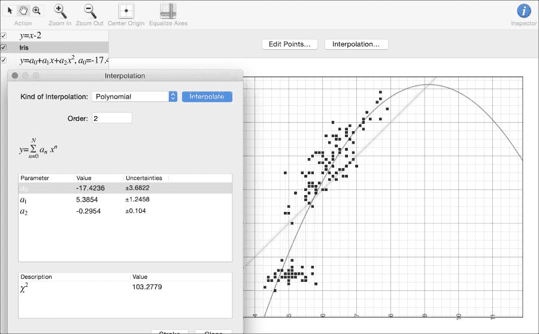
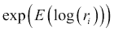
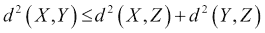
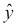
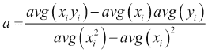
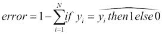
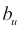
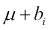

# 第三部分. 模块 3

> **掌握 Scala 机器学习**
> 
> *利用 Scala、Spark 和 Hadoop 的强大工具提高您在高效数据分析与数据处理方面的技能*

# 第一章. 探索性数据分析

在我深入探讨本书后面更复杂的数据分析方法之前，我想停下来谈谈基本的数据探索性任务，几乎所有数据科学家至少花费 80-90% 的生产力时间在这些任务上。仅数据准备、清洗、转换和合并数据本身就是一个价值 440 亿美元/年的产业（*《大数据时代的数据准备》*，作者：*Federico Castanedo* 和 *Best Practices for Data Integration*，*O'Reilly Media*，*2015*）。鉴于这一事实，人们最近才开始在开发最佳实践的科学、建立良好的习惯、文档和整个数据准备过程的教学材料上投入更多时间，这确实令人惊讶（*《美丽的数据：优雅数据解决方案背后的故事》*，由 *Toby Segaran* 和 *Jeff Hammerbacher* 编著，*O'Reilly Media*，*2009* 以及 *Sandy Ryza 等人所著的 *Advanced Analytics with Spark: Patterns for Learning from Data at Scale*，*O'Reilly Media*，*2015*）。

很少有数据科学家会就特定的工具和技术达成一致意见——进行探索性数据分析有多种方法，从 Unix 命令行到使用非常流行的开源和商业 ETL 和可视化工具。本章的重点是如何使用 Scala 和基于笔记本电脑的环境来利用通常被称为编程的函数式范式的技术。正如我将讨论的，这些技术可以转移到使用 Hadoop/Spark 的分布式机器系统上的探索性分析中。

函数式编程与这有什么关系？Spark 是用 Scala 开发的，这并非没有原因。许多位于函数式编程基础之上的基本原则，如惰性评估、不可变性、无副作用、列表推导和单子，非常适合在分布式环境中处理数据，特别是在对大数据进行数据准备和转换任务时。得益于抽象，这些技术在本地工作站或笔记本电脑上也能很好地工作。如前所述，这并不妨碍我们在连接到分布式存储/处理节点集群的现代笔记本电脑上处理数十 TB 的非常大的数据集。我们可以一次处理一个主题或关注领域，但通常我们甚至不需要对数据集进行适当的分区采样或过滤。我们将使用 Scala 作为我们的主要工具，但在需要时也会求助于其他工具。

虽然 Scala 在某种意义上是完整的，即其他语言可以实现的任何内容都可以在 Scala 中实现，但 Scala 本质上是一种高级语言，甚至是一种脚本语言。你不必处理数据结构和算法实现中的低级细节，这些细节在 Java 或 C++等语言中已经由大量的应用程序和时间测试过——尽管 Scala 今天有自己的集合和一些基本的算法实现。具体来说，在本章中，我将专注于使用 Scala/Spark 仅进行高级任务。

在本章中，我们将涵盖以下主题：

+   安装 Scala

+   学习简单的数据探索技术

+   学习如何对原始数据集进行下采样以加快周转速度

+   讨论在 Scala 中实现基本数据转换和聚合的实现

+   熟悉大数据处理工具，如 Spark 和 Spark Notebook

+   获取一些基本数据集可视化的代码

# Scala 入门

如果你已经安装了 Scala，你可以跳过这一段。你可以从[`www.scala-lang.org/download/`](http://www.scala-lang.org/download/)获取最新的 Scala 下载。我在 Mac OS X El Capitan 10.11.5 上使用了 Scala 版本 2.11.7。你可以使用你喜欢的任何其他版本，但可能与其他包（如 Spark）存在一些兼容性问题，这是开源软件中常见的问题，因为技术的采用通常落后于几个发布版本。

### 小贴士

在大多数情况下，你应该尝试保持推荐版本之间的精确匹配，因为版本之间的差异可能导致模糊的错误和漫长的调试过程。

如果你正确安装了 Scala，在输入`scala`后，你应该看到以下类似的内容：

```py
[akozlov@Alexanders-MacBook-Pro ~]$ scala
Welcome to Scala version 2.11.7 (Java HotSpot(TM) 64-Bit Server VM, Java 1.8.0_40).
Type in expressions to have them evaluated.
Type :help for more information.

scala>

```

这是一个 Scala **读取-评估-打印循环**（**REPL**）提示。虽然 Scala 程序可以编译，但本章的内容将在 REPL 中进行，因为我们专注于与交互，可能会有一些例外。`:help`命令提供了 REPL 中可用的某些实用命令（注意开头的冒号）：


# 分类的字段的不同值

现在，你有一个数据集和一台计算机。为了方便，我为你提供了一个小型的匿名和混淆的点击流数据样本，你可以从[`github.com/alexvk/ml-in-scala.git`](https://github.com/alexvk/ml-in-scala.git)获取这个样本。`chapter01/data/clickstream`目录中的文件包含时间戳、会话 ID 以及一些额外的调用时的事件信息，如 URL、分类信息等。首先要做的事情是对数据进行转换，以找出数据集中不同列的值分布。

*图 01-1 展示的截图显示了* `gzcat chapter01/data/clickstream/clickstream_sample.tsv.gz | less –U` 命令在终端窗口中的数据集输出。列由制表符（`^I`）分隔。可以注意到，正如许多现实世界的大数据数据集一样，许多值是缺失的。数据集的第一列可识别为时间戳。该文件包含复杂的数据，如数组、结构体和映射，这是大数据数据集的另一个特征。

Unix 提供了一些工具来剖析数据集。可能，**less**、**cut**、**sort** 和 **uniq** 是最常用于文本文件操作的工具。**Awk**、**sed**、**perl** 和 **tr** 可以执行更复杂的转换和替换。幸运的是，Scala 允许你在 Scala REPL 中透明地使用命令行工具，如下面的截图所示：


图 01-1\. `less -U` Unix 命令的输出作为点击流文件

幸运的是，Scala 允许你在 Scala REPL 中透明地使用命令行工具：

```py
[akozlov@Alexanders-MacBook-Pro]$ scala
…
scala> import scala.sys.process._
import scala.sys.process._
scala> val histogram = ( "gzcat chapter01/data/clickstream/clickstream_sample.tsv.gz"  #|  "cut -f 10" #| "sort" #|  "uniq -c" #| "sort -k1nr" ).lineStream
histogram: Stream[String] = Stream(7731 http://www.mycompany.com/us/en_us/, ?)
scala> histogram take(10) foreach println 
7731 http://www.mycompany.com/us/en_us/
3843 http://mycompanyplus.mycompany.com/plus/
2734 http://store.mycompany.com/us/en_us/?l=shop,men_shoes
2400 http://m.mycompany.com/us/en_us/
1750 http://store.mycompany.com/us/en_us/?l=shop,men_mycompanyid
1556 http://www.mycompany.com/us/en_us/c/mycompanyid?sitesrc=id_redir
1530 http://store.mycompany.com/us/en_us/
1393 http://www.mycompany.com/us/en_us/?cp=USNS_KW_0611081618
1379 http://m.mycompany.com/us/en_us/?ref=http%3A%2F%2Fwww.mycompany.com%2F
1230 http://www.mycompany.com/us/en_us/c/running

```

我使用了 `scala.sys.process` 包从 Scala REPL 调用熟悉的 Unix 命令。从输出中，我们可以立即看到我们网店的主要客户对男鞋和跑步感兴趣，并且大多数访客正在使用推荐代码，**KW_0611081618**。

### 小贴士

当我们开始使用复杂的 Scala 类型和方法时，可能会有人想知道。请稍等，在 Scala 之前已经创建了大量的高度优化的工具，它们对于探索性数据分析来说效率更高。在初始阶段，最大的瓶颈通常是磁盘 I/O 和缓慢的交互性。稍后，我们将讨论更多迭代算法，这些算法通常更占用内存。还要注意，UNIX 管道操作可以在现代多核计算机架构上隐式并行化，就像在 Spark 中一样（我们将在后面的章节中展示）。

已经证明，在输入数据文件上使用压缩，无论是隐式还是显式，实际上可以节省 I/O 时间。这对于（大多数）现代半结构化数据集尤其如此，这些数据集具有重复的值和稀疏的内容。在现代快速的多核计算机架构上，解压缩也可以隐式并行化，从而消除计算瓶颈，除非，可能在硬件中隐式实现压缩的情况下（SSD，在这种情况下我们不需要显式压缩文件）。我们还建议使用目录而不是文件作为数据集的模式，其中插入操作简化为将数据文件放入目录中。这就是大数据 Hadoop 工具（如 Hive 和 Impala）展示数据集的方式。

# 数值字段的摘要

让我们来看看数值数据，尽管数据集中的大多数列都是分类的或复杂的。总结数值数据的传统方法是五数摘要，它表示中位数或平均值、四分位数范围以及最小值和最大值。我将把中位数和四分位数范围的计算留到 Spark DataFrame 介绍时，因为它使这些计算变得极其简单；但我们可以通过应用相应的运算符在 Scala 中计算平均值、最小值和最大值：

```py
scala> import scala.sys.process._
import scala.sys.process._
scala> val nums = ( "gzcat chapter01/data/clickstream/clickstream_sample.tsv.gz"  #|  "cut -f 6" ).lineStream
nums: Stream[String] = Stream(0, ?) 
scala> val m = nums.map(_.toDouble).min
m: Double = 0.0
scala> val m = nums.map(_.toDouble).sum/nums.size
m: Double = 3.6883642764024662
scala> val m = nums.map(_.toDouble).max
m: Double = 33.0

```

## 在多个字段中进行 grep 搜索

有时需要了解某个值在多个字段中的外观——最常见的是 IP/MAC 地址、日期和格式化消息。例如，如果我想查看文件或文档中提到的所有 IP 地址，我需要将上一个示例中的`cut`命令替换为`grep -o -E [1-9][0-9]{0,2}(?:\\.[1-9][0-9]{0,2}){3}`，其中`-o`选项指示`grep`只打印匹配的部分——一个更精确的 IP 地址正则表达式应该是`grep –o –E (?:(?:25[0-5]|2[0-4][0-9]|[01]?[0-9][0-9]?)\.){3}(?:25[0-5]|2[0-4][0-9]|[01]?[0-9][0-9]?)`，但在我和原始的笔记本电脑上大约慢 50%，但原始的正则表达式在大多数实际情况下都适用。我将把它作为一个练习，在书中提供的样本文件上运行这个命令。

# 基本抽样、分层抽样和一致抽样

我遇到过很多数据从业者，他们轻视抽样。理想情况下，如果一个人能够处理整个数据集，模型只会得到改进。在实践中，这种权衡要复杂得多。首先，一个人可以在抽样集上构建更复杂的模型，尤其是如果模型构建的时间复杂度是非线性的——在大多数情况下，至少是*N* log(N)*。更快的模型构建周期允许你更快地迭代模型并收敛到最佳方法。在许多情况下，“行动时间”会打败基于完整数据集构建的模型在预测精度上的潜在改进。

抽样可以与适当的过滤相结合——在许多实际情况下，一次关注一个子问题可以更好地理解整个问题域。在许多情况下，这种划分是算法的基础，例如在稍后讨论的决策树中。通常，问题的性质要求你关注原始数据的一个子集。例如，网络安全分析通常关注一组特定的 IP 地址，而不是整个网络，因为它允许更快地迭代假设。如果不在正确的轨道上，将网络中所有 IP 地址的集合包括在内可能会在最初使事情复杂化。

当处理罕见事件，例如 ADTECH 中的点击次数时，以不同的概率对正负案例进行抽样，这有时也被称为过采样，通常能在短时间内带来更好的预测结果。

基本上，采样等同于对每一行数据抛硬币——或者调用随机数生成器。因此，它非常类似于流过滤操作，这里的过滤是在随机数增强列上进行的。让我们考虑以下示例：

```py
import scala.util.Random
import util.Properties

val threshold = 0.05

val lines = scala.io.Source.fromFile("chapter01/data/iris/in.txt").getLines
val newLines = lines.filter(_ =>
    Random.nextDouble() <= threshold
)

val w = new java.io.FileWriter(new java.io.File("out.txt"))
newLines.foreach { s =>
    w.write(s + Properties.lineSeparator)
}
w.close
```

这一切都很好，但它有以下缺点：

+   结果文件的行数事先是未知的——尽管平均来说应该是原始文件的 5%

+   采样的结果是非确定的——很难重新运行此过程进行测试或验证

为了解决第一个问题，我们需要传递一个更复杂的对象给函数，因为我们需要在原始列表遍历期间保持状态，这使得原始算法功能性和并行性降低（这将在稍后讨论）：

```py
import scala.reflect.ClassTag
import scala.util.Random
import util.Properties

def reservoirSampleT: ClassTag: Array[T] = {
  val reservoir = new ArrayT
  // Put the first k elements in the reservoir.
  var i = 0
  while (i < k && input.hasNext) {
    val item = input.next()
    reservoir(i) = item
    i += 1
  }

  if (i < k) {
    // If input size < k, trim the array size
    reservoir.take(i)
  } else {
    // If input size > k, continue the sampling process.
    while (input.hasNext) {
      val item = input.next
      val replacementIndex = Random.nextInt(i)
      if (replacementIndex < k) {
        reservoir(replacementIndex) = item
      }
      i += 1
    }
    reservoir
  }
}

val numLines=15
val w = new java.io.FileWriter(new java.io.File("out.txt"))
val lines = io.Source.fromFile("chapter01/data/iris/in.txt").getLines
reservoirSample(lines, numLines).foreach { s =>
    w.write(s + scala.util.Properties.lineSeparator)
}
w.close
```

这将输出`numLines`行。类似于蓄水池采样，分层采样保证为所有由另一个属性的级别定义的层提供相同的输入/输出行比例。我们可以通过将原始数据集分割成与级别相对应的*N*个子集，执行蓄水池采样，然后合并结果来实现这一点。然而，将在第三章中介绍的 MLlib 库，*使用 Spark 和 MLlib*，已经实现了分层采样的实现：

```py
val origLinesRdd = sc.textFile("file://...")
val keyedRdd = origLines.keyBy(r => r.split(",")(0))
val fractions = keyedRdd.countByKey.keys.map(r => (r, 0.1)).toMap
val sampledWithKey = keyedRdd.sampleByKeyExact(fractions)
val sampled = sampledWithKey.map(_._2).collect
```

另一个要点更为微妙；有时我们希望在多个数据集中保持值的一致子集，无论是为了可重复性还是为了与其他采样数据集连接。一般来说，如果我们采样两个数据集，结果将包含随机子集的 ID，这些 ID 可能几乎没有交集或完全没有交集。密码学哈希函数在这里提供了帮助。应用 MD5 或 SHA1 等哈希函数的结果是一系列在理论上至少是统计上不相关的位序列。我们将使用`MurmurHash`函数，它是`scala.util.hashing`包的一部分：

```py
import scala.util.hashing.MurmurHash3._

val markLow = 0
val markHigh = 4096
val seed = 12345

def consistentFilter(s: String): Boolean = {
  val hash = stringHash(s.split(" ")(0), seed) >>> 16
  hash >= markLow && hash < markHigh
}

val w = new java.io.FileWriter(new java.io.File("out.txt"))
val lines = io.Source.fromFile("chapter01/data/iris/in.txt").getLines
lines.filter(consistentFilter).foreach { s =>
     w.write(s + Properties.lineSeparator)
}
w.close
```

此函数保证基于第一个字段的值返回完全相同的记录子集——要么是第一个字段等于某个特定值的所有记录，要么是没有任何记录——并且将产生大约原始样本的六分之一；`hash`的范围是`0`到`65,535`。

### 注意

MurmurHash？它不是一个密码学哈希！

与 MD5 和 SHA1 等密码学哈希函数不同，MurmurHash 并不是专门设计成难以找到哈希的逆函数。然而，它确实非常快且高效。在我们的用例中，这真正是重要的。

# 使用 Scala 和 Spark 笔记本工作

通常，最频繁的值或五数摘要不足以获得对数据的初步理解。术语 **描述性统计** 非常通用，可能指代描述数据非常复杂的方法。分位数、**帕累托**图，或者当分析多个属性时，相关性也是描述性统计的例子。当分享所有这些查看数据聚合的方法时，在许多情况下，分享得到这些计算的具体计算也很重要。

Scala 或 Spark Notebook [`github.com/Bridgewater/scala-notebook`](https://github.com/Bridgewater/scala-notebook), [`github.com/andypetrella/spark-notebook`](https://github.com/andypetrella/spark-notebook) 记录整个转换路径，结果可以作为基于 JSON 的 `*.snb` 文件共享。Spark Notebook 项目可以从 [`spark-notebook.io`](http://spark-notebook.io) 下载，我将提供与本书一起的示例 `Chapter01.snb` 文件。我将使用 Spark，我将在第三章（part0249.xhtml#aid-7DES21 "第三章. 使用 Spark 和 MLlib"）中更详细地介绍，*使用 Spark 和 MLlib*。

对于这个特定的例子，Spark 将在本地模式下运行。即使在本地模式下，Spark 也可以在您的工作站上利用并行性，但受限于可以在您的笔记本电脑或工作站上运行的内核和超线程数量。然而，通过简单的配置更改，Spark 可以指向一组分布式机器，并使用分布式节点集的资源。

这里是下载 Spark Notebook 并从代码仓库复制必要文件的命令集：

```py
[akozlov@Alexanders-MacBook-Pro]$ wget http://s3.eu-central-1.amazonaws.com/spark-notebook/zip/spark-notebook-0.6.3-scala-2.11.7-spark-1.6.1-hadoop-2.6.4-with-hive-with-parquet.zip
...
[akozlov@Alexanders-MacBook-Pro]$ unzip -d ~/ spark-notebook-0.6.3-scala-2.11.7-spark-1.6.1-hadoop-2.6.4-with-hive-with-parquet.zip
...
[akozlov@Alexanders-MacBook-Pro]$ ln -sf ~/ spark-notebook-0.6.3-scala-2.11.7-spark-1.6.1-hadoop-2.6.4-with-hive-with-parquet ~/spark-notebook
[akozlov@Alexanders-MacBook-Pro]$ cp chapter01/notebook/Chapter01.snb ~/spark-notebook/notebooks
[akozlov@Alexanders-MacBook-Pro]$ cp chapter01/ data/kddcup/kddcup.parquet ~/spark-notebook
[akozlov@Alexanders-MacBook-Pro]$ cd ~/spark-notebook
[akozlov@Alexanders-MacBook-Pro]$ bin/spark-notebook 
Play server process ID is 2703
16/04/14 10:43:35 INFO play: Application started (Prod)
16/04/14 10:43:35 INFO play: Listening for HTTP on /0:0:0:0:0:0:0:0:9000
...

```

现在，您可以在浏览器中打开 `http://localhost:9000` 上的笔记本，如下面的截图所示：


图 01-2\. Spark 笔记本的第一页，列出了笔记本列表

通过点击它打开 `Chapter01` 笔记本。语句被组织成单元格，可以通过点击顶部的较小右箭头来执行，如下面的截图所示，或者通过导航到 **单元格** | **运行所有** 来一次性运行所有单元格：


图 01-3\. 执行笔记本中的前几个单元格

首先，我们将查看所有或某些离散变量的值。例如，要获取标签的分布，请执行以下代码：

```py
val labelCount = df.groupBy("lbl").count().collect
labelCount.toList.map(row => (row.getString(0), row.getLong(1)))
```

我第一次读取数据集时，在 MacBook Pro 上大约花费了一分钟，但 Spark 将数据缓存到内存中，后续的聚合运行只需大约一秒钟。Spark Notebook 提供了值的分布，如下面的截图所示：


图 01-4\. 计算分类字段的值分布

我还可以查看离散变量的交叉表计数，这让我对变量之间的相互依赖性有了了解，请参阅[`spark.apache.org/docs/latest/api/scala/index.html#org.apache.spark.sql.DataFrameStatFunctions`](http://spark.apache.org/docs/latest/api/scala/index.html#org.apache.spark.sql.DataFrameStatFunctions)——该对象尚不支持计算如卡方检验之类的相关度量：


图 01-5\. 列联表或交叉表

然而，我们可以看到最受欢迎的服务是私有的，并且它与 `SF` 标志的相关性很好。另一种分析依赖关系的方法是查看 `0` 条目。例如，`S2` 和 `S3` 标志显然与 SMTP 和 FTP 流量相关，因为所有其他条目都是 `0`。

当然，最有趣的关联是与目标变量相关，但这些最好通过我在第三章（part0249.xhtml#aid-7DES21 "第三章。使用 Spark 和 MLlib"）和第五章（part0260.xhtml#aid-7NUI81 "第五章。回归和分类"）中将要介绍的监督学习算法来发现，*使用 Spark 和 MLlib* 和 *回归和分类*。


图 01-6\. 使用 org.apache.spark.sql.DataFrameStatFunctions 计算简单聚合。

类似地，我们可以使用 `dataFrame.stat.corr()` 和 `dataFrame.stat.cov()` 函数计算数值变量的相关性（参见图 01-6）。在这种情况下，该类支持**皮尔逊相关系数**。或者，我们可以直接在 parquet 文件上使用标准的 SQL 语法：

```py
sqlContext.sql("SELECT lbl, protocol_type, min(duration), avg(duration), stddev(duration), max(duration) FROM parquet.`kddcup.parquet` group by lbl, protocol_type")
```

最后，我答应您计算百分位数。计算百分位数通常涉及对整个数据集进行排序，这是昂贵的；然而，如果分块是前几个或最后几个之一，通常可以优化计算：

```py
val pct = sqlContext.sql("SELECT duration FROM parquet.`kddcup.parquet` where protocol_type = 'udp'").rdd.map(_.getLong(0)).cache
pct.top((0.05*pct.count).toInt).last
```

对于更通用的案例，计算确切的百分位数计算成本更高，它是 Spark 笔记本示例代码的一部分。

# 基本相关性

您可能已经注意到，从列联表中检测相关性是困难的。检测模式需要练习，但许多人更擅长直观地识别模式。检测可操作的模式是机器学习的主要目标之一。虽然将在第四章（part0256.xhtml#aid-7K4G02 "第四章。监督学习和无监督学习"）和第五章（part0260.xhtml#aid-7NUI81 "第五章。回归和分类"）中介绍的高级监督机器学习技术，*监督学习和无监督学习*以及*回归和分类*存在，但变量之间相互依赖性的初步分析有助于正确转换变量或选择最佳推理技术。

存在多个成熟的可视化工具，并且有多个网站，例如[`www.kdnuggets.com`](http://www.kdnuggets.com)，它们专注于对数据分析、数据探索和可视化软件进行排名和提供推荐。在这本书中，我不会质疑这些排名的有效性和准确性，实际上很少有网站提到 Scala 作为可视化数据的具体方式，即使使用`D3.js`包也是可能的。一个好的可视化是向更广泛的受众传达发现的好方法。一看胜千言。

为了本章的目的，我将使用每个 Mac OS 笔记本上都有的**Grapher**。要打开**Grapher**，请转到实用工具（在 Finder 中按*shift* + *command* + *U*）并单击**Grapher**图标（或按*command* + *space*按名称搜索）。Grapher 提供了许多选项，包括以下**对数-对数**和**极坐标**：


图 01-7\. Grapher 窗口

从根本上讲，通过可视化可以传达的信息量受屏幕上像素数量的限制，对于大多数现代计算机来说，这是数百万，以及颜色变化，这也可以说是数百万（*Judd*，*Deane B.*；*Wyszecki*，*Günter*（1975）。*商业、科学和工业中的颜色*。*纯与应用光学系列（第 3 版）*。纽约）。如果我正在处理一个多维 TB 数据集，该数据集首先需要被总结、处理，并减少到可以在计算机屏幕上查看的大小。

为了说明目的，我将使用可以在[`archive.ics.uci.edu/ml/datasets/Iris`](https://archive.ics.uci.edu/ml/datasets/Iris)找到的 Iris UCI 数据集。要将数据集引入工具，请输入以下代码（在 Mac OS 上）：

```py
[akozlov@Alexanders-MacBook-Pro]$ pbcopy < chapter01/data/iris/in.txt

```

在**Grapher**中打开新的**点集**（*command* + *alt* + *P*），按**编辑点…**并按*command* + *V*粘贴数据。该工具具有基本的线性、多项式和指数族等线拟合能力，并提供流行的卡方指标来估计拟合的优良程度，相对于自由参数的数量：



图 01-8\. 在 Mac OS X 上使用 Grapher 拟合 Iris 数据集

我们将在接下来的章节中介绍如何估计模型拟合的优良程度。

# 摘要

我试图在书中建立一个共同的基础，以便在后面的章节中进行更复杂的数据科学。不要期望这些是完整的探索性技术集，因为探索性技术可以扩展到运行非常复杂模式。然而，我们已经涵盖了简单的聚合、抽样、读写等文件操作，以及使用笔记本和 Spark DataFrames 等工具，这些工具将熟悉的 SQL 结构引入了与 Spark/Scala 一起工作的分析师的武器库中。

下一章将完全转变方向，将数据管道视为数据驱动企业的组成部分，并从业务角度涵盖数据发现过程：我们通过数据分析试图实现哪些最终目标。在这之后，我将介绍一些传统的机器学习主题，如监督学习和无监督学习，然后再深入研究更复杂的数据表示，Scala 在这里真正显示出其相对于 SQL 的优势。

# 第二章：数据管道和建模

在上一章中，我们探讨了探索数据的基本动手工具，因此我们现在可以深入研究更复杂的主题，如统计模型构建、最优控制或科学驱动工具和问题。我将继续说，我们只会触及一些最优控制的话题，因为这本书实际上只是关于 Scala 中的机器学习，而不是数据驱动业务管理的理论，这可能是一个单独成书的激动人心的主题。

在本章中，我将避免具体实现 Scala，并从高层次讨论构建数据驱动企业的相关问题。后面的章节将解决这些难题的解决方案。特别强调处理不确定性。不确定性通常有几种形式：首先，我们提供的信息中可能存在噪声。其次，信息可能不完整。系统在填补缺失部分时可能有一定的自由度，这导致不确定性。最后，模型解释和结果指标可能存在差异。最后一个观点很微妙，因为大多数经典教科书都假设我们可以直接测量事物。不仅测量可能存在噪声，而且测量的定义可能随时间变化——尝试测量满意度或幸福感。当然，我们可以通过说我们只能优化可测量的指标来避免这种歧义，就像人们通常做的那样，但这将显著限制实际应用的范围。没有任何东西阻止科学机制在处理解释不确定性时将其考虑在内。

预测模型通常只是为了数据理解而构建。从语言学的推导来看，模型是对实际复杂建筑或过程的简化表示，其目的正是为了阐明观点和说服人们，无论通过何种方式。预测建模的最终目标，也就是我在本书和本章中关注的目标，是通过考虑最重要的因素来优化业务流程，以便让世界变得更加美好。这当然是一个充满不确定性的句子，但至少它看起来比优化点击率要好得多。

让我们看看传统的商业决策过程：一家传统的企业可能涉及一组 C 级高管根据通常从一组包含一个或多个数据库中数据图形表示的仪表板中获得的信息做出决策。自动化数据驱动型企业的承诺是，在消除人类偏见的情况下，能够自动做出大多数决策。这并不是说我们不再需要 C 级高管，但 C 级高管将忙于帮助机器做出决策，而不是相反。

在本章中，我们将涵盖以下主题：

+   探索影响图作为决策工具的基本原理

+   在自适应**马尔可夫决策过程**和**凯利准则**的背景下查看纯决策优化变体

+   熟悉至少三种不同的探索-利用权衡策略

+   描述数据驱动型企业的架构

+   讨论决策管道的主要架构组件

+   熟悉构建数据管道的标准工具

# 影响图

虽然决策过程可能具有多个方面，但一本关于不确定条件下决策的书如果没有提到影响图（*团队决策分析中的影响图*，《决策分析》第 2 卷（4）：207–228），就会显得不完整。影响图有助于分析和理解决策过程。决策可能像选择在个性化环境中向用户展示的下一条新闻文章这样平凡，也可能像在企业网络中检测恶意软件或选择下一个研究项目这样复杂。

根据天气情况，她可以尝试进行一次乘船之旅。我们可以将决策过程表示为图表。让我们决定在她在俄勒冈州波特兰逗留期间是否乘坐游船：


图 02-1。一个简单的假期影响图，用于表示简单的决策过程。该图包含决策节点，如度假活动，可观察和不可观察的信息节点，如天气预报和天气，以及最终的价值节点，如满意度

上述图表代表了这种情况。是否参加活动的决策明显是由获得一定满意度的可能性驱动的，这是决策本身和活动时的天气的函数。虽然旅行计划时的实际天气条件是未知的，但我们相信天气预报和旅行期间实际经历的天气之间存在某种相关性，这由**天气**和**天气预报**节点之间的边表示。**度假活动**节点是决策节点，它只有一个父节点，因为决策完全基于**天气预报**。DAG 中的最后一个节点是**满意度**，它是实际天气和我们在旅行计划期间所做的决策的函数——显然，“是 + 好天气”和“否 + 坏天气”可能得分最高。而“是 + 坏天气”和“否 + 好天气”将是一个不良的结果——后者可能是错过机会，但并不一定是一个糟糕的决策，前提是天气预报不准确。

边缘的缺失包含了一个独立性假设。例如，我们相信**满意度**不应该依赖于**天气预报**，因为后者在我们上船后就变得无关紧要了。一旦度假计划确定，实际天气在划船活动期间就不再影响决策，该决策完全基于天气预报；至少在我们的简化模型中，我们排除了购买旅行保险的选项。

图表展示了决策的不同阶段和信息流（我们将在第七章 Chapter 7，*使用图算法*）中提供实际的 Scala 实现）。在我们的简化图中，做出决策只需要一条信息：天气预报。一旦做出决策，我们就无法更改它，即使我们有关于旅行时实际天气的信息。天气和决策数据可以用来模拟她对所做决策的满意度。

让我们将这种方法映射到一个广告问题作为说明：最终目标是获得用户对目标广告的满意度，这将为广告商带来额外的收入。满意度是用户特定环境状态的函数，在决策时是未知的。然而，使用机器学习算法，我们可以根据用户的最近网页访问历史和其他我们可以收集的信息（如地理位置、浏览器代理字符串、一天中的时间、广告类别等）来预测这种状态（参见图 2-2）。

虽然我们不太可能测量用户大脑中的多巴胺水平，这肯定会落入可测量指标的范畴，并可能减少不确定性，但我们可以通过用户的行为间接测量用户满意度，无论是他们是否对广告做出了回应，还是用户在点击浏览相关信息之间花费的时间，这可以用来估计我们建模和算法的有效性。以下是一个影响图，类似于“假期”的影响图，调整用于广告决策过程：


图 02-2\. 调整后的在线广告决策案例的假期影响图。在线广告的决策可以每秒进行数千次

实际过程可能更复杂，代表一系列决策，每个决策都依赖于几个先前的时间切片。例如，所谓的**马尔可夫链决策过程**。在这种情况下，图表可能需要在多个时间切片上重复。

另一个例子可能是企业网络互联网恶意软件分析系统。在这种情况下，我们试图根据对企业交换机流经的网络数据包的分析来检测指示命令和控制（**C2**）、横向移动或数据泄露的网络连接。目标是最大限度地减少爆发对系统运行的最小影响。

我们可能做出的一个决定是重新映像一部分节点，或者至少将它们隔离。我们收集的数据可能包含不确定性——许多良性软件包可能会以可疑的方式发送流量，而模型需要根据风险和潜在影响来区分它们。在这个特定案例中，可能的一个决定是收集更多信息。

我将把这个以及其他潜在的商业案例映射到相应的图表上作为练习留给读者。现在让我们考虑一个更复杂的优化问题。

# 顺序试验和风险处理

如果我为了多赚几美元而牺牲同样风险的偏好是什么？我将在本节稍后停止讨论为什么一个人的偏好可能是不对称的，并且有科学证据表明这种不对称性是受进化原因根植于我们心中的，但你是对的，我现在必须优化参数化效用函数的不对称函数的期望值，如下所示：


为什么分析中会出现非对称函数？一个例子是重复投注或再投资，也称为凯利公式问题。虽然最初，凯利公式是为赌博机等二元结果的具体情况开发的，用于优化每轮投注的资金比例（*《信息率的新解释》*，贝尔系统技术期刊 35 (4): 917–926，1956），但作为一个更通用的再投资问题，它涉及到可能回报的概率分布。

多次投注的回报是每次投注的个别回报率的乘积——回报率是投注后的资金与每次个别投注前的原始资金的比率，如下所示：


这对我们优化总回报帮助不大，因为我们不知道如何优化独立同分布（*i.i.d*）随机变量的乘积。然而，我们可以通过对数变换将乘积转换为和，并应用**中心极限定理**（**CLT**）来近似独立同分布变量的和（假设*r*的分布满足 CLT 条件，例如，具有有限的均值和方差），如下所示：


因此，进行*N*次投注的累积结果将类似于进行*N*次投注，期望回报为，而不是

正如我之前提到的，这个问题最常应用于二元竞标的情况，尽管它可以很容易地推广，在这种情况下，还有一个额外的参数：*x*，即每轮投注的金额。假设我以概率*p*获得*W*的利润，或者以概率*(1-p)*完全输掉投注。优化与以下额外参数相关的期望回报：


最后一个方程是凯利公式比率，它给出了最佳投注金额。

一个人可能会投注少于总金额的原因是，即使平均回报是正的，仍然有可能输掉全部资金，尤其是在高度偏斜的情况下。例如，即使你投注获得*10 x*的概率是*0.105*（*W = 10*，期望回报是*5%*），组合分析表明，即使经过*60*次投注，整体回报为负的概率大约为*50*%，而且有*11*%的几率，特别是会输掉*(57 - 10 x 3) = 27*倍或更多的投注：

```py
akozlov@Alexanders-MacBook-Pro$ scala
Welcome to Scala version 2.11.7 (Java HotSpot(TM) 64-Bit Server VM, Java 1.8.0_40).
Type in expressions to have them evaluated.
Type :help for more information.27 

scala> def logFactorial(n: Int) = { (1 to n).map(Math.log(_)).sum }
logFactorial: (n: Int)Double

scala> def cmnp(m: Int, n: Int, p: Double) = {
 |   Math.exp(logFactorial(n) -
 |   logFactorial(m) +
 |   m*Math.log(p) -
 |   logFactorial(n-m) +
 |   (n-m)*Math.log(1-p))
 | }
cmnp: (m: Int, n: Int, p: Double)Double

scala> val p = 0.105
p: Double = 0.105

scala> val n = 60
n: Int = 60

scala> var cumulative = 0.0
cumulative: Double = 0.0

scala> for(i <- 0 to 14) {
 |   val prob = cmnp(i,n,p)
 |   cumulative += prob
 |   println(f"We expect $i wins with $prob%.6f probability $cumulative%.3f cumulative (n = $n, p = $p).")
 | }
We expect 0 wins with 0.001286 probability 0.001 cumulative (n = 60, p = 0.105).
We expect 1 wins with 0.009055 probability 0.010 cumulative (n = 60, p = 0.105).
We expect 2 wins with 0.031339 probability 0.042 cumulative (n = 60, p = 0.105).
We expect 3 wins with 0.071082 probability 0.113 cumulative (n = 60, p = 0.105).
We expect 4 wins with 0.118834 probability 0.232 cumulative (n = 60, p = 0.105).
We expect 5 wins with 0.156144 probability 0.388 cumulative (n = 60, p = 0.105).
We expect 6 wins with 0.167921 probability 0.556 cumulative (n = 60, p = 0.105).
We expect 7 wins with 0.151973 probability 0.708 cumulative (n = 60, p = 0.105).
We expect 8 wins with 0.118119 probability 0.826 cumulative (n = 60, p = 0.105).
We expect 9 wins with 0.080065 probability 0.906 cumulative (n = 60, p = 0.105).
We expect 10 wins with 0.047905 probability 0.954 cumulative (n = 60, p = 0.105).
We expect 11 wins with 0.025546 probability 0.979 cumulative (n = 60, p = 0.105).
We expect 12 wins with 0.012238 probability 0.992 cumulative (n = 60, p = 0.105).
We expect 13 wins with 0.005301 probability 0.997 cumulative (n = 60, p = 0.105).
We expect 14 wins with 0.002088 probability 0.999 cumulative (n = 60, p = 0.105).

```

注意，为了恢复 *27 x* 的金额，平均只需要再玩  轮额外的游戏，但必须先有赌注才能开始。凯利公式提供的是，最佳策略是只投注我们赌注的 *1.55%*。注意，如果我投注全部赌注，我将在第一轮（获胜的概率仅为 *0.105*）以 89.5% 的确定性输掉所有钱。如果我只投注赌注的一小部分，留在游戏中的机会将无限好，但整体回报较小。期望对数收益的图示如 *图 02-3* 所示，作为投注赌注的份额 *x* 和我刚刚计算的 60 轮可能结果分布的函数。在 24% 的游戏中，我们的表现将不如下方的曲线，在 39% 的游戏中不如下一条曲线，大约一半——44%——的赌徒的表现将与中间的黑曲线相同或更好，而在 30% 的情况下表现将优于最上方的一条。对于 *x* 的最佳凯利公式值为 *0.0155*，这将最终在无限多轮中优化整体回报：


图 02-3. 作为投注金额和 60 轮可能结果函数的期望对数收益（见方程（2.2））

凯利公式因其过于激进（赌徒倾向于高估他们的获胜潜力和比例，同时低估破产的概率）以及过于保守（风险价值应该是总可用资本，而不仅仅是赌注）而受到批评，但它展示了我们需要用一些额外的转换来补偿我们对“收益”的直观理解的一个例子。

从金融角度来看，凯利公式比标准定义（如收益的波动性或方差）更好地描述了风险。对于一个通用的参数化收益分布 *y(z)*，其概率分布函数为 *f(z)*，方程（2.3）可以重新表述如下。在替换 *r(x) = 1 + x y(z)* 后，其中 *x* 仍然是投注的金额：


在离散情况下，它也可以写成以下形式：


在这里，分母强调了负收益区域的贡献。具体来说，失去所有赌注的可能性正好是分母  为零的地方。

正如我之前提到的，有趣的是，风险规避植根于我们的直觉，似乎在人类和灵长类动物中编码了一个自然的风险规避偏好系统（参见 Laurie Santos 的《像我们一样不理性的猴子经济》，TED 演讲，2010 年）。现在关于猴子和风险的话题就足够了，让我们进入另一个相当有争议的主题——探索与利用的权衡，在这个权衡中，一个人甚至可能一开始都不知道收益权衡。

# 探索与利用

探索与利用的权衡是另一个问题，尽管其真实应用范围从研究项目的资金分配到自动驾驶汽车，但其明显的起源在赌博中。传统的表述是多臂老虎机问题，它指的是一个或多个臂的虚拟老虎机。每个臂的连续操作产生*i.i.d*的回报，每个臂的回报概率未知；在简化模型中，连续操作是独立的。假设奖励在臂之间是独立的。目标是最大化奖励——例如，赢得的金额，并最小化学习损失，即花费在获胜率低于最优的臂上的金额，前提是有一个商定的臂选择策略。明显的权衡是在寻找产生最佳回报的臂的**探索**和利用已知最佳回报的**利用**之间：


然后，**伪后悔**是以下差值：


在这里，是从*N*次试验中选出的*i*臂。多臂老虎机问题在 20 世纪 30 年代和 21 世纪初都得到了广泛的研究，其应用领域包括金融和 ADTECH。尽管由于问题的随机性，通常无法提供一个比*N*的平方根更好的期望后悔的上界，但可以通过控制伪后悔来使其受到*N*的对数的约束（参见 Sebastien Bubeck 和 Nicolo Cesa-Bianchi 的论文《随机和非随机多臂老虎机问题的后悔分析》，[`arxiv.org/pdf/1204.5721.pdf`](http://arxiv.org/pdf/1204.5721.pdf)）。

实践中最常用的策略之一是ε策略，其中最优臂以的概率被选中，而其他臂则以剩余的概率被选中。这种方法的缺点是我们可能会在永远不会提供任何奖励的臂上花费大量的探索资源。UCB 策略通过选择具有最大回报估计值的臂，以及回报估计值的标准差的某个倍数或分数来改进ε策略。这种方法需要在每一轮重新计算最佳臂，并且由于对均值和标准差的估计所做的近似而受到影响。此外，UCB 需要为每次连续抽取重新计算估计值，这可能会成为可扩展性问题。

最后，Thompson 抽样策略使用 Beta-Bernoulli 后验估计的固定随机样本，并将下一个臂分配给给出最小预期后悔的臂，为此可以使用实际数据来避免参数重新计算。尽管具体数字可能取决于假设，但以下图表提供了这些模型性能的一个可用比较：


图 02-3。对于 K = 5，单臂老虎机和不同策略的不同探索/利用策略的模拟结果。

*图 02-3*显示了不同策略的模拟结果（摘自 Rich Relevance 网站[`engineering.richrelevance.com/recommendations-thompson-sampling`](http://engineering.richrelevance.com/recommendations-thompson-sampling))。**随机**策略随机分配臂，对应于纯探索。**天真**策略在某个阈值内是随机的，然后切换到纯利用模式。**上置信界**（**UCB**）以 95%的置信水平。UCB1 是 UCB 的一种修改，以考虑分布的对数正态性。最后，Thompson 抽样策略从实际后验分布中随机抽取样本以优化后悔。

探索/利用模型众所周知对初始条件和异常值非常敏感，尤其是在低响应方面。人们可能会在实际上已经无望的臂上花费大量的试验。

通过基于额外信息（如位置）估计更好的先验，或者由于这种额外信息而限制要探索的臂的集合—*K*—，可以对这些策略进行其他改进，但这些方面更具有领域特定性（如个性化或在线广告）。

# 未知之未知

未知未知的事物在很大程度上是因为美国国防部长唐纳德·拉姆斯菲尔德在 2002 年 2 月 12 日的一次美国国防部（**DoD**）新闻发布会上对关于伊拉克政府与向恐怖组织供应大规模杀伤性武器缺乏证据的提问的回答而闻名，以及纳西姆·尼古拉斯·塔勒布的书籍（《黑天鹅：几乎不可能发生的事件的影响》由纳西姆·尼古拉斯·塔勒布著，Random House 出版社，2007 年）。

### 注意

**火鸡悖论**

争议性地，未知未知的事物可以通过火鸡悖论更好地解释。假设你有一群火鸡在后院玩耍，享受保护和免费食物。栅栏的另一边，还有另一群火鸡。这一切日复一日，月复一月，直到感恩节到来——感恩节是加拿大和美国庆祝的全国性假日，在这一天，人们习惯于在烤箱里烤火鸡。火鸡很可能在这个时候被收割并消费，尽管从火鸡的角度来看，没有任何可辨别的信号表明在加拿大的 10 月第二个星期一或美国的 11 月第四个星期四会发生任何事情。除了额外的年度信息之外，没有任何模型可以在年内数据的基础上解决这个问题。

未知未知的事物是模型中没有的，并且无法预测它们会在模型中。实际上，唯一真正感兴趣的未知未知的事物是那些对模型影响如此之大，以至于之前几乎不可能或几乎不可能发生的结果现在变成了现实。鉴于大多数实际分布都属于指数家族，尾部非常薄，因此，与正态分布的偏差不必超过几个标准差，就会对标准模型假设产生破坏性的影响。尽管人们仍然需要想出一个可行的策略来如何在模型中包含未知因素——已经提出了几种方法，包括分形，但几乎没有可行的——从业者必须意识到风险，而这里的定义风险正是模型无用的可能性。当然，已知未知和未知未知之间的区别正是我们理解风险和需要探索的内容。

当我们审视决策系统面临的基本问题范围时，让我们来看看数据管道，这些软件系统为做出决策提供信息，以及设计数据驱动系统数据管道的更实际方面。

# 数据驱动系统的基本组件

简而言之，数据驱动架构包含以下组件——至少我所见到的所有系统都有这些组件——或者可以简化为这些组件：

+   **数据采集**：我们需要从系统和设备中收集数据。大多数系统都有日志，或者至少有一个将文件写入本地文件系统的选项。一些系统可能具有将信息报告给基于网络的接口（如 syslog）的能力，但通常没有持久化层意味着可能存在数据丢失的风险，如果不是审计信息缺失的话。

+   **数据转换层**：它也被称为**提取、转换和加载**（**ETL**）。今天，数据转换层也可以用于实时处理，其中聚合是在最新数据上计算的。数据转换层也传统上用于重新格式化和索引数据，以便高效地由管道下游的算法的 UI 组件访问。

+   **数据分析与机器学习引擎**：这个层次不是标准数据转换层的一部分的原因通常是因为这个层次需要相当不同的技能。构建合理统计模型的人的心态通常与那些使数以 TB 计的数据快速移动的人不同，尽管偶尔我也能找到具备这两种技能的人。通常，这些“独角兽”被称为数据科学家，但任何特定领域的技能通常都不如专门从事该领域的人。尽管如此，我们仍然需要更多这样的人。另一个原因是，机器学习，以及在某种程度上数据分析，需要多次对相同数据进行聚合和遍历，这与更流式的 ETL 转换不同，需要不同的引擎。

+   **UI 组件**：是的，UI 代表用户界面，它通常是一组组件，允许您通过浏览器与系统通信（它曾经是一个本地的 GUI，但如今基于 Web 的 JavaScript 或 Scala 框架要强大得多，并且更易于移植）。从数据管道和建模的角度来看，该组件提供了一个 API 来访问数据和模型的内部表示。

+   **动作引擎**：这通常是一个可配置的规则引擎，根据洞察力优化提供的指标。动作可以是实时的，例如在线广告中的情况，在这种情况下，引擎应该能够提供实时评分信息，或者为用户动作提供推荐，这可能采取电子邮件警报的形式。

+   **关联引擎**：这是一个新兴的组件，它可能分析数据分析与机器学习引擎的输出，以推断数据或模型行为方面的额外见解。这些动作也可能由该层的输出触发。

+   **监控**：这是一个复杂的系统，如果没有日志、监控以及某种方式来更改系统参数，它将是不完整的。监控的目的是拥有一个嵌套的决策系统，关于系统的最佳健康状况，要么自动减轻问题（*s*），要么向系统管理员发出关于问题（*s*）的警报。

让我们在以下各节中详细讨论每个组件。

## 数据摄取

随着智能设备的普及，信息收集不再是问题，而是任何从事除打字文本之外业务的企业的一种必要需求。为了本章的目的，我将假设设备或设备已连接到互联网或以某种方式通过家庭拨号或直接网络连接传递此信息。

此组件的主要目的是收集所有可能对后续数据驱动决策相关的相关信息。以下表格提供了关于数据摄取最常见实现的详细信息：

| 框架 | 当使用 | 评论 |
| --- | --- | --- |
| **Syslog** | Syslog 是 Unix 机器之间传递消息的最常见标准之一。Syslog 通常监听端口 514，传输协议可以配置为 UDP（不可靠）或 TCP。在 CentOS 和 Red Hat Linux 上的最新增强实现是 rsyslog，它包括许多高级选项，如基于正则表达式的过滤，这对于系统性能调整和调试非常有用。除了略微低效的原始消息表示——纯文本，对于重复字符串的长消息可能效率不高——syslog 系统可以每秒支持数万条消息。Syslog 是由 Eric Allman 在 1980 年代作为 Sendmail 的一部分开发的最早协议之一。虽然它不保证交付或持久性，尤其是对于分布式系统，但它是最广泛的消息传递协议之一。一些后来的框架，如 Flume 和 Kafka，也有 syslog 接口。 |
| **Rsync** | Rsync 是一个在 1990 年代开发的较新的框架。如果数据被放置在本地文件系统上的平面文件中，rsync 可能是一个选择。虽然 rsync 传统上用于同步两个目录，但它也可以定期运行以批量传输日志数据。Rsync 使用由澳大利亚计算机程序员 Andrew Tridgell 发明的递归算法，在接收计算机已经有一个类似但不完全相同的相同结构版本的情况下，高效地检测差异并跨通信链路传输结构（如文件）。虽然它会产生额外的通信，但从持久性的角度来看，它更好，因为原始副本始终可以检索。如果已知日志数据最初是以批量形式到达的（例如上传或下载），则特别适用。Rsync 已知会受到网络瓶颈的限制，因为它在比较目录结构时最终会在网络上传递更多信息。然而，传输的文件在网络传输时可能会被压缩。网络带宽可以通过命令行标志进行限制。 |
| **Flume** | Flume 是 Cloudera 在 2009-2011 年间开发的一个较年轻的框架，并已开源。Flume——我们指的是更流行的 flume-ng 实现，称为 Flume，而不是较老的常规 Flume——由源、管道和可能配置在多个节点上的汇组成，以实现高可用性和冗余。Flume 被设计为在可靠性的代价下尽可能避免数据重复。Flume 以**Avro**格式传递消息，该格式也是开源的，传输协议以及消息都可以进行编码和压缩。 | 虽然 Flume 最初是为了从文件或一组文件中传输记录而开发的，但它也可以配置为监听端口，甚至从数据库中抓取记录。Flume 有多个适配器，包括前面的 syslog。 |
| **Kafka** | Kafka 是 LinkedIn 开发的日志处理框架的最新补充，并已开源。与之前的框架相比，Kafka 更像是一个分布式可靠的消息队列。Kafka 保持分区，可能分布在多个分布式机器上；缓冲区，并且可以订阅或取消订阅特定主题的消息。Kafka 在设计时考虑了强大的可靠性保证，这是通过复制和共识协议实现的。 | Kafka 可能不适合小型系统（小于五个节点），因为完全分布式系统的优势可能只有在更大规模时才明显。Kafka 由 Confluent 提供商业支持。 |

信息传输通常以批量或微批量的形式进行，如果需求接近实时，则可能为微批量。通常，信息首先存储在设备本地文件系统中的一个文件中，传统上称为日志文件，然后传输到中央位置。最近开发的 Kafka 和 Flume 常用于管理这些传输，同时还有更传统的 syslog、rsync 或 netcat。最后，数据可以存储在本地或分布式存储中，如 HDFS、Cassandra 或 Amazon S3。

## 数据转换层

数据最终存储在 HDFS 或其他存储中后，需要使数据可用于处理。传统上，数据按计划处理，并最终按基于时间的桶进行分区。处理可以按日、按小时，甚至在新型的 Scala 流框架的基础上按亚分钟级进行，具体取决于延迟要求。处理可能涉及一些初步的特征构造或矢量化，尽管它传统上被认为是机器学习任务。以下表格总结了一些可用的框架：

| 框架 | 使用情况 | 备注 |
| --- | --- | --- |
| **Oozie** | 这是雅虎（Yahoo）开发的最古老的开放源代码框架之一。它与大数据 Hadoop 工具具有良好的集成。它具有有限的用户界面，列出了作业历史。 | 整个工作流被放入一个大的 XML 文件中，这可能从模块化的角度来看被认为是一个缺点。 |
| **Azkaban** | 这是由领英（LinkedIn）开发的一个替代开源工作流调度框架。与 Oozie 相比，它可能具有更好的用户界面。缺点是所有高级任务都在本地执行，这可能会带来可扩展性问题。Azkaban 背后的理念是创建一个完全模块化的即插即用架构，其中新作业/任务可以尽可能少地修改后添加。 |
| **StreamSets** | StreamSets 是由前 Informix 和 Cloudera 的开发者最新构建的。它具有非常发达的用户界面，并支持更丰富的输入源和输出目标。 | 这是一个完全由用户界面驱动的工具，强调数据管理，例如，持续监控数据流中的问题和异常。 |

应当特别关注流处理框架，其中延迟需求降低到每次一个或几个记录。首先，流处理通常需要更多资源用于处理，因为与处理记录批次相比，每次处理单个记录的成本更高，即使只有几十或几百条记录也是如此。因此，架构师需要根据更近期结果的价值来证明额外成本是合理的，而这种价值并不总是有保证的。其次，流处理需要对架构进行一些调整，因为处理更近期数据成为优先事项；例如，最近在像**Druid**（[`druid.io`](http://druid.io)）这样的系统中，一个处理更近期数据的独立子流或节点集的 delta 架构变得非常流行。|

## 数据分析和机器学习

为了本章的目的，**机器学习**（**ML**）是指任何可以计算可操作聚合或摘要的算法。我们将从第三章 *使用 Spark 和 MLlib* 到第六章 *使用非结构化数据*，涵盖更复杂的算法，但在某些情况下，一个简单的滑动窗口平均值和平均值偏差可能就足够作为采取行动的信号。在过去几年中，A/B 测试中的“它有效”某种程度上成为模型构建和部署的有力论据。我并不是在猜测是否可能有或可能没有坚实的科学原理适用，但许多基本假设，如*i.i.d*、平衡设计和尾部稀薄性，在许多大数据情况下都未能成立。更简单的模型往往速度更快，性能和稳定性更好。|

例如，在在线广告中，人们可能会跟踪一组广告在一段时间内某些相似属性的平均性能，以决定是否显示该广告。关于异常或行为偏离的信息可能表明一个新未知的新情况，这表明旧数据不再适用，在这种情况下，系统别无选择，只能开始新的探索周期。

我将在第六章、*处理非结构化数据*、第八章、*Scala 与 R 和 Python 的集成*和第九章、*Scala 中的 NLP*中更晚些时候讨论更复杂的非结构化、图和模式挖掘。

## UI 组件

嗯，UI 是给弱者的！只是开玩笑...也许有点严厉，但现实中，UI 通常提供一种必要的语法糖，以说服数据科学家之外的人群。一个好的分析师可能只需通过查看数字表格就能找出 t 检验的概率。

然而，可能应该应用我们在本章开头使用的相同方法，评估不同组件的有用性和投入其中的周期数量。良好的用户界面通常是有理由的，但它取决于目标受众。

首先，存在许多现有的 UI 和报告框架。不幸的是，其中大多数与函数式编程方法不一致。此外，复杂/半结构化数据的存在，我将在第六章、*处理非结构化数据*中更详细地描述，为许多框架带来了新的挑战，它们在没有实现某种类型的领域特定语言（DSL）的情况下无法应对。以下是我认为特别有价值的几个用于在 Scala 项目中构建 UI 的框架：

| 框架 | 当使用时 | 备注 |
| --- | --- | --- |
| **Scala Swing** | 如果你使用了 Java 中的 Swing 组件并且熟练掌握它们，Scala Swing 是一个不错的选择。Swing 组件可以说是 Java 中最不便携的组件，所以你在不同平台上的表现可能会有所不同。 | `Scala.swing`包在底层使用标准的 Java Swing 库，但它有一些很好的补充。最值得注意的是，由于它是为 Scala 设计的，它可以比标准的 Swing 以更简洁的方式使用。 |
| **Lift** | Lift 是一个安全、以开发者为中心、可扩展和交互式的框架，用 Scala 编写。Lift 在 Apache 2.0 许可下开源。 | 开源 Lift 框架于 2007 年由 David Polak 启动，他对 Ruby on Rails 框架的某些方面感到不满意。任何现有的 Java 库和 Web 容器都可以用于运行 Lift 应用程序。因此，Lift Web 应用程序被打包为 WAR 文件，并部署在任何 servlet 2.4 引擎上（例如，Tomcat 5.5.xx、Jetty 6.0 等）。Lift 程序员可以使用标准的 Scala/Java 开发工具链，包括 Eclipse、NetBeans 和 IDEA 等 IDE。动态 Web 内容通过模板使用标准的 HTML5 或 XHTML 编辑器编写。Lift 应用程序还受益于对高级 Web 开发技术（如 Comet 和 Ajax）的原生支持。 |
| **Play** | Play 框架可以说是比任何其他平台都更符合 Scala 作为函数式语言的特点——它由 Scala 背后的商业公司 Typesafe 官方支持。Play 框架 2.0 建立在 Scala、Akka 和 sbt 之上，提供卓越的异步请求处理、快速和可靠的性能。Typesafe 模板以及一个功能强大的构建系统，具有灵活的部署选项。Play 在 Apache 2.0 许可下开源。 | 开源 Play 框架于 2007 年由 Guillaume Bort 创建，他希望为长期受苦的 Java Web 开发社区带来一个受现代 Web 框架如 Ruby on Rails 启发的全新 Web 开发体验。Play 遵循熟悉的无状态模型-视图-控制器（MVC）架构模式，强调约定优于配置和开发者生产力。与传统的 Java Web 框架相比，它们有繁琐的编译-打包-部署-重启周期，Play 应用程序的更新只需简单的浏览器刷新即可立即可见。 |
| **Dropwizard** | Dropwizard 项目试图在 Java 和 Scala 中构建一个通用的 RESTful 框架，尽管最终可能使用 Java 多于 Scala。这个框架的优点在于它足够灵活，可以用于任意复杂的数据（包括半结构化数据）。此框架的许可协议为 Apache License 2.0。 | RESTful API 假设状态，而函数式语言则避免使用状态。除非你足够灵活，能够偏离纯函数式方法，否则这个框架可能不适合你。 |
| **Slick** | 虽然 Slick 不是一个 UI 组件，但它是由 Typesafe 开发的 Scala 的现代数据库查询和访问库，可以作为 UI 后端使用。它允许您几乎像使用 Scala 集合一样处理存储的数据，同时同时，让您完全控制数据库访问发生的时间和传输的数据。您还可以直接使用 SQL。如果您的所有数据都是纯关系型数据，请使用它。该项目采用 BSD-Style 许可证开源。Slick 由 Stefan Zeiger 于 2012 年启动，主要由 Typesafe 维护。它主要用于关系型数据。 |
| **NodeJS** | Node.js 是一个基于 Chrome 的 V8 JavaScript 引擎构建的 JavaScript 运行时。Node.js 使用事件驱动、非阻塞 I/O 模型，使其轻量级且高效。Node.js 的包生态系统 npm 是世界上最大的开源库生态系统。该项目采用 MIT 许可证开源。Node.js 首次由 Ryan Dahl 和在 Joyent 工作的其他开发者于 2009 年推出。最初 Node.js 只支持 Linux，但现在它可以在 OS X 和 Windows 上运行。 |
| **AngularJS** | AngularJS ([`angularjs.org`](https://angularjs.org)) 是一个前端开发框架，旨在简化单页网络应用程序的开发。该项目采用 MIT 许可证开源。AngularJS 最初于 2009 年由 Brat Tech LLC 的 Misko Hevery 开发。AngularJS 主要由 Google 和一群个人开发者及企业维护，因此特别适用于 Android 平台（从 1.3 版本开始不再支持 IE8）。 |

## 动作引擎

虽然这是面向数据系统管道的核心，但也有人认为它是最容易的一个。一旦知道了指标和值的系统，系统就会根据已知的方程式，根据提供的信息，决定是否采取某些行动。虽然基于阈值的触发器是最常见的实现方式，但向用户提供一系列可能性和相关概率的概率方法的重要性正在显现——或者就像搜索引擎那样，向用户提供最相关的 *N* 个选择。

规则的管理可能会变得相当复杂。过去，使用规则引擎（如 **Drools** ([`www.drools.org`](http://www.drools.org)））管理规则是足够的。然而，管理复杂的规则成为一个问题，通常需要开发一个 DSL（马丁·福勒的《领域特定语言》，Addison-Wesley，2010 年）。Scala 特别适合开发这样的动作引擎。

## 相关引擎

决策系统越复杂，就越需要一个二级决策系统来优化其管理。DevOps 正在转变为 DataOps（Michael Stonebraker 等人所著的《Getting Data Right》，Tamr，2015）。关于数据驱动型系统性能收集的数据用于检测异常和半自动化维护。

模型通常会受到时间漂移的影响，性能可能会因为数据收集层的变化或人群行为的变化而下降（我将在第十章*高级模型监控*中讨论模型漂移）。模型管理的另一个方面是跟踪模型性能，在某些情况下，通过各种共识方案使用模型的“集体智慧”。

## 监控

监控一个系统涉及收集有关系统性能的信息，无论是为了审计、诊断还是性能调整。虽然它与前面章节中提出的问题有关，但监控解决方案通常包含诊断和历史存储解决方案，以及关键数据的持久化，就像飞机上的黑匣子。在 Java 和 Scala 的世界里，一个流行的选择工具是 Java 性能 bean，可以在 Java 控制台中监控。虽然 Java 原生支持 MBean 通过 JMX 暴露 JVM 信息，但**Kamon**([`kamon.io`](http://kamon.io))是一个开源库，它使用这种机制专门暴露 Scala 和 Akka 指标。

一些其他流行的开源监控解决方案包括**Ganglia**([`ganglia.sourceforge.net/`](http://ganglia.sourceforge.net/))和**Graphite**([`graphite.wikidot.com`](http://graphite.wikidot.com))。

我在这里就不再继续了，因为我在第十章*高级模型监控*中会更详细地讨论系统和模型监控。

# 优化和交互性

虽然收集到的数据可以仅用于理解业务，但任何数据驱动型企业的最终目标是通过自动做出基于数据和模型的决定来优化业务行为。我们希望将人为干预降到最低。以下简化的图可以描述为一个循环：


图 02-4. 预测模型生命周期

当系统中有新信息进入时，这个循环会一次又一次地重复。系统参数可能需要调整以提高整体系统性能。

## 反馈循环

虽然人类可能仍然会在大多数系统中保持参与，但最近几年出现了能够独立管理完整反馈循环的系统——从广告系统到自动驾驶汽车。

这个问题的经典表述是最优控制理论，它也是一个优化问题，旨在最小化成本泛函，给定一组描述系统的微分方程。最优控制是一组控制策略，用于在给定约束条件下最小化成本泛函。例如，问题可能是在不超过某个时间限制的情况下，找到一种驾驶汽车以最小化其燃油消耗的方法。另一个控制问题是在满足库存和时间约束的条件下，最大化在网站上展示广告的利润。大多数最优控制软件包是用其他语言编写的，如 C 或 MATLAB（PROPT、SNOPT、RIOTS、DIDO、DIRECT 和 GPOPS），但可以与 Scala 接口。

然而，在许多情况下，优化的参数或状态转移，或微分方程，并不确定。**马尔可夫决策过程（MDPs**）提供了一个数学框架来模拟在结果部分随机且部分受决策者控制的情况下的决策。在 MDPs 中，我们处理一组可能的状态和一组动作。奖励和状态转移既取决于状态也取决于动作。MDPs 对于通过动态规划和强化学习解决广泛的优化问题非常有用。

# 摘要

在本章中，我描述了一个设计数据驱动企业的整体架构和途径。我还向您介绍了影响图，这是一种理解在传统和数据驱动企业中如何做出决策的工具。我简要介绍了几个关键模型，如凯利准则和多臂老虎机，这些模型对于从数学角度展示问题至关重要。在此基础上，我介绍了基于先前决策和观察结果的处理决策策略的马尔可夫决策过程方法。我深入探讨了构建决策数据管道的更多实际方面，描述了可以用来构建它们的主要组件和框架。我还讨论了在不同阶段和节点之间传达数据和建模结果的问题，包括向用户展示结果、反馈循环和监控。

在下一章中，我将描述 MLlib，这是一个用于在 Scala 编写的分布式节点集上进行机器学习的库。

# 第三章：使用 Spark 和 MLlib

现在我们已经掌握了统计和机器学习在全球数据驱动企业架构中如何定位以及如何应用的知识，让我们专注于 Spark 和 MLlib 的具体实现。MLlib 是 Spark 之上的一个机器学习库。Spark 是大数据生态系统中的相对较新成员，它优化了内存使用而不是磁盘。数据在必要时仍然可以溢出到磁盘，但 Spark 只有在被明确指令或活动数据集不适合内存时才会进行溢出。Spark 存储 lineage 信息，以便在节点故障或由于其他原因信息从内存中删除时重新计算活动数据集。这与传统的 MapReduce 方法形成对比，在每次 map 或 reduce 任务之后，数据都会持久化到磁盘。

Spark 特别适合在分布式节点上执行迭代或统计机器学习算法，并且可以扩展到核心之外。唯一的限制是所有 Spark 节点上可用的总内存和磁盘空间以及网络速度。我将在本章中介绍 Spark 架构和实现的基础知识。

可以通过简单地更改配置参数，将 Spark 直接指向在单个节点或一组节点上执行数据管道。当然，这种灵活性是以稍微更重的框架和更长的设置时间为代价的，但框架非常易于并行化，并且由于大多数现代笔记本电脑已经多线程且足够强大，这通常不会成为一个大问题。

在本章中，我们将涵盖以下主题：

+   如果您还没有这样做，安装和配置 Spark

+   学习 Spark 架构的基础以及为什么它与 Scala 语言紧密相连

+   学习为什么 Spark 是继顺序实现和 Hadoop MapReduce 之后的下一代技术

+   学习 Spark 组件

+   查看 Scala 和 Spark 中单词计数的简单实现

+   查看流式单词计数实现

+   了解如何从分布式文件或分布式数据库创建 Spark DataFrame

+   学习 Spark 性能调优

# 设置 Spark

如果您还没有这样做，您可以从 [`spark.apache.org/downloads.html`](http://spark.apache.org/downloads.html) 下载预构建的 Spark 包。写作时的最新版本是 **1.6.1**：


图 03-1\. 该章节推荐的下载网站 http://spark.apache.org，以及本章的推荐选择

或者，您可以通过从 [`github.com/apache/spark`](https://github.com/apache/spark) 下载完整的源代码分布来构建 Spark：

```py
$ git clone https://github.com/apache/spark.git
Cloning into 'spark'...
remote: Counting objects: 301864, done.
...
$ cd spark
$sh ./ dev/change-scala-version.sh 2.11
...
$./make-distribution.sh --name alex-build-2.6-yarn --skip-java-test --tgz -Pyarn -Phive -Phive-thriftserver -Pscala-2.11 -Phadoop-2.6
...

```

命令将下载必要的依赖并创建位于 Spark 目录下的 `spark-2.0.0-SNAPSHOT-bin-alex-spark-build-2.6-yarn.tgz` 文件；版本号为 2.0.0，因为它是写作时的下一个发布版本。通常情况下，除非你对最新特性感兴趣，否则你不想从主干分支构建。如果你想获取发布版本，可以检出相应的标签。可以通过 `git branch –r` 命令查看可用的完整版本列表。`spark*.tgz` 文件是你在任何安装了 Java JRE 的机器上运行 Spark 所需要的全部。

该发行版附带 `docs/building-spark.md` 文档，该文档描述了构建 Spark 的其他选项及其描述，包括增量 Scala 编译器 zinc。下一个 Spark 2.0.0 版本的完整 Scala 2.11 支持正在开发中。

# 理解 Spark 架构

并行执行涉及将工作负载拆分为在不同线程或不同节点上执行的子任务。让我们看看 Spark 如何做到这一点，以及它是如何管理子任务之间的执行和通信的。

## 任务调度

Spark 工作负载拆分由 **Resilient Distributed Dataset**（**RDD**）的分区数量决定，RDD 是 Spark 中的基本抽象，以及管道结构。RDD 代表了一个不可变、分区元素集合，这些元素可以并行操作。虽然具体细节可能取决于 Spark 运行的模式，但以下图表捕捉了 Spark 任务/资源调度的过程：


图 03-2\. 一个通用的 Spark 任务调度图。虽然图中没有明确显示，但 Spark Context 会打开一个 HTTP UI，通常在端口 4040（并发上下文将打开 4041、4042 等端口），在任务执行期间存在。Spark Master UI 通常为 8080（虽然在 CDH 中被改为 18080），Worker UI 通常为 7078。每个节点可以运行多个执行器，每个执行器可以运行多个任务。

### 小贴士

你会发现 Spark，以及 Hadoop，有很多参数。其中一些被指定为环境变量（参见图 `$SPARK_HOME/conf/spark-env.sh` 文件），还有一些可以作为命令行参数提供。此外，一些具有预定义名称的文件可以包含将改变 Spark 行为的参数，例如 `core-site.xml`。这可能会让人困惑，我将在本章和下一章尽可能多地涵盖这些内容。如果你正在使用 **Hadoop 分布式文件系统**（**HDFS**），那么 `core-site.xml` 和 `hdfs-site.xml` 文件将包含 HDFS 主节点的指针和规范。选择此文件的要求是它必须位于 `CLASSPATH` Java 进程中，这可以通过指定 `HADOOP_CONF_DIR` 或 `SPARK_CLASSPATH` 环境变量来设置。与开源项目一样，有时你需要 grep 代码来理解各种参数的工作方式，因此在你笔记本电脑上保留源代码树副本是个好主意。

集群中的每个节点可以运行一个或多个执行器，每个执行器可以调度一系列任务以执行 Spark 操作。Spark 驱动程序负责调度执行，并与集群调度器（如 Mesos 或 YARN）一起调度可用资源。Spark 驱动程序通常在客户端机器上运行，但在最新版本中，它也可以在集群管理器下运行。YARN 和 Mesos 有能力动态管理每个节点上并发运行的执行器数量，前提是满足资源限制。

在 Standalone 模式下，**Spark Master** 执行集群调度器的工作——在资源分配方面可能不太高效，但在没有预配置 Mesos 或 YARN 的情况下，总比没有好。Spark 标准发行版包含在 `sbin` 目录下启动 Spark 的 shell 脚本。Spark Master 和驱动程序直接与运行在各个节点上的一个或多个 Spark 工作节点通信。一旦主节点运行，你可以使用以下命令启动 Spark Shell：

```py
$ bin/spark-shell --master spark://<master-address>:7077

```

### 小贴士

注意，你始终可以在本地模式下运行 Spark，这意味着所有任务都将在一个 JVM 中执行，通过指定 `--master local[2]`，其中 `2` 是至少需要 `2` 个线程的数量。实际上，我们将在本书中非常频繁地使用本地模式来运行小型示例。

Spark Shell 是从 Spark 视角的一个应用程序。一旦你启动一个 Spark 应用程序，你将在 Spark Master UI（或相应的集群管理器）中的 **运行中的应用程序** 下看到它，这可以让你重定向到 Spark 应用程序 HTTP UI，端口为 4040，在那里可以看到子任务执行时间线以及其他重要属性，例如环境设置、类路径、传递给 JVM 的参数以及资源使用信息（参见图 3-3）：


图 03-3\. 独立模式下的 Spark 驱动器 UI 与时间分解

如我们所见，使用 Spark，可以通过提供 `--master` 命令行选项、设置 `MASTER` 环境变量或修改 `spark-defaults.conf`（应在执行期间位于类路径上）来轻松地在本地模式和集群模式之间切换，或者甚至可以直接在 Scala 中使用 `SparkConf` 对象的 `setters` 方法显式设置，这将在后面介绍：

| 集群管理器 | `MASTER` 环境变量 | 注释 |
| --- | --- | --- |
| 本地模式（单节点，多线程） | `local[n]` | *n* 是要使用的线程数，应大于或等于 *2*. 如果您想让 Spark 与其他 Hadoop 工具（如 Hive）通信，您仍然需要通过设置 `HADOOP_CONF_DIR` 环境变量或将 Hadoop `*-site.xml` 配置文件复制到 `conf` 子目录来指向集群。 |
| 独立模式（在节点上运行的守护进程） | `spark:// master-address>:7077` | 此模式在 `$SPARK_HOME/sbin` 目录下有一组启动/停止脚本。此模式也支持高可用性模式。更多详情请参阅 [`spark.apache.org/docs/latest/spark-standalone.html`](https://spark.apache.org/docs/latest/spark-standalone.html)。 |
| Mesos | `mesos://host:5050` 或 `mesos://zk://host:2181`(多主) | 在这里，您需要设置 `MESOS_NATIVE_JAVA_LIBRARY=<libmesos.so 路径>` 和 `SPARK_EXECUTOR_URI=<spark-1.5.0.tar.gz 的 URL>`. 默认为细粒度模式，其中每个 Spark 任务作为一个独立的 Mesos 任务运行。用户还可以指定粗粒度模式，其中 Mesos 任务持续整个应用程序的运行时间。这种模式的优点是总启动成本较低。在粗粒度模式下，可以使用动态分配（参考以下 URL）。更多详情请参阅 [`spark.apache.org/docs/latest/running-on-mesos.html`](https://spark.apache.org/docs/latest/running-on-mesos.html)。 |
| YARN | `yarn` | Spark 驱动器可以在集群或客户端节点上运行，由 `--deploy-mode` 参数（集群或客户端，shell 只能在客户端模式下运行）管理。设置 `HADOOP_CONF_DIR` 或 `YARN_CONF_DIR` 以指向 YARN 配置文件。使用 `--num-executors` 标志或 `spark.executor.instances` 属性设置固定数量的执行器（默认）。将 `spark.dynamicAllocation.enabled` 设置为 `true` 以根据应用程序需求动态创建/销毁执行器。更多详情请参阅 [`spark.apache.org/docs/latest/running-on-yarn.html`](https://spark.apache.org/docs/latest/running-on-yarn.html)。 |

最常见的端口是 8080（主 UI）和 4040（应用程序 UI）。其他 Spark 端口总结在下表中：

| 独立模式端口 |   |   |   |
| --- | --- | --- | --- |
| 从 | 到 | 默认端口 | 用途 | 配置设置 |
| --- | --- | --- | --- | --- |
| 浏览器 | 独立模式主节点 | 8080 | Web UI | `spark.master.ui.port /SPARK_MASTER_WEBUI_PORT` |
| 浏览器 | 独立工作者 | 8081 | Web UI | `spark.worker.ui.port /SPARK_WORKER_WEBUI_PORT` |
| 驾驶员/独立工作者 | 独立主节点 | 7077 | 将作业提交到集群/加入集群 | `SPARK_MASTER_PORT` |
| 独立主节点 | 独立工作者 | (随机) | 调度执行器 | `SPARK_WORKER_PORT` |
| 执行器/独立主节点 | 驱动器 | (随机) | 连接到应用程序/通知执行器状态变化 | `spark.driver.port` |
| **其他端口** |   |
| **从** | **到** | **默认端口** | **用途** | **配置设置** |
| 浏览器 | 应用程序 | 4040 | Web UI | `spark.ui.port` |
| 浏览器 | 历史服务器 | 18080 | Web UI | `spark.history.ui.port` |
| 驱动器 | 执行器 | (随机) | 调度任务 | `spark.executor.port` |
| 执行器 | 驱动器 | (随机) | 文件服务器（用于文件和 jar 文件） | `spark.fileserver.port` |
| 执行器 | 驱动器 | (随机) | HTTP 广播 | `spark.broadcast.port` |

此外，一些文档还可在源分布的`docs`子目录中找到，但可能已过时。

## Spark 组件

自从 Spark 出现以来，已经编写了多个利用 Spark 缓存 RDD 能力的好处应用程序：Shark、Spork（Spark 上的 Pig）、图库（GraphX、GraphFrames）、流处理、MLlib 等；其中一些将在本章和后续章节中介绍。

在本节中，我将介绍 Spark 中收集、存储和分析数据的主要架构组件。虽然我将在第二章中介绍更完整的数据生命周期架构，*数据管道和建模*，但以下是 Spark 特定的组件：


图 03-4。Spark 架构和组件。

## MQTT、ZeroMQ、Flume 和 Kafka

所有这些都是在不丢失和重复的情况下，可靠地将数据从一个地方移动到另一个地方的不同方式。它们通常实现一个发布-订阅模型，其中多个编写者和读者可以从同一个队列中写入和读取，并具有不同的保证。Flume 作为一个第一个分布式日志和事件管理实现脱颖而出，但它正逐渐被 LinkedIn 开发的具有完全功能的发布-订阅分布式消息队列 Kafka 所取代，Kafka 可以选择性地在分布式节点集上持久化。我们在上一章中简要介绍了 Flume 和 Kafka。Flume 配置是基于文件的，传统上用于将消息从 Flume 源传递到 Flume 的一个或多个接收器。其中一种流行的源是`netcat`——监听端口的原始数据。例如，以下配置描述了一个每 30 秒（默认）接收数据并将其写入 HDFS 的代理：

```py
# Name the components on this agent
a1.sources = r1
a1.sinks = k1
a1.channels = c1

# Describe/configure the source
a1.sources.r1.type = netcat
a1.sources.r1.bind = localhost
a1.sources.r1.port = 4987

# Describe the sink (the instructions to configure and start HDFS are provided in the Appendix)
a1.sinks.k1.type=hdfs
a1.sinks.k1.hdfs.path=hdfs://localhost:8020/flume/netcat/data
a1.sinks.k1.hdfs.filePrefix=chapter03.example
a1.sinks.k1.channel=c1
a1.sinks.k1.hdfs.writeFormat = Text

# Use a channel which buffers events in memory
a1.channels.c1.type = memory
a1.channels.c1.capacity = 1000
a1.channels.c1.transactionCapacity = 100

# Bind the source and sink to the channel
a1.sources.r1.channels = c1
a1.sinks.k1.channel = c1
```

此文件作为本书提供的代码的一部分包含在`chapter03/conf`目录中。让我们下载并启动 Flume 代理（使用[`flume.apache.org/download.html`](http://flume.apache.org/download.html)提供的 MD5 校验和进行检查）：

```py
$ wget http://mirrors.ocf.berkeley.edu/apache/flume/1.6.0/apache-flume-1.6.0-bin.tar.gz
$ md5sum apache-flume-1.6.0-bin.tar.gz
MD5 (apache-flume-1.6.0-bin.tar.gz) = defd21ad8d2b6f28cc0a16b96f652099
$ tar xf apache-flume-1.6.0-bin.tar.gz
$ cd apache-flume-1.6.0-bin
$ ./bin/flume-ng agent -Dlog.dir=. -Dflume.log.level=DEBUG,console -n a1 -f ../chapter03/conf/flume.conf
Info: Including Hadoop libraries found via (/Users/akozlov/hadoop-2.6.4/bin/hadoop) for HDFS access
Info: Excluding /Users/akozlov/hadoop-2.6.4/share/hadoop/common/lib/slf4j-api-1.7.5.jar from classpath
Info: Excluding /Users/akozlov/hadoop-2.6.4/share/hadoop/common/lib/slf4j-log4j12-1.7.5.jar from classpath
...

```

现在，在另一个窗口中，你可以输入一个 `netcat` 命令将文本发送到 Flume 代理：

```py
$ nc localhost 4987
Hello
OK
World
OK

...

```

Flume 代理首先创建一个 `*.tmp` 文件，然后将其重命名为没有扩展名的文件（文件扩展名可以用来过滤正在写入的文件）：

```py
$ bin/hdfs dfs -text /flume/netcat/data/chapter03.example.1463052301372
16/05/12 04:27:25 WARN util.NativeCodeLoader: Unable to load native-hadoop library for your platform... using builtin-java classes where applicable
1463052302380  Hello
1463052304307  World

```

在这里，每一行都是一个以毫秒为单位的 Unix 时间和接收到的数据。在这种情况下，我们将数据放入 HDFS，然后 Spark/Scala 程序可以从那里进行分析，我们可以排除以 `*.tmp` 文件名模式正在写入的文件。然而，如果你真的对最后一分钟的数据感兴趣，Spark 以及一些其他平台支持流式处理，我将在接下来的几节中介绍。

## HDFS、Cassandra、S3 和 Tachyon

HDFS、Cassandra、S3 和 Tachyon 是将数据以不同保证的方式放入持久存储和计算节点的方法。HDFS 是作为 Hadoop 的一部分实现的分布式存储，为 Hadoop 生态系统中的许多产品提供后端服务。HDFS 将每个文件划分为块，默认块大小为 128 MB，并将每个块存储在至少三个节点上。尽管 HDFS 是可靠的并支持高可用性，但关于 HDFS 存储的一般抱怨是它速度较慢，尤其是在机器学习方面。Cassandra 是一种通用键/值存储，也存储行的多个副本，并可以配置为支持不同级别的数据一致性以优化读写速度。Cassandra 相比于 HDFS 模型的优势在于它没有中央主节点；读取和写入是基于共识算法完成的。然而，这有时可能会反映在 Cassandra 的稳定性上。S3 是亚马逊存储：数据存储在集群之外，这影响了 I/O 速度。最后，最近开发的 Tachyon 声称利用节点的内存来优化节点间工作集的访问。

此外，新的后端正在不断开发中，例如，来自 Cloudera 的 Kudu ([`getkudu.io/kudu.pdf`](http://getkudu.io/kudu.pdf)) 和来自 GridGain 的 **Ignite 文件系统** (**IGFS**) ([`apacheignite.gridgain.org/v1.0/docs/igfs)`](http://apacheignite.gridgain.org/v1.0/docs/igfs))。两者都是开源的，并拥有 Apache 许可证。

## Mesos、YARN 和 Standalone

正如我们之前提到的，Spark 可以在不同的集群资源调度器下运行。这些是用于在集群上调度 Spark 容器和任务的多种实现。调度器可以被视为集群内核，执行类似于操作系统内核的功能：资源分配、调度、I/O 优化、应用程序服务和用户界面。

Mesos 是最早的集群管理器之一，它使用与 Linux 内核相同的原理构建，只是在不同的抽象级别上。Mesos 从节点在每个机器上运行并提供跨整个数据中心和云环境的资源管理和调度 API。Mesos 使用 C++ 编写。

YARN 是由 Yahoo 开发的一个较新的集群管理器。YARN 中的每个节点运行一个**节点管理器**，它与可能运行在单独节点上的**资源管理器**通信。资源管理器调度任务以满足内存和 CPU 限制。Spark 驱动程序本身可以在集群中运行，这被称为 YARN 的集群模式。否则，在客户端模式下，只有 Spark 执行器在集群中运行，而调度 Spark 管道的驱动程序运行在运行 Spark shell 或提交程序的同一台机器上。在这种情况下，Spark 执行器将通过一个随机开放的端口与本地主机通信。YARN 是用 Java 编写的，其后果是 GC 暂停不可预测，这可能会使延迟的长尾更宽。

最后，如果这些资源调度器都不可用，独立部署模式将在每个节点上启动一个`org.apache.spark.deploy.worker.Worker`进程，该进程与作为`org.apache.spark.deploy.master.Master`运行的 Spark Master 进程通信。工作进程完全由主进程管理，可以运行多个执行器和任务（参见图 3-2）。

在实际实施中，建议通过驱动程序的 UI 跟踪程序的并行性和所需资源，并根据需要调整并行性和可用内存，如果需要的话增加并行性。在下一节中，我们将开始探讨 Scala 和 Spark 中的 Scala 如何解决不同的问题。

# 应用程序

让我们考虑一些 Spark/Scala 中的实际示例和库，从一个非常传统的单词计数问题开始。

## 单词计数

大多数现代机器学习算法需要对数据进行多次遍历。如果数据适合单个机器的内存，数据就可以随时可用，这不会成为性能瓶颈。然而，如果数据变得太大而无法放入 RAM 中，可以选择将数据的一部分（或数据库）写入磁盘，这大约慢 100 倍，但容量要大得多，或者在网络中的多台机器之间分割数据集并传输结果。尽管仍有持续的争论，但对于大多数实际系统，分析表明，在一系列网络连接的节点上存储数据，与在单个节点上反复从硬盘存储和读取数据相比，略有优势，尤其是如果我们能够有效地在多个 CPU 之间分配工作负载。

### 小贴士

一块普通磁盘的带宽大约为 100 MB/sec，传输延迟仅为几毫秒，这取决于旋转速度和缓存。这比从内存中读取数据慢大约 100 倍，具体取决于数据大小和缓存实现。现代数据总线可以以超过 10 GB/sec 的速度传输数据。尽管网络速度仍然落后于直接内存访问，尤其是在标准 TCP/IP 内核网络层开销的情况下，但专用硬件可以达到数十 GB/sec，如果并行运行，其速度可能接近从内存中读取。实际上，网络传输速度在 1 到 10 GB/sec 之间，但在大多数实际系统中仍然比磁盘快。因此，我们有可能将数据放入所有集群节点的组合内存中，并在它们组成的系统中执行迭代机器学习算法。

然而，内存的一个问题是它无法在节点故障和重启后持久化。一个流行的大数据框架 Hadoop，在原始的 Dean/Ghemawat 论文（Jeff Dean 和 Sanjay Ghemawat，*MapReduce: Simplified Data Processing on Large Clusters*，OSDI，2004 年）的帮助下成为可能，正是使用磁盘层持久化来保证容错性和存储中间结果。一个 Hadoop MapReduce 程序首先在数据集的每一行上运行一个`map`函数，输出一个或多个键值对。然后，这些键值对将被排序、分组和按键聚合，以便具有相同键的记录最终会在同一个 reducer 上一起处理，这个 reducer 可能运行在同一个或另一个节点上。reducer 应用一个`reduce`函数，遍历为相同键发出的所有值，并相应地聚合它们。中间结果的持久化将保证如果 reducer 由于一个或另一个原因失败，可以丢弃部分计算，并从检查点保存的结果重新启动 reduce 计算。许多简单的 ETL-like 应用程序仅遍历数据集一次，并且从一条记录到另一条记录只保留很少的信息作为状态。

例如，MapReduce 的一个传统应用是词频统计。程序需要统计文档中每行文本中每个单词的出现次数。在 Scala 中，词频统计可以很容易地表示为对排序单词列表应用`foldLeft`方法：

```py
val lines = scala.io.Source.fromFile("...").getLines.toSeq
val counts = lines.flatMap(line => line.split("\\W+")).sorted.
  foldLeft(List[(String,Int)]()){ (r,c) =>
    r match {
      case (key, count) :: tail =>
        if (key == c) (c, count+1) :: tail
        else (c, 1) :: r
        case Nil =>
          List((c, 1))
  }
}
```

如果我运行这个程序，输出将是一个包含(word, count)元组的列表。程序将行分割成单词，对单词进行排序，然后将每个单词与(word, count)元组列表中的最新条目进行匹配。在 MapReduce 中，同样的计算可以表示如下：

```py
val linesRdd = sc.textFile("hdfs://...")
val counts = linesRdd.flatMap(line => line.split("\\W+"))
    .map(_.toLowerCase)
    .map(word => (word, 1)).
    .reduceByKey(_+_)
counts.collect
```

首先，我们需要通过将行拆分为单词和生成`(word, 1)`对来处理文本的每一行。这个任务很容易并行化。然后，为了并行化全局计数，我们需要通过为单词的子集分配一个任务来拆分计数部分。在 Hadoop 中，我们计算单词的哈希值并根据哈希值来划分工作。

一旦 map 任务找到了给定哈希的所有条目，它就可以将键值对发送给 reducer，这部分发送通常在 MapReduce 术语中称为 shuffle。reducer 会等待从所有 mapper 那里接收到所有的键值对，合并值——如果可能的话，在 mapper 上也可以进行部分合并——并计算整体汇总，在这种情况下就是求和。单个 reducer 将看到给定单词的所有值。

让我们看看 Spark 中单词计数操作的日志输出（Spark 默认非常详细，你可以通过修改`conf/log4j.properties`文件来管理详细程度，将`INFO`替换为`ERROR`或`FATAL`）：

```py
$ wget http://mirrors.sonic.net/apache/spark/spark-1.6.1/spark-1.6.1-bin-hadoop2.6.tgz
$ tar xvf spark-1.6.1-bin-hadoop2.6.tgz
$ cd spark-1.6.1-bin-hadoop2.6
$ mkdir leotolstoy
$ (cd leotolstoy; wget http://www.gutenberg.org/files/1399/1399-0.txt)
$ bin/spark-shell 
Welcome to
 ____              __
 / __/__  ___ _____/ /__
 _\ \/ _ \/ _ `/ __/  '_/
 /___/ .__/\_,_/_/ /_/\_\   version 1.6.1
 /_/

Using Scala version 2.11.7 (Java HotSpot(TM) 64-Bit Server VM, Java 1.8.0_40)
Type in expressions to have them evaluated.
Type :help for more information.
Spark context available as sc.
SQL context available as sqlContext.
scala> val linesRdd = sc.textFile("leotolstoy", minPartitions=10)
linesRdd: org.apache.spark.rdd.RDD[String] = leotolstoy MapPartitionsRDD[3] at textFile at <console>:27

```

在这个阶段，唯一发生的事情是元数据操作，Spark 还没有触及数据本身。Spark 估计数据集的大小和分区数。默认情况下，这是 HDFS 块的数量，但我们可以使用`minPartitions`参数显式指定最小分区数：

```py
scala> val countsRdd = linesRdd.flatMap(line => line.split("\\W+")).
 | map(_.toLowerCase).
 | map(word => (word, 1)).
 | reduceByKey(_+_)
countsRdd: org.apache.spark.rdd.RDD[(String, Int)] = ShuffledRDD[5] at reduceByKey at <console>:31

```

我们刚刚定义了另一个由原始`linesRdd`派生出的 RDD：

```py
scala> countsRdd.collect.filter(_._2 > 99)
res3: Array[(String, Int)] = Array((been,1061), (them,841), (found,141), (my,794), (often,105), (table,185), (this,1410), (here,364), (asked,320), (standing,132), ("",13514), (we,592), (myself,140), (is,1454), (carriage,181), (got,277), (won,153), (girl,117), (she,4403), (moment,201), (down,467), (me,1134), (even,355), (come,667), (new,319), (now,872), (upon,207), (sister,115), (veslovsky,110), (letter,125), (women,134), (between,138), (will,461), (almost,124), (thinking,159), (have,1277), (answer,146), (better,231), (men,199), (after,501), (only,654), (suddenly,173), (since,124), (own,359), (best,101), (their,703), (get,304), (end,110), (most,249), (but,3167), (was,5309), (do,846), (keep,107), (having,153), (betsy,111), (had,3857), (before,508), (saw,421), (once,334), (side,163), (ough...

```

对超过 2 GB 的文本数据进行单词计数——40,291 行和 353,087 个单词——读取、拆分和按单词分组耗时不到一秒。

使用扩展日志，你可以看到以下内容：

+   Spark 打开了一些端口以与 executors 和用户通信

+   Spark UI 在`http://localhost:4040`的 4040 端口上运行

+   你可以从本地或分布式存储（HDFS、Cassandra 和 S3）读取文件

+   如果 Spark 带有 Hive 支持构建，Spark 将连接到 Hive

+   Spark 使用懒加载评估，仅在必要时或需要输出时才执行管道

+   Spark 使用内部调度器将作业拆分为任务，优化执行并执行任务

+   结果存储到 RDD 中，可以使用`save`方法保存或使用`collect`方法将其带入执行 shell 的节点的 RAM 中

并行性能调优的艺术在于在不同节点或线程之间分配工作负载，以便开销相对较小且工作负载平衡。

## 流式单词计数

Spark 支持监听传入的流，对其进行分区，并接近实时地计算汇总。目前支持的资源包括 Kafka、Flume、HDFS/S3、Kinesis、Twitter，以及传统的 MQs，如 ZeroMQ 和 MQTT。在 Spark 中，流式处理作为微批处理实现的。内部，Spark 将输入数据划分为微批处理，通常从亚秒到分钟大小，并对这些微批处理执行 RDD 聚合操作。

例如，让我们扩展一下我们之前提到的 Flume 示例。我们需要修改 Flume 配置文件以创建一个 Spark 轮询接收器。用 HDFS 代替接收器部分：

```py
# The sink is Spark
a1.sinks.k1.type=org.apache.spark.streaming.flume.sink.SparkSink
a1.sinks.k1.hostname=localhost
a1.sinks.k1.port=4989

```

现在，Flume 将等待 Spark 轮询数据，而不是写入 HDFS：

```py
object FlumeWordCount {
  def main(args: Array[String]) {
    // Create the context with a 2 second batch size
    val sparkConf = new SparkConf().setMaster("local[2]").setAppName("FlumeWordCount")
    val ssc = new StreamingContext(sparkConf, Seconds(2))
    ssc.checkpoint("/tmp/flume_check")
    val hostPort=args(0).split(":")
    System.out.println("Opening a sink at host: [" + hostPort(0) + "] port: [" + hostPort(1).toInt + "]")
    val lines = FlumeUtils.createPollingStream(ssc, hostPort(0), hostPort(1).toInt, StorageLevel.MEMORY_ONLY)
    val words = lines
      .map(e => new String(e.event.getBody.array)).map(_.toLowerCase).flatMap(_.split("\\W+"))
      .map(word => (word, 1L))
      .reduceByKeyAndWindow(_+_, _-_, Seconds(6), Seconds(2)).print
    ssc.start()
    ssc.awaitTermination()
  }
}
```

要运行程序，在一个窗口中启动 Flume 代理：

```py
$ ./bin/flume-ng agent -Dflume.log.level=DEBUG,console -n a1 –f ../chapter03/conf/flume-spark.conf
...

```

然后在另一个窗口中运行 `FlumeWordCount` 对象：

```py
$ cd ../chapter03
$ sbt "run-main org.akozlov.chapter03.FlumeWordCount localhost:4989
...

```

现在，任何输入到 `netcat` 连接的文本将被分割成单词，并在每两秒为一个六秒滑动窗口内进行计数：

```py
$ echo "Happy families are all alike; every unhappy family is unhappy in its own way" | nc localhost 4987
...
-------------------------------------------
Time: 1464161488000 ms
-------------------------------------------
(are,1)
(is,1)
(its,1)
(family,1)
(families,1)
(alike,1)
(own,1)
(happy,1)
(unhappy,2)
(every,1)
...

-------------------------------------------
Time: 1464161490000 ms
-------------------------------------------
(are,1)
(is,1)
(its,1)
(family,1)
(families,1)
(alike,1)
(own,1)
(happy,1)
(unhappy,2)
(every,1)
...

```

Spark/Scala 允许无缝地在流源之间切换。例如，用于 Kafka 发布/订阅主题模型的相同程序看起来类似于以下内容：

```py
object KafkaWordCount {
  def main(args: Array[String]) {
    // Create the context with a 2 second batch size
    val sparkConf = new SparkConf().setMaster("local[2]").setAppName("KafkaWordCount")
    val ssc = new StreamingContext(sparkConf, Seconds(2))
    ssc.checkpoint("/tmp/kafka_check")
    System.out.println("Opening a Kafka consumer at zk:[" + args(0) + "] for group group-1 and topic example")
    val lines = KafkaUtils.createStream(ssc, args(0), "group-1", Map("example" -> 1), StorageLevel.MEMORY_ONLY)
    val words = lines
      .flatMap(_._2.toLowerCase.split("\\W+"))
      .map(word => (word, 1L))
      .reduceByKeyAndWindow(_+_, _-_, Seconds(6), Seconds(2)).print
    ssc.start()
    ssc.awaitTermination()
  }
}
```

要启动 Kafka 代理，首先下载最新的二进制发行版并启动 ZooKeeper。ZooKeeper 是分布式服务协调器，即使在单节点部署中 Kafka 也需要它：

```py
$ wget http://apache.cs.utah.edu/kafka/0.9.0.1/kafka_2.11-0.9.0.1.tgz
...
$ tar xf kafka_2.11-0.9.0.1.tgz
$ bin/zookeeper-server-start.sh config/zookeeper.properties
...

```

在另一个窗口中，启动 Kafka 服务器：

```py
$ bin/kafka-server-start.sh config/server.properties
...

```

运行 `KafkaWordCount` 对象：

```py
$ sbt "run-main org.akozlov.chapter03.KafkaWordCount localhost:2181"
...

```

现在，将单词流发布到 Kafka 主题将生成窗口计数：

```py
$ echo "Happy families are all alike; every unhappy family is unhappy in its own way" | ./bin/kafka-console-producer.sh --broker-list localhost:9092 --topic example
...

$ sbt "run-main org.akozlov.chapter03.FlumeWordCount localhost:4989
...
-------------------------------------------
Time: 1464162712000 ms
-------------------------------------------
(are,1)
(is,1)
(its,1)
(family,1)
(families,1)
(alike,1)
(own,1)
(happy,1)
(unhappy,2)
(every,1)

```

如您所见，程序每两秒输出一次。Spark 流处理有时被称为 **微批处理**。流处理有其他许多应用（和框架），但这个话题太大，不能完全在这里讨论，需要单独介绍。我将在 第五章，*回归和分类* 中介绍一些关于数据流中的机器学习。现在，让我们回到更传统的类似 SQL 的接口。

## Spark SQL 和 DataFrame

DataFrame 是 Spark 中相对较新的功能，自 1.3 版本引入，允许使用标准 SQL 语言进行数据分析。我们已经在 第一章，*探索性数据分析* 中使用了一些 SQL 命令，用于探索性数据分析。SQL 对于简单的探索性分析和数据聚合来说非常好用。

根据最新的调查结果，大约 70% 的 Spark 用户使用 DataFrame。尽管 DataFrame 最近已成为处理表格数据最流行的框架，但它是一个相对较重的对象。使用 DataFrame 的管道可能比基于 Scala 的向量或 LabeledPoint 的管道执行得慢得多，这些将在下一章中讨论。来自不同开发者的证据表明，响应时间可以根据查询从几十毫秒到几百毫秒不等，对于更简单的对象，甚至可以低于毫秒。

Spark 实现了自己的 SQL shell，除了标准的 Scala REPL shell 之外还可以调用：`./bin/spark-sql` 可以用来访问现有的 Hive/Impala 或关系型数据库表：

```py
$ ./bin/spark-sql
…
spark-sql> select min(duration), max(duration), avg(duration) from kddcup;
…
0  58329  48.34243046395876
Time taken: 11.073 seconds, Fetched 1 row(s)

```

在标准的 Spark REPL 中，可以通过运行以下命令执行相同的查询：

```py
$ ./bin/spark-shell
…
scala> val df = sqlContext.sql("select min(duration), max(duration), avg(duration) from kddcup"
16/05/12 13:35:34 INFO parse.ParseDriver: Parsing command: select min(duration), max(duration), avg(duration) from alex.kddcup_parquet
16/05/12 13:35:34 INFO parse.ParseDriver: Parse Completed
df: org.apache.spark.sql.DataFrame = [_c0: bigint, _c1: bigint, _c2: double]
scala> df.collect.foreach(println)
…
16/05/12 13:36:32 INFO scheduler.DAGScheduler: Job 2 finished: collect at <console>:22, took 4.593210 s
[0,58329,48.34243046395876]

```

# 机器学习库

Spark，尤其是与基于内存的存储系统结合使用，声称可以显著提高节点内和节点间的数据访问速度。机器学习似乎是一个自然的选择，因为许多算法需要对数据进行多次遍历或重新分区。MLlib 是首选的开源库，尽管私有公司也在追赶，推出了自己的专有实现。

正如我将在第五章中阐述的，*回归与分类*，大多数标准机器学习算法都可以表示为一个优化问题。例如，经典线性回归最小化回归线与实际值 *y* 之间 *y* 距离的平方和：


在这里，是根据线性表达式预测的值：


*A* 通常被称为斜率，而 *B* 被称为截距。在更广义的表述中，线性优化问题是最小化一个加性函数：


在这里，是一个损失函数，是一个正则化函数。正则化函数是模型复杂度的递增函数，例如参数的数量（或其自然对数）。以下表格给出了最常见的损失函数：

|   | 损失函数 L | 梯度 |
| --- | --- | --- |
| 线性 |  |  |
| 逻辑回归 |  |  |
| 拉链损失 |  |  |

正则化器的目的是惩罚更复杂的模型，以避免过拟合并提高泛化误差：目前 MLlib 支持以下正则化器：

|   | 正则化器 R | 梯度 |
| --- | --- | --- |
| L2 |  |  |
| L1 |  |  |
| 弹性网络 |  |  |

在这里，*sign(w)* 是 *w* 所有元素的符号向量。

目前，MLlib 包括以下算法的实现：

+   基本统计学：

    +   概率统计

    +   相关系数

    +   分层抽样

    +   假设检验

    +   流式显著性检验

    +   随机数据生成

+   分类与回归：

    +   线性模型（SVM、逻辑回归和线性回归）

    +   朴素贝叶斯

    +   决策树

    +   树的集成（随机森林和梯度提升树）

    +   等距回归

+   协同过滤：

    +   **交替最小二乘法** (**ALS**)

+   聚类：

    +   k-means

    +   高斯混合

    +   **幂迭代聚类** (**PIC**)

    +   **潜在狄利克雷分配** (**LDA**)

    +   二分 k-means

    +   流式 k-means

+   维度降低：

    +   **奇异值分解**（**SVD**）

    +   **主成分分析**（**PCA**）

+   特征提取和转换

+   频繁模式挖掘：

    +   FP-growth？关联规则

    +   PrefixSpan

+   优化：

    +   **随机梯度下降**（**SGD**）

    +   **有限内存 BFGS**（**L-BFGS**）

我将在第五章中介绍一些算法，*回归和分类*。更复杂的非结构化机器学习方法将在第六章中考虑，*处理非结构化数据*。

## SparkR

R 是由约翰·查默斯在贝尔实验室工作时创建的流行 S 编程语言的实现。R 目前由**R 统计计算基金会**支持。根据调查，R 的普及率近年来有所增加。SparkR 提供了从 R 使用 Apache Spark 的轻量级前端。从 Spark 1.6.0 开始，SparkR 提供了支持选择、过滤、聚合等操作的分布式 DataFrame 实现，这与 R DataFrames、dplyr 类似，但适用于非常大的数据集。SparkR 还支持使用 MLlib 的分布式机器学习。

SparkR 需要 R 版本 3 或更高版本，可以通过`./bin/sparkR` shell 调用。我将在第八章中介绍 SparkR，*集成 Scala 与 R 和 Python*。

## 图算法 – GraphX 和 GraphFrames

图算法是节点间正确分配中最困难的一类，除非图本身是自然划分的，也就是说，它可以表示为一组不连接的子图。由于 Facebook、Google 和 LinkedIn 等公司使得在数百万节点规模上的社交网络分析变得流行，研究人员一直在提出新的方法来形式化图表示、算法和提出的问题类型。

GraphX 是一个现代的图计算框架，由 2013 年的一篇论文描述（Reynold Xin、Joseph Gonzalez、Michael Franklin 和 Ion Stoica 的《GraphX: A Resilient Distributed Graph System on Spark》，GRADES（SIGMOD workshop），2013）。它有 Pregel 和 PowerGraph 这样的图并行框架作为前身。图由两个 RDD 表示：一个用于顶点，另一个用于边。一旦 RDDs 被连接，GraphX 支持 Pregel-like API 或 MapReduce-like API，其中 map 函数应用于节点的邻居，reduce 是在 map 结果之上的聚合步骤。

在撰写本文时，GraphX 包括以下图算法的实现：

+   PageRank

+   连通分量

+   三角计数

+   标签传播

+   SVD++（协同过滤）

+   强连通分量

由于 GraphX 是一个开源库，预计列表会有所变化。GraphFrames 是 Databricks 的新实现，完全支持以下三种语言：Scala、Java 和 Python，并且建立在 DataFrames 之上。我将在第七章*使用图算法*中讨论具体的实现。

# Spark 性能调优

虽然数据管道的高效执行是任务调度器的特权，它是 Spark 驱动程序的一部分，但有时 Spark 需要提示。Spark 调度主要受两个参数驱动：CPU 和内存。当然，其他资源，如磁盘和网络 I/O，在 Spark 性能中也扮演着重要角色，但 Spark、Mesos 或 YARN 目前无法主动管理它们。

需要关注的第一个参数是 RDD 分区数，在从文件读取 RDD 时可以显式指定。Spark 通常倾向于过多的分区，因为它提供了更多的并行性，而且在许多情况下确实有效，因为任务设置/拆除时间相对较小。然而，人们可以尝试减少分区数，尤其是在进行聚合时。

默认情况下，每个 RDD 的分区数和并行级别由`spark.default.parallelism`参数决定，该参数定义在`$SPARK_HOME/conf/spark-defaults.conf`配置文件中。特定 RDD 的分区数也可以通过`coalesce()`或`repartition()`方法显式更改。

总核心数和可用内存通常是死锁的原因，因为任务无法进一步执行。在通过命令行调用 spark-submit、spark-shell 或 PySpark 时，可以使用`--executor-cores`标志指定每个 executor 的核心数。或者，也可以在前面讨论的`spark-defaults.conf`文件中设置相应的参数。如果核心数设置得太高，调度器将无法在节点上分配资源，从而导致死锁。

以类似的方式，`--executor-memory`（或`spark.executor.memory`属性）指定了所有任务请求的堆大小（默认为 1g）。如果 executor 内存设置得太高，同样，调度器可能会死锁，或者只能在节点上调度有限数量的 executor。

在独立模式下，在计算核心数和内存时隐含的假设是 Spark 是唯一运行的应用程序——这可能是也可能不是真的。当在 Mesos 或 YARN 下运行时，配置集群调度器以使其具有 Spark 驱动器请求的执行器资源非常重要。相关的 YARN 属性是：`yarn.nodemanager.resource.cpu-vcores`和`yarn.nodemanager.resource.memory-mb`。YARN 可能会将请求的内存向上取整一点。YARN 的`yarn.scheduler.minimum-allocation-mb`和`yarn.scheduler.increment-allocation-mb`属性分别控制最小和增量请求值。

JVM 也可以使用一些堆外内存，例如，用于内部字符串和直接字节数据缓冲区。`spark.yarn.executor.memoryOverhead`属性的值被添加到执行器内存中，以确定每个执行器对 YARN 的完整内存请求。默认值为最大值（384 + 0.07 * spark.executor.memory）。

由于 Spark 可以在执行器和客户端节点之间内部传输数据，因此高效的序列化非常重要。我将在第六章中考虑不同的序列化框架，*处理非结构化数据*，但 Spark 默认使用 Kryo 序列化，这要求类必须显式地在静态方法中注册。如果你在代码中看到序列化错误，很可能是因为相应的类尚未注册或 Kryo 不支持它，就像在过于嵌套和复杂的数据类型中发生的那样。一般来说，建议避免在执行器之间传递复杂对象，除非对象序列化可以非常高效地进行。

驱动器有类似的参数：`spark.driver.cores`、`spark.driver.memory`和`spark.driver.maxResultSize`。后者设置了使用`collect`方法收集的所有执行器的结果限制。保护驱动器进程免受内存不足异常非常重要。避免内存不足异常及其后续问题的另一种方法是修改管道以返回聚合或过滤后的结果，或者使用`take`方法代替。

# 运行 Hadoop HDFS

一个分布式处理框架如果没有分布式存储就不会完整。其中之一是 HDFS。即使 Spark 在本地模式下运行，它仍然可以使用后端分布式文件系统。就像 Spark 将计算分解为子任务一样，HDFS 将文件分解为块并在多台机器上存储它们。对于高可用性，HDFS 为每个块存储多个副本，副本的数量称为复制级别，默认为三个（参见图 3-5）。

**NameNode** 通过记住块位置和其他元数据（如所有者、文件权限和块大小，这些是文件特定的）来管理 HDFS 存储。**Secondary Namenode** 是一个轻微的错误名称：其功能是将元数据修改、编辑合并到 fsimage 中，或者是一个充当元数据库的文件。合并是必要的，因为将 fsimage 的修改写入单独的文件比直接将每个修改应用于 fsimage 的磁盘镜像更实际（除了在内存中应用相应的更改）。二级 **Namenode** 不能作为 **Namenode** 的第二个副本。运行 **Balancer** 以将块移动到服务器之间保持大约相等的磁盘使用率——节点上的初始块分配应该是随机的，如果空间足够且客户端不在集群内运行。最后，**Client** 与 **Namenode** 通信以获取元数据和块位置，但之后，要么直接读取或写入数据到节点，其中包含块的副本。客户端是唯一可以在 HDFS 集群外运行的组件，但它需要与集群中所有节点建立网络连接。

如果任何节点死亡或从网络断开连接，**Namenode** 会注意到这种变化，因为它通过心跳不断与节点保持联系。如果节点在 10 分钟内（默认值）未能重新连接到 **Namenode**，则 **Namenode** 将开始复制块，以实现节点上丢失的块所需的复制级别。**Namenode** 中的单独块扫描线程将扫描块以查找可能的位错——每个块都维护一个校验和——并将损坏的和孤立的块删除：


图 03-5\. 这是 HDFS 架构。每个块存储在三个不同的位置（复制级别）。

1.  在您的机器上启动 HDFS（复制级别为 1）时，请下载一个 Hadoop 发行版，例如，从 [`hadoop.apache.org`](http://hadoop.apache.org)：

    ```py
    $ wget ftp://apache.cs.utah.edu/apache.org/hadoop/common/h/hadoop-2.6.4.tar.gz
    --2016-05-12 00:10:55--  ftp://apache.cs.utah.edu/apache.org/hadoop/common/hadoop-2.6.4/hadoop-2.6.4.tar.gz
     => 'hadoop-2.6.4.tar.gz.1'
    Resolving apache.cs.utah.edu... 155.98.64.87
    Connecting to apache.cs.utah.edu|155.98.64.87|:21... connected.
    Logging in as anonymous ... Logged in!
    ==> SYST ... done.    ==> PWD ... done.
    ==> TYPE I ... done.  ==> CWD (1) /apache.org/hadoop/common/hadoop-2.6.4 ... done.
    ==> SIZE hadoop-2.6.4.tar.gz ... 196015975
    ==> PASV ... done.    ==> RETR hadoop-2.6.4.tar.gz ... done.
    ...
    $ wget ftp://apache.cs.utah.edu/apache.org/hadoop/common/hadoop-2.6.4/hadoop-2.6.4.tar.gz.mds
    --2016-05-12 00:13:58--  ftp://apache.cs.utah.edu/apache.org/hadoop/common/hadoop-2.6.4/hadoop-2.6.4.tar.gz.mds
     => 'hadoop-2.6.4.tar.gz.mds'
    Resolving apache.cs.utah.edu... 155.98.64.87
    Connecting to apache.cs.utah.edu|155.98.64.87|:21... connected.
    Logging in as anonymous ... Logged in!
    ==> SYST ... done.    ==> PWD ... done.
    ==> TYPE I ... done.  ==> CWD (1) /apache.org/hadoop/common/hadoop-2.6.4 ... done.
    ==> SIZE hadoop-2.6.4.tar.gz.mds ... 958
    ==> PASV ... done.    ==> RETR hadoop-2.6.4.tar.gz.mds ... done.
    ...
    $ shasum -a 512 hadoop-2.6.4.tar.gz
    493cc1a3e8ed0f7edee506d99bfabbe2aa71a4776e4bff5b852c6279b4c828a0505d4ee5b63a0de0dcfecf70b4bb0ef801c767a068eaeac938b8c58d8f21beec  hadoop-2.6.4.tar.gz
    $ cat !$.mds
    hadoop-2.6.4.tar.gz:    MD5 = 37 01 9F 13 D7 DC D8 19  72 7B E1 58 44 0B 94 42
    hadoop-2.6.4.tar.gz:   SHA1 = 1E02 FAAC 94F3 35DF A826  73AC BA3E 7498 751A 3174
    hadoop-2.6.4.tar.gz: RMD160 = 2AA5 63AF 7E40 5DCD 9D6C  D00E EBB0 750B D401 2B1F
    hadoop-2.6.4.tar.gz: SHA224 = F4FDFF12 5C8E754B DAF5BCFC 6735FCD2 C6064D58
     36CB9D80 2C12FC4D
    hadoop-2.6.4.tar.gz: SHA256 = C58F08D2 E0B13035 F86F8B0B 8B65765A B9F47913
     81F74D02 C48F8D9C EF5E7D8E
    hadoop-2.6.4.tar.gz: SHA384 = 87539A46 B696C98E 5C7E352E 997B0AF8 0602D239
     5591BF07 F3926E78 2D2EF790 BCBB6B3C EAF5B3CF
     ADA7B6D1 35D4B952
    hadoop-2.6.4.tar.gz: SHA512 = 493CC1A3 E8ED0F7E DEE506D9 9BFABBE2 AA71A477
     6E4BFF5B 852C6279 B4C828A0 505D4EE5 B63A0DE0
     DCFECF70 B4BB0EF8 01C767A0 68EAEAC9 38B8C58D
     8F21BEEC

    $ tar xf hadoop-2.6.4.tar.gz
    $ cd hadoop-2.6.4

    ```

1.  要获取最小的 HDFS 配置，修改 `core-site.xml` 和 `hdfs-site.xml` 文件，如下所示：

    ```py
    $ cat << EOF > etc/hadoop/core-site.xml
    <configuration>
     <property>
     <name>fs.defaultFS</name>
     <value>hdfs://localhost:8020</value>
     </property>
    </configuration>
    EOF
    $ cat << EOF > etc/hadoop/hdfs-site.xml
    <configuration>
     <property>
     <name>dfs.replication</name>
     <value>1</value>
     </property>
    </configuration>
    EOF

    ```

    这将把 Hadoop HDFS 元数据和数据目录放在 `/tmp/hadoop-$USER` 目录下。为了使其更加持久，我们可以添加 `dfs.namenode.name.dir`、`dfs.namenode.edits.dir` 和 `dfs.datanode.data.dir` 参数，但现在我们将省略这些。对于更定制的发行版，可以从 [`archive.cloudera.com/cdh`](http://archive.cloudera.com/cdh) 下载 Cloudera 版本。

1.  首先，我们需要编写一个空元数据：

    ```py
    $ bin/hdfs namenode -format
    16/05/12 00:55:40 INFO namenode.NameNode: STARTUP_MSG: 
    /************************************************************
    STARTUP_MSG: Starting NameNode
    STARTUP_MSG:   host = alexanders-macbook-pro.local/192.168.1.68
    STARTUP_MSG:   args = [-format]
    STARTUP_MSG:   version = 2.6.4
    STARTUP_MSG:   classpath =
    ...

    ```

1.  然后启动 `namenode`、`secondarynamenode` 和 `datanode` Java 进程（我通常打开三个不同的命令行窗口来查看日志，但在生产环境中，这些通常被作为守护进程运行）：

    ```py
    $ bin/hdfs namenode &
    ...
    $ bin/hdfs secondarynamenode &
    ...
    $ bin/hdfs datanode &
    ...

    ```

1.  现在我们已经准备好创建第一个 HDFS 文件：

    ```py
    $ date | bin/hdfs dfs –put – date.txt
    ...
    $ bin/hdfs dfs –ls
    Found 1 items
    -rw-r--r-- 1 akozlov supergroup 29 2016-05-12 01:02 date.txt
    $ bin/hdfs dfs -text date.txt
    Thu May 12 01:02:36 PDT 2016

    ```

1.  当然，在这种情况下，实际文件只存储在一个节点上，这个节点就是我们运行 `datanode` 的节点（localhost）。在我的情况下，如下所示：

    ```py
    $ cat /tmp/hadoop-akozlov/dfs/data/current/BP-1133284427-192.168.1.68-1463039756191/current/finalized/subdir0/subdir0/blk_1073741827
    Thu May 12 01:02:36 PDT 2016

    ```

1.  Namenode UI 可在 `http://localhost:50070` 找到，并显示大量信息，包括 HDFS 使用情况和 DataNodes 列表，即 HDFS 主节点的奴隶，如下所示：

    图 03-6\. HDFS NameNode UI 的快照。

前面的图显示了单节点部署中的 HDFS Namenode HTTP UI（通常为 `http://<namenode-address>:50070`）。**实用工具** | **浏览文件系统**选项卡允许您浏览和下载 HDFS 中的文件。可以通过在另一个节点上启动 DataNodes 并使用 `fs.defaultFS=<namenode-address>:8020` 参数指向 Namenode 来添加节点。辅助 Namenode HTTP UI 通常位于 `http:<secondarynamenode-address>:50090`。

Scala/Spark 默认将使用本地文件系统。然而，如果 `core-site/xml` 文件位于类路径中或放置在 `$SPARK_HOME/conf` 目录中，Spark 将使用 HDFS 作为默认。

# 摘要

在本章中，我以非常高的水平介绍了 Spark/Hadoop 以及它们与 Scala 和函数式编程的关系。我考虑了一个经典的词频统计示例及其在 Scala 和 Spark 中的实现。我还提供了 Spark 生态系统的高级组件，包括词频统计和流处理的特定示例。我现在有了所有组件来开始查看 Scala/Spark 中经典机器学习算法的具体实现。在下一章中，我将首先介绍监督学习和无监督学习——这是结构化数据学习算法的传统划分。

# 第四章 监督学习和无监督学习

我在上一章中介绍了 MLlib 库的基础知识，但至少在撰写本书时，MLlib 更像是一个快速移动的目标，它正在取得领先地位，而不是一个结构良好的实现，每个人都用于生产中，甚至没有一个一致且经过测试的文档。在这种情况下，正如人们所说，与其给你鱼，我更愿意专注于库背后的成熟概念，并在本书中教授钓鱼的过程，以避免每次新的 MLlib 发布都需要大幅修改章节。不管好坏，这越来越像是一个数据科学家需要掌握的技能。

统计学和机器学习本质上处理不确定性，由于我们在第二章中讨论的一个或另一个原因，*数据管道和建模*。虽然一些数据集可能是完全随机的，但这里的目的是找到趋势、结构和模式，这些是随机数生成器无法提供的。机器学习的基本价值在于我们可以泛化这些模式并在至少一些指标上取得改进。让我们看看 Scala/Spark 中可用的基本工具。

本章，我将介绍监督学习和无监督学习，这两种历史上不同的方法。监督学习传统上用于当我们有一个特定的目标来预测一个标签，或数据集的特定属性时。无监督学习可以用来理解数据集中任何属性之间的内部结构和依赖关系，并且通常用于将记录或属性分组到有意义的聚类中。在实践中，这两种方法都可以用来补充和辅助对方。

本章将涵盖以下主题：

+   学习监督学习的标准模型——决策树和逻辑回归

+   讨论无监督学习的基础——k-均值聚类及其衍生

+   理解评估上述算法有效性的指标和方法

+   略窥上述方法在流数据、稀疏数据和非结构化数据特殊情况的扩展

# 记录和监督学习

为了本章的目的，记录是对一个或多个属性的一个观察或测量。我们假设这些观察可能包含噪声 （或者由于某种原因不准确）：


虽然我们相信属性之间存在某种模式或相关性，但我们追求并希望揭示的那个，噪声在属性或记录之间是不相关的。在统计术语中，我们说每个记录的值来自相同的分布，并且是独立的（或统计术语中的 *i.i.d*）。记录的顺序并不重要。其中一个属性，通常是第一个，可能被指定为标签。

监督学习的目标是预测标签 *yi*：


在这里，*N* 是剩余属性的数量。换句话说，目标是泛化模式，以便我们只需知道其他属性就可以预测标签，无论是由于我们无法物理获取测量值，还是只想探索数据集的结构而不具有立即预测标签的目标。

无监督学习是在我们不使用标签的情况下进行的——我们只是尝试探索结构和相关性，以理解数据集，从而可能更好地预测标签。随着无结构数据学习和流的学习的出现，这一类问题最近数量有所增加，我将在本书的单独章节中分别介绍。

## Iris 数据集

我将通过机器学习中最著名的数据库之一，Iris 数据集，来演示记录和标签的概念（[`archive.ics.uci.edu/ml/datasets/Iris`](https://archive.ics.uci.edu/ml/datasets/Iris)）。Iris 数据集包含三种 Iris 花类型各 50 条记录，总共 150 行，五个字段。每一行是对以下内容的测量：

+   萼片长度（厘米）

+   萼片宽度（厘米）

+   花瓣长度（厘米）

+   花瓣宽度（厘米）

最后一个字段是花的类型（*setosa*、*versicolor*或*virginica*）。经典问题是要预测标签，在这种情况下，这是一个具有三个可能值的分类属性，这些值是前四个属性的功能：


一种选择是在四维空间中绘制一个平面，该平面可以分隔所有四个标签。不幸的是，正如人们可以发现的，虽然其中一个类别可以清楚地分离，但剩下的两个类别则不行，如下面的多维散点图所示（我们使用了 Data Desk 软件创建它）：


图 04-1. Iris 数据集的三维图。Iris setosa 记录，用交叉表示，可以根据花瓣长度和宽度与其他两种类型分开。

颜色和形状是根据以下表格分配的：

| 标签 | 颜色 | 形状 |
| --- | --- | --- |
| *Iris setosa* | 蓝色 | x |
| *Iris versicolor* | 绿色 | 竖条 |
| *Iris virginica* | 紫色 | 水平条形 |

*Iris setosa*是可分离的，因为它与其他两种类型相比，花瓣长度和宽度非常短。

让我们看看如何使用 MLlib 找到那个分隔多维平面的方法。

## 标记点

之前使用的标记数据集在机器学习（ML）中占有非常重要的位置——我们将在本章后面讨论无监督学习，在那里我们不需要标签，因此 MLlib 有一个特殊的数据类型来表示带有`org.apache.spark.mllib.regression.LabeledPoint`标签的记录（请参阅[`spark.apache.org/docs/latest/mllib-data-types.html#labeled-point`](https://spark.apache.org/docs/latest/mllib-data-types.html#labeled-point)）。要从文本文件中读取 Iris 数据集，我们需要将原始 UCI 仓库文件转换为所谓的 LIBSVM 文本格式。虽然有很多从 CSV 到 LIBSVM 格式的转换器，但我希望使用一个简单的 AWK 脚本来完成这项工作：

```py
awk -F, '/setosa/ {print "0 1:"$1" 2:"$2" 3:"$3" 4:"$4;}; /versicolor/ {print "1 1:"$1" 2:"$2" 3:"$3" 4:"$4;}; /virginica/ {print "1 1:"$1" 2:"$2" 3:"$3" 4:"$4;};' iris.csv > iris-libsvm.txt

```

### 注意

**为什么我们需要 LIBSVM 格式？**

LIBSVM 是许多库使用的格式。首先，LIBSVM 只接受连续属性。虽然现实世界中的许多数据集包含离散或分类属性，但出于效率原因，它们在内部始终转换为数值表示，即使结果数值属性的 L1 或 L2 度量在无序的离散值上没有太多意义。其次，LIBSVM 格式允许高效地表示稀疏数据。虽然 Iris 数据集不是稀疏的，但几乎所有现代大数据源都是稀疏的，该格式通过仅存储提供的值来实现高效存储。许多现代大数据键值和传统关系型数据库管理系统实际上出于效率原因也这样做。

对于缺失值，代码可能更复杂，但我们知道 Iris 数据集不是稀疏的——否则我们会用一堆 if 语句来补充我们的代码。现在，我们将最后两个标签映射到 1。

## SVMWithSGD

现在，让我们运行 MLlib 中的**线性支持向量机**（**SVM**）SVMWithSGD 代码：

```py
$ bin/spark-shell 
Welcome to
 ____              __
 / __/__  ___ _____/ /__
 _\ \/ _ \/ _ `/ __/  '_/
 /___/ .__/\_,_/_/ /_/\_\   version 1.6.1
 /_/

Using Scala version 2.10.5 (Java HotSpot(TM) 64-Bit Server VM, Java 1.8.0_40)
Type in expressions to have them evaluated.
Type :help for more information.
Spark context available as sc.
SQL context available as sqlContext.

scala> import org.apache.spark.mllib.classification.{SVMModel, SVMWithSGD}
import org.apache.spark.mllib.classification.{SVMModel, SVMWithSGD}
scala> import org.apache.spark.mllib.evaluation.BinaryClassificationMetrics
import org.apache.spark.mllib.evaluation.BinaryClassificationMetrics
scala> import org.apache.spark.mllib.util.MLUtils
import org.apache.spark.mllib.util.MLUtils
scala> val data = MLUtils.loadLibSVMFile(sc, "iris-libsvm.txt")
data: org.apache.spark.rdd.RDD[org.apache.spark.mllib.regression.LabeledPoint] = MapPartitionsRDD[6] at map at MLUtils.scala:112
scala> val splits = data.randomSplit(Array(0.6, 0.4), seed = 123L)
splits: Array[org.apache.spark.rdd.RDD[org.apache.spark.mllib.regression.LabeledPoint]] = Array(MapPartitionsRDD[7] at randomSplit at <console>:26, MapPartitionsRDD[8] at randomSplit at <console>:26)
scala> val training = splits(0).cache()
training: org.apache.spark.rdd.RDD[org.apache.spark.mllib.regression.LabeledPoint] = MapPartitionsRDD[7] at randomSplit at <console>:26
scala> val test = splits(1)
test: org.apache.spark.rdd.RDD[org.apache.spark.mllib.regression.LabeledPoint] = MapPartitionsRDD[8] at randomSplit at <console>:26
scala> val numIterations = 100
numIterations: Int = 100
scala> val model = SVMWithSGD.train(training, numIterations)
model: org.apache.spark.mllib.classification.SVMModel = org.apache.spark.mllib.classification.SVMModel: intercept = 0.0, numFeatures = 4, numClasses = 2, threshold = 0.0
scala> model.clearThreshold()
res0: model.type = org.apache.spark.mllib.classification.SVMModel: intercept = 0.0, numFeatures = 4, numClasses = 2, threshold = None
scala> val scoreAndLabels = test.map { point =>
 |   val score = model.predict(point.features)
 |   (score, point.label)
 | }
scoreAndLabels: org.apache.spark.rdd.RDD[(Double, Double)] = MapPartitionsRDD[212] at map at <console>:36
scala> val metrics = new BinaryClassificationMetrics(scoreAndLabels)
metrics: org.apache.spark.mllib.evaluation.BinaryClassificationMetrics = org.apache.spark.mllib.evaluation.BinaryClassificationMetrics@692e4a35
scala> val auROC = metrics.areaUnderROC()
auROC: Double = 1.0

scala> println("Area under ROC = " + auROC)
Area under ROC = 1.0
scala> model.save(sc, "model")
SLF4J: Failed to load class "org.slf4j.impl.StaticLoggerBinder".
SLF4J: Defaulting to no-operation (NOP) logger implementation
SLF4J: See http://www.slf4j.org/codes.html#StaticLoggerBinder for further details.

```

因此，你只需运行机器学习工具箱中最复杂的算法之一：SVM。结果是区分**Iris setosa**花与其他两种类型的分离平面。在这种情况下，模型正是最佳分离标签的截距和平面系数：

```py
scala> model.intercept
res5: Double = 0.0

scala> model.weights
res6: org.apache.spark.mllib.linalg.Vector = [-0.2469448809675877,-1.0692729424287566,1.7500423423258127,0.8105712661836376]

```

如果深入了解，模型存储在一个`parquet`文件中，可以使用`parquet-tool`进行转储：

```py
$ parquet-tools dump model/data/part-r-00000-7a86b825-569d-4c80-8796-8ee6972fd3b1.gz.parquet
…
DOUBLE weights.values.array 
----------------------------------------------------------------------------------------------------------------------------------------------
*** row group 1 of 1, values 1 to 4 *** 
value 1: R:0 D:3 V:-0.2469448809675877
value 2: R:1 D:3 V:-1.0692729424287566
value 3: R:1 D:3 V:1.7500423423258127
value 4: R:1 D:3 V:0.8105712661836376

DOUBLE intercept 
----------------------------------------------------------------------------------------------------------------------------------------------
*** row group 1 of 1, values 1 to 1 *** 
value 1: R:0 D:1 V:0.0
…

```

**受试者工作特征**（**ROC**）是评估分类器能否根据其数值标签正确排序记录的常用指标。我们将在第九章，*Scala 中的 NLP*中更详细地考虑精确度指标。

### 小贴士

**ROC 是什么？**

ROC 最初出现在信号处理领域，首次应用是测量模拟雷达的准确性。准确性的常用指标是 ROC 曲线下的面积，简而言之，是随机选择两个点按其标签正确排序的概率（**0**标签应始终具有比**1**标签低的排名）。AUROC 具有许多吸引人的特性：

+   该值，至少从理论上讲，不依赖于过采样率，即我们看到**0**标签而不是**1**标签的比率。

+   该值不依赖于样本大小，排除了由于样本量有限而产生的预期方差。

+   在最终得分中添加一个常数不会改变 ROC，因此截距可以始终设置为**0**。计算 ROC 需要对生成的得分进行排序。

当然，分离剩余的两个标签是一个更难的问题，因为将**Iris versicolor**与**Iris virginica**分开的平面不存在：AUROC 分数将小于**1.0**。然而，SVM 方法将找到最佳区分后两个类别的平面。

## 逻辑回归

逻辑回归是最古老的分类方法之一。逻辑回归的结果也是一组权重，这些权重定义了超平面，但损失函数是逻辑损失而不是 *L2*：


当标签是二元时（如上式中的 *y = +/- 1*），对数函数是一个常见的选择：

```py
$ bin/spark-shell 
Welcome to
 ____              __
 / __/__  ___ _____/ /__
 _\ \/ _ \/ _ `/ __/  '_/
 /___/ .__/\_,_/_/ /_/\_\   version 1.6.1
 /_/

Using Scala version 2.10.5 (Java HotSpot(TM) 64-Bit Server VM, Java 1.8.0_40)
Type in expressions to have them evaluated.
Type :help for more information.
Spark context available as sc.
SQL context available as sqlContext.

scala> import org.apache.spark.SparkContext
import org.apache.spark.SparkContext
scala> import org.apache.spark.mllib.classification.{LogisticRegressionWithLBFGS, LogisticRegressionModel}
import org.apache.spark.mllib.classification.{LogisticRegressionWithLBFGS, LogisticRegressionModel}
scala> import org.apache.spark.mllib.evaluation.MulticlassMetrics
import org.apache.spark.mllib.evaluation.MulticlassMetrics
scala> import org.apache.spark.mllib.regression.LabeledPoint
import org.apache.spark.mllib.regression.LabeledPoint
scala> import org.apache.spark.mllib.linalg.Vectors
import org.apache.spark.mllib.linalg.Vectors
scala> import org.apache.spark.mllib.util.MLUtils
import org.apache.spark.mllib.util.MLUtils
scala> val data = MLUtils.loadLibSVMFile(sc, "iris-libsvm-3.txt")
data: org.apache.spark.rdd.RDD[org.apache.spark.mllib.regression.LabeledPoint] = MapPartitionsRDD[6] at map at MLUtils.scala:112
scala> val splits = data.randomSplit(Array(0.6, 0.4))
splits: Array[org.apache.spark.rdd.RDD[org.apache.spark.mllib.regression.LabeledPoint]] = Array(MapPartitionsRDD[7] at randomSplit at <console>:29, MapPartitionsRDD[8] at randomSplit at <console>:29)
scala> val training = splits(0).cache()
training: org.apache.spark.rdd.RDD[org.apache.spark.mllib.regression.LabeledPoint] = MapPartitionsRDD[7] at randomSplit at <console>:29
scala> val test = splits(1)
test: org.apache.spark.rdd.RDD[org.apache.spark.mllib.regression.LabeledPoint] = MapPartitionsRDD[8] at randomSplit at <console>:29
scala> val model = new LogisticRegressionWithLBFGS().setNumClasses(3).run(training)
model: org.apache.spark.mllib.classification.LogisticRegressionModel = org.apache.spark.mllib.classification.LogisticRegressionModel: intercept = 0.0, numFeatures = 8, numClasses = 3, threshold = 0.5
scala> val predictionAndLabels = test.map { case LabeledPoint(label, features) =>
 |   val prediction = model.predict(features)
 |   (prediction, label)
 | }
predictionAndLabels: org.apache.spark.rdd.RDD[(Double, Double)] = MapPartitionsRDD[67] at map at <console>:37
scala> val metrics = new MulticlassMetrics(predictionAndLabels)
metrics: org.apache.spark.mllib.evaluation.MulticlassMetrics = org.apache.spark.mllib.evaluation.MulticlassMetrics@6d5254f3
scala> val precision = metrics.precision
precision: Double = 0.9516129032258065
scala> println("Precision = " + precision)
Precision = 0.9516129032258065
scala> model.intercept
res5: Double = 0.0
scala> model.weights
res7: org.apache.spark.mllib.linalg.Vector = [10.644978886788556,-26.850171485157578,3.852594349297618,8.74629386938248,4.288703063075211,-31.029289381858273,9.790312529377474,22.058196856491996]

```

在这种情况下，标签可以是范围 *[0, k)* 中的任何整数，其中 *k* 是类的总数（正确的类别将通过针对基准类（在这种情况下，是带有 *0* 标签的类别）构建多个二元逻辑回归模型来确定）(*《统计学习的要素》*，作者：*Trevor Hastie*，*Robert Tibshirani*，*Jerome Friedman*，*Springer Series in Statistics*)。

准确性指标是精确度，即正确预测的记录百分比（在我们的案例中为 95%）。

## 决策树

前两种方法描述了线性模型。不幸的是，线性方法并不总是适用于属性之间的复杂交互。假设标签看起来像这样的独热编码：如果 *X ? Y* 则为 *0*，如果 *X = Y* 则为 *1*：

| X | Y | 标签 |
| --- | --- | --- |
| 1 | 0 | 0 |
| 0 | 1 | 0 |
| 1 | 1 | 1 |
| 0 | 0 | 1 |

在 *XY* 空间中，没有超平面可以区分这两个标签。在这种情况下，递归分割解决方案，其中每个级别的分割仅基于一个变量或其线性组合，可能会稍微好一些。决策树也已知与稀疏和交互丰富的数据集配合得很好：

```py
$ bin/spark-shell 
Welcome to
 ____              __
 / __/__  ___ _____/ /__
 _\ \/ _ \/ _ `/ __/  '_/
 /___/ .__/\_,_/_/ /_/\_\   version 1.6.1
 /_/

Using Scala version 2.10.5 (Java HotSpot(TM) 64-Bit Server VM, Java 1.8.0_40)
Type in expressions to have them evaluated.
Type :help for more information.
Spark context available as sc.
SQL context available as sqlContext.

scala> import org.apache.spark.mllib.tree.DecisionTree
import org.apache.spark.mllib.tree.DecisionTree
scala> import org.apache.spark.mllib.tree.model.DecisionTreeModel
import org.apache.spark.mllib.tree.model.DecisionTreeModel
scala> import org.apache.spark.mllib.util.MLUtils
import org.apache.spark.mllib.util.MLUtils
scala> import org.apache.spark.mllib.tree.configuration.Strategy
import org.apache.spark.mllib.tree.configuration.Strategy
scala> import org.apache.spark.mllib.tree.configuration.Algo.Classification
import org.apache.spark.mllib.tree.configuration.Algo.Classification
scala> import org.apache.spark.mllib.tree.impurity.{Entropy, Gini}
import org.apache.spark.mllib.tree.impurity.{Entropy, Gini}
scala> val data = MLUtils.loadLibSVMFile(sc, "iris-libsvm-3.txt")
data: org.apache.spark.rdd.RDD[org.apache.spark.mllib.regression.LabeledPoint] = MapPartitionsRDD[6] at map at MLUtils.scala:112

scala> val splits = data.randomSplit(Array(0.7, 0.3), 11L)
splits: Array[org.apache.spark.rdd.RDD[org.apache.spark.mllib.regression.LabeledPoint]] = Array(MapPartitionsRDD[7] at randomSplit at <console>:30, MapPartitionsRDD[8] at randomSplit at <console>:30)
scala> val (trainingData, testData) = (splits(0), splits(1))
trainingData: org.apache.spark.rdd.RDD[org.apache.spark.mllib.regression.LabeledPoint] = MapPartitionsRDD[7] at randomSplit at <console>:30
testData: org.apache.spark.rdd.RDD[org.apache.spark.mllib.regression.LabeledPoint] = MapPartitionsRDD[8] at randomSplit at <console>:30
scala> val strategy = new Strategy(Classification, Gini, 10, 3, 10)
strategy: org.apache.spark.mllib.tree.configuration.Strategy = org.apache.spark.mllib.tree.configuration.Strategy@4110e631
scala> val dt = new DecisionTree(strategy)
dt: org.apache.spark.mllib.tree.DecisionTree = org.apache.spark.mllib.tree.DecisionTree@33d89052
scala> val model = dt.run(trainingData)
model: org.apache.spark.mllib.tree.model.DecisionTreeModel = DecisionTreeModel classifier of depth 6 with 21 nodes
scala> val labelAndPreds = testData.map { point =>
 |   val prediction = model.predict(point.features)
 |   (point.label, prediction)
 | }
labelAndPreds: org.apache.spark.rdd.RDD[(Double, Double)] = MapPartitionsRDD[32] at map at <console>:36
scala> val testErr = labelAndPreds.filter(r => r._1 != r._2).count.toDouble / testData.count()
testErr: Double = 0.02631578947368421
scala> println("Test Error = " + testErr)
Test Error = 0.02631578947368421

scala> println("Learned classification tree model:\n" + model.toDebugString)
Learned classification tree model:
DecisionTreeModel classifier of depth 6 with 21 nodes
 If (feature 3 <= 0.4)
 Predict: 0.0
 Else (feature 3 > 0.4)
 If (feature 3 <= 1.7)
 If (feature 2 <= 4.9)
 If (feature 0 <= 5.3)
 If (feature 1 <= 2.8)
 If (feature 2 <= 3.9)
 Predict: 1.0
 Else (feature 2 > 3.9)
 Predict: 2.0
 Else (feature 1 > 2.8)
 Predict: 0.0
 Else (feature 0 > 5.3)
 Predict: 1.0
 Else (feature 2 > 4.9)
 If (feature 0 <= 6.0)
 If (feature 1 <= 2.4)
 Predict: 2.0
 Else (feature 1 > 2.4)
 Predict: 1.0
 Else (feature 0 > 6.0)
 Predict: 2.0
 Else (feature 3 > 1.7)
 If (feature 2 <= 4.9)
 If (feature 1 <= 3.0)
 Predict: 2.0
 Else (feature 1 > 3.0)
 Predict: 1.0
 Else (feature 2 > 4.9)
 Predict: 2.0
scala> model.save(sc, "dt-model")
SLF4J: Failed to load class "org.slf4j.impl.StaticLoggerBinder".
SLF4J: Defaulting to no-operation (NOP) logger implementation
SLF4J: See http://www.slf4j.org/codes.html#StaticLoggerBinder for further details.

```

如您所见，在保留 30%样本的情况下，错误（误预测）率仅为 2.6%。150 个样本中的 30%只有 45 条记录，这意味着我们只从整个测试集中遗漏了 1 条记录。当然，结果可能会随着不同的种子而改变，并且我们需要更严格的交叉验证技术来证明模型的准确性，但这已经足够对模型性能进行粗略估计。

决策树在回归案例中进行了泛化，即当标签在本质上连续时。在这种情况下，分割标准是最小化加权方差，而不是分类情况中的熵增益或基尼指数。我将在第五章中更多地讨论回归和分类之间的差异。

有许多参数可以调整以提高性能：

| 参数 | 描述 | 推荐值 |
| --- | --- | --- |
| `maxDepth` | 这是树的最大深度。深度树成本较高，通常更容易过拟合。浅层树更高效，更适合像 AdaBoost 这样的 bagging/boosting 算法。 | 这取决于原始数据集的大小。值得实验并绘制结果的树准确性与参数之间的关系图，以找出最佳值。 |
| `minInstancesPerNode` | 这也限制了树的大小：一旦实例数量低于此阈值，就不会再进行进一步分割。 | 该值通常为 10-100，具体取决于原始数据集的复杂性和潜在标签的数量。 |
| `maxBins` | 这仅用于连续属性：分割原始范围的箱数。 | 大量的箱会增加计算和通信成本。也可以考虑根据领域知识对属性进行预离散化的选项。 |
| `minInfoGain` | 这是分割节点所需的信息增益（熵）、不纯度（基尼）或方差（回归）增益。 | 默认值为*0*，但你可以增加默认值以限制树的大小并降低过拟合的风险。 |
| `maxMemoryInMB` | 这是用于收集足够统计信息的内存量。 | 默认值保守地选择为 256 MB，以便决策算法在大多数场景下都能工作。增加`maxMemoryInMB`可以通过允许对数据进行更少的遍历来加快训练速度（如果内存可用）。然而，随着`maxMemoryInMB`的增加，每次迭代的通信量可能成比例增加，这可能导致收益递减。 |
| `subsamplingRate` | 这是用于学习决策树的训练数据的一部分。 | 此参数对于训练树集合（使用`RandomForest`和`GradientBoostedTrees`）最为相关，其中对原始数据进行子采样可能很有用。对于训练单个决策树，此参数不太有用，因为训练实例的数量通常不是主要限制因素。 |
| `useNodeIdCache` | 如果设置为 true，算法将避免在每次迭代中将当前模型（树或树集合）传递给执行器。 | 这对于深度树（加快工作节点的计算速度）和大型随机森林（减少每次迭代的通信量）很有用。 |
| `checkpointDir:` | 这是用于检查点化节点 ID 缓存 RDD 的目录。 | 这是一个优化，用于将中间结果保存下来，以避免节点故障时的重新计算。在大集群或不稳定的节点上设置。 |
| `checkpointInterval` | 这是检查点化节点 ID 缓存 RDD 的频率。 | 设置得太低会导致写入 HDFS 的额外开销，设置得太高则可能在执行器失败且需要重新计算 RDD 时引起问题。 |

## Bagging 和 boosting – 集成学习方法

由于股票组合的特性优于单个股票，可以将模型结合起来产生更好的分类器。通常，这些方法与决策树作为训练技术结合得很好，因为训练技术可以被修改以产生具有较大变异的模型。一种方法是在原始数据的随机子集或属性的随机子集上训练模型，这被称为随机森林。另一种方法是通过生成一系列模型，将误分类实例重新加权，以便在后续迭代中获得更大的权重。已经证明这种方法与模型参数空间中的梯度下降方法有关。虽然这些是有效且有趣的技术，但它们通常需要更多的模型存储空间，并且与裸决策树模型相比，可解释性较差。对于 Spark，集成模型目前正处于开发中——主要问题为 SPARK-3703 ([`issues.apache.org/jira/browse/SPARK-3703`](https://issues.apache.org/jira/browse/SPARK-3703))。

# 无监督学习

如果我们在 Iris 数据集中去掉标签，如果某些算法能够恢复原始分组，即使没有确切的标签名称——*setosa*、*versicolor* 和 *virginica*——那将很理想。无监督学习在压缩和编码、客户关系管理（CRM）、推荐引擎和安全领域有多个应用，可以在不实际拥有确切标签的情况下揭示内部结构。标签有时可以根据属性值分布的奇异性给出。例如，*Iris setosa* 可以描述为 *小叶花*。

虽然可以通过忽略标签将监督学习问题视为无监督问题，但反之亦然。可以将聚类算法视为密度估计问题，通过将所有向量分配标签 *1* 并生成带有标签 *0* 的随机向量（参见 *Trevor Hastie*、*Robert Tibshirani*、*Jerome Friedman* 的 *《统计学习基础》*，*Springer 统计系列*）。这两种方法之间的区别是正式的，对于非结构化和嵌套数据来说甚至更加模糊。通常，在标记数据集上运行无监督算法可以更好地理解依赖关系，从而更好地选择和表现监督算法。

聚类和无监督学习中最受欢迎的算法之一是 k-means（以及其变体，k-median 和 k-center，将在后面描述）：

```py
$ bin/spark-shell
Welcome to
 ____              __
 / __/__  ___ _____/ /__
 _\ \/ _ \/ _ `/ __/  '_/
 /___/ .__/\_,_/_/ /_/\_\   version 1.6.1
 /_/
Using Scala version 2.10.5 (Java HotSpot(TM) 64-Bit Server VM, Java 1.8.0_40)
Type in expressions to have them evaluated.
Type :help for more information.
Spark context available as sc.
SQL context available as sqlContext.

scala> import org.apache.spark.mllib.clustering.{KMeans, KMeansModel}
import org.apache.spark.mllib.clustering.{KMeans, KMeansModel}
scala> import org.apache.spark.mllib.linalg.Vectors
import org.apache.spark.mllib.linalg.Vectors
scala> val iris = sc.textFile("iris.txt")
iris: org.apache.spark.rdd.RDD[String] = MapPartitionsRDD[4] at textFile at <console>:23

scala> val vectors = data.map(s => Vectors.dense(s.split('\t').map(_.toDouble))).cache()
vectors: org.apache.spark.rdd.RDD[org.apache.spark.mllib.linalg.Vector] = MapPartitionsRDD[5] at map at <console>:25

scala> val numClusters = 3
numClusters: Int = 3
scala> val numIterations = 20
numIterations: Int = 20
scala> val clusters = KMeans.train(vectors, numClusters, numIterations)
clusters: org.apache.spark.mllib.clustering.KMeansModel = org.apache.spark.mllib.clustering.KMeansModel@5dc9cb99
scala> val centers = clusters.clusterCenters
centers: Array[org.apache.spark.mllib.linalg.Vector] = Array([5.005999999999999,3.4180000000000006,1.4640000000000002,0.2439999999999999], [6.8538461538461535,3.076923076923076,5.715384615384614,2.0538461538461537], [5.883606557377049,2.740983606557377,4.388524590163936,1.4344262295081966])
scala> val SSE = clusters.computeCost(vectors)
WSSSE: Double = 78.94506582597859
scala> vectors.collect.map(x => clusters.predict(x))
res18: Array[Int] = Array(0, 0, 0, 0, 0, 0, 0, 0, 0, 0, 0, 0, 0, 0, 0, 0, 0, 0, 0, 0, 0, 0, 0, 0, 0, 0, 0, 0, 0, 0, 0, 0, 0, 0, 0, 0, 0, 0, 0, 0, 0, 0, 0, 0, 0, 0, 0, 0, 0, 0, 1, 2, 1, 2, 2, 2, 2, 2, 2, 2, 2, 2, 2, 2, 2, 2, 2, 2, 2, 2, 2, 2, 2, 2, 2, 2, 2, 1, 2, 2, 2, 2, 2, 2, 2, 2, 2, 2, 2, 2, 2, 2, 2, 2, 2, 2, 2, 2, 2, 2, 1, 2, 1, 1, 1, 1, 2, 1, 1, 1, 1, 1, 1, 2, 2, 1, 1, 1, 1, 2, 1, 2, 1, 2, 1, 1, 2, 2, 1, 1, 1, 1, 1, 2, 1, 1, 1, 1, 2, 1, 1, 1, 2, 1, 1, 1, 2, 1, 1, 2)
scala> println("Sum of Squared Errors = " + SSE)
Sum of Squared Errors = 78.94506582597859
scala> clusters.save(sc, "model")
SLF4J: Failed to load class "org.slf4j.impl.StaticLoggerBinder".
SLF4J: Defaulting to no-operation (NOP) logger implementation
SLF4J: See http://www.slf4j.org/codes.html#StaticLoggerBinder for further details.

```

可以看到第一个中心，即索引为 `0` 的中心，花瓣长度和宽度为 `1.464` 和 `0.244`，这比其他两个——`5.715` 和 `2.054`、`4.389` 和 `1.434`——要短得多。预测完全符合第一个聚类，对应于 *Iris setosa*，但对于其他两个有一些误判。

如果我们想要实现一个期望的分类结果，簇质量的度量可能取决于（期望的）标签，但鉴于算法没有关于标签的信息，一个更常见的度量是每个簇中从质心到点的距离之和。以下是一个关于`WSSSE`的图表，它取决于簇的数量：

```py
scala> 1.to(10).foreach(i => println("i: " + i + " SSE: " + KMeans.train(vectors, i, numIterations).computeCost(vectors)))
i: 1 WSSSE: 680.8244
i: 2 WSSSE: 152.3687064773393
i: 3 WSSSE: 78.94506582597859
i: 4 WSSSE: 57.47327326549501
i: 5 WSSSE: 46.53558205128235
i: 6 WSSSE: 38.9647878510374
i: 7 WSSSE: 34.311167589868646
i: 8 WSSSE: 32.607859500805034
i: 9 WSSSE: 28.231729411088438
i: 10 WSSSE: 29.435054384424078

```

如预期的那样，随着配置的簇越来越多，平均距离在减小。确定最佳簇数量的一个常见方法是添加一个惩罚函数。一个常见的惩罚是簇数量的对数，因为我们期望一个凸函数。对数前面的系数是多少？如果每个向量都与自己的簇相关联，所有距离的总和将为零，因此如果我们想要一个在可能值集合的两端都达到大约相同值的度量，`1`到`150`，系数应该是`680.8244/log(150)`：

```py
scala> for (i <- 1.to(10)) println(i + " -> " + ((KMeans.train(vectors, i, numIterations).computeCost(vectors)) + 680 * scala.math.log(i) / scala.math.log(150)))
1 -> 680.8244
2 -> 246.436635016484
3 -> 228.03498068120865
4 -> 245.48126639400738
5 -> 264.9805962616268
6 -> 285.48857890531764
7 -> 301.56808340425164
8 -> 315.321639004243
9 -> 326.47262191671723
10 -> 344.87130979355675

```

这是带有惩罚的平方距离之和的图形表示：


图 04-2\. 随簇数量变化的聚类质量度量

除了 k-means 聚类外，MLlib 还实现了以下功能：

+   高斯混合

+   **幂迭代聚类**（**PIC**）

+   **潜在狄利克雷分配**（**LDA**）

+   流式 k-means

高斯混合是另一种经典机制，尤其以频谱分析而闻名。当属性是连续的，并且我们知道它们可能来自一组高斯分布时，高斯混合分解是合适的。例如，当对应于簇的点的潜在组可能具有所有属性的均值，比如**Var1**和**Var2**时，点可能围绕两个相交的超平面中心，如下面的图所示：


图 04-3\. 无法用 k-means 聚类正确描述的两个高斯混合

这使得 k-means 算法无效，因为它无法区分这两者（当然，一个简单的非线性变换，如到其中一个超平面的距离，可以解决这个问题，但这就是领域知识和数据科学家专业知识派上用场的地方）。

PIC 使用图中的聚类顶点，并提供了作为边属性的成对相似度度量。它通过幂迭代计算图的归一化亲和矩阵的伪特征向量，并使用它来聚类顶点。MLlib 包含了一个使用 GraphX 作为其后端的 PIC 实现。它接受一个包含 (`srcId`, `dstId`, similarity) 元组的 RDD，并输出一个具有聚类分配的模型。相似度必须是非负的。PIC 假设相似度度量是对称的。无论顺序如何，一对 (`srcId`, `dstId`) 在输入数据中最多只能出现一次。如果一对在输入中缺失，它们的相似度被视为零。

LDA 可以用于基于关键词频率对文档进行聚类。LDA 不是使用传统的距离来估计聚类，而是使用基于文本文档生成统计模型的函数。

最后，流式 k-means 是 k-means 算法的一种改进，其中聚类可以根据新的数据批次进行调整。对于每个数据批次，我们将所有点分配到最近的聚类，根据分配计算新的聚类中心，然后使用以下方程更新每个聚类的参数：


这里，*c* *t* 和 *c'* *t* 是旧模型和为新批次计算的中心的坐标，而 *n* *t* 和 *n'* *t* 是旧模型和新批次中的向量数量。通过改变 *a* 参数，我们可以控制旧运行的信息对聚类的影响程度——*0* 表示新的聚类中心完全基于新批次中的点，而 *1* 表示我们考虑到目前为止看到的所有点。

k-means 聚类算法有许多改进版本。例如，k-medians 计算聚类中心是属性值的中位数，而不是平均值，这对于某些分布和与 *L1* 目标距离度量（差值的绝对值）相比 *L2*（平方和）来说效果更好。K-medians 的中心不一定是数据集中具体的一个点。K-medoids 是同一家族中的另一个算法，其中结果聚类中心必须是输入集中的一个实际实例，我们实际上不需要全局排序，只需要点之间的成对距离。关于如何选择原始种子聚类中心和收敛到最佳聚类数量（除了我展示的简单对数技巧之外）的技术有许多变体。

另一大类聚类算法是层次聚类。层次聚类可以是自顶向下进行的——类似于决策树算法——或者自底向上；我们首先找到最近的邻居，将它们配对，然后继续配对过程，直到所有记录都被合并。层次聚类的优点是它可以被设计成确定性的，并且相对较快，尽管 k-means 的一次迭代的成本可能更好。然而，如前所述，无监督问题实际上可以被转换为一个密度估计的监督问题，可以使用所有可用的监督学习技术。所以，享受理解数据吧！

# 问题维度

属性空间越大或维度数越多，通常预测给定属性值组合的标签就越困难。这主要是因为属性空间中可能的不同属性组合的总数随着属性空间维度的增加而指数增长——至少在离散变量的情况下（对于连续变量，情况更复杂，取决于使用的度量），并且泛化的难度也在增加。

问题的有效维度可能与输入空间的维度不同。例如，如果标签仅依赖于（连续的）输入属性的线性组合，则该问题称为线性可分，其内部维度为一——尽管我们仍然需要像逻辑回归那样找到这个线性组合的系数。

这种想法有时也被称为问题的、模型的或算法的**Vapnik–Chervonenkis**（**VC**）维度——模型的表达能力取决于它能够解决或分解的依赖关系的复杂性。更复杂的问题需要具有更高 VC 维度的算法和更大的训练集。然而，在简单问题上使用具有更高 VC 维度的算法可能会导致过拟合，并且对新数据的泛化更差。

如果输入属性的单元是可比的，比如说它们都是米或时间的单位，则可以使用 PCA，或者更一般地说，使用核方法，来降低输入空间的维度：

```py
$ bin/spark-shell 
Welcome to
 ____              __
 / __/__  ___ _____/ /__
 _\ \/ _ \/ _ `/ __/  '_/
 /___/ .__/\_,_/_/ /_/\_\   version 1.6.1
 /_/

Using Scala version 2.10.5 (Java HotSpot(TM) 64-Bit Server VM, Java 1.8.0_40)
Type in expressions to have them evaluated.
Type :help for more information.
Spark context available as sc.
SQL context available as sqlContext.

scala> import org.apache.spark.mllib.regression.LabeledPoint
import org.apache.spark.mllib.regression.LabeledPoint
scala> import org.apache.spark.mllib.feature.PCA
import org.apache.spark.mllib.feature.PCA
scala> import org.apache.spark.mllib.util.MLUtils
import org.apache.spark.mllib.util.MLUtils
scala> val pca = new PCA(2).fit(data.map(_.features))
pca: org.apache.spark.mllib.feature.PCAModel = org.apache.spark.mllib.feature.PCAModel@4eee0b1a

scala> val reduced = data.map(p => p.copy(features = pca.transform(p.features)))
reduced: org.apache.spark.rdd.RDD[org.apache.spark.mllib.regression.LabeledPoint] = MapPartitionsRDD[311] at map at <console>:39
scala> reduced.collect().take(10)
res4: Array[org.apache.spark.mllib.regression.LabeledPoint] = Array((0.0,[-2.827135972679021,-5.641331045573367]), (0.0,[-2.7959524821488393,-5.145166883252959]), (0.0,[-2.621523558165053,-5.177378121203953]), (0.0,[-2.764905900474235,-5.0035994150569865]), (0.0,[-2.7827501159516546,-5.6486482943774305]), (0.0,[-3.231445736773371,-6.062506444034109]), (0.0,[-2.6904524156023393,-5.232619219784292]), (0.0,[-2.8848611044591506,-5.485129079769268]), (0.0,[-2.6233845324473357,-4.743925704477387]), (0.0,[-2.8374984110638493,-5.208032027056245]))

scala> import scala.language.postfixOps
import scala.language.postfixOps

scala> pca pc
res24: org.apache.spark.mllib.linalg.DenseMatrix = 
-0.36158967738145065  -0.6565398832858496 
0.08226888989221656   -0.7297123713264776 
-0.856572105290527    0.17576740342866465 
-0.35884392624821626  0.07470647013502865

scala> import org.apache.spark.mllib.classification.{SVMModel, SVMWithSGD}
import org.apache.spark.mllib.classification.{SVMModel, SVMWithSGD}
scala> import org.apache.spark.mllib.evaluation.BinaryClassificationMetrics
import org.apache.spark.mllib.evaluation.BinaryClassificationMetrics
scala> val splits = reduced.randomSplit(Array(0.6, 0.4), seed = 1L)
splits: Array[org.apache.spark.rdd.RDD[org.apache.spark.mllib.regression.LabeledPoint]] = Array(MapPartitionsRDD[312] at randomSplit at <console>:44, MapPartitionsRDD[313] at randomSplit at <console>:44)
scala> val training = splits(0).cache()
training: org.apache.spark.rdd.RDD[org.apache.spark.mllib.regression.LabeledPoint] = MapPartitionsRDD[312] at randomSplit at <console>:44
scala> val test = splits(1)
test: org.apache.spark.rdd.RDD[org.apache.spark.mllib.regression.LabeledPoint] = MapPartitionsRDD[313] at randomSplit at <console>:44
scala> val numIterations = 100
numIterations: Int = 100
scala> val model = SVMWithSGD.train(training, numIterations)
model: org.apache.spark.mllib.classification.SVMModel = org.apache.spark.mllib.classification.SVMModel: intercept = 0.0, numFeatures = 2, numClasses = 2, threshold = 0.0
scala> model.clearThreshold()
res30: model.type = org.apache.spark.mllib.classification.SVMModel: intercept = 0.0, numFeatures = 2, numClasses = 2, threshold = None
scala> val scoreAndLabels = test.map { point =>
 |   val score = model.predict(point.features)
 |   (score, point.label)
 | }
scoreAndLabels: org.apache.spark.rdd.RDD[(Double, Double)] = MapPartitionsRDD[517] at map at <console>:54
scala> val metrics = new BinaryClassificationMetrics(scoreAndLabels)
metrics: org.apache.spark.mllib.evaluation.BinaryClassificationMetrics = org.apache.spark.mllib.evaluation.BinaryClassificationMetrics@27f49b8c

scala> val auROC = metrics.areaUnderROC()
auROC: Double = 1.0
scala> println("Area under ROC = " + auROC)
Area under ROC = 1.0

```

在这里，我们将原始的四维问题降低到二维。像平均一样，计算输入属性的线性组合并仅选择描述大部分方差的那些属性有助于减少噪声。

# 摘要

在本章中，我们探讨了监督学习和无监督学习，以及如何在 Spark/Scala 中运行它们的几个示例。在 UCI Iris 数据集的示例中，我们考虑了 SVM、逻辑回归、决策树和 k-means。这绝对不是一份完整的指南，而且现在存在或正在制作许多其他库，但我敢打赌，你只需使用这些工具就能解决 99%的即时数据分析问题。

这将为你提供一个快速捷径，了解如何开始使用新的数据集进行高效工作。查看数据集的方法有很多，但在我们深入更高级的主题之前，让我们在下一章讨论回归和分类，即如何预测连续和离散标签。

# 第五章。回归和分类

在上一章中，我们熟悉了监督学习和无监督学习。机器学习方法的另一种标准分类是基于标签来自连续空间还是离散空间。即使离散标签是有序的，也存在显著差异，尤其是在评估拟合优度指标方面。

在本章中，我们将涵盖以下主题：

+   学习回归这个词的起源

+   学习在连续和离散空间中评估拟合优度指标的方法

+   讨论如何用 Scala 编写简单的线性回归和逻辑回归代码

+   学习关于正则化、多类预测和异方差性等高级概念

+   讨论 MLlib 应用回归树分析的示例

+   学习评估分类模型的不同方法

# 回归代表什么？

虽然分类这个词直观上很清楚，但回归这个词似乎并不暗示连续标签的预测器。根据韦伯斯特词典，回归是：

> “回到以前或较少发展的状态。”

它也提到了统计学的一个特殊定义，即*一个变量（例如，输出）的平均值与相应变量的值（例如，时间和成本）之间的关系度量*，这在当今实际上是正确的。然而，从历史上看，回归系数原本是用来表示某些特征（如体重和大小）从一代传到另一代的遗传性，暗示着有计划的基因选择，包括人类([`www.amstat.org/publications/jse/v9n3/stanton.html`](http://www.amstat.org/publications/jse/v9n3/stanton.html))。更具体地说，在 1875 年，查尔斯·达尔文的表亲、一位杰出的 19 世纪科学家高尔顿，也因为推广优生学而受到广泛批评，他向七个朋友分发了甜豌豆种子。每个朋友都收到了重量均匀的种子，但七个包裹之间有显著的差异。高尔顿的朋友们应该收获下一代种子并将它们寄回给他。高尔顿随后分析了每个群体中种子的统计特性，其中一项分析就是绘制回归线，这条线似乎总是具有小于 1 的斜率——具体引用的数字是 0.33（高尔顿，F. (1894)，《自然遗传》（第 5 版），纽约：麦克米伦公司），与没有相关性且没有遗传的情况下的*0*相反；或者与父母特征在后代中完全复制的*1*相反。我们将在有噪声数据的情况下讨论为什么回归线的系数应该始终小于*1*，即使相关性是完美的。然而，除了讨论和细节之外，回归这个术语的起源部分是由于植物和人类的计划育种。当然，高尔顿当时没有访问 PCA、Scala 或其他任何计算设备，这些设备可能会更多地阐明相关性和回归线斜率之间的差异。

# 连续空间和度量

由于本章的大部分内容将涉及尝试预测或优化连续变量，让我们首先了解如何在连续空间中测量差异。除非很快有重大发现，我们所处的空间是一个三维欧几里得空间。无论我们是否喜欢，这是我们今天大多数人都比较适应的世界。我们可以用三个连续的数字完全指定我们的位置。位置之间的差异通常通过距离或度量来衡量，度量是一个关于两个参数的函数，它返回一个正实数。自然地，*X* 和 *Y* 之间的距离，，应该始终等于或小于 *X* 和 *Z* 以及 *Y* 和 *Z* 之间距离之和：



对于任何 *X*，*Y* 和 *Z*，这也就是三角不等式。度量的另外两个性质是对称性：


距离的非负性：


在这里，如果且仅当 *X=Y* 时，度量是 `0`。 距离是我们对日常生活中的距离的理解，即每个维度上平方差的平方根。我们物理距离的推广是 p-范数（对于  距离，*p = 2*）：


在这里，总和是 *X* 和 *Y* 向量的整体分量。如果 *p=1*，1-范数是绝对差分的总和，或曼哈顿距离，就像从点 *X* 到点 *Y* 的唯一路径是只沿一个分量移动一样。这种距离也常被称为  距离：


图 05-1\. 二维空间中的  圆（距离原点 (0, 0) 精确为一单位的点的集合）

这里是二维空间中圆的一个表示：


图 05-2\.  圆在二维空间中（距离原点 (0, 0) 等距离的点的集合），在我们对距离的日常理解中，它实际上看起来像一个圆。

另一个常用的特殊情况是 ，当  时，即沿任何组件的最大偏差，如下所示：


对于  距离的等距圆，请参见 *图 05-3*：


图 05-3\.  圆在二维空间中（距离原点 (0, 0) 等距离的点的集合）。这是一个正方形，因为  度量是沿任何组件的最大距离。

当我谈到分类时，我会稍后考虑 **Kullback-Leibler** （**KL**） 距离，它衡量两个概率分布之间的差异，但它是一个不对称的距离的例子，因此它不是一个度量。

度量性质使得问题分解更容易。由于三角不等式，可以通过分别优化问题的多个维度分量来替换一个困难的目标优化问题。

# 线性回归

如 第二章 所述，*数据管道和建模*，大多数复杂的机器学习问题都可以归结为优化，因为我们的最终目标是优化整个流程，其中机器作为中介或完整解决方案。指标可以是明确的，如错误率，或者更间接的，如 **月活跃用户** (**MAU**)，但算法的有效性最终是通过它如何改善我们生活中的某些指标和流程来评判的。有时，目标可能包括多个子目标，或者维护性和稳定性等指标最终也可能被考虑，但本质上，我们需要以某种方式最大化或最小化一个连续指标。

为了流程的严谨性，让我们展示如何将线性回归表述为一个优化问题。经典的线性回归需要优化累积  错误率：


在这里，是模型给出的估计值，在线性回归的情况下，如下所示：


（第三章 中已列举了其他潜在的 **损失函数**）。由于  指标是 *a*、*b* 的可微凸函数，可以通过将累积错误率的导数等于 `0` 来找到极值：


在这种情况下，计算导数是直接的，并导致以下方程：


这可以通过以下方式解决：



这里，*avg()* 表示整体输入记录的平均值。注意，如果 *avg(x)=0*，则前面的方程简化为以下形式：


因此，我们可以快速使用基本的 Scala 操作符计算线性回归系数（我们可以通过执行  使 *avg(x)* 为零）：

```py
akozlov@Alexanders-MacBook-Pro$ scala

Welcome to Scala version 2.11.6 (Java HotSpot(TM) 64-Bit Server VM, Java 1.8.0_40).
Type in expressions to have them evaluated.
Type :help for more information.

scala> import scala.util.Random
import scala.util.Random

scala> val x = -5 to 5
x: scala.collection.immutable.Range.Inclusive = Range(-5, -4, -3, -2, -1, 0, 1, 2, 3, 4, 5)

scala> val y = x.map(_ * 2 + 4 + Random.nextGaussian)
y: scala.collection.immutable.IndexedSeq[Double] = Vector(-4.317116812989753, -4.4056031270948015, -2.0376543660274713, 0.0184679796245639, 1.8356532746253016, 3.2322795591658644, 6.821999810895798, 7.7977904139852035, 10.288549406814154, 12.424126535332453, 13.611442206874917)

scala> val a = (x, y).zipped.map(_ * _).sum / x.map(x => x * x).sum
a: Double = 1.9498665133868092

scala> val b = y.sum / y.size
b: Double = 4.115448625564203

```

我之前没有告诉你 Scala 是一种非常简洁的语言吗？我们只用五行代码就完成了线性回归，其中三行只是数据生成语句。

虽然有使用 Scala 编写的用于执行（多元）线性回归的库，例如 Breeze ([`github.com/scalanlp/breeze`](https://github.com/scalanlp/breeze))，它提供了更广泛的功能，但能够使用纯 Scala 功能来获取一些简单的统计结果是非常好的。

让我们看看加尔顿先生的问题，他发现回归线总是小于一的斜率，这意味着我们应该始终回归到某个预定义的均值。我将生成与之前相同的点，但它们将分布在水平线上，并带有一些预定义的噪声。然后，我将通过在 *xy*-空间中进行线性旋转变换将线旋转 *45* 度。直观上，应该很明显，如果 *y* 与 *x* 强烈相关且不存在，那么 *y* 的噪声就只能是 *x*：

```py
[akozlov@Alexanders-MacBook-Pro]$ scala
Welcome to Scala version 2.11.7 (Java HotSpot(TM) 64-Bit Server VM, Java 1.8.0_40).
Type in expressions to have them evaluated.
Type :help for more information.

scala> import scala.util.Random.nextGaussian
import scala.util.Random.nextGaussian

scala> val x0 = Vector.fill(201)(100 * nextGaussian)
x0: scala.collection.immutable.IndexedSeq[Double] = Vector(168.28831870102465, -40.56031270948016, -3.7654366027471324, 1.84679796245639, -16.43467253746984, -76.77204408341358, 82.19998108957988, -20.22095860147962, 28.854940681415442, 42.41265353324536, -38.85577931250823, -17.320873680820082, 64.19368427702135, -8.173507833084892, -198.6064655461397, 40.73700995880357, 32.36849515282444, 0.07758364225363915, -101.74032407199553, 34.789280276495646, 46.29624756866302, 35.54024768650289, 24.7867839701828, -11.931948933554782, 72.12437623460166, 30.51440227306552, -80.20756177356768, 134.2380548346385, 96.14401034937691, -205.48142161773896, -73.48186022765427, 2.7861465340245215, 39.49041527572774, 12.262899592863906, -118.30408039749234, -62.727048950163855, -40.58557796128219, -23.42...
scala> val y0 = Vector.fill(201)(30 * nextGaussian)
y0: scala.collection.immutable.IndexedSeq[Double] = Vector(-51.675658534203876, 20.230770706186128, 32.47396891906855, -29.35028743620815, 26.7392929946199, 49.85681312583139, 24.226102932450917, 31.19021547086266, 26.169544117916704, -4.51435617676279, 5.6334117227063985, -59.641661744341775, -48.83082934374863, 29.655750956280304, 26.000847703123497, -17.43319605936741, 0.8354318740518344, 11.44787080976254, -26.26312164695179, 88.63863939038357, 45.795968719043785, 88.12442528090506, -29.829048945601635, -1.0417034396751037, -27.119245702417494, -14.055969115249258, 6.120344305721601, 6.102779172838027, -6.342516875566529, 0.06774080659895702, 46.364626315486014, -38.473161588561, -43.25262339890197, 19.77322736359687, -33.78364440355726, -29.085765762613683, 22.87698648100551, 30.53...
scala> val x1 = (x0, y0).zipped.map((a,b) => 0.5 * (a + b) )
x1: scala.collection.immutable.IndexedSeq[Double] = Vector(58.30633008341039, -10.164771001647015, 14.354266158160707, -13.75174473687588, 5.152310228575029, -13.457615478791094, 53.213042011015396, 5.484628434691521, 27.51224239966607, 18.949148678241286, -16.611183794900917, -38.48126771258093, 7.681427466636357, 10.741121561597705, -86.3028089215081, 11.651906949718079, 16.601963513438136, 5.7627272260080895, -64.00172285947366, 61.71395983343961, 46.0461081438534, 61.83233648370397, -2.5211324877094174, -6.486826186614943, 22.50256526609208, 8.229216578908131, -37.04360873392304, 70.17041700373827, 44.90074673690519, -102.70684040557, -13.558616956084126, -17.843507527268237, -1.8811040615871129, 16.01806347823039, -76.0438624005248, -45.90640735638877, -8.85429574013834, 3.55536787...
scala> val y1 = (x0, y0).zipped.map((a,b) => 0.5 * (a - b) )
y1: scala.collection.immutable.IndexedSeq[Double] = Vector(109.98198861761426, -30.395541707833143, -18.11970276090784, 15.598542699332269, -21.58698276604487, -63.31442860462248, 28.986939078564482, -25.70558703617114, 1.3426982817493691, 23.463504855004075, -22.244595517607316, 21.160394031760845, 56.51225681038499, -18.9146293946826, -112.3036566246316, 29.08510300908549, 15.7665316393863, -5.68514358375445, -37.73860121252187, -26.924679556943964, 0.2501394248096176, -26.292088797201085, 27.30791645789222, -5.445122746939839, 49.62181096850958, 22.28518569415739, -43.16395303964464, 64.06763783090022, 51.24326361247172, -102.77458121216895, -59.92324327157014, 20.62965406129276, 41.37151933731485, -3.755163885366482, -42.26021799696754, -16.820641593775086, -31.73128222114385, -26.9...
scala> val a = (x1, y1).zipped.map(_ * _).sum / x1.map(x => x * x).sum
a: Double = 0.8119662470457414

```

斜率仅为 `0.81`！请注意，如果对 `x1` 和 `y1` 数据运行 PCA，第一个主成分将正确地沿着对角线。

为了完整性，我给出了 (*x1, y1*) 的一个绘图，如下所示：


图 05-4\. 一个看似完美相关的数据集的回归曲线斜率小于一。这与回归问题优化的度量（y 距离）有关。

我将留给读者去找到斜率小于一的原因，但这与回归问题应该回答的具体问题和它优化的度量有关。

# 逻辑回归

逻辑回归优化了关于 *w* 的对数损失函数：


在这里，*y* 是二进制的（在这种情况下是正负一）。虽然与之前线性回归的情况不同，误差最小化问题没有封闭形式的解，但逻辑函数是可微的，并允许快速收敛的迭代算法。

梯度如下：


再次，我们可以快速编写一个 Scala 程序，该程序使用梯度收敛到值，如 （我们仅使用 MLlib `LabeledPoint` 数据结构是为了读取数据的方便）：

```py
$ bin/spark-shell 
Welcome to
 ____              __
 / __/__  ___ _____/ /__
 _\ \/ _ \/ _ `/ __/  '_/
 /___/ .__/\_,_/_/ /_/\_\   version 1.6.1-SNAPSHOT
 /_/

Using Scala version 2.10.5 (Java HotSpot(TM) 64-Bit Server VM, Java 1.8.0_40)
Type in expressions to have them evaluated.
Type :help for more information.
Spark context available as sc.
SQL context available as sqlContext.

scala> import org.apache.spark.mllib.linalg.Vector
import org.apache.spark.mllib.linalg.Vector

scala> import org.apache.spark.util._
import org.apache.spark.util._

scala> import org.apache.spark.mllib.util._
import org.apache.spark.mllib.util._

scala> val data = MLUtils.loadLibSVMFile(sc, "data/iris/iris-libsvm.txt")
data: org.apache.spark.rdd.RDD[org.apache.spark.mllib.regression.LabeledPoint] = MapPartitionsRDD[291] at map at MLUtils.scala:112

scala> var w = Vector.random(4)
w: org.apache.spark.util.Vector = (0.9515155226069267, 0.4901713461728122, 0.4308861351586426, 0.8030814804136821)

scala> for (i <- 1.to(10)) println { val gradient = data.map(p => ( - p.label / (1+scala.math.exp(p.label*(Vector(p.features.toDense.values) dot w))) * Vector(p.features.toDense.values) )).reduce(_+_); w -= 0.1 * gradient; w }
(-24.056553839570114, -16.585585503253142, -6.881629923278653, -0.4154730884796032)
(38.56344616042987, 12.134414496746864, 42.178370076721365, 16.344526911520397)
(13.533446160429868, -4.95558550325314, 34.858370076721364, 15.124526911520398)
(-11.496553839570133, -22.045585503253143, 27.538370076721364, 13.9045269115204)
(-4.002010810020908, -18.501520148476196, 32.506256310962314, 15.455945245916512)
(-4.002011353029471, -18.501520429824225, 32.50625615219947, 15.455945209971787)
(-4.002011896036225, -18.501520711171313, 32.50625599343715, 15.455945174027184)
(-4.002012439041171, -18.501520992517463, 32.506255834675365, 15.455945138082699)
(-4.002012982044308, -18.50152127386267, 32.50625567591411, 15.455945102138333)
(-4.002013525045636, -18.501521555206942, 32.506255517153384, 15.455945066194088)

scala> w *= 0.24 / 4
w: org.apache.spark.util.Vector = (-0.24012081150273815, -1.1100912933124165, 1.950375331029203, 0.9273567039716453)

```

逻辑回归被简化为只有一行 Scala 代码！最后一行是为了归一化权重——只有相对值对于定义分离平面很重要——以便与之前章节中 MLlib 获得的值进行比较。

在实际实现中使用的 **随机梯度下降**（**SGD**）算法本质上与梯度下降相同，但以下方面进行了优化：

+   实际梯度是在记录的子样本上计算的，这可能会由于减少了舍入噪声而加快转换速度，并避免局部最小值。

+   步长——在我们的例子中是固定的 *0.1*——是迭代的单调递减函数，如 ，这也可能导致更好的转换。

+   它包含了正则化；不是仅仅最小化损失函数，而是最小化损失函数的总和，加上一些惩罚度量，这是一个关于模型复杂度的函数。我将在下一节讨论这个问题。

# 正则化

正则化最初是为了应对病态问题而开发的，其中问题是不受约束的——给定数据允许有多个解，或者数据和包含过多噪声的解（*A.N. Tikhonov*，*A.S. Leonov*，*A.G. Yagola. 非线性病态问题*，*Chapman and Hall*，*London*，*Weinhe*）。添加额外的惩罚函数，如果解没有期望的特性，如曲线拟合或频谱分析中的平滑性，通常可以解决问题。

惩罚函数的选择在一定程度上是任意的，但它应该反映对解的期望偏斜。如果惩罚函数是可微分的，它可以被纳入梯度下降过程；岭回归就是一个例子，其中惩罚是权重或系数平方和的度量。

MLlib 目前实现了，，以及称为**弹性网络**的混合形式，如第三章所示，*使用 Spark 和 MLlib*。正则化有效地惩罚了回归权重中非零项的数量，但已知其收敛速度较慢。**最小绝对收缩和选择算子**（**LASSO**）使用了正则化。

另一种减少受约束问题不确定性的方法是考虑可能来自领域专家的先验信息。这可以通过贝叶斯分析实现，并在后验概率中引入额外的因素——概率规则通常用乘法而不是加法表示。然而，由于目标通常是最小化对数似然，贝叶斯校正通常也可以表示为标准正则化器。

# 多元回归

同时最小化多个度量是可能的。虽然 Spark 只有少数多元分析工具，但其他更传统且已建立的包包含了**多元方差分析**（**MANOVA**），它是**方差分析**（**ANOVA**）方法的一种推广。我将在第七章，*处理图算法*中介绍 ANOVA 和 MANOVA。

对于实际分析，我们首先需要了解目标变量是否相关，我们可以使用第三章中介绍的 PCA Spark 实现来做到这一点，*使用 Spark 和 MLlib*。如果因变量高度相关，最大化一个会导致最大化另一个，我们只需最大化第一个主成分（并且可能基于第二个成分构建回归模型来理解驱动差异的因素）。

如果目标不相关，可以为每个目标构建一个单独的模型，以确定驱动它们的变量以及这两个集合是否互斥。在后一种情况下，我们可以构建两个单独的模型来独立预测每个目标。

# 异方差性

回归方法中的一个基本假设是目标方差与独立（属性）或依赖（目标）变量不相关。一个可能违反此假设的例子是计数数据，它通常由**泊松分布**描述。对于泊松分布，方差与期望值成正比，高值可以更多地贡献到权重的最终方差。

虽然异方差性可能会或可能不会显著地扭曲结果权重，但一种补偿异方差性的实际方法是进行对数变换，这在泊松分布的情况下可以补偿：


一些其他（参数化）的变换是**Box-Cox 变换**：


这里，是一个参数（对数变换是部分情况，其中）和 Tuckey 的 lambda 变换（对于介于*0*和*1*之间的属性）：


这些变换用于补偿泊松二项分布的属性或一系列试验中成功概率的估计，这些试验可能包含混合的*n*个伯努利分布。

异方差性是逻辑函数最小化在二元预测问题中比带有最小化的线性回归表现更好的主要原因之一。让我们更详细地考虑离散标签。

# 回归树

我们在上一章中看到了分类树。可以为回归问题构建一个递归的分割和合并结构，其中分割是为了最小化剩余的方差。回归树不如决策树或经典 ANOVA 分析流行；然而，让我们在这里提供一个回归树的例子，作为 MLlib 的一部分：

```py
akozlov@Alexanders-MacBook-Pro$ bin/spark-shell 
Welcome to
 ____              __
 / __/__  ___ _____/ /__
 _\ \/ _ \/ _ `/ __/  '_/
 /___/ .__/\_,_/_/ /_/\_\   version 1.6.1-SNAPSHOT
 /_/

Using Scala version 2.10.5 (Java HotSpot(TM) 64-Bit Server VM, Java 1.8.0_40)
Type in expressions to have them evaluated.
Type :help for more information.
Spark context available as sc.
SQL context available as sqlContext.

scala> import org.apache.spark.mllib.tree.DecisionTree
import org.apache.spark.mllib.tree.DecisionTree

scala> import org.apache.spark.mllib.tree.model.DecisionTreeModel
import org.apache.spark.mllib.tree.model.DecisionTreeModel

scala> import org.apache.spark.mllib.util.MLUtils
import org.apache.spark.mllib.util.MLUtils

scala> // Load and parse the data file.

scala> val data = MLUtils.loadLibSVMFile(sc, "data/mllib/sample_libsvm_data.txt")
data: org.apache.spark.rdd.RDD[org.apache.spark.mllib.regression.LabeledPoint] = MapPartitionsRDD[6] at map at MLUtils.scala:112

scala> // Split the data into training and test sets (30% held out for testing)

scala> val Array(trainingData, testData) = data.randomSplit(Array(0.7, 0.3))
trainingData: org.apache.spark.rdd.RDD[org.apache.spark.mllib.regression.LabeledPoint] = MapPartitionsRDD[7] at randomSplit at <console>:26
testData: org.apache.spark.rdd.RDD[org.apache.spark.mllib.regression.LabeledPoint] = MapPartitionsRDD[8] at randomSplit at <console>:26

scala> val categoricalFeaturesInfo = Map[Int, Int]()
categoricalFeaturesInfo: scala.collection.immutable.Map[Int,Int] = Map()

scala> val impurity = "variance"
impurity: String = variance

scala> val maxDepth = 5
maxDepth: Int = 5

scala> val maxBins = 32
maxBins: Int = 32

scala> val model = DecisionTree.trainRegressor(trainingData, categoricalFeaturesInfo, impurity, maxDepth, maxBins)
model: org.apache.spark.mllib.tree.model.DecisionTreeModel = DecisionTreeModel regressor of depth 2 with 5 nodes

scala> val labelsAndPredictions = testData.map { point =>
 |   val prediction = model.predict(point.features)
 |   (point.label, prediction)
 | }
labelsAndPredictions: org.apache.spark.rdd.RDD[(Double, Double)] = MapPartitionsRDD[20] at map at <console>:36

scala> val testMSE = labelsAndPredictions.map{ case(v, p) => math.pow((v - p), 2)}.mean()
testMSE: Double = 0.07407407407407407

scala> println(s"Test Mean Squared Error = $testMSE")
Test Mean Squared Error = 0.07407407407407407

scala> println("Learned regression tree model:\n" + model.toDebugString)
Learned regression tree model:
DecisionTreeModel regressor of depth 2 with 5 nodes
 If (feature 378 <= 71.0)
 If (feature 100 <= 165.0)
 Predict: 0.0
 Else (feature 100 > 165.0)
 Predict: 1.0
 Else (feature 378 > 71.0)
 Predict: 1.0

```

每一层的分割都是为了最小化方差，如下所示：


这等价于最小化标签值与其在每个叶节点内的平均值之间的距离，并求和所有叶节点的总和。

# 分类度量

如果标签是离散的，预测问题称为分类。通常，每个记录的目标只能取一个值（尽管可能存在多值目标，尤其是在第六章中考虑的文本分类问题，*处理非结构化数据*）。

如果离散值是有序的，并且排序有意义，例如 *Bad*、*Worse*、*Good*，则可以将离散标签转换为整数或双精度浮点数，问题就简化为回归（我们相信如果你在 *Bad* 和 *Worse* 之间，你肯定比 *Worse* 更远离 *Good*）。

要优化的通用度量是误分类率，如下所示：



然而，如果算法可以预测目标可能值的分布，可以使用更通用的度量，如 KL 散度或曼哈顿距离。

KL 散度是当使用概率分布  来近似概率分布  时信息损失的一个度量：


它与决策树归纳中使用的熵增益分割标准密切相关，因为后者是所有叶节点上节点概率分布到叶概率分布的 KL 散度的总和。

# 多类问题

如果目标可能的结果数量超过两个，通常，我们必须预测目标值的期望概率分布，或者至少是有序值的列表——最好是通过一个排名变量来增强，该变量可以用于额外的分析。

虽然一些算法，如决策树，可以原生地预测多值属性。一种常见的技术是通过选择一个值作为基准，将一个 *K* 个目标值的预测减少到 *(K-1)* 个二元分类问题，构建 *(K-1)* 个二元分类器。通常选择最密集的级别作为基准是一个好主意。

# 感知器

在机器学习的早期，研究人员试图模仿人脑的功能。20 世纪初，人们认为人脑完全由称为神经元的细胞组成——具有长突起的细胞称为轴突，能够通过电脉冲传递信号。AI 研究人员试图通过感知器来复制神经元的功能，感知器是一个基于其输入值的线性加权和的激活函数：


这是对人脑中过程的一种非常简单的表示——自那时起，生物学家已经发现了除了电脉冲之外的其他信息传递方式，例如化学脉冲。此外，他们已经发现了 300 多种可能被归类为神经元的细胞类型（[`neurolex.org/wiki/Category:Neuron`](http://neurolex.org/wiki/Category:Neuron)）。此外，神经元放电的过程比仅仅电压的线性传输要复杂得多，因为它还涉及到复杂的时间模式。尽管如此，这个概念证明是非常有成效的，为神经网络或层间相互连接的感知集开发了许多算法和技术。具体来说，可以证明，通过某些修改，在放电方程中将步函数替换为逻辑函数，神经网络可以以任何所需的精度逼近任意可微函数。

MLlib 实现了**多层感知器分类器**（**MLCP**）作为一个`org.apache.spark.ml.classification.MultilayerPerceptronClassifier`类：

```py
$ bin/spark-shell 
Welcome to
 ____              __
 / __/__  ___ _____/ /__
 _\ \/ _ \/ _ `/ __/  '_/
 /___/ .__/\_,_/_/ /_/\_\   version 1.6.1-SNAPSHOT
 /_/

Using Scala version 2.10.5 (Java HotSpot(TM) 64-Bit Server VM, Java 1.8.0_40)
Type in expressions to have them evaluated.
Type :help for more information.
Spark context available as sc.
SQL context available as sqlContext.

scala> import org.apache.spark.ml.classification.MultilayerPerceptronClassifier
import org.apache.spark.ml.classification.MultilayerPerceptronClassifier

scala> import org.apache.spark.ml.evaluation.MulticlassClassificationEvaluator
import org.apache.spark.ml.evaluation.MulticlassClassificationEvaluator

scala> import org.apache.spark.mllib.util.MLUtils
import org.apache.spark.mllib.util.MLUtils

scala> 

scala> val data = MLUtils.loadLibSVMFile(sc, "iris-libsvm-3.txt").toDF()
data: org.apache.spark.sql.DataFrame = [label: double, features: vector] 

scala> 

scala> val Array(train, test) = data.randomSplit(Array(0.6, 0.4), seed = 13L)
train: org.apache.spark.sql.DataFrame = [label: double, features: vector]
test: org.apache.spark.sql.DataFrame = [label: double, features: vector]

scala> // specify layers for the neural network: 

scala> // input layer of size 4 (features), two intermediate of size 5 and 4 and output of size 3 (classes)

scala> val layers = Array(4, 5, 4, 3)
layers: Array[Int] = Array(4, 5, 4, 3)

scala> // create the trainer and set its parameters

scala> val trainer = new MultilayerPerceptronClassifier().setLayers(layers).setBlockSize(128).setSeed(13L).setMaxIter(100)
trainer: org.apache.spark.ml.classification.MultilayerPerceptronClassifier = mlpc_b5f2c25196f9

scala> // train the model

scala> val model = trainer.fit(train)
model: org.apache.spark.ml.classification.MultilayerPerceptronClassificationModel = mlpc_b5f2c25196f9

scala> // compute precision on the test set

scala> val result = model.transform(test)
result: org.apache.spark.sql.DataFrame = [label: double, features: vector, prediction: double]

scala> val predictionAndLabels = result.select("prediction", "label")
predictionAndLabels: org.apache.spark.sql.DataFrame = [prediction: double, label: double]

scala> val evaluator = new MulticlassClassificationEvaluator().setMetricName("precision")
evaluator: org.apache.spark.ml.evaluation.MulticlassClassificationEvaluator = mcEval_55757d35e3b0

scala> println("Precision = " + evaluator.evaluate(predictionAndLabels))
Precision = 0.9375

```

# 泛化误差和过拟合

那么，我们如何知道我们讨论的模型是好的呢？一个明显且最终的标准是其实践中的表现。

一个常见的难题困扰着更复杂的模型，例如决策树和神经网络，那就是过拟合问题。模型可以在提供的数据上最小化期望的指标，但在实际部署中，对稍微不同的数据集却表现得很差。即使是一个标准的技巧，当我们把数据集分成训练集和测试集，用于推导模型的训练和验证模型在保留数据集上表现良好的测试，也可能无法捕捉到部署中所有的变化。例如，线性模型如方差分析、逻辑回归和线性回归通常相对稳定，不太容易过拟合。然而，你可能会发现，任何特定的技术对于你的特定领域要么有效要么无效。

另一个可能导致泛化失败的情况是时间漂移。数据可能会随着时间的推移发生显著变化，以至于在旧数据上训练的模型在部署中的新数据上不再泛化。在实践中，始终拥有几个生产中的模型并持续监控它们的相对性能总是一个好主意。

我将在第七章《使用图算法》中考虑避免过拟合的标准方法，如保留数据集和交叉验证，以及在第九章《Scala 中的 NLP》中的模型监控。

# 摘要

我们现在拥有了所有必要的工具来查看更复杂的问题，这些更常见的问题通常被称为大数据问题。装备了标准的统计算法——我明白我没有涵盖很多细节，我完全准备好接受批评——有一个全新的领域可以探索，在那里我们没有明确定义的记录，数据集中的变量可能是稀疏和嵌套的，我们必须覆盖大量领域并做大量准备工作才能达到可以应用标准统计模型的地步。这正是 Scala 发挥最佳作用的地方。

在下一章中，我们将更深入地探讨如何处理非结构化数据。

# 第六章：处理非结构化数据

我非常激动地向大家介绍这一章。非结构化数据是现实中使大数据与旧数据不同的东西，它也使 Scala 成为处理数据的新范式。首先，非结构化数据乍一看似乎是一个贬义词。尽管如此，这本书中的每一句话都是非结构化数据：它没有传统的记录/行/列语义。然而，对大多数人来说，这比将书籍呈现为表格或电子表格要容易阅读得多。

在实践中，非结构化数据意味着嵌套和复杂的数据。一个 XML 文档或一张照片都是非结构化数据的良好例子，它们具有非常丰富的结构。我的猜测是，这个术语的创造者意味着新的数据，工程师在像 Google、Facebook 和 Twitter 这样的社交互动公司看到的数据，与传统大家习惯看到的传统平面表结构不同。这些确实不符合传统的 RDBMS 范式。其中一些可以被展平，但底层存储将过于低效，因为 RDBMS 没有优化来处理它们，而且不仅对人类，对机器来说也难以解析。

本章中介绍的大多数技术都是作为应急的 Band-Aid 来应对仅仅处理数据的需要。

在本章中，我们将涵盖以下主题：

+   学习关于序列化、流行的序列化框架以及机器之间交流的语言

+   学习关于嵌套数据的 Avro-Parquet 编码

+   学习 RDBMs 如何尝试在现代类似 SQL 的语言中融入嵌套结构以与之交互

+   学习如何在 Scala 中开始使用嵌套结构

+   看一个会话化的实际例子——这是非结构化数据最常用的用例之一

+   看看 Scala 特性和 match/case 语句如何简化路径分析

+   学习嵌套结构如何使你的分析受益

# 嵌套数据

在前面的章节中，你已经看到了非结构化数据，数据是一个**LabeledPoint**数组的集合，其中**LabeledPoint**是一个元组**（label: Double, features: Vector**）。标签只是一个**Double**类型的数字。**Vector**是一个密封的特质，有两个子类：**SparseVector**和**DenseVector**。类图如下：


图 1：LabeledPoint 类结构是一个标签和特征的元组，其中特征是一个具有两个继承子类{Dense,Sparse}Vector 的特质。DenseVector 是一个 double 数组，而 SparseVector 通过索引和值存储大小和非默认元素。

每个观测值是一个标签和特征的元组，特征可以是稀疏的。当然，如果没有缺失值，整个行可以表示为一个向量。密集向量表示需要(*8 x size + 8*)字节。如果大多数元素是缺失的——或者等于某个默认值——我们只能存储非默认元素。在这种情况下，我们需要(*12 x non_missing_size + 20*)字节，具体取决于 JVM 实现的小幅变化。因此，从存储的角度来看，在大小大于*1.5 x* (*non_missing_size + 1*)或大约至少 30%的元素是非默认值时，我们需要在一种或另一种表示之间切换。虽然计算机语言擅长通过指针表示复杂结构，但我们还需要一种方便的形式来在 JVM 或机器之间交换这些数据。首先，让我们看看 Spark/Scala 是如何做的，特别是如何将数据持久化在 Parquet 格式中：

```py
akozlov@Alexanders-MacBook-Pro$ bin/spark-shell 
Welcome to
 ____              __
 / __/__  ___ _____/ /__
 _\ \/ _ \/ _ `/ __/  '_/
 /___/ .__/\_,_/_/ /_/\_\   version 1.6.1-SNAPSHOT
 /_/

Using Scala version 2.11.7 (Java HotSpot(TM) 64-Bit Server VM, Java 1.8.0_40)
Type in expressions to have them evaluated.
Type :help for more information.
Spark context available as sc.
SQL context available as sqlContext.

scala> import org.apache.spark.mllib.regression.LabeledPoint
import org.apache.spark.mllib.regression.LabeledPoint

scala> import org.apache.spark.mllib.linalg.Vectors
import org.apache.spark.mllib.linalg.Vectors
Wha
scala> 

scala> val points = Array(
 |    LabeledPoint(0.0, Vectors.sparse(3, Array(1), Array(1.0))),
 |    LabeledPoint(1.0, Vectors.dense(0.0, 2.0, 0.0)),
 |    LabeledPoint(2.0, Vectors.sparse(3, Array((1, 3.0)))),
 |    LabeledPoint.parse("(3.0,[0.0,4.0,0.0])"));
pts: Array[org.apache.spark.mllib.regression.LabeledPoint] = Array((0.0,(3,[1],[1.0])), (1.0,[0.0,2.0,0.0]), (2.0,(3,[1],[3.0])), (3.0,[0.0,4.0,0.0]))
scala> 

scala> val rdd = sc.parallelize(points)
rdd: org.apache.spark.rdd.RDD[org.apache.spark.mllib.regression.LabeledPoint] = ParallelCollectionRDD[0] at parallelize at <console>:25

scala> 

scala> val df = rdd.repartition(1).toDF
df: org.apache.spark.sql.DataFrame = [label: double, features: vector]

scala> df.write.parquet("points")

```

我们所做的是从命令行创建一个新的 RDD 数据集，或者我们可以使用`org.apache.spark.mllib.util.MLUtils`来加载一个文本文件，将其转换为 DataFrames，并在`points`目录下创建其序列化表示的 Parquet 文件。

### 注意

**Parquet 是什么意思？**

Apache Parquet 是一种列式存储格式，由 Cloudera 和 Twitter 共同开发，用于大数据。列式存储允许对数据集中的值进行更好的压缩，并且在只需要从磁盘检索部分列时更为高效。Parquet 是从头开始构建的，考虑到复杂嵌套数据结构，并使用了 Dremel 论文中描述的记录切割和组装算法（[`blog.twitter.com/2013/dremel-made-simple-with-parquet`](https://blog.twitter.com/2013/dremel-made-simple-with-parquet)）。Dremel/Parquet 编码使用定义/重复字段来表示数据来自层次结构中的哪个级别，这覆盖了大多数直接的编码需求，因为它足以存储可选字段、嵌套数组和映射。Parquet 通过块存储数据，因此可能得名 Parquet，其意为由按几何图案排列的木块组成的地面。Parquet 可以优化为只从磁盘读取部分块，这取决于要读取的列子集和使用的索引（尽管这很大程度上取决于特定实现是否了解这些功能）。列中的值可以使用字典和**运行长度编码**（**RLE**），这对于具有许多重复条目的列提供了非常好的压缩效果，这在大数据中是一个常见的用例。

Parquet 文件是一种二进制格式，但您可能可以使用`parquet-tools`来查看其中的信息，这些工具可以从[`archive.cloudera.com/cdh5/cdh/5`](http://archive.cloudera.com/cdh5/cdh/5)下载：

```py
akozlov@Alexanders-MacBook-Pro$ wget -O - http://archive.cloudera.com/cdh5/cdh/5/parquet-1.5.0-cdh5.5.0.tar.gz | tar xzvf -

akozlov@Alexanders-MacBook-Pro$ cd parquet-1.5.0-cdh5.5.0/parquet-tools

akozlov@Alexanders-MacBook-Pro$ tar xvf xvf parquet-1.5.0-cdh5.5.0/parquet-tools/target/parquet-tools-1.5.0-cdh5.5.0-bin.tar.gz

akozlov@Alexanders-MacBook-Pro$ cd parquet-tools-1.5.0-cdh5.5.0

akozlov@Alexanders-MacBook-Pro $ ./parquet-schema ~/points/*.parquet 
message spark_schema {
 optional double label;
 optional group features {
 required int32 type (INT_8);
 optional int32 size;
 optional group indices (LIST) {
 repeated group list {
 required int32 element;
 }
 }
 optional group values (LIST) {
 repeated group list {
 required double element;
 }
 }
 }
}

```

让我们看看模式，它与*图 1*中描述的结构非常接近：第一个成员是类型为 double 的标签，第二个和最后一个成员是复合类型的特征。关键字`optional`是另一种表示值可以在记录中为空（缺失）的方式。列表或数组被编码为重复字段。由于整个数组可能不存在（所有特征都可能不存在），它被包裹在可选组（索引和值）中。最后，类型编码表示它是一个稀疏或密集表示：

```py
akozlov@Alexanders-MacBook-Pro $ ./parquet-dump ~/points/*.parquet 
row group 0 
----------------------------------------------------------------------------------------------------------------------------------------------------------------------
label:       DOUBLE GZIP DO:0 FPO:4 SZ:78/79/1.01 VC:4 ENC:BIT_PACKED,PLAIN,RLE
features: 
.type:       INT32 GZIP DO:0 FPO:82 SZ:101/63/0.62 VC:4 ENC:BIT_PACKED,PLAIN_DICTIONARY,RLE
.size:       INT32 GZIP DO:0 FPO:183 SZ:97/59/0.61 VC:4 ENC:BIT_PACKED,PLAIN_DICTIONARY,RLE
.indices: 
..list: 
...element:  INT32 GZIP DO:0 FPO:280 SZ:100/65/0.65 VC:4 ENC:PLAIN_DICTIONARY,RLE
.values: 
..list: 
...element:  DOUBLE GZIP DO:0 FPO:380 SZ:125/111/0.89 VC:8 ENC:PLAIN_DICTIONARY,RLE

 label TV=4 RL=0 DL=1
 ------------------------------------------------------------------------------------------------------------------------------------------------------------------
 page 0:                                           DLE:RLE RLE:BIT_PACKED VLE:PLAIN SZ:38 VC:4

 features.type TV=4 RL=0 DL=1 DS:                 2 DE:PLAIN_DICTIONARY
 ------------------------------------------------------------------------------------------------------------------------------------------------------------------
 page 0:                                           DLE:RLE RLE:BIT_PACKED VLE:PLAIN_DICTIONARY SZ:9 VC:4

 features.size TV=4 RL=0 DL=2 DS:                 1 DE:PLAIN_DICTIONARY
 ------------------------------------------------------------------------------------------------------------------------------------------------------------------
 page 0:                                           DLE:RLE RLE:BIT_PACKED VLE:PLAIN_DICTIONARY SZ:9 VC:4

 features.indices.list.element TV=4 RL=1 DL=3 DS: 1 DE:PLAIN_DICTIONARY
 ------------------------------------------------------------------------------------------------------------------------------------------------------------------
 page 0:                                           DLE:RLE RLE:RLE VLE:PLAIN_DICTIONARY SZ:15 VC:4

 features.values.list.element TV=8 RL=1 DL=3 DS:  5 DE:PLAIN_DICTIONARY
 ------------------------------------------------------------------------------------------------------------------------------------------------------------------
 page 0:                                           DLE:RLE RLE:RLE VLE:PLAIN_DICTIONARY SZ:17 VC:8

DOUBLE label 
----------------------------------------------------------------------------------------------------------------------------------------------------------------------
*** row group 1 of 1, values 1 to 4 *** 
value 1: R:0 D:1 V:0.0
value 2: R:0 D:1 V:1.0
value 3: R:0 D:1 V:2.0
value 4: R:0 D:1 V:3.0

INT32 features.type 
----------------------------------------------------------------------------------------------------------------------------------------------------------------------
*** row group 1 of 1, values 1 to 4 *** 
value 1: R:0 D:1 V:0
value 2: R:0 D:1 V:1
value 3: R:0 D:1 V:0
value 4: R:0 D:1 V:1

INT32 features.size 
----------------------------------------------------------------------------------------------------------------------------------------------------------------------
*** row group 1 of 1, values 1 to 4 *** 
value 1: R:0 D:2 V:3
value 2: R:0 D:1 V:<null>
value 3: R:0 D:2 V:3
value 4: R:0 D:1 V:<null>

INT32 features.indices.list.element 
----------------------------------------------------------------------------------------------------------------------------------------------------------------------
*** row group 1 of 1, values 1 to 4 *** 
value 1: R:0 D:3 V:1
value 2: R:0 D:1 V:<null>
value 3: R:0 D:3 V:1
value 4: R:0 D:1 V:<null>

DOUBLE features.values.list.element 
----------------------------------------------------------------------------------------------------------------------------------------------------------------------
*** row group 1 of 1, values 1 to 8 *** 
value 1: R:0 D:3 V:1.0
value 2: R:0 D:3 V:0.0
value 3: R:1 D:3 V:2.0
value 4: R:1 D:3 V:0.0
value 5: R:0 D:3 V:3.0
value 6: R:0 D:3 V:0.0
value 7: R:1 D:3 V:4.0
value 8: R:1 D:3 V:0.0

```

您可能对输出中的`R`和`D`感到有些困惑。这些是 Dremel 论文中描述的重复和定义级别，并且对于有效地编码嵌套结构中的值是必要的。只有重复字段会增加重复级别，只有非必需字段会增加定义级别。`R`的下降表示列表（数组）的结束。对于层次结构树中的每个非必需级别，都需要一个新的定义级别。重复和定义级别值设计得较小，可以有效地以序列化形式存储。

如果有大量重复条目，它们都将放在一起。这是压缩算法（默认为 gzip）优化的情况。Parquet 还实现了其他利用重复值的算法，例如字典编码或 RLE 压缩。

这是一个简单且高效的默认序列化。我们已经能够将一组复杂对象写入文件，每个列存储在一个单独的块中，代表记录和嵌套结构中的所有值。

现在我们来读取文件并恢复 RDD。Parquet 格式对`LabeledPoint`类一无所知，因此我们在这里需要进行一些类型转换和技巧。当我们读取文件时，我们会看到一个`org.apache.spark.sql.Row`的集合：

```py
akozlov@Alexanders-MacBook-Pro$ bin/spark-shell 
Welcome to
 ____              __
 / __/__  ___ _____/ /__
 _\ \/ _ \/ _ `/ __/  '_/
 /___/ .__/\_,_/_/ /_/\_\   version 1.6.1-SNAPSHOT
 /_/

Using Scala version 2.11.7 (Java HotSpot(TM) 64-Bit Server VM, Java 1.8.0_40)
Type in expressions to have them evaluated.
Type :help for more information.
Spark context available as sc.
SQL context available as sqlContext.

scala> val df = sqlContext.read.parquet("points")
df: org.apache.spark.sql.DataFrame = [label: double, features: vector]

scala> val df = sqlContext.read.parquet("points").collect
df: Array[org.apache.spark.sql.Row] = Array([0.0,(3,[1],[1.0])], [1.0,[0.0,2.0,0.0]], [2.0,(3,[1],[3.0])], [3.0,[0.0,4.0,0.0]])

scala> val rdd = df.map(x => LabeledPoint(x(0).asInstanceOf[scala.Double], x(1).asInstanceOf[org.apache.spark.mllib.linalg.Vector]))
rdd: org.apache.spark.rdd.RDD[org.apache.spark.mllib.regression.LabeledPoint] = MapPartitionsRDD[16] at map at <console>:25

scala> rdd.collect
res12: Array[org.apache.spark.mllib.regression.LabeledPoint] = Array((0.0,(3,[1],[1.0])), (1.0,[0.0,2.0,0.0]), (2.0,(3,[1],[3.0])), (3.0,[0.0,4.0,0.0]))

scala> rdd.filter(_.features(1) <= 2).collect
res13: Array[org.apache.spark.mllib.regression.LabeledPoint] = Array((0.0,(3,[1],[1.0])), (1.0,[0.0,2.0,0.0]))

```

个人认为，这相当酷：无需任何编译，我们就可以编码和决定复杂对象。在 REPL 中，人们可以轻松创建自己的对象。让我们考虑我们想要跟踪用户在网上的行为：

```py
akozlov@Alexanders-MacBook-Pro$ bin/spark-shell 
Welcome to
 ____              __
 / __/__  ___ _____/ /__
 _\ \/ _ \/ _ `/ __/  '_/
 /___/ .__/\_,_/_/ /_/\_\   version 1.6.1-SNAPSHOT
 /_/

Using Scala version 2.11.7 (Java HotSpot(TM) 64-Bit Server VM, Java 1.8.0_40)
Type in expressions to have them evaluated.
Type :help for more information.
Spark context available as sc.
SQL context available as sqlContext.

scala> case class Person(id: String, visits: Array[String]) { override def toString: String = { val vsts = visits.mkString(","); s"($id -> $vsts)" } }
defined class Person

scala> val p1 = Person("Phil", Array("http://www.google.com", "http://www.facebook.com", "http://www.linkedin.com", "http://www.homedepot.com"))
p1: Person = (Phil -> http://www.google.com,http://www.facebook.com,http://www.linkedin.com,http://www.homedepot.com)

scala> val p2 = Person("Emily", Array("http://www.victoriassecret.com", "http://www.pacsun.com", "http://www.abercrombie.com/shop/us", "http://www.orvis.com"))
p2: Person = (Emily -> http://www.victoriassecret.com,http://www.pacsun.com,http://www.abercrombie.com/shop/us,http://www.orvis.com)

scala> sc.parallelize(Array(p1,p2)).repartition(1).toDF.write.parquet("history")

scala> import scala.collection.mutable.WrappedArray
import scala.collection.mutable.WrappedArray

scala> val df = sqlContext.read.parquet("history")
df: org.apache.spark.sql.DataFrame = [id: string, visits: array<string>]

scala> val rdd = df.map(x => Person(x(0).asInstanceOf[String], x(1).asInstanceOf[WrappedArray[String]].toArray[String]))
rdd: org.apache.spark.rdd.RDD[Person] = MapPartitionsRDD[27] at map at <console>:28

scala> rdd.collect
res9: Array[Person] = Array((Phil -> http://www.google.com,http://www.facebook.com,http://www.linkedin.com,http://www.homedepot.com), (Emily -> http://www.victoriassecret.com,http://www.pacsun.com,http://www.abercrombie.com/shop/us,http://www.orvis.com))

```

作为良好的实践，我们需要将新创建的类注册到`Kryo` `序列化器`中——Spark 将使用另一种序列化机制在任务和执行器之间传递对象。如果类未注册，Spark 将使用默认的 Java 序列化，这可能会慢上*10 倍*：

```py
scala> :paste
// Entering paste mode (ctrl-D to finish)

import com.esotericsoftware.kryo.Kryo
import org.apache.spark.serializer.{KryoSerializer, KryoRegistrator}

class MyKryoRegistrator extends KryoRegistrator {
 override def registerClasses(kryo: Kryo) {
 kryo.register(classOf[Person])
 }
}

object MyKryoRegistrator {
 def register(conf: org.apache.spark.SparkConf) {
 conf.set("spark.serializer", classOf[KryoSerializer].getName)
 conf.set("spark.kryo.registrator", classOf[MyKryoRegistrator].getName)
 }
}
^D

// Exiting paste mode, now interpreting.

import com.esotericsoftware.kryo.Kryo
import org.apache.spark.serializer.{KryoSerializer, KryoRegistrator}
defined class MyKryoRegistrator
defined module MyKryoRegistrator

scala>

```

如果你正在将代码部署到集群上，建议将此代码放在类路径上的 jar 文件中。

我确实在生产中看到了多达 10 层嵌套的例子。尽管这可能在性能上可能有些过度，但在越来越多的生产业务用例中，嵌套是必需的。在我们深入到构建嵌套对象的特定示例（例如会话化）之前，让我们先对序列化的一般情况有一个概述。

# 其他序列化格式

我确实推荐使用 Parquet 格式来存储数据。然而，为了完整性，我至少需要提及其他序列化格式，其中一些，如 Kryo，将在 Spark 计算过程中不为人知地隐式使用，并且显然存在默认的 Java 序列化。

### 小贴士

**面向对象方法与函数式方法**

在面向对象的方法中，对象以其状态和行为为特征。对象是面向对象编程的基石。一个类是具有表示状态的字段和可能表示行为的方法的对象的模板。抽象方法实现可能依赖于类的实例。在函数式方法中，状态通常是不受欢迎的；在纯编程语言中，不应该有状态，没有副作用，并且每次调用都应该返回相同的结果。行为可以通过额外的函数参数和高级函数（如柯里化函数）来表示，但应该像抽象方法一样明确。由于 Scala 是面向对象和函数式语言的混合，一些先前的约束被违反了，但这并不意味着你必须在绝对必要时才使用它们。最佳实践是在存储数据的同时将代码存储在 jar 包中，尤其是对于大数据，应将数据文件（以序列化形式）与代码分开；但再次强调，人们经常将数据/配置存储在 jar 文件中，而将代码存储在数据文件中则较少见，但也是可能的。

序列化问题自从需要在磁盘上持久化数据或通过网络将对象从一个 JVM 或机器传输到另一个机器以来一直存在。实际上，序列化的目的是将复杂的嵌套对象表示为一系列机器可理解的字节，正如你可以想象的那样，这可能是语言相关的。幸运的是，序列化框架在它们可以处理的一组常见数据结构上达成了一致。

以下是最受欢迎的序列化机制之一，但不是最有效的，即在一个 ASCII 文件中转储对象：CSV、XML、JSON、YAML 等。它们对于更复杂的嵌套数据结构，如结构、数组和映射，是有效的，但从存储空间的角度来看效率低下。例如，一个 Double 表示一个具有 15-17 位有效数字的连续数字，在没有舍入或简单比率的情况下，将需要 15-17 个字节来表示，而二进制表示只需要 8 个字节。整数可能存储得更有效率，尤其是如果它们很小，因为我们可以压缩/删除零。

文本编码的一个优点是它们使用简单的命令行工具更容易可视化，但现在任何高级序列化框架都附带了一套用于处理原始记录（如`avro` *-* 或 `parquet-tools`）的工具。

以下表格提供了大多数常见序列化框架的概述：

| 序列化格式 | 开发时间 | 评论 |
| --- | --- | --- |
| XML, JSON, YAML | 这是对编码嵌套结构和在机器之间交换数据的必要性的直接回应。 | 虽然效率低下，但它们仍然被许多地方使用，尤其是在网络服务中。唯一的优点是它们相对容易解析，无需机器。 |
| Protobuf | 由谷歌在 2000 年代初开发。该协议实现了 Dremel 编码方案，并支持多种语言（Scala 尚未官方支持，尽管存在一些代码）。主要优势是 Protobuf 可以在许多语言中生成本地类。C++、Java 和 Python 是官方支持的语言。C、C#、Haskell、Perl、Ruby、Scala 和其他语言正在进行中的项目。运行时可以调用本地代码来检查/序列化/反序列化对象和二进制表示。 |
| Avro | Avro 是由 Doug Cutting 在 Cloudera 工作时开发的。主要目标是使编码与特定实现和语言分离，从而实现更好的模式演变。 | 虽然关于 Protobuf 或 Avro 哪个更高效的争论仍在继续，但与 Protobuf 相比，Avro 支持更多的复杂结构，例如开箱即用的联合和映射。Scala 的支持仍需加强以达到生产水平。Avro 文件包含每个文件的编码模式，这既有优点也有缺点。 |
| Thrift | Apache Thrift 是在 Facebook 开发的，目的是与 Protobuf 相同。它可能支持的语言种类最广泛：C++、Java、Python、PHP、Ruby、Erlang、Perl、Haskell、C#、Cocoa、JavaScript、Node.js、Smalltalk、OCaml、Delphi 和其他语言。再次，Twitter 正在努力为 Scala 的 Thrift 代码生成提供支持（[`twitter.github.io/scrooge/`](https://twitter.github.io/scrooge/))。 | Apache Thrift 通常被描述为跨语言服务开发的框架，并且最常用于**远程过程调用**（**RPC**）。尽管它可以直接用于序列化/反序列化，但其他框架却更受欢迎。 |
| Parquet | Parquet 是由 Twitter 和 Cloudera 共同开发的。与以行为导向的 Avro 格式相比，Parquet 是列式存储，如果只选择少量列，则可以提供更好的压缩和性能。区间编码基于 Dremel 或 Protobuf，尽管记录以 Avro 记录的形式呈现；因此，它通常被称为**AvroParquet**。 | 索引、字典编码和 RLE 压缩等高级功能可能使其对于纯磁盘存储非常高效。由于 Parquet 需要在提交到磁盘之前进行一些预处理和索引构建，因此写入文件可能会更慢。 |
| Kryo | 这是一个用于在 Java 中编码任意类的框架。然而，并非所有内置的 Java 集合类都可以序列化。如果避免非序列化异常，例如优先队列，Kryo 可以非常高效。Scala 的直接支持也在进行中。 |

当然，Java 有一个内置的序列化框架，但由于它必须支持所有 Java 情况，因此过于通用，Java 序列化比任何先前的序列化方法都要低效得多。我确实看到其他公司更早地实现了它们自己的专有序列化，这会优于先前的任何序列化方法。如今，这已不再必要，因为维护成本肯定超过了现有框架的收敛低效。

# Hive 和 Impala

新框架的设计考虑之一总是与旧框架的兼容性。不论好坏，大多数数据分析师仍在使用 SQL。SQL 的根源可以追溯到一篇有影响力的关系建模论文（Codd, Edgar F. （1970 年 6 月）. 《大型共享数据银行的数据关系模型》. 《ACM 通讯》（计算机机械协会）13（6）：377–87）。所有现代数据库都实现了 SQL 的一个或多个版本。

虽然关系模型对提高数据库性能有影响，尤其是对于**在线事务处理**（**OLTP**）的竞争力水平，但对于需要执行聚合操作的分析工作负载，以及对于关系本身发生变化并受到分析的情况，规范化的重要性较低。本节将涵盖用于大数据分析的传统分析引擎的标准 SQL 语言的扩展：Hive 和 Impala。它们目前都是 Apache 许可项目。以下表格总结了复杂类型：

| 类型 | Hive 支持版本 | Impala 支持版本 | 备注 |
| --- | --- | --- | --- |
| `ARRAY` | 自 0.1.0 版本起支持，但非常量索引表达式的使用仅限于 0.14 版本之后。 | 自 2.3.0 版本起支持（仅限 Parquet 表）。 | 可以是任何类型的数组，包括复杂类型。在 Hive 中索引为`int`（在 Impala 中为`bigint`），访问通过数组表示法，例如，在 Hive 中为`element[1]`（在 Impala 中为`array.pos`和`item`伪列）。 |
| `MAP` | 自 0.1.0 版本起支持，但非常量索引表达式的使用仅限于 0.14 版本之后。 | 自 2.3.0 版本起支持（仅限 Parquet 表）。 | 键应为原始类型。一些库仅支持字符串类型的键。字段使用数组表示法访问，例如，在 Hive 中为`map["key"]`（在 Impala 中为 map 键和值的伪列）。 |
| `STRUCT` | 自 0.5.0 版本起支持。 | 自 2.3.0 版本起支持（仅限 Parquet 表）。 | 使用点表示法访问，例如，`struct.element`。 |
| `UNIONTYPE` | 自 0.7.0 以来支持。 | 在 Impala 中不支持。 | 支持不完整：引用`UNIONTYPE`字段的`JOIN`（HIVE-2508）、`WHERE`和`GROUP BY`子句的查询将失败，并且 Hive 没有定义提取`UNIONTYPE`的标签或值字段的语法。这意味着`UNIONTYPEs`实际上只能查看。 |

虽然 Hive/Impala 表可以建立在许多底层文件格式（文本、序列、ORC、Avro、Parquet 以及甚至自定义格式）和多种序列化之上，但在大多数实际情况下，Hive 用于读取 ASCII 文件中的文本行。底层的序列化/反序列化格式是 `LazySimpleSerDe`（**序列化**/**反序列化**（**SerDe**））。该格式定义了多个分隔符级别，如下所示：

```py
row_format
  : DELIMITED [FIELDS TERMINATED BY char [ESCAPED BY char]] [COLLECTION ITEMS TERMINATED BY char]
    [MAP KEYS TERMINATED BY char] [LINES TERMINATED BY char]
    [NULL DEFINED AS char]
```

分隔符的默认值是`'\001'`或`^A`，`'\002'`或`^B`，以及`'\003'`或`^B`。换句话说，它是在层次结构的每一级使用新的分隔符，而不是在 Dremel 编码中使用定义/重复指示符。例如，为了对之前使用的`LabeledPoint`表进行编码，我们需要创建一个文件，如下所示：

```py
$ cat data
0^A1^B1^D1.0$
2^A1^B1^D3.0$
1^A0^B0.0^C2.0^C0.0$
3^A0^B0.0^C4.0^C0.0$

```

从[`archive.cloudera.com/cdh5/cdh/5/hive-1.1.0-cdh5.5.0.tar.gz`](http://archive.cloudera.com/cdh5/cdh/5/hive-1.1.0-cdh5.5.0.tar.gz)下载 Hive 并执行以下操作：

```py
$ tar xf hive-1.1.0-cdh5.5.0.tar.gz 
$ cd hive-1.1.0-cdh5.5.0
$ bin/hive
…
hive> CREATE TABLE LABELED_POINT ( LABEL INT, VECTOR UNIONTYPE<ARRAY<DOUBLE>, MAP<INT,DOUBLE>> ) STORED AS TEXTFILE;
OK
Time taken: 0.453 seconds
hive> LOAD DATA LOCAL INPATH './data' OVERWRITE INTO TABLE LABELED_POINT;
Loading data to table alexdb.labeled_point
Table labeled_point stats: [numFiles=1, numRows=0, totalSize=52, rawDataSize=0]
OK
Time taken: 0.808 seconds
hive> select * from labeled_point;
OK
0  {1:{1:1.0}}
2  {1:{1:3.0}}
1  {0:[0.0,2.0,0.0]}
3  {0:[0.0,4.0,0.0]}
Time taken: 0.569 seconds, Fetched: 4 row(s)
hive>

```

在 Spark 中，可以通过`sqlContext.sql`方法从关系型表中选择，但遗憾的是，截至 Spark 1.6.1，Hive 联合类型并不直接支持；尽管如此，它支持映射和数组。在其他 BI 和数据分析工具中支持复杂对象仍然是它们被采用的最大障碍之一。将所有内容作为丰富的数据结构在 Scala 中支持是收敛到嵌套数据表示的一种选项。

# 会话化

我将以会话化为例，演示复杂或嵌套结构的用法。在会话化中，我们想要找到某个 ID 在一段时间内实体的行为。虽然原始记录可能以任何顺序到来，但我们想要总结随时间推移的行为以推导出趋势。

我们已经在第一章中分析了网络服务器日志，*探索性数据分析*。我们发现了在一段时间内不同网页被访问的频率。我们可以对这一信息进行切块和切片，但如果没有分析页面访问的顺序，就很难理解每个用户与网站的交互。在这一章中，我想通过跟踪用户在整个网站中的导航来给这种分析增加更多的个性化特点。会话化是网站个性化、广告、物联网跟踪、遥测和企业安全等与实体行为相关的常见工具。

假设数据以三个元素的元组形式出现（原始数据集中的字段`1`、`5`、`11`，见第一章，*探索性数据分析*）：

```py
(id, timestamp, path)
```

在这里，`id`是一个唯一的实体 ID，时间戳是一个事件的`timestamp`（任何可排序的格式：Unix 时间戳或 ISO8601 日期格式），而`path`是关于 Web 服务器页面层次结构的某种指示。

对于熟悉 SQL 或至少熟悉其子集的人来说，会话化（sessionization）更知名为窗口分析函数：

```py
SELECT id, timestamp, path 
  ANALYTIC_FUNCTION(path) OVER (PARTITION BY id ORDER BY timestamp) AS agg
FROM log_table;
```

在这里，`ANALYTIC_FUNCTION`是对给定`id`的路径序列进行的一些转换。虽然这种方法对于相对简单的函数，如第一个、最后一个、滞后、平均来说有效，但在路径序列上表达复杂函数通常非常复杂（例如，来自 Aster Data 的 nPath ([`www.nersc.gov/assets/Uploads/AnalyticsFoundation5.0previewfor4.6.x-Guide.pdf`](https://www.nersc.gov/assets/Uploads/AnalyticsFoundation5.0previewfor4.6.x-Guide.pdf)))）。此外，在没有额外的预处理和分区的情况下，这些方法通常会导致在分布式环境中多个节点之间的大数据传输。

在纯函数式方法中，人们只需要设计一个函数或一系列函数应用来从原始的元组集中生成所需的答案，我将创建两个辅助对象，这将帮助我们简化与用户会话概念的工作。作为额外的优势，新的嵌套结构可以持久化到磁盘上，以加快对额外问题的答案获取速度。

让我们看看在 Spark/Scala 中使用案例类是如何实现的：

```py
akozlov@Alexanders-MacBook-Pro$ bin/spark-shell
Welcome to
 ____              __
 / __/__  ___ _____/ /__
 _\ \/ _ \/ _ `/ __/  '_/
 /___/ .__/\_,_/_/ /_/\_\   version 1.6.1-SNAPSHOT
 /_/

Using Scala version 2.11.7 (Java HotSpot(TM) 64-Bit Server VM, Java 1.8.0_40)
Type in expressions to have them evaluated.
Type :help for more information.
Spark context available as sc.
SQL context available as sqlContext.

scala> :paste
// Entering paste mode (ctrl-D to finish)

import java.io._

// a basic page view structure
@SerialVersionUID(123L)
case class PageView(ts: String, path: String) extends Serializable with Ordered[PageView] {
 override def toString: String = {
 s"($ts :$path)"
 }
 def compare(other: PageView) = ts compare other.ts
}

// represent a session
@SerialVersionUID(456L)
case class SessionA  <: PageView extends Serializable {
 override def toString: String = {
 val vsts = visits.mkString("[", ",", "]")
 s"($id -> $vsts)"
 }
}^D
// Exiting paste mode, now interpreting.

import java.io._
defined class PageView
defined class Session

```

第一个类将代表一个带有时间戳的单页浏览，在这种情况下，是一个 ISO8601 `String`，而第二个是一个页浏览序列。我们能通过将这两个成员编码为一个带有对象分隔符的`String`来实现吗？当然可以，但将字段表示为类的成员提供了良好的访问语义，同时将一些需要在编译器上执行的工作卸载掉，这总是件好事。

让我们读取之前描述的日志文件并构建对象：

```py
scala> val rdd = sc.textFile("log.csv").map(x => { val z = x.split(",",3); (z(1), new PageView(z(0), z(2))) } ).groupByKey.map( x => { new Session(x._1, x._2.toSeq.sorted) } ).persist
rdd: org.apache.spark.rdd.RDD[Session] = MapPartitionsRDD[14] at map at <console>:31

scala> rdd.take(3).foreach(println)
(189.248.74.238 -> [(2015-08-23 23:09:16 :mycompanycom>homepage),(2015-08-23 23:11:00 :mycompanycom>homepage),(2015-08-23 23:11:02 :mycompanycom>running:slp),(2015-08-23 23:12:01 :mycompanycom>running:slp),(2015-08-23 23:12:03 :mycompanycom>running>stories>2013>04>themycompanyfreestore:cdp),(2015-08-23 23:12:08 :mycompanycom>running>stories>2013>04>themycompanyfreestore:cdp),(2015-08-23 23:12:08 :mycompanycom>running>stories>2013>04>themycompanyfreestore:cdp),(2015-08-23 23:12:42 :mycompanycom>running:slp),(2015-08-23 23:13:25 :mycompanycom>homepage),(2015-08-23 23:14:00 :mycompanycom>homepage),(2015-08-23 23:14:06 :mycompanycom:mobile>mycompany photoid>landing),(2015-08-23 23:14:56 :mycompanycom>men>shoes:segmentedgrid),(2015-08-23 23:15:10 :mycompanycom>homepage)])
(82.166.130.148 -> [(2015-08-23 23:14:27 :mycompanycom>homepage)])
(88.234.248.111 -> [(2015-08-23 22:36:10 :mycompanycom>plus>home),(2015-08-23 22:36:20 :mycompanycom>plus>home),(2015-08-23 22:36:28 :mycompanycom>plus>home),(2015-08-23 22:36:30 :mycompanycom>plus>onepluspdp>sport band),(2015-08-23 22:36:52 :mycompanycom>onsite search>results found),(2015-08-23 22:37:19 :mycompanycom>plus>onepluspdp>sport band),(2015-08-23 22:37:21 :mycompanycom>plus>home),(2015-08-23 22:37:39 :mycompanycom>plus>home),(2015-08-23 22:37:43 :mycompanycom>plus>home),(2015-08-23 22:37:46 :mycompanycom>plus>onepluspdp>sport watch),(2015-08-23 22:37:50 :mycompanycom>gear>mycompany+ sportwatch:standardgrid),(2015-08-23 22:38:14 :mycompanycom>homepage),(2015-08-23 22:38:35 :mycompanycom>homepage),(2015-08-23 22:38:37 :mycompanycom>plus>products landing),(2015-08-23 22:39:01 :mycompanycom>homepage),(2015-08-23 22:39:24 :mycompanycom>homepage),(2015-08-23 22:39:26 :mycompanycom>plus>whatismycompanyfuel)])

```

哈哈！我们得到了一个包含会话的 RDD，每个唯一的 IP 地址对应一个会话。IP `189.248.74.238`有一个从`23:09:16`到`23:15:10`的会话，看起来是在浏览男士鞋子后结束的。IP `82.166.130.148`的会话只有一个点击。最后一个会话专注于运动手表，从`2015-08-23 22:36:10`到`2015-08-23 22:39:26`持续了超过三分钟。现在，我们可以轻松地询问涉及特定导航路径模式的问题。例如，我们想要分析所有导致结账（路径中包含`checkout`）的会话，并查看主页上最后点击后的点击次数和分布：

```py
scala> import java.time.ZoneOffset
import java.time.ZoneOffset

scala> import java.time.LocalDateTime
import java.time.LocalDateTime

scala> import java.time.format.DateTimeFormatter
import java.time.format.DateTimeFormatter

scala> 
scala> def toEpochSeconds(str: String) : Long = { LocalDateTime.parse(str, DateTimeFormatter.ofPattern("yyyy-MM-dd HH:mm:ss")).toEpochSecond(ZoneOffset.UTC) }
toEpochSeconds: (str: String)Long

scala> val checkoutPattern = ".*>checkout.*".r.pattern
checkoutPattern: java.util.regex.Pattern = .*>checkout.*

scala> val lengths = rdd.map(x => { val pths = x.visits.map(y => y.path); val pchs = pths.indexWhere(checkoutPattern.matcher(_).matches); (x.id, x.visits.map(y => y.ts).min, x.visits.map(y => y.ts).max, x.visits.lastIndexWhere(_ match { case PageView(ts, "mycompanycom>homepage") => true; case _ => false }, pchs), pchs, x.visits) } ).filter(_._4>0).filter(t => t._5>t._4).map(t => (t._5 - t._4, toEpochSeconds(t._6(t._5).ts) - toEpochSeconds(t._6(t._4).ts)))

scala> lengths.toDF("cnt", "sec").agg(avg($"cnt"),min($"cnt"),max($"cnt"),avg($"sec"),min($"sec"),max($"sec")).show
+-----------------+--------+--------+------------------+--------+--------+

|         avg(cnt)|min(cnt)|max(cnt)|          avg(sec)|min(sec)|max(sec)|
+-----------------+--------+--------+------------------+--------+--------+
|19.77570093457944|       1|     121|366.06542056074767|      15|    2635|
+-----------------+--------+--------+------------------+--------+--------+

scala> lengths.map(x => (x._1,1)).reduceByKey(_+_).sortByKey().collect
res18: Array[(Int, Int)] = Array((1,1), (2,8), (3,2), (5,6), (6,7), (7,9), (8,10), (9,4), (10,6), (11,4), (12,4), (13,2), (14,3), (15,2), (17,4), (18,6), (19,1), (20,1), (21,1), (22,2), (26,1), (27,1), (30,2), (31,2), (35,1), (38,1), (39,2), (41,1), (43,2), (47,1), (48,1), (49,1), (65,1), (66,1), (73,1), (87,1), (91,1), (103,1), (109,1), (121,1))

```

这些会话持续时间为 1 到 121 次点击，平均点击次数为 8 次，以及从 15 到 2653 秒（或大约 45 分钟）。你为什么会对这个信息感兴趣？长时间的会话可能表明会话中间出现了问题：长时间的延迟或无响应的电话。这并不一定意味着：这个人可能只是吃了个漫长的午餐休息或打电话讨论他的潜在购买，但这里可能有一些有趣的东西。至少应该同意这一点是一个异常值，需要仔细分析。

让我们谈谈将数据持久化到磁盘。正如你所看到的，我们的转换被编写为一个长管道，所以结果中没有任何东西是不能从原始数据计算出来的。这是一个函数式方法，数据是不可变的。此外，如果我们的处理过程中出现错误，比如说我想将主页更改为其他锚定页面，我总是可以修改函数而不是数据。你可能对这个事实感到满意或不满意，但结果中绝对没有额外的信息——转换只会增加无序和熵。它们可能使人类更容易接受，但这仅仅是因为人类是一个非常低效的数据处理装置。

### 小贴士

**为什么重新排列数据会使分析更快？**

会话化似乎只是简单的数据重新排列——我们只是将按顺序访问的页面放在一起。然而，在许多情况下，它使实际数据分析的速度提高了 10 到 100 倍。原因是数据局部性。分析，如过滤或路径匹配，通常倾向于一次在单个会话的页面上进行。推导用户特征需要用户的全部页面浏览或交互都在磁盘和内存的一个地方。这通常比其他低效性更好，比如编码/解码嵌套结构的开销，因为这可以在本地 L1/L2 缓存中发生，而不是从 RAM 或磁盘进行数据传输，这在现代多线程 CPU 中要昂贵得多。当然，这非常取决于分析复杂性。

有理由将新数据持久化到磁盘上，我们可以使用 CSV、Avro 或 Parquet 格式来完成。原因是我们不希望在再次查看数据时重新处理数据。新的表示可能更紧凑，更高效地检索和展示给我的经理。实际上，人类喜欢副作用，幸运的是，Scala/Spark 允许你像前一个部分描述的那样做。

嗯，嗯，嗯……熟悉会话化的人会这么说。这只是故事的一部分。我们想要将路径序列分割成多个会话，运行路径分析，计算页面转换的条件概率等等。这正是函数式范式大放异彩的地方。编写以下函数：

```py
def splitSession(session: Session[PageView]) : Seq[Session[PageView]] = { … }
```

然后运行以下代码：

```py
val newRdd = rdd.flatMap(splitSession)
```

哈哈！结果是会话的拆分。我故意省略了实现；实现是用户依赖的，而不是数据，每个分析师可能有自己将页面访问序列拆分成会话的方式。

将函数应用于特征生成以应用机器学习……这已经暗示了副作用：我们希望修改世界的状态，使其更加个性化和用户友好。我想最终是无法避免的。

# 与特性一起工作

正如我们所见，case 类显著简化了我们构造的新嵌套数据结构的处理。case 类定义可能是从 Java（和 SQL）迁移到 Scala 的最有说服力的理由。现在，关于方法呢？我们如何快速向类中添加方法而不需要昂贵的重新编译？Scala 允许你通过特性透明地做到这一点！

函数式编程的一个基本特征是函数与对象一样是第一类公民。在前一节中，我们定义了两个将 ISO8601 格式转换为秒的纪元时间的`EpochSeconds`函数。我们还建议了`splitSession`函数，它为给定的 IP 提供多会话视图。我们如何将这种行为或其他行为与给定的类关联起来？

首先，让我们定义一个期望的行为：

```py
scala> trait Epoch {
 |   this: PageView =>
 |   def epoch() : Long = { LocalDateTime.parse(ts, DateTimeFormatter.ofPattern("yyyy-MM-dd HH:mm:ss")).toEpochSecond(ZoneOffset.UTC) }
 | }
defined trait Epoch

```

这基本上创建了一个针对`PageView`的特定函数，该函数将日期时间的字符串表示转换为秒的纪元时间。现在，如果我们只是进行以下转换：

```py
scala> val rddEpoch = rdd.map(x => new Session(x.id, x.visits.map(x => new PageView(x.ts, x.path) with Epoch)))
rddEpoch: org.apache.spark.rdd.RDD[Session[PageView with Epoch]] = MapPartitionsRDD[20] at map at <console>:31

```

现在我们有一个包含额外行为的页面浏览 RDD。例如，如果我们想找出会话中每个单独页面的时间花费是多少，我们将运行以下管道：

```py
scala> rddEpoch.map(x => (x.id, x.visits.zip(x.visits.tail).map(x => (x._2.path, x._2.epoch - x._1.epoch)).mkString("[", ",", "]"))).take(3).foreach(println)
(189.248.74.238,[(mycompanycom>homepage,104),(mycompanycom>running:slp,2),(mycompanycom>running:slp,59),(mycompanycom>running>stories>2013>04>themycompanyfreestore:cdp,2),(mycompanycom>running>stories>2013>04>themycompanyfreestore:cdp,5),(mycompanycom>running>stories>2013>04>themycompanyfreestore:cdp,0),(mycompanycom>running:slp,34),(mycompanycom>homepage,43),(mycompanycom>homepage,35),(mycompanycom:mobile>mycompany photoid>landing,6),(mycompanycom>men>shoes:segmentedgrid,50),(mycompanycom>homepage,14)])
(82.166.130.148,[])
(88.234.248.111,[(mycompanycom>plus>home,10),(mycompanycom>plus>home,8),(mycompanycom>plus>onepluspdp>sport band,2),(mycompanycom>onsite search>results found,22),(mycompanycom>plus>onepluspdp>sport band,27),(mycompanycom>plus>home,2),(mycompanycom>plus>home,18),(mycompanycom>plus>home,4),(mycompanycom>plus>onepluspdp>sport watch,3),(mycompanycom>gear>mycompany+ sportwatch:standardgrid,4),(mycompanycom>homepage,24),(mycompanycom>homepage,21),(mycompanycom>plus>products landing,2),(mycompanycom>homepage,24),(mycompanycom>homepage,23),(mycompanycom>plus>whatismycompanyfuel,2)])

```

可以同时添加多个特性，而不会影响原始类定义或原始数据。不需要重新编译。

# 与模式匹配一起工作

没有一本 Scala 书籍会不提及 match/case 语句。Scala 有一个非常丰富的模式匹配机制。例如，假设我们想找出所有以主页开始，然后是产品页面的页面浏览序列的实例——我们真正想过滤掉确定的买家。这可以通过以下新函数实现：

```py
scala> def findAllMatchedSessions(h: Seq[Session[PageView]], s: Session[PageView]) : Seq[Session[PageView]] = {
 |     def matchSessions(h: Seq[Session[PageView]], id: String, p: Seq[PageView]) : Seq[Session[PageView]] = {
 |       p match {
 |         case Nil => Nil
 |         case PageView(ts1, "mycompanycom>homepage") :: PageView(ts2, "mycompanycom>plus>products landing") :: tail =>
 |           matchSessions(h, id, tail).+:(new Session(id, p))
 |         case _ => matchSessions(h, id, p.tail)
 |       }
 |     }
 |    matchSessions(h, s.id, s.visits)
 | }
findAllSessions: (h: Seq[Session[PageView]], s: Session[PageView])Seq[Session[PageView]]

```

注意，我们在 case 语句中明确放置了`PageView`构造函数！Scala 将遍历`visits`序列，并生成与指定的两个`PageViews`匹配的新会话，如下所示：

```py
scala> rdd.flatMap(x => findAllMatchedSessions(Nil, x)).take(10).foreach(println)
(88.234.248.111 -> [(2015-08-23 22:38:35 :mycompanycom>homepage),(2015-08-23 22:38:37 :mycompanycom>plus>products landing),(2015-08-23 22:39:01 :mycompanycom>homepage),(2015-08-23 22:39:24 :mycompanycom>homepage),(2015-08-23 22:39:26 :mycompanycom>plus>whatismycompanyfuel)])
(148.246.218.251 -> [(2015-08-23 22:52:09 :mycompanycom>homepage),(2015-08-23 22:52:16 :mycompanycom>plus>products landing),(2015-08-23 22:52:23 :mycompanycom>homepage),(2015-08-23 22:52:32 :mycompanycom>homepage),(2015-08-23 22:52:39 :mycompanycom>running:slp)])
(86.30.116.229 -> [(2015-08-23 23:15:00 :mycompanycom>homepage),(2015-08-23 23:15:02 :mycompanycom>plus>products landing),(2015-08-23 23:15:12 :mycompanycom>plus>products landing),(2015-08-23 23:15:18 :mycompanycom>language tunnel>load),(2015-08-23 23:15:23 :mycompanycom>language tunnel>geo selected),(2015-08-23 23:15:24 :mycompanycom>homepage),(2015-08-23 23:15:27 :mycompanycom>homepage),(2015-08-23 23:15:30 :mycompanycom>basketball:slp),(2015-08-23 23:15:38 :mycompanycom>basketball>lebron-10:cdp),(2015-08-23 23:15:50 :mycompanycom>basketball>lebron-10:cdp),(2015-08-23 23:16:05 :mycompanycom>homepage),(2015-08-23 23:16:09 :mycompanycom>homepage),(2015-08-23 23:16:11 :mycompanycom>basketball:slp),(2015-08-23 23:16:29 :mycompanycom>onsite search>results found),(2015-08-23 23:16:39 :mycompanycom>onsite search>no results)])
(204.237.0.130 -> [(2015-08-23 23:26:23 :mycompanycom>homepage),(2015-08-23 23:26:27 :mycompanycom>plus>products landing),(2015-08-23 23:26:35 :mycompanycom>plus>fuelband activity>summary>wk)])
(97.82.221.34 -> [(2015-08-23 22:36:24 :mycompanycom>homepage),(2015-08-23 22:36:32 :mycompanycom>plus>products landing),(2015-08-23 22:37:09 :mycompanycom>plus>plus activity>summary>wk),(2015-08-23 22:37:39 :mycompanycom>plus>products landing),(2015-08-23 22:44:17 :mycompanycom>plus>home),(2015-08-23 22:44:33 :mycompanycom>plus>home),(2015-08-23 22:44:34 :mycompanycom>plus>home),(2015-08-23 22:44:36 :mycompanycom>plus>home),(2015-08-23 22:44:43 :mycompanycom>plus>home)])
(24.230.204.72 -> [(2015-08-23 22:49:58 :mycompanycom>homepage),(2015-08-23 22:50:00 :mycompanycom>plus>products landing),(2015-08-23 22:50:30 :mycompanycom>homepage),(2015-08-23 22:50:38 :mycompanycom>homepage),(2015-08-23 22:50:41 :mycompanycom>training:cdp),(2015-08-23 22:51:56 :mycompanycom>training:cdp),(2015-08-23 22:51:59 :mycompanycom>store locator>start),(2015-08-23 22:52:28 :mycompanycom>store locator>landing)])
(62.248.72.18 -> [(2015-08-23 23:14:27 :mycompanycom>homepage),(2015-08-23 23:14:30 :mycompanycom>plus>products landing),(2015-08-23 23:14:33 :mycompanycom>plus>products landing),(2015-08-23 23:14:40 :mycompanycom>plus>products landing),(2015-08-23 23:14:47 :mycompanycom>store homepage),(2015-08-23 23:14:50 :mycompanycom>store homepage),(2015-08-23 23:14:55 :mycompanycom>men:clp),(2015-08-23 23:15:08 :mycompanycom>men:clp),(2015-08-23 23:15:15 :mycompanycom>men:clp),(2015-08-23 23:15:16 :mycompanycom>men:clp),(2015-08-23 23:15:24 :mycompanycom>men>sportswear:standardgrid),(2015-08-23 23:15:41 :mycompanycom>pdp>mycompany blazer low premium vintage suede men's shoe),(2015-08-23 23:15:45 :mycompanycom>pdp>mycompany blazer low premium vintage suede men's shoe),(2015-08-23 23:15:45 :mycompanycom>pdp>mycompany blazer low premium vintage suede men's shoe),(2015-08-23 23:15:49 :mycompanycom>pdp>mycompany blazer low premium vintage suede men's shoe),(2015-08-23 23:15:50 :mycompanycom>pdp>mycompany blazer low premium vintage suede men's shoe),(2015-08-23 23:15:56 :mycompanycom>men>sportswear:standardgrid),(2015-08-23 23:18:41 :mycompanycom>pdp>mycompany bruin low men's shoe),(2015-08-23 23:18:42 :mycompanycom>pdp>mycompany bruin low men's shoe),(2015-08-23 23:18:53 :mycompanycom>pdp>mycompany bruin low men's shoe),(2015-08-23 23:18:55 :mycompanycom>pdp>mycompany bruin low men's shoe),(2015-08-23 23:18:57 :mycompanycom>pdp>mycompany bruin low men's shoe),(2015-08-23 23:19:04 :mycompanycom>men>sportswear:standardgrid),(2015-08-23 23:20:12 :mycompanycom>men>sportswear>silver:standardgrid),(2015-08-23 23:28:20 :mycompanycom>onsite search>no results),(2015-08-23 23:28:33 :mycompanycom>onsite search>no results),(2015-08-23 23:28:36 :mycompanycom>pdp>mycompany blazer low premium vintage suede men's shoe),(2015-08-23 23:28:40 :mycompanycom>pdp>mycompany blazer low premium vintage suede men's shoe),(2015-08-23 23:28:41 :mycompanycom>pdp>mycompany blazer low premium vintage suede men's shoe),(2015-08-23 23:28:43 :mycompanycom>pdp>mycompany blazer low premium vintage suede men's shoe),(2015-08-23 23:28:43 :mycompanycom>pdp>mycompany blazer low premium vintage suede men's shoe),(2015-08-23 23:29:00 :mycompanycom>pdp:mycompanyid>mycompany blazer low id shoe)])
(46.5.127.21 -> [(2015-08-23 22:58:00 :mycompanycom>homepage),(2015-08-23 22:58:01 :mycompanycom>plus>products landing)])
(200.45.228.1 -> [(2015-08-23 23:07:33 :mycompanycom>homepage),(2015-08-23 23:07:39 :mycompanycom>plus>products landing),(2015-08-23 23:07:42 :mycompanycom>plus>products landing),(2015-08-23 23:07:45 :mycompanycom>language tunnel>load),(2015-08-23 23:07:59 :mycompanycom>homepage),(2015-08-23 23:08:15 :mycompanycom>homepage),(2015-08-23 23:08:26 :mycompanycom>onsite search>results found),(2015-08-23 23:08:43 :mycompanycom>onsite search>no results),(2015-08-23 23:08:49 :mycompanycom>onsite search>results found),(2015-08-23 23:08:53 :mycompanycom>language tunnel>load),(2015-08-23 23:08:55 :mycompanycom>plus>products landing),(2015-08-23 23:09:04 :mycompanycom>homepage),(2015-08-23 23:11:34 :mycompanycom>running:slp)])
(37.78.203.213 -> [(2015-08-23 23:18:10 :mycompanycom>homepage),(2015-08-23 23:18:12 :mycompanycom>plus>products landing),(2015-08-23 23:18:14 :mycompanycom>plus>products landing),(2015-08-23 23:18:22 :mycompanycom>plus>products landing),(2015-08-23 23:18:25 :mycompanycom>store homepage),(2015-08-23 23:18:31 :mycompanycom>store homepage),(2015-08-23 23:18:34 :mycompanycom>men:clp),(2015-08-23 23:18:50 :mycompanycom>store homepage),(2015-08-23 23:18:51 :mycompanycom>footwear:segmentedgrid),(2015-08-23 23:19:12 :mycompanycom>men>footwear:segmentedgrid),(2015-08-23 23:19:12 :mycompanycom>men>footwear:segmentedgrid),(2015-08-23 23:19:26 :mycompanycom>men>footwear>new releases:standardgrid),(2015-08-23 23:19:26 :mycompanycom>men>footwear>new releases:standardgrid),(2015-08-23 23:19:35 :mycompanycom>pdp>mycompany cheyenne 2015 men's shoe),(2015-08-23 23:19:40 :mycompanycom>men>footwear>new releases:standardgrid)])

```

我留给读者编写一个函数，该函数仅过滤那些用户在转到产品页面之前花费不到 10 秒的会话。纪元特性或先前定义的`EpochSeconds`函数可能很有用。

match/case 函数也可以用于特征生成，并返回一个会话上的特征向量。

# 非结构化数据的其他用途

个性化设备和诊断显然不是非结构化数据的唯一用途。前面的例子是一个很好的例子，因为我们从结构化记录开始，很快转向了构建非结构化数据结构以简化分析的需求。

事实上，非结构化数据比结构化数据要多得多；只是传统统计分析中扁平结构的便利性让我们将数据呈现为记录集。文本、图像和音乐是半结构化数据的例子。

非结构化数据的一个例子是非规范化数据。传统上，记录数据主要是为了性能原因而规范化的，因为关系型数据库管理系统已经针对结构化数据进行了优化。这导致了外键和查找表，但如果维度发生变化，这些表就非常难以维护。非规范化数据没有这个问题，因为查找表可以与每条记录一起存储——它只是一个与行关联的附加表对象，但可能不太节省存储空间。

# 概率结构

另一个用例是概率结构。通常人们认为回答问题是有确定性的。正如我在第二章，*数据管道和建模*中所示，在许多情况下，真正的答案与一些不确定性相关。编码不确定性的最流行的方法之一是概率，这是一种频率论方法，意味着当答案确实发生时，简单的计数除以总尝试次数——概率也可以编码我们的信念。我将在以下章节中涉及到概率分析和模型，但概率分析需要存储每个可能的输出及其概率度量，这恰好是一个嵌套结构。

# 投影

处理高维性的一个方法是在低维空间上进行投影。投影可能有效的基本依据是 Johnson-Lindenstrauss 引理。该引理指出，高维空间中的一小部分点可以嵌入到一个维度低得多的空间中，使得点之间的距离几乎得到保留。当我们谈到第第九章，*Scala 中的 NLP*中的 NLP 时，我们将涉及到随机和其他投影，但随机投影对于嵌套结构和函数式编程语言来说效果很好，因为在许多情况下，生成随机投影是应用一个函数到紧凑编码的数据上，而不是显式地展平数据。换句话说，Scala 中随机投影的定义可能看起来像是函数式范式闪耀。编写以下函数：

```py
def randomeProjecton(data: NestedStructure) : Vector = { … }

```

在这里，`向量`处于低维空间中。

用于嵌入的映射至少是 Lipschitz 连续的，甚至可以被视为一个正交投影。

# 摘要

在本章中，我们看到了如何在 Scala 中表示和操作复杂和嵌套数据的示例。显然，要涵盖所有情况是困难的，因为非结构化数据的世界比现实世界中结构化数据按行逐行简化的美好领域要大得多，而且仍在建设中。图片、音乐以及口语和书面语言有很多细微差别，很难在平面表示中捕捉到。

在进行最终数据分析时，我们最终会将数据集转换为面向记录的平面表示，但至少在收集数据时，需要小心地存储数据原样，不要丢弃可能包含在数据或元数据中的有用信息。通过扩展数据库和存储，以记录这些有用信息的方式是第一步。接下来的一步是使用能够有效分析这些信息的语言；这无疑是 Scala。

在下一章中，我们将探讨与图相关的话题，这是非结构化数据的一个特定示例。

# 第七章。使用图算法

在本章中，我将深入探讨 Scala 中的图库和算法实现。特别是，我将介绍 Graph for Scala（[`www.scala-graph.org`](http://www.scala-graph.org)），这是一个始于 2011 年 EPFL Scala 孵化器的开源项目。Graph for Scala 目前不支持分布式计算——流行图算法的分布式计算方面可在 GraphX 中找到，它是 Spark 项目（[`spark.apache.org/docs/latest/mllib-guide.html`](http://spark.apache.org/docs/latest/mllib-guide.html)）的一部分 MLlib 库。Spark 和 MLlib 都始于 2009 年左右或之后在加州大学伯克利分校的课堂项目。我在第三章中考虑了 Spark，并在*使用 Spark 和 MLlib*中介绍了 RDD。在 GraphX 中，图是一对 RDD，每个 RDD 都在执行器和任务之间分区，代表图中的顶点和边。

在本章中，我们将涵盖以下主题：

+   配置**简单构建工具**（**SBT**）以交互式地使用本章中的材料

+   学习 Graph for Scala 支持的图的基本操作

+   学习如何强制执行图约束

+   学习如何导入/导出 JSON 中的图

+   在 Enron 电子邮件数据上执行连通分量、三角形计数和强连通分量的计算

+   在 Enron 电子邮件数据上执行 PageRank 计算

+   学习如何使用 SVD++

# 图的快速介绍

什么是图？图是一组**顶点**，其中一些顶点对通过**边**相互连接。如果每个顶点都与每个其他顶点相连，我们说这个图是一个完全图。相反，如果没有边，我们说这个图是空的。当然，这些是实践中很少遇到的情况，因为图具有不同的密度；边的数量与顶点数量的比例越高，我们说它越密集。

根据我们打算在图上运行哪些算法以及预期的密度如何，我们可以选择如何适当地在内存中表示图。如果图非常密集，将其存储为方形的*N x N*矩阵是有益的，其中第*n*行和*m*列的*0*表示第*n*个顶点没有与第*m*个顶点相连。对角线条目表示节点与其自身的连接。这种表示称为邻接矩阵。

如果边不多，并且我们需要无区别地遍历整个边集，通常将其存储为对偶对的简单容器是有益的。这种结构称为**边表**。

在实践中，我们可以将许多现实生活中的情况和事件建模为图。我们可以想象城市作为顶点，平面航线作为边。如果两个城市之间没有航班，它们之间就没有边。此外，如果我们将机票的数值成本添加到边中，我们说这个图是**加权**的。如果有些边只存在单向旅行，我们可以通过使图有向而不是无向图来表示这一点。因此，对于一个无向图，它是对称的，即如果*A*与*B*相连，那么*B*也与*A*相连——这不一定适用于有向图。

没有环的图称为无环图。多重图可以在节点之间包含多条边，这些边可能是不同类型的。超边可以连接任意数量的节点。

在无向图中，最流行的算法可能是**连通分量**，或者将图划分为子图，其中任何两个顶点都通过路径相互连接。划分对于并行化图上的操作很重要。

Google 和其他搜索引擎使 PageRank 变得流行。根据 Google 的说法，PageRank 通过计算指向一个页面的链接数量和质量来估计网站的重要性。其基本假设是，更重要的网站更有可能从其他网站（尤其是排名更高的网站）那里获得更多链接。PageRank 可以应用于网站排名以外的许多问题，并且相当于寻找连通矩阵的特征向量和最重要的特征值。

最基本的、非平凡的子图由三个节点组成。三角形计数找出所有可能的完全连接（或完整）的节点三元组，这是在社区检测和 CAD 中使用的另一个众所周知的算法。

**团**是一个完全连接的子图。强连通分量是针对有向图的类似概念：子图中的每个顶点都可以从其他每个顶点访问。GraphX 提供了这两种实现的实现。

最后，推荐图是连接两种类型节点的图：用户和项目。边可以包含推荐的强度或满意度的度量。推荐系统的目标是预测可能缺失的边的满意度。已经为推荐引擎开发了多种算法，例如 SVD 和 SVD++，这些算法在本章的末尾进行讨论。

# SBT

每个人都喜欢 Scala REPL。REPL 是 Scala 的命令行。它允许你输入立即评估的 Scala 表达式，尝试和探索事物。正如你在前面的章节中看到的，你可以在命令提示符中简单地输入 `scala` 并开始开发复杂的数据管道。更方便的是，你可以按 *tab* 键进行自动完成，这是任何成熟现代 IDE（如 Eclipse 或 IntelliJ，*Ctrl +*. 或 *Ctrl + Space*）的必需功能，通过跟踪命名空间和使用反射机制。我们为什么需要一个额外的构建工具或框架呢，尤其是 Ant、Maven 和 Gradle 等其他构建管理框架已经存在于 IDE 之外？正如 SBT 的作者所争论的，尽管一个人可能使用前面的工具编译 Scala，但所有这些工具在交互性和 Scala 构建的再现性方面都有效率低下的问题（*Joshua Suereth* 和 *Matthew Farwell* 的 *SBT in Action*，2015 年 11 月）。

对于我来说，SBT 的一个主要特性是交互性和能够无缝地与多个版本的 Scala 和依赖库一起工作。最终，对于软件开发来说，关键在于能够多快地原型设计和测试新想法。我曾经在大型机使用穿孔卡片工作，程序员们等待执行他们的程序和想法，有时需要几个小时甚至几天。计算机的效率更为重要，因为这是瓶颈。那些日子已经过去了，现在个人笔记本电脑的计算能力可能比几十年前满屋的服务器还要强大。为了利用这种效率，我们需要通过加快程序开发周期来更有效地利用人的时间，这也意味着交互性和仓库中的更多版本。

除了处理多个版本和 REPL 的能力之外，SBT 的主要特性如下：

+   原生支持编译 Scala 代码以及与多个测试框架集成，包括 JUnit、ScalaTest 和 Selenium

+   使用 DSL 编写的 Scala 构建描述

+   使用 Ivy 进行依赖管理（同时支持 Maven 格式仓库）

+   持续执行、编译、测试和部署

+   与 Scala 解释器集成以实现快速迭代和调试

+   支持混合 Java/Scala 项目

+   支持测试和部署框架

+   能够通过自定义插件来补充工具

+   任务并行执行

SBT 是用 Scala 编写的，并使用 SBT 来构建自身（自举或自用）。SBT 已成为 Scala 社区的默认构建工具，并被**Lift**和**Play**框架所使用。

虽然您可以从[`www.scala-sbt.org/download`](http://www.scala-sbt.org/download)直接下载 SBT，但要在 Mac 上安装 SBT 最简单的方法是运行 MacPorts：

```py
$ port install sbt

```

您还可以运行 Homebrew：

```py
$ brew install sbt

```

虽然存在其他工具来创建 SBT 项目，但最直接的方法是在为每个章节提供的 GitHub 项目存储库中运行`bin/create_project.sh`脚本：

```py
$ bin/create_project.sh

```

这将创建主和测试源子目录（但不包括代码）。项目目录包含项目范围内的设置（请参阅`project/build.properties`）。目标将包含编译后的类和构建包（目录将包含不同版本的 Scala 的不同子目录，例如 2.10 和 2.11）。最后，任何放入`lib`目录的 jar 或库都将在整个项目中可用（我建议在`build.sbt`文件中使用`libraryDependencies`机制，但并非所有库都可通过集中式存储库获得）。这是最小设置，目录结构可能包含多个子项目。Scalastyle 插件甚至会为您检查语法（[`www.scalastyle.org/sbt.html`](http://www.scalastyle.org/sbt.html)）。只需添加`project/plugin.sbt`：

```py
$ cat >> project.plugin.sbt << EOF
addSbtPlugin("org.scalastyle" %% "scalastyle-sbt-plugin" % "0.8.0")
EOF

```

最后，SBT 使用`sdbt doc`命令创建 Scaladoc 文档。

### 注意

**build.sbt 中的空白行和其他设置**

可能大多数的`build.sbt`文件都是双倍间距：这是旧版本的遗留。您不再需要它们。从版本 0.13.7 开始，定义不需要额外的行。

在 `build.sbt` 或 `build.properties` 中，你可以使用许多其他设置，最新的文档可在 [`www.scala-sbt.org/documentation.html`](http://www.scala-sbt.org/documentation.html) 查找。

当从命令行运行时，工具将自动下载并使用依赖项，在这种情况下，是 `graph-{core,constrained,json}` 和 `lift-json`。为了运行项目，只需输入 `sbt run`。

在连续模式下，SBT 将自动检测源文件的变化并重新运行命令。为了在启动 REPL 后连续编译和运行代码，请在 REPL 启动后输入`~~ run`。

要获取命令的帮助，请运行以下命令：

```py
$ sbt
 [info] Loading global plugins from /Users/akozlov/.sbt/0.13/plugins
[info] Set current project to My Graph Project (in build file:/Users/akozlov/Scala/graph/)
> help

 help                                    Displays this help message or prints detailed help on requested commands (run 'help <command>').
For example, `sbt package` will build a Java jar, as follows:
$  sbt package
[info] Loading global plugins from /Users/akozlov/.sbt/0.13/plugins
[info] Loading project definition from /Users/akozlov/Scala/graph/project
[info] Set current project to My Graph Project (in build file:/Users/akozlov/Scala/graph/)
[info] Updating {file:/Users/akozlov/Scala/graph/}graph...
[info] Resolving jline#jline;2.12.1 ...
[info] Done updating.
$ ls -1 target/scala-2.11/
classes
my-graph-project_2.11-1.0.jar

```

即使使用简单的编辑器如**vi**或**Emacs**，SBT 也足以满足我们的需求，但`sbteclipse`项目在[`github.com/typesafehub/sbteclipse`](https://github.com/typesafehub/sbteclipse)中会创建必要的项目文件，以便与您的 Eclipse IDE 一起使用。

# Scala 的 Graph

对于这个项目，我将创建一个`src/main/scala/InfluenceDiagram.scala`文件。为了演示目的，我将仅重新创建来自第二章 *数据管道和建模*的图：

```py
import scalax.collection.Graph
import scalax.collection.edge._
import scalax.collection.GraphPredef._
import scalax.collection.GraphEdge._

import scalax.collection.edge.Implicits._

object InfluenceDiagram extends App {
  var g = GraphString, LDiEdge("Forecast"), ("'Weather Forecast'"~+>"'Vacation Activity'")("Decision"), ("'Vacation Activity'"~+>"'Satisfaction'")("Deterministic"), ("'Weather'"~+>"'Satisfaction'")("Deterministic"))
  println(g.mkString(";"))
  println(g.isDirected)
  println(g.isAcyclic)
}
```

`~+>`运算符用于在`scalax/collection/edge/Implicits.scala`中定义的两个节点之间创建一个有向标签边，在我们的案例中，这些节点是`String`类型。其他边类型和运算符的列表如下表所示：

*以下表格显示了来自`scalax.collection.edge.Implicits`（来自[`www.scala-graph.org/guides/core-initializing.html`](http://www.scala-graph.org/guides/core-initializing.html)）的图边*

| 边类 | 速记/运算符 | 描述 |
| --- | --- | --- |
| **超边** |
| `HyperEdge` | `~` | 超边 |
| `WHyperEdge` | `~%` | 加权超边 |
| `WkHyperEdge` | `~%#` | 关键加权超边 |
| `LHyperEdge` | `~+` | 标签超边 |
| `LkHyperEdge` | `~+#` | 关键标签超边 |
| `WLHyperEdge` | `~%+` | 加权标签超边 |
| `WkLHyperEdge` | `~%#+` | 关键加权标签超边 |
| `WLkHyperEdge` | `~%+#` | 加权关键标签超边 |
| `WkLkHyperEdge` | `~%#+#` | 关键加权关键标签超边 |
| **有向超边** |
| `DiHyperEdge` | `~>` | 有向超边 |
| `WDiHyperEdge` | `~%>` | 加权有向超边 |
| `WkDiHyperEdge` | `~%#>` | 关键加权有向超边 |
| `LDiHyperEdge` | `~+>` | 标签有向超边 |
| `LkDiHyperEdge` | `~+#>` | 关键标签有向超边 |
| `WLDiHyperEdge` | `~%+>` | 加权标签有向超边 |
| `WkLDiHyperEdge` | `~%#+>` | 关键加权标签有向超边 |
| `WLkDiHyperEdge` | `~%+#>` | 加权关键标签有向超边 |
| `WkLkDiHyperEdge` | `~%#+#>` | 关键加权关键标签有向超边 |
| **无向边** |
| `UnDiEdge` | `~` | 无向边 |
| `WUnDiEdge` | `~%` | 加权无向边 |
| `WkUnDiEdge` | `~%#` | 关键加权无向边 |
| `LUnDiEdge` | `~+` | 标签无向边 |
| `LkUnDiEdge` | `~+#` | 关键标签无向边 |
| `WLUnDiEdge` | `~%+` | 加权标签无向边 |
| `WkLUnDiEdge` | `~%#+` | 关键加权标签无向边 |
| `WLkUnDiEdge` | `~%+#` | 加权关键标签无向边 |
| `WkLkUnDiEdge` | `~%#+#` | 关键加权关键标签无向边 |
| **有向边** |
| `DiEdge` | `~>` | 有向边 |
| `WDiEdge` | `~%>` | 加权有向边 |
| `WkDiEdge` | `~%#>` | 关键加权有向边 |
| `LDiEdge` | `~+>` | 标签有向边 |
| `LkDiEdge` | `~+#>` | 关键标签有向边 |
| `WLDiEdge` | `~%+>` | 加权标签有向边 |
| `WkLDiEdge` | `~%#+>` | 关键加权标签有向边 |
| `WLkDiEdge` | `~%+#>` | 加权关键标签有向边 |
| `WkLkDiEdge` | `~%#+#>` | 关键加权关键标签有向边 |

你已经看到了 Scala 中图的力量：边可以有权重，我们可能构建一个多图（键标签边允许一对源节点和目标节点有多个边）。

如果你使用 SBT 在`src/main/scala`目录中的 Scala 文件运行前面的项目，输出将如下所示：

```py
[akozlov@Alexanders-MacBook-Pro chapter07(master)]$ sbt
[info] Loading project definition from /Users/akozlov/Src/Book/ml-in-scala/chapter07/project
[info] Set current project to Working with Graph Algorithms (in build file:/Users/akozlov/Src/Book/ml-in-scala/chapter07/)
> run
[warn] Multiple main classes detected.  Run 'show discoveredMainClasses' to see the list

Multiple main classes detected, select one to run:

 [1] org.akozlov.chapter07.ConstranedDAG
 [2] org.akozlov.chapter07.EnronEmail
 [3] org.akozlov.chapter07.InfluenceDiagram
 [4] org.akozlov.chapter07.InfluenceDiagramToJson

Enter number: 3

[info] Running org.akozlov.chapter07.InfluenceDiagram 
'Weather';'Vacation Activity';'Satisfaction';'Weather Forecast';'Weather'~>'Weather Forecast' 'Forecast;'Weather'~>'Satisfaction' 'Deterministic;'Vacation Activity'~>'Satisfaction' 'Deterministic;'Weather Forecast'~>'Vacation Activity' 'Decision
Directed: true
Acyclic: true
'Weather';'Vacation Activity';'Satisfaction';'Recommend to a Friend';'Weather Forecast';'Weather'~>'Weather Forecast' 'Forecast;'Weather'~>'Satisfaction' 'Deterministic;'Vacation Activity'~>'Satisfaction' 'Deterministic;'Satisfaction'~>'Recommend to a Friend' 'Probabilistic;'Weather Forecast'~>'Vacation Activity' 'Decision
Directed: true
Acyclic: true

```

如果启用了连续编译，主方法将在 SBT 检测到文件已更改时立即运行（如果有多个类具有主方法，SBT 将询问你想要运行哪一个，这对交互性来说不是很好；因此，你可能想要限制可执行类的数量）。

我将在短时间内介绍不同的输出格式，但首先让我们看看如何在图上执行简单操作。

## 添加节点和边

首先，我们已经知道图是有向和无环的，这是所有决策图所需的一个属性，这样我们知道我们没有犯错误。假设我想使图更复杂，并添加一个节点来表示我向另一个人推荐俄勒冈州波特兰度假的可能性。我需要添加的只是以下这一行：

```py
g += ("'Satisfaction'" ~+> "'Recommend to a Friend'")("Probabilistic")
```

如果你启用了连续编译/运行，按下**保存文件**按钮后你将立即看到变化：

```py
'Weather';'Vacation Activity';'Satisfaction';'Recommend to a Friend';'Weather Forecast';'Weather'~>'Weather Forecast' 'Forecast;'Weather'~>'Satisfaction' 'Deterministic;'Vacation Activity'~>'Satisfaction' 'Deterministic;'Satisfaction'~>'Recommend to a Friend' 'Probabilistic;'Weather Forecast'~>'Vacation Activity' 'Decision
Directed: true
Acyclic: true

```

现在，如果我们想知道新引入的节点的父节点，我们可以简单地运行以下代码：

```py
println((g get "'Recommend to a Friend'").incoming)

Set('Satisfaction'~>'Recommend to a Friend' 'Probabilistic)
```

这将为我们提供一个特定节点的父节点集——从而驱动决策过程。如果我们添加一个循环，无环方法将自动检测到：

```py
g += ("'Satisfaction'" ~+> "'Weather'")("Cyclic")
println(g.mkString(";")) println("Directed: " + g.isDirected)
println("Acyclic: " + g.isAcyclic)

'Weather';'Vacation Activity';'Satisfaction';'Recommend to a Friend';'Weather Forecast';'Weather'~>'Weather Forecast' 'Forecast;'Weather'~>'Satisfaction' 'Deterministic;'Vacation Activity'~>'Satisfaction' 'Deterministic;'Satisfaction'~>'Recommend to a Friend' 'Probabilistic;'Satisfaction'~>'Weather' 'Cyclic;'Weather Forecast'~>'Vacation Activity' 'Decision
Directed: true
Acyclic: false
```

注意，你可以完全通过编程创建图：

```py
 var n, m = 0; val f = Graph.fill(45){ m = if (m < 9) m + 1 else { n = if (n < 8) n + 1 else 8; n + 1 }; m ~ n }

  println(f.nodes)
  println(f.edges)
  println(f)

  println("Directed: " + f.isDirected)
  println("Acyclic: " + f.isAcyclic)

NodeSet(0, 9, 1, 5, 2, 6, 3, 7, 4, 8)
EdgeSet(9~0, 9~1, 9~2, 9~3, 9~4, 9~5, 9~6, 9~7, 9~8, 1~0, 5~0, 5~1, 5~2, 5~3, 5~4, 2~0, 2~1, 6~0, 6~1, 6~2, 6~3, 6~4, 6~5, 3~0, 3~1, 3~2, 7~0, 7~1, 7~2, 7~3, 7~4, 7~5, 7~6, 4~0, 4~1, 4~2, 4~3, 8~0, 8~1, 8~2, 8~3, 8~4, 8~5, 8~6, 8~7)
Graph(0, 1, 2, 3, 4, 5, 6, 7, 8, 9, 1~0, 2~0, 2~1, 3~0, 3~1, 3~2, 4~0, 4~1, 4~2, 4~3, 5~0, 5~1, 5~2, 5~3, 5~4, 6~0, 6~1, 6~2, 6~3, 6~4, 6~5, 7~0, 7~1, 7~2, 7~3, 7~4, 7~5, 7~6, 8~0, 8~1, 8~2, 8~3, 8~4, 8~5, 8~6, 8~7, 9~0, 9~1, 9~2, 9~3, 9~4, 9~5, 9~6, 9~7, 9~8)
Directed: false
Acyclic: false
```

在这里，作为填充方法第二个参数提供的元素计算被重复`45`次（第一个参数）。图将每个节点连接到其所有前驱节点，这在图论中也称为团。

## 图约束

Graph for Scala 使我们能够设置任何未来的图更新都不能违反的约束。当我们想要保留图结构中的某些细节时，这很有用。例如，**有向无环图**（DAG）不应包含循环。目前有两个约束作为`scalax.collection.constrained.constraints`包的一部分实现——连通和无环，如下所示：

```py
package org.akozlov.chapter07

import scalax.collection.GraphPredef._, scalax.collection.GraphEdge._
import scalax.collection.constrained.{Config, ConstraintCompanion, Graph => DAG}
import scalax.collection.constrained.constraints.{Connected, Acyclic}

object AcyclicWithSideEffect extends ConstraintCompanion[Acyclic] {
  def apply [N, E[X] <: EdgeLikeIn[X]] (self: DAG[N,E]) =
    new Acyclic[N,E] (self) {
      override def onAdditionRefused(refusedNodes: Iterable[N],
        refusedEdges: Iterable[E[N]],
        graph:        DAG[N,E]) = {
          println("Addition refused: " + "nodes = " + refusedNodes + ", edges = " + refusedEdges)
          true
        }
    }
}

object ConnectedWithSideEffect extends ConstraintCompanion[Connected] {
  def apply [N, E[X] <: EdgeLikeIn[X]] (self: DAG[N,E]) =
    new Connected[N,E] (self) {
      override def onSubtractionRefused(refusedNodes: Iterable[DAG[N,E]#NodeT],
        refusedEdges: Iterable[DAG[N,E]#EdgeT],
        graph:        DAG[N,E]) = {
          println("Subtraction refused: " + "nodes = " + refusedNodes + ", edges = " + refusedEdges)
        true
      }
    }
}

class CycleException(msg: String) extends IllegalArgumentException(msg)
object ConstranedDAG extends App {
  implicit val conf: Config = ConnectedWithSideEffect && AcyclicWithSideEffect
  val g = DAG(1~>2, 1~>3, 2~>3, 3~>4) // Graph()
  println(g ++ List(1~>4, 3~>1))
  println(g - 2~>3)
  println(g - 2)
  println((g + 4~>5) - 3)
}
```

这是运行尝试添加或删除违反约束的节点的程序的命令：

```py
[akozlov@Alexanders-MacBook-Pro chapter07(master)]$ sbt "run-main org.akozlov.chapter07.ConstranedDAG"
[info] Loading project definition from /Users/akozlov/Src/Book/ml-in-scala/chapter07/project
[info] Set current project to Working with Graph Algorithms (in build file:/Users/akozlov/Src/Book/ml-in-scala/chapter07/)
[info] Running org.akozlov.chapter07.ConstranedDAG 
Addition refused: nodes = List(), edges = List(1~>4, 3~>1)
Graph(1, 2, 3, 4, 1~>2, 1~>3, 2~>3, 3~>4)
Subtraction refused: nodes = Set(), edges = Set(2~>3)
Graph(1, 2, 3, 4, 1~>2, 1~>3, 2~>3, 3~>4)
Graph(1, 3, 4, 1~>3, 3~>4)
Subtraction refused: nodes = Set(3), edges = Set()
Graph(1, 2, 3, 4, 5, 1~>2, 1~>3, 2~>3, 3~>4, 4~>5)
[success] Total time: 1 s, completed May 1, 2016 1:53:42 PM 

```

添加或减去违反约束之一的节点将被拒绝。如果尝试添加或减去违反条件的节点，程序员还可以指定副作用。

## JSON

Graph for Scala 支持将图导入/导出到 JSON，如下所示：

```py
object InfluenceDiagramToJson extends App {

  val g = GraphString,LDiEdge("Forecast"), ("'Weather Forecast'" ~+> "'Vacation Activity'")("Decision"), ("'Vacation Activity'" ~+> "'Satisfaction'")("Deterministic"), ("'Weather'" ~+> "'Satisfaction'")("Deterministic"), ("'Satisfaction'" ~+> "'Recommend to a Friend'")("Probabilistic"))

  import scalax.collection.io.json.descriptor.predefined.{LDi}
  import scalax.collection.io.json.descriptor.StringNodeDescriptor
  import scalax.collection.io.json._

  val descriptor = new DescriptorString
  )

  val n = g.toJson(descriptor)
  println(n)
  import net.liftweb.json._
  println(Printer.pretty(JsonAST.render(JsonParser.parse(n))))
}
```

要为示例图生成 JSON 表示，请运行：

```py
[kozlov@Alexanders-MacBook-Pro chapter07(master)]$ sbt "run-main org.akozlov.chapter07.InfluenceDiagramToJson"
[info] Loading project definition from /Users/akozlov/Src/Book/ml-in-scala/chapter07/project
[info] Set current project to Working with Graph Algorithms (in build file:/Users/akozlov/Src/Book/ml-in-scala/chapter07/)
[info] Running org.akozlov.chapter07.InfluenceDiagramToJson 
{
 "nodes":[["'Recommend to a Friend'"],["'Satisfaction'"],["'Vacation Activity'"],["'Weather Forecast'"],["'Weather'"]],
 "edges":[{
 "n1":"'Weather'",
 "n2":"'Weather Forecast'",
 "label":"Forecast"
 },{
 "n1":"'Vacation Activity'",
 "n2":"'Satisfaction'",
 "label":"Deterministic"
 },{
 "n1":"'Weather'",
 "n2":"'Satisfaction'",
 "label":"Deterministic"
 },{
 "n1":"'Weather Forecast'",
 "n2":"'Vacation Activity'",
 "label":"Decision"
 },{
 "n1":"'Satisfaction'",
 "n2":"'Recommend to a Friend'",
 "label":"Probabilistic"
 }]
}
[success] Total time: 1 s, completed May 1, 2016 1:55:30 PM

```

对于更复杂的结构，可能需要编写自定义描述符、序列化和反序列化程序（参考[`www.scala-graph.org/api/json/api/#scalax.collection.io.json.package`](http://www.scala-graph.org/api/json/api/#scalax.collection.io.json.package)）。

# GraphX

虽然 Graph for Scala 可能被认为是图操作和查询的 DSL，但应该转向 GraphX 以实现可扩展性。GraphX 建立在强大的 Spark 框架之上。作为一个 Spark/GraphX 操作的例子，我将使用 CMU Enron 电子邮件数据集（约 2 GB）。实际上，对电子邮件内容的语义分析对我们来说直到下一章才重要。数据集可以从 CMU 网站下载。它包含 150 个用户（主要是 Enron 经理）的电子邮件，以及他们之间大约 517,401 封电子邮件。这些电子邮件可以被视为两个人之间关系（边）的指示：每封电子邮件都是一个源（`From:`）和目标（`To:`）顶点的边。

由于 GraphX 需要 RDD 格式的数据，我必须做一些预处理。幸运的是，使用 Scala 来做这一点非常简单——这就是为什么 Scala 是半结构化数据的完美语言。以下是代码：

```py
package org.akozlov.chapter07

import scala.io.Source

import scala.util.hashing.{MurmurHash3 => Hash}
import scala.util.matching.Regex

import java.util.{Date => javaDateTime}

import java.io.File
import net.liftweb.json._
import Extraction._
import Serialization.{read, write}

object EnronEmail {

  val emailRe = """[a-zA-Z0-9_.+\-]+@enron.com""".r.unanchored

  def emails(s: String) = {
    for (email <- emailRe findAllIn s) yield email
  }

  def hash(s: String) = {
    java.lang.Integer.MAX_VALUE.toLong + Hash.stringHash(s)
  }

  val messageRe =
    """(?:Message-ID:\s+)(<[A-Za-z0-9_.+\-@]+>)(?s)(?:.*?)(?m)
      |(?:Date:\s+)(.*?)$(?:.*?)
      |(?:From:\s+)([a-zA-Z0-9_.+\-]+@enron.com)(?:.*?)
      |(?:Subject: )(.*?)$""".stripMargin.r.unanchored

  case class Relation(from: String, fromId: Long, to: String, toId: Long, source: String, messageId: String, date: javaDateTime, subject: String)

  implicit val formats = Serialization.formats(NoTypeHints)

  def getFileTree(f: File): Stream[File] =
    f #:: (if (f.isDirectory) f.listFiles().toStream.flatMap(getFileTree) else Stream.empty)

  def main(args: Array[String]) {
    getFileTree(new File(args(0))).par.map {
      file => {
        "\\.$".r findFirstIn file.getName match {
          case Some(x) =>
          try {
            val src = Source.fromFile(file, "us-ascii")
            val message = try src.mkString finally src.close()
            message match {
              case messageRe(messageId, date, from , subject) =>
              val fromLower = from.toLowerCase
              for (to <- emails(message).filter(_ != fromLower).toList.distinct)
              println(write(Relation(fromLower, hash(fromLower), to, hash(to), file.toString, messageId, new javaDateTime(date), subject)))
                case _ =>
            }
          } catch {
            case e: Exception => System.err.println(e)
          }
          case _ =>
        }
      }
    }
  }
}
```

首先，我们使用`MurmurHash3`类生成节点 ID，它们是`Long`类型，因为它们在 GraphX 中的每个节点都是必需的。`emailRe`和`messageRe`用于将文件内容与所需内容匹配。Scala 允许您在不费太多功夫的情况下并行化程序。

注意第 50 行的`par`调用，`getFileTree(new File(args(0))).par.map`。这将使循环并行化。即使是在 3 GHz 处理器上处理整个 Enron 数据集也可能需要长达一个小时，但添加并行化可以在一个 32 核心的 Intel Xeon E5-2630 2.4 GHz CPU Linux 机器上减少大约 8 分钟（在 2.3 GHz Intel Core i7 的 Apple MacBook Pro 上需要 15 分钟）。

运行代码将生成一组 JSON 记录，这些记录可以加载到 Spark 中（要运行它，您需要在类路径上放置**joda-time**和**lift-json**库 jar 文件），如下所示：

```py
# (mkdir Enron; cd Enron; wget -O - http://www.cs.cmu.edu/~./enron/enron_mail_20150507.tgz | tar xzvf -)
...
# sbt --error "run-main org.akozlov.chapter07.EnronEmail Enron/maildir" > graph.json

# spark --driver-memory 2g --executor-memory 2g
...
scala> val df = sqlContext.read.json("graph.json")
df: org.apache.spark.sql.DataFrame = [[date: string, from: string, fromId: bigint, messageId: string, source: string, subject: string, to: string, toId: bigint]

```

很好！Spark 能够自己确定字段和类型。如果 Spark 无法解析所有记录，则会有一个`_corrupt_record`字段包含未解析的记录（其中一个是数据集末尾的`[success]`行，可以使用`grep -Fv [success]`过滤掉）。您可以使用以下命令查看它们：

```py
scala> df.select("_corrupt_record").collect.foreach(println)
...

```

节点（人）和边（关系）数据集可以通过以下命令提取：

```py
scala> import org.apache.spark._
...
scala> import org.apache.spark.graphx._
...
scala> import org.apache.spark.rdd.RDD
...
scala> val people: RDD[(VertexId, String)] = df.select("fromId", "from").unionAll(df.select("toId", "to")).na.drop.distinct.map( x => (x.get(0).toString.toLong, x.get(1).toString))
people: org.apache.spark.rdd.RDD[(org.apache.spark.graphx.VertexId, String)] = MapPartitionsRDD[146] at map at <console>:28

scala> val relationships = df.select("fromId", "toId", "messageId", "subject").na.drop.distinct.map( x => Edge(x.get(0).toString.toLong, x.get(1).toString.toLong, (x.get(2).toString, x.get(3).toString)))
relationships: org.apache.spark.rdd.RDD[org.apache.spark.graphx.Edge[(String, String)]] = MapPartitionsRDD[156] at map at <console>:28

scala> val graph = Graph(people, relationships).cache
graph: org.apache.spark.graphx.Graph[String,(String, String)] = org.apache.spark.graphx.impl.GraphImpl@7b59aa7b

```

### 注意

**GraphX 中的节点 ID**

正如我们在 Graph for Scala 中看到的，指定边就足以定义节点和图。在 Spark/GraphX 中，节点需要显式提取，并且每个节点都需要与一个`Long`类型的*n* ID 相关联。虽然这可能会限制灵活性和唯一节点的数量，但它提高了效率。在这个特定的例子中，将电子邮件字符串的哈希值作为节点 ID 是足够的，因为没有检测到冲突，但生成唯一 ID 通常是一个难以并行化的难题。

第一个 GraphX 图已经准备好了！它比 Scala 的 Graph 多花了一些时间，但现在它完全准备好进行分布式处理了。需要注意几点：首先，我们需要明确地将字段转换为`Long`和`String`，因为`Edge`构造函数需要帮助确定类型。其次，Spark 可能需要优化分区数量（很可能创建了太多的分区）：

```py
scala> graph.vertices.getNumPartitions
res1: Int = 200

scala> graph.edges.getNumPartitions
res2: Int = 200

```

要重新分区，有两个调用：repartition 和 coalesce。后者试图避免 shuffle，如下所示：

```py
scala> val graph = Graph(people.coalesce(6), relationships.coalesce(6))
graph: org.apache.spark.graphx.Graph[String,(String, String)] = org.apache.spark.graphx.impl.GraphImpl@5dc7d016

scala> graph.vertices.getNumPartitions
res10: Int = 6

scala> graph.edges.getNumPartitions
res11: Int = 6

```

然而，如果在大集群上执行计算，这可能会限制并行性。最后，使用`cache`方法将数据结构固定在内存中是个好主意：

```py
scala> graph.cache
res12: org.apache.spark.graphx.Graph[String,(String, String)] = org.apache.spark.graphx.impl.GraphImpl@5dc7d016

```

在 Spark 中构建图需要更多的命令，但四个并不是太多。让我们计算一些统计数据（并展示 Spark/GraphX 的强大功能，如下表所示：

在 Enron 电子邮件图上计算基本统计数据。

| 统计信息 | Spark 命令 | Enron 的值 |
| --- | --- | --- |
| 总关系数（成对沟通） | `graph.numEdges` | 3,035,021 |
| 电子邮件（消息 ID）数量 | `graph.edges.map( e => e.attr._1 ).distinct.count` | 371,135 |
| 连接对数 | `graph.edges.flatMap( e => List((e.srcId, e.dstId), (e.dstId, e.srcId))).distinct.count / 2` | 217,867 |
| 单向沟通数 | `graph.edges.flatMap( e => List((e.srcId, e.dstId), (e.dstId, e.srcId))).distinct.count - graph.edges.map( e => (e.srcId, e.dstId)).distinct.count` | 193,183 |
| 不同的主题行数 | `graph.edges.map( e => e.attr._2 ).distinct.count` | 110,273 |
| 节点总数 | `graph.numVertices` | 23,607 |
| 仅目标节点数 | `graph. numVertices - graph.edges.map( e => e.srcId).distinct.count` | 17,264 |
| 仅源节点数 | `graph. numVertices - graph.edges.map( e => e.dstId).distinct.count` | 611 |

## 谁在接收电子邮件？

评估一个人在组织中的重要性最直接的方法之一是查看连接数或进出沟通的数量。GraphX 图内置了`inDegrees`和`outDegrees`方法。要按收到的邮件数量对电子邮件进行排名，请运行：

```py
scala> people.join(graph.inDegrees).sortBy(_._2._2, ascending=false).take(10).foreach(println)
(268746271,(richard.shapiro@enron.com,18523))
(1608171805,(steven.kean@enron.com,15867))
(1578042212,(jeff.dasovich@enron.com,13878))
(960683221,(tana.jones@enron.com,13717))
(3784547591,(james.steffes@enron.com,12980))
(1403062842,(sara.shackleton@enron.com,12082))
(2319161027,(mark.taylor@enron.com,12018))
(969899621,(mark.guzman@enron.com,10777))
(1362498694,(geir.solberg@enron.com,10296))
(4151996958,(ryan.slinger@enron.com,10160))

```

要按发出的电子邮件数量对电子邮件进行排名，请运行：

```py
scala> people.join(graph.outDegrees).sortBy(_._2._2, ascending=false).take(10).foreach(println)
(1578042212,(jeff.dasovich@enron.com,139786))
(2822677534,(veronica.espinoza@enron.com,106442))
(3035779314,(pete.davis@enron.com,94666))
(2346362132,(rhonda.denton@enron.com,90570))
(861605621,(cheryl.johnson@enron.com,74319))
(14078526,(susan.mara@enron.com,58797))
(2058972224,(jae.black@enron.com,58718))
(871077839,(ginger.dernehl@enron.com,57559))
(3852770211,(lorna.brennan@enron.com,50106))
(241175230,(mary.hain@enron.com,40425))
…

```

让我们在 Enron 数据集上应用一些更复杂的算法。

## 连接组件

连接组件确定图是否自然地分为几个部分。在 Enron 关系图中，这意味着两个或多个群体主要相互沟通：

```py
scala> val groups = org.apache.spark.graphx.lib.ConnectedComponents.run(graph).vertices.map(_._2).distinct.cache
groups: org.apache.spark.rdd.RDD[org.apache.spark.graphx.VertexId] = MapPartitionsRDD[2404] at distinct at <console>:34

scala> groups.count
res106: Long = 18

scala> people.join(groups.map( x => (x, x))).map(x => (x._1, x._2._1)).sortBy(_._1).collect.foreach(println)
(332133,laura.beneville@enron.com)
(81833994,gpg.me-q@enron.com)
(115247730,dl-ga-enron_debtor@enron.com)
(299810291,gina.peters@enron.com)
(718200627,techsupport.notices@enron.com)
(847455579,paul.de@enron.com)
(919241773,etc.survey@enron.com)
(1139366119,enron.global.services.-.us@enron.com)
(1156539970,shelley.ariel@enron.com)
(1265773423,dl-ga-all_ews_employees@enron.com)
(1493879606,chairman.ees@enron.com)
(1511379835,gary.allen.-.safety.specialist@enron.com)
(2114016426,executive.robert@enron.com)
(2200225669,ken.board@enron.com)
(2914568776,ge.americas@enron.com)
(2934799198,yowman@enron.com)
(2975592118,tech.notices@enron.com)
(3678996795,mail.user@enron.com)

```

我们看到了 18 个群体。每个群体都可以通过过滤 ID 进行计数和提取。例如，与`<etc.survey@enron.com>`关联的群体可以通过在 DataFrame 上运行 SQL 查询来找到：

```py
scala> df.filter("fromId = 919241773 or toId = 919241773").select("date","from","to","subject","source").collect.foreach(println)
[2000-09-19T18:40:00.000Z,survey.test@enron.com,etc.survey@enron.com,NO ACTION REQUIRED - TEST,Enron/maildir/dasovich-j/all_documents/1567.]
[2000-09-19T18:40:00.000Z,survey.test@enron.com,etc.survey@enron.com,NO ACTION REQUIRED - TEST,Enron/maildir/dasovich-j/notes_inbox/504.]

```

这个群体基于 2000 年 9 月 19 日发送的一封电子邮件，从 `<survey.test@enron.com>` 发送到 `<etc.survey@enron>`。这封电子邮件被列出了两次，仅仅是因为它最终落入了两个不同的文件夹（并且有两个不同的消息 ID）。只有第一个群体，最大的子图，包含组织中的超过两个电子邮件地址。

## 三角形计数

三角形计数算法相对简单，可以按以下三个步骤计算：

1.  计算每个顶点的邻居集合。

1.  对于每条边，计算集合的交集并将计数发送到两个顶点。

1.  在每个顶点计算总和，然后除以二，因为每个三角形被计算了两次。

我们需要将多重图转换为具有 `srcId < dstId` 的无向图，这是算法的一个先决条件：

```py
scala> val unedges = graph.edges.map(e => if (e.srcId < e.dstId) (e.srcId, e.dstId) else (e.dstId, e.srcId)).map( x => Edge(x._1, x._2, 1)).cache
unedges: org.apache.spark.rdd.RDD[org.apache.spark.graphx.Edge[Int]] = MapPartitionsRDD[87] at map at <console>:48

scala> val ungraph = Graph(people, unedges).partitionBy(org.apache.spark.graphx.PartitionStrategy.EdgePartition1D, 10).cache
ungraph: org.apache.spark.graphx.Graph[String,Int] = org.apache.spark.graphx.impl.GraphImpl@77274fff

scala> val triangles = org.apache.spark.graphx.lib.TriangleCount.run(ungraph).cache
triangles: org.apache.spark.graphx.Graph[Int,Int] = org.apache.spark.graphx.impl.GraphImpl@6aec6da1

scala> people.join(triangles.vertices).map(t => (t._2._2,t._2._1)).sortBy(_._1, ascending=false).take(10).foreach(println)
(31761,sally.beck@enron.com)
(24101,louise.kitchen@enron.com)
(23522,david.forster@enron.com)
(21694,kenneth.lay@enron.com)
(20847,john.lavorato@enron.com)
(18460,david.oxley@enron.com)
(17951,tammie.schoppe@enron.com)
(16929,steven.kean@enron.com)
(16390,tana.jones@enron.com)
(16197,julie.clyatt@enron.com)

```

尽管三角形计数与组织中人们的重要性之间没有直接关系，但具有更高三角形计数的那些人可能更具社交性——尽管 clique 或强连通分量计数可能是一个更好的衡量标准。

## 强连通分量

在有向图的数学理论中，如果一个子图中的每个顶点都可以从另一个顶点到达，那么这个子图被称为强连通。可能整个图只是一个强连通分量，但另一方面，每个顶点可能就是它自己的连通分量。

如果将每个连通分量收缩为一个单一点，你会得到一个新的有向图，它具有无环的性质——无环。

SCC 检测算法已经内置到 GraphX 中：

```py
scala> val components = org.apache.spark.graphx.lib.StronglyConnectedComponents.run(graph, 100).cache
components: org.apache.spark.graphx.Graph[org.apache.spark.graphx.VertexId,(String, String)] = org.apache.spark.graphx.impl.GraphImpl@55913bc7

scala> components.vertices.map(_._2).distinct.count
res2: Long = 17980

scala> people.join(components.vertices.map(_._2).distinct.map( x => (x, x))).map(x => (x._1, x._2._1)).sortBy(_._1).collect.foreach(println)
(332133,laura.beneville@enron.com) 
(466265,medmonds@enron.com)
(471258,.jane@enron.com)
(497810,.kimberly@enron.com)
(507806,aleck.dadson@enron.com)
(639614,j..bonin@enron.com)
(896860,imceanotes-hbcamp+40aep+2ecom+40enron@enron.com)
(1196652,enron.legal@enron.com)
(1240743,thi.ly@enron.com)
(1480469,ofdb12a77a.a6162183-on86256988.005b6308@enron.com)
(1818533,fran.i.mayes@enron.com)
(2337461,michael.marryott@enron.com)
(2918577,houston.resolution.center@enron.com)

```

有 18,200 个强连通分量，每个组平均只有 23,787/18,200 = 1.3 个用户。

## PageRank

PageRank 算法通过分析链接（在这种情况下是电子邮件）来估计一个人的重要性。例如，让我们在 Enron 电子邮件图中运行 PageRank：

```py
scala> val ranks = graph.pageRank(0.001).vertices
ranks: org.apache.spark.graphx.VertexRDD[Double] = VertexRDDImpl[955] at RDD at VertexRDD.scala:57

scala> people.join(ranks).map(t => (t._2._2,t._2._1)).sortBy(_._1, ascending=false).take(10).foreach(println)

scala> val ranks = graph.pageRank(0.001).vertices
ranks: org.apache.spark.graphx.VertexRDD[Double] = VertexRDDImpl[955] at RDD at VertexRDD.scala:57

scala> people.join(ranks).map(t => (t._2._2,t._2._1)).sortBy(_._1, ascending=false).take(10).foreach(println)
(32.073722548483325,tana.jones@enron.com)
(29.086568868043248,sara.shackleton@enron.com)
(28.14656912897315,louise.kitchen@enron.com)
(26.57894933459292,vince.kaminski@enron.com)
(25.865486865014493,sally.beck@enron.com)
(23.86746232662471,john.lavorato@enron.com)
(22.489814482022275,jeff.skilling@enron.com)
(21.968039409295585,mark.taylor@enron.com)
(20.903053536275547,kenneth.lay@enron.com)
(20.39124651779771,gerald.nemec@enron.com)

```

表面上，这些人就是目标人物。PageRank 倾向于强调入边，Tana Jones 相比于三角形计数的第 9 位，回到了列表的顶端。

## SVD++

SVD++ 是一种推荐引擎算法，由 Yahuda Koren 和团队在 2008 年专门为 Netflix 竞赛开发——原始论文仍在公共领域，可以通过 Google 搜索 `kdd08koren.pdf` 获得。具体的实现来自 ZenoGarther 的 .NET *MyMediaLite* 库（[`github.com/zenogantner/MyMediaLite`](https://github.com/zenogantner/MyMediaLite)），他已将 Apache 2 许可证授予 Apache 基金会。假设我有一组用户（在左侧）和物品（在右侧）：


图 07-1\. 将推荐问题作为二分图的一个图形表示。

上述图表是推荐问题的图形表示。左侧的节点代表用户。右侧的节点代表物品。用户**1**推荐物品**A**和**C**，而用户**2**和**3**只推荐单个物品**A**。其余的边缺失。常见的问题是找到其余物品的推荐排名，边也可能附有权重或推荐强度。该图通常是稀疏的。这种图也常被称为二分图，因为边只从一个节点集到另一个节点集（用户不会推荐其他用户）。

对于推荐引擎，我们通常需要两种类型的节点——用户和物品。推荐基于（用户、物品和评分）元组的评分矩阵。推荐算法的一种实现是基于前面矩阵的**奇异值分解**（**SVD**）。最终的评分有四个组成部分：基线，即整个矩阵的平均值、用户平均和物品平均，如下所示：


在这里，、和可以理解为整个群体的平均值、用户（在所有用户推荐中）和物品（在所有用户中）。最后一部分是两行的笛卡尔积：


该问题被表述为一个最小化问题（参见第四章)：


在这里， 是在 第四章 中讨论的正则化系数，*监督学习和无监督学习*。因此，每个用户都与一组数字 (SVD++，以及每个项目与 ， 相关联。在这个特定的实现中，最优系数是通过梯度下降法找到的。这是 SVD 优化的基础。在线性代数中，SVD 将一个任意的  矩阵 *A* 表示为一个正交  矩阵 *U*、一个对角  矩阵  和一个  单位矩阵 *V* 的乘积，例如，列是相互正交的。可以说，如果取  矩阵中最大的  个条目，乘积就简化为一个非常高  的矩阵和一个很宽  的矩阵的乘积，其中  被称为分解的秩。如果剩余的值很小，新的  数字就近似于原始  数字，对于关系 *A*。如果 *m* 和 *n* 起初就很大，在实践中的在线购物场景中，*m* 是商品，可能有数十万，而 *n* 是用户，可能有数亿，这种节省可能是巨大的。例如，对于 *r=10*，*m=100,000*，和 *n=100,000,000*，节省如下：


SVD 也可以看作是针对  矩阵的 PCA。在 Enron 案例中，我们可以将发件人视为用户，收件人视为商品（我们需要重新分配节点 ID），如下所示：

```py
scala> val rgraph = graph.partitionBy(org.apache.spark.graphx.PartitionStrategy.EdgePartition1D, 10).mapEdges(e => 1).groupEdges(_+_).cache
rgraph: org.apache.spark.graphx.Graph[String,Int] = org.apache.spark.graphx.impl.GraphImpl@2c1a48d6

scala> val redges = rgraph.edges.map( e => Edge(-e.srcId, e.dstId, Math.log(e.attr.toDouble)) ).cache
redges: org.apache.spark.rdd.RDD[org.apache.spark.graphx.Edge[Double]] = MapPartitionsRDD[57] at map at <console>:36

scala> import org.apache.spark.graphx.lib.SVDPlusPlus
import org.apache.spark.graphx.lib.SVDPlusPlus

scala> implicit val conf = new SVDPlusPlus.Conf(10, 50, 0.0, 10.0, 0.007, 0.007, 0.005, 0.015)
conf: org.apache.spark.graphx.lib.SVDPlusPlus.Conf = org.apache.spark.graphx.lib.SVDPlusPlus$Conf@15cdc117

scala> val (svd, mu) = SVDPlusPlus.run(redges, conf)
svd: org.apache.spark.graphx.Graph[(Array[Double], Array[Double], Double, Double),Double] = org.apache.spark.graphx.impl.GraphImpl@3050363d
mu: Double = 1.3773578970633769

scala> val svdRanks = svd.vertices.filter(_._1 > 0).map(x => (x._2._3, x._1))
svdRanks: org.apache.spark.rdd.RDD[(Double, org.apache.spark.graphx.VertexId)] = MapPartitionsRDD[1517] at map at <console>:31

scala> val svdRanks = svd.vertices.filter(_._1 > 0).map(x => (x._1, x._2._3))
svdRanks: org.apache.spark.rdd.RDD[(org.apache.spark.graphx.VertexId, Double)] = MapPartitionsRDD[1520] at map at <console>:31

scala> people.join(svdRanks).sortBy(_._2._2, ascending=false).map(x => (x._2._2, x._2._1)).take(10).foreach(println)
(8.864218804309887,jbryson@enron.com)
(5.935146713012661,dl-ga-all_enron_worldwide2@enron.com)
(5.740242927715701,houston.report@enron.com)
(5.441934324464593,a478079f-55e1f3b0-862566fa-612229@enron.com)
(4.910272928389445,pchoi2@enron.com)
(4.701529779800544,dl-ga-all_enron_worldwide1@enron.com)
(4.4046392452058045,eligible.employees@enron.com)
(4.374738019256556,all_ena_egm_eim@enron.com)
(4.303078586979311,dl-ga-all_enron_north_america@enron.com)
(3.8295412053860867,the.mailout@enron.com)

```

`svdRanks` 是  预测的用户部分。分布列表具有优先级，因为这通常用于群发电子邮件。要获取用户特定的部分，我们需要提供用户 ID：

```py
scala> import com.github.fommil.netlib.BLAS.{getInstance => blas}

scala> def topN(uid: Long, num: Int) = {
 |    val usr = svd.vertices.filter(uid == -_._1).collect()(0)._2
 |    val recs = svd.vertices.filter(_._1 > 0).map( v => (v._1, mu + usr._3 + v._2._3 + blas.ddot(usr._2.length, v._2._1, 1, usr._2, 1)))
 |    people.join(recs).sortBy(_._2._2, ascending=false).map(x => (x._2._2, x._2._1)).take(num)
 | }
topN: (uid: Long, num: Int)Array[(Double, String)]

scala> def top5(x: Long) : Array[(Double, String)] = topN(x, 5)
top5: (x: Long)Array[(Double, String)]

scala> people.join(graph.inDegrees).sortBy(_._2._2, ascending=false).map(x => (x._1, x._2._1)).take(10).toList.map(t => (t._2, top5(t._1).toList)).foreach(println)
(richard.shapiro@enron.com,List((4.866184418005094E66,anne.bertino@enron.com), (3.9246829664352734E66,kgustafs@enron.com), (3.9246829664352734E66,gweiss@enron.com), (3.871029763863491E66,hill@enron.com), (3.743135924382312E66,fraser@enron.com)))
(steven.kean@enron.com,List((2.445163626935533E66,anne.bertino@enron.com), (1.9584692804232504E66,hill@enron.com), (1.9105427465629028E66,kgustafs@enron.com), (1.9105427465629028E66,gweiss@enron.com), (1.8931872324048717E66,fraser@enron.com)))
(jeff.dasovich@enron.com,List((2.8924566115596135E66,anne.bertino@enron.com), (2.3157345904446663E66,hill@enron.com), (2.2646318970030287E66,gweiss@enron.com), (2.2646318970030287E66,kgustafs@enron.com), (2.2385865127706285E66,fraser@enron.com)))
(tana.jones@enron.com,List((6.1758464471309754E66,elizabeth.sager@enron.com), (5.279291610047078E66,tana.jones@enron.com), (4.967589820856654E66,tim.belden@enron.com), (4.909283344915057E66,jeff.dasovich@enron.com), (4.869177440115682E66,mark.taylor@enron.com)))
(james.steffes@enron.com,List((5.7702834706832735E66,anne.bertino@enron.com), (4.703038082326939E66,gweiss@enron.com), (4.703038082326939E66,kgustafs@enron.com), (4.579565962089777E66,hill@enron.com), (4.4298763869135494E66,george@enron.com)))
(sara.shackleton@enron.com,List((9.198688613290757E67,louise.kitchen@enron.com), (8.078107057848099E67,john.lavorato@enron.com), (6.922806078209984E67,greg.whalley@enron.com), (6.787266892881456E67,elizabeth.sager@enron.com), (6.420473603137515E67,sally.beck@enron.com)))
(mark.taylor@enron.com,List((1.302856119148208E66,anne.bertino@enron.com), (1.0678968544568682E66,hill@enron.com), (1.031255083546722E66,fraser@enron.com), (1.009319696608474E66,george@enron.com), (9.901391892701356E65,brad@enron.com)))
(mark.guzman@enron.com,List((9.770393472845669E65,anne.bertino@enron.com), (7.97370292724488E65,kgustafs@enron.com), (7.97370292724488E65,gweiss@enron.com), (7.751983820970696E65,hill@enron.com), (7.500175024539423E65,george@enron.com)))
(geir.solberg@enron.com,List((6.856103529420811E65,anne.bertino@enron.com), (5.611272903720188E65,gweiss@enron.com), (5.611272903720188E65,kgustafs@enron.com), (5.436280144720843E65,hill@enron.com), (5.2621103015001885E65,george@enron.com)))
(ryan.slinger@enron.com,List((5.0579114162531735E65,anne.bertino@enron.com), (4.136838933824579E65,kgustafs@enron.com), (4.136838933824579E65,gweiss@enron.com), (4.0110663808847004E65,hill@enron.com), (3.8821438267917902E65,george@enron.com)))

scala> people.join(graph.outDegrees).sortBy(_._2._2, ascending=false).map(x => (x._1, x._2._1)).take(10).toList.map(t => (t._2, top5(t._1).toList)).foreach(println)
(jeff.dasovich@enron.com,List((2.8924566115596135E66,anne.bertino@enron.com), (2.3157345904446663E66,hill@enron.com), (2.2646318970030287E66,gweiss@enron.com), (2.2646318970030287E66,kgustafs@enron.com), (2.2385865127706285E66,fraser@enron.com)))
(veronica.espinoza@enron.com,List((3.135142195254243E65,gweiss@enron.com), (3.135142195254243E65,kgustafs@enron.com), (2.773512892785554E65,anne.bertino@enron.com), (2.350799070225962E65,marcia.a.linton@enron.com), (2.2055288158758267E65,robert@enron.com)))
(pete.davis@enron.com,List((5.773492048248794E66,louise.kitchen@enron.com), (5.067434612038159E66,john.lavorato@enron.com), (4.389028076992449E66,greg.whalley@enron.com), (4.1791711984241975E66,sally.beck@enron.com), (4.009544764149938E66,elizabeth.sager@enron.com)))
(rhonda.denton@enron.com,List((2.834710591578977E68,louise.kitchen@enron.com), (2.488253676819922E68,john.lavorato@enron.com), (2.1516048969715738E68,greg.whalley@enron.com), (2.0405329247770104E68,sally.beck@enron.com), (1.9877213034021861E68,elizabeth.sager@enron.com)))
(cheryl.johnson@enron.com,List((3.453167402163105E64,mary.dix@enron.com), (3.208849221485621E64,theresa.byrne@enron.com), (3.208849221485621E64,sandy.olofson@enron.com), (3.0374270093157086E64,hill@enron.com), (2.886581252384442E64,fraser@enron.com)))
(susan.mara@enron.com,List((5.1729089729525785E66,anne.bertino@enron.com), (4.220843848723133E66,kgustafs@enron.com), (4.220843848723133E66,gweiss@enron.com), (4.1044435240204605E66,hill@enron.com), (3.9709951893268635E66,george@enron.com)))
(jae.black@enron.com,List((2.513139130001457E65,anne.bertino@enron.com), (2.1037756300035247E65,hill@enron.com), (2.0297519350719265E65,fraser@enron.com), (1.9587139280519927E65,george@enron.com), (1.947164483486155E65,brad@enron.com)))
(ginger.dernehl@enron.com,List((4.516267307013845E66,anne.bertino@enron.com), (3.653408921875843E66,gweiss@enron.com), (3.653408921875843E66,kgustafs@enron.com), (3.590298037045689E66,hill@enron.com), (3.471781765250177E66,fraser@enron.com)))
(lorna.brennan@enron.com,List((2.0719309635087482E66,anne.bertino@enron.com), (1.732651408857978E66,kgustafs@enron.com), (1.732651408857978E66,gweiss@enron.com), (1.6348480059915056E66,hill@enron.com), (1.5880693846486309E66,george@enron.com)))
(mary.hain@enron.com,List((5.596589595417286E66,anne.bertino@enron.com), (4.559474243930487E66,kgustafs@enron.com), (4.559474243930487E66,gweiss@enron.com), (4.4421474044331

```

在这里，我们计算了度数最高的前五个推荐电子邮件列表。

SVD 在 Scala 中只有 159 行代码，可以成为一些进一步改进的基础。SVD++ 包括基于隐式用户反馈和商品相似性信息的一部分。最后，Netflix 获胜方案也考虑到了用户偏好随时间变化的事实，但这一部分尚未在 GraphX 中实现。

# 摘要

虽然人们可以轻松地为图问题创建自己的数据结构，但 Scala 对图的支持既来自语义层——对于 Scala 来说，Graph 实际上是一种方便、交互式且表达性强的语言，用于处理图——也来自通过 Spark 和分布式计算的可扩展性。我希望本章中暴露的一些材料将对在 Scala、Spark 和 GraphX 之上实现算法有所帮助。值得一提的是，这两个库仍在积极开发中。

在下一章中，我们将从天空中我们的飞行中降下来，看看 Scala 与传统的数据分析框架的集成，如统计语言 R 和 Python，这些语言通常用于数据处理。稍后，在第九章中，我将探讨*Scala 中的 NLP*。我会查看 NLP Scala 工具，这些工具广泛利用复杂的数据结构。

# 第八章. 将 Scala 与 R 和 Python 集成

虽然 Spark 提供了 MLlib 作为机器学习库，但在许多实际情况下，R 或 Python 提供了更熟悉且经过时间考验的统计计算接口。特别是，R 的广泛统计库包括非常流行的方差和变量依赖/独立分析方法（ANOVA/MANOVA）、一系列统计测试和随机数生成器，这些目前尚未出现在 MLlib 中。R 到 Spark 的接口可在 SparkR 项目中找到。最后，数据分析师知道 Python 的 NumPy 和 SciPy 线性代数实现因其效率以及其他时间序列、优化和信号处理包而闻名。通过 R/Python 集成，所有这些熟悉的功能都可以暴露给 Scala/Spark 用户，直到 Spark/MLlib 接口稳定，并且库进入新框架，同时利用 Spark 在多台机器上以分布式方式执行工作流的能力为用户带来好处。

当人们在 R 或 Python 中编程，或者使用任何统计或线性代数包时，他们通常不会特别关注函数式编程方面。正如我在第一章中提到的，*探索性数据分析*，Scala 应该被视为一种高级语言，这正是它的亮点。与高效且免费可用的**基本线性代数子程序**（**BLAS**）、**线性代数包**（**LAPACK**）和**Arnoldi 包**（**ARPACK**）的 C 和 Fortran 实现集成，已知其可以进入 Java 和 Scala（[`www.netlib.org`](http://www.netlib.org)，[`github.com/fommil/netlib-java`](https://github.com/fommil/netlib-java)）。我希望将 Scala 留在它最擅长的地方。然而，在本章中，我将专注于如何使用这些语言与 Scala/Spark 一起使用。

我将使用公开可用的美国交通部航班数据集来介绍本章内容（[`www.transtats.bts.gov`](http://www.transtats.bts.gov)）。

在本章中，我们将涵盖以下主题：

+   如果您还没有这样做，请安装 R 和配置 SparkR

+   了解 R（和 Spark）DataFrame

+   使用 R 进行线性回归和方差分析

+   使用 SparkR 进行**广义线性模型**（**GLM**）建模

+   如果您还没有这样做，请安装 Python

+   学习如何使用 PySpark 并从 Scala 调用 Python

# 与 R 集成

就像许多高级且精心设计的科技一样，人们对 R 语言通常要么爱得要命，要么恨之入骨。其中一个原因在于，R 语言是首批尝试操作复杂对象的编程语言之一，尽管大多数情况下它们最终只是列表，而不是像更成熟的现代实现那样是结构体或映射。R 语言最初由罗素·伊哈卡和罗伯特·甘特曼于 1993 年左右在奥克兰大学创建，其根源可以追溯到 1976 年左右在贝尔实验室开发的 S 语言，当时大多数商业编程仍在 Fortran 语言中进行。虽然 R 语言包含一些功能特性，如将函数作为参数传递和 map/apply，但它明显缺少一些其他特性，如惰性评估和列表推导。尽管如此，R 语言有一个非常好的帮助系统，如果有人说他们从未需要回到`help(…)`命令来了解如何更好地运行某个数据转换或模型，那么他们要么在撒谎，要么是刚开始使用 R。

## 设置 R 和 SparkR

要运行 SparkR，您需要 R 版本 3.0 或更高版本。根据您的操作系统，遵循给定的安装说明。

### Linux

在 Linux 系统上，详细的安装文档可在[`cran.r-project.org/bin/linux`](https://cran.r-project.org/bin/linux)找到。然而，例如，在 Debian 系统上，您可以通过运行以下命令来安装它：

```py
# apt-get update
...
# apt-get install r-base r-base-dev
...

```

要列出 Linux 存储库站点上安装的/可用的包，请执行以下命令：

```py
# apt-cache search "^r-.*" | sort
...

```

R 包，它们是`r-base`和`r-recommended`的一部分，被安装到`/usr/lib/R/library`目录中。这些可以使用常规的包维护工具进行更新，例如`apt-get`或 aptitude。其他作为预编译的 Debian 包提供的 R 包，`r-cran-*`和`r-bioc-*`，被安装到`/usr/lib/R/site-library`。以下命令显示了所有依赖于`r-base-core`的包：

```py
# apt-cache rdepends r-base-core

```

这包括来自 CRAN 和其他存储库的大量贡献包。如果您想安装作为包未提供的 R 包，或者如果您想使用更新的版本，您需要从源代码构建它们，这需要安装`r-base-dev`开发包，可以通过以下命令安装：

```py
# apt-get install r-base-dev

```

这将引入编译 R 包的基本要求，例如开发工具组的安装。然后，本地用户/管理员可以从 CRAN 源代码包中安装 R 包，通常在 R 中使用 `R> install.packages()` 函数或 `R CMD INSTALL` 来安装。例如，要安装 R 的 `ggplot2` 包，请运行以下命令：

```py
> install.packages("ggplot2")
--- Please select a CRAN mirror for use in this session ---
also installing the dependencies 'stringi', 'magrittr', 'colorspace', 'Rcpp', 'stringr', 'RColorBrewer', 'dichromat', 'munsell', 'labeling', 'digest', 'gtable', 'plyr', 'reshape2', 'scales'

```

这将从可用的站点之一下载并可选地编译该包及其依赖项。有时 R 会弄混存储库；在这种情况下，我建议在主目录中创建一个 `~/.Rprofile` 文件，指向最近的 CRAN 存储库：

```py
$ cat >> ~/.Rprofile << EOF
r = getOption("repos") # hard code the Berkeley repo for CRAN
r["CRAN"] = "http://cran.cnr.berkeley.edu"
options(repos = r)
rm(r)

EOF

```

`~/.Rprofile` 包含用于自定义会话的命令。我建议在其中放入的命令之一是 `options (prompt="R> ")`，以便能够通过提示符区分您正在使用的 shell，遵循本书中大多数工具的传统。已知镜像列表可在 [`cran.r-project.org/mirrors.html`](https://cran.r-project.org/mirrors.html) 查找。

此外，指定通过以下命令安装 `system/site/user` 包的目录是一种良好的做法，除非您的操作系统设置已经通过将这些命令放入 `~/.bashrc` 或系统 `/etc/profile` 来完成：

```py
$ export R_LIBS_SITE=${R_LIBS_SITE:-/usr/local/lib/R/site-library:/usr/lib/R/site-library:/usr/lib/R/library}
$ export R_LIBS_USER=${R_LIBS_USER:-$HOME/R/$(uname -i)-library/$( R --version | grep -o -E [0-9]+\.[
0-9]+ | head -1)}

```

### Mac OS

R for Mac OS 可以从 [`cran.r-project.org/bin/macosx`](http://cran.r-project.org/bin/macosx) 下载。写作时的最新版本是 3.2.3。始终检查下载的包的一致性。为此，请运行以下命令：

```py
$ pkgutil --check-signature R-3.2.3.pkg
Package "R-3.2.3.pkg":
 Status: signed by a certificate trusted by Mac OS X
 Certificate Chain:
 1\. Developer ID Installer: Simon Urbanek
 SHA1 fingerprint: B7 EB 39 5E 03 CF 1E 20 D1 A6 2E 9F D3 17 90 26 D8 D6 3B EF
 -----------------------------------------------------------------------------
 2\. Developer ID Certification Authority
 SHA1 fingerprint: 3B 16 6C 3B 7D C4 B7 51 C9 FE 2A FA B9 13 56 41 E3 88 E1 86
 -----------------------------------------------------------------------------
 3\. Apple Root CA
 SHA1 fingerprint: 61 1E 5B 66 2C 59 3A 08 FF 58 D1 4A E2 24 52 D1 98 DF 6C 60

```

前一小节中的环境设置也适用于 Mac OS 设置。

### Windows

R for Windows 可以从 [`cran.r-project.org/bin/windows/`](https://cran.r-project.org/bin/windows/) 下载为一个 exe 安装程序。以管理员身份运行此可执行文件来安装 R。

通常可以通过按照 Windows 菜单中的 **控制面板** | **系统和安全** | **系统** | **高级系统设置** | **环境变量** 路径来编辑 **系统/用户** 的环境设置。

### 通过脚本运行 SparkR

要运行 SparkR，需要运行 Spark git 树中包含的 `R/install-dev.sh` 脚本。实际上，只需要 shell 脚本和 `R/pkg` 目录的内容，这些内容并不总是包含在编译好的 Spark 发行版中：

```py
$ git clone https://github.com/apache/spark.git
Cloning into 'spark'...
remote: Counting objects: 301864, done.
...
$ cp –r R/{install-dev.sh,pkg) $SPARK_HOME/R
...
$ cd $SPARK_HOME
$ ./R/install-dev.sh
* installing *source* package 'SparkR' ...
** R
** inst
** preparing package for lazy loading
Creating a new generic function for 'colnames' in package 'SparkR'
...
$ bin/sparkR

R version 3.2.3 (2015-12-10) -- "Wooden Christmas-Tree"
Copyright (C) 2015 The R Foundation for Statistical Computing
Platform: x86_64-redhat-linux-gnu (64-bit)

R is free software and comes with ABSOLUTELY NO WARRANTY.
You are welcome to redistribute it under certain conditions.
Type 'license()' or 'licence()' for distribution details.

 Natural language support but running in an English locale

R is a collaborative project with many contributors.
Type 'contributors()' for more information and
'citation()' on how to cite R or R packages in publications.

Type 'demo()' for some demos, 'help()' for on-line help, or
'help.start()' for an HTML browser interface to help.
Type 'q()' to quit R.

Launching java with spark-submit command /home/alex/spark-1.6.1-bin-hadoop2.6/bin/spark-submit   "sparkr-shell" /tmp/RtmpgdTfmU/backend_port22446d0391e8 

 Welcome to
 ____              __ 
 / __/__  ___ _____/ /__ 
 _\ \/ _ \/ _ `/ __/  '_/ 
 /___/ .__/\_,_/_/ /_/\_\   version  1.6.1 
 /_/ 

 Spark context is available as sc, SQL context is available as sqlContext>

```

### 通过 R 的命令行运行 Spark

或者，我们也可以直接从 R 命令行（或从 RStudio [`rstudio.org/`](http://rstudio.org/)）使用以下命令初始化 Spark：

```py
R> library(SparkR, lib.loc = c(file.path(Sys.getenv("SPARK_HOME"), "R", "lib")))
...
R> sc <- sparkR.init(master = Sys.getenv("SPARK_MASTER"), sparkEnvir = list(spark.driver.memory="1g"))
...
R> sqlContext <- sparkRSQL.init(sc)

```

如前文第三章 Chapter 3 中所述，在 *Working with Spark and MLlib* 中，`SPARK_HOME` 环境变量需要指向您的本地 Spark 安装目录，`SPARK_MASTER` 和 `YARN_CONF_DIR` 指向所需的集群管理器（本地、独立、mesos 和 YARN）以及 YARN 配置目录，如果使用 Spark 与 YARN 集群管理器一起使用的话。

虽然大多数分布都带有 UI，但根据本书的传统和本章的目的，我将使用命令行。

## DataFrames

DataFrames 最初来自 R 和 Python，所以在 SparkR 中看到它们是很自然的。

### 注意

请注意，SparkR 中 DataFrame 的实现是在 RDD 之上，因此它们的工作方式与 R DataFrame 不同。

最近，关于何时何地存储和应用模式以及类型等元数据的问题一直是活跃讨论的课题。一方面，在数据早期提供模式可以实现对数据的彻底验证和潜在的优化。另一方面，对于原始数据摄取来说可能过于限制，其目标只是尽可能多地捕获数据，并在之后进行数据格式化和清洗，这种方法通常被称为“读取时模式”。后者最近由于有了处理演变模式的工具（如 Avro）和自动模式发现工具而获得了更多支持，但为了本章的目的，我将假设我们已经完成了模式发现的部分，并可以开始使用 DataFrames。

让我们首先从美国交通部下载并提取一个航班延误数据集，如下所示：

```py
$ wget http://www.transtats.bts.gov/Download/On_Time_On_Time_Performance_2015_7.zip
--2016-01-23 15:40:02--  http://www.transtats.bts.gov/Download/On_Time_On_Time_Performance_2015_7.zip
Resolving www.transtats.bts.gov... 204.68.194.70
Connecting to www.transtats.bts.gov|204.68.194.70|:80... connected.
HTTP request sent, awaiting response... 200 OK
Length: 26204213 (25M) [application/x-zip-compressed]
Saving to: "On_Time_On_Time_Performance_2015_7.zip"

100%[====================================================================================================================================================================================>] 26,204,213   966K/s   in 27s 

2016-01-23 15:40:29 (956 KB/s) - "On_Time_On_Time_Performance_2015_7.zip" saved [26204213/26204213]

$ unzip -d flights On_Time_On_Time_Performance_2015_7.zip
Archive:  On_Time_On_Time_Performance_2015_7.zip
 inflating: flights/On_Time_On_Time_Performance_2015_7.csv 
 inflating: flights/readme.html

```

如果你已经在集群上运行了 Spark，你想要将文件复制到 HDFS：

```py
$ hadoop fs –put flights .

```

`flights/readme.html`文件提供了详细的元数据信息，如下所示：


图 08-1：美国交通部发布的准时性能数据集提供的元数据（仅用于演示目的）

现在，我希望你分析`SFO`返程航班的延误情况，并可能找出导致延误的因素。让我们从 R 的`data.frame`开始：

```py
$ bin/sparkR --master local[8]

R version 3.2.3 (2015-12-10) -- "Wooden Christmas-Tree"
Copyright (C) 2015 The R Foundation for Statistical Computing
Platform: x86_64-apple-darwin13.4.0 (64-bit)

R is free software and comes with ABSOLUTELY NO WARRANTY.
You are welcome to redistribute it under certain conditions.
Type 'license()' or 'licence()' for distribution details.

 Natural language support but running in an English locale

R is a collaborative project with many contributors.
Type 'contributors()' for more information and
'citation()' on how to cite R or R packages in publications.

Type 'demo()' for some demos, 'help()' for on-line help, or
'help.start()' for an HTML browser interface to help.
Type 'q()' to quit R.

[Previously saved workspace restored]

Launching java with spark-submit command /Users/akozlov/spark-1.6.1-bin-hadoop2.6/bin/spark-submit   "--master" "local[8]" "sparkr-shell" /var/folders/p1/y7ygx_4507q34vhd60q115p80000gn/T//RtmpD42eTz/backend_port682e58e2c5db 

 Welcome to
 ____              __ 
 / __/__  ___ _____/ /__ 
 _\ \/ _ \/ _ `/ __/  '_/ 
 /___/ .__/\_,_/_/ /_/\_\   version  1.6.1 
 /_/ 

 Spark context is available as sc, SQL context is available as sqlContext
> flights <- read.table(unz("On_Time_On_Time_Performance_2015_7.zip", "On_Time_On_Time_Performance_2015_7.csv"), nrows=1000000, header=T, quote="\"", sep=",")
> sfoFlights <- flights[flights$Dest == "SFO", ]
> attach(sfoFlights)
> delays <- aggregate(ArrDelayMinutes ~ DayOfWeek + Origin + UniqueCarrier, FUN=mean, na.rm=TRUE)
> tail(delays[order(delays$ArrDelayMinutes), ])
 DayOfWeek Origin UniqueCarrier ArrDelayMinutes
220         4    ABQ            OO           67.60
489         4    TUS            OO           71.80
186         5    IAH            F9           77.60
696         3    RNO            UA           79.50
491         6    TUS            OO          168.25
84          7    SLC            AS          203.25

```

如果你是在 2015 年 7 月周日的阿拉斯加航空从盐湖城起飞，那么你觉得自己很不幸（我们到目前为止只进行了简单的分析，所以人们不应该过分重视这个结果）。可能有多个其他随机因素导致延误。

尽管我们在 SparkR 中运行了示例，但我们仍然使用了 R 的`data.frame`。如果我们想分析跨多个月份的数据，我们需要在多个节点之间分配负载。这就是 SparkR 分布式 DataFrame 发挥作用的地方，因为它可以在单个节点上的多个线程之间进行分布。有一个直接的方法可以将 R DataFrame 转换为 SparkR DataFrame（以及因此转换为 RDD）：

```py
> sparkDf <- createDataFrame(sqlContext, flights)

```

如果我在笔记本电脑上运行它，我会耗尽内存。由于我需要在多个线程/节点之间传输数据，开销很大，我们希望尽可能早地进行过滤：

```py
sparkDf <- createDataFrame(sqlContext, subset(flights, select = c("ArrDelayMinutes", "DayOfWeek", "Origin", "Dest", "UniqueCarrier")))

```

这甚至可以在我的笔记本电脑上运行。当然，从 Spark 的 DataFrame 到 R 的`data.frame`也有反向转换：

```py
> rDf <- as.data.frame(sparkDf)

```

或者，我可以使用 `spark-csv` 包从 `.csv` 文件中读取它，如果原始的 `.csv` 文件位于 HDFS 等分布式文件系统中，这将避免在集群设置中通过网络在集群中移动数据。目前唯一的缺点是 Spark 不能直接从 `.zip` 文件中读取：

```py
> $ ./bin/sparkR --packages com.databricks:spark-csv_2.10:1.3.0 --master local[8]

R version 3.2.3 (2015-12-10) -- "Wooden Christmas-Tree"
Copyright (C) 2015 The R Foundation for Statistical Computing
Platform: x86_64-redhat-linux-gnu (64-bit)

R is free software and comes with ABSOLUTELY NO WARRANTY.
You are welcome to redistribute it under certain conditions.
Type 'license()' or 'licence()' for distribution details.

 Natural language support but running in an English locale

R is a collaborative project with many contributors.
Type 'contributors()' for more information and
'citation()' on how to cite R or R packages in publications.

Type 'demo()' for some demos, 'help()' for on-line help, or
'help.start()' for an HTML browser interface to help.
Type 'q()' to quit R.

Warning: namespace 'SparkR' is not available and has been replaced
by .GlobalEnv when processing object 'sparkDf'
[Previously saved workspace restored]

Launching java with spark-submit command /home/alex/spark-1.6.1-bin-hadoop2.6/bin/spark-submit   "--master" "local[8]" "--packages" "com.databricks:spark-csv_2.10:1.3.0" "sparkr-shell" /tmp/RtmpfhcUXX/backend_port1b066bea5a03 
Ivy Default Cache set to: /home/alex/.ivy2/cache
The jars for the packages stored in: /home/alex/.ivy2/jars
:: loading settings :: url = jar:file:/home/alex/spark-1.6.1-bin-hadoop2.6/lib/spark-assembly-1.6.1-hadoop2.6.0.jar!/org/apache/ivy/core/settings/ivysettings.xml
com.databricks#spark-csv_2.10 added as a dependency
:: resolving dependencies :: org.apache.spark#spark-submit-parent;1.0
 confs: [default]
 found com.databricks#spark-csv_2.10;1.3.0 in central
 found org.apache.commons#commons-csv;1.1 in central
 found com.univocity#univocity-parsers;1.5.1 in central
:: resolution report :: resolve 189ms :: artifacts dl 4ms
 :: modules in use:
 com.databricks#spark-csv_2.10;1.3.0 from central in [default]
 com.univocity#univocity-parsers;1.5.1 from central in [default]
 org.apache.commons#commons-csv;1.1 from central in [default]
 ---------------------------------------------------------------------
 |                  |            modules            ||   artifacts   |
 |       conf       | number| search|dwnlded|evicted|| number|dwnlded|
 ---------------------------------------------------------------------
 |      default     |   3   |   0   |   0   |   0   ||   3   |   0   |
 ---------------------------------------------------------------------
:: retrieving :: org.apache.spark#spark-submit-parent
 confs: [default]
 0 artifacts copied, 3 already retrieved (0kB/7ms)

 Welcome to
 ____              __ 
 / __/__  ___ _____/ /__ 
 _\ \/ _ \/ _ `/ __/  '_/ 
 /___/ .__/\_,_/_/ /_/\_\   version  1.6.1 
 /_/ 

 Spark context is available as sc, SQL context is available as sqlContext
> sparkDf <- read.df(sqlContext, "./flights", "com.databricks.spark.csv", header="true", inferSchema = "false")
> sfoFlights <- select(filter(sparkDf, sparkDf$Dest == "SFO"), "DayOfWeek", "Origin", "UniqueCarrier", "ArrDelayMinutes")
> aggs <- agg(group_by(sfoFlights, "DayOfWeek", "Origin", "UniqueCarrier"), count(sparkDf$ArrDelayMinutes), avg(sparkDf$ArrDelayMinutes))
> head(arrange(aggs, c('avg(ArrDelayMinutes)'), decreasing = TRUE), 10)
 DayOfWeek Origin UniqueCarrier count(ArrDelayMinutes) avg(ArrDelayMinutes) 
1          7    SLC            AS                      4               203.25
2          6    TUS            OO                      4               168.25
3          3    RNO            UA                      8                79.50
4          5    IAH            F9                      5                77.60
5          4    TUS            OO                      5                71.80
6          4    ABQ            OO                      5                67.60
7          2    ABQ            OO                      4                66.25
8          1    IAH            F9                      4                61.25
9          4    DAL            WN                      5                59.20
10         3    SUN            OO                      5                59.00

```

注意，我们通过在命令行上提供 `--package` 标志加载了额外的 `com.databricks:spark-csv_2.10:1.3.0` 包；我们可以通过在节点集群上使用 Spark 实例轻松地进行分布式处理，甚至分析更大的数据集：

```py
$ for i in $(seq 1 6); do wget http://www.transtats.bts.gov/Download/On_Time_On_Time_Performance_2015_$i.zip; unzip -d flights On_Time_On_Time_Performance_2015_$i.zip; hadoop fs -put -f flights/On_Time_On_Time_Performance_2015_$i.csv flights; done

$ hadoop fs -ls flights
Found 7 items
-rw-r--r--   3 alex eng  211633432 2016-02-16 03:28 flights/On_Time_On_Time_Performance_2015_1.csv
-rw-r--r--   3 alex eng  192791767 2016-02-16 03:28 flights/On_Time_On_Time_Performance_2015_2.csv
-rw-r--r--   3 alex eng  227016932 2016-02-16 03:28 flights/On_Time_On_Time_Performance_2015_3.csv
-rw-r--r--   3 alex eng  218600030 2016-02-16 03:28 flights/On_Time_On_Time_Performance_2015_4.csv
-rw-r--r--   3 alex eng  224003544 2016-02-16 03:29 flights/On_Time_On_Time_Performance_2015_5.csv
-rw-r--r--   3 alex eng  227418780 2016-02-16 03:29 flights/On_Time_On_Time_Performance_2015_6.csv
-rw-r--r--   3 alex eng  235037955 2016-02-15 21:56 flights/On_Time_On_Time_Performance_2015_7.csv

```

这将下载并将准点率数据放在航班的目录中（记住，正如我们在第一章中讨论的，*探索性数据分析*，我们希望将目录视为大数据数据集）。现在我们可以对 2015 年（可用数据）的整个时期进行相同的分析：

```py
> sparkDf <- read.df(sqlContext, "./flights", "com.databricks.spark.csv", header="true")
> sfoFlights <- select(filter(sparkDf, sparkDf$Dest == "SFO"), "DayOfWeek", "Origin", "UniqueCarrier", "ArrDelayMinutes")
> aggs <- cache(agg(group_by(sfoFlights, "DayOfWeek", "Origin", "UniqueCarrier"), count(sparkDf$ArrDelayMinutes), avg(sparkDf$ArrDelayMinutes)))
> head(arrange(aggs, c('avg(ArrDelayMinutes)'), decreasing = TRUE), 10)
 DayOfWeek Origin UniqueCarrier count(ArrDelayMinutes) avg(ArrDelayMinutes) 
1          6    MSP            UA                      1            122.00000
2          3    RNO            UA                      8             79.50000
3          1    MSP            UA                     13             68.53846
4          7    SAT            UA                      1             65.00000
5          7    STL            UA                      9             64.55556
6          1    ORD            F9                     13             55.92308
7          1    MSO            OO                      4             50.00000
8          2    MSO            OO                      4             48.50000
9          5    CEC            OO                     28             45.86957
10         3    STL            UA                     13             43.46154

```

注意，我们使用了一个 `cache()` 调用来将数据集固定在内存中，因为我们稍后会再次使用它。这次是周六的明尼阿波利斯/联合！然而，你可能已经知道原因：对于这种 `DayOfWeek`、`Origin` 和 `UniqueCarrier` 组合，只有一个记录；这很可能是异常值。之前异常值的平均大约 `30` 个航班现在减少到 `30` 分钟：

```py
> head(arrange(filter(filter(aggs, aggs$Origin == "SLC"), aggs$UniqueCarrier == "AS"), c('avg(ArrDelayMinutes)'), decreasing = TRUE), 100)
 DayOfWeek Origin UniqueCarrier count(ArrDelayMinutes) avg(ArrDelayMinutes)
1         7    SLC            AS                     30            32.600000
2         2    SLC            AS                     30            10.200000
3         4    SLC            AS                     31             9.774194
4         1    SLC            AS                     30             9.433333
5         3    SLC            AS                     30             5.866667
6         5    SLC            AS                     31             5.516129
7         6    SLC            AS                     30             2.133333

```

周日仍然是一个延迟问题。我们现在能分析的数据量限制仅是笔记本电脑上的核心数和集群中的节点数。现在让我们看看更复杂的机器学习模型。

## 线性模型

线性方法在统计建模中扮演着重要角色。正如其名所示，线性模型假设因变量是自变量的加权组合。在 R 中，`lm` 函数执行线性回归并报告系数，如下所示：

```py
R> attach(iris)
R> lm(Sepal.Length ~ Sepal.Width)

Call:
lm(formula = Sepal.Length ~ Sepal.Width)

Coefficients:
(Intercept)  Sepal.Width
 6.5262      -0.2234

```

`summary` 函数提供了更多信息：

```py
R> model <- lm(Sepal.Length ~ Sepal.Width + Petal.Length + Petal.Width)
R> summary(model)

Call:
lm(formula = Sepal.Length ~ Sepal.Width + Petal.Length + Petal.Width)

Residuals:
 Min       1Q   Median       3Q      Max 
-0.82816 -0.21989  0.01875  0.19709  0.84570 

Coefficients:
 Estimate Std. Error t value Pr(>|t|) 
(Intercept)   1.85600    0.25078   7.401 9.85e-12 ***
Sepal.Width   0.65084    0.06665   9.765  < 2e-16 ***
Petal.Length  0.70913    0.05672  12.502  < 2e-16 ***
Petal.Width  -0.55648    0.12755  -4.363 2.41e-05 ***
---
Signif. codes:  0 '***' 0.001 '**' 0.01 '*' 0.05 '.' 0.1 ' ' 1

Residual standard error: 0.3145 on 146 degrees of freedom
Multiple R-squared:  0.8586,  Adjusted R-squared:  0.8557 
F-statistic: 295.5 on 3 and 146 DF,  p-value: < 2.2e-16

```

虽然我们在第三章中考虑了广义线性模型，*使用 Spark 和 MLlib*，我们也将很快考虑 R 和 SparkR 中的 `glm` 实现，但线性模型通常提供更多信息，并且是处理噪声数据和选择相关属性进行进一步分析的出色工具。

### 注意

**数据分析生命周期**

虽然大多数统计书籍都关注分析和最佳使用现有数据，但统计分析的结果通常也应该影响对新信息来源的搜索。在完整的数据生命周期中，如第三章所述，*使用 Spark 和 MLlib*，数据科学家应始终将最新的变量重要性结果转化为如何收集数据的理论。例如，如果家用打印机的墨水使用分析表明照片墨水使用量增加，那么可以收集更多关于图片格式、数字图像来源以及用户偏好的纸张类型的信息。这种方法在实际的商业环境中证明非常有效，尽管它并没有完全自动化。

具体来说，以下是线性模型提供的输出结果的简要描述：

+   **残差**：这些是实际值与预测值之间差异的统计数据。存在许多技术可以检测残差分布模式中的模型问题，但这超出了本书的范围。可以通过`resid(model)`函数获得详细的残差表。

+   **系数**：这些是实际的线性组合系数；t 值表示系数值与标准误差估计值的比率：数值越高意味着这个系数对因变量的非平凡影响的可能性越高。这些系数也可以通过`coef(model)`函数获得。

+   **残差标准误差**：这报告了标准均方误差，这是简单线性回归中优化的目标。

+   **多重 R 平方**：这是由模型解释的因变量方差的比例。调整后的值考虑了模型中的参数数量，被认为是避免过度拟合的更好指标，如果观察数量不足以证明模型的复杂性，这种情况甚至在大数据问题中也会发生。

+   **F 统计量**：模型质量的衡量标准。简单来说，它衡量模型中所有参数解释因变量的程度。p 值提供了模型仅因随机机会解释因变量的概率。一般来说，小于 0.05（或 5%）的值被认为是令人满意的。虽然一般来说，高值可能意味着模型可能没有统计上的有效性，“其他因素都不重要”，但低 F 统计量并不总是意味着模型在实际中会表现良好，因此不能直接将其作为模型接受标准。

一旦应用了线性模型，通常还会应用更复杂的`glm`或递归模型，如决策树和`rpart`函数，以寻找有趣的变量交互。线性模型对于在可以改进的其他模型上建立基线是很好的。

最后，方差分析（ANOVA）是研究独立变量离散时的标准技术：

```py
R> aov <- aov(Sepal.Length ~ Species)
R> summary(aov)
 Df Sum Sq Mean Sq F value Pr(>F) 
Species       2  63.21  31.606   119.3 <2e-16 ***
Residuals   147  38.96   0.265 
---
Signif. codes:  0 '***' 0.001 '**' 0.01 '*' 0.05 '.' 0.1 ' ' 1

```

模型质量的衡量标准是 F 统计量。虽然可以使用`Rscript`通过管道机制运行 RDD 上的 R 算法，但我将在稍后部分部分介绍与**Java 规范请求**（**JSR**）223 Python 集成相关的此功能。在本节中，我想特别探讨一个在 R 和 SparkR 中本地实现的广义线性回归`glm`函数。

## 广义线性模型

再次强调，你可以运行 R `glm`或 SparkR `glm`。以下表格提供了 R 实现可能的链接和优化函数列表：

以下列表显示了 R `glm`实现的可能选项：

| Family | Variance | Link |
| --- | --- | --- |
| gaussian | gaussian | identity |
| binomial | binomial | logit, probit 或 cloglog |
| poisson | poisson | log, identity 或 sqrt |
| Gamma | Gamma | inverse, identity 或 log |
| inverse.gaussian | inverse.gaussian | 1/mu² |
| quasi | 用户定义 | 用户定义 |

我将使用二元目标`ArrDel15`，它表示飞机是否晚于 15 分钟到达。自变量将是`DepDel15`、`DayOfWeek`、`Month`、`UniqueCarrier`、`Origin`和`Dest`：

```py
R> flights <- read.table(unz("On_Time_On_Time_Performance_2015_7.zip", "On_Time_On_Time_Performance_2015_7.csv"), nrows=1000000, header=T, quote="\"", sep=",")
R> flights$DoW_ <- factor(flights$DayOfWeek,levels=c(1,2,3,4,5,6,7), labels=c("Mon","Tue","Wed","Thu","Fri","Sat","Sun"))
R> attach(flights)
R> system.time(model <- glm(ArrDel15 ~ UniqueCarrier + DoW_ + Origin + Dest, flights, family="binomial"))

```

当你等待结果时，打开另一个 shell 并在 SparkR 模式下对完整七个月的数据运行`glm`：

```py
sparkR> cache(sparkDf <- read.df(sqlContext, "./flights", "com.databricks.spark.csv", header="true", inferSchema="true"))
DataFrame[Year:int, Quarter:int, Month:int, DayofMonth:int, DayOfWeek:int, FlightDate:string, UniqueCarrier:string, AirlineID:int, Carrier:string, TailNum:string, FlightNum:int, OriginAirportID:int, OriginAirportSeqID:int, OriginCityMarketID:int, Origin:string, OriginCityName:string, OriginState:string, OriginStateFips:int, OriginStateName:string, OriginWac:int, DestAirportID:int, DestAirportSeqID:int, DestCityMarketID:int, Dest:string, DestCityName:string, DestState:string, DestStateFips:int, DestStateName:string, DestWac:int, CRSDepTime:int, DepTime:int, DepDelay:double, DepDelayMinutes:double, DepDel15:double, DepartureDelayGroups:int, DepTimeBlk:string, TaxiOut:double, WheelsOff:int, WheelsOn:int, TaxiIn:double, CRSArrTime:int, ArrTime:int, ArrDelay:double, ArrDelayMinutes:double, ArrDel15:double, ArrivalDelayGroups:int, ArrTimeBlk:string, Cancelled:double, CancellationCode:string, Diverted:double, CRSElapsedTime:double, ActualElapsedTime:double, AirTime:double, Flights:double, Distance:double, DistanceGroup:int, CarrierDelay:double, WeatherDelay:double, NASDelay:double, SecurityDelay:double, LateAircraftDelay:double, FirstDepTime:int, TotalAddGTime:double, LongestAddGTime:double, DivAirportLandings:int, DivReachedDest:double, DivActualElapsedTime:double, DivArrDelay:double, DivDistance:double, Div1Airport:string, Div1AirportID:int, Div1AirportSeqID:int, Div1WheelsOn:int, Div1TotalGTime:double, Div1LongestGTime:double, Div1WheelsOff:int, Div1TailNum:string, Div2Airport:string, Div2AirportID:int, Div2AirportSeqID:int, Div2WheelsOn:int, Div2TotalGTime:double, Div2LongestGTime:double, Div2WheelsOff:string, Div2TailNum:string, Div3Airport:string, Div3AirportID:string, Div3AirportSeqID:string, Div3WheelsOn:string, Div3TotalGTime:string, Div3LongestGTime:string, Div3WheelsOff:string, Div3TailNum:string, Div4Airport:string, Div4AirportID:string, Div4AirportSeqID:string, Div4WheelsOn:string, Div4TotalGTime:string, Div4LongestGTime:string, Div4WheelsOff:string, Div4TailNum:string, Div5Airport:string, Div5AirportID:string, Div5AirportSeqID:string, Div5WheelsOn:string, Div5TotalGTime:string, Div5LongestGTime:string, Div5WheelsOff:string, Div5TailNum:string, :string]
sparkR> noNulls <- cache(dropna(selectExpr(filter(sparkDf, sparkDf$Cancelled == 0), "ArrDel15", "UniqueCarrier", "format_string('%d', DayOfWeek) as DayOfWeek", "Origin", "Dest"), "any"))
sparkR> sparkModel = glm(ArrDel15 ~ UniqueCarrier + DayOfWeek + Origin + Dest, noNulls, family="binomial")

```

在这里，我们试图构建一个模型，解释延误作为承运人、星期几和出发机场对目的地机场的影响，这由公式构造`ArrDel15 ~ UniqueCarrier + DayOfWeek + Origin + Dest`来捕捉。

### 注意

**nulls，大数据和 Scala**

注意，在 SparkR 的`glm`情况下，我必须明确过滤掉未取消的航班并移除 NA——或者用 C/Java 术语来说，是 nulls。虽然 R 默认会为你做这件事，但大数据中的 NA 非常常见，因为数据集通常是稀疏的，不应轻视。我们必须在 MLlib 中明确处理 nulls 的事实提醒我们数据集中有额外的信息，这绝对是一个受欢迎的功能。NA 的存在可以携带有关数据收集方式的信息。理想情况下，每个 NA 都应该有一个小的`get_na_info`方法来解释为什么这个特定的值不可用或未收集，这使我们想到了 Scala 中的`Either`类型。

尽管空值是从 Java 继承的，也是 Scala 的一部分，但 `Option` 和 `Either` 类型是新的且更健壮的机制，用于处理传统上使用空值的情况。具体来说，`Either` 可以提供一个值或异常信息，说明为什么没有计算；而 `Option` 可以提供一个值或为 `None`，这可以很容易地被 Scala 的模式匹配框架捕获。

你会注意到 SparkR 会运行多个线程，甚至在单个节点上，它也会消耗多个核心的 CPU 时间，并且即使数据量较大，返回速度也很快。在我的 32 核机器上的实验中，它能在不到一分钟内完成（相比之下，R `glm` 需要 35 分钟）。要获取结果，就像 R 模型的情况一样，我们需要运行 `summary()` 方法：

```py
> summary(sparkModel)
$coefficients
 Estimate
(Intercept)      -1.518542340
UniqueCarrier_WN  0.382722232
UniqueCarrier_DL -0.047997652
UniqueCarrier_OO  0.367031995
UniqueCarrier_AA  0.046737727
UniqueCarrier_EV  0.344539788
UniqueCarrier_UA  0.299290120
UniqueCarrier_US  0.069837542
UniqueCarrier_MQ  0.467597761
UniqueCarrier_B6  0.326240578
UniqueCarrier_AS -0.210762769
UniqueCarrier_NK  0.841185903
UniqueCarrier_F9  0.788720078
UniqueCarrier_HA -0.094638586
DayOfWeek_5       0.232234937
DayOfWeek_4       0.274016179
DayOfWeek_3       0.147645473
DayOfWeek_1       0.347349366
DayOfWeek_2       0.190157420
DayOfWeek_7       0.199774806
Origin_ATL       -0.180512251
...

```

表现最差的航空公司是 `NK`（精神航空公司）。SparkR 内部使用的是有限内存的 BFGS，这是一种类似于 R `glm` 在 7 月数据上获得结果的有限内存拟牛顿优化方法：

```py
R> summary(model)

Call:
glm(formula = ArrDel15 ~ UniqueCarrier + DoW + Origin + Dest, 
 family = "binomial", data = dow)

Deviance Residuals: 
 Min       1Q   Median       3Q      Max 
-1.4205  -0.7274  -0.6132  -0.4510   2.9414 

Coefficients:
 Estimate Std. Error z value Pr(>|z|) 
(Intercept)     -1.817e+00  2.402e-01  -7.563 3.95e-14 ***
UniqueCarrierAS -3.296e-01  3.413e-02  -9.658  < 2e-16 ***
UniqueCarrierB6  3.932e-01  2.358e-02  16.676  < 2e-16 ***
UniqueCarrierDL -6.602e-02  1.850e-02  -3.568 0.000359 ***
UniqueCarrierEV  3.174e-01  2.155e-02  14.728  < 2e-16 ***
UniqueCarrierF9  6.754e-01  2.979e-02  22.668  < 2e-16 ***
UniqueCarrierHA  7.883e-02  7.058e-02   1.117 0.264066 
UniqueCarrierMQ  2.175e-01  2.393e-02   9.090  < 2e-16 ***
UniqueCarrierNK  7.928e-01  2.702e-02  29.343  < 2e-16 ***
UniqueCarrierOO  4.001e-01  2.019e-02  19.817  < 2e-16 ***
UniqueCarrierUA  3.982e-01  1.827e-02  21.795  < 2e-16 ***
UniqueCarrierVX  9.723e-02  3.690e-02   2.635 0.008423 ** 
UniqueCarrierWN  6.358e-01  1.700e-02  37.406  < 2e-16 ***
dowTue           1.365e-01  1.313e-02  10.395  < 2e-16 ***
dowWed           1.724e-01  1.242e-02  13.877  < 2e-16 ***
dowThu           4.593e-02  1.256e-02   3.656 0.000256 ***
dowFri          -2.338e-01  1.311e-02 -17.837  < 2e-16 ***
dowSat          -2.413e-01  1.458e-02 -16.556  < 2e-16 ***
dowSun          -3.028e-01  1.408e-02 -21.511  < 2e-16 ***
OriginABI       -3.355e-01  2.554e-01  -1.314 0.188965 
...

```

SparkR `glm` 实现的其他参数如下表所示：

以下表格显示了 SparkR `glm` 实现的参数列表：

| 参数 | 可能的值 | 备注 |
| --- | --- | --- |
| `formula` | R 中的符号描述 | 目前仅支持公式运算符的子集："`~`", "`.`", "`:`", "`+`", 和 "`-`" |
| `family` | gaussian or binomial | 需要加引号：gaussian -> 线性回归，binomial -> 逻辑回归 |
| `data` | DataFrame | 需要是 SparkR DataFrame，而不是 `data.frame` |
| `lambda` | positive | 正则化系数 |
| `alpha` | positive | 弹性网络混合参数（详细信息请参阅 glmnet 的文档） |
| `standardize` | TRUE or FALSE | 用户定义 |
| `solver` | l-bfgs, normal or auto | auto 会自动选择算法，l-bfgs 表示有限内存 BFGS，normal 表示使用正规方程作为线性回归问题的解析解 |

## 在 SparkR 中读取 JSON 文件

读取文本文件中的 JSON 记录的 Schema on Read 是大数据的一个便利特性。DataFrame 类能够确定每行包含一个 JSON 记录的文本文件的架构：

```py
[akozlov@Alexanders-MacBook-Pro spark-1.6.1-bin-hadoop2.6]$ cat examples/src/main/resources/people.json 
{"name":"Michael"}
{"name":"Andy", "age":30}
{"name":"Justin", "age":19}

[akozlov@Alexanders-MacBook-Pro spark-1.6.1-bin-hadoop2.6]$ bin/sparkR
...

> people = read.json(sqlContext, "examples/src/main/resources/people.json")
> dtypes(people)
[[1]]
[1] "age"    "bigint"

[[2]]
[1] "name"   "string"

> schema(people)
StructType
|-name = "age", type = "LongType", nullable = TRUE
|-name = "name", type = "StringType", nullable = TRUE
> showDF(people)
+----+-------+
| age|   name|
+----+-------+
|null|Michael|
|  30|   Andy|
|  19| Justin|
+----+-------+

```

## 在 SparkR 中写入 Parquet 文件

正如我们在上一章中提到的，Parquet 格式是一种高效的存储格式，尤其是对于低基数列。Parquet 文件可以直接从 R 中读取/写入：

```py
> write.parquet(sparkDf, "parquet")

```

你可以看到，新的 Parquet 文件比从 DoT 下载的原始 zip 文件小 66 倍：

```py
[akozlov@Alexanders-MacBook-Pro spark-1.6.1-bin-hadoop2.6]$ ls –l On_Time_On_Time_Performance_2015_7.zip parquet/ flights/
-rw-r--r--  1 akozlov  staff  26204213 Sep  9 12:21 /Users/akozlov/spark/On_Time_On_Time_Performance_2015_7.zip

flights/:
total 459088
-rw-r--r--  1 akozlov  staff  235037955 Sep  9 12:20 On_Time_On_Time_Performance_2015_7.csv
-rw-r--r--  1 akozlov  staff      12054 Sep  9 12:20 readme.html

parquet/:
total 848
-rw-r--r--  1 akozlov  staff       0 Jan 24 22:50 _SUCCESS
-rw-r--r--  1 akozlov  staff   10000 Jan 24 22:50 _common_metadata
-rw-r--r--  1 akozlov  staff   23498 Jan 24 22:50 _metadata
-rw-r--r--  1 akozlov  staff  394418 Jan 24 22:50 part-r-00000-9e2d0004-c71f-4bf5-aafe-90822f9d7223.gz.parquet

```

## 从 R 调用 Scala

假设我们有一个在 Scala 中实现的数值方法的异常实现，我们想从 R 中调用它。一种方法是通过 R 的 `system()` 函数调用 Unix-like 系统上的 `/bin/sh`。然而，`rscala` 包是一个更有效的方法，它启动 Scala 解释器并维护 TCP/IP 网络连接的通信。

在这里，Scala 解释器在调用之间维护状态（记忆化）。同样，可以定义函数，如下所示：

```py
R> scala <- scalaInterpreter()
R> scala %~% 'def pri(i: Stream[Int]): Stream[Int] = i.head #:: pri(i.tail filter  { x => { println("Evaluating " + x + "%" + i.head); x % i.head != 0 } } )'
ScalaInterpreterReference... engine: javax.script.ScriptEngine
R> scala %~% 'val primes = pri(Stream.from(2))'
ScalaInterpreterReference... primes: Stream[Int]
R> scala %~% 'primes take 5 foreach println'
2
Evaluating 3%2
3
Evaluating 4%2
Evaluating 5%2
Evaluating 5%3
5
Evaluating 6%2
Evaluating 7%2
Evaluating 7%3
Evaluating 7%5
7
Evaluating 8%2
Evaluating 9%2
Evaluating 9%3
Evaluating 10%2
Evaluating 11%2
Evaluating 11%3
Evaluating 11%5
Evaluating 11%7
11
R> scala %~% 'primes take 5 foreach println'
2
3
5
7
11
R> scala %~% 'primes take 7 foreach println'
2
3
5
7
11
Evaluating 12%2
Evaluating 13%2
Evaluating 13%3
Evaluating 13%5
Evaluating 13%7
Evaluating 13%11
13
Evaluating 14%2
Evaluating 15%2
Evaluating 15%3
Evaluating 16%2
Evaluating 17%2
Evaluating 17%3
Evaluating 17%5
Evaluating 17%7
Evaluating 17%11
Evaluating 17%13
17
R> 

```

Scala 可以使用`!`或`!!`操作符和`Rscript`命令调用 R：

```py
[akozlov@Alexanders-MacBook-Pro ~]$ cat << EOF > rdate.R
> #!/usr/local/bin/Rscript
> 
> write(date(), stdout())
> EOF
[akozlov@Alexanders-MacBook-Pro ~]$ chmod a+x rdate.R
[akozlov@Alexanders-MacBook-Pro ~]$ scala
Welcome to Scala version 2.11.7 (Java HotSpot(TM) 64-Bit Server VM, Java 1.8.0_40).
Type in expressions to have them evaluated.
Type :help for more information.

scala> import sys.process._
import sys.process._

scala> val date = Process(Seq("./rdate.R")).!!
date: String =
"Wed Feb 24 02:20:09 2016
"

```

### 使用 Rserve

一种更有效的方法是使用类似的 TCP/IP 二进制传输协议，通过`Rsclient/Rserve`与 R 通信（[`www.rforge.net/Rserve`](http://www.rforge.net/Rserve)）。要在已安装 R 的节点上启动`Rserve`，执行以下操作：

```py
[akozlov@Alexanders-MacBook-Pro ~]$ wget http://www.rforge.net/Rserve/snapshot/Rserve_1.8-5.tar.gz

[akozlov@Alexanders-MacBook-Pro ~]$ R CMD INSTALL Rserve_1.8-5.tar
.gz
...
[akozlov@Alexanders-MacBook-Pro ~]$ R CMD INSTALL Rserve_1.8-5.tar.gz

[akozlov@Alexanders-MacBook-Pro ~]$ $ R -q CMD Rserve

R version 3.2.3 (2015-12-10) -- "Wooden Christmas-Tree"
Copyright (C) 2015 The R Foundation for Statistical Computing
Platform: x86_64-apple-darwin13.4.0 (64-bit)

R is free software and comes with ABSOLUTELY NO WARRANTY.
You are welcome to redistribute it under certain conditions.
Type 'license()' or 'licence()' for distribution details.

 Natural language support but running in an English locale

R is a collaborative project with many contributors.
Type 'contributors()' for more information and
'citation()' on how to cite R or R packages in publications.

Type 'demo()' for some demos, 'help()' for on-line help, or
'help.start()' for an HTML browser interface to help.
Type 'q()' to quit R.

Rserv started in daemon mode.

```

默认情况下，`Rserv`在`localhost:6311`上打开一个连接。二进制网络协议的优点是它具有平台无关性，多个客户端可以与服务器通信。客户端可以连接到`Rserve`。

注意，虽然将结果作为二进制对象传递有其优点，但你必须小心 R 和 Scala 之间的类型映射。`Rserve`支持其他客户端，包括 Python，但我还会在本章末尾介绍 JSR 223 兼容的脚本。

# 与 Python 集成

Python 逐渐成为数据科学事实上的工具。它有一个命令行界面，以及通过 matplotlib 和 ggplot（基于 R 的 ggplot2）实现的不错的可视化。最近，Pandas 时间序列数据分析包的创造者 Wes McKinney 加入了 Cloudera，为 Python 在大数据领域铺平道路。

## 设置 Python

Python 通常是默认安装的一部分。Spark 需要版本 2.7.0+。

如果你没有在 Mac OS 上安装 Python，我建议安装 Homebrew 包管理器，请访问[`brew.sh`](http://brew.sh)：

```py
[akozlov@Alexanders-MacBook-Pro spark(master)]$ ruby -e "$(curl -fsSL https://raw.githubusercontent.com/Homebrew/install/master/install)"
==> This script will install:
/usr/local/bin/brew
/usr/local/Library/...
/usr/local/share/man/man1/brew.1
…
[akozlov@Alexanders-MacBook-Pro spark(master)]$ brew install python
…

```

否则，在类 Unix 系统上，可以从源分发版编译 Python：

```py
$ export PYTHON_VERSION=2.7.11
$ wget -O - https://www.python.org/ftp/python/$PYTHON_VERSION/Python-$PYTHON_VERSION.tgz | tar xzvf -
$ cd $HOME/Python-$PYTHON_VERSION
$ ./configure--prefix=/usr/local --enable-unicode=ucs4--enable-shared LDFLAGS="-Wl,-rpath /usr/local/lib"
$ make; sudo make altinstall
$ sudo ln -sf /usr/local/bin/python2.7 /usr/local/bin/python

```

将其放置在不同于默认 Python 安装的目录中是一种良好的实践。在单个系统上拥有多个 Python 版本是正常的，通常不会导致问题，因为 Python 会分离安装目录。为了本章的目的，就像许多机器学习应用一样，我还需要一些包。这些包和具体版本可能因安装而异：

```py
$ wget https://bootstrap.pypa.io/ez_setup.py
$ sudo /usr/local/bin/python ez_setup.py
$ sudo /usr/local/bin/easy_install-2.7 pip
$ sudo /usr/local/bin/pip install --upgrade avro nose numpy scipy pandas statsmodels scikit-learn iso8601 python-dateutil python-snappy

```

如果一切编译成功——SciPy 使用 Fortran 编译器和线性代数库——我们就准备好使用 Python 2.7.11 了！

### 注意

注意，如果想在分布式环境中使用`pipe`命令与 Python 一起使用，Python 需要安装在网络中的每个节点上。

## PySpark

由于`bin/sparkR`使用预加载的 Spark 上下文启动 R，`bin/pyspark`使用预加载的 Spark 上下文和 Spark 驱动程序启动 Python shell。可以使用`PYSPARK_PYTHON`环境变量指向特定的 Python 版本：

```py
[akozlov@Alexanders-MacBook-Pro spark-1.6.1-bin-hadoop2.6]$ export PYSPARK_PYTHON=/usr/local/bin/python
[akozlov@Alexanders-MacBook-Pro spark-1.6.1-bin-hadoop2.6]$ bin/pyspark 
Python 2.7.11 (default, Jan 23 2016, 20:14:24) 
[GCC 4.2.1 Compatible Apple LLVM 7.0.2 (clang-700.1.81)] on darwin
Type "help", "copyright", "credits" or "license" for more information.
Welcome to
 ____              __
 / __/__  ___ _____/ /__
 _\ \/ _ \/ _ `/ __/  '_/
 /__ / .__/\_,_/_/ /_/\_\   version 1.6.1
 /_/

Using Python version 2.7.11 (default, Jan 23 2016 20:14:24)
SparkContext available as sc, HiveContext available as sqlContext.
>>>

```

PySpark 直接支持 Spark RDDs 上的大多数 MLlib 功能（[`spark.apache.org/docs/latest/api/python`](http://spark.apache.org/docs/latest/api/python)），但它已知落后 Scala API 几个版本（[`spark.apache.org/docs/latest/api/python`](http://spark.apache.org/docs/latest/api/python)）。截至 1.6.0+ 版本，它还支持 DataFrames（[`spark.apache.org/docs/latest/sql-programming-guide.html`](http://spark.apache.org/docs/latest/sql-programming-guide.html)）：

```py
>>> sfoFlights = sqlContext.sql("SELECT Dest, UniqueCarrier, ArrDelayMinutes FROM parquet.parquet")
>>> sfoFlights.groupBy(["Dest", "UniqueCarrier"]).agg(func.avg("ArrDelayMinutes"), func.count("ArrDelayMinutes")).sort("avg(ArrDelayMinutes)", ascending=False).head(5)
[Row(Dest=u'HNL', UniqueCarrier=u'HA', avg(ArrDelayMinutes)=53.70967741935484, count(ArrDelayMinutes)=31), Row(Dest=u'IAH', UniqueCarrier=u'F9', avg(ArrDelayMinutes)=43.064516129032256, count(ArrDelayMinutes)=31), Row(Dest=u'LAX', UniqueCarrier=u'DL', avg(ArrDelayMinutes)=39.68691588785047, count(ArrDelayMinutes)=214), Row(Dest=u'LAX', UniqueCarrier=u'WN', avg(ArrDelayMinutes)=29.704453441295545, count(ArrDelayMinutes)=247), Row(Dest=u'MSO', UniqueCarrier=u'OO', avg(ArrDelayMinutes)=29.551724137931036, count(ArrDelayMinutes)=29)]

```

## 从 Java/Scala 调用 Python

由于这本书实际上是关于 Scala 的，我们也应该提到，可以直接从 Scala（或 Java）调用 Python 代码及其解释器。本章将讨论一些可用的选项。

### 使用 sys.process._

Scala，以及 Java，可以通过启动一个单独的线程来调用操作系统进程，这我们在第一章探索性数据分析中已经使用过，`.!` 方法将启动进程并返回退出代码，而 `.!!` 将返回包含输出的字符串：

```py
scala> import sys.process._
import sys.process._

scala> val retCode = Process(Seq("/usr/local/bin/python", "-c", "import socket; print(socket.gethostname())")).!
Alexanders-MacBook-Pro.local
retCode: Int = 0

scala> val lines = Process(Seq("/usr/local/bin/python", "-c", """from datetime import datetime, timedelta; print("Yesterday was {}".format(datetime.now()-timedelta(days=1)))""")).!!
lines: String =
"Yesterday was 2016-02-12 16:24:53.161853
"

```

让我们尝试一个更复杂的 SVD 计算（类似于我们在 SVD++ 推荐引擎中使用的，但这次，它在后端调用 BLAS C 库）。我创建了一个 Python 可执行文件，它接受一个表示矩阵的字符串和所需的秩作为输入，并输出具有提供秩的 SVD 近似：

```py
#!/usr/bin/env python

import sys
import os
import re

import numpy as np
from scipy import linalg
from scipy.linalg import svd

np.set_printoptions(linewidth=10000)

def process_line(input):
    inp = input.rstrip("\r\n")
    if len(inp) > 1:
        try:
            (mat, rank) = inp.split("|")
            a = np.matrix(mat)
            r = int(rank)
        except:
            a = np.matrix(inp)
            r = 1
        U, s, Vh = linalg.svd(a, full_matrices=False)
        for i in xrange(r, s.size):
            s[i] = 0
        S = linalg.diagsvd(s, s.size, s.size)
        print(str(np.dot(U, np.dot(S, Vh))).replace(os.linesep, ";"))

if __name__ == '__main__':
    map(process_line, sys.stdin)
```

让我们将其命名为 `svd.py` 并将其放在当前目录中。给定一个矩阵和秩作为输入，它会产生给定秩的近似：

```py
$ echo -e "1,2,3;2,1,2;3,2,1;7,8,9|3" | ./svd.py
[[ 1\.  2\.  3.]; [ 2\.  1\.  2.]; [ 3\.  2\.  1.]; [ 7\.  8\.  9.]]

```

要从 Scala 中调用它，让我们在我们的 DSL 中定义以下 `#<<<` 方法：

```py
scala> implicit class RunCommand(command: String) {
 |   def #<<< (input: String)(implicit buffer: StringBuilder) =  {
 |     val process = Process(command)
 |     val io = new ProcessIO (
 |       in  => { in.write(input getBytes "UTF-8"); in.close},
 |       out => { buffer append scala.io.Source.fromInputStream(out).getLines.mkString("\n"); buffer.append("\n"); out.close() },
 |       err => { scala.io.Source.fromInputStream(err).getLines().foreach(System.err.println) })
 |     (process run io).exitValue
 |   }
 | }
defined class RunCommand

```

现在，我们可以使用 `#<<<` 操作符来调用 Python 的 SVD 方法：

```py
scala> implicit val buffer = new StringBuilder()
buffer: StringBuilder =

scala> if ("./svd.py" #<<< "1,2,3;2,1,2;3,2,1;7,8,9|1" == 0)  Some(buffer.toString) else None
res77: Option[String] = Some([[ 1.84716691  2.02576751  2.29557674]; [ 1.48971176  1.63375041  1.85134741]; [ 1.71759947  1.88367234  2.13455611]; [ 7.19431647  7.88992728  8.94077601]])

```

注意，由于我们要求结果的矩阵秩为 1，所有行和列都是线性相关的。我们甚至可以一次传递多行输入，如下所示：

```py
scala> if ("./svd.py" #<<< """
 | 1,2,3;2,1,2;3,2,1;7,8,9|0
 | 1,2,3;2,1,2;3,2,1;7,8,9|1
 | 1,2,3;2,1,2;3,2,1;7,8,9|2
 | 1,2,3;2,1,2;3,2,1;7,8,9|3""" == 0) Some(buffer.toString) else None
res80: Option[String] =
Some([[ 0\.  0\.  0.]; [ 0\.  0\.  0.]; [ 0\.  0\.  0.]; [ 0\.  0\.  0.]]
[[ 1.84716691  2.02576751  2.29557674]; [ 1.48971176  1.63375041  1.85134741]; [ 1.71759947  1.88367234  2.13455611]; [ 7.19431647  7.88992728  8.94077601]]
[[ 0.9905897   2.02161614  2.98849663]; [ 1.72361156  1.63488399  1.66213642]; [ 3.04783513  1.89011928  1.05847477]; [ 7.04822694  7.88921926  9.05895373]]
[[ 1\.  2\.  3.]; [ 2\.  1\.  2.]; [ 3\.  2\.  1.]; [ 7\.  8\.  9.]])

```

### Spark 管道

SVD 分解通常是一个相当耗时的操作，因此在这种情况下调用 Python 的相对开销很小。如果我们保持进程运行并一次提供多行，就像我们在上一个例子中所做的那样，我们可以避免这种开销。Hadoop MR 和 Spark 都实现了这种方法。例如，在 Spark 中，整个计算只需一行，如下所示：

```py
scala> sc.parallelize(List("1,2,3;2,1,2;3,2,1;7,8,9|0", "1,2,3;2,1,2;3,2,1;7,8,9|1", "1,2,3;2,1,2;3,2,1;7,8,9|2", "1,2,3;2,1,2;3,2,1;7,8,9|3"),4).pipe("./svd.py").collect.foreach(println)
[[ 0\.  0\.  0.]; [ 0\.  0\.  0.]; [ 0\.  0\.  0.]; [ 0\.  0\.  0.]]
[[ 1.84716691  2.02576751  2.29557674]; [ 1.48971176  1.63375041  1.85134741]; [ 1.71759947  1.88367234  2.13455611]; [ 7.19431647  7.88992728  8.94077601]]
[[ 0.9905897   2.02161614  2.98849663]; [ 1.72361156  1.63488399  1.66213642]; [ 3.04783513  1.89011928  1.05847477]; [ 7.04822694  7.88921926  9.05895373]]
[[ 1\.  2\.  3.]; [ 2\.  1\.  2.]; [ 3\.  2\.  1.]; [ 7\.  8\.  9.]]

```

整个管道已准备好在多核工作站集群中分发！我想你已经爱上 Scala/Spark 了。

注意，调试管道化执行可能很棘手，因为数据是通过操作系统管道从一个进程传递到另一个进程的。

### Jython 和 JSR 223

为了完整性，我们需要提及 Jython，这是 Python 的 Java 实现（与更熟悉的 C 实现不同，也称为 CPython）。Jython 通过允许用户将 Python 源代码编译成 Java 字节码，并在任何 Java 虚拟机上运行这些字节码，避免了通过操作系统管道传递输入/输出的问题。由于 Scala 也在 Java 虚拟机上运行，它可以直接使用 Jython 类，尽管通常情况并非如此；Scala 类有时与 Java/Jython 不兼容。

### 注意

**JSR 223**

在这个特定案例中，请求的是“JavaTM 平台的脚本编程”功能，最初于 2004 年 11 月 15 日提出 ([`www.jcp.org/en/jsr/detail?id=223`](https://www.jcp.org/en/jsr/detail?id=223))。最初，它针对的是 Java servlet 与多种脚本语言协同工作的能力。规范要求脚本语言维护者提供包含相应实现的 Java JAR。可移植性问题阻碍了实际的应用，尤其是在需要与操作系统进行复杂交互的平台，如 C 或 Fortran 中的动态链接。目前，只有少数语言受到支持，R 和 Python 被支持，但形式并不完整。

自 Java 6 以来，JSR 223：Java 的脚本编程添加了 `javax.script` 包，它允许通过相同的 API 调用多种脚本语言，只要该语言提供脚本引擎。要添加 Jython 脚本语言，请从 Jython 网站下载最新的 Jython JAR 文件，网址为 [`www.jython.org/downloads.html`](http://www.jython.org/downloads.html)：

```py
$ wget -O jython-standalone-2.7.0.jar http://search.maven.org/remotecontent?filepath=org/python/jython-standalone/2.7.0/jython-standalone-2.7.0.jar

[akozlov@Alexanders-MacBook-Pro Scala]$ scala -cp jython-standalone-2.7.0.jar 
Welcome to Scala version 2.11.7 (Java HotSpot(TM) 64-Bit Server VM, Java 1.8.0_40).
Type in expressions to have them evaluated.
Type :help for more information.

scala> import javax.script.ScriptEngine;
...
scala> import javax.script.ScriptEngineManager;
...
scala> import javax.script.ScriptException;
...
scala> val manager = new ScriptEngineManager();
manager: javax.script.ScriptEngineManager = javax.script.ScriptEngineManager@3a03464

scala> val engines = manager.getEngineFactories();
engines: java.util.List[javax.script.ScriptEngineFactory] = [org.python.jsr223.PyScriptEngineFactory@4909b8da, jdk.nashorn.api.scripting.NashornScriptEngineFactory@68837a77, scala.tools.nsc.interpreter.IMain$Factory@1324409e]

```

现在，我可以使用 Jython/Python 脚本引擎：

```py
scala> val engine = new ScriptEngineManager().getEngineByName("jython");
engine: javax.script.ScriptEngine = org.python.jsr223.PyScriptEngine@6094de13

scala> engine.eval("from datetime import datetime, timedelta; yesterday = str(datetime.now()-timedelta(days=1))")
res15: Object = null

scala> engine.get("yesterday")
res16: Object = 2016-02-12 23:26:38.012000

```

在这里值得声明的是，并非所有 Python 模块都在 Jython 中可用。需要 C/Fortran 动态链接库的模块，而这些库在 Java 中不存在，在 Jython 中可能无法工作。具体来说，NumPy 和 SciPy 在 Jython 中不受支持，因为它们依赖于 C/Fortran。如果你发现其他缺失的模块，可以尝试将 Python 发行版中的 `.py` 文件复制到 Jython 的 `sys.path` 目录中——如果这样做有效，那么你很幸运。

Jython 的优点是无需在每个调用时启动 Python 运行时即可访问丰富的 Python 模块，这可能会带来显著的性能提升：

```py
scala> val startTime = System.nanoTime
startTime: Long = 54384084381087

scala> for (i <- 1 to 100) {
 |   engine.eval("from datetime import datetime, timedelta; yesterday = str(datetime.now()-timedelta(days=1))")
 |   val yesterday = engine.get("yesterday")
 | }

scala> val elapsed = 1e-9 * (System.nanoTime - startTime)
elapsed: Double = 0.270837934

scala> val startTime = System.nanoTime
startTime: Long = 54391560460133

scala> for (i <- 1 to 100) {
 |   val yesterday = Process(Seq("/usr/local/bin/python", "-c", """from datetime import datetime, timedelta; print(datetime.now()-timedelta(days=1))""")).!!
 | }

scala> val elapsed = 1e-9 * (System.nanoTime - startTime)
elapsed: Double = 2.221937263

```

Jython JSR 223 调用速度快 10 倍！

# 摘要

R 和 Python 对于数据科学家来说就像面包和黄油一样。现代框架往往具有互操作性，并互相借鉴彼此的优势。在本章中，我介绍了 R 和 Python 之间互操作性的底层结构。它们都有流行的包（R）和模块（Python），这些扩展了当前的 Scala/Spark 功能。许多人认为 R 和 Python 的现有库对于它们的实现至关重要。

本章演示了几种集成这些包的方法，并提供了使用这些集成所带来的权衡，以便我们能够进入下一章，探讨 NLP，在 NLP 中，函数式编程从一开始就被传统地使用。

# 第九章：Scala 中的 NLP

本章描述了几种常见的**自然语言处理**（**NLP**）技术，特别是那些可以从 Scala 中受益的技术。开源领域中有一些 NLP 包。其中最著名的是 NLTK ([`www.nltk.org`](http://www.nltk.org))，它是用 Python 编写的，并且可能还有更多强调 NLP 不同方面的专有软件解决方案。值得提及的是 Wolf ([`github.com/wolfe-pack`](https://github.com/wolfe-pack))、FACTORIE ([`factorie.cs.umass.edu`](http://factorie.cs.umass.edu))、ScalaNLP ([`www.scalanlp.org`](http://www.scalanlp.org))和 skymind ([`www.skymind.io`](http://www.skymind.io))，其中 skymind 部分是专有的。然而，由于一个或多个原因，这个领域的许多开源项目在一段时间内都保持活跃。大多数项目正被 Spark 和 MLlib 的能力所取代，尤其是在可扩展性方面。

我不会详细描述每个 NLP 项目，这些项目可能包括语音转文本、文本转语音和语言翻译，而是将在本章提供一些基本技术，专注于利用 Spark MLlib。这一章作为本书的最后一个分析章节，显得非常自然。Scala 是一种看起来非常自然语言的计算机语言，本章将利用我之前开发的技术。

NLP 可以说是 AI 的核心。最初，AI 被创造出来是为了模仿人类，而自然语言解析和理解是其不可或缺的一部分。大数据技术已经开始渗透 NLP，尽管传统上 NLP 非常计算密集，被视为小数据问题。NLP 通常需要广泛的深度学习技术，而所有书面文本的数据量似乎与今天所有机器生成的日志量以及大数据机器分析的数据量相比并不大。

尽管国会图书馆拥有数百万份文件，但其中大部分可以以 PB（实际数字数据量）为单位进行数字化，这是一个任何社交网站都能在几秒钟内收集、存储和分析的量级。大多数多产作者的完整作品可以存储在几 MB 的文件中（参考 *表 09-1*）。然而，社交网络和 ADTECH 公司每天都会从数百万用户和数百个上下文中解析文本。

| 完整作品 | 生活时期 | 大小 |
| --- | --- | --- |
| *柏拉图* | 428/427 (或 424/423) - 348/347 BC | 2.1 MB |
| *威廉·莎士比亚* | 1564 年 4 月 26 日（洗礼）- 1616 年 4 月 23 日 | 3.8 MB |
| *费奥多尔·陀思妥耶夫斯基* | 1821 年 11 月 11 日 - 1881 年 2 月 9 日 | 5.9 MB |
| *列夫·托尔斯泰* | 1828 年 9 月 9 日 - 1910 年 11 月 20 日 | 6.9 MB |
| *马克·吐温* | 1835 年 11 月 30 日 - 1910 年 4 月 21 日 | 13 MB |

> 表 09-1\. 一些著名作家的全集（大多数现在可以在 Amazon.com 上以几美元的价格购买，后来的作者，尽管已经数字化，但价格更高）

自然语言是一个动态的概念，随着时间的推移、技术和几代人的变化而变化。我们看到了表情符号、三字母缩写等的出现。外语往往相互借鉴；描述这个动态生态系统本身就是一项挑战。

如前几章所述，我将专注于如何使用 Scala 作为工具来编排语言分析，而不是在 Scala 中重写工具。由于这个主题非常广泛，我无法声称在这里涵盖 NLP 的所有方面。

在本章中，我们将涵盖以下主题：

+   以文本处理流程和阶段为例，讨论自然语言处理（NLP）

+   从词袋的角度学习简单的文本分析方法

+   了解**词频逆文档频率**（**TF-IDF**）技术，它超越了简单的词袋分析，并且在**信息检索**（**IR**）中实际上是标准技术

+   以**潜在狄利克雷分配**（**LDA**）方法为例，了解文档聚类

+   使用基于 word2vec n-gram 算法进行语义分析

# 文本分析流程

在我们继续详细算法之前，让我们看看*图 9-1*中描述的通用文本处理流程。在文本分析中，输入通常以字符流的形式呈现（具体取决于特定的语言）。

词汇分析涉及将这个流分解成一系列单词（或语言学分析中的词素）。通常它也被称为分词（而单词被称为标记）。**ANother Tool for Language Recognition**（**ANTLR**）([`www.antlr.org/`](http://www.antlr.org/))和 Flex ([`flex.sourceforge.net`](http://flex.sourceforge.net))可能是开源社区中最著名的。词汇歧义的一个经典例子是词汇歧义。例如，在短语*I saw a bat.*中，*bat*可以指动物或棒球棒。我们通常需要上下文来弄清楚这一点，我们将在下一节讨论：


图 9-1\. NLP 过程的典型阶段。

句法分析，或称为解析，传统上处理的是将文本结构与语法规则相匹配。这对于不允许任何歧义的计算机语言来说相对更重要。在自然语言中，这个过程通常被称为分块和标记。在许多情况下，人类语言中单词的意义可能受语境、语调，甚至肢体语言或面部表情的影响。与大数据方法相比，大数据方法中数据的量胜过复杂性，这种分析的价值仍然是一个有争议的话题——后者之一是 word2vec 方法，稍后将进行描述。

语义分析是从句法结构中提取语言无关意义的过程。在尽可能的范围内，它还涉及去除特定于特定文化和语言背景的特征，到这种项目可能实现的程度。这一阶段的歧义来源包括：短语附着、连词、名词组结构、语义歧义、指代非字面言语等。再次强调，word2vec 部分解决了这些问题。

揭示整合部分解决了上下文的问题：一个句子或成语的意义可能取决于之前的句子或段落。句法分析和文化背景在这里起着重要作用。

最后，实用分析是试图根据意图重新解释所说内容的另一层复杂性。这如何改变世界的状态？它是否可行？

## 简单文本分析

文档的直接表示是一个词袋。Scala 和 Spark 提供了一个出色的范例来对词分布进行分析。首先，我们读取整个文本集合，然后计算独特的单词数量：

```py
$ bin/spark-shell 
Welcome to
 ____              __
 / __/__  ___ _____/ /__
 _\ \/ _ \/ _ `/ __/  ''_/
 /___/ .__/\_,_/_/ /_/\_\   version 1.6.1
 /_/

Using Scala version 2.10.5 (Java HotSpot(TM) 64-Bit Server VM, Java 1.8.0_40)
Type in expressions to have them evaluated.
Type :help for more information.
Spark context available as sc.
SQL context available as sqlContext.

scala> val leotolstoy = sc.textFile("leotolstoy").cache
leotolstoy: org.apache.spark.rdd.RDD[String] = leotolstoy MapPartitionsRDD[1] at textFile at <console>:27

scala> leotolstoy.flatMap(_.split("\\W+")).count
res1: Long = 1318234 

scala> val shakespeare = sc.textFile("shakespeare").cache
shakespeare: org.apache.spark.rdd.RDD[String] = shakespeare MapPartitionsRDD[7] at textFile at <console>:27

scala> shakespeare.flatMap(_.split("\\W+")).count
res2: Long = 1051958

```

这仅仅为我们提供了一个关于不同作者词汇库中不同单词数量的估计。找到两个语料库之间交集的最简单方法就是找到共同的词汇（由于列夫·托尔斯泰用俄语和法语写作，而莎士比亚是一位英语作家，所以这将非常不同）：

```py
scala> :silent

scala> val shakespeareBag = shakespeare.flatMap(_.split("\\W+")).map(_.toLowerCase).distinct

scala> val leotolstoyBag = leotolstoy.flatMap(_.split("\\W+")).map(_.toLowerCase).distinct
leotolstoyBag: org.apache.spark.rdd.RDD[String] = MapPartitionsRDD[27] at map at <console>:29

scala> println("The bags intersection is " + leotolstoyBag.intersection(shakespeareBag).count)
The bags intersection is 11552

```

几千个单词索引在当前实现中是可管理的。对于任何新的故事，我们可以确定它更有可能是由列夫·托尔斯泰还是威廉·莎士比亚所写。让我们看看《圣经的詹姆斯国王版》，它也可以从古腾堡计划下载（[`www.gutenberg.org/files/10/10-h/10-h.htm`](https://www.gutenberg.org/files/10/10-h/10-h.htm)）：

```py
$ (mkdir bible; cd bible; wget http://www.gutenberg.org/cache/epub/10/pg10.txt)

scala> val bible = sc.textFile("bible").cache

scala> val bibleBag = bible.flatMap(_.split("\\W+")).map(_.toLowerCase).distinct

scala>:silent

scala> bibleBag.intersection(shakespeareBag).count
res5: Long = 7250

scala> bibleBag.intersection(leotolstoyBag).count
res24: Long = 6611

```

这似乎是有道理的，因为在莎士比亚时代，宗教语言很流行。另一方面，安东·契诃夫的戏剧与列夫·托尔斯泰的词汇有更大的交集：

```py
$ (mkdir chekhov; cd chekhov;
 wget http://www.gutenberg.org/cache/epub/7986/pg7986.txt
 wget http://www.gutenberg.org/cache/epub/1756/pg1756.txt
 wget http://www.gutenberg.org/cache/epub/1754/1754.txt
 wget http://www.gutenberg.org/cache/epub/13415/pg13415.txt)

scala> val chekhov = sc.textFile("chekhov").cache
chekhov: org.apache.spark.rdd.RDD[String] = chekhov MapPartitionsRDD[61] at textFile at <console>:27

scala> val chekhovBag = chekhov.flatMap(_.split("\\W+")).map(_.toLowerCase).distinct
chekhovBag: org.apache.spark.rdd.RDD[String] = MapPartitionsRDD[66] at distinct at <console>:29

scala> chekhovBag.intersection(leotolstoyBag).count
res8: Long = 8263

scala> chekhovBag.intersection(shakespeareBag).count
res9: Long = 6457 

```

这是一个非常简单但有效的方法，但我们还可以进行一些常见的改进。首先，一个常见的技巧是对单词进行词干提取。在许多语言中，单词有一个共同的组成部分，通常称为词根，以及一个可变的前缀或后缀，这可能会根据上下文、性别、时间等因素而变化。词干提取是通过将这种灵活的词形近似到词根、词干或一般形式来提高独特计数和交集的过程。词干形式不需要与单词的形态学词根完全相同，通常只要相关单词映射到相同的词干就足够了，即使这个词干本身不是一个有效的语法词根。其次，我们可能应该考虑单词的频率——虽然我们将在下一节中描述更复杂的方法，但为了这个练习的目的，我们将排除计数非常高的单词，这些单词通常在任何文档中都存在，如文章和所有格代词，这些通常被称为停用词，以及计数非常低的单词。具体来说，我将使用我详细描述在章节末尾的优化版**Porter 词干提取器**实现。

### 注意

[`tartarus.org/martin/PorterStemmer/`](http://tartarus.org/martin/PorterStemmer/)网站包含了一些 Porter 词干提取器的 Scala 和其他语言的实现，包括高度优化的 ANSI C，这可能更有效率，但在这里我将提供另一个优化的 Scala 版本，它可以立即与 Spark 一起使用。

词干提取示例将对单词进行词干提取，并计算它们之间的相对交集，同时移除停用词：

```py
def main(args: Array[String]) {

    val stemmer = new Stemmer

    val conf = new SparkConf().
      setAppName("Stemmer").
      setMaster(args(0))

    val sc = new SparkContext(conf)

    val stopwords = scala.collection.immutable.TreeSet(
      "", "i", "a", "an", "and", "are", "as", "at", "be", "but", "by", "for", "from", "had", "has", "he", "her", "him", "his", "in", "is", "it", "its", "my", "not", "of", "on", "she", "that", "the", "to", "was", "were", "will", "with", "you"
    ) map { stemmer.stem(_) }

    val bags = for (name <- args.slice(1, args.length)) yield {
      val rdd = sc.textFile(name).map(_.toLowerCase)
      if (name == "nytimes" || name == "nips" || name == "enron")
        rdd.filter(!_.startsWith("zzz_")).flatMap(_.split("_")).map(stemmer.stem(_)).distinct.filter(!stopwords.contains(_)).cache
      else {
        val withCounts = rdd.flatMap(_.split("\\W+")).map(stemmer.stem(_)).filter(!stopwords.contains(_)).map((_, 1)).reduceByKey(_+_)
        val minCount = scala.math.max(1L, 0.0001 * withCounts.count.toLong)
        withCounts.filter(_._2 > minCount).map(_._1).cache
      }
    }

    val cntRoots = (0 until { args.length - 1 }).map(i => Math.sqrt(bags(i).count.toDouble))

    for(l <- 0 until { args.length - 1 }; r <- l until { args.length - 1 }) {
      val cnt = bags(l).intersection(bags(r)).count
      println("The intersect " + args(l+1) + " x " + args(r+1) + " is: " + cnt + " (" + (cnt.toDouble / cntRoots(l) / cntRoots(r)) + ")")
    }

    sc.stop
    }
}
```

当从命令行运行主类示例时，它将输出指定为参数的数据集的词干包大小和交集（这些是主文件系统中的目录，包含文档）：

```py
$ sbt "run-main org.akozlov.examples.Stemmer local[2] shakespeare leotolstoy chekhov nytimes nips enron bible"
[info] Loading project definition from /Users/akozlov/Src/Book/ml-in-scala/chapter09/project
[info] Set current project to NLP in Scala (in build file:/Users/akozlov/Src/Book/ml-in-scala/chapter09/)
[info] Running org.akozlov.examples.Stemmer local[2] shakespeare leotolstoy chekhov nytimes nips enron bible
The intersect shakespeare x shakespeare is: 10533 (1.0)
The intersect shakespeare x leotolstoy is: 5834 (0.5293670391596142)
The intersect shakespeare x chekhov is: 3295 (0.4715281914492153)
The intersect shakespeare x nytimes is: 7207 (0.4163369701270161)
The intersect shakespeare x nips is: 2726 (0.27457329089479504)
The intersect shakespeare x enron is: 5217 (0.34431535832271265)
The intersect shakespeare x bible is: 3826 (0.45171392986714726)
The intersect leotolstoy x leotolstoy is: 11531 (0.9999999999999999)
The intersect leotolstoy x chekhov is: 4099 (0.5606253333241973)
The intersect leotolstoy x nytimes is: 8657 (0.47796976891152176)
The intersect leotolstoy x nips is: 3231 (0.3110369262979765)
The intersect leotolstoy x enron is: 6076 (0.38326210407266764)
The intersect leotolstoy x bible is: 3455 (0.3898604013063757)
The intersect chekhov x chekhov is: 4636 (1.0)
The intersect chekhov x nytimes is: 3843 (0.33463022711780555)
The intersect chekhov x nips is: 1889 (0.28679311682962116)
The intersect chekhov x enron is: 3213 (0.31963226496874225)
The intersect chekhov x bible is: 2282 (0.40610513998395287)
The intersect nytimes x nytimes is: 28449 (1.0)
The intersect nytimes x nips is: 4954 (0.30362042173997206)
The intersect nytimes x enron is: 11273 (0.45270741164576034)
The intersect nytimes x bible is: 3655 (0.2625720159205085)
The intersect nips x nips is: 9358 (1.0000000000000002)
The intersect nips x enron is: 4888 (0.3422561629856124)
The intersect nips x bible is: 1615 (0.20229053645165143)
The intersect enron x enron is: 21796 (1.0)
The intersect enron x bible is: 2895 (0.23760453654690084)
The intersect bible x bible is: 6811 (1.0)
[success] Total time: 12 s, completed May 17, 2016 11:00:38 PM

```

在这个例子中，这仅仅证实了圣经的词汇比**列奥·托尔斯泰**和其他来源更接近**威廉·莎士比亚**的假设。有趣的是，现代的**《纽约时报》**文章和上一章中提到的安然电子邮件的词汇与**列奥·托尔斯泰**的词汇非常接近，这可能是翻译质量的更好指示。

另一点要注意的是，这个相当复杂的分析大约需要 40 行 Scala 代码（不包括库，特别是 Porter 词干提取器，大约有 100 行）和大约 12 秒。Scala 的强大之处在于它可以非常有效地利用其他库来编写简洁的代码。

### 注意

**序列化**

我们已经在第六章*处理非结构化数据*中讨论了序列化。由于 Spark 的任务在不同的线程和潜在的 JVM 中执行，Spark 在传递对象时进行了大量的序列化和反序列化。潜在地，我可以用`map { val stemmer = new Stemmer; stemmer.stem(_) }`代替`map { stemmer.stem(_) }`，但后者在多次迭代中重用对象，在语言上似乎更吸引人。一种建议的性能优化是使用*Kryo 序列化器*，它比 Java 序列化器灵活性更低，但性能更好。然而，为了集成目的，只需使管道中的每个对象可序列化并使用默认的 Java 序列化就更容易了。

作为另一个例子，让我们计算单词频率的分布，如下所示：

```py
scala> val bags = for (name <- List("shakespeare", "leotolstoy", "chekhov", "nytimes", "enron", "bible")) yield {
 |     sc textFile(name) flatMap { _.split("\\W+") } map { _.toLowerCase } map { stemmer.stem(_) } filter { ! stopwords.contains(_) } cache()
 | }
bags: List[org.apache.spark.rdd.RDD[String]] = List(MapPartitionsRDD[93] at filter at <console>:36, MapPartitionsRDD[98] at filter at <console>:36, MapPartitionsRDD[103] at filter at <console>:36, MapPartitionsRDD[108] at filter at <console>:36, MapPartitionsRDD[113] at filter at <console>:36, MapPartitionsRDD[118] at filter at <console>:36)

scala> bags reduceLeft { (a, b) => a.union(b) } map { (_, 1) } reduceByKey { _+_ } collect() sortBy(- _._2) map { x => scala.math.log(x._2) }
res18: Array[Double] = Array(10.27759958298627, 10.1152465449837, 10.058652004037477, 10.046635061754612, 9.999615579630348, 9.855399641729074, 9.834405391348684, 9.801233318497372, 9.792667717430884, 9.76347807952779, 9.742496866444002, 9.655474810542554, 9.630365631415676, 9.623244409181346, 9.593355351246755, 9.517604459155686, 9.515837804297965, 9.47231994707559, 9.45930760329985, 9.441531454869693, 9.435561763085358, 9.426257878198653, 9.378985497953893, 9.355997944398545, 9.34862295977619, 9.300820725104558, 9.25569607369698, 9.25320827220336, 9.229162126216771, 9.20391980417326, 9.19917830726999, 9.167224080902555, 9.153875834995056, 9.137877200242468, 9.129889247578555, 9.090430075303626, 9.090091799380007, 9.083075020930307, 9.077722847361343, 9.070273383079064, 9.0542711863262...
...

```

在以下图表中展示了对数-对数尺度上的相对频率分布。除了前几个标记之外，频率对排名的依赖性几乎是线性的：


图 9-2\. 对数-对数尺度上单词相对频率的典型分布（Zipf 定律）

# Spark 中的 MLlib 算法

让我们在 MLlib 上停下来，MLlib 是 Scala 编写的其他 NLP 库的补充。MLlib 之所以重要，主要是因为其可扩展性，因此支持一些数据准备和文本处理算法，尤其是在特征构造领域([`spark.apache.org/docs/latest/ml-features.html`](http://spark.apache.org/docs/latest/ml-features.html))。

## TF-IDF

尽管前面的分析已经可以提供强大的洞察力，但分析中缺失的信息是术语频率信息。在信息检索中，术语频率相对更重要，因为需要根据一些术语对文档集合进行搜索和排序。通常将顶级文档返回给用户。

TF-IDF 是一种标准技术，其中术语频率被语料库中术语的频率所抵消。Spark 实现了 TF-IDF。Spark 使用哈希函数来识别术语。这种方法避免了计算全局术语到索引映射的需要，但可能会受到潜在的哈希冲突的影响，其概率由哈希表的桶数决定。默认特征维度是*2²⁰=1,048,576*。

在 Spark 实现中，数据集中的每一行都是一个文档。我们可以将其转换为可迭代的 RDD，并使用以下代码进行哈希计算：

```py
scala> import org.apache.spark.mllib.feature.HashingTF
import org.apache.spark.mllib.feature.HashingTF

scala> import org.apache.spark.mllib.linalg.Vector
import org.apache.spark.mllib.linalg.Vector

scala> val hashingTF = new HashingTF
hashingTF: org.apache.spark.mllib.feature.HashingTF = org.apache.spark.mllib.feature.HashingTF@61b975f7

scala> val documents: RDD[Seq[String]] = sc.textFile("shakepeare").map(_.split("\\W+").toSeq)
documents: org.apache.spark.rdd.RDD[Seq[String]] = MapPartitionsRDD[263] at map at <console>:34

scala> val tf = hashingTF transform documents
tf: org.apache.spark.rdd.RDD[org.apache.spark.mllib.linalg.Vector] = MapPartitionsRDD[264] at map at HashingTF.scala:76

```

在计算`hashingTF`时，我们只需要对数据进行单次遍历，应用 IDF 需要两次遍历：首先计算 IDF 向量，然后使用 IDF 缩放术语频率：

```py
scala> tf.cache
res26: tf.type = MapPartitionsRDD[268] at map at HashingTF.scala:76

scala> import org.apache.spark.mllib.feature.IDF
import org.apache.spark.mllib.feature.IDF

scala> val idf = new IDF(minDocFreq = 2) fit tf
idf: org.apache.spark.mllib.feature.IDFModel = org.apache.spark.mllib.feature.IDFModel@514bda2d

scala> val tfidf = idf transform tf
tfidf: org.apache.spark.rdd.RDD[org.apache.spark.mllib.linalg.Vector] = MapPartitionsRDD[272] at mapPartitions at IDF.scala:178

scala> tfidf take(10) foreach println
(1048576,[3159,3543,84049,582393,787662,838279,928610,961626,1021219,1021273],[3.9626355004005083,4.556357737874695,8.380602528651274,8.157736974683708,11.513471982269106,9.316247404932888,10.666174121881904,11.513471982269106,8.07948477778396,11.002646358503116])
(1048576,[267794,1021219],[8.783442874448122,8.07948477778396])
(1048576,[0],[0.5688129477150906])
(1048576,[3123,3370,3521,3543,96727,101577,114801,116103,497275,504006,508606,843002,962509,980206],[4.207164322003765,2.9674322162952897,4.125144122691999,2.2781788689373474,2.132236195047438,3.2951341639027754,1.9204575904855747,6.318664992090735,11.002646358503116,3.1043838099579815,5.451238364272918,11.002646358503116,8.43769700104158,10.30949917794317])
(1048576,[0,3371,3521,3555,27409,89087,104545,107877,552624,735790,910062,943655,962421],[0.5688129477150906,3.442878442319589,4.125144122691999,4.462482535201062,5.023254392629403,5.160262034409286,5.646060083831103,4.712188947797486,11.002646358503116,7.006282204641219,6.216822672821767,11.513471982269106,8.898512204232908])
(1048576,[3371,3543,82108,114801,149895,279256,582393,597025,838279,915181],[3.442878442319589,2.2781788689373474,6.017670811187438,3.8409151809711495,7.893585399642122,6.625632265652778,8.157736974683708,10.414859693600997,9.316247404932888,11.513471982269106])
(1048576,[3123,3555,413342,504006,690950,702035,980206],[4.207164322003765,4.462482535201062,3.4399651117812313,3.1043838099579815,11.513471982269106,11.002646358503116,10.30949917794317])
(1048576,[0],[0.5688129477150906])
(1048576,[97,1344,3370,100898,105489,508606,582393,736902,838279,1026302],[2.533299776544098,23.026943964538212,2.9674322162952897,0.0,11.225789909817326,5.451238364272918,8.157736974683708,10.30949917794317,9.316247404932888,11.513471982269106])
(1048576,[0,1344,3365,114801,327690,357319,413342,692611,867249,965170],[4.550503581720725,23.026943964538212,2.7455719545259836,1.9204575904855747,8.268278849083533,9.521041817578901,3.4399651117812313,0.0,6.661441718349489,0.0])

```

在这里，我们看到每个文档由一组术语及其分数表示。

## LDA

Spark MLlib 中的 LDA 是一种聚类机制，其中特征向量表示文档中单词的计数。该模型最大化观察到的单词计数的概率，假设每个文档是主题的混合，文档中的单词是基于**Dirichlet 分布**（多项式情况下的 beta 分布的推广）独立地为每个主题生成的。目标是推导出（潜在）主题分布和单词生成统计模型的参数。

MLlib 的实现基于 2009 年的 LDA 论文([`www.jmlr.org/papers/volume10/newman09a/newman09a.pdf`](http://www.jmlr.org/papers/volume10/newman09a/newman09a.pdf))，并使用 GraphX 实现一个分布式**期望最大化**(**EM**)算法，用于将主题分配给文档。

让我们以第七章中讨论的安然电子邮件语料库为例，*使用图算法*，在那里我们试图分析通信图。对于电子邮件聚类，我们需要提取电子邮件正文并将其作为单行放置在训练文件中：

```py
$ mkdir enron
$ cat /dev/null > enron/all.txt
$ for f in $(find maildir -name \*\. -print); do cat $f | sed '1,/^$/d;/^$/d' | tr "\n\r" "  " >> enron/all.txt; echo "" >> enron/all.txt; done
$

```

现在，让我们使用 Scala/Spark 构建一个包含文档 ID 的语料库数据集，后面跟着一个密集的单词计数数组：

```py
$ spark-shell --driver-memory 8g --executor-memory 8g --packages com.github.fommil.netlib:all:1.1.2
Ivy Default Cache set to: /home/alex/.ivy2/cache
The jars for the packages stored in: /home/alex/.ivy2/jars
:: loading settings :: url = jar:file:/opt/cloudera/parcels/CDH-5.5.2-1.cdh5.5.2.p0.4/jars/spark-assembly-1.5.0-cdh5.5.2-hadoop2.6.0-cdh5.5.2.jar!/org/apache/ivy/core/settings/ivysettings.xml
com.github.fommil.netlib#all added as a dependency
:: resolving dependencies :: org.apache.spark#spark-submit-parent;1.0
 confs: [default]
 found com.github.fommil.netlib#all;1.1.2 in central
 found net.sourceforge.f2j#arpack_combined_all;0.1 in central
 found com.github.fommil.netlib#core;1.1.2 in central
 found com.github.fommil.netlib#netlib-native_ref-osx-x86_64;1.1 in central
 found com.github.fommil.netlib#native_ref-java;1.1 in central
 found com.github.fommil#jniloader;1.1 in central
 found com.github.fommil.netlib#netlib-native_ref-linux-x86_64;1.1 in central
 found com.github.fommil.netlib#netlib-native_ref-linux-i686;1.1 in central
 found com.github.fommil.netlib#netlib-native_ref-win-x86_64;1.1 in central
 found com.github.fommil.netlib#netlib-native_ref-win-i686;1.1 in central
 found com.github.fommil.netlib#netlib-native_ref-linux-armhf;1.1 in central
 found com.github.fommil.netlib#netlib-native_system-osx-x86_64;1.1 in central
 found com.github.fommil.netlib#native_system-java;1.1 in central
 found com.github.fommil.netlib#netlib-native_system-linux-x86_64;1.1 in central
 found com.github.fommil.netlib#netlib-native_system-linux-i686;1.1 in central
 found com.github.fommil.netlib#netlib-native_system-linux-armhf;1.1 in central
 found com.github.fommil.netlib#netlib-native_system-win-x86_64;1.1 in central
 found com.github.fommil.netlib#netlib-native_system-win-i686;1.1 in central
downloading https://repo1.maven.org/maven2/net/sourceforge/f2j/arpack_combined_all/0.1/arpack_combined_all-0.1-javadoc.jar ...
 [SUCCESSFUL ] net.sourceforge.f2j#arpack_combined_all;0.1!arpack_combined_all.jar (513ms)
downloading https://repo1.maven.org/maven2/com/github/fommil/netlib/core/1.1.2/core-1.1.2.jar ...
 [SUCCESSFUL ] com.github.fommil.netlib#core;1.1.2!core.jar (18ms)
downloading https://repo1.maven.org/maven2/com/github/fommil/netlib/netlib-native_ref-osx-x86_64/1.1/netlib-native_ref-osx-x86_64-1.1-natives.jar ...
 [SUCCESSFUL ] com.github.fommil.netlib#netlib-native_ref-osx-x86_64;1.1!netlib-native_ref-osx-x86_64.jar (167ms)
downloading https://repo1.maven.org/maven2/com/github/fommil/netlib/netlib-native_ref-linux-x86_64/1.1/netlib-native_ref-linux-x86_64-1.1-natives.jar ...
 [SUCCESSFUL ] com.github.fommil.netlib#netlib-native_ref-linux-x86_64;1.1!netlib-native_ref-linux-x86_64.jar (159ms)
downloading https://repo1.maven.org/maven2/com/github/fommil/netlib/netlib-native_ref-linux-i686/1.1/netlib-native_ref-linux-i686-1.1-natives.jar ...
 [SUCCESSFUL ] com.github.fommil.netlib#netlib-native_ref-linux-i686;1.1!netlib-native_ref-linux-i686.jar (131ms)
downloading https://repo1.maven.org/maven2/com/github/fommil/netlib/netlib-native_ref-win-x86_64/1.1/netlib-native_ref-win-x86_64-1.1-natives.jar ...
 [SUCCESSFUL ] com.github.fommil.netlib#netlib-native_ref-win-x86_64;1.1!netlib-native_ref-win-x86_64.jar (210ms)
downloading https://repo1.maven.org/maven2/com/github/fommil/netlib/netlib-native_ref-win-i686/1.1/netlib-native_ref-win-i686-1.1-natives.jar ...
 [SUCCESSFUL ] com.github.fommil.netlib#netlib-native_ref-win-i686;1.1!netlib-native_ref-win-i686.jar (167ms)
downloading https://repo1.maven.org/maven2/com/github/fommil/netlib/netlib-native_ref-linux-armhf/1.1/netlib-native_ref-linux-armhf-1.1-natives.jar ...
 [SUCCESSFUL ] com.github.fommil.netlib#netlib-native_ref-linux-armhf;1.1!netlib-native_ref-linux-armhf.jar (110ms)
downloading https://repo1.maven.org/maven2/com/github/fommil/netlib/netlib-native_system-osx-x86_64/1.1/netlib-native_system-osx-x86_64-1.1-natives.jar ...
 [SUCCESSFUL ] com.github.fommil.netlib#netlib-native_system-osx-x86_64;1.1!netlib-native_system-osx-x86_64.jar (54ms)
downloading https://repo1.maven.org/maven2/com/github/fommil/netlib/netlib-native_system-linux-x86_64/1.1/netlib-native_system-linux-x86_64-1.1-natives.jar ...
 [SUCCESSFUL ] com.github.fommil.netlib#netlib-native_system-linux-x86_64;1.1!netlib-native_system-linux-x86_64.jar (47ms)
downloading https://repo1.maven.org/maven2/com/github/fommil/netlib/netlib-native_system-linux-i686/1.1/netlib-native_system-linux-i686-1.1-natives.jar ...
 [SUCCESSFUL ] com.github.fommil.netlib#netlib-native_system-linux-i686;1.1!netlib-native_system-linux-i686.jar (44ms)
downloading https://repo1.maven.org/maven2/com/github/fommil/netlib/netlib-native_system-linux-armhf/1.1/netlib-native_system-linux-armhf-1.1-natives.jar ...
[SUCCESSFUL ] com.github.fommil.netlib#netlib-native_system-linux-armhf;1.1!netlib-native_system-linux-armhf.jar (35ms)
downloading https://repo1.maven.org/maven2/com/github/fommil/netlib/netlib-native_system-win-x86_64/1.1/netlib-native_system-win-x86_64-1.1-natives.jar ...
 [SUCCESSFUL ] com.github.fommil.netlib#netlib-native_system-win-x86_64;1.1!netlib-native_system-win-x86_64.jar (62ms)
downloading https://repo1.maven.org/maven2/com/github/fommil/netlib/netlib-native_system-win-i686/1.1/netlib-native_system-win-i686-1.1-natives.jar ...
 [SUCCESSFUL ] com.github.fommil.netlib#netlib-native_system-win-i686;1.1!netlib-native_system-win-i686.jar (55ms)
downloading https://repo1.maven.org/maven2/com/github/fommil/netlib/native_ref-java/1.1/native_ref-java-1.1.jar ...
 [SUCCESSFUL ] com.github.fommil.netlib#native_ref-java;1.1!native_ref-java.jar (24ms)
downloading https://repo1.maven.org/maven2/com/github/fommil/jniloader/1.1/jniloader-1.1.jar ...
 [SUCCESSFUL ] com.github.fommil#jniloader;1.1!jniloader.jar (3ms)
downloading https://repo1.maven.org/maven2/com/github/fommil/netlib/native_system-java/1.1/native_system-java-1.1.jar ...
 [SUCCESSFUL ] com.github.fommil.netlib#native_system-java;1.1!native_system-java.jar (7ms)
:: resolution report :: resolve 3366ms :: artifacts dl 1821ms
 :: modules in use:
 com.github.fommil#jniloader;1.1 from central in [default]
 com.github.fommil.netlib#all;1.1.2 from central in [default]
 com.github.fommil.netlib#core;1.1.2 from central in [default]
 com.github.fommil.netlib#native_ref-java;1.1 from central in [default]
 com.github.fommil.netlib#native_system-java;1.1 from central in [default]
 com.github.fommil.netlib#netlib-native_ref-linux-armhf;1.1 from central in [default]
 com.github.fommil.netlib#netlib-native_ref-linux-i686;1.1 from central in [default]
 com.github.fommil.netlib#netlib-native_ref-linux-x86_64;1.1 from central in [default]
 com.github.fommil.netlib#netlib-native_ref-osx-x86_64;1.1 from central in [default]
 com.github.fommil.netlib#netlib-native_ref-win-i686;1.1 from central in [default]
 com.github.fommil.netlib#netlib-native_ref-win-x86_64;1.1 from central in [default]
 com.github.fommil.netlib#netlib-native_system-linux-armhf;1.1 from central in [default]
 com.github.fommil.netlib#netlib-native_system-linux-i686;1.1 from central in [default]
 com.github.fommil.netlib#netlib-native_system-linux-x86_64;1.1 from central in [default]
 com.github.fommil.netlib#netlib-native_system-osx-x86_64;1.1 from central in [default]
 com.github.fommil.netlib#netlib-native_system-win-i686;1.1 from central in [default]
 com.github.fommil.netlib#netlib-native_system-win-x86_64;1.1 from central in [default]
 net.sourceforge.f2j#arpack_combined_all;0.1 from central in [default]
 :: evicted modules:
 com.github.fommil.netlib#core;1.1 by [com.github.fommil.netlib#core;1.1.2] in [default]
 --------------------------------------------------------------------
 |                  |            modules            ||   artifacts   |
 |       conf       | number| search|dwnlded|evicted|| number|dwnlded|
 ---------------------------------------------------------------------
 |      default     |   19  |   18  |   18  |   1   ||   17  |   17  |
 ---------------------------------------------------------------------
...
scala> val enron = sc textFile("enron")
enron: org.apache.spark.rdd.RDD[String] = MapPartitionsRDD[1] at textFile at <console>:21

scala> enron.flatMap(_.split("\\W+")).map(_.toLowerCase).distinct.count
res0: Long = 529199 

scala> val stopwords = scala.collection.immutable.TreeSet ("", "i", "a", "an", "and", "are", "as", "at", "be", "but", "by", "for", "from", "had", "has", "he", "her", "him", "his", "in", "is", "it", "its", "not", "of", "on", "she", "that", "the", "to", "was", "were", "will", "with", "you")
stopwords: scala.collection.immutable.TreeSet[String] = TreeSet(, a, an, and, are, as, at, be, but, by, for, from, had, has, he, her, him, his, i, in, is, it, its, not, of, on, she, that, the, to, was, were, will, with, you)
scala> 

scala> val terms = enron.flatMap(x => if (x.length < 8192) x.toLowerCase.split("\\W+") else Nil).filterNot(stopwords).map(_,1).reduceByKey(_+_).collect.sortBy(- _._2).slice(0, 1000).map(_._1)
terms: Array[String] = Array(enron, ect, com, this, hou, we, s, have, subject, or, 2001, if, your, pm, am, please, cc, 2000, e, any, me, 00, message, 1, corp, would, can, 10, our, all, sent, 2, mail, 11, re, thanks, original, know, 12, 713, http, may, t, do, 3, time, 01, ees, m, new, my, they, no, up, information, energy, us, gas, so, get, 5, about, there, need, what, call, out, 4, let, power, should, na, which, one, 02, also, been, www, other, 30, email, more, john, like, these, 03, mark, 04, attached, d, enron_development, their, see, 05, j, forwarded, market, some, agreement, 09, day, questions, meeting, 08, when, houston, doc, contact, company, 6, just, jeff, only, who, 8, fax, how, deal, could, 20, business, use, them, date, price, 06, week, here, net, 15, 9, 07, group, california,...
scala> def getBagCounts(bag: Seq[String]) = { for(term <- terms) yield { bag.count(_==term) } }
getBagCounts: (bag: Seq[String])Array[Int]

scala> import org.apache.spark.mllib.linalg.Vectors
import org.apache.spark.mllib.linalg.Vectors

scala> val corpus = enron.map(x => { if (x.length < 8192) Some(x.toLowerCase.split("\\W+").toSeq) else None } ).map(x => { Vectors.dense(getBagCounts(x.getOrElse(Nil)).map(_.toDouble).toArray) }).zipWithIndex.map(_.swap).cache
corpus: org.apache.spark.rdd.RDD[(Long, org.apache.spark.mllib.linalg.Vector)] = MapPartitionsRDD[14] at map at <console>:30

scala> import org.apache.spark.mllib.clustering.{LDA, DistributedLDAModel}
import org.apache.spark.mllib.clustering.{LDA, DistributedLDAModel}

scala> import org.apache.spark.mllib.linalg.Vectors
import org.apache.spark.mllib.linalg.Vectors

scala> val ldaModel = new LDA().setK(10).run(corpus)
...
scala> ldaModel.topicsMatrix.transpose
res2: org.apache.spark.mllib.linalg.Matrix = 
207683.78495933366  79745.88417942637   92118.63972404732   ... (1000 total)
35853.48027575886   4725.178508682296   111214.8860582083   ...
135755.75666585402  54736.471356209106  93289.65563593085   ...
39445.796099155996  6272.534431534215   34764.02707696523   ...
329786.21570967307  602782.9591026317   42212.22143362559   ...
62235.09960154089   12191.826543794878  59343.24100019015   ...
210049.59592560542  160538.9650732507   40034.69756641789   ...
53818.14660186875   6351.853448001488   125354.26708575874  ...
44133.150537842856  4342.697652158682   154382.95646078113  ...
90072.97362336674   21132.629704311104  93683.40795807641   ...

```

我们还可以按主题的相对重要性降序列出单词及其相关重要性：

```py
scala> ldaModel.describeTopics foreach { x : (Array[Int], Array[Double]) => { print(x._1.slice(0,10).map(terms(_)).mkString(":")); print("-> "); print(x._2.slice(0,10).map(_.toFloat).mkString(":")); println } }
com:this:ect:or:if:s:hou:2001:00:we->0.054606363:0.024220783:0.02096761:0.013669214:0.0132700335:0.012969772:0.012623918:0.011363528:0.010114557:0.009587474
s:this:hou:your:2001:or:please:am:com:new->0.029883621:0.027119286:0.013396418:0.012856948:0.01218803:0.01124849:0.010425644:0.009812181:0.008742722:0.0070441025
com:this:s:ect:hou:or:2001:if:your:am->0.035424445:0.024343235:0.015182628:0.014283071:0.013619815:0.012251413:0.012221165:0.011411696:0.010284024:0.009559739
would:pm:cc:3:thanks:e:my:all:there:11->0.047611523:0.034175437:0.022914853:0.019933242:0.017208714:0.015393614:0.015366959:0.01393391:0.012577525:0.011743208
ect:com:we:can:they:03:if:also:00:this->0.13815293:0.0755843:0.065043546:0.015290086:0.0121941045:0.011561104:0.011326733:0.010967959:0.010653805:0.009674695
com:this:s:hou:or:2001:pm:your:if:cc->0.016605735:0.015834121:0.01289918:0.012708308:0.0125788655:0.011726159:0.011477625:0.010578845:0.010555539:0.009609056
com:ect:we:if:they:hou:s:00:2001:or->0.05537054:0.04231919:0.023271963:0.012856676:0.012689817:0.012186356:0.011350313:0.010887237:0.010778923:0.010662295
this:s:hou:com:your:2001:or:please:am:if->0.030830953:0.016557815:0.014236835:0.013236604:0.013107091:0.0126846135:0.012257128:0.010862533:0.01027849:0.008893094
this:s:or:pm:com:your:please:new:hou:2001->0.03981197:0.013273305:0.012872894:0.011672661:0.011380969:0.010689667:0.009650983:0.009605533:0.009535899:0.009165275
this:com:hou:s:or:2001:if:your:am:please->0.024562683:0.02361607:0.013770585:0.013601272:0.01269994:0.012360005:0.011348433:0.010228578:0.009619628:0.009347991

```

要找出每个主题的前置文档或每个文档的前置主题，我们需要将此模型转换为`DistributedLDA`或`LocalLDAModel`，它们扩展了`LDAModel`：

```py
scala> ldaModel.save(sc, "ldamodel")

scala> val sameModel = DistributedLDAModel.load(sc, "ldamode2l")

scala> sameModel.topDocumentsPerTopic(10) foreach { x : (Array[Long], Array[Double]) => { print(x._1.mkString(":")); print("-> "); print(x._2.map(_.toFloat).mkString(":")); println } }
59784:50745:52479:60441:58399:49202:64836:52490:67936:67938-> 0.97146696:0.9713364:0.9661418:0.9661132:0.95249915:0.9519995:0.94945914:0.94944507:0.8977366:0.8791358
233009:233844:233007:235307:233842:235306:235302:235293:233020:233857-> 0.9962034:0.9962034:0.9962034:0.9962034:0.9962034:0.99620336:0.9954057:0.9954057:0.9954057:0.9954057
14909:115602:14776:39025:115522:288507:4499:38955:15754:200876-> 0.83963907:0.83415157:0.8319566:0.8303818:0.8291597:0.8281472:0.82739806:0.8272517:0.82579833:0.8243338
237004:71818:124587:278308:278764:278950:233672:234490:126637:123664-> 0.99929106:0.9968135:0.9964454:0.99644524:0.996445:0.99644494:0.99644476:0.9964447:0.99644464:0.99644417
156466:82237:82252:82242:341376:82501:341367:340197:82212:82243-> 0.99716955:0.94635135:0.9431836:0.94241136:0.9421047:0.9410431:0.94075173:0.9406304:0.9402021:0.94014835
335708:336413:334075:419613:417327:418484:334157:335795:337573:334160-> 0.987011:0.98687994:0.9865438:0.96953565:0.96953565:0.96953565:0.9588571:0.95852506:0.95832515:0.9581657
243971:244119:228538:226696:224833:207609:144009:209548:143066:195299-> 0.7546907:0.7546907:0.59146744:0.59095955:0.59090924:0.45532238:0.45064417:0.44945204:0.4487876:0.44833568
242260:214359:126325:234126:123362:233304:235006:124195:107996:334829-> 0.89615464:0.8961442:0.8106028:0.8106027:0.8106023:0.8106023:0.8106021:0.8106019:0.76834095:0.7570231
209751:195546:201477:191758:211002:202325:197542:193691:199705:329052-> 0.913124:0.9130985:0.9130918:0.9130672:0.5525752:0.5524637:0.5524494:0.552405:0.55240136:0.5026157
153326:407544:407682:408098:157881:351230:343651:127848:98884:129351-> 0.97206575:0.97206575:0.97206575:0.97206575:0.97206575:0.9689198:0.968068:0.9659192:0.9657442:0.96553063

```

# 分割、标注和分块

当文本以数字形式呈现时，找到单词相对容易，因为我们可以在非单词字符上分割流。在口语语言分析中，这变得更加复杂。在这种情况下，分词器试图优化一个指标，例如，最小化词典中不同单词的数量以及短语的长短或复杂性（*《Python 自然语言处理》*，作者*Steven Bird 等人*，*O'Reilly Media Inc*，2009 年）。

标注通常指的是词性标注。在英语中，这些是名词、代词、动词、形容词、副词、冠词、介词、连词和感叹词。例如，在短语*我们看到了黄色的狗*中，*我们*是代词，*看到了*是动词，*the*是冠词，*yellow*是形容词，*dog*是名词。

在某些语言中，分块和标注取决于上下文。例如，在中文中，*爱国者*字面意思是*爱国家的人*，可以指*爱国家的人*或*爱国家的人*。在俄语中，*??????? ?????? ??????????*字面意思是*执行不赦免*，可以指*执行，不赦免*或*不执行，赦免*。虽然在书面语言中，这可以通过逗号来消除歧义，但在口语中，这通常很难识别差异，尽管有时语调可以帮助正确地划分短语。

对于基于词袋中词频的技术，一些极其常见的单词，它们在帮助选择文档时价值不大，被明确地从词汇表中排除。这些单词被称为停用词。没有好的通用策略来确定停用词表，但在许多情况下，这是排除几乎出现在每份文档中的非常频繁的单词，这些单词对于分类或信息检索目的没有帮助来区分它们。

# 词性标注

词性标注以概率方式将每个词标注为它的语法功能——名词、动词、形容词等等。通常，词性标注作为句法和语义分析输入。让我们在 FACTORIE 工具包示例中演示词性标注，这是一个用 Scala 编写的软件库([`factorie.cs.umass.edu`](http://factorie.cs.umass.edu))。首先，你需要从[`github.com/factorie/factorie.git`](https://github.com/factorie/factorie.git)下载二进制镜像或源文件并构建它：

```py
$ git clone https://github.com/factorie/factorie.git
...
$ cd factorie
$ git checkout factorie_2.11-1.2
...
$ mvn package -Pnlp-jar-with-dependencies

```

在构建过程中，这还包括模型训练，以下命令将在`port 3228`上启动一个网络服务器：

```py
$ $ bin/fac nlp --wsj-forward-pos --conll-chain-ner
java -Xmx6g -ea -Djava.awt.headless=true -Dfile.encoding=UTF-8 -server -classpath ./src/main/resources:./target/classes:./target/factorie_2.11-1.2-nlp-jar-with-dependencies.jar
found model
18232
Listening on port 3228
...

```

现在，所有流向`port 3228`的流量都将被解释（作为文本），输出将被分词和标注：

```py
$ telnet localhost 3228
Trying ::1...
Connected to localhost.
Escape character is '^]'.
But I warn you, if you don't tell me that this means war, if you still try to defend the infamies and horrors perpetrated by that Antichrist--I really believe he is Antichrist--I will have nothing more to do with you and you are no longer my friend, no longer my 'faithful slave,' as you call yourself! But how do you do? I see I have frightened you--sit down and tell me all the news.

1  1  But  CC  O
2  2  I    PRP  O
3  3  warn    VBP  O
4  4  you    PRP  O
5  5  ,      O
6  6  if    IN  O
7  7  you    PRP  O
8  8  do    VBP  O
9  9  n't    RB  O
10  10  tell    VB  O
11  11  me    PRP  O
12  12  that    IN  O
13  13  this    DT  O
14  14  means    VBZ  O
15  15  war    NN  O
16  16  ,    ,  O
17  17  if    IN  O
18  18  you  PRP  O
19  19  still    RB  O
20  20  try    VBP  O
21  21  to    TO  O
22  22  defend    VB  O
23  23  the    DT  O
24  24  infamies    NNS  O
25  25  and    CC  O
26  26  horrors    NNS  O
27  27  perpetrated    VBN  O
28  28  by    IN  O
29  29  that    DT  O
30  30  Antichrist    NNP  O
31  31  --    :  O
32  1  I  PRP  O
33  2  really    RB  O
34  3  believe    VBP  O
35  4  he    PRP  O
36  5  is    VBZ  O
37  6  Antichrist    NNP  U-MISC
38  7  --    :  O
39  1  I    PRP  O
40  2  will    MD  O
41  3  have    VB  O
42  4  nothing    NN  O
43  5  more    JJR  O
44  6  to    TO  O
45  7  do    VB  O
46  8  with    IN  O
47  9  you    PRP  O
48  10  and    CC  O
49  11  you    PRP  O
50  12  are    VBP  O
51  13  no    RB  O
52  14  longer    RBR  O
53  15  my    PRP$  O
54  16  friend    NN  O
55  17  ,    ,  O
56  18  no    RB  O
57  19  longer    RB  O
58  20  my  PRP$  O
59  21  '    POS  O
60  22  faithful    NN  O
61  23  slave    NN  O
62  24  ,    ,  O
63  25  '    ''  O
64  26  as    IN  O
65  27  you    PRP  O
66  28  call    VBP  O
67  29  yourself    PRP  O
68  30  !    .  O
69  1  But    CC  O
70  2  how    WRB  O
71  3  do    VBP  O
72  4  you    PRP  O
73  5  do    VB  O
74  6  ?    .  O
75  1  I    PRP  O
76  2  see    VBP  O
77  3  I    PRP  O
78  4  have    VBP  O
79  5  frightened    VBN  O
80  6  you    PRP  O
81  7  --    :  O
82  8  sit    VB  O
83  9  down    RB  O
84  10  and    CC  O
85  11  tell    VB  O
86  12  me    PRP  O
87  13  all    DT  O
88  14  the    DT  O
89  15  news    NN  O
90  16  .    .  O

```

这种词性标注是一个单一路径的左右标注器，可以像流一样处理文本。内部，算法使用概率技术来找到最可能的分配。让我们也看看其他不使用语法分析但已被证明对语言理解和解释非常有用的技术。

# 使用 word2vec 查找词关系

Word2vec 是由谷歌的托马斯·米科尔洛夫（Tomas Mikolov）在 2012 年左右开发的。word2vec 背后的原始想法是通过以效率换取模型的复杂性来提高效率。word2vec 不是将文档表示为词袋，而是通过尝试分析 n-gram 或 skip-gram（一个包含潜在问题标记的周围标记集）来考虑每个词的上下文。单词及其上下文本身由浮点数/双精度浮点数数组表示。目标函数是最大化对数似然：


其中：


通过选择最优的  并获得全面的单词表示（也称为 **映射优化**）。基于余弦相似度度量（点积）找到相似单词 。Spark 实现使用层次 softmax，将计算条件概率的复杂性降低到 ，或词汇大小 *V* 的对数，而不是 ，或与 *V* 成正比。训练仍然是数据集大小的线性，但适用于大数据并行化技术。

`Word2vec` 通常是用来根据上下文预测最可能的单词，或者找到具有相似意义的相似单词（同义词）。以下代码在 *列夫·托尔斯泰的《战争与和平》* 上训练 `word2vec` 模型，并找到单词 *circle* 的同义词。我不得不通过运行 `cat 2600.txt | tr "\n\r" " " > warandpeace.txt` 命令将古腾堡的 *《战争与和平》* 表现转换为单行格式：

```py
scala> val word2vec = new Word2Vec
word2vec: org.apache.spark.mllib.feature.Word2Vec = org.apache.spark.mllib.feature.Word2Vec@58bb4dd

scala> val model = word2vec.fit(sc.textFile("warandpeace").map(_.split("\\W+").toSeq)
model: org.apache.spark.mllib.feature.Word2VecModel = org.apache.spark.mllib.feature.Word2VecModel@6f61b9d7

scala> val synonyms = model.findSynonyms("life", 10)
synonyms: Array[(String, Double)] = Array((freedom,1.704344822168997), (universal,1.682276637692245), (conception,1.6776193389148586), (relation,1.6760497906519414), (humanity,1.67601036253831), (consists,1.6637604144872544), (recognition,1.6526169382380496), (subjection,1.6496559771230317), (activity,1.646671198014248), (astronomy,1.6444424059160712))

scala> synonyms foreach println
(freedom,1.704344822168997)
(universal,1.682276637692245)
(conception,1.6776193389148586)
(relation,1.6760497906519414)
(humanity,1.67601036253831)
(consists,1.6637604144872544)
(recognition,1.6526169382380496)
(subjection,1.6496559771230317)
(activity,1.646671198014248)
(astronomy,1.6444424059160712)

```

虽然在一般情况下，找到一个客观函数是困难的，并且 `freedom` 在英语同义词词典中没有被列为 `life` 的同义词，但结果确实是有意义的。

在 word2vec 模型中，每个单词都表示为一个双精度浮点数数组。另一个有趣的应用是找到关联 *a 到 b 与 c 到 ? 相同* 通过执行减法 *vector(a) - vector(b) + vector(c)*：

```py
scala> val a = model.getVectors.filter(_._1 == "monarchs").map(_._2).head
a: Array[Float] = Array(-0.0044642715, -0.0013227836, -0.011506443, 0.03691717, 0.020431392, 0.013427449, -0.0036369907, -0.013460356, -3.8938568E-4, 0.02432113, 0.014533845, 0.004130258, 0.00671316, -0.009344602, 0.006229065, -0.005442078, -0.0045390734, -0.0038824948, -6.5973646E-4, 0.021729799, -0.011289608, -0.0030690092, -0.011423801, 0.009100784, 0.011765533, 0.0069619063, 0.017540144, 0.011198071, 0.026103685, -0.017285397, 0.0045515243, -0.0044477824, -0.0074411617, -0.023975836, 0.011371289, -0.022625357, -2.6478301E-5, -0.010510282, 0.010622139, -0.009597833, 0.014937023, -0.01298345, 0.0016747514, 0.01172987, -0.001512275, 0.022340108, -0.009758578, -0.014942565, 0.0040697413, 0.0015349758, 0.010246878, 0.0021413323, 0.008739062, 0.007845526, 0.006857361, 0.01160148, 0.008595...
scala> val b = model.getVectors.filter(_._1 == "princess").map(_._2).head
b: Array[Float] = Array(0.13265875, -0.04882792, -0.08409957, -0.04067986, 0.009084379, 0.121674284, -0.11963971, 0.06699862, -0.20277102, 0.26296946, -0.058114383, 0.076021515, 0.06751665, -0.17419271, -0.089830205, 0.2463593, 0.062816426, -0.10538805, 0.062085453, -0.2483566, 0.03468293, 0.20642486, 0.3129267, -0.12418643, -0.12557726, 0.06725172, -0.03703333, -0.10810595, 0.06692443, -0.046484336, 0.2433963, -0.12762263, -0.18473054, -0.084376186, 0.0037174677, -0.0040220995, -0.3419341, -0.25928706, -0.054454487, 0.09521076, -0.041567303, -0.13727514, -0.04826158, 0.13326299, 0.16228828, 0.08495835, -0.18073058, -0.018380836, -0.15691829, 0.056539804, 0.13673553, -0.027935665, 0.081865616, 0.07029694, -0.041142456, 0.041359138, -0.2304657, -0.17088272, -0.14424285, -0.0030700471, -0...
scala> val c = model.getVectors.filter(_._1 == "individual").map(_._2).head
c: Array[Float] = Array(-0.0013353615, -0.01820516, 0.007949033, 0.05430816, -0.029520465, -0.030641818, -6.607431E-4, 0.026548808, 0.04784935, -0.006470232, 0.041406438, 0.06599842, 0.0074243015, 0.041538745, 0.0030222891, -0.003932073, -0.03154199, -0.028486902, 0.022139633, 0.05738223, -0.03890591, -0.06761177, 0.0055152955, -0.02480924, -0.053222697, -0.028698998, -0.005315235, 0.0582403, -0.0024816995, 0.031634405, -0.027884213, 6.0290704E-4, 1.9750209E-4, -0.05563172, 0.023785716, -0.037577976, 0.04134448, 0.0026664822, -0.019832063, -0.0011898747, 0.03160933, 0.031184288, 0.0025268437, -0.02718441, -0.07729341, -0.009460656, 0.005344515, -0.05110715, 0.018468754, 0.008984449, -0.0053139487, 0.0053904117, -0.01322933, -0.015247412, 0.009819351, 0.038043085, 0.044905875, 0.00402788...
scala> model.findSynonyms(new DenseVector((for(i <- 0 until 100) yield (a(i) - b(i) + c(i)).toDouble).toArray), 10) foreach println
(achievement,0.9432423663884002)
(uncertainty,0.9187759184842362)
(leader,0.9163721499105207)
(individual,0.9048367510621271)
(instead,0.8992079672038455)
(cannon,0.8947818781378154)
(arguments,0.8883634101905679)
(aims,0.8725107984356915)
(ants,0.8593842583047755)
(War,0.8530727227924755)

```

这可以用来在语言中找到关系。

## Porter Stemmer 的代码实现

Porter Stemmer 首次在 20 世纪 80 年代开发，有许多实现方式。详细的步骤和原始参考可以在 [`tartarus.org/martin/PorterStemmer/def.txt`](http://tartarus.org/martin/PorterStemmer/def.txt) 找到。它大致包括 6-9 步的词尾/结尾替换，其中一些取决于前缀或词根。我将提供一个与书籍代码仓库优化的 Scala 版本。例如，步骤 1 覆盖了大多数词干化情况，并包括 12 个替换：最后 8 个取决于音节数和词根中的元音存在：

```py
  def step1(s: String) = {
    b = s
    // step 1a
    processSubList(List(("sses", "ss"), ("ies","i"),("ss","ss"), ("s", "")), _>=0)
    // step 1b
    if (!(replacer("eed", "ee", _>0)))
    {
      if ((vowelInStem("ed") && replacer("ed", "", _>=0)) || (vowelInStem("ing") && replacer("ing", "", _>=0)))
      {
        if (!processSubList(List(("at", "ate"), ("bl","ble"), ("iz","ize")), _>=0 ) )
        {
          // if this isn't done, then it gets more confusing.
          if (doublec() && b.last != 'l' && b.last != 's' && b.last != 'z') { b = b.substring(0, b.length - 1) }
          else
            if (calcM(b.length) == 1 && cvc("")) { b = b + "e" }
        }
      }
    }
    // step 1c
    (vowelInStem("y") && replacer("y", "i", _>=0))
    this
  }
```

完整的代码可以在 [`github.com/alexvk/ml-in-scala/blob/master/chapter09/src/main/scala/Stemmer.scala`](https://github.com/alexvk/ml-in-scala/blob/master/chapter09/src/main/scala/Stemmer.scala) 找到。

# 摘要

在本章中，我描述了基本的 NLP 概念，并演示了一些基本技术。我希望展示，相当复杂的 NLP 概念可以用几行 Scala 代码表达和测试。这无疑是冰山一角，因为现在正在开发许多 NLP 技术，包括基于 GPU 的 CPU 内并行化的技术。（例如，参考[`github.com/dlwh/puck`](https://github.com/dlwh/puck)中的**Puck**)。我还介绍了主要的 Spark MLlib NLP 实现。

在下一章，也就是本书的最后一章，我将介绍系统和模型监控。

# 第十章 高级模型监控

尽管这是本书的最后一章，但在实际情况下，监控通常被视为一个事后考虑的问题，这实在是不幸。监控是任何长时间执行周期组件的重要部署组件，因此它是最终产品的一部分。监控可以显著提升产品体验，并定义未来的成功，因为它改善了问题诊断，并对于确定改进路径至关重要。

成功软件工程的一个基本原则是，在可能的情况下，将系统设计成针对个人使用，这一点完全适用于监控、诊断和调试——对于修复软件产品中现有问题的名称来说，这实在是一个相当不幸的名称。诊断和调试复杂系统，尤其是分布式系统，是困难的，因为事件往往可以任意交织，程序执行可能受到竞态条件的影响。尽管在分布式系统 devops 和可维护性领域有很多研究正在进行，但本章将探讨这一领域，并提供设计可维护的复杂分布式系统的指导原则。

首先，一个纯函数式方法，Scala 声称遵循这种方法，花费了大量时间避免副作用。虽然这个想法在许多方面都是有用的，但很难想象一个对现实世界没有影响的程序是有用的，数据驱动应用程序的整个理念就是要对业务运营产生积极影响，这是一个定义良好的副作用。

监控明显属于副作用类别。执行过程需要留下痕迹，以便用户日后可以解析，从而了解设计或实现出现偏差的地方。执行痕迹可以通过在控制台或文件（通常称为日志文件）中写入内容，或者返回一个包含程序执行痕迹和中间结果的对象来实现。后者实际上更符合函数式编程和单子哲学，对于分布式编程来说更为合适，但往往被忽视。这本来可以是一个有趣的研究课题，但遗憾的是空间有限，我不得不讨论当代系统中监控的实用方面，这些监控几乎总是通过日志来完成的。在每个调用中携带带有执行痕迹的对象的单子方法，无疑会增加进程间或机器间通信的开销，但可以节省大量时间来拼接不同的信息。

让我们列出每个人在需要找到代码中的错误时尝试的简单调试方法：

+   分析程序输出，尤其是由简单的打印语句或内置的 logback、java.util.logging、log4j 或 slf4j 门面产生的日志

+   连接（远程）调试器

+   监控 CPU、磁盘 I/O、内存（以解决高级资源利用率问题）

大体上，所有这些方法在存在多线程或分布式系统的情况下都会失败——Scala 本身就是多线程的，而 Spark 本身就是分布式的。在多个节点上收集日志不可扩展（尽管存在一些成功的商业系统这样做）。由于安全和网络限制，远程调试并不总是可能的。远程调试也可能引起大量的开销，并干扰程序执行，尤其是对于使用同步的程序。将调试级别设置为 `DEBUG` 或 `TRACE` 级别有时有帮助，但将你置于开发者手中，开发者可能或可能没有考虑到你当前正在处理的特定角落情况。本书采取的方法是打开一个包含足够信息的 servlet，以便实时了解程序执行和应用方法，尽可能多地在 Scala 和 Scalatra 的当前状态下做到这一点。

关于程序执行调试的总体问题已经说得够多了。监控有所不同，因为它只关注高级问题识别。与问题调查或解决相交，但通常发生在监控之外。在本章中，我们将涵盖以下主题：

+   理解监控的主要领域和监控目标

+   学习用于 Scala/Java 监控的操作系统工具，以支持问题识别和调试

+   了解 MBeans 和 MXBeans

+   理解模型性能漂移

+   理解 A/B 测试

# 系统监控

尽管存在其他类型的监控，专门针对机器学习任务，例如监控模型的性能，但让我从基本的系统监控开始。传统上，系统监控是操作系统维护的一个主题，但它正成为任何复杂应用的一个关键组成部分，尤其是在多个分布式工作站上运行的应用。操作系统的核心组件包括 CPU、磁盘、内存、网络以及电池供电机器上的能源。以下表格中提供了传统的类似操作系统的监控工具。我们将它们限制为 Linux 工具，因为这是大多数 Scala 应用的平台，尽管其他操作系统供应商提供了诸如**活动监视器**之类的操作系统监控工具。由于 Scala 运行在 Java JVM 上，我还添加了针对 JVM 的特定 Java 监控工具：

| 区域 | 项目 | 备注 |
| --- | --- | --- |
| CPU | `htop,` `top`, `sar-u` | `top`一直是使用最频繁的性能诊断工具，因为 CPU 和内存一直是受限制的资源。随着分布式编程的出现，网络和磁盘往往成为受限制的资源。 |
| 磁盘 | `iostat`, `sar -d`, `lsof` | `lsof`提供的打开文件数量通常是一个限制性资源，因为许多大数据应用和守护进程倾向于保持多个文件打开。 |
| 内存 | `top`, `free`, `vmstat`, `sar -r` | 内存以多种方式被操作系统使用，例如维护磁盘 I/O 缓冲区，因此额外的缓冲和缓存内存有助于性能。 |
| 网络 | `ifconfig`, `netstat`, `tcpdump`, `nettop`, `iftop`, `nmap` | 网络是分布式系统之间通信的方式，是重要的操作系统组件。从应用的角度来看，关注错误、冲突和丢失的数据包，作为问题的指示器。 |
| 能源 | `powerstat` | 虽然传统上功耗不是操作系统监控的一部分，但它毕竟是一个共享资源，最近已成为维护工作系统的主要成本之一。 |
| Java | `jconsole`, `jinfo`, `jcmd`, `jmc` | 所有这些工具都允许您检查应用程序的配置和运行时属性。**Java Mission Control**（**JMC**）从 JDK 7u40 版本开始随 JDK 一起提供。 |

> 表 10.1. 常见的 Linux 操作系统监控工具

在许多情况下，工具是多余的。例如，可以使用`top`、`sar`和`jmc`命令获取 CPU 和内存信息。

有一些工具可以跨分布式节点收集这些信息。Ganglia 是一个 BSD 许可的可伸缩分布式监控系统([`ganglia.info`](http://ganglia.info))。它基于分层设计，非常注重数据结构和算法设计。它已知可以扩展到 10,000 多个节点。它由一个 gmetad 守护进程组成，该守护进程从多个主机收集信息并在 Web 界面中展示，以及在每个单独的主机上运行的 gmond 守护进程。默认情况下，通信发生在 8649 端口，这代表着 Unix。默认情况下，gmond 发送有关 CPU、内存和网络的信息，但存在多个插件用于其他指标（或可以创建）。Gmetad 可以聚合信息并将其传递到层次链中的另一个 gmetad 守护进程。最后，数据在 Ganglia Web 界面中展示。

Graphite 是另一个监控工具，它存储数值时间序列数据，并在需要时渲染这些数据的图表。该 Web 应用程序提供了一个/render 端点来生成图表并通过 RESTful API 检索原始数据。Graphite 有一个可插拔的后端（尽管它有自己的默认实现）。大多数现代指标实现，包括本章中使用的 scala-metrics，都支持将数据发送到 Graphite。

# 进程监控

在上一节中描述的工具不是特定于应用的。对于长时间运行的过程，通常需要向监控或图形解决方案提供有关内部状态的信息，例如 Ganglia 或 Graphite，或者只是在一个 servlet 中显示它。大多数这些解决方案是只读的，但在某些情况下，命令会赋予用户修改状态的控制权，例如日志级别，或者触发垃圾回收。

监控通常应该执行以下操作：

+   提供关于程序执行和特定于应用的指标的高级信息

+   可能执行对关键组件的健康检查

+   可能会包含对一些关键指标的警报和阈值设置

我还看到监控包括更新操作，以更新日志参数或测试组件，例如使用预定义参数触发模型评分。后者可以被视为参数化健康检查的一部分。

让我们以一个简单的`Hello World` Web 应用程序为例来了解它是如何工作的，该应用程序接受类似 REST 的请求并为不同的用户分配唯一的 ID，该应用程序是用 Scala 框架 Scalatra 编写的([`scalatra.org`](http://scalatra.org))，这是一个 Scala 中的轻量级 Web 应用程序开发框架。该应用程序应该响应 CRUD HTTP 请求为用户创建一个唯一的数字 ID。要在 Scalatra 中实现此服务，我们只需要提供一个`Scalate`模板。完整的文档可以在[`scalatra.org/2.4/guides/views/scalate.html`](http://scalatra.org/2.4/guides/views/scalate.html)找到，源代码与本书一起提供，可以在`chapter10`子目录中找到：

```py
class SimpleServlet extends Servlet {
  val logger = LoggerFactory.getLogger(getClass)
  var hwCounter: Long = 0L
  val hwLookup: scala.collection.mutable.Map[String,Long] = scala.collection.mutable.Map() 
  val defaultName = "Stranger"
  def response(name: String, id: Long) = { "Hello %s! Your id should be %d.".format(if (name.length > 0) name else defaultName, id) }
  get("/hw/:name") {
    val name = params("name")
    val startTime = System.nanoTime
    val retVal = response(name, synchronized { hwLookup.get(name) match { case Some(id) => id; case _ => hwLookup += name -> { hwCounter += 1; hwCounter } ; hwCounter } } )
    logger.info("It took [" + name + "] " + (System.nanoTime - startTime) + " " + TimeUnit.NANOSECONDS)
    retVal
  }
}
```

首先，代码从请求中获取`name`参数（也支持类似 REST 的参数解析）。然后，它检查内部 HashMap 中是否存在条目，如果不存在条目，它将使用对`hwCounter`的同步调用创建一个新的索引（在实际应用中，此类信息应持久存储在数据库中，如 HBase，但在此部分中为了简化，我将跳过这一层）。要运行应用程序，需要下载代码，启动`sbt`，并输入`~;jetty:stop;jetty:start`以启用连续运行/编译，如第七章中所述，*使用图算法*。对文件的修改将立即被构建工具捕获，jetty 服务器将重新启动：

```py
[akozlov@Alexanders-MacBook-Pro chapter10]$ sbt
[info] Loading project definition from /Users/akozlov/Src/Book/ml-in-scala/chapter10/project
[info] Compiling 1 Scala source to /Users/akozlov/Src/Book/ml-in-scala/chapter10/project/target/scala-2.10/sbt-0.13/classes...
[info] Set current project to Advanced Model Monitoring (in build file:/Users/akozlov/Src/Book/ml-in-scala/chapter10/)
> ~;jetty:stop;jetty:start
[success] Total time: 0 s, completed May 15, 2016 12:08:31 PM
[info] Compiling Templates in Template Directory: /Users/akozlov/Src/Book/ml-in-scala/chapter10/src/main/webapp/WEB-INF/templates
SLF4J: Failed to load class "org.slf4j.impl.StaticLoggerBinder".
SLF4J: Defaulting to no-operation (NOP) logger implementation
SLF4J: See http://www.slf4j.org/codes.html#StaticLoggerBinder for further details.
[info] starting server ...
[success] Total time: 1 s, completed May 15, 2016 12:08:32 PM
1\. Waiting for source changes... (press enter to interrupt)
2016-05-15 12:08:32.578:INFO::main: Logging initialized @119ms
2016-05-15 12:08:32.586:INFO:oejr.Runner:main: Runner
2016-05-15 12:08:32.666:INFO:oejs.Server:main: jetty-9.2.1.v20140609
2016-05-15 12:08:34.650:WARN:oeja.AnnotationConfiguration:main: ServletContainerInitializers: detected. Class hierarchy: empty
2016-15-05 12:08:34.921: [main] INFO  o.scalatra.servlet.ScalatraListener - The cycle class name from the config: ScalatraBootstrap
2016-15-05 12:08:34.973: [main] INFO  o.scalatra.servlet.ScalatraListener - Initializing life cycle class: ScalatraBootstrap
2016-15-05 12:08:35.213: [main] INFO  o.f.s.servlet.ServletTemplateEngine - Scalate template engine using working directory: /var/folders/p1/y7ygx_4507q34vhd60q115p80000gn/T/scalate-6339535024071976693-workdir
2016-05-15 12:08:35.216:INFO:oejsh.ContextHandler:main: Started o.e.j.w.WebAppContext@1ef7fe8e{/,file:/Users/akozlov/Src/Book/ml-in-scala/chapter10/target/webapp/,AVAILABLE}{file:/Users/akozlov/Src/Book/ml-in-scala/chapter10/target/webapp/}
2016-05-15 12:08:35.216:WARN:oejsh.RequestLogHandler:main: !RequestLog
2016-05-15 12:08:35.237:INFO:oejs.ServerConnector:main: Started ServerConnector@68df9280{HTTP/1.1}{0.0.0.0:8080}
2016-05-15 12:08:35.237:INFO:oejs.Server:main: Started @2795ms2016-15-05 12:03:52.385: [main] INFO  o.f.s.servlet.ServletTemplateEngine - Scalate template engine using working directory: /var/folders/p1/y7ygx_4507q34vhd60q115p80000gn/T/scalate-3504767079718792844-workdir
2016-05-15 12:03:52.387:INFO:oejsh.ContextHandler:main: Started o.e.j.w.WebAppContext@1ef7fe8e{/,file:/Users/akozlov/Src/Book/ml-in-scala/chapter10/target/webapp/,AVAILABLE}{file:/Users/akozlov/Src/Book/ml-in-scala/chapter10/target/webapp/}
2016-05-15 12:03:52.388:WARN:oejsh.RequestLogHandler:main: !RequestLog
2016-05-15 12:03:52.408:INFO:oejs.ServerConnector:main: Started ServerConnector@68df9280{HTTP/1.1}{0.0.0.0:8080}
2016-05-15 12:03:52.408:INFO:oejs.Server:main: Started @2796mss

```

当 servlet 在 8080 端口启动时，发出浏览器请求：

### 提示

我为这本书预先创建了项目，但如果你想要从头开始创建 Scalatra 项目，`chapter10/bin/create_project.sh`中有一个`gitter`命令。Gitter 将创建一个`project/build.scala`文件，其中包含一个 Scala 对象，扩展了构建，这将设置项目参数并启用 SBT 的 Jetty 插件。

`http://localhost:8080/hw/Joe`.

输出应类似于以下截图：


图 10-1：servlet 网页。

如果你使用不同的名称调用 servlet，它将分配一个唯一的 ID，该 ID 将在应用程序的生命周期内保持持久。

由于我们也启用了控制台日志记录，你将在控制台上看到类似以下命令的内容：

```py
2016-15-05 13:10:06.240: [qtp1747585824-26] INFO  o.a.examples.ServletWithMetrics - It took [Joe] 133225 NANOSECONDS

```

在检索和分析日志时，可以将日志重定向到文件，并且有多个系统可以收集、搜索和分析来自一组分布式服务器的日志，但通常还需要一种简单的方法来检查运行中的代码。实现这一目标的一种方法是为指标创建一个单独的模板，然而，Scalatra 提供了指标和健康支持，以实现计数、直方图、速率等基本实现。

我将使用 Scalatra 指标支持。`ScalatraBootstrap`类必须实现`MetricsBootstrap`特质。`org.scalatra.metrics.MetricsSupport`和`org.scalatra.metrics.HealthChecksSupport`特质提供了类似于 Scalate 模板的模板，如下面的代码所示。

以下为`ScalatraTemplate.scala`文件的內容：

```py
import org.akozlov.examples._

import javax.servlet.ServletContext
import org.scalatra.LifeCycle
import org.scalatra.metrics.MetricsSupportExtensions._
import org.scalatra.metrics._

class ScalatraBootstrap extends LifeCycle with MetricsBootstrap {
  override def init(context: ServletContext) = {
    context.mount(new ServletWithMetrics, "/")
    context.mountMetricsAdminServlet("/admin")
    context.mountHealthCheckServlet("/health")
    context.installInstrumentedFilter("/*")
  }
}
```

以下为`ServletWithMetrics.scala`文件的內容：

```py
package org.akozlov.examples

import org.scalatra._
import scalate.ScalateSupport
import org.scalatra.ScalatraServlet
import org.scalatra.metrics.{MetricsSupport, HealthChecksSupport}
import java.util.concurrent.atomic.AtomicLong
import java.util.concurrent.TimeUnit
import org.slf4j.{Logger, LoggerFactory}

class ServletWithMetrics extends Servlet with MetricsSupport with HealthChecksSupport {
  val logger = LoggerFactory.getLogger(getClass)
  val defaultName = "Stranger"
  var hwCounter: Long = 0L
  val hwLookup: scala.collection.mutable.Map[String,Long] = scala.collection.mutable.Map()  val hist = histogram("histogram")
  val cnt =  counter("counter")
  val m = meter("meter")
  healthCheck("response", unhealthyMessage = "Ouch!") { response("Alex", 2) contains "Alex" }
  def response(name: String, id: Long) = { "Hello %s! Your id should be %d.".format(if (name.length > 0) name else defaultName, id) }

  get("/hw/:name") {
    cnt += 1
    val name = params("name")
    hist += name.length
    val startTime = System.nanoTime
    val retVal = response(name, synchronized { hwLookup.get(name) match { case Some(id) => id; case _ => hwLookup += name -> { hwCounter += 1; hwCounter } ; hwCounter } } )s
    val elapsedTime = System.nanoTime - startTime
    logger.info("It took [" + name + "] " + elapsedTime + " " + TimeUnit.NANOSECONDS)
    m.mark(1)
    retVal
  }
```

如果你再次运行服务器，`http://localhost:8080/admin`页面将显示一组操作信息的链接，如下面的截图所示：


图 10-2：管理 servlet 网页

**指标**链接将引导到*图 10-3*中所示的指标 servlet。`org.akozlov.exampes.ServletWithMetrics.counter`将具有请求的全局计数，而`org.akozlov.exampes.ServletWithMetrics.histogram`将显示累积值的分布，在这种情况下，是名称长度。更重要的是，它将计算`50`、`75`、`95`、`98`、`99`和`99.9`分位数。计量计数器将显示过去`1`、`5`和`15`分钟内的速率：


图 10-3：指标 servlet 网页

最后，可以编写健康检查。在这种情况下，我将只检查响应函数的结果是否包含作为参数传递的字符串。请参考以下*图 10.4*：


图 10-4：健康检查 servlet 网页。

可以配置指标以向 Ganglia 或 Graphite 数据收集服务器报告，或者定期将信息记录到日志文件中。

端点不必是只读的。预配置的组件之一是计时器，它测量完成任务所需的时间——可以用来测量评分性能。让我们将代码放入`ServletWithMetrics`类中：

```py
  get("/time") {
    val sleepTime = scala.util.Random.nextInt(1000)
    val startTime = System.nanoTime
    timer("timer") {
      Thread.sleep(sleepTime)
      Thread.sleep(sleepTime)
      Thread.sleep(sleepTime)
    }
    logger.info("It took [" + sleepTime + "] " + (System.nanoTime - startTime) + " " + TimeUnit.NANOSECONDS)
    m.mark(1)
  }
```

访问`http://localhost:8080/time`将触发代码执行，这将通过指标中的计时器进行计时。

类似地，可以使用`put()`模板创建的 put 操作，可以用来调整运行时参数或就地执行代码——这取决于代码，可能需要在生产环境中进行安全加固。

### 注意

**JSR 110**

JSR 110 是另一个**Java 规范请求**（**JSR**），通常称为**Java 管理扩展**（**JMX**）。JSR 110 指定了一系列 API 和协议，以便能够远程监控 JVM 执行。访问 JMX 服务的一种常见方式是通过默认连接到本地进程之一的`jconsole`命令。要连接到远程主机，您需要在 Java 命令行上提供`-Dcom.sun.management.jmxremote.port=portNum`属性。还建议启用安全性（SSL 或基于密码的认证）。在实践中，其他监控工具使用 JMX 进行监控，以及管理 JVM，因为 JMX 允许回调来管理系统状态。

您可以通过 JMX 公开自己的指标。虽然 Scala 在 JVM 中运行，但 JMX（通过 MBeans）的实现非常特定于 Java，不清楚该机制与 Scala 的兼容性如何。尽管如此，JMX Beans 可以在 Scala 中作为 servlet 公开。

JMX MBeans 通常可以在 JConsole 中检查，但我们也可以将其公开为`/jmx servlet`，书中代码库中提供的代码（[`github.com/alexvk/ml-in-scala`](https://github.com/alexvk/ml-in-scala)）。

# 模型监控

我们已经涵盖了基本的系统和应用指标。最近，一个新的方向是利用监控组件来监控统计模型性能。统计模型性能包括以下内容：

+   模型性能随时间的变化

+   何时退役模型

+   模型健康检查

## 随时间推移的性能

机器学习模型会随着时间的推移而退化，或者说“老化”：尽管这个过程还没有被充分理解，但模型性能往往会随时间变化，即使是因为概念漂移，即属性的定义发生变化，或底层依赖关系的变化。不幸的是，模型性能很少提高，至少在我的实践中是这样。因此，跟踪模型至关重要。一种方法是监控模型旨在优化的指标，因为在许多情况下，我们没有现成的标签数据集。

在许多情况下，模型性能的下降并不是直接与统计建模的质量相关，尽管像线性回归和逻辑回归这样的简单模型通常比决策树等更复杂的模型更稳定。模式演变或未注意到的属性重命名可能导致模型表现不佳。

模型监控的一部分应该是运行健康检查，其中模型定期对一些记录或已知评分的数据集进行评分。

## 模型退役标准

在实际部署中一个非常常见的案例是，数据科学家每隔几周就会带来更好的模型集。然而，如果这种情况没有发生，就需要制定一套标准来退役模型。由于现实世界的流量很少带有评分数据，例如，已经评分的数据，衡量模型性能的通常方式是通过代理，即模型应该改进的指标。

## A/B 测试

A/B 测试是电子商务环境中控制实验的一个特定案例。A/B 测试通常应用于网页的不同版本，我们将完全独立的用户子集引导到每个版本。要测试的因变量通常是响应率。除非有关于用户的特定信息，并且在许多情况下，除非在计算机上放置了 cookie，否则这种分割通常是随机的。通常分割是基于唯一的 userID，但已知这并不适用于多个设备。A/B 测试受到与控制实验相同的假设：测试应该是完全独立的，因变量的分布应该是`i.i.d.`。尽管很难想象所有人都是真正的`i.i.d.`，但 A/B 测试已被证明适用于实际问题。

在建模中，我们将要评分的流量分成两个或多个通道，由两个或多个模型进行评分。进一步地，我们需要测量每个通道的累积性能指标以及估计的方差。通常，其中一个模型被视为基线，并与零假设相关联，而对于其他模型，我们运行 t 检验，比较差异与标准差的比例。

# 摘要

本章描述了系统、应用和模型监控目标，以及 Scala 和 Scalatra 现有的监控解决方案。许多指标与标准操作系统或 Java 监控重叠，但我们还讨论了如何创建特定于应用的指标和健康检查。我们讨论了机器学习应用中新兴的模型监控领域，其中统计模型受到退化、健康和性能监控的影响。我还简要提到了监控分布式系统，这是一个真正值得更多篇幅讨论的话题，但遗憾的是，我没有足够的空间来展开。

这本书的结尾，但绝对不是旅程的终点。我相信，当我们说话的时候，新的框架和应用正在被编写。在我的实践中，Scala 已经是一个非常出色且简洁的开发工具，我能够用几个小时而不是几天就实现结果，这是更传统工具的情况，但它尚未赢得广泛的认可，我对此非常确信。我们只需要强调它在现代交互式分析、复杂数据和分布式处理世界中的优势。
