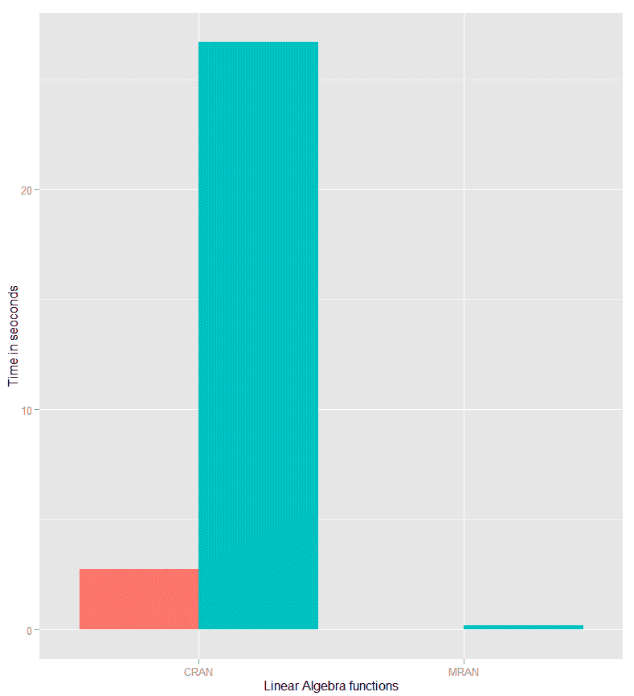
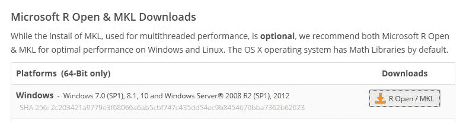
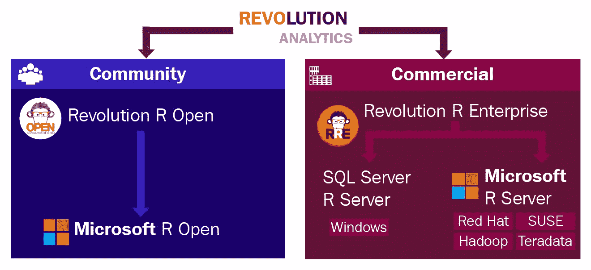
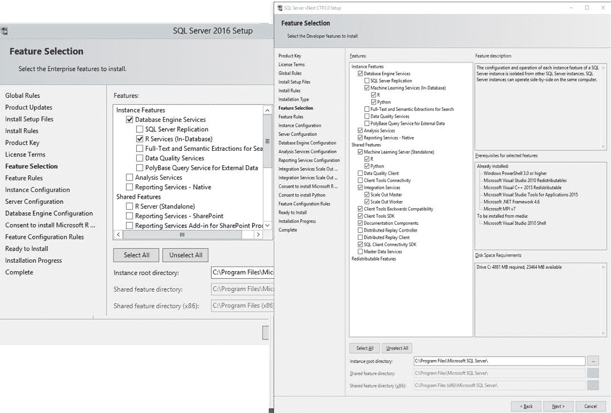
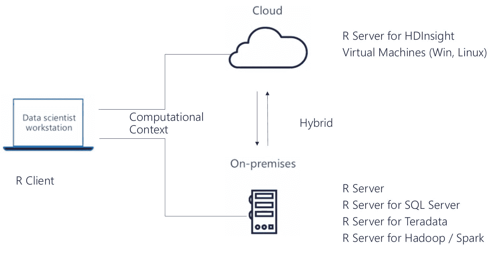
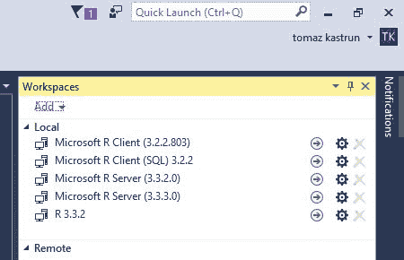
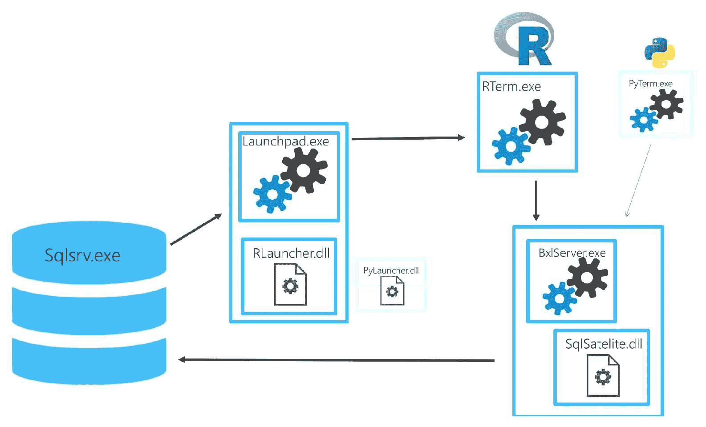
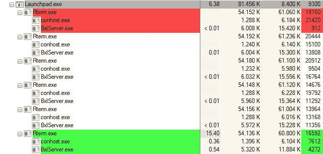
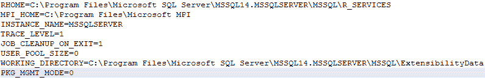

# 微软机器学习服务器和 SQL 服务器概述

在本章中，我们将探讨为什么微软决定将 R 语言添加到 SQL Server 2016，以及这次集成克服了哪些负担。本章将涵盖以下主题：

+   解决分析障碍和 R 限制

+   微软 R 服务器平台

+   微软 R 服务架构

+   探索计算环境

# 分析障碍

许多公司在尝试分析他们的数据时遇到障碍。这些障碍通常是知识匮乏（并非所有部门都有分析数据的知识）和数据分散（通常数据来自不同的来源）。

企业根据员工的职责或职能划分责任。这种工作划分有积极的效果，特别是当企业规模较大时。通常，中小型企业也会采用这样的角色，但由于员工数量较少，它们通常在更高层次上细分。

随着市场变化的快速、新技术的出现和更快适应的需求，许多专家已经注意到以下许多障碍：

+   数据稀缺和数据分散

+   复杂（许多时候过时）的架构

+   知识缺乏

+   低效率

+   市场变化适应缓慢（市场进入时间长）

许多企业至少面临这些障碍中的一个（如果不是更多），微软通过将 R 语言开放给 SQL Server 来解决这些障碍。拥抱开源语言和开源技术，它扩大了知识库，使企业能够使用社区知识和社区解决方案，同时也开放和民主化分析。不再需要忍受和等待具有学科学术知识的数据科学家和专家，现在这个知识库可以轻松共享，许多数据整理和数据工程任务可以转交给其他角色和人。这个过程也弥合了传统上 IT 和统计学家之间的差距，这在过去导致了低效率和缓慢的生产力。现在，通过在 SQL Server 中使用 R 混合不同的角色和任务，可以克服知识和技能的差距（这意味着数据整理员或数据管理员可以查阅 R 代码，这有助于他们获得数据洞察，而无需真正理解统计学的复杂性）。现在，对于理解或了解不同的平台没有惊喜，因为许多 IT 人员可以使用统计学家和数据科学家提供的 R 语言。此外，数据科学家可以开始学习在 IT 中找到的技能和语言。

两个或更多不同部门之间相互关联和共享的知识也将提高生产力。当生产力提高时，统计和预测模型可以更快地部署、更改或适应消费者和市场变化，并为数据工程师、数据整理者和分析师提供支持。这无疑是企业改善创新路径、最大化开源潜力以及拓宽使用不同方法和模型进行实验的沙盒范围的方式。

解决这些障碍的最后一步是解决数据稀缺和复杂基础设施的问题。规则是，企业规模越大，基础设施越复杂的可能性越高。在复杂基础设施的情况下，我们可以理解数据位于不同的层级或不同的粒度，在不同的平台、不同的供应商和不同的孤岛中，使得数据分析比实现更远一步。通过引入 R，这种复杂性可以通过更简单的数据连接器、更便捷的数据提取方式来克服。

随着 R 语言在分析领域的日益流行和重要，它可以为不同规模的企业做好准备，并且可以设计为超越供应商，无论您的解决方案是在本地还是在云端。由于可以直接从任何混合系统中访问和读取数据，并且只提取所需的数据，因此数据移动的需求也降低了。现在，企业中存在的所有障碍都可以更快地解决，官僚主义减少，集成更好，努力更少。

接受开源语言的另一个重要方面，许多大型企业仍在努力实现，就是开源解决方案的普遍提供。这一方面不应被忽视，必须予以考虑。微软通过以下步骤将 R 语言纳入其体系：

1.  在 R 联盟中担任一员，该联盟负责支持 R 基金会以及紧密合作开发、分发和维护 R 引擎及其相关基础设施项目的关键组织。其中一项项目是 RHub 项目（由*加博尔·卡尔迪*领导），该项目提供了一种用于开发、测试和验证 R 包的服务。

1.  在 CC 许可下创建 R 包的 MRAN 仓库，并使 CRAN 包与微软 R 引擎分发兼容。

1.  将 Intel **MKL** （**数学内核库**）计算函数用于提高 R 统计计算的效率，当你从 MRAN 仓库下载 R 引擎时，这些函数将直接可用。**基本线性代数子程序**（**BLAS**）和**线性代数包**（**LAPACK**）是一组用于线性代数的函数，这些函数经过并行计算优化。这些函数包括矩阵分解、Cholesky 矩阵分解、向量矩阵加法、标量乘法等等。

1.  将许多 R 函数从 Fortran 重新编写为 C++ 语言以提高性能。

当我们比较 CRAN 和 MRAN 上的 R 引擎分布时，我们可以快速支持 MKL 计算函数的理论。正如我们已经看到的，BLAS 和 LAPACK 是向量或矩阵的替代品，因此我们将比较（基准测试）两个 R 引擎分布之间的矩阵计算。

比较是在 CRAN R 3.3.0 和 MRAN R Open 3.3.0 上进行的，以下代码：

```py
# Matrix creation 
set.seed (2908) 
M <- 20000 
n <- 100 
Mat <- matrix (runif (M*n),M,n) 

# Matrix multiply 
system.time ( 
  Mat_MM <- Mat%*% t(Mat), gcFirst=TRUE 
)[1] 

# Matrix multiply with crossprod 
system.time ( 
  Mat_CP <- crossprod(Mat), gcFirst=TRUE 
)[1] 
```

以下是在以下时间（以秒为单位）的结果：

| **时间（秒）** | **CRAN 3.3.2** | **MRAN 3.3.2** |
| --- | --- | --- |
| MM | 26,69 | 2,75 |
| CP | 0,19 | 0,01 |

在下面的图中，你可以看到 CRAN 和 MRAN R 引擎之间的性能差异：



图 1

图表显示了一个简单的线性代数，它使用矩阵或向量，并且比测试（在我的本地客户端-Inter I7，4 CPU，20 GB RAM 上测试）快 10 倍。请注意，当你在你自己的机器上运行此测试时，你应该观察 RAM 和磁盘存储消耗；你将看到与 CRAN 操作相比，MRAN 操作在 RAM 消耗方面非常轻量。

当你下载 R Open 的 MRAN 分发版时，请注意，将会有关于 MKL 多线程性能函数的附加信息：



图 2：来源：[`mran.microsoft.com/download/`](https://mran.microsoft.com/download/)

许多额外的步骤被采取，以确保消费者、开发者、管理者和来自更大企业的管理者相信 R 语言将长期存在。微软承诺，除了这项规定之外，还有对一般治理的支持，如果公司决定，它还可以在企业层面获得 R 支持。

此外，为了支持使用开源 R 语言的想法，必须了解 R 的一般架构。R 引擎由大约 20 人的核心团队编写，他们可以访问 R 引擎的源代码（尽管只有六人在日常 R 开发中工作）。这个团队不仅维护代码，他们自己也是贡献者、错误修复者和开发者。因此，R 引擎是开源的，这意味着它是免费软件（在 GNU 许可下），但引擎的维护并不那么开放。另一方面，R 库（或包）主要是社区驱动的贡献，这意味着社区中的成员可以自由地开发和创建各种函数来支持统计计算、可视化、处理数据集以及许多其他方面。

在 SQL Server 2016 发布后的几个月里（从 2016 年夏季开始），微软也改变了 SQL Server 不同版本中可用的功能。如果您访问 [`www.microsoft.com/en-us/sql-server/sql-server-2016-editions`](https://www.microsoft.com/en-us/sql-server/sql-server-2016-editions) 上的 SQL Server 2016 版本概述，您会发现，在高级分析方面，SQL Server 2016 所有版本都提供了基本的 R 集成，而高级 R 集成（在 `RevoScaleR` 包中实现 ScaleR 函数的完全并行化）仅适用于企业版和开发者版。

# Microsoft Machine learning R Server 平台

我们已经简要地提到了 R Open 和企业环境中的 R 的概念。Microsoft Machine Learning R Server 是一个企业级服务器，可以处理高维和大数据集，这些数据集可以并行处理，并且工作负载可以跨节点分配。R Server 可以在 Windows、Linux 服务器或 HDFS 系统上处理这些并行和分布式工作负载，例如 Hadoop、Spark、Teradata 和 HD Insight。R Server 可以使用专为并行和分布式工作负载设计的 Microsoft R 包来实现并行和分布式工作负载。`RevoScaleR` 包将提供进行高度并行和分布式计算、统计分析、预测分析和机器学习以及深度学习的能力。

通过收购公司 Revolution Analytics，微软重新命名了他们的两个主要产品，Revolution R Open 和 Revolution R Enterprise，为 Microsoft R Open、Microsoft R Server 和 Microsoft SQL Server R Services。除了这两种版本外，他们还增加了 Microsoft R Client 作为另一个独立产品：



图 3

根据不同的版本和企业生态系统，公司可以选择他们需要的使用类型（社区版、非商业版和商业版），并且根据他们的业务需求和希望在哪里设置他们的分析服务器，他们可以选择最适合他们的选项。在商业版本中，提供了一个独立的机器学习 R Server（或简称 R 服务器），以及数据库内机器学习服务（或 SQL Server R 服务）。

在 SQL Server 2017 版本中，Microsoft R Server 已更名为 Machine Learning Server（无论是数据库内还是作为独立版本；从数据库 R 服务到机器学习 R 服务的重新命名是在 SQL Server VNext 的 CTP 版本中引入的，后来改为 SQL Server 2017）。在 *图 4* 中，可以看到安装 SQL Server 2016（左侧截图）和 SQL Server 2017 中可用的命名（右侧截图）：



图 4

命名变更的原因是微软在 SQL Server 2017 中引入了 Python。Python 是一种强大的统计、分析和机器学习语言，因此，名称得到了统一。机器学习服务器的 R 部分（内部）不会改变，但它将获得有用的附加包和改进的功能，如下所示：

```py
serialize/unserialize -> rxSerializeModel/rxUnserializeModel 
InstallPackages -> rxInstallPackages 
Histogram -> rxHistogram 
```

所有这些功能都已被重写，要么是为了在并行和分布式工作负载中处理大型数据集，要么是为了支持 R 和 SQL Server 的工作。

在 Microsoft R 平台上，以下产品可用：

+   Microsoft Machine Learning R Server

+   Microsoft R Client

+   Microsoft R Open

+   R Tools for Visual Studio

产品描述是根据 Microsoft Docs 描述以及 2016 年 9 月发表在 SQLServerCentral 上的文章（[`www.sqlservercentral.com/articles/Microsoft/145393/`](http://www.sqlservercentral.com/articles/Microsoft/145393/））进行总结的。

# Microsoft R Open (MRO)

Microsoft R Open 是一个开源的 R 发行版，100% 免费，通常可用。微软通过添加一个针对基于向量和矩阵的数学和统计计算进行优化的高性能多线程特性 **Math Kernel Library**（**MKL**）来增强这个 R Open 发行版；否则，这个发行版与传统的 R 对象和 R 代码完全兼容。

R Open 也兼容 CRAN 仓库、GitHub 软件包或任何其他仓库，这使得 MRO 得到广泛应用。另一方面，R Open 有一些限制。它是内存受限的，这意味着它只能处理能够装入可用内存（客户端）的数据集。专有的 ScaleR 函数（在 `RevoScaleR` 包中可用）在 R Open 下不可用，并且它将在所有 SQL Server 2017 版本上运行，除了 Express 或带有工具的 Express，而 Microsoft R Client/Server 只会在 SQL Server 2017 的企业版或开发者版上运行。

Microsoft R 客户端与 Microsoft R Open 相同的 R 发行版，它建立在 100%开源 R 版本之上。Microsoft R 客户端是 Microsoft R 版本家族中的第一个版本，引入了`RevoScaleR`包（ScaleR 函数）。安装此版本的任何数据整理员、数据科学家、数据工程师（或任何其他角色）都将能够使用并行化和多线程计算，以及使用 ScaleR 的专有函数。

R 客户端版本的局限性包括：内存将限制在具有与 Microsoft R Open 相同限制的本地客户端机器上——数据必须适合本地内存才能进行计算。ScaleR 函数将与该版本一起安装，但处理将仅限于同时仅两个线程（无论客户端机器的技术规格如何），以及本地磁盘和 CPU 速度。否则，任何遗留的 R 包或 R 代码都将兼容。

Microsoft R 客户端还带来了改变计算环境的可能性，这意味着计算负载可以推送到 Microsoft R 服务器或 SQL Server R 服务以及任何 HDFS 系统，以实现最佳性能。通过构建由多个 R 客户端和一个（或几个）R 服务器组成的生态系统，将提供一个高性能的分析环境，而无需在本地安装 Microsoft R 服务器。它与以下 R 服务器版本兼容：Microsoft R 服务器（Linux 版）、Microsoft R 服务器（Teradata DB 版）、Microsoft R 服务器（Hadoop 版）、Microsoft R HDInsight，以及 Microsoft R 服务器独立版和 SQL Server R 服务的两个版本。

# Microsoft 机器学习 R 服务器

Microsoft R 服务器是 R 引擎的独立服务器版本，建立在 R 开源平台之上，但经过修改以适应企业环境和对分析目的的大量使用，从统计分析、数据挖掘到机器学习以及任何大数据任务。

它与 CRAN/MRAN/GitHub 存储库以及任何 R 遗留代码完全兼容。`RevoScaleR`包中可用的 ScaleR 函数和算法能够进行并行和多线程数据处理，不受 R Open 或 R 客户端的限制。计算针对大型数据集进行准备——在大多数情况下，数据集容易超过服务器内存大小。这可以通过一种特殊的外部数据框格式来实现，该格式支持多线程计算，并允许基于 R 的应用程序执行并行计算和可部署解决方案，这得益于 ConnectR 和 DeployR 的帮助。Microsoft R 服务器还提供了磁盘可伸缩性。

# Microsoft SQL Server 机器学习 R 服务

R Open 分布的数据库版本作为 Microsoft SQL Server 的机器学习 R 服务提供，涵盖了`RevoScaleR`包中可用的所有 ScaleR 算法。

在这种情况下，内存和磁盘将由您的 SQL Server 安装管理，R 执行使用的是管理 SQL Server 和 R 引擎之间通信的 `SQL Server Trusted Launchpad` 服务。

此外，用户可以使用 R 客户端连接到 R 服务，但 `DeployR` 和 `ConnectR` 函数将受到限制。

Microsoft SQL Server R Services 是 SQL Server 2016 及以后版本的数据库内版本，本书将主要关注这一点。这些数据库内服务可以在安装新的 SQL Server 实例时安装。*图 4* 显示，R 数据库内服务（或作为 SQL Server 2017 的一部分的机器学习服务（数据库内））作为实例功能安装，当勾选此功能时，R 服务（或 Python 服务）将被安装。还必须理解，Microsoft R Server 是一个独立组件，在安装 R 服务时不会安装。必须在共享服务下明确勾选 R Server（机器学习服务器）。然而，R 服务（数据库内）不会安装 R Server。

R 服务（数据库内）是 R 语言和 R 编程的独立来源，具有 SQL Server 的全栈和功能，包括治理、安全、可靠性和性能的工具和技术。在 SSMS 中，可以通过调用 R 函数并使用 R 脚本进行事务 SQL 来调用 R 分析或预测。这可以通过系统外部过程 `sp_execute_external_script` 实现。

ScaleR 库是 R 服务（数据库内）安装的一部分，允许数据科学家、开发人员或数据库管理员在 SQL Server 计算机上或 Microsoft R Server 上安全地执行 R 脚本。通过定义计算上下文，用户可以选择将计算和负载推送到哪里，要么留在数据库内 R 运行时，要么使用 ScaleR 库来增强连接性和并行性，并将负载推送到 Microsoft R Server。

为了闭环，通过安装作为独立和单独安装程序提供的客户端 R，您可以开发您的 R 代码并将解决方案部署到运行在 Windows 或 Linux 上的 R 服务或 Microsoft R Server。

*图 5* 描述了数据科学家或数据分析师如何将客户端/工作站上的负载推送到基于云的解决方案、虚拟机、R 服务器或 R 服务（数据库内）。从客户端的角度来看，也可以轻松选择混合解决方案，尤其是在需要在不同系统之间进行数据集成和数据合并时。这个概念无疑会给企业带来即时的性能提升和提升，以及几乎瞬间就能适应的更快、更好的解决方案：



*图 5*

# R Tools for Visual Studio (RTVS)

RTVS 是 Microsoft 免费版（在 GNU 许可下分发）的 IDE，用于在 Visual Studio 中编写、验证和运行 R 代码。RTVS 支持 Visual Studio 2015 和 Visual Studio 2017 的社区版、专业版和企业版。

R 工具([`www.visualstudio.com/vs/rtvs/`](https://www.visualstudio.com/vs/rtvs/))将帮助开发人员、分析师和数据科学家操作和执行统计计算、可视化以及数据管理。R 工具将图形界面引入 R 引擎，提供丰富的编辑工作区、交互式窗口、变量和可视化探索器、帮助、IntelliSense 等。它还绑定本地和远程工作区（本地或云中），以便数据分析师可以非常容易地在计算环境之间切换。

RTVS 中工作空间的视图被简化并图形化，以便用户可以在不同的 R 环境之间切换：



图 6

它类似于著名的强大 RStudio ([www.rstudio.com](http://www.rstudio.com))，但仍提供了社区和时间带入 RStudio、Emacs、Vim、Eclipse 或其他开发中的所有必需品。微软还通过问卷调查向社区询问 RTVS 用户仍然缺少什么。他们可以在[`www.surveymonkey.com/r/RTVS1`](https://www.surveymonkey.com/r/RTVS1)贡献并添加他们的愿望。

RTVS 于 2016 年初宣布并发布（作为测试版），但直到 2017 年才获得版本 1。

# 微软机器学习 R 服务架构

R 服务器架构涵盖了 R IDE 或 SQL Server 与 R 引擎之间通信所需的所有组件。

为了正确执行 Transact SQL、R 脚本并将所有结果返回到 T-SQL，涉及了几个组件：



图 7

Launchpad 是 SQL Server 2016 中的一个新服务，支持使用 SQL Server 的外部存储过程执行外部脚本。然而，在 SQL Server 2017 中，Python 启动器也被引入，使得 Launchpad 对第二种非 SQL Server 语言也普遍可用。Launchpad 背后的想法是，由于基础设施已经准备就绪，SQL Server 未来应该支持其他语言，例如 JavaScript 和 C++，这样不仅将此服务开放给预测分析和机器学习，还开放给其他独立语言。

Launchpad 服务（服务名称：`MSSQLLaunchpad`）依赖于 SQL Server 服务（服务名称：`MSSQLSERVER`），这意味着，当重启或停止 SQL Server 服务时，Launchpad 服务也将被重启或停止。

此外，R 语言还带来了两项额外的服务：R 终端服务（简称 RTerm）和 BxlServer，它们使用 SQL Satellite，这是 SQL 服务器的一个附加扩展，用于在外部运行时（与 Launchpad 服务相关联）和 SQL Server 之间通信；两者都可以作为进程找到。

为了更容易理解这些相关性，让我们从一个简单的 PowerShell 脚本开始，看看`Launchpad`和`BxlServer`的所有组件：

```py
Get-Process -Name Launchpad | Select-Object * 
Get-Process -Name BxlServer | Select-Object *  
```

此外，通过简单的 T-SQL 代码，我们可以包含 R 脚本：

```py
EXEC sp_execute_external_script 
    @language = N'R' 
   ,@script = N'library(RevoScaleR) 
OutputDataSet <- data.frame(rxInstalledPackages())' 
```

此外，观察进程资源管理器和 Launchpad 进程：



图 8

显然，通信如何从 SQL Server 到 R，然后再返回。

此外，命令行还显示 Launchpad 进程使用`RLauncher.dll`库，并使用`sqlsatellite.dll`启动`sqlsatelitelaunch`：

```py
CommandLine: "C:\Program Files\Microsoft SQL Server\MSSQL14.MSSQLSERVER\MSSQL\bin\launchpad.exe" -launcher RLauncher.dll -pipename sqlsatellitelaunch -timeout 600000 -logPath "C:\Program Files\Microsoft  SQL Server\MSSQL14.MSSQLSERVER\MSSQL\LOG\ExtensibilityLog" -workingDir "C:\Program Files\Microsoft SQL Server\MSSQL14.MSSQLSERVER\MSSQL\ExtensibilityData" -satelliteDllPath
```

```py
"C:\Program Files\Microsoft SQL Server\MSSQL14.MSSQLSERVER\MSSQL\Binn\sqlsatellite.dll" 
```

许多更多的配置会告诉你在这个架构中通信是如何设置和进行的。打开`RLauncher.config`文件将显示以下配置：



图 9

此外，通过更改`TRACE_LEVEL`参数，它还可以揭示潜在的日志，显示系统之间的相同路径和通信，正如`RevoScaleR`日志也显示了每个工作会话的信息：

```py
library(RevoScaleR); sessionDirectory <- 'C:\\PROGRA~1\\MICROS~3\\MSSQL1~1.MSS\\MSSQL\\EXTENS~1\\MSSQLSERVER01\\0FEB1004-867F-4AB6-B9CC-E1C824596645';sessionId <- '0FEB1004-867F-4AB6-B9CC-E1C824596645';scriptFile <- file.path(sessionDirectory, paste(sessionId, '.R', sep=''));rxIgnoreCallResult <- .Call('RxSqlSessionStart', list(sessionDirectory=sessionDirectory, sessionId=sessionId, waitTime=-1));source(scriptFile) 
```

# R 的限制

社区博客和论坛，以及包作者和贡献者，正在讨论 R 语言的长长限制列表。许多是模糊的，有些是基于特定用户群体的经验，但以下限制可以达成共识：

+   性能问题

+   内存限制

+   安全方面

+   语言语法

# 性能问题

超过 40%的 R 代码主要是用 C 语言编写的，还有略超过 20%是用 Fortran 编写的（其余部分是 C++、Java 和 R），这使得一些常见的计算任务变得非常昂贵。微软（以及之前的 Revolution analytics）确实重新编写了一些最常用的函数，从旧的 Fortran 到 C/C++，以解决性能问题。

许多包作者做了类似的事情。例如，`data.table`R 包的主要作者 Matt Dowle 对语言性能进行了几次提升，以加快最常见的数据处理步骤。

当使用不同的包，如`dplyr`、`plyr`、`data.table`和`sqldf`，在相同的数据集上比较类似操作时，可以看到相同结果的时间性能差异。

以下 R 示例大致显示了一个 80 MiB 大的对象，以及一个简单的分组函数，说明了计算时间差异。`dpylr`和`data.table`包突出显示，与`plyr`和`sqldf`相比，性能提升了 25 倍以上。特别是`data.table`，它非常高效，这主要归功于 Matt 对`data.table`包代码进行极端优化的动力，以获得更好的性能：

```py
set.seed(6546) 
nobs <- 1e+07 
df <- data.frame("group" = as.factor(sample(1:1e+05, nobs, replace = TRUE)), "variable" = rpois(nobs, 100)) 

# Calculate mean of variable within each group using plyr - ddply  
library(plyr) 
system.time(grpmean <- ddply( 
  df,  
  .(group),  
  summarize,  
  grpmean = mean(variable))) 

# Calcualte mean of variable within each group using dplyr 
detach("package:plyr", unload=TRUE) 
library(dplyr) 

system.time( 
  grpmean2 <- df %>%  
              group_by(group) %>% 
              summarise(group_mean = mean(variable))) 

# Calcualte mean of variable within each group using data.table 
library(data.table) 
system.time( 
  grpmean3 <- data.table(df)[ 
    #i 
    ,mean(variable)    
    ,by=(group)] ) 

# Calcualte mean of variable within each group using sqldf 
library(sqldf) 
system.time(grpmean4 <- sqldf("SELECT avg(variable), [group] from df GROUP BY [group]")) 
```

另一方面，微软的`RevoScaleR`包也得到了优化，在性能和大数据集方面可以超越所有这些包。这只是为了证明微软是如何使 R 准备好处理大数据集以解决性能问题的。

# 内存限制

R 是内存受限的。这字面意思是说数据集必须适合客户端的 RAM。从先前的例子中，如果有人要运行一个简单的代数运算，一些矩阵计算，或任何基于距离的算法（计算量较大），R 系统将仅限于适合 RAM 的内容。没有溢出到磁盘或任何临时对象，除非用户加载了一个允许这样做的包。

再次，微软通过`RevoScaleR`包提供了解决方案，覆盖了这一限制。通过引入**外部数据帧**（**XDF**）格式，该包能够以这种格式存储任何大小的数据集（没有记录的上限），这种格式是持久化在磁盘上的，并且可以从二进制、blob、CSV 或任何其他格式转换为 XDF 格式。这种限制在微软机器学习 R 服务器或机器学习 R 服务中成为可能。

# 安全方面

R 语言的演变作为 GNU 发行版，在过去几十年中一直作为一个基于客户端的解决方案在发展，甚至在互联网出现之前，所有数据集都安全地存储在用户的机器上。随着数据在互联网、云服务和连接系统的传播，以及越来越多的混合解决方案系统，读取、写入、分析和存储数据的安全性方面从未成为问题。然而，在过去十年中，越来越多的系统正在出现，企业需求发生了变化，人们的角色也发生了变化——但是核心的 R 引擎和 IDE 还没有在这个方向上迈出一步。从这个角度来看，R 似乎想要保持为一个由大学开发和驱动的软件。随着 R 集成到 SQL Server 中，微软解决了这些问题，不仅创建了数据库角色，还增加了使 R 和所有计算安全连接的服务，减少了安全漏洞的可能性。

# 语言语法

R 语言非常灵活，允许用户更改 S4 方法和 S3 对象、泛型对象以及所有用户定义的对象和变量。由于 R 语言仍然不是一个面向对象的语言，这是一个有争议的问题，是否真的如此（因为目前 R 只理解三种面向对象系统），因为 S3 和 S4 对象都是面向对象的架构。

R 语法可能容易学习，但也容易产生一些疑问。以下是在 R 社区中的一些语法争议：

+   几个不同的 R 包为用户提供相同的功能（数据处理、数据分析、数据预测）。如前所述，当比较这些包在数据处理目的上的性能和用法时，用户将看到哪个包表现更好或哪个包更适合他们的需求。具有令人困惑结构的独特语法也是包的一部分，并且可以用许多不同的方式使用。

+   做同样的事情有多种方式（声明变量、构建类、处理数据以及使用相同算法进行预测）。

+   缺少约定、命名空间和包之间的依赖关系。

+   有些挑战性的错误信息，缺乏文档/帮助。

+   区分大小写。

列出所有问题很麻烦，但可以快速了解语言是如何演变的，而且越来越受到社区的欢迎；R 作为一种语言，被认为是迄今为止最受欢迎的。

# 摘要

本章概述了由微软提供的新 R 服务生态系统和 R 引擎产品系列。

当考虑 R 和 SQL Server 时，必须记住企业中的需求以及如何准备基础设施以充分利用强大的 `RevoScaleR` 包的性能。

在下一章中，我们将看到如何使用这些 ScaleR 计算函数来提供更好的性能结果，以及如何设置您的生态系统。
