# 管理 SQL Server 2017 和 R 的机器学习服务

本章将讨论管理 R 服务以及从 SQL Server 数据库启动 R 服务的必要步骤。具体来说，本章将涵盖以下主题：

+   安装带有 R 服务的 SQL Server

+   配置环境和安装 **R Tools for Visual Studio**（**RTVS**）

+   资源管理器

+   安全性

+   会话和日志

+   安装新的 R 包

+   使用 PowerShell 管理 SQL Server R 服务

+   了解 `sp_execute_external_script` 外部过程

与 SQL Server 2016 在 R 首次引入时的操作相比，SQL Server 2017 的安装、配置和设置工作环境并没有太大的不同。如果版本之间存在差异，将会指出。

使用 SQL Server 2016 和 2017 安装带有机器学习 R 服务的 SQL Server 具有最小的硬件要求，这些要求取决于您将要安装的 SQL Server 版本。SQL Server 有几个版本。更多信息可在 Microsoft 网页上找到：

[`www.microsoft.com/en-us/sql-server/sql-server-2017-editions`](https://www.microsoft.com/en-us/sql-server/sql-server-2017-editions)

# 最小要求

基本 R 集成几乎在所有 SQL Server 版本中都是可用的，除了 Express 版本（除非它是带有高级服务的 Express 版本）。这意味着标准的 SQL Server 将支持 R 服务，使用纯 R 和本地 R 代码，但不支持高级 R 集成或将计算推送到其他计算环境。相同的逻辑也适用于 SQL Server 2017（截至编写时），版本和功能已在以下 URL 公布：

[`docs.microsoft.com/en-us/sql/sql-server/editions-and-components-of-sql-server-2017`](https://docs.microsoft.com/en-us/sql/sql-server/editions-and-components-of-sql-server-2017)

在操作系统方面，许多 Microsoft 操作系统版本（如 Windows Server 2012 及更高版本、Windows 8 及更高版本）都受到支持，并且从 SQL Server 2016 及更高版本开始，Linux 也得到了支持。要运行 R 服务，至少需要 1 GB，但建议使用 4 GB，并且需要 2.0 GHz 或更快的处理器（x64 处理器类型）来完成任务。此外，主要安装需要 6 GB 的硬盘空间，但根据任何额外的功能或 SQL Server 服务，可能还需要更多的磁盘空间。

# 选择版本

SQL Server 已不再仅仅是数据库，它已经发展成为一个数据库平台——一个生态系统——它由许多额外的服务（如 SSRS、SSAS 和 SSIS）组成，这些服务支持并扩展了现代数据库的使用能力。当在数据库中安装机器学习 R 服务时，应该考虑生态系统环境以及将使用哪些附加服务。如果业务需求需要高级 R（或 Python）集成和分析，企业版是正确的选择。如果只需要基本的 R 集成，标准版将满足需求。如果你需要分析服务或报告服务，也可以考虑其他分析工具，以及为这些服务所需的发展工具（例如，在 OLAP 立方体上运行 MDX 和针对相同数据集市运行 R 代码）。

当你确定版本后，下载 SQL Server 2017（或 2016）的 ISO 或 CAB 安装文件并开始安装。我将安装 SQL Server 2017 的开发者版本（从安装角度来看，几乎与 2016 版本相同）：

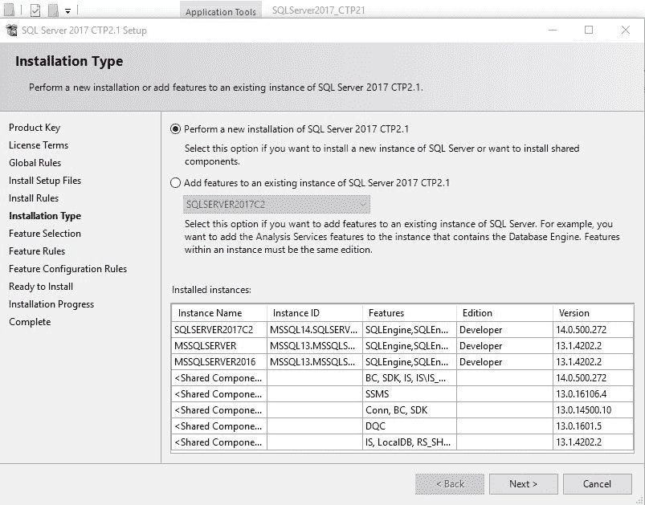

图 1：SQL Server 的安装类型

安装新的 SQL Server 将确保机器学习服务（带有 R 或数据库内服务）被正确安装。

在下一步中，必须安装安装功能。为了安装 R 服务，必须在 SQL Server 服务（数据库内）的 R 上打勾，而对于 SQL Server 2017，必须在机器学习服务（数据库内）部分中的 R 上打勾：

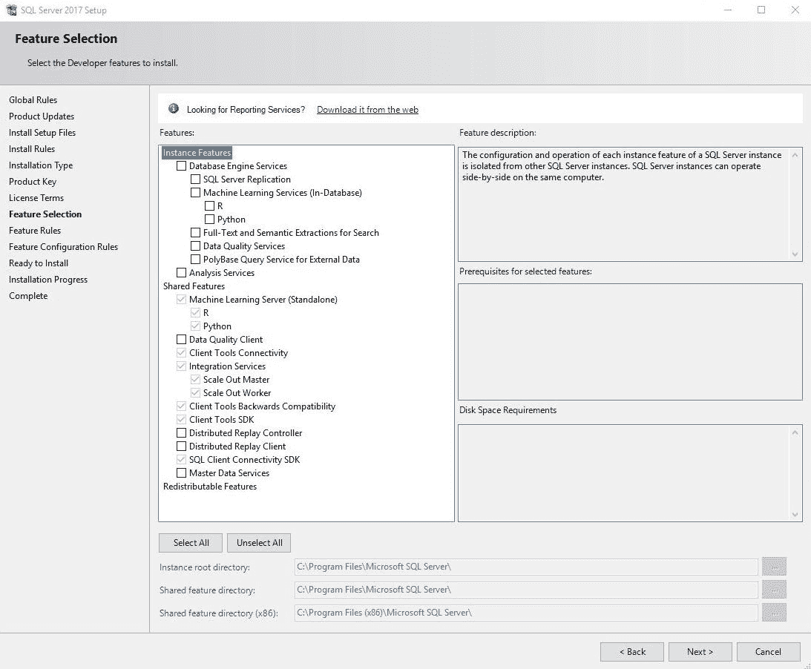

图 2：SQL Server 的特征选择

在以下服务器配置步骤中，你必须检查将有权访问服务的用户和账户。对于数据库内的 R 服务，将安装并自动启动 SQL Server 启动板服务。此服务可以在安装后通过 Windows 应用程序-服务启动或停止：

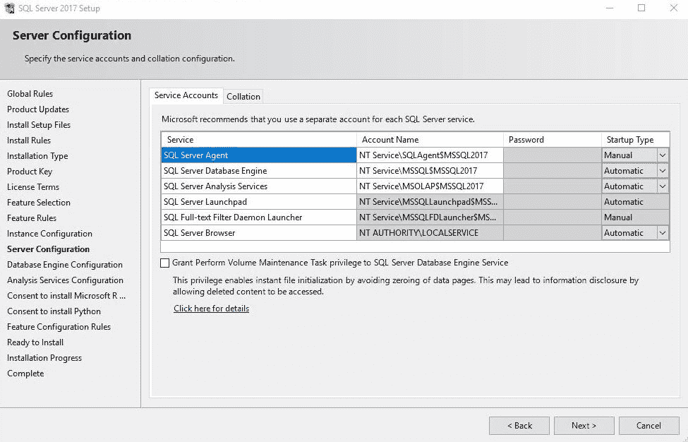

图 3：SQL Server 的服务器配置

在配置数据库引擎后，你将被提示接受安装 Microsoft R Open 的协议，确保你了解 R 在 GNU 许可下的事实。通过请求此同意，微软只想确保管理员同意，并且所有针对 R Open 版本的新更新和补丁都将符合 SQL Server 更新偏好：

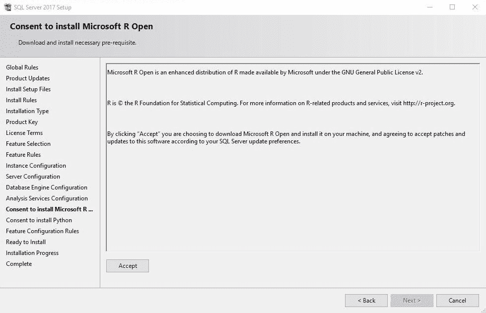

图 4：提示安装 Microsoft R Open 的内容

除了同意 R 的协议外，请注意，Microsoft R 服务器的生命周期为两年。如果 MRS 8.0 在 2016 年 1 月发布，官方支持在 2018 年 1 月结束；更准确地说，安全和关键更新将在一年内提供（直到 2017 年 1 月），之后，只有安全更新将继续直到 2018 年 1 月。在这一年中，还将收到升级。请注意，这对于独立产品——Microsoft 机器学习服务器相关，但值得提及支持时间表将持续多长时间。

如果您也在安装 Python，将请求相同的同意：

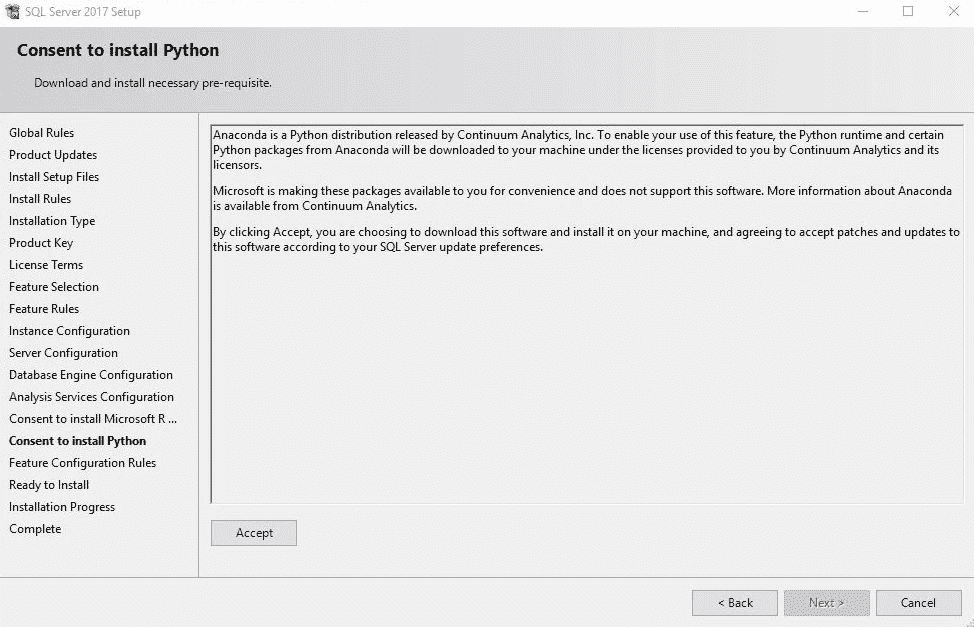

图 5：提示安装 Python 的内容

在您选择了所有功能、配置和同意后，您将看到要安装的服务和功能的概述：

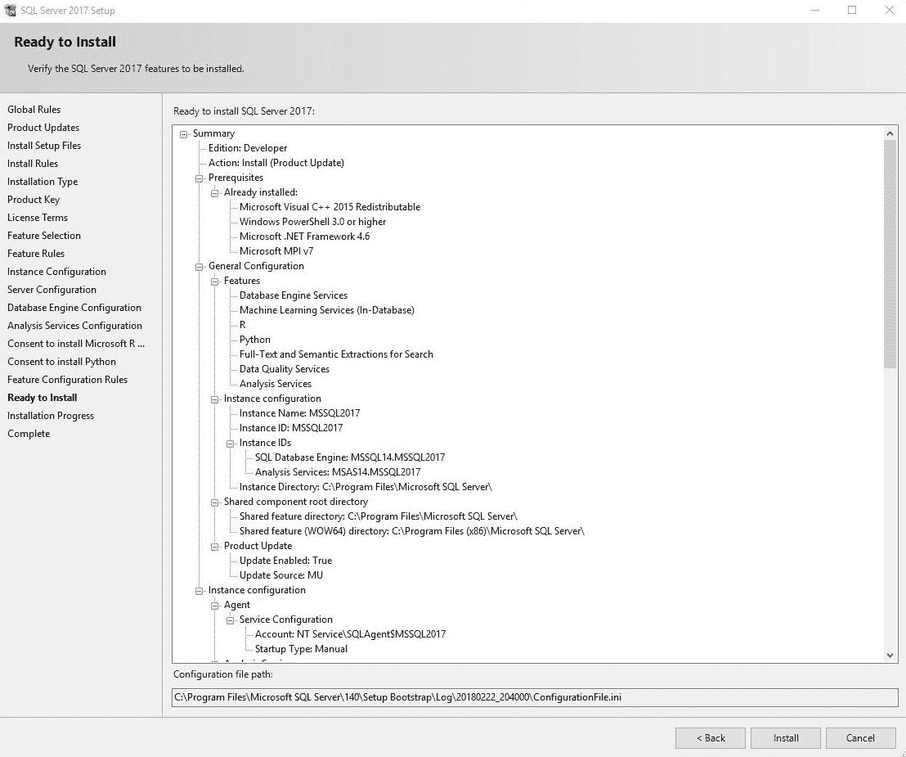

图 6：准备安装的选定功能

安装完成后，您将拥有机器学习服务的 R 引擎以及可选的 Microsoft 机器学习服务器 R 版本。请注意，R 服务的 R 引擎（数据库内）将具有不同的 R 安装，因为它是一个独立的 Microsoft R 服务器，并且所有安装的包也将不同，位于不同的路径、权限和安全设置下。

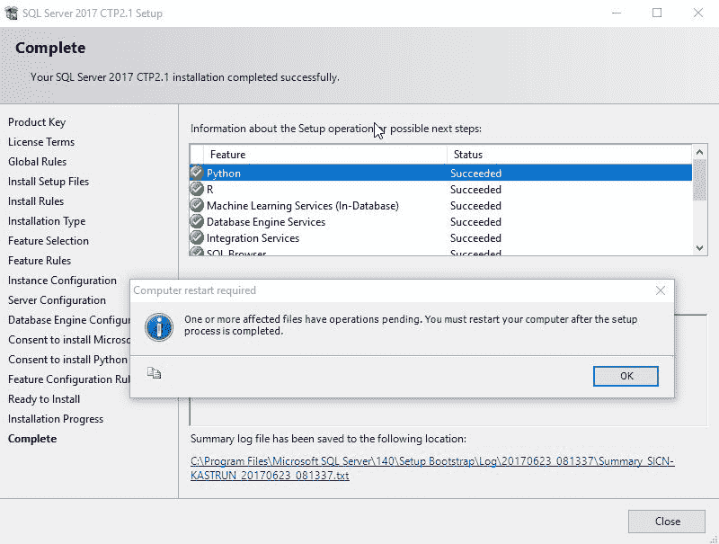

图 7：完成安装过程

# 配置数据库

在安装后过程中，数据库配置将是下一个任务。考虑数据库排序规则，因为 R 语言是区分大小写的，你将提供给 SQL Server 引擎并推送到 Launchpad 的数据类型很重要。某些语言区分小写和大写字母（例如，土耳其语；特别是字母 L），当将 SQL Server 和 R 数据类型配对时，这可能会带来额外的挑战。此外，根据您的生态系统，身份验证在设置环境时也应发挥重要作用。

随着 SQL Server 2016 提供的实时数据评分和 SQL Server 2017 的改进，值得一试。此外，对于任何扩展的机器学习服务使用，文件数据库可能是一个非常有用且强大的方式来存储用于后续分析的图和结果，或者可以公开给 Power BI、SSRS 或外部应用程序的结果。如果您在业务中包含用于处理非结构化数据的 filestream，这也是数据库配置需要额外注意的另一个服务。

# 配置环境和安装 Visual Studio 的 R 工具（RTVS）

安装完成后，有一些安装后过程需要执行。

必须启用外部脚本服务器，以便存储过程可以调用外部脚本。为此，请在已安装 R 服务（数据库内）的 SQL Server 实例上运行以下命令：

```py
EXEC sp_configure 'show advanced options',1;
GO
RECONFIGURE;
GO
EXEC sp_configure 'external scripts enabled';
GO  
```

如果你第一次运行此操作，它默认是禁用的，因此必须启用它；否则，运行`sp_execute_external_script`过程将不可行：

```py
EXEC sp_configure 'external scripts enabled', 1;
GO
RECONFIGURE WITH OVERRIDE;
GO  
```

你可以始终检查外部脚本启用的`run_value`是否设置为 1，如下所示：

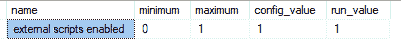

图 8：设置 sp_configure

如果服务器配置没有生效，你需要重启 SQL Server 服务。在服务中，找到你的`MSSQLSERVER`服务名称并重启它（停止并启动）：

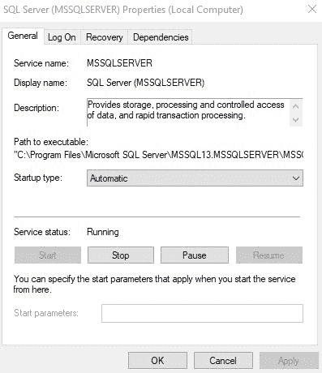

图 9：检查 MSSQLSERVER 服务

重启`MSSQLSERVER`服务将自动重启所有依赖的服务，包括`MSSQLLaunchpad`服务。在服务器重启后，外部脚本将被启用。

在安装后过程完成之后，可以设置安全设置。这是可选的，因为默认的数据库读取者已经设置好了，但是，根据你公司的环境，建议你调查并正确设置它。

此外，你还需要安装**Visual Studio 的 R 工具包**（**RTVS**）。为此，需要 Visual Studio 2015 或更高版本，一旦安装了 VS2015+，你还需要从 Visual Studio 网站下载 RTVS（[`www.visualstudio.com/vs/rtvs/`](https://www.visualstudio.com/vs/rtvs/))。从那时起，安装过程是直接的，不需要任何进一步的说明。

# 安全性

在配置数据库和任何其他在你的生态系统中使用的高级设置之后，你将想要考虑安全，即谁将有权运行`sp_execute_external_script`。

你可以直接在外部过程上创建安全设置。在这种情况下，你需要向用户添加执行外部脚本的数据库权限。

一个简单的 SQL 登录看起来像这样：

```py
USE [master]
GO
CREATE LOGIN [RR1] WITH PASSWORD=N'Read!2$17', DEFAULT_DATABASE=[SQLR], CHECK_EXPIRATION=ON, CHECK_POLICY=ON
GO
ALTER SERVER ROLE [sysadmin] ADD MEMBER [RR1]
GO
CREATE DATABASE SQLR;
GO

USE [SQLR]
GO
CREATE USER [RR1] FOR LOGIN [RR1]
GO
USE [SQLR]
GO
ALTER USER [RR1] WITH DEFAULT_SCHEMA=[dbo]
GO
```

现在，让我们开始外部过程：

```py

EXECUTE AS USER = 'RR1';
GO

EXEC sp_execute_external_script
 @language = N'R'
 ,@script = N'OutputDataSet<- InputDataSet'
      ,@input_data_1 = N'SELECT 1 AS Numb UNION ALL SELECT 2;'
WITH RESULT SETS
((
 Res INT
))

REVERT;
GO
```

错误信息将是，用户`RR1`没有权限：

```py
Msg 297, Level 16, State 101, Procedure sp_execute_external_script, Line 1 [Batch Start Line 34]
The user does not have permission to perform this action.
```

你还必须授予数据库一个 datareader 角色，以便执行`sp_execute_external_script`命令：

```py
USE [SQLR]
GO
ALTER ROLE [db_datareader] ADD MEMBER [RR1]
GO 
```

你还应该检查是否启用了执行外部脚本：

```py
GRANT EXECUTE ANY EXTERNAL SCRIPT TO [RR1];
GO  
```

在设置数据库角色和授予执行权限后，重新运行`sp_execute_external_script`过程，外部脚本执行的结果应该如下所示：

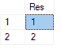

图 10：外部过程的输出结果

如何管理用户身份验证（Windows 或 SQL）和主要安全原则；这应该由本地 DBA、SysAdmin 和架构师协调，以帮助你委派谁将有权访问系统。

一个经验法则是为处理不同层次的数据操作和存储过程级别的访问权限准备存储过程。使用以下命令清理数据：

```py
DROP USER RR1; 
GO 
USE [master]; 
GO 
DROP LOGIN RR1; 
GO 
--DROP TABLE IF EXISTS SQLR; 
GO
```

# 资源管理器

资源管理器（Resource Governor）是 R 服务（in-database）中的一个非常受欢迎的功能，因为它允许使用随附的代码数据库 `RevoTestDB` 中可用的简单数据集来管理服务器的工作负载，它需要首先进行恢复**：** 

```py
USE [master]
RESTORE DATABASE [RevoTestDB] FROM  DISK = N'C:\SQLServer2017MLServicesR\CH03\RevoTestDB.bak';
GO  
```

恢复后，我们将看到对数据库的负载以及如何管理资源：

```py
USE RevoTestDB;
GO

-- TEST query
EXECUTE  sp_execute_external_script
                 @language = N'R'
                 ,@script = N'
            library(RevoScaleR)
f <- formula(as.numeric(ArrDelay) ~ as.numeric(DayOfWeek) + CRSDepTime)
s <- system.time(mod <- rxLinMod(formula = f, data = AirLine))
            OutputDataSet <-  data.frame(system_time = s[3]);'
                ,@input_data_1 = N'SELECT * FROM AirlineDemoSmall'
                ,@input_data_1_name = N'AirLine'
WITH RESULT SETS ((Elapsed_time FLOAT));
```

使用我在电脑上的这个测试查询，整个运行时间为 21 秒，并且从 R 引擎返回的经过时间（elapsed time）为 1.43 秒。

设置资源管理器以应对峰值和波动。当需要或运行大量数据时，执行操作需要更快，我们需要配置外部资源池和资源池以授予资源：

```py
-- Default value
ALTER EXTERNAL RESOURCE POOL [default] 
WITH (AFFINITY CPU = AUTO)
GO

CREATE EXTERNAL RESOURCE POOL RService_Resource_Pool
WITH (  
      MAX_CPU_PERCENT = 10  
      ,MAX_MEMORY_PERCENT = 5
);  

ALTER RESOURCE POOL [default] WITH (max_memory_percent = 60, max_cpu_percent=90);  
ALTER EXTERNAL RESOURCE POOL [default] WITH (max_memory_percent = 40, max_cpu_percent=10);  
ALTER RESOURCE GOVERNOR reconfigure;

ALTER RESOURCE GOVERNOR RECONFIGURE;  
GO 
```

在最后一步，必须创建和重新配置分类函数：

```py
CREATE FUNCTION RG_Class_function()
RETURNS sysname
WITH schemabinding
AS  
BEGIN  
    IF program_name() in ('Microsoft R Host', 'RStudio') RETURN 'R_workgroup';  
    RETURN 'default'
    END;  
GO  

ALTER RESOURCE GOVERNOR WITH  (classifier_function = dbo.RG_Class_function);  
ALTER RESOURCE GOVERNOR reconfigure;  
GO 
```

之后，我可以再次运行相同的查询：

```py
-- TEST 2 - performance normal; with governor enabled
EXECUTE  sp_execute_external_script
 @language = N'R'
,@script = N'
library(RevoScaleR)
f <- formula(as.numeric(ArrDelay) ~ as.numeric(DayOfWeek) + CRSDepTime)
s <- system.time(mod <- rxLinMod(formula = f, data = AirLine))
OutputDataSet<-  data.frame(system_time = s[3]);'
,@input_data_1 = N'SELECT * FROM AirlineDemoSmall'
,@input_data_1_name = N'AirLine'
WITH RESULT SETS ((Elapsed_time FLOAT));  
```

最后，性能比较很明显。在我的测试环境中，因为我为执行 R 代码分配了更多的 CPU 和 RAM 资源，所以我得到了三个秒的运行时间，R 的经过时间为 0.63 秒。你客户端的结果可能不同，但从默认的资源管理器设置到新设置的更改应该非常明显。

# 安装新的 R 包

R 包是包含用于特定目的的函数、相关二进制源代码（通常是 C、C++ 或 Fortran）、文档和示例数据的容器。包是这些文件集合，位于库文件夹中。如果你导航到你的 R 库文件夹，你将看到为你的 R 引擎安装的所有包。包也可能被称为二进制包或 tarball，具体取决于操作系统。

包不等于库，也不应该被误认为是库。在 R 语言中，安装包时使用 `install.packages` 命令。`library()` 是一个函数，它将特定包中的函数加载到你的 R 环境中。从 Windows 操作系统衍生而来，共享对象被称为 **动态链接库**（**DLLs**）。因此，使用“库”这个词，它指的是常见和共享的对象。所以，要将包加载到你的 R 环境中，使用 `library()` 函数，并在括号中指定包名。

在 R 脚本中引用 R 库非常简单；只需添加库或使用 `require()` 方法。但在系统中，库首先必须安装。

库是通过安装常见存储库中可用的包来安装的，例如在微软存储库的情况下，CRAN、Biocondutor、GitHub 和 MRAN。在 R 语言中，通过调用以下命令来安装库：

```py
install.packages("Package_Name")  
```

在 SQL Server 2016 中，无法通过运行带有外部存储过程的 R 脚本来安装此类包，代码返回了错误，如下所示：

```py
--Install Package using sp_execute_external_script
EXECUTE sp_execute_external_script
 @language = N'R'
,@script = N'install.packages("AUC")'  
```

此 T-SQL 代码返回一个错误，表明该包不适合我的 R 版本。然而，我们稍后将看到如何安装相同的包：

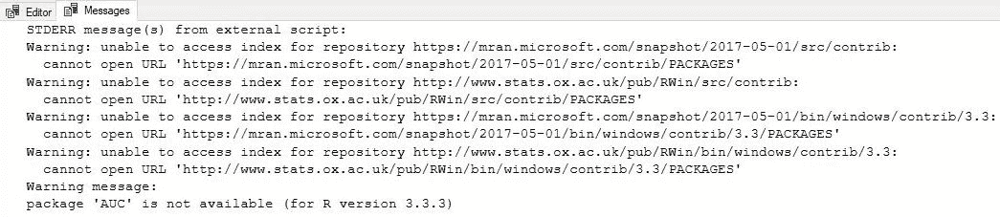

图 11：安装 AUC 包时的警告信息

因此，我们可以扩展原始存储过程，如下所示：

```py
EXECUTE sp_execute_external_script
        @language = N'R'
,@script = N'   library(Hmisc)
               u <- unlist(rcorr(Customers_by_invoices$InvoiceV, Customers_by_invoices$CustCat, type="spearman"))
statistical_significance<-as.character(u[10])
OutputDataSet <- data.frame(statistical_significance)'

,@input_data_1 = N'SELECT
SUM(il.Quantity) AS InvoiceQ
,SUM(il.ExtendedPrice) AS InvoiceV
,c.CustomerID AS Customer
,c.CustomerCategoryID AS CustCat

                                         FROM sales.InvoiceLines AS il
                                         INNER JOIN sales.Invoices AS i
                                         ON il.InvoiceID = i.InvoiceID
                                         INNER JOIN sales.Customers AS c
                                         ON c.CustomerID = i.CustomerID
                                         GROUP BY
c.CustomerID
,c.CustomerCategoryID'

,@input_data_1_name = N'Customers_by_invoices'

WITH RESULT SETS (( statistical_significance FLOAT(20) ));
GO 
```

如果我们这样做，我们将能够计算两个变量之间相关性的统计显著性。这里的要点是我们使用适当的包名引用 R 函数`library(Hmisc)`。以下是对脚本详细部分的说明：

```py
-- part of R script with reference to call method library
,@script = N'   library(Hmisc)
 u <- unlist(rcorr(Customers_by_invoices$InvoiceV, Customers_by_invoices$CustCat, type="spearman"))
statistical_significance <-as.character(u[10])
OutputDataSet <- data.frame(statistical_significance)'  
```

当引用库时，我们需要已经预先安装该包；否则，您将收到一个错误，表明该包不存在。如果您拼写包名错误，并且由于 R 语言区分大小写，在`Hmisc`包的情况下，如果您将其误拼为`hmisc`（没有大写的`H`），将会发生错误：

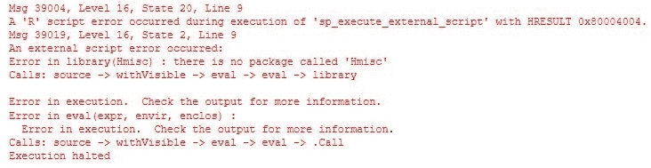

图 12

# 包信息

包始终保存在`library`文件夹中，但根据您使用的 R 版本（Open、Client 或 Server），SQL Server 实例名称和路径可能会有所不同。

通常，Client 或 Server 版本将在您的主驱动器上存储您的库。对于 Client 版本，默认路径是`C:\Program Files\Microsoft\R Client\R_SERVER\library`。您可以在以下屏幕截图中查看文件夹内容：

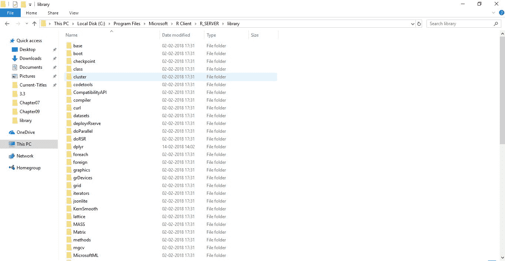

图 13

在 R Server 版本中，您将在默认 SQL Server 实例的路径上找到库：`C:\Program Files\Microsoft SQL Server\MSSQL14.MSSQLSERVER\R_SERVICES\library`。以下是一个 Server 安装的内容：

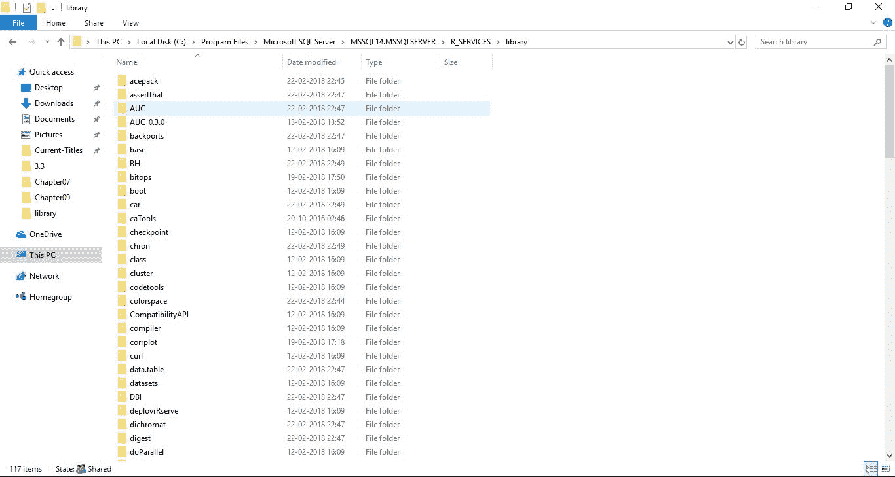

图 14

子文件夹代表已安装和可用的包的名称。要找到您包的默认路径，您可以执行以下代码：

```py
-- Path to libraries on your computer/server
EXECUTE sp_execute_external_script
 @language = N'R'
,@script = N'OutputDataSet <- data.frame(.libPaths());'
WITH RESULT SETS (([DefaultLibraryName] VARCHAR(MAX) NOT NULL));
GO  
```

在我的情况下，以下是在 R Server 版本中 R 包的默认路径：

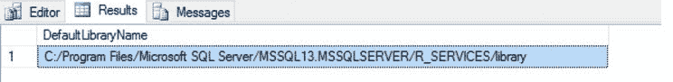

图 15

使用 R 函数`installed.packages()`可以检索更多信息。在这个例子中，我们提取了关于包的更多信息，并将其插入到 SQL Server 表中：

```py
-- You can create a table for libraries and populate all the necessary information
CREATE TABLE dbo.Libraries
       (
               ID INT IDENTITY NOT NULL CONSTRAINT PK_RLibraries PRIMARY KEY CLUSTERED
,Package NVARCHAR(50)
,LibPath NVARCHAR(200)
,[Version] NVARCHAR(20)
,Depends NVARCHAR(200)
,Imports NVARCHAR(200)
,Suggests NVARCHAR(200)
,Built NVARCHAR(20)
       )

INSERT INTO dbo.Libraries
EXECUTE sp_execute_external_script
              @language = N'R'
,@script=N'x <- data.frame(installed.packages())
OutputDataSet <- x[,c(1:3,5,6,8,16)]'

SELECT * FROM dbo.Libraries
DROP TABLE dbo.Libraries 
```

通过查询此表，您可以在一次`sp_execute_external_script`执行中获取有关库依赖项、版本、导入和构建的信息：

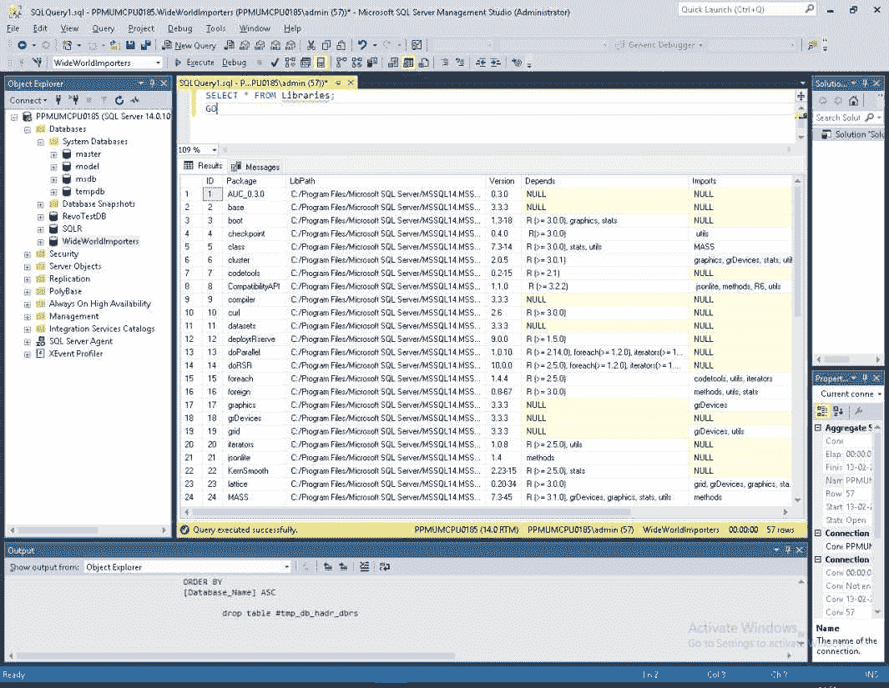

图 16

在以下内容中，我们将探讨如何安装缺失的 R 包。在 SQL Server 2016 中，有几种（官方或非官方）方法，将在 SQL Server 2017 中，我们有一个优雅的方法来使用`rxInstall`包或创建外部库。SQL Server 2017 中引入的这两种新方法都是安装缺失包的更好、更安全、更快的途径。

# 使用 R Tools for Visual Studio (RTVS) 2015 或更高版本

在 SQL Server 2016 中，Microsoft 建议通过 RTVS 安装缺失的包。用户应该在客户端上安装 RTVS（[`www.visualstudio.com/vs/rtvs/`](https://www.visualstudio.com/vs/rtvs/)），以便安装包。检查默认路径：

```py
sessionInfo()
.libPaths()  
```

这也返回了我机器上库文件夹的路径——对于 R 服务器（默认为`C:/Program Files/Microsoft SQL Server/MSSQL14.MSSQLSERVER/R_SERVICES/library`）和当前使用 RTVS 的用户（`C:/Users/Tomaz/Documents/R/win-library/3.2`）：

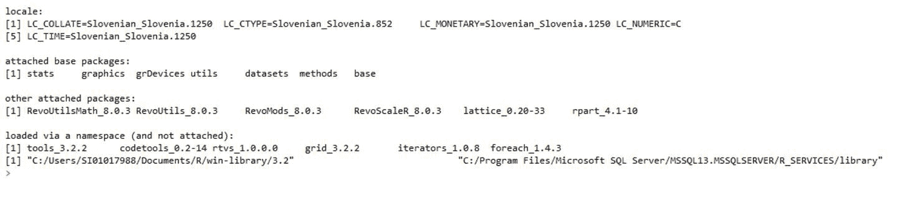

图 17

检查“选项...”部分：

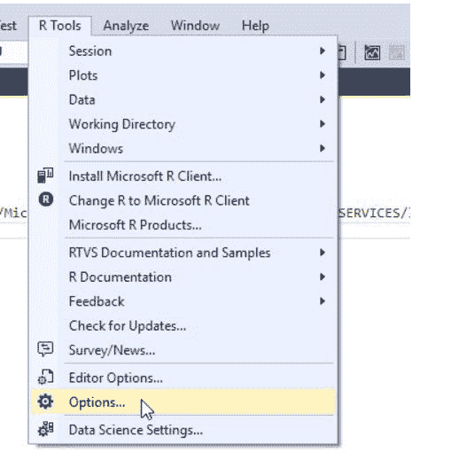

图 18

然后选择 R Tools | 高级（如下所示）：

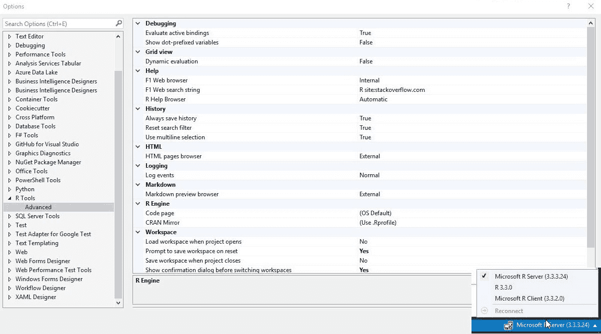

图 19

你会看到 R 引擎已定义了一个路径。这是安装 R 包的根路径。R 包安装在子文件夹库（`C:\Program Files\Microsoft SQL Server\MSSQL14.MSSQLSERVER\R_SERVICES\Library`）下。

通过运行 `install.packages("AUC")`，我可以看到服务器路径被忽略，库被安装到用户指定的文件夹中：

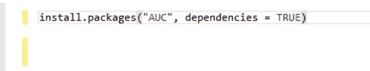

图 20

要在 R 服务器文件夹中安装包，你需要有管理员级别的访问权限，或者让管理员为你安装。Microsoft 在 MSDN 上讨论了这个问题（[`docs.microsoft.com/en-us/sql/advanced-analytics/r/installing-and-managing-r-packages`](https://docs.microsoft.com/en-us/sql/advanced-analytics/r/installing-and-managing-r-packages)）。以管理员身份运行 Visual Studio 和 RTVS 不会改变结果。为了避免这个问题，你需要声明你想要安装包的 R 服务器库文件夹的路径：

```py
install.packages("AUC", dependencies = TRUE, lib = "C:/Program Files/Microsoft SQL Server/MSSQL14.MSSQLSERVER/R_SERVICES/library")  
```

包将自动安装到 R 服务器仓库文件夹中：

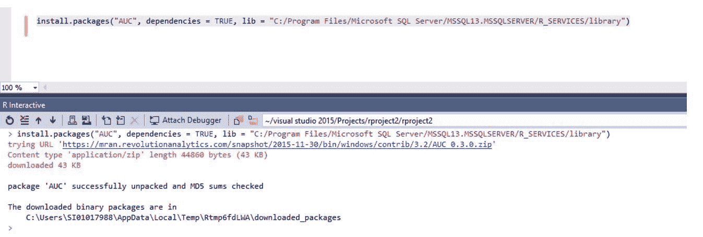

图 21

# 使用 CMD 中的 R.exe

当以管理员身份在 R 服务器的二进制文件夹（`C:\Program Files\Microsoft SQL Server\MSSQL14.MSSQLSERVER\R_SERVICES\bin`）中执行`R.exe`时，你将看到一个命令窗口：

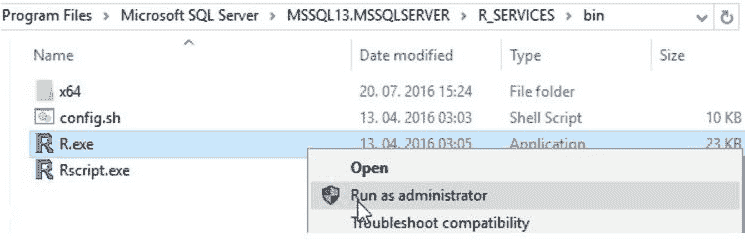

图 22

从那里，用户可以始终安装缺失的包。

```py
install.packages("AUC")  
```

# 使用 XP_CMDSHELL

这种方法到目前为止是最快的，当共享 T-SQL 代码时非常有用，但它会牺牲使用命令行，许多用户和数据库管理员都不愿意这样做。通过在配置中启用`xp_cmdshell`并使用此存储过程，你可以安装任何缺失的包。使用带有`-e`开关的代码，你可以轻松地安装库：

```py
R cmd -e install.packages("Hmisc")  
```

以下代码将在 R 服务器上安装缺失的包：

```py
-- enable xp_cmdshell
EXECUTE SP_CONFIGURE 'xp_cmdshell','1';
GO

RECONFIGURE;
GO 
EXEC xp_cmdshell '"C:\Program Files\Microsoft SQL Server\MSSQL14.MSSQLSERVER\R_SERVICES\bin\R.EXE"cmd -e
```

```py
install.packages(''Hmisc'')'; 
GO  
```

如果用户已被授予权限，则可以运行 Vanilla R 并添加`install.packages()`函数。结果如下：

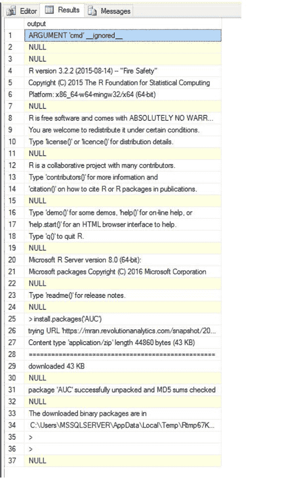

图 23

使用 CMD 和`-e`开关，可以执行和简化 R 代码的部署和计算，但鉴于这不是官方方法，我不建议使用，因为它会暴露安全风险。

# 复制文件

初看复制文件可能有点奇怪，但对于大多数包来说，将整个库文件夹复制到目标文件夹也能完成任务。想象一下，你是一名系统管理员，负责配置新的 R 环境或沙盒。在这种情况下，你不想运行数百行代码来安装所有需要的包；所以，你只需从镜像或备份中复制/粘贴文件夹。这将快一百倍，并且更加方便。此外，这些包已经与 R 引擎进行了测试。

使用简单的复制/粘贴、拖放操作，我在我的 R 客户端环境中复制并安装了 `acepack` 包（从 R 服务器复制）：

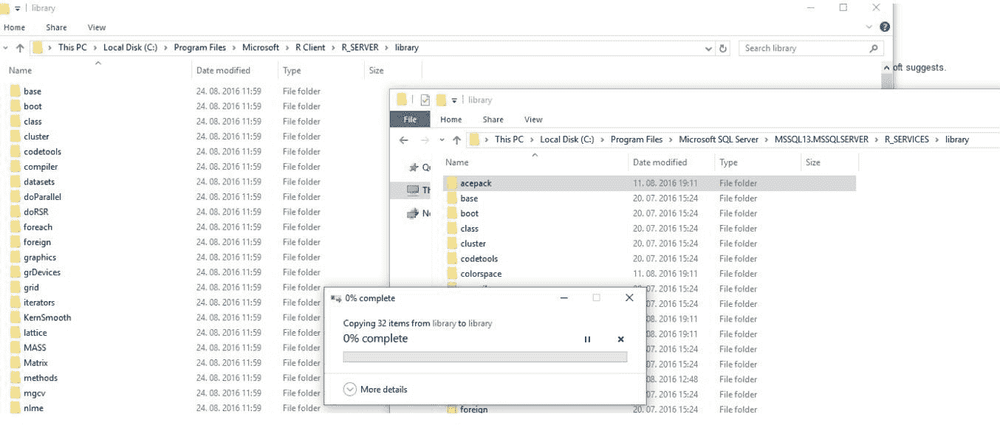

图 24

# 使用 rxInstallPackages 函数

在 SQL Server 2017 的新版本中，SQL Server R 服务中已经公开了一个非常需要的 R 函数——在 `RevoScaleR` 包中。使用 `rxInstallPackages` 函数，用户将能够为所需的计算环境安装任何额外的 R 包。

使用以下代码，可以真正加快包的安装速度，无需担心任何变通方法、打开额外的工具或其他任何事情。

从 RTVS 运行代码如下：

```py
RSQLServicesCC <- RxInSqlServer(connectionString = "Driver=SQL Server;Server=myServer;Database=TestDB;Trusted_Connection=True;")

rxInstallPackages("AUC", verbose = TRUE, scope = "private", computeContext = RSQLServicesCC)  
```

从 SQL Server 运行相同代码如下：

```py
EXECUTE sp_execute_external_script 
 @language = N'R' 
 ,@script = N'

 packagesToInstall <- c("caret","tree","party") library(MicrosoftML) 
 RSqlServerCC <- RxInSqlServer(connectionString = "Driver=SQL Server; +Server=SICN-KASTRUN\\SQLSERVER2017C2;Database=SQLR; +Trusted_Connection=True;") 
 rxInstallPackages(pkgs = packagesToInstall, owner = '', +scope = "shared", computeContext = "SqlServerCC");'; 
GO
```

这听起来太简单而不可能是真的，但它确实是。在运行此代码之前，请确保做几件事情：

+   将计算环境设置为你的包安装位置

+   设置正确的权限和访问

+   检查 TCP/IP 协议

在 `rxInstallPackages` 函数中，使用 `computeContext` 参数设置 `Local` 或你的 `SqlServer` 环境；你也可以使用范围作为共享或私有（区别在于，如果你以共享方式安装包，它可以在不同数据库的不同用户之间使用）。如果你不是从 `db_owner` 角色运行此命令，你也可以指定所有者。

# 使用 PowerShell 管理 SQL Server R 服务

PowerShell 非常适用于管理远程机器、虚拟机器，甚至 Azure VM 机器。除了这项常见的管理工作之外，它还有许多其他积极和有用的好处。

可以根据需要运行、安排或处理任何任务计划作业或 SQL Server 作业，比如每天获取数据或重新计算和初始化预测模型，甚至运行模型。

PowerShell 的另一个非常有用的方面是可以在不同的环境和系统之间进行 API 通信。

对于系统管理员来说，PowerShell 将非常有用，可以在客户端机器或甚至 R Server 服务器之间分发和维护任何额外的 R 包。

# 了解 sp_execute_external_script 外部过程

`SP_EXECUTE_EXTERNAL_SCRIPT`是一个存储过程，它将提供的脚本作为参数在提供的语言（在这种情况下，是 R 语言）的外部脚本中执行。在 SQL Server 2017 中，Python 也得到了支持，据说在未来，其他语言，如 Java、C#和 C++也将得到支持（通过 Launchpad）。

`sp_execute_external_script`是一个系统过程，它调用并发送传递的代码到外部引擎，并将结果以表的形式返回到 SQL Server。脚本有一组参数，这些参数将导航到 T-SQL 代码和数据到 R 引擎，其中包含 R 代码。

以下参数可用：

```py
sp_execute_external_script
 @language = N''
,@script = N'', 
,@input_data_1 =  'input_data_1'
,@input_data_1_name =  N'input_data_1_name'
,@output_data_1_name = 'output_data_1_name'
,@parallel = 0 | 1 
,@params =  N''
,@parameter1 = ''  
```

# 参数

+   `@language`：这指定了外部过程中将使用哪种语言。对于 SQL Server 2016，R 语言可用，并且随着 SQL Server 2017 的推出，Python 也变得可用。该参数是`sysname`内置数据类型，且限制为 128 个 Unicode 字符。这就是为什么我们在值前使用 N，以表示`nvarchar`类型。

+   `@script`：使用此参数将本机 R 或 Python 代码传递给 Launchpad 服务。此外部代码（相对于 SQL Server）必须经过验证和正确格式化（仅在 Python 的情况下），因为 SSMS 或 RTVS 不会验证此参数。因此，最简单的方法是使用 Visual Studio，并在 RTVS 中验证您的 R 代码或使用**Python Tools for Visual Studio**（**PTVS**）验证您的 Python 代码。此字段是`nvarchar`类型。

+   `@input_data_1`：此参数将您的 T-SQL 代码作为外部过程的数据源。此代码将由 SSMS 或 VS 进行验证和检查。此字段也是`nvarchar`类型，可以执行任何 T-SQL 代码。由于外部引擎（R 语言）的限制，输入的数据类型有一些限制。与 SQL Server 2016 相比，R 语言支持的数据类型较少。支持的数据类型包括逻辑、数值、整数、复数、字符和原始数据。因此，可以立即看出以下数据类型（除非转换为 R 数据类型）将导致一些问题。让我们只列举一些 SQL Server 数据类型：

    +   `Cursor`

    +   `Timestamp`（哈希格式，而非日期时间格式）

    +   `Datetime2`, `datetimeoffset`, `time`

    +   所有 Unicode 文本数据类型：`nvarchar`, `nchar`, `ntext`

    +   `Sql_variant`

    +   `Text`, `image`

    +   `XML`（包括 JSON，因为在 SQL Server 2017 中它是一个 XML 数据类型格式）

    +   `Hierarchy`, `geometry`, `geography`

    +   使用.NET 框架或任何 Launchpad 服务支持的任何语言构建的任何 CLR 或 assembly 绑定数据类型

除了某些数据类型的限制之外，还有一些 T-SQL 子句和语句不能作为输入数据参数的一部分使用。以下是一些例子：

+   存储过程（UDF，表值函数）

+   逻辑`IF`和`WHILE`, `FOR`循环

+   临时变量或表

+   没有更新、插入或删除操作（仅选择）

+   `GO`语句或分号

+   来自 DML 语句的`OUTPUT`子句

+   引用任何 CURSORS

除了 `SELECT` 语句之外，还可以使用以下语句：

+   `SELECT` 与多个 `JOIN` 操作

+   `WITH` 公共表表达式

+   `UNION`、`UNIONALL`、`EXCEPT`、`INTERSECT`

+   任何 `SET`、`STRING`、`LOGICAL`、`COMPARISON`、`BITWISE`、`ARITHMETIC`、`COMPOUND` 操作符

+   `COLLATE`

如前所述，DML 语句中的 `@input_data_1` 参数也不支持任何 DDL 语句或子句。

为了避免 T-SQL 语言与外部脚本之间的数据类型冲突，最佳实践是在将所需数据集投入参数之前尽可能多地进行数据准备、整理和优化。此外，许多限制可以通过转换为 R 封闭数据类型来妥协。

+   `@input_data_1_name`: 这个参数保存了在 R 脚本中将用作输入数据集的数据集名称。默认情况下，外部过程 `sp_execute_external_script` 将使用以下名称：- `InputDataSet` 用于输入数据，- `OutputDataSet` 用于返回结果数据（两者都是默认值）。请注意，R 语言是区分大小写的，因此在此参数中提供的您数据集的名称也必须在 R 代码中以相同的方式书写。

+   `@output_data_1_name`: 这个参数保存了从外部脚本返回的结果定义，作为返回给任何存储过程的变量。返回的数据集必须在 R 语言中为 `data.frame` 格式。data.frame 是一系列向量的集合，是表的表示，T-SQL 服务器可以导入并使用任何其他 T-SQL 子句或语句进一步使用：或者它可以直接将结果存储到 SQL Server 表中。此参数是 `sysname` 数据类型。

+   `@parallel`: 这是一个参数，将明确告诉 R 引擎在 R 中并行化计算。此参数是在 SQL Server 2016 的后续版本（SP/CU）中引入的，对于任何不使用 `RevoScaleR` 计算函数的 R 代码、函数或包来说都是非常受欢迎的。当然，这在简单 R 脚本和大型输入数据集的情况下是正确的。如果包本身是用 C++（而不是原始 Fortran）编写的，并且 R 脚本不包括相对复杂的数据整理/处理指令，特别是 `plyr`/`dplyr` 或 `data.table` 函数，那么来自特定 R 包的 R 函数将提供更好的性能结果。只需记住，越简单越好。

要检查工作负载是否可以并行分布，只需观察执行计划，在运行 T-SQL 代码时查找计划中的并行度。此外，请注意，任何 MAXDOP 的本地设置也会产生影响。换句话说，如果 MAXDOP 关闭，并且您设置了参数 `@parallel = 1`，不要期望有太多的分布式工作负载，因为默认情况下并行化是关闭的。

当运行和使用`RevoScaleR`包中可用的任何计算函数时，Launchpad 将自动处理并行性，使用 R Server 或 SQL Server R Services 中可用的分布式 R 函数。

+   `@params`：这是一个参数，其中可以声明并指定为可以在 R 脚本中使用的变量（变量）。参数可以是输入或输出，当将预测模型输入到 R 代码中或从 R 代码（除了指定的结果集）导出额外信息时非常方便。使用此参数作为输出可以返回单个值/列，而不是表。

+   `@parameter1`：这是一个参数，其中指定并使用参数值的输入或输出变量形式在 R 脚本中。

# 摘要

本章涵盖了机器学习服务（数据库内）的安装、服务的配置以及如何管理服务。它还探讨了缺失包的安装，并涉及了安全和资源管理器。在最后一节中，本章还解释了如何使用外部过程以及带有所有参数的`sp_execute_external_script`。通过深入探讨安全问题和缺失包的安装，已经介绍了几个示例。缺失包的安装在很大程度上依赖于 SQLServerCentral 上的文章。

机器学习服务的介绍和使用外部过程将是以下所有章节的基础，这些章节都将严重依赖于对配置和使用此过程的好理解。
