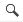

# 数据探索和数据可视化

在实施预测建模之前，了解数据探索和数据可视化技术对于理解数据至关重要。借助现有的开源 R 软件包中的统计和数学算法，数据专业人员可以轻松地探索他们的数据，并发现那些在其他情况下在关系型数据库中难以做到的图案/趋势。使用 SQL Server **机器学习服务**（**ML 服务**）与 R 结合意味着数据探索和数据可视化不再是孤立的作业，从而引领更快、更简单的预测建模路径。

本章概述了开发人员在使用 R 进行数据探索和数据可视化时必须了解的基本技巧和窍门。您将学习如何在 T-SQL 中集成 R 进行数据探索和数据可视化，然后将这些技术整合到 SSRS 和 Power BI 中。如果您已经熟悉 R 的数据探索和数据可视化，请自由跳到本章的最后部分。

# 理解 SQL 和 R 数据类型

在我们深入探讨使用 R 在 T-SQL 中探索数据之前，让我们先从了解在 R 中存储数据的数据类型开始。当在 T-SQL 中使用 R 时，首先且最重要的数据类型是数据框。SQL Server 中 `sp_execute_external_script` 的输入和输出参数是由 R 接收和发送的数据框。对于数据整理而言，其他重要的数据类型，并且与数据框非常相似的是矩阵和数据表，这些内容超出了本章的范围。

除了数据框之外，R 还支持有限数量的标量数据类型，如字符、复数、日期/时间、整数、逻辑、数值和原始数据类型。因此，当您在 R 脚本中提供来自 SQL Server 的数据时，当需要时，数据将隐式转换为 R 中的兼容数据类型。当无法自动执行转换时，R 将返回 `Unhandled SQL data type`。以下表格提供了一个数据类型转换的简短示例。有关隐式数据类型转换的更多信息，请访问 [`docs.microsoft.com/en-us/sql/advanced-analytics/r/r-libraries-and-data-types#changes-in-data-types-between-sql-server-2016-and-earlier-versions`](https://docs.microsoft.com/en-us/sql/advanced-analytics/r/r-libraries-and-data-types#changes-in-data-types-between-sql-server-2016-and-earlier-versions) 上的 *R Libraries and R Data Types*。

| **SQL Server 数据类型（sp_execute_external_script 的输入参数）** | **R 类** | **结果集数据类型（sp_execute_external_script 的输出参数）** |
| --- | --- | --- |
| `datetime` | `POSIXct` | `Datetime` |
| `numeric(p,s)` | `numeric` | `float` |
| `int` | `integer` | `int` |
| `varbinary(n)` | `raw` | `varbinary(max)` |
| `varchar(n)` | `character` | `varchar(max)` |

# R 中的数据框

数据框包含行和列，就像 SQL Server 中的表一样，其中每一列可以有不同的基本数据类型，例如整数、字符等。

使用`?`了解更多关于函数的信息：

`? [函数]`

关于数据框的更多信息，您可以在**R Tools for Visual Studio**（**RTVS**）、R Studio 或您喜欢的其他 R 集成开发环境（IDE）中输入以下命令：

```py
> ? data.frame  
```

默认情况下，R 使用内存。因此，一旦输入数据框通过`sp_execute_external_script`传递，R 就会在内存中存储输入数据。机器学习服务（数据库内）由 SQL Server 中的资源管理器管理，如第三章的*管理 SQL Server 2017 和 R 的机器学习服务*中所述。

一个一般性指南是努力在 SQL Server 和 R 之间找到一个好的计算类型平衡。这包括是否在 R 中还是在 SQL Server 中进行数据清洗/操作。

R 中提供了一些内置的数据框，例如`mtcars`或`iris`。

让我们看看 R 中的一个数据框。在 RTVS 中运行以下代码：

```py
> mtcars;

```

输出应该如下所示：


图 4.1 - mtcars 数据

要检查数据类型，您可以在变量上调用`call`函数：

```py
> class(mtcars); 
[1] "data.frame" 
```

# 数据探索和数据清洗

在 R 中，数据清洗可以独立于 SQL Server 完成。以下图示说明了开发者在使用 SQL Server 和 R 时可以遵循的推荐高级流程。如果您之前在 R 中工作过，您可能熟悉在 R 中直接执行的步骤 2、3 和 5。

请注意，步骤 3 和 4 是可选的，将在第六章的*预测建模*和第七章的*将 R 代码投入运行*中进一步讨论：


图 4.2 - 使用 R 的 SQL Server 机器学习服务的高级开发流程

让我们从*在 R 中进行数据清洗*开始。具体来说，在本节中，我们将使用 R 环境，以便在我们将其与 T-SQL 结合之前了解它在 R 中的工作方式。如果您熟悉 R，您可以跳过本节。以下为本节的前提条件：

1.  一个 R IDE，例如作为 Visual Studio 2015 或 2017 一部分的 RTVS。有关 RTVS 的更多信息，请访问[`aka.ms/rtvs`](http://aka.ms/rtvs)。

1.  将`WideWorldImporters`数据库恢复到 SQL Server 2016 或更高版本。请参阅[`aka.ms/wwi`](http://aka.ms/wwi)下载您可以在环境中恢复的完整 SQL 备份文件。

# 将 SQL Server 数据导入 R

从 R 连接到 SQL Server 最常见的方式是使用 RODBC 包。请注意，在 SQL Server 2016 之前，这是您可能需要执行的步骤。

在下面的示例中，我们希望从 SQL Server 实例`MsSQLGirl`和数据库`WideWorldImporters`中检索与 2015 年销售人员月订单相关的数据集，使用的是信任连接（Windows 身份验证）。

使用 RTVS，按照以下步骤执行：

1.  创建一个新的脚本名为 `Chapter04_01.R`。确保通过输入以下内容来加载 `RODBC` 库：

```py
library(RODBC); 
```

1.  定义连接字符串并获取连接句柄：

```py
connStr <- "Driver=SQL Server;Server=MsSQLGirl; 
  Database=WideWorldImporters;trusted_connection=true"; 
dbHandle <- odbcDriverConnect(connStr); 
```

1.  定义你想要在 SQL Server 中运行的查询。这也可以是一个调用存储过程、函数、视图等的查询。在这个特定示例中，查询将获取 2015 年按销售人员划分的月度订单：

```py
# Define the query to be run 
order_query =  
"SELECT DATEFROMPARTS(YEAR(o.[OrderDate]),  
      MONTH(o.[OrderDate]), 1) AS OrderMonth, 
    sp.[PreferredName] AS SalesPerson, 
    COUNT(DISTINCT o.[OrderID]) AS OrderCount, 
    SUM(ol.[Quantity] * ol.[UnitPrice]) AS TotalAmount 
FROM [Sales].[Orders] o 
    INNER JOIN[Sales] .[OrderLines] ol 
        ON ol.[OrderID] = o.[OrderID] 
    INNER JOIN[Application] .[People] sp 
        ON sp.[PersonID] = o.[SalespersonPersonID] 
WHERE sp.[ValidTo] >= GETDATE() 
    AND o.[OrderDate] BETWEEN '20150101' AND '20151231' 
GROUP BY 
DATEFROMPARTS(YEAR(o.[OrderDate]),  
MONTH(o.[OrderDate]), 1), 
    sp.[PreferredName];" 

```

1.  执行查询并将输出存储到 `orders` 变量中：

```py
# Get the data set from SQL into the orders variable in R 
orders <- sqlQuery(dbHandle, order_query); 
```

1.  输入以下内容以查看 `orders` 中的数据集：

```py
orders;  
```

或者，在 RTVS 中，你可以转到如图 4 - 2 所示的变量资源管理器窗口，展开订单以查看变量的详细信息。使用放大镜工具（）查看如图 4 - 3 所示的输出：


图 4 - 3 RTVS 中的变量资源管理器


图 4 - 4 在变量资源管理器中查看订单

这里是 `orders` 变量的数据字典。熟悉以下列对我们来说很有用，因为我们将在本章中使用订单数据框及其派生变量：

| **列名** | **描述** |
| --- | --- |
| `OrderMonth` | 订单发生的月份 |
| `OrderCount` | 销售人员的月订单数量 |
| `TotalAmount` | 订单的美元金额 |
| `SalesPerson` | 销售人员的姓名 |

# 在 R 语言中探索数据

在 R 语言中探索数据有多种方法：以下是一些有用的函数。`df` 表示数据框变量，`col` 表示 `df` 中的列：

+   `head(df)` 返回数据框 `df` 的前几行，默认为 6 行。

+   `tail(df)` 返回数据框 `df` 的最后几行，默认为 6 行。

+   `summary(df)` 为数据框 `df` 中的每个列提供基本的摘要统计信息。

+   `names(df)` 返回数据框 `df` 的列名。

+   `str(df)` 返回关于数据框 `df` 的基本信息。

+   `describe(df$col)` 描述 `df` 数据框中 `col` 值的分布/偏度。这对于构建量表和项目分析非常有用。这需要首先安装 `psych` 包。

+   以下是一个使用 `str` 函数对数据框 `orders` 进行操作的示例：

```py
> str(orders) 
```

这就是输出看起来像什么：


图 4-5 `str(orders)` 的输出

与 SQL Server 不同，R 语言对函数和变量都是大小写敏感的。请确保你正确地输入它们。

# R 语言中的数据整理

数据整理是将一种 *原始* 格式转换为另一种格式以便更易于消费的手动过程，无论是供人类使用还是供后续过程（如报告、数据可视化、统计分析、预测分析等）使用。

有许多 R 语言包可用于数据整理。R 语言预装了用于简单数据转换和可视化的包。在本节中，你将学习两个常用的数据整理超级强大包：`dplyr`、`reshape` 和 `lubridate`。

# 在数据框中添加/删除行/列

添加或删除行或列可以轻松实现。以下是一些示例，展示了如何使用 R 以及`dplyr`来实现：

1.  **添加新行**：让我们创建一个新的数据框，`orders_newrows`，其中包含 2 行新数据，我们希望将其追加到`orders`的末尾。然后我们想使用`tail`函数查看`orders`的最后几行：

```py
> orders_newrows <- data.frame( 
    OrderMonth = c("2015-12-01", "2015-12-01"), 
    SalesPerson = c("Julie", "Tomaz"), 
    OrderCount = c(201, 2017), 
    TotalAmount = c(340000, 370000)); 

> orders <- rbind(orders, orders_newrows); 
> tail(orders); 

```

这将触发以下输出：

```py
    OrderMonth SalesPerson OrderCount TotalAmount 
105 2015-12-01        Lily        194    442645.5 
106 2015-03-01      Hudson        389   1020488.6 
107 2015-10-01         Taj        195    437388.4 
108 2015-08-01        Lily        182    517126.3 
109 2015-12-01       Julie        201    340000.0 
110 2015-12-01       Tomaz       2017    370000.0 
```

使用`dplyr`，你可以调用`bind_rows`来追加多个数据框。例如，以下显示了`orders`和`orders_newrows`被追加两次：

```py
> bind_rows(orders, orders_newrows, orders_newrows);
```

1.  **添加新列**：为了说明，让我们创建一个新的数据框`orders_tax`，其中包含每行的序列 ID 和 10%的销售税金额。我们使用`cbind`函数将`orders`变量与`orders_tax`变量绑定：

```py
> orders_discount <- data.frame( 
    Discount = orders$TotalAmount * 0.25) 
> orders <- cbind(orders, orders_ discount); 
> names(orders) 
```

这将给出以下输出：

```py
[1] "OrderMonth"  "SalesPerson" "OrderCount"  "TotalAmount" 
[5] "Discount"  
```

使用`dplyr`，你可以调用`bind_cols`来添加新列：

```py
> orders_tax <- data.frame( 
    RowID = seq(1:nrow(orders)), 
    SalesTax = orders$TotalAmount * 0.1 
    ) 
> orders <- bind_cols(orders,data.frame(orders_tax)); 
> names(orders) 
```

输出如下：

```py
[1] "OrderMonth"  "SalesPerson" "OrderCount"  "TotalAmount"  
[5] "Discount"   "RowID"       "SalesTax"    
```

或者你可以添加一个名为`TotalPlusTax`的新列：

```py
> mutate(orders, TotalPlusTax = TotalAmount * 0.125); 
```

1.  **删除列**：现在让我们从`orders`中删除`RowID`：

```py
> orders <- orders[, !names(orders) == "RowID"] 
```

命令`names(orders)`列出了`orders`中的列名。因此，`!names(orders) == "RowID"`排除了列名`RowID`。

使用`dplyr`，你可以调用`select`来选择一组列。例如，以下是从`orders`中排除`RowID`的示例：

```py
> select(orders, -RowID); 
```

你也可以轻松选择以`Order`开头的列：

```py
> select(orders, matches("Order"));  
```

让我们显示以`SalesPerson`开头的`orders`。首先，为了获取以`J`开头的索引，我们可以使用`grep`函数：

```py
> grep("^J.*", orders$SalesPerson); 
[1]   2  17  21  25  28  37  43  45  52  71  78 102 109 
> orders[grep("^J.*", orders$SalesPerson),]; 
    OrderMonth SalesPerson OrderCount TotalAmount SalesTax 
2   2015-06-01        Jack        206    502828.7 50282.87 
17  2015-05-01        Jack        203    493282.0 49328.21 
21  2015-11-01        Jack        210    473676.4 47367.64 
25  2015-02-01        Jack        176    454979.3 45497.93 
28  2015-10-01        Jack        205    522954.2 52295.42 
37  2015-07-01        Jack        205    466244.0 46624.40 
43  2015-04-01        Jack        188    520575.8 52057.58 
45  2015-01-01        Jack        182    413761.0 41376.10 
52  2015-12-01        Jack        209    474157.7 47415.77 
71  2015-03-01        Jack        181    469591.0 46959.10 
78  2015-08-01        Jack        171    359710.5 35971.06 
102 2015-09-01        Jack        249    552961.4 55296.14 
109 2015-12-01       Julie        201    340000.0 34000.00 

```

使用`dplyr`，你可以调用`select`来选择一组列。例如，以下是从`orders`中排除`RowID`的示例：

```py
> filter(orders, grepl("^J.*", SalesPerson)); 
```

你可能已经注意到在最后的几个`dplyr`示例中，`dplyr`的语法更加友好。例如，在`filter`函数中，不需要指定列所属的变量。

`  > orders[grep("^J.*", orders$SalesPerson),]; # base`

`> filter(orders, grepl("^J.*", SalesPerson)); # dplyr` 此外，选择函数更加友好。

`  > orders <- orders[, !names(orders) == "RowID"] # base`

`  > select(orders, -RowID); # dplyr`

# 使用 dplyr 进行更多数据处理

以下是一些有用的数据处理活动、函数和示例的快速列表。`df`表示数据框变量。

| **目的** | **函数** |
| --- | --- |
| 重命名列 | `rename(df, new_column_name = old_column_name)` |
| 排序/排序数据 | `arrange(df, col1)`按`col1`对数据框`df`进行排序。 |
| 去重数据 | `distinct(df)``distinct(df, [列名])`当提供时，对`df`的`[列名]`去重。 |
| 管道 | *x %>% f(y)*执行*f(x,y)*。你可以嵌套语法。例如:*x %>% f(y)**%>% g(z)*等价于*x %>% g(f(x,y),z)*。 |

# 查找缺失值

R 有非常简短和简单的方法来查找缺失值，即`is.na(df)`。它返回`df`中带有缺失值的行索引。

# 转置数据

在 SQL Server 中对数据集进行转置不是一件简单的事情。在 R 中使用 `t(df)` 来交换数据框 `df` 的行和列。

# 透视/逆透视数据

`reshape` 包在数据透视和逆透视方面非常有用。

使用 `cast` 透视数据如下：

```py
library(reshape) 
x <- data.frame(OrderMonth = orders$OrderMonth, 
                SalesPerson = orders$SalesPerson, 
                TotalAmount = orders$TotalAmount) 
x1 <- cast(x, OrderMonth ~ SalesPerson) 
names(x1) 
```

使用 `melt` 逆透视数据如下：

```py
melt(x1,id=c(OrderMonth)) 
```

# 示例 - 使用 R 在 T-SQL 中进行数据探索和整理

如前所述，R 中有一些非常实用的数据处理和探索技术。现在让我们将它们全部在 T-SQL 中拼接起来。在下面的示例中，我们想要获取 2015 年每月销售人员订单数量和总金额的统计摘要，具体为最小值、最大值、1^(st) 分位数、中位数、3^(rd) 分位数，以了解数据范围和每月每个销售人员的订单分布：

```py

USE WideWorldImporters 
GO 

-- Part 1: Get Monthly Order count and Order amount  
-- per Sales Person in Year 2015\. 
DECLARE @SQLScript NVARCHAR(MAX) 
SET @SQLScript = N'SELECT DATEFROMPARTS(YEAR(o.[OrderDate]),  
MONTH(o.[OrderDate]), 1) AS OrderMonth, 
    sp.[PreferredName] AS SalesPerson, 
    COUNT(DISTINCT o.[OrderID]) AS OrderCount, 
    SUM(ol.[Quantity] * ol.[UnitPrice]) AS TotalAmount 
FROM [Sales].[Orders] o 
    INNER JOIN [Sales].[OrderLines] ol 
        ON ol.[OrderID] = o.[OrderID] 
    INNER JOIN [Application].[People] sp 
        ON sp.[PersonID] = o.[SalespersonPersonID] 
WHERE sp.[ValidTo] >= GETDATE() 
    AND YEAR(o.[OrderDate]) = 2015 
GROUP BY 
DATEFROMPARTS(YEAR(o.[OrderDate]),  
MONTH(o.[OrderDate]), 1), 
    sp.[PreferredName];' 

-- Part 2: Prepare the R-script that will summarize the dataset. 
DECLARE @RScript NVARCHAR(MAX) 
SET @RScript = N'OutputDataSet <- as.data.frame(t(sapply(InputDataSet[, c("OrderCount", "TotalAmount")], summary))); 
OutputDataSet <- cbind(Column = row.names(OutputDataSet), OutputDataSet);' 

-- Part 3: Execute R in TSQL to get the monthly sales person's  
-- order count and total amount. 
EXECUTE sp_execute_external_script 
     @language = N'R' 
    ,@script = @RScript 
    ,@input_data_1 = @SQLScript 
WITH RESULT SETS (( 
            [Columns] NVARCHAR(30), [Min] FLOAT, 
            [Q1] FLOAT, [Median] FLOAT, 
            [Mean] FLOAT,  [Q3] FLOAT, 
            [Max] FLOAT)); 
GO 

```

# R 中的数据可视化

良好的数据可视化可以从大量数据中提取洞察力，并作为与观众沟通的媒介。幸运的是，R 有强大的内置函数以及可以帮助你创建良好数据可视化的包。在本节中，我们将探讨一些内置的图形函数和 R 库，以展示它们的特性。然后我们将通过一个示例来展示如何与 T-SQL 结合使用。你还将学习如何在 SQL Operations Studio 中显示 R 的图形。与上一节类似，我们将使用 `orders` 数据集，并创建一个名为 **d** 的数据框来缩小对销售人员 Amy、Jack 和 Hudson 的分析。

# 折线图

R 中的 `plot()` 函数绘制一个简单的散点图，显示两个变量之间的关系和分布趋势/异常值。

这是一个脚本示例，用于可视化 2015 年 `Amy`、`Jack` 和 `Hudson` 的订单数量与每月销售金额之间的关系：

```py
> d <- orders[orders$SalesPerson %in% c("Amy", "Jack", "Hudson"), ]; 
> plot(x = d$TotalAmount, y = d$OrderCount,  
main = "Monthly Orders", xlab = "Total Amount ($)",  
ylab = "Number of Orders", col = d$SalesPerson, pch = 19,  
xaxt = "n"); 
> axis(side = 1, at = x <- signif(seq(from = 0,  
to =  max(orders$TotalAmount), length.out = 6), 2), 
labels = paste(x / 1000, "k", sep = "")); 
```

以下图表显示了 2015 年每个月每个销售人员所下的订单金额和订单数量。使用这样的图表可以让我们轻松地看到，用蓝色点表示的销售人员表现非常出色：


图 4-5 使用基本绘图函数绘制的散点图

显然，前面的折线图需要几个步骤来绘制，你还需要添加一个 `legend()` 调用来将颜色映射到销售人员。以下是一个使用一个调用绘制折线图的更简单方法。

`ggplot2` 库提供了一个简单的方法来使用 `qplot` 函数创建类似的图表。以下脚本与之前的调用等效：

```py
> library(ggplot2)  
>  qplot(x = TotalAmount, y = OrderCount, data = d,  
  color = SalesPerson, main = "Monthly Orders"); 
```

下面的图表包含一个图例，有助于显示 Hudson 是表现最好的销售人员：


图 4-6 使用 ggplot 函数绘制的散点图

# 直方图

R 中的 `hist()` 函数绘制一个直方图，表示数据集的频率分布。

这是一个绘制 2015 年每月销售人员总金额频率分布的脚本：

```py
> hist(orders$TotalAmount, main = "Monthly Orders",  
  xlab = "Total Amount ($)") 
```

使用以下直方图，我们可以轻松地看到最常见的月度总金额（每个销售人员）每月在 40 万至 50 万美元之间：


图 4-7 使用基本 hist 函数的直方图图表

# 盒形图

盒形图图表使我们能够显示每个销售人员的异常值。这可以通过在 R 中使用`boxplot()`函数轻松实现。然而，`ggplot`函数非常易于使用和定制。以下是一个使用`ggplot()`编写盒形图图表的示例：

```py
ggplot(orders,  
       aes( x = SalesPerson, 
            y = TotalAmount)) + 
      geom_boxplot(outlier.color = "red", outlier.size = 3) + 
      ggtitle(label = "Monthly Orders") + 
      xlab("Sales Person") + ylab("Total Amount ($)"); 
```

以下图表显示了 2015 年每个销售人员制作的月度订单的分布：


图 4-8 使用 ggplot 函数的盒形图图表

# 散点图

在 R 中，`scatterplot()`可以用来理解变量之间的关系/趋势。

以下是一个使用散点图来理解 2015 年 Amy、Hudson 和 Jack 月度总金额趋势的示例：

```py
library(car) # For the scatterplot function 
library(RColorBrewer) # For choosing color palette more easily 

# Prepare d  
d$SalesPerson <- factor(d$SalesPerson); 
d$OrderMonth <- as.Date(d$OrderMonth); 

# Configure the palette to use 
my_colors <- brewer.pal(nlevels(as.factor(d$SalesPerson)), "Set2") 

# Map the monthly orders 
scatterplot(TotalAmount ~ OrderMonth | SalesPerson, data = d, 
    xlab = "Month", ylab = "Total Amount",  
    main = "Monthly Orders", col = my_colors, 
    cex = 1.5, lwd = 3) 
```

根据以下图表，我们可以得出结论，尽管 Hudson 的月度总金额总体上高于 Amy 和 Jack，但它们略有下降趋势。我们还可以看到 Amy 的月度总金额急剧下降：


图 4-9 使用 scatterplot 函数的散点图图表

`ggplot`函数还可以用于创建散点图，并使用平滑的线条叠加显示销售人员的月度模式：

```py
# Use the ggplot version 
ggplot(data = d, 
       aes(x = OrderMonth, y = TotalAmount, color = SalesPerson)) + 
    geom_point() + geom_smooth(method = "loess") + 
    scale_y_continuous(label = scales::dollar) + 
    scale_color_brewer(palette = "Set2") + 
    ggtitle(label = "Monthly Orders"); 
```


图 4-10 使用 ggplot 函数的散点图图表

# 树形图

预测建模的数据准备包括探索数据结构和可视化预测值的决策规则。这些值可以是分类的，也可以是连续的，分别表示为分类树和回归树。

下面是一个示例脚本，用于创建一个树形图，描述预测给定销售人员和`OrderCount`的月度总金额的决策规则：

```py
library(rpart) 
library(rpart) 
library(rattle) 
library(rpart.plot) 
fit <- rpart(TotalAmount ~ OrderCount + SalesPerson , data = d, method="anova"); 
fancyRpartPlot(fit, sub = "Monthly Sales Person") 

```

运行前面的脚本将给出一个整洁的树形图，节点上的第一行是平均月度总金额（即，科学记数法中的*619e+3*实际上是$619,000），后面跟着 n 作为观测数的数量和构成节点的百分比：


图 4-11 使用 rpart 函数的树形图

# 示例 - T-SQL 中的 R 数据可视化

现在我们已经学习了几个使用 R 进行数据可视化的示例，让我们将它们与 SQL Operations Studio 中的 T-SQL 结合起来。请注意，SSMS 无法渲染 T-SQL 生成的 R 图像。

从[`docs.microsoft.com/en-us/sql/sql-operations-studio/download`](https://docs.microsoft.com/en-us/sql/sql-operations-studio/download)下载 SQL Operations Studio。

执行以下步骤以在 T-SQL 中运行 R，生成可以在 SQL Operations Studio 中可视化的图像。

1.  打开 SQL Operations Studio。

1.  在 SQL Operations Studio 中连接到服务器上的`WideWorldImporters`数据库。

1.  从示例中复制`Part 1`到数据可视化在 T-SQL 中，因为我们想重用`@SQLScript`变量定义：

```py
-- Part 2: Prepare the R-script that will produce the visualization. 
DECLARE @RScript NVARCHAR(MAX) 
SET @RScript = N'library(ggplot2);  
    image_file = tempfile();  
    jpeg(filename = image_file, width=1000, height=400);  
    d <- InputDataSet[InputDataSet$SalesPerson %in% c("Amy", "Jack", "Hudson"), ]; 
    print(qplot(x = TotalAmount, y = OrderCount, data = d, color = SalesPerson, main = "Monthly Orders")); 
    dev.off() 
    OutputDataSet <- data.frame( 
            data=readBin(file(image_file,"rb"), 
            what=raw(),n=1e6));' 

-- Part 3: Execute R in TSQL to get the binary representation of the image. 
EXECUTE sp_execute_external_script 
     @language = N'R' 
    ,@script = @RScript 
    ,@input_data_1 = @SQLScript 
WITH RESULT SETS ((plot VARBINARY(MAX))); 
```

1.  在 SQL Operations Studio 中执行前面的脚本，你将得到一个包含名为`plot`的列的结果集。

1.  点击图表查看器，然后从图表类型中选择图像：


图 4-12 SQL Operations Studio 中 R 的数据可视化输出

# 在报告和可视化中集成 R 代码

在本节中，我们将深入了解 Microsoft BI 堆栈中可用的熟悉报告和可视化工具，例如 **SQL Server Reporting Services** (**SSRS**)、Power BI 和移动报告。

将 R 图形与 SQL Server 集成的三个主要用例。

1.  获取表示数据/统计分析、训练模型或预测模型的数据集输出：


图 4-13 SQL Server 机器学习服务在 R 中的数据分析过程

执行`sp_execute_external_script`以运行 R 并生成如图 (1) + (2) + (3) 所示的数据集输出。数据集输出 (3) 可以来自数据/统计分析、训练模型、预测输出等。在 SQL Server 中，我们可以选择进一步处理输出（4），例如，将其保存到表中或将它传递给另一个存储过程。

1.  获取包含 R 图形输出 varbinary 表示的数据集输出。


图 4-14 SQL Server R 服务的数据可视化过程

执行`sp_execute_external_script`以运行 R 并生成如图 (1) + (2) + (3) 所示的数据集输出。在这种情况下，数据集输出 (3) 将包含图形输出的 varbinary (max) 表示。在 SQL Server 中，我们可以进一步插入输出（4），例如，将图像作为 varbinary (max) 保存到表中。

1.  将 R 图形输出保存到文件中，并将文件路径存储在数据集输出中。当首选离线渲染时，这是理想的：


图 4-17 SQL Server 机器学习服务的数据可视化到文件的过程

执行`sp_execute_external_script`以运行 R 并生成如图 (1) + (2) + (3) 所示的数据集输出。在这种情况下，数据集输出 (3) 包含图形输出需要驻留的文件路径。在 SQL Server 中，我们可以选择进一步处理输出（4）。您还可以如 *Tomaž Kaštrun 的* 博客中所述，为此解决方案集成 Filestream：

[`tomaztsql.wordpress.com/2016/09/25/filetable-and-storing-graphs-from-microsoft-r-server/`](https://tomaztsql.wordpress.com/2016/09/25/filetable-and-storing-graphs-from-microsoft-r-server/)

# 在 SSRS 报告中集成 R

SSRS 报告可以从查询或存储过程中读取数据集。本质上，这为我们提供了足够的灵活性，以选择我们想要如何将 R 输出作为 SSRS 中的即席或操作报告的一部分。

现在，让我们看看几个将 R 集成到 SSRS 报告中的例子。假设一个数据分析师想要快速进行统计分析，以了解销售人员与总金额之间关系的强度。使用 SSRS 做这件事非常简单。以下是一个示例，说明您如何实现这一点。

1.  使用 **Visual Studio 2017** 或 **SQL Server Management Studio** 连接到 `WideWorldImporters`。

1.  创建一个名为 `dbo.usp_AnalyzeOrdersUsingAnova` 的新存储过程：

```py
CREATE PROCEDURE dbo.usp_AnalyzeOrdersUsingAnova 
( 
  @StartDate DATE = '20150101', 
  @EndDate DATE = '20151231' 
) 
/********************************************************** 
 * Purpose: Determine if Monthly Orders (Total Amount in $)  
 *      has no dependency on Sales Person. 
 * Parameters:   
 *  @StartDate  - The start date of the Orders table 
 *  @EndDate  - The end date of Orders table 
 * Example on how to execute: 
 *  EXEC dbo.usp_AnalyzeOrdersUsingAnova 
 *     @StartDate = '20150101' 
 *    ,@EndDate = '20151231' 
 *****************************************************************/ 
AS 
BEGIN  

  DECLARE @input_query NVARCHAR(MAX);  
  DECLARE @RAOV NVARCHAR(MAX); 

  -- The SQL query representing Input data set. 
  -- Get the monthly orders from each Sales between  
  -- specific date and time. 
  SET @input_query = N' 
  SELECT 
    DATEFROMPARTS(YEAR(o.[OrderDate]),  
       MONTH(o.[OrderDate]), 1) AS OrderMonth, 
    sp.[PreferredName] AS SalesPerson, 
    COUNT(DISTINCT o.[OrderID]) AS OrderCount, 
    SUM(ol.[Quantity] * ol.[UnitPrice]) AS TotalAmount 
  FROM [Sales].[Orders] o 
    INNER JOIN[Sales] .[OrderLines] ol 
      ON ol.[OrderID] = o.[OrderID] 
    INNER JOIN[Application] .[People] sp 
      ON sp.[PersonID] = o.[SalespersonPersonID] 
  WHERE sp.[ValidTo] >= GETDATE() 
    AND o.[OrderDate] BETWEEN ''' +  
CAST(@StartDate AS VARCHAR(30)) + ''' AND ''' + 
CAST(@EndDate AS VARCHAR(30)) + ''' 
  GROUP BY 
    DATEFROMPARTS(YEAR(o.[OrderDate]),  
      MONTH(o.[OrderDate]), 1), 
    sp.[PreferredName];' 

  -- The R code that tests if Total Amount has no strong  
  -- dependency to Sales Person 
  -- Note: Null Hypothesis (H0) in this case is Total Amount  
  --    has no strong dependency to Sales Person. 
  --    The closer p-value to 0 we can reject the H0\. 
  SET @RAOV = N'a = aov(TotalAmount ~ SalesPerson, 
 data = InputDataSet); 
    m <- summary(a); 
    library(plyr); 
    x <- data.frame(RowID = 1:nrow(m[[1]]),  
      Attribute = rownames(m[[1]])); 
    OutputDataSet <- cbind(x, ldply(m, data.frame));' 

  -- Using R Services produce the output as a table 
  EXEC sp_execute_external_script @language = N'R' 
    ,@script = @RAOV  
    ,@input_data_1 = @input_query 
    ,@input_data_1_name = N'InputDataSet' 
    ,@output_data_1_name = N'OutputDataSet'  
    WITH RESULT SETS (([RowID]  INT, 
          [Attribute]  NVARCHAR(50),  
          [DF]    NUMERIC(20,10), 
          [SumSq]  NUMERIC(20,10), 
          [MeanSq]  NUMERIC(20,10), 
          [FValue]  FLOAT, 
          [Pr(>F)]  FLOAT 
          )); 

END 
```

1.  使用 Visual Studio 2017 或 Report Builder 创建一个新的报告。

1.  通过按 *Ctrl*+*S* 或转到文件菜单并点击保存来将此文件保存为 `SQL+R_Chapter04_SSRS_Anova_01.rdl`。

1.  创建一个新的数据源，并保存名为 `WideWorldImporters` 的数据源，该数据源连接到您服务器上的 `WideWorldImporters` 数据库。

1.  然后创建一个新的数据集，其查询定义如下，然后点击刷新字段：

```py
EXEC dbo.usp_AnalyzeOrdersUsingAnova 
```


图 4-16 指定要执行的存储过程

1.  创建一个 **Tablix** 来表示 `AOV_SalesPerson` 列：


图 4-17 添加包含 AOV_SalesPerson 所有列的 Tablix

1.  可选地添加另一个 **Tablix**，其 `DataSetName` 映射到 `AOV_SalesPerson`。在 **Tablix** 体的第一个单元格中，使用以下表达式描述如何解释分析：

```py
="Since the p-value of " & Fields!Pr__F_.Value & " is " & IIf(Fields!Pr__F_.Value < 0.05, "less", "greater") & " than the .05 significance level, we " & IIf(Fields!Pr__F_.Value < 0.05, "reject", "accept") & " the null hypothesis that the mean of monthly Total Amount of " & Fields!Attribute.Value & " are all equal. This means that there is " &  IIf(Fields!Pr__F_.Value < 0.05, "", "no") & " dependency between " & First(Fields!Attribute.Value, "AOV_SalesPerson") & " and Monthly Orders Total Amount"
```

1.  点击运行以预览报告：


图 4-18 预览报告

另一个常见场景是使用 R 绘制数据可视化。在以下示例中，我们将比较销售人员 2015 年的表现。从这里，我们可以看到销售人员每月订单的趋势以及他们在 12 个月的表现。

1.  使用 **Visual Studio 2017** 或 **SQL Server Management Studio** 连接到 `WideWorldImporters`。

1.  创建一个名为 `dbo.usp_CreateMonthlySalesPlot` 的新存储过程：

```py
 CREATE PROCEDURE dbo.usp_CreateMonthlySalesPlot 
( 
  @StartDate DATE = '20150101', 
  @EndDate DATE = '20151231' 
) 
/********************************************************** 
 * Purpose: Determine if Monthly Orders (Total Amount in $)  
 *      has no dependency on Sales Person. 
 * Parameter:   
 *  @StartDate  - Observation start date in the Orders table 
 *  @EndDate  - Observation end date in the Orders table 
 * Example on how to execute: 
 *  EXEC dbo.usp_AnalyzeOrdersUsingAnova 
 *     @StartDate = '20150101' 
 *    ,@EndDate = '20151231' 
 **********************************************************/ 
AS 
BEGIN  

  DECLARE @input_query NVARCHAR(MAX);  
  DECLARE @RPlot NVARCHAR(MAX); 

  -- The SQL query representing Input data set. 
  -- Get the monthly orders from each Sales between  
    specfic date and time. 
  SET @input_query = N' 
  SELECT 
    DATEFROMPARTS(YEAR(o.[OrderDate]),  
      MONTH(o.[OrderDate]), 1) AS OrderMonth, 
    sp.[PreferredName] AS SalesPerson, 
    COUNT(DISTINCT o.[OrderID]) AS OrderCount, 
    SUM(ol.[Quantity] * ol.[UnitPrice]) AS TotalAmount 
  FROM [Sales].[Orders] o 
    INNER JOIN [Sales] .[OrderLines] ol 
      ON ol.[OrderID] = o.[OrderID] 
    INNER JOIN [Application] .[People] sp 
      ON sp.[PersonID] = o.[SalespersonPersonID] 
  WHERE sp.[ValidTo] >= GETDATE() 
    AND o.[OrderDate] BETWEEN ''' +  
      CAST(@StartDate AS VARCHAR(30)) +  
      ''' AND ''' +  
      CAST(@EndDate AS VARCHAR(30)) + ''' 
  GROUP BY 
    DATEFROMPARTS(YEAR(o.[OrderDate]), MONTH(o.[OrderDate]), 1), 
    sp.[PreferredName];' 

  -- The R code that produces the plot. 
  SET @RPlot = N'library(ggplot2);  
  image_file = tempfile();  
  jpeg(filename = image_file, width=600, height=800);  
  a <- qplot(y = TotalAmount, x = OrderMonth,  
        data = InputDataSet, 
        color = SalesPerson,  
        facets = ~SalesPerson, 
        main = "Monthly Orders"); 
  a + scale_x_date(date_labels = "%b");     
  plot(a); 
  dev.off();  
  OutputDataSet <-  data.frame( 
    data=readBin(file(image_file,"rb"), 
    what=raw(),n=1e6));   
' 
  EXEC sp_execute_external_script @language = N'R' 
    ,@script = @RPlot  
    ,@input_data_1 = @input_query 
    ,@input_data_1_name = N'InputDataSet' 
    ,@output_data_1_name = N'OutputDataSet'  
    WITH RESULT SETS (( [plot] VARBINARY(MAX))); 

END 
```

1.  在 Report Builder 中，打开之前创建的 `SQL+R_Chapter04_SSRS_Anova_01.rdl`，创建一个新的数据集，其查询定义如下，然后点击刷新字段。创建的字段名为 `Plot`，应该有一行：

```py
EXEC dbo.usp_CreateMonthlySalesPlot
```


图 4-19 指定要执行的存储过程

1.  插入一个新图像，具有以下常规属性：

选择图像源：数据库

使用此字段：`=First(Fields!plot.Value, "MonthlyPlot")`

使用此 MIME 类型：`image/jpeg`


图 4-20 配置图像以渲染图表

1.  可选地，转到左侧面板的“大小”项，并将显示更改为原始大小。

1.  点击运行以预览报告：


图 4-21 预览带有图表的报告

此 RDL 文件现在可以发布到 **SSRS 报告服务器**。

关于 SSRS 的更多信息，以下 Microsoft Docs 网站非常有用：

[`docs.microsoft.com/sql/reporting-services/create-deploy-and-manage-mobile-and-paginated-reports`](https://docs.microsoft.com/sql/reporting-services/create-deploy-and-manage-mobile-and-paginated-reports)

# 在 Power BI 中集成 R

Power BI 是一个强大的数据可视化工具。与 R 结合使用，Power BI 可以渲染具有无妥协动态交互性的美丽图像。在本例中，您将学习如何创建与我们在上一节中在 SSRS 中创建的类似的数据可视化：


图 4-22 使用 R 脚本编辑器的 Power BI 可视化

为了简单起见，我们将使用 Power BI 桌面，但您也可以从在线[PowerBI.com](https://powerbi.microsoft.com/en-us/)版本创建：

1.  启动**Power BI 桌面**并创建一个新文件。

1.  在**主页**菜单中，单击**获取数据**|**SQL Server**。

1.  连接到包含`WideWorldImporters`数据库的 SQL Server 实例。

1.  然后单击**高级选项**，在 SQL 语句字段提供以下查询：

```py
SELECT 
    DATEFROMPARTS(YEAR(o.[OrderDate]), 
    MONTH(o.[OrderDate]), 1) AS OrderMonth, 
    sp.[PreferredName] AS SalesPerson, 
    COUNT(DISTINCT o.[OrderID]) AS OrderCount, 
    SUM(ol.[Quantity] * ol.[UnitPrice]) AS TotalAmount 
FROM [Sales].[Orders] o 
    INNER JOIN[Sales] .[OrderLines] ol 
        ON ol.[OrderID] = o.[OrderID] 
    INNER JOIN[Application] .[People] sp 
        ON sp.[PersonID] = o.[SalespersonPersonID] 
WHERE sp.[ValidTo] >= GETDATE() 
GROUP BY 
    DATEFROMPARTS(YEAR(o.[OrderDate]), MONTH(o.[OrderDate]), 1), 
    sp.[PreferredName]; 
```

对话框现在应该看起来像这样：


图 4-23 SQL Server 数据库数据源详细信息

1.  单击**确定**以查看查询预览。

1.  然后在预览窗口中单击**加载**：


图 4-24 查询预览

1.  在可视化窗格中，单击 R 脚本图标。

1.  将`OrderMonth`、`SalesPerson`和`TotalAmount`列从字段窗格拖放到值框中。

请注意，您的表可能被命名为`Query1`，您可以将其重命名为更有意义的名称，例如`MonthlyOrders`，如下所示：


图 4-25 将字段作为 R 的输入选择

1.  使用**OrderMonth**，而不是默认的日期层次结构，从值字段的下拉列表中选择**OrderMonth**：


图 4-26 选择订单月份而不是数据层次结构来显示

1.  确保 R 脚本图形框仍然处于焦点。可选地，您可以调整其大小以使其更宽或更高：


图 4-27 Power BI 桌面中的 R 可视化框

1.  然后，在 Power BI 屏幕下半部分的**R 脚本编辑器**中，输入以下 R 代码：

```py
dataset$OrderMonth <- as.Date(dataset$OrderMonth); 

library(ggplot2); 
a <- qplot(y = TotalAmount, x = OrderMonth, data = dataset, 
        color = SalesPerson, facets = ~SalesPerson, 
        main = "Monthly Orders"); 
a + scale_x_date(date_labels = "%b"); 
a + scale_y_continuous(label = scales::dollar);
```

1.  在 R 脚本编辑器栏的右侧单击**运行脚本**按钮。

1.  添加一个切片器，然后拖放`OrderMonth`。

1.  在**值**字段中，通过单击**OrderMonth**列表中的 X 取消选择除年份之外的所有`OrderMonth`层次结构：


图 4-28 年份切片器

1.  现在，您的 Power BI 报告应该看起来像这样：


图 4-29 Power BI 报告

# 摘要

在本章中，你已经学习了数据准备在预测建模中的重要性，这包括数据探索和数据可视化练习。R 有许多开源包对数据处理非常有用，例如 `dplyr`、`reshape` 以及更多。挑战在于在 SQL Server 和 R 之间找到合适的平衡点，进行数据处理活动。SQL Server 机器学习服务的美丽之处在于它允许轻松与 SQL Server 报告服务集成。此外，Power BI 也支持使用 R 可视化进行交互式数据探索。在下一章中，你将了解更多关于 `RevoScaleR` 库的信息，该库用于便携、可扩展和可分发的 R 函数。
