# 第五章：RevoScaleR 包

`RevoScaleR` 包与 Microsoft Machine Learning R Server 和 R Services 一起提供。它也适用于 R Client，但有一些限制在 第二章 中讨论，*Microsoft Machine Learning Server 和 SQL Server 概述*。鉴于快速发展和持续升级，本章将涵盖 8.X 和 9.X 版本——后者也适用于 SQL Server 2017。9.X 版本的变更和升级不容忽视，也将被涵盖。

本章涵盖了以下主题：

+   挑战 R 的限制

+   可扩展和分布式计算环境

+   数据准备函数

+   描述性统计函数

+   统计测试和抽样函数

+   预测建模函数

主要来说，这个 R 包旨在在客户端连接到 Microsoft R Server 以执行 R 代码的生态系统中使用，以便在更强大的服务器上执行，该服务器可能包含整个数据集，而不仅仅是客户端机器上工作的人处理的小部分。

# 克服 R 语言限制

在 SQL Server 2016（和 2017）之前，BI 和数据科学家有 OLAP 立方体、DMX 语言以及所有超级酷炫的 Microsoft 算法，这些都可在 **SQL Server Analysis Services (SSAS**) 中使用。但随着快速变化和更大的市场需求，集成开源产品（无论是 R、Python、Perl 还是其他任何产品）的需求实际上已经存在。接下来的逻辑步骤是将它与之一集成。微软寻求解决方案，最终收购了 Revolution Analytics，这使他们再次走上正轨。Revolution R 解决了 R 语言的主要问题。

微软解决了 R 的限制。其中许多限制旨在加快 R 中的数据探索和并行编程技术。此外，还增强了 MKL 计算，因此矩阵计算甚至更快，包括标量计算和笛卡尔积计算。

以下限制得到了解决：

+   通信开销在由大量相对较小的任务组成的细粒度并行计算中尤其是一个问题

+   负载平衡是指计算资源没有平等地贡献给问题

+   使用 RAM 和虚拟内存的影响，如缓存未命中和页面错误

+   影响性能和通信开销的网络效应，如延迟和带宽

+   进程间冲突和线程调度

+   数据访问和其他 I/O 考虑因素

# 可扩展和分布式计算环境

`RevoScaleR` 包提供了以下函数，这些函数将在本章中详细说明。

要获取所有 `ScaleR` 函数的列表，可以使用以下 T-SQL：

```py
EXEC sp_execute_external_script
 @language = N'R'
 ,@script = N'require(RevoScaleR)
 OutputDataSet <- data.frame(ls("package:RevoScaleR"))'
WITH RESULT SETS
 (( Functions NVARCHAR(200)))  
```

在 SSMS 中，您会看到一个包含所有可以与`RevoScaleR`包一起使用的相关`rx`函数的表格。

根据这些函数的列表，可以准备一个更简单、更好的函数概览：

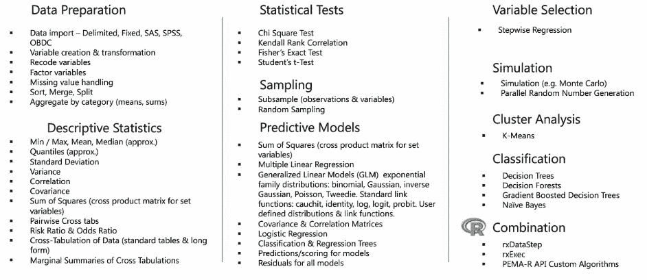

图 1：RevoScaleR 函数列表（来源：Microsoft）

# 数据准备函数

导入数据是数据准备过程中的第一步。导入数据是指将数据从任何外部系统通过外部文件或建立与实时数据源的连接引入到您的系统中。在接下来的部分，我们将探讨如何导入存储为 SPSS 或 SAS 文件的数据，以及如何使用 ODBC 连接字符串直接连接到外部实时数据库系统。

# 从 SAS、SPSS 和 ODBC 导入数据

将数据导入 R 或 SQL Server 表不是`RevoScaleR`库的主要焦点，但由于这一点在列表中，让我们简要地了解一下。这样，根据您的数据源，`RevoScaleR`包提供了连接到不同数据源的能力。其中也包括 SAS 和 SPSS——两个非常广泛且常用的数据分析与预测分析统计程序。我们将简单地关注 SAS 软件（[`www.sas.com/`](https://www.sas.com/)），SPSS Statistics，于 2009 年被 IBM 收购（[`www.ibm.com/products/spss-statistics`](https://www.ibm.com/products/spss-statistics)），或 SPSS Modeler（[`www.ibm.com/products/spss-modeler`](https://www.ibm.com/products/spss-modeler)）。

# 导入 SAS 数据

如果不是统计分析、数据挖掘和机器学习中最受欢迎的程序，SAS 是数据分析中流行的程序之一。因此，让我们创建一个简单的 SAS 文件，并使用`ScaleR`函数读取它。

使用以下 SAS 代码（代码与本书一起提供），您可以非常容易地创建一个样本数据集：

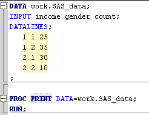

图 2：SAS 代码的概述

现在，让我们假设我们的 SAS 数据存储在文件`sas_data.sas7bdat`中，正如代码在`PROC DATA`语句中所建议的那样。

使用以下 R 代码，我们可以提取并将此数据集导入到 R 的`data.frame`中：

```py
EXEC sp_execute_external_script
 @language = N'R'
 ,@script = N'
 library(RevoScaleR)
 SampleSASFile <- file.path(rxGetOption("sampleDataDir"), "sas_data.sas7bdat")
 #import into Dataframe
 OutputDataSet <- rxImport(SampleSASFile)
 '
WITH RESULT SETS
 ((
 income  INT
 ,gender  INT
      ,[count] INT
 ))
```

确保您的`sampleDataDir`包含数据样本。您还可以指定其他路径，例如：

```py
SampleSASFile <- file.path(("C:\\Users\\TomazK\\Documents\\CH05"), "sas_data.sas7bdat")  
```

然而，您需要确保您已授予对此工作文件夹的访问权限。两种方式都会以表格形式呈现结果，如下从 SAS 文件中读取：

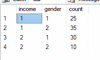

图 3：SAS 代码结果的概述

另一种导入 SAS 文件的方法是直接使用`RxSasData`（在这种情况下，从 R）：

```py
SampleSASFile <- file.path(("C:\\Users\\tomazK\\CH05"), "sas_data.sas7bdat")
sasDS <- RxSasData(SampleSASFile, stringsAsFactors = TRUE, 
 colClasses = c(income = "integer", gender= "integer", count="integer"),
rowsPerRead = 1000)
rxHistogram( ~F(gender)|F(income), data = sasDS)  
```

您可以轻松地从 SAS 数据文件中生成直方图。

# 导入 SPSS 数据

使用 SPSS，过程类似。以下 SPSS 语法（语法包含在本章中）生成样本数据集，该数据集存储在您的本地机器上：

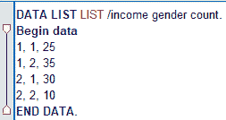

图 4：SPSS 语法的概述

这涉及到使用从前面 SPSS 语法生成的 SPSS 保存文件将数据导入 R 服务，这与 SAS 文件相对类似：

```py
EXEC sp_execute_external_script
 @language = N'R'
 ,@script = N'
 library(RevoScaleR)
 SampleSPSSFile <- file.path(rxGetOption("sampleDataDir"), "spss_data.sav")
 #import into Dataframe
 OutputDataSet <- rxImport(SampleSPSSFile)
 '
WITH RESULT SETS
 ((
 income  INT
 ,gender  INT
 ,[count] INT
 ))

```

此外，`RevoScaleR` 包有一个特殊函数可以直接读取 SPSS 文件，称为 `RxSpssData`。以下 R 代码可以完成与前面 T-SQL 代码相同的结果：

```py
SampleSPSSFile <- file.path(("C:\\Users\\tomazK\\CH05"), "spss_data.sav")
spssDS <- RxSpssData(SampleSPSSFile, stringsAsFactors = TRUE, 
                       colClasses = c(income = "integer", gender= "integer", count="integer"),rowsPerRead = 1000)
rxHistogram( ~F(income)|F(count), data = spssDS)

```

并且 `RevoScaleR` 直方图可以直接与 SPSS 数据源一起使用，生成简单的直方图：

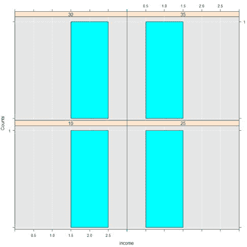

# 使用 ODBC 导入数据

使用 ODBC 驱动程序可以扩展对几乎所有可以获取驱动程序且具有通用 RDBM 模型的数据库的访问权限。

`RevoScaleR` 包扩展了 ODBS 驱动程序的列表，也支持 Linux 和其他系统。使用 ODBC，您可以连接到 MySQL、Oracle、PostgreSQL、Linux 上的 SQL Server、Cloudera 和 Teradata（在这种情况下，使用 `RxTeradata` 函数会更好）。

以下示例将使用 ODBC 驱动程序从另一个 SQL 服务器实例获取数据，同时使用 `RxOdbcData` 和 `RxSqlServerData` 函数，因为它们可以互换使用：

```py
EXEC sp_execute_external_script
 @language = N'R'
 ,@script = N'
 library(RevoScaleR)
 sConnectStr <- "Driver={ODBC Driver 13 for SQL Server};Server=TOMAZK\MSSQLSERVER2017;Database=AdventureWorks;Trusted_Connection=Yes"
 sQuery = "SELECT TOP 10 BusinessEntityID,[Name],SalesPersonID FROM [Sales].[Store] ORDER BY BusinessEntityID ASC"
 sDS <-RxOdbcData(sqlQuery=sQuery, connectionString=sConnectStr)
 OutputDataSet <- data.frame(rxImport(sDS))
                            '
WITH RESULT SETS
 ((
 BusinessEntityID  INT
 ,[Name]  NVARCHAR(50)
 ,SalesPersonID INT
 ));

```

这将与在同一服务器上运行以下命令相同：

```py
USE AdventureWorks;
GO

SELECT
TOP 10
BusinessEntityID
,[Name]
,SalesPersonID
FROM [Sales].[Store]
ORDER BY BusinessEntityID ASC

```

在使用 `RxOdbcData` 函数的情况下，您应检查凭证，并且您可能还想检查您正在使用哪个用户来运行脚本。您还可以创建一个新的登录和用户，并使用它来检查和执行脚本：`Adventureworks` 数据库可以从微软的 GitHub 网站下载（[`github.com/Microsoft/sql-server-samples/tree/master/samples/databases/adventure-works`](https://github.com/Microsoft/sql-server-samples/tree/master/samples/databases/adventure-works)）：

```py
EXECUTE AS USER='MSSQLSERVER01'
GO
-- YOUR CODE
REVERT;
GO

```

# 变量创建和数据转换

变量创建和数据转换是在定义数据清洗和数据整理任务时的两个过程。这些任务对于适当的数据准备很重要，并使分析数据以供未来任务更容易。

我们将要探索的函数如下：

+   变量创建和重新编码

+   数据转换

+   处理缺失值

+   排序、合并和分割数据集

+   按类别（即总和）汇总，这与 T-SQL 汇总和 Windows 函数类似

本部分将涵盖以下一些函数，主要关注数据转换、处理缺失值和分割数据集：

`RxDataSource`、`rxDataStep`、`rxDataStepXdf`、`RxFileSystem`、`rxFindFileInPath`、`rxFindPackage`、`rxFisherTest`、`RxForeachDoPar`、`rxGetInfo`、`rxGetInfoXdf`、`rxGetJobInfo`、`rxGetJobInfo`、`rxGetOption`、`rxGetVarInfo`、`rxGetVarNames`、`rxImport`、`rxImportToXdf`、`rxIsOpen`、`rxOdbcData`、`rxOptions`、`rxOpen`、`rxQuantile`、`rxReadXdf`、`rxResultsDF`、`rxSetFileSystem`、`rxSetInfo`、`rxSetInfoXdf`、`rxSort`、`rxSetVarInfoXdf`、`rxSetVarInfo`、`rxMarginals`、`rxMerge`、`rxMergeXdf`

当使用数据库内 R 服务（或数据库内机器学习服务，包括 SQL Server 2017 的 Python）时，你应该牢记在哪里以及如何进行任何类型的数据转换、数据处理，以及排序和/或合并。经过多次性能和速度测试后，变得非常清楚，许多的整理和数据处理任务应该在将数据集发送到由 `sp_execute_external_script` 执行之前在数据库内完成。这个函数集是唯一一个需要将计算上下文视为非常重要的函数集。所有其他用于统计测试、描述性统计和预测统计的函数都可以很容易地与外部过程一起使用，而不会影响性能或时间。

从 `rxDataStep` 函数开始，它为我们提供了许多使用数据库内 R 提取和生成 XDF 文件的机会：

```py
EXEC sp_execute_external_script
 @language = N'R'
 ,@script = N'
 df_sql <- InputDataSet 
                  df_sql4 <- data.frame(df_sql)
 outfile <- file.path(rxGetOption("sampleDataDir"), "df_sql4.xdf") 
 rxDataStep(inData = df_sql4, outFile = outfile, overwrite = TRUE)'
 ,@input_data_1 = N'
 SELECT 
 BusinessEntityID
                  ,[Name]
                  ,SalesPersonID
                  FROM [Sales].[Store]'

```

这将在你的样本数据目录中生成 `df_sql4.xdf` 文件。如果你对指向此文件夹的位置感兴趣，你可以执行以下操作：

```py
EXEC sp_execute_external_script
 @language = N'R'
 ,@script = N'
 OutputDataSet <- data.frame(path = file.path(rxGetOption("sampleDataDir")))'

```

它将类似于以下截图所示的内容：

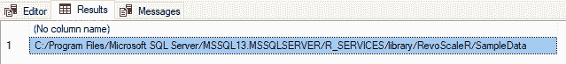

确保你已经为执行 `rxDataStep` 代码的用户授予了访问权限，因为代码将在目标位置创建一个物理 XDF 文件。

# 变量创建和重新编码

使用 `rxGetVarInfo` 将将 `data.frame` 的信息暴露给 `sp_execute_external_script` 输出。很明显，一些这些函数从未被设计为向 `data.frame` 展示输出，而是仅设计用于探索数据集。一些这些函数（例如，`rxGetVarInfo`）将在 R 环境中给出一个很好的输出，但在 SQL Server 数据库的数据框中操作输出将很困难：

```py
EXEC sp_execute_external_script
 @language = N'R'
 ,@script = N'
 library(RevoScaleR)
 df_sql <- InputDataSet 
                  var_info <- rxGetVarInfo(df_sql)
 OutputDataSet <- data.frame(unlist(var_info))'
 ,@input_data_1 = N'
 SELECT 
 BusinessEntityID
 ,[Name]
 ,SalesPersonID
 FROM [Sales].[Store]'

```

注意，我们正在使用 `unlist` 函数，该函数将列表的集合取消列表成一个向量。只是为了比较输出，我们可以在 R 环境中运行相同的脚本：

```py
library(RevoScaleR) 
sConnectStr <- "Driver={ODBC Driver 13 for SQLServer};Server=TOMAZK\\MSSQLSERVER2017;Database=AdventureWorks;Trusted_Connection=Yes" 
sQuery = "SELECT  BusinessEntityID,[Name],SalesPersonID FROM [Sales].[Store] ORDER BY BusinessEntityID ASC" 
sDS <-RxOdbcData(sqlQuery=sQuery, connectionString=sConnectStr) 
df_sql <- data.frame(rxImport(sDS)) 
```

现在，运行 `rxGetVarInfo(df_sql)` 将给出一个略微不同的导出结果：

```py
> var_info <- rxGetVarInfo(df_sql) 
> var_info 
Var 1: BusinessEntityID, Type: integer, Low/High: (292, 2051) 
Var 2: Name, Type: character 
Var 3: SalesPersonID, Type: integer, Low/High: (275, 290) 
```

使用 `unlist()` 函数取消列表后，我们得到相同的信息，但以稍微不同的方式书写：

```py
> df <- data.frame(unlist(var_info)) 
> df 
                         unlist.var_info. 
BusinessEntityID.varType          integer 
BusinessEntityID.storage            int32 
BusinessEntityID.low                  292 
BusinessEntityID.high                2051 
Name.varType                    character 
Name.storage                       string 
SalesPersonID.varType             integer 
SalesPersonID.storage               int32 
SalesPersonID.low                     275 
SalesPersonID.high                    290 
```

这表明，这些用于变量创建和重新编码的函数更多的是为 R 数据工程师而不是 T-SQL 数据工程师设计的。

`rxGetInfo()` 函数将获取你的数据集大小以及观测值/变量的数量：

```py
EXEC sp_execute_external_script
 @language = N'R'
 ,@script = N'
                  library(RevoScaleR)
 df_sql <- InputDataSet 
                  var_info <- rxGetInfo(df_sql)
 OutputDataSet <- data.frame(unlist(var_info))'
 ,@input_data_1 = N'
 SELECT 
                   BusinessEntityID
                  ,[Name]
                  ,SalesPersonID
                  FROM [Sales].[Store]'

```

同样的逻辑适用：如果你运行这个 R 环境，你将得到一个更整洁的信息显示：

```py
> rxGetInfo(df_sql) 
Data frame: df_sql  
Number of observations: 701  
Number of variables: 3  
```

向此函数添加一些额外的参数也会产生更丰富的输出，如下所示：

```py
> rxGetInfo(df_sql, getVarInfo = TRUE) 
Data frame: df_sql  
Number of observations: 701  
Number of variables: 3  
Variable information:  
Var 1: BusinessEntityID, Type: integer, Low/High: (292, 2051) 
Var 2: Name, Type: character 
Var 3: SalesPersonID, Type: integer, Low/High: (275, 290) 
```

使用 `rxGetVarInfo` 和 `rxGetInfo`，`rxGetVarInfo` 将生成一个元素列表。`rxGetVarInfo` 将生成一个列表的列表，其中元组的数量等于变量的数量，而 `rxGetInfo` 将生成一个包含六个元素的列表，其中每个列表将包含有关对象的信息：

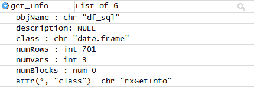

了解这一点后，可以对前面的 T-SQL 执行进行轻微的修改，以便以更易读的格式显示相关信息，通过向结果集呈现元素（元组）：

```py
EXEC sp_execute_external_script
 @language = N'R'
 ,@script = N'
 library(RevoScaleR)
 df_sql <- InputDataSet 
 get_Info <- rxGetInfo(df_sql) 
 Object_names <- c("Object Name", "Number of Rows", "Number of Variables")
 Object_values <- c(get_Info$objName, get_Info$numRows, get_Info$numVars)
 OutputDataSet <- data.frame(Object_names, Object_values)'
 ,@input_data_1 = N'
 SELECT 
                   BusinessEntityID
                  ,[Name]
                  ,SalesPersonID
                  FROM [Sales].[Store]'
WITH RESULT SETS
 ((
 ObjectName NVARCHAR(100)
 ,ObjectValue NVARCHAR(MAX)
 ));

```

在 SQL Server Management Studio 中返回的结果：

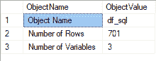

这看起来非常整洁，多花一些精力肯定能给出格式更好、更容易阅读以及更富有信息量的结果。

在这个例子中，您还看到了如何创建一个新变量。这在清理数据或重新编码/分桶数据时特别有用。

假设您想重新编码数据集中现有变量的值并创建一个新的变量。可以使用以下标准 R 代码完成：

```py
EXEC sp_execute_external_script
 @language = N'R'
 ,@script = N'
 df_sql <- InputDataSet
 #first create an empty variable
 df_sql$BusinessType <- NA
 df_sql$BusinessType[df_sql$BusinessEntityID<=1000] <- "Car Business"
 df_sql$BusinessType[df_sql$BusinessEntityID>1000] <- "Food Business"
 OutputDataSet <- df_sql'
 ,@input_data_1 = N'
 SELECT 
 BusinessEntityID
 ,[Name]
 ,SalesPersonID
 FROM [Sales].[Store]'
WITH RESULT SETS
 ((
 BusinessEntityID INT
 ,[Name] NVARCHAR(MAX)
 ,SalesPersonID INT
 ,TypeOfBusiness NVARCHAR(MAX)
 ));

```

或者，您可以使用 `rxDataStep()` 函数和 `transformFunc` 参数，以及一个用于通过转换旧值创建新变量的附加函数来完成此操作：

```py
EXEC sp_execute_external_script
 @language = N'R'
 ,@script = N'
 library(RevoScaleR)
 df_sql <- InputDataSet
 df_sql$BusinessEntityID_2 <- NA

 myXformFunc <- function(dataList) {
 #dataList$BussEnt <- 100 * dataList$BusinessEntityID
 if (dataList$BusinessEntityID<=1000){dataList$BussEnt <- "Car Business"} else {dataList$BussEnt <- "Food Business"}
 return (dataList)
 }

 df_sql <- rxDataStep(inData = df_sql, transformFunc = myXformFunc)
 OutputDataSet <- df_sql'
 ,@input_data_1 = N'
 SELECT 
 BusinessEntityID
 ,[Name]
 ,SalesPersonID
 FROM [Sales].[Store]'
WITH RESULT SETS
 ((
 BusinessEntityID INT
 ,[Name] NVARCHAR(MAX)
 ,SalesPersonID INT
 ,TypeOfBusiness NVARCHAR(MAX)
 ));
```

`rxDataStep()X` 是一个非常强大的函数，主要用于数据选择、子集化、数据转换以及为所需数据集创建新变量。

# 数据集子集化

使用 `rxDataStep()` 函数对数据进行子集化也是相对直接的：

```py
EXEC sp_execute_external_script
 @language = N'R'
 ,@script = N'
 library(RevoScaleR)
 df_sql <- InputDataSet
 df_sql_subset <- rxDataStep(inData = df_sql, varsToKeep = NULL, rowSelection = (BusinessEntityID<=1000))
 OutputDataSet <- df_sql_subset'
 ,@input_data_1 = N'
 SELECT 
 BusinessEntityID
 ,[Name]
 ,SalesPersonID
 FROM [Sales].[Store]'
WITH RESULT SETS
 ((
 BusinessEntityID INT
 ,[Name] NVARCHAR(MAX)
 ,SalesPersonID INT
 ));

```

请记住，使用 R 代码进行子集化操作可能会带来不必要的内存和 I/O 成本，尤其是在将整个数据集泵入 R 而不是事先对数据进行子集化时。在前面的例子中，`rxDataStep` 中的 `rowSelection` 参数可以很容易地用 `@input_data_1` 参数中的 `WHERE` 子句替换。所以请记住这一点，并始终避免不必要的流量。

# 数据集合并

`rxMerge()` 函数将两个数据集合并为一个。数据集必须是数据框（或 XDF 格式），并且操作类似于 T-SQL 中的 `JOIN` 子句（`rxMerge()` 函数不应与 T-SQL 的 `MERGE` 语句混淆）。使用 `matchVars` 参数根据一个或多个变量合并两个数据集。此外，当使用本地计算上下文（我们将在下一个示例中使用）时，还需要定义数据的排序，因为 R 中的 `data.frames` 作为向量的集合既没有预先排序，也没有任何排序。因此，如果没有进行预先排序，则必须将 `autoSort` 参数设置为 true (`autosort = TRUE`)：

```py
EXEC sp_execute_external_script
 @language = N'R'
 ,@script = N'
 library(RevoScaleR)
 df_sql <- InputDataSet
 someExtraData <- data.frame(BusinessEntityID = 1:1200, department = rep(c("a", "b", "c", "d"), 25), Eff_score = rnorm(100))
 df_sql_merged <- rxMerge(inData1 = df_sql, inData2 = someExtraData, overwrite = TRUE, matchVars = "BusinessEntityID", type = "left" ,autoSort = TRUE)
 OutputDataSet <- df_sql_merged'
 ,@input_data_1 = N'
 SELECT 
 BusinessEntityID
 ,[Name]
 ,SalesPersonID
 FROM [Sales].[Store]'
WITH RESULT SETS
 ((
 BusinessEntityID INT
 ,[Name] NVARCHAR(MAX)
 ,SalesPersonID INT
 ,Department CHAR(1)
 ,Department_score FLOAT
 ));

```

这段 T-SQL 代码在两个数据集上创建了一个左连接。动态创建的数据框 2（称为 `someExtraData`），但它可以是任何其他从 XDF 文件读取的数据框或任何手动插入的数据集，并在 R 运行时进行连接。请注意，哪个是第一个数据框，哪个是第二个数据框，以及您正在使用哪种类型的连接。前面的例子指定了以下内容：

```py
inData1 = df_sql, inData2 = someExtraData, type = "left" 
```

然而，数据框的顺序可以按以下方式更改：

```py
inData1 = someExtraData , inData2 = df_sql, type = "left" 
```

然后，输出将呈现不同的形式（数据框中列的排序将改变）。

# 描述性统计函数

描述性统计有助于了解数据。这些是通过总结特征和度量来描述给定数据集的汇总统计，例如集中趋势和离散程度的度量。集中趋势包括计算平均值、中位数、众数，而离散程度的度量包括范围、四分位数、最小值和最大值、方差和标准差，以及偏度和峰度。

这些统计数据由`RevoScaleR`包中的`rx-`函数覆盖，这意味着您可以通过调用：`rxSummary`、`rxCrossTabs`、`rxMarginals`、`rxQuantile`、`rxCube`和`rxHistogram`来使用该包的所有计算优势，无需担心性能、内存不足异常或哪个 R 包包含正确的函数。

我们将在`AdventureWorks`数据库中使用`[Sales].[vPersonDemographics]`视图来清楚地展示这些函数的可用性：

```py
EXEC sp_execute_external_script
 @language = N'R'
 ,@script = N'
 library(RevoScaleR)
 df_sql <- InputDataSet
 summary <- rxSummary(~ TotalChildren,  df_sql, summaryStats = c( "Mean", "StdDev", "Min", "Max","Sum","ValidObs", "MissingObs"))
 OutputDataSet <- summary$sDataFrame'
 ,@input_data_1 = N'
 SELECT * FROM [Sales].[vPersonDemographics] WHERE [DateFirstPurchase] IS NOT NULL'
WITH RESULT SETS
 ((
 VariableName NVARCHAR(MAX)
 ,"Mean"NVARCHAR(100)
 ,"StdDev"NVARCHAR(100)
 ,"Min"NVARCHAR(100)
 ,"Max"NVARCHAR(100)
 ,"Sum"NVARCHAR(100)
 ,"ValidObs"NVARCHAR(100)
 ,"MissingObs"NVARCHAR(100)
 ));

```

您可以使用一行 R 代码获取一些汇总统计。我更喜欢使用`summaryStats`参数来列出统计信息，但请注意，统计信息的顺序并不代表输出顺序相同。此外，使用`summary$sDataFrame`数据框作为`rxSummary`的结果将自动生成包含所有汇总的数值变量的数据框。

T-SQL 查询的结果如下：

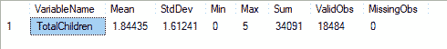

`rxSummary()`函数还包含一个公式，您可以通过它指定函数在计算描述性统计时要考虑哪些变量。在我们的例子中，我们只使用了`TotalChildren`变量：

```py
rxSummary(~ TotalChildren, ... 
```

但假设我们想要获取所有变量的描述性统计；我们只需写下以下内容：

```py
rxSummary(~.,  .... 
```

这将为我们提供所有变量的统计数据，如下面的截图所示：

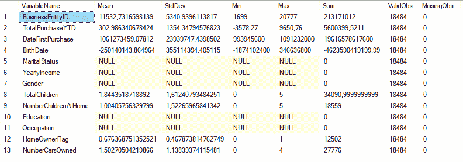

注意，只有整数（连续）类型的变量将被考虑，而像`MaritalStatus`、`Education`和`Occupation`这样的变量将显示为`NULL`，因为这些变量在 R 中被视为分类变量。

对于此，首先，我们需要指定因素变量，基于此，我们将能够运行统计：

```py
EXEC sp_execute_external_script
 @language = N'R'
 ,@script = N'
 library(RevoScaleR)
 df_sql <- InputDataSet
 df_sql_r <- rxFactors(inData = df_sql, sortLevels = TRUE,
factorInfo = list(MS = list(levels = c("M","S"), otherLevel=NULL, varName="MaritalStatus")))
 summary <- rxSummary(~ MS,  df_sql_r)
 OutputDataSet <- data.frame(summary$categorical)'
 ,@input_data_1 = N'
 SELECT * FROM [Sales].[vPersonDemographics] WHERE [DateFirstPurchase] IS NOT NULL'
WITH RESULT SETS
 ((
 MS NVARCHAR(MAX)
 ,"Counts"INT
 ));

```

此函数将为`MaritalStatus`因素提供简单的计数：

```py
MS Counts 
M  10011 
S   8473 
```

同样的逻辑可以应用于所有其他分类变量。`rxSummary()`函数中的公式还赋予用户组合不同变量的能力。例如，而不是使用以下代码：

```py
rxSummary(~ TotalChildren, df_sql_r) 
```

我们也可以使用以下代码：

```py
rxSummary(NumberCarsOwned ~ TotalChildren, df_sql_r) 
```

这将计算两个变量的观察统计：

```py
Name                          Mean     StdDev   Min Max Sum   ValidObs MissObs 
NumberCarsOwned:TotalChildren 3.258656 4.473517 0   20  60233 18484    0          
```

这也可以用于计算分类变量。这些变量需要首先被重新编码为因素，然后可以计算相同的汇总统计：

```py
rxSummary(~ TotalChildren:F(MS), df_sql_r) 
```

使用`sp_execute_external_script`的完整 R 和 T-SQL 代码如下：

```py
EXEC sp_execute_external_script
 @language = N'R'
 ,@script = N'
 library(RevoScaleR)
 df_sql <- InputDataSet
 df_sql_r <- rxFactors(inData = df_sql, sortLevels = TRUE,factorInfo = list(MS = list(levels = c("M","S"), otherLevel=NULL, varName="MaritalStatus")))
 summary <- rxSummary(~F(MS):TotalChildren, df_sql_r, summaryStats = c( "Mean", "StdDev", "Min", "Max", "ValidObs", "MissingObs", "Sum"), categorical=c("MS"))
 OutputDataSet <- data.frame(summary$categorical)'
 ,@input_data_1 = N'
 SELECT * FROM [Sales].[vPersonDemographics] WHERE [DateFirstPurchase] IS NOT NULL'
WITH RESULT SETS
 ((
 Category NVARCHAR(MAX)
 ,"MS"NVARCHAR(MAX)
 ,"Means"FLOAT
 ,"StDev"FLOAT
 ,"Min"INT
 ,"Max"INT
 ,"Sum"INT
 ,"ValidObs"INT
 ));

```

以下是对每个因素级别的结果：

```py
Name               Mean     StdDev   Min Max Sum   ValidObs MissingObs
 TotalChildren:F_MS 1.844352 1.612408 0   5   34091 18484    0 

Statistics by category (2 categories):

Category                  F_MS Means    StdDev   Min Max Sum   ValidObs
TotalChildren for F(MS)=M M    2.080412 1.583326 0   5   20827 10011 
TotalChildren for F(MS)=S S    1.565443 1.601977 0   5   13264  8473 

```

分位数和十分位数也非常有用，可以查看数据分布，`RevoScaleR`包提供了`rxQuantile`函数。使用 T-SQL，结果集可以返回如下：

```py
EXEC sp_execute_external_script
 @language = N'R'
 ,@script = N'
 library(RevoScaleR)
                  df_sql <- InputDataSet
                  quan <- rxQuantile(data = df_sql, varName = "TotalChildren")
                  quan <- data.frame(quan)
 values <- c("0%","25%","50%","75%","100%")
 OutputDataSet <- data.frame(values,quan)'
 ,@input_data_1 = N'
 SELECT * FROM [Sales].[vPersonDemographics] WHERE [DateFirstPurchase] IS NOT NULL'
 WITH RESULT SETS
      ((
            Quartile NVARCHAR(100)
            ,QValue FLOAT
 ));

```

这给我们以下结果：

```py
0%  25%  50%  75% 100% 
0    0    2    3    5 

```

我们也可以通过稍微修改`rxQuantile()`函数来修改和计算十分位数：

```py
EXEC sp_execute_external_script
 @language = N'R'
 ,@script = N'
 library(RevoScaleR)
 df_sql <- InputDataSet
 dec <- rxQuantile(data = df_sql, varName = "TotalChildren",  probs = seq(from = 0, to = 1, by = .1))
 dec <- data.frame(dec)
 values <- c("0%","10%","20%","30%","40%","50%","60%","70%","80%","90%","100%")
 OutputDataSet <- data.frame(values,dec)'
 ,@input_data_1 = N'
 SELECT * FROM [Sales].[vPersonDemographics] WHERE [DateFirstPurchase] IS NOT NULL'
WITH RESULT SETS
 ((
 Decile NVARCHAR(100)
 ,DValue FLOAT
 ));

```

计算交叉表（两个或更多变量之间的关系）我们将使用两个函数：`rxCrossTabs`和`rxMargins`。交叉表通常以列联表或其他*[n]*[m]表格格式表示；这实际上取决于每个变量将有多少个级别。

我们将使用我们的两个变量`NumberCarsOwned`和`TotalChildren`来探索`rxCrossTabs`：

```py
EXEC sp_execute_external_script
 @language = N'R'
      ,@script = N'
 library(RevoScaleR)
 df_sql <- InputDataSet
                  crosstab <- rxCrossTabs(N(NumberCarsOwned) ~ F(TotalChildren),  df_sql, means=FALSE) #means=TRUE
 children <- c(0,1,2,3,4,5)
                  OutputDataSet <- data.frame(crosstab$sums, children)'
 ,@input_data_1 = N'
 SELECT * FROM [Sales].[vPersonDemographics] WHERE [DateFirstPurchase] IS NOT NULL'
WITH RESULT SETS
      ((
             NumberOfCarsOwnedSUM INT
            ,NumberOfChildren INT
 ));

```

使用`rxCrossTabs`计算交叉表可以提供两种类型的统计：给定交叉类别的观测值的计数和平均值。这是通过`means = TRUE`或`means = FALSE`参数来操作的。该函数以需要依赖变量和独立变量的方式运行，在我们的例子中，信息可以从以下结果中检索：

```py
Cross Tabulation Results for: N(NumberCarsOwned) ~ F(TotalChildren)
Data: df_sql
Dependent variable(s): N(NumberCarsOwned)
Number of valid observations: 18484
Number of missing observations: 0 
Statistic: sums 

```

为了成功计算交叉表，独立变量必须以因素的形式呈现。在这种情况下，`TotalChildren`变量被`F()`函数包装，表示在运行时进行因素转换。

这可以使用基础包或 R 中的标准条形图进行可视化：

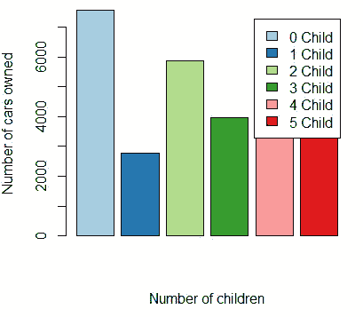

使用以下代码使用`barplot`函数绘制直方图：

```py
library(RColorBrewer) 
barplot(OutputDataSet$V1, xlab = "Number of children",ylab = "Number of cars owned", 
        legend.text = c("0 Child","1 Child","2 Child","3 Child","4 Child","5 Child"), col=brewer.pal(6, "Paired")) 
```

使用分类变量时，无需进行显式转换：

```py
EXEC sp_execute_external_script
      @language = N'R'
 ,@script = N'
            library(RevoScaleR)
            df_sql <- InputDataSet
 crosstab <- rxCrossTabs(NumberCarsOwned ~ MaritalStatus,  df_sql, means=FALSE) 
            status <- c("M","S")
            OutputDataSet <- data.frame(crosstab$sums, status)'
 ,@input_data_1 = N'
 SELECT * FROM [Sales].[vPersonDemographics] WHERE [DateFirstPurchase] IS NOT NULL'
WITH RESULT SETS
      ((
             NumberOfCarsOwnedSUM INT
             ,MaritalStatus NVARCHAR(100)
 ));

```

此外，转换参数可以用来重新编码、重新计算或以某种方式转换任何变量。从`rxCrossTabs`派生的列联表边缘统计可以使用`rxMarginals`函数调用，该函数简单地将`rxCrossTabs`包装起来。

边缘统计将为您提供所需变量的每一行或每一列的总和、计数或平均值：

```py
EXEC sp_execute_external_script
 @language = N'R'
 ,@script = N'
                  library(RevoScaleR)
                  df_sql <- InputDataSet
                  mar <- rxMarginals(rxCrossTabs(NumberCarsOwned ~ F(TotalChildren), data=df_sql, margin=TRUE, mean=FALSE))
 OutputDataSet  <- data.frame(mar$NumberCarsOwned$grand)'
 ,@input_data_1 = N'
      SELECT * FROM [Sales].[vPersonDemographics] WHERE [DateFirstPurchase] IS NOT NULL'
WITH RESULT SETS
 ((
            GrandTotal INT
 ));

```

结果如下：

```py
> mar$NumberCarsOwned$grand 
[1] 27776 
```

探索数据也可以使用图表进行，`RevoScaleR`包提供了折线图和条形图，两者都旨在处理大型数据集。

以下是一个变量的简单预览：

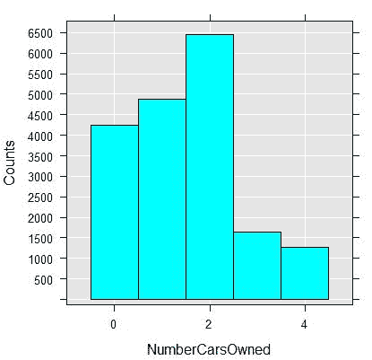

使用以下 R 代码行：

```py
rxHistogram(~NumberCarsOwned, data=df_sql) 
```

这已经按照以下方式转换为婚姻状况因素：

```py
rxHistogram(~F(MS), data=df_sql_r) 
```

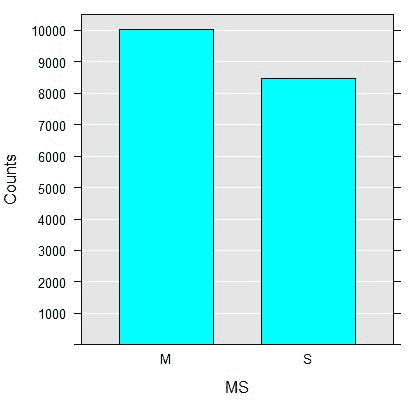

此外，变量可以组合如下（婚姻状况与拥有汽车的数量）：

```py
rxHistogram(~ NumberCarsOwned | F(MS), title="Cars owned per Marital Status",  numBreaks=10, data = df_sql_r) 

```

我们得到以下图表，显示了婚姻状况（**M** - 已婚；**S** - 未婚）和拥有汽车的总数作为一个分类变量（**0** - 没有汽车，**1** - 拥有一辆汽车，**2** - 拥有两辆汽车，**3** - 拥有三辆汽车，以及 **4** - 拥有四辆汽车）：

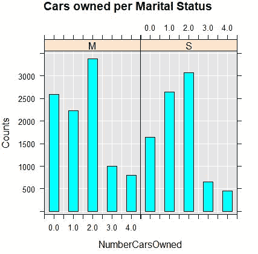

除了条形图，我们还可以使用折线图，但这次使用不同的变量：

```py
rxLinePlot(as.numeric(log(TotalPurchaseYTD)) ~ as.factor(DateFirstPurchase), data = df_sql_r, rowSelection=  
             DateFirstPurchase >= "2001-07-01 00:00:00.000"&amp; DateFirstPurchase <= "2001-07-17 00:00:00.000", type="p") 
```

对于超过半年时间（从 2001 年 1 月 1 日到 7 月 17 日）的时间段，图表显示的是这段时间内总购买量的对数变量。在这种情况下，我们需要对日期变量进行因式分解，并且我们还在使用`log()`函数来平衡购买量。而不是使用`rxHistogram`，我们使用另一个`RevoScaleR`函数`rxLinePlot`来为大型数据集绘制图表。`rxLinePlot`代表折线图：

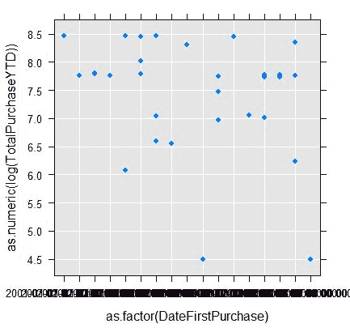

因此，最终我们可以使用`par()`函数将所有三个图表结合起来，排列成两列，每列包含一个或两个图表：

```py
# combined 
h1 <- rxHistogram(~NumberCarsOwned, data=df_sql) 
h2 <- rxHistogram(~F(MS), data=df_sql_r) 
p1 <- rxLinePlot(as.numeric(log(TotalPurchaseYTD)) ~ as.factor(DateFirstPurchase), data = df_sql_r, rowSelection=  
             DateFirstPurchase >= "2001-07-01 00:00:00.000"&amp; DateFirstPurchase <= "2001-07-17 00:00:00.000", type="p") 

print(h1, position = c(0, 0.5, 0.5, 1), more = TRUE) 
print(h2, position = c(0.5, 0.5, 1, 1), more = TRUE) 
print(p1, position = c(0.5, 0.05, 1, 0.5)) 
```

使用图表对于讲故事、客户旅程或通过结合最有信息量的变量快速理解数据都是有益的。另一种好方法是使用 Markdown 文档，并在一个块中包含多个图表。当使用`par()`函数与`rxHistogram`或`rxLinePlot`结合时，它可能并不总是按预期显示图表。这是由于与`par()`函数的一些兼容性问题。作为替代，使用`print()`函数并定位每个图表是另一种方法，这样可以避免可能的问题：

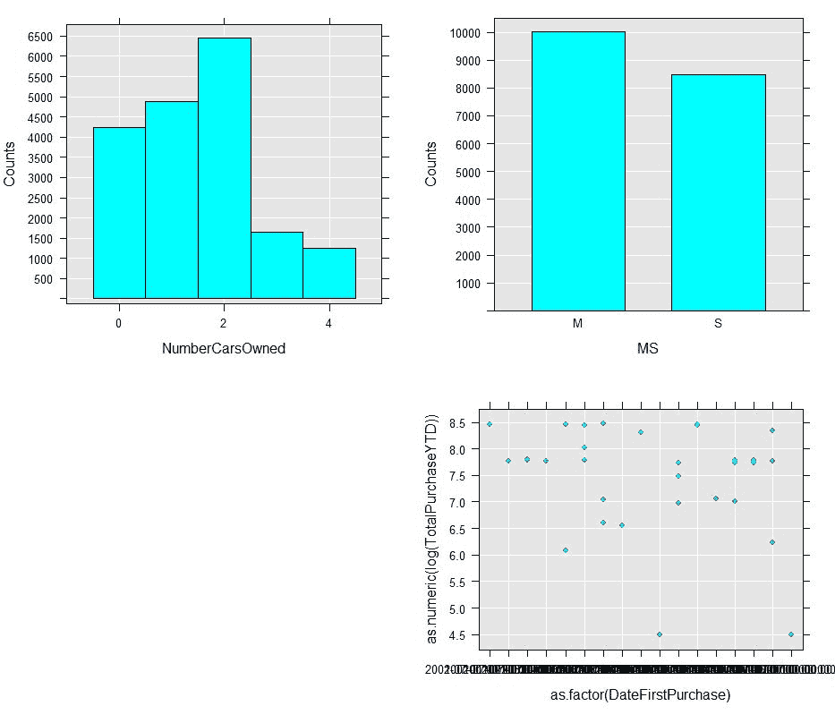

# 统计测试和抽样的函数

统计测试对于确定两个（或更多）变量之间的相关性及其相关方向（正相关、中性或负相关）非常重要。从统计学的角度来看，相关性是衡量两个变量之间关联强度及其方向的度量。`RevoScaleR`包支持计算卡方、费舍尔和肯德尔秩相关。根据变量的类型，你可以区分肯德尔、斯皮尔曼或皮尔逊相关系数。

对于卡方测试，我们将使用`rxChiSquareTest()`函数，该函数使用列联表来查看两个变量是否相关。小的卡方测试统计量意味着观察到的数据与预期数据非常吻合，表示存在相关性。计算卡方的公式如下：

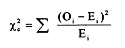

在计算这个统计独立性测试之前，我们必须有`xCrossTab`或 xCube 格式的数据。因此，T-SQL 查询需要首先生成交叉表，以便计算卡方系数。

卡方是在两个分类变量上生成的如下：

```py
EXEC sp_execute_external_script
 @language = N'R'
 ,@script = N'
 library(RevoScaleR)
 df_sql <- InputDataSet
 df_sql_r <- rxFactors(inData = df_sql, sortLevels = TRUE,factorInfo = list(MS = list(levels = c("M","S"), otherLevel=NULL, varName="MaritalStatus")))
 df_sql_r$Occupation <- as.factor(df_sql_r$Occupation)
 df_sql_r$MS <- df_sql_r$MS
 testData <- data.frame(Occupation = df_sql_r$Occupation, Status=df_sql_r$MS)
 d <- rxCrossTabs(~Occupation:Status,  testData, returnXtabs = TRUE)
 chi_q <- rxChiSquaredTest(d)

 #results
 xs <- chi_q$''X-squared''
 p <- chi_q$''p-value''
 OutputDataSet <- data.frame(xs,p)'
 ,@input_data_1 = N'
 SELECT * FROM [Sales].[vPersonDemographics] WHERE [DateFirstPurchase] IS NOT NULL'
WITH RESULT SETS
 ((
 Chi_square_value NVARCHAR(100)
 ,Stat_significance NVARCHAR(100)
 ));

```

返回了以下结果：

```py
Chi-squared test of independence between Occupation and Status 
 X-squared df p-value
 588.2861  4  5.312913e-126

```

使用 Kendall Tau，你可以使用 R 代码计算排名与先前相关性的相关性：

```py
rxKendallCor(d, type = "b")

```

以下是一些结果：

```py
 estimate 1 p-value
 -0.05179647       0
 HA: two.sided 

```

这个同样的原则也可以用在 T-SQL 查询中：

```py
EXEC sp_execute_external_script
          @language = N'R'
          ,@script = N'
                library(RevoScaleR)
                df_sql <- InputDataSet
                df_sql_r <- rxFactors(inData = df_sql, factorInfo = list(MS = list(levels = c("M","S"), otherLevel=NULL, varName="MaritalStatus")))
                df_sql_r$Occupation <- as.factor(df_sql_r$Occupation)
                df_sql_r$MS <- df_sql_r$MS
                testData <- data.frame(Occupation = df_sql_r$Occupation, Status=df_sql_r$MS)
                d <- rxCrossTabs(~Occupation:Status,  testData, returnXtabs = TRUE)
                ken <- rxKendallCor(d, type = "b")

                k <- ken$`estimate 1`
                p <- ken$`p-value`

                #results
                OutputDataSet <- data.frame(k,p)'
          ,@input_data_1 = N'
          SELECT * FROM [Sales].[vPersonDemographics] WHERE [DateFirstPurchase] IS NOT NULL'
    WITH RESULT SETS
          ((
                 Kendall_value NVARCHAR(100)
                ,Stat_significance NVARCHAR(100)
          ));

```

返回了许多其他可以用来计算变量之间相关性的原则。但这些都超出了本书的范围，因此我们只关注了必要的部分。

预测建模的相关函数将在下一章介绍 - 第六章，*预测建模*。

# 摘要

本章介绍了数据操作和数据整理的重要函数（以及其他许多函数）。这些步骤对于理解数据集的结构、数据集的内容以及数据的分布至关重要。这些步骤主要用于理解频率、描述性统计，以及一些统计抽样和统计相关性。

在进行数据清洗和数据合并之前，必须（或应该）完成这些步骤，以便更好地理解数据。数据清洗是最重要的，因为异常值可能会将敏感数据（或任何类型的数据）引向奇怪或错误的结论：它也可能使结果偏向其他方向。因此，通过使用强大的`rx`-函数（或类）将这些步骤视为高度重要，应该是每位数据工程师、数据整理员以及数据科学家的任务。下一章将专注于`RevoScaleR`的预测建模函数，主要关注创建模型以及在这些模型上运行预测。
