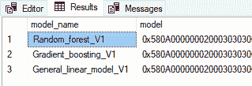

# 预测建模

预测建模是一个过程，它使用高级统计和概率算法来预测结果，基于预训练和构建的模型或函数。这些算法可以根据预测变量的结果分为算法家族。结果通常是预测的值，它解释了未来的行为。几个变量或输入数据组成一个数学函数，也称为模型（因此也称为数据建模），这些输入数据试图解释或预测结果。为了更好地理解预测建模，本章将包括以下主题：

+   数据建模

+   高级预测算法

+   预测分析

+   部署和使用预测解决方案

+   在 SQL Server 数据库中使用 R 服务进行预测

本章的重点将在于深入探讨如何在 SQL Server 2016/2017 中使用 R 来解决典型的商业问题，以了解预测建模的应用。在企业环境中，一个商业问题可以从一个非常广泛的方面来定义。例如，在医学领域，预测建模可以帮助理解和解决的一个典型问题可能是：药物 C 中成分 A 和 B 的变化是否有助于治愈疾病？此外，在冶金行业，我们能否模拟防腐蚀涂料漆随时间老化的过程——或者在零售业，顾客如何根据他们的需求或行为在商店中选择更好的产品？可以说，我们的日常生活与预测和预测息息相关。通常，我们所有人面对的每一个物流问题都是一个关于可能非常相关主题的简单问题：如果我晚 5 分钟离开家去上班，如果我走一条捷径，这会影响我的驾驶时间吗？等等。实际上，我们可以说，我们的日常决策是我们采取的所有行动的输出总和。

# 数据建模

数据建模是一个过程，我们试图找到一组独立变量或输入数据的一个函数（或所谓的模型）。就像在数据仓库中，建模是指基于物理数据结构建立概念框架，并在 ORM 或 UML（甚至 CRC）图的帮助下探索数据结构，这与在预测分析中探索结构时看到的是一样的。在后一种情况下，数据建模是探索两个或多个变量之间的结构（或关系）。这些关系可以表示为一个函数，并且本质上存储为模型。

要开始建模，我们将使用以下 GitHub 仓库中可用的 Microsoft 数据：

[`github.com/Microsoft/sql-server-samples/tree/master/samples/features/machine-learning-services/python/getting-started/rental-prediction`](https://github.com/Microsoft/sql-server-samples/tree/master/samples/features/machine-learning-services/python/getting-started/rental-prediction)

不要在这个 Python 示例中感到困惑：


下载此数据库将下载`TutorialDB.bak`文件，你只需将其恢复到已安装 R in-database 的 SQL Server 实例中。此数据库是本章附带代码的一部分。

建模数据的一部分是设置对后续预测工作方式的了解。因此，在这个阶段，我们将创建对变量及其相互关系的理解。从下载的文件中创建恢复，并运行以下从备份 T-SQL 命令的恢复：

```py
USE [master]
BACKUP LOG [TutorialDB] TO DISK = N'C:\Program Files\Microsoft SQL Server\MSSQL14.MSSQLSERVER\MSSQL\Backup\TutorialDB_LogBackup_2018-01-01_23-59-09.bak'
```

```py
WITH NOFORMAT, NOINIT, NAME = N'TutorialDB_LogBackup_2018-01-01_23-59-09', NOSKIP, NOREWIND, NOUNLOAD, NORECOVERY , STATS = 5

RESTORE DATABASE [TutorialDB] FROM DISK = N'C:\Program Files\Microsoft SQL Server\MSSQL14.MSSQLSERVER\MSSQL\Backup\TutorialDB.bak' 
WITH FILE = 2, MOVE N'TutorialDB' TO N'C:\Program Files\Microsoft SQL Server\MSSQL14.MSSQLSERVER\MSSQL\DATA\TutorialDB.mdf', 
MOVE N'TutorialDB_log' TO N'C:\Program Files\Microsoft SQL Server\MSSQL14.MSSQLSERVER\MSSQL\DATA\TutorialDB_log.ldf', NOUNLOAD, STATS = 5

GO 
```

或者，你可以在 SSMS 中简单地使用`RESTORE`命令：


现在，你将拥有已恢复的数据库和`dbo.rental_data`表可供使用。目前，这已经足够了。

数据集准备就绪后，我们现在可以通过探索和理解变量及其相互关系来开始建模数据。这种快速探索可以在 SQL Operation Studio 中进行（下载链接：[`docs.microsoft.com/en-us/sql/sql-operations-studio/download`](https://docs.microsoft.com/en-us/sql/sql-operations-studio/download))，我们将使用一个简单的查询：

```py
SELECT RentalCount,Day,Month, Holiday, Snow FROM rental_data  
```

除了标准的表格视图结果外，这还将提供一个很好的图表查看器，其中变量的简单图形表示将帮助你更好地了解数据：


但如果没有对描述性统计学的总体理解，我们就不会继续。因此，使用`RevoScaleR`包中的`rxSummary`函数将得到期望的结果：

```py
EXEC sp_execute_external_Script
@LANGUAGE = N'R'
,@script = N'
 dr_rent <- InputDataSet
 dr_rent <- data.frame(dr_rent)
    summary <- rxSummary(~ RentalCount  + Year + Month + Day  + WeekDay + Snow + Holiday , data = dr_rent)
    OutputDataSet <- summary$sDataFrame'
,@input_data_1 = N'SELECT  RentalCount, Year, Month, Day, WeekDay, Snow, Holiday FROM rental_data'
WITH RESULT SETS ((
 [Name]   NVARCHAR(100)
 ,Mean   NUMERIC(16,3)
 ,StdDev  NUMERIC(16,3)
 ,[Min]   INT
 ,[Max]  INT
 ,ValidObs  INT
 ,MissingObs INT
));
GO

```

以下是一个简单的描述性统计表格的结果：


探索单变量和多变量统计是前一章第五章，“RevoScaleR 包”的一部分，但在这里我们将更多地关注双变量和多变量统计。在我们开始之前，让我们进一步探索相关性。根据探索变量名称和描述性统计，常识会告诉我们，在假期期间，租赁数量应该更高。可以通过相关系数来检查这一点。以下是一个简单的例子：

```py
EXEC sp_execute_external_Script
@LANGUAGE = N'R'
,@script = N'
      dr_rent <- InputDataSet
      OutputDataSet <- data.frame(cor(dr_rent$Holiday, dr_rent$RentalCount))
'
,@input_data_1 = N'SELECT  Holiday, RentalCount FROM rental_data'
WITH RESULT SETS ((
 cor NUMERIC(10,3)
 ));
GO

```

这将给出`0.332`的双变量关系的概念。这是一个弱相关性，但却是正相关的：


这仅仅意味着，如果`RentalCount`变量值增加，假期的数量也会增加。这确实是有道理的，因为如果假期越来越多，预期的租赁数量也会增加。

现在，我们可以通过结合每个变量来继续探索和寻找相关性。这类似于进行 CROSS JOIN，但还有更简单的方法来做这件事。其中一种方法当然是，当然，通过使用常识并选择有意义的关联：

```py
EXEC sp_execute_external_Script
@LANGUAGE = N'R'
,@script = N'
    dr_rent <- InputDataSet
    dr_rent <- data.frame(dr_rent)
    cor_HR <- cor(dr_rent$Holiday, dr_rent$RentalCount)
    cor_FR <- cor(as.numeric(dr_rent$FWeekDay), dr_rent$RentalCount)
    cor_MR <- cor(dr_rent$Month, dr_rent$RentalCount)
    cor_YR <- cor(dr_rent$Year,dr_rent$RentalCount)
    d <- data.frame(cbind(cor_HR, cor_FR, cor_MR, cor_YR))
    OutputDataSet <- d'
    ,@input_data_1 = N'SELECT  Holiday, RentalCount,Month,FWeekDay, Year FROM rental_data'
WITH RESULT SETS ((
 cor_HR NUMERIC(10,3)
,cor_FR NUMERIC(10,3)
,cor_MR NUMERIC(10,3)
,cor_YR NUMERIC(10,3)
));
GO

```

如下图中所示，我们得到了以下结果。对结果的理解和解释非常重要。因此，假期时间到目前为止是与租赁计数变量最相关的变量。无论是星期几还是年份，都没有起到任何显著的作用。`Month`和`RentalCount`之间存在一个非常微小的负相关性`-0.110`，这可以理解为月份较高的月份可能有较低的租赁计数，反之亦然。由于这种相关性非常弱，因此没有必要对这种特定的相关性大惊小怪（即使它有意义或没有意义）：


同样，可以通过绘制箱线图来探索每个变量中值的分布：


第二种方法是绘制变量之间的相关性图。一种方法是调用`corrplot` R 库，它为你提供了一个非常强大和有用的可视化。我倾向于创建以下代码：

```py
EXEC sp_execute_external_Script
@LANGUAGE = N'R'
,@script = N'
 library(corrplot)  # * footnote
 dr_rent <- InputDataSet

 dr_rent$FWeekDay <- as.numeric(dr_rent$FWeekDay)
 dr_rent$FHoliday <- as.numeric(dr_rent$FHoliday)
            dr_rent$FSnow <- as.numeric(dr_rent$FSnow)

    cor.mtest <- function(mat, ...) {
         mat <- as.matrix(mat)
         n <- ncol(mat)
         p.mat<- matrix(NA, n, n)
         diag(p.mat) <- 0
         for (i in 1:(n - 1)) {
             for (j in (i + 1):n) {
             tmp <- cor.test(mat[, i], mat[, j], ...)
             p.mat[i, j] <- p.mat[j, i] <- tmp$p.value
             }
         }
         colnames(p.mat) <- rownames(p.mat) <- colnames(mat)
         p.mat
         }
    p.mat <- cor.mtest(dr_rent)

    R<-cor(dr_rent)

    col <- colorRampPalette(c("#BB4444", "#EE9988", "#FFFFFF", "#77AADD", "#4477AA"))

    image_file = tempfile(); 
    jpeg(filename = image_file); 

plot_corr <- corrplot(R, method="color", col=col(200), 
 type="upper", order="hclust", 
 addCoef.col = "black", # Add coefficient of correlation
 tl.col="black", tl.srt=45, #Text label color and rotation
 # Combine with significance
 p.mat = p.mat, sig.level = 0.01, insig = "blank", 
 # hide correlation coefficient on the principal diagonal
 diag=FALSE)
 dev.off(); 
OutputDataSet <- data.frame(data=readBin(file(image_file, "rb"), what=raw(), n=1e6));  '

,@input_data_1 = N'SELECT  *  FROM rental_data'
WITH RESULT SETS ((
 correlation_plot varbinary(max)
```

```py
));
GO

```

从 corrplot lattice 文档复制并稍作修改的代码。

这个过程可以直接在 SSRS 或 Power BI 套件或 Excel 中实现和使用；可视化效果如下：


在单一图表中，有经验的眼睛会立即看到相关性和它们的统计显著性。因此，这里可以看到`0.33 RentalCount`和`Holiday`的相关性，同时`RentalCount`和`Snow`也有`0.19`的正相关性。但如果我们想探索值分散（方差）的行为，我们也可以包括方差分析。

如果你正在处理大型数据集或 XDF 数据格式，`RevoScaleR`包还配备了计算和计算相关矩阵的函数。以下是一个使用`rxCovCor`（或者，也可以使用`rxCor`或`rxCov`）的 R 代码：

```py
Formula_correlation =  ~ RentalCount + Year + Month + Day  + WeekDay + Snow + Holiday 
allCor <- rxCovCor(Formula_correlation, data = dr_rent, type = "Cor")
allCor

```

这给出了与所有之前计算的相关性相同的结果：


此输出还具有查看标准差、平均值和权重总和的能力，但最好的部分是它将结果存储在数据框中，可以轻松导入或与其他 T-SQL 表一起使用。结果可以使用`allCov$CovCor`（R 语言将结果存储为列表对象，可以通过使用美元符号`$`并引用列表名称来检索每个列表——在这种情况下，`CovCor`）来调用。

当我们想要进一步调查到目前为止最高的`RentalCount`和`Holiday`之间的相关性时，**方差分析（ANOVA**）将是适当的方法。我们将比较变量`Holiday`的两个组（或水平）（`0`不是假期，而`1`是假期）之间的租赁计数是否有差异。通过这样做，计算 F 统计量和其显著性将告诉我们组间方差与组内方差的比率：

```py
EXEC sp_execute_external_Script
@LANGUAGE = N'R'
,@script = N'
            #ANOVA
    ANOVA <- aov(RentalCount ~ Holiday, data = InputDataSet) 
            F_Stat<- unlist(summary(ANOVA))[7]
            F_Stat_Sig <- unlist(summary(ANOVA))[9]
            df <- cbind(F_Stat, F_Stat_Sig)
OutputDataSet <- data.frame(df)'

,@input_data_1 = N'SELECT  RentalCount,Holiday FROM rental_data'
WITH RESULT SETS ((
 F_Statistic NVARCHAR(200)
,Statistical_Significance NUMERIC(16,5)
));
GO

```

在使用 R 代码运行 T-SQL 代码进行 ANOVA 统计计算后，输出结果以这种方式创建，返回 F 统计量和统计显著性。以下图显示了返回的结果：


结果告诉我们，F 统计量在统计上具有显著性——尽管它很小——这意味着均值很可能不相等（在这种情况下，我们会拒绝零假设）。要找到差异所在，`TukeyHDS`测试会给我们更多信息。

只为了说明差异，因为我们不会深入细节，我们可以使用租赁的假日分布差异的`stripchart`可视化：


使用 R 代码：

```py
stripchart(RentalCount ~ Holiday, vertical=TRUE, pch=9, 
               data=dr_rent_ANOVA, xlab="Holiday day (Yes/No)", ylab="Rental count", method="jitter", jitter=0.09)

```

案例的分布可以告诉我们，在假日，平均租赁次数为`400`或更高，而在正常日子里，`10`到`50`之间有大量的计数密度。

在确定哪些特征（变量）适合进一步分析和预测算法时，我们可以使用减少基尼均值的计算。`randomForest`包中有一个 Gini 均值函数可用，因此，让我们调用该函数并查看要使用的变量：

```py
EXEC sp_execute_external_Script
@LANGUAGE = N'R'
,@script = N'
 library(randomForest)
 dr_rent  <- InputDataSet
 fit_RF <- randomForest(factor(dr_rent$RentalCount)~., data=dr_rent)
 vp_rf <- importance(fit_RF)

      vp_rf<- data.frame(vp_rf)
      imena <- row.names(vp_rf)
      vp_rf <- data.frame(cbind(imena, vp_rf))
    OutputDataSet <- vp_rf'

,@input_data_1 = N'SELECT  *  FROM rental_data'
WITH RESULT SETS ((
    Variable NVARCHAR(200)
,MeanDecreaseGini NUMERIC(16,5)
));
GO    
```

使用 T-SQL 代码，我们返回减少的基尼系数：


`基尼系数`也可以用散点图的形式直观表示，这样用户可以立即确定哪些变量对模型贡献最大。为了简洁起见，此图的代码包含在代码中，但不在书中。


现在可以确定以下哪些变量在模型中扮演任何角色或有所贡献。**MeanDecreaseGini**被绘制为`varImpPlot(fit_RF)`。从技术上讲，这是确定哪些变量或输入参数影响最小或最大的方法，但每种技术都会给出一些方面——模型中可能好的，以及可能不好的。比较相关矩阵和平均减少图中的`Holiday`变量，你可以看到它给出了不同的方法和不同的结果。最显著的是那些通过几种不同的方法，特定变量根本不起任何重要作用的情况。

# 高级预测算法和分析

到目前为止，我们已经检查了`RevoScaleR`包中可用的数据准备和数据分析函数。除了这些函数之外，预测分类或回归问题也可以完成，尤其是在处理大型数据集时。

我将只提及其中的一些。完整的列表可在网上找到（[`docs.microsoft.com/en-us/machine-learning-server/r-reference/revoscaler/revoscaler`](https://docs.microsoft.com/en-us/machine-learning-server/r-reference/revoscaler/revoscaler)），以下是一些要点：

+   `rxLinMod`：这是用于构建和预测线性模型

+   `rxLogit`：这个函数用于构建和预测逻辑回归模型

+   `rxGlm`：这个函数用于创建广义线性模型

+   `rxDTree`：这个函数用于创建分类或回归树

+   `rxBTrees`：这个函数用于构建分类或回归决策森林——即使用随机梯度提升算法

+   `rxDForest`：这个函数用于构建分类或回归决策森林模型

+   `rxNaiveBayes`：这个函数用于构建朴素贝叶斯分类模型

所有这些算法都是监督算法家族的一部分，其中`RevoScaleR`包中唯一的无监督（或非指导）算法是`rxKMeans`，它用于处理聚类。

使用我们之前使用的相同数据集，我们插入并开始使用`rxLinMod`和`rxGlm`来演示如何在 T-SQL 中使用它们：

```py
USE RentalDB;
GO

-- rxLinMod

EXEC sp_execute_external_Script
@LANGUAGE = N'R'
,@script = N'
            library(RevoScaleR)
            dr_rent <- InputDataSet
            Formula_supervised =  RentalCount ~ Year + Month + Day  + WeekDay + Snow + Holiday             
            #Create Linear Model 
            rent_lm <- rxLinMod(formula=Formula_supervised, data = dr_rent)

            #PREDICT   
            rent_Pred <- rxPredict(modelObject = rent_lm, data = dr_rent, extraVarsToWrite = c("RentalCount","Year","Month","Day"), writeModelVars = TRUE)
            OutputDataSet <- data.frame(rent_Pred)
'
,@input_data_1 = N'SELECT RentalCount,Year, Month, Day, WeekDay,Snow,Holiday  FROM rental_data'
WITH RESULT SETS ((
 RentalCount_Pred    NUMERIC(16,3)
,RentalCount  NUMERIC(16,3)
,YearINT
,MonthINT
,DayINT
,WeekDayINT
,Snow  INT
,Holiday INT
));
GO

-- rxGlm

EXEC sp_execute_external_Script
@LANGUAGE = N'R'
,@script = N'
            library(RevoScaleR)
            dr_rent <- InputDataSet
            Formula_supervised =  RentalCount ~ Year + Month + Day  + WeekDay + Snow + Holiday             

            #PREDICT   
                rent_glm <- rxGlm(formula = Formula_supervised, family = Gamma, dropFirst = TRUE, data = dr_rent)
                rent_Pred <- rxPredict(modelObject = rent_glm, data = dr_rent, extraVarsToWrite=c("RentalCount","Year","Month","Day"), writeModelVars = TRUE)
            OutputDataSet <- data.frame(rent_Pred)'
,@input_data_1 = N'SELECT RentalCount,Year, Month, Day, WeekDay,Snow,Holiday  FROM rental_data'
WITH RESULT SETS ((
 RentalCount_Pred    NUMERIC(16,3)
,RentalCount  NUMERIC(16,3)
,YearINT
,MonthINT
,DayINT
,WeekDayINT
,Snow  INT
,Holiday INT
));
GO

-- rxDTree

EXEC sp_execute_external_Script
@LANGUAGE = N'R'
,@script = N'
            library(RevoScaleR)
            dr_rent <- InputDataSet
            Formula_supervised =  RentalCount ~ Year + Month + Day  + WeekDay + Snow + Holiday             

            #PREDICT   
                        rent_dt <- rxDTree(formula = Formula_supervised, data = dr_rent)
                        rent_Pred <- rxPredict(modelObject = rent_dt, data = dr_rent, extraVarsToWrite=c("RentalCount","Year","Month","Day"), writeModelVars = TRUE)
            OutputDataSet <- data.frame(rent_Pred)

                '
,@input_data_1 = N'SELECT RentalCount,Year, Month, Day, WeekDay,Snow,Holiday  FROM rental_data'
WITH RESULT SETS ((
```

```py
 RentalCount_Pred    NUMERIC(16,3)
,RentalCount  NUMERIC(16,3)
,YearINT
,MonthINT
,DayINT
,WeekDayINT
,Snow  INT
,Holiday INT
));
GO  
```

这两个都会根据输入的数据集提供预测值，以及新的预测值：


一个好奇的眼睛会告诉你，预测值与原始值相差甚远。因此，两种情况下的预测公式都在尝试根据变量：`Year`（年）、`Month`（月）、`Day`（日）、`WeekDay`（星期几）、`Snow`（雪）和`Holiday`（假日）来预测变量`RentalCount`。公式设置如下：

```py
Formula_supervised =  RentalCount ~ Year + Month + Day  + WeekDay + Snow + Holiday 

```

比较变量`RentalCount_Pred`和`RentalCount`将显示真实值和预测值之间的差异/偏移量。

在前面的示例中，您还可以比较所有三个算法的结果。如果您对所有三个数据集进行逐个观察的比较，您可以立即看到哪些算法表现最好：


因此，黄色条形表示原始值，迄今为止，决策树算法在给定上述公式并理解数据洞察的情况下，是最准确的。图表仅代表随机选取的观察结果。这也可以通过计算准确度或衡量标准来实现，该标准计算了与原始值之间的偏差程度。

# 部署和使用预测解决方案

在开发数据库内解决方案并为其持续开发（以及部署）创建时，应考虑几个方面。首先，数据科学家将工作的环境。你可能给他们一个强大的独立服务器，甚至在云中分配适当的座位。他们需要它，尤其是在训练模型时。这非常重要，因为你不希望你的高薪统计学家和数学家等待模型计算和生成。因此，启用通往高度可扩展的 CPU 和 RAM 强大计算的路是由必要的。其次，你必须将数据放在那里。无论是在云中还是在本地，将数据放在那里（以及稍后返回）不应被忽视，因为这可能是你失去宝贵时间的地方。最后，拥有设置正确的环境、环境变量、包以及所有专有软件路径的启用也是非常重要的。

`RevoScaleR`包自带了一个用于轻松切换计算环境的函数。我们现在将在 R 中调用一个简单的命令：

```py
rxSetComputeContext(local)
rxSetComputeContext(sql)  
```

通过这样做，你可以设置本地计算环境（即客户端的机器）或服务器端，在这种情况下，一个独立的 R 服务器将驻留。通过简单的函数调用，计算上下文（或简单环境）就会切换，当然，要考虑到所有数据都存储在两边（这样你可以避免不必要的传输），并且所有服务器环境变量都设置正确。

对于训练模型，可以选择一些良好的实践。将数据分割用于训练、测试或训练、测试和验证是几种实践。此外，一个非常好的实践是测试训练/测试/验证数据集的百分比。你可能得到 50/50 或 60/40 或 70/30 的百分比，但通常你会在挖掘数据时进行这项操作并做出决定。之后，你还应该考虑数据的验证；有几种方法可供选择，从**留一法**（**LOO**）或 10 折法或 5 折法来选择用于验证结果的数据。

不深入探讨这个主题，为了使这个演示更简单，我们可以现场决定采用 70/30 的百分比。由于我们有幸使用 T-SQL 数据库，我们可以选择并将训练子集存储在表中，或者创建一个视图，或者决定我们想要取的 70%。

```py
-- We can set 70% of the original data
-- IN SQL Server
SELECT
TOP (70)PERCENT
*
INTO dbo.Train_rental_data
FROM rental_data
ORDER BY ABS (CAST(BINARY_CHECKSUM(RentalCount,NEWID())asint))ASC
-- (318 rows affected) 

-- Or we can set by the year; year 2013 and 2014 for training and 2015 for testing? making it cca 70% for training as well
SELECT COUNT(*),YEAR FROM rental_data GROUP BY YEAR

```

这也严重依赖于你的商业模式。第一种方法简单地从原始数据集中取出 70%的数据，而第二种选择语句大致取出原始数据的 70%，但基于租赁年份进行分割。这可能会对模型的行为产生关键影响，也会影响你希望决策如何受到这种影响，尤其是商业模式。

清晰并覆盖这些内容后，一个最佳实践是将训练好的模型存储在表中以实现更快的预测。现在我们将创建一个如下所示的表：

```py
-- or in R
EXEC sp_execute_external_Script
        @language = N'R'
        ,@script = N'
                        library(caTools)

                        set.seed(2910) 
                        dr_rent <- InputDataSet
                        Split <- .70
                        sample = sample.split(dr_rent$RentalCount, SplitRatio = Split)
                        train_dr_rent <- subset(dr_rent, sample == TRUE)
                        test_dr_rent  <- subset(dr_rent, sample == FALSE)
            OutputDataSet <- data.frame(train_dr_rent)

                '
,@input_data_1 = N'SELECT * FROM rental_data'
WITH RESULT SETS ((
         [Year] INT
        ,[Month] INT
        ,[Day] INT
        ,[RentalCount] INT
        ,[WeekDay] INT
        ,[Holiday] INT
        ,[Snow] INT
        ,[FHoliday] INT
        ,[FSnow] INT
        ,[FWeekDay] INT
));
GO 
```

由于`set.seed`已被定义，无论你在哪里运行此代码，你都将始终得到相同的子集。如果你想得到不同的结果，你应该将其注释掉。

采样再次完成后，根据你预测的问题，你需要定义你的预测公式。在这种情况下，我正在使用公式转换器来创建一个合适的公式：

```py
-- Variables to keep
-- and creating formula
EXEC sp_execute_external_Script
        @language = N'R'
        ,@script = N'
        dr_rent <- InputDataSet
            variables_all <- rxGetVarNames(dr_rent)
            variables_to_remove <- c("FSnow", "FWeekDay", "FHoliday")
            traning_variables <- variables_all[!(variables_all %in% c("RentalCount", variables_to_remove))]
            #use as.formula to create an object
        formula <- as.formula(paste("RentalCount ~", paste(traning_variables, collapse = "+")))
                #formula <- paste("RentalCount ~", paste(traning_variables, collapse = "+"))
            OutputDataSet <- data.frame(formula)'
,@input_data_1 = N'SELECT * FROM dbo.Train_rental_data'
WITH RESULT SETS ((
         [Formula_supervised] NVARCHAR(1000)
));
GO 
```

通过一个过程创建公式，使其不是硬编码的，也是一种非常实用的方法，尤其是在企业环境中，数据科学家会设置独立变量的池，然后在数据工程师选择要包含哪些变量之前，将数据推送到计算模型并部署它。

双变量和多变量统计过程也可以给数据工程师和管理员提供更好的洞察力和理解，了解数据和如何操作以及相关性，以及没有不想要的关联或不起作用的变量。

清晰地了解这一点后，我们可以设置和构建运行模型训练并存储在数据库中的过程。由于本章篇幅有限，我将只展示创建一个过程的示例；其余的过程可以在配套的章节材料中找到：

T-SQL 中随机森林的流程看起来是这样的：

```py
-- Random forest

DROP PROCEDURE IF EXISTS dbo.forest_model;
GO

CREATE OR ALTER PROCEDURE dbo.forest_model(
         @trained_model VARBINARY(MAX)OUTPUT
        ,@accuracy FLOATOUTPUT
        )
AS
BEGIN
EXEC sp_execute_external_script
@language = N'R'
,@script = N'
                        library(RevoScaleR)
                        library(caTools)
            library(MLmetrics)

                        dr_rent <- InputDataSet
                        set.seed(2910) 
                        Split <- .70
                        sample = sample.split(dr_rent$RentalCount, SplitRatio = Split)
                        train_dr_rent <- subset(dr_rent, sample == TRUE)
                        test_dr_rent  <- subset(dr_rent, sample == FALSE)

                        y_train <- train_dr_rent$RentalCount
                        y_test <- test_dr_rent$RentalCount

            variables_all <- rxGetVarNames(dr_rent)
            variables_to_remove <- c("FSnow", "FWeekDay", "FHoliday")
            traning_variables <- variables_all[!(variables_all %in% c("RentalCount", variables_to_remove))]
            formula <- as.formula(paste("RentalCount ~", paste(traning_variables, collapse = "+")))

                        forest_model <- rxDForest(formula = formula,
                          data = train_dr_rent,
                          nTree = 40,
                          minSplit = 10,
                          minBucket = 5,
                          cp = 0.00005,
                          seed = 5)

                        trained_model <- as.raw(serialize(forest_model, connection=NULL))

                        #calculating accuracy
            y_predicted<- rxPredict(forest_model,test_dr_rent)

            predict_forest <-data.frame(actual=y_test,pred=y_predicted)
            #ConfMat <- confusionMatrix(table(predict_forest$actual,predict_forest$RentalCount_Pred))
            #accuracy <- ConfMat$overall[1]
            accu <- LogLoss(y_pred = predict_forest$RentalCount_Pred , y_true =predict_forest$actual)
            accuracy <- accu'

        ,@input_data_1 = N'SELECT * FROM dbo.rental_data'
        ,@params = N'@trained_model VARBINARY(MAX) OUTPUT, @accuracy FLOAT OUTPUT'
        ,@trained_model = @trained_model OUTPUT
        ,@accuracy = @accuracy OUTPUT;
END;
GO 
```

我在过程中添加了一些额外的东西，这样每次训练模型时都会添加一些额外的信息。这是准确性，它也会让数据工程师和后期阶段的管理员对决定哪个模型优于其他模型有很好的洞察力。

你可以简单地按照以下方式运行该过程：

```py
DECLARE @model VARBINARY(MAX);
DECLARE @accur FLOAT;
EXEC dbo.forest_model@model OUTPUT, @accur OUTPUT;
INSERT INTO [dbo].Rental_data_models VALUES ('Random_forest_V1', @model, @accur);
GO  
```

这将填充存储模型的目标表。结果应存储在表 `[dbo].[Rental_data_models]` 中：



完成这些后，你需要设置评估过程，这将有助于确定哪个模型表现最好。然而，这部分可以使用 Power BI、报告服务或简单地使用 R 来完成。

这是 R 代码的一部分，可以包含在你的可视化工具中以便更容易理解：

```py
library(RevoScaleR) 
library(caTools) 
library(MLmetrics) 

#evaluate_model function; Source: Microsoft 
evaluate_model <- function(observed, predicted_probability, threshold, model_name) {  

  # Given the observed labels and the predicted probability, plot the ROC curve and determine the AUC. 
  data <- data.frame(observed, predicted_probability) 
  data$observed <- as.numeric(as.character(data$observed)) 
  if(model_name =="RF"){ 
    rxRocCurve(actualVarName = "observed", predVarNames = "predicted_probability", data = data, numBreaks = 1000, title = "RF" ) 
  }else{ 
    rxRocCurve(actualVarName = "observed", predVarNames = "predicted_probability", data = data, numBreaks = 1000, title = "GBT" ) 
  } 
  ROC <- rxRoc(actualVarName = "observed", predVarNames = "predicted_probability", data = data, numBreaks = 1000) 
  auc <- rxAuc(ROC) 

  # Given the predicted probability and the threshold, determine the binary prediction. 
  predicted <- ifelse(predicted_probability > threshold, 1, 0)  
  predicted <- factor(predicted, levels = c(0, 1))  

  # Build the corresponding Confusion Matrix, then compute the Accuracy, Precision, Recall, and F-Score. 
  confusion <- table(observed, predicted) 
  print(model_name) 
  print(confusion)  
  tp <- confusion[1, 1]  
  fn <- confusion[1, 2]  
  fp <- confusion[2, 1]  
  tn <- confusion[2, 2]  
  accuracy <- (tp + tn) / (tp + fn + fp + tn)  
  precision <- tp / (tp + fp)  
  recall <- tp / (tp + fn)  
  fscore <- 2 * (precision * recall) / (precision + recall)  

  # Return the computed metrics. 
  metrics <- list("Accuracy" = accuracy,  
"Precision" = precision,  
"Recall" = recall,  
"F-Score" = fscore, 
"AUC" = auc)  
  return(metrics)  
}  

RF_Scoring <- rxPredict(forest_model, data = train_dr_rent, overwrite = T, type = "response",extraVarsToWrite = c("RentalCount")) 

Prediction_RF <- rxImport(inData = RF_Scoring, stringsAsFactors = T, outFile = NULL) 
observed <- Prediction_RF$RentalCount 

# Compute the performance metrics of the model. 
Metrics_RF <- evaluate_model(observed = observed, predicted_probability = Prediction_RF$RentalCount_Pred , model_name = "RF", threshold=50) 

# Make Predictions, then import them into R. The observed Conversion_Flag is kept through the argument extraVarsToWrite. 
GBT_Scoring <- rxPredict(btree_model,data = train_dr_rent, overwrite = T, type="prob",extraVarsToWrite = c("RentalCount")) 

Prediction_GBT <- rxImport(inData = GBT_Scoring, stringsAsFactors = T, outFile = NULL) 
observed <- Prediction_GBT$RentalCount 
```

观察到的值应该告诉你哪个模型表现最好。一旦你完成了这个，你就可以选择模型并查看预测是如何进行的。

# 在 SQL Server 数据库中使用 R 服务进行预测

调用存储过程是组织代码并立即开始预测的最简单方法。

再次，这里只展示如何创建一个存储过程来预测新的数据集的示例：

```py
CREATE OR ALTER PROCEDURE [dbo].[Predicting_rentalCount] 
(
                 @model VARCHAR(30)
                ,@query NVARCHAR(MAX)
)
AS
BEGIN
        DECLARE @nar_model VARBINARY(MAX) = (SELECT model FROM [dbo].[Rental_data_models] WHERE model_name = @model);

        EXEC sp_execute_external_script
                 @language = N'R'
                ,@script = N'

                                #input from query
                                new_data <- InputDataSet

                                #model from query
                                model <- unserialize(nar_model)                      

                                #prediction
                                prediction <- rxPredict(model,data = new_data, overwrite = TRUE, type="response",extraVarsToWrite = c("RentalCount"))
                                Prediction_New <- rxImport(inData = prediction, stringsAsFactors = T, outFile = NULL)

                                OutputDataSet <- data.frame(Prediction_New)

                                '
                ,@input_data_1 =  @query
                ,@params = N'@nar_model VARBINARY(MAX)'
                ,@nar_model = @nar_model
        WITH RESULT SETS((               
                  Prediction_new NVARCHAR(1000)
                 , OrigPredictecCount NVARCHAR(1000)
        ))
END; 
```

完成这些后，你可以开始使用以下代码进行预测：

```py
-- Example of running predictions against selected model
EXEC [dbo].[Predicting_rentalCount]  
         @model = N'Random_forest_V1'
        ,@query = N'SELECT 
                                        2014 AS Year
                                        ,5 AS Month
                                        ,12 AS Day
                                        ,1 AS WeekDay
                                        ,0 AS Holiday
                                        ,0 AS Snow
                                        ,0 AS RentalCount'
```

结果，你将得到`Year`、`Month`、`Day`、`WeekDay`、`Holiday`和`Snow`变量的预测值：


故意将字段`OrigPredictedCount`设置为`0`，但新的预测值是`278.996`，这是基于输入变量的。在检查模型学习情况时，最好也检查原始值：

```py
SELECT
*
FROM Rental_data
WHERE [year] = 2014
AND [day] = 12  
```

我们看到在`month`= 5`中没有值，因此模型必须从其他值中学习：


现在我们已经涵盖了监督预测算法，让我们快速跳入聚类——`RevoScaleR`包支持的唯一无向算法的一部分。

以下是如何创建简单聚类的示例：

```py
library("cluster") 
# and remove the Fholidays and Fsnow variables 
DF <- DF[c(1,2,3,4,5,6,7)] 
XDF <- paste(tempfile(), "xdf", sep=".") 
if (file.exists(XDF)) file.remove(XDF) 
rxDataStep(inData = DF, outFile = XDF) 

# grab 3 random rows for starting  
centers <- DF[sample.int(NROW(DF), 3, replace = TRUE),]  

Formula =  ~ Year + Month + Day + RentalCount + WeekDay + Holiday + Snow  

# Example using an XDF file as a data source 
z <- rxKmeans(formula=Formula, data = DF, centers = centers) 
clusplot(DF, z$cluster, color=TRUE, shade=TRUE, labels=4, lines=0, plotchar = TRUE) 
```

以下输出是聚类的展示：


要探索聚类并尝试不同的聚类数量，直接使用 R 代码或创建一个报告来使用 Power BI、Excel 或 SSRS 探索聚类特征，这是肯定的事情。

添加有关聚类中心、统计信息如`withinSS`、`betweenSS`、`totSS`等额外信息也将帮助我们理解聚类。

Scree 图也是选择正确聚类数量的额外且非常棒的表现方式。将此类图形添加到报告中也有助于用户选择正确的聚类数量，并帮助他们理解聚类是如何形成的。

Scree 图 R 代码用于确定肘部在哪里发生，以及它是否有正确的聚类数量；如果是的话，三个聚类将是一个最佳数量：

```py
wss <- (nrow(DF) - 1) * sum(apply(DF, 2, var)) 
for (i in 2:20) 
  wss[i] <- sum(kmeans(DF, centers = i)$withinss) 
plot(1:20, wss, type = "b", xlab = "Number of Clusters", ylab = "Within groups sum of squares") 
```

在这个图表中，我们可以看到肘部在哪里形成，我们可以确定最佳解决方案是三个聚类：


将所有内容整合到报告中（SSRS 报告）使探索更加完善：


用户可以通过选择所需的聚类数量来更改聚类数量，报告将相应地更改。该报告基于三个额外的过程，这些过程基于输入的聚类数量导出图形：

```py
CREATE OR ALTER  PROCEDURE [dbo].[Clustering_rentalCount] 
(
                 @nof_clusters VARCHAR(2)
)
AS
BEGIN

DECLARE @SQLStat NVARCHAR(4000)
SET @SQLStat = 'SELECT  * FROM rental_data'
DECLARE @RStat NVARCHAR(4000)
SET @RStat = 'library(ggplot2)
                library(RevoScaleR)
library(cluster)
              image_file <- tempfile()
              jpeg(filename = image_file, width = 400, height = 400)
 DF <- data.frame(dr_rent)
               DF <- DF[c(1,2,3,4,5,6,7)]
XDF <- paste(tempfile(), "xdf", sep=".")
               if (file.exists(XDF)) file.remove(XDF)
                rxDataStep(inData = DF, outFile = XDF)

                centers <- DF[sample.int(NROW(DF), 3, replace = TRUE),] 
Formula =  ~ Year + Month + Day + RentalCount + WeekDay + Holiday + Snow 
                rxKmeans(formula = Formula, data = XDF, numClusters='+@nof_clusters+')
                z <- rxKmeans(formula=Formula, data = DF, numClusters='+@nof_clusters+')
                clusplot(DF, z$cluster, color=TRUE, shade=TRUE, labels=4, lines=0, plotchar = TRUE)
dev.off()
                    OutputDataSet <- data.frame(data=readBin(file(image_file, "rb"), what=raw(), n=1e6))'

EXECUTE sp_execute_external_script
        @language = N'R'
       ,@script = @RStat
       ,@input_data_1 = @SQLStat
       ,@input_data_1_name = N'dr_rent'
WITH RESULT SETS ((plot varbinary(max)))
END;
GO 
```

在 SSMS 中运行此操作将给出一个 var binary 字符串，但将此过程的结果作为图像添加到 SSRS 或 Power BI/Excel 中，将得到一个由 R 生成的图表。

在构建预测分析系统后，为探索性项目添加一个漂亮的可视化效果，对于商业用户、数据整理员和工程师来说，无疑是一个非常好的总结。

# 摘要

在本章中，我们介绍了`RevoScaleR`包的可扩展功能，以便基于探索的数据集提供快速和良好的预测。在上一章《使用 RevoScaleR 包进行统计学习》中，我们介绍了数据探索、准备以及简单和双变量统计。本章展示了`RevoScaleR`包是如何设计用来处理大型数据集的（克服了 RAM 和单 CPU 的限制），实现了数据溢出到磁盘和多线程。同样的程序也可以在 R 的数据库实例中使用，以便将预测结果发送到你的业务和数据库中的数据。我们也涵盖了这一方面，探索了不同的算法并比较了解决方案。一旦你选定了模型，你可能想使用`PREDICT`子句。这是 SQL Server 2017 的一个新特性，具有略微不同的架构。请注意，目前（在撰写本章时）如果你想使用`PREDICT`子句，模型大小不能超过 100 MB。目前，只有`RevoScaleR`和`MicrosoftML`包支持使用这个子句，而且并不是所有的`RevoScaleR`（和 MicrosoftML）算法都支持——目前支持的是`rxLinMod`、`rxLogit`、`rxBTrees`、`rxDtree`、`rxdForest`。然而，使用`PREDICT`子句进行的实时评分将在 SQL Server 的下一个版本中肯定会有发展和演变。

我们需要预测一个分类或回归问题。大多数问题都可以使用`RevoScaleR`包来支持，其中许多算法也得到了`MicrosoftML`包中提供的新附加分类器的支持。探索这两个包将给你的决策提供急需的推动。此外，将序列化的模型存储到数据库中是存储和调用经过训练的模型（函数）的最佳方式，这些模型可以通过添加简单的逻辑实现使用 SQL Server 代理或触发器进行重新训练。

在第七章《将 R 代码投入运行》中，你将学习如何将你的模型和解决方案投入运行，并探索不同的实现方法和一些良好的实践。
