# 第七章：实施 R 代码

如您在上一章中学习了预测建模的基础知识并探索了 `RevoScaleR` 包中可用的高级预测算法，现在是学习如何实施它的好时机。本章讨论了您如何在 SQL Server 2016 和 SQL Server 2017 中实施 R 预测模型。

将 SQL Server 和机器学习结合在一起的想法是将分析保持接近数据并消除成本以及安全风险。此外，使用 Microsoft R 库有助于提高您 R 解决方案的可扩展性和性能。

本章概述了将您的 R 预测模型实施为一个强大工作流程的步骤，该工作流程集成在 SQL Server 中。首先，我们将讨论使用扩展性框架、本地评分（SQL Server 2017）和实时评分将现有 R 模型集成到 SQL Server 中的概念。然后，我们将讨论如何在 SQL Server 中运行 R 模型如何管理角色和权限。您还将学习如何使用正确的工具在 SQL Server 中实施 R 模型，以及如何将 R 模型作为工作流程的一部分执行，包括 PowerShell、SQL Server Agent 作业和 SSIS。

# 集成现有 R 模型

本节将现有的 R 代码（生成 R 模型并针对 SQL Server 数据集运行）纳入一个工作流程，其中模型可以定期刷新和评估，然后用于预测分析。以下图显示了 R 脚本中的典型预测建模工作流程：

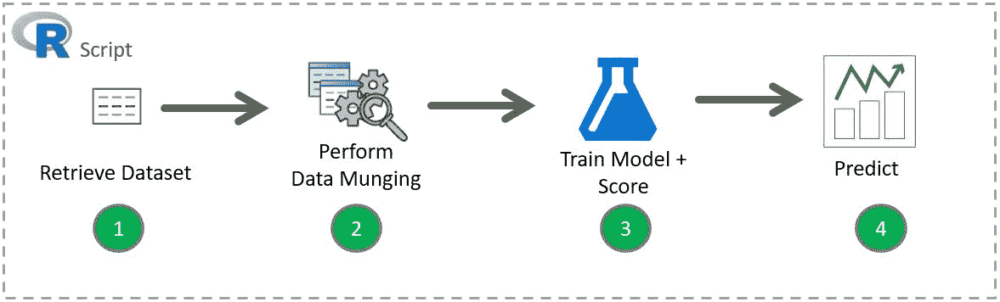

图 7.1：典型的预测建模工作流程

要在 SQL Server 中集成此脚本，您需要将工作流程分为三个步骤：

1.  准备训练数据

1.  使用 T-SQL 训练和保存模型

1.  实施模型

在本节中，最后两个步骤将使用 `sp_execute_external_script`，该命令调用一个 R 进程。这些步骤使用 SQL Server 扩展性框架，将在后面进行描述。

# 前提条件 - 准备数据

我们将使用来自 *R: In-Database Analytics for SQL Developers* 教程的纽约出租车样本数据，如 [`github.com/Microsoft/sql-server-samples/blob/master/samples/features/r-services/predictive-analytics/scripts/Lab.md`](https://github.com/Microsoft/sql-server-samples/blob/master/samples/features/r-services/predictive-analytics/scripts/Lab.md) 中所述。

您还可以从 Packt 代码文件存储库下载 `nyctaxi_sample.csv` 文件，并执行以下 `bcp` 命令：

```py
bcp <database name>.dbo.nyctaxi_sample in <file path> -c -t, -T -S<server name>
```

其中：

+   `<database name>` 是数据库名称

+   `<file path>` 是 `nyctaxi_sample.csv` 文件的位置

+   `<server name>` 是您的服务器名称。

例如：

```py
bcp NYCTaxi.dbo.nyctaxi_sample in c:\nyctaxi_sample.csv -c -t, -T -SMsSQLGirl
```

在这个场景中，目标是预测小费的可能性。作为这个过程的一部分，我们将创建一个逻辑回归模型，以及模型的**接收者操作特征**（ROC）曲线和其**曲线下面积**（AUC）。ROC 是针对诊断测试的各种阈值点的真阳性率与假阳性率的图表。曲线越接近 ROC 空间的对角线，测试的准确性就越低。

曲线越接近左上角边界，就越准确。AUC 以数值形式提供了准确性的测试。幸运的是，ROC 图和 AUC 值都可以很容易地在 R 中计算。

一旦我们确信模型足够准确，我们就可以分享它，并基于提供的输入重新使用它来预测出租车司机是否会收到小费。

这里是我们将用于训练的纽约出租车数据集的表定义：

```py
CREATE TABLE [dbo].nyctaxi_sample NOT NULL, 
   [hack_license] varchar NOT NULL, 
   [vendor_id] char NULL, 
   [rate_code] char NULL, 
   [store_and_fwd_flag] char NULL, 
   [pickup_datetime] [datetime] NOT NULL, 
   [dropoff_datetime] [datetime] NULL, 
   [passenger_count] [int] NULL, 
   [trip_time_in_secs] [bigint] NULL, 
   [trip_distance] [float] NULL, 
   [pickup_longitude] varchar NULL, 
   [pickup_latitude] varchar NULL, 
   [dropoff_longitude] varchar NULL, 
   [dropoff_latitude] varchar NULL, 
   [payment_type] char NULL, 
   [fare_amount] [float] NULL, 
   [surcharge] [float] NULL, 
   [mta_tax] [float] NULL, 
   [tolls_amount] [float] NULL, 
   [total_amount] [float] NULL, 
   [tip_amount] [float] NULL, 
   [tipped] [int] NULL, 
   [tip_class] [int] NULL 
) ON [PRIMARY] 
GO 
```

有一些变量我们可以开始使用来分析出租车司机收到小费的可能性。正如你在上一章中学到的，你可能需要尝试几个变量和算法来确定哪个更准确。这可能涉及几个迭代过程，这就是数据科学的魅力——你不断地进行实验。

首先，让我们使用以下变量：

| **变量** | **类型** | **列名** |
| --- | --- | --- |
| 出租车司机是否收到小费（是/否） | 输出 | `tipped` |
| 乘客数量 | 输入 | `passenger_count` |
| 行程时间（秒） | 输入 | `trip_time_in_seconds` |
| 根据出租车计价器显示的行程距离 | 输入 | `trip_distance` |
| 基于两个位置之间的经度和纬度的直接距离 | 输入 | `pickup_longitude` `pickup_latitude` `dropoff_longitude` `dropoff_latitude` |

为了更容易计算直接距离，让我们定义以下函数：

```py
CREATE FUNCTION [dbo].[fnCalculateDistance]  
(@Lat1 FLOAT, @Long1 FLOAT, @Lat2 FLOAT, @Long2 FLOAT) 
-- User-defined function calculate the direct distance  
-- between two geographical coordinates. 
RETURNS FLOAT 
AS 
BEGIN 
  DECLARE @distance DECIMAL(28, 10) 
  -- Convert to radians 
  SET @Lat1 = @Lat1 / 57.2958 
  SET @Long1 = @Long1 / 57.2958 
  SET @Lat2 = @Lat2 / 57.2958 
  SET @Long2 = @Long2 / 57.2958 
  -- Calculate distance 
  SET @distance = (SIN(@Lat1) * SIN(@Lat2)) + (COS(@Lat1) * COS(@Lat2) * COS(@Long2 - @Long1)) 
  --Convert to miles 
  IF @distance <> 0 
  BEGIN 
    SET @distance = 3958.75 * ATAN(SQRT(1 - POWER(@distance, 2)) / @distance); 
  END 
  RETURN @distance 
END 
```

这里是我们想要存储在数据库中的训练预测模型（的）的表定义。将训练好的预测模型（的）存储在表中的一个优点是，我们可以轻松地稍后重用它，并且可以版本控制我们的实验。

请注意，有一个名为`IsRealTimeScoring`的列。SQL Server 2017 为实时评分添加了一个新功能，这将在*集成 R 模型进行实时评分*部分中讨论。如果你使用的是 SQL Server 2016，请忽略此值：

```py
CREATE TABLE [dbo].NYCTaxiModel NOT NULL, 
   [AUC] FLOAT NULL, 
   [CreatedOn] DATETIME NOT NULL 
         CONSTRAINT DF_NYCTaxiModel_CreatedOn DEFAULT (GETDATE()), 
   [IsRealTimeScoring] BIT NOT NULL  
         CONSTRAINT DF_NYCTaxiModel_IsRealTimeScoring DEFAULT (0) 
) ON [PRIMARY]  
```

# 第 1 步 - 使用 T-SQL 训练和保存模型

在这一步，您可以通过存储过程将一个预测模型（以及可选的分数）创建到一个表中。这样做的原因是，我们不想每次智能应用需要做预测时都创建一个新的模型，而是希望保存模型以便重复使用：

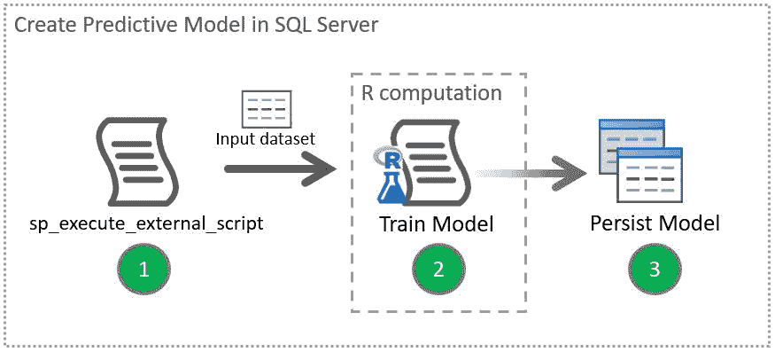

图 7.2：创建预测模型并将其存储在 SQL Server 中

在*图 7.2*中，我们假设数据清洗部分已经完成，输入数据集已经准备好供 R 计算使用，以便训练和评分模型。

这里是一个示例存储过程，它基于纽约出租车样本数据集生成预测模型，并将其保存到表中。该模型预测小费的可能性。模型和模型的 AUC 都保存在`dbo.nyc_taxi_models_v2`表中：

```py
CREATE PROCEDURE [dbo].[uspTrainTipPredictionModel] 
AS 
BEGIN 
   DECLARE @auc FLOAT; 
   DECLARE @model VARBINARY(MAX); 

   -- The data to be used for training 
   DECLARE @inquery NVARCHAR(MAX) = N' 
         SELECT  
               tipped,  
               fare_amount,  
               passenger_count, 
               trip_time_in_secs, 
               trip_distance, 
               pickup_datetime,  
               dropoff_datetime, 
               dbo.fnCalculateDistance(pickup_latitude,  
                     pickup_longitude,   
                     dropoff_latitude,  
                     dropoff_longitude) as direct_distance 
         FROM dbo.nyctaxi_sample 
         TABLESAMPLE (10 PERCENT) REPEATABLE (98052)' 

  -- Calculate the model based on the trained data and the AUC. 
  EXEC sp_execute_external_script @language = N'R', 
                                  @script = N' 
         ## Create model 
         logitObj <- rxLogit(tipped ~ passenger_count +  
                           trip_distance +  
                           trip_time_in_secs +  
                           direct_distance,  
                           data = InputDataSet); 
         summary(logitObj) 

         ## Serialize model             
         model <- serialize(logitObj, NULL); 
         predOutput <- rxPredict(modelObject = logitObj,  
                     data = InputDataSet, outData = NULL,  
                     predVarNames = "Score", type = "response",  
                     writeModelVars = FALSE, overwrite = TRUE); 

         library(''ROCR''); 
         predOutput <- cbind(InputDataSet, predOutput); 

         auc <- rxAuc(rxRoc("tipped", "Score", predOutput)); 
         print(paste0("AUC of Logistic Regression Model:", auc)); 
         ', 
     @input_data_1 = @inquery,      
     @output_data_1_name = N'trained_model', 
     @params = N'@auc FLOAT OUTPUT, @model VARBINARY(MAX) OUTPUT', 
     @auc = @auc OUTPUT, 
     @model = @model OUTPUT; 

  -- Store the train model output and its AUC  
  INSERT INTO [dbo].[NYCTaxiModel] (Model, AUC) 
  SELECT @model, @auc; 

END 
GO 
```

一旦定义了这个存储过程，你就可以执行它来生成模型和 AUC。例如：

```py
EXEC [dbo].[uspTrainTipPredictionModel] 
```

然后，通过执行以下语句查看`NYCTaxiModel`表的内容：

```py
SELECT [Model], [AUC], [CreatedOn], [IsRealTimeScoring] 
FROM [dbo].[NYCTaxiModel] 
```

如果存储过程执行正确，你应该会看到以下类似的记录：

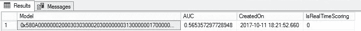

# 第 2 步 - 操作化模型

一旦模型创建并作为前一步骤的一部分存储在表中，我们现在就可以创建一个存储过程，智能应用程序可以调用它来进行小费预测：

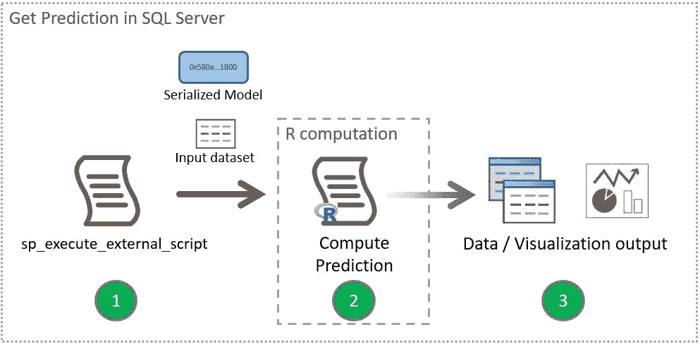

图 7.3：在 SQL Server 中获取预测

*图 7.3* 展示了将预测模型操作化的存储过程的流程。

这里是一个示例，展示了我们如何使用一个已保存的模型以及我们想要预测的数据集。我们使用的是最新创建的模型：

```py
CREATE PROCEDURE [dbo].[uspPredictTipSingleMode]  
   @passenger_count int = 0, 
   @trip_distance float = 0, 
   @trip_time_in_secs int = 0, 
   @pickup_latitude float = 0, 
   @pickup_longitude float = 0, 
   @dropoff_latitude float = 0, 
   @dropoff_longitude float = 0 
AS 
BEGIN 

  DECLARE @inquery nvarchar(max) = N' 
   SELECT  
         @passenger_count as passenger_count, 
         @trip_distance as trip_distance, 
         @trip_time_in_secs as trip_time_in_secs, 
         [dbo].[fnCalculateDistance] ( 
               @pickup_latitude, 
               @pickup_longitude, 
               @dropoff_latitude, 
               @dropoff_longitude) as direct_distance'; 

  DECLARE @lmodel2 varbinary(max); 

  -- Get the latest non-real-time scoring model 
  SET @lmodel2 = (SELECT TOP 1 
               [Model] 
               FROM [dbo].[NYCTaxiModel] 
               WHERE IsRealTimeScoring = 0 
               ORDER BY [CreatedOn] DESC); 

  EXEC sp_execute_external_script @language = N'R', 
   @script = N' 
         mod <- unserialize(as.raw(model)); 
         print(summary(mod)) 
         OutputDataSet<-rxPredict(modelObject = mod,  
data = InputDataSet,  
                           outData = NULL, predVarNames = "Score",  
                           type = "response",  
writeModelVars = FALSE,  
overwrite = TRUE); 
               str(OutputDataSet) 
               print(OutputDataSet)', 
         @input_data_1 = @inquery, 
         @params = N'@model varbinary(max), 
@passenger_count int, 
@trip_distance float, 
                           @trip_time_in_secs INT , 
                           @pickup_latitude FLOAT , 
                           @pickup_longitude FLOAT , 
                           @dropoff_latitude FLOAT , 
                           @dropoff_longitude FLOAT',
```

```py
 @model = @lmodel2, 
         @passenger_count =@passenger_count , 
         @trip_distance=@trip_distance, 
         @trip_time_in_secs=@trip_time_in_secs, 
         @pickup_latitude=@pickup_latitude, 
         @pickup_longitude=@pickup_longitude, 
         @dropoff_latitude=@dropoff_latitude, 
         @dropoff_longitude=@dropoff_longitude 
  WITH RESULT SETS ((Score FLOAT)); 

END 
GO 
```

一旦创建了`[dbo].[uspPredictTipSingleMode]`，你的应用程序现在就可以使用这个存储过程来获取评分（小费概率）；例如：

```py
EXEC [dbo].[uspPredictTipSingleMode]  
    @passenger_count = 2 
   ,@trip_distance   = 10 
   ,@trip_time_in_secs     = 1950 
   ,@pickup_latitude = 47.643272 
   ,@pickup_longitude      = -122.127235 
   ,@dropoff_latitude      = 47.620529 
   ,@dropoff_longitude     = -122.349297 
```

输出应该类似于以下内容。在这种情况下，值 0.64 表示得到小费的概率——即 64%：

```py
Score 
---------------------- 
0.640058591034195 
```

# 快速批量预测

如前所述，模型训练步骤和预测步骤都调用`sp_execute_external_script`，该脚本调用 R 进程。实时评分和本地评分允许你进行预测而不调用 R 进程。因此，这些评分方法提高了预测操作的性能。

此外，实时评分和本地评分允许你使用机器学习模型而无需安装 R。只要获得一个兼容格式的预训练模型并将其保存到 SQL Server 数据库中，就可以轻松调用预测操作。

# 先决条件

+   在 SQL Server 2017 中使用`PREDICT`函数时没有先决条件。有关`PREDICT`的更多信息，请参阅后面的*本地评分*部分。

+   `sp_rxPredict`需要一些额外的步骤，具体请参阅[`docs.microsoft.com/en-us/sql/advanced-analytics/r/how-to-do-realtime-scoring#bkmk_enableRtScoring`](https://docs.microsoft.com/en-us/sql/advanced-analytics/r/how-to-do-realtime-scoring#bkmk_enableRtScoring)中的*启用实时评分模型*。

+   目前，SQL Server 2016 和 SQL Server 2017 中的实时评分和本地评分仅支持 RevoScaleR 和 MicrosoftML 兼容的模型。有关支持算法的最新列表，请参阅[`docs.microsoft.com/en-us/sql/advanced-analytics/real-time-scoring`](https://docs.microsoft.com/en-us/sql/advanced-analytics/real-time-scoring)中的*实时评分*。

# 实时评分

SQL Server 2016 和 SQL Server 2017 都支持使用`sp_rxPredict`进行实时评分。

此存储过程是一个使用`UNSAFE`集合的 CLR 存储过程，需要您将数据库设置为`TRUSTWORTHY`。

这里是一个将`PREDICT`函数作为`SELECT`语句一部分调用的示例：

```py
EXEC dbo.sp_rxPredict @model, 
@inputData = @query; 
```

在这种情况下：

+   `@model`: 包含之前准备好的实时评分模型

+   `@query`: 要评分的数据的查询定义

# 原生评分

SQL Server 2017 引入了一个新函数，`PREDICT`，允许您使用原生评分获取预测值。您不再需要使用带有 R 脚本的`sp_execute_external_script`进行预测，而是可以在`SELECT`语句的`FROM`子句中调用它，这使得预测分析的实用化变得更加容易。此外，使用`PREDICT`意味着您不再需要在每次进行预测时调用额外的 R 进程。

这个`PREDICT`函数是 T-SQL 的新功能，不要与现有的 DMX 的`PREDICT`函数混淆。

这里是一个将`PREDICT`函数作为`SELECT`语句一部分调用的示例：

```py
SELECT  d.Input1, d.Input2, p.Output_Pred 
FROM PREDICT( MODEL = @model,  DATA = d)  
     WITH (Output_Pred FLOAT) p; 
```

在这种情况下：

+   `d`: 数据源，例如表、视图或公共表表达式。

+   `Input1, Input2`: 数据源中的列。

+   `@model`: 包含已之前准备好的实时评分模型。

+   `Output_Pred`: 正在预测的输出值。通常，列名由预测值的列名加上一个`_Pred`后缀组成；例如，`Tipped_Pred`，其中`Tipped`是正在预测的列的名称。

# 集成 R 模型以实现快速批量预测

在继续下一步之前，请遵循*先决条件 - 准备数据*部分。

# 第 1 步 – 使用 T-SQL 训练和保存实时评分模型

在这一步中，您可以通过存储过程将实时评分和原生评分的预测模型，以及可选的 AUC，创建到一个表中。目标是构建一个可重用的模型。如果您已经在 SQL Server 表中创建并存储了一个兼容的模型，则可以跳过此步骤。

以下存储过程使用`rxSerializeModel`，它允许您以原始格式序列化 R 模型。这然后允许您以`VARBINARY`格式保存模型，该格式可以加载到 SQL Server 中进行实时评分。要为在 R 中使用而反转序列化，您可以使用`rxUnserializeModel`：

```py
CREATE PROCEDURE [dbo].[uspTrainTipPredictionModelWithRealTimeScoring] 
AS 
BEGIN 
   DECLARE @auc FLOAT; 
   DECLARE @model VARBINARY(MAX); 

   -- The data to be used for training 
   DECLARE @inquery NVARCHAR(MAX) = N' 
         SELECT  
               tipped,  
               fare_amount,  
               passenger_count, 
               trip_time_in_secs, 
               trip_distance, 
               pickup_datetime,  
               dropoff_datetime, 
               dbo.fnCalculateDistance(pickup_latitude,  
                     pickup_longitude,   
                     dropoff_latitude,  
                     dropoff_longitude) as direct_distance 
         FROM dbo.nyctaxi_sample 
         TABLESAMPLE (10 PERCENT) REPEATABLE (98052)' 

  -- Calculate the model based on the trained data and the AUC. 
  EXEC sp_execute_external_script @language = N'R', 
                                   @script = N' 
         ## Create model 
         logitObj <- rxLogit(tipped ~ passenger_count +  
                           trip_distance +  
                           trip_time_in_secs +  
                           direct_distance,  
                           data = InputDataSet); 
         summary(logitObj) 

         ## Serialize model             
         ## model <- serialize(logitObj, NULL); 
         model <- rxSerializeModel(logitObj,  
realtimeScoringOnly = TRUE); 
         predOutput <- rxPredict(modelObject = logitObj,  
                     data = InputDataSet, outData = NULL,  
                     predVarNames = "Score", type = "response",  
                     writeModelVars = FALSE, overwrite = TRUE); 

         library(''ROCR''); 
         predOutput <- cbind(InputDataSet, predOutput); 

         auc <- rxAuc(rxRoc("tipped", "Score", predOutput)); 
         print(paste0("AUC of Logistic Regression Model:", auc)); 
         ', 
     @input_data_1 = @inquery,      
     @output_data_1_name = N'trained_model', 
     @params = N'@auc FLOAT OUTPUT, @model VARBINARY(MAX) OUTPUT', 
     @auc = @auc OUTPUT, 
     @model = @model OUTPUT; 

  -- Store the train model output and its AUC  
  INSERT INTO [dbo].[NYCTaxiModel] (Model, AUC, IsRealTimeScoring) 
  SELECT @model, @auc, 1; 

END 
GO 
```

要将 R 中创建的模型存储在 SQL Server 表中，您必须首先对其进行序列化。在 R 中，序列化的模型在使用它进行预测之前必须先反序列化。

# 第 2 步 a – 使用实时评分操作化模型

以下是一个示例脚本，其中我们使用实时评分模型通过`sp_rxPredict`预测翻盘的可能性：

```py
DECLARE @logit_model VARBINARY(MAX) =  
   (SELECT TOP 1 [Model]  
   FROM [dbo].[NYCTaxiModel] 
   WHERE [IsRealTimeScoring] = 1 
   ORDER BY [CreatedOn] DESC); 

EXEC dbo.sp_rxPredict @model = @logit_model, 
@inputData = N'SELECT 
                     2 AS passenger_count,  
                     10 AS trip_distance,  
                     1950 AS trip_time_in_secs,  
                     dbo.fnCalculateDistance(47.643272,  
                           -122.127235,   
                           47.620529,  
                           -122.349297) AS direct_distance'; 
```

输出结果应仅为您提供通过以下行推送的预测值：

```py
tipped_Pred
----------------------
0.640058591034195

(1 row affected)

```

# 第 2 步 b – 使用原生评分操作化模型

以下是一个示例脚本，其中我们使用 `PREDICT` 函数和一个 R 实时评分模型来预测小费的可能性。SQL Server 2017 中的 `PREDICT` 函数可以从上一步读取存储的序列化模型以进行预测分析：

```py
DECLARE @logit_model VARBINARY(MAX) =  
   (SELECT TOP 1 [Model]  
   FROM [dbo].[NYCTaxiModel] 
   WHERE [IsRealTimeScoring] = 1 
   ORDER BY [CreatedOn] DESC); 

WITH d AS ( 
   SELECT      2 AS passenger_count,  
               10 AS trip_distance,  
               1950 AS trip_time_in_secs,  
               dbo.fnCalculateDistance(47.643272,  
                     -122.127235,   
                     47.620529,  
                     -122.349297) AS direct_distance) 
SELECT  * 
FROM PREDICT( MODEL = @logit_model, DATA = d)  
WITH (tipped_Pred FLOAT) p; 
```

输出应包括您在 `SELECT` 语句中指定的任何列，并且应如下所示：

```py
tipped_Pred passenger_count trip_distance trip_time_in_secs direct_distance
----------- --------------- ------------- ----------------- ---------------
0.640058591 2               10            1950              10.4581575644

(1 row affected)

```

# 管理工作负载的角色和权限

将 R 脚本作为扩展性框架工作负载的一部分运行，以及使用实时评分和本地评分进行预测操作，需要首先设置一些角色和权限。

# 扩展性框架工作负载

本节概述了使用 `sp_execute_external_script` 从 SQL Server 运行 R 的典型安全要求。可以使用 SQL Server 登录或 Windows 用户账户直接从 SQL Server 使用存储过程运行 R 脚本。以下是为该账户设置足够权限的步骤：

1.  允许访问 R 脚本将运行的数据库的权限。

1.  允许读取受保护对象（如表）的数据的权限。这包括（但不限于）可能存储模型的表以及用于训练模型或作为预测输入的表/视图。

1.  如果 R 脚本需要将新数据写入表，例如模型或评分结果，允许写入新数据的权限。

1.  如果 R 脚本需要在运行时安装 R 包，允许安装新包的权限。

通常，创建角色来管理权限集更容易，然后将用户分配到这些角色，而不是单独设置用户权限。

以下是一个示例，说明如何创建一个角色并将其分配给名为 `JulieGuest2` 的登录，按照步骤 1、2 和 3 进行：

```py
-- Create a new role  
CREATE ROLE TutorialDBRUser AUTHORIZATION dbo 
GO 

-- Assign the role to a new member JulieGuest2 so that the login 
-- can connect to the database Tutorial DB. 
ALTER ROLE TutorialDBRUser ADD MEMBER JulieGuest2 
GO 

-- Allow members of TutorialDBRUser to read and write.  
ALTER ROLE db_datareader ADD MEMBER TutorialDBRUser 
GO 

ALTER ROLE db_datareader ADD MEMBER TutorialDBRUser 
GO 

-- Allow members of TutorialDBRUser to run external script 
GRANT EXECUTE ANY EXTERNAL SCRIPT TO [TutorialDBRUser] 
GO 

-- Allow members of TutorialDBRUser to run a specific  
-- stored procedure. 
GRANT EXECUTE ON [dbo].[predict_rentals] TO [TutorialDBRUser] 
GO 
```

# 快速批量预测工作负载

只有在使用实时评分或本地评分时，才遵循以下步骤：

+   对于使用 `sp_rxPredict` 进行实时评分，您需要将执行此存储过程的用户添加到 `rxpredict_users` 中

+   对于使用 SQL Server 2017 中新提供的 `PREDICT` 语法进行本地评分，您需要在数据库上授予 `EXECUTE` 权限

前面的步骤假设用户有权读取预测操作的真实时评分模型和输入数据集。

# 外部包

从 SQL Server 2017 开始，您也可以通过 `CREATE EXTERNAL LIBRARY` 添加外部库，只要您有 `ALTER ANY EXTERNAL LIBRARY` 权限：

```py
GRANT ALTER ANY EXTERNAL LIBRARY TO [TutorialDBRUser] 
GO 
```

您必须首先从源下载包；例如，从 CRAN (`ggplot2` [`cran.r-project.org/web/packages/ggplot2/index.html`](https://cran.r-project.org/web/packages/ggplot2/index.html)) 下载到 SQL Server 可以访问的路径：

```py
CREATE EXTERNAL LIBRARY ggplot2pkg  
FROM  
  (CONTENT = 'C:\Program Files\Microsoft SQL Server\MSSQL14.MSSQLSERVER\ggplot2.zip')  
WITH (LANGUAGE = 'R'); 
```

如果您正在使用 SQL Server 2016，要安装新的 R 包，您需要在机器上具有管理员访问权限。安装步骤在 SQL Server 之外，直接在关联到 SQL Server R 服务的 R 上执行。详细步骤在第三章中概述，*管理 SQL Server 2017 和 R 的机器学习服务*。

# 工具

在 T-SQL 中嵌入的 R 代码的操作化有三个主要选项。所有这些工具都是免费的：

+   **SQL Server 管理工作室** (**SSMS**)

+   **Visual Studio 的 R 工具** (**RTVS**)

+   **SQL Server 数据工具** (**SSDT**)

本节概述了工具如何帮助您将 R 代码在 SQL Server 中作为工作流程的一部分进行操作化。

# 将 SSMS 作为操作化 R 脚本的一部分使用

SSMS 是一个强大的工具，它允许您将上一节中的预测分析操作化。SSMS 还提供了管理与在 SQL Server 中操作化 R 代码和维护相关的各种管理任务的能力，例如：

+   管理权限，如本章前面所述。

+   管理 R 包（在 SQL Server 2017 中），如本章前面所述。

+   管理集成 R 代码的存储过程，如前文所述。

+   管理 SQL Server R 服务的资源，如第三章中所述，*管理 SQL Server 2017 和 R 的机器学习服务*。

+   使用内置自定义报告和 DMVs 监控 SQL Server R 服务，如*使用 SQL Server R 服务的自定义报告*中所述。

+   创建和管理执行 R 脚本的工作。请参阅本章后面的*安排训练和预测操作*。

要获取最新版本的 SSMS 以帮助您使用 SQL Server R 服务开发和管理工作流程，请访问[`docs.microsoft.com/en-us/sql/ssms/download-sql-server-management-studio-ssms`](https://docs.microsoft.com/en-us/sql/ssms/download-sql-server-management-studio-ssms)。

# 使用 SQL Server R 服务的自定义报告

在 GitHub 上提供了针对 SQL Server R 服务的自定义报告：[`github.com/Microsoft/sql-server-samples/tree/master/samples/features/r-services/ssms-custom-reports`](https://github.com/Microsoft/sql-server-samples/tree/master/samples/features/r-services/ssms-custom-reports)

以下是一个自定义报告列表以及它们可以帮助您实现的内容：

| **报告** | **用途** |
| --- | --- |
| `R 服务 - Configuration.rdl` | 查看 R 服务的安装设置和 R 运行时的属性。安装后配置 R 服务。 |
| `R 服务 - Packages.rdl` | 查看 SQL Server 实例上安装的 R 包及其属性，例如名称和版本。 |
| `R 服务 - Resource Usage.rdl` | 查看 SQL Server 和 R 脚本执行的资源消耗。查看外部资源池的内存设置。 |
| `R Services - Extended Events.rdl` | 查看扩展事件以了解 R 脚本执行情况。 |
| `R Services - Execution Statistics.rdl` | 查看 R 服务的执行统计信息，包括但不限于 R 脚本执行次数、并行执行次数以及`RevoScaleR`函数。 |

# 首次添加自定义报告

从前面的 GitHub 位置下载自定义报告后，请按照以下步骤添加自定义报告：

1.  前往 SSMS | 对象资源管理器。

1.  在对象资源管理器中右键单击 SQL Server 实例的名称，然后选择报告 | 自定义报告...

1.  从下载位置添加 RDL 文件。

添加后，您可能会看到一个如下警告对话框：

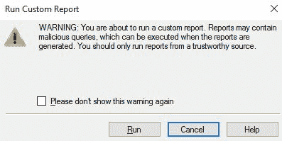

图 7.4：SSMS 中的自定义报告运行警告

点击运行表示您确认希望运行这些报告。

*图 7.5*展示了成功导入的 R 服务 - 执行统计报告。它表示有 38 次执行中的 24 次 R 脚本执行错误，最受欢迎的`RevoScaleR`函数是`rxPredict_rxLogit`：

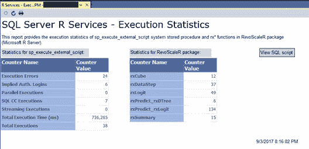

图 7.5：SSMS 中的 SQL Server R 服务 - 执行统计报告

# 查看 R 服务自定义报告

第一次添加 R 服务自定义报告后，您可以再次访问它。以下是步骤：

1.  前往 SSMS | 对象资源管理器。

1.  右键单击 SQL Server 实例的名称。

1.  选择报告 | 自定义报告。如果您已添加所有自定义报告，您应该看到类似以下内容：

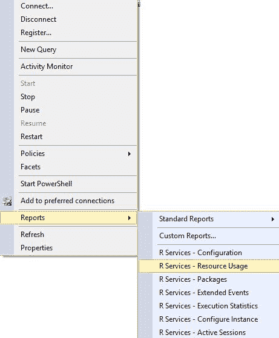

图 7.6：在 SSMS 中查看自定义报告

# 使用 DMVs 管理 SQL Server 机器学习服务

有各种 DMVs 可供帮助您监控您已部署的 R 脚本。本节将 SQL Server 机器学习服务的 DMVs 分为以下两个类别，具体如下。

# 系统配置和系统资源

您可能熟悉`sys.dm_exec_sessions`和`sys.dm_os_performance_counter`，分别用于了解活动会话和系统性能计数器。以下是一个您应该了解更多以跟踪和监控 SQL Server 中 R 脚本执行性能和使用的 DMVs 列表：

+   `sys.dm_exec_sessions`: 查看用户会话和系统会话的详细信息，分别标识为`with session_id >= 51`和`< 51`。

+   `sys.dm_os_performance_counters`: 查看每个系统性能计数器的详细信息，包括与 R 脚本相关的计数器。以下是一个与 SQL Server R 服务相关的特定脚本的示例：

```py
SELECT *  
FROM sys.dm_os_performance_counters  
WHERE object_name LIKE '%External Scripts%' 
```

+   `sys.dm_external_script_requests`: 查看当前实例上的活动外部脚本：

```py
SELECT  
   [external_script_request_id]  
  , [language] 
  , [degree_of_parallelism] 
  , [external_user_name] 
FROM sys.dm_external_script_requests; 
```

+   `sys.dm_external_script_execution_stats`: 通过计数器查看新外部脚本的整体使用情况。

# 资源管理器

在 SQL Server 2016 中，新增了两个 DMV 来帮助监控外部资源池：`sys.resource_governor_external_resource_pools` 和 `sys.dm_resource_governor_external_resource_pool_affinity`。如果你熟悉一般性的资源管理器的跟踪和管理，你可能会知道以下列出的另外两个 DMV：

+   `sys.resource_governor_resource_pools`：查看当前资源池状态、资源池的当前配置及其统计信息。

+   `sys.resource_governor_workload_groups`：查看工作负载组的统计信息和当前配置。此 DMV 新增了一个列来显示与工作负载组关联的外部池的 ID。

+   `sys.resource_governor_external_resource_pools`：查看外部资源池的当前配置值。在撰写本文时，SQL Server 2016/2017 企业版允许你配置额外的资源池，使得在 SQL Server 中运行的 R 作业的资源将隔离于来自远程客户端的资源。

+   `sys.dm_resource_governor_external_resource_pool_affinity`：此 DMV 允许你查看与特定资源池亲和的处理器和资源。

# 使用 Visual Studio 实现 R 代码的运营化

使用**R Tools for Visual Studio**（**RTVS**）开发 R 脚本或使用 R 脚本的 T-SQL 现在变得简单。如果你已经使用 SQL Server Data Tools 作为你的 SQL Server 数据库项目的 IDE，你可以在解决方案中简单地添加一个新的 R 项目。这种集成在 Visual Studio 2017 中得到了改进。

如果你还没有安装 Visual Studio，请访问[`www.visualstudio.com/downloads/`](https://www.visualstudio.com/downloads/)。

RTVS 作为数据科学和分析应用程序工作负载的一部分进行安装。

从 Visual Studio 安装程序中，你可以将数据科学和分析应用程序工作负载添加到你的 Visual Studio 2017 安装中，如图*图 7.7*所示：

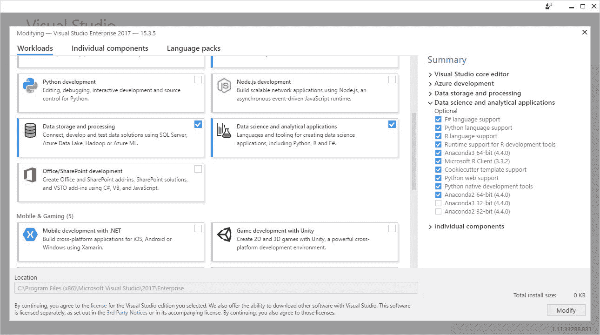

图 7.7：在 Visual Studio 2017 安装程序中选择数据科学和分析应用程序选项

以下是一些使用 RTVS 开始使用的额外提示：

1.  在 RTVS 中通过选择文件 | 新建 | 项目来创建一个新的 R 项目。项目名称和文件路径与以下类似：

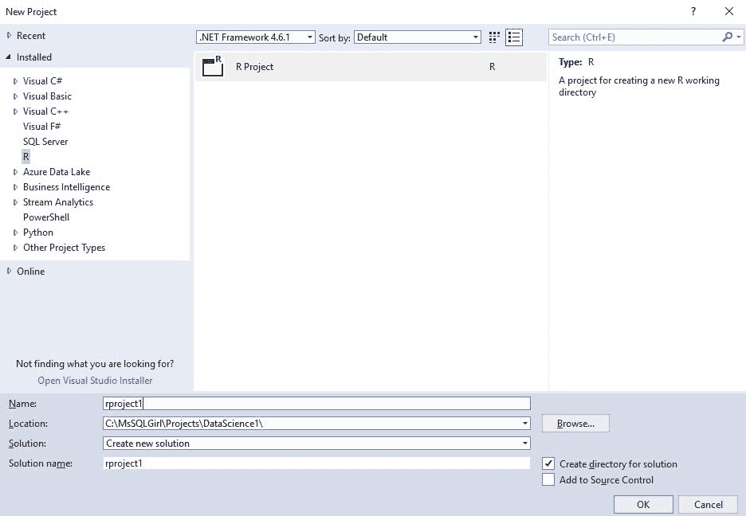

图 7.8：创建一个新的 R 项目

1.  在 RTVS 中，你可以选择运行 R 脚本的工空间。如果你已经按照第四章中提到的安装了 R 服务的 SQL Server，即*数据探索和数据可视化*，你会看到类似以下的内容：

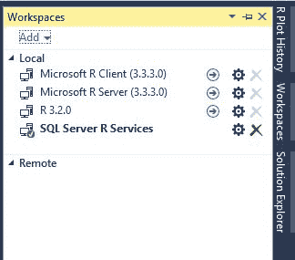

图 7.9：显示 RTVS 可连接的所有工空间

前往 R Tools | Windows | Workspaces 或按*Ctrl* + *9*显示工作空间窗口。

1.  您可以从 R 交互式窗口运行 R 代码或在 R 项目中保存 R 文件。您可以参考[`docs.microsoft.com/en-us/visualstudio/rtvs/`](https://docs.microsoft.com/en-us/visualstudio/rtvs/)了解 RTVS 功能的更多信息。

1.  您也可以通过在项目上右键单击并选择“添加新项”，然后选择 SQL 查询来在项目中添加一个 SQL 查询文件，如下所示：

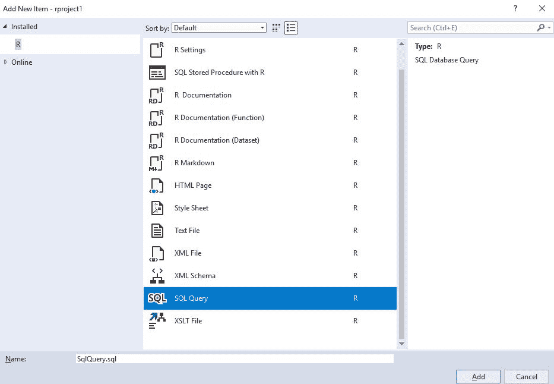

图 7.10：选择要添加到 R 项目中的新项/文件

1.  RTVS 还允许您通过模板将 R 代码集成到 SQL Server 存储过程中。要访问此功能，只需像上一步一样点击“添加新项”，然后选择 SQL 存储过程。有关更多信息，请参阅[`docs.microsoft.com/en-us/visualstudio/rtvs/sql-server`](https://docs.microsoft.com/en-us/visualstudio/rtvs/sql-server)。

# 在 SQL Server 之外集成 R 工作负载和预测操作

在本节中，您将学习如何将您在上一节中创建的 R 工作负载和预测操作包含在 SQL Server 之外。我们将讨论如何在 PowerShell、SQL Agent 作业和**SQL Server Integration Services** (**SSIS**)中运行工作负载和操作。

请注意，您也可以使用 SQLCMD、C#在 SSIS、Azure 以及 Linux 上的 Bash 来执行这些工作负载/预测操作。这次讨论超出了本章的范围。

# 通过 PowerShell 执行 SQL Server 预测操作

假设您已经创建了从 SQL Server 执行 R 脚本的存储过程，例如前面示例中的`[dbo].[uspTrainTipPredictionModel]`，您可以轻松地将此命令作为 PowerShell 工作流的一部分执行。

这里是一个从 PowerShell 调用存储过程的简单示例：

```py
$SqlConnection = New-Object System.Data.SqlClient.SqlConnection
$SqlConnection.ConnectionString = "Server=.;Database=Taxi;Integrated Security=True"
$SqlCmd = New-Object System.Data.SqlClient.SqlCommand
$SqlCmd.CommandText = "EXEC [dbo].[uspPredictTipSingleMode] 
 @passenger_count    = 2
 ,@trip_distance   = 10
 ,@trip_time_in_secs     = 35
 ,@pickup_latitude = 47.643272
 ,@pickup_longitude      = -122.127235
 ,@dropoff_latitude      = 47.620529
 ,@dropoff_longitude     = -122.349297
 "
$SqlCmd.Connection = $SqlConnection
$SqlAdapter = New-Object System.Data.SqlClient.SqlDataAdapter
$SqlAdapter.SelectCommand = $SqlCmd
$DataSet = New-Object System.Data.DataSet
$SqlAdapter.Fill($DataSet)
$SqlConnection.Close()
$DataSet.Tables[0] 

```

# 安排训练和预测操作

在 SSMS 中，您可以创建一个新的 SQL Server 作业，允许您一次性或按特定计划运行 R 代码。

例如，您可以执行一个计划离线预测分析工作负载。为此，只需通过 SSMS 创建一个作业：

1.  要创建作业，您需要是 SQL Server Agent 固定数据库角色或 sysadmin 固定服务器角色的成员。只有作业所有者或 sysadmin 角色的成员才能更新作业的定义。

1.  在 SSMS 的对象资源管理器中，展开您想要在其中创建 SQL Server Agent 作业的 SQL Server 实例。

1.  展开 SQL Server Agent，然后在“作业”文件夹上右键单击，然后选择“新建作业...”：

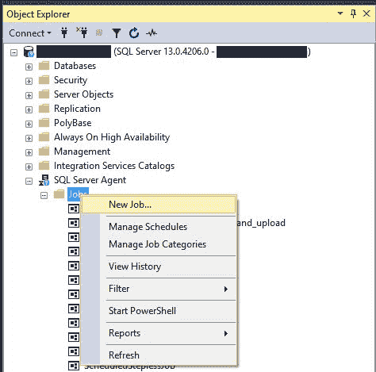

图 7.11：使用 SSMS 创建新的 SQL Server Agent 作业

1.  在“常规”页面上提供详细信息：

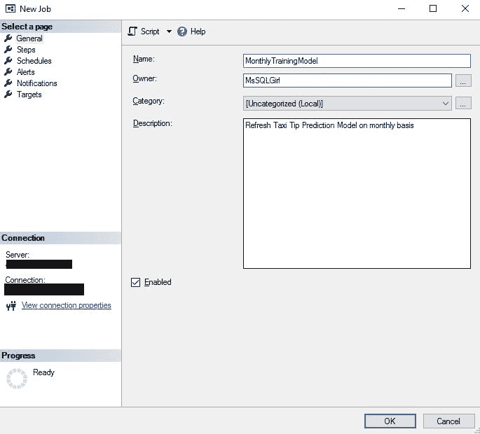

图 7.12：在新建作业窗口中添加更多详细信息

1.  在新建作业窗口的左侧菜单中点击“步骤”，然后在新建作业窗口的底部点击“新建...”。

1.  在新建作业步骤中提供要执行的详细信息。在这个例子中，我们想要更新纽约出租车训练模型。然后点击“确定”：

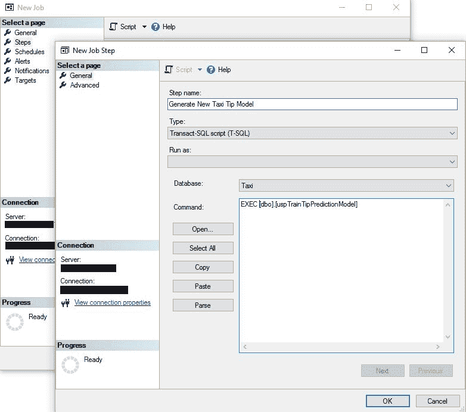

图 7.13：在 SQL Server 代理作业中调用 R 集成存储过程作为步骤

1.  在新建作业窗口中，从左侧菜单选择“计划”。

1.  从新建作业窗口的底部点击“新建...”。

1.  提供你希望此作业受其约束的计划详情。

1.  在新建计划窗口中点击“确定”，然后点击新建作业窗口以保存更改。

# 将 R 脚本作为 SSIS 的一部分进行操作

R 脚本可以轻松地作为 SSIS 工作流程的一部分进行集成。主要有两种方式：作为执行进程任务的一部分运行，以及作为执行 SQL 任务的一部分运行：

1.  在执行进程任务中运行 R 代码（不是作为 SQL Server R 服务的一部分）可以通过调用 `Rscript.exe` 来简单地完成。如果你已经有一个准备执行的可执行 R 文件，那么只需在 SSIS 包中添加执行进程任务。你还可以将 SSIS 包中的执行进程任务的输入/输出编织到 R 文件中：

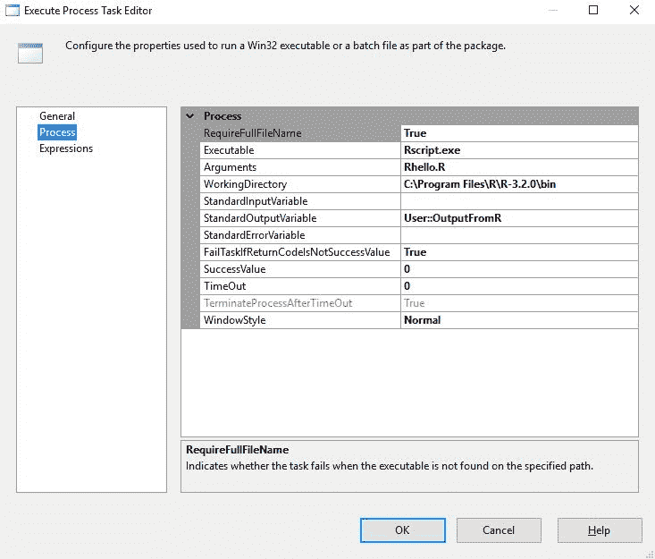

图 7.14：在 SSIS 执行进程任务中外部执行 R 脚本

1.  在 SQL Server 中使用 SSIS 中的执行 SQL 任务运行预测操作：如果你已经有一个执行预测（或训练模型）的存储过程，那么只需从 SSIS 中的执行 SQL 任务调用此存储过程。还可能将 SSIS 包中的输入/输出编织到执行 SQL 任务中：

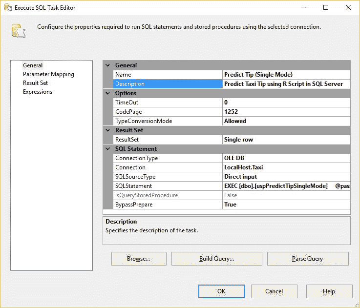

图 7.15：在 SSIS 中将 R 集成存储过程作为执行 SQL 任务步骤执行

# 摘要

在本章中，你学习了将现有的预测分析 R 代码集成到 SQL Server R 外部的步骤，使用了扩展性框架。你还看到了 SQL Server 2017 中新 `PREDICT` 函数的简单性和强大功能，它允许在不安装 R 的情况下进行本地评分。在预测操作中管理运行预测分析工作负载所需的安全性也很重要。你学习了如何使用 RTVS 将 SQL 查询添加到 R 项目中。最后，你发现了将 R 代码和预测操作集成到现有工作流程中的不同可能性，作为 SQL Server 存储过程、SQL Server 代理作业、PowerShell 脚本和 SSIS 项目。

带着这些新技能，我们准备好管理数据科学解决方案的下一个构建块，作为数据库生命周期的一部分：管理实践。在下一章中，你将学习如何在 **持续集成/持续交付**（**CI/CD**）和持续模型性能监控中管理数据科学解决方案。
