# 部署、管理和监控包含 R 代码的数据库解决方案

在 SQL Server 数据库中运营 R 代码意味着数据科学家/数据库开发者也可以利用将数据科学解决方案作为数据库生命周期管理（**DLM**）的一部分进行生产化。这包括以下内容：

+   将 R 代码作为 SQL Server 数据库项目的一部分提交到版本控制

+   将数据科学解决方案的存储过程作为 SQL Server 单元测试的一部分添加

+   将数据科学解决方案集成到 **持续集成/持续交付**（**CI/CD**）流程中

+   定期监控生产中数据科学解决方案的性能

在本章中，我们将使用 Visual Studio 2017 和 Visual Studio Team Services 中的 **SQL Server 数据工具**（**SSDT**）来执行此 DLM 工作流程。然而，这个基本概念可以应用于您或您的团队可能已经使用的任何其他 CI/CD 平台。

# 将 R 集成到 SQL Server 数据库生命周期工作流程中

在第七章“将 R 预测模型投入运营”中，我们讨论了如何在 Visual Studio 2017 中创建 R 项目。我们还讨论了将 R 代码集成到 SQL Server 中的 `sp_execute_external_script` 作为一部分。在这里，我们将重新审视 Visual Studio 2017，特别是在将 R 代码集成到 `sp_execute_external_script` 作为 SQL Server 数据库项目的一部分，以及作为数据库生命周期工作流程的一部分。

# 为数据库生命周期工作流程准备您的环境

在本节中，我们将讨论数据库生命周期工作流程的阶段以及我们将使用的工具。对于工作流程中的每个阶段，还将有一些建议供您探索。

1.  **编码和管理 SQL Server 数据库项目/解决方案**：管理构成 SQL Server 数据库项目的 SQL Server DML/DDL 脚本有几种不同的方法。Visual Studio 2017 (VS2017) 中的 SQL SSDT 是一个成熟的产品，它正式化了数据库模式和对象的创建和修改。在本节中，我们将使用 VS2017 中的 SSDT。

您可以使用 VS2017 Community、Professional 或 Enterprise 版本。请访问 [`www.visualstudio.com/vs/compare/`](https://www.visualstudio.com/vs/compare/) 获取这些版本如何比较的最新信息。在本节的演练和示例中，我们将使用 Visual Studio Enterprise Edition，但您可以使用任何版本。您可以从 [`www.visualstudio.com/vs/`](https://www.visualstudio.com/vs/) 下载这些版本。

值得尝试的其他替代方案包括：

+   +   **SQL Server Management Studio**：RedGate 开发了一些插件，可以丰富 DevOps/数据库生命周期管理

    +   **SQL Operations Studio**（预览版）：这个工具是基于 VS Code 构建的，这意味着它也有很高的潜力满足 DevOps 工作流程，包括源代码控制

1.  **单元测试**：就像应用程序开发一样，数据库开发将从单元测试框架中受益，特别是如果它可以自动化的话。有两个广为人知的单元测试框架适用于 SQL Server 数据库，即 tSQLt 和集成在 Visual Studio 中的 SQL Server 单元测试。以下是链接：

+   +   **tSQLt**：[`tsqlt.org/`](http://tsqlt.org/)

    +   **Visual Studio 中的 SQL Server 单元测试**：[`msdn.microsoft.com/en-us/library/jj851200(v=vs.103).aspx`](https://msdn.microsoft.com/en-us/library/jj851200(v=vs.103).aspx)

在本节中，我们将使用 VS2017 中的 SQL Server 单元测试。

另一个值得尝试的工具是：

+   +   基于 tSQLt 框架的 RedGate SQL Test，它是 SSMS 的一个扩展

1.  **版本控制**：目前有许多流行的版本控制系统可供选择，例如 Git 和 **团队基础版本控制**（**TFVC**）。在本节中，我们将使用托管在 **Visual Studio Team Services**（**VSTS**）中的 TFVC。VS2017 可以连接到 VSTS 仓库。您可以在网上注册 VSTS 账户：[`www.visualstudio.com/team-services/`](https://www.visualstudio.com/team-services/)

值得尝试的其他替代方案包括：

使用 Visual Studio，您可以连接到在线版本控制主机，如 GitHub 和 VSTS，以及私有的本地版本控制服务器，如 **团队基础服务器**（**TFS**）：

+   +   **Visual Studio 的 GitHub 扩展**：[`visualstudio.github.com/`](https://visualstudio.github.com/)

    +   **团队基础服务器**：[`www.visualstudio.com/tfs/`](https://www.visualstudio.com/tfs/)

1.  **CI/CD**：VSTS 支持托管代理和私有代理。托管代理是一个基于云的代理，执行持续集成和持续交付。私有代理是一个基于本地的代理版本，可在 Visual Studio 2017 中使用。设置 CI 意味着当脚本被检查入时，代理将自动构建并可选择执行一系列测试。设置 CD 允许我们仅针对基线测试代码发布和/或模式更改。在本章中，我们将使用带有私有代理的 VSTS 来部署到本地 SQL Server 数据库。

值得尝试的其他替代方案包括：

+   +   VSTS 支持托管代理，允许您自动部署到 Azure VM

    +   VSTS 支持托管代理，允许您将部署到 Azure SQL 数据库，自 2017 年 10 月起，它也支持 R

*图 8.1* 展示了使用 VSTS 的 CI/CD 工作流程，我们将在此章中使用它来构建我们的示例 SQL Server R 服务解决方案：

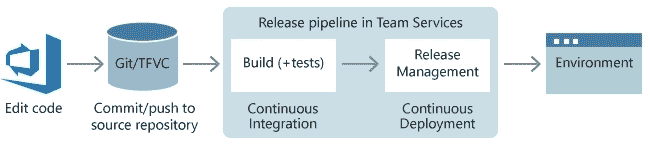

图 8.1 使用 VSTS 的 CI/CD 流程

来源：[`docs.microsoft.com/en-us/vsts/build-release/actions/ci-cd-part-1`](https://docs.microsoft.com/en-us/vsts/build-release/actions/ci-cd-part-1)

# 本章的先决条件

| **工具** | **URL** | **备注** |
| --- | --- | --- |
| **Visual Studio 2017** | 下载：[`www.visualstudio.com/downloads/`](https://www.visualstudio.com/downloads/) | 社区版是免费的。 |
| **VSTS** | 注册/登录：[`www.visualstudio.com/team-services/`](https://www.visualstudio.com/team-services/) | 免费注册个人账户。 |
| **PowerShell v2.0 或更高版本** | 下载 PowerShell：[`www.microsoft.com/en-us/download/details.aspx?id=42554`](https://www.microsoft.com/en-us/download/details.aspx?id=42554) | 您需要此软件来本地设置私有代理。 |

# 创建 SQL Server 数据库项目

在本节中，我们将向您介绍如何在 VS2017 中创建数据库项目。

1.  在 VS2017 中，单击文件 | 新建项目。

1.  在左侧面板中选择已安装的 SQL Server，然后单击 SQL Server 数据库项目模板。

1.  在“名称”字段中输入`Ch08`，在“解决方案名称”字段中输入`SQL Server R Services Book`，如图所示：

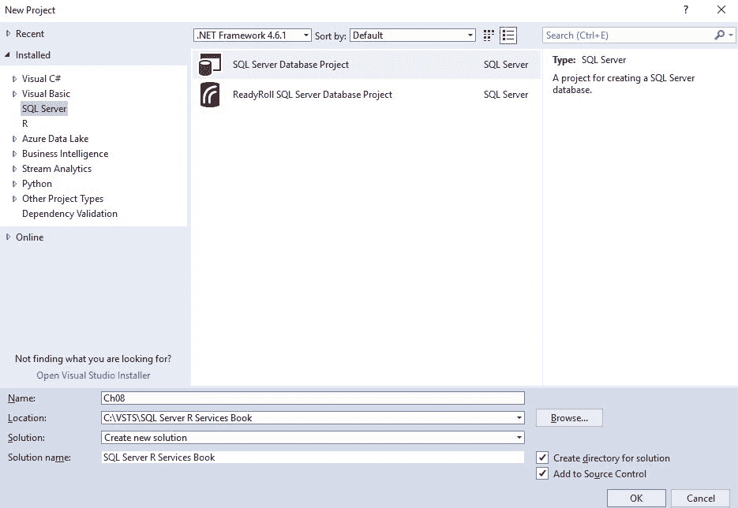

图 8.2 Visual Studio 中的新项目

1.  选择保存解决方案的位置。

如果您已经有了用于版本控制的本地文件夹，您可以在此指定路径。

在这个例子中，我的 VSTS 项目名为 SQL Server R Services Book，它与我的本地文件夹`C:\VSTS\SQL Server R Services Book`相关联。

1.  确保已选中“为解决方案创建目录”和“添加到源代码控制”。

1.  在新建项目对话框中单击“确定”。解决方案资源管理器窗口应显示类似于以下截图的内容：

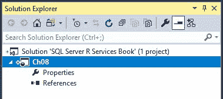

图 8.3 解决方案资源管理器中的数据库项目

从这里，您可以添加新的对象，例如表、存储过程以及许多其他对象。

# 将现有数据库导入到项目中

现在我们有一个空白的数据库，我们可以导入从第七章“实现 R 预测模型”中创建的现有数据库：

1.  在 Ch08 上右键单击，选择导入 | 数据库：

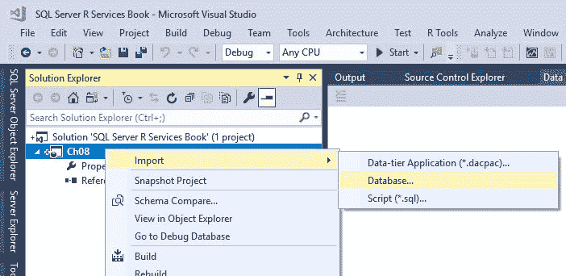

图 8.4 将数据库导入到数据库项目中

1.  在导入数据库对话框中，单击“选择连接”。然后，指定到您之前在第七章，“实现 R 预测模型”中创建的数据库的连接。

1.  导入数据库对话框应看起来如下。单击“开始”：

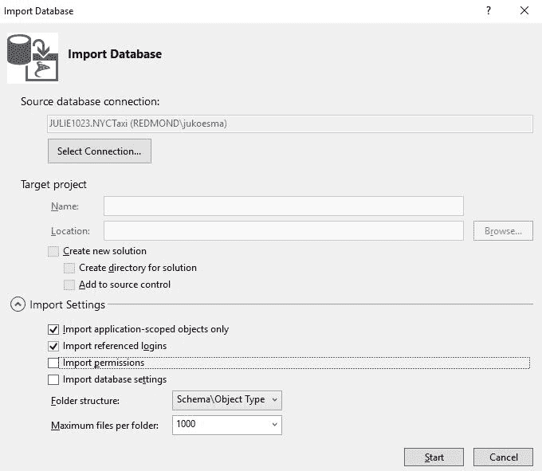

图 8.5 导入数据库对话框

1.  然后导入数据库对话框显示导入进度的摘要：

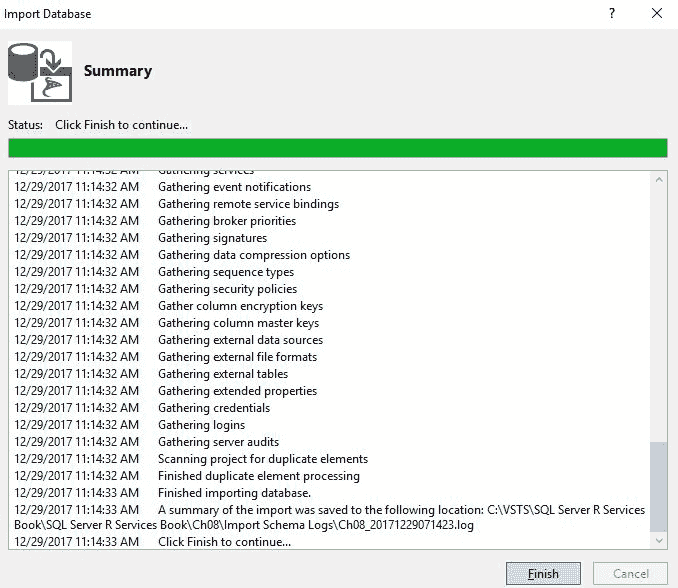

图 8.6 数据库项目导入摘要

1.  解决方案应看起来如下：

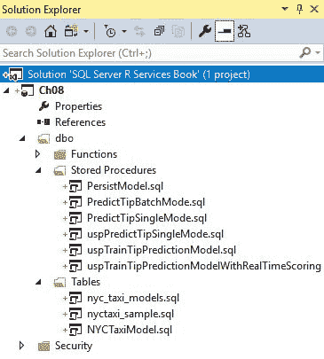

图 8.7 导入数据库后解决方案资源管理器显示的数据库项目

1.  在我们进行任何更多更改之前，让我们通过在根解决方案节点上右键单击并选择“生成解决方案”，或者您也可以单击 *Ctrl* + *Shift* + *B* 来生成解决方案。

注意，输出应包含针对每个存储过程引用`sp_execute_external`脚本的多个警告，如下所示：

```py
C:\VSTS\SQL Server R Services Book\SQL Server R Services Book\Ch08\dbo\Stored Procedures\uspTrainTipPredictionModelWithRealTimeScoring.sql(27,8): Warning:  SQL71502: Procedure: [dbo].[uspTrainTipPredictionModelWithRealTimeScoring] has an unresolved reference to object [dbo].[sp_execute_external_script].
```

# 向存储过程添加新的存储过程对象

这里是向现有数据库项目添加新对象的一个示例：

1.  要创建新过程，您可以右键单击“存储过程”文件夹，然后点击“添加”|“存储过程...”：

1.  在名称字段中输入`uspTrainTipPredictionModelWithRealTimeScoringDTree`作为新的存储过程：

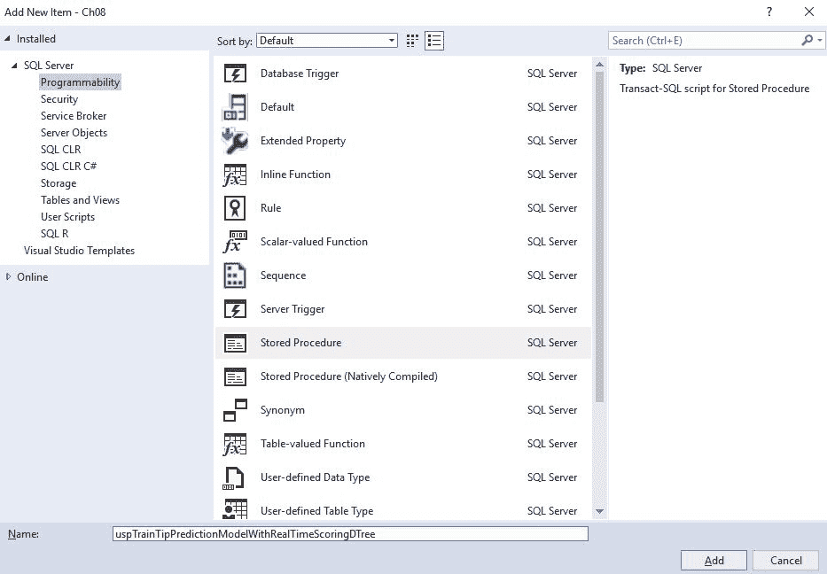

图 8.8 向数据库项目添加新项

1.  将以下脚本添加到存储过程中：

```py
CREATE PROCEDURE [dbo].[uspTrainTipPredictionModelWithRealTimeScoringDTree] 
AS 
BEGIN 
   DECLARE @auc FLOAT; 
   DECLARE @model VARBINARY(MAX); 

   -- The data to be used for training 
   DECLARE @inquery NVARCHAR(MAX)= N' 
         SELECT  
               tipped,  
               fare_amount,  
               passenger_count, 
               trip_time_in_secs, 
               trip_distance, 
               pickup_datetime,  
               dropoff_datetime, 
               dbo.fnCalculateDistance(pickup_latitude,  
                     pickup_longitude,   
                     dropoff_latitude,  
                     dropoff_longitude) as direct_distance 
         FROM dbo.nyctaxi_sample 
         TABLESAMPLE (10 PERCENT) REPEATABLE (98052)' 

-- Calculate the model based on the trained data and the AUC. 
EXEC sys.sp_execute_external_script @language = N'R', 
                                  @script = N' 
         ## Create model 
         dTreeObj<- rxDTree(tipped ~ passenger_count + 
trip_distance + 
trip_time_in_secs + 
direct_distance, 
                    data = InputDataSet); 

treeCp <- rxDTreeBestCp(dTreeObj); 
         dTreeObjChosen<- prune.rxDTree(dTreeObj, cp = treeCp); 

         ## Serialize model             
         model <- serialize(dTreeObjChosen, NULL); 

         predictTree <- rxPredict(dTreeObjChosen, data = InputDataSet, overwrite = TRUE)               

        library('ROCR'); 
predOutput <- cbind(InputDataSet, predictTree); 

auc <- rxAuc(rxRoc("tipped", "tipped_Pred", predOutput)); 
print(paste0("AUC of Classification Model:", auc)); 
         ', 
     @input_data_1 = @inquery,    
     @output_data_1_name = N'trained_model', 
     @params= N'@auc FLOAT OUTPUT, @model VARBINARY(MAX) OUTPUT', 
     @auc= @auc OUTPUT, 
     @model = @model OUTPUT; 

-- Store the train model output and its AUC  
INSERT INTO [dbo].[NYCTaxiModel] (Model, AUC,IsRealTimeScoring) 
SELECT @model, @auc, 1; 

END 
```

1.  按*Ctrl* + *S*保存文件。

1.  您现在可以使用*Ctrl* + *Shift* + *B*重新构建解决方案。

# 发布模式更改

有两种将更改发布到环境的方法：

+   现有数据库

+   新数据库

在此示例中，NYCTaxi 已经在数据库中存在。您可以识别模式更改并创建更新脚本：

1.  右键单击“Ch08”并选择“模式比较”。

1.  确保左侧的源指向数据库项目路径。

1.  在“选择目标”下拉列表中，点击它以设置目标数据库。

1.  选择“数据库”并点击“选择连接”。在这里，您可以提供对现有`NYCTaxi`数据库的连接。

1.  点击“比较”，应该只显示一个文件：

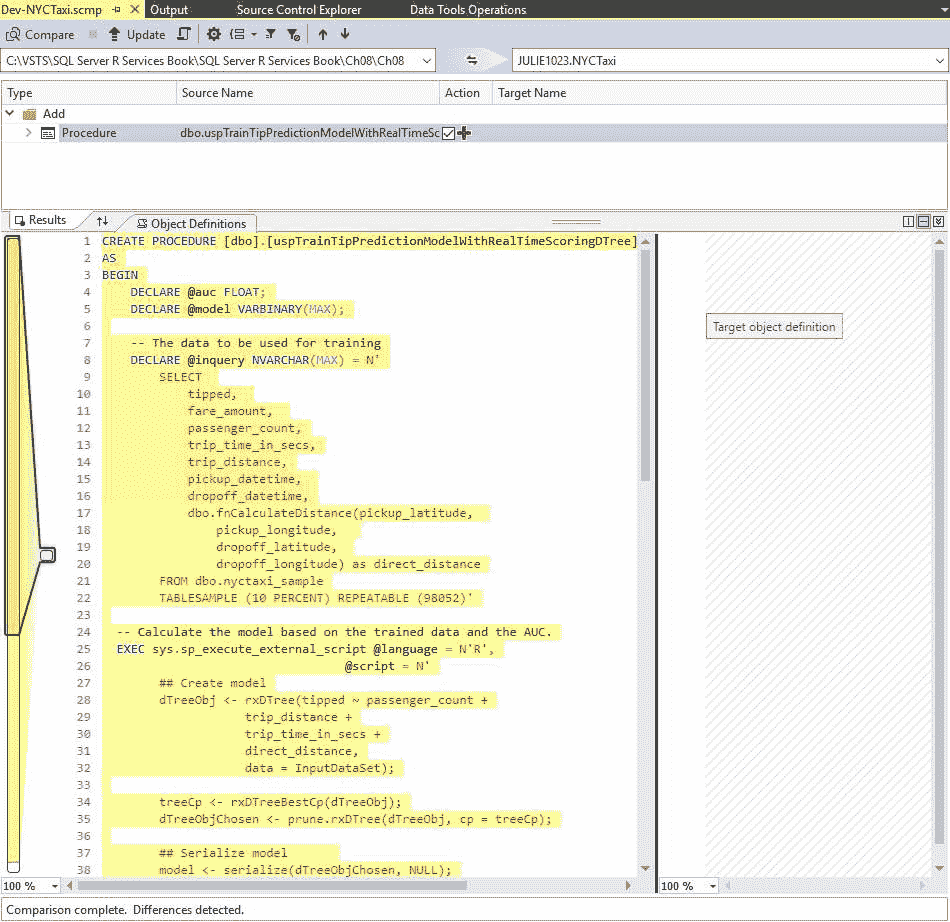

图 8.9 Visual Studio 中的模式比较

1.  在这里，您可以点击“更新”直接将更改应用到数据库中，或者点击“生成脚本”图标来生成更改的脚本。

作为最佳实践，尤其是如果您有一个正式的生产变更管理流程，您会选择生成脚本并将其包含在变更管理请求中。

# 向存储过程添加单元测试

向存储过程或函数等可编程对象添加单元测试是编程的良好实践的一部分：

1.  通过右键单击存储过程或函数之一（如`Ch08`|`dbo`|`存储过程`|`uspTrainTipPredictionModel`）来创建单元测试套件。然后，选择“创建单元测试...”：

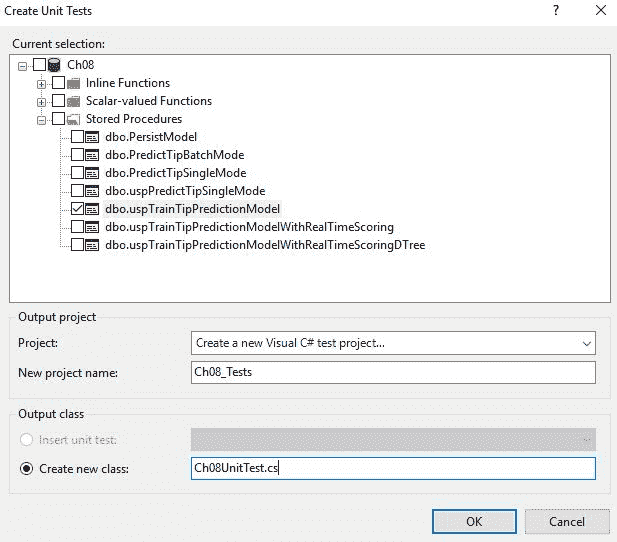

图 8.10 在 Visual Studio 中创建单元测试

1.  选择连接：

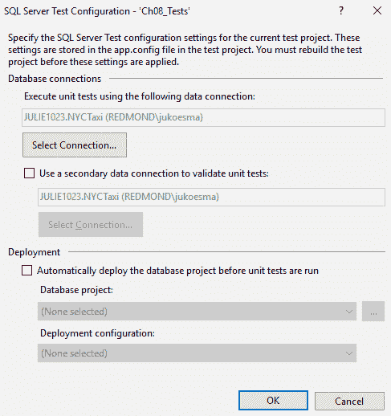

图 8.11 SQL Server 测试配置

1.  点击“确定”后，您将看到一个新创建的单元测试项目和创建的单元测试模板示例：

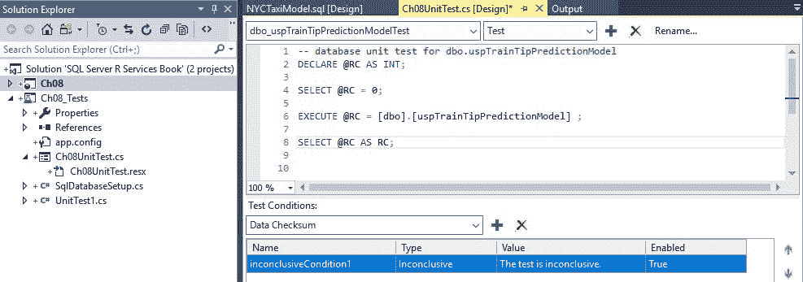

图 8.12 SQL Server 单元测试模板

在右上角面板中，您可以管理您的单元测试用例。由于`dbo.uspTrianTipPredictionModel`训练样本数据并将模型以及 AUC 存储到`dbo.NYCTaxiModel`中，我们将创建一个单元测试来确保：

+   +   新记录已插入，

    +   创建的 AUC 达到一定的阈值

1.  复制以下代码：

```py
-- database unit test for dbo.uspTrainTipPredictionModel
DECLARE @RC AS INT;
DECLARE @RowCountBefore AS INT;
DECLARE @RowCountAfter AS INT;
DECLARE @AUC FLOAT;
SELECT @RC = 0;
```

```py
SELECT @RowCountBefore = IS NULL((SELECT COUNT(1) ROWCOUNT
FROM [dbo].[NYCTaxiModel]
WHERE [AUC] ISNOTNULL), 0);
EXECUTE @RC = [dbo].[uspTrainTipPredictionModel];
-- Expected value: there should be a new record added to NYCTaxiModel
-- where AUC is known.
SELECT @RowCountAfter = ISNULL((SELECTCOUNT(1)ROWCOUNT
FROM [dbo].[NYCTaxiModel]
WHERE [AUC] ISNOTNULL), 0);
SELECT @AUC = (SELECTTOP 1 [AUC]
FROM [dbo].[NYCTaxiModel]
ORDER BY [CreatedOn] DESC);
SELECT
@RowCountAfter - @RowCountBeforeRowCountAdded,
IIF(@AUC > 0.5, 1, 0) AUCOfModel;
```

1.  在测试条件面板中，点击`inconclusiveCondition1`并点击红色十字删除它。

1.  现在，从测试条件中选择“标量值”并点击加号按钮。

1.  然后，右键单击 scalarValueCondition1 并点击属性。

1.  在属性窗口中更新以下值：

    1.  **名称**：`TestNYCTaxiModelAdded`

    1.  **预期值**：`1`

    1.  **预期为空**：`False`

1.  重复步骤 6 到 8，并在属性窗口中更改以下值：

    1.  **名称**：`TestNYCTaxiModelAdded`

    1.  **预期值**：`1`

    1.  **预期为空**：`False`

一旦设置完毕，你的 Visual Studio 应该看起来像这样：

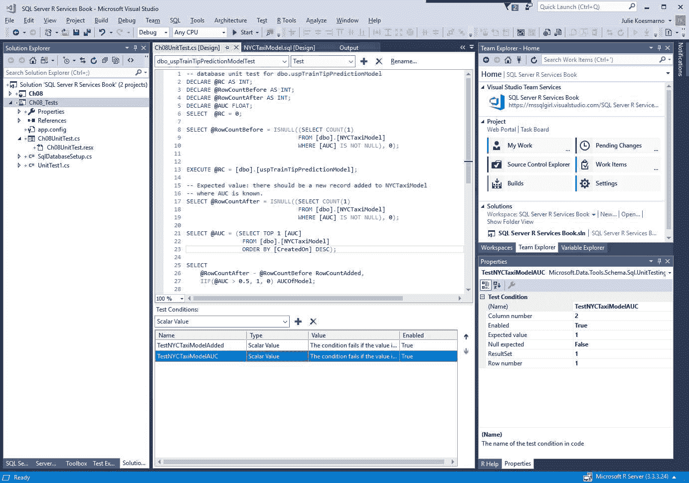

图 8.13 dbo.uspTrainTipPredictionModel 的 SQL Server 单元测试

1.  删除 `UnitTest.cs`。

1.  然后，右键单击 Ch08_Test 项目并点击构建。

1.  导航到测试资源管理器并点击运行所有。

1.  几秒钟后，`dbo_uspTrainTipPredictionModelTest` 出现在已通过测试下。点击它以查看执行摘要。

1.  点击输出以查看更多详细信息，例如：

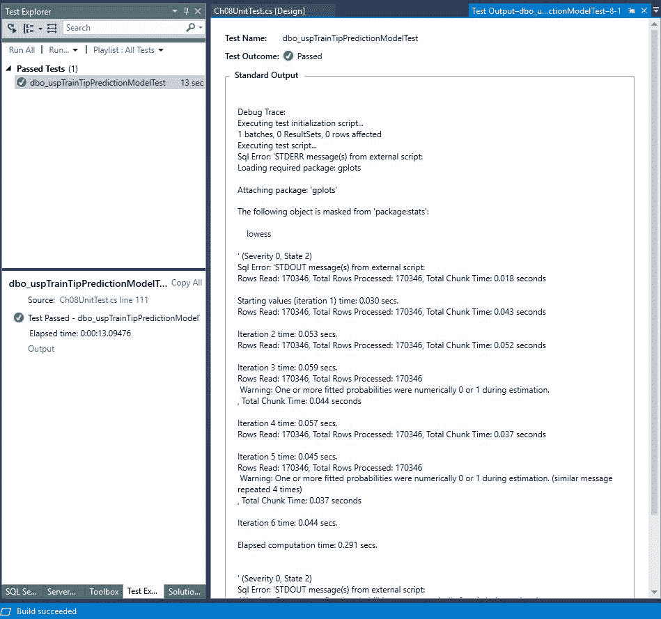

图 8.14 测试执行结果

现在，你已经学会了如何创建针对存储过程的单元测试，该测试针对现有的 NYC Taxi Model 上的现有存储过程执行。理想情况下，单元测试是在最近发布的 SQL Server 上运行的。

# 使用版本控制

从 Visual Studio，我们可以提交解决方案并管理版本控制中的更改。在这个特定实例中，我们正在使用 VSTS 进行提交。假设你已经在一个 VSTS 中创建了一个项目。

下面是本节其余部分的要求：

1.  **VSTS 项目**：要设置新的 VSTS 项目，只需访问：[`www.visualstudio.com/team-services/`](https://www.visualstudio.com/team-services/)

VSTS 项目的 URL 应遵循以下格式：

`https://<你的账户>.visualstudio.com/<VSTS 项目>`

本章中提到的 VSTS 项目命名为 `SQL Server R Services Book`。因此，我的 URL 是 `https://mssqlgirl.visualstudio.com/SQL%20Server%20R%20Services%20Book`

1.  VSTS 项目映射到本地文件夹。

这里映射到项目的本地文件夹是 `C:\VSTS\SQL Server R Services Book`。在本章的早期部分，我们在该路径创建了 SQL Server 数据库解决方案。

按照以下步骤从 Visual Studio 提交你的解决方案：

1.  在解决方案根节点上，右键单击并选择提交。

1.  在团队资源管理器窗口中，在挂起的更改下，在注释文本框中输入 `Initial check-in`。

1.  在点击提交之前，请先审查相关的工作项、包含的更改和排除的更改：

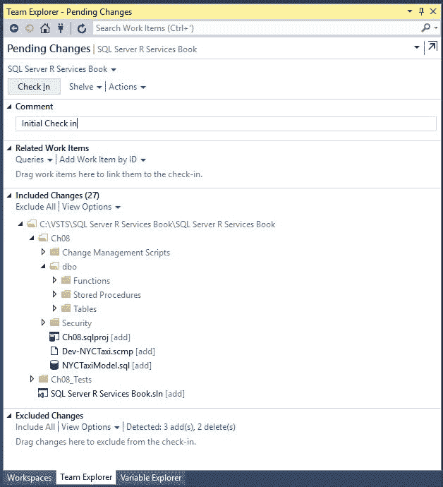

图 8.15 检查挂起的更改

1.  在提交确认对话框中，点击是。

一旦所有文件都成功提交，你还可以在 VSTS 网站上查看它们。例如：

`https://mssqlgirl.visualstudio.com/SQL%20Server%20R%20Services%20Book/_versionControl`

# 设置持续集成

**持续集成**（**CI**）的主要思想是基于一个或多个触发器执行自动化的构建。执行构建的一个触发器是检查事件。另一个可能是计划构建。选择哪个触发器合适取决于各种因素，例如项目的复杂性和团队的文化。在本节中，因为项目较小，我们将自动化由检查触发的构建。我们还将测试作为构建的一部分添加。

VSTS 是一个自动化构建、测试部署和监控的好平台。在本节中，我们将配置构建定义并在 VSTS 中安排持续集成。

确保 Visual Studio 解决方案，包括 SQL Server 数据库项目和 SQL Server 单元测试项目，构建成功。

*图 8.16*显示了 VSTS 在线上的 SQL Server R Services Book 团队。在接下来的几个部分中，我们将使用浏览器上的 VSTS 来配置 CI：

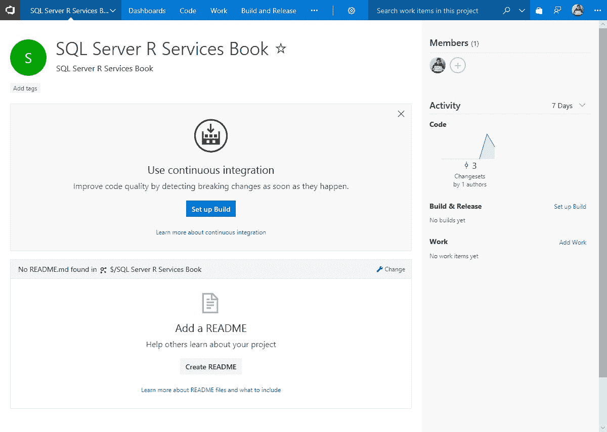

图 8.16 检查挂起的更改

本节其余部分的一个先决条件是：

+   要将 SQL Server 数据库项目部署到本地 SQL Server 实例，您需要创建一个由 VSTS 注册的本地托管的私有代理。这仅在 Visual Studio 2017 中可用。要设置此环境，请按照以下文档操作：[`docs.microsoft.com/en-us/vsts/build-release/actions/agents/v2-windows`](https://docs.microsoft.com/en-us/vsts/build-release/actions/agents/v2-windows)。

# 在 VSTS 中创建构建定义

按照以下步骤在 VSTS 中创建构建定义：

1.  在 VSTS 项目网站上，点击顶部菜单中的构建和发布，然后选择构建。选择新定义。

1.  从空流程开始。

1.  在任务下，转到流程并从代理队列下拉列表中选择私有代理。在 mssqlgirl 账户中，私有代理命名为 Default：

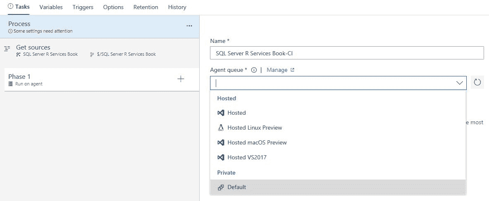

图 8.17 选择构建任务中的私有代理（默认）

1.  审查获取源中的选择。

在`$(build.sourcesdirectory)`下的本地路径是指私有代理的工作空间，用于执行构建和执行其他任务。

1.  点击第一阶段，并将显示名称值替换为构建阶段。

1.  在顶部菜单中，从保存和排队下拉列表中选择保存。

1.  审查保存构建定义并添加注释。

1.  通过点击加号在构建阶段添加一个任务。

1.  在添加任务中，搜索 MS Build，然后点击添加。

1.  将项目更改为`$/SQL Server R Services Book/SQL Server R Services Book/SQL Server R Services Book.sln`。

默认值是`**/*.sln`，它指的是 VSTS 项目中的所有解决方案文件。

1.  在构建阶段，添加另一个任务，命名为发布构建工件。这允许我们获取以后可能很重要的文件，例如 DACPAC 文件。

1.  在发布构建工件任务中，指定以下详细信息：

    1.  发布路径：`$(Build.Repository.LocalPath)\SQL Server R Services Book\Ch08\bin\Debug`

    1.  工件名称：`DACPAC`

    1.  工件发布位置：`Visual Studio Team Services/TFS`

在此步骤中，我们只发布 DACPAC 文件。在 Visual Studio Team Services 区域发布此特定文件允许我们在发布过程中（一个持续交付步骤）稍后引用此 DACPAC。

1.  点击保存并排队以测试构建定义。

1.  查看队列构建中 SQL Server R 服务 Book-CI 的选项，然后点击队列。

1.  页面将显示正在排队构建，类似于以下内容：

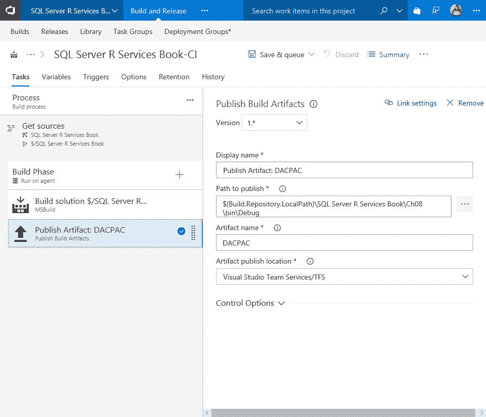

图 8.18 添加发布工件任务

如果构建成功，您将看到类似以下内容。现在将是熟悉构建摘要页面和工件页面的好时机：

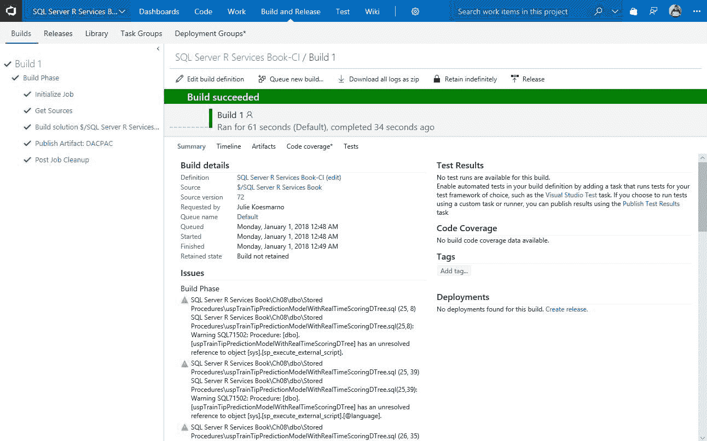

图 8.19 查看构建结果

当您导航到工件选项卡时，您应该能够看到 `DACPAC` 文件夹。通过点击探索，您可以看到解决方案内的文件，包括类似于通过 Visual Studio 本地构建的构建输出：

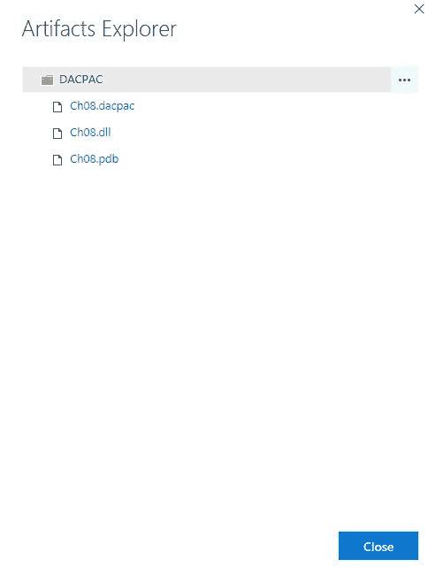

图 8.20 探索从前一个成功构建发布的工件

# 将构建部署到本地 SQL Server 实例

现在，通过 VSTS 在私有代理上的构建已成功，让我们尝试将数据库部署到 SQL Server 实例。此操作的前提是私有代理必须能够访问 SQL Server 实例。*图 8.21* 展示了如何使用带有本地（私有）代理的 VSTS 将部署到多个本地服务器/环境：

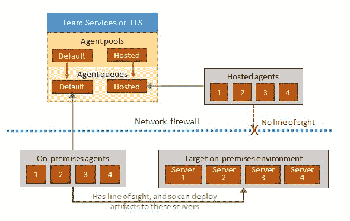

图 8.21 VSTS 和本地代理/环境的概要布局

来源：[`docs.microsoft.com/en-us/vsts/build-release/concepts/agents/agents`](https://docs.microsoft.com/en-us/vsts/build-release/concepts/agents/agents)

当 SQL Server 数据库项目构建时，它将生成一个 DACPAC 文件，该文件可以用来创建一个新的数据库。因此，在 SQL Server R 服务 Book-CI 构建定义的构建阶段，我们将添加一个新任务：

1.  导航到 SQL Server R 服务 Book-CI 构建定义。

1.  点击构建阶段并添加一个新任务。

1.  搜索 `WinRM - SQL Server DB 部署`。然后，点击添加。

如果不存在，点击检查我们的市场。搜索 `使用 WinRM 的 IIS Web 应用部署` 并将其安装到您的 VSTS 账户。

1.  在使用 DACPAC 部署时，输入以下详细信息：

    1.  机器：`$(UATMachine)`

    1.  管理员登录：`$(UATAdminUser)`

    1.  密码：`$(UATAdminPwd)`

    1.  DACPAC 文件：`$(Build.Repository.LocalPath)\SQL Server R 服务 Book\Ch08\bin\Debug\Ch08.dacpac`

    1.  指定 SQL 使用：`发布配置文件`

    1.  发布配置文件：`$(System.DefaultWorkingDirectory)$(UATPublishProfilePath)`

1.  添加以下新变量：

| **名称** | **值** | **秘密** |
| --- | --- | --- |
| `UATMachine` | {输入您的机器名称（FQDN 或 IP 地址），例如：`uatpc.mssqlgirl.com`} | 否 |
| `UATAdminUser` | {输入可以登录 UAT 机器的管理员用户} | 否 |
| `UATAdminPwd` | {输入管理员密码} | 是 |
| `UATPublisProfilePath` | `\SQL Server R Services Book\Ch08\Ch08-UAT.publish.xml` | 否 |

1.  点击保存并排队以测试构建。

# 将测试阶段添加到构建定义中

在本节中，你将学习如何将测试阶段添加到 SQL Server R Services Book-CI 构建定义。此测试阶段将执行我们之前所做的单元测试。

在我们可以开始单元测试之前，我们需要为测试做准备。这包括向`dbo.nyctaxisample`表填充数据：

1.  要添加新的测试阶段，转到流程**，点击 ...**，然后选择添加代理阶段。

1.  在代理阶段，在显示名称中输入`Test Phase`。

1.  在测试阶段，添加一个新任务。

1.  搜索`命令行`。然后，点击`添加`。

1.  在命令行任务中输入以下详细信息：

    1.  工具：`bcp`

    1.  参数：`Ch08.dbo.nyctaxi_sample in "$(System.DefaultWorkingDirectory)$(UATSampleFilePath)" -c -t , -r \n -U $(UATDBUser) -P $(UATDBPwd)`

1.  点击保存。

现在，我们可以添加创建和执行单元测试的步骤：

1.  在测试阶段，添加一个新任务。

1.  搜索`Visual Studio 测试`。然后，点击添加。

1.  在 `Visual Studio 测试`中输入以下详细信息：

    1.  显示名称：`单元测试`

    1.  使用以下方式选择测试：`Test assemblies`

    1.  测试程序集：`**\Ch08_test*.dll`

    1.  搜索文件夹：`$(System.DefaultWorkingDirectory)`

    1.  测试平台站：`Visual Studio 2017`

    1.  测试运行标题：`Ch08 SQL Server Testing`

1.  点击保存 & 排队。

1.  当你查看构建时，你应该能够看到如下内容：

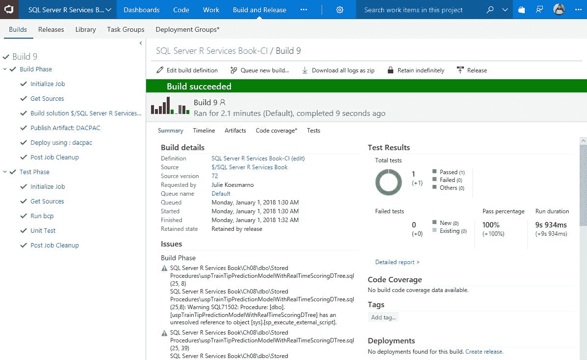

图 8.22 自动化测试成功

# 自动化 CI 构建过程

现在我们已经定义了带有构建阶段和测试阶段的 SQL Server R Services Book-CI，我们准备自动化它：

1.  在 VSTS 中编辑 SQL Server R Services Book-CI。

1.  点击触发器选项卡。

1.  确保已勾选启用持续集成。

1.  可选地，点击+添加以添加计划：

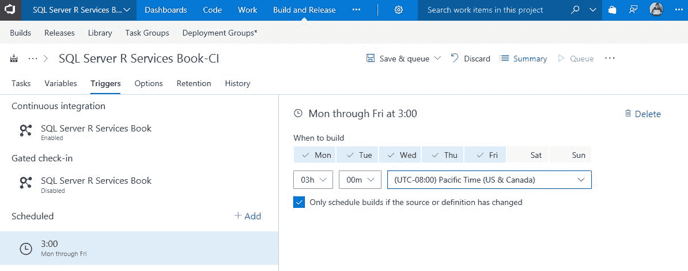

图 8.23 配置 CI 和特定计划构建

1.  点击选项卡。

1.  在构建属性 | 构建号格式中，输入`Build_$(Date:yyyyMMdd)$(Rev:.r)`。

1.  点击保存。

现在，为了测试自动化是否工作，让我们对解决方案进行一些更改，例如：

1.  在 Visual Studio 中打开 SQL Server R Services Book 解决方案。

1.  从 Ch08 项目中删除以下文件：

    1.  `nyc_taxi_models.sql`

    1.  `PersistModel.sql`

    1.  `PredictTipBatchMode.sql`

    1.  `PredictTipSingleMode.sql`

1.  现在让我们检查挂起的更改。右键单击解决方案节点并选择签入。

1.  可选地，在点击签入按钮之前添加注释。

在成功签入后，你应该能够看到更改集编号：

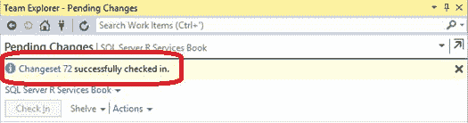

图 8.24 检查 Visual Studio 的更改集信息

在 VSTS 中，你应该能够访问最新的构建并看到匹配的源版本，如下所示：

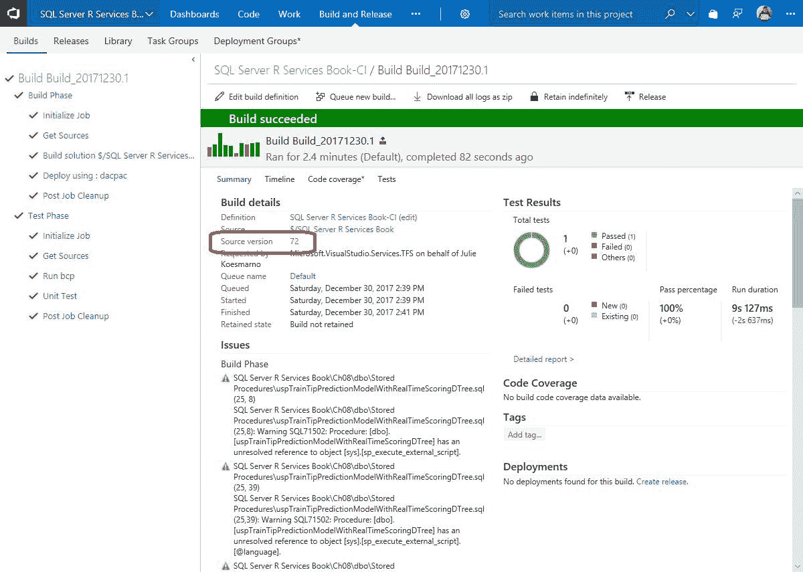

图 8.25 通过 VSTS 中的更改集信息验证自动化 CI

# 设置持续交付

持续交付旨在确保我们可以将良好的构建部署到所需的环境。这可能意味着 UAT 环境，或者生产环境。在本节中，我们将使用 VSTS 实现持续交付：

1.  在 VSTS 中，转到 SQL Server R Services Book 项目。

1.  从顶部菜单导航到构建和发布 | 发布。

1.  点击 + | 新定义。

1.  查看选择模板窗格。从这里，您可以从许多选项中进行选择，包括从测试管理器运行自动化测试。此选项强烈推荐用于定期检查现有模型的准确性，这将在下一步中讨论。现在，让我们选择空并点击添加。

1.  在顶部标题处，点击铅笔图标以编辑名称为 `UAT 发布` 的所有定义 **|** 新发布定义。

1.  让我们继续到“管道”标签页。有两个框：工件和环境。

1.  在“工件”框中，点击添加工件。

1.  提供以下详细信息并点击添加：

    1.  **项目**：SQL Server R Services Book

    1.  **源**（构建定义）：SQL Server R Services Book-CI

1.  在“环境”框中，点击环境 1 的 1 阶段，0 任务。

1.  在“任务”标签页中，点击第一行显示为“环境 1”。将环境名称更改为 `UAT`。

1.  在“任务”标签页中，点击代理阶段并提供以下详细信息：

    1.  显示名称：部署到 UAT

    1.  代理队列：默认

1.  现在，添加一个新任务用于部署到 UAT。

1.  搜索 `WinRM - SQL Server DB Deployment` 并点击添加。

1.  在“使用 Dacpac 部署”中，填写以下详细信息：

    1.  机器：`$(UATMachine)`

    1.  管理员登录：`$(UATAdminUser)`

    1.  密码：`` `$(UATAdminPwd)` ``

    1.  DACPAC 文件：`$(System.ArtifactsDirectory)\$(Build.DefinitionName)\DACPAC\Ch08.dacpac`

    1.  服务器名称：`{指定服务器名称，例如：localhost}`

    1.  数据库名称：`NYCTaxiUAT`

1.  前往“变量”标签页并添加以下变量：

| **名称** | **值** | **秘密** |
| --- | --- | --- |
| `UATMachine` | {输入您的机器名称（FQDN 或 IP 地址），例如：uatpc.mssqlgirl.com} | 否 |
| `UATAdminUser` | {输入可以登录到 UAT 机器的管理员用户} | 否 |
| `UATAdminPwd` | {输入管理员密码} | 是 |

1.  然后，点击保存并接受默认值。

1.  要测试此发布定义，在“新发布定义”下，点击 + 发布并选择创建 **发布**，然后选择 ...

1.  在“为新发布定义创建新发布”中，在发布描述中输入 `Test UAT deployment`。然后，点击创建，如图所示：

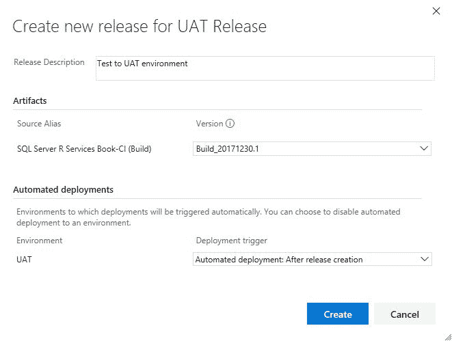

图 8.26 基于最新成功构建创建 UAT 环境的新发布

可以使用不同的数据库连接设置部署到多个环境。一个帮助你实现这一点的扩展是 XDT Transform：

[`marketplace.visualstudio.com/items?itemName=qetza.xdttransform`](https://marketplace.visualstudio.com/items?itemName=qetza.xdttransform)

一旦发布完成，它将看起来如下：

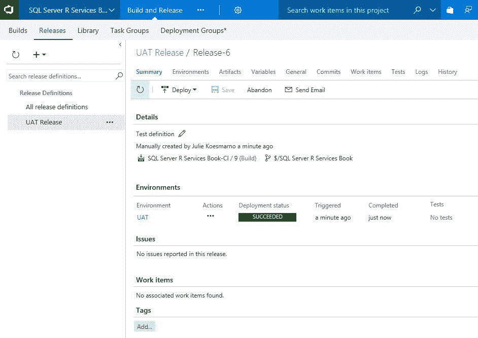

图 8.27 成功发布的成果

要在发布上启用持续交付，你必须编辑定义：

1.  前往发布视图，点击 UAT 发布的...，然后选择编辑。

1.  在管道视图中，进入工件框中的 SQL Server R 服务 Book-CI。

1.  点击此处所示的持续部署触发器：

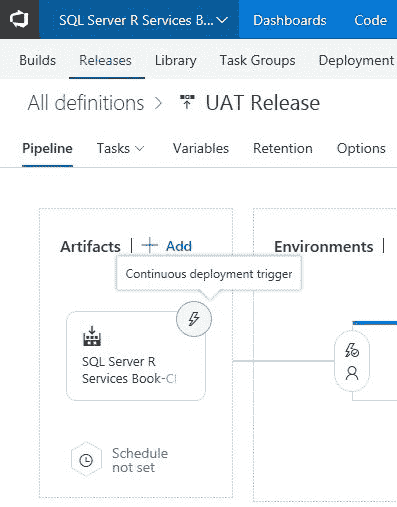

图 8.28 修改持续部署触发器

1.  在持续部署触发器窗口中，确保启用滑块处于开启状态。

1.  点击保存。

要测试 UAT 发布的持续交付设置，你可以在 SQL Server R 服务 Book-CI 上调用一个新的构建。视图应如下所示：

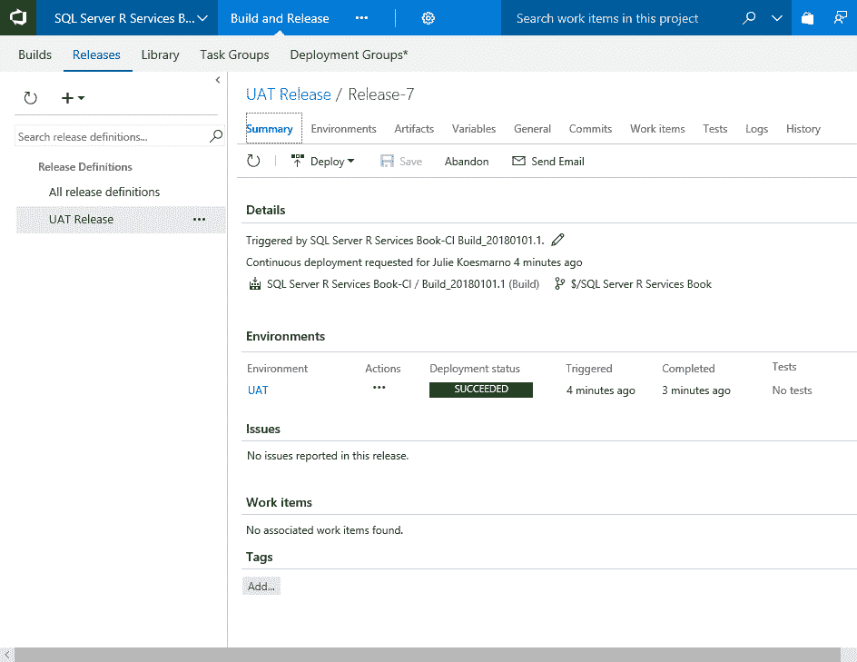

图 8.29 通过持续开发成功发布的成果

在摘要中，详细信息应说明发布是由 SQL Server R 服务 Book-CI 构建 _20180101.1 触发的。因此，我们成功创建了一个基本的持续交付流程。现在可以添加高级步骤，如设置集成测试和负载测试，使用与前面显示的类似步骤。有关在 VSTS 中设置此信息的更多信息，请参阅以下 Microsoft 教程：[`docs.microsoft.com/en-us/vsts/build-release/test/example-continuous-testing#configure-cd`](https://docs.microsoft.com/en-us/vsts/build-release/test/example-continuous-testing#configure-cd)。

# 监控生产化模型的准确性

在第六章“预测建模”中，我们讨论了许多预测建模示例。创建的模型是基于训练数据的。在现实世界中，新数据不断涌现，例如在线交易、出租车交易（记得之前提到的纽约市出租车示例）和航班延误预测。因此，应该定期检查数据模型，以确保它仍然令人满意，并且没有其他更好的模型可以生成。在这方面，优秀的数据科学家会持续至少提出以下四个问题：

1.  由于数据的变化，是否需要考虑不同的算法？

例如，如果当前模型正在使用逻辑回归（`rxLogit`），那么决策树算法（`rxDTree`）是否会因为规模或预期结果的变化而更准确？

1.  是否有来自新交易的其他特征变得越来越重要？

考虑以下场景：目前，出租车行程的小费预测正在使用乘客数量、行程距离、行程时间和直接距离。也许定期检查其他特征，如一天中的小时、一周中的日子、接单邮编和/或送单邮编、假日季节、出租车的清洁度或客户评分，是否会对小费预测有更大的贡献。

1.  是否有变化的需求可以导致采取行动来改善业务或客户？

在出租车行程小费预测中，当前的预测是一个二进制值，即真或假。企业可能希望了解出租车清洁度或客户评分如何与无小费、小额小费、中等小费或大量小费相关联。出租车清洁度是司机可以用来提高服务质量的行为。

1.  性能下降是否由模型执行或输入数据瓶颈引起？

可能随着输入数据集/数据源的增长且未优化，端到端的预测建模也会变慢。

为了捕捉模型的性能，应该记录实际预测或实际数据的合理表示的性能。以下是一个日志表应该看起来像的例子：

| **值** | **数据类型** | **注释** |
| --- | --- | --- |
| `LogID` | `INT` | 执行的顺序 ID。 |
| `创建时间` | `DATETIME` | 模型生成和测试的日期。 |
| `模型 ID` | `INT` | 每个模型的唯一标识符。 |
| `模型` | `VARBINARY(MAX)` | 这是模型的序列化表示。 |
| `RxFunction` | `VARCHAR(50)` | 这是模型中使用的 rx 函数。 |
| `公式` | `VARCHAR(1000)` | 预测模型的公式。 |
| `训练输入查询` | `VARCHAR(MAX)` | 可重复生成的训练数据集 |
| `AUC` | `FLOAT` | 模型的 AUC 表示。这可以是任何其他可以用来比较模型质量的指标。 |
| `训练行数` | `INT` | 行数的数量。 |
| `CPU 时间` | `INT` | 生成模型所需的时间（秒数）。 |

一旦捕获了执行情况，就可以分析 AUC 值和 CPU 时间，如图 8.30 所示：

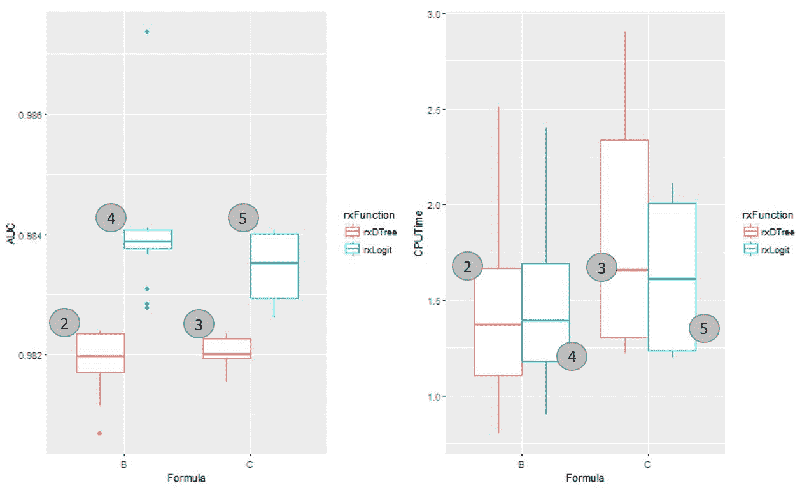

图 8.30 监控模型在 AUC 和 CPU 时间上的比较

这些图表比较了以下模型的性能：

|  | **公式 B** | **公式 C** |
| --- | --- | --- |
| `rxDTree` | 模型 ID 2 | 模型 ID 3 |
| `rxLogit` | 模型 ID 4 | 模型 ID 5 |

描述如下：

+   公式 B 是*tipped ~ passenger_count + trip_distance + trip_time_in_secs + direct_distance + payment_type*

+   公式 C 是*tipped ~ passenger_count + trip_distance + trip_time_in_secs + payment_type*

每个模型都会与以下数据运行：

+   最后 2 个月的数据

+   随机选取的 5%数据

根据之前提到的比较，我们可以看到模型 ID 4，即使用公式 B 的`rxLogit`，具有最高的 AUC 范围和最低的 CPU 时间。因此，这个模型是两个中最好的。接下来需要决定这个模型是否应该替换生产中的模型。

现在你已经学会了比较模型的技术以及预测建模中一些重要的指标，你可以安排这种性能测试，类似于前面展示的。安排可以是 SQL 代理作业，如第七章中所述的“操作 R 代码”，在那里如果新的结果低于某个阈值，你可以收到警报。或者，你可以在 VSTS 中部署一个独立的 SQL Server 数据库单元项目，作为单独的部分来执行，以检查最新的交易数据。

# 有用参考资料

+   将 SQL Server 2017 集成到你的 DevOps 管道中：[`www.microsoft.com/en-us/sql-server/developer-get-started/sql-devops/`](https://www.microsoft.com/en-us/sql-server/developer-get-started/sql-devops/)

+   Visual Studio Team Services (VSTS)：[`www.visualstudio.com/team-services/`](https://www.visualstudio.com/team-services/)

+   比较 Visual Studio 2017 IDE：[`www.visualstudio.com/vs/compare/`](https://www.visualstudio.com/vs/compare/)

+   在 VS 2017 中配置托管代理：[`docs.microsoft.com/en-us/vsts/build-release/actions/agents/v2-windows`](https://docs.microsoft.com/en-us/vsts/build-release/actions/agents/v2-windows)

+   持续交付：[`www.visualstudio.com/learn/what-is-continuous-delivery/`](https://www.visualstudio.com/learn/what-is-continuous-delivery/)

# 摘要

Visual Studio 2017 是一个强大的集成开发环境（IDE），数据科学家/开发者可以使用它来管理他们的代码、单元测试和版本控制。结合 Visual Studio Team Services，它们形成了一个完整的工具集，用于执行数据库生命周期管理，这也易于适应 DevOps 实践。本章详细介绍了如何在 SQL Server 数据库项目中、DevOps 实践中以及 CI/CD 工作流中集成 SQL Server 机器学习服务与 R 语言。最后，你也学习了如何监控预测模型随时间变化的准确性。

在下一章中，我们将讨论数据库管理员（DBAs）如何利用 R 语言的优势来利用机器学习服务。
