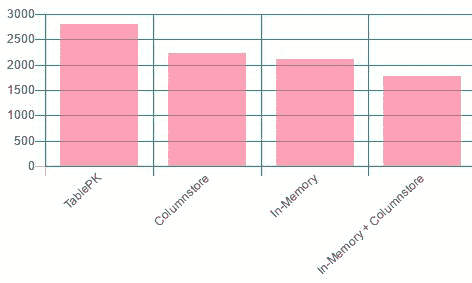

# 第十章：R 和 SQL Server 2016/2017 功能扩展

SQL Server 2016 和 2017 提供了许多新的和改进的查询性能功能、可扩展性功能、安全功能以及对开发人员、数据库管理员和数据科学家有用的内置/本地功能。这些新功能和能力可以与 SQL 中的机器学习服务一起使用，提供强大的数据科学解决方案，同时使开发人员/数据科学家的生活变得更加容易。

本章将带您了解一些独特的场景，以展示 R 和 SQL Server 中其他内置功能的结合力量。这些场景包括 JSON 内置功能，展示我们如何处理物联网数据，PolyBase 用于说明超越关系型数据源，以及使用`ColumnStore`索引的大量数据。我们将深入这些场景，并在 R 中产生我们在前几章中学到的数据可视化和预测分析能力。

# 内置 JSON 功能

在这个场景中，我们将使用来自奥斯汀市官方开放数据门户的 EMS 事件按月数据（[`data.austintexas.gov/Public-Safety/EMS-Incidents-by-Month/gjtj-jt2d`](https://data.austintexas.gov/Public-Safety/EMS-Incidents-by-Month/gjtj-jt2d)）。数据本质上包含事件计数，按地点和优先级细分奥斯汀市和特拉维斯县的事件，以及准时合规的百分比。

以下是要开始所需的先决条件：

1.  从[`data.austintexas.gov/resource/bpws-iwvb.json`](https://data.austintexas.gov/resource/bpws-iwvb.json)下载数据到本地路径，例如`C:\Temp\bpws-iwvb.json`。

1.  授予目录读取权限；例如：


图 10.1 授予对 C:\Temp 的 MS SQL Server 访问权限

1.  为了方便 R 可视化，我们将使用 SQL Operations Studio。您可以从：[`docs.microsoft.com/en-us/sql/sql-operations-studio/download`](https://docs.microsoft.com/en-us/sql/sql-operations-studio/download)下载 SQL Ops Studio。

以下是一个 JSON 文件的摘录：


图 10.2：bpws-iwvb.json 摘录

该文件中 JSON 对象的模式相当简单。它是一个包含以下 31 个属性的数组：

+   +   `count_incidents_all`

    +   `count_incidents_coa`

    +   `count_incidents_coa_or_tc`

    +   `count_incidents_coa_p1`

    +   `count_incidents_coa_p2`

    +   `count_incidents_coa_p3`

    +   `count_incidents_coa_p4`

    +   `count_incidents_coa_p5`

    +   `count_incidents_other`

    +   `count_incidents_tc`

    +   `` `count_incidents_tc_p1` ``

    +   `count_incidents_tc_p2`

    +   `count_incidents_tc_p3`

    +   `count_incidents_tc_p4`

    +   `count_incidents_tc_p5`

    +   `month_key`

    +   `month_start_date`

    +   `percent_on_time_all`

    +   `percent_on_time_coa`

    +   `percent_on_time_coa_p1`

    +   `percent_on_time_coa_p2`

    +   `percent_on_time_coa_p3`

    +   `percent_on_time_coa_p4`

    +   `percent_on_time_coa_p5`

    +   `percent_on_time_target`

    +   `percent_on_time_tc`

    +   `percent_on_time_tc_p1`

    +   `percent_on_time_tc_p2`

    +   `percent_on_time_tc_p3`

    +   `percent_on_time_tc_p4`

    +   `percent_on_time_tc_p5`

要查看数据的第一行以及值的显示方式，可以使用以下 T-SQL 代码：

```py
SELECT * 
FROM OPENJSON((SELECT Doc.BulkColumn  
                FROM OPENROWSET(BULK N'C:\Temp\bpws-iwvb.json', SINGLE_CLOB) AS Doc), '$[0]') 
```

以下为上一条命令的输出：


图 10.3 检查 bpws-iwvb.json 的第一行数据

本节剩余部分将向您展示如何使用 SQL Server 中的内置 JSON 和 R 功能来解析数据并创建可视化，以了解 ATCEMS 收到的 EMS 事件趋势。以下截图显示了我们将通过 SQL Operations Studio 从前面的 JSON 数据构建的数据可视化：


图 10.4 使用 R 生成 EMS 事件的预测

执行以下步骤以构建前面的可视化：

1.  打开 SQL Operations Studio。

1.  使用 JSON，获取 `Date` 和事件计数：

```py
SELECT  
    a.Date,  
    a.TotalIncidents, 
    a.AustinIncidents, 
    a.TravisIncidents 
FROM OPENJSON((SELECT Doc.BulkColumn  
                FROM OPENROWSET(BULK N'C:\Temp\bpws-iwvb.json', SINGLE_CLOB) AS Doc), '$') 
WITH (Date          DATE    '$.month_start_date', 
    TotalIncidents  INT     '$.count_incidents_all', 
    AustinIncidents INT     '$.count_incidents_coa', 
    TravisIncidents INT     '$.count_incidents_tc' 
    ) AS a 
ORDER BY a.Date ASC;
```

这里，我们使用 `OPENROWSET` 和 `SINGLE_CLOB` 来读取明文文件流。

1.  然后，我们使用 `OPEN_JSON` 提取 `month_start_date` 作为 `Date`，`count_incidents_all` 作为 `TotalIncidients`，`count_incidents_coa` 作为 `AustinIncidents`，以及 `count_incidents_tc` 作为 `TravisIncidents`。

输出应类似于以下内容：


图 10.5：对 EMS 事件 JSON 文件运行 OPENJSON 的输出

1.  现在，让我们使用 `Date` 和 `TotalIncidents` 数据构建 R 脚本的 `InputDataSet`：

```py
DECLARE @input_query    NVARCHAR(MAX);  
SET @input_query = 'SELECT  
    a.Date,  
    a.TotalIncidents 
FROM OPENJSON((SELECT Doc.BulkColumn  
    FROM OPENROWSET(BULK N'C:\Temp\bpws-iwvb.json',  
         SINGLE_CLOB) AS Doc), '$') 
   WITH (Date            DATE  '$.month_start_date', 
         TotalIncidents  INT   '$.count_incidents_all' 
        ) AS a;' 
```

1.  让我们构建使用前面 `InputDataSet` 的 R 脚本：

在此脚本中，我们将使用预测包根据 2010 年 1 月和 2017 年 11 月的现有数据进行预测。有关预测包的更多信息，包括依赖包，可在以下网址找到：[`cran.r-project.org/web/packages/forecast/index.html`](https://cran.r-project.org/web/packages/forecast/index.html)。

在这个特定示例中，事件数量可能是季节性的。因此，我们将使用一些辅助函数来帮助预测：

+   +   `ts` 函数将 `InputDataSet` 数据框转换为时间序列

    +   `stl` 函数将时间序列分解为季节性、趋势和不规则成分

    +   考虑季节性的 `forecast` 函数：

```py
DECLARE @RPlot          NVARCHAR(MAX); 

SET @RPlot = 'library(forecast); 
    image_file = tempfile();  
    jpeg(filename = image_file, width=1000, height=400);  

    #store as time series  
    myts <- ts(InputDataSet$TotalIncidents,  
        start = c(2010, 1), end = c(2017, 11), 
         frequency = 12);  
    fit <- stl(myts, s.window = "period"); 

    # show the plot 
    plot(forecast(fit), main = "Forecast of EMS incidents"); 
    dev.off();  

    # return the plot as dataframe 
    OutputDataSet <-  data.frame( 
        data=readBin(file(image_file,"rb"), 
        what=raw(),n=1e6));' 
```

1.  现在，让我们执行以下脚本：

```py
EXEC sp_execute_external_script @language = N'R' 
    ,@script = @RPlot  
    ,@input_data_1 = @input_query 
    ,@input_data_1_name = N'InputDataSet' 
    ,@output_data_1_name = N'OutputDataSet'  
    WITH RESULT SETS (( [plot] VARBINARY(MAX)));     
```

1.  在 SQL Ops Studio 中，结果将以 `VARBINARY` 数据类型显示：


图 10.6：SQL Operations Studio 中的“以图表查看”功能

1.  在右侧单击“以图表查看”图标，然后在结果窗格中单击“图表查看器”选项卡，然后选择“图像”从图表类型。输出应类似于以下内容：


图 10.7：在 SQL Operations Studio 中显示 R 生成的图表

# 使用 PolyBase 访问外部数据源

PolyBase 允许您的 SQL Server 实例使用 T-SQL 访问服务器/数据库之外的数据。在 SQL Server 2016 中，您可以在 Hadoop 中的外部数据上运行查询或从 Azure Blob 存储导入数据：


图 10.8：PolyBase 概念（来源：https://docs.microsoft.com/en-us/sql/relational-databases/polybase/polybase-guide）

在本节中，我们将使用与上一节类似的数据集，这些数据集以 Azure Blob Storage 中的 CSV 文件形式表示。这些 CSV 文件代表 EMS 事件，将在 SQL Server 中作为外部表公开。本演示的目标是了解 EMS 事件的季节性和趋势。我们将在 SQL Server 中使用 R 来完成这项工作，并在 SQL Operations Studio 中查看图表。

以下是要开始所需的先决条件：

1.  SQL Server 实例安装了 PolyBase。此步骤的文档在：[`docs.microsoft.com/en-us/sql/relational-databases/polybase/get-started-with-polybase`](https://docs.microsoft.com/en-us/sql/relational-databases/polybase/get-started-with-polybase)

1.  已安装 Microsoft Azure Storage Explorer。使用 Azure Storage Explorer，您可以上传文件，管理存储账户中的容器，并从存储账户获取主访问密钥：

![img/00186.jpeg]

图 10.9：使用 Microsoft Azure Storage Explorer 连接到 Azure Blob Storage

1.  从 <插入 GitHub 链接> 下载的 EMS 事件按月下载并上传到您的 Azure Blob Storage。

1.  已安装 SSMS 或 SQL Operations Studio。

执行以下步骤以创建外部表：

1.  首先在主数据库上启用高级选项，以启用连接到 Azure Blob Storage 的连接。

将 Hadoop 连接设置为 7 允许连接到 Azure Blob Storage。有关其他支持的数据源的信息，请访问：

[`docs.microsoft.com/en-us/sql/database-engine/configure-windows/polybase-connectivity-configuration-transact-sql`](https://docs.microsoft.com/en-us/sql/database-engine/configure-windows/polybase-connectivity-configuration-transact-sql)

```py
USE master;   
GO   
EXEC sp_configure 'show advanced option', '1';   
RECONFIGURE;  
GO 
EXEC sp_configure 'hadoop connectivity', 7;  
GO  
RECONFIGURE;  
GO 
```

1.  在您希望创建连接到 Azure Blob Storage 中 CSV 文件的外部表的数据库中创建一个主密钥：

```py
USE [AdventureWorks2016] 
GO 
CREATE MASTER KEY ENCRYPTION BY PASSWORD='MsSQLGirlLovesSQLServer2016&2017:)'; 
```

1.  创建数据库 `MsSQLGirlAtAzureBlobStorage`：

```py
CREATE DATABASE SCOPED CREDENTIAL MsSQLGirlAtAzureBlobStorage   
WITH IDENTITY = 'credential', Secret = 'Es3duvq+x9G5x+EFbuUmGo0salEi6Jsd59NI20KXespbiBG9RswLA4L1fuqs/59porPBay64YkRj/tvQ7XAMLA=='; 
```

1.  在 Azure Blob Storage 中创建指向容器的外部数据源。在这个例子中，`open-data-sample` 是容器的名称，而 `mssqlgirl.blob.core.windows.net` 是 Azure Blob Storage 的位置：

```py
CREATE EXTERNAL DATA SOURCE OpenDataSample 
WITH ( 
    TYPE = HADOOP, 
    LOCATION = 'wasbs://open-data-sample@mssqlgirl.blob.core.windows.net/', 
    CREDENTIAL = MsSQLGirlAtAzureBlobStorage 
); 
```

1.  创建容器中源文件的文件格式：

```py
CREATE EXTERNAL FILE FORMAT csvformat  
WITH (  
    FORMAT_TYPE = DELIMITEDTEXT,  
    FORMAT_OPTIONS (  
        FIELD_TERMINATOR = ',' 
    )  
); 
```

1.  在容器中创建以下源文件：

```py
CREATE EXTERNAL TABLE EMSIncident 
(  
   [Month Key]                         INT, 
   [Month-Year]                        VARCHAR(30), 
   [Total Incidents]                   INT, 
   [Austin Incidents]                  INT, 
   [Travis County Incidents]           INT, 
   [Other Area Incidents]              INT, 
   [Combined Austin & Travis Incidents]      INT, 
   [Austin P1 Incidents]               INT, 
   [Austin P2 Incidents]               INT, 
   [Austin P3 Incidents]               INT, 
   [Austin P4 Incidents]               INT, 
   [Austin P5 Incidents]               INT, 
   [Travis County P1 Incidents]        INT, 
   [Travis County P2 Incidents]        INT, 
   [Travis County P3 Incidents]        INT, 
   [Travis County P4 Incidents]        INT, 
   [Travis County P5 Incidents]        INT, 
   [Overall On-Time Compliance]        VARCHAR(10), 
   [Austin On-Time Compliance]               VARCHAR(10), 
   [Travis County On-Time Compliance]        VARCHAR(10), 
   [Austin P1 On-Time Compliance]            VARCHAR(10), 
   [Austin P2 On-Time Compliance]            VARCHAR(10), 
   [Austin P3 On-Time Compliance]            VARCHAR(10), 
   [Austin P4 On-Time Compliance]            VARCHAR(10), 
   [Austin P5 On-Time Compliance]            VARCHAR(10), 
   [Travis County P1 On-Time Compliance]     VARCHAR(10), 
   [Travis County P2 On-Time Compliance]     VARCHAR(10), 
   [Travis County P3 On-Time Compliance]     VARCHAR(10), 
   [Travis County P4 On-Time Compliance]     VARCHAR(10), 
   [Travis County P5 On-Time Compliance]     VARCHAR(10), 
   [Target On-Time Compliance]               VARCHAR(10) 
)  
WITH  
(  
    LOCATION = '/EMS_-_Incidents_by_Month.csv',  
    DATA_SOURCE = OpenDataSample,  
    FILE_FORMAT = csvformat  
) 
```

1.  因此，现在我们可以对外部表执行 `SELECT` 语句，将其作为 R 脚本的输入：

```py
DECLARE @input_query    NVARCHAR(MAX);  
DECLARE @RPlot          NVARCHAR(MAX); 

SET @input_query = 'SELECT  
    CAST([Month-Year] AS DATE) AS [Date], 
    [Total Incidents] AS [TotalIncidents] 
FROM EMSIncident;' 
SET @RPlot = 'library(ggplot2);  
    library(forecast); 
    image_file = tempfile();  
    jpeg(filename = image_file, width=1000, height=400);  

    #store as time series  
    myts <- ts(InputDataSet$TotalIncidents,  
        start = c(2010, 1), end = c(2017, 11), 
         frequency = 12);  
    fit <- stl(myts, s.window = "period"); 

    # show the plot 
    plot(fit, main = "EMS incidents"); 
    dev.off();  

    # return the plot as dataframe 
    OutputDataSet <-  data.frame( 
        data=readBin(file(image_file,"rb"), 
        what=raw(),n=1e6));' 

EXEC sp_execute_external_script @language = N'R' 
    ,@script = @RPlot  
    ,@input_data_1 = @input_query 
    ,@input_data_1_name = N'InputDataSet' 
    ,@output_data_1_name = N'OutputDataSet'  
    WITH RESULT SETS (( [plot] VARBINARY(MAX))); 
```

如果您使用 SQL Operations Studio，您可以查看图表，其外观应如下所示：

![img/00187.jpeg]

图 10.10：EMS 事件时间序列

上述图表表明，趋势从 2010 年到 2016 年在增加，然后在总体上显著下降。

# 使用 ColumnStore 和内存 OLTP 实现高性能

SQL Server 2016 R 服务和 SQL Server 2017 ML 服务提供了高级分析能力，这些能力也可以应用于优化表。在本节中，我们将向您介绍如何使用 R 服务与以下内容进行比较：

+   具有主键的表

+   具有聚集 `ColumnStore` 索引的表

+   具有内存优化的表

+   具有聚集`ColumnStore`索引的内存优化表

想要更多关于 SQL Server 和机器学习的优化技巧和窍门，请访问：

[`azure.microsoft.com/en-us/blog/optimization-tips-and-tricks-on-azure-sql-server-for-machine-learning-services/`](https://azure.microsoft.com/en-us/blog/optimization-tips-and-tricks-on-azure-sql-server-for-machine-learning-services/)

# 在具有主键的表上测试 rxLinMod 的性能

以下步骤将测试`rxLinMod`在存储在具有主键的表中的 6,096,762 位数据上的性能。这些航空航班数据可以从[`packages.revolutionanalytics.com/datasets/AirOnTime2012.xdf`](https://packages.revolutionanalytics.com/datasets/AirOnTime2012.xdf)下载并存储在`C:/Program Files/Microsoft SQL Server/140/R_SERVER/library/RevoScaleR/SampleData`中。步骤结束时，我们将记录 CPU 时间：

1.  创建一个存储过程，用于从 XDF 文件中读取`AirFlights`样本数据，并将其作为数据帧返回，以便我们可以将其插入到新表中：

```py
CREATE PROCEDURE [dbo].[usp_ImportXDFtoSQL] 
AS 
   DECLARE @RScript NVARCHAR(MAX) 
   SET @RScript = N'library(RevoScaleR) 
         rxOptions(sampleDataDir = "C:/Program Files/Microsoft SQL Server/140/R_SERVER/library/RevoScaleR/SampleData"); 
         outFile <-  file.path(rxGetOption("sampleDataDir"), "AirOnTime2012.xdf"); 
         OutputDataSet <- data.frame(rxReadXdf(file=outFile, varsToKeep=c("ArrDelay", "CRSDepTime","DayOfWeek")))' 

   EXECUTE sp_execute_external_script 
          @language = N'R' 
         ,@script = @RScript 
         WITH RESULT SETS (( 
               [ArrDelay]        SMALLINT, 
               [CRSDepTime]      DECIMAL(6,4), 
               [DayOfWeek]       NVARCHAR(10))); 
GO
```

1.  在数据库中创建一个用于存储`AirFlights`数据的表。此表表示一个以行存储的表，具有主键：

```py
CREATE TABLE [dbo].[AirFlights] 
( 
    [ID]             INT NOT NULL IDENTITY(1,1)  
   ,[ArrDelay]       SMALLINT 
   ,[CRSDepTime]     DECIMAL(6,4) 
   ,[DayOfWeek]      NVARCHAR(10)  
   ,CONSTRAINT PK_AirFlights PRIMARY KEY ([ID]) 
); 
GO 
```

1.  将航空航班数据插入到`AirFlights`表中。在此实例中，我们使用 R 服务来加载数据：

```py
INSERT INTO [dbo].[AirFlights] 
EXECUTE [dbo].[usp_ImportXDFtoSQL] 
```

1.  创建一个过程，该过程调用外部脚本来计算从线性模型预测的到达延迟的系数：

```py
CREATE PROCEDURE dbo.usp_TestPerformance (@TableName VARCHAR(50)) 
AS 
   DECLARE @RScript NVARCHAR(MAX) 
   SET @RScript = N'library(RevoScaleR) 
                           LMResults <- rxLinMod(ArrDelay ~ DayOfWeek, data = InputDataSet) 
                           OutputDataSet <- data.frame(LMResults$coefficients)' 

   DECLARE @SQLScript nvarchar(max) 
   SET @SQLScript = N'SELECT ArrDelay, DayOfWeek FROM ' + @TableName  
   SET STATISTICS TIME ON; 
   EXECUTE sp_execute_external_script 
          @language = N'R' 
         ,@script = @RScript 
         ,@input_data_1 = @SQLScript 
   WITH RESULT SETS (( 
                     Coefficient DECIMAL(10,5) 
                     )); 

   SET STATISTICS TIME OFF; 
GO 
```

1.  按照以下方式执行过程：

```py
EXEC dbo.usp_TestPerformance '[dbo].[AirFlights]' 
```

结果应类似于以下内容：

```py
SQL Server parse and compile time:  
   CPU time = 0 ms, elapsed time = 1 ms. 
STDOUT message(s) from external script:  
Rows Read: 6096762, Total Rows Processed: 6096762, Total Chunk Time: 0.075 seconds  
Computation time: 0.080 seconds. 
(8 rows affected) 
 SQL Server Execution Times: 
   CPU time = 2797 ms,  elapsed time = 10463 ms. 
 SQL Server Execution Times: 
   CPU time = 2797 ms,  elapsed time = 10464 ms. 
```

# 在具有聚集列存储索引的表上测试 rxLinMod 的性能

以下步骤将测试`rxLinMod`在存储在具有聚集`ColumnStore`索引的表中的 6,096,762 位数据上的性能。步骤结束时，我们将记录 CPU 时间：

1.  从上一节创建一个类似于`dbo.AirFlights`的表。我们还想创建一个聚集`ColumnStore`索引并将`dbo.AirFlights`中的数据插入：

```py
CREATE TABLE AirFlights_CS 
( 
    [ID]             INT NOT NULL IDENTITY(1,1) 
   ,[ArrDelay]       SMALLINT 
   ,[CRSDepTime]     DECIMAL(6,4) 
   ,[DayOfWeek]      NVARCHAR(10)  
); 
GO 

INSERT INTO [dbo].[AirFlights_CS] 
( 
    [ArrDelay]        
   ,[CRSDepTime]      
   ,[DayOfWeek]       
) 
SELECT  
    [ArrDelay]        
   ,[CRSDepTime]      
   ,[DayOfWeek]       
FROM [dbo].[AirFlights];  
GO 

CREATE CLUSTERED COLUMNSTORE INDEX CCI_Airflights_CS ON [dbo].[AirFlights_CS]  
GO 
```

1.  执行以下过程：

```py
EXEC dbo.usp_TestPerformance '[dbo].[AirFlights_CS]' 
```

结果应类似于以下内容：

```py
SQL Server parse and compile time:  
   CPU time = 0 ms, elapsed time = 7 ms. 
STDOUT message(s) from external script:  
Rows Read: 6096762, Total Rows Processed: 6096762, Total Chunk Time: 0.075 seconds  
Computation time: 0.080 seconds. 
(8 rows affected) 
 SQL Server Execution Times: 
   CPU time = 2235 ms,  elapsed time = 10684 ms. 
 SQL Server Execution Times: 
   CPU time = 2235 ms,  elapsed time = 10692 ms. 
```

# 在具有主键的内存优化表上测试 rxLinMod 的性能

以下步骤将测试`rxLinMod`在存储在具有非聚集主键的内存优化表中的 6,096,762 位数据上的性能。步骤结束时，我们将记录 CPU 时间：

1.  在数据库中为内存优化表创建一个文件组：

```py
ALTER DATABASE PerfTuning  
   ADD FILEGROUP PerfTuningMOD CONTAINS MEMORY_OPTIMIZED_DATA; 

ALTER DATABASE PerfTuning  
   ADD FILE (NAME='PerfTuningMOD',  
   FILENAME = 'C:\Program Files\Microsoft SQL Server\MSSQL14.MSSQLSERVER\MSSQL\DATA\PerfTuningMOD.ndf')  
   TO FILEGROUP PerfTuningMOD; 

ALTER DATABASE PerfTuning  
   SET MEMORY_OPTIMIZED_ELEVATE_TO_SNAPSHOT=ON   
GO   
```

1.  创建`dbo.AirFlights`的内存优化表版本：

```py
    CREATE TABLE [dbo].[AirFlights_MOD] 
    ( 
           [ID] INT IDENTITY(1,1) NOT NULL PRIMARY KEY NONCLUSTERED
          ,[ArrDelay] SMALLINT
          ,[CRSDepTime]     DECIMAL(6,4)
    ,[DayOfWeek]      NVARCHAR(10) 
    ) WITH (MEMORY_OPTIMIZED=ON, DURABILITY = SCHEMA_AND_DATA);

    GO

    INSERT INTO [dbo].[AirFlights_MOD]
    (
    [ArrDelay] 
    ,[CRSDepTime] 
    ,[DayOfWeek] 
    )
    SELECT 
    [ArrDelay] 
    ,[CRSDepTime] 
    ,[DayOfWeek] 
    FROM [dbo].[AirFlights] 
    go 
```

1.  执行以下过程：

```py
EXEC dbo.usp_TestPerformance '[dbo].[AirFlights_MOD]'
```

结果应类似于以下内容：

```py
SQL Server parse and compile time: 
 CPU time = 2 ms, elapsed time = 2 ms.
STDOUT message(s) from external script: 
Rows Read: 6096762, Total Rows Processed: 6096762, Total Chunk     
Time: 0.072 seconds 
Computation time: 0.077 seconds.
(8 rows affected)
 SQL Server Execution Times:
 CPU time = 2109 ms,  elapsed time = 8835 ms.
 SQL Server Execution Times: 2235 ms,  elapsed time = 10692 ms.

```

# 在具有聚集列存储索引的内存优化表上测试 rxLinMod 的性能

以下步骤将测试`rxLinMod`在存储在具有非聚集主键的内存优化表中的 6,096,762 位数据上的性能。步骤结束时，我们将记录 CPU 时间：

1.  创建一个具有聚集`columstore`索引的`dbo.AirFlights`内存优化表版本：

```py
CREATE TABLE [dbo].[AirFlights_MODCS]  
(   
    [ID] INT IDENTITY(1,1) NOT NULL PRIMARY KEY NONCLUSTERED 
   ,[ArrDelay] SMALLINT 
   ,[CRSDepTime] DECIMAL(6,4) 
   ,[DayOfWeek]      VARCHAR(10)  
) WITH (MEMORY_OPTIMIZED=ON, DURABILITY = SCHEMA_AND_DATA); 
GO 

INSERT INTO [dbo].[AirFlights_MODCS] 
( 
    [ArrDelay]        
   ,[CRSDepTime]      
   ,[DayOfWeek]       
) 
SELECT  
    [ArrDelay]        
   ,[CRSDepTime]      
   ,[DayOfWeek]       
FROM [dbo].[AirFlights]; 
GO 
ALTER TABLE [dbo].[AirFlights_MODCS] 
ADD INDEX CCI_Airflights_MODCS CLUSTERED COLUMNSTORE 
GO 
```

1.  执行以下过程：

```py
EXEC dbo.usp_TestPerformance '[dbo].[AirFlights_MODCS]' 
```

结果应该看起来像这样：

```py
SQL Server parse and compile time:  
   CPU time = 3 ms, elapsed time = 3 ms. 
STDOUT message(s) from external script:  
Rows Read: 6096762, Total Rows Processed: 6096762, Total Chunk Time: 0.088 seconds  
Computation time: 0.093 seconds. 
(8 rows affected) 
 SQL Server Execution Times: 
   CPU time = 1766 ms,  elapsed time = 8659 ms. 
 SQL Server Execution Times: 
   CPU time = 1782 ms,  elapsed time = 8662 ms. 
```

# 比较结果

如您从以下快速图表比较中可以看到，SQL Server R 服务可以很好地利用优化表：



图 10.11 比较使用 R 服务时经典主键、Columnstore、内存和内存+Columnstore 的性能

如需有关性能比较的更多信息，您可以访问*Tomaž Kaštrun*的文章：

[`github.com/tomaztk/Performance-differences-between-RevoScaleR-ColumnStore-Table-and-In-Memory-OLTP-Table/blob/master/RevoScaleR_vs_ColumStore_vs_InMemoryOLTP.sql`](https://github.com/tomaztk/Performance-differences-between-RevoScaleR-ColumnStore-Table-and-In-Memory-OLTP-Table/blob/master/RevoScaleR_vs_ColumStore_vs_InMemoryOLTP.sql)

# 摘要

SQL Server 2016 和 SQL Server 2017 包含了丰富的功能，从 JSON、PolyBase 到高性能特性，例如`ColumnStore`索引和内存优化表。大多数这些功能都是兼容的，并且可以增强您的高级分析体验。在本章中，您已经学习了创建奥斯汀和特拉维斯县 EMS 事件预测和季节性趋势的步骤。我们使用了 Azure Blob Storage 中的 JSON 数据源和 CSV 文件。最后，您还学习了如何利用`ColumnStore`和内存优化表来提高 R 服务的性能。
