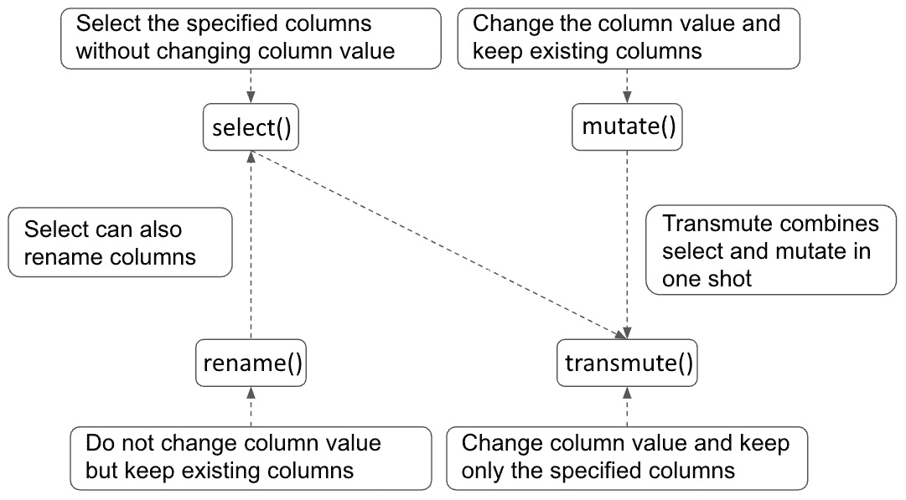
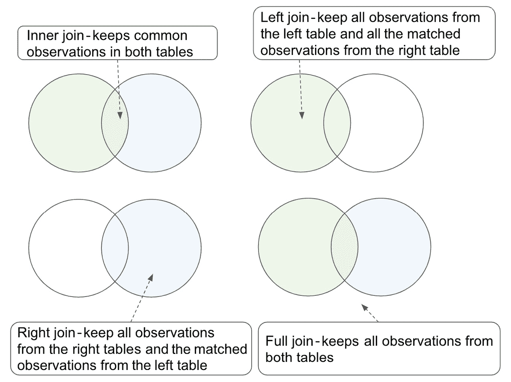

# 2

# 使用 dplyr 进行数据处理

在上一章中，我们介绍了 R 语言的基础知识。掌握这些基础知识将帮助我们更好地应对数据科学项目中最常见的任务：**数据处理**。数据处理是指一系列数据整理和润色步骤，将数据转换为下游分析和建模所需的目标格式。我们可以将其视为一个接受原始数据并输出所需数据的函数。然而，我们需要明确指定函数如何执行烹饪食谱并处理数据。

到本章结束时，你将能够使用 `dplyr`（R 中最广泛使用的数据处理库之一）执行常见的数据处理步骤，如过滤、选择、分组和聚合。

在本章中，我们将涵盖以下主题：

+   介绍 `tidyverse` 和 `dplyr`

+   使用 `dplyr` 进行数据转换

+   使用 `dplyr` 进行数据聚合

+   使用 `dplyr` 进行数据合并

+   案例研究 – 使用 Stack Overflow 数据集

# 技术要求

要完成本章的练习，你需要以下内容：

+   `tidyverse` 包的最新版本，写作时为 1.3.1

本章中所有代码和数据均可在[`github.com/PacktPublishing/The-Statistics-and-Machine-Learning-with-R-Workshop/tree/main/Chapter_2`](https://github.com/PacktPublishing/The-Statistics-and-Machine-Learning-with-R-Workshop/tree/main/Chapter_2)找到。

# 介绍 tidyverse 和 dplyr

最广泛使用的包含一系列独立包的 R 库之一是 `tidyverse`；它包括 `dplyr` 和 `ggplot2`（将在*第四章*中介绍）。它可以支持大多数数据处理和可视化需求，并且与 base R 命令相比，实现起来既简单又快速。因此，建议将特定的数据处理或可视化任务外包给 `tidyverse` 而不是自行实现。

在我们深入数据处理的世界之前，还有另一种在 `tidyverse` 生态系统中使用的数据结构：`tibble`。`tibble` 是 DataFrame 的高级版本，提供了更好的格式控制，从而在代码中产生整洁的表达式。它是 `tidyverse` 中的核心数据结构。DataFrame 可以转换为 `tibble` 对象，反之亦然。让我们通过一个练习来了解这一点。

### 练习 2.01 – 在 tibble 和 DataFrame 之间转换

首先，我们将通过安装此包并将 `iris` DataFrame 转换为 `tibble` 格式来探索 `tidyverse` 生态系统：

1.  安装 `tidyverse` 包并加载 `dplyr` 包：

    ```py

    install.packages("tidyverse")
    library(dplyr)
    ```

    安装 `tidyverse` 包将自动安装 `dplyr`，可以通过 `library()` 函数将其加载到我们的工作环境中。

1.  加载 `iris` 数据集并检查其数据结构：

    ```py

    >>> data("iris")
    >>> class(iris)
    "data.frame"
    ```

    `data()`函数加载了`iris`数据集，这是由基础 R 提供的默认数据集，以及使用`class()`函数检查的 DataFrame。

1.  将数据集转换为`tibble`格式并验证其数据结构：

    ```py

    >>> iris_tbl = as_tibble(iris)
    >>> class(iris_tbl)
    "tbl_df"     "tbl"        "data.frame"
    ```

    `iris_tbl`中有三个类属性，这意味着该对象可以用作`tibble`和 DataFrame。一个对象具有多个类属性支持更好的兼容性，因为我们可以对其进行不同的处理。

    `tibble`对象也支持智能打印，通过列出前几行、数据集的形状（150 行和 5 列）以及每列的数据类型。另一方面，DataFrame 在打印时只会显示其所有内容到控制台：

    ```py
    >>> iris_tbl
    # A tibble: 150 x 5
       Sepal.Length Sepal.Width Petal.Length Petal.Width Species
              <dbl>       <dbl>        <dbl>       <dbl> <fct>
     1          5.1         3.5          1.4         0.2 setosa
     2          4.9         3            1.4         0.2 setosa
     3          4.7         3.2          1.3         0.2 setosa
     4          4.6         3.1          1.5         0.2 setosa
     5          5           3.6          1.4         0.2 setosa
     6          5.4         3.9          1.7         0.4 setosa
     7          4.6         3.4          1.4         0.3 setosa
     8          5           3.4          1.5         0.2 setosa
     9          4.4         2.9          1.4         0.2 setosa
    10          4.9         3.1          1.5         0.1 setosa
    # … with 140 more rows
    ```

`tidyverse`和`dplyr`提供了多个数据转换的实用函数。让我们看看一些常用的函数，例如`filter()`和`arrange()`。

# 使用 dplyr 进行数据转换

`dplyr`函数。在本节中，我们将介绍五个基本的数据转换函数：`filter()`、`arrange()`、`mutate()`、`select()`和`top_n()`。

## 使用 filter()函数切片数据集

`tidyverse`生态系统中最显著的亮点之一是`%>%`操作符，它将前面的语句作为上下文输入提供给后面的语句。使用管道操作符可以让我们在代码结构方面有更好的清晰度，同时避免了多次输入重复的上下文语句的需要。让我们通过一个练习来了解如何使用管道操作符通过`filter()`函数来切片`iris`数据集。

### 练习 2.02 – 使用管道操作符进行过滤

对于这个练习，我们被要求仅使用管道操作符和`filter()`函数保留`iris`数据集中的`setosa`物种：

1.  打印`iris`数据集中的所有独特物种：

    ```py

    >>> unique(iris_tbl$Species)
    setosa     versicolor virginica
    Levels: setosa versicolor virginica
    ```

    结果显示`Species`列是一个具有三个级别的因子。

1.  使用`filter()`函数仅保留`iris_tbl`中的`"setosa"`物种并将结果保存在`iris_tbl_subset`中：

    ```py

    iris_tbl_subset = iris_tbl %>%
      filter(Species == "setosa")
    >>> iris_tbl_subset
    # A tibble: 50 x 5
       Sepal.Length Sepal.Width Petal.Length Petal.Width Species
              <dbl>       <dbl>        <dbl>       <dbl> <fct>
     1          5.1         3.5          1.4         0.2 setosa
     2          4.9         3            1.4         0.2 setosa
     3          4.7         3.2          1.3         0.2 setosa
     4          4.6         3.1          1.5         0.2 setosa
     5          5           3.6          1.4         0.2 setosa
     6          5.4         3.9          1.7         0.4 setosa
     7          4.6         3.4          1.4         0.3 setosa
     8          5           3.4          1.5         0.2 setosa
     9          4.4         2.9          1.4         0.2 setosa
    10          4.9         3.1          1.5         0.1 setosa
    # … with 40 more rows
    ```

    管道操作符表示以下过滤操作应用于`iris_tbl`对象。在这种上下文中，我们可以直接引用`Species`列（而不是使用`iris_tbl$Species`），并使用`==`逻辑运算符设置逐行评估的相等条件。结果显示`iris_tbl_subset`中存储了总共 50 行。

1.  为了双重检查过滤结果，我们可以打印出`iris_tbl_subset`中的独特物种：

    ```py

    >>> unique(iris_tbl_subset$Species)
    setosa
    Levels: setosa versicolor virginica
    ```

1.  现在，数据集只包含`"setosa"`物种。然而，`Species`列仍然将先前信息编码为具有三个级别的因子。这是因子数据类型的一个独特特性，其中关于总级别的信息编码在因子类型列的所有单个元素中。我们可以通过将其转换为字符来删除此类信息，如下所示：

    ```py

    >>> unique(as.character(iris_tbl_subset$Species))
    "setosa"
    ```

    注意，我们正在将两个函数链接在一起，从最内层的`as.character()`到最外层的`unique()`进行评估。

`filter()` 函数通过使用逗号分隔条件，可以轻松地添加多个过滤条件。例如，我们可以添加另一个条件将 `Sepal.Length` 的最大值设置为 `5`，如下所示：

```py

iris_tbl_subset = iris_tbl %>%
  filter(Species == "setosa",
         Sepal.Length <= 5)
>>> max(iris_tbl_subset$Sepal.Length)
5
>>> dim(iris_tbl_subset)
28  5
```

结果显示，现在的最大 `Sepal.Length` 是 `5`，并且从原始的 150 行中留下了 `28` 行。

接下来，我们将探讨如何根据特定列（或列）对 `tibble` 对象（或 DataFrame）进行排序。

## 使用 arrange() 函数对数据集进行排序

另一个常见的数据转换操作是排序，这会导致一个数据集，其中一列或多列按升序或降序排列。这可以通过 `dplyr` 提供的 `arrange()` 函数实现。让我们通过一个练习来看看不同的排序数据集的方法。

### 练习 2.03 – 使用 arrange() 函数进行排序

在这个练习中，我们将探讨如何按升序或降序对数据集的列进行排序，以及如何通过管道操作符将排序操作与过滤结合：

1.  使用 `arrange()` 对 `iris` 数据集中的 `Sepal.Length` 列进行升序排序：

    ```py

    iris_tbl_sorted = iris_tbl %>%
      arrange(Sepal.Length)
    >>> iris_tbl_sorted
    # A tibble: 150 x 5
       Sepal.Length Sepal.Width Petal.Length Petal.Width Species
              <dbl>       <dbl>        <dbl>       <dbl> <fct>
     1          4.3         3            1.1         0.1 setosa
     2          4.4         2.9          1.4         0.2 setosa
     3          4.4         3            1.3         0.2 setosa
     4          4.4         3.2          1.3         0.2 setosa
     5          4.5         2.3          1.3         0.3 setosa
     6          4.6         3.1          1.5         0.2 setosa
     7          4.6         3.4          1.4         0.3 setosa
     8          4.6         3.6          1           0.2 setosa
     9          4.6         3.2          1.4         0.2 setosa
    10          4.7         3.2          1.3         0.2 setosa
    # … with 140 more rows
    ```

    结果显示，`arrange()` 函数默认按升序对特定列进行排序。现在，让我们看看如何按降序排序。

1.  以降序对相同的列进行排序：

    ```py

    iris_tbl_sorted = iris_tbl %>%
      arrange(desc(Sepal.Length))
    >>> iris_tbl_sorted
    # A tibble: 150 x 5
       Sepal.Length Sepal.Width Petal.Length Petal.Width Species
              <dbl>       <dbl>        <dbl>       <dbl> <fct>
     1          7.9         3.8          6.4         2   virginica
     2          7.7         3.8          6.7         2.2 virginica
     3          7.7         2.6          6.9         2.3 virginica
     4          7.7         2.8          6.7         2   virginica
     5          7.7         3            6.1         2.3 virginica
     6          7.6         3            6.6         2.1 virginica
     7          7.4         2.8          6.1         1.9 virginica
     8          7.3         2.9          6.3         1.8 virginica
     9          7.2         3.6          6.1         2.5 virginica
    10          7.2         3.2          6           1.8 virginica
    # … with 140 more rows
    ```

    在将列传递给 `arrange()` 之前添加 `desc()` 函数可以反转排序顺序并实现降序排序。我们也可以传递多个列以按顺序排序它们。

    此外，`arrange()` 函数还可以与其他数据处理步骤一起使用，例如过滤。

1.  在将 `Species` 设置为 `"setosa"` 并将 `Sepal.Length` 限制在最大值 `5` 的情况下，按降序排序 `Sepal.Length` 和 `Sepal.Width`：

    ```py

    iris_tbl_subset_sorted = iris_tbl %>%
      filter(Species == "setosa",
             Sepal.Length <= 5) %>%
      arrange(desc(Sepal.Length),desc(Sepal.Width))
    >>> iris_tbl_subset_sorted
    # A tibble: 28 x 5
       Sepal.Length Sepal.Width Petal.Length Petal.Width Species
              <dbl>       <dbl>        <dbl>       <dbl> <fct>
     1          5           3.6          1.4         0.2 setosa
     2          5           3.5          1.3         0.3 setosa
     3          5           3.5          1.6         0.6 setosa
     4          5           3.4          1.5         0.2 setosa
     5          5           3.4          1.6         0.4 setosa
     6          5           3.3          1.4         0.2 setosa
     7          5           3.2          1.2         0.2 setosa
     8          5           3            1.6         0.2 setosa
     9          4.9         3.6          1.4         0.1 setosa
    10          4.9         3.1          1.5         0.1 setosa
    # … with 18 more rows
    ```

    结果显示了两层排序，其中对于相同的 `Sepal.Length` 值，`Sepal.Width` 进一步按降序排序。这两个排序标准由逗号分隔，就像在 `filter()` 中分隔多个条件一样。

    此外，管道操作符可以按顺序连接和评估多个函数。在这种情况下，我们首先为使用 `iris_tbl` 设置上下文，然后进行过滤和排序，这两个操作都通过管道操作符连接。

## 使用 mutate() 函数添加或更改列

`tibble` 对象或 DataFrame 实质上是由多个列组成的列表的列表。我们可能想要通过更改其内容、类型或格式来编辑现有列；这种编辑也可能导致在原始数据集中附加新列。列级编辑可以通过 `mutate()` 函数实现。让我们通过一个示例来看看如何与其他函数结合使用此函数。

### 练习 2.04 – 使用 mutate() 函数更改和添加列

在这个练习中，我们将探讨如何更改现有列的类型并添加新列以支持过滤操作：

1.  将`Species`列改为`character`类型：

    ```py

    >>> paste("Before:", class(iris_tbl$Species))
    iris_tbl = iris_tbl %>%
      mutate(Species = as.character(Species))
    >>> paste("After:", class(iris_tbl$Species))
    "Before: factor"
    "After: character"
    ```

    在这里，我们使用了`mutate()`函数来改变`Species`的类型，该类型通过管道操作符直接在`iris_tbl`对象上下文中引用。

1.  创建一个名为`ind`的列，以指示`Sepal.Width`是否大于`Petal.Length`：

    ```py

    iris_tbl = iris_tbl %>%
      mutate(ind = Sepal.Width > Petal.Length)
    >>> iris_tbl
    # A tibble: 150 x 6
       Sepal.Length Sepal.Width Petal.Length Petal.Width Species ind
              <dbl>       <dbl>        <dbl>       <dbl> <chr>   <lgl>
     1          5.1         3.5          1.4         0.2 setosa  TRUE
     2          4.9         3            1.4         0.2 setosa  TRUE
     3          4.7         3.2          1.3         0.2 setosa  TRUE
     4          4.6         3.1          1.5         0.2 setosa  TRUE
     5          5           3.6          1.4         0.2 setosa  TRUE
     6          5.4         3.9          1.7         0.4 setosa  TRUE
     7          4.6         3.4          1.4         0.3 setosa  TRUE
     8          5           3.4          1.5         0.2 setosa  TRUE
     9          4.4         2.9          1.4         0.2 setosa  TRUE
    10          4.9         3.1          1.5         0.1 setosa  TRUE
    # … with 140 more rows
    ```

    结果显示，我们添加了一个包含逻辑值的指示列。我们可以通过`table()`函数获取`TRUE`和`FALSE`值的计数：

    ```py
    >>> table(iris_tbl$ind)
    FALSE  TRUE
    100    50
    ```

1.  仅保留`Sepal.Width`大于`Petal.Length`的行：

    ```py

    iris_tbl_subset = iris_tbl %>%
      filter(ind==TRUE)
    >>> table(iris_tbl_subset$ind)
    TRUE
    50
    ```

    由于我们本质上是在执行过滤操作，因此首先创建指示列然后过滤的两步过程可以通过在`filter()`函数中直接设置过滤条件合并为一步：

    ```py
    iris_tbl_subset2 = iris_tbl %>%
      filter(Sepal.Width > Petal.Length)
    >>> nrow(iris_tbl_subset2)
    50
    ```

    结果与两步方法相同。

现在，让我们来介绍最后一个常用的实用函数——`select()`。

## 使用 select()函数选择列

`select()`函数通过选择由输入参数指定的列来工作，该参数是一个表示一个或多个列的字符串向量。当在管道操作符的上下文中使用`select()`时，意味着所有后续语句都是基于所选列进行评估的。当`select`语句是最后一个时，它返回所选列作为输出`tibble`对象。

让我们通过一个练习来了解从数据集中选择列的不同方法。

### 练习 2.05 – 使用 select()选择列

在这个练习中，我们将探讨从`tibble`数据集中选择列的不同方法：

1.  从`iris`数据集中选择前三个列：

    ```py

    rst = iris_tbl %>%
      select(Sepal.Length, Sepal.Width, Petal.Length)
    >>> rst
    # A tibble: 150 x 3
       Sepal.Length Sepal.Width Petal.Length
              <dbl>       <dbl>        <dbl>
     1          5.1         3.5          1.4
     2          4.9         3            1.4
     3          4.7         3.2          1.3
     4          4.6         3.1          1.5
     5          5           3.6          1.4
     6          5.4         3.9          1.7
     7          4.6         3.4          1.4
     8          5           3.4          1.5
     9          4.4         2.9          1.4
    10          4.9         3.1          1.5
    # … with 140 more rows
    ```

    当你需要增加要选择的列数时，逐个输入它们会变得繁琐。另一种方法是使用冒号（`:`）分隔首尾列，如下所示：

    ```py
    rst = iris_tbl %>%
      select(Sepal.Length:Petal.Length)
    >>> rst
    # A tibble: 150 x 3
       Sepal.Length Sepal.Width Petal.Length
              <dbl>       <dbl>        <dbl>
     1          5.1         3.5          1.4
     2          4.9         3            1.4
     3          4.7         3.2          1.3
     4          4.6         3.1          1.5
     5          5           3.6          1.4
     6          5.4         3.9          1.7
     7          4.6         3.4          1.4
     8          5           3.4          1.5
     9          4.4         2.9          1.4
    10          4.9         3.1          1.5
    # … with 140 more rows
    ```

    这种方法选择所有位于`Sepal.Length`和`Petal.Length`之间的列。使用冒号可以帮助我们一次性选择多个连续列。此外，我们还可以通过`c()`函数将其与其他单个列结合使用。

1.  选择包含`"length"`的列：

    ```py

    rst = iris_tbl %>%
      select(contains("length"))
    >>> rst
    # A tibble: 150 x 2
       Sepal.Length Petal.Length
              <dbl>        <dbl>
     1          5.1          1.4
     2          4.9          1.4
     3          4.7          1.3
     4          4.6          1.5
     5          5            1.4
     6          5.4          1.7
     7          4.6          1.4
     8          5            1.5
     9          4.4          1.4
    10          4.9          1.5
    # … with 140 more rows
    ```

    在这里，我们使用了`contains()`函数来执行不区分大小写的字符串匹配。支持字符串匹配的其他实用函数包括`starts_with()`和`ends_with()`。让我们看一个例子。

1.  选择以`"petal"`开头的列：

    ```py

    rst = iris_tbl %>%
      select(starts_with("petal"))
    >>> rst
    # A tibble: 150 x 2
       Petal.Length Petal.Width
              <dbl>       <dbl>
     1          1.4         0.2
     2          1.4         0.2
     3          1.3         0.2
     4          1.5         0.2
     5          1.4         0.2
     6          1.7         0.4
     7          1.4         0.3
     8          1.5         0.2
     9          1.4         0.2
    10          1.5         0.1
    # … with 140 more rows
    ```

接下来，我们将探讨如何使用`top_n()`函数选择顶部行，这在根据特定列对 DataFrame 进行排序后想要检查几行时非常有用。

## 使用 top_n()函数选择顶部行

`top_n()` 函数在我们要关注特定列的前几个观测值时非常有用。它期望两个输入参数：返回的顶部观测值的数量（隐式按降序排序）和要排序的特定列。如果我们使用 `arrange()` 对列进行降序排序并使用 `head()` 返回顶部几行，机制将是相同的。让我们试试看。

### 练习 2.06 – 使用 top_n() 选择顶部行

在这个练习中，我们将演示如何将 `top_n()` 与其他动词结合使用：

1.  返回具有最大 `Sepal.Length` 的观测值：

    ```py

    rst = iris_tbl %>%
      top_n(1, Sepal.Length)
    >>> rst
    # A tibble: 1 x 6
      Sepal.Length Sepal.Width Petal.Length Petal.Width Species   ind
             <dbl>       <dbl>        <dbl>       <dbl> <chr>     <lgl>
    1          7.9         3.8          6.4           2 virginica FALSE
    ```

    我们可以看到，结果是包含最大 `Sepal.Length` 的完整行。这也可以通过显式使用此列对数据集进行排序并返回第一行来实现，如下所示：

    ```py
    rst = iris_tbl %>%
      arrange(desc(Sepal.Length)) %>%
      head(1)
    >>> rst
    # A tibble: 1 x 6
      Sepal.Length Sepal.Width Petal.Length Petal.Width Species   ind
             <dbl>       <dbl>        <dbl>       <dbl> <chr>     <lgl>
    1          7.9         3.8          6.4           2 virginica FALSE
    ```

    我们还可以在 `group_by()` 上下文中应用 `top_n()`，这会将数据聚合到不同的组中。我们将在下一节中详细介绍数据聚合的更多细节。

1.  返回每个 `Species` 类别的最大 `Sepal.Length`：

    ```py

    rst = iris_tbl %>%
      group_by(Species) %>%
      top_n(1, Sepal.Length) %>%
      select(Species, Sepal.Length)
    >>> rst
    # A tibble: 3 x 2
    # Groups:   Species [3]
      Species    Sepal.Length
      <chr>             <dbl>
    1 setosa              5.8
    2 versicolor          7
    3 virginica           7.9
    ```

    我们还可以使用 `max()` 函数达到相同的目的：

    ```py
    rst = iris_tbl %>%
      group_by(Species) %>%
      summarize(max_sepal_length = max(Sepal.Length))
    >>> rst
    # A tibble: 3 x 2
      Species    max_sepal_length
      <chr>                 <dbl>
    1 setosa                  5.8
    2 versicolor              7
    3 virginica               7.9
    ```

    `summarize()` 函数将数据集压缩为每个 `Species` 组的一行（具有最大的 `Sepal.Length`）。关于这一点，我们稍后再谈。

1.  返回最大的 `Sepal.Length` 及其类别：

    ```py

    rst = iris_tbl %>%
      group_by(Species) %>%
      summarize(max_sepal_length = max(Sepal.Length)) %>%
      top_n(1, max_sepal_length)
    >>> rst
    # A tibble: 1 x 2
      Species   max_sepal_length
      <chr>                <dbl>
    1 virginica              7.9
    ```

    此示例表明，我们可以将 `top_n()` 与其他动词一起在多个上下文中使用。

现在，让我们结合我们在这里所涵盖的五个动词。

## 结合五个动词

我们到目前为止所涵盖的五个实用函数可以组合使用，从而提供一种灵活且简洁的数据处理方式。让我们通过一个涉及所有五个函数的练习来了解一下。

### 练习 2.07 – 结合五个实用函数

我们将在本练习中涵盖的示例是有点人为的，以便所有五个动词函数都可以使用。在本练习中，我们被要求找到具有最高 `Sepal.Length` 且 `Sepal.Width` 大于 `Petal.Length` 的前 100 行的平均绝对差值。

在执行此类复杂查询时，从数据集子集的条件开始，然后处理指标，逆向工作是有帮助的。在这种情况下，我们将首先使用 `arrange()` 函数按降序排序 `Sepal.Length`，并使用 `head()` 函数保留顶部 100 行。然后，使用 `filter()` 函数的另一个过滤条件来保留 `Sepal.Width` 大于 `Petal.Length` 的行。接下来，我们必须使用 `mutate()` 函数创建一个新列，以表示 `Sepal.Length` 和 `Petal.Length` 之间的绝对差值。最后，我们必须应用 `select()` 函数来关注新列并计算其平均值。以下代码块展示了详细的实现：

```py

rst = iris_tbl %>%
  top(80, Sepal.Length) %>%
  filter(Sepal.Width > Petal.Length) %>%
  mutate(Diff = abs(Sepal.Length - Petal.Length)) %>%
  select(Diff) %>%
  colMeans()
>>> rst
Diff
 4.266667
```

接下来，我们将探讨另外两个动词：`rename()` 和 `transmute()`。

## 介绍其他动词

另外两个常用的动词是`rename()`和`transmute()`。`rename()`函数更改特定列的名称。例如，当使用`count()`函数时，会自动创建一个名为`n`的列。我们可以在管道上下文中使用`rename(Count = n)`来将其默认名称从`n`更改为`Count`。

另一种更改列名的方法是，在从数据集中选择列时，我们可以将传递给`rename()`的相同语句传递给`select()`函数。例如，以下代码展示了从`iris`数据集中选择`Sepal.Length`和`Sepal.Width`列，并将第二个列重命名为`Sepal_Width`：

```py

rst = iris_tbl %>%
  select(Sepal.Length, Sepal_Width=Sepal.Width)
>>> rst
# A tibble: 150 x 2
   Sepal.Length Sepal_Width
          <dbl>       <dbl>
 1          5.1         3.5
 2          4.9         3
 3          4.7         3.2
 4          4.6         3.1
 5          5           3.6
 6          5.4         3.9
 7          4.6         3.4
 8          5           3.4
 9          4.4         2.9
10          4.9         3.1
# … with 140 more rows
```

另一方面，`transmute()`函数是`select()`和`mutate()`的组合。它将返回一些可能被转换的列的子集。例如，假设我们想要计算`Sepal.Length`和`Petal.Length`之间的绝对值，并返回与`Species`一起的结果。我们可以使用`transmute()`实现这两个任务，如下所示：

```py

rst = iris_tbl %>%
  transmute(Species, Diff = abs(Sepal.Length - Petal.Length))
>>> rst
# A tibble: 150 x 2
   Species  Diff
   <chr>   <dbl>
 1 setosa    3.7
 2 setosa    3.5
 3 setosa    3.4
 4 setosa    3.1
 5 setosa    3.6
 6 setosa    3.7
 7 setosa    3.2
 8 setosa    3.5
 9 setosa    3
10 setosa    3.4
# … with 140 more rows
```

虽然这些动词可以互换使用，但它们之间有一些技术上的差异。如图*图 2**.1*所示，`select()`函数返回指定的列而不改变这些列的值，这可以通过`mutate()`或`transmutate()`实现。`mutate()`和`rename()`在创建新的附加列时都会保留原始列在返回结果中，而`select()`和`transmute()`只返回结果中的指定列：



图 2.1 – 按目的和关系总结四个动词

现在我们已经知道了如何转换数据，我们可以进一步通过聚合和总结来使数据更具可解释性和可展示性。我们将在下一节中介绍不同的数据聚合方法。

# 使用 dplyr 进行数据聚合

**数据聚合**指的是一组技术，它以聚合级别总结数据集，并在更高级别上描述原始数据集。与数据转换相比，它对输入和输出都操作在行级别。

我们已经遇到了一些聚合函数，例如计算列的平均值。本节将介绍`dplyr`提供的最广泛使用的聚合函数中的一些。我们将从`count()`函数开始，它返回指定输入列每个类别的观测数/行数。

## 使用`count()`函数计数观测值

`count()`函数会根据输入参数自动将数据集分组到不同的类别，并返回每个类别的观测数。输入参数可以包括数据集的一个或多个列。让我们通过一个练习来应用它到`iris`数据集。

### 练习 2.08 – 按物种计数观测值

本练习将使用`count()`函数获取每个独特物种的观测值数量，然后使用`filter()`函数添加过滤条件：

1.  计算在`iris`数据集中每种独特物种类型的观测值数量：

    ```py

    rst = iris_tbl %>%
      count(Species)
    >>> rst
    # A tibble: 3 x 2
      Species        n
      <chr>      <int>
    1 setosa        50
    2 versicolor    50
    3 virginica     50
    ```

    输出是一个包含两列的`tibble`数据集，其中第一列包含`Species`中的唯一类别，第二列（默认命名为`n`）是对应的行计数。

    让我们看看如何在计数操作之前进行过滤。

1.  对那些`Sepal.Length`和`Sepal.Width`之间的绝对差值大于`Petal.Length`和`Petal.Width`的观测值进行精确计数。按降序返回结果：

    ```py

    rst = iris_tbl %>%
      filter(abs(Sepal.Length-Sepal.Width) > abs(Petal.Length-Petal.Width)) %>%
      count(Species, sort=TRUE)
    >>> rst
    # A tibble: 3 x 2
      Species        n
      <chr>      <int>
    1 setosa        45
    2 versicolor    33
    3 virginica     28
    ```

    在这里，我们添加了一个过滤条件，在计数之前保留满足指定标准的行。我们启用了`sort`参数来按降序排列结果。

`count()`函数本质上结合了两个步骤：按指定列的每个类别进行分组，然后计数观测值的数量。结果证明，我们可以使用下一节中介绍的`group_by()`和`summarize()`函数完成相同的任务。

## 通过`group_by()`和`summarize()`进行数据聚合

`count()`是一种有用的数据聚合方法。然而，它是两个更通用聚合函数`group_by()`和`summarize()`的特例，这两个函数通常一起使用。`group_by()`函数根据输入参数中的一个或多个列将原始数据集分割成不同的组，而`summarize()`函数则将特定类别内的所有观测值汇总并折叠成一个指标，在`count()`的情况下，这个指标可能是行数。

可以在`summarize()`函数中使用多个汇总函数。典型的一些包括以下：

+   `sum()`: 对特定组的所有观测值求和

+   `mean()`: 计算所有观测值的平均值

+   `median()`: 计算所有观测值的中位数

+   `max()`: 计算所有观测值的最大值

+   `min()`: 计算所有观测值的最小值

让我们通过一个使用`group_by()`和`summarize()`计算不同汇总统计的练习来了解。

### 练习 2.09 – 使用 group_by()和 summarize()汇总数据集

本练习涵盖使用`group_by()`和`summarize()`函数提取计数和均值统计，结合之前介绍的一些动词，包括`filter()`、`mutate()`和`arrange()`：

1.  获取每种独特类型的`Species`的观测值计数：

    ```py

    rst = iris_tbl %>%
      group_by(Species) %>%
      summarise(n=n())
    >>> rst
    # A tibble: 3 x 2
      Species        n
      <chr>      <int>
    1 setosa        50
    2 versicolor    50
    3 virginica     50
    ```

    在前面的代码中，我们使用了`n()`函数来获取观测值的数量，并将结果分配给名为`n`的列。计数是在根据唯一的`Species`类型对观测值进行分组之后进行的。

1.  添加与之前练习相同的过滤器，并按降序排序结果：

    ```py

    rst = iris_tbl %>%
      filter(abs(Sepal.Length-Sepal.Width) > abs(Petal.Length-Petal.Width)) %>%
      group_by(Species) %>%
      summarise(n=n()) %>%
      arrange(desc(n))
    >>> rst
    # A tibble: 3 x 2
      Species        n
      <chr>      <int>
    1 setosa        45
    2 versicolor    33
    3 virginica     28
    ```

    在此代码块中，首先应用过滤条件以限制分组操作到观察值的子集。在 `arrange()` 函数中，我们直接使用 `n` 列按降序排序。

1.  基于相同的过滤条件创建一个逻辑列，并使用 `Species` 进行两级分组。然后，创建一个逻辑列来计算平均 `Sepal.Length`：

    ```py

    rst = iris_tbl %>%
      mutate(ind = abs(Sepal.Length-Sepal.Width) > abs(Petal.Length-Petal.Width)) %>%
      group_by(Species, ind) %>%
      summarise(mean_sepal_length=mean(Sepal.Length))
    >>> rst
    # A tibble: 6 x 3
    # Groups:   Species [3]
      Species    ind   mean_sepal_length
      <chr>      <lgl>             <dbl>
    1 setosa     FALSE              5
    2 setosa     TRUE               5.01
    3 versicolor FALSE              5.78
    4 versicolor TRUE               6.02
    5 virginica  FALSE              6.39
    6 virginica  TRUE               6.74
    ```

    我们可以在 `group_by()` 函数中放入多个分类列以执行多级分组。注意，结果包含基于 `Species` 的 `Groups` 属性，表明 `tibble` 对象具有分组结构。让我们学习如何移除该结构。

1.  使用 `ungroup()` 移除返回的 `tibble` 对象中的分组结构：

    ```py

    rst = iris_tbl %>%
      mutate(ind = abs(Sepal.Length-Sepal.Width) > abs(Petal.Length-Petal.Width)) %>%
      group_by(Species, ind) %>%
      summarise(mean_sepal_length=mean(Sepal.Length)) %>%
      ungroup()
    >>> rst
    # A tibble: 6 x 3
      Species    ind   mean_sepal_length
      <chr>      <lgl>             <dbl>
    1 setosa     FALSE              5
    2 setosa     TRUE               5.01
    3 versicolor FALSE              5.78
    4 versicolor TRUE               6.02
    5 virginica  FALSE              6.39
    6 virginica  TRUE               6.74
    ```

    现在，结果包含一个正常的 `tibble` 对象，其中包含 `Species` 和 `ind` 每个唯一组合的平均花萼长度。

现在我们已经知道如何转换和聚合一个数据集，我们将介绍如何通过合并和连接来处理多个数据集。

# 使用 dplyr 进行数据合并

在实际数据分析中，我们需要的信息不一定局限于一个表，而是分散在多个表中。将数据存储在单独的表中是内存高效的，但不是分析友好的。**数据合并**是将不同的数据集合并到一个表中以方便数据分析的过程。在连接两个表时，需要有一个或多个存在于两个表中的列，或**键**，作为连接的共同基础。

本节将介绍不同的连接表和组合分析的方法，包括内部连接、左连接、右连接和全连接。以下列表显示了这些连接类型的动词及其定义：

+   `inner_join()`: 根据匹配的关键值返回两个表中的共同观察值。

+   `left_join()`: 返回左表中的所有观察值和右表中匹配的观察值。注意，如果右表中存在重复的关键值，将自动在左表中创建并添加额外的行。空单元格将填充为 `NA`。更多内容请参考练习。

+   `right_join()`: 返回右表中的所有观察值和左表中匹配的观察值。空单元格将填充为 `NA`。

+   `full_join()`: 返回两个表中的所有观察值。空单元格将填充为 `NA`。

*图 2**.2* 使用维恩图说明了这四种连接方式：



图 2.2 – 实践中常用的四种连接方式

让我们通过练习来了解这四种连接方式。

### 练习 2.10 – 数据集连接

此练习将创建两个虚拟 `tibble` 数据集，并应用不同的连接动词将它们合并：

1.  按照此代码块中的步骤创建两个虚拟数据集：

    ```py

    a = 1:3
    tbl_A = tibble(key_A=a, col_A=2*a)
    tbl_B = tibble(key_B=a+1, col_B=3*a)
    >>> tbl_A
    # A tibble: 3 x 2
      key_A col_A
      <int> <dbl>
    1     1     2
    2     2     4
    3     3     6
    >>> tbl_B
    # A tibble: 3 x 2
      key_B col_B
      <dbl> <dbl>
    1     2     3
    2     3     6
    3     4     9
    ```

    两个虚拟数据集都有三行两列，第一列是用于连接的关键列。

1.  对两个数据集执行内部连接：

    ```py

    rst = tbl_A %>%
      inner_join(tbl_B, by=c("key_A"="key_B"))
    >>> rst
    # A tibble: 2 x 3
      key_A col_A col_B
      <dbl> <dbl> <dbl>
    1     2     4     3
    2     3     6     6
    ```

    前面的代码显示，匹配的键是通过`c()`函数在`by`参数中指定的。由于`"key_A"`和`"key_B"`只有两个共同的值，内连接操作后的结果表是一个 2x3 的`tibble`，只保留`"key_A"`作为键列，以及来自两个表的所有其他非键列。它只保留具有精确匹配的观测值，并且无论在哪个方向上与哪个表连接，工作方式都是相同的。

    我们还可以在`by`参数中传递额外的匹配键（表将根据这些键进行合并），同时遵循相同的格式来执行多级合并。

    让我们看看如何执行左连接。

1.  执行两个数据集的左连接：

    ```py

    rst = tbl_A %>%
      left_join(tbl_B, by=c("key_A"="key_B"))
    >>> rst
    # A tibble: 3 x 3
      key_A col_A col_B
      <dbl> <dbl> <dbl>
    1     1     2    NA
    2     2     4     3
    3     3     6     6
    ```

    注意，结果表包含整个`tbl_A`以及一个额外的列`col_B`，该列是从`tbl_B`引用的。由于`col_B`中没有 1，因此`col_B`中相应的单元格显示为`NA`。一般来说，任何无法匹配的单元格在结果表中都将假设为`NA`的值。

    注意，当`col_B`中有多个具有重复值的行时，左连接后的结果表也会自动创建一个重复行，因为现在它是一个从左到右的一对二映射。让我们看看一个例子。

1.  创建另一个具有重复键值的表，并与`tbl_A`执行左连接：

    ```py

    tbl_C = tbl_B %>%
      bind_rows(tbl_B[1,])
    tbl_C[nrow(tbl_C),"col_B"] = 10
    >>> tbl_C
    # A tibble: 4 x 2
      key_B col_B
      <dbl> <dbl>
    1     2     3
    2     3     6
    3     4     9
    4     2    10
    ```

    在这里，我们使用了`bind_rows()`函数来追加一个新行，其中`"key_B"`的值与第一行相同，而`col_B`的值不同。让我们看看当我们将其与`tbl_A`连接时会发生什么：

    ```py
    rst = tbl_A %>%
      left_join(tbl_C, by=c("key_A"="key_B"))
    >>> rst
    # A tibble: 4 x 3
      key_A col_A col_B
      <dbl> <dbl> <dbl>
    1     1     2    NA
    2     2     4     3
    3     2     4    10
    4     3     6     6
    ```

    在右侧表的键列中存在重复值是常见的问题来源，这些问题可能难以追踪。经验丰富的数据科学家应该特别注意在左连接之前和之后检查数据集的维度，以避免这种潜在的不期望的结果。现在，让我们看看如何执行右连接。

1.  将`tbl_A`与`tbl_B`执行右连接：

    ```py

    rst = tbl_A %>%
    right_join(tbl_B, by=c("key_A"="key_B"))
    >>> rst
    # A tibble: 3 x 3
      key_A col_A col_B
      <dbl> <dbl> <dbl>
    1     2     4     3
    2     3     6     6
    3     4    NA     9
    ```

    同样，`tbl_B`中的所有观测值都保留，`col_A`中的缺失值用`NA`填充。此外，键列被命名为`"key_A"`而不是`"key_B"`。

1.  执行`tbl_A`和`tbl_B`的全连接：

    ```py

    rst = tbl_A %>%
      full_join(tbl_B, by=c("key_A"="key_B"))
    >>> rst
    # A tibble: 4 x 3
      key_A col_A col_B
      <dbl> <dbl> <dbl>
    1     1     2    NA
    2     2     4     3
    3     3     6     6
    4     4    NA     9
    ```

    使用全连接，保留两个表的所有匹配结果，缺失值用`NA`填充。当我们不希望从源表中遗漏任何观测值时，可以使用此方法。

这四个连接语句可以重复使用以连接多个表，并可与之前覆盖的任何数据转换动词结合使用。例如，我们可以删除具有`NA`值的行，并仅保留`complete`行，这应该在内连接中给出相同的结果。这可以通过使用`tidyr`包提供的实用函数`drop_na()`来实现，该函数专门设计用于`tidyverse`生态系统中的数据清理：

```py

library(tidyr)
rst = tbl_A %>%
  full_join(tbl_B, by=c("key_A"="key_B")) %>%
  drop_na()
>>> rst
# A tibble: 2 x 3
  key_A col_A col_B
  <dbl> <dbl> <dbl>
1     2     4     3
2     3     6     6
```

我们还可能想用 0 替换`NA`值，这可以通过`tidyr`提供的`replace_na()`函数实现。在下面的代码中，我们指定了每个感兴趣列的替换值，并将它们包装在一个列表中传递给`replace_na()`：

```py

rst = tbl_A %>%
  full_join(tbl_B, by=c("key_A"="key_B")) %>%
  replace_na(list(col_A=0, col_B=0))
>>> rst
# A tibble: 4 x 3
  key_A col_A col_B
  <dbl> <dbl> <dbl>
1     1     2     0
2     2     4     3
3     3     6     6
4     4     0     9
```

注意，还有其他合并选项，例如半连接和反连接，分别对应于`semi_join()`和`anti_join()`函数。半连接只返回第一个参数表中在第二个表中存在匹配的行。尽管与全连接操作类似，但半连接只保留*第一个表中的列*。反连接操作，另一方面，是半连接的相反操作，只返回*第一个表中不匹配的行*。由于许多合并操作，包括这两个，都可以使用我们在本节中介绍的基本操作推导出来，因此我们不会详细介绍这些稍微复杂一些的连接操作。相反，我们鼓励您探索使用这四个基本的连接函数来实现复杂的操作，而不是依赖于其他快捷连接函数。

接下来，我们将通过一个案例研究来观察如何使用本章中介绍的功能来转换、合并和聚合数据集。

# 案例研究 – 使用 Stack Overflow 数据集

本节将介绍一个练习，帮助您练习基于公共 Stack Overflow 数据集的不同数据转换、聚合和合并技术，该数据集包含一系列与 Stack Overflow 平台上发布的技术问题和答案相关的表。支持的原数据已上传到本书的配套 GitHub 仓库。我们将直接从源 GitHub 链接使用`readr`包下载，`readr`是`tidyverse`提供的一个易于使用、快速且友好的包，可以轻松读取各种数据源，包括来自网络的源。

### 练习 2.11 – 使用 Stack Overflow 数据集

让我们开始这个练习：

1.  从 GitHub 下载关于问题、标签及其映射表的三个数据源：

    ```py

    library(readr)
    df_questions = read_csv("https://raw.githubusercontent.com/PacktPublishing/The-Statistics-and-Machine-Learning-with-R-Workshop/main/Chapter_2/data/questions.csv")
    >>> df_questions
    # A tibble: 294,735 x 3
             id creation_date score
          <dbl> <date>        <dbl>
     1 22557677 2014-03-21        1
     2 22557707 2014-03-21        2
     3 22558084 2014-03-21        2
     4 22558395 2014-03-21        2
     5 22558613 2014-03-21        0
     6 22558677 2014-03-21        2
     7 22558887 2014-03-21        8
     8 22559180 2014-03-21        1
     9 22559312 2014-03-21        0
    10 22559322 2014-03-21        2
    # … with 294,725 more rows
    ```

    问题数据集包含问题 ID、创建日期和分数，分数表示（正）赞同票数和（负）反对票数。我们可以使用`summary()`函数检查分数的范围：

    ```py
    >>> summary(df_questions$score)
        Min.  1st Qu.   Median     Mean  3rd Qu.     Max.
     -21.000    0.000    1.000    1.904    2.000 2474.000

    ```

    该数据集包含每个标签的 ID 和内容。为了分析标签，我们需要使用相关的映射键将这三个数据集合并成一个。

    ```py

    ```

1.  通过左连接将`df_question_tags`中的标签 ID 引用到`df_questions`中：

    ```py

    df_all = df_questions %>%
      left_join(df_question_tags, by=c("id"="question_id"))
    >>> df_all
    # A tibble: 545,694 x 4
             id creation_date score tag_id
          <dbl> <date>        <dbl>  <dbl>
     1 22557677 2014-03-21        1     18
     2 22557677 2014-03-21        1    139
     3 22557677 2014-03-21        1  16088
     4 22557677 2014-03-21        1   1672
     5 22557707 2014-03-21        2     NA
     6 22558084 2014-03-21        2   6419
     7 22558084 2014-03-21        2  92764
     8 22558395 2014-03-21        2   5569
     9 22558395 2014-03-21        2    134
    10 22558395 2014-03-21        2   9412
    # … with 545,684 more rows
    ```

    注意，当比较`df_questions`和`df_all`时，行数几乎翻了一番。您可能已经注意到这是由于一对一关系：一个问题通常有多个标签，所以在左连接操作期间，每个标签都会作为单独的行附加到左表中。

1.  让我们继续参考`df_tags`中的标签：

    ```py

    df_all = df_all %>%
      left_join(df_tags, by=c("tag_id"="id"))
    >>> df_all
    # A tibble: 545,694 x 5
             id creation_date score tag_id tag_name
          <dbl> <date>        <dbl>  <dbl> <chr>
     1 22557677 2014-03-21        1     18 regex
     2 22557677 2014-03-21        1    139 string
     3 22557677 2014-03-21        1  16088 time-complexity
     4 22557677 2014-03-21        1   1672 backreference
     5 22557707 2014-03-21        2     NA NA
     6 22558084 2014-03-21        2   6419 time-series
     7 22558084 2014-03-21        2  92764 panel-data
     8 22558395 2014-03-21        2   5569 function
     9 22558395 2014-03-21        2    134 sorting
    10 22558395 2014-03-21        2   9412 vectorization
    # … with 545,684 more rows
    ```

    接下来，我们将对标签进行一些分析，从计算它们的频率开始。

1.  按降序统计每个非`NA`标签的出现次数：

    ```py

    df_all = df_all %>%
      filter(!is.na(tag_name))
    rst = df_all %>%
      count(tag_name, sort = TRUE)
    >>> rst
    # A tibble: 7,840 x 2
       tag_name       n
       <chr>      <int>
     1 ggplot2    28228
     2 dataframe  18874
     3 shiny      14219
     4 dplyr      14039
     5 plot       11315
     6 data.table  8809
     7 matrix      6205
     8 loops       5149
     9 regex       4912
    10 function    4892
    # … with 7,830 more rows
    ```

    在这里，我们首先使用`filter()`删除`tag_name`为`NA`的行，然后使用`count()`函数计算计数。结果显示，`dplyr`是 Stack Overflow 上最受欢迎的 R 相关标签之一，这是一个好兆头，因为它表明我们正在学习有用的和流行的东西。

1.  计算每年标签的数量：

    ```py

    library(lubridate)
    rst = df_all %>%
      mutate(year = year(creation_date)) %>%
      count(year)
    >>> rst
    # A tibble: 12 x 2
        year     n
       <dbl> <int>
     1  2008    18
     2  2009   874
     3  2010  3504
     4  2011  8787
     5  2012 18251
     6  2013 34998
     7  2014 50749
     8  2015 66652
     9  2016 76056
    10  2017 90462
    11  2018 96819
    12  2019 49983
    ```

    结果显示，每年标签的数量都在增加，2019 年是一个特殊情况，因为数据在 2019 年中途结束（在此处验证）。请注意，我们使用了`tidyverse`中的`lubricate`包的`year()`函数将日期格式的列转换为相应的年份：

    ```py
    >>> max(df_all$creation_date)
    "2019-07-01"
    ```

1.  计算每月标签的平均出现次数。

    我们需要推导出标签的月度出现次数来计算它们的平均值。首先，我们必须为每个标签创建两个列来表示月份和年月：

    ```py

    df_all = df_all %>%
      mutate(month = month(creation_date),
             year_month = format(creation_date, "%Y%m"))
    >>> df_all
    # A tibble: 497,153 x 7
             id creation_date score tag_id tag_name            month year_month
          <dbl> <date>        <dbl>  <dbl> <chr>               <dbl> <chr>
     1 22557677 2014-03-21        1     18 regex                   3 201403
     2 22557677 2014-03-21        1    139 string                  3 201403
     3 22557677 2014-03-21        1  16088 time-complexity         3 201403
     4 22557677 2014-03-21        1   1672 backreference           3 201403
     5 22558084 2014-03-21        2   6419 time-series             3 201403
     6 22558084 2014-03-21        2  92764 panel-data              3 201403
     7 22558395 2014-03-21        2   5569 function                3 201403
     8 22558395 2014-03-21        2    134 sorting                 3 201403
     9 22558395 2014-03-21        2   9412 vectorization           3 201403
    10 22558395 2014-03-21        2  18621 operator-precedence     3 201403
    # … with 497,143 more rows
    ```

    然后，我们必须计算每年每月标签的出现次数：

    ```py
    rst1 = df_all %>%
      count(year_month, month)
    >>> rst1
    # A tibble: 130 x 3
       year_month month     n
       <chr>      <dbl> <int>
     1 200809         9    13
     2 200811        11     4
     3 200812        12     1
     4 200901         1     8
     5 200902         2    10
     6 200903         3     7
     7 200904         4    24
     8 200905         5     3
     9 200906         6    12
    10 200907         7   100
    # … with 120 more rows
    ```

    最后，我们必须对每个月份的所有年份进行平均：

    ```py
    rst2 = rst1 %>%
      group_by(month) %>%
      summarise(avg_num_tag = mean(n))
    >>> rst2
    # A tibble: 12 x 2
       month avg_num_tag
       <dbl>       <dbl>
     1     1       3606.
     2     2       3860.
     3     3       4389.
     4     4       4286.
     5     5       4178.
     6     6       4133.
     7     7       3630.
     8     8       3835.
     9     9       3249.
    10    10       3988.
    11    11       3628.
    12    12       3125.
    ```

    结果显示，3 月份标签的平均出现次数最高。也许学校刚刚开学，人们在 3 月份更加积极地学习和提问。

1.  计算每个标签的计数、最小值、平均分数和最大分数，并按计数降序排序：

    ```py

    rst = df_all %>%
      group_by(tag_name) %>%
      summarise(count = n(),
                min_score = min(score),
                mean_score = mean(score),
                max_score = max(score)) %>%
      arrange(desc(count))
    >>> rst
    # A tibble: 7,840 x 5
       tag_name   count min_score mean_score max_score
       <chr>      <int>     <dbl>      <dbl>     <dbl>
     1 ggplot2    28228        -9      2.61        666
     2 dataframe  18874       -11      2.31       1241
     3 shiny      14219        -7      1.45         79
     4 dplyr      14039        -9      1.95        685
     5 plot       11315       -10      2.24        515
     6 data.table  8809        -8      2.97        685
     7 matrix      6205       -10      1.66        149
     8 loops       5149        -8      0.743       180
     9 regex       4912        -9      2           242
    10 function    4892       -14      1.39        485
    # … with 7,830 more rows
    ```

    在这里，我们在`group_by()`和`summarize()`的上下文中使用了多个汇总函数来计算指标。

# 摘要

在本章中，我们介绍了数据转换、聚合和合并的基本函数和技术。对于行级别的数据转换，我们学习了常见的实用函数，如`filter()`、`mutate()`、`select()`、`arrange()`、`top_n()`和`transmute()`。对于数据聚合，它将原始数据集总结成一个更小、更简洁的概览视图，我们介绍了`count()`、`group_by()`和`summarize()`等函数。对于数据合并，它将多个数据集合并成一个，我们学习了不同的连接方法，包括`inner_join()`、`left_join()`、`right_join()`和`full_join()`。尽管还有其他更高级的连接函数，但我们工具箱中涵盖的基本工具已经足够我们完成相同任务。最后，我们通过 Stack Overflow 数据集的案例研究进行了说明。本章学到的技能在许多数据分析任务中都将非常有用。

在下一章中，我们将介绍一个更高级的自然语言处理主题，这将使我们进一步使用`tidyverse`处理文本数据。
